3 Atomic combinations 

We live in a world that is made up of many complex compounds. All around us we see evidence of chemical bonding from the chair you are sitting on, to the book you are holding, to the air you are breathing. Imagine if all the elements on the periodic table did not form bonds but rather remained on their own. Our world would be pretty boring with only 100 or so elements to use. 

Imagine you were painting a picture and wanted to show the colours around you. The only paints you have are red, green, yellow, blue, white and black. Yet you are able to make pink, purple, orange and many other colours by mixing these paints. In the same way, the elements can be thought of as natures paint box. The elements can be joined together in many different ways to make new compounds and so create the world around you. 

In Grade 10 we started exploring chemical bonding. In this chapter we will go on to explain more about chemical bonding and why chemical bonding occurs. We looked at the three types of bonding: covalent, ionic and metallic. In this chapter we will focus mainly on covalent bonding and on the molecules that form as a result of covalent bonding. 

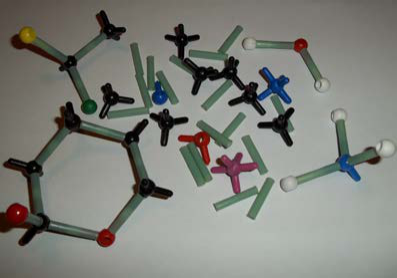
> **[Diagram Context & Visual Description - Gr11_PhysicalSciences_Learner_Eng.pdf-0149-04.png]**
> The image shows a molecular model made of colored sticks and spheres, representing atoms and bonds in a chemical structure. The model includes various colored sticks and spheres, such as green, red, blue, and black, which represent different atoms and bonds. The model is used to visualize the spatial arrangement and bonding of atoms in a molecule, helping students understand the structure and properties of chemical compounds.

#### **NOTE:** 

In this chapter we will use the term molecule to mean a covalent molecular structure. This is a covalent compound that interacts and exists as a single entity. 

# 3.1 Chemical bonds 

ESBM4 

## Why do atoms bond? 

ESBM5 

As we begin this section, it’s important to remember that what we will go on to discuss is a _model_ of bonding, that is based on a particular _model_ of the atom. You will remember from the discussion on atoms (in Grade 10) that a model is a _representation_ of what is happening in reality. In the model of the atom that you are learnt in Grade 10, the atom is made up of a central nucleus, surrounded by electrons that are arranged in fixed energy levels (sometimes called _shells_ ). Within each energy level, electrons move in _orbitals_ of different shapes. The electrons in the outermost energy level of an atom are called the **valence electrons** . This model of the atom is useful in trying to understand how different types of bonding take place between atoms. 

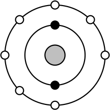
> **[Diagram Context & Visual Description - Gr11_PhysicalSciences_Learner_Eng.pdf-0149-12.png]**
> The graphic is a Lewis diagram, which shows the electron configuration of an atom. The central circle represents the nucleus, and the surrounding circles represent the electron shells. The black dots inside the circles represent electrons, with the number of dots in each shell indicating the number of electrons in that shell. The diagram conveys the concept that electrons are arranged in shells around the nucleus, with each shell containing a specific number of electrons.

Figure 3.1: 

Electron arrangement of a fluorine atom. The black electrons (small circles on the inner ring) are the core electrons and the white electrons (small circles on the outer ring) are the valence electrons. 

3.1. Chemical bonds 

**136** 

The following points were made in these earlier discussions on electrons and energy levels: 

- Electrons always try to occupy the lowest possible energy level. 

- The noble gases have a full valence electron orbital. For example neon has the following electronic configuration: $1s^2$ $2s^2$ $2p^6$ . The second energy level is the outermost (valence) shell and is full. 

#### **TIP** 

A model takes what we see in the world around us and uses that to make certain predictions about what we cannot see. 

- Atoms form bonds to try to achieve the same electron configuration as the noble gases. 

- Atoms with a full valence electron orbital are less reactive. 

## Energy and bonding ESBM6 

There are two cases that we need to consider when two atoms come close together. The first case is where the two atoms come close together and form a bond. The second case is where the two atoms come close together but do not form a bond. We will use hydrogen as an example of the first case and helium as an example of the second case. 

#### **Case 1: A bond forms** 

Let’s start by imagining that there are two hydrogen atoms approaching one another. As they move closer together, there are three forces that act on the atoms at the same time. These forces are described below: 

1. **repulsive force** between the electrons of the atoms, since like charges repel 

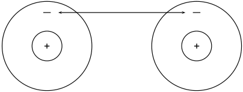
> **[Diagram Context & Visual Description - Gr11_PhysicalSciences_Learner_Eng.pdf-0150-12.png]**
> The graphic shows a Lewis diagram of two atoms, each with a single electron in their outermost shell. The diagram includes arrows indicating the direction of electron transfer between the atoms. The concept conveyed is that of electron transfer in a chemical bond, where one atom donates an electron to the other, resulting in a stable electron configuration for both atoms.

Figure 3.2: Repulsion between electrons 

2. **attractive force** between the nucleus of one atom and the electrons of another 

> **[Diagram Context & Visual Description - Gr11_PhysicalSciences_Learner_Eng.pdf-0150-15.png]**
> The graphic shows a Lewis diagram of two atoms, each with a single electron in their outermost shell. The diagram includes arrows indicating the direction of electron transfer between the two atoms. The labels "+ and -" represent the positive and negative charges of the atoms, respectively. The diagram conveys the concept of electron transfer in chemical bonding, where one atom donates an electron to the other, resulting in the formation of a covalent bond.

Figure 3.3: Attraction between electrons and protons. 

3. **repulsive force** between the two positively-charged nuclei 

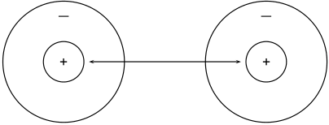
> **[Diagram Context & Visual Description - Gr11_PhysicalSciences_Learner_Eng.pdf-0150-18.png]**
> The graphic is a Lewis diagram showing the electron configuration of two atoms. The left atom has one electron in its outer shell, indicated by a plus sign (+), while the right atom has two electrons in its outer shell, also indicated by a plus sign (+). The arrow between the two atoms suggests a chemical bond or interaction. The diagram conveys the concept that atoms can form bonds by sharing or transferring electrons to achieve a stable electron configuration.

Figure 3.4: Repulsion between protons 

Chapter 3. Atomic combinations 

**137** 

These three forces work together when two atoms come close together. As the total force experienced by the atoms changes, the amount of energy in the system also changes. 

Now look at Figure 3.5 to understand the energy changes that take place when the two atoms move towards each other. 

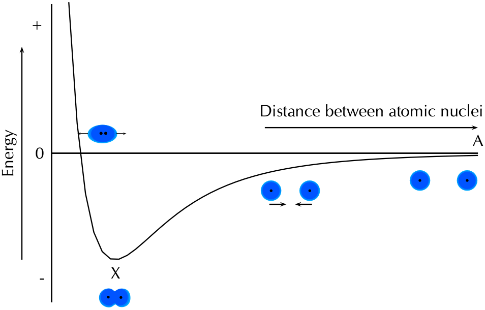
> **[Diagram Context & Visual Description - Gr11_PhysicalSciences_Learner_Eng.pdf-0151-02.png]**
> The diagram shows the potential energy of a system as a function of the distance between two atomic nuclei. The labels include "Distance between atomic nuclei" and "Energy." The arrows indicate the direction of the potential energy change as the distance between the nuclei increases. The diagram illustrates that the potential energy decreases as the distance between the nuclei decreases, reaching a minimum at a certain distance (point X), and then increases as the distance continues to increase. This concept is fundamental in understanding the forces between atoms and molecules in chemistry.

Figure 3.5: Graph showing the change in energy that takes place as two hydrogen atoms move closer together. 

Let us imagine that we have fixed the one atom and we will move the other atom closer to the first atom. As we move the second hydrogen atom closer to the first (from point A to point X) the energy of the system decreases. Attractive forces dominate this part of the interaction. As the second atom approaches the first one and gets closer to point X, more energy is needed to pull the atoms apart. This gives a negative potential energy. 

At point X, the attractive and repulsive forces acting on the two hydrogen atoms are balanced. The energy of the system is at a minimum. 

Further to the left of point X, the repulsive forces are stronger than the attractive forces and the energy of the system increases. 

For hydrogen the energy at point X is low enough that the two atoms stay together and do not break apart again. This is why when we draw the Lewis diagram for a hydrogen molecule we draw two hydrogen atoms next to each other with an electron pair between them. 

> **[Diagram Context & Visual Description - Gr11_PhysicalSciences_Learner_Eng.pdf-0151-08.png]**
> The graphic shows a Lewis structure of a molecule with two hydrogen atoms bonded to each other. The hydrogen atoms are represented by the chemical symbol 'H'. The diagram conveys the concept that hydrogen atoms share one electron pair to form a covalent bond, resulting in a stable electron configuration for each hydrogen atom.

We also note that this arrangement gives both hydrogen atoms a full outermost energy level (through the sharing of electrons or covalent bonding). 

3.1. Chemical bonds 

**138** 

#### **Case 2: A bond does not form** 

Now if we look at helium we see that each helium atom has a filled outer energy level. Looking at Figure 3.6 we find that the energy minimum for two helium atoms is very close to zero. This means that the two atoms can come together and move apart very easily and never actually stick together. 

> **[Diagram Context & Visual Description - Gr11_PhysicalSciences_Learner_Eng.pdf-0152-02.png]**
> The diagram shows a graph of energy versus distance between atomic nuclei. The x-axis represents the distance between atomic nuclei, and the y-axis represents energy. The graph has a minimum point at a certain distance, labeled as 'X', indicating the equilibrium distance where the potential energy is lowest. This concept is crucial in understanding the stability of atomic structures.

Figure 3.6: Graph showing the change in energy that takes place as two helium atoms move closer together. 

For helium the energy minimum at point X is not low enough that the two atoms stay together and so they move apart again. This is why when we draw the Lewis diagram for helium we draw one helium atom on its own. There is no bond. 

We also see that helium already has a full outermost energy level and so no compound forms. 

See simulation: 23NF at www.everythingscience.co.za 

## Valence electrons and Lewis diagrams ESBM7 

Now that we understand a bit more about bonding we need to refresh the concept of Lewis diagrams that you learnt about in Grade 10. With the knowledge of why atoms bond and the knowledge of how to draw Lewis diagrams we will have all the tools that we need to try to predict which atoms will bond and what shape the molecule will be. 

In grade 10 we learnt how to write the electronic structure for any element. For drawing Lewis diagrams the one that you should be familiar with is the spectroscopic notation. For example the electron configuration of chlorine in spectroscopic notation is: $1s^2$ $2s^2$ $2p^5$ . Or if we use the condensed form: [He]$2s^2$ $2p^5$ . The condensed spectroscopic notation quickly shows you the valence electrons for the element. 

Chapter 3. Atomic combinations 

**139** 

#### **TIP** 

A **Lewis diagram** uses dots or crosses to represent the **valence electrons** on different atoms. The chemical symbol of the element is used to represent the nucleus and the core electrons of the atom. 

#### **TIP** 

You can place the unpaired electrons anywhere (top, bottom, left or right). The exact ordering in a Lewis diagram does not matter. 

Using the number of valence electrons we can easily draw Lewis diagrams for any element. In Grade 10 you learnt how to draw Lewis diagrams. We will refresh the concepts here as they will aid us in our discussion of bonding. 

Lewis diagrams for the elements in period 2 are shown below: 

|**Element**|**Group number**|**Valence electrons**|**Spectroscopic** **notation**|**Lewis di-** **agram**|
|---|---|---|---|---|
|Lithium|1|1|[He]2s^{1}|Li •|
|Beryllium|2|2|[He]$2s^2$|Be • •|
|Boron|13|3|[He]$2s^2$$2p^1$|B  • •|
|||||•|
|Carbon|14|4|[He]$2s^2$$2p^2$|C  • • •|
|||||•|
|Nitrogen|15|5|[He]$2s^2$$2p^3$|N • • • • •|
|Oxygen|16|6|[He]$2s^2$$2p^4$|O • • • • • •|
|Fluorine|17|7|[He]$2s^2$$2p^5$|F • • • • • • •|
|Neon|18|8|[He]$2s^2$$2p^6$|Ne • • • • • • • •|

#### **Exercise 3 – 1: Lewis diagrams** 

Give the spectroscopic notation and draw the Lewis diagram for: 

1. magnesium 3. chlorine 5. argon 2. sodium 4. aluminium 

Think you got it? Get this answer and more practice on our Intelligent Practice Service 

1. 23NG 2. 23NH 3. 23NJ 4. 23NK 5. 23NM **www.everythingscience.co.za m.everythingscience.co.za** 

## Covalent bonds and bond formation 

### ESBM8 

Covalent bonding involves the sharing of electrons to form a chemical bond. The outermost orbitals of the atoms overlap so that unpaired electrons in each of the bonding atoms can be shared. By overlapping orbitals, the outer energy shells of all the bonding atoms are filled. The shared electrons move in the orbitals around _both_ atoms. As 

3.1. Chemical bonds 

**140** 

they move, there is an attraction between these negatively charged electrons and the positively charged nuclei. This attractive force holds the atoms together in a covalent bond. 

**DEFINITION:** _Covalent bond_ 

A form of chemical bond where pairs of electrons are shared between atoms. 

We will look at a few simple cases to deduce some rules about covalent bonds. 

#### **Case 1: Two atoms that each have an unpaired electron** 

#### **TIP** 

Covalent bonds are examples of interatomic forces. 

#### **TIP** 

Remember that it is only the _valence electrons_ that are involved in bonding, and so when diagrams are drawn to show what is happening during bonding, it is only these electrons that are shown. Dots or crosses represent electrons in different atoms. 

For this case we will look at hydrogen chloride and methane. 

#### **Worked example 1: Lewis diagrams: Simple molecules** 

#### **_QUESTION_** 

Represent hydrogen chloride (HCl) using a Lewis diagram. 

#### **_SOLUTION_** 

**Step 1: For each atom, determine the number of valence electrons in the atom, and represent these using dots and crosses.** 

The electron configuration of hydrogen is 1s^{1} and the electron configuration for chlorine is [He]$2s^2$ $2p^5$ . The hydrogen atom has 1 valence electron and the chlorine atom has 7 valence electrons. 

The Lewis diagrams for hydrogen and chlorine are: 

> **[Diagram Context & Visual Description - Gr11_PhysicalSciences_Learner_Eng.pdf-0154-17.png]**
> The graphic shows a Lewis dot structure for hydrogen chloride (HCl). The hydrogen atom is represented by a single dot, and the chlorine atom is represented by a dot with a line above it, indicating it has one unpaired electron. The diagram conveys the concept that hydrogen forms a single bond with chlorine, resulting in a stable electron configuration for both atoms.

Notice the single unpaired electron (highlighted in blue) on each atom. This does not mean this electron is different, we use highlighting here to help you see the unpaired electron. 

**Step 2: Arrange the electrons so that the outermost energy level of each atom is full.** 

Hydrogen chloride is represented below. 

> **[Diagram Context & Visual Description - Gr11_PhysicalSciences_Learner_Eng.pdf-0154-21.png]**
> The graphic shows a Lewis dot structure for the molecule of hydrogen chloride (HCl). The diagram indicates that hydrogen (H) has one electron and chlorine (Cl) has seven electrons, with a single bond between them. The structure shows that hydrogen has a single electron in its outer shell, while chlorine has seven electrons in its outer shell, with a single bond between them. This structure represents the chemical bonding and electron distribution in the molecule.

Notice how the two unpaired electrons (one from each atom) form the covalent bond. 

Chapter 3. 

Atomic combinations 

**141** 

The dot and cross in between the two atoms, represent the pair of electrons that are shared in the covalent bond. We can also show this bond using a single line: 

> **[Diagram Context & Visual Description - Gr11_PhysicalSciences_Learner_Eng.pdf-0155-01.png]**
> The graphic shows a Lewis dot structure for the molecule HCl. The labels include the chemical symbols H and Cl, and the structure itself. The diagram conveys that hydrogen (H) forms a single bond with chlorine (Cl), with one electron pair shared between them. This indicates that hydrogen is more electronegative and attracts the shared electron pair, resulting in a polar covalent bond.

Note how we still show the other electron pairs around chlorine. 

From this we can conclude that any electron on its own will try to pair up with another electron. So in practise atoms that have at least one unpaired electron can form bonds with any other atom that also has an unpaired electron. This is not restricted to just two atoms. 

#### **Worked example 2: Lewis diagrams: Simple molecules** 

#### **_QUESTION_** 

Represent methane ($	ext{CH}_4$) using a Lewis diagram 

#### **_SOLUTION_** 

**Step 1: For each atom, determine the number of valence electrons in the atom, and represent these using dots and crosses.** 

The electron configuration of hydrogen is 1s^{1} and the electron configuration for carbon is [He]$2s^2$ $2p^2$ . Each hydrogen atom has 1 valence electron and the carbon atom has 4 valence electrons. 

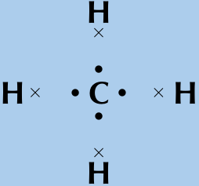
> **[Diagram Context & Visual Description - Gr11_PhysicalSciences_Learner_Eng.pdf-0155-10.png]**
> The graphic shows a vector force diagram with three vectors labeled as H, C, and H. The vectors are represented by arrows pointing in different directions. The diagram illustrates the concept of vector addition, where the resultant vector is the sum of the individual vectors.

Remember that we said we can place unpaired electrons at any position (top, bottom, left, right) around the elements symbol. 

**Step 2: Arrange the electrons so that the outermost energy level of each atom is full.** 

The methane molecule is represented below. 

H H H C H or H C H × • H H 

3.1. Chemical bonds 

**142** 

#### **Exercise 3 – 2:** 

#### **TIP** 

Represent the following molecules using Lewis diagram: 

1. chlorine ($	ext{Cl}_2$) 2. boron trifluoride ($	ext{BF}_3$) 

Think you got it? Get this answer and more practice on our Intelligent Practice Service 1. 23NN 2. 23NP **www.everythingscience.co.za m.everythingscience.co.za** 

Notice how in this example we wrote a 2 in front of the hydrogen? Instead of writing the Lewis diagram for hydrogen twice, we simply write it once and use the 2 in front of it to indicate that two hydrogens are needed for each oxygen. 

#### **Case 2: Atoms with lone pairs** 

We will use water as an example. Water is made up of one oxygen and two hydrogen atoms. Hydrogen has one unpaired electron. Oxygen has two unpaired electrons and two electron pairs. From what we learnt in the first examples we see that the unpaired electrons can pair up. But what happens to the two pairs? Can these form bonds? 

**Worked example 3: Lewis diagrams: Simple molecules** 

#### **_QUESTION_** 

Represent water ($	ext{H}_2O$) using a Lewis diagram 

#### **_SOLUTION_** 

**Step 1: For each atom, determine the number of valence electrons in the atom, and represent these using dots and crosses.** 

The electron configuration of hydrogen is 1s^{1} and the electron configuration for oxygen is [He]$2s^2$ $2p^4$ . Each hydrogen atom has 1 valence electron and the oxygen atom has 6 valence electrons. 

> **[Diagram Context & Visual Description - Gr11_PhysicalSciences_Learner_Eng.pdf-0156-14.png]**
> The graphic shows a Lewis dot structure for a water molecule (H₂O). The labels include the chemical symbols for hydrogen (H) and oxygen (O), and the number 2 next to hydrogen indicates it has two electrons. The dot structure shows two hydrogen atoms bonded to one oxygen atom, with a total of eight electrons around the oxygen atom, representing the octet rule.

#### **Step 2: Arrange the electrons so that the outermost energy level of each atom is full.** 

The water molecule is represented below. 

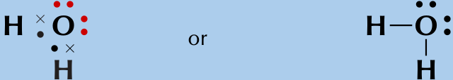
> **[Diagram Context & Visual Description - Gr11_PhysicalSciences_Learner_Eng.pdf-0156-17.png]**
> The graphic shows two representations of the Lewis structure for water (H₂O). The left side uses dots and crosses to indicate electron pairs, while the right side uses a single bond line to show the covalent bond between hydrogen and oxygen atoms. The diagram conveys that water consists of two hydrogen atoms bonded to one oxygen atom, with a total of eight valence electrons distributed among the atoms.

Chapter 3. Atomic combinations 

**143** 

#### **TIP** 

A lone pair can be used to form a dative covalent bond. 

And now we can answer the questions that we asked before the worked example. We see that oxygen forms two bonds, one with each hydrogen atom. Oxygen however keeps its electron pairs and does not share them. We can generalise this to any atom. If an atom has an electron pair it will normally not share that electron pair. 

A **lone pair** is an unshared electron pair. A lone pair stays on the atom that it belongs to. 

In the example above the lone pairs on oxygen are highlighted in red. When we draw the bonding pairs using lines it is much easier to see the lone pairs on oxygen. 

#### **Exercise 3 – 3:** 

Represent the following molecules using Lewis diagrams: 

1. ammonia ($	ext{NH}_3$) 2. oxygen difluoride ($	ext{OF}_2$) Think you got it? Get this answer and more practice on our Intelligent Practice Service 1. 23NQ 2. 23NR **www.everythingscience.co.za m.everythingscience.co.za** 

#### **Case 3: Atoms with multiple bonds** 

We will use oxygen and hydrogen cyanide as examples. 

**Worked example 4: Lewis diagrams: Molecules with multiple bonds** 

#### **_QUESTION_** 

Represent oxygen ($	ext{O}_2$) using a Lewis diagram 

#### **_SOLUTION_** 

**Step 1: For each atom, determine the number of valence electrons that the atom has from its electron configuration.** 

The electron configuration of oxygen is [He]$2s^2$ $2p^4$ . Oxygen has 6 valence electrons. 

O O × • 

3.1. Chemical bonds 

**144** 

#### **Step 2: Arrange the electrons in the O** 2 **molecule so that the outermost energy level in each atom is full.** 

The $	ext{O}_2$ molecule is represented below. Notice the two electron pairs between the two oxygen atoms (highlighted in blue). Because these two covalent bonds are between the same two atoms, this is a _double_ bond. 

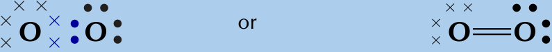
> **[Diagram Context & Visual Description - Gr11_PhysicalSciences_Learner_Eng.pdf-0158-02.png]**
> The graphic shows two Lewis dot structures for the element oxygen (O). The left structure has two pairs of dots, one above and one below the central atom, indicating two lone pairs. The right structure shows a single dot above the central atom, representing a single unpaired electron, indicating a covalent bond. Both structures represent the same molecule, oxygen, with two atoms bonded together.

Each oxygen atom uses its two unpaired electrons to form two bonds. This forms a double covalent bond (which is shown by a double line between the two oxygen atoms). 

#### **Worked example 5: Lewis diagrams: Molecules with multiple bonds** 

#### **_QUESTION_** 

Represent hydrogen cyanide (HCN) using a Lewis diagram 

#### **_SOLUTION_** 

#### **Step 1: For each atom, determine the number of valence electrons that the atom has from its electron configuration.** 

The electron configuration of hydrogen is 1s^{1} , the electron configuration of nitrogen is [He]$2s^2$ $2p^3$ and for carbon is [He]$2s^2$ $2p^2$ . Hydrogen has 1 valence electron, carbon has 4 valence electrons and nitrogen has 5 valence electrons. 

> **[Diagram Context & Visual Description - Gr11_PhysicalSciences_Learner_Eng.pdf-0158-10.png]**
> The graphic is a Lewis dot structure diagram for a molecule. It shows the chemical symbols H, C, and N, along with the number of valence electrons for each element. The diagram conveys the concept that hydrogen (H) has one valence electron, carbon (C) has four valence electrons, and nitrogen (N) has five valence electrons. The structure represents the bonding between these atoms, showing how electrons are shared to form covalent bonds.

#### **Step 2: Arrange the electrons in the HCN molecule so that the outermost energy level in each atom is full.** 

The HCN molecule is represented below. Notice the three electron pairs (highlighted in red) between the nitrogen and carbon atom. Because these three covalent bonds are between the same two atoms, this is a _triple_ bond. 

> **[Diagram Context & Visual Description - Gr11_PhysicalSciences_Learner_Eng.pdf-0158-13.png]**
> The graphic shows a Lewis structure of a molecule with a triple bond between carbon and nitrogen, and hydrogen bonded to carbon. The diagram conveys the concept of a triple bond between carbon and nitrogen, indicating a strong covalent bond, and the presence of a hydrogen atom bonded to carbon, showing the molecule's structure and bonding.

As we have just seen carbon shares one electron with hydrogen and three with nitrogen. Nitrogen keeps its electron pair and shares its three unpaired electrons with carbon. 

Chapter 3. Atomic combinations 

**145** 

#### **Exercise 3 – 4:** 

Represent the following molecules using Lewis diagrams: 

1. acetylene ($	ext{C}_2	ext{H}_2$) 2. formaldehyde ($	ext{CH}_2O$) 

Think you got it? Get this answer and more practice on our Intelligent Practice Service 1. 23NS 2. 23NT **www.everythingscience.co.za m.everythingscience.co.za** 

#### **Case 4: Co-ordinate or dative covalent bonds** 

**DEFINITION:** _Dative covalent bond_ 

This type of bond is a description of covalent bonding that occurs between two atoms in which both electrons shared in the bond come from the same atom. 

A dative covalent bond is also known as a coordinate covalent bond. Earlier we said that atoms with a pair of electrons will normally not share that pair to form a bond. But now we will see how an electron pair can be used by atoms to form a covalent bond. 

One example of a molecule that contains a dative covalent bond is the ammonium ion (NH 4^{)showninthefigurebelow.ThehydrogenionH+doesnotcontainany} electrons, and therefore the electrons that are in the bond that forms between this ion and the nitrogen atom, come only from the nitrogen. 

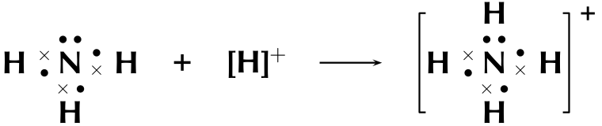
> **[Diagram Context & Visual Description - Gr11_PhysicalSciences_Learner_Eng.pdf-0159-09.png]**
> The graphic shows a chemical reaction involving a nitrogen atom bonded to two hydrogen atoms, represented by a Lewis structure. The reaction is depicted as the nitrogen atom gaining a proton, forming a positively charged nitrogen atom. The arrow indicates the transformation from the initial Lewis structure to the final structure with a positive charge. This process illustrates the concept of electron gain and the formation of a cation.

Notice that the hydrogen ion is charged and that this charge is shown on the ammonium ion using square brackets and a plus sign outside the square brackets. 

We can also show this as: 

> **[Diagram Context & Visual Description - Gr11_PhysicalSciences_Learner_Eng.pdf-0159-12.png]**
> The graphic shows a Lewis structure of a nitrogen ion, specifically the nitrate ion (NO₃⁻). The nitrogen atom is bonded to three hydrogen atoms, and there is a lone pair of electrons on the nitrogen atom. The diagram conveys the concept that the nitrogen ion has a negative charge due to the presence of an extra electron in the outer shell, which is not shared with the hydrogen atoms.

Note that we do not use a line for the dative covalent bond. 

Another example of this is the hydronium ion (H3O ). 

To summarise what we have learnt: 

3.1. Chemical bonds 

**146** 

- Any electron on its own will try to pair up with another electron. So in theory atoms that have at least one unpaired electron can form bonds with any other atom that also has an unpaired electron. This is not restricted to just two atoms. 

- If an atom has an electron pair it will normally not share that pair to form a bond. This electron pair is known as a lone pair. 

- If an atom has more than one unpaired electron it can form multiple bonds to another atom. In this way double and triple bonds are formed. 

- A dative covalent bond can be formed between an atom with no electrons and an atom with a lone pair. 

See simulation: 23NV at www.everythingscience.co.za 

#### **Exercise 3 – 5: Atomic bonding and Lewis diagrams** 

1. Represent each of the following _atoms_ using Lewis diagrams: 

a) calcium c) phosphorous e) silicon b) lithium d) potassium f) sulfur 

2. Represent each of the following _molecules_ using Lewis diagrams: 

a) bromine ($	ext{Br}_2$) d) hydronium ion (H3O ) b) carbon dioxide ($	ext{CO}_2$) c) nitrogen ($	ext{N}_2$) e) sulfur dioxide (SO2) 

3. Two chemical reactions are described below. 

   - nitrogen and hydrogen react to form $	ext{NH}_3$ 

   - carbon and hydrogen bond to form $	ext{CH}_4$ 

For each reaction, give: 

   - a) the number of valence electrons for each of the atoms involved in the reaction 

   - b) the Lewis diagram of the product that is formed 

   - c) the name of the product 

4. A chemical compound has the following Lewis diagram: 

X Y × • H 

a) How many valence electrons does element Y have? 

b) How many valence electrons does element X have? 

- c) How many covalent bonds are in the molecule? 

- d) Suggest a name for the elements X and Y. 

Chapter 3. Atomic combinations 

**147** 

#### 5. Complete the following table: 

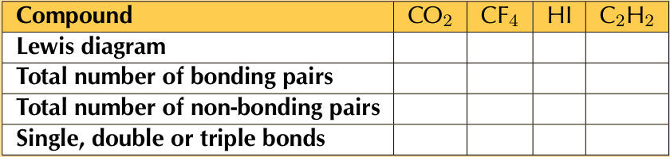
> **[Diagram Context & Visual Description - Gr11_PhysicalSciences_Learner_Eng.pdf-0161-01.png]**
> The graphic is a table that compares the Lewis structures, bonding pairs, non-bonding pairs, and types of bonds in four different compounds: CO₂, CF₄, HI, and C₂H₂. The table shows that CO₂ and CF₄ have no non-bonding pairs, while HI and C₂H₂ have one non-bonding pair each. The types of bonds are indicated as single, double, or triple bonds, with no specific bond types shown for the compounds listed. This table helps students understand the molecular structure and bonding characteristics of these compounds.

> **[Diagram Context & Visual Description - Gr11_PhysicalSciences_Learner_Eng.pdf-0161-02.png]**
> The graphic presents a practice exercise for students to identify the correct answers for a series of chemical symbols. The symbols are listed in a table format, with each row containing a number and a letter combination. The exercise is designed to help students practice their knowledge of chemical symbols and their corresponding elements. The website provided at the bottom of the graphic, www.everythingscience.co.za, suggests that this is part of a larger educational resource for students to improve their understanding of chemistry.

# 3.2 Molecular shape ESBM9 

Molecular shape (the shape that a single molecule has) is important in determining how the molecule interacts and reacts with other molecules. Molecular shape also influences the boiling point and melting point of molecules. If all molecules were linear then life as we know it would not exist. Many of the properties of molecules come from the particular shape that a molecule has. For example if the water molecule was linear, it would be non-polar and so would not have all the special properties it has. 

Valence shell electron pair repulsion (VSEPR) theory ESBMB 

The shape of a covalent molecule can be predicted using the Valence Shell Electron Pair Repulsion (VSEPR) theory. Very simply, VSEPR theory says that the valence electron pairs in a molecule will arrange themselves around the central atom(s) of the molecule so that the repulsion between their negative charges is as small as possible. 

In other words, the valence electron pairs arrange themselves so that they are as **far apart** as they can be. 

#### **DEFINITION:** _Valence Shell Electron Pair Repulsion Theory_ 

Valence shell electron pair repulsion (VSEPR) theory is a model in chemistry, which is used to predict the shape of individual molecules. VSEPR is based upon minimising the extent of the electron-pair repulsion around the central atom being considered. 

VSEPR theory is based on the idea that the geometry (shape) of a molecule is mostly determined by repulsion among the pairs of electrons around a central atom. The pairs of electrons may be bonding or non-bonding (also called lone pairs). Only valence electrons of the central atom influence the molecular shape in a meaningful way. 

3.2. Molecular shape 

**148** 

Determining molecular shape 

ESBMC 

#### **TIP** 

To predict the shape of a covalent molecule, follow these steps: 

1. Draw the molecule using a Lewis diagram. Make sure that you draw _all_ the valence electrons around the molecule’s central atom. 

The central atom is the atom around which the other atoms are arranged. So in a molecule of water, the central atom is oxygen. In a molecule of ammonia, the central atom is nitrogen. 

2. Count the number of electron pairs around the central atom. 

3. Determine the basic geometry of the molecule using the table below. For example, a molecule with two electron pairs (and no lone pairs) around the central atom has a _linear_ shape, and one with four electron pairs (and no lone pairs) around the central atom would have a _tetrahedral_ shape. 

The table below gives the common molecular shapes. In this table we use **A** to represent the central atom, **X** to represent the terminal atoms (i.e. the atoms around the central atom) and **E** to represent any lone pairs. 

|**Number of bonding** **electronpairs**|**Number** **of** **lonepairs**|**Geometry**|**General formula**|
|---|---|---|---|
|1 or 2|0|linear|AX or AX2|
|2|2|_bent or angular_|AX2E2|
|3|0|trigonalplanar|AX3|
|3|1|_trigonalpyramidal_|AX3E|
|4|0|tetrahedral|AX4|
|5|0|trigonal bipyramidal|AX5|
|6|0|octahedral|AX6|

Table 3.1: The effect of electron pairs in determining the shape of molecules. Note that in the general example A is the central atom and X represents the terminal atoms. 

> **[Diagram Context & Visual Description - Gr11_PhysicalSciences_Learner_Eng.pdf-0162-11.png]**
> The graphic shows different molecular geometries based on the number of atoms and their arrangement around a central atom. The labels include "Linear," "Trigonal planar," "Bent or angular," "Trigonal pyramidal," "Tetrahedral," "Trigonal bipyramidal," and "Octahedral." The arrows represent the bonds between atoms, and the letters "X" represent the atoms around the central atom. The diagram illustrates how different numbers of atoms and their spatial arrangement around a central atom can lead to different molecular geometries.

Figure 3.7: The common molecular shapes. 

Chapter 3. Atomic combinations 

**149** 

> **[Diagram Context & Visual Description - Gr11_PhysicalSciences_Learner_Eng.pdf-0163-00.png]**
> The graphic shows various molecular geometries, including linear, trigonal planar, bent, tetrahedral, trigonal pyramidal, trigonal bipyramidal, and octahedral. Each geometry is represented by a different arrangement of atoms, with the central atom colored red and the surrounding atoms colored white. The labels for each geometry are provided below the corresponding molecular structure. The diagram illustrates the different spatial arrangements of atoms in molecules, which can affect their physical and chemical properties.

Figure 3.8: The common molecular shapes in 3-D. 

In Figure 3.8 the green balls represent the lone pairs (E), the white balls (X) are the terminal atoms and the red balls (A) are the center atoms. 

Of these shapes, the ones with no lone pairs are called the **ideal shapes** . The five ideal shapes are: linear, trigonal planar, tetrahedral, trigonal bypramidal and octahedral. 

One important point to note about molecular shape is that all diatomic (compounds with two atoms) compounds are **linear** . So $	ext{H}_2$, HCl and $	ext{Cl}_2$ are all linear. 

See simulation: 23PD at www.everythingscience.co.za 

#### **Worked example 6: Molecular shape** 

**_QUESTION_** 

Determine the shape of a molecule of $	ext{BeCl}_2$ 

**_SOLUTION_** 

**Step 1: Draw the molecule using a Lewis diagram** 

> **[Diagram Context & Visual Description - Gr11_PhysicalSciences_Learner_Eng.pdf-0163-11.png]**
> The graphic shows a Lewis dot structure of a molecule with a central atom, Be, bonded to two other atoms, Cl. The structure is symmetrical, with two Cl atoms bonded to Be, and each Cl atom has three dots, indicating three valence electrons. The diagram conveys the concept that Be forms a molecule with two Cl atoms, each Cl atom having a full outer shell of electrons, which is typical for a stable molecule.

The central atom is beryllium. 

#### **Step 2: Count the number of electron pairs around the central atom** 

There are two electron pairs. 

#### **Step 3: Determine the basic geometry of the molecule** 

There are two electron pairs and no lone pairs around the central atom. $	ext{BeCl}_2$ has the general formula: AX2. Using this information and Table 3.1 we find that the molecular shape is linear. 

3.2. Molecular shape 

**150** 

#### **Step 4: Write the final answer** 

The molecular shape of $	ext{BeCl}_2$ is linear. 

#### **Worked example 7: Molecular shape** 

#### **_QUESTION_** 

Determine the shape of a molecule of $	ext{BF}_3$ 

#### **_SOLUTION_** 

#### **Step 1: Draw the molecule using a Lewis diagram** 

> **[Diagram Context & Visual Description - Gr11_PhysicalSciences_Learner_Eng.pdf-0164-07.png]**
> The graphic shows a vector force diagram with three vectors labeled as F, B, and F. The vectors are represented by arrows pointing in different directions. The diagram conveys the concept that forces can be added or subtracted to find the resultant force, which is a fundamental concept in physics.

The central atom is boron. 

#### **Step 2: Count the number of electron pairs around the central atom** 

There are three electron pairs. 

#### **Step 3: Determine the basic geometry of the molecule** 

There are three electron pairs and no lone pairs around the central atom. The molecule has the general formula AX3. Using this information and Table 3.1 we find that the molecular shape is trigonal planar. 

#### **Step 4: Write the final answer** 

The molecular shape of $	ext{BF}_3$ is trigonal planar. 

#### **Worked example 8: Molecular shape** 

#### **_QUESTION_** 

Determine the shape of a molecule of $	ext{NH}_3$ 

#### **_SOLUTION_** 

#### **Step 1: Draw the molecule using a Lewis diagram** 

Chapter 3. Atomic combinations 

**151** 

#### **TIP** 

We can also work out the shape of a molecule with double or triple bonds. To do this, we count the double or triple bond as one pair of electrons. 

• • H N H × • H 

The central atom is nitrogen. 

#### **Step 2: Count the number of electron pairs around the central atom** 

There are four electron pairs. 

#### **Step 3: Determine the basic geometry of the molecule** 

There are three bonding electron pairs and one lone pair. The molecule has the general formula AX3E. Using this information and Table 3.1 we find that the molecular shape is trigonal pyramidal. 

#### **Step 4: Write the final answer** 

The molecular shape of $	ext{NH}_3$ is trigonal pyramidal. 

**Group discussion: Building molecular models** 

In groups, you are going to build a number of molecules using jellytots to represent the atoms in the molecule, and toothpicks to represent the bonds between the atoms. In other words, the toothpicks will hold the atoms (jellytots) in the molecule together. Try to use different coloured jellytots to represent different elements. 

You will need jellytots, toothpicks, labels or pieces of paper. 

On each piece of paper, write the words: “lone pair”. 

You will build models of the following molecules: 

HCl, $	ext{CH}_4$, $	ext{H}_2O$, $	ext{BF}_3$, $	ext{PCl}_5$, $	ext{SF}_6$ and $	ext{NH}_3$. 

For each molecule, you need to: 

- Determine the molecular geometry of the molecule 

- Build your model so that the atoms are as far apart from each other as possible (remember that the electrons around the central atom will try to avoid the repulsions between them). 

- Decide whether this shape is accurate for that molecule or whether there are any lone pairs that may influence it. If there are lone pairs then add a toothpick to the central jellytot. Stick a label (i.e. the piece of paper with “lone pair” on it) onto this toothpick. 

3.2. Molecular shape 

**152** 

#### **TIP** 

- Adjust the position of the atoms so that the bonding pairs are further away from the lone pairs. 

- How has the shape of the molecule changed? 

Depending on which source you use for electronegativities you may see slightly different values. 

- Draw a simple diagram to show the shape of the molecule. It doesn’t matter if it is not 100% accurate. This exercise is only to help you to visualise the 3-dimensional shapes of molecules. (See Figure 3.8 to help you). 

Do the models help you to have a clearer picture of what the molecules look like? Try to build some more models for other molecules you can think of. 

#### **Exercise 3 – 6: Molecular shape** 

Determine the shape of the following molecules. 

> **[Diagram Context & Visual Description - Gr11_PhysicalSciences_Learner_Eng.pdf-0166-08.png]**
> The graphic presents a table with chemical formulas and their corresponding answers. The chemical formulas are listed as follows: BeCl₂, F₂, PCl₅, CO₂, H₂O, CH₄, and COH₂. The answers are given as: 23PF, 23PG, 23PH, 23PJ, 23PK, 23PM, and 23PN. The table is accompanied by a website URL, www.everythingscience.co.za, and a mobile version, m.everythingscience.co.za. The table is likely used for educational purposes, possibly to test or practice chemical formulas and their corresponding answers.

Think you got it? Get this answer and more practice on our Intelligent Practice Service 

# 3.3 Electronegativity ESBMD 

So far we have looked at covalent molecules. But how do we know that they are covalent? The answer comes from electronegativity. Each element (except for the noble gases) has an electronegativity value. 

**Electronegativity** is a measure of how strongly an atom pulls a shared electron pair towards it. The table below shows the electronegativities of the some of the elements. 

For a full list of electronegativities see the periodic table at the front of the book. On this periodic table the electronegativity values are given in the top right corner. Do not confuse these values with the other numbers shown for the elements. Electronegativities will always be between 0 and 4 for any element. If you use a number greater than 4 then you are not using the electronegativity. 

Chapter 3. Atomic combinations 

**153** 

#### **FACT** 

The concept of electronegativity was introduced by _Linus Pauling_ in 1932, and this became very useful in explaining the nature of bonds between atoms in molecules. For this work, Pauling was awarded the Nobel Prize in Chemistry in 1954. He also received the Nobel Peace Prize in 1962 for his campaign against above-ground nuclear testing. 

|**Element**|**Electronegativity**|**Element**|**Electronegativity**|
|---|---|---|---|
|Hydrogen (H)|2,1|Lithium (Li)|1,0|
|Beryllium (Be)|1,5|Boron (B)|2,0|
|Carbon (C)|2,5|Nitrogen (N)|3,0|
|Oxygen (O)|3,5|Fluorine (F)|4,0|
|Sodium (Na)|0,9|Magnesium (Mg)|1,2|
|Aluminium (Al)|1,5|Silicon (Si)|1,8|
|Phosphorous (P)|2,1|Sulfur (S)|2,5|
|Chlorine (Cl)|3,0|Potassium (K)|0,8|
|Calcium (Ca)|1,0|Bromine (Br)|2,8|

Table 3.2: Table of electronegativities for selected elements. 

#### **DEFINITION:** _Electronegativity_ 

Electronegativity is a chemical property which describes the power of an atom to attract electrons towards itself. 

The greater the electronegativity of an atom of an element, the stronger its attractive pull on electrons. For example, in a molecule of hydrogen bromide (HBr), the electronegativity of bromine (2,8) is higher than that of hydrogen (2,1), and so the shared electrons will spend more of their time closer to the bromine atom. Bromine will have a slightly negative charge, and hydrogen will have a slightly positive charge. In a molecule like hydrogen ($	ext{H}_2$) where the electronegativities of the atoms in the molecule are the same, both atoms have a neutral charge. 

#### **Worked example 9: Calculating electronegativity differences** 

#### **_QUESTION_** 

Calculate the electronegativity difference between hydrogen and oxygen. 

#### **_SOLUTION_** 

#### **Step 1: Read the electronegativity of each element off the periodic table.** 

From the periodic table we find that hydrogen has an electronegativity of 2,1 and oxygen has an electronegativity of 3,5. 

#### **Step 2: Calculate the electronegativity difference** 

3,5 _−_ 2,1 = 1,4 

#### **Exercise 3 – 7:** 

1. Calculate the electronegativity difference between: 

   - Be and C; H and C; Li and F; Al and Na; C and O. 

3.3. Electronegativity 

**154** 

#### **TIP** 

Think you got it? Get this answer and more practice on our Intelligent Practice Service 1. 23PQ 

**www.everythingscience.co.za m.everythingscience.co.za** 

## Electronegativity and bonding ESBMF 

Note that metallic bonding is not given here. Metals have low electronegativities and so the valence electrons are not drawn strongly to any one atom. Instead, the valence electrons are loosely shared by all the atoms in the metallic network. 

#### **TIP** 

The symbol _δ_ is read as delta. 

The electronegativity difference between two atoms can be used to determine what type of bonding exists between the atoms. The table below lists the approximate values. Although we have given ranges here bonding is more like a spectrum than a set of boxes. 

> **[Diagram Context & Visual Description - Gr11_PhysicalSciences_Learner_Eng.pdf-0168-08.png]**
> The graphic is a table that categorizes substances based on their polarity. It uses a scale from 0 to greater than 2, with values between 0 and 1 indicating non-polar substances, between 1 and 1 indicating weak polar substances, between 1 and 2 indicating strong polar substances, and greater than 2 indicating ionic substances. The table visually represents these categories with corresponding labels and values.

|**Electronegativity difference**|**Type of bond**|
|---|---|
|0|Non-polar covalent|
|0 - 1|Weakpolar covalent|
|1,1 - 2|Strong polar covalent|
|_>_2,1|Ionic|

## Non-polar and polar covalent bonds 

### ESBMG 

It is important to be able to determine if a molecule is polar or non-polar since the _polarity_ of molecules affects properties such as _solubility_ , _melting points_ and _boiling points_ . 

Electronegativity can be used to explain the difference between two types of covalent bonds. **Non-polar covalent bonds** occur between two identical non-metal atoms, e.g. $	ext{H}_2$, $	ext{Cl}_2$ and $	ext{O}_2$. Because the two atoms have the same electronegativity, the electron pair in the covalent bond is shared equally between them. However, if two different non-metal atoms bond then the shared electron pair will be pulled more strongly by the atom with the higher electronegativity. As a result, a **polar covalent bond** is formed where one atom will have a slightly negative charge and the other a slightly positive charge. 

This slightly positive or slightly negative charge is known as a partial charge. These partial charges are represented using the symbols _δ_ (slightly positive) and _δ_^{_−_} (slightly negative). So, in a molecule such as hydrogen chloride (HCl), hydrogen is H^{_δ_+} and chlorine is Cl^{_δ−_} . 

Chapter 3. Atomic combinations 

**155** 

ESBMH 

#### **TIP** 

To determine if a molecule is symmetrical look first at the atoms around the central atom. If they are different then the molecule is not symmetrical. If they are the same then the molecule may be symmetrical and we need to look at the shape of the molecule. 

## Polar molecules 

Some molecules with polar covalent bonds are **polar molecules** , e.g. $	ext{H}_2O$. But not _all_ molecules with polar covalent bonds are polar. An example is $	ext{CO}_2$. Although $	ext{CO}_2$ has two polar covalent bonds (between C^{_δ_+} atom and the two O^{_δ−_} atoms), the molecule itself is not polar. The reason is that $	ext{CO}_2$ is a linear molecule, with both terminal atoms the same, and is therefore symmetrical. So there is no difference in charge between the two ends of the molecule. 

#### **DEFINITION:** _Polar molecules_ 

A **polar molecule** is one that has one end with a slightly positive charge, and one end with a slightly negative charge. Examples include water, ammonia and hydrogen chloride. 

#### **DEFINITION:** _Non-polar molecules_ 

A **non-polar molecule** is one where the charge is equally spread across the molecule or a symmetrical molecule with polar bonds. Examples include carbon dioxide and oxygen. 

We can easily predict which molecules are likely to be polar and which are likely to be non-polar by looking at the molecular shape. The following activity will help you determine this and will help you understand more about symmetry. 

#### **Activity: Polar and non-polar molecules** 

The following table lists the molecular shapes. Build the molecule given for each case using jellytots and toothpicks. Determine if the shape is symmetrical. (Does it look the same whichever way you look at it?) Now decide if the molecule is polar or non-polar. 

|**Geometry**|**Molecule**|**Symmetrical**|**Polar or non-polar**|
|---|---|---|---|
|Linear|HCl|||
|Linear|$	ext{CO}_2$|||
|Linear|HCN|||
|Bent or angular|$	ext{H}_2O$|||
|Trigonalplanar|$	ext{BF}_3$|||
|Trigonalplanar|$	ext{BF}_2Cl$|||
|Trigonalpyramidal|$	ext{NH}_3$|||
|Tetrahedral|$	ext{CH}_4$|||
|Tetrahedral|$	ext{CH}_3Cl$|||
|Trigonal bipyramidal|$	ext{PCl}_5$|||
|Trigonal bipyramidal|$	ext{PCl}_4F$|||
|Octahedral|$	ext{SF}_6$|||
|Octahedral|$	ext{SF}_5Cl$|||

See simulation: 23PR at www.everythingscience.co.za 

3.3. Electronegativity 

**156** 

**Worked example 10: Polar and non-polar molecules** 

#### **_QUESTION_** 

State whether hydrogen ($	ext{H}_2$) is polar or non-polar. 

#### **_SOLUTION_** 

#### **Step 1: Determine the shape of the molecule** 

The molecule is linear. There is one bonding pair of electrons and no lone pairs. 

**Step 2: Write down the electronegativities of each atom** Hydrogen: 2,1 

**Step 3: Determine the electronegativity difference for each bond** 

There is only one bond and the difference is 0. 

**Step 4: Determine the polarity of each bond** 

The bond is non-polar. 

**Step 5: Determine the polarity of the molecule** 

The molecule is non-polar. 

#### **Worked example 11: Polar and non-polar molecules** 

#### **_QUESTION_** 

State whether methane ($	ext{CH}_4$) is polar or non-polar. 

#### **_SOLUTION_** 

#### **Step 1: Determine the shape of each molecule** 

The molecule is tetrahedral. There are four bonding pairs of electrons and no lone pairs. 

#### **Step 2: Determine the electronegativity difference for each bond** 

There are four bonds. Since each bond is between carbon and hydrogen, we only need to calculate one electronegativity difference. This is: 2,5 _−_ 2,1 = 0,4 

**Step 3: Determine the polarity of each bond** 

Each bond is polar. 

Chapter 3. Atomic combinations 

**157** 

**Step 4: Determine the polarity of the molecule** 

The molecule is symmetrical and so is non-polar. 

#### **Worked example 12: Polar and non-polar molecules** 

#### **_QUESTION_** 

State whether hydrogen cyanide (HCN) is polar or non-polar. 

#### **_SOLUTION_** 

#### **Step 1: Determine the shape of the molecule** 

The molecule is linear. There are four bonding pairs, three of which form a triple bond and so are counted as 1. There is one lone pair on the nitrogen atom. 

#### **Step 2: Determine the electronegativity difference and polarity for each bond** 

There are two bonds. One between hydrogen and carbon and the other between carbon and nitrogen. The electronegativity difference between carbon and hydrogen is 0,4 and the electronegativity difference between carbon and nitrogen is 0,5. Both of the bonds are polar. 

#### **Step 3: Determine the polarity of the molecule** 

The molecule is not symmetrical and so is polar. 

#### **Exercise 3 – 8: Electronegativity** 

1. In a molecule of beryllium chloride ($	ext{BeCl}_2$): 

   - a) What is the electronegativity of beryllium? 

   - b) What is the electronegativity of chlorine? 

   - c) Which atom will have a slightly positive charge and which will have a slightly negative charge in the molecule? Represent this on a sketch of the molecule using partial charges. 

   - d) Is the bond a non-polar or polar covalent bond? 

   - e) Is the molecule polar or non-polar? 

3.3. Electronegativity 

**158** 

#### 2. Complete the table below: 

> **[Diagram Context & Visual Description - Gr11_PhysicalSciences_Learner_Eng.pdf-0172-01.png]**
> The table visualizes the properties of various molecules based on their electron affinity differences and the nature of their covalent bonds. It helps students understand how these factors influence the polarity of molecules.

# 3.4 Energy and bonding ESBMJ 

As we saw earlier in the chapter we can show the energy changes that occur as atoms come together (Figure 3.5). Shown below is the same image but this time with two extra pieces of information: the bond energy and the bond length. 

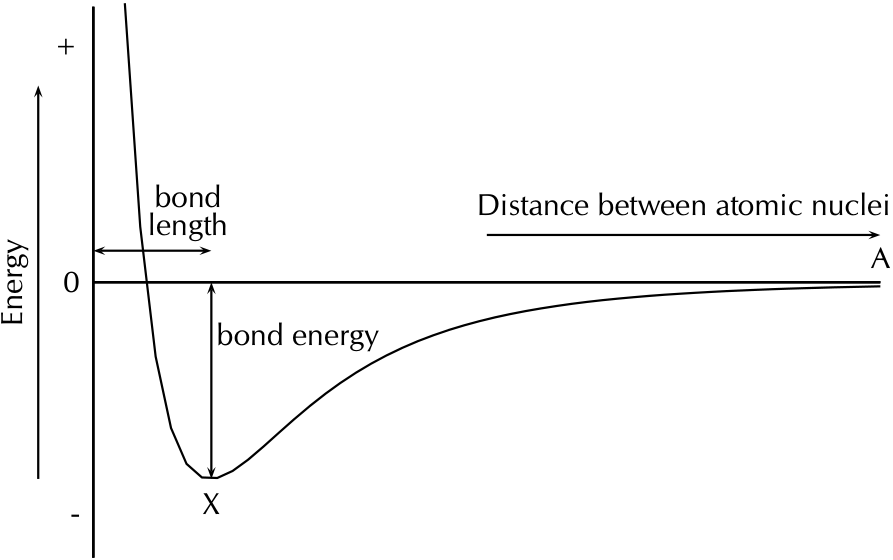
> **[Diagram Context & Visual Description - Gr11_PhysicalSciences_Learner_Eng.pdf-0172-04.png]**
> The graphic shows a graph of energy versus distance between atomic nuclei. The x-axis represents the distance between atomic nuclei, and the y-axis represents energy. The graph has a minimum point labeled "X," indicating the bond length, and a horizontal line labeled "bond energy," which shows the energy required to break the bond. The graph illustrates that as the distance between atomic nuclei increases, the energy required to break the bond increases.

Figure 3.9: Graph showing the change in energy that takes place as atoms move closer together. 

Chapter 3. Atomic combinations 

**159** 

#### **DEFINITION:** _Bond length_ 

The distance between the nuclei of two adjacent atoms when they bond. 

#### **DEFINITION:** _Bond energy_ 

The amount of energy that must be added to the system to break the bond that has formed. 

It is important to remember that bond length is measured between two atoms that are bonded to each other. The following diagrams show the bond length for CO and for $	ext{CO}_2$. The grey circle represents carbon and the white circle represents oxygen. 

> **[Diagram Context & Visual Description - Gr11_PhysicalSciences_Learner_Eng.pdf-0173-05.png]**
> The diagram compares the bond lengths in carbon monoxide (CO) and carbon dioxide (CO2). In CO, the bond length is shown as a single line between the carbon and oxygen atoms. In CO2, the bond length is shown as two separate lines, one for each C-O bond, with the second line labeled as "Y." This indicates that "Y" is not the bond length but rather a different type of bond or a different representation of the bond. The diagram helps students understand the difference in bond lengths between the two molecules.

A third property of bonds is the bond strength. **Bond strength** means how strongly one atom attracts and is held to another. The strength of a bond is related to the bond length, the size of the bonded atoms and the number of bonds between the atoms. In general: 

- the shorter the bond length, the stronger the bond between the atoms. 

- the smaller the atoms involved, the stronger the bond. 

- the more bonds that exist between the same atoms, the stronger the bond. 

# 3.5 Chapter summary ESBMK 

See presentation: 23PV at www.everythingscience.co.za 

- A **chemical bond** is the physical process that causes atoms to be attracted together and to be bound in new compounds. 

- The noble gases have a full valence shell. Atoms bond to try fill their outer valence shell. 

- There are three **forces** that act between atoms: attractive forces between the positive nucleus of one atom and the negative electrons of another; repulsive forces between like-charged electrons, and repulsion between like-charged nuclei. 

- The **energy** of a system of two atoms is at a minimum when the attractive and repulsive forces are balanced. 

- **Lewis** diagrams are one way of representing molecular structure. In a Lewis diagram, dots or crosses are used to represent the valence electrons around the central atom. 

3.5. Chapter summary 

**160** 

- A **covalent bond** is a form of chemical bond where pairs of electrons are shared between two atoms. 

- A **single** bond occurs if there is one electron pair that is shared between the same two atoms. 

- A **double** bond occurs if there are two electron pairs that are shared between the same two atoms. 

- A **triple** bond occurs if there are three electron pairs that are shared between the same two atoms. 

- A **dative covalent bond** is a description of covalent bonding that occurs between two atoms in which both electrons shared in the bond come from the same atom. 

- Dative covalent bonds occur between atoms of elements with a lone pair and atoms of elements with no electrons. Examples include the hydronium ion (H3O ) and the ammonium ion (NH 4^{).} 

- The **shape of molecules** can be predicted using the VSEPR theory. 

- Valence shell electron pair repulsion (VSEPR) theory is a model in chemistry, which is used to predict the shape of individual molecules. VSEPR is based upon minimising the extent of the electron-pair repulsion around the central atom being considered. 

- **Electronegativity** is a chemical property which describes the power of an atom to attract electrons towards itself in a chemical. 

- Electronegativity can be used to explain the difference between two types of covalent bonds: **polar covalent bonds** (between non-identical atoms) and **nonpolar covalent bonds** (between identical atoms or atoms with the same electronegativity). 

- A **polar** molecule is one that has one end with a slightly positive charge, and one end with a slightly negative charge. Examples include water, ammonia and hydrogen chloride. 

- A **non-polar** molecule is one where the charge is equally spread across the molecule or a symmetrical molecule with polar bonds. 

- **Bond length** is the distance between the nuclei of two atoms when they bond. 

- **Bond energy** is the amount of energy that must be added to the system to break the bond that has formed. 

- **Bond strength** means how strongly one atom attracts and is held to another atom. Bond strength depends on the length of the bond, the size of the atoms and the number of bonds between the two atoms. 

#### **Exercise 3 – 9:** 

1. Give **one word/term** for each of the following descriptions. 

   - a) The distance between two adjacent atoms in a molecule. 

   - b) A type of chemical bond that involves the sharing of electrons between two atoms. 

Chapter 3. Atomic combinations 

**161** 

   - c) A measure of an atom’s ability to attract electrons to itself in a chemical bond. 

2. Which ONE of the following best describes the bond formed between an H ion and the $	ext{NH}_3$ molecule? 

   - a) Covalent bond 

   - b) Dative covalent (co-ordinate covalent) bond 

   - c) Ionic Bond 

   - d) Hydrogen Bond 

3. Explain the meaning of each of the following terms: 

   - a) valence electrons 

   - b) bond energy 

   - c) covalent bond 

4. Which of the following reactions will _not_ take place? Explain your answer. a) H + H _→_ $	ext{H}_2$ 

   - b) Ne + Ne _→_ Ne2 c) Cl + Cl _→_ $	ext{Cl}_2$ 

5. Draw the Lewis diagrams for each of the following: 

   - a) An atom of strontium (Sr). (Hint: Which group is it in? It will have an identical Lewis diagram to other elements in that group). 

   - b) An atom of iodine. 

   - c) A molecule of hydrogen bromide (HBr). 

   - d) A molecule of nitrogen dioxide ($	ext{NO}_2$). (Hint: There will be a single unpaired electron). 

6. Given the following Lewis diagram, where X and Y each represent a different element: 

× × X Y X × • X 

   - a) How many valence electrons does X have? b) How many valence electrons does Y have? 

   - c) Which elements could X and Y represent? 

7. Determine the shape of the following molecules: 

a) $	ext{O}_2$ c) $	ext{BCl}_3$ e) $	ext{CCl}_4$ g) $	ext{Br}_2$ b) $	ext{MgI}_2$ d) $	ext{CS}_2$ f) $	ext{CH}_3Cl$ h) $	ext{SCl}_5F$ 

8. Complete the following table: 

3.5. Chapter summary 

**162** 

|**Element pair**|**Electronegativity** **difference**|**Type of bond that could** **form**|
|---|---|---|
|Hydrogen and lithium|||
|Hydrogen and boron|||
|Hydrogen and oxygen|||
|Hydrogen and sulfur|||
|Magnesium and nitrogen|||
|Magnesium and chlorine|||
|Boron and fluorine|||
|Sodium and fluorine|||
|Oxygen and nitrogen|||
|Oxygen and carbon|||

9. Are the following molecules polar or non-polar? 

> **[Diagram Context & Visual Description - Gr11_PhysicalSciences_Learner_Eng.pdf-0176-02.png]**
> The graph shows the potential energy of a hydrogen molecule as a function of the distance between the atomic nuclei. The x-axis represents the distance between the nuclei, and the y-axis represents the potential energy. The graph has a minimum at point X, indicating the lowest potential energy, which corresponds to the stable state of the hydrogen molecule. The distance A represents the equilibrium distance between the nuclei where the potential energy is at a minimum.

10. Given the following graph for hydrogen: 

   - a) The bond length for hydrogen is 74 pm. Indicate this value on the graph. (Remember that pm is a picometer and means 74 _×_ 10^{_−_12} m). The bond energy for hydrogen is 436 kJ _·_ mol^{_−_1} . Indicate this value on the graph. 

   - b) What is important about point X? 

11. Hydrogen chloride has a bond length of 127 pm and a bond energy of 432 kJ _·_ mol^{_−_1} . Draw a graph of energy versus distance and indicate these values on your graph. The graph does not have to be accurate, a rough sketch graph will do. 

Think you got it? Get this answer and more practice on our Intelligent Practice Service 

|1a.23PW|1b.23PX|1c.23PY|2.23PZ|3a.23Q2|3b.23Q3|
|---|---|---|---|---|---|
|3c.23Q4|4.23Q5|5a.23Q6|5b.23Q7|5c.23Q8|5d.23Q9|
|6.23QB|7a.23QC|7b.23QD|7c.23QF|7d.23QG|7e.23QH|
|7f.23QJ|7g.23QK|7h.23QM|8.23QN|9a.23QP|9b.23QQ|
|9c.23QR|9d.23QS|10.23QT|11.23QV|||

**www.everythingscience.co.za m.everythingscience.co.za** 

Chapter 3. Atomic combinations 

**163** 

