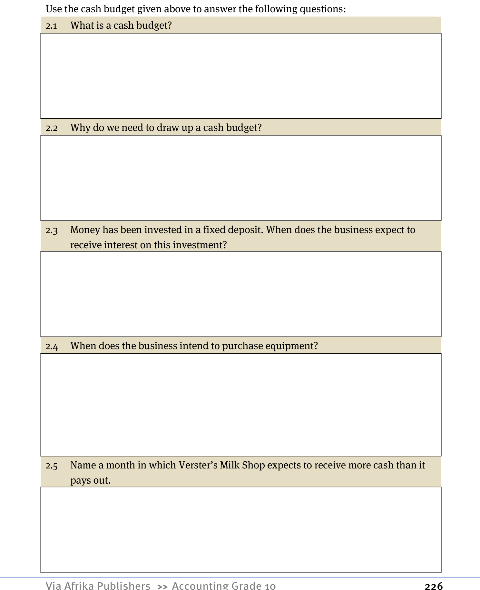

# Term 1 Topic 5: Financial Accounting of a Sole Trader

## Overview of Topic 5

| Section | Page | Content |
| :--- | :--- | :--- |
| 1 | 35 | Definition and explanation of accounting concepts |
| 2 | 42 | Bookkeeping of a sole trader |
| 2.1 | - | Journals |
| 2.2 | - | Ledgers |
| 2.3 | - | Trial balance |
| 2.4 | - | Financial statements |
| 3 | 113 | Accounting equation |

---

## 1. Definition and Explanation of Accounting Concepts

### 1.1 Forms of Ownership
When starting a business, an individual must consider available capital, required capital, control, liability, and business continuity. The primary forms of ownership include:

*   **Sole Proprietor (Trader):** A business owned by one person. The owner has full control, but is limited by the amount of capital they can personally contribute. All profit belongs to the owner.
*   **Partnership:** A business formed by 2 to 20 partners. Partners share control and contribute capital together. Profits are shared among the partners.
*   **Companies:** Owned by shareholders who buy parts (shares) of the company. Because many people contribute, companies can raise significant capital. Profits are distributed to shareholders as dividends.

**Note:** In Grade 10, the curriculum focuses exclusively on the **Sole Proprietor**, where one person provides all capital and assumes all profits or losses.

<!-- DIAGRAM_PLACEHOLDER: diagram -->

---

# Term 1 Topic 5: Financial Accounting of a Sole Trader

## Types of Sole Proprietor Businesses
A sole proprietor must choose the nature of their business based on the main source of income:

*   **Service Business:** Renders a service. The main source of income is fee income or commission income (e.g., doctors, plumbers, garden services).
*   **Retailing Business:** Buys finished products, adds a profit margin, and sells them to customers (e.g., grocery stores, clothing shops).

---

## 1.2 Accounting Concepts

Accounting follows specific rules based on three broad concepts: **Assets**, **Owners' Equity**, and **Liabilities**. To understand these, one must first grasp the concepts of timeframes in accounting.

### Timeframe Definitions

| Concept | Definition |
| :--- | :--- |
| **Accounting (Financial) Period** | A period of 12 months. It does not have to coincide with the calendar year (1 January – 31 December). |
| **Current Financial Year** | The active 12-month period for which financial records are currently being kept. |
| **Short-term** | A period within the next financial year (12 months after the current year). |
| **Long-term** | Any period extending beyond the short-term (longer than 12 months after the current year). |

### Example of Timeframes
If a business's accounting period is **1 January 2011 to 31 December 2011**:

*   **Current financial year:** 1 January 2011 – 31 December 2011.
*   **Short-term:** 1 January 2012 – 31 December 2012.
*   **Long-term:** 1 January 2013 onwards.

*Note: The government financial year runs from 1 March to 28 February, which many businesses adopt for tax purposes.*

---

<!-- DIAGRAM_PLACEHOLDER: diagram -->

---

# Term 1 Topic 5: Financial Accounting of a Sole Trader

## 1.2.1 Assets
Assets are the possessions of a business. They are categorized based on their duration:
*   **Non-current assets:** Long-term assets.
*   **Current assets:** Short-term assets.

---

### Non-current Assets
Non-current assets consist of **fixed (tangible) assets** and **financial assets**.

#### Fixed Assets (Tangible Assets)
Fixed assets are permanent possessions purchased by the business to generate income. They are intended for use for longer than a year and are not purchased for the purpose of resale.

**Examples include:**
*   **Land and buildings:** Factories, store rooms, houses, shops, etc.
*   **Vehicles:** Motor cycles, motor vehicles, delivery vehicles, etc.
*   **Equipment:** Furniture, cash registers, computers, shelves, etc.

> **Important Accounting Principle:**
> Fixed assets are always recorded in the books at **cost price** (the original purchase price). 
> 
> *   **Historical Cost:** If Land and Buildings are purchased for $R500\ 000$, they remain at that value in the books, even if their market value increases (e.g., to $R650\ 000$).
> *   **Installation Costs:** These are included in the cost price.
>     *   *Example:* If computers are purchased for $R32\ 000$ and installation costs are $R5\ 000$, the total amount entered in the Equipment account is:
>     $$R32\ 000 + R5\ 000 = R37\ 000$$

#### Financial Assets
If a business has surplus cash, it may invest this money for a specific period at a fixed interest rate. This is known as a **fixed deposit** or **investment**.
*   The original amount invested is recorded as a **financial asset**.
*   The interest earned on the investment is recorded as **income** for the business.

---

# Term 1 Topic 5: Financial Accounting of a Sole Trader

## 1. Current Assets
Current assets are assets that can be converted to cash within one year. These are short-term and temporary in nature.

*   **Trading stock:** Goods or merchandise acquired at a specific price and sold at a higher price after profits are added. Note: Trading stock is always recorded in the business books at **cost price**.
*   **Debtors:** Individuals or entities who owe money to the business because goods were sold to them on credit.
*   **Bank:** The balance of money held in the business's bank account (favourable/debit bank balance).
*   **Cash float:** Small denominations of cash kept in the cash register to provide change to customers.
*   **Petty cash:** Cash kept on hand to make small, incidental payments.

---

## 1.2.2 Liabilities
Liabilities represent money owed by an enterprise to an external party or financial institution.

### Types of Liabilities
| Type | Classification |
| :--- | :--- |
| Non-current liabilities | Long-term (repayment period > 1 year) |
| Current liabilities | Short-term (repayment period $\le$ 1 year) |

### Non-current Liabilities
These are long-term obligations. 
*   **Example:** A bank loan taken to purchase assets like a vehicle.
*   **Key Note:** The original loan amount is a liability, while the interest paid on the loan is classified as an **expense**.

### Current Liabilities
These are obligations that must be settled within one year.
*   **Creditors:** Suppliers to whom the business owes money for trading stock purchased on credit.
*   **Bank overdraft:** A facility negotiated with the bank to cover cash flow shortages, resulting in a liability to the business.

<!-- DIAGRAM_PLACEHOLDER: diagram -->

---

# Term 1 Topic 5: Financial Accounting of a Sole Trader

## 1.2.3 Owner’s Equity

**Definition:** Owner's equity represents the money or capital invested in the business by the owner. It is the owner's financial interest in the business.

### Capital and Drawings
*   **Capital:** The owner can increase their capital contribution by depositing cash, fixed assets, or trading stock into the business.
*   **Drawings:** Any money, fixed assets, or trading stock withdrawn by the owner from the business during the financial year is called drawings.
*   **Effect:** Drawings decrease the owner’s equity.

### Profit Generation
The primary aim of a business is to make a profit. To achieve this, the business must:
1.  Deliver a service or sell goods to generate **income**.
2.  Incur certain **expenses** to earn that income.
*   **Note:** Both income and expenses directly influence the owner’s equity in the business.

---

### Important Accounting Principle: The Business Entity Principle
The **business entity principle** states that the owner and the business are two separate legal and financial entities. Therefore, the bookkeeping of the business must be kept strictly separate from the personal financial affairs of the owner.

**Example:**
If an owner wants to pay for insurance for a personal vehicle (e.g., their wife's car), they are not permitted to use business funds. This must be paid out of the owner's personal funds.

---

## Operating Expenses
Operating expenses are the costs incurred to keep the business running. These expenses decrease the profit of the business, which in turn decreases the owner's equity.

### Components of Operating Expenses:
*   **Payments for services:** Costs such as rent, wages, and salaries.
*   **Consumables:** Items used in the daily operation of the business, such as stationery, packing material, and fuel.
*   **Cost of Sales:** The cost price of the goods sold. This is treated as an expense that reduces profit.

<!-- DIAGRAM_PLACEHOLDER: diagram -->

---

# Term 1 Topic 5: Financial Accounting of a Sole Trader

## 1. Understanding Income
Income is the money or value a business receives. It is a primary driver of business profit, and an increase in income leads to an increase in owner's equity.

### Types of Income
There are two primary ways a business generates its main income:
*   **Current Income:** Generated by delivering a service (e.g., plumbers, doctors).
*   **Sales:** Generated by purchasing goods and selling them at a profit (e.g., a grocery store).

### Other Sources of Income
Businesses may generate income outside of their primary operations. For example, renting out a portion of a business building to a third party is classified as **operating income**.

---

## 2. The Concept of "Operating"
In accounting, the term **"operating"** refers to the daily transactions and activities that occur within the business.

### Operating vs. Non-Operating Expenses
*   **Operating Expense:** Costs incurred as part of daily business activities.
    *   *Example:* Water and electricity used in the business.
*   **Non-Operating Expense:** Costs not related to daily business activities.
    *   *Example:* Interest paid on a business loan.

### Operating vs. Non-Operating Income
*   **Operating Income:** Income received from daily business activities.
    *   *Example:* Income received for services rendered.
*   **Non-Operating Income:** Income not derived from the daily activities of the business.
    *   *Example:* Interest received from a fixed deposit investment.

*Note: These distinctions are critical when preparing Financial Statements, which will be covered in greater depth in subsequent sections.*

---

<!-- DIAGRAM_PLACEHOLDER: diagram -->

---

# Term 1 Topic 5: Financial Accounting of a Sole Trader

## Activity 1: Classification of Accounting Concepts
Classify each of the following concepts as an **Income**, **Expense**, **Fixed Asset**, **Financial Asset**, **Current Asset**, **Non-current Liability**, or **Current Liability**.

| Nr | Concepts | Answer |
| :--- | :--- | :--- |
| 1 | Vehicles | Fixed Asset |
| 2 | Capital | Owner's Equity |
| 3 | Cost of sales | Expense |
| 4 | Packing material | Expense |
| 5 | Bank overdraft | Current Liability |
| 6 | Fixed deposit | Financial Asset |
| 7 | Drawings | Owner's Equity (Negative) |
| 8 | Equipment | Fixed Asset |
| 9 | Stationery | Expense |
| 10 | Loan | Non-current Liability |
| 11 | Favourable bank balance | Current Asset |
| 12 | Sales | Income |
| 13 | Land and buildings | Fixed Asset |
| 14 | Cash float | Current Asset |
| 15 | Debtors’ control | Current Asset |
| 16 | Trading stock | Current Asset |
| 17 | Interest on fixed deposit | Income |
| 18 | Creditors’ control | Current Liability |
| 19 | Interest on loan | Expense |
| 20 | Services rendered | Income |

---

## 1.3 Accounting Equation

The fundamental accounting equation represents the relationship between assets, liabilities, and owner's equity. It can be expressed in the following ways:

$$ASSETS = OWNER'S EQUITY + LIABILITIES$$

OR

$$OWNER'S EQUITY = ASSETS - LIABILITIES$$

OR

$$LIABILITIES = ASSETS - OWNER'S EQUITY$$

---

# Term 1 Topic 5: Financial Accounting of a Sole Trader

## Activity 2: The Accounting Equation
The fundamental accounting equation is:
$$A = O + L$$
Where:
*   **A** = Assets
*   **O** = Owner's Equity
*   **L** = Liabilities

Use the table below to calculate the missing values:

| Nr. | A (Assets) | O (Owner's Equity) | L (Liabilities) |
| :--- | :--- | :--- | :--- |
| 1 | R380 000 | R? | R120 000 |
| 2 | R? | R648 000 | R240 000 |
| 3 | R810 000 | R520 000 | R? |
| 4 | R? | R140 000 | R60 000 |
| 5 | R735 000 | R? | R40 000 |
| 6 | R450 000 | R380 000 | R? |

---

## Activity 3: Accounting Concepts and Principles
Complete the following sentences by filling in the missing terms:

1. Trading stock is always entered in the books at **cost price**.
2. Land and buildings will be shown in the books of a business at the purchased price. Which accounting principle is this based on? **Historical Cost Principle**.
3. Income and expenses have an influence on the **Owner's Equity** of the business.
4. Persons to whom the business owe money are known as **creditors**.
5. An asset purchased by the business with the aim of changing it into cash within one year, is a **current** asset.
6. If bank is overdrawn, it is **a liability (bank overdraft)**.
7. Which accounting principle does the following statement apply to? “The bookkeeping of the business and that of the owner should be kept strictly separate”: **Business Entity Principle**.
8. The aim of any business is to make **a profit**.
9. A **trading business** buys finished products (products that are manufactured and ready to be sold), adds a profit and sells it to make a profit.
10. Non-current assets consist of **tangible assets** and **financial assets**.

---

# Term 1 Topic 5: Financial Accounting of a Sole Trader

## 2. Bookkeeping of a Sole Trader

### 2.1 The Accounting Cycle

The accounting cycle is a continuous process that begins with recording data from source documents and concludes with the preparation of financial statements at the end of a financial period. This cycle repeats every month for a period of twelve months.

<!-- DIAGRAM_PLACEHOLDER: diagram -->

#### The Steps of the Accounting Cycle

The accounting cycle consists of the following logical progression:

1.  **Transaction:** The initial business activity.
2.  **Documents:** Creation of source documents (Receipts, Cheques, Invoices, Petty cash vouchers, Debit notes, Credit notes, etc.).
3.  **Subsidiary Journals:** Posting transactions into journals (CRJ, CPJ, CJ, DJ, CAJ, DAJ, PCJ, GJ, SJ, WJ).
4.  **Ledgers:** Posting from journals to the General Ledger and Subsidiary Ledgers (Debtors' ledger, Creditors' ledger).
5.  **Trial Balance:** Preparation of the Trial Balance.
6.  **Pre-adjustment Trial Balance:** The state of accounts before year-end adjustments.
7.  **Adjustments:** Recording year-end adjustments.
8.  **Post-adjustment Trial Balance:** The state of accounts after adjustments.
9.  **Closing Transfers:** Closing nominal accounts.
10. **Post-closing Trial Balance:** Final check before financial statements.
11. **Financial Statements:** Preparation of the Income Statement and Balance Sheet.
12. **Analysis and Interpretation:** Evaluating the financial performance and position of the business.

**Note:** The first five steps (from Transactions to the Trial Balance) occur on a monthly basis. The remaining steps are typically performed at the end of the financial year to compile the final financial statements.

---

# Term 1 Topic 5: Financial Accounting of a Sole Trader

## The Accounting Cycle

### Step 1: Transactions
A transaction is any activity involving monetary value that takes place between the business and other enterprises. Every transaction must be recorded in the books of the enterprise.

### Step 2: Source Documents
Source documents serve as proof that a transaction has occurred. Information from these documents is used to record entries in the business books.
*   **Examples:** Receipts, cheques, deposit slips, bank statements, invoices, debit notes, and credit notes.

### Step 3: Subsidiary Books (Journals)
Journals are used to group similar recurring transactions together. They are known as the **books of first entry** because they are the first place a transaction is recorded after being processed from a source document.

#### Types of Journals

| Journal | Purpose | Examples of Transactions |
| :--- | :--- | :--- |
| **Cash Receipts Journal (CRJ)** | Records all money received by the business. | Cash sales, rent income, capital contributions, payments from debtors. |
| **Cash Payments Journal (CPJ)** | Records all money paid out by the business (usually via cheque). | Salaries and wages, water and electricity, stationery, payments to creditors, bank costs. |
| **Debtors Journal (DJ)** | Records all sales of goods made on credit. | Credit sales to customers (recorded using the duplicate invoice). |

---

# Term 1 Topic 5: Financial Accounting of a Sole Trader

## Credit Management

### Creditworthiness and Credit Limits
Before granting credit, a business must assess if a client is **creditworthy** (likely to pay their debt). The business must also set a **credit limit**, which is the maximum amount a client is permitted to purchase on credit.

### Debtors' Schedules
*   An account is opened for every person who buys on credit.
*   At the end of the month, after all transactions are posted, a **Schedule of Debtors** is prepared.
*   This schedule lists all individual balances owed to the business.
*   **Reconciliation:** The total of the Schedule of Debtors must equal the balance of the **Debtors' Control Account** in the General Ledger.

---

## Debtors' Allowances Journal (DAJ)

When goods sold on credit are returned or an allowance is demanded, the business issues a **Credit Note**.

*   **Reason for investigation:** The business must investigate why goods were returned or why an allowance was requested.
*   **Cost of Sales:** If an allowance is granted but goods are **not** returned, the cost price of the goods is not affected. In this case, the Cost of Sales column in the DAJ remains empty.
*   **Source Document:** All entries in the Debtors' Allowances Journal are made using duplicates of credit notes.

---

## Creditors Journal (CJ)

Businesses may choose to purchase on credit to manage cash flow or earn interest on bank balances.

### Managing Credit Purchases
*   **Supplier Selection:** Businesses should choose suppliers offering the best prices and the most favorable credit terms.
*   **Invoice Handling:** 
    *   When buying on credit, the business receives an original invoice.
    *   Because different suppliers use different numbering systems, the business must **re-number** these invoices in sequence based on the date of the transaction to maintain organized records.
    *   These re-numbered original invoices serve as the source documents for the Creditors Journal.

### Creditors' Schedules
*   An account is opened for every credit provider.
*   At the end of the month, a **Schedule of Creditors** is prepared.
*   This schedule lists all individual balances owed by the business to its suppliers.
*   **Reconciliation:** The total of the Schedule of Creditors must equal the balance of the **Creditors' Control Account** in the General Ledger.

---

# Term 1 Topic 5: Financial Accounting of a Sole Trader

## 1. Creditors’ Allowances Journal (CAJ)
The Creditors’ Allowances Journal is used to record the return of trading stock, assets, or consumable stores previously bought on credit.

### Reasons for returns:
*   **a.** The wrong trading stock was delivered.
*   **b.** The trader did not provide the agreed-upon trade discount on the invoice.

### Process and Documentation:
*   **Debit Note:** When stock is returned or a discount is demanded, a debit note is issued to the creditor.
*   **Source Document:** The duplicate debit note is the source document used to record the transaction in the Creditors’ Allowances Journal.
*   **Credit Note:** The creditor will send a credit note to the business, acknowledging the receipt of the debit note and confirming that the business's account has been adjusted.

---

## 2. Petty Cash Journal (PCJ)
The Petty Cash Journal is used to record small, frequent cash payments.

*   **Source Document:** Every payment must be supported by a **petty cash voucher**.
*   **Authorization:** Each voucher must be authorized by the petty cash cashier and a senior manager.
*   **Supporting Evidence:** Where possible, external source documents (e.g., till slips or receipts) should be attached to the petty cash voucher.

---

## 3. General Journal (GJ)
The General Journal is used to record all transactions that do not fit into the specific journals mentioned above (e.g., CRJ, CPJ, DJ, CJ, CAJ, PCJ).

---

## 4. Step 4: Ledgers
Once journals are completed, the summarized information is posted to the relevant ledger accounts.
*   **Debtors' Ledger:** A separate account must be opened for each individual debtor.
*   **Creditors' Ledger:** A separate account must be opened for each individual creditor.

---

## 5. Step 5: Trial Balance
A Trial Balance is a list of all entries made on the debit and credit sides of the ledger accounts. It is prepared at the end of each month to ensure the books are balanced.

> **NOTE:** Some of the accounting steps need more discussion.

<!-- DIAGRAM_PLACEHOLDER: diagram -->

---

# Term 1 Topic 5: Financial Accounting of a Sole Trader

## 2.2 Inventory Systems

Businesses use one of two systems to keep records of their inventory. The choice of system depends on the nature of the business, the type of goods sold, and the level of computerisation.

### Types of Inventory Systems

| System | Description | Best Suited For |
| :--- | :--- | :--- |
| **Continuous Inventory System** | Allows a business to keep a real-time record of stock levels for various items. | Businesses selling easily identifiable, measurable goods (e.g., using scanners/barcodes). |
| **Periodic Inventory System** | Stock is determined periodically rather than continuously. | Businesses selling goods that are not easily identifiable or measurable (e.g., a cafe). |

*   **Note:** In Grade 10, learners focus on the **Continuous Inventory System**. In Grade 11, the focus shifts to the **Periodic Inventory System**.

---

## 2.3 Subsidiary Books / Journals

### 2.3.1 Cash Receipts Journal (CRJ)

The Cash Receipts Journal is used to record all money received by the business. When preparing the CRJ, ensure the following components are included:

1.  **Heading:** Name of the journal, name of the business, and the month.
2.  **Folio (Fol):** The reference number for the journal.
3.  **Doc No:** The relevant source document number.
4.  **Day:** The specific day of the month the transaction occurred.
5.  **Details:** The source of the receipt.
6.  **Debtors' Ledger (Fol):** A folio number indicating the specific account in the Debtors' Ledger where the amount is posted.
7.  **Analysis Column:** Shows the breakdown of individual amounts received as separate receipts.
8.  **Bank Column:** The total amount received for the day, which is deposited into the business's bank account.
9.  **Sales Column:** The selling price of trading stock sold for cash.
10. **Cost of Sales Column:** A non-cash item included in the CRJ to allow for the regular updating of the Trading Stock account.

<!-- DIAGRAM_PLACEHOLDER: diagram -->

---

# Term 1 Topic 5: Financial Accounting of a Sole Trader

## Recording Transactions in the Cash Receipts Journal (CRJ)

When processing transactions in the Cash Receipts Journal, the following accounting principles and procedures apply:

### 1. Debtor Settlements and Discount Allowed
*   **Crediting the Debtors Account:** When a debtor pays their account, the Debtors Control account in the General Ledger must be credited (decreased).
*   **Calculation of Credit Amount:** The total amount credited to the debtor is the sum of the actual cash received plus any discount allowed to the debtor.
    *   $\text{Total Credit} = \text{Cash Received} + \text{Discount Allowed}$
*   **Non-Cash Items:** Discount allowed is a non-cash item. However, it is recorded in the CRJ to ensure that the total reduction of the debtor's debt is captured accurately alongside the cash received.

### 2. Journal Structure and Column Usage
*   **Specific Columns:** Where a transaction type occurs frequently, a specific column is assigned in the CRJ.
*   **Sundry Accounts:** If a transaction does not fit into any of the specific columns provided in the journal, the **Sundry Accounts** column must be used to record the details and the amount.

### 3. Posting to the General Ledger
*   **Folio (Fol) Numbers:** The folio column is used to provide a cross-reference. It indicates the specific account in the General Ledger to which the transaction amount will be posted.
*   **General Ledger Accounts:** Every entry in the journal must eventually be posted to its corresponding account in the General Ledger to update the financial records.

<!-- DIAGRAM_PLACEHOLDER: diagram -->

---

# Term 1 Topic 5: Financial Accounting of a Sole Trader

## The Cash Receipts Journal (CRJ)

The Cash Receipts Journal is a book of prime entry used to record all money received by the business.

### Structure of the Cash Receipts Journal

The table below illustrates the standard layout for a Cash Receipts Journal. The numbers in parentheses correspond to the specific columns used for recording financial data.

| Doc | Day | Details | Fol | Analysis of receipts | Bank | Sales | Cost of sales | Debtors control | Discount allowed | Sundry accounts | | |
| :--- | :--- | :--- | :--- | :--- | :--- | :--- | :--- | :--- | :--- | :--- | :--- | :--- |
| | | | | | | | | | | **Amount** | **Fol** | **Details** |
| (3) | (4) | (5) | (6) | (7) | (8) | (9) | (10) | (11) | (12) | (14) | (15) | (16) |

### Column Definitions

*   **(1) Name of Journal:** Cash Receipts Journal of [Business Name].
*   **(2) Journal Abbreviation:** CRJ.
*   **(3) Doc:** Document number (e.g., Receipt number).
*   **(4) Day:** The date the transaction occurred.
*   **(5) Details:** The name of the person or entity from whom money was received.
*   **(6) Fol:** Folio column for cross-referencing to the General Ledger.
*   **(7) Analysis of receipts:** Used to record cash/cheques received before they are deposited into the bank.
*   **(8) Bank:** The total amount deposited into the business bank account.
*   **(9) Sales:** Income generated from cash sales.
*   **(10) Cost of sales:** The cost price of the goods sold (linked to Sales).
*   **(11) Debtors control:** Payments received from debtors to settle their accounts.
*   **(12) Discount allowed:** The amount of discount granted to a debtor for early payment.
*   **(13) Sundry accounts:** A category for transactions that do not fit into the specific columns above.
*   **(14) Amount:** The value of the sundry transaction.
*   **(15) Fol:** Folio for the sundry account.
*   **(16) Details:** The name of the account to be debited/credited in the General Ledger.

<!-- DIAGRAM_PLACEHOLDER: diagram -->

---

# Term 1 Topic 5: Financial Accounting of a Sole Trader

## Calculating Selling Price and Cost of Sales

To calculate the cost price or selling price, always set the cost price ($CP$) equal to $100\%$.

The fundamental formula is:
$$Cost\ Price (CP) + Profit\ Margin (P) = Selling\ Price (SP)$$

### Golden Rule
The percentage value of the amount you are looking for must be placed as the numerator (on top), and the percentage value of the known amount must be placed as the denominator (at the bottom).

---

### Example 1: Determining Cost Price
**Problem:** If a business sells goods for $R24\ 000$ and the profit margin is $50\%$, determine the cost price.

**Step 1: Set up the percentages**
*   $CP = 100\%$
*   $P = 50\%$
*   $SP = 100\% + 50\% = 150\%$

**Step 2: Apply the Golden Rule**
We are looking for $CP$ ($100\%$) and we know $SP$ ($150\%$).

$$\frac{CP\%}{SP\%} \times Amount = \frac{100\%}{150\%} \times R24\ 000$$

**Calculation:**
$$\frac{100}{150} \times 24\ 000 = R16\ 000$$

**Result:** The cost price is $R16\ 000$.

---

### Example 2: Determining Selling Price
**Problem:** If a business purchases goods for $R30\ 000$ and the profit margin is $25\%$, calculate the selling price.

**Step 1: Set up the percentages**
*   $CP = 100\%$
*   $P = 25\%$
*   $SP = 100\% + 25\% = 125\%$

**Step 2: Apply the Golden Rule**
We are looking for $SP$ ($125\%$) and we know $CP$ ($100\%$).

$$\frac{SP\%}{CP\%} \times Amount = \frac{125\%}{100\%} \times R30\ 000$$

**Calculation:**
$$\frac{125}{100} \times 30\ 000 = R37\ 500$$

**Result:** The selling price is $R37\ 500$.

---

# Term 1 Topic 5: Financial Accounting of a Sole Trader

## Calculating Profit Margin
To calculate the profit margin when the selling price and cost price are known:
1. Determine the selling price percentage relative to the cost price (which is $100\%$).
2. Formula: $\frac{\text{Selling Price}}{\text{Cost Price}} \times 100 = \text{Selling Price Percentage}$
3. Profit Margin = $\text{Selling Price Percentage} - 100\%$

**Worked Example:**
If Selling Price = $R60\,000$ and Cost Price = $R40\,000$:
$$\frac{60\,000}{40\,000} \times 100 = 150\%$$
$$\text{Profit Margin} = 150\% - 100\% = 50\%$$

---

## Activity 4: Calculation of Selling Price, Profit Margin, and Cost Price
Complete the table by calculating the missing values. Each calculation is independent.

| No. | Selling price | Profit margin | Purchase price (cost) |
| :--- | :--- | :--- | :--- |
| 1 | $R20\,800$ | $100\%$ | $R?$ |
| 2 | $R80\,000$ | $?$ | $R50\,000$ |
| 3 | $R?$ | $33\frac{1}{3}\%$ | $R12\,000$ |
| 4 | $R45\,000$ | $60\%$ | $R?$ |
| 5 | $R9\,600$ | $?$ | $R8\,000$ |
| 6 | $R?$ | $66\frac{2}{3}\%$ | $R150\,000$ |

---

## Discount Allowed to Debtors
Discount allowed is a reduction in the amount a debtor owes, granted for early payment.

### Key Relationships
*   $\text{Bank} + \text{Discount allowed} = \text{Debtors' control}$
*   $\text{Debtors' control} - \text{Discount allowed} = \text{Bank}$
*   $\text{Debtors' control} - \text{Bank} = \text{Discount allowed}$

### Example
Receive $R180$ from R. Fourie in settlement of their account of $R200$.

| Bank | Debtors' control | Discount allowed |
| :--- | :--- | :--- |
| $R180$ | $R200$ | $R20$ |

<!-- DIAGRAM_PLACEHOLDER: diagram -->

---

# Term 1 Topic 5: Financial Accounting of a Sole Trader

## Worked Example: Debtors' Discount
When a debtor pays their account and is granted a discount, the transaction is recorded as follows:

**Scenario:** Receive a cheque from R. Ndlovu after a $5\%$ discount is allowed. R. Ndlovu owes $R2\,400$.

| Bank | Debtors' control | Discount allowed |
| :--- | :--- | :--- |
| $R2\,280$ | $R2\,400$ | $R120$ |

---

## Bad Debts Recovered
*   **Bad debts:** These are entered in the General Journal.
*   **Bad debts recovered:** These are entered in the Cash Receipts Journal (CRJ).

---

## Activity 5: Cash Receipts Journal (CRJ)

**Required:** Use the following information from Lonely Traders to prepare the Cash Receipts Journal for June 2010.

**Note:** The business uses a mark-up of $66\frac{2}{3}\%$ on cost price.

### Debtors' list on 31 May 2010
| Debtor | Amount |
| :--- | :--- |
| J. Abrahams | $R4\,500$ |
| N. Rossouw | $R3\,800$ |
| M. Nelson | $R2\,600$ |

### Transactions: May 2011
1. The owner, R. Bosch, increased his capital contribution from $R185\,400$ to $R210\,000$ by depositing the money in the business bank account. Issue receipt 142.
4. Receive $R12\,000$ from M. Nkosi (tenant) for the month's rent. Issue receipt 143. Cash sales according to cash register roll, $R15\,400$.
12. Receive a cheque from M. Nelson for $R2\,550$ in settlement of his account of $R2\,600$. Issue receipt 144.
15. The fixed deposit by Perm Bank matured today. Receive a cheque for $R32\,500$. Included in the amount is interest of $R2\,500$ for the past 6 months' interest.
23. Cash sales of merchandise, $R5\,600$. Receive a cheque from J. Abrahams to settle his account of the 1 June after $5\%$ discount. Issue receipt 145.
27. Cash sales of merchandise, $R17\,000$.
30. Receive the bank statement from AB Bank which shows a credit entry for $R210$ for interest.

<!-- DIAGRAM_PLACEHOLDER: diagram -->

---

# Term 1 Topic 5: Financial Accounting of a Sole Trader

## Cash Receipts Journal (CRJ)
The Cash Receipts Journal is a book of prime entry used to record all money received by the business.

### Structure of the CRJ
The following table represents the standard format for a Cash Receipts Journal for a sole trader.

<!-- DIAGRAM_PLACEHOLDER: diagram -->

| Doc | Day | Details | Fol | Analysis of receipts | Bank | Sales | Cost of sales | Debtors control | Discount allowed | Sundry accounts | | |
| :--- | :--- | :--- | :--- | :--- | :--- | :--- | :--- | :--- | :--- | :--- | :--- | :--- |
| | | | | | | | | | | **Amount** | **Fol** | **Details** |
| | | | | | | | | | | | | |
| | | | | | | | | | | | | |
| | | | | | | | | | | | | |
| | | | | | | | | | | | | |
| | | | | | | | | | | | | |
| | | | | | | | | | | | | |
| | | | | | | | | | | | | |
| | | | | | | | | | | | | |
| | | | | | | | | | | | | |
| | | | | | | | | | | | | |

### Key Column Definitions
*   **Doc:** The source document number (e.g., Receipt number).
*   **Day:** The date the transaction occurred.
*   **Details:** The name of the person or entity from whom money was received.
*   **Fol (Folio):** The reference column for posting to the General Ledger.
*   **Analysis of receipts:** Used to record cash/cheques received before they are deposited into the bank.
*   **Bank:** The total amount deposited into the business bank account.
*   **Sales:** The selling price of goods sold for cash.
*   **Cost of sales:** The original cost price of the goods sold (recorded when using the perpetual inventory system).
*   **Debtors control:** Money received from debtors in settlement of their accounts.
*   **Discount allowed:** A reduction in the amount a debtor has to pay, granted for early settlement.
*   **Sundry accounts:** Used for transactions that do not have a specific column (e.g., Capital contributions, Rent income).

---

# Term 1 Topic 5: Financial Accounting of a Sole Trader

## 2.3.2 Debtors Journal (DJ)

The Debtors Journal is a subsidiary journal used to record all sales of goods on credit to customers (debtors).

### Example of a Debtors Journal

| Doc | Day | Debtors | Fol | Sales | Cost of sales |
| :--- | :--- | :--- | :--- | :--- | :--- |
| 48 | 2 | S. Moila | D1 | 2 100 | 1 050 |
| | | | | 14 400 | 7 200 |
| | | | | B4/N1 | B3/N2 |

### Explanation of Columns and References
1. **Heading:** Name of the subsidiary journal, name of the business, and the month.
2. **DJ (2):** Folio reference number of the Debtors Journal.
3. **Doc (3):** Invoice numbers issued to clients (must be in numerical order).
4. **Day (4):** Date the transaction occurred.
5. **Debtors (5):** Name of the client to whom goods were sold on credit.
6. **Fol (6):** Folio numbers of debtors in the Debtors Ledger (posted daily).
7. **Folio References (7):** References to the General Ledger accounts.
8. **Sales (8):** Total sales value per transaction.
9. **Total Sales (9):** Total credit sales for the month.
10. **Cost of Sales (10):** Cost price of goods sold per transaction.
11. **Total Cost of Sales (11):** Total cost of sales for the month.

---

## Activity 6: Debtors Journal

**Required:** Prepare the Debtors Journal for Lonely Traders for June 2011.
**Note:** The business uses a mark-up of $66\frac{2}{3}\%$ on cost price.

### Transactions: June 2011
*   **5:** Sell goods on credit to M. Nelson for R1 800. Issue invoice 51.
*   **12:** Goods sold to J. Abrahams. The cost price of the goods was R1 200. Issue invoice 52.
*   **17:** Sell goods on credit to N. Rossouw for R4 800. Issue invoice 53.
*   **22:** Sell goods on credit to J. Abrahams for R1 500. Issue invoice 54.
*   **28:** Issue invoice 55 to M. Nelson for goods sold on credit, R480.

### Mathematical Note: Mark-up Calculation
To calculate the Sales price from Cost price using a mark-up of $66\frac{2}{3}\%$ (which is $\frac{200}{3}\%$ or $\frac{2}{3}$):

$$\text{Sales} = \text{Cost} \times (1 + \text{mark-up percentage})$$
$$\text{Sales} = \text{Cost} \times (1 + \frac{2}{3}) = \text{Cost} \times \frac{5}{3}$$

To calculate the Cost price from Sales price:
$$\text{Cost} = \text{Sales} \div \frac{5}{3} = \text{Sales} \times \frac{3}{5}$$

<!-- DIAGRAM_PLACEHOLDER: diagram -->

---

# Term 1 Topic 5: Financial Accounting of a Sole Trader

## 1. Debtors Journal (DJ)
The Debtors Journal is used to record all credit sales made by the business.

### Answer Sheet Template
| Doc | Day | Debtors | Fol | Sales | Cost of sales |
| :--- | :--- | :--- | :--- | :--- | :--- |
| | | | | | |
| | | | | | |
| | | | | | |
| | | | | | |
| | | | | | |

---

## 2. Debtors Allowances Journal (DAJ)
The Debtors Allowances Journal is used to record goods returned by debtors or allowances granted to debtors for damaged goods.

### Example: Debtors Allowances Journal of Enough Traders – May 2010
| Doc | Day | Debtors | Fol | Debtors Allowances | Cost of sales |
| :--- | :--- | :--- | :--- | :--- | :--- |
| 33 | 8 | S. Moila | D1 | 500 | 250 |
| | | | | **1 800** | **900** |
| | | | | B4/N2 | B3/N3 |

---

## 3. Explanation of the Debtors Allowances Journal
Use the following guide to understand the components of the DAJ:

1. **Heading:** Name of the subsidiary journal, name of the business, and the month.
2. **Folio (DAJ):** Reference number of the Debtors Allowances Journal.
3. **Doc:** Numbers of credit notes issued to clients (must be in numerical order).
4. **Day:** The date the transaction occurred.
5. **Debtors:** Name of the debtor (client) returning the goods.
6. **Fol (Debtors Ledger):** Folio numbers for the Debtors Ledger (posting is done daily).
7. **Fol (General Ledger):** Folio references for the General Ledger.
8. **Debtors Allowances:** Total value of returns per transaction.
9. **Total Allowances:** The sum of all returns/allowances for the month.
10. **Cost of Sales:** The cost price of the goods returned by the debtor.

<!-- DIAGRAM_PLACEHOLDER: diagram -->

---

# Financial Accounting: Debtors Allowances and Cash Payments

## 1. Debtors Allowances Journal (DAJ)

The Debtors Allowances Journal is used to record the return of goods by debtors or allowances granted to them (e.g., discounts for damaged goods).

### Core Concept: Cost of Sales Calculation
When goods are returned, the business must reverse the original Cost of Sales entry. If the business uses a mark-up percentage, we use the following formula to calculate the cost price:

$$\text{Cost Price} = \frac{\text{Selling Price}}{1 + \text{Mark-up \%}}$$

Given a mark-up of $66\frac{2}{3}\%$ (which is $\frac{200}{3}\%$ or $\frac{2}{3}$ as a fraction):
$$\text{Cost Price} = \frac{\text{Selling Price}}{1 + \frac{2}{3}} = \frac{\text{Selling Price}}{\frac{5}{3}} = \text{Selling Price} \times \frac{3}{5}$$

### Activity 7: Worked Example
**Business:** Lonely Traders | **Mark-up:** $66\frac{2}{3}\%$

| Doc | Day | Debtors | Fol | Debtors Allowances | Cost of Sales |
| :--- | :--- | :--- | :--- | :--- | :--- |
| 24 | 8 | M. Nelson | | 300 | 180 |
| 25 | 22 | N. Rossouw | | 100 | 0 |
| 26 | 26 | J. Abrahams | | 120 | 72 |

*Note on calculations:*
*   **M. Nelson:** $300 \times \frac{3}{5} = 180$
*   **N. Rossouw:** No cost of sales is recorded for a discount granted, as no goods were returned.
*   **J. Abrahams:** $120 \times \frac{3}{5} = 72$

---

## 2. Cash Payments Journal (CPJ)

The Cash Payments Journal is used to record all payments made by the business.

### Explanation of Journal Columns
When preparing a CPJ, ensure the following components are included:

1.  **Heading:** Must include the name of the journal, the name of the business, and the relevant month.
2.  **Folio (Fol):** The reference number for the journal.
3.  **Source Document:** The number of the cheque or electronic payment advice.
4.  **Day:** The specific date the transaction occurred.
5.  **Details/Payee:** The name of the person or business receiving the payment.
6.  **Creditors Ledger Folio:** Each creditor must have a unique account in the Creditors' Ledger. The folio column indicates where the amount is posted in that ledger.

---

# Term 1 Topic 5: Financial Accounting of a Sole Trader

## Understanding the Cash Payments Journal (CPJ)

The following points outline the structural components and recording procedures for the Cash Payments Journal in a sole trader business:

### 1. Bank and Payment Details
*   **Bank Column:** Represents the total amount paid out. This figure corresponds to the amount on the cheque or electronic transfer that must be processed by the bank for the specific transaction.
*   **Amount Paid Out:** Refers to the actual cash outflow from the business bank account.

### 2. Analysis Columns
Analysis columns are used to categorize payments for efficient posting to the General Ledger:
*   **Trading Stock:** Used for recording the purchase of inventory for cash.
*   **Wages:** Used for recording payments made to employees for labor.
*   **R/D Cheques:** Used for recording "Refer to Drawer" cheques received from Debtors that have been dishonored by the bank.
*   **Sundry Accounts:** Used when a transaction does not fit into any of the specific analysis columns provided in the journal.

### 3. Creditors and Discounts
*   **Creditors Control:** The total amount by which the Creditors account will be debited (decreased). This total is calculated as:
    $$\text{Total Debited} = \text{Amount Paid to Creditor} + \text{Discount Received}$$
*   **Discount Received:** Although this is a non-cash item, it is recorded in the CPJ to maintain a clear record of the discount granted by creditors, which reduces the liability.

### 4. Posting to the General Ledger
*   **Folio (Fol) Number:** This column is used to indicate the specific account number or reference in the General Ledger where the transaction amount will be posted.
*   **General Ledger Account:** Represents the destination account where the financial data is summarized for the preparation of financial statements.

<!-- DIAGRAM_PLACEHOLDER: diagram -->

---

# Term 1 Topic 5: Financial Accounting of a Sole Trader

## Cash Payments Journal (CPJ)

The Cash Payments Journal is a book of prime entry used to record all payments made by a business out of its bank account.

### Structure of the Cash Payments Journal

The following table illustrates the standard layout for a Cash Payments Journal for a sole trader.

| Doc | Day | Name of payee | Fol | Bank | Trading stock | Creditors control | Discount received | Debtors control | Wages | Sundry accounts | | |
| :--- | :--- | :--- | :--- | :--- | :--- | :--- | :--- | :--- | :--- | :--- | :--- | :--- |
| | | | | | | | | | | **Amount** | **Fol** | **Details** |
| (3) | (4) | (5) | (6) | (7) | (8) | (9) | (10) | (11) | (12) | (14) | (15) | (16) |

### Key Components
*   **(1) Name of Business:** The name of the entity (e.g., Enough Traders).
*   **(2) Journal Name:** Cash Payments Journal (CPJ).
*   **(3) Doc:** The source document number (e.g., Cheque counterfoil or EFT reference).
*   **(4) Day:** The date of the transaction.
*   **(5) Name of payee:** The person or business receiving the payment.
*   **(6) Fol:** Folio column for cross-referencing to the General Ledger.
*   **(7) Bank:** The total amount of money leaving the bank account.
*   **(8) Trading stock:** Payments made specifically for purchasing inventory.
*   **(9) Creditors control:** Payments made to settle accounts with creditors.
*   **(10) Discount received:** Reductions granted by creditors for early payment.
*   **(11) Debtors control:** Payments made to debtors (e.g., refunds).
*   **(12) Wages:** Payments made to employees for labor.
*   **(13) Sundry accounts:** Used for transactions that do not fit into the specific analysis columns.
*   **(14) Amount:** The value of the sundry item.
*   **(15) Fol:** Folio for the sundry account.
*   **(16) Details:** The name of the account to be debited in the General Ledger.

<!-- DIAGRAM_PLACEHOLDER: diagram -->

---

# Term 1 Topic 5: Financial Accounting of a Sole Trader

## Discount Received from Creditors

When a business pays a creditor, the amount paid plus the discount received equals the total debt settled.

### Accounting Equation Relationships
*   $\text{Bank} + \text{Discount received} = \text{Creditors' control}$
*   $\text{Creditors' control} - \text{Discount received} = \text{Bank}$
*   $\text{Creditors' control} - \text{Bank} = \text{Discount received}$

### Worked Examples

**Example 1:** Pay R3 800 to SNA Distributors in settlement of the business account of R4 000.

| Bank | Creditors' control | Discount received |
| :--- | :--- | :--- |
| R3 800 | R4 000 | R200 |

**Example 2:** Pay Small Traders per cheque after 5% discount has been received. The business owes Small Traders R6 800.

*Calculation:*
*   Discount: $R6\,800 \times 5\% = R340$
*   Payment: $R6\,800 - R340 = R6\,460$

| Bank | Creditors' control | Discount received |
| :--- | :--- | :--- |
| R6 460 | R6 800 | R340 |

---

## Dishonoured Cheque

A dishonoured cheque occurs when a debtor's cheque is returned by the bank due to "insufficient funds" (R/D).

### Procedure for Dishonoured Cheque
1.  **Original Transaction:** If the business received R380 from M. Naidoo (a debtor) in settlement of his account of R400, it was originally entered in the Cash Receipts Journal (CRJ).
2.  **Reversal:** When the cheque is returned, the transaction must be reversed in the Cash Payments Journal (CPJ).
3.  **Discount Cancellation:** The R20 discount originally allowed must be cancelled. This is recorded in the General Journal (GJ).

**CPJ Entry for Dishonoured Cheque:**

| Name of payee | Bank | Debtors' control |
| :--- | :--- | :--- |
| M. Naidoo (R/D) | 380 | 380 |

*Note: The R20 discount allowed will be cancelled in the General Journal (GJ).*

---

# Term 1 Topic 5: Financial Accounting of a Sole Trader

## Activity 8: Cash Payments Journal (CPJ)

### Instructions
Use the provided transaction list for **Lonely Traders** to prepare the Cash Payments Journal for June 2010.

### Creditors' List (as at 31 May 2010)
| Creditor | Amount (R) |
| :--- | :--- |
| RN Wholesalers | 14 200 |
| Sam Distributors | 8 800 |
| Davido Traders | 5 600 |

### Transactions (June 2010)

| Date | Details | Cheque No. |
| :--- | :--- | :--- |
| 1 | Issue cheque 124 to RN Wholesalers in settlement of account less 5% discount. | 124 |
| 3 | Issue cheque 125 to Telkom for telephone account. | 125 |
| 6 | Buy printer and computer (R12 800) and paper (R390) from Red Stores. | 126 |
| 8 | Pay wages (R1 500) and increase cash float from R800 to R1 000. | 127 |
| 9 | Issue cheque 128 to Davido Traders as partial payment of account. | 128 |
| 12 | Owner (P. Loveday) took cheque for personal use (flowers). | 129 |
| 15 | Pay Sam Distributors (R5 000) towards business account. Discount allowed: R200. | 130 |
| 19 | Cash cheque for wages. | 131 |
| 21 | R/D cheque from S. Storm (debtor) returned by bank. | - |
| 23 | Buy stock from SA Traders. | 132 |
| 24 | Pay RD Repairers for office building repairs. | 133 |
| 26 | Pay SA Loans for final loan instalment (includes 10% interest). | 134 |
| 28 | Pay salary of secretary (R. Rheeder). | 135 |
| 30 | Bank statement debits: Interest (R280) and Bank charges (R320). | - |

---

### Mathematical Notes for Calculations

**1. Settlement Discount (Transaction 1):**
To calculate the payment to RN Wholesalers:
*   Balance: $R14\,200$
*   Discount: $R14\,200 \times 5\% = R710$
*   Payment: $R14\,200 - R710 = R13\,490$

**2. Loan Repayment (Transaction 26):**
The total payment of $R22\,000$ includes $10\%$ interest.
*   Let $x$ be the principal amount.
*   $x + 0.10x = 22\,000$
*   $1.10x = 22\,000$
*   $x = \frac{22\,000}{1.10} = R20\,000$ (Principal)
*   Interest portion: $R22\,000 - R20\,000 = R2\,000$

<!-- DIAGRAM_PLACEHOLDER: diagram -->

---

# Term 1 Topic 5: Financial Accounting of a Sole Trader

## Cash Payments Journal (CPJ)

The Cash Payments Journal is a subsidiary journal used to record all payments made by a business out of its bank account.

### Structure of the Cash Payments Journal

The following table represents the standard format for the Cash Payments Journal of **Lonely Traders** for the month of **June 2010**.

| Doc | Day | Name of payee | Fol | Bank | Trading stock | Creditors control | Discount received | Debtors control | Wages | Sundry accounts | | |
| :--- | :--- | :--- | :--- | :--- | :--- | :--- | :--- | :--- | :--- | :--- | :--- | :--- |
| | | | | | | | | | | Amount | Fol | Details |
| | | | | | | | | | | | | |
| | | | | | | | | | | | | |
| | | | | | | | | | | | | |
| | | | | | | | | | | | | |
| | | | | | | | | | | | | |
| | | | | | | | | | | | | |
| | | | | | | | | | | | | |
| | | | | | | | | | | | | |
| | | | | | | | | | | | | |
| | | | | | | | | | | | | |
| | | | | | | | | | | | | |
| | | | | | | | | | | | | |
| | | | | | | | | | | | | |
| | | | | | | | | | | | | |
| | | | | | | | | | | | | |
| | | | | | | | | | | | | |
| | | | | | | | | | | | | |

### Key Components
*   **Doc:** The source document number (e.g., Cheque counterfoil or EFT reference).
*   **Bank:** The total amount of money leaving the business bank account.
*   **Trading Stock:** Payments made specifically for the purchase of inventory.
*   **Creditors Control:** Payments made to settle accounts with suppliers.
*   **Discount Received:** A reduction in the amount owed to a creditor, usually for early payment.
*   **Debtors Control:** Payments made to debtors (e.g., refunds).
*   **Wages:** Payments made to employees for labor.
*   **Sundry Accounts:** Used for infrequent or miscellaneous payments that do not have their own dedicated column.

<!-- DIAGRAM_PLACEHOLDER: diagram -->

---

# Term 1 Topic 5: Financial Accounting of a Sole Trader

## 2.3.5 Creditors' Journal (CJ)

The Creditors' Journal is a subsidiary journal used to record all purchases of goods or services made on credit.

### Example of a Creditors' Journal

| Creditors Journal of Enough Traders (1) – May 2010 | | | | | | | | | | | | |
| :--- | :--- | :--- | :--- | :--- | :--- | :--- | :--- | :--- | :--- | :--- | :--- | :--- |
| **Doc** | **Day** | **Creditor** | **Fol** | **Creditors control** | **Trading stock** | **Stationery** | **Sundry account (10)** | | |
| | | | | | | | **Amount** | **Fol** | **Details** |
| (3) | (4) | (5) | (6) | (7) | (8) | (9) | (11) | (12) | (13) |

---

### Explanation of Columns and Entries

1. **Heading:** Name of the subsidiary journal, name of the business, and the month.
2. **Folio (CJ):** Reference number of the Creditors' Journal.
3. **Doc:** Re-numbered invoices received from suppliers (must be in numerical order).
4. **Day:** The date the transaction took place.
5. **Creditor:** Name of the supplier from whom the business purchased on credit.
6. **Fol:** Folio numbers of creditors in the Creditors' Ledger (posted daily).
7. **Creditors control:** Total amount of purchases on credit per transaction.
8. **Trading stock:** Analysis column for trading stock purchased on credit.
9. **Stationery:** Analysis column for stationery bought on credit.
10. **Sundry account:** Used for transactions that do not fit into the specific analysis columns.
11. **Amount:** Total amount of the sundry purchase.
12. **Fol:** Folio number for posting to the General Ledger.
13. **Details:** The name of the account in the General Ledger.

---

### Trade Discount

**Definition:** When a business makes large purchases at regular intervals from the same supplier, the supplier may offer a reduction in price. This is known as a **trade discount**.

*   **Recording:** Trade discount is **not** entered in the business's books.
*   **Calculation:** The invoice shows the normal price, but the business calculates the net purchase amount after the percentage discount is applied. Only the final net amount is recorded in the Creditors' Journal.

<!-- DIAGRAM_PLACEHOLDER: diagram -->

---

# Financial Accounting of a Sole Trader: Creditors Journal

## Core Concept: Net Purchases
When a business purchases goods on credit and receives a trade discount, the amount recorded in the Creditors Journal (CJ) must be the **net purchase** amount. The trade discount is deducted from the gross price before entry.

### Formula
$$\text{Net purchases} = \text{Total purchases} - \text{Trade discount}$$

### Worked Example
**Scenario:** Buy goods to the value of R6 800 from Tom Suppliers and receive a 20% trade discount.

1. **Calculate Trade Discount:**
   $$\text{Trade discount} = \frac{20}{100} \times R6\,800 = R1\,360$$

2. **Calculate Net Purchase:**
   $$\text{Net purchase} = R6\,800 - R1\,360 = R5\,440$$

The amount of **R5 440** is the figure entered into the Creditors Journal.

---

## Activity 9: Creditors Journal
**Instructions:** Prepare the Creditors Journal for Lonely Traders for June 2010. Start numbering invoices from 87.

### Transactions: June 2010
*   **4:** Received invoice 87 from RN Wholesalers for trading stock purchased for R12 400 less 20% trade discount.
*   **7:** Received invoice 88 from Sam Distributers for 3 filing cabinets at R2 000 each and R300 worth of files.
*   **11:** Received invoice 89 from Davido Traders for packing material for R840.
*   **17:** Received invoice 90 from RN Wholesalers for trading stock for R14 000.
*   **23:** Received invoice 91 from MN Motors for R3 900 (Owner's private vehicle service).
*   **28:** Received invoice 92 from Sam Distributers for stationery for R780.

### Creditors Journal of Lonely Traders – June 2010 (CJ)

| Doc | Day | Creditor | Fol | Creditors Control | Trading Stock | Stationery | Sundry Account | | |
| :--- | :--- | :--- | :--- | :--- | :--- | :--- | :--- | :--- | :--- |
| | | | | | | | Amount | Fol | Details |
| 87 | 4 | RN Wholesalers | | 9 920 | 9 920 | | | | |
| 88 | 7 | Sam Distributers | | 6 300 | | | 6 300 | | Equipment |
| 89 | 11 | Davido Traders | | 840 | | | 840 | | Packing Mat |
| 90 | 17 | RN Wholesalers | | 14 000 | 14 000 | | | | |
| 91 | 23 | MN Motors | | 3 900 | | | 3 900 | | Drawings |
| 92 | 28 | Sam Distributers | | 780 | | 780 | | | |

*Note: For transaction 4, the calculation is $R12\,400 - (20\% \times R12\,400) = R9\,920$.*

---

# Term 1 Topic 5: Financial Accounting of a Sole Trader

## 2.3.6 Creditors Allowances Journal (CAJ)

The Creditors Allowances Journal is a subsidiary journal used to record the return of goods to creditors or to record allowances granted by creditors (e.g., for damaged goods or overcharges).

### Example of a Creditors Allowances Journal

| Doc | Day | Creditor | Fol | Creditors control | Trading stock | Stationery | Sundry account | | |
| :--- | :--- | :--- | :--- | :--- | :--- | :--- | :--- | :--- | :--- |
| | | | | | | | **Amount** | **Fol** | **Details** |
| (3) | (4) | (5) | (6) | (7) | (8) | (9) | (11) | (12) | (13) |

*Note: The header for the journal is "Creditors Allowances Journal of Enough Traders (1) – May 2010" with the journal code "CAJ (2)".*

---

### Explanation of Columns and Entries

The numbers in the list below correspond to the numbered placeholders in the table above:

1. **Name of the journal, business, and month:** Identifies the specific subsidiary journal, the entity, and the period of reporting.
2. **Folio reference:** The unique reference number for the Creditors Allowances Journal.
3. **Doc (Debit Note):** The source document used is a Debit Note issued to suppliers. These must be recorded in numerical order.
4. **Day:** The specific date on which the transaction occurred.
5. **Creditor:** The name of the supplier to whom goods are returned or from whom an allowance is received.
6. **Fol (Creditors Ledger):** The folio number used to cross-reference the entry in the Creditors Ledger. Posting to the Creditors Ledger is performed on a daily basis.
7. **Creditors control:** The total amount of the return or allowance for the transaction.
8. **Trading stock:** An analysis column used specifically for returns or allowances related to trading stock.
9. **Stationery:** An analysis column used specifically for returns or allowances related to stationery.
10. **Sundry account:** A category for transactions that do not fit into the specific analysis columns (Trading stock or Stationery).
11. **Amount:** The total value of the transaction recorded in the Sundry account.
12. **Fol (General Ledger):** The folio number used to indicate the account in the General Ledger where the amount will be posted.
13. **Details:** The name of the specific account in the General Ledger to which the Sundry amount relates.

---

# Term 1 Topic 5: Financial Accounting of a Sole Trader

## Activity 10: Creditors Allowances Journal (CAJ)

### Concept Definition
The **Creditors Allowances Journal (CAJ)** is a subsidiary journal used to record the return of goods to creditors or to claim allowances for damaged or incorrect goods received. When goods are returned, the business issues a **Debit Note** to the creditor.

### Transactions for June 2010
1. **June 6:** Returned trading stock to RN Wholesalers for $R800$ less $20\%$ trade discount. Issue debit note 45.
   * Calculation: $R800 \times (100\% - 20\%) = R800 \times 0.8 = R640$.
2. **June 14:** Returned incorrect packing material to Davido Traders to the value of $R80$. Issue debit note 46.
3. **June 19:** RN Wholesalers failed to apply a $20\%$ trade discount on goods previously bought for $R14\,000$. Issue debit note 47 for the discount amount.
   * Calculation: $R14\,000 \times 20\% = R2\,800$.
4. **June 30:** Returned damaged stationery to the value of $R120$ to Sam Distributors. Issue debit note 48.

---

### Creditors Allowances Journal of Lonely Traders – June 2010 (CAJ)

| Doc | Day | Creditor | Fol | Creditors Control | Trading Stock | Stationery | Sundry Account (10) |
| :--- | :--- | :--- | :--- | :--- | :--- | :--- | :--- | :--- | :--- |
| | | | | | | | Amount | Fol | Details |
| 45 | 6 | RN Wholesalers | | 640 | 640 | | | | |
| 46 | 14 | Davido Traders | | 80 | | | 80 | | Packing Material |
| 47 | 19 | RN Wholesalers | | 2 800 | 2 800 | | | | |
| 48 | 30 | Sam Distributors | | 120 | | 120 | | | |

---

<!-- DIAGRAM_PLACEHOLDER: diagram -->

---

# Term 1 Topic 5: Financial Accounting of a Sole Trader

## 2.3.7 Petty Cash Journal

The Petty Cash Journal (PCJ) is a subsidiary journal used to record small, frequent cash payments that are impractical to pay by cheque.

### Explanation of the Petty Cash Journal
Each transaction must be supported by a **petty cash voucher** (source document), which must be authorised by the petty cash cashier and a senior manager. Where possible, external source documents (e.g., till slips) should be attached to the voucher.

**Key Components of the PCJ:**
1. **Heading:** Includes the name of the subsidiary journal, the name of the business, and the month.
2. **Folio (Fol):** Reference number for the journal or ledger.
3. **Voucher Number:** Petty cash vouchers must be issued in numerical order.
4. **Day:** The date the transaction occurred.
5. **Details:** Description of what was paid for.
6. **Debtors Ledger Folio:** Used for posting to the Debtors Ledger on a daily basis.
7. **Petty Cash Column:** The total amount paid out per transaction.
8. **Analysis Columns:** Specific columns for frequent expenses (e.g., Postage, Stationery).
9. **Sundry Accounts:** Used for transactions that do not fit into specific analysis columns. This requires an Amount, Folio, and Details (the account name in the General Ledger).

### Example: Petty Cash Journal of Enough Traders

| Doc | Day | Details | Fol | Petty cash | Postage | Stationery | Sundry account | | |
| :--- | :--- | :--- | :--- | :--- | :--- | :--- | :--- | :--- | :--- |
| | | | | | | | **Amount** | **Fol** | **Details** |
| (3) | (4) | (5) | (6) | (7) | (8) | (9) | (11) | (12) | (13) |

*(Note: Numbers in parentheses refer to the explanation points above.)*

### Replenishing Petty Cash
When the petty cash box requires funds, the head cashier issues a cheque.
*   **Recording:** The cheque is recorded in the Cash Payments Journal (CPJ).
*   **Details:** "Cash" is written on the cheque as it will be exchanged for physical cash.
*   **Posting:** The amount is posted to the **debit side** of the Petty Cash account in the General Ledger.

<!-- DIAGRAM_PLACEHOLDER: diagram -->

---

# Term 1 Topic 5: Financial Accounting of a Sole Trader

## The Imprest System for Petty Cash

The imprest system is a method used to manage petty cash where the opening balance remains constant each month. At the end of the month, a cheque is drawn to replenish the petty cash fund so that the closing balance equals the original opening balance. Sometimes, this replenishment cheque is drawn at the beginning of the following month.

### Replenishing Petty Cash
If petty cash funds are depleted before the end of the month, additional money can be requested from the head cashier. A cash cheque is issued, exchanged for cash, and placed into the petty cash box. This transaction is recorded in the **Cash Payments Journal (CPJ)** and posted to the **Petty Cash account** in the General Ledger.

---

## Worked Example: Restoring the Petty Cash Balance

**Transactions for June 2011:**
1. **June 1:** The business establishes a petty cash box. Cheque 210 for R500 is issued to the petty cash cashier.
2. **June 15:** The petty cash cashier requests additional funds. A cash cheque for R200 is issued.
3. **June 30:** Total payments from the Petty Cash Journal amount to R658. Cheque 267 is issued to restore the petty cash balance to R500.

### General Ledger: Petty Cash Account (B8)

| Dr. | | | | | | | | Cr. |
| :--- | :--- | :--- | :--- | :--- | :--- | :--- | :--- | :--- |
| **Date** | | **Details** | **Fol** | **Amount** | **Date** | | **Details** | **Fol** | **Amount** |
| Jun | 1 | Bank | CPJ | 500 | Jun | 30 | Total payments | PCJ | 658 |
| | 15 | Bank | CPJ | 200 | | | Balance | c/d | 500 |
| | 30 | Bank | CPJ | 458 | | | | | |
| | | | | **1 158** | | | | | **1 158** |
| Jul | 1 | Balance | b/d | 500 | | | | | |

---

## Key Explanations

1. **Recording Payments:** The amount of R658 on the credit side of the Petty Cash account represents the total payments made during the month, as recorded in the Petty Cash Journal (PCJ).
2. **Maintaining the Balance:** The objective of the imprest system is to ensure the balance at the end of the month matches the balance at the beginning of the month (R500). To determine the replenishment amount (R458 on June 30), one must work backwards:
   $$\text{Total Payments} - (\text{Initial Balance} + \text{Additional Funds}) = \text{Replenishment Amount}$$
   $$658 - (500 + 200) \text{ is not the calculation; rather:}$$
   $$\text{Replenishment} = \text{Total Payments} - (\text{Current Cash on Hand})$$
   In this example, the business ensures the account is brought back to the R500 float.

---

# Term 1 Topic 5: Financial Accounting of a Sole Trader

## Balancing the Petty Cash
To balance the petty cash at the end of a period, follow these steps:
1. **Write in balance (c/d):** Record the closing balance carried down.
2. **Calculate totals:** Add the debit side (e.g., $R500 + R200 = R700$).
3. **Calculate difference:** Subtract the total of the debit side from the total of the credit side (e.g., $R1\ 158 - R700 = R458$).
4. **Restore balance:** The resulting amount (e.g., $R458$) must be requested from the head cashier to restore the petty cash float.

---

## Activity 11: Petty Cash Journal (PCJ)
**Required:** Prepare the Petty Cash Journal for Lonely Traders for June 2010 based on the transactions provided below.

### Transactions: June 2010
*   **4:** Buy stationery for $R80$ from SNA Traders (Voucher 76).
*   **12:** Pay $R180$ for carriage fees to TS Transporters on behalf of debtor S. Small (Voucher 77).
*   **21:** Pay $R78$ for postage (Voucher 78).
*   **24:** Buy trading stock for $R200$ from AB Wholesalers (Voucher 79).
*   **27:** Buy stationery for $R230$ from SNA Traders (Voucher 80).
*   **30:** Pay $R150$ for cleaning services (Voucher 81).

---

## Answer Sheet: Petty Cash Journal of Lonely Traders – June 2010 (PCJ)

| Doc | Day | Details | Fol | Petty cash | Postage | Stationery | Sundry account | | |
| :--- | :--- | :--- | :--- | :--- | :--- | :--- | :--- | :--- | :--- |
| | | | | | | | Amount | Fol | Details |
| | | | | | | | | | |
| | | | | | | | | | |
| | | | | | | | | | |
| | | | | | | | | | |
| | | | | | | | | | |
| | | | | | | | | | |
| | | | | | | | | | |
| | | | | | | | | | |

<!-- DIAGRAM_PLACEHOLDER: diagram -->

---

# Term 1 Topic 5: Financial Accounting of a Sole Trader

## Activity 12: Petty Cash Account (Imprest System)

### Instructions
You are the petty cash cashier for Peter Suppliers. Compile the Petty Cash account in the General Ledger. The business maintains an imprest system where the petty cash balance must be $R700$ at the beginning of each month.

### Transactions: May 2011
1. **May 1:** There is $R80$ left in the petty cash kitty. The head cashier draws a cheque to restore the balance to $R700$.
2. **May 14:** There is insufficient money in the petty cash kitty. Request a further $R300$ from the head cashier to add to petty cash.
3. **May 31:** The total payments from petty cash for the month are $R890$. Draw a cheque to restore the petty cash balance.

### General Ledger of Peter Suppliers
| Dr. | Petty Cash | B8 | Cr. |
| :--- | :--- | :--- | :--- |
| | | | |
| | | | |
| | | | |
| | | | |
| | | | |
| | | | |

---

## 2.3.8 General Journal

The General Journal is used to record transactions that do not fit into the specialized journals (CRJ, CPJ, DJ, CJ).

### Example of a General Journal Structure

| Day | Details | Fol | Debit | Credit | Debtors' control | Creditors' control |
| :--- | :--- | :--- | :--- | :--- | :--- | :--- | :--- |
| | | | | | **Debit** | **Credit** | **Debit** | **Credit** |
| (1) | (2) | | | | | | | |
| | (3) | | | | | | | |
| | (4) | | | | | | | |
| | | | | | (5) | (6) | (7) | (8) |

<!-- DIAGRAM_PLACEHOLDER: diagram -->

---

# Term 1 Topic 5: Financial Accounting of a Sole Trader

## Explanation of a General Journal
The General Journal is used to record transactions that do not fit into the specialized journals (CRJ, CPJ, DJ, CJ). When recording entries, follow these structural requirements:

1. **Date:** The day the transaction occurred.
2. **Debit Account:** The account to be debited in the General Ledger and subsidiary ledger.
3. **Credit Account:** The account to be credited in the General Ledger and subsidiary ledger.
4. **Details:** A description of the transaction and the voucher number.
5. **Debtors' Control (Debit):** The total to be debited in the General Ledger; journal debits/sundry accounts are written in the details column.
6. **Debtors' Control (Credit):** The total to be credited in the General Ledger; journal credits/sundry accounts are written in the details column.
7. **Creditors' Control (Debit):** The total to be debited in the General Ledger; journal debits/sundry accounts are written in the details column.
8. **Creditors' Control (Credit):** The total to be credited in the General Ledger; journal credits/sundry accounts are written in the details column.

---

## Summarised General Journal Entries

| Transaction | Account Debited | Account Credited |
| :--- | :--- | :--- |
| Cancellation of discount on dishonoured cheque | Debtor's name and Debtors' control | Discount allowed |
| Interest charged on overdue debtors account | Debtor's name and Debtors' control | Interest on overdue debtors |
| Interest paid on overdue creditors account | Interest on overdue creditors | Creditor's name and Creditors' control |
| Written a debtors' account off as irrecoverable | Bad debts | Debtor's name and Debtors' control |
| Donation of stock at cost price | Donations | Trading stock |
| Drawings of trading stock at cost price | Drawings | Trading stock |
| Drawings of consumables (e.g., stationery) at cost price | Drawings | Stationery |
| Capitalisation of interest on loan at MB Bank | Interest on loan | Loan: MB Bank |
| Capitalisation of interest on fixed deposit at XY Bank | Fixed deposit: XY Bank | Interest on fixed deposit |

<!-- DIAGRAM_PLACEHOLDER: diagram -->

---

# Term 1 Topic 5: Financial Accounting of a Sole Trader

## Correction of Errors
Errors in accounting occur when source documents are recorded incorrectly in journals or when posting errors occur in the General Ledger, Debtors' Ledger, or Creditors' Ledger. 

**Important Rule:** It is never acceptable to simply draw a line through an incorrect entry. All corrections must be processed through the **General Journal**.

### Procedures for Errors in Subsidiary Journals
*   **Transaction omitted:** Record the transaction in the relevant journal.
*   **Amount too small:** Record the difference between the amounts in the relevant journal.
*   **Amount too big:** Record the difference between the amounts in the relevant journal.

### Procedures for Posting Errors
*   **Wrong amount to the correct account:** Perform a single journal recording to adjust the balance.
*   **Correct amount to the wrong side of the account:** Perform a single journal recording to reverse the effect and record it on the correct side.
*   **Posting to the wrong account:** Remove the amount from the incorrect account and place it in the correct account using the General Journal.

*Tip: To visualize corrections, draw a T-account to see the error, then perform the correction.*

---

## Activity 13: General Journal
**Required:** Record the following transactions in the General Journal of Davido Traders for May 2011. (Note: Do not include narrations).

### Calculations
1.  **May 4:** Interest on overdue account:
    $$\text{Interest} = \text{Amount} \times \text{Rate} \times \text{Time}$$
    $$\text{Interest} = R8\,200 \times \frac{6}{100} \times \frac{3}{12} = R123$$

2.  **May 6:** Bad Debts (A. Mosterd):
    *   Total debt: $R1\,200$
    *   Dividend received (30 cents in the rand): $R1\,200 \times 0,30 = R360$
    *   Bad debt amount: $R1\,200 - R360 = R840$

### General Journal of Davido Traders - May 2011

| Date | Details | Fol | Debit | Credit |
| :--- | :--- | :--- | :--- | :--- |
| 2011 | | | | |
| May 4 | Interest on overdue account | | 123 | |
| | Debtors Control (G. Patella) | | | 123 |
| 6 | Bad Debts | | 840 | |
| | Debtors Control (A. Mosterd) | | | 840 |

<!-- DIAGRAM_PLACEHOLDER: diagram -->

---

# Term 1 Topic 5: Financial Accounting of a Sole Trader

## General Journal Transactions (May 2011)

The General Journal is used to record transactions that do not fit into the specialized journals (CRJ, CPJ, DJ, CJ). Below are the transactions for Davido Traders requiring adjustment or entry.

### Transaction List
*   **May 9:** Receive R. Ndlovu’s cheque back from the bank (dishonoured) for R980. A discount of R20 was previously allowed.
*   **May 14:** The owner, G. Nel, takes merchandise for personal use. Selling price is R500; cost price is R300.
*   **May 16:** Merchandise bought on credit from Storm Traders for R3 400 was recorded correctly in the journal but posted to Stork Traders by mistake.
*   **May 24:** Trading stock of R1 600 bought from Schaik Traders was incorrectly posted to the Stationery account in the General Ledger.
*   **May 28:** Donate R4 000 (cost price) worth of trading stock to the local old age home.

---

## General Journal of Davido Traders – May 2011

| Day | Details | Fol | Debit | Credit | Debtors' control (Dr) | Debtors' control (Cr) | Creditors' control (Dr) | Creditors' control (Cr) |
| :--- | :--- | :--- | :--- | :--- | :--- | :--- | :--- | :--- |
| 9 | Debtors' control: R. Ndlovu | | 1 000 | | 1 000 | | | |
| | Bank | | | 980 | | | | |
| | Discount allowed | | | 20 | | | | |
| 14 | Drawings | | 300 | | | | | |
| | Trading stock | | | 300 | | | | |
| 16 | Creditors' control: Stork Traders | | 3 400 | | | | 3 400 | |
| | Creditors' control: Storm Traders | | | 3 400 | | | | 3 400 |
| 24 | Trading stock | | 1 600 | | | | | |
| | Stationery | | | 1 600 | | | | |
| 28 | Donations | | 4 000 | | | | | |
| | Trading stock | | | 4 000 | | | | |

---

<!-- DIAGRAM_PLACEHOLDER: diagram -->

### Key Accounting Notes
1.  **Dishonoured Cheques:** When a debtor's cheque is returned, the Debtors' Control account must be debited for the full amount (Cheque + Discount reversed).
2.  **Drawings of Stock:** Always record drawings of stock at **cost price** ($R300$), not the selling price.
3.  **Correction of Errors:** When an amount is posted to the wrong creditor, debit the incorrect creditor and credit the correct creditor to rectify the ledger balance.
4.  **Donations:** When stock is donated, the business loses the asset (Trading Stock) and incurs an expense (Donations). This is recorded at cost price.

---

# Term 1 Topic 5: Financial Accounting of a Sole Trader

## 2.4 Ledger Accounts

### 2.4.1 General Ledger

The General Ledger is the primary record where all financial transactions are summarized.

#### General Hints for Ledger Accounts
*   The General Ledger is divided into a **debit (Dr)** side and a **credit (Cr)** side.
*   Accounts are categorized into **Balance Sheet accounts** and **Nominal accounts**.
*   Use the following acronyms to remember whether an account balance is a debit or a credit:
    *   **DAX**: **D**rawings, **A**ssets, and e**X**penses have **debit** balances.
    *   **CIL**: **C**apital, **I**ncome, and **L**iabilities have **credit** balances.

---

### Explanation of General Ledger Structure

The table below illustrates the standard layout of a General Ledger account.

| General ledger of Enough Traders (1) | | | | | | | | |
| :--- | :--- | :--- | :--- | :--- | :--- | :--- | :--- | :--- |
| **Dr (3)** | **Account name (2)** | | | | | | | **Cr (4)** |
| **Month** | **Day** | **Details** | **Fol** | **Amount** | **Month** | **Day** | **Details** | **Fol** | **Amount** |
| (5) | (6) | (7) | (8) | (9) | (5) | (6) | (7) | (8) | (9) |

#### Key to Ledger Columns:
1.  **Heading:** Must include the name of the business.
2.  **Account Name:** Appears in the centre of the line.
3.  **Dr:** Indicates the debit side of the account.
4.  **Cr:** Indicates the credit side of the account.
5.  **Month:** The month and year of the transaction.
6.  **Day:** The day of the transaction. If posted from a journal column, use the end of the month. If no column exists, use the specific date of the transaction.
7.  **Details:** Refers to the contra account (the account where the double entry is made).
8.  **Fol (Folio):** Refers to the journal from which the entry was posted.
9.  **Amount:** The monetary value of the transaction.

<!-- DIAGRAM_PLACEHOLDER: diagram -->

---

# Term 1 Topic 5: Financial Accounting of a Sole Trader

## Example of a Basic General Ledger Account

The following table illustrates the structure of a General Ledger account for "Stationery".

| Dr. | | | | | | | | Cr. |
| :--- | :--- | :--- | :--- | :--- | :--- | :--- | :--- | :--- |
| **Stationery (1)** | | | | | | | | **N8 (2)** |
| 20.. Apr | 1 | Balance | b/d | (3) | 20.. Apr | 31 | Creditors control | CAJ | (8) |
| | 31 | Bank | CPJ | (4) | | | Drawings | GJ | (9) |
| | | Petty cash | PCJ | (5) | | | Balance | c/d | (11) |
| | | Creditors control | CJ | (6) | | | | | |
| | | Trading stock | GJ | (7) | | | | | |
| | | | | (10) | | | | | (10) |
| 20.. May | 1 | Balance | b/d | (12) | | | | | |

---

## Explanation of a Basic General Ledger Account

The numbers in the explanation below correspond to the numbered positions in the table above:

1. **Name of the account:** Identifies the specific ledger account (e.g., Stationery).
2. **Folio number:** Indicates whether the account is a Balance Sheet account (B) or a Nominal account (N).
3. **Opening balance:** The balance at the beginning of the month brought down ($b/d$). Whether it is a debit or credit balance depends on the nature of the account. Stationery is an expense, therefore it carries a debit balance.
4. **Bank (CPJ):** An increase in stationery purchased via cash is recorded on the debit side. The contra account is Bank, indicating a transaction from the Cash Payments Journal.
5. **Petty cash (PCJ):** An increase in stationery purchased via petty cash is recorded on the debit side. The contra account is Petty cash.
6. **Creditors control (CJ):** An increase in stationery purchased on credit is recorded on the debit side. The contra account is Creditors control, indicating a transaction from the Creditors Journal.
7. **Trading stock (GJ):** Represents a correction of an error or adjustment via the General Journal. The contra account is Trading stock.
8. **Creditors control (CAJ):** A decrease in stationery (e.g., returns) is recorded on the credit side.
9. **Drawings (GJ):** A decrease in stationery (e.g., taken by the owner) is recorded on the credit side.
10. **Totals:** The sum of the debit and credit columns.
11. **Balance ($c/d$):** The closing balance carried down to balance the account.
12. **Balance ($b/d$):** The opening balance for the new month.

---

# Term 1 Topic 5: Financial Accounting of a Sole Trader

## Adjustments to Stationery Accounts

When managing stationery accounts in the General Ledger, follow these procedures for adjustments:

8. **Stationery Returned:** If stationery is returned to a supplier, record the decrease on the **debit side** of the Stationery account. The contra account is **Creditors Control**, which is debited.
9. **Stationery for Personal Use:** If the owner takes stationery for personal use, record the decrease on the **debit side** of the Stationery account. The contra account is **Drawings**, which is debited.

## Balancing the Ledger Account

10. **Totaling:** Total both the debit and credit sides of the account in pencil. Identify the larger total.
11. **Calculating the Balance:** Subtract the smaller total from the larger total. The difference is recorded as the **'balance'**.
12. **Carrying Over:** The balance is carried over to the opposite side of the account to represent the starting figure for the new month.

---

## Classification of General Ledger Accounts

The accounting equation is defined as:
$$A = OE + L$$
*(Where A = Assets, OE = Owner's Equity, and L = Liabilities)*

### Summary of Account Classifications

| DAX (Debit Accounts) | CIL (Credit Accounts) |
| :--- | :--- |
| Drawings (OE – Balance Sheet) | Capital (OE – Balance Sheet) |
| Assets (Balance Sheet) | Income (Nominal) |
| Expenses (Nominal) | Liabilities (Balance Sheet) |

### Detailed Classification and Movement Rules

**General Rules:**
*   **Debit Accounts (DAX):** Start with a debit balance. An increase is debited; a decrease is credited.
*   **Credit Accounts (CIL):** Start with a credit balance. An increase is credited; a decrease is debited.

| Debit Accounts (DAX) | Credit Accounts (CIL) |
| :--- | :--- |
| **Debit Increase / Debit Decrease** | **Debit Decrease / Credit Increase** |
| **Owner’s Equity (Balance Sheet)** | **Owner’s Equity (Balance Sheet)** |
| • Drawings | • Capital |
| **Assets (Balance Sheet)** | **Income (Nominal)** |
| Tangible Assets | • Sales |
| • Land and buildings | • Current Income/Service Fees |

<!-- DIAGRAM_PLACEHOLDER: diagram -->

---

# Term 1 Topic 5: Financial Accounting of a Sole Trader

This section outlines the classification of accounts used in the financial statements of a sole trader.

## 1. Assets and Income

| Non-Current Assets | Financial Assets | Current Assets | Income |
| :--- | :--- | :--- | :--- |
| Vehicles | Fixed Deposits | Trading Stock | Rent Income |
| Machinery | Investments | Debtors / Accounts Receivable | Commission Income |
| Equipment | Shares | Bank | Interest on current bank account |
| Computers | Unit Trusts | Cash Float | Interest on investment / fixed deposits |
| | | Petty Cash | Interest on savings account |
| | | Savings Account | |
| | | Accrued Income | |
| | | Prepaid Expenses | |
| | | Consumables on hand | |

## 2. Expenses and Liabilities

| Expenses (Nominal) | Liabilities (Balance Sheet) |
| :--- | :--- |
| Cost of Sales | **Current Liabilities** |
| Interest on loans | Creditors / Accounts Payable |
| Bank Charges | Bank Overdraft |
| Interest on Overdraft | Loans |
| Debtors Allowances | Accrued Expenses |
| Other daily/monthly expenses (salaries, wages, water & electricity, stationery) | Income received in advance |
| | **Non-Current Liabilities** |
| | Loans (> 12 months) |

***

### Key Definitions for Financial Statements

*   **Non-Current Assets:** Assets held for long-term use (longer than 12 months) to generate income.
*   **Current Assets:** Assets that are expected to be converted into cash or consumed within 12 months.
*   **Financial Assets:** Investments made by the business to earn interest or dividends.
*   **Nominal Accounts (Expenses/Income):** Accounts that reflect the performance of the business over a specific financial period.
*   **Liabilities:** Obligations of the business.
    *   **Current Liabilities:** Debts due for settlement within 12 months.
    *   **Non-Current Liabilities:** Long-term debts due after 12 months.

<!-- DIAGRAM_PLACEHOLDER: diagram -->

---

# Term 1 Topic 5: Financial Accounting of a Sole Trader

## Procedure for Posting to the General Ledger from Journals

The General Ledger is the primary record where all transactions from the journals are summarized. Below is the standard procedure for posting from the various journals.

### 1. Cash Receipts Journal (CRJ)
*   **Bank Account:** The total of the Bank column is **debited**.
*   **Other Accounts:** All other columns (excluding Cost of Sales) are **credited**.
*   **Cost of Sales:** This is an expense. It is **debited** to the Cost of Sales account, and the corresponding **credit** is made to the Trading Stock account.

### 2. Cash Payments Journal (CPJ)
*   **Bank Account:** The total of the Bank column is **credited**.
*   **Other Accounts:** All other columns are **debited** as contra accounts.

### 3. Debtors Journal (DJ)
*   **Debtors Control:** The total of the Sales column is **debited** to the Debtors Control account.
*   **Sales:** The total of the Sales column is **credited** to the Sales account.
*   **Cost of Sales:** The total of the Cost of Sales column is **debited** to the Cost of Sales account and **credited** to the Trading Stock account.

### 4. Debtors Allowances Journal (DAJ)
*   **Debtors Control:** The total is **credited** to the Debtors Control account.
*   **Debtors Allowances:** The total is **debited** to the Debtors Allowances account.
*   **Cost of Sales:** When stock is returned, the Cost of Sales account is **credited** and the Trading Stock account is **debited**.
    *   *Note:* If a debtor receives an allowance but keeps the goods, there is no entry in the Cost of Sales column.

### 5. Creditors Journal (CJ)
*   **Creditors Control:** The total of the Creditors Control column is **credited**.
*   **Other Accounts:** All other columns are **debited** as contra accounts.

---

### Summary Table of Posting Rules

| Journal | Account to be Debited | Account to be Credited |
| :--- | :--- | :--- |
| **CRJ** | Bank | All other columns (except Cost of Sales) |
| **CRJ** | Cost of Sales | Trading Stock |
| **CPJ** | All other columns | Bank |
| **DJ** | Debtors Control | Sales |
| **DJ** | Cost of Sales | Trading Stock |
| **DAJ** | Debtors Allowances | Debtors Control |
| **DAJ** | Trading Stock | Cost of Sales |
| **CJ** | All other columns | Creditors Control |

<!-- DIAGRAM_PLACEHOLDER: diagram -->

---

# Term 1 Topic 5: Financial Accounting of a Sole Trader

## Journals and Posting Rules

### Creditors Allowances Journal (CAJ)
*   **Creditors Control:** This account will be **debited**.
*   **Total Amount:** The debit amount in Creditors Control equals the sum of all other columns in the CAJ.
*   **Contra Accounts:** All other accounts (e.g., Inventory, Packing Material) will be **credited** as contra accounts.

### Petty Cash Journal (PCJ)
*   **Nature:** The PCJ functions similarly to the Cash Payments Journal (CPJ).
*   **Petty Cash Account:** This account will be **credited** with the total of all amounts in the PCJ.
*   **Contra Accounts:** The individual expense accounts will be **debited** as contra accounts.

### General Journal (GJ)
*   **Entry Logic:** Debits and credits are determined by the specific nature of the transaction being recorded.
*   **Posting Rule:** 
    *   Any account **debited** in the General Journal must be **debited** in the General Ledger.
    *   Any account **credited** in the General Journal must be **credited** in the General Ledger.

---

## 2.4.2 Debtors Ledger

The Debtors Ledger is a subsidiary ledger used to track the individual account balance of each debtor.

### Structure of the Debtors Ledger

| Debtors’ ledger of Enough Traders (1) | | | | | |
| :--- | :--- | :--- | :--- | :--- | :--- |
| **M. Samdaan (2)** | | | | | **DL5 (3)** |
| **Date** | **Details** | **Fol** | **Debit** | **Credit** | **Balance** |
| (4) | (5) | (6) | (7) | (8) | (9) |

### Key Components Explained:
1.  **Business Name:** The name of the business must be clearly reflected at the top.
2.  **Debtor Name:** The full name and surname of the debtor must be shown.
3.  **Folio Number:** The unique folio number for the debtor is indicated here to assist in compiling the Debtors List.
4.  **Date:** The specific date of the transaction must be recorded.
5.  **Details:** This column reflects the source of the entry (e.g., an invoice, receipt, or cheque). Cross-referencing is essential; abbreviations such as **INV** (Invoice) or **CHQ** (Cheque) are standard.
6.  **Folio (Fol):** This column references the specific journal where the original entry was recorded.
7.  **Debit:** The amount owed by the debtor (increases the balance).
8.  **Credit:** The amount paid by the debtor or allowances granted (decreases the balance).
9.  **Balance:** The running total of what the debtor currently owes the business.

<!-- DIAGRAM_PLACEHOLDER: diagram -->

---

# Term 1 Topic 5: Financial Accounting of a Sole Trader

## Key Concepts: Debtors Ledger
*   **Debtors Increase:** Recorded in the **Debit** column. This typically results from entries in the Debtors Journal (credit sales).
*   **Debtors Decrease:** Recorded in the **Credit** column. This typically results from entries in the Debtors Allowances Journal (returns) or the Cash Receipts Journal (payments received).

---

## Activity 14: Debtors Ledger
**Business:** Dhlamini Traders
**Debtor:** M. Motaung (D5)

### Transactions: February 2011
1.  **Feb 1:** Opening balance owed by M. Motaung, $R860$.
2.  **Feb 4:** Received cheque in settlement of account after $5\%$ discount. Issue receipt 145.
3.  **Feb 6:** Credit sale to M. Motaung, $R2\,100$. Issue invoice 143.
4.  **Feb 8:** Cheque from Feb 4 returned by bank (R/D cheque). Issue journal voucher 36.
5.  **Feb 11:** Returned damaged goods, $R280$. Issue credit note 40.
6.  **Feb 11:** Credit sale to M. Motaung, $R3\,800$. Issue invoice 149.
7.  **Feb 11:** Paid $R200$ to SA Transporters for delivery (debited to debtor). Issue petty cash voucher 76.
8.  **Feb 25:** Received $R4\,500$ in partial payment. Allowed $R120$ discount. Issue receipt 151.
9.  **Feb 27:** Credit sale to M. Motaung, $R1\,340$. Issue invoice 153.

---

### Answer Sheet: Debtors Ledger of Dhlamini Traders

| Date | Details | Fol | Debit | Credit | Balance |
| :--- | :--- | :--- | :--- | :--- | :--- |
| | | | | | |
| | | | | | |
| | | | | | |
| | | | | | |
| | | | | | |
| | | | | | |
| | | | | | |
| | | | | | |
| | | | | | |

<!-- DIAGRAM_PLACEHOLDER: diagram -->

---

# Term 1 Topic 5: Financial Accounting of a Sole Trader

## 2.4.3 Creditors Ledger

The Creditors Ledger is a subsidiary ledger used to record individual transactions with each creditor. It provides a detailed history of the amount owed to each supplier.

### Structure of the Creditors Ledger

| Creditors’ ledger of [Business Name] | | | | |
| :--- | :--- | :--- | :--- | :--- |
| [Creditor Name] | | | | [Folio Number] |
| **Date** | **Details** | **Fol** | **Debit** | **Credit** | **Balance** |

### Key Components and Rules
1. **Heading:** Must reflect the business name, the creditor's name, and the folio number.
2. **Folio (Fol):** Indicates the source journal where the entry originated.
3. **Details:** Records the source document (e.g., INV for invoice, CHQ for cheque) and its reference number for cross-referencing.
4. **Credit Column:** Used when the creditor's account **increases** (e.g., purchases on credit recorded in the Creditors Journal).
5. **Debit Column:** Used when the creditor's account **decreases** (e.g., payments recorded in the Cash Payments Journal or returns recorded in the Creditors Allowances Journal).

---

## Activity 15: Creditors Ledger

**Required:** Record the transactions for **Solly Wholesalers (CL5)** in the Creditors Ledger for Bruto Ltd.

### Transactions: May 2011
1. **1 May:** Amount owed to Solly Wholesalers: $R16\,200$.
2. **4 May:** Received invoice 136 for goods bought on credit, $R4\,100$ minus $20\%$ trade discount.
   * Calculation: $R4\,100 \times (1 - 0,20) = R3\,280$.
3. **7 May:** Issued cheque 210 for the amount owed on 1 May ($R16\,200$) minus $5\%$ discount.
   * Calculation: $R16\,200 \times 0,05 = R810$ (Discount); $R16\,200 - R810 = R15\,390$ (Payment).
4. **12 May:** Bought goods ($R6\,400$) and printer paper ($R280$) on credit.
   * Total: $R6\,400 + R280 = R6\,680$.

### Creditors Ledger of Bruto Ltd.

| Date | Details | Fol | Debit | Credit | Balance |
| :--- | :--- | :--- | :--- | :--- | :--- |
| 2011 | | | | | |
| May 1 | Balance | | | | $16\,200$ |
| 4 | INV 136 | CJ | | $3\,280$ | $19\,480$ |
| 7 | CHQ 210 | CPJ | $15\,390$ | | $4\,090$ |
| 7 | Discount | CPJ | $810$ | | $3\,280$ |
| 12 | INV | CJ | | $6\,680$ | $9\,960$ |

<!-- DIAGRAM_PLACEHOLDER: diagram -->

---

# Financial Accounting: Creditors' Ledger and Trading Stock

## 1. Creditors' Ledger
The Creditors' Ledger is a subsidiary ledger used to record individual transactions with each supplier. It tracks the amount owed to each creditor and provides a detailed history of purchases, returns, and payments.

### Worked Example: Solly Wholesalers
Based on the transactions provided, we record the entries in the Creditors' Ledger for Solly Wholesalers.

**Transactions:**
*   **18th:** Issued debit note 38 for goods returned (R1 450). This decreases the amount owed.
*   **23rd:** Bought goods for R2 600. This increases the amount owed.
*   **25th:** Paid R5 200 via cheque 282. This decreases the amount owed.

| Date | Details | Fol | Debit | Credit | Balance |
| :--- | :--- | :--- | :--- | :--- | :--- |
| 18 | Debit note 38 | | 1 450 | | |
| 23 | Invoice | | | 2 600 | |
| 25 | Cheque 282 | | 5 200 | | |

---

## 2. Trading Stock Account
The Trading Stock account is an asset account. It is critical to remember that all entries in the Trading Stock account must be recorded at **cost price**.

### Structure of the Trading Stock Account
The account tracks the flow of inventory. Increases (purchases) are recorded on the Debit side, while decreases (sales, returns, drawings) are recorded on the Credit side.

| Dr. | | | | | Trading stock | | | | B6 | Cr. |
| :--- | :--- | :--- | :--- | :--- | :--- | :--- | :--- | :--- | :--- | :--- |
| **20..** | **1** | Balance | b/d | (1) | **20..** | **30** | Creditors control | CAJ | (5) |
| **Apr** | | | | | **Apr** | | | | | |
| | 30 | Bank | CPJ | (2) | | | Cost of sales | CRJ | (6) |
| | | Creditors control | CJ | (3) | | | Cost of sales | DJ | (7) |
| | | Petty cash | PCJ | (4) | | | Drawings | GJ | (9) |
| | | Cost of sales | DAJ | (8) | | | Stationery | GJ | (10) |
| | | | | | | | Balance | c/d | (11) |
| | | | | | | | | | | |
| **20..** | **1** | Balance | b/d | (11) | | | | | | |
| **May** | | | | | | | | | | |

### Key Concepts for Trading Stock
1.  **Debit Side:** Represents an increase in stock (e.g., purchases from creditors, cash purchases, or returns of stock sold to customers).
2.  **Credit Side:** Represents a decrease in stock (e.g., cost of goods sold, stock taken for drawings, or stock used for stationery).
3.  **Valuation:** The balance of the account at any time represents the value of inventory on hand, calculated as:
    $$\text{Closing Balance} = \text{Opening Balance} + \text{Purchases} - \text{Cost of Sales} - \text{Other Decreases}$$

---

# Term 1 Topic 5: Financial Accounting of a Sole Trader

## Explanation of a Trading Stock Account
The Trading Stock account tracks the movement of inventory within a business. The following points outline the standard accounting entries and their source documents:

1. **Opening Balance:** Stock on hand at the beginning of the month.
2. **Cash Purchase:** Purchase of stock for cash (Source: Cheque counterfoil).
3. **Credit Purchase:** Buy goods on credit from a supplier (Source: Original invoice).
4. **Petty Cash Purchase:** Buy goods and pay out of petty cash (Source: Petty cash voucher).
5. **Returns to Supplier:** Goods previously bought on credit, returned to the supplier (Source: Duplicate Debit note).
6. **Cash Sales:** The cost price of goods sold for cash is transferred to the Cost of Sales account.
7. **Credit Sales:** The cost price of goods sold on credit is transferred to the Cost of Sales account.
8. **Returns from Debtors:** The cost price of goods, previously sold on credit to a debtor, is returned and corrected in the books.
9. **Drawings:** The owner took goods at cost price for his own use (Source: Journal voucher).
10. **Correction of Errors:** Adjustments to the debit or credit side (Source: Journal voucher).
11. **Closing Balance:** Stock on hand at the end of the month.

---

## Control Accounts

### Introduction
The purpose of control accounts is to verify the accuracy of the balances in the subsidiary ledgers.
*   **Debtors' Control Account:** The balance in the General Ledger is checked and confirmed against the total of the individual balances in the Debtors' Ledger.
*   **Creditors' Control Account:** The balance in the General Ledger is checked and confirmed against the total of the individual balances in the Creditors' Ledger.

### Reconciliation of Control Account Balances
To ensure financial accuracy, the following reconciliations must be performed:

*   **Debtors' Reconciliation:** The debit balance of the Debtors' control account in the General Ledger must be reconciled with the totals of debit and credit balances according to the debtors' list.
*   **Creditors' Reconciliation:** The credit balance of the Creditors' control account in the General Ledger must be reconciled each month with the totals of debit and credit balances according to the creditors' list.

**Note:** If the balances do not match, an investigation must be conducted to identify and correct the discrepancies.

<!-- DIAGRAM_PLACEHOLDER: diagram -->

---

# Term 1 Topic 5: Financial Accounting of a Sole Trader

## Tips to Reconcile Balances
When reconciling the Debtors' or Creditors' control accounts with the individual lists, apply the following rules:

*   **No entry made:** Correct in the control account and on the list.
*   **Mistake on source document:** Correct in the control account and on the list.
*   **Total of a journal incorrectly added:** Correct in the control account.
*   **Posting mistake to an individual debtor/creditor account:** Correct on the list.
*   **Amount posted to the correct account but on the wrong side:** Double the amount must be put on the correct side.
    *   *Example:* M. Visagie bought stock on credit for $R240$. It was recorded correctly in the DJ but posted to the credit side of M. Visagie's account. To correct this, the account must be debited with $R480$ ($R240$ to cancel the incorrect credit entry + $R240$ for the correct debit entry).

---

## Debtors' Control Account
The Debtors' Control Account acts as a summary of all individual debtor accounts.

| Dr. | | | | | Cr. | | | |
| :--- | :--- | :--- | :--- | :--- | :--- | :--- | :--- | :--- |
| **20..** | **1** | Balance | b/d | (1) | **20..** | **30** | Bank and discount allowed | CRJ | (6) |
| **Apr** | | | | | **Apr** | | | | |
| | **30** | Sales | DJ | (2) | | | Debtors' Allowances | DAJ | (7) |
| | | Bank (R/D) | CPJ | (3) | | | Journal credits | GJ | (8) |
| | | Petty cash | PCJ | (4) | | | Balance | c/d | (9) |
| | | Journal debits | GJ | (5) | | | | | |
| | | | | | | | | | |
| **20..** | **1** | Balance | b/d | (9) | | | | | |
| **May** | | | | | | | | | |

---

## Explanation of Entries

1.  **Balance b/d:** Amount owed by debtors at the beginning of the month.
2.  **Sales (DJ):** Goods sold on credit to debtors (sourced from duplicate invoices).
3.  **Bank (R/D) (CPJ):** Cheques returned by the bank because they were dishonoured (bank debit note). This also includes money paid back to a debtor who had a credit balance (cheque counterfoil).
4.  **Petty cash (PCJ):** Carriage paid for a debtor from petty cash (petty cash voucher).
5.  **Journal debits (GJ):** Various debits to the debtors' account.
6.  **Bank and discount allowed (CRJ):** Payments received from debtors and discounts granted.
7.  **Debtors' Allowances (DAJ):** Returns of goods or allowances granted to debtors.
8.  **Journal credits (GJ):** Various credits to the debtors' account.
9.  **Balance c/d:** The closing balance of the debtors' control account.

<!-- DIAGRAM_PLACEHOLDER: diagram -->

---

# Term 1 Topic 5: Financial Accounting of a Sole Trader

## Debtors' Journal Entries
The following items are recorded as **Journal Debits** in the Debtors' Ledger:
*   Interest charged on a debtor's overdue account.
*   Discount cancelled on a dishonoured cheque.
*   Transfers between debtors and creditors.
*   Correction of errors.

**Source Documents:**
*   **Duplicate Receipt:** Used for money received from debtors and discount allowed.
*   **Duplicate Credit Note:** Used for allowances given to debtors.

**Journal Credits:**
*   Debtors' accounts written off as bad debts.
*   Transfers between debtors and creditors.
*   Correction of errors.

---

## Creditors' Control Account
The Creditors' Control Account tracks the total amount owed to all creditors.

### Example: Creditors' Control Account (B6)

| Dr. | | | | | Cr. | | | |
| :--- | :--- | :--- | :--- | :--- | :--- | :--- | :--- | :--- |
| 20.. Apr | 30 | Bank and discount received | CPJ | (5) | 20.. Apr | 1 | Balance | b/d | (1) |
| | | Sundry Allowances | CAJ | (6) | | 30 | Sundry purchases | CJ | (2) |
| | | Journal debits | GJ | (7) | | | Journal credits | GJ | (3) |
| | | Balance | c/d | (8) | | | Bank | CRJ | (4) |
| | | | | | 20.. May | 1 | Balance | b/d | (8) |

---

## Explanation of Creditors' Control Entries

1.  **Balance b/d (Credit side):** The amount owed to creditors at the beginning of the month.
2.  **Sundry purchases (CJ):** Credit purchases for the month (sourced from the original invoice).
3.  **Journal credits:**
    *   A creditor charges interest on the business' overdue account.
    *   Correction of errors.
    *   Transfers between debtors and creditors.
4.  **Bank (CRJ):** Money received from a creditor (e.g., a creditor with a debit balance), supported by a duplicate receipt.

<!-- DIAGRAM_PLACEHOLDER: diagram -->

---

# Term 1 Topic 5: Financial Accounting of a Sole Trader

### Source Documents and Journal Entries
*   **Payments to Creditors:** Money paid to a creditor via cheque where a discount is received is verified by the **Cheque counterfoil**.
*   **Returns to Creditors:** Total discount received from creditors for items returned during the month is verified by the **Duplicate debit note**.
*   **Journal Debits:** Used for:
    *   Transfers between creditors and debtors.
    *   Correction of errors.
*   **Creditors Reconciliation:** The amount owed to creditors is determined at the end of the month.

---

### Activity 16: Analysis - Trading Stock Account
**Required:** Analyse the Trading stock account in the books of Sophie Traders for September 2010 and answer the questions.

#### General Ledger of Sophie Traders: Trading Stock (B6)

| Date | Details | Fol | Amount | Date | Details | Fol | Amount |
| :--- | :--- | :--- | :--- | :--- | :--- | :--- | :--- |
| 2010 Sep 1 | Balance | b/d | 32 000 | 2010 Sep 30 | 4.5 | CAJ | 2 800 |
| 30 | Bank | CPJ | 8 400 | | Cost of sales | CRJ | 28 000 |
| | Creditors control | CJ | 24 300 | | Cost of sales | DJ | 22 000 |
| | Petty cash | PCJ | 1 200 | | Drawings | GJ | 1 400 |
| | 4.4 | DAJ | 800 | | Donations | GJ | 600 |
| | Stationery | GJ | 420 | | Balance | c/d | ? |
| 2010 Oct 1 | Balance | b/d | ? | | | | |

---

### Questions

**16.1 Does the business make use of the perpetual inventory system or periodic inventory system?**

<!-- DIAGRAM_PLACEHOLDER: diagram -->

---

# Term 1 Topic 5: Financial Accounting of a Sole Trader

## Exercises

### 16.2 Calculate the balance of stock on hand on 30 September 2010.
*Instruction: Use the provided ledger information to determine the closing balance of trading stock.*

### 16.3 Give a reason why the stock on hand decreased? (Remember it is a clothing business.)
*Instruction: Provide a business-related explanation for the reduction in inventory levels.*

### 16.4 Give the contra account for the amount of R800 on the debit side.
*Instruction: Identify the corresponding account entry in the double-entry system.*

### 16.5 Give the contra account for the amount of R2 800 on the credit side.
*Instruction: Identify the corresponding account entry in the double-entry system.*

### 16.6 If the business’ profit margin is 50% on the cost price, calculate the sales price for the credit recording for the amount of R28 000.
*Instruction: Use the following formula to calculate the selling price:*

$$\text{Sales Price} = \text{Cost Price} + (\text{Cost Price} \times \text{Profit Margin Percentage})$$

$$\text{Sales Price} = R28\,000 + (R28\,000 \times 50\%)$$

$$\text{Sales Price} = R28\,000 + R14\,000$$

$$\text{Sales Price} = R42\,000$$

### 16.7 What is the source document for the debit recording for “Bank, CPJ, R8 400”?
*Instruction: Identify the primary source document used for payments made via the Cash Payments Journal (CPJ).*

---

### Term 1 Topic 5: Financial Accounting of a Sole Trader

#### Review Questions
**16.8** What is the source document for the credit recording for “Cost of sales, DJ, R22 000”?
*   **Answer:** The source document is the duplicate invoice.

**16.9** Give a reason for the debit recording of R420?
*   **Answer:** This represents an increase in the amount owed by debtors (e.g., interest charged on overdue accounts or a dishonoured cheque).

---

#### Activity 17: Analysis – Debtors Control
**Required:** Analyse the Debtors’ control account in the books of Limpopo Traders for March 2011.

**General Ledger of Limpopo Traders: Debtors' Control (B7)**

| Dr. | | | | | Cr. | | | | |
| :--- | :--- | :--- | :--- | :--- | :--- | :--- | :--- | :--- | :--- |
| **2011** | | | | | **2011** | | | | |
| Mar | 1 | Balance | b/d | (1) | Mar | 30 | Bank and discount allowed | CRJ | 19 300 |
| | 30 | Sales | DJ | 18 200 | | | (2) | DAJ | 3 100 |
| | | (3) | CPJ | 240 | | | Journal credits | GJ | 640 |
| | | Petty cash | PCJ | 160 | | | Balance | c/d | (6) |
| | | Journal debits | GJ | 840 | | | | | |
| **2011** | | | | | | | | | |
| Apr | 1 | Balance | b/d | | | | | | |

<!-- DIAGRAM_PLACEHOLDER: diagram -->

**Notes for Analysis:**
*   **(1) Opening Balance:** The debit balance brought down from the previous month.
*   **(2) DAJ:** Debtors Allowance Journal. This records returns or allowances that decrease the amount debtors owe.
*   **(3) CPJ:** Cash Payments Journal. This usually represents a refund to a debtor (e.g., overpayment).
*   **(6) Closing Balance:** Calculated as:
    $$\text{Total Debits} - \text{Total Credits} = \text{Balance c/d}$$

---

# Term 1 Topic 5: Financial Accounting of a Sole Trader

## Additional Information: Debtors' List (28 February 2011)

| Description | Amount |
| :--- | :--- |
| Debit | R14 300 |
| Credit | R620 |

---

## Questions

### 17.1 What is the amount owed by the debtors on 1 March 2011?
*Note: The balance at the end of the previous month (28 February) is the opening balance for the new month (1 March).*

Calculation:
$$\text{Net Debtors} = \text{Total Debits} - \text{Total Credits}$$
$$\text{Net Debtors} = R14\,300 - R620 = R13\,680$$

### 17.2 What is the contra account for the amount of R3 100 on the credit side?
The contra account for a credit entry in the Debtors' Ledger is the **Debtors' Control Account** (or specifically, the source of the credit, such as **Bank** for payments received or **Debtors' Allowances** for returns).

### 17.3 What is the contra account for the amount of R240 on the debit side?
The contra account for a debit entry in the Debtors' Ledger is the **Debtors' Control Account** (or specifically, **Sales** for credit sales or **Interest on Overdue Accounts**).

### 17.4 Give one possible reason for the amount of R160 on the debit side.
Possible reasons include:
* Interest charged on an overdue account.
* A dishonoured cheque (if the debtor previously paid and the bank rejected it).

### 17.5 Give one possible reason for the amount of R840 on the debit side.
Possible reasons include:
* Credit sales made to a debtor during the month.
* Reversal of a discount previously granted if the debtor failed to pay within the terms.

### 17.6 Calculate the amount owed by the debtors on 31 March 2011.
*Note: This requires the specific transaction data for March. If using the opening balance from 17.1:*
$$\text{Closing Balance} = \text{Opening Balance} + \text{Total Debits (March)} - \text{Total Credits (March)}$$

### 17.7 What is the source document for the debit recording: "Sales, DJ, R18 200"?
The source document for a credit sale recorded in the Debtors Journal (DJ) is a **Duplicate Tax Invoice**.

---
<!-- DIAGRAM_PLACEHOLDER: diagram -->

---

# Financial Accounting: Creditors Control

## 1. Core Concepts

### Source Documents for Journal Credits
When a business records a credit entry in the General Journal (GJ) affecting the Creditors Control account, the source document is typically a **Journal Voucher** or a **Debit Note** (if the business is returning goods to a creditor or correcting an error).

### Measures to Improve Debt Collection
To ensure debtors pay their debts regularly and on time, businesses can implement the following measures:
1. **Credit Terms and Discounts:** Offer cash discounts for early settlement (e.g., 2.5% discount if paid within 30 days).
2. **Strict Credit Control:** Send monthly statements of account promptly and charge interest on overdue accounts to discourage late payments.

---

## 2. Worked Example: Creditors Control Account Analysis

The Creditors Control account is a summary account in the General Ledger. It tracks the total amount owed to all creditors.

### General Ledger of Patricia Distributors: Creditors Control (B8)

| Dr. | | | | | | | | Cr. |
| :--- | :--- | :--- | :--- | :--- | :--- | :--- | :--- | :--- |
| **2011** | | | | | **2011** | | | |
| Mar | 31 | (3) | CPJ | 35 400 | Mar | 1 | Balance | b/d | (1) |
| | | Sundry Allowances | CAJ | 2 300 | | 31 | (2) | CJ | 21 800 |
| | | Journal debits | GJ | 840 | | | Journal credits | GJ | 610 |
| | | Balance | c/d | (4) | | | Bank | CRJ | 140 |
| | | | | | **2011** | | | |
| | | | | | Apr | 1 | Balance | b/d | |

### Analysis of the Account
To find the missing values, we use the fundamental accounting equation for the Creditors Control account:
$$\text{Opening Balance} + \text{Total Credit Purchases} - \text{Total Payments/Returns} = \text{Closing Balance}$$

1. **(1) Opening Balance:** This is the amount owed to creditors at the start of the month.
2. **(2) Journal Credits (CJ):** This represents the total credit purchases for the month.
3. **(3) Bank (CPJ):** This represents the total payments made to creditors during the month.
4. **(4) Closing Balance:** Calculated as:
   $$\text{Total Credits} - \text{Total Debits} = \text{Balance } c/d$$

---

## 3. Activity: Creditors Control Calculations

**Instructions:** Based on the ledger provided above, calculate the missing values (1) through (4).

*   **Step 1: Calculate Total Debits (excluding balance c/d):**
    $$35\,400 + 2\,300 + 840 = 38\,540$$
*   **Step 2: Calculate Total Credits (excluding balance b/d):**
    $$21\,800 + 610 + 140 = 22\,550$$
*   **Step 3: Determine the relationship:**
    The total of the Debit side must equal the total of the Credit side.
    $$\text{Opening Balance} + 22\,550 = 38\,540 + \text{Closing Balance}$$

*Note to learners: Ensure all entries are cross-referenced correctly with their respective journals (CPJ, CAJ, GJ, CJ, CRJ).*

---

# Term 1 Topic 5: Financial Accounting of a Sole Trader

## Additional Information: Creditors' List
The following table represents the totals for the Creditors' list as of 1 March 2011:

| Debit | Credit |
| :--- | :--- |
| R340 | R28 600 |

---

## Questions

### 18.1 What is the amount owed to the creditors on 1 March 2011?
To determine the net amount owed to creditors, subtract the total debit balance from the total credit balance:
$$\text{Net Amount} = \text{Credit Total} - \text{Debit Total}$$
$$\text{Net Amount} = R28\,600 - R340 = R28\,260$$

### 18.2 Show the contra account for the amount of R21 800 on the credit side.
The contra account for a credit entry in the Creditors' Ledger is the **Creditors' Control Account** (in the General Ledger).

### 18.3 Show the contra account for the amount of R35 400 on the debit side.
The contra account for a debit entry in the Creditors' Ledger is the **Creditors' Control Account** (in the General Ledger).

### 18.4 What is the amount owed to creditors on 31 March 2011?
*Note: This calculation requires the specific transaction data for the month of March, which is not provided in the source text. To calculate this, use the following formula:*
$$\text{Closing Balance} = \text{Opening Balance} + \text{Credit Purchases} - \text{Payments} - \text{Returns/Allowances} \pm \text{Adjustments}$$

### 18.5 Give two possible reasons for the recording "Journal credits, GJ, R610".
1. Interest charged on an overdue account.
2. Correction of an error (e.g., an amount incorrectly debited to a creditor's account).

### 18.6 What is the source document for the recording on the debit side: "Sundry Allowances, CAJ, R2 300"?
The source document for entries in the Creditors' Allowances Journal (CAJ) is a **Debit Note** (issued to the creditor).

### 18.7 What is the source document for the recording on the credit side: "Bank, CRJ, R140"?
The source document for payments recorded in the Cash Receipts Journal (CRJ) is a **Bank Statement** or **Deposit Slip** (in the context of a refund received from a creditor).

---

# Term 1 Topic 5: Financial Accounting of a Sole Trader

## Activity 19: Analysis of Transactions (Reconciliation)

### Objective
To reconcile the balances of the Debtors Control and Creditors Control accounts in the General Ledger with the totals of the Debtors' and Creditors' lists by identifying and correcting errors and omissions.

---

### Information: Errors and Omissions to be Corrected

| No. | Description of Error/Omission |
| :--- | :--- |
| 1 | A credit invoice for goods sold to T. Tanli was recorded twice in the subsidiary book and posted twice (R200). |
| 2 | The total of the Debtors Journal was undercast by R240 and the Creditors Journal was overcast by R180. |
| 3 | A credit note for R544 was recorded in the Creditors Allowances Journal as R54 and posted accordingly. |
| 4 | The amount received from C. Maduna (R144) was posted to the credit side of the account of C. Maduna. |
| 5 | An amount of R87 in the Debtors Allowances Journal was incorrectly posted to debtor N. Zungu’s account as R187. |
| 6 | The totals of the discount allowed column (R300) and debtors control column (R18 644) in the Cash Receipts Journal have both been posted to the debtors control account. |
| 7 | A credit invoice for goods purchased from Kubeka Suppliers was treated as a credit note (R99). |
| 8 | An amount of R180 in the debtors control column in the Cash Receipts Journal was not posted. |
| 9 | A creditor with a debit balance of R40 was included in the list of debtors. |
| 10 | A credit balance of R322 on the account of S. Sechele is an amount paid in by him after his account had been written off as irrecoverable. This amount was included in the debtors control column in the Cash Receipts Journal. |

---

### Instructional Notes for Reconciliation

To solve these problems, apply the following accounting principles:

1.  **Undercast/Overcast:**
    *   If a journal is **undercast**, the total is too low. Add the difference to the Control Account.
    *   If a journal is **overcast**, the total is too high. Subtract the difference from the Control Account.
2.  **Posting Errors:**
    *   If an amount was posted to the wrong side (e.g., credit instead of debit), the correction must be double the original amount to reverse the error and record the correct entry.
3.  **Subsidiary Book Errors:**
    *   Errors in the Debtors/Creditors lists affect the individual accounts.
    *   Errors in the Journals affect the Control Account in the General Ledger.
4.  **Omissions:**
    *   If an entry was not posted, perform the posting to the relevant account (Control Account or individual list).

<!-- DIAGRAM_PLACEHOLDER: diagram -->

---

# Term 1 Topic 5: Financial Accounting of a Sole Trader

## Activity 20: Debtors Control Reconciliation

### Overview
The Debtors control account and debtors list for Mashoke Traders contain errors and omissions made by an inexperienced accountant. You are required to reconcile these records to reflect the accurate financial position as of 30 September 2010.

### Required Tasks
1. Draw up a corrected **Debtors control account** for September 2010, incorporating all necessary adjustments, and balance the account.
2. Prepare the corrected **list of debtors** as at 30 September 2010.

---

### Current General Ledger: Debtors Control (B7)

| Date | Details | Fol | Debit | Date | Details | Fol | Credit |
| :--- | :--- | :--- | :--- | :--- | :--- | :--- | :--- |
| 2010 Sep 1 | Balance | b/d | 21 430 | 2010 Sep 30 | Bank and discount allowed | CRJ | 28 560 |
| 30 | Debtors Allowances | DAJ | 960 | | Bank (R/D) | CPJ | 300 |
| | Sales | DJ | 32 622 | | Journal credits | GJ | 530 |
| | Journal debits | GJ | 840 | | Balance | c/d | 26 852 |
| | | | **55 852** | | | | **55 852** |
| 2010 Oct 1 | Balance | b/d | 26 462 | | | | |

---

### Answer Sheet Template
Use the following structure to record your corrections and final balances:

| No. | Debtors control (Dr) | Debtors control (Cr) | Debtors list (Dr) | Debtors list (Cr) | Creditors control (Dr) | Creditors control (Cr) | Creditors list (Dr) | Creditors list (Cr) |
| :--- | :--- | :--- | :--- | :--- | :--- | :--- | :--- | :--- |
| 1 | | | | | | | | |
| 2 | | | | | | | | |
| 3 | | | | | | | | |
| 4 | | | | | | | | |
| 5 | | | | | | | | |
| 6 | | | | | | | | |
| 7 | | | | | | | | |
| 8 | | | | | | | | |
| 9 | | | | | | | | |
| 10 | | | | | | | | |

<!-- DIAGRAM_PLACEHOLDER: diagram -->

---

# Term 1 Topic 5: Financial Accounting of a Sole Trader

## Debtors List as at 30 September 2010

| Debtor | Debit (R) | Credit (R) |
| :--- | :--- | :--- |
| D. Botha | 7 202 | |
| L. Uys | 5 380 | |
| G. Coetzee | 5 890 | |
| J. van der Linde | 4 520 | |
| B. de Villiers | 1 980 | |
| W. van Jaarsveldt | | 640 |
| G. Haasbroek | 800 | |
| **Total** | **25 572** | **640** |

---

## Errors and Omissions

The following list details discrepancies identified in the Debtors Control account and individual debtors' accounts:

1. **Opening Balances (1 September 2010):**
   * Total of debtors with debit balances: $R21\ 370$
   * Total of debtors with credit balances: $R720$

2. **Posting Error (B. de Villiers):**
   * Receipt of $R870$ was recorded correctly in the Cash Receipts Journal (CRJ), but posted to the debtor's account as $R780$.

3. **Casting Error (Debtors Allowances Journal):**
   * The total of the debtors' allowances column was undercast by $R20$.

4. **Posting Error (G. Haasbroek):**
   * Sales returns of $R100$ were correctly entered in the Debtors' Allowances Journal but posted to the wrong side of the debtor's account.

5. **Casting Error (Debtors' List):**
   * The debit column of the debtors' list was undercast by $R200$.

6. **Omission (W. van Jaarsveldt):**
   * A transfer of a credit balance of $R640$ from the Creditors' Ledger to the Debtors' Ledger was not recorded in the General Ledger.

7. **Casting Error (J. van der Linde):**
   * The amounts on the credit side of J. van der Linde’s account were undercast by $R400$.

8. **Omission (G. Coetzee):**
   * $R18$ postage paid on behalf of a debtor from petty cash was recorded in the Petty Cash Journal but not posted to the debtor's account.

9. **Omission (L. Uys):**
   * L. Uys paid $R1\ 000$ and received a $10\%$ discount. The payment was recorded in the CRJ, but the discount was not posted to his account.
   * Calculation of discount: $R1\ 000 \times 10\% = R100$.

<!-- DIAGRAM_PLACEHOLDER: diagram -->

---

# Financial Accounting of a Sole Trader: Control Accounts

## 1. Core Concepts: Debtors and Creditors Control
Control accounts are summary accounts in the General Ledger that represent the total of individual accounts kept in subsidiary ledgers (the Debtors Ledger and the Creditors Ledger).

*   **Debtors Control Account:** Represents the total amount owed to the business by all credit customers.
*   **Creditors Control Account:** Represents the total amount the business owes to all its suppliers.

### The Reconciliation Principle
At the end of every month, the balance in the **Control Account** (General Ledger) must equal the total of the **List of Debtors/Creditors** (extracted from the subsidiary ledgers). If they do not match, errors or omissions have occurred.

---

## 2. Worked Example: Debtors Control Account
The following template is used to maintain the Debtors Control Account. Increases in debt are recorded on the Debit side, while decreases (payments, returns, discounts) are recorded on the Credit side.

### General Ledger of Mashoke Traders
| Dr. | Debtors Control | Cr. |
| :--- | :--- | :--- |
| | | |
| | | |
| | | |
| | | |
| | | |
| | | |
| | | |

### Debtors List (as at 30 September 2010)
| Name | Debit | Credit |
| :--- | :--- | :--- |
| D. Botha | | |
| L. Uys | | |
| G. Coetzee | | |
| J. van der Linde | | |
| B. de Villiers | | |
| W. van Jaarsveldt | | |
| G. Haasbroek | | |

---

## 3. Activity 21: Creditors Reconciliation
**Scenario:** The net total of the Creditors list for Lucia Traders on 30 November 2010 does not match the balance of the Creditors Control Account.

### Required Tasks:
1.  **Reconstruct the Creditors Control Account:** Adjust the account for any identified errors or omissions to reflect the true liability.
2.  **Reconstruct the Creditors List:** Update the individual creditor balances to ensure the sum matches the corrected Control Account balance.
3.  **Internal Control Discussion:** Explain the measures required to maintain integrity in the creditors system.

### Internal Control Measures for Creditors
To ensure a good system of internal control over creditors, the following procedures should be implemented:
*   **Segregation of Duties:** Ensure the person who authorizes payments is not the same person who captures invoices.
*   **Monthly Reconciliation:** Perform a monthly reconciliation between the Creditors Control Account and the Creditors List.
*   **Verification:** Always match supplier statements against the internal Creditors Ledger before processing payments.
*   **Authorization:** Require formal approval for all credit purchases and returns.
*   **Documentation:** Maintain a strict filing system for all source documents (invoices, credit notes, and payment vouchers).

---

# Term 1 Topic 5: Financial Accounting of a Sole Trader

## Internal Control over Creditors
Discuss what is involved in setting up a good system of internal control over creditors.

---

## Information: Lucia Traders (November 2010)

### 1. Opening Balance
On 1 November 2010, the balance in the Creditors Control account was **R4 283**.

### 2. Monthly Totals (Posted to Creditors Control Account)
*   **Creditors Journal (CJ) total:** R42 700
*   **Creditors Allowances Journal (CAJ) total:** R7 108
*   **Cash Payments Journal (CPJ) totals:**
    *   Payments to creditors: R30 200
    *   Discount received: R1 681
*   **General Journal (GJ) totals:**
    *   Debits: R3 520
    *   Credits: R1 300

### 3. Creditors List (as at 30 November 2010)

| Creditor | Debit | Credit |
| :--- | :--- | :--- |
| Ducasse Traders | | 689 |
| Lund Stores | | 284 |
| Lind Traders | | 2 065 |
| AB Motors | | 4 460 |
| Marais Traders | 244 | |
| **Total** | **244** | **7 507** |

### 4. Errors or Omissions
The following errors or omissions were noted:
<!-- DIAGRAM_PLACEHOLDER: diagram -->

---

# Term 1 Topic 5: Financial Accounting of a Sole Trader

## Correction of Errors and Ledger Transfers

This section focuses on identifying and rectifying posting errors and managing accounts for businesses that act as both debtors and creditors.

### Exercise: Transaction Analysis and Corrections

Below are the scenarios requiring adjustment in the accounting records:

| No. | Transaction Description | Required Action |
| :--- | :--- | :--- |
| 1 | An invoice received from Lund Stores for $R1\ 400$ was posted to the account of Lind Traders in the Creditors Ledger. | Correct the posting error by debiting Lind Traders and crediting Lund Stores in the Creditors Ledger. |
| 2 | Lucia Traders decided to transfer the account of Marais Traders to the Debtors Ledger. No entry has been made in the General Journal. | Record a transfer entry in the General Journal to move the balance to the Debtors Ledger. |
| 3 | An invoice for $R2\ 200$ for goods bought on account from Ducasse Traders was incorrectly entered in the Creditors Journal as $R2\ 020$. | Calculate the difference ($R2\ 200 - R2\ 020 = R180$) and record the under-cast in the Creditors Journal. |
| 4 | Vehicle parts to the value of $R740$ were returned to AB Motors. This was correctly recorded in the Creditors Allowances Journal, but when posted to the account of AB Motors it was posted as a credit purchase. | Reverse the incorrect credit entry and post the correct debit entry in the Creditors Ledger for AB Motors. |
| 5 | Ducasse Traders both buys from and sells goods to Lucia Traders. The debit balance of $R500$ on their account in the Debtors ledger is to be transferred to their account in the Creditors Ledger. | Perform a contra-settlement transfer in the General Journal to offset the Debtors balance against the Creditors balance. |

<!-- DIAGRAM_PLACEHOLDER: diagram -->

### Key Accounting Principles for Corrections
*   **Posting Errors:** When an amount is posted to the wrong account, you must reverse the incorrect entry and post the correct amount to the correct account.
*   **Journal Errors:** If an amount is recorded incorrectly in a subsidiary journal (e.g., Creditors Journal), the difference must be adjusted to reflect the true value.
*   **Contra-Settlements:** When a business is both a debtor and a creditor, the balances can be offset against each other via the General Journal to simplify payments.

---

# Term 1 Topic 5: Financial Accounting of a Sole Trader

## 1. General Ledger: Creditors Control
This account is used to record the total transactions involving creditors for Lucia Traders.

| Dr. | Creditors Control | Cr. |
| :--- | :--- | :--- |
| | | |
| | | |
| | | |
| | | |
| | | |
| | | |
| | | |
| | | |

## 2. List of Creditors (Creditors Ledger)
This summary table is used to reconcile individual creditor balances with the Creditors Control account.

| Name of Creditor | Debit | Credit |
| :--- | :--- | :--- |
| | | |
| | | |
| | | |
| | | |
| | | |
| | | |

---

## Activity 22: Summative Activity (Journals, Ledgers, Trial Balance)

### Required Tasks for Sunshine Traders (April 20..)
1. Record all transactions in the appropriate journals and close them at the end of the month.
2. Post entries to the General Ledger and balance the accounts.
3. Compile a Trial Balance as of 30 April 20..
4. Compile the Debtors Ledger and the Debtors List.
5. Compile the Creditors Ledger and the Creditors List.

### Important Notes
* **Folios and Documents:** Always include all folio references and document numbers in your entries.
* **Profit Margin:** The business applies a profit margin of $CP + 50\%$.
    * To calculate the Selling Price ($SP$): $SP = CP \times 1.5$
* **Voucher Sequence:** The last journal voucher issued in March 20.. was number $124$.

<!-- DIAGRAM_PLACEHOLDER: diagram -->

---

# Term 1 Topic 5: Financial Accounting of a Sole Trader

## Overview
This section focuses on the preparation of financial statements for a sole trader. The foundational step is the analysis of the **Trial Balance**, which lists all ledger account balances at the end of the financial period to ensure the accounting equation remains in balance.

---

## Trial Balance: Sunshine Traders (31 March 20..)

The following table represents the balances extracted from the general ledger of Sunshine Traders. Note that the **Debtors' Control** balance is currently unknown (indicated by R ?).

| Account Name | Balance (R) |
| :--- | :--- |
| Capital | 578 640 |
| Drawings | 4 740 |
| Land and buildings | 280 000 |
| Vehicles | 124 000 |
| Equipment | 80 400 |
| Trading Stock | 27 300 |
| Debtors' Control | ? |
| Fixed deposit: Build Bank (10% p.a.) | 30 000 |
| Bank (Dr) | 18 300 |
| Cash float | 400 |
| Petty Cash | 500 |
| Creditors' Control | 25 100 |
| Deposit: Rent Income | 5 000 |
| Sales | 75 000 |
| Cost of sales | 50 000 |
| Debtors' Allowances | 4 200 |
| Stationery | 1 800 |
| Packing Material | 960 |
| Salaries | 24 000 |
| Wages | 21 600 |
| Discount allowed | 240 |
| Discount received | 1 380 |
| Bank charges | 890 |
| Carriage on sales | 435 |
| Interest on current account | 265 |
| Interest on overdue debtors | 180 |
| Interest on overdue creditors | 420 |
| Rent Income | 15 000 |
| Donations | 160 |
| Telephone | 6 300 |
| Water and electricity | 9 300 |
| Bad debts | 1 400 |
| Interest on fixed deposit | 750 |
| Bad debts recovered | 230 |

---

## Key Concepts & Notes

### 1. The Accounting Equation
The Trial Balance must satisfy the fundamental accounting equation:
$$Assets = Equity + Liabilities$$

### 2. Calculating Missing Balances
To find the missing **Debtors' Control** balance, you must sum all Debit balances and all Credit balances. Since the Trial Balance must balance:
$$\sum \text{Debits} = \sum \text{Credits}$$

Let $x$ be the Debtors' Control balance.
1. Calculate the sum of all known Debit balances.
2. Calculate the sum of all known Credit balances.
3. Solve for $x$ by finding the difference required to make both sides equal.

### 3. Classification of Accounts
*   **Assets:** Land and buildings, Vehicles, Equipment, Trading Stock, Debtors' Control, Fixed deposit, Bank, Cash float, Petty Cash.
*   **Liabilities:** Creditors' Control, Deposit: Rent Income.
*   **Equity:** Capital, Drawings, Income (Sales, Rent Income, Interest on fixed deposit, Bad debts recovered), Expenses (Cost of sales, Debtors' Allowances, Salaries, Wages, etc.).

<!-- DIAGRAM_PLACEHOLDER: diagram -->

---

# Term 1 Topic 5: Financial Accounting of a Sole Trader

## Opening Balances

### Debtors' List
| Debtor | Balance |
| :--- | :--- |
| Kromhout Traders | R150 (Cr) |
| S. Moaner | R2 000 (Dr) |
| G. Gift | R4 800 (Dr) |
| L. Lona | R5 400 (Dr) |
| R. Madisha | R2 150 (Dr) |

### Creditors' List
| Creditor | Balance |
| :--- | :--- |
| Kromhout Traders | R3 200 (Cr) |
| Brom Distributors | R8 400 (Cr) |
| Santie Limited | R10 500 (Cr) |
| Mala Manufacturers | R3 000 (Cr) |

---

## Transactions: April 20..

1. **Transfer:** A statement was received from Kromhout Traders. The credit balance in the debtors' ledger is transferred to the creditors' ledger.
3. **Payments:** 
    * Issue cheque 312 to Kromhout Traders in payment of account, less R150 discount.
    * Issue cheque 313 to Telkom for telephone bill: R2 300.
4. **Capital & Sales:**
    * Receive cheque from R. Brown (owner) for additional capital: R600 000. Issue receipt 151.
    * Credit sales:
        * L. Lona: R1 200 (Invoice 88)
        * R. Madisha: R750 (Invoice 89)
6. **Payments:**
    * Pay Santie Ltd. with cheque 314 in payment of account, less 5% discount.
    * Issue cheque 315 to City Hall for water and electricity: R2 800.
8. **Purchases & Interest:**
    * Buy goods on credit from Mala Manufacturers for R2 300 less 20% discount.
    * Brom Distributors charges interest on overdue account at 7% p.a. for three months.
        * Calculation: $R8\,400 \times \frac{7}{100} \times \frac{3}{12} = R147$
10. **Returns & Adjustments:**
    * Issue Credit Note 56 to L. Lona for returns: R300.
    * Correction: Stationery bought from Brom Traders (R280) was incorrectly posted to Trading Stock.
    * Issue cash cheque 316:
        * Wages: R1 800
        * Cash Float increase: R600
11. **Returns:** Issue Debit Note 35 to Mala Manufacturers for goods returned: R450 less 20% discount.
    * Calculation: $R450 - (20\% \times R450) = R450 - R90 = R360$
12. **Petty Cash:**
    * Stationery: R140 (PCV 86)
    * Donations: R80 (PCV 87)

<!-- DIAGRAM_PLACEHOLDER: diagram -->

---

# Term 1 Topic 5: Financial Accounting of a Sole Trader

This lesson focuses on recording various business transactions in the appropriate journals. Understanding the source documents and the nature of the transaction is essential for accurate bookkeeping.

---

## Core Concepts

### 1. Source Documents
Every transaction must be supported by a source document:
*   **Receipts:** Issued when money is received.
*   **Invoices:** Issued when goods are sold on credit or received when goods are bought on credit.
*   **Debit/Credit Notes:** Used to adjust previous invoices (e.g., returns or discounts).
*   **Petty Cash Vouchers:** Used for small, incidental cash payments.
*   **Cheque Counterfoils:** Used for payments made by cheque.

### 2. Trade Discounts
When a discount is offered at the time of purchase, the transaction is recorded at the **net amount**.
*   **Formula:** $\text{Net Amount} = \text{Gross Amount} \times (1 - \text{Discount Rate})$
*   *Example (18th):* Equipment R6 400 with 20% discount.
    *   $\text{Discount} = 6\,400 \times 0.20 = 1\,280$
    *   $\text{Net Amount} = 6\,400 - 1\,280 = 5\,120$

### 3. Interest Calculations
Interest on overdue accounts is calculated based on the outstanding balance and the time period.
*   **Formula:** $I = P \times r \times t$
    *   $P$ = Principal amount
    *   $r$ = Annual interest rate
    *   $t$ = Time in years (e.g., 2 months = $\frac{2}{12}$)

---

## Worked Examples: Transaction Analysis

| Date | Transaction Description | Journal |
| :--- | :--- | :--- |
| 13 | Cash sales R9 600 | Cash Receipts Journal (CRJ) |
| 15 | Bought packing material (R180) and stationery (R260) on credit from Kromhout Traders | Creditors Journal (CJ) |
| 16 | Issued cheque 317 to petty cash (R500) | Cash Payments Journal (CPJ) |
| 18 | Debit note 36 to Mala Manufacturers (20% discount on R6 400 equipment) | Creditors Allowances Journal (CAJ) |
| 25 | S. Moaner's cheque returned (R/D) | Cash Payments Journal (CPJ) |
| 26 | Owner takes merchandise for own use (R390) | General Journal (GJ) |
| 27 | Donation of merchandise (R200) | General Journal (GJ) |

---

## Activity: Transaction Processing

Use the following data to practice recording entries.

### Calculation Table for Discounts and Interest

| Date | Item | Calculation | Result |
| :--- | :--- | :--- | :--- |
| 18 | Discount on Equipment | $6\,400 \times 20\%$ | R1 280 |
| 23 | Discount for S. Moaner | $\text{Balance} \times 2.5\%$ | Variable |
| 25 | Interest on G. Gift | $\text{Balance} \times 2.5\% \times \frac{2}{12}$ | Variable |
| 26 | Discount on Goods | $3\,600 \times 20\%$ | R720 |

### Instructions for Learners
1.  **Identify the Journal:** Determine if the transaction involves cash (CRJ/CPJ), credit (CJ/CAJ), or adjustments (GJ).
2.  **Calculate Net Values:** Always apply discounts before recording the amount in the journal.
3.  **Handle R/D Cheques:** When a cheque is returned, the debtor's account must be debited again in the CPJ (or via a reversal entry) to reinstate the debt.
4.  **Drawings/Donations:** Remember that when the owner takes goods or goods are donated, the **Cost Price** is used to reduce the Trading Stock account in the General Journal.

---

# Term 1 Topic 5: Financial Accounting of a Sole Trader

## Transaction Analysis Exercises

The following transactions are to be recorded in the appropriate journals (Cash Receipts Journal, Cash Payments Journal, Debtors Journal, or Creditors Journal).

### Transactions for the 29th
*   **Credit Sale:** Sold goods on credit to L. Lona for R540. (Issue invoice 93).
*   **Expense Payment:** Paid SA Deliveries with cheque 320 for delivery of goods bought on credit, R340.
*   **Receipt from Debtor:** Received a cheque from G. Pillay of R400. This is for his account that had already been written off as a bad debt. (Issue receipt 156).

### Transactions for the 30th
*   **Creditor Payment:** Issued cheque 321 to Brom Distributors in payment of Sunshine Traders’ account, R8 214. Received R200 discount.
*   **Salary Payment:** Paid S. Moot’s salary with cheque 322 for the month, R8 000.
*   **Bank Statement Adjustments:** Received the bank statement from Perm Bank, which shows the following:
    *   Service fees: R210
    *   Credit card levies: R340
    *   Interest on credit balance: R110
*   **Cash Purchase:** Paid Snow Distributors R940 with cheque 323 for goods bought with cash.
*   **Insolvency:** G. Gift is declared insolvent. Received a first and final dividend of 50 cents in the Rand. Write the balance off as a bad debt. (Issue receipt 157).
*   **Petty Cash:** Issued cheque 324 to restore the Petty cash.

---

## Key Accounting Concepts

### 1. Bad Debts Recovered
When a debtor whose account was previously written off as a bad debt pays, the amount is recorded as **Bad Debts Recovered** (an income account).

### 2. Insolvency and Dividends
When a debtor is declared insolvent, they cannot pay their full debt.
*   **Dividend Calculation:** If a debtor owes an amount $A$ and pays a dividend of $x$ cents in the Rand, the amount received is:
    $$\text{Amount Received} = A \times \frac{x}{100}$$
*   **Bad Debt Calculation:** The remaining balance is written off as a bad debt:
    $$\text{Bad Debt} = A - \text{Amount Received}$$

### 3. Bank Statement Items
Items appearing on the bank statement (Service fees, levies, interest) are recorded in the **Cash Payments Journal (CPJ)** as they represent a decrease in the bank balance. Interest on a credit balance is recorded as income in the **Cash Receipts Journal (CRJ)**.

<!-- DIAGRAM_PLACEHOLDER: diagram -->

---

# Term 1 Topic 5: Financial Accounting of a Sole Trader

## The Cash Receipts Journal (CRJ)

The Cash Receipts Journal is a subsidiary journal used to record all transactions where money is received by the business. In a sole trader business, this includes cash sales, payments from debtors, and other forms of income.

### Structure of the Cash Receipts Journal

The following table represents the standard format for the Cash Receipts Journal (CRJ) as used by Sunshine Traders.

| Doc | Day | Details | Fol | Analysis of receipts | Bank | Sales | Cost of sales | Debtors' Control | Discount allowed | Sundry Accounts | | |
| :--- | :--- | :--- | :--- | :--- | :--- | :--- | :--- | :--- | :--- | :--- | :--- | :--- |
| | | | | | | | | | | **Amount** | **Fol** | **Details** |
| | | | | | | | | | | | | |
| | | | | | | | | | | | | |
| | | | | | | | | | | | | |
| | | | | | | | | | | | | |
| | | | | | | | | | | | | |
| | | | | | | | | | | | | |
| | | | | | | | | | | | | |
| | | | | | | | | | | | | |
| | | | | | | | | | | | | |
| | | | | | | | | | | | | |

### Key Column Definitions

*   **Doc:** The source document number (e.g., Receipt number).
*   **Day:** The date on which the transaction occurred.
*   **Details:** The name of the person or entity from whom the money was received.
*   **Fol (Folio):** The reference column for posting to the General Ledger.
*   **Analysis of receipts:** Used to accumulate cash received before it is deposited into the bank.
*   **Bank:** The total amount deposited into the business bank account.
*   **Sales:** The selling price of goods sold for cash.
*   **Cost of sales:** The original cost price of the goods sold (calculated as $\text{Selling Price} \times \frac{100}{100 + \text{markup}\%}$ if markup is applied).
*   **Debtors' Control:** Payments received from debtors to settle their accounts.
*   **Discount allowed:** A reduction in the amount a debtor has to pay if they settle their account within a specific period.
*   **Sundry Accounts:** Used for income or receipts that do not fit into the specific columns above (e.g., Capital contributions, Rent income).

<!-- DIAGRAM_PLACEHOLDER: diagram -->

---

# Term 1 Topic 5: Financial Accounting of a Sole Trader

## The Cash Payment Journal (CPJ)

The Cash Payment Journal is a subsidiary journal used to record all payments made out of the business bank account. In a sole trader business, this includes payments for expenses, purchases of trading stock, and payments to creditors.

### Structure of the Cash Payment Journal

The table below illustrates the standard format for the CPJ of Sunshine Traders.

| Doc | Day | Name of payee | Fol | Bank | Trading stock | Wages | Debtors control | Creditors control | Discount received | Sundry Accounts | | |
| :--- | :--- | :--- | :--- | :--- | :--- | :--- | :--- | :--- | :--- | :--- | :--- | :--- |
| | | | | | | | | | | Amount | Fol | Details |
| | | | | | | | | | | | | |
| | | | | | | | | | | | | |
| | | | | | | | | | | | | |
| | | | | | | | | | | | | |
| | | | | | | | | | | | | |
| | | | | | | | | | | | | |
| | | | | | | | | | | | | |
| | | | | | | | | | | | | |
| | | | | | | | | | | | | |
| | | | | | | | | | | | | |
| | | | | | | | | | | | | |

### Key Column Definitions

*   **Doc:** The source document number (e.g., Cheque counterfoil or EFT confirmation).
*   **Bank:** The total amount of money leaving the business bank account.
*   **Trading Stock:** Used for cash purchases of inventory.
*   **Wages:** Used for payments made to employees for manual labour.
*   **Debtors Control:** Used when a debtor pays back an overpayment or for refunds.
*   **Creditors Control:** Used when paying off an account balance owed to a supplier.
*   **Discount Received:** An income account used when a creditor allows a reduction in the amount owed for early payment.
*   **Sundry Accounts:** Used for infrequent transactions that do not have their own specific column (e.g., Stationery, Rent expense, Insurance).

<!-- DIAGRAM_PLACEHOLDER: diagram -->

---

# Term 1 Topic 5: Financial Accounting of a Sole Trader

## 1. Petty Cash Journal (PCJ)
The Petty Cash Journal is a subsidiary journal used to record small, frequent cash payments made from the petty cash fund.

### Petty Cash Journal of Sunshine Traders – April 20.. (PCJ)

| Doc | Day | Details | Fol | Petty cash | Wages | Stationery | Trading stock | Sundry Accounts | | |
| :--- | :--- | :--- | :--- | :--- | :--- | :--- | :--- | :--- | :--- | :--- |
| | | | | | | | | Amount | Fol | Details |
| | | | | | | | | | | |
| | | | | | | | | | | |
| | | | | | | | | | | |
| | | | | | | | | | | |
| | | | | | | | | | | |
| | | | | | | | | | | |

---

## 2. Creditors' Journal (CJ)
The Creditors' Journal is a subsidiary journal used to record all purchases of goods or services on credit.

### Creditors' Journal of Sunshine Traders – April 20.. (CJ)

| Doc | Day | Creditors | Fol | Creditors control | Trading stock | Stationery | Packing material | Sundry Accounts | | |
| :--- | :--- | :--- | :--- | :--- | :--- | :--- | :--- | :--- | :--- | :--- |
| | | | | | | | | Amount | Fol | Details |
| | | | | | | | | | | |
| | | | | | | | | | | |
| | | | | | | | | | | |
| | | | | | | | | | | |
| | | | | | | | | | | |
| | | | | | | | | | | |

<!-- DIAGRAM_PLACEHOLDER: diagram -->

---

# Term 1 Topic 5: Financial Accounting of a Sole Trader

## 1. Creditors' Allowances Journal (CAJ)
The Creditors' Allowances Journal is used to record the return of goods to creditors or to record allowances granted by creditors for damaged or incorrect goods.

### Structure of the CAJ
| Doc | Day | Creditors | Fol | Creditors' Control | Trading Stock | Stationery | Packing material | Sundry Accounts | | |
| :--- | :--- | :--- | :--- | :--- | :--- | :--- | :--- | :--- | :--- | :--- |
| | | | | | | | | Amount | Fol | Details |
| | | | | | | | | | | |
| | | | | | | | | | | |
| | | | | | | | | | | |
| | | | | | | | | | | |

---

## 2. General Journal (GJ)
The General Journal is used for transactions that cannot be recorded in the specialized journals (CRJ, CPJ, DJ, CJ, CAJ). This includes corrections of errors, depreciation, and transactions involving the Debtors' and Creditors' Control accounts that do not involve cash or credit sales/purchases.

### Structure of the GJ
| Day | Details | Fol | Debit | Credit | Debtors' Control | | Creditors' Control | |
| :--- | :--- | :--- | :--- | :--- | :--- | :--- | :--- | :--- |
| | | | | | Debit | Credit | Debit | Credit |
| | | | | | | | | |
| | | | | | | | | |
| | | | | | | | | |
| | | | | | | | | |
| | | | | | | | | |
| | | | | | | | | |

<!-- DIAGRAM_PLACEHOLDER: diagram -->

---

# Term 1 Topic 5: Financial Accounting of a Sole Trader

## Overview
This section focuses on the fundamental principles of financial accounting for a sole trader. A sole trader is a business owned and operated by one person, who is personally liable for all business debts.

## Blank Accounting Template
The following table structure is used for recording financial transactions in journals or ledgers.

| Date | Details | Folio | Analysis of Receipts | Bank | Trading Stock | Debtors Control | Sundry Accounts |
| :--- | :--- | :--- | :--- | :--- | :--- | :--- | :--- |
| | | | | | | | |
| | | | | | | | |
| | | | | | | | |
| | | | | | | | |
| | | | | | | | |
| | | | | | | | |
| | | | | | | | |
| | | | | | | | |
| | | | | | | | |

## Key Accounting Concepts
*   **Sole Trader:** A business entity owned by a single individual.
*   **Unlimited Liability:** The owner is personally responsible for all business debts.
*   **Accounting Equation:** The foundation of double-entry bookkeeping:
    $$Assets = Owner's Equity + Liabilities$$
*   **Journals:** Books of prime entry used to record transactions before they are posted to the General Ledger.
    *   **CRJ:** Cash Receipts Journal (money coming in).
    *   **CPJ:** Cash Payments Journal (money going out).
    *   **DJ:** Debtors Journal (credit sales).
    *   **CJ:** Creditors Journal (credit purchases).

<!-- DIAGRAM_PLACEHOLDER: diagram -->

---

# Term 1 Topic 5: Financial Accounting of a Sole Trader

## 1. Debtors Journal (DJ)
The Debtors Journal is a subsidiary journal used to record all credit sales of merchandise. When goods are sold on credit, the business records the selling price under "Sales" and the original cost price of those goods under "Cost of sales".

| Doc | Day | Debtors | Fol | Sales | Cost of sales |
| :--- | :--- | :--- | :--- | :--- | :--- |
| | | | | | |
| | | | | | |
| | | | | | |
| | | | | | |
| | | | | | |
| | | | | | |

## 2. Debtors' Allowances Journal (DAJ)
The Debtors' Allowances Journal is used to record the return of goods by debtors or allowances granted to debtors (e.g., for damaged goods). This reduces the amount the debtor owes the business.

| Doc | Day | Debtors | Fol | Debtors Allowances | Cost of sales |
| :--- | :--- | :--- | :--- | :--- | :--- |
| | | | | | |
| | | | | | |
| | | | | | |
| | | | | | |
| | | | | | |
| | | | | | |

<!-- DIAGRAM_PLACEHOLDER: diagram -->

### Key Accounting Notes:
*   **Double Entry Principle:** Every transaction in these journals affects at least two accounts in the General Ledger.
*   **Cost of Sales:** When recording credit sales or allowances, the business must always calculate the cost price of the inventory involved to maintain accurate stock records.
*   **Fol (Folio):** This column is used to reference the account number in the General Ledger or Debtors Ledger where the transaction is posted.

---

# Term 1 Topic 5: Financial Accounting of a Sole Trader

## General Ledger Answer Sheet

The following templates are used to record transactions in the General Ledger for a sole trader. Each account follows the standard double-entry format with Debit (Dr.) on the left and Credit (Cr.) on the right.

### 1. Capital Account (B1)
| Dr. | | | | | | | | Cr. |
| :--- | :--- | :--- | :--- | :--- | :--- | :--- | :--- | :--- |
| | | | | | | | | |
| | | | | | | | | |

### 2. Drawings Account (B2)
| Dr. | | | | | | | | Cr. |
| :--- | :--- | :--- | :--- | :--- | :--- | :--- | :--- | :--- |
| | | | | | | | | |
| | | | | | | | | |

### 3. Land and Buildings Account (B3)
| Dr. | | | | | | | | Cr. |
| :--- | :--- | :--- | :--- | :--- | :--- | :--- | :--- | :--- |
| | | | | | | | | |
| | | | | | | | | |

### 4. Vehicles Account (B4)
| Dr. | | | | | | | | Cr. |
| :--- | :--- | :--- | :--- | :--- | :--- | :--- | :--- | :--- |
| | | | | | | | | |
| | | | | | | | | |

### 5. Equipment Account (B5)
| Dr. | | | | | | | | Cr. |
| :--- | :--- | :--- | :--- | :--- | :--- | :--- | :--- | :--- |
| | | | | | | | | |
| | | | | | | | | |

### 6. Trading Stock Account (B6)
| Dr. | | | | | | | | Cr. |
| :--- | :--- | :--- | :--- | :--- | :--- | :--- | :--- | :--- |
| | | | | | | | | |
| | | | | | | | | |
| | | | | | | | | |
| | | | | | | | | |
| | | | | | | | | |

<!-- DIAGRAM_PLACEHOLDER: diagram -->

---

# Term 1 Topic 5: Financial Accounting of a Sole Trader

## General Ledger Accounts
The following templates represent standard General Ledger accounts used in the accounting cycle for a sole trader. Each account follows the double-entry principle with a Debit (Dr.) side on the left and a Credit (Cr.) side on the right.

### 1. Debtors Control (B7)
| Dr. | | | | | | | | Cr. |
| :--- | :--- | :--- | :--- | :--- | :--- | :--- | :--- | :--- |
| | | | | | | | | |
| | | | | | | | | |
| | | | | | | | | |
| | | | | | | | | |
| | | | | | | | | |
| | | | | | | | | |

### 2. Fixed Deposit: Build Bank (B8)
| Dr. | | | | | | | | Cr. |
| :--- | :--- | :--- | :--- | :--- | :--- | :--- | :--- | :--- |
| | | | | | | | | |
| | | | | | | | | |

### 3. Bank (B9)
| Dr. | | | | | | | | Cr. |
| :--- | :--- | :--- | :--- | :--- | :--- | :--- | :--- | :--- |
| | | | | | | | | |
| | | | | | | | | |
| | | | | | | | | |

### 4. Cash Float (B10)
| Dr. | | | | | | | | Cr. |
| :--- | :--- | :--- | :--- | :--- | :--- | :--- | :--- | :--- |
| | | | | | | | | |
| | | | | | | | | |

### 5. Petty Cash (B11)
| Dr. | | | | | | | | Cr. |
| :--- | :--- | :--- | :--- | :--- | :--- | :--- | :--- | :--- |
| | | | | | | | | |
| | | | | | | | | |
| | | | | | | | | |

### 6. Creditors Control (B12)
| Dr. | | | | | | | | Cr. |
| :--- | :--- | :--- | :--- | :--- | :--- | :--- | :--- | :--- |
| | | | | | | | | |
| | | | | | | | | |
| | | | | | | | | |

<!-- DIAGRAM_PLACEHOLDER: diagram -->

---

# Term 1 Topic 5: Financial Accounting of a Sole Trader

## General Ledger Accounts
The following templates represent standard General Ledger accounts used in the accounting cycle for a sole trader. Each account is structured with a Debit (Dr) side and a Credit (Cr) side, including a folio reference number.

### 1. Rent Income (Balance Sheet Account)
| Dr. | | | | Deposit: Rent Income | B13 | | | | Cr |
| :--- | :--- | :--- | :--- | :--- | :--- | :--- | :--- | :--- | :--- |
| | | | | | | | | | |
| | | | | | | | | | |

### 2. Sales (Nominal Account)
| Dr. | | | | Sales | N1 | | | | Cr |
| :--- | :--- | :--- | :--- | :--- | :--- | :--- | :--- | :--- | :--- |
| | | | | | | | | | |
| | | | | | | | | | |
| | | | | | | | | | |

### 3. Cost of Sales (Nominal Account)
| Dr. | | | | Cost of sales | N2 | | | | Cr |
| :--- | :--- | :--- | :--- | :--- | :--- | :--- | :--- | :--- | :--- |
| | | | | | | | | | |
| | | | | | | | | | |
| | | | | | | | | | |

### 4. Debtors Allowances (Nominal Account)
| Dr. | | | | Debtors Allowances | N3 | | | | Cr |
| :--- | :--- | :--- | :--- | :--- | :--- | :--- | :--- | :--- | :--- |
| | | | | | | | | | |
| | | | | | | | | | |

### 5. Stationery (Nominal Account)
| Dr. | | | | Stationery | N4 | | | | Cr |
| :--- | :--- | :--- | :--- | :--- | :--- | :--- | :--- | :--- | :--- |
| | | | | | | | | | |
| | | | | | | | | | |
| | | | | | | | | | |

### 6. Packing Material (Nominal Account)
| Dr. | | | | Packing material | N5 | | | | Cr |
| :--- | :--- | :--- | :--- | :--- | :--- | :--- | :--- | :--- | :--- |
| | | | | | | | | | |
| | | | | | | | | | |
| | | | | | | | | | |

### 7. Salaries (Nominal Account)
| Dr. | | | | Salaries | N6 | | | | Cr |
| :--- | :--- | :--- | :--- | :--- | :--- | :--- | :--- | :--- | :--- |
| | | | | | | | | | |
| | | | | | | | | | |

<!-- DIAGRAM_PLACEHOLDER: diagram -->

---

# Term 1 Topic 5: Financial Accounting of a Sole Trader

This section provides templates for General Ledger accounts used in the financial accounting of a sole trader. Each account follows the standard double-entry bookkeeping format with Debit (Dr) and Credit (Cr) sides.

### General Ledger Account Templates

| Dr. | Wages (N7) | Cr. |
| :--- | :--- | :--- |
| | | |
| | | |
| | | |

| Dr. | Discount allowed (N8) | Cr. |
| :--- | :--- | :--- |
| | | |
| | | |
| | | |

| Dr. | Discount received (N9) | Cr. |
| :--- | :--- | :--- |
| | | |
| | | |
| | | |

| Dr. | Bank charges (N10) | Cr. |
| :--- | :--- | :--- |
| | | |
| | | |
| | | |

| Dr. | Carriage on sales (N11) | Cr. |
| :--- | :--- | :--- |
| | | |
| | | |
| | | |

| Dr. | Investment on current account (N12) | Cr. |
| :--- | :--- | :--- |
| | | |
| | | |
| | | |

| Dr. | Interest on overdue debtors (N13) | Cr. |
| :--- | :--- | :--- |
| | | |
| | | |
| | | |

***

**Note:** In the General Ledger, the Debit side is used to record increases in assets and expenses, while the Credit side is used to record increases in liabilities, equity, and income. Ensure that for every transaction, the total debits equal the total credits.

---

# Term 1 Topic 5: Financial Accounting of a Sole Trader

## General Ledger Accounts
The following templates represent standard General Ledger accounts used in the accounting cycle for a sole trader. Each account is structured with a Debit (Dr.) side and a Credit (Cr.) side, identified by a unique folio number (N14–N20).

### 1. Interest on Overdue Creditors (N14)
| Dr. | | | | | | | | Cr. |
| :--- | :--- | :--- | :--- | :--- | :--- | :--- | :--- | :--- |
| | | | | | | | | |
| | | | | | | | | |

### 2. Rent Income (N15)
| Dr. | | | | | | | | Cr. |
| :--- | :--- | :--- | :--- | :--- | :--- | :--- | :--- | :--- |
| | | | | | | | | |
| | | | | | | | | |

### 3. Donations (N16)
| Dr. | | | | | | | | Cr. |
| :--- | :--- | :--- | :--- | :--- | :--- | :--- | :--- | :--- |
| | | | | | | | | |
| | | | | | | | | |

### 4. Telephone (N17)
| Dr. | | | | | | | | Cr. |
| :--- | :--- | :--- | :--- | :--- | :--- | :--- | :--- | :--- |
| | | | | | | | | |
| | | | | | | | | |

### 5. Water and Electricity (N18)
| Dr. | | | | | | | | Cr. |
| :--- | :--- | :--- | :--- | :--- | :--- | :--- | :--- | :--- |
| | | | | | | | | |
| | | | | | | | | |

### 6. Bad Debts (N19)
| Dr. | | | | | | | | Cr. |
| :--- | :--- | :--- | :--- | :--- | :--- | :--- | :--- | :--- |
| | | | | | | | | |
| | | | | | | | | |

### 7. Interest on Fixed Deposit (N20)
| Dr. | | | | | | | | Cr. |
| :--- | :--- | :--- | :--- | :--- | :--- | :--- | :--- | :--- |
| | | | | | | | | |
| | | | | | | | | |

<!-- DIAGRAM_PLACEHOLDER: diagram -->

---

# Term 1 Topic 5: Financial Accounting of a Sole Trader

## 1. General Ledger Account
The following template is used for recording transactions in the General Ledger.

| Dr. | | | | | Bad debts recovered | | | | | N21 | Cr |
| :--- | :--- | :--- | :--- | :--- | :--- | :--- | :--- | :--- | :--- | :--- | :--- |
| | | | | | | | | | | | |
| | | | | | | | | | | | |
| | | | | | | | | | | | |

<!-- DIAGRAM_PLACEHOLDER: diagram -->

## 2. Trial Balance
The Trial Balance is a statement used to verify the mathematical accuracy of the ledger by ensuring that total debits equal total credits.

### Trial Balance of Sunshine Traders on 30 April 20..

| Balance Sheet section | Fol. | Debit | Credit |
| :--- | :--- | :--- | :--- |
| | | | |
| | | | |
| | | | |
| | | | |
| | | | |
| | | | |
| | | | |
| | | | |
| | | | |
| | | | |
| | | | |
| | | | |
| | | | |
| | | | |
| | | | |
| | | | |
| | | | |
| | | | |
| | | | |
| | | | |
| | | | |
| | | | |
| | | | |
| | | | |
| | | | |
| | | | |
| | | | |

---

# Term 1 Topic 5: Financial Accounting of a Sole Trader

## Debtors' Ledger
The Debtors' Ledger is a subsidiary ledger used to record individual transactions for each customer (debtor) who buys goods on credit. It allows the business to track how much each specific debtor owes at any given time.

### Structure of the Debtors' Ledger
Each account in the Debtors' Ledger follows a standard format to track the balance owed by the customer.

#### 1. Kromhout Traders (Account DL1)
| Date | Day | Details | Fol | Debit | Credit | Balance |
| :--- | :--- | :--- | :--- | :--- | :--- | :--- |
| | | | | | | |
| | | | | | | |
| | | | | | | |
| | | | | | | |

#### 2. S. Moaner (Account DL2)
| Date | Day | Details | Fol | Debit | Credit | Balance |
| :--- | :--- | :--- | :--- | :--- | :--- | :--- |
| | | | | | | |
| | | | | | | |
| | | | | | | |
| | | | | | | |

#### 3. G. Gift (Account DL3)
| Date | Day | Details | Fol | Debit | Credit | Balance |
| :--- | :--- | :--- | :--- | :--- | :--- | :--- |
| | | | | | | |
| | | | | | | |
| | | | | | | |
| | | | | | | |

#### 4. L. Lona (Account DL4)
| Date | Day | Details | Fol | Debit | Credit | Balance |
| :--- | :--- | :--- | :--- | :--- | :--- | :--- |
| | | | | | | |
| | | | | | | |
| | | | | | | |
| | | | | | | |

---

### Key Concepts
*   **Debit Column:** Used to record increases in the amount owed by the debtor (e.g., credit sales).
*   **Credit Column:** Used to record decreases in the amount owed by the debtor (e.g., payments received, returns, or discounts).
*   **Balance:** The running total of what the debtor owes the business.
    *   Calculation: $\text{Previous Balance} + \text{Debit} - \text{Credit} = \text{New Balance}$
*   **Fol (Folio):** The reference column used to cross-reference the entry to the source document or the main journal.

<!-- DIAGRAM_PLACEHOLDER: diagram -->

---

# Term 1 Topic 5: Financial Accounting of a Sole Trader

## 1. Debtors Ledger
The Debtors Ledger is used to record individual transactions for each debtor. It tracks the amount owed by a specific customer to the business.

### Account: R. Madisha (DL5)
| Date | Day | Details | Fol | Debit | Credit | Balance |
| :--- | :--- | :--- | :--- | :--- | :--- | :--- |
| | | | | | | |
| | | | | | | |
| | | | | | | |
| | | | | | | |

## 2. Debtors List
The Debtors List is a summary of all individual balances owed by debtors at a specific point in time. It must reconcile with the Debtors Control Account in the General Ledger.

### Debtors List of Sunshine Traders
| Debtors list | Fol | Debit |
| :--- | :--- | :--- |
| | | |
| | | |
| | | |
| | | |
| | | |
| | | |

## 3. Creditors Ledger
The Creditors Ledger is used to record individual transactions for each creditor. It tracks the amount the business owes to specific suppliers.

### Account: Kromhout Traders (CL1)
| Date | Day | Details | Fol | Debit | Credit | Balance |
| :--- | :--- | :--- | :--- | :--- | :--- | :--- |
| | | | | | | |
| | | | | | | |
| | | | | | | |
| | | | | | | |
| | | | | | | |

### Account: Brom Distributors (CL2)
| Date | Day | Details | Fol | Debit | Credit | Balance |
| :--- | :--- | :--- | :--- | :--- | :--- | :--- |
| | | | | | | |
| | | | | | | |
| | | | | | | |
| | | | | | | |
| | | | | | | |

<!-- DIAGRAM_PLACEHOLDER: diagram -->

---

# Term 1 Topic 5: Financial Accounting of a Sole Trader

## Creditors Ledger Accounts

The following templates are used to record transactions with individual creditors.

### Santie Ltd. (CL3)
| Date | Day | Details | Fol | Debit | Credit | Balance |
| :--- | :--- | :--- | :--- | :--- | :--- | :--- |
| | | | | | | |
| | | | | | | |
| | | | | | | |
| | | | | | | |

### Mala Manufacturers (CL4)
| Date | Day | Details | Fol | Debit | Credit | Balance |
| :--- | :--- | :--- | :--- | :--- | :--- | :--- |
| | | | | | | |
| | | | | | | |
| | | | | | | |
| | | | | | | |

### Creditors List of Sunshine Traders
| Creditors list | Fol | Credit |
| :--- | :--- | :--- |
| | | |
| | | |
| | | |
| | | |

---

## 3 The Accounting Equation

### 3.1 Introduction

The primary aim of a business is to make a profit through buying and selling merchandise or to gain an income by rendering a service. Through accounting, a business owner can determine if they have succeeded in realizing this aim.

The primary objectives of accounting are:
1. To determine the financial result (net profit or net loss).
2. To determine the financial position of the enterprise at a specific date.

The financial position of the enterprise is measured by the **Accounting Equation**.

<!-- DIAGRAM_PLACEHOLDER: diagram -->

---

# Term 1 Topic 5: Financial Accounting of a Sole Trader

## 3.2 Accounting Equation

The fundamental accounting equation is:
$$\text{ASSETS} = \text{EQUITY} + \text{LIABILITIES}$$

A core principle of this equation is that it must remain balanced after every transaction entry.

### Rules of Debit and Credit

| Account Type | Debit (Dr) Effect | Credit (Cr) Effect |
| :--- | :--- | :--- |
| **Assets** | Increases value | Decreases value |
| **Liabilities** | Decreases liability | Increases liability |
| **Equity** | Decreases equity | Increases equity |

### Equity Adjustments
*   **Losses or Expenses:** These nominal accounts decrease equity.
*   **Profits or Income:** These nominal accounts increase equity.

---

## 3.3 Analysis of Transactions

### 3.3.1 Cash Receipts Journal (CRJ)

When a business receives a capital contribution from the owner, the following analysis applies:

| Feature | Details |
| :--- | :--- |
| **Source document** | Duplicate receipt |
| **Journal** | CRJ |
| **Analysis** | Cash in bank (asset) increases OR Bank overdraft (liability) decreases; Capital (equity) increases |
| **Double entry** | Dr. Bank (A+) or (L- overdraft)   Cr. Capital (E+) |

<!-- DIAGRAM_PLACEHOLDER: diagram -->

---

# Term 1 Topic 5: Financial Accounting of a Sole Trader

## 1. Sale of Merchandise for Cash
When merchandise is sold for cash, the transaction is recorded in the Cash Receipts Journal (CRJ). The transaction requires two parts: the selling price and the cost price.

| Component | Details |
| :--- | :--- |
| **Source document** | Cash register roll |
| **Journal** | CRJ |
| **Analysis (Selling price)** | Cash in bank (Asset) increases OR Bank overdraft (Liability) decreases; Sales (Income) increases Equity |
| **Analysis (Cost price)** | Cost of sales (Expense) decreases Equity; Trading stock (Asset) decreases |
| **Double entry (Selling price)** | Dr. Bank ($A+$) / Cr. Sales ($E+$) |
| **Double entry (Cost price)** | Dr. Cost of sales ($E-$) / Cr. Trading stock ($A-$) |

---

## 2. Collection of Debtor's Account: Receipt of Cash
When a debtor pays their outstanding account, the business receives cash.

| Component | Details |
| :--- | :--- |
| **Source document** | Duplicate receipt |
| **Journal** | CRJ |
| **Analysis** | Cash in bank (Asset) increases OR Bank overdraft (Liability) decreases; Debtor (Asset) decreases |
| **Double entry** | Dr. Bank ($A+$) / Cr. Debtors control ($A-$) |
| **Ledger entry** | Cr. Debtor's account in debtors ledger |

---

## 3. Discount Allowed to Debtor
When a debtor is granted a discount for early payment, the business records the discount as an expense.

| Component | Details |
| :--- | :--- |
| **Source document** | Duplicate receipt |
| **Journal** | CRJ |
| **Analysis** | Discount allowed (Expense) decreases Equity; Debtor (Asset) decreases |
| **Double entry** | Dr. Discount allowed ($E-$) / Cr. Debtors control ($A-$) |
| **Ledger entry** | Cr. Debtor's account in debtors ledger |

<!-- DIAGRAM_PLACEHOLDER: diagram -->

---

# Term 1 Topic 5: Financial Accounting of a Sole Trader

This section details the accounting treatment for various cash receipts recorded in the Cash Receipts Journal (CRJ).

### 1. Rent Received from a Tenant
When a business receives rent from a tenant, it is recorded as follows:

| Feature | Details |
| :--- | :--- |
| **Source document** | Duplicate receipt / Bank statement (if deposited directly) |
| **Journal** | CRJ |
| **Analysis** | Cash in bank (Asset) increases OR Bank overdraft (Liability) decreases; Rent income (Income) increases Equity |
| **Double entry** | Dr. Bank (A+) / (L- overdraft); Cr. Rent income (E+) |

---

### 2. Interest Earned on a Favourable Bank Balance
When the business earns interest on money kept in a current bank account:

| Feature | Details |
| :--- | :--- |
| **Source document** | Bank statement |
| **Journal** | CRJ |
| **Analysis** | Cash in bank (Asset) increases; Interest on current account (Income) increases Equity |
| **Double entry** | Dr. Bank (A+); Cr. Interest on current account (E+) |

---

### 3. Fixed Deposit at SA Bank Matured
When a fixed deposit reaches its maturity date and the capital is returned to the business:

| Feature | Details |
| :--- | :--- |
| **Source document** | Duplicate receipt / Bank statement (if deposited directly) |
| **Journal** | CRJ |
| **Analysis** | Cash in bank (Asset) increases OR Bank overdraft (Liability) decreases; Fixed Deposit (Asset) decreases |
| **Double entry** | Dr. Bank (A+) / (L- overdraft); Cr. Fixed deposit: SA Bank (A-) |

---

### 4. Earned Interest on Fixed Deposit
When the interest earned on a matured fixed deposit is received:

| Feature | Details |
| :--- | :--- |
| **Source document** | Duplicate receipt / Bank statement (if deposited directly) |
| **Journal** | CRJ |
| **Analysis** | Cash in bank (Asset) increases OR Bank overdraft (Liability) decreases; Interest on fixed deposit (Income) increases Equity |
| **Double entry** | Dr. Bank (A+) / (L- overdraft); Cr. Interest on fixed deposit (E+) |

---

# Term 1 Topic 5: Financial Accounting of a Sole Trader

## Commission Earned / Services Rendered

| Feature | Details |
| :--- | :--- |
| **Source document** | Cash register roll |
| **Journal** | CRJ (Cash Receipts Journal) |
| **Analysis** | Cash in bank (asset) increases OR Bank overdraft (liability) decreases; Current income (income) increases equity |
| **Double entry** | Dr. Bank (A+) / (L- overdraft); Cr. Current income (E+) |

---

## 3.3.2 Cash Payments Journal (CPJ)

### Purchase of a tangible asset by cheque (e.g., vehicles)

| Feature | Details |
| :--- | :--- |
| **Source document** | Cheque counterfoil |
| **Journal** | CPJ |
| **Analysis** | Vehicles (asset) increases; Cash in bank (asset) decreases OR Bank overdraft (liability) increases |
| **Double entry** | Dr. Vehicles (A+); Cr. Bank (A-) / (L+ overdraft) |

### Purchase of a current asset by cheque (e.g., trading stock)

| Feature | Details |
| :--- | :--- |
| **Source document** | Cheque counterfoil |
| **Journal** | CPJ |
| **Analysis** | Trading stock (asset) increases; Cash in bank (asset) decreases OR Bank overdraft (liability) increases |
| **Double entry** | Dr. Trading stock (A+); Cr. Bank (A-) / (L+ overdraft) |

### Purchase of consumable by cheque (e.g., stationery)

| Feature | Details |
| :--- | :--- |
| **Source document** | Cheque counterfoil |
| **Journal** | CPJ |
| **Analysis** | Expense (e.g., stationery) decreases equity; Cash in bank (asset) decreases OR Bank overdraft (liability) increases |
| **Double entry** | Dr. Expense account (e.g., stationery) (E-); Cr. Bank (A-) / (L+ overdraft) |

---

# Term 1 Topic 5: Financial Accounting of a Sole Trader

This section outlines the accounting treatment for various transactions processed through the Cash Payments Journal (CPJ).

---

### 1. Payment of Creditor's Account
When a business pays an amount owed to a creditor.

| Feature | Details |
| :--- | :--- |
| **Source document** | Cheque counterfoil |
| **Journal** | CPJ |
| **Analysis** | Creditor (liability) decreases; Cash in bank (asset) decreases OR Bank overdraft (liability) increases |
| **Double entry** | Dr. Creditors' control; Dr. Creditor's account in creditors ledger; Cr. Bank (A- or L+ overdraft) |

---

### 2. Discount Received from a Creditor
When a creditor grants a discount for early payment.

| Feature | Details |
| :--- | :--- |
| **Source document** | Cheque counterfoil |
| **Journal** | CPJ |
| **Analysis** | Creditor (liability) decreases; Discount received (income) increases equity |
| **Double entry** | Dr. Creditors' control (L-); Dr. Creditor's account in creditors ledger; Cr. Discount received (E+) |

---

### 3. Dishonoured Cheque Received from Bank
Occurs when a cheque previously received from a debtor is rejected by the bank.

| Feature | Details |
| :--- | :--- |
| **Source document** | Bank debit note / Bank statement |
| **Journal** | CPJ |
| **Analysis** | Debtor (asset) increases; Bank (asset) decreases OR Bank overdraft (liability) increases |
| **Double entry** | Dr. Debtors' control (A+); Dr. Debtor's account in debtors ledger; Cr. Bank (A- or L+ overdraft) |

---

### 4. Bank Charges
Fees levied by the bank for services rendered.

| Feature | Details |
| :--- | :--- |
| **Source document** | Bank statement |
| **Journal** | CPJ |
| **Analysis** | Bank charges (expense) decreases equity; Cash in bank (asset) decreases OR Bank overdraft (liability) increases |
| **Double entry** | Dr. Bank charges (E-); Cr. Bank (A- or L+ overdraft) |

---

# Term 1 Topic 5: Financial Accounting of a Sole Trader

## 1. Interest Charged on Bank Overdraft
When a bank charges interest on an overdrawn account, it is treated as an expense for the business.

| Feature | Details |
| :--- | :--- |
| **Source document** | Bank statement |
| **Journal** | Cash Payments Journal (CPJ) |
| **Analysis** | Interest on bank overdraft (expense) decreases Equity; Bank overdraft (liability) increases |
| **Double entry** | Dr. Interest on bank overdraft (E-); Cr. Bank (L+) |

---

## 2. Payment on Loan to SA Bank
Repayments on a loan reduce the total liability owed to the bank.

| Feature | Details |
| :--- | :--- |
| **Source document** | Cheque counterfoil / Bank statement (if paid by debit order) |
| **Journal** | Cash Payments Journal (CPJ) |
| **Analysis** | Loan (liability) decreases; Cash in bank (asset) decreases OR Bank overdraft (liability) increases |
| **Double entry** | Dr. Loan: SA Bank (L-); Cr. Bank (A- or L+) |

---

## 3. Interest on Loan to SA Bank
Interest paid on a loan is an expense that reduces the owner's equity.

| Feature | Details |
| :--- | :--- |
| **Source document** | Cheque counterfoil / Bank statement (if paid by debit order) |
| **Journal** | Cash Payments Journal (CPJ) |
| **Analysis** | Interest on loan (expense) decreases Equity; Cash in bank (asset) decreases OR Bank overdraft (liability) increases |
| **Double entry** | Dr. Interest on loan (E-); Cr. Bank (A- or L+) |

---

## 4. Debtors Journal (DJ)
### Sale of Merchandise on Credit
When goods are sold on credit, the business records the transaction in the Debtors Journal.

| Feature | Details |
| :--- | :--- |
| **Source document** | Duplicate credit invoice |
| **Journal** | Debtors Journal (DJ) |
| **Analysis** | Debtor (asset) increases (customer owes money); Sales (income) increases Equity |

<!-- DIAGRAM_PLACEHOLDER: diagram -->

---

# Term 1 Topic 5: Financial Accounting of a Sole Trader

## 3.3.4 Debtors Allowances Journal (DAJ)

The Debtors Allowances Journal is used to record transactions where a debtor returns goods or is granted an allowance on the original selling price.

### 1. Debtors' Returns: Return of goods by a debtor
When a debtor returns goods, the business must reverse the original sale and the cost of sales.

| Category | Details |
| :--- | :--- |
| **Source document** | Duplicate credit note |
| **Journal** | DAJ |
| **Analysis (Selling price)** | Debtors Allowances decreases equity; Debtor (asset) decreases |
| **Analysis (Cost price)** | Trading stock (asset) increases; Cost of sales increases equity |
| **Double entry (Selling price)** | Dr. Debtors Allowances (E-); Cr. Debtors control (A-); Cr. Debtor's account in debtors ledger |
| **Double entry (Cost price)** | Dr. Trading stock (A+); Cr. Cost of sales (E+) |

---

### 2. Allowances given to the debtor on the original selling price
When an allowance is granted (e.g., for damaged goods that the debtor keeps), the selling price is reduced, but the goods are not returned to stock.

| Category | Details |
| :--- | :--- |
| **Source document** | Duplicate credit note |
| **Journal** | DAJ |
| **Analysis** | Debtors Allowances decreases equity; Debtor (asset) decreases |
| **Double entry** | Dr. Debtors Allowances (E-); Cr. Debtors control (A-); Cr. Debtor's account in debtors ledger |
| **Note** | No double entry for cost of sales |

---

### Summary of Accounting Equation Effects
*   **A**: Assets
*   **E**: Equity
*   **Dr.**: Debit
*   **Cr.**: Credit
*   **+**: Increase
*   **-**: Decrease

<!-- DIAGRAM_PLACEHOLDER: diagram -->

---

# Term 1 Topic 5: Financial Accounting of a Sole Trader

## 3.3.5 Creditors Journal (CJ)

The Creditors Journal is used to record all purchases made on credit.

| Transaction Type | Source Document | Journal | Analysis | Double Entry |
| :--- | :--- | :--- | :--- | :--- |
| **Purchase of tangible asset on credit** (e.g., equipment) | Original credit invoice | CJ | Equipment (asset) increases; Creditor (liability) increases | Dr. Equipment (A+); Cr. Creditors control (L+); Cr. Creditor's account in creditors ledger |
| **Purchase of current asset on credit** (e.g., trading stock) | Original credit invoice | CJ | Trading stock (asset) increases; Creditor (liability) increases | Dr. Trading stock (A+); Cr. Creditors control (L+); Cr. Creditor's account in creditors ledger |
| **Purchase of a consumable on credit** (e.g., stationery) | Original credit invoice | CJ | Expense (e.g., stationery) decreases equity; Creditor (liability) increases | Dr. Expense account (E-); Cr. Creditors control (L+); Cr. Creditor's account in creditors ledger |

---

## 3.3.6 Creditors Allowances Journal (CAJ)

The Creditors Allowances Journal is used to record returns of goods or allowances received from creditors.

| Transaction Type | Source Document | Journal | Analysis | Double Entry |
| :--- | :--- | :--- | :--- | :--- |
| **Creditors' returns and allowances** (e.g., on purchase of tangible asset) | Duplicate debit note | CAJ | Creditor (liability) decreases; Tangible asset (e.g., equipment) decreases | Dr. Creditors control (L-); Dr. Creditor's account in creditors ledger; Cr. Equipment (A-) |

<!-- DIAGRAM_PLACEHOLDER: diagram -->

---

# Term 1 Topic 5: Financial Accounting of a Sole Trader

## 1. Creditors Allowance Journal (CAJ)
The Creditors Allowance Journal is used to record the return of goods or allowances granted on purchases made on credit.

| Transaction Type | Return/Allowance on Merchandised Purchased on Credit | Return/Allowance on Consumable Purchased on Credit |
| :--- | :--- | :--- |
| **Source Document** | Duplicate debit note | Duplicate debit note |
| **Journal** | CAJ | CAJ |
| **Analysis** | Creditor (Liability) decreases; Trading stock (Asset) decreases | Creditor (Liability) decreases; Expense account (e.g., stationery) increases |
| **Double Entry** | Dr. Creditors control (L-) Dr. Creditor's account in creditors ledger Cr. Trading stock (A-) | Dr. Creditors control (L-) Dr. Creditor's account in creditors ledger Cr. Expense account (e.g., stationery) (E+) |

---

## 3.3.7 Petty Cash Journal (PCJ)
The Petty Cash Journal is used to record small, frequent cash payments made from the petty cash float.

| Transaction Type | Buy Stock and Pay out of Petty Cash | Pay for Carriage on Purchases and Pay out of Petty Cash on Behalf of a Debtor |
| :--- | :--- | :--- |
| **Source Document** | Petty cash voucher | Petty cash voucher |
| **Journal** | PCJ | PCJ |
| **Analysis** | Trading stock (Asset) increases; Petty cash (Asset) decreases | Debtor (Asset) increases; Petty cash (Asset) decreases |
| **Double Entry** | Dr. Trading stock (A+) Cr. Petty cash (A-) | Dr. Debtors control (A+) Dr. Debtor's account in debtors ledger Cr. Petty cash (A-) |

<!-- DIAGRAM_PLACEHOLDER: diagram -->

---

# Term 1 Topic 5: Financial Accounting of a Sole Trader

## Petty Cash Transactions (PCJ)

When recording transactions in the Petty Cash Journal (PCJ), the following accounting treatments apply:

| Transaction Type | Source Document | Journal | Analysis | Double Entry |
| :--- | :--- | :--- | :--- | :--- |
| **Purchase of consumable (e.g., stationery)** | Petty cash voucher | PCJ | Expense decreases equity; Petty cash (asset) decreases | Dr. Expense account; Cr. Petty cash |
| **Pay an expense (e.g., wages)** | Petty cash voucher | PCJ | Expense decreases equity; Petty cash (asset) decreases | Dr. Expense account; Cr. Petty cash |

---

## 3.3.8 General Journal (GJ)

The General Journal is used for transactions that do not fit into the specialized journals.

### Cancellation of Discount Allowed on a Dishonoured Cheque
When a debtor's cheque is dishonoured, the discount previously allowed must be reversed because the debt is reinstated.

| Feature | Details |
| :--- | :--- |
| **Source document** | Journal voucher |
| **Journal** | GJ |
| **Analysis** | Debtors control (asset) increases; Discount allowed (expense) increases (which decreases equity) |
| **Double entry** | Dr. Debtors control; Dr. Debtor's account (in debtors ledger); Cr. Discount allowed |

### Interest Charge on Overdue Debtors Account
When a business charges interest on an outstanding debt, the amount owed by the debtor increases.

| Feature | Details |
| :--- | :--- |
| **Source document** | Journal voucher |
| **Journal** | GJ |
| **Analysis** | Debtors control (asset) increases; Interest on overdue debtors (income) increases equity |
| **Double entry** | Dr. Debtors control; Dr. Debtor's account (in debtors ledger); Cr. Interest on overdue debtors |

<!-- DIAGRAM_PLACEHOLDER: diagram -->

---

# Term 1 Topic 5: Financial Accounting of a Sole Trader

This section covers specific General Journal (GJ) entries for transactions that do not involve cash or credit sales/purchases.

---

### 1. Interest Charged by a Creditor on an Overdue Account
When a business fails to pay a creditor on time, the creditor may charge interest. This increases the amount owed.

| Feature | Details |
| :--- | :--- |
| **Source Document** | Journal voucher |
| **Journal** | General Journal (GJ) |
| **Analysis** | Interest on overdue creditors (expense) decreases equity; Creditors control (liability) increases |
| **Double Entry** | Dr. Interest on overdue creditors (E -); Cr. Creditors control (L +); Cr. Creditor's account in the creditors ledger |

---

### 2. Writing off a Debtor's Account as Irrecoverable
When a debtor is unable to pay their debt, the amount is written off as a bad debt.

| Feature | Details |
| :--- | :--- |
| **Source Document** | Journal voucher |
| **Journal** | General Journal (GJ) |
| **Analysis** | Bad debts (expense) decreases equity; Debtors control (asset) decreases |
| **Double Entry** | Dr. Bad debts (E -); Cr. Debtors control (A -); Cr. Debtor's account in the debtors ledger |

---

### 3. Donation of Trading Stock at Cost Price
When trading stock is donated, the business loses the asset, and the value is recorded as an expense.

| Feature | Details |
| :--- | :--- |
| **Source Document** | Journal voucher |
| **Journal** | General Journal (GJ) |
| **Analysis** | Donations (expense) decreases equity; Trading stock (asset) decreases |
| **Double Entry** | Dr. Donations (E -); Cr. Trading stock (A -) |

---

### 4. Owner Takes Trading Stock at Cost Price
When the owner removes trading stock for personal use, it is treated as drawings.

| Feature | Details |
| :--- | :--- |
| **Source Document** | Journal voucher |
| **Journal** | General Journal (GJ) |
| **Analysis** | Drawings (expense) decreases equity; Trading stock (asset) decreases |
| **Double Entry** | Dr. Drawings (E -); Cr. Trading stock (A -) |

---

### 5. Capitalisation of Interest on Loan
Interest added to the principal amount of a loan increases the liability.

| Feature | Details |
| :--- | :--- |
| **Source Document** | Journal voucher |

<!-- DIAGRAM_PLACEHOLDER: diagram -->

---

# Financial Accounting of a Sole Trader

## Core Concepts: Interest Transactions

Interest transactions are recorded in the General Journal (GJ) as they do not involve direct cash receipts or payments through the Cash Journals.

### 1. Interest on Loan (Expense)
When interest is charged on a loan, it represents an expense to the business, which decreases equity, and increases the liability (the amount owed to the bank).

| Component | Details |
| :--- | :--- |
| **Journal** | General Journal (GJ) |
| **Analysis** | Interest on loan (expense) decreases equity; Loan at bank (liability) increases |
| **Double Entry** | Dr. Interest on loan (Expense); Cr. Loan: Bank (Liability) |

### 2. Capitalisation of Interest on Fixed Deposit (Income)
When interest is earned on a fixed deposit and added to the investment, it increases the asset value and represents income, which increases equity.

| Component | Details |
| :--- | :--- |
| **Source Document** | Journal Voucher |
| **Journal** | General Journal (GJ) |
| **Analysis** | Fixed deposit (asset) increases; Interest on fixed deposit (income) increases equity |
| **Double Entry** | Dr. Fixed deposit: Bank (Asset); Cr. Interest on fixed deposit (Income) |

---

## Activity 23: Transaction Analysis

**Instructions:**
*   Use the accounting equation: $A = E + L$
*   Indicate changes as: $+$ (increase), $-$ (decrease), or $o$ (no change).
*   Ensure the equation remains balanced after every entry.

### Analysis Table

| No | Account Debited | Account Credited | A | E | L |
| :--- | :--- | :--- | :---: | :---: | :---: |
| 1 | Creditors Control | Debtors Control | $o$ | $o$ | $o$ |
| 2 | Telephone | Bank | $-$ | $-$ | $o$ |
| 3 | Bank | Capital | $+$ | $+$ | $o$ |
| 4 | Creditors Control | Bank / Discount Received | $-$ | $+$ | $-$ |
| 5 | Trading Stock | Creditors Control | $+$ | $o$ | $+$ |
| 6 | Interest Expense | Creditors Control | $o$ | $-$ | $+$ |

---

## Worked Examples & Calculations

### Transaction 3: Capital Contribution
*   **Calculation:** $R600\,000 - R578\,640 = R21\,360$
*   **Entry:** Debit Bank $R21\,360$; Credit Capital $R21\,360$.

### Transaction 4: Payment with Discount
*   **Calculation:** $R10\,500 \times 5\% = R525$ (Discount); $R10\,500 - R525 = R9\,975$ (Cash paid).
*   **Entry:** Debit Creditors Control $R10\,500$; Credit Bank $R9\,975$; Credit Discount Received $R525$.

### Transaction 5: Trade Discount
*   **Calculation:** $R2\,300 \times 20\% = R460$; $R2\,300 - R460 = R1\,840$.
*   **Note:** Trade discounts are deducted immediately; record the net amount ($R1\,840$).

### Transaction 6: Interest on Overdue Account
*   **Calculation:** $Interest = P \times r \times t$
*   $Interest = R8\,400 \times 7\% \times \frac{3}{12}$
*   $Interest = R8\,400 \times 0.07 \times 0.25 = R147$
*   **Entry:** Debit Interest Expense $R147$; Credit Creditors Control $R147$.

---

# Term 1 Topic 5: Financial Accounting of a Sole Trader

## Transaction Analysis Exercises

The following transactions represent typical business activities for a sole trader. Use these to practice recording entries in the appropriate journals (CRJ, CPJ, DJ, CJ, DAJ, PCJ).

| No. | Transaction Description |
| :--- | :--- |
| 7 | Credit sales of merchandise to L. Lona, R4 200. The cost price of the goods sold was R2 100. |
| 8 | L. Lona returned R300 worth of trading stock back. The cost price of the goods was R150. |
| 9 | Sent goods back to Mala Distributors (creditor) worth R450 minus 20% trade discount. |
| 10 | It was discovered that stationery bought on credit for R280 from Morne Traders was posted to the trading stock account. Correct the error. |
| 11 | Buy stationery from SNA Distributers for R80 and pay with petty cash. |
| 12 | Cash sales of merchandise, R9 600. The cost price of the goods sold was R4 800. |
| 13 | The owner took merchandise with a selling price of R600 for his own use. The cost price of the goods was R300. |
| 14 | R. Radebe (a debtor) is declared insolvent. Receive a first and final dividend of 20 cents in the Rand. R. Radebe owes the business R1 100. |
| 15 | Pay R400 taken from the petty cash for two days’ wages to a worker who washed the windows. |
| 16 | Receive a cheque from S. Moaner on payment of his account of R2 000 minus $2\frac{1}{2}\%$ discount. |
| 17 | Receive S. Moaner’s cheque back from the bank with the remark “R/D insufficient funds”. (Look at nr. 16) |
| 18 | Donate merchandise of R200 at cost price to the local children’s home. |
| 19 | Charge G. Gifts (a debtor) overdue account of R4 800 with $2\frac{1}{2}\%$ interest for two months. |
| 20 | Receive a cheque from G. Pillay for R400. It is for his account that has already been written off as bad debts. |
| 21 | Pay SA Deliveries with a cheque for delivery of goods bought on credit, R340. |
| 22 | The fixed deposit by AB Bank of R30 000 matured today. Received a cheque of R32 500. Included in the amount received is interest on fixed deposit. |
| 23 | Pay S. Moot’s salary for the month, R8 000. |
| 24 | Pay SA Deliveries R140 with petty cash for delivering goods to L. Prinsloo (debtor). The amount must be levied against the debtors’ account. |
| 25 | Receive the bank statement from Perm Bank, reflecting the following: Service fees, R210; Credit card levies, R340; Interest on credit balance, R110. |

---

## Key Mathematical Concepts for Accounting

### 1. Trade Discount Calculation
To calculate the net amount after a trade discount:
$$\text{Net Amount} = \text{Gross Amount} \times (1 - \text{Discount Rate})$$
*Example (Transaction 9):*
$$\text{Discount} = R450 \times 0.20 = R90$$
$$\text{Net Value} = R450 - R90 = R360$$

### 2. Insolvency (Bad Debts)
When a debtor is insolvent, the business receives a portion of the debt (dividend).
$$\text{Dividend Received} = \text{Total Debt} \times \text{Dividend Rate}$$
*Example (Transaction 14):*
$$\text{Dividend} = R1 100 \times 0.20 = R220$$
$$\text{Bad Debt Written Off} = R1 100 - R220 = R880$$

### 3. Interest Calculation
Interest on overdue accounts or fixed deposits is calculated as:
$$\text{Interest} = \text{Principal} \times \text{Rate} \times \text{Time}$$
*Example (Transaction 19):*
$$\text{Interest} = R4 800 \times 0.025 \times 2 = R240$$

<!-- DIAGRAM_PLACEHOLDER: diagram -->

---

# Term 1 Topic 5: Financial Accounting of a Sole Trader

## Accounting Equation Analysis Worksheet

This worksheet is designed to assist in analyzing financial transactions for a sole trader. It requires the identification of the source document, the accounts affected (debited and credited), and the impact on the accounting equation components: Assets ($A$), Owner's Equity ($OE$), and Liabilities ($L$).

### The Accounting Equation
The fundamental accounting equation is:
$$A = OE + L$$

Where:
*   **$A$ (Assets):** Resources controlled by the business.
*   **$OE$ (Owner's Equity):** The owner's claim on the assets.
*   **$L$ (Liabilities):** Obligations to external parties.

### Analysis Table

| Nr | Source document | Account debited | Account credited | A | OE | L |
| :--- | :--- | :--- | :--- | :--- | :--- | :--- |
| | | | | | | |
| | | | | | | |
| | | | | | | |
| | | | | | | |
| | | | | | | |
| | | | | | | |
| | | | | | | |
| | | | | | | |
| | | | | | | |
| | | | | | | |
| | | | | | | |
| | | | | | | |
| | | | | | | |
| | | | | | | |
| | | | | | | |
| | | | | | | |
| | | | | | | |
| | | | | | | |
| | | | | | | |
| | | | | | | |

<!-- DIAGRAM_PLACEHOLDER: diagram -->

---

# Term 1 Topic 5: Financial Accounting of a Sole Trader

## Activity 24: Transaction Analysis

### Instructions
Analyse the transactions provided below using the following requirements:
1. **Account Debited and Credited:** Identify the specific accounts in the General Ledger affected.
2. **Accounting Equation:** Indicate the effect on the accounting equation using:
   *   $+$ for an increase
   *   $-$ for a decrease
   *   $o$ for no change
3. **Assumptions:**
   *   The business bank account has a credit balance (overdraft).
   *   The business profit margin is $150\%$ on cost price.

---

### Transactions

| No. | Transaction Description |
| :--- | :--- |
| 1 | Cash sales of merchandise. The cost price of the goods was $R2\ 000$. |
| 2 | Receive a cheque from S. Abrahams on payment of his account of $R4\ 000$ minus $5\%$ discount. |
| 3 | Receive S. Abrahams’ cheque back from the bank with the remark "R/D insufficient funds". |
| 4 | Pay Limpopo Traders in payment of the account of $R8\ 500$ minus $10\%$ discount. |
| 5 | Buy goods per cheque from Roland Manufacturers for $R12\ 300$ minus $20\%$ trade discount. |
| 6 | Pay SA Deliveries with a cheque for delivery of goods bought on credit, $R840$. |
| 7 | R. Rossouw (a debtor) is declared insolvent. Receive a first and final dividend of $30$ cent in the Rand. R. Rossouw owes the business $R500$. |
| 8 | The owner increased his capital contribution by depositing $R20\ 000$ in the business bank account. |
| 9 | Receive the bank statement from Willow Bank: Bank charges $R610$; Interest on bank overdraft $R180$. |
| 10 | Receive $R5\ 000$ rent from the tenant, M. Botha. |

---

### Calculation Notes
*   **Profit Margin:** When calculating selling price based on cost, use the formula:
    $$\text{Selling Price} = \text{Cost} \times (1 + \text{Markup Percentage})$$
    $$\text{Selling Price} = R2\ 000 \times (1 + 150\%) = R2\ 000 \times 2,5 = R5\ 000$$
*   **Trade Discount:** Deduct the percentage from the gross amount before recording the transaction value.
*   **R/D Cheque:** When a cheque is returned, reverse the original entry made in the Cash Receipts Journal (CRJ).

<!-- DIAGRAM_PLACEHOLDER: diagram -->

---

# Term 1 Topic 5: Financial Accounting of a Sole Trader

## Accounting Equation Analysis Worksheet

This worksheet is designed to assist in the analysis of financial transactions. For every transaction, you must identify the source document, the accounts involved (debited and credited), and the effect on the accounting equation:

$$A = OE + L$$

Where:
*   **A** = Assets
*   **OE** = Owner's Equity
*   **L** = Liabilities

### Answer Sheet Template

| Nr | Source document | Account debited | Account credited | A | OE | L |
| :--- | :--- | :--- | :--- | :--- | :--- | :--- |
| | | | | | | |
| | | | | | | |
| | | | | | | |
| | | | | | | |
| | | | | | | |
| | | | | | | |
| | | | | | | |
| | | | | | | |
| | | | | | | |
| | | | | | | |
| | | | | | | |
| | | | | | | |
| | | | | | | |
| | | | | | | |
| | | | | | | |
| | | | | | | |
| | | | | | | |
| | | | | | | |
| | | | | | | |
| | | | | | | |
| | | | | | | |
| | | | | | | |
| | | | | | | |
| | | | | | | |
| | | | | | | |
| | | | | | | |
| | | | | | | |
| | | | | | | |
| | | | | | | |
| | | | | | | |

---

# Term 1 Topic 5: Financial Accounting of a Sole Trader

## Overview: Value Added Tax (VAT)

| Topic | Page | Description |
| :--- | :--- | :--- |
| 1 | 133 | Introducing Value-added Tax |
| 2 | 134 | Basic VAT concepts |

---

## 1. Introducing Value-added Tax

The Value-added Tax Act 89 of 1991 was promulgated in June 1991 and has been in effect since 30 September 1991.

### Key Concepts
*   **VAT System:** VAT is levied at each point in the production and distribution chain. It is based on a tax credit system that allows producers or distributors to recover the tax they have paid.
*   **Tax Incidence:** The tax charged by each entity in the chain is effectively a tax on the value added by that specific entity.
*   **SARS:** The tax is payable to the South African Revenue Service (SARS).

### Definitions
*   **Output Tax:** The tax levied by a business on the delivery of goods and services to customers.
*   **Input Tax:** The tax levied on goods or services delivered to the business, or imports made by the business.
    *   *Note:* Input tax deductions can only be claimed if a valid tax invoice is presented.

### The Basic VAT Calculation
The amount payable to or refundable by SARS is calculated as follows:

$$\text{Output Tax} - \text{Input Tax} = \text{Amount Payable/Refundable}$$

<!-- DIAGRAM_PLACEHOLDER: diagram -->

---

# Term 1 Topic 5 – Financial Accounting

## Activity 1: Classification of Concepts
This activity requires the classification of various accounting items into their respective categories (Assets, Equity, Liabilities, Income, or Expenses).

| Nr | Concepts | Answer |
| :--- | :--- | :--- |
| 1 | Vehicles | Fixed asset |
| 2 | Capital | Equity |
| 3 | Cost of sales | Expense |
| 4 | Packing material | Expense |
| 5 | Bank overdraft | Current liability |
| 6 | Fixed deposit | Financial asset |
| 7 | Drawings | Equity |
| 8 | Equipment | Fixed asset |
| 9 | Stationery | Expense |
| 10 | Loan | Non-current liability |
| 11 | Favourable bank balance | Current asset |
| 12 | Sales | Income |
| 13 | Land and buildings | Fixed asset |
| 14 | Cash float | Current asset |
| 15 | Debtors’ control | Current asset |
| 16 | Trading stock | Current asset |
| 17 | Interest on fixed deposit | Income |
| 18 | Creditors’ control | Current liability |
| 19 | Interest on loan | Expense |
| 20 | Services rendered | Income |

---

## Activity 2: The Accounting Equation
The accounting equation is defined as:
$$A = OE + L$$
Where:
*   $A$ = Assets
*   $OE$ = Owner's Equity
*   $L$ = Liabilities

Use the formula above to calculate the missing values (indicated by "R?").

| Nr. | A | OE | L |
| :--- | :--- | :--- | :--- |
| 1 | R380 000 | R? R260 000 | R120 000 |
| 2 | R? R888 000 | R648 000 | R240 000 |
| 3 | R810 000 | R520 000 | R? R290 000 |
| 4 | R? R200 000 | R140 000 | R60 000 |
| 5 | R735 000 | R? R695 000 | R40 000 |
| 6 | R450 000 | R380 000 | R? R70 000 |

---

### Activity 3: Accounting Terminology
1. Cost price
2. Historical cost
3. Equity
4. Creditors
5. Current
6. Current liability
7. Business entity
8. Profit
9. Retail business
10. Fixed assets and financial assets

---

### Activity 4: Profit Margin and Cost Price Calculations

To calculate the values in the table, use the following accounting relationships:
*   $\text{Selling Price} = \text{Cost Price} + \text{Profit}$
*   $\text{Profit} = \text{Selling Price} \times \text{Profit Margin Percentage}$
*   $\text{Cost Price} = \text{Selling Price} - \text{Profit}$

| No. | Selling Price | Profit Margin | Purchase Price (Cost) |
| :--- | :--- | :--- | :--- |
| 1 | R20 800 | 100% | R10 400 |
| 2 | R80 000 | 60% | R50 000 |
| 3 | R16 000 | $33\frac{1}{3}\%$ | R12 000 |
| 4 | R45 000 | 60% | R28 125 |
| 5 | R9 600 | 20% | R8 000 |
| 6 | R250 000 | $66\frac{2}{3}\%$ | R150 000 |

**Mathematical Notes for Calculations:**
*   For item 3: $33\frac{1}{3}\% = \frac{1}{3}$. If the margin is on cost, the calculation is $\text{Cost} \times (1 + \frac{1}{3}) = \text{Selling Price}$.
*   For item 6: $66\frac{2}{3}\% = \frac{2}{3}$. The calculation is $\text{Cost} \times (1 + \frac{2}{3}) = \text{Selling Price}$.

---

### Activity 5: Cash Receipts Journal (CRJ) of Lonely Traders – June 2010

The Cash Receipts Journal (CRJ) is a book of prime entry used to record all money received by a business.

#### Cash Receipts Journal of Lonely Traders – June 2010 (CRJ)

| Doc | Day | Details | Fol | Analysis of receipts | Bank | Sales | Cost of sales | Debtors control | Discount allowed | Sundry accounts | | |
| :--- | :--- | :--- | :--- | :--- | :--- | :--- | :--- | :--- | :--- | :--- | :--- | :--- |
| | | | | | | | | | | Amount | Fol | Details |
| 142 | 1 | R. Bosch | | 24 600 | 24 600 | | | | | 24 600 | | Capital |
| 143 | 4 | M. Nkosi | | 12 000 | | | | | | 12 000 | | Rent income |
| $\sqrt{}$ | | Sales | | 15 400 | 27 400 | 15 400 | 9 240 | | | | | |
| 144 | 12 | M. Nelson | | 2 550 | 2 550 | | | 2 600 | 50 | | | |
| 145 | 15 | Perm Bank | | 32 500 | 32 500 | | | | | 30 000 | | Fixed deposit: Perm Bank |
| | | | | | | | | | | 2 500 | | Interest on fixed deposit |
| $\sqrt{}$ | 23 | Sales | | 5 600 | | 5 600 | 3 360 | | | | | |
| 146 | | J. Abrahams | | 4 275 | 9 875 | | | 4 500 | 225 | | | |
| $\sqrt{}$ | 27 | Sales | | 17 000 | 17 000 | 17 000 | 10 200 | | | | | |
| B/S | 30 | AB Bank | | | 210 | | | | | 210 | | Interest on current account |
| | | | | | 114 135 | 38 000 | 22 800 | 7 100 | 275 | 69 310 | | |

#### Key Concepts
*   **Analysis of Receipts:** Used to accumulate daily cash receipts before they are deposited into the bank.
*   **Bank:** Represents the total amount deposited into the business bank account.
*   **Sales:** Records the selling price of goods sold for cash.
*   **Cost of Sales:** Records the cost price of the goods sold. The relationship is defined as:
    $$\text{Cost of Sales} = \text{Sales} \times \frac{100}{100 + \text{Markup } \%}$$
*   **Debtors Control:** Used when a debtor pays off their account.
*   **Discount Allowed:** An expense to the business, recorded when a debtor pays early and receives a reduction in the amount owed.
*   **Sundry Accounts:** Used for receipts that do not have a specific column (e.g., Capital, Rent Income, Interest).

---

### Activity 6: Debtors Journal (DJ)
The Debtors Journal is used to record credit sales of merchandise to customers.

**Debtors Journal of Lonely Traders – June 2010**

| Doc | Day | Debtors | Fol | Sales | Cost of sales |
| :--- | :--- | :--- | :--- | :--- | :--- |
| 51 | 5 | M. Nelson | | 1 800 | 1 080 |
| 52 | 12 | J. Abrahams | | 2 000 | 1 200 |
| 53 | 17 | N. Rossouw | | 4 800 | 2 880 |
| 54 | 22 | J. Abrahams | | 1 500 | 900 |
| 55 | 28 | M. Nelson | | 480 | 288 |
| | | | | **10 580** | **6 348** |

---

### Activity 7: Debtors Allowances Journal (DAJ)
The Debtors Allowances Journal is used to record the return of goods by debtors or allowances granted to them for damaged goods.

**Debtors Allowances Journal of Lonely Traders – June 2010**

| Doc | Day | Debtors | Fol | Debtors Allowances | Cost of sales |
| :--- | :--- | :--- | :--- | :--- | :--- |
| 24 | 8 | M. Nelson | | 300 | 180 |
| 25 | 22 | N. Rossouw | | 100 | - |
| 26 | 26 | J. Abrahams | | 120 | 72 |
| | | | | **520** | **252** |

<!-- DIAGRAM_PLACEHOLDER: diagram -->

---

### Activity 8: Cash Payments Journal (CPJ)

The Cash Payments Journal (CPJ) is a subsidiary journal used to record all payments made out of the business bank account.

#### Cash Payments Journal of Lonely Traders – June 2010

| Doc | Day | Name of payee | Fol | Bank | Trading stock | Creditors control | Discount received | Debtors control | Wages | Sundry accounts | | |
| :--- | :--- | :--- | :--- | :--- | :--- | :--- | :--- | :--- | :--- | :--- | :--- | :--- |
| | | | | | | | | | | **Amount** | **Fol** | **Details** |
| 124 | 1 | RN Wholesalers | | 13 490 | | 14 200 | 710 | | | | | |
| 125 | 3 | Telkom | | 2 800 | | | | | | 2 800 | | Telephone |
| 126 | 6 | Red Stores | | 13 190 | | | | | | 12 800 | | Equipment |
| | | | | | | | | | | 390 | | Stationery |
| 127 | 8 | Cash | | 1 700 | | | | | 1 500 | 200 | | Cash float |
| 128 | 9 | Davido Traders | | 2 000 | | 2 000 | | | | | | |
| 129 | 12 | Sunshine | | 300 | | | | | | 300 | | Drawings |
| 130 | 15 | Sam Distributors | | 5 000 | | 5 200 | 200 | | | | | |
| 131 | 19 | Cash | | 1 550 | | | | | 1 550 | | | |
| B/S | 21 | S. Storm (R/D) | | 1 200 | | | | 1 200 | | | | |
| 132 | 23 | SA Traders | | 4 100 | 4 100 | | | | | | | |
| 133 | 24 | RD Repairers | | 1 400 | | | | | | 1 400 | | Repairs |
| 134 | 26 | SA Loans | | 22 000 | | | | | | 20 000 | | Loan: SA Loans |
| | | | | | | | | | | 2 000 | | Interest on loan |
| 135 | 28 | R. Rheeder | | 12 000 | | | | | | 12 000 | | Salaries |
| B/S | 30 | Perm Bank | | 600 | | | | | | 280 | | Interest on overdraft |
| | | | | | | | | | | 320 | | Bank charges |
| | | | | **81 330** | **4 100** | **21 400** | **910** | **1 200** | **3 050** | **52 490** | | |

#### Key Concepts
*   **Bank Column:** Represents the total cash outflow from the business bank account.
*   **Creditors Control:** Used when paying off accounts for goods purchased on credit.
*   **Discount Received:** A reduction in the amount payable to a creditor, recorded as income.
*   **Sundry Accounts:** Used for payments that do not have a specific column (e.g., Telephone, Equipment, Interest).
*   **R/D Cheque:** A "Refer to Drawer" cheque (Day 21) indicates a dishonoured cheque from a debtor, which must be reversed in the Debtors Control column.
*   **Totals:** The sum of the Bank column must equal the sum of all other columns (excluding the Sundry Accounts details). 
    *   Calculation check: $81\,330 + 910 = 82\,240$ (Total payments + Discount)
    *   $4\,100 + 21\,400 + 1\,200 + 3\,050 + 52\,490 = 82\,240$

---

### Activity 9: Creditors Journal (CJ)

The Creditors Journal is a subsidiary journal used to record all credit purchases of goods (trading stock) and services or assets bought on credit.

#### Creditors Journal of Lonely Traders – May 2010

| Doc | Day | Creditor | Fol | Creditors control | Trading stock | Stationery | Sundry account | | |
| :--- | :--- | :--- | :--- | :--- | :--- | :--- | :--- | :--- | :--- |
| | | | | | | | **Amount** | **Fol** | **Details** |
| 87 | 4 | RN Wholesalers | | 9 920 | 9 920 | | | | |
| 88 | 7 | Sam Distributors | | 6 600 | | 600 | 6 000 | | Equipment |
| 89 | 11 | Davido Traders | | 840 | | | 840 | | Packing material |
| 90 | 17 | RN Wholesalers | | 14 000 | 14 000 | | | | |
| 91 | 23 | MN Motors | | 3 900 | | | 3 900 | | Drawings |
| 92 | 28 | Sam Distributors | | 780 | | 780 | | | |
| | | | | **36 040** | **23 920** | **1 380** | **10 740** | | |

#### Key Concepts
*   **Creditors Control:** This column represents the total liability owed to creditors. The sum of all individual credit purchases is recorded here.
*   **Trading Stock:** Used specifically for the purchase of inventory on credit.
*   **Stationery:** Used for the purchase of office supplies on credit.
*   **Sundry Accounts:** Used for items that do not have their own specific column (e.g., Equipment, Packing Material, Drawings).
*   **Cross-Checking:** The total of the analysis columns must equal the total of the Creditors Control column:
    $$23\,920 + 1\,380 + 10\,740 = 36\,040$$

---

### Activity 10: Creditors Allowances Journal (CAJ)

The Creditors Allowances Journal is used to record the return of goods to creditors or to claim allowances for damaged goods.

**Creditors Allowances Journal of Lonely Traders – May 2010 (CAJ)**

| Doc | Day | Creditor | Fol | Creditors control | Trading stock | Stationery | Sundry account | Sundry account | Sundry account |
| :--- | :--- | :--- | :--- | :--- | :--- | :--- | :--- | :--- | :--- |
| | | | | | | | Amount | Fol | Details |
| 45 | 6 | RN Wholesalers | | 640 | 640 | | | | |
| 46 | 14 | Davido Traders | | 80 | | | 80 | | Packing material |
| 47 | 19 | RN Wholesalers | | 2 800 | 2 800 | | | | |
| 48 | 30 | Sam Distributors | | 120 | | 120 | | | |
| | | | | **3 640** | **3 440** | **120** | **80** | | |

***

### Activity 11: Petty Cash Journal (PCJ)

The Petty Cash Journal is used to record small, frequent cash payments made from the petty cash float.

**Petty Cash Journal of Lonely Traders – June 2010 (PCJ)**

| Doc | Day | Details | Fol | Petty cash | Postage | Stationery | Sundry account | Sundry account | Sundry account |
| :--- | :--- | :--- | :--- | :--- | :--- | :--- | :--- | :--- | :--- |
| | | | | | | | Amount | Fol | Details |
| 76 | 4 | Stationery | | 80 | | 80 | | | |
| 77 | 12 | Debtors control | | 180 | | | 180 | | Debtors control |
| 78 | 21 | Postage | | 78 | 78 | | | | |
| 79 | 24 | Trading stock | | 200 | | | 200 | | Trading stock |
| 80 | 27 | Stationery | | 230 | | 230 | | | |
| 81 | 30 | Wages | | 150 | | | 150 | | Wages |
| | | | | **918** | **78** | **310** | **530** | | |

---

# Answers

## Activity 12: General Ledger of Peter Suppliers

### Petty Cash Account (B8)

| Dr. | | | | | Cr. | | | | |
| :--- | :--- | :--- | :--- | :--- | :--- | :--- | :--- | :--- | :--- |
| 2011 May | 1 | Bank | CPJ | 620 | 2011 May | 31 | Total payments | PCJ | 890 |
| | 14 | Bank | CPJ | 300 | | | Balance | c/d | 700 |
| | 31 | Bank | CPJ | 670 | | | | | |
| | | | | 1 590 | | | | | 1 590 |
| 2011 Jun | 1 | Balance | b/d | 700 | | | | | |

---

## Activity 13: General Journal of Davido Traders – May 2011

| Day | Details | Fol | Debit | Credit | Debtors' control (Dr) | Debtors' control (Cr) | Creditors' control (Dr) | Creditors' control (Cr) |
| :--- | :--- | :--- | :--- | :--- | :--- | :--- | :--- | :--- |
| 4 | G. Patella | | 123 | | 123 | | | |
| | Interest on overdue debtors | | | 123 | | | | |
| 6 | Bad debts | | 840 | | | | | |
| | Mosterd | | | 840 | | 840 | | |
| 9 | R. Ndlovu | | 20 | | 20 | | | |
| | Discount allowed | | | 20 | | | | |
| 14 | Drawings | | 300 | | | | | |
| | Trading stock | | | 300 | | | | |
| 16 | Stork Traders | | 3 400 | | | | 3 400 | |
| | Storm Traders | | | 3 400 | | | | 3 400 |
| 24 | Trading stock | | 1 600 | | | | | |
| | Stationery | | | 1 600 | | | | |
| 28 | Donations | | 4 000 | | | | | |
| | Trading stock | | | 4 000 | | | | |

---

# Accounting Grade 10: Answers

## Activity 14: Debtors' Ledger of Dhlamini Traders
**Account: M. Motaung (DL5)**

| Date | Details | Fol | Debit | Credit | Balance |
| :--- | :--- | :--- | :--- | :--- | :--- |
| Feb 1 | Account rendered | | | | 860 |
| Feb 4 | Receipt 145 | CRJ | | 817 | 43 |
| | Receipt 145 | CRJ | | 43 | - |
| Feb 6 | Invoice 143 | DJ | 2 100 | | 2 100 |
| Feb 8 | Dishonoured cheque | CPJ | 817 | | 2 917 |
| | Journal voucher (discount) | GJ | 43 | | 2 960 |
| Feb 11 | Credit note 40 | CAJ | | 280 | 2 680 |
| Feb 16 | Invoice 149 | DJ | 3 800 | | 6 480 |
| | Petty cash voucher 76 | PCJ | 200 | | 6 680 |
| Feb 25 | Receipt 151 | CRJ | | 4 500 | 2 180 |
| | Receipt 151 | CRJ | | 120 | 2 060 |
| Feb 27 | Invoice 153 | DJ | 1 340 | | 3 400 |

---

## Activity 15: Creditors' Ledger of BrutoLtd.
**Account: Solly Wholesalers (CL5)**

| Date | Details | Fol | Debit | Credit | Balance |
| :--- | :--- | :--- | :--- | :--- | :--- |
| May 1 | Account rendered | | | | 16 200 |
| May 4 | Invoice 136 | CJ | | 3 280 | 19 480 |
| May 7 | Cheque 210 | CPJ | 15 390 | | 4 090 |
| | Cheque 210 | CPJ | 810 | | 3 280 |
| May 12 | Invoice 140 | CJ | | 6 680 | 9 960 |
| May 18 | Debit note 38 | CAJ | 1 450 | | 8 510 |
| May 23 | No entry: cash | | | | |
| May 25 | Cheque 282 | CPJ | 5 200 | | 3 310 |

---

## Activity 16: Inventory and Control Concepts

16.1 Perpetual inventory system
16.2 R12 320
16.3 It is the beginning of the winter season
16.4 Cost of sales
16.5 Creditors control
16.6 Calculation: $150 \div 100 \times 28\ 000 = R42\ 000$
16.7 Cheque counterfoil
16.8 Duplicate invoice
16.9 Correction of error

<!-- DIAGRAM_PLACEHOLDER: diagram -->

---

# Accounting Grade 10: Answers

## Activity 17

17.1 Calculation: $R14\,300 - R620 = R13\,680$
17.2 Source document/Journal: Debtors Allowances
17.3 Account to be debited: Bank
17.4 Explanation: Carriage on purchase paid on behalf of a debtor and must be debited to his account.
17.5 Reasons for entries in the General Journal:
* Cancellation of discount
* Correction of errors
* Interest charged on overdue account of debtors
* Transfers between debtors and creditors
17.6 Calculation: $R10\,080$
17.7 Source document: Duplicate invoice
17.8 Source document: Journal voucher
17.9 Methods to improve debt collection:
* Charge interest on overdue accounts
* Give discount on early payments
* Send out regular reminders, example account statements every month

---

## Activity 18

18.1 Calculation: $R28\,600 - R340 = R28\,260$
18.2 Account to be debited: Sundry purchases/Total purchases
18.3 Account to be credited: Bank and discount received
18.4 Calculation: $R12\,270$
18.5 Reasons for entries in the General Journal:
* Interest charge on overdue accounts
* Correction of errors
* Transfers between creditors and debtors
18.6 Source document: Duplicate debit note/original credit note
18.7 Source document: Duplicate receipt

<!-- DIAGRAM_PLACEHOLDER: diagram -->

---

### Activity 19: Control Accounts and Lists Reconciliation

This activity focuses on the reconciliation of Debtors and Creditors Control accounts with their respective lists.

| No. | Debtors control (Dr) | Debtors control (Cr) | Debtors list (Dr) | Debtors list (Cr) | Creditors control (Dr) | Creditors control (Cr) | Creditors list (Dr) | Creditors list (Cr) |
| :--- | :--- | :--- | :--- | :--- | :--- | :--- | :--- | :--- |
| 1 | | 200 | | 200 | | | | |
| 2 | 240 | | | | 180 | | | |
| 3 | | | | | 490 | | | 490 |
| 4 | 144 | 144 | 144 | 144 | | | | |
| 5 | | | 100 | | | | | |
| 6 | 300 | | | | | | | |
| 7 | | | | | | | | 198 |
| 8 | | | | 180 | | | | |
| 9 | | | | 40 | | | 40 | |
| 10 | 322 | | 322 | | | | | |

---

### Activity 20: General Ledger of Mashoke Traders

This activity demonstrates the balancing of the Debtors Control account and the preparation of the Debtors List at month-end.

#### Debtors Control Account

| Dr. | | | | | Cr. | | | |
| :--- | :--- | :--- | :--- | :--- | :--- | :--- | :--- | :--- |
| 20.. Sep | 1 | Balance ($21\,370 - 720$) | b/d | 20 650 | 20.. Sep | 30 | Bank and discount allowed | CRJ | 28 560 |
| | 30 | Petty cash | PCJ | 18 | | | Debtors Allowances ($960 + 20$) | DAJ | 980 |
| | | Sales | DJ | 32 622 | | | Journal credits | GJ | 530 |
| | | Journal debits | GJ | 840 | | | Balance | c/d | 24 360 |
| | | Bank (R/D) | CPJ | 300 | | | | | |
| | | | | 54 430 | | | | | 54 430 |
| 20.. Oct | 1 | Balance | b/d | 24 360 | | | | | |

#### Debtors List on 30 September 2010

| Name | Debit | Credit |
| :--- | :--- | :--- |
| D. Botha | 7 202 | |
| L. Uys ($5\,380 - 100$) | 5 280 | |
| G. Coetzee ($5\,890 + 18$) | 5 908 | |
| J. van der Linde ($4\,520 - 400$) | 4 120 | |
| B. de Villiers ($1\,980 - 90$) | 1 890 | |
| W. van Jaarsveldt | | 640 |
| G. Haasbroek ($800 - 200$) | 600 | |
| **Total** | **25 000** | **640** |

**Reconciliation Calculation:**
Debtors list = $R25\,000 - R640 = R24\,360$

<!-- DIAGRAM_PLACEHOLDER: diagram -->

---

### Activity 21: Creditors Control and Internal Control

#### 1. General Ledger: Creditors Control Account
The Creditors Control account summarizes the total amount owed to all creditors.

| Dr. | | | | | Cr. | | | | |
| :--- | :--- | :--- | :--- | :--- | :--- | :--- | :--- | :--- | :--- |
| 20.. Nov | 1 | Bank + D/R ($30\,200 + 1\,681$) | CPJ | $31\,881$ | 20.. Nov | 1 | Balance | b/d | $4\,283$ |
| | 30 | Sundry Allowances | CAJ | $7\,108$ | | 30 | Sundry purchases ($42\,700 + 180$) | CJ | $42\,880$ |
| | | Journal debits ($3\,520 + 500$) | GJ | $4\,020$ | | | Journal credits ($1\,300 + 244$) | GJ | $1\,544$ |
| | | Balance | c/d | $5\,698$ | | | | | |
| | | | | $48\,707$ | | | | | $48\,707$ |
| | | | | | 20.. Dec | 1 | Balance | b/d | $5\,698$ |

#### 2. List of Creditors (Creditors Ledger)
This list reconciles the individual balances of creditors to the total in the General Ledger.

| Creditor | Debit | Credit |
| :--- | :--- | :--- |
| Ducasse Traders ($689 + 180 - 500$) | | $369$ |
| Lund Stores ($284 + 1\,400$) | | $1\,684$ |
| Lind Stores ($2\,065 - 1\,400$) | | $665$ |
| AB Motors ($4\,460 - 1\,480$) | | $2\,980$ |
| Marais Traders ($-244 + 244$) | | $-$ |
| **Total** | | **$5\,698$** |

---

#### 3. Internal Control over Creditors
A robust internal control system ensures that the business only pays for goods actually received and that the quality of goods is verified.

**Procedures for the warehouse clerk:**
*   **Verification:** Ensure that the items listed on the supplier's invoice match the physical items delivered.
*   **Quality Control:** Inspect all delivered goods to check for any damage.
*   **Supplier Management:** If a specific supplier consistently provides faulty goods or causes recurring issues, management must seek an alternative supplier to maintain business efficiency.

<!-- DIAGRAM_PLACEHOLDER: diagram -->

---

### Activity 22: Cash Receipts Journal (CRJ) of Sunshine Traders

The Cash Receipts Journal is a subsidiary journal used to record all money received by the business.

#### Key Concepts
*   **Analysis of Receipts:** Used to record daily cash/cheque receipts before they are deposited into the bank.
*   **Bank:** Represents the actual money deposited into the business bank account.
*   **Sales:** Records the cash portion of sales.
*   **Cost of Sales:** The cost price of the goods sold, recorded simultaneously with cash sales.
*   **Debtors' Control:** Used when a debtor pays off their account.
*   **Discount Allowed:** An expense to the business granted to debtors for early payment.
*   **Sundry Accounts:** Used for infrequent receipts that do not have their own dedicated column.

#### Cash Receipts Journal: Sunshine Traders – April 20..

| Doc | Day | Details | Fol | Analysis of receipts | Bank | Sales | Cost of sales | Debtors' Control | Discount allowed | Sundry Accounts (Amount) | Fol | Details |
| :--- | :--- | :--- | :--- | :--- | :--- | :--- | :--- | :--- | :--- | :--- | :--- | :--- |
| 151 | 4 | R. Brown | | 21 360 | 21 360 | | | | | 21 360 | B1 | Capital |
| V | 13 | Sales | | 9 600 | | 9 600 | 6 400 | | | | | |
| 152 | | L. Lona | D4 | 5 985 | | | | 6 300 | 315 | | | |
| 153 | | S. Botha | | 5 000 | 20 585 | | | | | 5 000 | N15 | Rent Income |
| V | 20 | Sales | | 5 400 | | 5 400 | 3 600 | | | | | |
| 154 | | Bou Bank | | 250 | 5 650 | | | | | 250 | N20 | Interest on fixed deposit |
| 155 | 23 | S. Moaner | D2 | 1 950 | 1 950 | | | 2 000 | 50 | | | |
| 156 | 29 | G. Pillay | | 400 | | | | | | 400 | N21 | Bad debts recovered |
| V | | Sales | | 3 600 | 4 000 | 3 600 | 2 400 | | | | | |
| B/S | 30 | Permbank | | – | 110 | | | | | 110 | N12 | Interest on current account |
| 157 | | G. Gift | D3 | 2 410 | 2 410 | | | 2 410 | | | | |
| | | | | – | 56 065 | 18 600 | 12 400 | 10 710 | 365 | 27 120 | | |
| | | | | | B9 | N1 | B6/N2 | B7 | N8 | | | |

<!-- DIAGRAM_PLACEHOLDER: diagram -->

---

### Cash Payment Journal (CPJ)

The Cash Payment Journal is a book of prime entry used to record all payments made by a business from its bank account.

#### Key Concepts
*   **Doc:** The source document number (e.g., Cheque counterfoil or Bank Statement reference).
*   **Fol (Folio):** The reference number used for posting to the General Ledger.
*   **Bank:** The total amount of money leaving the business account.
*   **Sundry Accounts:** Used for payments that do not have a dedicated analysis column.
*   **Discount Received:** A reduction in the amount owed to a creditor, recorded as income.

#### Cash Payment Journal of Sunshine Traders – April 20..

| Doc | Day | Name of payee | Fol | Bank | Trading stock | Wages | Debtors control | Creditors control | Discount received | Sundry Accounts | | |
| :--- | :--- | :--- | :--- | :--- | :--- | :--- | :--- | :--- | :--- | :--- | :--- | :--- |
| | | | | | | | | | | Amount | Fol | Details |
| 312 | 3 | Kromhout Traders | C1 | 3 200 | | | | 3 350 | 150 | | | |
| 313 | | Telkom | | 2 300 | | | | | | 2 300 | N17 | Telephone |
| 314 | 6 | Santie Limited | C3 | 9 975 | | | | 10 500 | 525 | | | |
| 315 | | City Hall | | 2 800 | | | | | | 2 800 | N18 | Water and electricity |
| 316 | 10 | Cash | | 2 000 | | 1 800 | | | | 200 | B10 | Cash float |
| 317 | 16 | Cash | | 500 | | | | | | 500 | B11 | Petty cash |
| 318 | 17 | Cash | | 1 800 | | 1 800 | | | | | | |
| B/S | 25 | S. Moaner (r/d) | D2 | 1 950 | | | 1 950 | | | | | |
| 319 | 28 | Cash | | 1 800 | | 1 800 | | | | | | |
| 320 | 29 | SA Deliveries | | 340 | | | | | | 340 | N11 | Carriage on sales |
| 321 | 30 | Brom Distributors | C2 | 8 214 | | | | 8 414 | 200 | | | |
| 322 | | S. Moot | | 8 000 | | | | | | 8 000 | N6 | Salaries |
| B/S | | Perm Bank | | 550 | | | | | | 550 | N10 | Bank charges |
| 323 | | Snow Distributors | | 940 | 940 | | | | | | | |
| 324 | | Cash | | 410 | | | | | | 410 | B11 | Petty cash |
| | | | | **44 779** | **940** | **5 400** | **1 950** | **22 264** | **875** | **15 100** | | |
| | | | | | B9 | B6 | N7 | B7 | B12 | N9 | | |

#### Mathematical Verification
The total of the **Bank** column must equal the sum of the analysis columns (minus discount received where applicable).

$$Bank = Trading\ stock + Wages + Debtors\ control + Creditors\ control + Sundry\ Accounts - Discount\ received$$

*Note: In the CPJ, the Discount Received is subtracted from the Creditors Control amount to determine the actual cash outflow.*

<!-- DIAGRAM_PLACEHOLDER: diagram -->

---

### Petty Cash Journal (PCJ)

The Petty Cash Journal is a subsidiary journal used to record small, frequent cash payments made by a business.

#### Structure of the Petty Cash Journal
The journal is divided into:
*   **Analysis Columns:** Used for expenses that occur frequently (e.g., Wages, Stationery, Trading stock).
*   **Sundry Accounts:** Used for expenses that occur infrequently. These require a specific ledger account name to be recorded in the "Details" column.

#### Petty Cash Journal of Sunshine Traders – April 20..

| Doc | Day | Details | Fol | Petty cash | Wages | Stationery | Trading stock | Sundry Accounts | | |
| :--- | :--- | :--- | :--- | :--- | :--- | :--- | :--- | :--- | :--- | :--- |
| | | | | | | | | Amount | Fol | Details |
| 86 | 12 | Stationery | | 140 | | 140 | | | | |
| 87 | | Donations | | 80 | | | | 80 | N16 | Donations |
| 88 | 15 | Wages | | 400 | 400 | | | | | |
| 89 | 21 | Carriage | | 140 | | | | 140 | B7/D1 | Kromhout Traders+ Debtors' Control |
| 90 | 28 | Wages | | 100 | 100 | | | | | |
| 91 | | Goods | | 50 | | | 50 | | | |
| | | | | **910** | **500** | **140** | **50** | **220** | | |
| | | | | B11 | N7 | N4 | B6 | | | |

#### Key Concepts
1.  **Folio (Fol):** The reference column used to cross-reference entries to the General Ledger.
2.  **Sundry Accounts:** When an item does not have its own analysis column, it is placed here. The total of the Sundry Accounts column is not posted as a single total; each individual item must be posted to its respective account in the General Ledger.
3.  **Balancing:** At the end of the month, each analysis column is totaled. The sum of the analysis columns plus the total of the Sundry Accounts column must equal the total in the "Petty cash" column:
    $$\text{Total Petty Cash} = \sum (\text{Analysis Columns}) + \sum (\text{Sundry Accounts})$$
    $$910 = (500 + 140 + 50) + 220$$
    $$910 = 690 + 220$$
    $$910 = 910$$

<!-- DIAGRAM_PLACEHOLDER: diagram -->

---

### Creditors' Journal (CJ)
The Creditors' Journal is used to record all purchases of goods and services on credit.

| Doc | Day | Creditors | Fol | Creditors' Control | Trading Stock | Stationery | Packing Material | Sundry Accounts (Amount) | Fol | Details |
| :--- | :--- | :--- | :--- | :--- | :--- | :--- | :--- | :--- | :--- | :--- |
| 132 | 8 | Mala Manufacturers | C4 | 1 840 | 1 840 | | | | | |
| 133 | 15 | Kromhout Traders | C1 | 440 | | 260 | 180 | | | |
| 134 | | Mala manufacturers | C4 | 6 400 | | | | 6 400 | B5 | Equipment |
| 135 | 26 | Santie Limited | C3 | 2 880 | 2 880 | | | | | |
| 136 | | Kromhout Traders | C1 | 530 | | 380 | 150 | | | |
| | | | | **12 090** | **4 720** | **640** | **330** | **6 400** | | |
| | | | | B12 | B6 | N4 | N5 | | | |

---

### Creditors' Allowances Journal (CAJ)
The Creditors' Allowances Journal is used to record the return of goods to creditors or claims for allowances (e.g., damaged goods).

| Doc | Day | Creditors | Fol | Creditors' Control | Trading Stock | Stationery | Packing Material | Sundry Accounts (Amount) | Fol | Details |
| :--- | :--- | :--- | :--- | :--- | :--- | :--- | :--- | :--- | :--- | :--- |
| 35 | 11 | Mala Manufacturers | C4 | 360 | 360 | | | | | |
| 36 | 18 | Mala Manufacturers | C4 | 1 280 | | | | 1 280 | B5 | Equipment |
| 37 | 28 | Kromhout traders | C1 | 40 | | | 40 | | | |
| | | | | **1 680** | **360** | **-** | **40** | **1 280** | | |
| | | | | B12 | B6 | | N5 | | | |

---

### Key Concepts
*   **Creditors' Control (B12):** The total liability owed to all creditors.
*   **Trading Stock (B6):** Inventory purchased for resale.
*   **Sundry Accounts:** Used for items that do not have their own specific column in the journal (e.g., Equipment).
*   **Folio (Fol):** The reference column used to cross-reference entries to the General Ledger.
*   **Posting:** At the end of the month, the totals of the analysis columns are posted to the respective accounts in the General Ledger as indicated by the ledger codes (e.g., B12, B6, N4, N5).

---

### General Journal of Sunshine Traders – April 20..

The General Journal is used to record transactions that do not fit into the specialized journals (CRJ, CPJ, DJ, CJ). This includes corrections of errors, interest charges, and transfers between accounts.

| Day | Details | Fol | Debit | Credit | Debtors' Control (Dr) | Debtors' Control (Cr) | Creditors' Control (Dr) | Creditors' Control (Cr) |
| :--- | :--- | :--- | :--- | :--- | :--- | :--- | :--- | :--- |
| 1 | Kromhout Traders | D1 | 150 | | 150 | | | |
| | Kromhout Traders | C1 | | 150 | | | | 150 |
| | *Transfer balance from debtor to creditor (JV 125)* | | | | | | | |
| 8 | Interest on overdue creditors | N14 | 147 | | | | | |
| | Brom Distributors | C2 | | 147 | | | | 147 |
| | *Creditor charges us with interest (JV 126)* | | | | | | | |
| 10 | Stationery | N4 | 280 | | | | | |
| | Trading Stock | B6 | | 280 | | | | |
| | *Error corrected (JV 127)* | | | | | | | |
| 25 | S. Moaner | D2 | 50 | | | 50 | | |
| | Discount allowed | N8 | | 50 | | | | |
| | *Cancel discount on dishonoured cheque (JV 127)* | | | | | | | |
| 25 | G. Gift | D3 | 20 | | 20 | | | |
| | Interest on overdue debtors | N13 | | 20 | | | | |
| | *Charge debtor with 2\frac{1}{2}\% interest p.a. for two months (JV 128)* | | | | | | | |

---

### Key Concepts & Calculations

#### 1. Interest Calculation (Day 25)
The interest charged to G. Gift is calculated as follows:
$$\text{Interest} = \text{Amount} \times \text{Rate} \times \text{Time}$$
Given the rate is $2\frac{1}{2}\%$ ($0.025$) per annum for two months:
$$\text{Interest} = \text{Amount} \times \frac{2.5}{100} \times \frac{2}{12}$$

#### 2. Journal Functions
*   **Transfer between accounts:** Used when a person is both a debtor and a creditor to offset balances.
*   **Correction of errors:** Used to reallocate amounts between ledger accounts (e.g., moving an amount from Trading Stock to Stationery).
*   **Dishonoured Cheques:** When a discount previously allowed is cancelled because a cheque was dishonoured, the discount must be reversed (credited to Discount Allowed and debited to the Debtor).

---

### General Journal Entries

The following table illustrates the recording of transactions in the General Journal. These entries represent adjustments and non-cash transactions that do not fit into the specialized journals (CRJ, CPJ, DJ, CJ).

| Day | Details | Folio | Debit | Credit | Debtors Control | Debtors List |
| :--- | :--- | :--- | :--- | :--- | :--- | :--- |
| 26 | Drawings | B2 | 390 | | | |
| | Trading stock | B6 | | 390 | | |
| | *Owner takes trading stock at cost price for own use (Journal voucher 129)* | | | | | |
| 27 | Donations | N16 | 200 | | | |
| | Trading Stock | B6 | | 200 | | |
| | *Donate Trading Stock (Journal voucher 130)* | | | | | |
| 30 | Bad debts | N19 | 2 410 | | | |
| | G. Gift | D3 | | 2 410 | 2 410 | |
| | *Debtor is written off as bad debt (Journal voucher 131)* | | | | | |
| | | | | | 220 | 2 410 | 297 |
| | | | | | B7 | B7 | B12 |

---

### Key Concepts & Explanations

#### 1. Drawings of Trading Stock
When an owner takes stock for personal use, the business must reduce its inventory.
*   **Debit:** Drawings (increases the owner's equity reduction).
*   **Credit:** Trading Stock (decreases the asset at cost price).

#### 2. Donations of Trading Stock
When trading stock is donated, it is removed from the business inventory.
*   **Debit:** Donations (an expense account).
*   **Credit:** Trading Stock (the asset is reduced).

#### 3. Bad Debts
When a debtor is unable to pay their account, the debt must be written off to prevent overstating assets.
*   **Debit:** Bad Debts (an expense account).
*   **Credit:** Debtors Control (the asset is reduced).
*   **Note:** This entry also requires a credit in the individual debtor's account in the Debtors Ledger (G. Gift).

<!-- DIAGRAM_PLACEHOLDER: diagram -->

---

### Debtors Journal (DJ) of Sunshine Traders – April 20..

| Doc | Day | Debtors | Fol | Sales | Cost of sales |
| :--- | :--- | :--- | :--- | :--- | :--- |
| 88 | 4 | L. Lona | D4 | 1 200 | 800 |
| 89 | | R. Madisha | D5 | 750 | 500 |
| 90 | 16 | R. Madisha | D5 | 360 | 240 |
| 91 | 21 | Kromhout Traders | D1 | 780 | 520 |
| 92 | 23 | S. Moaner | D2 | 2 700 | 1 800 |
| 93 | 29 | L. Lona | D4 | 540 | 360 |
| | | | | **6 330** | **4 220** |
| | | | | B7/N1 | B6/N2 |

---

### Debtors’ Allowances Journal (DAJ) of Sunshine Traders – April 20..

| Doc | Day | Debtors | Fol | Debtors Allowances | Cost of sales |
| :--- | :--- | :--- | :--- | :--- | :--- |
| 56 | 10 | L. Lona | D4 | 300 | 200 |
| 57 | 25 | S. Moaner | D2 | 270 | – |
| | | | | **570** | **200** |
| | | | | B7/N3 | B6/N2 |

---

### General Ledger of Sunshine Traders

#### Debtors Control (B7)
| Dr. | | | | | | | Cr. |
| :--- | :--- | :--- | :--- | :--- | :--- | :--- | :--- |
| 20.. | | | | | 20.. | | |
| Apr | 1 | Balance | b/d | 14 200 | Apr | 30 | DAJ | 570 |
| | 30 | Sales | DJ | 6 330 | | | Balance | c/d | 19 960 |
| | | | | **20 530** | | | | | **20 530** |
| May | 1 | Balance | b/d | 19 960 | | | | | |

#### Trading Stock (B4)
| Dr. | | | | | | | Cr. |
| :--- | :--- | :--- | :--- | :--- | :--- | :--- | :--- |
| 20.. | | | | | 20.. | | |
| Apr | 1 | Balance | b/d | 85 200 | Apr | 30 | DJ | 4 220 |
| | | | | | | | Balance | c/d | 80 980 |
| | | | | **85 200** | | | | | **85 200** |
| May | 1 | Balance | b/d | 80 980 | | | | | |

#### Drawings (B1)
| Dr. | | | | | | | Cr. |
| :--- | :--- | :--- | :--- | :--- | :--- | :--- | :--- |
| 20.. | | | | | | | |
| Apr | 1 | Balance | b/d | 9 150 | | | | |
| | 26 | Trading Stock | GJ | 390 | | | | |
| | | | | **9 540** | | | | |
| May | 1 | Balance | b/d | 9 540 | | | | |

#### Creditors' Control (B1)
| Dr. | | | | | | | Cr. |
| :--- | :--- | :--- | :--- | :--- | :--- | :--- | :--- |
| 20.. | | | | | 20.. | | |
| Apr | 30 | Bank | CPJ | 6 448 | Apr | 1 | Balance | b/d | 12 600 |
| | | Balance | c/d | 15 360 | | | | | |
| | | | | **21 808** | | | | | **21 808** |
| | | | | | May | 1 | Balance | b/d | 15 360 |

#### Land and Buildings (B3)
| Dr. | | | | | | | Cr. |
| :--- | :--- | :--- | :--- | :--- | :--- | :--- | :--- |
| 20.. | | | | | | | |
| Apr | 1 | Balance | b/d | 280 000 | | | | |

<!-- DIAGRAM_PLACEHOLDER: diagram -->

---

### General Ledger Accounts

The following ledger accounts represent the financial records for the month of April.

#### 1. Bank Account (B9)
| Date | Details | Fol | Amount | Date | Details | Fol | Amount |
| :--- | :--- | :--- | :--- | :--- | :--- | :--- | :--- |
| 20.. Apr | 1 Balance | b/d | 18 300 | 20.. Apr | 30 Total payments | CPJ | 44 779 |
| | 30 Total receipts | CRJ | 56 065 | | Balance | c/d | 29 586 |
| | | | 74 365 | | | | 74 365 |
| 20.. May | 1 Balance | b/d | 29 586 | | | | |

#### 2. Cash Float Account (B10)
| Date | Details | Fol | Amount | Date | Details | Fol | Amount |
| :--- | :--- | :--- | :--- | :--- | :--- | :--- | :--- |
| 20.. Apr | 1 Balance | b/d | 400 | | | | |
| | 10 Bank | CPJ | 200 | | | | |
| | | | 600 | | | | |

#### 3. Petty Cash Account (B11)
| Date | Details | Fol | Amount | Date | Details | Fol | Amount |
| :--- | :--- | :--- | :--- | :--- | :--- | :--- | :--- |
| 20.. Apr | 1 Balance | b/d | 500 | 20.. Apr | 30 Total payments | PCJ | 910 |
| | 16 Bank | CPJ | 500 | | Balance | c/d | 500 |
| | 30 Bank | CPJ | 410 | | | | |
| | | | 1 410 | | | | 1 410 |
| 20.. May | 1 Balance | b/d | 500 | | | | |

#### 4. Creditors Control Account (B12)
| Date | Details | Fol | Amount | Date | Details | Fol | Amount |
| :--- | :--- | :--- | :--- | :--- | :--- | :--- | :--- |
| 20.. Apr | 30 Bank and discount received | CPJ | 22 264 | 20.. Apr | 1 Balance | b/d | 25 100 |
| | Sundry Allowances | CAJ | 1 680 | | 30 Sundry purchases | CJ | 12 090 |
| | Balance | c/d | 13 543 | | Journal credits | GJ | 297 |
| | | | 37 487 | | | | 37 487 |
| | | | | 20.. May | 1 Balance | b/d | 13 543 |

#### 5. Deposit: Rent Income Account (B13)
| Date | Details | Fol | Amount | Date | Details | Fol | Amount |
| :--- | :--- | :--- | :--- | :--- | :--- | :--- | :--- |
| | | | | 20.. Apr | 1 Balance | b/d | 5 000 |

<!-- DIAGRAM_PLACEHOLDER: diagram -->

---

### General Ledger Accounts

The following ledger accounts represent the posting of transactions for the month of April.

#### 1. Sales Account (N1)
This is a nominal account representing revenue. It is credited with sales made via cash (CRJ) and credit (DJ).

| Dr. | | | | | | | Cr. |
| :--- | :--- | :--- | :--- | :--- | :--- | :--- | :--- |
| | | | | | 20.. Apr | 1 | Balance b/d | 75 000 |
| | | | | | 30 | Bank (CRJ) | 18 600 |
| | | | | | 30 | Debtors' control (DJ) | 6 330 |

#### 2. Cost of Sales Account (N2)
This is a nominal account representing the cost of inventory sold. It is debited with the cost of goods sold and credited with the cost of goods returned (DAJ).

| Dr. | | | | | | | Cr. |
| :--- | :--- | :--- | :--- | :--- | :--- | :--- | :--- |
| 20.. Apr | 1 | Balance b/d | 50 000 | 20.. Apr | 30 | Trading Stock (DAJ) | 200 |
| 30 | Trading Stock (CRJ) | 12 400 | | 30 | Balance c/d | 66 420 |
| 30 | Trading Stock (DJ) | 4 220 | | | | | |
| | | | 66 620 | | | | 66 620 |
| 20.. May | 1 | Balance b/d | 66 420 | | | | |

#### 3. Debtors Allowances Account (N3)
This is a nominal account used to record returns of goods by debtors. It is debited with the value of returns from the Debtors Allowances Journal (DAJ).

| Dr. | | | | | | | Cr. |
| :--- | :--- | :--- | :--- | :--- | :--- | :--- | :--- |
| 20.. Apr | 1 | Balance b/d | 4 200 | | | | |
| 30 | Debtors' control (DAJ) | 570 | | | | | |
| | | | 4 770 | | | | |

***

**Key Accounting Notes:**
* **CRJ:** Cash Receipts Journal
* **DJ:** Debtors Journal
* **DAJ:** Debtors Allowances Journal
* **b/d:** Balance brought down
* **c/d:** Balance carried down

---

### General Ledger Accounts

The following ledger accounts represent the posting of transactions for the month of April.

#### 1. Stationery (N4)
| Date | Details | Fol | Amount | Date | Details | Fol | Amount |
| :--- | :--- | :--- | :--- | :--- | :--- | :--- | :--- |
| 20.. Apr | 1 | Balance | b/d | 1 800 | | | | |
| | 10 | Trading Stock | GJ | 280 | | | | |
| | 30 | Petty Cash | PCJ | 140 | | | | |
| | | Creditors' Control | CJ | 640 | | | | |
| | | | | **2 860** | | | | |

#### 2. Packing Material (N5)
| Date | Details | Fol | Amount | Date | Details | Fol | Amount |
| :--- | :--- | :--- | :--- | :--- | :--- | :--- | :--- |
| 20.. Apr | 1 | Balance | b/d | 960 | 20.. Apr | 30 | Creditors' Control | CAJ | 40 |
| | 30 | Creditors' control | CJ | 330 | | | Balance | c/d | 1 250 |
| | | | | **1 290** | | | | | **1 290** |
| 20.. Apr | 1 | Balance | b/d | 1 250 | | | | | |

#### 3. Salaries (N6)
| Date | Details | Fol | Amount | Date | Details | Fol | Amount |
| :--- | :--- | :--- | :--- | :--- | :--- | :--- | :--- |
| 20.. Apr | 1 | Balance | b/d | 24 000 | | | | |
| | 30 | Bank | CPJ | 8 000 | | | | |
| | | | | **32 000** | | | | |

#### 4. Wages (N7)
| Date | Details | Fol | Amount | Date | Details | Fol | Amount |
| :--- | :--- | :--- | :--- | :--- | :--- | :--- | :--- |
| 20.. Apr | 1 | Balance | b/d | 21 600 | | | | |
| | 30 | Bank | CPJ | 5 400 | | | | |
| | | Petty cash | PCJ | 500 | | | | |
| | | | | **27 500** | | | | |

#### 5. Discount Allowed (N8)
| Date | Details | Fol | Amount | Date | Details | Fol | Amount |
| :--- | :--- | :--- | :--- | :--- | :--- | :--- | :--- |
| 20.. Apr | 1 | Balance | b/d | 240 | 20.. Apr | 25 | S. Moaner | GJ | 50 |
| | 30 | Debtors' Control | CRJ | 365 | | 30 | Balance | c/d | 555 |
| | | | | **605** | | | | | **605** |
| | 1 | Balance | b/d | 555 | | | | | |

<!-- DIAGRAM_PLACEHOLDER: diagram -->

---

### General Ledger Accounts (Nominal Section)

The following tables represent the ledger accounts for the month of April. These accounts track income, expenses, and interest adjustments.

#### 1. Discount Received (N9)
| Dr. | | | | | | | | Cr. |
| :--- | :--- | :--- | :--- | :--- | :--- | :--- | :--- | :--- |
| | | | | | 20.. Apr | 1 | Balance | b/d | 1 380 |
| | | | | | | 30 | Creditors' Control | CPJ | 875 |
| | | | | | | | | | **2 255** |

#### 2. Bank Charges (N10)
| Dr. | | | | | | | | Cr. |
| :--- | :--- | :--- | :--- | :--- | :--- | :--- | :--- | :--- |
| 20.. Apr | 1 | Balance | b/d | 890 | | | | |
| | 30 | Bank | CPJ | 550 | | | | |
| | | | | **1 440** | | | | |

#### 3. Carriage on Sales (N11)
| Dr. | | | | | | | | Cr. |
| :--- | :--- | :--- | :--- | :--- | :--- | :--- | :--- | :--- |
| 20.. Apr | 1 | Balance | b/d | 435 | | | | |
| | 29 | Bank | CPJ | 340 | | | | |
| | | | | **775** | | | | |

#### 4. Investment on Current Account (N12)
| Dr. | | | | | | | | Cr. |
| :--- | :--- | :--- | :--- | :--- | :--- | :--- | :--- | :--- |
| | | | | | 20.. Apr | 1 | Balance | b/d | 265 |
| | | | | | | 30 | Bank | CRJ | 110 |
| | | | | | | | | | **375** |

#### 5. Interest on Overdue Debtors (N13)
| Dr. | | | | | | | | Cr. |
| :--- | :--- | :--- | :--- | :--- | :--- | :--- | :--- | :--- |
| | | | | | 20.. Apr | 1 | Balance | b/d | 180 |
| | | | | | | 25 | G. Gift | GJ | 20 |
| | | | | | | | | | **200** |

#### 6. Interest on Overdue Creditors (N14)
| Dr. | | | | | | | | Cr. |
| :--- | :--- | :--- | :--- | :--- | :--- | :--- | :--- | :--- |
| 20.. Apr | 1 | Balance | b/d | 420 | | | | |
| | 8 | Brom Distributors | GJ | 147 | | | | |
| | | | | **567** | | | | |

<!-- DIAGRAM_PLACEHOLDER: diagram -->

---

### General Ledger Accounts (April 20..)

The following tables represent the General Ledger accounts for the month of April. These accounts track the balances and transactions for various income, expense, and asset categories.

#### 1. Rent Income (N15)
| Dr. | | | | | | | | Cr. |
| :--- | :--- | :--- | :--- | :--- | :--- | :--- | :--- | :--- |
| | | | | | 20.. Apr | 1 | Balance | b/d | 15 000 |
| | | | | | | 13 | Bank | CRJ | 5 000 |
| | | | | | | | | | 20 000 |

#### 2. Donations (N16)
| Dr. | | | | | | | | Cr. |
| :--- | :--- | :--- | :--- | :--- | :--- | :--- | :--- | :--- |
| 20.. Apr | 1 | Balance | b/d | 160 | | | | |
| | 12 | Petty Cash | PCJ | 80 | | | | |
| | 27 | Trading Stock | GJ | 200 | | | | |
| | | | | 440 | | | | |

#### 3. Telephone (N17)
| Dr. | | | | | | | | Cr. |
| :--- | :--- | :--- | :--- | :--- | :--- | :--- | :--- | :--- |
| 20.. Apr | 1 | Balance | b/d | 6 300 | | | | |
| | 3 | Bank | CPJ | 2 300 | | | | |
| | | | | 8 600 | | | | |

#### 4. Water and Electricity (N18)
| Dr. | | | | | | | | Cr. |
| :--- | :--- | :--- | :--- | :--- | :--- | :--- | :--- | :--- |
| 20.. Apr | 1 | Balance | b/d | 9 300 | | | | |
| | 6 | Bank | CPJ | 2 800 | | | | |
| | | | | 12 100 | | | | |

#### 5. Bad Debts (N19)
| Dr. | | | | | | | | Cr. |
| :--- | :--- | :--- | :--- | :--- | :--- | :--- | :--- | :--- |
| 20.. Apr | 1 | Balance | b/d | 1 400 | | | | |
| | 30 | G. Gift | GJ | 2 410 | | | | |
| | | | | 3 810 | | | | |

#### 6. Interest on Fixed Deposit (N20)
| Dr. | | | | | | | | Cr. |
| :--- | :--- | :--- | :--- | :--- | :--- | :--- | :--- | :--- |
| | | | | | 20.. Apr | 1 | Balance | b/d | 750 |
| | | | | | | 29 | Bank | CRJ | 250 |
| | | | | | | | | | 1 000 |

***

**Key Terms:**
*   **Dr. (Debit):** The left side of the ledger account.
*   **Cr. (Credit):** The right side of the ledger account.
*   **b/d (Balance brought down):** The opening balance carried over from the previous month.
*   **CRJ:** Cash Receipts Journal
*   **CPJ:** Cash Payments Journal
*   **PCJ:** Petty Cash Journal
*   **GJ:** General Journal

---

### General Ledger Account: Bad Debts Recovered (N21)

| Dr. | | | | | | | | | Cr. |
| :--- | :--- | :--- | :--- | :--- | :--- | :--- | :--- | :--- | :--- |
| | | | | | 20.. Apr | 1 | Balance | b/d | 230 |
| | | | | | | 29 | Bank | CRJ | 400 |
| | | | | | | | | | 630 |

---

### Trial Balance of Sunshine Traders on 30 April 20..

| Balance Sheet section | Fol. | Debit | Credit |
| :--- | :--- | :--- | :--- |
| Capital | B1 | | 600 000 |
| Drawings | B2 | 5 130 | |
| Land and buildings | B3 | 280 000 | |
| Vehicles | B4 | 124 000 | |
| Equipment | B5 | 85 520 | |
| Trading Stock | B6 | 15 360 | |
| Debtors' Control | B7 | 9 150 | |
| Fixed Deposit: Build Bank (10% p.a.) | B8 | 30 000 | |
| Bank | B9 | 29 586 | |
| Cash Float | B10 | 600 | |
| Petty Cash | B11 | 500 | |
| Creditors' Control | B12 | | 13 543 |
| Deposit: Rent Income | B13 | | 5 000 |
| **Nominal section** | **Fol.** | **Debit** | **Credit** |
| Sales | N1 | | 99 930 |
| Cost of sales | N2 | 66 420 | |
| Debtors' Allowances | N3 | 4 770 | |
| Stationery | N4 | 2 860 | |
| Packing Material | N5 | 1 250 | |
| Salaries | N6 | 32 000 | |
| Wages | N7 | 27 500 | |
| Discount allowed | N8 | 555 | |
| Discount received | N9 | | 2 255 |
| Bank charges | N10 | 1 440 | |
| Carriage on sales | N11 | 775 | |
| Interest on current account | N12 | | 375 |
| Interest on overdue debtors | N13 | | 200 |
| Interest on overdue creditors | N14 | 567 | |
| Rent income | N15 | | 20 000 |
| Donations | N16 | 440 | |
| Telephone | N17 | 8 600 | |

---

### Debtors' Ledger of Sunshine Traders

The Debtors' Ledger is a subsidiary ledger used to record individual transactions for each customer. It tracks the amount owed by each debtor, reflecting invoices (debits), payments (credits), and adjustments like credit notes or interest.

#### 1. Kromhout Traders (DL1)

| Date | Day | Details | Fol | Debit | Credit | Balance |
| :--- | :--- | :--- | :--- | :--- | :--- | :--- |
| 20.. Apr | 1 | Account rendered | | | | (150) |
| | 1 | Journal voucher 125 | GJ | 150 | | - |
| | 21 | Invoice 91 | DJ | 780 | | 780 |
| | 21 | Petty cash voucher 89 | PCJ | 140 | | 920 |

#### 2. S. Moaner (DL2)

| Date | Day | Details | Fol | Debit | Credit | Balance |
| :--- | :--- | :--- | :--- | :--- | :--- | :--- |
| 20.. Apr | 1 | Account rendered | | | | 2 000 |
| | 23 | Invoice 92 | DJ | 2 700 | | 4 700 |
| | | Receipt 155 | CRJ | | 1 950 | 2 750 |
| | | Receipt 155 | CRJ | | 50 | 2 700 |
| | 25 | Credit note 57 | DAJ | | 270 | 2 430 |
| | | Dishonoured cheque | CPJ | 1 950 | | 4 380 |
| | | Journal voucher 128 | GJ | 50 | | 4 430 |

#### 3. G. Gift (DL3)

| Date | Day | Details | Fol | Debit | Credit | Balance |
| :--- | :--- | :--- | :--- | :--- | :--- | :--- |
| 20.. Apr | 1 | Account rendered | | | | 4 800 |
| | 25 | Journal voucher 129 | GJ | 20 | | 4 820 |
| | 30 | Receipt 157 | CRJ | | 2 410 | 2 410 |
| | | Journal voucher 132 | GJ | | 2 410 | - |

#### 4. L. Lona (DL4)

| Date | Day | Details | Fol | Debit | Credit | Balance |
| :--- | :--- | :--- | :--- | :--- | :--- | :--- |
| 20.. Apr | 1 | Account rendered | | | | 5 400 |
| | 4 | Invoice 88 | DJ | 1 200 | | 6 600 |
| | 10 | Credit note 56 | DAJ | | 300 | 6 300 |
| | 13 | Receipt 152 | CRJ | | 5 985 | 315 |
| | | Receipt 152 | CRJ | | 315 | - |
| | 29 | Invoice 93 | DJ | 540 | | 540 |

***

### Extract from Nominal Accounts Section

| Account | Fol | Debit | Credit |
| :--- | :--- | :--- | :--- |
| Water and electricity | N18 | 12 100 | |
| Bad debts | N19 | 3 810 | |
| Interest on fixed deposit | N20 | | 1 000 |
| Bad debts recovered | N21 | | 630 |
| **Total** | | **742 933** | **742 933** |

<!-- DIAGRAM_PLACEHOLDER: diagram -->

---

### Debtors Ledger: R. Madisha (DL5)

| Date | Day | Details | Fol | Debit | Credit | Balance |
| :--- | :--- | :--- | :--- | :--- | :--- | :--- |
| 20.. Apr | 1 | Account rendered | | | | 2 150 |
| | 4 | Invoice 89 | DJ | 750 | | 2 900 |
| | 16 | Invoice 90 | DJ | 360 | | 3 260 |

---

### Debtors List of Sunshine Traders

| Debtors list | Fol | Debit |
| :--- | :--- | :--- |
| Kromhout Traders | D1 | 920 |
| S. Moaner | D2 | 4 430 |
| G. Gift | D3 | – |
| L. Lona | D4 | 540 |
| R. Madisha | D5 | 3 260 |
| | | **9 150** |

---

### Creditors' Ledger of Sunshine Traders

#### Kromhout Traders (CL1)

| Date | Day | Details | Fol | Debit | Credit | Balance |
| :--- | :--- | :--- | :--- | :--- | :--- | :--- |
| 20.. Apr | 1 | Account rendered | | | | 3 200 |
| | | Journal voucher 125 | GJ | | 150 | 3 350 |
| | 3 | Cheque 312 | CPJ | 3 200 | | 150 |
| | | Cheque 312 | CPJ | 150 | | – |
| | 15 | Invoice 133 | CJ | | 440 | 440 |
| | 26 | Invoice 136 | CJ | | 530 | 970 |
| | 28 | Debit note 37 | CAJ | 40 | | 930 |

#### Brom Distributors (CL2)

| Date | Day | Details | Fol | Debit | Credit | Balance |
| :--- | :--- | :--- | :--- | :--- | :--- | :--- |
| 20.. Apr | 1 | Account rendered | | | | 8 400 |
| | 8 | Journal voucher 126 | GJ | | 147 | 8 547 |
| | 30 | Cheque 321 | CPJ | 8 214 | | 333 |
| | | Cheque 321 | CPJ | 200 | | 133 |

---

### Creditors Ledger Accounts

The Creditors Ledger is a subsidiary ledger that records individual transactions with each creditor. It tracks the balance owed to each supplier.

#### 1. Santie Ltd. (CL3)

| Date | Day | Details | Fol | Debit | Credit | Balance |
| :--- | :--- | :--- | :--- | :--- | :--- | :--- |
| 20.. | 1 | Account rendered | | | | 10 500 |
| Apr | 6 | Cheque 314 | GJ | 9 975 | | 525 |
| | | Cheque 314 | CPJ | 525 | | – |
| | 26 | Invoice 135 | CJ | | 2 880 | 2 880 |

#### 2. Mala Manufacturers (CL4)

| Date | Day | Details | Fol | Debit | Credit | Balance |
| :--- | :--- | :--- | :--- | :--- | :--- | :--- |
| 20.. | 1 | Account rendered | | | | 3 000 |
| Apr | 8 | Invoice 132 | CJ | | 1 840 | 4 840 |
| | 11 | Debit note 35 | CAJ | 360 | | 4 480 |
| | 15 | Invoice 134 | CJ | | 6 400 | 10 880 |
| | 18 | Debit note 36 | CAJ | 1 280 | | 9 600 |

---

### Creditors List of Sunshine Traders

The Creditors List is a summary of all balances owed to creditors at a specific date. It is used to verify the total balance in the Creditors Control Account in the General Ledger.

| Creditors list | Fol | Credit |
| :--- | :--- | :--- |
| Kromhout Traders | C1 | 930 |
| Brom Distributors | C2 | 133 |
| Santie Ltd. | C3 | 2 880 |
| Mala Manufacturers | C4 | 9 600 |
| **Total** | | **13 543** |

---

### Key Concepts
*   **Account rendered:** The opening balance brought forward from the previous month.
*   **CJ (Creditors Journal):** Used to record credit purchases.
*   **CPJ (Cash Payments Journal):** Used to record payments made to creditors.
*   **CAJ (Creditors Allowances Journal):** Used to record returns of goods or allowances granted by creditors.
*   **GJ (General Journal):** Used for corrections or adjustments.
*   **Fol (Folio):** The reference column indicating the source document or journal of the transaction.

---

### Activity 23: General Ledger Analysis (Accounting Equation)

This activity demonstrates the effect of various business transactions on the Accounting Equation:
$$A = OE + L$$
Where:
*   **A** = Assets
*   **OE** = Owner's Equity
*   **L** = Liabilities

#### Transaction Analysis Table

| Nr | Source document | Account debited | Account credited | A | OE | L |
| :--- | :--- | :--- | :--- | :--- | :--- | :--- |
| 1 | Journal voucher | Debtors control | Creditors control | +150 | 0 | +150 |
| 2 | Cheque counterfoil | Telephone | Bank | -2 300 | -2 300 | 0 |
| 3 | Duplicate receipt | Bank | Capital | +21 360 | +21 360 | 0 |
| 4 | Cheque counterfoil | Creditors control | Bank | -9 975 | 0 | -9 975 |
| | | Creditors control | Discount received | 0 | +525 | -525 |
| 5 | Original invoice | Trading stock | Creditors control | +1 840 | 0 | +1 840 |
| 6 | Journal voucher | Interest on overdue cred. account | Creditors control | 0 | -147 | +147 |
| 7 | Duplicate invoice | Debtors control | Sales | +4 200 | +4 200 | 0 |
| | | Cost of sales | Trading stock | -2 100 | -2 100 | 0 |
| 8 | Duplicate credit note | Debtors Allowances | Debtors control | -300 | -300 | 0 |
| | | Trading stock | Cost of sales | +150 | +150 | 0 |
| 9 | Duplicate debit note | Creditors control | Trading stock | -360 | 0 | -360 |
| 10 | Journal voucher | Stationery | Trading stock | -280 | -280 | 0 |
| 11 | Petty cash voucher | Stationery | Petty cash | -80 | -80 | 0 |
| 12 | Cash register roll | Bank | Sales | +9 600 | +9 600 | 0 |
| | | Cost of sales | Trading stock | -4 800 | -4 800 | 0 |
| 13 | Journal voucher | Drawings | Trading stock | -300 | -300 | 0 |
| 14 | Duplicate receipt | Bank | Debtors control | +220 | 0 | 0 |
| | | Bad debts | Debtors control | -880 | -880 | 0 |
| 15 | Petty cash voucher | Wages | Petty cash | -400 | -400 | 0 |
| 16 | Duplicate receipt | Bank | Debtors control | +1 950 | 0 | 0 |
| | | Discount allowed | Debtors control | -50 | -50 | 0 |
| 17 | Bank statement | Debtors control | Bank | +1 950 | 0 | 0 |
| | | Debtors control | Discount allowed | +50 | +50 | 0 |
| 18 | Journal voucher | Donations | Trading stock | -200 | -200 | 0 |
| 19 | Journal voucher | Debtors control | Interest on overdue deb. | +20 | +20 | 0 |
| 20 | Duplicate receipt | Bank | Bad debts recovered | +400 | +400 | 0 |
| 21 | Cheque counterfoil | Trading stock | Bank | +340 | 0 | 0 |
| 22 | Duplicate receipt | Bank | Fixed dep: AB Bank | +30 000 | 0 | 0 |
| | | Bank | Int. on fixed deposit | +2 500 | +2 500 | 0 |
| 23 | Cheque counterfoil | Salaries | Bank | -8 000 | -8 000 | 0 |
| 24 | Petty cash voucher | Debtors control | Petty cash | +140 | 0 | 0 |

---

### Accounting Equation Analysis

The accounting equation is defined as:
$$Assets (A) = Owner's Equity (OE) + Liabilities (L)$$

The following tables demonstrate the effect of various business transactions on the accounting equation.

#### Answer 25: Bank Statement Adjustments

| Nr | Source Document | Account Debited | Account Credited | A | OE | L |
| :--- | :--- | :--- | :--- | :--- | :--- | :--- |
| 25 | Bank statement | Bank charges | Bank | -550 | -550 | 0 |
| | | Bank | Interest on current acc. | +110 | +110 | 0 |

---

#### Activity 24: General Ledger Analysis

This table illustrates the impact of specific transactions on the accounting equation components: Assets (A), Owner's Equity (OE), and Liabilities (L).

| Nr | Source Document | Account Debited | Account Credited | A | OE | L |
| :--- | :--- | :--- | :--- | :--- | :--- | :--- |
| 1 | Cash register roll | Bank | Sales | 0 | +3 000 | -3 000 |
| | | Cost of sales | Trading stock | -2 000 | -2 000 | 0 |
| 2 | Duplicate receipt | Bank | Debtors control | -3 800 | 0 | -3 800 |
| | | Discount allowed | Debtors control | -200 | -200 | 0 |
| 3 | Bank statement | Debtors control | Bank | +3 800 | 0 | +3 800 |
| | | Journal voucher | Debtors control | Discount allowed | +200 | +200 | 0 |
| 4 | Cheque counterfoil | Creditors control | Bank | 0 | 0 | -7 650 |
| | | Creditors control | Discount received | 0 | +850 | -850 |
| 5 | Cheque counterfoil | Trading stock | Bank | +9 840 | 0 | -9 840 |
| 6 | Cheque counterfoil | Trading stock | Bank | +840 | 0 | -840 |
| 7 | Duplicate receipt | Bank | Debtors control | -150 | 0 | -150 |
| | | Journal voucher | Bad debts | Debtors control | -350 | -350 | 0 |
| 8 | Duplicate receipt | Bank | Capital | 0 | +20 000 | -20 000 |
| 9 | Bank statement | Bank charges | Bank | 0 | -610 | +610 |
| | | Int. on bank overdraft | Bank | 0 | -180 | +180 |
| 10 | Duplicate receipt | Bank | Rent income | 0 | +5 000 | -5 000 |

<!-- DIAGRAM_PLACEHOLDER: diagram -->