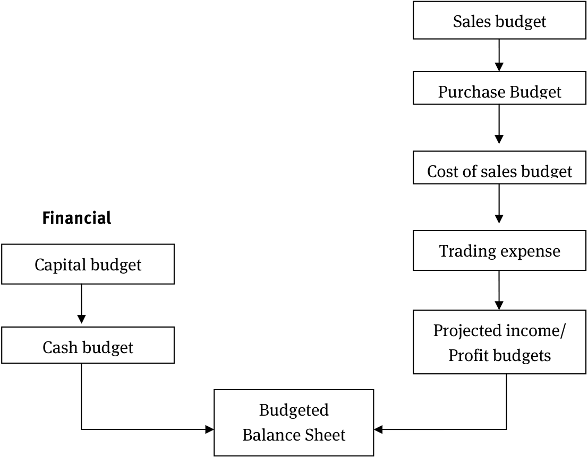
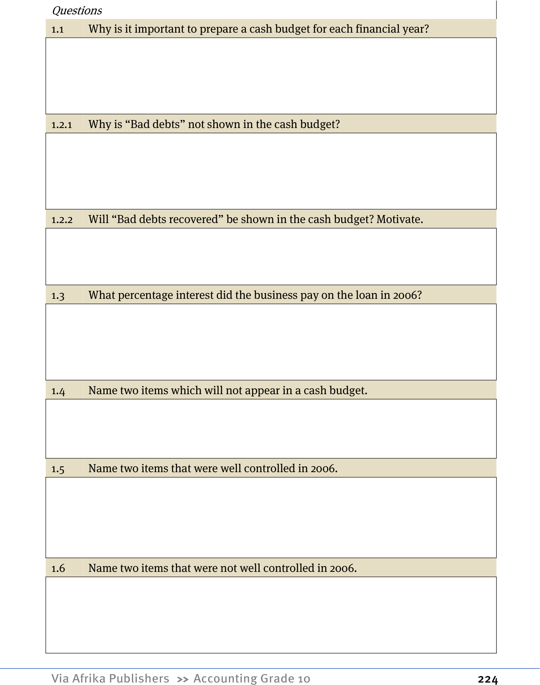

# Term 1 Topic 1: Informal or Indigenous Bookkeeping

## Overview
This topic explores the fundamental concepts of informal bookkeeping systems used in small-scale business environments.

| Topic | Page | Description |
| :--- | :--- | :--- |
| 1 | Page 12 | Concepts and management of resources |
| 2 | Page 17 | Determining prices |

---

## 1. Concepts and management of resources

### 1.1 Informal accounting
Informal accounting refers to the financial practices of small-scale traders, such as street vendors selling vegetables, sweets, chips, or providing services like haircuts or public phone access.

**Key Characteristics of Informal Businesses:**
*   **Limited Capital:** Businesses are started with small amounts of personal money.
*   **Daily Cycle:** Money received from daily sales is immediately used to purchase stock for the following day.
*   **Survival Objective:** The primary goal is daily survival rather than maximizing long-term profit.
*   **Cash-Based:** Transactions are almost exclusively conducted in cash.
*   **Low Inventory:** Traders maintain minimal stock levels to avoid storage issues. This ensures goods (like fresh produce) remain fresh and allows customers to purchase in small, affordable quantities.
*   **Minimal Assets and Expenses:** These businesses typically operate with very few assets (e.g., a simple table) and have very low overhead expenses.
*   **Flexible Pricing:** Selling prices are highly variable, often adjusted based on the initial purchase price of the goods and the owner's immediate financial needs.

<!-- DIAGRAM_PLACEHOLDER: diagram -->

---

# Term 1 Topic 1: Informal or Indigenous Bookkeeping

## Activity 1: Business Planning
To understand the fundamentals of bookkeeping, you must first identify the financial requirements of a business. Use the following framework to plan and manage an informal business venture.

### Business Planning Table

| Business Component | Description / Details |
| :--- | :--- |
| **Capital needed** | The initial money required to start the business. |
| **Income per day** | The total money received from sales in a single day. |
| **Expenses per day** | The total costs incurred to operate the business daily. |
| **Determine the cost of sales** | The direct costs associated with producing or purchasing the goods sold. |
| **Determine the selling price** | The price at which you sell your goods or services to customers. |
| **Labour cost** | The amount paid for work or services performed. |
| **Fixed assets needed** | Long-term items required to run the business (e.g., equipment, furniture). |
| **Stock kept** | The inventory or goods held for sale. |

---

### Key Mathematical Concepts for Planning

When completing the table above, consider the following basic accounting formulas:

1. **Cost of Sales:**
   The total cost of the items sold:
   $$\text{Cost of Sales} = \text{Opening Stock} + \text{Purchases} - \text{Closing Stock}$$

2. **Selling Price Calculation:**
   To ensure profit, the selling price must cover the cost and include a markup:
   $$\text{Selling Price} = \text{Cost Price} + \text{Markup}$$

3. **Daily Profit:**
   $$\text{Profit} = \text{Total Income} - \text{Total Expenses}$$

<!-- DIAGRAM_PLACEHOLDER: diagram -->

---

# Term 1 Topic 1: Informal or Indigenous Bookkeeping

## 1.2 Formal Accounting

### Definition of Accounting
Accounting is a form of communication used to convey specific messages regarding the financial status of a business. For this communication to be effective, the user of the financial information must be able to understand it; otherwise, the information holds no value.

### The Need for Consistency
In daily life, many actions are repetitive. Without guidelines to govern these actions, our behavior would be inconsistent, leading others to perceive us as unreliable.

The same principle applies to business transactions. To ensure consistency in financial reporting, businesses must follow an **Accounting Policy**. 

*   **Accounting Policy:** A set of decisions regarding how a business handles specific transactions to achieve consistent results.
*   **The Risk of Individual Rules:** If every business or individual developed their own unique set of rules for recording transactions, it would result in economic chaos.

### GAAP (Generally Accepted Accounting Practice)
To prevent inconsistency and chaos, a standardized system for the measurement and disclosure of financial transactions was developed. This framework of concepts, principles, methods, and procedures is known as **GAAP**.

### The Role of the Board for Accounting Practice
In South Africa, the Board for Accounting Practice is responsible for:
1.  Developing GAAP principles.
2.  Setting accounting standards.

**Purpose of Accounting Standards:**
*   To manage accounting practices.
*   To establish uniform and rigid rules applicable to all transactions.
*   To enhance the application of standards in financial reporting.
*   To eliminate undesirable alternatives in how financial information is recorded and reported.

---

# Term 1 Topic 1: Informal or Indigenous Bookkeeping

## Introduction
Accounting and bookkeeping systems are essential for organizing financial data, whether for personal finance management or business operations. A standardized accounting system ensures that financial information is understood globally.

## Accounting Activity Groups
Accounting activities are categorized into three primary groups:

| Financial Accounting | Managerial Accounting | Tools in Managing Resources |
| :--- | :--- | :--- |
| Includes the logical, systematic, and accurate recording of financial transactions. | Includes concepts such as costing and budgeting. | Includes basic internal controls and internal audit processes. |
| Focuses on the analysis, interpretation, and communication of Financial Statements. | Puts emphasis on the analysis, interpretation, and communication of information for decision-making. | Emphasizes the knowledge, understanding, and adherence to ethics, human dignity, rights, values, and equity. |

---

## Activity 2: Comparison of Accounting Systems
Compare formal and informal (indigenous) accounting systems based on the criteria provided below.

| INFORMAL | FORMAL |
| :--- | :--- |
| **Capital** | |
| <!-- DIAGRAM_PLACEHOLDER: diagram --> | <!-- DIAGRAM_PLACEHOLDER: diagram --> |

---

# Term 1 Topic 1: Informal or Indigenous Bookkeeping

## Key Concepts and Definitions

In the study of informal and indigenous bookkeeping, it is essential to understand the fundamental components of a business's financial structure. Use the table below to define and record these concepts.

| Concept | Definition / Description |
| :--- | :--- |
| **Fixed assets** | Long-term items owned by the business that are not intended for resale (e.g., machinery, equipment, or land). |
| **Inventory** | Goods or materials held by a business with the intention of selling them to customers. |
| **Selling price** | The amount of money a customer pays to purchase a product or service. |
| **Cost of sales** | The direct costs attributable to the production or purchase of the goods sold by a business. |
| **Labour cost** | The total amount of money paid to employees for their work, including wages and salaries. |
| **Income** | The total amount of money received by the business from the sale of goods or services. |
| **Expenses** | The costs incurred by the business in its effort to generate revenue (e.g., rent, electricity, or transport). |

---

## Mathematical Foundations

When managing bookkeeping, the following basic formulas are applied to determine business performance:

### 1. Gross Profit Calculation
The profit made after deducting the cost of sales from the total income:
$$\text{Gross Profit} = \text{Income} - \text{Cost of Sales}$$

### 2. Net Profit Calculation
The actual profit remaining after all operating expenses have been deducted:
$$\text{Net Profit} = \text{Gross Profit} - \text{Expenses}$$

---

## Instructional Notes
*   **Informal Bookkeeping:** Often relies on simple record-keeping methods to track cash flow and inventory levels without the need for complex accounting software.
*   **Indigenous Bookkeeping:** Refers to traditional methods of tracking resources, bartering, and communal sharing that have been used in various cultures for generations.

<!-- DIAGRAM_PLACEHOLDER: diagram -->

---

# Term 1 Topic 1: Informal or Indigenous Bookkeeping

## 1. Key Concepts

| Concept | Description |
| :--- | :--- |
| **Credit transactions** | Transactions where goods or services are exchanged, but payment is deferred to a future date. |
| **Bookkeeping** | The systematic recording of financial transactions in a business. |

<!-- DIAGRAM_PLACEHOLDER: diagram -->

---

## 2. Determining Prices

### 2.1 Selling Price and Cost of Sales

*   **Cost Price (CP):** The price the trader pays for goods bought for the purpose of resale. This is also the cost of the goods sold to the trader.
*   **Mark-up (MU):** An amount added to the cost price by the trader to ensure a profit is made.
*   **Selling Price (SP):** The final price at which goods are sold to the customer. It is calculated as:
    $$\text{Cost Price (CP)} + \text{Mark-up (MU)} = \text{Selling Price (SP)}$$

#### Calculation Rules
For calculation purposes, the Cost Price (CP) is always considered $100\%$.

**To find the Cost Price (CP):**
$$\text{CP} = \frac{100\%}{100\% + \text{MU}\%} \times \text{SP amount}$$

**To find the Selling Price (SP):**
$$\text{SP} = \frac{100\% + \text{MU}\%}{100\%} \times \text{CP amount}$$

---

# Term 1 Topic 1: Informal or Indigenous Bookkeeping

## 2.2 Labour Costs
The cost of labour refers to the expenditure on human effort required to operate a business. This is categorized into two types:

### 2.2.1 Direct Labour
*   **Definition:** Labour that is directly involved in the production of a product.
*   **Example:** The wages paid to a craftsperson who physically makes the items intended for sale.

### 2.2.2 Indirect Labour
*   **Definition:** Costs of labour that are not directly linked to the physical production of the product.
*   **Example:** Wages for support staff, such as a cleaner, a salesperson helping to sell beaded jewellery, or an accountant managing the books.

---

## 2.3 Income
*   **Definition:** Money that the entrepreneur (owner) earns for the business through its operations.
*   **Examples:** 
    *   **Fee income:** Money earned for providing a service.
    *   **Sales:** Money earned from selling physical goods.

---

## 2.4 Expenses
*   **Definition:** Amounts that the entrepreneur must spend to keep the business running successfully.
*   **Examples:** Wages, salaries, telephone costs, water and electricity, and stationery.

*Note: All the above concepts will be discussed in depth during the course of the year.*

---

# Term 1 Topic 1 - Indigenous Bookkeeping

## Activity 1: Guidelines for Informal Business Planning

When setting up an informal business, consider the following key components for your bookkeeping and planning:

### 1. Capital Needed
*   **Definition:** The start-up money required to begin operations and the funds needed to continue trading.
*   **Note:** Capital contributions can include cash or assets owned by the owner, such as vehicles, machinery, or equipment.

### 2. Income per Day
*   **Definition:** An estimate of the total money flowing into the business daily from services rendered or products sold.

### 3. Expenses per Day
*   **Definition:** Money flowing out of the business for small items of lesser value.
*   **Examples:** Trading licences, employee wages, water and electricity, and stationery.

### 4. Cost of Sales
*   **Definition:** The amount it costs the business to acquire the products from suppliers.
*   **Calculation:** If selling a product, this reflects the cost of materials or the purchase price of the goods.

### 5. Selling Price
*   **Definition:** The price at which the product or service is offered to customers.
*   **Calculation:** Determined by considering the cost of the product plus all expenses incurred.
*   **Note:** The selling price is often negotiable to attract customers.

### 6. Labour Cost
*   **Definition:** Payment for work performed.
*   **Note:** In informal businesses, the owner usually performs the labour. If additional labourers are hired, they are paid wages, while the remaining profit for the day typically goes to the owner.

### 7. Fixed Assets Needed
*   **Definition:** Long-term assets required for the business.
*   **Note:** These are usually assets already owned by the business owner.

### 8. Stock Kept
*   **Definition:** Inventory held for sale.
*   **Note:** Informal businesses typically keep low levels of stock because high quantities require a large capital investment.

### 9. Bookkeeping Approach
*   **Definition:** The method of recording financial information.
*   **Note:** In an informal setting, bookkeeping is done informally. Owners generally calculate income and deduct expenses to determine profit, without placing formal emphasis on the accounting distinctions between assets, expenses, income, and liabilities.

---

### Activity 2: Comparison of Informal and Formal Businesses

This table outlines the key operational and financial differences between informal and formal business structures.

| Feature | INFORMAL | FORMAL |
| :--- | :--- | :--- |
| **Capital** | Normally the owner's own funds are used. Borrowing of money is limited. | It all depends on what type of business is started. Money can be borrowed from financial institutions. |
| **Fixed assets** | Businesses have little or no fixed assets. | Businesses can have a lot of fixed assets and must have a fixed asset register for all fixed assets. |
| **Inventory** | Low inventory is kept because they don't have storing space. | It all depends on the size of the business. Normally this type of business has enough storing space. |
| **Selling price** | Prices change quickly and the owner will determine the selling price. Sales are normally only for cash. | The selling price is determined by cost plus a profit margin and cannot change quickly. Goods are sold for cash and on credit. |
| **Cost of sales** | All goods are bought for cash. | Goods are bought for cash and on credit. |
| **Labour cost** | The owner is normally the only person employed by his business. He has to pay only salaries to himself. Normally this is the profit they make every day. | It all depends on the size of the business. The employee has to register and pay money over to SARS, UIF, etc. |
| **Income** | All transactions are on a cash basis and the income can easily be determined. | Cash and bad debts can result in less money being received than income declared. |
| **Expenses** | All goods are bought for cash and they don't have a lot of overheads. | Goods can be bought for cash and on credit and their overheads are high. |
| **Credit transactions** | Normally no credit transactions. | A business can buy on credit and sell on credit. A risk if a business sells on credit is bad debts. |
| **Bookkeeping** | No formal bookkeeping. | Formal bookkeeping because there is tax implication. |