# Term 1 Topic 5: Budgeting

## Overview
| Topic | Page | Description |
| :--- | :--- | :--- |
| 1 | Page 217 | Introduction to budgeting |
| 2 | Page 218 | Budgeting concepts |
| 3 | Page 219 | Cash budget |

---

## 1. Introduction to Budgeting

### The Importance of Planning
A famous saying states: *"People don't plan to fail, they fail to plan."* An enterprise or person without a budget is like a ship without a compass and a destination.

### What is a Budget?
A budget is a vital managerial aid used for **planning and control**. 

*   **Common Misconception:** Managers often view budgets as rigid figures that limit personnel and create administrative burdens.
*   **The Reality:** When used correctly, a budget is a handy tool that motivates personnel and ensures effective coordination.

### Benefits of Budgeting
Efficient business management requires properly drawn-up budgets. They allow management to:
1.  **Set Attainable Goals:** Identify opportunities and threats for individual departments and the enterprise as a whole.
2.  **Define Roles:** Specify the place and role of each department in achieving organizational goals.
3.  **Problem Solving:** Address difficulties by drafting a main budget, resulting in a coordinated, realistic, and achievable financial plan.
4.  **Resource Allocation:** Translate strategic planning into detailed financial terms, ensuring resources are allocated to departments in a rational and systematic manner.

### Types of Budgets
Due to the complexity of modern enterprises, multiple budgets are required for successful management:
*   **Main Budget:** A summary of all functional budgets.
*   **Functional Budgets:** These are divided into two main categories:
    *   Operational budgets.
    *   Financial budgets.

<!-- DIAGRAM_PLACEHOLDER: diagram -->

---

# Term 1 Topic 5: Budgeting

## Structure of Trade Enterprise Budgets

The budgeting process for a trade enterprise is divided into two main categories: **Operational Budgets** and **Financial Budgets**, which culminate in a **Budgeted Balance Sheet**.

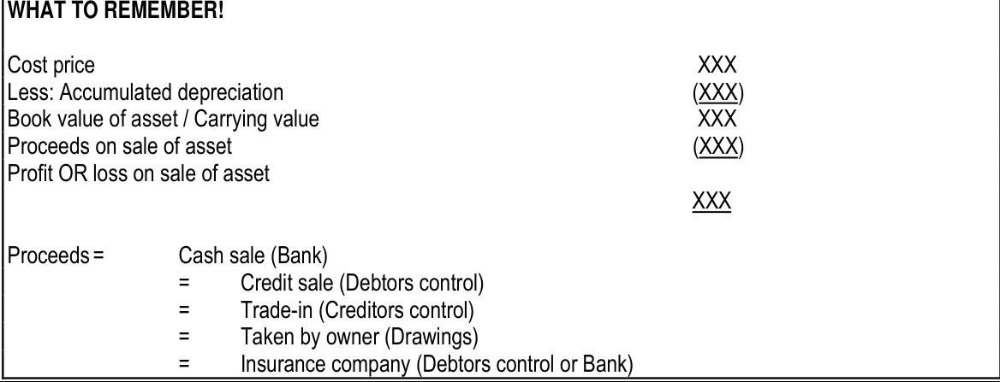

### 1. Operational Budget
The operational budget focuses on the day-to-day trading activities of the business. The flow is as follows:
1. **Sales budget:** Estimation of future sales.
2. **Purchase budget:** Planning the inventory required to meet sales targets.
3. **Cost of sales budget:** Calculating the cost of the goods sold.
4. **Trading expense:** Budgeting for operational overheads.
5. **Projected income/Profit budgets:** The final estimation of profitability.

### 2. Financial Budget
The financial budget focuses on the long-term health and liquidity of the business:
1. **Capital budget:** Planning for long-term investments and assets.
2. **Cash budget:** Managing the inflows and outflows of cash to ensure liquidity.

---

## 2. Budget Concepts

### 2.1 Sales Budget
*   **Definition:** A projection of expected sales for a future period.
*   **Purpose:** Used to assess marketing strategies and the efficiency of the sales team.
*   **Note:** It is considered the most important subdivision of the profit budget, though it is often difficult to project future sales with high accuracy.

### 2.2 Profit Budget
*   **Definition:** A combination of the cost budget and the income budget.
*   **Purpose:** Used by managers who are responsible for both the income and expenditure of the enterprise as a whole.
*   **Application:** It involves the preparation of a projected income statement.

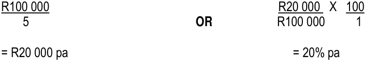

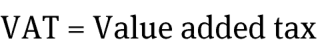

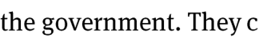

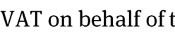

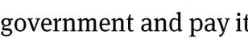

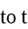

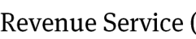

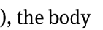

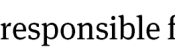

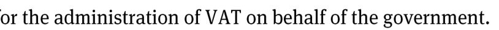

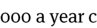

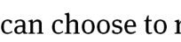

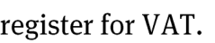

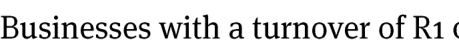

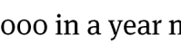

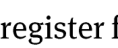

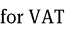

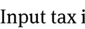

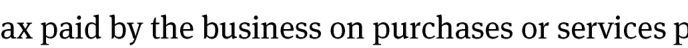

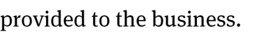

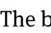

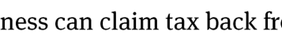

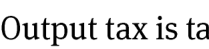

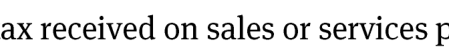

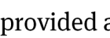

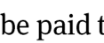

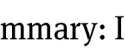

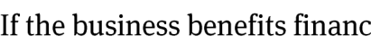

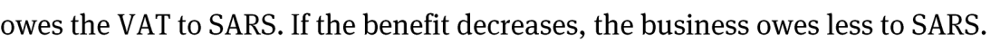

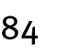

---

# Term 1 Topic 5: Budgeting

## 2.3 Capital Budget
The capital budget outlines the expected future capital investment in fixed assets. This is necessary to:
*   Maintain existing fixed assets.
*   Make provision for an increase in fixed assets.

## 2.4 Financing Budget
The financing budget ensures the enterprise has sufficient funds available in the short term to cover budgeted shortfalls between receipts (income) and payments (expenses). It is also used for planning medium and long-term financing needs.

*   **Note:** This budget is synchronised with the cash budget to ensure the enterprise has enough funds available exactly when they are needed.

## 2.5 Budgeted Balance Sheet
The Budgeted Balance Sheet represents the sum of all other budgets. It indicates the projected financial position of the enterprise at the end of the budget period, assuming the actual results match the planned results.

*   **Analysis:** An analysis of this statement can reveal:
    *   **Problems:** e.g., a poor solvency situation caused by excessive loans.
    *   **Opportunities:** e.g., excessive liquidity that creates expansion opportunities, which may require a reconsideration of other budgets.

## 2.6 Cash Budget
The cash budget reflects the expected inflow and outflow of cash, showing the expected bank balance throughout the budget period.

---

## 3. Cash Budget
The cash budget focuses on the cash flow of the enterprise and consists of three primary sections:

1.  **Inflow of cash / Cash income**
2.  **Outflow of cash / Cash payments**
3.  **Surplus / Shortage of cash for the month**

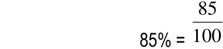

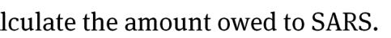

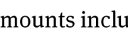

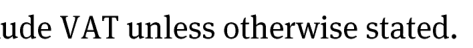

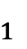

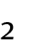

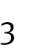

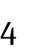

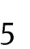

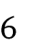

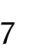

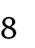

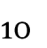

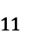

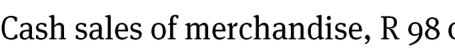

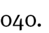

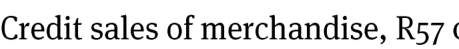

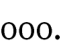

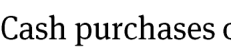

---

# Term 1 Topic 5: Budgeting

A cash budget is a financial planning tool used to manage cash flow. It allows a business to plan for months with low cash flow by utilizing the surplus generated during months with high cash flow (e.g., preparing for a "poor" January by saving from a "good" December). A cash budget is typically drawn up for a year, but can be broken down into monthly periods.

---

## The Three Sections of a Cash Budget

### 3.1 Cash Receipts
Cash receipts include all money flowing into the business during a specific period. Examples include:
*   Cash sales.
*   Cash received from debtors.
*   Interest received on investments and bank accounts.
*   Loans negotiated and received.
*   Proceeds from matured fixed deposits.
*   Money received from the sale of fixed assets.
*   Other income (e.g., rent income, bad debts recovered).

### 3.2 Cash Payments
Cash payments include all money flowing out of the business during a specific period. Examples include:
*   Cash paid for the purchase of merchandise.
*   Payments made to creditors.
*   Repayments of loans.
*   Interest paid on loans and overdrafts.
*   Money invested in fixed deposits.
*   Purchase of fixed assets.
*   Purchase of consumables and other operating expenses.

### 3.3 Cash Balance
The estimated cash balance at the end of the month is determined using the following calculation structure:

| Step | Calculation Component |
| :--- | :--- |
| 1 | **Cash Surplus/Deficit** = Total Cash Receipts $-$ Total Cash Payments |
| 2 | **Opening Balance** = Bank balance at the beginning of the month |
| 3 | **Closing Balance** = (Cash Surplus/Deficit) + Opening Balance |

---

# Term 1 Topic 5: Budgeting

## Non-Cash Items in a Cash Budget
It is important to note that certain accounting entries do not involve an actual movement of cash. Therefore, these items **must be excluded** from the cash budget:

*   Discount allowed
*   Discount received
*   Bad debts
*   Depreciation
*   Profit on sale of asset
*   Loss on sale of asset

---

## Example: Cash Budget Structure
A cash budget tracks the projected cash inflows and outflows over a specific period. Below is the standard format for a cash budget covering a three-month period.

### Cash Budget for the period 1 January 2009 to 31 March 2009

| Item | January | February | March | Total |
| :--- | :---: | :---: | :---: | :---: |
| **Cash receipts** | | | | |
| Cash sales | xx | xx | xx | xx |
| Collection from debtors | xx | xx | xx | xx |
| Interest on fixed deposit | xx | xx | xx | xx |
| **TOTAL RECEIPTS** | **xxx** | **xxx** | **xxx** | **xxx** |
| | | | | |
| **Cash payments** | | | | |
| Cash purchases | xx | xx | xx | xx |
| Payments to creditors | xx | xx | xx | xx |
| Equipment | xx | xx | xx | xx |
| Operating expenses | xx | xx | xx | xx |
| **TOTAL PAYMENTS** | **xxx** | **xxx** | **xxx** | **xxx** |
| | | | | |
| **Cash surplus/(deficit)** | **xxx** | **xxx** | **xxx** | **xxx** |
| Bank (opening balance) | xxx | xxx | xxx | xxx |
| **Bank (closing balance)** | **xxx** | **xxx** | **xxx** | **xxx** |

---

### Key Mathematical Relationships
The closing bank balance for any given month is calculated using the following logic:

$$\text{Closing Balance} = \text{Opening Balance} + \text{Total Receipts} - \text{Total Payments}$$

Where:
*   **Cash Surplus/(Deficit)** = $\text{Total Receipts} - \text{Total Payments}$
*   The **Closing Balance** of one month becomes the **Opening Balance** of the following month.

---

# Term 1 Topic 5: Budgeting

## Activity 1: ABC Cleaning Services
ABC Cleaning Services provides cleaning services at a rate of $R70$ per hour. The owner, Betty Blue, ensures all cleaners work an equal number of hours annually, with weekly wage payments. The business is managed by Alfred Green.

### Cash Budget for 2007
The following table outlines the financial projections and historical data for ABC Cleaning Services.

| Item | 2006 BUDGET | 2006 ACTUAL | 2007 BUDGET |
| :--- | :---: | :---: | :---: |
| **RECEIPTS** | | | |
| Fee income from cleaning services | 721 000 | 721 000 | 860 240 |
| Rent income | 12 000 | 12 000 | 14 400 |
| Interest on fixed deposit | 5 000 | 4 000 | 4 500 |
| Loan from Blue Bulls Bank | 50 000 | 50 000 | 20 000 |
| **TOTAL RECEIPTS** | **788 000** | **787 000** | **899 140** |
| **PAYMENTS** | | | |
| Salary of office worker | 54 000 | 54 000 | 60 000 |
| Salary of Manager | 150 000 | 170 000 | 225 000 |
| Wages of 8 cleaners | 206 000 | 206 000 | 210 000 |
| Employer’s contribution | 50 156 | 50 156 | 62 000 |
| Office telephone & electricity | 20 000 | 16 500 | 20 000 |
| Motor vehicle running expenses | 36 000 | 34 000 | 38 000 |
| Interest on loan | 7 500 | 7 500 | 10 500 |
| Bank charges | 15 000 | 19 000 | 20 000 |
| Uniforms for cleaners | 6 400 | 7 200 | 3 200 |
| Office maintenance costs | 17 000 | 13 000 | 13 000 |
| Drawings by Bettie Blue | 154 000 | 204 000 | 250 000 |
| Purchase of new vehicle | - | - | 420 000 |
| **TOTAL PAYMENTS** | **716 056** | **781 356** | **1 331 700** |
| **Cash surplus (deficit)** | **72 044** | **5 644** | **(531 600)** |
| Cash in bank (beginning) | 160 075 | 232 119 | 237 763 |
| **Cash in bank (end)** | **232 119** | **237 763** | **(293 837)** |

---

### Key Concepts & Definitions

*   **Budget:** A financial plan for the future, estimating expected receipts and payments over a specific period.
*   **Actual:** The real financial figures recorded at the end of a period, used to compare against the budget to identify variances.
*   **Cash Surplus:** Occurs when total receipts exceed total payments.
*   **Cash Deficit:** Occurs when total payments exceed total receipts, indicated in accounting by brackets, e.g., $(531 600)$.
*   **Cash in Bank (End):** Calculated as:
    $$\text{Opening Balance} + \text{Total Receipts} - \text{Total Payments} = \text{Closing Balance}$$

---

# Term 1 Topic 5: Budgeting

## Questions

**1.1 Why is it important to prepare a cash budget for each financial year?**
*   [Space for learner response]

**1.2.1 Why is “Bad debts” not shown in the cash budget?**
*   [Space for learner response]

**1.2.2 Will “Bad debts recovered” be shown in the cash budget? Motivate.**
*   [Space for learner response]

**1.3 What percentage interest did the business pay on the loan in 2006?**
*   *Note: To calculate the interest rate, use the following formula:*
    $$\text{Interest Rate} = \left( \frac{\text{Interest Paid}}{\text{Loan Amount}} \right) \times 100$$
*   [Space for learner response]

**1.4 Name two items which will not appear in a cash budget.**
*   [Space for learner response]

**1.5 Name two items that were well controlled in 2006.**
*   [Space for learner response]

**1.6 Name two items that were not well controlled in 2006.**
*   [Space for learner response]

---

---

# Term 1 Topic 5: Budgeting

## Analysis Questions

**1.7.1 What is your opinion about the drawings of Betty Blue?**
*(Space provided for learner response)*

**1.7.2 Why is the bank balance in 2007 in brackets?**
*(Space provided for learner response)*

---

## Activity 2: Cash Budget Analysis

### Verster’s Milk Shop
**Cash Budget for three months: October to December 2009**

| Item | OCTOBER | NOVEMBER | DECEMBER |
| :--- | :---: | :---: | :---: |
| **CASH RECEIPTS** | | | |
| Cash sales | 100 000 | 110 000 | 115 000 |
| Receipts from debtors | 40 000 | 43 000 | 46 000 |
| Rent income | 3 000 | 3 000 | 3 000 |
| Interest on fixed deposit | - | - | 1 500 |
| **TOTAL RECEIPTS** | **143 000** | **156 000** | **165 500** |
| **CASH PAYMENTS** | | | |
| Cash purchases of trading inventory | 60 000 | 64 000 | 66 000 |
| Payments to creditors | 50 000 | 52 000 | 58 000 |
| Salaries and wages | 15 000 | 15 000 | 18 000 |
| Equipment purchased | - | 30 000 | - |
| Sundry operating expenses | 10 500 | 10 500 | 10 500 |
| **TOTAL PAYMENTS** | **135 500** | **171 500** | **152 500** |
| **Cash surplus / (shortfall)** | **7 500** | **(15 500)** | **13 000** |
| Bank opening balance | 5 000 | 12 500 | (3 000) |
| **Bank closing balance** | **12 500** | **(3 000)** | **10 000** |

---

### Key Concepts & Calculations

*   **Cash Surplus/Shortfall:** This is calculated as:
    $$\text{Total Receipts} - \text{Total Payments} = \text{Cash Surplus / (Shortfall)}$$
*   **Bank Closing Balance:** This is calculated as:
    $$\text{Bank Opening Balance} + \text{Cash Surplus / (Shortfall)} = \text{Bank Closing Balance}$$
*   **Brackets ( ):** In accounting, figures placed in brackets represent negative values (e.g., a bank overdraft or a cash shortfall).

---

# Term 1 Topic 5: Budgeting

## Concept Definitions

### 2.1 What is a cash budget?
A cash budget is a financial plan that estimates the expected cash receipts (inflows) and cash payments (outflows) of a business over a specific future period. It helps a business determine if it will have sufficient cash to meet its obligations.

### 2.2 Why do we need to draw up a cash budget?
Businesses draw up cash budgets for the following reasons:
*   **Planning:** To anticipate future cash shortages or surpluses.
*   **Control:** To monitor actual cash flow against planned estimates.
*   **Decision Making:** To determine if the business can afford planned capital expenditure (like buying equipment) or if it needs to arrange for external financing (like an overdraft).
*   **Solvency:** To ensure the business remains liquid and can pay its debts as they fall due.

---

## Analysis Questions

*Note: These questions refer to the specific cash budget data provided in the preceding section of your textbook.*

**2.3 Money has been invested in a fixed deposit. When does the business expect to receive interest on this investment?**
*   *Instruction:* Refer to the "Cash Receipts" section of your provided budget table. Look for the line item "Interest on fixed deposit" and identify the month(s) where an amount is recorded.

**2.4 When does the business intend to purchase equipment?**
*   *Instruction:* Refer to the "Cash Payments" section of your provided budget table. Look for the line item "Purchase of equipment" and identify the month in which the payment is scheduled.

**2.5 Name a month in which Verster’s Milk Shop expects to receive more cash than it pays out.**
*   *Instruction:* Compare the "Total Receipts" and "Total Payments" for each month. A month where the business receives more than it pays out will result in a positive "Net Cash Flow" (or an increase in the bank balance). Identify a month where:
    $$\text{Total Receipts} > \text{Total Payments}$$

---

# Term 1 Topic 5: Budgeting

## Exercises

**2.6 Name TWO items that will not appear in a cash budget.**

*Instructional Note: A cash budget only records actual cash receipts and cash payments. Non-cash items (items that affect profit but do not involve the movement of money) are excluded.*

*   **Item 1:** Depreciation
*   **Item 2:** Bad debts (written off)

***

**2.7 Will ‘bad debt recovered’ be shown in the cash budget? Motivate.**

*   **Answer:** Yes.
*   **Motivation:** A cash budget records all actual cash inflows. When a 'bad debt recovered' occurs, the business receives actual cash from a debtor who was previously written off. Since this represents an inflow of money, it must be recorded in the Cash Receipts Journal and subsequently reflected in the cash budget.

---

# Term 4 Topic 2: Budgeting

## Activity 1: Understanding Cash Budgets

### 1.1 Purpose of a Cash Budget
A cash budget is prepared to:
*   Plan for future receipts and payments of cash.
*   Keep control of money coming in and going out of the business.
*   Ensure that sufficient cash is available at all times to meet financial obligations.

### 1.2 Non-Cash Items
*   **1.2.1** Depreciation is not a cash item (it is a non-cash expense).
*   **1.2.2** Yes, a cash item is any transaction that results in an actual inflow or outflow of money.

### 1.3 Mathematical Application: Percentage Calculation
To calculate a percentage, use the formula:
$$\text{Percentage} = \left( \frac{\text{Part}}{\text{Whole}} \right) \times 100$$

**Example calculation:**
$$\frac{7\,500}{50\,000} \times 100 = 15\%$$

### 1.4 Non-Cash Transactions
The following items are excluded from a cash budget because they do not involve an immediate movement of cash:
*   Depreciation
*   Discount received
*   Profit on sale of asset
*   Loss on sale of asset
*   Discount allowed

### 1.5 Variable Expenses
These are expenses that fluctuate based on business activity:
*   Office telephone and electricity
*   Motor vehicle running expenses
*   Office maintenance costs

### 1.6 Fixed Expenses and Outflows
These are recurring payments or specific withdrawals:
*   Manager's salary
*   Drawings by the owner
*   Bank charges
*   Staff uniforms

### 1.7 Analysis of Financial Position
*   **1.7.1** If drawings increase by R50 000 per annum, it is considered too high. The owner should decrease withdrawals to preserve business liquidity.
*   **1.7.2** If the bank balance is negative, it indicates an **overdraft**.

---

## Activity 2: Budgeting Concepts

### 2.1 Definition
A cash budget is a plan or estimation of expected cash receipts and payments for a future period.

### 2.2 Importance of Budgeting
*   To plan for the future.
*   To detect potential future cash flow problems.
*   To assist management in making informed financial decisions.

### 2.3–2.5 Identifying Trends
*   **2.3** Peak receipt month: December.
*   **2.4** Peak payment month: November.
*   **2.5** Months with potential cash flow issues: October or December.

### 2.6 Non-Cash Items (Exclusions)
The following items must be excluded from the cash budget as they do not affect the bank balance:
*   Depreciation
*   Bad debts
*   Discount allowed
*   Discount received

### 2.7 Cash Items
*   **Is it a cash item?** Yes. Any transaction involving the actual movement of money into or out of the bank account is a cash item.