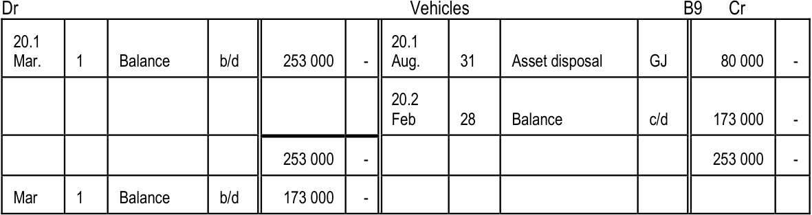

# Term 2 Topic 1: Partnerships: Analysis of Financial Statements

## Financial Statements
Financial statements provide a summary of a business's activities during a financial period. Because these statements do not inherently explain whether performance has improved or declined, owners and managers must perform **analysis and interpretation**.

*   **Analysis:** Using generally accepted calculations or ratios to examine financial information.
*   **Interpretation:** Determining the causes behind changes, improvements, or declines in results to facilitate informed decision-making.

### Key Concepts for Analysis
All forms of business ownership utilize the following indicators to evaluate performance:
1.  **Profitability:** The ability to generate income relative to expenses.
2.  **Liquidity:** The ability to meet short-term financial obligations.
3.  **Solvency:** The ability to meet long-term financial obligations.
4.  **Risk and Gearing:** The relationship between borrowed funds and owner's equity.
5.  **Return on Investment (ROI):** The efficiency of the owner's investment in generating income.

*Note: The return on owner's equity is calculated as net profit expressed as a percentage of owner's equity.*

---

## Profitability
Profitability measures the business's ability to generate income compared to the expenses and costs incurred.

### Profitability Indicators

| Indicator | Description |
| :--- | :--- |
| **Gross profit on sales** | Shows how much of each rand is left after the basic cost of products is deducted. |
| **Gross profit on cost of sales** | Compared with the mark-up percentage; indicates how well the business achieved its mark-up. |
| **Operating expenses on sales** | Shows what percentage of each rand received is used to pay expenses. |
| **Operating profit on sales** | Shows how much money remains after expenses have been paid. |
| **Net profit on sales** | Shows how much of each rand is left over for the owners. |

<!-- DIAGRAM_PLACEHOLDER: diagram -->

---

# Term 2 Topic 1: Partnerships: Analysis of Financial Statements

## Liquidity
Liquidity refers to the ability of a business to pay its short-term debts. It involves comparing current assets against current liabilities. Current assets are essential as they fund day-to-day operations and ongoing expenses.

### Liquidity Ratios

| Ratio | Formula | Norm / Purpose |
| :--- | :--- | :--- |
| **Current ratio** | $\frac{\text{Current assets}}{\text{Current liabilities}}$ | Norm is $2:1$ (R2 available for every R1 debt). Indicates ability to cover debts payable within one year. |
| **Acid test ratio** | $\frac{\text{Current assets} - \text{Inventory}}{\text{Current liabilities}}$ | Norm is $1:1$ (R1 available for every R1 debt). Indicates ability to cover debts if stock cannot be sold. |
| **Stock turnover rate** | $\frac{\text{Cost of sales}}{\text{Average stock}}$ | Indicates how many times stock is converted into money per year. Faster turnover = faster profit. |
| **Stock holding period** | $\frac{\text{Average stock} \times 365}{\text{Cost of sales}}$ | Indicates the period for which the business has stock available. |
| **Debtors collection period** | $\frac{\text{Average debtors} \times 365}{\text{Credit sales}}$ | Indicates how long debtors take to pay. Standard is usually 30 days. |
| **Creditors payment period** | $\frac{\text{Average creditors} \times 365}{\text{Credit purchases}}$ | Indicates how long the business takes to pay creditors. Standard is usually 60 to 90 days. |

### Key Calculations
*   **Average stock:** $\frac{1}{2}(\text{stock at beginning} + \text{stock at end})$
*   **Average debtors:** $\frac{1}{2}(\text{debtors at beginning} + \text{debtors at end})$
*   **Average creditors:** $\frac{1}{2}(\text{creditors at beginning} + \text{creditors at end})$

---

## Solvency
Solvency is the ability of a business to meet all its financial obligations. 
*   **Solvent:** Assets exceed liabilities.
*   **Insolvent:** The business can no longer operate and is undergoing bankruptcy.

---

# Term 2 Topic 1: Partnerships - Analysis of Financial Statements

## 1. Solvency and Net Assets

| Concept | Formula / Definition |
| :--- | :--- |
| **Net assets** | $\text{Total assets} - \text{Total liabilities} = \text{Net assets (Owner's equity)}$ |
| **Solvency ratio** | $\frac{\text{Total assets}}{\text{Total liabilities}}$ |

*   **Note:** If the ratio is $1:1$, it implies that the owner's equity is $0$. Based on the accounting equation $A = OE + L$, a low ratio (e.g., $1:1$) indicates potential financial problems.

---

## 2. Risk and Gearing
Risk measures a business's financial leverage, indicating the proportion of equity (own capital) versus debt (borrowed capital) used to finance assets.

| Concept | Description |
| :--- | :--- |
| **Debt–equity ratio** | $\frac{\text{Non-current liabilities}}{\text{Owner's equity}}$ |
| **Norm** | Anything below $1:1$ |
| **Low risk** | Higher equity, lower debt |
| **High risk** | Higher debt, lower equity |
| **Gearing** | Comparison between cost of borrowed money and return on equity |
| **Positive gearing** | High return, lower interest rate percentage |
| **Negative gearing** | High interest rate percentage, lower return |

---

## 3. Return on Investment
The primary aim of a business is to generate profit. This analysis determines if the investment in the business earns more than alternative investments.

| Concept | Formula / Definition |
| :--- | :--- |
| **Partner's earnings** | $\text{Interest on capital} + \text{Salary} + \text{Bonus} + \text{Share of remaining profit}$ |
| **Partner's owner's equity** | $\text{Capital of partner} + \text{Current account of partner}$ |
| **Return on partner's equity** | $\frac{\text{Earnings} \times 100}{\text{Average owner's equity of partner}}$ |
| **Average owner's equity** | $\frac{1}{2} (\text{Owner's equity at beginning} + \text{Owner's equity at end})$ |
| **Return on equity for business** | $\frac{\text{Net profit for year} \times 100}{\text{Average total equity}}$ |

---

## 4. Exercise 1: Case Study

**Scenario:**
Jacob Morris and Thabo Jabulani are partners in *On-The-Move*, a business delivering documents and small parcels in the Western Cape. They also operate a small stationery shop. The partnership was formed on $1$ January $20.6$ and operations commenced on $1$ March $20.6$. Their objective is to expand the business to provide nationwide delivery services.

---

# Term 2 Topic 1: Partnerships - Analysis of Financial Statements

## Information about the Partners

### Jacob Morris
*   55-year-old male.
*   Married, with two children (Mary age 13 and Kevin age 17).
*   Took a personal loan to get money for investment in the business.
*   Increased the capital contribution on 28 February 20.8. This was recorded.

### Thabo Jabulani
*   42-year-old male.
*   Single.
*   Inherited money from his father and used it to invest in the business.

---

## Financial Statement Data (as at 28 February)

The following table represents the financial position of the partnership at the end of their second financial year.

| Account | 28 February 20.8 | 28 February 20.7 |
| :--- | :--- | :--- |
| Capital: Morris | 456 340 | 420 000 |
| Capital: Jabulani | 420 000 | 420 000 |
| Current account: Morris | (Cr.) 2 760 | (Dr.) 46 440 |
| Current account: Jabulani | (Cr.) 1 000 | (Dr.) 55 000 |
| Land and building | 694 900 | 614 000 |
| Vehicles | 440 000 | 440 000 |
| Accumulated depreciation on vehicles | 176 000 | 88 000 |
| Equipment | 139 600 | 120 000 |
| Accumulated depreciation on equipment | 15 300 | 18 000 |
| Trading stock | 35 000 | 14 000 |
| Debtors control | 27 000 | 45 000 |
| Bank | 21 000 | – |
| Creditors control | 18 000 | 23 000 |
| Bank overdraft | – | 56 000 |
| Mortgage bond: NextBank (10% p.a. interest) | 268 100 | 309 440 |

---

## Additional Information
*   The information above appeared in the asset register on 28 February 20.8.
*   The partners have conducted research on the vehicles.

---

# Term 2 Topic 1: Partnerships - Analysis of Financial Statements

## 1. Asset Register: On-The-Move
The asset register tracks the performance and depreciation of vehicles owned by the partnership.

| Item | Delivery van | Delivery van | Bakkie |
| :--- | :--- | :--- | :--- |
| Registration number | MOVE1 – WP | MOVE2 – WP | MOVE3 – WP |
| Date purchased | 1 March 20.6 | 1 March 20.6 | 1 March 20.6 |
| Purchase price | R180 000 | R180 000 | R80 000 |
| Accumulated depreciation | R72 000 | R72 000 | R32 000 |
| Depreciation for the year | R36 000 | R36 000 | R16 000 |
| Amount of revenue earned | R183 000 | R126 000 | R50 180 |
| Kilometres covered (past year) | 39 850 km | 20 400 km | 13 400 km |
| Fuel and repair costs (year) | R70 400 | R38 600 | R19 490 |

---

## 2. Notes to Financial Statements: Partners' Current Accounts
This table summarizes the distribution of profits and drawings for partners Morris and Jabulani.

| Item | 28 February 20.8 | 28 February 20.7 |
| :--- | :--- | :--- |
| Interest on capital: Morris | 46 200 | 33 600 |
| Interest on capital: Jabulani | 46 200 | 33 600 |
| Salary: Morris | 158 400 | 144 000 |
| Salary: Jabulani | 132 000 | 120 000 |
| Final distribution: Morris | 3 000 | (80 040) |
| Final distribution: Jabulani | 3 000 | (88 600) |
| Net profit for the year | 388 800 | 162 560 |
| Interest on capital of partners | ? | 8% p.a. |
| Drawings: Morris | 158 800 | 144 000 |
| Drawings: Jabulani | 125 200 | 120 000 |

---

## 3. Financial Indicators (28 February 20.7)
Financial indicators are used to assess the liquidity, solvency, and profitability of the partnership.

| Indicator | Value |
| :--- | :--- |
| Return on owner's equity | 20,6% |
| Percentage return earned by Morris | 24,6% |
| Percentage return earned by Jabulani | 16,7% |
| Current ratio | 0,75 : 1 |
| Acid test ratio | 0,57 : 1 |
| Solvency ratio | 2,9 : 1 |
| Debt–equity ratio | 0,42 : 1 |

---

## 4. Instructions for Learners
Answer the following questions based on the data provided above. Ensure you:
1. **Motivate your answers:** Explain the reasoning behind your conclusions.
2. **Show calculations:** Provide the mathematical steps used to reach your answers.
3. **Rounding:** Round all final answers to one decimal place.

---

# Term 2 Topic 1: Partnerships: Analysis of Financial Statements

## Questions

### 1. Advantages of a Partnership
List one advantage of a partnership as a form of ownership.

### 2. Disadvantages of a Partnership
List one disadvantage of a partnership as a form of ownership.

### 3. Calculation of Partner Earnings
Calculate the earnings of each partner on 28 February 2008.

| Morris | Jabulani |
| :--- | :--- |
| | |

### 4. Calculation of Percentage Return
Calculate the percentage return earned by each partner on 28 February 2008.

**Formula:**
$$\text{Percentage return} = \frac{\text{Total earnings of partner}}{\text{Capital contribution of partner}} \times 100$$

| Morris | Jabulani |
| :--- | :--- |
| | |

---

# Term 2 Topic 1: Partnerships - Analysis of Financial Statements

## Exercise: Analysis of Partner Returns and Remuneration

### 5. Comment on Percentage Return
Briefly comment on each partner's percentage return and provide a possible reason for any observed changes.

| Morris | Jabulani |
| :--- | :--- |
| | |

---

### 6. Interest on Capital Calculation
The partners agreed to take $8\%$ per annum interest on capital for the first financial year but decided to increase the percentage in the next year. Determine the new interest rate for the current financial year based on the provided financial data.

---

### 7. Percentage Increase in Salaries
The partners increased their salaries for the second financial year. Calculate the percentage increase using the following formula:

$$\text{Percentage Increase} = \left( \frac{\text{New Salary} - \text{Old Salary}}{\text{Old Salary}} \right) \times 100$$

---

### 8. Evaluation of Financial Decisions
Provide a critical evaluation of whether the changes in interest rates (Question 6) and salaries (Question 7) are justified based on the partnership's financial performance.

---

# Term 2 Topic 1: Partnerships - Analysis of Financial Statements

## Case Study: Asset Loss and Partner Accountability

### Additional Information
*   **Incident:** On 30 November 20.7, the business's bakkie was involved in an accident while being driven by an unlicensed driver (the partner's son) without permission.
*   **Insurance:** The insurance company refused to pay for the damages.
*   **Resolution:** Partner Morris decided to take over the damaged bakkie at its scrap value of $R20\,000$ on 1 March 20.8, payable in cash.

---

### Exercises

#### 9. Did the business make a profit or loss during this incident? Show calculations to prove your answer.

To determine the financial impact, we compare the Carrying Value (Book Value) of the asset at the time of the accident against the proceeds received (scrap value).

*   **Calculation:**
    $$\text{Loss/Profit} = \text{Scrap Value} - \text{Carrying Value}$$
    *   If the Carrying Value of the bakkie at the time of the accident was greater than $R20\,000$, the business incurred a **loss**.
    *   The loss is calculated as:
        $$\text{Loss} = \text{Carrying Value} - R20\,000$$

#### 10. Would the above transaction have any effect on the percentage return earned by Morris in the next year? Explain.

*   **Concept:** The percentage return on equity is calculated as:
    $$\text{Return on Equity} = \frac{\text{Net Profit}}{\text{Average Equity}} \times 100$$
*   **Explanation:** Yes, it will have an effect. 
    1.  **Profitability:** The loss incurred from the write-off of the asset reduces the Net Profit for the year, which negatively impacts the numerator of the formula.
    2.  **Equity:** Morris paying $R20\,000$ in cash increases the business's assets and potentially his capital account, which affects the denominator (Average Equity).

#### 11. If you were a partner or the accountant of this business, what comments would you make about this incident and its treatment in the books? Briefly explain two points.

1.  **Internal Control:** The incident highlights a failure in internal controls regarding the use of business assets. Strict policies must be implemented to ensure only authorized, licensed drivers use business vehicles to prevent future negligence.
2.  **Ethical/Financial Treatment:** While Morris is compensating the business for the scrap value, the business has still suffered a significant loss due to the difference between the original carrying value and the scrap value. The partner should ideally be held accountable for the full loss caused by his son's unauthorized actions, rather than just the scrap value, to protect the interests of the other partners.

---

# Term 2 Topic 1: Partnerships - Analysis of Financial Statements

## Exercises

### 12. Control Measures for Fixed Assets
Suggest two control measures for fixed assets.

*   **Space for Answer:**
    *   [Insert response here]

---

### 13. Decision Making: Asset Replacement
The partners need to know if they should purchase another bakkie or if they should replace it with another delivery van. Give them some advice.

*   **Space for Answer:**
    *   [Insert response here]

---

### 14. Financial Analysis Concepts
What is the difference between liquidity and solvency?

*   **Definitions for Reference:**
    *   **Liquidity:** The ability of a business to meet its short-term financial obligations (current liabilities) using its current assets.
    *   **Solvency:** The ability of a business to meet its long-term financial obligations and continue operating in the long run, determined by comparing total assets to total liabilities.

*   **Space for Answer:**
    *   [Insert response here]

---

*© Via Afrika » Accounting Gr 11 | 52*

---

# Term 2 Topic 1: Partnerships - Analysis of Financial Statements

## 1. Financial Ratio Calculations
For the year ended 28 February 20.8, calculate the following liquidity ratios:

| Current Ratio | Acid Test Ratio |
| :--- | :--- |
| $$\text{Current Assets} : \text{Current Liabilities}$$ | $$(\text{Current Assets} - \text{Inventory}) : \text{Current Liabilities}$$ |

---

## 2. Liquidity Analysis
**Question 16:** Comment on the liquidity of the business and explain the difference between the Current Ratio and the Acid Test Ratio.

*   **Liquidity:** Refers to the ability of the business to meet its short-term financial obligations as they fall due.
*   **The Difference:** The Current Ratio includes all current assets (including inventory), whereas the Acid Test Ratio excludes inventory. This is because inventory is considered the least liquid current asset, as it must first be sold before it can be converted into cash.

---

## 3. Loan Application Evaluation
**Question 17:** The partners wish to apply for a loan of $R400\,000$ to purchase two additional vehicles. Determine if the bank would grant this loan by performing the relevant calculations.

<!-- DIAGRAM_PLACEHOLDER: diagram -->

### Key Considerations for Bank Approval:
To determine if the bank will grant the loan, you must calculate the impact on the following:
1.  **Solvency:** Calculate the Debt-to-Equity ratio to see if the business is over-leveraged.
    $$\text{Debt-to-Equity Ratio} = \frac{\text{Total Liabilities}}{\text{Total Equity}}$$
2.  **Liquidity:** Assess if the business can handle the additional interest payments and capital repayments without compromising its ability to pay existing short-term debts.
3.  **Asset Cover:** Ensure the value of the assets (including the new vehicles) provides sufficient security for the loan.

---

# Term 2 Topic 1: Partnerships: Analysis of Financial Statements

## Exercise 2

**2.1 Give two reasons why the net profit of a partnership is sometimes not distributed equally.**
*   Reason 1: Partners may have agreed to share profits in a specific ratio based on their capital contributions.
*   Reason 2: The partnership agreement may stipulate that partners receive different salaries or interest on capital, which affects the final distribution of the remaining profit.

**2.2 What does a debit balance on a partner’s current account mean?**
*   A debit balance indicates that the partner has withdrawn more money (drawings) than their share of the profit and other entitlements (such as salary or interest on capital) for the period. It represents an amount owed by the partner to the partnership.

**2.3 A partner takes trading stock for personal use. Is the transaction recorded as division of profit or as drawings?**
*   It is recorded as **drawings**. Taking stock for personal use reduces the partner's equity in the business and is treated as a withdrawal of assets, not a distribution of profit.

**2.4 Does the partnership pay income tax? Give a reason for your answer.**
*   No, the partnership itself does not pay income tax. 
*   Reason: A partnership is not a separate legal entity for tax purposes. The individual partners are taxed in their personal capacities on their respective shares of the partnership's profit.

**2.5 A partnership suffered a loss before appropriation of salaries and interest on capital. Are the salaries and interest on capital still brought into account?**
*   Yes, they are still brought into account. 
*   Explanation: The appropriation section of the statement is used to distribute the net profit or loss. Even if there is a loss, the partnership agreement usually dictates that these appropriations must be calculated and recorded, which will increase the total loss to be shared among the partners in their profit-sharing ratio.

---

# Term 2 Topic 1: Partnerships - Analysis of Financial Statements

## Conceptual Understanding
### 2.6 Why are partner salaries not recorded in the Income Statement?
Partners are the owners of the business, not employees. In accounting, the Income Statement is used to determine the net profit of the business entity. Partner salaries are considered an **appropriation of profit** (a distribution of the profit earned) rather than an operating expense incurred to generate revenue. Therefore, they are recorded in the Appropriation Account, not the Income Statement.

---

## Exercise 3: T&M Books
Dina Tuwele and Michael Sanders formed a partnership on 1 March 20.8. The following data relates to their financial year ended 28 February 20.9.

### Partnership Financial Data
| Item | Tuwele | Sanders |
| :--- | :--- | :--- |
| Capital accounts (01-03-20.8) | 450 000 | 250 000 |
| Capital accounts (28-02-20.9) | 450 000 | 300 000 |
| Current accounts (01-03-20.8) | 0 | 0 |
| Current accounts (28-02-20.9) | 67 750 | 49 750 |
| Drawings | 42 000 | 36 500 |

### Appropriation of Profit (28-02-20.9)
| Item | Tuwele | Sanders |
| :--- | :--- | :--- |
| Interest on capital | 45 000 | 27 500 |
| Salaries | 36 000 | 30 000 |
| Share of profit | 28 750 | 28 750 |
| **Total earnings** | **109 750** | **86 250** |

---

## Instructions
### 3.1 Calculate the percentage return on the average investment earned by each partner for the year.

**Formula:**
$$\text{Percentage return} = \frac{\text{Total earnings}}{\text{Average investment}} \times 100$$

**Where:**
$$\text{Average investment} = \frac{\text{Opening Capital} + \text{Closing Capital}}{2}$$

#### Worked Example Calculation:

**1. Calculate Average Investment:**
*   **Tuwele:** $\frac{450\,000 + 450\,000}{2} = 450\,000$
*   **Sanders:** $\frac{250\,000 + 300\,000}{2} = 275\,000$

**2. Calculate Percentage Return:**
*   **Tuwele:** $\frac{109\,750}{450\,000} \times 100 = 24,39\%$
*   **Sanders:** $\frac{86\,250}{275\,000} \times 100 = 31,36\%$

<!-- DIAGRAM_PLACEHOLDER: diagram -->

---

# Term 2 Topic 1: Partnerships - Analysis of Financial Statements

## Analysis Task
**3.2** If you were Dina Tuwele, would you be happy with the results? Comment.

---

## Exercise 4: Financial Statement Analysis
Use the extract from the financial statements of Mthembu and Coetzer for the year ended 28 February 20.9 to answer the following questions. Round off your answers to two decimal places.

### Information: Financial Statements for the year ended 28 February 20.9

| Item | 20.9-02-28 | 20.8-02-28 |
| :--- | :--- | :--- |
| Fixed assets (at carrying value) | 1 643 248 | 1 354 860 |
| Current assets | 278 900 | 440 800 |
| Inventories (Trading stock) | 215 900 | 400 300 |
| Trade and other receivables | 41 700 | 21 300 |
| Cash & cash equivalents | 21 300 | 19 200 |
| Capital: Mthembu | 740 000 | 540 000 |
| Capital: Coetzer | 320 000 | 410 000 |
| Current account: Mthembu | 49 808 | 12 000 |
| Current account: Coetzer | (21 700) | 13 460 |
| Non-current liabilities | 753 140 | 778 000 |
| Current liabilities | 80 900 | 42 200 |

---

### Key Concepts for Analysis
When analyzing the data above, consider the following financial ratios and indicators:

1.  **Liquidity Ratios:**
    *   **Current Ratio:** $\frac{\text{Current Assets}}{\text{Current Liabilities}}$
    *   **Acid-test Ratio:** $\frac{\text{Current Assets} - \text{Inventories}}{\text{Current Liabilities}}$

2.  **Solvency:**
    *   **Solvency Ratio:** $\frac{\text{Total Assets}}{\text{Total Liabilities}}$

3.  **Financial Position of Partners:**
    *   Compare the movement in the **Current Accounts** of Mthembu and Coetzer.
    *   Evaluate the change in **Capital contributions** to determine the partners' commitment to the business.

4.  **Asset Management:**
    *   Observe the change in **Fixed Assets** (Investment in non-current assets).
    *   Observe the change in **Inventories** (Efficiency of stock management).

---

# Term 2 Topic 1: Partnerships - Analysis of Financial Statements

## Key Concepts and Formulas

To analyze the liquidity and solvency of a partnership, use the following financial indicators:

### 1. Liquidity Ratios
Liquidity measures the ability of a business to meet its short-term financial obligations.

*   **Current Ratio:** Measures the ability to pay short-term debts using current assets.
    $$\text{Current Ratio} = \frac{\text{Current Assets}}{\text{Current Liabilities}}$$
*   **Acid Test Ratio:** A stricter measure of liquidity that excludes inventory (which is less liquid) from current assets.
    $$\text{Acid Test Ratio} = \frac{\text{Current Assets} - \text{Inventory}}{\text{Current Liabilities}}$$

### 2. Solvency Ratios
Solvency measures the long-term financial stability of the business and its ability to meet long-term debt obligations.

*   **Debt-Equity Ratio:** Measures the relationship between the capital provided by creditors (loans) and the capital provided by the owners (equity).
    $$\text{Debt-Equity Ratio} = \frac{\text{Non-current Liabilities}}{\text{Total Equity}}$$

---

## Exercises

### 4.1 Current Ratio
Calculate the current ratio on 28 February 20.9.
*   **Formula:** $\frac{\text{Current Assets}}{\text{Current Liabilities}}$

### 4.2 Acid Test Ratio
Calculate the acid test ratio on 28 February 20.9.
*   **Formula:** $\frac{\text{Current Assets} - \text{Inventory}}{\text{Current Liabilities}}$

### 4.3 Analysis of Liquidity
Financial indicators for the previous year were:
*   Current ratio: $10,4 : 1$
*   Acid test ratio: $0,9 : 1$

**Task:** Comment on the liquidity of the business. Refer to possible reasons for any changes in the liquidity of the business compared to the current year's calculations.

### 4.4 Debt-Equity Ratio
Calculate the debt-equity ratio on 28 February 20.9.
*   **Formula:** $\frac{\text{Non-current Liabilities}}{\text{Total Equity}}$

**Task:** Explain whether this ratio will have a positive or negative effect on future loan negotiations with financial institutions.

---

<!-- DIAGRAM_PLACEHOLDER: diagram -->

---

# Notes to the Financial Statements

## 4. Inventory
| Item | Amount (R) |
| :--- | :--- |
| Trading stock ($92\,500 - 1\,170 + 800 = 92\,130 - 2\,130$) | $90\,000$ |
| Consumable stores | $750$ |
| **Total** | **$90\,750$** |

## 5. Trade and Other Receivables
| Item | Amount (R) |
| :--- | :--- |
| Net trade debtors | $68\,500$ |
| \quad Trade debtors ($73\,500 - 1\,200 - 800$) | $71\,500$ |
| \quad Provision for bad debts ($3\,300 - 300$) | $(3\,000)$ |
| Prepaid expense | $900$ |
| **Total** | **$69\,400$** |

## 9. Trade and Other Payables
| Item | Amount (R) |
| :--- | :--- |
| Creditors control | $45\,000$ |
| Income received in advance ($250 + 2\,840$) | $3\,090$ |
| Pension fund ($620 + 1\,440 + 1\,440$) | $3\,500$ |
| SARS (PAYE) ($460 + 3\,510$) | $3\,970$ |
| Creditors for salaries ($6\,100 + 13\,050$) | $19\,150$ |
| **Total** | **$74\,710$** |

### Loan Classification Note
*   **Short-term portion of loan:** Record on Balance Sheet as Current liabilities.
*   **Calculation for Loan:**
    *   Total loan: $60\,000 + 5\,400 - 6\,000 = 59\,400$
    *   Non-current portion: $59\,400 - 6\,000 = 53\,400$
    *   Current portion: $6\,000$

---

# Term 2, Topic 1: Partnerships – Analysis of Financial Statements

## Exercise 1: Advantages of a Partnership
1.  **Easy to form:** Partnerships are generally simpler to establish compared to companies.
2.  **Regulation:** Not regulated in the same way as companies (less stringent compliance requirements).
3.  **Synergy:** Abilities and skills of partners are combined to benefit the business.

<!-- DIAGRAM_PLACEHOLDER: diagram -->

---

### Partnership Analysis: Suggested Answers

#### 1. Advantages of a Partnership
*   The business does not pay income tax.
*   Easier to obtain finance as more people provide security.

#### 2. Disadvantages of a Partnership
*   The business is not a legal entity; partners are personally liable for the debts of the business.
*   Does not have perpetual succession; the partnership dissolves when a partner dies.

#### 3. Partners' Earnings
| Item | Morris | Jabulani |
| :--- | :--- | :--- |
| Interest on capital | 46 200 | 46 200 |
| Salary | 158 400 | 132 000 |
| Profit | 3 000 | 3 000 |
| **Total** | **207 600** | **181 200** |

#### 4. Percentage Return
The formula used is: $\frac{\text{Total Earnings}}{\text{Average Capital}} \times 100$

| Partner | Calculation | Result |
| :--- | :--- | :--- |
| **Morris** | $\frac{207 600}{\frac{1}{2}(420 000 + 456 340 - 46 440 + 2 760)} \times 100 = \frac{207 600}{416 330} \times 100$ | $49,9\%$ |
| **Jabulani** | $\frac{181 200}{\frac{1}{2}(420 000 + 420 000 - 55 000 + 1 000)} \times 100 = \frac{181 200}{393 000} \times 100$ | $46,1\%$ |

#### 5. Comments on Percentage Return
| Morris | Jabulani |
| :--- | :--- |
| Increased from $24,6\%$ to $49,9\%$ | Increased from $16,7\%$ to $46,1\%$ |
| Interest rate increased | Interest rate increased |
| Salaries increased | Salaries increased |
| 2nd year of business = more profit | 2nd year of business = more profit |

#### 6. New Interest Rate
$$\frac{46 200}{420 000} \times 100 = 11\%$$

#### 7. Increase in Salaries
$$\frac{158 400 - 144 000}{144 000} \times 100 = 10\%$$
*(Note: This results in the same percentage if the other partner's salary is used).*

#### 8. Justification of Increased Interest Rate and Salaries
**No.**
*   It is better to be cautious in a new business; it is advisable to keep more money in reserve.
*   The average interest rate for loans is approximately $10\%$ per annum.

---

### Suggested Answers: Financial Analysis and Asset Management

#### 9. Calculation of Profit or Loss on Sale of Asset
To determine the profit or loss on the sale of an asset, use the following formula:
$$\text{Carrying Value} = \text{Cost Price (CP)} - \text{Accumulated Depreciation}$$
$$\text{Loss/Profit} = \text{Carrying Value} - \text{Scrap Value (Selling Price)}$$

**Worked Example:**
*   **Cost Price (CP):** $80\,000$
*   **Accumulated Depreciation:** $32\,000$
*   **Carrying Value:** $80\,000 - 32\,000 = 48\,000$
*   **Scrap Value:** $20\,000$
*   **Loss:** $48\,000 - 20\,000 = 28\,000$

---

#### 10. Effect on Percentage Return
*   **Analysis:** Percentage return is calculated based on earnings. Transactions involving drawings do not affect the percentage return on earnings.
*   **Impact of Asset Sale:**
    *   A loss on the sale of an asset decreases overall business profit.
    *   Purchasing a new vehicle may involve higher costs, which decreases profit.
    *   Not replacing a vehicle may result in less income generation.

---

#### 11. Comments on Business Incidents
*   The business should not be held liable for personal losses.
*   If an asset (e.g., a bakkie) is used illegally by a third party (e.g., an employee's family member), the responsible employee should be held liable for the damages.

---

#### 12. Control Measures for Fixed Assets
To protect business assets, implement the following:
*   **Access Control:** Lock up assets when not in use for business purposes.
*   **Key Management:** Keep vehicle keys in a secure location or under the supervision of a designated responsible person.
*   **Documentation:** Maintain a mandatory logbook for all vehicle usage.
*   **Technology:** Install vehicle tracker systems.

---

#### 13. Decision Analysis: Should they replace the vehicle?
The following table outlines the performance metrics for "MOVE 1":

| Item | MOVE 1 | Calculation |
| :--- | :--- | :--- |
| Earnings per kilometre | R4,59/km | $\frac{183\,000}{39\,850}$ |
| Cost per kilometre | R1,77/km | $\frac{70\,400}{39\,850}$ |
| Profit | R76 600 | $183\,000 - (36\,000 + 70\,400)$ |
| Profit per kilometre | R1,92/km | $\frac{76\,600}{39\,850}$ |

<!-- DIAGRAM_PLACEHOLDER: diagram -->

---

### Financial Analysis: Vehicle Performance and Liquidity

#### 1. Vehicle Performance Analysis (MOVE 2 vs MOVE 3)

The following tables compare the operational efficiency of two different vehicle options based on earnings, costs, and profit per kilometre.

**MOVE 2 Analysis**

| Metric | Result | Calculation |
| :--- | :--- | :--- |
| Earnings per kilometre | R6,18/km | $\frac{126\,000}{20\,400}$ |
| Cost per kilometre | R1,89/km | $\frac{38\,600}{20\,400}$ |
| Profit | R51\,400 | $126\,000 - (36\,000 + 38\,600)$ |
| Profit per kilometre | R2,52/km | $\frac{51\,400}{20\,400}$ |

**MOVE 3 Analysis**

| Metric | Result | Calculation |
| :--- | :--- | :--- |
| Earnings per kilometre | R3,74/km | $\frac{50\,180}{13\,400}$ |
| Cost per kilometre | R1,45/km | $\frac{19\,490}{13\,400}$ |
| Profit | R14\,690 | $50\,180 - (16\,000 + 19\,490)$ |
| Profit per kilometre | R1,10/km | $\frac{50\,180}{13\,400}$ |

**Key Observations for Decision Making:**
* **Earnings:** Delivery vans (MOVE 2) generate higher earnings per kilometre.
* **Costs:** The Bakkie (MOVE 3) has lower costs per kilometre, though the difference is marginal.
* **Profitability:** Delivery vans (MOVE 2) yield a higher profit per kilometre.
* **Strategic Decision:** Partners must base their final decision on the specific business need, considering factors such as travel distance (short vs. long), delivery speed requirements, and the nature of the goods (documents vs. parcels).

---

#### 2. Liquidity vs. Solvency

*   **Liquidity:** The ability of a business to meet its short-term financial obligations. It measures how well current liabilities can be covered by current assets.
*   **Solvency:** The ability of a business to meet its long-term financial obligations. It measures the extent to which total assets exceed total liabilities.

---

#### 3. Liquidity Ratios Calculation

| Current ratio | Acid test ratio |
| :--- | :--- |
| $35\,000 + 27\,000 + 21\,000 : 18\,000$ | $27\,000 + 21\,000 : 18\,000$ |
| $= 83\,000 : 18\,000$ | $= 48\,000 : 18\,000$ |
| $= 4,6 : 1$ | $= 2,7 : 1$ |

---

#### 4. Interpretation of Liquidity Results

*   **Current Ratio:** Increased from $0,75:1$ to $4,6:1$. This is significantly better than the industry norm of $2:1$.
*   **Acid Test Ratio:** Increased from $0,57$ to $2,7:1$. This is significantly better than the industry norm of $1:1$.

---

### Financial Analysis and Partnership Accounting

#### 1. Debt-Equity Ratio Analysis
The debt-equity ratio is used to evaluate a business's financial leverage.

**Calculation:**
*   **Current Ratio:**
    $$\frac{268\,100}{456\,340 + 420\,000 + 2\,760 + 1\,000} = \frac{268\,100}{880\,100} = 0,3 : 1$$
    *(Previous year: $0,42 : 1$)*

*   **Projected Ratio (with additional loan):**
    $$\frac{268\,100 + 400\,000}{880\,100} = \frac{668\,100}{880\,100} = 0,76 : 1$$

**Conclusion:**
Yes, the bank will likely grant the loan. While the ratio increases, it remains within acceptable limits, and the bank will consider the return on investment and other financial indicators.

---

#### 2. Partnership Accounting Concepts (Exercise 2)

**2.1 Net profit distribution**
Net profit may not be distributed equally if:
*   Partners invest different amounts of capital.
*   Partners agree that one partner contributes 'skills' (sweat equity) while the other contributes financial capital.

**2.2 Debit balance on a partner’s current account**
A debit balance indicates that:
*   The partner owes the business money.
*   The partner has withdrawn more than their share of earnings (drawings exceeded profit allocation).

**2.3 Trading stock for personal use**
*   This is classified as **Drawings**.
*   Because an asset is removed from the business, it does not affect the net profit calculation in the Income Statement.

**2.4 Partnership income tax**
*   The partnership itself does not pay income tax because it is not a separate legal entity. Individual partners are taxed on their share of the profits.

**2.5 Salaries and interest on capital after a loss**
*   Yes, these are still brought into account. The partnership agreement stipulates that partners are entitled to these earnings regardless of the profit/loss outcome for the year.

**2.6 Partner salaries in the Income Statement**
*   Partner salaries are **not** recorded in the Income Statement. They are treated as an appropriation of profit and are recorded in the Statement of Changes in Equity/Appropriation Account.

---

### Exercise 3: Percentage Return Analysis

#### 3.1 Calculation of Percentage Return
The percentage return is calculated to evaluate the efficiency of the investment made by the partners.

| Partner | Calculation | Result |
| :--- | :--- | :--- |
| **Tuwele** | $\frac{109\ 750}{0,5(450\ 000 + 450\ 000 + 67\ 750)} \times 100 = \frac{109\ 750}{483\ 875} \times 100$ | $22,7\%$ |
| **Sanders** | $\frac{86\ 250}{0,5(250\ 000 + 300\ 000 + 49\ 750)} \times 100 = \frac{86\ 250}{299\ 875} \times 100$ | $28,8\%$ |

#### 3.2 Evaluation of Results
*   **Performance:** Michael Sanders achieved a significantly higher return than Tuwele.
*   **Investment vs. Reward:** While Tuwele has a higher capital investment, they also receive a higher salary and more interest on capital.
*   **Conclusion:** Whether Tuwele should be unhappy depends on their specific role and responsibilities within the business partnership.

---

### Exercise 4: Liquidity Analysis

#### 4.1 Current Ratio
The current ratio measures the ability of the business to meet its short-term obligations.
$$278\ 900 : 80\ 900 = 3,45 : 1$$

#### 4.2 Acid Test Ratio
The acid test ratio measures the ability to pay short-term debts without relying on the sale of trading stock.
$$(278\ 900 - 215\ 900) : 80\ 900 = 63\ 000 : 80\ 900 = 0,78 : 1$$

#### 4.3 Analysis of Business Liquidity
*   **Current Ratio Trend:** The ratio decreased from $10,4 : 1$ to $3,45 : 1$. This is considered an improvement, as the previous ratio was excessively high, indicating inefficient use of assets.
*   **Acid Test Ratio Trend:** The ratio decreased from $0,9 : 1$ to $0,78 : 1$, primarily due to a reduction in trading stock levels.
*   **Trading Stock Management:**
    *   In $20.8$, trading stock accounted for $90,8\%$ of current assets.
    *   In $20.9$, trading stock accounted for $77,4\%$ of current assets.
    *   **Risk Assessment:** The value of stock remains high. If stock becomes obsolete and cannot be sold, the business may face severe cash flow problems. It is recommended that management investigates current stock levels and purchasing policies.

---

### 4.4 Debt-Equity Ratio Analysis
The debt-equity ratio is used to assess the financial leverage of an entity.

**Calculation:**
$$\text{Ratio} = 753\,140 : (740\,000 + 320\,000 + 49\,808 - 21\,700)$$
$$\text{Ratio} = 753\,140 : 1\,088\,108$$
$$\text{Ratio} \approx 0,69 : 1$$

**Interpretation:**
The ratio is relatively high. This may have a negative impact on future loan negotiations, depending on the magnitude of the loan requested.

---

### Term 2, Topic 2: Non-profit Organisations/Clubs

#### Exercise 1: General Ledger of Apex Athletic Club
**Account: Membership Fees**

| Date | Details | Fol | Amount | Date | Details | Fol | Amount |
| :--- | :--- | :--- | :--- | :--- | :--- | :--- | :--- |
| 20.3 | | | | 20.3 | | | |
| Jan 1 | Accrued income | GJ | 6 600 | Jan 1 | Income received in advance | GJ | 9 000 |
| | Income received in advance | GJ | 7 200 | | Bank: 20.2 | CRJ | 4 200 |
| | Bank $[3 \times (\frac{1}{2} \times 600)]$ | CPJ | 900 | | Bank: 20.3 (balancing figure) | CRJ | 174 000 |
| | Income and expenditure account | GJ | 188 700 | | Bank 20.4 | CRJ | 7 200 |
| | | | | | Membership fees written off $(6 600 - 4 200)$ | GJ | 2 400 |
| | | | | | Honorarium: Secretary | GJ | 600 |
| | | | | | Honorarium: Treasurer | GJ | 600 |
| | | | | | Accrued income | GJ | 5 400 |
| | **Total** | | **203 400** | | **Total** | | **203 400** |

#### Supporting Calculations
*   **Number of members at end of 20.3:** $300 + 20 - 4 = 316$
*   **Expected Income:** $316 \times R600 = R189\,600$
*   **Adjustments:** Three members resigned and $3 \times (\frac{1}{2} \times 600)$ were paid back.
*   **Actual Income for year:** $189\,600 - 900 = 188\,700$