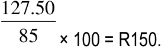
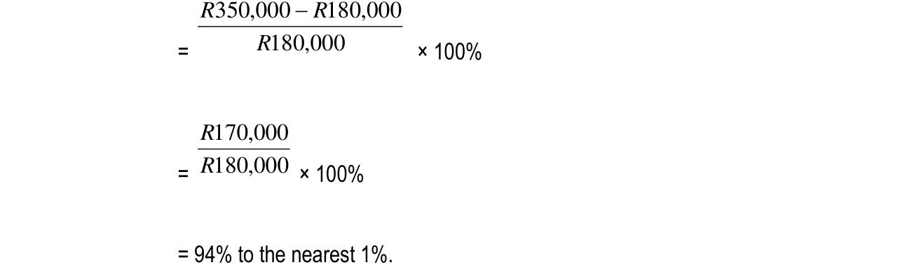
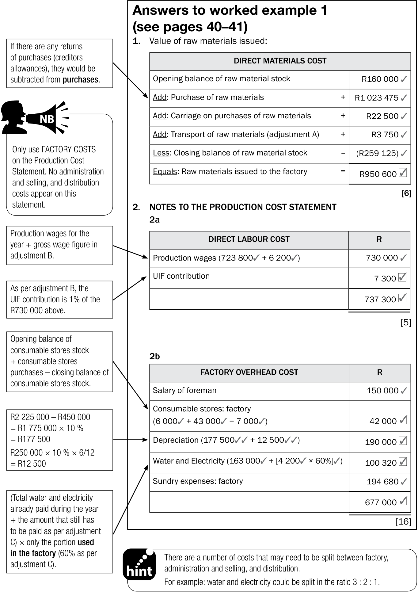
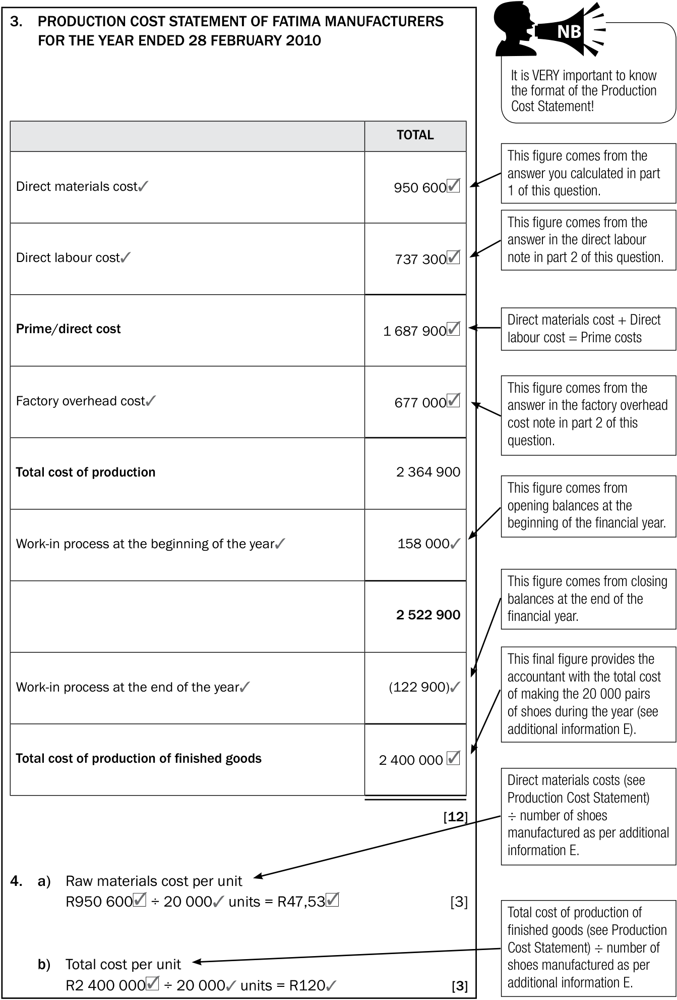
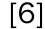
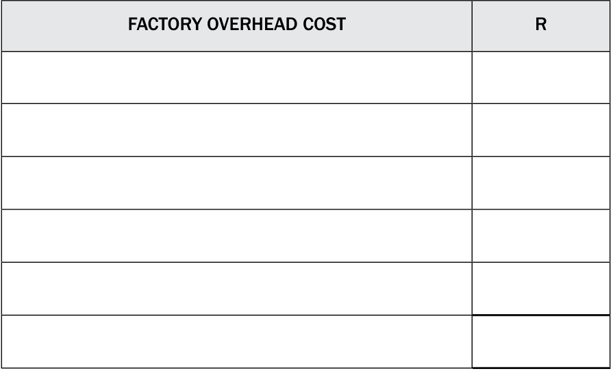
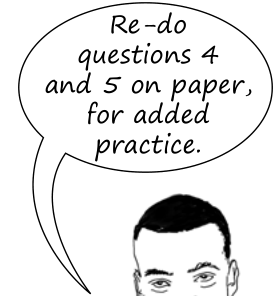

# Term 1 Topic 3: Bank Reconciliation

## What is Bank Reconciliation?
Bank reconciliation is a vital internal control procedure. It involves comparing the business's internal cash records against the information provided by the bank to ensure they match.

### Comparison of Records
| Records of the Business | Records of the Bank |
| :--- | :--- |
| Cash Receipts Journal (CRJ) | Bank Statement |
| Cash Payments Journal (CPJ) | |
| Bank Account (General Ledger) | |

### Why do differences occur?
Differences between the business records and the bank statement usually arise due to:
1. **Timing differences:** Transactions recorded by one party but not yet processed by the other.
2. **Errors:** Mistakes made either by the business or the bank when recording information.

---

## Reasons for Bank Reconciliation
Performing a bank reconciliation serves several key purposes:
* **Verification:** It confirms the actual amount of cash available in the bank account.
* **Control:** It enables the business to monitor and control cash flow effectively.
* **Accuracy:** It provides an opportunity to identify and eliminate errors on the bank statement.
* **Security:** It helps uncover irregularities or fraudulent activities.

---

## Procedure for Bank Reconciliation
To perform a bank reconciliation, follow these systematic steps:

1. **Review Previous Records:** Compare the bank reconciliation statement from the previous month with the current bank statement. Mark all items that do not appear in both sets of records.
2. **Verify Receipts:** Compare the amounts in the bank column of the **Cash Receipts Journal (CRJ)** with the deposits (credits) shown on the bank statement. Mark any differences.
3. **Verify Payments:** Compare the amounts in the bank column of the **Cash Payments Journal (CPJ)** with the payments (debits) shown on the bank statement. Mark any differences.
4. **Investigate and Correct:** Investigate all items marked from the previous bank reconciliation statement. Make necessary corrections or carry them forward to the current bank reconciliation statement.

<!-- DIAGRAM_PLACEHOLDER: diagram -->

---

# Term 1 Topic 3: Bank Reconciliation

## The Bank Reconciliation Process
To ensure the business's financial records match the bank's records, follow these steps:

1. **Identify Differences:** Compare the bank statement with the business's cash journals.
2. **Record in Journals:** Record items found on the bank statement (that the business was unaware of) into the Cash Receipts Journal (CRJ) or Cash Payments Journal (CPJ).
3. **Record in Reconciliation Statement:** Record items found in the cash journals (that the bank has not yet processed) into the Bank Reconciliation Statement.
4. **General Ledger Posting:** Post the new totals from the updated cash journals to the Bank account in the General Ledger.
5. **Verification:** The final balance of the Bank account in the General Ledger must equal the balance shown on the Bank Reconciliation Statement.

> **Note:** The business compiles the bank reconciliation statement, not the bank. It serves as a tool to track information that the bank has not yet processed.

---

## Possible Entries in Cash Journals

### Cash Receipts Journal (CRJ)
Use the CRJ to record money received that increases the bank balance:
* Direct deposits into the current bank account.
* Receipts previously omitted or not recorded.
* Cancellation of cheques.
* Corrections of payments (if the amount originally recorded in the CPJ was too high).
* Interest received from the bank (not yet recorded).

### Cash Payments Journal (CPJ)
Use the CPJ to record payments that decrease the bank balance:
* Stop orders or debit orders paid by the bank but not yet recorded by the business.
* Bank charges.
* Interest on overdraft.
* Cheques received from debtors that were dishonoured (RD).
* Corrections of payments (if the amount originally recorded in the CPJ was too low).
* Electronic fund transfers (EFTs) not yet recorded.
* Payments previously omitted or not recorded.

---

## Possible Entries on the Bank Reconciliation Statement
These items represent timing differences or bank errors that will be processed by the bank in the future:

* **Outstanding deposits:** Money deposited by the business but not yet reflected on the bank statement.
* **Outstanding cheques:** Cheques issued by the business but not yet presented to the bank for payment.
* **Bank errors:** Corrections for mistakes made by the bank.

<!-- DIAGRAM_PLACEHOLDER: diagram -->

---

# Term 1 Topic 3: Bank Reconciliation

## No Entry Procedures
Certain transactions do not require an immediate entry in the business's books. Follow these guidelines:

*   **Post-dated cheques from debtors:**
    1. Record the cheque in the post-dated cheque received register.
    2. Keep the cheque in a safe place until the date on the cheque.
    3. Issue a receipt on the date shown on the cheque.
    4. Record the cheque in the Cash Receipts Journal (CRJ).
    5. Deposit the cheque.
*   **Outstanding items:** No new entry is required when outstanding deposits or outstanding cheques from a previous Bank Reconciliation Statement appear on the current month’s bank statement.

---

## Exercise 1: Mass Traders
The following information relates to the records of Mass Traders.

### 1. Bank Reconciliation Statement
**BANK RECONCILIATION STATEMENT of Mass Traders on 31 May 20.2**

| Description | Debit | Credit |
| :--- | :--- | :--- |
| Favourable balance as per bank statement | | 1 254 |
| Outstanding deposit | | 1 553 |
| Outstanding cheques: | | |
| No. 432 (dated 19 November 20.1) | 250 | |
| No. 778 (dated 24 May 20.2) | 2 800 | |
| No. 792 (dated 25 May 20.2) | 540 | |
| No. 798 (dated 31 May 20.2) | 1 200 | |
| No. 801 (dated 1 July 20.2) | 2 400 | |
| Unfavourable balance as per Bank account | | 4 383 |
| **Totals** | **7 190** | **7 190** |

### 2. Totals of the bank columns in the cash journals on 30 June 20.2:
*   Cash Receipts Journal: $R25\ 670$
*   Cash Payments Journal: $R19\ 800$

### 3. Additional Information
*   Cheque 432 was issued to Protea Garden Club as a donation. The club has been disbanded. The cheque needs to be cancelled.
*   Cheque 778 appeared on the bank statement on 10 June 20.2.

---

# Term 1 Topic 3: Bank Reconciliation

This section outlines the specific transactions and discrepancies identified during the bank reconciliation process for the business.

### Transaction Analysis

| Item | Description | Details |
| :--- | :--- | :--- |
| 5 | Cheque 798 | Appeared on bank statement as $R2\ 100$ (Correct amount). Issued for furniture. |
| 6 | Outstanding Cheques | Cheques 792 and 801 did not appear on the June bank statement. |
| 7 | Deposit | Deposit of $R1\ 553$ appeared on the bank statement on 2 June. |
| 8 | Outstanding Deposit | Deposit of $R9\ 700$ did not appear on the June bank statement. |
| 9 | Bank Statement Credits | Fixed deposit matured ($R15\ 900$ including $R900$ interest); Rent received ($R4\ 450$). |
| 10 | Bank Statement Debits | Telephone ($R1\ 090$); Owner's personal telephone ($R760$); Interest ($R126$); Levies ($R467$); Fees ($R90$). |
| 11 | Dishonoured Cheques | Cheque 124 ($R1\ 870$ - no signature); Cheque 455 ($R480$ - settlement of $R500$ debt). |
| 12 | Error in CPJ | Cheque 812 recorded as $R1\ 050$ in CPJ, but appeared as $R1\ 500$ on bank statement. |
| 13 | Unrecorded Receipt | Cheque from C. Jabula ($R560$) dated 2 July. Not recorded in CRJ. |
| 14 | Outstanding Cheques | Cheque 825 (Repairs, 30 June); Cheque 828 (Rates and taxes, 31 July). |
| 15 | Bank Balance | The bank statement showed a balance of ... |

### Key Concepts for Reconciliation

*   **Outstanding Deposits:** Amounts recorded in the Cash Receipts Journal (CRJ) but not yet processed by the bank.
*   **Outstanding Cheques:** Cheques issued and recorded in the Cash Payments Journal (CPJ) but not yet presented to the bank for payment.
*   **Dishonoured Cheques:** Cheques previously received from debtors that the bank refuses to pay due to issues like lack of signature or insufficient funds. These must be reversed in the journals.
*   **Bank Charges/Interest:** Items appearing on the bank statement that must be recorded in the business journals to update the bank account balance.
*   **Errors:** Discrepancies between the business records (CPJ/CRJ) and the bank statement that require correction entries.

---

# Term 1 Topic 3: Bank Reconciliation

## Instructions

### 1.1 Calculate the correct totals for the cash journals

| Cash Receipts Journal | Amount | Cash Payments Journal | Amount |
| :--- | :--- | :--- | :--- |
| Provisional total | 25 670 | Provisional total | 19 800 |
| | | | |
| | | | |
| | | | |
| | | | |
| | | | |

---

### 1.2 Draw up the Bank account for June 20.2

| Dr. | | | | BANK | | | | Cr. |
| :--- | :--- | :--- | :--- | :--- | :--- | :--- | :--- | :--- |
| | | | | | | | | |
| | | | | | | | | |
| | | | | | | | | |
| | | | | | | | | |
| | | | | | | | | |

---

### 1.3 Prepare the Bank reconciliation statement on 30 June 20.2

| BANK RECONCILIATION STATEMENT as at 30 June 20.2 | | |
| :--- | :--- | :--- |
| | **Debit** | **Credit** |
| | | |
| | | |
| | | |
| | | |
| | | |
| | | |
| | | |
| | | |
| | | |

---

# Term 1 Topic 3: Bank Reconciliation

## Exercise 2: Berg Traders

### Instructions
2.1 Record any additional entries directly in the Bank account of the business.
2.2 Prepare the Bank Reconciliation Statement on 30 June 20.2.

---

### Information

#### 1. Preliminary Totals (29 June 20.2)
*   **Cash Receipts Journal (CRJ):** R29 535
*   **Cash Payments Journal (CPJ):** R20 760

#### 2. Transactions for 30 June 20.2 (Not yet entered)
*   **Cash Sales:** R6 600 (Profit mark-up 100% on cost).
*   **Receipt 120:** Issued to Jacques Café for R380 to settle an account of R400 (Discount allowed: R20).
*   **Payment to Lida Wholesalers:** R780 by cheque 837; received R50 discount (Discount received: R50).
*   **Cash Float:** Drew a cheque for R500.
*   **Petty Cash:** Issued a cheque to restore the imprest amount of R250.
*   **Salaries Journal Deductions & Contributions:**

| Deductions of employees | Amount |
| :--- | :--- |
| SA Pension Fund | R700 |
| SA Medhelp | R800 |
| PAYE | R2 200 |

| Employer's contributions | Amount |
| :--- | :--- |
| SA Pension Fund | R700 |
| SA Medhelp | R800 |

*Note: Consecutive cheques were issued for these payments.*

#### 3. Bank Reconciliation Statement (31 May 20.2)
*   **Favourable bank balance:** R3 450
*   **Outstanding deposits:** R1 200

---

### Instructional Notes & Calculations

#### Calculation of Cost of Sales
Since the mark-up is 100% on cost:
$$\text{Selling Price} = \text{Cost} + 100\% \text{ of Cost}$$
$$\text{Selling Price} = 2 \times \text{Cost}$$
$$\text{Cost} = \frac{R6 600}{2} = R3 300$$

#### Calculation of Total Payments for Deductions/Contributions
The business must pay the total of employee deductions and employer contributions:
*   **Pension Fund:** $R700 + R700 = R1 400$
*   **Medhelp:** $R800 + R800 = R1 600$
*   **PAYE:** $R2 200$

---

### 2.1 Bank Account (General Ledger)

| Dr | Bank Account | | Cr |
| :--- | :--- | :--- | :--- |
| **Details** | **Amount** | **Details** | **Amount** |
| Balance b/d | 3 450 | CPJ (Total) | 20 760 |
| CRJ (Total) | 29 535 | Lida Wholesalers | 780 |
| Cash Sales | 6 600 | Cash Float | 500 |
| Jacques Café | 380 | Petty Cash | 250 |
| | | Pension Fund | 1 400 |
| | | Medhelp | 1 600 |
| | | SARS (PAYE) | 2 200 |
| | | Balance c/d | 12 375 |
| **Total** | **39 965** | **Total** | **39 965** |

---

### 2.2 Bank Reconciliation Statement as at 30 June 20.2

| Description | Amount |
| :--- | :--- |
| Balance as per Bank Account | 12 375 |
| Outstanding deposits | 1 200 |
| **Balance as per Bank Statement** | **13 575** |

<!-- DIAGRAM_PLACEHOLDER: diagram -->

---

# Term 1 Topic 3: Bank Reconciliation

## 1. Outstanding Cheques (Previous Period)
The following cheques were outstanding from the previous reconciliation:
*   Cheque No. 801: R1 500
*   Cheque No. 811: R1 400
*   Cheque No. 812: R2 700
*   Balance as per bank account: ?

## 2. Reconciliation: May 31 to June 20.2
Comparing the bank statement of June 20.2 with the bank reconciliation statement of 31 May 20.2 revealed:
*   Deposits of R1 200 and R1 500 were credited by the bank on 1 June 20.2.
*   Cheque 801 was presented at the bank for payment.

## 3. Comparison: Bank Statement vs. Cash Journals (June 20.2)
The following discrepancies and transactions were identified:

| Transaction Description | Amount (R) |
| :--- | :--- |
| Direct deposit by tenant (Andile Kumalo) | 800 |
| Cheque 806 (Error: Journal R204 vs Bank R240) | 36 (Difference) |
| Debit order: OutInsure (Fire insurance) | 150 |
| Levy on credit card sales | 49 |
| Service fees | 110 |
| Government levy on cheques | 20 |
| Dishonoured cheque: Rene Brand (Insufficient funds) | 3 600 |
| Cancelled cheque: 811 (Lost, re-issued 30 June) | 2 700 |
| Outstanding deposit (30 June 20.2) | ? |
| Outstanding cheques (Issued 30 June 20.2) | ? |
| Favourable bank statement balance (30 June 20.2) | 10 360 |

### Key Notes for Reconciliation:
*   **Errors:** When a cheque is recorded incorrectly in the journal (e.g., R204) but cleared at the correct amount (e.g., R240), the difference of $R240 - R204 = R36$ must be adjusted in the Cash Payments Journal (CPJ).
*   **Dishonoured Cheques:** These must be reversed in the Cash Receipts Journal (CRJ) as they represent money that was not actually received.
*   **Cancelled Cheques:** If a cheque is lost and re-issued, the original entry must be reversed (usually in the CRJ) and the new cheque recorded in the CPJ.
*   **Bank Charges/Levies:** These are recorded directly in the CPJ as they appear on the bank statement but not in the business journals.

---

# Term 1 Topic 3: Bank Reconciliation

Bank reconciliation is the process of matching the balances in an entity's accounting records for a cash account to the corresponding information on a bank statement.

---

## 1. Bank Account (General Ledger)
The Bank Account is an asset account in the General Ledger. It records all transactions that affect the business's cash balance.

| Dr. | BANK | Cr. |
| :--- | :--- | :--- |
| | | |
| | | |
| | | |
| | | |
| | | |
| | | |
| | | |
| | | |
| | | |
| | | |
| | | |
| | | |

---

## 2. Bank Reconciliation Statement
The Bank Reconciliation Statement is a report that explains the difference between the bank balance shown in the organization's bank statement and the corresponding amount shown in the organization's own accounting records.

### BANK RECONCILIATION STATEMENT as at 30 June 20.2

| Details | Debit | Credit |
| :--- | :--- | :--- |
| | | |
| | | |
| | | |
| | | |
| | | |
| | | |
| | | |
| | | |
| | | |
| | | |
| | | |
| | | |

---

---

# Term 1 Topic 3: Bank Reconciliation

## Exercise 3: Analysis of Transactions for Mbedzi Traders (June 20.2)

The following transactions must be analysed to determine their impact on the Cash Receipts Journal (CRJ), Cash Payments Journal (CPJ), and the Bank Reconciliation Statement.

### Transactions Analysis

| No. | Transaction Description | Impact / Treatment |
| :--- | :--- | :--- |
| 1 | Deposit of R9 800 in CRJ but not on bank statement. | Outstanding deposit (Bank Reconciliation Statement). |
| 2 | Rent of R3 200 deposited directly into bank. | Record in CRJ (Direct Deposit). |
| 3 | Bank debits: Insurance (R1 100), Cell phone (R685), Bank charges (R245). | Record in CPJ (Debit orders and Bank charges). |
| 4 | Dishonoured cheque from F. Mudau (R900). | Record in CPJ (Reversal of receipt). |
| 5 | Cheque 655 (R7 680) cancelled; replaced by cheque 675. | Record in CPJ (Cancellation of old cheque and issue of new). |
| 6 | Cheque from debtor (R764) dated 3 July 20.2. | Post-dated cheque: Do not record in June journals. |
| 7 | Cheque 673 (R2 450) in CPJ but not on bank statement. | Outstanding cheque (Bank Reconciliation Statement). |

---

### Key Concepts & Definitions

*   **Outstanding Deposit:** Money recorded in the business's CRJ but not yet processed by the bank at the end of the month.
*   **Outstanding Cheque:** A cheque issued and recorded in the CPJ, but not yet presented to the bank for payment by the payee.
*   **Dishonoured Cheque:** A cheque received from a debtor that the bank refuses to pay due to insufficient funds in the debtor's account. This must be reversed in the CPJ.
*   **Direct Deposit:** Payments made directly into the business bank account by third parties (e.g., rent), which must be recorded in the CRJ.
*   **Debit Order:** An instruction to the bank to pay a specific amount to a third party automatically. These are recorded in the CPJ.
*   **Post-dated Cheque:** A cheque with a future date. It cannot be processed until that date and is excluded from the current month's journals.

---

# Term 1 Topic 3: Bank Reconciliation

## Examples
1. The bank statement showed a debit for the insurance premium of the business.
2. Cheque 354 has not been presented for payment, $R5\ 600$.
3. The outstanding deposit on the previous bank reconciliation statement appeared on the bank statement of this month.

## Bank Reconciliation Processing Table

| No. | Details in subsidiary journal | Amount | Bank account | Bank reconciliation statement | No entry |
| :--- | :--- | :--- | :--- | :--- | :--- | :--- | :--- | :--- |
| | **Subsidiary journal** | **Name of account in General Ledger** | | **Debit** | **Credit** | **Debit** | **Credit** | |
| Ex. 1 | CPJ | Insurance | | | $\checkmark$ | | | |
| Ex. 2 | | | | | | $\checkmark$ | | |
| Ex. 3 | | | | | | | | $\checkmark$ |

---

### Internal Control: Materials
*   Any errors in production must be recorded.
*   Wasted materials must be recorded.
*   The owner should discuss reports on materials with employees regularly.

---

### Term 1, Topic 3: Bank Reconciliation

#### Exercise 1

**1.1 Totals for the Cash Journals**

| Cash Receipts Journal | Amount | Cash Payments Journal | Amount |
| :--- | :--- | :--- | :--- |
| Provisional total | 19 800 | Provisional total | 19 800 |
| Equipment | 900 | Equipment | 900 |
| Telephone | 1 090 | Telephone | 1 090 |
| Drawings | 760 | Drawings | 760 |
| Interest on overdraft | 126 | Interest on overdraft | 126 |
| Bank charges | 557 | Bank charges | 557 |
| Debtors control | 1 870 | Debtors control | 1 870 |
| Debtors control | 480 | Debtors control | 480 |
| Vehicle expenses | 450 | Vehicle expenses | 450 |
| **Total** | **26 033** | **Total** | **26 033** |

**1.2 Bank Account for June 20.2**

| Dr. | | | | | **BANK** | | | | | Cr. |
| :--- | :--- | :--- | :--- | :--- | :--- | :--- | :--- | :--- | :--- | :--- |
| **20.2** | | | | | | **20.2** | | | | |
| Jun. | 30 | Total receipts | CRJ | 47 270 | Jun. | 1 | Balance | b/d | 4 383 |
| | | | | | | 30 | Total payments | CPJ | 26 033 |
| | | | | | | | | Balance | c/d | 16 854 |
| | | | | 47 270 | | | | | | 47 270 |
| Jul. | 1 | Balance | b/d | 16 854 | | | | | | |

---

### 1.3 Bank Reconciliation Statement (30 June 20.2)

The Bank Reconciliation Statement is used to reconcile the balance shown on the bank statement with the balance in the business's Bank account in the General Ledger.

| BANK RECONCILIATION STATEMENT as at 30 June 20.2 | Debit | Credit |
| :--- | :---: | :---: |
| Credit balance as per bank statement | | 29 394 |
| Credit outstanding deposit | | 9 700 |
| Credit outstanding cheques: | | |
| No 797 | 540 | |
| No 801 | 2 400 | |
| No 825 | 3 100 | |
| No 828 | 16 200 | |
| Debit balance as per Bank account | 16 854 | |
| **Totals** | **39 094** | **39 094** |

---

### Exercise 2: Bank Account (General Ledger)

The Bank account records all cash receipts (from the Cash Receipts Journal - CRJ) and all cash payments (from the Cash Payments Journal - CPJ).

| Dr. | BANK | | | | Cr. |
| :--- | :--- | :--- | :--- | :--- | :--- |
| **20.2** | | | | **20.2** | | |
| Jun. 29 | Total receipts | CRJ | 29 535 | Jun. 1 | Balance | b/d | 1 050 |
| 30 | Sales | CRJ | 6 600 | 29 | Total payments | CPJ | 20 760 |
| | Debtors control | CRJ | 380 | 30 | Creditors control (cheque 837) | CPJ | 780 |
| | Rent income | CRJ | 800 | | Cash float (cheque 838) | CPJ | 500 |
| | Trading stock | CRJ | 2 700 | | Petty cash (cheque 839) | CPJ | 250 |
| | | | | | Pension fund (cheque 840) | CPJ | 1 400 |
| | | | | | Medical aid (cheque 841) | CPJ | 1 600 |
| | | | | | SARS (PAYE) (cheque 842) | CPJ | 2 200 |
| | | | | | Creditors control | CPJ | 36 |
| | | | | | Insurance | CPJ | 150 |
| | | | | | Bank charges | CPJ | 179 |
| | | | | | Debtors control | CPJ | 3 600 |
| | | | | | Trading stock (cheque 843) | CPJ | 2 700 |
| | | | | | Balance | c/d | 4 810 |
| | | | **40 015** | | | | **40 015** |
| Jul. 1 | Balance | b/d | 4 810 | | | | |

---

### Bank Reconciliation Statement

A Bank Reconciliation Statement is used to reconcile the balance shown on the bank statement with the balance in the business's Bank account in the General Ledger.

#### Worked Example: Bank Reconciliation Statement as at 30 June 20.2

| Description | Debit | Credit |
| :--- | :---: | :---: |
| Credit balance as per bank statement | | 10 360 |
| Credit outstanding deposit (*balancing figure*) | | 5 000 |
| Debit outstanding cheques: | | |
| No. 812 | 8 100 | |
| No. 837 | 780 | |
| No. 838 | 500 | |
| No. 839 | 250 | |
| No. 840 | 1 400 | |
| No. 841 | 1 600 | |
| No. 842 | 220 | |
| No. 843 | 2 700 | |
| Debit balance as per Bank account | 4 810 | |
| **Total** | **15 360** | **15 360** |

---

### Exercise 3: Processing Bank Transactions

This exercise demonstrates how to categorize transactions into the appropriate journals and determine whether they affect the Bank account in the General Ledger or the Bank Reconciliation Statement.

| No. | Subsidiary Journal | Name of account in General Ledger | Amount | Bank account (Dr) | Bank account (Cr) | Bank Recon (Dr) | Bank Recon (Cr) | No entry |
| :--- | :--- | :--- | :---: | :---: | :---: | :---: | :---: | :---: |
| 1 | | | 9 800 | | $\checkmark$ | | | |
| 2 | CRJ | Rent income | 3 200 | $\checkmark$ | | | | |
| 3 | CPJ | Drawings | 1 100 | | $\checkmark$ | | | |
| 3 | CPJ | Telephone/Cellphone | 685 | | $\checkmark$ | | | |
| 3 | CPJ | Bank charges | 485 | | $\checkmark$ | | | |
| 4 | CPJ | Debtors control | 900 | | $\checkmark$ | | | |
| 5 | CPJ | Trading stock/inventory | 7 680 | $\checkmark$ | | | | |
| | CPJ | Trading stock/inventory | 7 680 | | $\checkmark$ | | | |
| | | | | | | $\checkmark$ | | |
| 6 | | | | | | | | $\checkmark$ |
| 7 | | | | | | $\checkmark$ | | |

<!-- DIAGRAM_PLACEHOLDER: diagram -->