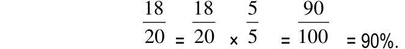
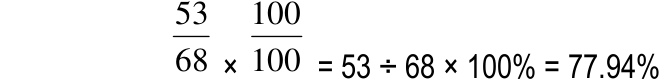
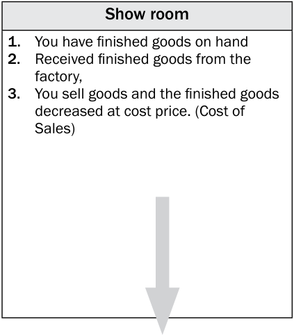
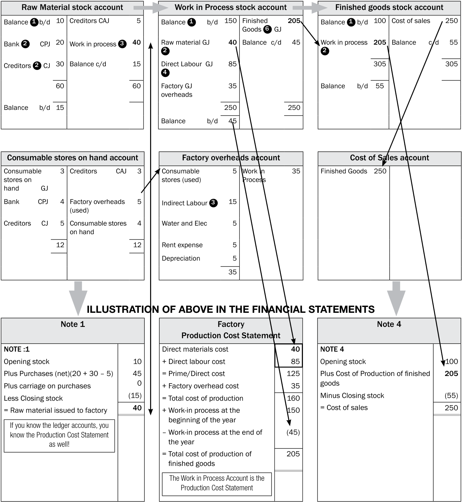
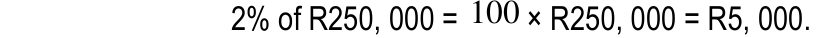

# Chapter 1: Basic Accounting Concepts

## 1.1 Basic Concepts

| Term | Definition |
| :--- | :--- |
| **Accrued expenses / expenses payable** | Expenses that are still owing at the end of the financial year. |
| **Accrued income / income receivable** | Income that is still owing to the business at the end of the financial year. |
| **Asset** | Item of value owned by a person or business which enables a profit to be made. |
| **Bad debts** | Debts written off as the debtors are unlikely to settle their accounts. |
| **Cost of sales** | The cost price of all goods that have been sold. |
| **Creditors** | People/suppliers the business owes money to. |
| **Debtors** | People who owe the business money for goods bought on credit. |
| **Depreciation** | The amount by which fixed assets reduce in value over time due to use. |
| **Income received in advance / deferred income** | Income that has already been received by a business but which is for the next financial year. |
| **Liability** | An amount owed by a person or business to another person or business. |
| **Loss** | When the expenses are more than the income. |
| **Mark-up** | The percentage added to the cost price to calculate the selling price, i.e., the profit %. |
| **Owners’ equity** | The net worth (value) of the business at any given time. Or, assets less liabilities. |
| **Prepaid expenses** | Expenses that have already been paid but which are for the next financial year. |
| **Profit** | When the income is more than the expenses. |
| **Trading stock deficit** | This amount is calculated when the physical stock-take figure is less than the figure for trading stock in the general ledger. |
| **Trading stock surplus** | This amount is calculated when the physical stock-take figure is more than the figure for trading stock in the general ledger. |

> **Note:** These definitions help you understand the meaning of basic accounting concepts that are used in this study guide. Spend time learning the meanings of these terms. Use mobile notes to help you learn them.

---

# 1.2 Rules of Accounting

> **NB:** These rules of accounting do not change. LEARN THEM WELL!!!

<!-- DIAGRAM_PLACEHOLDER: diagram -->

The following table summarizes the fundamental rules for debiting (Dr) and crediting (Cr) accounts based on the accounting equation.

### Accounting Rules Table

| ASSETS | OWNER'S EQUITY | LIABILITIES |
| :--- | :--- | :--- |
| **Dr A Cr** | **Dr Drawing Cr** | **Dr L Cr** |
| + | – | + | – | – | + |

#### Breakdown of Owner's Equity Components

| Drawing | Capital | Expenses | Income |
| :--- | :--- | :--- | :--- |
| **Dr Cr** | **Dr Cr** | **Dr Cr** | **Dr Cr** |
| + | – | – | + | + | – | – | + |
| | | | (if expenses increase then profit decreases) | (if expenses decrease then profit increases) | (if income decreases then profit decreases) | (if income increases then profit increases) |

### Summary of Rules

*   **Assets:** Increase on the Debit (Dr) side and decrease on the Credit (Cr) side.
*   **Liabilities:** Increase on the Credit (Cr) side and decrease on the Debit (Dr) side.
*   **Capital:** Increases on the Credit (Cr) side and decreases on the Debit (Dr) side.
*   **Drawings:** Increases on the Debit (Dr) side and decreases on the Credit (Cr) side.
*   **Expenses:** Increases on the Debit (Dr) side (decreasing profit) and decreases on the Credit (Cr) side (increasing profit).
*   **Income:** Increases on the Credit (Cr) side (increasing profit) and decreases on the Debit (Dr) side (decreasing profit).

---

# Chapter 1: Basic Accounting Concepts
## 1.3 Classification of Accounts

### Assets, Liabilities, and Equity

| Non-Current Assets | Current Assets |
| :--- | :--- |
| **Tangible/fixed assets** | **Inventories** |
| • Land and buildings | • Trading stock |
| • Equipment | • Consumable stores on hand |
| • Vehicles | **Trade and other receivables** |
| **Financial assets** | • Debtors’ control |
| • Fixed deposit (> 12 months) | • Accrued income/income receivable |
| | • Prepaid expenses |
| | **Cash and cash equivalents** |
| | • Bank (DR) |
| | • Petty cash |
| | • Cash float |
| | • Fixed deposit (< 12 months) |

| Non-Current Liabilities | Current Liabilities |
| :--- | :--- |
| (> 12 months to pay) | (< 12 months to pay) |
| • Mortgage bond | • Trade creditors |
| • Loans | • Bank overdraft (CR) |
| | • Short-term portion of loan |
| | • Accrued expenses/expenses payable |
| | • Income received in advance/deferred income |

### Owner's Equity: Income and Expenses

| Expenses | Income |
| :--- | :--- |
| • Cost of sales | • Sales |
| • Interest expense | • Current income |
| • Rent expense | • Interest income |
| • Salaries and wages | • Rent income |
| • Stationery | • Discount received |
| • Fuel | • Bad debts recovered |
| • Packing material | • Profit on sale of asset |
| • Repairs | • Trading stock surplus |
| • Insurance | • Provision for bad debts adjustment (–) |
| • Advertising | |
| • Discount allowed | |
| • Telephone | |
| • Water and electricity | |
| • Loss on sale of asset | |
| • Bad debts | |
| • Depreciation | |
| • Trading stock deficit | |
| • Provision for bad debts adjustment (+) | |

***

## Activity 1: Matching items
Choose a definition from COLUMN B that matches the type of account in COLUMN A.

| Column A | Column B |
| :--- | :--- |
| 1. Fixed/tangible assets | A. This increases profit and therefore increases owner’s equity. |
| 2. Current assets | B. This decreases profit and therefore decreases owner’s equity. |
| 3. Non-current liabilities | C. Amounts owing that will take longer than 12 months to pay off. |
| 4. Current liabilities | D. Assets which are expected to be kept for a long period of time, usually longer than a year. Without them the business will not exist or earn a profit. |
| 5. Income | E. The value (net worth) of the business at any point in time ($\text{total assets} - \text{total liabilities}$). |
| 6. Expenses | F. Amounts owing that will be paid back within 12 months. |
| 7. Owner’s equity | G. Assets which are expected to be converted into cash in a short period of time (i.e. less than a year). |

---

# Chapter 1: Basic Accounting Concepts

## Answers to Activity 1

| Column A | Column B |
| :--- | :--- |
| 1 | D |
| 2 | G |
| 3 | C |
| 4 | F |
| 5 | A |
| 6 | B |
| 7 | E |

---

## Activity 2: Multiple-choice Questions

**Instructions:** Three options are provided as possible answers to the following questions. Circle the correct answer.

| Question | Options |
| :--- | :--- |
| 1. Bank overdraft is classified as a... | A: Non-current liability   B: Current asset   C: Current liability |
| 2. Consumable stores on hand is classified as... | A: Owner's equity   B: Current asset   C: An expense |

---

## Answers to Activity 2

| No. | Answer | Explanation |
| :--- | :--- | :--- |
| 1 | C | This is a current liability because it will be paid back within 1 year (short-term). |
| 2 | B | This is a current asset because the business will use them within the next 12 months. |

---

# 1.4 Steps to Recording Transactions

To record financial transactions accurately, follow these five logical steps based on the double-entry principle.

### The Three Guiding Questions
Before recording, ask yourself:
1. **Assets:** Is the asset increasing or decreasing?
2. **Liabilities:** Is the debt increasing or decreasing?
3. **Owner's Equity:** Is the interest of the owner increasing or decreasing?

---

### The Five-Step Process
1. **Read:** Analyze the transaction or adjustment.
2. **Identify:** Determine the two accounts affected (Double-entry principle).
3. **Classify:** Decide the type of account (Asset, Liability, Expense, Income, or Equity).
4. **Debit/Credit:** Determine which account is debited (DR) and which is credited (CR).
5. **Record:** Show the effect on the Accounting Equation: $A = O + L$.

#### Worked Example
**Transaction:** Bought stationery and paid by cheque, R150.

| Account Debit | Account Credit | $A =$ | $O +$ | $L$ |
| :--- | :--- | :--- | :--- | :--- |
| Stationery | Bank | $-150$ | $-150$ | $0$ |

*Note: A zero ($0$) indicates no effect. Do not leave cells blank.*

---

### Activity 3: Accounting Equation
*Instruction: Record the following transactions assuming the bank balance is favourable (a debit balance).*

1. Wrote off a debtor's account of R500 as a bad debt.
2. Sent a cheque to a creditor to settle our account of R2 000.
3. Received rent of R5 000 from a tenant.
4. Bought trading stock on credit for R1 800.
5. Bought equipment for R600 and paid by cheque.

#### Answers to Activity 3

| No. | Account Debit | Account Credit | $A =$ | $O +$ | $L$ |
| :--- | :--- | :--- | :--- | :--- | :--- |
| 1 | Bad debts (expense increasing) | Debtors control (asset decreasing) | $-500$ | $-500$ | $0$ |
| 2 | Creditors control (liability decreasing) | Bank (asset decreasing) | $-2000$ | $0$ | $-2000$ |
| 3 | Bank (asset increasing) | Rent income (income increasing) | $+5000$ | $+5000$ | $0$ |
| 4 | Trading stock (asset increasing) | Creditors control (liability increasing) | $+1800$ | $0$ | $+1800$ |
| 5 | Equipment (asset increasing) | Bank (asset decreasing) | $\pm 600$ | $0$ | $0$ |

