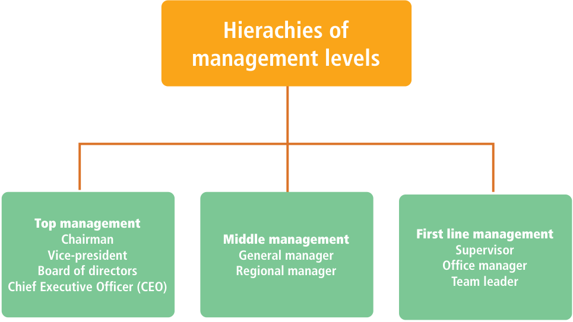
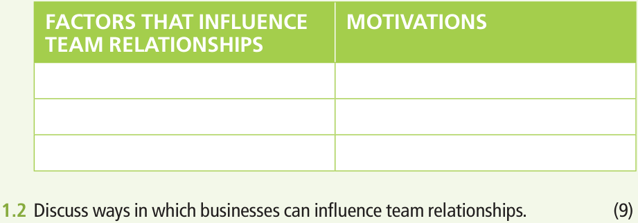

BUSINESS STUDIES **|  Grade 10** 

### **TERM 4** 

# **19**^{Relationships and} team performance 

###### **TOPIC OVERVIEW** 

- **Unit 19.1 The meaning of business objectives** 

- **Unit 19.2 Meaning of interpersonal relationships** 

###### **Learning objectives** 

###### **At the end of this topic, learners should be able to:** 

- ❖ discuss/explain ways in which people need to work together to accomplish business objectives 

- ❖ discuss/explain factors that can infl uence team relationships (for example, prejudice, beliefs, values and diversity) 

- ❖ list/understand business objectives (for example, profi t, productivity, service) 

- ❖ explain/defi ne interpersonal relationships in the workplace (for example, the different management levels, and the importance of everyone in achieving business objectives) 

- ❖ discuss/defi ne personal beliefs and values and how they infl uence business relationships (for example, prejudice, discrimination, equity and diversity) 

- ❖ list/discuss the criteria for successful and collaborative team performance in a business context and assess a team against these criteria 

- ❖ explain how team members can work in a team to accomplish business objectives (for example, setting clear objectives and agreed goals, openness, mutual respect, support and mutual trust, members committing to achieving mutual goals, sound inter-team relations, individual development opportunities and reviewing the team processes). 

**256** BUSINESS STUDIES^{|} **GRADE 10** 

**BS GRADE 10 LB.indb   256** 

**2022/03/14   10:27:40** 

###### **Key concepts** 

- **Team:** consists of two or more people who work together in a business or organisation to achieve a common goal. 

- **Relationship:** the connection between employees, colleagues, customers and suppliers. 

- **Prejudice:** a preconceived opinion or judgement of something or someone. Prejudice is normally not based on reason or fact. Prejudice can lead to discrimination. Some types of prejudice include racism, xenophobia, sexism and religious prejudice. 

- **Beliefs:** a feeling of being sure that a person or thing exists or is true or trustworthy. 

- **Values:** the beliefs, philosophies and principles that drive a business – the core values that guide the business. 

- **Diversity:** what makes people unique and includes different cultures, backgrounds, beliefs, gender, language and life experiences. 

- **Productivity:** a way to measure effi ciency. 

- **Service:** an activity that is delivered by the business to another party like a customer, or another department. 

- **Interpersonal relationships:** the relationship between two employees working at the same place. 

- **Discrimination:** certain prejudices that occur when an employee is treated unfairly because of race, gender, sexuality, religion or disability. 

- **Equity:** the practice of being fair or impartial in the workplace. Equity is achieved when there is no discrimination. 

- **Profi t:** the fi nancial advantage or benefi t 

- **Management levels:** refers to a line of demarcation between various managerial positions in an organization. 

- **Collaboration:** the action of working with someone to produce something. 

- ■ **Openness:** the quality of being relatively free from obstruction or relatively unoccupied: 

- **Mutual respect:** underpins good relationships. To have respect for a person involves a fundamental belief in their right to exist, to be heard, and to have the same opportunities as everyone else. 

- **Mutual trust:** when employees enjoy a culture of honesty, and psychological safety. 

#### **Introduction** 

Teamwork is when two or more people come together to reach a common goal. Successful teams communicate frequently and openly, team members can engage with one another, and they are fl exible to ensure the overall success of the team. 

Teamwork can be natural for some people, but diffi cult for others. Poor relationships amongst team members can be characterised by emotional and behavioural actions that can create **distress** , anger, and **withdrawal** . This can create a divided team, which in turn can lead to poorer team performance. 

In this topic we will learn about the benefi ts of teamwork and the importance of everyone on a team in achieving business objectives. We will also learn about some of the factors that can infl uence team relationships. 

###### **New words** 

**distress** extreme anxiety **withdrawal** to stop participating in a team 

**TERM 4**^{|} **TOPIC 19**^{|} **Relationships and team performance** 

**BS GRADE 10 LB.indb   257** 

**2022/03/14   10:27:40** 

**TERM 4** 

## **19.1** The meaning of business objectives 

A business objective explains in detail the steps they plan to take in order to achieve a specific goal. Types of business objectives: profit, productivity, service. A good business objective focuses on profit, productivity and service. Good business objectives are also aligned to the vision, mission and purpose of the business. 

###### **Did you know** 

#### **Examples of business objectives** 

Business objectives can: 

- provide direction to the business 

- guide the decisionmaking process 

- increase productivity and quality 

- motivate and inspire the employees 

**Improve customer service** Decrease our customer complaints by 25% in the next six months. Good customer service will help us to retain customers and generate continued/sustained revenue. 

- help to evaluate performance 

- improve customer service. 

Business objectives must be SMART: 

**S Specific M Measurable** 

**A Attainable** 

###### **Business survival** 

Grow our business by attracting and maintaining loyal customers during these difficult first three years without compromising quality. 

**R Relevant T Timely** 

**Increase profitability** Maximise profits by increasing our profitability by 2% in the next twelve months. 

###### **Increase market share** 

Increase our market share by 5% in the next six months. We will do this by launching a digital marketing campaign by the end of the month. 

**Employee retention and human resources** We value our team and want to avoid a high employee turnover as that will have a negative impact on productivity. 

###### **Social responsibility** 

Use environmentally friendly materials to produce our products and packaging. Become a “green business” by December 2030. 

**258** BUSINESS STUDIES^{|} **GRADE 10** 

**BS GRADE 10 LB.indb   258** 

**2022/03/14   10:27:42** 

**Unit 19.1** The meaning of business objectives 

###### **The benefits of teamwork** 

Teamwork is important for achieving business objectives. Teamwork can be described as a group of individuals working together **efficiently** and **effectively** towards a common goal. 

- The members of the team learn from each other and grow. 

- The team achieve more than the individual. 

- Good teamwork helps business to achieve its objectives. 

- Gives employees more control over their jobs. 

###### **New words** 

**effective** achieving a result you want **efficient** capable of producing desired results without wasting materials, time, or energy 

- The performance of all team members improves because they support each other’s skills. 

- Teamwork encourages workers to increase their range of skills to increase productivity. 

- Teamwork improves effective communication. 

- Teamwork can create strong relationships among employees, which in turn leads to better communication within a team. 

- Teamwork promotes healthy risk-taking/Working as a team allows team members to take more risks, because they have the support of the team in case of failure. 

- Teamwork promotes a wider sense of ownership when working together to achieve business objectives 

- The team members feel connected to the company which builds loyalty towards the company and individual job satisfaction. 

- Teamwork promotes creativity and learning: creativity thrives when people work together as a team. 

- Teamwork creates synergy to maximise energy levels of employees. 

###### **Recommend/Suggest ways in which businesses can create an environment that enables teams to work effectively** 

Great results can be achieved through teamwork, so it is important that a business creates an environment that enables teams to work effectively. 

- Ensure the team clearly understands the business objectives. 

- Set ground rules for the team. 

- Establish team values and goals 

- Consider each employee’s ideas as valuable. 

- Be clear and specific when communicating to prevent confusion. 

- Encourage listening and brainstorming. 

- Encourage trust, respect, and cooperation among members of the team. 

- Encourage team members to share information and resources effectively. 

- Delegate problem-solving tasks to the team. 

- Establish a method for arriving at a consensus to prevent conflict. 

- Be aware of employees’ unspoken feelings. 

**TERM 4**^{|} **TOPIC 19**^{|} **Relationships and team performance** 

**BS GRADE 10 LB.indb   259** 

**2022/03/14   10:27:42** 

**TERM 4** 

###### **Ways in which people need to work together to | Activity 19.1 accomplish business objectives** 

- **1.1** Elaborate on the meaning of business objectives. (4) **1.2** Read the scenario below and answer the questions that follow. 

###### **Burger Bash & Dash (BBD)** 

Burger Bash & Dash (BBD) encourages the employees to work together as a team. The manager observed that employees are more creative when they work with others. The employees also realised that they are communicating better. 

**1.2.1** Quote TWO benefits of teamwork from the scenario above. (2) **1.2.2** Outline other benefits of teamwork in the workplace. (6) 

###### **Different hierarchies and management levels** 

The levels in business hierarchy refer to the levels of chain of command and the, employee designations. The business hierarchy continues till the highest level consisting of the Chief Executive Officer (CEO) or the board of directors. The business hierarchy usually narrows from bottom to top. 

## **19.2** Meaning of interpersonal relationships 

Interpersonal relationships in the workplace refers to a strong association among individuals working together. 

Interpersonal relationships in the workplace allows team members to share a special relationship. Team members build up a relationship of trust, openness, understanding and effective communication. 

Everyone plays a role in achieving the business objectives. 

**260** BUSINESS STUDIES^{|} **GRADE 10** 

**BS GRADE 10 LB.indb   260** 

**2022/03/14   10:27:42** 

**Unit 19.2** Meaning of interpersonal relationships 

###### **The importance of each individual in achieving** 

###### **business objectives** 

The quality of interpersonal relationships impacts on the productivity of teams. If employees are skilled and knowledgeable, teams will be strong and efficient. Great results can be achieved through teamwork, so it is important that a business creates an environment that enables teams to work effectively. Usually, employees will take pride in their work if they are aware of how their efforts impact on achieving the business objectives. Celebrating milestones and praising team members, helps employees feel excited to be part of the team. This in turn, can lead to higher productivity. 

#### **Types of interpersonal working relationships** 

Great results can be achieved through teamwork and effective interpersonal relationships. It is important that a business creates an environment that enables teams to work effectively. Here are some examples of the different types of interpersonal relationships that can occur in the workplace. 

|**Peer** **relationships**|Peer relationships are the relationships between employees that are on the same level at the workplace. Employees are equal and the relationships are based on mutual respect.|
|---|---|
|**Group** **relationships**|Group relationships are the relationships between members of a team or group. Healthy group relationships will ensure good results, whereas poor relationships between group members may result in conflict.|
|**Authority** **relationships**|Authority relationships are relationships between a manager and a subordinate. This relationship is based on mutual respect.|
|**External** **relationships**|External relationships in a workplace refer to the relationships with people outside of the company or business. These types of relationships are usually based on service delivery or outsourcing.|

#### **Factors that can influence team relationships** 

There are several factors that can influence team relationships. In this section we will look at some of these factors. 

###### **Did yo u know** 

How to reduce prejudice within ourselves and in the workplace Prejudice can be defined as negative feelings towards a person based solely on a specific group to which they belong. Common types of prejudices in the workplace are ageism, sexism, racism, xenophobia, classism, and religious discrimination. We as individuals can reduce prejudice in the workplace in the following ways: 

1. Acknowledge that you have learned prejudicial information about people. 

2. Confront the stereotypes you have learned. 

3. Make a commitment to change and make a commitment to a process of change. 

|**Factors that  l** **relationship**|**can influence team** **s**|**Ways in which business** **can address factors**|
|---|---|---|
|Prejudice|Prejudice is a negative attitude towards an individual. This attitude is usually based on the differences between individuals who may belong to a particular social group. For example, prejudice is common against people who are members of an unfamiliar cultural group.|**•**Teambuilding activities among staff members. **•**Awareness of cross-cultural differences.|
|Discrimination|Discrimination is negative action toward an individual because of their belonging to a certain gender, race, religion or sexual orientation.|**•**Human relation policy should include that discrimination will not be allowed. **•**Procedure to report discrimination in the business.|

**TERM 4**^{|} **TOPIC 19**^{|} **Relationships and team performance** 

**BS GRADE 10 LB.indb   261** 

**2022/03/14   10:27:42** 

###### **TERM 4** 

###### **Did you know** 

Read the following article about the secrets of a successful team relationships. 

1. Trust yourself and trust your team members. 

2. Show up and do your best. 

3. Respect the efforts and ideas of others. Give credit where credit is due. 

4. Accept constructive criticism and use the feedback to improve yourself. 

5. Embrace the goals of the team and work toward them. 

6. Communicate! Never assume a team member understands what you are planning. 

7. Ensure everyone in the team has clear expectations and work towards the objectives. 

8. Recognise the skills and talents of your team members. 

9. Support the team and team members even if things go wrong. 

10. Divide the tasks fairly among team members and do all planning proactively. 

|**Factors th  l** **relationsh**|**at can influence team** **ips**|**Ways in which business** **can address factors**|
|---|---|---|
|Diversity|Diversity is the practice of including or involving people from a range of different social and ethnic backgrounds, and of different genders and sexual orientations.|**•**Adhere to policy of equal opportunities when appointing new staff. **•**Teambuilding activites amongst staff members.|
|Belief|Belief is a conviction that we generally accept to be true without evidence or proof. Beliefs are related to culture and religion. Beliefs influence our thoughts and attitudes, and we must be aware of them.|**•**Awareness of moral values and integrity in the business.|
|Equity|**•**Equity in the workplace to respectful and dignified treatment of every person in the business. **•**Equity encourages diversity in decision making/allows job satisfaction and employee engagement.|**•**Human resource policy should promote equity through appointments, promotion and allocation of resources.|

A team member’s lack of self-awareness can have an impact on the productivity of a team. Individual and cultural differences may complicate the interpersonal relationships in the workplace. Discrimination, prejudice, and beliefs can also have an impact on the performance of a team. 

###### **Ways to promote healthy interpersonal relationships in the workplace** 

Having empathy for others is an important skill employees need to build healthy interpersonal relationships in the workplace. Empathy helps team members to consider the thoughts, feelings and needs of others. Relying on other people builds trust and teamwork establishes strong relationships. Despite occasional disagreements, an effective team enjoys working together and shares a strong bond. 

###### **Ways in which businesses can address factors that influence team relationships** 

A business can create an environment that enables teams to work effectively: 

- The business can make sure that employees understand and believe in business objectives. 

- The business should listen to employees when they share ideas. 

- Important decisions should be taken through a process of teamwork. 

- Good teamwork needs to be rewarded and mistakes must be viewed as opportunities to learn and grow. 

- Being clear and specific when communicating to prevent confusion. 

- Encouraging trust, respect, and cooperation among members of the team. 

- Encouraging team members to share information and resources effectively. 

- Delegating problem-solving tasks to the team. 

- Establishing a method for arriving at a consensus to prevent conflict. 

BUSINESS STUDIES^{|} **GRADE 10** 

**BS GRADE 10 LB.indb   262** 

**2022/03/14   10:27:42** 

**Unit 19.2** Meaning of interpersonal relationships 

###### **| Activity 19.2 Team relationships** 

Read the scenario below and then answer the questions that follow. 

###### **OFFICE STATIONERIES (OS)** 

Office Stationeries formed a sales team that sells their stationery in the Free State. Some team members do not tolerate each other due to different cultural beliefs. Paul also does not like Zizi because he does not know her. 

- **1.1** Identify TWO factors that influences team relationships. Motivate your answer by quoting from the scenario above. (6) 

Use the table below as the guide to answer this question. 

#### **Criteria for successful and collaborative team performance in a business** 

Working in a team to achieve business objectives requires clear objectives, openness, mutual respect, support, and mutual trust. Team members need to be committed to the business. 

In order to improve teamwork, regular review of the team processes needs to be done. 

###### **Criteria for successful team performance** 

Team members must know what they want to achieve. 

**TERM 4**^{|} **TOPIC 19**^{|} **Relationships and team performance** 

**BS GRADE 10 LB.indb   263** 

**2022/03/14   10:27:43** 

**TERM 4** 

###### **Clear objectives and agreed goals** 

- Team members  must agree on goals and set clear objectives. 

- Team members who agree to the goals will be more committed. 

- Team members will show  more commitment if the objectives are understood clearly. Teams need to  focus on the agreed goals essential for success. 

- **•** Team members should know what they want to achieve. 

- Clear goals for direction. 

###### **Interpersonal attitudes and behaviour** 

- Team members have a positive attitude of support and motivation towards each other. 

- Good interpersonal relationships will ensure job satisfaction and, in this way, increase the productivity of the team. 

- Team members are committed and enthusiastic towards achieving a common goal. 

- Team leaders give credit to members for positive contributions. 

###### **Shared values and mutual respect** 

- Shows respect for the knowledge or skills of other members. 

- Perform team tasks with integrity meeting team deadlines with necessary commitment to team goals. 

- Shows loyalty ,respect and trust towards team members despite differences. 

- Shows respect for the knowledge/skills of other members. 

- Perform team tasks with integrity/pursuing responsibility/meeting team deadlines with necessary commitment to team goals. 

###### **Communication** 

- A clear set of processes and procedures for teamwork ensures that every team member understands their role. 

- Efficient communication between team members may result in quick decisions. 

- Quality feedback from team members will improve the morale of the team. 

- Open discussions between team members will lead to effective problem solving. 

- **•** Continuous review of team progress ensures that team members can correct/ minimise mistakes and can act pro-actively to ensure that goals are achieved. 

###### **Co-operation/Collaboration** 

- Clearly defined and realistic goals will ensure all team members know exactly what is expected of them. 

###### **Did you know** 

When a company environment is focused on collaboration, team members naturally feel a part of something bigger than themselves. 

- All team members should actively participate in the decision-making process. 

- Show a willingness to cooperate as a unit to achieve team objectives. 

- Co-operate with management to achieve team/business objectives. 

- Agree on how to get a task done effectively and without wasting time on conflict resolution. 

- A balanced composition of skills, knowledge, experience and expertise ensures that teams achieve their objectives. 

**264** BUSINESS STUDIES^{|} **GRADE 10** 

**BS GRADE 10 LB.indb   264** 

**2022/03/14   10:27:44** 

**Unit 19.2** Meaning of interpersonal relationships 

###### **Mutual respect, support, and trust** 

- Team members must not fear being laughed at or rejected for expressing concerns. This will encourage participation. 

- Team members should consult with all group members. 

- Team members should learn from one another. 

- Team members must support and trust one another to be an effective team. 

- Reliability, doing what you say you will and taking risks with others help to build mutual trust 

###### **Consolidation** 

###### **QUESTION 1** 

- **1.1** Define the following concepts: 

   - **1.1.1** working relationship 

   - **1.1.2** interpersonal relationships 

(2) 

(2) 

- **1.2** Read the scenario below and answer the questions that follow. 

###### **HAZELNUT SYSTEMS (HS)** 

Hazelnut Systems (HS) is an IT company that specialises in implementing accounting systems. The team members work together closely with each other. The accounting projects team has a reputation of never missing a target date or deadline.  Ayanda has a reputation for not always getting along with all the team members. He never delegates tasks to younger team members because he believes that younger people do not have enough experience. This has led to discontent among the team and has caused quarrelling and fighting within the team. 

- **1.2.1** Identify FOUR factors that influence team relationships from the scenario above. 

- **1.2.2** Explain THREE different ways in which Hazelnut (Pty) Ltd can address factors that influence team relationships. (6) 

###### **QUESTION 2** 

Poor relationships among team members can be influenced by emotional and behavioural actions. Teamwork plays an important role in achieving goals and objectives. Working as a team can benefit the business. Businesses must ensure that they create an environment that enables teams to work effectively. 

Write an essay on relationships and team performance in which you include the following aspects: 

- Outline the factors that can influence team relationships 

- Explain the following criteria for successful team performance: 

- Discuss benefits of teamwork 

- Suggest ways in which businesses can create an environment that enables teams to work effectively. 

**[40]** 

**TERM 4**^{|} **TOPIC 19**^{|} **Relationships and team performance** 

**BS GRADE 10 LB.indb   265** 

**2022/03/14   10:27:44** 

###### **TERM 4** 

###### **Mind map: Topic 19 – Relationships and team performance** 

Use the mind map as a guide to consolidate the content covered in this topic. Be sure to study the content relevant to each heading. 

- **Interpersonal relationships in the workplace Personal beliefs and values, and how they infl uence business relationships** 

- Strong association among individuals working together • prejudice is a negative attitude towards 

- **The meaning of a business** an individual based on the membership 

- **objective** in a particular social group 

- • discrimination is negative action 

- A business objective is a: towards an individual as a result of • result that a company aims to ones membership to a particular group achieve and the strategies on • diversity is the practice of including how to achieve it **<mark>R</mark> ELATIONSHIPS** or involving people from a range of 

- • focus on profi t, productivity and different social and ethnic backgrounds, **AND TEAM** 

- service. Good business objectives and of different genders and sexual are aligned to the company’s **PERFORMANCE** orientations vision, mission and purpose **Criteria for a successful team Apply a SWOT analysis from given scenarios/case studies** 

- • interpersonal attitudes and behaviour • analyse the idea most likely to lead to a 

- • shared values/mutual trust viable business opportunity 

- and support • analyse the strengths and weaknesses, as 

- • communication well as possible threats and opportunities, 

- • co-operation and collaboration that will affect the business 

###### **QR CODE** 

Scan this code for a summary overview of the content covered in this topic relating to the specifi c Key Learning Points 

**266** BUSINESS STUDIES^{|} **GRADE 10** 

**BS GRADE 10 LB.indb   266** 

**2022/03/14   10:27:44** 

##### **Memoranda to activities** 

###### **| Activity 19.1 Learner’s Book page 260** 

- **1.1** Meaning of a business objectives –  A business objective is the end result  that a company aims to achieve.  –  The strategies on how to achieve the business goals  form the basis of the business objectives.  –  Business objectives should focus on profit,  productivity, and service.  –  Business objectives should also be aligned to the vision,  mission, and purpose of the business.  –  Any other relevant answer related to meaning of business objectives. **Max (4)** 

- **1.2.1** Benefits of teamwork from scenario –  The manager observed that employees are more creative when the work with others.  –  The employees also realised that with them working together, they are communicating better.  **Note: Mark the first TWO (2) only. (2 × 1) (2)** 

- **1.2.2** Other benefits of teamwork – The members of the team learn from each other and grow.  

   - The team achieve more than the individual.  

   - Good teamwork helps business to achieve its objectives.  – Gives employees more control over their jobs.  – The performance of all team members improves because they support each other’s skills.  – Teamwork encourages workers to increase their range of skills to increase productivity.  – Teamwork improves effective communication.  

   - Teamwork can create strong relationships among employees, which in turn leads to better communication within a team.  

   - –  Teamwork promotes healthy risk-taking/Working as a team allows team members to take more risks, because they have the support of the team in case of failure.  

   - Teamwork promotes a wider sense of ownership when working together to achieve business objectives.  

   - The team members feel connected to the company which builds loyalty towards the company and individual job satisfaction.  

   - Teamwork promotes creativity and learning: creativity thrives when people work together as a team.  – Teamwork creates synergy to maximise energy levels of employees.  –  Any other relevant answer related to benefits of teamwork. 

**Note: Do not mark benefits of teamwork listed in Question 1.2.1.** 

**Max (6)** 

###### **| Activity 19.2 Learner’s Book page 263** 

- **1.1** Factors that influence team relationships 

|**FACTORS THAT INFLUENCE TEAM** **RELATIONSHIPS**|**MOTIVATION**|
|---|---|
|Belief|Some team members do not tolerate each due to different cultural beliefs.|
|Prejudice|Paul also does not like Zizi because he does not know her.|
|**Submax (4)**|**Submax (2)**|

- **Note: 1. Award marks for the factors that influence team relationships if the quote is incomplete.** 

   **2. Do not award marks for the motivation if the types of contract were incorrectly motivated.** 

**(6)** 

Topic 19 Relationships and team performance 

**BS Grade 10 TG.indb   123** 

**2022/03/14   10:13:01** 

- **1.2** Ways in which businesses can adress factors influencing team relationships. 

   - The business can make sure that employees understand  and believe in business objectives.  

   - The business should listen to employees  when they share ideas.  

   - Important decisions should be taken  through a process of teamwork.  

   - Good teamwork needs to be rewarded  and mistakes must be viewed as opportunities to learn and grow.  

   - Being clear and specific when communicating  to prevent confusion.  

   - Encouraging trust, respect, and cooperation  among members of the team.  

   - Encouraging team members  to share information and resources effectively.  

   - Delegating problem-solving tasks  to the team.  –  Establishing a method for arriving at a consensus to prevent conflict.  –  Any other relevant answer related to ways to address factors that influence team relationships. **(4)** 

**Consolidation Learner’s Book page 265** 

###### **QUESTION 1** 

|**1.1.1**Working relationship –  Working relationship refers to the strong associationamong individuals working together. –  The quality of interpersonal relationshipsimpact on the productivity. –  Any other relevant answer related to working relationships. **(2**|
|---|
|**1.1.2**Interpersonal relationships –  Interpersonal relationships in the workplace refers to a strong associationamong individuals working together. –  The quality of interpersonal relationships impactson the productivity of teams. –  Interpersonal relationships in the workplacesallows team members to share a special relationship. –  Team members build up a relationship of trust,openness, understanding and effective communication. –  The degree of power and authority that managers owndepend on the level of management. – Any other relevant answer related to interpersonal relationships. **(3**|
|**1.2.1**Factors that influence team relationships –  Belief –  Prejudice –  Discrimination – Diversity – Any other relevant answer related to factors that influence team relationships. **Note: Mark the first FOUR (4) answers only.** **(4**|
|**1.2.2**Ways ito can address factors that influence team relationships –  The business can make sure that employees understandand believe in business objectives. –  The business should listen to employeeswhen they share ideas. –  Important decisions should be takenthrough a process of teamwork. –  Good teamwork needs to be rewardedand mistakes must be viewed as opportunities to learn and grow. –  Being clear and specific when communicatingto prevent confusion. –  Encouraging trust, respect, and cooperationamong members of the team. –  Encouraging team membersto share information and resources effectively. –  Delegating problem-solving tasksto the team. –  Establishing a method for arriving at a consensus to prevent conflict. –  Any other relevant answer related to ways to address factors that influence team relationships.|

**(2)** 

**(3)** 

###### **(4)** 

**(4)** 

**124** Business Studies **|** Grade 10 **|** Teachers Guide 

**BS Grade 10 TG.indb   124** 

**2022/03/14   10:13:01** 

###### **QUESTION 2** 

- **2.1** Introduction 

   - Teamwork refers to several people working together effectively to reach common goals.  

   - Working as a team requires clear business objectives.  

   - Effective teamwork is essential for achieving success.  

   - A team must work together to contribute to the success of the business.  

   - Any other introduction related to factors, criteria, benefits of teamwork. 

   - Any other relevant introduction related to factors/criteria/benefits of teamwork/ways businesses can create an environment that enables teams to work effectively. 

      - **(2 × 1) (2)** 

- **2.2** Criteria for successful team performance 

   - Communication  

   - A clear set of processes and procedures for teamwork ensures that every team member understands their role.  

   - Efficient communication between team members may result in quick decisions.  

   - Quality feedback improves the morale of the team.  

   - Open discussions lead to effective solutions of problems.  

   - Continuous review of team progress ensures that team members can rectify mistakes and can act pro-actively to ensure that goals are reached.  

|Criteria|2|
|---|---|
|Explanation|2|
|Submax|4|

###### Collaboration  

- Clearly defined realistic goals are set, so that all members know exactly what is to be accomplished.  

- All members take part in decision making  

- Willingness to co-operate as a unit to achieve team objectives.  

- Co-operate with management to achieve team/business objectives.  

- Agree on methods to get the job done effectively without wasting time on conflict resolution.  

|Criteria|2|
|---|---|
|Explanation|2|
|Submax|4|

###### Shared values  

- Shows loyalty, respect and trust towards team members despite differences.  

- Shows respect for the knowledge/skills of other members.  

- Perform team tasks with integrity/pursuing responsibility/meeting team deadlines with necessary commitment to team goals.  

|Criteria|2|
|---|---|
|Explanation|2|
|Submax|4|

###### Clear objectives and agreed goals  

- Team members must agree on goals and set clear objectives.  

- Team members who agree to the goals will be more committed.  

- Team members will show more commitment if the objectives are understood clearly.  

- Teams need to focus on the agreed goals essential for success 

- Team members should knoow what they want to achieve.  

- Clear goals for direction.  

|Criteria|2|
|---|---|
|Explanation|2|
|Submax|4|

###### Interpersonal attitudes and behaviour  

- Team members have a positive attitude of support and motivation towards each other.  

- Good interpersonal relationships will ensure job satisfaction, and in this way increase the productivity of the team.  

Topic 19 Relationships and team performance 

**BS Grade 10 TG.indb   125** 

**2022/03/14   10:13:01** 

- Team members are committed and enthusiastic towards achieving a common goal.  

- Team leaders give credit to members for positive contributions.  

|Criteria|2|
|---|---|
|Explanation|2|
|Submax|4|

**Max (16)** 

- **2.3** Factors that can influence team relationships 

   - Prejudice is a negative attitude a toward an individual based on the membership in a particular social group.  

   - Discrimination is negative action toward an individual as a result of one’s membership in a particular group.  

   - Diversity is the practice of including or involving people from a range of different social and ethnic backgrounds and of different genders, sexual orientations  

   - Belief is a conviction that we generally accept to be true, without evidence or proof. Beliefs are related to culture and religion.  

   - Beliefs influence our thoughts and attitudes, and we must be aware of it.  

   - Equity is the quality of being fair and impartial.  

   - Any other relevant answer related to factors that can influence team relationships.. 

###### **Max (8)** 

- **2.4** Benefits of teamwork 

   - Teamwork improves effective communication:  it can create strong relationships among employees that can lead to better communication.  

   - Teamwork promotes healthy risk-taking:  working as a team allows team members to take more risks, as they have the support of the group in case of failure.  

   - Teamwork promotes a wider sense of ownership:  when teams work together to achieve business objectives the employees feel connected to the company. This builds loyalty and job satisfaction.  

   - Teamwork promotes creativity and learning:  creativity thrives when people work together as a team. Brainstorming ideas as a team can create solutions. Teamwork can maximise shared learning.  

   - Teamwork promotes conflict resolution skills:  employees have unique viewpoints and conflict can happen when working together.  When conflict arises in a team, members are forced to resolve the conflicts.  

   - Teamwork can advance an individual career:  when working as part of a team an individual can expand their skills.  

   - Teamwork creates synergy:  synergy is when the combined effort of team members is much more than the sum of each member’s individual effort  

   - Any other relevant answer related to benefits of teamwork. 

###### **Max (12)** 

- **2.5** Ways in which businesses can create an environment that enables teams to work effectively 

   - The business can make sure that employees understand and believe in business objectives.  

   - The business should listen to employees when they share ideas.  

   - Important decisions should be taken though a process of teamwork.  

   - Good teamwork needs to be rewarded and mistakes must be viewed as opportunities to gain experience and grow.  

   - Being clear and specific when communicating to prevent confusion.  

   - Encouraging trust, respect and cooperation among members of the team.  

   - Encouraging team members to share information and resources effectively.  

   - Delegating problem-solving tasks to the team.  

   - Establishing a method for arriving at a consensus to prevent conflict.  

   - Any other relevant answer related toways in which businesses can create an environment that enables teams to work effectively.  

###### **Max (10)** 

**126** Business Studies **|** Grade 10 **|** Teachers Guide 

**BS Grade 10 TG.indb   126** 

**2022/03/14   10:13:01** 

- **2.6** Conclusion 

   - The successful collaboration within a team ensures that business objectives are met.  

   - Clear business objectives can lead to improved productivity.  

   - Teamwork achieves business objectives.  

   - Positive results can be achieved through teamwork  

   - Any other introduction related to factors, criteria, benefits of teamwork. 

   - Any other relevant conclusion related to factors/criteria/benefits of teamwork/ways businesses can create an environment that enables teams to work effectively. 

**(2 × 1) (2)** 

**[40]** 

|**Breakdown of mark allocation**|||
|---|---|---|
|**DETAILS**|**MAXIMUM**|**TOTAL**|
|Introduction|2||
|Outline the factors that can influence team relationships|8||
|Explain the followingcriteria for successful teamperformance:|16||
|Discuss the benefits of teamwork|12|Max 32|
|Suggest ways in which businesses can create an environment that enables teams to work effectively|10||
|Conclusion|2||
|**INSIGHT**||**8**|
|**TOTAL MARKS**||**40**|

LASO – For each component: 

Allocate 2 marks if all requirements are met. 

Allocate 1 mark if some requirements are met. 

Allocate 0 marks where requirements are not met at all. 

Topic 19 Relationships and team performance 

**BS Grade 10 TG.indb   127** 

**2022/03/14   10:13:01** 

