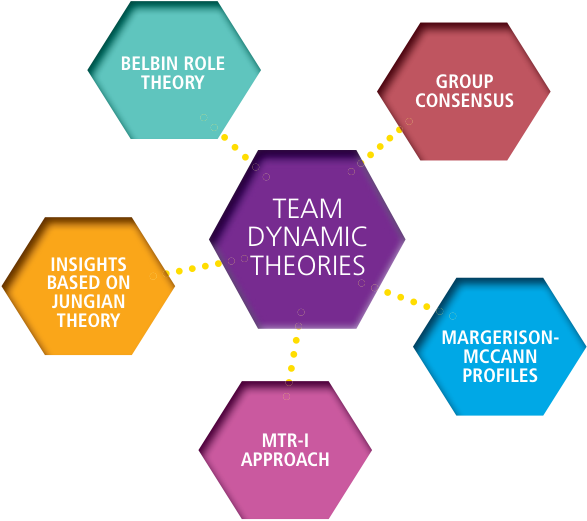
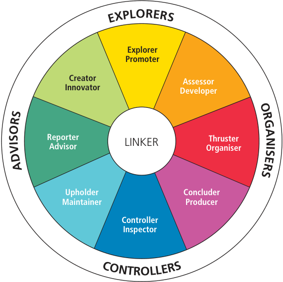
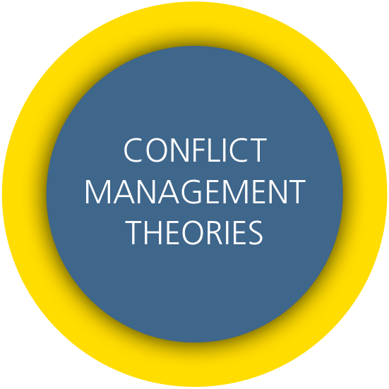
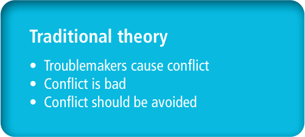
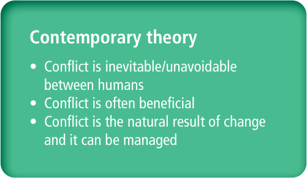
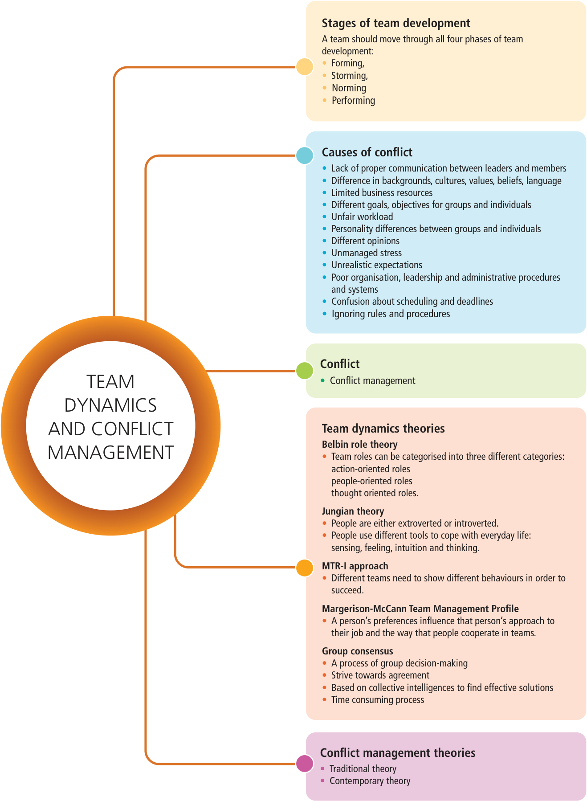
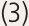
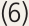
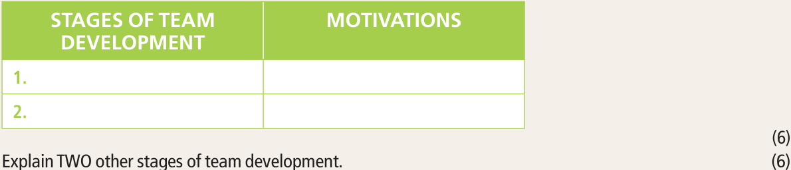
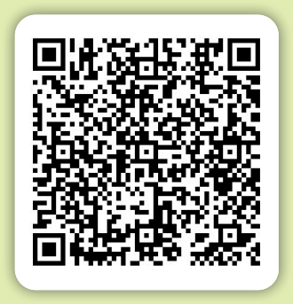

BUSINESS STUDIES **|  Grade 11** 

### **TERM 4** 

# **19**^{Team dynamics and} conflict management 

###### **TOPIC OVERVIEW** 

- **Unit 19.1 Understanding team work** 

- **Unit 19.2 Defi ning confl ict management** 

###### **Learning objectives** 

- ❖ explain/discuss the importance of teamwork 

- ❖ outline/mention/name/explain the stages of team development, for example, 

   - forming 

   - storming 

   - norming 

   - performing 

   - mourning/adjourning 

- ❖ identify the stages of team development from given scenarios/ statements/case studies 

- ❖ briefl y explain/discuss the reasons why businesses use team dynamic theories 

- ❖ describe/explain/discuss the following team dynamic theories: 

   - Belbin Role Theory 

   - Insights based on Jungian Theory 

   - MTR-I approach 

   - Margerison-McCann Profi les 

   - group consensus 

- ❖ identify the above-mentioned theories from given scenarios/ statements 

- ❖ compare the nature of the above-mentioned theories 

- ❖ defi ne the term confl ict 

- ❖ identify and discuss causes of confl ict from given scenarios/case studies 

- ❖ discuss the following confl ict management theories: 

   - traditional theory 

   - contemporary theory 

- ❖ select one of the above-mentioned confl ict management theories and justify the reason why businesses should use it to solve business problems 

**TERM 4**^{|} **TOPIC 19**^{|} **Team dynamics and confl ict management** 

**BS GRADE 11 LB.indb   305** 

**2022/03/14   10:44:17** 

**TERM 4** 

###### **Learning objectives** 

- ❖ outline/mention/explain/discuss the function of workplace forums 

- ❖ explain the differences between trade unions and workplace forums. 

###### **Key concepts** 

- **Team:** a group of people organised to work together. 

- **Teamwork:** the joint action by a group of people in which each person strives to work towards a common goal. 

- **Team dynamics:** forces that influence how a team behaves, performs, or responds. 

- **Forming stage:** the first stage of team development. It begins when the team first meets each other. 

- **Norming stage:** the third stage of team development. A team will move into the norming stage when they begin to work more effectively together as a team. 

- **Performing stage:** the fourth stage of team development. The team is functioning at a high level in terms of performance and growth. 

- **Mourning or adjourning stage** : the fifth stage of team development. The adjourning stage occurs at the end of the project when the team is moving on in different directions. 

- **Conflict:** the difference or disagreement or disharmony or clash between persons. 

- **Conflict management** : the plans we make to prevent or resolve conflict. 

- ■ **Consensus:** the process used by a group to agree by discussing the facts and making the best decision for the group. 

- **Grievance:** a concern or a complaint at work, for example, discrimination or workload. 

- **Contemporary theory:** conflict is unavoidable and a natural result of the change. It can be beneficial to a business if managed correctly. 

#### **Introduction** 

In Grade 10, we learned about relationships and team performance in the workplace. We also learned that some teams work together well, while others are less effective. We also learnt about factors that can influence team relationships and criteria and the criteria for successful team performance. In this topic, we will look at the stages of team development and the theories of team dynamics. We will also look at conflict management theories and conflict resolution techniques. 

**306** BUSINESS STUDIES^{|} **GRADE 11** 

**BS GRADE 11 LB.indb   306** 

**2022/03/14   10:44:17** 

**Unit 19.1** Understanding team work 

## **Unit 19.1** Understanding team work 

#### **The importance of teamwork** 

Teamwork is a sense of unity that enable team members to share common interests and responsibilities. It reduces stress and enable them to work together towards achieving a common goal. Some of the benefits of teamwork are increased productivity and job satisfaction, employee empowerment, improved quality, and organisational effectiveness. 

#### **The stages of team development** 

Teams go through different stages of development before they reach consensus and perform optimally. Team leaders who understand the stages of team development are able to lead and manage their team members effectively. There are five stages of development-which will also be dealt with in Grade 12. The theory around stages of team development was created by Bruce Tuckman in 1965. According to this theory, there are five main stages in building a successful team, and a team will only perform at its peak if it moves through the five stages. 

|**Stage 1** **Forming**|**•**The first stage is when team members get to know each other. **•**Team members are aware of themselves. **•**Team members show good behaviour as they are new to the group. **•**Team members plan their work and new roles.|
|---|---|
|**Stage 2** **Storming**|**•**The storming phase is often characterised by conflict. **•**Team members actively engage in the tasks at hand. **•**Team members open up to each other and confront each other’s ideas. **•**There may be power struggles for the position of team leader.|
|**Stage 3** **Norming /** **settling/** **reconciliation**|**•**Team members come to an agreement and reach a consensus. **•**Roles and responsibilities are clear and accepted. **•**Team members have the ambition to work for the success of the team. **•**Team members are motivated and take pride in their work.|
|**Stage 4** **Performing/** **working as a** **team towards** **a goal**|**•**Team members are aware of strategies and aims of the team. **•**They have direction without interference from the leader. **•**Leaders delegate and oversee the processes and procedures. **•**All members can handle the decision-making process without supervision.|
|**Stage 5** **Mourning** **or** **adjournment**|Use the following facts: **•**The focus is on the completion of the task/ending the project. **•**Breaking up the team may be traumatic as team members may find it difficult to perform as individuals once again. **•**All tasks need to be completed before the team finally dissolves.|

#### **Team dynamic theories** 

Team dynamics are the behavioural and emotional forces that influence a team’s performance and direction. Team dynamic theories provide guidelines on how employees working together as a team should be managed in the workplace. Successful businesses use the team dynamics theory to allocate tasks and responsibilities to different team members. 

**TERM 4**^{|} **TOPIC 19**^{|} **Team dynamics and conflict management** 

**BS GRADE 11 LB.indb   307** 

**2022/03/14   10:44:18** 

**TERM 4** 

###### **Reasons why businesses use team dynamic theories** 

Team dynamic theories are used to: 

- explain how people function in a team as a result of their personality type. 

- select the right people to create a team. 

- allocate tasks according to the roles of team members. 

- maximise performance as tasks are allocated according to abilities and skills of business. 

- minimise confl ict between team members. 

###### **Team dynamic theories** 

We will look at fi ve types of  team dynamic theories: 

###### **Belbin Role Theory** 

According to the Belbin Role Theory, team members tend to take on different roles when they interact in a team. Belbin found nine key roles which exist in a balanced team. Belbin categorised the nine roles into three groups. This is explained in the table: 

|**Category**|**Belbin roles**|**Description**|
|---|---|---|
|Action orientated role|Implementer|**•**Implementers are disciplined, dependable, and get things done. **•**Implementers are well-organised and can take an idea and make it work in practice.|
||Shaper|**•**Shapers are energetic and challenge the team to improve and to move forward.|
||Completer-fi nisher|**•**Completer-fi nishers are reliable and perfectionists who are deadline-driven.|
|Cerebral orientated role|Planter|**•**Planters are creative innovators and good problem-solvers.|
||Monitor-evaluator|**•**Monitor-evaluators are analytical, see the big picture, strategic, and unemotional.|
||Specialist|**•**Specialists have expert knowledge and skills to solve problems.|

**308** BUSINESS STUDIES^{|} **GRADE 11** 

**BS GRADE 11 LB.indb   308** 

**2022/03/14   10:44:18** 

**Unit 19.1** Understanding team work 

|**Category**|**Belbin roles**|**Description**|
|---|---|---|
|People orientated role|Co-ordinator|**•**Co-ordinators are team leaders and encourage team members to focus on the tasks.|
||Team worker|**•**Team workers are supportive, diplomatic, cares for individuals, and have good listening skills.|
||Resource- investigator|**•**Resource-investigators are good at exploring new ideas and good at networking.|

Belbin’s Role Theory can be used in a business to create a balanced team before a project starts. It can also be used to manage interpersonal differences within an existing team. 

###### **Insights based on Jungian Theory** 

Carl Jung, a psychologist, published a book in 1921, which said that certain personality types follow certain behavioural patterns. Most people adopt one of the two behavioural patterns. We can apply the Jungian Theory to understand what drives the actions of a team member, and this can improve the productivity of a team. 

###### **Extrovert or introvert personality types** 

###### **Extrovert personality types** 

###### **Introvert personality types** 

###### **Did you know** 

Jung’s Theory is like our left and right hand. We use both hands, but one hand is our natural preference. Jung believed that we were born with a certain preference for a certain behavioural pattern, but our preferences can be influenced by our environment. 

- Extroverts focus their energy on the **•** Introverts focus their energy inward on outer world of people and events. their thoughts and reflections. 

- Enjoy meeting new people. **•** Prefer to interact with people they 

- **•** Are friendly and verbally skilled. know. 

- Are motivated by outside factors. **•** Not comfortable being among 

- **•** Comfortable in unfamiliar situations. strangers. 

- Energetic and enthusiastic. **•** Lack of self-confidence in unfamiliar situations. 

   - Introverts are often quiet in meetings. 

**TERM 4**^{|} **TOPIC 19**^{|} **Team dynamics and conflict management** 

**BS GRADE 11 LB.indb   309** 

**2022/03/14   10:44:19** 

###### **TERM 4** 

Jung said that each person has a natural orientation towards one of the four functions. That is intuition, thinking, sensing and feeling, and then the opposite function would be compensated. The Jungian Theory has been successfully applied in the building of effective teams. 

Jung developed a framework of four functional types as two pairs of opposites. 

**Thinking** Evaluate situations and logically decides causes and effects. 

**Intuition** Involves using facts to see the bigger picture. Explores new ideas and new opportunities. 

**Sensing OR** Uses senses to clarify information and to make decisions. **Feeling** Involves feelings to make judgements based on own opinions and beliefs. Values harmony and team spirit. 

###### **The MTR-I (Management Team Role Indicator) approach** 

###### **Take note** 

Myers developed the MTR-I approach in 1990 and based it on Jung’s theory of personality. The MTR-I approach investigates the roles played by each team member. 

Team roles can differ from one situation to another, depending on the pressures of a work environment. 

The MTR-I instrument identifies eight roles within a team, which describes what each person does at a particular time: 

###### **Eight roles of the MTR-I instrument** 

|**Coach**|**•**Create harmony and agreement in the team. **•**Build relationships and create a positive atmosphere. **•**Look after the welfare of team members.|
|---|---|
|**Conductor**|**•**Are good at organising. **•**Are good at planning. **•**Like to work in a well-structured environment.|
|**Crusader**|**•**Give importance to ideas, thoughts, and beliefs. **•**Are values-driven and try to focus the attention of other team members on issues that they regard as important.|
|**Curator**|**•**Are good at gathering information. **•**Bring clarity of ideas and information. **•**Are good at creating a clear picture of a particular situation.|
|**Explorer**|**•**Aim to find new and better ways of doing things. **•**Are good at uncovering and opening up new opportunities by looking beyond the obvious solution.|
|**Innovator**|**•**Are imaginative and creative.|

**310** BUSINESS STUDIES^{|} **GRADE 11** 

**BS GRADE 11 LB.indb   310** 

**2022/03/14   10:44:19** 

**Unit 19.1** Understanding team work 

|**Eight roles of the MTR-I**|**instrument**|
|---|---|
|**Scientist**|**•**Are good at supplying explanations of how and why things happen. **•**Collect and analyse information to obtain facts and to supply clear explanations of particular situations.|
|**Sculptor**|**•**Get things done and get them done quickly. **•**Are action-oriented and goal-driven. **•**Often motivate group members to start working.|

###### **Margerison-McCann Team Management Systems Profiles** 

In 1984 the doctors Margerison and McCann researched the question, ‘Why do some teams perform while other teams fail?’. They noted that it was easy to include team members with knowledge and experience. 

According to this theory, people do better at the things they enjoy doing. A team will be successful if one can create a team where the preferences of team members have the right skills, and the team members complement and balance one another. 

Margerison and McCann identified role preferences within a team as follows: 

|**Margerison and McC**|**ann roles within a team** |
|---|---|
|**Reporter-Adviser**|**•**Enjoys giving and gathering information. **•**A person is supportive, tolerant, and knowledgeable.|
|**Creator-Innovator**|**•**Likes new ideas and different ways of approaching tasks. **•**A person is imaginative and creative.|
|**Explorer-Promoter**|**•**Enjoys exploring new opportunities. **•**A person is persuasive and outgoing.|
|**Assessor-Developer**|**•**Prefers working with alternative ideas. **•**A person is analytical and objective.|
|**Thruster-Organiser**|**•**Likes to push forward and get results. **•**A person is results-oriented, able to make quick decisions.|
|**Concluder-Producer**|**•**Prefers working systematically. **•**A person is practical, efficient, and likes to plan.|
|**Controller-Inspector**|**•**A person is detail-oriented and meticulous. **•**Does not like interacting with people.|
|**Upholder-Maintainer**|**•**Likes to uphold standards and values. **•**A person is loyal and has a strong sense of right and wrong.|
|**Linker**|**•**Coordinating and integrating the work of others.|

**TERM 4**^{|} **TOPIC 19**^{|} **Team dynamics and conflict management** 

**BS GRADE 11 LB.indb   311** 

**2022/03/14   10:44:19** 

**TERM 4** 

###### **Group consensus** 

Consensus is a method where all group members strive to reach an agreement. The input of all members is gathered to make a decision that is acceptable to all. Group consensus guides groups on how to make decisions  through this decisionmaking and reach consensus. 

The steps in the group consensus process are as follows: 

###### **Take note** 

###### **Consensus versus voting** 

Voting is a way to decide a result of majority support. Voting excludes the input from the minority. When reaching consensus, each member’s input is valued as part of the solution and no ideas are lost. 

|**Steps i**|**n the group consensus process**|
|---|---|
|**Step 1**|**•**Group members discuss the issue with each other and define the problem. **•**Group members raise their feelings and ideas about the issue during this stage.|
|**Step 2**|**•**Discussion and consideration of each proposal involve all members. **•**All members set priorities. **•**Group evaluates and tests the proposed plan. **•**A proposal is made based on the group’s discussion.|
|**Step 3**|**•**The group’s facilitator calls for consensus. **•**This means that the facilitator asks the group if they are willing to accept the proposal.|
|**Step 4**|**•**If the group agrees to accept the proposal, a consensus has been reached. **•**The group makes a decision.|
|**Step 5**|**•**Test whether all agree, and if not, discuss again. **•**If the group is not willing to accept a proposal, concerns are raised and discussed.|
|**Step 6**|**•**Group members suggest a new proposal.|
|**Step 7**|**•**The facilitator calls for consensus again. **•**If the group accepts the proposal, consensus is reached. **•**If the group rejects the proposal, it needs to be changed again until the group reaches a point where all group members can accept the proposal.|

BUSINESS STUDIES^{|} **GRADE 11** 

**BS GRADE 11 LB.indb   312** 

**2022/03/14   10:44:19** 

**Unit 19.1** Understanding team work 

###### **| Activity 19.1** 

- **1.1** Outline the reasons why businesses use team dynamic theories. (6) 

- **1.2** Read the scenario below and answer the questions that follow. 

###### **CHIKA CONSULTANTS (CC)** 

Chika Consultants is known for providing quality services to various clients. The management of CC focuses on individual development by maximising their personal potential to effectively contribute to a team.. 

- **1.2.1** Identify the team dynamic theory used by CC in the above scenario. Motivate  your answer from the scenario. (3) 

- **1.2.2** Explain THREE other team dynamic theories. (9) 

###### **| Activity 19.2 Enrichment Activity (not for Examination purposes)** 

- **1.1** Read the scenario below and answer the questions that follow. 

###### **PRELOVED SECOND-HAND MOTORCARS (PSHM)** 

At PSHM the turnover is driven by a successful sales team with an established customer base. The manager knows from his many years of experience in the industry that a good salesperson is important to achieve the business goals. 

The manager is also aware that the sales team does not work together as a group and that they lack group cohesiveness. Salespeople are competitive and territorial. The manager wants to build a strong team, who can work together, take on different roles and responsibilities, and drive the turnover with commitment. 

Select any of the four team dynamic theories and advise the management of PSHM on how they use the selected theory as a guideline on how they could make the sales team work together as a group. 

**TERM 4**^{|} **TOPIC 19**^{|} **Team dynamics and confl ict management** 

**BS GRADE 11 LB.indb   313** 

**2022/03/14   10:44:22** 

**TERM 4** 

## **Unit 19.2** Defining conflict management 

#### **The definition of conflict** 

Conflict is defined as a disagreement between individuals. It can vary from a mild difference in opinion to a full-scale win-or-lose, emotionally-charged confrontational disagreement. 

Conflict can create stress and can lead to gossip, avoidance, and hostility. Conflict distracts employees from their work and needs to be resolved. Conflict can be viewed as a negative situation, however, if the conflict is managed correctly it can lead to better team performance. 

###### **Causes of conflict in a business** 

- Lack of proper communication between leaders and members. 

- Differences in backgrounds, cultures, values, beliefs, and language. 

- Limited business resources. 

- Different goals, objectives for groups and individuals. 

- Unfair workload among the employees. 

- Personality differences between groups and individuals. 

- Different opinions and priorities between the employees. 

- Unmanaged stress can cause unhappiness and lead to more stress. 

- Poor organisation, leadership, and administrative procedures and systems. 

- Confusion about scheduling and deadlines. 

- Ignoring rules and procedures. 

- Misconduct and unacceptable behaviour. 

- Competitiveness and unrealistic expectations. 

- Lack of clarity in roles and responsibilities. 

- Constant changes in the workplace. 

- Unfair treatment of workers or favouritism by management. 

- Lack of trust among workers. 

- Different attitudes, values, or beliefs. 

- Disagreements about needs, goals, priorities, and interests. 

- Inconsistency in leadership decisions. 

- Lack of information needed to do jobs properly. 

- Stereotyping and prejudging. 

- Lack of teamwork between the employees. 

###### **The definition of conflict management** 

Conflict can be defined as a clash of opinions/ideas/viewpoints in the workplace. It can only be defined as a disagreement between two or more parties in the workplace. 

**314** BUSINESS STUDIES^{|} **GRADE 11** 

**BS GRADE 11 LB.indb   314** 

**2022/03/14   10:44:23** 

**Unit 19.2** Defi ning confl ict management 

###### **Confl ict management theories** 

Confl ict management theories are based on two theories. These are the traditional theory and the contemporary theory. The traditional theory assumes that confl ict is bad, caused by troublemakers, and should be avoided. The contemporary theory recognises that confl ict between humans is unavoidable. 

**Reasons why businesses should use the confl ict management theories to solve problems** 

###### **Traditional theory** 

Businesses apply the traditional theory when: 

- quick decisions need to be made and individuals/workers do not have the necessary knowledge. 

- dealing with serious issues, for example, criminal activities. 

- This theory could lead to a win-lose situation. 

###### **Contemporary theory** 

Businesses apply the contemporary theory when: 

- other people’s views can lead to a positive outcome. 

- Encouraging creative thinking in the workplace by putting two opposing ideas forward instead of choosing one idea over the other. 

- thinking takes place/exploring options together. 

This theory could lead to a win-win situation. 

**TERM 4**^{|} **TOPIC 19**^{|} **Team dynamics and confl ict management** 

**BS GRADE 11 LB.indb   315** 

**2022/03/14   10:44:23** 

**TERM 4** 

#### **The function of workplace forums** 

A workplace forum is an elected organisation consisting of employees in a particular workplace. Workplace forums can be formed when there are more than 100 employees. If employees decide to set up such a forum, it must be representative of all the employees of the workplace. This group of representatives is known as a workplace forum. 

The function of the forum is to represent the employees in that workplace and to consult and negotiate with management about matters concerning employees. The purpose of workplace forums is to prevent or reduce one-sided decisionmaking by employers that will affect employees. 

Workplace forums aim to encourage worker participation in decision-making in the workplace. They play an active role in resolving the conflict that may occur between employees and the employer. They aim to resolve conflict before it leads to more serious problems in the workplace. 

Workplace forums: 

- prevent unilateral decisions made by employers on issues affecting the employees. 

- encourages workers’ participation in decision-making. 

- have the right to be consulted by an employer on: 

   - restructuring of work methods 

   - restructuring of job functions 

   - retrenching of workers 

   - mergers and transfer of ownership 

   - job grading 

   - criteria for merits and bonuses 

   - health and safety measures 

   - measures to establish an affirmative action programme 

   - partial or total closure of the business. 

- promote the interests of all employees in the workplace. 

- enhance efficiency in the workplace through co-operation. 

- are consulted by an employer and reach consensus about working conditions. 

Unless otherwise agreed to in a collective agreement, an employer must consult the workplace forum before changing the: 

- disciplinary codes and procedures 

- workplace rules of conduct 

- measures to monitor unfair discrimination 

- rules of social benefit schemes. 

###### **The difference between trade unions and workplace forums** 

- A trade union negotiates salaries and wages, whereas a workplace forum does not deal with remuneration. 

- A trade union can organise a strike under certain circumstances, whereas a workplace forum cannot. 

- A trade union is a legal entity that can sue or be sued in its name. 

- Non-union members can belong to a workplace forum. 

**316** BUSINESS STUDIES^{|} **GRADE 11** 

**BS GRADE 11 LB.indb   316** 

**2022/03/14   10:44:24** 

**Unit 19.2** Defining conflict management 

###### **| Activity 19.3 Conflict management** 

- **1.1** Define the term conflict 

(2) 

- **1.2** Read the following scenario and answer the questions that follow. 

###### **CHEEKY CHOCOLATES (CC)** 

Cheeky Chocolates employs 200 people. The employees are not happy about the shortage of resources. There is also a lack of communication between management and staff. Management suggested that they use a workplace forum to resolve the conflict in the workplace. 

**TERM 4**^{|} **TOPIC 19**^{|} **Team dynamics and conflict management** 

**BS GRADE 11 LB.indb   317** 

**2022/03/14   10:44:25** 

**TERM 4** 

###### **Mind map: Topic 19 – Team dynamics and conflict management** 

Use the mind map as a guide to consolidate the content covered in this topic. Be sure to study the content relevant to each heading. 

**318** BUSINESS STUDIES^{|} **GRADE 11** 

**BS GRADE 11 LB.indb   318** 

**2022/03/14   10:44:25** 

**Unit 19.2** Defi ning confl ict management 

###### **Consolidation** 

###### **QUESTION 1** 

- **1.1** List any THREE team dynamic theories. 

- **1.2** Outline the reasons why businesses use team dynamic theories. 

###### **QUESTION 2** 

- **2.1** Read the scenario below and answer the questions that follow: 

###### **RETHINK & REUSE (RR)** 

Lesedi, Siya, and Kobe started a recycling project known as Rethink & Reuse. Lesedi always questioned the other members’ ideas as he wanted to be the manager. The team members eventually reached an agreement and consensus on the way forward. 

- **2.1.1** Identify the TWO stages of team development that were experienced by RR. Motivate your answer by quoting from the scenario above. 

Use the table below as a guide to answering QUESTION 2.1.1 

- **2.1.2** Explain TWO other stages of team development. 

###### **QUESTION 3** 

- **3.1** Discuss the following confl ict management theories: 

   - **3.1.1** traditional theory 

   - **3.1.2** contemporary theory 

- **3.2** Explain the differences between trade unions and workplace forums. 

###### **QR CODE** 

Scan this code for a summary overview of the content covered in this topic relating to the specifi c Key Learning Points 

https://www.youtube.com/ playlist?list=PLY8n0zQCEkpoSJuohXHcDHDsxpXbniaM6 

**TERM 4**^{|} **TOPIC 19**^{|} **Team dynamics and confl ict management** 

**BS GRADE 11 LB.indb   319** 

**2022/03/14   10:44:25** 

## **TOPIC 19** Team dynamics and conflict management 

###### **Teaching tips:** 

- **How to introduce Specific strategies to teach/approach the topic** 

- **•** Emphasise the concepts of stages of team **•** Familiarise yourself with the exam guidelines development, team dynamic theories and conflict specifically the column learners should understand. management. This column provides all the content that should be 

- **•** Use visual aids like short video clips and role player taught to learners, for example, to demonstrate concepts. **•** Importance of teamwork 

- **•** Have a class discussion on how the different concepts. **•** Stages of team development **•** Emphasise differences between concepts and **•** Conflict encourage learners to use tables to learn these **•** Function of workplace forums differences. **•** Differences between trade unions and workplace 

- **•** Teamwork is a sense of unity that enable team members forums to share common interests and responsibilities. It reduces **•** Ensure that learners are aware of all the content that 

- stress and enable them to work together towards must be covered. 

- achieving a common goal. Some of the benefits of **•** Use new terms in every lesson, elaborate on the 

- teamwork are increased productivity and job satisfaction, meaning and context of each term. 

- employee empowerment, improved quality, and organisational effectiveness. **•** Create a glossary. Create quizzes as part of informal assessment to test these new terms weekly. 

- **•** Teams go through different stages of development before they reach consensus and perform optimally. **•** Involve learners in discussions related to the topic Team leaders who understand the stages of team being taught, which they may have observed in the development can lead and manage their team world around them. Encourage them to verbalise members effectively. and write down some answers. 

- **•** Team dynamics are the behavioural and emotional **•** Emphasise the key words used in the topic: forces that influence a team’s performance and **–** forming, storming, norming, performing, direction. Team dynamic theories provide guidelines conflict, workplace forums, etc. on how employees working together as a team **–** Use concept maps when teaching each section 

- should be managed in the workplace. Successful to create in depth understanding of the concept 

- businesses use the team dynamics theory to allocate and the processes involved. 

- tasks and responsibilities to different team members. 

- Use the latest notes to markers, exam marking 

- **•** Conflict can be defined as a clash of opinions/ideas/ guideline to alert learners to the cognitive verbs 

- viewpoints in the workplace. It can only be defined used on the exam papers and their responses 

- as a disagreement between two or more parties in required their activity books. This will enlightens 

- the workplace. the learners on how marks will be allocated 

- **•** When introducing the conflict management part for action verbs, so that they can practice discuss the causes of conflict: accordingly **–** Lack of proper communication between leaders **–** Consolidate the concepts using mind maps or and members. one-page worksheets to be completed by the 

- **–** Differences in backgrounds/cultures/values/ learners after each section of work is taught. beliefs/language. Peer marking can be used to give feedback to the learners. 

   - Limited business resources. 

   - Different goals/objectives for group/individuals. 

   - Personality differences between group/individuals 

   - Different opinions 

   - Unfair workload 

   - **–** Ill-managed stress 

   - Unrealistic expectations 

Topic 19 Team dynamics and conflict management 

**BS Grade 11 TG.indb   177** 

**2022/03/14   10:22:27** 

- **Important tips for the topic Other ways of assessing the topic** 

- **•** Practical examples and role play must be used when **•** Informal assessment activities done with learners teaching the stages of team development. Teachers in class can range from terms and glossary quizzes, must place emphasis on activities that take place in one-page worksheets testing the work taught for each stage of team development. Learners could be the day and essay writing practice. given a project that requires them to work in teams. **•** Refer to  National and Provincial Examination papers. They must then be requested to reflect on their experiences in working with others, making special reference to the stages of team development. 

- **•** Emphasise to learners that the topic conflict resolution is about people. 

- **•** Learners must understand that conflict resolution techniques deal with two employees who have different opinions or beliefs. Furthermore, the conflict resolution techniques can be regarded as informal process since no minutes of the meeting is kept during the meeting. 

##### **Memoranda to activities** 

||**| Activity 19.1** **Learner’s Book page 313**||
|---|---|---|
|**1.1**|Reasons why businesses use team dynamic theories –  Team dynamics theories are used to explain how people function in a team because of their personality –  To select the right people to create a team. –  To allocate tasks according to the roles of team members. –  To maximise performance as tasks are allocated according to abilities and skills of business. – To minimise conflict between team members. – Any other relevant answers related to the reasons why businesses use team dynamic theories.|type. **Max (6)**|
|**1.2**|**1.2.1**Jungian theory The management of CC focuses on individual development by maximising their personal potential to effectively contribute to a team.| **Max (3)**|
||**1.2.2**Other team dynamic theories Belbin role theory – Team members tend to take on different roles when they interact in a team. – Belbin found nine key roles which exist in a balanced team. –  Team roles can be categorised into three different categories: action-oriented roles,  people-oriented roles, thought oriented roles. Any other relevant answers related to the Belbin role theory. MTR-I approach –  According to this theory you can identify eight roles within a team, which describes what each at a particular time. –  Different teams need to show different behaviours in order to succeed. – Any other relevant answers related to the MTR-I approach. Margerison-McCann Team Management Profile –  A person’s preferences influence that person’s approach to their job and the way that people cooperate in teams. – Any other relevant answers related to the Margerison-McCann Team Management Profile.|**Submax (3)** person does **Submax (3)** **Submax (3)**|

**178** Business Studies **|** Grade 11 **|** Teachers Guide 

**BS Grade 11 TG.indb   178** 

**2022/03/14   10:22:27** 

- Group consensus  – is a method where all group members strive to reach an agreement. – input of all members is gathered to make a decision that is acceptable to all. – guides groups on how to make decisions through this decision-making and reach. – Consensus is a method where all group members strive to reach an agreement.  – Any other relevant answer related to the reasons why businesses use team dynamic theories. **Submax (3)** 

- **NOTE: Mark the first THREE RESPONSES. Max (9)** 

- **| Activity 19.2 Learner’s Book page 313** 

- Enrichment Activity (not for Examination purposes) Responses will differ from one learner to the other.  This is an example of a possible response: **1.1** Principles of group consensus –  Participants all contribute to finding the best solution for the group. –  Use the group synergy principle of where the group decision is better than input of individuals. –  Consensus is reached if all group members agree to accept a proposal. –  Aim for agreement. Group members must strive to meet the needs of the group and not some individuals. –  All group members are free to take part in order to reach consensus. 

- **| Activity 19.3 Learner’s Book page 317** 

- **1.1** Definition of conflict –  Conflict can be defined as a clash of opinions/  ideas/viewpoints in the workplace.  – It can only be defined as a disagreement  between two or more parties in the workplace.  – Any other relevant answers related to the definition of conflict. **Max (2)** 

- **1.2.1** Causes of conflict from the scenario –  Lack of proper communication between management and staff.  – Shortage of resources.  **Any (2 × 1) (2)** 

- **1.2.2** Causes of conflict at the workplace. –  Unfair workload between the employees  may lead to stress that can result in conflict.  – Lack of proper communication  between leaders and members.  – Unfair treatment of workers  or favouritism by management.  –  Non-managed stress can cause unhappiness  and lead to more stress  –  Ignoring rules and procedures  may result in disagreement and conflict.  – Poor organisation, leadership,  and administrative procedures and systems.  –  Lack of clarity in roles  and responsibilities  –  Unfair treatment of workers  or favouritism by management  –  Lack of trust  amongst workers  –  Lack of teamwork  between the employees  – Any other relevant answers related to the causes of conflict.  **Max (8)** 

- **1.2.3** Functions of workplace forums –  Workplace forums play an active role in resolving conflict  that occurs between employees and the employer.  –  The aim is to resolve conflict  before it leads to more serious problems in the workplace.  –  Workplace forums prevent unilateral decisions made by  employers on issues affecting the employees.  

   - It encourages workers’  participation in decision-making.  –  Workplace forums aim to encourage worker participation  in decision-making in the workplace.  Topic 19 Team dynamics and conflict management 

**BS Grade 11 TG.indb   179** 

**2022/03/14   10:22:27** 

- They play an active role in resolving the conflict  that may occur between employees and the employer.  

- They aim to resolve conflict  before it leads to more serious problems in the workplace.  

- promote  the interests of all employees in the workplace.  –  enhance efficiency  in the workplace through co-operation.  –  are consulted by an employer and reach consensus  about working conditions.  Any other relevant answer related to the functions of workplace forums. 

**Max (4)** 

- **Consolidation Learner’s Book page 319 QUESTION 1 1.1** Team dynamic theories  –  Belbin role theory  –  Jungian theory  –  MTR-I approach  –  Margerison-McCann Team Management Profile  –  Group consensus  **Note: Mark the first THREE only. (Any 3 × 1) (3)** 

- **1.2** Reasons why business use team dynamic theories – explain how people function in a team because of their personality type  – select the right people to create a team  – allocate tasks according to the roles of team members  – maximise performance as tasks are allocated according to abilities and skills of business  – minimise conflict between team members  – Any other relevant answer related to the reasons why business use team dynamic theories. 

**(Any 3 × 1) (3) Max (6)** 

###### **QUESTION 2** 

###### **2.1.1** TWO stages of team development that were experienced by RR 

|**STAGES OF TEAM DEVELOPMENT**|**MOTIVATIONS**|
|---|---|
|**1.**Storming|**•**Lesedi always questioned the other members’ ideas as he wanted to be the manager.|
|**2.**Norming|**•**The team members eventually reached an agreement and consensus on the way forward.|
|**Submax (4)**|**Submax (2)**|

**NOTE: Mark the first TWO (2) responsives. NOTE: Do not award marks for motivation if the stage was incorrectly identified.** 

**Max (6)** 

- **2.1.2** Other stages of team development Forming  – The first stage is when team members get to know each other.  – Team members are aware of themselves.  – Team members show good behaviour as they are new to the group.  – Team members plan their work and new roles.  Storming  – The storming phase is often characterised by conflict.  – Team members actively engage in the tasks at hand.  – Team members open up to each other and confront each other’s ideas  – There may be power struggles for the position of team leader.  – Any other relevant answer related to the storming phase.  

**Submax (3)** 

**Submax (3)** 

**180** Business Studies **|** Grade 11 **|** Teachers Guide 

**BS Grade 11 TG.indb   180** 

**2022/03/14   10:22:27** 

- Performing  –  Team members start to settle down.  –  Team members start to accept and trust one another.  –  Team members are confident, motivated, and trust each other.  –  Team members agree on ground rules.  – Any other relevant answer related to the performing stage. **Submax (3)** 

- Mourning or adjournment  –  When a team completed a project and the team breaks up.  –  Recognition for achievements and a process of team members saying goodbye.  – Any other relevant answer related to the mourning or adjournment.  **Submax (3) Max (6)** 

- **QUESTION 3 3.1** Conflict management theories **3.1.1** Traditional theory –  Traditional conflict management theory assumes that  conflict is bad, caused by troublemakers  , and should be avoided. Based on the notion that conflict should be avoided. 

- –  This theory could lead  to a win-lose situation.  – Any other relevant answer  related to the traditional theory. **Max (4)** 

- **3.1.2** Contemporary theory –  Contemporary theory  recognises that conflict between humans is unavoidable.  –  It is based on the fact that other people’s views  can lead to positive outcome.  –  This theory could lead  to a win-lose situation.  – Any other relevant answer  related to the contemporary theory. **Max (4)** 

###### **3.2** 

|**TRADE UNION**|**WORKPLACE FORUM**|
|---|---|
|An organised association of workers in a trade group of trades, or professionfound to further their rights and interests.|A workplace forum is an elected organisation consisting of employees in a particular workplace.|
|A trade union negotiates salaries and wages.|Does not deal with renumeration of the workers.|
|A trade union can organise a strikeunder certain circumstances.|A workplace forum cannotorganise a strike.|
|A trade union is a legal entitythat can sue or be sued in its name.|Not a legal entity.|
|Any other relevant answer related to trade unions.|Any other relevant answer related to workplace forums.|
|**Sub max (2)**|**Sub max (2)**|
||**Max (4)**|

Topic 19 Team dynamics and conflict management 

**BS Grade 11 TG.indb   181** 

**2022/03/14   10:22:27** 

