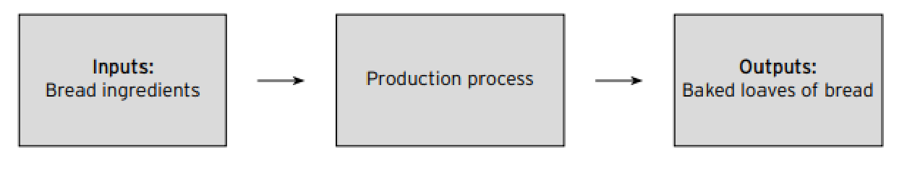
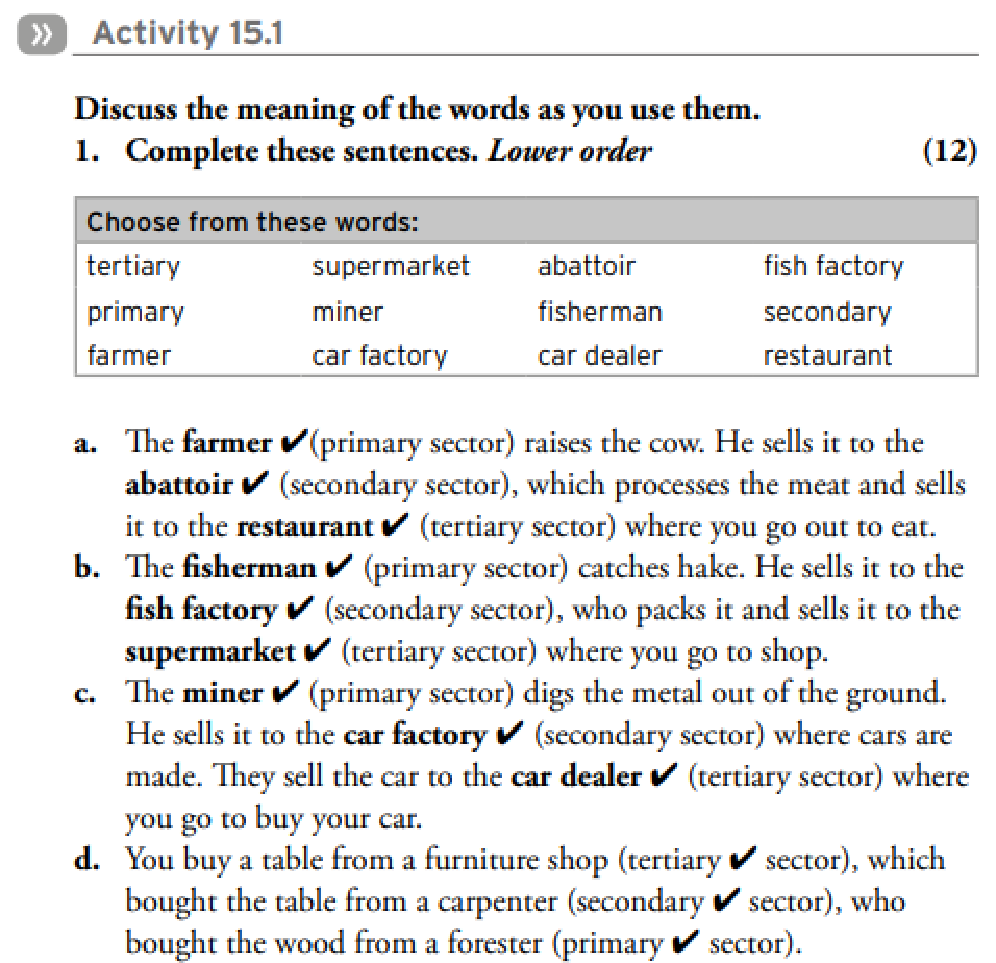
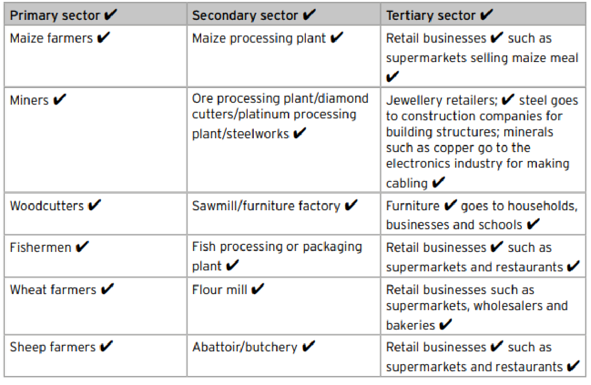

# Topic: The Economy

## 1. Overview of Key Concepts
In this unit, learners will explore the fundamental components of the economy, focusing on how goods are produced and how productivity influences economic growth.

*   **Production:** The process of transforming raw materials into finished goods.
*   **Inputs and Outputs:** The resources used in production (inputs) and the final products created (outputs).
*   **Sustainable Use of Resources:** Managing resources (renewable and non-renewable) to ensure they remain available for the future.
*   **Economic Growth:** The increase in the production of goods and services in an economy, often measured by the Gross Domestic Product (GDP).
*   **Productivity:** The efficiency with which inputs are converted into outputs.
*   **Technology:** The tools, machinery, and systems used to automate production and improve efficiency.

---

## 2. The Production Process
Production is defined as the transformation of raw materials into usable goods. This can be visualized as a flow process:

<!-- DIAGRAM_PLACEHOLDER: diagram -->

### Example: Bread Manufacturing
| Inputs | Production Process | Outputs |
| :--- | :--- | :--- |
| Bread ingredients (flour, yeast, water) | Mixing, kneading, baking | Baked loaves of bread |

---

## 3. Productivity and Economic Growth
Productivity is a measure of how effectively resources are used. 

*   **High Productivity:** Leads to business growth, higher output, and contributes to national economic growth.
*   **Low Productivity:** Leads to business stagnation or failure.
*   **External Factors:** Productivity can be negatively impacted by health epidemics (e.g., HIV/Aids) and skills shortages.

### Mathematical Representation of Productivity
Productivity can be expressed as a ratio:

$$\text{Productivity} = \frac{\text{Total Output}}{\text{Total Input}}$$

---

## 4. Resource Management
Learners must distinguish between different types of resources to understand sustainability:

1.  **Renewable Resources:** Resources that can be replenished naturally over time (e.g., solar energy, timber).
2.  **Non-renewable Resources:** Resources that exist in finite amounts and cannot be replaced once consumed (e.g., coal, oil).
3.  **Sustainable Use:** Using resources in a way that meets current needs without compromising the ability of future generations to meet their own needs.

---

## 5. Practical Activities for Learners
*   **Media Research:** Collect news articles and photos from magazines, newspapers, and the internet regarding:
    *   Production processes on various scales.
    *   Examples of renewable and non-renewable resource use.
    *   Economic growth and GDP in South Africa.
    *   The role of technology in automating production.
*   **Flow Chart Exercise:** Create flow charts for local manufacturing businesses to identify their specific inputs and outputs.
*   **Critical Thinking:** Discuss the impact of personal productivity (e.g., effort in schoolwork) on future outcomes (e.g., exam results) to draw parallels to business productivity.

---

### Economic Sectors and the Impact of Technology

#### 1. Understanding Economic Sectors
Economic activity is divided into three main sectors. Understanding these helps explain how raw materials are transformed into products for consumers.

*   **Primary Sector:** Involves the extraction or harvesting of raw materials from the earth (e.g., farming, fishing, mining).
*   **Secondary Sector:** Involves the processing or manufacturing of raw materials into finished goods (e.g., abattoirs, factories).
*   **Tertiary Sector:** Involves the provision of services or the sale of finished goods to the consumer (e.g., restaurants, supermarkets, car dealers).

---

#### 2. Activity 15.1: Economic Sectors in Practice

**Task 1: Complete the sentences using the provided word bank.**

| Word Bank | | | |
| :--- | :--- | :--- | :--- |
| tertiary | supermarket | abattoir | fish factory |
| primary | miner | fisherman | secondary |
| farmer | car factory | car dealer | restaurant |

**Completed Sentences:**

a. The **farmer** (primary sector) raises the cow. He sells it to the **abattoir** (secondary sector), which processes the meat and sells it to the **restaurant** (tertiary sector) where you go out to eat.

b. The **fisherman** (primary sector) catches hake. He sells it to the **fish factory** (secondary sector), who packs it and sells it to the **supermarket** (tertiary sector) where you go to shop.

c. The **miner** (primary sector) digs the metal out of the ground. He sells it to the **car factory** (secondary sector) where cars are made. They sell the car to the **car dealer** (tertiary sector) where you go to buy your car.

d. You buy a table from a furniture shop (tertiary sector), which bought the table from a carpenter (secondary sector), who bought the wood from a forester (primary sector).

---

#### 3. Interdependence of Sectors
The economy relies on the flow of goods between sectors. If one sector fails, it creates a "domino effect" that impacts the others.

**Task 2: Scenario Analysis**

*   **Scenario a:** The farmer can no longer supply cattle for meat.
    *   *Result:* The abattoir and restaurant would not make any money.
*   **Scenario b:** The fisherman can no longer supply fish.
    *   *Result:* The fish factory and the supermarket could no longer sell fish.
*   **Scenario c:** There are no more trees for wood.
    *   *Result:* The carpenter and the furniture shop would close down.
*   **Scenario d:** The tertiary sector can no longer buy from the secondary sector.
    *   *Result:* The tertiary sector would stop functioning.

---

#### 4. The Impact of Technology
Technology significantly alters production processes and daily life.

*   **Daily Life:** Technology increases convenience (e.g., microwaves for faster cooking, vehicles for faster travel, and mobile phones for instant communication).
*   **Business & Production:** Automation has transformed manufacturing. For example, in car manufacturing plants, robots perform precision tasks on production lines, increasing efficiency and consistency compared to manual labor.

---

### Economic Sectors and Resource Management

#### Understanding Economic Interdependence
When the general public reduces spending on dining and household goods, businesses in the secondary and tertiary sectors face financial difficulties, as their revenue depends on consumer demand.

---

#### Activity: Economic Sectors Table
Create a table with three columns to categorize economic activities.

| Primary Sector | Secondary Sector | Tertiary Sector |
| :--- | :--- | :--- |
| Maize farmers | Maize processing plant | Retail businesses (e.g., supermarkets selling maize meal) |
| Miners | Ore processing plant / diamond cutters / steelworks | Jewellery retailers; steel for construction; minerals for electronics |
| Woodcutters | Sawmill / furniture factory | Furniture for households, businesses, and schools |
| Fishermen | Fish processing or packaging plant | Retail businesses (e.g., supermarkets and restaurants) |
| Wheat farmers | Flour mill | Retail businesses (e.g., supermarkets, wholesalers, bakeries) |
| Sheep farmers | Abattoir / butchery | Retail businesses (e.g., supermarkets and restaurants) |

**Instructions for completion:**
1. **Primary Sector:** List people or businesses involved in the extraction of raw materials.
2. **Secondary Sector:** List the industry or manufacturer that processes the raw materials from the primary sector.
3. **Tertiary Sector:** List the service or retail outlet where the manufactured goods are sold or used to serve the public.
4. **Analysis:** Choose one item from your table and write a paragraph describing the flow of goods between the sectors.

---

#### Activity 15.3: Resource Management

1. **Resource Identification:** Identify the various types of resources used by businesses.
2. **Classification:** Categorize each identified resource as either **renewable** or **non-renewable**.
3. **Sustainability:** Explain the concept of **sustainable resource use**.

---

### Sustainable Resource Management

**Concept: Sustainable Use of Resources**
*   **Definition:** Sustainability refers to practices that are long-term and capable of lasting for a significant period.
*   **Application:** Businesses must manage resources sustainably to ensure they can continue operating in the future.
*   **Example (Forestry):** In regions like Mpumalanga, timber is a renewable resource. Sustainable use involves replanting trees immediately after harvesting to ensure a constant, future supply.

---

### Activity 15.4: Workforce and Economic Growth

**1. Factors affecting South African workforce productivity:**
*   Unemployment
*   Low skill levels
*   HIV/Aids

**2. Importance of a productive workforce:**
*   **Economic Growth:** Defined as an increase in an economy's ability to produce goods and services over a specific period.
*   **Productivity:** Defined as producing the maximum amount of goods and services in the shortest possible time.
*   **Relationship:** Higher workforce productivity leads to improved economic growth.

**3. Understanding Economic Growth Rates:**
*   If an economy grows by $3,2\%$ in a year, it means the economy produced $3,2\%$ more goods and services compared to the previous year.

---

### Activity 15.5: Economic Concepts

**a. What is economic growth?**
*   It is an increase in an economy's ability to produce goods and services over a specific period. It is typically measured as a percentage change in the Gross Domestic Product (GDP).

**b. Why is HIV/Aids detrimental to economic growth?**
*   A sick workforce is an unproductive workforce. Economic growth requires a healthy, educated, and skilled workforce to function effectively.

**c. What is productivity?**
*   It is a measure of the output gained relative to the effort (input) put into a process.

---

### Consolidation: Economic Factors and Technology

#### 1. Challenges to South Africa's Economic Growth
The following factors negatively impact the country's economic growth:
*   High unemployment
*   Poverty and inequality
*   HIV/Aids
*   Skills shortages

#### 2. Advantages of Technology in Business
Using machines and computers in the production process offers several benefits:
*   Increased speed of work compared to human labor.
*   Higher accuracy (fewer mistakes).
*   Consistency (no fatigue or distraction).
*   Reliability (no sick leave or absenteeism).
*   Extended operational capacity (can work 24/7).
*   Reduced overheads (no need for monthly salaries or management).
*   No requirement for ongoing training.

#### 3. Developed vs. Developing Countries
*   **Developed Countries:** Industrialised nations with strong, growing economies, high standards of living, high average incomes, and excellent access to education and healthcare.
*   **Developing Countries:** Nations that are not yet fully industrialised, characterized by lower economic growth and lower standards of living.

---

### Extension Activity: Alternative Energy
Fossil fuels are a finite resource. Research alternative energy sources, specifically:
*   Solar energy
*   Wind energy

**Task:** Write a report on your findings. You are encouraged to include diagrams, illustrations, or clippings from magazines, newspapers, or the Internet.

---

### Topic 15: The Production Process

#### Activity 1: Revise the Production Process

**1.1 Define production.**
Production is the process where businesses utilize raw materials to create goods that are required by the market.

**1.2 What gets transformed or changed during the production process?**
Businesses transform two types of inputs into goods or services that consumers can purchase and use:
1.  **Tangible materials:** Physical items that can be touched (e.g., timber or gold).
2.  **Intangible materials:** Non-physical inputs (e.g., knowledge and ideas).

<!-- DIAGRAM_PLACEHOLDER: diagram -->

---

### The Production Process and Economic Sectors

#### 1. Inputs and Outputs of Production
*   **Inputs:** The resources required to initiate the production process. These include:
    *   Labour
    *   Capital
    *   Land
    *   Entrepreneurship
*   **Outputs:** The final results of the production process, which are finished goods and services available for consumer purchase.
*   **Interdependence of Production:** Not all outputs are final consumer goods. The output of one business (e.g., logs from a forest) often serves as the input for another business (e.g., timber for a furniture factory). This relationship varies across different economic sectors.

---

#### 2. Economic Sectors
A **sector** is a method of grouping business activities based on their role in the economy. There are three main sectors:

| Sector | Description | Examples |
| :--- | :--- | :--- |
| **Primary** | Businesses that extract raw materials (natural resources) from the earth. Usually located in rural areas. | Farming, fishing, forestry, mining. |
| **Secondary** | Businesses that process raw materials from the primary sector into finished goods. Usually located near towns. | Food processing, car factories, manufacturing. |
| **Tertiary** | Businesses that provide finished goods and services directly to the public. Usually located within towns. | Retailers (supermarkets), schools, hospitals, financial services. |

---

#### 3. Economic Context and Linkages
*   **Economic Dependency:** In many developing (poorer) countries, the majority of the national income is generated by the **primary sector**.
*   **Sector Linkages:** The three sectors are interconnected:
    *   The **secondary sector** relies on the **primary sector** to provide the raw materials necessary for manufacturing.
    *   The **tertiary sector** provides essential services (such as financial, educational, health, and environmental services) that support the functioning of the other sectors and the general public.

---

#### Review Exercises

**1.3 List the inputs to the production process.**
*   Labour, capital, land, and entrepreneurship.

**1.4 List the outputs of the production process.**
*   Finished products (goods and services) that consumers can buy and use.

**1.5 Why are not all production outputs finished goods?**
*   Because the output of one business often becomes the input for another business (e.g., logs becoming timber for furniture).

**1.6 Define a sector and name the three sectors.**
*   A sector is a way of grouping business activities. The sectors are primary, secondary, and tertiary.

**1.7 Describe primary-sector businesses.**
*   Businesses that extract raw materials (natural resources) to survive.

**1.8 Describe secondary-sector businesses.**
*   Businesses that use raw materials from the primary sector to manufacture goods for use.

**1.9 Describe tertiary-sector businesses.**
*   Businesses that offer finished goods and services to the public.

**1.10 In poorer countries, which sector generates the most money?**
*   The primary sector.

**1.11 Explain the link between the secondary, tertiary, and primary sectors.**
*   The secondary sector uses raw materials produced by the primary sector to create finished goods. The tertiary sector provides necessary services (financial, social, educational, etc.) that facilitate the operations of the entire economy.

---

### Interdependence of Economic Sectors
The three economic sectors (primary, secondary, and tertiary) are interdependent. The tertiary sector relies on the secondary sector for manufactured goods, while the secondary sector relies on the primary sector for raw materials. If one sector fails, the others cannot function effectively.

---

### Activity 2: Sustainable Resource Use

**2.1 Explain why businesses need to use production resources sustainably.**
Businesses must use resources sustainably because resources are scarce. Some resources are non-renewable, meaning they cannot be replaced once consumed. Others are renewable but take a long time to replenish (e.g., forests). Since the Earth has a limited supply, sustainable use is essential for long-term survival.

**2.2 Define a non-renewable resource and provide an example.**
A non-renewable resource is a resource that cannot be replaced or renewed once it has been depleted.
*   **Example:** Fossil fuels (e.g., coal, oil).

**2.3 Define a renewable resource and provide an example.**
A renewable resource is a resource that can be replenished or regrown over time.
*   **Example:** Timber (forests can be replanted after being cut down).

**2.4 Which type of country uses more resources: developing or developed? Provide a reason.**
Developed countries with industrial economies use more resources than developing countries. This is because developed nations typically have higher standards of living and a larger number of manufacturing businesses, which require higher levels of resource consumption.

---

### Activity 3: Economic Growth, Productivity, and Technology

**3.1 Define economic growth.**
Economic growth is an increase in an economy's ability to produce goods and services over a specific period. It is typically measured as a percentage change in the Gross Domestic Product (GDP).

**3.2 Explain the connection between economic growth and productivity.**
*   **Economic Growth:** The increase in the capacity to produce goods and services over time.
*   **Productivity:** The efficiency of production, defined as producing the maximum amount of goods and services in the shortest possible time.
*   **The Connection:** There is a direct correlation between the two. As a country's workforce becomes more productive, the total output of the economy increases, which leads to higher levels of economic growth.

---

### 3.3 Requirements for Economic Growth
For a country's economy to grow, the following conditions must be met:
*   **Low Unemployment:** People must have jobs to contribute to the production of goods and services.
*   **Poverty Eradication:** Citizens must be lifted out of poverty so they can actively participate in and contribute to the economy.
*   **Human Capital Development:** The population must be healthy, well-educated, and skilled to ensure productive work.

### 3.4 The Impact of Productivity on Economic Growth
Productivity is a key driver of economic performance:
*   **High Productivity:** Has a positive effect on economic growth.
*   **Low Productivity:** Has a negative effect on economic growth.

### 3.5 Technology in the Production Process
Technology automates production, shifting processes from manual (human-performed) to automatic (machine-performed).

**Advantages of using technology in production:**
*   **Speed:** Machines work significantly faster than humans.
*   **Accuracy:** Machines make fewer mistakes.
*   **Consistency:** Machines do not suffer from fatigue or distraction.
*   **Reliability:** Machines do not get sick or require leave.
*   **Availability:** Machines can operate continuously, day or night.
*   **Cost-Efficiency:** Machines do not require management, monthly salaries, or training.

### 3.6 Technology, Productivity, and Economic Growth
Technology contributes to economic growth by enhancing the production process in the following ways:

1.  **Efficiency:** It makes production faster, more accurate, and more standardized.
2.  **Specialization:** Computers and machines are designed for specific tasks, reducing the margin for error.
3.  **Capacity Building:** By removing human limitations (such as the need for rest or training), businesses can increase their capacity to produce a higher volume of goods and services.
4.  **Economic Contribution:** Increased production capacity allows businesses to contribute more significantly to the overall economy.
5.  **Time Management:** Producing more goods in less time increases business productivity, which directly fuels national economic growth.

---

# The Production Process

## 1. The Production Process
Production is the process where **inputs** are transformed into **outputs**. This involves the manufacturing of goods and services that can be used for sale or bartering.

### Factors of Production
To produce goods and services, businesses require four primary factors:
1. **Land:** Natural resources used in manufacturing (e.g., raw materials).
2. **Labour:** The human effort required for a business to operate.
3. **Capital:** The financial resources (money) needed to purchase equipment and materials.
4. **Entrepreneurship:** The driving force that initiates and manages the business and production processes.

---

## 2. Sustainable Use of Resources
Resources are classified based on their ability to be replenished:
*   **Renewable resources:** Resources that can be replaced (e.g., cotton, wood, wind, solar energy).
*   **Non-renewable resources:** Resources that cannot be replaced once consumed (e.g., gold, iron, fossil fuels).

### 5 Ways to Use Resources Sustainably
1. Use renewable energy sources (wind/solar) instead of non-renewable fossil fuels.
2. Choose resources that cause minimal harm to the environment.
3. Reduce the consumption of natural and non-renewable resources through **recycling** and **reusing**.
4. Utilize machinery and equipment designed to be energy and water-efficient.
5. Optimize production processes to use fewer resources to create the same amount of goods.

---

## 3. Economic Growth
**Economic growth** refers to an increase in the production capacity of a country.

*   **Measurement:** It is measured by comparing the total value of a country's production in the current year against the total production of the previous year.
*   **Requirements:** Success depends on entrepreneurship, skilled labour, available resources, capital, and effective planning.
*   **Government Role:** Governments support growth by simplifying the process of starting new businesses and facilitating access to business loans.

---

## 4. Productivity
**Productivity** describes the efficiency of the production system.

*   **Definition:** It measures how quickly inputs are transformed into outputs for sale.
*   **Capacity:** It reflects the ability of individuals or a system to produce a specific quantity of goods within a set timeframe.
*   **Relationship to Economic Growth:** There is a direct link between productivity and economic growth; improved productivity is a fundamental requirement for achieving sustained economic growth.

<!-- DIAGRAM_PLACEHOLDER: diagram -->

---

# Production, Technology, and Economic Growth

## 1. The Relationship Between Production and the Economy
The rate of production is a primary driver of economic growth. The efficiency of the production process directly impacts the final cost of goods:

*   **Slow Production:** Results in higher labour costs per unit, making the final goods more expensive.
*   **Fast/Efficient Production:** When goods are produced quickly while maintaining quality, the labour cost per product decreases, making the goods more affordable.

## 2. Historical Context: Home Industries
Before modern industrialization, production was characterized by "home industries":
1.  **Labour Force:** Family members worked together on their own land and within their homes.
2.  **Methods:** Production relied on simple tools and manual labour, typically focusing on one item at a time.

## 3. The Role of Technology in Modern Business
Today, businesses rely on technology and machinery to drive production.

### Contribution to Productivity and Growth
*   **Efficiency:** Technology allows for a higher volume of products to be manufactured in a shorter space of time, leading to more efficient production.
*   **Continuous Improvement:** Because technology evolves rapidly, businesses must frequently update or replace their existing technology to remain competitive.
*   **Labour Requirements:** As technology advances, workers are required to be semi-skilled or highly skilled to operate complex, high-technology equipment and machinery.

## 4. Glossary of Economic Terms

| Term | Definition |
| :--- | :--- |
| **Production** | The manufacture of goods and services. |
| **Inputs** | All materials, time, money, energy, and ideas that go into making a good or service. |
| **Outputs** | The results of a production process (the goods, services, and ideas produced). |
| **Renewable resources** | Resources that can be replaced. |
| **Non-renewable resources** | Resources that cannot be replaced. |
| **Economic growth** | The active growth of the economy. |
| **Inflation** | The rate at which the price of goods and services rises. |

<!-- DIAGRAM_PLACEHOLDER: diagram -->