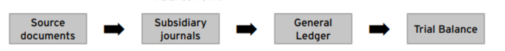
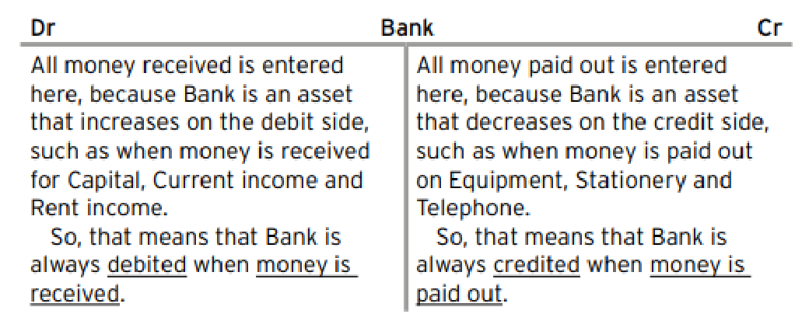
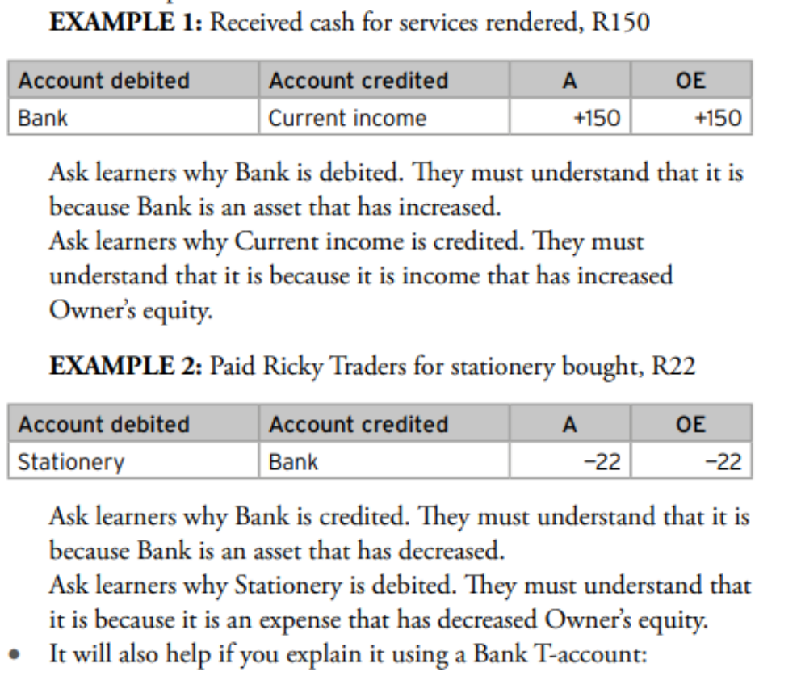
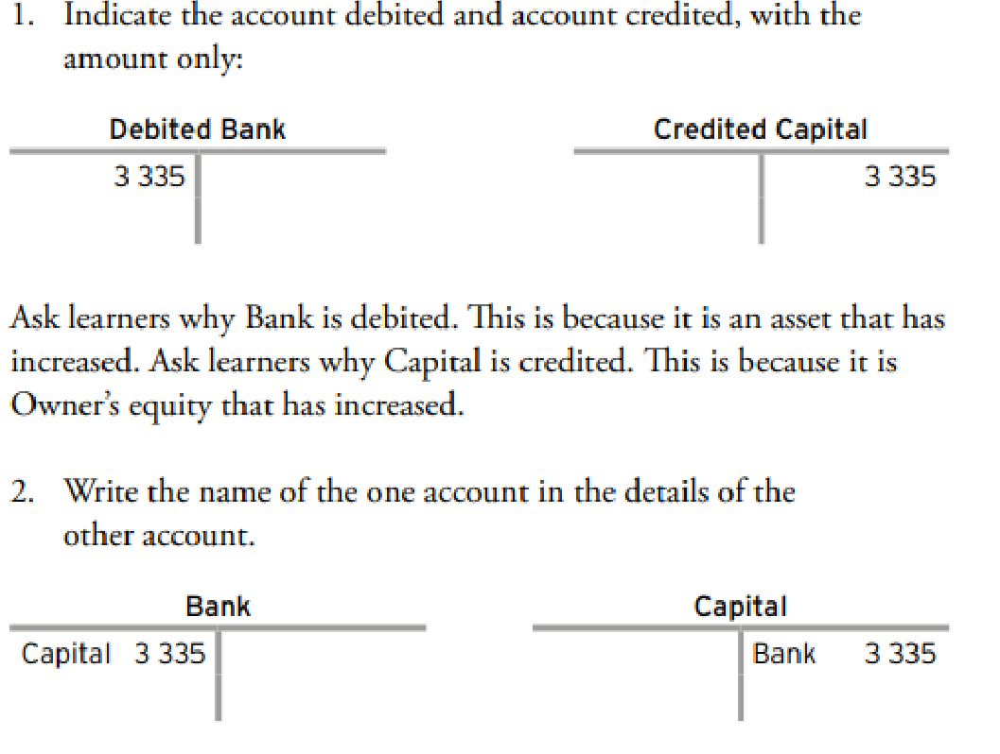
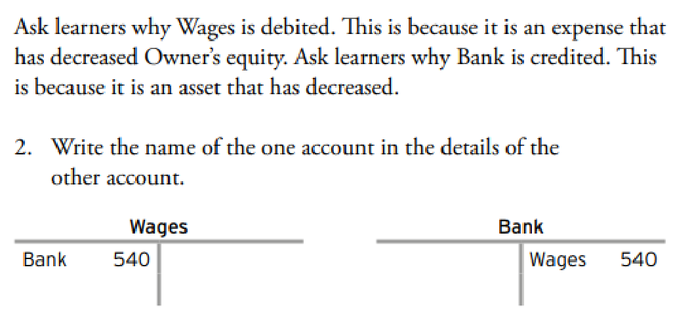
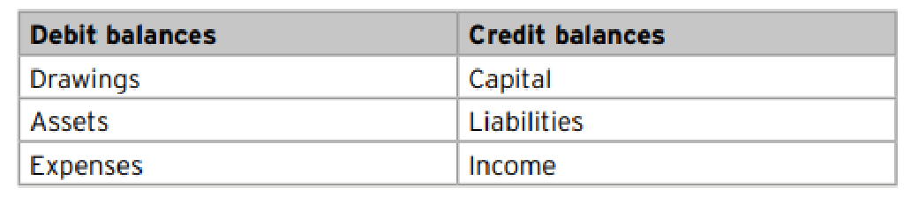
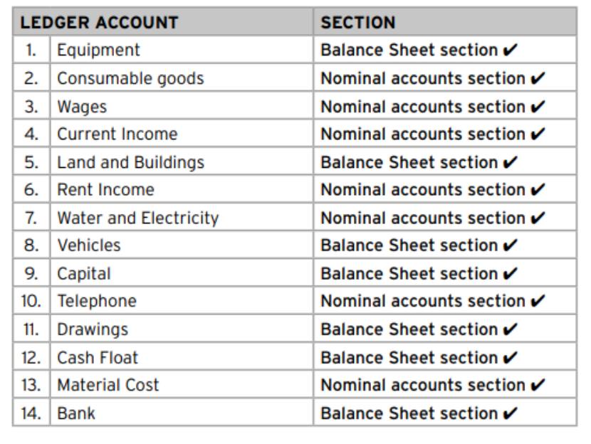

# Financial Literacy: The General Ledger and Trial Balance

## Overview of the Accounting Cycle
The accounting process follows a logical flow from the initial transaction to the final summary.

<!-- DIAGRAM_PLACEHOLDER: diagram -->

The sequence is:
**Source Documents** $\rightarrow$ **Subsidiary Journals** $\rightarrow$ **General Ledger** $\rightarrow$ **Trial Balance**

---

## The Double-Entry Principle: Bank Account
The Bank account is an asset. According to the double-entry principle:

| Dr (Debit Side) | Cr (Credit Side) |
| :--- | :--- |
| All money received is entered here. | All money paid out is entered here. |
| Bank increases (Asset). | Bank decreases (Asset). |
| **Rule:** Debit when money is received. | **Rule:** Credit when money is paid out. |

---

## Worked Examples

### Example 1: Received cash for services rendered, R150
When cash is received, the Bank account increases (Asset) and Current Income increases (Owner's Equity).

| Account Debited | Account Credited | A (Asset) | OE (Owner's Equity) |
| :--- | :--- | :--- | :--- |
| Bank | Current income | $+150$ | $+150$ |

*   **Why Bank is debited:** Bank is an asset that has increased.
*   **Why Current income is credited:** It is income that has increased Owner's Equity.

### Example 2: Paid Ricky Traders for stationery bought, R22
When cash is paid, the Bank account decreases (Asset) and Stationery increases as an expense (decreasing Owner's Equity).

| Account Debited | Account Credited | A (Asset) | OE (Owner's Equity) |
| :--- | :--- | :--- | :--- |
| Stationery | Bank | $-22$ | $-22$ |

*   **Why Bank is credited:** Bank is an asset that has decreased.
*   **Why Stationery is debited:** It is an expense that has decreased Owner's Equity.

---

## Learning Objectives
By the end of this topic, learners will be able to:
1. Apply the **double-entry principle**.
2. Understand and use **T-accounts**.
3. Format and maintain the **General Ledger**.
4. Post transactions from the **CRJ** (Cash Receipts Journal) and **CPJ** (Cash Payments Journal) to the General Ledger.
5. Balance accounts in the General Ledger.
6. Prepare a **Trial Balance** for a service business.

---

## The General Ledger

**Purpose:** The General Ledger is the main "book of accounts" for a business. If the CRJ and CPJ are the daily diaries, the General Ledger is the big, organised filing cabinet where every transaction is sorted by account type. Its purpose is to gather all the activity related to a single account (like Bank, Wages, or Capital) in one place.

**Relationship to the CRJ and CPJ:** The General Ledger gets its information directly from the totals of the CRJ and CPJ. The process of transferring these totals from the journals to the ledger accounts is called **posting**. Without the journals, the ledger would have no information.

### 1. The Double-Entry Principle and T-Accounts

The **double-entry principle** states that every transaction has two equal and opposite effects. In the General Ledger, we show these two effects using **T-accounts**.

A T-account is a simple visual tool used to represent an account. It looks like a capital 'T':

| Debit (Dr) Side | Credit (Cr) Side |
| :--- | :--- |
| (Left side) | (Right side) |

### 2. Format and Sections of the General Ledger

The General Ledger is divided into two main sections to keep it organised:

1.  **Balance Sheet Accounts Section (B):** This section contains all the "permanent" accounts: Assets, Owner's Equity (Capital, Drawings), and Liabilities. They are given codes like B1, B2, B3, etc.
2.  **Nominal Accounts Section (N):** This section contains all the "temporary" accounts that are used to calculate profit: Incomes and Expenses. They are given codes like N1, N2, N3, etc.

### 3. Posting from the CRJ and CPJ

"Posting" is the act of recording the totals from the journals into the T-accounts. Here are the rules:

*   **From the CRJ (Cash Receipts Journal):**
    *   The Bank total is posted to the **Debit side** of the Bank account (because Assets increase on the debit side).

---

### Posting to the General Ledger

#### Posting from Journals
*   **From the CRJ (Cash Receipts Journal):**
    *   The totals of the **Current Income** and **Sundry Accounts** are posted to the **Credit side** of their respective accounts (e.g., Current Income, Capital, Loan).
*   **From the CPJ (Cash Payments Journal):**
    *   The **Bank** total is posted to the **Credit side** of the Bank account (because Assets decrease on the credit side).
    *   The totals of the **Wages**, **Stationery**, and **Sundry Accounts** are posted to the **Debit side** of their respective accounts (e.g., Wages, Stationery, Drawings, Equipment).

---

### 4. Balancing the General Ledger
At the end of the month, after posting, you must balance each T-account to find its final closing balance.

**Steps to balance a T-account:**
1.  Add up both the debit side and the credit side to get a total for each.
2.  Write the larger of the two totals on both sides as the final total.
3.  Calculate the difference between the large side and the small side. This difference is the "balance".
4.  Write this "balance c/d" (carried down) on the smaller side so that it now adds up to the final total.
5.  Bring the balance down ("Balance b/d") to the opposite side below the total line. This is the opening balance for the next month.

---

## The Trial Balance

**Purpose:** The **Trial Balance** is a list of every single account from the General Ledger and its final closing balance. Its main purpose is to **check the mathematical accuracy** of the double-entry posting. It does this by proving one simple rule:

$$\text{Total Debits} = \text{Total Credits}$$

**Relationship to the General Ledger:** The Trial Balance is created **directly from** the final, balanced figures of the General Ledger. You cannot prepare a Trial Balance without first posting to and balancing the General Ledger. It is the bridge between the ledger and the final financial statements.

<!-- DIAGRAM_PLACEHOLDER: diagram -->

---

### Preparing a Trial Balance

The Trial Balance is a summary of all ledger account balances. It is used to verify that the total of all debit balances equals the total of all credit balances.

#### Steps to Prepare a Trial Balance
1. **List:** Identify all accounts from your General Ledger.
2. **Identify Balances:** Locate the final "Balance b/d" (brought down) for each T-account.
3. **Debit Entries:** If the balance is on the **Debit side** (left) of the T-account, record the amount in the Debit column of the Trial Balance.
4. **Credit Entries:** If the balance is on the **Credit side** (right) of the T-account, record the amount in the Credit column of the Trial Balance.
5. **Totaling:** Calculate the sum of both the Debit and Credit columns.

**Note:** If the two totals are equal, your books are "in balance," allowing you to proceed to the preparation of the Income Statement and Balance Sheet.

---

### 1. The True Meaning of Debit and Credit
In accounting, "debit" and "credit" are directional terms, not value judgments (like "good" or "bad").

*   **Debit (Dr):** Refers to the **left-hand side** of an account.
*   **Credit (Cr):** Refers to the **right-hand side** of an account.

Whether a debit or credit increases or decreases an account depends entirely on the **type of account**.

---

### 2. The Rules of the Game: The Accounting Equation
All accounting entries are governed by the fundamental accounting equation:

$$\text{Assets} = \text{Liabilities} + \text{Owner's Equity}$$

To maintain this balance, we use the mnemonic **DEAD CLIC** to determine how account types behave.

#### DEAD: The Debit Rules
Accounts categorized under **DEAD** have a normal balance on the **Debit** side. To increase these accounts, you **Debit** them; to decrease them, you **Credit** them.

| Mnemonic | Account Type |
| :--- | :--- |
| **D** | **D**rawings |
| **E** | **E**xpenses |
| **A** | **A**ssets |
| **D** | **D**ebtors |

<!-- DIAGRAM_PLACEHOLDER: diagram -->

---

### Accounting Principles: The DEAD and CLIC Rules

To understand double-entry bookkeeping, we categorize accounts into two main groups based on how they behave when they increase.

#### 1. DEAD: The Debit Rules
For these accounts, the normal balance is a **DEBIT**. To increase them, you **DEBIT** them. To decrease them, you do the opposite (credit).

*   **Drawings:** Money the owner takes out for personal use.
*   **Expenses:** Costs of running the business (e.g., rent, salaries, electricity).
*   **Assets:** Things the business owns (e.g., Bank/Cash, Equipment, Vehicles).

#### 2. CLIC: The Credit Rules
For these accounts, the normal balance is a **CREDIT**. To increase them, you **CREDIT** them. To decrease them, you do the opposite (debit).

*   **Capital:** The owner's investment in the business.
*   **Liabilities:** Money the business owes to others (e.g., Loans).
*   **Income:** Money the business earns from its services (e.g., Sales, Service Fees).

---

### 3. Answering Your Questions with Examples

#### Question 1: Why is CAPITAL credited?

**The Transaction:**
The owner, Mr. Smith, starts a business by investing $\$10,000$ of his own money into the business's bank account.

**The Two Effects (Double-Entry):**
1. The business's Bank account has increased by $\$10,000$.
2. The owner's investment, or Capital, has increased by $\$10,000$.

**Applying the Rules:**
1. **Bank:** This is something the business owns, so it is an **Asset**. According to the **DEAD** rule, to increase an Asset, you **DEBIT** it. Therefore, we Debit Bank with $\$10,000$.
2. **Capital:** This is **Capital**. According to the **CLIC** rule, to increase Capital, you **CREDIT** it. Therefore, we Credit Capital with $\$10,000$.

**Conclusion:**
Capital is credited because it represents the owner's investment in the business, and the rule for increasing a Capital account is to place the entry on the right-hand (Credit) side.

#### Question 2: Why is BANK debited?
As established in the example above, Bank is an Asset. Because the business's bank balance increased, we apply the **DEAD** rule, which requires us to **DEBIT** the account.

<!-- DIAGRAM_PLACEHOLDER: diagram -->

---

### Accounting Principles: Debits, Credits, and Owner's Equity

#### 1. Understanding Bank Transactions
The Bank account is classified as an **Asset**. 
*   **When the business receives money:** The Bank account increases. According to accounting rules, an increase in an Asset is recorded on the **Debit (left-hand)** side.
*   **When the business pays money:** The Bank account decreases. To decrease an Asset, you must record the entry on the **Credit (right-hand)** side.

**Example: Paying Rent**
*   **Transaction:** The business pays monthly rent of $\$500$ via cheque.
*   **Two Effects:**
    1.  Bank account decreases by $\$500$.
    2.  Rent Expense increases by $\$500$.
*   **Applying the DEAD CLIC Rules:**
    *   **Rent Expense:** An Expense is part of the **DEAD** group. To increase an expense, you **Debit** it.
    *   **Bank:** An Asset is part of the **DEAD** group. Since a debit increases an asset, you must **Credit** it to decrease it.

---

#### 2. The DEAD CLIC Mnemonic
Memorizing the **DEAD CLIC** rules ensures accuracy when determining whether to debit or credit an account:

| Group | Account Type | Increase | Decrease |
| :--- | :--- | :--- | :--- |
| **D** | **D**ebits (Expenses, Assets, Drawings) | Debit | Credit |
| **C** | **C**redits (Liabilities, Income, Capital) | Credit | Debit |

---

#### 3. Owner's Equity and Capital
**Concept:** Owner's Equity represents the owner's financial stake or net worth inside the business. It is the owner's claim on the assets of the business.

**Scenario: Initial Investment**
When an owner (e.g., Mr. Smith) invests $\$10,000$ into the business:
1.  **Assets Increase:** The business bank account increases by $\$10,000$.
2.  **Equity Increases:** The owner's claim on those assets increases by $\$10,000$.

**Relationship Summary:**
*   **Capital:** This is the specific amount of money or assets the owner contributes to the business to start or grow it.
*   **Equity:** This is the broader term for the owner's total interest in the business, which includes the initial Capital plus any profits retained in the business, minus any drawings or losses.

<!-- DIAGRAM_PLACEHOLDER: diagram -->

---

### Understanding Owner's Equity

In accounting, it is essential to understand the relationship between **Owner's Equity** and **Capital**. You can think of Owner's Equity as a broad category (like "Fruit") and Capital as a specific component within that category (like an "Apple").

#### The Accounting Equation for Owner's Equity
The total value of Owner's Equity is determined by the following formula:

$$\text{Owner's Equity} = \text{Capital} + \text{Profit (Income} - \text{Expenses)} - \text{Drawings}$$

---

#### Key Components Explained

| Component | Definition | Impact on Equity |
| :--- | :--- | :--- |
| **Capital** | Money or assets the owner contributes to the business from their own pocket. | Increases |
| **Profit** | The surplus remaining when Income exceeds Expenses. This is reinvested into the business. | Increases |
| **Drawings** | Money or assets taken out of the business by the owner for personal use. | Decreases |

---

#### Worked Example
**Scenario:** Mr. Smith invests $\$10,000$ into his business.

*   **Analysis:** This contribution is classified as **Capital**.
*   **Result:** Because Capital is a core part of Owner's Equity, this transaction directly increases Mr. Smith's overall **Owner's Equity** by $\$10,000$.

<!-- DIAGRAM_PLACEHOLDER: diagram -->

---

### Double-Entry Accounting Principles

In accounting, every transaction affects at least two accounts. One account is debited, and the other is credited.

---

#### Example 1: Capital Contribution
When an owner contributes capital to the business, the Bank account increases (Asset) and the Capital account increases (Owner's Equity).

**T-Account Representation:**

| Account Debited | Amount | Account Credited | Amount |
| :--- | :--- | :--- | :--- |
| Bank | 3 335 | Capital | 3 335 |

**Cross-Referencing in Ledgers:**
To maintain the double-entry system, the name of the contra-account is recorded in the details column.

| Bank Account | | | Capital Account | |
| :--- | :--- | :--- | :--- | :--- |
| **Details** | **Amount** | | **Details** | **Amount** |
| Capital | 3 335 | | Bank | 3 335 |

*   **Why Bank is debited:** It is an asset that has increased.
*   **Why Capital is credited:** It is Owner's equity that has increased.

---

#### Example 2: Payment of Wages
When the business pays wages, the Wages account (Expense) increases, which decreases Owner's Equity, and the Bank account (Asset) decreases.

**T-Account Representation:**

| Account Debited | Amount | Account Credited | Amount |
| :--- | :--- | :--- | :--- |
| Wages | 540 | Bank | 540 |

**Cross-Referencing in Ledgers:**

| Wages Account | | | Bank Account | |
| :--- | :--- | :--- | :--- | :--- |
| **Details** | **Amount** | | **Details** | **Amount** |
| Bank | 540 | | Wages | 540 |

*   **Why Wages is debited:** It is an expense that has decreased Owner's equity.
*   **Why Bank is credited:** It is an asset that has decreased.

<!-- DIAGRAM_PLACEHOLDER: diagram -->

---

### Ledger Posting Guidelines

When posting transactions to the General Ledger, ensure the following points are observed:

*   **Heading:** The ledger account heading must contain only the name of the account (e.g., Bank, Rent Income), not the date.
*   **Date:** 
    *   Totals from the Cash Receipts Journal (CRJ) and Cash Payments Journal (CPJ) are posted on the last day of the month.
    *   Sundry accounts are posted on the specific date the transaction occurred.
*   **Folios:** 
    *   The folio number of each ledger account must be entered in the journal.
    *   For Sundry accounts, the folio number is entered in the provided folio column.
    *   For column totals, the folio is entered below the total of each column.
    *   *Note:* If a journal is only provided in the Learner's Book, folio numbers for those specific entries may be omitted, but all other folios must be completed.

---

### The Accounting Rules: DEAD and CLIC

To understand how accounts increase, use these two mnemonic rules:

*   **DEAD:** **D**ebit **E**xpenses, **A**ssets, and **D**rawings to increase them.
*   **CLIC:** **C**redit **L**iabilities, **I**ncome, and **C**apital to increase them.

| Debit balances | Credit balances |
| :--- | :--- |
| Drawings | Capital |
| Assets | Liabilities |
| Expenses | Income |

---

### Worked Example: Why Rent Income is Credited

**The Transaction:** The business receives cash for renting out space. This is recorded in the **CRJ**.

**The Two Effects:**
1.  Your **Bank** (an Asset) balance increases.
2.  Your **Rent Income** (an Income) balance increases.

**Applying the Rules:**
1.  To increase an **Asset** (Bank), you **DEBIT** it (following the **DEAD** rule).
2.  To increase an **Income** (Rent Income), you **CREDIT** it (following the **CLIC** rule).

---

**Conclusion:** Rent Income is credited because it is an **Income** account. The rule is that all income accounts are credited to show they have increased. This increase is a "good thing" for the business's profit.

---

## Why a Telephone Bill is Debited

*   **The Transaction:** The business pays the telephone bill. This is recorded in the **CPJ** (Cash Payments Journal).
*   **The Two Effects:**
    1.  Your Telephone Expense (an Expense) has **increased**.
    2.  Your Bank (an Asset) balance has **decreased**.
*   **Applying the Rules:**
    1.  To increase an **Expense** (Telephone Expense), you **DEBIT** it (from the DEAD rule).
    2.  To decrease an **Asset** (Bank), you **CREDIT** it.

**Conclusion:** The Telephone account is debited because it is an **Expense**. The rule is that all expense accounts are debited to show they have increased. This increase is a "bad thing" for the business's profit.

---

## The Relationship: Setting Up for the Profit Calculation

Think about the final goal: the **Income Statement**, which calculates profit using the formula:

$$\text{Profit} = \text{Income} - \text{Expenses}$$

By crediting all your incomes and debiting all your expenses, the accounting system is perfectly set up to do this subtraction. The credits (incomes) and debits (expenses) are on opposite sides, making it easy to see if the "good things" are more than the "bad things" to determine your profit.

### In the Ledger:

#### 1. You Post the TOTALS for the Special Columns
For any column in your journals that is dedicated to **one specific account**, you post only the month-end total.

This applies to:
*   The **Bank** column in both the CRJ and CPJ.
*   The **Current Income** column in the CRJ.

---

### Posting Procedures: Journals to General Ledger

In accounting, the process of transferring information from the Journals (CRJ and CPJ) to the General Ledger is known as **posting**. To maintain efficiency, we use two different methods depending on the nature of the column.

---

#### 1. Posting Totals (Special Columns)
For columns that represent a single type of transaction (e.g., **Current Income** in the CRJ or **Wages/Stationery** in the CPJ), you post the **monthly total** to the General Ledger.

*   **The Reason:** If you have 30 cash sales in a month, posting 30 individual entries is inefficient. Posting one single total at the end of the month saves time and keeps the ledger clean, as all these transactions belong to the same account.

#### 2. Posting Individual Figures (Sundry Accounts)
For the **Sundry Accounts** column, you must post each entry **individually**, line by line.

*   **The Reason:** The Sundry Accounts column is a "catch-all" for various different types of accounts. 
    *   In the CRJ, one line might be for *Capital*, and another for *Rent Income*.
    *   In the CPJ, one line might be for *Drawings*, and another for *Equipment*.
*   **The Rule:** It would be incorrect to add these different items together. Each amount must be posted to its own specific T-account in the General Ledger. The "Details" column in your journal identifies which specific account the amount belongs to.

---

### Summary Table: Posting Rules

| From this Journal Column... | You post the... | Because... |
| :--- | :--- | :--- |
| **CRJ - Bank** | Total | It's all for the same Bank account. |
| **CRJ - Current Income** | Total | It's all for the same Income account. |
| **CRJ - Sundry Accounts** | Individual amounts | Each line is for a *different* account. |
| **CPJ - Bank** | Total | It's all for the same Bank account. |
| **CPJ - Special Columns (e.g., Wages)** | Total | It's all for the same Expense account. |
| **CPJ - Sundry Accounts** | Individual amounts | Each line is for a *different* account. |

---

### Strategic Design of Journals
The special columns in your CRJ and CPJ are designed to be a direct mirror of your most active accounts in the **General Ledger**.

*   **Example:** If you know you will be earning money from your main service frequently, you create a **Current Income** column in the CRJ. This column will match the **Current Income** T-account in your General Ledger, allowing you to post the monthly total directly.

<!-- DIAGRAM_PLACEHOLDER: diagram -->

---

### Cash Payments Journal (CPJ) Structure
To maintain efficiency in accounting, the CPJ is structured to mirror the General Ledger:

*   **Wages Column:** If wages are paid weekly, create a dedicated **Wages** column in the CPJ. This allows you to post a single monthly total to the Wages T-account in the General Ledger, significantly reducing processing time.
*   **Sundry Accounts Column:** Unlike specific columns, the **Sundry Accounts** column requires individual entries. The "Details" section for these entries must match the specific ledger account titles (e.g., Capital, Drawings, Equipment).

---

### The Role of the Trial Balance
While the General Ledger contains all final figures, the **Trial Balance** serves a distinct and vital purpose:
*   **Purpose:** It is not used for recording transactions, but for **checking** the accuracy of the ledger.
*   **Function:** It acts as the final quality control step before the preparation of official financial reports.

---

### The Ledger's Job: Sorting
The primary function of the General Ledger is to take all transactions from the journals (CRJ and CPJ) and sort them into individual T-accounts. 

**Common Errors in Posting:**
Because this process is manual, errors can occur:
1.  Posting a debit as a credit (or vice versa).
2.  Calculating a balance incorrectly.
3.  Forgetting to post a transaction entirely.

*Note: If there is a mistake in the ledger, the final financial reports will be incorrect.*

---

### Classification of Ledger Accounts
Accounts are categorized into either the **Balance Sheet section** or the **Nominal accounts section**.

| # | Ledger Account | Section |
| :--- | :--- | :--- |
| 1 | Equipment | Balance Sheet section |
| 2 | Consumable goods | Nominal accounts section |
| 3 | Wages | Nominal accounts section |
| 4 | Current Income | Nominal accounts section |
| 5 | Land and Buildings | Balance Sheet section |
| 6 | Rent Income | Nominal accounts section |
| 7 | Water and Electricity | Nominal accounts section |
| 8 | Vehicles | Balance Sheet section |
| 9 | Capital | Balance Sheet section |
| 10 | Telephone | Nominal accounts section |
| 11 | Drawings | Balance Sheet section |
| 12 | Cash Float | Balance Sheet section |
| 13 | Material Cost | Nominal accounts section |
| 14 | Bank | Balance Sheet section |

<!-- DIAGRAM_PLACEHOLDER: diagram -->

---

## The Trial Balance's Job is to CHECK

The primary purpose of the Trial Balance is to verify that the **double-entry principle** has been applied correctly throughout the General Ledger.

### The Fundamental Rule
The Trial Balance tests the following mathematical equality:

$$\text{Total Debits} = \text{Total Credits}$$

*   **Process:** You create a Trial Balance by listing the final balance of every single account from the General Ledger.
*   **Verification:** If the total of the Debit column equals the total of the Credit column, the ledger is considered "in balance."
*   **Error Detection:** If the totals do not balance, it indicates an error in the recording process, requiring a review of the ledger entries before proceeding.

### The Role of the Trial Balance
The Trial Balance acts as the bridge between recording data and financial reporting:
1.  **The Ledger:** Sorts and organizes financial information.
2.  **The Trial Balance:** Proves that the sorting and recording were performed accurately.

### Understanding Account Balances
A business transfers transaction data from one month to the next until the annual profit is calculated. 
*   **Example:** If a business purchases a vehicle for $R150\,000$ in Month 1, that asset remains on the books in Month 2 and every subsequent month until it is sold. This carry-over of value is known as the **balance**.

### Recommended Order for Listing Accounts
To maintain consistency, it is recommended to list accounts in the Trial Balance in the following order:
1.  **Owner's Equity Accounts:** (e.g., Capital, Drawings)
2.  **Non-Current Assets:** (e.g., Land and Buildings, Vehicles)
3.  **Current Assets:** (e.g., Equipment, Inventory, Bank)
4.  **Income and Expenses:** (Can be listed in any order)

---

### Consolidation: Key Definitions

*   **Account:** A specific record within a business where monetary values of transactions are collected and recorded.
*   **Balance:** The difference between the total of debit amounts and the total of credit amounts in an account.
*   **Opening Balance:** The amount entered at the beginning of the month to reflect the starting position of an account.
*   **Credit Entry:** An entry recorded on the credit side (right side) of a ledger account.
*   **Double-Entry Principle:** The accounting rule stating that every monetary value of every transaction must be entered in the ledger as both a debit entry and a credit entry.
*   **General Ledger:** The collective name for all the accounts of a business.
*   **CRJ (Cash Receipts Journal):** Records receipts, which increase the Bank account.
*   **CPJ (Cash Payments Journal):** Records payments, which decrease the Bank account.

---

### Accounting Principles and Posting Procedures

#### 1. Fundamental Accounting Rules
Understanding the nature of accounts is essential for correct double-entry bookkeeping.

*   **Assets:** These are resources owned by the business. They have **debit balances**.
    *   *Example:* Equipment is an Asset and is therefore debited.
    *   *Bank:* Bank is an Asset; it increases on the debit side and decreases on the credit side.
*   **Expenses:** These are costs incurred by the business. They have **debit balances**.
    *   *Example:* Consumable goods is an expense and is therefore debited.
*   **Income:** This is money earned by the business. It has a **credit balance**.
    *   *Example:* Rent income is income and is therefore credited.
*   **Liabilities:** These are obligations of the business. They have **credit balances**.
*   **Capital:** This represents the owner's investment in the business. It is the owner's personal account and has a **credit balance**.

#### 2. Summary of Account Balances
| Account Type | Normal Balance |
| :--- | :--- |
| Assets | Debit |
| Expenses | Debit |
| Income | Credit |
| Liabilities | Credit |
| Capital | Credit |

#### 3. Posting Procedures for Journals (CRJ and CPJ)
The posting of transactions from the Cash Receipts Journal (CRJ) and Cash Payments Journal (CPJ) to the General Ledger follows specific timing rules:

*   **Column Totals:** The totals of the columns in the CRJ and CPJ are posted to the respective accounts in the General Ledger at the **end of the month**.
*   **Sundry Accounts:** Entries recorded in the "Sundry accounts" column in the CRJ and CPJ are posted to the General Ledger on the **specific day** that the transaction takes place.