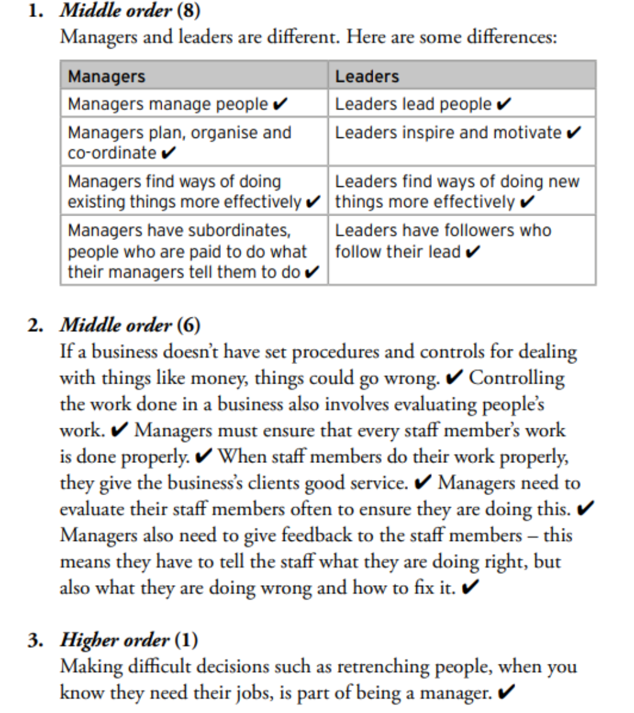

In this topic, learners will learn about ENTREPRENEURSHIP. They will look at: • different levels of management • management tasks such as planning, organising, leading and controlling • the characteristics of good management • different styles of management: – autocratic style – permissive or free-reign (laissez faire) style – democratic or participatory style 

Just as the president of a country cannot run a country on his or her own and needs lower levels of government to assist him or her, owners of businesses also need managers at lower levels to run the business productively. 

Planning as a management task involves deciding ahead of time what to do to reach business goals; ✔ setting out a course of action ✔ and the steps needed to achieve those goals. ✔ Managers need to know who is responsible for different tasks. ✔ This allows them to ensure that the work gets done properly. ✔ 



The delegation approach to leadership is also called the permissive or free-rein (laissez-faire) style. ✔ It is a management style in which you delegate tasks to others and give them the freedom to decide how to do tasks. ✔ The participation approach is also called the democratic or participatory approach. ✔ It is a management style in which managers participate in the process of getting the task done. ✔ The dictating approach is also called the autocratic approach. ✔ It is a management style in which you dictate to people what they must do, without giving them a chance to decide or participate. ✔ 

# **Consolidation** 

- List the four main management tasks. 

Planning, organising, leading and controlling 

- Name and briefly describe the three main management styles. 

- Permissive, free-rein or laissez faire management style: a management style in which you delegate tasks to others and give them the freedom to decide how to do tasks. 

- Democratic or participatory management style: a management style in which managers participate in the process of getting the task done. 

- Autocratic management style: a management style in which you dictate to people what they must do without giving them a chance to decide or participate. 

- Name the characteristics of a good manager. 

- Qualified for his or her job 

- Has good people skills 

- Is trustworthy 

- Willing to put extra effort into the job 

- Makes sure that his or her employees are happy in their jobs 

- Takes responsibility for things 

- Is always punctual and organised 

- Sets a good example to others 

- Has a positive at **t** i ude 

## 5. Authentic Exam Question Archetypes & Mark Allocations
*(Extracted from official CAPS examination papers to guide marking, pacing, and rubric design)*

### Archetype 1: QUESTION 2: Form of ownership #2
- **Source Paper:** `EMS-Grade-8-Project-2023-TERM-3-QP-and-Memo.pdf`
- **Total Mark Allocation:** **[25 Marks]** (Sub-questions: 2, 2, 2, 4, 12 marks)
- **Recommended Time:** **25 Minutes** (Pacing: ~1.0 min/mark | *Calibrated to Official CAPS Paper Pace (1.0 min/mark)*)
- **Assessment Mode Calibration:** Timed Exam Simulation: 25 min countdown (Pacing Checkpoint: 19 min)
- **Cognitive / Marking Strategy:** NSC Standard (Method Marks [M], Accuracy Marks [A], Carry-Over [CA])

#### Question Prompt & Working:
```text
QUESTION 2: Form of ownership #2         
                                                  
[25] 
Study the images below to answer the following questions.  
 
 
 
 
 
2.1. 
Identify the form of ownership of Green Design. 
 
                     (2) 
 
2.2. 
What are the owners of this form of ownership called?                               (2) 
 
2.3. 
List any TWO examples of this form of ownership in your community. 
(2)  
 
2.4. 
Comment on the distribution of profits in this form of ownership.                (4) 
 
2.5. 
Evaluate this form of ownership by researching and then commenting on the 
following characteristics: 
a) Set-up and start-up of this form of ownership. 
b) Continuity of the business. 
c) Capital contribution. 
d) Legal requirements   
 
 
e) Tax implications 
 
 
 ...
```
