# CHAPTER 3

## Cells: the basic units of life

<!-- DIAGRAM_PLACEHOLDER: diagram -->

| Section | Topic | Page |
| :--- | :--- | :--- |
| **3.1** | *Overview* | 72 |
| **3.2** | *Molecular make up of cells* | 72 |
| **3.3** | *Cell structure and function* | 82 |
| **3.4** | *Cell organelles* | 92 |
| **3.5** | *Summary* | 104 |
| **3.6** | *End of chapter exercises* | 105 |

---

# 3 Cells: the basic units of life

## 3.1 Overview

### Introduction

*"In the year of 1657 I discovered very small living creatures in rain water."* — Antonie van Leeuwenhoek, the Father of Microbiology, on discovering cells. Together with Robert Hooke's discoveries, van Leeuwenhoek's findings laid the foundations of microbiology.

#### Key concepts

* The invention of microscopes allowed us to see life at the microscopic level.
* Cell walls are present in plants, bacteria and fungi and provide a rigid support structure.
* Cell membranes are semi-permeable and have a fluid rather than a fixed structure. Substances move across them by diffusion, osmosis, facilitated transport and active transport.
* Cells contain organelles with structures adapted to perform specific functions within the cell.
* Cells differ in size, shape and structure in order to carry out specialised functions. Cells with similar structures and functions associate to form tissues.
* Plant and animal cells differ in many crucial ways.

The previous chapter discussed the various organic molecules that make up living organisms. In this chapter we will look at the cellular level of organisation of living things.

$$\text{atom} \rightarrow \text{molecule} \rightarrow \text{cell} \rightarrow \text{tissue} \rightarrow \text{organ} \rightarrow \text{system} \rightarrow \text{organism} \rightarrow \text{ecosystem}$$

## 3.2 Molecular make up of cells

Cells are the basic structural and functional units of all living organisms. Cells are made up of the compounds you learnt about in the previous chapter: carbohydrates, fats, proteins, nucleic acids and water. The word 'cell' was first used by the 17th century scientist Robert Hooke to describe the small pores in a cork that he observed under a microscope. Cells are very small structures.

---

# Microscopy

The human body is made up of $10^{13}$ cells. Each of these is too small to see with the human eye, and it is through the development of microscopic techniques that we have been better able to visualise and understand them.

> **FACT**
> Sections for TEM have to be so thin that they have to be prepared using a special piece of equipment called an ultramicrotome.

> **FACT**
> Transmission electron microscopes can magnify an image $50\ 000\ 000$ times.

Early attempts to magnify images of objects through grinding of glass lenses eventually gave rise to the earliest microscope. In $1600$, Anton van Leeuwenhoek, a Dutch microbiologist, used a simple microscope with only one lens to observe blood cells. He was the first scientist to describe cells and bacteria through observation under a microscope. By combining two or more lenses, the magnification of the microscopes was improved, thus allowing scientists to view smaller structures.

## Types of Microscopes

### 1. Dissecting Microscope
An optical microscope used to view images in three dimensions at low resolution. It is useful for low-level magnification of live tissue.

### 2. Light Microscope
Uses visible light to magnify images allowing for up to $1000\times$ magnification of objects through which scientists were able to view individual cells and internal cell structures such as the cell wall, membrane, mitochondria, and chloroplasts. 

However, although the light microscope allowed for $1000\times$ magnification, in order to see even smaller structures such as the internal structure of organelles, microscopes of greater resolving power (with up to $10\ 000\times$ magnification) were required.

### 3. Electron Microscopes
With the development of electron microscopes, the microscopic detail of organelles such as mitochondria and chloroplasts became easier to observe. 

* **Transmission Electron Microscope (TEM):** Developed first. TEM is used to view extremely thin sections of material. Beams of electrons pass through the material and are focused by electromagnetic lenses.
* **Scanning Electron Microscope (SEM):** Developed after TEM. In SEM, the electrons are bounced off the surface of the material and thus produce a detailed image of the external surface of the material. They produce a $3\text{D}$ image by picking up secondary electrons knocked off the surface with an electron collector. The image is then amplified and viewed on a screen.

---

## Visual References & Figures

<!-- DIAGRAM_PLACEHOLDER: diagram -->
**Figure 3.4:** Transmission electron microscope in use.

<!-- DIAGRAM_PLACEHOLDER: diagram -->
**Figure 3.1:** SEM: A natural community of bacteria growing on a single grain of sand.

<!-- DIAGRAM_PLACEHOLDER: diagram -->
**Figure 3.2:** SEM: These pollen grains show the characteristic depth of field of SEM micrographs.

<!-- DIAGRAM_PLACEHOLDER: diagram -->
**Figure 3.3:** TEM: Image of chloroplast, showing thylakoid discs within a eukaryotic cell.

---

## 3.2. Molecular make up of cells

The apparatus most commonly used in lab microscopy exercises is a simple light microscope. Figure 3.1 shows an annotated diagram of a light microscope with a description of the function of each part. The main parts are described in the table that follows and the function of each part is explained.

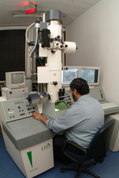
> **[Diagram Context - Textbook_LifeSciences_Gr10_Cells-the_basic_units_of_life.pdf-0003-09.png]**
> This photograph shows a transmission electron microscope (TEM) apparatus operated by a scientist in a laboratory setting, featuring control panels, a large vertical column, and computer display monitors. Visible markings include the brand label "LEO" and the model identifier "CM12" on the console. For FET Life Sciences learners studying "Cells as the Basic Units of Life", this image illustrates the advanced technology required to achieve the high magnification and ultra-high resolution needed to study subcellular organelles, complementing light microscope studies.

**Figure 3.5:** Light microscope

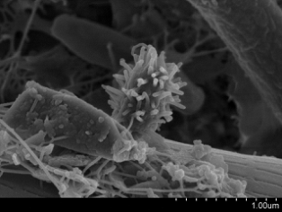

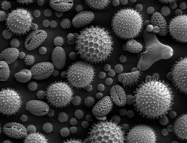

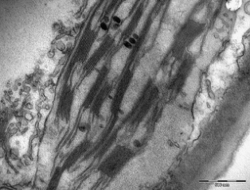

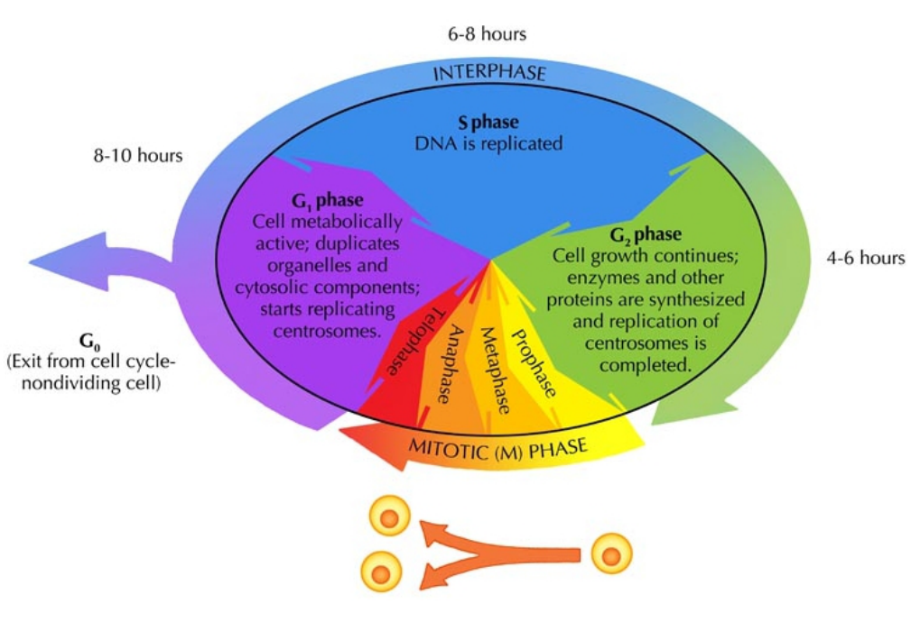
> **[Diagram Context - Textbook_LifeSciences_Gr10_Cell_division.pdf-0003-01.png]**
> This educational graphic is a circular cell cycle diagram illustrating the phases of the eukaryotic cell cycle. Visible labels include Interphase (subdivided into G₁ phase, S phase, and G₂ phase), Mitotic (M) phase (subdivided into Prophase, Metaphase, Anaphase, and Telophase), along with G₀ (Exit from cell cycle) and directional arrows indicating duration in hours and progression of stages. The diagram conveys conceptually how a cell grows, replicates its DNA during Interphase, and subsequently divides through mitosis and cytokinesis, providing high school Life Sciences students with a clear structural overview of cell division and the cell cycle.

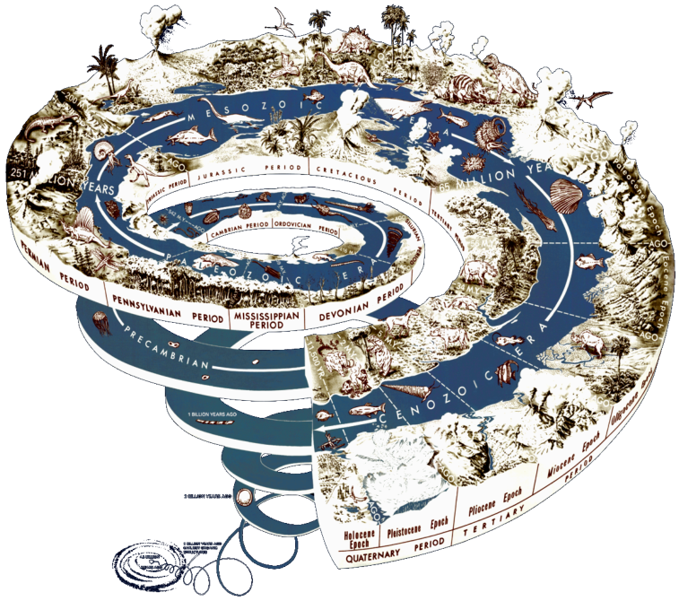
> **[Diagram Context - Textbook_LifeSciences_Gr10_History_of_life_on_earth.pdf-0003-00.png]**
> This educational graphic is a spiral geological timescale representing Earth's history. It features visible labels for eras (Precambrian, Paleozoic, Mesozoic, Cenozoic), geological periods (such as Cambrian, Jurassic, Tertiary, Quaternary), epochs, time markers in millions and billions of years ago, and illustrative icons of ancient flora, fauna, and geological events. This diagram visually conveys the chronological progression of evolution and geological change, helping Grade 12 Life Sciences learners understand macroevolution, the fossil record, and the relative timing of major extinction events across Earth's history.

---

# Chapter 3: Cells: The Basic Units of Life

## Table 3.1: The Parts of a Microscope

| Part of the microscope | Description |
| :--- | :--- |
| Ocular lens / eyepiece | - A cylinder containing two or more lenses. - These lenses are held at the correct working distance. - The ocular lens/eyepiece helps to bring the object into focus. |
| Revolving nose piece | The revolving nose piece holds the objectives in place so that they can rotate and can be changed easily. |
| Objective | The objective magnifies the objects. There are normally three objectives present: - $4\text{X}$ magnification - $10\text{X}$ magnification - $40\text{X}$ magnification |
| Coarse adjustment screw | The coarse adjustment screw is used for the initial focus of the object. By moving the stage up and down, bringing the object closer to or further away from the objective lens. |
| Fine adjustment screw | The fine adjustment screw is used for the final and clear focus of the object. |
| Frame | - A rigid structure for stability. - The frame is supported by a U-shaped foot leading to the base of the microscope. |
| Light source / mirror | - Provides a source of light so that the object can be viewed. |
| Diaphragm and condenser | The diaphragm and condenser control the amount of light which passes through the slide. |
| Stage | - The microscope slide is placed here. - The stage contains a clip or clips to prevent the slide from moving around. - There is a hole in the stage which allows light through. |

> **NOTE:**
> The ocular, rotating nosepiece and objectives are held above the stage by the arm.

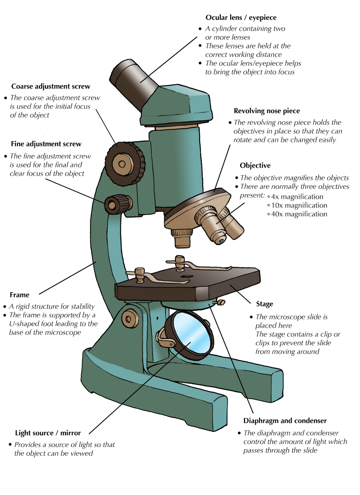

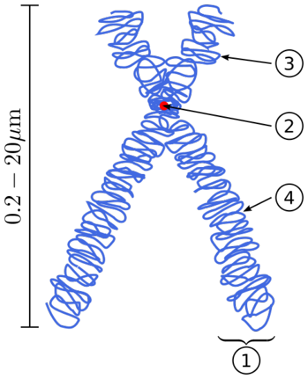
> **[Diagram Context - Textbook_LifeSciences_Gr10_Cell_division.pdf-0004-14.png]**
> 1. A diagram of a cross-stitch pattern with a red dot in the center.

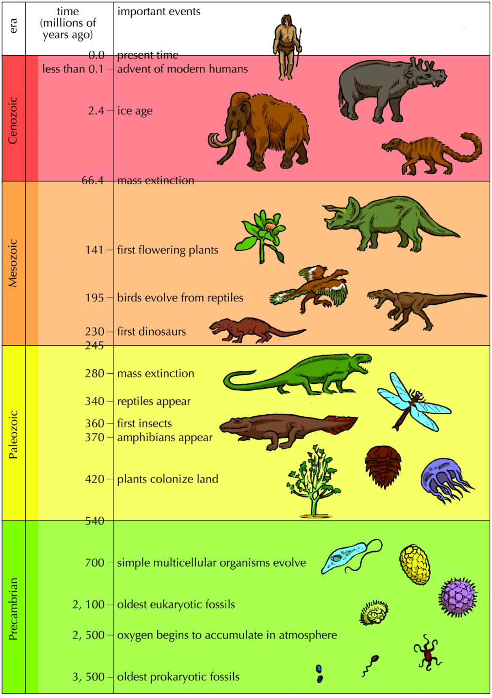

---

# How to use a microscope correctly

## Fact / Warning Box
**WARNING:** If using a mirror for illumination instead of a light bulb, never reflect direct sunlight as you could damage your eyes.

---

## Step-by-Step Instructions

1. When handling or carrying the microscope, always do so with both hands. Grasp the arm with one hand and place the other hand under the base for support.
2. Turn the revolving nosepiece so that the lowest power objective is in position.
3. Place the microscope slide on the stage and fasten it with the stage clip(s).
4. Look through the eyepiece and adjust the diaphragm for the greatest amount of light.
5. While looking at the slide on the stage from the side, turn the coarse adjustment screw so that the stage is as close to the objective lens as possible. **WARNING: Make sure you do not touch or damage the slide.**
6. Slowly turn the coarse adjustment screw until the image comes into focus.
7. Now use the fine adjustment screw to move the stage downwards until the image is clearly visible. **Never move the lens towards the slide.**
8. You can readjust the light source and diaphragm for the clearest image.
9. When changing to the next objective lens use the fine adjustment screw to focus the image. **WARNING: Never use the coarse adjustment screw for the strongest objective lens.**
10. Do not touch the glass part of the lenses with your fingers.
11. When finished, move the stage and objective as far away from each other as possible and remove the slide.
12. Disconnect the power source and cover the microscope.
13. Carry the microscope by holding it firmly by the "arm" and "base" and when walking it should be near your chest.

---

## NOTE:
Remember that microscopes are expensive scientific equipment and need to be handled with care to prevent damaging them. Proper lens paper should be used when cleaning dust or dirt off any lenses. Avoid getting moisture on the objective lenses. Dust and moisture are the biggest enemies of microscopes.

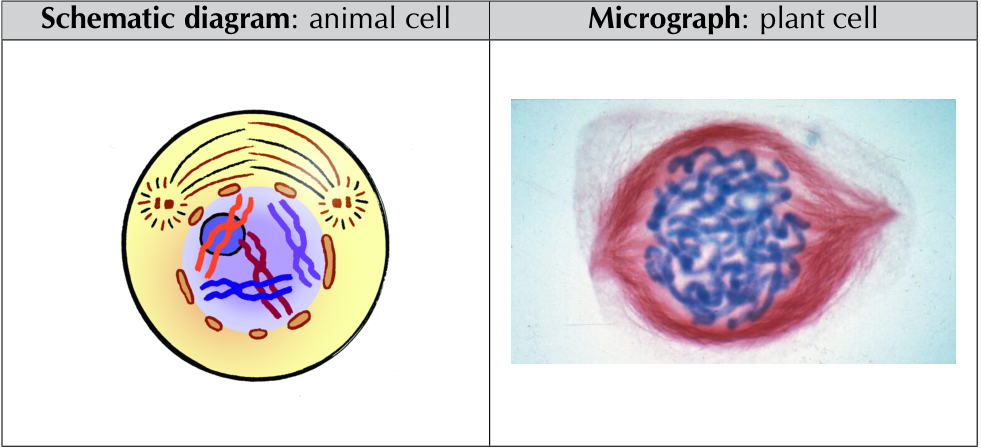

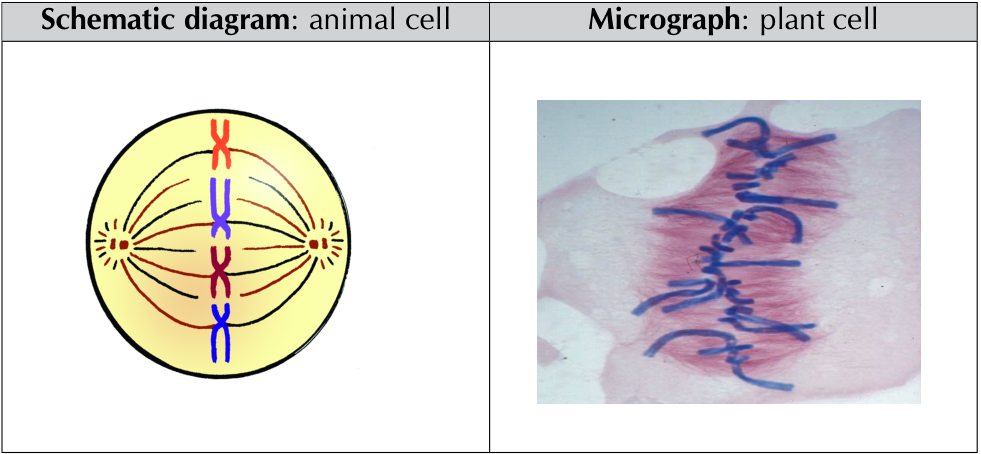

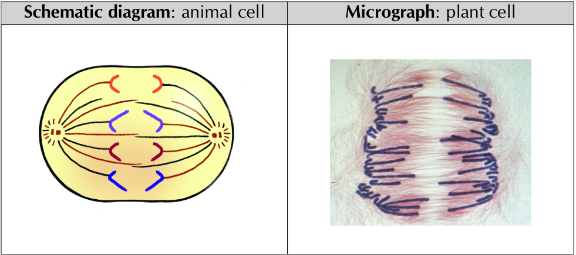

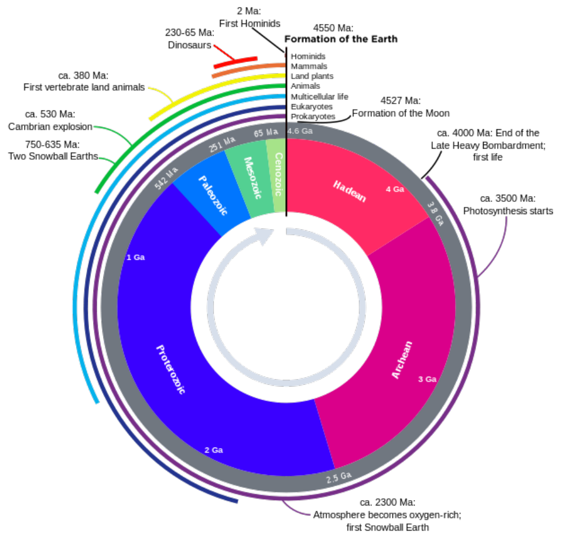

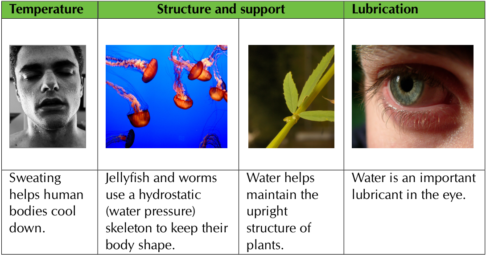
> **[Diagram Context - Textbook_LifeSciences_Gr10_The_chemistry_of_life.pdf-0005-02.png]**
> This educational table contains photographic images and descriptive text organized under three functional category headers: "Temperature," "Structure and support," and "Lubrication." The visible text includes column headers and explanatory captions stating: "Sweating helps human bodies cool down," "Jellyfish and worms use a hydrostatic (water pressure) skeleton to keep their body shape," "Water helps maintain the upright structure of plants," and "Water is an important lubricant in the eye." Conceptually, this graphic illustrates the critical biological roles of water in living organisms, specifically highlighting temperature regulation, hydrostatic skeletal support, turgidity in plants, and lubrication for high school Life Sciences learners.

---

## Differences between the light microscope and transmission electron microscope

| Property | Light Microscope | Transmission Electron Microscope |
| :--- | :--- | :--- |
| **Source** | Light | Beam of electrons |
| **Resolution** (how far apart two objects must be in order to be distinguished as separate) | Under optimal conditions (clean lenses, oil immersion), the resolution is $0,2$ micrometres or $2$ thousands of a millimetre | Resolution of a transmission electron microscope is about $0,05$ nanometres ($\text{nm}$) which is about $0,5$ millionth of a millimetre. This means that a transmission electron microscope has about $10\ 000$ times the resolving power of a light instrument |
| **Material** (alive / dead) | Alive or dead. Bright field or phase contrast microscopes enable viewer to observe living cells. Specimens need to be stained. | Dead. Electron microscope images are produced by passing an electron beam through tissues stained with heavy metals. |
| **Example of microscope image** | 

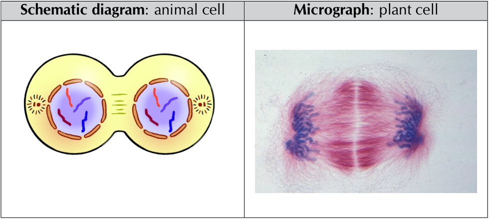
   Bacterial spores as seen under light microscope. | 

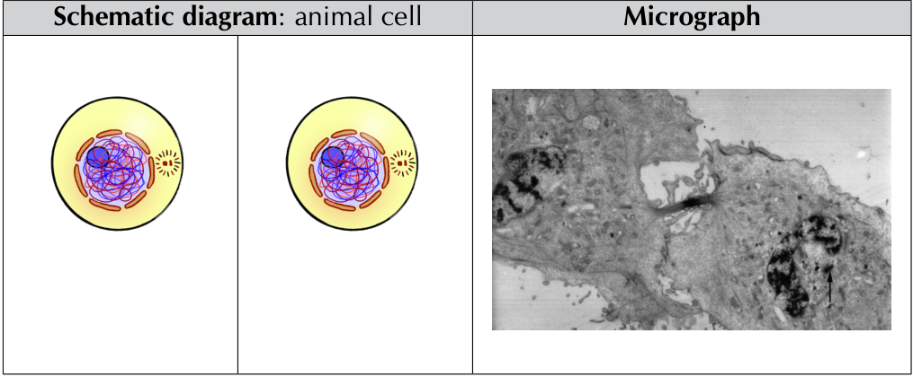
   *Chlamydomonas reinhardtii*, a single celled green algae, as seen under the transmission electron microscope. |

---

## Calculating magnification

Microscopes magnify an image using a lens found in the eye-piece, which is also known as the **ocular lens**. The image is further magnified by the **objective lens**. Thus the magnification of a microscope is: 

$$\text{magnification power of the eye-piece} \times \text{the power of the objective lens}$$

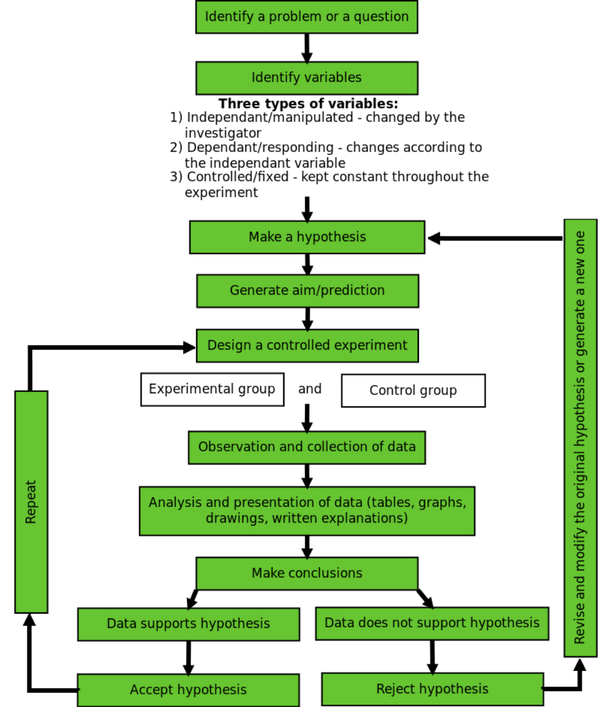
> **[Diagram Context - Textbook_LifeSciences_Gr10_Introduction_to_life_sciences.pdf-0006-01.png]**
> This flowchart illustrates the scientific method, featuring sequential green process blocks and directional arrows. Visible labels include "Identify a problem", "Identify variables (Independant, Dependant, Controlled)", "Make a hypothesis", "Design a controlled experiment", "Observation and collection of data", "Analysis", and "Make conclusions", with branches for accepting or rejecting the hypothesis and loops for repeating or revising. Conceptually, this diagram guides high school learners through the systematic steps required to plan, execute, and evaluate scientific investigations within the CAPS curriculum.

---

### Worked Example: Microscope Magnification

**Example:** If the eyepiece magnification is $5\text{X}$ and the objective lens' magnification is $10\text{X}$, the image of the object viewed under the microscope is $50\text{X}$ bigger than the object:

$$\text{overall magnification} = \text{power of eyepiece} \times \text{power of objective}$$
$$= 5 \times 10$$
$$= 50 \times \text{the original size}$$

---

### Calculating the Field of View

When viewing an object through a microscope, the diameter of the circle through which you view the object is known as the **field of view**.

> **Important Rule:** As the magnification increases, the field of view decreases.

To measure the field of view, use a microscope slide with a tiny ruler printed on it. For example, the size of the field of view shown below under low power magnification is approximately $1\text{ mm}$.

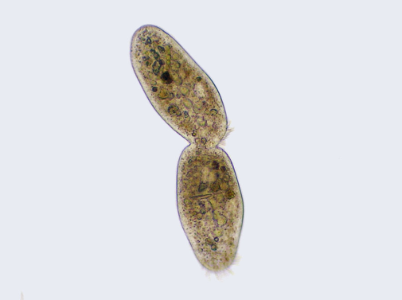

*Figure 3.6: Field of view is approximately $1\text{ mm}$.*

---

### Estimating Object Size and Calculating New Field of View

Once the size of the field of view is known, we can estimate the size of the objects being viewed under the microscope. At $10\text{X}$ magnification, the field of view is $1,0\text{ mm}$. If the magnification is increased to $100\text{X}$, what will the new field of view be?

Given: $1,0\text{ mm}$ at $10\text{X}$ magnification

$$\text{new field of view} = \frac{\text{current magnification}}{\text{new magnification}} \times \text{current field of view}$$

Let $x\text{ mm}$ be the field of view at $100\text{X}$ magnification:

$$\text{new field of view} = \frac{\text{current magnification}}{\text{new magnification}} \times \text{current field of view}$$
$$x = \frac{10}{100} \times 1,0\text{ mm}$$
$$x = 0,1\text{ mm}$$

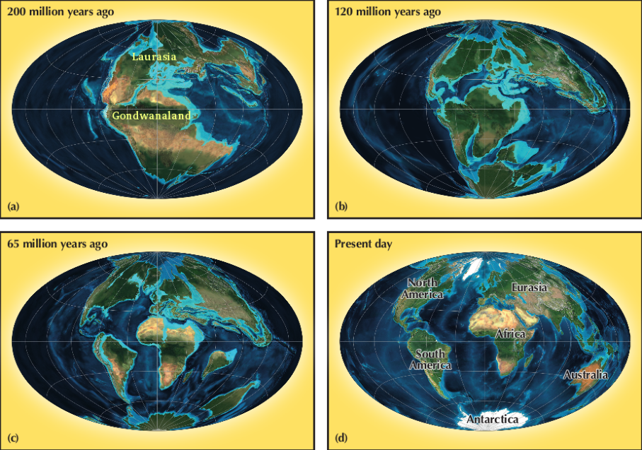

---

If magnification is increased 10-fold, the field of view will decrease 10-fold. Thus it will become $0.1\text{ mm}$. What this means is that at higher magnification, we are able to see objects of smaller and smaller size within our field of view. This is why at higher magnification, the field of view becomes smaller.

At $500\times$ magnification, the field of view of a microscope is $0.05\text{ mm}$. What will the field of view be at $100\times$ magnification?

$$x = \frac{500}{100} \times 0.05\text{ mm} = 0.25\text{ mm}$$

## Calculating magnification and using scale bars

When drawing cells or cellular structures, your diagrams will usually be much larger than the actual size of the structures you will be drawing. The magnification is given by:

$$\text{magnification} = \frac{\text{drawing size}}{\text{actual size}}$$

When a scale bar is provided with the diagram, the magnification is given by:

$$\text{magnification} = \text{drawing size} \times \frac{\text{scale given}}{\text{measured length of scale}}$$

---

### Worked example 1: Calculating overall magnification

**QUESTION**  
Calculate the overall magnification of a compound light microscope with a magnification of $10\times$ due to the eyepiece and a magnification of a $100\times$ due to the objective lens.

**SOLUTION**  
Using the formula:

$$\begin{aligned}
\text{overall magnification} &= \text{power of eyepiece} \times \text{power of objective} \\
&= 10 \times 100 \\
&= 1000\times \text{ the original size}
\end{aligned}$$

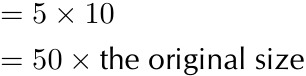

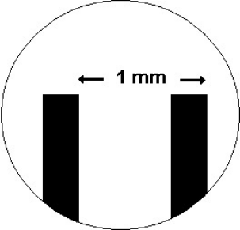

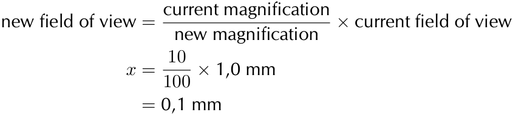

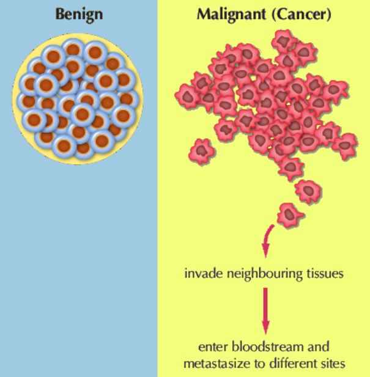

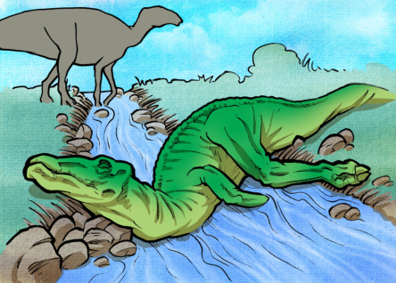

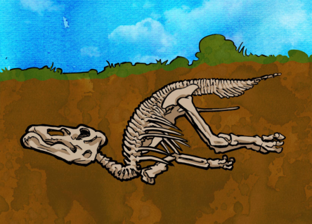

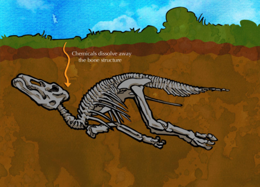

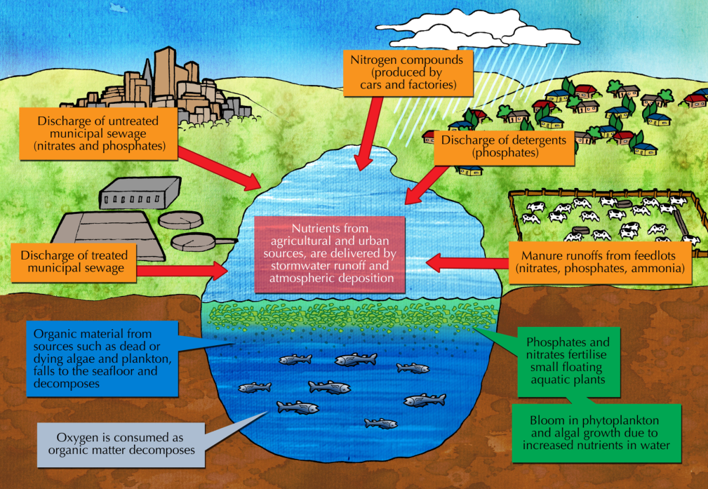

---

## Worked Example 2: Calculating size of object from its microscopic image

### QUESTION

If the measured length of the magnified beetle larva image shown below was $2\text{ centimetres } (20\text{ mm})$, the ocular magnification of the microscope is $5\text{ X}$ and you are using an objective lens magnification of $10\text{ X}$, what is the actual length of the larva in millimetres?

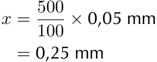

*Figure 3.7: A beetle larva as seen under a light microscope.*

---

### SOLUTION

#### Step 1: Calculate the total magnification
Use the formula:

$$\text{overall magnification} = \text{power of eyepiece} \times \text{power of objective}$$
$$\text{overall magnification} = 5 \times 10$$
$$\text{overall magnification} = 50 \times \text{the original size}$$

#### Step 2: Now calculate the size of the object
If the image is $50\text{ X}$ larger than the object, what is the size of the object? Calculate this by simple proportion given in the formula below:

$$\text{Size} = \frac{\text{size of image}}{\text{overall magnification}}$$

$$\text{Size} = \frac{20\text{ mm}}{50}$$

$$\text{Size} = 0,4\text{ mm}$$

---

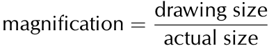

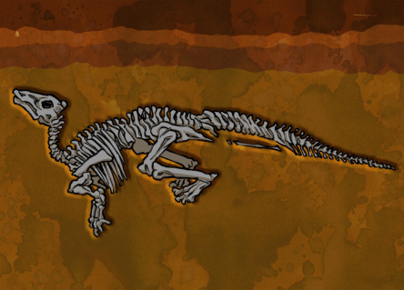

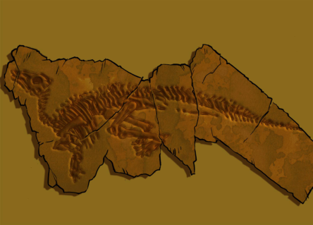

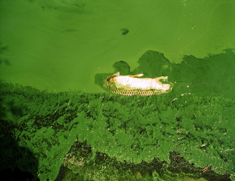

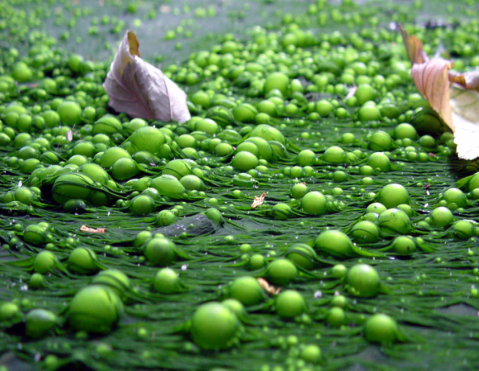

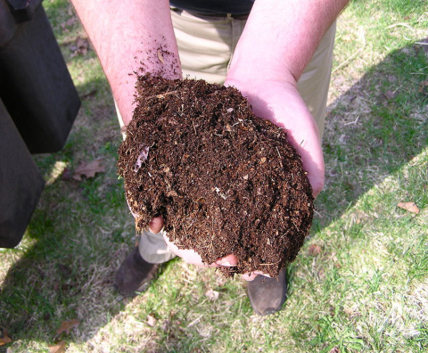

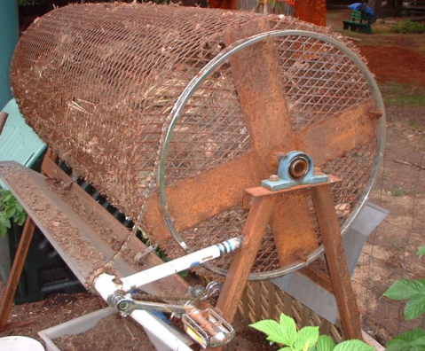

---

### Worked Example 3: Calculating actual size given of a structure given scale bar on an image

#### QUESTION

Calculate the actual length of AB from the image shown in the micrograph given with the scale bar given below.

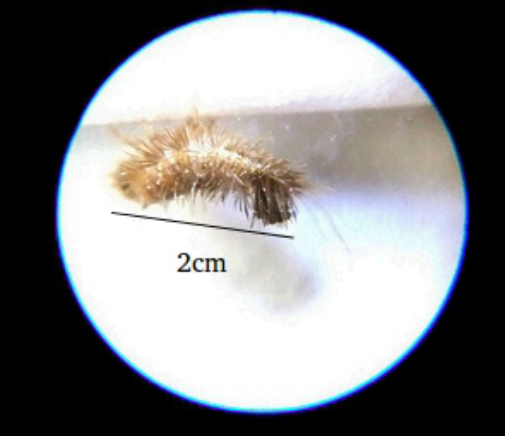

*Figure 3.8: Electron micrograph showing rough endoplasmic reticulum with a scale bar given*

---

#### SOLUTION

##### Step 1: Measure the length AB shown in the diagram
This should be approximately $20\text{ mm}$

##### Step 2: Work out the length AB
Given that the measured length of the scale bar is approximately $5\text{ mm}$, work out the length AB:

$$\begin{aligned}
\text{Size} &= \frac{\text{length of AB on diagram}}{\text{measured length of scale bar}} \times \text{number on scale bar} \\
&= \frac{20\text{ mm}}{5\text{ mm}} \times 500\text{ nm} \\
&= 2000\text{ nm} \\
&= 2\text{ }\mu\text{m}
\end{aligned}$$

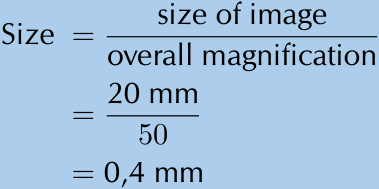

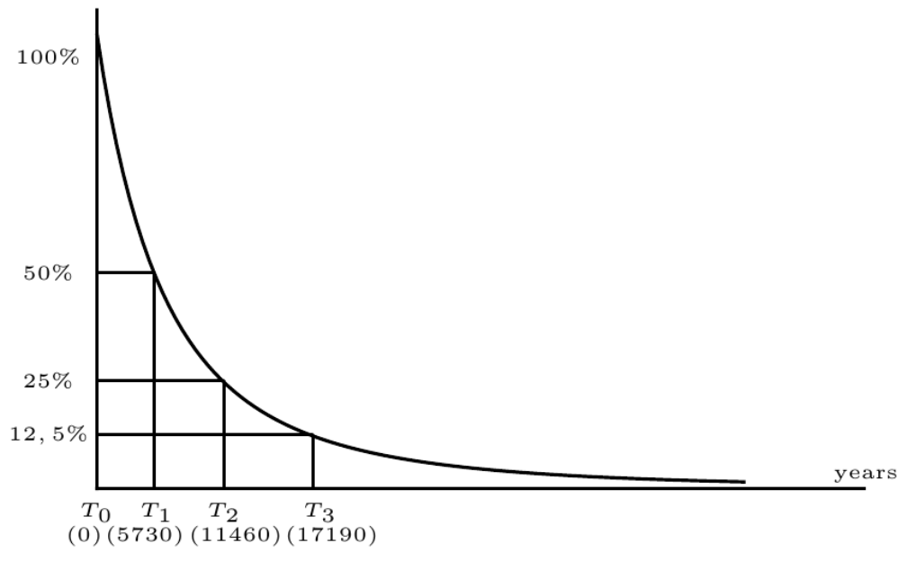

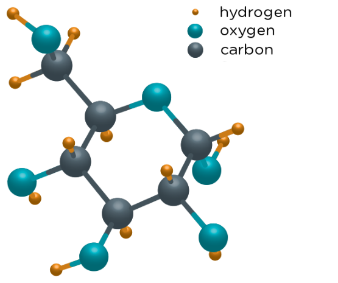

---

## 3.3 Cell structure and function (ESG4S)

### Cell theory (ESG4T)

The cell theory, developed in 1839 by microbiologists Schleiden and Schwann, describes the properties of cells. It is an explanation of the relationship between cells and living things. The theory states that:

* All living things are made of cells and their products.
* New cells are created by old cells dividing into two.
* Cells are the basic building blocks of life.

The cell theory applies to all living things, however big or small. The modern understanding of cell theory extends the concepts of the original cell theory to include the following:

* The activity of an organism depends on the total activity of independent cells.
* Energy flow occurs in cells through the breakdown of carbohydrates by respiration.
* Cells contain the information necessary for the creation of new cells. This information is known as 'hereditary information' and is contained within DNA.
* The contents of cells from similar species are basically the same.

Cells are the smallest form of life; the functional and structural units of all living things. Your body contains several billion cells, organised into over $200$ major types, with hundreds of cell-specific functions.

Some functions performed by cells are so vital to the existence of life that all cells perform them (e.g. cellular respiration). Others are highly specialised (e.g. photosynthesis).

> **FACT**
> DNA (the hereditary information of cells) is passed from 'parent' cells to 'daughter' cells during cell division. You will learn more about this in the following chapter: **Cell division**.

Figure 3.9 shows a two-dimensional drawing of an animal cell. The diagram shows the structures visible within a cell at high magnification. The structures form the **ultrastructure** of the cell.

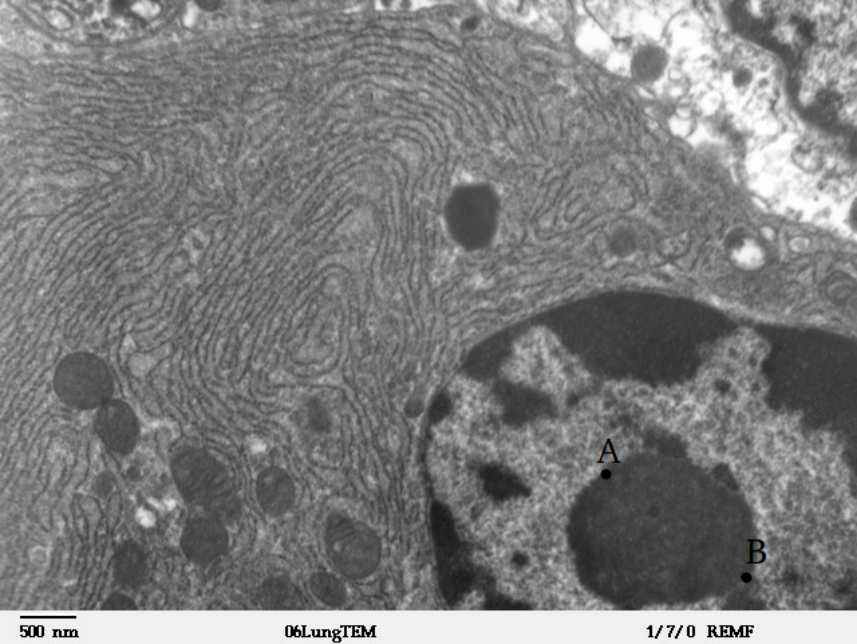

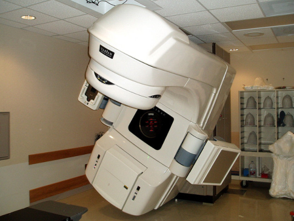

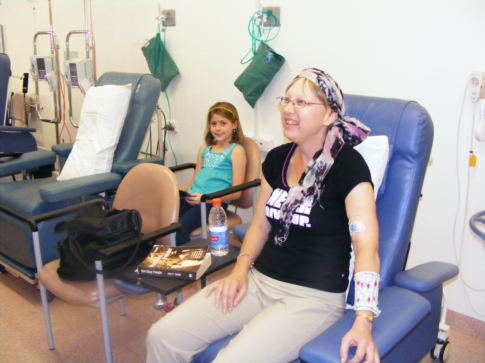

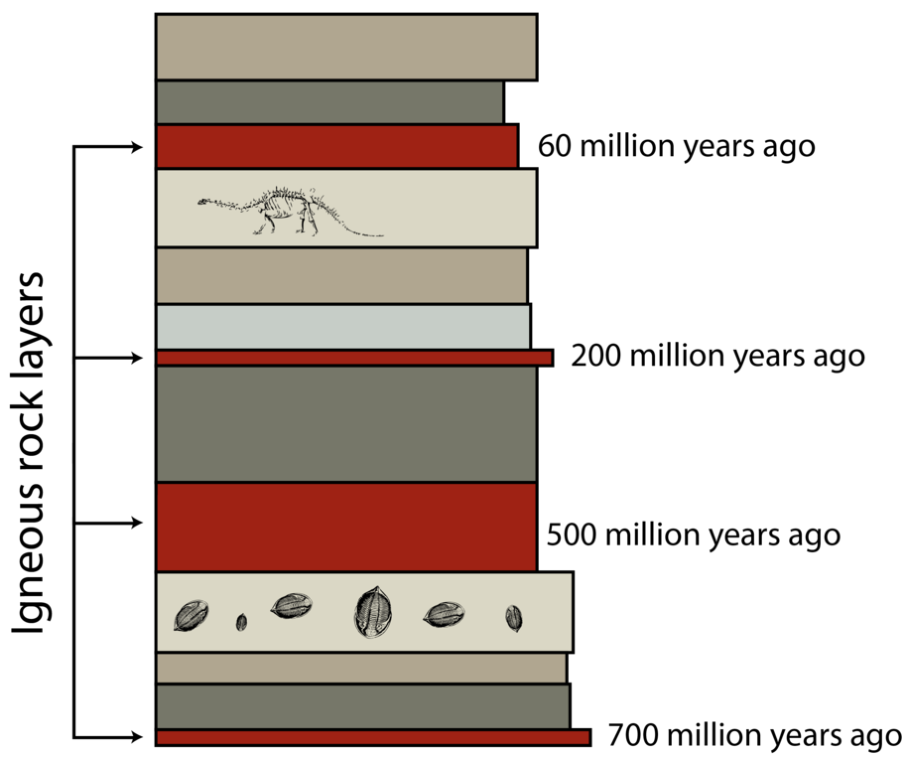

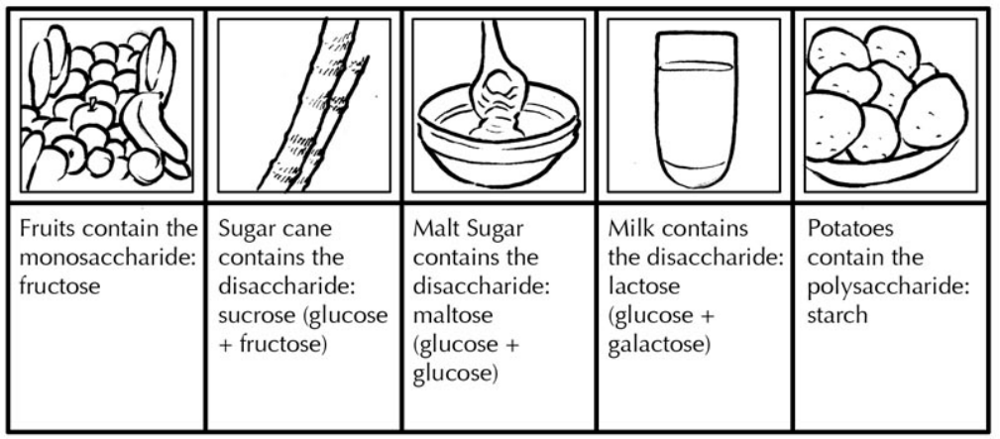

---

## Chapter 3. Cells: the basic units of life

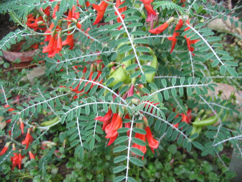

**Figure 3.9:** Diagram of the cell ultrastructure of an animal cell.

**FACT:** The human body cannot break down the cellulose in cell walls because we do not produce the enzyme cellulase.

***

We will now look at some of the basic cell structures and organelles in animal and plant cells.

### Cell wall (ESG4V)

The cell wall is a rigid non-living layer that is found outside the cell membrane and surrounds the cell. Plants, bacteria and fungi all have cell walls. In plants, the wall is comprised of cellulose. It consists of three layers that help support the plant. These layers include the middle lamella, the primary cell wall and the secondary cell wall.

* **Middle lamella:** Separates one cell from another. It is a thin membranous layer on the outside of the cell and is made of a sticky substance called pectin.
* **Primary cell wall:** Is on the inside of the middle lamella and is mainly composed of cellulose.
* **Secondary cell wall:** Lies alongside the cell membrane. It is made up of a thick and tough layer of cellulose which is held together by a hard, waterproof substance called lignin. It is only found in cells which provide mechanical support in plants.

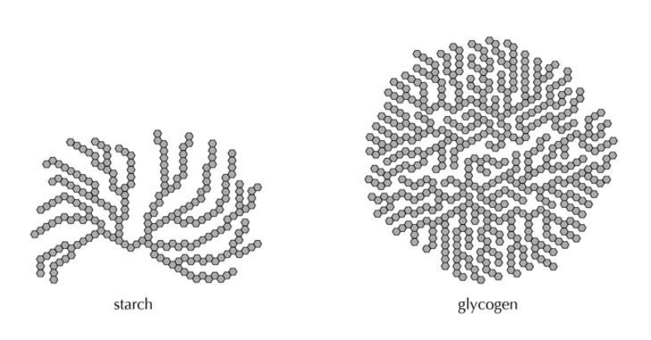

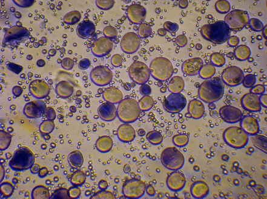

---

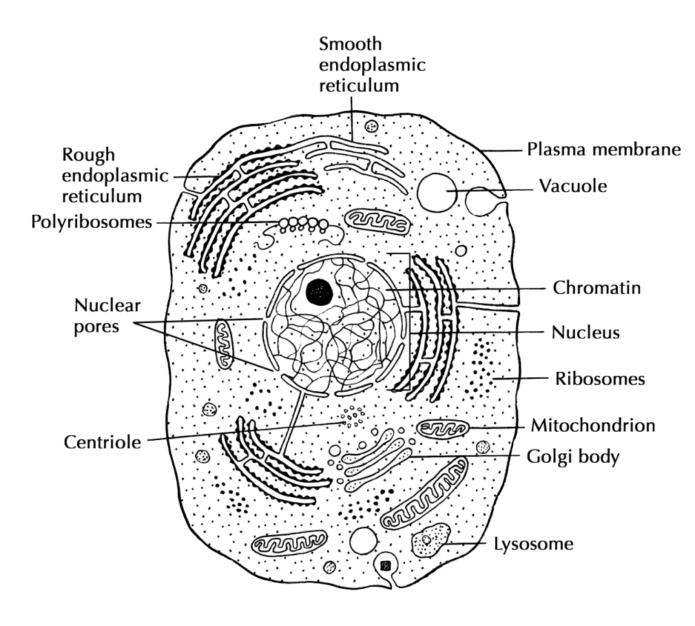

Figure 3.10: Scanning electron microscope micrographs of diatoms showing the external appearances of the cell wall. Scale bar: **A, B, D:** $10\text{ }\mu\text{m}$, **C:** $20\text{ }\mu\text{m}$

### Functions of the cell wall

* The main function of the wall is to protect the inner parts of the plant cell, it gives plant cells a more uniform and regular shape and provides support for the plant body.
* The cell wall is completely permeable to water and mineral salts which allows distribution of nutrients throughout the plant.
* The openings in the cell wall are called **plasmodesmata** which contain strands of cytoplasm that connect adjacent cells. This allows cells to interact with one another, allowing molecules to travel between plant cells.

---

## Cell membrane

ESG4W

The **cell membrane**, also called the plasma membrane, physically separates the intracellular space (inside the cell) from the extracellular environment (outside the cell). All plant and animal cells have cell membranes. The cell membrane surrounds and protects the **cytoplasm**. Cytoplasm is part of the protoplasm and is the living component of the cell.

The cell membrane is composed of a double layer (bilayer) of special lipids (fats) called **phospholipids**. Phospholipids consist of a **hydrophilic** (water-loving) head and a **hydrophobic** (water-fearing) tail. The hydrophilic head of the phospholipid is **polar** (charged) and can therefore dissolve in water. The hydrophobic tail is **non-polar** (uncharged), and cannot dissolve in water.

The lipid bilayer forms spontaneously due to the properties of the phospholipid molecules. In an aqueous environment, the polar heads try to form hydrogen bonds with the water, while the non-polar tails try to escape from the water. The problem is solved by the formation of a bilayer because the hydrophilic heads can point outwards and from hydrogen bonds with water, and the hydrophobic tails point towards one another and are 'protected' from the water molecules (Figure 3.11).

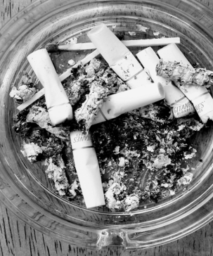

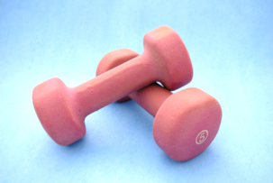

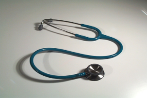

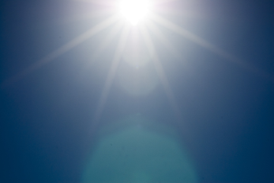

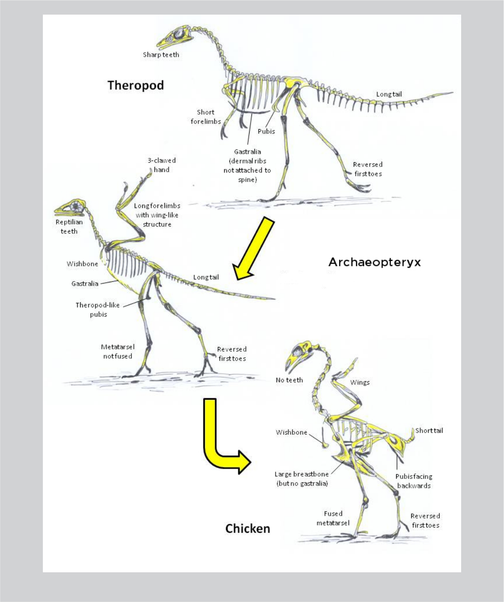

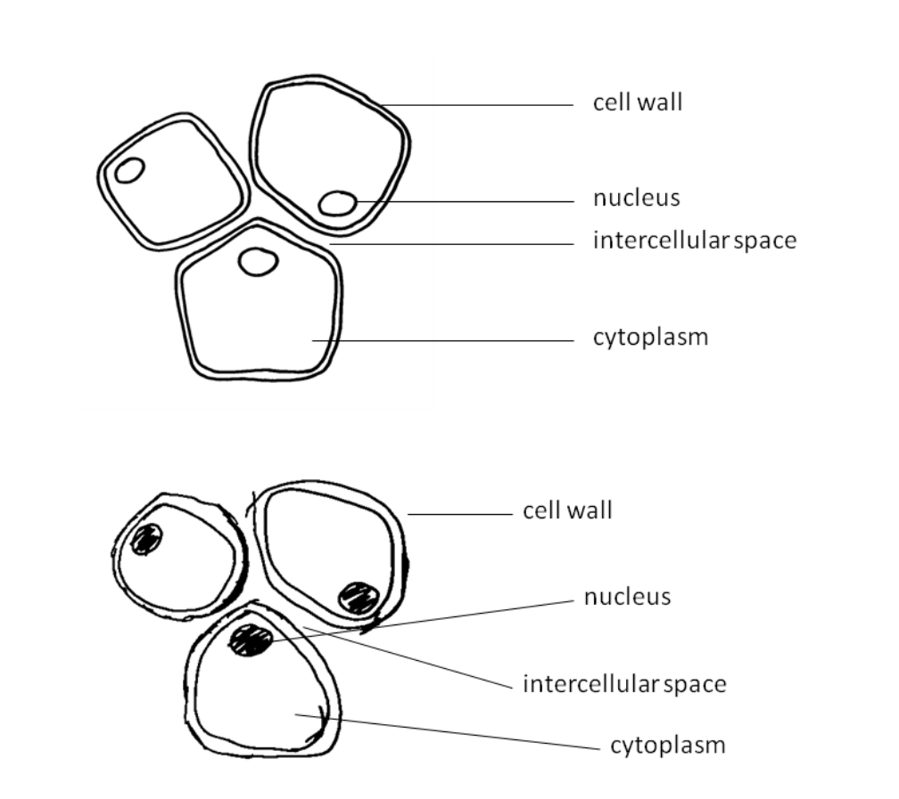

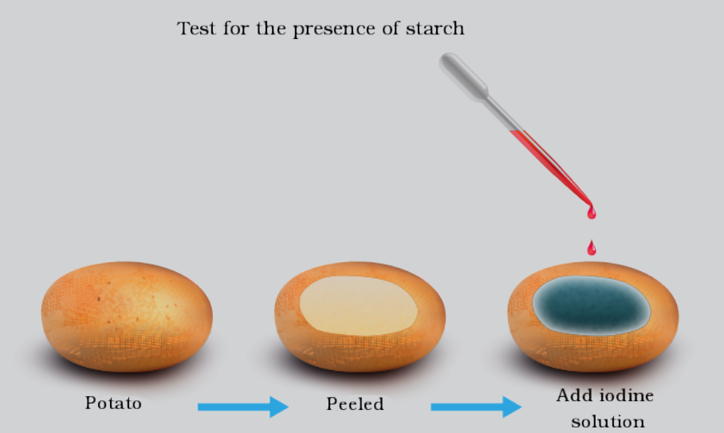

---

# Chapter 3. Cells: the basic units of life

## The Cell Membrane

All the exchanges between the cell and its environment have to pass through the cell membrane. 

- **Selective permeability:** The cell membrane is **selectively permeable** to ions (e.g., hydrogen, sodium), small molecules (oxygen, carbon dioxide), and larger molecules (glucose and amino acids). It controls the movement of substances in and out of the cells.
- **Functions:** The cell membrane performs many important functions within the cell, such as:
  - Osmosis
  - Diffusion
  - Transport of nutrients into the cell
  - Processes of ingestion and secretion
- **Physical properties:** The cell membrane is strong enough to provide the cell with mechanical support and flexible enough to allow cells to grow and move.

---

## Structure of the Cell Membrane: The Fluid Mosaic Model

S.J. Singer and G.L. Nicolson proposed the **Fluid Mosaic Model** of the cell membrane in 1972. This model describes the structure of the cell membrane as a **fluid** structure with various protein and carbohydrate components diffusing freely across the membrane. 

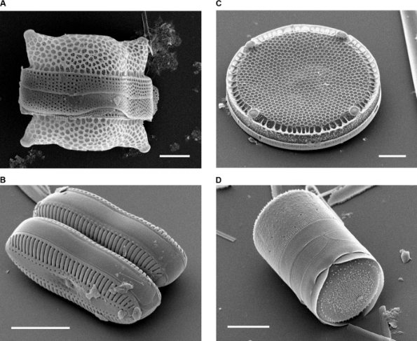

> **FACT**
> Recall the structure of lipid molecules from the previous chapter on **the chemistry of life**.

> **FACT**
> Watch a video about the cell membrane.
> 
> $\text{ \textcircled{\small{P}} }$ See video: 2CPB

---

### Figure Descriptions

* **Figure 3.11:** The lipid bilayer showing the arrangement of phospholipids, containing hydrophilic, polar heads and hydrophobic, non-polar tails.
* **Figure 3.12:** Fluid mosaic model of the cell membrane, showing components such as:
  - Carbohydrate chain
  - External surface membrane
  - Hydrophilic head
  - Phospholipid bilayer
  - Glycolipid
  - Glycoprotein
  - Protein molecule
  - Hydrophobic tail
  - Internal surface membrane

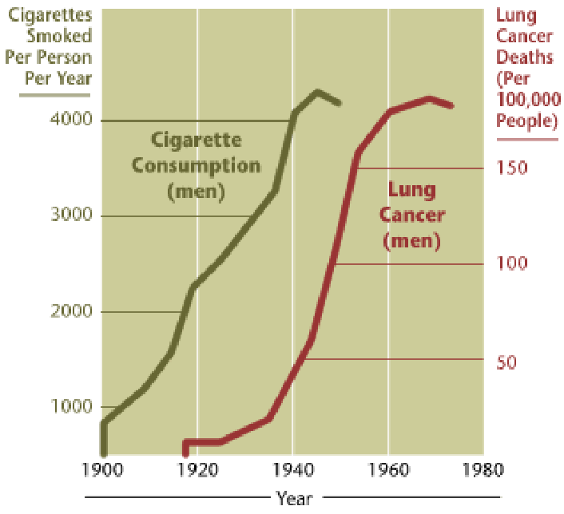

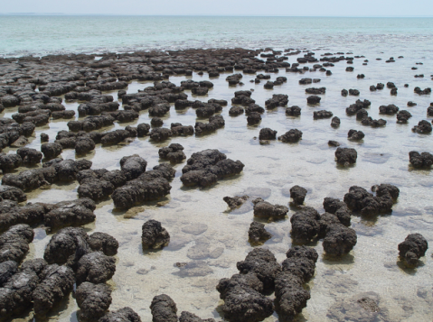

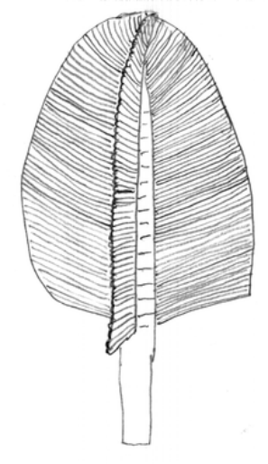

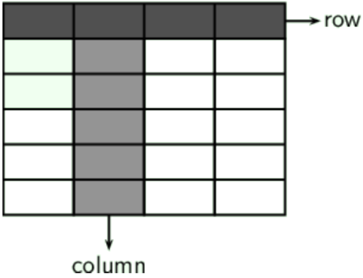

---

### Facts & Notes

**FACT:**  
A further description of the fluid mosaic model can be viewed at:  
- See video: 2CPC

**FACT:**  
Learn about the different ways that molecules can travel across cell membranes.  
- See video: 2CPD

---

### Table 3.2: Structure and Function of Components of the Cell Membrane

| Component (see Figure 3.12) | Structure | Function |
| :--- | :--- | :--- |
| **Phospholipid bilayer** | Consists of two layers of phospholipids. Each phospholipid has a polar, hydrophilic (water-soluble) head as well as a non-polar, hydrophobic (water-insoluble) tail. | It is a semi-permeable structure that does not allow materials to pass through the membrane freely, thus protecting the intra and extracellular environments of the cell. |
| **Membrane proteins** | These are proteins found spanning the membrane from the inside of the cell (in the cytoplasm) to the outside of the cell. Membrane proteins have hydrophilic and hydrophobic regions that allow them to fit into the cell membrane. | Act as carrier proteins which control the movement of specific ions and molecules across the cell membrane. |
| **Glycoproteins** | Consist of short carbohydrate chains attached to polypeptide chains and are found on the extracellular regions of the membrane. | These proteins are useful for cell-to-cell recognition. |
| **Glycolipids** | Carbohydrate chains attached to phospholipids on the outside surface of the membrane. | Act as recognition sites for specific chemicals and are important in cell-to-cell attachment to form tissues. |

---

## Movement across membranes (ESG4X)

Movement of substances across cell membranes is necessary as it allows cells to acquire oxygen and nutrients, excrete waste products and control the concentration of required substances in the cell (e.g. oxygen, water, hormones, ions, etc). The key processes through which such movement occurs include **diffusion**, **osmosis**, **facilitated diffusion** and **active transport**.

### 1. Diffusion

Diffusion is the movement of substances from a region of high concentration to low concentration. It is therefore said to occur **down a concentration gradient**. The diagram below shows the movement of dissolved particles within a liquid until eventually becoming randomly distributed.

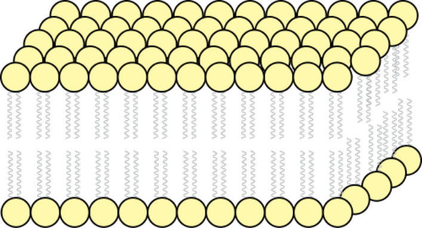

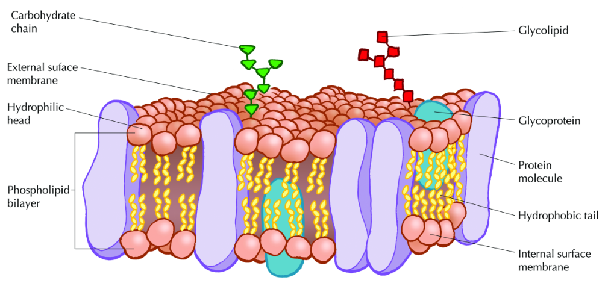

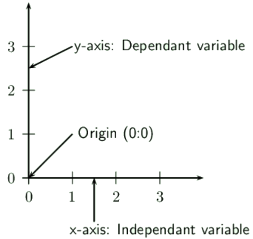

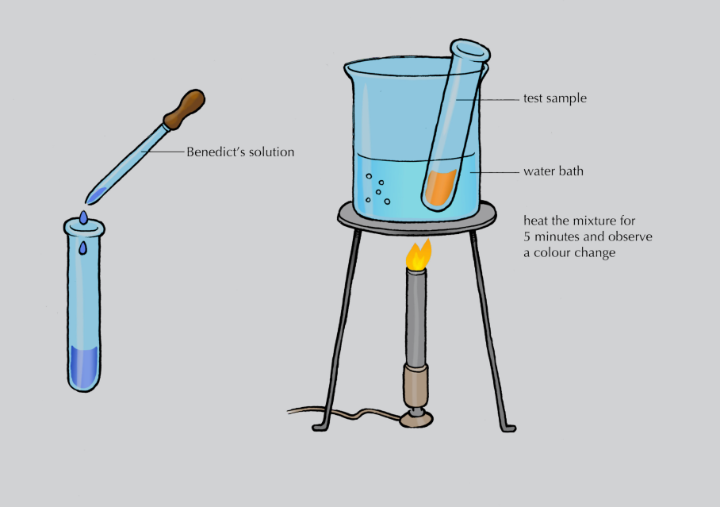

---

# Chapter 3. Cells: the basic units of life

## Diffusion

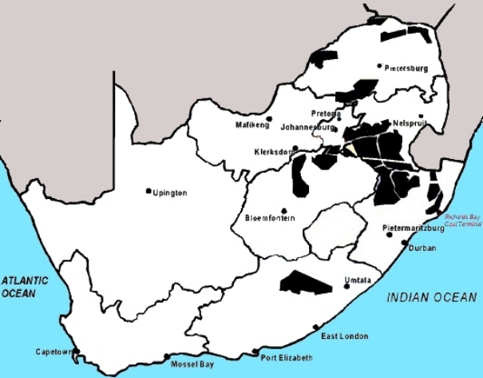

**Figure 3.13:** Diffusion is the movement of molecules from a region of higher concentration to a lower concentration. It is a passive process (i.e. does not require input of energy).

### Key Concepts
* **Diffusion:** The movement of molecules from a region of higher concentration to a region of lower concentration.
* **Passive Process:** A process that does not require any input of energy.

Diffusion can occur across a living or non-living membrane and can occur in a liquid or gas medium. Due to the fact that diffusion occurs across a concentration gradient, it can result in the movement of substances into or out of the cell. 

**Examples of substances moved by diffusion:**
* Carbon dioxide
* Oxygen
* Water and other small molecules that are able to dissolve within the lipid bilayer.

---

## Investigation: Observing diffusion

### Aim:
To observe diffusion.

### Apparatus:
* $500\text{ ml}$ beaker
* Large funnel
* Plastic straw
* Potassium permanganate crystals

### Method:
1. Fill a beaker with water and allow it to stand for a few minutes so that water movement stops.
2. Place a large funnel into the water so that it touches the bottom of the beaker. Drop a few small potassium permanganate crystals through the straw. Remove the funnel carefully and slowly.
3. Observe the size of the area that is coloured by the potassium permanganate at the beginning of the experiment, after $5\text{ minutes}$ and then after $20\text{ minutes}$.

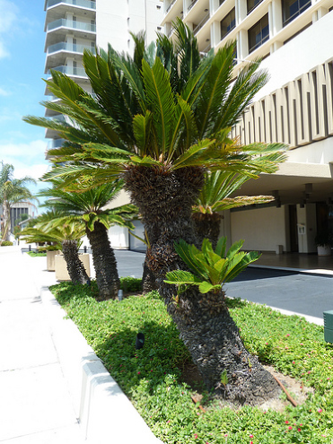

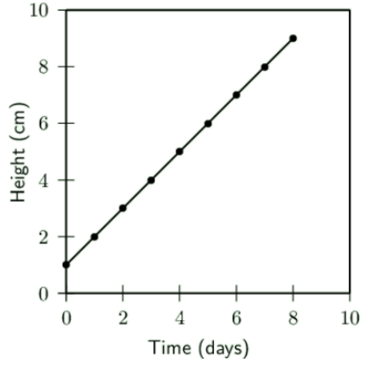

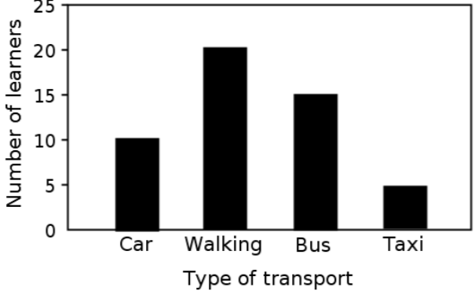

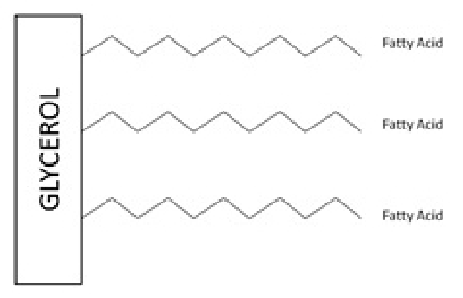

---

## 3.3. Cell structure and function

### Fact
Watch osmosis taking place by clicking on the following link.
- See video: 2CPG

### Questions
1. What do you observe happening in the beaker?
2. What can you conclude based on your observations?
3. Explain how using hot water would affect the results of this experiment (remember that when you explain you need to give a reason for your answer).

---

### 2. Osmosis

When the concentration of solutes in solution is low, the water concentration is high, and we say there is a **high water potential**. 

**Osmosis** is the movement of water from a region of higher water potential to a region of lower water potential across a semi-permeable membrane that separates the two regions. Movement of water always occurs down a concentration gradient, i.e. from higher water potential (dilute solution) to lower potential (concentrated solution). 

Osmosis is a passive process and does not require any input of energy. Cell membranes allow molecules of water to pass through, but they do not allow molecules of most dissolved substances, e.g. salt and sugar, to pass through. As water enters the cell via osmosis, it creates a pressure known as **osmotic pressure**.

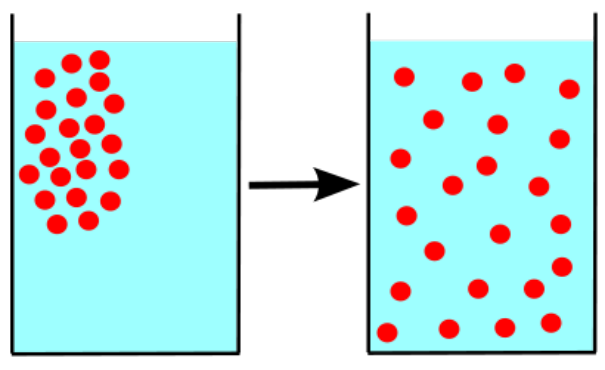

*Figure 3.14: Osmosis is the movement of water from an area of high water potential to an area of low water potential across a semi-permeable membrane.*

In biological systems, osmosis is vital to plant and animal cell survival. Figure 3.15 demonstrates how osmosis affects red blood cells when they are placed in three different solutions with different concentrations.

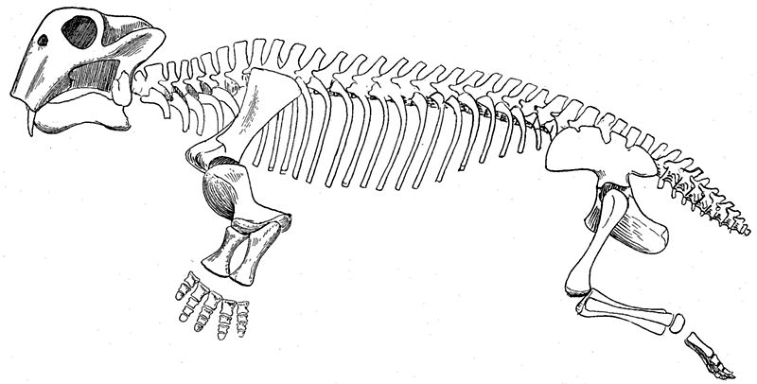

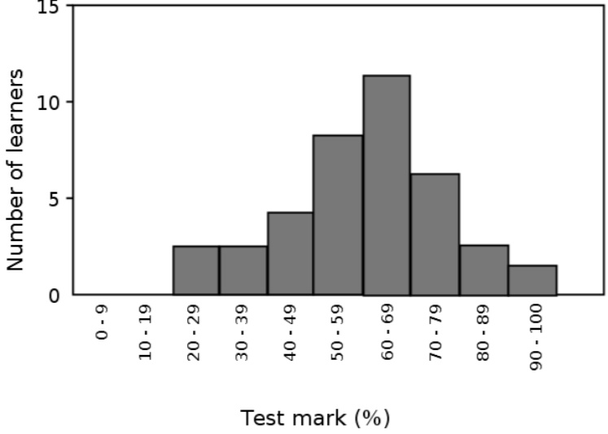

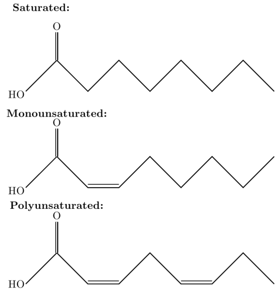

---

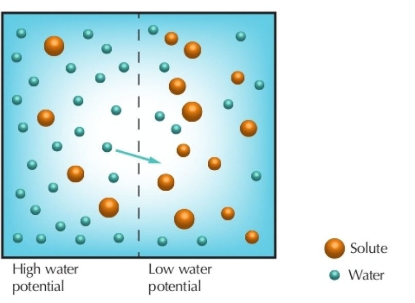

Figure 3.15: The effect of hypertonic, isotonic and hypotonic solutions on red blood cells.

| Hypertonic (concentrated) | Isotonic | Hypotonic (dilute) |
| :--- | :--- | :--- |
| The medium is concentrated with a lower water potential than inside the cell, therefore the cell will lose water by osmosis. | The water concentration inside and outside the cell is equal and there will be no nett water movement across the cell membrane. (Water will continue to move across the membrane, but water will enter and leave the cell at the same rate.) | The medium has a higher water potential (more dilute) than the cell and water will move into the cell via osmosis, and could eventuality cause the cell to burst. |

Plant cells use osmosis to absorb water from the soil and transport it to the leaves. Osmosis in the kidneys keeps the water and salt levels in the body and blood at the correct levels.

---

### Investigation: Predicting the direction of osmosis

**Aim:**  
To predict the direction of osmosis.

**Apparatus:**  
- $500\text{ ml}$ beaker  
- large potato  
- potato peeler/scalpel  
- two pins  
- concentrated sucrose/sugar solution. To obtain this, add $100\text{ g}$ of sugar to $200\text{ ml}$ of water.

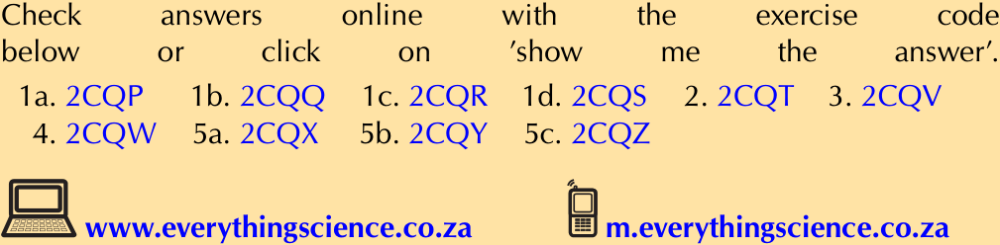

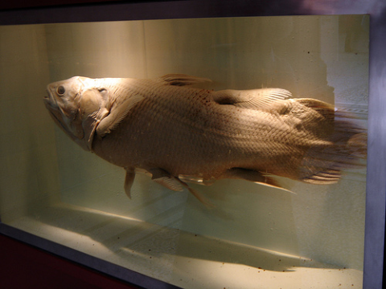

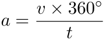

---

## Method: Investigating Osmosis Using a Potato Osmoscope

1. Peel off the skin of a large-sized potato with a scalpel/potato peeler.
2. Cut its one end to make the base flat.
3. Make a hollow cavity in the potato almost to the bottom of the potato.
4. Add the concentrated sugar solution into the cavity of the potato, filling it about half way. Mark the level by inserting a pin at the level of the sugar solution (insert the pin at an angle into the cavity at the level) (Figure 3.16 A).
5. Carefully place the potato in the beaker containing water.
6. Observe what happens to the level of the sugar solution in the potato.
7. After 15 to 20 minutes, mark the level by inserting the second pin at the level of the sugar solution (insert as the first pin) (Figure 3.16 B).

---

## Questions

1. What do you observe happening to the level of the solution inside the potato?
2. What conclusion can you draw based on your observation?
3. What conditions were met in this experiment that makes this type of transport different to diffusion?

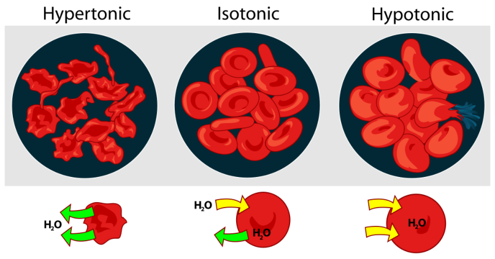

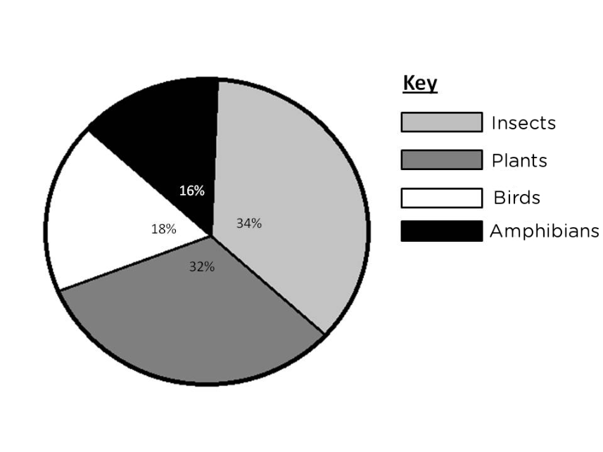

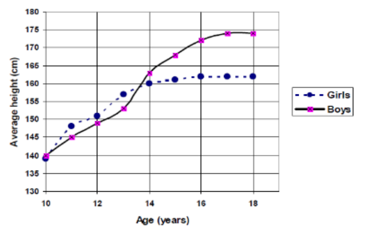

---

## 3. Facilitated diffusion

Facilitated diffusion is a special form of diffusion which allows rapid exchange of specific substances. Particles are taken up by carrier proteins which change their shape as a result. The change in shape causes the particles to be released on the other side of the membrane. Facilitated diffusion can only occur across living, biological membranes which contain the carrier proteins. A substance is transported via a carrier protein from a region of high concentration to a region of low concentration until it is randomly distributed. Therefore movement is *down a concentration gradient*.

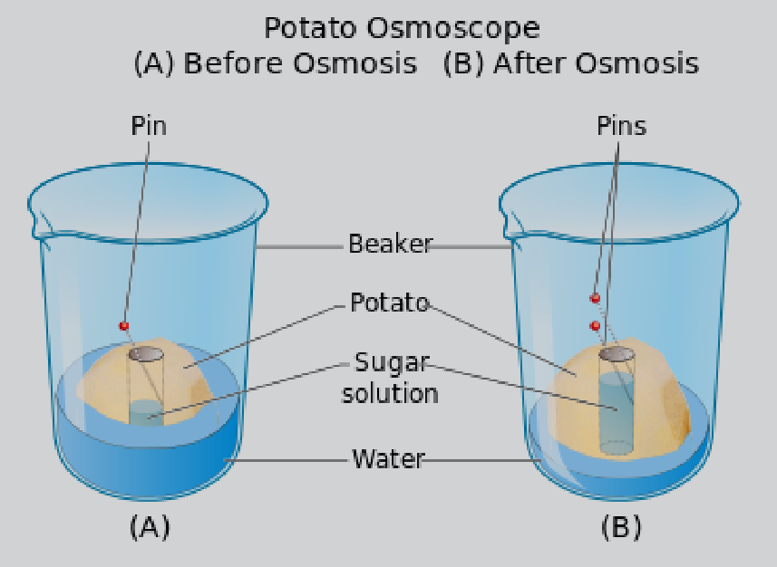

**Figure 3.17:** Facilitated diffusion in cell membrane, showing ion channels and carrier proteins.

Examples of substances moved via facilitated diffusion include all polar molecules such as glucose or amino acids.

---

## 4. Active transport

Active transport is the movement of substances *against* a concentration gradient, from a region of *low concentration* to *high concentration* using an input of energy. In biological systems, the form in which this energy occurs is **adenosine triphosphate (ATP)**. The process transports substances through a membrane protein. The movement of substances is selective via the carrier proteins and can occur into or out of the cell.

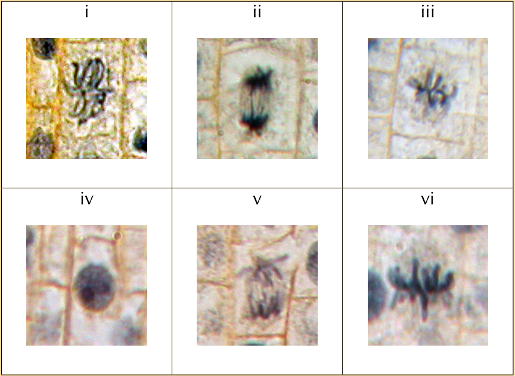

**Figure 3.18:** The sodium-potassium pump is an example of primary active transport.

Examples of substances moved include sodium and potassium ions as shown in Figure 3.18.

---

> **FACT**
> ATP and ADP are molecules involved with moving energy within cells. You do not need to know these names in full and will learn more about them later.

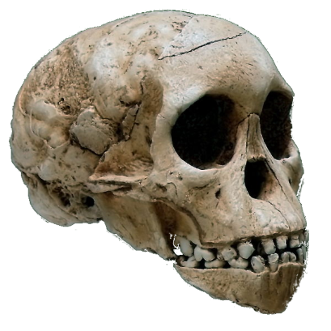

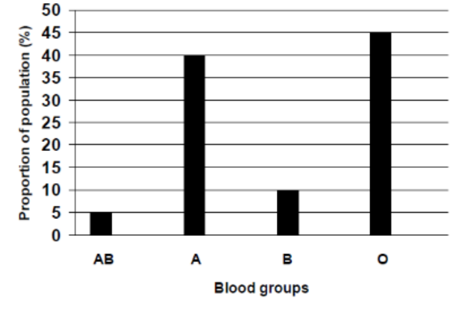

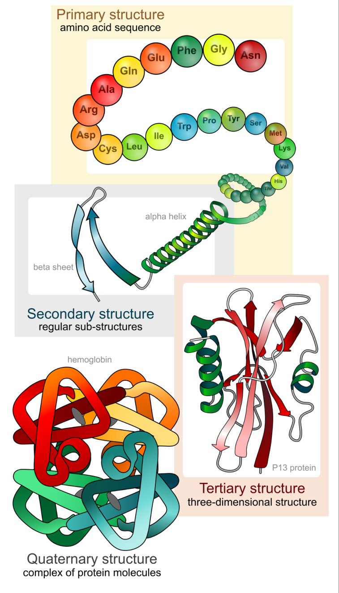

---

## 3.4 Cell organelles (ESG4Y)

We will now look at the key organelles that make up the cell. It is important to bear in mind that structure and function are closely related in all living systems. When studying each organelle, ensure that you observe the specific structures (from micrographs) that allow the organelle to perform its specific function.

### Fact Revision: Cytoplasm, Nucleoplasm, and Protoplasm
You may have encountered the terms cytoplasm, nucleoplasm, and protoplasm earlier in Grade 9:
* **Cytoplasm** is the part of the cell that is within the cell membrane and excludes the nucleus.
* **Nucleoplasm** is the substance of the cell nucleus, i.e., everything within the nucleus that is not part of the nucleolus.
* **Protoplasm** is the colourless material comprising the living part of a cell, including the cytoplasm, nucleus, and other organelles.

---

### Cytoplasm (ESG4Z)

The cytoplasm is the jelly-like substance that fills the cell. It consists of up to $90\%$ water. It also contains dissolved nutrients and waste products. Its main function is to hold together the organelles which make up the cytoplasm. It also nourishes the cell by supplying it with salts and sugars and provides a medium for metabolic reactions to occur.

All the contents of prokaryotic cells are contained within the cytoplasm. In eukaryotic cells, all the organelles are contained within the cytoplasm except the nucleolus which is contained within the nucleus.

#### Functions of the cytoplasm
* The cytoplasm provides mechanical support to the cell by exerting pressure against the cell's membrane which helps keep the shape of the cell. This pressure is known as **turgor pressure**.
* It is the site of most cellular activities including metabolism, cell division, and protein synthesis.
* The cytoplasm contains ribosomes which assist in the synthesis of protein.
* The cytoplasm acts as a storage area for small carbohydrate, lipid, and protein molecules.
* The cytoplasm suspends and can transport organelles around the cell.

---

### Nucleus (ESG52)

The nucleus is the largest organelle in the cell and contains all the cell's genetic information in the form of DNA. The presence of a nucleus is the primary factor that distinguishes eukaryotes from prokaryotes. The structure of the nucleus is described below:

* **Nuclear envelope:** two lipid membranes that are studded with special proteins that separates the nucleus and its contents from the cytoplasm.
* **Nuclear pores:** tiny holes called nuclear pores are found in the nuclear envelope and help to regulate the exchange of materials (such as RNA and proteins) between the nucleus and the cytoplasm.

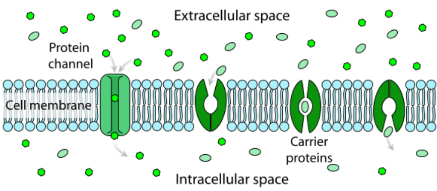

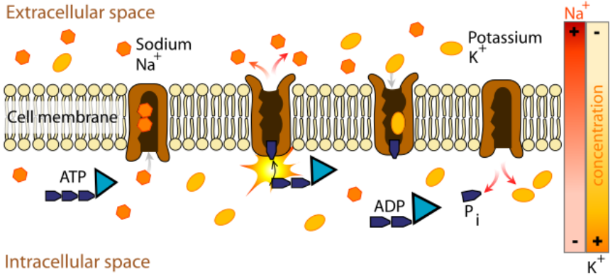

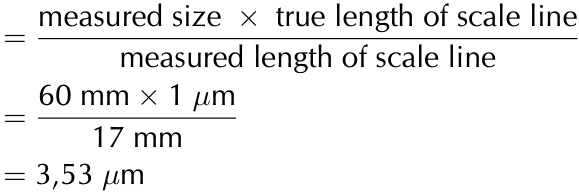

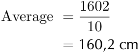

---

## Key Concepts and Definitions

* **Chromatin:** Thin long strands of DNA and protein.
* **Nucleolus:** The nucleolus makes RNA, another type of nucleic acid.

---

## Structure of the Cell Nucleus

| Schematic Diagram | Micrograph |
| :--- | :--- |
| 

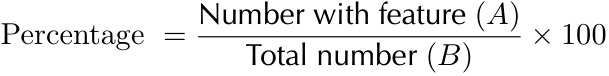
 | 

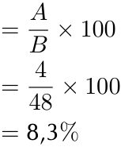
 |
| **Figure 3.19:** Diagram showing the basic structures of the animal cell nucleus. | **Figure 3.20:** An electron micrograph of a cell nucleus showing a densely staining nucleolus. |

---

## Facts on Cell Division and Genetic Material

* **FACT:** During cell division, DNA contracts and folds to form distinct structures called chromosomes. The chromosomes are formed at the start of cell division.
* **FACT:** The genetic material of eukaryotic organisms is separated from the cytoplasm by a membrane, whereas the genetic material of prokaryotic organisms (like bacteria) is in direct contact with the cytoplasm.

---

## Functions of the Nucleus

* The main function of the cell nucleus is to control gene expression and facilitate the replication of DNA during the cell cycle.
* The nucleus controls the *metabolic* functions of the cell by producing mRNA which encodes for enzymes (e.g., insulin).
* The nucleus controls the *structure* of the cell by transcribing DNA which encodes for structural proteins such as actin and keratin.
* The nucleus is the site of ribosomal RNA (rRNA) synthesis, which is important for the construction of ribosomes. Ribosomes are the site of protein translation (synthesis of proteins from amino acids).
* Characteristics are transmitted from parent to offspring through genetic material contained in the nucleus.

---

## Mitochondria (ESG53)

A mitochondrion is a membrane-bound organelle found in eukaryotic cells. This organelle generates the cell's supply of chemical energy by releasing energy stored in molecules from food and using it to produce ATP (adenosine triphosphate). ATP is a special type of "energy carrying" molecule.

### Structure and Function of the Mitochondrion

Mitochondria contain two phospholipid bilayers: there is an outer membrane and an inner membrane. The inner membrane contains many folds called **cristae** which contain specialised membrane proteins that enable the mitochondria to synthesise ATP. Inside the inner membrane is a jelly-like **matrix**.

* **FACT:** Mitochondria also contain DNA, called mitochondrial DNA (mtDNA), but it makes up just a small percentage of the cell's overall DNA content. All mitochondrial DNA in humans is derived from the mother's side.
* **FACT:** Powering the cell: mitochondria (See video: 2CPJ)

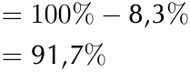

---

## 3.4. Cell organelles

### FACT
In Life Sciences, it is important to note that whenever a structure has an increased surface area, there is an increase in the functioning of that structure.

---

### Compartments of the Mitochondrion

Listed from the outermost layer to the innermost compartment, the compartments of the mitochondrion are:

* Outer mitochondrial membrane
* Intermembrane space
* Inner mitochondrial membrane
* Cristae (folds of the inner membrane)
* Matrix (jelly-like substance within the inner membrane)

---

### Visual Representations

| Schematic Diagram | Micrograph |
| :--- | :--- |
| 

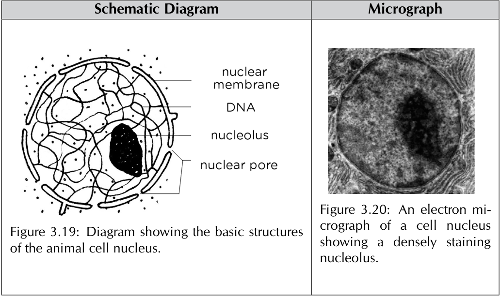
 | 

 |
| **Figure 3.21:** The major structures of the mitochondrion in three dimensions. | **Figure 3.22:** Electron micrograph of a mitochondrion. |

---

### Structure and Function of Mitochondrial Components

The table below relates each structure to its function and adaptation:

| Structure | Function | Adaptation to function |
| :--- | :--- | :--- |
| **Outer mitochondrial membrane** | Transfer of nutrients (e.g., lipids) to mitochondrion. | Has a large number of channels to facilitate transfer of molecules. |
| **Intermembrane space** | Stores large proteins allowing for cellular respiration. | Its position between two selectively permeable membranes allows it to have a unique composition compared to the cytoplasm and the matrix. |
| **Inner membrane** | Stores membrane proteins that allow for energy production. | Contains folds known as *cristae* which provide increased surface area, thus enabling production of ATP (chemical potential energy). |
| **Matrix** | Contains enzymes that allow for the production of ATP (energy). | The matrix contains a high quantity of protein enzymes which allow for ATP production. |

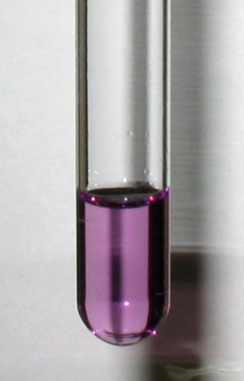

---

# Endoplasmic reticulum (ESG54)

The endoplasmic reticulum (ER) is an organelle found in eukaryotic cells only. The ER has a double membrane consisting of a network of hollow tubes, flattened sheets, and round sacs. These flattened, hollow folds and sacs are called **cisternae**. The ER is located in the cytoplasm and is connected to the nuclear envelope. There are two types of endoplasmic reticulum: smooth and rough ER.

## Types of Endoplasmic Reticulum

### 1. Smooth ER
* **Definition:** Does not have any ribosomes attached to it.
* **Functions:** 
  * Involved in the synthesis of lipids, including oils, phospholipids, and steroids.
  * Responsible for the metabolism of carbohydrates.
  * Regulation of calcium concentration.
  * Detoxification of drugs.

### 2. Rough ER
* **Definition:** Covered with ribosomes, giving the endoplasmic reticulum its rough appearance.
* **Functions:** 
  * Responsible for protein synthesis.
  * Plays a role in membrane production.
  * The folds present in the membrane increase the surface area, allowing more ribosomes to be present on the ER, thereby allowing greater protein production.

---

## Comparison of Smooth and Rough Endoplasmic Reticulum

| Schematic Diagram | Micrograph |
| :--- | :--- |
| **Smooth endoplasmic reticulum** | |
| 

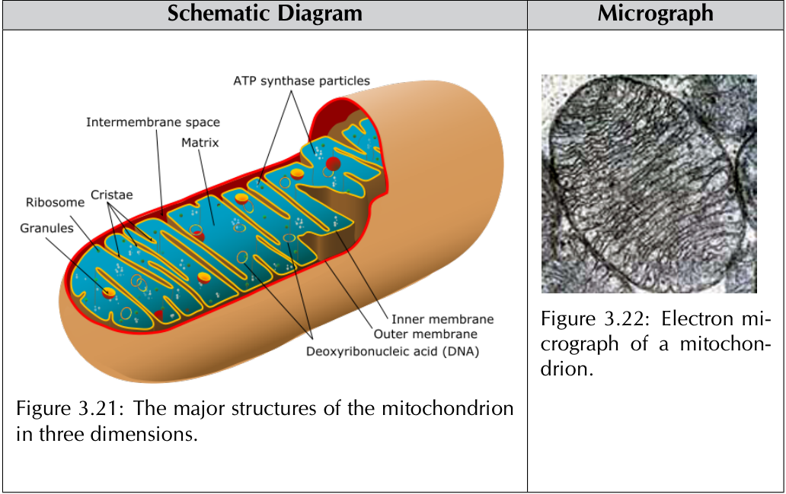
 | 

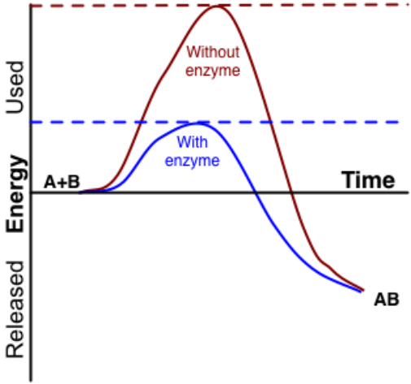
 |
| **Rough endoplasmic reticulum** | |
| <!-- DIAGRAM_PLACEHOLDER: diagram --> | <!-- DIAGRAM_PLACEHOLDER: diagram --> |

---

# Ribosomes (ESG55)

Ribosomes are composed of RNA and protein. They occur in the cytoplasm and are the sites where protein synthesis occurs. Ribosomes may occur singly in the cytoplasm or in groups or may be attached to the endoplasmic reticulum thus forming the rough endoplasmic reticulum. Ribosomes are important for protein production. Together with a structure known as messenger RNA (a type of nucleic acid) ribosomes form a structure known as a polyribosome which is important in protein synthesis.

| Diagram: Free Ribosome | Diagram: Polyribosome |
| :--- | :--- |
| 

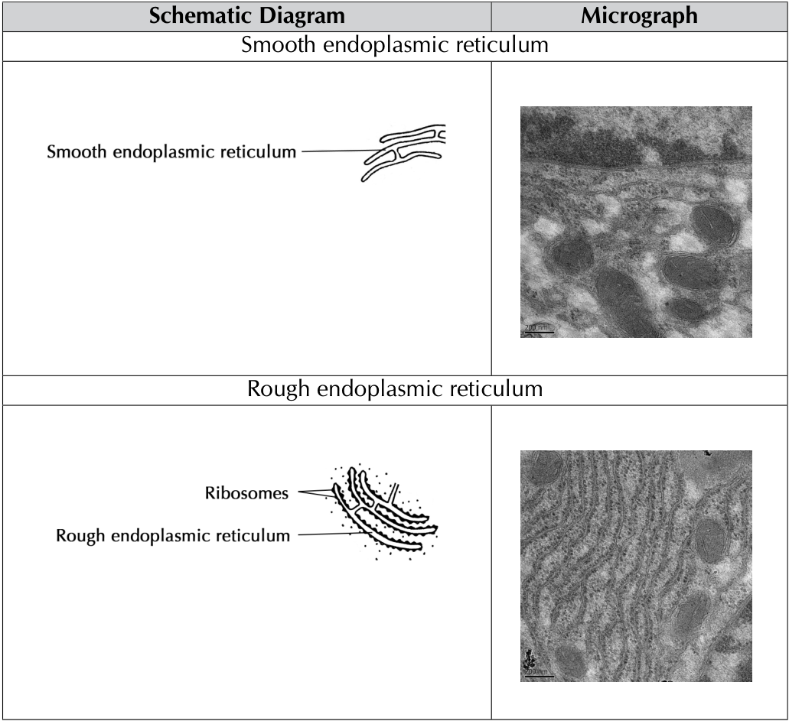
 | 

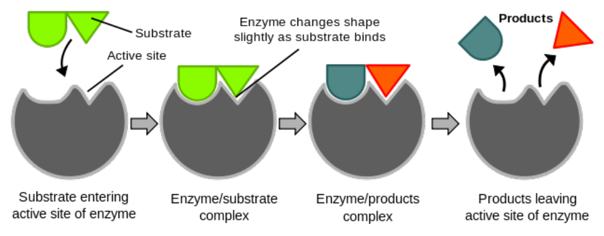
 |
| Figure 3.23: Free ribosomes found within cytoplasm. | Figure 3.24: Diagram of several ribosomes joined together on a strand of mRNA to form a polyribosome. |

---

# Golgi body (ESG56)

The Golgi body is found near the nucleus and endoplasmic reticulum. The Golgi body consists of a stack of flat membrane-bound sacs called cisternae. The cisternae within the Golgi body consist of enzymes which modify the packaged products of the Golgi body (proteins).

> **FACT**
> The Golgi body was discovered by the Italian physician Camillo Golgi. It was one of the first organelles to be discovered and described in detail because it's large size made it easier to observe.

| Schematic Diagram | Micrograph |
| :--- | :--- |
| <!-- DIAGRAM_PLACEHOLDER: diagram --> | <!-- DIAGRAM_PLACEHOLDER: diagram --> |
| Figure 3.25: Diagram showing Golgi bodies found in animal cells. | Figure 3.26: TEM Micrograph of Golgi body, visible as a stack of semicircular black rings near the bottom. |

---

# Chapter 3. Cells: the basic units of life

## Functions of the Golgi body

It is important for proteins to be transported from where they are synthesised to where they are required in the cell. The organelle responsible for this is the **Golgi Body**. The Golgi body is the sorting organelle of the cell.

Proteins are transported from the rough endoplasmic reticulum (RER) to the Golgi. In the Golgi, proteins are modified and packaged into vesicles. The Golgi body therefore receives proteins made in one location in the cell and transfers these to another location within the cell where they are required. For this reason the Golgi body can be considered to be the 'post office' of the cell.

---

## Vesicles and lysosomes (ESG57)

* **Vesicles** are small, membrane-bound spherical sacs which facilitate the metabolism, transport and storage of molecules. Many vesicles are made in the Golgi body and the endoplasmic reticulum, or are made from parts of the cell membrane. Vesicles can be classified according to their contents and function. Transport vesicles transport molecules within the cell.
* **Lysosomes** are formed by the Golgi body and contain powerful digestive enzymes that can potentially digest the cell. Lysosomes are formed by the Golgi body or the endoplasmic reticulum. These powerful enzymes can digest cell structures and food molecules such as carbohydrates and proteins. Lysosomes are abundant in animal cells that ingest food through food vacuoles. When a cell dies, the lysosome releases its enzymes and digests the cell.

---

## Vacuoles (ESG58)

Vacuoles are membrane-bound, fluid-filled organelles that occur in the cytoplasm of most plant cells, but are very small or completely absent from animal cells. Plant cells generally have one large vacuole that takes up most of the cell's volume. A selectively permeable membrane called the **tonoplast**, surround the vacuole. The vacuole contains **cell sap** which is a liquid consisting of water, mineral salts, sugars and amino acids.

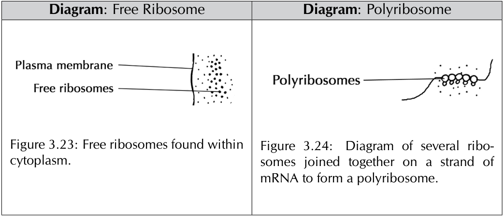

*Figure 3.27: A vacuole.*

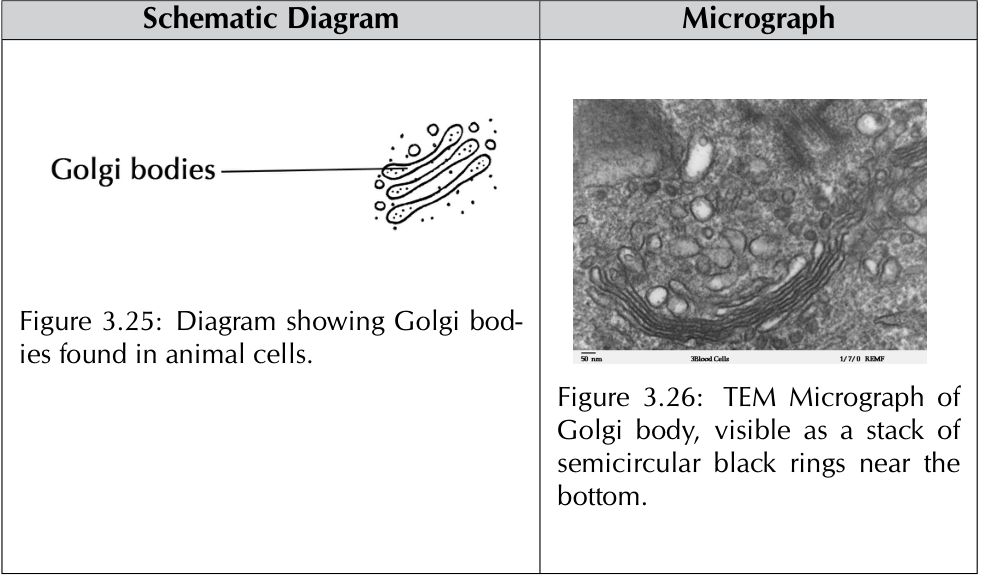

---

### Functions of the Vacuole

* The vacuole plays an important role in digestion and excretion of cellular waste and storage of water and organic and inorganic substances.
* The vacuole takes in and releases water by osmosis in response to changes in the cytoplasm, as well as in the environment around the cell.
* The vacuole is also responsible for maintaining the shape of plant cells. When the cell is full of water, the vacuole exerts pressure outwards, pushing the cell membrane against the cell wall. This pressure is called **turgor pressure**.
* If there is not sufficient water, pressure exerted by the vacuole is reduced and the cells become flaccid causing the plant to wilt.

---

### Centrioles (ESG59)

Animal cells contain a special organelle called a **centriole**. The centriole is a cylindrical tube-like structure that is composed of $9$ microtubules arranged in a very particular pattern. Two centrioles arranged perpendicular to each other are referred to as a **centrosome**. The centrosome plays a very important role in cell division. The centrioles are responsible for organising the microtubules that position the chromosomes in the correct location during cell division. You will learn more about their function in the following chapter on Cell Division.

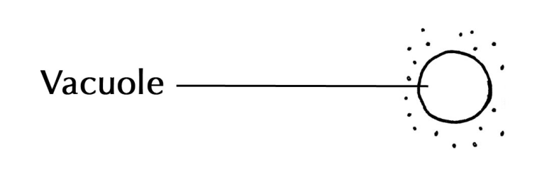

*Figure 3.28: A TEM micrograph of a cross-section of a centriole in an animal (rat) cell.*

---

### Plastids (ESG5B)

Plastids are organelles found only in plants. There are three different types:

1. **Leucoplasts:** White plastids found in roots.
2. **Chloroplasts:** Green-coloured plastids found in plants and algae.
3. **Chromoplasts:** Contain red, orange or yellow pigments and are common in ripening fruit, flowers or autumn leaves.

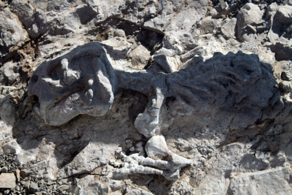

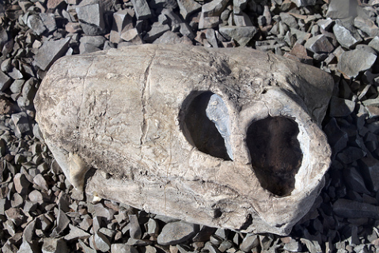

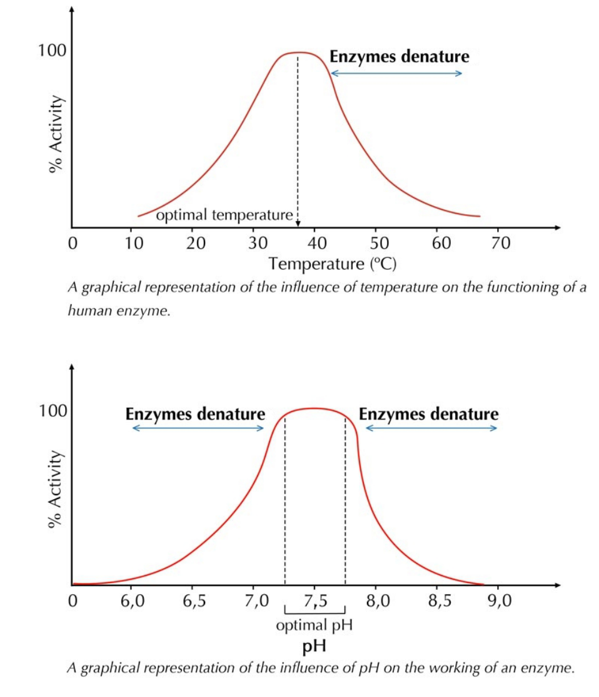

---

# Chapter 3. Cells: the basic units of life

## Plastids

Plastids perform a variety of functions in plants, including storage and energy production. There are three main types of plastids:
- **Chromoplast:** Contains pigments that give colour to plant structures (such as flowers and fruits).
- **Chloroplast:** Contains chlorophyll and is responsible for photosynthesis.
- **Leucoplast:** Colourless plastids involved in storage.

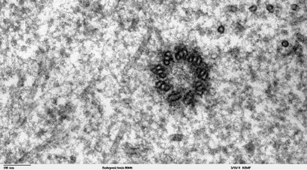

**FACT:** The colour of plant flowers such as an orchid is controlled by a specialised organelle in a cell known as the chromoplast.

---

## Chloroplast

The chloroplast is a double-membraned organelle. Within the double membrane is a gel-like substance called **stroma**. 

### Key Components of a Chloroplast:
- **Stroma:** Contains enzymes required for photosynthesis.
- **Grana (singular = granum):** Stack-like structures suspended in the stroma formed by stacks of thylakoid discs.
- **Thylakoid discs:** Structures whose surfaces hold chlorophyll molecules (green pigments). Chlorophyll absorbs energy from the sun for photosynthesis.
- **Lamellae (intergrana):** Structures connecting the grana and keeping the stacks separated from each other.

### Adaptation to Function:
The structure of the chloroplast is neatly adapted to its function of trapping and storing energy in plants:
- Chloroplasts contain a high density of thylakoid discs and numerous grana, which provide an increased surface area for the absorption of sunlight to produce food.
- The lamellae keep the thylakoids apart, maximising chloroplast efficiency to absorb as much light as possible within the smallest surface area.

---

## Structure of a Chloroplast

| Schematic Diagram | Micrograph |
| :---: | :---: |
| 

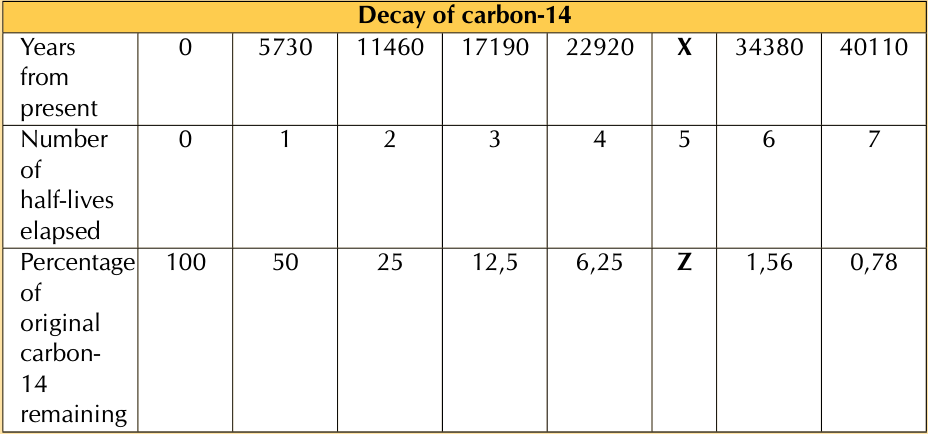
 | <!-- DIAGRAM_PLACEHOLDER: diagram --> |
| Figure 3.30: Structure of chloroplast. | Figure 3.31: Electron micrograph of chloroplast with grana and thylakoids. |

**FACT:** This video shows the fascinating inner life of a cell. (See video: 2CPK)

---

# The differences between plant and animal cells (ESG5C)

Now that we have looked at the basic structures and functions of the organelles in a cell, you would have noticed that there are key differences between plant and animal cells. The table below summarises these differences.

| Animal Cells | Plant Cells |
| :--- | :--- |
| Do not contain plastids. | Almost all plant cells contain plastids such as chloroplasts, chromoplasts and leucoplasts. |
| No cell wall. | Have a rigid cellulose cell wall in addition to the cell membrane. |
| Contain centrioles. | Do not contain centrioles. |
| Animals do not have plasmodesmata or pits. | Contain plasmodesmata and pits. |
| Few vacuoles (if any). | Large central vacuole filled with cell sap in mature cells. |
| Nucleus is generally found at the centre of the cytoplasm. | Nucleus is found near the edge of the cell. |
| No intercellular spaces found between the cells. | Large intercellular air spaces found between some cells. |

---

## Investigation: Examining plant cells under the microscope

### Aim:
To study the microscopic structures of plant cells.

### Apparatus:
* onion
* blade
* slides and coverslips
* brushes
* compound microscope
* tissue paper
* forceps
* dropper
* iodine solution
* watchglass
* petri dish containing water

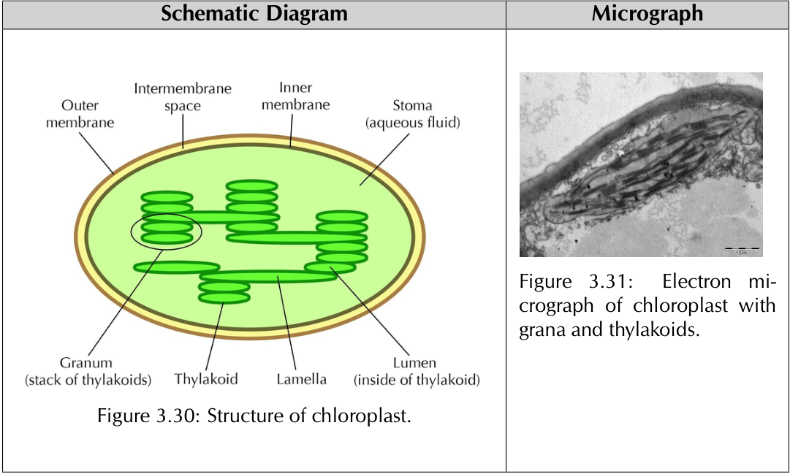

---

## Method:

1. Peel off the outer most layer of an onion carefully, using a pair of forceps.
2. Place the peeled layer in a watchglass containing water. Make certain that the onion peel does not roll or fold.
3. Using a scalpel or a thin blade, cut a square piece of the onion peel (about $1\text{ cm}^2$).
4. Remove the thin transparent skin from the inside curve of a small piece of raw onion and place it on a drop of iodine solution on a clean slide.
5. Cover the peel with a coverslip ensuring that no bubbles are formed.
6. Using a piece of tissue paper wipe off any excess iodine solution remaining on the slide.
7. Observe the onion skin under low power of the microscope and then under high power.
8. Draw a neat diagram of $5-10$ cells of the typical cells you can see.

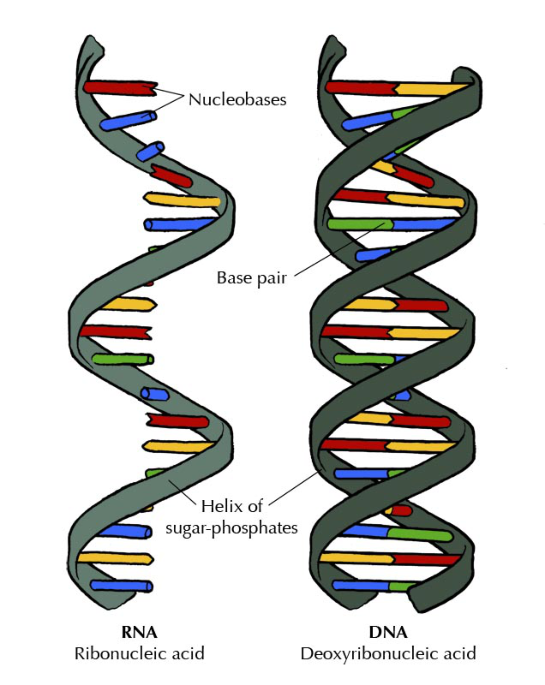

**Figure 3.32:** Onion cells stained with methylene blue.

---

## Investigation: Examining animal cells under the microscope

### Aim:
To study the microscopic structures of human cheek cells under a compound microscope.

### Apparatus:
* clean ear bud
* clean slide
* methylene blue

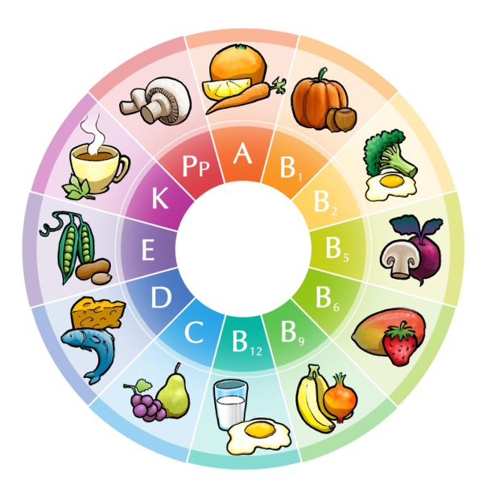

---

## 3.4. Cell organelles

### Required Apparatus and Materials
* dropper
* water
* tissue paper
* forceps
* microscope

### Method
1. Place a drop of water on a clean glass slide.
2. Using a clean ear bud, wipe the inside of your cheek. The ear bud will collect a moist film.
3. Spread the moist film on a drop of water on a clean glass slide, creating a small smear on the slide.
4. Use a coverslip to cover the slide gently.
5. Place one or two drops of stain on the side of the cover slip.
6. Use a piece of tissue to remove the excess dye.
7. Observe the cheek cells under low power magnification and then under high power magnification.

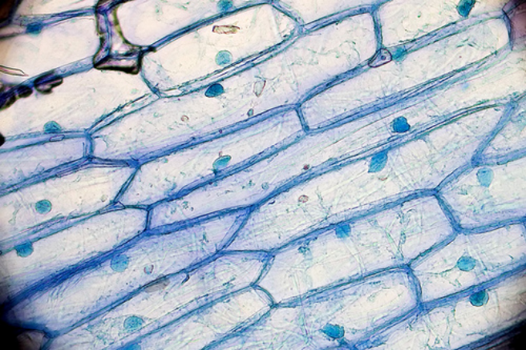

*Figure 3.33: Cheek epithelial cells.*

### Questions
1. What are the shapes of epidermal cells of the onion peel and the human cheek cells?
2. Why is iodine used to stain the onion peel?
3. What is the difference between the arrangement of cells in onion cells and in human cheek cells?
4. Why is a cell considered the structural and functional unit of living things?

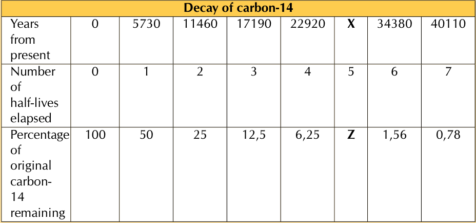

---

## Project: Cell organelles

You are required to compile a report on one of the organelles you have studied in class, or any other organelle you choose. Your report must include the following information:

* **Past**
  * The discovery of the organelle
  * All past understanding of the organelle's structure and/or function that has now changed
  * The importance of the discovery of the organelle to cell science
* **Present**
  * The presently understood structure and function of the organelle
  * A 2-dimensional picture of the organelle showing all the relevant structures of the organelle
  * An electron-microscope picture of the organelle showing the structure of the organelle
  * An understanding of the importance of the organelle to human survival
* **Future**
  * What remains to be discovered or fully understood?
  * Any important role of the organelle could potentially play with the development of future technology (i.e. in industry or medicine).
* **Any other additional information or interesting facts you wish to include.**

---

## Project: Diagrams of cells

Diagrams of the cell are very well understood but they often give us the wrong impression about how complicated cells really are. This assignment will help you understand the complexity of cells.

1. Find and submit a hard copy of five micrographs showing different cell organelles.
2. Draw and label two organelles to demonstrate your drawing, labelling and interpretive skills.

Pay close attention to the following:

* The organelles should each comfortably occupy an A5 page.
* The organelles must each have a heading that includes the view, title and magnification.

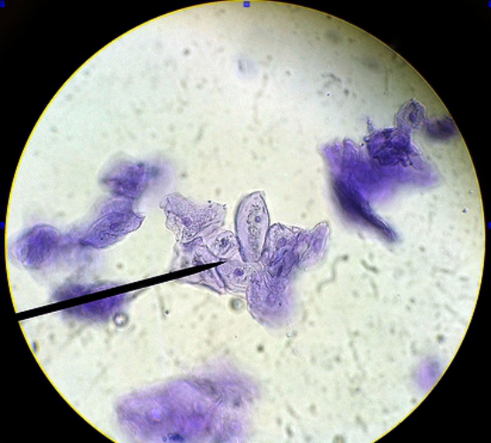

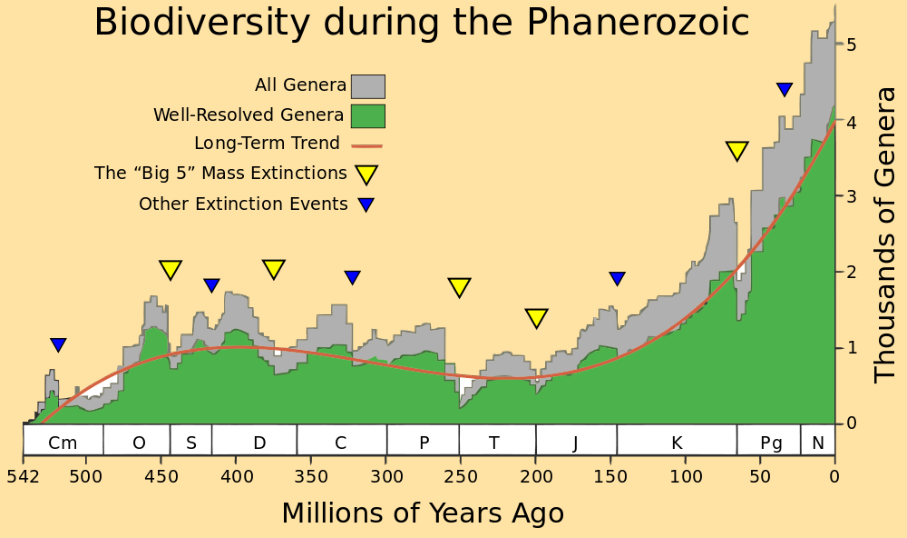

---

**FACT**
Revise everything you have learnt about cells by watching this video. 
See video: 2CPM

* Drawings must follow the drawing skills you have learnt. One drawing must be the same size as the micrograph, the other must be exactly half the size.
* Your drawings must have a correct scale line.
* State the source of your micrographs according to the Harvard convention.
* Marks will be awarded for neatness: present your work as a uniform set.
* You must select hard copies well so that are of high quality and can be easily recognisable.
* Your images may be of the same organelle but only if the images show some significant variation.

---

## 3.5 Summary (ESG5D)

### The discovery of cells:

* All living organisms are made of cells.
* Cells are very small therefore magnifying instruments such as lenses and microscopes are used to view them.
* By using a light microscope the simple features of cells can be studied. The light microscope uses a beam of light focused by various glass lenses.
* Electron microscopes have higher power of magnification than the ordinary light microscope, therefore allowing us to see very small structures inside the cells. These microscopes use a beam of electrons focused by electromagnets to magnify objects instead of light rays and lenses.
* Robert Hooke (1665) used a light microscope to examine non-living cork cells.
* Antonie van Leeuwenhoek was the first person to observe living cells using a microscope.
* The development of cell theory was from the study of microscopic cells.

### Cell structure and function

* All cells have the same basic structure. They are all surrounded by a cell membrane and contain cytoplasm and organelles.
* Cells have different sizes, shapes and structures in order to carry out specialised functions.
* The cell membrane is made of phospholipids and proteins and controls substances which move in and out of the cell.
* The structure of the cell membrane is referred to as the Fluid Mosaic Model.

---

* The nucleus is made up of a nuclear membrane with nucleopores, chromatin material and the nucleolus inside the nucleoplasm.
* Mitochondria release chemical potential energy (ATP) for the cell during cellular respiration.
* Ribosomes are important for protein production.
* Cytoplasm is used for storage and circulation of various materials.
* Endoplasmic reticulum transports substances from one part of the cell to another.
* The Golgi body modifies, secretes, packages and distributes various organic molecules (proteins and lipids) around the cell.
* Vacuoles are used for storage. In plant cells these are large, whilst in animal cells, if present, are very small.
* Lysosomes are mainly found in animal cells.
* Centrioles are only found in animal cells.
* The cell wall is found only in plant cells and is made up of cellulose. The cell wall gives the plants shape, support and protection.
* Plastids are found only in plant cells. There are three types of plastids:
  * chloroplasts contain chlorophyll and their function is the production of food by photosynthesis
  * chromoplasts give colour to fruits and flowers
  * leucoplasts are white and are used mainly for starch storage

## 3.6 End of chapter exercises (ESG5F)

### Exercise 3 - 1:

1. Examine the three images below. Use calculations Explain which organism would be the smallest when viewed with the naked eye. Show all the calculations you used to arrive at your answer.

<!-- DIAGRAM_PLACEHOLDER: diagram -->

---

3.6. End of chapter exercises

2. Below is a three-dimensional diagram of the cell. Provide the name and function of the following numbered structures:

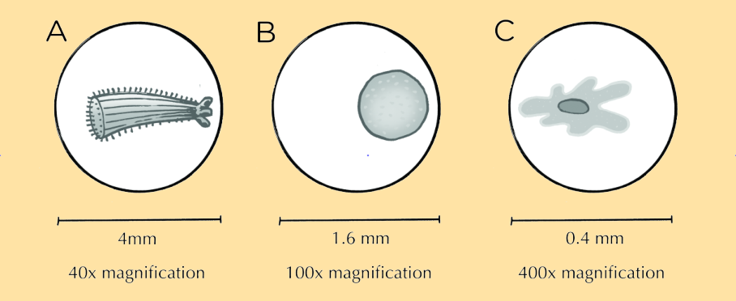

The following difficult to distinguish structures have been done for you:

* **4-vesicle:** spherical sacs that facilitate storage, metabolism and transport of molecules.
* **7-cell membrane:** selectively permeable to control the passage of substances into and out of the cell.
* **10-vacuole:** storage of sugars, minerals and pigments and help maintain water balance in the cell.
* **12-lysosome:** contain powerful digestive enzymes that digest damaged cell structures and food molecules.

3. Multiple answers are provided for each question. Write **only the letter** of the correct answer next to the corresponding number.

a) Active transport is the movement of a substance from a:
  i. high concentration to a low concentration.
  ii. high water potential to a low water potential.
  iii. isotonic solution.
  iv. low concentration to a high concentration.

b) Protoplasm consists of:
  i. nucleoplasm and nucleolus.
  ii. cytoplasm and nucleoplasm.
  iii. cytoplasm and organelles.
  iv. membranes and organelles.

c) This organelle is responsible for transporting substances around the cell:
  i. ribosome
  ii. Golgi body
  iii. nucleus
  iv. endoplasmic reticulum

---

## Chapter 3. Cells: the basic units of life

d) The nucleus does **not** control:
   i. hereditary transmission
   ii. cellular respiration
   iii. metabolism
   iv. structure

e) The energy that a molecule possesses while moving:
   i. potential energy
   ii. kinetic energy
   iii. magnetic energy
   iv. mechanical energy

f) Which of the following is **not** a product of cellular respiration?
   i. $\text{CO}_2$
   ii. $\text{H}_2\text{O}$
   iii. $\text{O}_2$
   iv. $\text{ATP}$

---

4. Give the correct **biological term** for each of the following. Write only the **term** next to the relevant question number.

   a) Part of the cell that consists of about $90\%$ water.
   b) Often referred to as the powerhouse of the cell.
   c) Pigment found in green plants.
   d) The part of a plant cell that is composed of cellulose.
   e) The fluid inside the vacuole.
   f) The movement of a substance against a concentration gradient.
   g) The structure that distributes substances made in the cell.

---

5. Choose the correct **option** for each of the following questions. Write only the **term** next to the relevant question number.

   a) What structure contains DNA and regulates most of the processes within the cell?
      i. mitochondria
      ii. chloroplast
      iii. nucleus
      iv. nucleolus

   b) What is a cell membrane?
      i. thin flexible barrier around the cell that regulates transport
      ii. rigid cover that provides support for the cell
      iii. the place where light energy, water and carbon dioxide are used
      iv. special organelle that converts solar energy to chemical energy

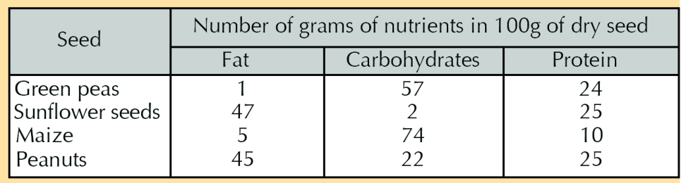

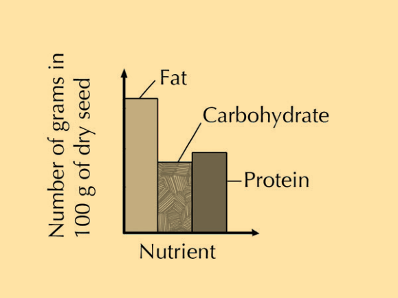

---

## 3.6. End of chapter exercises

c) Which two organelles contain their own DNA genome, separate from the nuclear genome?
   
   i. lysosomes and transport vesicles
   
   ii. endoplasmic reticulum and Golgi apparatus
   
   iii. cilia and flagella
   
   iv. mitochondria and chloroplast
   
   v. ribosomes and vacuoles

6. Tabulate four differences between animal and plant cells.

7. 
   a) Name a structural adaptation of the mitochondria that makes it suited to its function:
   
   b) Name one structural adaptation of chloroplasts.

---

Check answers online or click on 'show me the answer'.

| Exercise | Code | Exercise | Code | Exercise | Code | Exercise | Code | Exercise | Code |
| :--- | :--- | :--- | :--- | :--- | :--- | :--- | :--- | :--- | :--- |
| **1.** | 2CPN | **2a.** | 2CPP | **3a.** | 2CPQ | **3b.** | 2CPR | **3c.** | 2CPS |
| **3d.** | 2CPT | **3e.** | 2CPV | **3f.** | 2CPW | **4a.** | 2CPX | **4b.** | 2CPY |
| **4c.** | 2CPZ | **4d.** | 2CQ2 | **4e.** | 2CQ3 | **4f.** | 2CQ4 | **4g.** | 2CQ5 |
| **5a.** | 2CQ6 | **5b.** | 2CQ7 | **5c.** | 2CQ8 | **6.** | 2CQ9 | **7a.** | 2CQB |
| **7b.** | 2CQC | | | | | | | | |

www.everythingscience.co.za  
m.everythingscience.co.za

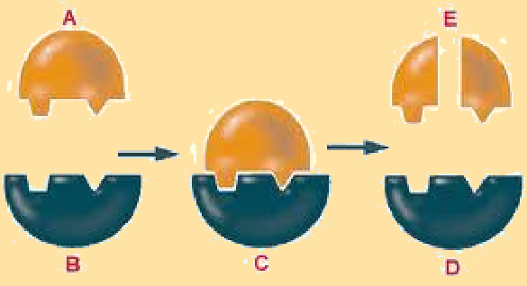

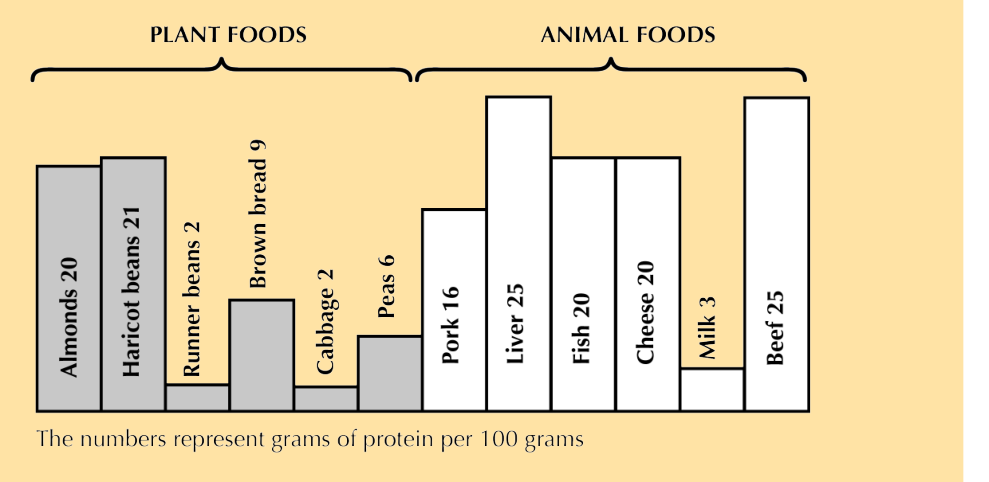

---

## 4.6 End of chapter exercises (ESG5F)

### Exercise 4 – 1:

1. Examine the three images below. Use calculations to explain which organism would be the smallest when viewed with the naked eye. Show all the calculations you used to arrive at your answer.

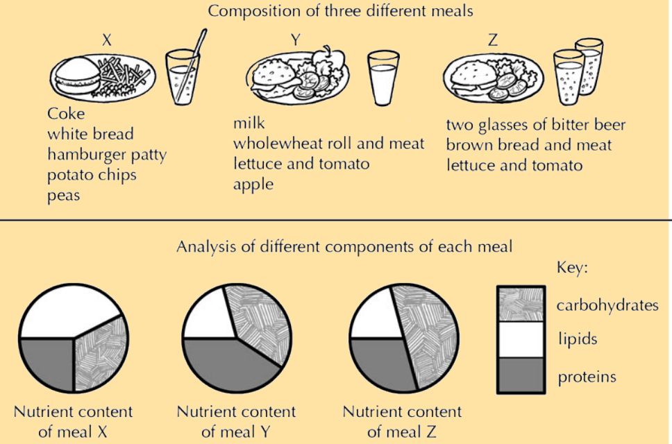

**Solution:**

$$A = \frac{4}{40} = 0,1\text{ mm}$$

$$B = \frac{1,6}{100} = 0,016\text{ mm}$$

$$C = \frac{0,4}{400} = 0,001\text{ mm}$$

So item $C$ would be the smallest.

2. Below is a three-dimensional diagram of the cell. Provide the name and function of the following numbered structures:

<!-- DIAGRAM_PLACEHOLDER: diagram -->

---

The following difficult-to-distinguish structures have been done for you:

* **4-vesicle:** spherical sacs that facilitate storage, metabolism and transport of molecules.
* **7-cell membrane:** selectively permeable to control the passage of substances into and out of the cell.
* **10-vacuole:** storage of sugars, minerals and pigments and help maintain water balance in the cell.
* **12-lysosome:** contain powerful digestive enzymes that digest damaged cell structures and food molecules.

**Solution:**

* **1-Nucleolus:** site of the transcription of RNA.
* **2-Nucleus:** controls metabolism of the cell and contains hereditary information.
* **3-Ribosome:** site of protein synthesis.
* **5-Rough endoplasmic reticulum:** many ribosomes therefore allowing for the production of many proteins.
* **6-Golgi body:** modify and package proteins and send them where they are needed in the cell.
* **8-Smooth endoplasmic reticulum:** the synthesis of lipids and the detoxification of drugs.
* **9-Mitochondrion:** the site of cellular respiration where energy is released from glucose molecules.
* **11-Cytoplasm:** jelly-like substance that contains all the organelles and which contains dissolved nutrients.
* **12-Centriole:** special structures that help cells to divide during mitosis.

3. Multiple answers are provided for each question. Write **only the letter** of the correct answer next to the corresponding number.

    a) Active transport is the movement of a substance from a:
    
    * i. high concentration to a low concentration.
    * ii. high water potential to a low water potential.
    * iii. isotonic solution.
    * iv. low concentration to a high concentration.
    
    **Solution:**  
    iv

    b) Protoplasm consists of:
    
    * i. nucleoplasm and nucleolus.
    * ii. cytoplasm and nucleoplasm.
    * iii. cytoplasm and organelles.
    * iv. membranes and organelles.
    
    **Solution:**  
    ii

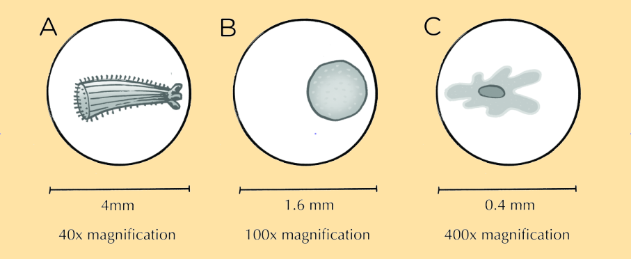

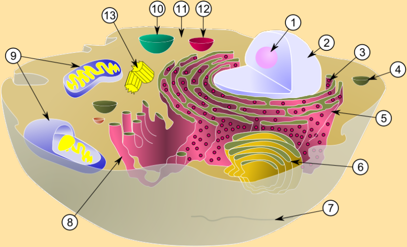

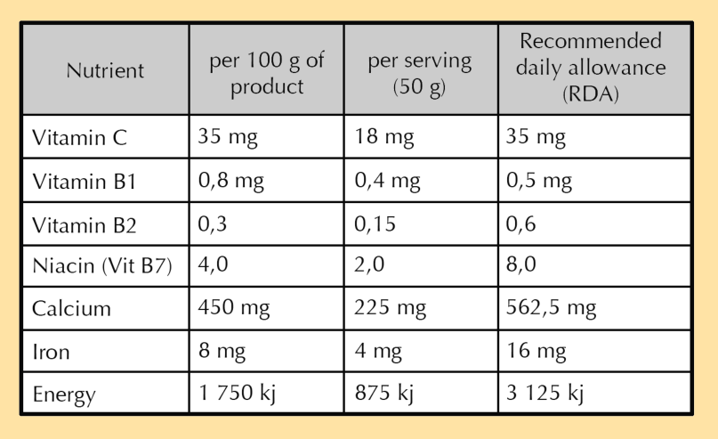

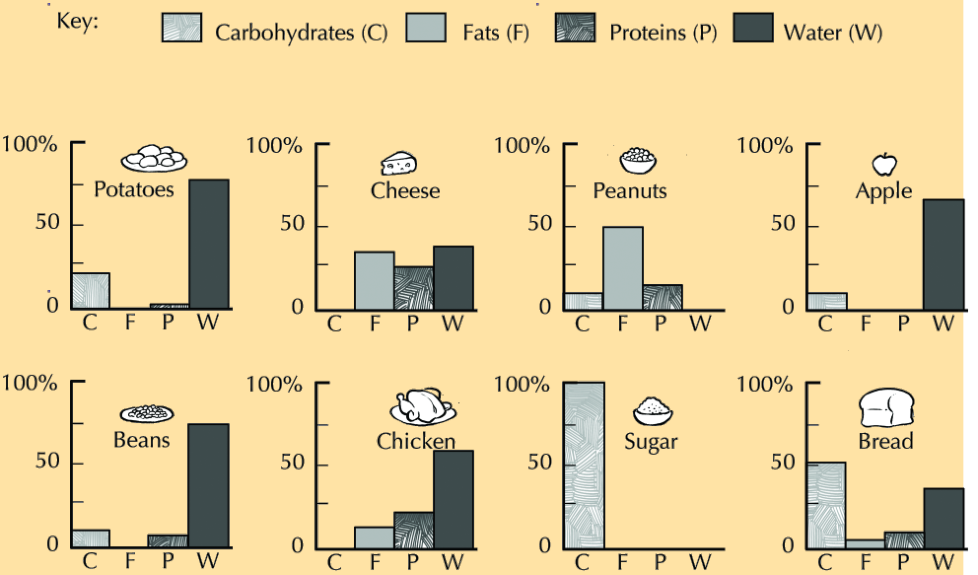

---

## 4.6. End of chapter exercises

c) This organelle is responsible for transporting substances around the cell:
   i. Ribosome
   ii. Golgi body
   iii. Nucleus
   iv. Endoplasmic reticulum

   **Solution:**
   iv

d) The nucleus does **not** control:
   i. Hereditary transmission
   ii. Cellular respiration
   iii. Metabolism
   iv. Structure

   **Solution:**
   ii

e) The energy that a molecule possesses while moving:
   i. Potential energy
   ii. Kinetic energy
   iii. Magnetic energy
   iv. Mechanical energy

   **Solution:**
   ii

f) Which of the following is **not** a product of cellular respiration?
   i. $\text{CO}_{2}$
   ii. $\text{H}_{2}\text{O}$
   iii. $\text{O}_{2}$
   iv. ATP

   **Solution:**
   iii

---

4. Give the correct biological **term** for each of the following. Write only the **term** next to the relevant question number.

   a) Part of the cell that consists of about $90\%$ water.  
      **Solution:**  
      *cytoplasm*

   b) Often referred to as the powerhouse of the cell.  
      **Solution:**  
      *mitochondrion*

   c) Pigment found in green plants.  
      **Solution:**  
      *chlorophyll*

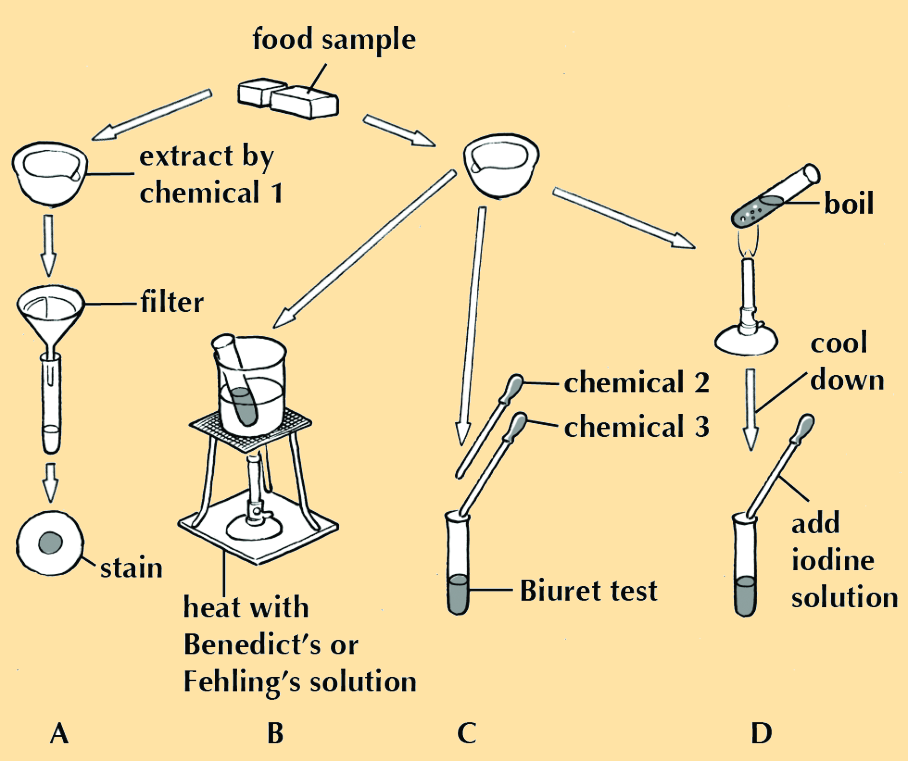

---

d) The part of a plant cell that is composed of cellulose.
> **Solution:**
> *cell wall*

e) The fluid inside the vacuole.
> **Solution:**
> *cell sap*

f) The movement of a substance against a concentration gradient.
> **Solution:**
> *active transport*

g) The structure that distributes substances made in the cell.
> **Solution:**
> *Golgi body*

---

5. Choose the correct **option** for each of the following questions. Write only the **term** next to the relevant question number.

a) What structure contains DNA and regulates most of the processes within the cell?
   * i. Mitochondria
   * ii. Chloroplast
   * iii. Nucleus
   * iv. Nucleolus

   > **Solution:**
   > *iii*

b) What is a cell membrane?
   * i. thin flexible barrier around the cell that regulates transport
   * ii. rigid cover that provides support for the cell
   * iii. the place where light energy, water and carbon dioxide are used
   * iv. special organelle that converts solar energy to chemical energy

   > **Solution:**
   > *i*

c) Which two organelles contain their own DNA genome, separate from the nuclear genome?
   * i. lysosomes and transport vesicles
   * ii. endoplasmic reticulum and Golgi apparatus
   * iii. cilia and flagella
   * iv. mitochondria and chloroplast
   * v. ribosomes and vacuoles

   > **Solution:**
   > *iv*

---

6. Tabulate four differences between animal and plant cells.
> **Solution:**
> *(Note: The solution for this question continues onto the next page).*

---

Any four of the following:

| Animal Cells | Plant Cells |
| :--- | :--- |
| Do not contain plastids. | Almost all plant cells contain plastids such as chloroplasts, chromoplasts, and leucoplasts. |
| No cell wall. | Have a rigid cellulose cell wall in addition to the cell membrane. |
| Contain centrioles. | Do not contain centrioles. |
| Animals do not have plasmodesmata or pits. | Contain plasmodesmata and pits. |
| Few vacuoles (if any). | Large central vacuole filled with cell sap in mature cells. |
| Nucleus is generally found at the centre of the cytoplasm. | Nucleus is found near the edge of the cell. |
| No intercellular spaces found between the cells. | Large intercellular air spaces found between some cells. |

7. 
a) Name a structural adaptation of the mitochondria that makes it suited to its function:

**Solution:**
Mitochondria have many cristae (folds) that increase the surface area for reactions.

b) Name one structural adaptation of chloroplasts.

**Solution:**
Chloroplasts have many thylakoid discs, which contain chlorophyll, thus maximising the surface area for the absorption of light energy.