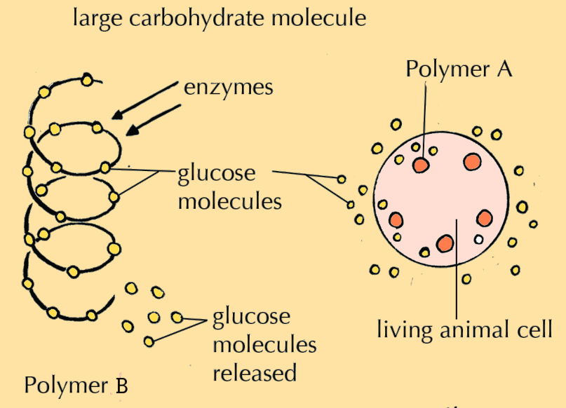
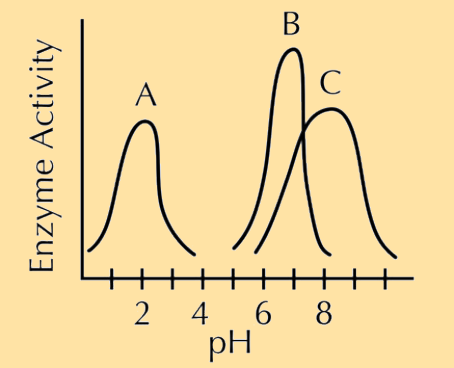
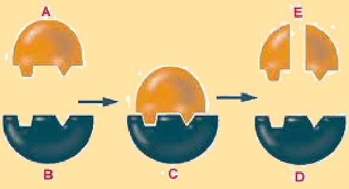
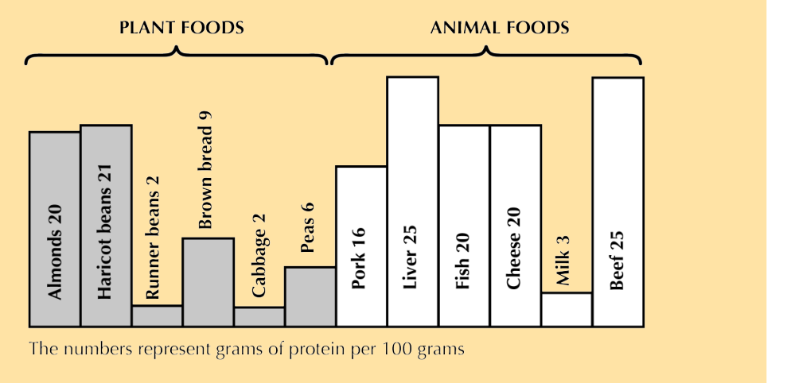
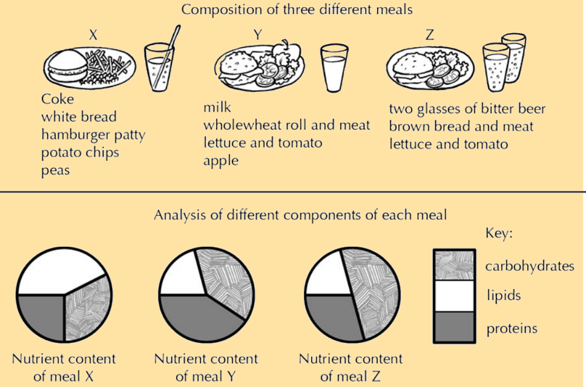
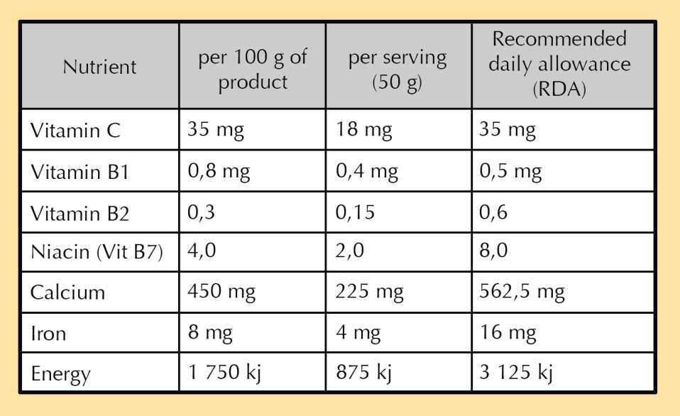
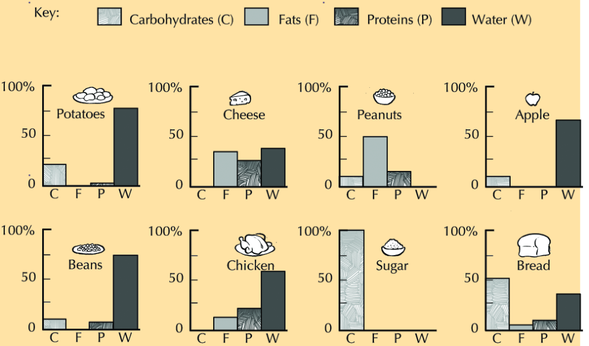
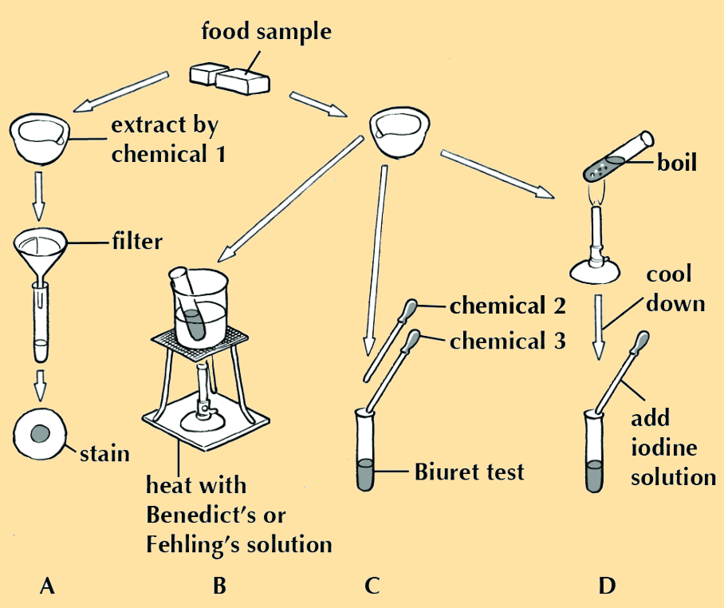

# **CHAPTER 2** 

# _The chemistry of life_ 

|**2.1**|**_Overview_**|30|
|---|---|---|
|**2.2**|**_Molecules for life_**|31|
|**2.3**|**_Inorganic compounds_**|32|
|**2.4**|**_Organic compounds_**|38|
|**2.5**|**_Vitamins_**|58|
|**2.6**|**_Recommended Dietary Allowance_**|59|
|**2.7**|**_Summary_**|63|

2 The chemistry of life 

2.1 Overview ESG42 Introduction ESG43 

In this chapter we will study the molecular structure and biological functions of key molecules important to life. We will study the chemistry of proteins, carbohydrates, lipids, vitamins and nucleic acids and will learn the role of each nutrient class in plant and animal life. We will also learn how our diet allows us to obtain sufficient quantities of each of these nutrients. There are a variety of practicals and investigations in this section, which provide an opportunity for you to practice applying the scientific method. 

##### **Key concepts** 

- Organic molecules always contain carbon (C), and usually also contain hydrogen (H) and oxygen (O) atoms. Some important organic molecules also contain nitrogen (N), phosphorous (P), sulfur (S), iron (Fe) and other elements. 

- Water ($	ext{H}_2O$) is an inorganic compound made up of two H atoms and one O atom. Water helps with temperature regulation, form and support, transport and lubrication and is a medium for chemical reactions. 

- Minerals are required as part of a healthy diet. A deficit in essential minerals results in deficiency diseases in plants and animals. 

- Fertilisers are a way that essential nutrients can be added to the soil to improve plant growth. 

- Carbohydrates are made up of C, H and O. They can be in the form of monosaccharides (single sugars), disaccharides (double sugars) or polysaccharides (many sugars), and are an important energy source for plants and animals. 

- Lipids are made up of C, H and O. Triglycerides are a type of lipid that contains glycerol and three fatty acid chains. Cholesterol, another type of lipid, can increase the risk of heart disease. 

- Proteins are made up of C, H, O, N, and some have P, S and Fe. Proteins consist of a long chain of amino acids that fold into a very specific three-dimensional structure. Proteins are an important building block in plants and animals and play a role in the immune system and in cell communication. 

- Enzymes are a type of protein that act as a biological catalyst to speed up reactions. They work by a ”lock and key” mechanism and are affected by temperature and pH. 

- Nucleic acids such as DNA and RNA are made of C, H, O, N and P. DNA contains the genetic information for heredity, and RNA has the instructions on how to make protein. 

- Vitamins are important organic molecules that must be obtained in the diet. They often help enzymes to work properly, or act in growth or differentiation. 

In order to understand the chemistry of living systems, it is important to understand how all living systems are arranged from the smallest unit (atomic scale) to the largest unit (ecosystems). A simple way to describe the levels of organisation of livings things can be given as follows: 

##### **FACT** 

Because all compounds contain more than one atom, all compounds are molecules. However, not all molecules are compounds. 

##### **FACT** 

Simulation on building a molecule See video: 2CMH 

atom _→_ **molecule** _→_ cell _→_ tissue _→_ organ _→_ system _→_ organism _→_ ecosystem 

## 2.2 Molecules for life ESG44 

Although life at the macro level is diverse, the chemistry making up that life is remarkably similar. All living things are made up of basic building blocks called **elements** . An element is a substance that cannot be broken down into simpler substances using chemical means. Carbon, oxygen, hydrogen, nitrogen, sulfur, calcium, sodium and iron are examples of elements you will come across in Life Sciences. 

Each element is distinguished by the composition of its **atom** . An atom is the basic unit of matter. **Molecules** are formed when one or more atoms are covalently bonded together. The atoms of a molecule can be identical, such as 02 or $	ext{H}_2$ or differ such as $	ext{H}_2O$. A **compound** is formed when atoms of _different_ elements join together. 

Compounds are divided into **organic** and **inorganic** compounds. Organic compounds always contain carbon, but not all compounds that contain carbon are organic. A general rule of thumb is that organic compounds contain carbon, with at least one of these carbons bonded to hydrogen atoms. Carbon dioxide is therefore an inorganic compound even though it contains carbon. The major organic compounds found in living organisms include: **carbohydrates** , **fats** , **proteins** and **nucleic acids** . These will be discussed in detail later in this chapter. 

##### **FACT** 

Learn about some of the amazing life-supporting properties of water See video: 2CMJ 

|**Substance**||**Percentage**(%)|
|---|---|---|
||**Inorganic**||
|Water||65|
|Mineral salts||1|
||**Organic**||
|Protein||18|
|Carbohydrate||5|
|Other organic macro|molecules|1|

Table 2.1: The composition of macromolecules in humans by percentage. 

2.3 Inorganic compounds ESG45 The role of water in the maintenance of life ESG46 

As mentioned in Table 2.1, up to 65% of our bodies are made up of water. Water is an inorganic compound made up of two hydrogen atoms and one oxygen atom. Its molecular formula is $	ext{H}_2O$. Water plays an important role in the maintenance of biological systems. 

**Temperature regulation** : In humans, the sweat glands produce sweat which cools the body as it evaporates from the body surface in a process called _perspiration_ . In a similar way, plants are cooled by the loss of water vapour from their leaves, in a process called _transpiration_ . 

**Form and support** : Water is an important constituent of the body and plays an important role in providing form and support in animals and plants. Animals, such as worms and jellyfish, use water in special chambers in their body to give their bodies support. This use of water pressure to provide body form, and enable movement is called a _hydrostatic skeleton_ . Plants grow upright and keep their shape due to the pressure of water ( _turgor pressure)_ inside the cells. 

**Transport medium** : Water transports substances around the body. For example, water is the main constituent of blood and enables blood cells, hormones and dissolved gases, electrolytes and nutrients to be transported around the body. 

**Lubricating agent** : Water is the main constituent of saliva which helps chewing and swallowing and also allows food to pass easily along the alimentary canal. Water is also the main constituent of tears which help keep the eyes lubricated. 

**Solvent for biological chemicals** : The liquid in which substances dissolve is called a solvent. Water is known as the universal solvent as more substances dissolve in water than in any other liquid. 

**Medium in which chemical reactions occur** : All chemical reactions in living organisms take place in water. 

**Reactant** : Water takes place in several classes of chemical reactions. During hydrolysis reactions, water is added to the reaction to break down large molecules into smaller molecules. Water can also be split into hydrogen and oxygen atoms to provide energy for complex chemical reactions such as photosynthesis. 


> **[Diagram Context - Textbook_LifeSciences_Gr10_The_chemistry_of_life.pdf-0005-02.png]**
> This educational table contains photographic images and descriptive text organized under three functional category headers: "Temperature," "Structure and support," and "Lubrication." The visible text includes column headers and explanatory captions stating: "Sweating helps human bodies cool down," "Jellyfish and worms use a hydrostatic (water pressure) skeleton to keep their body shape," "Water helps maintain the upright structure of plants," and "Water is an important lubricant in the eye." Conceptually, this graphic illustrates the critical biological roles of water in living organisms, specifically highlighting temperature regulation, hydrostatic skeletal support, turgidity in plants, and lubrication for high school Life Sciences learners.


Table 2.2: The role of water in living organisms. 

|Minerals|ESG47|
|---|---|

Dietary minerals are the chemical elements that living organisms require to maintain health. In humans, essential minerals include calcium, phosphorous, potassium, sulfur, sodium, chlorine and magnesium. 

**Macro-elements** (macro-nutrients) are nutrients that are required in large quantities by living organisms (e.g carbon, hydrogen, oxygen, nitrogen, potassium, sodium, calcium, chloride, magnesium, phosphorus and sulfur). 

**Micro-elements** (micro-nutrients) are nutrients that are required in very small quantities for development and growth and include iron, cobalt, chromium, copper, iodine, manganese, selenium, zinc and molybdenum. 

##### **Nutrients required for human health** 

Table 2.3 below summarises some important minerals required for proper functioning of the human body. Proper nutrition involves a diet in which the daily requirements of the listed mineral nutrients are met. 

##### **FACT** 

**Chlorosis** is the yellowing of the leaves due to low production or loss of chlorophyll. 

|**Mineral**|**Food Source**|**Main Functions**|**Deficiency**<br>**Disease**|
|---|---|---|---|
||**Macr**|**o-nutrients**||
|Calcium (Ca)|most fruit and<br>vegetables, meat,<br>dairy products|strong bones and teeth,<br>muscle contraction,<br>blood clotting, nerve<br>function|rickets,<br>osteoporosis|
|Magnesium<br>(Mg)|nuts, meat, dairy<br>products|strong bones and teeth,<br>nerve and muscle<br>function, energy<br>production|osteoporosis,<br>muscle cramps|
|Phosphorus (P)|nuts, meat, dairy<br>products|strong bones and teeth,<br>nerve function, part of<br>nucleic acids and cell<br>membranes|rickets,<br>osteoporosis|
|Potassium (K)|bananas, meat,<br>dairy products|growth and<br>maintenance, water<br>balance,heart function|muscle cramps,<br>heart, kidney<br>and lungfailure|
|Sodium (Na)|table salt, fruit and<br>vegetables|regulates blood pressure<br>and volume, muscle and<br>nerve function|muscle cramps|
|Sulfur (S)|meat, dairy<br>products, eggs,|part of proteins,<br>detoxifies the body,|disorder<br>unlikely|
||legumes|good skinhair and nails||
||**Micr**|, <br>**o-nutrients**||
|Iron (Fe)|meat, legumes|part of haemoglobin (the<br>oxygen transport<br>protein), part of some<br>enzymes|anaemia|
|Iodine (I)|seafood, iodated<br>salt|production of hormones<br>by the thyroid gland,<br>strong bones and teeth,<br>good hair,skin and nails|goitre, stunted<br>growth, mental<br>problems|
|Zinc (Zn)|seafood, meat|immune function, male<br>reproductive system|stunted growth,<br>prostate<br>problems|

Table 2.3: Minerals required by humans. 

##### **Nutrients required for plant growth** 

The previous section examined the key nutrients important for animal growth. In Table 2.4 we will now look at the key nutrients required for plant growth. 

|**Mineral**|**Source**|**Main Functions**|**Deficiency**<br>**Disease**|
|---|---|---|---|
||**Macr**<br>|**o-nutrients**<br>||
|Calcium (Ca)|inorganic fertilisers,<br>Ca ions in the soil|part of the plant cell<br>wall, transport and<br>retention of other<br>elements|chlorosis<br>(yellowing of the<br>leaves due to low<br>production or loss<br>of chlorophyll)|
|Magnesium<br>(Mg)|inorganic fertilisers,<br>Mg ions in the soil|component of<br>chlorophyll (pigment<br>for photosynthesis),<br>activates many<br>enzymes required for<br>growth|chlorosis|
|Nitrogen (N)|inorganic fertilisers in<br>the form of nitrates,<br>symbiotic<br>nitrogen-fixing<br>bacteria in roots|component of<br>chlorophyll, nucleic<br>acids and proteins,<br>seed and fruit<br>production|stunted growth,<br>smaller leaves|
|Phosphorus<br>(P)|inorganic fertilisers in<br>the form of<br>phosphates, low<br>amounts in the soil|photosynthetic<br>process, part of<br>nucleic acids and cell<br>membranes, root<br>growth|stunted growth,<br>blue/green leaves|
|Potassium (K)|inorganic fertilisers, K<br>ions in the soil|needed for protein<br>synthesis,<br>photosynthesis,<br>enzyme activation,<br>opening and closing<br>of stomata|chlorosis, curling<br>leaf tips, brown<br>scorching, poor<br>fruit quality|
|Sulfur (S)|inorganic fertilisers|protein synthesis, root<br>growth, chlorophyll<br>formation, promotes<br>activityof enzymes|chlorosis|
||**Micr**<br>|**o-nutrients**<br>||
|Iron (Fe)|inorganic fertilisers,<br>Fe ions in the soil|component of the<br>enzyme that makes<br>chlorophyll|chlorosis|
|Zinc (Zn)|inorganic fertilisers,<br>Zn ions in the soil|part of<br>growth-regulating<br>enzyme systems|poor leaf growth|
|Sodium (Na)|inorganic fertilisers,<br>Na ions in the soil|maintains salt and<br>water balance|reduced growth|
|Iodine (I)|inorganic fertilisers, I<br>ions in the soil|needed for energy<br>release during<br>respiration|poor growth|

Table 2.4: Nutrients required for plant growth. 

Fertilisers 

ESG48 

When crops are regularly grown and harvested on the same piece of land, the soil becomes depleted of one or more nutrients. Fertilisers are natural or non-natural mixtures of chemical substances that are used to return depleted nutrients to the soil, improve the nutrient content of the soil and promote plant growth. Inorganic nutrients (such as nitrates and phosphates) are added to the soil in the form of inorganic fertilisers. 

##### **Effect of fertilisers on the environment** 

Using large amounts of fertilisers can be harmful to the environment. Fertilisers wash off into rivers where they are poisonous to plant and animal life. The accumulation of fertilisers in rivers can lead to a process known as **eutrophication** . This process occurs when excessive nutrients (nitrates and phosphates) from the land (typically from fertilisers) run off into rivers and lakes. This leads to high growth of water plants. Plants grow and produce food by photosynthesis which requires high quantities of oxygen. The high oxygen demand of the rapidly growing water plants removes oxygen available to other organisms in the rivers and lakes. The overgrowth of water plants also blocks sunlight from entering the water, so that plants underwater can no longer photosynthesise and stop producing oxygen. These two processes combine to deplete the water of oxygen and cause aquatic organisms to suffocate and die. The biodegradation of the dead organisms results in a massive increase in bacteria, fungi and algae degrading the dead organic matter, which also require oxygen. This further depletes the available oxygen, and further contributes to the death of fish and other aquatic species. 


Figure 2.1: Schematic diagram showing the processes that lead to eutrophication. 


Figure 2.2: Algae and dead fish in a lake that has undergone eutrophication. 

Figure 2.3: Algal bloom in a river following eutrophication. 

##### **Natural fertilisers: an application of indigenous knowledge systems** 

The fertilisers discussed above are non-natural inorganic compounds such as nitrates, phosphates etc. However, as a means of reducing the negative impact of the inorganic fertilisers discussed earlier, organic fertilisers that occur naturally can be used. Natural fertilisers consist of organic compounds derived from manure, slurry, worm castings, peat, seaweed etc. 

Natural fertilisers supply nutrients to the soil through natural processes such as composting. This means that the nutrients are released back to the soil slowly, and excessive nutrients do not wash off into rivers causing over-fertilisation and eutrophication. However, the use of organic fertilisers is more labour-intensive and the nutrient composition tends to be more variable than the inorganic fertilisers. As a result it is difficult to know for sure whether the particular nutrient required by the plant is actually being supplied by the natural fertiliser. 


Figure 2.4: Sample of compost created Figure 2.5: A homemade compost tumthrough processes involving degradation bler. of dead organic matter by bacteria and fungi. 

## 2.4 Organic compounds ESG49 

An organic compound is a compound whose molecules contain C, and usually at least one C-C or C-H bond. Very small carbon-containing molecules that do not follow the above rules, such as $	ext{CO}_2$ and simple carbonates, are considered inorganic. Life on earth would not be possible without carbon. Other than water, most molecules of living cells are carbon-based, and hence are referred to as organic compounds. The main classes of organic compounds we will investigate in this section include carbohydrates, lipids, proteins and nucleic acids. 

Each of these classes of compounds consists of large molecules built from small subunits. The smallest of these subunits is called a **monomer** . Several monomers bond together to form **polymers** . Each of these polymers is characterised by a specific structure owing to the chemical bonds formed. These structures are related to the function of the compound in living organisms. We will therefore study each class of compounds under the following headings: 

- **Molecular make-up** : the main elements that make up the class of compounds. 

- **Structural composition** : how the monomers join up together to form polymers. 

- **Biological role** : the importance of these molecules to animals and plants. 

- **Chemical test** : how to detect the presence of each class of compounds. 

Carbohydrates ESG4B 

##### **Molecular make-up** 

Carbohydrates consist of carbon (C), hydrogen (H) and oxygen (O). 


Figure 2.6: A glucose molecule is made up of carbon, hydrogen and oxygen. 

##### **Structural composition** 

Carbohydrates are made up of monomers known as **monosaccharides** . The monosaccharide that makes up most carbohydrates is glucose. Other monosaccharides include fructose, galactose and deoxyribose (discussed later). These monomers can be joined together by **glycosidic** bonds. When two monosaccharides are chemically bonded together, they form **disaccharides** . An example of a disaccharide is sucrose (table sugar), which is made up of glucose and fructose. Other dissacharides include lactose, made up of glucose and galactose, and maltose, made up of two glucose molecules. Monosaccharides and dissachardies are often referred to as sugars, or simple carbohydrates. Several monosaccharides join together to form **polysaccharides** . Examples of polysaccharides you will encounter include glycogen, starch and cellulose. Polysaccharides are usually referred to as complex carbohydrates as they take longer to break down. 


Figure 2.7: Examples of food sources of various monosaccharides, disaccharides and polysaccharides. 

##### **Role in animals and plants** 

The main function of carbohydrates is as energy storage molecules and as substrates (starting material) for energy production. Carbohydrates are broken down by living organisms to release energy. Each gram of carbohydrate supplies about 17 kilojoules (kJ) of energy. **Starch** and **glycogen** are both storage polysaccharides (polymers made up of glucose monomers) and thus act as a store for energy in living organisms. Starch is a storage polysaccharide in plants and glycogen is the storage polysaccharide for animals. Cellulose is found in plant cell walls and helps gives plants strength. All polysaccharides are made up of glucose monomers, but the difference in the properties of these substances can be attributed to the way in which the glucose molecules join together to form different structures. Below are images of glycogen and starch. 


Figure 2.8: A comparison between starch and glycogen. Glycogen is more extensively branched than starch. 

##### **Chemical tests to identify presence of starch** 

Substances containing starch turn a blue-black colour in the presence of iodine solution. An observable colour change is therefore the basis of a chemical test for the compound. 

The adjacent figure shows granules of wheat starch stained with iodine solution and photographed through a light microscope. 

In the following investigation we will test a few different foods for the presence of starch. 


##### **Investigation: Test for the presence of starch (Essential investigation-CAPS)** 

##### **Aim:** 

To test for the presence of starch. 

##### **Apparatus:** 

- piece of potato or bread 

- lettuce leaf 

- petri dish 

- iodine solution 

- dropper 

- other food items of your choosing 

##### **FACT** 

##### **Method:** 

1. Place a piece of potato or bread, the lettuce leaf, and your other food samples in separate petri dishes. 

2. Using the dropper add a few drops of iodine solution to the food item in each petri dish. 

Watch one of the following videos for a demonstration of the iodine solution test for starch. See video: 2CMK See video: 2CMM See video: 2CMN 


Figure 2.9: Experimental set-up: test for the presence of starch using iodine solution. 

##### **Observations:** 

Record your observations. 

##### **Questions:** 

Can this method be used to determine **how much** starch is present? Explain your answer. 

##### **Chemical test to identify presence of reducing sugars** 

Certain monosaccharides, such as glucose, are known as **reducing sugars** . These are defined as sugars that can easily undergo oxidation reactions (i.e. lose an electron or gain an oxygen atom) and act as a **reducing agent** . In order to test for carbohydrates we typically test for the presence of reducing sugars using either the **Benedict’s** or **Fehling’s test** . Both solutions (Benedict’s and Fehling’s) contain copper sulphate which reacts with reducing sugars to produce a colour change. 

##### **FACT** 

Watch a video demonstration of the test for glucose. See video: 2CMP 

**Investigation: Testing for the presence of reducing sugars (Essential investigation-CAPS)** 

##### **Aim:** 

To test for presence of sugars using Benedict’s or Fehling’s test. 

##### **Apparatus:** 

- four heat resistant test tubes 

- one beaker 

- Bunsen burner or water bath with hot water (+50^{_◦_} C) 

- test tube rack (if using a water bath) 

- glucose solution 

- albumen solution or egg white 

- starch solution 

- water 

- Benedict’s solution OR Fehling’s solution 

- marking pen to mark the test tubes 

- thermometer 

- 10 ml syringe or measuring cylinder 

##### **Safety precautions:** 

- Follow the safety procedures (listed in Chapter 1) when lighting your Bunsen burner. Do not light it in a shelf or enclosed space. Remove all notebooks, papers and excess chemicals from the area. Tie back any long hair, dangling jewelry and loose clothing and never leave an open flame unattended while it is burning. 

- When heating your test tubes in the heated water in the beakers ensure that the mouth of the test tubes point away from you and fellow learners. 

- When handling the test tubes, especially when they are hot, use a test tube holder and wear goggles. 

##### **Method:** 

Prepare a water bath by filling a beaker to the halfway mark with water. Place the beaker on a tripod stand over a Bunsen flame as shown in Figure 2.10. This will serve as your water bath. 

Whilst waiting for the water to reach the desired temperature, carry out the following instructions: 

1. Label the test tubes 1–4. 

2. Using the syringe or measuring cylinder, add the following to the test tubes: 

   - test tube 1: 5 ml of 1% starch solution 

   - test tube 2: 5 ml of 10% glucose solution 

   - test tube 3: 5 ml 1% albumen solution 

   - test tube 4: 5 ml water 

3. Add 5 ml Benedict’s solution to each tube. 

4. Place the test tubes in the beaker of hot water on the tripod. 

5. Use a thermometer to monitor the water temperature and adjust the flame to maintain the water temperature at approximately 50^{_◦_} C. 

6. If using the water bath, place the test tubes into the test tube rack and place into the water bath with temperature set to 50^{_◦_} C. 

7. After about 5 minutes, when a colour change has occurred in some of the test tubes, extinguish the flame, or remove the test tubes from the water bath. 

8. Place the four test tubes in a test tube rack and compare the colours. 


Figure 2.10: Test for reducing sugars using Benedict’s test 

##### **Results:** 

Construct a table to record the results of this experiment. It is important to observe and record any changes that have taken place. 

|**Tube number**<br>**Observations in each tube**|
|---|


##### **FACT** 

Watch a video demonstration of the test for reducing sugars. See video: 2CMQ See video: 2CMR 

##### **FACT** 

When drawing organic molecules, it can easily get confusing writing out all of the ’C’s and ’H’s for carbon and hydrogen respectively. Scientists overcome this by drawing the carbon backbone, and leaving out the hydrogens. Carbon will always make 4 bonds with other atoms, so it is easy to figure out how many hydrogens there must be. The carbon is indicated by a point, and the bonds between carbon molecules are indicated by lines joining the points. 

##### **Questions:** 

1. What colour changes (if any) did you observe after heating the samples with Benedict’s solution? 

2. The three solutions tested are examples of the chemical substances found in cells: glucose, starch, protein (albumen). Which of the samples tested positive when the Benedict’s solution was added and the test tube was heated? 

3. Other than the colour, what change took place in the consistency of the Benedict’s solution? 

4. What can you conclude from the investigation? 

5. Why was water included in test tube 4? 

### Lipids 

ESG4C 

##### **Molecular make-up** 

Lipids contain carbon (C), hydrogen (H) and oxygen (O) but have less oxygen than carbohydrates. Examples of lipids in the diet include cooking oils such as sunflower and olive oil, butter, margarine and lard. Many nuts and seeds also contain a high proportion of lipids. 

##### **Structural composition** 

Triglycerides are one of the most common types of lipids. Triglyceride molecules are made up of glycerol and three fatty acids (Figure 2.11). The fatty acid tails are made up of many carbons joined together. The number of carbons in the fatty acid chains can differ. 


Figure 2.11: A triglyceride molecule. 

##### **Role in animals and plants** 

Lipids are an important energy reserve and contain 37.8 kilojoules (kJ) of energy per gram. Triglyceride lipids are broken down to release glycerol and fatty acids. Glycerol can be converted to glucose and used as a source of energy, however the majority of energy provided by lipids comes from the breakdown of the fatty acid chains. Some fatty acids are essential nutrients that cannot be produced by the body and need to be consumed in small amounts. Nonessential fatty acids can be produced in the body from other compounds. 

##### **FACT** 

You will learn about the important role that lipids play in cell membranes in the following chapter on **the basic units of life** . 

Lipids are important for the digestion and transport of essential vitamins, help insulate body organs against shock and help to maintain body temperature. Lipids also play an important role in cell membranes. 

##### **Saturated and unsaturated fats** 

Carbon can form four bonds with other atoms. Most carbons in a fatty acid chain are bonded to two adjacent carbons, and to two hydrogen atoms. When each carbon atom in a fatty acid chain forms four single bonds and has the maximum number of hydrogen atoms, the fatty acid chain is called **saturated** because it is ”saturated” with hydrogen atoms. However, sometimes two adjacent carbons will from a double bond. In this case the carbons taking part in the double bond are each joined to only one hydrogen. Fatty acids that have carbon-carbon double bonds are known as **unsaturated** , because the double bond can be ’broken’ and an additional bond with hydrogen can be made. Double bonds are stronger than single bonds and they give the fatty acid chain a ’kink’. These kinks mean that the molecules can not pack together tightly, and the lipids are more fluid. This is why unsaturated fats tend to be liquid at room temperature, while saturated fats tend to be solid. Fatty acid chains with many double bonds are called **poly-unsaturated** fatty acids. 


Figure 2.12: Fatty acids can be saturated, mono-unsaturated or polyunsaturated depending on the number of double bonds present. Double bonds result in ”kinks” in the fatty acid chain. 

##### **FACT** 

You will learn more about how cholesterol can clog arteries and lead to heart disease in the chapter on **transport systems in animals** 

##### **FACT** 

**Translucent** means that an object lets some light through. 

##### **Cholesterol** 

Cholesterol is an organic chemical substance known as a **sterol** . You are not required to understand its molecular makeup or its structural composition. It is an important component in cell membranes. The major dietary sources of cholesterol include cheese, egg, pork, poultry, fish and shrimp. Cholesterol is carried through the body by proteins in the blood known as **lipoproteins** . A lipoprotein is any combination of lipid and protein. 

Cholesterol is carried in the blood through the body by **high density lipoprotein** , **low density lipoprotein** and through **triglycerides.** 

1. **Low density lipoprotein (LDL)** : Low density lipoprotein transports cholesterol around the body. It has a higher proportion of cholesterol relative to protein. It is often known as ”bad” cholesterol because higher levels of LDL are associated with heart disease. 

2. **High density lipoprotein (HDL)** : High density lipoprotein is the smallest of the lipoproteins. It has a high proportion of protein relative to cholesterol and is therefore often known as the ”good” cholesterol. HDL transports cholesterol away from cells and to the liver where it is broken down or removed from the body as waste. 

High levels of LDL can cause heart disease. Cholesterol builds up in blood vessels that carry blood from the heart to the tissues and organs of the body, called arteries. This leads to a hardening and narrowing of these vessels, which interferes with the transport of blood, and can potentially lead to a heart attack. The biggest contributor to the amount of cholesterol in your blood is the type of fats you eat. Saturated fats are less healthy than unsaturated fats as they increase the amount of LDL cholesterol in your blood. 

##### **Chemical test to detect the presence of lipids** 

The test for lipids relies on the fact that lipids leave a translucent ‘grease spot’ on brown paper bags, while non-lipid substances do not. 

##### **Investigation: Test for the presence of lipids (Essential investigation-CAPS)** 

##### **Aim:** 

To test for the presence of lipids. 

##### **Apparatus:** 

- piece of paper or ”fish-and-chips” paper bag 

- food item e.g fries, piece of cooked meat, etc 

- 10 ml of cooking oil (positive control) 

- 10 ml water (negative control) 

##### **FACT** 

##### **Method:** 

1. **Positive control** : add cooking oil to brown paper bag until it is soaked up. The part of the paper that soaks up oil should be translucent compared to the part that does not. 

Watch a video demonstrating the test for lipids. See video: 2CMS 

2. **Negative control** : wet the paper with water. The paper may become wet and soggy, but should not become translucent. 

3. **Experimental samples** : stain the brown paper bag with the food item to be tested and hold it up to the light. If it is translucent, similar to the positive control, the food item contains lipid. 

##### **Observations:** 

Record your observations, noting any key differences between the controls and the experimental sample. 

##### **Investigation: Alternative methods for testing for lipids** 

An alternative method to test for the presence of lipids in a sample, is to crush or dissolve the sample in ethanol. Fats and lipids dissolve in alcohol. Once your ethanol solution has been prepared, there are two ways of testing whether this sample contains lipids: 

1. **Filter the ethanol solution through filter paper:** lipids that have dissolved in the ethanol will cause filter paper to go translucent. Once the alcohol evaporates away, a translucent spot will remain. 

2. **Add the ethanol sample to water:** lipids cannot dissolve in water. Therefore, if the ethanol solution contains lipids, the lipids will precipitate out of solution when mixed with water, causing the solution to go milky. 

Proteins ESG4D 

##### **Molecular make-up** 

Proteins contain carbon (C), hydrogen (H), oxygen (O), nitrogen (N) and may have other elements such as iron (Fe), phosphorous (P) and sulfur (S). 

##### **FACT** 

Because the sequence of amino acids determines the way that a protein folds, if you start with a certain peptide chain, you will always get the same three-dimensional structure! 

##### **Structural composition** 

Proteins are made of **amino acids** . There are 20 common amino acids from which all proteins in living organisms are made. Nine of them are considered **essential amino acids** , as they cannot by synthesised in the body from other compounds, and must be obtained from the diet. Amino acids are bonded together by **peptide bonds** to form **peptides** . A long peptide chain forms a protein, which folds into a very specific three-dimensional shape. This threedimensional shape is completely determined by the identity and order of the amino acids in the peptide chain. We often refer to **four different levels** of protein structure (Figure 2.13): 


Figure 2.13: The primary, secondary, tertiary and quaternary levels of protein structure. 

- **Primary structure** : This refers to the sequence of amino acids joined together by peptide bonds to form a polypeptide chain. Some proteins have fewer than a hundred amino acids, while others have several thousand. 

- **Secondary structure** : This is the first level of three dimensional folding. It is driven completely by _hydrogen bonding_ . Hydrogen bonding usually results in regions of the chain coiling and other regions forming sheets. 

- **Tertiary structure** : This is the second level of three dimensional folding and is the overall final shape of the protein molecule. The secondary structures and unstructured regions of the chain further fold into a globular shape, driven by hydrophobic interactions (non-polar regions trying to escape the water in the cell environment) and electrostatic interactions (polar and charged regions wanting to interact with the water environment and each other). 

- **Quaternary structure** : Some proteins are complex: two or more peptide chains fold into their tertiary structures, then these complete structures associate together by hydrophobic and electrostatic interactions to form the final protein. 

##### **Role in animals and plants** 

Proteins are important in several crucial biological functions. Proteins are found in hair, skin, bones, muscles, tendons, ligaments and other structures and perform key structural and mechanical functions. Proteins are also important in cell communication and in the immune system. Proteins can also act as an energy reserve when broken down through digestive processes. Each gram of protein can be broken down to release 17 kJ of energy. Certain proteins called **enzymes** are important in catalysing cellular reactions that form part of metabolism. 


Proteins are essential to any diet. A lack of protein results in a disease called **kwashiorkor** (Figure 2.14) or **marasmus** (Figure 2.15). Marasmus is caused by a general nutritional deficiency (starvation), and kwashiorkor is caused by a deficiency in protein specifically. 

Figure 2.14: Child suffering from kwashiorkor 

Figure 2.15: Child suffering from marasmus 

##### **FACT** 

**Meat or vegetables: which is a better source of protein?** Both animal protein and protein from vegetables is good for health. But each type comes with other nutrients. So which ’package’ of nutrients-meat or vegetables is better for health? 

- A 180 gram steak provides 40 g of protein BUT also provides 38 g of fat which is more than the Recommended Dietary Allowance 

- The same amount of salmon gives 34 g of protein and 18 g of fat. 

- A cup of cooked lentils has 18 g of protein and 1 g of fat. 

##### **FACT** 

Watch a video demonstration of the Biuret test for protein. 

##### **Chemical test to detect the presence of protein** 

The **Biuret Test** for proteins using involves testing for the presence of the peptide bond. Biuret reagent is a copper-based reagent that turns purple when bound to protein in an alkaline solution (Figure 2.16). The more peptide bonds present, the greater the intensity of the purple colour, indicating a higher protein concentration. 

The presence of protein can also be detected using **Millon’s reagent** . Millon’s reagent reacts with tyrosine amino acids, common to most proteins, and results in the formation of a reddish-brown precipitate when heated. 

Table 2.5 below summarises the major tests and their expected results in the presence and absence of protein. 

|**Test reagent**|**Positive result**|**Negative result**|
|---|---|---|
|Biuret reagent|Violet/purple colour|Blue colour|
|Millon’s reagent|Red-brown colour|White colour|

Table 2.5: Observable colour changes when testing for the presence of protein. 

##### **Investigation: Test for the presence of proteins** 

##### **Aim:** 

To use the Biuret test or Millon’s reagent to test for the presence of proteins. 

##### **Apparatus:** 

1. Bunsen burner and a beaker containing water 

2. _or_ water bath with hot water (50^{_◦_} C) 

3. Dropper or plastic pipette 

4. Test tubes: 

   - two with albumin solution (positive control) 

   - two with sugar water (negative control) 

   - test tubes with samples to be tested for the presence of protein 

   - test tube with Millon’s Reagent 

   - test tube with solution for Biuret test 

( **NOTE:** The Millon’s Reagent and Biuret’s solution in this experiment should be prepared for you by your teacher). 

##### **Method:** 

##### **Test for protein using Millon’s reagent** 

##### **WARNING! Millon’s reagent is highly toxic! Avoid breathing in its fumes.** 

1. Using the dropper or pipette, add a few drops of Millon’s Reagent to the test tube containing albumin. 

2. Using the dropper or pipette, add a few drops of Millon’s Reagent to the test tube containing sugar water. 

3. Using the dropper or pipette, add a few drops of Millon’s Reagent to the test tube containing samples of your food to be tested. 

4. Heat the mixtures in boiling water for 5 minutes. 

5. Observe any colour changes. 

##### **Test for protein using the Biuret test** 

1. Using the dropper or pipette, add a few drops of the Biuret solution to the test tube containing albumin. 

2. Using the dropper or pipette, add a few drops of the Biuret solution to the test tube containing sugar water. 

3. Using the dropper or pipette, add a few drops of the Biuret solution to the test tube containing samples of your food to be tested. 

4. Observe any colour changes. 


Figure 2.16: Biuret test: this is the expected colour change if protein is present 

##### **Observations:** 

Record your observations, noting any key differences between the positive control, negative control and experimental samples 

##### **FACT** 

View a video demonstration of the experiment to test for proteins: See video: 2CMV 

##### **FACT** 

Learn about what enzymes are and how they work. See video: 2CMW 

### Enzymes 

#### ESG4F 

Enzymes are protein molecules that help chemical reactions in living organisms to take place. The term enzyme has a specific meaning: **an enzyme is a biological catalyst that speeds up the rate of a chemical reaction without being used up in the chemical reaction itself.** Let us analyse this definition in greater detail. 

**Biological** : Enzymes are protein molecules which are made of long chains of amino acids. These fold into unique three-dimensional structures with a region known as an **active site** where reactions take place. 

**Catalyst** : Enzymes speed up chemical reactions without being used up in the reaction themselves. All chemical reactions require a certain minimum amount of energy to take place. This energy is known as the **free energy of activation** . Enzymes lower the energy of activation thus speeding up chemical reactions (Figure 2.17). 


Figure 2.17: Enzymes lower the activation energy, thus making reactions occur faster. 

**Enzymes are not consumed by the reactions they catalyse** : they do not alter the equilibrium of reactions, thus they catalyse both forward and reverse reactions. The direction in which a reaction proceeds is determined by concentration of the substrates and the products of the reactions. 

Enzymes may be involved in reactions that break down or build up molecules. The breakdown reactions are known as **catabolic** reactions. The building up reactions are known as **anabolic** reactions. 

##### **The ‘lock and key’ model of enzyme action** 

Enzymes are highly specific regarding the reactions they catalyse. The specificity depends on the bonds formed between the **active site** of an enzyme and its substrate. Active sites have a specific shape that allows binding of a very specific substrate. 

The highly specific nature of the enzyme-substrate binding has been compared to a ”lock and key” with the enzyme as the ’lock’ and the substrate as the ’key’ (Figure 2.18). The substrate binds the active site to form an enzyme-substrate complex. The reaction takes place, then the product leaves the active site as it no longer fits the ’lock’ in the same way as the substrate did. The enzyme remains unchanged. 


Figure 2.18: This diagram illustrates the ‘lock-and-key’ model of enzyme action. 

##### **Investigation: Investigating how biological washing powders work** 

##### **Aim:** 

To test how enzymes in biological washing powders work. 

##### **Apparatus:** 

- two soft boiled eggs (hard boiled eggs contain denatured proteins that do not cause stains) 

- two beakers 

- biological washing powder (with enzymes) 

- non-biological washing powder (older type of washing powder) 

- water 

- two measuring spoons 

##### **Method:** 

1. Label 3 beakers ’Bio’, ’Non-Bio’ and ’control’ which will contain biological washing powder, non-biological washing powder and water (negative control) respectively. 

2. In the beaker labelled ’Bio’ dissolve 5 g of biological washing powder in 30 ml water. 

3. In the beaker labelled ’Non-Bio’ dissolve 5 g of non-biological washing powder in 30 ml water. 

4. Pour 30 ml of tap water into the control beaker. 

5. Scoop out a small amount of egg yolk. 

6. Place a teaspoon with the egg yolk in each of the beakers. 

7. Leave the spoons in the beakers for 1 to 2 hours. 

8. Observe your results. 

##### **Results:** 

1. Write down your observations. 

2. Suggest a reason for your observations. 

3. Write a conclusion for the investigation. 

##### **Enzymes in everyday life** 

The properties of enzymes to control reactions have been widely used for commercial purposes. Examples of some of these uses are listed below: 

- **Biological washing powders** contain enzymes such as lipases (breaks down lipids) and proteases (breaks down protein), which assist in the breakdown of stains caused by foods, blood, fat or grease. These biological washing powders save energy as they are effective at low temperatures. 

- **Meat tenderisers** contain enzymes which are obtained from fruits such as papaya or pineapple. When used in meat tenderisers these enzymes soften the meat. 

- **Lactose-free milk** is manufactured primarily for people who are lactose intolerant. Lactose intolerant individuals lack the enzyme lactase that digests lactose (milk sugar). Lactose is pre-digested by adding lactase to the milk. 

##### **Factors affecting enzyme action** 

##### **1. Temperature** 

In humans, enzymes function best at 37^{_◦_} C (Figure 2.19). This is the optimum temperature. At very high temperatures proteins **denature** ; this means that the hydrogen, hydrophobic and electrostatic interactions that result in the protein’s three-dimensional shape break down, unravelling the protein into its primary structure, a long chain of amino acids. When a protein is denatured, the shape of its active site, as well as the rest of the protein shape is altered. The substrate can no longer fit in the active site of the enzyme and chemical reactions cannot take place. Low temperatures can slow down or even inactivate enzymes, as low temperature means less available kinetic energy, so that even the lower energy of activation that the enzyme allows is not available. The first graph shows the effect of temperature on enzyme activity. 

##### **2. pH** 

Enzyme activity is sensitive to pH. Enzymes have an optimum pH as shown on the graph, but they can function effectively within a pH range. The effectiveness of the enzyme falls sharply when the pH is outside its optimum range. An enzyme can become denatured when exposed to a pH outside its pH range, as pH affects the charge on some amino acids, and therefore affects the electrostatic interactions holding the tertiary structure together. The second graph shows the effect of pH on enzyme activity. 


##### **FACT** 

The optimal pH and temperature for an enzyme will be determined by the kind of living thing it is found in. The enzymes in the human body have an optimum temperature of 37 _◦_ C. Bacteria that live in compost heaps have enzymes with an optimal range in the 40’s, and bacteria called 

hyperthermophiles (lovers of very high temperatures) that live in hot springs have enzymes with optimum temperatures above 80^{_◦_} C. 

Figure 2.19: Graphs showing the effect of temperature and pH on enzyme activity respectively. 

In the investigation that follows, the effect of temperature on catalase enzyme activity will be investigated. Hydrogen peroxide is potentially toxic and so living tissues contain an enzyme named catalase to break it down into nontoxic compounds, namely water and oxygen. You will study the effect of the enzyme catalase on the breakdown of hydrogen peroxide. You will further examine the effect of pH and temperature on enzyme activity. 

##### **FACT** 

What are the best conditions for catalase enzyme? What happens when an enzyme or living tissue is put in hydrogen peroxide? Find out in this video. 

##### **Investigation: Investigating the effect of catalase from chicken liver on hydrogen peroxide** 

##### **Aim:** 

To demonstrate the effect of catalase on hydrogen peroxide. 

##### **Apparatus:** 

- 10 ml measuring cylinders 

- pipette 

- 3% Hydrogen peroxide solution 

- scalpel 

- forceps 

- balance 

- chicken liver at room temperature 

- boiled chicken liver 

- frozen chicken liver 

- stirring rod 

##### **Method:** 

Follow the instructions below: 

- Cut two square pieces weighing 0.1 g from the fresh liver sample and place each in a separate 10 ml measuring cylinder. 

- Use a clean measuring cylinder to measure 3 ml water. Pour into one of the fresh liver-containing cylinders. This is your negative control. 

- Use a clean measuring cylinder to measure 3 ml hydrogen peroxide. Pour into the remaining fresh liver-containing cylinder. This is your positive control. 

- Wait for four minutes and then measure and record the height of the resulting oxygen bubbles in each cylinder. 

##### **Questions:** 

1. Name the three variables that must remain stable throughout these experiments and explain why they must be kept stable. 

2. What kind of reaction is taking place? 

3. How could you make this experiment more accurate? 

4. In addition to temperature, what other factors influence the rate of reaction? 

##### **Investigation: PART B** 

##### **FACT** 

##### **Aim:** 

To demonstrate the effect of temperature on catalase activity. 

DNA can also be found inside chloroplasts and mitochondria. 

##### **Method:** 

- Add 3 ml of hydrogen peroxide to three separate 10 ml graduated measuring cylinders. Mark one cylinder ”frozen chicken liver”; the second ”boiled chicken liver” and the third ”room temperature chicken liver”. 

- Cut a 0.1 g square from each of the frozen and boiled and room temperature chicken livers. Add the liver pieces to the correspondingly labelled measuring cylinder with hydrogen peroxide in it. 

- Leave the pieces of liver for four minutes and measure the height of bubbles produced. 

##### **Questions:** 

1. Give reasons for the differences observed across the three measuring cylinders. 

2. Name the dependent and independent variables in this experiment. 

3. How could you make this experiment more accurate? 

4. What would you conclude from your observations? 

### Nucleic acids ESG4G 

Nucleic acids, such as DNA and RNA, are large organic molecules that are key to all living organisms. The building blocks of nucleic acids are called **nucleotides** . Each nucleotide is made up of a sugar, a phosphate and a nitrogenous base. Nucleotides are joined together by **phosphodiester** bonds, which join the phosphate of one nucleotide to the sugar of the next. The phosphatesugar-phosphate-sugar strands form a ”backbone” upon which the nitrogencontaining bases are exhibited. Nucleic acids are therefore **polymers** made up of many nucleotides. Nucleic acids do not need to be obtained from the diet because they are synthesised using intermediate products of carbohydrate and amino acid metabolism. 

Nucleic acids include: 

- Deoxyribonucleic acid ( **DNA** ): which contains the ’instructions’ for the synthesis of proteins in the form of genes. DNA is found in the nucleus of every cell, and is also present in smaller amounts inside mitochondria and chloroplasts. 

- Ribonucleic acid ( **RNA** ): is important in transferring genetic information from DNA to form proteins. It is found on ribosomes, in the cytoplasm and in the nucleus. 

##### **FACT** 

The structure and function of the nucleus will be explained in details in the next chapter: **The basic units of life** . 


Figure 2.20: Schematic diagram of DNA and RNA: DNA is double stranded and RNA is single-stranded. 

## 2.5 Vitamins ESG4H 

Vitamins are organic compounds required by organisms as vital nutrients in limited amounts. Vitamins are therefore essential to a balanced diet. Vitamins have a variety of functions in the body. Some vitamins are coenzymes, which means that they help enzymes to catalyse a reaction efficiently. Some are responsible for regulating metabolism or act as regulators of cell and tissue growth and differentiation. 


Figure 2.21: Sources of essentials vitamins. 

|**Vitamin**|**Role**|**Food sources**|**Deficiency**<br>**disease**|
|---|---|---|---|
|Vitamin A|Needed for proper<br>functioningof eyes|liver, carrots,<br>egg|night blindness|
|Vitamin B (A<br>group of<br>vitamins with<br>related<br>functions)|Carbohydrate, protein,<br>lipid, nucleic acid and<br>alcohol metabolism,<br>neurotransmitter synthesis<br>and nerve function, red<br>blood cellproduction|grains,<br>potatoes,<br>bananas|B1- beriberi,<br>B3- pellagra,<br>B6, B9, B12-<br>anaemia|
|Vitamin C|Involved in iron<br>metabolism, plays a role in<br>the immune system, helps<br>with the formation of<br>collagen for wound repair|citrus fruit<br>(oranges,<br>lemons etc),<br>tomatoes|scurvy (results<br>in bleeding<br>gums)|
|Vitamin D|Important in absorption of<br>minerals from the gut (such<br>as calcium and phosphate),<br>works together with<br>calcium and phosphorus in<br>bone / teeth hardening|full cream<br>milk, oily fish|rickets<br>(resulting in<br>soft bones,<br>with bowed<br>legs and<br>widened<br>wrists)|
|Vitamin E|Acts as an anti-oxidant|margarine,<br>soybean oil,<br>fortified<br>cereals,<br>condensed<br>cow’s milk,<br>cheese, orange<br>juice|depressed<br>immune<br>system,<br>anaemia, poor<br>nerve<br>conduction|

## 2.6 Recommended Dietary Allowance ESG4J 

In order to ensure that we consume adequate quantities of all the food types, nutritionists have compiled a list of guidelines known as the Recommended Dietary Allowance (RDA). The RDA defines the required intake of each nutrient type to meet the basic nutrient needs of almost all individuals in a gender group at a given life stage. Food companies are required to advertise the nutrient composition on all products sold. This allows consumers to decide whether to purchase the food item. Table 2.6 shows the recommended dietary intake for males or females between 19 and 30 years old. 

##### **Recommended dietary allowance of vitamins and minerals** 

|**Nutrient**|**RDA (Male)**|**RDA (Female)**|**Unit**|**Top Sources**|
|---|---|---|---|---|
|||Vitamins|||
|Vitamin A|900|700|micrograms|carrots, carrot<br>juice, turkey,<br>pumpkin|
|Vitamin C|75|75|milligrams|orange juice,<br>grapefruit<br>juice, bell<br>peppers|
|Vitamin D|5|5|micrograms|cereals,<br>mushrooms,<br>yeast,<br>salmon,<br>swordfish,<br>trout, fish<br>liver oil|
|Vitamin E|15|15|milligrams|fortified<br>cereals,<br>tomato paste,<br>sunflower<br>seeds|
|||Minerals||i|
|Calcium|1000|1000|milligrams|fortified<br>cereals, cow’s<br>milk, cheese,<br>orangejuice|
|Iodine|150|150|micrograms|iodised salt|
|Iron|18|18|milligrams|liver,<br>pilchards, red<br>meat,spinach|
|Phosphorous|700|700|milligrams|maize-meal,<br>milk, wheat<br>flour|
|Potassium|4700|4700|milligrams|potatoes,<br>bananas,<br>tomato paste,<br>orangejuice|
|Sodium|1500|1500|milligrams|onion soup<br>mix,table salt|

Table 2.6: RDA for males and females between 19 years and 30 years. 

**60** 2.6. Recommended Dietary Allowance 

##### **Macronutrients** 

##### **FACT** 

###### **Did you know?** 

The table below shows the relative quantities of macronutrients recommended for average adult (25-year old) male and female individuals. 

|**Substance**|**Amount**<br>**(males)**|**Amount**<br>**(females)**|**Sources of**<br>**nutrient**|
|---|---|---|---|
|Water|2 L/day|2 L/day|water|
|Carbohydrates|300 g/day|230 g/day|rice, potatoes,<br>pasta, bread,<br>mealie meal,<br>fruits|
|Protein|56 g/day|46 g/day|duck, chicken,<br>turkey, beef,<br>fish, eggs,<br>legumes<br>(pulses and<br>lentils), nuts,<br>seeds,milk|
|Fat|70 g|70 g|sunflower oil,<br>olive oil,<br>butter,<br>margarine,<br>lard, avocados,<br>coconut, nuts,<br>seeds,oilyfish|
|Cholesterol|As low as<br>possible|As low as<br>possible|egg yolk,<br>chicken giblets,<br>turkey giblets,<br>beef liver|

##### **Working out your daily nutrient intake** 

From our understanding of recommended dietary allowance we can understand what it is we consume and how important it is to our diet. The activity below requires you to use the information provided in these tables (and any other information you can find) in order to evaluate your diet with regards to the recommended daily allowances. 

Malnutrition, which is the lack of a balanced diet, is a major problem in South Africa. Key vitamins have been added to wheat and maize-meal in order to provide the recommended amounts. Iodine has been added to salt. The nutritional needs of new-born babies are unique. A major challenge in South Africa is to encourage women to breastfeed children for their first six months after birth. Only 25% of babies are breastfed in this way. This leads to high levels of malnutrition, diarrhoea and poor growth. 


Figure 2.22: Breastfeeding infants for first 6 months of life is vital to the infants’ survival. 

##### **FACT** 

What makes up a balanced diet? See video: 2CMY 

##### **Activity: Measuring your daily nutrient intake (Essential investigationCAPS)** 

1. Keep a food diary for 3 days by writing down the food you eat. Make sure to note the time you eat, the type of food you eat, and how much of it you consume. 

2. Pick one of the days you recorded (that is the most typical of your normal diet), and draw a pie chart with the energy component of each food item you consumed. Make sure your pie chart includes a key. (See the Introduction to Life Skills Chapter if you are unsure of how to do this.) 

3. Draw another table with each food class (vitamins, proteins, carbohydrates, etc) listed. In one column, list the recommended dietary allowance and in the next column list the estimated amount of the food type you consume on a daily basis. 

4. Which food types do you consume in excess? Which ones do you consume too little of? What are the consequences of each? 

The table below lists the energy components of some common food items. Study it and answer the following questions: 

1. Which food has the highest energy value? Why? 

2. Name the key food items you would include in a balanced diet 

##### **Nutrient composition of some common foods** 

|**Food type**|**Energy**<br>**(kJ)**|**Protein**<br>**(g)**|**Carbohyd**<br>**(g)**|**rate**<br>**Total**<br>**Fat**<br>**(g)**|**Sodium**<br>**(mg)**|**Iron**<br>**(mg)**|**Vitamin**<br>**A**<br>**(IU)**|**Vitamin**<br>**C (mg)**|
|---|---|---|---|---|---|---|---|---|
|rice, brown<br>(250 ml)|969|5|48|2|10|0.9|0|0|
|Muffin,<br>blueberry<br>(50g)|824|4|34|5|317|1.1|24|1|
|Beansprouts(25<br>ml)|0<br>274|6|14|0|12|2.5|41|21|
|Carrots raw<br>(1 medium)|145|1|8|1|35|0.4|22644|7|
|Apples, raw,<br>with skin<br>(7cm<br>diameter)|341|0|21|2.6|0|0.2|73|8|
|Egg white,<br>raw (1 egg)|69|3|0|0|54|0|0|0|
|Lamb stew<br>(250 ml)|914|33|0|9|69|2.7|0|0|
|Chicken<br>roasted (1/2<br>breast)|218|30|0|10|69|0.6|107|0|

## 2.7 Summary ESG4K 

- Cells are made up of organic and inorganic molecules which in turn are made up of atoms bonded together. 

##### **FACT** 

Watch this interesting summary about biological molecules. 

- Living organisms need to consume organic and inorganic compounds, which they break down for energy and use as building blocks for the components of life. 

- Essential compounds are those that a living organism cannot build itself from other molecules, but must obtain from its environment. 

- Plants may require a supply of inorganic nutrients through natural and non-natural fertilisers. An excess of non-natural fertilisers supplied to plants may result in eutrophication of rivers and lakes. 

- Proteins, carbohydrates and fats are key organic molecules required for growth and survival of living organisms. All three are large molecules (polymers) made up of smaller molecules (monomers). We can test foods for the presence of these molecules. 

- Each of these compounds has essential functions in living organisms, for example: fats (storage); proteins (growth); carbohydrates (energy); nucleic acids (store genetic information); vitamins (variety of functions in the body). An inadequate supply of these can result in diseases of malnutrition (e.g kwashiorkor, marasmus, scurvy, rickets etc). 

- The class of proteins known as enzymes is important in speeding up chemical reactions in living organisms. Enzymes work under specific pH and temperature conditions known as ‘optimal conditions’. They may become denatured or deactivated under unfavourable conditions. 

- The Recommended Dietary Allowance is a measure of how much of the various organic and inorganic nutrients we require in our diet. The specific allowance is different across age groups and sexes. It is a useful guide to maintaining a balanced diet. 

##### **Exercise 2 – 1: End of chapter exercises** 

1. Which one of the following is not a biological role of water? 

   - a) prevents deficiency diseases 

   - b) dissolves biochemical compounds 

   - c) provides a medium in which chemical reactions take place 

   - d) involved in the hydrolysis of foodstuffs 

2. Which combination of the following substances is best to prevent rickets? 

   - a) magnesium, phosphorus and carrots 

   - b) phosphorus, calcium and fish liver oil 

   - c) iron, calcium and liver 

   - d) iodine, iron and oranges 

3. The diagram below is a **schematic drawing** , which means that the molecules represented may not resemble their actual chemical shape. Use the information provided in the diagram to answer the following questions: 


   - a) What is the polymer A that is found in an animal cell? 

   - b) What is the function of polymer A in the body? 

   - c) What could polymer B be? 

4. The table below gives nutrients present in various dry seeds. 


The following histogram shows the different amounts of nutrients found in one of the four seeds. 

The chart shows the nutrients found in: 

a) green peas b) sunflower seeds 

c) maize 

d) peanuts 


5. The graph below illustrates that enzymes: 

   - a) are pH-specific 

   - b) catalyses a specific substrate 

   - c) are denatured at high pH 

   - d) are sensitive to low pH 


6. The following diagrams show the enzyme lock-and key method of action. Label each of the letters. 


7. Explain briefly how you would test for glucose. 

8. Study the graph below. The graph shows total protein (in grams) present in a 100 grams of different food items. Use the graph to answer questions below. 


   - a) Name the two foods from which vegetarians would obtain the most protein. 

   - b) Which foods contains only 2% protein? 

   - c) Which food would be the best for a non-vegetarian person who is suffering from kwashiorkor and anaemia? 

   - d) Name and explain the process which proteins undergo when heated excessively. 

9. Study the information in the following diagrams and the table below, for three different meals X, Y and Z. 


|**Meals**|**Energy (kJ)**|**Vitamin C (mg)**|**Calcium (mg)**|
|---|---|---|---|
|X|2900|25|70|
|Y|2100|47|265|
|Z|2600|40|170|

- a) Name three polysaccharide carbohydrates in meal X. 

- b) Giving one reason for each answer, which meal will: 

   - i. provide the greatest source of energy? 

   - ii. be most suitable for the development of healthy bones and teeth? 

   - iii. be least suitable for people who are prone to scurvy? 

- c) Meal Z is relatively low in lipids (fat) yet high in energy content. Which of the food components in Z provides the energy? 

- d) Which of the three meals can be regarded as the healthiest? Give three reasons for your answer. 

10. The following information (given in the table below) appeared on a box of breakfast cereal. Use this information in the table to assist you in answering the questions that follow. 


   - a) How many servings does a person need to provide the RDA of energy? 

   - b) Which organic compounds are the most important energy providers? 

   - c) How much energy do the vitamins in the cereal provide? 

   - d) What deficiency disease could result if a person does not obtain adequate amounts of vitamin B1? 

   - e) Explain the role of iron in the diet. 

   - f) Consider the RDA of energy (3125 kJ). Do you think this amount is realistic for your requirements? Explain your answer. 

11. The histograms below show the percentage of carbohydrates, fats, proteins and water in eight types of foods. 


From the information provided in the histograms above, name two types of food that: 

   - a) Contain more than 25% of a nutrient that is involved in the formation of an insulating layer 

   - b) Would best help to prevent kwashiorkor 

   - c) Will form only monosaccharides and amino acids after digestion 

   - d) Are not involved in the formation of cell membranes 

   - e) Contain more than 50% of a nutrient which is the primary source of energy 

12. The diagram shows the apparatus used in various organic food tests. Study it and answer the questions that follow: 


- a) Name the nutrients tested for in each of the experiments numbered A, B, C and D. 

- b) Identify the chemicals numbered 1, 2 and 3. 

- c) State the colour change for a positive reaction in each of the test tubes used in the experiments numbered B, C and D. 

- d) Identify each of the compounds A, B and C. In each case give a reason for your answer. 

   - Which compound (A, B or C) 

   - i. serves as a main source of energy in cellular respiration 

   - ii. is most likely to form part of an enzyme 

13. The figure below shows the differences between the upper and lower basin of a water body. 

   - a) What has caused the key differences between the upper and lower basin? 

   - b) What could have been added to the water in the lower basin to cause it to look milky-green? 


Figure 2.23 

|Check|an|swers<br>on|line|wit|h<br>the|exercise|code|
|---|---|---|---|---|---|---|---|
|below|or|click|on|’sh|ow<br>me|the<br>a|nswer’.|
|1.|2CN2|2.2CN3|3.|2CN4|4.2CN5|5.2CN6|6.2CN7|
|7.|2CN8|8a.2CN9|8b.|2CNB|8c.2CNC|8d.2CND|9a.2CNF|
|9b.|2CNG|9c.2CNH|9d.|2CNJ|10a.2CNK|10b.2CNM|10c.2CNN|
|10d.|2CNP|10e.2CNQ|10f.|2CNR|11a.2CNS|11b.2CNT|11c.2CNV|
|11d.|2CNW|11e.2CNX|12a.|2CNY|12b.2CNZ|12c.2CP2|12d.2CP3|
|13.|2CP4|||||||
||**www.ev**|**erythingscienc**|**e.co.**|**za**|**m.everyth**|**ingscience.co**|**.za**|

## 3.7 Summary ESG4K 

- Cells are made up of organic and inorganic molecules which in turn are made up of atoms bonded together. 

##### **FACT** 

Watch this interesting summary about biological molecules. 

- Living organisms need to consume organic and inorganic compounds, which they break down for energy and use as building blocks for the components of life. 

- Essential compounds are those that a living organism cannot build itself from other molecules, but must obtain from its environment. 

- Plants may require a supply of inorganic nutrients through natural and non-natural fertilisers. An excess of non-natural fertilisers supplied to plants may result in eutrophication of rivers and lakes. 

- Proteins, carbohydrates and fats are key organic molecules required for growth and survival of living organisms. All three are large molecules (polymers) made up of smaller molecules (monomers). We can test foods for the presence of these molecules. 

- Each of these compounds has essential functions in living organisms, for example: fats (storage); proteins (growth); carbohydrates (energy); nucleic acids (store genetic information); vitamins (variety of functions in the body). An inadequate supply of these can result in diseases of malnutrition (e.g kwashiorkor, marasmus, scurvy, rickets etc). 

- The class of proteins known as enzymes is important in speeding up chemical reactions in living organisms. Enzymes work under specific pH and temperature conditions known as ‘optimal conditions’. They may become denatured or deactivated under unfavourable conditions. 

- The Recommended Dietary Allowance is a measure of how much of the various organic and inorganic nutrients we require in our diet. The specific allowance is different across age groups and sexes. It is a useful guide to maintaining a balanced diet. 

##### **Exercise 3 – 1: End of chapter exercises** 

1. Which one of the following is not a biological role of water? 

   - a) prevents deficiency diseases 

   - b) dissolves biochemical compounds 

   - c) provides a medium in which chemical reactions take place 

   - d) involved in the hydrolysis of foodstuffs 

**_Solution:_** 

_a_ 

2. Which combination of the following substances is best to prevent rickets? 

   - a) magnesium, phosphorus and carrots 

   - b) phosphorus, calcium and fish liver oil 

   - c) iron, calcium and liver 

   - d) iodine, iron and oranges 

##### **_Solution:_** 

_b_ 

3. The diagram below is a **schematic drawing** , which means that the molecules represented may not resemble their actual chemical shape. Use the information provided in the diagram to answer the following questions: 



- a) What is the polymer A that is found in an animal cell? 

- b) What is the function of polymer A in the body? 

- c) What could polymer B be? 

##### **_Solution:_** 

   - _a) Glycogen._ 

   - _b) Glycogen is an energy storage molecule._ 

   - _c) Polymer B is starch._ 

4. The table below gives nutrients present in various dry seeds. 


The following histogram shows the different amounts of nutrients found in one of the four seeds. 

The chart shows the nutrients found in: 

- a) green peas 

- b) sunflower seeds 

- c) maize 

- d) peanuts 


##### **_Solution:_** 

##### _d_ 

5. The graph below illustrates that enzymes: 

   - a) are pH-specific 

   - b) catalyses a specific substrate 

   - c) are denatured at high pH 

   - d) are sensitive to low pH 



##### **_Solution:_** 

_a_ 

6. The following diagrams show the enzyme lock-and key method of action. Label each of the letters. 



##### **_Solution:_** 

   - **_A:_** _substrate_ 

   - **_B:_** _enzyme_ 

   - **_C:_** _enzyme-substrate complex_ 

   - **_D:_** _enzyme_ 

   - **_E:_** _products_ 

7. Explain briefly how you would test for glucose. **_Solution:_** 

_Cut or crush the food or substance to be tested to expose a large surface area for the reaction. Add water to make a liquid medium. Add a few drops of Benedict’s solution (or Fehling’s solution) and heat it over a Bunsen burner or in a water bath. Watch to see whether colour changes occur._ 

8. Study the graph below. The graph shows total protein (in grams) present in a 100 grams of different food items. Use the graph to answer questions below. 



- a) Name the two foods from which vegetarians would obtain the most protein. 

   - **_Solution:_** 

_Almonds and haricot beans_ 

- b) Which foods contains only 2% protein? **_Solution:_** 

_Runner beans and cabbage_ 

- c) Which food would be the best for a non-vegetarian person who is suffering from kwashiorkor and anaemia? 

   - **_Solution:_** 

_Liver and beef_ 

- d) Name and explain the process which proteins undergo when heated excessively. 

##### **_Solution:_** 

_Denaturing – the bonds holding the enzyme in the correct shape break down and the shape of the active site changes – the enzyme is no longer complementary to the substrate and can’t fit onto it, so it can’t catalyse the reaction._ 

9. Study the information in the following diagrams and the table below, for three different meals X, Y and Z. 



|**Meals**|**Energy (kJ)**|**Vitamin C (mg)**|**Calcium (mg)**|
|---|---|---|---|
|X|2900|25|70|
|Y|2100|47|265|
|Z|2600|40|170|

- a) Name three polysaccharide carbohydrates in meal X. **_Solution:_** 

_Starch, cellulose, glycogen (in the meat patty)._ 

- b) Giving one reason for each answer, which meal will: 

   - i. provide the greatest source of energy? 

   - ii. be most suitable for the development of healthy bones and teeth? 

iii. be least suitable for people who are prone to scurvy? 

**_Solution:_** 

- _i. Meal X, because it has the highest total amount of kilojoules (2900 kJ).According to the pie charts, the high energy content is due to its high lipid and carbohydrate content._ 

- _ii. Meal Y, due to the calcium in the milk (265 mg according to the table)._ 

   - _iii. Meal X, because it doesn’t have tomato, which is a source of Vitamin C - the other 2 meals have tomato. (It has the least amount of vitamin C (70g) according to the table)._ 

- c) Meal Z is relatively low in lipids (fat) yet high in energy content. Which of the food components in Z provides the energy? **_Solution:_** 

_Brown bread and bitter beer_ 

- d) Which of the three meals can be regarded as the healthiest? Give three reasons for your answer. 

   - **_Solution:_** 

_Meal Y._ 

- _It is the lowest in kilojoules, and therefore is unlikely to lead to weight gain._ 

- _It has an excellent ratio of carbohydrates: fat: protein._ 

- _It has the highest concentration of calcium, due to the milk, rather than beer or Coke, as in the other 2 meals._ 

- _It has lettuce, tomato and apple, which contain many vitamins, and result in it having the highest concentration of vitamin C._ 

- _It also has a wholewheat roll, which takes longer to break down to sugar than white bread or coke in the other meals._ 

- _The wholewheat roll and lettuce, tomato and apple contain cellulose, which acts as roughage._ 

_Any other logical answer._ 

10. The following information (given in the table below) appeared on a box of breakfast cereal. Use this information in the table to assist you in answering the questions that follow. 



- a) How many servings does a person need to provide the RDA of energy? **_Solution:_** 

   - _3.6 servings_ 

_(3125 / 875)_ 

- b) Which organic compounds are the most important energy providers? 

   - **_Solution:_** 

   - _Lipids and carbohydrates_ 

- c) How much energy do the vitamins in the cereal provide? **_Solution:_** 

_None – vitamins are not a source of energy._ 

- d) What deficiency disease could result if a person does not obtain adequate amounts of vitamin B1? **_Solution:_** 

   - _Beri Beri_ 

- e) Explain the role of iron in the diet. **_Solution:_** 

_Iron is essential for the formation of haemoglobin in red blood cells. It is also part of the structure of some proteins._ 

- f) Consider the RDA of energy (3125 kJ). Do you think this amount is realistic for your requirements? Explain your answer. **_Solution:_** 

_No. Young adults need more energy than 3125 kJ. According to the RDA, young adults need at least:_ 

- _Carbohydrates: 230g x 17 kJ/g = 3910 kJ_ 

- _Protein: approximately 50 g x 17 kJ/g = 850 kJ_ 

- _Fat: 70 g x 38 kJ/g = 2260 kJ_ 

**_TOTAL:_** _7020 kJ_ 

11. The histograms below show the percentage of carbohydrates, fats, proteins and water in eight types of foods. 



From the information provided in the histograms above, name two types of food that: 

- a) Contain more than 25% of a nutrient that is involved in the formation of an insulating layer **_Solution:_** 

_Cheese and peanuts_ 

- b) Would best help to prevent kwashiorkor **_Solution:_** 

   - _Cheese and chicken_ 

- c) Will form only monosaccharides and amino acids after digestion **_Solution:_** _Potato and beans_ 

- d) Are not involved in the formation of cell membranes **_Solution:_** _Apples and sugar_ 

- e) Contain more than 50% of a nutrient which is the primary source of energy **_Solution:_** _Sugar and bread_ 

12. The diagram shows the apparatus used in various organic food tests. Study it and answer the questions that follow: 



- a) Name the nutrients tested for in each of the experiments numbered A, B, C and D. 

##### **_Solution:_** 

   - **_A:_** _Fat/ lipids_ 

   - **_B:_** _Glucose or reducing sugar_ 

   - **_C:_** _Protein_ 

   - **_D:_** _Starch_ 

- b) Identify the chemicals numbered 1, 2 and 3. 

   - **_Solution:_** 

   - **_1:_** _ethanol_ 

   - **_2:_** _Copper sulfate_ 

   - **_3:_** _NaOH (sodium hydroxide)_ 

- c) State the colour change for a positive reaction in each of the test tubes used in the experiments numbered B, C and D. **_Solution:_** 

   - **_B:_** _blue to brick red._ 

   - **_C:_** _blue to lilac through rose pink._ 

   - **_D:_** _brown/ orange to purple/ black._ 

- d) Identify each of the compounds A, B and C. In each case give a reason for your answer. 

##### Which compound (A, B or C) 

- i. serves as a main source of energy in cellular respiration 

- ii. is most likely to form part of an enzyme 

##### **_Solution:_** 

      - _i. B_ 

      - _ii. C_ 

13. The figure below shows the differences between the upper and lower basin of a water body. 

   - a) What has caused the key differences between the upper and lower basin? 

   - b) What could have been added to the water in the lower basin to cause it to look milky-green? 


Figure 3.4 

##### **_Solution:_** 

- _a) The lower basin has undergone eutrophication._ 

- _b) Fertilizers may have been added to the lower basin, causing it to turn milky-green from eutrophication ._ 

|Check|answers|online|with|the<br>e|xercise<br>code|
|---|---|---|---|---|---|
|below|or<br>click|on|’show|me|the<br>answer’.|
|13.2CP4||||||
|**www**|**.everythingsc**|**ience.co.za**||**m.everything**|**science.co.za**|

## 5. Authentic Exam Question Archetypes & Mark Allocations
*(Extracted from official CAPS examination papers to guide marking, pacing, and rubric design)*

### Archetype 1: QUESTION 1
- **Source Paper:** `Gr10_LifeSciences_Exam10.pdf`
- **Total Mark Allocation:** **[65 Marks]** (Sub-questions: 18, 9, 8, 2, 2 marks)
- **Recommended Time:** **65 Minutes** (Pacing: ~1.0 min/mark | *Calibrated to Official CAPS Paper Pace (1.0 min/mark)*)
- **Assessment Mode Calibration:** Timed Exam Simulation: 65 min countdown (Pacing Checkpoint: 49 min)
- **Cognitive / Marking Strategy:** NSC Standard (Method Marks [M], Accuracy Marks [A], Carry-Over [CA])

#### Question Prompt & Working:
```text
QUESTION 1 
 
1.1 Various options are provided as possible answers to the following questions.  
Choose the correct answer and write only the letter (A to D) next to the question 
number (1.1.1 to 1.1.9) in your ANSWER BOOK, for example 1.1.10  D. 
  
 
1.1.1 Calcium and phosphorus in mammals … 
  
 
A 
B 
C 
D 
forms part of nucleic acid. 
plays a role in the synthesis of proteins. 
prevents rickets. 
is involved in the formation of haemoglobin. 
  
 
 1.1.2 Which ONE of the following results in swelling of thyroid gland when in 
short supply? 
  
 
A 
B 
C 
D 
Iron  
Iodine 
Phosphorus  
Calcium  
  
 
  
QUESTIONS 1.1.3 AND QUESTION 1.1.4 ARE BASED ON THE 
DIAGRAMS OF DIFFERENT BLOOD VESSELS BELOW 
  
 
 
                       
 
 
 
 
 1.1.3 Which diagram/s  or  blood vessel/s connect...
```

### Archetype 2: QUESTION 2
- **Source Paper:** `Gr10_LifeSciences_Exam10.pdf`
- **Total Mark Allocation:** **[95 Marks]** (Sub-questions: 1, 1, 2, 1, 6 marks)
- **Recommended Time:** **95 Minutes** (Pacing: ~1.0 min/mark | *Calibrated to Official CAPS Paper Pace (1.0 min/mark)*)
- **Assessment Mode Calibration:** Timed Exam Simulation: 95 min countdown (Pacing Checkpoint: 71 min)
- **Cognitive / Marking Strategy:** NSC Standard (Method Marks [M], Accuracy Marks [A], Carry-Over [CA])

#### Question Prompt & Working:
```text
QUESTION 2 
 
2.1 The table below shows the nutritional information printed on a cereal box. 
 
Nutrients present in cereal 
35 g of cereal contain: 
Proteins 
4 g 
Carbohydrates 
15 g 
Fat 
0.5 g 
Iron 
8 g 
Vitamin B1 
2 g 
Fibre (roughage) 
5.5 g 
 
2.1.1 
 
 
2.1.2 
 
 
2.1.3 
 
2.1.4 
 
2.1.5 
 
 Name the nutrient that makes up the largest part of the 35g  
 cereal in the table.                                                                                              
 
Name the building blocks of nutrient named in QESTION 2.1.1                         
 
 
List TWO functions of protein in the human body.                    
 
Name an inorganic nutrient in this cereal.                                        
 
Draw a pie chart to represent the data in the table.                    ...
```

### Archetype 3: QUESTION 3
- **Source Paper:** `Gr10_LifeSciences_Exam10.pdf`
- **Total Mark Allocation:** **[100 Marks]** (Sub-questions: 1, 1, 2, 2, 2 marks)
- **Recommended Time:** **100 Minutes** (Pacing: ~1.0 min/mark | *Calibrated to Official CAPS Paper Pace (1.0 min/mark)*)
- **Assessment Mode Calibration:** Timed Exam Simulation: 100 min countdown (Pacing Checkpoint: 75 min)
- **Cognitive / Marking Strategy:** NSC Standard (Method Marks [M], Accuracy Marks [A], Carry-Over [CA])

#### Question Prompt & Working:
```text
QUESTION 3 
 
3.1  An investigation was done to determine the effect of temperature on the rate   
 of transpiration. 
 
The procedure was as follows: 
 
• Four measuring cylinders (A, B, C and D) were set up as the one shown in the 
diagram. 
• The four cylinders were left in the laboratory but were exposed to different 
temperatures. 
• Temperature was measured in the four cylinders, using a thermometer. 
• Each measuring cylinder contained a leafy twig and 80 ml water covered with a 
layer of oil. 
• After two hours, water levels in the four cylinders were measured using the 
spring balance and recorded. 
• Investigation was repeated 4 times. 
 
 
        The diagram below shows the setup of the investigation. 
 
 
 
 
 
 
             The table below shows the results that were obtaine...
```
