# CHAPTER 5

## Plant and animal tissues

<!-- DIAGRAM_PLACEHOLDER: diagram -->

| Section | Topic | Page |
| :--- | :--- | :--- |
| **5.1** | Overview | 128 |
| **5.2** | Tissues | 129 |
| **5.3** | Plant tissues | 129 |
| **5.4** | Animal tissues | 144 |
| **5.5** | Applications of indigenous knowledge and biotechnology | 152 |
| **5.6** | The leaf as an organ | 159 |
| **5.7** | Summary | 164 |

---

# 5 Plant and animal tissues

## 5.1 Overview (ESG62)

### Introduction (ESG63)

*'If you want to understand function, study structure.'* - Francis Crick in his book *"What Mad Pursuit: A Personal View of Scientific Discovery"* (1988).

The relationship between structure and function is important to understanding this chapter and is important to the study of Life Sciences in general. This chapter requires you to build on the concepts you understood in the section on cell structure.

#### Key concepts

* Tissues are groups of similar cells that are structurally adapted to perform a particular function.
* Cells are adapted for specific functions through a process of cell differentiation.
* Examples of plant tissues include: xylem, phloem, parenchyma, collenchyma, sclerenchyma, epidermis and meristematic tissue.
* Examples of animal tissues are: epithelial tissue, connective tissue, muscle tissue and nerve tissue.
* Various plant tissues are important ingredients in traditional medicine.
* Biotechnology is a modern science that involves manipulating the properties of tissues and cells.
* Many tissues group together to form an organ, which has a very specific role in an organism.
* The leaf is an example of a plant organ that is made up of a number of tissues that collectively enable the process of photosynthesis.

Previous chapters have discussed the molecular and cellular levels of organisation of living organisms. In this chapter we will examine how similar cells associate together to form tissues.

<!-- DIAGRAM_PLACEHOLDER: diagram -->
$$\text{atom} \to \text{molecule} \to \text{cell} \to \mathbf{tissue} \to \text{organ} \to \text{system} \to \text{organism} \to \text{ecosystem}$$

---

## 5.2 Tissues (ESG64)

Tissues are made up of a group of similar cells that are adapted for a particular function. Organs are then formed by the functional grouping together of multiple tissues.

<!-- DIAGRAM_PLACEHOLDER: diagram -->

*Figure 5.1: The diagram above depicts how several cells adapted for the same function work in conjunction to form tissues, and together form an organ.*

In this chapter we will be studying plant and animal tissues, starting with plant tissues.

> ### FACT
> There are over $200\ 000$ types of plant species in the world. Green plants provide the Earth's oxygen, and also directly or indirectly provide food for all animals because of their ability to photosynthesise. Plants also provide the source of most of our drugs and medicines. The scientific study of plants is known as **botany**.

> ### FACT
> Learn more about plant tissues:
> 
> See video: **2CR3**

---

## 5.3 Plant tissues (ESG65)

Plants are typically made up of roots, stems and leaves. Plant tissues can be broadly categorised into dividing, **meristematic tissue** or non-dividing, **permanent tissue**. Permanent tissue is made up of **simple** and **complex** tissues.

It is important that for each tissue type you understand:

* where it is located
* what its key structural features are and how these relate to function
* how each tissue type looks under the microscope
* how to draw biological diagrams of each structure

Figure 5.2 provides an overview of the types of plant tissues being studied in this chapter.

---

## 5.3. Plant tissues

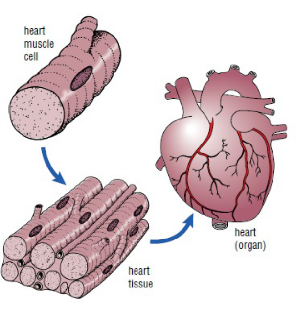
> **[Diagram Context - Textbook_LifeSciences_Gr10_Plant_and_animal_tissues.pdf-0003-03.png]**
> This cellular and anatomical structure diagram illustrates the hierarchical organization of life, featuring the labels "heart muscle cell", "heart tissue", and "heart (organ)" connected sequentially by blue arrows. Conceptually, it demonstrates to high school learners how specialized cells group together to form tissues, which in turn combine to form functional organs within multicellular organisms.

*Figure 5.2: The diagram above depicts how several cells adapted for the same function work in conjunction to form tissues.*

---

## Meristematic tissue

Meristematic tissue is **undifferentiated tissue**. Meristematic tissue contains actively dividing cells that result in formation of other tissue types (e.g. vascular, dermal or ground tissue). 

* **Apical meristematic tissue** is found in buds and growing tips of plants. It generally makes plants grow taller or longer. 
* **Lateral meristematic tissue** make the plant grow thicker. Lateral meristems occur in woody trees and plants. Examples of lateral meristematic tissue include the **vascular cambium** that results in the rings you see in trees, and **cork cambium** or 'bark' found on the outside of trees.

---

| Diagram | Micrograph |
| :---: | :---: |
| 

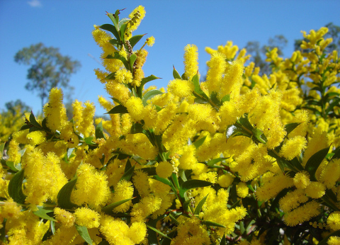
> **[Diagram Context - Textbook_LifeSciences_Gr10_Support_and_transport_systems_in_plants.pdf-0003-03.png]**
> This photographic educational graphic displays a flowering *Acacia* (or *Vachellia/Senegalia*) plant featuring dense clusters of bright yellow, pom-pom-like inflorescences and green foliage against a blue sky, with no text, labels, or arrows present. Aligned with the CAPS Grade 10-12 Life Sciences curriculum for plant diversity and reproduction, this visual serves to illustrate the macroscopic features of angiosperms, specifically highlighting flower structure adapted for pollination in flowering plants (Phylum Anthophyta).

 | 

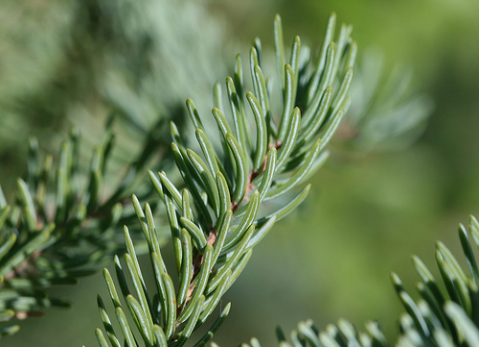
> **[Diagram Context - Textbook_LifeSciences_Gr10_Support_and_transport_systems_in_plants.pdf-0003-04.png]**
> 1. A close-up view of a branch with green needles.

 |
| Figure 5.3: Meristematic cells in the growing root-tip of the onion, from a longitudinal section. | Figure 5.4: Micrograph of meristematic tissue. |

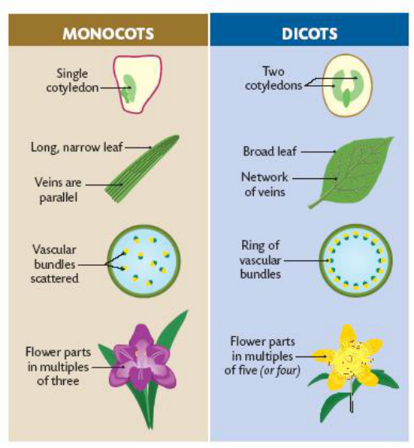
> **[Diagram Context - Textbook_LifeSciences_Gr10_Support_and_transport_systems_in_plants.pdf-0003-07.png]**
> This comparative biological diagram illustrates the key anatomical

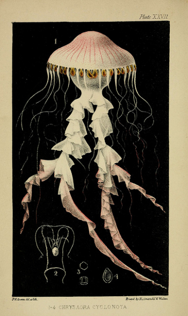
> **[Diagram Context - Textbook_LifeSciences_Gr10_support_systems_in_animals.pdf-0003-13.png]**
> This educational graphic is a biological illustration depicting the anatomical structure of a *Chrysaora cyclonota* jellyfish, labelled numerically from 1 to 4 to show the whole organism and microscopic details. Visible features include the dome-shaped bell (medusa), hanging tentacles, oral arms, and supplementary line drawings numbered 2, 3, and 4 detailing internal or cellular structures. For high school Life Sciences learners, this diagram conveys the morphology and diversity of invertebrate phyla (specifically Cnidaria), illustrating radial symmetry, tissue organization, and body plans within marine biodiversity.

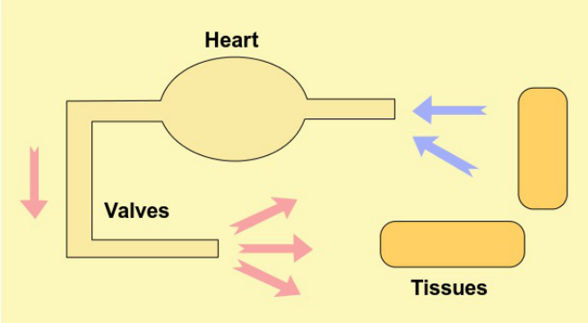
> **[Diagram Context - Textbook_LifeSciences_Gr10_Transport_systems_in_animals.pdf-0003-07.png]**
> This educational graphic is a simplified block-style diagram illustrating the human circulatory system. It features visible labels for "Heart", "Valves", and "Tissues", connected by tubular pathways with pink outgoing arrows and blue incoming arrows indicating the direction of blood flow. Conceptually, it helps Grade 10 Life Sciences learners understand the unidirectional flow of blood pumped by the heart through valves toward body tissues and back.

---

### Structural Adaptations of Meristematic Tissue

The following table highlights how the structure of meristematic tissue is suited to its function:

| Structural adaptation | Function |
| :--- | :--- |
| Cells are small, spherical or polygonal in shape. | This allows for close packing of a large number of cells. |
| Vacuoles are very small or completely absent. | Vacuoles provide rigidity to cells thus preventing rapid division. |
| Large amount of cytoplasm and a large nucleus. | The lack of organelles is a feature of an undifferentiated cell. Large amount of nuclear material contains the DNA necessary for division and differentiation. |

*Table 5.1: Structural adaption and function of meristematic tissue.*

Meristematic tissue is found in root tips as this is where roots are growing and where dividing cells are produced. 

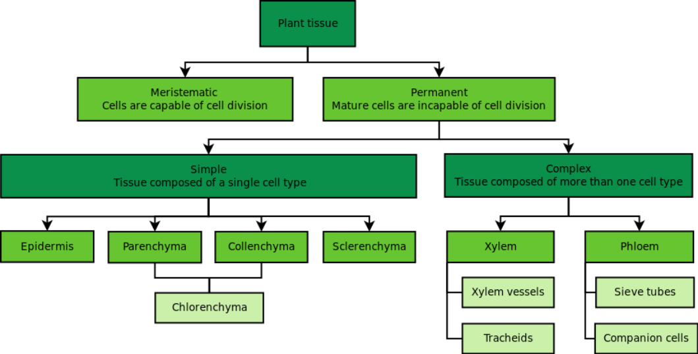

*Figure 5.5: Image shows meristematic tissue in a root tip as observed under an electron microscope.*

---

### Permanent Tissues (ESG67)

The meristematic tissues give rise to cells that perform a specific function. Once cells develop to perform this particular function, they lose their ability to divide. The process of developing a particular structure suited to a specific function is known as **cellular differentiation**. We will examine two types of permanent tissue:

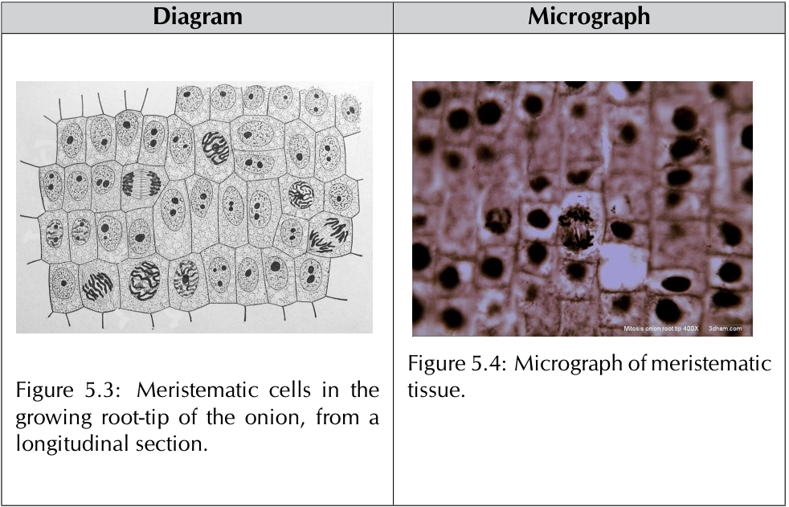

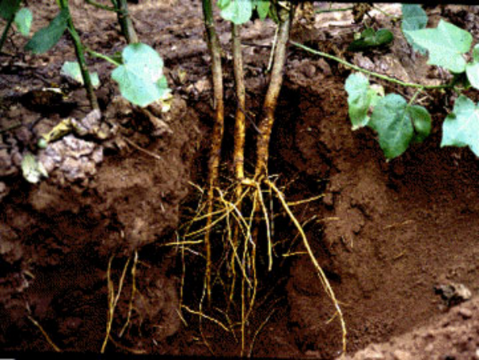
> **[Diagram Context - Textbook_LifeSciences_Gr10_Support_and_transport_systems_in_plants.pdf-0004-09.png]**
> This photograph shows the underground anatomical structure of a plant's root system embedded in a soil profile. Visible components include woody main stems transitioning into primary roots, and a complex network of branching lateral roots spreading through the soil layers. Conceptually, this visual supports the CAPS Life Sciences curriculum by demonstrating root morphology, anchorage, and the vast surface area adaptations required for the absorption of water and mineral salts.

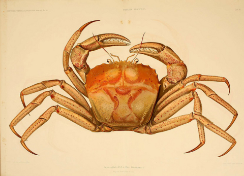

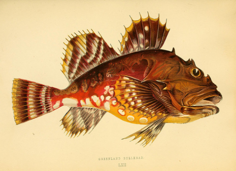

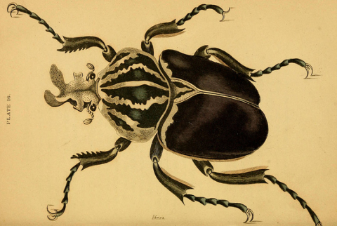

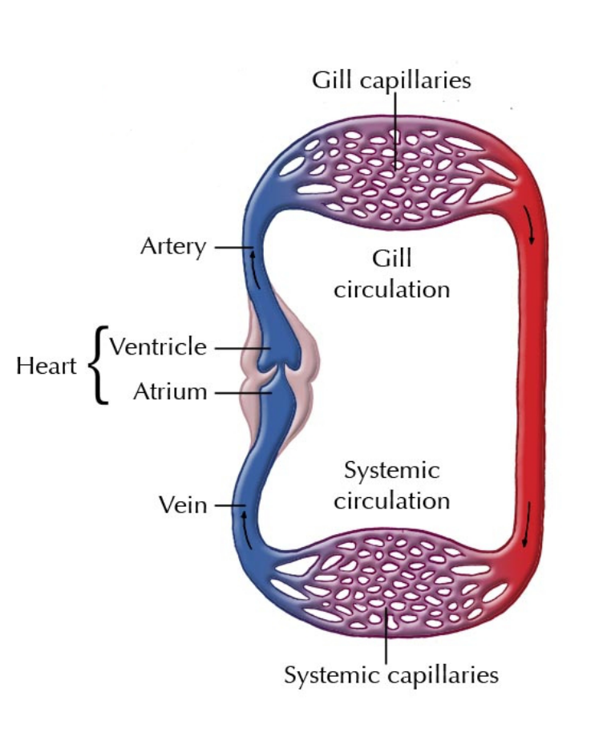

---

1. **Simple permanent tissues**
   - epidermis
   - parenchyma
   - collenchyma
   - sclerenchyma

2. **Complex permanent tissues**
   - xylem vessels (made up of tracheids and vessels)
   - phloem vessels (made up of sieve tubes and companion cells)

---

## Epidermis tissue (ESG68)

The epidermis is a single layer of cells that covers plants' leaves, flowers, roots and stems. It is the outermost cell layer of the plant body and plays a protective role in the plant. The function of key structural features are listed in Table 5.2.

| Structure | Function |
| :--- | :--- |
| Layer of cells covering surface of entire plant. | Acts as a barrier to fungi and other microorganisms and pathogens. |
| Layer is thin and transparent. | Allow for light to pass through, thereby allowing for photosynthesis in the tissues below. |
| Epidermal tissues have abundant **trichomes** which are tiny hairs projecting from surface of epidermis. Trichomes are abundant in some plant leaves. | Leaf trichomes trap water in the area above the stomata and prevent water loss. |
| Root hairs are elongations of epidermal cells in the root. | Root hairs maximise the surface area over which absorption of water from the soil can occur. |
| Epidermal tissues in leaves are covered with a waxy **cuticle**. | The waxy outer layer on the epidermis prevents water loss from leaves. |
| Epidermal tissues contain **guard cells** containing chloroplasts. | Guard cells control the opening and closing of the pores known as **stomata** thus controlling water loss in plants. |
| Some plant epidermal cells can secrete poisonous or bad-tasting substances. | The bitter taste of the substances deter browsing and grazing by animals. |

*Table 5.2: Table showing structural adaptations of epidermis tissue.*

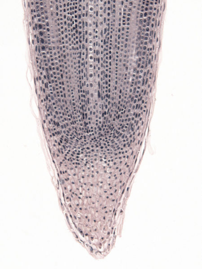

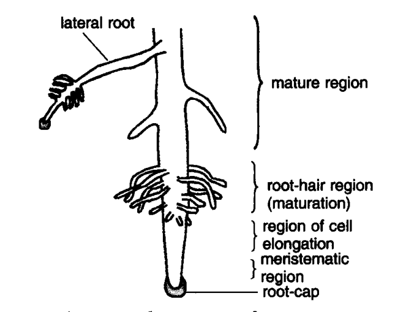

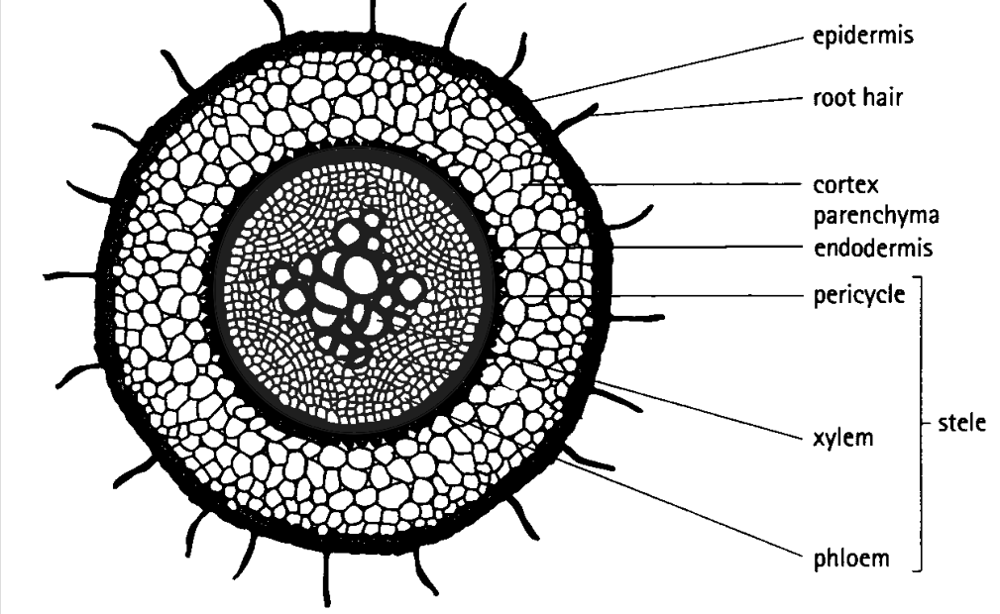

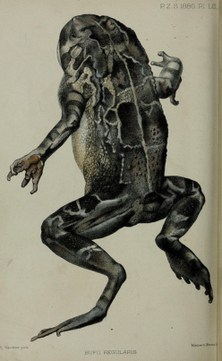

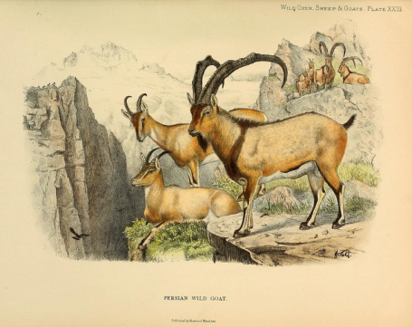

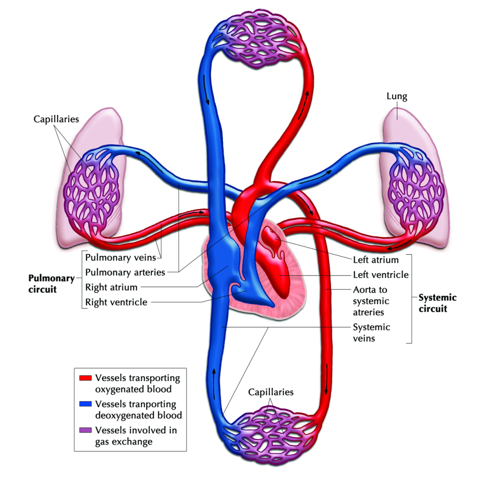

---

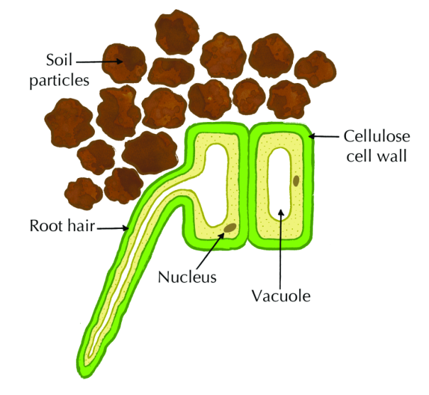

**FACT**
The chemicals in trichomes make plants less easily digested by hungry animals and can also slow down the growth of fungus on the plant. As such they act as a form of protection for the plant against predation.

---

## Guard cells and Stomata (ESG69)

A **stoma** is a pore found in the leaf and stem epidermis that allows for gaseous exchange. The stoma is bordered on either side by a pair of specialised cells known as **guard cells**. Guard cells are bean shaped specialised epidermal cells, found mainly on the lower surface of leaves, which are responsible for regulating the size of the stoma opening. Together, the stoma and the guard cells are referred to as **stomata**.

The stomata in the epidermis allow oxygen, carbon dioxide and water vapour to enter and leave the leaf. The guard cells also contain chloroplasts for photosynthesis. Opening and closing of the guard cells is determined by the turgor pressure of the two guard cells. The turgor pressure is controlled by movements of large quantities of ions and sugar into the guard cells. When guard cells take up these solutes, the water potential decreases causing water to flow into the guard cells via osmosis. This leads to an increase in the swelling of the guard cells and the stomatal pores open.

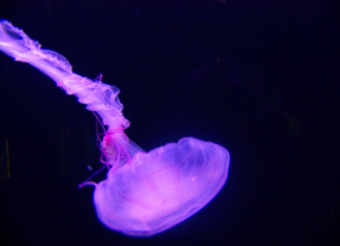

---

*Chapter 5. Plant and animal tissues* **133**

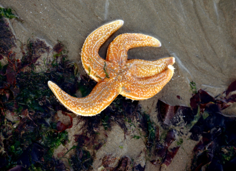

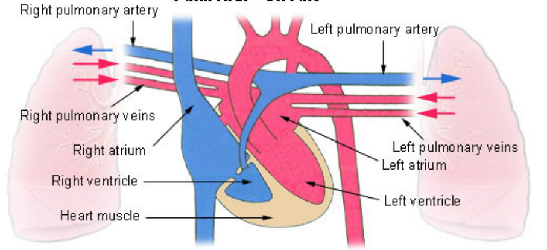

---

## Activity: Practical investigation of leaf epidermis

### Aim:
To observe epidermal cells and stomata.

### Materials:
* Leaves of *Agapanthus*, Wandering Jew (*Tradescantia*), or similar plants that have epidermis that strips off easily.
* Microscopes.
* Microscope slides and cover slips.
* Dissecting needles.
* Scissors.

### Instructions:
1. Rip a piece of leaf lengthwise and check for 'thinner bits' near the edges, which will be epidermal tissue (ensure that you have *lower* epidermis because this is where the guard cells are found).
2. Use the scissors to cut off a small section of epidermis and mount it in water on a microscope slide. Cover with a cover slip.
3. Focus the slide on low power and search for a section of the sample that does not have air bubbles over the stomata.
4. Enlarge the part of the specimen you chose and focus on high power.
5. Adjust lighting if necessary and draw one stoma and its guard cells. Label all parts.

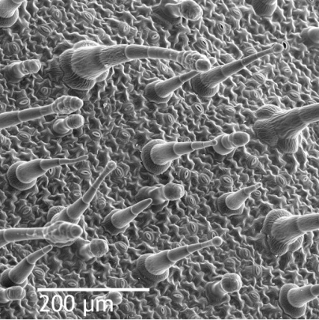

### Questions:
1. Describe the shape of the guard cells and normal epidermal cells.
2. Which epidermal cells have chloroplasts?
3. Describe the wall thickness around the guard cells and account for any visible differences.

---

We will now look at parenchyma, collenchyma, and sclerenchyma cells. Together these tissue types are referred to as **ground tissues**. Ground tissues are located in the region between epidermal and vascular tissue.

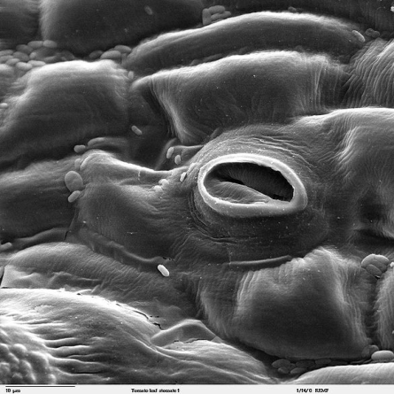

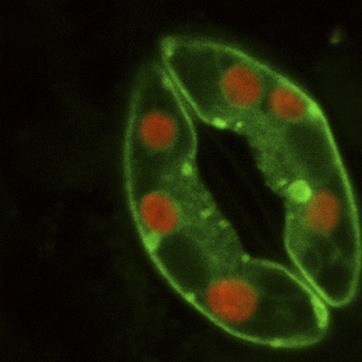

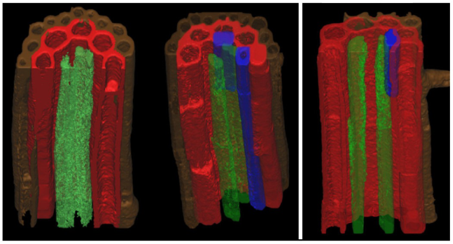

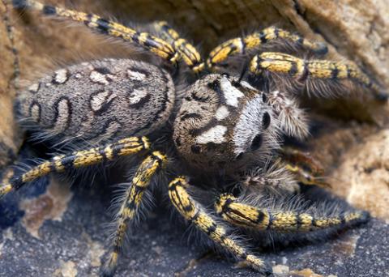

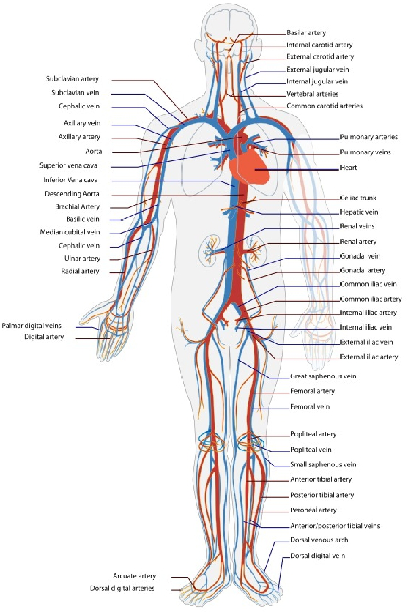

---

# Parenchyma tissue

**ESG6B**

Parenchyma tissue forms the majority of stems and roots as well as soft fruit like tomatoes and grapes. It is the most common type of ground tissue. Parenchyma tissue is responsible for the storage of nutrients.

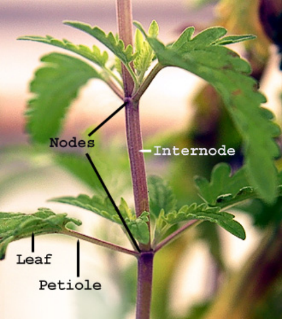

*Figure 5.9: Parenchyma tissue found in cells responsible for storage.*

## Structure and Function of Parenchyma

| Structure | Function |
| :--- | :--- |
| Thin-walled cells. | Thin walls allow for close packing and rapid diffusion between cells. |
| Intercellular spaces are present between cells. | Intercellular spaces allow diffusion of gases to occur. |
| Parenchyma cells have large central vacuoles. | This allows the cells to store and regulate ions, waste products and water. Also function in providing support. |
| Specialised parenchyma cells known as **chlorenchyma** found in plant leaves contain chloroplasts. | This allows them to perform a photosynthetic function and responsible for storage of starch. |
| Some parenchyma cells retain the ability to divide. | Allows replacement of damaged cells. |

*Table 5.3: Structure and function of parenchyma.*

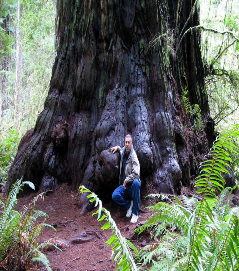

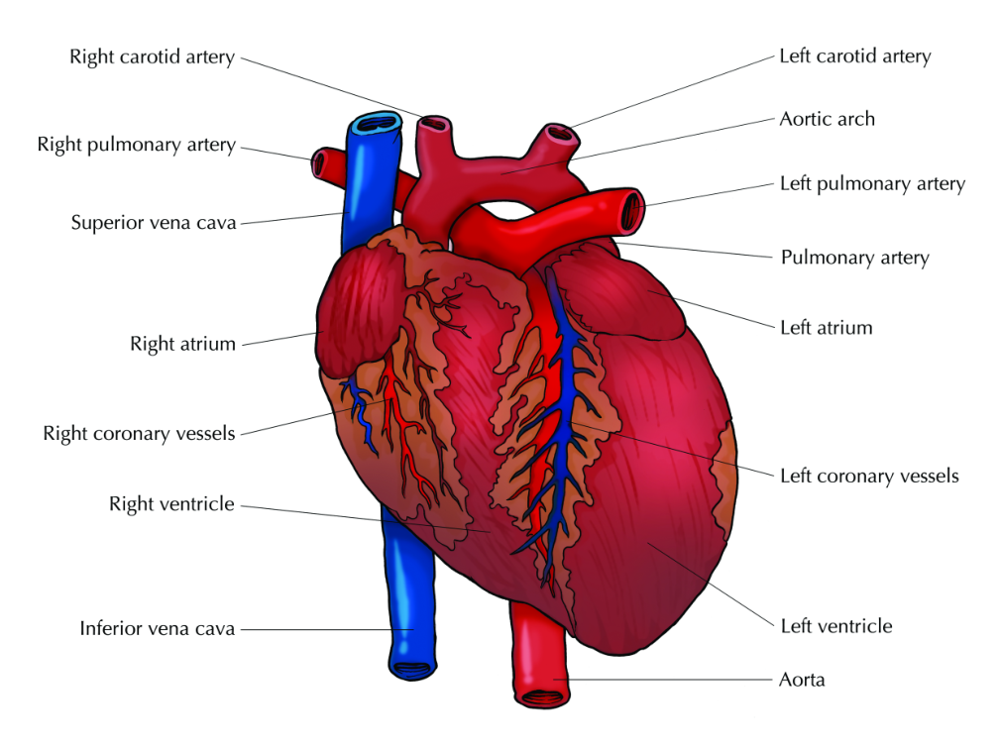

---

### Activity: Observing parenchyma cells

**Aim:**  
To observe the structure of fresh parenchyma cells.

**Materials:**
* banana
* petri dishes or watch glasses
* dissection needles
* iodine solution
* microscopes, microscope slides and cover slips

**Instructions:**
1. Use the dissection needle to lift off a small piece of the soft banana tissue.
2. Put the sample onto a petri dish or watch glass and mash it slightly using the dissecting needle (and a pencil if you want).
3. Lift a small sample of the tissue onto a microscope slide on which you already have placed a drop of iodine solution. Put the cover slip on.
4. Observe the cells under low power and find a section where the cells are lying separate, not all over each other.
5. Enlarge this section and focus carefully to see if you can find nuclei in some of the cells (they will be bigger than the purple plastids and transparent).
6. Draw 2 or 3 cells and label.

**Questions:**
1. Describe the shape of the cells and their wall thickness.
2. What are the plastids called which appear purple and what is their function?

---

## Collenchyma tissue (ESG6C)

Collenchyma is a simple, permanent tissue typically found in the shoots and leaves of plants. Collenchyma cells are thin-walled but the corners of the cell wall are thickened with cellulose. This tissue gives strength, particularly in growing shoots and leaves due to the thickened corners. The cells are tightly packed and have fewer inter-cellular spaces.

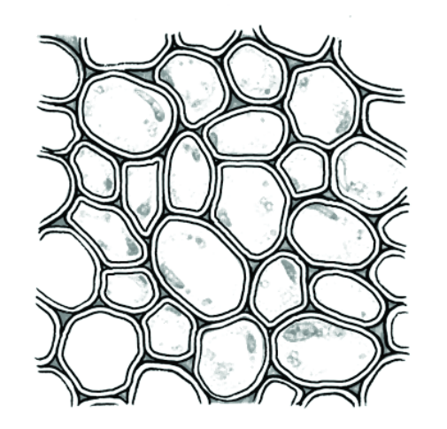

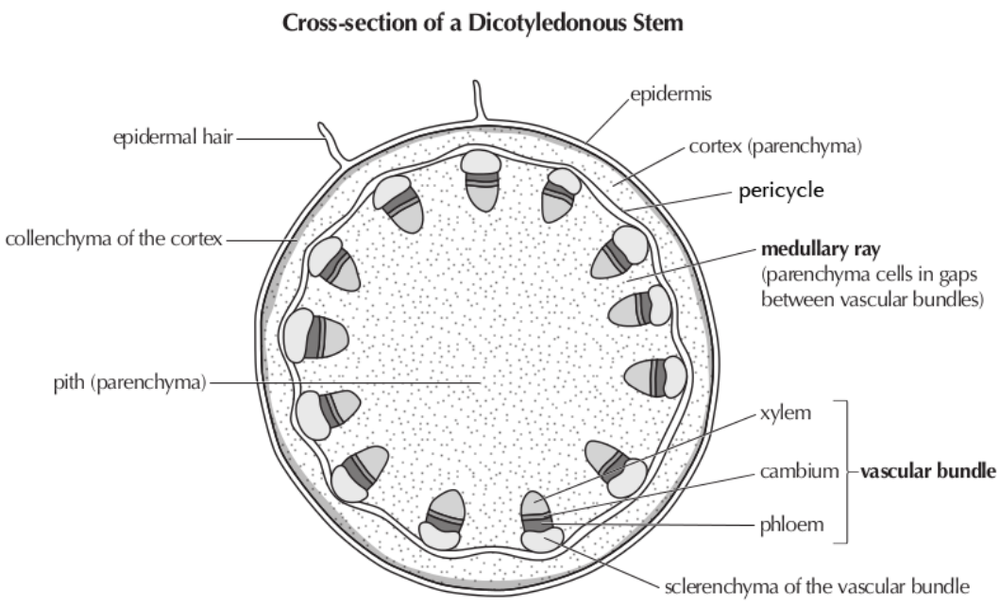

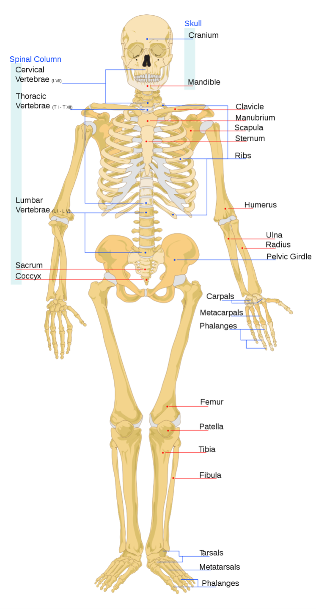

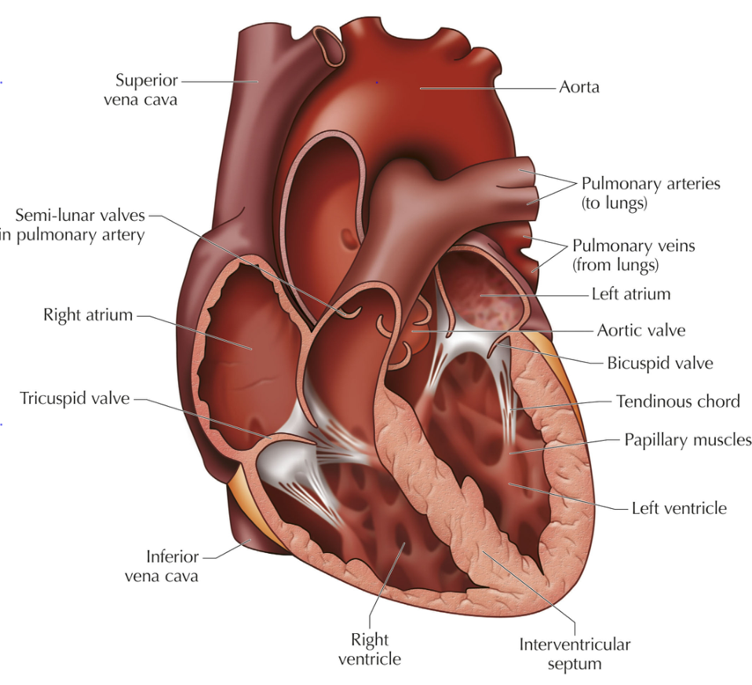

---

# Collenchyma

## Collenchyma Visuals

| Diagram | Micrograph |
| :---: | :---: |
| 

 | 

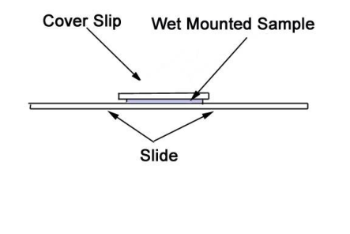
 |
| Figure 5.10: Collenchyma cells are thin walled with thickened corners. | Figure 5.11: Light microscope image of collenchyma cells. |

---

## Facts & Notes

* **FACT:** Collenchyma tissues make up the strong strands observed in stalks of celery.
* **FACT:** The growth of collenchyma tissue is affected by mechanical stress on a plant. For instance, if the plant is constantly shaken by the wind, the walls of collenchyma may be $40-100\%$ thicker than those that are not shaken.
* **FACT:** Learn more about permanent simple tissues. See video: `2CR4`

---

## Structure and Function of Collenchyma Tissue

| Structure | Function |
| :--- | :--- |
| Cells are spherical, oval or polygonal in shape with no intercellular spaces. | This allows for close packing to provide structural support. |
| Corners of cell wall are thickened, with cellulose and pectin deposits. | Provides mechanical strength. |
| Cells are thin-walled on most sides. | Provides flexibility, allowing plant to bend in the wind. |

---

# Sclerenchyma Tissue (ESG6D)

Sclerenchyma is a simple, permanent tissue. It is the supporting tissue in plants, making the plants hard and stiff. Two types of sclerenchyma cells exist: **fibres** and **sclereids**.

* **Sclerenchyma fibres** are long and narrow and have thick lignified cell walls. They provide mechanical strength to the plant and allow for the conduction of water.
* **Sclereids** are specialised sclerenchyma cells with thickened, highly lignified walls with pits running through the walls. They support the soft tissues of pears and guavas and are found in the shells of some nuts.

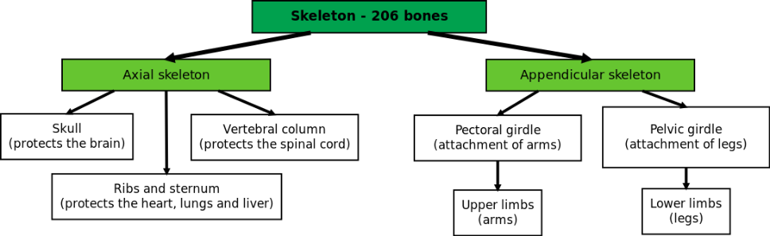

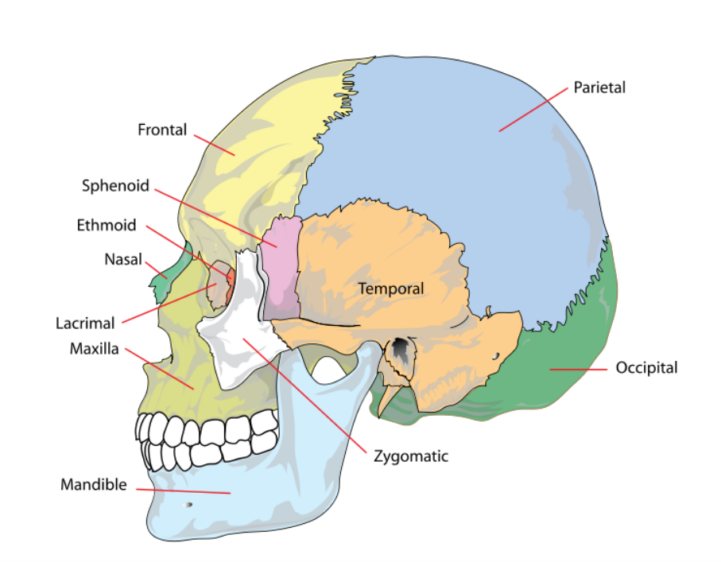

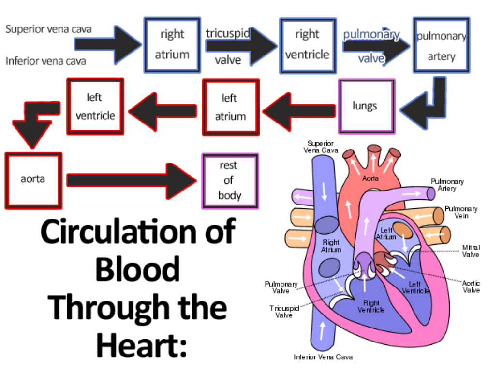

---

# Sclerenchyma

## Fact Note
A useful way to remember the difference between collenchyma and sclerenchyma is to remember the **3 Cs** pertaining to collenchyma: **c**orners, contain **c**ellulose, and named **c**ollenchyma.

---

## Sclerenchyma Visual Representation

| Diagram | Micrograph |
| :---: | :---: |
| 

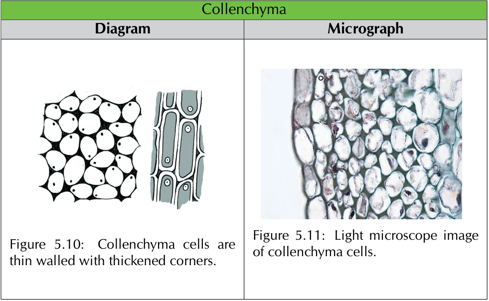
   Figure 5.12: Sclerenchyma tissue provides support in plants. | 

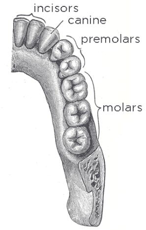
   Figure 5.13: Cross-section of sclerenchyma fibres. |
| | 

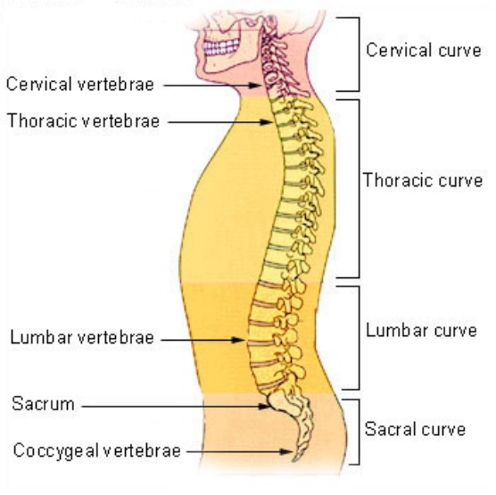
   Figure 5.14: Sclereid. |

---

## Structure and Function of Sclerenchyma Tissue

| Structure | Function |
| :--- | :--- |
| Cells are dead and have lignified secondary cell walls. | This provides mechanical strength and structural support. The lignin provides a 'wire-like' strength to prevent from tearing too easily. |
| Sclereids have strong walls which fill nearly the entire volume of the cell. | Provide the hardness of fruits like pears. These structures are used to protect other cells. |

*Table 5.5: Structure and function of sclerenchyma tissue.*

---

## Applications and Importance of Sclerenchyma Tissues
* Sclerenchyma tissues are important components in fabrics such as **flax**, **jute**, and **hemp**.
* Fibres are important components of **ropes** and **mattresses** because of their ability to withstand high loads.
* Fibres found in jute are useful in processing textiles, given that their principal cell wall component is cellulose.
* Other important sources of fibres are grasses, sisal, and agaves.
* Sclereid tissues are important components of fruits such as cherries, plums, or pears.

---

## Activity: Observing Sclerenchyma in Pears

### Aim
To observe sclerenchyma stone cells (sclereids) in pears.

### Materials
* Soft, ripe pear
* Microscopes, microscope slides, and cover slips
* Iodine solution
* Dissecting needles or forceps

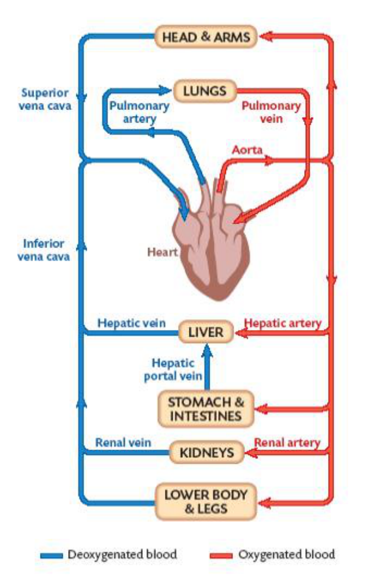

---

## Instructions

1. Use the forceps or needle to lift a small piece of soft pear tissue onto your microscope slide.
2. Add a drop of iodine solution.
3. Mash the tissue slightly to separate the cells.
4. Cover with a cover slip and observe under low power. You should focus on the groups of dark "stones" that appear amongst the rounded parenchyma cells of the pear. Try to find one or two stone cells or sclereids that are separate from the rest.
5. Enlarge a good specimen (or focus on the edge of a group where one cell sticks out) and adjust the lighting.
6. Look carefully while you focus up and down to see the long, narrow PITS running through the extremely thick walls of these cells.
7. These "stone cells" are called **sclereids**. They are a modified form of sclerenchyma found in pears, guavas and the shells of nuts for extra support.
8. Also observe the large round cells around the sclereids.

---

## Questions

1. Do you see cytoplasm inside the stone cells? Are they living or dead cells?
2. What tissue type do the large round cells around the sclereids belong to?

---

## Activity: To investigate sclerenchyma fibres

### Aim
To see sclerenchyma fibres in tissue paper.

### Materials
* Cheap toilet paper (single ply)
* Iodine solution or water
* Microscopes and slides

### Instructions

1. Tear a tiny piece of toilet paper off the sample and mount it in water or iodine solution.
2. Place on a cover slip and examine under the microscope on low power.
3. Focus on the torn edge of the paper and observe the long sclerenchyma fibres.
4. Observe on high power.

---

*Chapter 5. Plant and animal tissues* | *139*

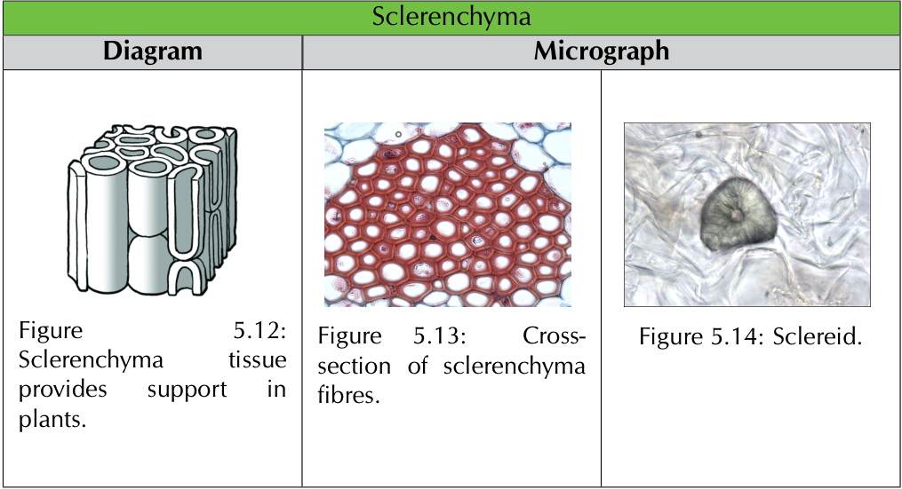

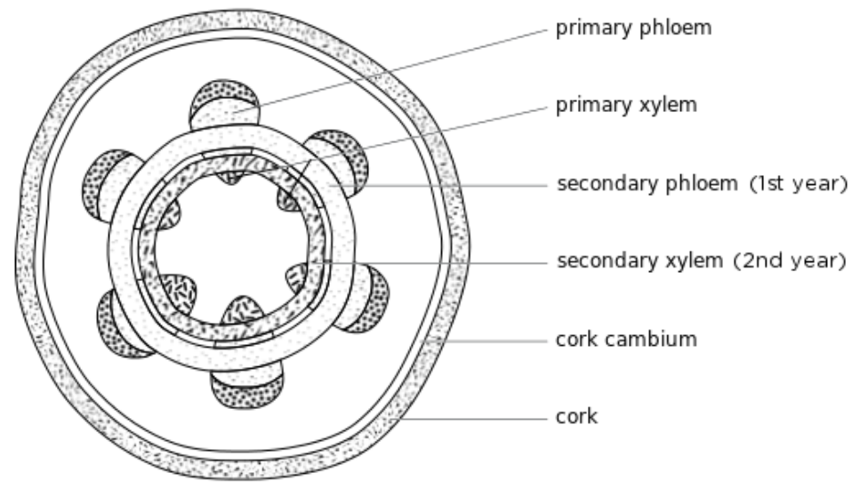

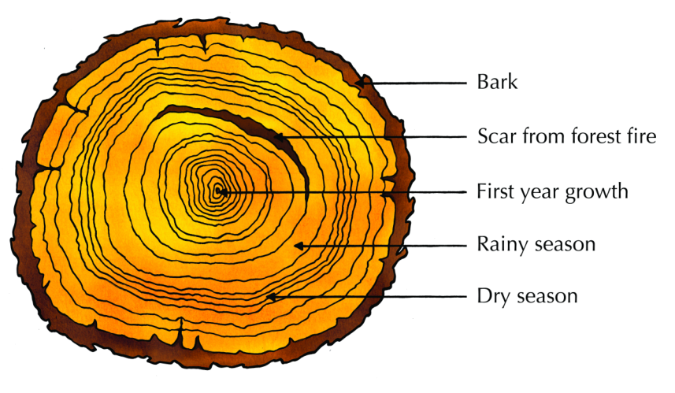

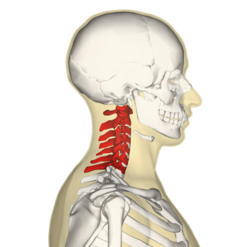

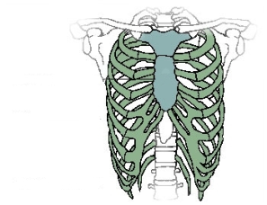

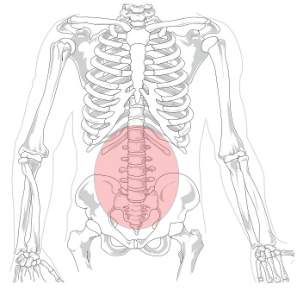

---

### Questions:

1. Describe the shape of these cells.
2. Are they living or dead cells?
3. Suggest their function.

---

We will now examine the complex permanent tissues. Remember the difference between simple and complex permanent tissues is that simple permanent tissues are made up of cells of the same type whereas complex permanent tissues are made up of more than one cell type that combine to perform a particular function. We will examine the **vascular** tissues, xylem and phloem tissues next.

## Xylem tissue (ESG6F)

Xylem has the dual function of supporting the plant and transporting water and dissolved mineral salts from the roots to the stems and leaves. It is made up of vessels, tracheids, fibres and parenchyma cells. The vessels and tracheids are non-living at maturity and are hollow to allow the transport of water. Both vessels and tracheids have lignin in their secondary walls, which provides additional strength and support.

**Xylem vessels** are composed of a long chain of straight, elongated, tough, dead cells known as vessel elements. The vessel elements are long and hollow (lack protoplasm) and they make a long tube because the cells are arranged end to end, and the point of contact between two cells is dissolved away. The role of xylem vessels is to transport water from roots to leaves. Xylem vessels often have patterns of thickening in their secondary walls. Secondary wall thickening can be in the form of spirals, rings or pits.

| Diagram | Micrograph |
| :---: | :---: |
| 

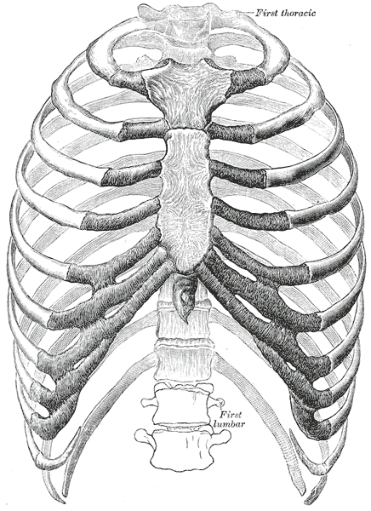
   Figure 5.15: Longitudinal section through a xylem vessel to show hollow lumen to allow for transport of water and nutrients. | 

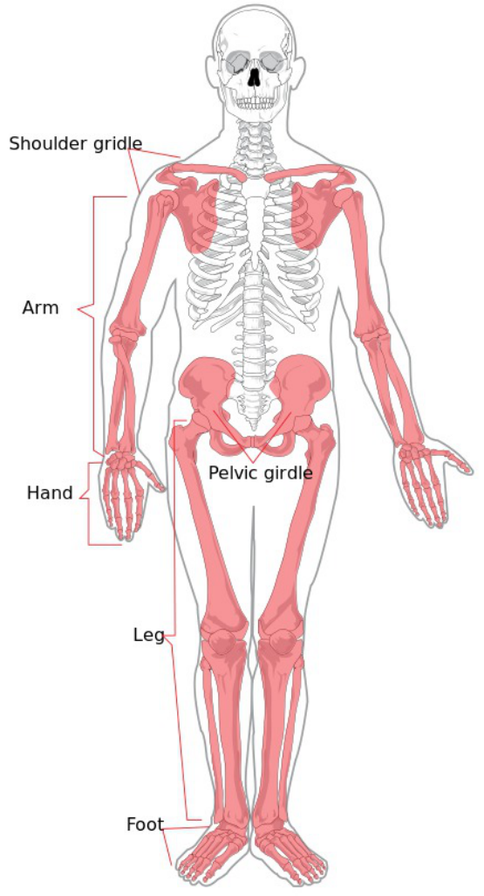
   Figure 5.16: Xylem vessel fibres with rings of lignin thickening. |

---

## Tracheids and Xylem Tissue Structure

**Tracheids** have thick secondary cell walls and are tapered at the ends. The thick walls of the tracheids provide support, and tracheids do not have end openings like the vessels. The tracheids' ends overlap with one another, with pairs of pits present which allow water to pass through horizontally from cell to cell.

### FACT
In addition to transporting water and mineral salts from roots to leaves, xylem also provides support to plants and trees because of its tough lignified vessel elements.

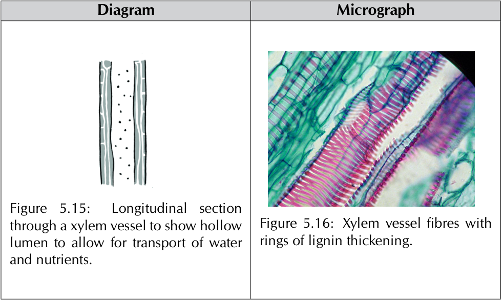

---

### Table 5.6: Structure and function of xylem tissue

| Structure | Function |
| :--- | :--- |
| Long cells | Form effective conducting tubes for water and minerals |
| Dead cells: no cytoplasm | No obstruction to water transport |
| Thick, lignified walls | Support the plant and are strong enough to resist the suction force of transpiration pull, so they don't collapse |
| Pits in cell walls | Allow lateral water transport to neighbouring cells |
| Tracheids have tapered ends | Improved flexibility of the stem in wind |
| Vessels elements have open ends | Water is transported directly to the next cell |
| No intercellular spaces | Added support for the stem |
| Living parenchyma cells in between xylem | Form vascular rays for water transport to the cortex of the stem |
| Patterns of secondary wall thickening | Improve flexibility of the stem in wind and allow the stem to stretch as it lengthens |

---

## Activity: Observing the patterned secondary walls in the xylem of fresh plant tissue

### Aim:
To observe the patterned secondary walls in the xylem of fresh plant tissue.

### Materials:
* celery stalk, rhubarb stalks or pumpkin stems (*macerated - chop them across and boil them in water for $3$ minutes, then add an equal amount of glycerine. Cool before using. It can be stored for a few months in the refrigerator.*)
* microscopes and slides
* dissecting needles
* petri dishes or watch glasses
* eosin solution

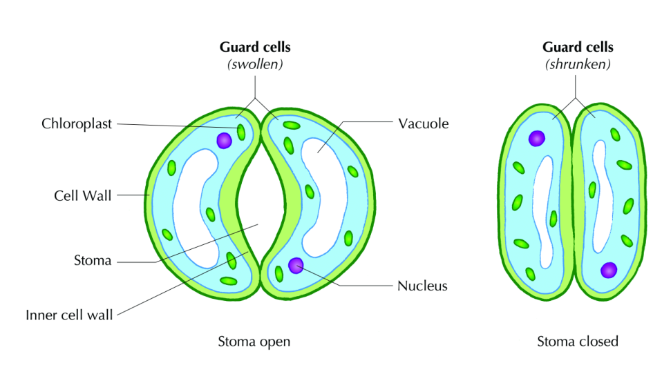

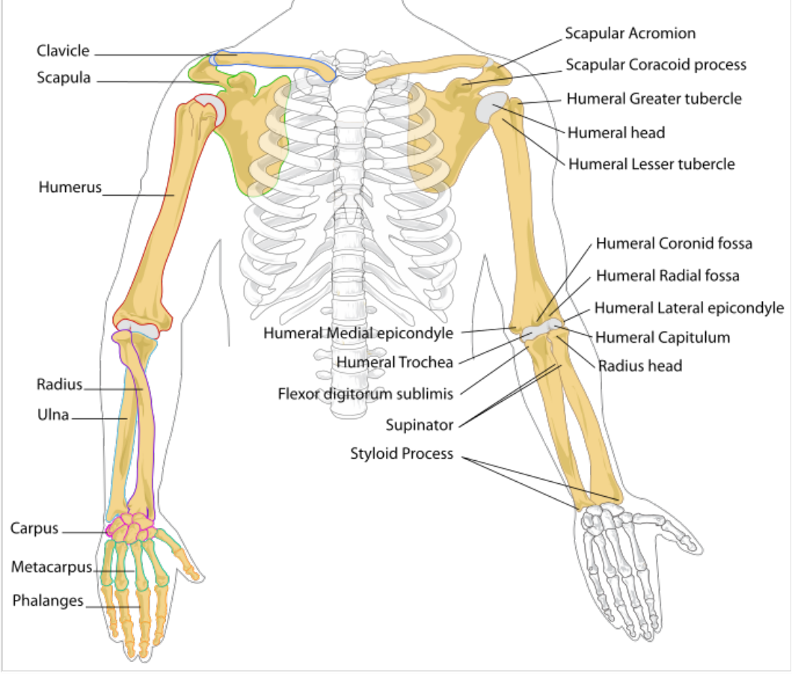

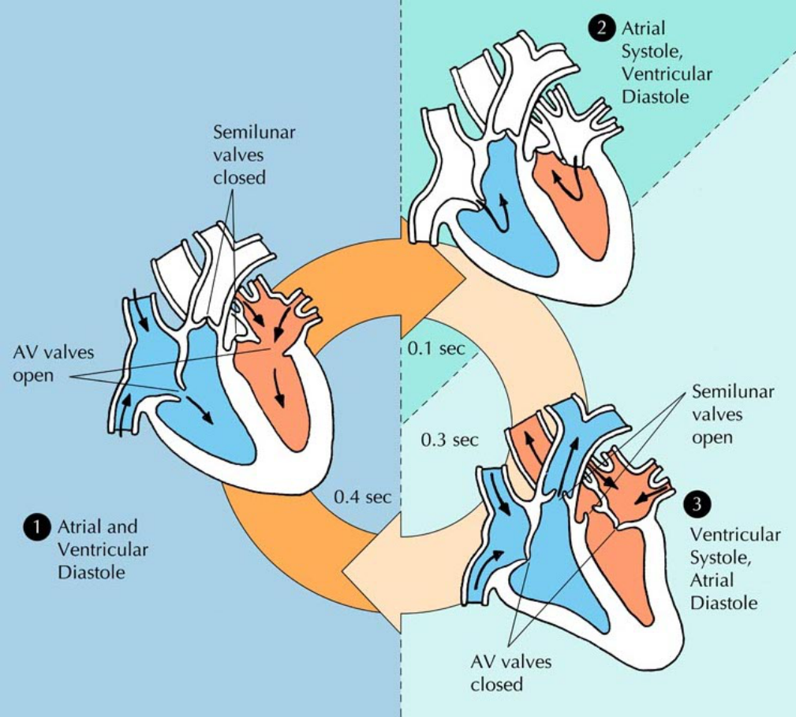

---

### Fact
Do you remember that sucrose is made up of glucose and fructose monosaccharides? Plants transport sucrose rather than glucose because it is less reactive and has less of an effect on the water potential.

---

### Instructions

1. Lift a small piece of celery / any other tissue chosen from the dish and transfer it to a watch glass or petri dish.
2. Use the dissecting needle and a pencil to *tease* the tissue apart (separate the thread-like, thicker cells away from each other). Try to get the long cells away from each other, otherwise bundles will be too thick to allow you to see individual cells. Ignore the thin walled parenchyma cells around them.
3. Transfer the plant tissue to a microscope slide and add eosin solution. Separate a bit more if necessary.
4. Examine under low power, focusing on the bundles of xylem vessels. Look for long bundles of fairly wide cells with *thickening in the form of rings or spirals*. Do not confuse xylem vessels with the more common and much narrower sclerenchyma fibres - fibres have walls all the same thickness, have no spirals or rings and they are pointed at the end. If necessary, make a second slide if you did not find xylem.
5. Move a good part to the centre and enlarge. Examine the secondary walls of these cells.

#### Questions

1. Describe the shape of xylem vessels.
2. What secondary walls patterns do you see?
3. Suggest the function of such secondary walls.

---

### Phloem Tissue (ESG6G)

Phloem tissue is the living tissue responsible for transporting organic nutrients produced during photosynthesis (mainly as the carbohydrate sucrose) to all parts of the plant where these are required. The phloem tissue is made up of the following major types of cells:

* **sieve elements**: these are conducting cells which transport sucrose.
* **parenchyma cells**: which store food for transport in phloem.
* **companion cells**: are associated with parenchyma cells and control the activities of sieve tube elements, since the latter have no nuclei. Companion cells are responsible for providing energy to the sieve elements to allow for the transport of sucrose. Companion cells play an important role in loading sieve tubes with sucrose produced during photosynthesis. Companion cells and sieve tube elements are connected via connecting strands of cytoplasm called plasmodesmata.
* **fibres**: unspecialised cells and supportive cells.

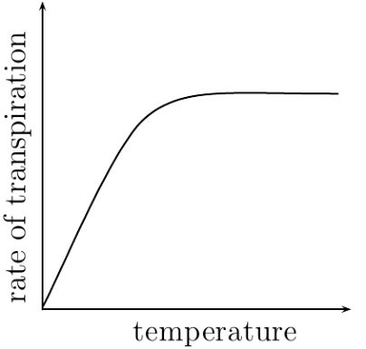

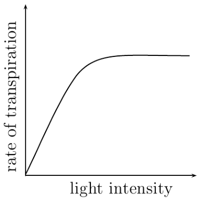

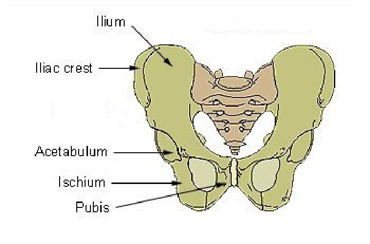

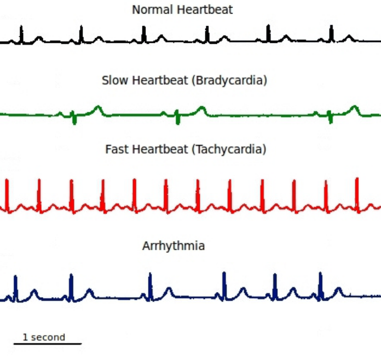

---

# Chapter 5. Plant and animal tissues

## Phloem Tissue: Structure and Function

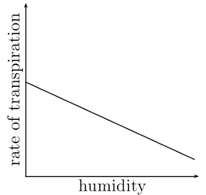

**Figure 5.17:** Longitudinal section: phloem tissue transports nutrients throughout the plant.

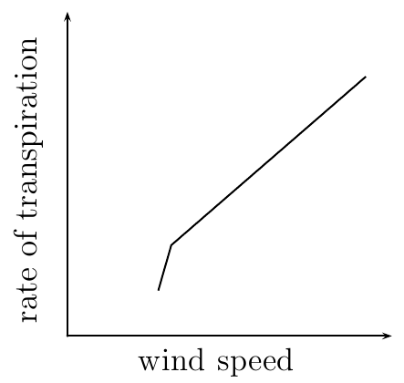

**Figure 5.18:** Cross-section: the arrow indicates the location of the phloem in the vascular bundle.

---

In the table below, the key structural features of the phloem are related to their function.

| Structure | Function |
| :--- | :--- |
| **Companion cells** | |
| Contain large number of ribosomes and mitochondria. | Due to absence of organelles or nuclei in sieve tubes, companion cells perform cellular functions of the sieve tube. |
| Has many plasmodesmata (intercellular connections) in the wall attached to the sieve tube. | Allows transfer of sucrose-containing sap over a large area. |
| **Sieve tubes** | |
| Sieve tube elements are long conducting cells with cellulose cell walls. | Form good conducting tubes over long distances. Allows for transfer over a large area. |
| They are living cells with no nucleus or organelles such as vacuoles or ribosomes. | Allows for more space to transport sap. It is also why sieve elements need companion cells to carry out all cellular functions. |

**Table 5.7:** Structure and function of phloem tissue.

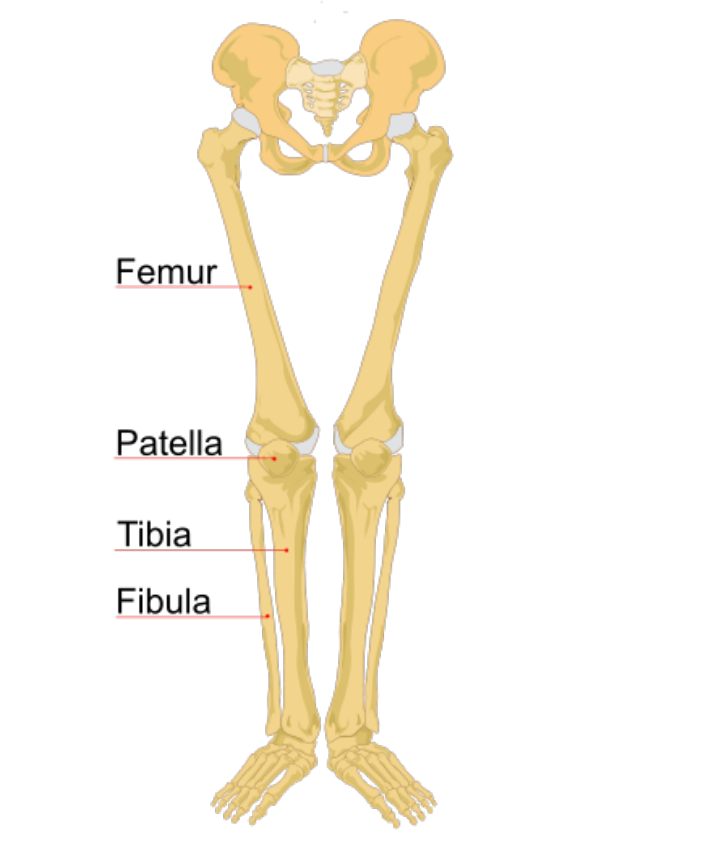

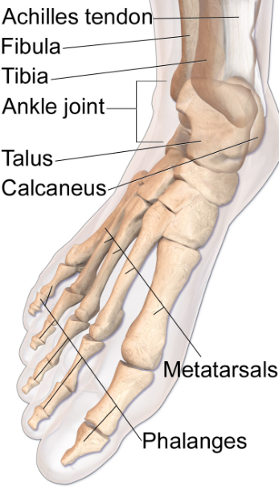

---

## FACT
Watch a video about the different tissue types in animals  
*See video: 2CR5*

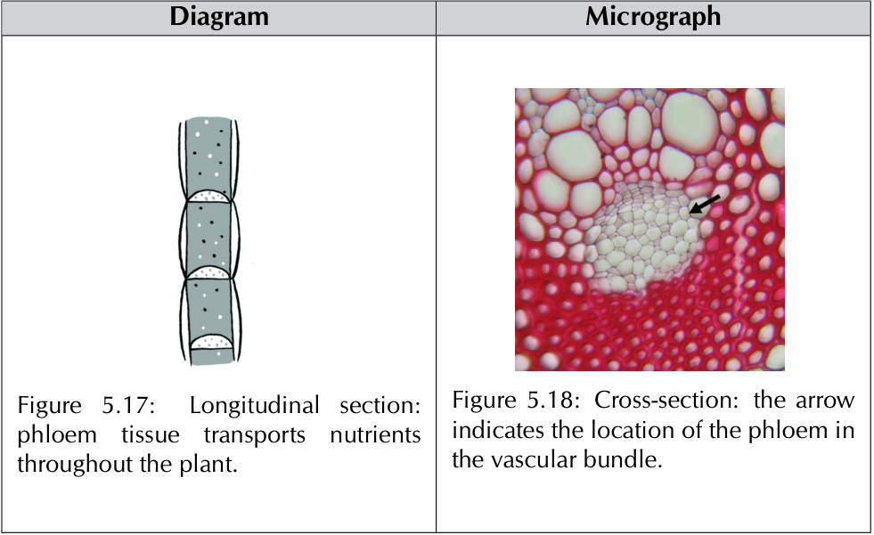

*Figure 5.19: Xylem and phloem are the main transport vessels in plants. The figure above shows how vascular tissues are arranged in a vascular bundle.*

---

# 5.4 Animal tissues ESG6H

Tissues are groups of similar cells that perform a particular function. We will be examining human tissues as an example of animal tissues.

Human bodies, like most animal bodies, are made up of four different types of tissue:

1. **Epithelial tissue** forms the outer layer of the body and also lines many of the body's cavities where it has a protective function.
2. **Connective tissue** assists in support and protection of organs and limbs and depending on the location in the body it may join or separate organs or parts of the body.
3. **Muscle tissue** enables various forms of movement, both voluntary and involuntary.
4. **Nerve tissue** is responsible for the carrying of electrical and chemical signals and impulses from the brain and central nervous system to the periphery, and vice versa.

We will now look at each tissue type, examining its structure and function as well as its specific location in the body. You will be expected to recognise microscope images of each tissue type and produce biological drawings.

---

  144
  5.4. Animal tissues

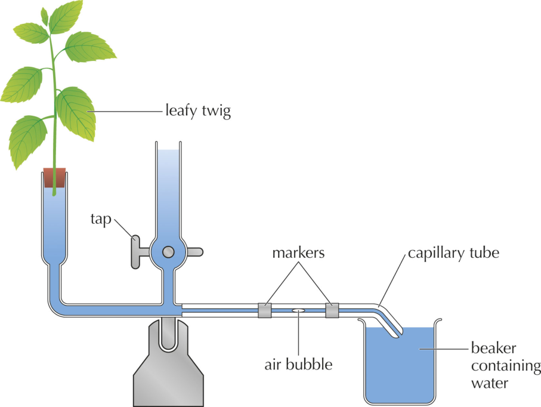

---

# Epithelial Tissue (ESG6J)

## Introduction to Epithelial Tissue

Epithelial tissues are formed by cells that cover surfaces (e.g., skin) and line tubes and cavities (e.g., digestive organs, blood vessels, kidney tubules, and airways). 

* Epithelial tissue usually consists of a single layer of cells.
* In certain cases, there may be more than one layer.
* All epithelial tissues have free surfaces attached to the underlying layers of a **basement membrane**.

> **FACT:** The skin is the largest human organ.

---

## Types of Epithelial Tissue

Epithelial tissues are named and classified according to:
1. The **number of layers** they form.
2. The **shape** of the individual cells that make up those layers.

### Classification by Number of Layers
* **Simple epithelium:** Refers to a **single** layer of cells.
* **Stratified epithelium:** Refers to **two or more** layers of cells.
* **Pseudostratified epithelium:** Refers to an epithelium consisting of one layer, but looking as though it consists of more than one layer.

> **FACT:** Pseudostratified epithelium refers to epithelium consisting of one layer but looking as though it consists of more than one layer.

### Classification by Cell Shape
* **Squamous epithelium:** Refers to flattened cells.
* **Cuboidal epithelium:** Refers to cells that are cube-shaped.
* **Columnar epithelium:** Refers to vertically elongated cells.
* **Ciliated epithelium:** Refers to epithelial cells that contain many tiny hair-like projections.

---

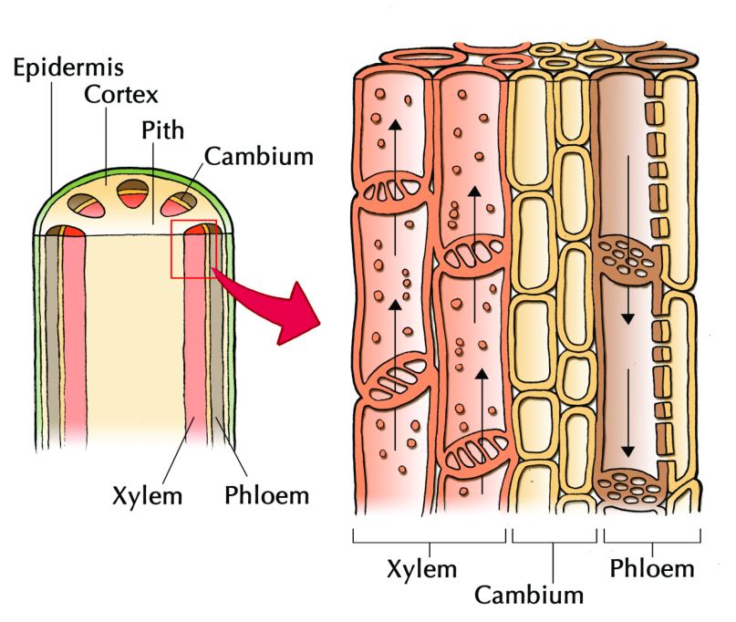

**Figure 5.20:** The different types of epithelial tissue found in mammals (Simple squamous, Simple cuboidal, Simple columnar, Stratified squamous, Stratified cuboidal, Pseudostratified columnar).

---

## General Functions of Epithelial Tissue

The major categories of epithelial shape we examine are **squamous**, **columnar**, and **cuboidal** epithelium. The general functions of epithelial tissue include:

* Provides a barrier between the external environment and the organ it covers.
* Specialised to function in secretion and absorption.
* Protects organisms from microorganisms, injury, and fluid loss.
* Excretes waste products such as sweat from the skin.

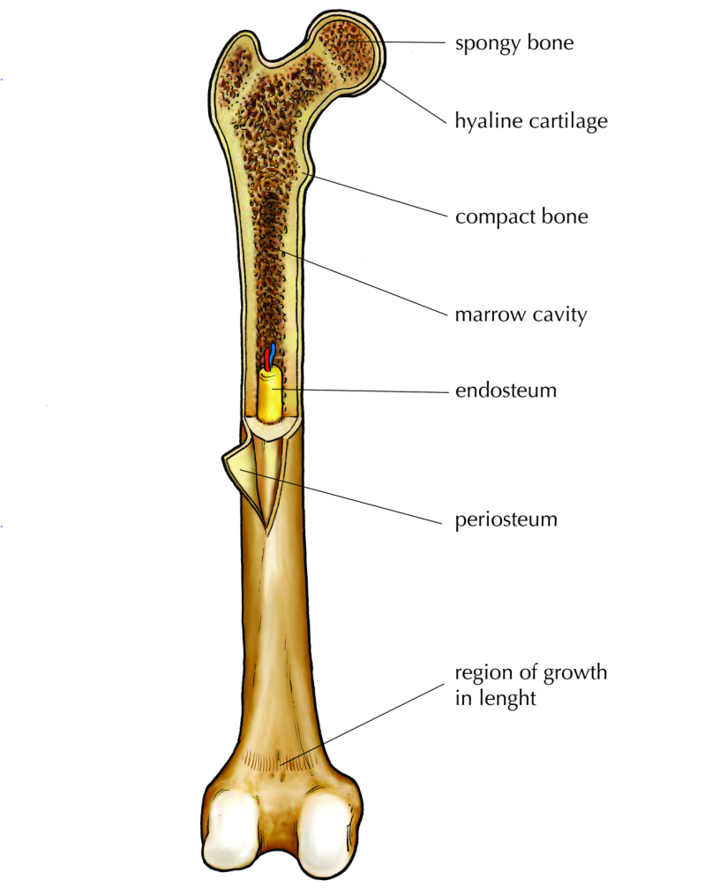

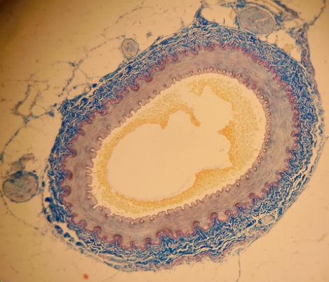

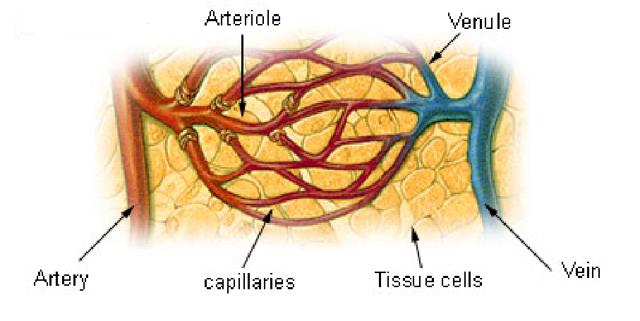

---

## Squamous Epithelium

| Location in body | Structure | Function |
| :--- | :--- | :--- |
| Simple: capillaries, alveoli (in lungs); | Thin and flat cells that are elliptically shaped and lie on basement membrane. Simple squamous epithelium is one-cell thick. | Responsible for diffusion. Thin structure allows for movement of substances across the cells. |
| stratified: skin | Stratified squamous epithelium consists of many layers of thin, flat cells. | Provides a protective covering. |

| Diagram | Microscopic image |
| :---: | :---: |
| 

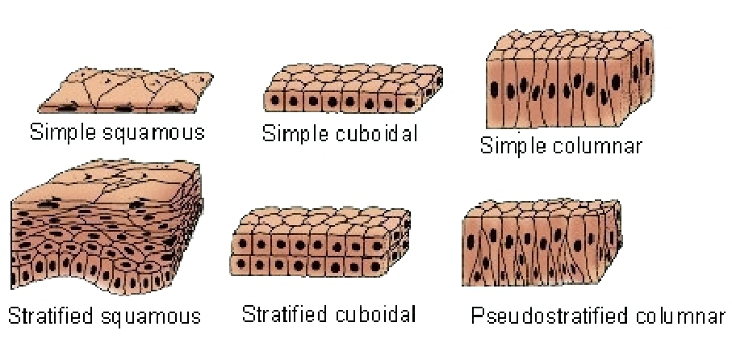
 | 

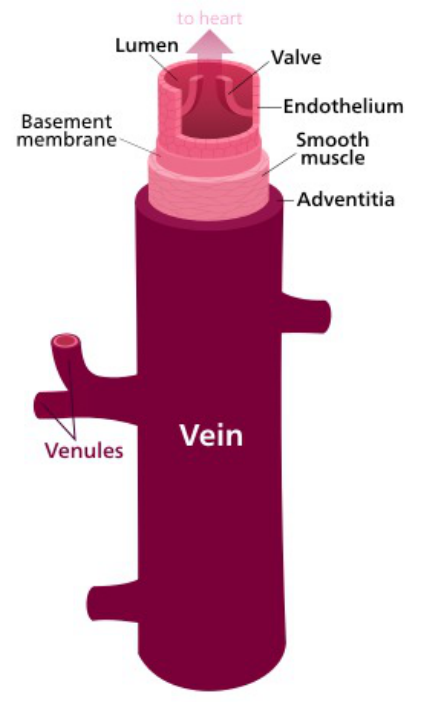
 |

---

## Cuboidal Epithelium

| Location in body | Structure | Function |
| :--- | :--- | :--- |
| Kidney tubules or glands (regions of the body responsible for excretion). | Cube-like in structure; may occasionally have structures called **microvilli** on surface to aid absorption. | Serve a protective function against bacteria and the wearing away of certain organs by lining various structures. Also prevent water loss. |

| Diagram | Microscopic image |
| :---: | :---: |
| 

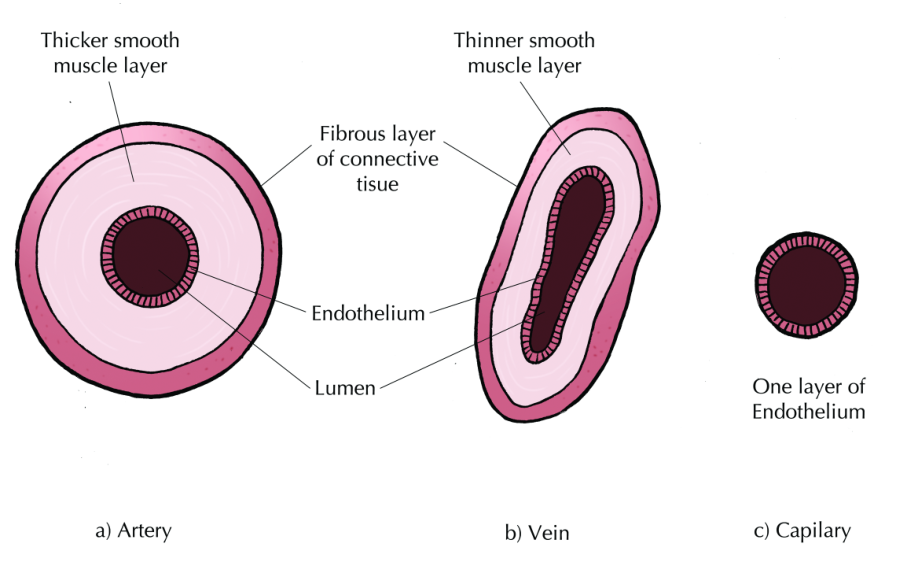
 | <!-- DIAGRAM_PLACEHOLDER: diagram --> |

---

## Columnar Epithelium

| Location in body | Structure | Function |
| :--- | :--- | :--- |
| Digestive tract, reproductive organs | Elongated cells, nuclei located at the base of the cell. Cells connected by tight junctions and receive their nutrients from the basement membrane. | Main function is protective. Prevents against bacterial infection. Can also secrete mucus to protect surface from damage. |

| Diagram | Microscopic image |
| :---: | :---: |
| 

 | 

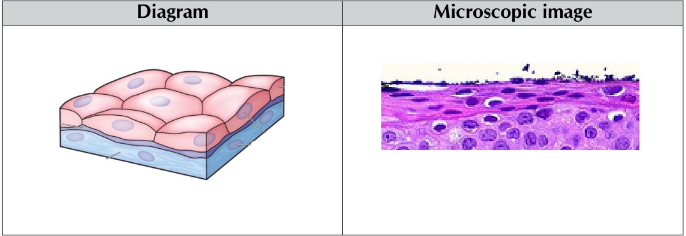
 |

A sub-type of columnar epithelium called **ciliated columnar epithelium** is found in some places in the body. Ciliated columnar epithelium contain little finger-like projections called **cilia**. These cilia beat in a wave-like motion to move particles, mucus or other substances around the body. Ciliated epithelium is found in the trachea and bronchi of the respiratory system and in the fallopian tubes of the female reproductive tract.

---

## Muscle tissue ESG6K

There are three types of muscle tissue:

1. skeletal
2. smooth
3. cardiac

Skeletal and cardiac muscle are striated. Striated muscle cells are striped, with regular patterns of proteins responsible for contraction. Striated muscle contracts and relaxes in short bursts, whereas smooth muscle contracts for longer.

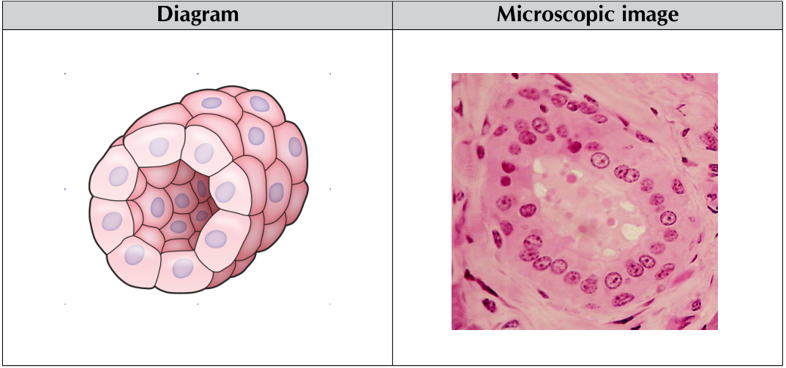

---

# 5.4. Animal Tissues (Continued)

## Types of Muscle Tissues

1. **Skeletal muscle**
   - **Definition:** A voluntary muscle that is striated in appearance and has regularly arranged bundles.
   - **Attachment:** Anchored by tendons.
   - **Function:** Used to effect skeletal muscle movement (such as **locomotion**) and maintain posture.
   - **Control:** Has a reflex action but can also respond to conscious control.

2. **Smooth muscle**
   - **Definition:** An involuntary, non-striated muscle with tapered ends.
   - **Location:** Found within the walls of blood vessels (such as arteries and veins), the digestive system, urinary tract, and the trachea.
   - **Function:** Responsible for involuntary rhythmic contractions of **peristalsis** (required for moving food down the alimentary canal) and for the dilation and construction of blood vessels to control blood pressure.

3. **Cardiac muscle**
   - **Definition:** The major tissue making up the heart; an involuntary muscle that is striated in appearance.
   - **Structure:** Unlike skeletal muscle, cardiac muscle connects at branching, irregular angles.
   - **Function:** The connected branches help with coordinated contractions of the heart.

| Diagram | Micrograph |
| :---: | :---: |
| 

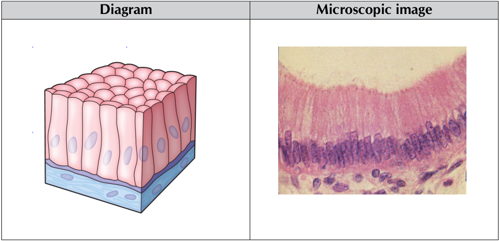
 | 

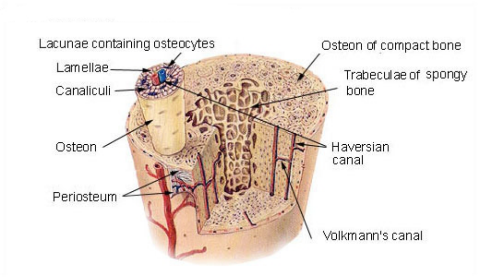
 |
| 

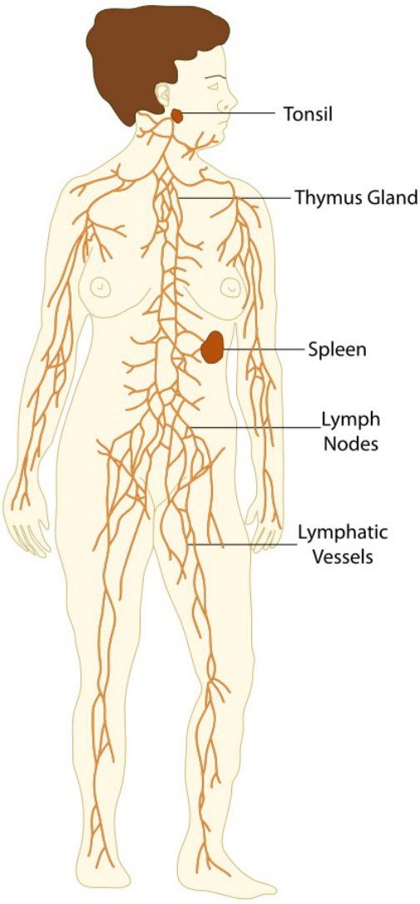
 | <!-- DIAGRAM_PLACEHOLDER: diagram --> |
| <!-- DIAGRAM_PLACEHOLDER: diagram --> | <!-- DIAGRAM_PLACEHOLDER: diagram --> |

---

## Nervous Tissue (ESG6M)

- **Definition:** Cells making up the central nervous system and peripheral nervous system are classified as nervous tissue.
- **Central Nervous System:** Nervous tissue forms the brain and spinal cord.
- **Peripheral Nervous System:** Nervous tissue forms the cranial nerves and spinal nerves, which include sensory and motor neurons.

---

# Nerve Tissue and Connective Tissue

## 1. Structure and Function of Nerve Tissue

The primary function of nerve tissue is to transmit nerve impulses around the body. Nerves are composed of the following key components:
*   **Cell body (soma):** The central part of the nerve cell containing the nucleus.
*   **Dendrites:** Branch-like structures that receive impulses.
*   **Axons:** Long fiber-like extensions which send impulses away from the cell body.

### The Myelin Sheath
*   **Composition:** The axons of neurons are surrounded by a myelin sheath, which consists of layers of myelin (a white fatty substance).
*   **Functions:** 
    1. Insulates nerve fibres.
    2. Increases the speed of the impulses transmitted by the nerve cell.

---

## 2. Types of Nerve Cells (Neurons)

There are three main types of nerve cells: **sensory neurons**, **interneurons**, and **motor neurons**.

| Sensory neuron | Motor neuron | Interneuron |
| :--- | :--- | :--- |
| 

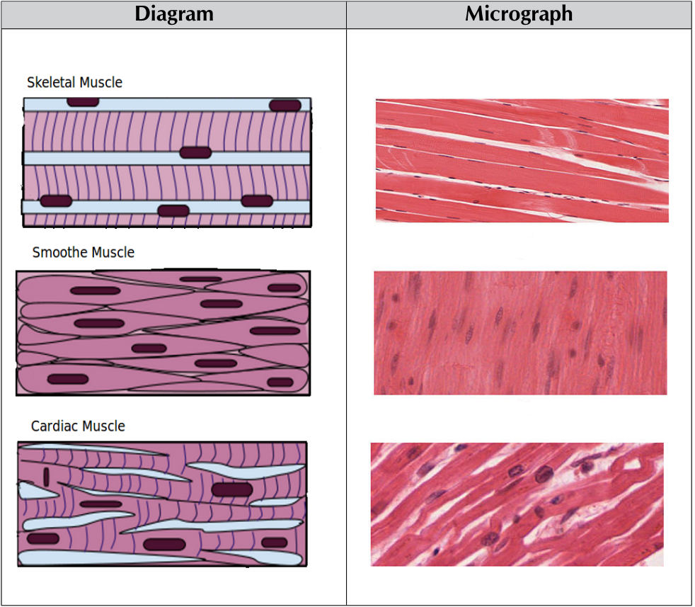
 | 

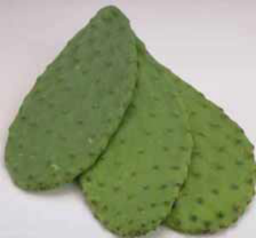
 | 

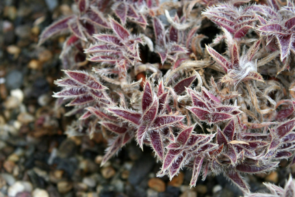
 |
| **Function:** Responsible for sending information about the environment (called **stimuli**) to the central nervous system (CNS).  **Activation:** Activated by touch, light, temperature, pressure, hearing, etc.  **Pathway:** Carry impulses (electrical signals) from a receptor to the central nervous system (CNS). | **Function:** Carry impulses from the CNS to muscles or glands.  **Response:** In most cases, causes muscle contraction (movement), or can cause the secretion of substances by glands via chemicals known as **neurotransmitters**. | **Function:** Connect a sensory neuron with a motor neuron.  **Structure:** Very short compared to sensory and motor neurons. The impulse travels from the cell body at the head end along the short axon to the dendrites. |

---

## Connective Tissue (ESG6N)

*   **Definition:** Connective tissue is a biological tissue that is important in supporting, connecting, or separating different types of tissues and organs in the body.
*   **Composition:** Made up of cells, fibres (such as collagen), and an extracellular matrix.
*   **Variation:** The type of intercellular matrix differs in different connective tissues.

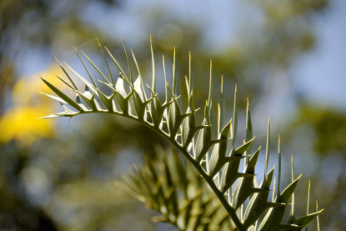

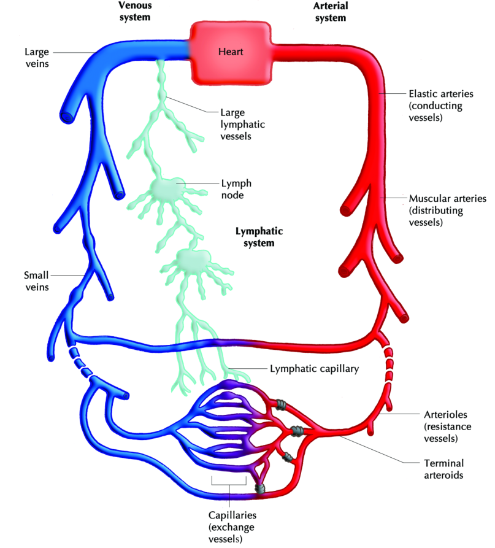

---

**FACT**  
All connective tissues are characterised by cells separated from each other and found in some type of intercellular matrix.

There are different types of connective tissues with different functions. The following table lists some of the different types of connective tissue.

| Connective tissue type | Structure | Function | Location | Diagram/Photo |
| :--- | :--- | :--- | :--- | :--- |
| Areolar (loose connective) | jelly matrix; has network of elastic fibres which attach together | holds the organs in place, cushions and protects organs (acts as a packing material) | surrounds blood vessels and nerves found in the mesentry which surrounds the intestine | 

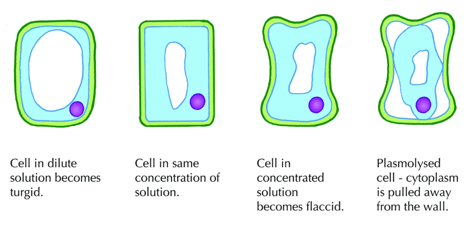
 |
| White fibrous | consists of non-elastic fibres | acts as a shock absorber, transfers or absorbs forces | in tendons, ligaments and many tough membrane sheaths that surround organs | 

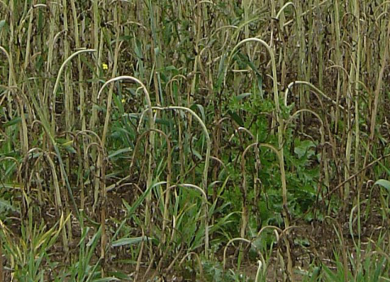
 |
| Cartilage | rubbery matrix, can be flexible or rigid | gives structure, shape and strength; reduces friction; provides support | joints, nose, sternum, trachea | 

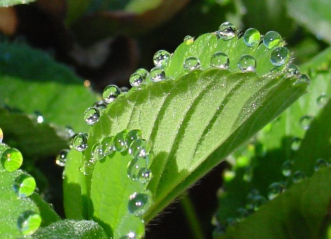
 |
| Bone tissue | made up of collagen fibres; mineralised with calcium and phosphates to make it solid | provides strength and support; creates red blood cells and white blood cells | bones found all over the body | 

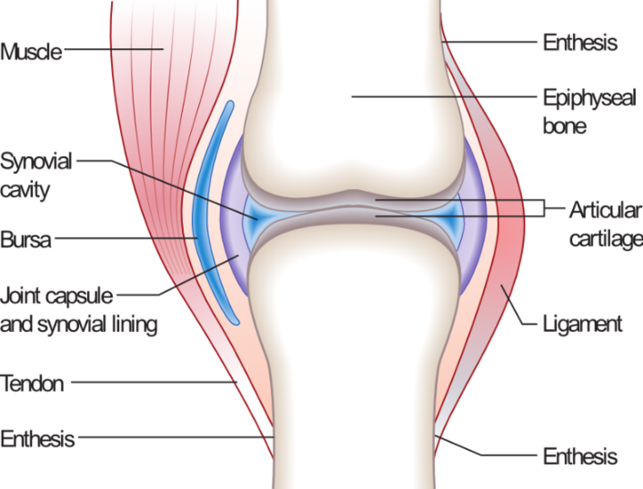
 |

## Blood (ESG6P)

Blood is regarded as a specialised form of connective tissue because it originates in the bones and has some fibres. Blood is composed of red blood cells, white blood cells and platelets. These components are suspended in a yellow fluid known as plasma.

---

# Electron Micrographs of Blood Cells

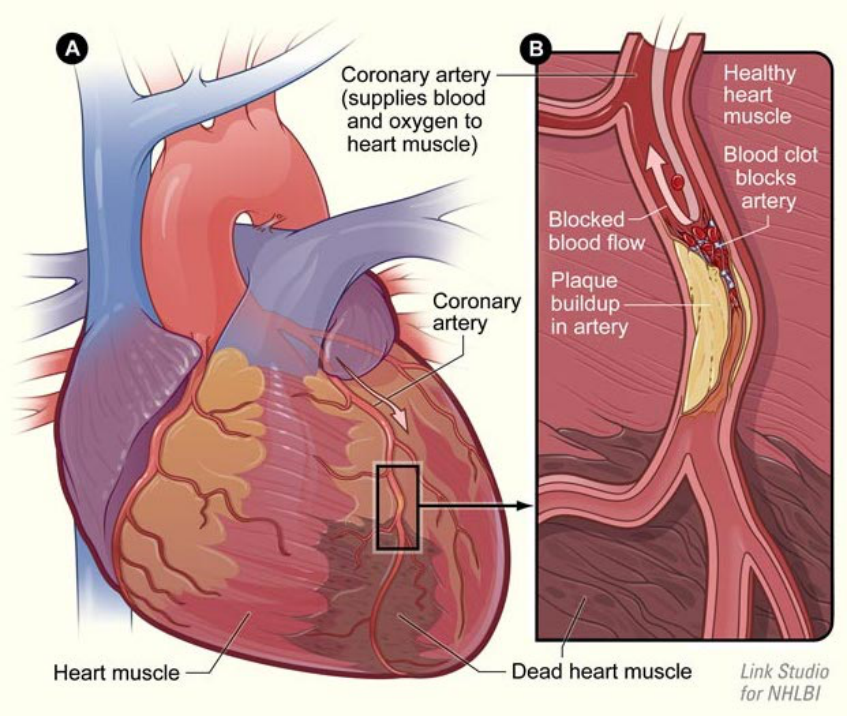

**Figure 5.21:** Scanning electron image of circulating blood showing several red and white blood cells.

<!-- DIAGRAM_PLACEHOLDER: diagram -->

**Figure 5.22:** Scanning electron microscope image of a white blood cell (right), a platelet (centre) and a red blood cell (left).

---

## Red Blood Cells

* **Alternative Name:** Erythrocytes
* **Site of Production:** Made in the red bone marrow.
* **Cellular Structure:** Do not have a nucleus and are biconcave in shape.
* **Adaptations & Functions:**
  * Their biconcave shape makes them flexible so that they can squeeze through narrow capillaries.
  * It also gives them a bigger surface-to-volume ratio, allowing them to absorb and release gases faster.
* **Life Span:** Short life span of approximately $120$ days.
* **Chemical Composition:** 
  * Contain the protein known as **haemoglobin**.
  * Haemoglobin contains the pigment known as **heme** that has an iron ($\text{Fe}$) at its centre that combines with oxygen.
  * Haemoglobin releases oxygen as required and takes up carbon dioxide.
* **Primary Transport Role:** Transport oxygen from the lungs to the tissues and return carbon dioxide from the tissues to the lungs.

---

<!-- DIAGRAM_PLACEHOLDER: diagram -->

**Figure 5.23:** Human red blood cells.

<!-- DIAGrum_PLACEHOLDER: diagram -->

**Figure 5.24:** Platelets clumping together to form a blood smear. Platelets are largely responsible for wound repair and healing.

---

Chapter 5. Plant and animal tissues | 151

---

### Components of Blood

* **White blood cells:** Commonly known as **leukocytes**, these are produced in the yellow bone marrow and lymph nodes. 
  * **Characteristics:** They have one or more nuclei, are slightly larger than red blood cells, and have a more irregular shape.
  * **Function:** Their main function is to protect the body from diseases. There are several types of white blood cells.
  * **Fact:** The number of leukocytes is often a measure of disease, making up approximately $1\%$ of blood in a healthy adult. A change in the amount of leukocytes can often be used to diagnose disease.

* **Platelets:** Also known as **thrombocytes**, these are produced in the bone marrow and are fragments of bone marrow cells.
  * **Characteristics:** They have no nuclei.
  * **Function:** Platelets assist in the clotting of blood and prevent excessive bleeding.

* **Plasma:** This is the pale-yellow component of blood that allows the rest of the components of blood to float in suspension.
  * **Characteristics:** It makes up about $55\%$ of total blood volume and contains dissolved proteins, hormones, urea, and carbon dioxide.
  * **Function:** Its main functions are to transport nutrients, cells, and metabolic waste products, and to maintain blood volume.
  * **Fact:** Plasma donations are important in blood transfusion. During World War 2, the blood plasma transferred to wounded soldiers was important in saving thousands of lives.

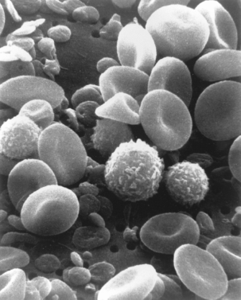

*Figure 5.25: American wounded soldier receiving blood plasma in August, 1943*

---

## 5.5 Applications of Indigenous Knowledge and Biotechnology

### Traditional Medicines

According to the World Health Organization's definition of traditional medicine, it incorporates a list of plant- and animal product-based therapies as well as spiritual practices. Up to $80\%$ of people in African and Asian countries rely on traditional medicines for their basic health care needs.

In South Africa, broadly, there are two types of practitioners:
* **Herbalists:** Use plants to prescribe remedies to ailments.
* **Diviners:** Said to communicate with ancestral spirits in order to diagnose problems and ailments.

In Africa, traditional healers rely on up to $4000$ plants for remedies. *Pygneum*, a traditional medicine, has been used in Africa and elsewhere to treat early forms of cancer for example.

> **FACT:** In 2007, a research team from University of KwaZulu-Natal found that plant extracts from $16$ plants used by local healers as 'muti' were highly effective in treating high blood pressure.

Due to the high cost of modern Western health care systems and technologies, there has been a recent focus on researching African traditional remedies and medicines. Traditional African medicine may well have healing properties that have been recognized through generations of use, and passed on in a cultural system. 

Because of the potential to reach greater masses at lower cost, there has been an attempt to combine traditional African medicine into the continent's health care systems. An example of this is a $48$-bed hospital that was opened in Kwa-Mhlanga, South Africa, in 2010. The hospital treats patients using a combination of traditional methods and Western healing methods.

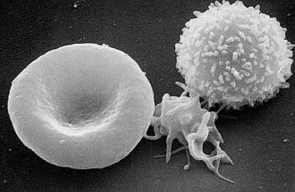

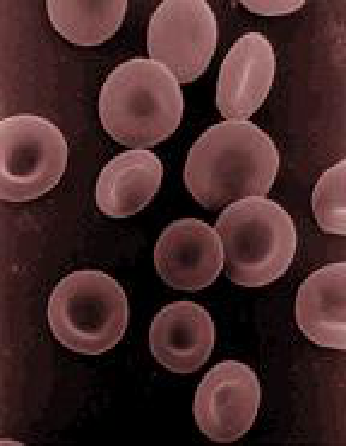

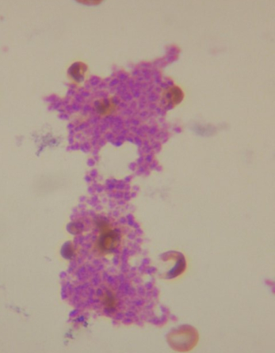

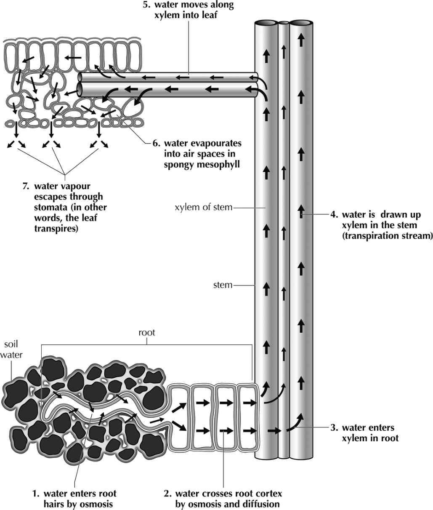

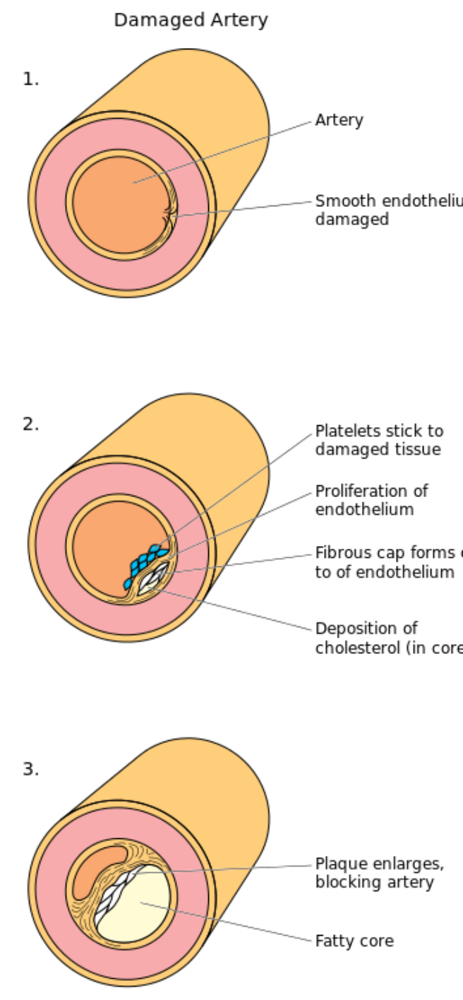

---

# Modern biotechnology (ESG6S)

**FACT:** Watch a humorous video about the history of vaccination. (See video: 2CR6)

In this section we will examine some aspects of biotechnology that have been applied in modern medicine. Modern medicine is informed by medical research, and medical research is based on the scientific method. Therefore, these therapies are based on investigations that have results that are reproducible. We will examine five achievements of modern medicine and discuss the underlying ethical issues these new treatments and technologies present:

1. Immunity and vaccines
2. Antibiotics
3. Blood transfusions
4. Cloning
5. Stem cell research

---

## 1. Immunity and vaccines (ESG6T)

Immunity is the body's resistance to infection by bacteria, viruses and other pathogens. The body defends itself against infection through a variety of means, such as physical, chemical and cellular barriers to infection.

* **Physical barriers** include the skin, saliva, tears and mucus. They also include hairs in the lining of the respiratory tract known as cilia.
* **Chemical barriers** include the various allergic responses that result in inflammation or swelling. These are caused by a chemical response system that results in the body releasing chemicals to attack any foreign objects entering the body. White blood cells known as eosinophils are normally responsible for the allergic response.
* **Cellular mechanisms** exist to fight bacterial infections. These include *neutrophils*, *macrophages* and which attack pathogens and "engulf" and eat them through a process of phagocytosis.

The above defence mechanisms described are part of the **innate** immune system. The body also has an **adaptive** immune system which 'remembers' each pathogen that invades the body based on the specific markers on the pathogen. These markers are known as antigens. When a foreign organism invades, the adaptive immune system launches an antigen-specific response which destroys the infectious agent.

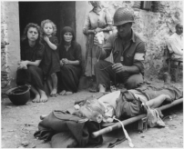

*Figure 5.26: Eosinophils are important in controlling the allergic reaction.*

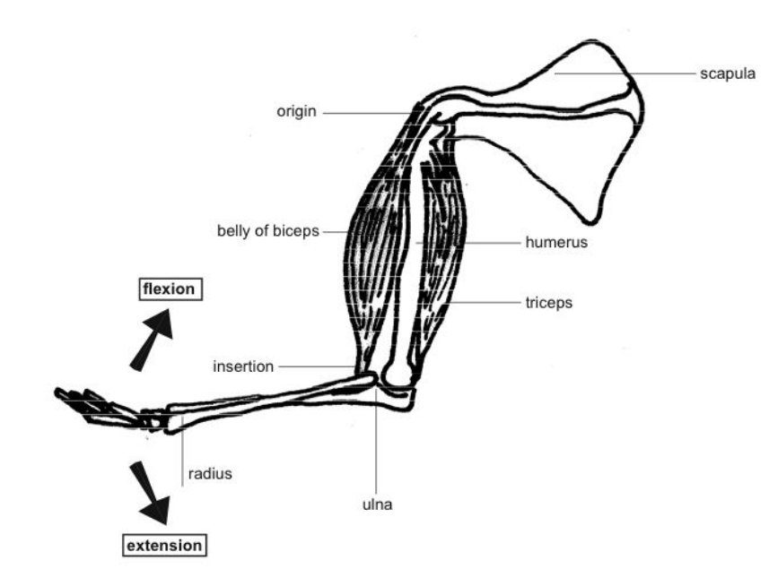

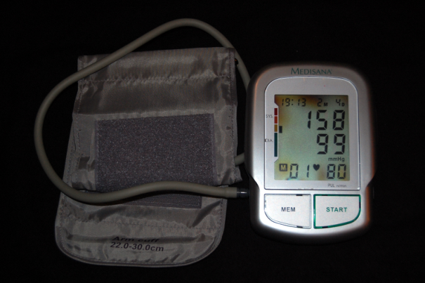

---

## Vaccination and Medical Biotechnology

### Core Concepts

* **Vaccination**: 
  * The most effective method of eradicating infectious diseases (e.g., smallpox, polio, measles, and tetanus).
  * Involves injecting components of an infectious agent in a non-toxic form to stimulate an individual's adaptive immune system.
  * Triggers an immune response resulting in the production of T-lymphocyte memory cells.
  * Allows the body to mount a rapid and effective immune response if a repeat infection occurs.

---

### 2. Antibiotics

* **Definition**: Substances that stop or inhibit the growth of certain disease-producing bacteria.
* **Origin and Manufacturing**: Originally found in organisms such as fungi; can now be chemically manufactured.
* **Administration**: Can be administered intravenously as injections, or orally in the form of tablets, syrups, or suspensions.

---

### 3. Blood Transfusions

* **Purpose**: Often save the lives of people who have lost large amounts of blood due to trauma caused by accidents and surgery.
* **Compatibility**: Before a person receives blood from a donor, the blood must be typed to ensure the donor is a match for the recipient.
* **Antigens**: Blood is classified based on the presence of **antigens** in the red blood cells. An antigen is a molecule recognized by the immune system.

#### Blood Group Classifications

| Blood Group | Antigens Present |
| :--- | :--- |
| **Blood Group A** | Antigen A only |
| **Blood Group B** | Antigen B only |
| **Blood Group AB** | Both antigen A and B |
| **Blood Group O** | Neither antigen A nor B |

*Recipients can only be given blood that is compatible with their own blood.*

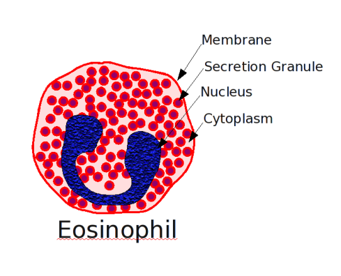

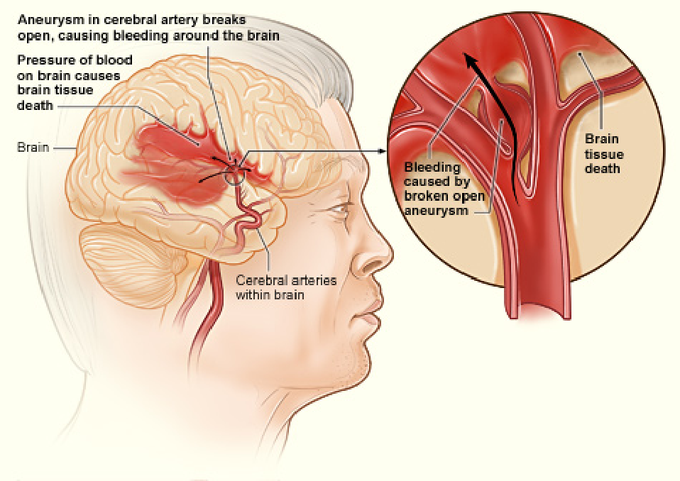

---

# ABO Blood Groups and Compatibility

The table below shows the different ABO Blood Groups and compatibility for blood transfusions:

| Blood group | Blood donor (person giving blood) | Blood recipient (person requiring blood) |
| :---: | :---: | :---: |
| A | A and AB | A and O |
| B | B and AB | B and O |
| AB | AB only | All groups |
| O | All groups | O only |

**Figure 5.29:** Red blood cell compatibility chart. In addition to donating to the same blood group, type O blood donors can give to A, B and AB; blood donors of types A and B can give to AB.

Furthermore, the Rhesus factor of both the recipient and donor need to be determined. The Rhesus factor is another type of antigen found on the surface of red blood cells. Approximately $85\%$ of the population has this protein and are know to be Rhesus positive. The remaining $15\%$ of the population are Rhesus negative because this protein is not present in their red blood cells.

So, blood group A negative means the recipient has antigen A, but does not have the Rhesus factor, a recipient who is O positive means the recipient has neither antigen A or B but does have the Rhesus factor. It is important that a person receiving a blood transfusion receives blood from a donor that is compatible in both blood group and Rhesus factor.

---

## 4. Cloning (ESG6X)

Cloning is the process by which a genetically identical copy of an organism is produced. In nature, cloning occurs when organisms such as plants, insects or bacteria reproduce asexually. The copied material is referred to as a **clone**.

There are three main types of cloning:

* **Gene cloning:** involves cloning of small sections or regions of DNA.
* **Reproductive cloning:** produces copies of whole animals or cells.
* **Therapeutic cloning:** produces stem cells for experiments to attempt to replace injured or diseased tissues.

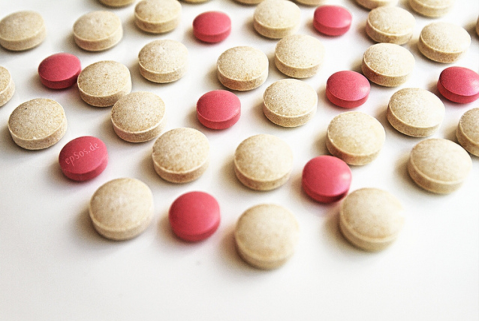

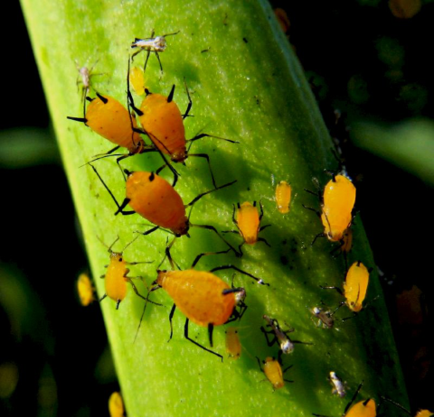

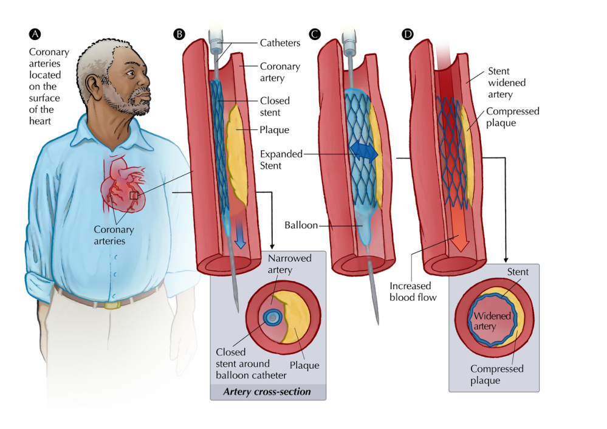

---

# Plant and Animal Cloning

## Core Concepts & Definitions

* **Clone:** A genetically identical offspring produced naturally or artificially.
* **Propagation:** The process by which existing organisms produce more offspring.

---

## Plant Cloning

### 1. Natural Propagation
* **Mechanism:** Plants produce identical clones through natural processes over millions of years.
* **Examples:** Strawberry crops using a 'runner' (stolon), grasses, potato crops, and onions.

### 2. Artificial Propagation: Vegetative Propagation
* **Definition:** An ancient form of cloning plants that involves taking a cutting (such as a leaf cutting) from a plant and growing it into a new plant.
* **Mechanism:** Relies on the presence of a mass of unspecialised cells known as a **callus**. Callus cells grow, divide, and form various specialised cells (such as roots and stems) to eventually produce a grown plant.

### 3. Artificial Propagation: Tissue Culture Propagation
* **Definition:** A more recent practice involving taking pieces of specialised roots, isolating the cells, and growing them in a nutrient-rich culture.
* **Mechanism:** 
  1. In the culture, specialised cells transform into undifferentiated cells (similar to a callus).
  2. The calluses are treated with chemicals that trigger the growth of new plants identical to the original plant.

---

## Artificial Cloning of Organisms (Animals)

* **Reproductive Cloning:** The technique used to clone whole animals, such as sheep.
* **Procedure:**
  1. Scientists remove a mature **somatic cell** (any cell in the body that does not serve a reproductive purpose, e.g., a skin cell containing two sets of chromosomes) from the organism to be cloned.
  2. The nucleus is removed from the 'donor' somatic cell.
  3. The nucleus is added to a 'recipient' cell (usually an egg cell from which the nucleus has been removed, leaving only the cytoplasm, making it a denucleated cell).
  4. The resulting clone is transferred into a **surrogate mother's** womb (an organism acting as a substitute) so the embryo can develop.

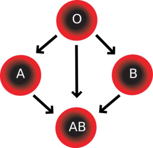

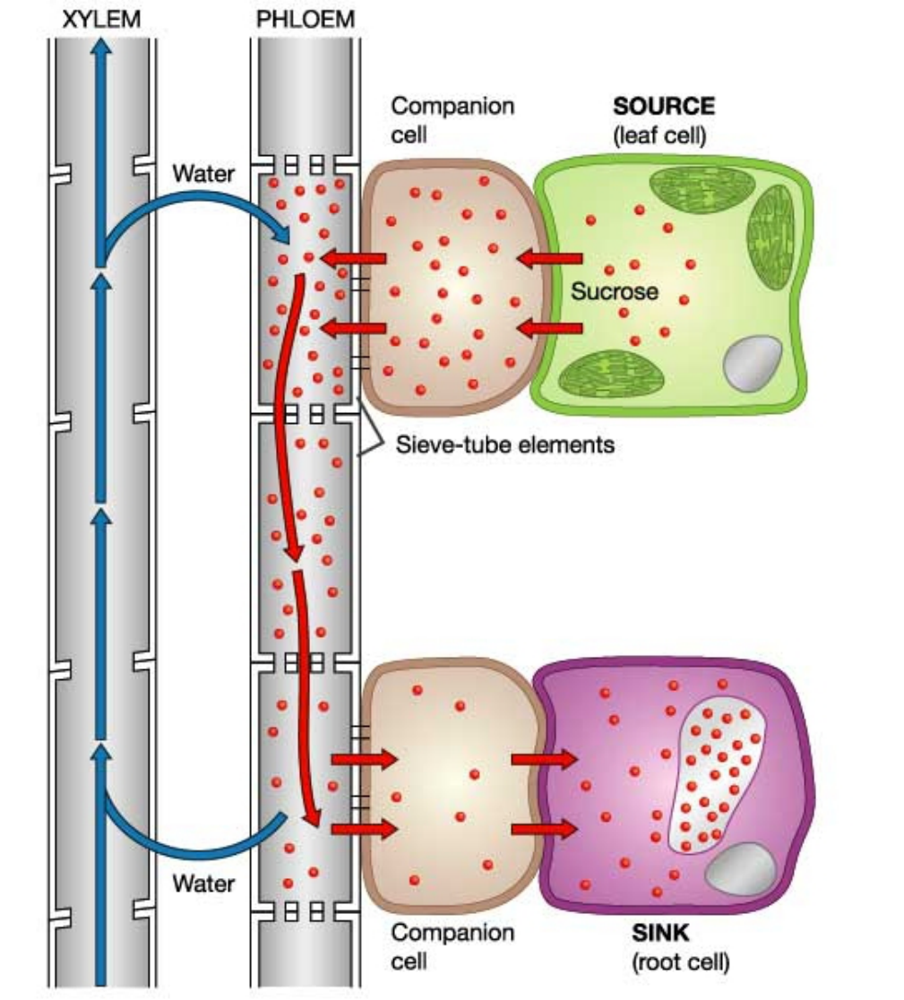

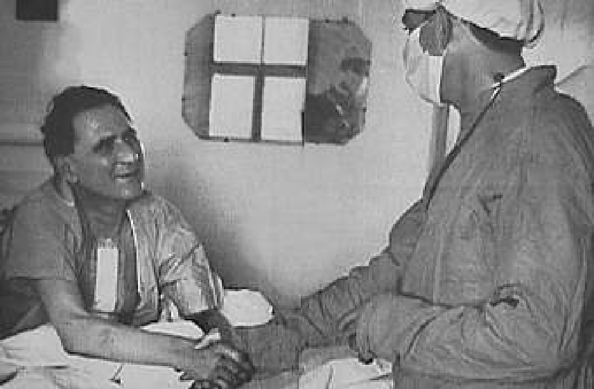

---

## 5. Stem cell research (ESG6Y)

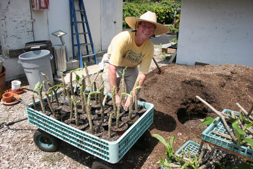

**FACT**
Are you confused about stem cells? Watch this entertaining video that explains what stem cells are and why they are so exciting.
See video: 2CRB

Stem cells are cells found in all multicellular organisms. Stem cells can differentiate into any type of cell such as a red blood cell, nerve cell, etc. The two types of stem cells are **embryonic stem cells** and **adult stem cells**. 

* **Embryonic stem cells** can specialise into any cell type.
* **Adult stem cells** usually have some restrictions as to what type of cell they can become. Adult stem cells are produced in various tissues including the liver and the bone marrow. 

Embryonic stem cells are obtained from embryos and can be created *in vitro* (in the laboratory). Multiple embryos are generated through *in vitro* fertilisation methods, in which egg cells are harvested from the mother and fertilised by sperm cells from the father, outside of the body. The embryos that are not implanted into a patient are frozen or stored. Some of them are destroyed. 

The potential uses for stem cells include:

* **Spinal cord injury:** Repairing damaged nerve tissue after paralysis.
* **Brain damage:** Replacing or regenerating neurons in degenerative conditions like Parkinson's disease or after a stroke.
* **Cancer:** Creating new cells to replace cancerous cells e.g. bone marrow transplants for people with leukaemia.
* **Burn treatment:** New skin cells that match the donor may be grafted onto burn victims.

---

**FACT**
Recall that in Chapter 4 you learnt that individuals with cancer can be treated through chemotherapy and radiation. However, these therapies often destroy healthy cells along with cancerous cells. The use of adult stem cells which derive from the bone marrow and liver tissue is important in replacing the healthy cells damaged by chemotherapy.

Figure 5.32 shows how embryonic cells differentiate to form nerve cells.

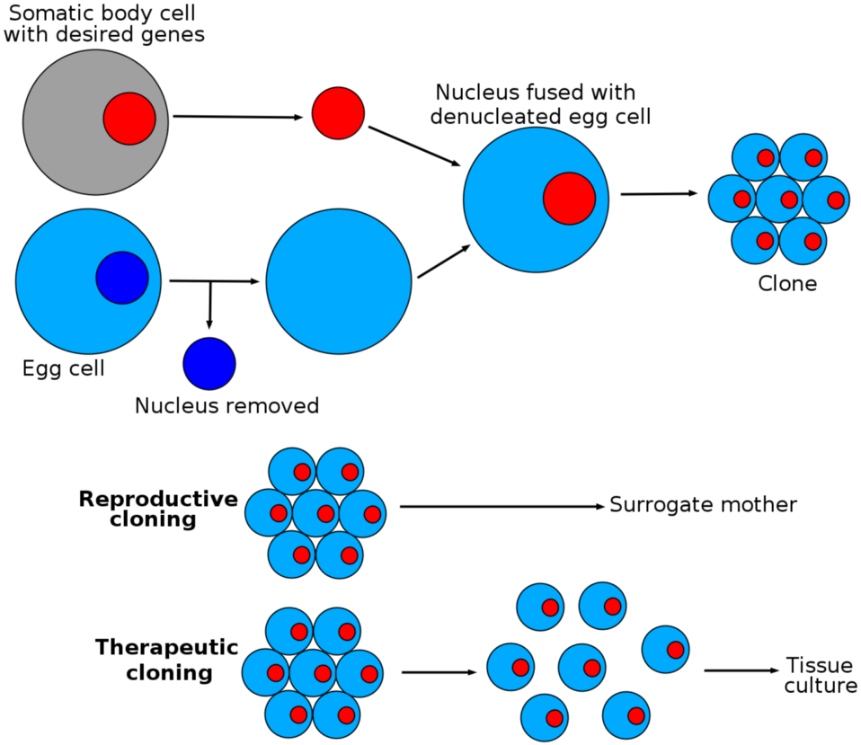

*Figure 5.32: A) undifferentiated embryonic stem cells and B) nerve cells forming from embryonic cells.*

The use of stem cells and embryonic stem cells in particular, is controversial, with many people opposed to it for moral, religious or philosophical reasons. The objection is largely based on what happens to the unused embryos.

---

## Ethical issues (ESG6Z)

The use of science in cloning has created a lot of debate and controversy. Mainly, the debate is whether the methods used for cloning result in cells that have the potential to form full-grown organisms. The key ethical questions that arise are therefore:

* What to do about fused cells (known as embryos) that are not used for either therapeutic or reproductive purposes?
* By selecting certain genes for reproduction using cloning are we not favouring certain types of characteristics over others?
* Much of the cloning is conducted by private companies and this raises concerns that the public might not be able to benefit from the research being conducted.
* In the case of human cloning, if the embryos created are alive, do they have the rights of a normal human being?
* Are there better alternatives to stem cell research?

---

## Legislation around stem cell research (ESG72)

Due to the issue of stem cell research being so controversial, different countries have very different laws governing how it is to be conducted.

Some European countries such as Finland, Sweden, Belgium, Greece, Britain, Denmark and Netherlands allow stem cell research using human embryos while some such as Germany, Austria, Ireland, Italy and Portugal do not. The United States of America has divided opinions on stem cell research, with some of its States providing funding for stem cell research while others do not. India, Iran, South Korea, China and Australia are supportive of stem cell research. South Africa continues to support stem cell research.

---

*5.5. Applications of indigenous knowledge and biotechnology*

---

## Potential applications of cloned animals (ESG73)

Reproductive cloning may allow copies of animals to be made for benefits in agriculture and medicine. Sheep such as Dolly have been cloned to overproduce a high quantity of a protein important for blood clotting in humans. It may soon be possible to clone extinct species of animals.

Drawbacks of cloning animals may include the fact that most cloned species are unable to develop into healthy animals. Dolly for example was only one of $277$ cloned embryos. There have been significant health effects of cloning including increase in birth size and a variety of defects in vital organs such as the liver, brain and heart.

> **FACT**
> In June 2012, the South African plastic surgeon, Dr Ridwan Mia, led a breakthrough surgery, saving the life of a three year old burn victim by transplanting skin cells cloned from the victim's cells. Pippie Kruger, the burn survivor, initially had a $10\%$ chance of survival. However, the doctors obtained some of her skin cells, transported them to a laboratory in the USA, where they were cloned in order to produce millions of extra cells. These cells were transplanted into Pippie, resulting in the complete success of her skin grafting surgery.

---

## Ethical biotechnology (ESG74)

* In medicine modern biotechnology finds promising applications in such areas as: drug production, pharmacogenomics (how a person's genes affects their response to drugs), and genetic testing (or genetic screening): techniques in molecular biology detect genetic diseases.
* To test the developing foetus for Down syndrome, amniocentesis and chorionic villus sampling can be used.

---

## 5.6 The leaf as an organ (ESG75)

You have learnt about individual tissues found in plants and animals. We will now look at how tissues join together to form organs. An organ is a collection of tissues joined together as a structural unit in order to perform a common function. In later chapters we will look at the various organs found in animals. In this section, we will discuss how a plant leaf is an example of an organ. We will present its structure with respect to its functions in photosynthesis, gaseous exchange and transport.

Leaves are typically found in vascular plants, which have lignified tissues (xylem) that enable them to conduct water. Leaves are usually flat and thin to allow for maximum gaseous exchange and capture of light. The organisation of the leaf has evolved to allow maximum exposure of chloroplasts to light, and to absorb carbon dioxide. Leaves have stomata, pores found in the leaf epidermis, which allow the plant to regulate the exchange of carbon dioxide, oxygen and water vapour with the atmosphere. The shape and structure of leaves varies considerably from one plant to another. This depends on the climate, available light intensity, presence of grazing animals, nutrients and competition from other plants. Leaves are either **dorsiventral** or **isobilateral**. Dorsiventral leaves have both surfaces differing from each other in appearance and structure. Isobilateral leaves have both surfaces looking the same. Leaves can also store food and water and are modified to perform these functions.

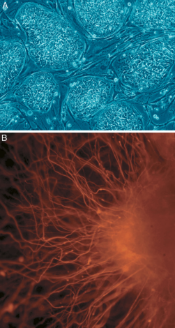

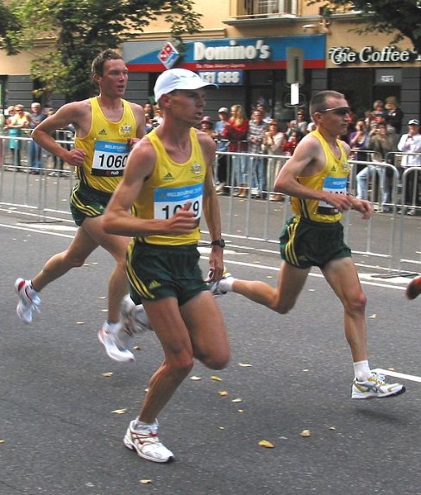

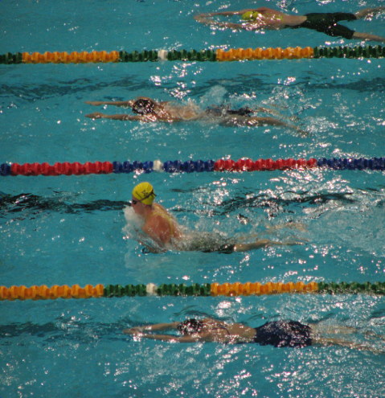

---

# Leaf structure (ESG76)

The leaf is a collection of tissues which include:

1. The **epidermis** which covers the upper and lower surfaces.
2. The **mesophyll** inside the leaf which is rich in chloroplasts.
3. The veins contain the **vascular tissue** (where xylem and phloem are present).

---

## 1. Epidermis

Epidermal cells form the outer layer covering a leaf, separating internal tissues from the external environment.

Epidermis tissue has several functions:
* protection against water loss via stomata and a waxy cuticle
* regulation of gaseous exchange
* secretion of metabolic compounds

---

## 2. Mesophyll cells

The mesophyll is located between the upper and lower layers of the leaf epidermis, and is mostly made up of **parenchyma** (ground tissue) or **chlorenchyma** tissue. The mesophyll is the primary location for photosynthesis and is divided into two layers, the upper palisade layer and the spongy mesophyll layer.

The **upper palisade layer** lies beneath the upper epidermis and consists of vertically elongated cells that are tightly packed together to maximise the number of cells exposed to sunlight. In addition, these cells contain many chloroplasts, thus maximising their photosynthetic ability. The palisade layer thickness depends on the extent of exposure to the sun. Leaves that are exposed to the sun have a thicker palisade layer. Those that are typically found in the shade have a thinner palisade layer.

Beneath the upper palisade layer is the **spongy mesophyll**. The cells in the spongy mesophyll are slightly rounder and less densely packed and have air spaces to allow for gaseous exchange.

---

## 3. Vascular Tissue

Vascular tissue is made up of the xylem and phloem vessels you learnt about earlier in this chapter. Xylem transports water and minerals to the leaf. Phloem transports dissolved sucrose made in the leaf out of its site of synthesis to the rest of the leaf. Most leaves have a bundle sheath around the xylem and phloem, consisting of sclerenchyma or collenchyma, for extra support.

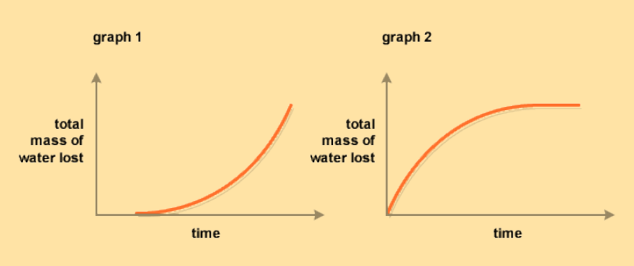

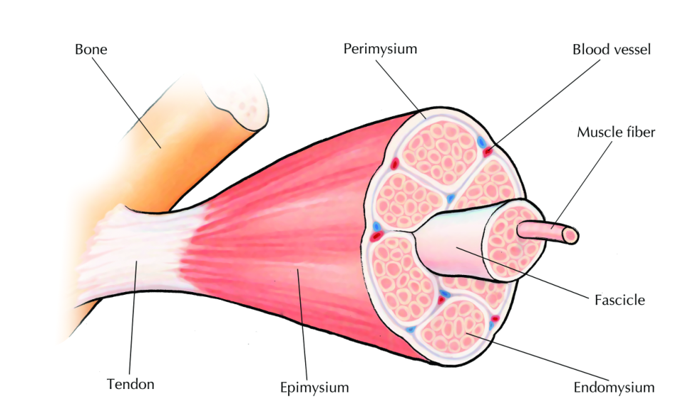

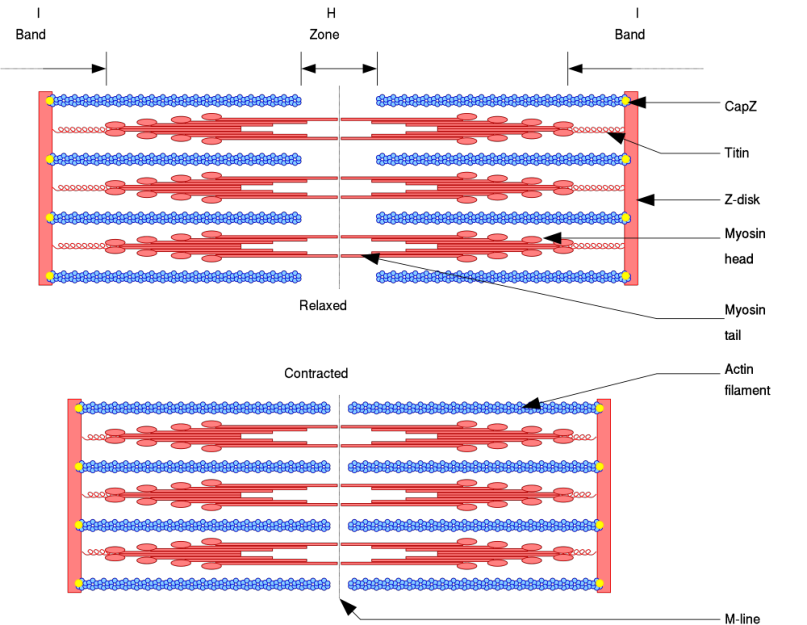

---

# Chapter 5. Plant and animal tissues

## Leaf and Tissue Structure of a Dicot Plant

The figures below show the detailed leaf and internal tissue structure of a dicot plant.

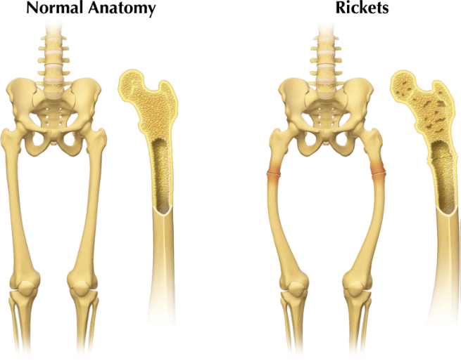

*Figure 5.33: Leaf structure.*

---

## Key Structural Components of a Dicot Leaf

1. **Cuticle**: A waxy, protective layer covering the upper and lower epidermis to prevent excessive water loss.
2. **Epidermis**:
   - **Upper epidermis**: Transparent layer of cells allowing light to pass through to the mesophyll.
   - **Lower epidermis**: Layer containing stomata and guard cells for gas exchange.
3. **Mesophyll**: The internal tissue of the leaf divided into two distinct layers:
   - **Palisade mesophyll**: Tightly packed, column-shaped cells containing numerous chloroplasts for photosynthesis.
   - **Spongy mesophyll**: Loosely packed, irregular cells with large intercellular air spaces to facilitate gas exchange ($CO_2$ and $O_2$).
4. **Vascular Bundle**: Transport tissues consisting of:
   - **Xylem**: Transports water and dissolved mineral salts from the roots to the leaves.
   - **Phloem**: Transports organic food products (sugars) manufactured during photosynthesis to other parts of the plant.
   - **Sheath**: Bundle sheath cells surrounding the vascular tissue for structural support and protection.
5. **Stoma (plural: Stomata) & Guard Cells**: Specialized cells that regulate the opening and closing of pores (stomata) for transpiration and gas exchange.
6. **Trichome**: Epidermal hair-like structures that can help reduce water loss and protect against herbivores.

---

# Transport of substances into and out of the leaf (ESG77)

> **FACT:** You will learn more about the transport processes in plants in: **Support and transport systems in plants**.

The leaf is designed to transport water, sugars, carbon dioxide, and oxygen across its surface. Each of these involves separate processes and cells, which we will discuss below.

---

## Movement of oxygen and carbon dioxide

Stomata are the site of gaseous exchange in the leaf. There are two major metabolic processes that take place in plants that involve the exchange of oxygen and carbon dioxide:

* **Photosynthesis:** Takes place during the day when the chloroplasts can absorb radiant energy from the sun. Photosynthesis requires carbon dioxide and releases oxygen as a by-product. Therefore, during daylight hours, the concentration of carbon dioxide is low in the leaf, and the concentration of oxygen is high. As a result, during the day, carbon dioxide enters the leaf, and oxygen is released.
* **Cellular Respiration:** Occurs continuously throughout the day and night. Cellular respiration requires oxygen and releases carbon dioxide as a waste product. During the day, the plant can use some of the oxygen from photosynthesis for cellular respiration. During the night, when photosynthesis stops, the concentration of oxygen in the plant drops and the concentration gradient switches: the concentration of carbon dioxide is high and the concentration of oxygen is low. Therefore, at night time, oxygen enters the leaves, and carbon dioxide is released.

---

## Movement of water into leaf

Water is constantly being lost by the leaf through transpiration. This results in the cells in the mesophyll having a lower water concentration than the vascular bundles. 

Water thus moves down a concentration gradient from the xylem vessel into the living cells of the mesophyll layer and to the surface of the mesophyll cell walls. This causes water to move up from the stem by means of transpirational pull. The movement of water is maintained because water molecules constantly evaporate into leaf inter-cellular air space, out of the stomatal pore, and into the atmosphere.

---

## Movement of sugars

Chloroplasts found in the palisade layer capture radiant energy from the sun to make glucose via photosynthesis. This glucose is used to make the simple sugar sucrose. 

Sucrose is transported to the rest of the plant through the phloem vessels present in the vascular tissue in the leaf. Plants convert sugars to starch for long-term storage.

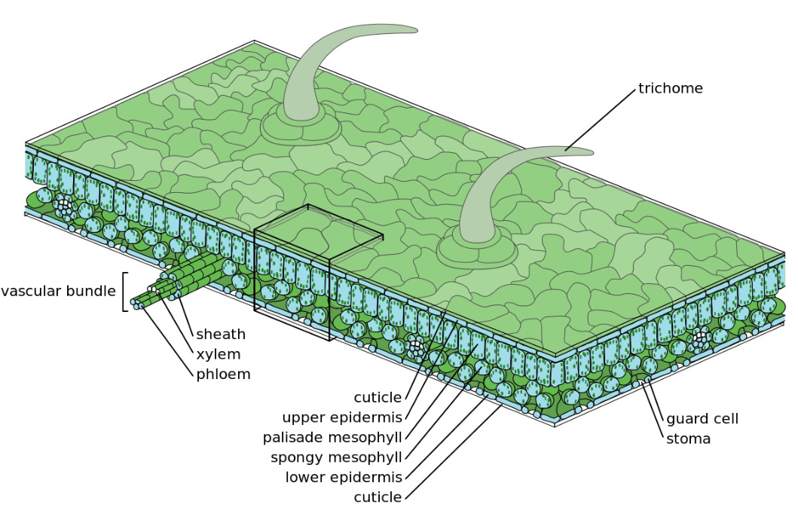

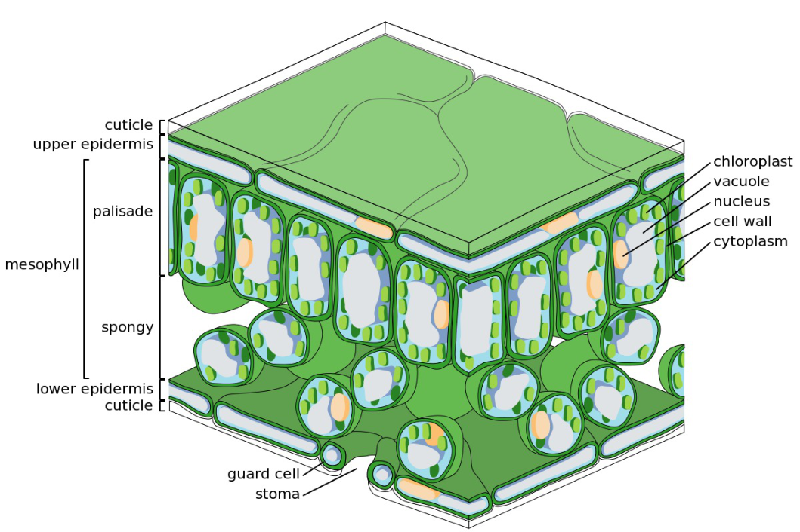

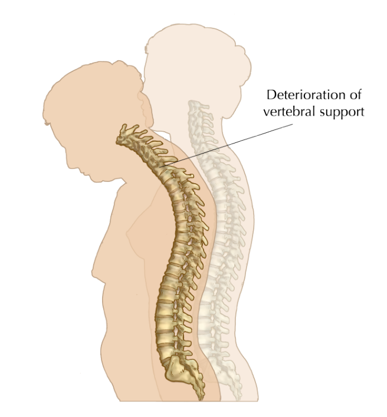

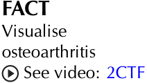

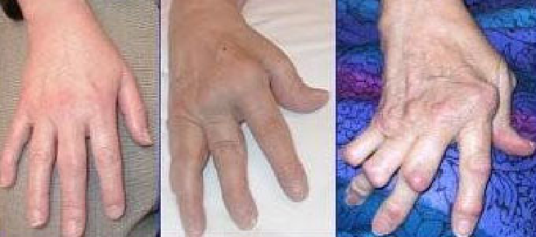

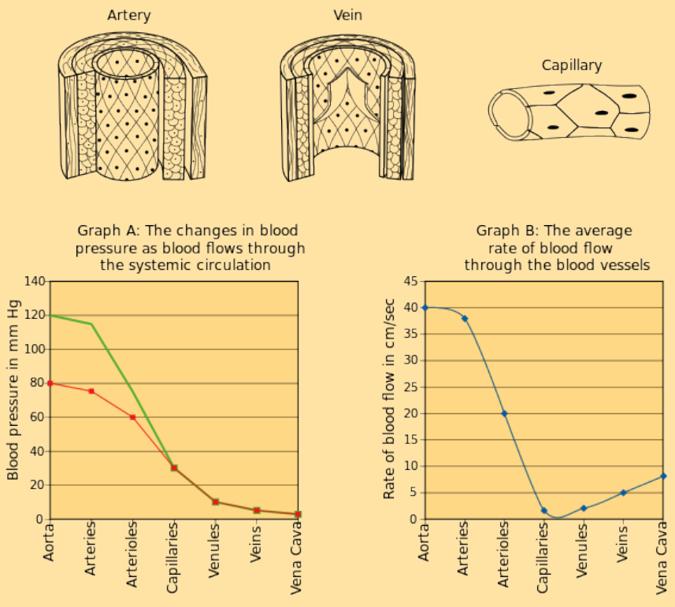

---

## Opening and closing of stomata

The opening and closing of the stomata is important for gaseous exchange, transpiration, and the movement of sugars. Stomata open when it is bright and when there is high humidity. When water concentration in the soil is low, indicating that the plant is dry, chemical changes in the plant result in the closing of the stomata.

---

### Activity: Examining leaf structure under a microscope

#### Aim:
To identify different tissues found in a plant leaf.

#### Questions:
Study the image shown and answer the questions given below.

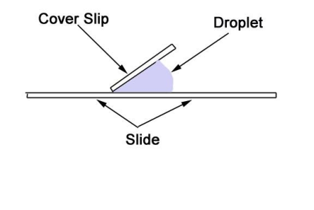

| Figure A | Figure B |
| :---: | :---: |
| 

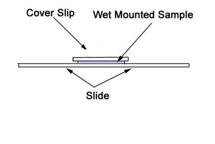
 | 

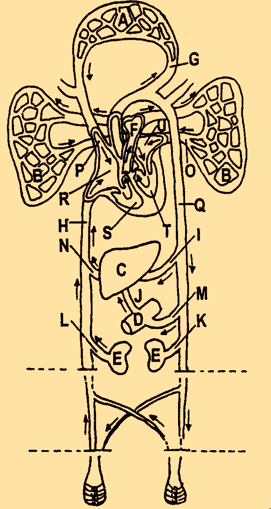
 |

1. Compare Figures A and B. Which of the numbered structures shown in B can you identify from Figure A?
2. Which of the numbered structures shown in B are absent in A?
3. The image given in Figure A is of a Spiderworts leaf. They grow in a part of Canada where the sun shines in the morning and it is cloudy in the afternoon. Describe what changes you would expect to see to the structures in the plant leaf during the day. How would these changes compare to a plant that grows during hot, sunny days and cold, dry nights?

---

# 5.7 Summary (ESG78)

## 1. Cells and Tissues

* **Cells and Tissues:** Cells which are similar in structure group together to form tissues performing a particular function. Tissues form organs which combine to allow organisms to exist.
* **Cell Structure:** Plant and animal cells have structures related to their functions.

---

## 2. Plant Tissues

* **Broad Classification:** Plant tissues are broadly divided into **Dividing** (Meristematic) and **Permanent** tissues.
* **Meristematic Tissues:** Meristematic cells are small, have high amounts of cytoplasm and a large nucleus to assist in their role in cell division.
* **Permanent Tissues:** Permanent tissues are further divided into:
  * **Simple Permanent Tissues:** Have only one type of cell. They include:
    * **Epidermis:** Protection.
    * **Parenchyma:** Storage.
    * **Collenchyma:** Support.
    * **Sclerenchyma:** Strength and structural support.
    * *Note:* Parenchyma, collenchyma, and sclerenchyma are collectively referred to as **ground tissue**.
  * **Complex Permanent Tissues:** Made up of different types of cells coming together to perform a particular function. They make up the **vascular tissue**, which includes:
    * **Xylem:** Important in the transport of water and mineral salts.
    * **Phloem:** Structured to allow the transport of organic compounds required for the plant (typically in the form of sucrose).

---

## 3. Animal Tissues

Animal tissues are made up of four primary types: **epithelial**, **connective**, **muscle**, and **nerve tissue**.

* **Epithelial Tissue:**
  * Made up of flat squamous cells, cuboidal cells, or columnar cells in single or multiple layers.
  * Involved in secretion of enzymes, protective substances such as mucus, and they provide a supportive function.
* **Muscle Tissue:**
  * Made up of cardiac muscle, skeletal muscle, and smooth muscle.
  * **Striated muscles:** Cardiac and skeletal muscle.
  * **Involuntary muscles:** Smooth muscle and cardiac muscle.
  * **Voluntary muscles:** Skeletal muscle (under voluntary control).
* **Connective Tissues:**
  * Composed of areolar and fibrous connective tissues, cartilage, bone, and blood.
  * Provide strength and support, reduce friction, and act as shock absorbers.
* **Blood (as a Connective Tissue):**
  * **Red blood cells:** Transport oxygen.
  * **White blood cells:** Responsible for immune response.
  * **Platelets:** Important in blood clotting.
* **Nerve Tissue:**
  * Responsible for receiving stimuli from the environment (**sensory neurons**).
  * Processing stimuli (**interneurons**).
  * Sending impulses to muscles or glands (**motor neurons**) so that we can respond to the stimuli.

---

## 4. Indigenous Knowledge and Biotechnology

* **Traditional Healers:** Traditional healers and traditional medicine are an application of indigenous knowledge of plant and animal tissues.
* **Modern Biotechnology:** Modern biotechnology is focused on a variety of applications of technology.

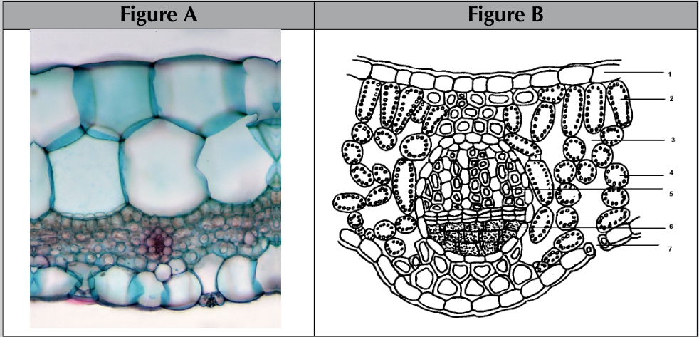

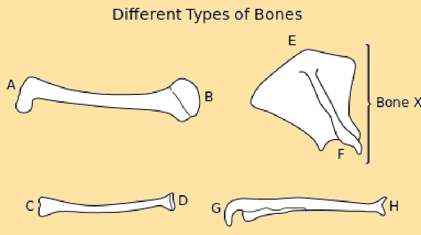

---

## Revision Notes: Plant and Animal Tissues and Biological Systems

---

### Core Concepts and Principles

#### 1. Immunity, Vaccines, and Antibiotics
* **Immunity Mechanisms:** The body relies on natural protective barriers (such as the skin and mucous membranes) as well as cellular mechanisms (including **T-cells** and **B-cells**) to fight viral and bacterial infections.
* **Vaccines and Antibiotics:** Both enhance the body's immunity. Vaccines specifically rely on **T-memory-cell derived immunity** to fight and provide resistance against subsequent infections.

#### 2. Blood Transfusion
* **Definition:** The medical process of replacing lost blood.
* **Requirement:** Successful transfusions require accurate **blood type matching** to prevent adverse immunological reactions.

#### 3. Tissue and Organism Cloning
* **Plant Tissue Cloning:** Achieved through vegetative propagation or chemical treatment to produce calluses during tissue culture propagation.
* **Animal Tissue Cloning:** Occurs via reproductive cloning, which can result in the replacement of a whole organism, or through therapeutic cloning to create stem cells.
* **Legal and Ethical Considerations:** Cloning and stem cell usage raise broad legal and ethical questions that vary significantly across different countries and jurisdictions.

---

### The Leaf as an Organ

* **Definition of an Organ:** A plant leaf is classified as an organ because it consists of a group of distinct tissues that form part of a structural unit performing a common collective function.
* **Adaptations for Photosynthesis:** Plant leaves are specifically adapted to absorb light for photosynthesis and to manufacture sugars for transport throughout the plant.
* **Major Processes:**
  * **Photosynthesis:** Manufacturing sugars (sucrose) using light energy, carbon dioxide, and water, while producing oxygen.
  * **Transpiration:** The loss of water from the plant through **stomata** located in the leaf.
  * **Gaseous Exchange:** The movement of carbon dioxide and oxygen in and out of the leaf via **diffusion** through the stomata.
* **Transport Vessels:** Sugar manufactured in the leaf is transported to other parts of the plant via the **phloem** vessel.
* **Stomatal Control:** Stomata open and close dynamically in response to a variety of environmental stimuli.

---

### Exercise 5 – 1: End of Chapter Exercises

#### Question 1
*Answer the following questions based on the provided drawings (labeled A and B).*

* **Task:** Identify the cellular structures and tissue types represented by labels $1$ through $4$ in the provided diagrams.

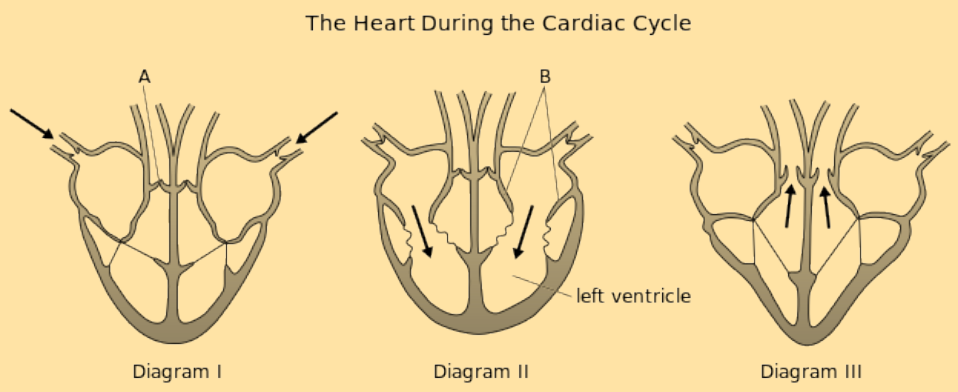

---

# Revision Notes: Plant and Animal Tissues

## Review Questions and Activities

1. **Anatomical Labeling and Identification:**
   * a) Provide labels for 1, 2, 3, and 4.
   * b) Which tissue, A or B, is found in the rib cage?
   * c) Which tissue, A or B, is found in the lining of blood vessels?

2. **Tissue Organization:**
   * Tissues come together to form a/an:
     * a) organ
     * b) organ system
     * c) body system
     * d) organelle

3. **Classification of Parenchyma:**
   * What kind of tissue can parenchyma tissue be described as being?
     * a) simple tissue
     * b) complex tissue
     * c) xylem
     * d) phloem

4. **Simple vs. Complex Tissues:**
   * Which of the following is not a simple tissue?
     * a) xylem
     * b) parenchyma
     * c) collenchyma
     * d) sclerenchyma

5. **Meristematic vs. Permanent Tissues:**
   * What is the key difference between meristematic and permanent tissue?
     * a) the ability to conduct photosynthesis
     * b) the ability to divide
     * c) the ability to move
     * d) the complexity to perform a function

6. **Cell Wall Composition:**
   * Which type of tissue has lignified walls?
     * a) parenchyma
     * b) collenchyma
     * c) sclerenchyma
     * d) cambium

7. **Division of Labour:**
   * Explain the statement "Tissues exhibit division of labour". Give examples.

8. **Dead Tissues in Plants:**
   * Why do plants have more dead tissues compared to animals?

9. **Characteristics of Meristematic Tissues:**
   * List the characteristics of meristematic tissues.

10. **Secondary Growth:**
    * Which tissues are responsible for secondary growth in plants?

11. **Features of Collenchyma:**
    * What are the key features which allow you to tell that a tissue type is collenchyma?

12. **Microscopic Identification:**
    * Thando was shown two slides of plant tissues: parenchyma and sclerenchyma. Which of the features given below would be crucial in identifying sclerenchyma and why?

---

a) location of nucleus  
b) size of cells  
c) thickness of cell walls  
d) position of vacuoles  

13. Why do meristematic cells lack vacuoles?

14. Considering the plant leaf as an organ, describe the main tissues that come together to form the organ. What is the role of each tissue type? Why are they all important in the functioning of the organ?

---

Check answers online with the exercise code below or click on 'show me the answer'.

| Exercise Code | | | | |
|---|---|---|---|---|
| 1a. 2CRC | 1b. 2CRD | 1c. 2CRF | 2. 2CRG | 3. 2CRH |
| 4. 2CRJ | 5. 2CRK | 6. 2CRM | 7. 2CRN | 8. 2CRP |
| 9. 2CRQ | 10. 2CRR | 11. 2CRS | 12. 2CRT | 13. 2CRV |
| 14. 2CRW | | | | |

💻 www.everythingscience.co.za  
📱 m.everythingscience.co.za

---

Chapter 5. Plant and animal tissues | 167

---

# Exercise 6 - 1: End of Chapter Exercises

## Question 1

Answer the following questions based on the drawings below (Tissue A and Tissue B).

### a) Provide labels for 1, 2, 3 and 4.

* **1:** chondroblasts
* **2:** lacuna
* **3:** chondrin
* **4:** nucleus of squamous epithelium cell

### b) Which tissue, A or B, is found in the rib cage?

* **Tissue A**

### c) Which tissue, A or B, is found in the lining of blood vessels?

* **Tissue B**

---

## Question 2

Tissues come together to form a/an:

* a) organ
* b) organ system
* c) body system
* d) organelle

### Solution:
* **a**

---

## Question 3

What kind of tissue can parenchyma tissue be described as being?

* a) simple tissue
* b) complex tissue
* c) xylem
* d) phloem

### Solution:
* **a**

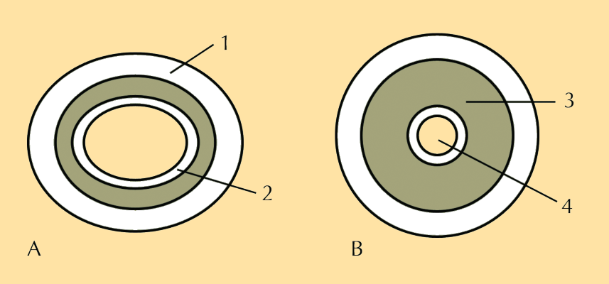

---

## Revision Notes: Plant and Animal Tissues

### Question 4
**Which of the following is not a simple tissue?**
* a) xylem
* b) parenchyma
* c) collenchyma
* d) sclerenchyma

**Solution:**
a) xylem *(Xylem is a complex tissue made up of more than one type of cell).*

---

### Question 5
**What is the key difference between meristematic and permanent tissue?**
* a) the ability to conduct photosynthesis
* b) the ability to divide
* c) the ability to move
* d) the complexity to perform a function

**Solution:**
b) the ability to divide *(Meristematic tissues consist of actively dividing cells, whereas permanent tissues have lost the ability to divide).*

---

### Question 6
**Which type of tissue has lignified walls?**
* a) Parenchyma
* b) Collenchyma
* c) Sclerenchyma
* d) Cambium

**Solution:**
c) Sclerenchyma *(Sclerenchyma cells possess hard, thick, lignified secondary cell walls).*

---

### Question 7
**Explain the statement 'Tissues exhibit division of labour'. Give examples.**

**Solution:**
Multicellular organisms are made up of millions of cells. Specialised cells that perform a specific task group together to form tissues. Thus, different tissues perform different functions.

* **In humans:** Muscle cells contract and relax to produce movement. Nerve cells are specialised to carry messages, and blood flows to transport oxygen, food, hormones, etc.
* **In plants:** Vascular tissues conduct water and nutrients from one part of the plant to the other. 

Thus, multi-cellular organisms exhibit division of labour.

---

### Question 8
**Why do plants have more dead tissues compared to animals?**

**Solution:**
Plants need hard, dead cells to remain upright since they do not have skeletons. Each cell must support itself or receive direct support from tissues around it in order for the plant to remain upright. 

Most plant tissues are dead because dead cells can provide mechanical strength as easily as live ones and therefore need less maintenance. Also, plants are stationary and hence require less energy, whereas animals require energy for movement and are supported by hard (often bony) skeletons, thus not needing dead cells for structural support.

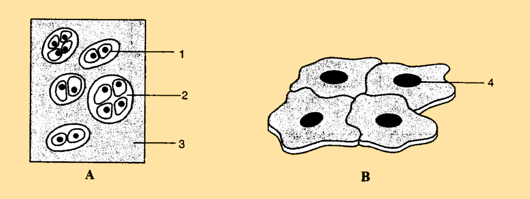

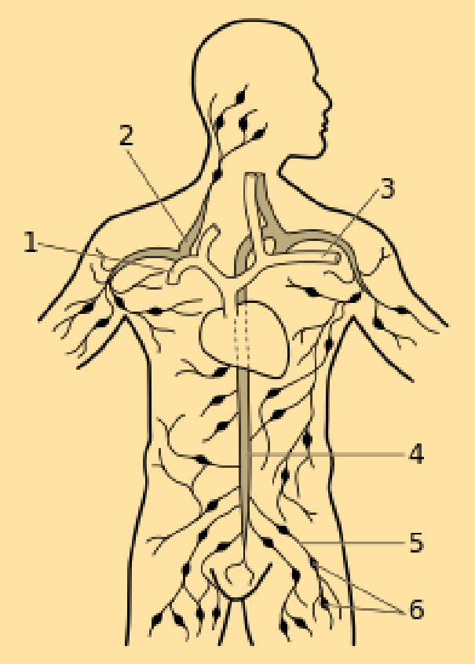

---

9. List the characteristics of meristematic tissues.

**Solution:**
They are actively dividing cells and divide throughout their life; cells are compactly arranged with no intercellular spaces; lack vacuoles; cells have dense cytoplasm and thin cell walls; have prominent nuclei.

10. Which tissues are responsible for secondary growth in plants?

**Solution:**
Vascular cambium and cork cambium (also called secondary meristems) are responsible for secondary growth. They increase the thickness (girth) of the plant body.

11. What are the key features which allow you to tell that a tissue type is collenchyma?

**Solution:**
Living cells that are elongated and generally contain chloroplasts; cell walls are irregularly thickened at corners due to deposition of cellulose or pectin; oval, circular or polygonal in shape; few intercellular spaces.

12. Thando was shown two slides of plant tissues: parenchyma and sclerenchyma. Which of the features given below would be crucial in identifying sclerenchyma and why?

* a) location of nucleus
* b) size of cells
* c) thickness of cell walls
* d) position of vacuoles

**Solution:**
C, the thickness of the walls. The walls of the sclerenchyma are thickened due to lignin which thickens the walls. Sclerenchyma cells are dead and will not have vacuoles or nuclei.

13. Why do meristematic cells lack vacuoles?

**Solution:**
Vacuoles are responsible for storing food and certain types of waste product. Meristematic cells being young and actively dividing do not participate in food manufacture and in storage functions. They do not generate waste. Therefore they do not require vacuoles. Meristematic cells are always young cells that have not had time to form vacuoles. They divide constantly so the cells are 'embryonic' – vacuoles are characteristic of mature plant cells.

14. Considering the plant leaf as an organ, describe the main tissues that come together to form the organ. What is the role of each tissue type? Why are they all important in the functioning of the organ?

**Solution:**
* **Epidermis** forms the protective outer layer that has the waxy cuticle to prevent dehydration. It may form trichomes to reflect heat, repel herbivores and trap water vapour. The epidermis has stomata

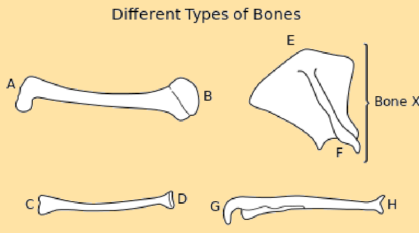

---

mainly in the lower epidermis to allow gaseous exchange without the leaf getting dehydrated. The cells are transparent to allow sunlight through to the photosynthesising cells.

* **Palisade mesophyll** consists of vertically elongated cells that all receive individual sunlight. These cells also have many chloroplasts, as they are below the upper epidermis and receive most sunlight. All mesophyll cells have large vacuoles to support the leaf by turgor pressure.
* **Spongy mesophyll** consists of loosely packed chlorenchyma cells with fewer chloroplasts, but large intercellular spaces to allow diffusion of gases throughout the leaf. All mesophyll cells have thin, moist walls to allow faster diffusion of gases and water. The air chambers in these mesophyll cells link directly to the stomata.
* **Veins** contain xylem to bring water into the photosynthesising tissues, as well as phloem to remove the sugars like glucose. Veins are well supported by a bundle sheath of sclerenchyma or collenchyma.

Check answers online with the exercise code below or click on 'show me the answer'.

| Exercise | Code |
| :--- | :--- |
| 1a. | 2CRC |
| 1b. | 2CRD |
| 1c. | 2CRF |
| 2. | 2CRG |
| 3. | 2CRH |
| 4. | 2CRJ |
| 5. | 2CRK |
| 6. | 2CRM |
| 7. | 2CRN |
| 8. | 2CRP |
| 9. | 2CRQ |
| 10. | 2CRR |
| 11. | 2CRS |
| 12. | 2CRT |
| 13. | 2CRV |
| 14. | 2CRW |

www.everythingscience.co.za  
m.everythingscience.co.za  

134  
6.7. Summary

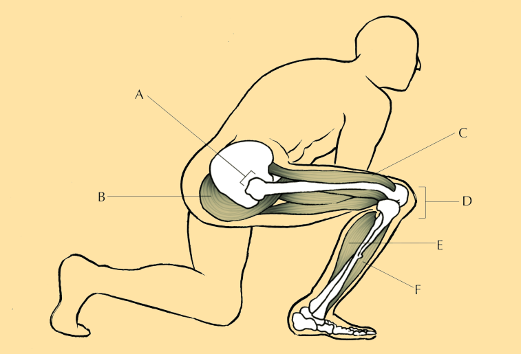

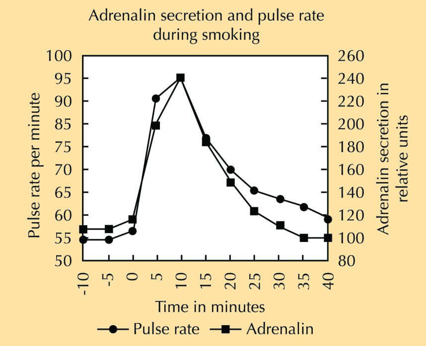
