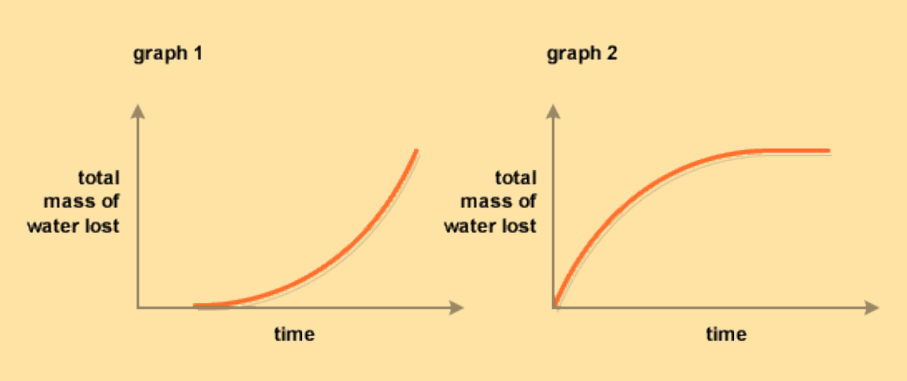

# **CHAPTER 6** 

# _Support and transport systems in plants_ 

|**6.1**|**_Overview_**|170|
|---|---|---|
|**6.2**|**_Anatomy of dicotyledonous plants_**|171|
|**6.3**|**_Transpiration_**|181|
|**6.4**|**_Wilting and guttation_**|190|
|**6.5**|**_Uptake of water and minerals in the roots_**|192|
|**6.6**|**_Summary_**|198|

6 Support and transport systems in plants 

## 6.1 Overview ESG79 

### Introduction ESG7B 

In the previous chapter, the structure of plant and animal tissue was introduced. This chapter focuses on the plant tissues that transport food and water around the plant. As you have previously learnt, plant leaves use sunlight, carbon dioxide and water to make food (sugars) during photosynthesis. In this chapter we will examine how the phloem and xylem tissue transport food and water within the plant. Which cells are responsible for moving food throughout the plant? How are the tissues adapted for their functions in transporting either water or food? What do these cells look like under the microscope? 

Throughout this chapter we will emphasise the relationship between structure and function. We will study how different types of leaves are structurally adapted to minimise water loss. We will also learn how stomata are able to respond to environmental conditions in order to regulate the rate of water loss from the leaf during transpiration. 

##### **Key concepts** 

- The plant is made up of the root and stem where tissues with dividing (meristematic) cells are contained. 

- Secondary growth of trees is measurable by observing the annual rings within tree trunks and can be used to infer climate change. 

- Transpiration, the loss of water vapour from plant leaves, is influenced by factors such as temperature, light intensity, wind and humidity. 

- Wilting is a processes that results from loss of water through transpiration and guttation is a process that results from high root pressure. 

- Water and minerals are taken up into the xylem tissue present in roots and transported to leaves in the plant. 

- Manufactured food (sugar) is translocated, via phloem tissue, from sites of manufacture (in the leaves) to other parts of the plant where sugars are used or stored. 

atom _→_ molecule _→_ cell _→_ **tissue** _→_ **organ** _→_ **system** _→_ organism _→_ ecosystem 

## 6.2 Anatomy of dicotyledonous plants ESG7C 

### Differences between Monocotyledons and Dicotyledons ESG7D 

All plants are classified as **producing seeds** or **not producing seeds** . Those that produce seeds are divided into flowering (angiosperms) and non-flowering (gymnosperms). Flowering plants are further divided into **monocotyledonous** and **dicotyledonous** (monocot and dicot) plants. 


> **[Diagram Context - Textbook_LifeSciences_Gr10_Support_and_transport_systems_in_plants.pdf-0003-03.png]**
> This photographic educational graphic displays a flowering *Acacia* (or *Vachellia/Senegalia*) plant featuring dense clusters of bright yellow, pom-pom-like inflorescences and green foliage against a blue sky, with no text, labels, or arrows present. Aligned with the CAPS Grade 10-12 Life Sciences curriculum for plant diversity and reproduction, this visual serves to illustrate the macroscopic features of angiosperms, specifically highlighting flower structure adapted for pollination in flowering plants (Phylum Anthophyta).


> **[Diagram Context - Textbook_LifeSciences_Gr10_Support_and_transport_systems_in_plants.pdf-0003-04.png]**
> 1. A close-up view of a branch with green needles.


Figure 6.1: Flowering plants such as the Figure 6.2: Gymnosperms are nonacacia tree. flowering plants such as pine trees or ”black spruce” shown above. 

In angiosperms, the **cotyledon** is part of the seed of the plant. The number of cotyledons (mono- or di-) is used to classify flowering plants. Monocotyledonous plants have one cotyledon, dicotyledonous plants have two. Plants belonging to each group have a number of features in common, such as the leaf and root structure, the strength of the stem, the flower structure and flower parts. Some differences between monocots and dicots are summarised in Figure 6.3. 


> **[Diagram Context - Textbook_LifeSciences_Gr10_Support_and_transport_systems_in_plants.pdf-0003-07.png]**
> This comparative biological diagram illustrates the key anatomical


Figure 6.3: A comparison between monocots and dicots. 

In addition to the differences listed above, monocots and dicots have important differences in their roots. Monocots have a network of fibrous roots and dicots have tap roots. 

In the previous chapter you learnt about the key plant tissues involved in support and transport functions, namely the xylem, phloem, collenchyma and sclerenchyma. Recall that these tissues are involved in both transport and supporting roles in plants. In different parts of the plant, tissues are arranged differently. In this section, we will study the overall structure (or anatomy) of dicotyledonous plants. 

### Root anatomy 

ESG7F 

Root systems are responsible for the following functions: 

- **absorption** of water and organic compounds. 

- **anchoring** of the plant body to the ground. 

- **storage** of food and nutrients. 

When a seed germinates, the first structure to appear is the root or the **radicle** . This becomes the **primary root** . Other roots that branch out of the primary root are called **secondary roots** (Figure 6.4). The growing root tip is protected by the **root cap** as it moves through the coarse soil. The root cap is slimy in nature to facilitate easy movement. Above the root cap is the **apical meristem** . In this meristematic region, cells divide continuously by mitosis to produce new cells. In addition to mitosis, newly divided cells undergo elongation in the same direction of root lengthening. 


> **[Diagram Context - Textbook_LifeSciences_Gr10_Support_and_transport_systems_in_plants.pdf-0004-09.png]**
> This photograph shows the underground anatomical structure of a plant's root system embedded in a soil profile. Visible components include woody main stems transitioning into primary roots, and a complex network of branching lateral roots spreading through the soil layers. Conceptually, this visual supports the CAPS Life Sciences curriculum by demonstrating root morphology, anchorage, and the vast surface area adaptations required for the absorption of water and mineral salts.


Figure 6.4: Primary and secondary root system of a cotton plant. 

Above the region of cell elongation, thousands of tiny **root hairs** are found in the root hair region. The function of the root hairs is to absorb water and dissolved mineral salts from the soil. As the root grows, it thickens and may produce **lateral roots** in the mature region as shown in Figure 6.5. 


Figure 6.5: The dicotyledonous root. 

There are two major types of root system: 

1. **Taproot system** : root system comprising one primary root and many secondary roots branching off the primary root. Examples of taproots include carrot and beetroots where the roots serve a storage function. Taproots are found in dicotyledonous plants. 

2. **Fibrous root system** : system with no dominant primary root but many secondary roots of similar size. Fibrous (adventitious) root systems are common in monocotyledons. Examples include coconuts and grasses. 

##### **Tissue distribution in the root** 

The different tissues in the root have a distribution which is common to all dicotyledonous plants and is shown in Figure 6.6. 


Figure 6.6: Dicotyledonous root profile showing the major tissues found in the root system which also aid in transport. 

**The epidermis** is a single layer of cells on the outside that protects the inner tissues. The epidermal layer of the root has no waterproof cuticle as this would prevent the absorption of water. Structurally, the cells of the root hair (shown in Figure 6.7) have large central vacuoles and cover a large surface area which allows water to enter these cells readily via osmosis. 


Figure 6.7: Diagram of a root hair cell. 

**The cortex** consists of _parenchyma_ cells. These large, thin-walled cells have leucoplasts to store starch and large vacuoles to store water and dissolved sugars. Intercellular spaces between parenchyma cells facilitate the movement of water from the root hair cells on the outside of the plant to the xylem on the inside of the plant. 

**The endodermis** forms the innermost layer of the cortex. It is a layer of tightlypacked, modified parenchyma cells. The radial and transverse cell walls are thickened with a water-impermeable, waxy suberin layer, known as the **Casparian strip** . This layer helps to regulate the flow of water from the cortex into the stele, rather than allowing the water to spread to all the root cells. To aid in directing water, there are also thin-walled passage cells in the endodermis, directly opposite the xylem, allowing water to move into the xylem rapidly. 

**The stele** , or **vascular cylinder** (responsible for transporting water and minerals), consists of the pericycle, phloem, cambium and xylem. The **pericycle** is the outermost layer of the stele, and consists of one or more rows of thinwalled meristematic parenchyma cells. It is in close contact with the xylem and phloem tissues of the root. It functions in the formation of lateral roots. 

**The phloem** tissue is responsible for transporting food from the leaves of the plant to the cells of the root. The **cambium** separates the xylem and phloem tissues from each other. This is the area where secondary growth of xylem and phloem tissues occur. **Xylem** tissue is responsible for transporting water and dissolved mineral salts to the xylem tissue of the stem and leaves. 

These cells are strengthened with lignin for support. The pits in the cell walls allow for the lateral movement of water. Figure 6.8 shows stained root tissues visualised by confocal microscopy. It shows the internal structure of root cells, including the epidermis, cortex, endodermis and pericycle. 


##### **FACT** 

Confocal microscopy is an advanced kind of microscopy which allows us to stain various cell types or structures with different colours, and visualise them in 3D, using special lasers and computer software. 

Figure 6.8: Stained root tissues as visualised by confocal microscopy. Colour key: brown, epidermis; red, cortex; blue, endodermis; green, pericycle. 

### Stem anatomy 

ESG7G 

Stems usually grow above the soil surface and towards the light from the sun. Depending on the hardness of the stem, we can distinguish between **herbaceous** stems, which are leafy non-woody structures, and **woody** stems. Woody stems are harder than herbaceous stems. 

Stems have four main functions. 

- **Support for the plant** as it holds leaves, flowers and fruits upright above the ground. Stems keep the leaves in the light and provide an attachment for flowers and fruits. 

- **Transport** of water, mineral salts and sugars between roots and shoots in the xylem and phloem. 

- **Storage** of nutrients. 

- **Production of new living tissue** : stems contain meristematic tissue which generates new tissue. 

The main stem develops from the **plumule of the embryo** and the lateral branches develop from the buds. Nodes and internodes are regions found on the stem. Nodes are the regions from which leaves and lateral branches develop, and the regions between nodes are known as internodes (shown in Figure 6.9). **Stomata** , or pores, can be found in stems of younger plants. We will subsequently discuss the tissues present in the dicot stem. The trunk of a tree (shown in Figure 6.10) is the stem. 


Figure 6.9: Stem showing internode and nodes plus leaf petioles. 


Figure 6.10: Photo of a redwood. The trunk of the tree is its stem. 

##### **The internal structure of the dicotyledonous stem** 

Figure 6.11 shows a schematic arrangement of tissues in a dicotyledonous stem. Details of each tissue type are described in this section. 

**Epidermis** : A single layer of cells that covers the stem, and is in turn covered by a waxy cuticle. The waterproof cuticle helps prevent water loss and thus prevents the inner tissues drying out. Since the function of the epidermis is to protect underlying tissues, epidermal cells are tightly packed and have thickened walls. The epidermis may contain hair-like outgrowths known as trichomes, and stomata with guard cells. Stomata present in the epidermis allow for transpiration and gaseous exchange for respiration and photosynthesis. 

**Cortex** : A region which comprises of **collenchyma** and **parenchyma** . 

- **Collenchyma** : A few layers of living cells that lie under the epidermis. These cells are not lignified but do have unevenly thickened cell walls. Collenchyma cells are thickened in the corners, but thin-walled elsewhere. The thickened corners strengthen the stem and provide support, while the thin-walled sections allow for flexibility in the wind. Collenchyma cells contain chloroplasts which produce food for the plant during photosynthesis. 

- **Parenchyma** : Found beneath the collenchyma cells and makes up the bulk of the cortex. The cells are thin-walled, and there are intercellular spaces which are important in gaseous exchange. Parenchyma stores synthesised organic food (mostly starch) produced elsewhere in the plant. 


Figure 6.11: Cross-section of a dicotyledonous stem showing tissue distribution. 

**Vascular cylinder** or **stele** : Comprised of the **pericycle** , **vascular bundles** and **pith** 

- **Pericycle** : Commonly found in roots and, in lower vascular plants, also in stems. In higher vascular plants, however, a distinct layer of cells may not be present. The pericycle, if present, may be composed of either thin walled parenchyma cells or sclerenchyma cells with relatively thin or heavily thickened walls. In plants undergoing secondary growth, the pericycle contributes to the vascular cambium often diverging into a cork cambium. 

- **Vascular bundles** : Characteristically organised in a ring inside the pericycle of the dicot plant. Mature vascular bundles are made up of waterconducting xylem, cambium, and food-conducting phloem. The phloem is located on the outside of the bundle and the xylem towards the centre (see Figure 6.11). The phloem and xylem is separated by meristematic tissue known as cambium, which is responsible for **secondary thickening** . Xylem has lignified cell walls which helps it fulfil its two important roles, namely; strengthening and supporting the stem, and transporting water and minerals from the root system to the leaves. The function of phloem is to transport synthesised food from the leaves to other parts of the plant. 

- **Pith (or medulla)** : Occupies the large, central part of the stem. The pith is made up of thin-walled parenchyma cells containing intercellular spaces. Where the parenchyma extends between vascular bundles as thin bands it is known as medullary rays, and can be continuous with the pith and cortex of the parenchyma. The cells of the pith store water and starch, while the intercellular spaces allow for gaseous exchange. The medullary rays facilitate transport of substances from xylem and phloem to the inner and outer parts of the stem. 

##### **Investigation: Examining the structure of the root and stem** 

##### **Aim:** 

To examine the structure of the root and stem. 

##### **Apparatus:** 

- light microscope 

- scalpel or knife 

- celery stalk (stem) 

- carrot (root) 

- glass slide 

- iodine solution (stain) or water 

- cover slip 

- dissecting needle or tweezers 

- paper and pencil 

- blotting paper or paper towel or tissue 

- for variation you can also try using other vegetables 

##### **Method:** 

Prepare a temporary mount using the irrigation method: 

1. Cut a very thin slice (cross section) from the middle of the celery stem and the carrot root. Although you will not be able to see microscopic details of the carrot tissue under a microscope, the differentiation by colour will be evident. 

2. Place this section on a glass slide, in the centre. 

3. Add a drop of iodine solution on top of the sample to stain it. This makes it more visible under the microscope. Water can be used if iodine is not available. 

4. Place the coverslip next to the droplet, as shown in the diagram, then lower it slowly onto the glass slide. This will prevent bubbles forming under the coverslip. You can use a dissecting needle to lower the the coverslip into position. The drop will spread outward and suspend the sample between the slide and the coverslip. 


5. **Call your teacher.** 

6. Switch on the microscope making sure the lowest objective is in position (the 4 X objective). 

7. Place your slide on the stage. 

8. Focus the image under the 4 X objective (lowest objective) and view the structure of the celery stem. Switch to the 10 X objective to look a little more closely. To see details of the structure of plant tissue, use the 40 X objective. Carefully observe all of the parts and different tissues. 

9. Once you are able to see specific tissue types, call your teacher. 

10. Make a biological drawing of your specimen as viewed under the microscope. Take note of the magnification and draw a scale bar. Label your diagram according to the tissues you have learnt about. 

### Secondary growth 

#### ESG7H 

Plants, like other living organisms need to grow, and they do this by mitosis. Cell growth is limited to the specialised cells that make up meristematic tissue. Meristematic tissue consists of small cells that are unspecialised. These cells divide by mitosis to form new cells that can **differentiate** i.e. undergo changes in their structure. When groups of cells differentiate they form specialised tissue (e.g. xylem, phloem, epidermal cells). There are different types of meristematic tissue: 

- **Primary meristematic tissue** is found in the tips of roots, stems and buds. When the cells divide, new cells are produced which causes the plant to grow in length. This is referred to as **primary growth.** 

- **Secondary meristematic tissue** originates from permanent tissue, usually parenchyma tissue which divides by mitosis. **Cambium** is secondary meristematic tissue that is found in roots and stems. When these cells divide by mitosis it results in the plant becoming **wider.** This is called **secondary growth** . 

Secondary growth is seen clearly if you examine the stump of a tree. During every growing season the stem of a plant increases in width. This is known as secondary thickening. Towards the end of the first year of growth, the parenchyma cells between the vascular bundles become meristematic. This means that they actively start dividing by mitosis, and link up with the cambium that occurs in the vascular bundles to form a cambium ring in the stem (see Figure 6.12). The cells in the cambium ring start dividing to form secondary phloem (on the outside of the cambium ring) and secondary xylem (on the inside of the cambium ring). Each year another ring of secondary phloem and secondary xylem is formed, making the stem grow wider. 

##### **FACT** 

The vascular cambium and cork cambium are different and should not be confused! 

##### **FACT** 

Watch this video to learn about the oldest trees on Earth! See video: 2CRX 


Figure 6.12: Process of secondary thickening in stems. 

It is not possible to see the layers of secondary phloem but the secondary xylem layers are visible. These form rings called **annual rings** which can be used to work out the age of a plant. 

As new rings are formed each year, the older rings are pushed inward and the xylem vessels collapse due to the pressure. The wood in the centre becomes denser and harder than the wood at the surface and is called **heartwood** . The youngest annual rings found on the outside transport water. This wood is not as dense and is called **sapwood** . The light-coloured rings are called spring wood. They are formed during spring and summer when the growing conditions are favourable. These rings are therefore relatively broad and light in colour as the xylem cell walls are thin. The dark-coloured rings are called autumn wood. They are formed during autumn and winter when the growing conditions are unfavourable. The rings are therefore relatively narrow and dark in colour as the xylem cell walls are thick. Rings may be thicker in some years than in others, depending on the amount of rain and nutrients received. 


Figure 6.13: The annual rings in a tree trunk give a measure of the tree’s age as well as the environmental conditions of the tree’s growth. 

There is another type of cambium in plants called **cork cambium** . Cork cambium forms when an outer layer of parenchyma in the cortex becomes meristematic and produces cortex cells to the inside and cork cells to the outside. This forms the dry outer cells of the bark on a stem. 

##### **Investigation: Observing annual tree rings to assess age and climatic conditions** 

##### **Aim:** 

##### **Background** 

Every year a tree forms a new layer of xylem around the trunk. This forms tree rings, which are visible as circles in a cross section of a tree that has been cut down. Each tree ring, or wood layer, consists of two colours of wood; light wood that grows in spring and summer and dark wood that grows in autumn and winter. Tree rings can be counted to give you a rough estimate of the age of a tree. Occasionally a tree will form many rings in one year or miss forming rings in a year. The width of the tree rings is greater in years where good growing conditions occur. In years with droughts or low temperatures, the trees will produce narrower rings. Therefore, by looking at the tree rings you can get an idea of the weather affecting a tree in a particular year. Scientists can use this information to help determine the weather patterns of the past as well as events such as forest fires, earthquakes, and volcanic eruptions. The study of past events using the growth rings of trees is known as dendrochronology ( dendros = tree, chronos = time). 

##### **FACT** 

**Turgidity** , or turgor pressure, refers to the water content of cells and how this lends structural support to the plant. When cells absorb water, the vacuoles fill up and the cytoplasm increases, pushing against the cell membranes, which in turn push against the rigid cell walls. This makes the cells rigid, or turgid. 

##### **Method:** 

1. Examine a section of a tree trunk/stem provided by your teacher and count the tree rings, starting with the innermost ring. Measure the width of each ring using a ruler, or make a note of whether a ring is narrow or wide. Make a note of any scars caused by events such as fires or pests. 

2. Draw a bar graph showing the width of your tree rings for every year of the tree’s life. 

3. How old is this tree? What can you say about the climatic conditions throughout the life of this tree? 

## 6.3 Transpiration ESG7J 

Transpiration is a process that involves loss of water vapour through the stomata of plants. Transpiration is thought to be a ’necessary cost or evil’ to allow the plant to absorb water from the soil. It is an inevitable process. 

##### **FACT** 

Transpiration is important in plants for three major reasons: 

###### **Capillary action** 

occurs when the adhesion of water molecules to the walls of the vessel is stronger than the cohesive forces between the water molecules. Have you ever seen fluid in a drinking straw move higher than the level of the fluid in the glass? This happens due to capillary action. The narrower the straw, the greater the capillary action, and therefore, the higher the fluid will rise in the straw. 

##### **FACT** 

**Cohesion** refers to 

the intermolecular, attractive forces that hold molecules in solids and liquids together. Imagine a drop of water on a waxy surface like wax paper. Even if the drop slides and rolls around, the water molecules will stay together due to the cohesive forces. **Adhesion** is the ability of a substance to stick to an unlike substance. If you were to take the same piece of wax paper and turn it upside down, some water droplets would still adhere to the paper. This indicates that there must be an attraction between 

1. **Cooling of the plant** : the loss of water vapour from the plant cools down the plant when the weather is very hot. 

2. **The transpirational pull** : when the plant loses water through transpiration from the leaves, water and mineral salts from the stem and roots moves, or is ‘pulled’, upwards into the leaves. Water and is therefore taken up from the soil by osmosis and finally exits the plants through the stomata. 

3. **Plant structure** : young plants or plants without woody stems require water for structural support. Transpiration helps maintain the turgidity in plants. 

**Transpirational pull** : results from the evaporation of water from the surfaces of the mesophyll layer in the leaf to the atmosphere, through the stomata. Evaporation of water from the leaves surface causes a negative pressure (suction force) in the xylem that pulls water from the roots and soil. This results in water being drawn up the xylem vessel. 

Transpirational pull draws water from the roots to the leaves because of the effects of **capillary action** . The primary forces that create the capillary action are _adhesion_ and _cohesion_ . Adhesion is the attraction that occurs between water and the surface of the xylem, and cohesion is the attraction between water molecules. We will revisit transpirational pull and capillarity later in the chapter when we examine how water is transported in the plant. 

Factors affecting the rate of transpiration 

ESG7K 

There is a close inter-relationship between transpiration and leaf structure. The rate at which transpiration occurs refers to the amount of water lost by plants over a given time period. Plants regulate the rate of transpiration by opening and closing of stomata (Figure 6.14). 


Figure 6.14: The opening and closing of stomata. Different environmental conditions trigger both the opening and closing of stomata. 

There are, however, a number of external factors that affect the rate of transpiration, namely: temperature, light intensity, humidity, and wind. 

##### **Temperature** 

Temperature affects the transpiration rate in two ways. Firstly, at warmer temperatures water molecules move faster, and the rate of evaporation from stomata is therefore much faster. Secondly, the water-holding capacity of warm air is greater than that of cold air. Assuming that cold air and warm air contain the same amount of water, the cold air may be saturated, and therefore have a shallow water concentration gradient, while the warm air may will be able to hold more water vapour, and will therefore have a steeper water concentration gradient. 

the water and the wax paper. However, in this case the water-water cohesive force is stronger than the adhesive force between the molecules of the wax paper and the water. 


Figure 6.15: Temperature vs transpiration rate. 

##### **Light intensity** 

At high light intensity, the rate of photosynthesis increases. As photosynthesis increases, the amount of stored glucose in the guard cells increases. This lowers the water potential of the leaf (i.e. the contents of the leaf are less dilute). As the water potential decreases, more water enters the guard cells making them more turgid. The turgor pressure of the guard cells leads to an opening up of stomata resulting in transpiration. 


Figure 6.16: Transpiration vs light intensity. 

##### **Relative humidity** 

The amount of water vapour in the air is referred to as the humidity. Water always moves _down_ a concentration gradient. Therefore when the humidity is high (lots of water vapour in the air) the water potential gradient between the inside of the leaf stomata and the atmosphere is shallow and the rate of transpiration will be low. However, if the atmosphere is dry, there will be a steep water concentration gradient between the humid inside of the stomata and the outside air and the rate of transpiration will therefore be fast. 


Figure 6.17: Transpiration vs humidity. 

##### **Wind** 

When water is lost from the leaf it forms a thin layer outside the leaf. This reduces the water potential between the leaf and the atmosphere outside. When there is wind, this layer is blown away, thus maintaining the water potential gradient across the leaf. 


Figure 6.18: Wind speed vs transpiration. 

Measuring the rate of transpiration 

#### ESG7M 

To measure the rate of transpiration we use a piece of equipment called a **potometer.** A potometer measures how factors such as light, temperature, humidity, light intensity and wind will affect the rate of transpiration. The main type of potometer is the ’bubble’ potometer shown in Figure 6.19. The potometer measures the amount of water lost from a leafy shoot by monitoring the rate at which an air bubble moves along the narrow tube as the leafy shoot sucks up water to replace the water lost by the transpiration of the plant. As the leafy twig transpires, the air bubble moves to towards the plant. The quicker the air bubble moves, the faster the leafy twig is transpiring. 

##### **FACT** 

A potometer provides an indirect measurement of the transpiration rate – it measures how fast water is absorbed, which is related to how fast water vapour is being lost. It cannot measure how fast water vapour is being given off directly. 


Figure 6.19: Potometer measures the rate of transpiration. 

**Investigation: Determining the effect of environmental conditions on transpiration rate using a potometer** 

##### **Aim:** 

To determine the effect of environmental conditions on transpiration rate using a simple potometer. 

##### **Apparatus:** 

- drinking straw or clear plastic tubing 

- soft green leafy shoot 

- Vaseline 

- marking pen 

- play dough / putti/ Prestick 

- plastic bag 

- elastic band 

- ruler 

##### **Method:** 

A potometer measures the rate of transpiration by measuring the movement of water into a plant. The following experiment uses a simple hand made potometer. The class will be divided into four groups. Each group will investigate a different factor and then all the results can be shared at the end of the investigation. 

Perform the following steps under water: 

1. Cut the stem of the leafy shoot (at an angle to increase the surface area) **under water** . The reason we cut it under water is to prevent air bubbles entering the xylem vessel. You must use a very sharp knife or new scalpel and cut at an angle in order to increase surface area for water uptake in the xylem. Florists who cut plants before immersing them in water follow the same procedure for this reason. 

2. Test to make sure the stem of the leafy twig will fit snugly into the top of the straw. 

3. Remove the leafy shoot from the straw and set aside, keeping the stem submerged, and the leaves above water. 

4. Fill the straw with water. Place your finger over one end of the straw to stop the water from running out. 

5. Put the leafy shoot into the open end and seal it with play dough/ putti/ Prestick while removing it from water _keeping your finger on the straw._ 

Perform the following steps above water: 

6. Seal with Vaseline. Make sure it is air tight and water tight. If not, all the water will run out when you take your finger off the straw. 

7. Mark the water level on the straw. 

8. Place your potometer under one of the following conditions for one hour: 

   - as is, in a warm, sunny place (no wind) 

   - as is, in a warm, windy place 

   - with a plastic bag tied around the leaf, in a warm, sunny place 

   - a shady place. 

9. Every 10 minutes use a marking pen to mark the change in water level on the straw. Continue taking measurements for 1 hour. 

10. Measure the distance the water moves during each time interval. 

##### **Results:** 

Each of the four groups that investigated different environmental conditions should contribute their results for the final analysis. 

1. Draw a table and record the class’ results. 

2. Plot a bar graph to compare the total distances the water moved in the different straws in 1 hour under the four different environmental conditions. 

3. At the end of the experiments, all students must plot the following line graphs: 

   - a) the effect of temperature on the rate of transpiration 

   - b) the effect of light intensity on the rate of transpiration 

   - c) the effect of relative humidity on the rate of transpiration 

   - d) the effect of wind on the rate of transpiration 

##### **Observations:** 

Record your observation from the table, bar graph and line graphs. 

##### **Conclusions:** 

1. What can you conclude from this investigation? 

2. Give two ways in which you can improve your experimental results. 

##### **Questions:** 

1. Why is it important to cut the stem at an angle under the water? 

2. Which part of the stem does the straw represent? 

3. Which four factors are you investigating? 

4. Under which condition is the highest rate of transpiration? 

5. Name one possible error that could have occurred in your investigation. 

6. What are the potential limitations of this investigation? 

##### **Investigation: Determining the effect of light intensity on transpiration** 

##### **Aim:** 

To determine the effect of light intensity on transpiration. 

##### **Apparatus:** 

- plants 

- plastic bag 

- piece of string 

- graduated measuring cylinder 

##### **Method:** 

1. Use at least three plants of the same species and as close to the same size as possible (think of why this might be important). 

2. Ensure that all three plants are exposed to the same amount of light. 

3. Use clear plastic bags to completely cover all the leaves of each plant. 

4. Tie the bottom of the plastic around the main stem of the plant, allowing the water lost from the plant to collect inside the bag. Try not to crush the leaves of the plant with the bag. 

5. Place the bags on the plants early in the morning. Leave the bags on all day and check for signs of water drops inside. If there are water drops, shake the bag so that the water drops to the bottom of the bag. 

6. At the end of the day, carefully remove the bags to ensure that you do not lose any water. It will help if you tilt the plant slightly while removing the bags. 

7. Collect the water inside a measuring cylinder and measure how much water the plant has lost. 

8. Tie a new plastic bag around the plant and leaver overnight. item The following morning, collect and measure the water that was released by the plant overnight. 

##### **Results:** 

1. Record the amount of water lost during the day and during the night. 

2. Using the three plants, figure out the average water loss for each time period. 

3. Plot a bar graph comparing the average amount of water loss in the day and night. 

##### **Observations:** 

Write down anything you observed about the plants, the plastic bags and the rate of water loss from the plant. 

##### **Conclusions:** 

What can you conclude regarding the rate of transpiration at different light intensities? Was there higher or lower water loss when you left the plant overnight compared to when you monitored it throughout the day? 

##### **Questions:** 

1. How can you improve this experiment to determine the effects of different light intensities on transpiration? 

2. In this experiment what are the key variables we are controlling for? Have we properly controlled for these? 

|**Advantages of transpiration**|**Disadvantages of transpiration**|
|---|---|
|Cools the plant down.|Excessive water loss causes the<br>plant to wilt.|
|Assists in the transport of water<br>from the soil.||
|Important for transport of water<br>through the xylem.||
|Regulates the concentration of cell<br>sap.||
|Distribution of salts and minerals<br>in theplant.||

Table 6.1: Table comparing the advantages and disadvantages of transpiration. 

Structural adaptations of plants to reduce rate of transpiration ESG7N 

When the rate of transpiration is too high, it can have detrimental effects on the plant, as you will see in the next section on wilting and guttation. For this reason, plants have developed structural adaptations to minimise the amount of water loss. 

- **Position of stomata:** Stomata are found on both surfaces of the leaf but there are usually more on the ventral (lower) surface of the leaf. This means that less water vapour is lost because the ventral side of the leaf is in the shade and therefore does not get as hot. 

- **Sunken stomata:** Some plants such as xerophytes have sunken stomata as a way of preventing water loss. Xerophytes (pronounced ”zero-phytes”) are plants that are normally found in hot, dry areas such as deserts. The sunken stomata creates a small pocket of moist air. The high humidity in the air pocket reduces the water potential gradient between the leaf air spaces and the exterior, and therefore decreases the rate of transpiration. 

- **Thickened cuticle:** Some plants that occur in dry places have a thick cuticle that reduces transpiration. 

- **Hairs on leaves:** Hairs trap a small layer of water vapour that works in three ways to reduce transpiration: 

   - creates a pocket of moist air to reduce the water potential gradient. 

   - increases the sheen on leaves to make them more reflective. 

   - the combination of the above effects result in a cooling effect that also decreases transpiration. 

- **Reduction of leaf size:** Small leaves have a smaller surface area for transpiration to occur. 

- **Leaf spines:** Some plants have spines instead of leaves. Spines usually have thicker cuticles and a very small surface area, which decreases transpiration. 

- **Leaf arrangement:** Vertical leaf arrangement (like proteas) decrease the surface area exposed to the sun in the heat of the day, In rosette arrangements the upper leaves shield the lower leaves from the Sun. 

- **Rolling of leaves:** When leaves roll up, water vapour gets trapped in the tunnel made by the leaf, therefore reducing the water potential gradient, and therefore reducing the rate of transpiration. 


Figure 6.20: Desert plants like cactus have thick cuticles to avoid water loss. 


Figure 6.21: Hairy leaves to trap water. 


Figure 6.22: Spiny leaves have a small surface area to decrease transpiration. 

## 6.4 Wilting and guttation ESG7P 

We just discussed transpiration, and how leaves are constantly losing water vapour to the environment. However, what happens when there is not enough water in the soil to replace the water that was lost? Similarly, what happens when there is too much water? In the next section we discuss wilting, and why plants wilt and get ‘floppy’ in hot weather or after a long drought. We will also look at ways that plants can rid themselves of extra water when there is too much water in the environment and the plant has to cope with high root pressure and a low transpiration rate. 

ESG7Q 

### Wilting 

Plants need water to maintain turgor pressure. Turgor pressure is what provides the plant with much of its structural support. Have a look at Figure 6.23 which shows the effect of osmosis on the turgidity of cells. 


Figure 6.23: Cells in solutions with different concentrations 

Wilting refers to the loss of rigidity or structure of non-woody parts of plants (Figure 6.24). It occurs when turgidity of plant cells is lost. When a cell absorbs water, the cell membrane pushes against the cell wall. The rigid cell wall pushes back on the cell making the cell turgid. If there is not enough water in the plant, the large central vacuole of the cell shrinks and the cytoplasm decreases, resulting in decreased pressure being exerted on the cell membrane, and in turn, on the cell wall. This results in the cell becoming flaccid (floppy). When the cells of a plant are flaccid, the entire plant begins to wilt. Wilting occurs due to lower availability of water which may be due to: 

- **Drought conditions** : where the soil moisture drops below conditions that allow plants to grow. 

- **Low temperatures** : which prevent the plants vascular transport system from functioning; 

- **High salinity** (salt concentration): which causes water to diffuse from plant cells to the soil, thus inducing shrinking of cells. 

- **Bacterial or fungal infections** : that block the plant’s vascular system. 


Figure 6.24: Crops wilt due to a lack of water. 


Figure 6.25: Guttation in plant leaves 

ESG7R 

### Guttation 

Guttation is the ”oozing out” or exuding of drops of water on the tips or edges of leaves of some vascular plants. An example of guttation is visible in Figure 6.25. 

Below is an explanation of how guttation occurs: 

- At night, when it is dark, less transpiration occurs since the stomata are closed. 

- When soil moisture is very high, water will enter the plant roots because the water potential of the roots is lower than that of the surrounding soil. 

- Thus, water accumulates in the plant, resulting in _root pressure._ 

- The root pressure forces some water to exit the leaf tip or edge structures called _hydathodes_ or water glands, forming drops. 

- Root pressure is what drives the flow of water out of the plant leaves, rather than transpirational pull. 

For guttation to occur there must be a high water content in the soil to create the root pressure. The transpiration rate must be slow in order for the root pressure to be higher than the transpirational pull. Guttation must not be confused with transpiration. Table 6.2 highlights the differences between guttation and transpiration. 

|**Guttation**|**Transpiration**|
|---|---|
|Occurs early morning and at night|Occurs during the day when it is<br>hot|
|Takesplace through hydathodes|Takesplace through the stomata|
|Water is lost in liquid form through<br>the hydathodes|Water is lost as vapour via the<br>stomata|
|Caused byrootpressure|Caused byhigh waterpotential|
|Water droplets are found on the<br>margin of the leaf|Water vapour transpiration takes<br>place mostly in the lower surface<br>of the leaf|

Table 6.2: Table comparing guttation and transpiration. 

## 6.5 Uptake of water and minerals in the roots ESG7S 

In the first section of this chapter, we looked at the structure of the dicotyledonous root and stem and compared the different cells in the specialised tissues of the plant root and stem. Now we will look at how these specialised cells help the plant to absorb water from the soil and transport it to the stem, where it can then be transported to the rest of the plant. 

### Movement of water through the dicotyledonous root ESG7T 

Water is found in the spaces between the soil particles. Water and mineral salts first enter through the cell wall and cell membrane of the root hair cell by osmosis. Root hair cells are outgrowths at the tips of plants’ roots (Figure 6.26). They function solely to take up water and mineral salts. Root hair cells do not perform photosynthesis, and do not contain chloroplasts as they are underground and not exposed to sunlight. These cells have large vacuoles which allow storage of water and mineral salts. Their small diameter (5-17 micrometres) and greater length (1500 micrometres) ensure they have a large surface area over which to absorb water and mineral salts. Water fills the vacuole of the root hair cell. 


Figure 6.26: Step-by-step transport of water in plants, from the roots to the xylem. 

##### **FACT** 

Learn how water is transported from the soil to the leaves of a plant. See video: 2CRY 

The following list summarises how the root hair is adapted to absorb water from the soil: 

- There are many, elongated root hairs to increase the total root surface area for water absorption. 

- They have thin walls to speed up the intake of water by osmosis. 

##### **FACT** 

Learn how transpiration helps with the transport of water to the leaves. See video: 2CRZ 

##### **FACT** 

**Capillarity** : refers to the ability of a liquid to flow through narrow spaces (capillary pressure). 

- They have large vacuoles to absorb water quickly and transport it to the next cells. 

- The vacuoles have salts, which speed up water absorption from soil water. 

- Root hairs do not have cuticles, as this would prevent water absorption. 

Water can now move from the root hair cells and across the parenchyma cells of the cortex in two major ways. Some water passes through the cells by _osmosis_ . Most water travels either in, or between the cell walls (of the parenchyma cells) by simple _diffusion_ . The water must pass through the endodermis to enter the xylem. Once water is in the xylem of the root, it will pass up the xylem of the stem. 

Transport of water and minerals to leaves ESG7V 

We have dealt with the transport of water in plants from the soil into the root xylem. Now we need to discuss how the water is transported against gravity from the roots to the leaves where it is needed for the process of photosynthesis. 

Water travels to the leaves via the stem. Recall, that three processes are necessary for the transport of water in plants, namely; transpiration, capillarity and root pressure. All three of these processes are passive and do not require an input of energy. 

**Transpiration** : Constant water loss via transpiration from the leaves causes a negative water pressure in the leaves. The negative pressure in the leaves works like a ’suction’ force, pulling the water up the stem. 

**Capillary Action** : Water moves up the stem in response to the ’suction’ caused by transpiration because of two forces: adhesion and cohesion. Cohesion is the tendency for water molecules to stick together and adhesion is the tendency for water molecules to stick to other surfaces, such as the inside of the xylem vessels. Stem xylem is structurally adapted to take advantage of capillarity, because they are very long with a narrow diameter. 

**Root Pressure** : Water can also be moved up the stem via a ’push’ force from the roots. Water is constantly being absorbed by the roots due to the negative water potential in the root cells. This movement of water into the roots can cause the water pressure inside the roots to become high, resulting in a force that ’pushes’ water up the stem xylem. 

##### **Investigation: Examining water uptake by the stem** 

##### **Aim:** 

To examine water uptake by the stem. 

##### **Apparatus:** 

- water 

- food colouring dye (available at supermarket) 

- white flower on a stem, e.g. Impatiens, carnation or chrysanthemum 

- scissors 

- two jars, cups or measuring cylinders 

- plastic tray 

- sticky tape 

##### **Method:** 

1. Fill one jar with plain water, and one with water containing several drops of food colouring dye. 

2. Take the flower and carefully cut the stem lengthwise, either part way up the stem or right up to the base of the flower (try both, the results will be different!) 

3. Put one half of the stem into the jar containing plain water and one half of the stem into the jar containing food colouring dye. To make it easier to insert the stalks without breaking them, it helps to wedge paper underneath the jars so that you can tilt them towards each other. Tape the jars or cylinders down onto a tray so that they do not fall over. 

4. Observe the flowers after a few hours and the next day, and note where the dye ends up in the flower head. You can leave the flowers up to a week but be sure to make sure that they have enough water. 

**Variation:** Instead of using one cylinder with water and one with food dye, use two different colour food dyes (e.g. blue and red). At first the flower will show two separate colours, but as time goes by the whole flower will show both dyes. This is because water can move sideways between xylem vessels through openings along their length. The ability of water to move laterally between vessels is useful for when air becomes trapped in a vessel, causing a blockage. If you cut the stem right up to the base of the flower, this will limit movement between the xylem vessels. 

**Variation:** Try using celery stalks with leaves. Cut open the celery stalk (crosssection) and you will see darker-coloured little holes/ spots. These are the vessels. 

Support and transport systems in plants 

**Results:** 

Record your observations and results 

**Conclusions:** 

What did you conclude from this experiment? 

### Movement of manufactured food ESG7W 

Plants use sunlight, carbon dioxide and water to manufacture glucose, yielding oxygen as a by-product. Sunlight or radiant light is captured by the green pigment chlorophyll inside of chloroplasts to provide the energy for photosynthesis to occur. Once the food is manufactured in the leaves it needs to be distributed to the entire plant so that the glucose can be used by each cell for respiration and some of the photosynthetic products are then stored for later use. 

The glucose is manufactured mainly in the palisade cells where there are more chloroplasts, and then passes into the phloem. Plants usually transport food in the form of the sugar sucrose because it is less reactive than glucose. Sucrose is transported to where it is needed in the the plant via phloem sap, and may be stored in roots, stems or fruit. Transport of food material from leaves to other parts of the plant is called **translocation** . Understanding the phloem structure is important to understanding how it transports food. 


Figure 6.27: Aphids feeding on phloem sap which is rich in sucrose. 

##### **How the phloem functions** 

While the transport of water is usually unidirectional in xylem (upward or lateral), the movement of sugars in the phloem is multi-directional, and occurs by **active transport** , an energy-dependent process. Sucrose is actively transported _against_ a concentration gradient into sieve-tube elements. The sieve-tube elements have no nuclei but the adjacent companion cells do. Companion cells are closely associated with sieve tubes and carry out all the cellular functions of the sieve tubes. 

The cytoplasm of sieve tubes and companion cells is connected through numerous channels called **plasmodesmata** . These cytoplasmic connections allow the companion cells to regulate the content and activity of the sieve tube cytoplasm. The companion cells also help load the sieve tube with sugar and the other metabolic products that they transport throughout the plant. This lowers the water potential of the sieve-tube element, causing water to move in by osmosis, creating a pressure that pushes the sap down the tube. The metabolising cells of the plant actively transport sugars out of sieve-tube elements, producing exactly the opposite effect. The diagram below illustrates how the overall process works. 


Figure 6.28: Diagram showing movement in the xylem and phloem vessels. Water movement is upwards in the xylem and lateral into and out of the phloem. Lateral movement also occurs into and out of the companion cells accompanying the phloem vessel. 

## 6.6 Summary ESG7X 

- **Anatomy of dicotyledonous plants** : Structures discussed in the previous chapter (collenchyma, sclerenchyma, xylem and phloem) are important in carrying out the transport functions. 

- **Root anatomy and function:** The root is important in absorption, anchorage and storage of food. It is made up of the epidermis, cortex, endodermis and stele (consisting of xylem, phloem and pericycle). 

- **Stem anatomy and function:** Stems contain an epidermis, cortex and vascular cylinder (consisting of pericycle, xylem, phloem, cambium and pith). Stems are important for growth, support, storage and transport of water, mineral salts and manufactured sugars. 

- **Secondary growth:** Secondary growth is the thickening of the stem or root as new layers of xylem and phloem are formed by mitosis. It is carried out by cambium and results in stems and roots becoming thicker as the plant ages / matures. Secondary thickening results in the annual rings found in trees that can be used to work out the age of a tree. 

- **Transpiration** : Transpiration is the loss of water from the stomata of plants. It creates a ’suction’ or transpirational pull that is important for the movement of water through the plant. Transpiration is affected by environmental conditions e.g wind, temperature, humidity and light intensity. The rate of transpiration is measured using a potometer. In order to prevent excessive transpiration, plants have developed adaptations such as thickened cuticle, position of stomata, hairs on leaves, reduction of leaf size, leaf spines, leaf arrangements and rolling of leaves. 

- **Translocation** : Translocation is the transport of food material (sugars), synthesised in the leaves, to other parts of the plant via phloem. This mode of transport is multi-directional, but requires energy as it occurs by active transport against a concentration gradient. Phloem vessels consist of sieve-tube elements and companion cells which are connected by plasmodesmata. Companion cells act as the regulators and energy stores of the phloem. 

- **Wilting and guttation** are processes of water loss in the plant. Wilting entails excessive loss of water through plasmolysis resulting in excessive cell death, at times resulting in death of the entire plant. Guttation is the release of water via the hydathodes due to high humidity. 

##### **Exercise 6 – 1: End of chapter exercises** 

1. The water loss in two plants was recorded over a 12 hour period. Study the information below and then answer the questions that follow. The results for the two plants were recorded in the following table. 

|**Time of Day**|**06:00**|**08:00**|**10:00**|**12:00**|**14:00**|**16:00**|**18:00**|
|---|---|---|---|---|---|---|---|
|Water loss in<br>Plant A (cm^{3})|0,0|0,4|1,6|6,0|9,0|8,0|7,6|
|Water loss in<br>Plant B (cm^{3})|0,2|0,7|4,0|14,0|19,0|18,2|17,7|

   - a) What is the correct biological term for water loss in a plant? 

   - b) From which plant was the greatest amount of water loss recorded? 

   - c) Assuming the plants were kept in identical conditions; suggest two possible ways that the plant that lost less water may have differed structurally from the plant that most more water. 

   - d) Which time of day was the greatest water loss recorded for both Plants A and B. Why do you think this is so? 

   - e) At 18h00 the rate of water loss was lower. Why did this occur? 

   - f) What is the apparatus that was used in the laboratory to measure the rate of water loss in plants A and B? 

2. What do you understand by guttation and how does the process of guttation occur? 

3. Tabulate the differences between guttation and transpiration. 

4. Briefly discuss the movement of water through the dicotyledonous root. 

5. Give a short explanation for the following: 

   - a) capilliarity 

   - b) dicotyledon 

   - c) transpiration 

   - d) water potential gradient 

6. On a hot day in the middle of a drought, what can you expect the leaves of a plant to look like? Draw a diagram to describe your answer. 

7. List the environmental conditions that would result in the highest rate of transpiration. 

8. Name four defining characteristics of a monocotyledonous plant. 

9. In a short paragraph, explain how secondary thickening in a stem comes about. 

10. Name and briefly discuss the adaptation of leaves to minimise transpiration. 

11. Name the two main ways that water can travel through the parenchyma of the root. 

12. Explain the difference between cohesion and adhesion. 

13. During transpiration, the movement of water through the xylem is largely due to: 

a) mitosis 

   - b) capillary action 

   - c) osmosis 

   - d) all of the above 

14. Stomata: 

   - a) are found in plant roots 

   - b) permit the intake of carbon dioxide 

   - c) prevent the intake of oxygen 

   - d) all of the above 

15. Water can be lost by a plant through which process(es)? 

   - a) guttation 

   - b) transpiration 

   - c) condensation 

   - d) a and b 

16. What environmental condition(s) always lead to an increase in transpiration rate in each plant tested? 

   - a) heat 

   - b) wind 

   - c) light 

   - d) all of the above 

17. Wind appears to increase the rate of transpiration in a plant. This is most likely due to the fact that: 

   - a) humidity increased 

   - b) evaporation increased 

   - c) stomata were forced to close 

   - d) all of the above 

18. Describe how light intensity is responsible for an increase or decrease in the transpiration rate. 

19. Study the two graphs below which show water loss from a plant over a period of time, and answer the following question: 


Which graph could show water loss under increasing external humidity? Give reasons for your answer. 

20. Describe how each of the following adaptations results in a decrease in the transpiration rate: 

   - a) Spiny leaves 

   - b) Rolled leaves 

   - c) Waxy cuticle 

21. Complete the following sentences: 

   - a) Translocation refers to the ... 

   - b) Xylem tissue in plants is responsible for the transport of ... 

   - c) The roots absorb water through the ... 

22. Draw a table showing how the structure of root hairs is adapted for their function. 

|Check<br>an|swers<br>o|nline<br>w|ith|the|exercise|code|
|---|---|---|---|---|---|---|
|below<br>or|click|on<br>’|show|me|the|answer’.|
|1a.2CS2|1b.2CS3|1c.2CS4|1d.|2CS5|1e.2CS6|1f.2CS7|
|2.2CS8|3.2CS9|4.2CSB|5.|2CSC|6.2CSD|7.2CSF|
|8.2CSG|9.2CSH|10.2CSJ|11.|2CSK|12.2CSM|13.2CSN|
|14.2CSP|15.2CSQ|16.2CSR|17.|2CSS|18.2CST|19.2CSV|
|20a.2CSW|20b.2CSX|20c.2CSY|21a.|2CSZ|21b.2CT2|21c.2CT3|
|22.2CT4|||||||
|**www.ev**|**erythingscie**|**nce.co.za**||**m.every**|**thingscience**|**.co.za**|

7 Support and transport systems in plants 

## 7.1 Overview 

ESG79 

**Time Allocation:** 3 weeks (12 hours) 

This chapter consists of the following sections: 

1. Overview 

2. Anatomy of dicotyledonous plants 

3. Transpiration 

4. Uptake of water and minerals in the roots 

5. Summary 

6. End of chapter Exercises 

### Introduction ESG7B 

The previous chapter discussed the structure of plant and animal tissue. This chapter focuses on the plant tissues that transport food and water around the plant. Learners have previously been taught that plant leaves use sunlight, carbon dioxide and water to make sugars (food) during photosynthesis. The next concept is understanding how the phloem and xylem tissue transport food and water within the plant. Which cells are responsible for moving food throughout the plant? How are the tissues adapted for their functions in transporting either water or food? What do these cells look like under the microscope? 

Learners will further explore the relationship between structure and function by studying how different types of leaves are structurally adapted to minimise water loss. In addition, this chapter will explain how stomata are able to respond to environmental conditions in order to regulate the rate of water loss from the leaf during transpiration. 

##### **Key concepts** 

- The plant is made up of the root and stem where tissues with dividing (meristematic) cells are contained. 

- Secondary growth of trees is measurable by observing the annual rings within tree trunks and can be used to infer climate change. 

- Transpiration, the loss of water vapour from plant leaves, is influenced by factors such as temperature, light intensity, wind and humidity. 

- Wilting is a processes that results from loss of water through transpiration and guttation is a process that results from high root pressure. 

- Water and minerals are taken up into the xylem tissue present in roots and transported to leaves in the plant. 

- Manufactured food (sugar) is translocated, via phloem tissue, from sites of manufacture (in the leaves) to other parts of the plant where sugars are used or stored. 

The following website provides information on plant structure and support and may be used as a resource for this chapter: 

``` http://www.emc.maricopa.edu/faculty/farabee/biobk/biobookplantanat. html ```

## 7.2 Anatomy of dicotyledonous plants ESG7C 

This section describes the structure of dicotyledonous roots and stems, followed by a description of the structure of the cells in the different tissues. Learners can use microscopes or photomicrographs to observe and draw cross sections of the root and stem. Slides can be made from celery or pumpkin stalks to view xylem tissue and secondary thickening patterns. This section can also be linked to mitotic cell division when describing the secondary growth. Link the annual rings in a tree trunk to environmental studies (climate change) which will be taught later. Annual rings are also used to assess the age of a tree. 

##### **Investigation: Examining the structure of the root and stem** 

##### **Aim:** 

To examine the structure of the root and stem. 

##### **Apparatus:** 

- light microscope 

- scalpel or knife 

- celery stalk (stem) 

- carrot (root) 

- glass slide 

- iodine solution (Stain) or water 

- cover slip 

- dissecting needle or tweezers 

- paper and pencil 

- blotting paper or paper towel or tissue 

- for variation you can also try using other vegetables 

##### **Method:** 

Prepare a temporary mount using the irrigation method: 

1. Cut a very thin slice (cross section) from the middle of the celery stem and the carrot root. Although you will not be able to see microscopic details of the carrot tissue under a microscope, the differentiation by colour will be evident. 

2. Place this section on a glass slide, in the centre. 

3. Add a drop of iodine solution on top of the sample to stain it. This makes it more visible under the microscope. Water can be used if iodine is not available. 

4. Place the coverslip next to the droplet, as shown in the diagram, then lower it slowly onto the glass slide. This will prevent bubbles forming under the coverslip. You can use a dissecting needle to lower the the coverslip into position. The drop will spread outward and suspend the sample between the slide and the coverslip. 


5. **Call your teacher.** 

6. Switch on the microscope making sure the lowest objective is in position (the 4x objective). 

7. Place your slide on the stage. 

8. Focus the image under the 4x objective (lowest objective) and view the structure of the celery stem. Switch to the 10x objective to look a little more closely. To see details of the structure of plant tissue, use the 40x objective. Carefully observe all of the parts and different tissues. 

9. Once you are able to see specific tissue types, call your teacher. 

10. Make a biological drawing of your specimen as viewed under the microscope. Take note of the magnification and draw a scale bar. Label your diagram according to the tissues you have learnt about. 

##### **FACT** 

##### **NOTES FOR THE TEACHER:** 

It is essential that teachers use a _very young_ carrot for this – the smaller / narrower the carrot, the greater the chance that learners will be able to cut a very thin section completely across it. If the carrot is thick, it may be better to attempt to cut a thin section from HALF the carrot, rather than make it so thick that light will not shine through it. Thick sections will not allow one to see any detail at all. It is essential to use a very sharp blade / knife. 

Watch this video to learn about the oldest trees on Earth! See video: 2CRX 

The age or size of the celery does not matter. These stems are fairly easy to cut thin, but they should still be as thin as the learner can make them. Note in particular the very obvious vascular bundles (darker, thick-walled ‘dots’ in the stem). 

Alternatively, this practical can be conducted using various vegetables. Educators can get learners to discuss various vegetable which have roots, stems and leaves. 

This practical requires the use of Iodine, therefore it is important to establish if any learners are allergic to iodine. If the learners are not sure, any learner that is allergic to shell fish should not be allowed to do the experiment as they may have an allergic reaction to the iodine. 

Learners will be preparing slides in this practical. This should not be a new skill for the learners, but it is still important to conduct a demonstration for the students before they do the practical. 

It is recommended that the drop of water or iodine solution be placed onto the slide BEFORE the specimen. Learners should be encouraged to remember the phrase “Always Fluid First” – this prevents dehydration of the specimen. 

Since these are large specimens, learners may not need the 40x objective. Their specimens are also likely to be a bit thick and little detail may be observable, but the colour difference between the root cortex and vascular tissue should be visible, as well as the obvious vascular bundles of the stem compared to the background parenchyma tissue. 

It is not necessary to formally assess the drawings learners make. It is good practise for them to make drawings off materials they have prepared themselves, and provides practise in doing biological diagrams correctly. They should have a heading that includes the magnification and should include a scale bar. 

The following link gives information about making a wet mount microscope slide and shows an instructional video: 

``` http://www.microbehunter.com/2010/08/13/ making-a-wet-mount-microscope-slide/ ```

**Investigation: Observing annual tree rings to assess age and climatic conditions** 

##### **Aim:** 

##### **Background** 

Every year a tree forms a new layer of xylem around the trunk. This forms tree rings, which are visible as circles in a cross section of a tree that has been cut down. Each tree ring, or wood layer, consists of two colours of wood; light wood that grows in spring and summer and dark wood that grows in autumn and winter. Tree rings can be counted to give you a rough estimate of the age of a tree. Occasionally a tree will form many rings in one year or miss forming rings in a year. The width of the tree rings is greater in years where good growing conditions occur. In years with droughts or low temperatures, the trees will produce narrower rings. Therefore, by looking at the tree rings you can get an idea of the weather affecting a tree in a particular year. Scientists can use this information to help determine the weather patterns of the past as well as events such as forest fires, earthquakes, and volcanic eruptions. The study of past events using the growth rings of trees is known as dendrochronology ( dendros = tree, chronos = time). 

##### **Method:** 

1. Examine a section of a tree trunk/stem provided by your teacher and count the tree rings, starting with the innermost ring. Measure the width of each ring using a ruler, or make a note of whether a ring is narrow or wide. Make a note of any scars caused by events such as fires or pests. 

2. Draw a bar graph showing the width of your tree rings for every year of the tree’s life. 

3. How old is this tree? What can you say about the climatic conditions throughout the life of this tree? 

##### **NOTES FOR THE TEACHER:** 

- In this investigation teachers are to source a tree trunk. It is recommended that teachers obtain a tree trunk with clear annual rings and then have it cut professionally / using an electric saw, so that several sections are obtained for use in the classroom. It may be interesting to find different species of trees or trees from different areas, so that the type of annual rings in different areas and species can be directly compared. However, if a tree trunk cannot be sourced, learners can be given a picture of a tree trunk showing the annual rings. 

- Note that trees from eastern coastal areas may not form clear annual rings at all, since the climate is reasonably warm and wet all year, whereas trees from areas with very cold, dry winters like the Free State will have annual rings that are clearly visible. 

- It is important that the learners read the introductory paragraph as this will assist them in answering the questions. 

- The bar graph is merely a suggestion, not a requirement. Teachers can decide for themselves whether they have time for this 

- The age and climatic history of the trees can be successfully done orally, if teachers prefer this. A class discussion can be very fruitful, without any written work being done. 

- An alternative means of assessment is to divide the class into groups and provide each group with a different sample. 

## 7.3 Transpiration ESG7J 

This section explains how various environmental factors can change the rate of transpiration, and also examines how the structure of the leaves has adapted to minimise this water loss. 

Learners will need to understand the factors that affect the transpiration rate such as temperature, light intensity, wind and humidity. Simple experiments can be conducted to demonstrate these factors. 

##### **TEACHER RESOURCES:** 

This interactive website explains transpiration pull. 

``` http://education.uoit.ca/lordec/ID_LORDEC/transpiration_pull/ ```

Of particular use to learners is an interactive animation that lets them determine the effect of different environmental factors on transpiration rate. 

##### **Investigation: Determining the effect of environmental conditions on transpiration rate using a potometer** 

##### **Aim:** 

To determine the effect of environmental conditions on transpiration rate using a simple potometer. 

##### **Apparatus:** 

- drinking straw or clear plastic tubing 

- soft green leafy shoot 

- Vaseline 

- marking pen 

- play dough / putti/ Prestick 

- plastic bag 

- elastic band 

- ruler 

##### **Method:** 

A potometer measures the rate of transpiration by measuring the movement of water into a plant. The following experiment uses a simple hand made potometer. The class will be divided into four groups. Each group will investigate a different factor and then all the results can be shared at the end of the investigation. 

Perform the following steps under water: 

1. Cut the stem of the leafy shoot (at an angle to increase the surface area) **under water** . The reason we cut it under water is to prevent air bubbles entering the xylem vessel. You must use a very sharp knife or new scalpel and cut at an angle in order to increase surface area for water uptake in the xylem. Florists who cut plants before immersing them in water follow the same procedure for this reason. 

2. Test to make sure the stem of the leafy twig will fit snugly into the top of the straw. 

3. Remove the leafy shoot from the straw and set aside, keeping the stem submerged, and the leaves above water. 

4. Fill the straw with water. Place your finger over one end of the straw to stop the water from running out. 

5. Put the leafy shoot into the open end and seal it with play dough/ putti/ Prestick while removing it from water _keeping your finger on the straw._ 

Perform the following steps above water: 

6. Seal with Vaseline. Make sure it is air tight and water tight. If not, all the water will run out when you take your finger off the straw. 

7. Mark the water level on the straw. 

8. Place your potometer under one of the following conditions for one hour: 

   - a) as is, in a warm, sunny place (no wind) 

   - b) as is, in a warm, windy place 

   - c) with a plastic bag tied around the leaf, in a warm, sunny place d) a shady place. 

9. Every 10 minutes use a marking pen to mark the change in water level on the straw. Continue taking measurements for 1 hour. 

10. Measure the distance the water moves during each time interval. 

The four groups should have leafy twigs of the same type of plant and about the same size, so that results in different environmental conditions can be reliably compared at the end. They should choose twigs with stems likely to fit tightly into a drinking straw and the stems should be strong enough not to be crushed when forced into the straws. 

##### **ALTERNATIVE METHOD:** 

Alternatively, if available, learners can use narrow clear plastic tubing filled with water that can be cut open / slit at one end to insert the twig. Plastic tubing is easier to seal with tape than drinking straws and it can be taped in place horizontally along a desk or table once an air bubble has been introduced at the open end. One learner will have to hold the plant off the desk. The tube is then placed into water and a ruler is taped in place next to it to track the movement of the bubble over time. They won’t be able to reset it, but that’s fine – take 3 or 4 measurements of how far the bubble moves in 2 minutes and get an average for each environmental condition. This is faster than doing it for an hour in each condition. 

Learners can create the various environmental conditions in the laboratory. 

- The conditions in the laboratory can serve as the ”control” environment. 

- Learners can use a fan to mimic ’windy’ conditions. 

- Learners can use an electric heater to mimic ’hot’ conditions. 

- Learners can place the apparatus under a bell jar or under a plastic bag to mimic ’humid’ conditions. 

Precautionary Measures: 

- The stem must be cut under water as this will prevent air obstructions in the xylem tissue 

- The system must be airtight (use Vaseline to ensure this) 

- Use the same stem during the whole experiment to get the same readings 

- If using a potometer, and the bubble gets too close to the plant, one can open the stopcock (tap), to allow extra water into the tube and push the bubble back to the start. This resets the potometer for further readings. Be careful not to push the bubble too far, otherwise it may escape completely and one has to wait with the tube out of the beaker, until a new air bubble has been sucked into the tube. 

- It is important that learners WAIT TEN MINUTES after setting it up for the plant’s transpiration rate to stabilise before taking measurements. 

##### **Results:** 

Each of the four groups that investigated different environmental conditions should contribute their results for the final analysis. 

1. Draw a table and record the class’ results. 

2. Plot a bar graph to compare the total distances the water moved in the different straws in 1 hour under the four different environmental conditions. 

3. At the end of the experiments, all students must plot the following line graphs: 

   - a) the effect of temperature on the rate of transpiration 

   - b) the effect of light intensity on the rate of transpiration 

   - c) the effect of relative humidity on the rate of transpiration 

   - d) the effect of wind on the rate of transpiration 

##### **Observations:** 

Record your observation from the table, bar graph and line graphs. 

##### **Observations and Results:** 

Teachers should be able to guide the class in drawing up tables to compare the transpiration rate in the four conditions, but the following table is suggested as a guideline: 

|**Conditions**||**Cumulati**|**ve distan**|**ce water**|**has moved (mm):**|
|---|---|---|---|---|---|
||0|1|2|3|4<br>5<br>6|
|Sunny,no wind||||||
|Sunny, with<br>wind||||||
|Sunny, plastic<br>bag around<br>plant||||||
|Shade,no wind||||||

Table 7.1: The effect of different environmental conditions on the rate of transpiration 

Learners should find the following transpiration rates: 

- Fastest transpiration rate in the sun with wind 

- Second fastest in the sun, but no wind 

- Third fastest in the shade with no wind 

- Slowest transpiration rate in the plant that had the bag around it 

Bar graphs should have headings similar to the table heading. Environmental conditions will go onto the horizontal axis and rate of transpiration on the vertical axis. Since measurements were taken every 10 minutes for an hour, the total cumulative transpiration at the end of the 60 minute period will be the transpiration rate per hour. 

##### **Conclusions:** 

1. What can you conclude from this investigation? 

2. Give two ways in which you can improve your experimental results. 

##### **Conclusions:** 

- Different environmental conditions have an effect on transpiration rate in plants. 

- Warm conditions, wind and bright sunlight speed up transpiration rate. 

- Cool conditions, no wind and humidity slow down transpiration rate. 

**Improving the accuracy of findings:** Accept any 2 of the following: 

- Do not take measurements directly after changing the conditions. 

- Use the same plant and take it to different places to keep the leaf surface area constant. 

- If using different plants, they must be of the same species and the same size. 

- Do not get water on the leaves, as this will block stomata and reduce transpiration rate. 

- Use a woody stem, to stop the xylem being crushed when it is inserted into the tube / straw. 

- Cut the stem under water to stop air bubbles entering the xylem. 

- Take several readings in each condition and average the findings. 

##### **Questions:** 

1. Why is it important to cut the stem at an angle under the water? 

2. Which part of the stem does the straw represent? 

3. Which four factors are you investigating? 

4. Under which condition is the highest rate of transpiration? 

5. Name one possible error that could have occurred in your investigation. 

6. What are the potential limitations of this investigation? 

##### **Answers:** 

1. To prevent air from getting into the xylem. Cut at an angle so there is a large surface area through which the water can enter the plant. It is important to remember that cutting straight across the stem may crush and block the xylem. 

2. The xylem of the stem. 

3. Humidity, wind, light and moisture. 

4. Learners should find the sunny area with wind to have the highest rate of transpiration. However, learners are to assess their own experiments and base answer on results. 

5. Accept any error: 

   - We didn’t measure for exactly the same amount of time every time 

   - The plants were not exactly the same size 

   - The tube was too wide and the bubble hardly moved 

   - The tube wasn’t sealed, so the bubble didn’t move at all and the water ran out 

   - Wind speed varied in our area 

   - We had wind on our plant and couldn’t stop it – supposed to be no wind there 

   - ANY other error that may have occurred during this investigation. 

6. The following are some examples of answers that learners may provide: 

   - We can’t be sure that we were accurate, because we couldn’t keep the wind speed the same. 

   - We had wind when we didn’t want any. 

   - We were comparing the transpiration rates of completely different plants so different numbers of leaves on the twigs could have caused differences in their transpiration rates 

   - Since we were using different plants it was not only the environmental conditions that differed, but the plants themselves. 

##### **ADDITIONAL RESOURCES** 

More information about potometer experiments can be found on the following websites: 

``` http://www.practicalbiology.org/areas/advanced/ exchange-of-materials/transpiration-in-plants/ measuring-rate-of-water-uptake-by-a-plant-shoot-using-a-potometer, 62,EXP.html ```

``` http://www.practicalbiology.org/areas/advanced/ exchange-of-materials/transpiration-in-plants/ ```

In addition, the following website has a ’virtual laboratory’ that allows you to perform the above experiment online: 

``` http://www.mhhe.com/biosci/genbio/virtual_labs_2K8/pages/ PlantTranspiration.html ```

Perform the experiment and complete the laboratory exercise given on the website. 

The following activity can be done as a DEMONSTRATION and is optional. It is not easy to collect water in bags and then remove the bag without losing the water. 

##### **Investigation: Determining the effect of light intensity on transpiration** 

##### **Aim:** 

To determine the effect of light intensity on transpiration. 

##### **Apparatus:** 

- plants 

- plastic bag 

- piece of string 

- graduated measuring cylinder 

##### **Method:** 

1. Use at least three plants of the same species and as close to the same size as possible (think of why this might be important). 

2. Ensure that all three plants are exposed to the same amount of light. 

3. Use clear plastic bags to completely cover all the leaves of each plant. 

4. Tie the bottom of the plastic around the main stem of the plant, allowing the water lost from the plant to collect inside the bag. Try not to crush the leaves of the plant with the bag. 

5. Place the bags on the plants early in the morning. Leave the bags on all day and check for signs of water drops inside. If there are water drops, shake the bag so that the water drops to the bottom of the bag. 

6. At the end of the day, carefully remove the bags to ensure that you do not lose any water. It will help if you tilt the plant slightly while removing the bags. 

7. Collect the water inside a measuring cylinder and measure how much water the plant has lost. 

8. Tie a new plastic bag around the plant and leaver overnight. item The following morning, collect and measure the water that was released by the plant overnight. 

##### **Results:** 

1. Record the amount of water lost during the day and during the night. 

2. Using the three plants, figure out the average water loss for each time period. 

3. Plot a bar graph comparing the average amount of water loss in the day and night. 

##### **Observations:** 

Write down anything you observed about the plants, the plastic bags and the rate of water loss from the plant. 

##### **Conclusions:** 

What can you conclude regarding the rate of transpiration at different light intensities? Was there higher or lower water loss when you left the plant overnight compared to when you monitored it throughout the day? 

##### **Conclusions:** 

The plant loses more water during the day, because it’s hotter and the light intensity is higher than at night. 

##### **Questions:** 

1. How can you improve this experiment to determine the effects of different light intensities on transpiration? 

2. In this experiment what are the key variables we are controlling for? Have we properly controlled for these? 

## 7.4 Wilting and guttation ESG7P 

This section explains to the learners how excessive loss of water can cause plants to wilt and lose some of their structural support. 

During transpiration the learners learnt how the leaves are constantly losing water vapour to the environment. However, what happens when there is not enough water in the soil to replace the water that was lost? Similarly, what 

happens when there is too much water? In this unit we discuss wilting, and why plants wilt and get floppy in hot weather or after a long drought. We will also look at ways that plants can rid themselves of extra water when there is too much water in the environment and the plant has to cope with high root pressure and a low transpiration rate. 

##### **FACT** 

Learn how water is transported from the soil to the leaves of a plant. See video: 2CRY 

##### **FACT** 

## 7.5 Uptake of water and minerals in the roots ESG7S 

Learn how transpiration helps with the transport of water to the leaves. See video: 2CRZ 

In this section learners need to know how water enters from the soil into the specialised cells of the root. 

Learners need to relate this section to: 

- the movement of water down a water potential gradient (osmosis and diffusion) 

- the structure of the dicotyledonous root and stem 

- the different cells in the specialised tissues of the plant root and stem 

##### **TEACHER RESOURCES:** 

Transpiration and movement of water: `http://www.phschool.com/science/ biology_place/labbench/lab9/xylem.html` 

This website shows a diagram of how water moves up through the plant. 

``` http://www.neok12.com/Plants.htm ```

This video shows plant transport and provides some interactive quiz games. 

##### **Transport of Water and Minerals to Leaves** 

In this section the transport of water and minerals to the leaves is discussed. 

Plants must transport water from the roots to the leaves where it is needed for the process of photosynthesis. Nutrients produced in the leaves by photosynthesis are transported to all the parts of the plant. The phloem carries nutrients up and down the plant. The xylem only carries water up the plant. 

To understand this section you need to remind learners need to link this to previous units learnt in the Chapter. 

- the internal structure of a dicotyledonous leaf and stem and the structure of the cells that make up the specialised tissues. 

- the movement of water from the soil into the root 

- transpiration and the loss of water vapour from the stomata 

##### **Investigation: Examining water uptake by the stem** 

##### **Aim:** 

To examine water uptake by the stem. 

##### **Apparatus:** 

- water 

- food colouring dye (available at supermarket) 

- white flower on a stem, e.g. Impatiens, carnation or chrysanthemum 

- scissors 

- two jars, cups or measuring cylinders 

- plastic tray 

- sticky tape 

##### **Method:** 

1. Fill one jar with plain water, and one with water containing several drops of food colouring dye. 

2. Take the flower and carefully cut the stem lengthwise, either part way up the stem or right up to the base of the flower (try both, the results will be different!) 

3. Put one half of the stem into the jar containing plain water and one half of the stem into the jar containing food colouring dye. To make it easier to insert the stalks without breaking them, it helps to wedge paper underneath the jars so that you can tilt them towards each other. Tape the jars or cylinders down onto a tray so that they do not fall over. 

4. Observe the flowers after a few hours and the next day, and note where the dye ends up in the flower head. You can leave the flowers up to a week but be sure to make sure that they have enough water. 

**Variation:** Instead of using one cylinder with water and one with food dye, use two different colour food dyes (e.g. blue and red). At first the flower will show two separate colours, but as time goes by the whole flower will show both dyes. This is because water can move sideways between xylem vessels through openings along their length. The ability of water to move laterally between vessels is useful for when air becomes trapped in a vessel, causing a blockage. If you cut the stem right up to the base of the flower, this will limit movement between the xylem vessels. 

**Variation:** Try using celery stalks with leaves. Cut open the celery stalk (crosssection) and you will see darker-coloured little holes/ spots. These are the vessels. 

##### **Results:** 

Record your observations and results 

##### **Results** 

In this investigation learners are to write down their observations. The learners should observe that the flowers show the red or blue colour of the food colouring in their petals, especially in the veins. The celery stalk should have dark red / blue spots, where the xylem in the vascular bundles has been stained by the dye in the food colouring. 

##### **Conclusions:** 

What did you conclude from this experiment? 

##### **Conclusions** 

The class can then discuss their observations and conclusions, particularly if learners used different plants. Learners should conclude that the water in plants is transported by xylem in the veins. Xylem vessels branch throughout the flower petals, starting off as fairly large bundles of xylem vessels at the base of the petal and becoming finer bundles as it gets to the edges of the petals. 

##### **TEACHERS RESOURCE** 

An example of this experiment with photographs can be found at: `http://www.practicalbiology.org/areas/ intermediate/cells-to-systems/transport-in-plants/ investigating-transport-systems-in-a-flowering-plant,70,EXP. html` 

##### **Movement of manufactured food** 

This section deals with how sugars are transported from the leaves to the rest of the plant via specialised phloem cells. 

Revise the concept of photosynthesis and that plants use carbon dioxide and water to manufacture glucose and oxygen is the waste product. Sunlight and enzymes are necessary for photosynthesis to occur. Once the food is manufactured in the leaves it needs to be distributed to the entire plant so that the glucose can be used by each cell for respiration (manufacture energy). 

Learners to understand that the glucose is manufactured mainly in the palisade cells and then passes into the phloem. Transport of food material from leaves to other parts of the plant is called translocation. This food may be stored in roots, stems or fruit. 

Read more: Anatomy of Plants - Biology Encyclopedia - cells, body, function, system, different, organs, hormone, structure, types, membrane `http://www. biologyreference.com/A-Ar/Anatomy-of-Plants.html#ixzz1an9JO8yK` 

## 7.6 Summary ESG7X 

- **Anatomy of dicotyledonous plants** : Structures discussed in the previous chapter (collenchyma, sclerenchyma, xylem and phloem) are important in carrying out the transport functions. 

- **Root anatomy and function:** The root is important in absorption, anchorage and storage of food. It is made up of the epidermis, cortex, endodermis and stele (consisting of xylem, phloem and pericycle). 

- **Stem anatomy and function:** Stems contain an epidermis, cortex and vascular cylinder (consisting of pericycle, xylem, phloem, cambium and pith). Stems are important for growth, support, storage and transport of water, mineral salts and manufactured sugars. 

- **Secondary growth:** Secondary growth is the thickening of the stem or root as new layers of xylem and phloem are formed by mitosis. It is carried out by cambium and results in stems and roots becoming thicker as the plant ages / matures. Secondary thickening results in the annual rings found in trees that can be used to work out the age of a tree. 

- **Transpiration** : Transpiration is the loss of water from the stomata of plants. It creates a ’suction’ or transpirational pull that is important for the movement of water through the plant. Transpiration is affected by environmental conditions e.g wind, temperature, humidity and light intensity. The rate of transpiration is measured using a potometer. In order to prevent excessive transpiration, plants have developed adaptations such as thickened cuticle, position of stomata, hairs on leaves, reduction of leaf size, leaf spines, leaf arrangements and rolling of leaves. 

- **Translocation** : Translocation is the transport of food material (sugars), synthesised in the leaves, to other parts of the plant via phloem. This mode of transport is multi-directional, but requires energy as it occurs by active transport against a concentration gradient. Phloem vessels consist of sieve-tube elements and companion cells which are connected by plasmodesmata. Companion cells act as the regulators and energy stores of the phloem. 

- **Wilting and guttation** are processes of water loss in the plant. Wilting entails excessive loss of water through plasmolysis resulting in excessive cell death, at times resulting in death of the entire plant. Guttation is the release of water via the hydathodes due to high humidity. 

##### **Exercise 7 – 1: End of chapter exercises** 

1. The water loss in two plants was recorded over a 12 hour period. Study the information below and then answer the questions that follow. The results for the two plants were recorded in the following table. 

|**Time of Day**|**06:00**|**08:00**|**10:00**|**12:00**|**14:00**|**16:00**|**18:00**|
|---|---|---|---|---|---|---|---|
|Water loss in<br>Plant A (cm^{3})|0,0|0,4|1,6|6,0|9,0|8,0|7,6|
|Water loss in<br>Plant B (cm^{3})|0,2|0,7|4,0|14,0|19,0|18,2|17,7|

- a) What is the correct biological term for water loss in a plant? **_Solution:_** 

   - _Transpiration_ 

- b) From which plant was the greatest amount of water loss recorded? **_Solution:_** 

   - _Plant B_ 

- c) Assuming the plants were kept in identical conditions; suggest two possible ways that the plant that lost less water may have differed structurally from the plant that most more water. 

   - **_Solution:_** 

_Any two of the following: It could have smaller or fewer leaves / trichomes or hairs on the leaves / leaves in a rosette arrangement / sunken stomata / fewer stomata per leaf / thicker cuticle / curled up leaves._ 

- d) Which time of day was the greatest water loss recorded for both Plants A and B. Why do you think this is so? 

   - **_Solution:_** 

_14h00 ($2\text{ pm}$). It is the hottest part of the day. The sun shines brightly, causing stomata to open wider and the high air temperature causes water vapour to diffuse rapidly out of stomata._ 

- e) At 18h00 the rate of water loss was lower. Why did this occur? **_Solution:_** 

_The sun went down, so light intensity became lower, closing the stomata. The air temperature was also lower, reducing the diffusion rate of water vapour, so both plants lost less water._ 

   - f) What is the apparatus that was used in the laboratory to measure the rate of water loss in plants A and B. 

      - **_Solution:_** 

      - _Potometer_ 

2. What do you understand by guttation and how does the process of guttation occur? 

##### **_Solution:_** 

_Guttation is the loss of liquid water from the hydathodes on the leaves of some plants. It occurs early in the morning when air is cool, soil is wet and humidity is high, so transpiration rate is low. Guttation is independent of transpiration and results from root pressure._ 

3. Tabulate the differences between guttation and transpiration. **_Solution:_** 

|**_Guttation_**|**_Transpiration_**|
|---|---|
|_occurs early morning and at_<br>_night_|_occurs during the day when it_<br>_is hot and light_|
|_takes place through_<br>_hydathodes_|_takes place through the_<br>_stomata_|
|_Water is lost in liquid form_|_Water is lost as vapour_|
|_caused by rootpressure_|_caused by high waterpotential_|
|_Water droplets are found on_<br>_the margin of the leaf_|_Water vapour transpiration_<br>_takes place mostly in the lower_<br>_surface of the leaf where_<br>_stomata are located_|

4. Briefly discuss the movement of water through the dicotyledonous root. **_Solution:_** 

_Water enters the root hair cells from soil water. It passes through the thin cell walls of root hair cells into the vacuoles and then passes by osmosis through parenchyma cells of the cortex or via intercellular spaces towards the endodermis. Casparian strips in endodermal cells force water into the xylem but passage cells allow water to pass right through them. Water passes through the pericycle and into the xylem, from where it is transported upwards due to transpiration pull, capillarity and root pressure._ 

5. Give a short explanation for the following: 

   - Capilliarity 

   - Dicotyledon 

   - Transpiration 

   - Water potential gradient 

##### **_Solution:_** 

- **_Capillarity_** _is the tendency of water molecules to cling to each other (cohesion) and cling to the sides of xylem vessels (adhesion). These two forces together cause capillarity – the make a water column in xylem continuous, so it ‘creeps up’ the xylem and is easily moved up by transpiration pull._ 

- **_Dicotyledons_** _are plants in one class of the Angiosperms / flowering plants. They have seeds with 2 cotyledon or seed lobes, net veins, petioles, flower parts in multiples of 4 or 5, tap root systems and vascular bundles in a ring in the stem._ 

- **_Transpiration_** _is the loss of water vapour from the aerial parts of plants. It occurs mainly through stomata on the leaves. It is fastest during the hottest times of the day and is increased in low humidity and when the wind blows._ 

   - **_Water potential gradient_** _is the difference in the water potential of two liquids. Water potential is the potential of water to move from one area to another due to differences in pressure, solutes dissolved in the water and other factors. The water potential gradient between two solutions has a direct effect on the rate of osmosis – the bigger the gradient, the faster osmosis occurs in the direction of the gradient, i.e. always from a high to low water potential._ 

6. On a hot day in the middle of a drought, what can you expect the leaves of a plant to look like? Draw a diagram to describe your answer. **_Solution:_** 

_Learners should draw wilted leaves._ 

7. List the environmental conditions that would result in the highest rate of transpiration. **_Solution:_** 

   - _Dry air / low humidity_ 

   - _high air temperature_ 

   - _high wind speed_ 

   - _bright light_ 

8. Name four defining characteristics of a monocotyledonous plant. **_Solution:_** 

_Any four of the following:_ 

   - _Leaves with parallel veins_ 

   - _Leaves with leaf sheaths, not petioles_ 

   - _Fibrous root system_ 

   - _Flower parts in multiples of 3_ 

   - _Seeds with one cotyledon_ 

   - _Vascular bundles scattered in the stem, not in a circle_ 

9. In a short paragraph, explain how secondary thickening in a stem comes about. 

##### **_Solution:_** 

_The parenchyma cells in medullary rays become meristematic and form cambium between the vascular bundles, which joins up with vascular cambium to form a complete cambium ring. This divides by mitosis to form secondary xylem to the inside and secondary phloem to the outside of the stem. Secondary xylem is formed faster than secondary phloem and its rate of formation is affected by temperature and rainfall. In spring and summer, large xylem cells with thinner walls are formed in a broad band – this is called spring wood. In autumn and winter, a narrow band of smaller, thick-walled xylem cells are formed – this is called autumn wood. One layer of spring wood and the layer of autumn wood next to it are called an annual ring – it indicates the growth in thickness of the stem in one year. Just under the hypodermis, a parenchyma layer also becomes meristematic and forms the cork cambium, which forms cork cells to the_ 

_outside and parenchyma / cortex cells to the inside. Lenticels usually develop in the cork layer to assist gaseous exchange in older stems._ 

10. Name and briefly discuss the adaptation of leaves to minimise transpiration. 

##### **_Solution:_** 

_Leaves can have the following adaptations to reduce transpiration rate:_ 

   - _Small or narrow leaves to reduce the surface area over which water vapour is lost_ 

   - _Leaves in a rosette arrangement to shade lower leaves and trap water vapour_ 

   - _Curled up leaves to trap water vapour inside the leaf cavity_ 

   - _Thick cuticles to prevent evaporation of water_ 

   - _Sunken stomata to trap water vapour in pits near the leaf_ 

   - _Very few stomata or stomata only on the lower surface to reduce water loss_ 

   - _Trichomes to make leaves reflective and trap water vapour_ 

11. Name the two main ways that water can travel through the parenchyma of the root. 

##### **_Solution:_** 

_Along the cell walls or in the intercellular spaces or from vacuole to vacuole._ 

12. Explain the difference between cohesion and adhesion. **_Solution:_** 

_Cohesion is the force that holds water molecules together whereas adhesion is the force that allows water molecules to cling to other substances, e.g. to the walls of xylem vessels._ 

13. During transpiration, the movement of water through the xylem is largely due to: 

a) mitosis b) capillary action c) osmosis d) all of the above **_Solution:_** _b_ 14. Stomata: 

a) are found in plant roots b) permit the intake of carbon dioxide c) prevent the intake of oxygen d) all of the above **_Solution:_** _b_ 

15. Water can be lost by a plant through which process(es)? 

   - a) guttation 

   - b) transpiration 

   - c) condensation 

   - d) a and b 

##### **_Solution:_** 

##### _d_ 

16. What environmental condition(s) always lead to an increase in transpiration rate in each plant tested? 

   - a) heat 

   - b) wind 

   - c) light 

   - d) all of the above 

##### **_Solution:_** 

##### _d_ 

17. Wind appears to increase the rate of transpiration in a plant. This is most likely due to the fact that: 

   - a) humidity increased 

   - b) evaporation increased 

   - c) stomata were forced to close 

   - d) all of the above 

##### **_Solution:_** 

##### _b_ 

18. Describe how light intensity is responsible for an increase or decrease in the transpiration rate. 

##### **_Solution:_** 

_Light intensity increases rate of photosynthesis. This increases the rate of glucose production and storage in guard cells. This leads to movement of water into the guard cells as a result of a lower water potential with respect to outside the guard cells. The increase in turgor pressure of the guard cells results in the opening up of the stomata which results in increased transpiration._ 

19. Study the two graphs on the following page which show water loss from a plant over a period of time, and answer the following question: 



Which graph could show water loss under increasing external humidity? Give reasons for your answer. 

##### **_Solution:_** 

_Graph 2. As the humidity increases over time, the transpiration rate slows down. When the humidity is low water is lost more rapidly because there is a steep water potential gradient between water vapour inside the stomata and the outside atmosphere. As humidity increases, the water potential gradient across the inside and outside the leaf become more equal, and so the rate of transpiration decreases. At high humidity, the water loss is reduced to zero._ 

20. Describe how each of the following adaptations results in a decrease in the transpiration rate: 

   - a) Spiny leaves 

      - **_Solution:_** 

_Lower surface area over which water is lost._ 

- b) Rolled leaves 

   - **_Solution:_** 

_Have sunken stomata which creates an artificial ’humidity’ layer outside the plant thereby preventing water loss._ 

- c) Waxy cuticle 

   - **_Solution:_** 

_The thick waxy cuticle layer is hydrophobic, thus making it more difficult for water to pass through, therefore decreasing water loss by transpiration._ 

21. Complete the following sentences: 

   - a) Translocation refers to the ... 

##### **_Solution:_** 

_Translocation refers to the movement of manufactured sugars from the leaves to the rest of the plant through the phloem._ 

- b) Xylem tissue in plants is responsible for the transport of ... 

##### **_Solution:_** 

_Xylem tissue in plants is responsible for the transport of water and mineral salts._ 

- c) The roots absorb water through the ... **_Solution:_** 

_The roots absorb water through the root hairs._ 

22. Draw a table showing how the structure of root hairs is adapted for their function. 

**_Solution:_** 

|**_Structure_**|**_Function_**|
|---|---|
|_Thin and long root hairs_|_Increase surface area over which_<br>_absorption of water and mineral_<br>_salts can occur_|
|_Thin cell wall_|_Makes osmosis faster_|
|_No cuticle_|_Cuticle would hinder water_<br>_absorption_|
|_Large vacuole_|_Allows for storage of water and_<br>_mineral salts_|
|_Mineral salts in vacuole_|_Creates a concentration gradient_<br>_to encourage osmosis_|
|_Several root hairs_|_Increased surface area_|

Table 7.2: Table showing relationship between structural adaptations of root hairs and their function 

|Check<br>an|swers<br>o|nline<br>w|ith|the|exercise|code|
|---|---|---|---|---|---|---|
|below<br>or|click|on<br>’|show|me|the|answer’.|
|1a.2CS2|1b.2CS3|1c.2CS4|1d.|2CS5|1e.2CS6|1f.2CS7|
|2.2CS8|3.2CS9|4.2CSB|5.|2CSC|6.2CSD|7.2CSF|
|8.2CSG|9.2CSH|10.2CSJ|11.|2CSK|12.2CSM|13.2CSN|
|14.2CSP|15.2CSQ|16.2CSR|17.|2CSS|18.2CST|19.2CSV|
|20a.2CSW|20b.2CSX|20c.2CSY|21a.|2CSZ|21b.2CT2|21c.2CT3|
|22.2CT4|||||||
|**www.ev**|**erythingscie**|**nce.co.za**||**m.every**|**thingscience**|**.co.za**|

## 5. Authentic Exam Question Archetypes & Mark Allocations
*(Extracted from official CAPS examination papers to guide marking, pacing, and rubric design)*

### Archetype 1: QUESTION 1
- **Source Paper:** `Gr10_LifeSciences_Exam10.pdf`
- **Total Mark Allocation:** **[65 Marks]** (Sub-questions: 18, 9, 8, 2, 2 marks)
- **Recommended Time:** **65 Minutes** (Pacing: ~1.0 min/mark | *Calibrated to Official CAPS Paper Pace (1.0 min/mark)*)
- **Assessment Mode Calibration:** Timed Exam Simulation: 65 min countdown (Pacing Checkpoint: 49 min)
- **Cognitive / Marking Strategy:** NSC Standard (Method Marks [M], Accuracy Marks [A], Carry-Over [CA])

#### Question Prompt & Working:
```text
QUESTION 1 
 
1.1 1.1.1 
1.1.2 
1.1.3 
1.1.4 
1.1.5 
1.1.6 
1.1.7 
1.1.8 
1.1.9 
C 
B 
C 
D 
B 
C 
D 
D 
A 
9x2 
 
 
 
 
 
 
 
 
 
(18) 
 
1.2 1.2.1 
1.2.2 
1.2.3 
1.2.4 
1.2.5 
1.2.6 
1.2.7 
1.2.8 
1.2.9 
 
Septum  
Iris diaphragm/diaphragm   
Aorta  
Ribosomes  
Pulmonary veins 
Valve  
Arm  
Root pressure  
Active transport  
 
9x1 
 
 
 
 
 
 
 
 
 
 
(9) 
 
1.3 1.3.1 
1.3.2 
1.3.3 
1.3.4 
Both A and B  
A only 
Both A and B 
None  
4x2 
 
 
 
 
(8) 
 
1.4 1.4.1 
 
 
 
(a) D –  Ciliated columnar epitheliumtissue 
(b) B -  Nerve tissue/motor neuron 
(c) A -  Bone tissue 
(d) C - Cartilage 
(2) 
(2) 
(2) 
(2) 
(8) 
 
 
 
 
Downloaded f rom Stanmorephysics. com
5 
Life Sciences (Grade 10) 
                                                    June ...
```

### Archetype 2: QUESTION 2
- **Source Paper:** `Gr10_LifeSciences_Exam10.pdf`
- **Total Mark Allocation:** **[95 Marks]** (Sub-questions: 1, 1, 2, 1, 6 marks)
- **Recommended Time:** **95 Minutes** (Pacing: ~1.0 min/mark | *Calibrated to Official CAPS Paper Pace (1.0 min/mark)*)
- **Assessment Mode Calibration:** Timed Exam Simulation: 95 min countdown (Pacing Checkpoint: 71 min)
- **Cognitive / Marking Strategy:** NSC Standard (Method Marks [M], Accuracy Marks [A], Carry-Over [CA])

#### Question Prompt & Working:
```text
QUESTION 2 
 
2.1 2.1.1 
 
2.1.2 
 
2.1.3 
 
 
 
 
 
 
 
 
 
 
2.1.4 
 
2.1.5 
Carbohydrates  
 
Monosaccharides   
 
- 
Building blocks of all organic material in cells 
- 
Used in the formation of enzymes which control many 
reactions  
- 
Hormones are proteins which control 
- 
 Metabolicactivities/processes 
- 
Reserve source of  energy 
- 
Required for growth and repair of body tissues 
- 
Haemoglobin is a protein which plays a role in the transport 
of oxygen and carbon dioxide 
(Mark the first TWO only) 
 
Iron  
 
Proteins            = 4/ 35 x 360     = 41° 
Carbohydrates = 15/35 x 360    = 154° 
Fat                    = 0.5/35 x 360    = 5° 
Iron                   = 8/35 x360        = 82° 
Vitamin B1        = 2/35 x 360        = 21° 
Fibre                  = 5.5/ 35 x 36...
```

### Archetype 3: QUESTION 1
- **Source Paper:** `Gr10_LifeSciences_Exam11.pdf`
- **Total Mark Allocation:** **[69 Marks]** (Sub-questions: 5, 6, 20, 1, 1 marks)
- **Recommended Time:** **69 Minutes** (Pacing: ~1.0 min/mark | *Calibrated to Official CAPS Paper Pace (1.0 min/mark)*)
- **Assessment Mode Calibration:** Timed Exam Simulation: 69 min countdown (Pacing Checkpoint: 52 min)
- **Cognitive / Marking Strategy:** NSC Standard (Method Marks [M], Accuracy Marks [A], Carry-Over [CA])

#### Question Prompt & Working:
```text
QUESTION 1 
 
 
1.1 
Various options are provided as possible answers to the following questions.  
Choose the correct answer and write only the letter (A-D) next to the question 
numbers (1.1.1 to 1.1.10) in the ANSWER BOOK, e.g. 1.1.11  D. 
 
 
 
1.1.1 Which of the following cells make up a xylem tissue? 
 
 
 
 
A 
Xylem vessel and tracheids 
 
 
 
 
 
 
 
 
B 
Sieve tubes and companion cells 
 
 
 
 
 
 
 
 
C Tracheids and sieve tubes 
 
 
 
 
 
 
 
 
D Companion cells and xylem vessels 
 
 
 
1.1.2 Which of the following is the site of protein synthesis? 
 
 
 
 
A 
Golgi body 
 
 
 
 
 
 
 
 
B 
Cell wall 
 
 
 
 
 
 
 
 
C Ribosomes 
 
 
 
 
 
 
 
 
D Plasma membrane 
 
 
 
1.1.3 The similarity between sclerenchyma and collenchyma tissue is that they 
are both … 
 
 
 
 
A 
packagi...
```
