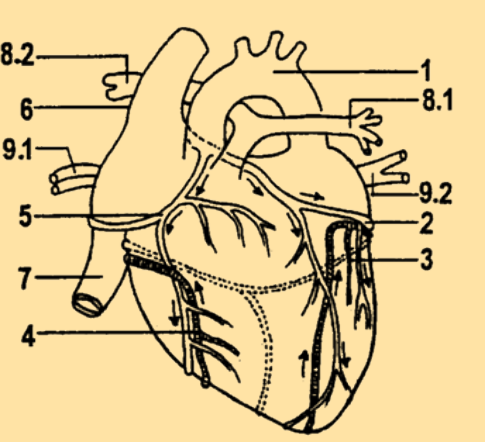
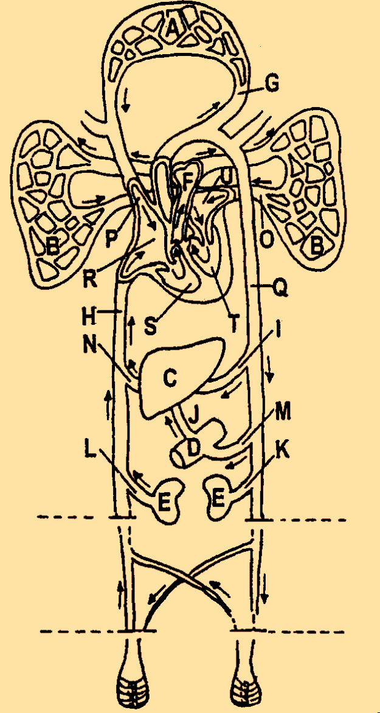
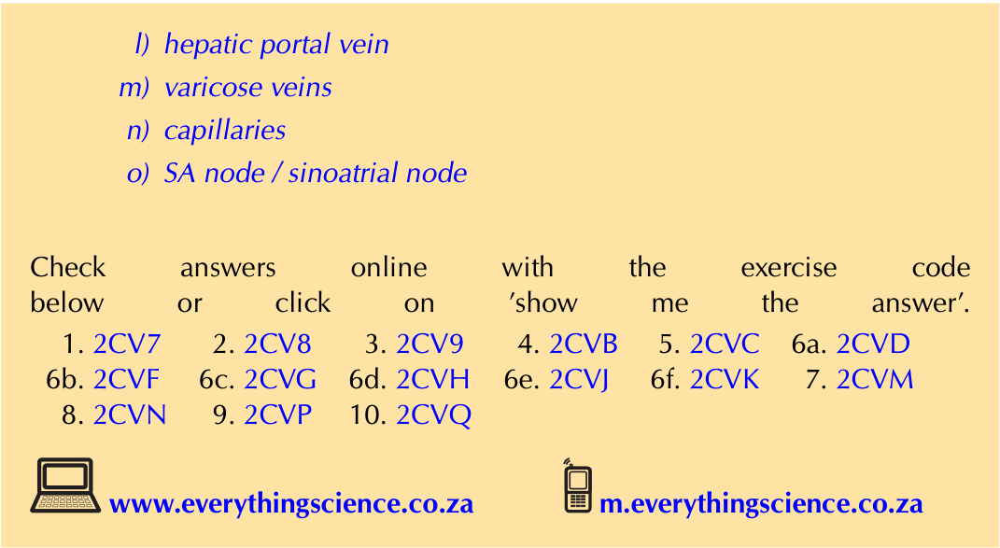

# **CHAPTER 8** 

# _Transport systems in animals_ 

|**8.1**|**_Overview_**|244|
|---|---|---|
|**8.2**|**_Circulatory systems in animals_**|245|
|**8.3**|**_Lymphatic circulatory system_**|262|
|**8.4**|**_Cardiovascular diseases_**|266|
|**8.5**|**_Treatment of heart diseases_**|269|
|**8.6**|**_Summary_**|272|

8 Transport systems in animals 

8.1 Overview ESG8V 

### Introduction ESG8W 

All living organisms require oxygen and nutrients, and a method of removing carbon dioxide and waste products. However, the circulatory system is not limited to the delivery of nutrients, gas exchange, and waste removal. Hormones, too, rely on the circulatory system to reach target organs, and the immune system depends on the transport of white blood cells and antibodies. This chapter discusses transport systems found in mammalian systems, with a focus on transport systems found in humans. 

##### **Key concepts** 

- There are open and closed circulatory systems. In an open circulatory system blood enters a cavity, in a closed circulatory system blood remains in vessels. 

- A double closed circulation system consists of the pulmonary and systemic circulatory systems. 

- The direction of blood flow is significant. In the systemic circulatory system oxygenated blood is transported to the body and deoxygenated returns to the heart. In the pulmonary circulatory system, deoxygenated blood is sent to the lungs, and oxygenated blood is returned to the heart. 

- Specialised cells (sinoatrial node) send signals to the atrioventricular node to cause the atria and ventricles to contact and control the cardiac cycle and heart rate. 

- The structure of blood vessels such as arteries, veins and capillaries are suited to their function. 

- The lymphatic system transports lymph around the body and returns fluid to the blood circulatory system. 

- The lymphatic system also plays an important role in immunity. 

- Conditions and diseases of the heart and circulatory system include high and low blood pressure, heart attacks and strokes. Treatments include stents, valve replacements, bypass surgery, pacemakers, and heart transplants. 

## 8.2 Circulatory systems in animals ESG8X 

Transport systems are crucial to survival. Unicellular organisms rely on simple **diffusion** for transport of nutrients and removal of waste. Multicellular organisms have developed more complex **circulatory** systems. 

### Open and closed circulation systems 

#### ESG8Y 

There are two types of circulatory systems found in animals: **open** and **closed** circulatory systems. 

##### **Open circulatory systems** 

In an open circulatory system, blood vessels transport all fluids into a cavity. When the animal moves, the blood inside the cavity moves freely around the body in all directions. The blood bathes the organs directly, thus supplying oxygen and removing waste from the organs. Blood flows at a very slow speed due to the absence of smooth muscles, which, as you learnt previously, are responsible for contraction of blood vessels. Most invertebrates (crabs, insects, snails etc.) have an open circulatory system. Figure 8.1 shows a schematic of an open circulatory system delivering blood directly to tissues. 


> **[Diagram Context - Textbook_LifeSciences_Gr10_Transport_systems_in_animals.pdf-0003-07.png]**
> This educational graphic is a simplified block-style diagram illustrating the human circulatory system. It features visible labels for "Heart", "Valves", and "Tissues", connected by tubular pathways with pink outgoing arrows and blue incoming arrows indicating the direction of blood flow. Conceptually, it helps Grade 10 Life Sciences learners understand the unidirectional flow of blood pumped by the heart through valves toward body tissues and back.


Figure 8.1: Open circulatory system. 

##### **Closed circulatory systems** 

Closed circulatory systems are different to open circulatory systems because blood never leaves the blood vessels. Instead, it is transferred from one blood vessel to another continuously without entering a cavity. Blood is transported in a single direction, delivering oxygen and nutrients to cells and removing waste products. Closed circulatory systems can be further divided into **single** circulatory systems and **double** circulatory systems. 

Single and double circulation systems 

ESG8Z 

The circulatory system is a broad term that encompasses the **cardiovascular** and **lymphatic** systems. The lymphatic system will be discussed later in this chapter. The cardiovascular system consists of the heart (cardio) and the vessels required for transport of blood (vascular). The vascular system consists of arteries, veins and capillaries. Vertebrates (animals with backbones like fish, birds, reptiles, etc.), including most mammals, have closed cardiovascular systems. The two main circulation pathways in invertebrates are the **single** and **double** circulation pathways. 

##### **Single circulatory pathways** 

Single circulatory pathways as shown in the diagram below consist of a double chambered heart with an atrium and ventricle (the heart structure will be described in detail later in this chapter). Fish possess single circulation pathways. The heart pumps deoxygenated blood to the gills where it gets oxygenated. Oxygenated blood is then supplied to the entire fish body, with deoxygenated blood returned to the heart. 


Figure 8.2: Single circulation system as found in a typical fish species. The red represents oxygen-rich or oxygenated blood, the blue represents oxygen-deficient or deoxygenated blood. 

##### **Double circulatory systems** 

Double circulation pathways are found in birds and mammals. Animals with this type of circulatory system have a four-chambered heart. 


##### **FACT** 

Humans, birds, and mammals have a four-chambered heart. Fish have a two-chambered heart, one atrium and one ventricle. Amphibians have a three-chambered heart with two atria and one ventricle. The advantage of a four chambered heart is that there is no mixture of the oxygenated and deoxygenated blood. 

Figure 8.3: Double circulation system showing pulmonary and systemic circuits. 

The right atrium receives deoxygenated from the body and the right ventricle sends it to the lungs to be oxygenated. The left atrium receives oxygenated blood from the lungs and the left ventricle sends it to the rest of the body. Most mammals, including humans, have this type of circulatory system. These circulatory systems are called ’double’ circulatory systems because they are made up of two circuits, referred to as the **pulmonary** and **systemic** circulatory systems. 

Human circulatory systems ESG92 

The human circulatory system involves the **pulmonary** and **systemic** circulatory systems. The **pulmonary circulatory system** consists of blood vessels that transport deoxygenated blood from the heart to the lungs and return oxygenated blood from the lungs to the heart. In the **systemic circulatory system** , blood vessels transport oxygenated blood from the heart to various organs in the body and return deoxygenated blood to the heart. 

##### **FACT** 

A simulation that shows how the human circulatory system is divided into two circuits: the systemic and the pulmonary circulatory systems: `http://www. biologyinmotion. com/cardio/ index.html` 

##### **Pulmonary circulation system** 

In the pulmonary circulation system, deoxygenated blood leaves the heart through the right ventricle and is transported to the lungs via the **pulmonary artery** . The pulmonary artery is the only artery that carries deoxygenated blood. It carries blood to the capillaries where carbon dioxide diffuses out of the blood into the **alveoli** (lung cells) and then into the lungs, where it is exhaled. At the same time, oxygen diffuses into the alveoli, and then enters the blood and is returned to the left atrium of the heart via the **pulmonary vein** . 


Figure 8.4: Pulmonary circulation system. Oxygen rich blood is shown in red; oxygendepleted blood is shown in blue. 

##### **Systemic circulation** 

Systemic circulation refers to the part of the circulation system that leaves the heart, carrying oxygenated blood to the body’s cells, and returning deoxygenated blood to the heart. Blood leaves through the left ventricle into the **aorta** , the body’s largest artery. The aorta leads to smaller arteries that supply all organs of the body. These arteries finally branch into capillaries. In the capillaries, oxygen diffuses from the blood into the cells, and waste and carbon dioxide diffuse out of cells and into blood. Deoxygenated blood in capillaries then moves into venules that merge into veins, and the blood is transported back to the heart. These veins merge into two major veins, namely the **superior vena cava** and the **inferior vena cava** (Figure 8.9). The movement of blood is indicated by arrows on the diagram. The deoxygenated blood enters the right atrium via the the superior vena cava. Major arteries supply blood to the brain, small intestine, liver and kidneys. However, systemic circulation also reaches the other organs, including the muscles and skin. The following diagram (Figure 8.5) shows the circulatory system in humans. 


Figure 8.5: The systemic circulatory system supplies blood to the entire body. 

The heart and associated blood vessels 

ESG93 

##### **FACT** 

Clench your fist - the size of your fist is more or less the size of your heart. 

##### **External structure of the heart** 

The heart is a large muscle, about the size of your clenched fist, that pumps blood through repeated rhythmic contractions. The heart is situated in your thorax, just behind your breastbone, in a space called the **pericardial cavity** . The heart is enclosed by a double protective membrane, called the **pericardium** . The region between the two pericardium layers is filled with **pericardial fluid** which protects the heart from shock and enables the heart to contract without friction. 

The heart is a muscle ( **myocardium** ) and consists of four chambers. The upper two chambers of the heart are called **atria** (singular= atrium). The two atria are separated by the inter-atrial septum. The lower two chambers of the heart are known as **ventricles** and are separated from each other by the interventricular septum. The ventricles have more muscular walls than the atria, and the walls of the right ventricle, which supplies blood to the lungs is less muscular than the walls of the left ventricle, which must pump blood to the whole body. 


Figure 8.6: The external structure of the heart: the major part of the heart consists of muscles and is known as the myocardium. The region in which the heart is found is known as the pericardial cavity, which is enclosed by the pericardium. 

In addition, there are a number of large blood vessels that carry blood towards and away from the heart. The terms ‘artery’ and ‘vein’ are not determined by what the vessel transports (oxygenated blood or deoxygenated) but by whether the vessel flows to or from the heart. 

**Arteries** take blood away from the heart and generally carry oxygenated blood, with the exception of the pulmonary artery. **Veins** transport blood towards the heart and generally carry deoxygenated blood, except the pulmonary vein. On the right side of the heart, the **superior vena cava** transports deoxygenated blood from the head and arms and the inferior vena cava transports deoxygenated blood from the lower part of the body back to the heart, where it enters the right atrium. The **pulmonary artery** carries deoxygenated blood away from the right ventricle of the heart towards the lungs to be oxygenated. 

##### **FACT** 

In humans, the left lung is smaller than the right lung to make room in the chest cavity for the heart. 

On the left side of the heart, the **pulmonary vein** brings oxygenated blood from the lungs towards the left atrium of the heart and the oxygenated blood exits the left ventricle via the **aorta** and is transported to all parts of the body. 

Since the heart is a muscle, and therefore requires oxygen and nutrients itself to keep beating, it receives blood from the **coronary arteries** , and returns deoxygenated blood via the **coronary veins** . 

##### **Internal structure of the heart** 

As previously mentioned, the heart is made up of **four chambers** . There are **two atria** at the top of the heart which receive blood and **two ventricles** at the bottom of the heart which pump blood out of the heart. The **septum** divides the left and right sides of the heart. 


Figure 8.7: The internal structure of the mammalian heart. 

##### **FACT** 

This video shows the passage of blood through the heart and around the body. See video: 2CTW 

##### **FACT** 

**Memory trick** : the t **RI** cuspid valve is found on the **RI** ght side of the heart. 

In order to make sure that blood flows in only one direction (forward), and to prevent backflow of blood, there are valves between the atria and ventricles (atrioventricular valves). These valves only open in one direction, to let blood into the ventricles, and are flapped shut by the pressure of the blood when the ventricles contract. 

The **tricuspid valve** is situated between the right atrium and the right ventricle while the **bicuspid** / **mitral valve** is found between the left atrium and the left ventricle. Strong tendinous cords ( _chordae tendineae_ ) attached to valves prevent them from turning inside out when they close. The **semi-lunar valves** are located at the bottom of the aorta and pulmonary artery, and prevent blood from re-entering the ventricles after it has been pumped out of the heart. 

In the previous sections we have discussed pulmonary and systemic circulation, and we have described the four chamber structure of the heart as well as some of the major arteries and veins that transport blood towards and away from the heart. In order to summarise all this information, study the flow diagram below which describes the passage of deoxygenated blood through one full cycle. 


Figure 8.8: Flow diagram depicting movement of blood from the heart through the circulatory system. The blue boxes represent deoxygenated blood, the purple boxes represent capillary networks where gaseous exchange occurs and the red boxes represent stages at which the blood is oxygenated. 

### Major organs and systemic circulation 

#### ESG94 

All the organs of the body are supplied with blood. This is necessary so that the cells can obtain oxygen, which is required for cellular respiration, as well as essential nutrients. Each organ has an artery that supplies it with blood from the heart. Metabolic wastes, including carbon dioxide, need to be removed from cells and returned to the heart. These move into the capillaries which enter into veins that eventually enters either the superior or inferior vena cava which then enters the right atrium. 

Arteries and veins have been named according to the organ to which they supply blood. The **liver** receives oxygenated blood from the heart via the hepatic artery. This artery runs alongside the **hepatic portal vein** . The hepatic portal vein contains nutrients that have been absorbed by the digestive system. This nutrient-rich blood must first pass through the liver, so that the nutrient composition of the blood can be controlled. Blood passes from the liver to the heart through the **hepatic** vein. Metabolic waste is circulated in the blood, and if allowed to accumulate, would eventually reach toxic levels. The **kidneys** are supplied with blood (which contain waste) via the **renal** arteries. The kidneys filter metabolic waste from the blood, passing it to urine to be excreted safely. Blood leaves the kidney via the renal vein. 


Figure 8.9: Major blood vessels of the circulatory system. 

The **brain** is supplied with blood via the **carotid** arteries and the vertebral arteries. The blood from the brain is drained via the **jugular** veins. The brain is supplied with 15% of the total amount of blood pumped by the heart. The heart is also a muscle (myocardium) that requires blood flow to work. Blood is supplied to the heart via two **coronary arteries** , and leaves the heart via four **cardiac veins** . 

##### **Investigation: Dissecting a mammalian heart** 

##### **Aim:** 

To dissect a mammalian heart (sheep or ox heart). 

##### **Apparatus:** 

- your teacher will give each group a heart to dissect 

- a scalpel handle with a blade or a sharp non-serrated knife 

- a sharp pair of scissors 

- a pair of forceps 

- gloves 

- paper towel 

- pictures of the external and internal views of the heart 

##### **Method:** 

1. Work in groups of four. 

2. Place the heart on the dissecting board with the atria at the top and the ventricles facing downwards. 

3. Carefully examine the external view of the heart. Try identify the vertical and horizontal groves on the heart. This is the position of the internal walls between the chambers of the heart. 

4. Examine and note the difference in the walls of the ventricles and atria. Also note the difference in appearance between the walls of the ventricles and atria. 

5. With the scalpel or sharp knife carefully cut the heart open across the left atrium. 

6. Compare the thickness and the size of the right ventricle and atrium. 

7. Identify the valves and examine the tendinous cords which are attached to the valves. 

8. Identify the semi-lunar valves at the bottom of the pulmonary artery. 

9. Now cut through the left side of the heart in the same way as you did the right side of the heart. 

10. Carefully cut through the septum of the heart so that you have two halves. 

##### **Questions:** 

1. What is the smooth outer layer of the heart called? 

2. Did you notice any fat around the heart? 

3. Did you notice a difference between the atria and ventricles externally? 

4. Name the blood vessels visible on the outside of the heart. 

5. Compare the thickness of the walls of the atria and ventricles. Explain why they are different. 

6. Explain the difference between the left and right ventricular walls. 

### The cardiac cycle 

#### ESG95 

A cardiac cycle refers to the sequence of events that happens in the heart from the start of one heartbeat to the start of the subsequent heartbeat. During a cardiac cycle the atria and the ventricles work separately. The sinoatrial node (pacemaker) is located in the right atrium and regulates the contraction and relaxing of the atria. 

- At rest, each heartbeat takes approximately 0,8 seconds. 

- The normal heart rate at rest is approximately 72 beats per minute. 

- During **systole** the heart muscle contracts. 

- During **diastole** the heart muscle relaxes. 

The phases of the cardiac cycle will be broken down and explained in the following section: 

##### **Phase 1: Atrial systole (Atrium contracts)** 

- Blood from the superior and inferior vena cava flows into the right atrium. 

- Blood from the pulmonary veins flows into the left atrium. 

- The atria contract at the same time. 

- This contraction lasts for about 0,1 seconds. 

- Blood is forced through the tricuspid and bicuspid valves into the ventricles. 

##### **Phase 2: Ventricular systole (Ventricle contracts)** 

- Ventricles relax and fill with blood. 

- The ventricles contract for 0,3 seconds. 

- Blood is forced upwards, closing the bicuspid and tricuspid valves (lubb sound). 

- The blood travels up into the pulmonary artery (on the right) and the aorta (on the left). 

- The atria are relaxed during ventricular systole. 

##### **Phase 3: General diastole: (General relaxation of the heart)** 

- The ventricles relax, thus decreasing the flow from the ventricles. 

- Once there is no pressure the blood flow closes the semi-lunar valves in the aorta and the pulmonary artery (dubb sound). 

- General diastole lasts for about 0,4 seconds. 


Figure 8.10: The cardiac cycle of contraction and relaxation of heart muscles during pumping of blood throughout the body. 

##### **The sound the heart makes** 

The heart makes two beating sounds. One is loud and one is soft. We call this the **lubb dubb** sound. The **lubb** sound is caused by the pressure of the ventricles contracting, forcing the atrioventricular valves shut. The **dubb** sound is caused by the lack of pressure in the ventricles which causes the blood to flow back and close the semi-lunar valves in the pulmonary artery and aorta. A doctor uses a **stethoscope** to listen to the heartbeats. Alternatively, a person’s pulse can be measured by pressing a finger (other than the thumb which already has a pulse) against the brachial artery in the wrist or the carotid artery next to the trachea. The pulse of the heart allows us to measure the heart rate which is the number of heartbeats per unit time. 

##### **Mechanisms for controlling cardiac cycle and heart rate (pulse)** 

The cardiac cycle is controlled by nerve fibres extending from nodes of nerve bundles through the heart muscle. There are two nodes, namely the **sinoatrial node (SA node)** and the **atrioventricular node (AV node)** . The SA node is located within the wall of the right atrium while the AV node is located between the atria and the ventricles. Electrical impulses generated in the SA node cause the right and left atria to contract first, initiating the cardiac cycle. The electrical signal reaches the AV node, where the signal pauses, before spreading through conductive tissues called the bundles of His and Purkinje fibres. These fibres branch into pathways which supply the right and left ventricles, causing the ventricles to contract. The SA node is the pacemaker of the heart since electrical signals are normally generated there - without any stimulation from the nervous system **(automaticity)** . However, although the heart rate is automatic, it changes during exercise or when experiencing intense emotions like fear, anger and excitement. This is as a result of added stimulation from the nervous system and hormones, such as adrenaline. 

##### **FACT** 

Simple simulation of how electrical activity spreads over the heart. `http: //en.wikipedia. org/wiki/File: ECG_Principle_ fast.gif` 

##### **Electrical activity** 

The electrical activity in the heart is so strong that it can be measured from the surface of the body as an **electrocardiogram** (ECG). A normal heart has a very regular rhythm. **Arrhythmia** is a condition where the heart has an abnormal rhythm, as shown in the figures. **Tachycardia** is when the _resting_ heart rate is too fast (more than 100 beats per minute), and **bradycardia** is when the heart rate is too slow (less than 60 beats per minute). 


Figure 8.11: Electrocardiogram depicting different heart rhythms. 

**Investigation: Investigating heart rates before, during and after strenuous exercise** 

##### **Aim:** 

To investigate your heart rate before, during and after strenuous exercise. 

##### **Apparatus:** 

- stopwatch 

- pen and paper for recording 

##### **Method:** 

1. Work in pairs on the field and ensure you have a stop watch. 

2. One partner performs the experiment and the other records the results. Partners then swap roles. 

3. Take the resting pulse rate before exercising. 

4. One partner runs quickly around the field twice. 

5. Immediately after the run take his/her pulse. 

6. Continue to take his pulse every minute for 5 minutes. 

7. Record the results and plot a graph using the data pertaining to you. 

##### **Results:** 

Record your results here: 

|Time|Heart rate (beats/minute)|
|---|---|
|Before exercise (resting)||
|0 min(immediatelyafter exercise)||
|1 min (after exercise)||
|2 min||
|3 min||
|4 min||
|5 min||

Draw a line graph to illustrate your results. Show the resting pulse rate as a separate dotted line on the axis. 

##### **Conclusions:** 

Write your conclusion. 

##### **FACT** 

##### **Questions:** 

1. Write a hypothesis for this investigation. 

2. Write down the independent variable. 

3. Write down the dependent variable. 

4. Name ONE factor that must be kept constant during this investigation. 

**Cardiac output** is the volume of blood that is pumped by the heart in one-minute. Cardiac output is equal to the stroke volume (SV) multiplied by the heart rate (HR). 

5. Write down two ways in which the accuracy of this investigation can be improved. 

6. What conclusions can be made about your cardiovascular fitness? 

7. Explain why the heart rate increases during exercise. 

##### **Stroke Volume** 

The stroke volume is the amount of blood pumped through the heart during each cardiac cycle. The stroke volume can change depending on the needs of the body. During exercise, muscles need more oxygen and glucose in order to produce energy in the form of ATP. Therefore the heart increases its stroke volume and stroke rate to meet this demand. This is a temporary change to maintain homeostasis, and after exercise the heart rate and stroke volume return to normal. 

When a person exercises regularly, and is fit, the heart undergoes certain longterm adaptations. The heart muscle gets stronger, and expels more blood with each contraction. There is therefore a greater stroke volume with each heartbeat. Since the heart expels more blood with each stroke, the heart has to beat less often in order to maintain the same volume of blood flow. Therefore, fit people often have lower resting heart rates. 

##### **Blood Pressure** 

Blood pressure refers to the force that the blood exerts on the blood vessel walls. Blood pressure is determined by the size of the blood vessels and ensures that blood flows to all the parts of the body. Normal blood pressure is 120/80 (120 over 80) measured in units of mercury (mm Hg). The 120 represents the systolic pressure, which is when the ventricles contract. The 80 represents the diastolic pressure, which is when general diastole occurs. 

Blood pressure can be increased by smoking, stress, adrenalin surges, water retention, high cholesterol, obesity and lack of exercise. High blood pressure **(hypertension)** is dangerous and increases the risk of an aneurysm, stroke or heart attack. Low blood pressure **(hypotension)** can lead to light-headedness and fainting because of insufficient blood supply to the brain. 

ESG96 

##### **FACT** 

Laughing is good exercise for your heart. Whenever you laugh, the blood vessels dilate (open up), causing the blood flow to increase, thus keeping your heart healthy. 

### Blood vessels 

We will now examine the structure and function of arteries, capillaries, veins and valves. 

##### **Arteries** 

**A** rteries carry blood **A** way from the heart. The pressure created by the pumping heart forces blood through the arteries. 


Arteries have three layers. They have an outside layer made up of connective tissue; a middle layer made up of smooth muscle, to allow contraction of the arteries in order to regulate the pressure of blood flow, and an inside layer of tightly connected simple squamous endothelial cells. The large arteries close to the heart branch into smaller arterioles (smaller arteries) and eventually branch into capillaries. 

Figure 8.12: Micrograph of artery. 

##### **Capillaries** 

Capillaries are little more than a single layer of endothelial cells. Capillaries form intricate networks throughout the tissues. They allow water, nutrients and gases to diffuse out of the blood and waste materials to diffuse into the blood. This exchange occurs between the blood and the tissue fluid. The tissue fluid is the fluid surrounding the cells. The blood cells never come into contact with the cells. The blood and tissue fluid exchange material, and the tissue fluid then exchanges material with the cells. 


Figure 8.13: Diagram representing the branching of an artery into arterioles. These subsequently form the capillary bed which empties into several venules, leading to the vein. 

##### **Veins** 

The intricate networks formed by the capillaries eventually converge to form venules, (small veins). The venules then converge to form veins which return the blood to the heart. Vein walls only consist of two layers. The outer layer is made up of connective tissue whereas the inner layer is made up of endothelial cells. 

##### **Valves** 

Once the blood has passed through the capillaries very little blood pressure remains to return blood to the heart.Instead of pressure from the heart veins use a series of valves to force blood to return to the heart. Contraction of the muscles squeezes the veins, pushing the blood through them. The valves cause the blood to flow in only one direction, back to the heart. 


Figure 8.14: Schematic diagram of a vein. 

Comparison between arteries, veins and capillaries ESG97 

The figure and table below summarise the differences between arteries, capillaries and veins. 


Figure 8.15: Cross-section showing the differences between a) arteries, b) veins and c) capillaries. 

##### **FACT** 

|The average adult|**Arteries**|**Capillaries**|**Veins**|
|---|---|---|---|
|heart beats:<br>_•_ 72 times a|blood moves**away**<br>from the heart|blood supply at tissue<br>level|blood**returned**to the<br>heart|
|minute<br>_•_ 100 000<br>times a day<br>_•_ 3 600 000<br>times a year|thick middle layer of<br>involuntary muscle to<br>increase or decrease<br>diameter|one layer of<br>endothelium with very<br>small diameter|thin middle layer as<br>pressure is reduced|
|<br>_•_ A billion<br>times during<br>a lifetime.|inner layer of<br>endothelium which<br>reduces friction|only endothelium layer<br>present|larger diameter of inner<br>cavity, lined with<br>endothelium to reduce<br>friction|
||situated deeper in the<br>tissue to maintain body<br>temperature|situated at tissue level<br>only|situated near the<br>surface of the skin to<br>release heat|
||no valves except in the<br>base of the aorta and<br>the pulmonary arteries|no valves present|semi-lunar valves are<br>present at intervals, to<br>prevent back flow of<br>blood|
||blood always under<br>high pressure|blood is under high<br>pressure where red<br>blood cells are forced<br>to flow through in<br>single file|blood is under low<br>pressure|
||a pulse can be felt as<br>blood flows|no pulse|no pulse can be<br>detected|

Table 8.1: Table comparing arteries, capillaries, and veins 

## 8.3 Lymphatic circulatory system ESG98 

The lymphatic system is part of the circulatory system, comprising a network of inter-connected tubes known as **lymphatic vessels** that carry a clear fluid called **lymph** towards the heart. 

The lymphatic organs play an important part in the immune system. The lymphatic system transports the white blood cells which are important in the immune response against pathogens. 

Composition of the lymphatic system ESG99 

The lymphatic system is composed of lymph vessels, lymph ducts, lymph nodes and organs. The organs associated with the lymphatic system are the **spleen** and **thymus** . The spleen is the boundary between the blood and the lymphatic system. Knots of lymphatic tissue in the spleen add lymphocytes to the blood. 

The spleen also acts as a filter for the blood, and helps to destroy worn out red-blood cells. In the event of damage to the spleen, it can be removed and its functions will be carried out by the liver, the bone marrow and the lymph nodes. 


Figure 8.16: Diagram of human lymphatic system. 

**Lymph vessels** are located as a network throughout all tissues in the body. Lymph vessels assist the circulatory system and all the cells of the body by removing wastes, germs and excess water from the tissue fluid. Lymph vessels carry lymph fluid from the bottom of the body up towards the heart and also drains from the head and shoulders as well as the arms. 

**Muscle contractions** help push the lymph fluid upwards, and **valves** prevent the lymph fluid from flowing backwards. Many lymph vessels eventually merge into two large lymphatic vessels, called **lymphatic ducts** which empty into veins in the neck. The **thoracic duct** collects from the left side of the body and the lower right side of the body and empties into the left subclavian vein. The right thoracic duct collects from the right arm, thorax, neck and head, and drains into the right subclavian vein. 

Most of the disease-fighting function of the adult mammal is carried out by the **lymph nodes** which occur along the lymph ducts. Lymph nodes are small, irregularly-shaped masses through which lymph vessels flow. Clusters of nodes occur in the armpits, groin, and neck. Cells of the immune system line channels through the nodes and attack bacteria and viruses travelling in the lymph, so they basically act as tiny filters. 


Figure 8.17: Interaction between lymphatic and cardiovascular circulatory systems. 

Functions of lymphatic system ESG9B 

The main functions of the lymphatic system are as follows: 

- The main function of the lymphatic system is to **collect and transport tissue fluids** from the intercellular spaces in all the tissues of the body, back to the veins in the blood system. 

- Lymph plays an important role in **returning plasma proteins to the bloodstream** . 

- **Digested fats are absorbed** and then transported from the villi in the small intestine to the bloodstream via the lymph vessels. 

- **Lymphocytes are manufactured in the lymph nodes** 

- Antibodies manufactured in the lymph nodes assist the body to build up an effective **immunity** to infectious diseases. 

- Lymph nodes **play an important role in the defence mechanism of the body** . They filter out micro-organisms (such as bacteria) and foreign substances such as toxins. 

##### **FACT** 

Watch this video on lymph. See video: 2CTY 

- Lymph transports large molecular compounds (such as enzymes and hormones) from their manufactured sites to the bloodstream. 

##### **NOTE:** 

Elephantiasis is a disease characterised by thickening of the skin and underlying tissues, especially in the legs and genitals. It occurs when the body becomes infected by parasitic infections, which target the Figure 8.18: An Ethiopian farmer affected lymphatic system. by elephantiasis after being infected by a worm that settled in the lymphatic system . 

##### **A comparison of the cardiovascular and lymphatic systems** 

Table 8.2 provides a comparison of the cardiovascular and lymphatic systems. 

|**Cardiovascular System**|**Lymphatic System**|
|---|---|
|_Blood_is responsible for collecting<br>and distributing oxygen, nutrients<br>and hormones to the tissues of entire<br>body.|_Lymph_is responsible for collecting<br>and removing waste products left<br>behind in the tissues.|
|_Blood flows_in the arteries,<br>capillaries,and veins.|_Lymph flows_in an open circuit from<br>the tissues into lymphatic vessels.|
|_Blood_flows towards the heart and<br>awayfrom the heart.|_Lymph_flows in one direction only<br>(towards the heart).|
|_Blood_is pumped by the heart to all<br>parts of the body.|_Lymph is not pumped_. It passively<br>flows from the tissues into the lymph<br>capillaries.|
|_Blood_consists of the liquid plasma<br>that transports the red and white<br>blood cells andplatelets.|_Lymph_that has been filtered and is<br>ready to return to the cardiovascular<br>system is a clear or milkywhite fluid.|
|_Blood is visible_and damage to blood<br>vessels causes obvious signs such as<br>bleeding or bruising.|_Lymph is colourless or translucent_<br>and damage to the lymphatic system<br>is difficult to detect until swelling<br>occurs.|
|_Blood is filtered_by the kidneys.|_Lymph is filtered_by lymph nodes<br>located throughout the body.|

Table 8.2: Comparison between the cardiovascular system and the lymphatic system 

## 8.4 Cardiovascular diseases ESG9C 

Cardiovascular diseases affect the heart or blood vessels (arteries, veins and capillaries). Cardiovascular diseases are the biggest cause of deaths worldwide, and the incidence of these diseases is rising rapidly in countries like South Africa. Cardiovascular diseases can be avoided through improvements in eating habits and through regular exercise. In this section we will study the causes of heart attacks and strokes as well as how these may be treated. We will also study the causes of high and low blood pressure and how these have an effect on our well-being. We will finally discuss the types of treatments that are available such as stents, valve replacements, bypass surgery, pacemakers and heart transplants. 

### Heart attack 

#### ESG9D 

This is also referred to as a **myocardial infarction** . Heart muscles are provided with oxygenated blood by a system of coronary arteries. Blocked flow of blood can cause the death of cardiac muscle due to lack of oxygen. Arteries get blocked as a result of the gradual build-up of lipids and cholesterol, which form a **plaque** . This condition of plaque build up in the arteries is referred to as **atherosclerosis** . When a plaque bursts, it causes blood to clot at the site of the rupture and obstructs the artery (see diagram in Figure 8.20). Often there are no symptoms of atherosclerosis. However, some people who have narrowed coronary arteries experience chest pain, ( **angina** ), when blood flow to the heart is insufficient. 


Figure 8.19: Heart attack: the blood clot blocks the coronary arteries and cardiac muscle dies from lack of oxygen. 


Figure 8.20: 1. Normal arteries have a wide diameter through which blood can easily flow. 2. Plaque forms on the walls of the artery, narrowing the lumen. 3. When the plaques bursts, platelets form a blood clot at the site of rupture, which can obstruct the artery. 

Hypertension 

ESG9F 

As previously mentioned blood pressure is the pressure exerted by the blood against the walls of the blood vessels, especially the arteries. Normal blood pressure at rest is within the range of 100–140 mm Hg systolic (top reading) and 60–90 mm Hg (bottom reading). High blood pressure (hypertension) is said to be present if it is persistently at or above 140/90 mm Hg. Hypertension is a major risk factor for strokes, heart attacks and bursting of blood vessels (aneurysms). Hypertension is essentially caused by a resistance to blood flow in blood vessels. 


Figure 8.21: The instrument used to measure blood pressure is a **sphygmomanometer** . This figure shows an automated arm blood pressure meter showing arterial hypertension. From the top reading systolic pressure is 158 mm Hg and diastolic reading is 99 mm Hg and the heart rate is 80 beats per minute. 

Hypotension ESG9G 

Hypotension refers to abnormally **low** blood pressure, especially in the arteries of the systemic circulation. A patient is considered hypotensive if he/she has a systolic blood pressure less than 90 millimetres of mercury (mm Hg) or diastolic pressure being less than 60 mm Hg. However, in practice, blood pressure is considered too low only if noticeable symptoms are present, such as feeling light-headed. If the blood pressure is sufficiently low, fainting and often seizures will occur. Severely low blood pressure can deprive the brain and other vital organs of oxygen and nutrients, leading to a life-threatening condition called **shock** . 

Stroke ESG9H 

A stroke results when a clot, burst artery or blood vessel interrupts flow of blood to the brain, resulting in glucose and oxygen not reaching the brain. This causes impairment in speech, movement and memory. Larger strokes can result in paralysis or death. 

### Aneurysm 

#### ESG9J 

An aneurysm is a localised blood-filled bubble in an artery wall. These bubbles form due to a weakness in the blood vessel wall and can grow quite large. Aneurysms can occur in many places in the body, including the brain, abdomen or aorta. When aneurysms burst, they result in massive internal blood loss and death. 


Figure 8.22: A hemorrhagic stroke caused by a burst aneurysm in the brain. 

## 8.5 Treatment of heart diseases ESG9K 

We will now examine some of the treatment of cardiovascular diseases. 

### Stents ESG9M 

In some cases, a small wire mesh tube is inserted into a blocked or narrowed artery to keep it open. This is called a percutaneous coronary intervention. To perform this procedure, doctors insert a needle into the femoral artery, and then thread a very thin wire through the arteries until it reaches the heart and the area of blockage. A thin catheter with a small wire coil (stent) and in inflatable balloon is then threaded over the thin wire and inserted into the coronary artery at the site of the blockage. Once in position, the balloon is gently inflated to open the artery and remove the blockage. The stent is left in the artery so that the artery does not block again, and the catheter is removed. 


Figure 8.23: Stent replacement in heart patients. 

### Pacemaker ESG9N 

Pacemakers are small electrical devices that get implanted into the chest or abdomen of patients in order to help control arrhythmias (abnormal heart rhythms). Modern devices are quite advanced and can learn a patient’s normal heart-beat patterns and detect when the heart enters an abnormal rhythm ( e.g. skips a beat). The device will then send out a little electrical pulse to stimulate the heart to beat and restore a normal heart beat. 

### Valve replacement ESG9P 

Valve replacement surgery is the replacement of one or more of the heart valves with an artificial valve. There are two types of valves presently being used: **Biological valves** are manufactured from animal or human tissue. These valves have a life span of approximately 12 to 15 years. If biological valves are used the patient generally does not require additional blood thinning medication. **Mechanical valves** are manufactured from synthetic materials. These valves, because they are made of synthetic materials last longer, but the patient needs to take anti-coagulant medication for the rest of their lives. 

### Coronary Bypass Surgery 

#### ESG9Q 

This is the most common type of surgery used for the treatment of coronary heart disease. The surgeon removes a section of a vein from the patient’s leg and then carefully grafts the removed vein (attaches) onto the aorta to bypass the blocked part of the artery. 

##### **FACT** 

The survival after heart transplant surgery is about 88% after the first year, 75% after 5 years and 56% after 10 years. 

##### **FACT** 

### Heart Transplant 

#### ESG9R 

A heart transplant is the surgical removal of a person’s diseased heart and replacement with a healthy heart from a donor. Heart failure is a condition in which the heart is damaged or weak. As a result, it cannot pump enough blood to meet the body’s needs. Heart transplants are done as a life-saving measure for end-stage heart failure. Donor hearts are in short supply, therefore patients who need heart transplants go through a very careful selection process. They must be sick enough to need a new heart, yet healthy enough to receive it. Survival rates for people receiving heart transplants have improved, especially in the first year after the transplant. 

The first human heart transplant was performed on the 3rd December 1967 by Professor Christiaan Barnard, a **South African** heart surgeon. The patient, Mr Louis Washkansky, unfortunately only survived for 18 days after the surgery. However the cause of death was pneumonia, and not his new heart, which beat strongly till his death. 


Figure 8.24: Heart transplant by Dr Christiaan Barnard. 

## 8.6 Summary ESG9S 

- Nutrients and oxygen are required by cells for cellular respiration. These are transported by blood to the various cells. 

- Carbon dioxide and other waste products need to be transported from the cells to the exterior. This is also transported via blood. 

- There are open and closed circulatory systems. In an open circulatory system blood enters a cavity, in a closed circulatory system blood remains in vessels. 

- A double closed circulation system consists of the pulmonary and systemic circulatory systems. 

- Blood is pumped through the heart under high pressure to the various parts of the body. 

- The right side of the heart receives deoxygenated blood from the body via veins and sends it to the lungs to be oxygenated. 

- The left side of the heart receives oxygenated blood from the lungs and sends it via arteries to all parts of the body. 

- Specialised cells (sinoatrial node) send signals to the atrioventricular node to cause the atria and ventricles to contact and control the cardiac cycle and heart rate. 

- The lymphatic system is composed of lymph vessels, lymph nodes, and organs. 

- Lymph vessels assist the circulatory system and all the cells of the body by removing wastes, germs and excess water from the tissue fluid. 

- There are many diseases that affect the heart and circulatory system and many treatments are available. 

##### **Exercise 8 – 1: End of chapter exercises** 

1. The following diagrams show the heart during the cardiac cycle. The arrows represent the flow of blood. Study the diagrams and answer the questions that follow: 


   - a) Identify the structures labelled A and B respectively. 

   - b) Name and explain what happens in each of the phases of the cardiac cycle represented in: 

      - i. Diagram I 

      - ii. Diagram II 

      - iii. Diagram III 

2. Loss of a lot of blood, vomiting and diarrhoea often causes a decrease in blood volume. As a result, blood cannot move normally around the body, as blood vessels are not completely full. The tissues do not get enough blood, leading to possible death of cells and hence damage to organs. 

   - a) Explain why severe vomiting and diarrhoea would cause a decrease in the blood volume. 

   - b) What is the relationship between blood volume and blood pressure? 

3. Read the passage below and then answer the questions based on it. 

_When the ventricles of the heart pump blood into the arteries, the pressure of the blood in the arteries is high. This is called systolic pressure (average 120 mm Hg). When the heart muscle relaxes, the pressure in the arteries is much less. This is called diastolic pressure (average 80 mm Hg). The average blood pressure of a healthy person is 120 over 80._ 

_It is normal for a person’s blood pressure to differ slightly from the average. If blood pressure is too high or too low there is medication that can be used to control this. High blood pressure is called ’hypertension’ and low blood pressure is called ’hypotension’. There are several contributing factors to heart disease, namely hypertension, strokes, lack of exercise, smoking, rich fatty diets, obesity and diabetes._ 

_Research has shown that 25% of the South African population suffer from hypertension and that this is on the increase.The treatment for hypertension is expensive and has a great impact on the health system and on the economy._ 

   - a) Explain what causes the pressure in the arteries to rise and fall. 

   - b) Why is it essential that blood pressure in the capillary vessels be much lower than that in the artery? 

   - c) List **three** reasons why heart disease is on the increase in South Africa. 

   - d) Suggest **one** way in which the government could reduce the number of people with heart disease. 

4. Study the diagrams which show two cross-sections of mammalian blood vessels and answer the questions that follow: 


   - a) Which vessel, A or B is the artery? 

   - b) Provide **two** reasons for your answer to the previous question. 

   - c) Which vessel carries blood at low pressure? 

   - d) Provide an explanation for your answer to the previous question. 

   - e) Identify the parts numbered 1 to 4. 

   - f) How do capillaries differ from larger blood vessels? 

   - g) In which vessel, A or B would you expect to find valves? 

   - h) What is the function of the valves in the previous question? 

   - i) Name the blood vessel that: 

      - i. carries deoxygenated blood from the heart to the lungs 

      - ii. carries oxygenated blood from the heart for systemic circulation 

      - iii. carries blood from the digestive system to the liver 

5. Study the diagram of the lymphatic system and answer the questions that follow: 


- a) Name the components of the lymphatic system. 

b) Identify the: 

      - i. blood vessel numbered 3 

      - ii. duct numbered 4 

      - iii. structure numbered 6 

   - c) Name **two** factors that assist movement of the lymph fluid. 

   - d) State **four** functions of lymph in the human body. 

6. Multiple-choice questions 

   - a) The left side of the heart: 

      - i. transports deoxygenated blood to the lungs 

      - ii. is more muscular than the right-hand side 

iii. has a built in pacemaker 

   - iv. is a mixture of oxygenated and deoxygenated blood 

- b) Angina is: 

   - i. a panic attack caused by the release of too much adrenalin 

   - ii. a fatal heart attack 

   - iii. a serious heart cramp caused by a lack of oxygen in the cardiac muscles 

   - iv. the result of a clot in the blood vessels going to the brain 

Transport systems in animals 

- c) The stage in the cardiac cycle when the blood is pumped into the aorta and the pulmonary artery is: 

   - i. atrial systole 

   - ii. ventricular diastole 

   - iii. general diastole 

   - iv. ventricular systole 

- d) The valve between the left ventricle and the left atrium of the heart is called the: 

   - i. mitral valve 

   - ii. tricuspid valve 

   - iii. aortic semi-lunar valve 

   - iv. pulmonary semi-lunar valve 

- e) The accompanying graph indicates that changes in adrenalin secretion and the pulse rate, before, during (0 to 10 minutes) and after a cigarette was smoked. Use the given graph to indicate which one of the following deduction is a valid interpretation of the graph. 


   - i. Smoking directly causes an increase in the basal metabolic rate. 

   - ii. The cardiac muscles relax during smoking. 

   - iii. Smoking directly stimulates the pulse rate. 

   - iv. There is a no relationship between adrenalin secretion and pulse rate. 

- f) Explain why there is a relationships between smoking and adrenalin secretion. 

7. Study the accompanying diagram of the ventral view of the external structure of the heart and answer the questions that follow. 


   - a) Label parts numbered 1, 2, 7, 8.2 and 9.2 

   - b) What type of blood (oxygenated or deoxygenated) is transported by blood vessels 1, 3 and 6? 

   - c) What possible danger to human health exists if the lumen of structure 4 is obstructed with a thick layer of cholesterol? 

   - d) Discuss what happens during ventricular systole in the cardiac cycle. 

8. Study the diagrams below illustrating the structure of different types of blood vessels. Graph A shows the average blood pressure in different blood vessels in the human body, while graph B indicates the rate of blood flow in the different blood vessels. 


   - a) Tabulate three **structural** differences between an artery and a vein. 

   - b) Study graph B and give a reason why the rate of blood flow in the capillaries is very low. 

   - c) What is the systolic and diastolic pressure in the aorta? (graph A) 

9. The accompanying diagram represents the basic human blood circulation. Study the diagram and answer the questions. 


- a) Name the chambers of the heart illustrated as R and T. 

- b) Name the arteries indicated as I and K. (organ C is the liver and organ E is the kidney) 

- c) Name the vein indicated as J. 

10. Answer the following questions with a word or phrase that corresponds to the description given. 

   - a) The membrane surrounding the heart. 

   - b) The valve situated between the left atrium and left ventricle. 

   - c) The phase in the cardiac cycle when the atria contract. 

   - d) The name of the artery taking deoxygenated blood to the lungs. 

   - e) The blood circulatory system that supplies the heart muscle with oxygenated blood. 

   - f) The disorder / condition that results from a blockage in a blood vessel in the brain. 

   - g) The instrument used to measure blood pressure. 

   - h) The blood system that supplies oxygen to body cells. 

   - i) The structure that separates the left and right sides of the heart. 

   - j) The ability of the heart to contract at its own inherent rhythm. 

   - k) The layer found on the inside of veins. 

   - l) The blood vessel connecting the stomach and intestine to the liver. 

   - m) Veins that have lost their elasticity and form small sacs of blood. 

   - n) The smallest blood vessels in the body. 

   - o) The pacemaker of the heart. 

|Check|answers|online|with|the<br>exercise<br>code|
|---|---|---|---|---|
|below|or<br>click|on|’show|me<br>the<br>answer’.|
|1.2CV7|2.2CV8|3.2CV9|4.2CVB|5.2CVC<br>6a.2CVD|
|6b.2CVF|6c.2CVG|6d.2CVH|6e.2CVJ|6f.2CVK<br>7.2CVM|
|8.2CVN|9.2CVP|10.2CVQ|||
|**www**|**.everythingsc**|**ience.co.za**|**m.**|**everythingscience.co.za**|

sends it via arteries to all parts of the body. 

- Specialised cells (sinoatrial node) send signals to the atrioventricular node to cause the atria and ventricles to contact and control the cardiac cycle and heart rate. 

- The lymphatic system is composed of lymph vessels, lymph nodes, and organs. 

- Lymph vessels assist the circulatory system and all the cells of the body by removing wastes, germs and excess water from the tissue fluid. 

- There are many diseases that affect the heart and circulatory system and many treatments are available. 

##### **Exercise 9 – 1: End of chapter exercises** 

1. The following diagrams show the heart during the cardiac cycle. The arrows represent the flow of blood. Study the diagrams and answer the questions that follow: 


- a) Identify the structures labelled A and B respectively. 

- b) Name and explain what happens in each of the phases of the cardiac cycle represented in: 

   - i. Diagram I 

   - ii. Diagram II 

iii. Diagram III 

##### **_Solution:_** 

- _a) A: semi-lunar valve; B: Bicuspid or mitral valve_ 

- _b) i. Diagram I:_ **_General diastole:_** _Blood enters the atria from the venae cava (right atrium) and from the pulmonary veins (left atrium). The entire heart is relaxed._ 

   - _ii. Diagram II:_ **_Atrial systole:_** _Both atria contract and blood is pumped from the atria through the bi-/tricuspid valves to the ventricles. The bi - /tricuspid valves open easily downward to allow blood through._ 

      - _iii. Diagram III:_ **_Ventricular systole:_** _Both ventricles contract and pump blood upwards into the pulmonary artery (right ventricle) and aorta (left ventricle). The bi - / tricuspid valves close (because of chordae tendinae preventing them from opening backwards, so blood does not return to the atria. The semilunar vales open at the base of the major arteries to allow blood into them._ 

2. Loss of a lot of blood, vomiting and diarrhoea often causes a decrease in blood volume. As a result, blood cannot move normally around the body, as blood vessels are not completely full. The tissues do not get enough blood, leading to possible death of cells and hence damage to organs. 

   - a) Explain why severe vomiting and diarrhoea would cause a decrease in the blood volume. 

   - b) What is the relationship between blood volume and blood pressure? 

   - **_Solution:_** 

   - _a) Both vomiting and diarrhoea involve loss of large amounts of water from the body. The water lost from the digestive system cannot be absorbed into the blood, and as a result, blood plasma volume drops._ 

   - _b) As blood volume increases, blood pressure increases. They are thus positively correlated. If blood volume decreases, blood pressure decreases. This is because the lower volume in the vessels exerts less pressure on the vessel walls._ 

3. Read the passage below and then answer the questions based on it. 

_When the ventricles of the heart pump blood into the arteries, the pressure of the blood in the arteries is high. This is called systolic pressure (average 120 mm Hg). When the heart muscle relaxes, the pressure in the arteries is much less. This is called diastolic pressure (average 80 mm Hg). The average blood pressure of a healthy person is 120 over 80._ 

_It is normal for a person’s blood pressure to differ slightly from the average. If blood pressure is too high or too low there is medication that can be used to control this. High blood pressure is called ’hypertension’ and low blood pressure is called ’hypotension’. There are several contributing factors to heart disease, namely hypertension, strokes, lack of exercise, smoking, rich fatty diets, obesity and diabetes._ 

_Research has shown that 25% of the South African population suffer from hypertension and that this is on the increase.The treatment for hypertension is expensive and has a great impact on the health system and on the economy._ 

- a) Explain what causes the pressure in the arteries to rise and fall. 

- b) Why is it essential that blood pressure in the capillary vessels be much lower than that in the artery? 

- c) List THREE reasons why heart disease is on the increase in South Africa. 

- d) Suggest ONE way in which the government could reduce the number of people with heart disease. 

##### **_Solution:_** 

   - _a) Blood pressure rises and falls because of the contraction and relaxation of the heart. In particular, it is ventricular systole and ventricular diastole that changes arterial blood pressure._ 

   - _b) Low blood pressure in the capillaries slows blood down, so it gives enough time for diffusion of substances between the blood and cells. The walls of capillaries are also much thinner than those of arteries (squamous epithelium only), so they could rupture / break if the blood pressure is too high in them._ 

   - _c) Any three of the following:_ 

      - _Increasing obesity_ 

      - _High rates of diabetes associated with obesity_ 

      - _Diets rich in fats and red meat – having a braai often_ 

      - _Greater intake of fast food, e.g. fried chicken and burgers with chips_ 

      - _Lack of enough exercise amongst most people even after hours_ 

      - _A more sedentary lifestyle behind computers / desks all day_ 

      - _Smoking_ 

   - _d) Any one of the following:_ 

      - _Education programs to inform people of the link between diet, obesity and heart disease._ 

      - _Make gym membership cheap [or free at government owned gyms]._ 

      - _Encourage sport at school or make it compulsory._ 

      - _Clinics can hand out free or very cheap medication to treat heart disease, so it won’t get worse._ 

      - _Remove all taxes on fresh fruit and vegetables._ 

      - _Add extra taxes on fast food._ 

      - _Etc – there are several others. Accept anything relevant._ 

4. Study the diagrams which show two cross-sections of mammalian blood vessels and answer the questions that follow: 


- a) Which vessel, A or B is the artery? 

- b) Provide TWO reasons for your answer to the previous question. 

- c) Which vessel carries blood at low pressure? 

- d) Provide an explanation for your answer to the previous question. 

- e) Identify the parts numbered 1 to 4. 

- f) How do capillaries differ from larger blood vessels? 

- g) In which vessel, A or B would you expect to find valves? 

- h) What is the function of the valves in the previous question? 

- i) Name the blood vessel that: 

   - i. carries deoxygenated blood from the heart to the lungs 

   - ii. carries oxygenated blood from the heart for systemic circulation 

   - iii. carries blood from the digestive system to the liver 

##### **_Solution:_** 

- _a) B_ 

- _b) • It stays round when drained of blood (doesn’t collapse)._ 

   - _It has a thicker muscle wall than the vein._ 

- _c) The vein / A_ 

- _d) Blood has just left the capillaries when it enters veins, so it had been travelling slowly and at much lower pressure than in arteries. When blood enters the veins (wider than capillaries), the pressure drops even further. Blood in the veins is also not under direct pressure from the beating of the heart, so the pressure is lower than in arteries._ 

- _e) • 1 = fibrous layers / connective tissue_ 

   - _2 = squamous epithelium / endothelium layer_ 

   - _3 = smooth involuntary muscle layer_ 

   - _4 = lumen_ 

- _f) Capillaries:_ 

   - _Are much narrower than large blood vessels_ 

   - _Have no muscle or connective tissue in their walls (have extremely thin walls made only of squamous epithelium)_ 

   - _Are highly branched and have a very large surface area_ 

   - _Never have semi-lunar valves._ 

- _g) A_ 

- _h) They prevent backflow of blood, as most of the transport of blood in veins occurs against gravity – e.g. from the legs and lower torso towards the heart._ 

- _i) i. Pulmonary artery_ 

_ii. Aorta_ 

_iii. Hepatic portal vein_ 

5. Study the diagram of the lymphatic system and answer the questions that follow: 


- a) Name the components of the lymphatic system. 

- b) Identify the: 

   - i. blood vessel numbered 3 

   - ii. duct numbered 4 

iii. structure numbered 6 

- c) Name TWO factors that assist movement of the lymph fluid. 

- d) State FOUR functions of lymph in the human body. 

##### **_Solution:_** 

- _a) Lymph capillaries, lymph ducts with semi-lunar valves and lymph nodes._ 

- _b) Identify the:_ 

   - _i. 3 - Left sub-clavian vein_ 

   - _ii. 4 - Thoracic duct_ 

_iii. 6 - Lymph nodes_ 

- _c) Any two of the following:_ 

   - _Movement of voluntary muscles / skeletal muscles (any body movement) – this creates pressure on the lymph ducts that run in between the muscle fibres._ 

   - _Semi-lunar valves prevent lymph backflow, and since liquids are incompressible, if it is constantly absorbed from between the cells into lymph ducts, any new lymph moving into the ducts will cause existing lymph to keep moving towards the heart._ 

   - _Breathing causes the development of a low pressure in the chest cavity, which creates a slight suction on lymph ducts to carry lymph towards the thorax._ 

_d) Any four of the following:_ 

- _Transports blood plasma with plasma proteins back to the blood stream._ 

- _Transports absorbed lipids from the villi to the blood stream._ 

- _Lymph nodes manufacture white blood cells / lymphocytes as part of immunity or defense against pathogens or disease._ 

- _Lymph transports these white blood cells to the blood stream._ 

- _It drains tissue fluid from between cells, containing dissolved wastes that need to get to the blood stream._ 

##### 6. Multiple-choice questions 

- a) The left side of the heart: 

i. transports deoxygenated blood to the lungs 

ii. is more muscular than the right-hand side 

- iii. has a built in pacemaker 

- iv. is a mixture of oxygenated and deoxygenated blood 

**_Solution:_** 

_ii_ 

- b) Angina is: 

i. a panic attack caused by the release of too much adrenalin ii. a fatal heart attack 

iii. a serious heart cramp caused by a lack of oxygen in the cardiac muscles 

iv. the result of a clot in the blood vessels going to the brain 

##### **_Solution:_** 

_iii_ 

- c) The stage in the cardiac cycle when the blood is pumped into the aorta and the pulmonary artery is: 

   - i. atrial systole 

   - ii. ventricular diastole 

   - iii. general diastole 

   - iv. ventricular systole 

   - **_Solution:_** 

_iv_ 

- d) The valve between the left ventricle and the left atrium of the heart is called the: 

   - i. mitral valve 

   - ii. tricuspid valve 

   - iii. aortic semi-lunar valve 

   - iv. pulmonary semi-lunar valve 

**_Solution:_** 

_i_ 

- e) The accompanying graph indicates that changes in adrenalin secretion and the pulse rate, before, during (0 to 10 minutes) and after a cigarette was smoked. Use the given graph to indicate which one of the following deduction is a valid interpretation of the graph. 


- i. Smoking directly causes an increase in the basal metabolic rate. 

- ii. The cardiac muscles relax during smoking. 

- iii. Smoking directly stimulates the pulse rate. 

- iv. There is a no relationship between adrenalin secretion and pulse rate. 

##### **_Solution:_** 

_iii_ 

- f) Explain why there is a relationships between smoking and adrenalin secretion. 

##### **_Solution:_** 

_Smoking reduces the amount of oxygen available for diffusion at the lungs, so less oxygen gets absorbed and blood is oxygenated to a lesser degree. This causes the delivery of less oxygen to the cells, and this stimulates the heart rate via adrenalin, so that pulse rate increases in an effort to deliver enough oxygen to cells._ 

7. Study the accompanying diagram of the ventral view of the external structure of the heart and answer the questions that follow. 



- a) Label parts numbered 1, 2, 7, 8.2 and 9.2 

- b) What type of blood (oxygenated or deoxygenated) is transported by blood vessels 1, 3 and 6? 

- c) What possible danger to human health exists if the lumen of structure 4 is obstructed with a thick layer of cholesterol? 

- d) Discuss what happens during ventricular systole in the cardiac cycle. 

##### **_Solution:_** 

- _a) • 1 - aorta_ 

   - _2 - coronary artery_ 

   - _7 - inferior vena cava_ 

   - _8.2 - (right) pulmonary artery_ 

   - _9.2 - pulmonary veins_ 

- _b) • 1 - oxygenated blood_ 

   - _3 - deoxygenated blood_ 

      - _6 - deoxygenated blood_ 

   - _c) Blood cannot flow freely as it leaves the heart muscle, so blood backs up at the obstruction and flows away in front of it. This causes a fairly large section of heart muscle to be without adequate blood supply and the heart cells may die from lack of oxygen and accumulation of carbon dioxide._ 

   - _d) Both ventricles contract simultaneously. Blood is pumped from the left ventricle into the aorta and to the entire body, and from the right ventricle into the pulmonary artery to the lungs. The mitral and tricuspid valves close to prevent backflow into the atria, being prevented from opening backward by chordae tendinae. The semilunar valves at the base of the aorta and pulmonary artery open and allow blood into these major arteries._ 

8. Study the diagrams below illustrating the structure of different types of blood vessels. Graph A shows the average blood pressure in different blood vessels in the human body, while graph B indicates the rate of blood flow in the different blood vessels. 


- a) Tabulate three **structural** differences between an artery and a vein. b) Study graph B and give a reason why the rate of blood flow in the capillaries is very low. 

- c) What is the systolic and diastolic pressure in the aorta? (graph A) 

##### **_Solution:_** 

|_a)_<br>**_Artery_**|**_Vein_**|
|---|---|
|_thick muscle wall_|_thin muscle wall_|
|_round in cross section_|_flatter in cross section_|
|_no valves, except bases of_|_semi-lunar valves present at_|
|_pulmonary artery and aorta_|_regular intervals_|

_NB: Do not accept the type of blood they carry, or direction of blood, i.e. to/from the heart as these are not_ **_structural_** _differences._ 

   - _b) The diameter of capillaries is very narrow, and has high resistance. Therefore blood flows more slowly through them._ 

   - _c) Systolic - 120 mm Hg; Diastolic - 80 mm Hg_ 

9. The accompanying diagram represents the basic human blood circulation. Study the diagram and answer the questions. 



   - a) Name the chambers of the heart illustrated as R and T. 

   - b) Name the arteries indicated as I and K. (organ C is the liver and organ E is the kidney) 

   - c) Name the vein indicated as J. 

   - **_Solution:_** 

   - _a) R = right atrium; T = left ventricle_ 

   - _b) I = hepatic artery; K = renal artery c) J = hepatic portal vein_ 

10. Answer the following questions with a word or phrase that corresponds to the description given. 

   - a) The membrane surrounding the heart. 

   - b) The valve situated between the left atrium and left ventricle. 

   - c) The phase in the cardiac cycle when the atria contract. 

   - d) The name of the artery taking deoxygenated blood to the lungs. 

   - e) The blood circulatory system that supplies the heart muscle with oxygenated blood. 

   - f) The disorder / condition that results from a blockage in a blood vessel in the brain. 

   - g) The instrument used to measure blood pressure. 

   - h) The blood system that supplies oxygen to body cells 

   - i) The structure that separates the left and right sides of the heart. 

   - j) The ability of the heart to contract at its own inherent rhythm. 

   - k) The layer found on the inside of veins. 

   - l) The blood vessel connecting the stomach and intestine to the liver. 

   - m) Veins that have lost their elasticity and form small sacs of blood. 

   - n) The smallest blood vessels in the body. 

   - o) The pacemaker of the heart 

##### **_Solution:_** 

- _a) pericardium_ 

- _b) mitral valve / bicuspid valve_ 

- _c) atrial systole_ 

- _d) pulmonary artery_ 

- _e) coronary circulation_ 

- _f) stroke_ 

- _g) sphygmomanometer_ 

- _h) systemic circulation_ 

- _i) septum_ 

- _j) automatism_ 

- _k) endothelium / squamous epithelium_ 



## 5. Authentic Exam Question Archetypes & Mark Allocations
*(Extracted from official CAPS examination papers to guide marking, pacing, and rubric design)*

### Archetype 1: QUESTION 1
- **Source Paper:** `Gr10_LifeSciences_Exam10.pdf`
- **Total Mark Allocation:** **[65 Marks]** (Sub-questions: 18, 9, 8, 2, 2 marks)
- **Recommended Time:** **65 Minutes** (Pacing: ~1.0 min/mark | *Calibrated to Official CAPS Paper Pace (1.0 min/mark)*)
- **Assessment Mode Calibration:** Timed Exam Simulation: 65 min countdown (Pacing Checkpoint: 49 min)
- **Cognitive / Marking Strategy:** NSC Standard (Method Marks [M], Accuracy Marks [A], Carry-Over [CA])

#### Question Prompt & Working:
```text
QUESTION 1 
 
1.1 1.1.1 
1.1.2 
1.1.3 
1.1.4 
1.1.5 
1.1.6 
1.1.7 
1.1.8 
1.1.9 
C 
B 
C 
D 
B 
C 
D 
D 
A 
9x2 
 
 
 
 
 
 
 
 
 
(18) 
 
1.2 1.2.1 
1.2.2 
1.2.3 
1.2.4 
1.2.5 
1.2.6 
1.2.7 
1.2.8 
1.2.9 
 
Septum  
Iris diaphragm/diaphragm   
Aorta  
Ribosomes  
Pulmonary veins 
Valve  
Arm  
Root pressure  
Active transport  
 
9x1 
 
 
 
 
 
 
 
 
 
 
(9) 
 
1.3 1.3.1 
1.3.2 
1.3.3 
1.3.4 
Both A and B  
A only 
Both A and B 
None  
4x2 
 
 
 
 
(8) 
 
1.4 1.4.1 
 
 
 
(a) D –  Ciliated columnar epitheliumtissue 
(b) B -  Nerve tissue/motor neuron 
(c) A -  Bone tissue 
(d) C - Cartilage 
(2) 
(2) 
(2) 
(2) 
(8) 
 
 
 
 
Downloaded f rom Stanmorephysics. com
5 
Life Sciences (Grade 10) 
                                                    June ...
```

### Archetype 2: QUESTION 2
- **Source Paper:** `Gr10_LifeSciences_Exam10.pdf`
- **Total Mark Allocation:** **[95 Marks]** (Sub-questions: 1, 1, 2, 1, 6 marks)
- **Recommended Time:** **95 Minutes** (Pacing: ~1.0 min/mark | *Calibrated to Official CAPS Paper Pace (1.0 min/mark)*)
- **Assessment Mode Calibration:** Timed Exam Simulation: 95 min countdown (Pacing Checkpoint: 71 min)
- **Cognitive / Marking Strategy:** NSC Standard (Method Marks [M], Accuracy Marks [A], Carry-Over [CA])

#### Question Prompt & Working:
```text
QUESTION 2 
 
2.1 2.1.1 
 
2.1.2 
 
2.1.3 
 
 
 
 
 
 
 
 
 
 
2.1.4 
 
2.1.5 
Carbohydrates  
 
Monosaccharides   
 
- 
Building blocks of all organic material in cells 
- 
Used in the formation of enzymes which control many 
reactions  
- 
Hormones are proteins which control 
- 
 Metabolicactivities/processes 
- 
Reserve source of  energy 
- 
Required for growth and repair of body tissues 
- 
Haemoglobin is a protein which plays a role in the transport 
of oxygen and carbon dioxide 
(Mark the first TWO only) 
 
Iron  
 
Proteins            = 4/ 35 x 360     = 41° 
Carbohydrates = 15/35 x 360    = 154° 
Fat                    = 0.5/35 x 360    = 5° 
Iron                   = 8/35 x360        = 82° 
Vitamin B1        = 2/35 x 360        = 21° 
Fibre                  = 5.5/ 35 x 36...
```

### Archetype 3: QUESTION 1
- **Source Paper:** `Gr10_LifeSciences_Exam13.pdf`
- **Total Mark Allocation:** **[62 Marks]** (Sub-questions: 16, 7, 8, 7, 1 marks)
- **Recommended Time:** **62 Minutes** (Pacing: ~1.0 min/mark | *Calibrated to Official CAPS Paper Pace (1.0 min/mark)*)
- **Assessment Mode Calibration:** Timed Exam Simulation: 62 min countdown (Pacing Checkpoint: 46 min)
- **Cognitive / Marking Strategy:** NSC Standard (Method Marks [M], Accuracy Marks [A], Carry-Over [CA])

#### Question Prompt & Working:
```text
QUESTION 1 
 
 
 
 
1.1 
Various options are provided as possible answers to the following questions. 
Choose the correct answer and write only the letter (A–D) next to the 
question number (1.1.1 to 1.1.8) in your ANSWER BOOK, for example 
1.1.9 D. 
 
 
1.1.1 
 Which of the following is a biotic component? 
 
 
 
 
 
 
 
A 
Soil 
 
 
 
B 
Water 
 
 
 
C   Atmosphere 
 
 
 
D   Animals 
 
 
 
 
 
 
 
1.1.2 
The animal organ that pumps the blood to the rest of the body is known as … 
 
 
 
 
 
 
 
 
A     vein. 
 
 
 
B 
heart. 
 
 
 
C 
vena cava. 
 
 
 
D 
artery. 
 
 
 
 
 
 
 
1.1.3 
The death of all individuals of a species in the world is known as … 
 
 
 
 
 
 
 
 
A   extinction. 
 
 
 
B 
speciation. 
 
 
 
C   mortality.  
 
 
 
D 
survival.  
 
 
 
 
 
 
 
1.1.4 
The correct sequ...
```
