# **CHAPTER 9** 

# _Biospheres to ecosystems_ 

|**9.1**|**_Overview_**|282|
|---|---|---|
|**9.2**|**_Biosphere_**|283|
|**9.3**|**_Biomes_**|284|
|**9.4**|**_Environment_**|295|
|**9.5**|**_Ecosystems_**|295|
|**9.6**|**_Energy flow_**|305|
|**9.7**|**_Nutrient cycles_**|309|
|**9.8**|**_Ecotourism_**|314|
|**9.9**|**_Summary_**|316|

9 Biospheres to ecosystems 

## 9.1 Overview 

#### ESG9T 

### Introduction ESG9V 

In this chapter we will study the way the biosphere interacts with the atmosphere, lithosphere and hydrosphere. This will be followed by a description of the major aquatic and terrestrial biomes in South Africa. We will then learn about the abiotic and biotic factors that make up an ecosystem and examine how these factors interact. This will be followed by a discussion on energy flow and the different trophic levels in an ecosystem that can be represented by either a chain, pyramid or web. We will next look at how all the important nutrients are cycled through the environment. We will conclude this chapter with a discussion of ecotourism in South Africa. 

##### **Key concepts** 

- The biosphere consists of all the living organisms on Earth. 

- The biosphere interacts with the hydrosphere, the lithosphere and the atmosphere. 

- Biomes are natural habitats for flora and fauna that extend to both aquatic and terrestrial regions. 

- The location of biomes across southern Africa, and in South Africa itself, is governed by climate, soils and vegetation. 

- The environment consists of living (biotic) and non-living (abiotic) components which interact. 

- The ecosystem brings together the various interactions between living organisms. 

- Abiotic factors affect the nature of an ecosystem. Such factors include physiographic factors, soil quality, light, temperature, water, atmospheric gases and wind. 

- Biotic factors that affect the ecosystem include producers, consumers and decomposers. 

- Energy flows through the trophic levels of an ecosystem tracing the relationships that exist in an ecosystem. 

- Oxygen, carbon, nitrogen and water also cycle through the ecosystem. item Ecotourism presents both opportunities and challenges for the preservation of our ecosystems. 

atom _→_ molecule _→_ cell _→_ tissue _→_ organ _→_ system _→_ organism _→_ **ecosystem** 

## 9.2 Biosphere ESG9W 

The biosphere refers to all living organisms on Earth and is often called the global ecosystem. The biosphere interacts with other spheres, such as the lithosphere, atmosphere and hydrosphere. Each of these spheres is discussed briefly below: 

- **Biosphere** : is the sphere that includes all living organisms, from plants to bacteria to multicellular organisms. 

- **Hydrosphere** : is the combined mass of water found on, under and above the surface of the earth. The hydrosphere is made up of oceans, seas, lakes, rivers and springs. The water in these bodies can be freshwater or salt water. The hydrosphere is home to a wide diversity of aquatic plant and animal life. 

- **Lithosphere** : refers to the outermost surface of the Earth, the Earth’s crust. The _oceanic lithosphere_ is associated with the oceanic crust and exists in oceanic basins. _Continental lithosphere_ is associated with continental crust which covers the Earth’s landmass. The lithosphere shields living organisms from the heat of the Earth’s core and contains ionic compounds which allow plant and animal life to exist. 

- **Atmosphere** : is the layer of gases surrounding the earth. The gases in the atmosphere allow organisms to respire and regulates the temperature of the planet. The atmosphere’s ability to absorb the ultraviolet rays of the sun is what allows life on earth to survive. 


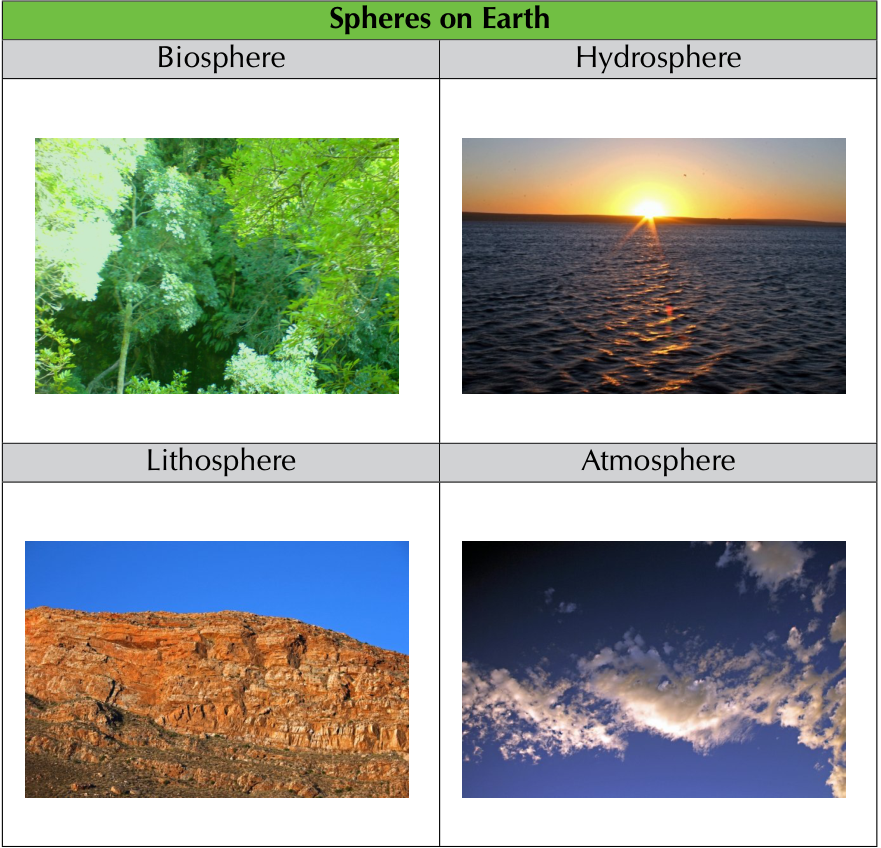
> **[Diagram Context - Textbook_LifeSciences_Gr10_Biospheres_to_ecosystems.pdf-0003-06.png]**
> This educational graphic presents a four-panel photographic overview titled "Spheres on Earth." It is explicitly labeled with the terms "Biosphere," "Hydrosphere," "Lithosphere," and "Atmosphere," paired with representative images of lush green forest foliage, a sunset over open water, exposed rocky strata, and scattered clouds in a blue sky respectively. Conceptually, this diagram visually introduces senior phase learners to the four interconnected Earth systems, illustrating the biological, liquid water, solid rock, and gaseous components that constitute our planet's environment.


The connections between spheres imply that disturbances in one sphere affect the other spheres. For example, excessive deforestation (biosphere) results in increased erosion of soil (the upper layer of the lithosphere- _pedosphere_ ) into rivers (hydrosphere). Deforestation also results in an increase in atmospheric carbon dioxide (atmosphere). Deforestation therefore is an example of how disturbances in one sphere produces effects in the hydrosphere, upper-lithosphere and atmosphere. 

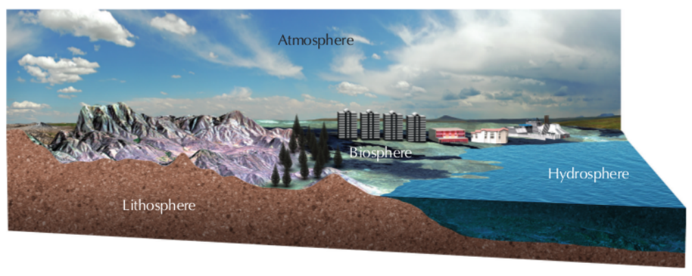

Figure 9.1: The various spheres within the biosphere are connected. 

## 9.3 Biomes ESG9X 

The biosphere is divided up into a number of **biomes** . Biomes are regions with similar climate and geography. The key factors determining climate are average annual precipitation (rainfall) and temperature. These factors, in turn, depend on the geography of the region, such as the latitude and altitude of the region, and mountainous barriers. The specific conditions of biomes determine the plant and animal life found within them. The communities of plants, animals and soil organisms in a particular biome are collectively referred to as an **ecosystem** . Biomes can be **aquatic** or **terrestrial** . 

Aquatic biomes ESG9Y 

Water covers a major portion of the Earth’s surface, so aquatic biomes contain a rich diversity of plants and animals. Aquatic biomes are divided into two main groups depending on the amount of salt present in the water: freshwater and marine biomes. 

##### **1. Freshwater** 

Freshwater biomes are defined by their low salt concentration, which is usually less than 1%. Examples include: ponds, lakes, streams, rivers and wetlands. 

##### **2. Marine biomes** 

Marine bodies are salty, having approximately 35 grams of dissolved salt per litre of water (3,5%). Marine biomes are divided into oceans, coral reefs and estuaries. The vegetation of the marine biomes consists of the different types of algae, which is one of the major sources of oxygen in the world. Green algae also play a role in the removal of carbon dioxide from the atmosphere. 

**Oceans** : are very large marine bodies that dominate the Earth’s surface and hold the largest ecosystems. The open ocean or sea covers nearly three-quarters of the earth’s surface and contains a rich diversity of living organisms. Examples of animals in the ocean biome include whales, sharks, octopuses, perlemoen, crabs and crayfish. Figure 9.2 shows a typical ocean ecosystem. 

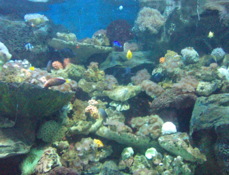

Figure 9.2: Ocean ecosystem. 

**Coral reefs** : are found in the warm, clear, shallow waters of tropical oceans around islands or along continental coastlines. Coral reefs are mostly formed underwater from calcium carbonate produced by living coral. Reefs provide food and shelter for other organisms and protect shorelines from erosion. South Africa has only one coral reef in the subtropical ocean waters north of Lake St. Lucia in northern KwaZulu Natal. Figure 9.3 shows a typical coral reef system. 

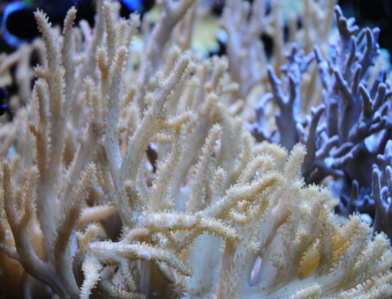

Figure 9.3: Coral reef. 

**Estuaries** : are partially enclosed areas of fresh water and silt from streams or rivers, which mix with salty ocean water. Estuaries represent a transition from land to sea and from freshwater to saltwater. Estuaries are biologically very productive areas and provide homes for a wide variety of plants, birds and animals. Figure 9.4 shows an example of an estuary system. 

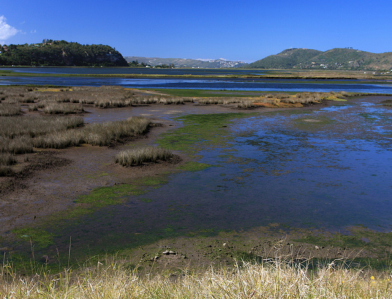

Figure 9.4: Knysna Estuary. 

##### **Marine biomes of South Africa** 

South Africa’s long coastline stretches for over 3000 kilometres, from Namibia in the West to Mozambique in the East. There are a few key features to note about South Africa’s coastline and marine biomes. South Africa’s coastline is rugged, as rocky shores are exposed to high wave energy and the coastline generally experiences high wind for most of the year. 

There are up to 343 estuaries found along the coast, two thirds of which are found on East Coast between Cape Padrone in the Eastern Cape Province and Mtunzini in KwaZulu-Natal. The Eastern coastline receives the highest rainfall, mostly during summer. 

South Africa’s East Coast has relatively warm waters (20-25 degrees C), the West Coast receives colder Atlantic waters (9-14 degrees C), and the South Coast experiences intermediate water temperatures (16-21 degrees C). The cold Benguela Upwelling System on the South-West coast supports large numbers of marine animals. The warm Agulhas current off the East Coast has a smaller quantity of fish but a greater diversity of species. Abundant opportunities exist for tourism, recreation, food, export and associated economic development. 

### Terrestrial biomes 

#### ESG9Z 

Terrestrial biomes occur on land and can be of many types. Examples include: thicket, tundra, forest, grassland and desert. Terrestrial biomes are usually classified based on the dominant vegetation, climate or geographic location. The location and characteristics of the various biomes is mostly influenced by climatic conditions such as rainfall and temperature. 

South African Biomes ESGB2 

The most recent classification of the terrestrial biomes in South Africa divides the region into the following eight biomes (Figure 9.5): 

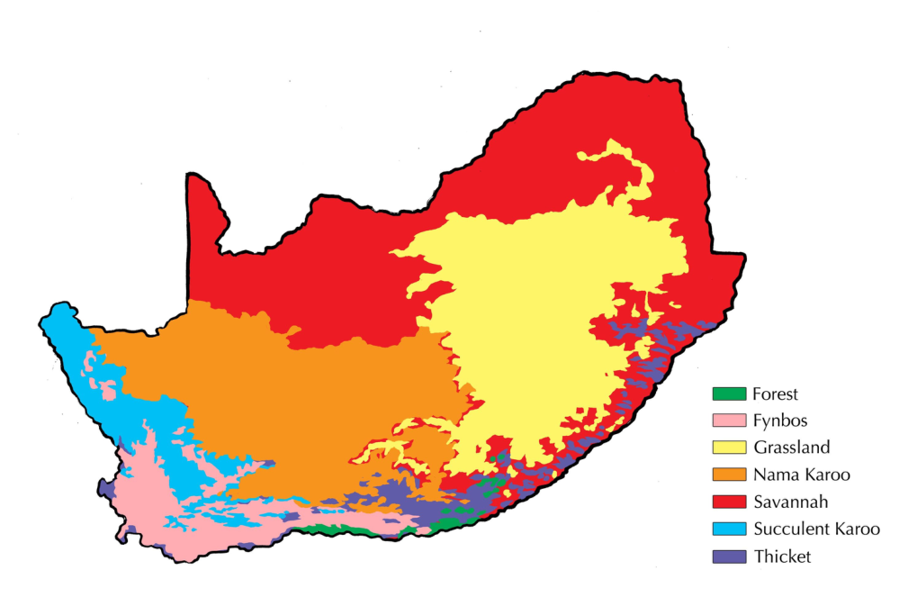

Figure 9.5: Biomes of South Africa. 

We will now examine the following eight South African biomes: 

1. Grassland 

2. Savannah 

3. Succulent Karoo 

4. Nama Karoo 

5. Forest 

6. Fynbos 

7. Desert 

8. Thicket 

##### **1. Grassland Biome** 

- **Location** : grasslands are found on the Highveld. 

- **Climate** : they typically have summer rainfall of 400 mm to 2000 mm. Winters are cold, and frost can occur. 

- **Soil and geography** : in grasslands, the soil is red/yellow/grey or red/black clay. Grassland soil has rich fertile upper layers. 

- **Flora** : vegetation is mainly grass, but trees can grow on the hills and along river beds. 

- **Fauna** : many types of grass-eating herbivores can be found in this habitat, such as black wildebeest, blesbok and eland. Rodents are also common in grasslands which makes this biome an ideal hunting ground for birds of prey. The diverse plant species also support many plant-eating insects such as butterflies, grasshoppers, crickets and ants. 

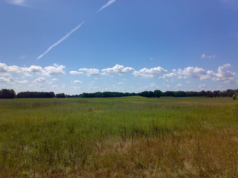

Figure 9.6: Grasslands are regions where the vegetation is dominated by grasses. 

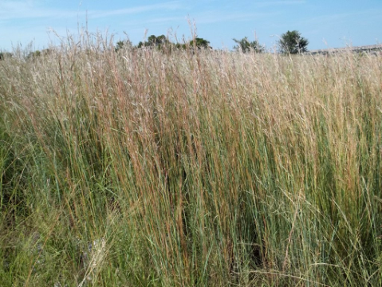

Figure 9.7: Grasslands are regions where the vegetation is dominated by grasses. 

##### **Activity: Burning of grassland** 

##### **Aim:** 

Compare and analyse the advantages and disadvantages of burning grassland. 

**Materials:** 

- Internet 

- articles 

- books 

##### **Instructions:** 

1. Using these resources, tabulate the advantages and disadvantages of burning grassland. 

2. Remember to cite your references correctly. 

##### **2. Savannah biome** 

- **Location** : the Savannah biome is the largest biome in Southern Africa. It is found mainly in the western parts of Limpopo, the northern parts of the Northern Cape and Free State, the North West Province and KwaZulu Natal. 

- **Climate** : summers are hot and wet and the winters are cool with little or no rain. Frost occurs in winter. 

- **Soil and geography** : the soil consists of red/black clay or red/ yellow/ grey soil and is often sandy. 

- **Flora** : this biome is also known as the bushveld, where grasses are mainly found and regular fires prevent the trees from dominating. Herbaceous plants and woody plants can be found in different areas. Plants are able to withstand fire. 

- **Fauna** : big game species such as kudu and Springbok, lion, buffalo and elephant are found in the Savannah Biome. This is also a malaria-prone area. 

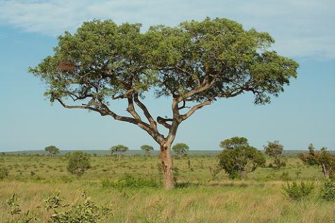

Figure 9.8: Savanna biome in Mpumalanga. 

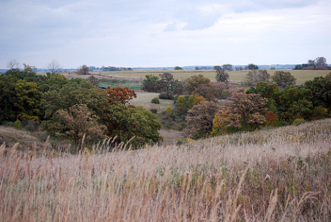

Figure 9.9: Savanna biome. 

##### **3. Succulent Karoo biome** 

- **Location** : the Succulent Karoo biome can be found along the west coast of the Northern Cape Province and the northern parts of the Western Cape Province. 

- **Climate** : this biome is hot in summer and cold in winter and the rainfall in this area is very low. Fog is common, and frost is seldom severe enough to cause damage. 

##### **FACT** 

‘Karoo’ comes from the Khoi word _Karusa_ , which means dry, barren, thirstland. Karoo is an apt description for this arid region. 

- **Soil and geography** : lime-rich, weakly developed soils, rocks and sand that is easily eroded. 

- **Flora** : forty percent of plant species found here are endemic to this biome. The Namaqualand region of this biome is famous for its colourful wild flowers. Succulent plants are able to live through dry seasons by using water stored in their leaves or stems. 

- **Fauna** : insects are common and the plants provide grazing for sheep and goats. 

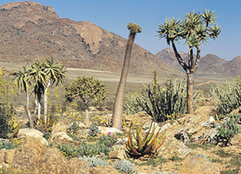

Figure 9.10: Succulent Karoo biome. 

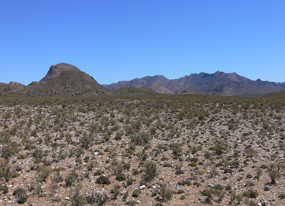

Figure 9.11: Nama Karoo found in the Northern Cape province. 

##### **4. Nama Karoo** 

- **Location** : the Nama Karoo is the second largest biome in South Africa. It forms the major part of the Northern Cape Province and the Free State. 

- **Climate** : it is regarded as a semi-desert area receiving very little rain. The summers are very hot and the winters are very cold and frost often occurs. 

- **Soil and geography** : soil occurring on rocks is weakly developed. The area is also characterised by sands and rocky and red clay, making erosion occur easily. 

- **Flora** : it is characterised by grassy dwarf shrub land. 

- **Fauna** : the flora provides good grazing for sheep and goats. 

##### **FACT** 

Trees are not only producers, but as a result of their size they also create a **habitat** for other species. The leaf cover of trees provides **shelter** for animals, while the bark and fissures in the trees also provide a habitat for insects. The leaf cover also creates a shady environment in which shade-loving, low-growing plants can flourish. 

##### **FACT** 

When leaves or fruit fall from the trees and collect at the feet of the trees, another series of organisms can appear. By breaking down organic material, decomposers such as microorganisms return the organic nutrients to the soil. Humus is formed in this way. Humus is dead organic material. Other creatures that live off decayed organic material, namely the detritivores, also promote this process of decomposition by breaking up dead plant matter into its component nutrients. 

##### **5. Forest Biome** 

- **Location** : the forest biome in South Africa occurs in patches, in areas such as Knysna of the Western Cape as well as KwaZulu Natal, the Eastern Cape, Limpopo and Mpumalanga. 

- **Climate** : some of these forests experience rain only in winter, while others get rainfall throughout the year. 

- **Soil and geography** : forests range in altitude from sea level to above 2000 metres, soil is drained and virtually all soil types are present. 

- **Flora** : forests are dominated by trees of which the Yellowwood is the largest. There are many herbaceous and bulbous plants that also occur. 

- **Fauna** : numerous insect species, birds ans small mammals such as bushpig, bushbuck and monkeys. The canopy is a perfect habitat for birds such as the Knysna Loeries, pigeons and eagle. 


Figure 9.12: Forest biome. 

Figure 9.13: Knysna Forest. 

##### **Project: Poster project to illustrate the role players in a forest ecosystem** 

##### **Instructions:** 

1. Bring pictures of animals, trees and other plants to class. 

2. The teacher will divide the class into groups. 

3. Each group will prepare a poster to illustrate the mutual dependence of the trees, other plants and animals. 

4. Each group must present their poster to the rest of the class. 

5. Answer the following questions / follow the instructions arising from the class discussion: 

##### **Questions:** 

1. Supposing the tree on your poster was to fall over. 

   - a) Which organisms would die? 

   - b) Which organisms would move away? 

   - c) Which organisms would increase in number? 

##### **FACT** 

2. Describe the role played by trees in an ecosystem. 

3. Ecologically speaking, why is it bad practice to rake up leaves under trees? 

4. Name three more examples where humans harm ecosystems. 

5. Identify components of the ecosystem, including each trophic level. Represent this in the form of a diagram. 

The Fynbos contains approximately 75% of South Africa’s rare and threatened plants. 

##### **6. Fynbos** 

- **Location** : fynbos is the natural shrub found in the Western Cape of South Africa. 

- **Climate** : characterised by cold, wet winters and hot, dry summers (Mediterranean climate conditions). 

- **Soil and geography** : poor, acid and coarse-grained soil. 

- **Flora** : fynbos is widely known for its widespread biodiversity. Important plant types found in the fynbos include proteas, ’silver trees’ and ’pincushions’. Plants growing here do not lose their leaves. Proteas have striking flowers. It has the highest fynbos variety in the world, with over 9000 species of fynbos found here. 

- **Fauna** : fynbos is home to many bird species, insects and small mammals. 

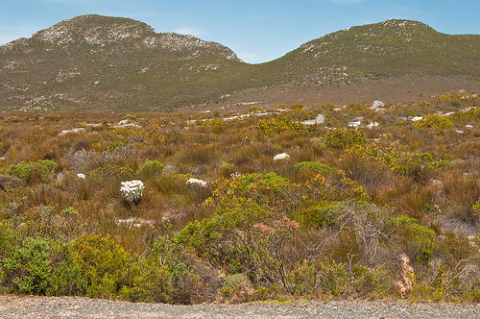

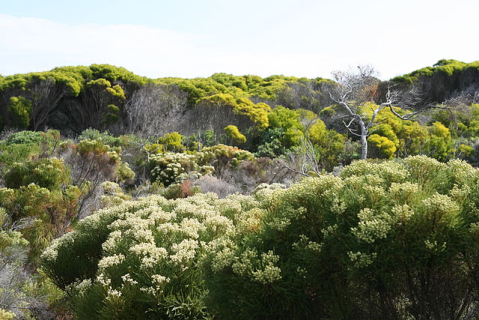

Figure 9.14: Mountain Fynbos found in Figure 9.15: Fynbos in Cape Peninsula. Hermanus, Western Cape. 

The flora of the fynbos has a high degree of **endemism** . This is the ecological state of being specific to a geographic location such as an island, country or in this case, a defined biome such as the fynbos. 

Fire is a necessary stage in the life-cycle of nearly all fynbos plants, and is common during the dry summer months. Many of the seeds germinate only after the intense heat of a fire. As proteas ’prepare’ for the fire, they retain their seeds on the bush for at least a year, a habit known as **serotiny** . 

The lowlands of the fynbos have been developed for agriculture and wine farming. Due to this, various species of fynbos have been threatened. For this reason, the fynbos region must be protected and preserved. It is a major tourist destination. 

##### **Project: Discovering fynbos in South Africa** 

The astonishing richness and diversity of the Western Cape’s natural resources is matched only by the resourcefulness and diversity of its many people. Historical patterns of unsustainable use of resources have led to the Cape Floristic Region (CFR) being listed as one of the world’s threatened bioregions, and the scars are deeply etched in the land and its people. 

Western Cape residents are exploring new and sustainable ways to value and benefit from these globally important assets. 

South Africa’s Cape Floristic region is legendary, and the unique nature of the **fynbos** biome has been celebrated by biologists, conservationists, development experts, and ecologist worldwide. 

_(Adapted from speech by Tasneem Essop the Western Cape Provincial Minister for Environment, Planning and Economic Development)_ 

##### **Instructions** 

Write an essay on the **fynbos biome** and discuss the following aspects: 

1. What is the meaning of the term “fynbos”? 

2. Identify features of families/ indicator species that make up this vegetation type. 

3. Describe its ecological role in the environment. 

4. Describe the environmental impacts of destroying this type of vegetation. 

5. Describe the economical importance of fynbos for the people of the Western Cape. 

6. Describe management strategies involved in protecting it. 

##### **7. Thicket** 

- **Location** : the thicket biome occurs along the coasts of KwaZulu Natal and the Eastern Cape. 

- **Climate** : thickets develop in areas where the rainfall is fairly high; however, there may be dry periods that prevent the vegetation from developing into forests. 

- **Soil and geography** : most thickets occur in river valleys. 

- **Flora** : the vegetation of this biome includes short trees, low intertwining shrubs and vines. There are no distinct layers of trees and shrubs, with many large open spaces found in the thicket biome. Thickets in the Eastern Cape are comprised of dense impenetrable vegetation dominated by spiny, often succulent trees and shrubs. 

- **Fauna** : examples of fauna found in thicket include kudu, monkey, bushbuck and elephant. 

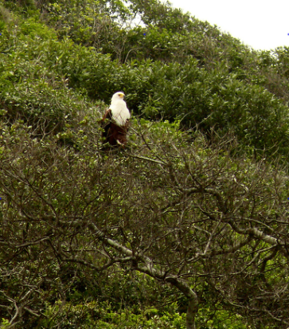

Figure 9.16: Thicket Biome, Umdloti 

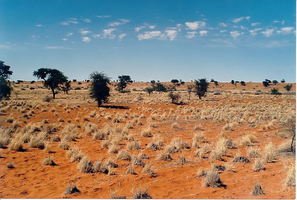

Figure 9.17: Kalahari desert. 

##### **FACT** 

Did you know that most of the animals in the desert can live without water for a long time? They have adapted in many ways to do this. For instance, they can store water internally, take water out of their prey, or peck at succulents and suck out the water stored inside them. 

##### **8. Desert Biome** 

- **Location** : the Desert Biome is found largely in the Namib Desert along the coast of Namibia. The transition regions between deserts and grasslands are sometimes called semi-arid deserts. 

- **Climate** : deserts are dry areas where evaporation usually exceeds precipitation. Rainfall is low, less than 25 centimetres per year, and can be highly variable and seasonal. The low humidity results in temperature extremes between day and night. Deserts can be hot or cold. Hot deserts (e.g. the Namib and Kalahari) are very hot in the summer and have relatively high temperatures throughout the year and have seasonal rainfall. This combination of low rainfall and high temperatures keeps the air very dry, increasing its evaporating power. 

- **Soil and geography** : the soil consists mostly of sand, gravel or rocks. 

- **Flora** : deserts have relatively little vegetation. 

- **Fauna** : many insects and reptiles (lizards and snakes) occur in the desert biome. 

##### **Activity: Biomes Advertisement** 

##### **Aim:** 

Getting to know the biomes of South Africa. 

##### **Materials:** 

- posters 

- maps 

- reference books 

- adverts 

- brochures 

- Internet 

##### **Instructions:** 

You work for an Advertising Agency that is bidding for the account of a top travel agency. The bid includes designing a full page advert (A4) for the _Getaway_ Magazine. Presentation, appeal and accuracy will therefore be of top priority. Study some advertisements for ideas. 

The travel agency has specified that they would like the following to be included in the ad, which is geared towards people looking for a different and fascinating holiday in a **specific biome** : 

1. A region in the biome of your choice, including cities and/or towns worth a visit 

2. Climate (of interest to tourists) 

3. Well-known geographical features in the region 

4. Mention of some interesting wildlife (i.e. birds, animals, plants) that may be seen 

5. Pictures 

6. Tour dates 

7. The name of the travel agency, with contact information 

##### **Project: Biome Poster** 

The following activity is to be done in groups of **four** 

##### **Instructions** 

1. Brainstorm a suitable set of criteria for assessment for poster and verbal report 

2. Select **one** biome from the list given and do the following: 

3. Use suitable references to obtain as much information as possible on the plants and animals found in your selected biome. 

4. Make notes about the climate, landscape, flora and fauna, stating how some of these are adapted to their environment. 

5. **Design** an attractive poster to illustrate the landscape as well as the dominant plants and animals that make up a food chain. 

6. **Display** your poster on the classroom wall and each person of the group is to give a verbal presentation on an aspect of the biome you studied. 

##### **FACT** 

## 9.4 Environment 

#### ESGB3 

The environment refers to everything that surrounds us, including the place where we live. We usually use the term ’environment’ to refer to the physical aspects of our surroundings, which may be living (biotic) or non-living (abiotic). This means that if you live in a city, the environment consists of the buildings, roads and other infrastructure, while if you live on a farm, your environment consists of you pastures, farm house etc. 

Ecology- rules for living on Earth See video: 2CVR 

##### **FACT** 

Learn more about biotic and abiotic components: See video: 2CVS 

Although an environment consists of non-living and living things, the term ’environment’ really just describes one’s surroundings, but does not really define the relationships, connectedness or dynamic nature of those surroundings. To study how the living and non-living parts of the environment depend on and are influenced on each other, we need to understand a different concept- the ecosystem. 

## 9.5 Ecosystems ESGB4 

An ecosystem is a complex system that consists of all the living organisms in a particular area, as well as the environment with which the organisms interact. The living organisms and non-living components of the ecosystem interact in such a way as to maintain balance. Ecosystems are divided into **biotic** (living) and **abiotic** (non-living) components respectively. Each component is discussed in detail below. 

### Biotic components 

ESGB5 

Biotic components are living things that shape the ecosystem. Each biotic factor needs energy to do work and for proper growth. To get this energy, organisms either need to produce their own energy using abiotic factors, or interact with other organisms by consuming them. Biotic components typically include: 

- **Producers** : also known as **autotrophs** include all green plants. Producers make their own food using chemicals and energy sources from their environment. The producers include land and aquatic plants, algae and microscopic phytoplankton in the ocean. **Plants** use photosynthesis to manufacture sugar (glucose) from carbon dioxide and water. Using this sugar and other nutrients (e.g. nitrogen, phosphorus) taken up by their roots, plants produce a variety of organic materials. These materials include starches,lipids, proteins and nucleic acids. 

- **Consumers** : are also known as **heterotrophs** . They eat other organisms, living or dead, and cannot produce their own food. Consumers are classed into different groups depending on the source of their food. 

**Herbivores** (e.g. buck) feed on plants and are known as _primary consumers_ . **Carnivores** (e.g. lions, hawks, killer whales) feed on other consumers and can be classified as _secondary_ consumers. They feed on primary consumers. _Tertiary consumers_ feed on other carnivores. Some organisms known as **omnivores** (e.g.crocodiles, rats and humans) feed on both plants and animals. Organisms that feed on dead animals are called **scavengers** (e.g., vultures, ants and flies). **Detritivores** (detritus feeders, e.g. earthworms, termites, crabs) feed on organic wastes or fragments of dead organisms. 

- **Decomposers** : (e.g. bacteria, fungi) also feed on organic waste and dead organisms, but they can digest the materials outside their bodies. The decomposers play a crucial role in recycling nutrients, as they reduce complex organic matter into inorganic nutrients that can be used by producers. If an organic substance can be broken down by decomposers, it is called _biodegradable._ 

Abiotic components ESGB6 

Abiotic components are the non-living chemical and physical factors in the environment that affect ecosystems. Abiotic components play a crucial role in all of biology. Abiotic factors are broadly grouped into **physiographic** , **edaphic** and **climactic** factors and **atmospheric gases** . 

##### **1. Physiographic factors** 

Physiographic factors are those associated with the physical nature of the area. The main physiographic factors we will look at are slopes, aspect and altitude. 

- **Slope** : is the gradient or steepness of a particular surface of the Earth. The slope affects the rate of water run-off. A steep slope encourages fast run-off of water and can cause soil erosion. The soil tends to be shallow and infertile with reduced plant growth. Plants are small and few animals are present. A gentle slope favours slower flow of surface water, reduces erosion, and increases availability of water to plants. The direction and steepness of a slope also influences the surface temperature of the soil. 

- **Altitude** : is the _height_ of the land above sea level. At high altitudes the temperature is lower, the wind speed is greater, and the rainfall less. Environments at higher altitudes are also more likely to experience snow conditions. Altitude plays a role in vegetation zones. At high altitudes, less plant and animal species are found. Plants growing at mid-altitudes experience more stunted growth. Plants at sea-level are abundant. 

- **Aspect** : refers to the position of an area in relation to the sun or wind or wave action. It is the direction that the slope faces i.e. North, East, West. In South Africa rain fall is more common on the south-eastern slopes, therefore these tend to be forested or rich in vegetation. The slopes facing the other way (north west) tend to be drier. 

##### **2. Edaphic factors** 

Edaphic factors are those factors related to the soil. The qualities that may characterise the soil include drainage, texture, or chemical properties such as pH. Edaphic factors affect the organisms (bacteria, plant life etc.) that define certain types of ecosystems. There are certain plant and animal types that are specific to areas of a particular soil type. The particular factors we will consider include the pH of the soil and soil structure. 

- **pH of soil** is a measure of how acid or alkaline soil is and can be measured by using the pH scale. The pH scale ranges from 0 to 14. Neutral solutions have a pH value of 7. Acid solutions have a pH value of less than 7 and alkaline solutions have a pH value greater than 7. Litmus paper or universal indicator can be used to determine whether a solution is acid or alkaline. 

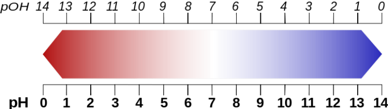

Figure 9.18: pH scale for soil. 

##### **NOTE:** 

Did you know that some species of Hydrangea flowers are natural pH indicators? The flowers of the _Hydrangea macrophylla_ and _Hydrangea serrata_ cultivars, can changes colour depending on the relative acidity of the soil in which they are planted. In an acidic soil with a pH below 7, the flowers will usually be blue. However in an alkaline soil with a pH above 7, the flowers will be more pink. Moving the plant from one soil to another results in a change in flower colour if the pH of the soil is different (see Figure 9.19). 

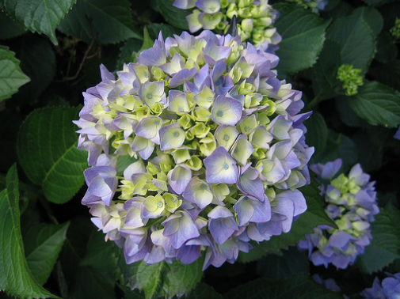

Figure 9.19: Hydrangeas. 

- **Soil Structure** : the decomposed organic matter, called humus gives topsoil its dark colour. It supplies plants with nutrients and helps the soil retain water. Soils rich in humus are fertile soils. The specific soil type is determined by the size of particles e.g sand has very large sized particles, clay has very small sized particles and loam has a mixture of particle sizes. If you roll moist soil between your fingers, clay soil feels sticky, sandy soil feels gritty and loam soil feels soapy. The water retention capacity of soils is the ability of soil to retain different amounts of water. Clay soil retains a large amount of water. Sandy soil retains very little water. Loam soil retains a moderate amount of water. 

##### **Investigation: Investigating the water-retaining properties of soil** 

##### **Aim:** 

To investigate the water retaining properties of three soil types. 

##### **Apparatus:** 

- loam, sand and clay soil samples 

- filter funnels and filter paper 

- measuring cylinders 

- water 

- stop watches 

##### **Method:** 

1. Set up the three different 100 ml measuring cylinders, each with a funnel lined with filter paper. 

2. Label each of the measuring cylinders either loam, sand or clay. 

3. Add the same amount (e.g 50 gm) of each specific soil sample to the corresponding labelled funnel with filter paper. 

4. Carefully pour the same amount (50 ml) of water into each funnel. 

5. Immediately start the stopwatch. 

6. Allow the water to pass through the soil sample. 

7. Wait until the water is no longer dripping into the cylinder before you record the time for each soil type. 

8. Record how much water there is in the measuring cylinder. 

##### **Results:** 

1. Write down your results in a table: 

   - a) The time taken for the water to pass through the soil. 

   - b) The amount of water in the measuring cylinder. 

2. Draw a bar graph to represent your results. 

##### **Observations:** 

1. Which sample of water retained the most water? 

2. Which sample of water retained the least water? 

3. Is the speed at which the water drains related to the amount of water that gets retained? Describe the relationship using your results. 

##### **Conclusions:** 

Explain your observations. Try to describe three properties that result in the different water-retaining capacities of different soil types. Use your experimental results to recommend which soil would you use for your pot plants. 

##### **3. Climatic factors** 

- **Sunlight** : is essential for the process of photosynthesis. Producers, such as plants, rely directly on the sun. Heterotrophs, such as animals, use light from the sun indirectly by consuming plants or other heterotrophs. All organisms receive the energy required for survival through the break down of sugars and other molecular components that are produced by the autotrophs. These sugars are then broken to release the energy stored in them, by the process of cellular respiration. 

- **Temperature** : varies greatly across different parts of the Earth and throughout the year. Temperature affects the rate of evaporation and transpiration and causes seasonal changes in weather. Seasonal variation in vegetation also occurs as the germination of seeds requires warm temperatures. Plants and animals have special adaptations that make them suited to the temperature of their specific environment. Temperature affects the rate at which photosynthesis, cellular respiration and decomposition take place. As you learnt in the earlier section on enzymes, this is linked to the optimal temperature profile for enzymes. The rate of reaction increases with increasing temperature and decreases at lower temperatures. 

- **Water** : is one of the most important factors in the ecosystem. It is the main component of living cells and is essential for all living organisms. About 80% of the human body and 90% of the plant body consists of water. Water is not evenly distributed over the Earth. It is abundant in aquatic ecosystems and least abundant in deserts. Plants are adapted to the available amount of water in the following ways: 

   - **Xerophytes** are plants that are able to live in dry habitats, or in regions with low annual rainfall. These plants are resistant to drought, have to cope with a shortage of water, high temperatures and light intensities and dry warm winds. We discussed in detail the adaptations developed by xerophytes in order to avoid water loss in the earlier chapter on plant structure. 

##### **FACT** 

Endothermic 

animals are able to regulate their body temperature so they are not affected by extreme 

temperatures, and are able to live in habitats over a wide range of temperatures. In cold regions, animals have developed a layer of insulating fat, or hibernate during the colder months. In very hot regions, animals have adapted by becoming nocturnal in their habitats. Ectothermic animals are unable to regulate their body temperature, and therefore the change in environmental temperature will affect their distribution and activities. 

- **Mesophytes** are plants that need an average, regular supply of water. 

- **Hydrophytes** are plants that are able to live entirely or partially submerged in water or in very wet soil. These plants have to cope with a water surplus. 

##### **4. Air/gases** 

- **Wind** : speeds up evaporation and assists in pollination of plants and the dispersal of their seeds. 

- **Air** : is composed of 78% nitrogen, 21% oxygen, 4% carbon dioxide and water vapour. Look ahead to the section on nutrient cycles to read more detail. Oxygen is used in cellular respiration and combustion and is returned to the environment by the process of photosynthesis. Carbon dioxide is a product of cellular respiration and decayed organic matter. It is removed from the atmosphere by plants during the process of photosynthesis. Nitrogen is needed by all living organisms for the synthesis of proteins. The amount of water vapour found in the air remains constant on average, however, it can vary greatly from one place to another. Some parts of the earth are prone to high humidity levels, while other locations have very dry air. Much of what we consider weather is caused by water vapour. The clouds in the sky are largely made up of it, and it is the condensation of this vapour into droplets that creates rain and snow. 

##### **Project: Studying a terrestrial ecosystem** 

##### **FACT** 

In Northern Hemisphere countries where the day length is substantially longer in the summer, the rate of growth of plants is very high. 

##### **Aim and background information** 

You are required to choose **one** ecosystem within a local biome for special study. The study will be conducted over two terms and will involve a number of investigations. You may work in groups. Each group will have to plan, collect, record, present, analyse and evaluate the data. 

##### **1. Soil** 

The type of soil found in your ecosystem will have an influence on the types of plant that will grow in that ecosystem. It is important to identify the types of soil found in your ecosystem by doing the following soil tests. 

- 1.1 How to identify soil texture 

   1. Roll some wet soil into a ball. 

   2. Then try to roll the ball into a sausage shape. 

   3. Bend the sausage into a ring. 

How to interpret your observations: 

- if the sausage breaks as you bend it, the soil is sandy. 

- if the sausage bend slightly, and then breaks, the soil is loamy. 

- if the sausage bends easily the soil contains a lot of clay. 

##### 1.2 How to measure pH 

You will need the following materials: 

- spoon 

- water 

- jar with a lid 

- plastic teaspoon 

- soil sample 

- red and blue litmus paper or universal litmus paper 

1. Collect a small sample of soil to test. 

2. Place a teaspoon of soil into the jar, stir it to loosen all the particles. 

3. Carefully add water to fill the jar approximately half way. 

4. Screw the lid onto the jar and shake the jar gently. 

5. Stand the jar on a flat surface and wait until the soil settles and the water becomes clear. This may take a few days. 

6. Unscrew the cap and using the plastic spoon, carefully remove some water from the jar. 

7. Test the pH of the water by using the litmus paper. 

How to interpret litmus paper observations: 

   - blue litmus paper will turn red when placed in an acid solution. 

   - red litmus paper will turn blue when placed in an alkaline solution. 

   - if using universal litmus paper read the pH of the pH scale. 

- 1.3 Measure the water-holding capacity of your soil sample/samples 

You will need the following apparatus: 

- filter paper 

- water 

- soil sample (preferably dry) 

- a two litre plastic cool drink bottle with the top of the bottle cut off (the top will act as your funnel and the bottom will act as a water-collecting vessel) 

1. Remove the bottle cap from the top part of the bottle (funnel). 

2. Place the ’funnel’ inside the bottom half of the bottle. 

3. Measure out your soil sample to be tested (measure by mass or volume). 

4. Place the piece of filter paper into the neck of the bottle. 

5. Add the soil sample into the ’funnel’. 

6. NOTE: If testing more than one soil sample, the same amount of soil and water must be added to each bottle top. 

7. Very slowly add water to the bottle. 

8. Observe how much water runs through the soil into the bottom of the bottle. 

9. Once the soil has drained of the water, measure the amount of water that was filtered using a measuring cylinder. 

##### **2. Temperature** 

You will need the following apparatus: 

- thermometer 

1. Measure the air temperature using a thermometer. Record the temperature in your ecosystem at two different times of day. 

2. Try and record the temperature at the same time on every day for one week in the third term and repeat the process for one week in the fourth term. 

3. A table similar to the table below needs to be completed for your temperature recordings. 

|**Date**<br>**Time**<br>**Temperature**|
|---|


4. Use the information in the table to draw a line graph of the temperature over the study period. 

5. Discuss whether there are any differences or general patterns in the daily temperature between the third and fourth terms. 

##### **3. Light** 

You will need the following apparatus: 

- watch or clock 

1. To measure the photoperiod of your ecosystem, you are required to keep a record of the times of sunrise and sunset. 

2. Record the times of sunrise and sunset for one week in the third term, and for one week in the fourth term. 

3. Record the effects of the photoperiod on the behaviour of plants. An example is: daisies open during the day and close at night. Record what happens to your plants. Complete a table similar to the table below. 

|**Date**<br>**Time Flower Opens**<br>**Time Flower Closes**|
|---|


4. Draw two line graphs showing the times the flowers open and the time the flowers close. 

5. Also record the times of sunrise and sunset. 

6. From your graph discuss if the opening and closing of the flowers are related to sunrise and sunset. 

7. Discuss whether you found any differences between the third and fourth terms. 

##### **4. Physiographic Factors** 

You will need: 

- compass 

1. If your ecosystem is on a slope, record the direction of the slope. 

##### **5. Studying biotic factors** 

If the ecosystem you are studying covers a large area, it may be difficult to observe all the living organisms. If this is the case, you can get some idea of the plant and animal diversity in the ecosystem you are studying by choosing a smaller sample area to study. 

You will need: 

- pencil 

- wooden sticks 

- string 

- metre stick or measuring tape or string 

- field guide to plants and animals in your ecosystem (if necessary) 

1. Mark out an area of 4 square metres in your ecosystem. 

2. Choose an area you think will contain the most plants and animals. 

3. Wind the string around the wooden sticks so that you create a grid to study within your ecosystem. 

4. Make a list of all the plants and animals found in your ecosystem. 

5. Try and name the plants and animals. Use a reference book or the Internet to identify the plants and animals in your ecosystem. 

6. Draw a distribution map showing where the different organisms were found in the ecosystem. 

7. Give each organism you found a code. 

8. Use the codes to make a map by showing where in the grid each organism was found. 

9. Record how many different plants and animals were found in your ecosystem. 

10. Which parts of your grid recorded the most plants and animals? 

11. Briefly discuss which abiotic factors influenced your ecosystem. 

12. Investigate what the animals in your ecosystem eat and then draw a food web for the ecosystem. 

13. Why do the organisms you found in your ecosystem live in this habitat? 

14. Write a short paragraph describing the ecological niche of one of the organisms you observed. 

##### **6. The effect of humans on the ecosystem** 

Determine if humans have had any effect on the ecosystem. These effects may be positive, negative, or a combination of both. 

1. Write a short paragraph of 200 words on the effect of humans on your ecosystem. 

##### **Write a scientific report on the ecosystem you have studied.** 

Your report should include the following: 

- A title 

- Introduction 

- Equipment or materials used 

- Results (including tables) 

- Observations 

- Discussion 

- Conclusion 

- References 

- You can use drawings and photographs to illustrate your report. 

## 9.6 Energy flow ESGB7 

##### **FACT** 

A catchy song about food chains to help you remember: See video: 2CVT 

In ecology, energy flow refers to the flow of energy through a food chain. In an ecosystem, we attempt to establish the feeding relationships between organisms living together. Each organism belongs to a ’trophic level’ which refers to the position occupied by an organism in the food chain. Energy is passed on from every trophic level to the next and each time about 90% of the energy is lost with some being lost as heat into the environment and some being incompletely digested food. So primary consumers get about 10% of the energy produced by autotrophs while secondary consumers get 1% and tertiary consumers get 0,1%. A general energy flow scenario is as follows: 

- **Autotrophs** : solar energy is fixed by autotrophs (also called producers, such as green plants) into energy in the form of carbohydrates. This is done by photosynthesis. 

- **Primary consumers** : part of the food made available by plants is consumed by primary consumers known as herbivores. The energy gained is converted to body heat or used to grow, reproduce, etc. Energy loss also occurs in the expulsion of undigested food by egestion. 

- **Secondary consumers** : carnivores and omnivores consume the primary consumers, and use the energy obtained to grow, move, respire etc. 

- **Tertiary consumers** : may be the major predators of an ecosystem, and feed on the primary and secondary consumers with some energy passed on and some lost as with other levels of the food chain. 

- **Decomposers** : A final link in any food chain are the decomposers which break down the organic matter of the tertiary consumers and release the nutrients into the soil. They also break down plants, herbivores and other dead organic matter. Examples of decomposers are bacteria and fungi. 

The flow of energy in an ecosystem can be explained in the form of a chain, web or pyramid. 

Food chain ESGB8 

A food chain is a series of nutrient and energy changes that moves through a chain of organisms. It always begins with a producer and terminates with decomposers. Below is an example of a simple food chain in a grassland ecosystem. The **arrows** show the movement of energy from one organism to another. 

**green plant** _→_ **impala** _→_ **leopard** _→_ **bacteria** 

producer _→_ primary consumer _→_ secondary consumer _→_ decomposer 

##### **Activity: Understanding Food Chains** 

##### **Activity 1:** 

Trace a **food chain** of the vegetables, fruit, cheese, eggs or meat that you had for breakfast or will have for dinner. 

##### **Activity 2:** 

1. In the food chain shown in the text which of the three organisms is the a) herbivore 

   - b) carnivore 

   - c) producer 

2. Draw in the decomposers in the above food chain. Ensure that the direction of the arrows is correct. 

3. What organism(s) will feed on the leopard? 

4. Construct a new food chain showing at least four organisms. 

5. Producers use sunlight to manufacture their own food. Write a word equation to depict this process. [Hint: think of the requirements and outcomes of the process of photosynthesis] 

### Food pyramid 

ESGB9 

A food pyramid is another way of representing the relationships between organisms in an ecosystem. 

##### **Trophic levels and the food pyramid** 

- **Producers** : Plants are on the first level, or bottom of the pyramid, because they produce their own organic food using energy from the sun and therefore have a lot of energy to pass on. 

- **Primary Consumers** : Herbivores are on the second level because they feed on plants. Herbivores consume plants; therefore, to maintain balance, there are far fewer herbivores than plants. 

- **Secondary Consumers** : Carnivores feed on herbivores. Consequently, to maintain balance, there are fewer carnivores than herbivores. Carnivores get their energy from plants indirectly and are on the third level. 

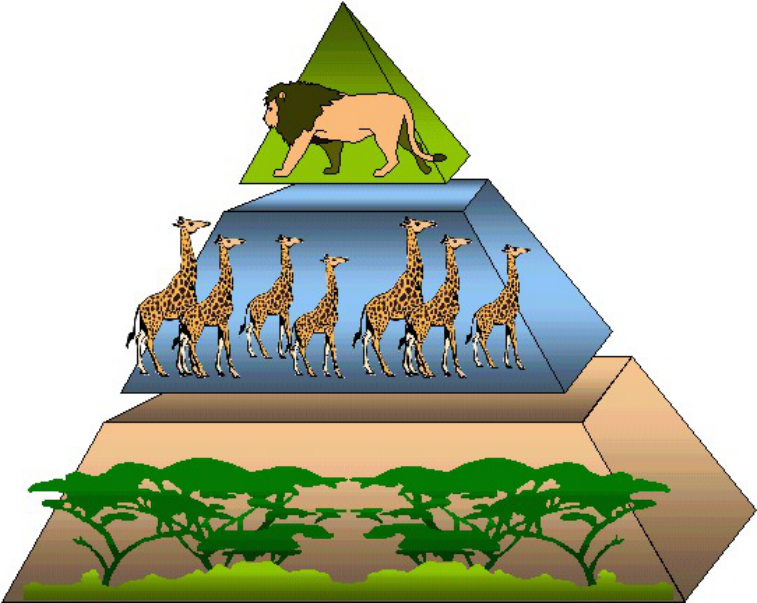

Figure 9.20: Food pyramid. 

Trophic levels can be drawn as one of the following: 

- **pyramid of numbers:** which shows the total number of organisms in each trophic level. 

- **pyramid of biomass:** which shows the total amount of biomass (living matter) at each trophic level. 

- **pyramid of energy:** which shows the total amount of energy contents in the biomass of each trophic level. 

Most pyramids are drawn as **energy** pyramids, and are always triangular, whereas number pyramids are not. 

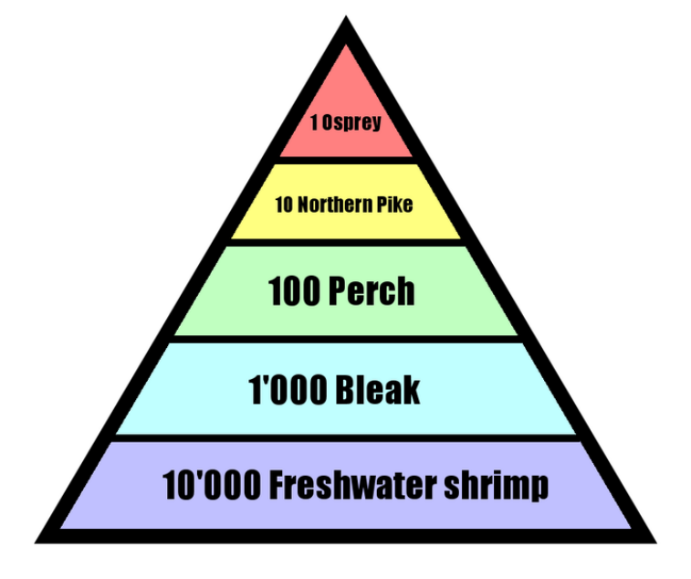

Figure 9.21: Pyramid of numbers. 

### Food web ESGBB 

A food web is made up of a number of food chains. It represents the different feeding relationships in an ecosystem or a biome. It is usually more complicated than a food chain because organisms can get their energy or food from more than one source. The presence of a number of food sources makes the system more stable. If one organism is removed, the whole system will not collapse, unlike in a single food chain. A food web in a typical Savannah environment is shown in Figure 9.22. 

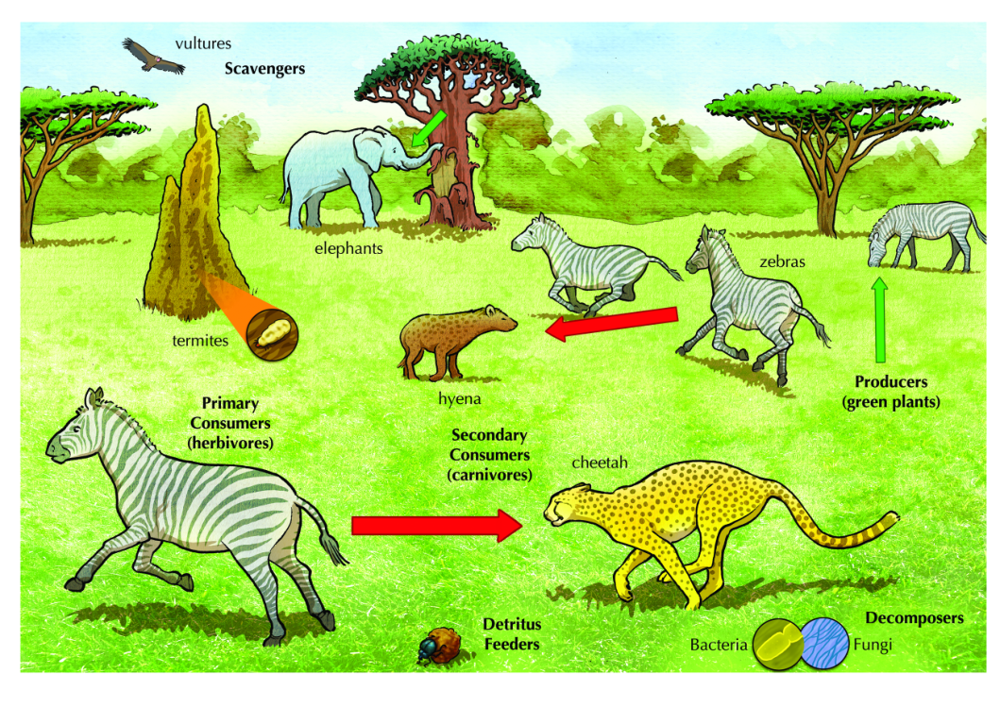

Figure 9.22: The figure shows a food web in a typical Savannah environment. 

##### **Activity: Understanding food chains and food pyramids Aim:** 

Gain conceptual understanding of food chains and food pyramids 

##### **Materials:** 

- textbook 

- resources provided by teacher 

##### **FACT** 

##### **Instructions:** 

1. Look at any of the food webs or food chains in this chapter, or use a food chain or food web provided by your teacher. 

Bill Nye the science guy talks about the food web: See video: 2CVV 

##### **FACT** 

##### **Questions:** 

1. Identify a food chain that has three trophic levels. 

A simple video explaining nutrient cycling: See video: 

2CVW 

2. Identify a food chain that has four trophic levels. 

3. Name two: 

   - a) producers 

   - b) primary consumers 

   - c) secondary consumers 

   - d) tertiary consumers 

4. There are very few tertiary consumers compared to the primary consumers. Why? 

5. What will happen if the hyena is removed from the food web? 

## 9.7 Nutrient cycles ESGBC 

A nutrient cycle refers to the movement and exchange of organic and inorganic matter back into the production of living matter. The process is regulated by the food web pathways previously presented, which decompose organic matter into inorganic nutrients. Nutrient cycles occur within ecosystems. Nutrient cycles that we will examine in this section include water, carbon, oxygen and nitrogen cycles. 

### Water cycle 

ESGBD 

Over two thirds of the Earth’s surface is covered by water. It forms an important component of most life forms, with up to 70% of plants and animals being composed of water. Vast quantities of water cycle through Earth’s atmosphere, oceans, land and biosphere. This cycling of water is called the **water** or **hydrological** cycle. The cycling of water is important in determining our weather and climate, supports plant growth and makes life possible. 

- **Evaporation** : Most water evaporates from the oceans, where water is found in highest abundance. However some evaporation also occurs from lakes, rivers, streams and following rain. 

- **Transpiration** : Is the water loss from the surface area (particularly the stomata) of plants. Transpiration accounts for a massive 50% of landbased evaporation, and 10% of total evaporation. 

- **Evapotranspiration** : The processes of evaporation and transpiration are often collectively referred to as evapotranspiration. 

- **Condensation** : The process by which water vapour is converted back into liquid is called condensation. You may have observed a similar process occurring when dew drops form on a blade of grass or on cold glass. Water in the atmosphere condenses to form clouds. 

- **Precipitation** : Water returns to Earth through precipitation in the form of rain, sleet, snow or ice (hail). When rain occurs due to precipitation, most of it runs off into lakes and rivers while a significant portion of it sinks into the ground. 

- **Infiltration** : The process through which water sinks into the ground is known as infiltration and is determined by the soil or rock type through which water moves. During the process of sinking into the Earth’s surface, water is filtered and purified. Depending on the soil type and the depth to which the water has sunk, the ground water becomes increasingly purified: the deeper the water, the cleaner it becomes. 

- **Melting and freezing** : Some water freezes and is ’locked up’ in ice, such as in glaciers and ice sheets. Similarly, water sometimes melts and is returned to oceans and seas. 

The processes involved in the water cycle are shown in Figure 9.23. 

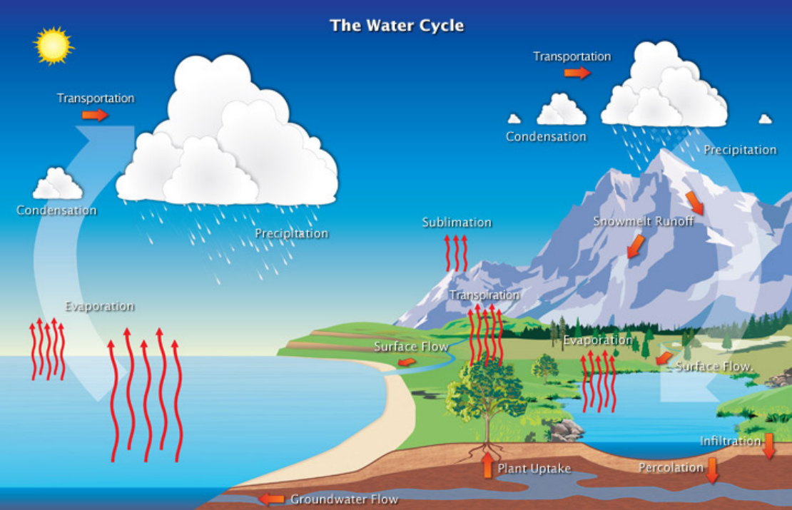

Figure 9.23: The water cycle. 

### Oxygen cycle 

#### ESGBF 

Oxygen is one of the main gases found in the air, along with nitrogen. Oxygen is re-cycled between the air and living organisms in the following ways: 

##### **FACT** 

A video about the oxygen cycle. Focus on the first part of the video clip and the summary at the end. 

- **Breathing and respiration** : organisms such as animals and plants take in oxygen from the air during breathing and gaseous exchange processes. The oxygen is used for cellular respiration to release energy from organic nutrients such as glucose. 

- **Photosynthesis** : during photosynthesis, plants absorb carbon dioxide from the air to synthesise sugars, and release oxygen. 

- There is a **complementary** relationship between photosynthesis and cellular respiration in that the former produces oxygen and the latter consumes oxygen. 

The oxygen cycle is shown in Figure 9.24. 

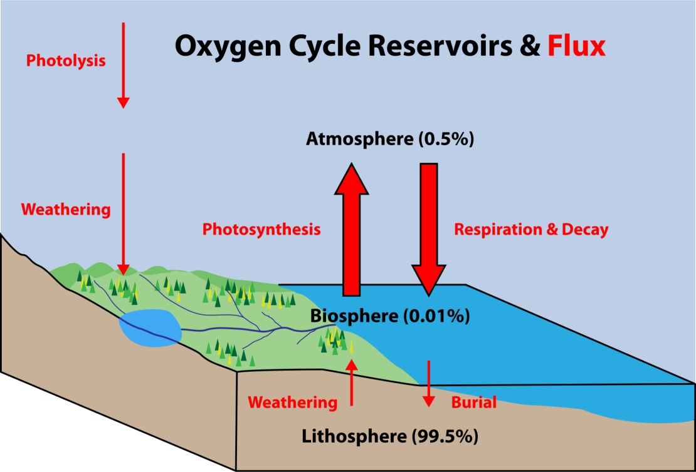

Figure 9.24: Oxygen cycle. 

ESGBG 

##### **FACT** 

Learn more about the carbon cycle in this video: See video: 2CVY 

### Carbon cycle 

Carbon is the basic building block of all **organic** materials, and therefore, of living organisms. Most of the carbon on earth can be found in the crust. Other reservoirs of carbon include the oceans and atmosphere. Carbon moves from one reservoir to another by these processes: 

- **Combustion** : Burning of wood and fossil fuels by factory and auto emissions transfers carbon to the atmosphere as carbon dioxide. 

- **Photosynthesis** : Carbon dioxide is taken up by plants during photosynthesis and is converted into energy rich organic molecules, such as glucose, which contains carbon. 

- **Metabolism** : Autotrophs convert carbon into _organic_ molecules like fats, carbohydrates and proteins, which animals can eat. 

- **Cellular respiration** : Animals eat plants for food, taking up the organic carbon (carbohydrates). Plants and animals break down these organic molecules during the process of cellular respiration and release energy, water and carbon dioxide. Carbon dioxide is returned to the atmosphere during gaseous exchange. 

- **Precipitate** : Carbon dioxide in the atmosphere can also **precipitate** as carbonate in ocean sediments. 

- **Decay** : Carbon dioxide gas is also released into the atmosphere during the decay of all organisms. 

**Photosynthesis** and **gaseous exchange** are the main carbon cycling processes involving living organisms. Figure 9.25 depicts the carbon cycle. 

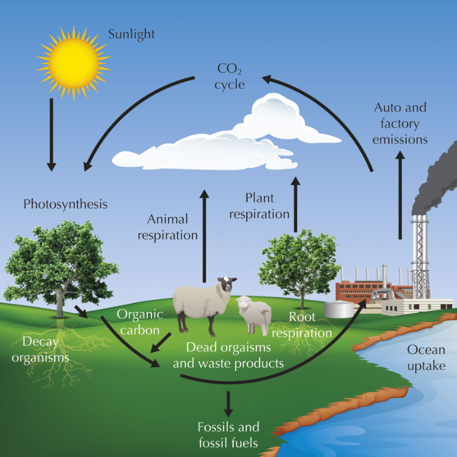

Figure 9.25: The carbon cycle. 

### Nitrogen cycle 

#### ESGBH 

Nitrogen ($	ext{N}_2$ ) makes up most of the gas in the atmosphere (about 78%). Nitrogen is important to living organisms and is used in the production of amino acids, proteins and nucleic acids (DNA, RNA). 

##### **FACT** 

This video summarises the nitrogen cycle. See video: 2CVZ 

- Nitrogen gas present in the air is **not** available to organisms and thus has to be made available in a form absorbable by plants and animals. 

- Only a few single-cell organisms, like bacteria can use nitrogen from the atmosphere directly. 

- For plants, nitrogen has to be changed into other forms, eg. nitrates or ammonia. This process is known as nitrogen fixation. 

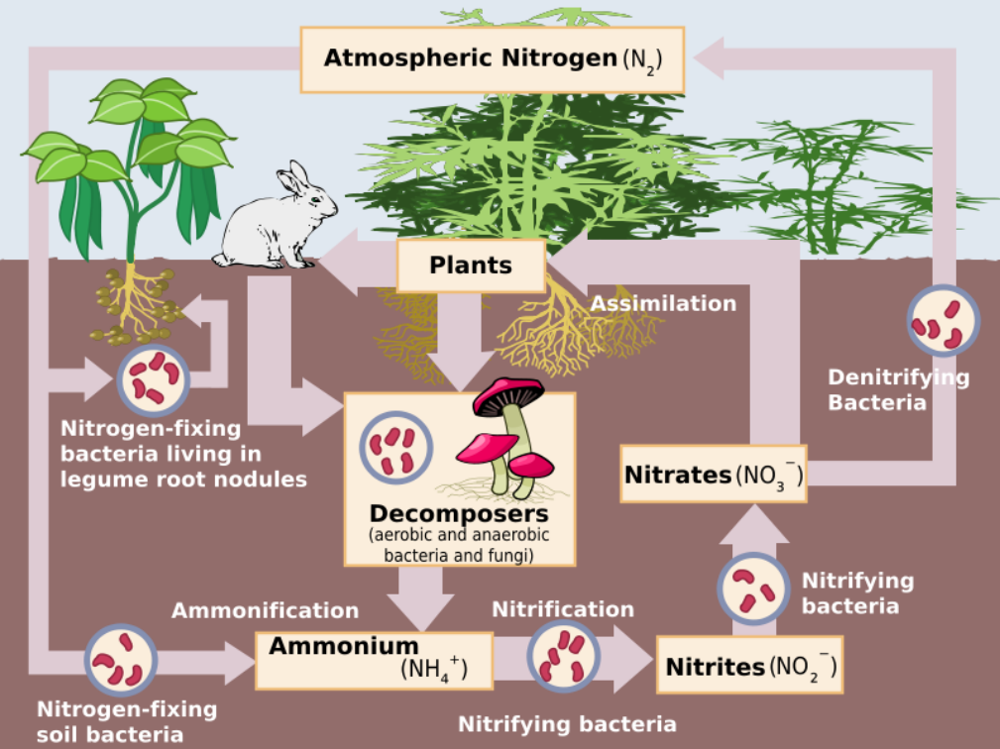

Figure 9.26: The nitrogen cycle. 

The nitrogen cycle involves the following steps: 

- **Lightning** : Nitrogen can be changed to nitrates directly by lightning. The rapid growth of algae after thunderstorms is because of this process, which increases the amount of nitrates that fall onto the earth in rain water, acting as fertiliser. 

- **Absorption** : Ammonia and nitrates are absorbed by plants through their roots. 

- **Ingestion** : Humans and animals get their nitrogen supplies by eating plants or plant-eating animals. 

##### **FACT** 

South Africa is home to: The largest bird— ostrich. 

- **Decomposition** : During decomposition, bacteria and fungi break down proteins and amino acids from plants and animals. 

- **Ammonification** : The nitrogenous breakdown products of amino acids are converted into ammonia ($	ext{NH}_3$ ) by these decomposing bacteria. 

- **Nitrification** : Is the conversion of the ammonia to nitrates (NO3^{_−_} ) by nitrifying bacteria. 

- **Denitrification** : In a process called denitrification, bacteria convert ammonia and nitrate into nitrogen and nitrous oxide ($	ext{N}_2$ O). Nitrogen is returned to the atmosphere to start the cycle over again. 

9.8 Ecotourism ESGBJ The attractions of touring South Africa ESGBK 

South Africa is a beautiful country that boasts great diversity in its flora and fauna. There are many interesting cultural, historical and environmental places that people from South Africa and other countries want to visit. 

From what you learnt about the different biomes, you can see that South Africa has a range of ecosystems from desert, mountain, forest and marine systems to our own unique fynbos biome. 

South Africa is one of the most biodiverse countries in the world. Although it only encompasses about 1,200,000 km^{2} , it is home to 10% of all plant species on earth. South Africa is considered mega diverse, along with 17 other countries, which means that together these countries contain 70% of the planet’s biodiversity. South Africa’s ability to support such a diverse population of plants and animals is due in large part to its unique geography. The combination of geography and wildlife makes South Africa an important travel destination to many. 

Ecotourism is thought to be the idea of bringing tourism into a country while supporting the biodiversity. 

##### **Economic benefits of ecotourism** 

- Tourism is one of the fastest growing sectors of South Africa’s economy and is estimated to bring in up to R62 billion/ year 

- Reinvesting some of the earnings from eco-tourism into the communities living near tourist destinations might be a means of alleviating poverty. 

- Tourism provides jobs: e.g park operators, sellers of local crafts, guides, etc. 

- Eco-tourism has the potential to create infrastructural development for communities that live around major tourist destinations. This is especially useful where major tourist locations are found in remote areas. 

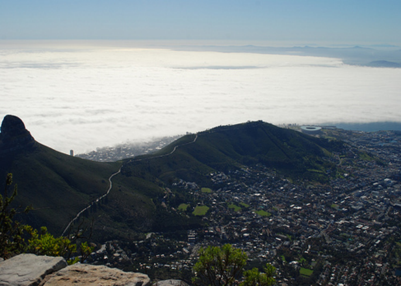

Figure 9.27: Cape Town, South Africa is a world-renowned tourist destination. 

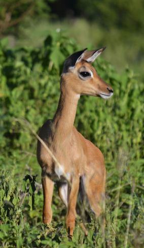

Figure 9.28: A baby impala in the Kruger National Park. 

##### **Ethical issues** 

While tourism has great economic potential and gives people access to unique places and cultures, it can have a negative impact. Sensitive ecosystems, such as wetlands and coasts, need to be protected so that the balance of organisms can be maintained. Too many visitors, and visitors who are not informed about their impact on the environment, can have a harmful effect. In the same way tourists need to be sensitive to the cultures and people that they visit. 

To protect the plants and animals in the unique ecosystems of South Africa, many areas have been declared National Parks and have strict rules about how to behave. 

In the same way, places that are historically or culturally important have been declared national heritage sites that are protected and maintained. South Africa is also proud to have eight UNESCO (The United Nations Educational, Scientific and Cultural Organisation) sites: 

- **Cultural** 

   - Fossil Hominid Sites of Sterkfontein, Swartkrans, Kromdraai, and Environs (1999) 

   - Mapungubwe Cultural Landscape (2003) 

   - Robben Island (1999) 

   - Richtersveld Cultural and Botanical Landscape (2007) 

##### **Mixed** 

- **–** UKhahlamba / Drakensberg Park (2000) 

- **Natural** 

   - Cape Floral Region Protected Areas (2004) 

   - Greater St. Lucia Wetland Park (1999) 

   - Vredefort Dome (2005) 

ESGBM 

### How to be a responsible ecotourist 

Many areas of South Africa are protected. When travelling to these areas, you need to respect the area and the people that you are visiting. These are a few tips: 

- Learn a little about the place you are visiting before you go in order to be aware of the do’s and don’ts. For example, littering is not allowed in any National Park in South Africa. 

- South Africa is rich in cultural diversity, which means that people from different areas have different ways of doing things. Learn about the culture of local people so that you can make sure not to offend anyone by your behaviour. 

- When you are in a protected area, do not damage plants or animals or buildings. For example, writing graffiti on historical buildings or sites. Remember the saying: take only pictures, leave only footprints. 

## 9.9 Summary 

ESGBN 

- The biosphere is the sphere in which all ecosystems on Earth exist. It interacts with the atmosphere, lithosphere and hydrosphere. 

- Biomes contained within the biosphere are regions with similar climatic and geographic conditions. Broadly, biomes are either aquatic or terrestrial. 

- South Africa’s major aquatic biomes include freshwater and marine biomes, based on their salt concentrations. Terrestrial biomes of South Africa include Grassland, Savannah, Succulent and Nama Karoo, Forest, Fynbos, Desert and Thicket Biomes. Each is located differently across South Africa and has its own distinctive plant and animal life. 

- Ecosystems refer to environments that consist of abiotic factors and biotic factors (organisms) that interact to maintain a balance. 

- Abiotic factors including physiographic (slope, altitude and aspect) and edaphic (soil pH, texture, humus content) factors. 

- Energy flows through ecosystems from the sun through to producers (plants), primary consumers (typically herbivores), secondary consumers (carnivores), ultimately terminating at decomposers. 

- The food chain describes the relationships linking producers, consumers and decomposers. Food pyramids can also be used to represent this relationship. Pyramids of biomass, energy and numbers of organisms can also be used to describe the biotic relationships in ecosystems. 

- _•_ Nutrient cycles describe the flow of particular nutrients (C, O, N and water) through the ecosystem. 

- Ecotourism produces widespread benefits to South Africa, creating jobs, preserving its natural beauty and improving infrastructure. There are ethical considerations involved in ensuring that the ecological and cultural diversity of South Africa’s ecosystems is preserved. 

##### **Exercise 9 – 1: End of chapter exercises** 

1. Study the sketch of the forest ecosystem below: 


   - a) Name the: 

      - i. producer 

      - ii. primary consumer 

      - iii. secondary consumer 

      - iv. tertiary consumer 

   - b) The ecosystem consists of living organisms together with the 

2. Read the article below and answer the questions that follow: 


Biospheres to ecosystems 

   - a) Describe what you understand by the term algal bloom. 

   - b) With reference to above article, name the abiotic factor that is responsible for the bloom and how the factor reached the Antarctic Ocean. 

   - c) Discuss the role decomposers could play in this ecosystem. 

3. Earthworms will burrow into the soil if they are on the surface and it is daylight. We can explain this behaviour by saying that they are either repelled by light or because they are attracted to the soil. Describe an experiment that you could do to determine which explanation is correct. When designing your experiment, bear in mind that earthworms are living organisms. 

Set out your design under the following headings: 

   - a) Hypothesis 

   - b) Aim 

   - c) Apparatus and Materials 

   - d) Method 

4. Read the following information taken from UWC Enviro Fact sheet on the Fynbos and answer the questions that follow: 

Fynbos is the major vegetation type of the small botanical region known as the Cape Floral Kingdom. The Cape Floral Kingdom is both the smallest and the richest floral kingdom, with the highest known concentration of plant species: 1 300 per 10 000 km^{2} . The nearest rival, the South American rain forest has a concentration of only 400 per 10 000 km^{2} . Conservation of the Cape Floral Kingdom, with its distinctive fynbos vegetation, is a national conservation priority demanding urgent action. 

Over 7 700 plant species are found in fynbos, an astonishing number for such a small area. Of these roughly 70% are endemic to the area. Many of these are threatened with extinction. The richness of the fynbos is well demonstrated by its ericas or heaths, of which there are over 600 different species. There are just 26 in the rest of the world. Although the most striking features of the composition of fynbos are the presence of many conspicuous members of protea, erica and reed family that fill the niche usually occupied by grasses, the largest family in number of species is Asteraceae (daisy family), with just under 1000 species of which more than 600 are endemic. Furthermore, fynbos is very rich in geophytes (bulbous plants) and many species from the family Iridaceae have become household names, freesia, gladiolus, iris, and watsonia. Another remarkable feature of fynbos is the number of species found within small areas. For example, the total world range of some species consists areas smaller than half a soccer or rugby field!. 

Fynbos cannot support herds of large mammals since the nutrient poor soils on which it grows do not provide enough nitrogen for the protein requirements of large mammals. However, smaller mammals common to fynbos are baboons, grysbok, dassies, and the striped mouse. Fynbos does not support high numbers of birds. Fynbos also supports large numbers of butterfly species. Many are however at risk. The early stages (larvae) of many of these butterfly species are entirely carnivorous and live on a diet of ant brood. The butterfly larvae actually live inside the nest of their host ant. Although fynbos is not particularly rich in reptiles and amphibians, many of the species living there are both endemic and threatened. The very rare geometric tortoise is found in only a few surviving fynbos areas and is regarded as the world’s second rarest tortoise. 

The Cape has more than half of South Africa’s frog species. Fynbos also has a high concentration of threatened fish species, particularly in the Olifants River system. With the widespread occurrence of alien vegetation which use up more water than indigenous fynbos plants, many habitats are becoming restricted leading to local extinction of certain species of fish because isolated tributaries are drying up. 

<mark>http://www.bcb.uwc.ac.za/envfacts/fynbos/</mark> 

   - a) The fynbos is said to be a very bio diverse habitat. List any three pieces of evidence from the text that show the idea of a rich biodiversity. 

   - b) Give three distinctive abiotic characteristics (excluding edaphic factors) of this biome. 

   - c) Define the following terms mentioned in the text: 

      - i. endemic 

      - ii. alien species 

      - iii. indigenous 

      - iv. extinct 

   - d) Construct a possible food chain of at least four organisms that would be found in this biome, use some organisms mentioned in the text. Label the levels of the organisms mentioned. 

   - e) Discuss the characteristics of the soil found in the fynbos and the implications for animals in the area. 

5. Which of the following are biotic components in an ecosystem? 

   - a) air and water 

   - b) plants and animals 

   - c) light and temperature 

   - d) rocks, soil and climate 

6. Which combination of the following processes takes place in the nitrogen cycle? 

   - i) Herbivores consume plant protein. 

   - ii) Decomposers break down dead organisms. 

   - iii) Bacteria change nitrites to nitrates. 

   - iv) Plants absorb nitrates from the soil. 

   - a) i, ii and iii b) i, ii, iii and iv c) i and iv d) i, ii and iv 

7. A soil has the following characteristics: large particles, large air spaces, holds little water, feels gritty. The type of soil is: 

   - a) clay b) sand c) loam d) silt 

8. Plants that are suited to live in areas with little water are called: 

   - a) terrestrial b) fynbos c) xerophytes d) hydrophytes 

9. In a food chain, energy flows in the following direction: 

   - a) producers _→_ primary consumers _→_ secondary consumers _→_ decomposers 

   - b) decomposers _→_ producers _→_ primary consumers _→_ secondary consumers 

   - c) primary consumers _→_ secondary consumers _→_ producers _→_ decomposers 

   - d) producers _→_ secondary consumers _→_ primary consumers _→_ decomposers. 

10. In a stable ecosystem, a wide variety of: 

   - a) producers depend on plants for shelter and camouflage. 

   - b) micro-organisms depend on plants for carbon dioxide and nitrogen. c) animals depend on plants for food and oxygen. 

   - d) plants depend on micro-organisms for pollination and seed dispersal. 

11. When a jackal kills and eats a rabbit, the jackal is the: 

   - a) producer 

   - b) prey 

   - c) predator 

   - d) saprophyte 

12. Which of the following refers to an organism’s whole way of life and the use to which it puts the available environmental resources? 

   - a) niche 

   - b) habitat 

   - c) community 

   - d) ecosystem 

13. Organisms that live in water are called: 

   - a) terrestrial 

   - b) xerophytes 

   - c) buoyant 

   - d) aquatic 

14. A giant oil tanker was wrecked at sea. The shallow waters of the coastline provided a rich source of edible crabs. Oil does not kill the crabs but harm their flesh, making them inedible and they cannot be sold. Samples of crabs were collected at sites A to D. The number of crabs is indicated by the size of the circle. The extent of the shaded part at each site represents the proportion of crabs with diseased flesh after the disaster. 


- a) Which sample site (A to D) had the highest number of crabs? 

- b) In which sample site was the crabs only rarely found? 

- c) Name the agent of pollution that affected the crabs. 

- d) In which sample site was the most crabs affected compared to the population size? 

- e) Explain your answer to the question above. 

- f) List two strategies that could reduce the effects of oil pollution at sea. 

|Check<br>ans|wers<br>onl|ine|with|the<br>|exercis|e<br>co|de||
|---|---|---|---|---|---|---|---|---|
|below<br>or|click|on|’show|me|the|answ|er’.||
|1ai.2CW2|1aii.2CW3|1aiii.|2CW4|1aiv.2CW5|1b.|2CW6|2a.|2CW7|
|2b.2CW8|2c.2CW9|3a.|2CWB|3b.2CWC|3c.|2CWD|3d.|2CWF|
|4a.2CWG|4b.2CWH|4ci.|2CWJ|4cii.2CWK|4ciii.|2CWM|4civ.|2CWN|
|4d.2CWP|4e.2CWQ|4fi.|2CWR|4f**i**.2CWS|4f**i**i.|2CWT|5.|2CWV|
|6.2CWW|7.2CWX|8.|2CWY|9.2CWZ|10.|2CX2|11.|2CX3|
|12.2CX4|13.2CX5|14a.|2CX6|14b.2CX7|14c.|2CX8|14d.|2CX9|
|14e.2CXB|14f.2CXC||||||||
|**www.eve**|**rythingscienc**|**e.co.za**||**m.everythin**|**gscien**|**ce.co.za**|||

##### **Exercise 10 – 1: End of chapter exercises** 

1. Study the sketch of the forest ecosystem below: 

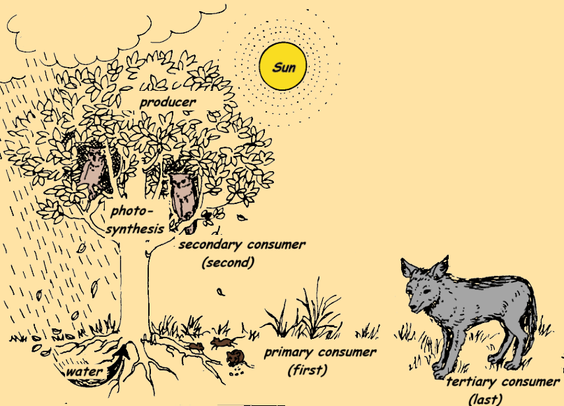

   - a) Name the: 

      - i. producer **_Solution:_** 

         - _grass or tree_ 

      - ii. primary consumer **_Solution:_** 

         - _mice / rats / rodents_ 

      - iii. secondary consumer **_Solution:_** 

         - _owl or bird_ 

      - iv. tertiary consumer **_Solution:_** 

         - _jackal/ fox / wolf / dog_ 

   - b) The ecosystem consists of living organisms together with the **_Solution:_** 

      - _environment or abiotic factors_ 

2. Read the article below and answer the questions that follow: 

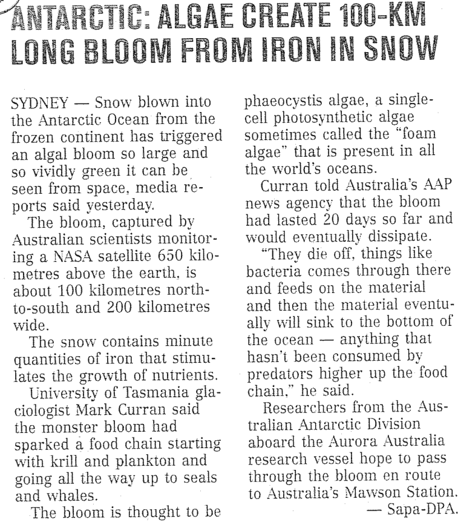

- a) Describe what you understand by the term algal bloom 

##### **_Solution:_** 

_An algal bloom is a massive (very large) growth in the number of algae in an area, usually due to an unnatural increase in nutrients in the water._ 

- b) With reference to above article, name the abiotic factor that is responsible for the bloom and how the factor reached the Antarctic Ocean. 

##### **_Solution:_** 

_The abiotic factor is extra iron that blew into the sea from the Antarctic mainland._ 

- c) Discuss the role decomposers could play in this ecosystem. **_Solution:_** 

_Decomposers like bacteria will later come to the top and break down the algae and reduce the algal bloom._ 

3. Earthworms will burrow into the soil if they are on the surface and it is daylight. We can explain this behaviour by saying that they are either repelled by light or because they are attracted to the soil. 

Describe an experiment that you could do to determine which explanation is correct. When designing your experiment, bear in mind that earthworms are living organisms. 

Set out your design under the following headings: 

- a) Hypothesis 

##### **_Solution:_** 

_Earthworms burrow into the soil because they are repelled by light OR Earthworms are attracted to the darkness that soil depth offers them._ 

_(Accept any hypothesis directly related to the aim, as long as it is a statement, not a question and it is written in the future tense.)_ 

##### b) Aim 

##### **_Solution:_** 

_To investigate if earthworms are attracted to soil and/or repelled by light._ 

_(Accept any aim, as long as it is related to the instructions and MUST start with “To find out / To determine / To see . . . etc.)_ 

- c) Apparatus and Materials 

##### **_Solution:_** 

_Learner dependent answers. The answer depends on their design, but should be written in a bulleted list, be appropriate to the task, include at least 4 pieces of apparatus._ 

- _earthworms of the same species_ 

- _lamp/ light source_ 

- _black basins with covers or other containers that block light_ 

- _black paper/ black plastic sheet_ 

- _soil_ 

- _sawdust_ 

- _timing device / stopwatch_ 

##### d) Method 

##### **_Solution:_** 

_Method Example 1:_ 

- _i. Earthworms were divided into 4 groups._ 

- _ii. Two basins were filled with nutrient rich soil (A and B), two with sawdust (C and D)._ 

- _iii. A and C were covered with black paper on their covers._ 

- _iv. B and D were placed under a neon lamp._ 

- _v. Earthworms were placed on the surface of the medium, appropriate covers were put in place._ 

- _vi. After a 10 minute interval the number of worms at the surface of the medium were counted._ 

- _vii. The procedures were repeated 5 times._ 

_viii. Counts were averaged and results compared._ 

||_Medium condition_<br>_Container_|_Light condition_|
|---|---|---|
|_A_|_soil_<br>|_Dark_|
|_B_|_soil_|_light_|
|_C_|_sawdust_<br>|_Dark_|
|_D_|_sawdust_|_light_|

##### _Method Example 2:_ 

- _i. Divide earthworms into two equal groups._ 

- _ii. Put equal amount of soil into the large box on either side of the plastic separator sheet._ 

- _iii. Put one group of worms onto the soil on each side of the sheet._ 

- _iv. Shine a light onto one group and leave the other group in darkness._ 

- _v. Observe whether the worms have moved into the soil in the light or in darkness or in both cases._ 

_Marking Rubric:_ 

||_Criterion_|_Marks_|
|---|---|---|
|_1._|_List ofpoints/bullets_|_1_|
|_2._|_Meets the aim that the pupil has_<br>_given_|_1_|
|_3._|_Independent variables catered for_<br>_(light/dark or soil/sawdust)_|_1_|
||_Dependent variables mentioned_<br>_(number of worms at the surface of_<br>_the medium)_|_1_|
||_Controlled variables evident_|_1_|
|_4._|_Sufficient equipment used_|_1_|
||_Equipment used appropriately_|_1_|
|_5._|_Logical – recipe like_|_1_|

4. Read the following information taken from UWC Enviro Fact sheet on the Fynbos and answer the questions that follow: 

Fynbos is the major vegetation type of the small botanical region known as the Cape Floral Kingdom. The Cape Floral Kingdom is both the smallest and the richest floral kingdom, with the highest known concentration of plant species: 1 300 per 10 000 km^{2} . The nearest rival, the South American rain forest has a concentration of only 400 per 10 000 km^{2} . Conservation of the Cape Floral Kingdom, with its distinctive fynbos vegetation, is a national conservation priority demanding urgent action. 

Over 7 700 plant species are found in fynbos, an astonishing number for such a small area. Of these roughly 70% are endemic to the area. Many of these are threatened with extinction. The richness of the fynbos is well demonstrated by its ericas or heaths, of which there are over 600 different species. There are just 26 in the rest of the world. Although the most striking features of the composition of fynbos are the presence of many conspicuous members of protea, erica and reed family that fill the niche usually occupied by grasses, the largest family in number of species is Asteraceae (daisy family), with just under 1000 species of which more than 600 are endemic. Furthermore, fynbos is very rich in geophytes (bulbous plants) and many species from the family Iridaceae have become household names, freesia, gladiolus, iris, and watsonia. Another remarkable feature of fynbos is the number of species found within small areas. For example, the total world range of some species consists areas smaller than half a soccer or rugby field!. 

Fynbos cannot support herds of large mammals since the nutrient poor soils on which it grows do not provide enough nitrogen for the protein requirements of large mammals. However, smaller mammals common to fynbos are baboons, grysbok, dassies, and the striped mouse. Fynbos does not support high numbers of birds. Fynbos also supports large numbers of butterfly species. Many are however at risk. The early stages (larvae) of many of these butterfly species are entirely carnivorous and live on a diet of ant brood. The butterfly larvae actually live inside the nest of their host ant. Although fynbos is not particularly rich in reptiles and amphibians, many of the species living there are both endemic and threatened. The very rare geometric tortoise is found in only a few surviving fynbos areas and is regarded as the world’s second rarest tortoise. 

The Cape has more than half of South Africa’s frog species. Fynbos also has a high concentration of threatened fish species, particularly in the Olifants River system. With the widespread occurrence of alien vegetation which use up more water than indigenous fynbos plants, many habitats are becoming restricted leading to local extinction of certain species of fish because isolated tributaries are drying up. 

<mark>http://www.bcb.uwc.ac.za/envfacts/fynbos/</mark> 

- a) The fynbos is said to be a very bio diverse habitat. List any three pieces of evidence from the text that show the idea of a rich biodiversity. 

**_Solution:_** 

- _“The Cape Floral kingdom is the smallest and richest floral kingdom with the highest known concentration of plant species”._ 

   - _Fynbos has the highest known concentration of plant species: 1 300 per 10 000 km_^{2} _._ 

   - _There are 7 700 plant species are found in fynbos, 70% of which are endemic._ 

   - _The Asteraceae (daisy family), has just under 1000 species, of which more than 600 are endemic._ 

   - _Fynbos has over 600 different species of Ericas - the rest of the world has 26 species._ 

   - _Fynbos is very rich in geophytes (bulbous plants)._ 

   - _Fynbos is home to more than half of South Africa’s frog species._ 

   - _The total world range of some plants is an area smaller than half a soccer field._ 

   - _The geometric tortoise is found here and is the 2nd rarest tortoise in the world._ 

   - _There may be others that are relevant as well._ 

- b) Give three distinctive abiotic characteristics (excluding edaphic factors) of this biome. 

##### **_Solution:_** 

   - _Fire_ 

   - _Hot, dry summer and cold, wet winter_ 

   - _Low altitude/ coastal location_ 

   - _Poor, infertile soil_ 

- c) Define the following terms mentioned in the text: 

   - i. endemic 

      - **_Solution:_** 

_An organism found only in that area, nowhere else in the world._ 

- ii. alien species 

   - **_Solution:_** 

_A species that doesn’t naturally occur in that area, but was introduced from elsewhere in the world. They are usually harmful to the ecosystem._ 

- iii. indigenous 

   - **_Solution:_** 

_A species that has always been part of the natural flora / fauna of the area. This is not the same as ‘endemic’ – an indigenous species may occur in other areas as well._ 

- iv. extinct 

##### **_Solution:_** 

_A species that has been completely eliminated or destroyed. There are no more living specimens anywhere in the world._ 

- d) Construct a possible food chain of at least four organisms that would be found in this biome, use some organisms mentioned in the text. 

Label the levels of the organisms mentioned. 

##### **_Solution:_** 

- _Grass seeds → ants → butterfly larvae → birds_ 

- _Geophyte → striped mouse → baboon → leopard_ 

- _Ericas → ants → butterfly larva → birds_ 

_Label can include: producer/autotroph, consumer/heterotroph- primary, secondary, tertiary_ 

_There are of course several others that can be constructed from the test. This is just an example._ 

- e) Discuss the characteristics of the soil found in the fynbos and the implications for animals in the area. 

**_Solution:_** 

_The soil is very nutrient-poor (low nitrogen), sandy, porous and well aerated. Its poor quality makes it insufficient to sustain large animals._ 

5. Which of the following are biotic components in an ecosystem? 

   - a) air and water 

   - b) plants and animals 

c) light and temperature 

- d) rocks, soil and climate. 

**_Solution:_** 

_b_ 

6. Which combination of the following processes takes place in the nitrogen cycle? 

   - i) Herbivores consume plant protein. 

   - ii) Decomposers break down dead organisms. 

   - iii) Bacteria change nitrites to nitrates. 

   - iv) Plants absorb nitrates from the soil. 

a) i, ii and iii 

b) i, ii, iii and iv 

c) i and iv 

d) i, ii and iv 

##### **_Solution:_** 

##### _b_ 

7. A soil has the following characteristics: large particles, large air spaces, holds little water, feels gritty. The type of soil is: 

a) clay b) sand c) loam d) silt 

##### **_Solution:_** _b_ 

8. Plants that are suited to live in areas with little water are called: a) terrestrial b) fynbos c) xerophytes d) hydrophytes 

**_Solution:_** 

##### _c_ 

9. In a food chain, energy flows in the following direction: 

   - a) producers _→_ primary consumers _→_ secondary consumers _→_ decomposers 

   - b) decomposers _→_ producers _→_ primary consumers _→_ secondary consumers 

   - c) primary consumers _→_ secondary consumers _→_ producers _→_ decomposers 

   - d) producers _→_ secondary consumers _→_ primary consumers _→_ decomposers. 

   - **_Solution:_** 

##### _a_ 

10. In a stable ecosystem, a wide variety of: 

   - a) producers depend on plants for shelter and camouflage 

   - b) micro-organisms depend on plants for carbon dioxide and nitrogen 

   - c) animals depend on plants for food and oxygen 

   - d) plants depend on micro-organisms for pollination and seed dispersal 

   - **_Solution:_** 

##### _c_ 

11. When a jackal kills and eats a rabbit, the jackal is the: a) producer 

   - b) prey 

   - c) predator 

   - d) saprophyte 

   - **_Solution:_** _c_ 

12. Which of the following refers to an organism’s whole way of life and the use to which it puts the available environmental resources? a) niche 

   - b) habitat 

## 5. Authentic Exam Question Archetypes & Mark Allocations
*(Extracted from official CAPS examination papers to guide marking, pacing, and rubric design)*

### Archetype 1: QUESTION 1
- **Source Paper:** `Gr10_LifeSciences_Exam10.pdf`
- **Total Mark Allocation:** **[65 Marks]** (Sub-questions: 18, 9, 8, 2, 2 marks)
- **Recommended Time:** **65 Minutes** (Pacing: ~1.0 min/mark | *Calibrated to Official CAPS Paper Pace (1.0 min/mark)*)
- **Assessment Mode Calibration:** Timed Exam Simulation: 65 min countdown (Pacing Checkpoint: 49 min)
- **Cognitive / Marking Strategy:** NSC Standard (Method Marks [M], Accuracy Marks [A], Carry-Over [CA])

#### Question Prompt & Working:
```text
QUESTION 1 
 
1.1 Various options are provided as possible answers to the following questions.  
Choose the correct answer and write only the letter (A to D) next to the question 
number (1.1.1 to 1.1.9) in your ANSWER BOOK, for example 1.1.10  D. 
  
 
1.1.1 Calcium and phosphorus in mammals … 
  
 
A 
B 
C 
D 
forms part of nucleic acid. 
plays a role in the synthesis of proteins. 
prevents rickets. 
is involved in the formation of haemoglobin. 
  
 
 1.1.2 Which ONE of the following results in swelling of thyroid gland when in 
short supply? 
  
 
A 
B 
C 
D 
Iron  
Iodine 
Phosphorus  
Calcium  
  
 
  
QUESTIONS 1.1.3 AND QUESTION 1.1.4 ARE BASED ON THE 
DIAGRAMS OF DIFFERENT BLOOD VESSELS BELOW 
  
 
 
                       
 
 
 
 
 1.1.3 Which diagram/s  or  blood vessel/s connect...
```

### Archetype 2: QUESTION 2
- **Source Paper:** `Gr10_LifeSciences_Exam10.pdf`
- **Total Mark Allocation:** **[95 Marks]** (Sub-questions: 1, 1, 2, 1, 6 marks)
- **Recommended Time:** **95 Minutes** (Pacing: ~1.0 min/mark | *Calibrated to Official CAPS Paper Pace (1.0 min/mark)*)
- **Assessment Mode Calibration:** Timed Exam Simulation: 95 min countdown (Pacing Checkpoint: 71 min)
- **Cognitive / Marking Strategy:** NSC Standard (Method Marks [M], Accuracy Marks [A], Carry-Over [CA])

#### Question Prompt & Working:
```text
QUESTION 2 
 
2.1 The table below shows the nutritional information printed on a cereal box. 
 
Nutrients present in cereal 
35 g of cereal contain: 
Proteins 
4 g 
Carbohydrates 
15 g 
Fat 
0.5 g 
Iron 
8 g 
Vitamin B1 
2 g 
Fibre (roughage) 
5.5 g 
 
2.1.1 
 
 
2.1.2 
 
 
2.1.3 
 
2.1.4 
 
2.1.5 
 
 Name the nutrient that makes up the largest part of the 35g  
 cereal in the table.                                                                                              
 
Name the building blocks of nutrient named in QESTION 2.1.1                         
 
 
List TWO functions of protein in the human body.                    
 
Name an inorganic nutrient in this cereal.                                        
 
Draw a pie chart to represent the data in the table.                    ...
```

### Archetype 3: QUESTION 3
- **Source Paper:** `Gr10_LifeSciences_Exam10.pdf`
- **Total Mark Allocation:** **[100 Marks]** (Sub-questions: 1, 1, 2, 2, 2 marks)
- **Recommended Time:** **100 Minutes** (Pacing: ~1.0 min/mark | *Calibrated to Official CAPS Paper Pace (1.0 min/mark)*)
- **Assessment Mode Calibration:** Timed Exam Simulation: 100 min countdown (Pacing Checkpoint: 75 min)
- **Cognitive / Marking Strategy:** NSC Standard (Method Marks [M], Accuracy Marks [A], Carry-Over [CA])

#### Question Prompt & Working:
```text
QUESTION 3 
 
3.1  An investigation was done to determine the effect of temperature on the rate   
 of transpiration. 
 
The procedure was as follows: 
 
• Four measuring cylinders (A, B, C and D) were set up as the one shown in the 
diagram. 
• The four cylinders were left in the laboratory but were exposed to different 
temperatures. 
• Temperature was measured in the four cylinders, using a thermometer. 
• Each measuring cylinder contained a leafy twig and 80 ml water covered with a 
layer of oil. 
• After two hours, water levels in the four cylinders were measured using the 
spring balance and recorded. 
• Investigation was repeated 4 times. 
 
 
        The diagram below shows the setup of the investigation. 
 
 
 
 
 
 
             The table below shows the results that were obtaine...
```
