# **CHAPTER 10** 

# _Biodiversity and classification_ 

|**10.1**|**_Overview_**|324|
|---|---|---|
|**10.2**|**_Biodiversity_**|325|
|**10.3**|**_Classification schemes_**|327|
|**10.4**|**_Five kingdom system_**|334|
|**10.5**|**_Summary_**|340|

10 Biodiversity and classification 

10.1 Overview ESGBP 

Introduction ESGBQ 

**‘Biodiversity is the greatest treasure we have. Its diminishing is to be prevented at all costs’. — Thomas Eisner, US environmental scientist, who has made interesting findings into how organisms produce chemicals to fight off predation.** 

The diversity of life on Earth has fascinated scientists for generations. The earliest scientists attempted to understand life by categorising it according to a range of common traits. Over time these classification systems have changed based on the new evidence gathered. In this unit you will study the history of the system of classifying organisms, starting with Aristotle and progressing to the current five-kingdom system devised by Whittaker. You will also be introduced to the scientific convention of referring to organisms in Latin using two names - referred to as binomial nomenclature. It is important to try and draw connections between this section and the previous one in which you studied the plant and animal life common to each biome. 

##### **Key concepts** 

- There is enormous biodiversity on Earth, consisting of different ecosystems, containing a variety of species, which each have genetic differences. 

- South Africa is a ’hotspot’ of diversity and has a large diversity of species endemic to the region. 

- Classification schemes are a way of categorising biodiversity based on common characteristics. 

- The history of classification began with Aristotle. 

- Currently, the most widely used classification system is the five-kingdom scheme consisting of the kingdoms: Animalia, Plantae, Fungi, Protista and Monera (or Bacteria). 

- In Science we name living organisms using a naming system called binomial nomenclature, which is written in the form: _Genus, species_ 

- Based on cell structure, there are key differences between prokaryotes and eukaryotes. 

- The main groupings of living organisms are bacteria, protists, fungi, plants and animals. Each of these categories of organisms have distinctive features that differentiate them. 

##### **FACT** 

## 10.2 Biodiversity 

#### ESGBR 

Biodiversity is the term we use to refer to the variation in life forms in an ecosystem, biome or the entire planet. The term also describes the genetic wealth within each species, the inter-relationships between them and the natural areas in which they occur. 

In this chapter we will focus on understanding the existing biodiversity and how scientists attempt to describe it. Biodiversity varies widely across the Earth, depending on temperature, rainfall, soils, geography and the presence of other species. 

Biodiversity varies greatly across different regions of the Earth. In addition, biodiversity has also varied greatly across **time** . You will learn more about how biodiversity has changed over Earth’s history in the following chapter: **’The History of Life on Earth’** . 

Scientists have described over 1,7 million of the world’s species of animals, plants and algae. A rich species diversity is found in South Africa. With a land surface of approximately 148 000 square kilometres, representing approximately 1% of the Earth’s total surface, South Africa contains10% of the world’s total known bird, fish and plant species, and 6% of the world’s mammal and reptile species. 

This natural wealth is threatened by the expansion of the human population and the increasing demand this places on the environment. South Africa as a country is a ’hotspot’ of biodiversity, a term given to an area with a large biodiversity of plants and animals. The Karoo and the Cape are biodiversity hotspots in South Africa. South Africa has a wide range of climatic conditions and many variations in landscape as you learnt in the previous chapter. These various landscapes give rise to the biomes which allow a wide variety of life to survive. In the table below are listed some of the major plant, mammal, bird, reptile and amphibian, fish and insect species found in South Africa. You are not expected to know any of the numbers but they are given to you in order to illustrate the extent of biodiversity that exists in South Africa. 

**<mark>Life form</mark>** Plants 


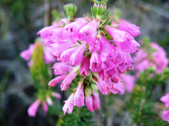
> **[Diagram Context - Textbook_LifeSciences_Gr10_Biodiversity_and_classification.pdf-0003-09.png]**
> This photograph displays an inflorescence of tubular pink flowers belonging to the *Erica* genus, characteristic of the South African Fynbos biome. Visible features include clusters of vibrant pink, bell-shaped corollas, small green sepals, and needle-like green leaves typical of ericoid adaptations. Conceptually, this image supports Life Sciences learners studying biodiversity and plant adaptations in the Cape Floral Kingdom, illustrating how specialized floral structures facilitate pollination in endemic angiosperms.


**<mark>Diversity and threatened species</mark>** More than 20 300 species of flowering plants occur in South Africa. One of the six most important areas of plant growth in the world is in the Western Cape. Most of the 2000 threatened species of plants are found in the fynbos in South-West Cape. 

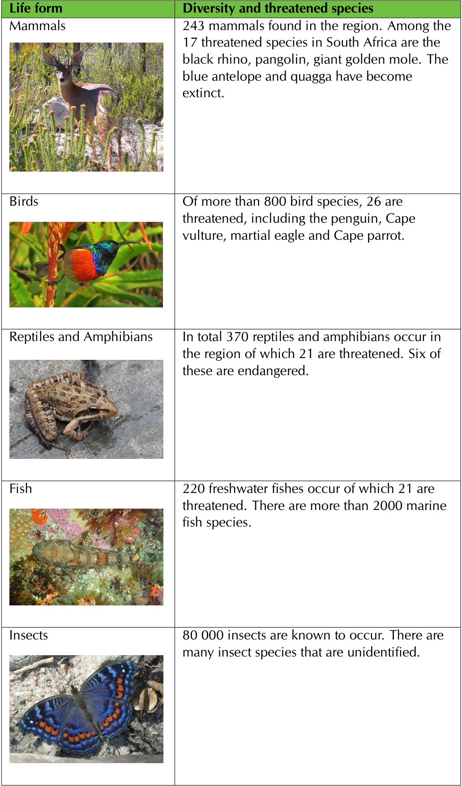

Most of the diverse species found in South Africa are **endemic** or **indigenous** to the country. 

- **Indigenous** means that these species originate or occur naturally in South Africa. 

- **Endemic** means that these species occur **only** in South Africa and nowhere else. 

## 10.3 Classification schemes ESGBS 

### Classification 

#### ESGBT 

The practice of classifying organisms is referred to as **taxonomy** . Classification is usually a hierarchical process. One begins with general and broad differences, and then one systematically introduces more and more detailed and specific criteria. 

We have prepared an activity in order to show why we try and classify living organisms, what sort of mental process it entails, and how it is done. The activity below is not Life Sciences related, but conveys the process of classification. Try and think of the problems that arise while classifying the items below. Can BBC news be entertaining too? If so, should it not be under entertainment? Do you think that the final level of classification is the most definitive? 

##### **Activity: Classification** 

##### **Aim:** 

To understand how classification systems work. 

##### **Materials:** 

Pen and paper **Instructions:** 

1. Listed below are different TV programmes: 

   - Carte-Blanche 

   - Rocky 

   - Isidingo 

   - Rambo 

   - Hitler’s Bodyguards 

   - Generations 

   - Vietnam: Lost Films 

   - BBC news 

2. Divide these TV programmes above into 2 groups, under the headings: Entertainment and Documentary. 

3. Now further subdivide the Entertainment group into Action and Soapies groups. 

4. Do the same for Documentary using the headings: News/Current Affairs and History. 

You have just drawn an example of a dichotomous branching diagram/ tree. All objects can be divided in this way. We call this a classification system. 

Classification can be a tricky business. Problems arise when something can be classified to greater detail, or when an object or organism could belong to more than one category. Biologists have faced these classification conundrums for centuries when trying to classify organisms in one category or another. 

Artificial classification systems, such as the grouping of vehicles into those that provide transport on land, water or air, are based on arbitrary groupings and have little meaning. The biological classification system, however, is based on research in anatomy, physiology, chemistry, genetics and many other branches of science. It is a scientific method of classification that groups organisms that share common features. 

This classification is not random, but rather it describes evolutionary relationships. As a consequence, it is always necessarily hierarchical, where the important features inherited from a common ancestor determine the group in which the organisms are placed. For example, humans and whales both feed their young on milk, which is a characteristic inherited from a common ancestor. This similarity places them under the same class, **mammals** , even though their habitats are completely different. 

Each organism is grouped into one of five large groups or **kingdoms** , which are subdivided into smaller groups called **phyla** (singular: phylum) and then smaller and smaller groups with other names. 

- Kingdom 

- Phylum 

- Class 

- Order 

- Family 

- Genus 

- Species 

When trying to identify animals, it is this hierarchy or ranking scheme that we follow. We start by identifying the kingdom to which an organism belongs, then its phylum, class, family, order, and so on. 

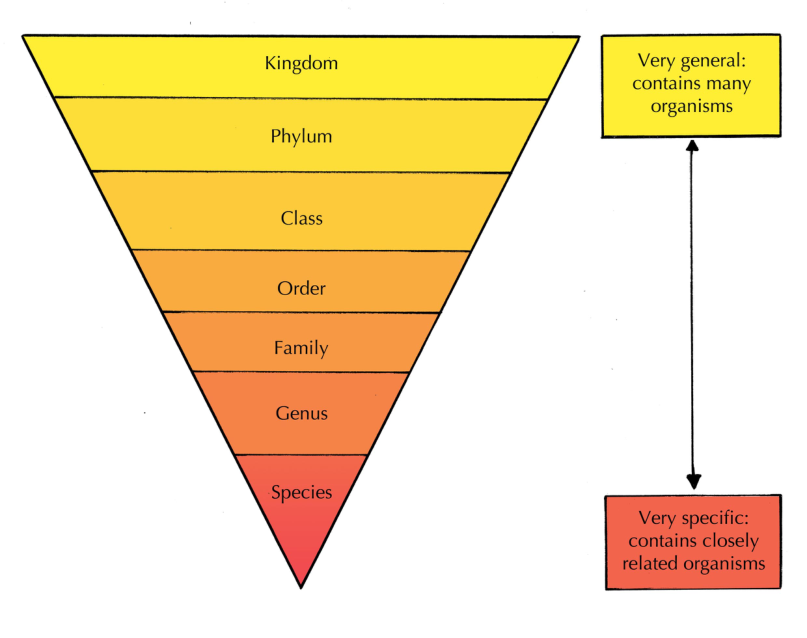

##### **FACT** 

Watch a video about taxonomy: life’s filing system See video: 2CXD 

Figure 10.1: Schematic diagram showing hierarchy or ranking scheme used by taxonomists. 

This is similar to explaining how to find your house to a being from another planet. You would have to say Earth first, then Africa, then South Africa, then KZN, then Durban, then the suburb, then the road name and finally the house number. He would have to start searching in a big place and gradually work down to smaller places (or groupings). 

A way to remember it is ” **K** waito **P** eople **C** ome **O** ut **F** rom **G** auteng **S** inging”. By learning this mnemonic you are going to remember the sequence in the classification system: 

- Kingdom - Kwaito 

- Phylum - People 

- Class - Come 

- Order - Out 

- Family - From 

- Genus - Gauteng 

- Species - Singing 

**Activity: Constructing a mnemonic to remember the sequence of the classification system** 

**Instructions:** 

Make an easy to remember memory aid to remember the sequence of levels of the classification system. 

ESGBV 

Watch a video about Carolus Linnaeus See video: 2CXF 

##### **FACT** 

### History of classification 

**Aristotle** (384-322 BC) was a 4th century Greek philosopher. He divided organisms into two main groups, namely plants and animals. His system was used into the 1600’s. People who wrote about animals and plants either used their common names in various languages or adopted more-or-less standardised descriptions. 

**Caspar Bauhin** (1560–1624) took some important steps towards the binomial system currently used by modifying many of the Latin descriptions to two words. 

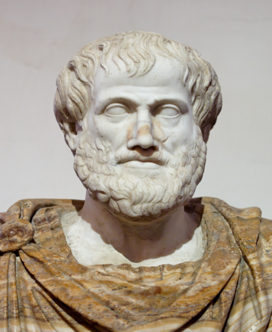

Figure 10.2: Aristotle (384–322 BC) devised one of the earliest classification schemes. 

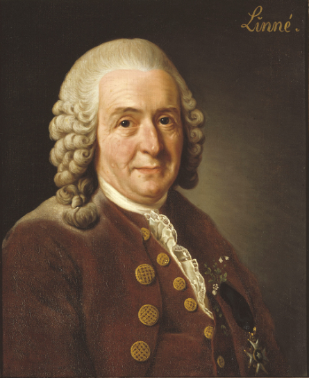

Figure 10.3: Carl Linnaeus developed a more advanced classification scheme and the system of naming organisms called binomial nomenclature. 

**Carolus Linnaeus (Carl Von Linne)** (1707–1778) was an 18th century Swedish botanist and physician. He classified plants and animals according to similarities in form and divided living things into two main kingdoms namely — plant and animal kingdoms. He named the plants and animals in Latin or used latinised names in his books _Species Plantarum_ (1753) and _Systema Naturae_ (1758). The two-kingdom classification system devised by Linnaeus is not used today. As scientists discovered more and more about different organisms, they expanded the system to include many more kingdoms and groupings. However, one of Linnaeus more enduring systems was the system of naming organisms- called **binomial nomenclature** . We will learn more about binomial nomenclature in the next section. 

**Ernst Haeckel** (1834-1919) was able to observe microscopic single-celled organisms and he proposed a third kingdom of life, the Protista, in 1866. Protista were single celled organisms that were neither plant nor animal, but could have characteristics of either. 

**Herbert Faulkner Copeland** (1902–1968) recognised the important difference between the single-celled eukaryotes and single-celled prokaryotes. He proposed a four-kingdom classification, and placed the bacteria and blue-green algae (prokaryotes) in a fourth kingdom- Monera. 

**Robert Harding Whittaker** (1920-1980) devised a five kingdom system in 1969. He recognised that fungi belonged to their own kingdom. However, even today the five-kingdom system is under dispute. It is the nature of science that as more discoveries come to light, theories will continue to be improved upon and revised. 

### Binomial Nomenclature 

#### ESGBW 

One of Linnaeus’ greatest contributions was that he designed a scientific system of naming organisms called **binomial nomenclature** (bi - ’two’, nomial - ’names’). He gave each organism a two part scientific name - **genus** (plural - ’genera’) and **species** (plural - ’species’) names. The genus and species names would be similar to your first name and surname. **Genus name** is always written with a capital letter whereas **species name** is written with a small letter. The scientific name must always be either written underlined or printed in italics. 

Since Latin was once the universal language of science among western scholars in medieval Europe, these names were typically in Latin. 

For example the scientific name of the African elephant is _Loxodonta africana_ . **Genus:** _Loxodonta_ **Species:** _africana_ 

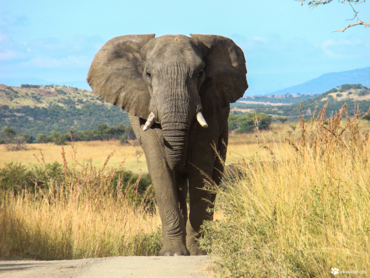

Figure 10.4: Elephant ( _Loxodonta africana_ ). 

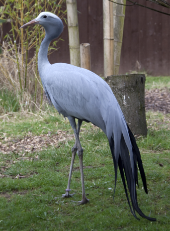

Figure 10.5: Blue crane, South Africa’s national bird. 

An organism will always have only one scientific name even though they might have more than one common name. For example Blue crane, indwe (for amaXhosa) and mogolori (for Batswana) are all common names for South Africa’s national bird (shown below). However, it has got only one scientific name which is _Anthropoides paradiseus_ . 

The scientific name of our human race is _Homo sapiens sapiens_ . We are the only surviving members of the genus _Homo_ — other more ancient or ancestral types such as _Homo ergaster_ and _Homo neanderthalensis have all become extinct._ 


Figure 10.6: _Homo neanderthalensis_ 


Figure 10.7: _Homo sapiens_ 

### Prokaryotes and eukaryotes ESGBX 

**Prokaryotes** are uni- or multicellular organisms made up of cells that do not have a nuclear envelope (pro - before, karyon - nucleus). The genetic material is not bound in a nucleus. They also lack cell organelles such as an endoplasmic reticulum, a Golgi apparatus, lysosomes, and mitochondria. Prokaryotes are divided into two main groups namely the Bacteria and the Archaea (ancient bacteria). 


Figure 10.8: A prokaryote cell 

**Eukaryotes** are organisms that possess a membrane-bound nucleus that holds genetic material (eu - true, karyon - nucleus). Eukaryotes may contain other membrane-bound cell organelles, such as mitochondria and chloroplasts. Eukaryotic organisms can be unicellular or multicellular. Eukaryotes include organisms such as plants, animals, fungi, and protists. 

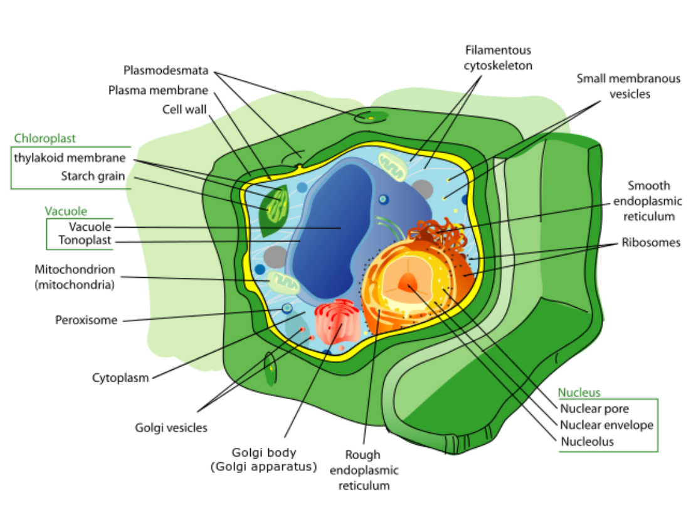

Figure 10.9: A eukaryote cell 

##### **Table: Differences between prokaryotes and eukaryotes.** 

|**Prokaryotes**|**Eukaryotes**|
|---|---|
|Small cells|Large cells|
|Unicellular or multicellular|Often (but not always) multicellular|
|Genetic material is not contained within<br>a nucleus|Genetic material is contained in a<br>membrane-bound nucleus|
|Cells have a simple membrane internal<br>system but no organelles Example: no|Cells have a distinct membrane system<br>with organelles Examples: Chloroplast,|
|chloroplast,no mitochondria|mitochondria, golgi bodies|

##### **FACT** 

A video showing a brief summary of the five kingdoms See video: 2CXG 

##### **FACT** 

Bacteria are found everywhere and are the most numerous organisms on Earth. In a single gram of soil, there are about 40 million bacterial cells. The human body also contains 10 times as many bacterial cells as human cells! 

## 10.4 Five kingdom system ESGBY 

The five kingdom system is the most common way of grouping living things based on simple distinctive characteristics. Classification systems are always changing as new information is made available. Modern technologies such as Genetics makes it possible to unravel evolutionary relationships to greater and greater detail. The five-kingdom system was developed by Robert H. Whittaker in 1969 and was built on the work of previous biologists such as Carolus Linnaeus. 

Living things can be classified into five major kingdoms: 

- Kingdom Animalia 

- Kingdom Plantae 

- Kingdom Fungi 

- Kingdom Protista 

- Kingdom Monera (Bacteria) 

We will now identify the main distinctive features of each kingdom: 

### Kingdom Monera ESGBZ 

The Kingdom Monera consists of prokaryotic, unicellular organisms. No nuclear membrane or membrane-bound organelles such as chloroplasts, Golgi complex, mitochondria or endoplasmic reticulum are present. Monera have a cell wall of protein plus polysaccharide compound, but not cellulose. They reproduce asexually by binary fission. Important examples of Monera include Archaea and Bacteria. 

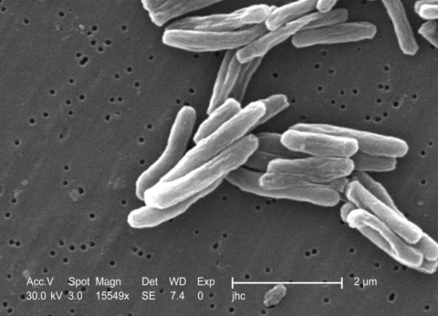

Figure 10.10: _Mycobacterium_ bacteria that causes Tuberculosis. 

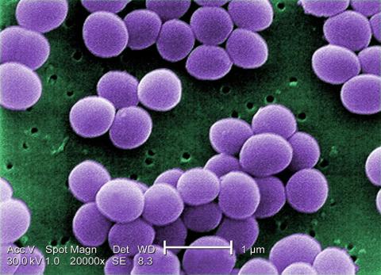

Figure 10.11: _Staphylococcus aureus_ bacteria can cause skin infections, sinusitis and food poisoning. 

### Kingdom Protista 

#### ESGC2 

Protista are eukaryotic and can be unicellular or simple multicellular. They reproduce sexually or asexually. Important examples of protists include the organism known as _Plasmodium_ (which causes malaria), _Amoeba_ and _Euglena_ . There are two major groups of protists which include the Protozoans, whose cells are similar to animal cells in that they do not have cell walls and the plant-like cells which do have cell walls and are similar to algae. 

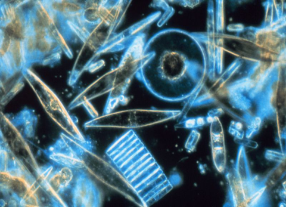

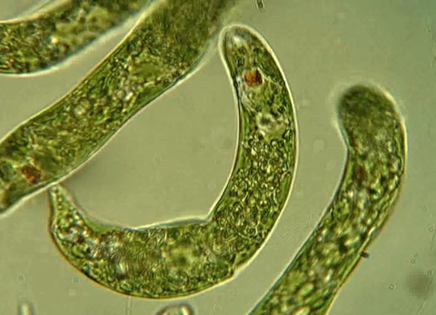

Figure 10.12: _Euglena_ an example of a protist. 

Figure 10.13: Diatoms from Antarctic sea ice. 

### Kingdom Fungi 

#### ESGC3 

##### **FACT** 

A TED video on the many uses of Fungi See video: 2CXH 

##### **FACT** 

Sir Alexander Fleming discovered the first antibiotics in 1928, after observing that colonies of _Staphylococcus aureus_ bacteria could be destroyed by the fungi _Penicillium notatum_ . This observation that certain substances were deadly to microbial life lead to the discovery and development of medicines that could kill many types of disease-causing bacteria in the body. 

Fungi are eukaryotic organisms that can be multicellular or unicellular. Mushrooms and moulds are examples of multicellular fungi and yeast is an example of a unicellular fungi. All fungi have a cell wall made of chitin. They are non-motile (not capable of movement) and consist of threads called hyphae. Fungi are heterotrophic organisms which means they require organic compounds of carbon and nitrogen for nourishment. They are important as decomposers (saprophytes) and can be parasitic. They store carbon as glycogen, not in the form of starch. Fungi reproduce sexually and asexually by spore formation. An important example of a useful fungus is _Penicillium_ (a fungus which was used to make penicillin, one of the most powerful antibiotics ever created). 

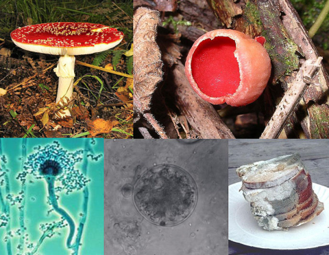

Figure 10.14: Examples of fungi. 

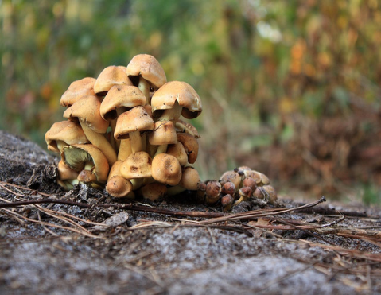

Figure 10.15: Mushrooms are examples of fungi. 

Kingdom Plantae 

#### ESGC4 

Organisms belonging to the plant kingdom are eukaryotic and multicellular organisms. They have a distinct cell wall made of cellulose. Cells are organised into true plant tissues. Plants contain plastids and photosynthetic pigments such as chlorophyll. They are non-motile. Plants make their own food by photosynthesis and are therefore said to be autotrophic. Plants undergo both sexual and asexual reproduction. They store food as starch. Important examples of plants are mosses, ferns, conifers and flowering plants. 

Examples of plant variety: 

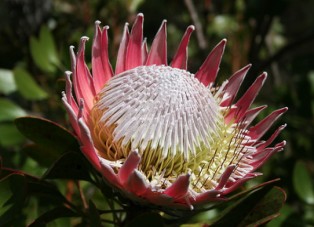

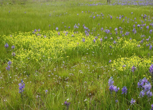

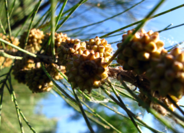


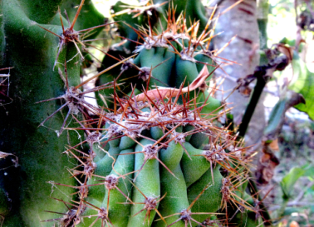

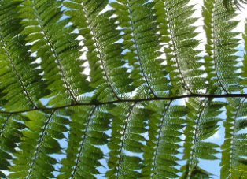

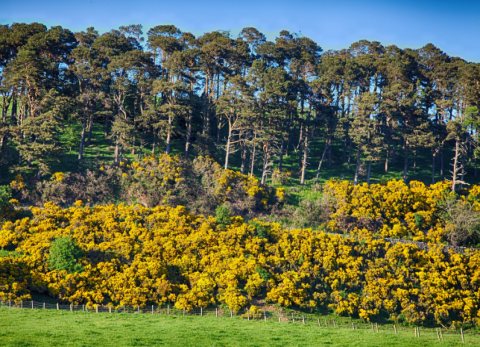


Kingdom Animalia 

#### ESGC5 

Members of the animal kingdom are eukaryotic and multicellular but have no cell wall or photosynthetic pigments. They are mostly motile and they are heterotrophic, which means they must feed on other organisms and cannot make their own food. They reproduce sexually or asexually. Animals store carbon as glycogen and fat. 

Important examples of this kingdom include: Porifera (sponges), Cnidaria (jellyfish), Nematoda (nematode worms), Platyhelminthes (flatworms), Annelidas (segmented worms), Mollusca (Snails and Squid), Echinodermata (starfish), Arthropoda (Insects and Crustaceans), Chordata (includes all the vertebrates: fish, amphibians, reptiles, birds, mammals). 

Examples of animal variety: 

##### **Animal Phyla** 

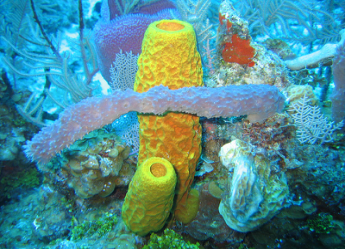

Figure 10.16: **Porifera** 

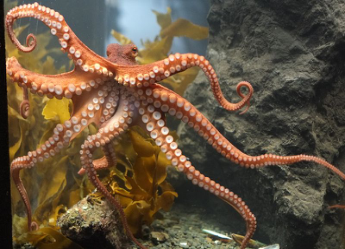

Figure 10.19: **Mollusca** 

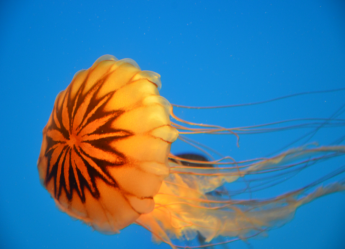

Figure 10.17: **Cnidaria** 

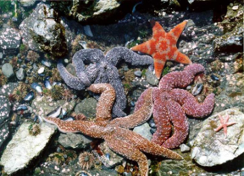

Figure 10.20: **Echinodermata** 

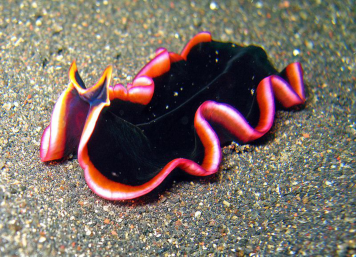

Figure 10.18: **Platyhelminths** 

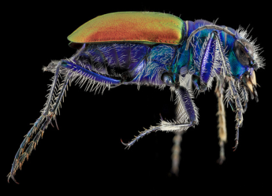

Figure 10.21: **Arthropoda** 

##### **Classes of vertebrates** 

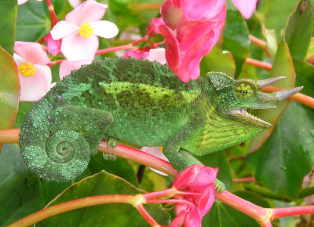

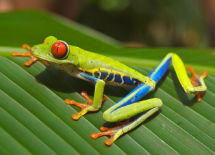

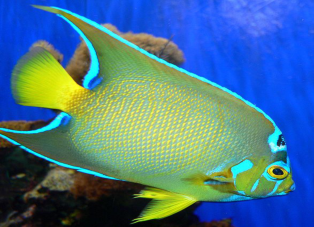

Figure 10.22: Fish 

Figure 10.23: Amphibians 

Figure 10.24: Reptiles 

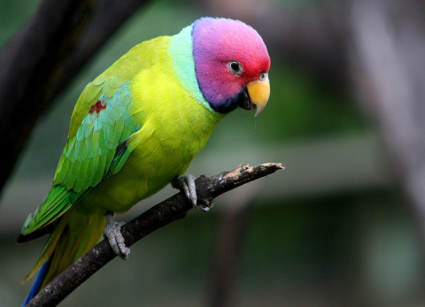

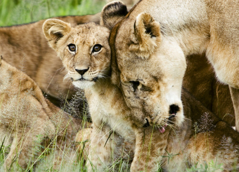

Figure 10.25: Birds 

Figure 10.26: Mammals 

##### **Activity: Investigate examples of life forms from each kingdom** 

##### **Aim:** 

To investigate examples from each kingdom. 

##### **Instructions::** 

1. Research one beneficial and one harmful application of one member from each kingdom, with examples from their use in South Africa. Students can be grouped into smaller groups and each one is given one kingdom to research. (Use www.arkive.org as a research tool for your favourite animal or plant or http://bugscope.becnkman.uiuc.edu/ for nice pictures of insects). Results can be presented in the form of a poster. 

2. Go to your nearest supermarket or garden and find one representative organism for each kingdom. Present this information by drawing a diagram. 

### Dichotomous Key ESGC6 

A **dichotomous key** is a tool that taxonomists often use to classify organisms correctly. It is a form of hierarchical grouping that involves making decisions in a series of steps, from general differences to very specific differences. It is called a **di** chotomous key because there are always **two** choices. There is a very specific way to set up a dichotomous key. For instance, one must always move from the general to the specific, and one must always ensure that the two choices in the decision tree are **mutually exclusive** and **jointly exhaustive** . Mutually exclusive means that there cannot be overlap between the two options, as this would result in wanting to place an organism in two groups. Jointly exhaustive means that your two options must cover all possibilities, otherwise you won’t be able to place an organism in either of the groups. 

##### **Activity: Identifying arthropods using a dichotomous naming key** 

##### **Aim:** 

To use a dichotomous key to identify arthropods. 

##### **Instructions:** 

1. Study the organisms in the table of specimens provided to you. 

2. Use the dichotomous key to find out to which taxonomic group each of these arthropods belong. 

3. Write the letter corresponding to the arthropod, and then your answer. 

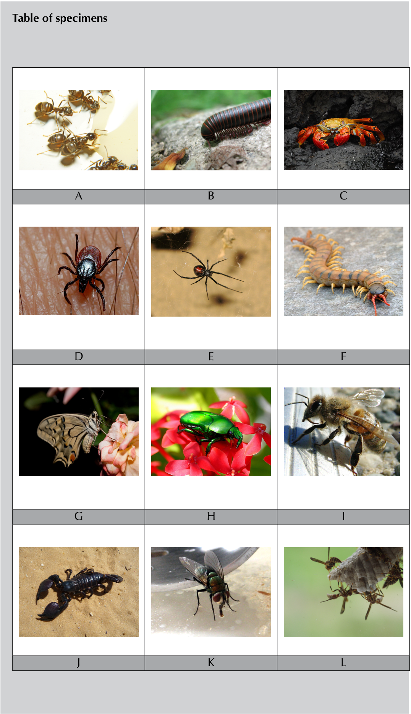

||**Characteristic**|**Instruction**|
|---|---|---|
|1a|Arthropod has eight legs|go 2 (Arachnids)|
|1b|Arthropod does not have 8 legs|go 4|
|2a|Arachnid has pedipalp with pincers|**SCORPION**|
|2b|Arachnid does not havepedipalpwithpincers|Go 3|
|3a|Arachnid drinks blood|**TICK**|
|3b|Arachnid does not drink blood|**SPIDER**|
|4a|Arthropod has more than 16 legs|Go 9 (Myriapoda)|
|4b|Arthropod does not have more than 16 legs|Go 5|
|5a|Arthropod has 3 pairs of legs|Go 6 (Insects)|
|5b|Arthropod does not 3pairs of legs|**CRUSTACEAN**|
|6a|Insect has hardened fore-wings|**COLEOPTERA**|
|6b|Insect does not have hardened fore-wings|Go 7|
|7a|Insects are social and/ or live in a hive|**HYMENOPTERA**|
|7b|Insects are not social,do not live in a hive|Go 8|
|8a|Insects does not have a sponge-like proboscis|**LEPIDOPTERA**|
|8b|Insects have a sponge-likeproboscis|**DIPTERA**|
|9a|Myriapod with one pair of legs per segment|**CENTIPEDE**|
|9b|Myriapod with twopairs of legsper segment|**MILLIPEDE**|

## 10.5 Summary ESGC7 

By the end of this chapter you should know the following: 

- The definition of the biological classification system and hierarchical manner of grouping of living organisms based on similarities and differences. 

- A brief history of major developments in the classification of organisms. 

- The scientific method of naming of organisms using the binomial nomenclature. All organisms have only **one** scientific name but many common names. 

- The division of organisms into prokaryotes (simple, unicellular) and eukaryotes (mostly multicellular) and the major differences between the two. 

- The classification of living organisms into five major kingdoms: Monera, Protista, Fungi, Plantae and Animalia and the unique characteristics of each kingdom. 

##### **Exercise 10 – 1: End of chapter exercises** 

1. Which of the following in a classification system is the smallest? 

   - a) Kingdoms 

   - b) Species 

   - c) Family 

   - d) Class 

2. Which Swedish botanist and physician named plants and animals in Latin? 

   - a) Casper Bauhin 

   - b) Aristotle 

   - c) Robert Whittaker 

   - d) Carolus Linnaeus 

3. The five kingdom classification system was suggested by: 

   - a) Whittaker 

   - b) Linnaeus 

   - c) Darwin 

   - d) Pasteur 

4. The following example is the scientific name of a lion: _Panthera leo_ . The first part of the scientific name represent the... 

   - a) Genus name 

   - b) Kingdom name 

   - c) Species name 

   - d) Family name 

5. Write down the correct biological term for the following descriptions. 

   - a) Type of system by modifying many of the Latin descriptions to two words. 

   - b) Group of organisms which are able to interbreed and produce fertile offspring. 

   - c) The scientific name of our human race. 

   - d) The type of asexual reproduction in the Kingdom Monera. 

   - e) Highest grouping in a classification system. 

6. Give the definition of the term **Biodiversity** . 

7. Tabulate **three** differences between prokaryotes and eukaryotes. 

|Check|answers|online|with|the<br>exercis|e<br>code|
|---|---|---|---|---|---|
|below|or<br>clic|k<br>on|’show|me<br>the|answer’.|
|1.2CXJ|2.2CXK|3.2CXM|4.2CXN|<br>5a.2CXP<br>5b.|2CXQ|
|5c.2CXR|5d.2CXS|5e.2CXT|6.2CXV|7.2CXW||
|**www**|**.everythings**|**cience.co.za**||**m.everythingscien**|**ce.co.za**|

11.5 Summary ESGC7 

By the end of this chapter you should know the following: 

- The definition of the biological classification system and hierarchical manner of grouping of living organisms based on similarities and differences. 

- A brief history of major developments in the classification of organisms. 

- The scientific method of naming of organisms using the binomial nomenclature. All organisms have only **one** scientific name but many common names. 

- The division of organisms into prokaryotes (simple, unicellular) and eukaryotes (mostly multicellular) and the major differences between the two. 

- The classification of living organisms into five major kingdoms: Monera, Protista, Fungi, Plantae and Animalia and the unique characteristics of each kingdom. 

##### **Exercise 11 – 1: End of chapter exercises** 

1. Which of the following in a classification system is the smallest? 

a) Kingdoms b) Species c) Family d) Class **_Solution:_** _b_ 

2. Which Swedish botanist and physician named plants and animals in Latin? a) Casper Bauhin b) Aristotle c) Robert Whittaker d) Carolus Linnaeus **_Solution:_** _d_ 

3. The five kingdom classification system was suggested by: a) Whittaker b) Linnaeus c) Darwin 

##### d) Pasteur 

##### **_Solution:_** 

_a_ 

4. The following example is the scientific name of a lion: _Panthera leo_ . The first part of the scientific name represent the... 

   - a) Genus name 

   - b) Kingdom name 

   - c) Species name 

   - d) Family name 

##### **_Solution:_** 

##### _a_ 

5. Write down the correct biological term for the following descriptions. 

   - a) Type of system by modifying many of the Latin descriptions to two words. 

      - **_Solution:_** 

      - _binomial nomenclature_ 

   - b) Group of organisms which are able to interbreed and produce fertile offspring. **_Solution:_** 

      - _species_ 

   - c) The scientific name of our human race. **_Solution:_** 

_Homo sapiens sapiens - (Answer must be underlined if handwritten)_ 

   - d) The type of asexual reproduction in the Kingdom Monera. **_Solution:_** 

      - _binary fission_ 

   - e) Highest grouping in a classification system. **_Solution:_** _Kingdom_ 

6. Give the definition of the term **Biodiversity** . 

   - **_Solution:_** 

_Biodiversity is a term describing the entire range of plants and animals found in a particular area – it includes all forms of life in an area. Biodiversity can also be used to describe the degree of variation of life forms within a given species, ecosysytem, biome, or entire planet._ 

7. Tabulate **three** differences between prokaryotes and eukaryotes. 

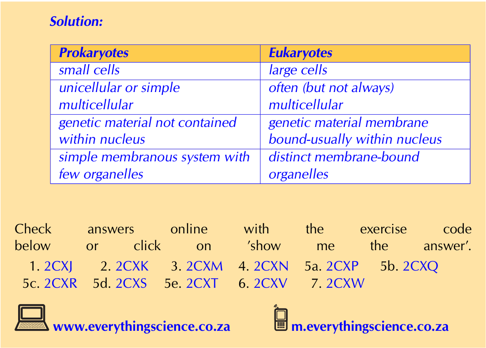

## 5. Authentic Exam Question Archetypes & Mark Allocations
*(Extracted from official CAPS examination papers to guide marking, pacing, and rubric design)*

### Archetype 1: QUESTION 1
- **Source Paper:** `Gr10_LifeSciences_Exam13.pdf`
- **Total Mark Allocation:** **[62 Marks]** (Sub-questions: 16, 7, 8, 7, 1 marks)
- **Recommended Time:** **62 Minutes** (Pacing: ~1.0 min/mark | *Calibrated to Official CAPS Paper Pace (1.0 min/mark)*)
- **Assessment Mode Calibration:** Timed Exam Simulation: 62 min countdown (Pacing Checkpoint: 46 min)
- **Cognitive / Marking Strategy:** NSC Standard (Method Marks [M], Accuracy Marks [A], Carry-Over [CA])

#### Question Prompt & Working:
```text
QUESTION 1 
 
 
 
 
1.1 
Various options are provided as possible answers to the following questions. 
Choose the correct answer and write only the letter (A–D) next to the 
question number (1.1.1 to 1.1.8) in your ANSWER BOOK, for example 
1.1.9 D. 
 
 
1.1.1 
 Which of the following is a biotic component? 
 
 
 
 
 
 
 
A 
Soil 
 
 
 
B 
Water 
 
 
 
C   Atmosphere 
 
 
 
D   Animals 
 
 
 
 
 
 
 
1.1.2 
The animal organ that pumps the blood to the rest of the body is known as … 
 
 
 
 
 
 
 
 
A     vein. 
 
 
 
B 
heart. 
 
 
 
C 
vena cava. 
 
 
 
D 
artery. 
 
 
 
 
 
 
 
1.1.3 
The death of all individuals of a species in the world is known as … 
 
 
 
 
 
 
 
 
A   extinction. 
 
 
 
B 
speciation. 
 
 
 
C   mortality.  
 
 
 
D 
survival.  
 
 
 
 
 
 
 
1.1.4 
The correct sequ...
```

### Archetype 2: QUESTION 2
- **Source Paper:** `Gr10_LifeSciences_Exam13.pdf`
- **Total Mark Allocation:** **[100 Marks]** (Sub-questions: 3, 2, 2, 2, 2 marks)
- **Recommended Time:** **100 Minutes** (Pacing: ~1.0 min/mark | *Calibrated to Official CAPS Paper Pace (1.0 min/mark)*)
- **Assessment Mode Calibration:** Timed Exam Simulation: 100 min countdown (Pacing Checkpoint: 75 min)
- **Cognitive / Marking Strategy:** NSC Standard (Method Marks [M], Accuracy Marks [A], Carry-Over [CA])

#### Question Prompt & Working:
```text
QUESTION 2 
 
 
 
 
 
2.1 
The diagram below shows the structure of a heart.  
 
 
 
 
 
 
 
 
 
 
2.1.1 
Identify the parts labelled A, B and C. 
(3) 
 
 
 
 
 
2.1.2 
Give a LETTER and a NAME of the part that:  
 
 
 
 
 
 
 
 
(a) Receives blood from the superior vena cava. 
(2) 
 
 
 
 
 
 
 
(b) Prevents backflow of blood from the right ventricle into the right atrium. 
(2) 
 
 
 
 
 
2.1.3 
Explain why the wall of part C is thicker than that of part D. 
(2) 
 
 
 
 
 
2.1.4 
Explain the meaning of a double, closed circulatory system. 
(2) 
 
 
 
 
 
2.1.5 
Describe the heart events of cardiac cycle during the general diastole. 
(5) 
 
 
 
(16) 
 
 
 
 
 
 
 
 
 
 
 
 
 
 
 
 
Life Sciences/P2  
 
8  
NW/November 2024 
  
Grade 10  
 
 
Copyright reserved 
 
Please turn over 
2.2 
A p...
```

### Archetype 3: QUESTION 1
- **Source Paper:** `Gr10_LifeSciences_Exam15.pdf`
- **Total Mark Allocation:** **[24 Marks]** (Sub-questions: 8, 4, 4, 1, 2 marks)
- **Recommended Time:** **24 Minutes** (Pacing: ~1.0 min/mark | *Calibrated to Official CAPS Paper Pace (1.0 min/mark)*)
- **Assessment Mode Calibration:** Timed Exam Simulation: 24 min countdown (Pacing Checkpoint: 18 min)
- **Cognitive / Marking Strategy:** NSC Standard (Method Marks [M], Accuracy Marks [A], Carry-Over [CA])

#### Question Prompt & Working:
```text
QUESTION 1 
 
1.1 
Various options are given as possible answers to the following questions. 
Choose the correct answer and write only the letter (A - D) next to the 
question number (1.1.1 - 1.1.4) in the ANSWER BOOK, eg 1.1.4 A 
 
  
 
1.1.1 
What type of classification system where every organism has a 
dual name? 
 
 
 
A 
B 
C 
D 
Binomial system 
Taxonomy 
Hierarchical system 
Two-domain system. 
  
 
 
1.1.2 
The term Binomial nomenclature refer to… 
  
 
 
A 
B 
C 
D 
the scientific way of naming organisms. 
the first part of their generic name is similar. 
a generic name and a species name of an organism. 
two species names of an organism. 
  
 
 
1.1.3 
The role of bacteria at the carbon cycle is for… 
 
 
 
 
A 
B 
C 
D 
breaking down the organic compounds. 
assimilation of nitr...
```
