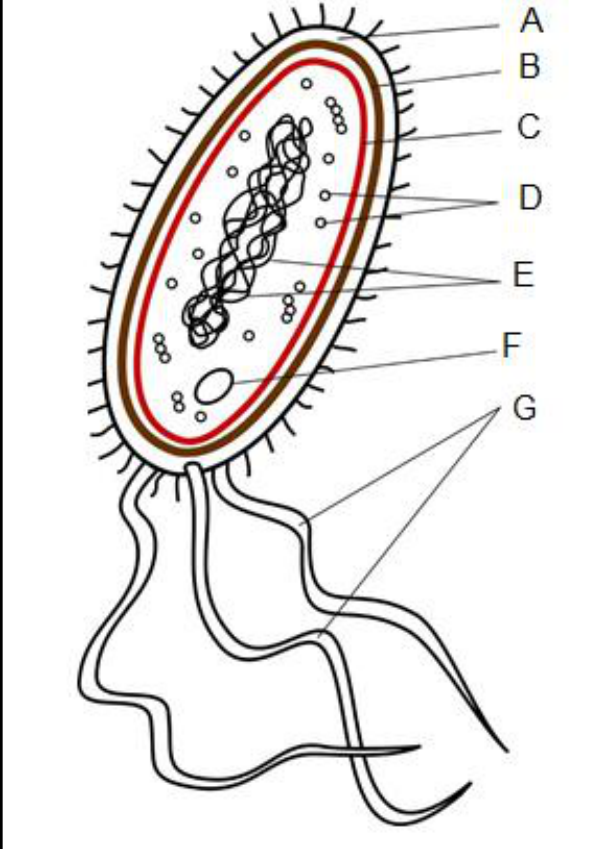
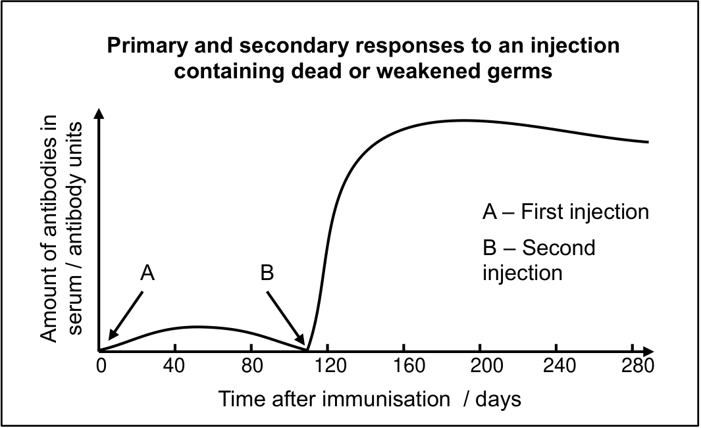
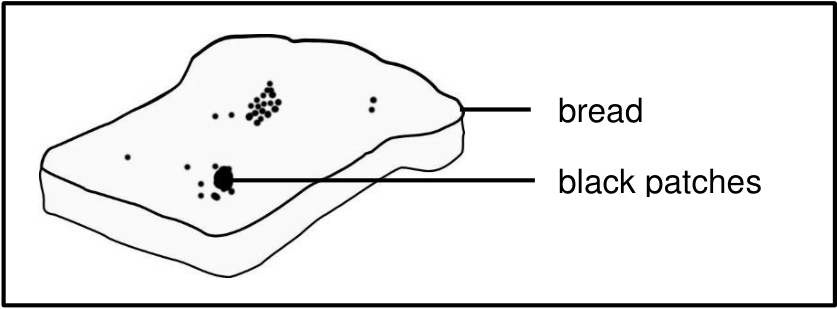
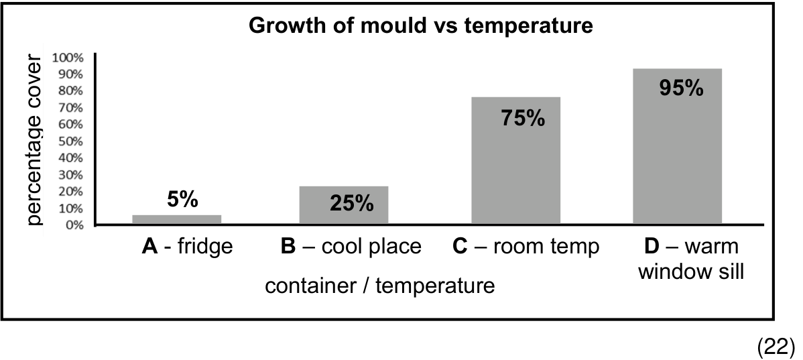
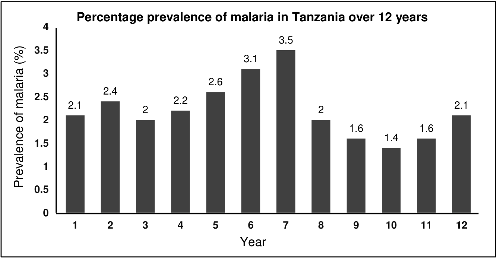
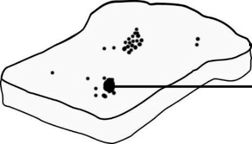

# **CHAPTER 1:  BIODIVERSITY AND** **<mark>CLASSIFICATION OF MICRO-ORGANISMS</mark>** 

## **<mark>Introduction</mark>** 

**Biodiversity** in general, refers to the wide variety of plants, animals and microorganisms on Earth. Organisms which are too small to be seen with the naked eye are referred to as **micro-organisms** . Micro-organisms can be **unicellular** or **multicellular** . Some are harmful and cause diseases whilst others are very useful in the environment and to humans e.g. yeasts are used to make bread. 

##### **Key terminology** 

|**unicellular**|an organism consisting of only one cell|
|---|---|
|**multicellular**|an organism made up of many cells|
|**biodiversity**|the variety of organisms found in an area or on Earth|

## **<mark>The classification of organisms</mark>** 

Scientists have placed all the organisms into specific groups so that it is easier to study them. There are five groups called kingdoms (Figure 1): 

- Kingdom Monera – bacteria 

- Kingdom Protista 

- Kingdom Fungi 

- Kingdom Plantae 

- Kingdom Animalia 

<mark>A scientist who is responsible for the placing of an organism within a specific group is called a taxonomist.</mark> 


> **[Diagram Context - Textbook_LifeSciences_Gr11_Biodiversity_and_classification_of_microorganisms.pdf-0001-13.png]**
> This circular infographic illustrates biological classification, specifically the five kingdoms of life. Visible labels include "5 Kingdoms" centrally, surrounded by five distinct color-coded sectors labeled "Animals", "Plants", "Fungi", "Protists", and "Bacteria", each populated with representative illustrations of organisms. Conceptually, this diagram helps high-school learners grasp biodiversity and taxonomy by categorizing living organisms into major groups based on shared characteristics.


Figure 1: The 5 Kingdoms of Life 

### **Viruses** 

Viruses are placed in a separate group and not in a kingdom because they display some non-living as well as living characteristics. 

##### **Key terminology** 

|**capsid**|a protein coat surrounding the nucleic material of a virus|
|---|---|
|**acellular**|non-cellular|
|**obligate**<br>**parasite**|obligate = forced; a parasitic organism that cannot complete its<br>life-cycle without exploiting a suitable host (if an obligate<br>parasite cannot obtain a host it will fail to reproduce)|
|**host**|an organism that harbours a parasite|
|**pathogenic**|an organism that causes disease|
|**bacteriophage**|a type of virus that infects bacteria; the word "phage" means to<br>eat”|
|**nucleoid**|an irregularly shaped region within the cell of a prokaryote that<br>contains all or most of the genetic material|

#### **<mark>Structure and characteristics of viruses</mark>** 

Introduction to viruses:  https://www.youtube.com/watch?v=8FqlTslU22s 

- Viruses are **microscopic** (20 – 300 nm) and can only be studied using an electron microscope. 

- Viruses consist of a core of either DNA or RNA enclosed by a protein coat called a **capsid** (Figure 2). 


Figure 2:  Structure of a typical virus 

- Viruses occur in a variety of shapes, 

- cannot respire, feed or excrete waste, 

- do not have a cytoplasm and do not have any membrane bound organelles such as mitochondria or nuclei. 

- Viruses have **either DNA or RNA** which is surrounded and protected by an outer **protein coat or capsid** . All other living organisms have both DNA and RNA. 

- Viruses are **acellular** . 

- Viruses **do not have chlorophyll** and are therefore unable to make their own food by photosynthesis. 

- All viruses are **obligate internal parasites** . This means that they cannot multiply without infecting another living organism or **host** . 

- Viruses can infect bacteria, protists, plants and animals. Viruses that infect bacteria are called **bacteriophages** . 

- Viruses cause diseases and are said to be **pathogenic** . 

- In humans, viruses are responsible for diseases such as HIV/AIDS, poliomyelitis, chickenpox, herpes and influenza. 

- If a virus cannot find a host, they can become dormant. 

### **Bacteria** 

Bacteria belong to the Kingdom Monera. Bacteria are found everywhere on earth. Some are pathogenic and cause diseases such as tuberculosis, while most are useful. 

##### **Key terminology** 

|**prokaryotic**|an organism where the nuclear material is**not enclosed**in a<br>membrane|
|---|---|
|**eukaryotic**|any single or multicellular group of organisms that have a<br>**membrane-bound nucleus**containing genetic material|
|**flagellum**|a**whip-like**, protruding filaments that help cells or micro-<br>organisms move;plural of flagellum is flagella|
|**autotrophic**|organisms which can synthesize their own food e.g. green<br>plants, algae and some bacteria|
|**heterotrophic**|any organism that sources food from its environment because<br>it cannot make its own food, e.g. animals, fungi, most bacteria|
|**saprophytic**|plant or fungal microorganisms that feeds on dead or decaying<br>tissues of other organisms|

|**binary fission**|asexual reproduction of a single cell in which divides by<br>mitosis; the cell regenerates as two or more separate cells<br>having the same chromosomal identities as the parent cell|
|---|---|
|**endospore**|a tough, protective, non-reproductive bacteria structure that<br>contains DNA and cytoplasm and lies dormant to survive<br>unfavourable environmental conditions in order that it can<br>germinate once conditions improve|
|**plasmid**|a plasmid is a small, circular, double-stranded DNA molecule<br>that is distinct from a cell's chromosomal DNA|

#### **<mark>Characteristics of bacteria</mark>** 

Bacterial cell structure:  https://www.youtube.com/watch?v=4DYgGA9jdlE 

- Bacteria are **unicellular** (one celled) organisms. 

- Bacteria are larger than viruses and can be seen using a light microscope. 

- Bacteria are distinguished from one another by their shape (Figure 3). These shapes include: **coccus** – round, **bacillus** – rod-shaped, **spirillum** – spiralshaped, and **vibrio** – comma-shaped. 


Figure 3: Bacterial shapes 

#### **<mark>Structural characteristics</mark>** 

All bacteria have the following structural characteristics (Figure 4): 

- A cell wall made up of polysaccharides. 

- Some bacteria have a **slime capsule** to protect them from drying out. 

- Cytoplasm surrounded by a **cell membrane** . 

- No membrane-bound organelles. 

- The DNA is in the form of an irregular loop and is called a **nucleoid** . Since there is no membrane around the nuclear material, bacteria are said to be **prokaryotic** . 

- A **plasmid,** small, circular, double-stranded DNA molecule is also found in the cytoplasm of bacteria. 

- Many bacteria have a **whip-like flagellum** which they can use to move in a liquid. The flagella can rotate to propel the organism forwards. 


Figure 4:  Basic structure of a bacillus shaped bacterium 

#### **<mark>Nutrition of bacteria</mark>** 

**Autotrophic** bacteria can manufacture their own food. 

- **Photosynthetic bacteria** use sunlight energy, while 

- **Chemosynthetic bacteria** get their energy from chemical processes. 

**Heterotrophic** bacteria cannot manufacture their own food. This includes: 

- **Parasitic bacteria** that obtain their food from other living organisms. 

- **Saprotrophic bacteria** that play an important role as decomposers. They obtain their food from dead organic plants and animals. 

- **Mutualistic bacteria** that form a relationship with another organism. Both organisms benefit from the relationship. 

#### **<mark>Reproduction of bacteria</mark>** 

Bacteria multiply very quickly under favourable conditions. This simple form of cell division is called **binary fission (** Figure 5). 


Figure 5:  Binary fission in bacteria 

Bacteria form **endospores** when conditions are unfavourable for example, when there is a lack of food, extreme heat or a lack of moisture. 

### **Protista** 

The **Kingdom Protista** is a collection of eukaryotic organisms. Protists do not fit into the plant, animal or fungi kingdoms. 

##### **Key terminology** 

|**aquatic**|living in or around water|
|---|---|
|**phytoplankton**|very small plants (algae) that float on or near the surface of<br>water|
|**zooplankton**|consisting of small animals and the immature stages of larger<br>animals which float on or near the surface of the water|
|**sessile**|sessile organisms are usually permanently attached to<br>something and can cannot move on their own but can move<br>through outside sources(such as water currents)|

#### **<mark>Characteristics of the Protista</mark>** 

- simple **unicellular** or **multicellular eukaryotic** organisms 

- no tissue differentiation 

- found mainly in water 

- autotrophic or heterotrophic 

- usually **microscopic** but can be several meters in length for example the seaweeds 

- some are **sessile** or free-floating while others can move using flagella (e.g. _Euglena_ ) or move using false feet called **pseudopodia** (e.g. _Amoeba_ ) 

- they can reproduce both **sexually and asexually** 

#### **<mark>Three groups of Protista are recognized:</mark>** 

##### **Plant-like Protista** : 

- mainly **unicellular** organisms found in aquatic (water) environments 

- most are **autotrophic** 

- free floating aquatic plant-like protists are called **phytoplankton** (Figure 6) 

Figure 6: Phytoplankton 

##### **Animal-like Protista:** 

- mainly heterotrophic free-living unicellular animals living in an aquatic environment e.g. _Amoeba_ 

- some are parasitic and cause diseases such as malaria 

- free-floating aquatic animallike protists are called **zooplankton** (Figure 7) 


<u>Figure 7: Zooplankton</u> 

##### **Algae** 

- multicellular, macroscopic organisms commonly called seaweeds (Figure 8) 

- seaweeds contain various photosynthetic pigments which give them a green, red or brown colour 

- seaweeds may be free-floating or sessile (attached to a substrate) 


Figure 8:  A species of red seaweed ( _Gelidium pristoides_ ) harvested along the South African coast to produce agar 

### **Fungi** 

The Kingdom Fungi includes moulds, yeasts, mildews, rusts, toadstools and mushrooms (Figure 9 – 12). 

##### **Key terminology** 

|**chitin**|a fibrous substance consisting of polysaccharides, which is the<br>major constituent in the exoskeleton of arthropods and the cell<br>walls of fungi|
|---|---|
|**hyphae**|a network of multi-celled threadlike filaments forming the<br>mycelium of a fungus|
|**mycelium**|a vegetative mass or network of fungal hyphae found in and<br>on soil or organic substrates|

|**multinucleate**|cells that have more than one nucleus per cell, i.e., multiple<br>nuclei shared in one common cytoplasm|
|---|---|
|**rhizoids**|threadlike structures that anchor lower plants and fungi to a<br>surface|
|**budding**|a form of asexual reproduction which involves the pinching off<br>of offspring from the parent cell;  the offspring cell is<br>genetically identical to the parent|


Figure 9: Toadstools 


Figure 10:  Mushrooms 


Figure 11: Bracket fungi 

Figure 12:  Breadmould 

#### **<mark>Characteristics</mark>** 

Fungi have the following characteristic in common: 

- Some are **unicellular** (yeasts) while others are **multicellular** (mushrooms). 

- **Eukaryotic** (i.e. have a nuclear membrane). 

- **Heterotrophic** since they lack chlorophyll. Fungi that live off dead organic matter are said to be **saprotrophic** . **Parasitic** fungi live off living organisms. Fungi cause diseases such as thrush, ringworm and athlete’s foot. 

- Cell walls which contain **chitin** . Plants have cellulose in their cell walls. 

- The bodies of multicellular fungi are made up of threads called **hyphae** . All the hyphae together form a **mycelium** . 

- The hyphae are often **multinucleate** (have many nuclei). 

- Fungi reproduce both sexually and asexually. 

- Asexual reproduction in unicellular fungi such as yeasts is by budding. 

- In multicellular fungi asexual reproduction is by means of spores. 

##### **Activity 1: Kingdoms** 

1. Name the five kingdoms which represent all living organisms (5) 

2. Make a labelled diagram to show the internal structure of a bacterium. (6) 

3. Name one important characteristic which distinguishes fungi from algae. (2) 

4. Explain why viruses are not placed into one of the five kingdoms. (2) 

5. Complete the following table: 

<u>(12)</u> 

|**Organism**|**Unicellular/**<br>**Multicellular**|**Prokaryotic /**<br>**Eukaryotic**|**Mode of**<br>**nutrition**|
|---|---|---|---|
|**Viruses**|acellular|neither||
|**Bacteria**||||
|**Phytoplankton**|||autotrophic|
|**Zooplankton**||||
|**Fungi**||||

(27) 

##### **Activity 2:  Practical investigation** 

**Aim** : Investigating the growth of bread mould under different temperature conditions 

A Grade 11 learner investigated the optimum (ideal) temperature for growth of bread mould. The learner used the following method: 

- The learner selected four black plastic containers with lids. 

- A slice of bread was placed in each container. 

- Before closing the containers, 30 ml of water was sprinkled over each slice. 

- Container **A** was placed in a fridge (cold), container **B** was placed in a cupboard (cool), container **C** was kept at room temperature (mild) and container **D** was placed on a window sill (warm). 

- After a week the slices of bread were removed from the containers and placed next to each other. 

##### The results of the investigation are depicted below. 


1. Formulate a hypothesis for the investigation. (2) 

2. Name: 

   - (a) the dependent and 

   - (b) the independent variable in this investigation. (2) 

3. State the relationship between the growth of bread mould and temperature. 


4. State three ways in which the learner made sure the results were valid. (3) 

5. How could the learner have ensured that the results were reliable? (2) 

6. Use the following scale to determine the percentage of bread mould growing on the slices of bread. Record the estimations in a table. (5) 


7. Plot a bar graph to show the relationship between temperature (cold, cool, mild and warm) and the growth of breadmould using the table. (6) 


## **<mark>The role that micro-organisms play in maintaining a balance in the environment</mark>** 

**Micro-organisms** play an essential **role** in the natural recycling of living materials. 

##### **Key terminology** 

|**decomposers**|organisms that break down dead plant and animal (organic)<br>material e.g. bacteria and fungi|
|---|---|
|**saprophytes**|organisms that live off dead organic matter|

### **Micro-organisms as producers in food chains** 

Autotrophic bacteria, phytoplankton and algae can manufacture their own food by photosynthesis. The carbohydrates they produce are available to consumers. These organisms form the first link in a food chain. Oxygen, the waste product of photosynthesis, is made available to other organisms for respiration. 

### **The role of micro-organisms as decomposers** 

- Bacteria and fungi are the main **decomposers** . 

- They break down dead plant and animal remains and return the nutrients to the soil. 

- Organisms which break down dead organic matter to obtain nutrients are called **saprophytes** _._ 

### **The role of bacteria in the nitrogen cycle** 

Bacteria play an important role in the nitrogen cycle. 

- Free living bacteria can convert atmospheric nitrogen to ammonia and nitrates. 

- Higher plants can only use nitrogen when it is in the form of nitrates, so they rely on bacteria for the conversion. 

- Some plants form special relationships with **nitrogen fixing bacteria** . 

- When plants and animals die, de-nitrifying bacteria return nitrogen to the atmosphere by a process called **denitrification** . 

## **<mark>Symbiotic relationships</mark>** 

Symbiosis refers to the living together of two or more species of organism. A symbiotic relationship may benefit one or both members or it can be beneficial to one but harmful to the other one. 

##### **Key terminology** 

|**mutualism**|a symbiotic relationship where both organisms benefit|
|---|---|
|**commensalism**|a symbiotic relationship where one organism benefits without<br>harmingor affectingthe other organism|

|**parasitism**|a symbiotic relationship where parasitic organisms benefit<br>while causingharm to their hosts|
|---|---|
|**lichens**|composite organisms made up of fungi that grow symbiotically<br>with algae or cyanobacteria|
|**ruminant**|an even-toed mammal that chews the cud regurgitated from its<br>rumen e.g. cattle, sheep, antelopes, deer, giraffes, and their<br>relatives.|
|**mycorrhiza**|The symbiotic association of fungi with the roots of trees.|

Three types of symbiosis occur: 

- **mutualism** – both organisms benefit e.g. lichens 

- **commensalism** – one species benefits whilst the other does not benefit, nor is it harmed 

- **parasitism** – one species benefits whilst the other is harmed 

### **Lichens** 

Algae need a moist environment to survive and cannot live on dry land. They can, however, form a mutualistic relationship with a fungus and this called a **lichen (** Figure 13). The fungus provides the alga protection from the environment. Fungi however cannot produce food for themselves. They in turn obtain nutrients from the algae which can produce food by photosynthesis. In this way, both the alga and the fungus benefit. 


Figure 13:  Lichens are often the first organisms to occupy a habitat 

### **<mark>The relationship between nitrogen fixing bacteria and plants</mark>** 

- Higher plants require nitrogen to manufacture proteins. 

- Plants cannot use nitrogen directly from the atmosphere. 

- Plants require nitrogen in the form of nitrates. 

- Some soil bacteria can convert free nitrogen to nitrates that can be used by plants. 

Some nitrogen-fixing bacteria live in special nodules in the roots of leguminous plants (i.e. pod producing plants such as beans and peas). They produce nitrates for the plant while the plant provides the bacterium with a place to live, carbohydrates and water. Both the plant and the bacteria benefit in this relationship. 

### **The relationship between** **_E. coli_ and the human intestine** 

- Not all the bacteria found in our intestines are harmful. 

- Mutualistic bacteria such as _Escherichia coli (E. coli)_ (Figure 14) live on the undigested remains of food in the gut and in turn make vitamin K which can be used by humans. 

- Vitamin K plays an important role in blood clotting. Both humans and the bacteria benefit from the relationship _._ 


Figure 14: _E. coli_ bacteria 

Mutualistic bacteria are also found in the digestive tracts of ruminants and termites where they are responsible for the digestion of cellulose into simple sugars. 

### **Mycorrhizal fungi and the roots of higher plants** 

Filamentous fungi known as **mycorrhizas** can penetrate and become associated with the roots of higher plants. The fungi increase the absorption surface area of the roots. The fungus in turn, gets sugars from the plant. 

Symbiosis in general: <u>https://www.youtube.com/watch?v=zTGcS7vJqbs</u> 

##### **Activity 3: Nitrogen use** 

1. Name the form of nitrogen which higher plants use. (1) 

2. Describe three ways in which nitrogen becomes available to higher plants. (3) 

3. What is a lichen? (3) 

4. Describe the role bacteria play in maintaining the nitrogen balance in an ecosystem. (6) 

5. The photograph below (Figure 15) shows a seedling without mycorrhizal fungi (left-hand side) and one with mycorrhizal fungi (right-hand side). The seedlings are the same age. Study the photograph and answer the questions that follow. 


Figure 15:  Seedlings with and without mycorrhizal fungi. 

- 5.1  What is a **mycorrhiza** ?                                                                          (2) 

- 5.2  Explain why the seedling on the right-hand side is bigger than the 

- seedling on the left-hand side.                                                               (3) 

(18) 

## **<mark>Diseases caused by micro-organisms</mark>** 

Organisms that cause diseases are called **pathogens** . You are required to study only **one** disease from each of the four groups of micro-organisms discussed below. 

##### **Key terminology** 

|**pathogen**|Infectious biological agent or organism that causes disease|
|---|---|
|**vector**|An agent who carries and transmits an infectious pathogen<br>into another living organism.|
|**host**|Living cell in which a virus (or foreign molecule or<br>microorganism) multiplies or hides.|
|**epidemic**|Refers to a sudden increase in the number of cases of a<br>disease above what is normally expected.|
|**pandemic**|Refers to an epidemic that has spread over several countries<br>or continents, usually affecting a large number of people|

### **Diseases caused by viruses** 

#### **<mark>Rabies</mark>** 

Rabies affects both domestic and wild animals such as dogs (Figure 16), jackal and mongooses. The rabies virus is passed from one animal to another in saliva. Humans usually get infected when they are bitten by a rabid animal. 


Figure 16:  Dogs infected by rabies often foam at the mouth. 

After a person has been bitten by a rabid animal, there is an incubation period of up to 60 days during which time the victim shows no symptoms. After this period the victim may show one or more of the following symptoms: 

- headaches and fever 

- sore throat 

- nausea 

- fatigue or tiredness 

These symptoms are followed by an agitated phase where the victim has convulsive seizures, salivates and fears water ( **hydrophobia** ). They also have difficulty in swallowing and breathing. Once the symptoms of the disease appear, there is no cure and the patient dies within 10 days from heart failure or breathing difficulties. 

Rabies can be managed as follows: 

- vaccination of dogs and livestock in areas where the disease is found 

- immunization of people with high-risk occupations such as veterinarians 

- immunization of travellers going to areas where the disease is found 

- training of health workers and veterinarians 

- destroying of animals infected with the disease 

Treatment of rabies 

- It is difficult to treat the disease, so it is important to avoid being bitten by animals infected by rabies. 

- Wild animals which suddenly appear to be tame should not be touched. 

- If there is contact with an animal which is behaving suspiciously, the person should seek medical attention immediately. 

#### **<mark>HIV / AIDS</mark>** 

Acquired Immune Deficiency Syndrome (AIDS) is a sexually transmitted disease caused by the Human Immunodeficiency Virus (HIV) (Figure 17). The virus weakens the immune system by infecting and destroying the immune cells which are known as the CD4 – cells. 


Figure 17:  HIV virus in the blood stream 

The HI virus is spread mainly through the transfer of body fluids such as semen and blood from an infected person to another person by one of the following ways: 

- sexual intercourse 

- blood transfusions of untested blood 

- sharing contaminated syringes (e.g. drug users) 

- from an infected mother to the foetus 

The virus in not transferred in the air, in saliva or by shaking hands with an infected person. 

The effects of HIV/AIDS on an individual include: 

- A lack of symptoms during the first phase of infection which can last years. 

- Flu like symptoms which include headaches, fever, tiredness, and the swelling of lymph glands in the armpits, throat or groin can occur. 

- As the immune system weakens symptoms such as repeated cold-sore infections, prolonged fevers, night sweats, chronic diarrhoea (runny tummy), etc. occur. Extreme weight loss can also occur. 

- A weakened immune system allows secondary or opportunistic infections to occur. These include respiratory infections, pneumonia, epilepsy, dementia, skin cancers, lymph cancer and tuberculosis. 

- In the final phase of HIV infection, the disease is known as AIDS. Death can occur in this phase due to secondary infections. 

HIV/AIDS affects families in the following ways: 

- If the breadwinner becomes ill there is no income and a family may become poverty stricken. 

- The virus is transmitted to an unborn child during pregnancy. 

- If both parents are infected and die, their children become orphans. 

- Brothers and sisters may be separated from each other if the parents die. 

The economy of a country is also affected by HIV/AIDS: 

- The disease is more common in young working people and reduces the labour force especially in the mining industry. 

- The costs of treatment and care are high. 

Management of HIV/AIDS requires: 

- Testing for the virus in people who are at high risk (e.g. health workers, prostitutes, drug users). 

- Counselling and treatment for infected people with antiviral drugs. 

- Strengthening the immune system of infected persons. 

- Treatment of secondary infections. 

- Education and the prevention of infection by not having sexual intercourse (casual sex) or using protection such as a condom. 

#### **<mark>Influenza</mark>** 

Influenza is commonly called “flu” and is caused by the influenza virus. The virus spreads through the air when a patient coughs or sneezes (Figure 18). It can also spread through contact with bird droppings or contaminated surfaces. 

Symptoms include: 

- a sore throat 

- muscular pain 

- headaches 

- coughing. 

Symptoms usually only last a few days, but some strains of the virus can be deadly. 


Figure 18:  Flu viruses can be spread by coughing 

Viruses do not respond to antibiotics. Flu is best managed with the use of vaccines. Flu viruses mutate rapidly to form new strains which means that a new flu vaccine must be developed each year. 

To avoid catching flu, people must wash their hands regularly. People who are already infected should not cough or sneeze without covering their mouths. 

### **Diseases caused by bacteria** 

#### **<mark>Blight</mark>** 

Blight is the term given to plants which suddenly wilt (droop) and die. It is caused by several different bacteria. Blight is a significant problem for commercial farming as it affects crops such as apples, grapes and tomatoes (Figure 19). 


Figure 19:  Tomatoes affected by blight 

Symptoms of blight include: 

- drooping or dried up shoots and stalks 

- lesions (‘sores’) on the leaves 

- flowers that turn black and die 

- death of the whole plant if not treated 

Blight must be managed as follows: 

- only disease-free stock should be planted 

- pruning tools must be disinfected 

- cutting back should only be done on dry windless days 

- affected plant material should be burnt to avoid spores from spreading 

#### **<mark>Cholera</mark>** 

Cholera is commonly found in areas where there is overcrowding, unsafe drinking water and a lack of proper sanitation (Figure 20). Cholera is caused by the bacterium _Vibrio cholerae_ . 


Figure 20:  Cholera breeds in unhygienic places 

Symptoms of cholera include: 

- watery diarrhoea (runny tummy) which leads to dehydration 

- vomiting 

Note that some people do not show any symptoms of cholera but can become carriers of the disease. 

Management of the disease should include: 

- access to clean drinking water or water purification tablets 

- preventing the spreading of the disease by proper sanitation and disposal of sewerage 

- infected people must be given fluids with added electrolytes to drink 

- severely infected people will have to be put on a drip 

- the bed linen and clothes of infected people must be disposed of 

- anything which cholera patients have touched must be washed in hot water and sterilized using chlorine bleach 

- people living in cholera areas should be educated about the importance of hygiene and be encouraged to boil water before drinking. 

Treatment of cholera involves: 

- rehydration 

- antibiotic treatment 

#### **<mark>Tuberculosis</mark>** 

The bacterium, _Mycobacterium tuberculosis_ causes the lung disease tuberculosis (TB) (Figure 21). The bacterium can also attack other parts of the body such as the kidneys, brain and spinal cord. 

TB is spread through the air when infected people cough or sneeze. The bacterium spreads quickly in confined, overcrowded spaces where there is poverty and poor sanitation. 


Figure 21:  TB commonly infects the lungs 

TB can infect anyone who breathes in the bacterium but usually only develops in people with weak immune systems such as babies, young children, HIV positive people, drug users, diabetics and poverty-stricken people. 

The effect of TB on infected persons includes: 

- extreme tiredness and weakness 

- loss of appetite and weight 

- chills, fever and sweating at night 

- excessive coughing 

- chest pains 

- coughing up blood 

Management of TB requires: 

- identification of infections through X-rays, skin tests or tissue cultures. 

- educating the patient regarding the completion of treatment. 

Treatment of TB involves: 

- Treatment with a number of drugs over a period of about 6 months. When patients do not complete their treatment, they can develop a drug-resistant form of TB which is very difficult to treat. Patients are often kept in a TB hospital for treatment and to make sure they take their medication. 

- DOTS (Directly Observed Treatment Short Course) was developed so that someone makes sure that the patient completes their treatment. 

#### **<mark>Anthrax</mark>** 

Anthrax is caused by the bacterium _Bacillus anthracis_ . It affects goats, cattle, sheep and horses. The spores are either inhaled by the animal or they enter through wounds. Once inside the body, the bacterium enters the bloodstream and multiplies very rapidly. It releases very strong toxins and causes tissues to breakdown, bleeding and eventually death. 

Humans become infected when they are exposed to infected animals or their products. The following symptoms appear in humans: 

- severe breathing problems and shock, 

- inflammation of the gastro-intestinal tract, 

- a painless skin ulcer with a black necrotic area in the middle (Figure 22). 


Figure 22:  A typical symptom of an anthrax infection 

Anthrax can be managed by: 

- Vaccination of stock animals. 

- If there is an outbreak of anthrax, animals showing signs of infection must be isolated and treated with antibiotics. All the other animals that have been in contact with the infected animals must be vaccinated. 

- The bodies of dead animals must be burned to destroy spores which could survive for up to 90 years. 

- Humans that have come into contact with anthrax must wash with antimicrobial soap and their clothes must be burned. 

- The bodies of humans that have died from anthrax should be cremated to avoid the disease spreading further. 

### **Diseases caused by Protista** 

#### **<mark>Malaria</mark>** 

Introduction to Malaria:  https://www.youtube.com/watch?v=f5XKob0lc2A 

- Malaria is a life-threatening disease found mainly in tropical and sub-tropical areas of the world. 

- Malaria is caused by the protozoan _Plasmodium vivax_ and is spread by the female _Anopheles_ mosquito. 

- The female _Anopheles_ mosquito is called the **vector** . 

- A vector carries a disease-causing organism from an infected host to a new host. 

- The malaria parasite requires two hosts (mosquitoes and humans) to complete its life cycle. 

##### Symptoms of malaria include: 

- early symptoms that can be mistaken for flu 

- fever and shivering 

- headache 

- joint pain 

- vomiting 

- convulsions 

- anaemia 

If left untreated, malaria may lead to the infected person falling into a coma, followed by death. 

The effects of malaria on the economy include: 

- Loss of income if the breadwinner cannot work or dies, resulting in poverty. 

- Malaria treatment is expensive. Poor people in undeveloped countries cannot afford treatment. 

The best way to manage malaria is to avoid being bitten by mosquitoes in areas where malaria occurs. This can be done by: 

- staying indoors between sunset and sunrise. 

- covering doors and windows with gauze to stop mosquitoes from entering rooms. 

- sleeping under mosquito nets. 

- applying insect repellents to exposed skin. 

- wearing long sleeves and pants if you need to be outdoors at night. 

- drain places where there is standing water e.g. drains, ponds, gutters, old tyres etc., as mosquitoes breed in standing water. 

Anti-malarial drugs can be taken before entering a malaria area. Drugs are available to treat people infected with malaria. 

Governments in malaria areas need to provide health-care facilities like clinics. They also control the breeding of mosquitoes by spraying with DDT, an insecticide. 

### **Diseases caused by fungi** 

#### **<mark>Rusts</mark>** 

- Rusts are a group of fungi that infect crop plants (tomatoes, beans etc.), grasses and flowering plants such as roses, hollyhocks, and snapdragons. 

- The hyphae of the fungus burrow into the plant tissue and destroy it. 

- Bright orange raised areas can be seen on the surface of the plant leaves which resemble rusted metal when infected (Figure 23). 


Figure 23:  Rust is commonly seen on the underside of leaves 

Management and treatment of rust include: 

- planting of rust-resistant crops or plants 

- keeping plants healthy by adding nutrients to the soil or their water 

- sterilizing of equipment, especially pruning (cutting) tools 

- spaying with fungicides (chemicals which kill fungi) 

- burning of affected plant material to prevent the spores from spreading 

#### **<mark>Thrush</mark>** 

- Thrush is caused by a yeast (fungus) called _Candia albicans._ 

- Thrush can grow on any part of the body but favours moist areas such as the mouth, vagina and upper parts of the digestive tract. 

Oral thrush (in the mouth) is characterised by white sores on the tongue and in the mouth (Figure 24). Symptoms include difficulty with eating and an uncomfortable burning in the mouth. Thrush is common in bottle- and breast-fed babies and in people with false teeth. 


Figure 24: Oral thrush 

Vaginal thrush commonly occurs in pregnant women and women using oral contraceptives (birth control tablets). Tight-fitting pants and underwear can encourage thrush to develop. Vaginal thrush is characterised by severe itching, a burning sensation when urinating and a greyish-white vaginal discharge. 

Other factors that contribute to the development of thrush include: 

- a weakened immune system caused by HIV / AIDS or chemotherapy 

- diabetes – _candida_ thrives on high blood sugar 

- moist skin folds in overweight people 

- babies with wet nappies for a prolonged period 

- poor health as a result of stress, lack of sleep, poor diet rich in sugars 

- excessive use of antibiotics 

Thrush can be managed by reducing the factors that the fungus favours for example: 

- wear loose-fitting clothes and cotton underwear especially when it is hot 

- do not use perfumed soaps and bubble baths 

- eat a well-balanced diet that is low in refined sugars 

- probiotics should be taken if antibiotics are taken over a long period of time 

- treat oral thrush with an antifungal mouthwash.  Antifungal creams can be applied to the affected areas. In extreme cases, systemic treatment in the form of tablets may be necessary 

- dentures (false teeth) must fit well and be sterilized often 

#### **<mark>Ringworm</mark>** 

Ringworm is caused by a fungus and not a worm. Fungal spores can live and spread on the skin of both humans and animals (Figure 25). Ringworm is often spread by contact with affected pets in a home. 


Figure 25:  Ringworm affects both humans and animals. 

Symptoms include itchy sores (often circular-shaped) on the skin. 

Management and treatment include: 

- treatment of the skin with antifungal ointments 

- treatment of pet animals in the home 

- avoid sharing clothes with an infected person 

#### **<mark>Athlete’s foot</mark>** 

Athlete’s foot is a fungal infection found mainly between the toes and on the arches of feet (Figure 26). It is caused by the fungus _Tinea pedis_ . The fungus feeds on the keratin (protein) in the skin and results in flaky and cracked skin. The cracks allow bacteria to enter. 

This fungus thrives in warm, moist places. It may be contracted by walking barefoot in public places such as showers, public swimming pool areas and changing rooms 


Figure 26:  Athlete’s foot 

Athlete’s foot can be treated and managed as follows: 

- keep the affected areas dry 

- wear open sandals when it is hot 

- wear clean, cotton socks if you need to wear closed shoes. avoid nylon socks 

- wash feet well and dry well between the toes 

- apply fungal ointments or powders to feet if they are infected 

- avoid infections by wearing slip-slops in public showers 

The following videos give a short introduction to these diseases: **Tuberculosis** <u>https://www.youtube.com/watch?v=202hkf43HXQ</u> **HIV/AIDS** <u>https://www.youtube.com/watch?v=FDVNdn0CvKI</u> **Ringworm** <u>https://www.youtube.com/watch?v=ryzwWnsBmXg</u> **Cholera** <u>https://www.youtube.com/watch?v=jG1VNSCsP5Q</u> **Rabies** <u>https://www.youtube.com/watch?v=kxBIJvNHZg4</u> **Influenza** <u>https://www.youtube.com/watch?v=yhhJfT86Bgg</u> **Thrush** <u>https://www.youtube.com/watch?v=UiTLpa_LoFw</u> 

##### **Activity 4: Diseases** 

Complete the following table: 

|**Disease**|**Organism**<br>**responsible**|**Symptoms**|**Management and**<br>**cure**|
|---|---|---|---|
|rabies||||
|AIDS||||
|influenza||||
|cholera||||
|tuberculosis||||
|anthrax||||
|malaria||||
|thrush||||
|ringworm||||
|athletes foot||||
|rusts||||
|blight||||

(36) 

## **<mark>Immunity</mark>** 

Immunity refers to the way in which a plant or animal is able to fight an infection. 

##### **Key terminology** 

|**lymphocyte**|white blood cell type which fight infection|
|---|---|
|**antigen**|a complex molecule that induces an immune response (or<br>disease reaction) in the body|
|**antibody**|a protein made by the immune system to target and combine<br>with a specific antigen (invader) and make it useless|
|**phagocytosis**|the process by which a cell engulfs a solid particle to form an<br>internal compartment known as a phagosome (phago – eat,<br>cyto–cell)|
|**lysosome**|an organelle containing digestive enzymes to break down<br>bacterial or viral cell walls|

|**vaccine**|a biological preparation made from damaged virus or bacteria<br>particles used to stimulate an immune response by the body's<br>immune system against viral and bacterial infectious diseases|
|---|---|
|**antibiotic**|medicine e.g. penicillin which is developed from living<br>organisms e.g. bacteria or fungi and used to fight infections<br>caused byeither bacteria or fungi|
|**insulin**|hormone made in the pancreas and released into the blood to<br>help convert glucose to glycogen|

### **<mark>The response of plants against an infecting microorganism</mark>** 

The first line of defence in plants includes the waxy cuticle, bark and the closely packed epidermal cells which protects them from invading micro-organisms. If a plant is injured, it can produce sticky gums and resins in an attempt to seal the wound and prevent infection. 

The second line of defence occurs when a plant becomes infected by a pathogen and its **natural immune response** is activated. It releases chemical compounds such as **salicylic acid** which are transported in the phloem to cells which are not affected. The unaffected cells respond by producing various chemical defences to protect themselves. 

### **<mark>The response of animals against an infecting microorganism</mark>** 

Animals have two types of immunity: 

- **Natural immunity** which is present at birth, and 

- **Acquired immunity** which develops after exposure to pathogens. 

The body has many ways to prevent pathogens from entering. This is called the first line of defence. It includes: 

- a multi-layered skin 

- antiseptic tears 

- mucus lined air passages which trap pathogens 

- enzymes (lysozyme) in the saliva 

- ear wax in the ear canal 

- hydrochloric acid and enzymes in the stomach 

The second line of defence involves two responses should pathogens gain entry: 

- **(i) Primary response** – this response tries to destroy the pathogen and prevent it from spreading. This is brought about by inflammation (swelling and redness) of local areas and fever which raises the body temperature. 

- **(ii) Secondary response** – this activates the immune system which: 

   - destroys the invading pathogens 

   - holds a memory of pathogens that have been destroyed, to reduce or prevent re-infection. 

The immune system involves two groups of white blood cells _viz._ lymphocytes and phagocytes.  These are discussed in the following sections. 

### **Lymphocytes** 

Lymphocytes are found in the tonsils, lymph glands, spleen and in the blood. Two types of lymphocytes occur: **B-lymphocytes** and **T-lymphocytes** . 

##### **B-lymphocytes** 

Special proteins called **antigens** are found on the surface of pathogens (Figure 27). B-lymphocytes recognise the antigens and make special proteins called **antibodies** . Antibodies destroy germs and when they encounter the same germs again, they respond quickly. This is known as **natural immunity** . 


Figure 27: Antibody – antigen relationship 

Antibodies destroy germs by: 

- causing bacterial cells to burst. 

- labelling the germs so that phagocytes can ingest them (Figure 27). 

- making germs clump together so that they are easy to recognize. 

- neutralising bacterial toxins. 

##### **T-lymphocytes** 

T-lymphocytes are found mainly in the lymph glands. Two types occur: 

**1. CD4 cells** – helper cells which start the response. 

**2. Killer T-cells** which destroy body cells infected with viruses or parasites. 

### **Phagocytes** 

Macrophages, which are a type of phagocytic cells, are able to identify bacteria. They produce pseudopodia (false feet) which flow around the bacteria and engulf them. This process is known as **phagocytosis** . Vacuoles filled with enzymes called **lysosomes** fuse with the vacuole containing the bacteria and destroy them. 

The process of phagocytosis: https://www.youtube.com/watch?v=7VQU28itVVw 

#### **<mark>Vaccinations</mark>** 

A **vaccine** is a suspension of dead, weakened or fragmented micro-organisms or their toxins, that will stimulate the production of antibodies by the lymphocytes. 

Vaccinations or immunisation is the process of giving a vaccine either by injection or orally (by mouth) to prevent disease. The antibodies stay in the blood and give longlasting protection against disease. This type of immunity is called **artificially acquired active immunity** . 

Children are usually vaccinated against measles, mumps and rubella. 

How do vaccines work:  https://www.youtube.com/watch?v=rb7TVW77ZCs 

## **<mark>The use of drugs to fight infecting micro-organisms</mark>** 

### **Antibiotics** 

Antibiotics are drugs that fight infections caused by bacteria. Antibiotics cannot fight infections caused by viruses because viruses do not feed and therefore do not ingest the antibiotics. 

The best-known antibiotic is penicillin which is produced by the fungus _Penicillium_ (Figure 28). Penicillin was discovered by Alexander Fleming in 1929 (Figure 29). 


Figure 28: _Penicillium_ fungus growing on an agar plate 

Figure 29: Alexander Fleming 

Antibiotics usually target a specific part of a bacterium. For example, they: 

- prevent cell walls from forming. 

- damage cell membranes. 

- stop protein synthesis. 

Bacteria are able to build up a resistance to antibiotics which is why it is important to always complete a course of antibiotics. The first dose of antibiotics usually kills all the weak bacteria. If the course is not completed, the stronger bacteria that are left behind multiply and become drug resistant. 

## **<mark>Biotechnology</mark>** 

Biotechnology refers to the use of micro-organisms to make substances which are useful to humans. These include medicines such as antibiotics and insulin as well as foods such as maas (fermented milk), bread, wine and cheese. 

### **The making of antibiotics** 

Natural antibiotics are made by fungi such as _Penicillium,_ a mould (Figure 28), which is found on the skins of fruits. When the mould is collected and put in a vat at about 25°C with sugar and amino acids, it grows and multiplies rapidly. After about five days the penicillin produced by the mould can be removed and purified. 

### **The making of insulin** 

The pancreas in the human body produces insulin to regulate the blood glucose content of the blood. If the pancreas does not function properly the person is said to have **diabetes mellitus** . People with diabetes need to control their intake of sugars and must inject themselves daily with insulin. Bacteria can be used to make insulin (Figure 30). 


Figure 30:  The modification of bacteria to make insulin 

- a plasmid is removed from a bacterium 

- the plasmid is cut open using an enzyme 

- a piece of DNA containing the gene for making insulin is extracted from a chromosome taken from a human pancreas cell 

- the DNA is joined to the plasmid from the bacterium to form recombinant DNA 

- the recombinant DNA is inserted into a bacterium 

- the genetically engineered bacteria are grown in large vats containing nutrients 

- the DNA in the bacteria instructs the bacteria to make insulin 

- the insulin is then extracted and purified. 

The most commonly used bacterium is _E.coli_ . 

## **<mark>Traditional technology</mark>** 

Micro-organisms such as yeast can undergo alcoholic fermentation (see respiration chapter later) in the absence of oxygen. During this process glucose is changed into ethyl alcohol, carbon dioxide and energy. 

Humans use this process to manufacture: 

- Beer – beer is made from maize, sorghum, millet, barley or rice and hops. 

- Wine – wine is traditionally made from grapes. Yeasts found on the skins of fruit ferment the grape sugar after the grapes are crushed. 

- Bread – yeasts are used to make bread dough rise. The carbon dioxide given off during alcoholic fermentation expands when heated in the oven creating air pockets. The alcohol produced evaporates when the bread is baked. 

- Cheese – _Lactobacillus_ bacteria can be used to convert milk sugar called lactose into lactic acid. Lactic acid curdles the milk and forms a solid mass known as curds. Curds are pressed and separated from the watery whey to make cheese. 

- Maas – maas is similar to yoghurt and is made by bacterial fermentation of milk. Lactic acid thickens the milk and acts as a preservative. 

## **<mark>Biodiversity and classification of micro-organisms: End of topic exercises</mark>** 

##### **Section A** 

##### **Question 1** 

- 1.1 Various options are provided as possible answers to the following questions. Choose the correct answer and write only the letter (A – D) next to the question number (1.1.1 – 1.1.5) on your answer sheet, for example 1.1.6 D 

   - 1.1.1 Antibodies are proteins that 

      - A break down pathogens. 

      - B catalyse biochemical reactions. 

      - C are produced by T-cells that kill disease carrying viruses. D bind with specific antigens. 

   - 1.1.2 Which organism does not belong to a kingdom? 

      - A virus B fungus C bacterium 

      - D protozoan 

   - 1.1.3 The following is a list that describes viruses: i) They play an important role as decomposers. ii) They are major pathogens of humans. iii) They are parasites. iv) They reproduce within a host cell. 

Which of the following are of biological importance in viruses? 

A (i), (ii) and (iii) B (ii), (iii) and (iv) C (i), (iii) and (iv) D (ii) and (iv) 

- 1.1.4 The cell walls of most fungi are mainly composed of: A   chitin B   cellulose C   protein D   lignin 

   - 1.1.5 The use of antibiotics is an effective treatment for… 

      - A bacterial and viral infections 

      - B bacterial infections only 

      - C viral infections only D neither viral nor bacterial infections (5 × 2) = (10) 

- 1.2 Give the correct **biological term** for each of the following descriptions. Write only the term next to the question number. 

   - 1.2.1 Microbes which cause disease. 

   - 1.2.2 Viruses that attack bacteria. 

   - 1.2.3 A relationship between two organisms which live together for the benefit of one or both of the organisms. 

   - 1.2.4 The ability to produce antibodies. 

   - 1.2.5 The use of micro-organisms to make useful substances. 

   - 1.2.6 An organism that transfers a pathogenic organism from one host to another. 

   - 1.2.7 Plant-like Protista. 

   - 1.2.8 The mutualistic relationship between a fungus and an alga. 

   - 1.2.9 Organisms that have a definite nucleus. 

   - 1.2.10 The process used by lymphocytes to engulf bacteria. 

         - (10 × 1) = (10) 

- 1.3 Indicate whether each of the descriptions in Column I applies to **A ONLY** , **B ONLY** , **BOTH A AND B** or **NONE** of the items in Column II.  Write **A only** , **B only** , **both A and B** or **none** next to the question number. 

|**Column I**|**Column II**|
|---|---|
|1.3.1  Organisms that feed on dead<br>organic matter.|A: saprophytes<br>B: parasites|
|1.3.2  Genetic material found in viruses.|A: DNA<br>B: RNA|
|1.3.3  Malaria is caused by a…|A: bacterium<br>B: virus|
|1.3.4  Whip-like structures used for<br>locomotion in bacteria.|A: flagella<br>B: cilia|

(4 x 2) = (8) 

- 1.4 The diagram below is that of a bacterial cell. Study it carefully and then answer the questions that follow. 



- 1.4.1 Provide labels for the parts labelled A to D. 

- 1.4.2 State the function of the part labelled E. 

   - (4) 

   - (1) 

- 1.4.3 Describe how the structure labelled F can be used in the manufacturing of insulin for diabetics.                                             (5) 

- 1.4.4 Briefly explain how bacteria develop resistance to antibiotics and how humans can contribute to this phenomenon. 

      - (3) 

   - 1.4.5 Identify the structure labelled G and state its function.                    (2) 

      - (15) 

- 1.5 Study the graph below, which gives the body’s response to a vaccination given by an injection and a booster injection. Answer the questions that follow. 



- 1.5.1 What happened to the antibody level after the first injection? 1.5.2 What would happen to the person if they encountered the disease organism after the second injection? 

- 1.5.3 Mention two common ways of receiving vaccines. (2) 

- 1.5.4 From what is a vaccine made? (1) 

- 1.5.5 Which cells in the immune system produce the antibodies? (1) 

   - (7) 

##### **Section A: [50]** 

##### **Section B:  Question 2** 

Use the graph below to answer the following questions: 


- 2.1 In which year was the percentage of malaria the highest? (1) 

- 2.2 Calculate the percentage increase in malaria infections from year 3 to year 6. Show all working. (3) 

- 2.3 Name two precautionary methods that can be implemented to prevent contracting malaria when travelling in a malaria infested area. (2) 

- 2.4 Give two symptoms of malaria. (2) 

- 2.5 Give two possible reasons for the decline in the number of malaria cases after year 7. (2) **[10]** 

##### **Question 3** 

- 3.1 During the holidays a learner forgot to take his lunch box out of his school bag. Inside were some uneaten sandwiches. At the beginning of the following term his mother found black, furry patches growing on the left-over bread. 



   - 3.1.1 Identify the organism most likely to be responsible for the growth on the bread. (1) 

   - 3.1.2 Name three conditions which made the lunch box a suitable environment for the organism mentioned in 3.3.1 to grow. (3) 

   - 3.1.3 Name three ways in which this type of growth on bread and other foods can be prevented. (3) (7) 

- 3.2 A student investigated the number of bacteria on the skin of people’s hands after they washed and dried it. The same washing method was employed, but hands were dried either by using hot air from a hot air blower or by using paper towels. Swabs were used to take samples from the dried skin and bacteria were cultured from the swabs. The table below shows the number of bacteria that was cultured. 

Study the table below and answer the questions that follow. 

|**Samples**|**Number of bacteria (×10**^{**8**}**)**<br>**(cm**^{**2**}**) on hand skin followi**|**per square centimetre**<br>**ng washing and drying**|
|---|---|---|
||Air-dried skin|Towel-dried skin|
|1|8,91|1,11|
|2|9,75|0,98|
|3|6,14|0,42|
|4|8,72|1,02|

   - 3.2.1 Write down the aim for this investigation. (1) 

   - 3.2.2 Suggest three factors that must be kept constant in this investigation to make this a valid test. (3) 

   - 3.2.3 Write down the conclusion the student could make based on the results of this investigation. (3) (7) 

- 3.3 A type of bacterium called _Escherichia coli_ ( _E.coli_ ) normally lives in the large intestine of humans. To determine whether _E.coli_ is present  in water, a chemical indicator is used. If the chemical indicator changes from a clear red colour to a cloudy yellow colour, this indicates that _E.coli_ is present. 

In an investigation conducted by a group of Grade 11 learners, samples taken from three rivers (X, Y and Z) were investigated for the presence of _E.coli._ Samples were taken from each river and put into glass bottles, which contained the clear red indicator solution. The bottles were then incubated at 37°C for two days. Only river Y showed presence of _E.coli._ 

- 3.3.1 Explain two safety precautions that the learners should take when conducting this investigation. (2 × 2) = (4) 

- 3.3.2 Suggest one reason for incubating the sample at 37°C. (1) 3.3.3  State how _E.coli_ could have entered river Y. (1) (6) 

- **[20]** 

**Section B: [30]** 

**Total marks: [80]** 

## **<mark>ANSWERS TO ACTIVITIES</mark>** 

### **<mark>Chapter 1: Biodiversity & classification of micro-organisms</mark>** 

##### **Activity 1: Kingdoms** 

1. Monera , Protista , Fungi , Plantae , Animalia  

2. 1 – ribosome, 2 – cell membrane, 3 – cell wall, 4 – waxy capsule, 5 – chromosome, 6 – plasmid, 7 – flagella    - any 6 correct labels 

3. Algae can photosynthesise  whereas fungi cannot produce their own food  

4. Viruses exhibit some non-living characteristic  e.g. cannot feed, reproduce, respire.  

5. Table 

|Organism|Unicellular/<br>Multicellular|Prokaryotic /<br>Eukaryotic|Mode of nutrition|
|---|---|---|---|
|Viruses|acellular|neither|none|
|Bacteria|cellular|prokayotic|some are<br>autotrophic and<br>others are<br>heterotrophic|
|Phytoplankton|cellular|eukaryotic|autotrophic|
|Zooplankton|cellular|eukaryotic|heterotrophic|
|Fungi|cellular|eukaryotic|heterotrophic|

(27) 

##### **Activity 2: Practical investigation** 

1. The bread mould placed in the container on the warm window sill will grow faster than any of the other bread moulds in the other containers.   for each variable mentioned, and related 

2. Dependent (a) rate of growth of the bread mould ;  independent (b) temperature  

3. The warmer the temperature  the faster the bread mould grows . 

4. The following variables were kept constant: size of bread slice, type of bread, 

   - amount of water,  type of container     - any three 

5. Repeat the experiment  or increase the number of slices of bread  investigated. 

6. Table: Percentage cover of bread mould in the various containers. 

|Container|A|B|C|D|
|---|---|---|---|---|
|Percentage Cover|5%|25%|75%|95%|

   -  - for table,   - for each correct estimation 

7. See graph below – graph must show the relationship between temperature and the growth of breadmould. X-axis: container / temperature; Y-axis: percentage cover. 

bar graph , correctly plotted , appropriate title that mentions both variables , each of the axes labelled and with proper scale  



##### **Activity 3: Nitrogen use** 

1. Nitrogen must be in the form of nitrates  

2. Lightening converts nitrogen and oxygen to nitrates ; free living soil bacteria can form nitrates , as can root nodule bacteria  

3. A lichen is a mutualistic relationship  between a fungus  and an algal species . 

4. Plants cannot use nitrogen directly from the air . Bacteria are able to fix nitrogen  in the form of nitrates which plants can use . When plants and animals die , nitrogen is returned to the atmosphere  by decomposition bacteria  

5. 5.1 It is a filamentous fungus  that can penetrate the roots of plants . 5.2 The fungus has penetrated the roots of the seedling on the right , and so increased the absorption surface area of the roots . Thus the plant can absorb more nutrients and water and grow faster than the seedling on the left . 

(18) 

##### **Activity 4: Diseases** (one mark for each block filled in correctly) 

|**Disease**|**Organism**<br>**responsible**|**Symptoms**|**Management and cure**|
|---|---|---|---|
|rabies|rabies virus|headaches, nausea,<br>fatigue, fever / dogs<br>foam at mouth|vaccination,<br>immunization, destroying<br>infected animals|
|AIDS|HIV (virus)|loss of weight,<br>secondaryinfections|anti-retrovirals, no cure,<br>education|
|influenza|virus|coughing, sneezing,<br>achingbody, fever|proper diet, antibiotics<br>have no effect|
|cholera|bacterium<br>_Vibrio cholerae_|diarrhoea|education regarding<br>clean water, sanitation|
|tuberculosis|_Mycobacterium_<br>_tuberculosis_|coughing, blood in<br>sputum, weight loss,<br>loss of appetite, fever<br>and chills|antibiotics, education|
|anthrax|_Bacillus anthracis_|itchy bumps with a<br>black centre, breathing<br>problems|antibiotics and vaccines|
|malaria|_Plasmodium spp._|fever, headaches, flu-<br>like symptoms|prevention, anti-malaria<br>medications, medication<br>if infected|
|thrush|_Candida spp_.|white coating in the<br>mouth|anti-fungal mouth wash,<br>antibiotics|
|ringworm|fungus|scaly round spot on<br>the skin|fungicide cream|
|athlete’s foot|fungus|blistering of skin|fungicide cream or<br>powder|
|rusts|fungus|loss of green colour in<br>the leaf, raised rust-<br>like spots on the<br>underside|fungicide, remove and<br>burn affected plant<br>material|
|blight|bacterium|wilting and dying back|fungicide, remove and<br>burn infected plant<br>matter|

(36) 

## **<mark>End of topic exercises</mark>** 

##### **Section A** 

##### **Question 1** 

- 1.1 Various options are provided as possible answers to the following questions. Choose the correct answer and write only the letter (A – D) next to the question number (1.1.1 – 1.1.5) on your answer sheet, for example 1.1.6 D 

   - 1.1.1  Antibodies are proteins that… 

      - A break down pathogens. 

      - B catalyse biochemical reactions. 

      - C are produced by T-cells that kill disease carrying viruses. 

      - D **bind with specific antigens.** ✓✓ 

   - 1.1.2 Which organism does not belong to a kingdom? A **Virus** ✓✓ 

      - B Fungus 

      - C Bacterium 

      - D Protozoan 

   - 1.1.3 The following is a list that describes viruses: i) They play an important role as decomposers. ii) They are major pathogens of humans. iii) They are parasites. 

         - iv) They reproduce within a host cell. 

      - Which of the following are of biological importance in viruses? A (i), (ii) and (iii) B **(ii), (iii) and (iv)** ✓✓ C (i), (iii) and (iv) D (ii) and (iv) 

   - 1.1.4 The cell walls of most fungi are mainly composed of: A **Chitin** ✓✓ B cellulose 

      - C protein 

      - D lignin 

- 1.1.5  The use of antibiotics is an effective treatment for … 

   - A   bacterial and viral infections. 

   - B **bacterial infections only.** ✓✓ 

   - C viral infections only. 

D neither viral nor bacterial infections. 

(5 × 2) = (10) 

- 1.2 Give the correct **biological term** for each of the following descriptions. Write only the term next to the question number. 

   - 1.2.1 Microbes which cause disease.  pathogens ✓ 

   - 1.2.2 Viruses that attack bacteria.  bacteriophages ✓ 

   - 1.2.3 A relationship between two organisms which live together for the benefit of one or both of the organisms.   symbiosis ✓ 

   - 1.2.4 The ability to produce antibodies.  immunity ✓ 

   - 1.2.5 The use of micro-organisms to make useful substances. biotechnology ✓ 

   - 1.2.6 An organism that transfers a pathogenic organism from one host to another.  vector ✓ 

   - 1.2.7 Plant-like Protista.   phytoplankton ✓ 

   - 1.2.8 The mutualistic relationship between a fungus and an alga.  lichen ✓ 1.2.9 Organisms that have a definite nucleus.   eukaryotes ✓ 

   - 1.2.10 The process used by lymphocytes to engulf bacteria. phagocytosis ✓ (10 × 1)  = (10) 

- 1.3 Indicate whether each of the descriptions in Column I applies to **A ONLY** , **B ONLY** , **BOTH A AND B** or **NONE** of the items in Column II.  Write **A only** , **B only** , **both A and B** or **none** next to the question number. 

|**Column I**|**Column II**|
|---|---|
|1.3.1  Organisms that feed on dead organic matter.|A: saprophytes<br>B: parasites|
|1.3.2  Genetic material found in viruses.|A: DNA<br>B: RNA|
|1.3.3   Malaria is caused by a…|A: bacterium<br>B: virus|
|1.3.4   Whip-like structures used for locomotion in<br>bacteria.|A: flagella<br>B: cilia|

(4 × 2) = (8) 

   - 1.3.1 **A only** ✓✓ 

   - 1.3.2 **Both** ✓✓ 

   - 1.3.3 **None** ✓✓ 1.3.4 **A only** ✓✓ 

- 1.4  The diagram below is that of a bacterial cell. Study it carefully and then answer the questions that follow. 


- 1.4.1 Provide labels for the parts labelled A to D. (4) 

- A: slime layer ✓,  B: cell membrane ✓,  C: cell wall ✓,  D: ribosomes ✓ 

- 1.4.2 State the function of the part labelled E. (1) Contains the genetic information ✓ 

- 1.4.3   Describe how the structure labelled F can be used in the manufacturing of insulin for diabetics.                                            (5) A piece of DNA ✓ responsible for insulin production is  removed from a human pancreas ✓ cell and inserted into the plasmid of a bacterium ✓ .  The bacterium then manufactures insulin ✓.  Bacteria are cultivated in large vats ✓ 

- 1.4.4 Briefly explain how bacteria develop resistance to antibiotics and how humans can contribute to this phenomenon. (3) If a person does not finish a course of antibiotics, only the weaker bacteria are killed ✓ and the remaining bacteria start to  multiply ✓ 

and become are more resistant to antibiotics✓ 

   - 1.4.5   Identify the structure labelled G and state its function.                    (2) Structure G is a flagellum ✓ and is responsible for locomotion ✓. 

      - (15) 

- 1.5 Study the graph below, which gives the body’s response to a vaccination given by an injection and a booster injection. Answer the questions that follow. 

   - **Primary and secondary responses to an injection containing dead or weakened germs** A – First injection 

   - A B B – Second injection 

   - 0          40          80         120        160        200       240        280 Time after immunisation  / days 

   - 1.5.1 What happened to the antibody level after the first injection? (2) Increased ✓ and then decreased again ✓ 

   - 1.5.2 What would happen to the person if  they encountered the disease organism after the second injection? (1) They would be immune to the disease ✓ 

   - 1.5.3 Mention two common ways of receiving vaccines. (2) Injection ✓, orally ✓ 

   - 1.5.4 From what is a vaccine made?                                                        (1) A vaccine is a suspension of dead, weakened or fragmented micro-organisms or their toxins ✓ 

   - 1.5.5 Which cells in the immune system produce the antibodies? (1) B- lymphocytes✓ (7) 

**Section A: [50]** 

##### **Section B** 

##### **Question 2** 

Use the graph below to answer the following questions: 



- 2.1 In which year was the percentage malaria the highest? (1) 7^{th} year ✓ 2.2 Calculate the percentage increase in malaria infections from year 3 to year 6. Show all working. (3) 3,1 ✓ – 2 ✓ = 1,1% ✓ increase 

- 2.3 Name two precautionary methods that can be implemented to prevent contracting malaria when travelling in a malaria infested area. (2) 

   - prophylactic medication 

   - use insect repellent 

   - use mosquito nets 

   - stay inside when it is dark outside, preferably in a screened or airconditioned room 

   - wear protective clothing 

   - avoid areas where malaria and mosquitoes are present if you are at higher risk (pregnant, very old, very young etc.) (mark any two) 

- 2.4 Give two symptoms of malaria. (2) 

   - high fever 

   - shaking chills and sweating 

   - throwing up or feeling nauseous 

   - headache 

   - diarrhoea 

   - being very tired (fatigued) 

   - body aches 

   - yellow skin (jaundice) from losing red blood cells 

   - kidney failure 

   - coma (mark first correct two) 

- 2.5 Give two possible reasons for the decline in the number of malaria cases after year 7. (2) People used mosquito nets, the inside walls of houses were sprayed with insecticide, distribution of anti-malaria drugs, government sprayed mosquito infected areas     (Mark any two correct answers) 

**[10]** 

##### **Question 3** 

- 3.1 During the holidays a learner forgot to take his lunch box out of his school bag. Inside were some uneaten sandwiches. At the beginning of the following term his mother found black, furry patches growing on the leftover bread. 




- 3.1.1 Identify the organism most likely to be responsible for the growth on the bread. (1) rhizopus✓ 

- 3.1.2 Name three conditions which made the lunch box a suitable environment for the organism mentioned in 3.1.1 to grow. (3) adequate food ✓,  moisture ✓,  warmth ✓ 

- 3.1.3 Name three ways in which this type of growth on bread and other foods can be prevented. (3) drying, canning, freezing, salting,  vacuum packing ✓ – any three 

(7) 

- 3.2 A student investigated the number of bacteria on the skin of people’s hands after they washed and dried it. The same washing method was employed, but hands were dried either by using hot air from a hot air blower or by using paper towels. Swabs were used to take samples from the dried skin and bacteria were cultured from the swabs. The table below shows the number of bacteria that was cultured. 

Study the table below and answer the questions that follow. 

|**Samples**|**Number of bacteria (×10**^{**8**}**)**<br>**(cm**^{**2**}**) on hand skin follow**|**per square centimetre**<br>**ing washing and drying**|
|---|---|---|
||Air-dried skin|Towel-dried skin|
|1|8,91|1,11|
|2|9,75|0,98|
|3|6,14|0,42|
|4|8,72|1,02|

- 3.2.1   Write down the aim for this investigation. 

(1) 

To determine which method of drying your hands is better – air blowing or towel drying.✓ 

- 3.2.2  Suggest three factors that must be kept constant in this investigation to make this a valid test. Using the same conditions for washing (same type and amount of soap, same rinsing time, same water source etc.)✓ 

(3) 

Use the same people to test both methods✓ 

Same environmental conditions (atmospheric pressure, temperature etc.)✓ 

- 3.2.3  Write down the conclusion the student could make based on 

   - the results of this investigation. (3) Air-dried skin samples ✓have a far greater number of bacteria ✓ than the towel-dried skin. ✓ 

(7) 

- 3.3 A type of bacterium called _Escherichia coli (E.coli)_ normally lives in the large intestine of humans. To determine whether _E.coli_ is present  in water, a chemical indicator is used. If the chemical indicator changes from a clear red colour to a cloudy yellow colour, this indicates that _E.coli_ is present. 

In an investigation conducted by a group of Grade 11 learners, samples taken from three rivers (X, Y and Z) were investigated for the presence of _E.coli_ . Samples were taken from each river and put into glass bottles, which contained the clear red indicator solution. The bottles were then incubated  at 37°C for two days. Only river Y showed presence of _E.coli_ . 

|3.3.1   Explain two safety precautions that the learners should take when<br>conducting this investigation.<br>(2 × 2) = (4)<br>Wear rubber gloves✓to avoid contamination✓.<br>Samples bottles should be attached to a string✓to prevent slipping<br>and falling in the river / drowning / contamination✓|
|---|
|3.3.2   Suggest ONE reason for incubating the sample at 37°C.<br>(1)<br>Human body temperature at which the bacteria normally live✓.|
|3.3.3   State how_E.coli_could have entered river Y.<br>(1)<br>Lack or absence of proper sewage system✓<br>Human faeces contaminating the water✓<br>(Mark any one correct answer)<br>(6)<br> **[20]**|

**Section B: [30] Total marks:  [80]** 

## **<mark>Cognitive level distribution</mark>** 

|**Question**|**Level 1**|**Level 2**|**Level 3**|**Level 4**|**Marks**|
|---|---|---|---|---|---|
|1.1.1|✓||||2|
|1.1.2|✓||||2|
|1.1.3||✓|||2|
|1.1.4|✓||||2|
|1.1.5|✓||||2|
||8|2|||10|
|1.2.1|✓||||1|
|1.2.2|✓||||1|
|1.2.3|✓||||1|
|1.2.4|✓||||1|
|1.2.5|✓||||1|
|1.2.6|✓||||1|
|1.2.7|✓||||1|
|1.2.8|✓||||1|
|1.2.9|✓||||1|
|1.2.10|✓||||1|
||10||||10|
|1.3.1||✓|||2|
|1.3.2||✓|||2|
|1.3.3||✓|||2|
|1.3.4||✓|||2|
|||8|||8|
|1.4.1|✓||||4|
|1.4.2|✓||||1|
|1.4.3|||✓||5|
|1.4.4||||✓|3|
|1.4.5|✓||||2|
||7||5|3|15|
|1.5.1||✓|||2|

|1.5.2|||✓||1|
|---|---|---|---|---|---|
|1.5.3|✓||||2|
|1.5.4|✓||||1|
|1.5.5|✓||||1|
||4|2|1||7|
|2.1.1||✓|||1|
|2.1.2||||✓|3|
|2.1.3|✓||||2|
|2.1.4|✓||||2|
|2.1.4||||✓|2|
||4|1||5|10|
|3.1.1|✓||||1|
|3.1.2||✓|||3|
|3.1.3||✓|||3|
||1|6|||7|
|3.2.1|||✓||1|
|3.2.2||✓|||3|
|3.2.3||✓|||3|
|||6|1||7|
|3.3.1|||✓||4|
|3.3.2||✓|||1|
|3.3.3||✓|||1|
|||2|4||6|
||34|27|11|8|80|

## 5. Authentic Exam Question Archetypes & Mark Allocations
*(Extracted from official CAPS examination papers to guide marking, pacing, and rubric design)*

### Archetype 1: QUESTION 1
- **Source Paper:** `Gr11_LifeSciences_Exam11.pdf`
- **Total Mark Allocation:** **[65 Marks]** (Sub-questions: 20, 7, 8, 2, 2 marks)
- **Recommended Time:** **65 Minutes** (Pacing: ~1.0 min/mark | *Calibrated to Official CAPS Paper Pace (1.0 min/mark)*)
- **Assessment Mode Calibration:** Timed Exam Simulation: 65 min countdown (Pacing Checkpoint: 49 min)
- **Cognitive / Marking Strategy:** NSC Standard (Method Marks [M], Accuracy Marks [A], Carry-Over [CA])

#### Question Prompt & Working:
```text
QUESTION 1 
 
1.1 Various options are provided as possible answers to the following questions. Choose 
the answer and write only the letter (A–D) next to the question numbers 
(1.1.1 to 1.1.10) in the ANSWER BOOK, e.g. 1.1.11  D. 
 
1.1.1 
Which organism does not belong to a kingdom? 
 
 
 
 
 
A 
Virus  
 
 
 
 
B 
Fungus  
 
 
 
 
C 
Bacterium 
 
 
 
 
D 
Protozoa 
 
 
 
 
 
 
 
 
 
1.1.2 
Which ONE of the following produces antibodies? 
 
 
 
 
 
 
 
 
A 
Blood plasma 
 
 
 
 
B 
Lymphocytes 
 
 
 
 
C 
Macrophage 
 
 
 
 
D 
Red blood cells 
 
 
 
 
1.1.3 
The following is a list that describe viruses: 
 
 
 
 
 
(i) 
they play an important role as decomposers 
(ii) 
they are major pathogen of human 
(iii) 
they are parasites 
(iv) 
they produce within a host cell 
 
Which ONE of the f...
```

### Archetype 2: QUESTION 3
- **Source Paper:** `Gr11_LifeSciences_Exam11.pdf`
- **Total Mark Allocation:** **[100 Marks]** (Sub-questions: 1, 3, 2, 2, 8 marks)
- **Recommended Time:** **100 Minutes** (Pacing: ~1.0 min/mark | *Calibrated to Official CAPS Paper Pace (1.0 min/mark)*)
- **Assessment Mode Calibration:** Timed Exam Simulation: 100 min countdown (Pacing Checkpoint: 75 min)
- **Cognitive / Marking Strategy:** NSC Standard (Method Marks [M], Accuracy Marks [A], Carry-Over [CA])

#### Question Prompt & Working:
```text
QUESTION 3 
 
3.1 
3.1.1 Damage to the environment / reducing trees 
(1) 
 
 
 
 
 
3.1.2 contraception  relocation of elephant families  removing fences to 
allow migration  
                                                                 MARK FIRST THREE ONLY 
 
 
(3) 
 
 
 
 
 
3.1.3 50 000 (accept figures between 48 000 & 52 000)  
(2) 
 
 
 
 
 
3.1.4 the sale of ivory and other elephant products,  - as well as providing 
meat to the local communities.  
 
(2) 
 
 
 
(8) 
 
 
 
 
3.2. 
3.2.1 A -  bilateral symmetric  
(1) 
 
 
B - asymmetrical  
(1) 
 
 
C- radially symmetrical 
(1) 
 
 
 
 
 
3.2.2 2 - coelom 
(1) 
 
 
3 - mesoderm  
(1) 
 
 
6 - mesoglea 
(1) 
 
 
8- digestive track 
(1) 
 
 
 
 
 
3.2.3 (a) F/E 
(1) 
 
 
(b) D 
(1) 
 
 
(c) E / F 
(1) 
 
 
(d) D ...
```
