# CHAPTER 2: BIODIVERSITY OF PLANTS

## Introduction

All plants are thought to have evolved from simple unicellular algae. Four major plant groups exist namely:
* Division Bryophyta.
* Division Pteridophyta.
* Division Gymnospermae (Gymnosperms).
* Division Angiospermae (Angiosperms).

A cladogram illustrating the relationship between these divisions is illustrated in Figure 1.

```
                  [ common ancestor ]
                           |
                           +-----------------------------> Time
                           |
                           +---> Bryophytes (non-vascular land plants / mosses)
                           |     [ vascular system ]
                           +---> Pteridophytes (seedless vascular plants / ferns)
                           |     [ pollen and seeds ]
                           +---> Gymnosperm (pollen and 'naked' seeds / conifers)
                           |     [ flowers & fruit ]
                           +---> Angiosperm (flowers and fruit / flowering plants)
```

**Figure 1:** Cladogram showing the evolutionary relationship between the major plant divisions

---

# The Four Major Plant Divisions

## Key Terminology

| Term | Definition |
| :--- | :--- |
| **multicellular** | An organism made up of many cells. |
| **eukaryotic** | Any single or multicellular group of organisms that have a membrane-bound nucleus containing genetic material. |
| **autotrophic** | Organisms which can synthesize their own food e.g. green plants, algae and some bacteria. |
| **phylogenetic diagram/ cladogram** | A diagram which shows the evolutionary relationship between organisms. |
| **thallus** | A plant body that is not differentiated into stem and leaves and lacks true roots and a vascular system; thalli are typical of algae, fungi, lichens, and some liverworts. |
| **rhizoids** | A filamentous outgrowth or root hair on the underside of the thallus in some lower plants, especially mosses and liverworts, serving both to anchor the plant and (in terrestrial forms) to conduct water. |
| **gametophyte** | The gamete-producing generation. |
| **sporophyte** | The spore-producing generation. |
| **sporangium** | Spore producing structure. |
| **zygote** | Formed by the union of the sperm cell and the egg cell. |
| **haploid** | Haploid is the term used when a cell has half the usual number of chromosomes. |
| **diploid** | Having two sets of chromosomes or double the haploid number of chromosomes in the germ cell. |

The four groups (divisions) of plants belong to the Kingdom Plantae. They have the following in common:

* multicellular
* eukaryotic (cells have a membrane bound nucleus)
* cell walls are made of cellulose
* most are autotrophic and have chloroplasts for photosynthesis
* a life cycle involving two generations: a diploid, spore producing generation called a sporophyte and a haploid, gamete producing generation called a gametophyte – referred to as an alternation of generation

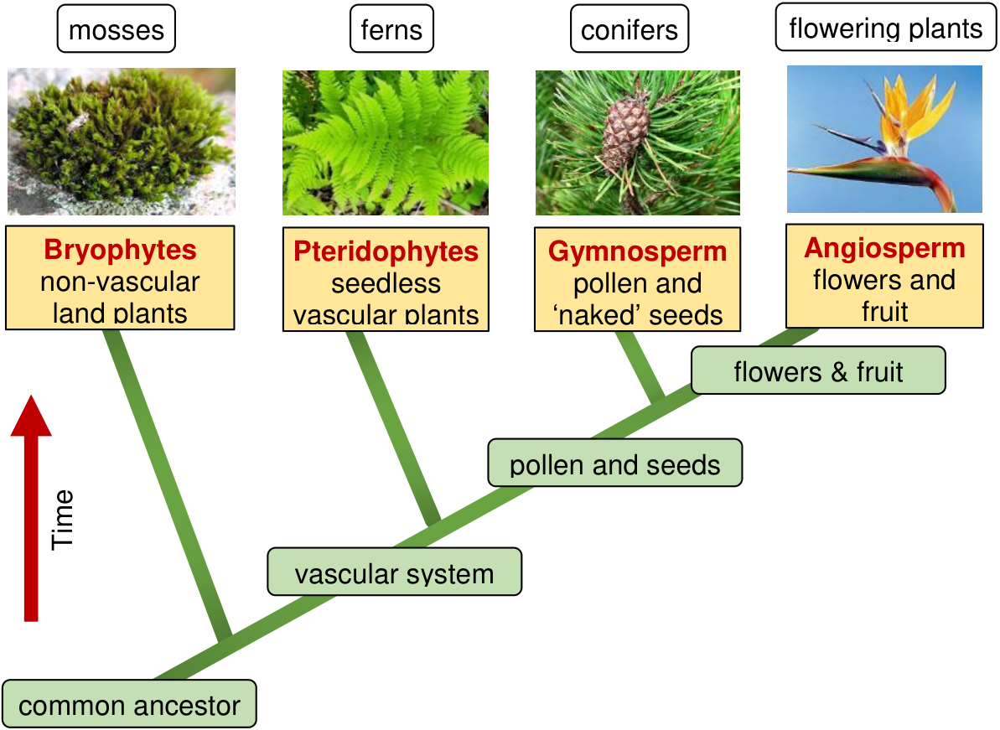
> **[Diagram Context - Textbook_LifeSciences_Gr11_Biodiversity-of-plants.pdf-0001-08.png]**
> This educational graphic is an evolutionary tree illustrating plant diversity and the phylogenetic relationships among major plant groups. It features the visible labels "common ancestor," "mosses," "ferns," "conifers," "flowering plants," "Bryophytes," "Pteridophytes," "Gymnosperm," "Angiosperm," and key evolutionary milestones such as "vascular system," "pollen and seeds," and "flowers & fruit," alongside a red upward arrow indicating "Time." The diagram conveys how land plants evolved over time, showing the sequential acquisition of key structural adaptations—vascular tissue, seeds, and flowers—that allowed plants to adapt progressively to terrestrial life.


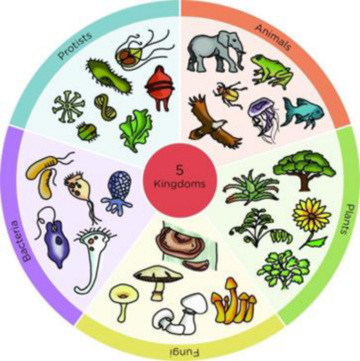
> **[Diagram Context - Textbook_LifeSciences_Gr11_Biodiversity_and_classification_of_microorganisms.pdf-0001-13.png]**
> This circular infographic illustrates biological classification, specifically the five kingdoms of life. Visible labels include "5 Kingdoms" centrally, surrounded by five distinct color-coded sectors labeled "Animals", "Plants", "Fungi", "Protists", and "Bacteria", each populated with representative illustrations of organisms. Conceptually, this diagram helps high-school learners grasp biodiversity and taxonomy by categorizing living organisms into major groups based on shared characteristics.


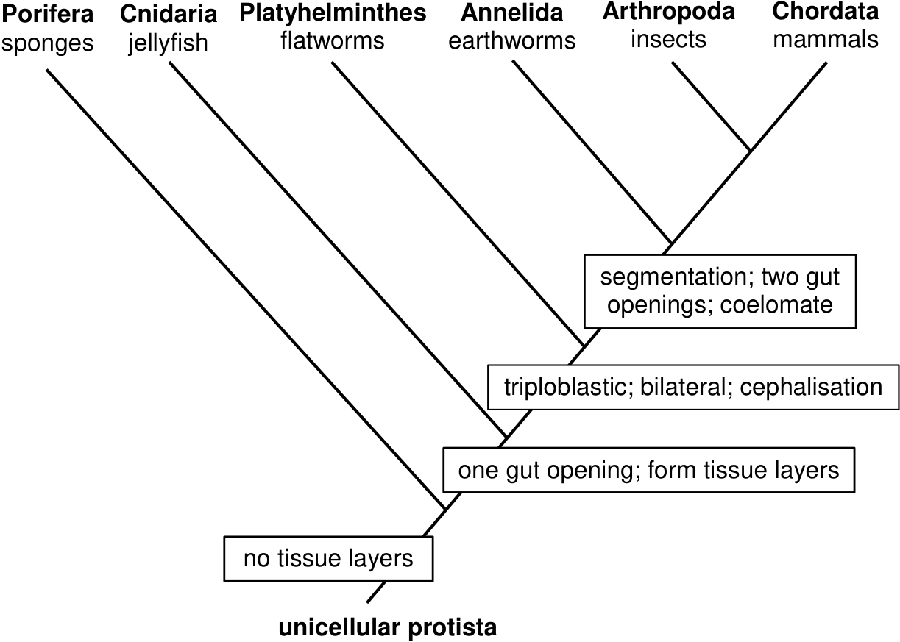
> **[Diagram Context - Textbook_LifeSciences_Gr11_Biodiversity_of_animals.pdf-0001-04.png]**
> This evolutionary tree (cladogram) illustrates animal diversity and phyla relationships, featuring the labels Porifera (sponges), Cnidaria (jellyfish), Platyhelminthes (flatworms), Annelida (earthworms), Arthropoda (insects), and Chordata (mammals) stemming from unicellular protista. Key evolutionary milestones are highlighted along the branches, including "no tissue layers", "one gut opening; form tissue layers", "triploblastic; bilateral; cephalisation", and "segmentation; two gut openings; coelomate". Conceptually, the diagram helps Grade 11 Life Sciences learners understand how major invertebrate and vertebrate phyla evolved key anatomical plans and body plans over time.


---

# Plant Diversity: Kingdom Plantae

The characteristics used to place a plant into one of the four main groups depend on:
* The presence or absence of true conducting tissues such as xylem and phloem
* The presence or absence of true roots, stems, and leaves
* The type of reproduction and reproductive structures formed
* The degree of dependence on water for reproduction

**Resources:**
* Characteristics of the Kingdom Plantae: [https://www.youtube.com/watch?v=gJrOATCtV-k](https://www.youtube.com/watch?v=gJrOATCtV-k)
* The biodiversity of plants specifically for grade 11: [https://www.youtube.com/watch?v=jlNRLEYp3ck](https://www.youtube.com/watch?v=jlNRLEYp3ck)

---

## Division Bryophyta

Bryophytes are the most primitive terrestrial plants. The division Bryophyta includes mosses, liverworts, and hornworts. Mosses are commonly found in damp, shady areas.


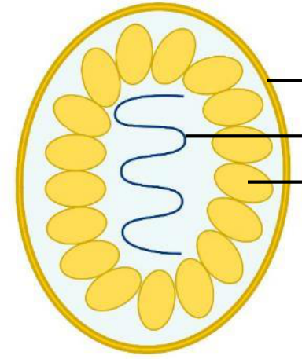

*Figure 2: Mosses growing in a shady area*

### Characteristics of Bryophytes
* Mosses are generally small ($< 20\text{ cm}$).
* They do not have true roots, stems, or leaves. For this reason, the plant body is referred to as a **thallus**.

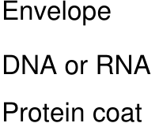


---

* Water can be absorbed directly through the leaves because there is not a waxy cuticle covering the leaves.
* The leaves are not true leaves and are often referred to as ‘leaflets’.
* The size of mosses is limited because they do not have any conducting tissues i.e. no xylem or phloem (vascular tissue) is present.
* Rhizoids at the base of the plant are responsible for anchoring the plant to a substrate.
* Bryophytes can reproduce either asexually or sexually.
* The gametophyte generation is the dominant generation and consists of a green leafy plant, capable of photosynthesis.
* No fruits or seeds produced.

## Division Pteridophytes

The division Pteridophyta includes all ferns. There are approximately 12 000 different species of ferns. They range in size from tiny plants of only 1 cm in height to tree ferns which can grow to 25 m in height. Most ferns require a warm, damp, shady habitat (see Figure 3).

*Figure 3: Ferns growing on a forest floor*

### Key terminology

| Term | Definition |
| :--- | :--- |
| **frond** | the leaf of a fern usually with many divisions |
| **rhizome** | a stem which grows horizontally |
| **adventitious roots** | roots which arise at the nodes of stems |
| **sori** | a cluster of sporangia found on the underside of fern leaves |

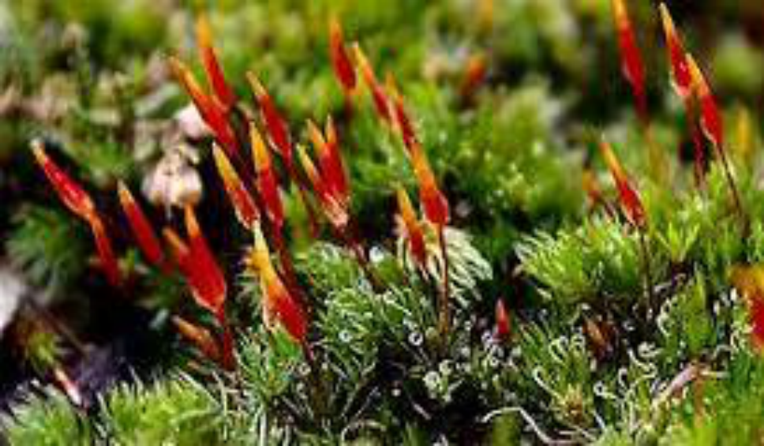


---

# Characteristics of Pteridophytes

* Ferns have true leaves, roots and stems.
* Fern leaves are covered by a waxy cuticle to prevent excessive loss of water.
* The leaves are often divided into smaller leaflets. A leaf which is divided into smaller leaflets is called a **compound leaf**. Fern leaves are referred to as a **frond**.
* The presence of vascular tissues allows ferns to grow taller than mosses. They have both xylem and phloem which transport water and photosynthetic products respectively.
* The stems of most ferns grow horizontally and are called **rhizomes**. The rhizomes are usually protected by brown scale-like leaves.
* **Adventitious roots** grow from the nodes of the horizontal stem. These are true roots because they have xylem and phloem and absorb water for the plant. The roots also anchor the plant in the soil.
* Ferns reproduce both sexually and asexually. The dominant generation in ferns is the **sporophyte generation**. Spores are produced in **sporangia** arranged in **sori** under the leaf (Figure 4).
* No fruit or seeds are produce.


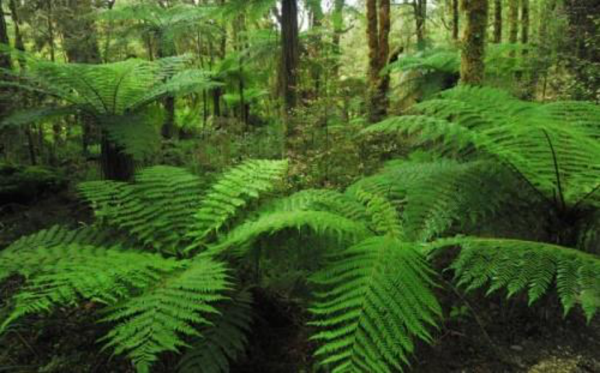

Figure 4: Sori on the under-surface of a fern frond

---

# Division Gymnosperms

The division Gymnosperms includes cycads, *Gingko biloba*, *Welwitschia* and pine trees (Figures 5A to 5D). Gymnosperms all produce seeds which develop into cones.

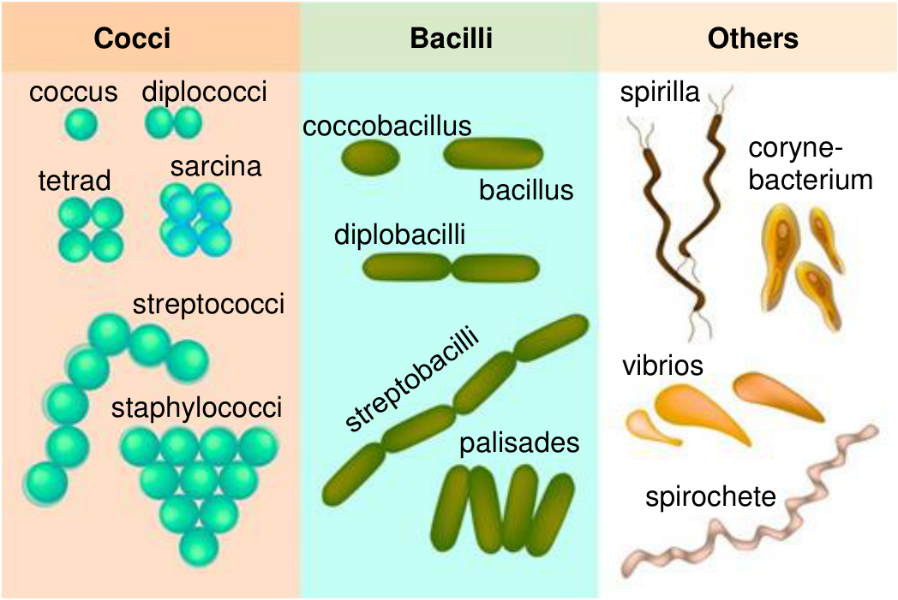


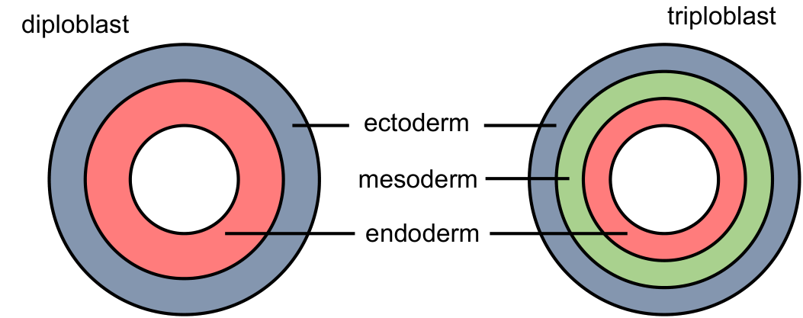


---

## Characteristics of Gymnosperms

In gymnosperms, the sporophyte generation is dominant and the most visible (e.g., the pine tree).

* **True Structures:** Gymnosperms have true roots, stems, and leaves.
* **Vascular Tissues:** Vascular tissues, namely xylem and phloem, are present. Unlike higher plants, the xylem in pine trees does not have vessel elements. Only xylem tracheids are present to transport water. This is the reason why the wood of pine trees is softer than the wood of higher plants.
* **Leaf Adaptations:** The leaves of pine trees are needle-like and have a cuticle to reduce the loss of water through evaporation.
* **Habitat & Survival:** The natural habitat of a pine tree is very cold in winter. The reduced volume of the leaves prevents ice crystals from forming, which would damage the leaves internally. The shape of the tree also stops snow from collecting on the branches.

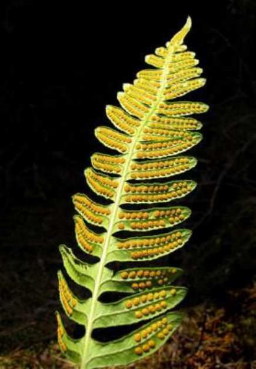


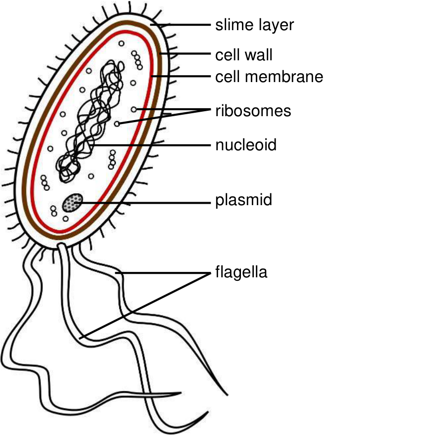


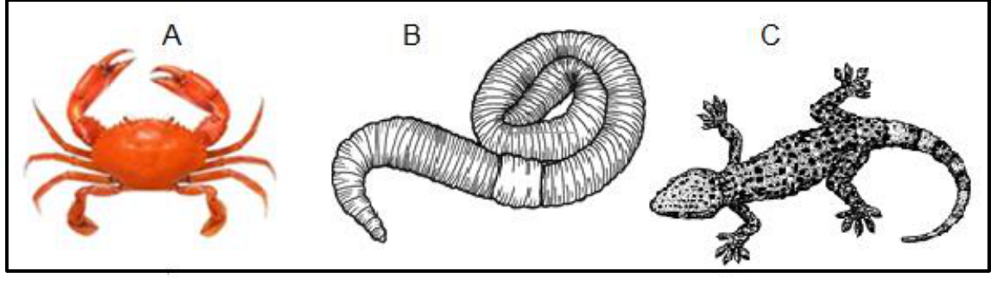


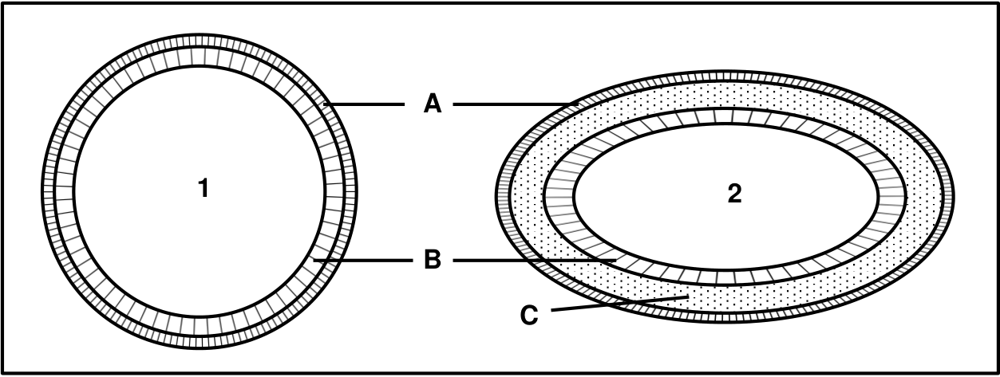


---

# Revision Notes: Characteristics and Biology of Pine Trees (Gymnosperms)

## Core Concepts

* **Root Systems**: Pine trees possess well-developed, extensive root systems, which allow them to make efficient use of available water compared to natural vegetation.
* **Reproduction (Gymnosperms)**: 
  * Pine trees do **not** produce flowers.
  * They form both male and female cones.
  * **Fertilization is independent of water**: Pollen is carried by the wind from a male cone to a female cone.
* **Seeds ("Naked" Seeds)**: 
  * The seeds of the pine are termed "naked" because they are not protected inside a fruit.
  * Seeds are carried on the exposed scales of the female cone.
  * Once ripe, seeds fall out of the cone and are dispersed to other locations by the wind.
  * Each seed features a wing to assist with wind dispersal.
* **Ecological Adaptation**: 
  * Seed dispersal away from the parent plant is crucial for survival. If a seed germinates directly underneath the mother tree, it will grow in the shade and face intense competition for water and nutrients.
  * Pine trees are **not indigenous to South Africa** and are capable of outcompeting local vegetation for water due to their extensive root systems.

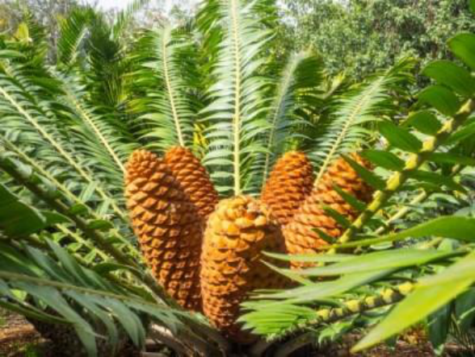


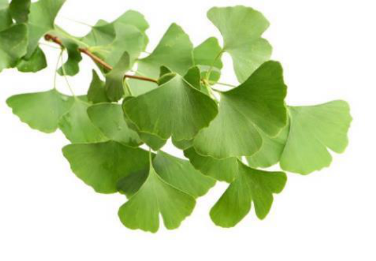


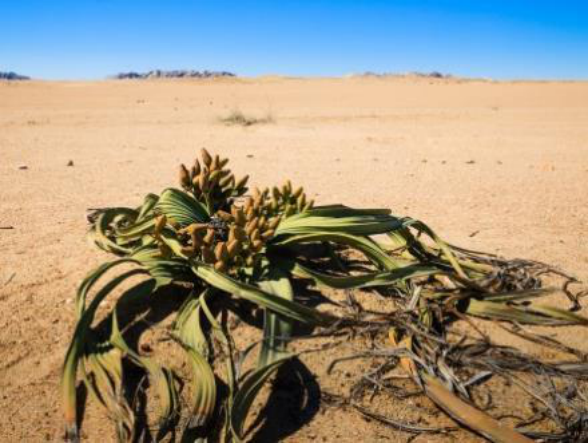


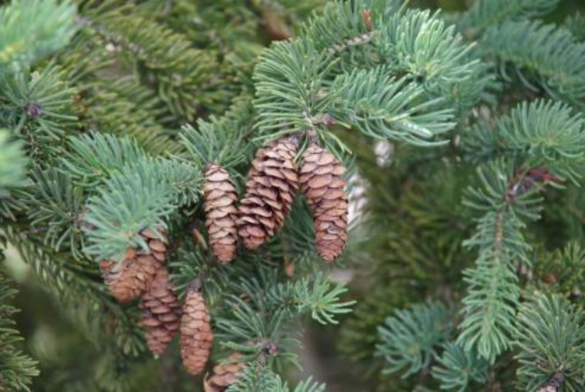


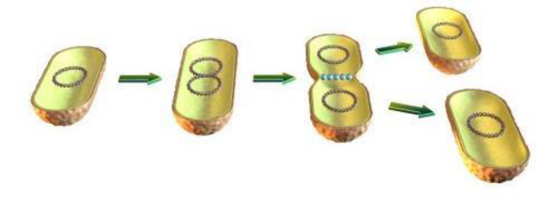


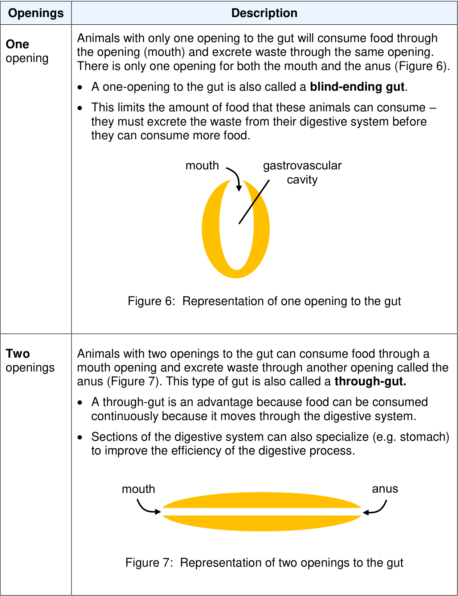


---


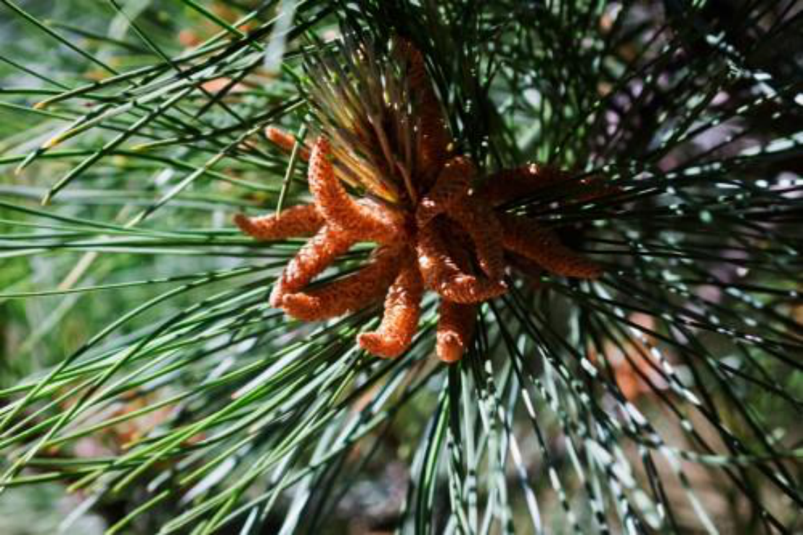


**Figure 7:** Pine seeds

> **Did you know?** Pine trees are commercially very important. Pine trees are cultivated in South Africa in huge plantations. The wood is used to make paper and furniture. Pine nuts are the seeds of pine trees. They are used to flavour drinks and make pesto.

---

## Division Angiosperms

Angiosperms are commonly referred to as "flowering plants" and are the most varied and successful group of plants. Most angiosperms are autotrophic, but some are parasitic, while others are saprophytes. Angiosperms typically produce seeds which are found inside fruits.

### Key terminology

| Term | Definition |
| :--- | :--- |
| **fibrous/adventitious root system** | formed by many thin, moderately branching roots growing from the stem — common in monocotyledons |
| **tap root system** | characterized by a main root or primary root system, growing vertically downward — common in dicotyledonous plants |

### Characteristics of Angiosperms

* The sporophyte generation is the dominant generation in angiosperms. It consists of true roots, stems and leaves.
* Xylem and phloem are responsible for transporting water and photosynthetic products, respectively. The structure of a typical angiosperm sporophyte is illustrated in Figure 8.

---

57

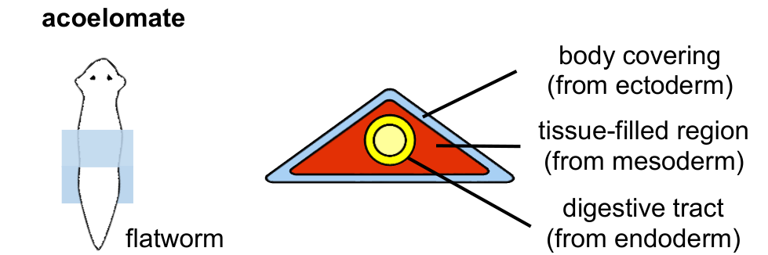


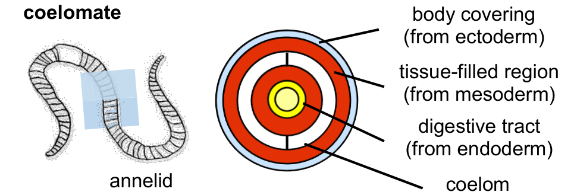


---


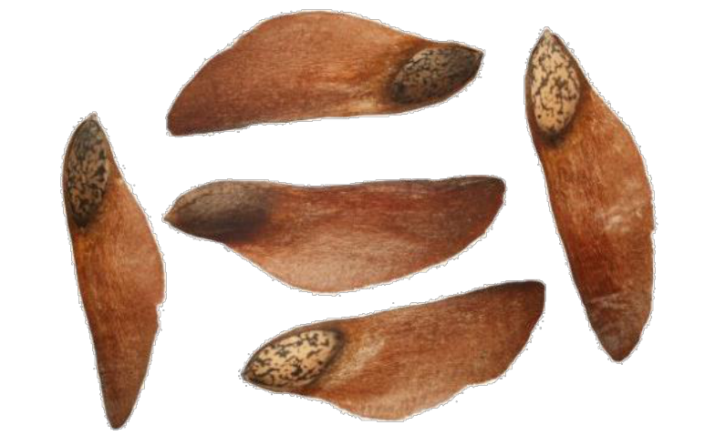


Figure 8: The structure of a typical angiosperm

* Angiosperms have either fibrous (adventitious) root systems or tap root systems. The roots are capable of absorbing water and dissolved mineral salts.
* The stems of angiosperms are divided into nodes and internodes. Leaves form at the nodes on the stem. The leaves are covered in a waxy cuticle to prevent excessive loss of water by evaporation.
* Angiosperms produce seeds protected by fruit.

The life cycle of angiosperms is similar to that of gymnosperms except that the seeds in angiosperms are protected by a fruit. Angiosperms produce flowers instead of cones.

58

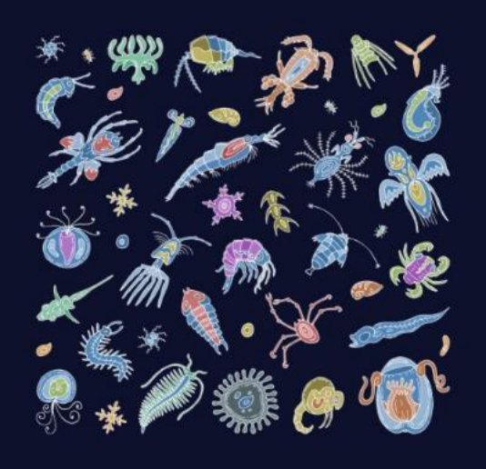


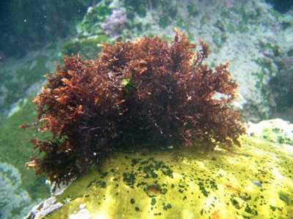


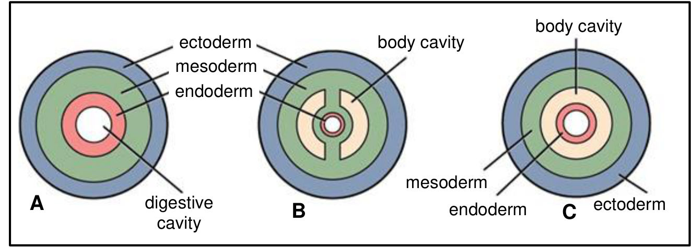


---

# Decreasing dependence on water for reproduction

As plants have increased in size over millions of years, they have become progressively less dependent on water for their survival and for the completion of their life cycles.

Of the four groups studied, the **bryophytes** are the least adapted to surviving dry conditions for the following reasons:
* They have no cuticle, no supporting tissues, and no vascular tissues.
* The plant body is a thallus because there are no true roots, stems, or leaves.
* The gametophyte is the dominant generation.
* The sporophyte is totally dependent on the gametophyte for both food and water.
* The male gametes are motile (capable of motion) and require water to swim to the female gamete.

The **pteridophytes** are more evolved than the bryophytes but are still dependent on water for fertilization. They have the following adaptations which enable them to grow larger than bryophytes:
* Leaves with a cuticle to prevent desiccation (drying out).
* Vascular tissue to transport food and water.
* The sporophyte is the dominant generation and is not dependent on the gametophyte for water and food once mature.

Both the **gymnosperms** and **angiosperms** are well adapted to life on land. Adaptations include:
* Leaves with a cuticle.
* True roots, stems, and leaves.
* An embryo enclosed in a seed to prevent drying out.
* Pollen grains to protect and transfer the sperm cells (i.e., water is not needed for fertilization).

---

# Asexual and sexual reproduction

Both animals and plants are capable of asexual and sexual reproduction. In asexual reproduction, only one parent is required, and the new organism is produced by mitosis. In sexual reproduction, a haploid sperm cell fuses with a haploid egg cell to [form a zygote].

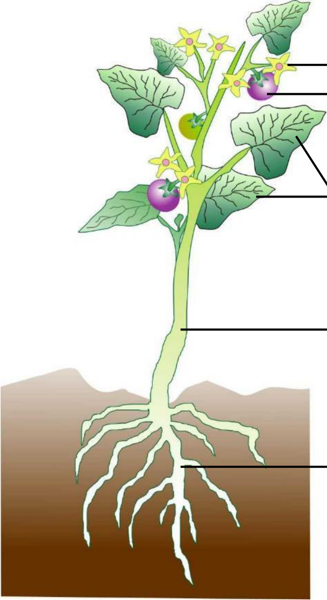


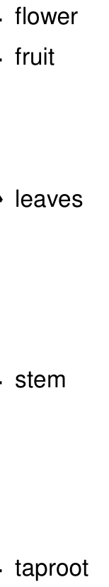


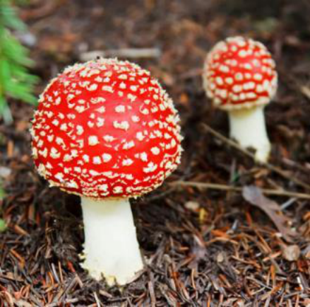


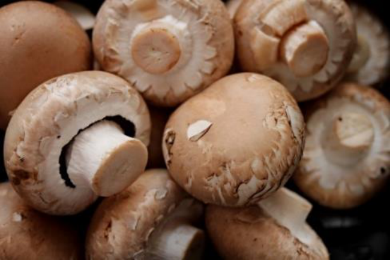


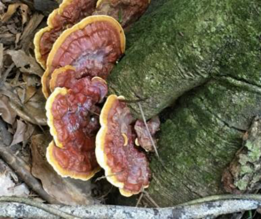


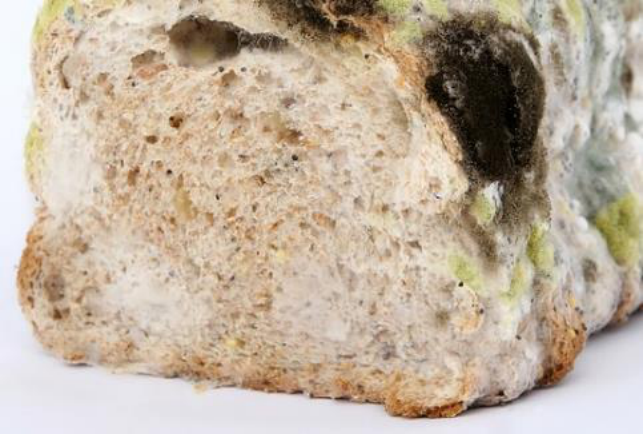


---

produce a diploid zygote. The zygote divides by mitosis to form an embryo and later, a new organism. 

### The advantages of asexual reproduction
* Only one parent is required.
* Asexual reproduction is quicker because the parent does not need to find a mate.
* All the offspring are identical and if conditions are favourable, they can crowd out any competition.
* Asexual reproduction does not rely on pollinators or dispersion agents.

### The disadvantages of asexual reproduction
* All the offspring are genetically identical. If conditions become unfavourable, they will all die.
* Poor characteristics in the parents will be passed on to the offspring.
* Rapid multiplication by asexual reproduction may lead to overcrowding.

### The advantages of sexual reproduction
* The offspring are genetically different and are able to withstand a variety of conditions.
* Farmers can select organisms with desirable characteristics and cross-breed with them.

### The disadvantages of sexual reproduction
* Two parents are required.
* Plants that reproduce sexually rely on pollinating agents and dispersal agents to spread their seeds.

---

### Flowers as reproductive structures
Flowers have the following functions:
* contain and protect the reproductive organs
* attract pollinators

60

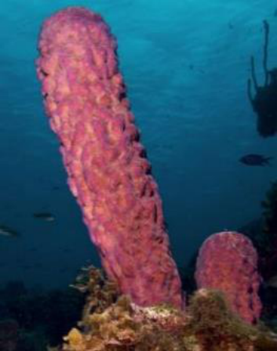


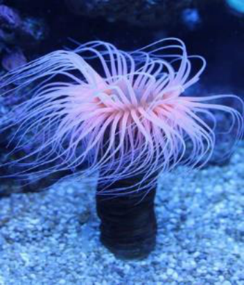


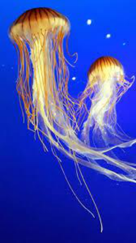


---

# Revision Notes: Anatomy of a Flower

## Key Terminology

| Term | Definition |
| :--- | :--- |
| **calyx** | formed by the green structures around the petals (the sepals) together; serves to protect the flower and its reproductive organs |
| **corolla** | all the petals of a flower together form the corolla |
| **receptacle** | the thickened part of a stem from which the flower organs grow |
| **perianth** | the non-reproductive part of the flower; the calyx and corolla that form a protective envelope surrounding the sexual organs |
| **stamen** | male part of the flower consisting of a filament and pollen producing anthers |
| **pistil** | female part of the flower consisting of a stigma, style and an ovary where ovules are produced |
| **fruit** | a fleshy, often sweet layer, formed around the seeds in angiosperms following fertilization |

---

## Structure of a Flower

All the parts of a flower are modified leaves arranged in whorls (circles around a central point). Each whorl is specialized to perform a specific function. 

The four whorls are:
1. **calyx**
2. **corolla**
3. **androecium**
4. **gynoecium**

### Detailed Breakdown of Floral Parts

* **Calyx:** In a typical plant, the outermost whorl is called the calyx and consists of a number of green **sepals**.
* **Receptacle:** All the floral parts are attached to a receptacle.
* **Corolla:** The corolla is made up of coloured **petals** to attract pollinators.
* **Perianth:** The calyx and corolla are known collectively as the perianth, serving as the non-reproductive, protective envelope.
* **Stamen (Male Reproductive Organ):** Consists of an **anther** (which produces pollen) and a supporting **filament**.
* **Pistil (Female Reproductive Organ):** Consists of a **stigma** (receives pollen), a **style** (tube connecting stigma to ovary), and an **ovary** containing **ovules**.

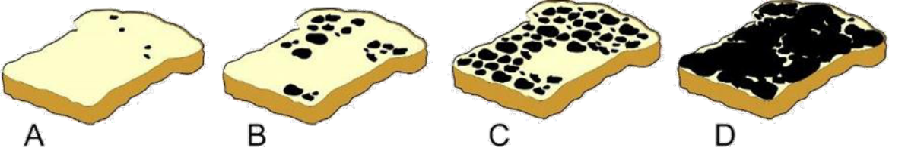


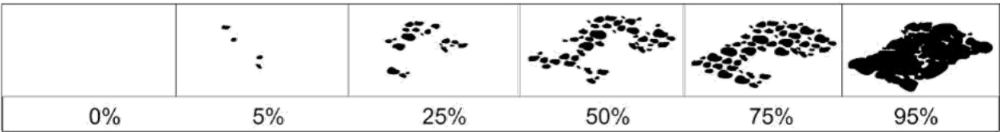


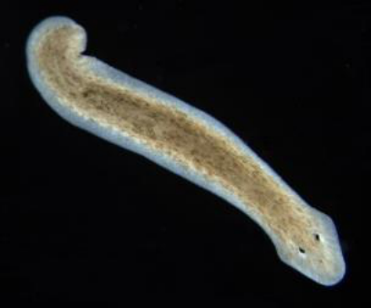


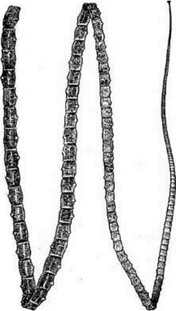


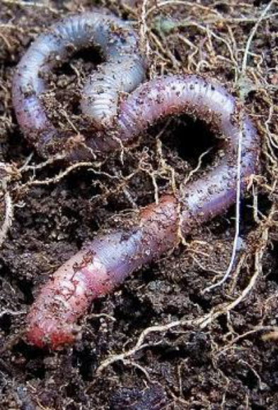


---

### Plant Reproduction: Flower Structures and Pollination

#### 1. Male and Female Parts of a Flower

*   **Stamen (Male Part):**
    *   **Filament:** The stalk supporting the anther.
    *   **Anther:** A bi-lobed structure containing four pollen sacs (microsporangia).
    *   **Pollen Grains (Microspores):** Haploid structures produced by **meiosis**.

*   **Carpel / Pistil (Female Part):**
    *   **Carpels:** Usually fused together to form one or more **pistils**.
    *   **Stigma, Style, and Ovary:** The three main regions of a pistil.
    *   **Ovules:** Formed inside the ovary by meiosis.

#### 2. Fertilization Process

1.  A pollen grain lands on the **stigma**.
2.  It germinates by growing down the **style** towards the ovule.
3.  It carries the male gametes to fertilize the ovule.
4.  The fertilized ovule develops into a **seed**, while the ovary wall thickens to become a **fruit**. In general, fruits do not develop without fertilization.

---

### Pollination

**Pollination** is defined as the transfer of pollen from an anther to the stigma of the same flower or the stigma of a different flower of the same species.

#### Types of Pollination

1.  **Self-pollination:** 
    *   Occurs when pollen is transferred between flowers of the same plant or between the anther and the stigma of the same flower.
    *   *Adaptations against self-pollination:* Most plants have adaptations to prevent this, such as:
        *   Pollen ripening before the stigma is mature (and being dispersed beforehand).
        *   Stigmas maturing before anthers.
        *   Genetic incompatibility with their own pollen.

2.  **Cross-pollination:**
    *   Occurs when pollen is transferred from the anther of one flower to the stigma of a flower on a different plant of the same species.


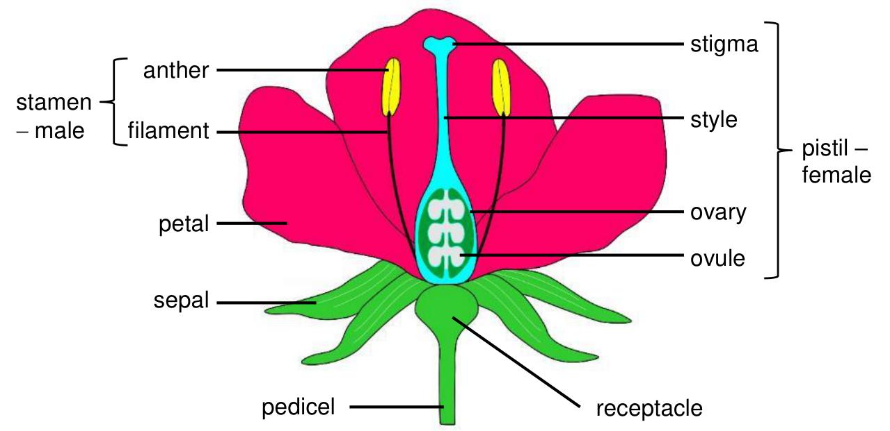

*Figure 10: Types of pollination — (A) self-pollination, (B) cross pollination*

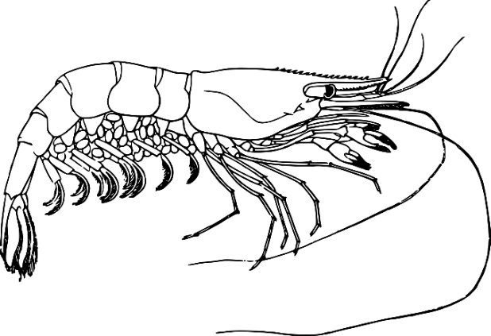


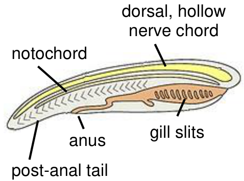


---

# Cross-Pollination and Adaptations of Flowers

## Core Concepts

* **Cross-pollination**: Occurs when pollen is transferred from the flower of one plant to the flower of another plant of the same species.
* **Importance of Cross-Pollination**: 
  * Creates genetic diversity, meaning the offspring are genetically different from the parent.
  * Genetic diversity ensures that a species has a better chance of surviving unfavourable conditions.
* **Agricultural Importance**: Pollination is vital for the production of fruit crops (e.g., apples and pears) and seed crops (e.g., maize, legumes, wheat).
* **Pollination Vectors**: Plants rely on wind, water, or pollinators such as insects and birds to transfer pollen from one flower to another.

---

## Adaptations of Flowers for Pollination

Flowers show a variety of adaptations to ensure that pollination takes place successfully.

### Key Terminology

| Term | Definition |
| :--- | :--- |
| **nectar** | A sugar-rich liquid produced by plants in glands called nectaries to attract pollinators |

---

## Adaptations for Pollination Through Insects

In South Africa, indigenous *salvia* flowers are insect-pollinated, providing a landing platform for insect pollinators.

### Characteristics of Insect-Pollinated Flowers

* **Large, conspicuous petals**: Usually in bright colours except red (since some insects cannot tell the difference between red and black).
* **Sweet scent**: To attract moths and butterflies.

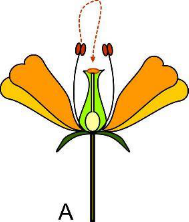


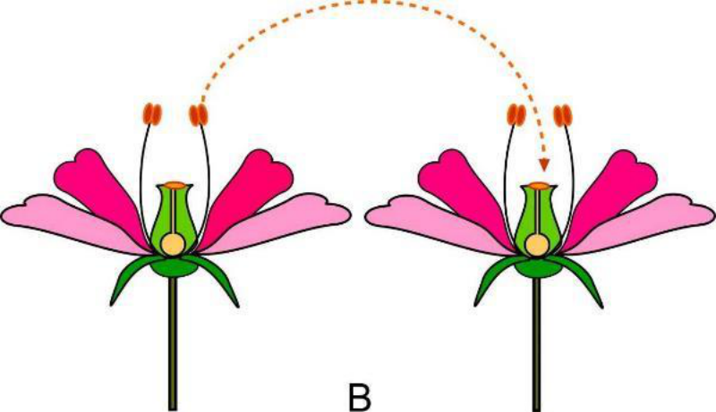


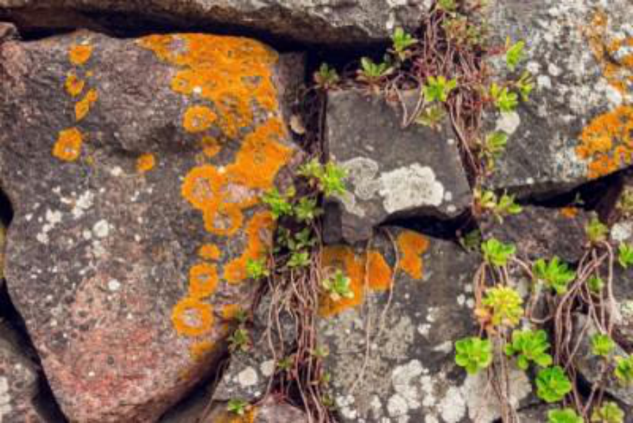


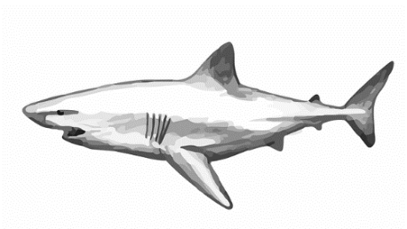


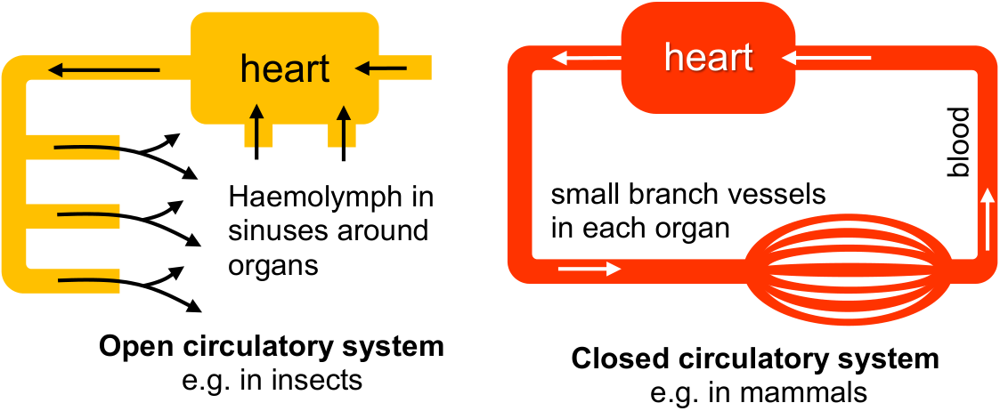


---

* A reward for the pollinator such as nectar and/or pollen.
* Anthers and stigmas are inside the flower so that the insect must brush past them to get to the nectar thus transferring the pollen.
* Sticky or spiky pollen grains which stick to the insect’s body.
* Large quantities of pollen are produced because some will be eaten by the visiting insect.
* Flowers either open during the day for insects that are active during the day such as bees or at night for insects active at night e.g. moths.
* Flowers have UV markings visible only to insects.

## Adaptations for pollination through birds

Examples of indigenous flowers pollinated by birds in South Africa include our national flower, *Strelitzia reginae* (Figure 12).

*Figure 12: Bird pollinated Strelitzia reginae*

Flowers pollinated by birds usually have the following characteristics:
* Produce large quantities of dilute nectar.
* Flowers are bigger than most insect-pollinated flowers.
* Stamens and stigmas protrude beyond the petals.
* Open during the day.
* Often red because red can be seen by birds in contrast to insects.
* Generally sturdy.
* Little or no scent because birds have a poor sense of smell.

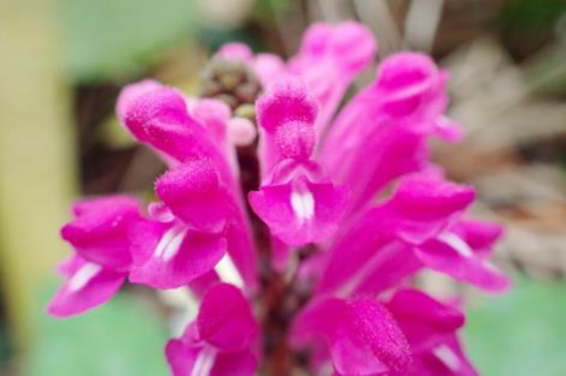


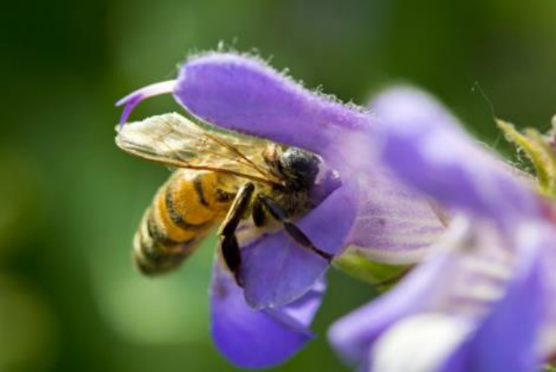


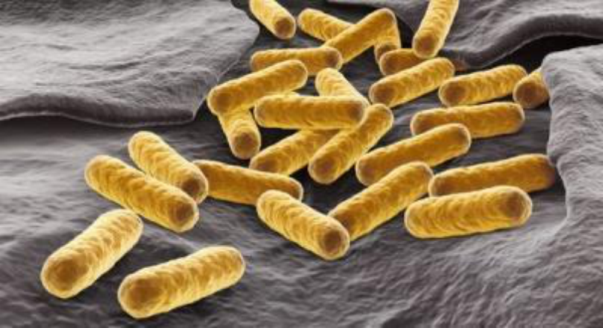


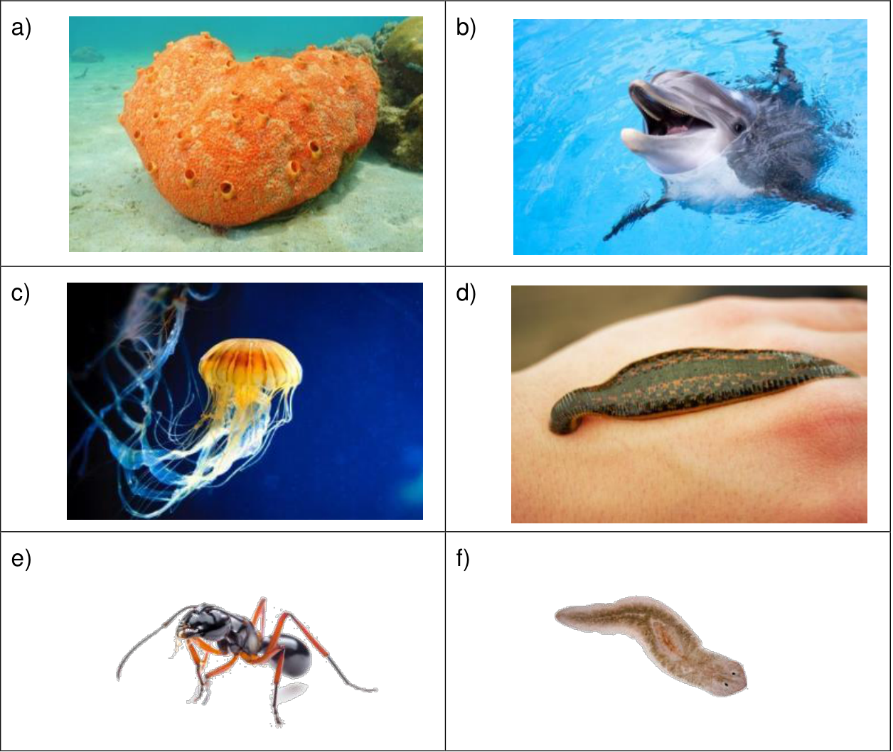


---

* Ovules are protected from probing beaks.
* Pollen grains stick together in clumps so that the bird picks up enough pollen to fertilize a large number of ovules with just one visit.
* The flowers are borne above the leaves so that hovering birds can reach them.

## Adaptations for pollination through wind

Wind pollination is not an efficient method of pollination because vast quantities of pollen must be produced in order for some of it to land on a receptive stigma of the right species.

Some trees and grasses, restios (Figure 13) and sedges are wind pollinated. Most of our agricultural crops are wind pollinated e.g. maize, oats and rice.


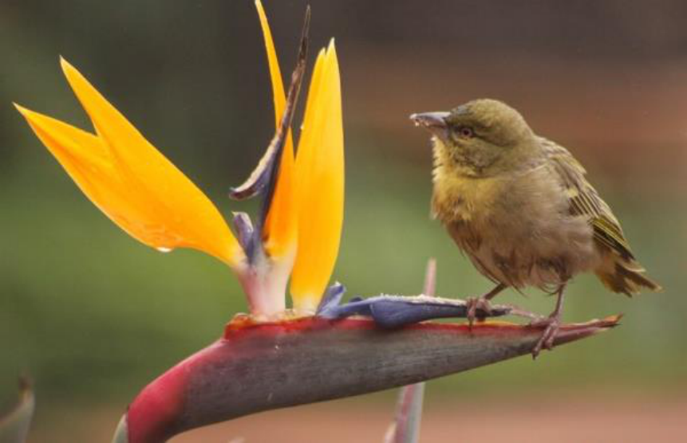


*Figure 13: Indigenous restios are wind pollinated*

Wind pollinated flowers have the following **characteristics**:
* They do not have a scent or nectar.
* Flowers are often small and either green or brown in colour because they do not need to attract pollinators.

65

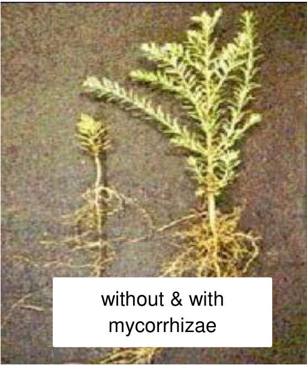


---

* The male flowers have large anthers.
* The flowers are borne on flexible stalks that move in the wind.
* Usually very small.
* Lack a calyx and a corolla.
* Enormous amounts of pollen are produced.
* Stigmas are long and feathery.

---

### Activity 1: Pollination and parts of flowers

1. Study the pictures below and indicate if they are pollinated by insects, birds or by wind. Give a reason that is visible in the picture for your answer. (10)

| Image | Pollination Agent | Reason (Visible in picture) |
| :---: | :---: | :---: |
| **A** | | |
| **B** | | |
| **C** | | |
| **D** | | |
| **E** | | |

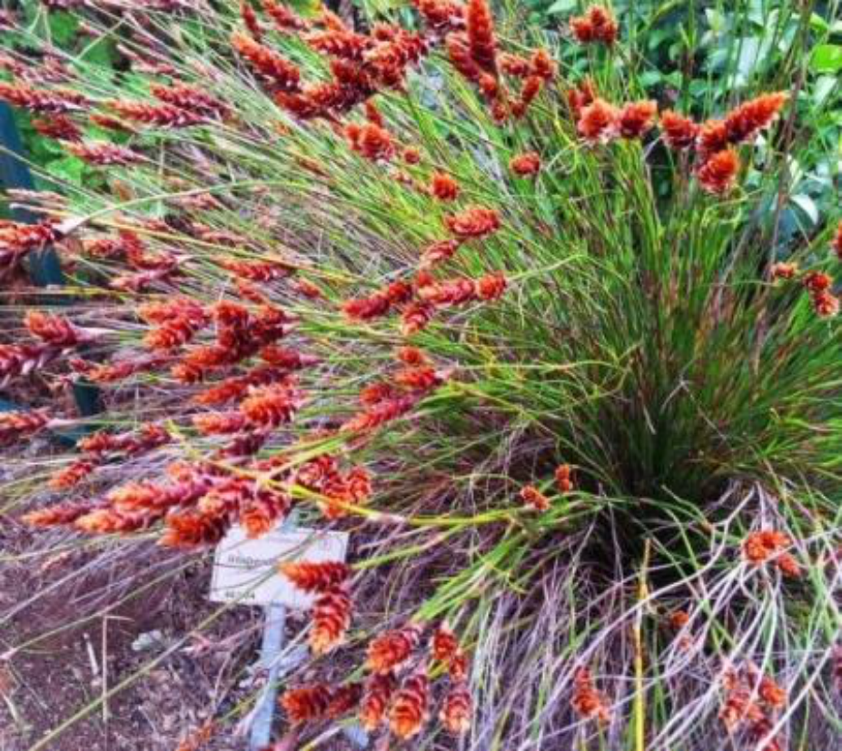


---

2. The following table compares flowers which are pollinated by pollinators with flowers which are wind pollinated. Copy the table into your book and complete it.

Table: The difference between pollinator and wind pollinated flowers.

| Feature | Pollination by a pollinator | Wind pollinated |
| :--- | :--- | :--- |
| **flower** | | small and inconspicuous |
| **stigma** | | |
| **stamens** | | |
| **pollen** | | |
| **scent** | | |
| **energy spent** | | |

(11)

3. Supply labels $1 - 10$ for the following diagram.


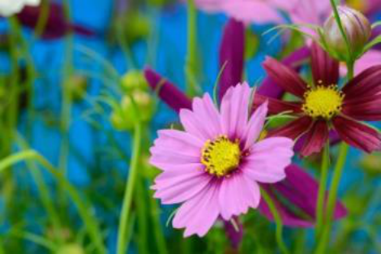


(10)


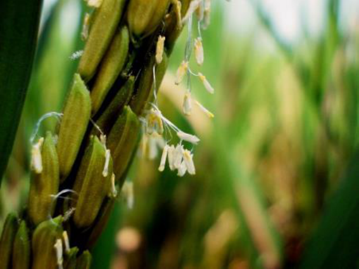


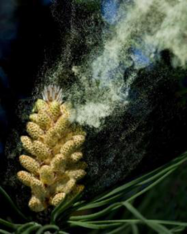


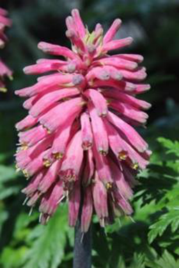


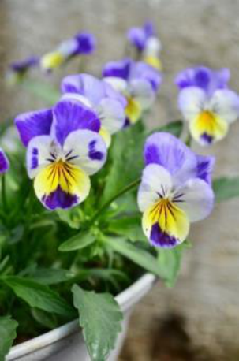


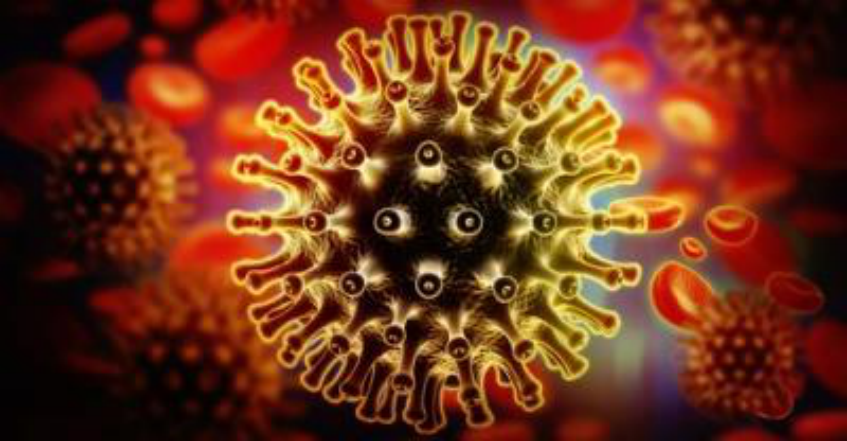


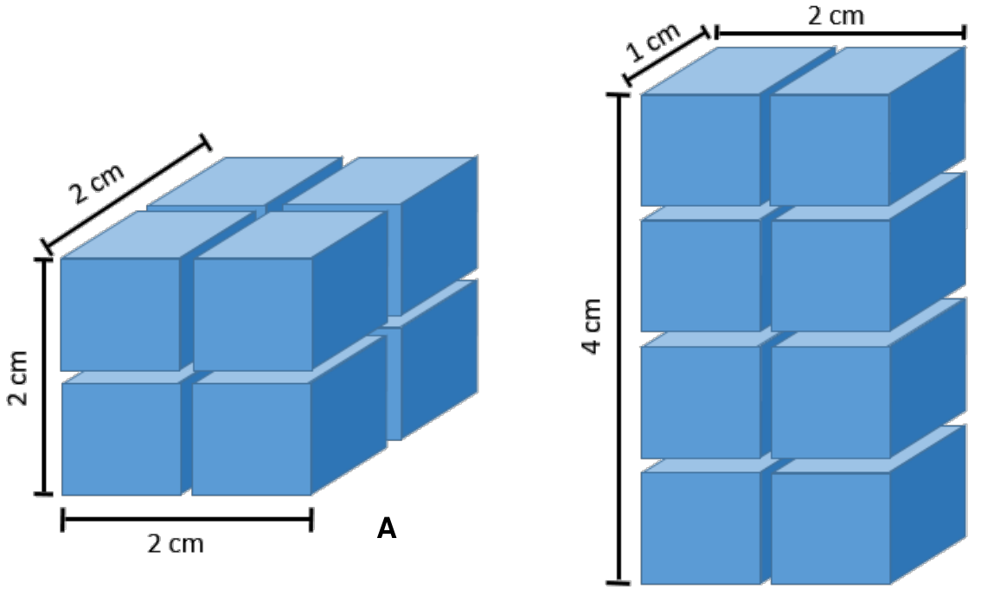


---

# The significance of seeds

A seed is formed from a fertilised ovule.

## Key terminology

| Term | Definition |
| :--- | :--- |
| **radicle** | embryonic root |
| **plumule** | embryonic shoot |
| **monocotyledons** | plants that have only one cotyledon; other possible characteristics: flower parts in multiples of threes (three, six or nine petals), sepals that make up their flowers |
| **dicotyledons / or dicots** | having two embryonic leaves or cotyledons |

Seeds either have one cotyledon (**monocotyledons**) or two cotyledons (**dicotyledons**) which store food for the developing embryo. Seeds are surrounded by a tough, protective seed coat called a **testa** (Figure 14A and 14B).


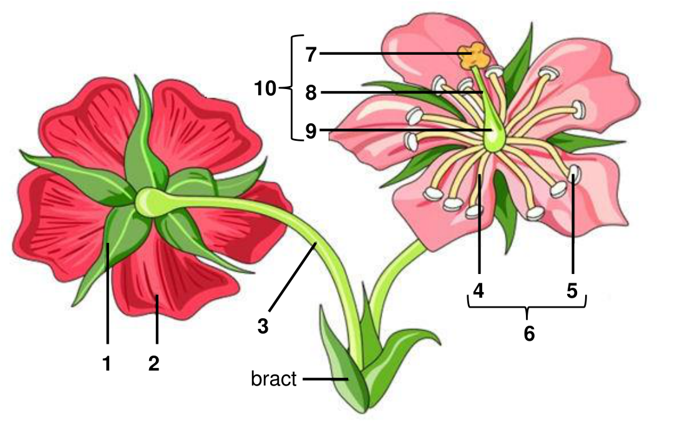


---

# Seeds and Seed Banks

Seeds are produced by sexual reproduction, which means every seed is genetically different. This increases the chance of survival for the species. Seeds possess various adaptations to ensure they are dispersed, and some seeds remain dormant until favourable conditions return.

---

## Seed Banks

### What is a Seed Bank?
A **seed bank** is a facility established to store seeds of both crop plants and wild plants to ensure they do not become extinct and to make sure that biodiversity is maintained. Seeds are also an important food source for birds, animals, and humans.

### Purpose and Uses of Seed Banks
* Store seeds of rare or unusual plants.
* Store seeds of original plants used to hybridise and produce new, hardier varieties.
* Provide stored seeds for research purposes.

### Storage Conditions
* Seeds are stored at a temperature below the freezing point.
* Before seeds are frozen, they are dried to prevent bacteria and fungi from causing them to rot.

---

## Activity 2: Seed banks

1. Give two reasons why seed banks are important. (2)
2. Before seeds are frozen in a seed bank, they are dried. Explain why. (2)

---

## Seeds as a Food Source

Humans cultivate and harvest various seeds, including coffee, maize, wheat, peas, soya beans, and rice. 

* **Pulses:** Seeds such as beans, peas, and soya beans are classified as pulses. They are a good source of **protein**.
* **Grains:** Crops such as wheat, rice, and maize are classified as grains. They are a good source of **carbohydrates**.

Many of these crops form the staple diet of poorer countries.

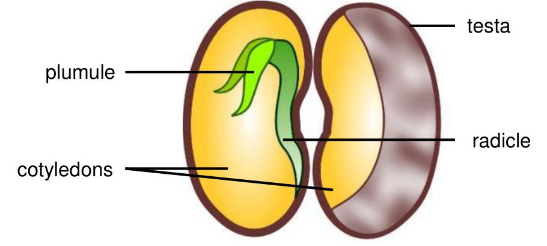


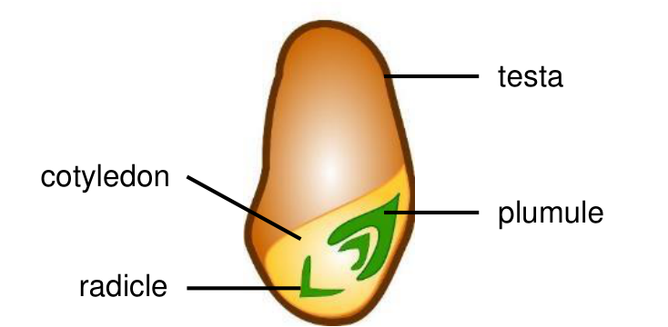


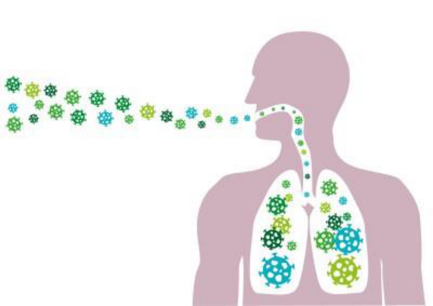


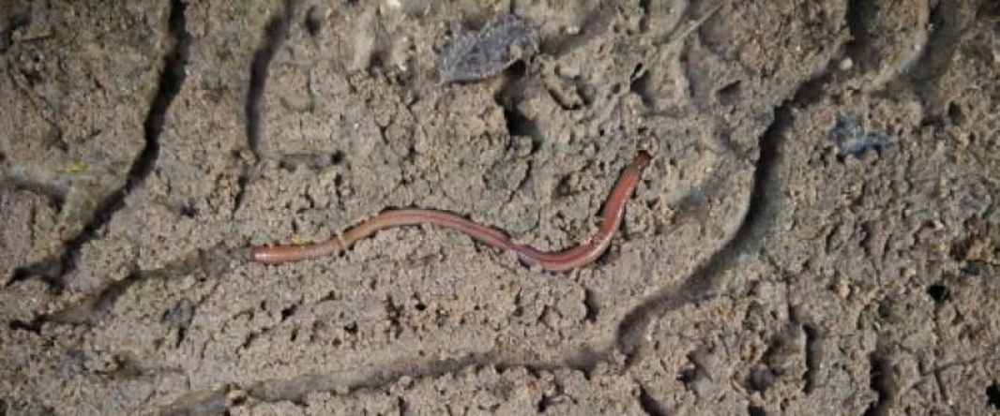


---

# Endemic Seeds as a Food Source

## Core Concepts

* **Endemic Seeds:** Seeds that occur naturally only in certain specific geographic areas.
* **Sorghum:** 
  * Endemic to Africa, but currently grown worldwide.
  * Traditionally consumed as a porridge or used in the production of traditional African beer.
* **Maize (Samp):** 
  * Dried and crushed kernels of maize.
  * Frequently cooked together with red beans.
* **Millet:** 
  * Naturally gluten-free seed.
  * Frequently utilized as a substitute by individuals with gluten allergies or sensitivities.

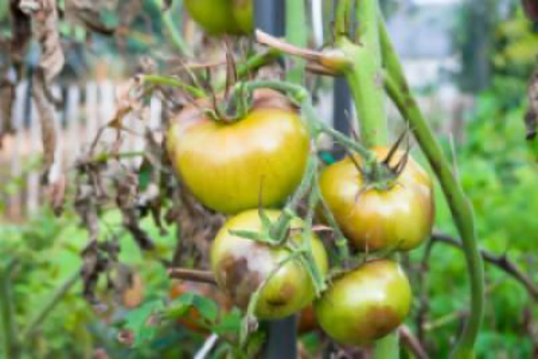


---

# Biodiversity of plants: End of topic exercises

## Section A

### Question 1

1.1 Various options are provided as possible answers to the following questions. Choose the correct answer and write only the letter ($A - D$) next to the question number ($1.1.1 - 1.1.5$) on your answer sheet, for example $1.1.6\ D$.

1.1.1 Bryophytes are terrestrial plants that have no...

* A cellulose
* B rhizoids
* C vascular tissue
* D sporophyte phase

1.1.2 The sporangia on the under surface of fern leaves are called...

* A sporophylls
* B sori
* C cones
* D sporogonia

1.1.3 Conserving endemic seeds in South Africa will enable the following:

* A The protection of plants against disease
* B A lot of money to be made for South Africa
* C The restoration of over-exploited medicinal plants
* D Food crops to be grown in dry conditions

1.1.4 Alternation of generations is exhibited by...

* A Bryophytes
* B Pteridophytes
* C Spermatophytes
* D All plants

$(4 \times 2) = (8)$

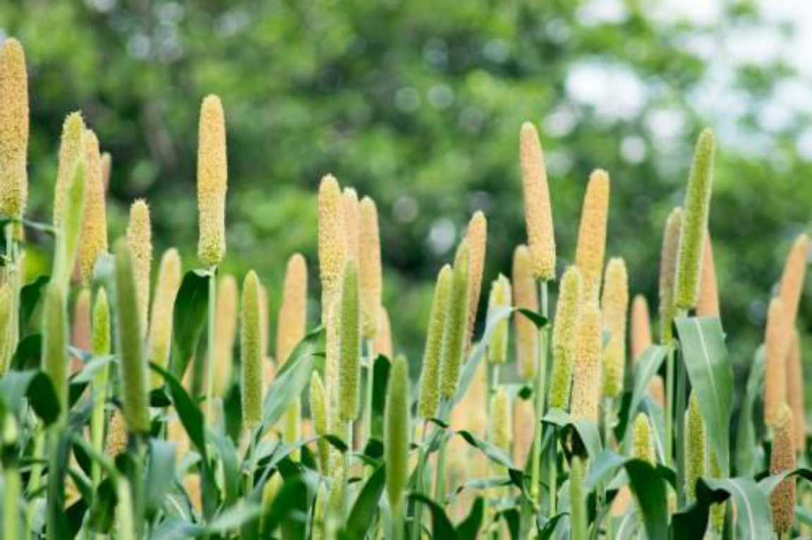


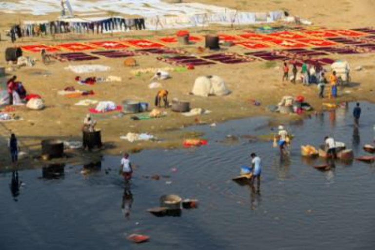


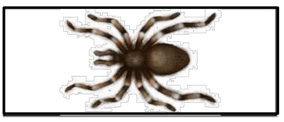


---

### 1.2 Biological Terminology Exercise

Give the correct **biological term** for each of the following descriptions. Write only the term next to the question number.

1.2.1 Reproduction which uses non-reproductive parts of a plant to produce new plants.  
1.2.2 Plants without true roots, stems and leaves.  
1.2.3 Places where seeds are stored to help preserve biodiversity.  
1.2.4 A reproductive structure found in gymnosperms and angiosperms only, consists of a plant embryo with a protective coat.  
1.2.5 A group of plants that have seeds enclosed in an ovary.  
1.2.6 The part of the plant embryo that develops into the root.  
1.2.7 The tough outer coat of a seed.  
1.2.8 The part of the flower that the fruit is derived from.  
1.2.9 The collective name for a filament and an anther.  

$$(9 \times 1) = (9)$$

---

### 1.3 Matching Exercise

Indicate whether each of the descriptions in **Column I** applies to **A ONLY**, **B ONLY**, **BOTH A AND B** or **NONE** of the items in **Column II**. Write **A only**, **B only**, **both A and B** or **none** next to the question number.

| Column I | Column II |
| :--- | :--- |
| 1.3.1 A division of plants with a vascular system, seeds, and no flowers. | A: gymnosperm<br>B: angiosperm |
| 1.3.2 The purpose of flowers. | A: attract pollinators<br>B: form fruit |
| 1.3.3 Gametophyte is dominant | A: ferns<br>B: mosses |
| 1.3.4 Thallus plant | A: bryophytes<br>B: pteridophytes |
| 1.3.5 The part that is formed from a fertilized ovule | A: seed<br>B: fruit |

$$(5 \times 2) = (10)$$

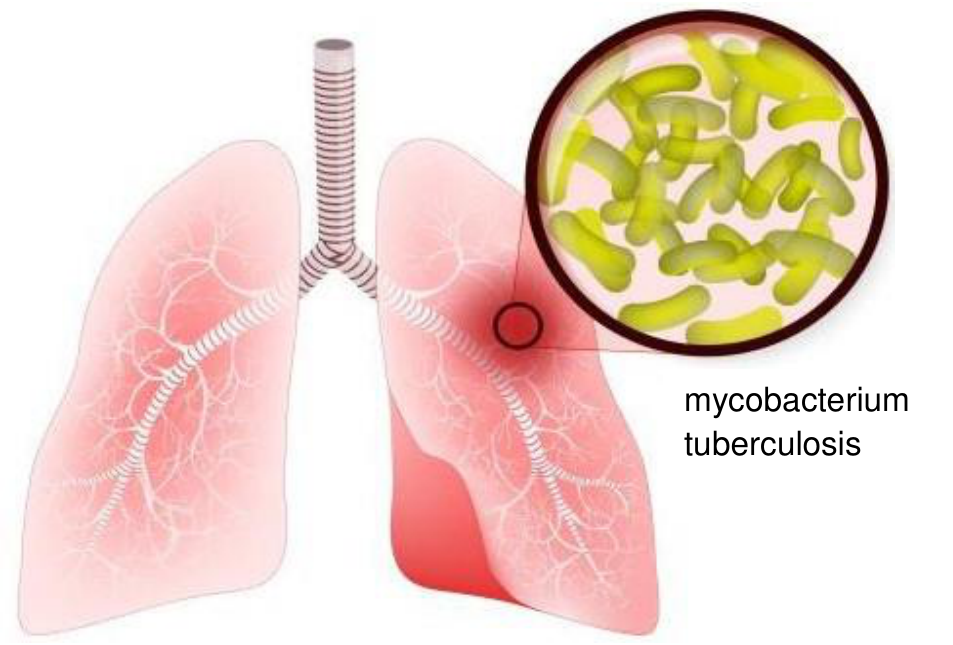


---

### 1.4 Plant Evolution and Cladistics

The diagram below is a cladogram of plants and their algal ancestors. A, B, and C indicate key structural features in the evolution of higher plants. Study the diagram and answer the questions which follow.


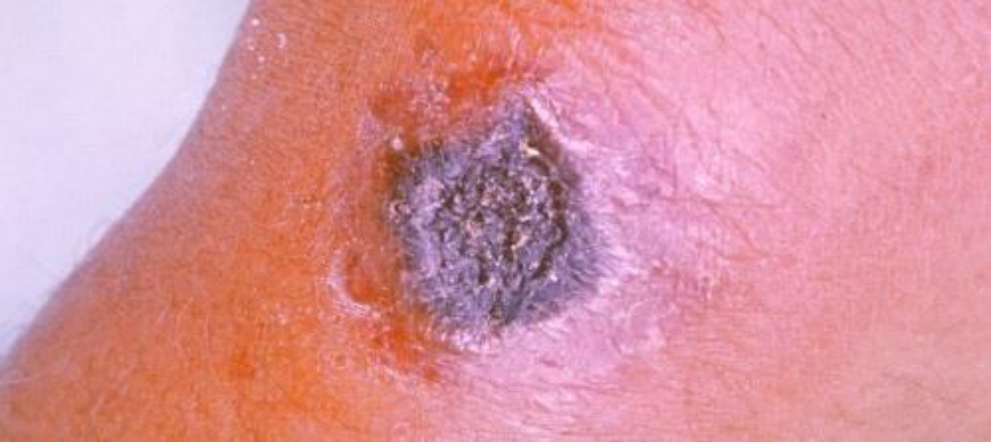


*   **1.4.1** Name the most important adaptation(s) that evolved at each of the positions labelled A, B, and C. **(3)**
*   **1.4.2** Which division of plants is represented as non-vascular plants in the diagram? **(1)**
*   **1.4.3** Explain why seedless vascular plants are able to grow taller than the non-vascular plants. **(2)**
*   **1.4.4** In what way are the seeds of gymnosperms different to seeds of angiosperms? **(2)**
*   **1.4.5** What is the collective name for all seed-bearing plants? **(1)**
    **(Total: 9)**

---

### 1.5 Plant Diversity and Divisions

Study the different plant diagrams shown, and answer the questions below.


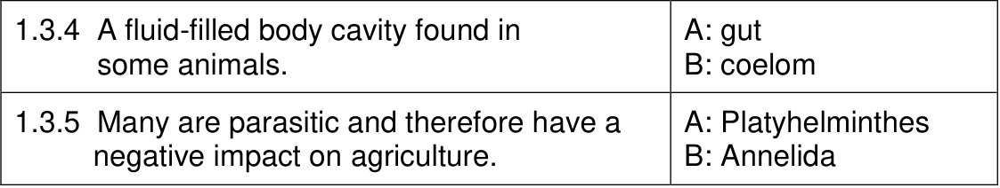


*   **1.5.1** Identify the divisions to which each of the above plants belongs. **(4)**

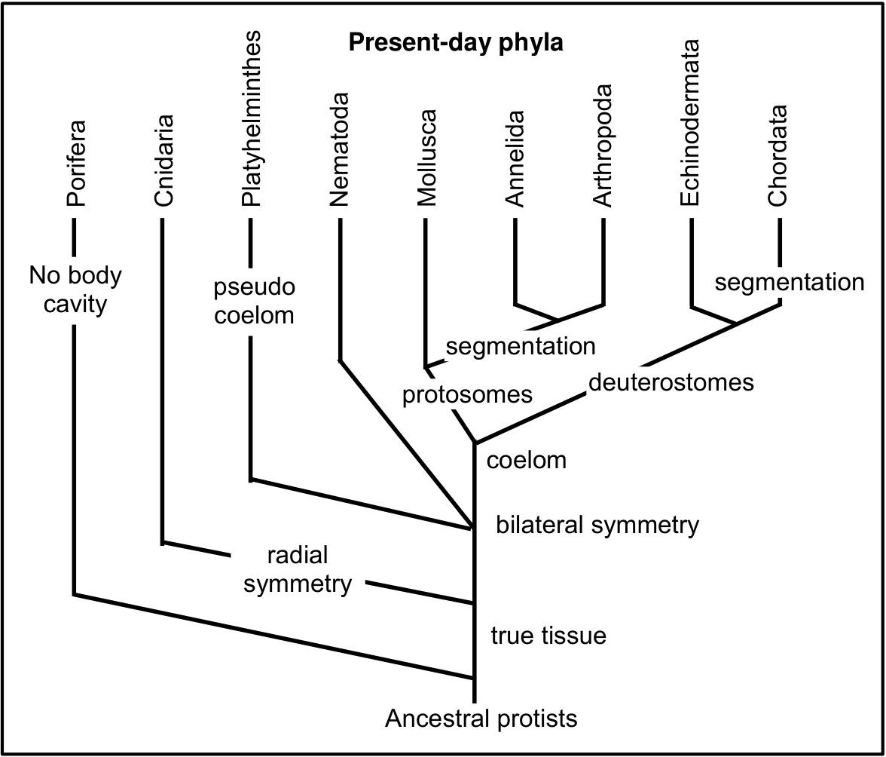


---

1.5.2 Name one of the divisions identified in question 1.5.1 that is ...

A. dependent on water for fertilization? (1)  
B. produces seeds for fertilization? (1)

1.5.3 Mention three similar structural adaptations of the prothallus in ferns and the gametophyte in mosses, which make them to be poorly adapted to a terrestrial life. (3)

**(9)**

**Section A: [45]**

---

## Section B

### Question 2

2.1 Study the diagram which shows the phylogenetic tree of four plant species and answer the questions that follow.


2.1.1 Provide a definition of a *phylogenetic tree*. (1)

2.1.2 State whether the following statements are *true* or *false*. In each case give a reason for your answer.

a) The solid circle numbered **3** represents the common ancestor of the protea bush, palm tree and maize plant. (2)

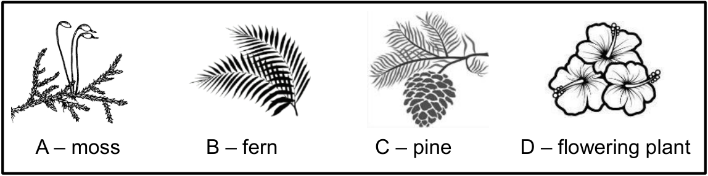


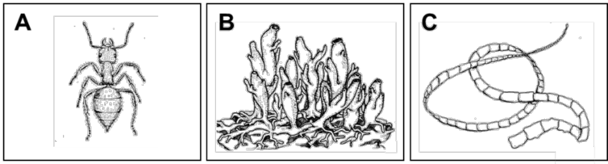


---

b) The protea bush is more closely related to the pine tree than it is to the maize plant because they are located next to each other on the phylogenetic tree, (2)

c) Palm trees evolved from pine trees. (2)

d) Protea bushes, palm trees and maize plants are all flowering plants. (2)

2.1.3 How many millions of years ago did the ancestor of the palm tree and maize diverge? (1)

(10)

---

2.2 Study the diagram below showing the structure of a flower.


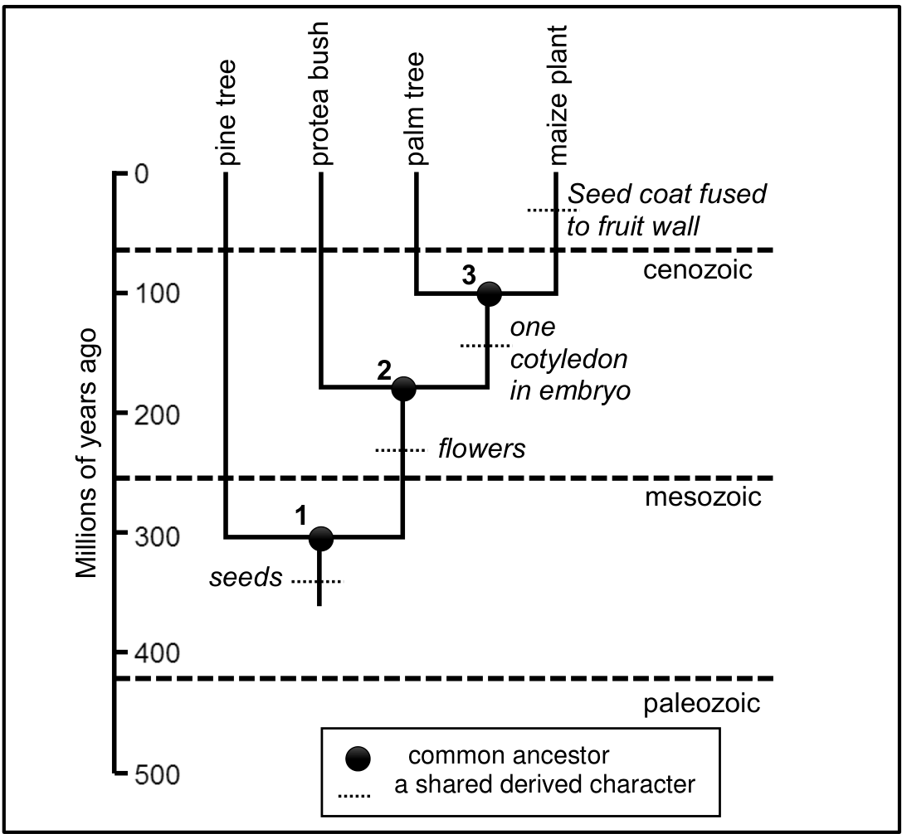


2.2.1 What type of pollination can be linked to this flower? (1)

2.2.2 Identify the parts labelled A and B. (2)

2.2.3 What do we call F and E together? (1)

2.2.4 Using the number only, identify the following:

a) Part which receives pollen. (1)

b) Structure where a seed can form. (1)

c) Part where pollen is produced. (1)

2.2.5 A seed bank in Norway has been storing seeds of a rare and endangered plant. To keep the seeds fresh, $120$ of the seeds of this plant were selected to be grown. Of the $120$ seeds, only $90$ germinated. What percentage of the seeds was not fertile? Show all your workings. (2)

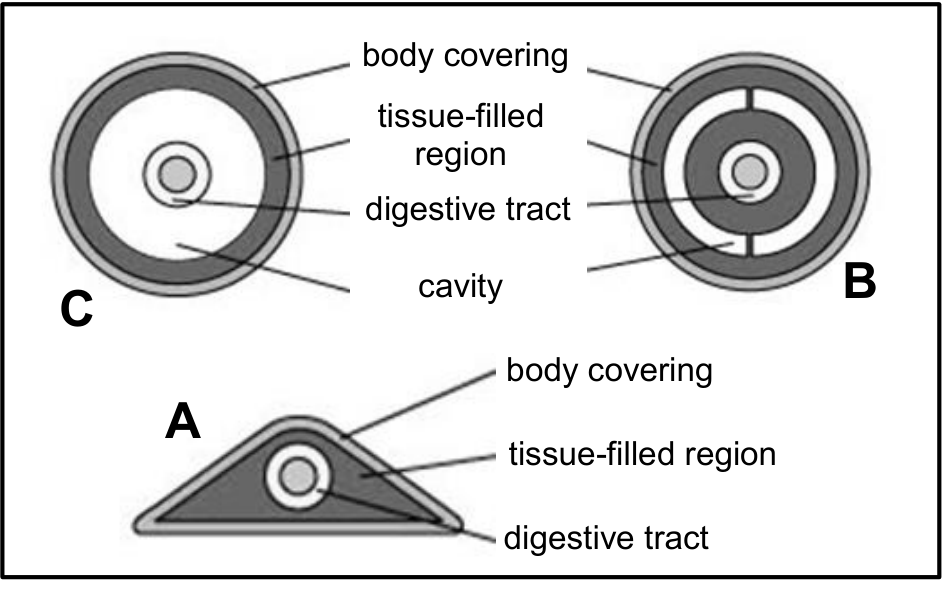


---

## Exercise Questions

### Question 2.2.6
Plants have to spend a lot of energy to produce flowers. Explain why it is still an evolutionary advantage to produce flowers in plants. (5)

*(Note: Total marks for this subsection: **[14]**)*

---

### Question 2.3
Tabulate five structural differences between wind-pollinated and insect-pollinated flowers. (11)

---

## **Section B: [35]**

**Total marks: [80]**

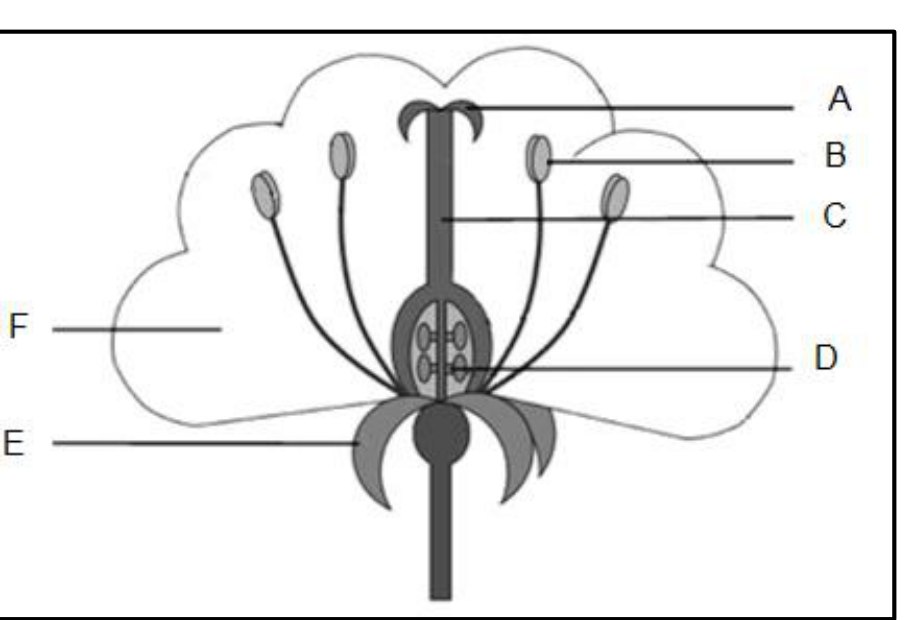


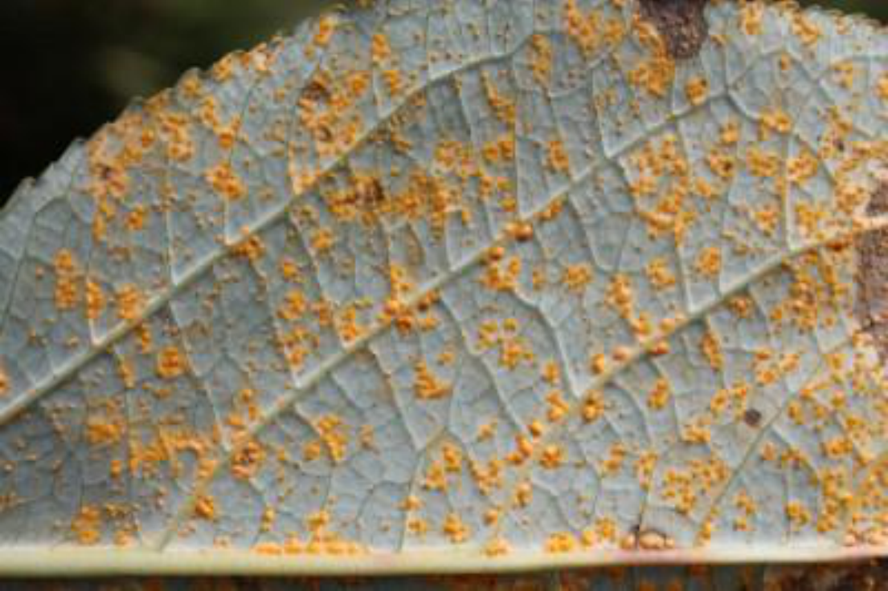


---

# Chapter 2: Biodiversity in plants

## Activity 1: Pollination and parts of flowers

1. **Pollination Characteristics:**
   * **A:** insect pollinated $\checkmark$ — bright colour, open flower $\checkmark$
   * **B:** wind pollinated $\checkmark$ — stamens protrude from the flower $\checkmark$
   * **C:** wind pollinated $\checkmark$ — large amounts of pollen produced $\checkmark$
   * **D:** bird pollinated $\checkmark$ — narrow flowers on a sturdy stem $\checkmark$
   * **E:** insect pollinated $\checkmark$ — colourful, distinct markings $\checkmark$
   *(10)*

2. **Comparison Table:**

| Feature | Pollination by a pollinator | Wind pollinated |
| :--- | :--- | :--- |
| flower | colourful $\checkmark$ | small and inconspicuous |
| stigma | held inside the flower $\checkmark$ | protrude from the flower $\checkmark$ |
| stamens | inside the flower $\checkmark$ | protrude from the flower $\checkmark$ |
| pollen | sticky pollen $\checkmark$ | large amounts of dry pollen $\checkmark$ |
| scent | strongly scented $\checkmark$ | no scent $\checkmark$ |
| energy spent | energy spent making nectar and pollen $\checkmark$ | large amount of energy wasted on producing pollen $\checkmark$ |

*(11)*

3. **Parts of Flowers:**
   1. sepal (calyx) $\checkmark$
   2. petal (corolla) $\checkmark$
   3. pedicel $\checkmark$
   4. filament $\checkmark$
   5. anther $\checkmark$
   6. stamen $\checkmark$
   7. stigma $\checkmark$
   8. style $\checkmark$
   9. ovary $\checkmark$
   10. pistil $\checkmark$
   *(10)*

---

## Activity 2: Seed banks

1. **Purpose of Seed Banks:**
   Maintain biodiversity, research purposes, keep seeds of rare and endangered species, often store original seeds rather than hybridised seeds. ($\checkmark$ - for any two correct answers)

2. **Storage Conditions:**
   Prevents the seeds from rotting $\checkmark$, frozen water forms ice crystal which could damage the seeds $\checkmark$.
   *(4)*

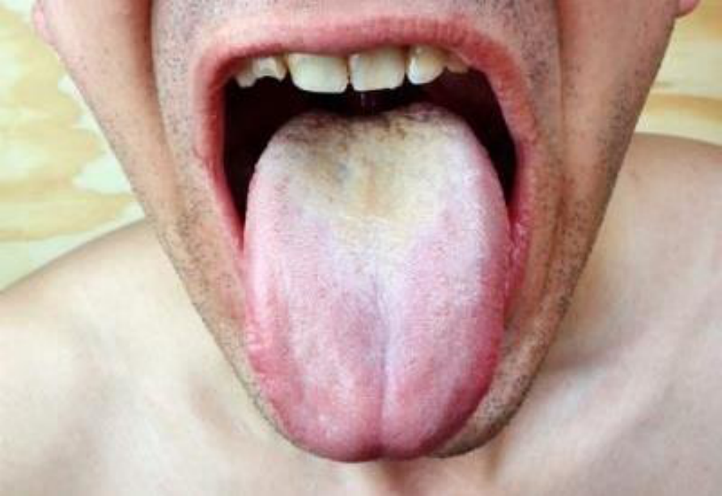


---

## End of topic exercises

### Section A

#### Question 1

##### 1.1
Various options are provided as possible answers to the following questions. Choose the correct answer and write only the letter (A – D) next to the question number (1.1.1 – 1.1.5) on your answer sheet, for example 1.1.6 D

1.1.1 Bryophytes are terrestrial plants that have no…  
A. cellulose  
B. rhizoids  
C. vascular tissue ✓✓  
D. sporophyte phase  

1.1.2 The sporangia on the underside of fern leaves are called …  
A. sporophylls  
B. sori ✓✓  
C. cones  
D. sporogonia  

1.1.3 Conserving endemic seeds in South Africa will enable the following:  
A. The protection of plants against disease.  
B. A lot of money to be made for South Africa.  
C. The restoration of over-exploited medicinal plants ✓✓.  
D. Food crops to be grown in dry conditions.  

1.1.4 Alternation of generations is exhibited by…  
A. bryophytes  
B. pteridophytes  
C. spermatophytes  
D. all plants ✓✓  

$$(4 \times 2) = (8)$$

---

##### 1.2
Give the correct biological term for each of the following descriptions. Write only the term next to the question number.

1.2.1 Reproduction which uses non-reproductive parts of a plant to produce new plants: **vegetative reproduction** ✓

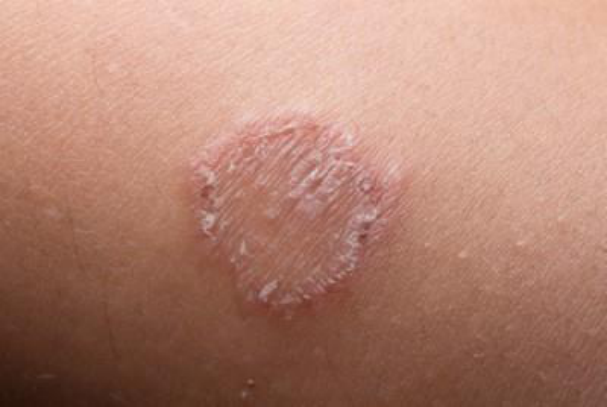


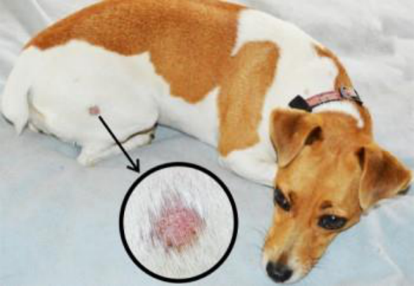


---

### 1. Plant Structure and Terminology

1.2.2 Plants without true roots, stems and leaves. 
* **Answer:** thallus

1.2.3 Places where seeds are stored to help preserve biodiversity. 
* **Answer:** seed banks

1.2.4 A reproductive structure found in gymnosperms and angiosperms only, consists of a plant embryo with a protective coat. 
* **Answer:** seed

1.2.5 A group of plants that have seeds enclosed in an ovary. 
* **Answer:** angiosperms

1.2.6 The part of the plant embryo that develops into the root. 
* **Answer:** radicle

1.2.7 The tough outer coat of a seed. 
* **Answer:** testa / seed coat

1.2.8 The part of the flower that the fruit is derived from. 
* **Answer:** ovary

1.2.9 The collective name for a filament and an anther. 
* **Answer:** stamen

---

### 2. Matching Exercise: Column I and Column II

**Instructions:** Indicate whether each of the descriptions in Column I applies to **A ONLY**, **B ONLY**, **BOTH A AND B** or **NONE** of the items in Column II. Write **A only**, **B only**, **both A and B** or **none** next to the question number.

| Column I | Column II |
| :--- | :--- |
| 1.3.1 A division of plants with a vascular system, seeds, and no flowers | A: Gymnosperm<br>B: Angiosperm |
| 1.3.2 The purpose of flowers | A: Attract pollinators<br>B: Form fruit |
| 1.3.3 Gametophyte is dominant | A: Ferns<br>B: Mosses |
| 1.3.4 Thallus plant | A: Bryophytes<br>B: Pteridophytes |
| 1.3.5 The part that is formed from a fertilised ovule | A: Fruit<br>B: Seed |

**Answers:**

* **1.3.1** A only $\checkmark\checkmark$
* **1.3.2** A only $\checkmark\checkmark$
* **1.3.3** B only $\checkmark\checkmark$
* **1.3.4** A only $\checkmark\checkmark$
* **1.3.5** B only $\checkmark\checkmark$

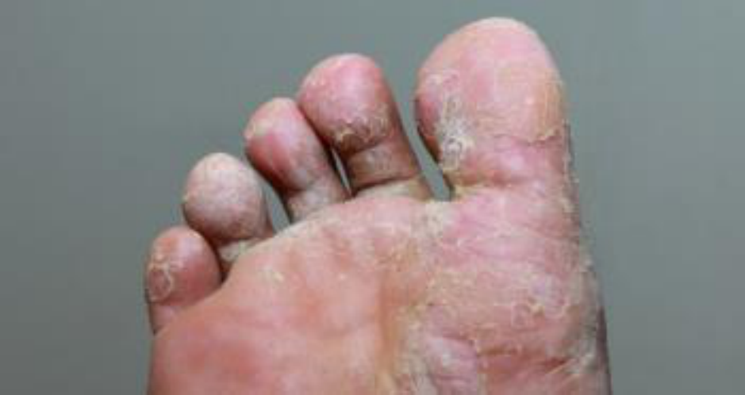


---

1.4 The diagram below is a cladogram of plants and their algal ancestors. A, B and C indicate key structural features in the evolution of higher plants. Study the diagram and answer the questions which follow.


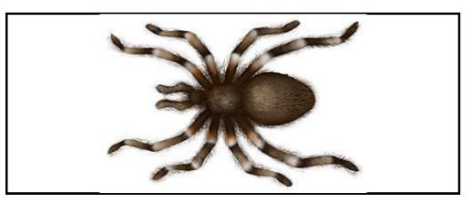


**1.4.1** Name the most important adaptation(s) that evolved at each of the positions labels A, B and C. (3)

* A: Vascular tissue / conducting tissue / xylem and phloem (any one)
* B: Seeds
* C: Flowers

**1.4.2** Which division of plants is represented as non-vascular plants in the diagram? (1)

* Bryophytes

**1.4.3** Explain why seedless vascular plants are able to grow taller than the nonvascular plants. (2)

* Possess vascular / conducting tissue which provide support, enabling plants to grow taller

**1.4.4** In what way are the seeds of gymnosperms different to seeds of angiosperms? (2)

* Gymnosperm seeds are naked / exposed on a cone
* Angiosperm seeds are enclosed in an ovary

**1.4.5** What is the collective name for all seed-bearing plants? (1)

* Spermatophytes / Spermatophyta

---

1.5 Study the different plant diagrams shown, and answer the questions below.


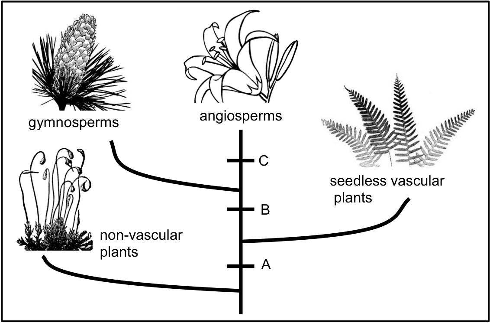


1.5.1 Identify the Divisions to which each of the above plants belongs. (4)  
**Answer:** A: Bryophytes, B: Pteridophytes, C: Gymnosperms, D: Angiosperms

1.5.2 Name one of the divisions identified in question 1.5.1 that is ....  
a) dependent on water for fertilization? (1)  
**Answer:** Bryophytes -- moss (A) **OR** Pteridophytes -- ferns (B)  
b) produces seeds for fertilization? (1)  
**Answer:** Gymnosperms -- pine (C) **OR** Angiosperms -- flowering plants (D)

1.5.3 Mention three similar structural adaptations of the prothallus in ferns and the gametophyte in mosses, which make them to be poorly adapted to a terrestrial life. (3)  
**Answer:** (any three correct answers)
* No true root, stem or leaves
* No conducting tissue
* No stomata
* Have rhizoids
* No cuticle

**(9)**

**Section A: [45]**

---

### Section B

### Question 2

2.1 Study the diagram which shows the phylogenetic tree of four plant species and answer the questions that follow.

---

# Revision Notes: Evolutionary Relationships and Phylogenetic Trees

## 1. Core Concepts

### Phylogenetic Trees
* **Definition:** A phylogenetic tree is a diagram that shows the evolutionary relationships among a group of organisms.
* **Key Components:**
  * **Common Ancestor:** Represented by nodes (solid circles) on the tree, indicating a point from which divergent lineages evolved.
  * **Shared Derived Character:** Traits that arise in an ancestor and are passed down to its descendants, marking specific evolutionary branch points.
  * **Timeline:** The vertical axis typically represents geological time (measured in millions of years ago), with eras such as the **Paleozoic**, **Mesozoic**, and **Cenozoic** indicated.

---

## 2. Worked Examples & Activity Analysis

### Question 2.1.1
* **Task:** Provide a definition of a *phylogenetic tree*.
* **Answer:** A phylogenetic tree is a diagram that shows the evolutionary relationships among a group of organisms.

---

### Question 2.1.2
State whether the following statements are true or false. In each case, give a reason for your answer.

#### Statement (a)
* **Statement:** The solid circle numbered **3** represents the common ancestor of the protea bush, palm tree, and maize plant.
* **Answer:** 
  * **False.** 
  * **Reason:** The circle numbered **2** represents the common ancestor of the protea bush, palm tree, and maize plant. 
  * *Alternatively:* The circle numbered **3** represents the common ancestor of the palm tree and maize plant only.

#### Statement (b)
* **Statement:** The protea bush is more closely related to the pine tree than it is to the maize plant because they are located next to each other on the phylogenetic tree.
* **Answer:** 
  * **False.** 
  * **Reason:** Proteas are more closely related to maize plants because they share a more recent common ancestor.

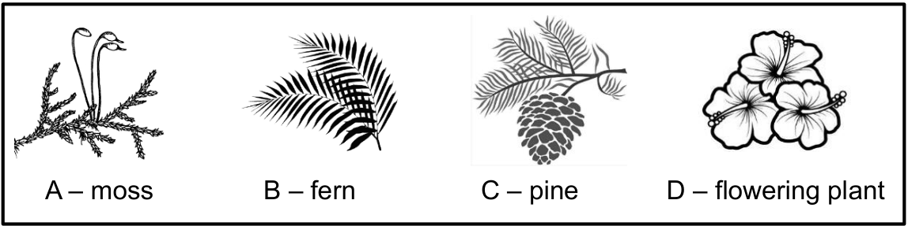


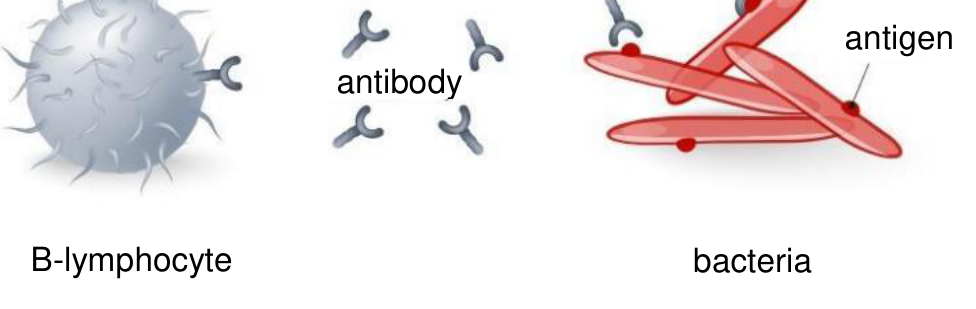


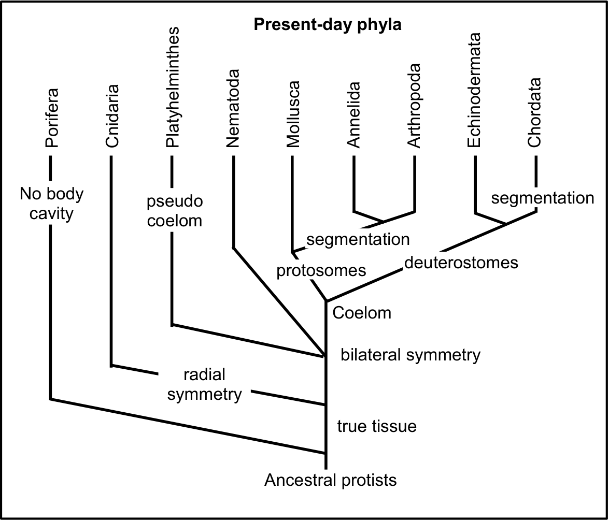


---

c) Palm trees evolved from pine trees. (2)

> **Answer:** False $\checkmark$. Palm trees and pine trees share a common ancestor which is now extinct. $\checkmark$

d) Protea bushes, palm trees and maize plants are all flowering plants. (2)

> **Answer:** True $\checkmark$. They all share a common ancestor that had flowers. $\checkmark$

2.1.3 How many millions of years ago did the ancestor of the palm tree and maize diverge? (1)

> **Answer:** 100 million years ago $\checkmark$

**(Total: 10)**

---

## 2. Plant Evolution and Flower Structure

2.2 Study the diagram below showing the structure of a flower.


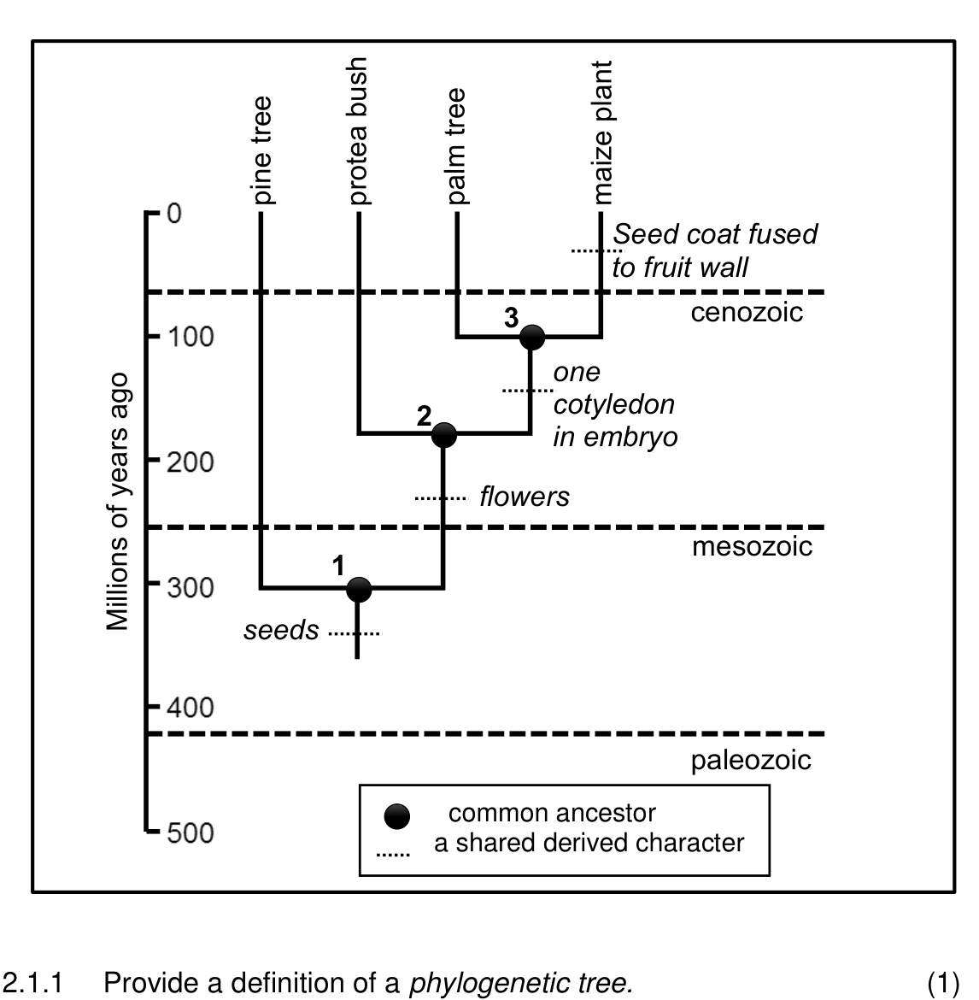


2.2.1 What type of pollination can be linked to this flower? (1)

> **Answer:** Insect $\checkmark$

2.2.2 Identify the parts labelled A and B. (2)

> **Answer:** 
> 1. Stigma $\checkmark$
> 2. Anther $\checkmark$

2.2.3 What do we call F and E together? (1)

> **Answer:** Perianth $\checkmark$

2.2.4 Using the number only, identify the following:

a) Part which receives pollen. (1)

> **Answer:** A $\checkmark$

b) Structure where a seed can form. (1)


---

D ✓  
c) Part where pollen is produced. (1)

B ✓  

2.2.5 A seedbank in Norway has been storing seeds of a rare and endangered plant. To keep the seeds fresh, 120 of the seeds of this plants were selected to be grown. Of the 120 seeds, only 90 germinated. What percentage of the seeds was not fertile? Show all your workings. (2)

($120 – 90 = 30$) ✓, ($\frac{30}{120} \times 100 = 25\%$) ✓

2.2.6 Plants have to spend a lot of energy to produce flowers. Explain why it is still an evolutionary advantage to produce flowers in plants. (5)

The physical appearance of flowers / its coloured petals ✓ attracts pollinators ✓ such as insects and birds for pollination which ensures reproductive success ✓. Seed dispersal mechanisms help to disperse seeds over a wide area ✓, reducing competition amongst plants ✓, after fertilisation ovary develops into fruit ✓ which can be eaten ✓ (✓ – any five correct answers) 

(14)

2.3 Tabulate five structural differences between wind-pollinated and insect-pollinated flowers. (11)

### Differences between wind-pollinated and insect-pollinated flowers

| Wind-pollinated | Insect-pollinated |
| :--- | :--- |
| Sepals and petals are absent or small and are not brightly coloured. | Flowers are conspicuous and brightly coloured. |
| Flowers do not produce nectar. | Some flowers have petals with dark lines leading from the edge of the petals to the nectaries which produce nectar. |
| Anthers are large and have long filaments that hang outside the flower. | Anthers are located inside the flower where insects are likely to brush past them and pick up pollen. |
| Stigmas are large, feathery and dangle outside the flower where they act like a net to trap pollen as it floats through the air. | Stigmas are arranged in such a way that visiting insects can come into contact with them. Stigmas have sticky surfaces that collect pollen. |

56


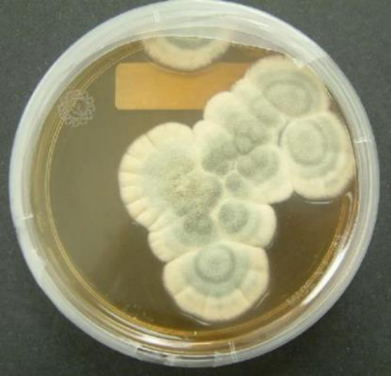


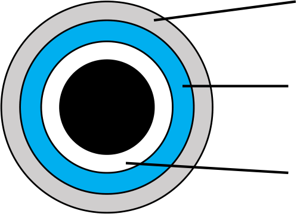


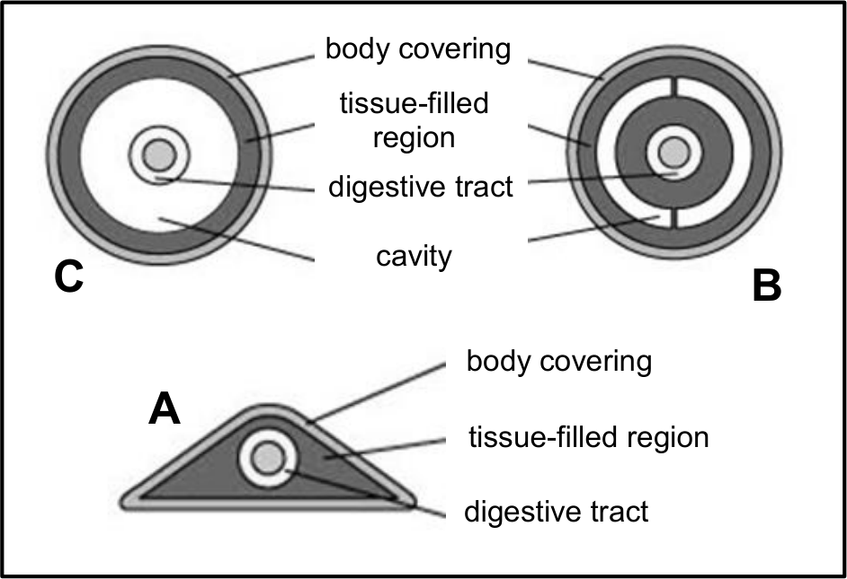


---

| Feature / Characteristic | Wind-Pollinated Pollen | Insect-Pollinated Pollen |
| :--- | :--- | :--- |
| **Physical Properties** | Pollen grains are small, light and smooth and are easily carried by the wind. | Pollen is large and spiny/sticky so that it clings to the insect's body. |

*(Marking guideline: $\checkmark\checkmark$ for each correctly completed row — a mark per column, one mark for a table)*

**Section B: [35]**

**Total marks: [80]**


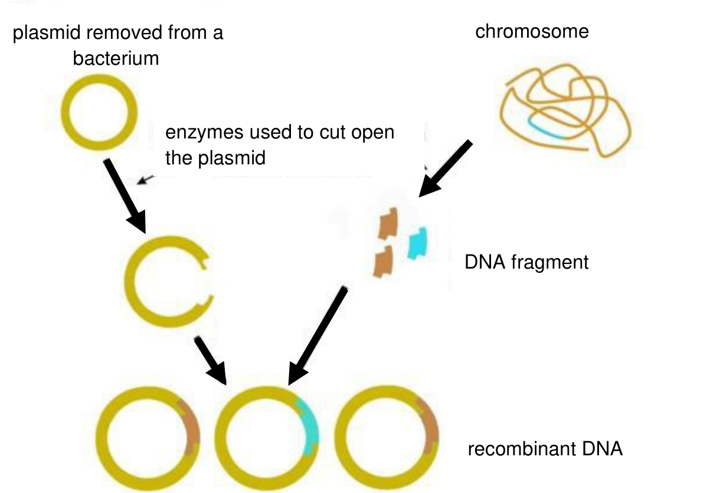


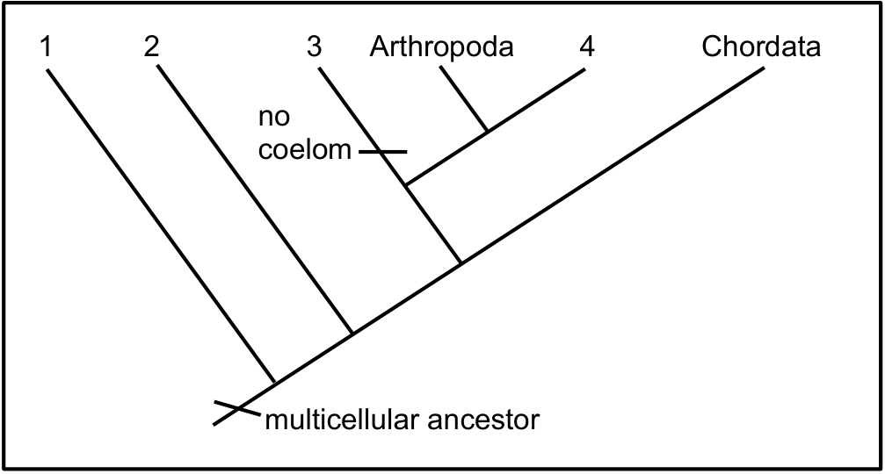


---

# Cognitive Level Distribution

| Question | Level 1 | Level 2 | Level 3 | Level 4 | Marks |
| :---: | :---: | :---: | :---: | :---: | :---: |
| 1.1.1 | $\checkmark$ | | | | 2 |
| 1.1.2 | $\checkmark$ | | | | 2 |
| 1.1.3 | $\checkmark$ | | | | 2 |
| 1.1.4 | $\checkmark$ | | | | 2 |
| | **8** | | | | **8** |
| 1.2.1 | $\checkmark$ | | | | 1 |
| 1.2.2 | $\checkmark$ | | | | 1 |
| 1.2.3 | $\checkmark$ | | | | 1 |
| 1.2.4 | $\checkmark$ | | | | 1 |
| 1.2.5 | $\checkmark$ | | | | 1 |
| 1.2.6 | $\checkmark$ | | | | 1 |
| 1.2.7 | $\checkmark$ | | | | 1 |
| 1.2.8 | $\checkmark$ | | | | 1 |
| 1.2.9 | $\checkmark$ | | | | 1 |
| | **9** | | | | **9** |
| 1.3.1 | | $\checkmark$ | | | 2 |
| 1.3.2 | | $\checkmark$ | | | 2 |
| 1.3.3 | | $\checkmark$ | | | 2 |
| 1.3.4 | | $\checkmark$ | | | 2 |
| 1.3.5 | | $\checkmark$ | | | 2 |
| | | **10** | | | **10** |
| 1.4.1 | | | $\checkmark$ | | 3 |
| 1.4.2 | $\checkmark$ | | | | 1 |
| 1.4.3 | | $\checkmark$ | | | 2 |
| 1.4.4 | $\checkmark$ | | | | 2 |
| 1.4.5 | $\checkmark$ | | | | 1 |
| | **4** | **2** | **3** | | **9** |

---

## Assessment Grid and Memorandum Analysis

| Question / Item | Column 1 | Column 2 | Column 3 | Column 4 | Total Marks |
| :---: | :---: | :---: | :---: | :---: | :---: |
| 1.5.1 | | $\checkmark$ | | | 4 |
| 1.5.2 a - b | $\checkmark$ | | | | 2 |
| 1.5.3 | | $\checkmark$ | | | 3 |
| **Subtotal** | **2** | **7** | | | **9** |
| 2.1.1 | $\checkmark$ | | | | 1 |
| 2.1.2 a - d | | | $\checkmark$ | | 8 |
| 2.1.3 | $\checkmark$ | | | | 1 |
| **Subtotal** | **2** | | **8** | | **10** |
| 2.2.1 | | $\checkmark$ | | | 1 |
| 2.2.2 | $\checkmark$ | | | | 2 |
| 2.2.3 | $\checkmark$ | | | | 1 |
| 2.2.4 a - c | $\checkmark$ | | | | 3 |
| 2.2.5 | | $\checkmark$ | | | 2 |
| 2.2.6 | | | | $\checkmark$ | 5 |
| **Subtotal** | **6** | **3** | | **5** | **14** |
| 2.3 | | $\checkmark$ | | | 11 |
| **Subtotal** | | **11** | | | **11** |
| **Grand Total** | **31** | **33** | **11** | **5** | **80** |

---

<!-- DIAGRAM_PLACEHOLDER: diagram -->