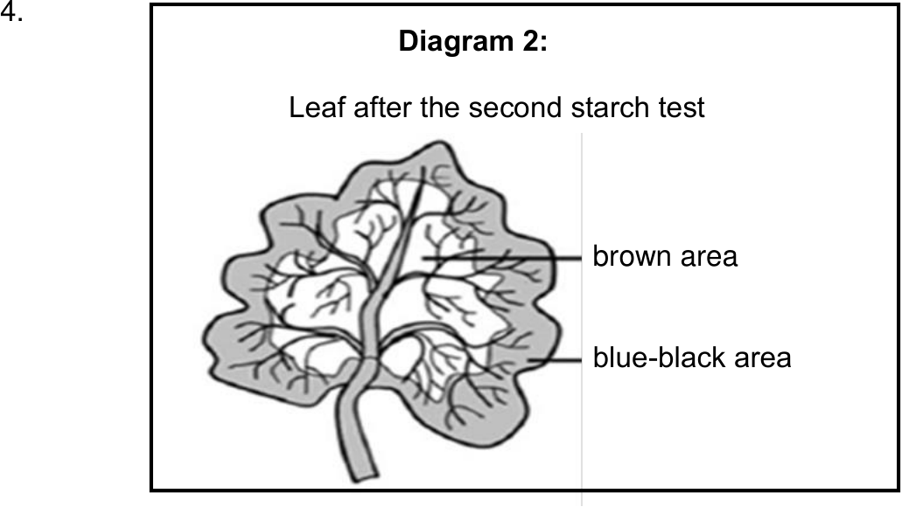
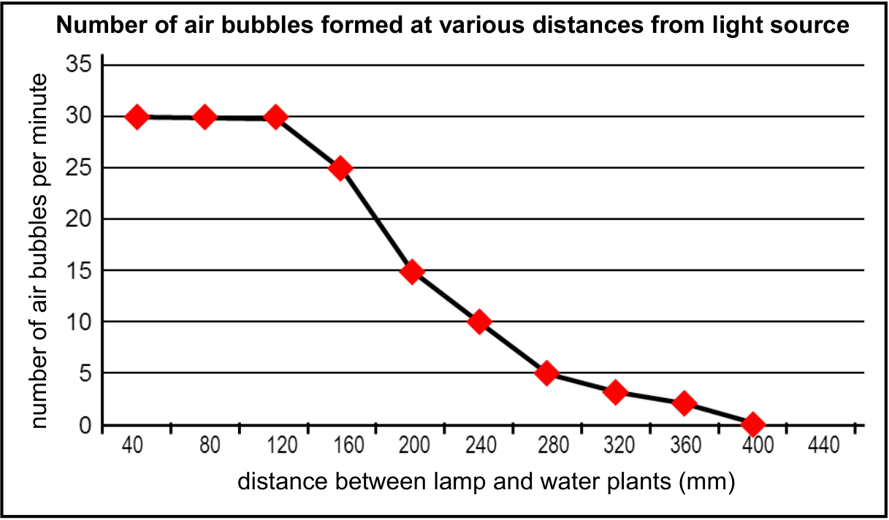
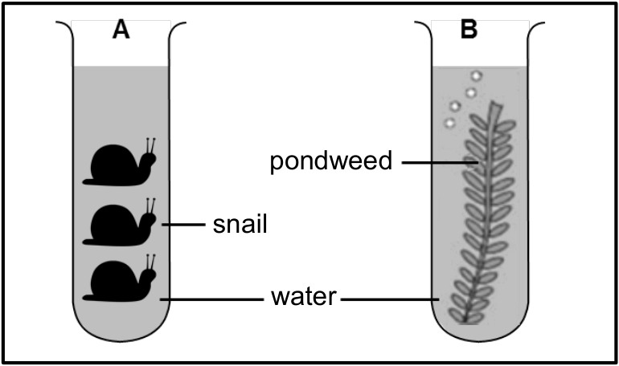
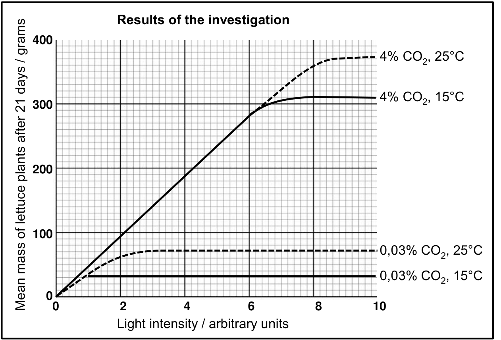
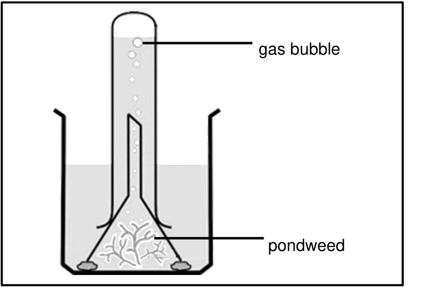
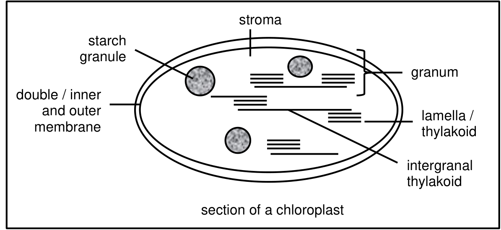
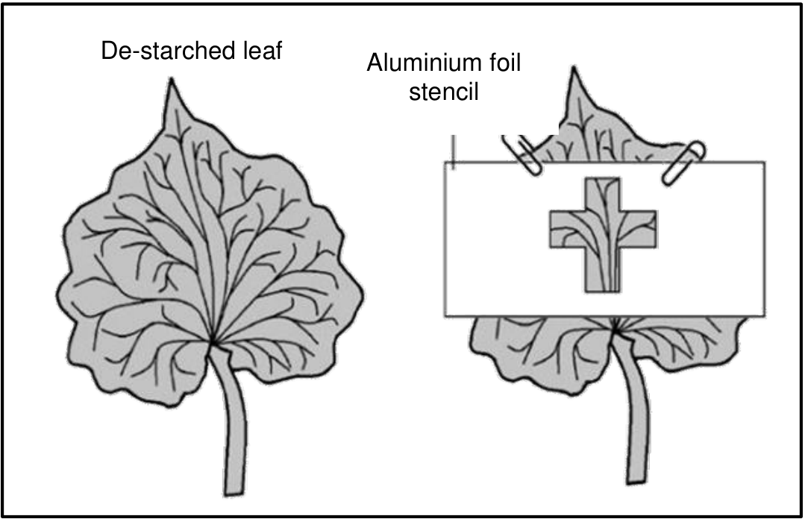
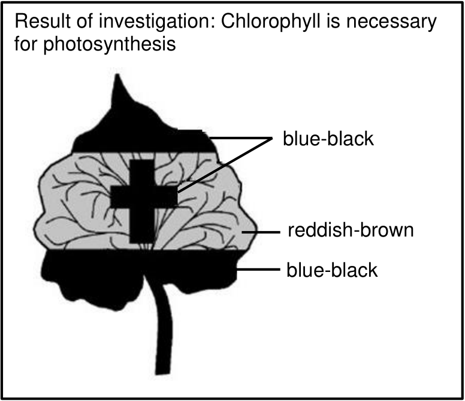

CHAPTER 4: PHOTOSYNTHESIS

# Introduction

All living organisms require energy to survive. This energy can either be obtained directly from the sun (plants) or from the food that is eaten (animals). In this chapter, we will look at how plants convert radiant energy into chemical potential energy using the raw materials available to them. The term photosynthesis means light is used (photo) to manufacture (synthesis) energy.

## Key terminology

| Term | Definition |
| :--- | :--- |
| metabolism | chemical processes in organisms controlled by enzymes |
| anabolism | building up chemical reactions |
| catabolism | breaking down chemical reactions |
| iodine solution | chemical used to test for starch – a positive test results in the colour changing from brown to blue-black |
| autotrophic | green plants that produce their own food through photosynthesis |
| heterotrophic | organisms that cannot photosynthesize and obtain food from other organisms |

## The definition of photosynthesis

Photosynthesis is a chemical process by which carbohydrates (glucose) is produced using radiant energy.

## Key terminology

| Term | Definition |
| :--- | :--- |
| radiant energy | energy from the sun, needed by plants for photosynthesis |
| chloroplast | organelle in plants, site for photosynthesis |
| chlorophyll | green pigment needed for photosynthesis |
| thylakoids | part of the chloroplast that contains chlorophyll |
| grana | stacks of thylakoids, light dependent phase of photosynthesis takes place here |
| stroma | liquid part of the chloroplast, light independent phase of photosynthesis takes place here |

106

---

# Photosynthesis

Photosynthesis occurs in **green plants** and takes place in the chloroplast of a cell.

<!-- DIAGRAM_PLACEHOLDER: diagram -->

*Figure 1: A diagram to show the requirements and products of photosynthesis*

---

## Requirements and Products of Photosynthesis

Plants are adapted to obtain what is required for photosynthesis as well as to release the products. The requirements for and products of photosynthesis can be represented in the equations given below:

### Word Equation

$$\text{Carbon dioxide} + \text{Water} + \text{Radiant energy} \xrightarrow[\text{Enzymes}]{\text{Chlorophyll}} \text{Glucose} + \text{Oxygen}$$

### Chemical Equation

$$\text{CO}_{2} + \text{H}_{2}\text{O} + \text{radiant energy} \xrightarrow[\text{Enzymes}]{\text{Chlorophyll}} \text{C}_{6}\text{H}_{12}\text{O}_{6} + \text{O}_{2}$$

---

The requirements and products for the process of photosynthesis are tabulated below (Table 1).

Table 1: The requirements for and products of photosynthesis

| Requirements | Products |
| :--- | :--- |
| **Carbon dioxide:** Diffuses into the leaves of plants | **Glucose:** Carbohydrate formed. It is converted and stored as starch in plants or glycogen in animals |
| **Water:** Inorganic substance absorbed from soil by the roots of plants | **Oxygen:** Gas that is released back into the atmosphere from the leaves |
| **Radiant energy / light energy:** Absorbed from the sun by leaves of plants | |
| **Chlorophyll:** Green pigment found inside the **chloroplasts** | |
| **Enzymes:** Found inside the chloroplasts | |

---

## The structure of a chloroplast

The process of photosynthesis occurs inside of the chloroplast, an organelle found only in plant cells (Figure 2).


> **[Diagram Context - Textbook_LifeSciences_Gr11_Cellular_respiration.pdf-0002-06.png]**
> This educational graphic is a cross-section diagram of a mitochondrion, illustrating its internal cellular structure. Visible labels and pointer lines identify the outer membrane, inner membrane, intermembrane space, crista, matrix, and ribosomes. This diagram conveys the key structural adaptations of the mitochondrion—such as the folded inner membrane (cristae)—which maximize surface area for cellular respiration and ATP synthesis as required in the CAPS Life Sciences curriculum.


Figure 2: The chloroplast


> **[Diagram Context - Textbook_LifeSciences_Gr11_Photosynthesis.pdf-0002-01.png]**
> This educational graphic is a biological process diagram illustrating photosynthesis in a green plant. Visible labels include "Photosynthesis," "light energy," "carbon dioxide is absorbed," "water is absorbed," "oxygen is released," and "sugar is formed," accompanied by directional arrows showing the inputs and outputs relative to the sun, roots, and leaves. Conceptually, it conveys how plants convert radiant energy into chemical potential energy by taking in carbon dioxide and water to produce glucose and release oxygen.


---

| Part of the chloroplast | Function |
| :--- | :--- |
| thylakoid | disc shaped membranes that contain chlorophyll |
| granum | a stack of thylakoids |
| lamella | membranes that make up the thylakoids |
| stroma | liquid part of the chloroplast |
| starch granule | glucose produced is stored as starch in this structure |
| chloroplast DNA | contains genetic information |
| double membrane | protects the chloroplast and allows substances to move in and out |

## The process of photosynthesis

The process of photosynthesis occurs in two phases:
* Light dependent phase: light is required
* Light independent phase: no light is required

### Key terminology

| Term | Definition |
| :--- | :--- |
| photolysis | splitting of water molecules into oxygen atoms and hydrogen atoms. photo = light, lysis = split |
| phosphorylation | formation of energy transporting molecules called ATP |
| ATP | adenosine triphosphate, energy carriers in cells |
| Calvin cycle | cyclical process during light independent phase of photosynthesis |
| glucose | carbohydrate formed during photosynthesis |
| starch | stored form of glucose in plants |
| glycogen | stored form of glucose in animals |

## Light dependent phase

The light dependent phase of photosynthesis (Figure 3) takes place in the grana of chloroplasts as follows:


---

### Figure 3: The Light-Dependent Phase of Photosynthesis

<!-- DIAGRAM_PLACEHOLDER: diagram -->

The numbers in the diagram represent the sequence of events:

1. The required radiant energy is absorbed by chlorophyll in the **grana**.
2. **Water** is absorbed into the grana of the chloroplast.
3. Radiant energy causes the water molecule to split (**photolysis**), releasing:
   4. Energy-rich hydrogen ($\text{H}^+$) ions which are taken into the light-independent phase, and
   5. **Oxygen** which is released back into the atmosphere.
6. Radiant energy also causes the energy carrier **ATP** to be formed (**phosphorylation**) which will be used in the light-independent phase.

---

## Light Independent Phase

The light-independent phase of photosynthesis (Figure 4) takes place in the **stroma** of chloroplasts as follows:

<!-- DIAGRAM_PLACEHOLDER: diagram -->

Figure 4: The light-independent phase of photosynthesis

---

The numbers in the diagram represent the sequence of events:

1. Carbon dioxide is absorbed from the atmosphere.
2. Carbon dioxide and energy-rich Hydrogen ($H^+$) atoms, from the light-dependent phase, are combined by using ATP, from the light-dependent phase, to form carbohydrates (glucose).
3. Excess glucose is stored as starch in starch granules.

This phase can take place in the presence of light or during the absence of light because light is not required during this phase.

---

## A comparison between the phases of photosynthesis

The following table (Table 3) provides a short overview of the different phases of photosynthesis.

**Table 3: Overview of the phases of photosynthesis**

| Light dependent phase | Light independent phase |
| :--- | :--- |
| Occurs in the grana | Occurs in the stroma |
| Light is required | Light is not required |
| Radiant energy is absorbed and used for the reactions of photolysis & phosphorylation | Carbon dioxide is absorbed from the atmosphere |
| Photolysis occurs: hydrogen is released and oxygen is returned to the atmosphere | Hydrogen and carbon dioxide combine by using ATP to form glucose |
| Phosphorylation occurs: ATP is produced | Excess glucose is stored as starch |

---

## Activity 1: Photosynthesis

1. Provide a definition for photosynthesis. $(2)$
2. Name the organelle in which this process occurs. $(1)$
3. Name the two phases of photosynthesis and provide the names of the specific structures in the organelle mentioned above, where each phase of photosynthesis takes place. $(4)$


---

4. 
The diagram below represents the process of photosynthesis.

| Component | Description / Label |
| :--- | :--- |
| **Phase 1** | Phase 1 |
| **Raw Material A** | A |
| **Raw Material B** | B |
| **By-product C** | By-product C |
| **Energy Carrier** | ATP |
| **Ion** | $\text{H}^+$ |
| **Phase 2** | Phase 2 |
| **Substance D** | D |
| **Product E** | E |

a) Identify the phases labelled as Phase 1 and Phase 2. (2)

b) Provide the two raw materials labelled as A and B. (2)

c) Name the by-product labelled as C. (1)

d) Which substance labelled as D is essential for Phase 2? (1)

e) Name the product E that is produced during Phase 2. (1)

f) In what form is E stored in plants? (1)

*(Total: 15 marks)*

---

### The importance of photosynthesis 

Photosynthesis is important for the following reasons:
* It balances the levels of carbon dioxide and oxygen in the atmosphere.
* The process uses carbon dioxide and releases oxygen.
* It uses radiant energy to produce chemical potential energy in the form of glucose which serves as food for other organisms.
* Proteins and lipids are made by using the stored starch.


---

# Environmental factors affecting the rate of photosynthesis

Photosynthesis can take place at different rates (speeds). Depending on the concentration of the raw materials, photosynthesis will take place more slowly or more quickly. The factors that affect the rate of photosynthesis (how slowly or quickly it takes place) are:

* The intensity of light
* The concentration of carbon dioxide
* The temperature

---

## The intensity of light

Light intensity influences the rate of photosynthesis as follows:

1. At low light intensity, the rate of photosynthesis is low.
2. As light intensity increases, the rate of photosynthesis also increases. This will happen up to a certain point.
3. When light intensity is at the optimum amount, photosynthesis will occur most rapidly.


---

4. 

If light intensity increases past the optimum, the rate of photosynthesis will remain constant. The other factors such as carbon dioxide become limiting factors which reduces the rate of photosynthesis. 

The concentration of carbon dioxide 

Figure 6: Line graph showing the effect of the concentration of carbon dioxide on the rate of photosynthesis. 

The concentration of carbon dioxide ($\text{CO}_2$) influences the rate of photosynthesis (Figure 6) as follows: 

1. At a low carbon dioxide concentration, the rate of photosynthesis is low. 
2. As the carbon dioxide concentration level increases, the rate of photosynthesis also increases. This will happen up to a certain point.  
3. When the optimum amount of carbon dioxide is present, photosynthesis will occur most rapidly.  
4. If the carbon dioxide concentration is higher than the optimum amount, then photosynthesis will remain constant. This is because the light independent phase cannot take place more quickly than what it does at the optimum level of carbon dioxide concentration.  

| Concentration of $\text{CO}_2$ | Rate of photosynthesis |
| :--- | :--- |
| | |

114


---

# Temperature

A rise or fall in temperature influences the rate of photosynthesis that takes place. Temperature influences the rate of photosynthesis (Figure 7) as follows:

1. When temperature is low, the rate of photosynthesis is low.
2. As temperature increases, the rate of photosynthesis also increases.
3. When temperature is at the optimum amount, the rate of photosynthesis will reach a maximum.
4. If the temperature is higher than the optimum amount, then photosynthesis will decrease in rate. This is because the enzymes used in the process will denature at high temperatures and will no longer function.

---

## Greenhouses

A greenhouse (as shown in Figure 8) is a structure with a transparent roof and walls, and is used to grow plants.

### Key Terminology

| Term | Definition |
| :--- | :--- |
| **greenhouse** | A glass or plastic structure that traps heat and allows light to enter, used to grow plants. |
| **greenhouse effect** | Phenomenon where heat from the sun is trapped on Earth by $\text{CO}_2$ in the atmosphere. |


---

**Figure 8:** A greenhouse

Light enters the greenhouse through the roof and heat is trapped inside the structure.

Greenhouses can be used to maintain the optimal levels of the factors affecting the rate of photosynthesis. This is done in the following ways:

* Light passes through the transparent structure. Artificial lights can be used to allow the plants to photosynthesis for longer periods of time.
* Carbon dioxide is present in the atmosphere but more can be pumped into the greenhouse or be produced by burning gas lamps.
* The temperature can be kept at the optimum level by using heating and cooling devices.

The greenhouse effect is a natural phenomenon where heat is trapped in the atmosphere of the Earth by carbon dioxide. This is very important to keep Earth at a temperature which allows for life to occur. Without the greenhouse effect, the Earth would be too cold to support life.

Due to carbon dioxide in the atmosphere increasing, the greenhouse effect is becoming enhanced and this is leading to global warming.

## Investigations

There are investigations which can be performed to determine if a factor is required for photosynthesis or to determine the rate at which photosynthesis is occurring. In the investigations, one plant (the experiment) is given all of the requirements except for the factor being tested. Another plant is given all of the requirements in the same

116


---

# Revision Notes: Photosynthesis Investigations

## Core Concepts

* **Control:** In biological investigations, a control setup is used to compare results and prove that the process being tested (such as photosynthesis) is responsible for the observed outcome.
* **Starch Test:** Used to determine whether photosynthesis has taken place. If starch is present, it indicates that photosynthesis occurred. If starch is absent, photosynthesis did not occur.

## Destarching a Plant

Before starting any investigation on photosynthesis, existing starch must be removed from the plant:
* Place the plant in a dark cupboard for $48$ hours.
* During this period, the plant consumes its stored starch.
* This ensures that any starch detected at the end of the investigation is newly produced due to photosynthesis occurring during the experiment.

---

## Investigation 1: The Starch Test

During photosynthesis, glucose is produced and subsequently converted into starch. The starch test can be used to prove that starch is a product of photosynthesis.

### Method

1. **Boiling Water:** Place a leaf in a beaker of boiling water. This softens the leaf and kills the cells to stop metabolism.
2. **Alcohol Extraction:** Place the leaf into a test tube containing ethanol (alcohol).


---

3. Allow the test tube to stand in a beaker of boiling water (water bath) for approximately 10 minutes.

Ethanol cannot be exposed to direct heat because it is highly flammable and has a boiling temperature lower than water, which is why it is placed into the water bath. 

Chlorophyll is soluble in alcohol and will be extracted from the leaf. The leaf will turn white in colour and become brittle.

4. Carefully remove the brittle leaf from the alcohol and rinse it in water to soften it.

5. Spread the leaf on a tile and pour a few drops of iodine solution onto it.

**Results:**
The leaf turns blue-black, which proves that starch has been produced by photosynthesis. 

The following investigations can be used to show the requirements and products of photosynthesis.

### Investigation 2: Light is required for photosynthesis

Light is one of the requirements for photosynthesis. An investigation can be performed to show that without light, starch will not be produced and therefore no photosynthesis took place.

* **Aim:** To prove that light is required for photosynthesis
* **Method:**
  * Destarch a potted plant by placing it in a dark cupboard for $48$ hours.
  * Cover a portion of the leaf, still attached to the plant, with aluminium foil (Figure 10).

---

*Figure 10: Aluminium foil covering part of a leaf (foil strip)*

118


---

* Place the plant in a sunny area for 48 hours
* Pick the leaf and remove the foil
* Test for the presence of starch using the starch test.

The experiment is the part of the leaf covered by the foil, as it does not receive light. The part of the leaf left uncovered is the control as it receives all of the requirements for photosynthesis, including light.

### Results:
* **Experiment (leaf covered with tinfoil):** the iodine solution remains light brown.
* **Control (leaf left uncovered):** the iodine solution turns blue-black.

### Conclusion:
* The parts that turn blue-black in colour contain starch. The part which remains light brown does not contain starch.
* Light is essential for photosynthesis to take place.

Investigating the effect of light intensity on the rate of photosynthesis: [https://www.youtube.com/watch?v=id0aO_OdFwA](https://www.youtube.com/watch?v=id0aO_OdFwA)

---

## Investigation 3: Carbon dioxide is required for photosynthesis

Carbon dioxide is a requirement for photosynthesis. An investigation can be performed to show that without carbon dioxide, starch will not be produced and no photosynthesis will take place. To do this, sodium hydroxide, potassium hydroxide or soda lime can be used to **remove** carbon dioxide. Sodium bicarbonate or potassium bicarbonate can be used to **add** carbon dioxide.


---

# Investigation: Carbon Dioxide is Required for Photosynthesis

**Aim:** To prove that carbon dioxide ($CO_2$) is required for photosynthesis.

---

## Experimental Set-Up

| Component | Bell Jar 1 (Low/No $CO_2$) | Bell Jar 2 (Control / With $CO_2$) |
| :--- | :--- | :--- |
| **Plant** | Destarched plant | Destarched plant |
| **Chemical Used** | Sodium hydroxide ($\text{NaOH}$) and soda lime | Sodium bicarbonate ($\text{NaHCO}_3$) and soda lime |
| **Purpose of Chemical** | Absorbs carbon dioxide from the air inside the bell jar | Releases carbon dioxide into the bell jar |

---

## Method

1. Destarch two potted plants by placing them in a dark cupboard for $48$ hours.
2. Set up the apparatus as shown in the experimental design and water the plants well.
   * **Bell jar 1:** Contains sodium hydroxide to absorb carbon dioxide.
   * **Bell jar 2:** Contains sodium bicarbonate to release carbon dioxide.
3. Place the sealed bell jars into a sunny area for $48$ hours to allow photosynthesis to occur.
4. Pick a leaf from each plant and test for the presence of starch using iodine solution.

---

## Results

| Bell Jar | Observation (Iodine Test) |
| :--- | :--- |
| **Bell jar 1 leaf** | Iodine solution remains light brown (No starch present). |
| **Bell jar 2 leaf** | Iodine solution turns from light brown to blue-black (Starch present). |

---

## Conclusion

* **Bell jar 1 leaf:** No starch is produced. Photosynthesis cannot take place in the absence of carbon dioxide.
* **Bell jar 2 leaf:** Starch is produced. Photosynthesis takes place in the presence of carbon dioxide.


---

# Investigation 4: Chlorophyll is required for photosynthesis

Chlorophyll is one of the requirements for photosynthesis. A variegated leaf is used to prove that without chlorophyll, starch will not be produced and therefore no photosynthesis took place. A variegated leaf contains green parts (with chlorophyll) and white parts (without chlorophyll) (see Figure 12). This leaf does not require destarching as the experiment and control are on the same leaf.

**Aim:** To prove that chlorophyll is required for photosynthesis

---

| **Figure 12:** Chlorophyll is required for photosynthesis |
| :--- |
| green area (with chlorophyll)<br>white area (no chlorophyll) |

---

### Method:
* Place a potted plant with variegated leaves (white and green parts) in a sunny place for a few hours
* Remove a leaf from the potted plant
* Test for the presence of starch (using the method in investigation 1)

### Results:
* **Experiment (White part):** iodine solution remains light brown.
* **Control (Green part):** iodine solution turns from light brown to blue-black.

### Conclusion:
* **Experiment (White part):** Contains no starch. No photosynthesis can occur without chlorophyll.
* **Control (Green part):** Contains starch. Photosynthesis takes place using chlorophyll.
* Chlorophyll is essential for photosynthesis.


---

# Investigation 5: Photosynthesis produces oxygen

## Background Information
Oxygen is produced during photosynthesis. A glowing splint test is used to show that oxygen is produced during photosynthesis. A test uses a small wooden stick that has been lit. The splint glows more brightly or re-ignites in the presence of oxygen.

## Aim
To prove that oxygen is produced during photosynthesis.

## Method
1. Set up the apparatus as shown in the diagram below:
   * **Pond weed** placed at the bottom of a **beaker** filled with **water**, raised slightly on **pebbles / spacers**.
   * A **funnel** placed upside-down over the pond weed.
   * A **test tube** inverted over the stem of the funnel to collect the **oxygen bubble** and **oxygen collecting in test tube**.
2. Place the apparatus in a sunny area for a few hours.
3. A small amount of sodium bicarbonate can be dissolved in the water. Sodium bicarbonate will add carbon dioxide to the water.
4. After a while, gas bubbles will start to form. These gas bubbles will collect in the test tube.
5. Once enough gas has been trapped in the test tube, remove the test tube from the funnel, but keep the opening of the test tube submerged under the water.
6. Seal the test tube using a rubber stopper while under the water.
7. Once it has been sealed, remove the test tube from the water.
8. Insert a glowing wooden splint into the test tube.


---

### Results

* The glowing splint re-ignites or burns more brightly.
* Oxygen is present in the test tube.

### Conclusion

* Oxygen is produced during photosynthesis.

---

### Activity 2: Investigating photosynthesis

A learner has conducted an experiment in the classroom by following various steps. Study the procedure and diagram below to answer the questions that follow.

a) A variegated plant was left in the dark for 3 to 4 days  
b) A starch test was conducted by removing one of the leaves  
c) The plant was then left in the light for four hours  
d) A leaf was removed and a drawing of it was made to show the distribution of green and white areas (Diagram 1)  


*Diagram 1: leaf before second starch test*

e) The leaf was then tested for the presence of starch  
f) After the addition of a few drops of diluted iodine solution, a second drawing of the leaf was made to show the distribution of blue-black and brown areas of the leaf (Diagram 2 – not shown here)  

---

### Questions

1. State the aim of this experiment. **(1)**
2. Why was the plant left in the dark for 3 to 4 days? **(1)**
3. Why should the plant have been tested for the presence of starch after step (a), before exposing the plant to light? **(2)**

---

4. Draw and label Diagram 2 that shows the result of the second starch test as mentioned in step (f). (Diagram 1 should be used as a template) (5)
5. Is it necessary to set up a control for this investigation? (1)
6. Supply a reason for your answer to question 5. (2)
7. What conclusion can be drawn from this experiment? (2)
(14)

## Activity 3: Investigating gas bubbles released

The diagram below illustrates an investigation in progress. The distance between the light source and the apparatus have been altered at regular intervals to record the number of bubbles released at various distances. The data gathered has been represented in a table below. Study the diagram and the data table below to answer the following questions.


1. What is the function of sodium bicarbonate? (1)
2. Name the gas released during the experiment. (1)
3. Provide a suitable hypothesis for the above experiment. (2)
4. Explain a simple test that can be done to confirm the presence of the gas mentioned in question 3. (2)
5. Name any two environmental factors, besides light intensity, that could affect the chemical process shown in the diagram above. (2)
6. The table below contains the following data: The number of air bubbles counted when the distance between the lamp and apparatus is altered at regular time intervals.

---

### Experimental Data

| Distance between lamp and plant ($\text{mm}$) | $40$ | $80$ | $120$ | $160$ | $200$ | $240$ | $280$ | $320$ | $360$ | $400$ | $440$ |
| :--- | :---: | :---: | :---: | :---: | :---: | :---: | :---: | :---: | :---: | :---: | :---: |
| Number of bubbles per minute | $30$ | $30$ | $30$ | $25$ | $15$ | $10$ | $5$ | $3$ | $2$ | $0$ | $0$ |

---

### Questions and Exercises

Plot a line graph to represent the data obtained during the experiment. **(6)**

7. Identify:
   (a) the dependent and
   (b) independent variables in the experiment. **(2)**

8. What conclusion can be derived from the graph? **(2)**

**(Total: 18)**


---

# Photosynthesis: End of topic exercises

## Section A

### Question 1

1.1 Various options are provided as possible answers to the following questions. Choose the correct answer and write only the letter ($A - D$) next to the question number ($1.1.1 - 1.1.5$) on your answer sheet, for example $1.1.6\text{ D}$.

#### 1.1.1 Plants use oxygen...
A. continuously.  
B. during the day only.  
C. during the night only.  
D. during photosynthesis only.  

#### 1.1.2 Test tubes A and B below were placed in bright light.


Which of the following is correct regarding the test tubes?

A. The amount of $\text{CO}_2$ in test tube A will decrease.  
B. The amount of $\text{CO}_2$ in test tube B will increase.  
C. The amount of $\text{O}_2$ in test tube B will increase.  
D. The amount of $\text{O}_2$ in test tube A will increase.  

#### 1.1.3 What are the products of the light reactions of photosynthesis that are used in the light independent phase?

A. $\text{CO}_2$ and glucose  
B. $\text{H}_2\text{O}$ and $\text{O}_2$  
C. $\text{ATP}$  
D. $\text{ADP}$

---

1.1.4 Which factor does not affect the rate of photosynthesis?

A. Oxygen concentration  
B. Light intensity  
C. Temperature  
D. Carbon dioxide concentration  

---

1.1.5 An experiment was set up to investigate whether oxygen is released during photosynthesis. The result of the experiment is represented in the following diagram.


The following deductions were made before arriving at the conclusion:

(i) Photosynthesis reduces the amount of $\text{CO}_2$ inside bell jar B  
(ii) The oxygen in bell jar A was completely used up and combustion is not supported  
(iii) Photosynthesis increases the amount of oxygen inside bell jar B  
(iv) The smoke produced inside bell jar A is due to the extinguished burning candle.  

Which one of the following sets of deductions is correct?

A. (i) and (iv) only  
B. (i), (ii) and (iii) only  
C. (i), (iii) and (iv) only  
D. (iii) and (iv) only  

$(5 \times 2) = (10)$


---

### 1.2 Biological Terminology

Give the correct biological term for each of the following descriptions. Write only the term next to the question number. ($10 \times 1 = 10$)

1.2.1 The green, light-trapping pigment in photosynthesis found in plant leaves.  
1.2.2 The splitting of water molecules into hydrogen and oxygen in the presence of light.  
1.2.3 Site of reactions of the light independent phase in the chloroplast.  
1.2.4 The process in plants in which radiant energy is converted into chemical energy.  
1.2.5 Expected colour change of diluted iodine solution when the presence of starch in a leaf is confirmed.  
1.2.6 The general energy carrier in the cells of living organisms.  
1.2.7 The form of carbohydrate in which energy is stored in most plants.  
1.2.8 The organelle that absorbs radiant energy during photosynthesis.  
1.2.9 The reagent used to test for the presence of starch.  
1.2.10 The organic molecules that act as catalysts and control the chemical reactions during photosynthesis.  

---

### 1.3 Column Matching

Indicate whether each of the descriptions in **Column I** applies to **A ONLY**, **B ONLY**, **BOTH A AND B** or **NONE** of the items in **Column II**. Write **A only**, **B only**, **both A and B** or **none** next to the question number. ($5 \times 2 = 10$)

| Column I | Column II |
| :--- | :--- |
| 1.3.1 Molecule that stores energy | A: ATP <br> B: ADP |
| 1.3.2 The organelle in which photosynthesis takes place | A: mitochondria <br> B: chloroplast |
| 1.3.3 Storage of chlorophyll | A: grana <br> B: lamella |
| 1.3.4 Light dependent phase of photosynthesis | A: matrix <br> B: stroma |
| 1.3.5 Gas given off by green plants during photosynthesis | A: $\text{O}_2$ <br> B: $\text{CO}_2$ |

---

### 1.4 Experimental Investigation

Scientists set up an apparatus to investigate the effect of temperature, light intensity and carbon dioxide concentrations on plant growth. Using this apparatus, they could control each factor.


---

- The scientists set different temperatures, $\text{CO}_2$ concentrations and light intensity for four different groups of lettuce plants.
- The average mass of lettuce plants serves as an indication of the rate of photosynthesis.

Study the results below and answer the questions that follow.

### Results of the investigation


1.4.1 What is the influence of light intensity on average mass of lettuce plants? (3)

1.4.2 Name two limiting factors that influence the rate of photosynthesis as the light intensity increases? (2)

1.4.3 How were the scientists able to increase the rate of photosynthesis to the maximum level? (3)

1.4.4 What would happen to the rate of photosynthesis if the temperature is raised beyond $35^\circ\text{C}$? Give a reason for your answer. (2)

**(10)**

**Section A: [40]**

129

---

## Section B

### Question 2

2.1 When light shines on pondweed, *Elodea Sp*, bubbles of gas are released. The rate at which bubbles of gas are produced can be used to measure the rate of photosynthesis.

An investigation was carried out to study the effect of different colours of light on the rate of photosynthesis in the pondweed.

* The pondweed was exposed to one colour of light and left for $5$ minutes before measurements were taken.
* The time taken for the release of $20$ bubbles was recorded.
* The procedure was repeated using light of a different colour of equal intensity.
* The apparatus was set up as shown in the diagram below.

<!-- DIAGRAM_PLACEHOLDER: diagram -->

The results are shown in the table below:

| Colour of light | Time taken to release 20 bubbles (seconds) |
| :--- | :--- |
| Violet | 80 |
| Blue | 40 |
| Green | 160 |
| Yellow | 140 |
| Red | 70 |

---

2.1.1 Which colour light is the best for photosynthesis? (1)

2.1.2 State the:
a) independent variable (1)
b) dependent variable (1)

2.1.3 Calculate the average time taken for the release of 20 bubbles for all colours. Show all working. (3)

2.1.4 Express bubble production under violet, blue and green light as a ratio. (2)

2.1.5 Explain why the apparatus is left for 5 minutes under each colour of light before taking measurements. (2)

2.1.6 Without modifying the apparatus, how could the reliability of the results be increased? (2)

2.1.7 Using the results, explain how, when white light shines on the plant, the leaves appear to be green. (2)

2.1.8 Draw a bar graph of the results shown in the table. (6)
**(20)**

2.2 Draw a labelled diagram of an organelle present in the leaves of plants where photosynthesis takes place. (5)
**[25]**

---

### Question 3

An experiment was conducted to determine whether light is necessary for photosynthesis. The procedure followed is given below:
* A geranium potted plant was de-starched.
* A cross-shaped light slit was cut out on an aluminium foil.
* The aluminium foil stencil was then clipped onto one of the de-starched leaves as shown in the diagram below.
* The potted plant was exposed to bright sunlight for 4 to 5 hours.
* After 5 hours the aluminium foil stencil was removed, and the leaf was tested for starch.


---

<!-- DIAGRAM_PLACEHOLDER: diagram -->

3.1 Describe in the correct sequence the various steps that were followed during a starch test. (6)

3.2 Mention one safety precaution that should be taken during this experiment. (2)

3.3 Draw a labelled diagram of the leaf showing the result of the investigation. (5)

3.4 Provide a conclusion for this experiment. (2)

**[15]**

**Section B: [40]**

**Total marks: [80]**

---

# Chapter 4: Photosynthesis

## Activity 1: Photosynthesis

1. Photosynthesis is the process by which plants produce carbohydrates (glucose) using radiant energy from the sun.
2. Chloroplast
3. 
   - Phase 1: Light phase, occurs in the grana;
   - Phase 2: Dark phase, occurs in the stroma.
4. From diagram:
   - a) Phase 1: light phase; Phase 2: dark phase
   - b) A: light; B: water
   - c) Oxygen
   - d) Carbon dioxide
   - e) Glucose
   - f) Starch 
   
   (Total: 15 marks)

---

## Activity 2: Exploring Photosynthesis

1. To determine whether chlorophyll is necessary for photosynthesis.
2. To destarch the plant.
3. To ensure that the leaves are completely destarched.
4. 


### Guidelines for assessing diagram:

| Assessment Criterion | Status |
| :--- | :--- |
| Correct caption / title | $\checkmark$ |
| Correct drawing / shape | $\checkmark$ |
| Correct drawing of shadow | $\checkmark$ |
| Correct labels for previously white and green areas | $\checkmark \checkmark$ |

---

5. 
No  

6. 
Result obtained from the area of the leaf containing chlorophyll  can be compared with the result obtained from the area of the leaf not containing chlorophyll.  

7. 
Chlorophyll  is necessary for photosynthesis  
(14) 

---

### Activity 3: Investigating gas bubbles released

1. 
To increase the concentration of carbon dioxide in the water.  

2. 
Oxygen  

3. 
The closer / further the lamp, the faster / slower the rate of photosynthesis will be OR the lamp will have no effect on the rate of photosynthesis.  
 - one for each variable mentioned with relationship 

4. 
A glowing splint glows brighter (re-ignites) when inserted into a test tube containing oxygen .  

5. 
Amount of carbon dioxide ; the temperature of the water . 

6. 
 - each for: title of graph, for each axis labelled and appropriate scale, line drawn connecting points, two for correct plotting of points 

7. 
(a) the rate of photosynthesis   
(b) the distance between the lamp and the plant . 

8. 
The light intensity is directly proportional to the rate of photosynthesis   
OR  
When the light intensity increases / decreases the rate of photosynthesis increases / decreases.   
(18) 

| Number of air bubbles formed at various distances from light source |
| :--- |
| number of air bubbles per minute |
| distance between lamp and water plants (mm) |

354




---

# End of topic exercises

## Section A

### Question 1

1.1 Various options are provided as possible answers to the following questions. Choose the correct answer and write only the letter (A - D) next to the question number ($1.1.1 - 1.1.5$) on your answer sheet, for example $1.1.6 \text{ D}$

1.1.1 Plants use oxygen...

* A continuously $\checkmark\checkmark$
* B during the day only.
* C during the night only.
* D during photosynthesis only

1.1.2 Test tubes A and B below were placed in bright light.





Which of the following is correct regarding the test tubes?

* A The amount of $\text{CO}_2$ in test tube A will decrease.
* B The amount of $\text{CO}_2$ in test tube B will increase.
* C **The amount of $\text{O}_2$ in test tube B will increase $\checkmark\checkmark$**
* D The amount of $\text{O}_2$ in test tube A will increase.

1.1.3 What are the products of the light reactions of photosynthesis that are used in the light independent phase?

* A $\text{CO}_2$ and glucose
* B $\text{H}_2\text{O}$ and $\text{O}_2$
* C **$\text{ATP}$ $\checkmark\checkmark$**
* D $\text{ADP}$

---

1.1.4 
Which factor does not affect the rate of photosynthesis? 
 
A   Oxygen concentration ✓✓ 
B   Light intensity 
C   Temperature 
D   Carbon dioxide concentration 

---

1.1.5 
An experiment was set up to investigate whether oxygen is released during photosynthesis. The result of the experiment is represented in the following diagram.

| Bell jar A | Bell jar B |
| :--- | :--- |
| After a short time, the candle went out | The candle continues to burn for a longer period |

The following deductions were made before arriving at the conclusion. 
 
(i) Photosynthesis reduces the amount of $\text{CO}_2$ inside bell jar B 
(ii) The oxygen in bell jar A was completely used up and combustion is not supported 
(iii) Photosynthesis increases the amount of oxygen inside bell jar B 
(iv) The vapour produced inside bell jar A due to the extinguished burning candle. 
 
Which one of the following sets of deductions is correct? 
 
A (i) and (iv) only 
B (i), (ii) and (iii) only ✓✓ 
C (i), (iii) and (iv) only 
D (iii) and (iv) only 

$$(5 \times 2) = (10)$$

89




---

1.2 Give the correct **biological** term for each of the following descriptions. Write only the term next to the question number.

1.2.1 The green, light-trapping pigment in photosynthesis found in plant leaves.  
*Answer:* Chlorophyll

1.2.2 The splitting of water molecules into hydrogen and oxygen in the presence of light.  
*Answer:* Photolysis

1.2.3 Site of reactions of the light independent phase in the chloroplast.  
*Answer:* Stroma

1.2.4 The process in plants in which radiant energy is converted into chemical energy.  
*Answer:* Photosynthesis

1.2.5 Expected colour change of diluted iodine solution when the presence of starch in a leaf is confirmed.  
*Answer:* Blue-black

1.2.6 The general energy carrier in the cells of living organisms.  
*Answer:* ATP

1.2.7 The form of carbohydrate in which energy is stored in most plants.  
*Answer:* Starch

1.2.8 The organelle that absorbs radiant energy during photosynthesis.  
*Answer:* Chloroplast

1.2.9 The reagent used to test for the presence of starch.  
*Answer:* Iodine solution

1.2.10 The organic molecules that act as catalysts and control the chemical reactions during photosynthesis.  
*Answer:* Enzymes  
$$(10 \times 1) = (10)$$

---

1.3 Indicate whether each of the descriptions in **Column I** applies to **A ONLY**, **B ONLY**, **BOTH A AND B** or **NONE** of the items in **Column II**. Write **A only**, **B only**, **both A and B** or **none** next to the question number.

| Column I | Column II |
| :--- | :--- |
| 1.3.1 Molecule that stores energy | A: ATP<br>B: ADP |
| 1.3.2 The organelle in which photosynthesis takes place | A: mitochondria<br>B: chloroplast |
| 1.3.3 Storage of chlorophyll | A: grana<br>B: lamella |
| 1.3.4 Light dependent phase of photosynthesis | A: matrix<br>B: stroma |
| 1.3.5 Gas given off by green plants during photosynthesis | A: $\text{O}_2$<br>B: $\text{CO}_2$ |

---

### Revision Notes: Investigating Factors Affecting Photosynthesis and Plant Growth

#### 1. Core Concepts & Investigation Setup

This experiment investigates the effect of three environmental factors on plant growth (which serves as an indicator of the rate of photosynthesis):
1. **Temperature**
2. **Light intensity**
3. **Carbon dioxide ($\text{CO}_2$) concentration**

* **Controlled Variables:** Using specialized apparatus, the scientists could precisely control each factor.
* **Independent Variables:** Different temperatures, $\text{CO}_2$ concentrations, and light intensities were set for four different groups of lettuce plants.
* **Dependent Variable:** The average mass of the lettuce plants (measured in grams after $21$ days), which indicates the rate of photosynthesis.

---

#### 2. Analyzing the Graph: Results of the Investigation

The graph plots **Light intensity / arbitrary units** (x-axis) against **Mean mass of lettuce plants after $21$ days / grams** (y-axis) under four distinct conditions:
* $4\% \text{ CO}_2, 25^\circ\text{C}$ (dashed line, highest final mass)
* $4\% \text{ CO}_2, 15^\circ\text{C}$ (solid line, second highest final mass)
* $0.03\% \text{ CO}_2, 25^\circ\text{C}$ (dashed line, low final mass)
* $0.03\% \text{ CO}_2, 15^\circ\text{C}$ (solid line, lowest final mass)

---

#### 3. Worked Example and Question Analysis

##### Question 1.4.1
**What is the influence of light intensity on average mass of lettuce plants?** *(3 marks)*

* **Answer & Explanation:**
  The rate of photosynthesis increases as the light intensity increases; therefore, the average mass of lettuce plants increases.

---

1.4.2 Name two limiting factors that influence the rate of photosynthesis as the light intensity increases? (2)
* Carbon dioxide $\checkmark$
* Temperature $\checkmark$

1.4.3 How were the scientists able to increase the rate of photosynthesis to the maximum level? (3)
They raised the $\text{CO}_2$ level to an optimum level of $4\% \checkmark$ and the temperature to $25^\circ\text{C} \checkmark$ as they increased the light intensity to $8$ arbitrary units. $\checkmark$

1.4.4 What would happen to the rate of photosynthesis if the temperature is raised beyond $35^\circ\text{C}$? Give a reason for your answer. (2)

The rate of photosynthesis would drop drastically $\checkmark$ because at higher temperatures the enzymes would denature / become functionless $\checkmark$

**Section A: [40]**

---

### Section B

#### Question 2

2.1 When light shines on pondweed, *Elodea Sp*, bubbles of gas are released. The rate at which bubbles of gas are produced can be used to measure the rate of photosynthesis.

An investigation was carried out to study the effect of different colours of light on the rate of photosynthesis in the pondweed.
* The pondweed was exposed to one colour of light and left for $5$ minutes before measurements were taken.
* The time taken for the release of $20$ bubbles was recorded.
* The procedure was repeated using light of a different colour of equal intensity.
* The apparatus was set up as shown in the diagram below.




---

<!-- DIAGRAM_PLACEHOLDER: diagram -->

The results are shown in the table below:

| Colour of light | Time taken to release 20 bubbles (seconds) |
| :--- | :--- |
| Violet | 80 |
| Blue | 40 |
| Green | 160 |
| Yellow | 140 |
| Red | 70 |

### Questions and Answers

#### 2.1.1 Which colour light is the best for photosynthesis?
Blue (1)

#### 2.1.2 State the:
a) independent variable: Colour of light (1)  
b) dependent variable: Time taken to release 20 bubbles (1)

#### 2.1.3 Calculate the average time taken for the release of 20 bubbles for all colours. Show all working. (3)

$$average\ time = \frac{80 + 40 + 160 + 140 + 70}{5} = \frac{490}{5}$$

$$= 98\ \text{seconds}$$

#### 2.1.4 Express bubble production under violet, blue and green light as a ratio. (2)

$2 : 1 : 4$

#### 2.1.5 Explain why the apparatus is left for 5 minutes under each colour of light before taking measurements. (2)

To allow the plant to adjust to its rate of photosynthesis to the new conditions

---

## Revision Notes: Experimental Design, Plant Pigments, and Graphical Data Representation

### 1. Core Concepts and Procedures

#### Improving Reliability in Scientific Experiments
To increase the reliability of experimental results without modifying the core apparatus, learners should focus on minimizing random errors by:
* Repeating the experiment multiple times.
* Taking more readings for each experimental condition (e.g., each light color) and calculating an average.

#### Plant Pigments and Light Absorption
* Leaves appear green to our eyes because chlorophyll and other plant pigments **poorly absorb green light** compared to other regions of the visible light spectrum (such as red and blue light).
* Consequently, green light is predominantly **reflected** or transmitted by the leaves.

---

### 2. Worked Examples and Activities

#### Question 2.1.6
**Question:** Without modifying the apparatus, how could the reliability of the results be increased? *(2)*

* **Answer:** 
  * Repeat the experiment.
  * Take more readings for each light color.

---

#### Question 2.1.7
**Question:** Using the results, explain how, when white light shines on the plant, the leaves appear to be green. *(2)*

* **Answer:** 
  * Green light is poorly absorbed compared to other colors. 
  * **OR** More green light will be reflected by the leaves.

---

#### Question 2.1.8
**Question:** Draw a bar graph of the results shown in the table. *(6)*

##### Data Summary (Time taken to release 20 bubbles under different light colors):
* **Violet:** $80\text{ seconds}$
* **Blue:** $40\text{ seconds}$
* **Green:** $160\text{ seconds}$
* **Yellow:** $140\text{ seconds}$
* **Red:** $70\text{ seconds}$

##### Graph Assessment Guidelines:
| Assessment Criterion | Requirement / Allocation |
| :--- | :--- |
| **Correct type of graph** | Bar graph drawn correctly |
| **Title of graph** | Descriptive title relating variables (e.g., *Time taken to release 20 bubbles under light of different colours*) |
| **Correct label for x-axis and Y-axis** | X-axis: *Colour of light*; Y-axis: *Time taken to release 20 bubbles (seconds)* |
| **Appropriate scale for x-axis and y-axis** | Even intervals, utilizing available grid space efficiently |
| **Drawing of bars** | $\checkmark$: Drew 1 to 4 bars correctly<br>$\checkmark\checkmark$: Drew 5 bars correctly |

*Note: If the wrong type of graph is drawn, marks will be lost for both "correct type" and "drawing of bars".*




---

2.2

Draw a labelled diagram of an organelle present in the leaves of plants where photosynthesis takes place.

(5)

Guidelines for marking diagram:
* Caption: $\checkmark$
* Correct drawing: $\checkmark$
* Labels (any three): $\checkmark \times 3$

[25]

---

### Question 3

An experiment was conducted to determine whether light is necessary for photosynthesis. The procedure followed is given below:
* A geranium potted plant was de-starched.
* A cross-shaped light slit was cut out on an aluminium foil.
* The aluminium foil stencil was then clipped onto one of the de-starched leaves as shown in the diagram below.
* The potted plant was exposed to bright sunlight for 4 to 5 hours.
* After 5 hours the aluminium foil stencil was removed, and the leaf was tested for starch.

```
      granum 
     lamella / 
     thylakoid 
    intergranal 
     thylakoid 
      stroma 
      starch 
      granule 
    double / inner 
    and outer 
     membrane 
```
*section of a chloroplast*

95

---





### Questions and Answers: Starch Test Experiment

---

#### Question 3.1
**Describe in the correct sequence the various steps that were followed during a starch test.** *(6)*

**Answer:**
1. Boil the leaf in water for $3 - 4$ minutes to break down the cell walls.
2. Boil the leave in alcohol for about $2$ minutes to remove the chlorophyll.
3. Rinse the leaf in cold water.
4. Spread the leaf on a tile and add a few drops of iodine solution.

---

#### Question 3.2
**Mention one safety precaution that should be taken during this experiment.** *(2)*

**Answer:**
Care should be taken when working with alcohol – no open flame to be brought near alcohol as alcohol is highly flammable.

**OR**

Alcohol should be boiled using a water bath as alcohol is highly flammable.


---

3.3 Draw a labelled diagram of the leaf showing the result of the investigation. [5]





**Rubric:**
* Caption $\checkmark$
* Diagram $\checkmark$
* Shading $\checkmark$
* Labels $\checkmark\checkmark$

3.4 Provide a conclusion for this experiment. [2]

It can be concluded that light is required for starch $\checkmark$ to be produced during photosynthesis. $\checkmark$

**[15]**

**Section B: [40]**

**Total marks: [80]**

---

# Cognitive level distribution

| Question | Level 1 | Level 2 | Level 3 | Level 4 | Marks |
| :--- | :---: | :---: | :---: | :---: | :---: |
| 1.1.1 | | $\checkmark$ | | | 2 |
| 1.1.2 | | $\checkmark$ | | | 2 |
| 1.1.3 | $\checkmark$ | | | | 2 |
| 1.1.4 | $\checkmark$ | | | | 2 |
| 1.1.5 | | | $\checkmark$ | | 2 |
| **Subtotal** | **4** | **4** | **2** | | **10** |
| 1.2.1 | $\checkmark$ | | | | 1 |
| 1.2.2 | $\checkmark$ | | | | 1 |
| 1.2.3 | $\checkmark$ | | | | 1 |
| 1.2.4 | $\checkmark$ | | | | 1 |
| 1.2.5 | $\checkmark$ | | | | 1 |
| 1.2.6 | $\checkmark$ | | | | 1 |
| 1.2.7 | $\checkmark$ | | | | 1 |
| 1.2.8 | $\checkmark$ | | | | 1 |
| 1.2.9 | $\checkmark$ | | | | 1 |
| 1.2.10 | $\checkmark$ | | | | 1 |
| **Subtotal** | **10** | | | | **10** |
| 1.3.1 | $\checkmark$ | | | | 2 |
| 1.3.2 | $\checkmark$ | | | | 2 |
| 1.3.3 | $\checkmark$ | | | | 2 |
| 1.3.4 | $\checkmark$ | | | | 2 |
| 1.3.5 | $\checkmark$ | | | | 2 |
| **Subtotal** | **10** | | | | **10** |
| 1.4.1 | | | $\checkmark$ | | 3 |
| 1.4.2 | $\checkmark$ | | | | 2 |
| 1.4.3 | | | | $\checkmark$ | 3 |
| 1.4.4 | | | | $\checkmark$ | 2 |
| **Subtotal** | **2** | | **3** | **5** | **10** |
| 2.1.1 | | $\checkmark$ | | | 1 |
| 2.1.2 a – b | $\checkmark$ | | | | 2 |




---

| Question / Item | Column 1 | Column 2 | Column 3 | Column 4 | Total Marks |
| :---: | :---: | :---: | :---: | :---: | :---: |
| 2.1.3 | | | $\checkmark$ | | 3 |
| 2.1.4 | | $\checkmark$ | | | 2 |
| 2.1.5 | | $\checkmark$ | | | 2 |
| 2.1.6 | | $\checkmark$ | | | 2 |
| 2.1.7 | | $\checkmark$ | | | 2 |
| 2.1.8 | $\checkmark$ | | $\checkmark$ | | 6 ($2+4$) |
| **Subtotal** | **4** | **9** | **7** | | **20** |
| 2.2 | $\checkmark$ | $\checkmark$ | $\checkmark$ | | 5 ($1+3+1$) |
| **Subtotal** | **1** | **3** | **1** | | **5** |
| 3.1 | $\checkmark$ | | | | 6 |
| 3.2 | $\checkmark$ | | | | 2 |
| 3.3 | $\checkmark$ | $\checkmark$ | $\checkmark$ | | 5 ($1+2+2$) |
| 3.4 | | | $\checkmark$ | | 2 |
| **Subtotal** | **3** | **2** | **4** | **6** | **15** |
| **Grand Total** | **34** | **18** | **17** | **11** | **80** |

<!-- DIAGRAM_PLACEHOLDER: diagram -->