# CHAPTER 6: CELLULAR RESPIRATION

## Introduction

By now we know that all living things require energy to live. In this chapter, we will study the process by which this energy is transformed so that organisms can make use of it.

## Key Terminology

| Term | Definition |
| :--- | :--- |
| **metabolism** | Chemical processes in organisms which are controlled by enzymes |
| **catabolic** | A metabolic process in which complex molecules are broken down into simple ones to release energy |
| **anabolic** | The synthesis of more complex substances from simple molecules |

## Definition of Cellular Respiration

Cellular respiration is the chemical process where glucose is broken down gradually, in the presence of oxygen (aerobic respiration) or in the absence of oxygen (anaerobic respiration), to release energy.

## Importance of Energy

Energy is used by organisms in various ways. Some of the main ways in which energy is used include the following:
* growth
* cell division
* movement
* transport of substances
* active transport

## Process of Cellular Respiration

### Key Terminology
| Term | Definition |
| :--- | :--- |
| **aerobic respiration** | Respiration in the presence of oxygen |

---

| Term | Definition |
| :--- | :--- |
| **mitochondrion** | organelle / site for respiration |
| **ATP** | general energy carrier molecule in cells |

## Aerobic respiration (needs oxygen)

Aerobic respiration takes place:
* in the presence of oxygen;
* inside the cytoplasm and mitochondria of cells.

Figure 1 shows the internal structure of a mitochondrion.

<!-- DIAGRAM_PLACEHOLDER: diagram -->

Figure 1: The internal structure of a mitochondrion

The requirements for the process are oxygen and glucose and the by-products released are carbon dioxide and water as well as ATP energy. This can be shown in the following word equation:

$$\text{Glucose} + \text{Oxygen} \longrightarrow \text{Carbon Dioxide} + \text{Water} + \text{ATP}$$

## The stages of aerobic respiration

Aerobic respiration takes place in three stages:
1. Glycolysis – takes place in the cytoplasm
2. Krebs Cycle – takes place inside the mitochondrion

---

3. Oxidative Phosphorylation – takes place inside the mitochondrion

## Glycolysis

* takes place outside the mitochondrion, in the cytoplasm of the cell
* no oxygen is required during this stage
* glucose is broken down into smaller molecules, releasing a small amount of energy that is stored in energy-rich ATP molecules
* releases high energy hydrogen ions ($H^+$) that are used in the third stage of cellular respiration (oxidative phosphorylation)

> **Note:** No biochemical detail is required in the exam.

## Krebs Cycle

* can only take place if oxygen is present
* occurs inside of the mitochondrion
* releases carbon dioxide and high energy hydrogen ions ($H^+$)
* transports hydrogen atoms to the third stage (oxidative phosphorylation) via hydrogen carrier enzymes

## Oxidative Phosphorylation

* takes place inside of the mitochondrion and requires oxygen
* passes high energy hydrogen atoms from one hydrogen carrier enzyme to the next, releasing energy in the process
* uses released energy to combine a phosphate molecule to an $ADP$ (Adenosine Di-phosphate) molecule to form $ATP$ – called **phosphorylation**
* is represented in the formula: $\text{ADP} + \text{P} \longrightarrow \text{ATP}$
* oxygen acts as a final hydrogen acceptor binding with the hydrogen forming water which is released as a waste product of cellular respiration

---

# Anaerobic respiration (without oxygen)

## Key terminology

| Term | Definition |
| :--- | :--- |
| **anaerobic respiration** | respiration in absence of oxygen |
| **fermentation** | type of anaerobic respiration in yeast (and other) cells |

---

*Page 165*

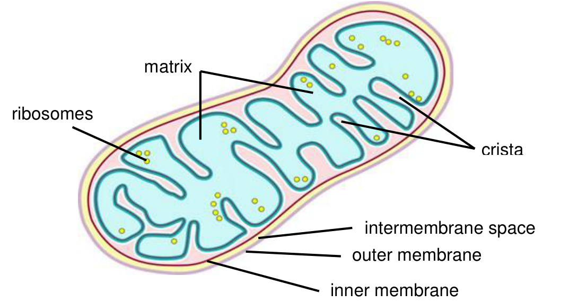
> **[Diagram Context - Textbook_LifeSciences_Gr11_Cellular_respiration.pdf-0002-06.png]**
> This educational graphic is a cross-section diagram of a mitochondrion, illustrating its internal cellular structure. Visible labels and pointer lines identify the outer membrane, inner membrane, intermembrane space, crista, matrix, and ribosomes. This diagram conveys the key structural adaptations of the mitochondrion—such as the folded inner membrane (cristae)—which maximize surface area for cellular respiration and ATP synthesis as required in the CAPS Life Sciences curriculum.


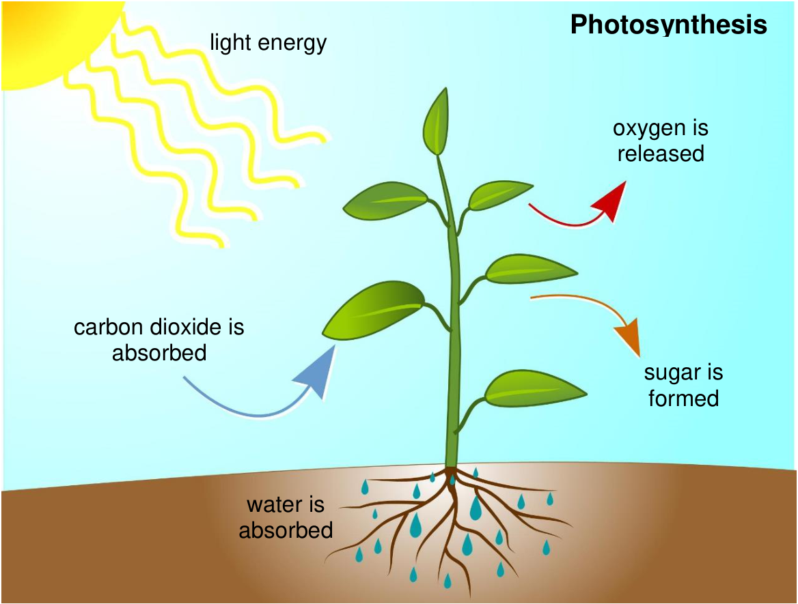
> **[Diagram Context - Textbook_LifeSciences_Gr11_Photosynthesis.pdf-0002-01.png]**
> This educational graphic is a biological process diagram illustrating photosynthesis in a green plant. Visible labels include "Photosynthesis," "light energy," "carbon dioxide is absorbed," "water is absorbed," "oxygen is released," and "sugar is formed," accompanied by directional arrows showing the inputs and outputs relative to the sun, roots, and leaves. Conceptually, it conveys how plants convert radiant energy into chemical potential energy by taking in carbon dioxide and water to produce glucose and release oxygen.


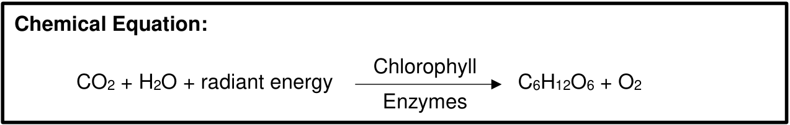


---

### Alcoholic Fermentation
Breaking down of glucose in the absence of oxygen, to give rise to the production of alcohol in plant cells.

### Lactic Acid Fermentation
Breaking down of glucose in the absence of oxygen to form lactic acid in animal cells.

### Lactic Acid
Acid formed in muscle cells, during anaerobic respiration; leads to muscle exhaustion / cramping.

---

### Key Characteristics of Anaerobic Respiration
* Without oxygen being present.
* It occurs for short periods of time, mainly during physical exercise.
* Occurs differently in plants and animals.
* Produces less ATP than aerobic respiration.

---

### Anaerobic Respiration in Animals
* Is known as lactic acid fermentation.
* Occurs in muscles during intense exercise.
* Enables glycolysis in the cytoplasm of animal cells.
* Results in the accumulation of lactic acid causing the muscles to become tired and painful.
* Produces only a small amount of ATP.

> **Note:** The lactic acid can be converted back to pyruvic acid when the muscles receive oxygen.

---

### Anaerobic Respiration in Plants
* Is known as alcoholic fermentation.
* Enables glycolysis in the cytoplasm of plant cells.
* Results in the accumulation of pyruvic acid.
* Breaks down pyruvic acid forming ethanol (alcohol) and releasing carbon dioxide in the process.
* Can be summarised as:

$$\text{glucose} \longrightarrow \text{ATP} + \text{pyruvic acid} \longrightarrow \text{ethanol} + \text{carbon dioxide}$$

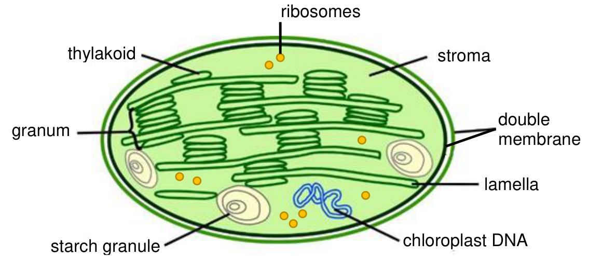


---

## Uses of anaerobic respiration in industry

Yeast and other fungi respire anaerobically and are used to produce alcoholic beverages such as beer and wine. Yeast cells are also used to cause bread to rise during the baking process.

The fermentation process is also used to produce cheese. Watch this video on how cheese is made: [https://www.youtube.com/watch?v=TVVpjVk4Gy8](https://www.youtube.com/watch?v=TVVpjVk4Gy8)

---

## Comparison between aerobic and anaerobic respiration

Table 1 summarises the differences between aerobic and anaerobic respiration.

**Table 1: The differences between aerobic and anaerobic respiration**

| Aerobic | Anaerobic |
| :--- | :--- |
| oxygen is required | oxygen is not required |
| products: carbon dioxide + water | products: lactic acid (animals) or carbon dioxide + alcohol (plants / yeast) |
| occurs in the cytoplasm and mitochondria | occurs in the cytoplasm |
| large amount of ATP energy is released, glucose is completely broken down | small amount of ATP energy is released, glucose is only partially broken down |

The differences between aerobic and anaerobic respiration:
* [https://www.youtube.com/watch?v=ZkqEno1r2jk&index=17&list=PLW0gavSzhMlQYSpKryVcEr3ERup5SxHl0](https://www.youtube.com/watch?v=ZkqEno1r2jk&index=17&list=PLW0gavSzhMlQYSpKryVcEr3ERup5SxHl0)
* [https://www.youtube.com/watch?v=HZtXLhm7lSA&index=60&list=PLW0gavSzhMlQYSpKryVcEr3ERup5SxHl0](https://www.youtube.com/watch?v=HZtXLhm7lSA&index=60&list=PLW0gavSzhMlQYSpKryVcEr3ERup5SxHl0)

---

## Investigations on cellular respiration

| Term | Definition / Description |
| :--- | :--- |
| **lime water** | solution used to test for carbon dioxide |
| **glycogen** | form in which glucose is stored in animal cells |
| **germination** | the process where a plant grows from a seed |

---

# Revision Notes: Cellular Respiration Investigations

## Core Concepts

There are several investigations used to demonstrate the requirements and products of cellular respiration.

### Testing for Gases

1. **To test for oxygen:**
   * **Test:** A glowing splint test.
   * **Procedure:** A wooden splint or stick is lit and then extinguished while still glowing.
   * **Result:** In the presence of oxygen, the glowing end of the splint will re-ignite or glow brighter.

2. **To test for carbon dioxide:**
   * **Test:** Lime water test.
   * **Result:** A clear lime water solution will turn milky (cloudy) in the presence of carbon dioxide.

---

## Investigation 1: Oxygen is Used During Cellular Respiration

Micro-organisms such as bacteria and fungi also need oxygen for cellular respiration. 

* **Germinating beans:** Cellular respiration takes place at a high rate, releasing large amounts of energy for growth.
* **Dead beans (Control):** Beans that have been killed by boiling cannot undergo cellular respiration, making them suitable to serve as a control.

### Aim
To show that oxygen is used during cellular respiration.

### Apparatus Setup

| Test Tube A (Experiment) | Test Tube B (Control) |
| :--- | :--- |
| Contains **germinating bean seeds** | Contains **dead bean seeds** (killed by boiling and sterilised by rinsing in formalin/bleach) |
| Sealed with a rubber stopper | Sealed with a rubber stopper |

### Method
1. Use germinating beans in the experimental setup.
2. Ensure the equipment and beans are sterilised so that no micro-organisms can influence the results.

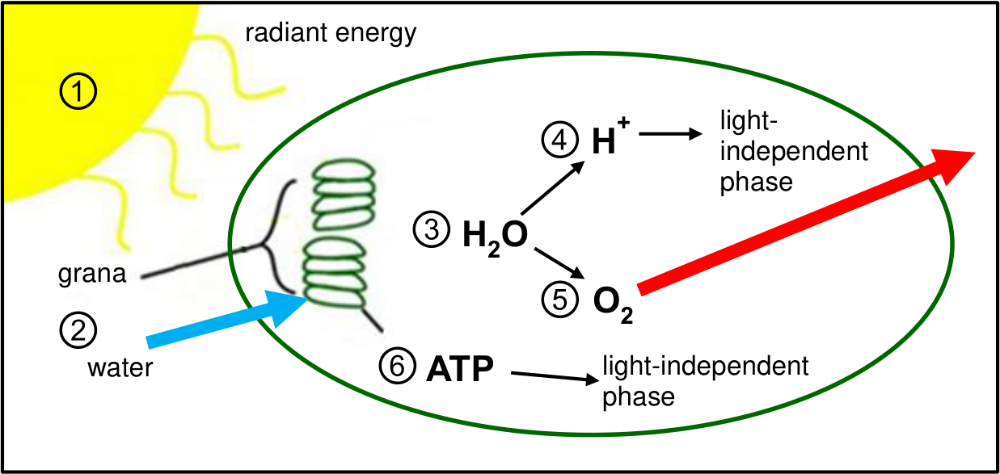


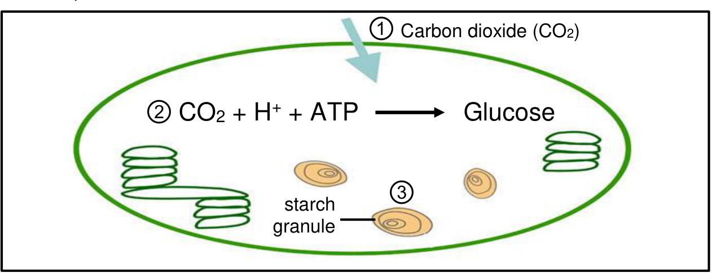


---

* Place some of the beans into boiling water to kill them, so that cellular respiration cannot take place in these beans.
* Set-up the apparatus as shown in Figure 2 above, making sure that the test tubes are tightly sealed.
* Leave the test tubes set-up overnight.
* Take the stoppers off of the test tubes the next morning and insert a glowing splint into each one.

### Results
* **Test tube A (the experiment):** the glowing splint dies out - no oxygen is present, it has been used up by the germinating beans during cellular respiration.
* **Test tube B (the control):** the glowing splint ignites or burns brighter - no oxygen is present, it has been used up by the germinating beans during cellular respiration.

### Conclusion
Oxygen is used by living organisms during cellular respiration.

---

## Investigation 2: Carbon dioxide is produced during aerobic cellular respiration

Living organisms produce carbon dioxide as a by-product of aerobic respiration. We can test for the presence of carbon dioxide by using clear lime water which will turn a milky colour when in the presence of carbon dioxide.

Soda lime can be used to remove carbon dioxide from the atmosphere and sodium hydroxide can be added to a solution to remove carbon dioxide found in a liquid. This will ensure that no carbon dioxide can enter into any experiment so that we can prove the carbon dioxide is a result of aerobic respiration performed by an organism.

**Aim:** To prove that carbon dioxide is produced during aerobic respiration

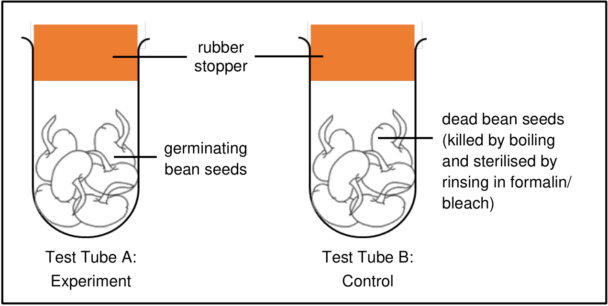


---

# Revision Notes: Investigating Carbon Dioxide Production During Aerobic Respiration

## Core Concept
Aerobic respiration is a metabolic process in which living organisms use oxygen to break down organic compounds (like glucose), releasing energy, water, and carbon dioxide ($\text{CO}_2$). 

This experiment demonstrates that **living organisms (such as a snail) produce carbon dioxide ($\text{CO}_2$) during aerobic respiration**.

---

## Experimental Setup (Figure 3)

The experimental apparatus is set up in a continuous train of interconnected chambers and test tubes (labeled A, B, C, and D) to control the gas entering and leaving the organism's chamber:

* **Incoming Air & Soda Lime:** Incoming air passes through soda lime and sodium hydroxide solution (in container A) to scrub and remove any atmospheric carbon dioxide ($\text{CO}_2$) before it reaches the living organism.
* **Test Tube B (Control Check):** Contains lime water. The lime water remains clear, confirming that the soda lime and sodium hydroxide successfully removed all $\text{CO}_2$ from the incoming air.
* **Chamber C (Living Organism):** Contains a small organism (a snail) undergoing aerobic respiration.
* **Test Tube D (Detection):** Contains lime water. As air passes out of chamber C and bubbles through test tube D, any $\text{CO}_2$ produced by the snail reacts with the lime water.

---

## Method

1. Use a small living organism (e.g., a snail).
2. Sterilize the equipment to ensure no micro-organisms influence the experimental results.
3. Place the snail into a large sealed jar (Chamber C).
4. Set up the apparatus as shown in Figure 3, ensuring all test tubes and connections are tightly sealed to prevent gas leaks.
5. Leave the apparatus set up, examine the test tubes the following day, and record the results.

---

## Results

| Location / Test Tube | Observation | Explanation |
| :--- | :--- | :--- |
| **Test Tube B** | The lime water remains **clear**. | Carbon dioxide from the incoming air was completely removed by the soda lime and sodium hydroxide in container A. |
| **Test Tube D** | The lime water turns **milky** (cloudy). | Carbon dioxide was produced by the snail during aerobic respiration in chamber C and passed into test tube D. |

---

## Conclusion

Carbon dioxide ($\text{CO}_2$) is produced as a waste product during aerobic respiration by living organisms (such as the snail).

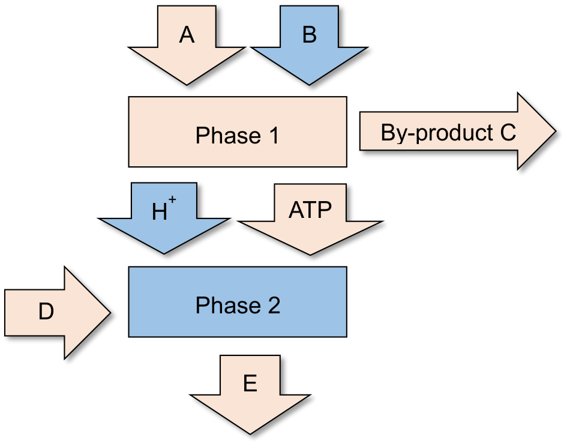


---

# Investigation 3: Carbon dioxide is produced during anaerobic cellular respiration

Living organisms produce carbon dioxide as a by-product of anaerobic cellular respiration. We can test for the presence of carbon dioxide in the same way we did before by using clear lime water.

**Aim:** To prove carbon dioxide is produced during anaerobic cellular respiration

| Component | Description |
| :--- | :--- |
| **Figure 4** | Experimental set-up for investigating the production of $\text{CO}_2$ during anaerobic cellular respiration |

## Method:
* Sterilise the equipment so that no micro-organisms can influence the result.
* Boil the sugar solution ahead of time to ensure that all of the oxygen is removed from the solution.
* Set-up the apparatus as shown in Figure 4.
* The yeast and sugar solution should be in Test Tube A and clear lime water should be in Test Tube B.
* Cover the sugar solution with a thin layer of paraffin so that no oxygen from the air can dissolve into the solution. Make sure that the test tube is tightly sealed.
* The apparatus must be placed in a warm water bath because yeast grows quickly in warm conditions.
* Record the results after a few hours.

---

* delivery tube
* bubbles of gas
* paraffin
* yeast & sugar
* water bath
* Tube A & Tube B (lime water)

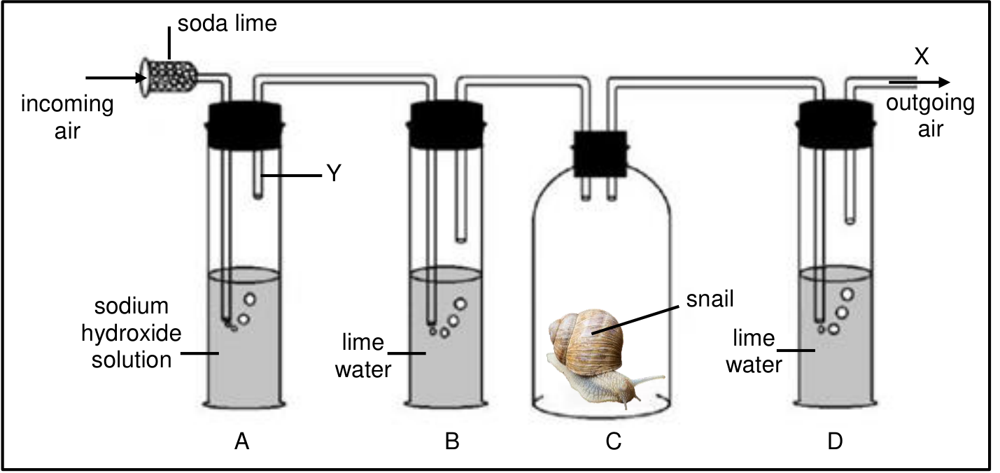


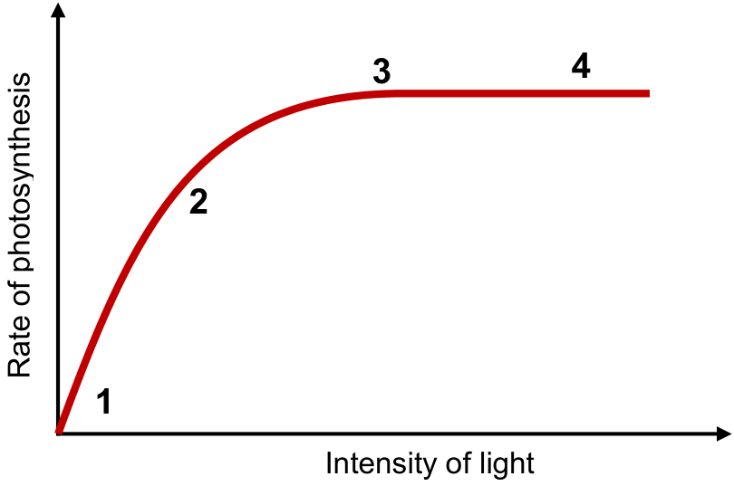


---

## Results:

The clear lime water becomes milky in colour.

## Conclusion:

Carbon dioxide is produced during anaerobic cellular respiration in living cells (yeast).

A simple Investigation using peas and worms: [https://youtube.com/r9oVdToCiE](https://youtube.com/r9oVdToCiE)

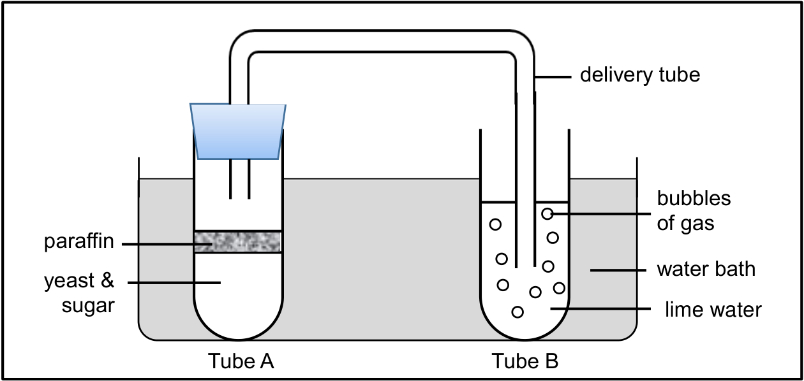


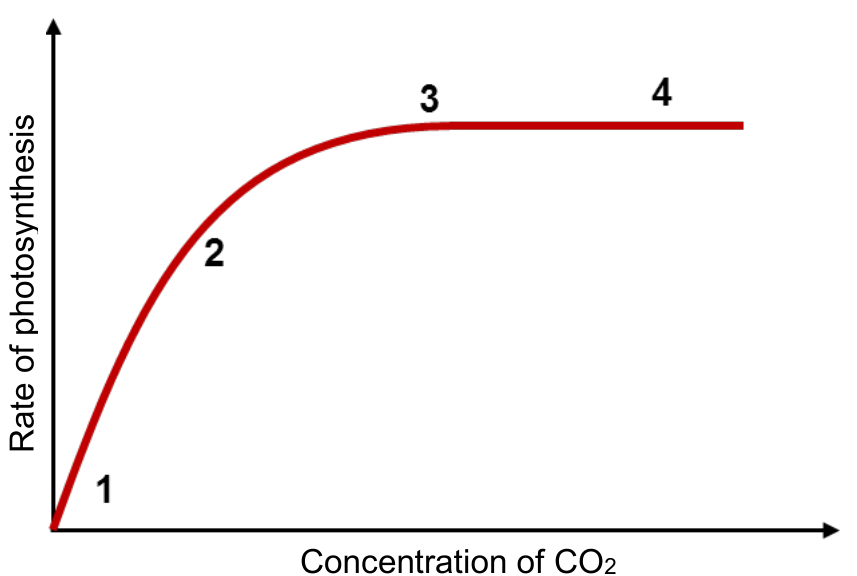


---

# Cellular respiration: End of topic exercises

## Section A

### Question 1

1.1 Various options are provided as possible answers to the following questions. Choose the correct answer and write only the letter (A – D) next to the question number ($1.1.1 - 1.1.5$) on your answer sheet, for example $1.1.6 \text{ D}$

#### 1.1.1 Cellular respiration in a green leaf takes place

* A. during the day only.
* B. continuously.
* C. during the night only.
* D. during photosynthesis only.

#### 1.1.2 The following components are involved in cellular respiration:

* (i) Energy
* (ii) Carbohydrates
* (iii) Carbon dioxide
* (iv) Water
* (v) Oxygen

Which **ONE** of the following combinations show the correct way in which the components are involved?

* A. (ii) + (iii) $\rightarrow$ (i) + (iv) + (v)
* B. (ii) + (iv) $\rightarrow$ (i) + (iii) + (v)
* C. (i) + (ii) $\rightarrow$ (iii) + (iv) + (v)
* D. (ii) + (v) $\rightarrow$ (i) + (iii) + (iv)

#### 1.1.3 The conversion of pyruvic acid into lactic acid occurs during

* A. photolysis.
* B. glycolysis.
* C. anaerobic respiration.
* D. oxidation of glucose.

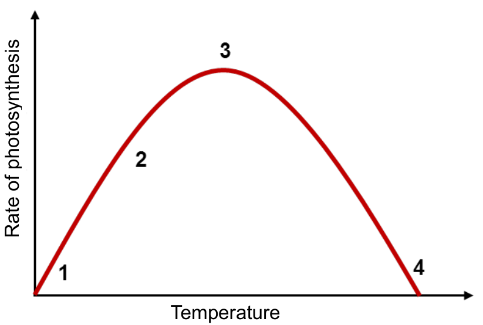


---

1.1.4 A phase that does not require oxygen during cellular respiration is:

A. Krebs cycle.  
B. Glycolysis.  
C. Oxidative phosphorylation  
D. All of the above  

$$(4 \times 2) = (8)$$

---

1.2 Give the correct **biological** term for each of the following descriptions. Write only the term next to the question number.

1.2.1 The process during which glucose is converted into pyruvic acid.  
1.2.2 The reagent used to test for the presence of carbon dioxide.  
1.2.3 The acid that accumulates in the muscles of humans during continuous strenuous physical activity.  
1.2.4 The gas which is essential for the Krebs cycle to occur.  
1.2.5 Folded structures found on the inner membrane of a mitochondrion.  
1.2.6 The stage of aerobic respiration that releases carbon dioxide.  
1.2.7 Genetic material found in the mitochondrial matrix.  
1.2.8 The stage during aerobic respiration when water is released as a waste product.  
1.2.9 The type of anaerobic respiration that occurs in yeast cells.  
1.2.10 The organelle in which respiration takes place.  

$$(10 \times 1) = (10)$$

---

1.3 Indicate whether each of the descriptions in **Column I** applies to **A ONLY**, **B ONLY**, **BOTH A AND B** or **NONE** of the items in **Column II**. Write **A only**, **B only**, **both A and B** or **none** next to the question number.

| Column I | Column II |
| :--- | :--- |
| 1.3.1 The end product of anaerobic respiration in humans | A: lactic acid<br>B: ethanol |
| 1.3.2 A product of cellular respiration which supplies energy needed for metabolic reactions in cells | A: ATP<br>B: oxygen |
| 1.3.3 The fuel required for cellular respiration | A: glycogen<br>B: glucagon |
| 1.3.4 Molecule that stores energy | A: ADP<br>B: ATP |

$$(4 \times 2) = (8)$$

---
174

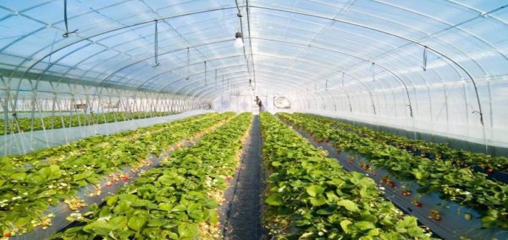


---

## 1.4 Aerobic Respiration Investigation

The apparatus below was used to carry out an experiment on aerobic respiration. The experiment was set up as follows:
* $17$ seeds of the same kind were used.
* The seeds and the apparatus were sterilised before the investigation.
* Once set up, the apparatus was placed in a dark cupboard at $35^\circ\text{C}$.
* A control was also set up.


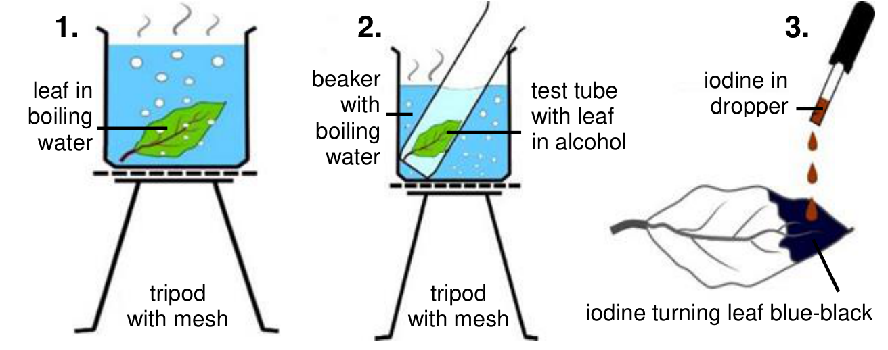


### Questions

1.4.1 What was the aim of the experiment? (2)

1.4.2 What is the significance of sterilising the seeds before they are used? (1)

1.4.3 Give one controlled variable in this investigation. (1)

1.4.4 Explain how you would set up a control for this investigation. (3)

1.4.5 Explain why germinating seeds were used in this investigation. (2)

*(Total: 9 marks)*

---

## 1.5 Fermentation in Industry

Study the following extract and answer the questions which follow:

> Many food and beverage industries are entirely dependent on the fermentation process to manufacture their products. Some of the products manufactured are being distributed and sold locally while the others are exported to foreign countries.

### Questions

1.5.1 Name one food or beverage product which makes use of the fermentation process in its manufacture. (1)

1.5.2 Explain one way in which the production of foods and beverages made by fermentation benefit the South African economy. (2)

---

## Section B

### Question 2

**2.1** A baker is testing a new recipe in order to bake the perfect loaf of bread. The two main ingredients in the bread dough are flour and yeast. She divides the dough into three equal parts and subjects the loaves to different treatments before baking.

* **Loaf A:** She immediately bakes the bread.
* **Loaf B:** She covers the dough with a damp cloth and leaves it in a warm area for an hour before baking it.
* **Loaf C:** She covers the dough with a damp cloth and leaves it in the fridge for an hour before baking it.
* After baking the three loaves she measured the height which each loaf rose.

**2.1.1** Formulate a hypothesis for this investigation. (2)

**2.1.2** Identify:
* a) the dependent variable
* b) the independent variable
* c) one controlled variable (3)

**2.1.3** Which loaf do you consider to be the control for this experiment? Give a reason for your answer. (2)

**2.1.4** One of the main ingredients is yeast.
* a) Name the function of the yeast in this investigation. (1)
* b) Which biochemical process allows the yeast to perform its required function? (1)
* c) What is the yeast's source of glucose? (1)

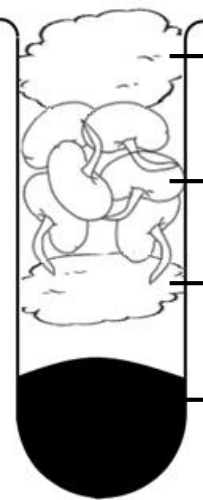


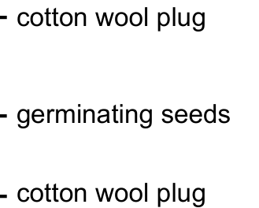


---

2.1.5 Why is the dough of loaves B and C covered with a damp cloth? (2)

2.1.6 What conclusions can be made from the resulting baked loaves? (4)

2.1.7 How can the baker improve the reliability of her experiment? (2)

(18)

---

2.2 Read the information below and answer the questions that follow.

> ### Traditional African Beer
>
> Traditional beer forms a very important part of African culture. It is called *umqombothi* in isiXhosa and *iJuba* in isiZulu. The beer is mostly brewed from indigenous sorghum. The thick creamy African beer is very rich in vitamin B, it has a low alcohol content of less than $3\%$ and it is inexpensive. The recipe for brewing beer is passed down through the generations.
>
> The traditional method of testing to see if the brew is ready is to light a match close to the container of beer. If the flame dies quickly, the brew is ready. If the flames remain lit, the brew is not ready.

2.2.1 Name the biochemical process used to brew this African beer. (1)

2.2.2 What causes the flame to die? (1)

2.2.3 Why would this test be an indication of whether the brew is ready or not? (2)

A survey was done to determine the amount of people who drink industrially produced beer and traditional beer. The results for 1970 and then 1996 were as follows:

| Type of beer | Percentage of beer consumed |
| :--- | :---: | :---: |
| | **1970** | **1996** |
| Traditional beer | $90\%$ | $30\%$ |
| Industrially produced beer | $10\%$ | $70\%$ |

2.2.4 Plot a bar graph to show the results of the survey. (6)

2.2.5 Describe the trend shown by the graph. (2)

(12)

---

**Section B: [30]**

**Total marks: [75]**

177

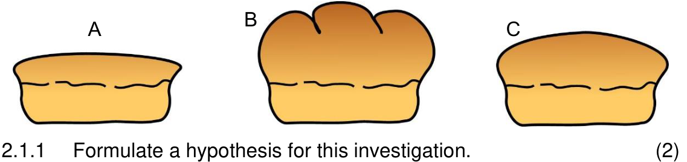


---

# 7: Gaseous exchange

## Lesson Outline & Table of Contents

| Left Column Topics | Right Column Topics |
| :--- | :--- |
| - Introduction | - Transport of respiratory gases |
| - Efficiency of gaseous exchange surfaces in living organisms | - Gaseous exchange between the blood and tissues |
| - Relationship between respiratory structures and efficient gaseous exchange in different organisms | - Homeostatic control of breathing |
| - Human gaseous exchange | - The effect of altitude on gaseous exchange |
| &nbsp;&nbsp;&nbsp;&nbsp;- Activity 1: Dissection | &nbsp;&nbsp;&nbsp;&nbsp;- Activity 4: Effect of altitude |
| - The mechanism of breathing (Ventilation of the lungs) | - Diseases of the respiratory system |
| &nbsp;&nbsp;&nbsp;&nbsp;- Activity 2: Breathing | &nbsp;&nbsp;&nbsp;&nbsp;- The effects of smoking on respiratory organs |
| - Composition of inhaled and exhaled air | &nbsp;&nbsp;&nbsp;&nbsp;- Smoking legislation in South Africa |
| - Effect of exercise on breathing and pulse rate in humans | - Artificial respiration and resuscitation (CPR) |
| &nbsp;&nbsp;&nbsp;&nbsp;- Activity 3: Breathing investigation | - End of topic exercises |
| - Internal and external gaseous exchange in humans | |
| &nbsp;&nbsp;&nbsp;&nbsp;- Gaseous exchange in the lungs at the alveoli surface | |

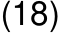


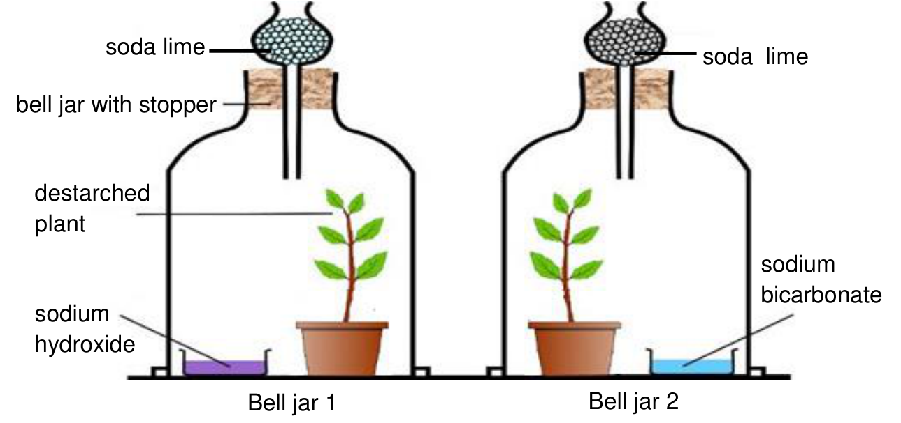


---

# End of topic exercises

## Section A

### Question 1

#### 1.1

Various options are provided as possible answers to the following questions. Choose the correct answer and write only the letter (A – D) next to the question number (1.1.1 – 1.1.5) on your answer sheet, for example 1.1.6 D

##### 1.1.1
Cellular respiration in a green leaf takes place  
A during the day only.  
B continuously ✓✓  
C during the night only.  
D during photosynthesis only.  

##### 1.1.2
The following components are involved in cellular respiration:  
(i) Energy  
(ii) Carbohydrates  
(iii) Carbon dioxide  
(iv) Water  
(v) Oxygen  

Which ONE of the following combinations show the correct way in which the components are involved?  
A (ii) + (iii) → (i) + (iv) + (v)  
B (ii) + (iv) → (i) + (iii) + (v)  
C (i) + (ii) → (iii) + (iv) + (v)  
D (ii) + (v) → (i) + (iii) + (iv) ✓✓  

##### 1.1.3
The conversion of pyruvic acid into lactic acid occurs during  
A photolysis.  
B glycolysis.  
C anaerobic respiration. ✓✓  
D oxidation of glucose.  

##### 1.1.4
A phase that does not require oxygen during cellular respiration is:  
A Krebs cycle.  
B Glycolysis. ✓✓  
C Oxidative phosphorylation  
D All of the above  

$$(4 \times 2) = (8)$$

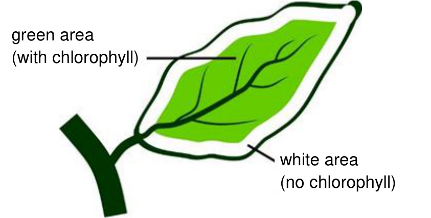


---

1.2 Give the correct biological term for each of the following descriptions. Write only the term next to the question number.

| Question | Description | Biological Term |
| :--- | :--- | :--- |
| 1.2.1 | The process during which glucose is converted into pyruvic acid. | Glycolysis ✓ |
| 1.2.2 | The reagent used to test for the presence of carbon dioxide. | Clear limewater ✓ |
| 1.2.3 | The acid that accumulates in the muscles of humans during continuous strenuous physical activity. | Lactic acid ✓ |
| 1.2.4 | The gas which is essential for the Krebs cycle to occur. | Oxygen ✓ |
| 1.2.5 | Folded structures found on the inner membrane of a mitochondria. | Cristae ✓ |
| 1.2.6 | The stage of aerobic respiration that releases carbon dioxide. | Krebs cycle ✓ |
| 1.2.7 | Genetic material found in the mitochondrial matrix. | Mitochondrial DNA ✓ |
| 1.2.8 | The stage during aerobic respiration when water is released as a waste product. | Oxidative phosphorylation / electron transport system ✓ |
| 1.2.9 | The type of anaerobic respiration that occurs in yeast cells. | (Alcoholic) fermentation ✓ |
| 1.2.10 | The organelle in which respiration takes place. | Mitochondria ✓ |

$$(10 \times 1) = (10)$$

1.3 Indicate whether each of the descriptions in Column I applies to A ONLY, B ONLY, BOTH A AND B or NONE of the items in Column II. Write A only, B only, both A and B or none next to the question number.

| Question | Column I | Column II | Answer |
| :--- | :--- | :--- | :--- |
| 1.3.1 | The end product of anaerobic respiration in humans | A: lactic acid<br>B: ethanol | A only ✓✓ |
| 1.3.2 | A product of cellular respiration which supplies energy needed for metabolic reactions in cells | A: ATP<br>B: oxygen | |
| 1.3.3 | The fuel required for cellular respiration | A: glycogen<br>B: glucagon | |
| 1.3.4 | Molecule that stores energy | A: ADP<br>B: ATP | |

$$(4 \times 2) = (8)$$

1.3.1 A only ✓✓

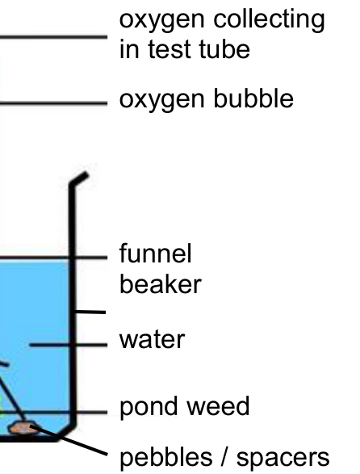


---

### 1. Concepts & Structure

#### Exercise Questions and Memorandum

* **1.3.2** A only $\checkmark\checkmark$
* **1.3.3** none $\checkmark\checkmark$
* **1.3.4** B only $\checkmark\checkmark$

---

### 1.4 Experiment on Aerobic Respiration

The apparatus below was used to carry out an experiment on aerobic respiration. The experiment was set up as follows:

* $17$ seeds of the same kind were used.
* The seeds and the apparatus were sterilised before the investigation.
* Once set up, the apparatus was placed in a dark cupboard at $35\,^\circ\text{C}$.
* A control was also set up.


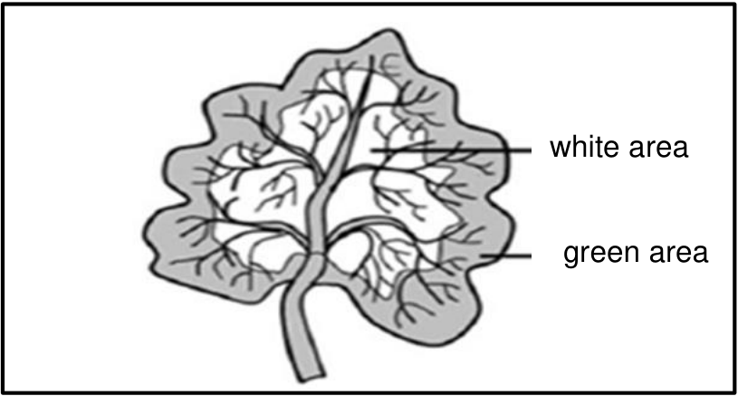


#### Questions and Answers

* **1.4.1** What was the aim of the experiment? **(2)**
  * **Answer:** To determine if carbon dioxide is released $\checkmark$ during cellular respiration. $\checkmark$

* **1.4.2** What is the significance of sterilising the seeds before they are used? **(1)**
  * **Answer:** To ensure all micro-organisms are killed. $\checkmark$ / To eliminate any other organisms. / To ensure the carbon dioxide present is only produced by the germinating seeds.

* **1.4.3** Give one controlled variable in this investigation. **(1)**
  * **Answer:** 
    * Same kind of seeds. $\checkmark$
    * Constant temperature of $35\,^\circ\text{C}$ $\checkmark$
    * Apparatus kept in the dark $\checkmark$ (mark first answer only)

* **1.4.4** Explain how you would set up a control for this investigation. **(3)**
  * **Answer:** The apparatus would be set up in the exact same way $\checkmark$ except by using no seeds $\checkmark$ / seeds that were boiled $\checkmark$ to ensure that the changes observed in the investigation were due to the germinating seeds.

---

### 1. Concepts & Structure

#### Question 1.4.5
* **Question:** Explain why germinating seeds were used in this investigation. *(2)*
* **Expected Answers (any two):**
  * Germinating seeds need a lot of energy for growth.
  * The rate of cellular respiration will be high.
  * More carbon dioxide is released, achieving better results.

---

#### Question 1.5
Study the following extract and answer the questions which follow:

> Many food and beverage industries are entirely dependent on the fermentation process to manufacture their products. Some of the products manufactured are being distributed and sold locally while the others are exported to foreign countries.

##### 1.5.1 Name one food or beverage product which makes use of the fermentation process in its manufacture. *(1)*
* **Expected Answer (mark first correct answer only):** 
  * Cheese, yoghurt, wine, beer, whisky, brandy (or any other relevant products).

##### 1.5.2 Explain one way in which the production of foods and beverages made by fermentation benefit the South African economy. *(2)*
* **Expected Answers (any one answer $\times 2$):**
  * Products are exported $\checkmark$ and earns foreign exchange $\checkmark$.
  * Jobs are created $\checkmark$ and reduces unemployment $\checkmark$.
  * Company profit increases $\checkmark$ and government earns more revenue as taxes $\checkmark$.

##### 1.5.3 Describe how yeast cells benefit from the fermentation process? *(2)*
* **Expected Answer:** 
  * Derives energy $\checkmark$ for cellular activities $\checkmark$.

##### 1.5.4 Draw a labelled diagram of the organelle in which respiration takes place. *(5)*


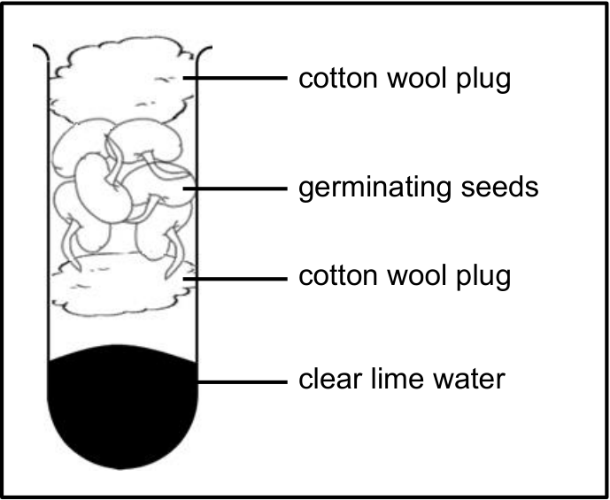


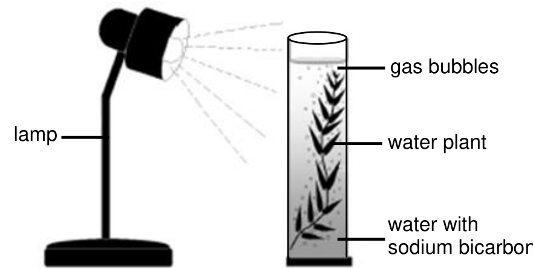


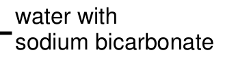


---

Guidelines for assessing diagram:

| Criterion | Check |
| :--- | :--- |
| Title | $\checkmark$ |
| Shape | $\checkmark$ |
| Any three correct labels | $\checkmark \times 3$ |

(10)

[45]

## Section B

### Question 2

**2.1** A baker is testing a new recipe in order to bake the perfect loaf of bread. The two main ingredients in the bread dough are flour and yeast. She divides the dough into three equal parts and subjects the loaves to different treatments before baking.
* **Loaf A:** She immediately bakes the bread.
* **Loaf B:** She covers the dough with a damp cloth and leaves it in a warm area for an hour before baking it.
* **Loaf C:** She covers the dough with a damp cloth and leaves it in the fridge for an hour before baking it.
* After baking the three loaves she measured the height which each loaf rose. The results are shown below:

```
    C
    B
    A
```

**2.1.1** Formulate a hypothesis for this investigation.

(2)

The bread dough $\checkmark$ will rise better in warm conditions than in cold conditions $\checkmark$ OR Yeast cells respire more under warm conditions $\checkmark$ than cold conditions $\checkmark$.

**2.1.2** Identify:

a) the dependent variable

How much the dough rises $\checkmark$.

b) the independent variable

Temperature $\checkmark$

c) one controlled variable

(3)

Time allowed for the dough to rise $\checkmark$, amount of dough $\checkmark$, ingredients of the dough $\checkmark$ (any one correct answer)

129

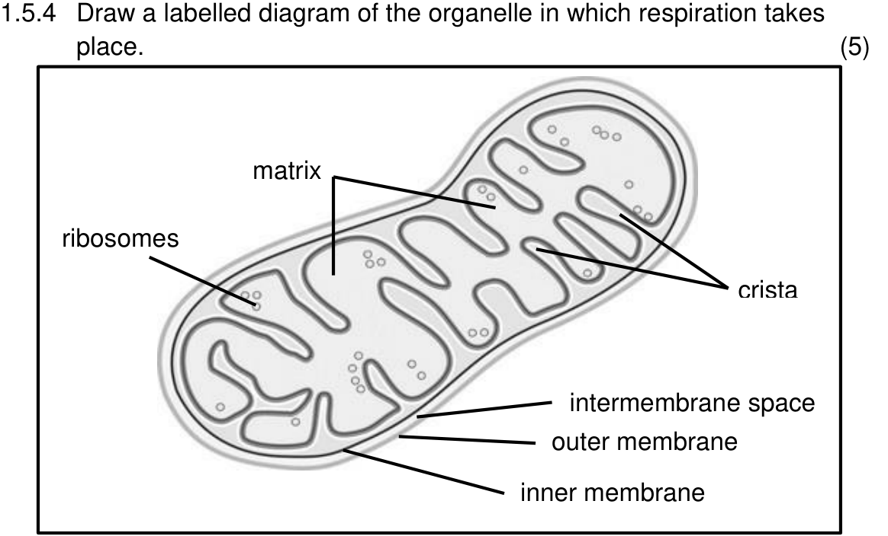


---

### Revision Notes: Biology Experiment Analysis & Traditional African Beer

---

### 2.1 Yeast Experiment Questions and Answers

#### 2.1.3 Control in the Experiment
* **Question:** Which loaf do you consider to be the control for this experiment? Give a reason for your answer.
* **Answer:** Loaf A, because it was baked immediately with all other factors kept the same, except that there was no time allowed for the dough to rise.

#### 2.1.4 Function and Properties of Yeast
* **a) Name the function of the yeast in this investigation.**
  * *Answer:* It respires which allows the dough to rise.
* **b) Which biochemical process allows the yeast to perform its required function?**
  * *Answer:* Anaerobic respiration.
* **c) What is the yeast's source of glucose?**
  * *Answer:* Flour (starch).

#### 2.1.5 Role of the Damp Cloth
* **Question:** Why is the dough of loaves B and C covered with a damp cloth?
* **Answer:** To provide moist (optimum) conditions so that the yeast can respire and reproduce.

#### 2.1.6 Conclusions Drawn from Baked Loaves
* **Question:** What conclusions can be drawn from the resulting baked loaves?
* **Key Conclusions:**
  * Yeast cells respire optimally in warm, moist conditions.
  * Yeast cells respire slowly in cool conditions.
  * The yeast cells respire anaerobically, which produces carbon dioxide that is trapped in the dough and allows it to rise.
  * When the dough is placed in the oven, the high temperatures kill the yeast cells because the proteins in the yeast denature.
  * Dough does not rise when the temperature is too high.

#### 2.1.7 Reliability of the Experiment
* **Question:** How can the baker improve the reliability of her experiment?
* **Answer:** 
  * Repeat the investigation.
  * Use a thermometer to determine the exact temperature inside the dough as it rises.

---

### 2.2 Traditional African Beer

#### Background Information
* **Names:** Called *umqombothi* in isiXhosa and *iJuba* in isiZulu.
* **Ingredients:** Mostly brewed from indigenous sorghum.
* **Nutritional and Physical Properties:** 
  * Thick and creamy.
  * Very rich in Vitamin B.
  * Low alcohol content of less than $3\%$.
  * Inexpensive.
  * Recipe is passed down through generations.

#### Traditional Testing Method
To test if the brew is ready, a match is lit close to the container of beer:
* **If the flame dies quickly:** The brew is ready (indicating a high concentration of carbon dioxide gas produced by respiration).
* **If the flame remains lit:** The brew is not ready.

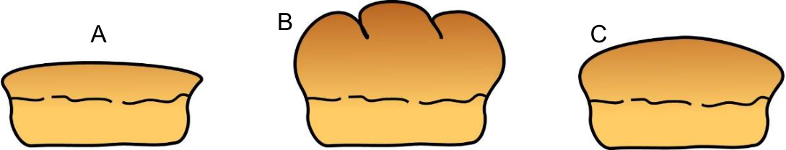


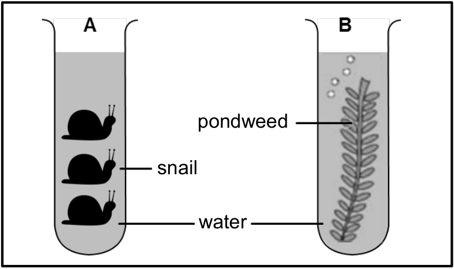


---

### Questions and Answers

2.2.1 Name the biochemical process used to brew this African beer. (1)  
**Answer:** Anaerobic respiration $\checkmark$

2.2.2 What causes the flame to die? (1)  
**Answer:** Carbon dioxide $\checkmark$

2.2.3 Why would this test be an indication of whether the brew is ready or not? (2)  
**Answer:** Anaerobic respiration uses oxygen and releases carbon dioxide. $\checkmark$ If the flame dies, carbon dioxide has been released which means that fermentation has occurred $\checkmark$ and the brew will be ready.

---

### Survey Data

A survey was done to determine the amount of people who drink industrially produced beer and traditional beer. The results for 1970 and then 1996 were as follows:

| Type of beer | Percentage of beer consumed | |
| :--- | :---: | :---: |
| | **1970** | **1996** |
| Traditional beer | $90\%$ | $30\%$ |
| Industrially produced beer | $10\%$ | $70\%$ |

2.2.4 Plot a bar graph to show the results of the survey. (6)

Percentage of people who drank industrially produced beer and traditional beer in 1970 and 1996


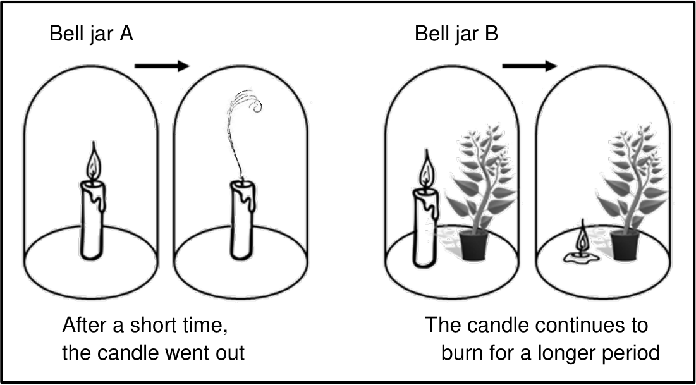


---

### Guidelines for Assessing a Graph

| Assessment Criteria | Marks / Indicator |
| :--- | :--- |
| Correct type of graph | ✓ |
| Title of graph | ✓ |
| Correct label for $x$-axis and $y$-axis | ✓ |
| Appropriate scale for $x$-axis and $y$-axis | ✓ |
| Drawing of bars | ✓: Drew 1–3 bars correctly<br>✓✓: Drew all bars correctly |

*NOTE: If the wrong type of graph is drawn, marks will be lost for "correct type" and "drawing of bars".*

---

**2.2.5** Describe the trend shown by the graph. *(2)*

* In 1970, more people drank traditional beer and less drank industrially produced beer. ✓
* In 1996, more people drank industrially produced beer and less people drank traditional beer. ✓

*(12)*

---

**Section B:** [30]  
**Total marks:** [75]

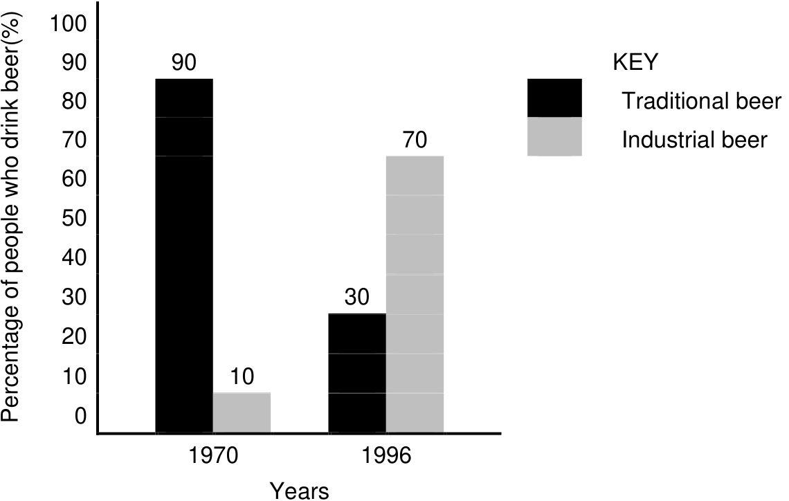


---

# Cognitive level distribution

| Question | Level 1 | Level 2 | Level 3 | Level 4 | Marks |
| :---: | :---: | :---: | :---: | :---: | :---: |
| 1.1.1 | | $\checkmark$ | | | 2 |
| 1.1.2 | | | | $\checkmark$ | 2 |
| 1.1.3 | $\checkmark$ | | | | 2 |
| 1.1.4 | $\checkmark$ | | | | 2 |
| | **4** | **2** | | **2** | **8** |
| 1.2.1 | $\checkmark$ | | | | 1 |
| 1.2.2 | $\checkmark$ | | | | 1 |
| 1.2.3 | $\checkmark$ | | | | 1 |
| 1.2.4 | $\checkmark$ | | | | 1 |
| 1.2.5 | $\checkmark$ | | | | 1 |
| 1.2.6 | $\checkmark$ | | | | 1 |
| 1.2.7 | $\checkmark$ | | | | 1 |
| 1.2.8 | $\checkmark$ | | | | 1 |
| 1.2.9 | $\checkmark$ | | | | 1 |
| 1.2.10 | $\checkmark$ | | | | 1 |
| | **10** | | | | **10** |
| 1.3.1 | $\checkmark$ | | | | 2 |
| 1.3.2 | $\checkmark$ | | | | 2 |
| 1.3.3 | $\checkmark$ | | | | 2 |
| 1.3.4 | $\checkmark$ | | | | 2 |
| | **8** | | | | **8** |
| 1.4.1 | | $\checkmark$ | | | 2 |
| 1.4.2 | | $\checkmark$ | | | 1 |
| 1.4.3 | | | $\checkmark$ | | 1 |
| 1.4.4 | | $\checkmark$ | | | 3 |
| 1.4.5 | | $\checkmark$ | | | 2 |
| | | **8** | **1** | | **9** |
| 1.5.1 | $\checkmark$ | | | | 1 |
| 1.5.2 | | $\checkmark$ | | | 2 |
| 1.5.3 | | $\checkmark$ | | | 2 |
| 1.5.4 | $\checkmark$ | | $\checkmark$ | | 5 (3+2) |
| | **4** | **4** | **2** | | **10** |

---

# Assessment Mark Breakdown Table

| Question Number | Column 1 | Column 2 | Column 3 | Column 4 | Marks |
| :---: | :---: | :---: | :---: | :---: | :---: |
| 2.1.1 | | | $\checkmark$ | | 2 |
| 2.1.2 | | $\checkmark$ | | | 3 |
| 2.1.3 | | $\checkmark$ | | | 2 |
| 2.1.4 | $\checkmark$ | | | | 3 |
| 2.1.5 | | | $\checkmark$ | | 2 |
| 2.1.6 | | | | $\checkmark$ | 4 |
| 2.1.7 | | | $\checkmark$ | | 2 |
| **Subtotal** | **3** | **5** | **6** | **4** | **18** |
| 2.2.1 | | $\checkmark$ | | | 1 |
| 2.2.2 | | $\checkmark$ | | | 1 |
| 2.2.3 | | | $\checkmark$ | | 2 |
| 2.2.4 | | $\checkmark$ | | | 6 |
| 2.2.5 | | | $\checkmark$ | | 2 |
| **Subtotal** | | **8** | **4** | | **12** |
| **Total** | **29** | **27** | **13** | **6** | **75** |

---

134

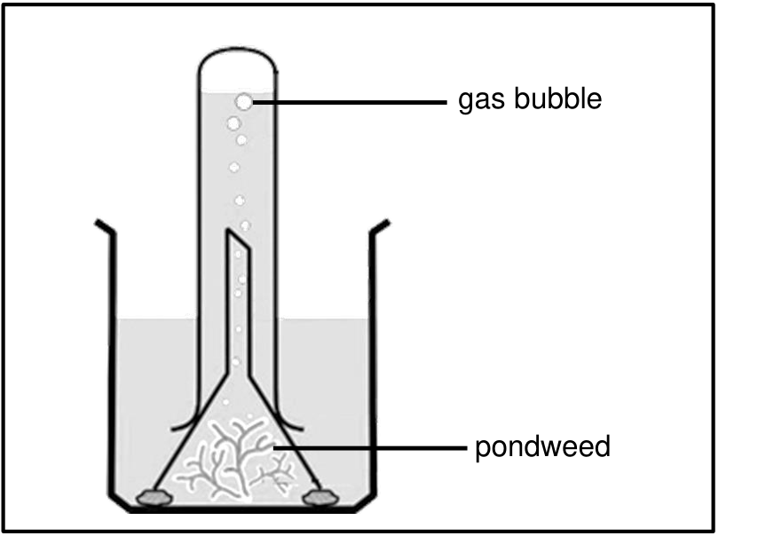


---

# CHAPTER 7: GASEOUS EXCHANGE

## Overview

**Time allocation:** $2\frac{1}{2}$ weeks (10 hours)  
This chapter will consist of the following sections:

1. Introduction
2. Key concepts
3. Efficiency of gaseous exchange surfaces in living organisms
4. Relationship between respiratory structures and efficient gaseous exchange in different organisms
5. Human gaseous exchange
6. The mechanism of breathing
7. Measurement of the rate and depth of breathing
8. Composition of inhaled and exhaled air
9. Effect of exercise on breathing in humans
10. Internal and external gaseous exchange in humans
11. Homeostatic control of breathing
12. The effect of altitude on gaseous exchange
13. Diseases of the respiratory system
14. The effects of smoking on respiratory organs
15. Summary
16. End of topic exercises

---

## Introduction

It is important to distinguish between breathing, gaseous exchange and cellular respiration.

* **Breathing** is a mechanical process of taking oxygen into the lungs. Why do we need to breathe? All organisms, from simple, unicellular to more advanced multicellular organisms need oxygen ($\text{O}_2$) to sustain cellular functions.

---

# Revision Notes: Cellular Respiration and Gaseous Exchange

## Core Definitions

* **Cellular respiration:** A chemical process that takes place within cells in order to release energy. Both plants and animals need cellular energy for survival.
* **Gaseous exchange:** A physical process that involves the exchange of gases between the air and the blood in the lungs. Organisms are adapted to ensure that this exchange process is optimised. Mammals have a mechanism of breathing that allows gases to enter their bodies, facilitating both gaseous exchange and cellular respiration.

---

## Key Considerations in Gaseous Exchange

When studying aspects of gaseous exchange, keep the following in mind:

1. **Structure to function:** How the organism is designed to carry out gaseous exchange.
2. **Regulation and control:** The control of breathing in humans.
3. **Gas management:** How the amounts of gases are kept at manageable levels in the blood.
4. **Disease and life choices:** How certain diseases and lifestyle choices can negatively impact effective gaseous exchange, impairing breathing and affecting overall health.

---

## Key Concepts Summary

* **Energy production:** All living organisms need cellular respiration to obtain energy for cellular functions.
* **Diffusion of gases:** Important gases diffuse across surfaces in a process called gaseous exchange.
* **Breathing mechanism:** Air moves in and out of respiratory organs through the mechanical process of breathing.
* **Surface dependency:** Effective gaseous exchange depends on the surface across which gases diffuse, as well as the external environment where the gases are found.
* **Habitat adaptations:** Plants and animals have gas exchange systems designed to suit their specific habitats (whether aquatic or terrestrial).
* **Neural regulation:** Breathing in humans is regulated by a respiratory center in the brain to ensure the correct balance of gases in the blood.
* **Tuberculosis (TB):** A treatable bacterial disease that is highly prevalent in South Africa.
* **Infections:** Bronchitis and pneumonia are bacterial infections that impact respiratory function.
* **Disorders:** Asthma, hay fever, and lung cancer are disorders of the respiratory system that are on the increase globally due to rising pollution levels.
* **Harmful substances:** Smoke from both cigarettes and marijuana is harmful to lung health.

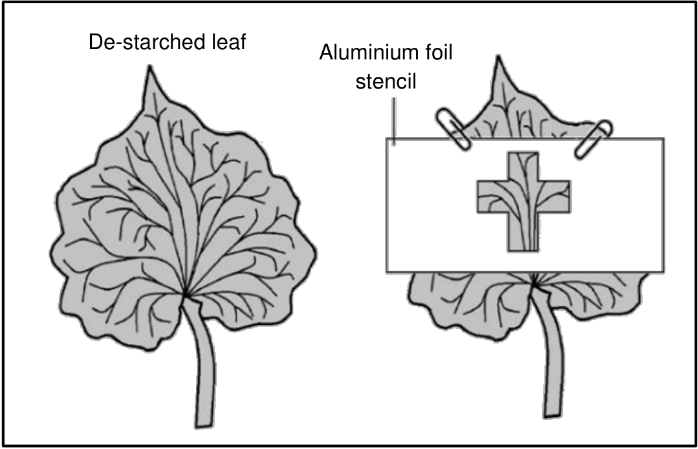
