# CHAPTER 9: POPULATION ECOLOGY

## Introduction

Population ecology is the study of populations in relationship to their environment and the social interactions amongst each other.

Population ecology includes the study of:
* Population size, factors that influence it, methods used to count populations and the two types of growth curves displayed by different organisms
* The types of interactions and symbioses found in nature and how organisms specialise to eliminate competition
* How different types of social organisations offer protection, enhance hunting, ensure the fittest survive and allow individuals of the same species to specialise into serving unique functions
* Succession, looking at how communities develop and in so doing how they alter their abiotic and biotic environments
* Human population growth forms in different age-gender pyramids

## Key terminology

| Term | Definition |
| :--- | :--- |
| species | a group of organisms capable of interbreeding, producing fertile offspring |
| population | a population is a group of the same species that occupies the same habitat at the same time and are able to interbreed |
| community | Groups of different species populations that interact with each other within a specific habitat |
| ecosystem | a biological community of interacting organisms and their physical environment |
| abiotic factors | non – living factors in an ecosystem |
| biotic factors | living factors of an ecosystem |
| environment | the sum of all biotic and abiotic factors in an ecosystem |
| habitat | the environment in which an organism completes its lifecycle (growth, reproduction and eventual death) |
| niche | the specific area where an organism inhabits |
| natality | the percentage increase of a population because of the number of births in a given season or year |
| mortality | mortality refers to the death rate within a population, usually as a percentage of the population |

234

---

# Population Ecology Glossary and Concepts

## Key Terms and Definitions

| Term | Definition |
| :--- | :--- |
| **fertility** | the number of births per year for all females who can produce offspring (between the ages 15 to 45) |
| **immigration** | new members may have migrated for the breeding season and are only temporary or may become permanent members, species dependent |
| **emigration** | individuals leaving a population because of migrations at the end of a season and the original population splitting into sub-populations across a large geographical area |
| **migration** | movement from one place to another at certain times of the year or during a particular period of an organism's life cycle |
| **environmental resistance** | all factors that are limiting the biotic potential and numerical increase of a population e.g. lack of water, food, space |
| **carrying capacity** | the largest number of individuals in a biological species that an ecosystem can support over an indefinite time |
| **stable population** | a population with a zero growth rate, neither growing nor shrinking in size |
| **unstable population** | a population whose size exceeds the carrying capacity of an area |
| **density dependent factors** | factors that have a direct correlation (relationship) to the size of the population in an area. The greater the size of the population the greater the influence of these factors |
| **density independent factors** | factors which exert an influence on a population regardless of its size |
| **endemic** | organisms found only in specific area and nowhere else in the world |
| **indigenous** | Organisms found naturally in an area or country |
| **endangered** | organisms threatened with extinction (dying out forever) |

---

## Population Size

Population size is influenced by both abiotic and biotic factors present in the environment.

Factors that influence population size include:
* natality
* mortality
* migration (including immigration and emigration)

---

# Positive and Negative Population Growth

Figures 1 and Table 1 summarise the factors that may cause a positive or negative population growth.

<!-- DIAGRAM_PLACEHOLDER: diagram -->

**Figure 1:** Factors affecting population size

Table 1: Reasons for increasing / decreasing populations

| Increasing population | Decreasing population |
| :--- | :--- |
| Population increases because of **Natality**  • Birth rate within a population.  **Immigration**  • Introduces new members into the original population. These members could have entered the population temporarily for the breeding season, or permanently. This is species dependent. | Population decreases because of **Mortality**  • Death rate within a population.  **Emigration**  • Individuals leaving a population because of migrations at the end of a season or the original population splitting into sub-populations across a large geographical area. |

The change in the number of individuals in a population can be determined using the following equation:

$$\text{Population Change} = (\text{Number of births} + \text{Immigration}) - (\text{Deaths} + \text{Emigration})$$

When the balance is positive, population size increases and when negative, population size decreases.

---

# Causes of fluctuations in natural populations

Density dependent and independent factors contribute to fluctuations in population size. These factors increase environmental resistance as indicated by arrows on the graph below (Figure 2). Together, these factors limit population growth.

[Figure 2: The impact of environmental resistance on population growth]

## Types of environmental resistance

Environmental resistance includes carrying capacity, density dependent and density independent factors.

* **Carrying capacity**
  * Carrying capacity refers to the number of individuals an environment can support in a specific season.
  * If populations exceed their environmental carrying capacity, there will not be enough resources to sustain the population and so the population size will fall because of increased environmental resistance.
  * Population size may fluctuate in natural populations around the carrying capacity (see Figure 3). This is known as a stable population size.

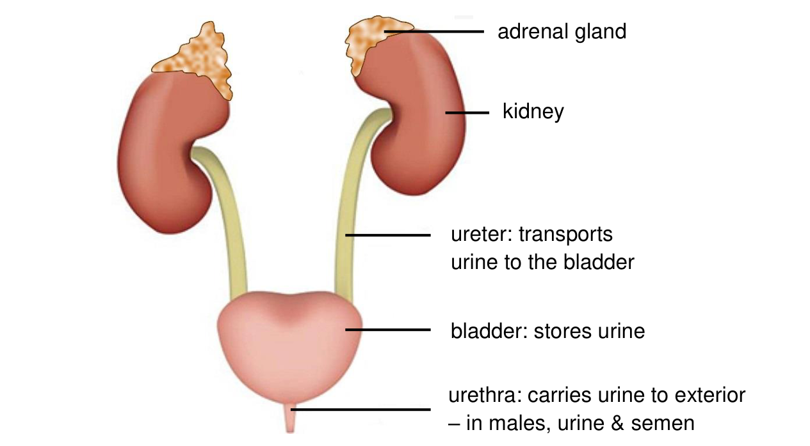
> **[Diagram Context - Textbook_LifeSciences_Gr11_Excretion_in_humans.pdf-0003-05.png]**
> This anatomical diagram illustrates the human urinary system alongside the adrenal glands. Visible labels include "adrenal gland", "kidney", "ureter: transports urine to the bladder", "bladder: stores urine", and "urethra: carries urine to exterior - in males, urine & semen", connected via black indicator lines. Conceptually, this graphic helps Life Sciences learners identify the macroscopic organs involved in excretion and osmoregulation, while outlining the specific structural functions of each component in the pathway of urine production and elimination.

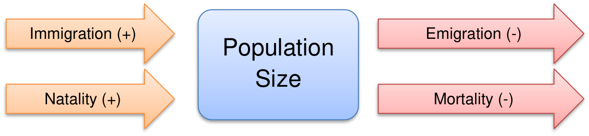
> **[Diagram Context - Textbook_LifeSciences_Gr11_Population_ecology.pdf-0003-02.png]**
> This conceptual diagram illustrates the four primary parameters that determine population size in ecological studies. It features a central box labeled "Population Size" flanked by directional arrows representing "Immigration (+)" and "Natality (+)" entering from the left, and "Emigration (-)" and "Mortality (-)" exiting to the right. For a high school Life Sciences learner, this graphic conceptually conveys how additions (births and immigration) versus subtractions (deaths and emigration) dynamically regulate overall population size over time.

---

## Population Dynamics: Carrying Capacity and Population Stability

### 1. Stable Population Size
* **Figure 3:** Stable population size fluctuating around carrying capacity.

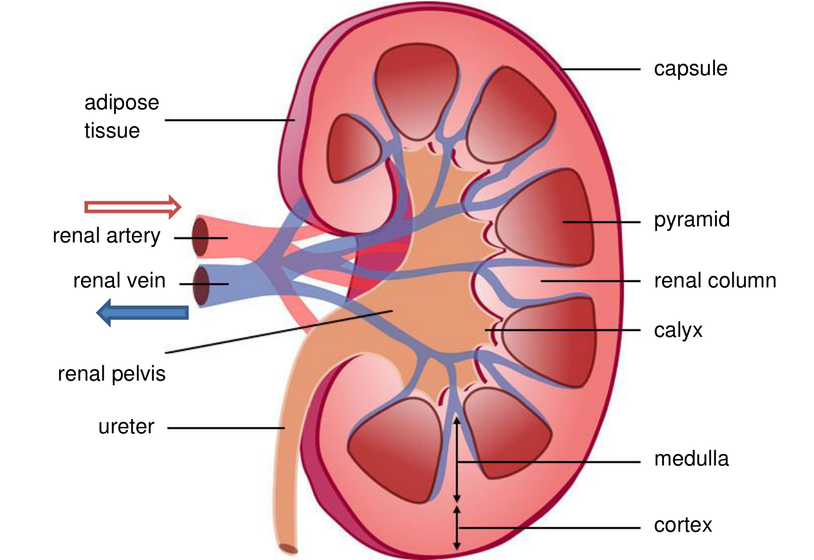

* **Description:** In a stable population, the population size grows and eventually levels off, fluctuating slightly above and below the carrying capacity over time.

---

### 2. Unstable Population Size
* **Figure 4:** An unstable population – population size exceeds the carrying capacity and then crashes.

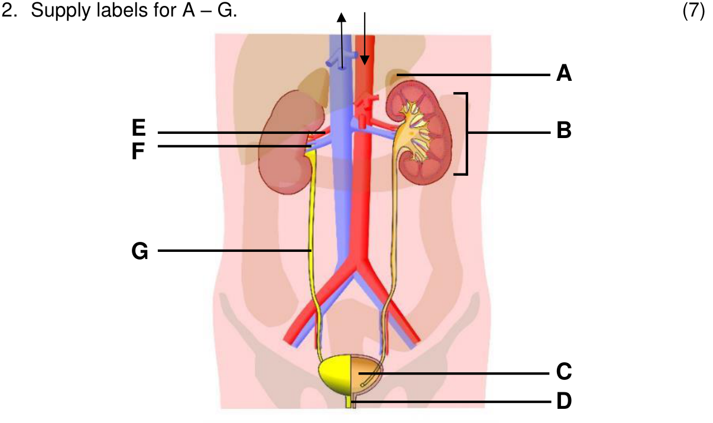

* **Key Concept:** If the population size exceeds the carrying capacity, resources will be exhausted and the population will rapidly decrease in size. This type of population is called an **unstable population**.

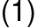

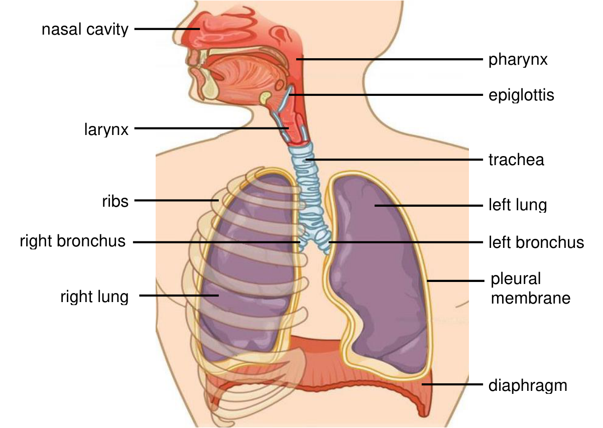
> **[Diagram Context - Textbook_LifeSciences_Gr11_Gaseous_exchange.pdf-0004-07.png]**
> This anatomical structure diagram illustrates the human respiratory system. Visible labels point to the nasal cavity, pharynx, epiglottis, larynx, trachea, left and right bronchi, left and right lungs, ribs, pleural membrane, and diaphragm. Conceptually, it conveys the organization and spatial relationships of the upper and lower respiratory tracts, helping learners identify key organs involved in breathing and gaseous exchange as prescribed by the CAPS curriculum.

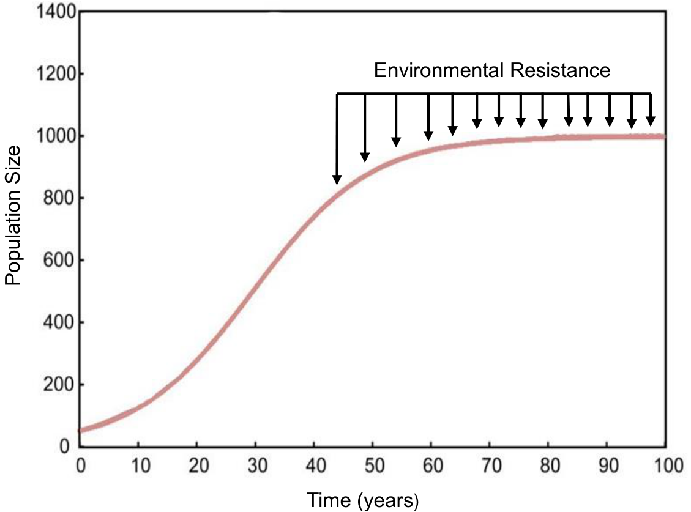

---

* **Density dependent and density independent factors**

| Density dependent factors | Examples |
| :--- | :--- |
| - Those factors that have a **direct correlation (relationship) to the size of the population in an area** - Exert a greater influence when a population is large | - Territorial behaviour - Predation and competition - Accumulation of waste - Food, space and shelter - Parasitism and disease |
| **Density independent factors** | **Examples** (natural disasters) |
| - Factors that will **exert an influence on a population regardless of its size** - Are abnormal events in nature and occur randomly | - Tsunamis - Landslides - Volcanic eruptions - Veld fires - Floods |

### Activity 1: Populations

1. Distinguish between the terms species, population and community. (6)
2. Explain how the density of a population affects its growth rate. (4)
3. Define the term carrying capacity. (2)
4. Name two environmental conditions which could result in a positive population growth. (2)
**(14)**

---

## Determining population size

Depending on the type of population, the size of the population can be determined either **directly** or **indirectly**.

### Key terminology

| Term | Definition |
| :--- | :--- |
| **closed population** | A population where only natality and mortality influence population size; no emigration or immigration |
| **direct counting** | Techniques that attempt to measure exact population sizes; no estimation are done |
| **census** | An official count or survey, especially of a population |
| **indirect counting** | Techniques which estimate population size; ideal for smaller organisms |

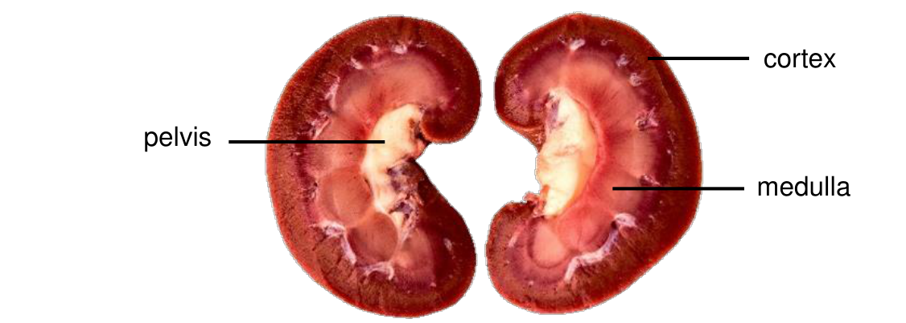

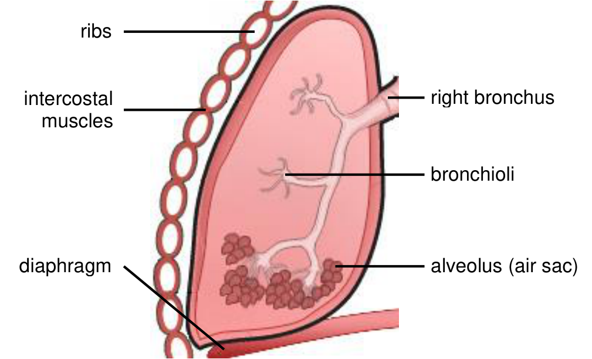

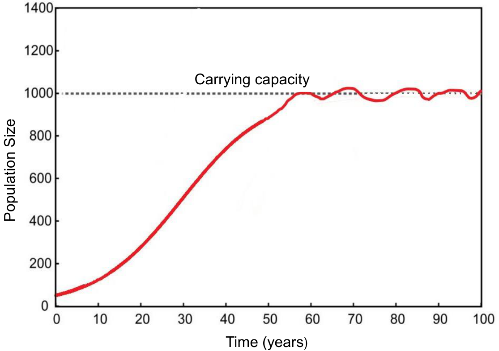

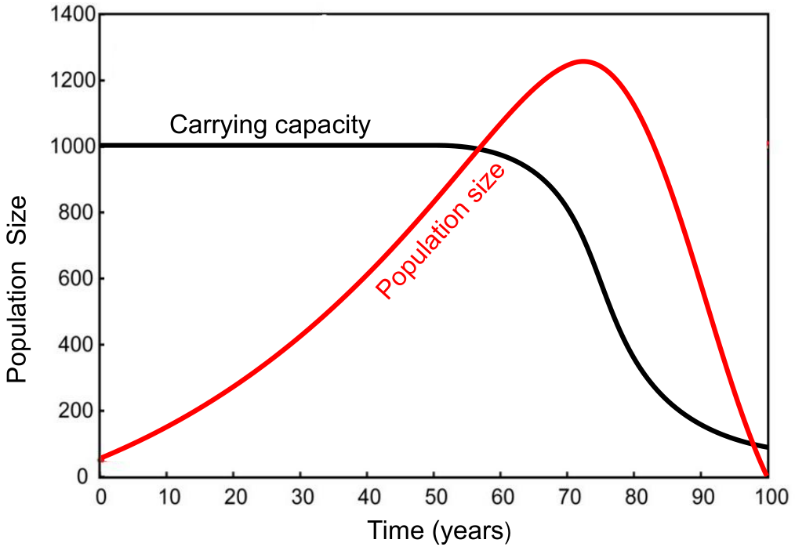

---

## Population Counting Techniques

### Key Terms

| Term | Definition |
| :--- | :--- |
| **Mark-recapture** | A technique used to indirectly calculate the size of a population by capturing and marking a sample which is then released—a second sample is captured later, and the number of marked organisms counted. |
| **Quadrats** | Square frames placed randomly on an area containing the organism; works well for both small sedentary animals and small plants. |

---

### Direct Counting Techniques

Direct techniques determine the actual population sizes. Direct techniques are suitable for counting larger, slow-moving organisms or organisms that are sessile.

Direct counting techniques include:
* **Aerial photography** (Figure 5): By taking an aerial photo of a population, the actual number of individual members who make up the population can be determined by counting.
* **Census** (Figure 6): A census is a direct method used to determine the actual number of humans in an area or a country.

> **Figure 5:** Aerial photograph taken to determine family group size  
> **Figure 6:** Man conducting a census in a community hall

---

### Indirect Counting Techniques

Indirect counting techniques are used to estimate population size where it is difficult to determine the actual number of organisms.

---

## Estimating Population Size: Mark and Recapture

Methods such as **mark and recapture** are used to estimate the population size of smaller organisms or fast-moving organisms.

### Core Concept: Mark and Recapture

Mark and recapture involves taking two samples of a population:

1. **First Sample:** Organisms are captured, marked, and then released back into the environment. 
   * *Note on mixing:* Adequate time must be allowed for the population to mix after the initial marking. This period must not be long enough to allow natality (births), mortality (deaths), immigration, and emigration to have a significant effect.
2. **Second Sample (Recaptured Sample):** A second sample is taken. The number of marked individuals and unmarked organisms in this sample is determined.

### The Petersen Index Formula

To determine the estimated size of the population, the following formula (known as the **Petersen Index**) is used:

$$N = \frac{M \times C}{R}$$

Where:
* $N$ = Total number of individuals estimated in the given population
* $M$ = Number of animals captured and marked in the first sample
* $C$ = Total number of individuals captured in the second sample
* $R$ = Number of marked individuals recaptured in the second sample

---

### Precautions for Reliable Results

To ensure the results of a mark and recapture study are reliable and accurate, the following precautions must be taken:

* **Sample Size:** The sample must be large enough to truly represent the population.
* **Permanence of Markings:** The markings used must remain on the organisms for the entire period of the procedure.
* **Suitability:** The markings must be suitable for the type of organism, ensuring they do not harm or interfere with the organism's movements and behavior.
* **Release and Mixing:** The marked organisms should be released into the environment close to the site of capture and be given enough time to mix thoroughly with the rest of the population.

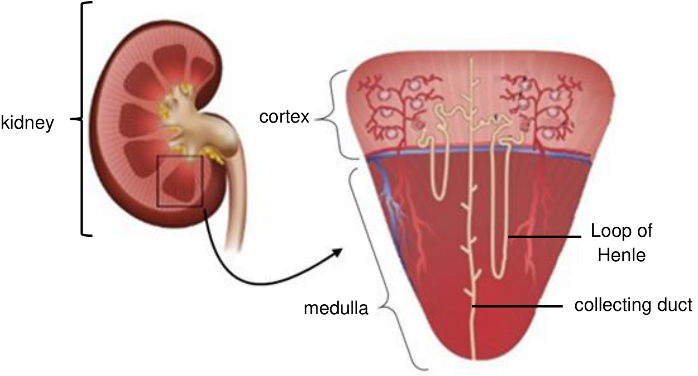

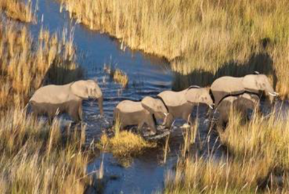

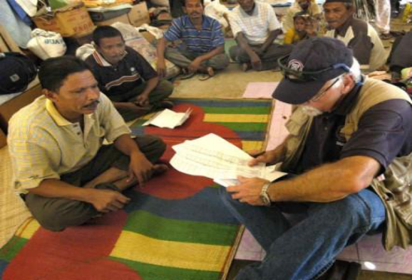

---

* Several secondary samples should be taken, and population sizes calculated. The **average** of each trial should be recorded to improve the reliability of the investigation.

Examples of markings (see Figure 7) include:

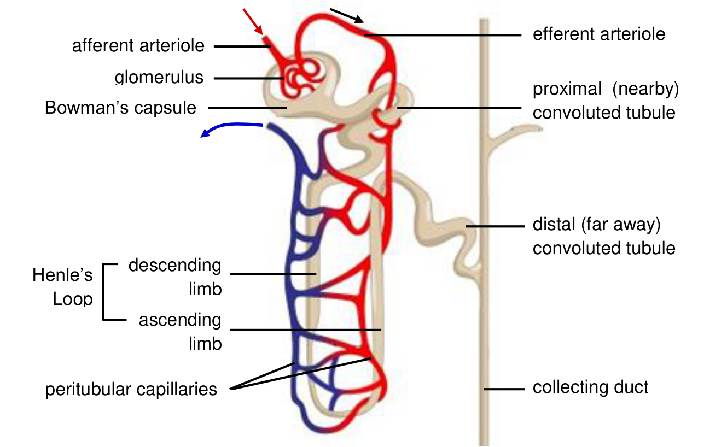

Figure 7: Examples of markings used in the mark and capture technique

### Quadrats

Quadrats refer to square frames made of plastic, wood or string that are placed randomly on an area containing the organism (see Figure 8). This technique works well for both small sedentary animals and small plants. Quadrat sizes may range from $1\text{ m}^2$ (small plants / animals) to $5\text{ m}^2$ (medium sized shrubs / animals).

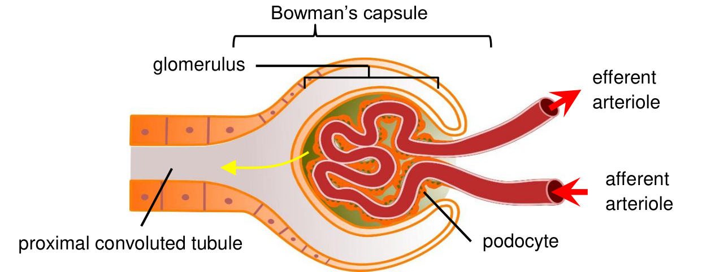

Figure 8: A simple plastic quadrat

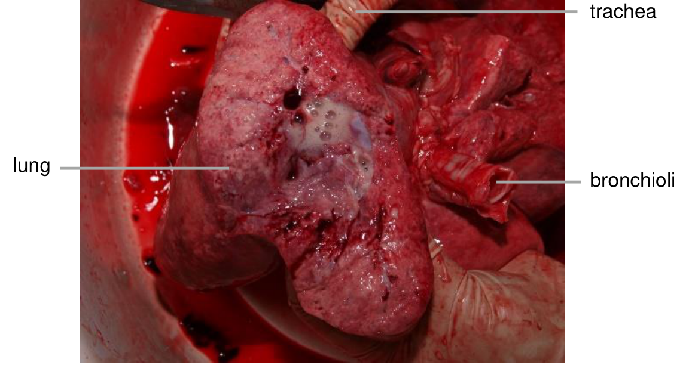

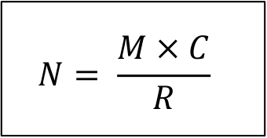

---

## Core Concepts: Determining Population Size

$$\text{Population size} = \frac{\text{average number of individuals per quadrat} \times \text{surface area of land}}{\text{quadrat surface area}}$$

### Precautions to Ensure Reliable Results
* **Several quadrat throws** (samples) should be made to determine the average number of individuals per quadrat.
* **Quadrat samples** must be done **randomly** throughout the total area.
* The process should be **repeated** several times and the average number of organisms per quadrat calculated.

---

## Activity 2: Determining Population Size

1. Phumzi and Rebecca want to determine the mussel population size in the rock pools at their local beach (see Figure 9 below). Mussels are sessile marine invertebrates that attach themselves to rocks. The rock pools have a total surface area of $32\text{ m}^2$.

   *(Figure 9: Mussels growing in a rock pool)*

   a) Phumzi and Rebecca both agree that the quadrat method would work best. Explain why you would agree with them and not choose to use the mark and recapture method. **(3)**

   b) The quadrat that they will be using is $2{,}5\text{ m}^2$ and they choose to throw the quadrat six times at random at different locations along the $32\text{ m}^2$ rock pool. The results are recorded in the table below. Using these results, calculate the population size of the mussels. **(4)**

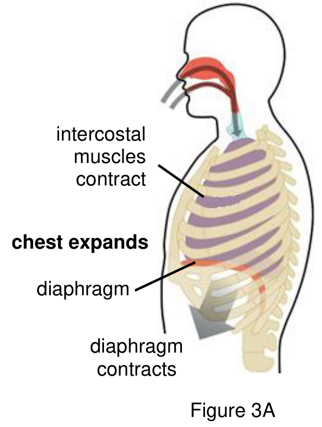

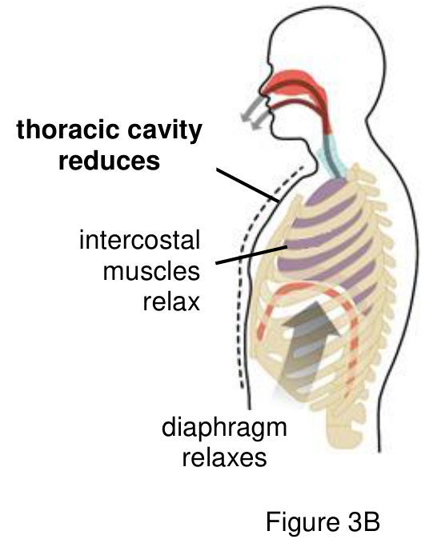

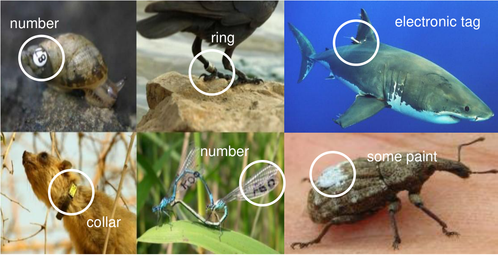

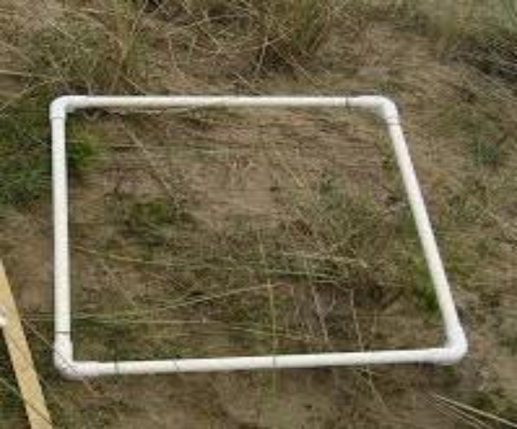

---

c) How has (i) validity and (ii) reliability been assured? (2)

2. Describe any four precautions that must be considered when working with the mark and recapture method. (4)

(13)

| Throw no. | Number of mussels in quadrat |
| :---: | :---: |
| 1 | 25 |
| 2 | 13 |
| 3 | 31 |
| 4 | 19 |
| 5 | 22 |
| 6 | 26 |
| **Total** | |
| **Population size** | |

---

# Population growth forms

Populations have characteristic patterns of growth. When population sizes are plotted over time, two different growth patterns can be found in nature. They are referred to as **geometric (or a J-shaped growth curve)** and **logistic (or S-shaped growth curve)** growth.

## Key terminology

| Term | Definition |
| :--- | :--- |
| **growth curves** | graphs that plot population size against time |
| **geometric growth** | a doubling after every reproductive event, i.e. exhibit exponential growth; graph has a **J-shape** |
| **logistic growth** | the type of population growth that starts with a few individuals and many resources – growth rate and consumption then increases. As resources are used up, growth rate levels off, resulting in an **S-shaped** graph |
| **lag phase** | first phase in a population growth curve where growth is slow; individuals may be acclimatizing to environment; few individuals that are sexually mature and able to reproduce |

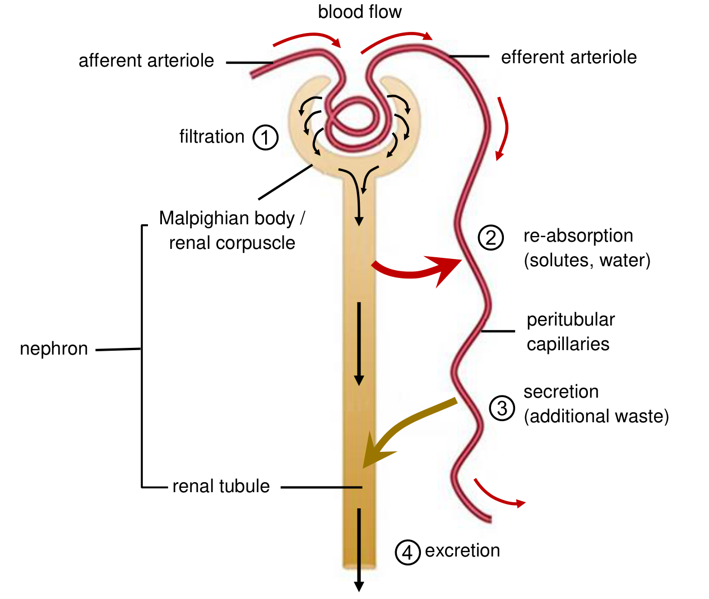

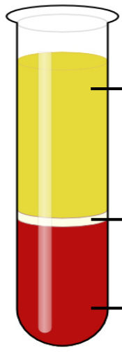

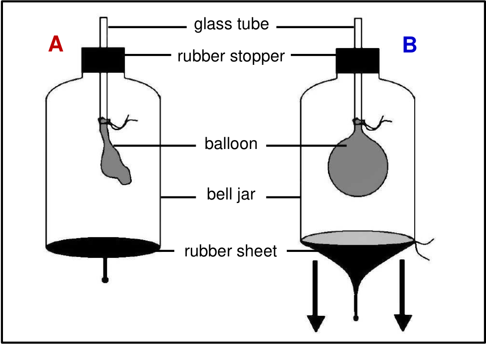

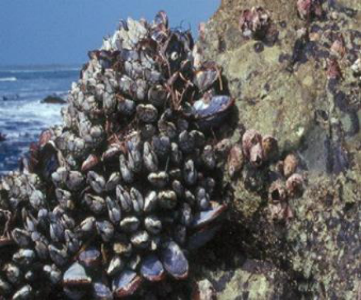

---

exponential growth phase | second phase in a growth curve; individuals have acclimatized, many reproducing individuals exist; in favourable conditions can produce many offspring
--- | ---
decelerating growth phase | third phase in a growth curve; environmental resistance leads to a decrease in the number of individuals; initially, natality rate is higher than the mortality rate but later the mortality rate is equal to the natality rate and eventually exceeds it
equilibrium phase | forth phase in a growth curve; carrying capacity is reached and factors limit size of population; carrying capacity is stable and able to maintain the population at a set value
death / extinction phase | fifth phase in population curve; without management of resource usage, and changes to abiotic and biotic factors in their environment, the population may not be able to sustain itself and enter a population crash phase

## Geometric growth curve

Geometric growth is characteristic of many micro-organisms e.g. bacteria and protists. These species are able to reproduce quickly and double their numbers after every reproductive division in favourable conditions. Eventually their resources become limited and/or waste products accumulate and adversely affect the population. This causes death or an extinction event. Three distinct phases can be seen in geometric growth curves (Figure 10):

* Lag phase – population number increases slowly because:
  * individuals may still be acclimatising to their environment
  * they need time to find mates
  * most of the population is sexually immature
* Geometric (or accelerated) growth phase – individuals have acclimatised, many reproducing individuals exist and in favourable conditions produce many offspring. The birth rate is higher than the death rate. There is very little environmental resistance.
* Extinction or death phase – resources become limited, i.e. food, space, etc., and the population is no longer able to reproduce as effectively. The mortality rate becomes greater than the natality rate. The population decreases rapidly.

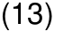

---

Figure 10: Geometric growth in a population 

### Logistic growth form

Logistic S-shaped growth (Figure 11) is normally found in higher-order organisms (e.g. mammals) which typically reproduce slower. Populations tend not to exceed the carrying capacity and, if they do, they show higher levels of resilience to environmental resistance.  

An S-shaped graph typically consists of five phases:

* **Lag phase:** As in the geometric growth curve, the population numbers increase slowly.  
* **Exponential or accelerating growth phase:** The population can reach higher natality levels because of more sexually mature individuals procreating and environmental resistance being low (because of enough food, space and shelter). 
* **Decelerating growth phase:** Natality rate is still higher than the mortality rate, however, the mortality rate is gaining momentum because of higher levels of environmental resistance and old age. 
* **Equilibrium / stationary phase:** Carrying capacity of the environment has been reached. One or more limiting factors are exerting a toll on the population. The carrying capacity is somewhat stable and able to maintain the population at a set value.  
* **Death / extinction phase (not shown on graph):** Some populations cannot regulate their resource usage and/or changes to abiotic and biotic factors in their environment and are then unable to sustain themselves. 

Time  
Population size  
death – extinction phase

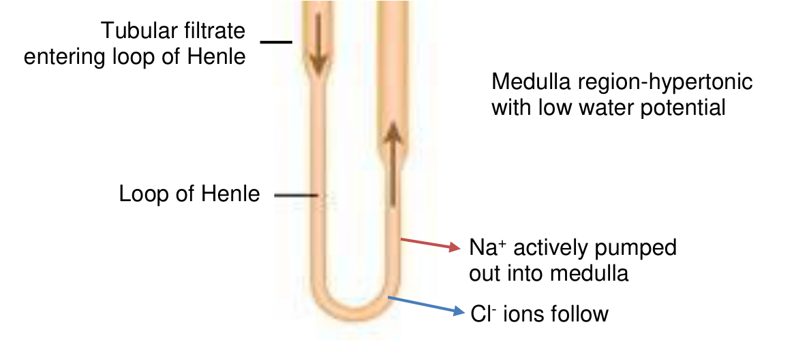

---

# Figure 11: Logistic growth curve

---

## Activity 3: Growth forms

1. Tabulate two major differences between logistic and geometric growth forms. Include an example of a species representing each growth form. **(6)**

2. Identify the growth form in the following graph. **(1)**

<!-- DIAG_PLACEHOLDER: diagram -->

3. Identify the phases 1 to 4 in the above graph. **(4)**  
**(11)**

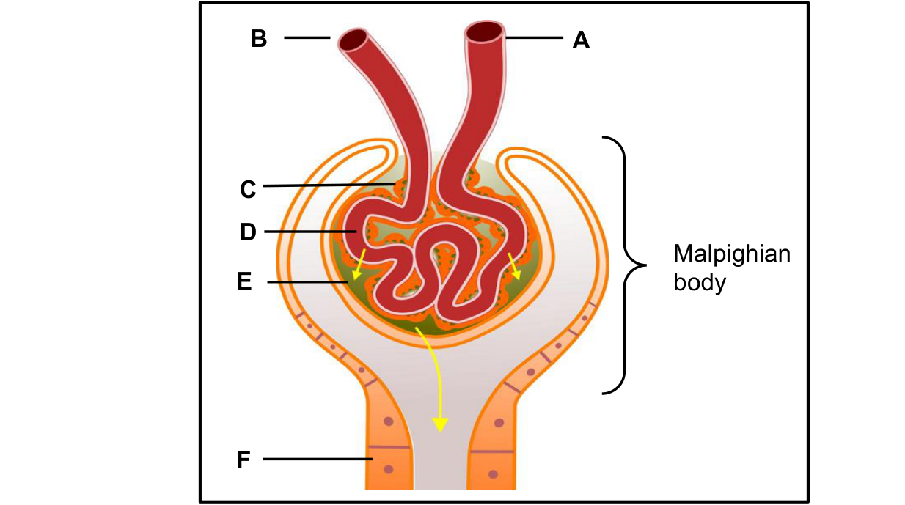

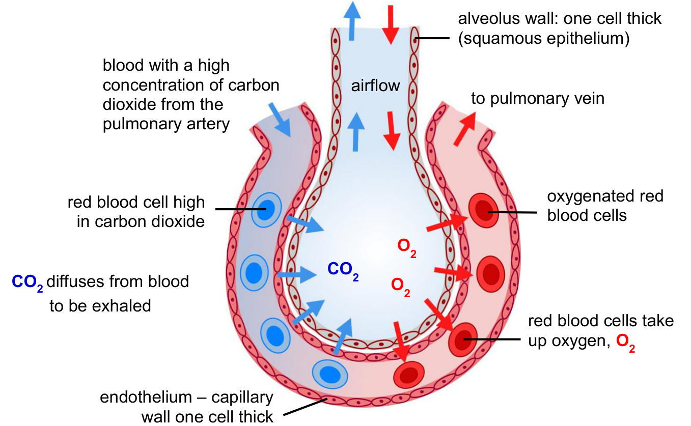

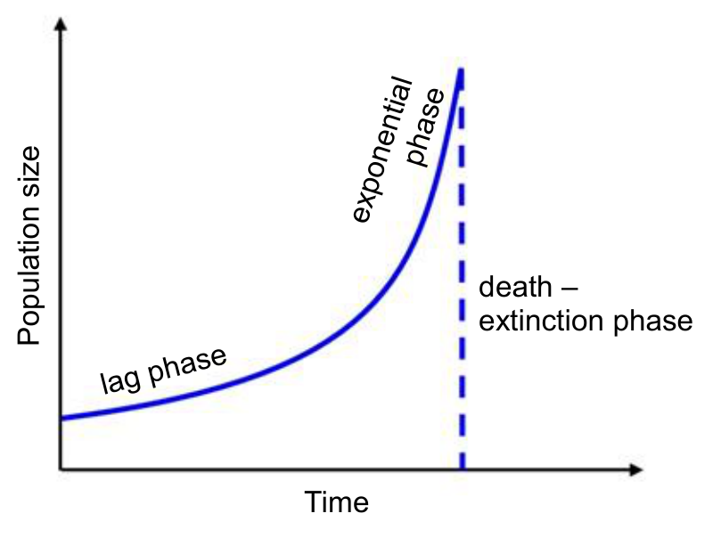

---

# Interactions in the environment

Species interact with each other in a variety of ways. These include:
* predation
* competition
* symbiotic relationships

---

## Predation

A **predator** is an organism that actively **hunts**, **kills** and **consumes** its prey to meet its energy needs.

### Key terminology

| Term | Definition |
| :--- | :--- |
| **predation** | the act of preying on another animal |
| **predator** | heterotrophic organisms (usually animals) that hunt, kill and eat other organisms (or animals) |
| **predator – prey curve** | a curve that describes the dynamics of biological systems in which two species interact |

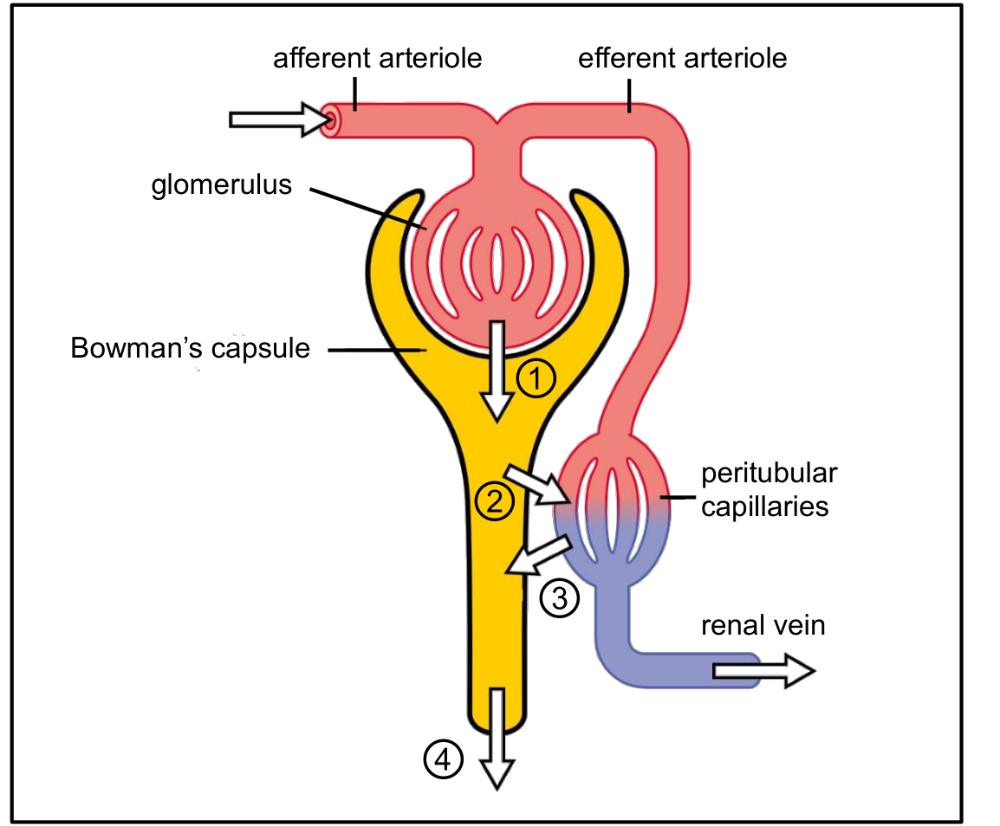

*Figure 12: A spotted hyena claiming a share of the kill*

Predators play an important role in regulating the number of other species. The relationship between the number of predators and their prey, can be represented by a predator-prey graph.

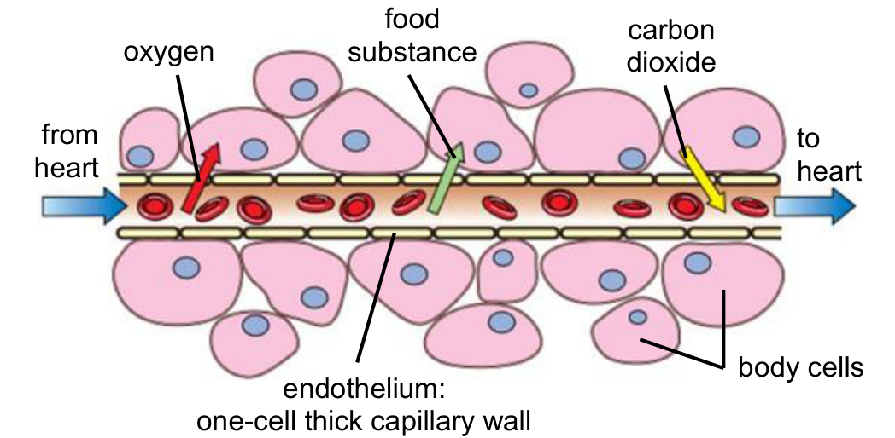

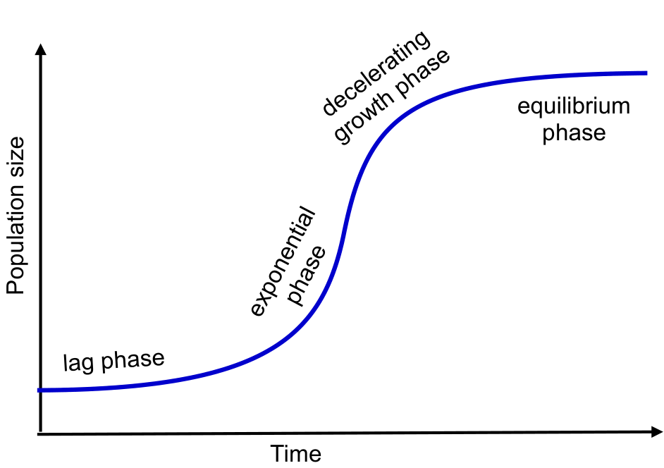

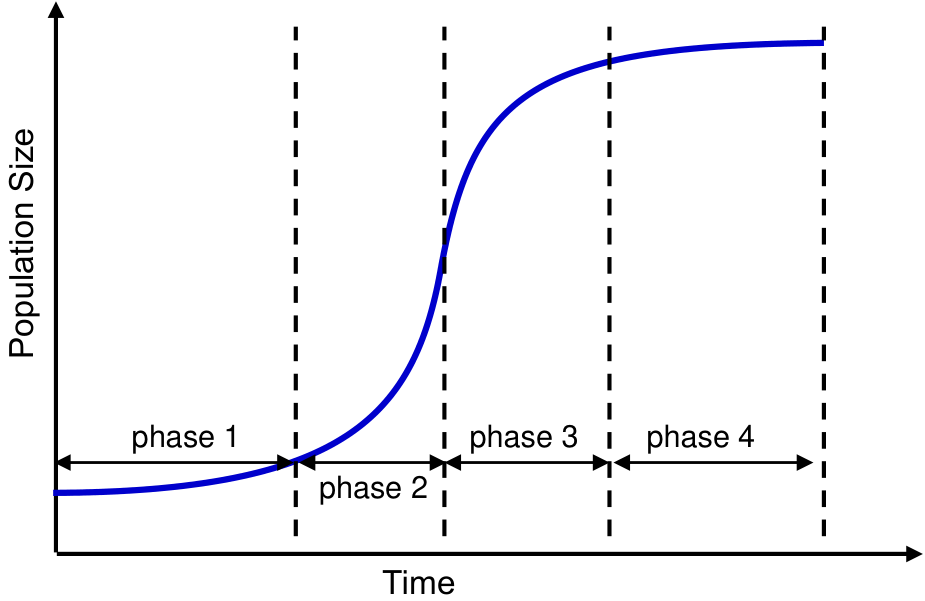

---

## Interpreting a Predator-Prey Graph

### Key Concepts & Relationships

The graph illustrates the cyclical fluctuations of population numbers for a prey species (such as kudu or impala, represented by a solid line) and a predator species (such as lion or hyena, represented by a dashed red line) over time.

---

### Step-by-Step Population Dynamics

1. **The number of prey increases first**
   * An environment with abundant food, space, and a lack of predators allows the prey population to increase exponentially.

2. **The number of predators rises after prey numbers have increased**
   * There is a delayed reaction in the rise of predators due to several factors:
     * Predators are still in the initial lag phase (few sexually mature individuals reproducing, and gestation periods are quite long).
     * If newly introduced to an environment, predators might need time to acclimatise first.
     * There is competition for prey.

3. **Prey numbers start to decrease**
   * This occurs due to higher environmental resistance, which includes a lack of food, water, space, and increased predation levels.

4. **Predator numbers start to decrease**
   * Predator numbers decline once prey numbers are low or are decreasing rapidly because:
     * As prey decreases, food becomes a limiting factor for the predator.
     * Increased competition between predators for food causes higher mortality rates amongst predators.
     * Predators may also emigrate out of the area to where more food may be found.

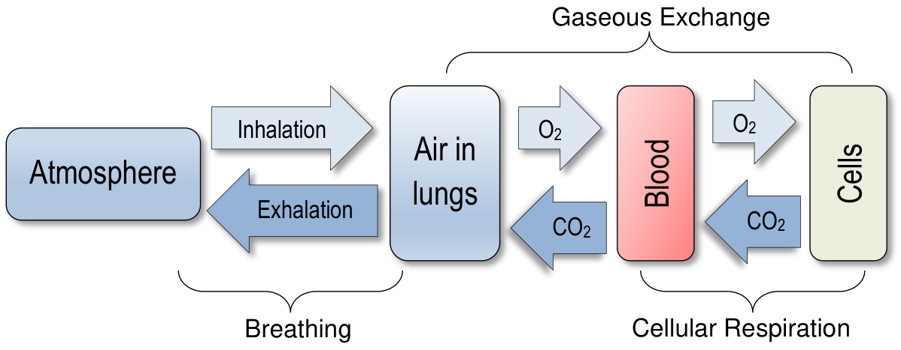

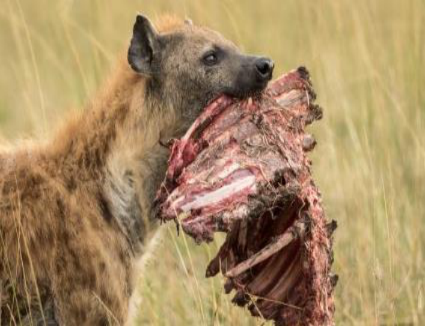

---

* Stationary (stable) phases are extremely short, and fluctuations of predator and prey numbers tend to be high.
  * Environmental resistance increases on prey populations as predators have access to a large supply of prey. Prey numbers decrease as predator numbers increase. When predator numbers grow too large and there is not enough prey anymore, their numbers decrease rapidly.

## Competition

Competition is the interaction between individuals over scare resources.

### Key terminology

| Term | Definition |
| :--- | :--- |
| **competition** | Social interaction between organisms fighting for dominance over the same limited resources (food, living space) |
| **interspecific competition** | Competition between two or more different species |
| **intraspecific competition** | Competition within members of the same species |
| **competitive exclusion** | Process whereby species can exist independently and survive; when placed in the same environment, one species will out compete the other and cause its extinction / death |

* When individuals of the same species compete, it is called intraspecific competition.
* When individuals of different species compete, it is interspecific competition (Figure 14).

Figure 14: An African elephant chasing a buffalo from the watering hole is an example of interspecific competition

250

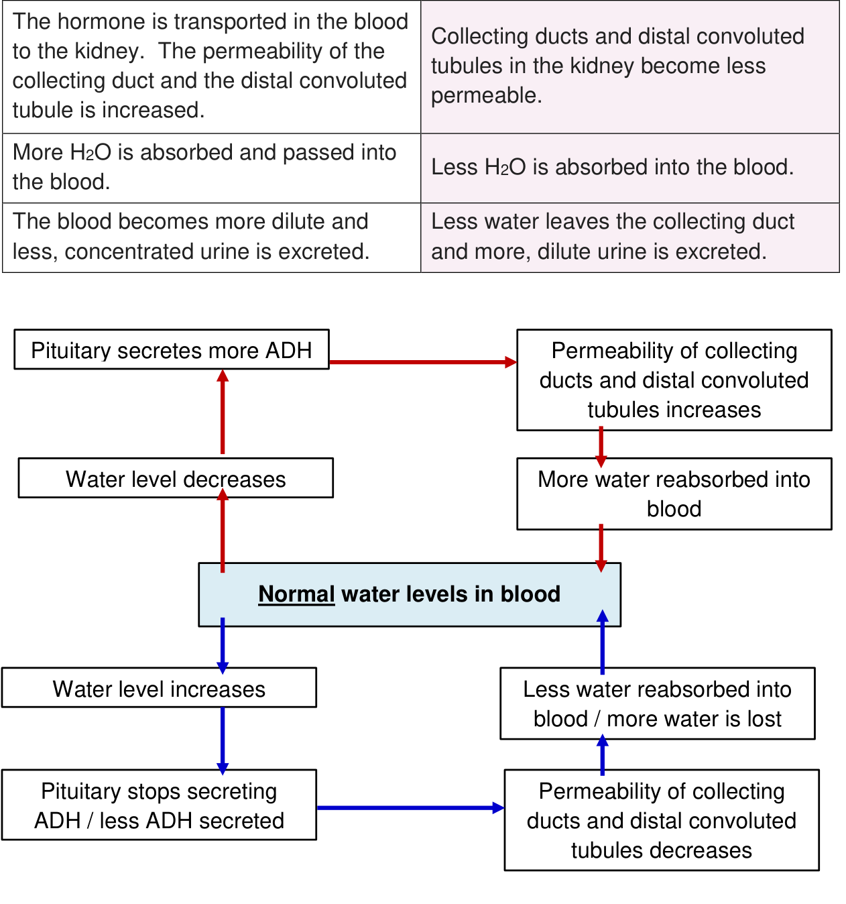

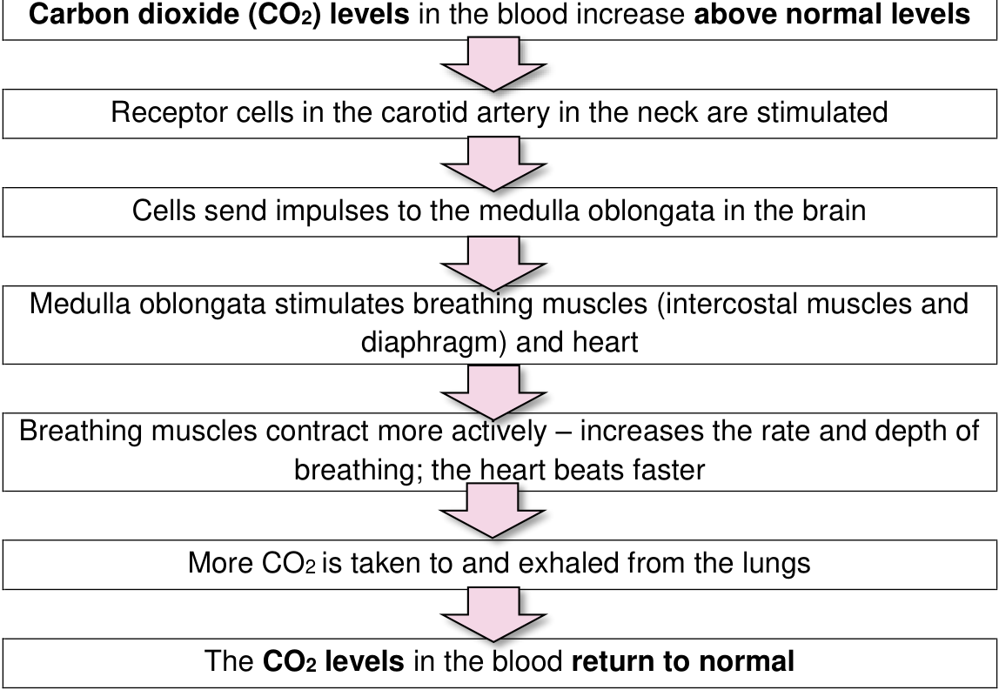

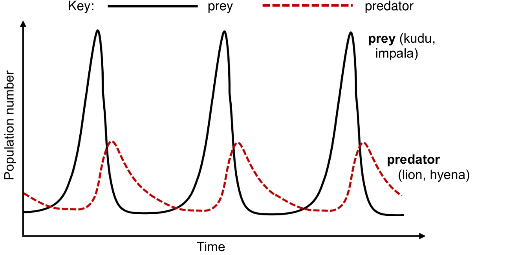

---

## Competitive exclusion

The **competitive exclusion** principle states that when two species competing for the same resources, one species will out-compete the other. An example of competitive exclusion is illustrated in Figure 15.

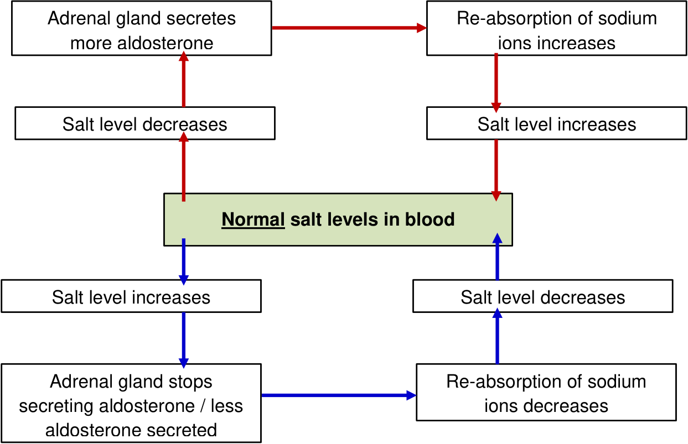

*Figure 15: Competitive exclusion in Paramecium species*

When *Paramecium aurelia* and *Paramecium caudatum* are kept in separate containers, their numbers increase rapidly. If the two species are put into the same container *P. caudatum* out-competes *P. aurelia* and the numbers of *P. aurelia* decease rapidly.

---

## Resource partitioning

Resource partitioning refers to the sharing of resources so that different species can co-exist in the same area.

### Key terminology

| Term | Definition |
| :--- | :--- |
| **resource partitioning** | a specialisation that limits interspecific competition; through resource partitioning, different carnivores, herbivores and even plant species can co-exist and survive in the same environment since each occupies a different ecological niche |

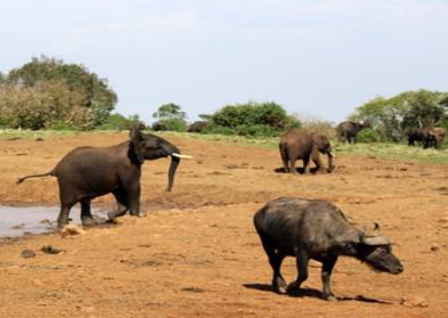

---

Examples of resource partitioning include:

*   **Herbivores grazing in the same area** – taller animals such as giraffes feed on the leaves at the top of trees while larger buck feed from the middle and smaller buck from the lower branches (Figure 16).

    

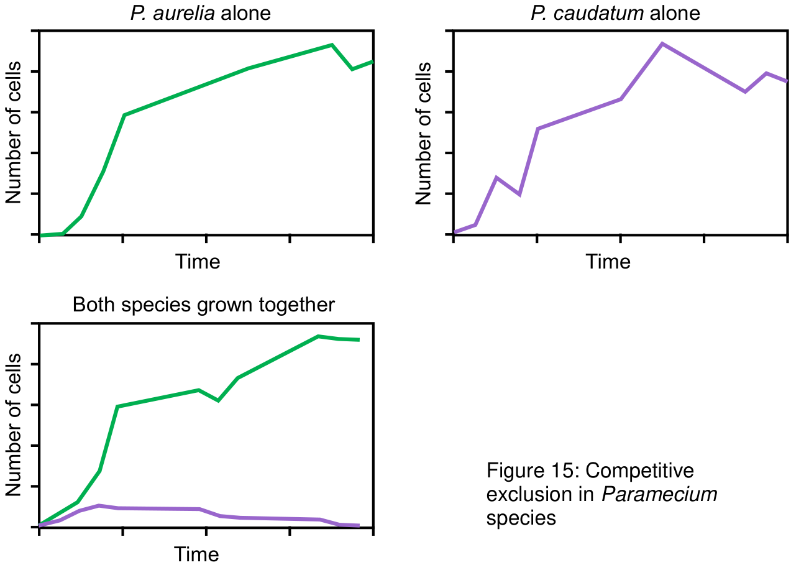

    *Figure 16: Resource partitioning on the savannah*

*   **Partitioning of light in a forest (stratification)** – Plants grow to a certain height depending on their light requirements. Plants which require less light grow in the shade of taller plants (Figure 17).

    <!-- DIAGRAM_PLACEHOLDER: diagram -->
    *Figure 17: Forest stratification showing four distinct layers*

---

# Symbiotic relationships

Symbiosis is a close, long-term biological relationship between individuals of two or more species. There are 3 types of symbiotic relationships:

* mutualism
* commensalism
* parasitism

## Key terminology

| Term | Definition |
| :--- | :--- |
| **symbiotic relationship(s)** | close physical association between two different organisms; includes mutualism, commensalism and parasitism |
| **mutualism** | species that partake in this relationship benefit equally |
| **commensalism** | symbiotic relationship where one organism benefits without harming or affecting the other organism |
| **parasitism** | symbiotic relationship in which one organism benefits from the relationship (parasite) while causing harm to their host |
| **obligatory parasitism** | parasite which cannot complete its life cycle without exploiting the bodies of suitable host(s) |

---

# Mutualism

Mutualism is an example of a symbiotic relationship between two different species in which **both species benefit**.

## Examples of mutualism found in South Africa

* **Buffalo and oxpeckers** (Figure 18). The oxpecker feeds on ticks and the buffalo benefits by having the ticks removed.

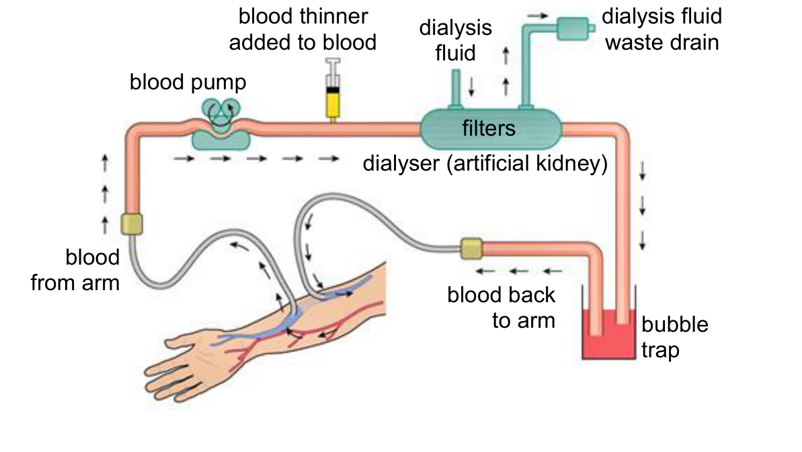

*Figure 18: Oxpecker eating ticks off a buffalo*

*Figure 19: Sunbird drinking nectar from an Erica species*

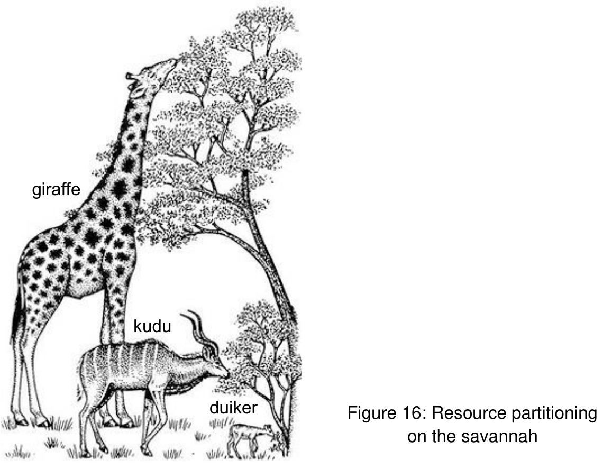

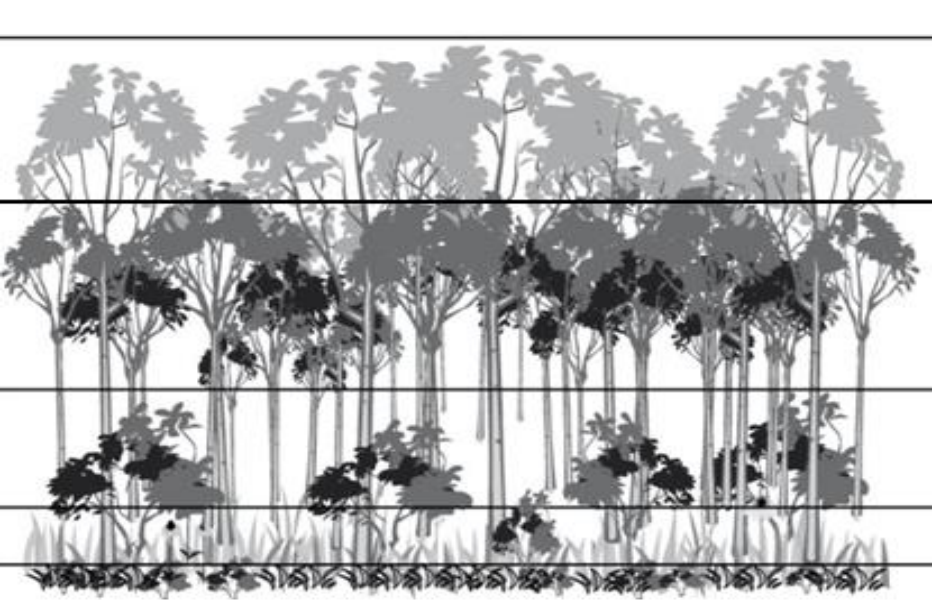

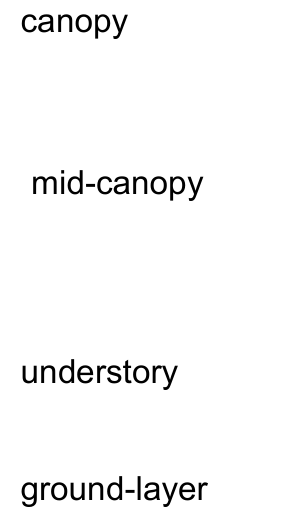

---

* **Sunbirds and Ericas** – Sunbirds (Figure 19) drink the sugar-rich nectar of indigenous Erica flowers. Pollen sticks to the feathers of the birds and is carried to other flowers, thus ensuring cross-pollination.

---

## Commensalism

In a commensalistic relationship, **one species benefits** while the **other neither benefits nor is it negatively affected** from the shared interaction.

### Example

* **Whales and barnacles** share a commensalistic relationship (Figure 20). Barnacles attached to whales filter water for food while the whale moves through the ocean. The whale is not harmed by the barnacles.

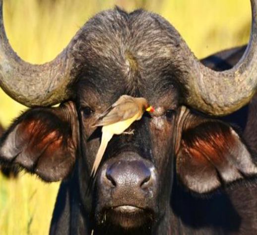

*Figure 20: Barnacles on a grey whale*

* **Egrets** share a commensalistic relationship with many herbivorous species (Figure 21). Egrets are insectivorous birds who walk with cattle, rhinos, and giraffes among other herbivorous species. While the herbivores do not gain anything from the egret, the egret benefits by catching the insects more easily that have been disrupted by the movement of the herbivore through the vegetation.

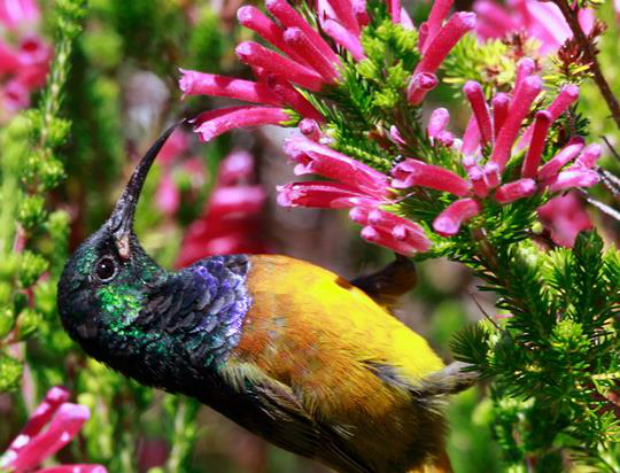

*Figure 21: An egret and bovid species*

---

254

---

# Parasitism

In parasitic relationships, one species (the parasite) benefits while the other species (the host) is harmed.

## Types of Parasites

Parasites can be classified into two main categories:

- **endoparasites:** those that parasitise the host internally, e.g., tapeworms.
- **ectoparasites:** those that parasitise the host externally, e.g., leeches and ticks (Figure 22).

Ticks are common examples of ectoparasites as they consume the blood of their host externally. Parasites are almost always host specific (they only parasitise certain host bodies).

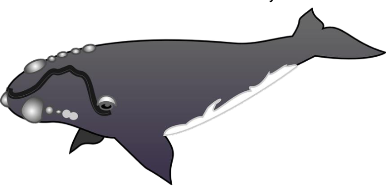

*Figure 22: Ticks as an example of ectoparasites*

Dodder (Figure 23) is an obligate parasite. It has no chlorophyll, so it is completely dependent on other plants (hosts) for both food and water.

<!-- DIAGRAM_PLACEHOLDER: diagram -->
*Figure 23: A dodder species parasitizing an herbaceous bush*

---

### Activity 4: Symbiotic relationships

Identify the types of symbiotic relationships depicted in A – D below. (4)

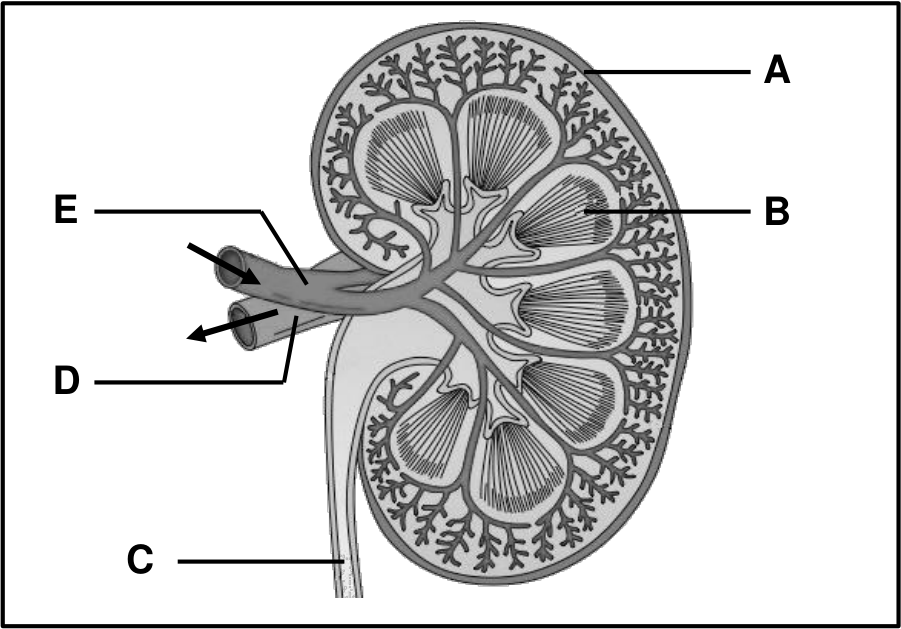

---

## Social Organisation

Social organisation increases the chances of survival through the shared efforts of individuals benefiting the members of the population.

### Key terminology

| Term | Definition |
| :--- | :--- |
| **social organisation** | interactions that increase the chances of survival through shared efforts of individuals benefiting the members of the population |
| **herding behaviour** | individuals in a group which act collectively without centralized direction |
| **pack hunting** | typically associated with cooperative coordinated, purposeful movements in the catching and killing of prey |

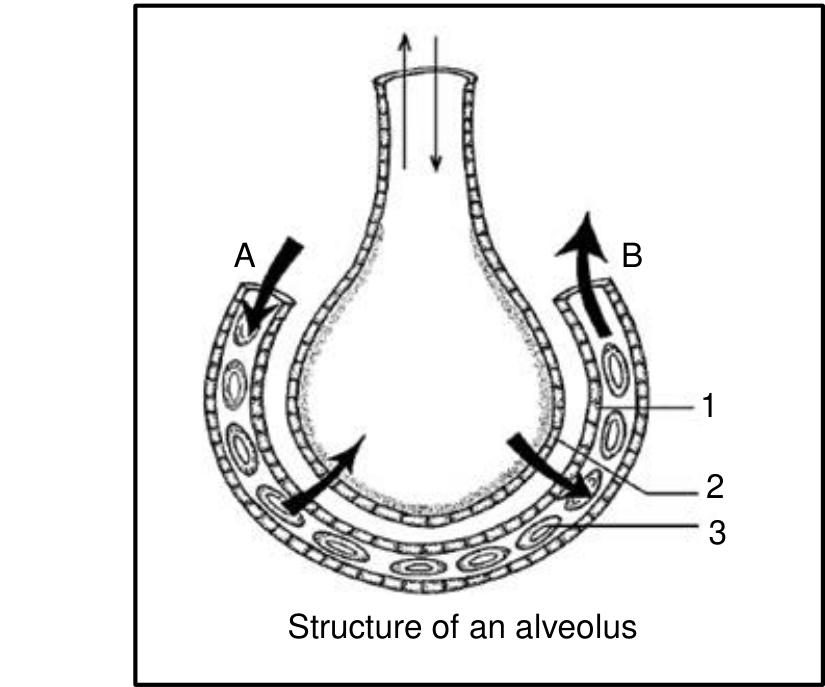

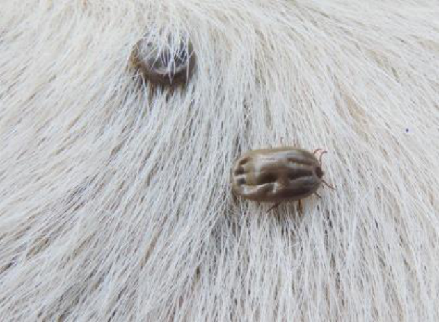

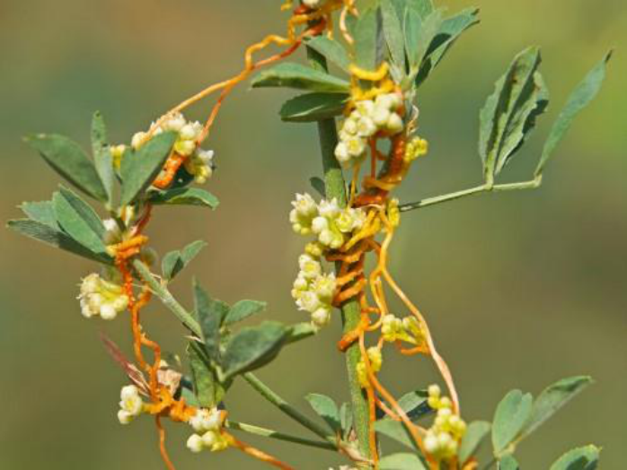

---

Examples of social organisation include **herding**, **packs**, **dominance** and the **division of tasks**.

## Herding as a protective strategy

Safety exists in numbers. Many herbivorous species such as wildebeest (Figure 24), buffalo and zebra live in large herds. In herding there are many eyes available to watch for predators. Young are protected by keeping them in the middle of the herd.

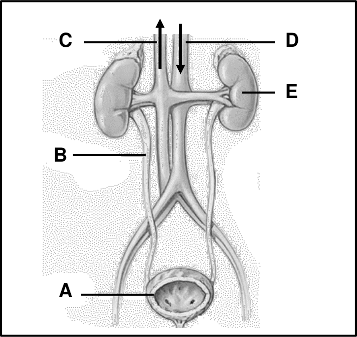

Figure 24: Wildebeest travel in large migratory herds

## Packs as a hunting strategy

As a hunting strategy, packs allow groups of a population to produce highly co-ordinated, purposeful movements in the catching and killing of prey. Packs also allow for smaller-to-medium sized carnivores to take down larger, more dangerous prey.

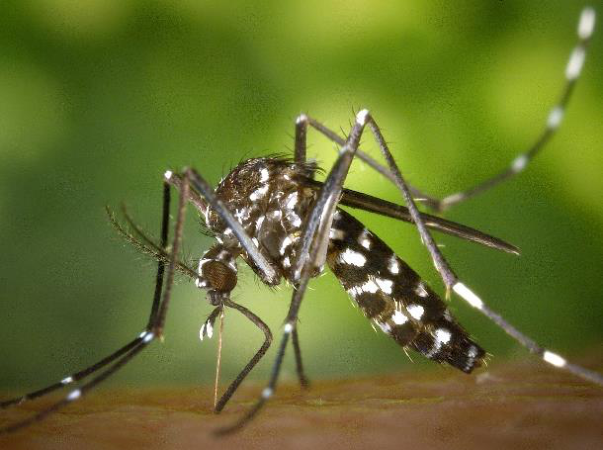

Figure 25: The African wild dogs is a highly social animal that lives in packs and takes mutual care of its young, sick and old

257

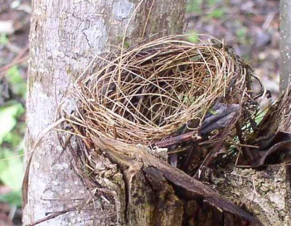

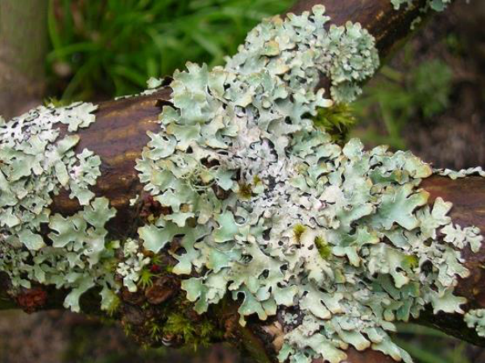

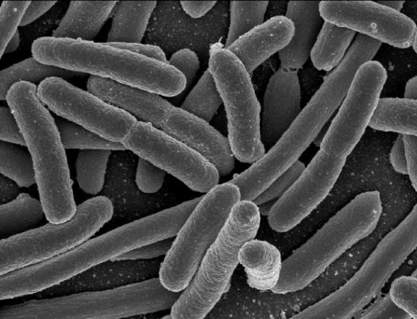

---

# Dominance and Division of Tasks in Animal Populations

## Dominance as a Protective and Reproductive Strategy

* **Establishment of Hierarchy:** In many animal groups, naturally stronger individuals compete until one member becomes the dominant male or female, known as the **'alpha member'**.
* **Reduction of Competition:** This hierarchy helps reduce intraspecific competition within the group.
* **Leadership Structures:** Depending on the species, groups may be led by:
  * **Alpha females** (where males are submissive)
  * **Alpha males** (where females are submissive)
* **Reproductive Quality:** Dominance ensures reproductive quality. Offspring produced from strong parents are more likely to inherit favorable traits, ensuring the continued survival of the species.

> **Example:** Meerkats in a mob are led by a dominant mating pair.

---

## Division of Tasks (Castes)

A **division of tasks** means that each individual in a population has a specific role to fulfill, dedicating their time and energy exclusively to that function. 

In insect populations—especially colonial insects (such as bees or wasps) or sociable burrowing insects (such as termites and ants)—at least **3 different castes** exist:

1. **Reproductive Caste:** Normally consists of only one queen with a handful of male drones whose primary role is reproduction with the queen.
2. **Soldier Caste:** Consists of larger, more robust individuals specialized in defending the nest/colony or attacking threats.
3. **Worker Caste:** Members responsible for foraging for food, building and maintaining the colony or nest, and tending to the queen and brood.

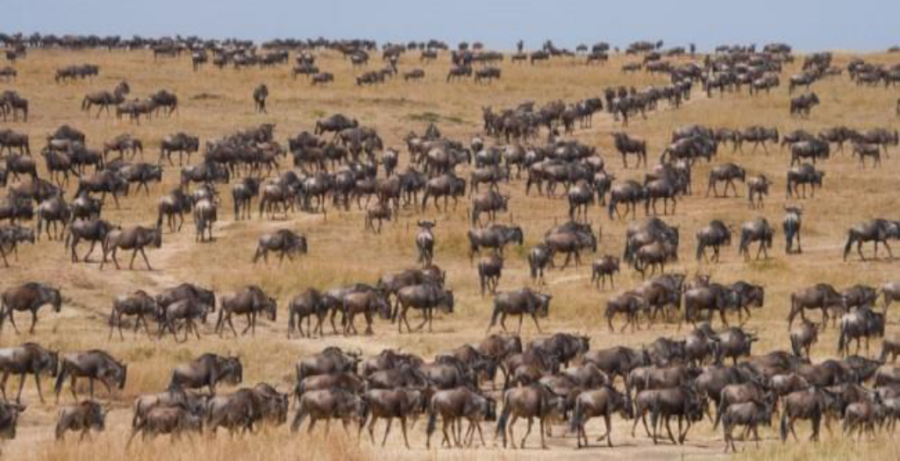

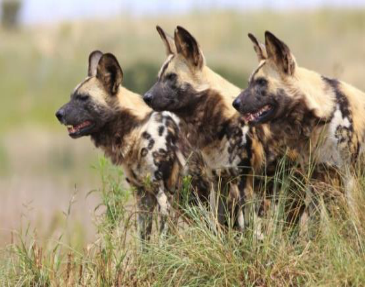

---

**Figure 27:** Termite castes

All castes are interdependent and cannot survive on their own. As a collective, they are able to ensure the survival of the species.

### Community change over time (Succession)

Succession refers to the slow changes that occur over time in a new ecosystem until a climax community is reached. In nature, we study two types of succession, namely primary and secondary.

#### Key terminology

| Term | Definition |
| :--- | :--- |
| **primary succession** | Process of initial colonization (primary), then the natural gradual changes in plant / animal species that live in an area. |
| **pioneer species** | Hardy organisms to first grow in a new or disturbed area and help break down rock and build soil. |
| **secondary succession** | Process of regrowth or development after a previously existing habitat has been disturbed or damaged. |
| **climax community** | The final, stable community after succession. |

### Primary and secondary succession in ecosystems

Primary succession (Figure 28) refers to all the biotic changes to a community in a new habitat, i.e. in a barren landscape devoid of any soil or biotic influence, such as:
* when a new island rises out of the ocean because of volcanic activity
* when receding glaciers expose a large mountain surface

reproductive caste (queen) | soldier caste | worker caste

259

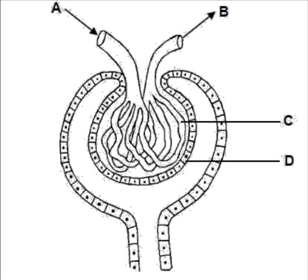

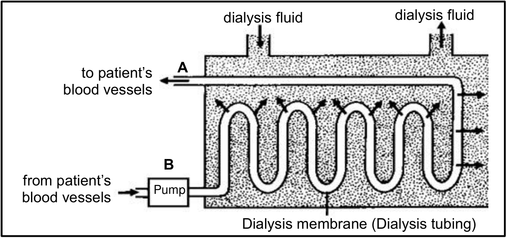

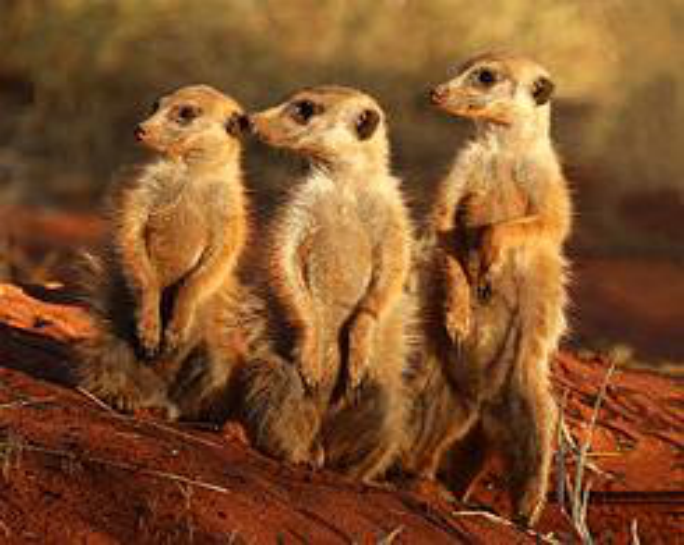

---

# Ecological Succession

## Pioneer Species and Primary Succession

* **Pioneer species:** The first organisms to move into a newly exposed area.
  * Pioneer species include **lichens**. By attaching themselves to the rocky outcrop, they begin the very slow process of weathering the rock down. Gradually, over a long period of time, a thin layer of soil forms.
  * Certain pioneer species also secrete acid-like substances into the surrounding rock that further assists in its break-down.

## Progression of Communities

1. **Grass species:** Once enough soil is present, grass species can enter the habitat and further break down rocky outcrops to build up the soil layer.
2. **Herbaceous shrubs and ferns:** As time progresses, small to medium herbaceous shrubs and ferns can settle and replace the pioneer species by outcompeting them.
3. **Softwood and hardwood tree species:** In time, those plants will be replaced by softwood and by hardwood tree species. Each previous community makes the environment more suitable for the next.
4. **Climax community:** Includes plant and animal species that are consistently stable in their environment.

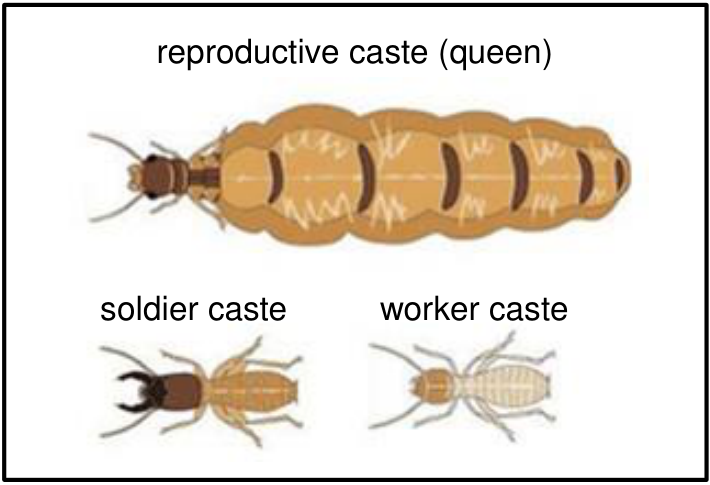

*Figure 28: Succession in the formation of a climax forest community*

## Secondary Succession

**Secondary succession** (Figure 29) occurs when land that was previously used for agricultural purposes becomes abandoned, or a fire has swept through an area destroying all vegetation.

---

In these communities, succession takes place faster as a thick soil layer is usually already present. Pioneer species (such as grasses) are quickly outcompeted by later more competitive occupants and climax species (i.e. hardwoods and fauna).

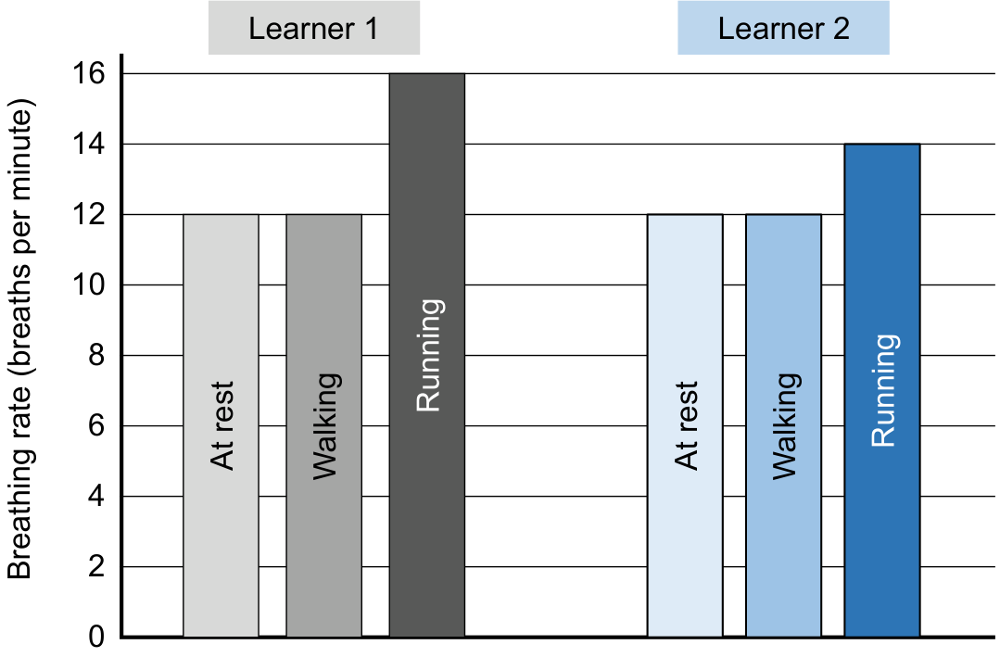

Figure 29: Vegetation is destroyed by fire. Over time new grasses and shrubs grow, finally to be replaced by lush forest as there was originally

# Human population

Modern humans evolved $200\,000$ years ago. The population size then, was probably less than several hundred. Today, the human population stands at $7,66$ billion.

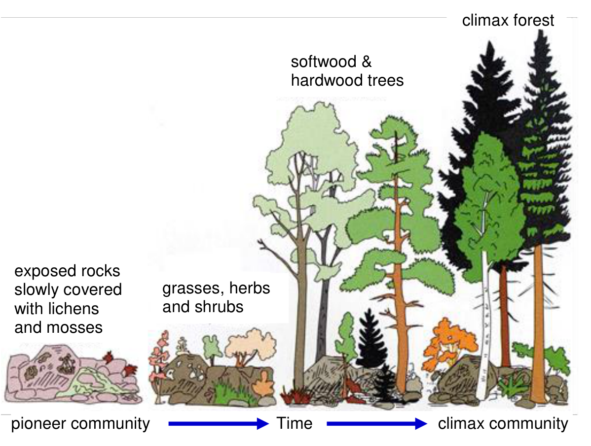

Figure 30: The human population has grown exponentially over the last 200 years

Human population growth: https://youtu.be/PUwmA3Q0_OE

---

# Reasons for Exponential Growth

* **Agricultural improvements:** Through agricultural improvements, humanity has been able to increase and secure food availability.
* **Medicinal improvements:** Medical technology has improved drastically over the span of a few hundred years, allowing us to counter the effects of pathogenic diseases and their subsequent spread.
* **Technological improvements:** Technology has made daily life easier and more convenient, which further increased carrying capacity.

Through constantly increasing our carrying capacity and decreasing our environmental resistance, our population growth rate has exploded.

---

# Age-Gender Population Pyramids

Data regarding a population can be gathered by conducting a census and then ordered according to the number of individuals in a certain age category and of a certain gender. The results are then presented as a population pyramid.

## Key Terminology

| Term | Definition |
| :--- | :--- |
| **Age-gender pyramids** | Also called an age-sex pyramid, this is a demographic graph that depicts the age and gender distribution of a population per age group. |

Three types of population pyramids can be observed according to whether or not the population size is growing, stable, or declining:

* Expanding or growing population pyramid
* Stable population pyramid
* Declining population pyramid

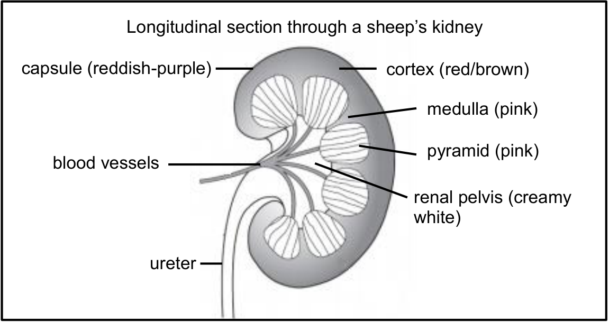

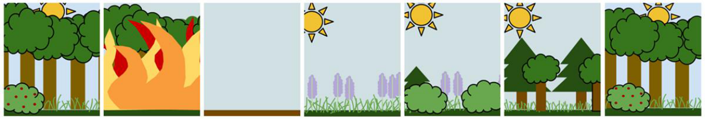

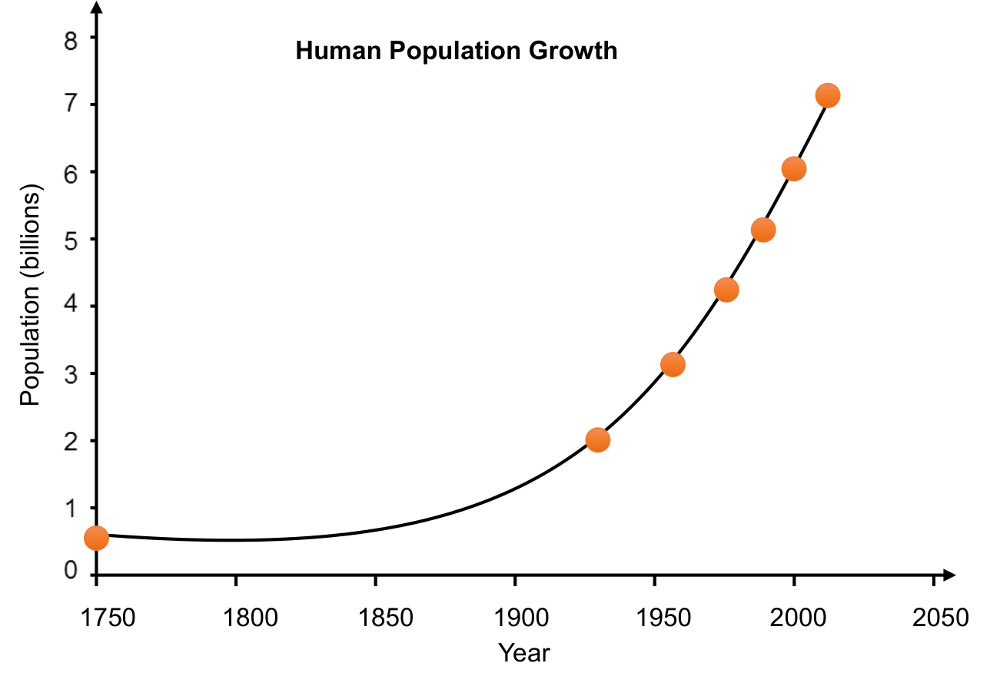

---

## 1. Expanding population growth pyramid

* **Characteristics:**
  * More youth than elderly.
  * Both natality (birth) and mortality (death) rates are high.
  * Few individuals reach old age due to limited medical and social welfare assistance.
  * Life expectancy, education levels, and the general standard of living are all quite low.
  * Typical characteristic of developing countries / third-world countries / many African countries.

* **Figure 31:** Positive growth of Nigeria's population in 2017
  * <!-- DIAGRAM_PLACEHOLDER: diagram -->

---

## 2. Stable population growth pyramid

* **Characteristics:**
  * The number of pre-reproductive individuals is approximately the same as the number of reproductive individuals.
  * Natality rates are low.
  * Many individuals reach older ages because of advanced medical and social welfare services.
  * Life expectancy, education levels, and the general standard of living are all relatively high.
  * Typical characteristic of certain developed countries, e.g., USA and China.

* **Figure 32:** Stable growth of the USA's population in 2017
  * <!-- DIAG_PLACEHOLDER: diagram -->

---

# Negative or Declining Growth Pyramid

* **Pre-reproductive groups** are smaller than the reproductive group.
* **Natality and mortality rates** are low.
* **Many individuals reach older ages** because of medical assistance and strong social welfare.
* **Life expectancy, education levels, and general standard of living** are relatively high.
* **Characteristic of developed countries**, e.g., UK, Japan, Denmark, and Italy.

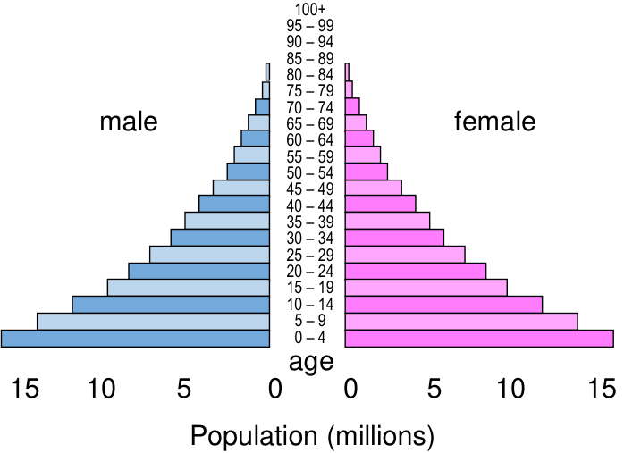

Apart from the above, human populations are also regulated by the prevailing global environment at the time, e.g., wars, famines, economic recessions, incurable super-bugs that are easily transmitted through international travel.

Governments can also regulate their population sizes through legislation. Some countries choose a more direct method to regulate their population whereas other would want to decrease it through legislation and policy.

---

# The South African Population

The South African population, like the global population, has shown a steady increase and is projected to increase further in the future. Table 2 summarises SA's population in 10-year intervals, and Figure 34 is a graphic representation of the population growth.

## Table 2: SA Population and Projections (in millions)

| 1960 | 1970 | 1980 | 1990 | 2000 | 2010 | 2020 | 2050 |
| :---: | :---: | :---: | :---: | :---: | :---: | :---: | :---: |
| 17,4 m | 22 m | 27,6 m | 35,2 m | 44 m | 50 m | 58,7 m | 65,5 m |

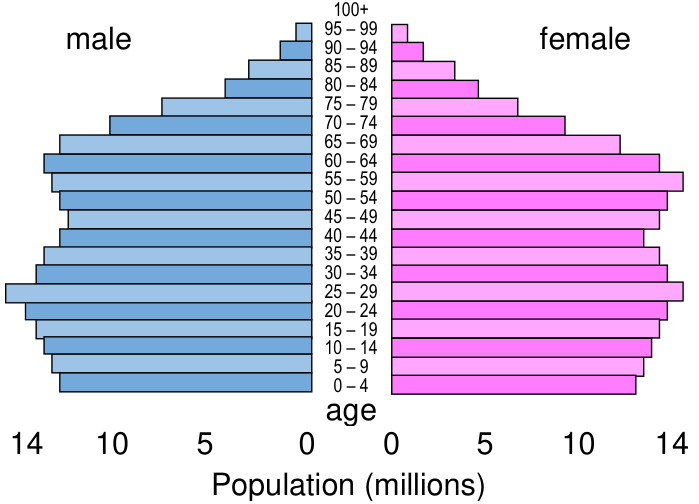

---

# Lesson Revision Notes: South African Population Growth and Demographics

## 1. Core Concepts: Population Growth ($1960 - 2050$)

Population growth over time can be visualized using line graphs where the horizontal axis ($x$-axis) represents time (years) and the vertical axis ($y$-axis) represents the total population size (in millions). 

Based on the data provided in **Figure 34**:
* **Historical Growth ($1960 - 2018$):** The South African population grew steadily over 58 years by approximately $40\text{ million}$ people (increasing from $17{,}4\text{ million}$ in $1960$ to roughly $57 - 58\text{ million}$).
* **Projected Growth ($2018 - 2050$):** The growth rate is expected to slow down significantly over the subsequent 30 years, adding only a further $\approx 8\text{ million}$ people to reach a projected $65{,}5\text{ million}$ by $2050$.

---

## 2. Demographic Data Table

The following table summarizes the South African population milestones extracted from the growth graph:

| Year | Population (Millions) | Growth Period / Status |
| :--- | :--- | :--- |
| $1960$ | $17{,}4$ | Historical baseline |
| $1970$ | $22{,}0$ | Historical |
| $1980$ | $27{,}6$ | Historical |
| $1990$ | $35{,}2$ | Historical |
| $2000$ | $44{,}0$ | Historical |
| $2010$ | $50{,}0$ | Historical |
| $2020$ | $58{,}7$ | Projected / Transition |
| $2050$ | $65{,}5$ | Projected final |

---

## 3. Factors Influencing Population Projections

### A. Fecundity Rate (Birth Rate)
The slowdown in population growth is directly linked to a large decrease in the fecundity rate:
* **Historical Birth Rate ($1955$):** The average South African female bore $6{,}05$ children in her lifetime.
* **Recent Birth Rate ($2018$):** The birth rate decreased significantly to $2{,}52$ children per female.

### B. Life Expectancy
Life expectancy measures the average number of years a person is expected to live from birth:
* **South African Trend:** Increased from $49\text{ years}$ in $1960$ to $60\text{ years}$ in $2016$.
* **Global Comparison:** Despite the increase, South Africa's life expectancy remains significantly lower than the global average of $70{,}5\text{ years}$.

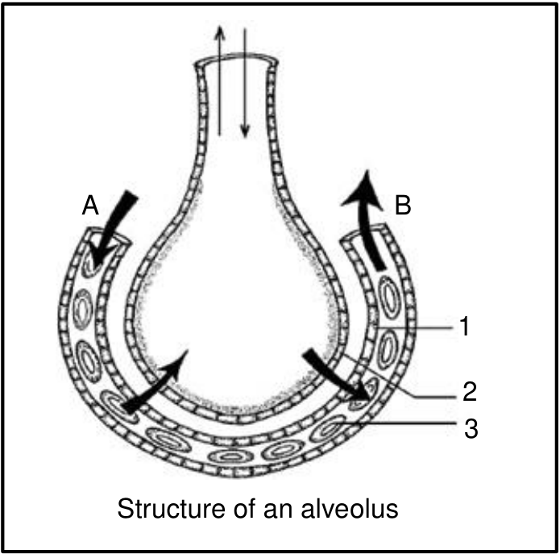

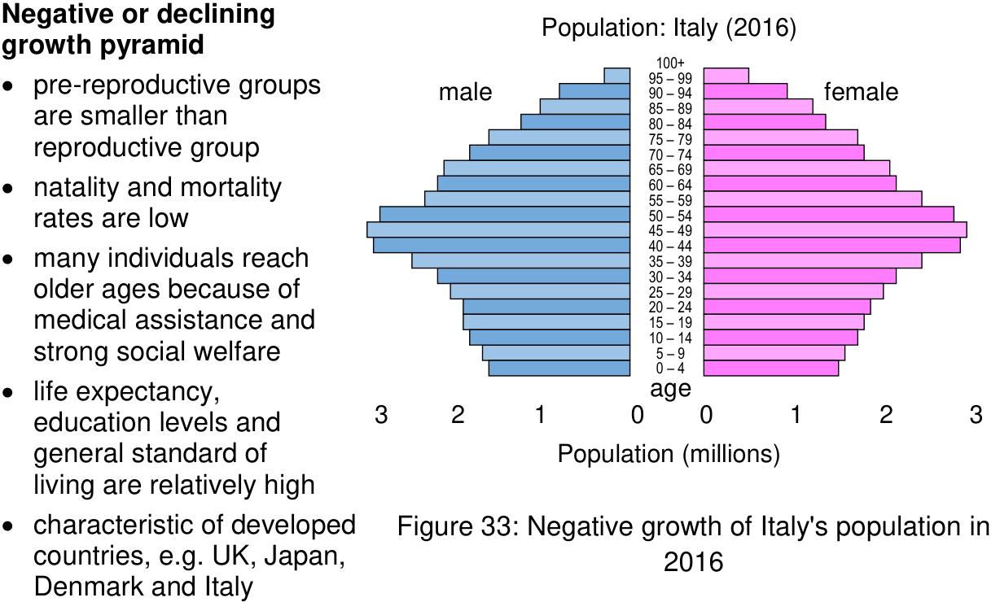

---

* better health and sanitation
* social welfare improvements
* increased primary health care services

Figure 35 below gives the population pyramid for the South African population in 2016.

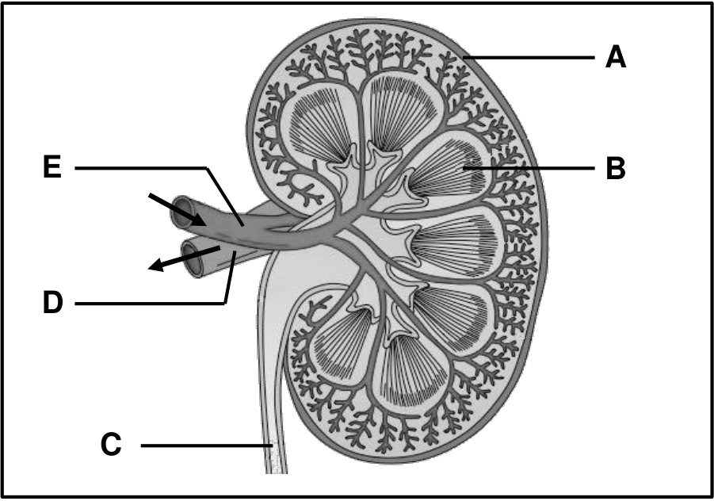

Figure 35: South African population (2016)

## What does all this mean for the future of South Africa?

Statistical data acquired from population estimates should help policy makers, government and society think about South Africa's future. Our population's size is growing. People are growing older and the world of business is becoming more complex and sophisticated daily. Proper planning needs to take place. City planning and civil societal planning on how many schools, hospitals, industrial development zones are needed, needs to take place.

South African population (2013): https://youtube.ZeW8kbG0wG8

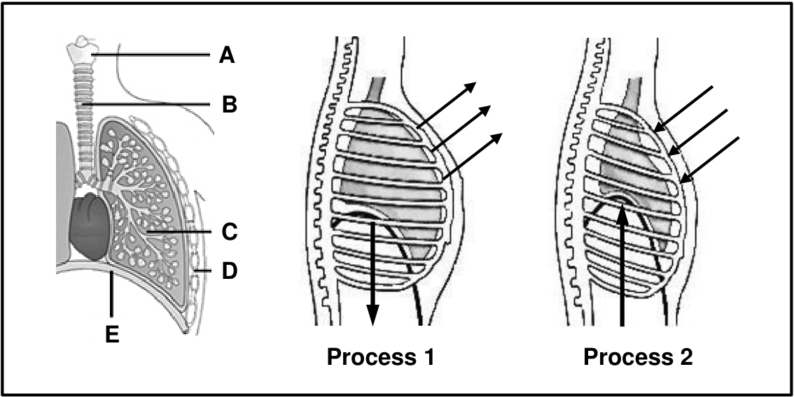

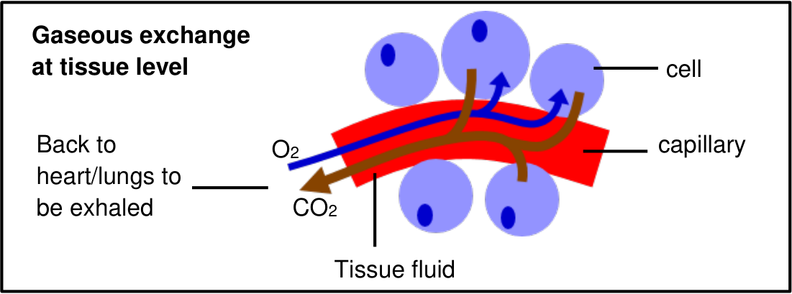

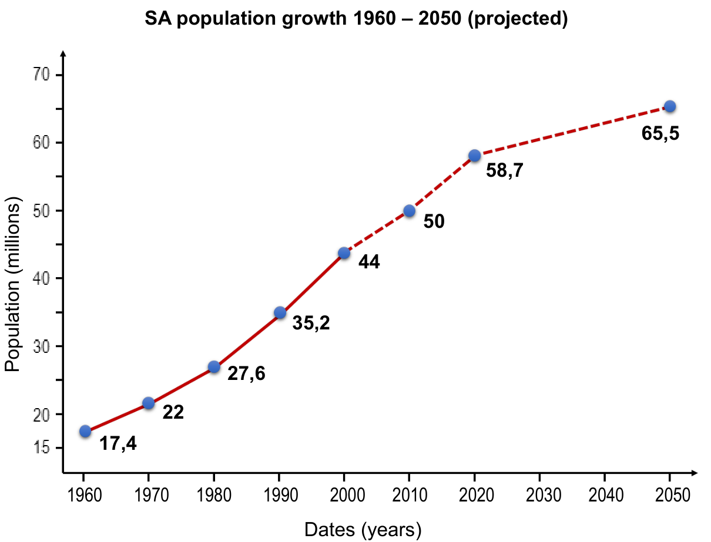

---

### Activity 5: Population pyramids

Study the following population pyramid before answering the questions that follow.

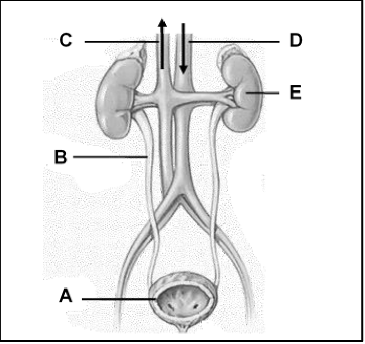

1. Which age-gender population growth curve is displayed in the above population pyramid? (1)
2. Give three reasons for your answer in question 1. (3)
3. What type of country is this population pyramid representative of? List any two characteristics of such a country. (3)

**(Total: 7 marks)**

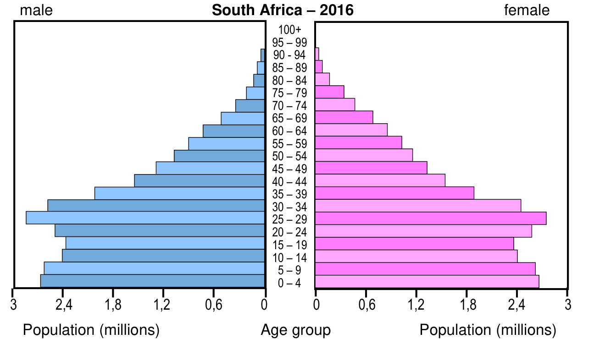

---

# Population ecology: End of topic exercises

## Section A

### Question 1

1.1 Various options are provided as possible answers to the following questions. Choose the answer and write only the letter (A to D) next to the question number (1.1.1 to 1.1.5) in your ANSWER BOOK, for example 1.1.6 D.

1.1.1 Which of the following will cause a decrease in the size of a population?

* (i) emigration
* (ii) immigration
* (iii) natality
* (iv) predation

* A (i) and (iii)
* B (ii) and (iv)
* C (i) and (iv)
* D (iii) and (iv)

1.1.2 The net increase of a population can be determined by ...

* A adding births and deaths and subtracting emigrations and immigrations.
* B adding births and emigrations and subtracting deaths and immigrations
* C adding births and immigrations and subtracting deaths and emigrations
* D adding deaths and immigrations and subtracting births and emigrations.

1.1.3 The following limitations on population size are all considered density dependent factors, except for...

* A Predation
* B Competition
* C Wild fires
* D Spread of disease

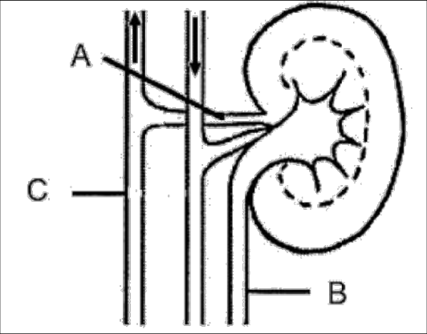

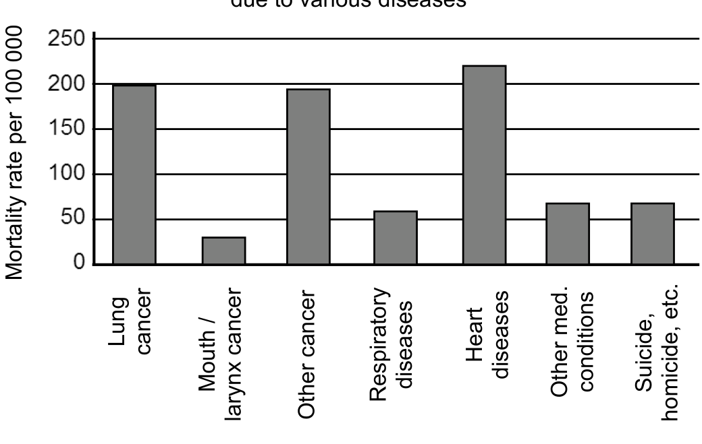

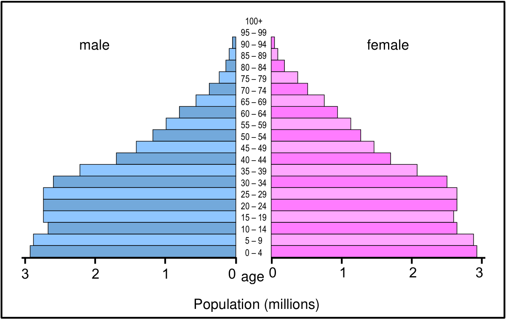

---

### 1.1.4 Population Dynamics: Predator and Prey Interactions

The graph below shows the changes in the populations of predator and prey over a period of time.

<!-- DIAGRAM_PLACEHOLDER: diagram -->

**Question:** Which point on the graph shows a decrease in the predator population?

---

### 1.1.5 Population Pyramids and Demographics

Study the population pyramid below:

<!-- DIAGRAM_PLACEHOLDER: diagram -->

**Question:** Which of the following is a correct interpretation of the population above?

* **A** Rapidly growing population; characteristic of a developing country
* **B** Declining population; characteristic of a developing country
* **C** Stable population; characteristic of a developed country
* **D** Declining population; characteristic of a developed country

---

$(5 \times 2) = (10)$

---

1.2 Give the correct biological term for each of the following descriptions. Write only the term next to the question number (1.2.1 to 1.2.9).

1.2.1 The relationship between two species that live in close contact with each other for part or all of their lives
1.2.2 A community made up of living organisms and non-living components such as air, water, and mineral soil
1.2.3 The phase during population growth where animals adapt to their new environment
1.2.4 The maximum number of organisms of a particular kind that can be supported by resources in the environment
1.2.5 The movement of individuals of a population out of a habitat
1.2.6 A pattern of animal behaviour of an organism or a group of similar organisms in defending an area for such purposes as mating, nesting, roosting, or feeding
1.2.7 A common term for factors that limit population size
1.2.8 The total count of all individuals in a population
1.2.9 Development of a community over time where species in one stage are replaced by other species
1.2.10 A square frame used to determine population size over an area.

$$(10 \times 1) = (10)$$

---

1.3 Indicate whether each of the statements in Column I applies to A ONLY, B ONLY, BOTH A AND B or NONE of the items in Column II. Write A only, B only, both A and B, or none next to the question number (1.3.1 to 1.3.5).

| Column I | Column II |
| :--- | :--- |
| 1.3.1 Kittens competing for their mother’s milk | A: interspecific competition   B: intraspecific competition |
| 1.3.2 A pine forest is burnt to the ground over a 10 km$^2$ area when lightning strikes a tree. In spring, a few seedlings begin to sprout. | A: primary succession   B: secondary succession |
| 1.3.3 One of the species benefits and the other is unaffected | A: commensalism   B: mutualism |
| 1.3.4 Organisms have overlapping niches and compete for the same resources but they coexist because they use the resources slightly differently | A: resource partitioning   B: temporal partitioning |
| 1.3.5 Example of social organization that increases the chances of survival | A: division of labour in bees   B: a herd of zebras |

$$(5 \times 2) = (10)$$

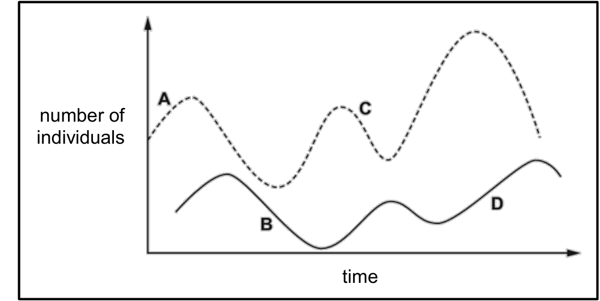

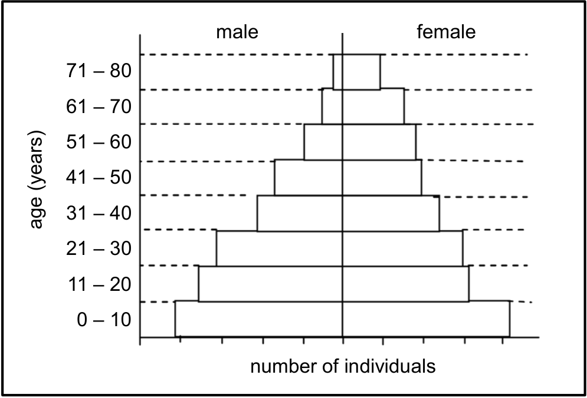

---

1.4 Study the age-gender pyramids below representing a developing country and a developed country. Both pyramids have been drawn to the same scale.

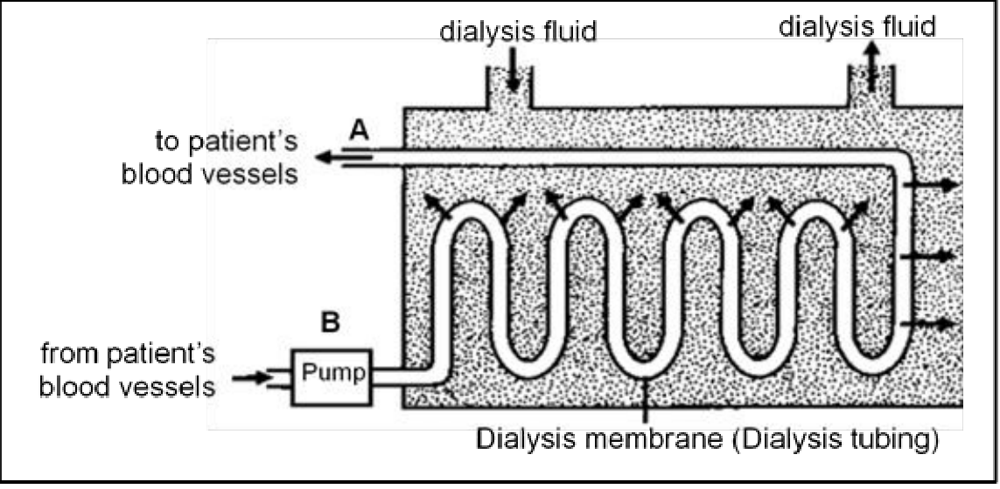

1.4.1 Which pyramid represents the population distribution of a developed country? (1)

1.4.2 Give two reasons for your choice in question 1.4.1. (2)

1.4.3 Which group (male or female) has the larger percentage reaching old age in Pyramid B? (1)

1.4.4 Which two age groups has exactly the same percentage of male and female population in Pyramid A? (2)

1.4.5 Give four reasons why it is important for a country to know the age and gender structure of its population. (4)
*(10)*

---

1.5 Read the article below on elephant culling.

**TOO HUNGRY, TOO DESTRUCTIVE, TOO MANY: SOUTH AFRICA TO BEGIN ELEPHANT CULL**

An elephant herd at the Kruger National Park has $20\ 000$ elephants, $5\ 000$ more than is sustainable. Ecologists say the animals' huge appetites and fondness for 'habitat re-engineering' – reducing forests to flatland by uprooting trees and trampling plants – is the main problem.

---

Culling of the excess elephants is seen as an advantage in that it generates revenue for the communities from the sale of ivory and other elephant products. It will also provide meat to the local communities. Alternatives to culling include contraception and relocation of entire elephant families. The removal of fences between the Kruger National Park and parks in neighbouring Mozambique will eventually help with migration into less congested areas.

The 1998 figure of $8\,000$ elephants increased to $20\,000$ in $2008$ and it is expected to reach $34\,000$ by $2020$.

1.5.1 Give the main reason mentioned above in support of the culling of elephants. (1)

1.5.2 Name three alternatives to culling proposed above. (3)

1.5.3 Predict the likely elephant population number by $2036$ if the population is allowed to keep growing at the same rate? (2)

1.5.4 Determine the carrying capacity, for elephants, in the Kruger National Park. (2)

1.5.5 Suggest how the community can benefit from the culling of elephants. (2)

**(10)**

**Section A: [50]**

---

### Section B

#### Question 2

2.1 Study the graph below and answer the questions that follow.

---

2.1.1 Which population-regulating factor is illustrated by this graph? (1)

2.1.2 Is this regulating factor named in question 2.2.1 a density dependent or a density-independent factor? Give a reason for your answer. (2)

2.1.3 How many of the following were there in 1966?
(a) Rabbits (1)
(b) Wild dogs (1)

2.1.4 What is the maximum number of rabbits that have ever survived in this environment? (1)

2.1.5 Will the rabbit population increase or decrease when there is a small number of wild dogs? Explain your answer. (2)

(8)

---

2.2 In an experiment, yeast cells were grown in a glucose solution in a test tube and kept at a temperature of $30\text{ }^\circ\text{C}$. Every two hours, a drop was taken from the mixture and examined under a microscope. The number of cells per unit area was counted. The results of the experiment are shown in the table.

| Time | Number of yeast cells (per unit area) |
| :---: | :---: |
| 0 | 10 |
| 2 | 30 |
| 4 | 70 |
| 6 | 175 |
| 8 | 350 |
| 10 | 515 |
| 12 | 595 |
| 14 | 640 |
| 16 | 655 |
| 18 | 660 |

2.2.1 Draw a line graph to illustrate these results. (6)

2.2.2 On your graph, indicate the various phases. (3)

2.2.3 Identify the growth form indicated by the graph (1)

2.2.4 During which time period did the greatest increase in the number of yeast cells occur? (2)

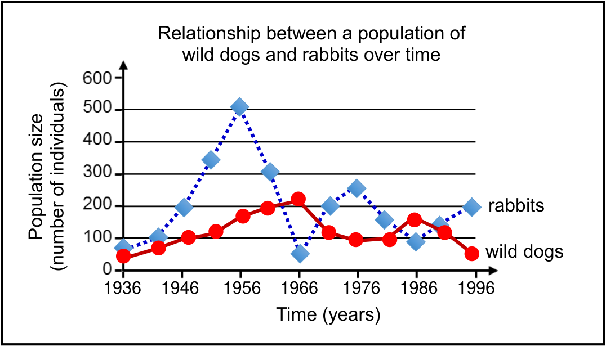

---

2.2.5 
After six hours, there are 175 yeast cells per unit area. How long does it take to double this number? (1)

2.2.6 
Give two reasons why the growth rate of the population might have slowed down? (2)

(15)

2.3 
A population of mice in a field of mealies was studied for one week. The population parameters (per thousand mice) were calculated for that week. Six months later the investigation was repeated. The results are recorded in a table.

| Population parameter (per 1000) | First survey | Second survey |
| :--- | :--- | :--- |
| Birth rate | 110 | 270 |
| Immigration | 10 | 30 |
| Death rate | 145 | 200 |
| Emigration | 10 | 70 |

The rate of change of a population can be calculated by the following formula:  
$\text{Rate of change} = (\text{birth rate} + \text{immigration rate}) - (\text{death rate} + \text{emigration rate})$

2.3.1 
Calculate the rate of change for the first survey. (4)

2.3.2 
What was happening to the size of the population in the first survey? Give a reason for your answer. (2)

2.3.3 
Calculate the rate of change for the second survey. (4)

2.3.4 
What was happening to the size of the population in the second survey? (1)

2.3.5 
The difference in the rate of change between the two investigations is a result of which possible factors? (2)

2.3.6 
Distinguish between the concepts: population size and population density. (4)

(17)

Section B: [40]

Total marks: [90]

---

# Chapter 9: Population ecology

## Activity 1: Populations

1. **Definitions:**
   * **Species:** A group of living organisms consisting of similar individuals that are capable of exchanging genes.
   * **Population:** A part of a particular species that occupies the same habitat at the same time.
   * **Community:** Formed by different species that interact with each other in a specific habitat.

2. **Density Dependent and Independent Factors:**
   * **Density dependent factors:** Exert an effect on a population in proportion to its size. The greater the population number, the greater the influence density dependent factors will have.
   * **Density independent factors:** Will have an influence on a population irrespective of its size.

3. **Carrying Capacity:**
   * Refers to the largest number of individuals of a biological species that an ecosystem can support over an indefinite time.

4. **Resource Requirements:**
   * Enough food and water, space.

*(14)*

---

## Activity 2: Determining population size

1. **Methods:**
   * **a)** The **quadrant method** is an indirect method used to estimate organisms which are sessile and are fixed to one location. The **mark-recapture method** is used in assessing more mobile organisms. Through quadrants, an estimate can be generated of the number of individuals per quadrant, and this can be divided into the number of quadrants that could fit over the entire geographic area (size).
   * **b)** 

| Throw no. | Number of mussels in quadrat |
| :--- | :--- |
| 1 | 25 |
| 2 | 13 |
| 3 | 31 |
| 4 | 19 |
| 5 | 22 |
| 6 | 26 |
| **Total** | $25 + 13 + 31 + 19 + 22 + 26 = 136$ |
| **Average / quadrat** | $136 / 6 = 22,667$ |
| **$\times$ Area / quadrat size** | $22,667 \times (32 / 2,5) = 290,13$ |
| **Population size** | $290$ mussels |

---

c) (i) Validity has been ensured through using the same sized quadrant through-out the investigation $\checkmark$.

(ii) Reliability has been ensured through repeating throws, six times, and then creating an average estimate of the population size $\checkmark$.

2.
* The first sample must be taken large enough to be a true representation of the population. $\checkmark$
* The mark used on the organism must remain for the entire period of the procedure. $\checkmark$
* The mark must be suitable to the type of organism. The mark must not harm or impair the movements and behaviour of the organism in its environment. $\checkmark$
* When the marked organisms are released back into the environment, they must be given enough time to mix with the existing population. $\checkmark$

(13)

### Activity 3: Growth forms

1.

| Geometric growth | Logistic growth |
| :--- | :--- |
| Three phases | Five phases |
| Micro-organisms (typically) | Higher order animals |
| Overshoots carrying capacity | Typically equalizes with carrying capacity |
| Example: bacteria | Example: mammals (Elephant) |

* Table: $\checkmark$
* Example per growth form: $\checkmark$
* Any 2 comparisons: $\checkmark\checkmark$ per correct comparison – mark only first two.

2. Logistic growth $\checkmark$

3. Phase 1: lag phase $\checkmark$; phase 2: exponential phase $\checkmark$; phase 3: decelerating growth phase $\checkmark$, phase 4: equilibrium phase $\checkmark$

(11)

### Activity 4: Symbiotic relationships

A – parasitism $\checkmark$; B – commensalism $\checkmark$; C – mutualistic $\checkmark$; D – mutualistic $\checkmark$

(4)

### Activity 5: Population pyramids

1. Stable growth $\checkmark$

2. 
* Pre-reproductive cohorts are more-or-less the same in size as the reproductive cohorts $\checkmark$.
* Natality is consistent year-on-year $\checkmark$.
* Many individuals reach old age $\checkmark$.

---

3. Lower mortality rates amongst individuals $\checkmark$ (any 3).

USA / CHINA $\checkmark$

* Life expectancy is high because of an increased standard of living $\checkmark$.
* Education levels amongst the population are high $\checkmark$.
* Countries are well developed $\checkmark$. (Country plus any 2)

---

# End of Topic Exercises

## Section A

### Question 1

Various options are provided as possible answers to the following questions. Choose the answer and write only the letter (A to D) next to the question number.

#### 1.1.1 Which of the following will cause a decrease in the size of a population?
* (i) Emigration
* (ii) Immigration
* (iii) Natality
* (iv) Predation

* **A:** (i) and (iii)
* **B:** (ii) and (iv)
* **C:** (i) and (iv)
* **D:** (iii) and (iv)

#### 1.1.2 The net increase of a population can be determined by...
* **A:** adding births and deaths and subtracting emigrations and immigrations.
* **B:** adding births and emigrations and subtracting deaths and immigrations.
* **C:** adding births and immigrations and subtracting deaths and emigrations.
* **D:** adding deaths and immigrations and subtracting births and emigrations.

#### 1.1.3 The following limitations on population size are all considered density-dependent factors, except for...
* **A:** Predation
* **B:** Competition
* **C:** Wild fires
* **D:** Spread of disease

---

1.1.4 The graph shows the changes in the populations of predator and prey over a period of time. 

Which point on the graph shows a decrease in predator population? 

Answer: B  ✓✓ 

1.1.5 Study the population pyramid below: 

Which of the following is a CORRECT interpretation of the population above? 

A. Rapidly growing population; characteristic of a developing country  ✓✓ 

B. Declining population; characteristic of a developing country 

C. Stable population; characteristic of a developed country 

D. Declining population; characteristic of a developed country 

$$ (5 \times 2) = 10 $$

---

1.2 
Give the correct biological term for each of the following descriptions.  
 
Write only the term next to the question number (1.2.1 to 1.2.9). 
 
1.2.1 The relationship between two species that live in close contact with each other for part or all of their lives  
symbiosis ✓  

1.2.2 A community made up of living organisms and non-living components such as air, water, and mineral soil  
ecosystem ✓ 

1.2.3 The phase during population growth where animals adapt to their new environment  
lag phase ✓ 

1.2.4 The maximum number of organisms of a particular kind that can be supported by resources in the environment  
carrying capacity ✓ 

1.2.5 The movement of individuals of a population out of a habitat  
emigration ✓ 

1.2.6 A pattern of animal behaviour of an organism or a group of similar organisms in defending an area for such purposes as mating, nesting, roosting, or feeding  
territoriality ✓ 

1.2.7 A common term for limiting factors that prevent a population from increasing  
environmental resistance ✓ 

1.2.8 The total count of all individuals in a population  
census ✓ 

1.2.9 Development of a community over time where species in one stage are replaced by other species  
ecological succession ✓  

1.2.10 A square frame used to determine population size over an area.  
quadrat ✓ 

$$(10 \times 1) = (10)$$

---

1.3 
Indicate whether each of the statements in Column I applies to A ONLY, B ONLY, BOTH A AND B or NONE of the items in Column II. Write A only, B only, both A and B, or none next to the question number (1.3.1 to 1.3.5).       
 
| Column I | Column II |
| :--- | :--- |
| 1.3.1 Kittens competing for their mother’s milk | A: interspecific competition   B: intraspecific competition |
| 1.3.2 A pine forest is burnt to the ground over a 10 $\text{km}^2$ area when lightning strikes a tree. In spring, a few seedlings begin to sprout. | A: primary succession   B: secondary succession |
| 1.3.3 One of the species benefits and the other is unaffected | A: commensalism   B: mutualism |

199

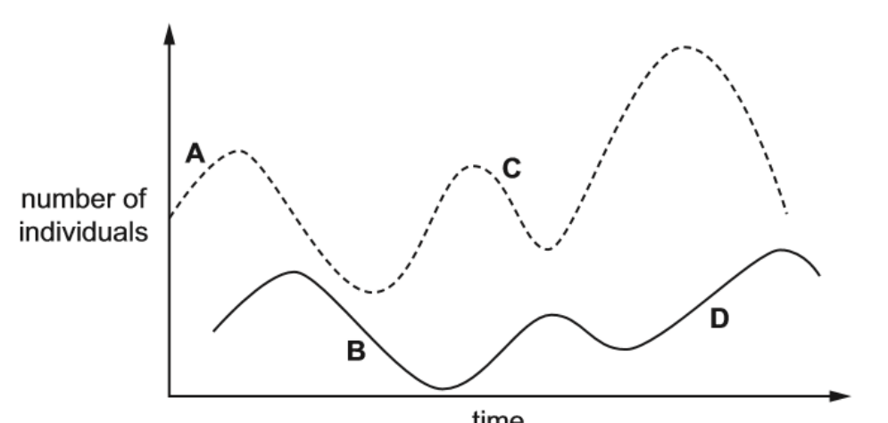

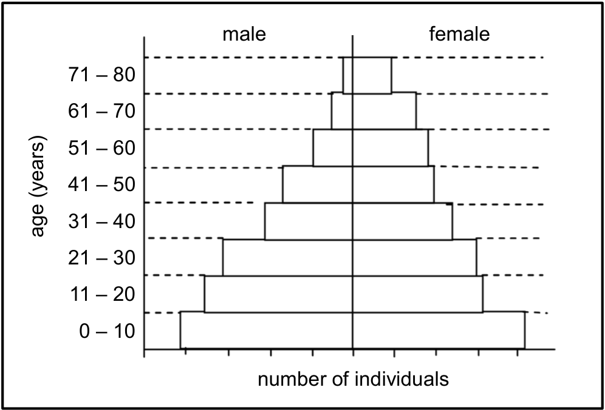

---

## Concepts & Structure

### Question 1.3 (Continued)

| Item | Statement / Question | Options / Answers |
| :--- | :--- | :--- |
| **1.3.4** | Organisms have overlapping niches and compete for the same resources but they coexist because they use the resources slightly differently | A: resource partitioning. B: temporal partitioning |
| **1.3.5** | Example of social organisation that increases the chances of survival | A: division of labour in bees B: a herd of zebras |

**Mark Allocation:** $(5 \times 2) = (10)$

**Answers:**
* **1.3.1:** A only $\checkmark \checkmark$
* **1.3.2:** B only $\checkmark \checkmark$
* **1.3.3:** A only $\checkmark \checkmark$
* **1.3.4:** A only $\checkmark \checkmark$
* **1.3.5:** Both A and B $\checkmark \checkmark$

---

### Section 1.4: Population Ecology - Age-Gender Pyramids

Study the age-gender pyramids below representing a developing country and a developed country. Both pyramids have been drawn to the same scale.

<!-- DIAGRAM_PLACEHOLDER: diagram -->

#### Questions and Answers

* **1.4.1** Which pyramid represents the population distribution of a developed country?
  * **Answer:** Pyramid A $\checkmark$ $(1)$

* **1.4.2** Give two reasons for your choice in question 1.4.1.
  * **Answer:** $(2)$
    * Low birth rate / low natality rate $\checkmark$
    * Low death rate / low mortality rate / Higher life expectancy $\checkmark$

* **1.4.3** Which group (male or female) has the larger percentage reaching old age in Pyramid B?
  * **Answer:** Female $\checkmark$ $(1)$

* **1.4.4** Which two age groups has exactly the same percentage of male and female population in Pyramid A?
  * **Answer:** $(10\text{-}19) \checkmark$ and $(20\text{-}29) \checkmark$ $(2)$

---

### 1. Concepts & Structure

#### Question 1.4.5
**Question:** Give four reasons why it is important for a country to know the age and gender structure of its population. *(4)*

**Memorandum / Answers:**
The population size and structure of a country is used for several things:
* Taxation $\checkmark$
* The building of public buildings i.e. schools, hospitals etc. $\checkmark$
* Housing development $\checkmark$
* Future employment and where the deficits would be $\checkmark$
* Prevention of an economical slump $\checkmark$
* Infrastructure of a country i.e. roads, bridges, dams, reservoirs, public transport $\checkmark$
* The population of a country indirectly impacts on immigration from other countries $\checkmark$  
*(Any 4)* *(10)*

---

#### Section 1.5: Elephant Culling

**Article:**
> ### TOO HUNGRY, TOO DESTRUCTIVE, TOO MANY: SOUTH AFRICA TO BEGIN ELEPHANT CULL
>
> An elephant herd at the Kruger National Park has $20\,000$ elephants, $5\,000$ more than is sustainable. Ecologists say the animals' huge appetites and fondness for 'habitat re-engineering' – reducing forests to flatland by uprooting trees and trampling plants – is the main problem.
>
> Culling of the excess elephants is seen as an advantage in that it generates revenue for the communities from the sale of ivory and other elephant products. It will also provide meat to the local communities. Alternatives to culling include contraception and relocation of entire elephant families. The removal of fences between the Kruger National Park and parks in neighbouring Mozambique will eventually help with migration into less congested areas.
>
> The $1998$ figure of $8\,000$ elephants increased to $20\,000$ in $2008$ and it is expected to reach $34\,000$ by $2020$.

---

#### Question 1.5.1
**Question:** Give the main reason mentioned above in support of the culling of elephants. *(1)*

**Memorandum / Answer:**
* Damage to the environment $\checkmark$ *(1)*

---

#### Question 1.5.2
**Question:** Name three alternatives to culling proposed above. *(3)*

**Memorandum / Answers:**
* Contraception $\checkmark$
* Relocation of elephant families $\checkmark$
* Removing fences to allow migration $\checkmark$ *(3)*

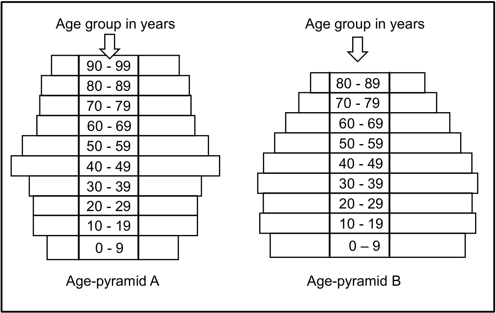

---

1.5.3 Predict the likely elephant population number by 2036 if the population is allowed to keep growing at the same rate? (2)  
**Answer:** $50\ 000$

1.5.4 Determine the carrying capacity, for elephants, in the Kruger National Park: (2)  
**Answer:** $15\ 000$

1.5.5 Suggest how the community can benefit from the culling of elephants. (2)  
**Answer:** Culling generates revenue for the communities from:
- the sale of ivory and other elephant products
- as well as providing meat to the local communities.

**(Total: 10)**  
**Section A: [50]**

---

### Section B

#### Question 2

2.1 Study the graph below and answer the questions that follow.

<!-- DIAGRAM_PLACEHOLDER: diagram -->

2.1.1 Which population-regulating factor is illustrated by this graph? (1)  
**Answer:** Predation / predator-prey

2.1.2 Is this regulating factor in question 2.2.1 a density-dependent or a density-independent factor? Give a reason for your answer. (2)  
**Answer:** density-dependent — the number of prey depends on the number of predators

2.1.3 How many of the following were there in 1966?

---

(a) Rabbits $50$
(b) Wild dogs $200 - 220$

2.1.4 What is the maximum number of rabbits that have ever survived in this environment? $500$

2.1.5 Will the rabbit population increase or decrease when there is a small number of wild dogs? Explain your answer.

Increase — because there are fewer wild dogs to prey on the rabbits.

---

2.2 In an experiment, yeast cells were grown in a glucose solution in a test tube and kept at a temperature of $30\text{ }^\circ\text{C}$. Every two hours, a drop was taken from the mixture and examined under a microscope. The number of cells per unit area was counted. The results of the experiment are shown in the table.

| Time | Number of yeast cells (per unit area) |
| :---: | :---: |
| 0 | 10 |
| 2 | 30 |
| 4 | 70 |
| 6 | 175 |
| 8 | 350 |
| 10 | 515 |
| 12 | 595 |
| 14 | 640 |
| 16 | 655 |
| 18 | 660 |

2.2.1 Draw a line graph to illustrate these results.

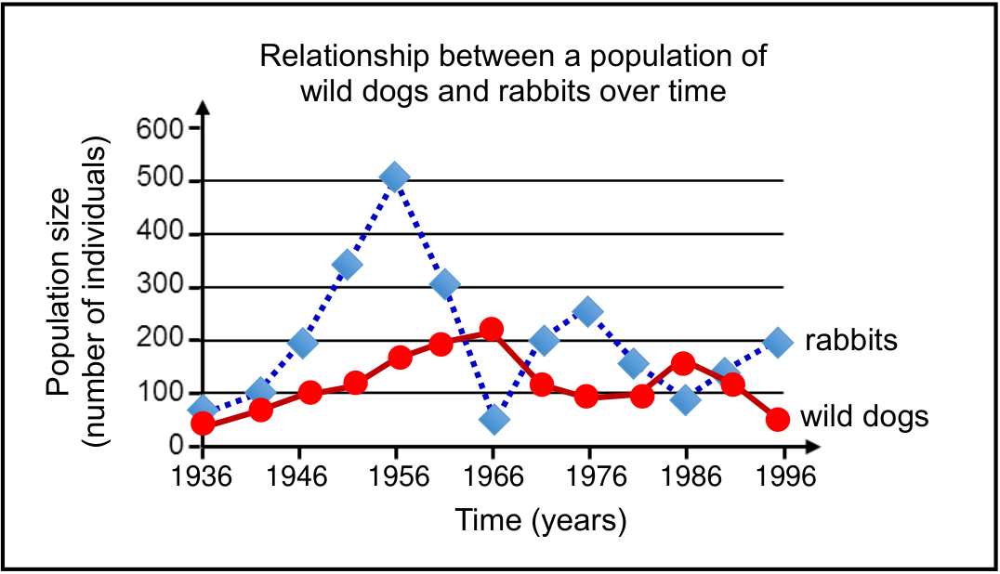

---

### Guidelines for Assessing the Graph

| Assessment Criterion | Status |
| :--- | :---: |
| Correct type of graph | ✓ |
| Title of graph (2 variables indicated) | ✓ |
| Correct label, unit, and scale for X-axis | ✓ |
| Correct label, unit, and scale for Y-axis | ✓ |
| Drawing of line graphs (1 to 9 points plotted correctly) | ✓ |
| Drawing of line graphs (All 10 points plotted correctly) | ✓ |

---

### 2.2.2. On your graph, indicate the various phases. (3)

Indicated on the graph:
* **A** – lag phase ✓
* **B** – the exponential growth phase (or log phase) ✓
* **C** – stable phase ✓

---

### 2.2.3 Identify the growth form indicated by the graph (1)

S-shaped / Logistic growth ✓

---

### 2.2.4 During which time period did the greatest increase in the number of yeast cells occur? (2)

6 to 10 hour ✓✓

---

### 2.2.5 After six hours, there are 175 yeast cells per unit area. How long does it take to double this number? (1)

2 hours ✓

---

### 2.2.6 Give two reasons why the growth rate of the population might have slowed down. (2)

Because of limited space ✓, nutrients in the test tube ✓ 

*(Total: 15 marks)*

---

### 2.3

A population of mice in a field of mealies was studied for one week. The population parameters (per thousand mice) were calculated for that week. Six months later the investigation was repeated. The results are recorded in a table.

| Population parameter (per 1000) | First survey | Second survey |
| :--- | :---: | :---: |
| Birth rate | 110 | 270 |
| Immigration | 10 | 30 |
| Death rate | 145 | 200 |
| Emigration | 10 | 70 |

The rate of change of a population can be calculated by the following formula:  
$$\text{Rate of change} = (\text{birth rate} + \text{immigration rate}) - (\text{death rate} + \text{emigration rate})$$

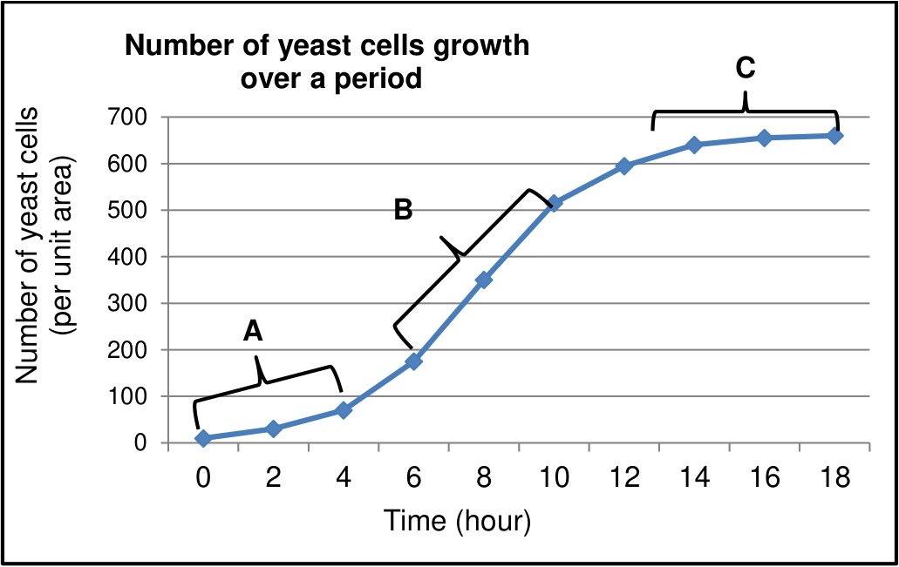

---

### Population Ecology Exercises and Memos

#### 2.3.1 Calculate the rate of change for the first survey. (4)

**Formula:**
$$\text{Rate of change} = (\text{birth rate} + \text{immigration rate}) - (\text{death rate} + \text{emigration rate})$$

**Calculation:**
$$\begin{aligned}
&= (110 + 10) - (145 + 10) \\
&= 120 - 155 \\
&= -35
\end{aligned}$$

---

#### 2.3.2 What was happening to the size of the population in the first survey? Give a reason for your answer. (2)

* **Answer:** Decreased; the rate of change is negative.

---

#### 2.3.3 Calculate the rate of change for the second survey. (4)

**Formula:**
$$\text{Rate of change} = (\text{birth rate} + \text{immigration rate}) - (\text{death rate} + \text{emigration rate})$$

**Calculation:**
$$\begin{aligned}
&= (270 + 30) - (200 + 70) \\
&= 300 - 270 \\
&= 30
\end{aligned}$$

---

#### 2.3.4 What was happening to the size of the population in the second survey? (1)

* **Answer:** Increased.

---

#### 2.3.5 The difference in the rate of change between the two investigations is a result of which possible factors? (2)

* Decrease in predation and disease.
* Decrease in competition for food, space, and mates.

---

#### 2.3.6 Distinguish between the concepts: population size and population density. (4)

* **Population size:** Refers to the total number of individuals in a population.
* **Population density:** Refers to the number of individuals of a population per unit area.

---

*(Total marks for this section: 17)*

**Section B: [40]**  
**Total marks: [90]**

---

# Cognitive Level Distribution

## Overview
This section outlines the cognitive level distribution of questions according to CAPS assessment guidelines, categorizing assessment items across four distinct levels of cognitive complexity.

## Cognitive Level Distribution Table

| Question | Level 1 | Level 2 | Level 3 | Level 4 | Marks |
| :---: | :---: | :---: | :---: | :---: | :---: |
| 1.1.1 | $\checkmark$ | | | | 2 |
| 1.1.2 | $\checkmark$ | | | | 2 |
| 1.1.3 | | $\checkmark$ | | | 2 |
| 1.1.4 | | $\checkmark$ | | | 2 |
| 1.1.5 | $\checkmark$ | | | | 2 |
| **Subtotal** | **6** | **4** | | | **10** |
| 1.2.1 | $\checkmark$ | | | | 1 |
| 1.2.2 | $\checkmark$ | | | | 1 |
| 1.2.3 | $\checkmark$ | | | | 1 |
| 1.2.4 | $\checkmark$ | | | | 1 |
| 1.2.5 | $\checkmark$ | | | | 1 |
| 1.2.6 | $\checkmark$ | | | | 1 |
| 1.2.7 | $\checkmark$ | | | | 1 |
| 1.2.8 | $\checkmark$ | | | | 1 |
| 1.2.9 | $\checkmark$ | | | | 1 |
| 1.2.10 | $\checkmark$ | | | | 1 |
| **Subtotal** | **10** | | | | **10** |
| 1.3.1 | | $\checkmark$ | | | 2 |
| 1.3.2 | | $\checkmark$ | | | 2 |
| 1.3.3 | | $\checkmark$ | | | 2 |
| 1.3.4 | | $\checkmark$ | | | 2 |
| 1.3.5 | | $\checkmark$ | | | 2 |
| **Subtotal** | | **10** | | | **10** |
| 1.4.1 | | $\checkmark$ | | | 1 |
| 1.4.2 | | | $\checkmark$ | | 2 |
| 1.4.3 | | $\checkmark$ | | | 1 |
| 1.4.4 | | $\checkmark$ | | | 2 |
| 1.4.5 | | | | $\checkmark$ | 4 |
| **Subtotal** | | **4** | **2** | **4** | **10** |
| 1.5.1 | $\checkmark$ | | | | 1 |
| 1.5.2 | $\checkmark$ | | | | 3 |
| 1.5.3 | | | | $\checkmark$ | 2 |
| 1.5.4 | | $\checkmark$ | | | 2 |
| 1.5.5 | $\checkmark$ | | | | 2 |
| **Subtotal** | **6** | **2** | | **2** | **10** |

---

## Assessment Grid and Memorandum Analysis

| Question Number | Column 1 | Column 2 | Column 3 | Column 4 | Marks |
| :---: | :---: | :---: | :---: | :---: | :---: |
| 2.1.1 | $\checkmark$ | | | | 1 |
| 2.1.2 | | $\checkmark$ | | | 2 |
| 2.1.3 a – b | $\checkmark$ | | | | 2 |
| 2.1.4 | $\checkmark$ | | | | 1 |
| 2.1.5 | $\checkmark$ | | | | 2 |
| **Subtotal** | **6** | **2** | | | **8** |
| 2.2.1 | $\checkmark$ | $\checkmark$ | $\checkmark$ | | $6\ (2+2+2)$ |
| 2.2.2 | $\checkmark$ | | $\checkmark$ | | $3\ (2+1)$ |
| 2.2.3 | $\checkmark$ | | | | 1 |
| 2.2.4 | $\checkmark$ | | | | 2 |
| 2.2.5 | $\checkmark$ | | | | 1 |
| 2.2.6 | | | $\checkmark$ | | 2 |
| **Subtotal** | **8** | **2** | **5** | | **15** |
| 2.3.1 | | $\checkmark$ | | | 4 |
| 2.3.2 | $\checkmark$ | | | | 2 |
| 2.3.3 | | $\checkmark$ | | | 4 |
| 2.3.4 | $\checkmark$ | | | | 1 |
| 2.3.5 | | | $\checkmark$ | | 2 |
| 2.3.6 | $\checkmark$ | | | | 4 |
| **Subtotal** | **7** | **8** | **2** | | **17** |
| **Total** | **43** | **32** | **9** | **6** | **90** |