# **CHAPTER 1: DNA – THE CODE OF LIFE** 

## **<mark>Introduction</mark>** 

- All living organisms contain both DNA (deoxyribonucleic acid) and RNA (ribonucleic acid) – we focus on their location, structure and function. 

- We explore the discovery of DNA, its role in the human body and how it replicates. 

- Protein synthesis is vital for life – we examine how proteins are formed by both DNA and RNA. 

## **<mark>Revision of cellular structure</mark>** 

It is important to know the location and functions of certain organelles, illustrated in Figure 1 below. 


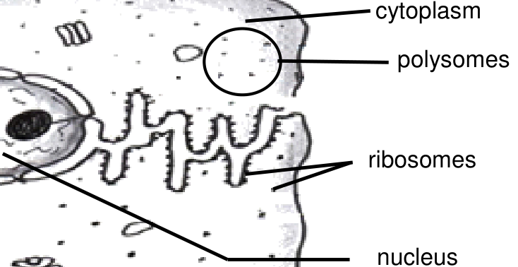
> **[Diagram Context - Textbook_LifeSciences_Gr12_DNA-The_code_of_life.pdf-0001-07.png]**
> This educational graphic illustrates an anatomical cellular structure focusing on protein synthesis machinery within the cell. Visible labels and indicators include "cytoplasm", "polysomes" within a circled area, "ribosomes" lining the endoplasmic reticulum and free in the matrix, and the "nucleus". Conceptually, this diagram conveys the spatial arrangement and ultrastructure of organelles involved in transcription and translation, helping Grade 10-12 Life Sciences learners understand how the nucleus coordinates with ribosomes and polysomes in the cytoplasm to manufacture proteins.


Figure 1: Structure of a cell 

**Cytoplasm** is the base substance in which the organelles of the cell are suspended. It is a watery substance and allows for metabolic reactions to take place. 

**Ribosomes** are small, round organelles which are mainly found attached to the endoplasmic reticulum or are free-floating in the cytoplasm. Ribosomes can also be found inside other organelles such as the chloroplast and mitochondria but in smaller numbers. They are the site of protein synthesis and consist of RNA and protein. 

#### The **nucleus** controls all of the cell’s activities. 


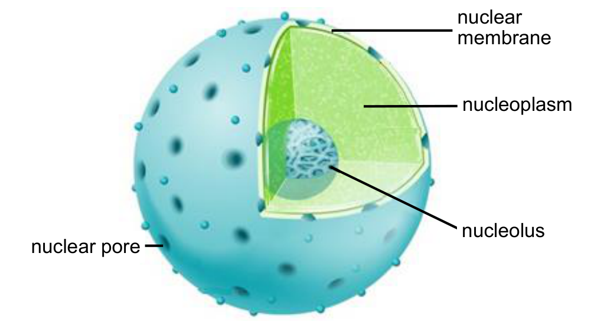
> **[Diagram Context - Textbook_LifeSciences_Gr12_DNA-The_code_of_life.pdf-0002-01.png]**
> This diagram provides a cross-sectional view of a cell nucleus, clearly identifying the nuclear membrane, nucleoplasm, nucleolus, and nuclear pores. It illustrates the structural components of the cell's control centre, helping learners understand how the nuclear envelope's pores facilitate the transport of materials between the nucleus and the cytoplasm.


Figure 2:  Parts of the nucleus 

A nucleus has four main parts: 

- the double **nuclear membrane** – it encloses the nucleus and contains small pores to allow for the passage of substances in and out of the nucleus 

- the **nucleoplasm** – this is a jelly-like fluid within the nucleus 

- the **nucleolus** – a dark body suspended in the nucleoplasm which contains free nucleotide bases and produces ribosomes 

- the **chromatin network** – found in the nucleoplasm: contains the DNA which forms the chromosomes containing the genetic code of a person / organism 

## **<mark>The structure of nucleic acids</mark>** 

#### **Key terminology** 

|**nucleic acid**|a type of organic compound|
|---|---|
|**monomer**|a building block|
|**nucleotide**|the monomer which forms DNA and RNA|

There are two types of nucleic acids in the human body – DNA (deoxyribonucleic acid) and RNA (ribonucleic acid). Together these form the basis of all life of earth. They consist of monomers (building blocks) called nucleotides. 

The basic structure of a nucleotide is illustrated in Figure 3 below. Each nucleic acid is composed of a phosphate (P), a sugar molecule (S) and a nitrogenous base (NB). 

P – phosphate group S – sugar molecule NB – nitrogenous base 

Figure 3: A nucleotide 

## **<mark>DNA – deoxyribonucleic acid</mark>** 

|**Key terminology**||
|---|---|
|**DNA**|deoxyribonucleic acid is made up of nucleotides<br>nitrogenous bases adenine, thymine, guanine and<br>cytosine<br>carries the genetic code for protein synthesis|
|**nuclear DNA**|DNA found in the nucleus|
|**extra- nuclear DNA**|DNA found outside of the nucleus: mitochondrial and<br>chloroplastic DNA.|
|**double helix**|the shape of DNA consists of two strands joined together<br>and twisted spirally|
|**hereditary**|genetic information passed on from parent to offspring|

### **A brief history of the discovery of DNA** 

- 1952 – Rosalind Franklin and her assistant Maurice Wilkins researched the structure of DNA using X-ray diffraction images. 

- Watson and Crick did independent research on DNA.  Upon seeing Franklin’s images, they proposed a 3-D double helix model for DNA in 1953. 

- 1962 – Watson and Crick received the Nobel Prize for the discovery of the structure of DNA, and Wilkins received an award for his X-ray photography. Franklin had died of cancer. 

Rosalind Franklin – background: https://www.youtube.com/watch?v=BIP0lYrdirI 

### **The location of DNA** 

DNA is found in **two locations** in a cell: 

- Mostly in the nucleus of a cell – this is referred to as **nuclear DNA** 

- a small amount is found outside the nucleus – it is referred to as **extranuclear DNA** . There are two types of extra-nuclear DNA: 

   - chloroplastic DNA – found in the chloroplasts of plant cells 

   - mitochondrial DNA – found in the mitochondria (useful for tracing ancestry) 

### **The structure of DNA** 


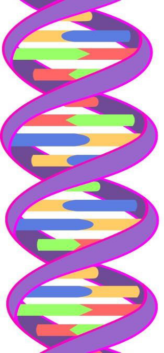
> **[Diagram Context - Textbook_LifeSciences_Gr12_DNA-The_code_of_life.pdf-0004-07.png]**
> This diagram depicts a simplified model of a DNA double helix, featuring two purple helical ribbons representing


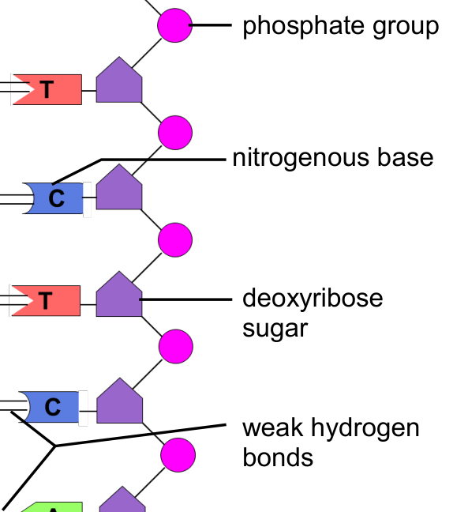

Figure 4A: DNA double helix Figure 4B: DNA – simplified structure 

DNA has a double helix structure (Figure 4A), consisting of monomers called nucleotides which link to form long chains, called polymers.  The sugar in DNA is deoxyribose sugar and is attached to a nitrogenous base. The phosphate and sugar molecules are attached to one another by strong bonds alternately to form the long chains (Figure 4B). 

There are four types of nitrogenous bases in DNA: 

adenine (A) cytosine (C) thymine (T) guanine (G) 

Nitrogenous bases are complementary, and always join together in a specific order: 

- adenine always links to thymine (Figure 5A) 

- guanine always links with cytosine (Figure 5B) 

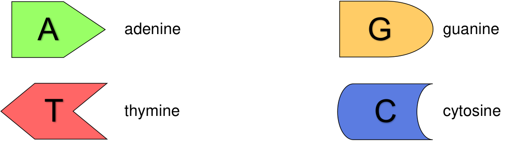

Figure 5A: adenine with thymine                        Figure 5B: guanine with cytosine 

This pairing of bases means that two strands of DNA are joined together, forming a long ladder-like structure. The nitrogenous bases are held together by weak hydrogen bonds. The ladder-like structure becomes coiled and is known as a **double helix structure** . The DNA strands wind around proteins which are known as histones. 

### **The role of DNA** 

DNA carries hereditary information in the form of genes. Genes are short sections of DNA which code for a specific trait, and determine the physical characteristics (e.g. blood grouping, a gene linked to breast cancer) and behaviour of an organism (e.g. whether an organism can be tamed and domesticated). 

Most of the DNA strands do not code for anything and are known as non-coding DNA.  Scientists are still researching the importance of the non-coding DNA. 

The main functions of DNA include: 

- Controls the functioning of cells 

- Regulate the functioning of genes 

- Passes on hereditary characteristics 

The structure of DNA: <u>https://www.youtube.com/watch?v=C1CRrtkWwu0</u> 

#### **Activity 1: DNA** 

The diagram on the next page shows part of a DNA molecule. 

1. Label parts 1, 2 and 3 

   - (3) 

2. Give the number of nucleotides shown in the diagram 

   - (1) 

3. Name two places in an animal cell where this nucleic acid may be found. 

   - (2) 

4. What is the natural shape of this molecule? 

   - (1) 

5. Draw a nucleotide with the nitrogenous base adenine. 

   - (4) 

- (11) 

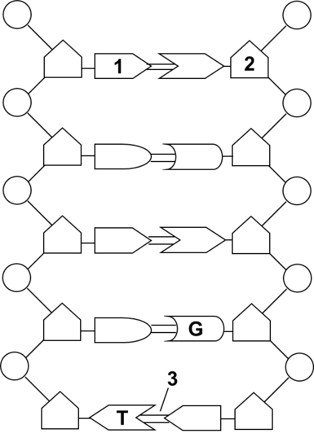

## **<mark>RNA – ribonucleic acid</mark>** 

#### **Key terminology** 

|**RNA**|RNA consists of nucleotides. Nitrogenous bases found in<br>RNA are adenine, uracil, guanine and cytosine|
|---|---|
|**messenger RNA**|mRNA carries the code for protein synthesis from DNA to the<br>ribosome|
|**ribosomal RNA**|rRNA forms ribosomes which are the site of protein synthesis|
|**transfer RNA**|tRNA brings amino acids to the ribosome to form the protein|

There are three types of RNA (ribonucleic acid), all formed in the nucleus by DNA. They perform different functions in different places in a cell.  The types are: 

- messenger RNA (mRNA) 

- ribosomal RNA (rRNA) 

- transfer RNA (tRNA) 

### **The location of RNA** 

- **Messenger RNA** (mRNA) is formed in the nucleus but then enters the cytoplasm where it attaches to ribosomes. 

- **Ribosomal RNA** (rRNA) is found in the ribosomes in the cytoplasm of the cell. 

- **Transfer RNA** (tRNA) is found freely in the cytoplasm of the cell. 

### **The structure of RNA** 

Like DNA, RNA also consists of monomers (nucleotides) which link to form longer chains (polymers). 

However, RNA is a **single-stranded structure** which is not coiled. The sugar in RNA is ribose and is attached to a nitrogenous base. The phosphate and sugar molecules are attached to one another alternately to form the chains. 

The structure of RNA is illustrated in Figure 6 below. 

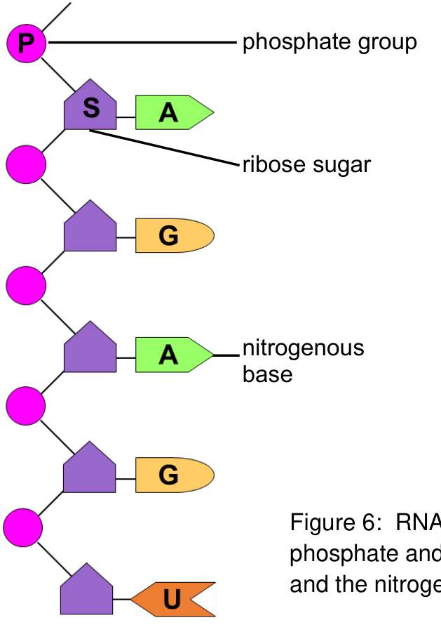

Figure 6:  RNA – note the chain formed by the phosphate and sugar molecules on the left, and the nitrogenous bases on the right. 

There are four types of nitrogenous bases in RNA: 

cytosine (C) 

adenine (A) uracil (U) – _<u>not thymine as in DNA</u>_ 

guanine (G) 

### **The role of RNA** 

The three types of RNA are very important to the process of protein synthesis, with each type playing a unique role. 

## **<mark>Comparison between DNA and RNA</mark>** 

DNA and RNA are **similar** in some respects. They both … 

- contain sugar alternating with phosphate 

- contain the nitrogenous bases adenine, guanine and cytosine 

- play a role in protein synthesis 

DNA and RNA also have **significant differences** , tabulated in Table 1 below. 

Table 1: The **main differences** between DNA and RNA. 

|**DNA**|**RNA**|
|---|---|
|contains deoxyribose sugar|contains ribose sugar|
|double helix and coiled|single stranded|
|contains the nitrogenous base thymine|contains the nitrogenous base uracil|
|found in the nucleus only|found in the nucleus, ribosomes and<br>cytoplasm of cells|

A comparison DNA and RNA. It is very important to know the differences. <u>https://www.youtube.com/watch?v=0Elo-zX1k8M</u> 

## **<mark>DNA replication</mark>** 

DNA replication is the process through which DNA makes an identical copy of itself. This occurs during interphase of the cell cycle in the nucleus. In Figures 7A to 7E, a small portion of DNA is shown undergoing replication. 

1.  The **DNA double helix** unwinds (Figure 7A) 

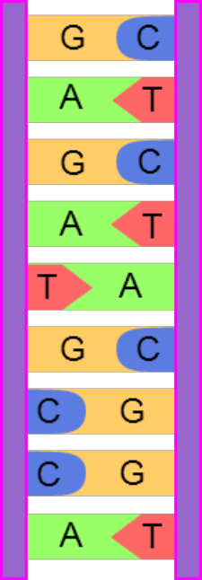

Figure 7A 

3.  Each original DNA strand serves as a **template** on which its complement is built (Figure 7C) 

2.  The weak hydrogen bonds between the nitrogenous bases are broken.  The DNA strands separate (they **unzip** )(Figure 7B) 

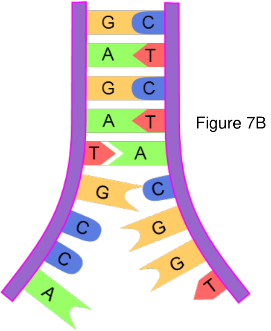

4.  Free nucleotides build a DNA strand onto each of the original DNA strands, attaching their **complementary nitrogenous bases** 

- (A to T and C to G) (Figure 7D) 

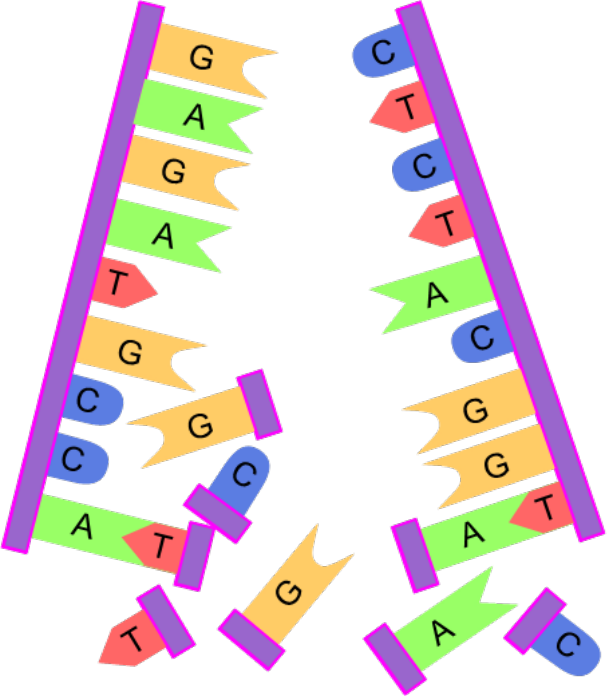

Figure 7C 

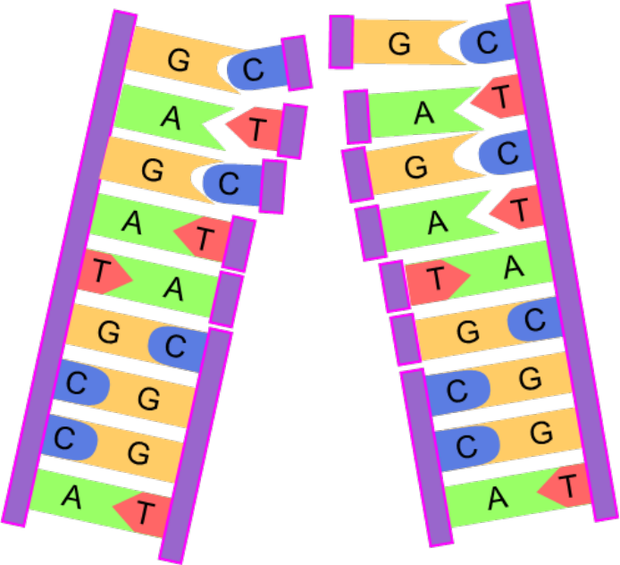

Figure 7D 

5.  This results in **two identical DNA molecules.** Each molecule consists of one original strand and one new strand (Figure 7E). 


Figure 7E 

Figure 7A – 7E: The process of DNA replication 

DNA replication is important for cell division, particularly mitosis. It allows each chromosome to be copied so that each new identical daughter cell produced contains the same number and type of chromosomes. 

### **Errors that occur during DNA replication** 

- Errors that occur during DNA replication may sometimes lead to mutations (a change in the nitrogenous base sequence) 

- If the incorrect nitrogen base attaches to the original strand and a nitrogen base is added or deleted … 

   - the sequence or order of the bases changes on the new DNA molecule … 

   - resulting in a change in the gene structure 

DNA replication: Understand the process. <u>https://www.youtube.com/watch?v=Qqe4thU-os8</u> 

#### **Activity 2: DNA replication** 

Study the diagram below and answer the questions that follow. 

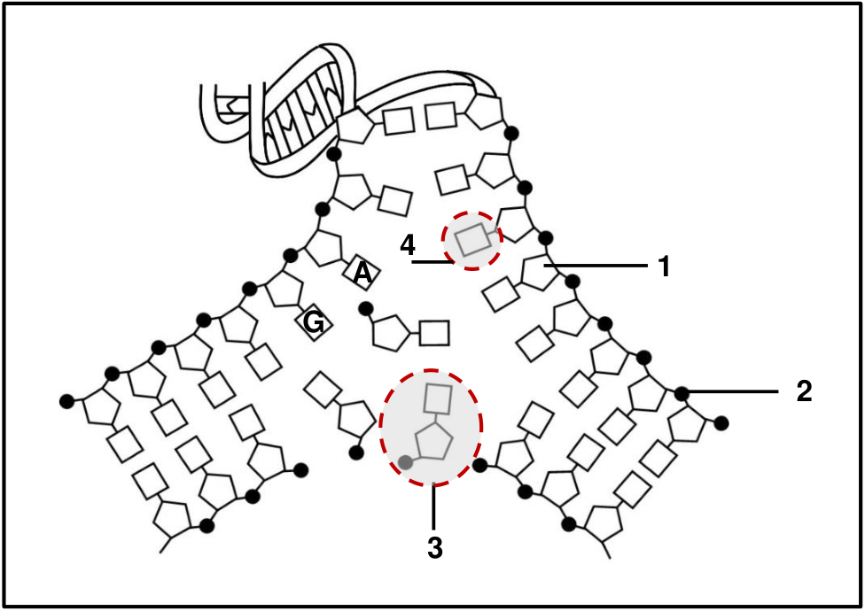

1. Name the process illustrated in the diagram above. 

2. State the significance of the process mentioned in question 1. 

3. Identify the parts labelled as 1, 2, 3 and 4. 

4. Describe how this process takes place. 

5. Give one location of extra-nuclear DNA. 

- (1) 

- (1) 

- (4) 

- (6) 

- (1) 

(13) 

## **<mark>DNA profiling</mark>** 

A DNA profile is a pattern produced on X-ray film. This pattern consists of lines which are of different lengths and thicknesses and in different positions, as shown in Figure 8. All individuals, except identical twins, have a unique DNA profile. 

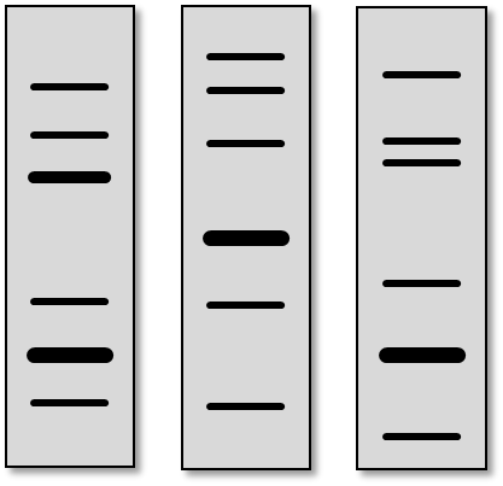

Figure 8: DNA profiles for three different individuals. 

DNA profiles are used to: 

- identify crime suspects in forensic investigations 

- prove paternity (father) and maternity (mother) (biological parents) 

- determine the probability or causes of genetic defects 

- establish the compatibility of tissue types for organ transplants 

- identify relatives 

DNA profiling is generally accepted as being extremely reliable. The interpretation and comparison of profiles should however be approached with caution, for the following reasons: 

- Humans interpret the results which means mistakes could be made 

- The method of profiling may be different in different laboratories producing inconsistencies 

- Only a small piece of DNA is used in profiling, so the profile might not be 100% unique to a particular individual 

- DNA profiling is expensive and therefore not readily accessible to those who cannot afford it, particularly in criminal cases 

- DNA profiles may reveal information about a person which could be used against them in a prejudicial way. For example: being HIV positive or having genetic abnormalities may lead to insurance companies not covering a person or prejudice in the court room 

#### **Activity 3: DNA profiling** 

DNA profiles from a crime scene. 

#### Victim             CSS          Suspect 1      Suspect 2     Suspect 3      Suspect 4 

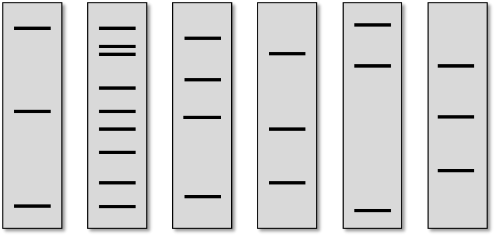

In a fight involving a number of people, one person was seriously injured. Police took blood samples from the victim, the crime scene (CSS – crime scene sample) and four suspects. The DNA was then extracted from each sample. The results of these tests are shown in the diagram above. 

1. Which suspect probably injured the victim? (1) 

2. Give a reason for your answer to the previous question. (1) 3. List one application of DNA profiling other than for solving crime. (1) 4. Give two reasons why DNA profiling may sometimes be challenged. (2) (5) 

## **<mark>Protein synthesis</mark>** 

#### **Key terminology** 

|**amino acids**|monomers ofproteins|
|---|---|
|**base triplet**|three nitrogenous bases one after the other on DNA|
|**transcription**|1^{st}stage of protein synthesis – mRNA formed from DNA<br>carryingcode for theprotein to be made|
|**translation**|2^{nd}stage of protein synthesis – amino acids combine to form<br>aprotein|
|**codon**|three nitrogenous bases one after the other on mRNA –<br>these are complementaryto the triplet on DNA|
|**anti-codon**|three nitrogenous bases one after the other on tRNA – these<br>are complementaryto the codon on mRNA|

The process in which proteins are made is called protein synthesis.  Proteins are made by linking various amino acids that are present in the cytoplasm of cells. There are 20 different amino acids, and they combine in a large variety of combinations. The number of amino acids and the sequence of the amino acids determine the type of protein that is formed. 

Figure 9 illustrates a protein with different amino acids represented by the different shapes and colour. The bond between the amino acids is known as a peptide bond. 

#### peptide bond 

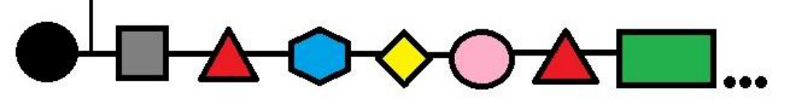

Figure 9: Amino acids linked by peptide bonds 

The genes found in DNA contain the code which determines which type of protein that will be formed. 

- The smallest protein contains 50 amino acids linked together 

- Proteins generally contain 300 or more amino acids. 

Three consecutive nitrogenous bases on the DNA strand are called the base triplet. The base triplets determine which amino acid will be placed into the protein as well as the sequence in which the amino acids will be joined. 

### **Protein synthesis occurs in two stages** 

Stage 1:  Transcription 

Stage 2:  Translation 

### **Stage 1:  Transcription** 

The first stage of protein synthesis, called transcription, occurs in the nucleus (see Figure 10 below). 

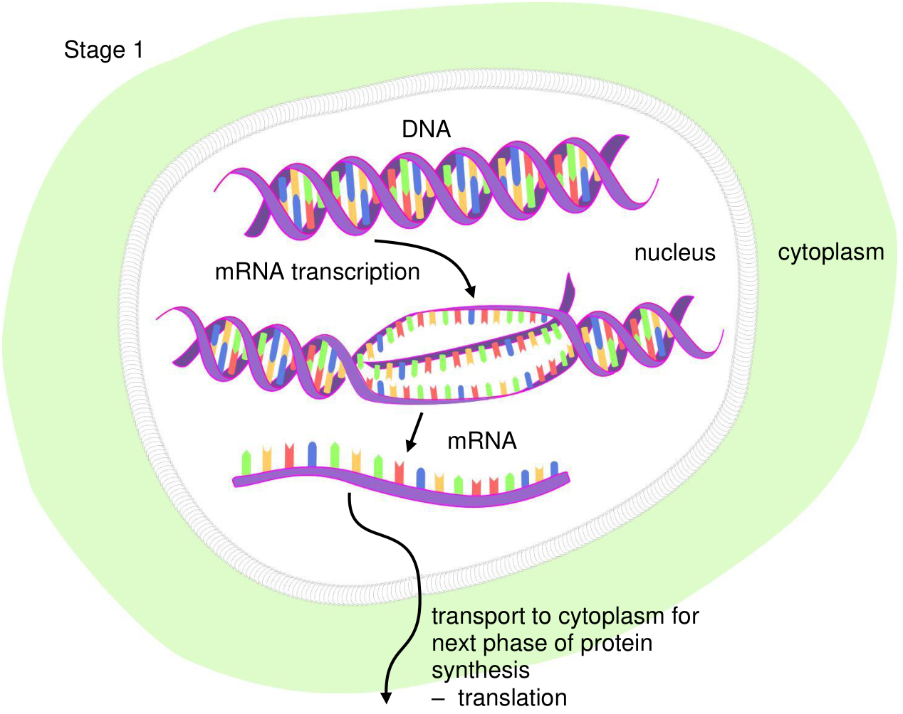

Figure 10: Transcription 

1. A section of the DNA double helix unwinds.  As a result, 

   - the weak hydrogen bonds between the nitrogenous bases of DNA break 

   - the DNA unzips (in this particular section of the DNA) 

2. One strand acts as a template 

3. This DNA template is used to form a complementary strand of messenger RNA (mRNA) 

   - This is done using free RNA nucleotides in the nucleoplasm 

   - The mRNA now contains the code for the protein which will be formed 

   - Three adjacent nitrogenous bases on the mRNA are known as codons. These code for a particular amino acid. 

4. mRNA moves out of the nucleus through a nuclear pore into the cytoplasm, where it attaches onto a ribosome 

### **Stage 2: Translation** 

The second stage of protein synthesis, called translation (Figure 11) , occurs in the cytoplasm. 

Stage 2 

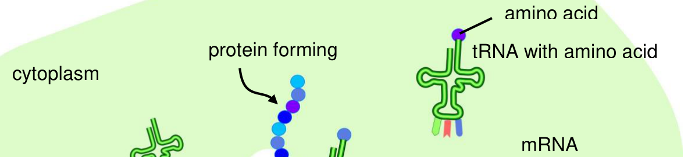

Figure 11: Translation 

5. Transfer RNA (tRNA) in the cytoplasm has three adjacent nitrogenous bases known as the anti-codon 

   - mRNA’s codon will be complementary to a tRNA’s anti-codon 

   - Each tRNA will carry a specific amino acid 

   - According to the codons on the mRNA, the tRNA will bring the required amino acid to the ribosome 

6. The amino acids are linked by a peptide bond to form the required protein. 

Figure 12 below shows the full process of protein synthesis 

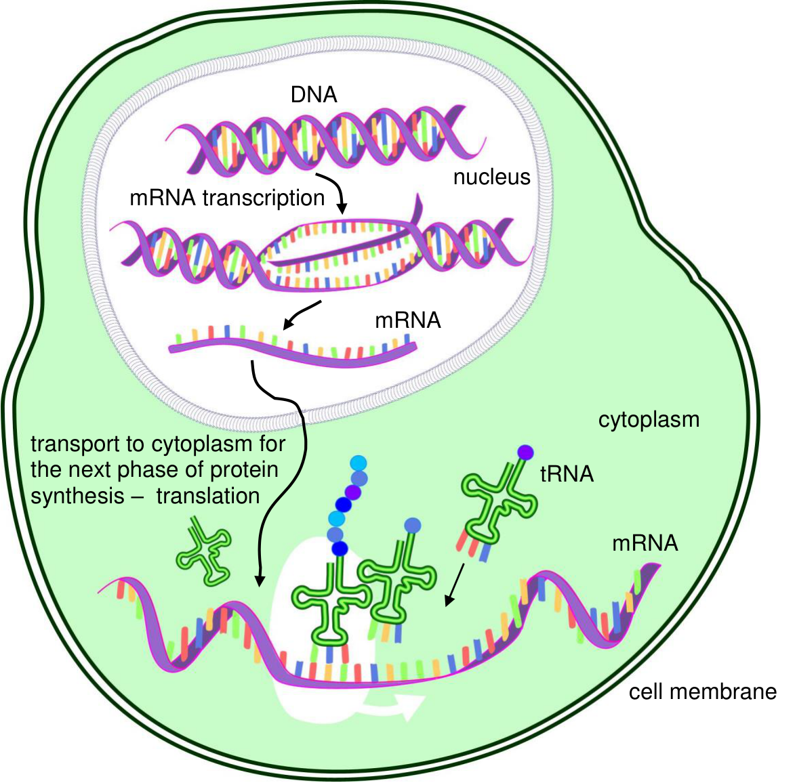

Figure 12: Protein synthesis 

Note: it is important to know the difference between base triplets (DNA), codons (mRNA) and anti-codons (tRNA). 

## **<mark>The effect of mutation on protein structure (DNA sequence)</mark>** 

- A mutation is a change in the nitrogenous base sequence of a DNA molecule (or a gene) 

- since mRNA is copied from the DNA molecule during transcription. 

- This will result in a change in the codons. 

- As a result, different tRNA molecules carrying different amino acids will be required. 

- The sequence of amino acids changes, resulting in the formation of a different protein. 

- If the same amino acid is coded for, there will be no change in the protein structure. 

Protein synthesis: https://www.youtube.com/watch?v=oefAI2x2CQM&t=43s 

#### **Activity 4: Protein synthesis** 

The diagram below represents a process that occurs during protein synthesis. 

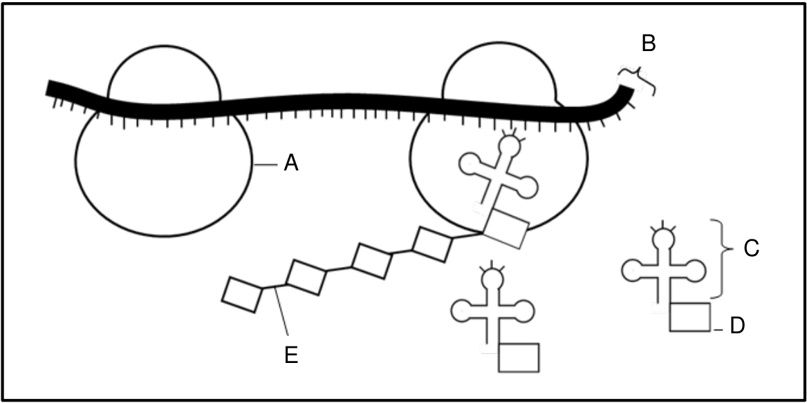

1. Identify the process above. 

(1) 

2. Name … 

|a) organelle A|(1)|
|---|---|
|b) molecule B|(1)|
|c) the bond at E|(1)|

3. Provide the letter and name of the molecule that … 

   - a) carries the amino acid (1) 

- b) is the monomer of a protein (1) 

- 4. Name and describe the process occurring in the nucleus which results in the formation of the mRNA molecule. (6) (12) 

#### **Activity 5:  Codons and amino acids** 

The sequence of amino acids in a protein molecule is coded for by DNA and RNA. The table below shows some mRNA codons and the corresponding amino acids. 

|**mRNA codons**|**amino acid**|
|---|---|
|AGC|serine|
|GAU|aspartate|
|CUA|leucine|
|UAU|tyrosine|
|UUC|phenylalanine|
|AGU|serine|
|GAC|aspartate|
|UUU|phenylalanine|
|CUC|leucine|
|GAG|glutamic acid|

1. According to the table, how many codons code for phenylalanine? (1) 

2. What is the anti-codon for glutamic acid? 

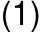

3. A section of mRNA has the following base sequence and is read from left to right: 

#### GAU CUC GAC AGC AUG ACC 

Give the … 

- a) DNA base triplet for the last codon on this section of mRNA (1) 

- b) 1^{st} amino acid coded for by this section of mRNA (1) 

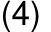

## **<mark>DNA – The code of life:  End of topic exercises</mark>** 

#### **Section A** 

#### **Question 1** 

- 1.1 Various options are provided as possible answers to the following questions. Choose the correct answer and write only the letter (A- D) next to the question number (1.1.1 – 1.1.5) on your answer sheet, for example 1.1.6 D 

   - 1.1.1 A molecule of RNA is copied from DNA by the process of A transcription. B mitosis. C mutation. D translation. 

   - 1.1.2 In a DNA molecule A guanine pairs with adenine. B adenine pairs with thymine. C cytosine pairs with adenine. D Guanine pairs with thymine. 

   - 1.1.3 A codon is a sequence of three nucleotides on a molecule of A rRNA. B mRNA. C tRNA. D DNA. 

   - 1.1.4 DNA was analysed and found to contain 14% T (thymine). What percentage of the molecule is cytosine? A   14% B   28% C   36% D   72% 

   - 1.1.5 A gene in a bacterium codes for a protein that has 120 amino acids. How many mRNA nucleotides code for this protein? A 30 B 40 C 360 D 480 (5 × 2 = 10) 

- 1.2 Give the correct **biological** term for each of the following descriptions. Write only the term next to the question number. 

   - 1.2.1 Proteins that form part of the chromosomes. 

   - 1.2.2 Which type of RNA travels from the nucleoplasm to the cytoplasm. 

   - 1.2.3 The nitrogenous base found in RNA but not in DNA. 

   - 1.2.4 A sugar that is a component of DNA. 

   - 1.2.5 A sudden change in the sequence / order of the nitrogenous bases of a nucleic acid. 

   - 1.2.6 The name of the bond that forms between amino acids in a protein molecule. 

   - 1.2.7 The type of nucleic acid that carries a specific amino acid. 

   - 1.2.8 A segment of DNA coding for a particular characteristic. 

   - 1.2.9 The bonds that form between nitrogenous bases in a DNA, 

   - 1.2.10 The organelle in the cytoplasm on which protein synthesis occurs. 

(10 x 1) = (10) 

- 1.3 Indicate whether each of the descriptions in Column I applies to **A ONLY** , **B ONLY** , **BOTH A AND B** or **NONE** of the items in Column II.  Write **A only** , **B only** , **both A and B** or **none** next to the question number. 

|**Column I**|**Column II**|
|---|---|
|1.3.1  Contains ribose sugar|A: DNA<br>B: RNA|
|1.3.2  Discovery of DNA|A: Mendel<br>B: Darwin|
|1.3.3  Location of DNA.|A: nucleus<br>B: mitochondria|
|1.3.4  The process where one DNA<br>molecule produces two<br>identical DNA molecules.|A: replication<br>B: reproduction|
|1.3.5  Pairing of nitrogenous bases|A: DNA<br>B: RNA|

(5 x 2) = (10) 

- 1.4 The diagram below represents a portion of a nucleic acid. 


   - 1.4.1 Name the nucleic acid. (1) 1.4.2 Name two places in animal cells where this nucleic acid may be found. (2) 

   - 1.4.3 Identify a) portion **1** (1) 

      - b) nitrogenous base **3** (1) c) molecule **5** (1) 

      - d) bond **2** (1) 

   - 1.4.4 What is the natural shape of this molecule? (2) 1.4.5 Name the process in which this molecules make a copy of itself? (1) 

         - (10) 

- 1.5 The diagram below represents DNA replication. 


|1.5.1|Identify the following:||
|---|---|---|
||a) molecules**W**and**U**|(2)|
||b) parts of molecule**W**labelled**X**and**Y**|(2)|
||c)<br>bond**Z**|(1)|
||d) nitrogenous base**V**|(1)|
|1.5.2|Where in the cell does this process take place?|(1)|
|1.5.3|Name the phase of the cell cycle where replication takes place.|(1)|
|1.5.4|What is the purpose of DNA replication?|(2)|
|||(10)|
||**Section A:**|**[50]**|

#### **Section B** 

#### **Question 2** 

- 2.1 The following sequence represents a part of the nitrogenous base sequence on a DNA molecule. 

|TAC|TCT|CCA|
|---|---|---|
|Triplet 1|Triplet 2|Triplet 3|

- 2.1.1. Write down the base sequence of the anticodon of triplet 1 shown above. 

   - (1) 

- 2.1.2. The table below shows the amino acids that correspond with different mRNA codons. 

|**mRNA codon**|**Amino Acid**|
|---|---|
|AGA|arginine|
|AUG|methionine|
|GGU|glycine|
|AUC|isoleucine|

- a) Give the correct sequence of amino acids for DNA triplets 1 to 3. (2) 

- b)  During DNA replication a mutation occurred on triplet 1 resulting in C being replaced by G. Describe how this mutation will affect the structure of the protein formed. (3) 

   - 2.1.3. Name and describe the process occurring in the nucleus which results in the formation of an mRNA molecule. (6) 

   - 2.1.4. Draw a RNA nucleotide with a complementary base to adenine. (2) 

      - (14) 

- 2.2 The diagrams below represent the process of protein synthesis. Study them and answer the questions that follow. 

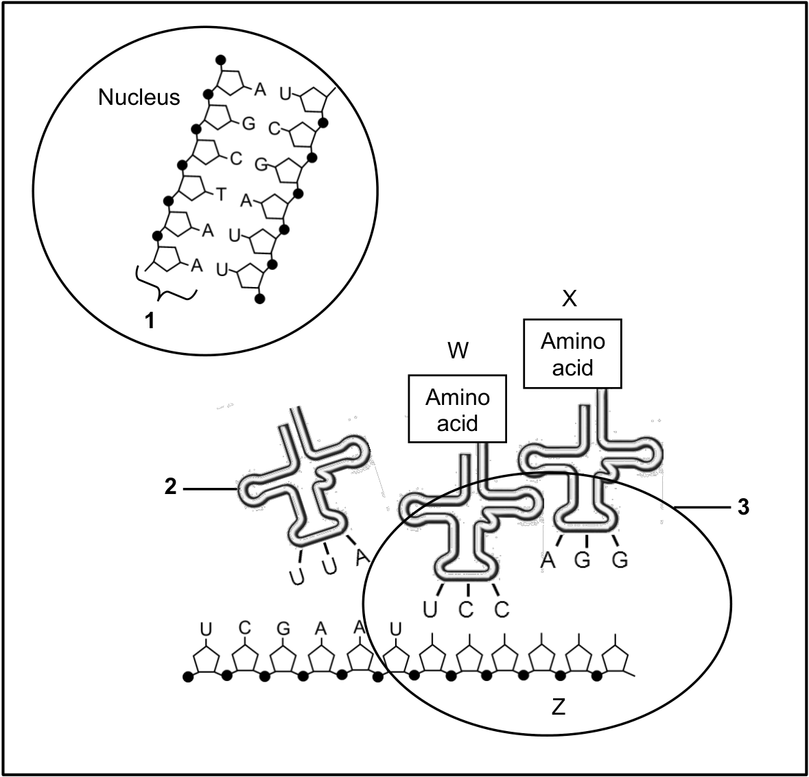

- 2.2.1 Identify the structures labelled **1,2** and **3** . (3) 2.2.2 Name and describe the stage of protein synthesis taking place at **Z** (5) 

- 2.2.3 Using the table below, work out the names of the amino acids labelled **W** and **X** . (4) 

|**Base Triplet on mRNA coding**<br>**for the amino acid**|**Amino acid coded for**|
|---|---|
|GAG|glutamate|
|CAG|histidine|
|AGG|arginine|
|CUG|leucine|
|UCC|proline|
|GUG|valine|

(12) **[26]** 

#### **Question 3** 

- 3.1 The diagram below represents two stages of protein synthesis. 

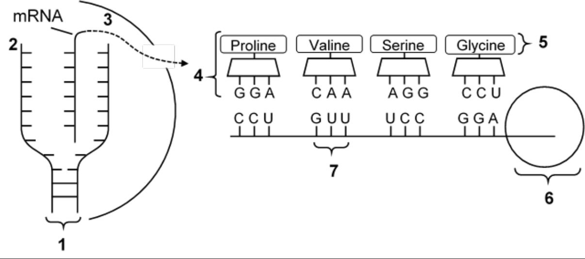

- 3.1.1 Provide labels for: 

   - a) molecule **1** (1) b) organelle **6** (1) 

- 3.1.2 Give only the number of the part which represents a: a) DNA template strand (1) b) monomer of proteins (1) c) codon (1) 

- 3.1.3 Describe _translation_ as it occurs in organelle **6** . (4) 3.1.4 Provide the: a) DNA sequence that codes for glycine (2) 

   - b) codon for proline (2) 

   - 3.1.5 State two differences between a **_DNA_** nucleotide and an **_RNA_** nucleotide. (4) 

      - (17) 

- 3.2 The first 7 triplets of nitrogenous bases that form part of the gene coding for one chain of the haemoglobin protein that makes up red blood corpuscles in humans is shown below. Study the table and answer the questions that follow. 

|**DNA**<br>**Template**|CAC|GTG|GAC|TGA|GGA|CTC|CTC|
|---|---|---|---|---|---|---|---|
|**Base**||||||||
|**triplet**<br>**number**|1|2|3|4|5|6|7|

- 3.2.1 How many of the following are coded for in the DNA template sequence above? 

   - a) Nitrogenous bases (1) 

   - b) Different types of tRNA molecules that are required to form the polypeptide from this piece of DNA . (1) 

- 3.2.2 Write down the mRNA sequence for the triplets numbered **4** and **6** in the above table. (2) 

- 3.2.3 Using the table below, determine the amino acid sequence coded for by triplet numbers **4** and **6.** (2) 

|**Anticodons on tRNA**<br>**coding for the amino**<br>**acid**|**Amino acid coded for**|
|---|---|
|CUC|glutamate|
|GUC|histidine|
|GGA|proline|
|GAC|leucine|
|UGA|threonine|
|CAC|valine|

- 3.2.4. If the T in the 6^{th} base triplet changed to A in the DNA template above, write down the new amino acid (using the table above) that this 6^{th} triplet now codes for. (1) 

   - (7) 

   - **[24]** 

**Section B: [50]** 

**Total Marks: [100]** 

## **<mark>ANSWERS TO ACTIVITIES</mark>** 

### **<mark>Chapter 1: DNA – the code of life</mark>** 

#### **Activity 1: DNA** 

1. 1 – adenine  ✓, 2 – deoxyribose sugar  ✓, 3 – hydrogen bonds  ✓ 

2. 10  ✓ 

3. Nucleus  ✓   and mitochondria  ✓ 

4. Double helix  ✓ 

5. ✓ for structure, 

   - ✓×3 - for correct labels 

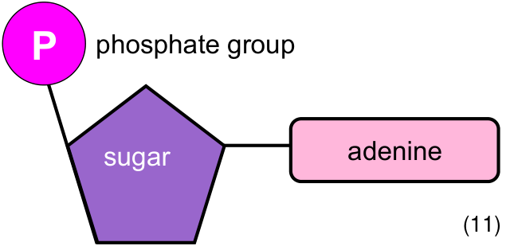

#### **Activity 2: DNA replication** 

1. DNA replication  ✓ 

2. DNA replication ensures that identical cells, with the same number and type of chromosomes, can be produced during cell division.  ✓ 

3. 1 – deoxyribose sugar  ✓, 2 – phosphate  ✓  , 3 – nucleotide  ✓  , 4 - thymine  ✓ 

4. The process of DNA replication 

   - Double helix DNA unwinds as the weak hydrogen bonds between the nitrogenous bases break  ✓ 

   - The two DNA strands separate from each other  (DNA unzips)   and each original DNA strand serves as a template to form a new strand  ✓ 

   - Free DNA nucleotides from the nucleoplasm attach to the original strand ✓ 

   - The nucleotides attach to their complementary bases (A to T and G to C) ✓ 

   - Each DNA molecule now consists of one original strand and one new strand  ✓ 

   - The result is two genetically identical DNA molecules; the entire process is controlled by enzymes  ✓ 

5. Mitochondrial DNA in mitochondria or chloroplastic DNA in chloroplasts  ✓ 

(13) 

#### **Activity 3: DNA profiling** 

1. Suspect 2  ✓ 

2. 3 of the DNA bands match the evidence from the crime scene while none of the other suspects match.  ✓ 

3. Any one of …  ✓ 

   - identification of relatives such as paternity testing or tracing siblings 

   - testing for genetic disorders 

   - to determine matching tissues for organ transplants 

   - research into variation in populations 

4. Any two of ….  ✓✓ 

   - DNA samples may be planted or a person could be framed with the use of false evidence 

   - Human error can lead to false results 

   - Only a small amount of DNA is analysed so it may not be unique to one individual 

   - Testing standards may not be followed in various private labs 

   - Invasion of privacy and revealing personal information (5) 

#### **Activity 4: Protein synthesis** 

1. Translation of protein synthesis  ✓ 

2. a) ribosome  ✓  , b) mRNA  ✓  , c) peptide  ✓ 

3. a) C – tRNA  ✓  , b) D – amino acid  ✓ 

4. Transcription  ✓ 

   - section of DNA double helix unwinds as the weak hydrogen bonds between the nitrogenous bases of DNA break 

   - DNA unzips (in this section of DNA), and one strand acts as a template 

   - This DNA template is used to form a complementary strand of messenger RNA  (mRNA)  ✓ 

   - This is done using free RNA nucleotides in the nucleoplasm  ✓ 

   - The mRNA now contains the code for the protein which will be formed  ✓ 

   - Three adjacent nitrogenous bases on the mRNA are known as codons. These code for a particular amino acid.  ✓ 

   - mRNA moves out of the nucleus through a nuclear pore into the cytoplasm, where it attaches onto a ribosome.  ✓ 

(12) 

#### **Activity 5: Codons and amino acids** 

1. 2  ✓ 

2. CUC  ✓ 

3. a) TGG  ✓  ; b) aspartate  ✓ 

(4) 

## **<mark>End of topic exercises</mark>** 

#### **Section A** 

#### **Question 1** 

- 1.1 Various options are provided as possible answers to the following questions. Choose the correct answer and write only the letter (A- D) next to the question number (1.1.1 – 1.1.5) on your answer sheet, for example 1.1.6 D 

   - 1.1.1 A molecule of RNA is copied from DNA by the process of 

      - A **transcription**  

      - B mitosis. 

      - C mutation. 

      - D translation. 

   - 1.1.2 In a DNA molecule 

      - A guanine pairs with adenine. B **adenine pairs with thymine** .  C cytosine pairs with adenine. D Guanine pairs with thymine. 

   - 1.1.3 A codon is a sequence of three nucleotides on a molecule of 

      - A rRNA. B **mRNA** .  C tRNA. D DNA. 

   - 1.1.4 DNA was analysed and found to contain 14% T (thymine). What percentage of the molecule is cytosine? 

      - A   14% B   28% C **36%**  D   72% 

   - 1.1.5 A gene in a bacterium codes for a protein that has 120 amino acids. How many mRNA nucleotides code for this protein? A 30 B 40 

      - C **360**  D 480 (5 × 2 = 10) 

- 1.2 Give the correct **biological** term for each of the following descriptions. Write only the term next to the question number. 

   - 1.2.1 Proteins that form part of the chromosomes. Histones  

   - 1.2.2 Which type of RNA travels from the nucleoplasm to the cytoplasm. mRNA / messenger RNA  

   - 1.2.3 The nitrogenous base found in RNA but not in DNA. Uracil  

   - 1.2.4 A sugar that is a component of DNA. Deoxyribose  

   - 1.2.5 A sudden change in the sequence / order of the nitrogenous bases of a nucleic acid. Mutation  

   - 1.2.6 The name of the bond that forms between amino acids in a protein molecule. Peptide  

   - 1.2.7 The type of nucleic acid that carries a specific amino acid. tRNA / transfer RNA  

   - 1.2.8 A segment of DNA coding for a particular characteristic. Gene  

   - 1.2.9 The bonds that form between nitrogenous bases in a DNA. Hydrogen bond  

   - 1.2.10 The organelle in the cytoplasm on which protein synthesis occurs. Ribosome  

(10 x 1) = (10) 

- 1.3 Indicate whether each of the descriptions in Column I applies to **A ONLY** , **B ONLY** , **BOTH A AND B** or **NONE** of the items in Column II.  Write **A only** , **B only** , **both A and B** or **none** next to the question number. 

|**Column I**|**Column II**|
|---|---|
|1.3.1  Contains ribose sugar|A: DNA<br>B: RNA|
|1.3.2  Discovery of DNA|A: Mendel<br>B: Darwin|

|1.3.3|Location of DNA.|A: nucleus<br>B: mitochondria|
|---|---|---|
|1.3.4<br> <br>|The process where one DNA<br>molecule produces two identical<br>DNA molecules.|A: replication<br>B: reproduction|
|1.3.5|Pairing of nitrogenous bases|A: DNA<br>B: RNA|

      - (5 x 2) = (10) 

   - 1.3.1 **B only**  1.3.2 **None**  

   - 1.3.3 **Both**  

   - 1.3.4 **A only**  

   - 1.3.5 **A only**  

- 1.4 The diagram below represents a portion of a nucleic acid. 

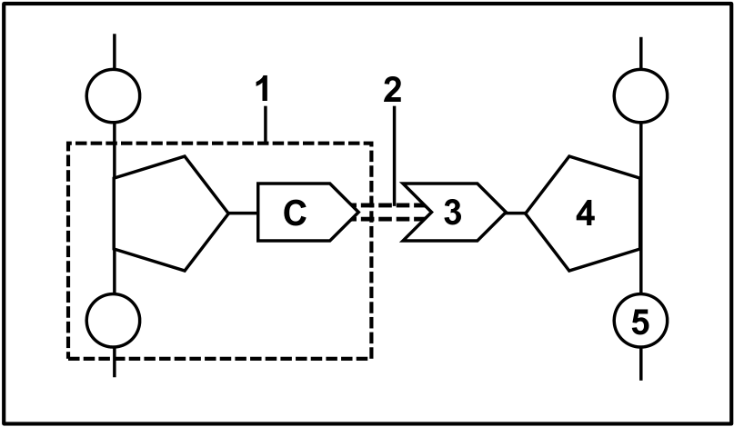

- 1.4.1 Name the nucleic acid. DNA     / Deoxyribonucleic acid 

- 1.4.2 Name two places in animal cells where this nucleic acid may be found. 

- (1) 


   - Nucleus   / chromosome Mitochondria     (mark first 2 only) 

- 1.4.3 Identify 

   - a) portion 1 (1) Nucleotide  

   - b) nitrogenous base 3 (1) Guanine  

   - c) molecule 5 (1) 

#### Phosphate  

- d) bond 2 (1) 

hydrogen bond  

   - 1.4.4 What is the natural shape of this molecule? (2) Double   helix  

   - 1.4.5 Name the process in which this molecules make a copy of itself? (1) DNA replication  

      - (10) 

- 1.5 The diagram below represents DNA replication. 

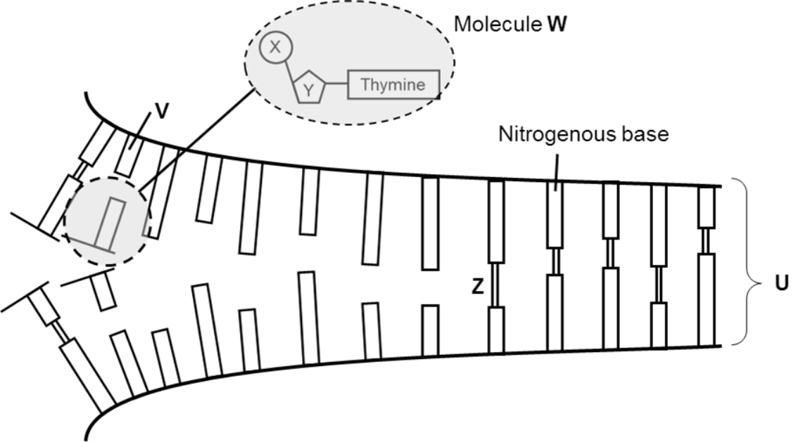

- 1.5.1 Identify the following: a) molecules **W** and **U** (2) W – nucleotide ,   U – DNA  

- b) parts of molecule W labelled X and Y (2) X – phosphate , Y – deoxyribose sugar  

- c) bond Z (1) hydrogen bond  

- d) nitrogenous base V (1) adenine  

- 1.5.2 Where in the cell does this process take place? (1) Nucleus  

- 1.5.3 Name the phase of the cell cycle where replication takes place. (1) 

Interphase  

- 1.5.4 What is the purpose of DNA replication? (2) 

For DNA to make an exact copy of itself   so that each daughter cell will receive exactly the same DNA.  

(10) 

#### **Section A:   [50]** 

#### **Section B** 

#### **Question 2** 

- 2.1 The following sequence represents a part of the nitrogenous base sequence on a DNA molecule. 

|TAC|TCT|CCA|
|---|---|---|
|Triplet 1|Triplet 2|Triplet 3|

- 2.1.1. Write down the base sequence of the anticodon of triplet 1 shown above. 

(1) 

UAC  

- 2.1.2. The table below shows the amino acids that correspond with different mRNA codons. 

|**mRNA codon**|**Amino Acid**|
|---|---|
|AGA|arginine|
|AUG|methionine|
|GGU|glycine|
|AUC|isoleucine|

- a) Give the correct sequence of amino acids for DNA triplets 1 to 3. (2) 

      - (2) 

   - Methionine- Arginine- Glycine   

- b)  During DNA replication a mutation occurred on triplet 1 resulting in C being replaced by G. Describe how this mutation will affect the structure of the protein formed. (3) 

   - the corresponding mRNA codon will be AUC  

   - resulting in isoleucine being picked up tRNA  

   - resulting in a different protein  

- 2.1.3. Name and describe the process occurring in the nucleus which results in the formation of an mRNA molecule. (6) 

   - The process is **transcription**  - **Compulsory mark** 

   - The double helix DNA molecule unwinds  

   - When the hydrogen bonds break  

   - the DNA molecule unzips  / two DNA strands separate 

   - One strand is used as the template  to form mRNA 

   - using free RNA nucleotides  from the nucleoplasm 

   - The mRNA is complementary to the DNA  / A-U, C-G 

   - The process is controlled by enzymes  

      - ( **Compulsory mark +  Any 5)** 

- 2.1.4. Draw a RNA nucleotide with a complementary base to adenine. (2) 

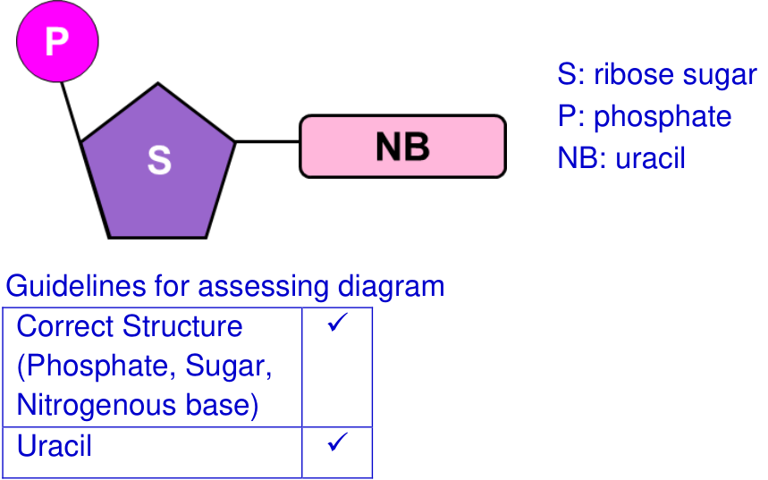

(14) 

- 2.2 The diagrams below represent the process of protein synthesis. Study them and answer the questions that follow. 

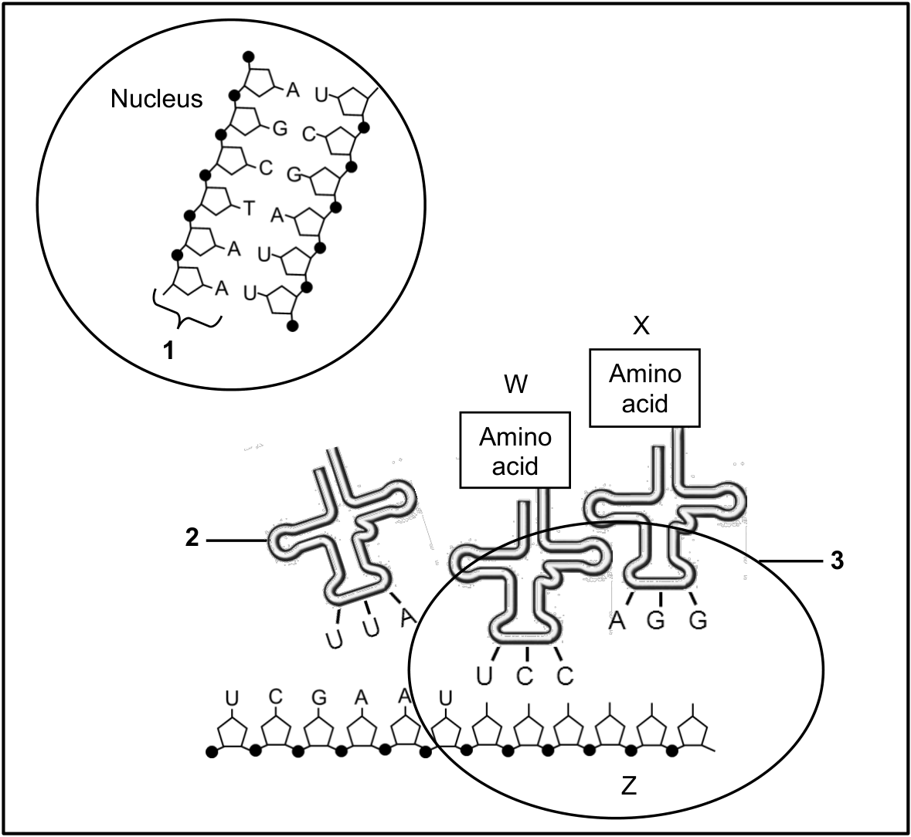

- 2.2.1 Identify the structures labelled **1,2** and **3** . (3) 

   - 1 – DNA template , 2 – tRNA , 3 – ribosome  

- 2.2.2 Name and describe the stage of protein synthesis taking place 

   - at **Z** (5) 

   - The stage of protein synthesis taking place at Z is **translation**  - compulsory mark 

   - • According to the codons of mRNA  

   - tRNA molecules with complementary anticodons  

   - bring the required amino acids to the ribosome  

   - the amino acids link by peptide bonds  

   - to form the required protein  

   - **(Compulsory mark + ANY 4)** 

- 2.2.3 Using the table below, work out the names of the amino acids labelled **W** and **X** . (4) 

|**Base Triplet on mRNA coding**<br>**for the amino acid**|**Amino acid coded for**|
|---|---|
|GAG|glutamate|
|CAG|histidine|
|AGG|arginine|
|CUG|leucine|
|UCC|proline|
|GUG|valine|

W – arginine ,   X – proline  

(12) 

**[26]** 

#### **Question 3** 

- 3.1 The diagram below represents two stages of protein synthesis. 


- 3.1.1 Provide labels for: 

   - a) molecule **1** (1) 

DNA  b) organelle **6** (1) 

ribosomes  

- 3.1.2 Give only the number of the part which represents a: a) DNA template strand (1) 2  

   - b) monomer of proteins (1) 5  

#### c) codon 

(1) 

#### 7  

- 3.1.3 Describe _translation_ as it occurs in organelle **6** . (4) • The mRNA attaches to the ribosome  • When each codon  of the mRNA • matches with the anticodon  on the tRNA • the tRNA brings the required amino acid to the ribosome  • When the different amino acids are brought in sequence  • adjacent amino acids are linked by peptide bonds  • to form the required protein  / polypeptide 

- 3.1.4 Provide the: a) DNA sequence that codes for glycine (2) CCT  

||b) codon for proline||(2)|
|---|---|---|---|
||CCU|||
|3.1.5|State two differences between a<br>nucleotide.|**_DNA_**nucleotide and an**_RNA_**|(4)|
||**DNA**|**RNA**||
||Has deoxyribose sugar|Has ribosesugar||
||Has nitrogen base thymine<br>(T) / A, G, C and T|Has nitrogen base uracil<br>(U) / A, G, C and U||

Mark first two only;  table not required 

(17) 

- 3.2 The first 7 triplets of nitrogenous bases that form part of the gene coding for one chain of the haemoglobin protein that makes up red blood corpuscles in humans is shown below. Study the table and answer the questions that follow. 

|**DNA**<br>**Template**|CAC|GTG|GAC|TGA|GGA|CTC|CTC|
|---|---|---|---|---|---|---|---|
|**Base**||||||||
|**triplet**<br>**number**|1|2|3|4|5|6|7|

- 3.2.1 How many of the following are coded for in the DNA template sequence above? 

   - a) Nitrogenous bases (1) 

      - 21  

   - b) Different types of tRNA molecules that are required to form the polypeptide from this piece of DNA . (1) 

      - 6  

- 3.2.2 Write down the mRNA sequence for the triplets numbered **4** and **6** in the above table. (2) 

   - 4 – ACU ,   6 – GAG  

- 3.2.3 Using the table below, determine the amino acid sequence coded for by triplet numbers **4** and **6.** (2) 

|**Anticodons on tRNA**<br>**coding for the amino acid**|**Amino acid coded for**|
|---|---|
|CUC|glutamate|
|GUC|histidine|
|GGA|proline|
|GAC|leucine|
|UGA|threonine|
|CAC|valine|

4 – threonine ,  6 – glutamate  

- 3.2.4. If the T in the 6^{th} base triplet changed to A in the DNA template above, write down the new amino acid (using the table above) that this 6^{th} triplet now codes for. (1) 

Valine  

(7) 

**[24]** 

**Section B: [50]** 

**Total Marks: [100]** 

## **<mark>Cognitive level distribution</mark>** 

|**Question**|**Level 1**|**Level 2**|**Level 3**|**Level 4**|**Marks**|
|---|---|---|---|---|---|
|1.1.1|||||2|
|1.1.2|||||2|
|1.1.3|||||2|
|1.1.4|||||2|
|1.1.5|||||2|
||||||10|
|1.2.1|||||1|
|1.2.2|||||1|
|1.2.3|||||1|
|1.2.4|||||1|
|1.2.5|||||1|
|1.2.6|||||1|
|1.2.7|||||1|
|1.2.8|||||1|
|1.2.9|||||1|
|1.2.10|||||1|
||||||10|
|1.3.1|||||2|
|1.3.2|||||2|
|1.3.3|||||2|
|1.3.4|||||2|
|1.3.5|||||2|
||||||10|
|1.4.1|||||1|
|1.4.2|||||2|
|1.4.3 a - d|||||4|
|1.4.4|||||2|
|1.4.5|||||1|
||||||10|
|1.5.1 a - d|||||6|

|1.5.2||||1|
|---|---|---|---|---|
|1.5.3||||1|
|1.5.4||||2|
|||||10|
|2.1.1||||1|
|2.1.2 a - b||||5|
|2.1.3||||6|
|2.1.4||||2|
|||||14|
|2.2.1||||3|
|2.2.2||||5|
|2.2.3||||4|
|||||12|
|3.1.1 a - b||||2|
|3.1.2 a - c||||3|
|3.1.3||||4|
|3.1.4 a - b||||4|
|3.1.5||||4|
|||||17|
|3.2.1 a - b||||(1+1)|
|3.2.2||||2|
|3.2.3||||2|
|3.2.4||||1|
|||||7|
||40|37|21|2<br>100|

## 5. Authentic Exam Question Archetypes & Mark Allocations
*(Extracted from official CAPS examination papers to guide marking, pacing, and rubric design)*

### Archetype 1: QUESTION 1
- **Source Paper:** `Gr12_LifeSciences_Exam16.pdf`
- **Total Mark Allocation:** **[65 Marks]** (Sub-questions: 20, 9, 6, 1, 1 marks)
- **Recommended Time:** **65 Minutes** (Pacing: ~1.0 min/mark | *Calibrated to Official CAPS Paper Pace (1.0 min/mark)*)
- **Assessment Mode Calibration:** Timed Exam Simulation: 65 min countdown (Pacing Checkpoint: 49 min)
- **Cognitive / Marking Strategy:** NSC Standard (Method Marks [M], Accuracy Marks [A], Carry-Over [CA])

#### Question Prompt & Working:
```text
QUESTION 1 
  
 
1.1 
Various options are provided as possible answers to the following questions.  
Choose the answer and write only the letter (A–D) next to the question numbers 
(1.1.1 to 1.1.10) in the ANSWER BOOK, e.g. 1.1.11 D. 
  
 
 
1.1.1 
A gene is … 
  
 
 
 
A 
B 
C 
D 
the complete set of chromosomes of an organism. 
a segment on a chromosome, coding for a characteristic. 
the haploid number of chromosomes in a cell. 
a triplet of bases that codes for an amino acid. 
  
 
 
1.1.2 
The significance of DNA replication is that the cells formed at the 
end of mitosis will … 
  
 
 
 
A 
B 
C 
D 
be genetically identical. 
contain half the number of chromosomes. 
be genetically different. 
have double the number of chromosomes. 
  
 
 
 
 
1.1.3 
Which ONE of the following statemen...
```

### Archetype 2: QUESTION 2
- **Source Paper:** `Gr12_LifeSciences_Exam21.pdf`
- **Total Mark Allocation:** **[100 Marks]** (Sub-questions: 1, 6, 2, 1, 2 marks)
- **Recommended Time:** **100 Minutes** (Pacing: ~1.0 min/mark | *Calibrated to Official CAPS Paper Pace (1.0 min/mark)*)
- **Assessment Mode Calibration:** Timed Exam Simulation: 100 min countdown (Pacing Checkpoint: 75 min)
- **Cognitive / Marking Strategy:** NSC Standard (Method Marks [M], Accuracy Marks [A], Carry-Over [CA])

#### Question Prompt & Working:
```text
QUESTION 2 
  
 
2.1 
The diagram below represents a certain stage of protein synthesis.  
(The sequence of bases is read from left to right.) 
  
 
 
 
  
 
 
 
 
 
 
 
 
 
 
 
 
 
 
2.1.1 
 
2.1.2 
 
2.1.3 
 
 
2.1.4 
Identify molecule Y. 
 
Describe the process that resulted in the formation of molecule Y. 
 
Give ONE structural difference between molecule X and 
molecule Y. 
 
Give the sequence of bases at triplet Z on strand 2. 
 (1) 
 
(6) 
 
 
(2) 
 
(1) 
 
 
2.1.5 
The table below shows some amino acids coded for by codons on  
molecule Y. 
  
 
 
 
CODON 
AMINO ACID 
AGA 
Arginine 
UCU 
Serine 
CCA 
Proline 
UAC 
Tyrosine 
GGU 
Glycine 
  
 
 
 
Identify the first and last amino acids coded for by this section of 
molecule Y. 
  
(2) 
(12) 
 
 
 
 
 
 
 
G 
A 
A 
U A C 
C C A 
Z 
...
```

### Archetype 3: QUESTION 2
- **Source Paper:** `Gr12_LifeSciences_Exam3.pdf`
- **Total Mark Allocation:** **[100 Marks]** (Sub-questions: 2, 2, 4, 2, 10 marks)
- **Recommended Time:** **100 Minutes** (Pacing: ~1.0 min/mark | *Calibrated to Official CAPS Paper Pace (1.0 min/mark)*)
- **Assessment Mode Calibration:** Timed Exam Simulation: 100 min countdown (Pacing Checkpoint: 75 min)
- **Cognitive / Marking Strategy:** NSC Standard (Method Marks [M], Accuracy Marks [A], Carry-Over [CA])

#### Question Prompt & Working:
```text
QUESTION 2 
2.1 
The digram below shows the structrure of the human eye. Study the diagram 
and answer the questions that follow.
[Adapted from https://www.bing.com/images/blob?bcid= qHbVluktH. 
oHY7w8jMPWZzqRcqxJ ...3o]
2.1.1
Explain the structural suitability of part C.
(2)
2.1.2 
A man was looking at a distant tree and then decided to watch a TikTok 
video on his phone. 
Identify the LETTER and NAME of the part of the eye that will be 
adjusted so that he can see his phone clearly.
(2)
2.1.3 
The phone brightness setting was high while he was watching the 
TikTok video.  
Name and describe the mechanism of the eye that would allow the 
person to still be able to watch this video despite the brightness 
setting.
(4)
2.1.4 
Glaucoma is an eye condition characterised by high pressure in th...
```
