# CHAPTER 5: GENETICS AND INHERITANCE

## Introduction

This section will build on what you have learnt about DNA, protein synthesis, meiosis and sexual reproduction and to help you understand how genetic characteristics e.g. physical structure, is passed down from generation to generation.

* **Genetics** is the study of heredity – how genetic characteristics are passed on from parents to child.
* Every individual inherits a set of genes found in chromosomes from a father and a mother which is unique to that individual but similar enough to identify the individual's species.

### Key terminology

| Term | Definition / Explanation |
| :--- | :--- |
| **hereditary** | passing of hereditary characteristics from parent to offspring |
| **filial generation ($F_1$)** | offspring of parent organisms |
| **locus** | the exact position (location) of a gene on a chromosome |
| **genetic engineering** | techniques used to change the genetic material of a cell or living organism – a form of biotechnology |

## Concepts in inheritance

Table 1 below provides further definitions and explanations of key terms that you must know very well.

Table 1: Terms, their explanation and supporting diagrams and notes.

| Term | Explanation | Diagram / Notes |
| :--- | :--- | :--- |
| **gene** | a segment of DNA in a chromosome that contains the code for a particular characteristic | <!-- DIAGRAM_PLACEHOLDER: diagram --> |

---

# Genetics: Key Concepts and Terminology

## 1. Core Definitions

| Concept | Definition | Examples & Additional Details |
| :--- | :--- | :--- |
| **alleles** | Different forms of a gene which occur at the same locus on homologous chromosomes. | Dominant allele ($T$) – tall plant Recessive allele ($t$) – short plant |
| **genotype** | Genetic composition of an organism. | 

> **[Diagram Context - Textbook_LifeSciences_Gr12_DNA-The_code_of_life.pdf-0001-07.png]**
> This educational graphic illustrates an anatomical cellular structure focusing on protein synthesis machinery within the cell. Visible labels and indicators include "cytoplasm", "polysomes" within a circled area, "ribosomes" lining the endoplasmic reticulum and free in the matrix, and the "nucleus". Conceptually, this diagram conveys the spatial arrangement and ultrastructure of organelles involved in transcription and translation, helping Grade 10-12 Life Sciences learners understand how the nucleus coordinates with ribosomes and polysomes in the cytoplasm to manufacture proteins.

 |
| **phenotype** | The physical appearance of an organism based on the genotype. | e.g., tall, short |
| **dominant allele** | An allele that is expressed (shown) in the phenotype when found in the heterozygous ($Tt$) and homozygous ($TT$) condition. | 

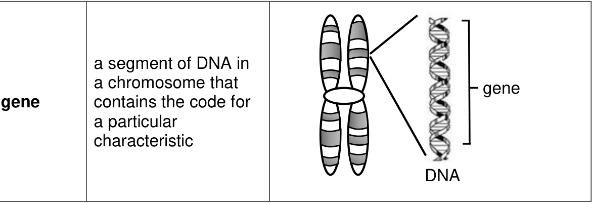
> **[Diagram Context - Textbook_LifeSciences_Gr12_Genetics_and_inheritance.pdf-0001-10.png]**
> The educational graphic is a biological structure diagram illustrating the relationship between a chromosome, DNA, and a gene. It features visible text and labels including "gene", "DNA", a descriptive definition of a gene as a segment of DNA, and lines/brackets pointing from a specific band on the duplicated chromosome to an expanded double-helix DNA strand. Conceptually, this diagram conveys the hierarchical organization of genetic material, showing high school students that a gene is a specific functional segment of DNA located within a chromosome that codes for particular characteristics.

 |
| **recessive allele** | An allele that is masked (not shown) in the phenotype when found in the heterozygous ($Tt$) condition; only expressed in the homozygous ($tt$) condition. | <!-- DIAGRAM_PLACEHOLDER: diagram --> |
| **heterozygous** | Two different alleles for a particular characteristic. | e.g., $Tt$ |
| **homozygous** | Two identical alleles for a particular characteristic. | e.g., $TT$ or $tt$ |

---

## 2. Types of Genetic Crosses

| Cross Type | Definition | Examples |
| :--- | :--- | :--- |
| **monohybrid cross** | Only one characteristic or trait is shown in the genetic cross. | Flower colour only, e.g., yellow or white flower **— OR —** shape of seeds only, e.g., round seeds or wrinkled seeds. |
| **dihybrid cross** | Two different characteristics shown in a genetic cross. | Example: flower colour, e.g., yellow or white flower **— AND —** shape of seeds, e.g., round seeds or wrinkled seeds. |

---

# Genetics: Types of Dominance and Alleles

## 1. Complete Dominance
* **Definition:** A genetic cross where the dominant allele masks the expression of a recessive allele in the heterozygous condition.
* **Key Notes:** 
  * The allele for tall ($T$) is dominant over the allele for short ($t$).
  * Offspring will be **tall** because the dominant allele ($T$) masks the expression of the recessive allele ($t$).
* **Example:** Tall ($TT$) $\times$ short ($tt$) $\rightarrow$ Tall ($Tt$)
* **Diagram:**
  

> **[Diagram Context - Textbook_LifeSciences_Gr12_DNA-The_code_of_life.pdf-0002-01.png]**
> This diagram provides a cross-sectional view of a cell nucleus, clearly identifying the nuclear membrane, nucleoplasm, nucleolus, and nuclear pores. It illustrates the structural components of the cell's control centre, helping learners understand how the nuclear envelope's pores facilitate the transport of materials between the nucleus and the cytoplasm.

## 2. Incomplete Dominance
* **Definition:** A cross between two phenotypically different parents produces offspring different from both parents but with an intermediate phenotype.
* **Key Notes:** 
  * A red-flowered plant is crossed with a white-flowered plant – with incomplete dominance, offspring will have **pink flowers – intermediate colour**.
* **Example:** red $\times$ white flower $\rightarrow$ pink flowers
* **Diagram:**
  

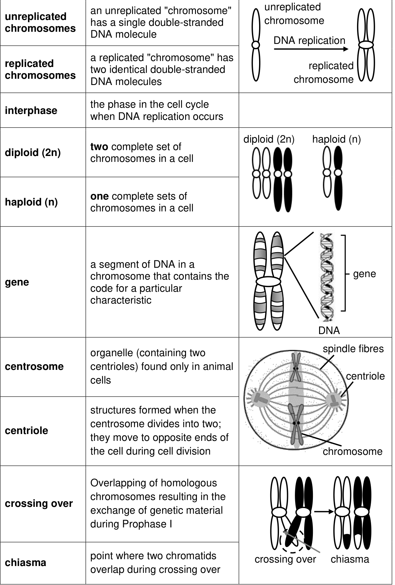
> **[Diagram Context - Textbook_LifeSciences_Gr12_Meiosis.pdf-0002-00.png]**
> This educational table features a series of diagrammatic representations, definitions, and key genetic terminology including unreplicated/replicated chromosomes, diploid (2n), haploid (n), genes, centrosomes, centrioles, crossing over, and chiasma. Visible labels include "unreplicated chromosome," "DNA replication," "replicated chromosome," "diploid (2n)," "haploid (n)," "gene," "DNA," "spindle fibres," "centriole," "chromosome," "crossing over," and "chiasma," accompanied by structural illustrations and directional arrows. Conceptually, this graphic helps Life Sciences learners master core cytogenetics terminology and visual representations related to DNA structure, chromosome organization, cell division, and genetic variation.

## 3. Co-dominance
* **Definition:** A cross in which both alleles are expressed equally in the phenotype.
* **Key Notes:** 
  * A red-flowered plant is crossed with a white-flowered plant – with co-dominance, the offspring has flowers with red and white patches.
* **Example:** red $\times$ white flower $\rightarrow$ flowers with red and white patches
* **Diagram:**
  <!-- DIAGRAM_PLACEHOLDER: diagram -->

## 4. Multiple Alleles
* **Definition:** More than two alternative forms of a gene at the same locus.
* **Key Notes:** 
  * Blood groups are controlled by three alleles, namely $I^A$, $I^B$ and $i$.
  * All three alleles are present in a population, but an individual can only have two alleles.

## 5. Sex-linked Characteristics
* **Definition:** Traits that are carried on the sex chromosomes.
* **Key Notes:** 
  * Some examples: haemophilia and colour-blindness.
  * Alleles for haemophilia (or colour-blindness) are indicated as superscripts on the sex chromosomes, e.g.:
    * $X^H X^H$ (normal female)
    * $X^H X^h$ (normal female, carrier)
    * $X^h X^h$ (female with haemophilia)
    * $X^H Y$ (normal male)
    * $X^h Y$ (male with haemophilia)
  * Both haemophilia and colour blindness are caused by recessive alleles.

---

# Genetics Terminology

## 1. Karyotype

* **Definition:** The number, shape and arrangement of the chromosomes in the nucleus of a somatic cell.
* **Illustration:** 

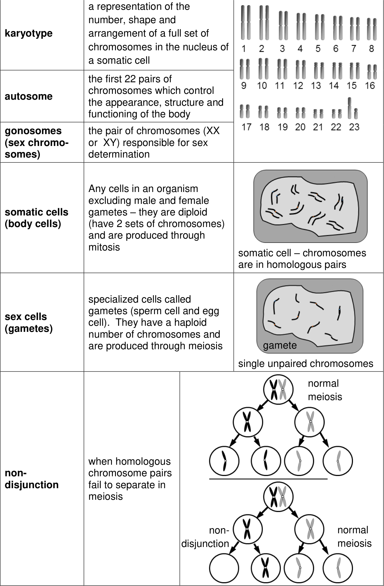

---

## 2. Cloning

* **Definition:** Process by which genetically identical organisms are formed using biotechnology.
* **Example/Note:** Dolly the sheep was cloned using a diploid cell from one parent; therefore, it had the identical genetic material of that parent.

---

## 3. Genetic Modification

* **Definition:** Manipulation of the genetic material of an organism to get desired changes.
* **Example/Note:** An example includes the insertion of the human insulin gene into the plasmid of bacteria so that the bacteria produce human insulin.

---

## 4. Human Genome

* **Definition:** Mapping of the exact position of all the genes in all the chromosomes of a human.
* **Example/Note:** Haemophilia is the last gene on the X chromosome; gene number 3 on chromosome 4 is responsible for a particular characteristic.

---

## 5. Homologous Pair of Chromosomes

* **Definition:** A set of one maternal and one paternal chromosome that pair up with each other inside a cell during meiosis. Homologous chromosomes are the same size and shape, and carry the same or similar alleles.
* **Illustration:** <!-- DIAGRAM_PLACEHOLDER: diagram -->

---

# Activity 1: Traits, genes and alleles

1. The paired letters in the diagram below represent alleles of a gene. A number of genes for different characteristics are shown. Write down the relevant letter ($A - D$) for:

   a) The homozygous dominant state
   b) Two alleles from different genes
   c) The homozygous recessive state
   d) The heterozygous state

   

> **[Diagram Context - Textbook_LifeSciences_Gr12_DNA-The_code_of_life.pdf-0004-07.png]**
> This diagram depicts a simplified model of a DNA double helix, featuring two purple helical ribbons representing

2. What is the relationship between a gene and a protein?

3. What is an allele?

4. What terms describe a pair of alleles that are:

   a) the same?
   b) different?

5. Write a definition of homologous chromosomes using the terms "genes" and "alleles".

6. How are alleles represented?

7. Fill in the table below with the missing genotype, phenotype (dominant or recessive), or alleles ($TT, Tt, tt$).

| Genotype | Phenotype | Alleles |
| :--- | :--- | :--- |
| homozygous dominant | | |
| | short | $t / t$ |
| | | |

8. Draw a pair of homologous chromosomes. Label the chromosomes with two sets of genes, one with homozygous dominant alleles, one with homozygous recessive alleles and one with heterozygous alleles.

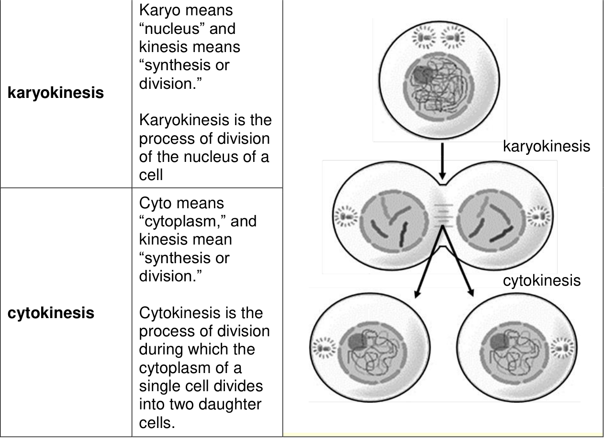

---

# Mendel as Father of Genetics

Gregor Mendel, an Austrian monk, is regarded as the father of genetics for his work on garden pea plants that helped explain **how genes are passed from parents to offspring**.

Mendel's work on the genetics of peas began with the observation of peas to determine what traits were inherited. He noticed at least 7 traits that appeared to be inherited.

These traits were:
* Seed shape
* Seed colour
* Pod shape (pod – the container holding a plant's seeds)
* Pod colour
* Flower colour
* Flower position (whether axial – on the side, or terminal – on top)
* Stem length

## Table 2: Traits compared by Mendel

| Seed | Pod | Flower | Size |
| :---: | :---: | :---: | :---: |
| **shape** | **colour** | **shape** | **colour** | **position** | **colour** | |
| round | yellow | full | green | axial | purple | tall |
| wrinkled | green | constricted | yellow | terminal | white | short |

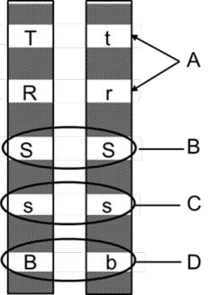

---

# Mendel's Experiments

## Overview of Mendel's Observations

* Mendel noticed that garden peas occur in at least two heights – tall ($T$) and short ($t$).
* Since peas are self-pollinating, tall peas tend to produce tall peas, and short peas produce short peas.
* Mendel's first genetic cross involved tall peas cross-pollinated with short peas.
* **First Generation ($\text{F}_1$ generation):** The cross yielded only tall peas.
* **Second Generation ($\text{F}_2$ generation):** Mendel then took the $\text{F}_1$ peas and crossed them with themselves (interbreeding) to produce a second group of offspring.
* **Result:** Tall and short peas appeared in a ratio of $3:1$ ($3$ tall : $1$ short or dwarf).

---

## Figure 2: A Genetic Cross Between a Tall Pea Plant and a Short (Dwarf) Plant

### Summary of Generations

| Generation | Genotype | Phenotype |
| :--- | :--- | :--- |
| **Parental generation** | $TT$ (tall) and $tt$ (short) | Tall and Dwarf |
| **$\text{F}_1$ generation** | All are $Tt$ | All are tall |
| **$\text{F}_2$ generation** | $TT : Tt : tt = 1 : 2 : 1$ | $\text{Tall} : \text{Dwarf} = 3 : 1$ |

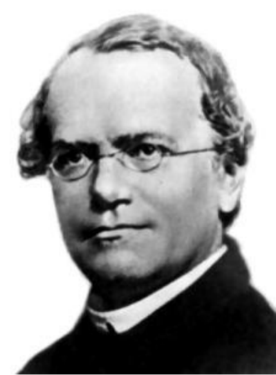

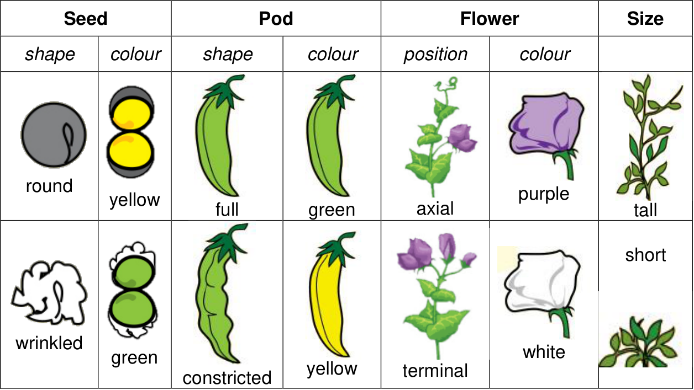

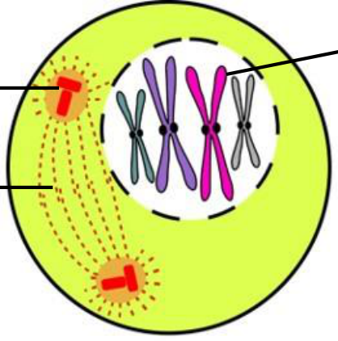

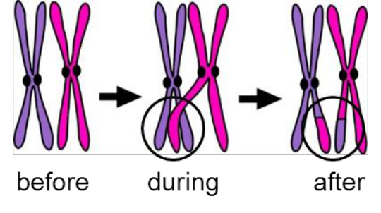

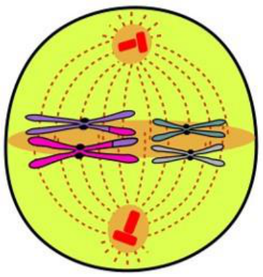

---

# Mendel's Laws of Inheritance

Mendel formulated the following laws from his experiments.

## Mendel's First Law of Inheritance: Law (principle) of Segregation

* Each trait is controlled by two factors (now known as alleles) situated on homologous chromosomes.
* When gametes form during meiosis, the two factors (alleles) are separated or segregated. A gamete contains one of the two factors (alleles) from each parent.

## Mendel's Second Law of Inheritance: Law of Dominance

* Certain alleles of a gene exist in either a dominant or a recessive form.
* If the pair of alleles are different (one dominant, one recessive), the phenotype will only show the dominant trait.

## Mendel's Third Law of Inheritance: Law (principle) of Independent Assortment

* Due to random arrangement of chromosomes at the equator during meiosis (gamete formation), any one of the two alleles of **ONE** characteristic can sort with any one of **ANOTHER** characteristic.
* The alleles of different genes move independently of each other into the gametes. They can therefore appear in the gametes in different combinations.

---

## Genetic diagrams

* It is important to start with a **PAIR** of alleles in the mother and another **PAIR** in the father because each individual inherits TWO alleles for a gene — one maternal and one paternal (the bivalent chromosomes).
* This **pair** may be identical (**HOMOZYGOUS**) or different (**HETEROZYGOUS**) alleles.
* Alleles are represented by **letters**: CAPITALS (for dominant alleles) or small letters (for recessive alleles).
* $P$ stands for the **P**arent generation

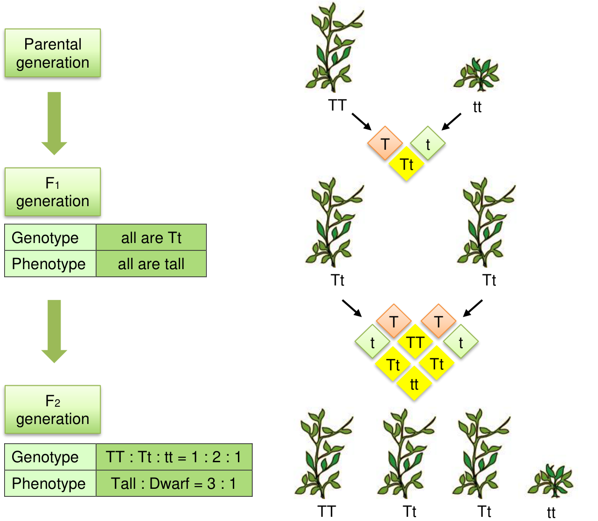

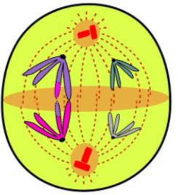

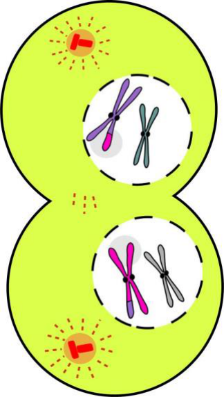

---

- $\mathbf{F}$ stands for the offspring (Filial generation) – remember $\mathbf{F}$ for Family.
- $F_1$ generation is the first filial generation, $F_2$ the second.

## Genetic crosses

It is important to learn the **exact** layout because marks are allocated for the layout as well as the correct working out of the cross. Use the following genetic diagram or template to solve all genetic crosses.

| Layout of a genetic diagram | Explanation |
| :--- | :--- |
| $\mathbf{P_1}$ \quad\quad Phenotype $\dots\dots\dots\dots\dots\dots\dots$ X $\dots\dots\dots\dots\dots\dots\dots$ $\checkmark$ $\phantom{\mathbf{P_1}}$ \quad\quad Genotype $\dots\dots\dots\dots\dots\dots\dots$ X $\dots\dots\dots\dots\dots\dots\dots$ $\checkmark$ Meiosis \quad Gametes $\dots\dots\dots\dots\dots\dots\dots$ X $\dots\dots\dots\dots\dots\dots\dots$ $\checkmark$  Fertilisation  

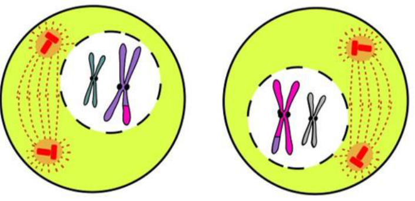
  $\mathbf{F_1}$ \quad\quad Genotype $\dots\dots\dots\dots\dots\dots\dots\dots\dots\dots\dots\dots\dots\dots\dots\dots\dots\dots\dots\dots$ $\checkmark$ $\phantom{\mathbf{F_1}}$ \quad\quad Phenotype $\dots\dots\dots\dots\dots\dots\dots\dots\dots\dots\dots\dots\dots\dots\dots\dots\dots\dots\dots\dots$ $\checkmark$  $P_1$ and $F_1$ $\checkmark$ Meiosis and fertilisation $\checkmark$ | Visible trait is the **phenotype** e.g. tallness, shortness, etc. |
| **OR** | The genetic make-up of the individual is its **genotype** e.g. TT or Tt or tt |
| $\mathbf{P_1}$ \quad\quad Phenotype $\dots\dots\dots\dots\dots\dots\dots$ X $\dots\dots\dots\dots\dots\dots\dots$ $\checkmark$ $\phantom{\mathbf{P_1}}$ \quad\quad Genotype $\dots\dots\dots\dots\dots\dots\dots$ X $\dots\dots\dots\dots\dots\dots\dots$ $\checkmark$ Meiosis \quad Gametes $\dots\dots\dots\dots\dots\dots\dots$ X $\dots\dots\dots\dots\dots\dots\dots$ $\checkmark$  Fertilisation 

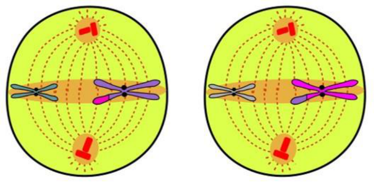
   $\mathbf{F_1}$ \quad\quad Phenotype $\dots\dots\dots\dots\dots\dots\dots\dots\dots\dots\dots\dots\dots\dots\dots\dots\dots\dots\dots\dots$ $\checkmark$ $\phantom{\mathbf{F_1}}$ \quad\quad Genotype $\dots\dots\dots\dots\dots\dots\dots\dots\dots\dots\dots\dots\dots\dots\dots\dots\dots\dots\dots\dots$ $\checkmark$  $P_1$ and $F_1$ $\checkmark$ Meiosis and fertilisation $\checkmark$ | The alleles segregate (or separate) during **meiosis** to form gametes. Each gamete has only one copy of each allele  During **fertilisation** the individual gets one allele of the gene form each parent  The matrix box used to determine the results of fertilisation is called a **Punnet square** |

111

---

**IMPORTANT:** You may also be asked to work out the ratio or \% chance of the various pheno-/genotypes occurring. So, if there are 4 possible geno- or phenotypes in total and only 1 having a particular phenotype, it will be a 1 in 4 ratio ($25\%$ chance)

You need to read genetics questions with great care to find the clues concerning:
- which characteristic (phenotype) is being examined, e.g.: shape of seeds
- which allele of the pair is dominant, e.g.: round
- whether the parents are homozygous or heterozygous for the characteristic: e.g.: both are heterozygous
- what letters are to be used (are they given OR must you choose letters), e.g.: $R$ (dominant allele) and $r$ (recessive allele)
- show how the alleles are separated during meiosis to form gametes
- show all the possible ways the sperm and egg can combine during fertilisation
- distinguish the phenotypes from the genotypes

---

## Monohybrid crosses

*Monohybrid* crosses refer to genetic crosses that involve only a single characteristic or trait. *Dihybrid* crosses involve two characteristics or traits.

The following monohybrid crosses are dealt with:
- monohybrid crosses with complete dominance
- monohybrid crosses with incomplete dominance
- monohybrid crosses with co-dominance
- sex determination
- inheritance of sex-linked diseases
- multiple alleles e.g.: blood grouping

## Monohybrid crosses with complete dominance

Mendel's work as discussed above shows monohybrid crosses with complete dominance. In complete dominance, the dominant allele masks or blocks the expression of the recessive allele in the heterozygous condition.

The following example represents a genetic cross which shows complete dominance.

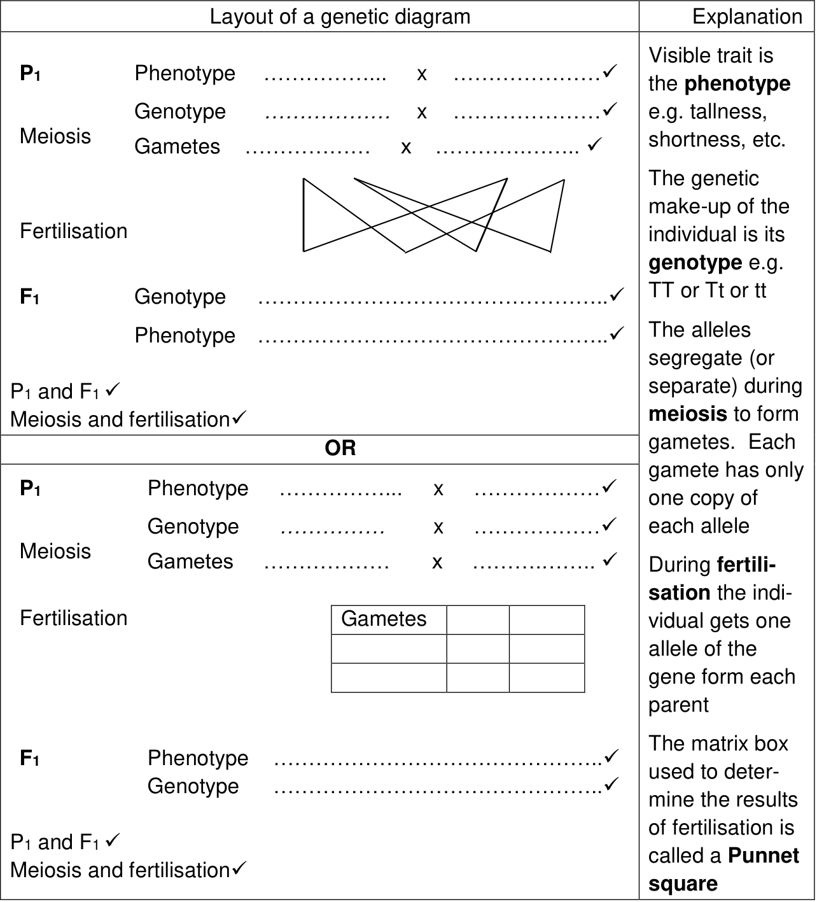

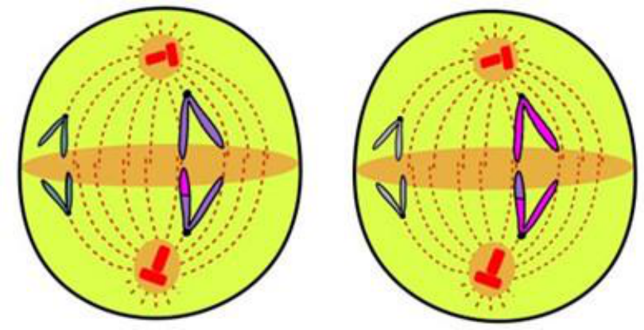

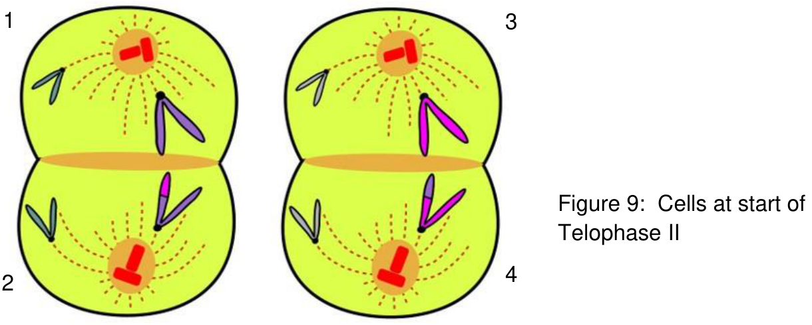

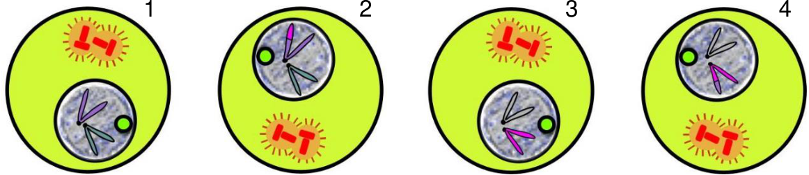

---

# Genetic problem 1

Seeds can be round or wrinkled. Use a genetic cross to show the genotype and the phenotype of the $\text{F}_1$ generation when two heterozygous plants with round seeds are crossed. The allele for round seeds is dominant over the allele for wrinkled seed. Use the letter $\mathbf{R}$ for round and $\mathbf{r}$ for wrinkled seeds.

## Method 1: Branch Diagram / Line Cross

* **$\mathbf{P}_1$ Phenotype:** Round seeds $\times$ Round seeds
* **$\mathbf{P}_1$ Genotype:** $\text{Rr} \times \text{Rr}$
* **Meiosis (Gametes):** $\text{R}$ and $\text{r} \times \text{R}$ and $\text{r}$

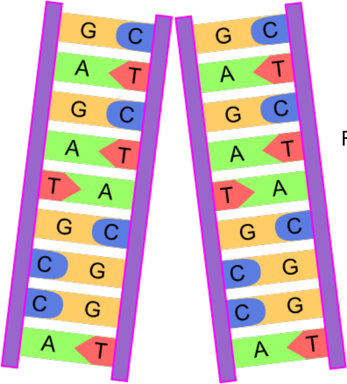

* **Fertilisation & $\mathbf{F}_1$ Genotype:** $\text{RR}$, $\text{Rr}$, $\text{Rr}$, $\text{rr}$
* **$\mathbf{F}_1$ Phenotype:** round seeds, round seeds, round seeds, wrinkled seeds

---

## Method 2: Punnett Square (Cross)

* **$\mathbf{P}_1$ Phenotype:** round seeds $\times$ round seeds
* **$\mathbf{P}_1$ Genotype:** $\text{Rr} \times \text{Rr}$
* **Meiosis (Gametes):** $\text{R}$ and $\text{r} \times \text{R}$ and $\text{r}$

* **Fertilisation (Punnett Square):**

| Gametes | $\mathbf{R}$ | $\mathbf{r}$ |
| :---: | :---: | :---: |
| $\mathbf{R}$ | $\text{RR}$ | $\text{Rr}$ |
| $\mathbf{r}$ | $\text{Rr}$ | $\text{rr}$ |

* **$\mathbf{F}_1$ Phenotype:** round seeds, round seeds, round seeds, wrinkled seeds
* **$\mathbf{F}_1$ Genotype:** $\text{RR}$, $\text{Rr}$, $\text{Rr}$, $\text{rr}$

---

## Ratios

* **Genotypic Ratio:** $1\text{RR} : 2\text{Rr} : 1\text{rr}$ ($1:2:1$)
* **Phenotypic Ratio:** $3$ Round seeds : $1$ Wrinkled seed ($3:1$)

---

* A cross between two heterozygous ($Rr$) parents produces $25\%$ homozygous dominant ($RR$), $50\%$ heterozygous ($Rr$) and $25\%$ homozygous recessive ($rr$) offspring. As such, the phenotypic ratio is $3$ dominant : $1$ recessive.

## Activity 2: Monohybrid crosses with complete dominance

1. Mendel crossed homozygous plants with green seeds with homozygous plants which had yellow seeds and found that all the offspring were yellow (Figure 3). Construct a genetic diagram (using the above template) to show the $F_1$ and $F_2$ generations.

   Choose a letter for each allele. Note: use one letter: capitalised for the dominant allele and small (lower-case) for the recessive allele. ($6 + 6$)

   

   *Figure 3: Monohybrid cross showing inheritance of seed colour*

2. The ability to roll one's tongue (Figures 4 and 5) is a dominant characteristic. Explain (without a genetic diagram) why it is possible for a non-roller child to be born to parents who can both roll their tongues. Use the letters $R$ and $r$ in your answer. ($3$)

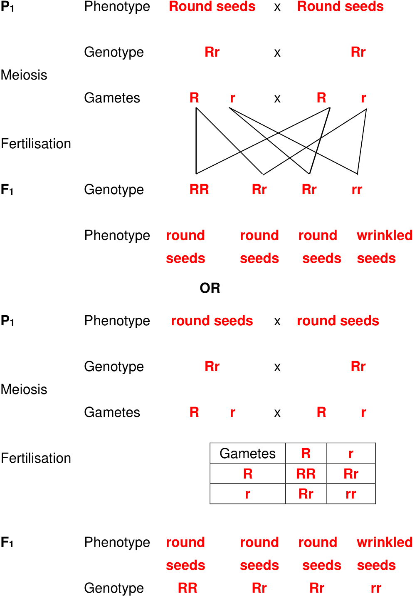

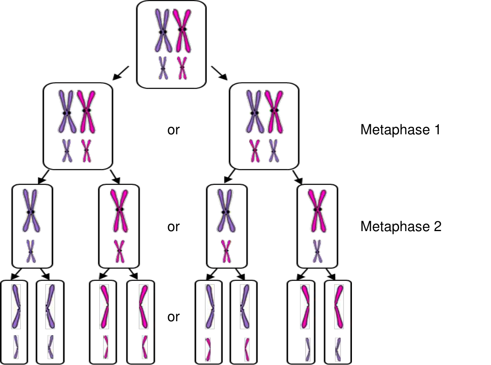

---

## Monohybrid cross with incomplete dominance

**Incomplete dominance** is a cross between two phenotypically different parents where no allele of the gene is either dominant or recessive. The offspring is different to both parents and the alleles blend to form a **new phenotype**.

The following problem represents a genetic cross which shows incomplete dominance:

### Genetic problem 2

A homozygous red-flowering plant crossed with a homozygous white-flowering plant will produce plants that have pink flowers.

Complete a genetic diagram to show how this is possible using the letter $\mathbf{R}$ for red and $\mathbf{W}$ for white.

| Generation / Process | Phenotype / Genotype | Details |
| :--- | :--- | :--- |
| $\mathbf{P_1}$ | Phenotype | Red $\times$ White |
| | Genotype | $\text{RR} \times \text{WW}$ |
| Meiosis | | |
| | Gametes | $\text{R}, \text{R} \times \text{W}, \text{W}$ |
| Fertilisation | Punnett Square | 

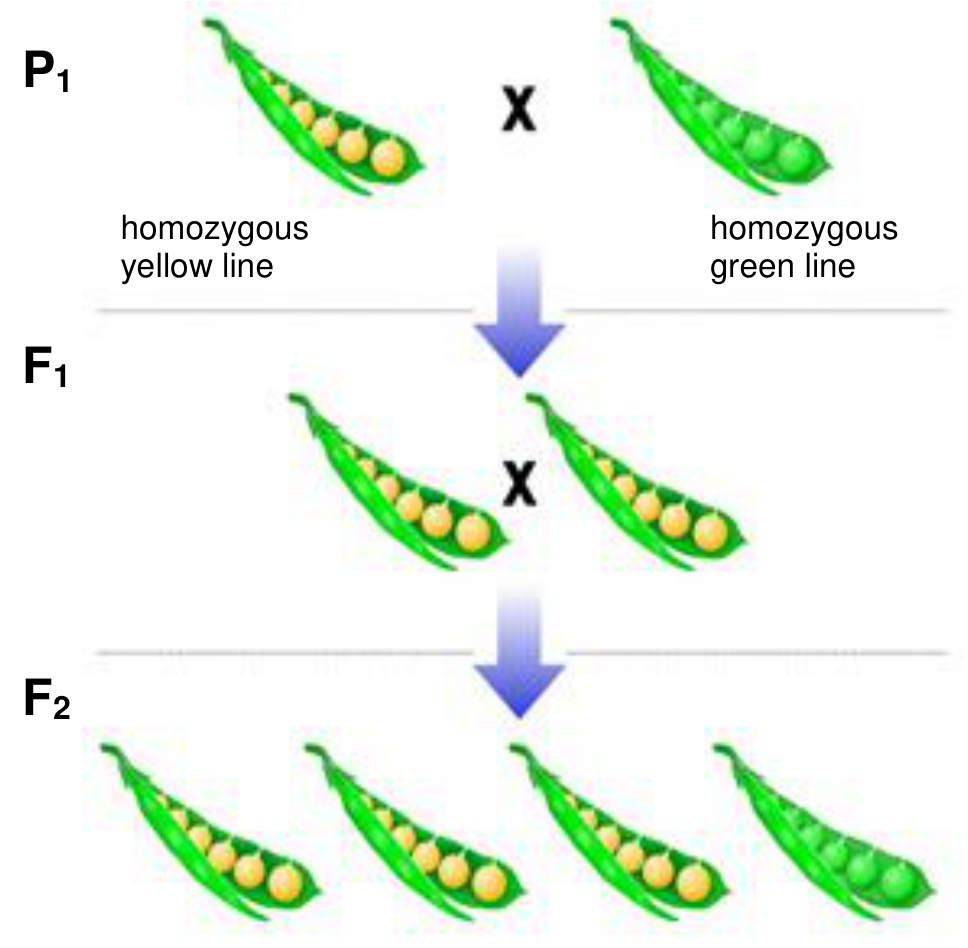
 |
| $\mathbf{F_1}$ | Genotype | $\text{RW}, \text{RW}, \text{RW}, \text{RW}$ |
| | Phenotype | All Pink |

The characteristic being investigated is flower colour; the alleles are red ($\mathbf{R}$) and white ($\mathbf{W}$).

---

The genotype of the parents will be **RR** and **WW** as they are homozygous where both alleles for the gene are the same.

The fact that the offspring have a new phenotype **pink** which is formed from red and white, tells you that there is no dominant or recessive allele.

Figure 6: Monohybrid cross with incomplete dominance

## Activity 3: Monohybrid cross with incomplete dominance

1. Two grey mice were mated. Some of the offspring were grey, others black and some white. How is this possible? Do a genetic cross to explain this result. (6)

2. Incomplete dominance is seen in the inheritance of hypercholesterolemia (high blood cholesterol levels). **H** represents the allele for very high levels and **L** for low levels.

   2.1 Sipho and Andiswa are both heterozygous for this characteristic and both have high cholesterol levels but not as high as their daughter Sihle who has levels that are six times above normal. She is homozygous for high cholesterol levels. Do a full genetic diagram to explain your answer. (7)

   2.2 What is the percentage chance that their next child will have ...
   
       a) low cholesterol levels? (1)
   
       b) extremely high cholesterol levels like Sihle? (1)

(15)

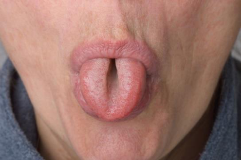

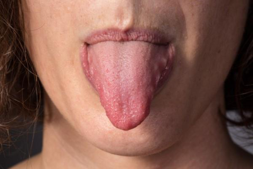

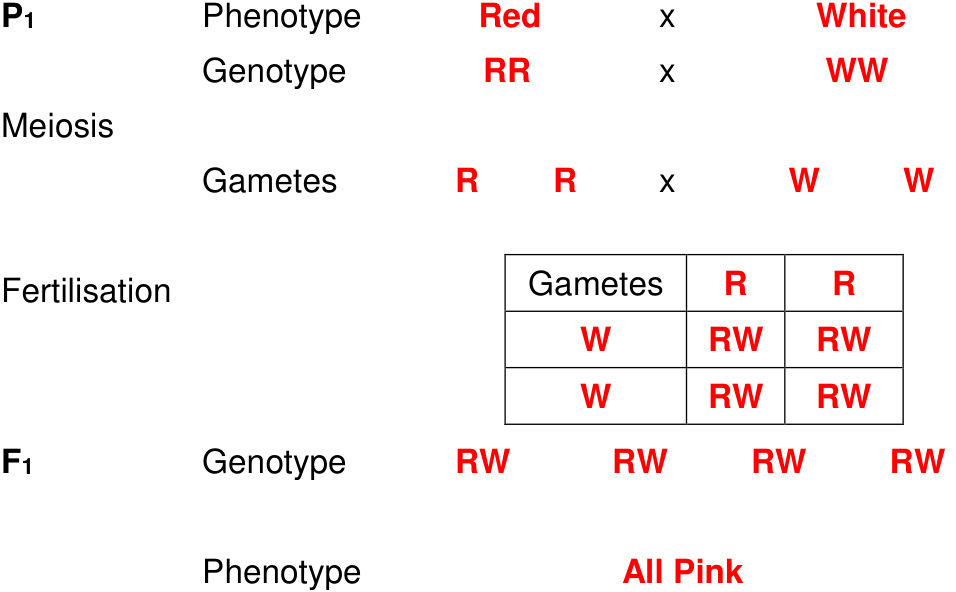

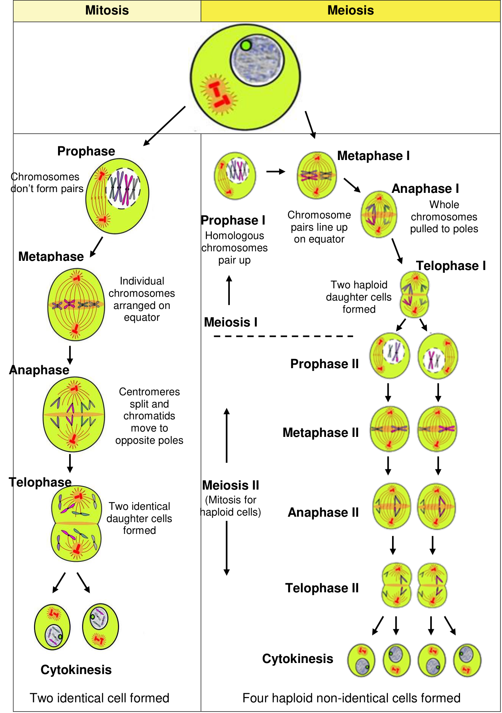

---

# Monohybrid crosses with co-dominance

In **co-dominance**, both alleles of the gene are equally dominant so both will be expressed equally in the phenotype of the offspring.

The following problem represents a genetic cross which shows co-dominance:

## Genetic Problem 3

In cattle three colour variations are possible (Figure 7): red, white or red and white in patches. This comes about due to a red allele ($R$) and a white allele ($W$) for coat colour. Do a genetic cross between a red bull and a white female to show the possible offspring.

| Generation / Stage | Description | Alleles / Details |
| :--- | :--- | :--- |
| **$\mathbf{P_1}$** | Phenotype | Red coat $\times$ White coat |
| | Genotype | $RR \times WW$ |
| **Meiosis** | Gametes | $R, R \times W, W$ |
| **Fertilisation** | Punnett Square | 

 |
| **$\mathbf{F_1}$** | Genotype | $RW,\ RW,\ RW,\ RW$ |
| | Phenotype | All red with white patches |

*(Note: The Punnett square from the text is represented below)*

| Gametes | $\mathbf{R}$ | $\mathbf{R}$ |
| :---: | :---: | :---: |
| $\mathbf{W}$ | $RW$ | $RW$ |
| $\mathbf{W}$ | $RW$ | $RW$ |

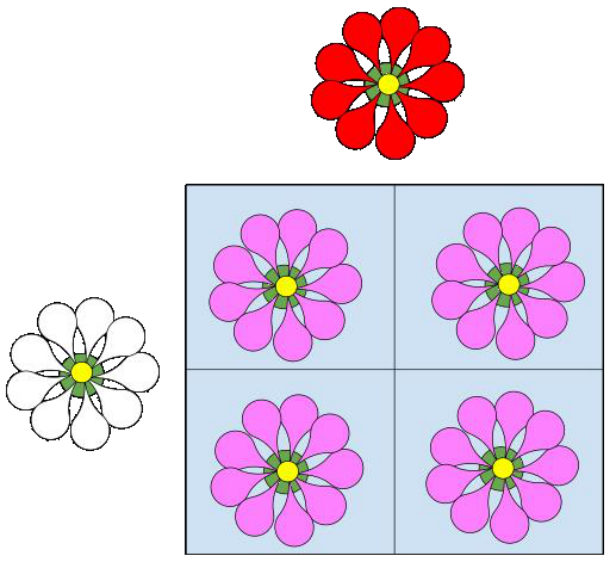

*Figure 7: Co-dominance in cattle showing 3 coat colours*

The characteristic being investigated is coat colour which is controlled by two alleles $R$ and $W$. The $\mathbf{F_1}$ offspring show both phenotypes together so this is co-dominance. 

The offspring will have a genotype of $RW$ which is red and white patches.

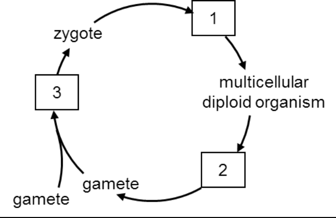

---

**Note:** Inheritance of blood groups is also partly an example of co-dominance when the alleles $I^A$ and $I^B$ are involved. This will be dealt with later.

---

## Sex Determination

The following problem represents a genetic cross which shows inheritance of sex.

### Genetic Problem 4:
A couple has three sons and the woman is pregnant again. Show by means of a genetic cross what the percentage chance is of the couple having a baby girl.

| Generation / Stage | Description | Details |
| :--- | :--- | :--- |
| **$\text{P}_1$** | Phenotype Genotype | Male $\times$ Female $XY \times XX$ |
| **Meiosis** | Gametes | $X, Y \quad \text{and} \quad X, X$ |
| **Fertilisation** | Punnett Square | |

| Gametes | X | Y |
| :---: | :---: | :---: |
| **X** | XX | XY |
| **X** | XX | XY |

| Generation / Stage | Description | Details |
| :--- | :--- | :--- |
| **$\text{F}_1$** | Genotype  Phenotype Phenotypic ratio | $XX \quad XX \quad \text{and} \quad XY \quad XY$ $2\text{ (XX)} \qquad\qquad 2\text{ (XY)}$ Female ($50\%$) $\qquad$ Male ($50\%$) $1:1$ |

---

The genetic cross above shows that the percentage chance of having a boy or a girl is $50\%$.

In humans, there are $46$ chromosomes (i.e. $23$ from the mother and $23$ from the father). Of these $46$ chromosomes, $44$ control the appearance, structure and functioning of the body. These are called **autosomes**. The remaining pair determines the sex of the individual and are called **gonosomes**. In a female the gonosomes are two large $X$ chromosomes and in the male there is one large $X$ chromosome and a smaller $Y$ chromosome.

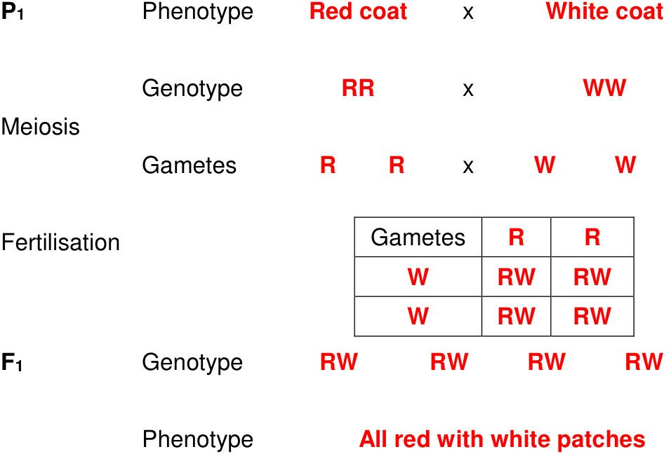

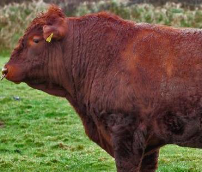

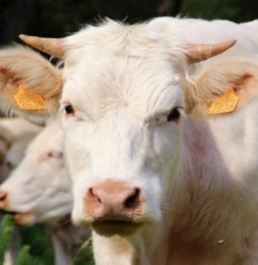

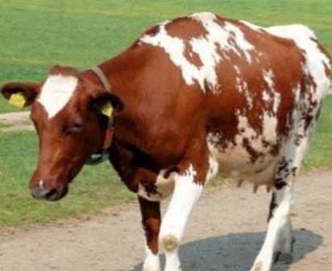

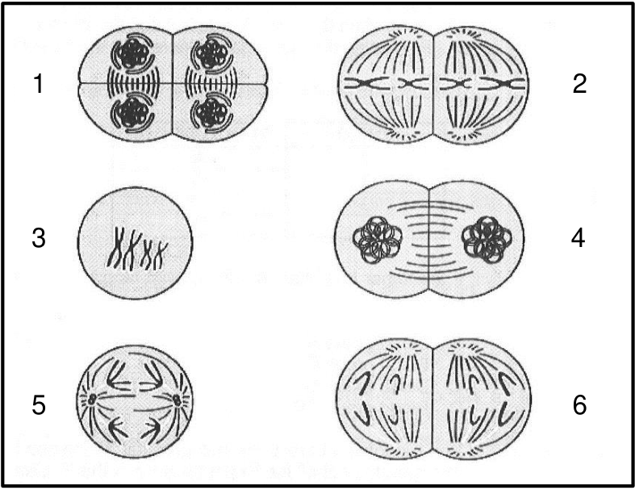

---

# Karyotypes and Sex Determination

## Key Concepts and Definitions

*   **Karyotype:** Each species has its own unique number, shape, and size of chromosomes, which is called the karyotype.

---

## Examining Karyotypes

*Figure 8: Female and male karyotypes*

*   **Karyotype 1:** Shows two large X gonosomes at pair 23 (characteristic of a female).
*   **Karyotype 2:** Shows one large X gonosome and one smaller Y gonosome at pair 23 (characteristic of a male).

---

## Notes on Meiosis and Sex Determination

*   After meiosis, an egg cell will have $22$ autosomes + an X gonosome.
*   A female will have two large X gonosomes (as in karyotype 1 – see pair 23).
*   A male will have an X gonosome and a Y gonosome (as in karyotype 2 – see pair 23).
*   Males thus have two types of sperm:
    *   Half will have $22 + \text{X}$ chromosomes.
    *   The other half will have $22 + \text{Y}$ chromosomes.
*   Depending on which sperm reaches the egg, there is a $50\%$ chance of the zygote being male and a $50\%$ chance of the zygote being female.

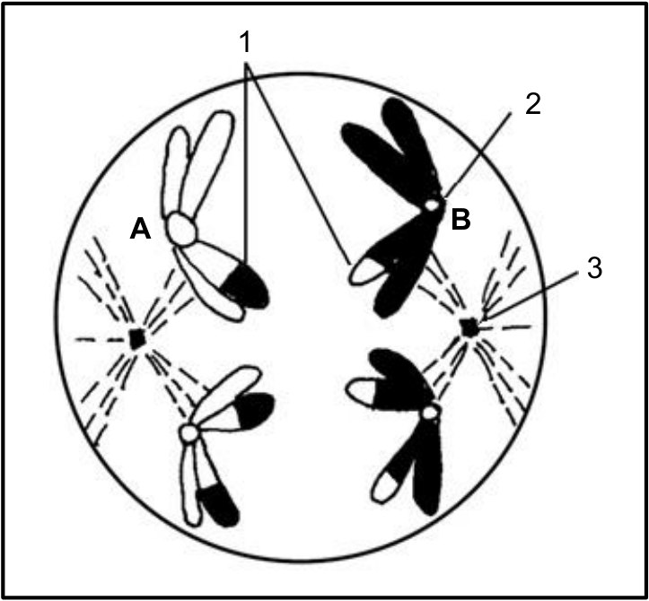

---

# Sex-linked inheritance

Although most of the bodily characteristics are carried on the 22 pairs of autosomes, there are a few characteristics carried on the gonosomes only. Thus, for example, the gene for hair growing on the inside of the pinna (Figure 9) is carried on the $Y$ chromosome, so only men will have this characteristic.

*Figure 9: Hairy pinna*

Certain sex-linked genetic disorders are carried on the allele found on the $X$ chromosome only. Two of these disorders are colour blindness and haemophilia.

* A person is **colour-blind** if unable to tell different colours apart. For example, red-green colour-blindness is caused by an absence of the proteins that make up the red or green cones (photoreceptors) in the retina of the eye resulting in the person not being able to tell the difference between red and green.
* **Haemophilia** is the inability of the blood to clot due to lack of a blood clotting factor. If the sufferer were to cut themselves, the wound would continue to bleed until a clotting factor is transfused in hospital.
* Colour-blindness and haemophilia is caused by the recessive allele on the $X$-chromosome normally shown as ($X^b$) for colour-blindness and ($X^h$) for haemophilia.
* As a result, men who have only one $X$ chromosome, have a greater risk of inheriting these disorders.
* Women, on the other hand, have a much lower chance of inheriting two $X$ chromosomes which both carry the recessive allele for the disorder. If a woman inherits one $X$ chromosome with the recessive allele for the disorder, she is called a **carrier** as she does not show signs of the disorder but can pass it on to her children.

Tables 3 and 4 below relate the inheritance of haemophilia and colour-blindness.

Table 3: Inheritance of haemophilia

| Genotype | Phenotype |
| :---: | :---: |
| $X^HX^H$ | Normal female |
| $X^HX^h$ | Normal female (carrier) |
| $X^hX^h$ | Haemophiliac female |
| $X^HY$ | Normal male |
| $X^hY$ | Haemophiliac male |

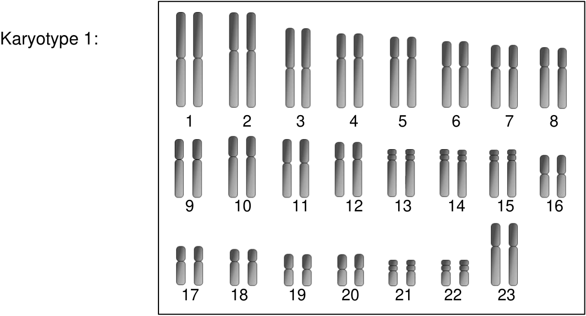

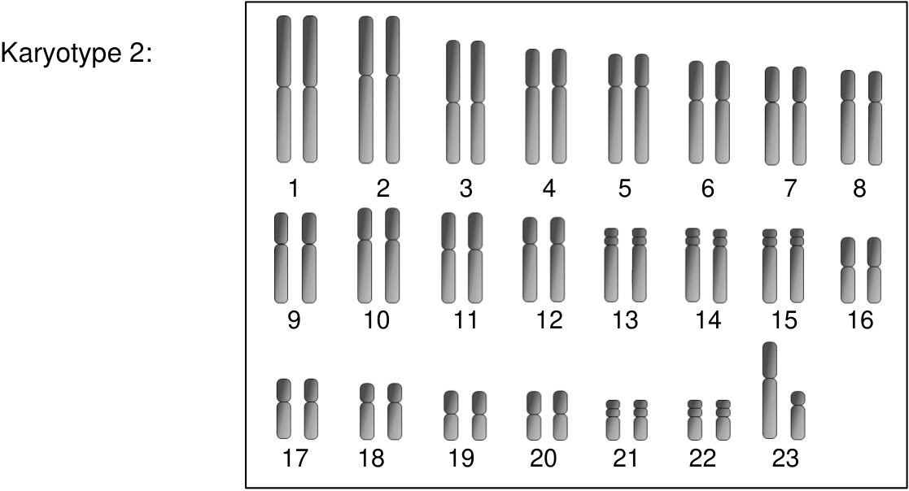

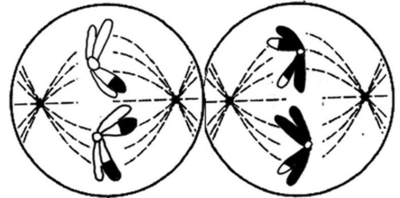

---

### Table 4: Inheritance of colour-blindness

| Genotype | Phenotype |
| :--- | :--- |
| $X^BX^B$ | Female with Normal vision |
| $X^BX^b$ | Normal Female (carrier) |
| $X^bX^b$ | Colour-blind female |
| $X^BY$ | Normal male |
| $X^bY$ | Colour-blind male |

Do not add any letter to the Y chromosome since the Y chromosome does not have an allele to counteract the recessive allele for haemophilia and colour-blindness.

---

### Activity 4: Sex-linked diseases

1. Haemophilia is a sex-linked disease caused by the presence of a recessive allele ($X^h$). A normal father and heterozygous mother have children. Construct a genetic cross to determine the possible genotype and phenotype of the children of the parents. (6)

2. Explain why the chances of men having a sex-linked disorder is much higher than it is for women. (4)

In an exam you may be asked to do other sex-linked disorders other than haemophilia and colour-blindness. Unless stated otherwise, follow the same format as in haemophilia and colour-blindness.

3. Read the following extract on cystic fibrosis and answer the questions that follow.

#### Cystic Fibrosis (CF)
CF is a progressive, genetic disorder caused by a recessive allele on chromosome number 7. One in twenty people of European descent carry the CF allele. One in 400 couples of European descent will be carriers of CF. The disorder causes persistent lung infections and limits the ability to breathe over time. In people with cystic fibrosis, the defective gene causes a thick, build-up of mucus in the lungs and it clogs the airways and traps bacteria leading to infections and then eventually respiratory failure.

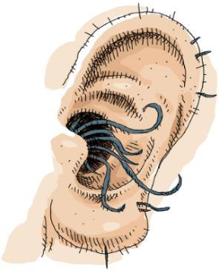

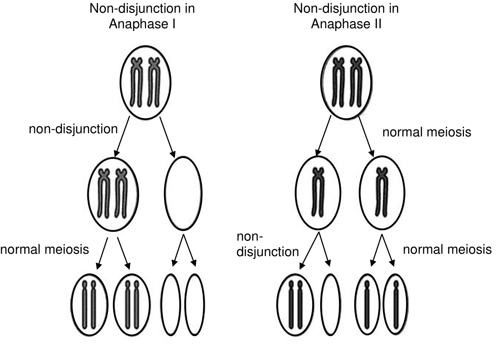

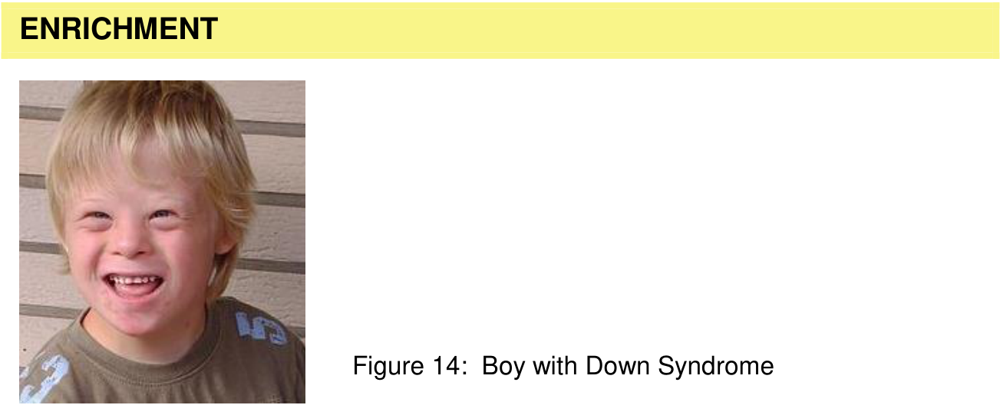

---

3.1 Explain why cystic fibrosis is not a sex-linked disease. (2)

3.2 Use a genetic cross to show what percentage of children will be affected if one of the parents is heterozygous and the other is homozygous normal. The recessive allele is represented as $b$. (6)

3.3 Maggie and William want to start a family, but Maggie's brother had cystic fibrosis. She doesn't want her own child to suffer as her brother did. Maggie and William decided to visit a genetic counsellor. Explain how this may help Maggie and William in their decision. (2)

Total: (20)

---

## Multiple alleles – blood type / group

The genetic crosses dealt with thus far involved two alleles of a gene, e.g.: $T$ or $t$, $R$ or $W$. Sometimes a characteristic is however controlled by more than two alleles. Blood type (or blood grouping) is an example of such a characteristic.

There are four blood types in humans: $A$, $B$, $AB$ or $O$. These **phenotypes** are controlled by three alleles but **each person still inherits two alleles**. It is very important to know how to name (or write down) these three alleles as they are very specific to blood groups namely $\text{I}^{\text{A}}$, $\text{I}^{\text{B}}$ or $\text{i}$.

$\text{I}^{\text{A}}$ is co-dominant to $\text{I}^{\text{B}}$ whereas $\text{i}$ is recessive to both. The genotypes for each blood group can then be specified as follows:

| Genotype | Blood group |
| :---: | :---: |
| $\text{I}^{\text{A}}\text{I}^{\text{A}}$ | A |
| $\text{I}^{\text{A}}\text{i}$ | A |
| $\text{I}^{\text{B}}\text{I}^{\text{B}}$ | B |
| $\text{I}^{\text{B}}\text{i}$ | B |
| $\text{I}^{\text{A}}\text{I}^{\text{B}}$ | AB |
| $\text{ii}$ | O |

## Use of blood groups in paternity testing

The blood groups of the mother, possible father and child must be compared. If the blood groups of the adults do not correspond to or match the child's blood group then this man is not the father. If the blood groups of the adults correspond to or match the child's blood group, then there is a possibility that the man is the father and other tests need to be done as other men may have the same blood group.

Only DNA profiling can be conclusive as it looks at the similarities between the nucleotides in the DNA of the father and the child. Each DNA profile is unique to an

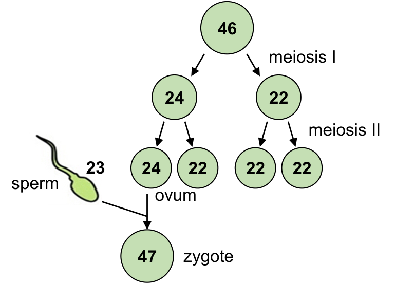

---

individual. $50\ \%$ of the DNA fragments / bands / bars are derived from the mother and $50\ \%$ from the father. If $50\%$ of the DNA fragments / bands / bars correspond with the father, then it can be claimed that he is the father of the child. DNA is viewed as more reliable evidence of paternity than the use of blood groups.

## Example of a monohybrid cross using blood types:

A man and a woman both have blood group **B**. Use a genetic cross to show how it is possible for them to have a child with blood group **O**.

$\mathbf{P_1}$ 
* **Phenotype:** Blood group B $\times$ Blood group B
* **Genotype:** $I^B i$ $\times$ $I^B i$

**Meiosis**
* **Gametes:** $I^B$, $i$ $\times$ $I^B$, $i$

**Fertilisation**
<!-- DIAGRAM_PLACEHOLDER: diagram -->

$\mathbf{F_1}$ 
* **Genotype:** $I^B I^B$, $I^B i$, $I^B i$, $ii$
* **Phenotype:** $3$ Blood group B : $1$ Blood group O

**OR**

$\mathbf{P_1}$ 
* **Phenotype:** Blood group B $\times$ Blood group B
* **Genotype:** $I^B i$ $\times$ $I^B i$

**Meiosis**
* **Gametes:** $I^B$, $i$ $\times$ $I^B$, $i$

**Fertilisation**

| Gametes | $I^B$ | $i$ |
| :---: | :---: | :---: |
| **$I^B$** | $I^B I^B$ | $I^B i$ |
| **$i$** | $I^B i$ | $ii$ |

$\mathbf{F_1}$ 
* **Phenotype:** $3$ Blood group B : $1$ Blood group O
* **Genotype:** $I^B I^B$, $I^B i$, $I^B i$, $ii$

---

## Activity 5: Monohybrid crosses using blood types

1. If the child has blood group **O** and the mother blood group **A**, could the man with blood group **AB** be the father of that child? Use a genetic diagram to explain your answer. $(6)$

2. Human blood groups are controlled by multiple alleles.
   a) List all the alleles that control human blood groups. $(3)$
   b) How many of the alleles named in a) can any individual inherit? $(1)$

---

c) Give a reason for your answer to question b). (1)

d) Which 2 alleles are co-dominant in the inheritance of blood groups? (2)

e) A man has blood group **A** and his wife blood group **B**. Their first child has blood group **AB** and the second child blood group **O**. What can one conclude about the blood groups of their future children? (3)

(15)

---

# Dihybrid crosses

Dihybrid crosses involve **two pairs** of alleles representing **two different** characteristics, e.g.: the height of a plant and the colour of its seeds.

According to the **Law of Independent Assortment**, alleles of different genes move (segregate) independently of each other into the gamete. They therefore appear on the gametes in different combinations.

Work through the following example of a dihybrid cross, and remember that the alleles for each characteristic could be either homozygous or heterozygous.

## Example of a dihybrid cross

In pea plants, the allele for tallness ($\mathbf{T}$) is dominant and the allele for shortness ($\mathbf{t}$) is recessive. The allele for purple flowers is dominant ($\mathbf{P}$) and the allele for white flowers is recessive ($\mathbf{p}$). Two plants, heterozygous for both tallness and purple flowers were crossed.

* **Step 1:** Decide whether this concerns a monohybrid or a dihybrid cross.
  > *Since two characteristics of each plant are mentioned (phenotypes: **height** of plant + **colour** of flower), it must be a dihybrid cross.*

* **Step 2:** Choose/ use letters to represent the alleles for the gene responsible for each characteristic.
  > Let $T = \text{the allele for tall plants}$ \
  > Let $t = \text{the allele for short plants}$ \
  > Let $P = \text{the allele for purple flowers}$ \
  > Let $p = \text{the allele for white flowers}$

* **Step 3:** Write down the phenotype of the two parents that would be producing gametes.
  > *tall purple* $\times$ *tall purple* (as per question)

* **Step 4:** Write down the genotype of the parents.
  > $\mathbf{TtPp} \times \mathbf{TtPp}$

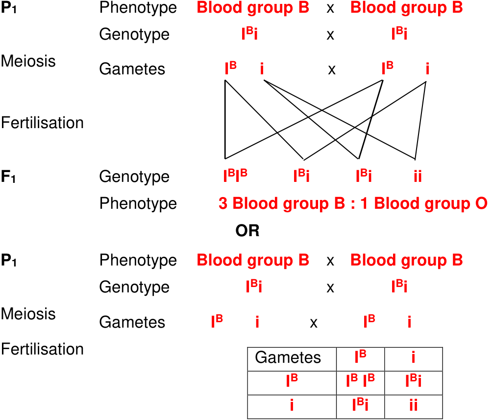

---

* **Step 5:** Show the gametes that each parent produces after meiosis. Each gamete must have two letters (dihybrid) – one from each characteristic.

**N.B.** Remember Mendel's Law of Independent Assortment.

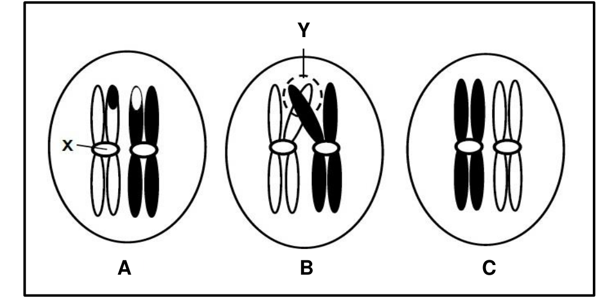

* **Step 6:** Draw and complete a punnet square by writing in the combination of alleles in each block.

| $\mathbf{P_1}$ | Phenotype | Tall, purple | $\times$ | Tall, purple |
| :--- | :--- | :---: | :---: | :---: |
| | Genotype | $\text{TtPp}$ | $\times$ | $\text{TtPp}$ |
| **Meiosis** | | | | |
| | Gametes | $\text{TP} \quad \text{Tp} \quad \text{tP} \quad \text{tp}$ | $\times$ | $\text{TP} \quad \text{Tp} \quad \text{tP} \quad \text{tp}$ |

**Fertilisation**

| Gametes | $\mathbf{TP}$ | $\mathbf{Tp}$ | $\mathbf{tP}$ | $\mathbf{tp}$ |
| :---: | :---: | :---: | :---: | :---: |
| $\mathbf{TP}$ | $\text{TTPP}$ | $\text{TTPp}$ | $\text{TtPP}$ | $\text{TtPp}$ |
| $\mathbf{Tp}$ | $\text{TTPp}$ | $\text{TTpp}$ | $\text{TtPp}$ | $\text{Ttpp}$ |
| $\mathbf{tP}$ | $\text{TtPP}$ | $\text{TtPp}$ | $\text{ttPP}$ | $\text{ttPp}$ |
| $\mathbf{tp}$ | $\text{TtPp}$ | $\text{Ttpp}$ | $\text{ttPp}$ | $\text{ttpp}$ |

| $\mathbf{F_1}$ | Genotype | $9$ different genotypes, as in the table above |
| :--- | :--- | :--- |
| | Phenotype | $9$ tall, purple flowered plants |
| | | $3$ short, purple flowered plants |
| | | $3$ tall, white flowered plants |
| | | $1$ short, white flowered plant |

* **Step 7:** Determine the phenotypic ratios from the genotypes in the punnet square.

**Phenotypic ratio: $9:3:3:1$**

If there is one capital letter for the allele in the $\mathbf{F_1}$ generation, then that trait (characteristic) shows in the phenotype; if there are small letters then the recessive trait shows.

---

## Activity 6: Dihybrid crosses

1. Two characteristics of an animal (length of the ears and shape of the lip) were studied. Each of these characteristics has two variations: Ears may be long or short, and the lip may be a wide or pointed.

   A male animal homozygous for wide lips (\textbf{LL}) and heterozygous for short ears (\textbf{Ee}) is crossed with a female animal that is heterozygous for wide lips (\textbf{Ll}) and homozygous for long ears (\textbf{ee}).

   1.1 What term describes a genetic cross involving two characteristics? *(1)*

   1.2 Give the:
      a) dominant phenotype for the length of ears *(1)*
      b) recessive phenotype for the shape of the lip *(1)*
      c) possible genotype/s for an animal with short ears and a pointed lip *(1)*

   1.3 A male animal with genotype \textbf{EELl} is crossed with a female animal with genotype \textbf{EeLL}. List all the possible gametes that could be produced by the male animal. *(2)*

   1.4 Explain how Mendel's Law of Independent Assortment applies to parents with \textbf{LlEe} genotypes during gamete formation. *(4)*

2. In humans the allele for short fingers (brachydactyly – a shortening of the fingers and toes), represented by \textbf{B}, is dominant over the allele for normal fingers (\textbf{b}). The allele for curly hair (\textbf{H}) is dominant over the allele for straight hair (\textbf{h}).

   Andrew, with genotype \textbf{Bbhh}, married Susan, with genotype \textbf{bbHH}.

   2.1 How do Andrew and Susan's phenotypes differ from each other? *(2)*

   2.2 List all possible genotypes of the gametes produced by Andrew. *(2)*

*(Total: 14 marks)*

---

## Genetic lineage (Pedigree diagrams)

A pedigree diagram (also called a family tree) is used to study the inheritance of characteristics in a family over a number of generations.

The pedigree diagram in Figure 10 (see next page) shows inheritance of eye colour in humans over three generations of a family. Brown eye colour (\textbf{B}) is dominant over blue eye colour (\textbf{b}).

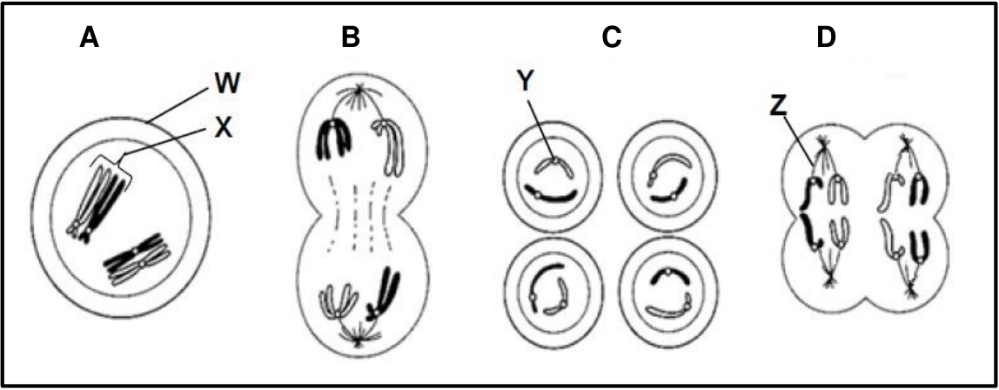

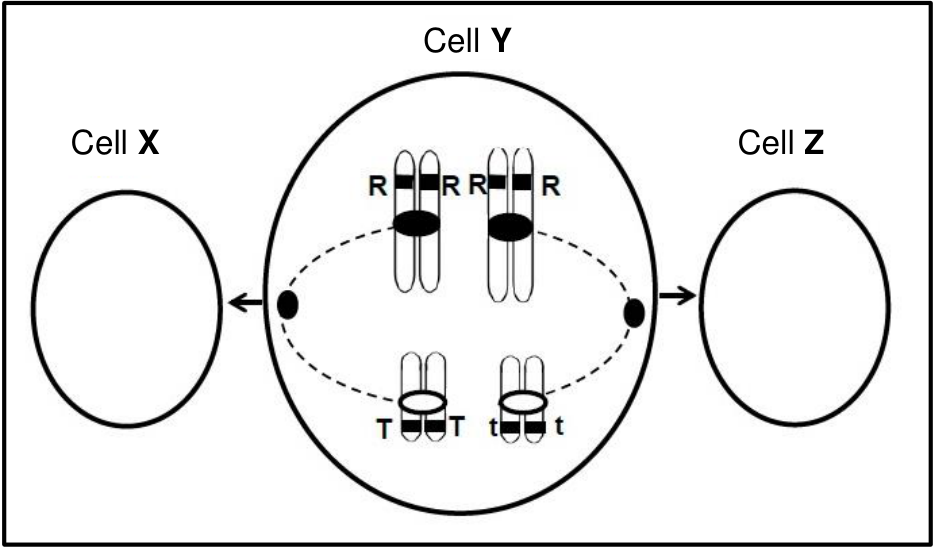

---

# Figure 10: Pedigree Diagram

## Key to Pedigree Symbols
* $\square$ Male with blue eyes
* $\circ$ Female with blue eyes
* $\blacksquare$ Male with brown eyes
* $\bullet$ Female with brown eyes

---

## Basic Rules and Interpretations
* Squares represent **males** and circles represent **females**.
* The **horizontal line** between a square (Joshua) and a circle (Ronel) shows that they have mated.
* The **vertical line** flowing from the horizontal line represents the offspring (Sarah and Peter) of the two parents (Joshua and Ronel).

---

## Steps for Interpreting Pedigree Diagrams

### Step 1: Study the key and opening statements
Look for dominant and recessive characteristics and phenotypes.
* *Brown eye colour ($B$) is dominant over blue eye colour ($b$) – as stated in the problem.*

### Step 2: Write in the phenotypes of all the individuals as given in the problem
* *Joshua, Jack and John* are males with blue eyes.
* *Veronica and Marlena* are females with blue eyes.
* *Peter and Frank* are males with brown eyes.
* *Ronel, Sarah and Gayle* are females with brown eyes.

### Step 3: Fill in the genotype of all the individuals with the recessive condition
* It must have two recessive alleles (two lower case letters, e.g., $bb$).

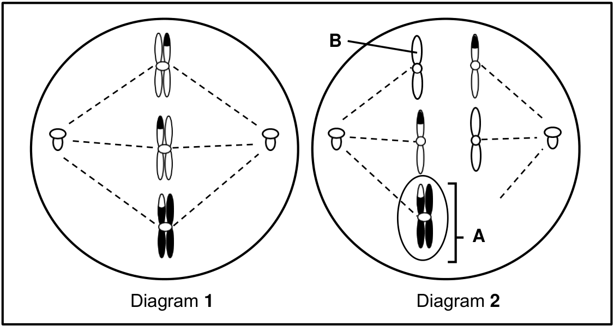

---

* Joshua, Veronica, Marlena, Jack and John will have the genotype 'bb'.
* The recessive characteristic only shows up in the homozygous condition.

* **Step 4:** For every individual in the diagram that has the recessive condition, it means that each allele was obtained from each of the parents. Work backwards and fill in one recessive allele for each parent.

* **Step 5:** If the parents showed the dominant characteristic, fill in the second letter which represents the dominant allele (a capital letter, e.g. **B**).
  > *The genotype of Peter is 'Bb' – working backwards from the offspring Marlena or Jack or John who are homozygous recessive. This means that one of the recessive alleles of Marlena, Jack and John, i.e. 'b', must have come from parent Peter and the other one from parent Veronica*

* **Step 6:** Any other individual showing the dominant characteristic will most likely be homozygous dominant (**BB**) or heterozygous dominant (**Bb**).
  > *Ronel could be homozygous dominant (BB) or heterozygous dominant (Bb)*

---

### Activity 7: Pedigrees

1. The pedigree diagram below shows the inheritance of colour-blindness (also called Daltonism) in a family. Colour-blindness is sex-linked and is caused by a recessive allele (**d**). The ability to see colour normally is caused by a dominant allele (**D**).

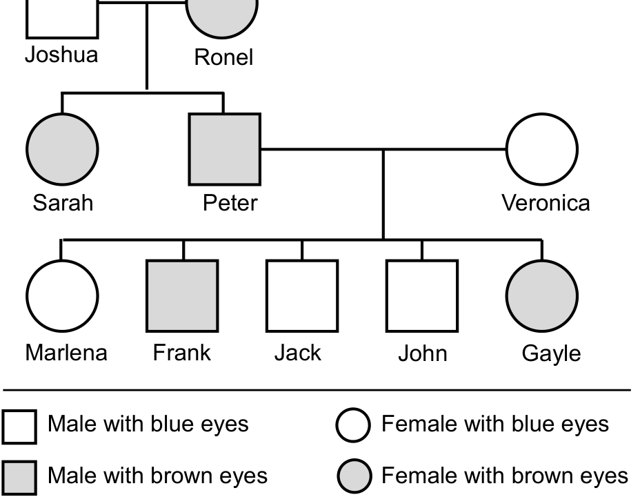

* **Inheritance of colour-blindness**

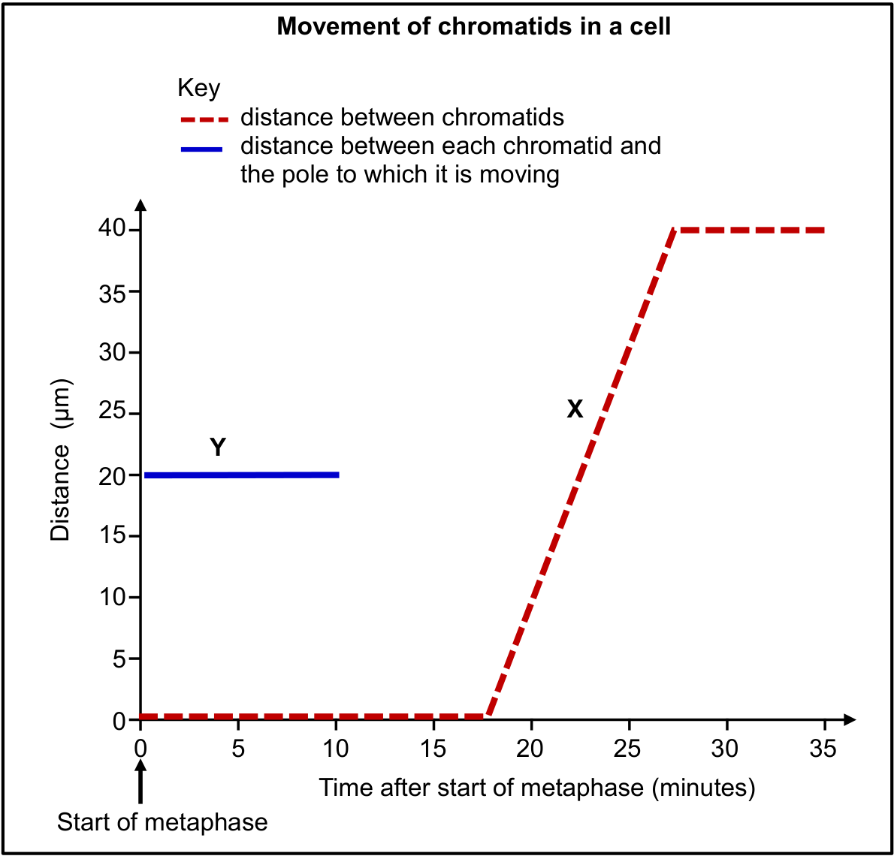

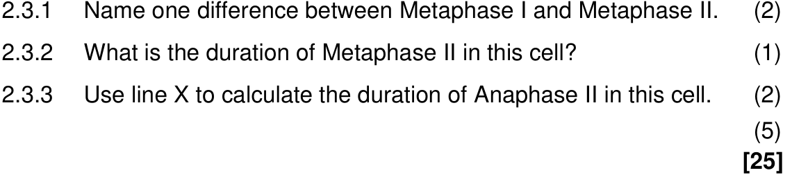

---

1.1 How many of the male offspring of parents 1 and 2 were normal? (1)

1.2 What percentage of males in this pedigree diagram are affected? Show your workings. (2)

1.3 State the genotype of:
    a) Individual 2 (1)
    b) Individual 5 (1)

1.4 If individual 5 marries a normal male, what percentage of their daughters will have an allele for colour-blindness, but will not be colour-blind? (1)

2. The pedigree diagram below shows the pattern of inheritance of a certain genetic disorder controlled by a recessive allele. The dominant allele is represented by $\mathbf{N}$ and the recessive allele by $\mathbf{n}$.

2.1 Explain why both parents must be heterozygous for this characteristic. (2)

2.2 Give the possible genotype(s) of the normal children. (2)

2.3 Provide evidence from the pedigree diagram to show that this characteristic is not sex-linked. (3)

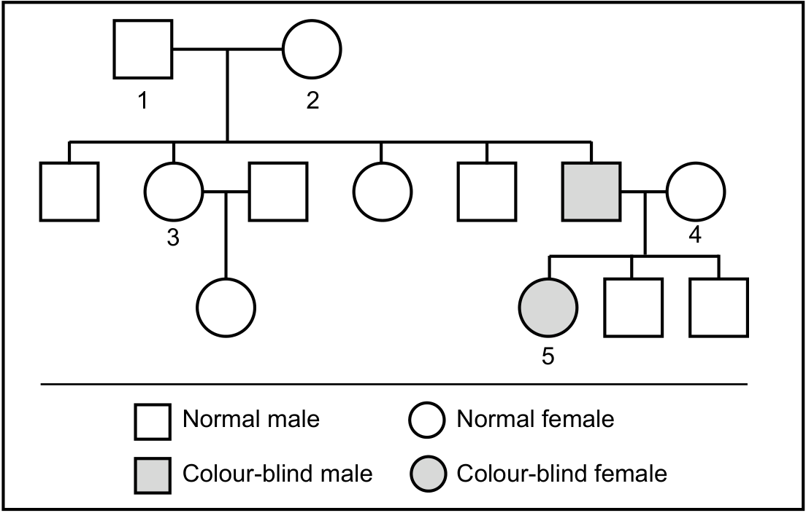

3. Use the pedigree diagram below to answer the questions about dimples (small depressions on the cheeks when smiling). The dimple allele ($\mathbf{D}$) controls whether a person has dimples or does not have dimples. The allele for having dimples is dominant to the allele for not having dimples ($\mathbf{d}$).

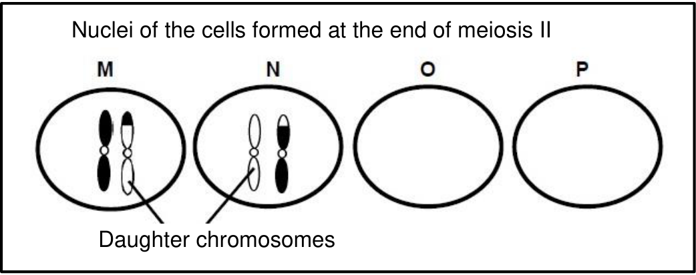

---

3.1 How many family members have dimples? (1)

3.2 What is the genotype of the individuals?
   * a) **3** (1)
   * b) **4** (1)

3.3 State whether the following individuals are homozygous or heterozygous for having dimples:
   * a) **2** (1)
   * b) **9** (1)

3.4 State the family relationship between individual **12** and individual **2**. (1)  
**(19)**

---

## Mutations

A mutation is caused by a permanent change to the DNA of a cell. Mutations can be harmless, harmful or useful.

**Harmless** mutations mostly:
* involve changes to the non-coding DNA (which makes up $98{,}5\%$ of the DNA).
* This DNA is not involved in making proteins.

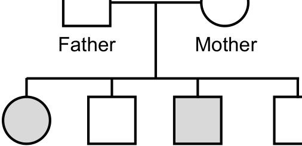

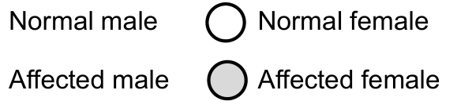

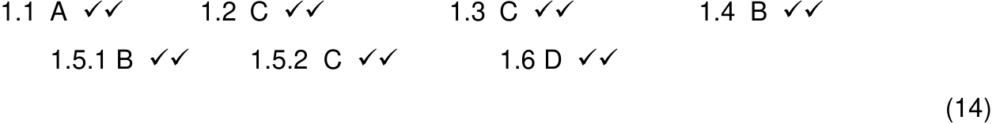

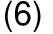

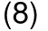

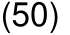

---

## Revision Notes: Mutations and Gene Mutations

### 1. Types of Mutations (Continued)

#### **Harmful Mutations**
* Change the DNA responsible for the production of a specific protein.
* Cause changes to the organism's physical appearance or functioning due to an **incorrect / defective protein** being made.
* May cause a genetic disorder.

#### **Useful Mutations**
* Also change the DNA responsible for the production of a specific protein.
* If the protein made increases the organism's chance of survival, it is considered a **useful mutation**.
* If the gene is passed on, it leads to **genetic variation** that is advantageous to the individual.
* Genetic variation is important to the processes of natural selection.
* In natural selection, organisms with traits that allow them to survive in their environment are more likely to pass on their genes.
* Natural selection is responsible for determining whether these mutations are passed on to future generations.

---

### 2. Location of Mutations
Mutations can occur in **genes** or **chromosomes**.

---

### 3. Gene Mutations

Gene mutations occur during **replication** if a base pair is added, left out, or doubled up. This alters the sequence of bases in DNA.

#### **Examples of Gene Mutations:**
* Haemophilia
* Colour-blindness
* Sickle cell anaemia
* Albinism

#### **Specific Condition Details:**
* **Haemophilia** and **colour-blindness** are sex-linked gene mutations located on the X-chromosome.
* **Sickle cell anaemia** is an autosomal disease common in Central Africa, India, and South America.
  * **Cause:** A gene mutation resulting in a faulty haemoglobin molecule being formed.
  * **Effect:** Red blood cells take on a half-moon ("sickle") shape. 
  * **Consequences:** 
    * Cells cannot carry enough oxygen (resulting in anaemia).
    * The sickle shape causes cells to stick to each other, blocking small capillaries and causing damage to organs such as the brain and kidneys.

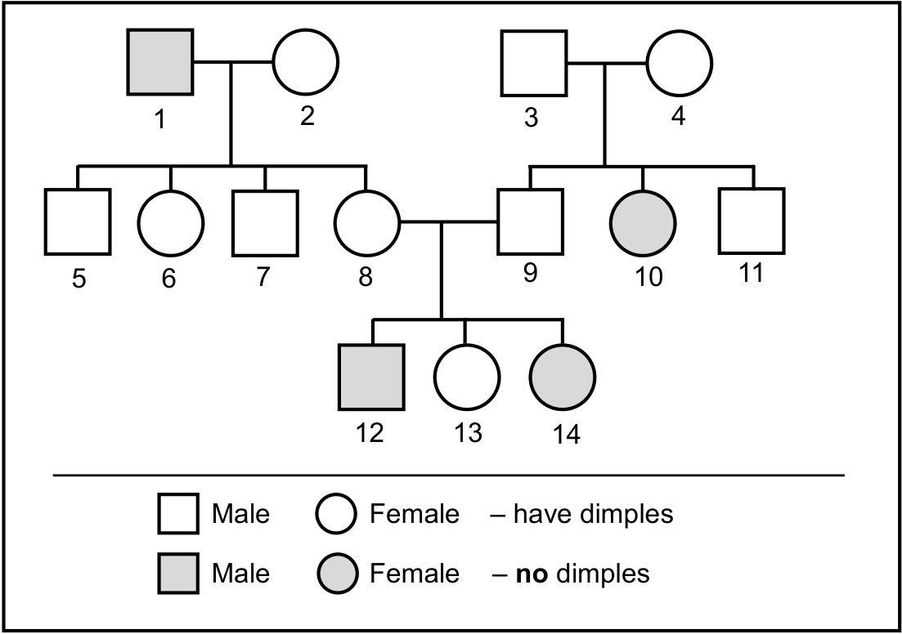

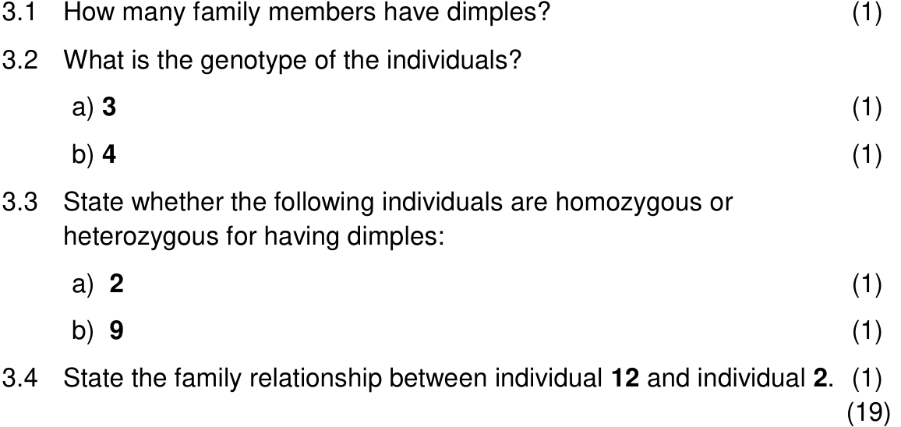

---

* **Albinism**
  * **Definition:** A rare group of genetic disorders resulting in a lack of the pigment melanin.
  * **Cause:** Caused by a recessive gene mutation that prevents the normal development of colour in skin, hair, or eyes.
  * **Social Context:** Albinos often face prejudices, being portrayed as villains in movies, regarded as bringing bad luck, and at times murdered for their body parts.
  * **Physical Effects:** Albinos have weak, light-sensitive eyes and very light skin that is susceptible to skin cancer. They are perfectly normal in all other respects.

---

## Chromosome Aberrations

* **Definition:** Chromosome aberrations occur during Anaphase I if the chromosomes of a bivalent do not separate. 
* **Mechanism:** Both chromosomes go to the same pole, changing the chromosome number of the gametes.
* **Example:** Down syndrome.

### Down Syndrome and Non-Disjunction

* **Origin:** Discussed in Chapter 2 under abnormal meiosis.
* **Process:** During Anaphase I / II, the non-disjunction of chromosome pair 21 leads to the formation of a gamete with an extra (or one less) chromosome number 21. 
* **Fertilization Outcome:** If this gamete fuses with a normal gamete, a zygote with 3 (or only 1) chromosomes number 21 will form.

<!-- DIAGRAM_PLACEHOLDER: diagram -->

**Figure 11:** Punnet square showing chromosome aberrations

---

# Biotechnology

## Introduction

For centuries, humans have used artificial selection to breed the best food crops, farm animals, and pets (such as different varieties of dogs). With modern science, however, humans can manipulate the actual DNA of organisms.

**Biotechnology** is the use of organisms (e.g., bacteria) or biological processes to improve the quality of human life, as for example, in DNA profiling, genetic engineering, stem cell technology, and cloning.

---

## DNA profiling

DNA profiling is a form of biotechnology used for:
* Paternity testing
* The identification of individuals
* Many other forensic and diagnostic purposes

---

## Genetic engineering

**Genetic engineering** is used to alter the genome of a living cell for medical, industrial, or agricultural purposes. This results in a **genetically modified organism (GMO)** or **transgenic animal** (an animal with DNA from more than one species).

### Uses of GMOs

* To breed more productive crops or animals so that more food can be made.
* To produce drugs or hormones (e.g., insulin) which have fewer side-effects and are cheaper.
* To 'infect' cells to cure diseases (gene therapy) such as brain tumours and cystic fibrosis.

### Recombinant DNA Technology

One process used to produce a GMO is **recombinant DNA technology**. It can be used to manufacture human insulin using *E. coli* bacteria.

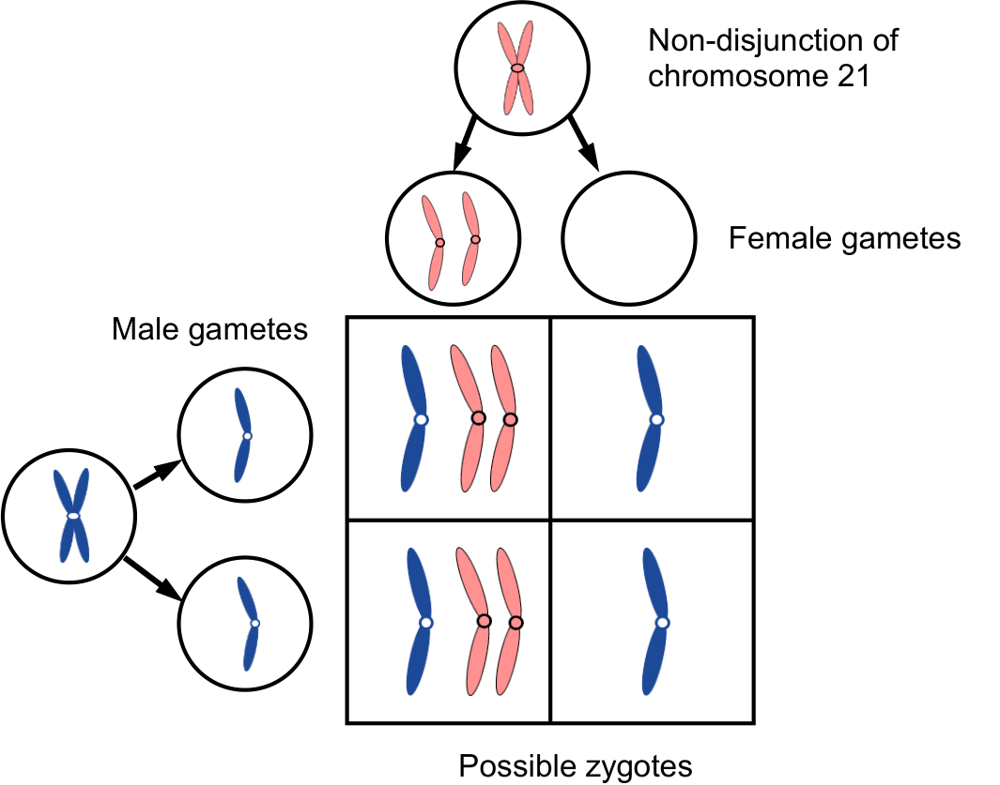

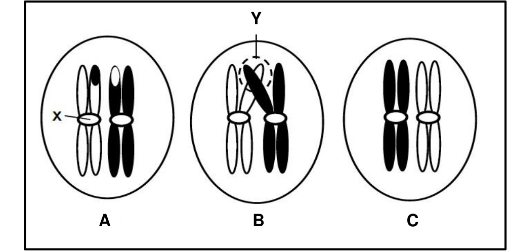

---

Figure 12: Recombinant DNA process

## Advantages of genetically modified plants

* **Pest resistance** – the plants no longer taste good to insects.
* **Herbicide tolerance** – the crop plant is immune to poison, so large amounts can be used to kill the weeds.
* **Disease resistance** – these plants are hardy and do not get affected by diseases.
* **Improved food quality** – do not have damage due to pests or diseases so look good.
* **Cold tolerance** – rice and tobacco have been engineered to be unaffected by sudden drops in temperature.
* **Drought or salinity tolerance** – this helps plants grow in areas previously unsuitable for agriculture.
* **Nutritionally enhanced** – for example adding vitamin A to rice (a staple food in Asian countries) by introducing a gene from a daffodil.

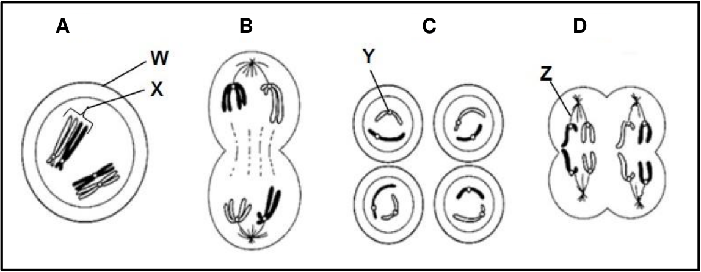

---

* Incorporating vaccines into bananas/potatoes – this means that vaccines are made by the plant which can then be transported to countries easily without having to be refrigerated.

## Disadvantages of GMO's

* GMO's contain glyphosate due to extensive spraying of herbicide.
* They are expensive so only 'rich' countries can benefit.
* The possibility of error is great as the process is complex.
* There has been no long-term safety testing as it is a relatively new technology.
* People may be allergic to the inserted gene e.g. brazil nut gene in soya beans.
* Widespread use of GMO crops may lead to a loss of biodiversity.
* New pathogens could be made for biological warfare.
* Ethically there is a fine line between what **can** be done and what **should** be done.

Only time will tell whether GMO's would solve the food security issues. Theoretically the potential benefits are huge, but there are significant risks. This also applies to the medical field and development of new drugs or ways to administer the drugs.

---

## Stem cell technology

Stem cells are undifferentiated cells that have the ability to grow into any tissue in the body. They may be harvested from embryos left over after IVF treatment, from bone marrow and from blood in the umbilical cord. Skin and cartilage stem cells have also been used.

### Notes about stem cells technology

* Embryonic stem cells are the most versatile as they have the ability to form any tissue. However, as the human embryos are killed, this is a controversial technology.
* Adult stem cells are much less controversial. Bone marrow has been used for a long time to treat cancers of the blood e.g. leukaemia, but other types of stem cell treatments are constantly being explored. Some of the procedures have involved:

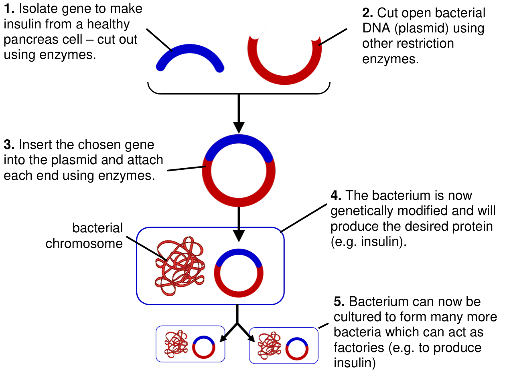

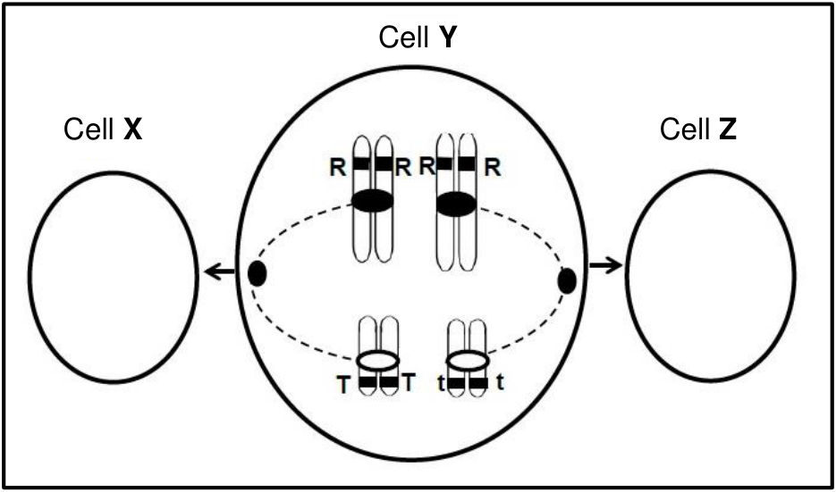

---

## Applications of Stem Cells (Continued)

* replacing dead cells in the heart after a heart attack
* growing skin tissue to treat burn victims
* growing nerve cells to treat spinal cord injuries and Parkinson’s disease

However, a great deal more research is needed before these procedures are perfected. Parents who believe that there will be success in the future, are able to collect umbilical cord blood from their babies at birth. This blood can now be frozen and stored for future use. Although such facilities are available in South Africa, it is an expensive option.

---

## Cloning

**Cloning** is the natural or artificial process of creating a genetically identical copy of an organism or biological material (e.g. tissue). The organism produced in this way is called a **clone**.

Cloning happens naturally when asexual reproduction takes place or a plant is self-pollinated or when identical twins are formed from a single zygote. These processes all give rise to individuals with DNA identical to that of the parent.

Biotechnology has enabled cloning to produce a new individual that is an **exact copy** of the organism from which the body cell was taken.

* In July 1996, **Dolly the sheep**, was the first cloned mammal using an adult cell, in this case a mammary gland cell.
* In April 2003, **Futhi the cow**, was the first cloned animal in South Africa and in this case a cell from the ear of a prize-winning dairy cow was used.

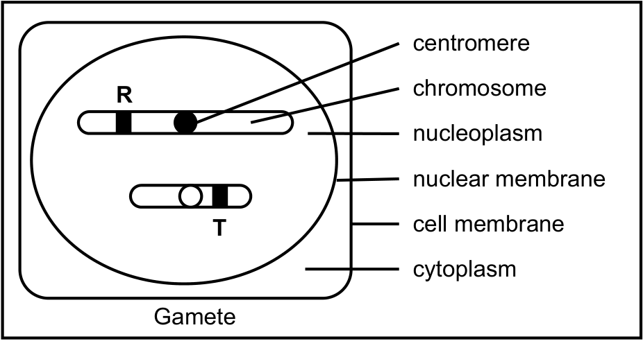

Figure 13: Dolly

<!-- DIAGRAM_PLACEHOLDER: diagram -->
Figure 14: Futhi

---

**Note:** IVF (in vitro fertilisation) is not cloning as a sperm and an egg are used to form an embryo. The embryo is genetically different to either of the parents.

## Advantages of cloning

* Therapeutic cloning can replace damaged tissue e.g. skin, heart cells and bone marrow, so helping to save human lives.
* Genetic diseases could be prevented.
* Superior animals may be bred to improve food supply and quality.
* Research in any form improves skills and could open other avenues due to spin-off technologies which could help mankind in the future.

## The process of cloning

The description of the cloning process that follows is related to Figure 15 below.

* Sheep A is the superior animal to be cloned. Sheep B is inferior, but hardy, so it can survive the harvesting of eggs.
* An egg cell from sheep B is taken and the nucleus is removed.
* A body (somatic) cell from the genetically superior sheep (sheep A) is collected.
* The nucleus with DNA from cell A is removed and placed into the "empty" egg cell B.
* The egg cell is stimulated with a shock so that it starts dividing by mitosis.
* The egg cell now has DNA from the superior sheep A and will grow into an embryo.

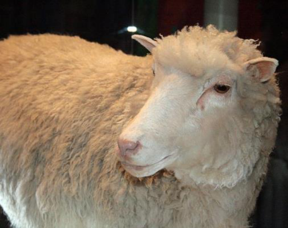

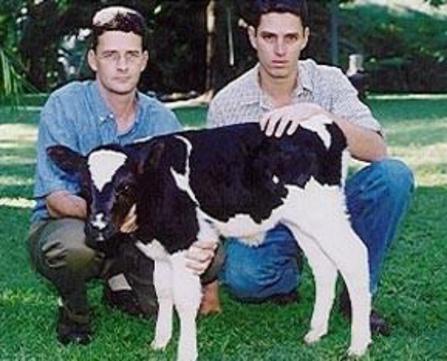

---

* The embryo is then placed into the uterus of a surrogate or foster mother (sheep C) and should develop to full term.
* The baby (lamb) is clone of sheep A meaning it will be an exact copy of sheep A.

---

## Activity 8: Biotechnology

1. Read the section of an article below taken from www.greens.org.

> In the 1950's, the media were full of information about the great new scientific miracle that was going to kill all harmful insects in the world, wipe out insect-borne diseases and feed the world's starving masses. That was DDT.
> 
> There are claims that genetic engineering will feed the starving and help eliminate disease. The question is the price tag. As has been with most technologies, such as DDT and nuclear energy, the promise of benefit in the short-term is overwhelmed by long-term disasters.
> 
> As more human genes are being inserted into non-human organisms to create new forms of life that are genetically partly human, new ethical questions arise.
> 
> What percent of human genes does an organism have to contain before it is considered human?
> 
> The Chinese are now putting human genes into tomatoes and peppers to make them grow faster. You can now be a vegetarian and a cannibal at the same time!
> 
> What about the mice that have been genetically engineered to produce human sperm? How would you feel if your father was a genetically engineered mouse?
> 
> *http://www.greens.org/s-r/20/20-01.html*

---

### Questions

1. What do present day scientists possibly learn from using DDT in the 1950s? (2)
2. Explain what is meant by "the question is the price tag". (2)
3. Explain two short term benefits and one long term disaster of GMO food. (6)
4. What is meant by "you can now be a vegetarian and a cannibal"? (2)
5. What method could be used to insert human genes into mice? (1)
6. How would YOU feel if your father was a genetically engineered mouse? (2)

**Total:** (15)

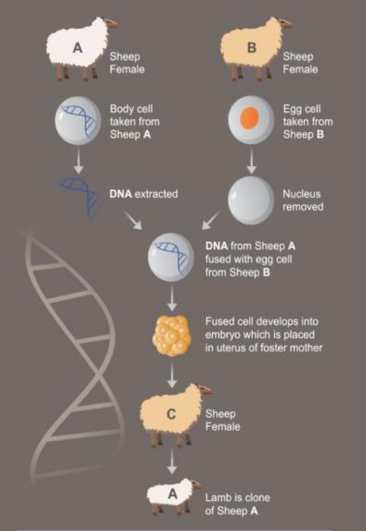

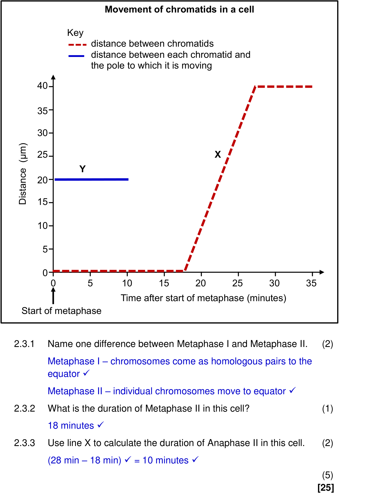

---

# Mitochondrial DNA and tracing genetic links

Mitochondrial DNA (mtDNA) is important for an understanding of evolution.

## Key Characteristics of Mitochondrial DNA (mtDNA)

*   **Location and Content:** mtDNA is found in the mitochondria and contains 37 genes which are needed to make the proteins involved in cellular respiration.
*   **Absence of Crossing Over:** As there is no crossing over involving mtDNA, the only changes that occur are due to mutations.
*   **Mutation Rate:** mtDNA mutates at a regular rate so scientists are able to analyse these mutations to work out a timeline of genetic ancestry.
*   **Maternal Inheritance:** Only the mother's mtDNA is passed on to her offspring (both male and female). This is because the father's mtDNA is found in the cytoplasm of the sperm cell which is discarded, together with the tail, at the time of fertilisation.
*   **Comparative Analysis:** By analysing the mtDNA, scientists can compare the mutations of different people to see how closely related they are.

## Implications for Human Evolution

*   Furthermore, the more mutations that are found, the older that race is believed to be.
*   This research has found that our common female ancestor most likely lived about $150\,000$ years ago in East Africa. She has been named "Mitochondrial Eve".
*   The map shows early human migrations. This evidence supports the theory that the human race evolved in Africa and then migrated to other parts of the world where they evolved into the various races. This will be covered in the chapter on Human Evolution.

*Figure 16: Movement of early Hominins (Out of Africa Hypothesis)*

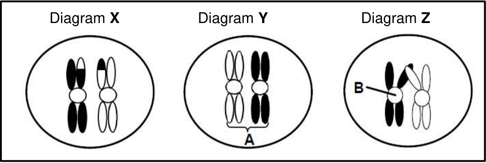

---

**Note:** Studies into the DNA on the Y chromosome have traced the most likely common male ancestor ("Nuclear Adam") to a male who lived approximately $60\,000$ years ago.

---

## Enrichment

* **Crossing over:** [https://www.youtube.com/watch?v=pdJUvagZjYA](https://www.youtube.com/watch?v=pdJUvagZjYA)
* **Independent Assortment:** [https://www.youtube.com/watch?v=-Zzp3mLlycM](https://www.youtube.com/watch?v=-Zzp3mLlycM)
* **Gametes (fertilisation):** [https://www.youtube.com/watch?v=QyY8yb9S--s](https://www.youtube.com/watch?v=QyY8yb9S--s)
* **Mendel's work (terminology):** [https://www.youtube.com/watch?v=Lsj-Ij53CkA](https://www.youtube.com/watch?v=Lsj-Ij53CkA)
* **Monohybrid crosses using a Punnett square:** [https://www.youtube.com/watch?v=9AiE9ADkhNM](https://www.youtube.com/watch?v=9AiE9ADkhNM)

---

140

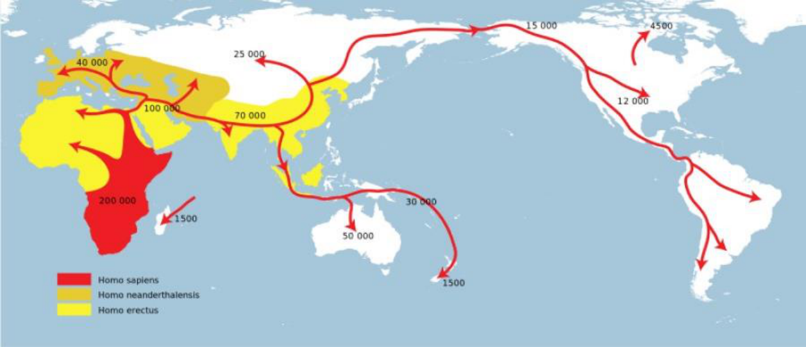

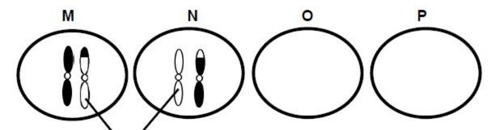

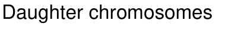

---

# Genetics and inheritance: End of topic exercises

## Section A

### Question 1

**1.1** Various options are provided as possible answers to the following questions. Choose the correct answer and write only the letter (A – D) next to the question number ($1.1.1$) on your answer sheet, for example $1.1.6 \text{ D}$

**1.1.1** If a recessive allele on the X-chromosome is passed on to the offspring it is an example of...

* A) sex-linked inheritance
* B) incomplete dominance
* C) multiple alleles
* D) co-dominance

**1.1.2** The diagram below shows the DNA profiles of a child, her mother and four males. There is uncertainty about who the biological father is. To establish paternity, DNA profiling was conducted.

<!-- DIAGRAM_PLACEHOLDER: diagram -->

Which male is the biological father of this child?

* A) Male 1
* B) Male 2
* C) Male 3
* D) Male 4

---

### 1. Concepts & Structure

#### Multiple Choice Questions

1.1.3 The advantage of cloning is that it...
* A. will reduce the variation within a population.
* B. produces genetically identical individuals with desirable characteristics.
* C. will enable offspring to survive under any unfavourable conditions.
* D. Is the only scientific technique that is accepted by all religious denominations and faiths.

1.1.4 In humans, brown eye colour is dominant over blue eye colour. A mother with blue eyes has two children; a boy with brown eyes and a girl with blue eyes. The eye colour of the father is...
* A. brown, because the allele for brown eye colour is sex-linked.
* B. brown, because at least one of the parents must have brown eyes.
* C. blue, because at least two other members of the family have blue eyes.
* D. blue, because at least one of the parents must be heterozygous for eye colour.

1.1.5 An extra finger in humans is rare, but is due to a dominant gene. When one parent is normal and the other parent has an extra finger and is homozygous for the trait, what is the chances that their children will be normal?
* A. $0\%$
* B. $25\%$
* C. $50\%$
* D. $75\%$

$$(5 \times 2) = (10)$$

---

#### Biological Terminology

1.2 Give the correct **biological** term for each of the following descriptions. Write only the term next to the question number.

* 1.2.1 Undifferentiated animal cells that can form any type of tissue.
* 1.2.2 Type of inheritance where none of the two alleles is dominant over the other and an intermediate phenotype is produced.

---

### Section 1.2: Terminology and Definitions

* 1.2.3 The breeding of organisms by humans to achieve a desirable phenotype.
* 1.2.4 The physical appearance of an organism.
* 1.2.5 A genetic disorder characterised by the absence of blood clotting factor.
* 1.2.6 Organisms that have different alleles at a given locus.
* 1.2.7 A human disorder caused by the non-disjunction of chromosome pair 21.
* 1.2.8 The type of variation in a population with no intermediate phenotypes.
* 1.2.9 A genetic cross involving two characteristics.

$$(9 \times 1) = (9)$$

---

### Section 1.3: Matching Columns

Indicate whether each of the descriptions in **Column I** applies to **A ONLY**, **B ONLY**, **BOTH A AND B** or **NONE** of the items in **Column II**. Write **A only**, **B only**, **both A and B** or **none** next to the question number.

| Column I | Column II |
| :--- | :--- |
| 1.3.1 A specific pattern of bands representing a unique sequence of nucleotides that resemble bar codes | A: DNA profiling B: DNA replication |
| 1.3.2 The number, shape and arrangement of all the chromosomes in the nucleus of a somatic cell | A: Karyotype B: Genome |
| 1.3.3 Identical alleles for a trait | A: Heterozygous B: Homozygous |
| 1.3.4 An allele that is not shown / expressed in the phenotype when found in the heterozygous genotype | A: Dominant B: Recessive |
| 1.3.5 An example of biotechnology | A: Cloning B: Genetic modification |

$$(5 \times 2) = 10$$

---

### Section 1.4: Extract Analysis

1.4 Read the extract on the next page and answer the questions that follow.

---

# Revision Notes: Genetic Engineering and Mendelian Inheritance

## 1. Core Concepts: Genetic Engineering

### Introduction to Genetic Engineering
Genetic engineering involves a process whereby a gene is isolated from one organism and transferred into another organism. The transferred gene becomes part of the new host's genome. Usually, the gene transfer takes place between organisms from different kingdoms.

**Example:**
* A gene from a bacterium codes for an enzyme that deactivates a herbicide (a weedkiller). 
* This gene is isolated from the bacterium and inserted into the chromosome of a crop plant. 
* The resulting plant becomes **herbicide-resistant**.

### Safety and Commercial Considerations
* **Testing:** Before products of genetic engineering can be sold to the public or used commercially, many rigorous safety and efficacy tests must be performed.
* **Intellectual Property and Rights:** Seed companies often hold exclusive rights to sell genetically engineered seeds. Farmers are typically legally restricted from saving and replanting seeds harvested from genetically engineered crops, requiring them to purchase new seeds from the supplier for each planting cycle.

---

## 2. Lesson Questions and Activities

### Question 1.4.1
**What is meant by the term *genome* referred to in the extract?**
* **Explanation:** The genome refers to the complete set of genetic material (DNA) present in an organism.

### Question 1.4.2
**State one way in which genetic engineering described in the extract differs from selective breeding.**
* **Explanation:** 
  * Genetic engineering often involves transferring genes between organisms from *different* kingdoms (e.g., bacterium to plant), whereas selective breeding is typically performed within the same species or closely related varieties.
  * Genetic engineering introduces specific targeted genes directly, whereas selective breeding relies on natural reproduction and the gradual selection of desired traits over many generations.

### Question 1.4.3
**Give one reason why the products of genetic engineering must undergo many tests before they can be sold.**
* **Explanation:** To ensure they are safe for human consumption, safe for the environment, and do not cause unintended toxic or allergic reactions.

### Question 1.4.4
**Explain the value of growing herbicide-resistant crops.**
* **Explanation:** Farmers can spray herbicides to kill weeds effectively without damaging or killing the main crop plants, leading to higher crop yields, reduced competition for nutrients/water, and lower labor costs for weeding.

### Question 1.4.5
**State three advantages of genetic engineering in crop production other than those mentioned in the extract above.**
* **Explanation:**
  1. Increased resistance to pests and diseases (reducing the need for chemical pesticides).
  2. Enhanced nutritional value (e.g., biofortified crops like Golden Rice containing vitamin A).
  3. Improved tolerance to environmental stressors such as drought, salinity, or extreme temperatures.

### Question 1.4.6
**Give a reason why seed companies insist that they must have the exclusive rights to the selling of seeds.**
* **Explanation:** To protect their financial investments in research, development, and testing of the genetically engineered technology, ensuring profitability.

---

## 3. Core Concepts: Mendelian Inheritance ($F_1$ and $F_2$ Generations)

### Gregor Mendel's Experiments
Gregor Mendel conducted breeding experiments with pea plants (*Pisum sativum*) to study the inheritance patterns of distinct traits, including:
* Plant height (tall vs. dwarf)
* Seed shape (round vs. wrinkled)
* Seed colour (yellow vs. green)
* Seed coat colour

### Experimental Procedure
1. **Parental Cross ($P$ generation):** Mendel crossed homozygous dominant plants with homozygous recessive plants (e.g., homozygous tall plants $\times$ homozygous dwarf plants).
2. **First Filial Generation ($F_1$):** The resulting offspring constituted the $F_1$ generation, which typically displayed the dominant phenotype.
3. **Second Filial Generation ($F_2$):** The $F_1$ generation plants were interbred to produce the $F_2$ generation, where recessive traits reappeared in predictable phenotypic ratios (typically $3:1$ for monohybrid crosses).

---

| Trait | Results of $F_2$-crossing | Ratio |
| :--- | :--- | :---: |
| Plant height (Tall or dwarf) | Tall: $787$ Dwarf: $277$ | $2,84 : 1$ |
| Seed shape (Round or wrinkled) | Round: $5\,474$ Wrinkled: $1\,850$ | **X** |
| Seed colour (Yellow or green) | Yellow: $6\,022$ Green: $2\,001$ | **Y** |
| Seed coat colour (Grey or white) | Grey: $705$ White: $224$ | $3,15 : 1$ |

*[Adapted from Basic Concepts in Biology, $3^{\text{rd}}$ edition., C.Starr, 1997]*

1.5.1 What is the expected phenotypic ratio for the trait involving two heterozygous parents? (1)

1.5.2 From the results, calculate X and Y. Also state which trait provided a ratio closest to the expected phenotypic ratio mentioned in question 1.5.1. Show all working. (3)

1.5.3 Give a possible reason why the ratio selected in question 1.5.2 was closest to the theoretical ratio. (2)

1.5.4 Using the results, state whether the allele for round seeds or for wrinkled seeds is dominant. (1)

1.5.5 State one factor that Mendel controlled during these breeding experiments. (1)

**(8)**

**Section A: [49]**

---

## Section B

### Question 2

2.1 The diagram shows the pattern of inheritance of deafness in a family. The letter **H** represents the allele for hearing and **h** represents the allele for deafness.

<!-- DIAGRAM_PLACEHOLDER: diagram -->

---

2.1.1 How many of each of the following are represented in the diagram?
   * a) Males (1)
   * b) Generations (1)

2.1.2 Give the
   * a) phenotype of Jon (1)
   * b) genotype of Paul (1)

2.1.3 Both Lyall's parents can hear, yet he is deaf. Explain how deafness is inherited. (2)

2.1.4 Lyall marries a woman who is homozygous dominant for hearing. Use a genetic cross to show the percentage chance of them having a deaf child. (7)  
*(Total: 13)*

---

2.2 Tom and Maria have three children. One of the three children was adopted? A DNA profile for each member of the family was prepared to determine if Tom is the father of all three children (Anne, Mary and Steve). The DNA profiles are given below.

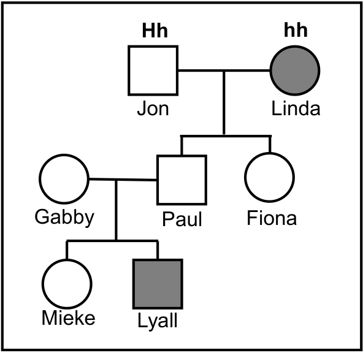

2.2.1 Which one of the children was adopted? (2)

2.2.2 Explain your answer to question 2.2.1. (2)  
*(Total: 4)*

---

2.3 Humans have different blood groups which are coded for by a number of alleles. Mary has genotype $I^{A}i$ and her son Joseph has blood type AB.

2.3.1 How many alleles code for blood groups? (1)

2.3.2 Give all the possible genotypes for Joseph's father. (3)  
*(Total: 4)*

---

2.4 Haemophilia is a genetic disorder caused by a recessive allele on the X-chromosome. A haemophiliac female marries a normal male. Explain why all their sons will be haemophiliacs. (4)  
**[25]**

---

### Question 3

3.1 Coat colour in mice is controlled by two alleles, black (**B**) and grey (**b**). Tail length is controlled by two alleles, long (**T**) and short (**t**).

The Punnett square below shows a part of the cross between two mice. Genotype (**i**) has been left out.

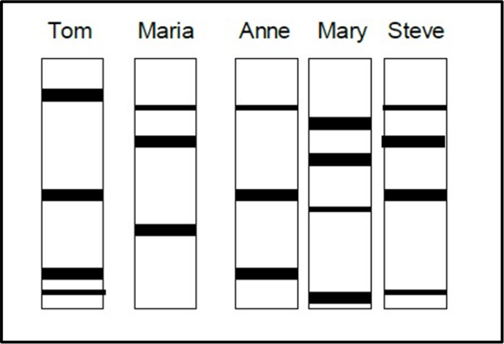

| Gametes | BT | Bt | bT | bt |
| :---: | :---: | :---: | :---: | :---: |
| **Bt** | BBTt | BBtt | BbTt | Bbtt |
| **Bt** | BBTt | BBtt | BbTt | Bbtt |
| **Bt** | BBTt | BBtt | (i) | Bbtt |
| **Bt** | BBTt | BBtt | BbTt | Bbtt |

3.1.1 Give the:  
a) genotype of parent 1 (2)  
b) phenotype of parent 2 (2)  
c) genotype of offspring (i) (1)  

3.1.2 What percentage of the offspring above is grey with short tails? (1)  

3.1.3 State the genotypes of two gametes from the table above that will result in offspring that are heterozygous for both colour and length of tails if fertilisation occurs. (2)  
**(8)**

3.2 A class of Grade 11 learners conducted an investigation to determine the frequency of dominant and recessive characteristics in their school. The characteristic investigated was the ability to roll one's tongue.

The results obtained were recorded in the frequency tree as shown below.

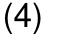

---

### 3.2.1
List three steps that the learners need to follow while planning this investigation. (3)

### 3.2.2
Use the data given in the frequency tree to plot a bar graph. (5)

### 3.2.3
Would you classify the ability to roll one’s tongue as a continuous or discontinuous variation? (1)

### 3.2.4
Explain your answer to question 3.2.3. (2)

---

<!-- DIAGrum_PLACEHOLDER: diagram -->
*The diagram above is a representation of the chromosomes in a human cell (karyotype).*

### 3.3.1
How many autosomes are in this cell? (1)

### 3.3.2
This individual is a female. Explain why this conclusion is made. (1)

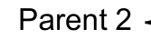

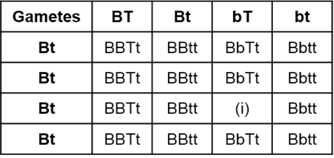

---

3.3.3 What evidence is there to show that this individual has a genetic disorder? (1)

3.3.4 Identify the genetic order mentioned in question 3.3.3. (1)

3.3.5 Name the process that resulted in this genetic disorder. (1)

(5)  
**[24]**

**Section B: [49]**

**Total Marks: [98]**

149

---

# Chapter 5: Genetics and inheritance

## Activity 1: Traits, genes and alleles

1. Multiple choice answers:
   - a) B
   - b) A
   - c) C
   - d) D and A

2. Genes code for proteins.

3. An allele is any of the alternative forms of a gene that may occur at a specific locus.

4. Definitions of zygosity:
   - a) homozygous
   - b) heterozygous

5. Homologous chromosomes are two chromosomes, one from the mother and one from the father, that have the same length, overall appearance, and genes, although the alleles may differ.

6. Alleles are represented as letters, using uppercase for dominant alleles and lowercase for recessive alleles.

7. Summary of genotype, phenotype, and alleles:

| Genotype | Phenotype | Alleles |
| :--- | :--- | :--- |
| homozygous dominant | Tall | $T / T$ |
| homozygous recessive | short | $t / t$ |
| heterozygous | Tall | $T / t$ |

8. Homologous chromosomes

<!-- DIAGRAM_PLACEHOLDER: diagram -->

---

## Activity 2: Monohybrid crosses with complete dominance (25)

---

### Question 1

**First Cross ($P_1$ Generation):**

* **Phenotype:** Yellow seeds $\times$ Green seeds
* **Genotype:** $YY$ $\times$ $yy$
* **Meiosis**
* **G/gametes:** $Y$, $Y$ $\times$ $y$, $y$
* <!-- DIAGRAM_PLACEHOLDER: diagram -->
* **Fertilisation**
* **$F_1$ Genotype:** $Yy$, $Yy$, $Yy$, $Yy$
* **$F_1$ Phenotype:** All ($100\%$) Yellow seeds
* **$P_1$ and $F_1$:** Meiosis and Fertilisation (Any 6)

---

**Second Cross ($P_2/F_1$ Generation):**

* **Phenotype:** Yellow seeds $\times$ Yellow seeds
* **Genotype:** $Yy$ $\times$ $Yy$
* **Meiosis**
* **G/gametes:** $Y$, $y$ $\times$ $Y$, $y$
* <!-- DIAGRAM_PLACEHOLDER: diagram -->
* **Fertilisation**
* **$F_1$ Genotype:** $YY$, $Yy$, $Yy$, $yy$
* **$F_1$ Phenotype:** Yellow seeds, Yellow seeds, Yellow seeds, Green seeds
* **Genotypic Ratio:** $1YY : 2Yy : 1yy$ ($1:2:1$)
* **Phenotypic Ratio:** $3$ Yellow seeds : $1$ Green seed ($3:1$)
* **$P_1$ and $F_1$:** Meiosis and Fertilisation (any 6)

---

### Question 2 (15)

Tongue rolling is dominant, and both parents were heterozygous ($Rr$). If both parents have the recessive allele for non-rolling tongue and the child received both recessive alleles, one from father ($r$) and one from mother ($r$), then it creates a genotype for non-rolling tongue ($rr$).

---

### Activity 3: Monohybrid cross with incomplete dominance

#### Question 1

* **$\mathbf{P_1}$**
  * **Phenotype:** Grey $\times$ Grey $\checkmark$
  * **Genotype:** $BW \times BW \checkmark$
* **Meiosis**
  * **G/gametes:** $B \quad W \quad \times \quad B \quad W$
* **Fertilisation**

| Gametes | $B$ | $W$ |
| :---: | :---: | :---: |
| **$B$** | $BB$ | $BW$ |
| **$W$** | $BW$ | $WW$ |

*(1 mark for gametes $\checkmark$)*

* **$\mathbf{F_1}$**
  * **Genotype:** $BB \quad BW \quad BW \quad WW \checkmark$
  * **Phenotype:** Black $\quad$ Grey $\quad$ Grey $\quad$ White $\checkmark$
  * **Genotypic Ratio:** $1BB: 2BW: 1WW$ ($1:2:1$)
  * $\mathbf{P_1}$ and $\mathbf{F_1} \checkmark \quad$ Meiosis and Fertilisation $\checkmark \quad$ (any 6)

---

#### Question 2.1

* **$\mathbf{P_1}$**
  * **Phenotype:** Sipho high cholesterol levels $\times$ Andiswa high cholesterol levels $\checkmark$
  * **Genotype:** $HL \times HL \checkmark$
* **Meiosis**
  * **G/gametes:** $H \quad L \quad \times \quad H \quad L$
* **Fertilisation**

| Gametes | $H$ | $L$ |
| :---: | :---: | :---: |
| **$H$** | $HH$ | $HL$ |
| **$L$** | $HL$ | $LL$ |

*$\checkmark$ - for gametes*

* **$\mathbf{F_1}$**
  * **Genotype:** $HH \quad HL \quad HL \quad LL \checkmark$
  * **Phenotype:** Very High, $\quad$ High, $\quad$ High, $\quad$ Low $\checkmark$ *(Cholesterol levels)*

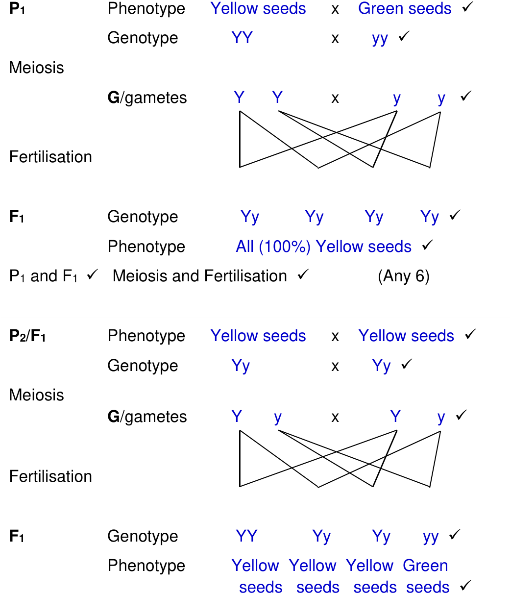

---

50% of their children will have high but not extreme cholesterol levels  
$P_1$ and $F_1$ $\checkmark$ Meiosis and Fertilisation $\checkmark$ (*1 compulsory + any 6)

2.2 
a) 25% $\checkmark$  
b) 25% $\checkmark$

(15)

### Activity 4: Sex-linked diseases

1.  
$P_1$ 
| Phenotype | Normal father $\times$ Normal mother $\checkmark$ |
| :--- | :--- |
| Genotype | $X^H Y \times X^H X^h$ $\checkmark$ |

Meiosis  
Fertilisation  

$F_1$ 
| Genotype | $X^H X^H$; $X^H X^h$; $X^H Y$; $X^h Y$ $\checkmark$ |
| :--- | :--- |
| Phenotype | 50% Normal female; 25% Normal male; 25% Affected male $\checkmark$ |

$P_1$ and $F_1$ $\checkmark$  
Meiosis and Fertilisation $\checkmark$ (any 6)

2. The allele for the trait is carried on the X-chromosome $\checkmark$. The Y-chromosome does not carry the allele for the trait $\checkmark$. Males only have one X-chromosome $\checkmark$. A male only needs one recessive allele $\checkmark$ to be affected, whereas for a female to be affected both alleles must be recessive $\checkmark$. (any 4)

3.1 The gene $\checkmark$ for this disorder is located on the autosome (chromosome number 7) and not on the sex chromosomes / gonosomes $\checkmark$.

| Gametes | $X^H$ | $Y$ |
| :--- | :--- | :--- |
| **$X^H$** | $X^H X^H$ | $X^H Y$ |
| **$X^h$** | $X^H X^h$ | $X^h Y$ |

---

## Section 3.2: Worked Example of a Monohybrid Cross

### Genetic Cross Breakdown

* **$\mathbf{P_1}$ Phenotype:** Normal parent $\times$ Normal parent
* **$\mathbf{P_1}$ Genotype:** $\text{Bb} \times \text{BB}$
* **Process:** *Meiosis*
* **Gametes:** $\text{B}$, $\text{b}$ $\times$ $\text{B}$, $\text{B}$
* **Process:** *Fertilisation*

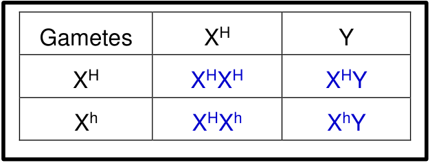

* **$\mathbf{F_1}$ Genotype:** $\text{BB}$; $\text{BB}$; $\text{Bb}$; $\text{Bb}$
* **$\mathbf{F_1}$ Phenotype:** Normal, Normal

### Summary Notes & Marking Criteria

* $\mathbf{P_1}$ and $\mathbf{F_1}$
* *Meiosis* and *Fertilisation*
* **0% chance** to have a child with cystic fibrosis ($\ast$ Compulsory mark)
* Compulsory $1$ + any $5$

---

## Question 3.3

To determine their chances of having a child with the disorder to help them to make an informed decision on whether to have children or not. (20)

---

## Activity 5: Monohybrid crosses using blood types

### Question 1

* **$\mathbf{P_1}$ Phenotype:** Father - Blood group $\text{AB}$ $\times$ Mother - Blood group $\text{A}$
* **$\mathbf{P_1}$ Genotype:** $I^A I^B \times I^A i$
* **Process:** *Meiosis*
* **Gametes:** $I^A$, $I^B$ $\times$ $I^A$, $i$
* **Process:** *Fertilisation*

<!-- DIAGRAM_PLACEHOLDER: diagram -->

* **$\mathbf{F_1}$ Genotype:** $I^A I^A$; $I^A i$; $I^A I^B$; $I^B i$
* **$\mathbf{F_1}$ Phenotype:** Blood group $\text{A}$, $\text{A}$, $\text{AB}$ and $\text{B}$
* **$\mathbf{P_1}$ and $\mathbf{F_1}$**

---

Meiosis and Fertilisation

Hence the man with blood group $AB$ cannot be the father of that child. 

* *Compulsory mark*

(Compulsory $1$ + any $5$)

---

2. a) $I^A$, $I^B$, $i$

   b) $2$

   c) Any individual inherits one allele from each parent

   d) $I^A$, $I^B$

   e) Each child has an equal, i.e., a $25\%$ chance, of having any blood group — $A$, $B$, $AB$, or $O$

$(15)$

---

## Activity 6: Dihybrid crosses

1.1 Dihybrid crossing

1.2 
* a) short ears;
* b) pointed lip;
* c) $EEll$ or $Eell$

1.3 $EL$ and $El$

1.4 Due to random arrangement of chromosomes at the equator during meiosis, any one of the two alleles of a characteristic can sort with any two of another characteristic.

The alleles of different genes move independently of each other into the gametes.

They can therefore appear in the gametes in different combinations: $LE$, $Le$, $lE$, $le$ (any $4$)

2.1 Andrew has short fingers while Susan has normal fingers. Andrew has straight hair while Susan has curly hair.

2.2 $Bh$, $bh$

$(14)$

---

## Activity 7: Pedigrees

1.1 $2$

1.2 $(\frac{1}{7} \times 100) = 14,3\%$

1.3 
* a) $X^DX^d$
* b) $X^dX^d$

1.4 $100\%$

2.1 Because they were normal they must each have one dominant allele and in order for their children to be affected each parent must have one recessive allele.

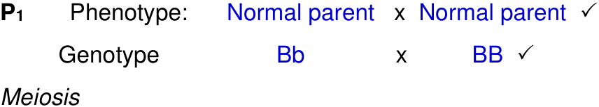

---

## Answers to Previous Questions (Continuation)

* **2.2** $\text{NN}$ or $\text{Nn}$
* **2.3** The father would have been affected if it was sex-linked in order for the daughter to be affected.
* **3.1** $10$
* **3.2** 
  * a) $\text{Dd}$
  * b) $\text{Dd}$
* **3.3** 
  * a) homozygous
  * b) heterozygous
* **3.4** Individual 2 is the grandmother of individual 12, or Individual 12 is the grandson of individual 2.

*(Total Marks: 19)*

---

## Activity 8: Genetic engineering

1. They learnt that what one thinks will happen is not likely to happen in reality.
2. Genetic engineering is expensive, so only rich countries can use it.
3. **Short term**
   * Greater yield $\rightarrow$ therefore better food security.
   * Enhanced nutrient content $\rightarrow$ e.g., vitamin A in rice.
   * Easier to grow $\rightarrow$ as the crop is less likely to get a disease and can grow in harsh conditions. 
   *(any $2 + 2$)*

   **Long term**
   * Possible health issues due to excessive use of herbicides, or allergic to 'new' gene.
   * Loss of biodiversity.
   * Using genetic engineering for experiments which push the limits of ethics and morality $\rightarrow$ e.g., human genes in mice. 
   *(any $1 + 1$)*

4. If a human gene is incorporated into a vegetable (tomatoes/peppers) and you eat it, you are actually also eating a very small part of a human cell.
5. Recombinant DNA technology
6. **BAD:** "Playing God with nature" in this way could lead to psychological and social problems, **or** **GOOD:** Could feel special because you were created by a unique scientific experiment.

*(Total Marks: 15)*

---

# Section A

## Question 1

1.1 Various options are provided as possible answers to the following questions. Choose the correct answer and write only the letter (A – D) next to the question number (1.1.1 – 1.1.2) on your answer sheet, for example 1.1.6 D.

1.1.1 If a recessive allele on the X-chromosome is passed on to the offspring it is an example of…

A. sex-linked inheritance  
B. incomplete dominance  
C. multiple alleles  
D. co-dominance  

1.1.2 The diagram below shows the DNA profiles of a child, her mother and four males. There is uncertainty about who the biological father is. To establish paternity, DNA profiling was conducted.

*(Child, Mother, Male 1, Male 2, Male 3, Male 4)*

Which male is the biological father of this child?

A. Male 1  
B. Male 2  
C. Male 3  
D. Male 4  

---

*(End of topic exercises, 128)*

---

## Revision Notes: Genetics and Biotechnology

### 1.1 Multiple Choice Questions

#### 1.1.1 & 1.1.2 [Content prior to page]

#### 1.1.3 The advantage of cloning is that it...
* **A** will reduce the variation within a population.
* **B** **produces genetically identical individuals with desirable characteristics.** $\checkmark\checkmark$
* **C** will enable offspring to survive under any unfavourable conditions.
* **D** is the only scientific technique that is accepted by all religious denominations and faiths.

#### 1.1.4 In humans, brown eye colour is dominant over blue eye colour. A mother with blue eyes has two children; a boy with brown eyes and a girl with blue eyes. The eye colour of the father is...
* **A** brown, because the allele for brown eye colour is sex-linked.
* **B** **brown, because at least one of the parents must have brown eyes.** $\checkmark\checkmark$
* **C** blue, because at least two other members of the family have blue eyes.
* **D** blue, because at least one of the parents must be heterozygous for eye colour.

#### 1.1.5 An extra finger in humans is rare, but is due to a dominant gene. When one parent is normal and the other parent has an extra finger but is homozygous for the trait, what is the chances that their children will be normal?
* **A** **0%** $\checkmark\checkmark$
* **B** 25%
* **C** 50%
* **D** 75%

---

### 1.2 Biological Terminology

Give the correct biological term for each of the following descriptions:

| Question Number | Description | Biological Term |
| :--- | :--- | :--- |
| **1.2.1** | Undifferentiated animal cells that can form any type of tissue. | Stem cells $\checkmark$ |
| **1.2.2** | Type of inheritance where none of the two alleles is dominant over the other and an intermediate phenotype is produced. | Incomplete dominance $\checkmark$ |

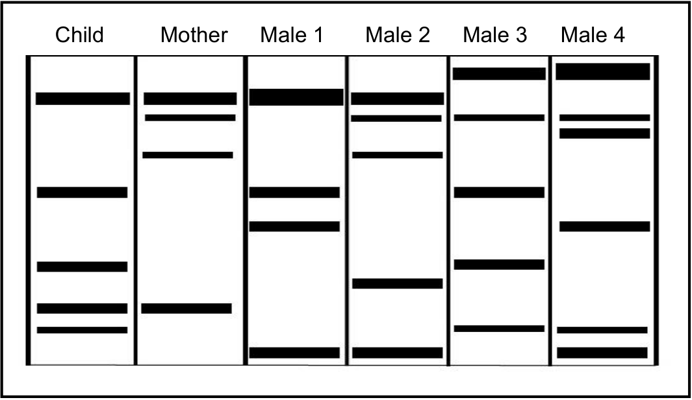

---

## Concepts & Structure

### Genetics and Biotechnology Terminology

* **1.2.3** The breeding of organisms by humans to achieve a desirable phenotype.
  * **Answer:** Artificial selection / Selective breeding $\checkmark$

* **1.2.4** The physical appearance of an organism.
  * **Answer:** Phenotype $\checkmark$

* **1.2.5** A genetic disorder characterised by the absence of blood clotting factor.
  * **Answer:** Haemophilia $\checkmark$

* **1.2.6** Organisms that have different alleles at a given locus.
  * **Answer:** Heterozygous $\checkmark$

* **1.2.7** A human disorder caused by the non-disjunction of chromosome pair 21.
  * **Answer:** Down Syndrome $\checkmark$

* **1.2.8** The type of genetic cross involving two different characteristics.
  * **Answer:** Dihybrid cross $\checkmark$

* **1.2.9** The organelle involved in making a spindle.
  * **Answer:** Centrosome $\checkmark$

---

## Exercises

### Question 1.3

Indicate whether each of the descriptions in **Column I** applies to **A ONLY**, **B ONLY**, **BOTH A AND B** or **NONE** of the items in **Column II**. Write **A only**, **B only**, **both A and B** or **none** next to the question number.

| Column I | Column II |
| :--- | :--- |
| **1.3.1** A specific pattern of bands representing a unique sequence of nucleotides that resemble bar codes | A: DNA profiling B: DNA replication |
| **1.3.2** The number, shape and arrangement of all the chromosomes in the nucleus of a somatic cell | A: Karyotype B: Genome |
| **1.3.3** Identical alleles for a trait | A: Heterozygous B: Homozygous |
| **1.3.4** An allele that is not shown / expressed in the phenotype when found in the heterozygous genotype | A: Dominant B: Recessive |
| **1.3.5** An example of biotechnology | A: Cloning B: Genetic modification |

---

1.3.1   
A only   
 
1.3.2   
A only   
 
1.3.3  
B only   
 
1.3.4   
B only   
1.3.5   
Both A and B   
 
(5 x 2) = 10 
 
 
1.4 
Read the extract below and answer the questions that follow. 
Genetic engineering involves a process whereby a gene is isolated from one 
organism and transferred into another organism. This gene can become part 
of the new host’s genome. Usually the gene transfer takes place between 
organisms from different kingdoms. 
For example, a gene from a certain bacterium codes for an enzyme that 
deactivated a herbicide (a weed-killer). This gene is isolated from the 
bacterium and inserted into the chromosome of a crop plant. The resulting 
plant will now be herbicide-resistant. 
Before the products of genetic engineering can be sold, many tests must be 
done. 
Some seed companies have exclusive rights to sell the seeds that they have 
genetically engineered. Farmers cannot use seeds harvested from the crops 
that they have grown. Farmers must buy seeds from the seed companies 
every time they want to plant the crop. 
Adapted from Microbiology and Biotechnology, 1994 

1.4.1 
What is meant by the term genome referred to in the extract. 
An organism’s complete set of genes.  
(1) 

1.4.2 
State one way in which genetic engineering described in the  
extract differs from selective breeding. 
Genetic engineering: involves transfer of genes  from one 
organism to another. / (manipulation of DNA) 
Selective breeding: Parents with desirable phenotypes are selected 
to mate / breed to produce offspring with desirable phenotypes.  
OR 
Genetic engineering can involve gene transfer between organisms 
from different kingdoms.  

131

---

### Concepts & Structure

Selective breeding can occur using organisms from the same or different species within a kingdom. (2)

#### Question 1.4.3
Give one reason why the products of genetic engineering must undergo many tests before they can be sold.
* To assess the risks to human health / the environment (1)
* To determine if the presence of the transferred gene will affect the expression of other genes
* To test the effectiveness of the product
*(Mark first one only)*

#### Question 1.4.4
Explain the value of growing herbicide-resistant crops.
* The spraying of herbicide will kill the weeds without killing the crops (3)
* Thus reducing the competition and increasing the yield.
*(Any three)*

#### Question 1.4.5
State **THREE** advantages of genetic engineering in crop production other than those mentioned in the extract above.
* Produce crops that are resistant to adverse conditions / drought / disease / pests (3)
* Increase crop yield
* Change the time for the ripening of fruits
* Increase shelf life of plant products
* Improve nutritional value of food
* Improve the taste of food
* Developing fruit / plants with desirable characteristics
*(Mark first three only)*

#### Question 1.4.6
Give a reason why seed companies insist that they must have the exclusive rights to the selling of seeds.
* The companies have invested a lot of time / money to make the GM seeds (2)
* **OR**
* The companies want to control the seed market thus increasing their profit
*(Any one x 2)*

*(Total: 12 marks)*

---

1.5 Gregor Mendel conducted breeding experiments with pea plants to study the inheritance patterns of four different traits (plant height, seed shape, seed colour and seed coat colour).

For each trait, for example plant height, he crossed homozygous tall plants with homozygous dwarf plants. The offspring in the $F_1$ - generation were then interbred to form the $F_2$ - generation. He did the same for each of the other traits.

The results obtained for the $F_2$ - generation are shown in the table below.

| Trait | Results of $F_2$-crossing | Ratio |
| :--- | :--- | :---: |
| Plant height (Tall or dwarf) | Tall: $787$ | $2,84 : 1$ |
| Dwarf: $277$ | |
| Seed shape (Round or wrinkled) | Round: $5\,474$ | **X** |
| Wrinkled: $1\,850$ | |
| Seed colour (Yellow or green) | Yellow: $6\,022$ | **Y** |
| Green: $2\,001$ | |
| Seed coat colour (Grey or white) | Grey: $705$ | $3,15 : 1$ |
| White: $224$ | |

*[Adapted from Basic Concepts in Biology, $3^{\text{rd}}$ edition., C.Starr, 1997]*

### Questions and Worked Answers

1.5.1 What is the expected phenotypic ratio for the trait involving two heterozygous parents?

$$3 : 1$$ *(1)*

1.5.2 From the results, calculate X and Y. Also state which trait provided a ratio closest to the expected phenotypic ratio mentioned in QUESTION 1.5.1. Show all working.

* **X: Seed shape** $= \frac{5\,474}{1\,850} = 2,96 : 1$ (or $2,95 : 1$)
* **Y: Seed colour** $= \frac{6\,022}{2\,001} = 3,01 : 1$
* **Closest:** Seed Colour (Y) *(3)*

1.5.3 Give a possible reason why the ratio selected in QUESTION 1.5.2 was closest to the theoretical ratio.

* $Y$ has the largest sample size *(2)*

1.5.4 Using the results, state whether the allele for round seeds or for wrinkled seeds is dominant.

* Round seeds *(1)*

1.5.5 State ONE factor that Mendel controlled during these breeding experiments.

* All plants must be homozygous in $P_1$

---

## Section A (Continuation)

* All plants must be heterozygous in $P_2$ $\checkmark$
* Same type of plant $\checkmark$ / species
* Same environmental conditions $\checkmark$
* Same method of pollination $\checkmark$

*(Mark first ONE only)* (1)  
(8)  

**Section A: [49]**

---

## Section B

### Question 2

**2.1** The diagram shows the pattern of inheritance of deafness in a family. The letter $H$ represents the allele for hearing and $h$ represents the allele for deafness.

<!-- DIAGRAM_PLACEHOLDER: diagram -->

**2.1.1** How many of each of the following are represented in the diagram?
* a) Males: $3$ $\checkmark$ (1)
* b) Generations: $3$ $\checkmark$ (1)

**2.1.2** Give the:
* a) phenotype of Jon: Normal hearing $\checkmark$ (1)
* b) genotype of Paul: $Hh$ $\checkmark$ (1)

**2.1.3** Both Lyall’s parents can hear, yet he is deaf. Explain how deafness is inherited.

Lyall inherited one recessive allele $\checkmark$ from each parent $\checkmark$ (2)

**2.1.4** Lyall marries a woman who is homozygous dominant for hearing. Use a genetic cross to show the percentage chance of them having a deaf child.

---

# Genetics and Inheritance Worked Examples

## 1. Monohybrid Cross Example

### Method 1: Branch Diagram / Lines Method

- **$\mathbf{P_1}$ Phenotype:** Hearing $\times$ Deaf $\checkmark$
- **$\mathbf{P_1}$ Genotype:** $\text{HH} \times \text{hh} \checkmark$

*Meiosis*

- **Gametes:** $\text{H}, \text{H} \times \text{h}, \text{h} \checkmark$

*Fertilisation*

<!-- DIAGRAM_PLACEHOLDER: diagram -->

- **$\mathbf{F_1}$ Genotype:** $\text{Hh}, \text{Hh}, \text{Hh}, \text{Hh} \checkmark$
- **$\mathbf{F_1}$ Phenotype:** 
  - All hearing $\checkmark$
  - $0\%$ deaf $\checkmark^*$

**Additional Allocation Marks:**
- $\mathbf{P_1}$ and $\mathbf{F_1} \checkmark$
- Meiosis and fertilisation $\checkmark$
- $1^*$ Compulsory mark + Any $6$

---

### Method 2: Punnett Square Method (**OR**)

- **$\mathbf{P_1}$ Phenotype:** Hearing $\times$ Deaf $\checkmark$
- **$\mathbf{P_1}$ Genotype:** $\text{HH} \times \text{hh} \checkmark$

*Meiosis* & *Fertilisation*

| Gametes | $\text{H}$ | $\text{H}$ |
| :--- | :--- | :--- |
| $\text{h}$ | $\text{Hh}$ | $\text{Hh}$ |
| $\text{h}$ | $\text{Hh}$ | $\text{Hh}$ |

- $1$ mark for correct gametes
- $1$ mark for correct genotypes

- **$\mathbf{F_1}$ Phenotype:** 
  - All hearing $\checkmark$
  - $0\%$ deaf $\checkmark^*$

**Additional Allocation Marks:**
- $\mathbf{P_1}$ and $\mathbf{F_1} \checkmark$
- Meiosis and fertilisation $\checkmark$
- $1^*$ Compulsory mark + Any $6$

---

## 2. Paternity Testing and DNA Profiling

**2.2** Tom and Maria have three children. One of the three children was adopted. A DNA profile for each member of the family was prepared to determine if Tom is the father of all three children (Anne, Mary and Steve). The DNA profiles are given below.

---

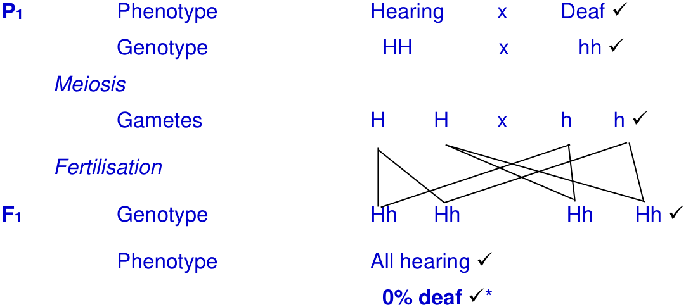

### 2.2.1 Which one of the children was adopted?
Mary $\checkmark\checkmark$ (2)

### 2.2.2 Explain your answer to question 2.2.1.
There are no matching bands / bars / patterns $\checkmark$ common to Mary and both of the parents $\checkmark$ (2)  
(4)

---

### 2.3 Humans have different blood groups which are coded for by a number of alleles. Mary has genotype $I^{A}i$ and her son Joseph has blood type AB.

#### 2.3.1 How many alleles code for blood groups?
$3$ $\checkmark$ (1)

#### 2.3.2 Give all the possible genotypes for Joseph's father.
$I^{A}I^{B} \checkmark \mid I^{B}I^{B} \checkmark \mid I^{B}i \checkmark$ (3)  
(4)

---

### 2.4 Haemophilia is a genetic disorder caused by a recessive allele on the X-chromosome. A haemophiliac female marries a normal male. Explain why all their sons will be haemophiliacs.

* An individual inherits one allele from each parent $\checkmark$
* The Y-chromosome was inherited from the father $\checkmark$
* And the recessive allele / $X^{h}$ was inherited from the mother $\checkmark$
* Since the mother has two recessive alleles $\checkmark$ / $X^{h}X^{h}$
* A son only needs to get one recessive allele to be haemophiliac $\checkmark$
* since the Y-chromosome does not carry any allele to mask $\checkmark$ the $h$ allele

(any four $\times$ 1) (4)  
**[25]**

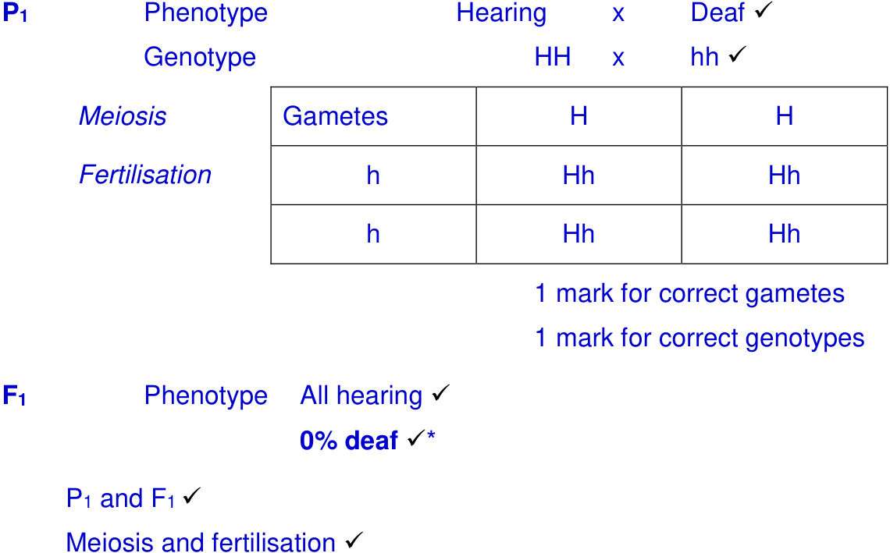

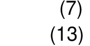

---

### Question 3

#### 3.1 Genetics Problem: Dihybrid Cross

Coat colour in mice is controlled by two alleles:
* **Black ($B$)**
* **Grey ($b$)**

Tail length is controlled by two alleles:
* **Long ($T$)**
* **Short ($t$)**

The Punnett square below shows a part of the cross between two mice. Genotype **(i)** has been left out.

| Gametes | BT | Bt | bT | bt |
| :---: | :---: | :---: | :---: | :---: |
| **Bt** | BBTt | BBtt | BbTt | Bbtt |
| **Bt** | BBTt | BBtt | BbTt | Bbtt |
| **Bt** | BBTt | BBtt | (i) | Bbtt |
| **Bt** | BBTt | BBtt | BbTt | Bbtt |

---

#### 3.1.1 Questions and Answers

* **a) Give the genotype of parent 1**
  * **Answer:** $\text{BbTt}$

* **b) Give the phenotype of parent 2**
  * **Answer:** Black coat, short tail

* **c) Give the genotype of offspring (i)**
  * **Answer:** $\text{BbTt}$

---

#### 3.1.2 Percentage Calculation

* **Question:** What percentage of the offspring above is grey with short tails?
* **Answer:** $0\%$

---

#### 3.1.3 Gamete Genotypes

* **Question:** State the genotypes of two gametes from the table above that will result in offspring that are heterozygous for both traits if fertilisation occurs.
* **Answer:** $\text{Bt}$, $\text{bT}$

---

#### 3.2 Investigation on Tongue-Rolling Frequency

A class of Grade 11 learners conducted an investigation to determine the frequency of dominant and recessive characteristics in their school. The characteristic investigated was the ability to roll one's tongue.

The results obtained were recorded in the frequency tree as shown below.

<!-- DIAGRAM_PLACEHOLDER: diagram -->

---

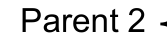

### 3.2.1 List three steps that the learners need to follow while planning this investigation.

* Ask permission from the participants and the school principal to conduct the investigation $\checkmark$
* Determine the sample size $\checkmark$
* Decide on how data will be recorded $\checkmark$
* Decide on data capturers to collect data $\checkmark$

*(Mark first three only)* **(3)**

---

### 3.2.2 Use the data given in the frequency tree to plot a bar graph.

#### Guidelines for marking graph

| Criteria | Mark |
| :--- | :--- |
| Type of graph (T) | $\checkmark$ |
| Caption (C) | $\checkmark$ |

---

138

---

### 3. Data Representation and Genetics

#### 3.2.3 Classification of Traits
* **Question:** Would you classify the ability to roll one's tongue as a continuous or discontinuous variation?
* **Answer:** Discontinuous variation $\checkmark$ (1)

#### 3.2.4 Explanation of Variation Type
* **Question:** Explain your answer to question 3.2.4.
* **Answer:** There is no range of different phenotypes for tongue rolling $\checkmark$ / there are no intermediates between phenotypes, either one can roll their tongue or they cannot $\checkmark$ (2)  
*(Total marks for section = 11)*

---

### 3.3 Chromosomes in a Human Cell

The diagram below is a representation of the chromosomes in a human cell (karyotype):

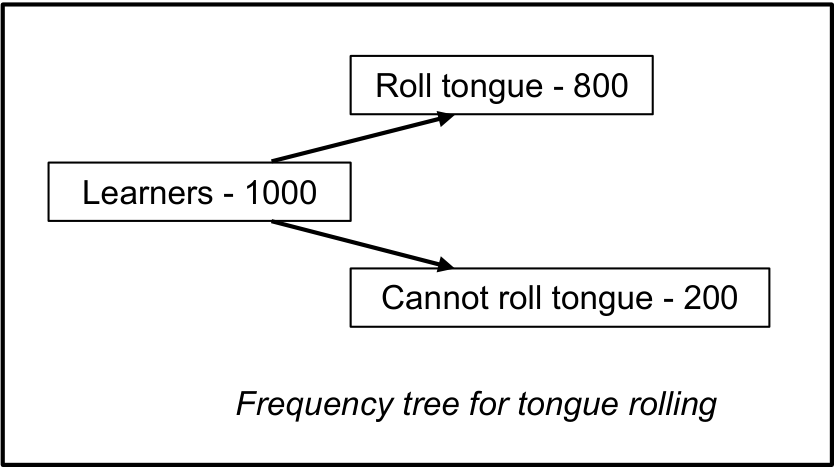

#### 3.3.1 Autosomes Count
* **Question:** How many autosomes are in this cell?
* **Answer:** $45$ $\checkmark$ (1)  
*(Note: Standard human karyotype questions typically expect 44 autosomes plus sex chromosomes, but this reflects the specific marking guideline for the provided source document).*

#### 3.3.2 Determining Sex from Karyotype
* **Question:** This individual is a female. Explain why this conclusion is made.
* **Answer:** There are two X chromosomes $\checkmark$ / $\text{XX}$ / The gonosomes are the same (1)

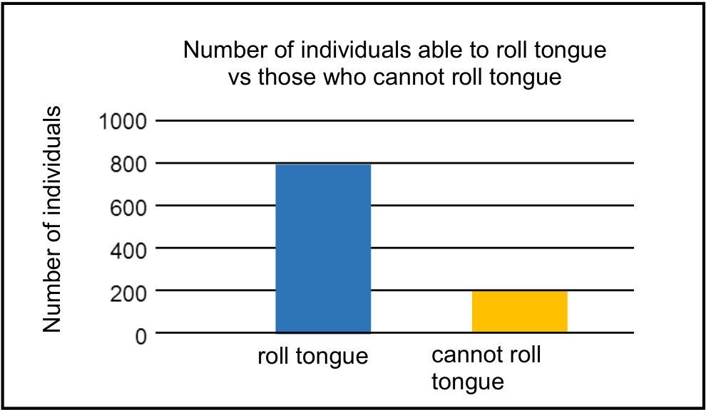

---

3.3.3 What evidence is there to show that this individual has a genetic disorder?  
> **Answer:** 3 chromosomes present in chromosome pair 21 $\checkmark$ *(1)*

3.3.4 Identify the genetic order mentioned in question 3.3.3.  
> **Answer:** Down Syndrome $\checkmark$ *(1)*

3.3.5 Name the process that resulted in this genetic disorder.  
> **Answer:** Non-disjunction $\checkmark$ *(1)*  
> *(Total: 5 marks)*

---

**Section B:** [24]  
**Total Marks:** [98]

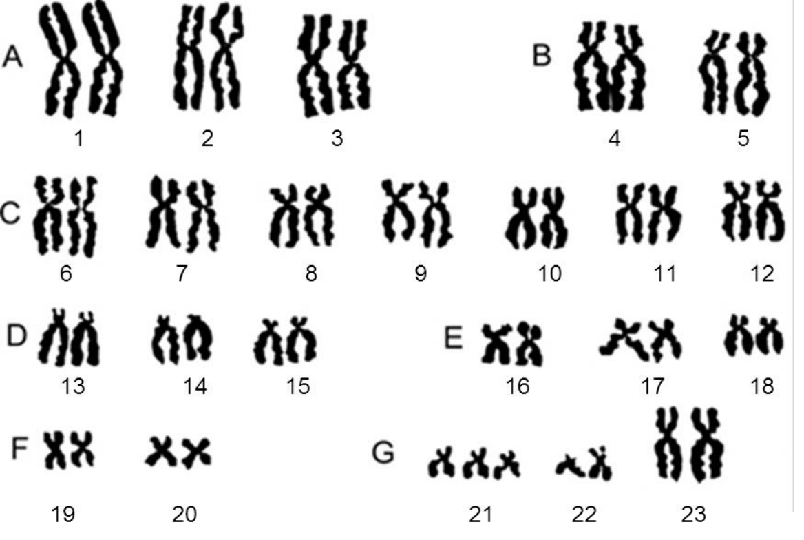

---

# Cognitive level distribution

| Question | Level 1 | Level 2 | Level 3 | Level 4 | Marks |
| :---: | :---: | :---: | :---: | :---: | :---: |
| 1.1.1 | | ✓ | | | 2 |
| 1.1.2 | | ✓ | | | 2 |
| 1.1.3 | ✓ | | | | 2 |
| 1.1.4 | | ✓ | | | 2 |
| 1.1.5 | | | | ✓ | 2 |
| **Subtotal** | **2** | **6** | | **2** | **10** |
| 1.2.1 | ✓ | | | | 1 |
| 1.2.2 | ✓ | | | | 1 |
| 1.2.3 | ✓ | | | | 1 |
| 1.2.4 | ✓ | | | | 1 |
| 1.2.5 | ✓ | | | | 1 |
| 1.2.6 | ✓ | | | | 1 |
| 1.2.7 | ✓ | | | | 1 |
| 1.2.8 | ✓ | | | | 1 |
| 1.2.9 | ✓ | | | | 1 |
| **Subtotal** | **9** | | | | **9** |
| 1.3.1 | | ✓ | | | 2 |
| 1.3.2 | | ✓ | | | 2 |
| 1.3.3 | | ✓ | | | 2 |
| 1.3.4 | | ✓ | | | 2 |
| 1.3.5 | | ✓ | | | 2 |
| **Subtotal** | | **10** | | | **10** |
| 1.4.1 | ✓ | | | | 1 |
| 1.4.2 | | ✓ | | | 2 |
| 1.4.3 | | | ✓ | | 1 |
| 1.4.4 | | ✓ | | | 3 |
| 1.4.5 | | ✓ | | | 3 |
| 1.4.6 | | ✓ | | | 2 |
| **Subtotal** | **1** | **10** | **1** | | **12** |
| 1.5.1 | | | ✓ | | 1 |
| 1.5.2 | | | ✓ | | 3 |
| 1.5.3 | | ✓ | | | 2 |

---

### Assessment Grid / Memorandum Analysis

| Question / Item | Column 1 | Column 2 | Column 3 | Column 4 | Total Marks |
| :--- | :---: | :---: | :---: | :---: | :---: |
| 1.5.4 | | $\checkmark$ | | | 1 |
| 1.5.5 | | $\checkmark$ | | | 1 |
| **Subtotal** | | **4** | **4** | | **8** |
| 2.1.1 | $\checkmark\checkmark$ | | | | $(1 + 1)$ |
| 2.1.2 | | $\checkmark\checkmark$ | | | $(1 + 1)$ |
| 2.1.3 | | | $\checkmark$ | | 2 |
| 2.1.4 | | | $\checkmark$ | | 7 |
| **Subtotal** | **2** | **2** | **9** | | **13** |
| 2.2.1 | | $\checkmark$ | | | 2 |
| 2.2.2 | | $\checkmark$ | | | 2 |
| **Subtotal** | | **4** | | | **4** |
| 2.3.1 | $\checkmark$ | | | | 1 |
| 2.3.2 | | | $\checkmark$ | | 3 |
| **Subtotal** | **1** | | **3** | | **4** |
| 2.4 | | | $\checkmark$ | | 4 |
| **Subtotal** | | | **4** | | **4** |
| 3.1.1 a - c | $\checkmark$ | $\checkmark\checkmark$ | | | $(2 + 2 + 1)$ |
| 3.1.2 | | $\checkmark$ | | | 1 |
| 3.1.3 | | $\checkmark$ | | | 2 |
| **Subtotal** | **2** | **6** | | | **8** |
| 3.2.1 | | | $\checkmark$ | | 3 |
| 3.2.2 | | | $\checkmark$ | | 5 |
| 3.2.3 | | $\checkmark$ | | | 1 |
| 3.2.4 | | $\checkmark$ | | | 2 |
| **Subtotal** | **1** | **3** | **8** | | **11** |
| 3.3.1 | $\checkmark$ | | | | 1 |
| 3.3.2 | | $\checkmark$ | | | 1 |
| 3.3.3 | $\checkmark$ | | | | 1 |
| 3.3.4 | $\checkmark$ | | | | 1 |
| 3.3.5 | $\checkmark$ | | | | 1 |
| **Subtotal** | **4** | **1** | | | **5** |
| **GRAND TOTAL** | **20** | **47** | **29** | **2** | **98** |

---

142