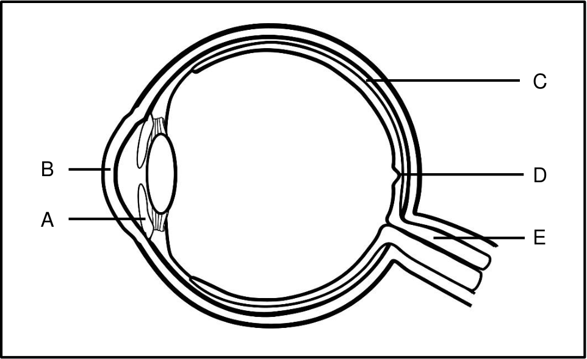
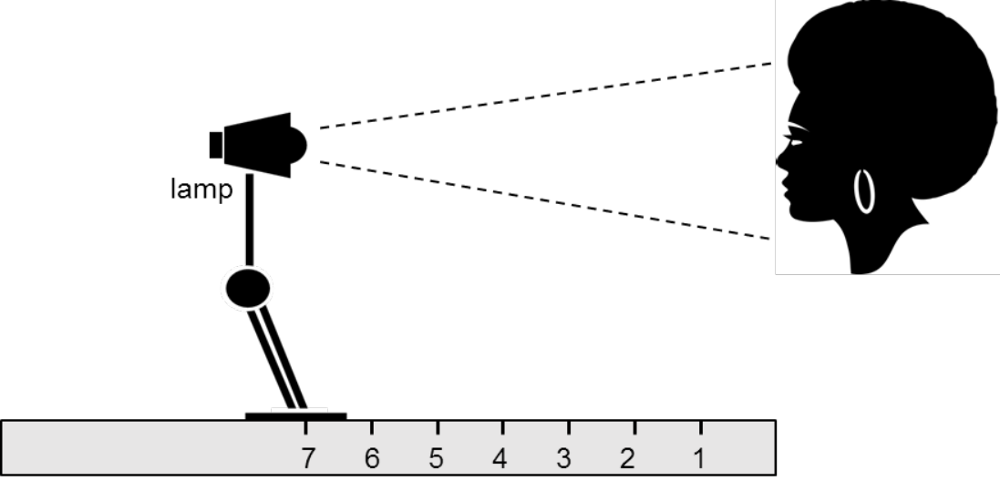
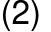
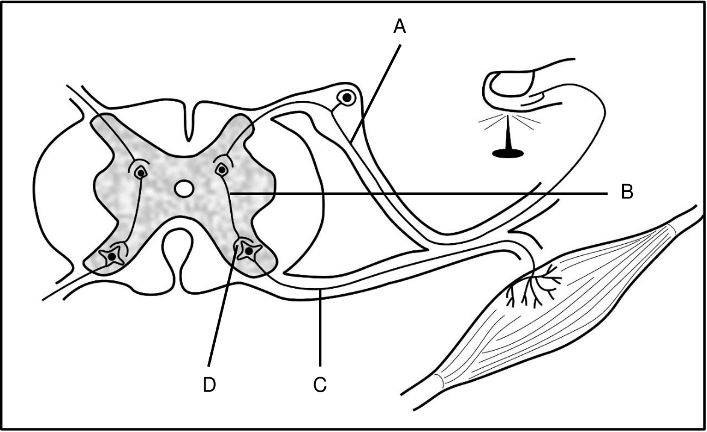
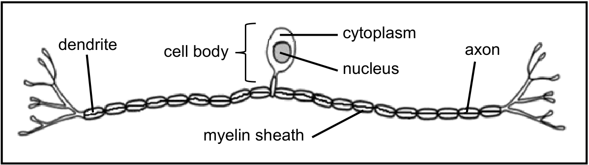
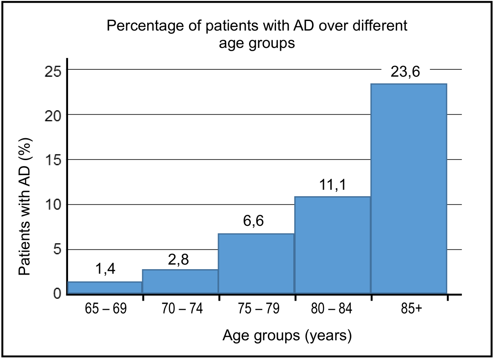

# CHAPTER 6: HUMAN RESPONSES TO THE ENVIRONMENT

## Introduction

Humans respond to the environment in various ways to maintain homeostasis, function efficiently and protect themselves from danger. The human nervous system with its receptor organs allows the body to respond.

### Key Terminology

| Term | Definition |
| :--- | :--- |
| **receptor** | structure that receives a stimulus and converts it into an impulse |
| **effector** | gland or organ that brings about a response to stimuli received by the body |
| **stimulus** | detectable change in the internal or external environment |
| **impulse** | electrical signal created by receptor organs in response to stimuli |
| **transmit** | to send something from one place to another |
| **autonomic nervous system** | controls our involuntary bodily functions; it is divided into the parasympathetic and sympathetic nervous system |
| **peripheral nervous system** | consists of nerves that extend outside the central nervous system (brain and spinal cord) |

## Human responses to the environment

In order to survive all organisms must be able to respond to the environment. To achieve this, humans have two co-ordinating systems which allow them to adapt to changes within the environment and maintain their internal conditions. A co-ordinating system consists of receptors and effectors which respond to stimuli and allow for changes to take place. These two systems are the nervous system and the endocrine system. The nervous system is made up of nerves and is a fast responding system. The endocrine system involves hormones which are released into the blood and is a much slower responding system.

---

# The human nervous system

## Key terminology

| Term | Definition |
| :--- | :--- |
| **cranium** | part of the skull that contains and protects the brain |
| **meninges** | protective membranes surrounding the brain & spinal cord |
| **cerebrospinal fluid** | fluid around the brain and spinal cord to aid in protection |
| **grey matter** | part of the brain and spinal cord consisting of cell bodies and dendrites |
| **white matter** | part of the brain and spinal cord consisting of myelinated axons |
| **neuron** | specialised nerve cells which transmits nerve impulses |
| **dendrites** | fibres that transmit impulses to a cell body in a neuron |
| **nerve** | bundle of neurons |
| **synapse** | the gap between the axon of one neuron and the dendrite of another |
| **neurotransmitter** | chemicals which carry impulses across the synapse |
| **homeostasis** | the tendency of living organisms to maintain their internal environment constant within narrow limits irrespective of changes in the external environments |
| **Alzheimer's disease** | disease caused by nerve defects usually in older people and characterised by memory loss and confusion |
| **multiple sclerosis** | disease cause by damage to the myelin sheath of neurons and characterised by physical and mental disabilities |

---

<!-- DIAGRAM_PLACEHOLDER: diagram -->

*Figure 1: The human nervous system*

---

# Central nervous system & peripheral nervous system

> **[Diagram Context - Textbook_LifeSciences_Gr12_Human_Reproduction.pdf-0002-04.png]**
> This educational graphic illustrates the human sexual life cycle, mapping the cyclical alternation between haploid and diploid states. The diagram features clear labels including "Meiosis", "Fertilisation", "mitosis and development", "haploid gametes (n = 23)", "ovum (n)", "sperm cell (n)", "diploid zygote (2n)", "ovary", "testis", and "multicellular diploid adults (2n = 46)", connected by directional arrows separating haploid and diploid phases. It conceptually conveys to high school learners how chromosome numbers are halved through meiosis to form gametes and restored to the diploid state via fertilisation, linking cell division directly to human reproduction and growth.

**Figure 2:** The central nervous system and peripheral nervous system

As illustrated in the figures above, the human nervous system may be divided into two main parts:

* **The central nervous system (CNS)** which consists of the **brain** and **spinal cord**.
* **The peripheral nervous system (PNS)** which consists of:
  * An **autonomic part** which is involuntary (one that cannot be controlled). The autonomic part may be further divided into the **sympathetic** and **parasympathetic systems**, which work antagonistically (in an opposing manner).
  * A **somatic part** which is voluntary (under conscious control).

## Examples of Actions
* **Voluntary actions:** Running, jumping, eating, or walking.
* **Involuntary actions (or reflex actions):** Breathing and sneezing.

> **[Diagram Context - Textbook_LifeSciences_Gr12_Human_responses_to_the_environment.pdf-0002-03.png]**
> This educational graphic is a hierarchical tree diagram outlining the anatomical and functional organisation of the human nervous system. It clearly displays the connecting branch lines and visible text labels: "NERVOUS SYSTEM (NS)", "Central NS", "Peripheral NS", "Brain", "Spinal Cord", "Autonomic (involuntary)", "Somatic (voluntary)", "Sympathetic", and "Parasympathetic". Conceptually, the diagram helps Grade 12 Life Sciences learners understand how the nervous system is structurally divided into the central and peripheral components, and how the peripheral system further subdivides into voluntary and involuntary pathways.

> **[Diagram Context - Textbook_LifeSciences_Gr12_Reproductive_strategies_in_vertebrates.pdf-0002-06.png]**
> This photographic visual depicts a natural habitat scene showing several reddish fish swimming over a stony riverbed beneath clear water. The image contains no explicit text labels, variables, or chemical symbols, focusing instead on the external morphology and aquatic environment of the organisms. Conceptually, it supports Life Sciences learners in studying ecosystems, biodiversity, and animal adaptations by providing a realistic context for discussions on population dynamics and biotic interactions.

---

# Responding to the Environment: The Central Nervous System

Humans experience many changes throughout the day to which they must respond. These changes are known as **stimuli**. 

## Types of Stimuli
* **Internal stimuli:** Changes inside the body, such as body temperature, water levels, sugar levels, carbon dioxide, and oxygen concentrations.
* **External stimuli:** Changes outside the body, such as pain, environmental temperature, and danger.

Regardless of whether a stimulus is internal or external, the body must be able to respond to it.

---

## The Central Nervous System

The central nervous system is made up of two main components:
1. The **brain**
2. The **spinal cord**

### The Brain

The brain is made up of delicate nervous tissue which cannot repair itself. Because it is of vital importance in controlling all functioning of the human body, it is well protected in three ways:

* It is enclosed inside a bony **cranium**.
* It is surrounded by three membranes called the **meninges**.
* It is cushioned by a fluid called **cerebrospinal fluid**.

*Figure 3: The structure of the brain*

> **[Diagram Context - Textbook_LifeSciences_Gr12_Plant_responses_to_the_environment.pdf-0003-07.png]**
> This educational table and cellular diagram illustrates plant growth responses (phototropism) under the Grade 12 CAPS Life Sciences curriculum. The graphic features columns titled "Direction of light stimulus," "Effect of light on auxins," and "Observations," incorporating labeled diagrams ("Figure 1A" and "Figure 1B"), downward arrows indicating light direction, and red dots representing "auxin molecules" evenly distributed within a plant shoot. It demonstrates conceptually how sunlight directly overhead causes auxins to move downward evenly, resulting in equal cell elongation and causing Shoot A to grow straight upward.

> **[Diagram Context - Textbook_LifeSciences_Gr12_The_human_endocrine_system_and_homeostasis.pdf-0003-02.png]**
> This comparative anatomical diagram illustrates the structural and functional differences between an exocrine gland (Figure 1) and an endocrine gland (Figure 2). Visible labels include "chemical secretions," "skin surface," "chemicals produced by gland," "blood in capillaries," and "hormones secreted into blood," accompanied by directional arrows showing the pathways of secretion. Conceptually, this graphic helps CAPS Life Sciences learners distinguish duct-mediated exocrine secretion onto surfaces from ductless endocrine secretion directly into the bloodstream.

---

# The Structure and Function of Various Parts of the Brain

Table 1 below shows the location, structural adaptations, and functions of various parts of the human brain.

Table 1: The structure and function of various parts of the brain

| Structural adaptation | Function |
| :--- | :--- |
| **cerebrum** | |
| • the largest part of the brain  • divided into two hemispheres (left and right) which are connected by the **corpus callosum** | • controls voluntary functions (walking, speaking, writing)  • receives and interprets sensations from sense organs (hearing, sight, feeling, taste, smell)  • higher thought processes (memory, intelligence, reasoning)  • to allow communication between the two halves of the brain |
| **cerebellum** | |
| • second largest part of the brain  • located behind and below the cerebrum | • co-ordinates skeletal muscles to bring about balance while moving, as in walking or running  • maintains balance and posture  • maintains muscle tone |
| **medulla oblongata** | |
| • lower part of the brain  • continues down into the body as the spinal cord | • controls breathing, peristalsis, heartbeat, swallowing  • transmits impulses from the spinal cord to the brain  • controls less important reflexes: blinking, coughing, sneezing, vasodilation, vasoconstriction and salivating |
| **hypothalamus** | |
| • a small section of the brain just above the pituitary gland | • a control centre for things such as hunger, thirst, sleep, body temperature, emotions |

---

*Parts of the brain video resource:* [https://www.youtube.com/watch?v=-nH4MRvO-10&t=86s](https://www.youtube.com/watch?v=-nH4MRvO-10&t=86s)

---

# The spinal cord

*Figure 4: Internal structure of the spinal cord.*

The spinal cord is made up of delicate nervous tissue which cannot repair itself. It is therefore protected by:

* 33 vertebrae (bone) with discs of cartilage between them to act as shock absorbers
* three membranes called the meninges
* cerebrospinal fluid

The spinal cord passes from the medulla oblongata to the lumbar region in the lower back. Thirty-one pairs of spinal nerves are attached to the spinal cord through the openings between the vertebrae. Each spinal nerve has a dorsal root which enters and a ventral root which leaves the spinal cord.

The spinal cord has the following functions:

* transmits impulses from receptors to the brain and from the brain to the effectors
* contains reflex centres that function automatically to protect the body

---

## Activity 1: The central nervous system

Study the diagram below representing the human brain.

---

1. Give the names of the parts labelled A to C. (3)
2. Give the letter and the name of the part responsible for:
   a) co-ordinating all voluntary movements (2)
   b) memorising a cell phone number (2)
3. Explain two functions of parts:
   a) E (2)
   b) F (2)
4. Provide two ways in which part D is protected. (2)
5. Which functions of the body might be affected if the lower back part of the head receives a significant impact in a car accident? (2)

(15)

---

## Neurons

Neurons are the structural units of the nervous system. Neurons are specialised cells which connect the brain and spinal cord to all other parts of the body.

As illustrated in Figure 5 below, neurons have the following structures:

* dendrites – transmitting impulses towards the cell body
* a cell body (with nucleus) – controlling the metabolism of the cell
* an axon – transmitting impulses away from the cell body

---

- **Myelin Sheath**: Insulates the axon and speeds up the transmission of impulses. The myelin sheath is enclosed by a membrane called the **neurilemma**, which helps to repair damaged neurons.

**Figure 5:** Structure of a motor neuron

---

There are three types of neurons: **sensory neurons**, **interneurons**, and **motor neurons**. These are illustrated in Figures 6A to 6C.

Sensory neurons transmit impulses from receptors to the central nervous system.

**Figure 6A:** Sensory neuron

---

## Neurons and Synapse

### Interneuron
* **Function:** An interneuron connects a sensory neuron to a motor neuron in the central nervous system.
* **Figure 6B:** Interneuron

---

### Motor Neuron
* **Function:** Motor neurons transmit impulses from the central nervous system to the effectors (muscles and glands) in the body.
* **Figure 6C:** Motor neuron

---

## Synapse

A synapse is a functional connection between the axon of one neuron and the dendrites of another neuron. The connection is established by neurotransmitters, chemicals that move across the gap between axon and dendrite to transmit the impulse.

### Significance of a Synapse
* It ensures that the impulse moves in one direction only.
* It prevents continuous stimulation of the neurons.

---

* It ensures that the impulse is transmitted from the sensory neuron to the motor neuron

Figure 7: A synapse

Types of neurons:  
[https://www.youtube.com/watch?v=n0Zc01e1Frw&list=PLW0gavSzhMIQYSpKryVcEr3ERup5SxHl0&index=48](https://www.youtube.com/watch?v=n0Zc01e1Frw&list=PLW0gavSzhMIQYSpKryVcEr3ERup5SxHl0&index=48)

### Activity 2: Neuron structure

The diagram below represents the structure of a neuron.

<!-- DIAG_PLACEHOLDER: diagram -->

161

---

1. Name the type of neuron shown in the diagram above. (1)
2. Identify the parts A to E. (5)
3. Provide the functions of the following parts:
   a) C (1)
   b) D (1)
4. Describe the pathway of an impulse through the neuron shown above. (1)
5. Draw a fully labelled diagram to show the structure of a neuron which receives impulses and transmits them to the central nervous system. (4)

*(Total: 13 marks)*

---

## Reflex action and reflex arc

* **Reflex action:** A quick, automatic response to a stimulus. Examples include the knee-jerk reaction, sneezing, and quickly removing a body part away from danger to respond to pain.
* **Reflex arc:** The pathway along which an impulse is transmitted to bring about a response to a stimulus during a reflex action.

### Significance of Reflex action
* The reflex action allows for a quick response, without thinking about it, to prevent damage to the body.

The diagram below (Figure 8) can be used to explain how a reflex action takes place. The arrows in the diagram show the reflex arc.

**Figure 8: A reflex action**

---

# The Reflex Action of a Person Touching a Hot Pot

1. **Stimulus Detection:** The stimulus is detected by receptors and converted into a nerve impulse.
2. **Sensory Transmission:** The nerve impulse is transmitted along the sensory neuron through the dorsal root to the spinal cord.
3. **Interneuron Transfer:** The impulse is transmitted from the sensory neuron to an interneuron in the spinal cord.
4. **Motor Transmission:** The impulse is transmitted from the interneuron to a motor neuron in the spinal cord.
5. **Effector Response:** The impulse exits the spinal cord through the ventral root and is transmitted along the axon of the motor neuron to the effector organs (muscle; this causes the muscles in the arm to contract).
6. **Action:** The hand pulls away from the stimulus quickly.

**Note:** This reflex action does not include the brain. Impulses will reach the brain after the reflex arc is complete and pain will be felt.

**Digital Resource:** How a reflex arc functions: [https://www.youtube.com/watch?v=Nn2RHLWST-k](https://www.youtube.com/watch?v=Nn2RHLWST-k)

---

## Activity 3: Reflex arc

The diagram below shows the reflex arc. Study the diagram, then answer the questions below.

---

1. Give only the letter of the part that represents the:
   a) effector (1)
   b) interneuron (1)
   c) sensory neuron (1)

2. State one function of each of the following parts:
   a) D (1)
   b) F (1)

3. Explain why the brain is not initially involved in the reflex action. (3)

4. Explain the effect on the body if the following parts were cut:
   a) C (4)
   b) F (4)

*(16)*

---

### Activity 4: Practical investigation on reaction times

Thando conducted an experiment to determine which gender has the faster reaction time amongst his classmates. Out of 15 learners in his class he randomly selected a sample of 5 girls and 5 boys. The following steps were followed for each member of the sample during the experiment:

* Thando held a meter ruler between his thumb and index finger just above the $100\text{ cm}$ mark.
* The pupil placed the thumb and index finger on either side of the meter ruler at the $0\text{ cm}$ mark, with only the thumb touching it.
* As Thando dropped the meter ruler the pupil caught it by closing the thumb and forefinger.
* During each trial Thando recorded the distance at which the meter ruler was caught.
* The procedure was repeated five times for each pupil.

The table below shows the average distance at which the meter ruler was caught by $5$ boys and $5$ girls over five trials.

**Average distance at which the meter ruler was caught over 5 trials ($\text{cm}$)**

| Boys | average distance ($\text{cm}$) | Girls | average distance ($\text{cm}$) |
| :--- | :---: | :--- | :---: |
| Boy 1 | 5,8 | Girl 1 | 4,8 |
| Boy 2 | 5,0 | Girl 2 | 4,7 |
| Boy 3 | 4,9 | Girl 3 | 4,2 |
| Boy 4 | 4,8 | Girl 4 | 4,0 |
| Boy 5 | 4,6 | Girl 5 | 3,9 |
| **overall average** | 5,02 | **overall average** | 4,32 |

---
*164*

---

1. Identify the:
   a) independent variable of the experiment, and (1)
   b) dependent variable of the experiment. (1)

2. Give two reasons why the results of this experiment may be regarded as reliable. (2)

3. Mention two factors which should be kept constant during the experiment. (2)

4. Thando's initial hypothesis was rejected on the basis of the results obtained. Suggest what Thando's initial hypothesis could have been. (2)

**(Total: 8 marks)**

---

## The peripheral nervous system

The peripheral nervous system consists of all the nerves found outside of the central nervous system. The peripheral nervous system consists of $12$ pairs of cranial nerves which are connected to the brain and $31$ pairs of spinal nerves which are connected to the spinal cord.

The peripheral nervous system can be divided into two parts:
* the somatic nervous system which controls voluntary muscles
* the autonomic nervous system which controls involuntary muscles

The peripheral nervous system has the following functions:
* transmits impulses from the receptors to the central nervous system via the sensory neurons
* transmits impulses from the central nervous system to the effectors via the motor neurons

## Somatic Nervous System

The somatic nervous system controls voluntary (skeletal) muscles. The nerves in this system allow the body to react to changes in the external environment.

## Autonomic Nervous System

The autonomic nervous system controls involuntary actions. The nerves in this system allow the body to react to changes in the internal environment so that homeostasis can be maintained.

---

# The Autonomic Nervous System

The autonomic nervous system can be subdivided into two main parts:
* **Sympathetic nervous system**
* **Parasympathetic nervous system**

Each organ in the human body is supplied by both types of nerves (sympathetic nerves and parasympathetic nerves). 

## Functions of the Subdivisions

* **Sympathetic nervous system:** Responsible for the "fight or flight" function in emergency situations.
* **Parasympathetic nervous system:** Restores the body to a normal state after an emergency situation.

Because they have opposite effects, the two systems work **antagonistically** to each other to bring about homeostasis.

---

## Table 2: Effects of the Sympathetic and Parasympathetic Nervous Systems

| Sympathetic system | Parasympathetic system |
| :--- | :--- |
| increases heart rate | decreases heart rate |
| constricts blood vessels in the skin (vasoconstriction) | dilates blood vessels in skin (vasodilation) |
| increases blood pressure | decreases blood pressure |
| widens bronchioles | narrows bronchioles |
| decreases peristalsis | increases peristalsis |
| causes relaxation of the bladder wall | causes contraction of the bladder wall |
| stimulates sweat secretion | no effect |
| dilates pupils | constricts pupils |
| stimulates secretion of adrenalin | no effect |

> **Note:** Adrenalin is a very important hormone that will be discussed in a later chapter. It works with the sympathetic nervous system to prepare the body for dangerous or stressful situations.

---

## Disorders, Injuries and Effects of Drugs on the Nervous System

There are many disorders and injuries which can affect the nervous system. The use of drugs can temporarily or permanently affect the functioning of the nervous system. How much the nervous system will be affected depends on many things.

---

# Alzheimer's disease

Alzheimer's disease is a neurodegenerative disease which means there is progressive brain cell death that occurs over time. The disease is irreversible.

It is not yet known what causes the disease. In most cases, the first symptoms appear after the age of 60 but it has been seen in people as young as 40.

There is no known cure but the symptoms can be managed.

**Symptoms:**
* memory loss
* confusion

---

# Multiple sclerosis

Multiple sclerosis is a disease that affects young adults between the ages of 20 and 40. The body's immune system attacks the myelin sheath covering neurons which prevents them from functioning properly. The reason why this happens is unknown. There is no known cure for this disease. The symptoms can be managed with medication.

**Symptoms:**
* loss of speech and vision
* difficulty walking
* pain
* fatigue
* memory loss

---

# Injuries

There are many causes of brain and spinal cord injuries, but the most common cause is motor vehicle accidents.

Brain injuries can affect movement, memory and speech but this depends on the part of the brain that is injured. In severe cases, they may lead to long-term mental health issues.

A damaged spinal cord could result in paralysis and the inability to move or feel anything below the point of injury.

---

There is no way of regenerating damaged nerve tissue, however regular occupational and physical therapy may allow patients to regain some feeling and function.

Medical researchers claim that stem cell therapy may in future be used to repair spinal cord injuries, degenerative diseases such as multiple sclerosis and Parkinson’s disease.

## Effects of drugs (Not examinable)

Drugs change the way in which impulses are transmitted in the central nervous system, mainly by affecting how quickly or slowly the neurotransmitters can pass across the gap in the synapse. Depending on the type of drug used (e.g.: marijuana, ecstasy, heroine, tik) either the sympathetic or the parasympathetic nervous system will become more stimulated. This can lead to side-effects such as:

* reduced co-ordination
* increased heart rate
* increased blood pressure
* decreased appetite
* hallucinations and paranoia

## Sense Organs

Sense organs contain a high concentration of receptor cells which are able to detect stimuli to bring about a response. We will study the eye and the ear.

## The human eye

### Key terminology

| Term | Definition |
| :--- | :--- |
| **rods** | receptor cells found in the retina of the eye which are sensitive to dim light and help to distinguish between black and white |
| **cones** | receptor cells found in the retina of the eye which are sensitive to bright light and help to distinguish between different colours |
| **pupil** | central opening within the iris which allows light to enter |

---

## Key Concepts & Definitions

| Term | Definition |
| :--- | :--- |
| **pupillary mechanism** | Regulation of the pupil size to control the amount of light entering the eye |
| **accommodation** | The ability of the lens of the eye to alter its shape for clear vision when viewing both near and distant objects |
| **field of vision** | The area that one eye can see |
| **convex** | A shape which curves outwards, thicker in the middle than the edges |
| **concave** | A shape which curves inwards, thinner in the middle than the edges |

---

## Light Receptors and Vision

The receptors that detect light are called **rods** and **cones**. These are situated in the retina at the back of the human eye. 

The eyes are found as a pair positioned at the front of the skull. The field of vision from each eye overlaps, which allows a slightly different image of the same object from each eye. Two types of imaging occur as a result:

* **Binocular vision:** Vision using two eyes with overlapping fields of view so that the separate images are combined and interpreted as one image by the brain.
* **Stereoscopic vision:** The ability to form three-dimensional images which provides the ability to judge distance, depth, and the size of an object.

---

## Structure of the Eye

Figure 9 below gives a view of an eye from the front.

*Figure 9: Front view of human eye*

---

# The Human Eye

## Protection of the Eye
* The eyeballs lie inside a bony cavity.
* Connective tissue and fat surround the eyeball to protect it from mechanical injury.
* The front of the eye is protected by eyelids, which have eyelashes to stop foreign particles from entering the eye.
* The coloured part of the eye is known as the **iris**.
* The opening in the centre of the iris is the **pupil**.
* The **sclera** is a white outer covering layer.

## Layers of the Internal Eye
The internal eye can be divided into three layers:
1. Sclera
2. Choroid
3. Retina

These layers, and other parts of the internal eye, are shown in Figure 10 below.

*Figure 10: A longitudinal section of the eye*

---

## Table 3: Structural Adaptations and Functions of Various Parts of the Eye

| Structural adaptations | Functions |
| :--- | :--- |
| **sclera** | |
| • tough, white inelastic layer that covers eye towards the posterior • adaptation: protection of the eye because it is inelastic | • protects the inner structures of the eye • maintains the shape of the eye |

---

# Structure and Functions of Parts of the Eye

## 1. Cornea
* **Structure:** 
  * Transparent continuation of the sclera in the front of the eye which is convex (bulgy).
  * Adaptation: Transparency allows light to pass through; the convex shape causes refraction (bending) of the incoming light.
* **Function:** 
  * Allows light to pass through.
  * Causes refraction (bending) of the incoming light to create an image on the retina.

## 2. Choroid
* **Structure:** 
  * A dark coloured layer which contains blood vessels and pigments.
* **Function:** 
  * Pigments absorb light to prevent the reflection of light.
  * Blood vessels supply nutrients and oxygen to the cells of the retina.

## 3. Ciliary Body
* **Structure:** 
  * Contains ciliary muscles and it is the thickened part at the anterior of the choroid.
* **Function:** 
  * Ciliary muscles contract or relax to alter the tension on the suspensory ligaments.

## 4. Suspensory Ligaments
* **Structure:** 
  * Ligaments attached to the ciliary body.
* **Function:** 
  * Suspensory ligaments hold the lens in position during accommodation.
  * Tension on the suspensory ligaments changes to alter the shape of the lens.

## 5. Iris
* **Structure:** 
  * The coloured portion of the eye, with an opening at its centre, called the pupil.
  * The iris contains two types of muscles to control the size of the pupil.
* **Function:** 
  * Controls the amount of light entering the eye through the pupillary mechanism.

## 6. Retina
* **Structure:** 
  * Inner layer of the eye which contains the rods and cones that are sensitive to light.
* **Function:** 
  * Rods respond to low intensity light, provide night vision as well as peripheral vision.
  * Cones respond to bright light and provide sharp, clear colour vision.
  * Neurons carry impulses from the rods and cones through the optic nerve to the cerebrum.

## 7. Yellow Spot (Fovea Centralis)
* **Structure:** 
  * Small indentation at the back of the eyeball containing the most cones.
* **Function:** 
  * Area of clearest vision.

## 8. Blind Spot
* **Structure / Function:** 
  * *(Continued on subsequent page)*

---

# Human Eye Structures and Accommodation

## Part 1: Additional Eye Structures and Functions

| Structure | Description | Function |
| :--- | :--- | :--- |
| **Blind spot** | • small area on the retina, below the yellow spot; contains no rods or cones, and hence no vision • area where the blood vessels enter the eye • area where the optic nerve leaves the eye | • area of no vision  • inner parts of the eye are supplied with oxygen and nutrients • impulses are transmitted to the cerebrum for interpretation |
| **Lens** | • elastic and biconvex structure behind the pupil of the iris; held in place by suspensory ligaments • transparent | • changes shape to allow the eye to focus on near and distant objects  • allows light to pass through |
| **Aqueous humour** | • watery fluid found in the space between the cornea and the lens | • maintains the shape of the cornea • plays a small role in the refraction of the incoming light |
| **Vitreous humour** | • jelly-like substance found behind the lens | • maintains the shape of the eyeball • plays a small role in the refraction of the incoming light |

---

## Part 2: Accommodation

**Definition:** Accommodation is the ability of the eye to alter the shape of the lens to ensure that a clear image always falls on the retina whether the object is near or distant.

### Table 4: Accommodation of the human eye

| Near vision (< 6 m from the object) | Distant vision (> 6 m from the object) |
| :--- | :--- |
| • ciliary muscles contract • suspensory ligaments slacken (loosen) • tension on the lens decreases • lens becomes more convex (bulgy) • this causes light rays to bend more • a clear image is focused on the retina | • ciliary muscles relax • suspensory ligaments tighten (become taut) • tension on the lens increases • lens becomes less convex (flatter) • this causes light rays to bend less • a clear image is focused on the retina |

---

## Accommodation of the Eye (Lens Adjustment)

### Figure 11A: Near Vision
* **Ciliary muscles:** contract
* **Suspensory ligaments:** slacken
* **Lens:** becomes more convex

### Figure 11B: Distant Vision
* **Ciliary muscles:** relax
* **Suspensory ligaments:** become taut
* **Lens:** becomes less convex

---

## Pupillary Mechanism

**Definition:** Pupillary mechanism refers to the process by which the diameter of the pupil is altered to control the amount of light entering the eye. 
* **Stimulus:** The intensity of the light.
* **Control:** The iris controls the amount of light entering the pupil using circular and radial muscles which act antagonistically to change the size of the pupil.

### Table 5: Pupillary Mechanism

| Bright light conditions | Dim light conditions |
| :--- | :--- |
| • radial muscles cause iris to relax • circular muscles of the iris contract • the pupil constricts (gets smaller) • the amount of light entering the eye is reduced | • radial muscles cause iris to contract • circular muscles of the iris relax • the pupil widens (gets bigger) • the amount of light entering the eye is increased |

*Figure 12A: Bright light conditions*

---

**Note:** The radial and circular muscles of the iris work antagonistically. This means when one is contracted, the other is relaxed.

---

## Visual defects

### 1. Short-sightedness
Short-sightedness occurs when a person has the ability to see nearby objects but cannot see distant objects clearly.

**Nature of the defect:** When looking at distant objects, the light rays focus in front of the retina, causing blurred vision. The defects may be caused by:
* An eyeball that is too long
* The cornea being too curved for the length of the eyeball
* The inability of the lens to become less convex

**Treatment:** Wear glasses with concave lenses.

Figures 13A and 13B below show short-sightedness and its treatment.

---

**Treatment**

**2. Long-sightedness** occurs when a person has the ability to see distant objects but is unable to see nearby objects clearly.

* **Nature of the defect:** when looking at nearby objects, the light rays focus behind the retina, causing blurred vision. The defects may be caused by:
  * an eyeball that is too short (rounded)
  * the cornea not being curved enough for the length of the eyeball
  * the inability of the lens to become more convex

* **Treatment:** wear glasses with convex lenses

**Defect**

**Treatment**

Figures 14A and 14B: Long-sightedness and its treatment

175

---

3. **Astigmatism** occurs when the cornea or lens is not equally rounded in all directions as it normally would be (see Figure 15A and 15B).

Figures 15A and 15B: Human eye with normal and astigmatic cornea

With an astigmatic cornea, light entering the eye is not focussed evenly on the retina. This leads to:
* blurred vision
* headaches
* squinting of the eyes

Treatment of astigmatism may include:
* glasses with prescription lenses
* contact lenses
* laser therapy

4. **Cataracts** occur when the clear transparent lens becomes **cloudy**. This prevents light from entering the eye and results in blurred vision. The cataract develops slowly and increases in size over time (see Figures 16A and 16B).

176

---

**Normal**

Figure 16A

**Eye with cataract**

Figure 16B

Figures 16A and 16B: Human eye with clear lens and with cataracts

**Treatment:**
* In the beginning, spectacles may be used.
* As the cataract develops, surgery may be required. During surgery, the lens is removed, and a synthetic lens is inserted.

### Activity 5: The human eye

The diagram below represents a section through a human eye.

<!-- DIAG_PLACEHOLDER: diagram -->

177

---

1. Identify parts C, D and H. (3)
2. Explain how part B is adapted to perform its function. (2)
3. Provide the functions of E and G respectively. (2)
4. Write down the letter only for the part that
   a) is able to change shape to refract light (1)
   b) provides structural support to the eyeball (1)
5. Name and describe the process which involves the iris controlling the amount of light entering the eye when a person is exposed to bright light. (5)
*(14)*

---

### Activity 6: Accommodation

The diagram shows two eyes (X and Y) focused on objects (represented by arrows) at different distances from the eye. Objects A and C were $3\text{ metres}$ away from the eye. Objects B and D were $8\text{ metres}$ away from the eye. The diagrams below are not drawn to scale.

1. Write down the letter of the object that:
   a) eye Y is focussed on (1)
   b) eye X is focussed on (1)
2. a) Name the eye defect which results in the inability of the eye Y to focus on the object D. (1)
   b) Name the type of lens used to rectify the defect in 2(a) above. (1)

---
*178*

---

3. Identify and describe the process that allows eye Y to form a clear image on the retina. (5) (9)

## Activity 7: Case study on visual defects

Read the extract below and answer the questions that follow.

> Kayise, age 60, had failed her vision test for her driver's license. All her life she had suffered from extreme near-sightedness. In fact, without her glasses she was legally blind. When she was denied her license renewal, Kayise came to Dr Nobadula for help. During an examination, it became clear that Kayise had cataracts in both eyes. A cataract is a clouding of the lens in the eye, which reduces vision. The lens is inside the eye and focuses light onto the retina at the back of the eye, where an image is recorded. The lens also adjusts the eye's focus. The lens is made of mainly water and protein. The latter is arranged so the lens stays clear, allowing light to pass through it. Yet, with age, the protein may form clumps that cloud the lens. This is a cataract. The best solution to Kayise's situation was surgery that removed the cataracts and implanted tiny artificial lenses within the eye. Dr Nobadula conducted this procedure. Today, for the first time in her life, Kayise enjoys 20/20 vision without glasses.

1. Describe what is meant by near-sightedness. (2)
2. Which type of lens can be used to correct this defect? (1)
3. What causes the clouding to form in the lens? (1)
4. In your opinion, what would happen to Kayise if she did not have surgery? (1)
5. Explain the cause of Kayise's near-sightedness and why she did not need glasses after surgery. (4)
6. Describe what happens to light rays in the eye of a person with cataracts. (3)
7. Name one other visual defect not mentioned in the extract above. (1)

(13)

---

## The human ear

### Key terminology

| Term | Definition |
| :--- | :--- |
| **organ of Corti** | receptor for hearing |
| **crista** (plural: cristae) | receptor which detects changes in speed and direction of the head |
| **maculae** | receptor which detects changes in the position of the head |
| **semicircular canals** | canals which are fluid filled and contain receptors |

---

## Key Concepts and Definitions

| Term | Definition |
| :--- | :--- |
| **ampulla** (plural: ampullae) | Swelling at the base of the semicircular canals which contains the crista. |
| **vestibule** | Structure made up by the sacculus and utriculus; these contain the maculae. |
| **grommet** | Small structure inserted into the tympanic membrane; has a hole through the middle to allow air flow. |

---

## Structure of the Human Ear

Figure 17 below shows the structure of the ear. The ear is divided into three main sections:
1. The **outer ear**
2. The **middle ear**
3. The **inner ear**

*Figure 17: Structure of the human ear*

---

## The Outer ear

*Figure 18: The outer ear*

---

Table 6 below lists the structural adaptations and functions of the various parts of the outer ear.

**Table 6: Structural adaptions and function of the outer ear**

| Part | Structural Adaptation | Function |
| :--- | :--- | :--- |
| **pinna** | • cartilage flaps situated on the outside of the ear | • direct sound waves into the auditory canal |
| **auditory canal** | • tube which passes from the pinna to the tympanic membrane | • transmits sound waves to the tympanic membrane • has little hairs which prevent foreign bodies from entering the ear • has wax which prevents the tympanic membrane from drying out |

---

## The middle ear

The middle ear (Figure 19) is an air-filled cavity within the skull. It is separated from the outer ear by the tympanic membrane and is separated from the inner ear by the round window and the oval window. Table 7 list its structural adaptations and functions.

**Figure 19: The middle ear**

Table 7: Structural adaptations and functions in the middle ear

**Table 7: Structural adaptations and functions in the middle ear**

| Part | Structural Adaptation | Function |
| :--- | :--- | :--- |
| **tympanic membrane** | • thin membrane separating the inner ear from the middle ear | • sound waves moving in auditory canal cause it to vibrate • transmits sound waves to the middle ear |

---

### Revision Notes: The Middle and Inner Ear

#### 1. Structures of the Middle Ear

| Structure | Description | Function |
| :--- | :--- | :--- |
| **Ossicles** | Three irregularly shaped bones: <ul><li>**Hammer (malleus):** largest, connected to the tympanic membrane</li><li>**Anvil (incus):** middle bone, joining the malleus to the stapes</li><li>**Stirrup (stapes):** smallest, connected to the round window</li></ul> | <ul><li>Vibrations from the tympanic membrane are transmitted through the ossicles to the inner ear</li><li>Serve to amplify the vibrations (make them larger)</li></ul> |
| **Oval Window** | Membrane separating the middle ear from the inner ear | Transmits vibrations from the middle ear to the inner ear |
| **Round Window** | Membrane situated below the oval window | Absorbs excess pressure waves from the inner ear – stop vibrations being echoed |
| **Eustachian Tube** | Thin tube connecting the middle ear to the back of the throat | Equalising pressure on both sides of the tympanic membrane |

---

#### 2. The Inner Ear

The inner ear lies within the bones of the skull and is made up of:
* Semi-circular canals
* Vestibule (sacculus and utriculus)
* Cochlea

These structures are continuous with each other. 

##### Bony Labyrinth and Fluids
* The structures are made up of bony cavities called the **bony labyrinth**.
* This labyrinth is filled with a fluid called **perilymph**. 
* Suspended in the perilymph is a...

---

# Structural Adaptation and Functions of Parts of the Inner Ear

The inner ear contains a system of membranes called the **membranous labyrinth**, which is filled with a fluid called **endolymph**.

Table 8 outlines the structural adaptations and functions of specific parts of the inner ear:

| Structural adaptations | Functions |
| :--- | :--- |
| **Semi-circular canals** | |
| • Three semi-circular canals are arranged at right angles to each other. • They are located above the vestibule. • Each canal has an enlarged area, called the ampulla, at one end. • Inside the ampulla are receptors (**cristae**). | • Cristae detect changes in speed and direction and generate impulses sent to the cerebellum. |
| 

 | 

 |
| **Vestibule** | |
| • Made up of two membranous sacs called the sacculus and utriculus (both filled with endolymph); inside each are receptors called maculae. • Maculae have tiny hair cells covered with a jelly-like substance and tiny calcium carbonate stones. | • Receptors (maculae) detect changes in the position of the head with respect to gravity. |
| 

 | <!-- DIAGRAM_PLACEHOLDER: diagram --> |

---

# Cochlea

## Structure and Functions of the Cochlea

- The cochlea is divided into three chambers:
  - **Upper and lower chambers:** Filled with *perilymph*.
  - **Middle chamber:** Filled with *endolymph*, and contains the *organ of Corti*.
- The **organ of Corti** contains tiny hairs embedded into a membrane.
- The organ of Corti acts as the **receptor** responsible for interpreting sound.
- It converts the stimulus of sound into a nerve impulse.

---

## Diagram: Structure of the Cochlea

*Figure 23: Cochlea, in cross-section, and detail of hairs in the organ of Corti*

---

## Additional Resources

- Structures of the ear: [https://www.youtube.com/watch?v=HMXoHKwWmU8](https://www.youtube.com/watch?v=HMXoHKwWmU8)

---

## Activity 8: The human ear

The diagram below represents a part of the human ear.

1. Identify:
   a) part A (1)
   b) part B (1)
   c) part E (1)

2. Provide the collective name for the bones found at C. State two functions of these bones. (3)

3. The structure labelled D contains receptors.
   a) Name the receptors found in this structure. (1)
   b) Give the stimulus to which these receptors respond. (2)

*(Total: 9 marks)*

---

## Functioning of the human ear

The human ear has two main functions:
* hearing
* maintaining balance

### Hearing

Hearing (illustrated in Figure 24 below) is the process in which sound waves are transmitted through the ear and impulses are generated which are sent to the cerebrum for interpretation. This process occurs as follows:

---

**Figure 24: The process of hearing**

* The pinna traps and directs sound waves into the auditory canal towards the tympanic membrane.
* The tympanic membrane vibrates as the sound waves strike against it.
* The vibrating tympanic membrane causes the ossicles to vibrate.
* The hammer, anvil and stirrup amplify and transmit the vibrations to the oval window.
* The oval window is smaller than the tympanic membrane. As a result, the pressure increases, causing the sound to be amplified.
* The vibrating oval window causes pressure waves to travel through the endolymph in the cochlea.
* The organ of Corti in the middle chamber of the cochlea is stimulated.
* The stimulus is converted into a nerve impulse which is transmitted to the auditory nerve.
* The auditory nerve transmits the impulse to the cerebrum for interpretation.
* The pressure waves in the cochlea are absorbed into the middle ear through the round window and exit the body via the Eustachian tube.

## Maintaining balance

Balance is the process in which receptors in the inner ear detect changes in the position of the head and respond to gravity as well as changes in speed and

---

direction of the body. Balance is brought about by the cristae ampullae of the semi-circular canals and the maculae in the sacculus and utriculus. This process occurs as follows:

Figure 25A: Position of the macula with head upright (left) and tilted forward (right)

Figure 25B: Position of the macula when stationary (left) and when rotating (right).

* The sacculae and utriculae
  * contain special receptors called maculae that are stimulated.
  * When the position of the head changes,
  * the pull of gravity stimulates

---

- sensory hair cells in the maculae to generate impulses.
- The impulses generated from the maculae are sent to the cerebellum.
- The cerebellum sends impulses to the skeletal muscles to restore the balance.

* The ampullae
  - are situated at the end of semi-circular canals contain cristae.
  - The three semi-circular canals are positioned in three different planes
  - and therefore, any sudden changes in the speed and direction of body movement,
  - cause the endolymph to move in at least one of the semi-circular canals.
  - The movement of endolymph stimulates
  - the cristae to generate impulses which are sent to the cerebellum.
  - The cerebellum sends impulses to the skeletal muscles to restore the balance.

---

## Hearing defects

**Middle ear infection** occurs when excess fluid builds up in the middle ear. It is caused by pathogens entering through the Eustachian tube. The fluid cannot drain through the Eustachian tube due to the infection from the pathogen which causes it to become inflamed.

Treatment:
- medication
- **grommets** are used for young children. A grommet is a draining tube which is put into the tympanic membrane through surgery which allows moisture from behind the tympanic membrane to drain out.

Figure 26: A grommet

---
188

---

## Deafness

**Deafness** refers to a total or partial hearing loss. It may be caused by:
* injury to parts of the ear, nerves or parts of the brain responsible for hearing
* hardening of ear tissues such as the ossicles

Treatment:
* hearing aids
* cochlear implants

Figure 27: Hearing aid

<!-- DIAG_PLACEHOLDER: diagram -->
Figure 28: Cochlear implant

---

## Activity 9: Balance, hearing and defects

Study the diagram below, then answer the questions that follow.

1. Write down the letter only of the part which:
   a) amplifies the vibrations from the tympanic membrane (1)
   b) contains the receptors for hearing (1)

---

2. Otosclerosis is a genetic form of hearing loss caused by the stirrup becoming immovable. Explain how this condition may cause hearing loss. (3)

3. Two devices used to treat deafness are hearing aids and cochlear implants. The way in which they function is given in the table below:

| Device | Method of functioning |
| :--- | :--- |
| hearing aid | receives, transmits and amplifies sound vibrations |
| cochlear implant | receives sound vibrations and converts them into an electrical impulse which is transmitted directly to the auditory nerve |

By referring to the diagram above, give the letters of the parts where the defect may occur:

a) when a hearing aid is used (2)

b) when a cochlear implant is used (1)

4. The vestibular branch of the auditory nerve transmits impulses from the semi-circular canals to the cerebellum. Explain the consequence if this nerve is infected by a virus. (2)

*(10)*

---

# Human responses to the environment: End of topic exercises

## Section A

### Question 1

1.1 Various options are provided as possible answers to the following questions. Choose the correct answer and write only the letter (A–D) next to the question number (1.1.1 – 1.1.5) on your answer sheet, for example 1.1.6 D

1.1.1 Which one of the following pathways represents a reflex arc?

* A. Muscle $\to$ spinal cord $\to$ brain
* B. Effectors $\to$ spinal cord $\to$ receptor
* C. Receptor $\to$ spinal cord $\to$ brain
* D. Receptor $\to$ spinal cord $\to$ muscle

1.1.2 The process in the eye which allows a person to adapt to see at different distances:

* A. Pupillary mechanism
* B. Astigmatism
* C. Accommodation
* D. Cataracts

1.1.3 Which one of the following is a function of the medulla oblongata?

* A. Controls voluntary muscular activities.
* B. Processing all sensory information.
* C. Balance and co-ordination.
* D. Controls heartbeat and breathing.

1.1.4 A patient experiences slight visual and speech disturbance after a serious head injury. Which section of the brain has possibly been damaged?

* A. Cerebrum
* B. Cerebellum
* C. Hypothalamus
* D. Medulla oblongata

---

### 1. Multiple Choice Questions

**1.1.5** A person can feel pain in his legs but cannot move his legs. This is as a result of damage to the...
* A. sensory neuron.
* B. sensory and motor neuron.
* C. motor neuron.
* D. sensory and interneuron.
*(Marks: $5 \times 2 = 10$)*

---

### 2. Biological Terminology

Give the correct biological term for each of the following descriptions. Write only the term next to the question number.

* **1.2.1** The part of the neuron that conducts impulses away from the cell body.
* **1.2.2** The part of the autonomic nervous system that tends to slow down organ activity.
* **1.2.3** A disorder of the nervous system that is characterised by the breakdown of the myelin sheath of neurons.
* **1.2.4** A group of nerve cell bodies of neurons that form a swelling outside the spinal cord.
* **1.2.5** The part of the nervous system that is made up of cranial and spinal nerves.
* **1.2.6** A collective name for the membranes that protect the brain.
* **1.2.7** The part of the brain that maintains muscle tone, balance and equilibrium.
* **1.2.8** The division of the nervous system that controls involuntary actions and has a homeostatic function.
* **1.2.9** The structure that connects the left and right hemispheres of the brain, allowing communication between them.
* **1.2.10** A disorder of the central nervous system that leads to memory loss in humans.
*(Marks: $10 \times 1 = 10$)*

---

### 3. Matching Items (Column I and Column II)

Indicate whether each of the descriptions in Column I applies to **A ONLY**, **B ONLY**, **BOTH A AND B** or **NONE** of the items in Column II. Write **A only**, **B only**, **both A and B** or **none** next to the question number.

| Column I | Column II |
| :--- | :--- |
| **1.3.1** The part of the brain that connects the two hemispheres | A: corpus callosum B: cerebellum |

---

| Question / Statement | Options / Answers |
| :--- | :--- |
| **1.3.2** A brain disorder that results in memory loss | A: Alzheimer's disease B: Multiple sclerosis |
| **1.3.3** A structure in the nervous system that detects a stimulus. | A: effector B: receptor |
| **1.3.4** The part of the autonomic nervous system that controls involuntary actions. | A: sympathetic B: parasympathetic |
| **1.3.5** The central nervous system is made up of the... | A: cranial and spinal nerves B: brain and spinal chord |

$$(5 \times 2) = (10)$$

---

### 1.4 The diagram below represents the structure of the human eye

Give the letter and name of the part which:

**1.4.1** Regulates the amount of light entering the eye $(2)$

**1.4.2** Supplies food and oxygen to the eye $(2)$

**1.4.3** Transmits impulses to the brain $(2)$

**1.4.4** Contains cones and is the area of clearest vision $(2)$

**1.4.5** Assists in the refraction of light rays $(2)$

$$(10)$$

**Section A: [40]**

---

## Section B

### Question 2

2.1 An experiment was conducted to investigate the diameter of the pupil to change in light intensity. A lamp was placed at various distances from the face of a person as shown. Study the diagram and the table of data below to answer the questions.

2.1.1 Suggest a possible hypothesis at the start of the investigation. (2)

2.1.2 Which two factors should be kept constant during the investigation? (2)

2.1.3 Identify the:
   a) Independent variable (1)
   b) Dependent variable (1)

The table below shows the diameter of the pupil when the light was placed at various distances from the person's face.

| Position of lamp | Diameter of the pupil (mm) |
| :---: | :---: |
| 1 | 1,2 |
| 2 | 1,8 |
| 3 | 2,4 |
| 4 | 3,0 |
| 5 | 3,6 |
| 6 | 4,2 |
| 7 | 4,8 |

2.1.4 Based on the available data would you accept, or reject the initial hypothesis? (1)

2.1.5 What conclusion can be deduced from the available data? (2)

---

### Questions and Exercises

#### Question 2 (Continued)

* **2.1.6** Suppose the lamp was moved from position 7 to position 2. Describe the mechanism that caused the change in the diameter of the pupil. (4)
* **2.1.7** Name the process mentioned in question 2.1.6. (1)
* **2.1.8** Plot a bar graph to represent the data gathered during this investigation. (7)
  *(Total: 21 marks)*

---

#### 2.2 Read the extract below and answer the questions that follow.

> **A LINK BETWEEN CONCUSSION AND BRAIN DAMAGE**
> 
> In 2002 a former American football player was found dead in his truck. The doctor who handled the autopsy discovered that the football player had severe brain damage and that his death was caused by repeated blows to the head or repeated concussions. He called this disorder chronic traumatic encephalopathy (CTE).
> 
> A more recent study was conducted that involved the brains of 165 people who played football at high school, college or professional level. The study found evidence of CTE in 131 of the brains.
> 
> *(adapted from www.wikipedia.org and www.theatlantic.com)*

* **2.2.1** The part of the brain affected by CTE is the cerebrum. State two possible symptoms of this disorder. (2)
* **2.2.2** State one way in which the brain is protected. (1)
* **2.2.3** Explain why CTE does not usually affect essential life processes such as breathing or heart rate. (2)
  *(Total: 5 marks)*

**Total for Question 2: [26]**

---

### Question 3

* **3.1** Study the diagram of a reflex arc below.

---

<!-- DIAGRAM_PLACEHOLDER: diagram -->

3.1.1 What is a reflex action? (1)

3.1.2 Label the following:
  
  a) The functional connection at **D**. (1)
  
  b) Neuron **B** (1)

3.1.3 State the significance of the microscopic gap indicated by **D**. (1)

3.1.4 Write down in the correct order, the letters only of the neurons involved from the time a stimulus is received until a response takes place. (2)

3.1.5 Explain the consequences for a reflex action if neuron **C** is damaged. (2)

3.1.6 Draw a labelled diagram to represent the structure of neuron **A**. (5)

**(13)**

3.2 Read the article below and answer the questions that follow.

> ### The discovery of Alzheimer’s Disease (AD)
> 
> Alzheimer’s disease (AD) is an irreversible brain disease that slowly destroys brain cells, causing loss in memory and thinking skills serious enough to interfere with daily life. The symptoms first appear after the age of 60, making it the most common cause of dementia among older people. (continued on next page ..)

---

### Background Information: Alzheimer's Disease (AD)

Alzheimer's disease (AD) is a neurological brain disorder named after the German physician Alois Alzheimer, who first described it in 1906. He noticed changes in the brain of a woman who had died after an unusual mental illness characterized by memory loss, language problems, and strange behavior. Upon dissecting her brain, he found many clumps and tangled bundles of nerve fibers.

**Key Characteristics of AD:**
* **Brain Pathology:** Abnormal clumps, tangled bundles of nerve fibres, and the loss of connections between brain cells.
* **Progression:** The disease gets progressively worse over time.
* **Prognosis:** Death is usually due to organ failure, occurring two to eight years after the onset of symptoms. Currently, there is no cure.

---

### Statistical Data

The table below, presented by the World Health Organization, shows the percentage of people in the general western population affected by Alzheimer's disease across different age groups:

| Age groups (years) | Percentage patients with AD (%) |
| :--- | :--- |
| 65-69 | $1,4$ |
| 70-74 | $2,8$ |
| 75-79 | $6,6$ |
| 80-84 | $11,1$ |
| 85+ | $23,6$ |

---

### Revision Questions & Activities

#### 3.2.1 Percentage Increase Calculation
What was the percentage increase of patients with AD between the oldest two age groups?
* *Oldest two age groups:* $80-84$ ($11,1\%$) and $85+$ ($23,6\%$).
* *Formula:*
  $$\text{Percentage Increase} = \frac{\text{New Value} - \text{Old Value}}{\text{Old Value}} \times 100$$
* *Calculation:*
  $$\frac{23,6 - 11,1}{11,1} \times 100 = \frac{12,5}{11,1} \times 100 \approx 112,61\%$$

#### 3.2.2 Earliest Symptoms
What seem to be the earliest symptoms of Alzheimer's disease?
* Memory loss, language problems, and strange behavior.

#### 3.2.3 Brain Dissection Findings
Describe what the person's brain looked like when it was dissected.
* It contained many clumps and tangled bundles of nerve fibers, along with a loss of connections between brain cells.

#### 3.2.4 Main Cause of Death
What is the main cause of death in a person with AD?
* Organ failure.

#### 3.2.5 Data Visualization Activity
Use the data from the table to plot a histogram showing the occurrence of Alzheimer's disease across the different age groups. 
* *Instructions for plotting:*
  * Place the **Age groups (years)** on the horizontal ($x$-axis).
  * Place the **Percentage of patients with AD (%)** on the vertical ($y$-axis).
  * Draw adjacent, touching bars corresponding to each age interval to properly represent a histogram.

---

# Chapter 6: Human responses to the environment

## Activity 1: The central nervous system

1. A – cerebrum, B – corpus callosum, C – cerebellum
2. 
   * a) C – cerebellum
   * b) A – cerebrum
3. 
   * a) Controls breathing, peristalsis, heartbeat and swallowing; transmits impulses from the spinal cord to the brain; controls less important reflexes such as blinking, coughing, sneezing, vasodilation, vasoconstriction and salivating — (any two)
   * b) Control centre for things such as hunger, thirst, sleep, body temperature and emotions — (any two)
4. The spinal cord is protected by vertebrae with cartilage discs between them to act as shock absorbers, by membranes called meninges, and cerebrospinal fluid — (any two)
5. The medulla oblongata would be affected. This could lead to problems with breathing, heartbeat, digestion, communication between the brain and the spinal cord — (any two)

*(15)*

---

## Activity 2: Neuron structure

1. Motor neuron
2. A – dendrite, B – nucleus, C – axon, D – myelin sheath, E – cell membrane
3. 
   * a) Transmits impulses away from the cell body
   * b) Speeds up the transmission of impulses
4. Dendrites receive the impulse and move them towards the cell body. They pass through the cell body and are transmitted down the axon.
5. Mark allocation: correct type of neuron – title: a sensory neuron; correct direction of impulse; any two correct labels.

*(See diagram on next page)*

*(13)*

---

## Sensory Neuron

---

## Activity 3: Reflex arc

1. a) E $\checkmark$; b) A $\checkmark$; c) C $\checkmark$

2. 
   * a) The receptor detects the stimulus, in this case a pin prick, and generates impulses $\checkmark$.
   * b) Transmits impulses from the central nervous system to the effector to bring about a response $\checkmark$.

3. The spinal cord shortens the reaction time by sending impulses directly to the effector $\checkmark$. The brain delays the reaction $\checkmark$ as impulses must travel further, which could cause injury or even death $\checkmark$.

4. 
   * a) The receptor would detect the stimulus and generate impulses $\checkmark$, however the impulses would not reach the central nervous system $\checkmark$ because the sensory neuron is cut $\checkmark$. The sensation would not be felt and the body would not be able to respond $\checkmark$.
   * b) The receptor would detect the stimulus and generate impulses $\checkmark$ which will reach the central nervous system $\checkmark$. The sensation will be felt but the body will not be able to respond $\checkmark$ because the motor neuron is cut so impulses cannot reach the effector $\checkmark$.

*(16)*

---

## Activity 4: Practical investigation on reaction times

1. a) gender $\checkmark$ 
   b) reaction time $\checkmark$

2. * Each trial was repeated five times for each of the participants $\checkmark$.
   * Relatively large sample size was taken $\checkmark$.

3. * Same group of learners used $\checkmark$
   * Same person dropping the ruler $\checkmark$
   * Same meter ruler $\checkmark$
   * Same time of day $\checkmark$

---

4. Boys have faster reaction time than girls. **OR** Girls have lower reaction times than boys. **OR** Both girls and boys have the same reaction time. (8)

---

### Activity 5: The human eye

1. C – pupil, D – iris, H – suspensory ligaments
2. The cornea is transparent to allow light to enter and it is curved to allow for refraction of light.
3. E – contains rods and cones which are the receptors sensitive to light. These allow for an image to form.
   G – pigments absorb excess light to prevent reflection; blood vessels supply oxygen and nutrients (any one)
4. a) F 
   b) A
5. pupillary mechanism:
   - the circular muscles of the iris contract
   - the radial muscles of the iris relax
   - the pupil constricts
   - the amount of light entering the eye is reduced (14)

---

### Activity 6: Accommodation

1. a) C 
   b) B
2. a) short-sightedness 
   b) concave lens
3. accommodation:
   - ciliary muscles contract while the suspensory ligaments become slack
   - tension on the lens decreases
   - the lens becomes more convex (bulgy)
   - this causes light rays to bend more
   - a clear image is formed on the retina (9)

---

### Activity 7: Case study on visual defects

1. The person is able to see near objects but cannot see objects more than 6 metres away clearly.
2. Concave lenses
3. The protein found in the lens forms clumps that cloud the lens.
4. She would eventually become totally blind.
5. Kayise's near-sightedness is caused by a lens that cannot adjust adequately to focus the incoming light (is no longer supple), and is cloudy. During surgery, the lens is removed and replaced with an artificial lens. As a result, Kayise could see clearly without glasses.
6. Light rays enter through the cornea but are not able to be refracted through the lens correctly. The clouding prevents the refraction of light and the light rays are not focused onto the yellow spot, which leads to vision becoming blurry.

---

7. Long-sightedness / astigmatism ($\checkmark$ - any one) (13)

### **Activity 8: The human ear**

1. 
   a) Eustachian tube $\checkmark$; 
   b) round window $\checkmark$; 
   c) cochlea $\checkmark$

2. 
   ossicles $\checkmark$; transmits vibrations from the tympanic membrane to the inner ear $\checkmark$; amplify the vibrations $\checkmark$

3. 
   a) crista $\checkmark$
   b) they detect changes $\checkmark$ in speed and direction of the body $\checkmark$

(9)

### **Activity 9: Balance, hearing and defects**

1. 
   a) B $\checkmark$ 
   b) C $\checkmark$

2. 
   The stirrup cannot vibrate $\checkmark$ and the vibrations will not be transmitted to the inner ear $\checkmark$. The organ of Corti will not be stimulated $\checkmark$ resulting in hearing loss.

3. 
   a) E – tympanic membrane $\checkmark$, or B – ossicles $\checkmark$
   b) C – the cochlea $\checkmark$

4. 
   A virus or inflammation of the inner ear disrupts the transmission of sensory information from the ear to the brain $\checkmark$. This may result in dizziness, difficulties with balance, with hearing, and lead to a ringing in the ears (tinnitus) $\checkmark$.

(10)

---

# Section A

## Question 1

1.1 Various options are provided as possible answers to the following questions. Choose the correct answer and write only the letter (A–D) next to the question number (1.1.1 – 1.1.5) on your answer sheet, for example 1.1.6 D.

1.1.1 Which one of the following pathways represents a reflex arc?

A. Muscle $\rightarrow$ spinal cord $\rightarrow$ brain  
B. Effectors $\rightarrow$ spinal cord $\rightarrow$ receptor  
C. Receptor $\rightarrow$ spinal cord $\rightarrow$ brain  
D. Receptor $\rightarrow$ spinal cord $\rightarrow$ muscle $\checkmark\checkmark$

1.1.2 The process in the eye which allows a person to adapt to see at different distances:

A. Pupillary mechanism  
B. Astigmatism  
C. Accommodation $\checkmark\checkmark$  
D. Cataracts  

1.1.3 Which one of the following is a function of the medulla oblongata?

A. Controls voluntary muscular activities.  
B. Processing all sensory information.  
C. Balance and co-ordination.  
D. Controls heartbeat and breathing. $\checkmark\checkmark$

1.1.4 A patient experiences slight visual and speech disturbance after a serious head injury. Which section of the brain has possibly been damaged?

A. Cerebrum $\checkmark\checkmark$  
B. Cerebellum  
C. Hypothalamus  
D. Medulla oblongata  

End of topic exercises  
160

---

1.1.5 
A person can feel pain in his legs but cannot move his legs. This is as a result of damage to the… 

A. sensory neuron. 
B. sensory and motor neuron. 
C. motor neuron. **** 
D. sensory and interneuron. 

$$(5 \times 2) = (10)$$

---

1.2 
Give the correct biological term for each of the following descriptions. Write only the term next to the question number. 

1.2.1 
The part of the neuron that conducts impulses away from the cell body. 
Axon ****

1.2.2 
The part of the autonomic nervous system that tends to slow down organ activity. 
Parasympathetic ****

1.2.3 
A disorder of the nervous system that is characterised by the breakdown of the myelin sheath of neurons. 
Multiple sclerosis ****

1.2.4 
A group of nerve cell bodies of neurons that form a swelling outside the spinal cord. 
Ganglion ****

1.2.5 
The part of the nervous system that is made up of cranial and spinal nerves. 
Peripheral nervous system ****

1.2.6 
A collective name for the membranes that protect the brain. 
Meninges ****

1.2.7 
The part of the brain that maintains muscle tone, balance and equilibrium. 
Cerebellum ****

1.2.8 
The division of the nervous system that controls involuntary actions and has a homeostatic function. 
Autonomic nervous system ****

1.2.9 
The structure that connects the left and right hemispheres of the brain, allowing communication between them. 
Corpus callosum ****

1.2.10 
A disorder of the central nervous system that leads to memory loss in humans. 
Alzheimer’s disease ****

$$(10 \times 1) = (10)$$
$$161$$

---

1.3 Indicate whether each of the descriptions in **Column I** applies to **A ONLY**, **B ONLY**, **BOTH A AND B** or **NONE** of the items in **Column II**. Write **A only**, **B only**, **both A and B** or **none** next to the question number.

| Column I | Column II |
| :--- | :--- |
| 1.3.1 The part of the brain that connects the two hemispheres | A: corpus callosum B: cerebellum |
| 1.3.2 A brain disorder that results in memory loss | A: Alzheimer's disease B: Multiple sclerosis |
| 1.3.3 A structure in the nervous system that detects a stimulus. | A: effector B: receptor |
| 1.3.4 The part of the autonomic nervous system that controls involuntary actions. | A: sympathetic B: parasympathetic |
| 1.3.5 The central nervous system is made up of the... | A: cranial and spinal nerves B: brain and spinal chord |

$$(5 \times 2) = (10)$$

**Answers:**
* 1.3.1 **A only** $\checkmark\checkmark$
* 1.3.2 **A only** $\checkmark\checkmark$
* 1.3.3 **B only** $\checkmark\checkmark$
* 1.3.4 **Both A and B** $\checkmark\checkmark$
* 1.3.5 **B only** $\checkmark\checkmark$

---

1.4 The diagram below represents the structure of the human eye

<!-- DIAGRAM_PLACEHOLDER: diagram -->

---

Give the letter and name of the part which:

1.4.1 Regulates the amount of light entering the eye (2)  
**A – Iris $\checkmark\checkmark$**

1.4.2 Supplies food and oxygen to the eye (2)  
**C – Choroid $\checkmark\checkmark$**

1.4.3 Transmits impulses to the brain (2)  
**E – Optic nerve $\checkmark\checkmark$**

1.4.4 Contains cones and is the area of clearest vision (2)  
**D – Yellow spot $\checkmark\checkmark$**

1.4.5 Assists in the refraction of light rays (2)  
**B – Cornea $\checkmark\checkmark$**  
**(10)**

**Section A: [40]**

---

## Section B

### Question 2

2.1 An experiment was conducted to investigate the diameter of the pupil to change in light intensity. A lamp was placed at various distances from the face of a person as shown. Study the diagram and the table of data below to answer the questions.

2.1.1 Suggest a possible hypothesis at the start of the investigation. (2)  
**An increase / decrease in light intensity will cause the diameter of the pupil to decrease / increase. $\checkmark\checkmark$**

**OR**

---

The diameter of the pupil will increase / decrease as the light intensity increases / decreases   
OR  
An increase in light intensity will have no effect on the diameter of the pupil.   

2.1.2 Which two factors should be kept constant during the investigation? (2)  

* The same person’s eyes should be tested   
* The same lamp should be used   
* The experiment should be done at the same time of day   
* The experiment should be done in the same environment   

*(Any two $\times 1$)*  

2.1.3 Identify the:  
a) Independent variable (1)  
The light intensity   

b) Dependent variable (1)  
Diameter of the pupil   

The table below shows the diameter of the pupil when the light was placed at various distances from the person’s face.

| Position of lamp | Diameter of the pupil (mm) |
| :---: | :---: |
| 1 | 1,2 |
| 2 | 1,8 |
| 3 | 2,4 |
| 4 | 3,0 |
| 5 | 3,6 |
| 6 | 4,2 |
| 7 | 4,8 |

2.1.4 Based on the available data would you accept, or reject the initial hypothesis? (1)  

Accept / Reject based on learner's initial response in question 2.1.1   

2.1.5 What conclusion can be deduced from the available data? (2)  
As light intensity decreases, the diameter of the pupil increases   

2.1.6 Suppose the lamp was moved from position 7 to position 2. Describe the mechanism that caused the change in the diameter of the pupil. (4)  

164

---

### Pupillary Mechanism

* The circular muscles of the iris contract
* The radial muscles relax
* The pupil constricts / becomes smaller
* The amount of light entering the eye is reduced

---

### Questions and Answers

#### 2.1.7
* **Question:** Name the process mentioned in question 2.1.6. *(1)*
* **Answer:** Pupillary mechanism

#### 2.1.8
* **Question:** Plot a bar graph to represent the data gathered during this investigation. *(7)*
* **Bar Graph Data Summary:**

| Position of lamp | Diameter of the pupil (mm) |
| :--- | :--- |
| 1 | 1.2 |
| 2 | 1.8 |
| 3 | 2.4 |
| 4 | 3.0 |
| 5 | 3.6 |
| 6 | 4.2 |
| 7 | 4.8 |

---

### Guidelines for Assessing Graph

| Assessment Criterion | Mark Allocation / Requirement |
| :--- | :--- |
| Correct type and drawing of graph | $\checkmark$ |
| Title of graph | $\checkmark$ |
| Correct label of x- and y-axes | $\checkmark$ |
| Correct scale of x- and y-axes | $\checkmark$ |
| Plotting of points | $\checkmark$ for plotting 1 to 3 bars $\checkmark\checkmark$ for plotting 4 to 5 bars correctly $\checkmark\checkmark\checkmark$ for plotting 6 to 7 bars correctly |

> **NOTE:** If the wrong type of graph is drawn, $1$ mark will be lost for: Correct type of graph.

---

* If labels of the axes are transposed then 2 marks will be lost for: Correct label AND scale for x-and y-axes. (21)

2.2 Read the extract below and answer the questions that follow.

> **A LINK BETWEEN CONCUSSION AND BRAIN DAMAGE**
> 
> In 2002 a former American football player was found dead in his truck. The doctor who handled the autopsy discovered that the football player had severe brain damage and that his death was caused by repeated blows to the head or repeated concussions. He called this disorder chronic traumatic encephalopathy (CTE).
> 
> A more recent study was conducted that involved the brains of 165 people who played football at high school, college or professional level. The study found evidence of CTE in 131 of the brains.
> 
> *(adapted from www.wikipedia.org and www.theatlantic.com)*

2.2.1 The part of the brain affected by CTE is the cerebrum. State two possible symptoms of this disorder. (2)
* Loss of higher thought processes / memory / judgment / problem solving / any example
* Loss of one or more of the senses / loss of smell / hearing / any example
* Loss of voluntary actions / paralysis (any two $\times 1$)

2.2.2 State one way in which the brain is protected. (1)
* The skull / cranium
* The meninges / name of ALL three i.e. pia mater, arachnoid mater and dura mater
* The cerebrospinal fluid (any one $\times 1$)

2.2.3 Explain why CTE does not usually affect essential life processes such as breathing or heart rate. (2)
* CTE mainly affects the cerebrum
* Therefore, the medulla oblongata which controls breathing and heart rate
* Is generally not damaged. (any two)

---

## Question 3

### 3.1 Study the diagram of a reflex arc below.

<!-- DIAGRAM_PLACEHOLDER: diagram -->

---

### 3.1.1 What is a reflex action? (1)
**Answer:** A reflex action is a rapid, automatic response to a stimulus.

---

### 3.1.2 Label the following:

* **a)** The functional connection at **D**. (1)  
  **Answer:** Synapse

* **b)** Neuron **B** (1)  
  **Answer:** Interneuron / connector neuron

---

### 3.1.3 State the significance of the microscopic gap indicated by **D**. (1)
**Answer:** *(Any one of the following)*
* It ensures that the impulse moves in one direction only.
* It prevents continuous stimulation of neurons.
* It ensures that the impulse is transmitted from the sensory neuron to the motor neuron.

---

### 3.1.4 Write down in the correct order, the letters only of the neurons involved from the time a stimulus is received until a response takes place. (2)
**Answer:** $A \rightarrow B \rightarrow C$

---

### 3.1.5 Explain the consequences for a reflex action if neuron **C** is damaged. (2)
**Answer:** The person will be able to receive a stimulus / feel pain, but will not be able to respond to it.

---

### 3.1.6 Structure of a Sensory Neuron

* **Question:** Draw a labelled diagram to represent the structure of neuron **A** (sensory neuron). (5)

#### Guidelines for marking:

| Criteria | Mark allocation |
| :--- | :--- |
| Caption | $\checkmark$ |
| Any THREE labels | $3 \times \checkmark$ |

*(13)*

---

### 3.2 Reading Comprehension: Alzheimer's Disease (AD)

Read the article below and answer the questions that follow.

#### The discovery of Alzheimer’s Disease (AD)

Alzheimer’s disease (AD) is an irreversible brain disease that slowly destroys brain cells, causing loss in memory and thinking skills serious enough to interfere with daily life. The symptoms first appear after the age of 60, making it the most common cause of dementia among older people.

It is a neurological brain disorder named after a German physician, Alois Alzheimer, who first described it in 1906. He noticed changes in the brain of a woman who had died after an unusual mental illness. Her symptoms included memory loss, language problems and strange behaviour. After she died he inspected her brain and found many clumps and tangled bundles of nerve fibres.

Abnormal clumps, tangled-bundles of nerve fibres and the loss of connections between brain cells are all symptoms of the disease. AD gets worse over time, with death due to organ failure usually occurring two to eight years after the start. At present there is no cure.

*(adapted from: www.ALZInfo.org. Fischer Centre for Alzheimer’s Research Foundation)*

---

The table below presented by the World Health Organisation shows the percentage of people in the general western population affected by AD in different age groups.

| Age groups (years) | Percentage patients with AD (%) |
| :--- | :--- |
| 65-69 | 1,4 |
| 70-74 | 2,8 |
| 75-79 | 6,6 |
| 80-84 | 11,1 |
| 85+ | 23,6 |

---

### Questions and Answers

#### 3.2.1
What was the percentage increase of patients with AD, between the oldest two age groups? Show all calculations. (1)

* **Answer:**
  $$\frac{23,6 - 11,1}{11,1} \times 100 = 112,6\%$$

---

#### 3.2.2
What seems to be the earliest symptoms of Alzheimer's disease? (1)

* **Answer:**
  Memory loss $\checkmark$

---

#### 3.2.3
Describe what the person's brain looked like when it was dissected. (2)

* **Answer:**
  It had abnormal clumps $\checkmark$ and tangled nerve fibres $\checkmark$

---

#### 3.2.4
What is the main cause of death in a person with AD? (1)

* **Answer:**
  Organ failure $\checkmark$ / infections

---

#### 3.2.5
Use the table to plot a histogram to show the occurrence of AD. (6)

* **Answer:**

---

## Guidelines for assessing graph

| Assessment Criterion | Mark Allocation / Description |
| :--- | :--- |
| Correct type | $\checkmark$ |
| Title of graph | $\checkmark$ |
| Correct label of $x$- and $y$-axes | $\checkmark$ |
| Correct scale of $x$- and $y$-axes | $\checkmark$ |
| Plotting of points | $\checkmark$ for plotting $1$ to $3$ bars $\checkmark\checkmark$ for plotting all $5$ bars correctly |

## NOTE:

* If the wrong type of graph is drawn, $1$ mark will be lost for: Correct type of graph.
* If labels of the axes are transposed then $2$ marks will be lost for: Correct label AND scale for $x$-and $y$-axes.

(11)

**[24]**

**Section B: [50]**

**Total marks: [90]**

---

# Cognitive levels distribution

| Question | Level 1 | Level 2 | Level 3 | Level 4 | Marks |
| :---: | :---: | :---: | :---: | :---: | :---: |
| 1.1.1 | | ✓ | | | 2 |
| 1.1.2 | ✓ | | | | 2 |
| 1.1.3 | ✓ | | | | 2 |
| 1.1.4 | | ✓ | | | 2 |
| 1.1.5 | | ✓ | | | 2 |
| | **4** | **6** | | | **10** |
| 1.2.1 | ✓ | | | | 1 |
| 1.2.2 | ✓ | | | | 1 |
| 1.2.3 | ✓ | | | | 1 |
| 1.2.4 | ✓ | | | | 1 |
| 1.2.5 | ✓ | | | | 1 |
| 1.2.6 | ✓ | | | | 1 |
| 1.2.7 | ✓ | | | | 1 |
| 1.2.8 | ✓ | | | | 1 |
| 1.2.9 | ✓ | | | | 1 |
| 1.2.10 | ✓ | | | | 1 |
| | **10** | | | | **10** |
| 1.3.1 | ✓ | | | | 2 |
| 1.3.2 | ✓ | | | | 2 |
| 1.3.3 | ✓ | | | | 2 |
| 1.3.4 | ✓ | | | | 2 |
| 1.3.5 | ✓ | | | | 2 |
| | **10** | | | | **10** |
| 1.4.1 | | | ✓ | | 2 |
| 1.4.2 | | | ✓ | | 2 |
| 1.4.3 | | | ✓ | | 2 |
| 1.4.4 | | | ✓ | | 2 |

---

<!-- DIAGRAM_PLACEHOLDER: diagram -->

| Question / Item | Column 1 | Column 2 | Column 3 | Column 4 | Total Marks |
| :---: | :---: | :---: | :---: | :---: | :---: |
| 1.4.5 | | | $\checkmark$ | | 2 |
| **Subtotal** | | | **10** | | **10** |
| 2.1.1 | | | | $\checkmark$ | 2 |
| 2.1.2 | | | $\checkmark$ | | 2 |
| 2.1.3 | | | $\checkmark$ | | 2 |
| 2.1.4 | | | $\checkmark$ | | 1 |
| 2.1.5 | | | | $\checkmark$ | 2 |
| 2.1.6 | | $\checkmark$ | | | 4 |
| 2.1.7 | $\checkmark$ | | | | 1 |
| 2.1.8 | | $\checkmark$ | $\checkmark$ | $\checkmark$ | 7 ($3+2+2$) |
| **Subtotal** | **1** | **7** | **7** | **6** | **21** |
| 2.2.1 | | $\checkmark$ | | | 2 |
| 2.2.2 | $\checkmark$ | | | | 1 |
| 2.2.3 | | $\checkmark$ | | | 2 |
| **Subtotal** | **1** | **4** | | | **5** |
| 3.1.1 | $\checkmark$ | | | | 1 |
| 3.1.2 | $\checkmark$ | | | | 2 |
| 3.1.3 | | $\checkmark$ | | | 1 |
| 3.1.4 | | | $\checkmark$ | | 2 |
| 3.1.5 | | | | $\checkmark$ | 2 |
| 3.1.6 | | | $\checkmark$ | $\checkmark$ | 5 ($4+1$) |
| **Subtotal** | **3** | **1** | **6** | **3** | **13** |
| 3.2.1 | | | $\checkmark$ | | 1 |
| 3.2.2 | $\checkmark$ | | | | 1 |
| 3.2.3 | $\checkmark$ | | | | 2 |
| 3.2.4 | $\checkmark$ | | | | 1 |
| 3.2.5 | | $\checkmark$ | $\checkmark$ | $\checkmark$ | 6 ($2+2+2$) |
| **Subtotal** | **4** | **2** | **3** | **2** | **11** |
| **Total** | **33** | **19** | **26** | **11** | **90** |