# CHAPTER 7: THE HUMAN ENDOCRINE SYSTEM AND HOMEOSTASIS

## Introduction

Various human mechanisms enable us to respond and react to the outside environment so as to maintain a constant internal environment. Our responses are controlled by the **nervous** and **endocrine** systems and to an extent, the **immune** system. The working together of these systems helps to maintain stability within the organism and so protects us.

The human nervous system responds via:
* a rapid response to stimuli
* the use of electrical impulses and neurotransmitters

The endocrine response is controlled by the endocrine glands situated throughout the body. This response is:
* a slower response that has a long-lived effect
* as the endocrine glands produce and release specific hormones into the bloodstream.
* An effector organ is targeted, and
* a response is initiated.
* When endocrine organs are either over- or under-stimulated, endocrine disorders are observed.

### Key terminology

| Term | Definition |
| :--- | :--- |
| **endocrine system** | a system responsible for chemical co-ordination and regulation of various activities in the body |
| **homeostasis** | a process of maintaining a constant internal environment (blood and tissue fluid) within the body. |
| **hormones** | chemical messengers in the body. They travel in the bloodstream and cause an effect elsewhere in the body |
| **negative feedback** | operate in the human body to detect changes or imbalances in the internal environment and to restore balance |

---

## Homeostasis and Glands

### Key Concepts and Definitions

| Term | Definition / Description |
| :--- | :--- |
| **osmoregulation** | regulation of the water balance in the internal environment |
| **osmotic pressure** | a measure of the concentration of solutes (e.g. salt, glucose) present in a solution; this may determine whether a cell loses or gains water |
| **antagonistically** | to work in opposite ways; if one hormone causes an increase of a substance, the other hormone will cause a decrease of that substance, e.g. insulin and glucagon |
| **thermoregulation** | the control of the body temperature to keep it as close to $37^\circ\text{C}$ as possible |
| **endothermic** | relates to an organism that generates heat internally through a metabolic process to maintain a constant body temperature |
| **vasoconstriction** | narrowing of blood vessels |
| **vasodilation** | widening of blood vessels |
| **evaporation** | heat loss when sweat changes into water vapour on the surface of the skin |
| **conduction** | transfer of heat between objects which are in contact |
| **convection** | as warm air rises it is replaced by cooler air |
| **radiation** | heat transfer between two objects which are not in contact |

**Homeostasis** is the tendency of an organism or cell to regulate its internal conditions, usually by a system of feedback controls, so as to stabilize health and functioning, regardless of the outside changing conditions.

---

### The Difference Between the Important Secretory Glands

Mammals produce secretions from exocrine and endocrine glands. The main differences between the two are listed in Table 1 below, along with examples of each and their secretions.

#### Table 1: Exocrine and endocrine glands – the main differences

| Exocrine glands | Endocrine glands |
| :--- | :--- |
| - have ducts | - ductless |
| - secretions released into a cavity or on a surface | - hormones released into the bloodstream |
| - *Examples*: salivary glands (saliva), sweat glands (sweat) | - *Examples*: pituitary (ADH), thyroid (TSH), pancreas (insulin) |

> **Note:** The pancreas is both an endocrine and an exocrine gland.

---

gland it secretes digestive enzymes into the small intestine. As an endocrine gland it secretes insulin and glucagon into the bloodstream. 

Figures 1 and 2 give examples of exocrine and endocrine glands with their secretions.

## Endocrine Glands

The endocrine system has many important endocrine glands that secrete hormones into the bloodstream where they are transported to their target site (such as an organ). These hormones do not work in isolation and often interact with other hormones in a sequence of events. They can work to produce a common effect, or they can work antagonistically.

**Hormones:** Hormones are organic compounds that act as messengers in the body. Most hormones are proteins with some being steroids (lipids). They are only needed in small amounts and they give a more lasting response than a nerve response.

Hormones may be over-secreted or under secreted resulting in certain disorders.

The basic functions of hormones are:
* reproduction, growth and development
* maintenance of the internal environment (by stimulating or inhibiting the functioning of cells / organ)
* regulation of metabolism by controlling production, usage and storage of energy

| Figure 1: Exocrine gland | Figure 2: Endocrine gland |
| :--- | :--- |
| chemical secretions -> skin surface | blood in capillaries <- hormones secreted into blood |
| chemicals produced by gland | |

201

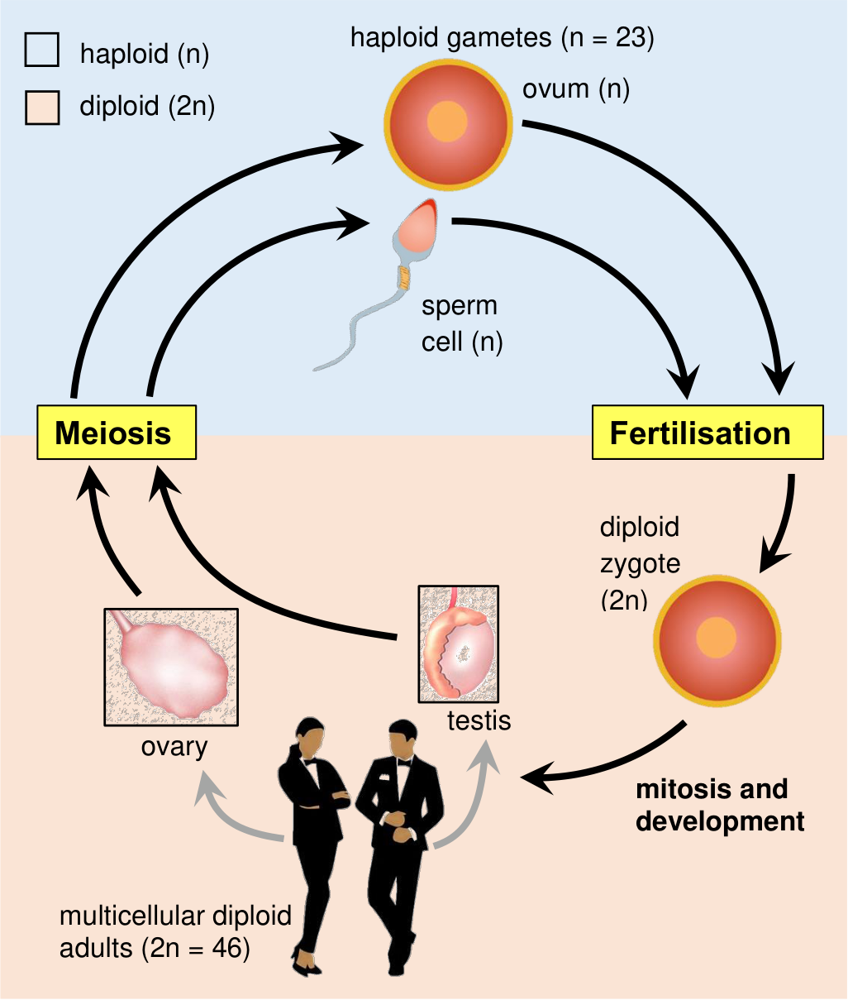
> **[Diagram Context - Textbook_LifeSciences_Gr12_Human_Reproduction.pdf-0002-04.png]**
> This educational graphic illustrates the human sexual life cycle, mapping the cyclical alternation between haploid and diploid states. The diagram features clear labels including "Meiosis", "Fertilisation", "mitosis and development", "haploid gametes (n = 23)", "ovum (n)", "sperm cell (n)", "diploid zygote (2n)", "ovary", "testis", and "multicellular diploid adults (2n = 46)", connected by directional arrows separating haploid and diploid phases. It conceptually conveys to high school learners how chromosome numbers are halved through meiosis to form gametes and restored to the diploid state via fertilisation, linking cell division directly to human reproduction and growth.

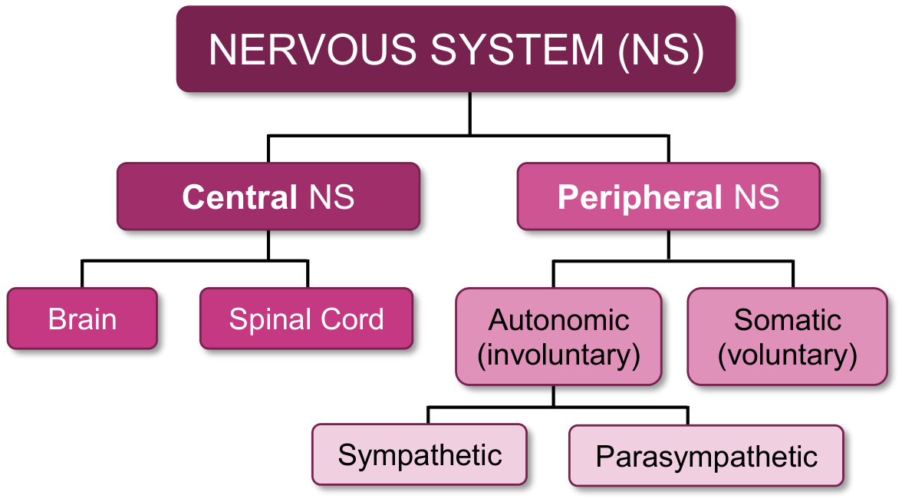
> **[Diagram Context - Textbook_LifeSciences_Gr12_Human_responses_to_the_environment.pdf-0002-03.png]**
> This educational graphic is a hierarchical tree diagram outlining the anatomical and functional organisation of the human nervous system. It clearly displays the connecting branch lines and visible text labels: "NERVOUS SYSTEM (NS)", "Central NS", "Peripheral NS", "Brain", "Spinal Cord", "Autonomic (involuntary)", "Somatic (voluntary)", "Sympathetic", and "Parasympathetic". Conceptually, the diagram helps Grade 12 Life Sciences learners understand how the nervous system is structurally divided into the central and peripheral components, and how the peripheral system further subdivides into voluntary and involuntary pathways.

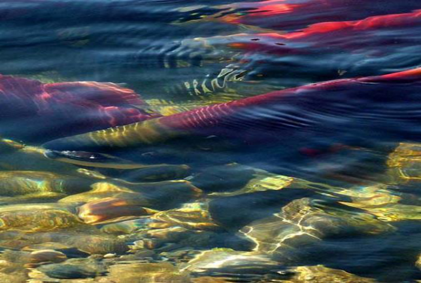
> **[Diagram Context - Textbook_LifeSciences_Gr12_Reproductive_strategies_in_vertebrates.pdf-0002-06.png]**
> This photographic visual depicts a natural habitat scene showing several reddish fish swimming over a stony riverbed beneath clear water. The image contains no explicit text labels, variables, or chemical symbols, focusing instead on the external morphology and aquatic environment of the organisms. Conceptually, it supports Life Sciences learners in studying ecosystems, biodiversity, and animal adaptations by providing a realistic context for discussions on population dynamics and biotic interactions.

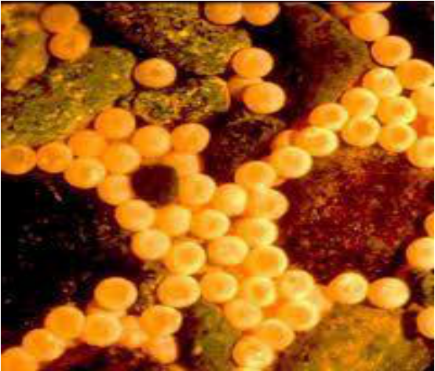

---

Figure 3 shows the location of the human endocrine glands and the hormones produced there. The function of the hormones is discussed later.

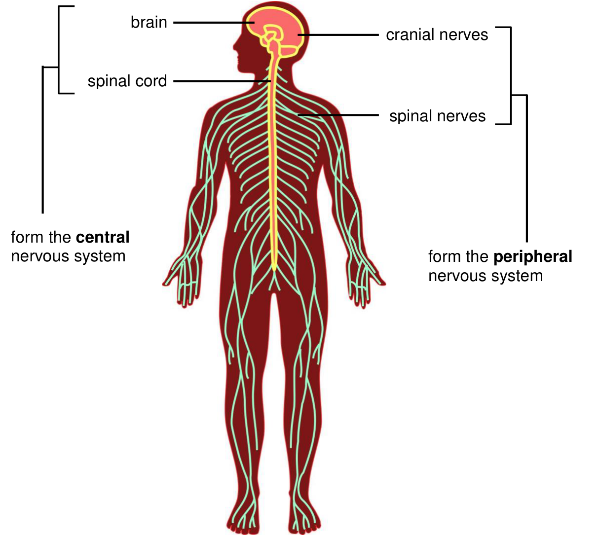

Figure 3: Endocrine glands and the hormones they secrete

Introduction to the endocrine system:  
[https://www.youtube.com/watch?v=SHgNaomqIRA](https://www.youtube.com/watch?v=SHgNaomqIRA)

---

## The hypothalamus and pituitary gland

The hypothalamus is a small area of the human brain, located above and connected to the pituitary gland (see Figure 4). It produces and secretes important hormones and is a link between the nervous and the endocrine systems.

The hypothalamus plays an important role in controlling vital functions in the human body. In this text the focus is on the anti-diuretic hormone (ADH), produced by the hypothalamus.

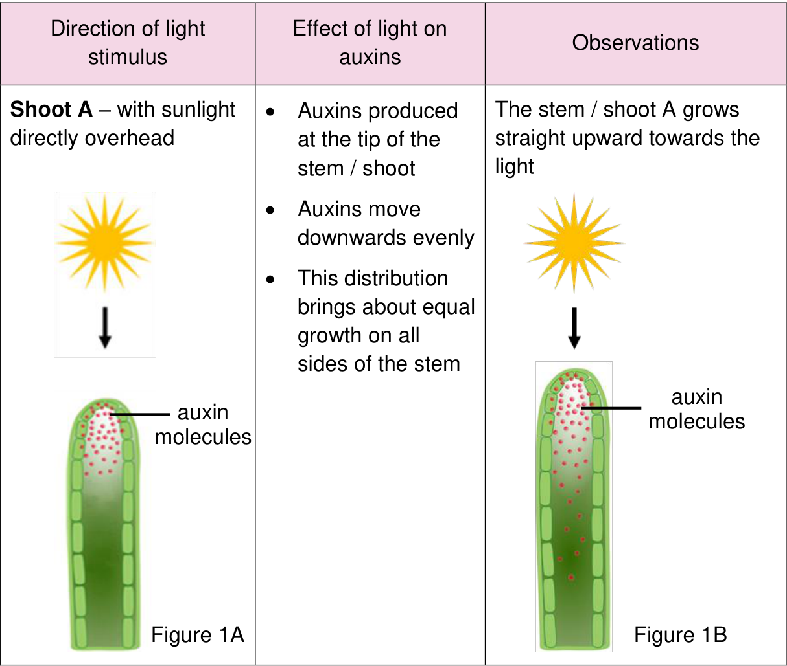
> **[Diagram Context - Textbook_LifeSciences_Gr12_Plant_responses_to_the_environment.pdf-0003-07.png]**
> This educational table and cellular diagram illustrates plant growth responses (phototropism) under the Grade 12 CAPS Life Sciences curriculum. The graphic features columns titled "Direction of light stimulus," "Effect of light on auxins," and "Observations," incorporating labeled diagrams ("Figure 1A" and "Figure 1B"), downward arrows indicating light direction, and red dots representing "auxin molecules" evenly distributed within a plant shoot. It demonstrates conceptually how sunlight directly overhead causes auxins to move downward evenly, resulting in equal cell elongation and causing Shoot A to grow straight upward.

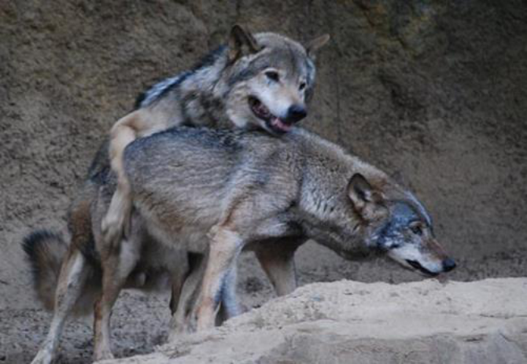

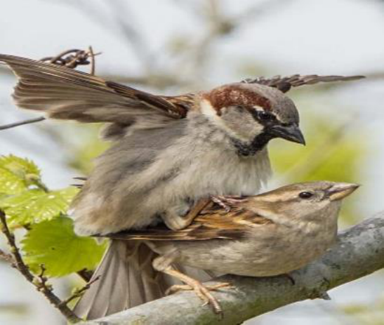

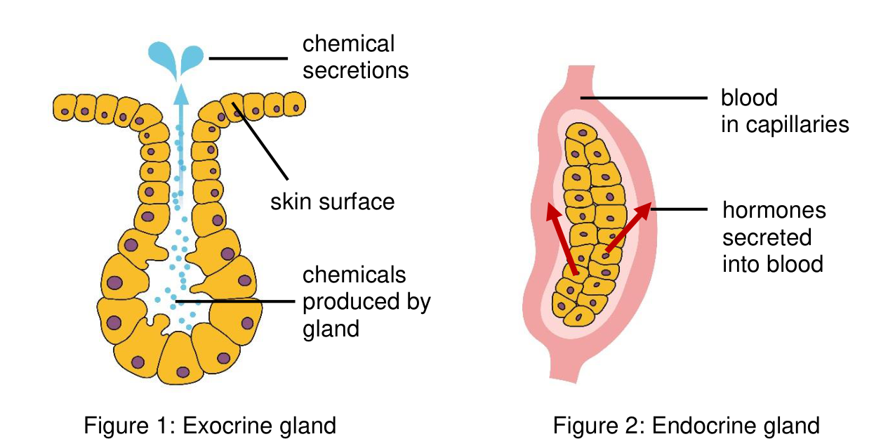
> **[Diagram Context - Textbook_LifeSciences_Gr12_The_human_endocrine_system_and_homeostasis.pdf-0003-02.png]**
> This comparative anatomical diagram illustrates the structural and functional differences between an exocrine gland (Figure 1) and an endocrine gland (Figure 2). Visible labels include "chemical secretions," "skin surface," "chemicals produced by gland," "blood in capillaries," and "hormones secreted into blood," accompanied by directional arrows showing the pathways of secretion. Conceptually, this graphic helps CAPS Life Sciences learners distinguish duct-mediated exocrine secretion onto surfaces from ductless endocrine secretion directly into the bloodstream.

---

# Location of Hypothalamus and Pituitary Gland in the Human Brain

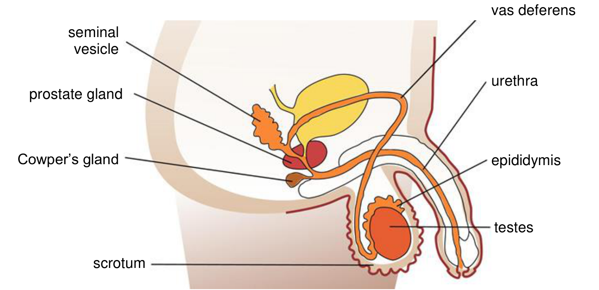

**Figure 4:** Location of hypothalamus and pituitary gland in the human brain, with detail of link between the two glands.

---

Table 2 below lists the hormones released by the hypothalamus and the pituitary gland. The function and target organ/s or gland/s are also given.

**Table 2:** Endocrine glands, the hormones secreted and their function and target

| Hormones secreted | Target organ / gland | Functions of hormone |
| :--- | :--- | :--- |
| **hypothalamus** | | |
| - ADH (antidiuretic hormone), also called vasopressin | - kidneys   

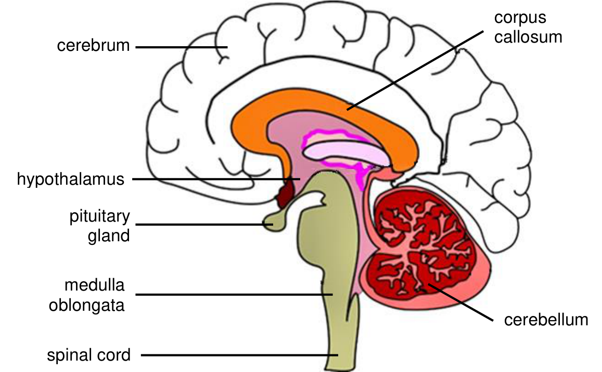
 | - stimulates the re-absorption of $H_{2}O$ into the tubules   - protects the body against dehydration |
| **pituitary gland (anterior lobe)** | | |
| - TSH (thyroid stimulating hormone) | - thyroid gland   

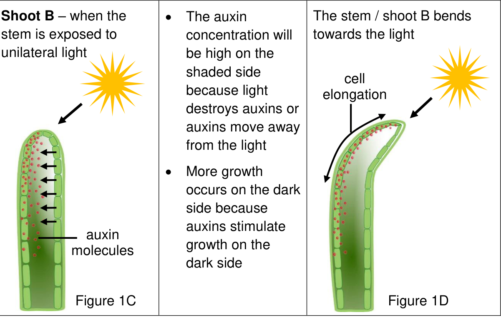
 | - stimulates growth of thyroid gland   - stimulates thyroid gland to secrete the hormone thyroxin |

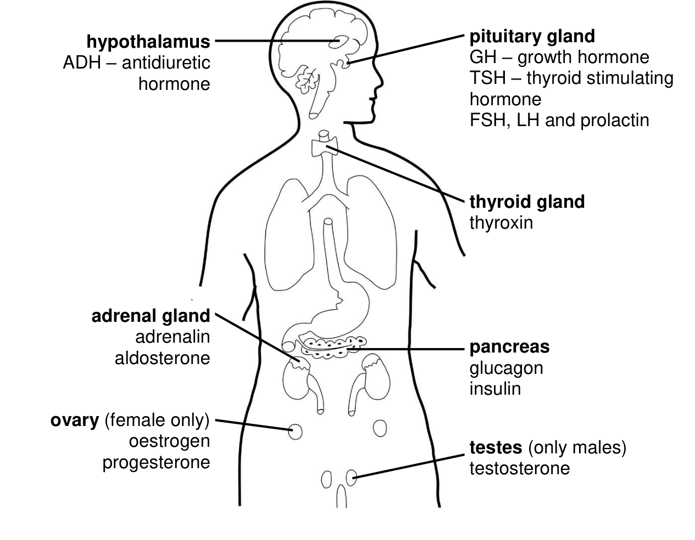

---

# Human Endocrine System: Key Hormones and Their Functions

| Hormone | Target Organ / Cells | Function |
| :--- | :--- | :--- |
| **FSH** (follicle stimulating hormone) | • ovaries 

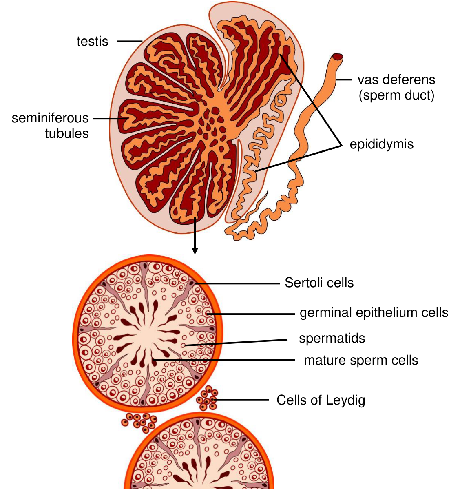
 • testes 

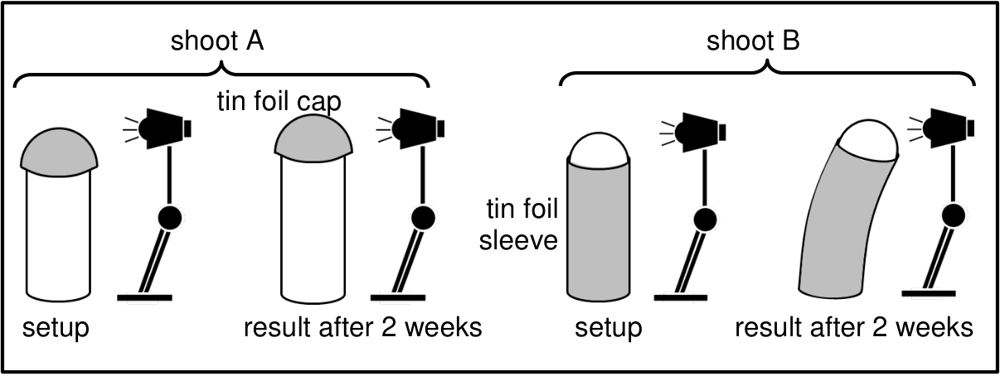
 | • stimulates development of follicles • stimulates the ovaries to produce the hormone oestrogen • stimulates the development of ova (eggs) in the female  • stimulates the testes to produce spermatozoa |
| **LH** (luteinising hormone) | • ovaries  • testes | • stimulates ova maturation • stimulates ovulation (release of the ovum)  • stimulates the production of the male hormone testosterone |
| **prolactin** | • mammary glands 

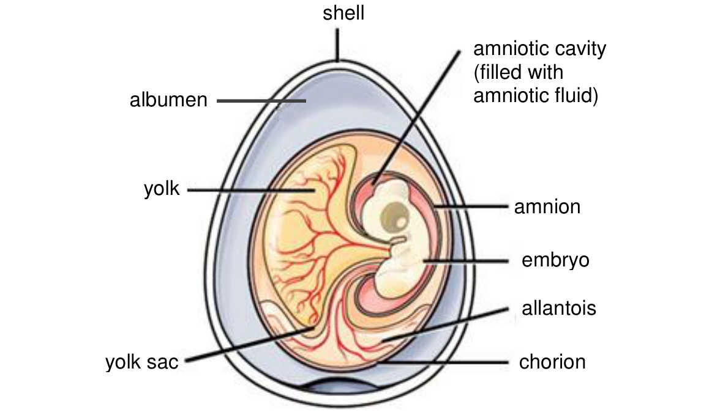
 | • stimulates milk production and secretion |
| **GH** (growth hormone) | • Bone and muscle cells 

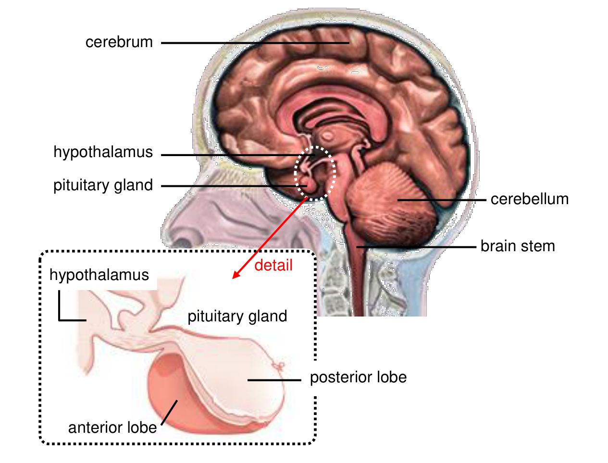
 | • Stimulates the growth of long bones and skeletal muscles |

---

## Other Important Endocrine Glands

Other important endocrine glands that make up the endocrine system are:
* the adrenal glands,
* the ovary in females and the testes in males,
* the pancreas, and
* the thyroid gland.

All the endocrine glands are essential for ensuring healthy metabolism.

---

# Adrenal glands

These two triangular shaped glands are situated on top of each of the kidneys (see Figure 5). The adrenal glands have a central medulla region and an outer cortex. The two hormones produced and secreted from the adrenals, that we will discuss, are **adrenalin** and **aldosterone** (see Table 3).

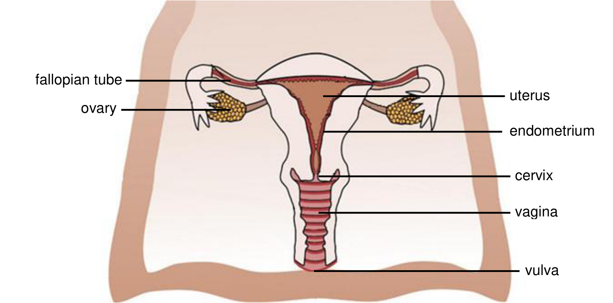

Figure 5: Location and structure of one of the adrenal glands

Table 3: Adrenal hormones, target organs / areas and their functions

| Target areas / organs | Functions |
| :--- | :--- |
| **adrenalin** (the 'fight or flight' hormone) | |
| • heart | • increased heart rate and blood supply to cardiac muscles |
| • liver | • stimulates the liver to increase conversion of glycogen into glucose |
| • skeletal muscles | • increased blood supply to skeletal muscle |
| • eye muscles | • stimulates pupil dilation |
| • skin | • decreased blood supply to 'less vital' organs (digestive system and the skin) |
| • lungs | • increased breathing rate |
| • body cells | • increased metabolic rate |
| **aldosterone** | |
| • kidneys | • regulates the salt ($\text{sodium / Na}^+$ and $\text{potassium / K}^+$) concentration in the blood; works together with $\text{ADH}$ to achieve this |

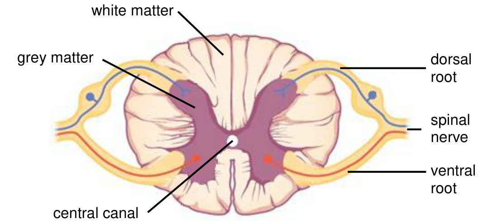

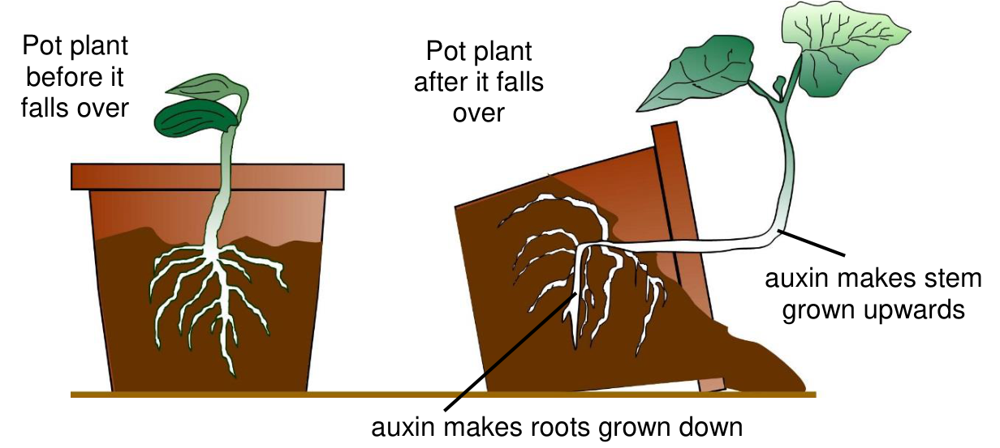

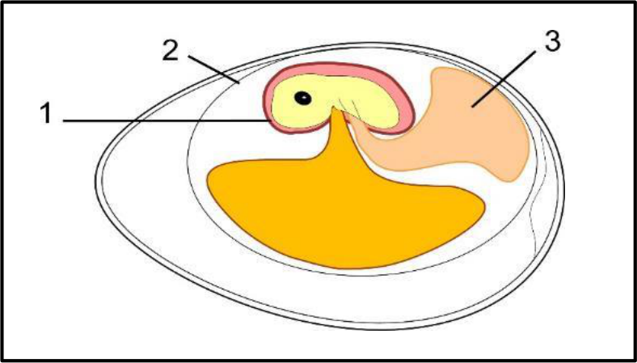

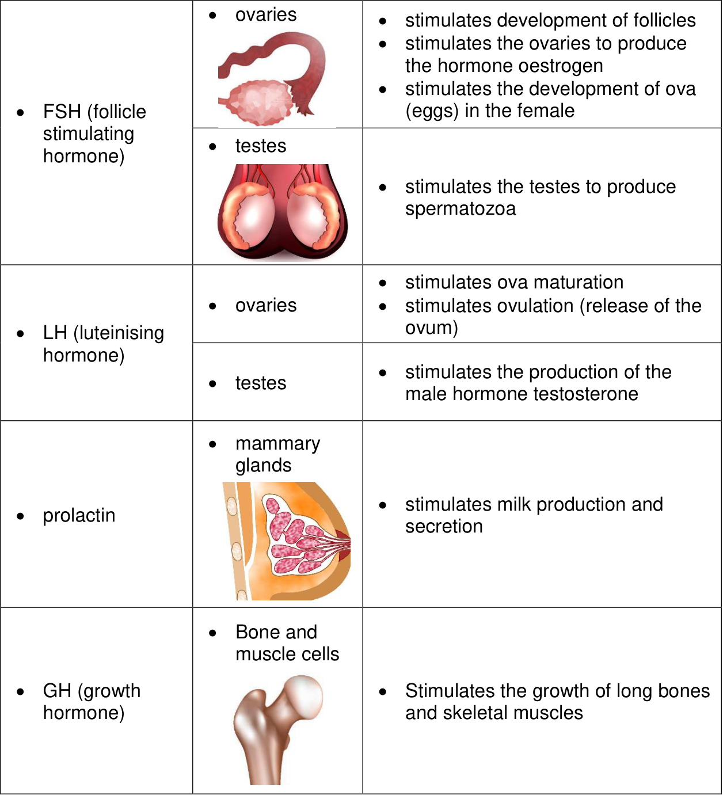

---

# The reproductive glands

The hormones released by the human reproductive glands are important in reproduction and for stimulating the secondary characteristics at the onset of puberty.

* **In females:** The ovaries are stimulated by FSH (Follicle-Stimulating Hormone) from the pituitary gland. The ovaries themselves release **oestrogen** and **progesterone**, which play different roles in the menstrual cycle.
* **In males:** The cells of Leydig in the testes secrete the male hormone **testosterone**, which stimulates sperm production and maturation.

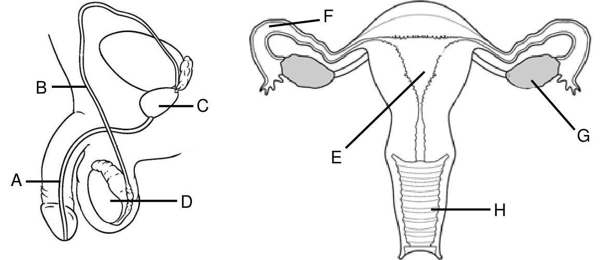

**Figure 6A & 6B:** Figure 6A: Ovary (showing fallopian tube, ovary, and endometrium); Figure 6B: Testes.

---

## Table 4: Hormones released by the human reproductive glands and their functions

| Ovaries | Testes |
| :--- | :--- |
| **Oestrogen** • promotes the thickening of the endometrial wall • promotes the development of the female secondary sexual characteristics at puberty • promotes fertility  **Progesterone** • promotes further thickening and vascularisation of the endometrial wall • maintains implantation of embryo during pregnancy | **Testosterone** • stimulates the development of the male sex organs and the secondary characteristics during puberty • promotes the maturation of the sperm |

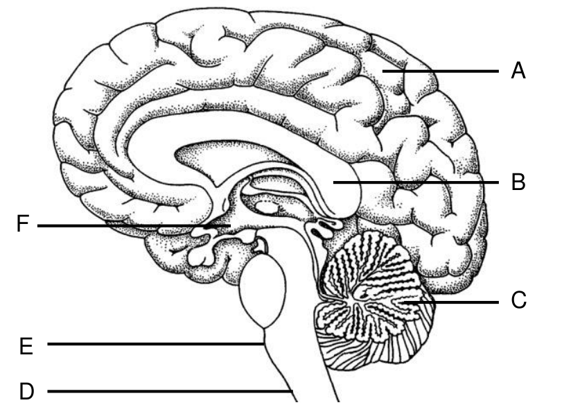

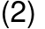

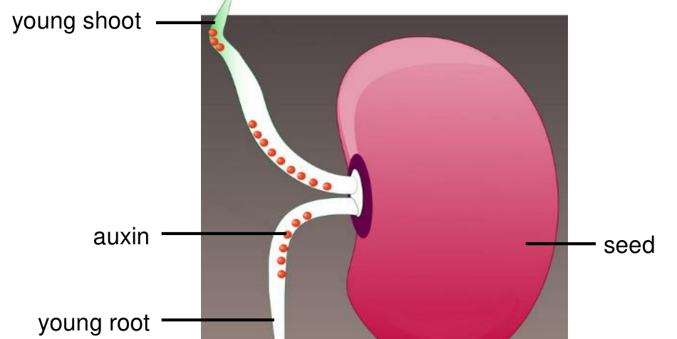

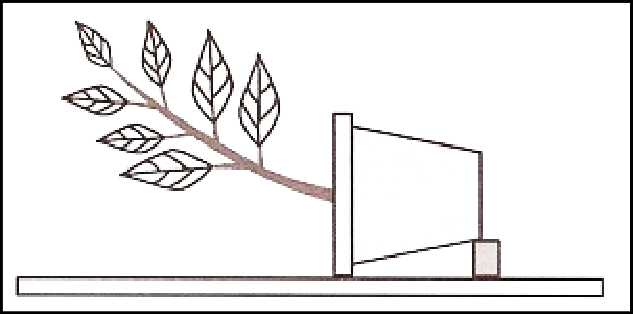

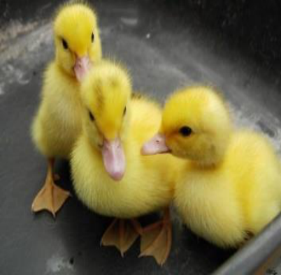

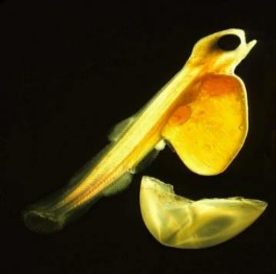

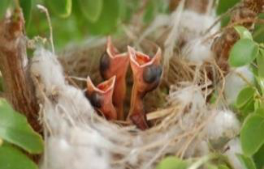

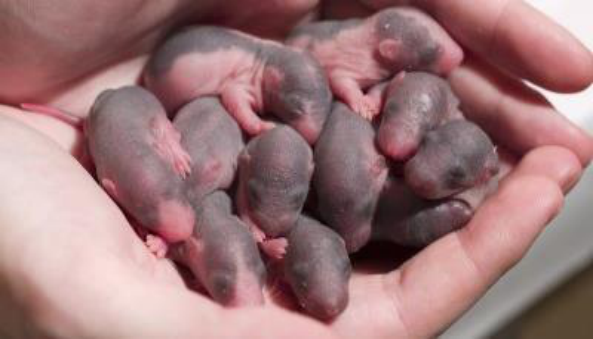

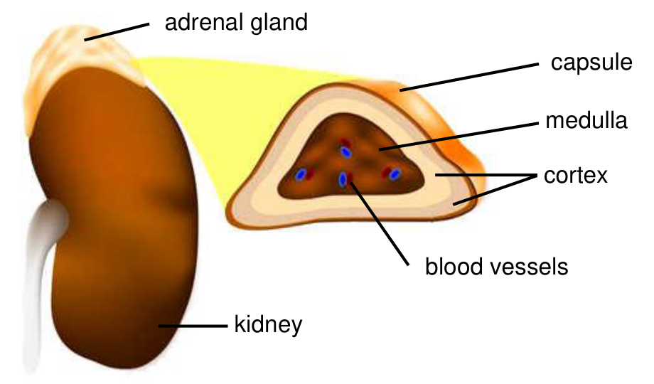

---

## Activity 1: Endocrine glands and their hormones

The diagram shows some of the human endocrine glands. Name the glands labelled A to G, and list the hormone/s produced by each gland. (20)

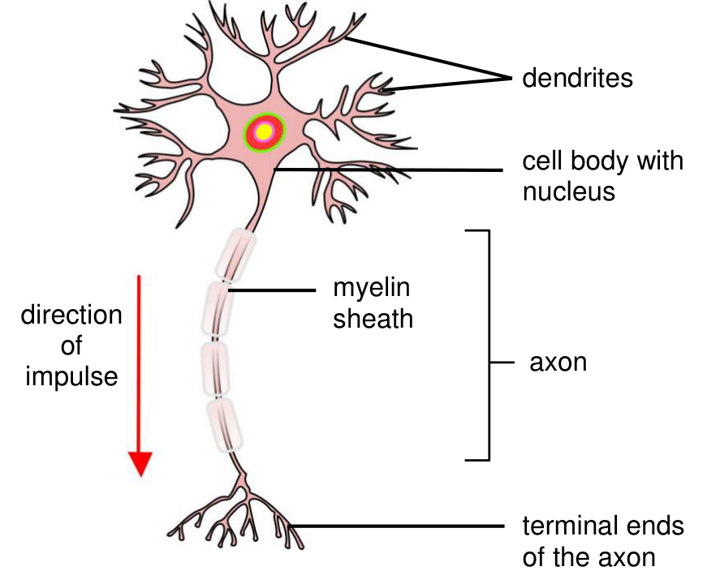

---

## Activity 2: Effects of a hormone

<!-- DIAG_PLACEHOLDER: diagram -->

**Effect of a certain hormone on the heart and blood supply to certain body parts**

* **Hormone A** causes:
  * heart beats faster $\rightarrow$ heart
  * arteries to gut become narrow $\rightarrow$ gut
  * arteries to muscles widen $\rightarrow$ muscle

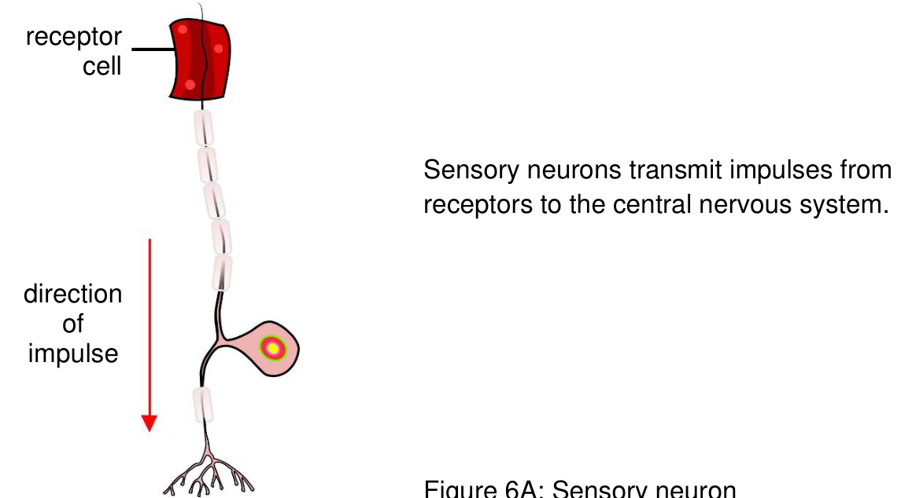

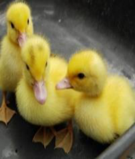

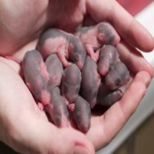

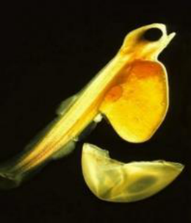

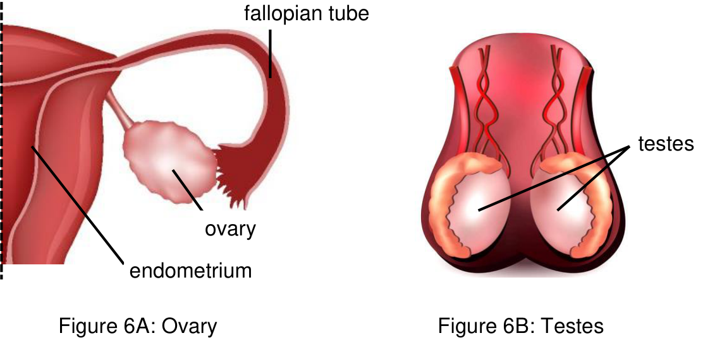

---

1. Give the name of hormone A. (1)
2. State the position of the gland that secretes hormone A in the human body. (1)
3. Explain the importance of the narrowing of the arteries to the gut under emergency conditions. (4)
4. Name the part of the human eye that is also affected by hormone A. (1)
5. Explain the influence of hormone A on the part named in question 4. (3)
**(10)**

---

## Negative Feedback

A negative feedback mechanism is an interaction between two hormones in which one hormone stimulates an increase in another hormone which then inhibits the first hormone, thus restoring balance.

The following is the general sequence of events in a negative feedback mechanism:
* an imbalance is detected by the receptor
* a control centre is **stimulated**
* the control centre **responds**
* a **message** sent to target organ/s which are the effectors
* the effector **responds**
* it **opposes (reverses)** the imbalance
* **balance** is restored

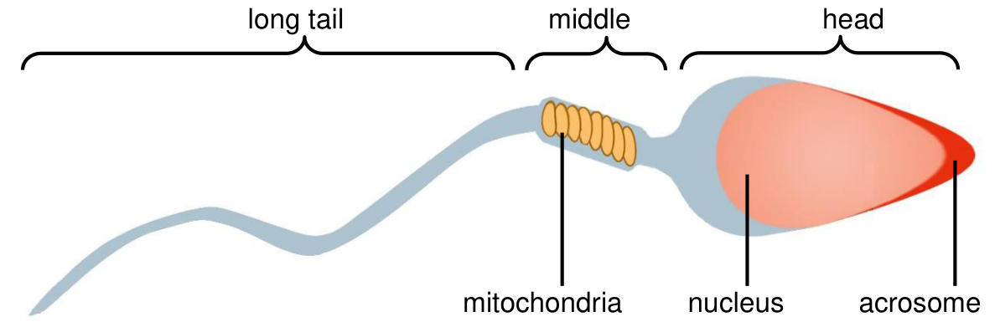

*Figure 7: Homeostasis mechanism*

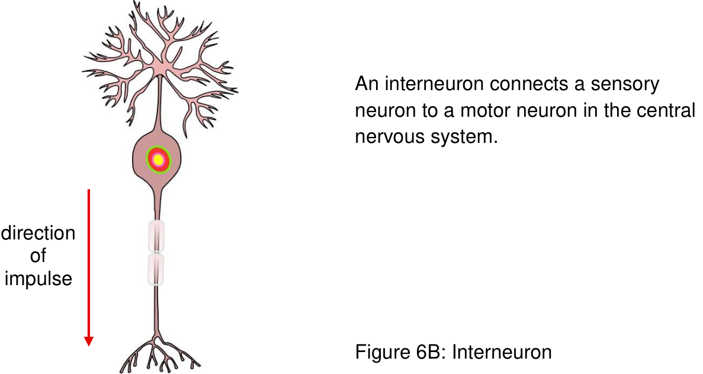

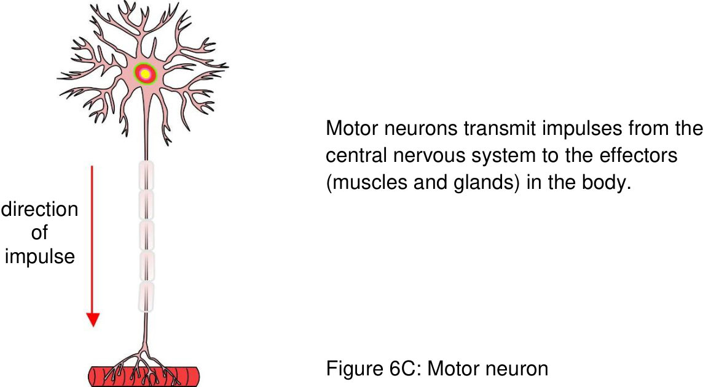

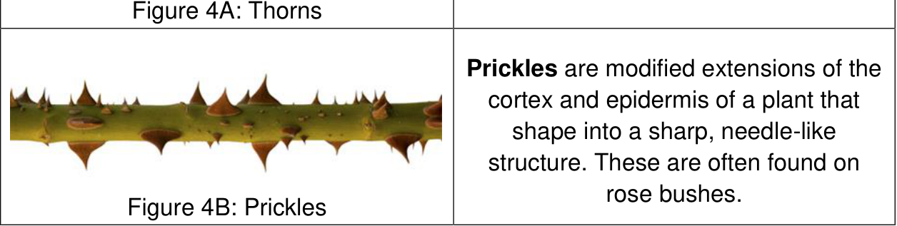

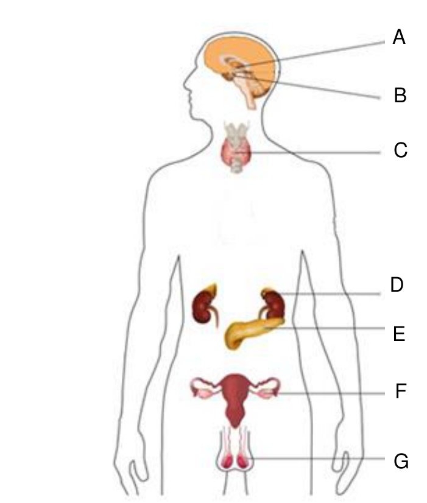

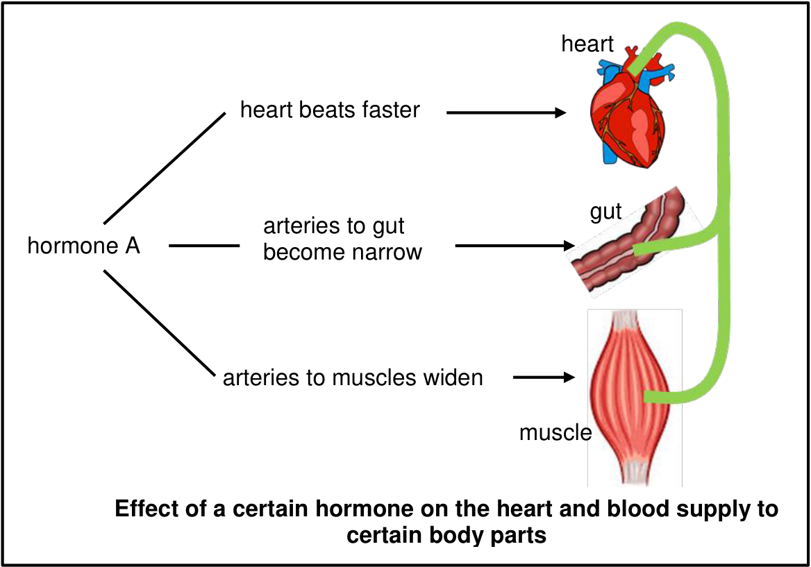

---

As illustrated in Figure 7, an imbalance triggers a stimulus to the receptors at 2. When stimulated, the receptors generate an impulse that is transmitted to the control centre at 3. The control centre responds by sending an impulse to the effector which is the target organ at 4. The target organ then reverses the imbalance and balance is restored at 5.

# Homeostatic control of the internal environment

The tissue fluid which surrounds our cells constitute the internal environment. The conditions within cells depend on the conditions within the internal environment. When faced with changes from either the external or internal environment the human body controls this effect and **homeostasis** is achieved.

Without homeostasis, organs, systems and ultimately, the whole organism, may be negatively affected. The important variables and homeostatic mechanisms that will be discussed are the:

* maintenance of water levels
* maintenance of salt levels
* regulation of thyroxin levels
* maintenance of glucose levels
* regulation of the $\text{CO}_2$ concentrations
* regulation of body temperature

It is important to understand the reasons why certain factors must be controlled and how this is carried out.

# The main mechanisms for maintaining homeostasis

Table 5 below is a summary of six important homeostatic controls humans possess to ensure stability within their internal environment.

Table 5: Homeostatic control of internal environment

| Stimulus | Reason for importance of regulation | Effector/s |
| :--- | :--- | :--- |
| **Water** | All metabolic reactions require a balance of water and salt concentrations in the blood and surrounding tissue fluid. | Kidneys and the skin |
| **Salts** | The presence of dissolved salts in the blood and tissue fluid determines the osmotic pressure which may contribute to the cell losing or gaining water by osmosis affecting the balance of these fluids | Kidneys |

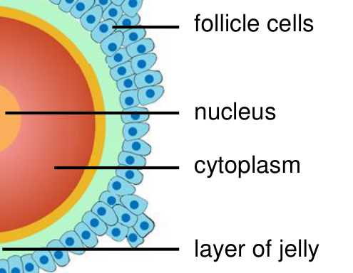

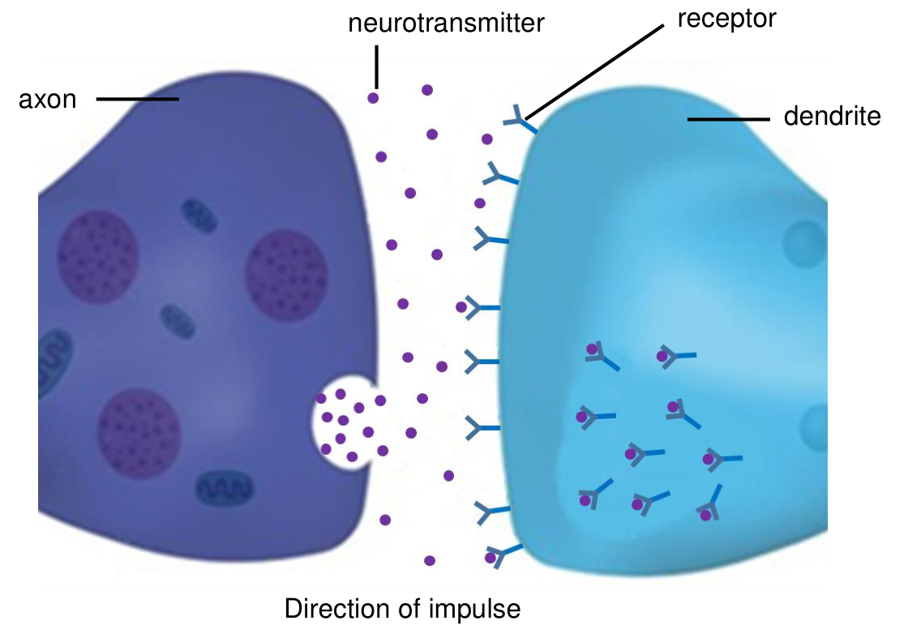

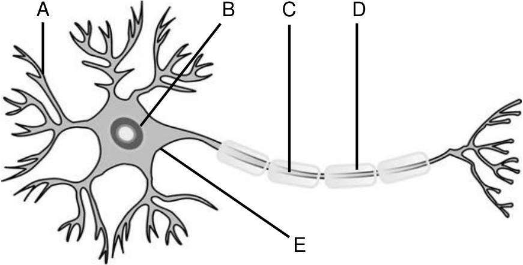

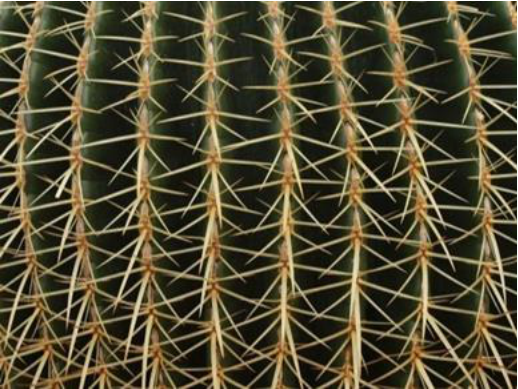

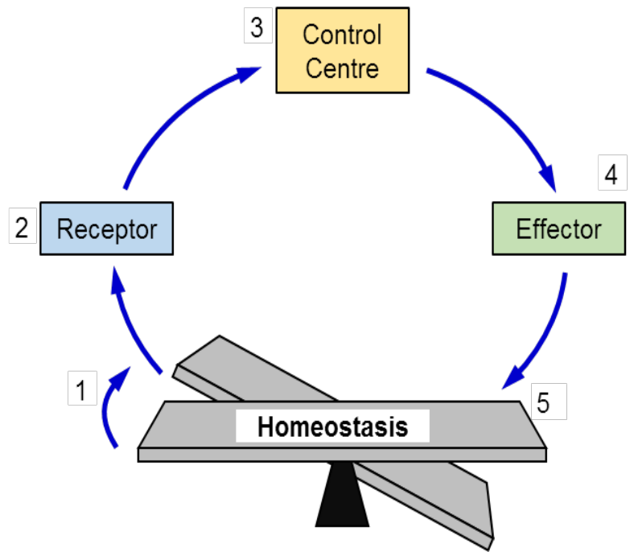

---

# Homeostasis and Negative Feedback Control

## Regulation of Internal Environment Factors

| Variable/Factor | Effect on Body / Significance | Controlling Organ |
| :--- | :--- | :--- |
| $\text{CO}_2$ | The presence of $\text{CO}_2$ produced during cellular respiration affects the pH of the blood and tissue fluid. Enzymes are extremely sensitive to pH variations. | Lungs |
| **Glucose** | The concentration of glucose in the body needs to be controlled to ensure that energy levels can be maintained, and metabolic functioning can continue. | Liver and pancreas |
| **Thyroxin ($\text{T}_4$)** | Cellular metabolism is regulated by the hormone thyroxin. Slight variations in the amount of thyroxin can have a severe effect on the metabolic rate of an individual. | Thyroid gland |
| **Temperature** | An increase or decrease from normal body temperature can affect metabolism due to the effect on enzyme activity. High temperatures denature enzymes whereas low temperatures slow down enzyme activity. | Skin |

---

## Negative Feedback in the Control of Water Balance – Osmoregulation

The maintenance of the water balance is very important to ensure that body metabolism continues. The homeostatic control of water and salt levels in blood and tissue fluid is carried out in a negative feedback system known as **osmoregulation**.

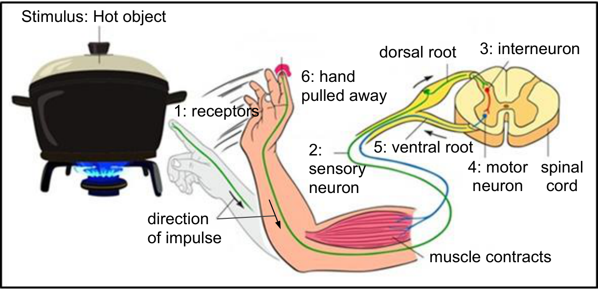

*Figure 8: Negative feedback control of water levels in blood and tissue fluid*

---

Figure 8 above and Table 6 below show how the body regulates:

* **A** Levels of water when there is a drop **below normal** (dehydration), and
* **B** Levels of water when there is an increase **above normal** (overhydration)

### Table 6: Osmoregulation

| A – decreased water level | B – increased water level |
| :--- | :--- |
| **Dehydration** - when the water levels in the blood and tissue fluids are low | **Overhydration** is when water levels in the blood and tissue fluids are high. |
| May be due to **excessive exercise**, **hot temperatures**, **increased sweating** or **decreased water intake**. | May be due to **cooler temperatures**, **little exercise with no sweating** and an **excessive intake of water**. |
| Low levels of water in the blood and tissue fluid is detected by receptor cells (**osmoreceptors**), in the **hypothalamus** of the brain. | Water levels in the blood and tissue fluid are high, and this is detected by the **osmoreceptors** in the **hypothalamus**. |
| Impulses are sent to the **pituitary gland** and **antidiuretic hormone (ADH)** is released. | Impulses are sent to the **pituitary gland** and **less anti-diuretic hormone (ADH)** is released. |
| The hormone is transported in the blood to the **effector organ**, the **kidney**. The **permeability** of the **collecting duct** and the **distal convoluted tubule** is increased. | Collecting ducts and **distal convoluted tubules** in the kidney become **less permeable**. |
| **More water** is **reabsorbed** and passed into the **blood**. | **Less water** is reabsorbed into the blood. |
| The **blood** becomes more **dilute** and **concentrated urine is excreted**. | More water is lost, **more dilute urine is excreted**. |

Water levels in the blood and tissue fluid return to normal and **homeostasis** is achieved.

---

## Negative feedback in the regulation of salt concentration

The osmotic pressure in the blood and tissue fluids is affected by the presence of solutes. Glucose and salts make up the solutes. **Sodium ions ($\text{Na}^{+}$) and potassium ions ($\text{K}^{+}$)** are salts that are regulated in a negative feedback system.

Figure 9 and Table 7 show how the body regulates the:

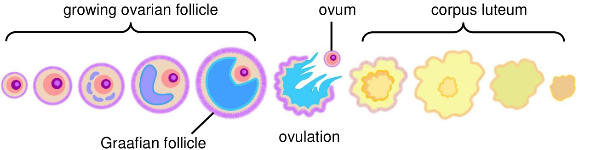

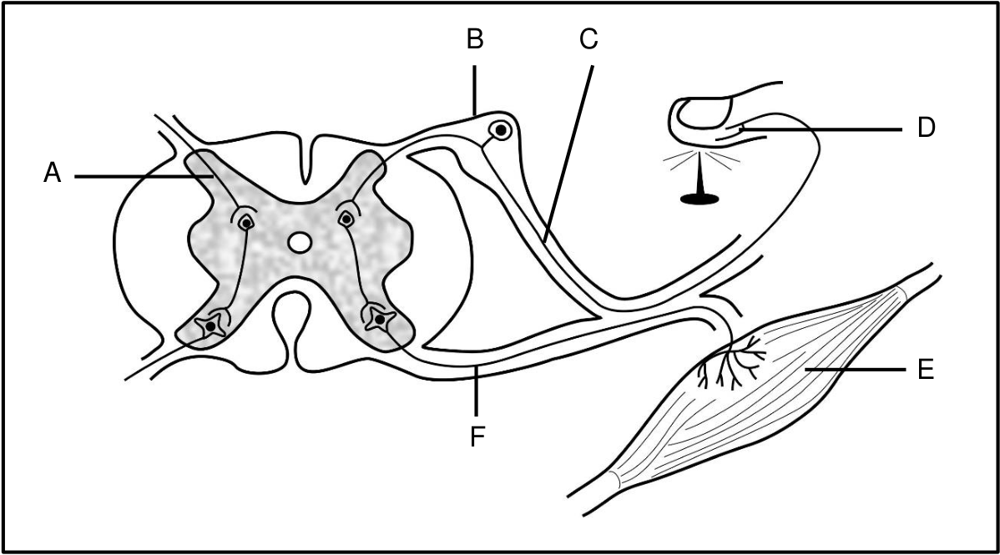

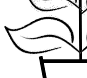

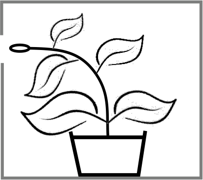

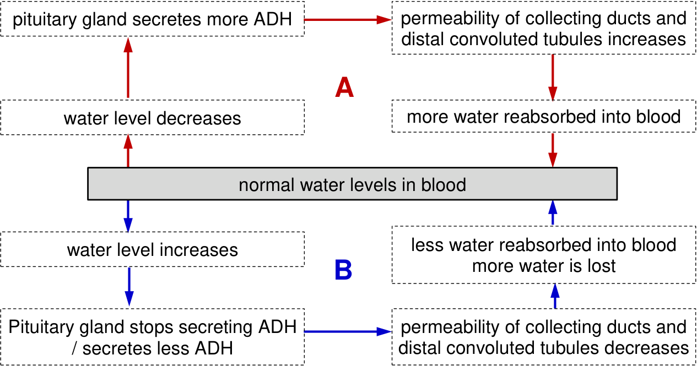

---

# Homeostatic Control of Salt Concentrations

## Negative Feedback Mechanisms

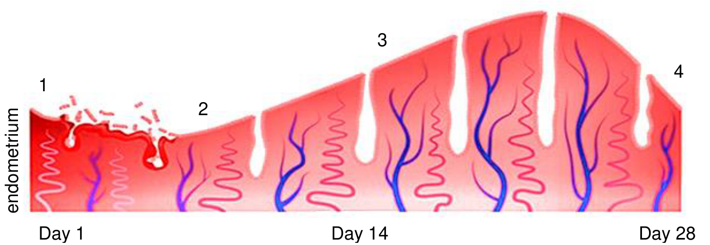

**Figure 9:** Negative feedback control of salt concentration in the blood.

* **A:** Levels of salt concentration in the blood when they drop below normal.
* **B:** Levels of salt concentration in the blood when they rise above normal.

---

## Table 7: Homeostatic Control of Salt Concentrations

| A – low salt level | B – high salt level |
| :--- | :--- |
| Low salt levels in blood and tissue fluids. | When the **salt levels** in the blood and tissue fluids are increased. |
| **Receptor cells** in the **kidney** detect decreased sodium ion levels. | **Receptor cells** in the **kidney** will detect an increased presence of sodium ions. |
| The **adrenal gland** in the kidney secretes the hormone **aldosterone.** | The **adrenal gland** stops releasing **aldosterone.** |
| **Aldosterone stimulates** the reabsorption of **sodium ions** from the filtrate and back into the blood. | **Sodium ions** will **not** be **reabsorbed.** |
| **Less sodium** is excreted in the **urine.** | **More sodium** is excreted in the **urine.** |

---

The salt concentration of the blood and tissue fluid returns to normal and **homeostasis** is maintained.

## Additional Resources

The regulation of water and salt levels in humans:
[https://www.youtube.com/watch?v=BugGCBAk_Os](https://www.youtube.com/watch?v=BugGCBAk_Os)

---
*Page 212*

---

# Negative feedback regulating of carbon dioxide concentrations

Carbon dioxide levels in the blood affect the pH of the blood and this can have an effect on metabolic processes. $\text{CO}_2$ is one of the end products of cellular respiration. $\text{CO}_2$ dissolves in water forming carbonic acid. The more carbon dioxide there is in the blood, the more acidic the blood becomes. Changes in pH influence enzyme activity. Figure 10 and Table 8 show the body's response to an increase in $\text{CO}_2$ levels in the blood.

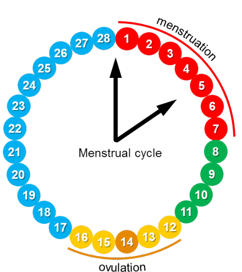

**Figure 10:** Negative feedback regulation of carbon dioxide levels in the blood

**Table 8:** Homeostatic control of blood $\text{CO}_2$ levels

| Step | Description |
| :---: | :--- |
| **1** | High concentrations of $\text{CO}_2$ lead to the formation of carbonic acid. As a result, the pH of the blood will drop (the blood becomes more acidic). |
| **2** | Chemoreceptors in the carotid artery are stimulated by the drop in pH. |
| **3** | Impulses are sent to the medulla oblongata. |
| **4** | Breathing and heart muscles are targeted. Diaphragm and intercostal muscles contract increasing the rate and depth of breathing. |
| **5** | Heart rate increases. |
| **6** | More $\text{CO}_2$ moves to the lungs to be exhaled therefore blood $\text{CO}_2$ levels return to normal. **Homeostasis** is maintained. |

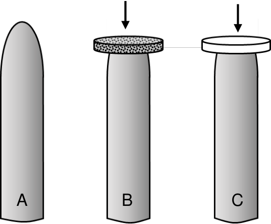

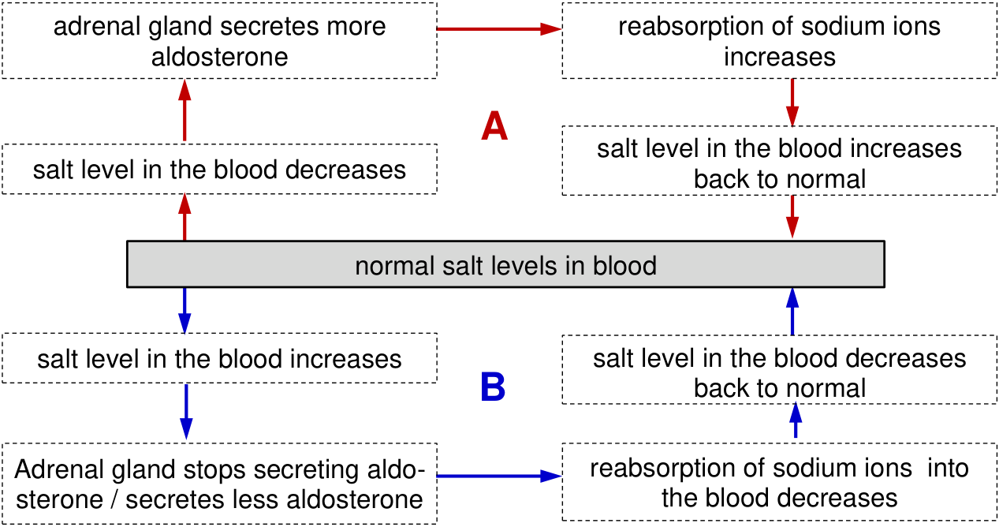

---

# Negative feedback mechanism regulating blood glucose levels

Carbohydrates are very important short-term energy storage molecules in all living organisms. In cellular respiration glucose is broken down to release energy which is stored in ATP.

The endocrine gland that secretes hormones that regulate the blood glucose levels is the pancreas. Pancreatic hormones, insulin and glucagon, work antagonistically (in opposite ways) to maintain blood glucose levels.

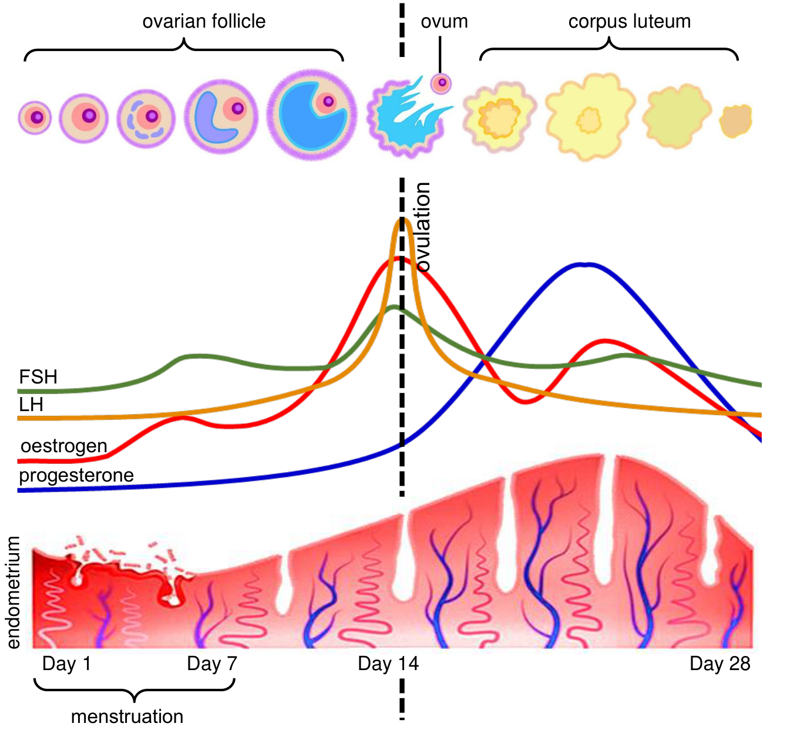

**Figure 11:** The pancreas showing its function as both an endocrine and exocrine gland

Blood glucose levels need to be maintained. Table 9 and Figure 12 show how:
* **A - high** blood glucose levels are regulated, and
* **B - low** blood glucose levels are regulated by the liver and pancreas.

### Table 9: Regulation of blood glucose levels

| A – high blood glucose | B – low blood glucose |
| :--- | :--- |
| Increased **blood glucose** levels are detected by the Islets of Langerhans in the pancreas. | Decreased **blood glucose** levels are detected by the Islets of Langerhans in the pancreas. |
| The Islets of Langerhans respond by secreting **insulin** into the bloodstream. | **Glucagon** is secreted by the Islets of Langerhans into the blood-stream. |

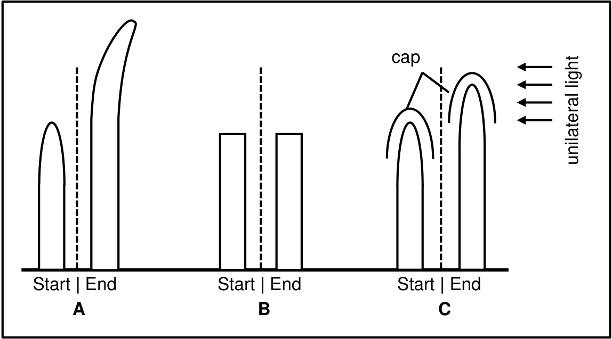

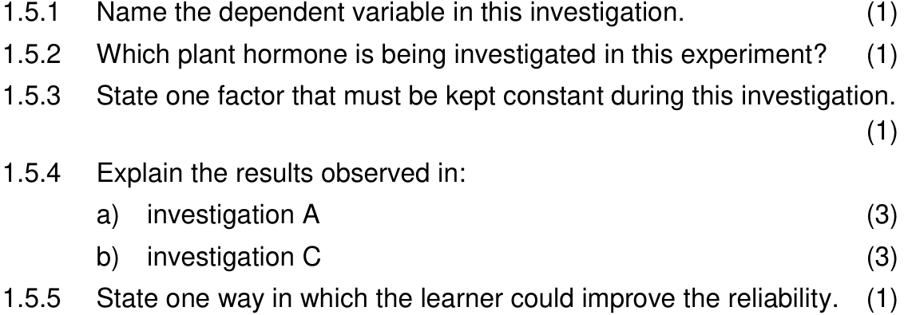

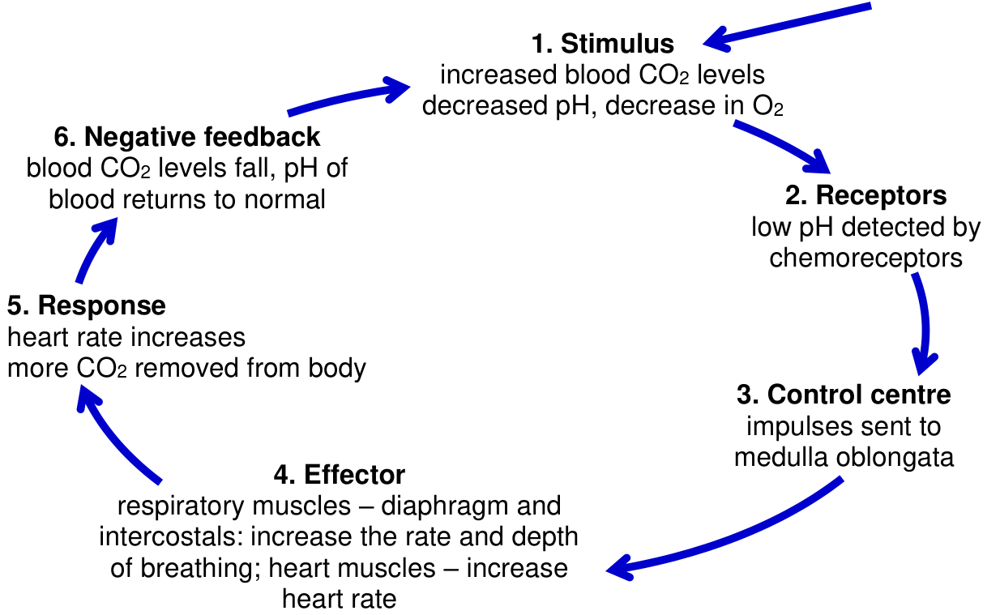

---

# Regulation of Blood Glucose by the Liver and Pancreas

## Concepts & Structure

### Homeostasis and Blood Glucose Regulation
In people with normal pancreatic functioning, blood glucose levels are maintained within a narrow range and **homeostasis** is achieved. This process involves the interaction of the pancreas, the liver, and hormones (insulin and glucagon) to lower or raise blood glucose levels back to normal.

### Comparison of Insulin and Glucagon Action

| Process / Step | Insulin Action (High Blood Glucose) | Glucagon Action (Low Blood Glucose) |
| :--- | :--- | :--- |
| **Transport & Effector Organ** | Insulin is transported to the **liver** which is the **effector** organ. | Glucagon is transported to the **effector** organ, the **liver**. |
| **Enzymatic Action** | Enzymes in the liver catalyse the conversion of excess **glucose into glycogen**. Glycogen is a **storage carbohydrate**. | Glycogen is **broken down** into **free glucose**. Glucose is released into the bloodstream. |
| **Outcome** | Glucose **levels** in the blood return to **normal**. | Glucose **levels** are **increased** to **normal** levels. |

---

## Diagrams

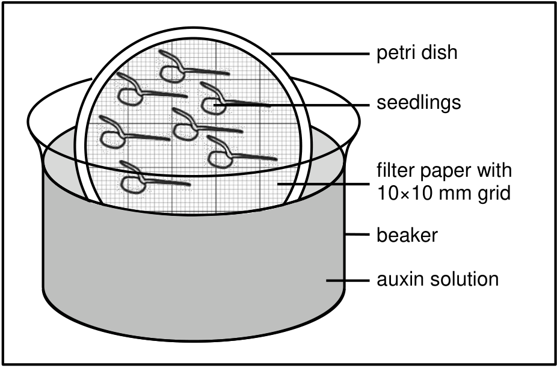

*Figure 12: Regulation of blood glucose by the liver and pancreas*

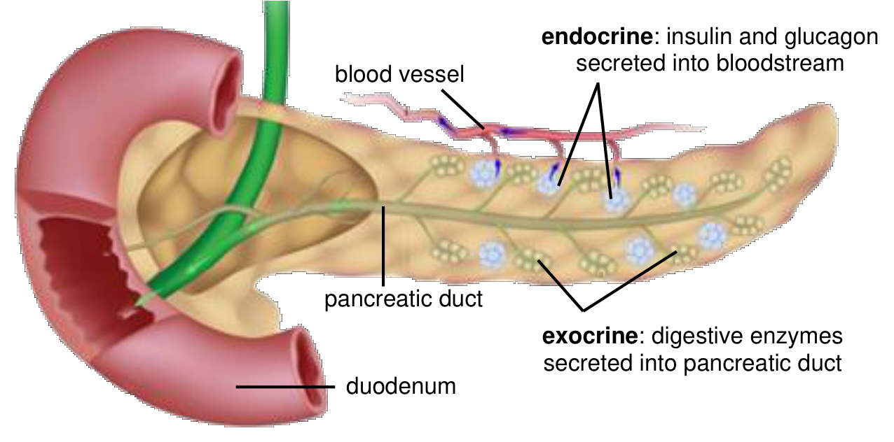

---

# Negative feedback in the regulation of thyroxin levels

## Introduction to Basal Metabolic Rate and Thyroxin

* **Basal Metabolic Rate (BMR):** The rate at which the body's cells use energy when at rest to maintain basic vital functions.
* **Thyroxin:** A hormone produced in the thyroid gland that:
  * Stimulates the body to increase the metabolic rate when required.
  * Plays a vital role in the functioning of the heart and digestive system.
  * Is important in skeletal and brain development.
  * Is involved in the maintenance of muscle tone.
* **Iodine:** An essential element needed in the production of thyroxin. Good sources in our daily diet include sea salt or iodised table salt.

---

## Glands Involved in Thyroxin Control

Two main glands are involved in the control of thyroxin levels:
1. **Pituitary gland** – releases thyroid-stimulating hormone (TSH).
2. **Thyroid gland** – releases thyroxin.

The hypothalamus and the pituitary gland in the brain control normal secretion of thyroid hormones, which in turn control metabolism.

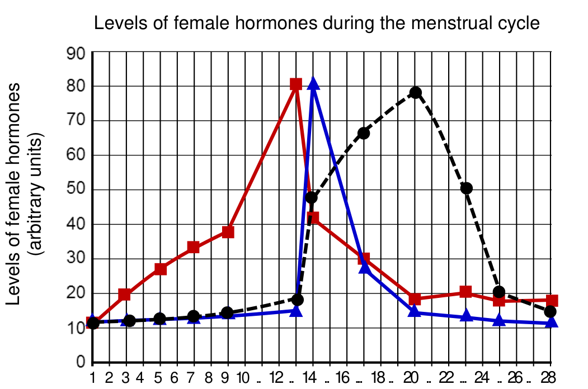

*Figure 13: Location of thyroid gland in the neck and the connection to the pituitary gland*

---

*Note: Homeostatic regulation of thyroxin levels is illustrated in Figure 14 and detailed in Table 10.*

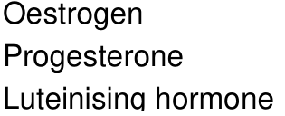

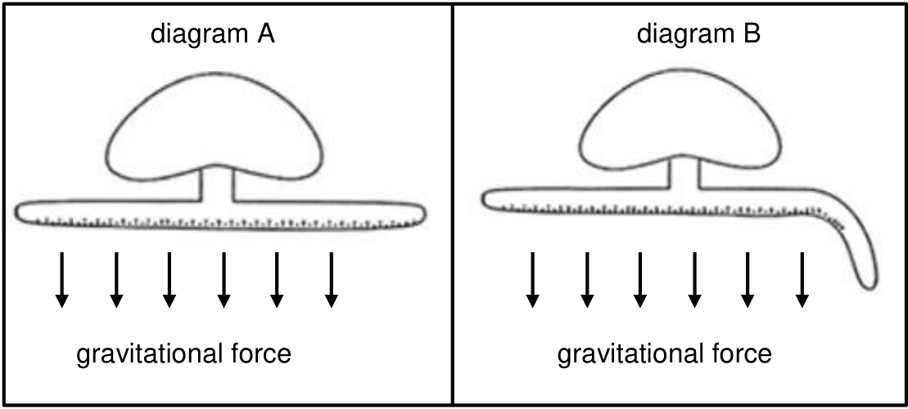

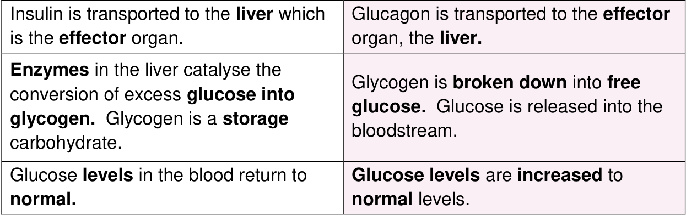

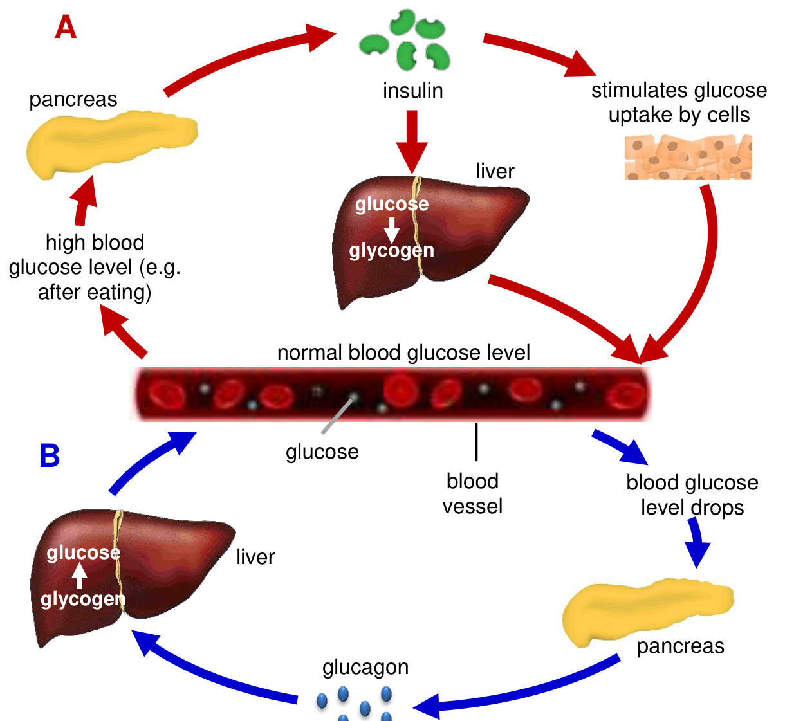

---

# Regulation of Thyroxin Levels

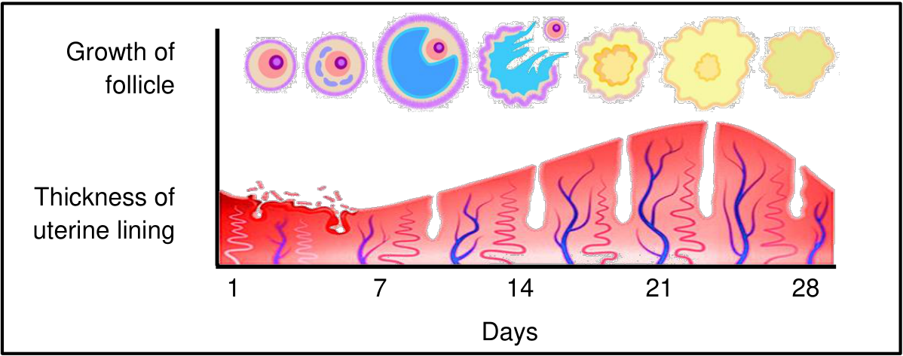

**Figure 14:** Flow diagram showing regulation of thyroxin levels (A – low levels, B – high levels)

## Table 10: Homeostatic control of thyroxin

| A – low thyroxin level | B – high thyroxin level |
| :--- | :--- |
| When levels of thyroxin that fall **below normal**, this is detected by the **pituitary gland**. | When levels of thyroxin increase above normal, this is detected by the **pituitary gland** which is then inhibited. |
| This causes the pituitary gland to **secrete more TSH**. | **Less TSH** is secreted from the pituitary gland. |
| TSH is **transported** via the bloodstream to the **thyroid gland** which stimulates **increased secretion of thyroxin**. | **Lower** secretions of **TSH** result in the thyroid gland releasing **less thyroxin**. |
| The level of thyroxin is increased back to normal. | The level of thyroxin is decreased back to normal. |

If we apply this to the negative feedback mechanism that restores thyroxin levels when it is **too low**, the appropriate steps can be made specific as follows:

* **Step 1:** The thyroxin level in the blood decreases
* **Step 2:** The pituitary is stimulated
* **Step 3:** Pituitary gland increases its secretion of TSH
* **Step 4:** TSH is transported by the blood to the thyroid gland
* **Step 5:** TSH stimulates the thyroid gland to increase its secretion of thyroxin
* **Step 6:** The thyroxin level in the blood increases
* **Step 7:** Thyroxin levels return to normal

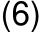

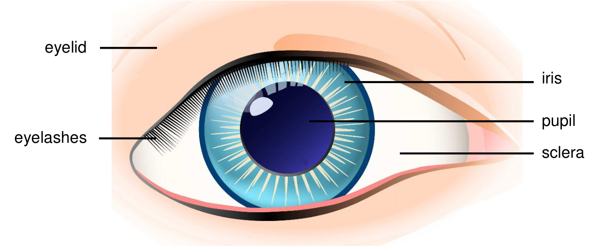

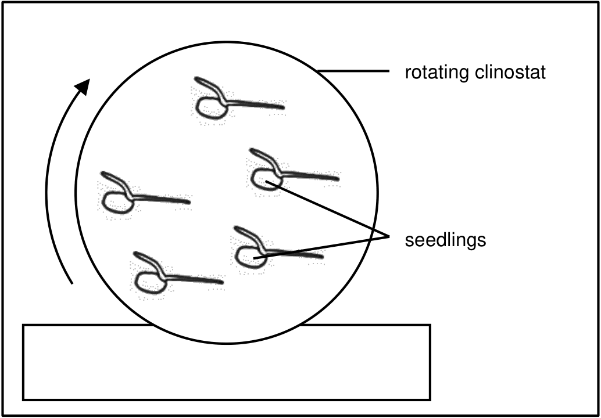

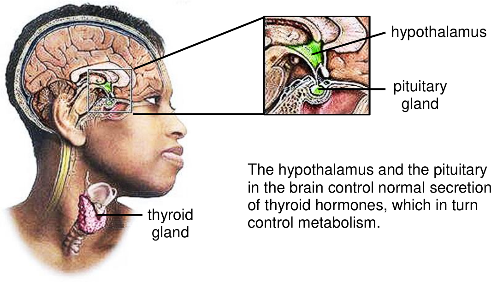

---

## Activity 3: A negative feedback mechanism

The diagram below represents the interaction between two important endocrine glands. The hypothalamus is found at the base of the brain while the gland labelled **B** is present towards the front of the neck.

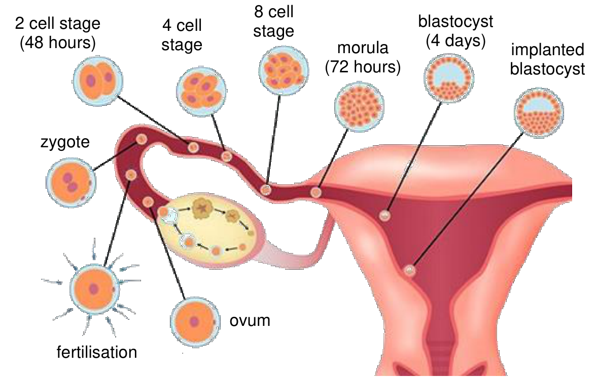

### Questions

1. Provide a label for gland **B**. (1)
2. Name hormone **C**. (1)
3. State one function of hormone **A**. (1)
4. Describe the negative feedback mechanism that operates when the level of hormone **C** is higher than normal in the blood. (5)
*(Total: 8 marks)*

---

## Endocrine system disorders

In certain situations, hormone secretions are disrupted, and this affects homeostasis. Endocrine glands can either secrete too little (**hyposecretion**) or too much (**hypersecretion**) hormone. If this continues, a person would be diagnosed with an endocrine disorder.

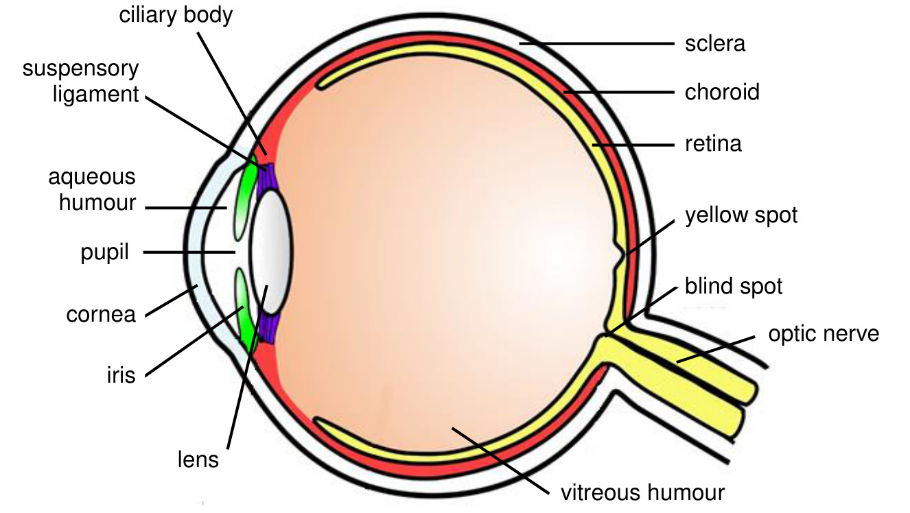

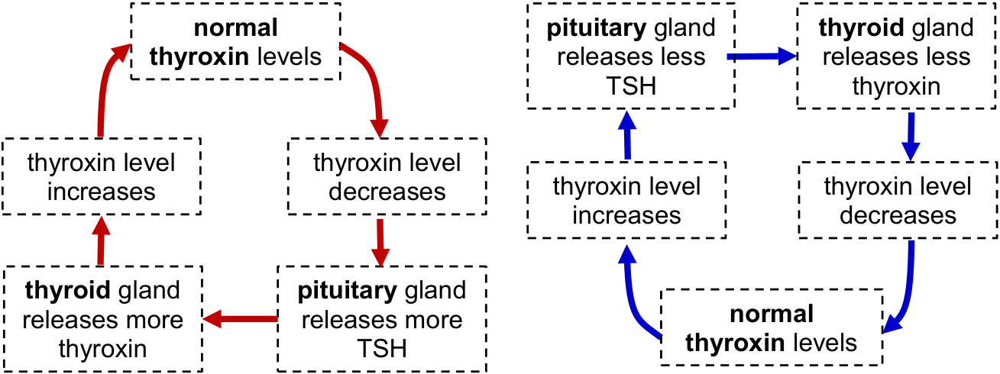

---

# Pituitary Gland Disorders

## Table 11: Pituitary Gland Disorders

| | Acromegaly | Dwarfism | Gigantism (Figure 15) |
|---|---|---|---|
| | **hyper**secretion of GH | **hypo**secretion of GH | **hyper**secretion of GH |
| **Cause** | too much GH secreted **after puberty** | too little GH produced during childhood | too much GH secreted during childhood |
| **Symptoms** | - enlargement of the hands and feet - additionally: enlargement of the forehead, jaw and nose | - well-proportioned but of short stature - retarded growth and delayed puberty. | - long bones and connective tissue grow very fast - person may grow up to $2,1$ to $2,5\text{ m}$ tall - heart and other organs also enlarge, causing high blood pressure |

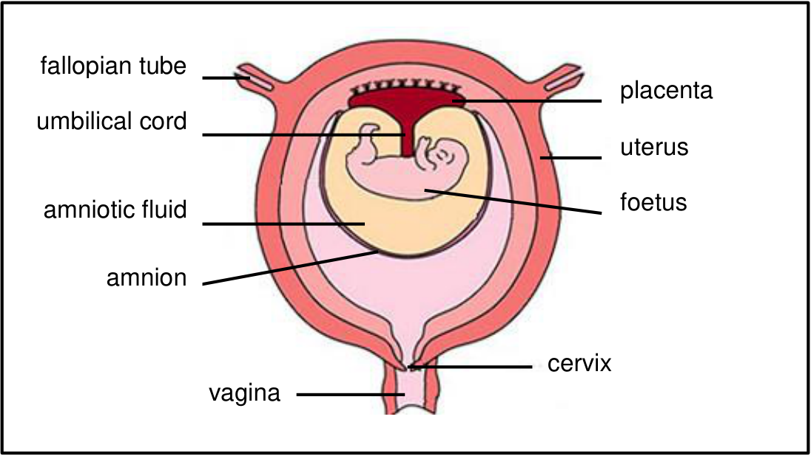

Figure 15: Gigantism

---

# Thyroid Gland Disorders

The continued production of too much thyroxin is known as **hyperthyroidism** ($\text{hyper} = \text{high}$). 

Continued low levels of thyroxin leads to **hypothyroidism** ($\text{hypo} = \text{low}$).

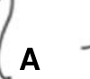

---

# Table 12: Thyroid Gland Disorders

## Hyperthyroidism

| Category | Graves’ disease (Figure 16A) | Goitre (Figure 16B) |
| :--- | :--- | :--- |
| **Examples** | 

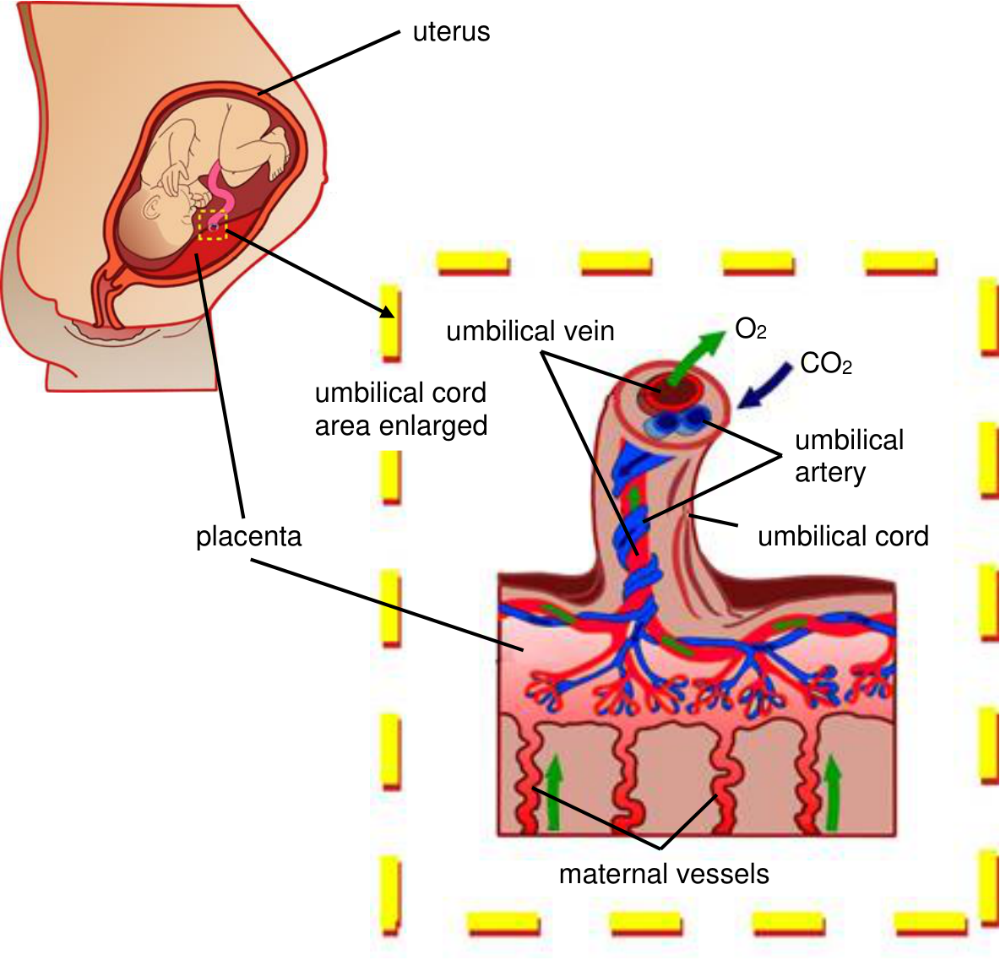
 | 

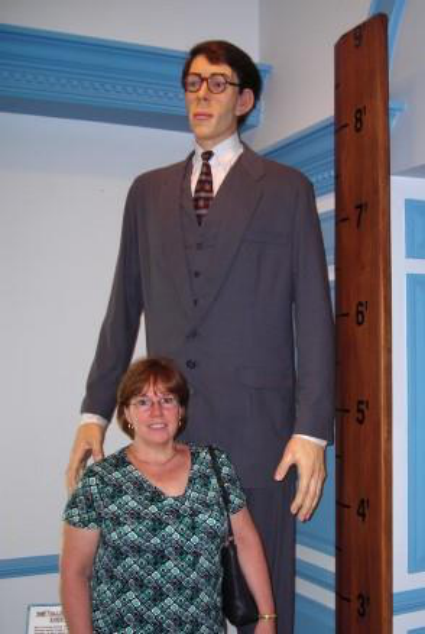
 |
| **Causes** | Autoimmune disease – which occurs when the immune system attacks the thyroid and causes it to overproduce the hormone thyroxin | Goitre – condition linked to elevated thyroid activity |
| **Symptoms** | - Bulging eyes - Weight loss - Fast metabolism | - Increased metabolic rate - Increased cardio-vascular activity - Increased anxiety - Swollen thyroid gland in neck |

---

## Hypothyroidism

| Category | Cretinism (Figure 16C) | Myxoedema (Figure 16D) |
| :--- | :--- | :--- |
| **Examples** | <!-- DIAGRAM_PLACEHOLDER: diagram --> | <!-- DIAGRAM_PLACEHOLDER: diagram --> |
| **Cause** | Caused by lack of thyroxin from birth | Caused by underactive thyroid gland in adulthood |
| **Symptom** | - Physical, mental retardation | - Mental, physical tiredness - Low metabolic rate - Increase in dermal fat - Roughening of skin |

---

## Pancreas Disorders – e.g.: Diabetes

A person with continued (chronic) high glucose levels is said to be **hyperglycaemic**. 

Diabetes mellitus is a disease associated with high blood glucose levels.

---

# Effects and Management of Diabetes

## Long-Term Effects of Diabetes
The long-term effect of diabetes is damage to all the blood vessels which eventually leads to circulatory problems and multiple organ damage. 
* Wounds on the skin do not heal well. 
* The eyes are negatively affected, leading to poor vision and eventually blindness.

## Treatment and Control
* **Type 1 diabetics** might inject insulin as a treatment. There are sophisticated insulin pumps available which are directly attached to the patient and are effective in controlling glucose levels.
* **Type 2 diabetics** can in most instances control their sugar levels by watching their diet, losing excess weight, and exercising.

---

## Comparison of Non-Diabetic, Type 1, and Type 2 Diabetes

Table 13: Representation of non-diabetic and both Type 1 and Type 2 diabetics

| Non-diabetic | Type 1 Diabetic | Type 2 Diabetic |
| :--- | :--- | :--- |
| **Normal blood glucose levels:** $80\text{-}100\text{ mg/ml}$ of blood | **Type 1 diabetes** – pancreas **not producing** the hormone, **insulin**, necessary for controlling the glucose levels in humans | **Type 2 diabetes** – insulin is available, but the body is unable to control the glucose levels |

---

## Insulin and Glucose Interaction

Table 13 and Figures 17A to 17B illustrate the normal insulin glucose interaction, and what happens in a Type 1 or a Type 2 diabetic.

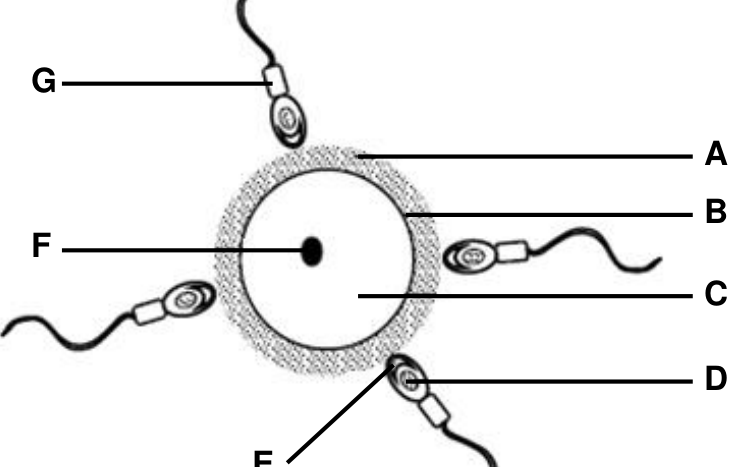

*Figure 17A: Type 1 diabetic – no insulin*

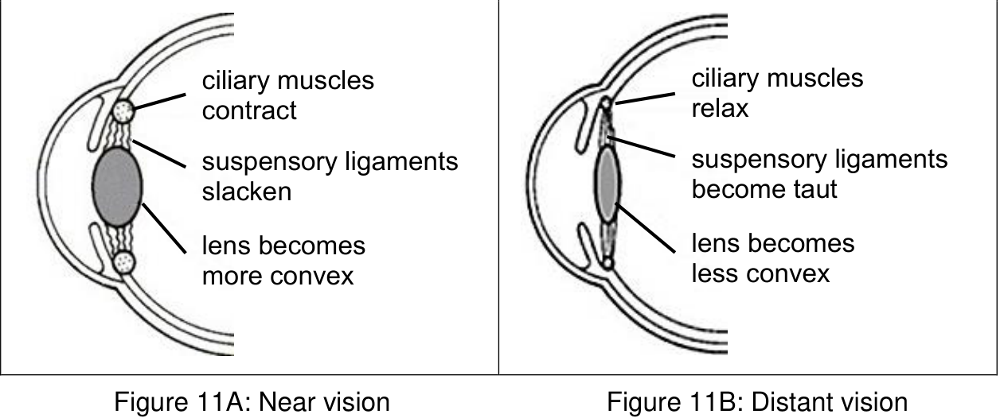

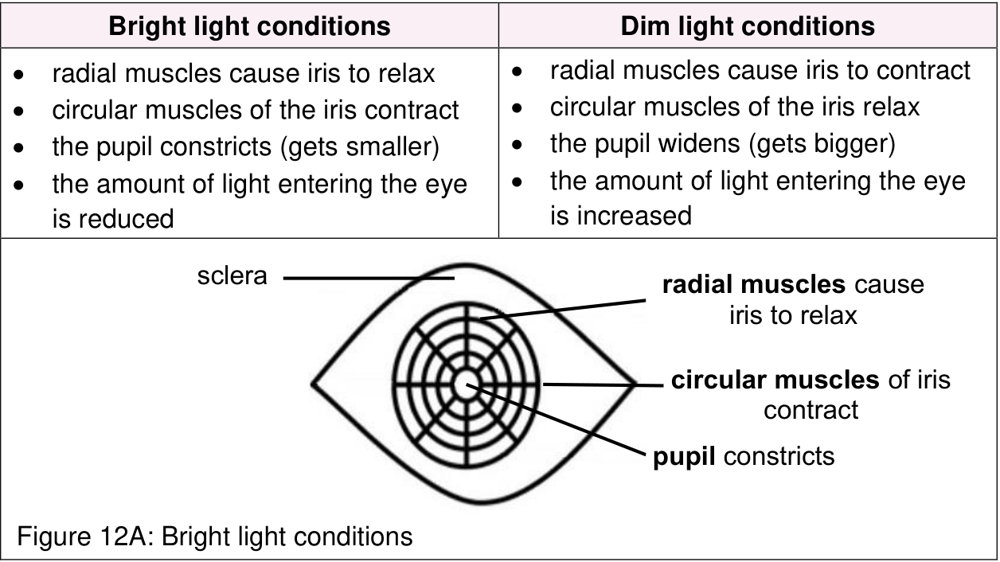

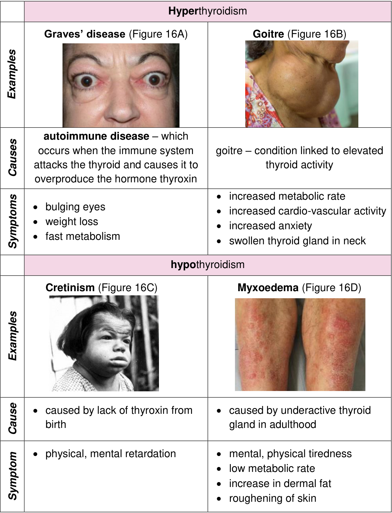

---

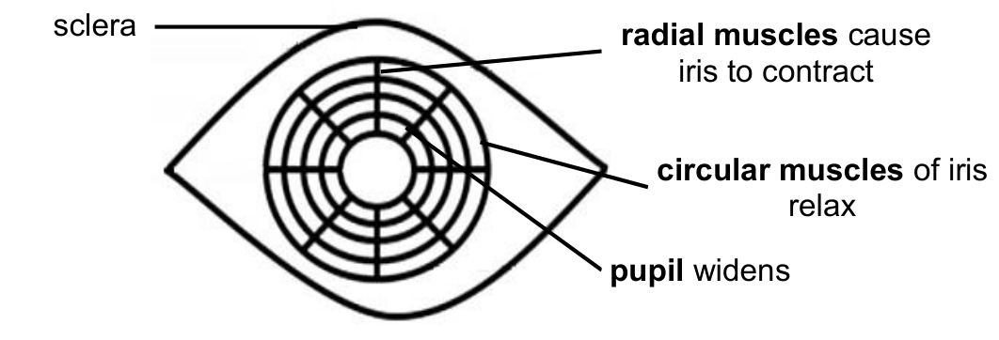

Figure 17B: Type 2 diabetic – less insulin produced

## Activity 4: Research task on endocrine disorders

You will need to research an endocrine disorder caused by the hypersecretion or hyposecretion of an endocrine hormone. You will present your information in either a PowerPoint Presentation or a poster format. The following needs to be covered:

1. What hormone is involved with this disorder?
2. Where is the hormone produced?
3. What are the target organs/structures of the hormone?
4. How is the secretion of the hormone regulated/controlled?
5. What is the normal function of the hormone?
6. How does the hormone contribute to homeostasis?
7. What are the causes of hypersecretion or hyposecretion?
8. What are the symptoms and effects of hypersecretion or hyposecretion?
9. What are the treatments for under or over activation of the hormone pathway?

Your teacher will provide you with a mark scheme. N.B.: Citation of at least 3 references.

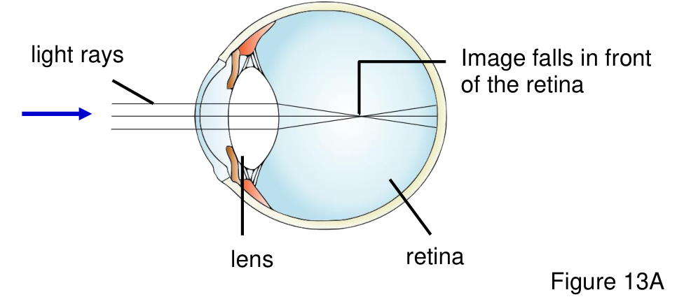

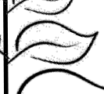

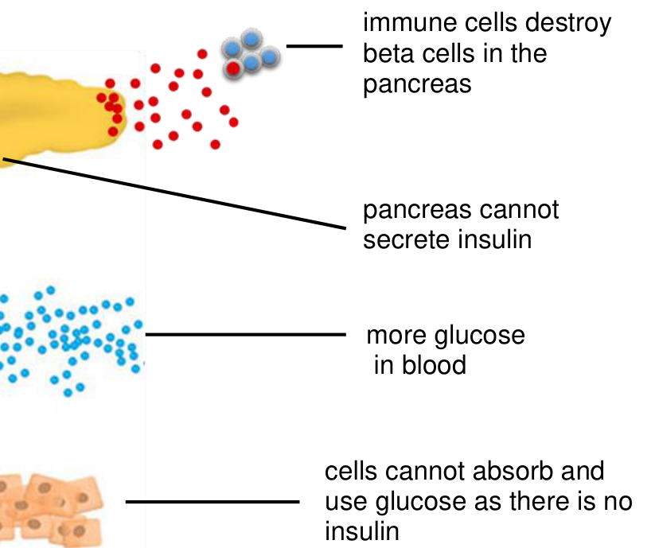

---

# Regulation of body temperature – THERMOREGULATION

## Concepts and Definitions

* **Endotherms:** Animals that maintain a constant body temperature independent of the environment, primarily including birds and mammals. Humans are endothermic, maintaining a constant body temperature of approximately $36,8^\circ\text{C}$ regardless of high or low external temperatures.
* **Importance of Thermoregulation:** It is vital to ensure all metabolic functions continue. 
  * If body temperature drops below $36^\circ\text{C}$, metabolic processes slow down.
  * If body temperature rises above a safe level of $37,5^\circ\text{C}$, enzymes become denatured (cannot function effectively) and many body functions are disabled.
* **Thermoregulation:** The way in which the body manages to control its internal core temperature when external environmental conditions change. It is one of the important homeostatic mechanisms in the human body.

---

## The human skin as thermoregulator

The human skin is well adapted for thermoregulation:
* It is the largest organ in the body.
* It contains **thermoreceptors** which respond to either heat (**Ruffini's corpuscles**) or cold (**Krause's end bulb**).
* Heat can be lost from the body by **evaporation**, **radiation**, **conduction**, and **convection**.

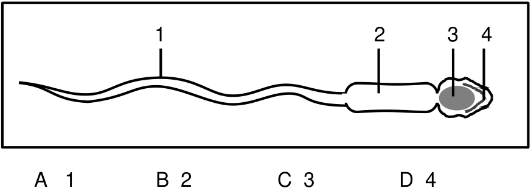

*Figure 18: Cross section through human skin showing sweat pores, epidermis, dermis, blood vessels, sweat gland, and receptors.*

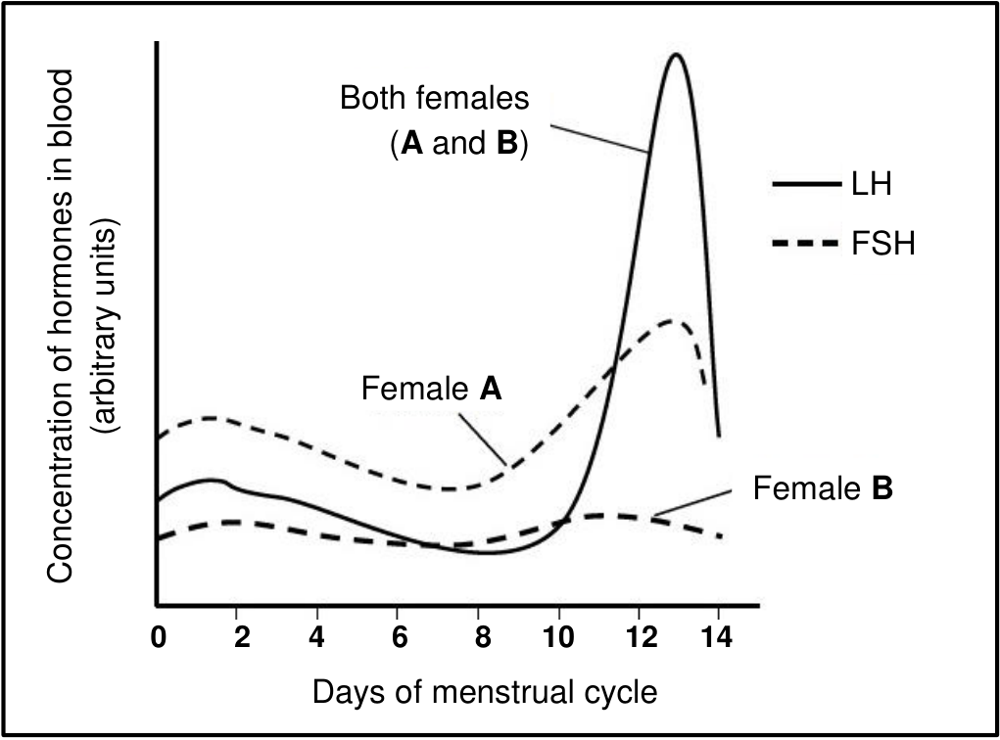

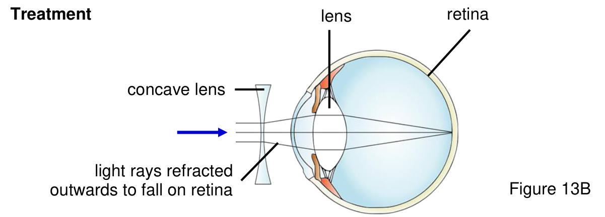

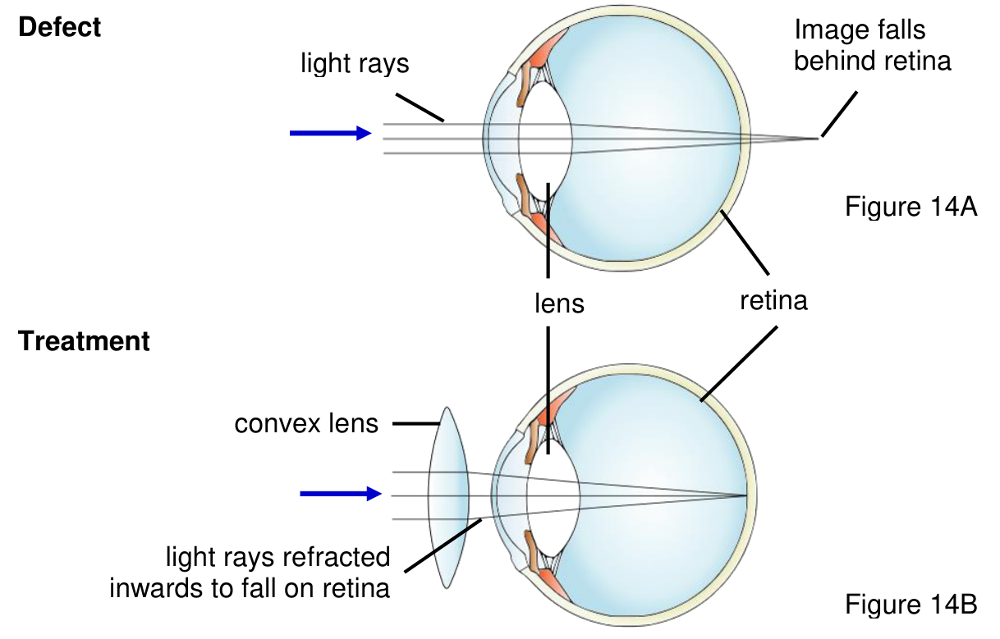

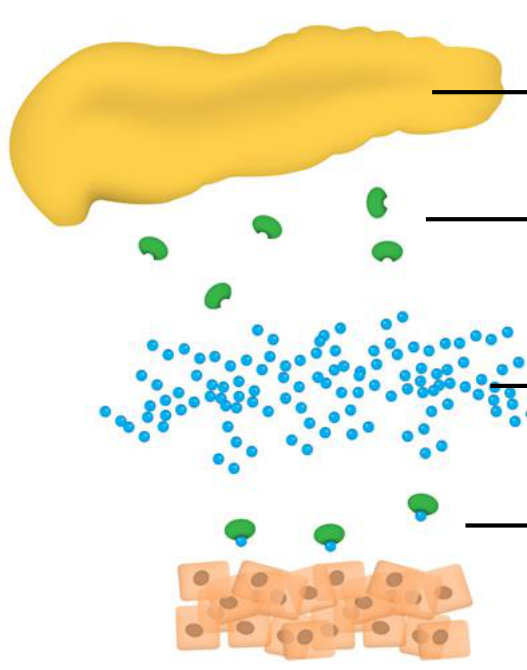

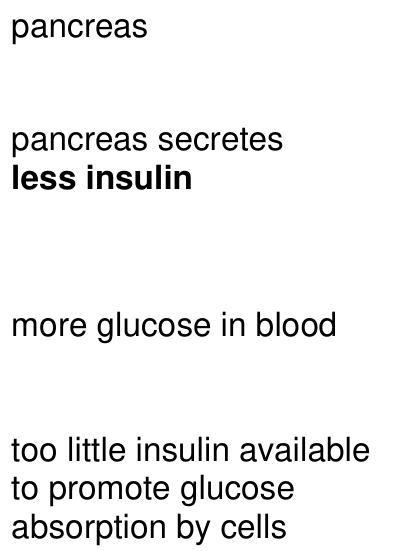

---

## Human Thermoregulation

The body's thermoreceptors transmit messages to the temperature-regulating centre in the **hypothalamus**. In response to changes in environmental temperature, the body triggers both:
* **Conscious (behavioural/voluntary) reactions:** Such as fanning in hot weather or adding clothing in cold weather.
* **Subconscious (physiological/involuntary) reactions:** Such as increased sweating in heat and shivering in cooler weather.

These reactions enable the core body temperature to remain constant.

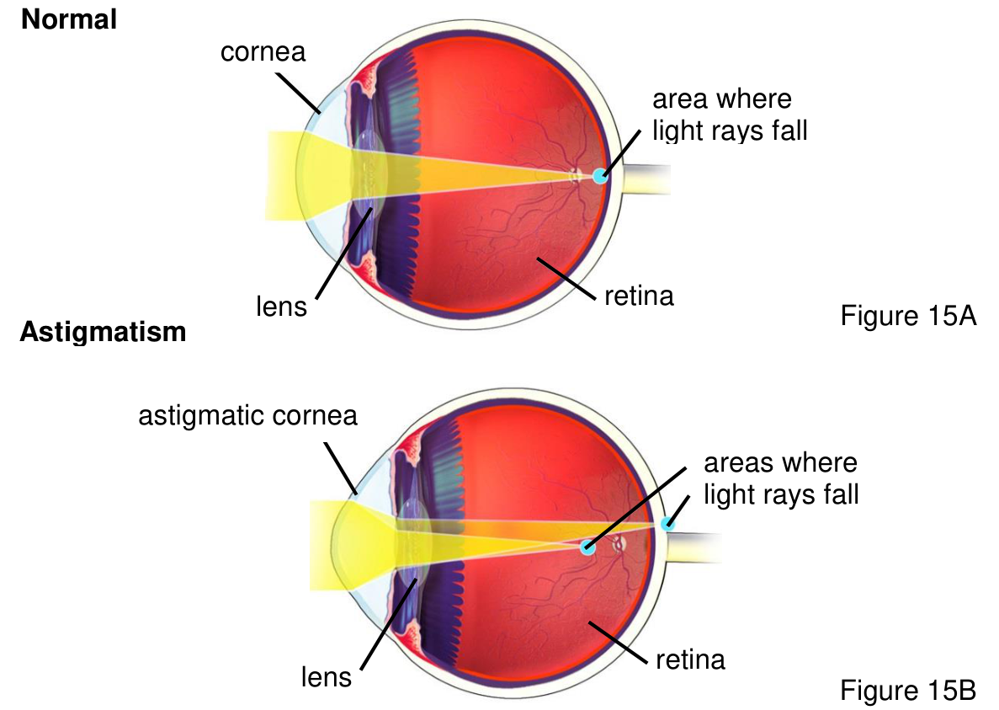

*Figure 19: Homeostatic regulation of the body temperature*

**Key Terminology Note:**
* $\text{Conscious} = \text{behavioural} = \text{voluntary}$
* $\text{Subconscious} = \text{physiological} = \text{involuntary}$

---

### Table 14: Process of Thermoregulation

| Hot environment | Cold environment |
| :--- | :--- |
| • body temperature **increases** | • body temperature **decreases** |
| • warmed blood passes through the hypothalamus | • slightly colder blood passes through the hypothalamus |
| • impulses are sent to blood vessels in the skin and to sweat glands | • impulses are sent to blood vessels in the skin and to sweat glands |
| • **vasodilation** – blood vessels dilate and more blood flows closer to surface of the skin | • **vasoconstriction** – blood vessels become narrow and less blood flows close to surface of the skin |
| • more heat lost to outside air by **radiation** and **conduction** | • less heat is lost to outside air |

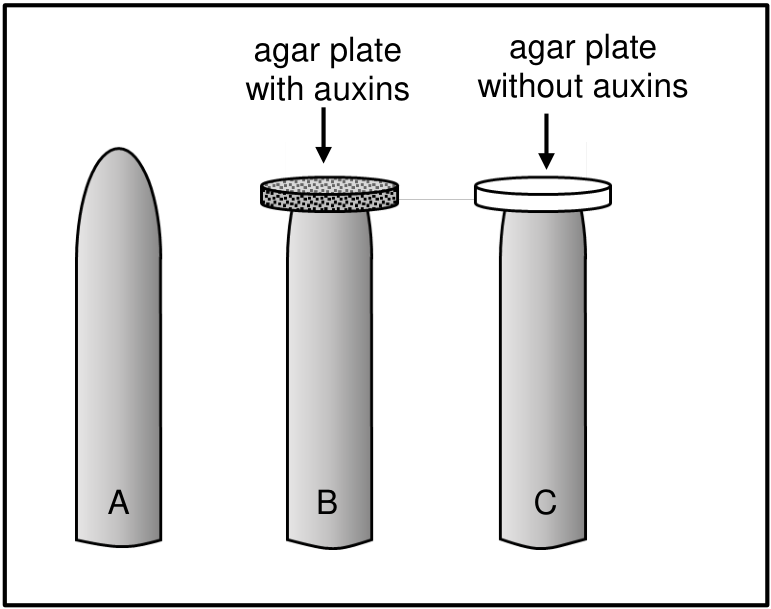

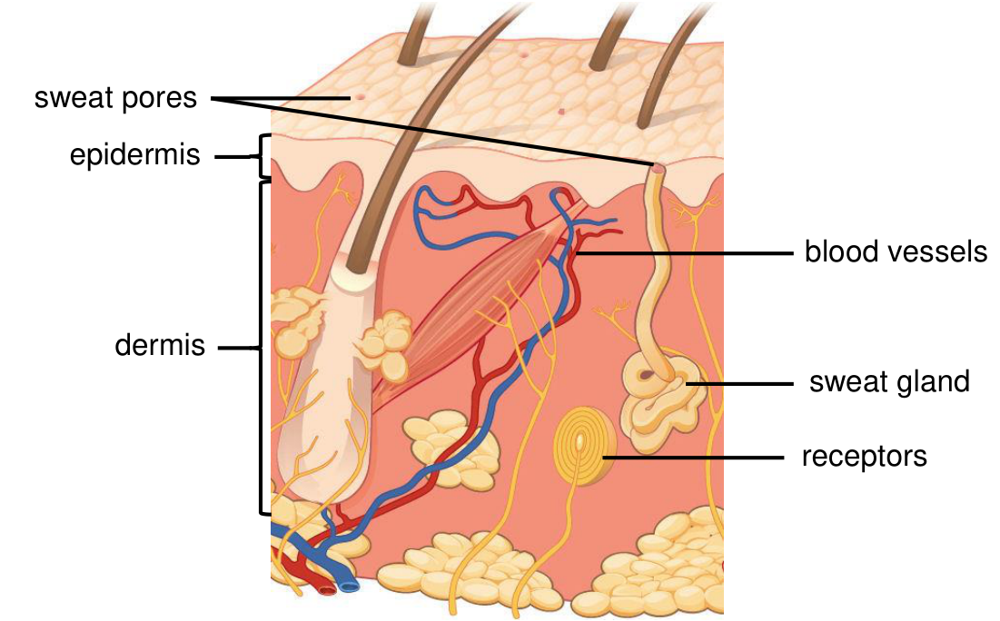

---

| **Cooling Mechanisms (When body is too hot)** | **Warming Mechanisms (When body is too cold)** |
| :--- | :--- |
| • Sweat glands activated and **sweating** occurs • Sweat **evaporates** – this has a cooling effect on the skin | • Sweat glands inactive; **no sweating occurs** • No evaporation of sweat |
| • Surface blood capillaries lose heat to the environment and the **body cools down** | • Heat is not lost as easily to the outside atmosphere and the body warms up |
| *Extension:* • The basal metabolic rate (BMR) also slows down and less body heat is produced. | *Extension:* • The **adrenal** and the **thyroid glands** release **adrenalin and thyroxin** respectively. Both these hormones **increase metabolic rate** and more **body heat is produced**. • The hypothalamus stimulates the **skeletal muscles** to contract. Involuntary **shivering** occurs, and heat is produced. |

The human body's ability to maintain a constant core temperature of $36,8^\circ\text{C}$ using the mechanism of thermoregulation ensures **homeostasis**.

---

### Activity 5: Body temperature

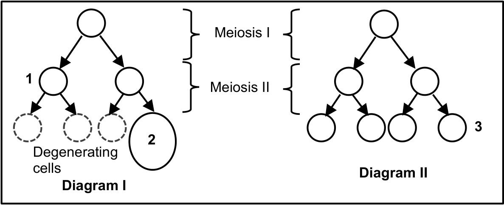

1. Which part of the brain responds to the temperature changes that occur at A and B on the graph? (1)
2. What was the maximum temperature reached? (1)
3. For what period of time did the person engage in strenuous exercise? (1)

---
*Page 225*

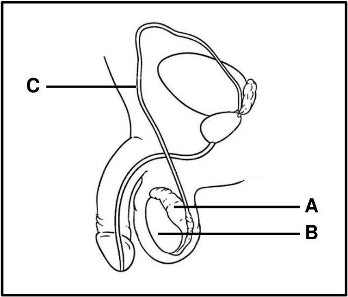

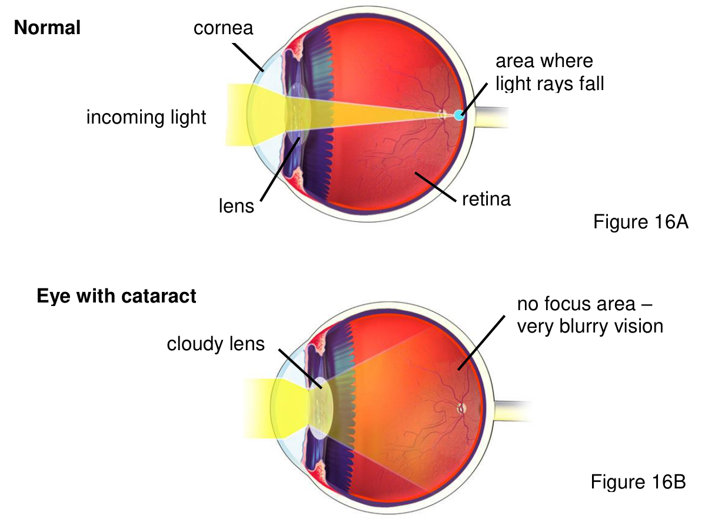

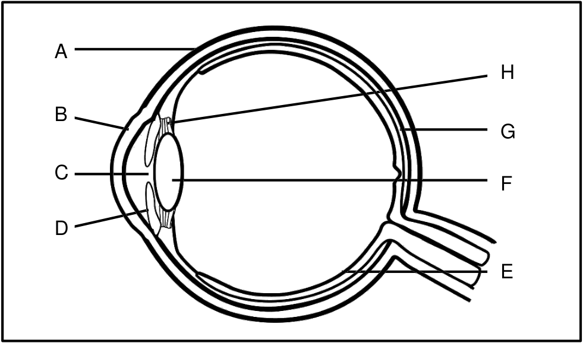

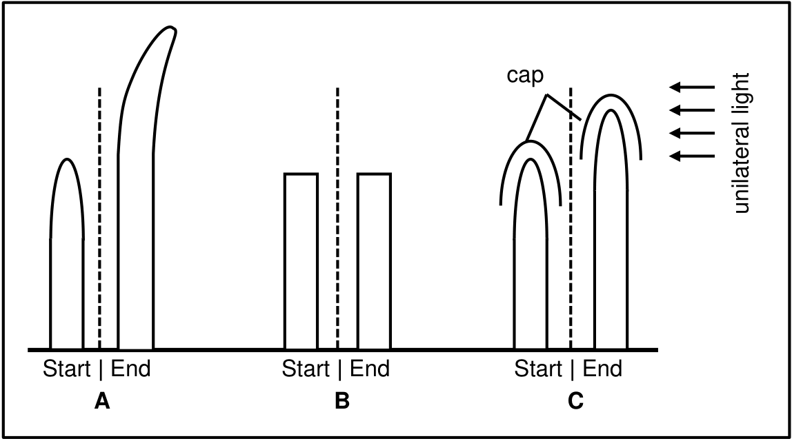

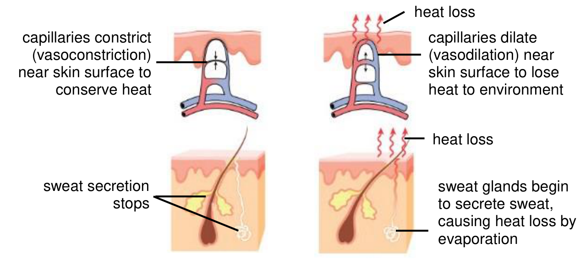

---

4. Why should body temperature not be allowed to fluctuate too much? (2)

5. Which diagram (I or II) would represent the condition of the skin after 15 minutes? (1)

6. Explain your answer to question 5. (2)

*(Total marks: 8)*

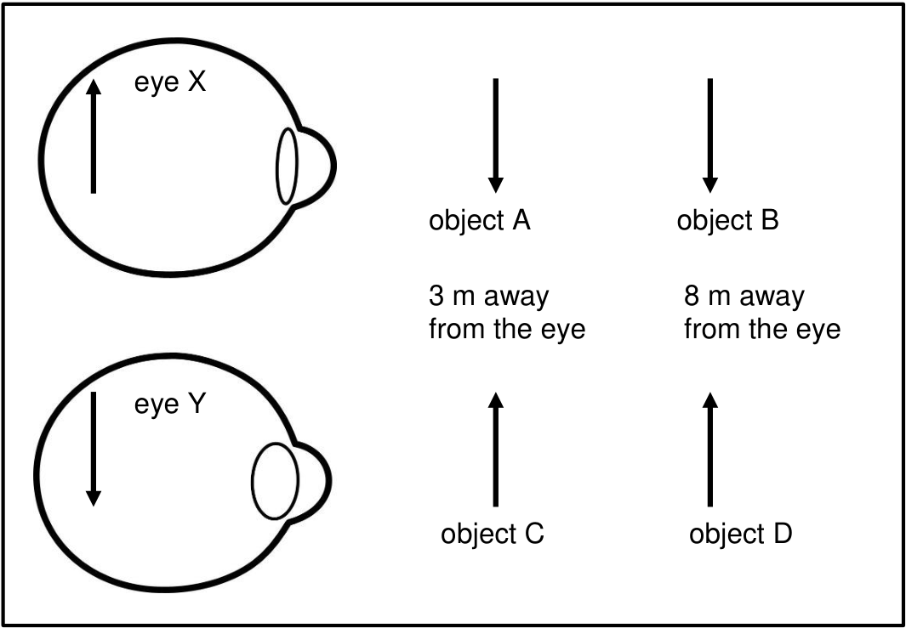

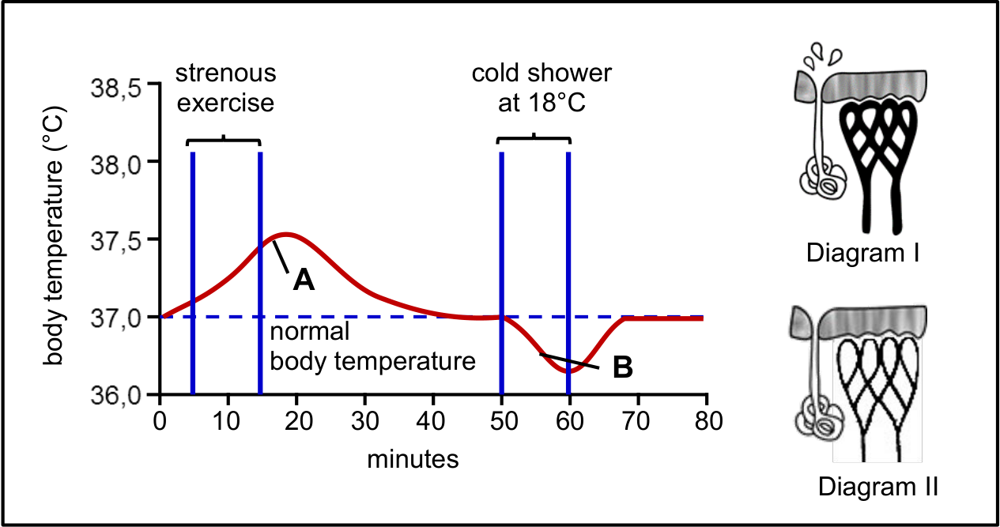

---

# The human endocrine system and homeostasis: End of topic exercises

## Section A

### Question 1

1.1 Various options are given as possible answers to the following questions. Choose the correct answer and write only the letter (A–D) next to the question number (1.1.1–1.1.5). For example, 1.1.6 D.

#### 1.1.1 The outermost layer of the human skin is the
* A hypodermis
* B epidermis
* C adipose
* D dermis

#### 1.1.2 Which of the following CORRECTLY represents the events involved in the secretion and action of ADH (antidiuretic hormone)?

| | Water level in blood relative to normal | Amount of ADH produced relative to normal | Amount of water reabsorbed by kidneys |
|---|---|---|---|
| **A** | Increase | Increase | Decrease |
| **B** | Increase | Decrease | Increase |
| **C** | Decrease | Increase | Increase |
| **D** | Decrease | Decrease | Decrease |

#### 1.1.3 A worker spent about ten minutes in a walk-in freezer. Below are some of the changes that occurred in his body in response to the drop in external temperature.
* (i) Blood vessels in the skin constrict
* (ii) Brain reacts
* (iii) Skin temperature changes
* (iv) Temperature receptors in the skin detect changes

Which ONE is the correct sequence in which the changes occurred?

* A (ii) $\rightarrow$ (i) $\rightarrow$ (iii) $\rightarrow$ (iv)
* B (iii) $\rightarrow$ (i) $\rightarrow$ (iv) $\rightarrow$ (ii)
* C (iv) $\rightarrow$ (ii) $\rightarrow$ (i) $\rightarrow$ (iii)
* D (iv) $\rightarrow$ (i) $\rightarrow$ (ii) $\rightarrow$ (iii)

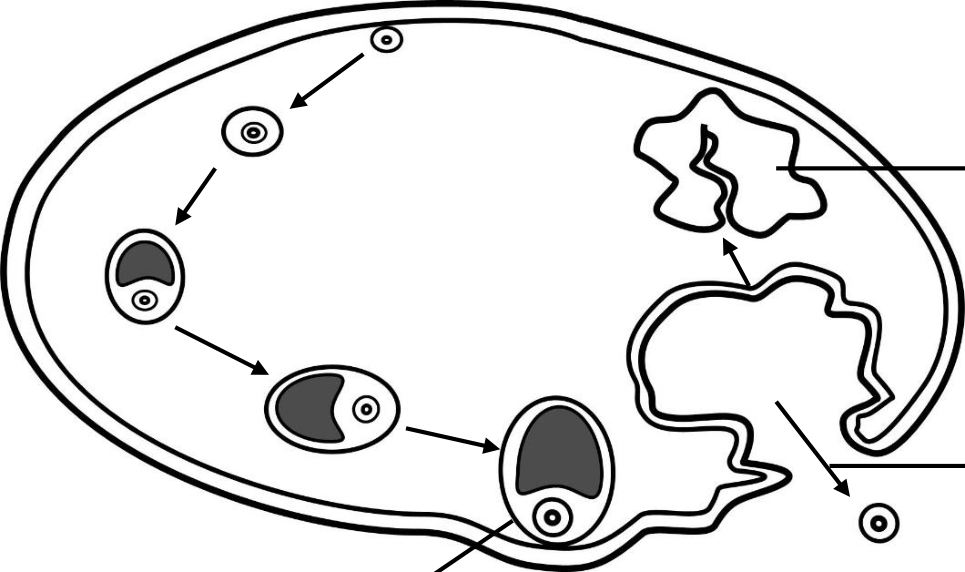

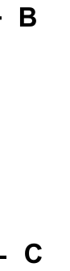

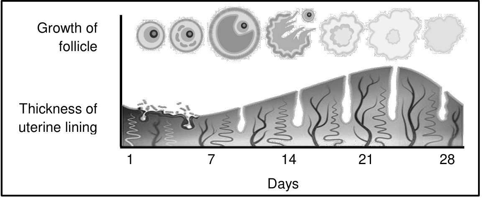

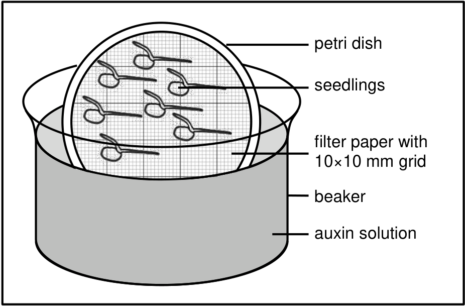

---

### 1. Concepts & Structure

#### Question 1.1.4
The graph below shows the relationship between the production of growth hormone and age.

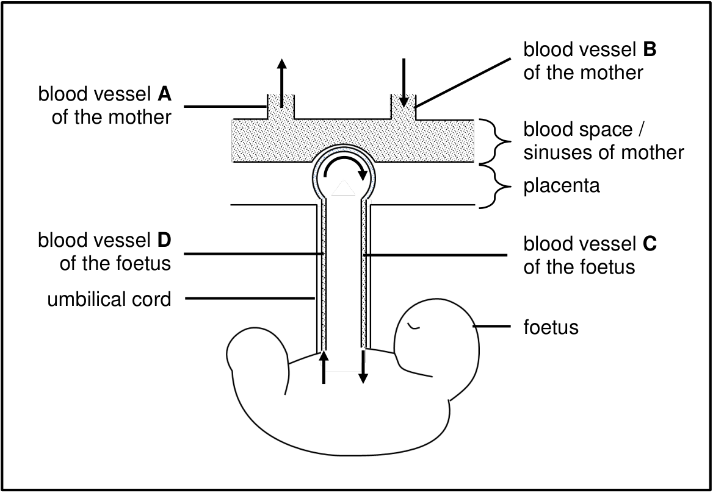

A general conclusion that can be drawn from the results is that ...

* **A** growth hormone is not secreted after the age of 50 years
* **B** the amount of growth hormone secreted decreases with age
* **C** the amount of growth hormone secreted increases with age
* **D** the amount of growth hormone secreted remains stable over time

---

#### Question 1.1.5
Which **ONE** of the following hormones prepares the body to react to emergency situations?

* **A** Insulin
* **B** Aldosterone
* **C** Adrenalin
* **D** Growth hormone

$$(5 \times 2 = 10)$$

---

#### Question 1.2
Give the correct term for each of the following descriptions. Write only the term next to the question number.

* **1.2.1** The maintenance of a constant internal environment.
* **1.2.2** The maintenance of a constant body temperature.
* **1.2.3** Animals that control body temperature from within.
* **1.2.4** Widening of blood capillaries in the skin.
* **1.2.5** Method by which most heat is lost through sweating.

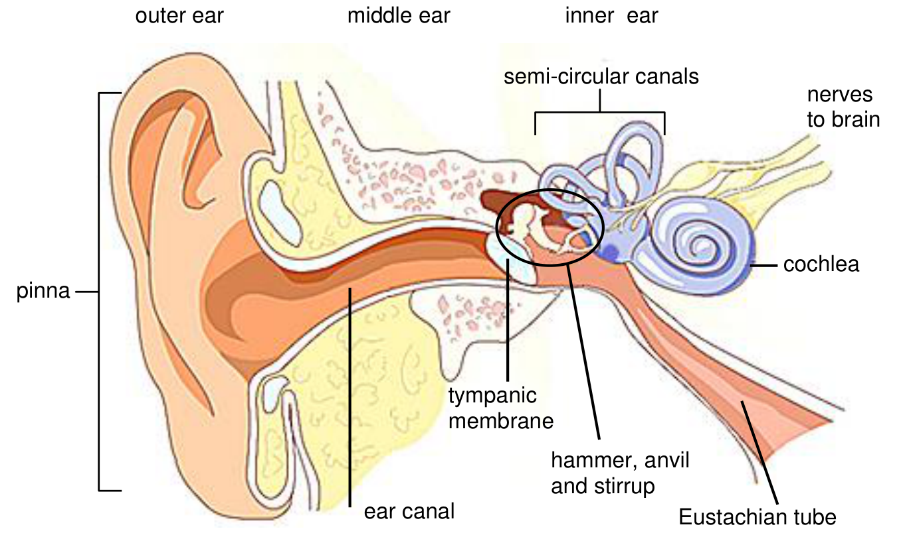

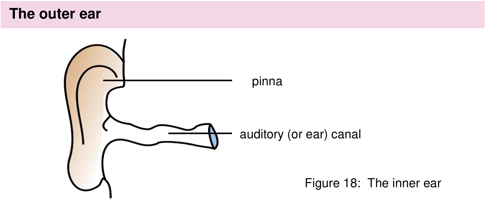

---

### Concepts & Structure

#### Question 1.2 (Continuation)
* 1.2.6 Control centre for temperature regulation in the brain.
* 1.2.7 A hormone that stimulates milk production in human females.
* 1.2.8 A disease that results from the body's inability to produce insulin.
* 1.2.9 An enlarged thyroid gland that is caused by a deficiency of iodine.
* 1.2.10 The secretions that are produced in small quantities by the endocrine glands.

$$(10 \times 1 = 10)$$

---

#### Question 1.3
Indicate whether each of the descriptions in **Column I** applies to **A ONLY**, **B ONLY**, **BOTH A AND B** or **NONE** of the items in **Column II**. Write **A only**, **B only**, **both A and B** or **none** next to the question number.

| Column I | Column II |
| :--- | :--- |
| 1.3.1 Carbon dioxide levels | A: medulla oblongata B: cerebellum |
| 1.3.2 Vasodilation | A: $10\ ^\circ\text{C}$ B: $40\ ^\circ\text{C}$ |
| 1.3.3 Increase the loss of heat in mammals | A: Sweating B: Shivering |
| 1.3.4 Cells and tissue fluid | A: internal environment B: external environment |
| 1.3.5 A gland that has a duct to carry its secretion to where it is needed | A: sweat glands B: pancreas |

$$(5 \times 2 = 10)$$

---

#### Question 1.4
Complete the table below.

$$(10 \times 1 = 10)$$

| | Stimulus/variable | Receptor/s | Control centre | effector |
| :--- | :---: | :---: | :---: | :---: |
| osmoregulation | **1.4.1** | osmoreceptors | hypothalamus | **1.4.9** |
| salt concentration | salts e.g. $\text{Na}^+$ (high and low) | cells in glomeruli | **1.4.6** | kidneys |
| carbon dioxide concentration | $\text{CO}_2$ (high and low) | **1.4.4** | **1.4.7** | lungs |
| thyroxin | **1.4.2** | pituitary gland | thyroid gland | body cells |
| glucose | blood glucose (high and low) | **1.4.5** | pancreas | **1.4.10** |
| thermoregulation | **1.4.3** | thermo- receptors | **1.4.8** | skin |

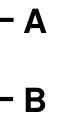

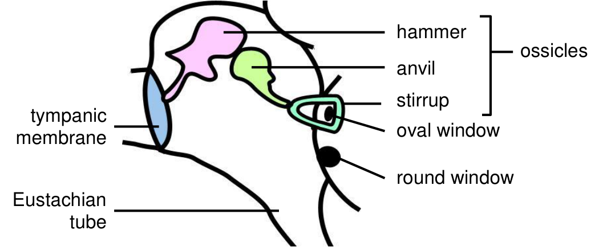

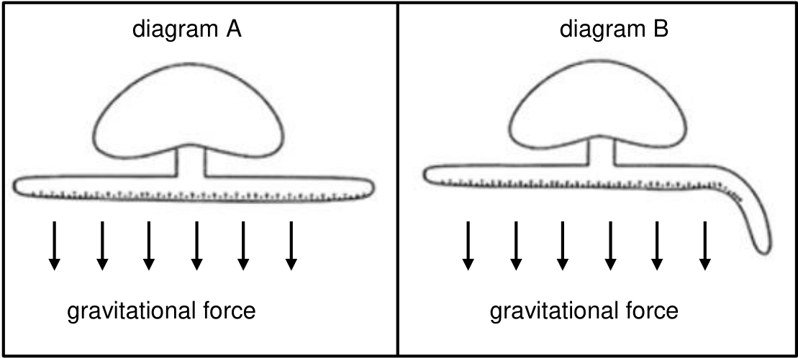

---

# 1.5

Read the following and answer the questions that follow:

South Africa’s very own mountaineer and adventurer Sibusiso Vilane, became a South African hero after summiting the Earth’s highest mountain, Mount Everest, in 2003. He started training in mountaineering by climbing the peaks of the Drakensberg mountains. Ex-President, Thabo Mbeki, said the following on the summit day “In this, he has shown the heights we can scale in life if we put our shoulder to the wheel. Sibusiso you have done us proud”. 

He continues to climb great peaks throughout the world and is actively involved in humanitarian work.

Mountaineers like Sibusiso Vilane put their bodies under severe physiological strain when climbing up to heights of $8000$ metres. The higher the altitude the greater the stress on the human body. The availability of oxygen decreases and hypoxia (oxygen starvation) can set in. It literally takes your breath away. Average temperatures are well below freezing. Climbers can become disorientated, develop acute mountain sickness (AMS) and get frostbite on their extremities. Many climbers have died on Everest.

Athletes in extreme sports like this will try and acclimatize to these adverse conditions by preparing the body for the physiological challenges. The sherpas who assist climbers live at high altitudes all year around and their bodies have adapted well to the low oxygen levels and to the adverse cold. This leaves us with words from one of Sibusiso Vilane’s motivational speeches: “Every person has their own ‘Everest’ to climb”.

---

1.5.1 With low oxygen levels what other atmospheric gas levels could become a problem in the system of climbers like Sibusiso? (1)

1.5.2 How are the levels of the gas that you have given as your answer in 1.5.1 detected? (1)

1.5.3 In a flow diagram show how their bodies will try and compensate and adapt to the levels of the gas in their system. (3)

1.5.4 The climbers will lose a lot of heat through radiation to the environment. What conscious measures would you suggest they take to reduce this loss? (1)

1.5.5 Suggest a way in which climbers could prepare their bodies for the challenges of high altitudes, i.e. how in their training could they acclimatize to the conditions on Everest? (1)

1.5.6 What is the term used when the oxygen availability in the blood decreases? (1)

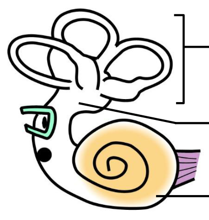

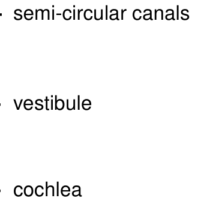

---

1.5.7 During an expedition led by Sibusiso in 2016, to the highest peak in Africa, Mount Kilimanjaro, one of our other famous sportsmen, Gugu Zulu, a rally driver, tragically fell ill and died. It seemed that he developed the onset of flu while on the climb. The fact that Gugu was not 100% healthy would have worsened the impact of high altitude and cold. One of the symptoms of a flu is fever. Which homeostatic mechanism that has been covered in this section would have been affected and briefly explain how the normal levels had been altered by the flu? (2)

**(10)**

**Section A: [50]**

---

### Section B

#### Question 2

2.1 Study the table below that shows the volume of urine produced by six different people on a hot day and on a cold day and answer the questions that follow.

| Person | Volume of urine produced in $\text{cm}^3$ | |
| :---: | :---: | :---: |
| | **Hot day** | **Cold Day** |
| 1 | 430 | 890 |
| 2 | 350 | 1060 |
| 3 | 270 | 930 |
| 4 | 560 | 1280 |
| 5 | 400 | 680 |
| 6 | 390 | 1 160 |
| **Average** | | 1 000 |

2.1.1 Calculate the average volume of urine in $\text{cm}^3$ produced on the hot day. Show all workings. (2)

2.1.2 What can you deduce from the difference between the average volume of urine produced on the hot day and the average volume of urine produced on the cold day? (2)

2.1.3 Explain why, on a hot day, less water is lost from the body as urine. (2)

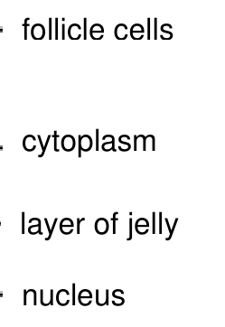

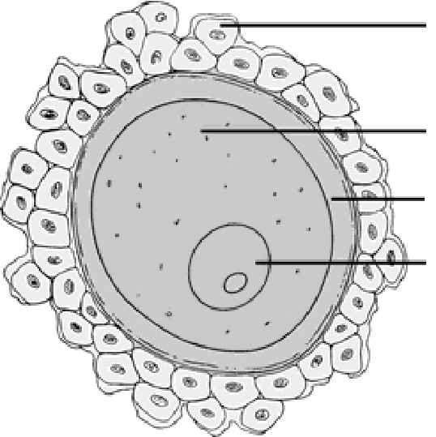

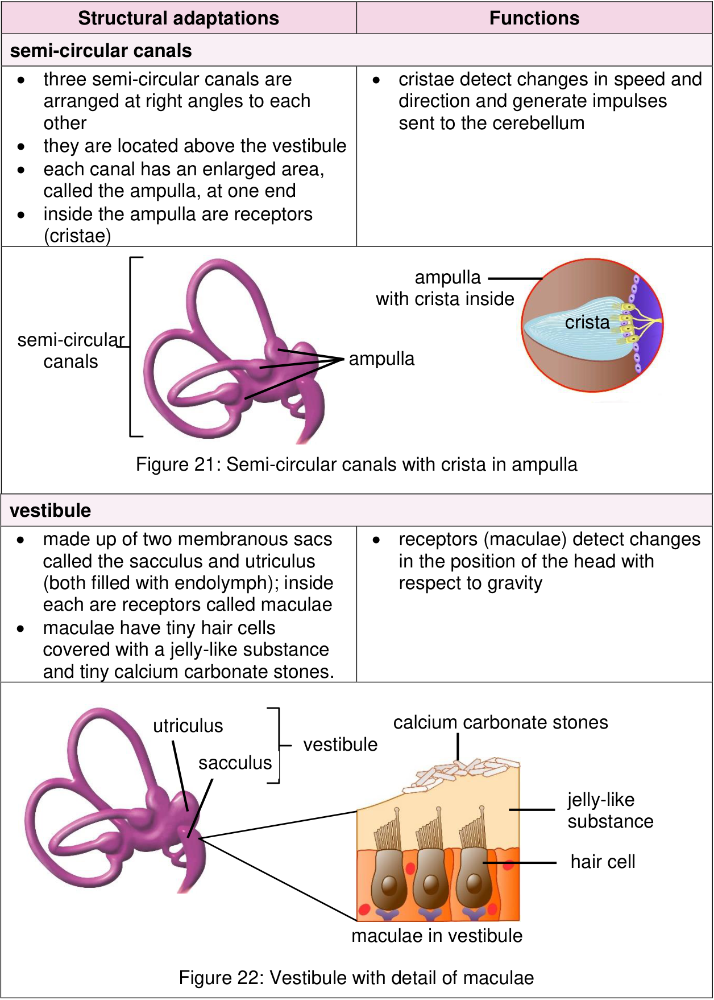

---

2.1.4 The composition (make-up) of urine depends on several factors. Name two factors that would affect the composition of urine. (2)  
*(8)*

2.2 The diagram below represents a negative feedback mechanism. $X$ and $Y$ represent hormones secreted by the respective glands.

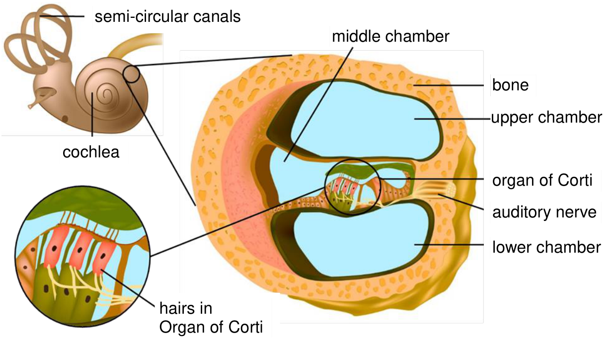

2.2.1 What is the role of any negative feedback mechanism in the human body? (1)  
2.2.2 Identify hormone $X$. (1)  
2.2.3 Explain the consequences for a person if hormone $Y$ remained abnormally high for extended periods of time. (3)  
*(5)*

2.3 Triathletes competing in the Iron Man series are sometimes on the road and in the water for a total of over 8 hours. They will get very hot and thirsty. They will sweat profusely and will drink fluids continually through the race. They often do not need to urinate. Which two mechanisms would these athletes use to regulate their body temperature and fluid loss during the race? (2)

2.4 The picture below shows how important the skin is in controlling the core body temperature in very warm conditions.

---

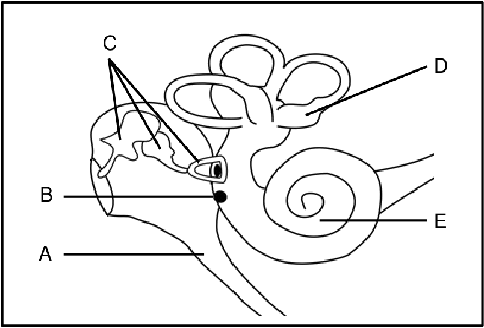

Using the information provided **draw** your own picture, alongside the one given, showing how the skin controls body temperature in cooler conditions. (5)

**[20]**

---

### Question 3

**3.1** Type 2 diabetes is often linked to body mass index (BMI). The higher your BMI the greater your chances of developing Type 2 diabetes. The table below shows the results of an investigation into the BMI of women and their risk of developing diabetes (statistics from the American Diabetes Ass.)

| BMI ($\text{mass} \div \text{height}$) ($\text{kg/m}^2$) | Relative risk of developing diabetes in females ($\%$) |
| :---: | :---: |
| $< 20$ | 7,5 |
| $20 - 25$ | 18,0 |
| $26 - 30$ | 37,5 |
| $31 - 35$ | 57,0 |
| $> 35$ | 74,5 |

**3.1.1** Draw a histogram using the data in the table. (5)

**3.1.2** Which hormone is deficient in people with diabetes? (1)

---
*233*

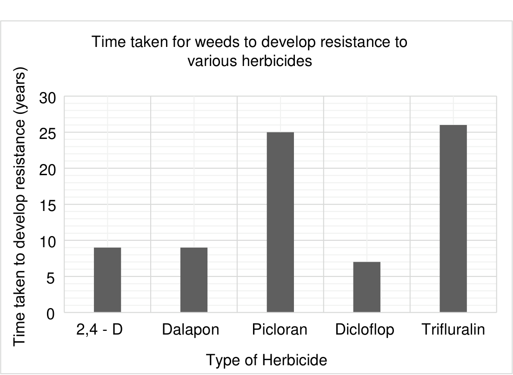

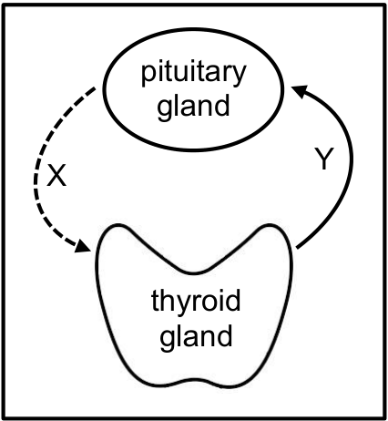

---

3.1.3 In which organ is this hormone produced? (1)

3.1.4 Name another hormone that regulates the amount of glucose found in the blood. (1)

3.1.5 Write up your own conclusion from the data given in the table and from your histogram. (2)  
**(10)**

---

3.2 Lerato carried out an investigation to determine the effect of exercise on skin temperature. She asked 100 learners in her school to participate in the investigation. The sample consisted of 100 girls of the same age. The investigation was done as follows:

* The learners were divided into two groups of 50 each (Group A and B).
* The skin temperature was measured for all the participants.
* Group A was asked to run around the sports field for 10 minutes.
* Group B was asked to remain seated on the benches next to the field for 10 minutes.

After 10 minutes the skin temperature of all participants was measured, and the average was calculated for each group (A and B).

3.2.1 In this investigation, identify the:
  * (a) independent variable (1)
  * (b) dependent variable (1)

3.2.2 State two steps that Lerato took into consideration during the planning of the investigation. (2)

3.2.3 What is the expected result for the participants in group A? (1)

3.2.4 Name the one factor that Lerato kept constant during the investigation. (1)

3.2.5 Which of the two groups (A or B) will release more sweat? (1)

3.2.6 Explain why sweat production will increase in the group identified in question 3.2.5. (3)  
**(10)**

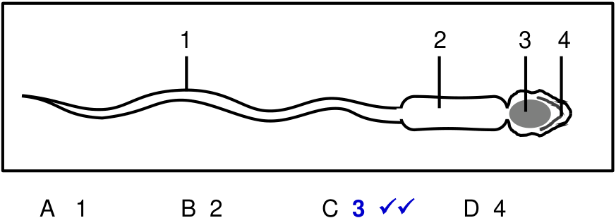

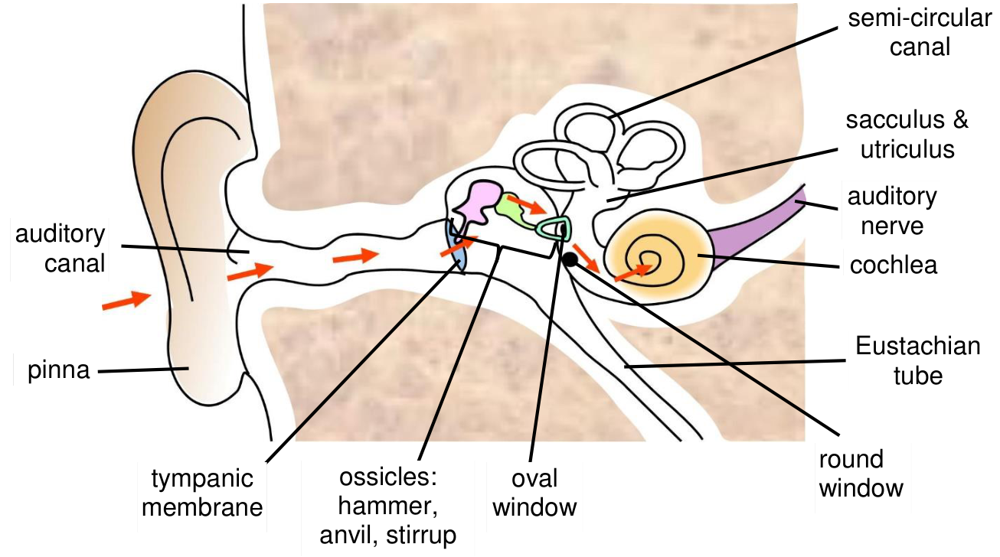

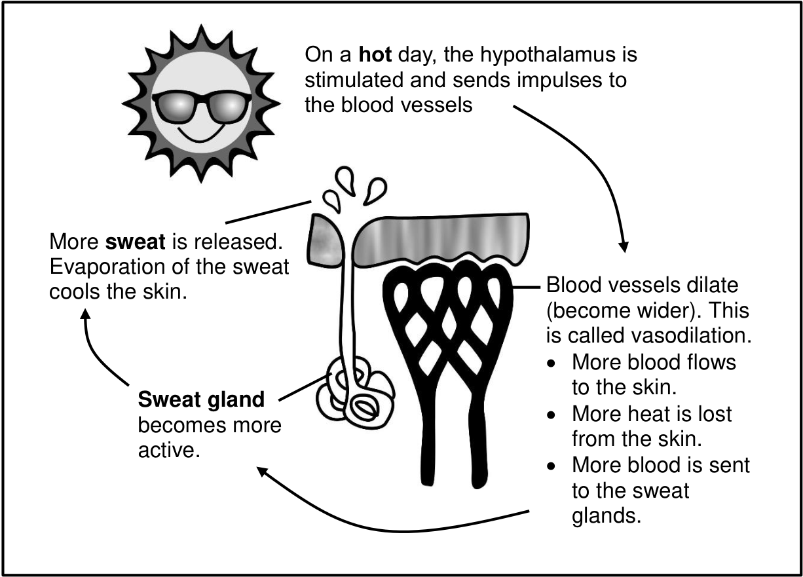

---

3.3 The graph below shows a comparative glucose test on a healthy and a diabetic person. (In the glucose tolerance test the people being tested would have not eaten for at least 8 hours before the test. When they arrive at the hospital/clinic/doctor's rooms their blood is taken, and glucose levels are tested. They then drink a glucose solution and their blood is taken and tested every 30 minutes over at least a 3 hour period.)

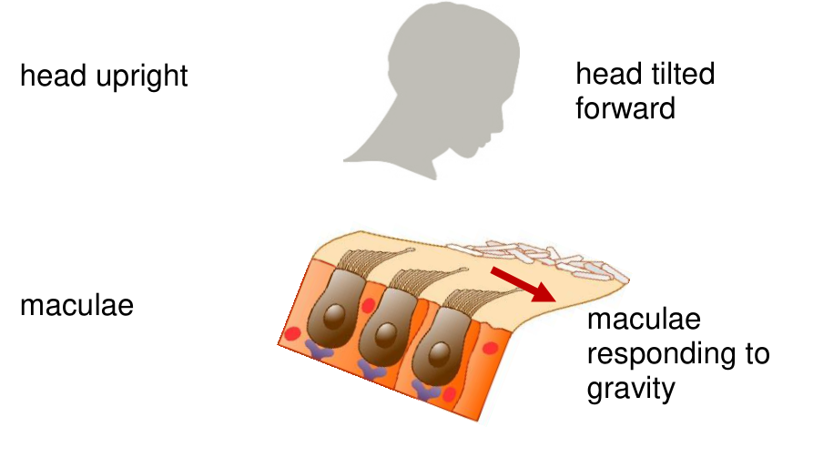

3.3.1 What values does the graph accept as normal blood glucose levels? (1)

3.3.2 What is the difference in blood glucose levels at time $0$ between person A and person B? (2)

3.3.3 What do you think happened in person A to cause the glucose levels to drop after $60$ minutes? (2)

3.3.4 Name three lifestyle precautions should person B be taking? (3)

3.3.5 Besides lifestyle changes what treatment is available for diabetics to regulate their glucose levels? (2)

**(10)**  
**[30]**

**Section B: [50]**  

**Total marks: [100]**

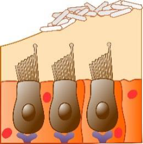

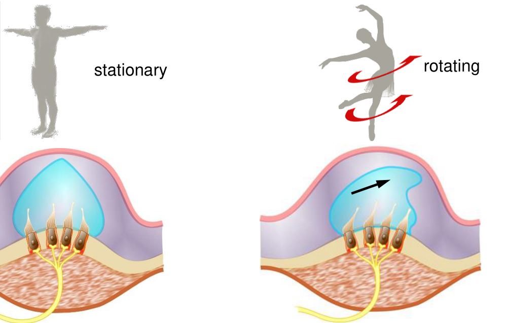

---

# Chapter 7: The human endocrine system and homeostasis

## Activity 1: Endocrine glands and their hormones

* A – hypothalamus; $\text{ADH}$
* B – pituitary gland; $\text{GH}$, $\text{TSH}$, $\text{FSH}$, $\text{LH}$, prolactin – any four for a total of 20 marks for Activity 1.
* C – thyroid gland; thyroxin
* D – adrenal gland; adrenalin and aldosterone
* E – pancreas; glucagon, insulin
* F – ovaries; oestrogen and progesterone
* G – testes; testosterone

*(20)*

---

## Activity 2: Effects of a certain hormone

1. Adrenalin
2. On top of each kidney
3. Less blood flow to the gut, as it is not involved in responding to the emergency. Blood flow is redirected to organs involved in responding to the emergency such as: skeletal muscles to improve muscle tone or heart muscle, for the heart to beat faster so as to increase the transport of oxygen and glucose needed for increased respiration.
4. Pupil
5. The pupil dilates to allow more light to enter the eye for clear vision during the emergency situation.

*(10)*

---

## Activity 3: A negative feedback mechanism

1. Thyroid gland
2. Thyroxin
3. Stimulate the thyroid gland
4. High levels of thyroxin are detected by the pituitary gland which leads to a decrease in the secretion of $\text{TSH}$. Thyroid activity is slowed down / less thyroxin is produced. Thyroxin levels drop to normal.

*(8)*

---

## Activity 4: Research task on endocrine disorders

Answers will depend on the hormone you choose to investigate. Your teacher will provide you with a mark scheme. A possible rubric (mark scheme) is given here:

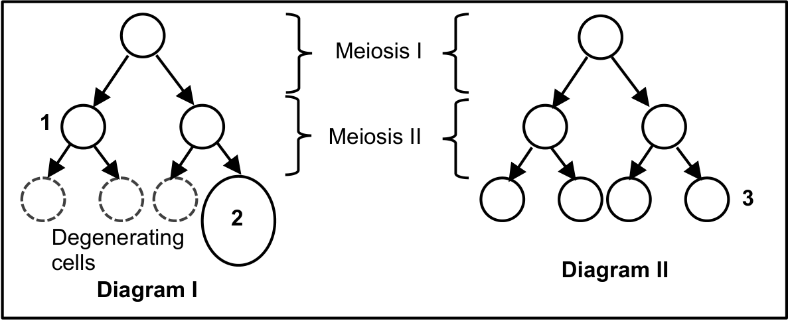

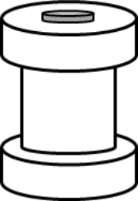

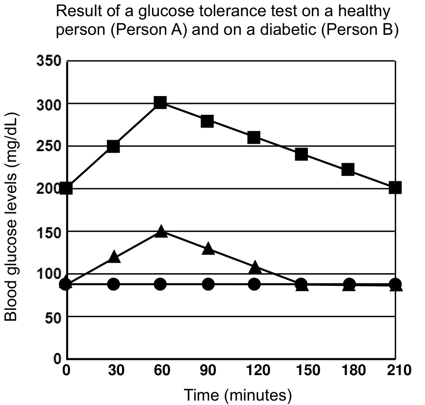

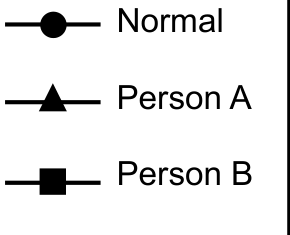

---

# Assessment Rubric and Activity Answers

## Assessment Rubric

| Component | Learners mark | Possible mark |
| :--- | :---: | :---: |
| Hormone? Where produced? Target area/organ/s | | 5 |
| Regulation of hormone | | 5 |
| Normal function of hormone (homeostatic level) | | 5 |
| Cause of disease (hyper/hypo) | | 5 |
| Symptoms/Effects | | 5 |
| Treatment | | 5 |
| References (at least 3 and correctly cited) | | 5 |
| Presentation skills (Quality of PowerPoint or poster) | | 10 |
| Knowledge in answering questions | | 5 |
| **TOTAL** | | **50** |

---

## Activity 5: Body temperature

1. Hypothalamus $\checkmark$
2. $37,5^{\circ}\text{C}$ $\checkmark$
3. $10\text{ minutes}$
4. Most human activity is controlled by enzymes $\checkmark$ and enzymes require optimum temperatures to function $\checkmark$
5. Diagram I $\checkmark$
6. Blood vessels dilated to bring more blood to the surface $\checkmark$ and so more heat will be lost $\checkmark$ **OR** Increased sweat production $\checkmark$ which will cool down the body $\checkmark$

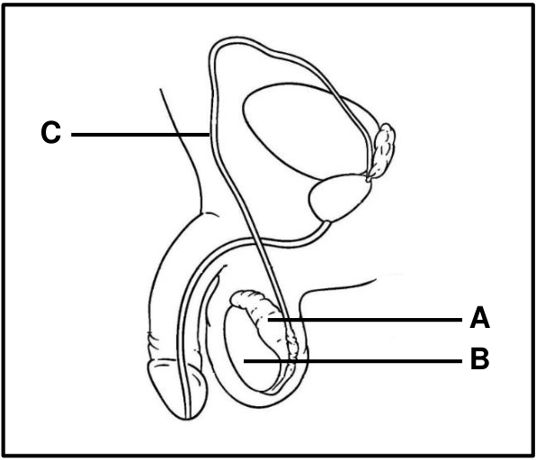

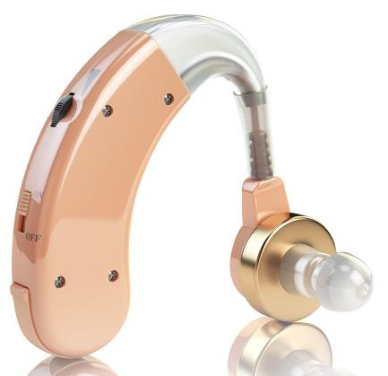

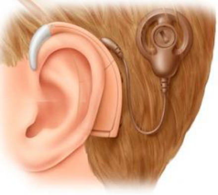

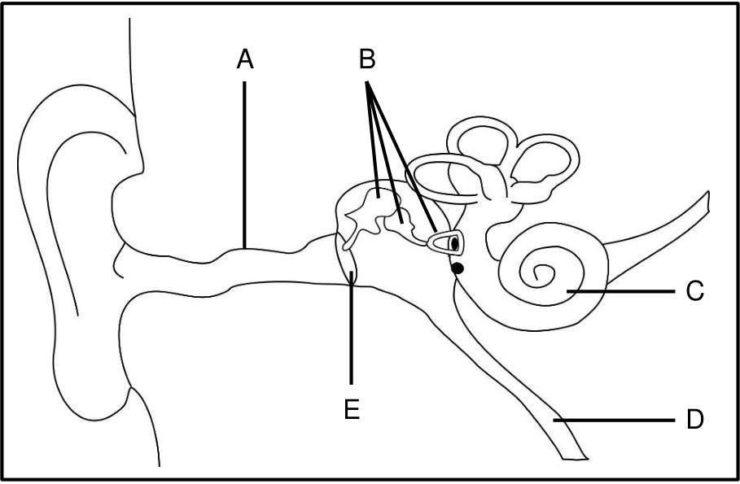

---

# End of topic exercises

## Section A

### Question 1

Various options are given as possible answers to the following questions. Choose the correct answer and write only the letter (A – D) next to the question number ($1.1.1 - 1.1.5$). For example, $1.1.6 \text{ D}$.

#### 1.1.1
The outermost layer of the human skin is the  
A hypodermis  
B **epidermis** $\checkmark\checkmark$  
C adipose  
D dermis  

---

#### 1.1.2
Which of the following CORRECTLY represents the events involved in the secretion and action of ADH (antidiuretic hormone)?

| | Water level in blood relative to normal | Amount of ADH produced relative to normal | Amount of water reabsorbed by kidneys |
| :---: | :--- | :--- | :--- |
| A | Increase | Increase | Decrease |
| B | Increase | Decrease | Increase |
| C | **Decrease** | **Increase** | **Increase** $\checkmark\checkmark$ |
| D | Decrease | Decrease | Decrease |

---

#### 1.1.3
A worker spent about ten minutes in a walk-in freezer. Below are some of the changes that occurred in his body in response to the drop in external temperature.
* (i) Blood vessels in the skin constrict
* (ii) Brain reacts
* (iii) Skin temperature changes
* (iv) Temperature receptors in the skin detect changes

Which ONE is the correct sequence in which the changes occurred?

A $(ii) \rightarrow (i) \rightarrow (iii) \rightarrow (iv)$  
B $(iii) \rightarrow (i) \rightarrow (iv) \rightarrow (ii)$  
C **$(iv) \rightarrow (ii) \rightarrow (i) \rightarrow (iii)$** $\checkmark\checkmark$  
D $(iv) \rightarrow (i) \rightarrow (ii) \rightarrow (iii)$  

---

183

---

1.1.4
The graph below shows the relationship between the production of growth hormone and age.

A general conclusion can be drawn from the results is that …

A growth hormone is not secreted after the age of 50 years  
B the amount of growth hormone secreted decreases with age ✓✓  
C the amount of growth hormone secreted increases with age  
D the amount of growth hormone secreted remains stable over time  

1.1.5
Which ONE of the following hormones prepares the body to react to emergency situations?

A Insulin  
B Aldosterone  
C Adrenalin ✓✓  
D Growth hormone  

$$\text{(5} \times \text{2} = \text{10)}$$

1.2
Give the correct term for each of the following descriptions. Write only the term next to the question number.

1.2.1
The maintenance of a constant internal environment.  
Homeostasis ✓

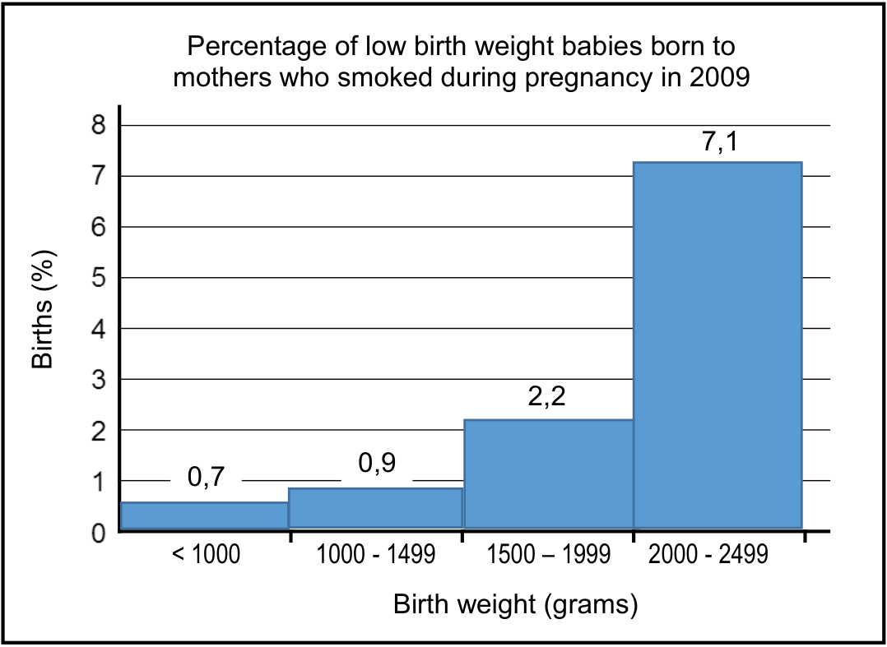

---

## Revision Notes: Human Homeostasis and Endocrine System

### Core Concepts & Terminology

* **1.2.2 Thermoregulation:** The maintenance of a constant body temperature within an optimal range.
* **1.2.3 Endotherms:** Animals that control their body temperature from within using metabolic heat.
* **1.2.4 Vasodilation:** The widening of blood capillaries in the skin to increase heat loss.
* **1.2.5 Evaporation:** The method by which most heat is lost through the process of sweating.
* **1.2.6 Hypothalamus:** The control centre for temperature regulation located in the brain.
* **1.2.7 Prolactin:** A hormone that stimulates milk production in human females.
* **1.2.8 Diabetes Type 1:** A disease that results from the body's inability to produce insulin.
* **1.2.9 Goitre:** An enlarged thyroid gland that is caused by a deficiency of iodine.
* **1.2.10 Hormones:** Chemical messengers that are produced in small quantities by the endocrine glands.

---

### Activity: Matching Descriptions

**Instructions:** Indicate whether each of the descriptions in **Column I** applies to **A ONLY**, **B ONLY**, **BOTH A AND B**, or **NONE** of the items in **Column II**. 

| Question | Column I | Column II |
| :--- | :--- | :--- |
| **1.3.1** | Carbon dioxide levels | A: medulla oblongata B: cerebellum |
| **1.3.2** | Vasodilation | A: $10^\circ\text{C}$ B: $40^\circ\text{C}$ |
| **1.3.3** | Increase the loss of heat in mammals | A: Sweating B: Shivering |
| **1.3.4** | Cells and tissue fluid | A: internal environment B: external environment |
| **1.3.5** | A gland that has a duct to carry its secretion to where it is needed | A: sweat glands B: pancreas |

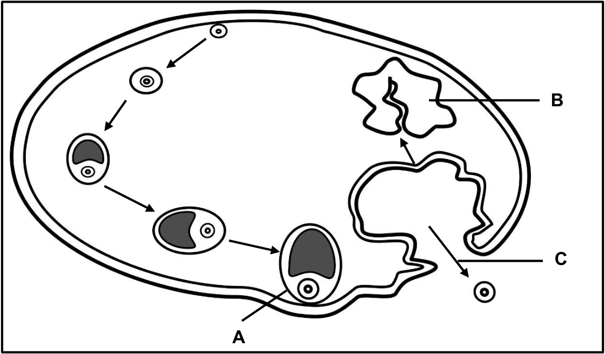

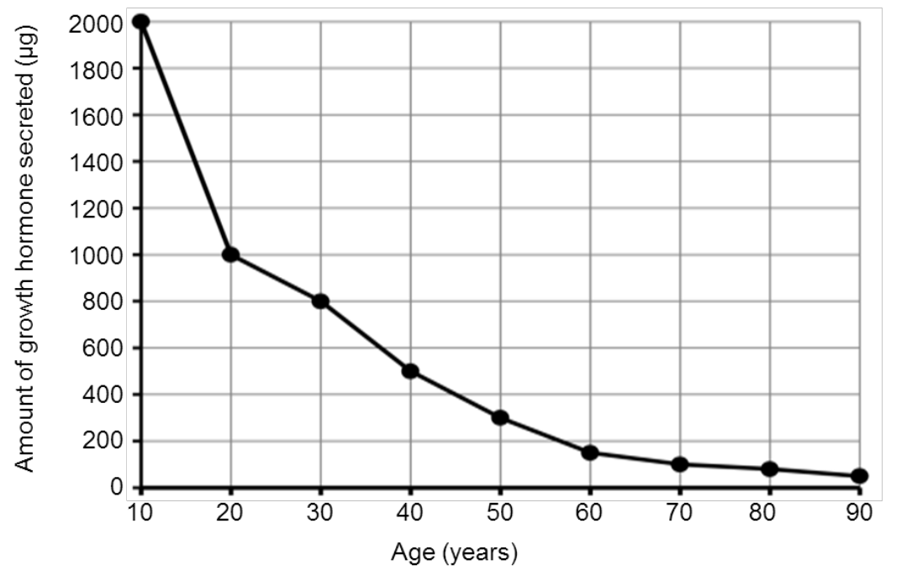

---

### 1.3 Review Solutions

* **1.3.1** A only
* **1.3.2** B only
* **1.3.3** A only
* **1.3.4** A only
* **1.3.5** Both A and B

---

### 1.4 Complete the Table Below

| | Stimulus/variable | Receptor/s | Control centre | effector |
| :--- | :--- | :--- | :--- | :--- |
| **osmoregulation** | **1.4.1** $\text{H}_2\text{O}$ levels (high and low) | osmoreceptors | hypothalamus | **1.4.9** kidneys |
| **salt concentration** | salts e.g. $\text{Na}^+$ (high and low) | cells in glomeruli | **1.4.6** adrenal glands | kidneys |
| **carbon dioxide concentration** | $\text{CO}_2$ (high and low) | **1.4.4** chemoreceptors | **1.4.7** medulla oblongata | lungs |
| **thyroxin** | **1.4.2** high or low metabolic rate | pituitary gland | thyroid gland | body cells |
| **glucose** | blood glucose (high and low) | **1.4.5** islets of Langerhans | pancreas | **1.4.10** liver |
| **thermoregulation** | **1.4.3** high or low core body temperature | thermoreceptors | **1.4.8** hypothalamus | skin |

---

### 1.5 Reading Comprehension: South Africa’s Very Own Mountaineer and Adventurer

**Passage:**
Sibusiso Vilane became a South African hero after summiting the Earth’s highest mountain, Mount Everest, in 2003. He started training in mountaineering by climbing the peaks of the Drakensberg mountains.

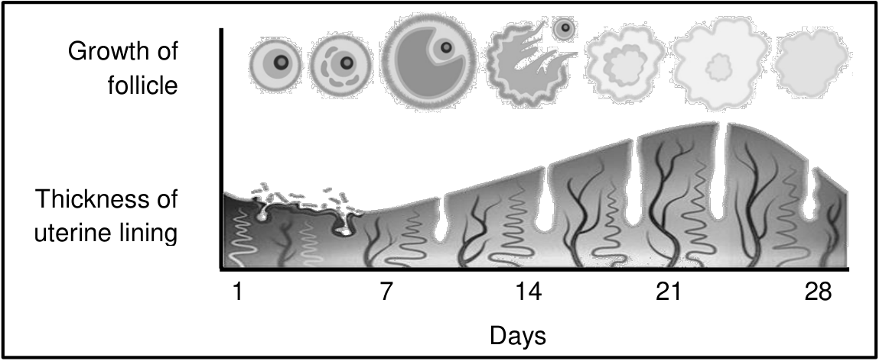

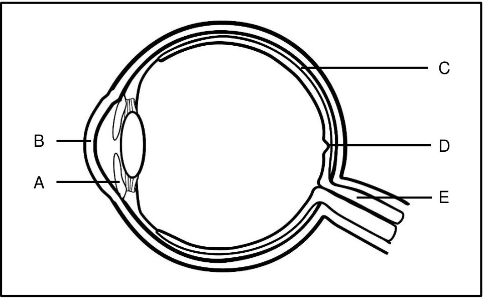

---

# Revision Notes: Human Physiology and Environmental Adaptations

## 1. Context and Background: High-Altitude Mountaineering

Mountaineers (such as Sibusiso Vilane) expose their bodies to severe physiological strain when climbing to extreme altitudes ($>8000$ metres). At higher altitudes:
- Atmospheric pressure decreases, leading to lower oxygen availability.
- Hypoxia (oxygen starvation) can set in.
- Average temperatures are well below freezing, risking frostbite and hypothermia.
- Climbers may develop acute mountain sickness (AMS) or disorientation.

Athletes try to **acclimatize** to these adverse conditions by preparing the body for the physiological challenges. Local populations (such as Sherpas) who live at high altitudes all year round have bodies naturally adapted to low oxygen levels and extreme cold.

---

## 2. Review Questions and Answers

### Question 1.5.1
**Question:** With low oxygen levels, what other atmospheric gas levels could become a problem in the system of climbers like Sibusiso?  
**Answer:** High $\text{CO}_2$ levels.

---

### Question 1.5.2
**Question:** How are the levels of the gas that you have given as your answer in 1.5.1 detected?  
**Answer:** Detected by the respiratory centre in the medulla oblongata / chemoreceptors in the carotid artery.

---

### Question 1.5.3
**Question:** In a flow diagram, show how their bodies will try and compensate and adapt to the levels of the gas in their system.  
**Answer:**

$$\text{High } \text{CO}_2 \text{ (stimulus)} \longrightarrow \text{respiratory centre (receptor)} \longrightarrow \text{breathing muscles} \longrightarrow \text{increased rate of breathing} \longrightarrow \text{normal levels of } \text{CO}_2$$

---

### Question 1.5.4
**Question:** The climbers will lose a lot of heat through radiation to the environment. What conscious measures would you suggest they take to reduce this loss?  
**Answer:** Cover as much skin as possible with clothes, hats, and gloves.

---

### Question 1.5.5
**Question:** Suggest a way in which climbers could prepare their bodies for the challenges of high altitudes, i.e., how in their training could they acclimatize to the conditions on Everest?  
**Answer:** Spend more time in places that are higher up and climb smaller peaks (e.g., training in high-altitude ranges like the Drakensberg).

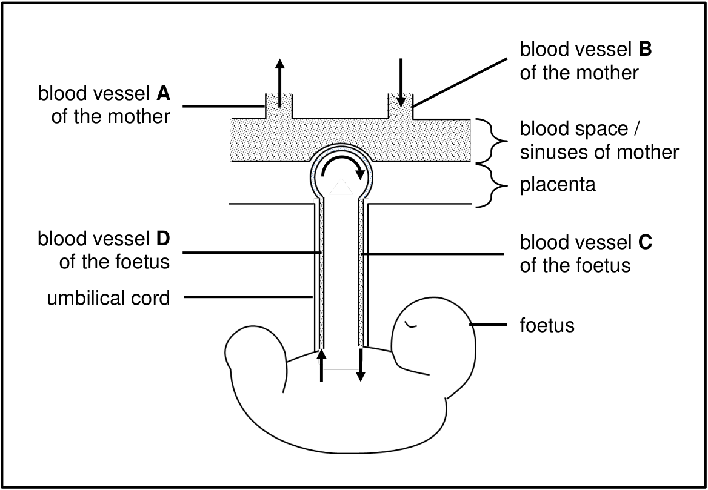

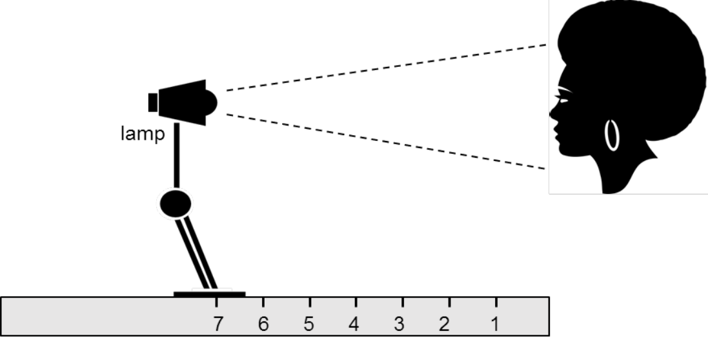

---

### Revision Notes: Homeostatic Mechanisms and Data Analysis

#### 1. Core Concepts: Homeostasis and Respiration

*   **Hypoxia:** The term used when the oxygen availability in the blood decreases.
*   **Thermoregulation:** The homeostatic mechanism that maintains internal body temperature within safe limits.
    *   **Effect of Flu:** Flu causes a high temperature (fever). 
    *   **Environmental Interaction:** In cold external conditions, instead of retaining heat, the body may lose heat to the environment. This alters enzyme activity and metabolism, which can lead to critical health complications or death.

---

#### 2. Data Analysis Activity

##### Table: Volume of Urine Produced by Six Different People

| Person | Volume of urine produced in $\text{cm}^3$ (Hot day) | Volume of urine produced in $\text{cm}^3$ (Cold Day) |
| :---: | :---: | :---: |
| 1 | $430$ | $890$ |
| 2 | $350$ | $1060$ |
| 3 | $270$ | $930$ |
| 4 | $560$ | $1280$ |
| 5 | $400$ | $680$ |
| 6 | $390$ | $1160$ |
| **Average** | **[Calculated Below]** | **$1000$** |

---

##### Worked Example: Calculating the Average

**Question:** Calculate the average volume of urine in $\text{cm}^3$ produced on the hot day. Show all workings.

**Formula:**
$$\text{Average} = \frac{\text{Sum of all values}}{\text{Number of values}}$$

**Step-by-step Working:**
1. Sum the values for the hot day:
   $$\text{Sum} = 430 + 350 + 270 + 560 + 400 + 390 = 2400$$

2. Divide by the total number of people ($n = 6$):
   $$\text{Average} = \frac{2400}{6} = 400$$

**Answer:** 
The average volume of urine produced on the hot day is **$400\text{ cm}^3$**.

---

### 2. Homeostasis and Negative Feedback Mechanisms

#### Worked Example and Exercises (Continuation)

* **Average volume on hot day calculation:**
  $$\text{Average volume} = \frac{430 + 350 + 270 + 560 + 400 + 390}{6} = 400 \text{ cm}^3$$

* **2.1.2** What can you deduce from the difference between the average volume of urine produced on the hot day and the average volume of urine produced on the cold day? *(2)*
  * **Answer:** $600 \text{ cm}^3$; more urine is produced on a cold day.

* **2.1.3** Explain why, on a hot day, less water is lost from the body as urine. *(2)*
  * **Answer:** On a hot day a person would sweat. This loss of water would be detected by osmoreceptors in the hypothalamus, and ADH levels will rise to ensure that water reabsorption into the blood capillaries around the kidneys increases.

* **2.1.4** The composition (make-up) of urine depends on several factors. Name two factors that would affect the composition of urine. *(2)*
  * **Answer:** Water content of the blood (over-hydrated or dehydrated); Salt content of the blood.
  * *(Total marks for 2.1: 8)*

---

### 2.2 Negative Feedback Mechanism (Thyroid Gland and Pituitary Gland)

The diagram below represents a negative feedback mechanism. X and Y represent hormones secreted by the respective glands.

* **2.2.1** What is the role of any negative feedback mechanism in the human body? *(1)*
  * **Answer:** To establish homeostasis in an organism / to maintain a constant internal environment.

* **2.2.2** Identify hormone X. *(1)*
  * **Answer:** Thyroid stimulating hormone (TSH).

* **2.2.3** Explain the consequences for a person if hormone Y remained abnormally high for extended periods of time. *(3)*

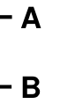

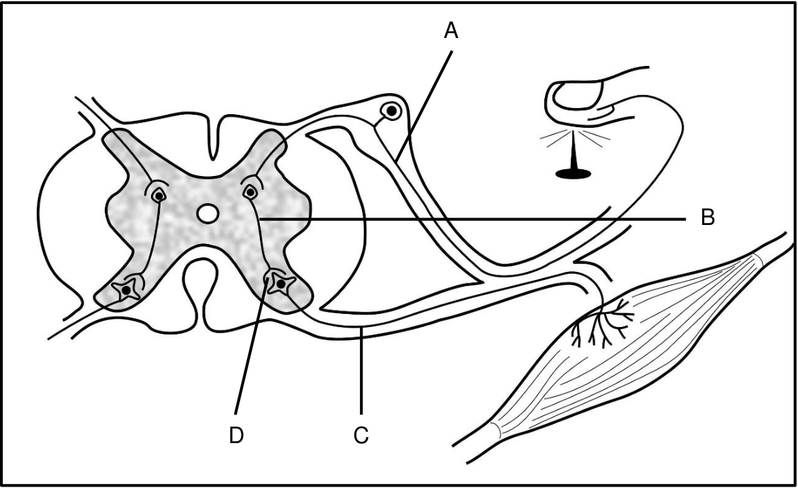

---

If thyroxin levels remain high the basal metabolic rate (BMR) will be high and the person would get tired and the heart will be under strain. (5)

2.3 Triathletes competing in the Iron Man series are sometimes on the road and in the water for a total of over 8 hours. They will get very hot and thirsty. They will sweat profusely and will drink fluids continually through the race. They often do not need to urinate. Which two mechanisms would these athletes use to regulate their body temperature and fluid loss during the race? (2)

**Answer:** Thermoregulation and osmoregulation

2.4 The picture below shows how important the skin is in controlling the core body temperature in very warm conditions.

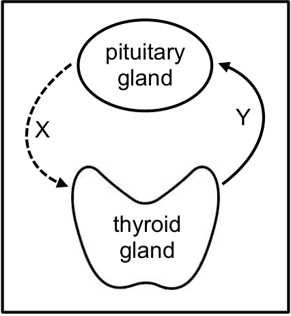

Using the information provided **draw** your own picture, alongside the one given, showing how the skin controls body temperature in cooler conditions. (5)

**Answer guidelines:** 
Cold day - hypothalamus stimulated, vasoconstriction – blood vessels narrow, reduced blood flow to skin, sweat gland less active, drawing showing constricted blood vessels.

---

## Question 3

### 3.1
Type 2 diabetes is often linked to body mass index (BMI). The higher your BMI the greater your chances of developing Type 2 diabetes. The table below shows the results of an investigation into the BMI of women and their risk of developing diabetes (statistics from the American Diabetes Association)

| BMI ($\text{mass} \div \text{height}$) ($\text{kg/m}^2$) | Relative risk of developing diabetes in females ($\%$) |
| :---: | :---: |
| $< 20$ | 7,5 |
| $20 - 25$ | 18,0 |
| $26 - 30$ | 37,5 |
| $31 - 35$ | 57,0 |
| $> 35$ | 74,5 |

#### 3.1.1
Draw a histogram using the data in the table. (5)

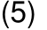

* Histogram heading $\checkmark$ – Effect of BMI on risks of developing diabetes
* X-axis $\checkmark$ – $\text{BMI}$ ($\text{kg/m}^2$)
* Y-axis $\checkmark$ – $\% \text{ risk}$
* Bars drawn together. $\checkmark$ Scale $\checkmark$

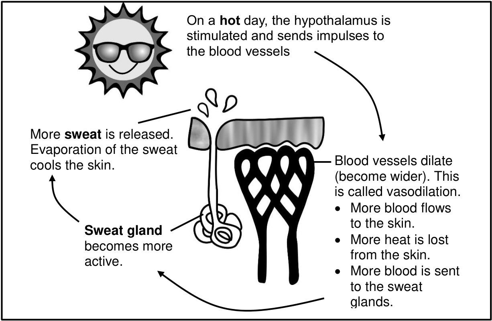

---

### 3.1 Hormones and Diabetes

#### 3.1.2
* **Question:** Which hormone is deficient in people with diabetes? (1)
* **Answer:** Insulin $\checkmark$

#### 3.1.3
* **Question:** In which organ is this hormone produced? (1)
* **Answer:** Pancreas $\checkmark$

#### 3.1.4
* **Question:** Name another hormone that regulates the amount of glucose found in the blood. (1)
* **Answer:** Glucagon $\checkmark$

#### 3.1.5
* **Question:** Write up your own conclusion from the data given in the table and from your histogram. (2)
* **Answer:** The higher the BMI the higher the risk of developing diabetes $\checkmark\checkmark$

*(Total Marks for 3.1: 10)*

---

### 3.2 Investigation: Effect of Exercise on Skin Temperature

#### Scenario
Lerato carried out an investigation to determine the effect of exercise on skin temperature. She asked 100 learners in her school to participate in the investigation. The sample consisted of 100 girls of the same age. 

The investigation was done as follows:
* The learners were divided into two groups of 50 each (Group A and B).
* The skin temperature was measured for all the participants.
* Group A was asked to run around the sports field for 10 minutes.
* Group B was asked to remain seated on the benches next to the field for 10 minutes.

After 10 minutes the skin temperature of all participants was measured, and the average was calculated for each group (A and B).

---

#### Questions and Answers

#### 3.2.1 In this investigation, identify the:
1. **(a) independent variable** (1)
   * **Answer:** Level of exercise $\checkmark$
2. **(b) dependent variable** (1)
   * **Answer:** Skin temperature $\checkmark$

#### 3.2.2 State two steps that Lerato took into consideration during the planning of the investigation. (2)
* **Answer:** Lerato decided on the ...
  * Gender to use (girls) $\checkmark$
  * Age of the participants $\checkmark$
  * Type of exercise $\checkmark$
  * Duration of the exercise $\checkmark$
  * Sample size to use $\checkmark$
  *(Accept any two of the above)*

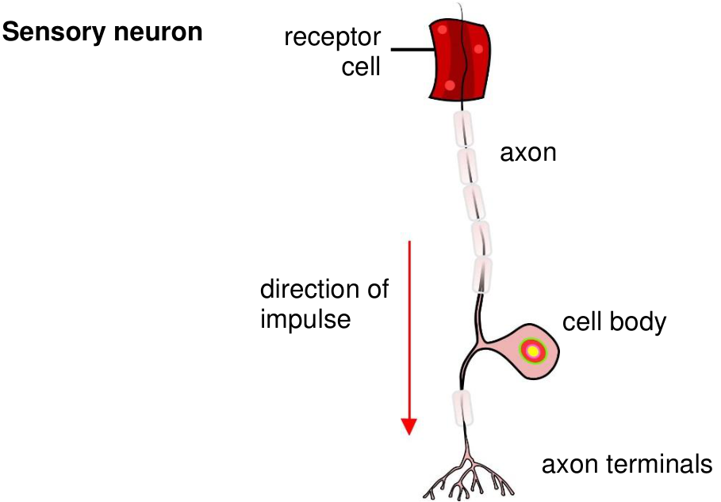

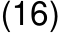

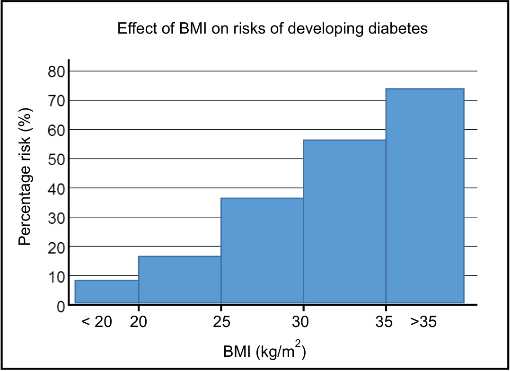

---

3.2.3 What is the expected results for the participants in group A? (1)
* Their skin temperature would rise ✓

3.2.4 Name the one factor that Lerato kept constant during the investigation. (1)
* The duration of activity / non-activity ✓ / 10 minutes

3.2.5 Which of the two groups (A or B) will release more sweat? (1)
* A ✓

3.2.6 Explain why sweat production will increase in the group identified in question 3.2.5. (3)
* Vasodilation occurs ✓. 
* Warm blood comes to the surface of the skin ✓. 
* The learner's skin temperature would rise. Heat is lost to the environment ✓. 
* More sweat is produced for cooling by evaporation ✓ 
*(any three $\times$ 1)*

(10)

3.3 The graph below shows a comparative glucose test on a healthy and a diabetic person. (In the glucose tolerance test the people being tested would have not eaten for at least 8 hours before the test. When they arrive at the hospital/clinic/doctor’s rooms their blood is taken, and glucose levels are tested. They then drink a glucose solution and their blood is taken and tested every 30 minutes over at least a 3 hour period.)

| Time (minutes) | 0 | 30 | 60 | 90 | 120 | 150 | 180 | 210 |
| :--- | :---: | :---: | :---: | :---: | :---: | :---: | :---: | :---: |
| **Blood glucose levels (mg/dL)** | | | | | | | | |

*Result of a glucose tolerance test on a healthy person (Person A) and on a diabetic (Person B)*

* Normal 
* Person A 
* Person B 

193

---

### Question 3.3

**3.3.1** What values does the graph accept as normal blood glucose levels?  
*Answer:* $80 - 90 \text{ mg/dL}$ (1)

**3.3.2** What is the difference in blood glucose levels at time $0$ between person A and person B?  
*Answer:* $200 - 80 = 120 \text{ mg/dL}$ (2)

**3.3.3** What do you think happened in person A to cause the glucose levels to drop after $60$ minutes?  
*Answer:* The pancreas started secreting insulin and glucose was converted to glycogen (2)

**3.3.4** Name three lifestyle precautions should person B be taking?  
*Answer:* 
* A diet with reduced sugar.
* Exercise frequently.
* Small meals taken frequently.
(3)

**3.3.5** Besides lifestyle changes what treatment is available for diabetics to regulate their glucose levels?  
*Answer:* Inject insulin. Have insulin pumps inserted. (2)

**(10)**  
**[30]**

---

### Section B: [50]

**Total marks: [100]**

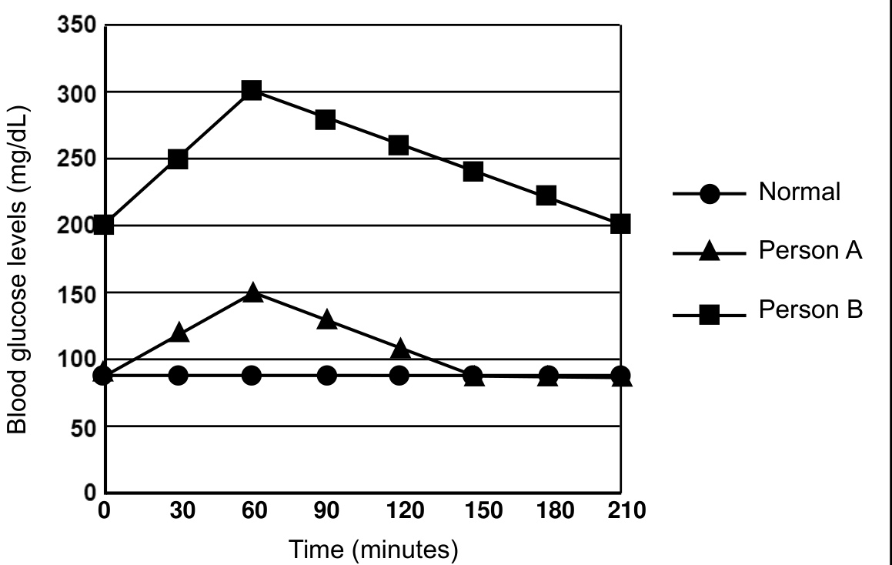

---

# Cognitive levels distribution

| Question | Level 1 | Level 2 | Level 3 | Level 4 | Marks |
| :---: | :---: | :---: | :---: | :---: | :---: |
| 1.1.1 | $\checkmark$ | | | | 2 |
| 1.1.2 | | $\checkmark$ | | | 2 |
| 1.1.3 | | $\checkmark$ | | | 2 |
| 1.1.4 | | $\checkmark$ | | | 2 |
| 1.1.5 | $\checkmark$ | | | | 2 |
| | **4** | **6** | | | **10** |
| 1.2.1 | $\checkmark$ | | | | 1 |
| 1.2.2 | $\checkmark$ | | | | 1 |
| 1.2.3 | $\checkmark$ | | | | 1 |
| 1.2.4 | $\checkmark$ | | | | 1 |
| 1.2.5 | $\checkmark$ | | | | 1 |
| 1.2.6 | $\checkmark$ | | | | 1 |
| 1.2.7 | $\checkmark$ | | | | 1 |
| 1.2.8 | $\checkmark$ | | | | 1 |
| 1.2.9 | $\checkmark$ | | | | 1 |
| 1.2.10 | $\checkmark$ | | | | 1 |
| | **10** | | | | **10** |
| 1.3.1 | $\checkmark$ | | | | 2 |
| 1.3.2 | $\checkmark$ | | | | 2 |
| 1.3.3 | $\checkmark$ | | | | 2 |
| 1.3.4 | $\checkmark$ | | | | 2 |
| 1.3.5 | | $\checkmark$ | | | 2 |
| | **8** | **2** | | | **10** |
| 1.4.1 | $\checkmark$ | | | | 1 |
| 1.4.2 | $\checkmark$ | | | | 1 |
| 1.4.3 | $\checkmark$ | | | | 1 |
| 1.4.4 | $\checkmark$ | | | | 1 |
| 1.4.5 | $\checkmark$ | | | | 1 |
| 1.4.6 | $\checkmark$ | | | | 1 |
| 1.4.7 | $\checkmark$ | | | | 1 |
| 1.4.8 | $\checkmark$ | | | | 1 |
| 1.4.9 | $\checkmark$ | | | | 1 |
| 1.4.10 | $\checkmark$ | | | | 1 |
| | **10** | | | | **10** |
| 1.5.1 | $\checkmark$ | | | | 1 |
| 1.5.2 | $\checkmark$ | | | | 1 |
| 1.5.3 | | | $\checkmark$ | | 3 |

195

---

<!-- DIAGRAM_PLACEHOLDER: diagram -->

| Question | Column 2 | Column 3 | Column 4 | Column 5 | Marks |
| :---: | :---: | :---: | :---: | :---: | :---: |
| 1.5.4 | | $\checkmark$ | | | 1 |
| 1.5.5 | | $\checkmark$ | | | 1 |
| 1.5.6 | $\checkmark$ | | | | 1 |
| 1.5.7 | | | | $\checkmark$ | 2 |
| | 3 | 2 | 3 | 2 | 10 |
| 2.1.1 | | | $\checkmark$ | | 2 |
| 2.1.2 | | $\checkmark$ | | | 2 |
| 2.1.3 | | | $\checkmark$ | | 2 |
| 2.1.4 | | $\checkmark$ | | | 2 |
| | | 4 | 4 | | 8 |
| 2.2.1 | | $\checkmark$ | | | 1 |
| 2.2.2 | $\checkmark$ | | | | 1 |
| 2.2.3 | | | $\checkmark$ | | 3 |
| | 1 | 1 | 3 | | 5 |
| 2.3 | | $\checkmark$ | | | 2 |
| | | 2 | | | 2 |
| 2.4 | | | $\checkmark$ | | 5 |
| | | | 5 | | 5 |
| 3.1.1 | | | $\checkmark$ | | 5 |
| 3.1.2 | $\checkmark$ | | | | 1 |
| 3.1.3 | $\checkmark$ | | | | 1 |
| 3.1.4 | $\checkmark$ | | | | 1 |
| 3.1.5 | | | $\checkmark$ | | 2 |
| | 3 | | 7 | | 10 |
| 3.2.1 a - b | $\checkmark$ | | | | 2 |
| 3.2.2 | | | | $\checkmark$ | 2 |
| 3.2.3 | | | $\checkmark$ | | 1 |
| 3.2.4 | | | $\checkmark$ | | 1 |
| 3.2.5 | | $\checkmark$ | | | 1 |
| 3.2.6 | | | | $\checkmark$ | 3 |
| | | 1 | 2 | 7 | 10 |
| 3.3.1 | | $\checkmark$ | | | 1 |
| 3.3.2 | | | $\checkmark$ | | 2 |
| 3.3.3 | | $\checkmark$ | | | 2 |
| 3.3.4 | | | | $\checkmark$ | 3 |
| 3.3.5 | | $\checkmark$ | | | 2 |
| | | 5 | 2 | 3 | 10 |
| TOTAL | 41 | 23 | 26 | 10 | 100 |

196