# **CHAPTER 9: EVOLUTION BY NATURAL** **<mark>SELECTION</mark>** 

## **<mark>Introduction</mark>** 

##### Topics for this unit: 

- origin of ideas about origins 

- theories of evolution 

- Darwin’s theory of evolution by natural selection 

- formation of a new species 

- artificial selection 

- mechanisms of reproductive isolation 

- evolution in present times 

##### **Key terminology** 

|**biological evolution**|any genetic change in a population that is inherited over<br>several generations|
|---|---|
|**biological species**|a group of organisms with similar characteristics that<br>interbreed with one another to produce fertile offspring|
|**population**|a group of individuals of the same species occupying a<br>particular habitat|
|**punctuated**<br>**equilibrium**|evolution characterised by long periods of little or no<br>change followed by short periods of rapid change|
|**natural selection**|mechanism of evolution - organisms survive if they have<br>characteristics that make them suited to the environment|
|**artificial selection**|human-driven selective force, e.g. breeding of plants and<br>animals to produce desirable traits|
|**inbreeding**|mating of individuals that are closely related|
|**outbreeding**|mating of individuals that are not closely related|
|**speciation**|the formation of a new species|
|**geographic**<br>**speciation**|formation of a new species when the parent population<br>separated by a geographical barrier|
|**reproductive**<br>**isolation**|a mechanism that prevents two species from mating with<br>one another and making fertile hybrids|

## **<mark>Origin of ideas about origins</mark>** 

The theory of evolution has been developed over many years by many different scientists and is regarded as a scientific theory since various hypotheses relating to evolution have been tested and verified over time. 

##### **<mark>Theory vs Hypothesis</mark>** 

A **theory** is an explanation of something that has been observed in nature which <mark>can be supported by facts, generalisations, tested hypotheses, models and laws. A</mark> **<mark>hypothesis</mark>** <mark>is a possible solution to a problem.</mark> 

The word **evolution** simply means change over time. Evolution is the process by which organisms develop over time from earlier forms. **Biological evolution** refers to any genetic change in a population that is inherited and becomes a characteristic of that population over several generations. 

### **Evidence for evolution** 

|**Fossils**|covered in Grade 10<br>Different fossils are found in different rock layers with the oldest<br>fossils in the oldest rock layers with transitional fossils present.<br>This systematic change through time is termed**descent with**<br>**modification**.<br>The evidence shows characteristics that make organisms<br>similar to one another largelyfrom the studyof fossils|
|---|---|
|**Bio-**<br>**geography**|covered in Grade 10<br>Biogeography is the study of where species are found and why<br>they are found there.<br>There are many different collections of plants and animals in<br>regions of the same line of latitude, with similar climates and<br>conditions, suggesting such organisms have a shared<br>ancestor.|
|**Genetics**|new concept for Grade 12 – see below<br>Species that are closely related have a greater genetic<br>similarity to each other than distant species and therefore share<br>a more recent common ancestor.|
|**Other**<br>**evidence**|not studied in school – embryology, vestigial organs, comparative<br>anatomy|

### **Genetic evidence and variation** 

The study of genetics deals with the similarities in and differences of related organisms. Genetic evidence that organisms are closely related and are likely to have a common ancestor includes: 

- identical DNA structure 

- similar sequence of genes 

- similar portions of DNA with no functions 

- similar mutations (mitochondrial DNA) 

Species that are closely related have a greater similarity to each other than more distantly related species. 

There is also some degree of variation between individuals of the same species in a population. This variation may be caused by: 

- **Crossing over** during Prophase I of meiosis involves an exchange of genetic material, leading to new combinations of maternal and paternal genetic materials in each new cell / gamete resulting from meiosis. 

- **Random arrangement of maternal and paternal chromosomes** at the equator during metaphase allows different combinations of chromosomes / chromatids to go into each new cell / gamete resulting from meiosis, making them different. 

- **Random fertilisation** between different egg cells and different sperm cells formed by meiosis result in offspring that are different from each other. 

- **Random mating** between organisms within a species leads to a different set of offspring from each mating pair. 

- A **mutation** changes the structure of a gene or chromosome and therefore the organism’s genotype. Since the genotype influences the phenotype, it creates organisms with new, different characteristics from one generation to the next 

## **<mark>Theories of evolution</mark>** 

The most significant advocates of the idea that species are not static, but have changed over time, were Jean Baptiste de Lamarck and Charles Darwin. Of these, Charles Darwin is best known, particularly as a result of his famous book called “The Origin of Species”. 

### **Lamarckism** 

Jean-Baptiste Lamarck was a naturalist and proposed that species were not fixed but that they change over time. During his investigations, he observed that: 

- living species were different to those found in the fossil record 

- domestication of wild plants and animals and selective breeding resulted in plants and animals changing 

- cross breeding plants often led to new characteristics appearing in the offspring 


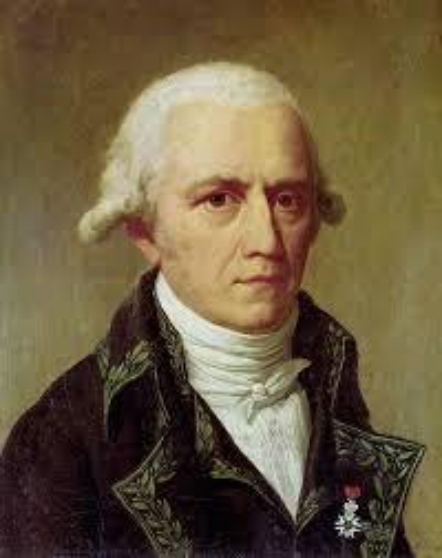
> **[Diagram Context - Textbook_LifeSciences_Gr12_Evolution_by_natural_selection.pdf-0004-05.png]**
> 1. A portrait of a man with a white beard and a black coat.


Figure 1: Jean-Baptiste Lamarck 

##### **The Law of Use and Disuse** 

Lamarck suggested that animals changed over time in order to survive in a new environment. He argued that if a structure was used more often, that structure then became bigger in the following generations. Similarly, if a structure was not being used, then this structure would become smaller and might eventually disappear. He called this the **“law of use and disuse”.** 

##### **The Law of Inheritance of Acquired Characteristics** 

Lamarck also explained that organisms could inherit these changed structures from their parents. This he called “ **inheritance of acquired characteristics”** . Characteristics developed during the life of an individual (acquired characteristics) could be passed on to its offspring. A classic example that Lamarck used to explain his law of use and disuse was the elongation of the giraffe’s neck (Figure 2). According to Lamarck, the original giraffes must have found themselves in an environment where, in order to reach food at the tops of trees, they continually needed to stretch 

their necks. Over a lifetime, a giraffe could develop an elongated neck, allowing it to get more food.  Parents could then pass on this elongated neck to their offspring. 


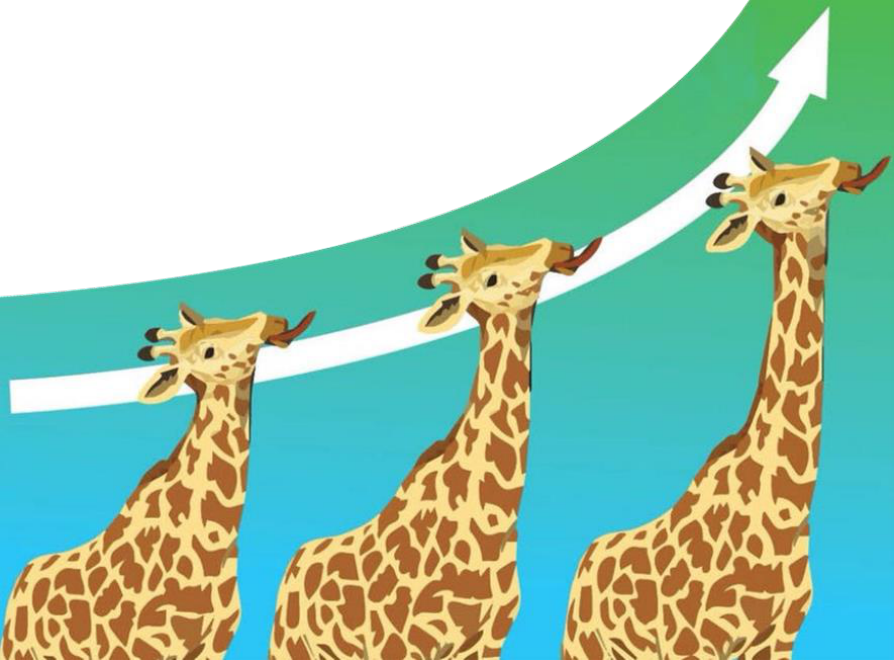
> **[Diagram Context - Textbook_LifeSciences_Gr12_Evolution_by_natural_selection.pdf-0005-01.png]**
> The image shows three giraffes, each with a different color of fur, standing in a line and facing the same direction. The giraffes are positioned in a way that they appear to be following a white arrow. The background of the image is a light blue color, and there is a green arrow on the right side of the image. The giraffes are the main focus of the image, and there are no other objects or text present.


Figure 2: Elongation of a giraffe’s neck over time according to Lamarck 

#### **<mark>Why Lamarck was wrong</mark>** 

Lamarck argued that traits acquired by parents could be passed on to offspring. He did, however, not provide any mechanisms of how this would happen, merely stating that the change happened because the organisms wanted or needed it. We now know that changes to organisms can only come about as a result of a genetic change which is then passed on to offspring. 

For this reason, Lamarckism is not accepted today as an explanation for evolutionary change. His work did, however, set the groundwork for scientists like Charles Darwin. 

### **Darwin’s theory of evolution by natural selection** 

Charles Darwin’s theory of evolution by natural selection is one of the basic concepts for understanding evolution and is based on the four main observations made by him while on his around-the-world trip on the ship, the HMS Beagle. 

- Populations can produce far more offspring than needed. 

- Sizes of most natural populations and resources remain relatively constant. 

- There is a natural variation of characteristics among members of the same species. 

- Some characteristics are inherited and  are passed on to the next generation 


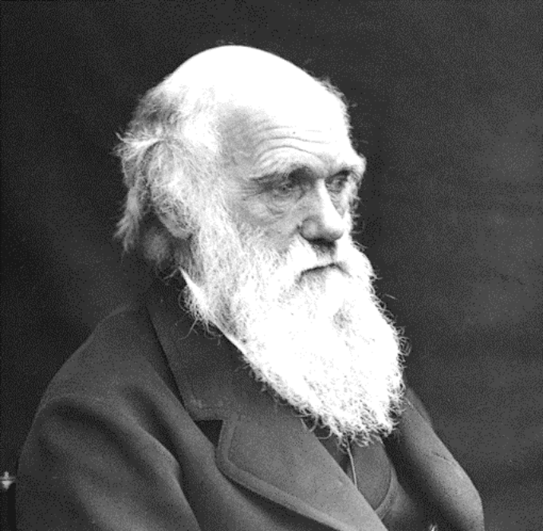
> **[Diagram Context - Textbook_LifeSciences_Gr12_Evolution_by_natural_selection.pdf-0006-02.png]**
> This photographic portrait depicts the naturalist Charles Darwin, recognizable by his characteristic prominent white beard and dark coat against a dark background. The image contains no explicit text labels, variables, or arrows. Conceptually, it serves as a visual anchor in the Grade 12 Life Sciences curriculum to introduce the historical figure responsible for formulating the theory of evolution by natural selection.


Figure 3:  Charles Darwin 

Based on his observations, Darwin came to three main conclusions: 

- All organisms are involved in a struggle for survival and only those best suited to the environment would survive there. 

- Organisms that survive are more likely to reproduce, and therefore pass on their useful characteristics to their offspring. 

- Over many generations, reproduction between individuals with different genetic makeup changes the overall genetic composition of the population. 

### **Evolution by natural selection** 

Natural selection is one of the mechanisms that explains how evolution takes place. Those organisms **best suited to a particular environment produce the most offspring** .  This is commonly referred to as “survival of the fittest” – where “fittest” does not mean the strongest, but the best suited to the environment. 

Some species are better equipped to face to changing conditions in their environment. Such changes include the type and availability of food and shelter, competition or predation. 

Having favourable traits that are suitable to the changing environmental conditions may lead to the formation of  new species (speciation).  Natural selection always acts on variation already present in a population and the environment is the selective pressure for change. 

#### **<mark>How does natural selection work?</mark>** 

A generic explanation of natural selection is given in Table 1 below. 

Table 1: Natural selection 

|1|There is a lot of variation among offspring as offspring differ from their<br>parents (due to crossing over, random arrangement of chromosomes, etc.).|
|---|---|
|2|When the environment changes or there is competition (for food, space, etc.).|
|3|The offspring with characteristics or traits that make them better suited to the<br>new environment or competition will be most likely to survive and reproduce.|
|4|The organisms without the desired characteristic or trait are less able to<br>survive in the new environment or competition and so will die out.|
|5|This means that more offspring in the next generation will have the<br>advantageous characteristic(s). The next generation will have a higher<br>proportion of individuals with the new trait or characteristic.|
|6|These differences accumulate and eventually all individuals in a population<br>have the new trait or characteristic.|

##### **Activity 1: Natural selection** 

##### **Question 1** 

A scientist used guppies ( _Poecilia reticulata_ ) in an investigation to test Darwin's theory of natural selection.  Male guppies have brightly coloured spots to attract females, but these spots also attract predators. 

It was previously observed that males living in streams where there were many predatory fish tended to have fewer spots. This reduced their risk of being eaten. 

Those males living in streams with fewer predators had more spots. 

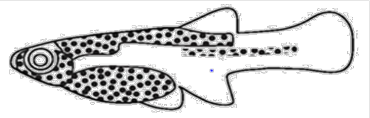

Guppy showing spots (adapted from www.decodedscience.org) 

The **procedure** for the investigation was as follows: 

- Equal numbers of male and female guppies were put into two ponds (pond 1 and pond 2). 

- In pond 1, predatory fish that prey on guppies were introduced. 

- In pond 2, predatory fish that do not feed on guppies were introduced. 

- The guppies were allowed to breed for 20 months, representing several generations of guppies. (Guppies reproduce when they are about three months old.) 

##### The **result** of the investigation: 

The male guppies in pond 2 had significantly more spots than the male guppies in pond 1. 

|1.1|How could the validity of this investigation be increased?|(2)|
|---|---|---|
|1.2|Identify the:||
||(a)   independent variable|(1)|
||(b)   dependent variable|(1)|
|1.3|Explain why the scientist included pond 2 in this investigation.|(3)|
|1.4|Describe how Darwin's theory of natural selection can be used to explain<br>the guppies in pond 1 had fewer spots.|why<br>(5)|
|**Quest**|**ion 2**||
|2.1.|What type of characteristics does nature select during evolution?|(1)|
|2.2|In nature, there is always a fight for survival due to competition, predation<br>and adverse weather conditions. Suggest a collective term for all these<br>factors.|<br>(1)|
|2.3|Why is the concept of natural selection so important?|(2)|
|2.4|Why is natural selection not a random process?|(2)|
|2.5|In a population of mice, half were light in colour and half were dark.||
||a)    If an owl, hunts in the area at night, which mice have the more<br>favourable characteristic?  Explain your answer in terms of natural<br>selection.|(3)|
||b)<br>If the predator was a snake that detects the body heat of its prey, wh<br>mice would probably have the more favourable variation?  Explain yo<br>answer.|ich<br>ur<br>(3)|

##### **Question 3** 

Before the industrial revolution, light-coloured moths were far more common in England than dark-coloured moths. Trees were covered by a pale lichen which provided camouflage for the lighter moth. Dark moths were much more visible and were eaten by birds. 

Due to pollution from factories in the 19^{th} century, the environment changed. Lichen was killed off, and a black soot covered the bark on the trees. This provided good camouflage for the dark-coloured moths, but the light-coloured moths stood out from their background and were ready prey for birds. 

The following is a graph showing the changes in the percentage of dark-coloured moths over a number of years. 

Changes in the percentage of dark-coloured moths in relation to pollution over a period of time. 

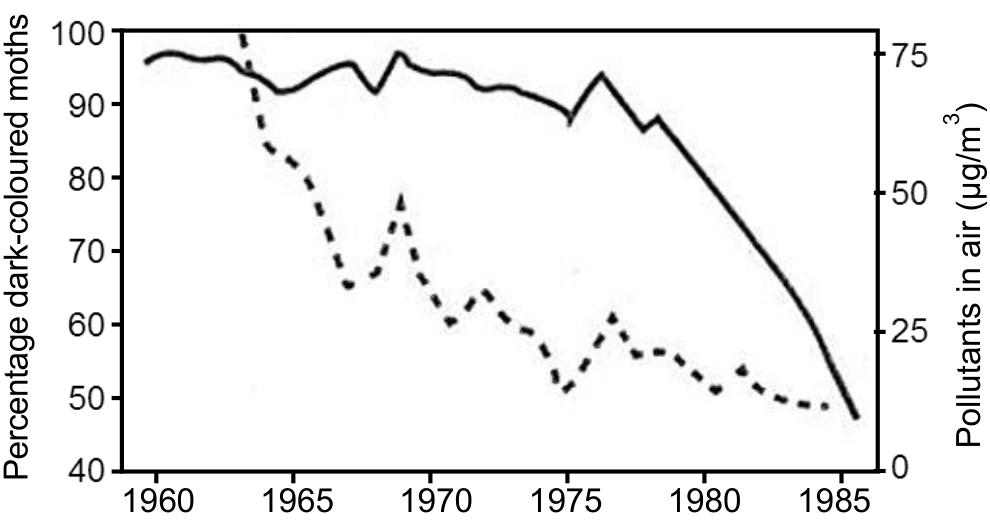

Key: dark-coloured moths pollutants in the air 

- 3.1 What is the general relationship between the dark-coloured moth population and the pollution from 1965 to 1985? (1) 

- 3.2 Explain the relationship mentioned in question 3.1 (1) 

- 3.3 Why did the population of the light-coloured moths decrease during the 19^{th} century? (2) 

- 3.4 Once the air pollution had decreased, what do you think happened to the population of the light-coloured moths? Give a reason for your answer. (2) 

   - (30) 

### **Punctuated equilibrium** 

Punctuated equilibrium refers to a form of evolution characterised by long periods of little or no change followed by short periods of rapid change. This concept was developed by Niles Eldredge and Stephen J. Gould in 1972. 

Darwin had proposed that species evolve gradually with small changes over a period of time. This is called gradualism. In gradualism, the physical (phenotypic) characteristics of a population change gradually because of the accumulation of small genetic changes. 

Eldredge and Gould noticed that in the fossil record, there were long periods of time where species did not change or changed very little. This was interspersed with periods of rapid change. Accordingly, new species were formed over a short period of time. The main evidence for this type of evolution was the absence of transitional fossils (the “missing-links”). 


Figure 4: Punctuated equilibrium (Gould) versus gradualism (Darwin) 

When a new species branched off from a parent species, changes occurred quickly, but thereafter, the organism changed very little. 

In a fast-changing environment, species needed to change rapidly to adapt to the environment, failing which, they would become extinct. 

##### **Activity 2: Punctuated equilibrium** 

The graph below shows the speed at which evolution occurs in a species of butterfly. 

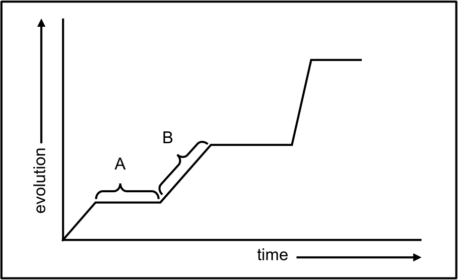

1. Explain the trend in evolution represented by: 

   - a) phase A (2) 

   - b) phase B (2) 

2. In view of the trend represented by A and B, what type of evolution is represented by the graph? (1) 

3. Explain why the chances of speciation are great during phase B. (2) 

      - (7) 

#### **<mark>Lamarckism vs Darwinism</mark>** 

Table 2 below outlines the differences between Lamarckism and Darwinism. 

Table 2: Lamarckism vs Darwinism 

||**Lamarckism**|**Darwinism**|
|---|---|---|
|**make-up of a**<br>**population**|members of population are<br>all the same|members have similar<br>characteristics with a<br>measure of variation|
|**transformation of a**<br>**species/population**|individuals are able to<br>transform during a life time|populations, not individuals,<br>transform over time and only<br>through genetic means|
|**mechanism of**<br>**change**|individual chooses which<br>traits to pass on to offspring<br>changes are directed to<br>meet survival|natural selection – the envi-<br>ronment exercises selective<br>pressure causing change<br>variation exists regardless of<br>organisms needs.|

##### **Activity 3: Theories of evolution** 

|1.|Jea<br>of e|n Baptiste de Lamarck was a French naturalist who proposed his theory<br>volution in 1809.|
|---|---|---|
||a)|Name the two ideas on which Lamarck’s theory was based.<br>(2)|
||b)|Why was his theory considered incorrect and therefore subsequently<br>rejected?<br>(1)|
||c)|Was Lamarck’s work entirely without value because his theory had<br>been rejected?<br>(2)|
|2.|Cha<br>reg|rles Darwin, a British naturalist, made his most important observations<br>arding evolution on the Galapagos islands.|
||a)|List four observations his evolutionary theory was based on.<br>(4)|
||b)|Describe how Darwin’s theory of Natural Selection would have<br>explained the development of long necks in giraffes.<br>(7)|
||c)|Tabulate two differences between the theories of Charles Darwin and<br>Lamarck.<br>(5)|
|3.|Bel<br>stat<br>a)|ow are statements referring to the evolution of species. Decide if the<br>ement applies to Darwin, Lamarck or to both scientists.<br>Only the fittest individuals with the most advantageous characteristics<br>survive in a changing environment.<br>(1)|
||b)|All members are slightly different and these differences accumulate<br>over time, changing their appearance.<br>(1)|
||c)|A whale’s hind limbs were severely reduced because they no longer<br>used legs in the water.<br>(1)|
||d)|Species acquire bigger and better structures by the increase in their use<br>and pass these structures on to their offspring.<br>(1)<br>(25)|

## **<mark>Formation of a new species (Speciation)</mark>** 

The formation of a new species is called **speciation** . You have already learnt that variation in individuals is caused by sexual reproduction, genetic mutations, crossing over, random arrangement, etc. If enough of these variations occur and are kept within a **population** , the more likely it is that a species can change. 

**<mark>Biological species concept</mark>** <mark>- a group of organisms with similar characteristics that</mark> _<mark>interbreed</mark>_ <mark>with one another to produce fertile offspring.</mark> 

Every population has some sort of genetic variation and these variations are important as they increase a species chance of surviving in a changing environment (natural selection). **Geographic speciation** is one way speciation occurs. 

### **Geographic speciation** 

Geographic speciation occurs when part of a population becomes isolated from the parent population due to physical barriers. Such barriers could be continental drift, oceans, rivers, mountains, or other natural disturbances such as volcanos or earthquakes. 

The images below show how two new species can arise as a result of being separated, over a long period of time, due to a geographic barrier. 

1. Early stage of separation (300 000 years ago) 

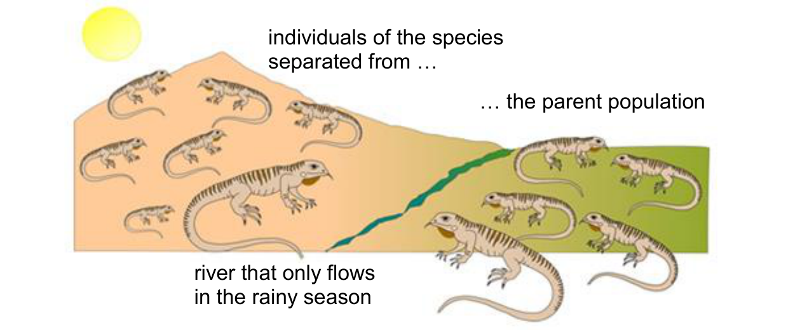

2. Later stage of complete isolation (150 000 years ago) 

Landscape features have altered over time: the river has widened, deepened and flows all year round, resulting in geographic isolation. 

As a result, the gene flow between the two populations stops. The two populations are exposed to different environmental conditions. 

Natural selection now takes place independently in each of the 2 populations – 

they change genotypically and then phenotypically from each other. 

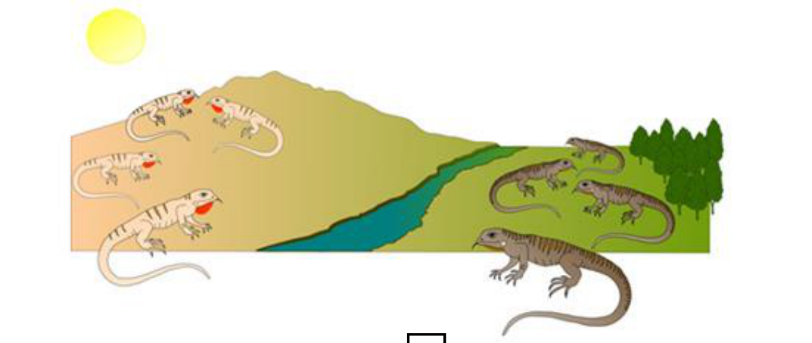

3. Speciation has occurred (3000 years ago). 

Climate change over time has altered the landscape: the river had dried up enabling a meeting of the species. 

The two new species may mix but are genetically unable to breed with each other because of evolutionary changes. 

Figure 5: Process of geographic speciation in a population of lizards, separated by a river 

#### **<mark>Generic account of speciation</mark>** 

- A population is separated by a geographical barrier and splits into two populations. 

- The two populations cannot mate and so gene flow between the two populations stops. 

- The two populations are exposed to different environmental conditions and selective forces. 

- Natural selection works independently on both populations simultaneously 

- The two populations become different from the original population both genotypically and phenotypically. 

- Even if the populations were to come together again, they would not interbreed with one another and therefore would have become different species. 

##### **Activity 4: Speciation** 

##### **Question 1** 

|1.<br>Bon<br>pop<br>Mou<br>kilo<br>spec|tebok are antelope that are found in the Western Cape.  Two main<br>ulations exist, one at the Bontebok National Park and the other at Table<br>ntain National Park.  These two national parks are hundreds of<br>metres apart.  Scientists believe that due to geographical separation,<br>iation**may**occur.|
|---|---|
|1.1|Define the term “speciation”.<br>(2)|
|1.2|Define the term ‘species’.<br>(3)|
|1.3|Name the type of speciation that may occur in the bontebok<br>populations.<br>(2)|
|2.<br>For<br>FAL|each of the statements below, state whether the statement is TRUE or<br>SE. Where false, correct the statement so that it is true.|
|2.1|Genetic barriers cause divided populations to remain the same.<br>(2)|
|2.2|Reproductive isolation prevents two or more populations from changing<br>genes.<br>(2)|
|2.3|Populations that become isolated by means of a geographic barrier will<br>not differ from their ancestral species.<br>(2)|
|2.4|Competition, predation, climatic factors and disease are all<br>selective forces / environmental pressures.<br>(2)|

##### **Question 2** 

Darwin discovered two different species of tortoises on two different island in the Galapagos. One had a domed shell and short neck, the other had an elongated shell and a longer neck. The two islands had very different vegetation. One of the islands (island X) was rather barren, dry and arid. It had no grass but rather short tree-like cactus plants. On the other island (island Y), there were no cactus plants but it had a good supply of water and grass grew freely. The diagram below shows the two main 

##### species of tortoise. 

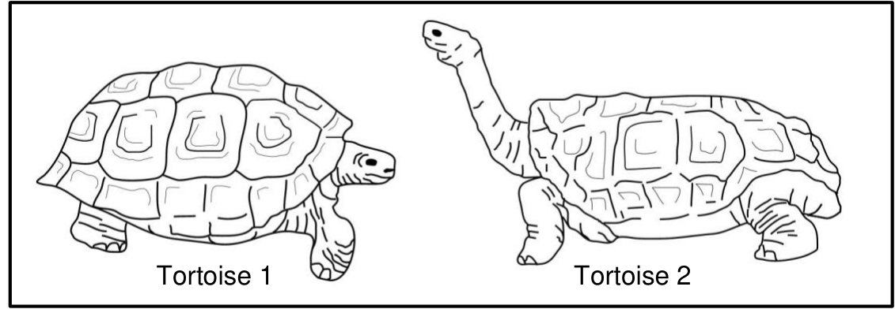

- 1.1 Which tortoise (1 or 2) would have been found on: 

   - a) Island X (1) 

   - b) Island Y (1) 

- 1.2 Describe how the two tortoise species became different species. (5) 

- 1.3 Scientists believe that the variation in populations lead to the formation of new species. List four sources of variation in populations. (4) (26) 

#### **<mark>Cladogram of speciation</mark>** 

On a cladogram or phylogenetic tree (diagrams showing evolutionary relationships amongst organisms), one can easily see where a species has split into two different species. This is known as a speciation event (Figure 6). 

Over time, some species have remained alive (they are extant) while others have died off (become extinct). Cladograms also show extinction events. If the lineage line does not reach the top of the tree, then the species became extinct. The longer the line of lineage, the more unchanged the species has remained. 

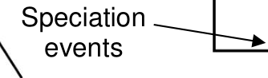

Figure 6: Cladogram showing speciation events 

## **<mark>Artificial selection</mark>** 

Humans have long exploited the variation in wild and cultivated organisms to develop crops or new breeds of livestock, through a process called **artificial selection** . 

Artificial selection is a human-driven selective force and occurs at a faster rate than natural selection. Favourable traits are artificially selected for by scientists and farmers and then bred out to produce offspring with those traits. Artificial selection mimics natural selection, with the exception that artificial selection is a much faster process and results in less variation than natural selection. 

### **Artificial selection in a domesticated animal** 

All dog varieties (see Figure 7) originated from the Grey wolf, _Canis familaris_ . The first few domesticated wolves would have been selected for traits such as tameness, submissiveness and ones that were easy to work with. Five ancient breeds of dog arose from inbreeding which gave rise to the large number of distinct dog breeds that we have today. The extremely large genetic variability in the ancestral species made it a perfect choice for domestication as different traits could be expressed under different selective pressures. 

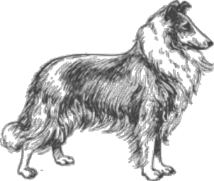

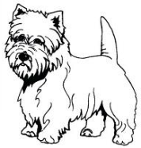

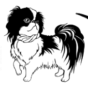

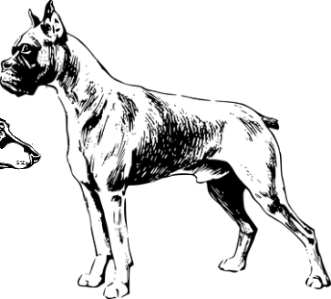

Figure 7: Domestic dogs 

Pedigree dogs, born from two dogs of the same breed, sometimes suffer from deformations and can be vulnerable to diseases and parasites. This is due to their decreased genetic variation. 

Mongrel dogs (“pavement specials” as they are commonly referred to in South Africa) are dogs that were outbreed and so their genetic variation is far greater than a purebred dog. This makes mongrel dogs quite robust (healthy) and they do not die very easily from natural diseases or parasites and they are very fertile. 

### **Artificial selection in crops** 

Domestication in plants has resulted in wide variety of new species with large 

phenotypic differences amongst species. Most of these crops are very dependent on humans for survival. 

The domestication of maize ( _Zea mays spp_ ) is one of the greatest success stories in agriculture.  The modern day maize plant was bred from a multi-stemmed wild grass. Over the past thousand years, farmers selected and planted seeds from those maize plants that had bigger ears of corn and that required less space to grow. Over time, all the undesirable traits were bred out of the plant, leaving only the large ears of corn and less stems. 

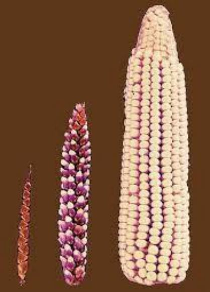

Figure 8: The evolution in the size of the ear of corn. The first image is the original size of the _Zea mays spp_ and the one on the far right is the modern day maize. 

The following characteristics were considered favourable traits in a maize plant: 

- reduced seed coat 

- retention of seeds on the cob so that seeds did not just fall off 

- a tall plant with a single stalk and less stems 

- large ear structure resulting in more food production 

### **Differences between natural and artificial selection** 

For a long time, humans have been doing breeding experiments to develop organisms with a selected set of desirable characteristics, for example increased quality and quantity of milk produced by cows, or drought resistance and increased sugar content in sugar cane. This is achieved by **artificial selection** , which is a similar process to **natural selection** . 

However, artificial selection differs from natural selection. Some of the differences are listed in Table 3 below. 

Table 3: Difference between natural and artificial selection 

|**Natural selection**|**Artificial selection**|
|---|---|
|The**environment or nature**is the<br>selective force|**Humans**represent the selective force|
|Selection is in response to**suitability to**<br>**the environment**|Selection is in response to**satisfying**<br>**human needs**|
|Occurs within**a species**|May involve**one or more species**(as<br>in cross breeding)|

##### **Activity 5: Artificial selection and domestication** 

##### **Question 1** 

- 1.1 List four ways in which artificial selection has been used in agriculture. (4) 

- 1.2 Copy the table below and complete it showing the differences between artificial selection and natural selection. 

- (9) 

||Artificial selection|Natural Selection|
|---|---|---|
|Driven by...|||
|Rate of change...|||
|Amount of variation achieved|||
|End result|||

- 1.3 Humans have been domesticating plants for years and today, most agricultural species come from domesticated varieties. 

   - a) Define the term “domestication”. (2) 

   - b) What was one of the first crops to be domesticated in the world? (1) 

   - c) Name two characteristics that were selected for in the domestication of the crop mentioned in (b) above. (2). 

##### **Question 2** 

Decide if the statements below are TRUE or FALSE. 

- 2.1 Cultivated plants show higher degrees of phenotypic variation than wild plants (1) 

- 2.2 Natural selection is a random process. (1) 

- 2.3 Artificial selection is similar to natural selection, except the process is driven by man and is a quicker process. (1) 

- 2.4 The final product of artificial selection is the adaptation of populations of organisms to their environment. (1) 

- 2.5 All hybrids are infertile. (1) 

- 2.6 Artificial selection has been used by humans to speed up evolution. (1) 

|(24)|
|---|

## **<mark>Mechanisms for reproductive isolation</mark>** 

Reproductive isolation is the mechanism that prevents two species from mating with one another and making fertile hybrids, even when not separated by a geographic barrier. Such mechanisms are used mostly to separate species that live in the same environment. 

|**Strategy**|**Description**|
|---|---|
|**breeding at different**<br>**times of the year**|Different species will have different breeding seasons or, in<br>the case of plants, will flower at different times of the year,<br>in order to prevent cross-pollination.|
|**species-specific**<br>**courtship behaviour**|Some animals have very specific courtship behaviours that<br>do not attract individuals of other species, even if they are<br>closely related species.<br>Courtship behaviour is a physical or chemical signal that<br>an organism is ready to mate. This can include anything<br>from being brightly coloured, to singing elaborate mating<br>songs or mating dances, to the secretion of pheromones in<br>order to attract a mate.|
|**adaptation to**<br>**different pollinators**<br>**(plants)**|Many plants and their flowers are specifically adapted for<br>specific pollinators. Some closely related species of plants<br>have different characteristics such as flower shape, size,<br>colour, reward type (nectar or pollen), scent and timing of<br>flowering all play a role in attracted certain pollinators to<br>them. Also, cross-pollination between the different species<br>is prevented.|
|**infertile offspring in**<br>**cross-species**<br>**hybrids**|Even if two species are able to physically mate and<br>produce offspring, they will still be reproductively isolated<br>due to the fact the most hybrid offspring are infertile.|

## **<mark>Evolution in present times</mark>** 

Evolution is always happening.  Most of the time it is impossible to observe changes in populations and species because evolution happens very slowly – thus the theory of gradualism. However, there are some cases (e.g.: rapidly producing organisms such as viruses and bacteria) that allow scientists to study how species change in response to environmental factors.  Pathogens (viruses and bacteria) evolve quickly because there is lots of natural variation amongst them and the fact that mutations occur most often in rapidly reproducing organisms. 

### **Resistance to antibiotics in TB** 

Tuberculosis (TB) is a chronic bacterial infection caused by the bacterium _Mycobacterium tuberculosis._ Unfortunately, the incidence of this disease keeps increasing in South Africa. 

Treatment is commonly in the form of antibiotics; however, some of the bacteria are naturally resistant to those antibiotics (see Figure 9). 

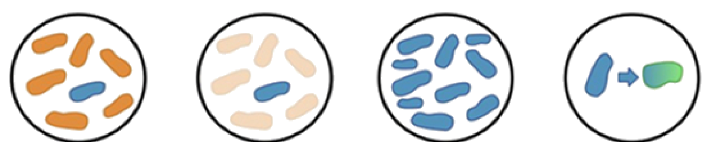

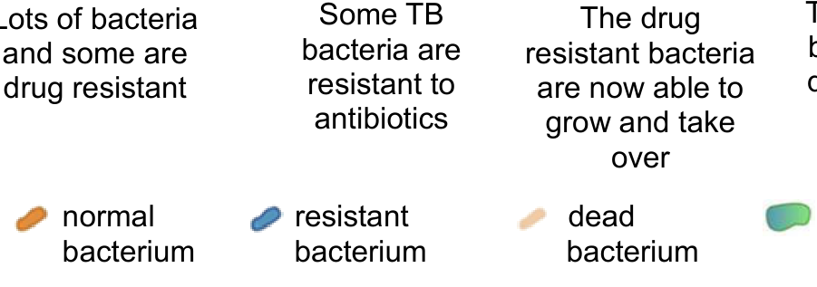

The drug resistant bacteria give their drug resistance to other bacteria 

Lots of bacteria Some TB and some are bacteria are drug resistant resistant to antibiotics 

a bacterium becoming drug resistant 

Figure 9: How antibiotic resistant happens. 

TB has become more and more common in South Africa recently and this is primarily due to the fact that patients do not finish the full course of antibiotics and the naturally resistant bacteria then survive and reproduce. The patient will then develop TB again, except this time, most of the bacteria are now resistant to the previous antibiotic and so treatment will not help anymore. Patients would then have to be placed on stronger antibiotics to kill the resistant bacteria. 

It became common practice to treat TB patients with multiple drugs at the same time. It was assumed that the bacteria would not develop resistance to multiple drugs at the same time. Unfortunately, this assumption was wrong. The TB bacterium became resistant to multiple drugs causing the emergence of multidrug-resistant bacteria. Multidrug-resistant bacteria now require a very aggressive treatment using five different drugs and very often patients with this type of TB do not survive. 

## **<mark>Enrichment</mark>** 

Theory of evolution by natural selection: <u>https://www.youtube.com/watch?v=BcpB_986wyk</u> Natural selection: https://www.youtube.com/watch?v=7VM9YxmULuo Natural selection – the peppered moth: <u>https://www.youtube.com/watch?v=Uf-mOCN7rUU</u> 

## **<mark>Evolution by natural selection:  End of topic exercises</mark>** 

##### **Section A** 

##### **Question 1** 

- 1.1 Various options are provided as possible answers to the following questions. Choose the correct answer and write the letter (A – D) next to the question number (1.1.1–1.1.5) for example 1.1.6 D. 

   - 1.1.1 The theory of evolution by natural selection was first described by … A  Gregor Mendel 

      - B  Watson and Crick 

      - C  Jean Baptiste de Lamarck 

      - D  Charles Darwin 

   - 1.1.2 The reason that Lamarck would have provided for the long beak of the hummingbird is that: 

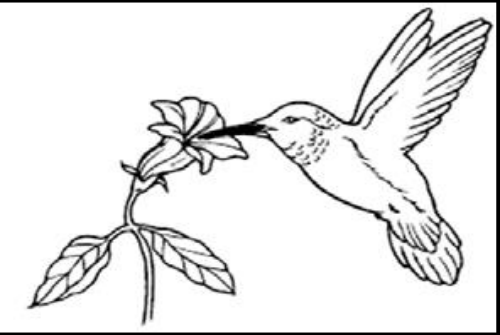

   - A all hummingbirds have the same beak length 

   - B  there is natural variation in beak length and some birds are therefore better suited to feed on nectar 

   - C  the more the hummingbird used its beak, the longer it grew 

   - D  hummingbirds with shorter beaks were more fit for survival 

- 1.1.3 Lamarck's 'laws' of use and disuse and inheritance of acquired characteristics were: 

   - A  rejected, because only characteristics that benefit offspring can be inherited. 

   - B  not rejected, because evidence shows that acquired characteristics can be inherited 

   - C  rejected, because only characteristics that are coded for in the DNA can be inherited 

   - D   not rejected, because Darwin's theory supports Lamarck's 

- 1.1.4  During an investigation, researchers measured the beak size of a certain species of finch on the Galapagos Islands. The type of food available before and after a drought was a factor in the study of the evolution of the beaks of finches. 

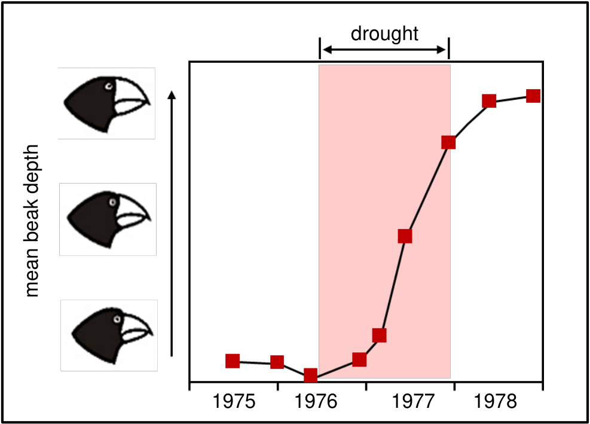

Which factor is the dependent variable? 

- A  the amount of rain 

- B  the type of food available 

- C  the beak size of finches 

- D  the year 

(4 x 2) = (8) 

- 1.2 Give the correct biological term for each of the following descriptions. Write only the term next to the question number. 

   - 1.2.1 The permanent disappearance of a species from earth. 

   - 1.2.2 A tentative explanation of a phenomenon that can be tested. 

   - 1.2.3 

   - The distribution of species in different parts of the world. 

- 1.2.4 Variation that results in distinct phenotypes. 

- 1.2.5 The explanation that species experience long periods without physical change, followed by short periods of rapid physical change. 

- 1.2.6 An explanation for something that has been observed in nature and which can be supported by facts, laws and tested hypotheses. 

- 1.2.7 Formation of a new species when a physical barrier has divided a population. 

- 1.2.8 The breeding of plants and animals to produce desirable characteristics. 

- 1.2.9 The process whereby organisms better suited to their environment survive and produce more offspring. 

- 1.2.10 A group of similar organisms which interbreed successfully with each other to produce fertile offspring. 

(10 x 1) = (10) 

- 1.3 Indicate whether each of the descriptions in Column I applies to **A ONLY, B ONLY, BOTH A AND** B or **NONE** of the items in Column II.  Write **A only, B only, both A and B** or **none** next to the question number. 

|**Column I**|**Column II**|
|---|---|
|1.3.1 The selection and breeding of organisms<br>with desirable characteristics by humans|<br>A: natural selection<br>B: artificial selection|
|1.3.2 An example of discontinuous variation in<br>humans|A: skin colour<br>B: height|
|1.3.3 Example of a reproductive isolating<br>mechanism|A: breeding at the same time<br>of the year<br>B: adaptation to different<br>pollinators|
|1.3.4 A group of similar organisms that can<br>interbreed to produce fertile offspring|A: species<br>B: genus|
|1.3.5 Desired characteristics are passed on<br>from parent to offspring|A: artificial selection<br>B: natural selection|

(5 x 2) = (10) 

- 1.4 Since 1972, biologists Peter and Rosemary Grant from Princeton University in the USA have studied finch populations in the Galapagos. The table below shows their data collected on one island (Daphne Major), for a period of 7 years. They studied one finch population on Daphne Major. 

|**Year**|**1974**|**1975**|**1976**|**1977**|**1978**|**1979**|**1980**|
|---|---|---|---|---|---|---|---|
|rainfall (mm)|-|-|130|20|130|70|50|
|number of finches|1100|1300|1100|200|350|300|250|
|small seeds (mg/m^{2})|-|800|600|90|300|70|50|

   - 1.4.1 In which year were the largest drop in rainfall, number of seeds and number of finches recorded? (1) 

   - 1.4.2 Explain how the three events mentioned in question 1.4.1 are related to each other. (3) 

   - 1.4.3 When the number of finches decreased, there were still plenty of large seeds on the island. What does this tell you about the seedeating habits of the finches that died? (1) 

      - (5) 

- 1.5 Many dog breeds exist today as shown in the diagram below. 

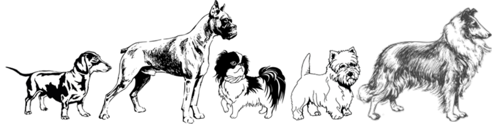

   - (a)  Explain why all breeds of domestic dogs belong to the same species. (2) 

   - (b) Describe how artificial selection has led to different breeds of domestic dogs. (3) 

      - (5 **)** 

- 1.6 This question applies to the diagram on the next page. 

The ancestor of the modern horse had very differently shaped foot bones. Scientists believed that the structure of the foot bones evolved as the environment changed from swampy areas with soft mud to drier and harder soil.  This allowed the animals to move effectively in each habitat. 


Key: the shaded bones are the ones that touched the ground 

- 1.6.1 Describe two changes to the bones that have taken place over the past 50 million years. (2) 

- 1.6.2 Eohippus lived in swampy areas with soft mud. Explain one advantage to Eohippus of the arrangement of bones in its feet. (2) 

- 1.6.3 The changes in the arrangement of the foot bones of horses support Darwin’s theory of evolution by natural selection. Explain how the arrangement of the foot bones of Eohippus could have evolved into the arrangement of the foot bones of Equus. (6) (10) 

**Section A: [48]** 

##### **Section B** 

##### **Question 2** 

- 2.1 An investigation was conducted by a scientist to determine if two plant populations, Population 1 and Population 2, belonged to the same species. The scientist collected seeds from each of the populations. 

   - The procedure followed was: 

- He planted 20 seeds from Population 1 and 20 seeds from Population 2 in two separate plots close to each other. 

- The stamens of all the flowers of Population 1 were removed. 

- Pollen from the flowers of Population 2 was used to pollinate the flowers of Population 1. 

- The scientist harvested the seeds of the plants in Population 1. 

- He grew these seeds under ideal conditions in a laboratory. 

**Result** : None of the seeds germinated. 

   - 2.1.1 Explain the advantage of removing the stamens from the flowers of Population 1. (2) 

   - 2.1.2 What evidence indicates that the two populations do not belong to the same species? (1) 

   - 2.1.3 State two factors that the scientist would have kept constant in the laboratory. (2) 

   - 2.1.4 State one way in which the scientist could have increased the reliability of his results. (1) (6) 

- 2.2    Study the diagram below of the moth species that originally belonged to a single population but was later separated by a mountain into two groups. 

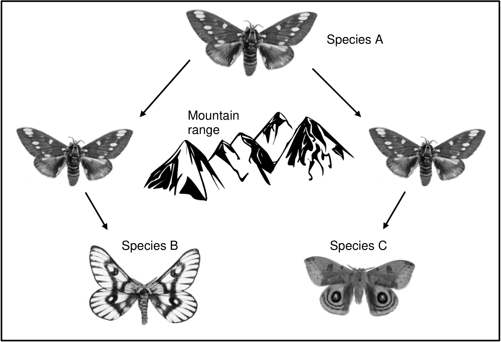

|2.2.1  Name the process which is illustrated in the diagram above.|(1)|
|---|---|
|2.2.2  Explain the importance of the process you identified in questio<br>above.|n 2.2.1<br>(2)|
|2.2.3  Why is species A the ancestor of species B and C?|(2)|
|2.2.4  Explain the above illustrated process in relation to the three sp<br>indicated in the diagram.|ecies<br>(6)|
||(11)|

- 2.3 Tabulate two differences between natural selection and artificial selection. 2.4 Study the extract below which describes the evolution of the snake. 

(3) 

How snakes lost their limbs has long been a mystery to scientists: New research on a 90-million-year-old snake fossil suggests that snakes evolved to live and hunt in burrows as many snakes still do today. It is generally accepted that snakes and lizards are closely related, although very few transitional fossils have been found to support this generalisation. <u>(adapted from https://www.ed.ac.uk/news/2015/snakes-271115)</u> a) Explain one characteristic that you would expect a transitional snake fossil to have. (1) b) Describe how would Jean Baptiste de Lamarck have explained the loss of limbs in snakes? (4) (5) **[25]** 

##### **Question 3** 

- 3.1 Lizards of a certain species on an island are usually brown in colour. A mutation in one gene for body colour results in red or black lizards. Black lizards camouflage well against the dark rocks and warm up faster on cold days which will give them energy to avoid predators. 

Scientists investigated the relationship between the colour of lizards in a population and their survival rate on an island. 

They conducted the investigation as follows: 

- They selected a group of lizards of a certain species in a habitat. 

- They recorded the percentage of each colour (brown, red or black) in the selected group. 

- They repeated the investigation over a period of 30 generations of offspring. 

##### The results of the investigation are shown in the table below. 

|Colour of<br>lizards||Percentage (%) o<br>In thepop|f each colour<br>ulation||
|---|---|---|---|---|
||Initial<br>population|10th<br>generation|20th<br>generation|30th<br>generation|
|Brown|80|80|70|40|
|Red|10|0|0|0|
|Black|10|20|30|60|

(adapted from https//hhmi.org/bioInteractive) 

##### 3.1.1  State the: 

      - a)  independent variable (1) 

      - b)  dependent variable (1) 

   - 3.1.2 Explain the effect of the mutation on the survival of red lizards.  (2) 

   - 3.1.3 Explain why the scientists had to conduct this investigation over 30 generations. (2) 

   - 3.1.4   State two ways in which the scientists could have improved the validity of the investigation. (2) 

   - 3.1.5  Use the theory of natural selection to explain the higher percentage of black lizards in the population of the 30th generation. (6) 

   - 3.1.6  Draw a bar graph to compare the percentage of the brown and the black lizards in the initial population and the 30th generation. (6) 

         - (20) 

- 3.2 The diagram shows the distribution of various camels on the different continents. The arrows indicate the current distribution of the animals. 

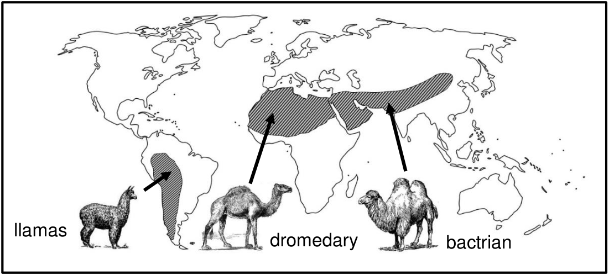

(adapted from http://www.ck12.org) 

Explain how speciation of camels may have occurred. (6) 

**[26]** 

**Section B: [51]   -    Total Marks: [99]** 

### **<mark>Chapter 9: Evolution by natural selection</mark>** 

##### **Activity 1: Natural selection** 

##### **Question 1** 

- 1.1 By ensuring that both ponds in an experiment have identical ✓ environmental conditions ✓ ; by ensuring that there were equal numbers ✓ of predatory fish in both ponds ✓ (any one correct answer) 

- 1.2 a) the type of predators ✓ 

   - b) average number of spots on each male guppy ✓ 

- 1.3 as a control ✓ , to compare the results between the ponds 

to ensure that any changes that occurred ✓ were due to the presence of predators ✓ and not other environmental factors. 

- 1.4 there is variation ✓ amongst the male guppies 

some have more spots ✓ while others have fewer spots ✓ 

the ones that have more spots attract predators ✓ and are eaten ✓ by the predators. 

the ones with fewer spots survived ✓ and reproduced to pass the gene for fewer spots on to the next generation ✓  (any five) 

##### **Question 2** 

- 2.1 Those that will benefit an organism and make it more successful ✓ 

- 2.2 Selective forces ✓ 

- 2.3 It provides a mechanism for evolution ✓ , explaining that animals are able to change to a changing environment and that these small changes over time can result in a new species being formed ✓ that is different to ancestral species. 

- 2.4 The environment actively selects ✓ which organisms are best suited to their environment ✓ . The ways by which variation arises in a population may be random but natural selection is a very selective process. 

- 2.5 a) The dark coloured mice ✓ – they will be difficult to spot in the dark ✓ as they will be well camoflauged at night ✓ in their surroundings 

b) The light coloured mice ✓ – lighter colours absorb less heat than darker colours ✓ . Darker coloured mice will absorb more heat and therefore will be more “visible” to the snake ✓ . 

##### **Question 3** 

- 3.1 Direct relationship ✓ 

- 3.2 As the air pollution decreased over time, the percentage of dark coloured moths 

also decreased ✓ 

- 3.3 The pollution caused a black ash to cover the lichen on the birch trees which made the light coloured moths more visible to predators ✓ and therefore the population numbers would decrease as predation increased ✓ . 

- 3.4 The light coloured moth population would have increases since lower pollution levels resulted in less ash on the birch trees, allowing the lichen to grow again ✓ . Lighter coloured moths are more difficult to see on a light background and so would not be predated upon ✓. 

(30) 

##### **Activity 2: Punctuated equilibrium** 

1. a) No evolutionary change takes place in phase A ✓ – the species is in equilibrium with its environment ✓. 

   - b) Phase B points to an accelerated evolutionary change ✓ due to rapid environmental changes ✓. 

2. Punctuated equilibrium ✓ 

3. During phase B, species with advantageous characteristics, i.e. suitable to the new environment, survive and reproduce. ✓ Species that do not have advantageous characteristics die out. Thus the chances of speciation during phase B are much greater than during phase A . 

(7) 

##### **Activity 3: Theories of evolution** 

1. a) The more a part was used, the larger and more dominant the trait became – the Law of Use and Disuse ✓ . 

Acquired changes were passed down to offspring – Law of Inheritance of Acquired characteristics ✓ 

b) Lamarck’s ideas were rejected since he suggested that the acquired characteristic which an organism gained through its life experience was transferred to it’s offspring, which is not possible, since the acquired characteristic does not bring any change to an individuals set of genes ✓ . 

c) No ✓ , it laid the foundation that traits could be passed on to offspring and he attempted to explain how and why species had changed from those in the fossil record ✓ . 

2. a) four observations 

   - Populations can produce far more offspring than needed ✓ 

   - Sizes of most natural population and resources remain relatively constant ✓ . 

   - Natural variation of characteristics among members of the same species 

are evident ✓ 

- Some characteristics are inherited and so are passed on to the next generation ✓ 

b) 

Organisms produce a large number of offspring ✓ . 

There is a lot of variation among offspring as offspring differ from their parents in minor random ways – for example, in the length of their necks ✓ 

The offspring with traits / characteristics that make them better suited to the environment – i.e. with long necks to get to food sources others can’t get to – will be most likely to survive and reproduce ✓ . 

The organisms without the trait are less able to get to the food and so will die ✓ . 

This means that more offspring in the next generation will have longer necks, a helpful difference. The next generation will have a higher proportion of individuals with the new trait – long necks ✓ . These differences – the long necks – accumulate and eventually all individuals in a population have the new trait ✓ 

Over time, together with other minor changes, this process leads to an entirely new species and evolution by natural selection will have take place ✓ . 

- c) any two … 

|**Lamarckism**|**Darwinism**|
|---|---|
|Members of a population are all<br>the same✓|Natural variation within the same<br>population✓|
|Individuals are able to transform<br>duringa life time✓|Populations transform over time and<br>onlythroughgenetic means✓|
|Individual chooses which traits|Natural selection – the environment is|
|to pass on to offspring; changes<br>are directed to meet survival✓|the selective pressure causing<br>change✓|

3. a) Darwin b) Both c) Lamarck d) Lamarck 

✓ - for each correct answer 

(25) 

##### **Activity 4: Speciation** 

##### **Question 1** 

- 1.1 the formation of a new species ✓ ✓ 

- 1.2 A group of organisms ✓ that are closely related to each other ✓ , and are able to interbreed and produce viable offspring ✓ 

- 1.3 Allopatric speciation or geographic speciation ✓ ✓ 

- 2.1 False – causes populations to diverge ✓ ✓ 

- 2.2 True ✓ ✓ 

- 2.3 False – they will differ from ancestral species ✓ ✓ 

- 2.4 True ✓ ✓ 

##### **Question 2** 

- 1.1 a)   Tortoise 2 ✓ 

   - b)  Tortoise 1 ✓ 

- 1.2 

   - The ancestral tortoise population was separated by a geographic barrier (the ocean) as they were found on the mainland and an islands ✓ 

   - There was no gene flow between the populations ✓ 

   - Each population was exposed to different climatic conditions and different vegetation types, so that natural selection occurs independently in both populations ✓ 

   - The individuals in the populations become very different to each other both in their genes (genotypically) and their appearance (phenotypically) ✓ 

   - Even if the populations were to mix again, they will not be able to reproduce with one another ✓ , since they are now two different species. 

- 1.3 crossing over during Prophase I of meiosis ✓ ; the random arrangement of maternal and paternal chromosomes ✓ ; random fertilisation of egg cells ✓ ; random mating ✓ 

(26) 

##### **Activity 5: Artificial selection and domestication Question 1** 

- 1.1 any four, one mark ✓ each 

   - produce disease resistant crops 

   - improve yield of crops 

   - adapt old crops to grow in adverse conditions 

   - develop special breeds for particular purposes 

   - enhance nutritional value and flavour of crops 

##### 1.2 one mark for table, one each per correct answer. 

||**Artificial selection**|**Natural Selection**|
|---|---|---|
|Driven by...|man✓|nature✓|
|Rate of change...|faster✓|slower✓|
|Amount of variation<br>achieved|less✓|more✓|
|End result|improved crops and<br>livestock✓|suitable to changed<br>environment✓|

- 1.3 a) the selecting and breeding of organisms ✓ with desirable characteristics ✓ 

   - b) maize ( _Zea mays_ ) ✓ 

c) any two: reduced covering of the seed ✓ ; retention of seeds (kernels) on the cob ✓ ; erect habit with a single stalk ✓ ; larger ear structure ✓ 

##### **Question 2** 

- 2.1 True 2.2 False 2.3 True 2.4 False 2.5 False 

- 2.6 False - one mark ✓ per correct answer 

(24) 

## **<mark>End of topic exercises</mark>** 

##### **Section A** 

##### **Question 1** 

- 1.1 Various options are provided as possible answers to the following questions. Choose the correct answer and write the letter (A – D) next to the question number (1.1.1–1.1.5) for example 1.1.6 D. 

   - 1.1.1 The theory of evolution by natural selection was first described by … A  Gregor Mendel 

      - B  Watson and Crick 

      - C  Jean Baptiste de Lamarck 

      - D **Charles Darwin**  

   - 1.1.2 The reason that Lamarck would have provided for the long beak of the hummingbird is that: 


   - A all hummingbirds have the same beak length 

   - B  there is natural variation in beak length and some birds are therefore better suited to feed on nectar 

   - C **the more the hummingbird used its beak, the longer it grew**  

   - D  hummingbirds with shorter beaks were more fit for survival 

- 1.1.3 Lamarck's 'laws' of use and disuse and inheritance of acquired characteristics were: 

   - A  rejected, because only characteristics that benefit offspring can be inherited. 

   - B  not rejected, because evidence shows that acquired characteristics can be inherited 

   - C **rejected, because only characteristics that are coded for in the DNA can be inherited**  

   - D   not rejected, because Darwin's theory supports Lamarck's 

- 1.1.4  During an investigation, researchers measured the beak size of a certain species of finch on the Galapagos Islands. The type of food available before and after a drought was a factor in the study of the evolution of the beaks of finches. 


Which factor is the dependent variable? 

- A  the amount of rain 

- B  the type of food available 

- C **the beak size of finches**  

- D  the year 

      - (4 x 2) = (8) 

- 1.2 Give the correct biological term for each of the following descriptions. Write only the term next to the question number. 

   - 1.2.1 The permanent disappearance of a species from earth. Extinction  

   - 1.2.2 A tentative explanation of a phenomenon that can be tested. Hypothesis  

   - 1.2.3 The distribution of species in different parts of the world. Biogeography  

- 1.2.4 Variation that results in distinct phenotypes. discontinuous variation  

- 1.2.5 The explanation that species experience long periods without physical change, followed by short periods of rapid physical change. Punctuated equilibrium  

- 1.2.6 An explanation for something that has been observed in nature and which can be supported by facts, laws and tested hypotheses. Theory  

- 1.2.7 Formation of a new species when a physical barrier has divided a population. 

   - Allopatric speciation  

- 1.2.8 The breeding of plants and animals to produce desirable characteristics. 

   - Artificial selection  

- 1.2.9 The process whereby organisms better suited to their environment survive and produce more offspring. Natural selection  

- 1.2.10 A group of similar organisms which interbreed successfully with each other to produce fertile offspring. Species  

(10 × 1) = (10) 

- 1.3 Indicate whether each of the descriptions in Column I applies to **A ONLY, B ONLY, BOTH A AND** B or **NONE** of the items in Column II.  Write **A only, B only, both A and B** or **none** next to the question number. 

|**Column I**|**Column II**|
|---|---|
|1.3.1 The selection and breeding of organisms<br>with desirable characteristics by humans|<br>A: natural selection<br>B: artificial selection|
|1.3.2 An example of discontinuous variation in<br>humans|A: skin colour<br>B: height|
||A: breeding at the same time|
|1.3.3 Example of a reproductive isolating<br>mechanism|of the year<br>B: adaptation to different<br>pollinators|
|1.3.4 A group of similar organisms that can<br>interbreed to produce fertile offspring|A: species<br>B: genus|

   - 1.3.5 Desired characteristics are passed on A: artificial selection from parent to offspring B: natural selection 

         - (5 x 2) = (10) 

      - 1.3.1 **B only**  

      - 1.3.2 **None**  

      - 1.3.3 **B only**  

      - 1.3.4 **A only**  

      - 1.3.5 **Both A and B**  

- 1.4 Since 1972, biologists Peter and Rosemary Grant from Princeton University in the USA have studied finch populations in the Galapagos. The table below shows their data collected on one island (Daphne Major), for a period of 7 years. They studied one finch population on Daphne Major. 

|**Year**|**1974**|**1975**|**1976**|**1977**|**1978**|**1979**|**1980**|
|---|---|---|---|---|---|---|---|
|rainfall (mm)|-|-|130|20|130|70|50|
|number of finches|1100|1300|1100|200|350|300|250|
|small seeds (mg/m^{2})|-|800|600|90|300|70|50|

   - 1.4.1 In which year were the largest drop in rainfall, number of seeds and number of finches recorded? (1) 1977  

   - 1.4.2 Explain how the three events mentioned in question 1.4.1 are related to each other. (3) A drop in rainfall causes a drop in seeds / plants  because of drought that causes a lack of seeds / food for finches , therefore, fewer finches  

   - 1.4.3 When the number of finches decreased, there were still plenty of large seeds on the island. What does this tell you about the seedeating habits of the finches that died? (1) These finches were not able to eat the large seeds  

      - (5) 

- 1.5 Many dog breeds exist today as shown in the diagram below. 


- (a)  Explain why all breeds of domestic dogs belong to the same species. (2) 

They are able to interbreed with each other  to produce fertile offspring  

- (b) Describe how artificial selection has led to different breeds of domestic dogs. (3) 

Humans chose characteristics that they like and bred dogs with those phenotypes and genotypes  to create dogs that suit their needs, e.g. hunters, companions, helpers.  The different breeds are bred for the different needs and therefore selected characteristics.  

(5 **)** 

- 1.6 This question applies to the diagram on the next page. 

The ancestor of the modern horse had very differently shaped foot bones. 

Scientists believed that the structure of the foot bones evolved as the environment changed from swampy areas with soft mud to drier and harder soil.  This allowed the animals to move effectively in each habitat. 

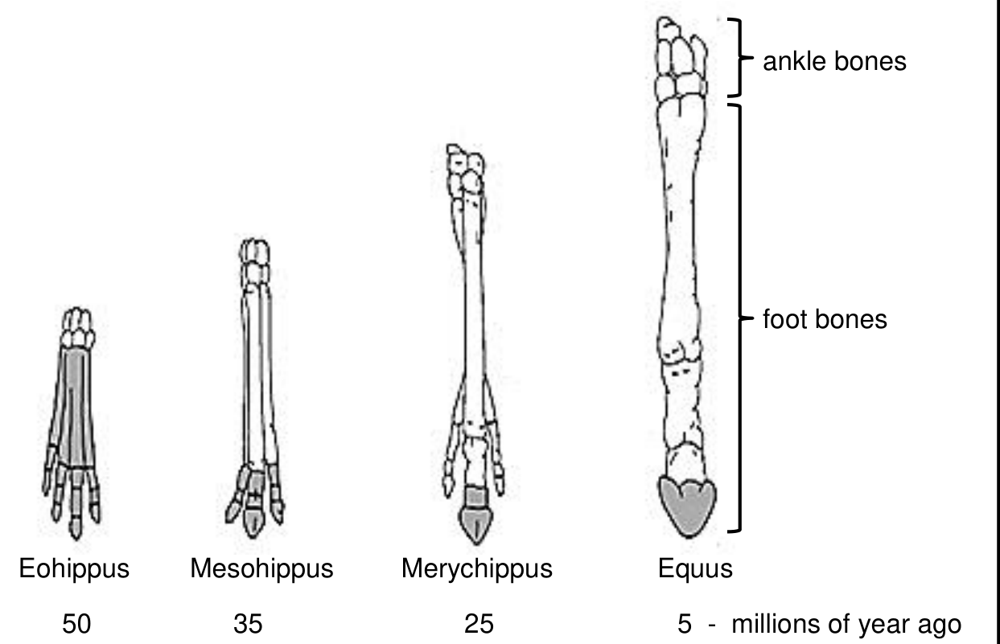

Key: the shaded bones are the ones that touched the ground 

- 1.6.1 Describe two changes to the bones that have taken place over the past 50 million years. (2) 

   - Bones became larger / longer / thicker ,  there were fewer bones , fewer bones touched the ground    (any two) 

- 1.6.2 Eohippus lived in swampy areas with soft mud. Explain one advantage to Eohippus of the arrangement of bones in its feet. (2) Large/r surface / area in contact with the ground  *compulsory low / less pressure on the ground ,  less likely to sink into ground / mud , could run faster , easier to escape predators  

      - (* compulsory + any one) 

- 1.6.3 The changes in the arrangement of the foot bones of horses support Darwin’s theory of evolution by natural selection. Explain how the arrangement of the foot bones of Eohippus could have evolved into the arrangement of the foot bones of Equus. (6) 

   - There was a great deal of variation in the size, number, arrangement of foot bones  

some had larger / fewer bones and were suited to run faster on harder / drier ground  

some had smaller / many bones could not run fast and were more easily caught by predators / they died  

the ones that could run faster survived and reproduced  

passed the allele for larger / fewer bones to the next generation  the next generation therefore had a higher proportion of individuals with larger / fewer bones.  

(10) 

**Section A: [48]** 

##### **Section B** 

##### **Question 2** 

- 2.1 An investigation was conducted by a scientist to determine if two plant populations, Population 1 and Population 2, belonged to the same species. The scientist collected seeds from each of the populations. 

The procedure followed was : 

- He planted 20 seeds from Population 1 and 20 seeds from Population 2 in two separate plots close to each other. 

- The stamens of all the flowers of Population 1 were removed. 

- Pollen from the flowers of Population 2 was used to pollinate the 

##### flowers of Population 1. 

- The scientist harvested the seeds of the plants in Population 1. 

- He grew these seeds under ideal conditions in a laboratory. 

**Result** : None of the seeds germinated. 

|2.1.1|Explain the advantage of removing the stamens from the flower<br>Population 1.<br>Stamens contain pollen grains in the anthers<br>Removing stamens prevents self-fertilisation of Population 1.|s of<br>(2)|
|---|---|---|
|2.1.2|What evidence indicates that the two populations do not belong<br>the same species?<br>Inability to produce fertile seeds / infertile seeds did not germina|to<br>(1)<br>te|
|2.1.3|State two factors that the scientist would have kept constant in t<br>laboratory.<br>Amount of water used on both populations must be the same<br>Distance between the planted seeds must be the same<br>The type of soils used must be the same<br>The amount of light must be the same for both populations<br>(any two)|he<br>(2)|
|2.1.4|State one way in which the scientist could have increased the<br>reliability of his results.<br>Increase the sample size (more seeds) for each of the populatio<br>Repeat the investigation, and if the results are the same, it is rel<br>(any one)|(1)<br>ns<br>iable<br>(6)|

- 2.2    Study the diagram below of the moth species that originally belonged to a single population but was later separated by a mountain into two groups. 

Species A Mountain range Species B Species C 2.2.1  Name the process which is illustrated in the diagram above. (1) Speciation  2.2.2  Explain the importance of the process you identified in question 2.2.1 above. (2) Increases diversity of species / biodiversity  Introduces reproductive isolation mechanisms  Eliminates gene flow between different populations  Decreases extinction rates of species  (any two) 2.2.3  Why is species A the ancestor of species B and C? (2) Species B and C  evolved from species A.  Species A existed prior to species B , and species C evolved at the same time as species B   (any one x 2) 2.2.4  Explain the above illustrated process in relation to the three species indicated in the diagram. (6) Moth in species A belonged to a single population.   The population of species A moths was split into two groups, one on each side of the mountain range.  

Gene flow / interbreeding between the two groups was completely eliminated / impossible  

Each group was exposed to unique environmental factors / selection pressures  

Natural selection occurred independently in each group on either side of the mountain.  

Each population became genotypically and phenotypically different from the other population.  

If the two groups were to mix again and attempt to interbreed, the offspring would be infertile.  Thus two new species will then have been produced.  

(11) 

##### 2.3 Tabulate two differences between natural selection and artificial selection. 

<u>(3)</u> 

|**Natural selection**|**Artificial selection**|
|---|---|
|Nature is the selective force|Humans are the selective force|
|Selection is based on adaptation to<br>the environment|Selection is based on what is<br>desirable to humans|
|Selected individuals are able to<br>survive in the wild since they are<br>adapted to the environment|Selected individuals may survive<br>only under controlled conditions<br>since their characteristics were not<br>selected according to adaptations<br>to the environment.|

 - for table,   - for each of two differences provided 

(3) 

##### 2.4 Study the extract below which describes the evolution of the snake 

How snakes lost their limbs has long been a mystery to scientists: New research on a 90-million-year-old snake fossil suggests that snakes evolved to live and hunt in burrows as many snakes still do today. 

It is generally accepted that snakes and lizards are closely related, although very few transitional fossils have been found to support this generalisation. 

<u>(adapted from https://www.ed.ac.uk/news/2015/snakes-271115)</u> 

- a) Explain one characteristic that you would expect a transitional snake fossil to have. (1) 

Smaller limbs than the ancestor compared to no limbs of modern snakes  

More vertebrae than the ancestor but less than the modern snake  (any one) 

- b) Describe how Jean Baptiste de Lamarck would have explained the loss of limbs in snakes? (4) 

Lizards crawled into burrows to find food / escape from predators  

They did not use their limbs anymore  

The limbs became smaller and eventually disappeared  They passed on this characteristic to their offspring  

(5) **[25]** 

##### **Question 3** 

- 3.1 Lizards of a certain species on an island are usually brown in colour. A mutation in one gene for body colour results in red or black lizards. Black lizards camouflage well against the dark rocks and warm up faster on cold days which will give them energy to avoid predators. 

Scientists investigated the relationship between the colour of lizards in a population and their survival rate on an island. 

They conducted the investigation as follows: 

- They selected a group of lizards of a certain species in a habitat. 

- They recorded the percentage of each colour (brown, red or black) in the selected group. 

- They repeated the investigation over a period of 30 generations of offspring. 

The results of the investigation are shown in the table below. 

|Colour of<br>lizards|P|ercentage (%) o<br>In thepop|f each colour<br>ulation||
|---|---|---|---|---|
||Initial<br>population|10th<br>generation|20th<br>generation|30th<br>generation|
|Brown|80|80|70|40|
|Red|10|0|0|0|
|Black|10|20|30|60|

(adapted from https//hhmi.org/bioInteractive) 

3.1.1  State the: 

- a)  independent variable (1) 

colour of lizard  b)  dependent variable (1) 

##### survival rate of the lizards  

- 3.1.2 Explain the effect of the mutation on the survival of red lizards.  (2) It decreases survival / lizards may die / is harmful / is lethal to the red lizards  since they will be seen on the black rock by the predators  OR   They could not escape predators / catch prey on cold days  as red lizards did not warm up fast on cold days   (any one × 2) 

- 3.1.3 Explain why the scientists had to conduct this investigation over 30 generations. (2) To allow enough time for reproduction and survival  to be able to calculate the percentage to ensure reliability of results  OR     A change in population proportions will not be seen over a shorter time period  to ensure reliability of results   (any one × 2) 

- 3.1.4   State two ways in which the scientists could have improved the validity of the investigation. (2) Conduct the investigation in the same habitat / environment  Use the same sampling technique  Capture the same number of lizards in each sampled generation  Take each sample at the same time of day / weather conditions  (Mark first two only – any 2) 

- 3.1.5  Use the theory of natural selection to explain the higher percentage of black lizards in the population of the 30th generation. (6) There is variation in colour amongst the lizards *  Red and brown lizards have a disadvantageous characteristic / trait and  *  are not camouflaged / cannot warm up fast enough to have energy to run away  and are killed by predators  *  The black lizards have the advantageous trait and  *  are better camouflaged / warm up faster to have energy to avoid predators  and survive / reproduce  The allele for black colour is passed on to the next generation to produce more black lizards in the next generation  (any 2 + * 4 compulsory marks) 

- 3.1.6  Draw a bar graph to compare the percentage of the brown and the black lizards in the initial population and the 30th generation. (6) 

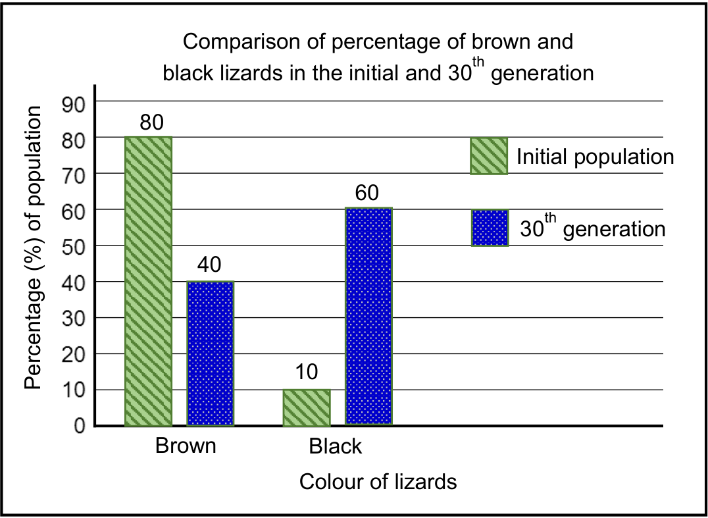

##### Guideline for assessing <u>graph</u> 

|Bar graph for the required data||
|---|---|
|Title of graph||
|Correct label and scale for X-axis||
|Correct label and scale for Y-axis||
|Drawing of bars|:     1 – 3 bars plotted correctly<br>:  All 4 bars plotted correctly|

If wrong type of graph, marks lost for Bar graph, and Drawing of bars. 

(20) 

- 3.2 The diagram shows the distribution of various camels on the different continents. The arrows indicate the current distribution of the animals. 


(adapted from http://www.ck12.org) 

Explain how speciation of camels may have occurred. (6) 

The common ancestor / original camel population was separated into different populations by the sea / due to continental drift  There was no gene flow between the populations.  Each population was exposed to different environmental conditions / selection pressures  

Natural selection occurred independently in each of the populations  The individuals of each of the separated populations became different from each other over time genotypically and phenotypically  Even if the three populations were to mix again they would not be able to interbreed to produce fertile offspring.  


**Section B: [51]** 

**Total Marks: [99]** 

## **<mark>Cognitive level distribution</mark>** 

|**Question**|**Level 1**|**Level 2**|**Level 3**|**Level 4**|**Marks**|
|---|---|---|---|---|---|
|1.1.1|||||2|
|1.1.2|||||2|
|1.1.3|||||2|
|1.1.4|||||2|
||2|8|||8|
|1.2.1|||||1|
|1.2.2|||||1|
|1.2.3|||||1|
|1.2.4|||||1|
|1.2.5|||||1|
|1.2.6|||||1|
|1.2.7|||||1|
|1.2.8|||||1|
|1.2.9|||||1|
|1.2.10|||||1|
||10||||10|
|1.3.1|||||2|
|1.3.2|||||2|
|1.3.3|||||2|
|1.3.4|||||2|
|1.3.5|||||2|
|||10|||10|
|1.4.1|||||1|
|1.4.2|||||3|
|1.4.3|||||1|
|||2|3||5|
|1.5 a|||||2|
|1.5 b|||||3|
|||5|||5|
|1.6.1|||||2|
|1.6.2|||||2|
|1.6.3|||||6|
||2|8|||10|
|2.1.1|||||2|
|2.1.2|||||1|
|2.1.3|||||2|

|2.1.4||||1|
|---|---|---|---|---|
||4|2||6|
|2.2.1||||1|
|2.2.2||||2|
|2.2.3||||2|
|2.2.4||||6|
||1|8|2|11|
|2.3||||3|
|||3||3|
|2.4 a||||1|
|2.4 b||||4|
|||5||5|
|3.1.1 a - b||||2|
|3.1.2||||2|
|3.1.3||||2|
|3.1.4||||2|
|3.1.5||||6|
|3.1.6||||6|
|||16|4|20|
|3.2||||6|
|||6||26|
||19|72|9|99|

## 5. Authentic Exam Question Archetypes & Mark Allocations
*(Extracted from official CAPS examination papers to guide marking, pacing, and rubric design)*

### Archetype 1: QUESTION 3
- **Source Paper:** `Gr12_LifeSciences_Exam16.pdf`
- **Total Mark Allocation:** **[50 Marks]** (Sub-questions: 2, 2, 2, 1, 5 marks)
- **Recommended Time:** **50 Minutes** (Pacing: ~1.0 min/mark | *Calibrated to Official CAPS Paper Pace (1.0 min/mark)*)
- **Assessment Mode Calibration:** Timed Exam Simulation: 50 min countdown (Pacing Checkpoint: 38 min)
- **Cognitive / Marking Strategy:** NSC Standard (Method Marks [M], Accuracy Marks [A], Carry-Over [CA])

#### Question Prompt & Working:
```text
QUESTION 3 
 
 
Life Sciences/P2                                                         9                                                  DBE/November 2025 
NSC – Marking Guidelines 
Copyright reserved 
Please turn over  
 
3.3 
3.3.1 
 
(a) 
 
 
(b) 
 
 
 
 
(c) 
- 
A group of organisms with similar characteristics✓  
- 
that can interbreed to produce fertile offspring✓ 
 
- 
They breed at different times of the year✓/ostriches lay their 
eggs mainly in September while emus lay their eggs from 
November to April  
- 
therefore, they cannot interbreed✓ 
 
- 
Species-specific courtship behaviour✓ 
- 
Infertile offspring✓ 
- 
Prevention of fertilisation✓ 
 
 
 
 
 
 
 
 
  
(Mark first TWO only) 
  
(2) 
 
 
 
 
(2) 
 
 
 
(2) 
 
 
 
3.3.2 
Biogeography✓ 
 (1) 
 
 
3.3.3 
- 
The ratites al...
```

### Archetype 2: QUESTION 3
- **Source Paper:** `Gr12_LifeSciences_Exam16.pdf`
- **Total Mark Allocation:** **[100 Marks]** (Sub-questions: 2, 4, 6, 12, 1 marks)
- **Recommended Time:** **100 Minutes** (Pacing: ~1.0 min/mark | *Calibrated to Official CAPS Paper Pace (1.0 min/mark)*)
- **Assessment Mode Calibration:** Timed Exam Simulation: 100 min countdown (Pacing Checkpoint: 75 min)
- **Cognitive / Marking Strategy:** NSC Standard (Method Marks [M], Accuracy Marks [A], Carry-Over [CA])

#### Question Prompt & Working:
```text
QUESTION 3 
  
 
3.1 
Theories of human evolution are based on the similarities between humans and 
African apes and also on the anatomical differences between them.  
  
 
 
3.1.1 
State TWO characteristics related to vision that humans share with 
African apes. 
  
(2) 
 
 
 
  
 
3.1.2 
Describe TWO differences between the jaws of humans and African 
apes.  
  
(4) 
 
 
 
  
 
3.1.3 
Explain the significance of the position of the foramen magnum, the 
shape of the spine and the size of the pelvis in bipedalism. 
  
(6) 
(12) 
 
3.2 
The table below shows the average brain volume of different hominid species.    
 
SPECIES 
AVERAGE BRAIN VOLUME 
(mℓ) 
Ardipithecus ramidus 
350 
Australopithecus africanus 
461 
Homo habilis 
609 
Homo erectus 
959 
Homo sapiens 
1 330 
 
 
3.2.1 
How many...
```

### Archetype 3: QUESTION 1
- **Source Paper:** `Gr12_LifeSciences_Exam20.pdf`
- **Total Mark Allocation:** **[66 Marks]** (Sub-questions: 18, 10, 6, 1, 1 marks)
- **Recommended Time:** **66 Minutes** (Pacing: ~1.0 min/mark | *Calibrated to Official CAPS Paper Pace (1.0 min/mark)*)
- **Assessment Mode Calibration:** Timed Exam Simulation: 66 min countdown (Pacing Checkpoint: 50 min)
- **Cognitive / Marking Strategy:** NSC Standard (Method Marks [M], Accuracy Marks [A], Carry-Over [CA])

#### Question Prompt & Working:
```text
QUESTION 1 
  
 
1.1 
1.1.1 
1.1.2 
1.1.3 
1.1.4 
1.1.5 
1.1.6 
1.1.7 
1.1.8 
1.1.9 
A   
D                              
D 
C 
C 
A  
B    
 
 
 
 
 
 
 
 
 
 
 
 
 
 
 
 
 
 
 
C 
D  
 
 
 
 
 
 
 
 
 
 
 
 
 
 
 
 
 
 
 
     (9 x 2) 
  
 
 
 
 
 
 
 
(18) 
 
1.2 
1.2.1 
1.2.2 
1.2.3 
1.2.4 
1.2.5 
1.2.6 
1.2.7 
1.2.8 
1.2.9 
1.2.10 
Alleles            
Chloroplast 
Phylogenetic tree /Cladogram 
Recessive allele 
Extinction 
Artificial selection/Selective breeding 
Haemophilia 
Population       
Autosomes  
Karyotype/karyogram      
 
 
 
 
 
 
 
 
 
 
 
    (10 x 1) 
  
 
 
 
 
 
 
 
 
(10) 
 
 
 
 
 
1.3 
1.3.1 
1.3.2 
1.3.3 
B only                    
Both A and B      
None                         
 
 
 
 
 
 
 
 
 
 
 
 
   (3 x 2) 
  
 
(6) 
 
1.4...
```
