# Our Place in the Animal Kingdom

So where exactly do scientists place us?

<!-- DIAGRAM_PLACEHOLDER: diagram -->

*Figure 1: Evolutionary path of humans and other primates*

---

## Biological Classification

Modern humans – given the scientific name *Homo sapiens* (homo: man, sapiens: wise) – are considered part of the animal kingdom, the Kingdom Animalia (see Figure 1). Within this kingdom, the Linnaean classification is as follows:

* **Kingdom:** *Animalia*
* **Class:** *Mammalia* (mammals give birth to live young and feed them on milk)
* **Order:** *Primates* (with opposable thumbs on a hand with five fingers, finger nails, not claws, two eyes facing forward, etc.)
* **Family:** *Hominidae* (humans, chimpanzees, gorillas, and orangutans)
* **Genus:** *Homo*
* **Species:** *sapiens*

---

# Interpretation of a phylogenetic tree to show our place in the Animal Kingdom

The evolutionary relationships of ancestral species and their descendants can be illustrated using a branching **phylogenetic tree**. A phylogenetic tree indicates which ancestors gave rise to which descendants.

To help interpret this (and other) phylogenetic diagram, the following pointers:

*   The root of the phylogenetic diagram represents the ancestor, and the tips of the branches, the descendants of that ancestor (see below, left). To move upwards is to move forward in time.

    

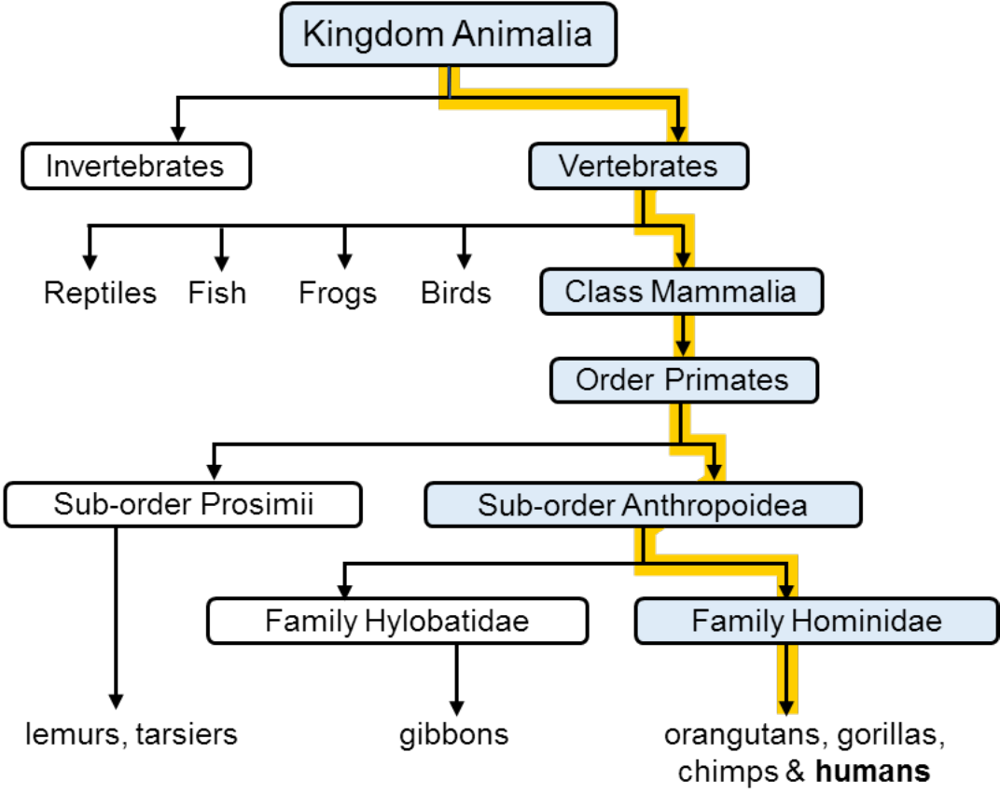
> **[Diagram Context - Textbook_LifeSciences_Gr12_Human_evolution.pdf-0001-02.png]**
> Kingdom Animalia: Animalia Animalia: Animalia Animalia: Animalia Animalia: Animalia Animalia: Animalia Animalia: Animalia Animalia: Animalia Animalia: Animalia Animalia: Animalia Animalia: Animalia Animalia: Animalia Animalia: Animalia Animalia: Animalia Animalia: Animalia Animalia: Animalia Animalia: Animalia Animalia: Animalia Animalia: Animalia Animalia: Animalia Animalia: Animalia Animalia: Animalia Animalia: Animalia Animalia: Animalia Animalia


*   Speciation is represented as a branching of the tree, as a single ancestral lineage gives rise to two or more daughter lines (see above, right).

*   Each lineage has a part of its history that is unique and parts that are shared with other lineages, as illustrated below ...

    <!-- DIAGRAM_PLACEHOLDER: diagram -->

*   And each lineage has ancestors that are unique to that lineage and common ancestors that are shared with other lineages (see below).

    <!-- DIAGRAM_PLACEHOLDER: diagram -->

Belonging to the same **Family Hominidae** suggests that humans, chimpanzees, gorillas and orangutans share a common ancestor. Indeed, studies show that

---

Humans share a common ancestor with chimpanzees that lived approximately 6 million years ago. This is illustrated in the phylogenetic diagram (Figure 2) below.


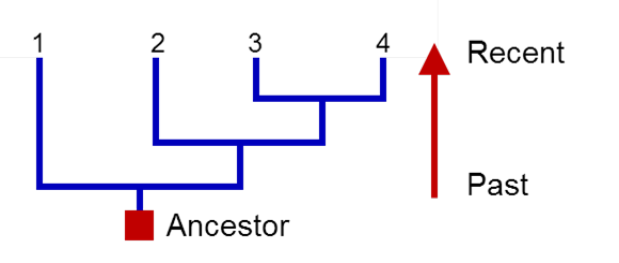
> **[Diagram Context - Textbook_LifeSciences_Gr12_Human_evolution.pdf-0002-04.png]**
> 1. A diagram of a cell with a red arrow pointing to the past.


**Figure 2:** Phylogenetic tree for primates.

Note the place of the Family Hominidae in the tree, and the relationships between the various primates, humans included.

---

### Understanding the Phylogenetic Tree

Study the diagram: on the left, and right, we have a time line, in million of years, beginning at $55\text{ million years ago}$ (in the past), and ending with the present ($0\text{ years}$).

It illustrates the evolution of various primates from a common ancestor (marked **A**), who lived $55\text{ million years ago}$. Markers **B**, **C** and **D** point to speciation events that lead eventually, at marker **E**, to the emergence of the modern human.

* Marker **B** indicates a speciation event that led to the evolution of gibbons as a separate species from the other primates.
* Marker **C** represents the common ancestor for the Family Hominidae that includes humans, chimpanzees and bonobos, gorillas and orangutans. This common ancestor lived approximately $10\text{ million years ago}$.
* Marker **D** represents the common ancestor of humans and chimpanzees. This ancestor lived approximately $5 - 6\text{ million years ago}$. This indicates that of all primates, humans and chimpanzees are the most closely related.

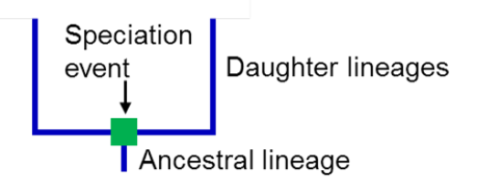
> **[Diagram Context - Textbook_LifeSciences_Gr12_Human_evolution.pdf-0002-05.png]**
> This evolutionary tree diagram illustrates a cladogenesis event in biological evolution. Visible labels and annotations include "Ancestral lineage" at the base, a green square node with an arrow indicating a "Speciation event," and branching blue lines representing "Daughter lineages." For a Grade 12 Life Sciences learner, this diagram conceptually conveys how a single ancestral species splits into two distinct, reproductively isolated descendant lineages over time.


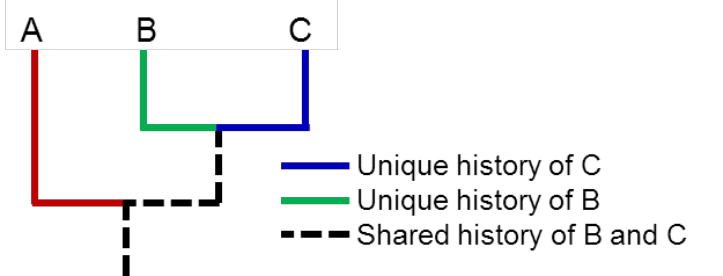


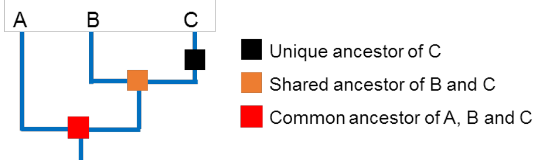


---

* The line from $\text{D}$ to $\text{E}$ represents the unique history of humans, and we will explore that in some detail later in this chapter.
* The line from $\text{C}$ backwards to $\text{A}$ represents the shared history of the Family Hominidae, and from $\text{D}$ backwards to shared history of humans and chimpanzees.

Once we have considered the major phases of hominin evolution, we will examine some phylogenetic diagrams that focus on expanding the part of the branch from $\text{D}$ to $\text{E}$ in the diagram above.

The phylogenetic tree shows us the place of the Family Hominidae within the Order Primates and the larger Kingdom Animalia. Our focus now will be specifically on the Family Hominidae, exploring the relationships between humans and other hominids.

Family Hominidae: [https://www.youtube.com/watch?v=dUKV02uYEu0](https://www.youtube.com/watch?v=dUKV02uYEu0)

---

### Activity 1: Phylogenetic trees

1. To what Order and what Family do modern humans belong? (2)
2. Name two species that belong to the same Family humans belong to. (2)
3. According to the phylogenetic tree in Figure 2, when did the most recent common ancestor for humans and gorillas exist? (1)
4. Distinguish hominids from hominins. (4)
5. Study the phylogenetic tree below.

[ Phylogenetic Tree Diagram showing branches 1, 2, 3, 4, 5 ]

Which **ONE** of the following is a reasonable conclusion based on the phylogenetic tree?

* **A** $\mathbf{1}$ and $\mathbf{2}$ belong to the same species
* **B** $\mathbf{3}$ is more closely related to $\mathbf{4}$ than to $\mathbf{5}$
* **C** $\mathbf{1}$ and $\mathbf{5}$ do not have a common ancestor
* **D** The DNA of $\mathbf{1}$ will be more similar to $\mathbf{4}$ than to $\mathbf{2}$ (2)

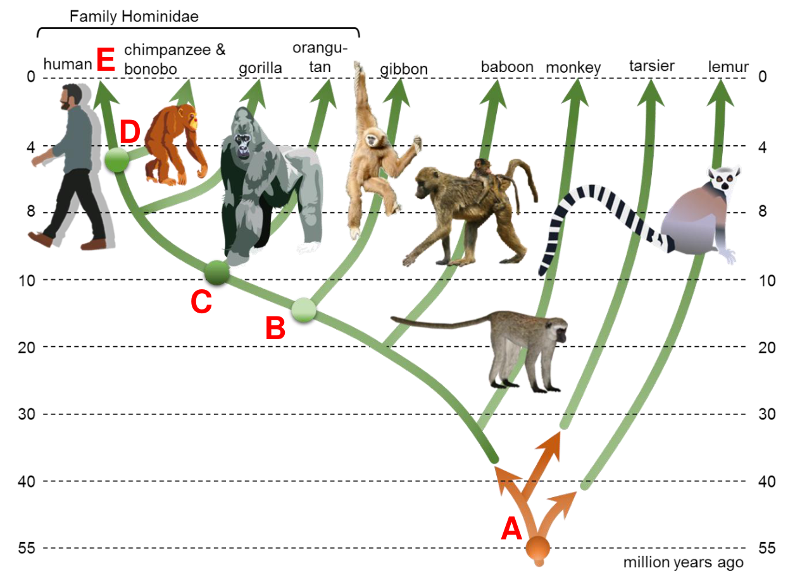


---

6. Study the phylogenetic tree below and answer the questions that follow.


> **[Diagram Context - Textbook_LifeSciences_Gr12_Evolution_by_natural_selection.pdf-0004-05.png]**
> 1. A portrait of a man with a white beard and a black coat.


a) Define a phylogenetic tree. (2)

b) Which organism is considered to be the common ancestor of all species shown above? (1)

c) Which organism has the biggest cranial capacity? (1)

d) Name TWO species that lived between $1,5$ and $2$ million years ago. (2)

e) Calculate the time difference between the evolution of *Homo erectus* and *Homo sapiens*. (Show your working.) (3)

f) Which organism – *Homo erectus* or *Homo habilis* – is more closely related to modern day humans? (1)  
(21)

---

## Characteristics that humans share with African apes

To trace the evolutionary development of modern humans from an ancestor shared by all hominids, it is helpful to consider their anatomical similarities, and of course, their differences. The differences point to the existence of different species, while the similarities point to a possible common ancestor.

### Key terminology

| Term | Definition |
| :--- | :--- |
| **arboreal** | living primarily in trees |
| **opposable thumb** | a thumb that can be placed opposite the fingers of the same hand |

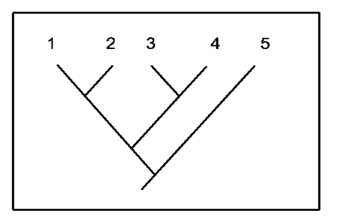


---

## Key Terms and Definitions

| Term | Definition |
| :--- | :--- |
| **sexual dimorphism** | Distinct differences in size or appearance between the sexes of an animal in addition to the sexual organs themselves |
| **bipedalism** | Ability to walk on two legs |
| **quadrupedalism** | Use of four limbs for locomotion (quadrupeds) |
| **diurnal** | Active during the day rather than at night |
| **foramen magnum** | Hole in the base of skull through which the spinal cord passes |
| **cranial ridge** | Ridge running across the top of the skull that served to attach large jaw muscles to the head |
| **prognathous** | Protruding (projecting forward) upper / lower jaw |

---

## Similarities that humans share with African Apes

Hominids (members of the Family Hominidae, including humans) share a number of characteristics. Scientists argue that these arose from their adaptation to arboreal living (life spent mostly in trees). The main similarities are given in Figure 3 below.


> **[Diagram Context - Textbook_LifeSciences_Gr12_Evolution_by_natural_selection.pdf-0005-01.png]**
> The image shows three giraffes, each with a different color of fur, standing in a line and facing the same direction. The giraffes are positioned in a way that they appear to be following a white arrow. The background of the image is a light blue color, and there is a green arrow on the right side of the image. The giraffes are the main focus of the image, and there are no other objects or text present.


*(Figure 3: Characteristics shared by humans and African apes showing large brain, eyes in front, freely rotating arms, long upper arms, rotation around elbow joints, opposable thumb, bare fingertips or nails instead of claws, and upright posture)*

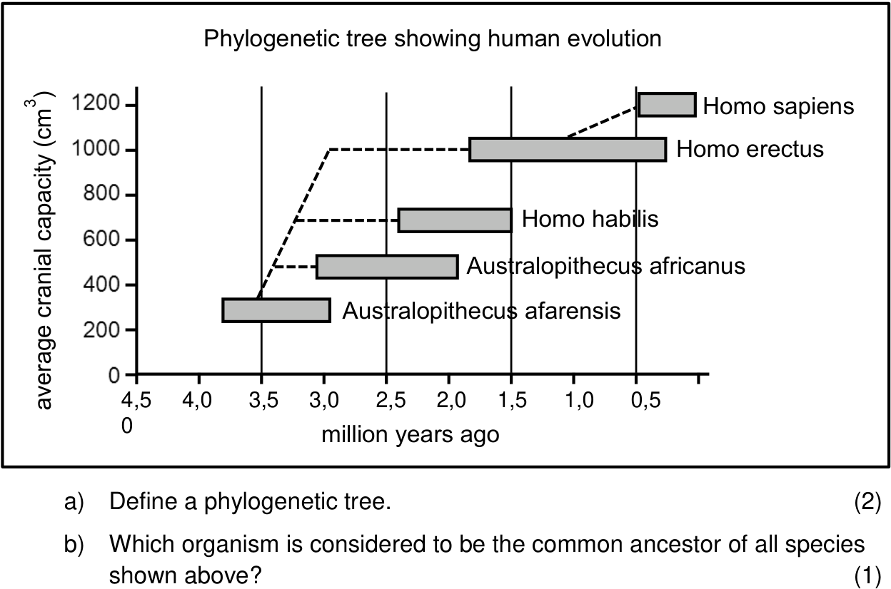


---

# Hominid Characteristics and Evolution

* **Large brains**: Relative to their body size, hominids have larger brains than other species in the Animal Kingdom. This allows them to process and store information.

* **Two eyes in the front of the head** (Figure 4): This provides good binocular vision as both eyes work together. The eyes have cones for colour vision that gives greater clarity.


> **[Diagram Context - Textbook_LifeSciences_Gr12_Evolution_by_natural_selection.pdf-0006-02.png]**
> This photographic portrait depicts the naturalist Charles Darwin, recognizable by his characteristic prominent white beard and dark coat against a dark background. The image contains no explicit text labels, variables, or arrows. Conceptually, it serves as a visual anchor in the Grade 12 Life Sciences curriculum to introduce the historical figure responsible for formulating the theory of evolution by natural selection.


Figure 4: the eyes of a chimpanzee in the front of the head.

* **Freely rotating arms**: Arms can be lifted above the head to swing from branch to branch, or to pick fruit hanging relatively high above the ground.

* **Long upper arms / front limbs**: Apes are normally quadrupeds, and this requires longer front limbs. Longer front limbs also make it easier to grasp and swing from branches.

* **Rotation around elbow joints**: This allows the limb to extend or flex to grasp and reach for objects. It also enables the flexing and rotation of the wrists.

* **Bare fingertips or nails instead of claws**: Digits (fingers and toes) have soft, broad and very sensitive pads. The flat fingernails or toenails protect these pads.

* **Opposable thumb**: The thumbs of hominids are positioned so that it can oppose other digits, enabling the hand to grip an object. See Figure 5 below.

* **Upright posture**: The back limbs of hominids are generally stronger than their front limbs, enabling them to stand erect (upright) and use their hands for grasping; standing erect also gives a better view of surroundings and exposure of genitals to attract the opposite sex (Figure 6).

* **Sexual dimorphism** (Figure 7) – This refers to differences between males and females of the same species. Humans and apes are sexually dimorphic. This is linked to competition.

---
*297*

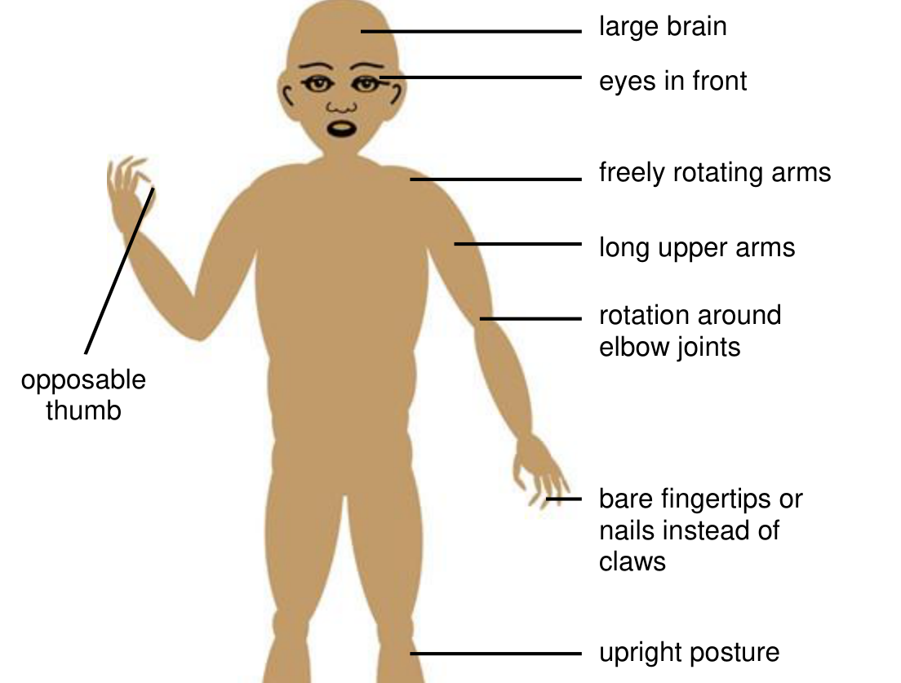


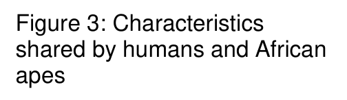


---


Hominids share some other characteristics as well. They ...

* **lack a tail** (that other primates – baboons, monkeys, etc. use for balancing or sometimes as an extra limb), and
* are **diurnal** – active during the day rather than at night

> **Note:** Scientists hypothesise that humans and modern apes share a common ancestor. They do NOT believe that a chimpanzee is our direct ancestor.

---

## Anatomical differences between African apes and humans

Many of the anatomical differences between modern humans and other apes are related to habitual bipedalism. All apes are capable of upright posture and at times walking on two feet (gibbon in Figure 8 below). Usually however, the other apes are knuckle-walkers, moving or scampering (run with quick light steps) on all four limbs.


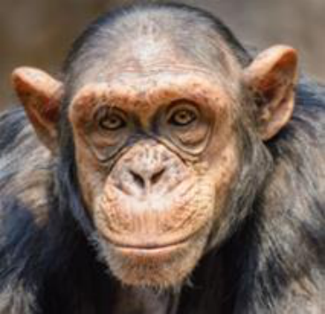


Figure 8: Modes of walking: **A** – a chimpanzee walking on all four legs, **B** - a man walking upright on two legs and **C** - a gibbon scampering on two legs.

---

# Advantages of bipedalism

Humans can crawl on all fours but tend to stand erect and walk on two legs in an upright position. This is known as **bipedalism**. The trend in human evolution has been towards bipedalism.

Bipedalism brings with it a number of significant advantages:
* Hands are free to pick or carry food, to use tools and handle weapons.
* Standing upright, with eyes higher off the ground, gives a better, wider view of surroundings, a timelier warning of approaching predators or of potential prey.
* Movement becomes easier and more energy-efficient.
* A more vertical posture reduces the body's exposure to sunlight when in an open area (60% less than for quadrupeds). It also raises a large percentage of the body away from the hot ground, where it is exposed to cooling breezes.
* In courtship behaviour, the male sex organ is readily displayed.

---

# Anatomical differences as a result of bipedalism

* **The position of the foramen magnum** – the hole in the base of the skull where the spinal cord leaves / enters the skull – has changed position. As human evolution has progressed, quadrupeds have the foramen magnum in a backward position. Humans, walking upright have it in a forward position (Figure 9 below). As a result, humans have their skull balanced on top of the spinal column, hence allowing bipedalism.


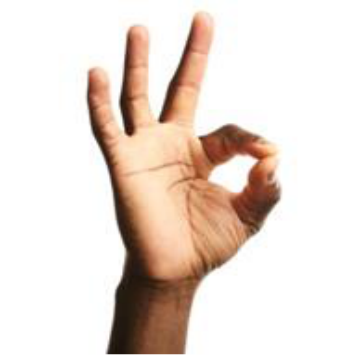


**Figure 9:** Position of the foramen magnum in chimpanzee and human skulls

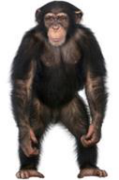


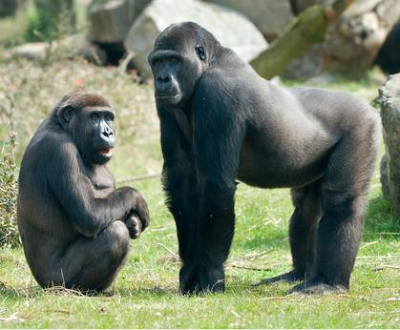


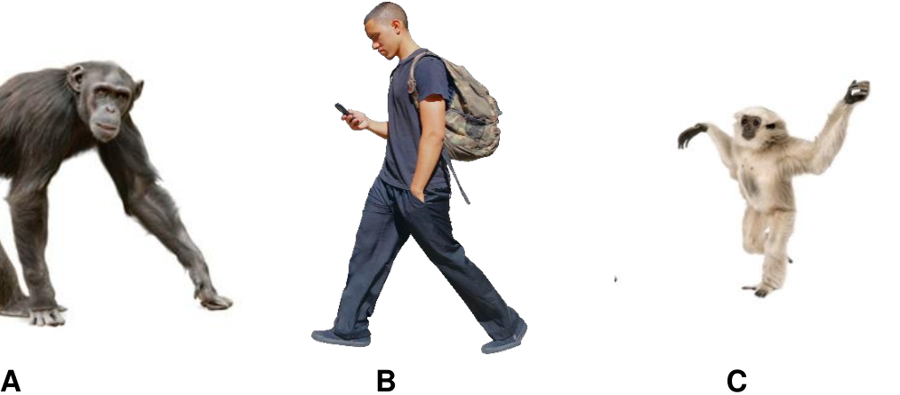


---

### The Curvature (Shape) of the Spine

* **The curvature (shape) of the spine** – as shown in Figures 10A and B:


* **Figure 10A:** The human spine is curved so the upper body (and the centre of gravity – the red line) is directly above the pelvis when standing erect – a more curved spine (S-shaped spine).
* **Figure 10B:** The chimpanzee's spine is much less curved. As a result, when standing erect, the ape's weight pulls it forward, making an upright stance unsteady – a less curved spine (C-shaped spine).

---

### The Shape of the Pelvic Girdle

* **The shape of the pelvic girdle** (see Figures 11 and 12 below):


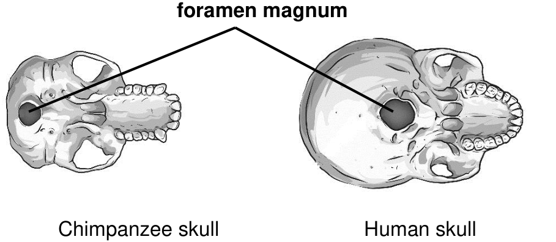


* **Figure 11A:** A chimpanzee pelvis, long and narrow, is adapted to quadrupedal knuckle walking, providing greater rigidity.
* **Figure 11B:** The human pelvis (short and wide) is better able to support the vertically stacked human organs.

<!-- DIAGRAM_PLACEHOLDER: diagram -->

* **Figure 12:** Hip socket and femur angle for chimpanzees (**A**) and humans (**B**). In humans, the shape of the pelvis means the femur is angled inwards for maximum load bearing. This also makes it easier to walk bipedally, placing one foot in front of the other.

---

**Other anatomical differences** include: the brain, brow ridges, jaws, teeth, palate shape and cranial ridge.


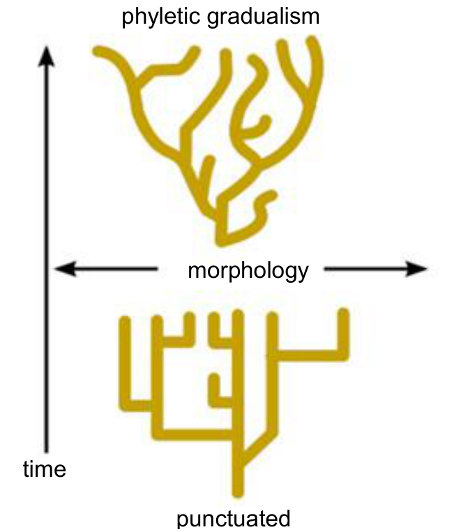


Figure 13: Anatomical differences between the skull of a chimpanzee and human

* **Brain / cranium size** (see Figure 13) – as early humans evolved, the brain grew in size and complexity. Over the course of human evolution, brain size tripled. Humans have a larger brain (cranium size) than chimpanzees (apes).

* **Brow ridges:** (as illustrated in Figure 13):
  * chimpanzees have a well-developed brow ridge above the eye socket.
  * In humans, the brow ridges are very small or non-existent. As the human cranium increased in size, the forehead flattened and became more vertical. As a result, the human brow ridge slowly became smaller and smaller.

* **Jaws, teeth and palate shape**

  As human beings evolved, their diet changed too. The mainly vegetarian diet gave way to a more varied one, including the meat of animals they caught. Once they learnt to control fire and cook their food (making it softer and easier to chew), the jaws, teeth and palate shape changed, as shown in Figure 14.


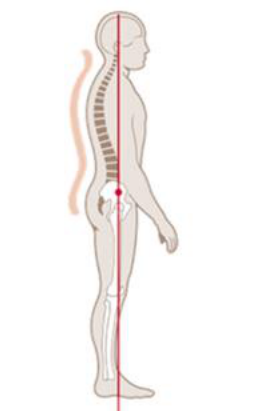


Figure 14: the palate shape and size of canines for chimpanzees and humans

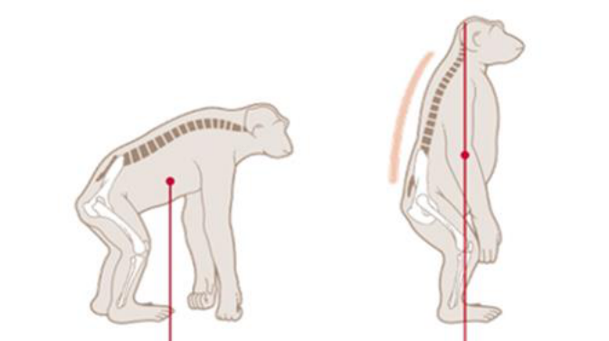


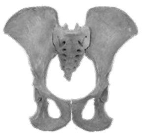


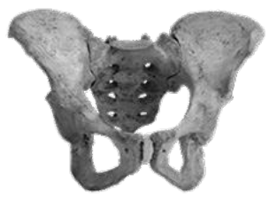


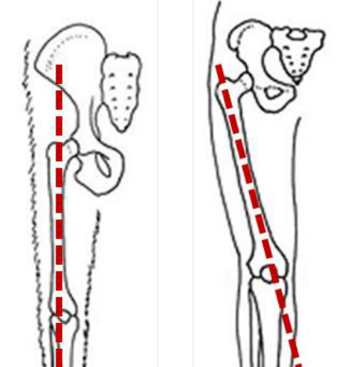


---

# Human Evolution: Comparison of Skull Characteristics (Chimpanzees, Apes, and Humans)

## 1. Palate Shape
* **Chimpanzee / Ape palate:** Long and rectangular.
* **Human palate:** Smaller, almost semi-circular.

---

## 2. Canines (Pointed Teeth / Eye Teeth)
* **Chimpanzee canines:** Quite large and pointed.
* **Human canines:** Small. 
* **Evolutionary Note:** Eating softer, cooked foods reduced the need for large canines and strong jaws to tear and chew food slowly, leading to the reduction in size observed today.

---

## 3. Jaws
* **Chimpanzee and Ape jaws:** Protrude forward beyond a vertical line drawn through the eye. 
    * **Term:** **Prognathous** (chimpanzees have protruding jaws, meaning they are prognathous).
* **Human jaws:** Relatively small and less protruding (less prognathous).

---

## 4. Cranial Ridge
* **Definition:** A ridge running across the top of the cranium.
* **Function:** Serves as an attachment site for the muscles involved with chewing. Adult animals relying on powerful biting and the clenching of their teeth have a very large cranial ridge.
* **Evolutionary Change:** In the evolutionary development of modern humans, a change in diet to cooked foods (which were easier to chew) meant jaws became much smaller and large jaw muscles were no longer needed. Consequently, the cranial ridge became redundant and disappeared.


*Figure 15: Cranial ridge on a _Paranthropus_ skull and on a gorilla skull*

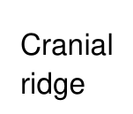


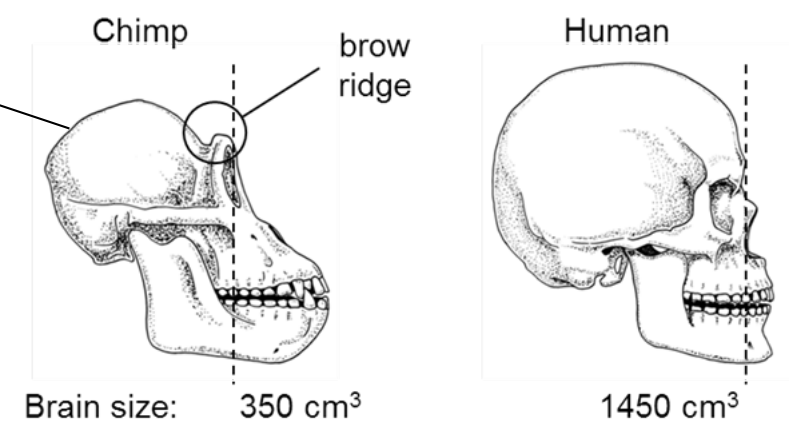


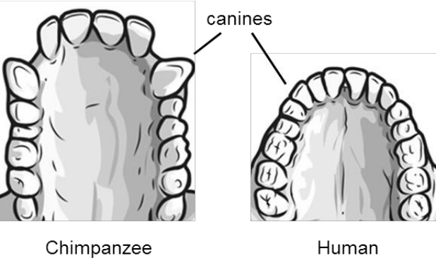


---

Table 1: Summary of differences between modern humans and African apes.

| Feature | Humans (*Homo sapiens*) | African apes |
| :--- | :--- | :--- |
| cranium | large cranium / brain | small cranium / brain |
| brow ridges | not well developed | well developed, prominent |
| spine | more curved (S-shaped) | less curved (C-shaped) |
| pelvic girdle | short and wide | long and narrow |
| canines | small | large |
| arrangement of teeth | small gaps between teeth | big gaps between teeth |
| palate shape | small, semi-circular | long, rectangular |
| jaws | small, less prognathous | large, more prognathous |
| cranial ridges | none | across top of cranium |
| foramen magnum | in a forward position | in a backward position |

## Activity 2: Anatomical differences and similarities between African apes and modern humans

1. Name five characteristics that all hominids share, and name three differences between humans and chimpanzees. (8)
2. Explain the meaning of the term 'opposable thumb' in your own words. (2)
3. Explain bipedalism in your own words. Is bipedalism simply the ability to stand on two feet? (3)
4. Name four advantages of bipedalism. (4)
5. Explain the meaning of binocular vision and depth perception. (4)
6. Use a sketch to illustrate the meaning of the term 'prognathous'. (3)
7. Draw a labelled diagram to illustrate the evolution of the palate shape and teeth from chimpanzee to modern human. The diagram should include at least three visible differences. (6)
8. The diagram shows the skulls of two different primate species.

The arrows point to the position of a crucial part of the skull. Answer the questions below.


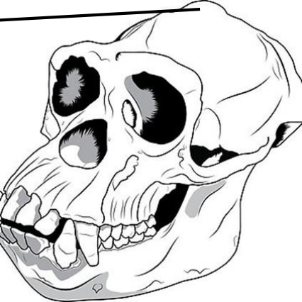


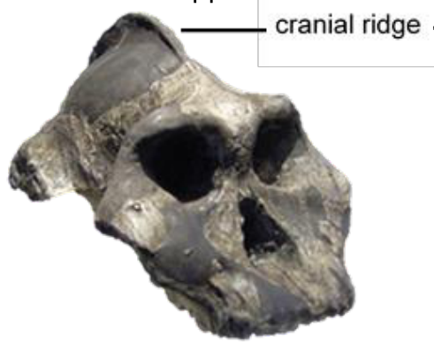


---

a) What part of the skull are the arrows pointing to in both cases? (1)  
b) Which species, A or B, is more likely to be a quadruped? Explain. (3)  
c) Tabulate 4 directly observable differences between the two skulls. (5)  
d) Explain how the change in the skulls pictured above might indicate a change in intelligence. (3)  

9. The diagram below gives parts of the skeletons of a human and an ape.

a) Which letter, A or B, best represents a bipedal organism? (1)  
b) Explain how the shape of the pelvis contributes to bipedalism. (2)  
c) Which other characteristic shown in the diagram below contributes to bipedalism? (2)  


*(47)*

---

# Lines of evidence that support the idea of common ancestors for living hominids including humans

Here we focus on the progressive evolution of the above characteristics from the ape-like beings to the humans, using fossil, genetic and cultural evidence to support the idea of common ancestors for living hominids including humans. Before studying the major phases of human (hominin) evolution, some terminology associated with human evolution must be explained first.

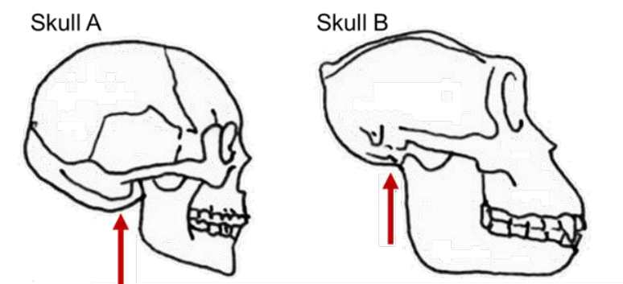


---

# Fossil evidence

## Key terminology

| Term | Definition / Meaning |
| :--- | :--- |
| **hominin** | The group consisting of modern and early humans |
| ***pithecus*** | Greek word of 'ape' |
| **genus** | Biological classification ranking between family and species, consisting of structurally or phylogenetically related species |
| **species** | A group of organisms that are genetically similar, can interbreed and produce fertile offspring |

*Note: For all entries below, the first name (*Ardipithecus*, *Australopithecus* and *Homo*) refers to the genus, the second name, e.g. *ramidus*, refers to the species.*

| Species / Genus Entry | Meaning / Origin |
| :--- | :--- |
| ***Ardipithecus ramidus*** | *Ardipithecus* – *ardi* means 'ground', or 'floor', and *ramidus* means 'root': the name refers to the closeness of this species to the roots / origins of humanity |
| ***Australopithecus*** | *Australis* is the Latin for 'southern', thus southern ape. |
| &nbsp;&nbsp;&nbsp;&nbsp;***A. afarensis*** | *afarensis* – from Afar, a location in Ethiopia |
| &nbsp;&nbsp;&nbsp;&nbsp;***A. africanus*** | *africanus* – from Africa (thus southern ape of Africa) |
| &nbsp;&nbsp;&nbsp;&nbsp;***A. sediba*** | *Sediba* – Sotho word, meaning 'natural spring' or 'well' |
| &nbsp;&nbsp;&nbsp;&nbsp;***A. robustus*** | *robustus* – meaning robust, strong, sturdy, heavy set. |
| ***Homo*** | Latin word for human |
| &nbsp;&nbsp;&nbsp;&nbsp;***H. habilis*** | *habilid* – meaning skilful, or handy |
| &nbsp;&nbsp;&nbsp;&nbsp;***H. erectus*** | *erectus* – meaning erect, walking upright |
| &nbsp;&nbsp;&nbsp;&nbsp;***H. sapiens*** | *Sapiens* – wise, thus *H. sapiens* the wise human (a reference to the large brain) |
| &nbsp;&nbsp;&nbsp;&nbsp;***H. ergaster***\* | *ergaster* – the Greek word for 'work', thus working man |
| &nbsp;&nbsp;&nbsp;&nbsp;***H. heidelbergensis***\*<br>&nbsp;&nbsp;&nbsp;&nbsp;***H. neanderthalensis***\* | The names of these species are derived from two towns in Europe where these species were first discovered |
| &nbsp;&nbsp;&nbsp;&nbsp;***H. naledi***\* | *naledi* – meaning star. |

---

## The major phases of hominin evolution

Human evolution was driven in part by climate change. Climate has always been variable and organisms could adapt to slow changes. More rapid changes however, with a scarcity of resources, placed enormous pressure on all organisms to adapt.

Hominins (humans) survived, and flourished, because of their ability to walk upright, their larger brain's ability to communicate, to problem-solve, and to make tools.


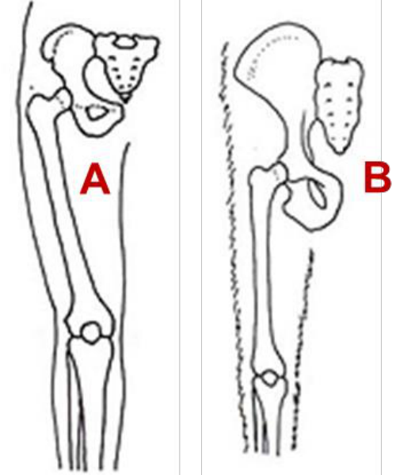


---

# The Development of Hominins

Here we trace the development of hominins from the genus *Ardipithecus* that lived about 5 million years ago, to *Homo sapiens*, the only hominin species currently living. This development is traced in Figure 16 below.

<!-- DIAGRAM_PLACEHOLDER: diagram -->

**Figure 16:** The evolution of modern humans – timeframes for the existence of various hominin species and genera

> **Note:** Understanding human evolution is complex – there is no straight and continuous line from one species to the next. We only look at a few fossil 'snapshots' that suggest the evolutionary foundations of modern humans.

---

## Genus: *Ardipithecus*

*Ardipithecus* is considered the earliest hominin species.

* A small hominin, weighing about $50\text{ kg}$.
* $17$ fossils found.
* An intermediate form between apes and humans.


*Figure 17: Ardipithecus ramidus*

### Table 2: Ardipithecus - stats

| Species | When existed | Fossil site (year) | Discovered by |
| :--- | :--- | :--- | :--- |
| *A. ramidus* | $5 - 4\text{ mya}$ | Ethiopia ($1993$) | Tim White |

### Table 3: Ardipithecus ramidus characteristics

| Characteristic | Description |
| :--- | :--- |
| **Height** | $1,2\text{ m}$ tall, with a weight of about $50\text{ kg}$ |
| **Brain size** | $300 - 350\text{ mL}$, the same size as an adult chimpanzee |
| **Foramen magnum** | a forward position |
| **Brow ridges** | large / heavy, as in Figure 17 above |
| **Jaws** | very protruding, prognathous |
| **Canines** | smaller than for chimpanzee |
| **Pelvis** | Adapted for bipedal walking and for climbing trees |

---

## Genus: *Australopithecus*

<!-- DIAG_PLACEHOLDER: diagram -->
*Figure 18: The Rift Valley in East Africa.*

* Fossils for this genus have been discovered only in Africa, specifically along the Rift Valley and in South Africa.
* Australopithecines lived approximately $4$ to $1,6$ million years ago.


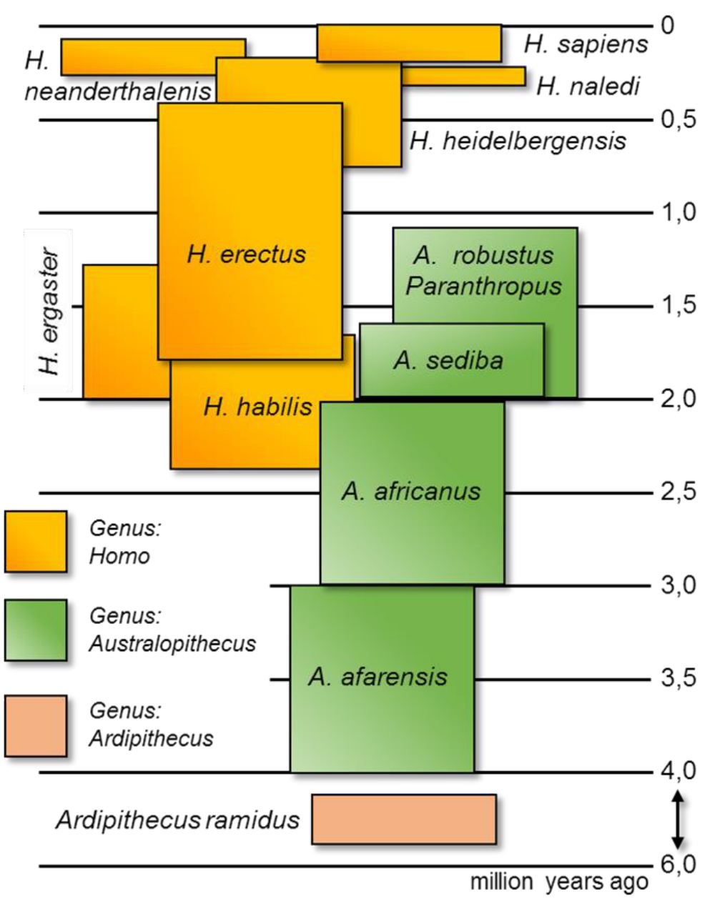


---

## Table 4: *Australopithecus* - Statistics

| Species | When existed | Fossil site (year) | Discovered by |
| :--- | :--- | :--- | :--- |
| *A. afarensis* | $3,9 - 2,8\text{ mya}$ | Ethiopia ($1974$)<br>Kenya and Tanzania | Donald Johansen |
| *A. africanus* | $3,2 - 2\text{ mya}$ | Taung ($1924$); Sterkfontein | Raymond Dart |
| *A. sediba* | $2,0 - 1,6\text{ mya}$ | Malapa Cave ($2009$) | Lee Berger |

## Famous specimen

* ***A. afarensis*:**
  * **Lucy**, discovered $1974$, lived $3,2\text{ mya}$ – well adapted for arboreal living, but had ability to walk upright with proper bipedalism.
  * **Laetoli footprints**, discovered in $1976$ by Mary Leakey – clear evidence for bipedalism (Figure 19).


* ***A. africanus*:** (Figure 20)
  * **Taung child**, discovered $1924$ by R. Dart – not initially accepted as hominin.
  * **Mrs Ples**, lived $2\text{ mya}$ – discovered by Robert Broom at Sterkfontein caves.
  * **Little Foot**, lived $3,9 - 4,2\text{ mya}$ – a complete skeleton, found in $1997$ by Ron Clarke.

* ***A. sediba*:** (Figure 20)
  * **Karabo**, discovered by Lee Berger – a possible ancestor to the genus *Homo*.


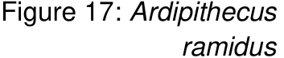


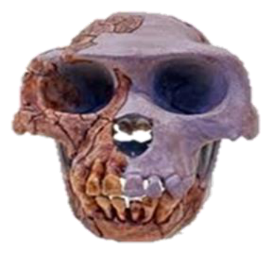


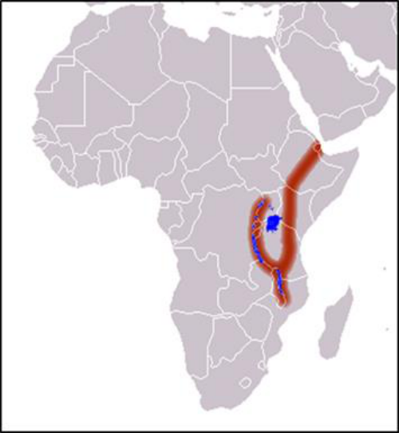


---

Table 5: *Australopithecus* – characteristics

| | *A. afarensis* | *A. africanus* | *A. sediba* |
| :--- | :--- | :--- | :--- |
| **Height** | $110 - 150\text{ cm}$ | $110 - 135\text{ cm}$ | $120 - 130\text{ cm}$ |
| **Brain size** | $375 - 550\text{ mL}$ | $420 - 620\text{ mL}$ | $420\text{ mL}$ |
| **Foramen magnum** | forward position | forward position | forward position |
| **Brow ridges** | large / heavy | present, smaller than *A. afarensis* | present, smaller than *A. africanus* |
| **Cranial ridge** | none | none | none |
| **Jaws** | very prognathous | prognathous | less prognathous |
| **Canines** | large, pointed | not very long | not very long |
| **Pelvis** | intermediate – bidpedal & tree climbing | fully adapted for bipedal walking | fully adapted for bipedal walking |

* **Australopithecus robustus** (dated $2,0 - 1,2\text{ mya}$)  
  Fossils from this particular species have been found only in South Africa. The classification as *Australopithecus* is uncertain, and the species, together with another similar species (*A. boisei*) from Tanzania, are now identify as of the genus *Paranthropus*.

---

### Genus: *Homo* ($2,2\text{ mya}$ to present) (Figure 21 and Tables 6 and 7)

* The genus *Homo* consists of the one still-living species, *Homo sapiens* – that all modern humans belong to, and between $15 - 20$ extinct species, including *Homo habilis*, *Homo erectus* and *Homo naledi*.
* The most significant difference between this genus and *Australopithecus* – a much larger brain (about $30\%$ larger) (see Figure 22 below)

Table 6: *Homo* stats (Figure 21)

| Species | When existed | Fossil site (year) | Discovered by |
| :--- | :--- | :--- | :--- |
| *Homo habilis* | $2,2 - 1,6\text{ mya}$ | Olduvai, Tanzania ($1960$) | Louis & Mary Leakey |
| *Homo erectus* | $2 - 0,4\text{ mya}$ | Java, Indonesia ($1891$) also in SA and Kenya | Eugene Dubois |
| *Homo sapiens* | $0,2\text{ mya}$ to present | Omo, Ethiopia ($2005$) | Richard Leakey |


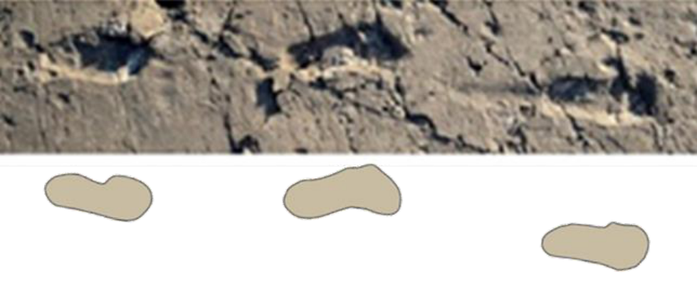


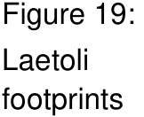


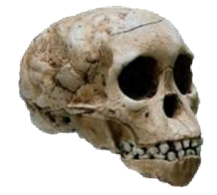


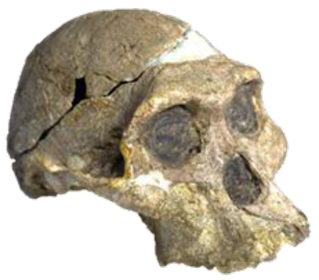


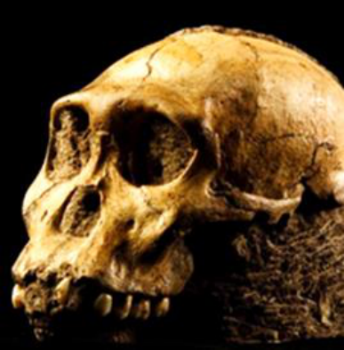


---

<!-- DIAGRAM_PLACEHOLDER: diagram -->

**Figure 21:** Fossil of (from left to right): *Homo habilis*, *Homo erectus*, and *Homo sapiens*.

### Table 7: Characteristics of the three *Homo* species

| | *Homo habilis* | *Homo erectus* | *Homo sapiens* |
| :--- | :--- | :--- | :--- |
| **Height** | $110 - 130\text{ cm}$ | $160 - 180\text{ cm}$ | $160 - 180\text{ cm}$ |
| **Brain size** | $650\text{ mL}$ | $900 - 1000\text{ mL}$ | $1200 - 1800\text{ mL}$ |
| **Foramen magnum** | forward position | forward position | forward position |
| **Brow ridges** | present, but not pronounced | distinct, but small | none (see Figure 21 above) |
| **Cranial ridge** | none | small | none |
| **Jaws** | less prognathous | less prognathous | not prognathous |
| **Canines** | small | small, short | small teeth |
| **Pelvis** | fully adapted for bipedal walking | fully adapted for bipedal walking | fully adapted for bipedal walking |

---

## Phylogenetic trees of hominin evolution

We conclude this section by a short review of another example of a phylogenetic tree

---

# Human Evolution: The Phylogenetic Tree

## Key Concepts and Structure

### Figure 22: Phylogenetic tree of human evolution


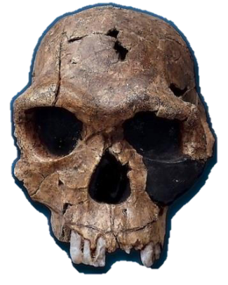


### Overview of the Phylogenetic Tree
* The phylogenetic tree illustrates aspects of the evolution of *Homo sapiens*.
* It clearly shows that several evolutionary branches (such as *H. rudolfensis*, *P. robustus*, etc.) became extinct, and approximately when these extinctions occurred.
* The vertical axis on the left represents millions of years ago (mya), ranging from $0$ to $4,5$ mya.

### Misconceptions vs. Reality
* **Misconception:** The diagram might incorrectly suggest a single, straight evolutionary line of development starting from *Ardipithecus ramidus*, moving through *A. afarensis*, *A. africanus*, *H. habilis*, *H. ergaster*, and *H. heidelbergensis* to *H. sapiens*.
* **Reality:** The process of evolution results in a **branching pattern** of relationships among organisms, **not a linear progression**.

### Important Scientific Quote
> "Evolution is a bush, not a ladder." — Stephen J. Gould (Late evolutionary biologist)

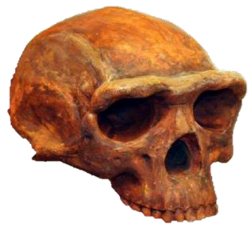


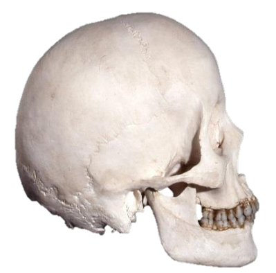


---

# Genetic Evidence to Support Common Ancestry for Living Hominids, Including Humans

## Introduction to Genetic Evidence

Studies comparing the nuclear DNA shared by humans and apes reveal that:

* **Human-to-Human Comparison:** The genetic difference between modern-day humans is very small. On average, there is only a $0,1\%$ difference — meaning humans share $99,9\%$ of the same genes.
* **Human-to-Ape Comparison:** Between humans and apes, there is a slightly larger genetic difference, but they still share the large majority of their genes: between $96,9\%$ and $98,8\%$.
* **Chimpanzees as Closest Relatives:** Studies show that, of the African apes, the chimpanzee is the closest relative of humans. Chimps and humans share $98,8\%$ of the same genes, representing a $1,2\%$ difference (which is $10 - 12$ times larger than the difference found between individual humans).

---

## Mitochondrial DNA (mtDNA) Analysis

The analysis of mitochondrial DNA (mtDNA) and the differences that exist between the mtDNA of two different species enables scientists to determine how long ago the species separated. 

Based on such analysis, the following relationship diagram is drawn:


*Figure 23: Diagram of relationships based on mtDNA comparisons*

### Key Timeframes of Divergence (from Figure 23):
* **Chimpanzees and Bonobos / Humans split:** $2,5$ million years ago (mya)
* **Gorillas split:** $4,6 - 6,2$ mya
* **Orangutans split:** $6,2 - 8,4$ mya
* **Baboons split:** $12 - 16$ mya
* **Root divergence (Common Ancestor):** $20$ mya (million years ago)

---

## Conclusion on Common Ancestry

The study of genetics has proved invaluable in gaining a better understanding of human evolution and of the origins of hominids. Given the amount of genetic material shared between humans and other hominids (the apes), they must have had a common ape-like ancestor who lived approximately $5 - 6$ million years ago.


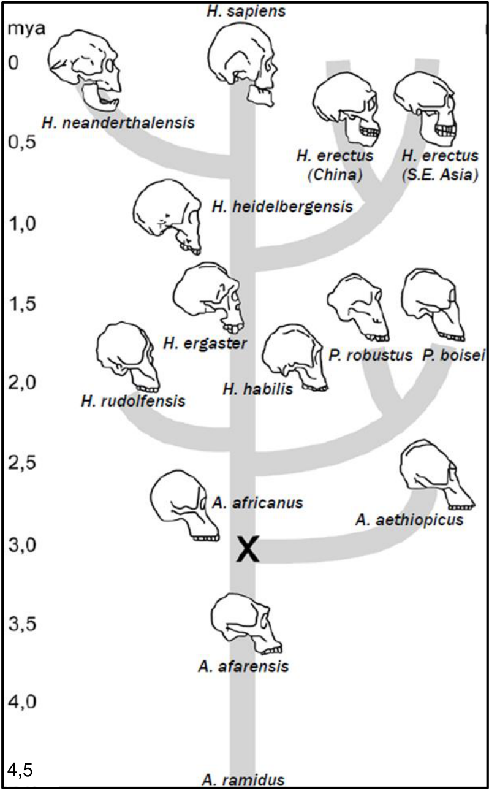


---

# Cultural evidence

A very important aspect of human evolution, separating humans from other hominids, is the development and use of tools.


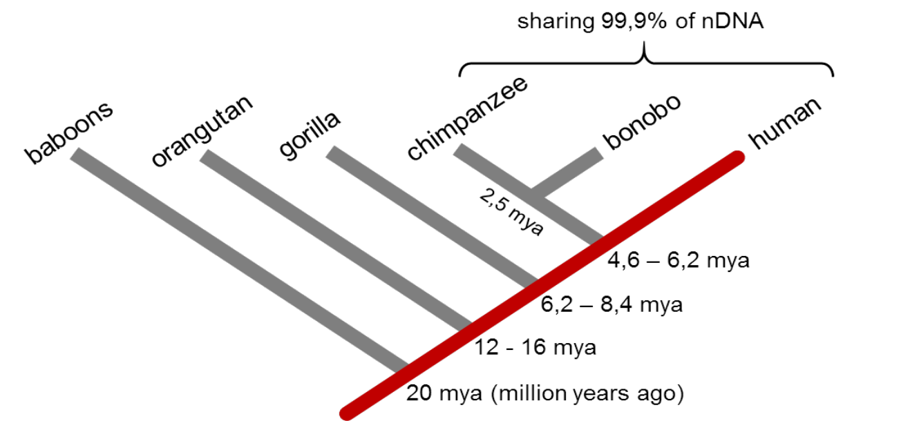


**Figure 24:** A monkey using a stone to crack a nut; chimpanzee using a stick to get at fruit in a box

The use of tools is not exclusive to humans, as illustrated in the images above (see Figure 24). Chimpanzees have been observed in the wild using simple tools, e.g. using a piece of grass or a stick to fish for termites or, using a stone to crack open nuts.

The **manufacturing** of tools is unique to humans – belonging to the genus *Homo*. The type of tool, and the gradual development of more sophisticated tools, is illustrated in the diagram below (Figure 25).

* **Oldowan tools** (from Olduvai Gorge where these tools were first found).

  These are the earliest tools, from about $2,6$ mya (million years ago), and are associated with *Homo habilis*. They consisted of sharp flakes chipped off a larger core – probably not sharp enough yet to cut raw meat.

* **Hand axe:** These tools appear around $1,7$ mya, and have been found at sites in Kenya and South Africa. They are mostly associated with *Homo erectus*.

* **Flakes:** About $250\ 000$ years ago, early humans began to make smaller, sharper, knife-like tools and scrapers. These tools, and all further development, is associated with *Homo sapiens*.

* About $40 - 50\ 000$ years ago, longer **blade-like tools** appeared. About $20\ 000$ years ago, humans began to make spears with stone (or bone) tips attached to a shaft. They also made tools with **microliths** (small stone chips) fastened to a shaft with animal sinew.

---

* About $5000$ years ago, this stone industry came to an end, and was replaced by copper, bronze, tin and eventually iron in tool-making.


**Figure 25:** A brief history of early human tool making

Two other aspects of culture had a significant impact on human evolution.

* The first is the control of fire (being able to make a fire) to provide warmth, to allow for the cooking of food, and contribute to social cohesion.

* Art also contributed. The earliest known art dates from about $100\ 000$ years ago, and the earliest cave paintings (see Figure 26 below), of which we have an abundance in South Africa, were made some $40\ 000$ years ago.

The purpose of art? Some speculate that art bonded individuals, sustained relationships for greater reproductive success, and was an attempt at spiritual development.

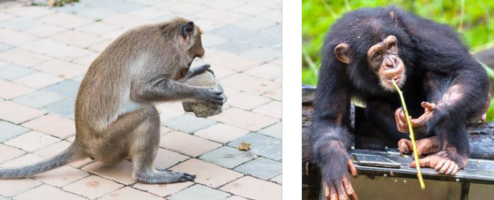


---


**Figure 26:** San / !Kung rock paintings – the eland (right) was of great spiritual significance to the San people and often featured in their rites of passage.

---

## Activity 3: Fossil evidence

1. Explain why our understanding of the sequence of human evolution based on fossil evidence might change in the future. (2)

2. The image below is of Mrs. Ples.


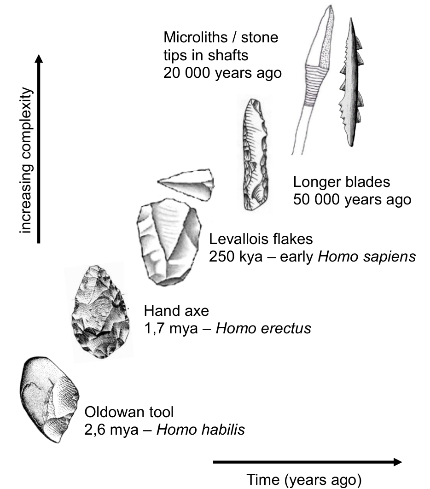


a) Name three ape-like features of this skull. (3)

b) What clues are there in the image to the brain size of Mrs. Ples. (2)

c) Where was Mrs. Ples found, and by whom? (2)

d) What species did Mrs. Ples belong to, and when did this species live? (2)

e) The species Mrs. Ples belonged to is extinct. What does this mean? (1)

3. Which genus of early human lived on Earth for the longest time span? How does this relate to the time span for the other two genera considered? (3)

4. Name three Australopithecine species that lived. For each species, give the timeframe in which they lived, an example / specimen of the species, and where, when and by whom the specimen were found. (12)

5. If asked to decide whether a complete skull with jaw-bones was that of *Ardipithecus* or *Australopithecus*, what four features would you examine? (8)

---

6. Study the skulls shown in the image below.


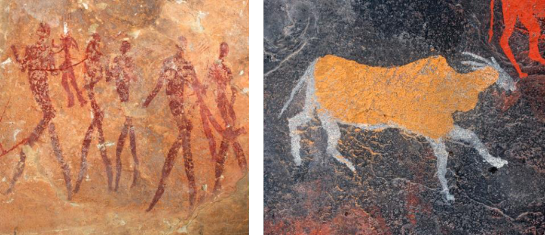


a) Identify the species represented. Species include: *H. habilis*, *A. afarensis*, *A. robustus*, *H. sapiens*, *H. erectus*. (5)

b) List four characteristics of the skull and brain size that you used to make your selection. (4)

7. Draw a line graph to show the development of brain size from *Ardipithecus* through to *Homo sapiens*. Use the following data.

| Species | Time frame (mya) | Brain size (mL) |
| :--- | :---: | :---: |
| *Ardipithecus ramidus* | 5 | 350 |
| *Australopithecus afarensis* | 3,4 | 460 |
| *A. afarensis* | 2,6 | 520 |
| *A. sediba* | 1,9 | 420 |
| *Homo habilis* | 2 | 650 |
| *H. erectus* | 1,2 | 950 |
| *H. sapiens* | 0,2 | 1500 |

What conclusion/s can you draw from the graph? (8)

8. The diagram below shows possible relationships between members of the family Hominidae. Study the diagram, then answer the questions that follow.

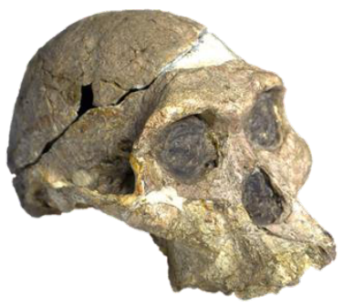


---


## Questions

a) What is the name given to this type of diagram? (1)

b) How many genera, and how many species, are represented? (2)

c) Explain why *A. robustus* and *A. boisei* are more closely related than *A. boisei* and *A. afarensis*. (2)

---

## 'Out of Africa' hypothesis

The **'Out of Africa' hypothesis** states that all modern humans originated in Africa, and then migrated out of Africa to the rest of the world.


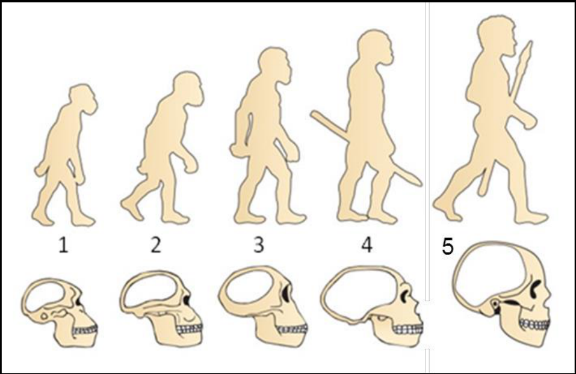


*Figure 27: Migration out of Africa into the rest of the world.*

---

* Approximately $150\,000 - 200\,000$ years ago, ancestors of *Homo sapiens* (such as *Homo erectus*) evolved into *Homo sapiens* in eastern and southern Africa.
* About $70\,000$ years ago, these modern humans spread out into Europe, Asia and across the world as illustrated in the map above (Figure 27).

Out of Africa hypothesis is supported by:
* genetic evidence
* the fossil record

## Genetic evidence (mitochondrial DNA studies)

Using our current understanding of DNA, its structures and properties, scientists have analysed human DNA to explore the relationships between humans across the world.


Figure 28: Mitochondrial DNA found inside mitochondria within a cell

Geneticists use mitochondrial DNA (mtDNA – Figure 28) to study human origins and migrations since mtDNA is passed unchanged from mother to offspring. However, during a person's life, **mutations** (changes) to the mtDNA do occur.

Scientists can determine the rate at which such mutations (or markers) take place, and can then use them as a type of molecular clock to determine the age of a particular maternal mtDNA lineage. From the studies, we can conclude:
* African populations of *Homo sapiens* have the greatest number of mtDNA markers and are thus the oldest.
* The most recent common ancestor whose genetic marker is found in all living humans, must have lived in eastern Africa approximately $150\,000$ years ago.

Based on markers in non-African populations, scientists believe that modern humans moved out of Africa about $60 - 70\,000$ years ago. It would have been an ideal time.

318

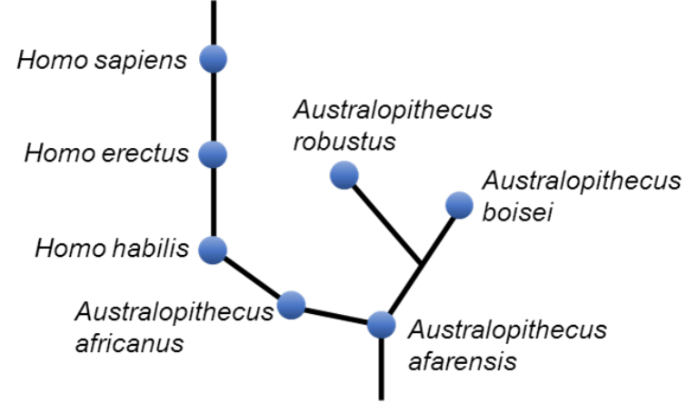


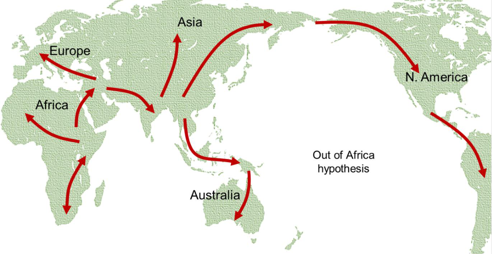


---

Due to an ice age, the sea levels on the Red Sea would have been quite low, allowing *Homo sapiens* to cross first into the Middle East, then to Eurasia, Europe and Australia, and about $20\ 000$ years ago into North America.

## The fossil record

The fossil record uncovered in Africa thus far points unambiguously to the fact that modern humans originated and evolved in eastern and southern Africa.

Before examining this record in some detail, studying the major phases of hominid evolution, we take a look at the main lines of evidence that emerge from that fossil record. Based on the fossil record, we can state that ...

* Fossils from the earliest hominin species, *Ardipithecines* and *Australopithecines*, have been **found only in Africa** and not anywhere else.
* Fossils for the earliest species of the genus *Homo*, *Homo habilis*, have also **only been found in Africa**.
* Fossil evidence for *Homo erectus* indicates this species lived in eastern and southern Africa between $1,9 - 1,4$ million years ago. The earliest finds in Africa are the **oldest fossils** of *Homo erectus* discovered anywhere in the world.
* Finally, ***Homo sapiens* emerged in Africa**. The oldest *Homo sapiens* fossils were discovered in 2005 near Ethiopia's Omo River and are dated to between $195\ 000$ and $160\ 000$ years ago.

## Fossil sites in South Africa

There are many different fossil Hominid sites found in South Africa; but we will only focus on the Cradle of Humankind.

* The Cradle of humankind includes different sites (see Figure 29 below). These sites have yielded more hominin fossils than any other site.
* The Cradle of Humankind is situated in Gauteng Province, north-west of Johannesburg which includes $15$ different sites


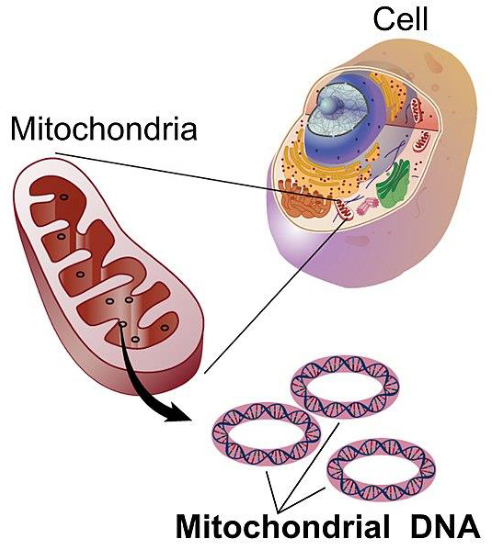


---

# Fossil Sites in South Africa

<!-- DIAGRAM_PLACEHOLDER: diagram -->

**Figure 29:** Important fossil sites in South Africa

---

The discussion will only focus on 5 of the 15 sites:

1. **Sterkfontein** caves: First hominin discovery in 1936, and since then, about 500 hominin fossils have been found there. This represents almost $40\%$ of all hominin fossils found world-wide. Famous fossils:
   * In 1947, Robert Broom (Figure 30) discovered **Mrs Ples**, the most complete skull of the species *Australopithecus africanus*.
   * In 1997, Ron Clarke (Figure 30), working with Stephen Motsumi and Nkwane Molefe, discovered **Little Foot**, about $4,2 - 3,9$ million years old – the oldest fossil remains from the Cradle of Humankind.
   * In 2013, Lee Berger and his team excavated about $1550$ fossils (at least $15$ individuals) of ***Homo naledi***, a species of hominin not known previously.

---

*Page 320*

---


Figure 30: Eminent SA palaeontologists (from left to right) – Raymond Dart, Robert Broom, Ron Clarke.

2. **Swartkrans** – largest sample of *Paranthropus robustus* fossils anywhere, with numerous *homo* fossils as well. The oldest fossils date from $2,1 - 1,9$ mya.
3. **Kromdraai** – in 1938, the first discovery of *Paranthropus robustus*, identified by Robert Broom. 29 hominin specimen, dated $2 - 1,8$ mya have been found there, with stone tools from around $1$ mya.
4. **Malapa** – Karabo (*Homo sediba*), dated $2$ mya – a transitional species linking *A. afarensis* and the earliest form of the genus *Homo*.
5. **Other sites**: Drimolen, Plover's Lake, and Gladysvale.

## The importance of the Cradle of Humankind

The Cradle of Humankind is a world's heritage site for these reasons:

* **Australopithecus africanus**
  * The first adult skull was found at Sterkfontein in 1936. A virtually complete skeleton (Little Foot) was found there in 1997.
  * The fossils found at Sterkfontein are spread over a longer timeframe than elsewhere ($1$ million years from $3 - 2$ million years ago). The species is only found in South Africa.
  * It is an early ancestor of the genus *Homo*.

* **Paranthropus robustus**
  * Found at Kromdraai in 1938, and subsequently at Swartkrans. This species has only been found in South Africa.
  * *Lived* in the same time period as *Homo habilis*, and fossils of these two species have been found together at the Cradle of humankind. Could this point to a speciation event occurring at the Cradle of Humankind?

321

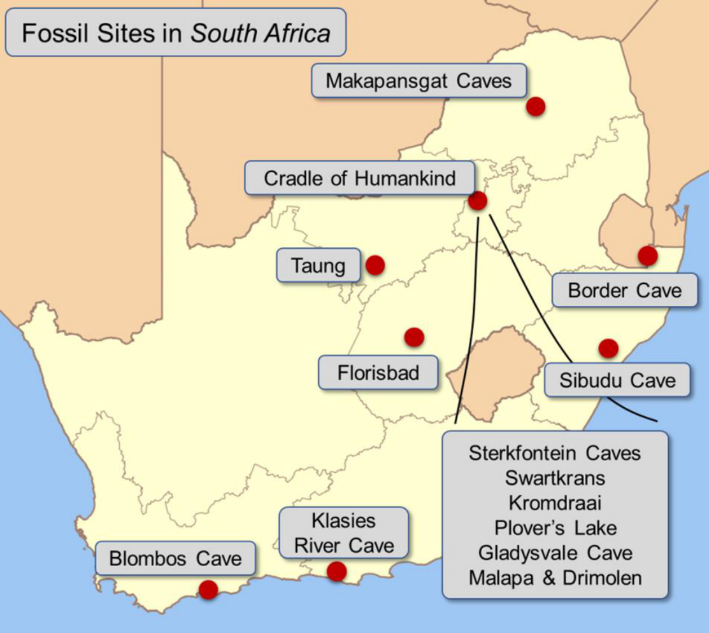


---

* **Homo erectus**
  * The first fossils were found by Robert Broom at Swartkrans. At Sterkfontein, there is the first and only association of the *Homo erectus* with early stone tools such as the hand axe.

---

## Other South African sites

* **Taung (North-West Province):** Taung child discovered here. It was the first ever specimen of *Australopithecus africanus*, and suggested that hominin originated not in Asia, as previously thought, but in Africa.
* **Makapansgat Valley (near Mokopane, Limpopo Province):** Research at Makapansgat was initiated by Raymond Dart in 1947.
* **Florisbad:** In 1932, T. Dreyer discovered a reasonably complete skull, $260\ 000$ years old, near Florisbad. The skull shows features linking it to both *H. heidelbergensis* and to early *Homo sapiens* – probably a transitional fossil.
* Other South Africa sites include the **Border Cave** in the Lebombo Mountains, the **Blombos Cave** and the **Klasies River Cave** along the Cape coastline.

---

## Other African fossil sites

The Great Rift Valley is a $2000\text{ km}$ long geological feature across Ethiopia, Kenya and Tanzania. There are numerous fossil sites in the Rift Valley.


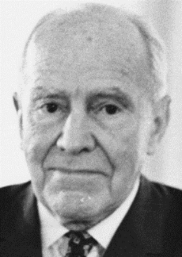


*Figure 31: Location of the Rift Valley in East Africa.*

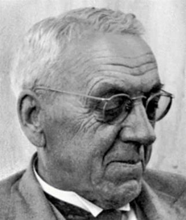


---

### Key Fossil Sites and Discoveries in Africa

* **Ethiopia (Hadar and Middle Awash)**
  * **Hadar:** In 1974, Donald Johansen discovered the first specimen of the species *Australopithecus afarensis*. Over 360 other skeletons have been found there since. *Homo habilis* fossils and Oldowan tools were also found there.
  * **Middle Awash:** A large number of fossils of the species *Ardipithecus ramidus* were found in the Afar Depression in Ethiopia by Tim White in 1994.

* **Kenya (Turkana and Omo)**
  * **Turkana:** The most complete skeleton of *Homo erectus* (the Turkana Boy, dated $1,6 - 1,5$ million years ago) was found at Turkana in 1984 by Richard Leakey.
  * **Omo:** Richard Leakey also discovered the Omo fossils, which are remains of modern *Homo sapiens* from about $195\ 000$ years ago.

* **Tanzania (Olduvai Gorge and Laetoli)**
  * **Olduvai Gorge:** Louis and Mary Leakey discovered fossils of *Homo habilis* (dated between $2,1 - 1,5$ million years ago) here in 1960. Mary Leakey also discovered fossils—about $1,75$ million years old—of *Paranthropus boisei* (Nutcracker man) in 1959.
  * **Laetoli:** In 1976, Mary Leakey found $3,5$ million-year-old hominin footprints at Laetoli, providing evidence that our early hominin ancestors walked with a bipedal, free-striding gait.

---

### Activity 4: Out of Africa hypothesis

1. State the 'Out of Africa' hypothesis. *(3)*
2. Explain why we speak of an 'Out of Africa' *hypothesis*, not theory. *(4)*
3. What evidence is there to support the 'Out of Africa' hypothesis? *(9)*
4. What is mitochondrial DNA? *(3)*
5. What factors make mtDNA a useful tool in the exploration of human evolution? *(4)*
6. In your own words, describe the importance of the Cradle of Humankind. *(4)*
7. List two sites in South Africa, but not part of the Cradle of Humankind, where important fossil remains were discovered. Provide some detail of the fossils found. *(4)*
   *(Total: 31)*

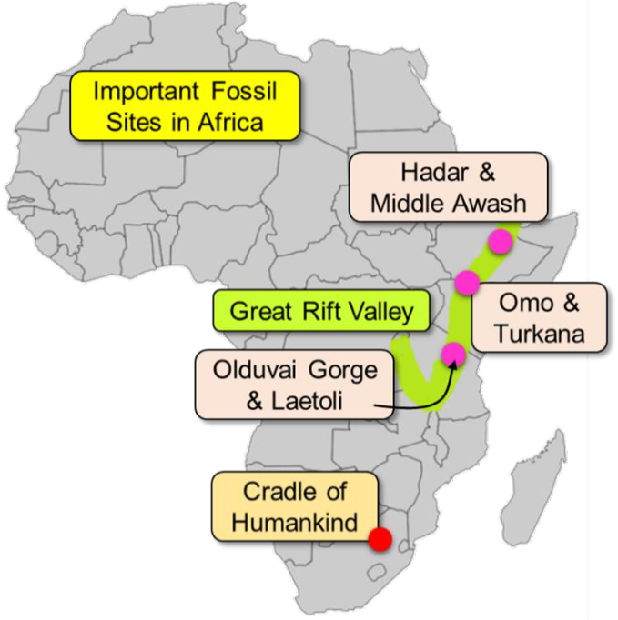


---

# Alternatives to Evolution

Evolution is a well-established scientific theory based on real-world observation. Nevertheless, various alternative explanations are proposed. These include:

### Creationism
Creationists believe that all life was created individually by a supreme being using supernatural powers. They do not believe that an existing species evolved from an earlier species.

### Intelligent Design
Proponents of intelligent design do not accept stages of natural selection since nothing can evolve out of something simple to become more complex. The complexity of things points to an intelligent cause.

### Theistic Evolution
Theistic evolutionists believe in a divine being that created the material world through the natural processes that we refer to as evolution. Evolution is simply the tool that the supreme being uses to create the diversity and complexity of life around us. For theists, science and religion can co-exist.

### Literalism
Literalists interpret their scriptural texts literally. Christian literalists take the creation accounts in the Book of Genesis literally. Literalists embrace a very narrow, more restricted version of creationism.

---

# Human evolution: End of topic exercises

## Section A

### Question 1

1.1 Various options are provided as possible answers to the following questions. Choose the correct answer and write the letter (A–D) next to the question number (1.1.1–1.1.5) for example 1.1.6 D.

1.1.1 A possible explanation for an observation that can be tested is known as a
* A. fact
* B. law
* C. theory
* D. hypothesis

1.1.2 The most dramatic change in the evolution of *Homo sapiens* is traced in
* A. loss of body hair
* B. shortening of the jaws
* C. shorter legs
* D. the increase in brain size

1.1.3 How were the first modern humans (*Homo sapiens*) different from any of the other hominid species?
* A. They lived outside Africa
* B. They lived longer in Africa than any of the other hominids
* C. They used tools
* D. They used symbolic thought, represented in language and art.

1.1.4 Which one of the following serves as evidence of cultural evolution in early *Homo* species?
* A. The size of a *Homo erectus* cranium relative to a *Homo sapiens* cranium.
* B. The presence of ancient stone tools
* C. Male and female skeletons in the same area
* D. Animal fossils mixed with hominin fossils.

---

1.1.5 Three related species, X, Y and Z, share a common ancestor. Species Y and Z share the most recent common ancestor.

Which phylogenetic tree most accurately represents their evolutionary relationship?

<!-- DIAGRAM_PLACEHOLDER: diagram -->

$$(5 \times 2) = (10)$$

---

1.2 Give the correct term / phrase for each of the following descriptions. Write only the term next to the question number.

* 1.2.1 Living primarily in trees
* 1.2.2 The type of vision shared by apes and humans that allows for depth perception
* 1.2.3 The family to which humans belong
* 1.2.4 The hypothesis which supports migration of human ancestors from the point of origin
* 1.2.5 The ability of an organism to walk on two feet
* 1.2.6 Having a face with protruding jaws
* 1.2.7 The first hominin that used stone tools sharp enough for cutting meat
* 1.2.8 The genus to which modern humans belong
* 1.2.9 The permanent disappearance of a species from Earth
* 1.2.10 Genetic material used to trace female ancestry

$$(10 \times 1) = (10)$$

---

1.3 Indicate whether each of the descriptions in **Column I** applies to **A ONLY**, **B ONLY**, **BOTH A AND B** or **NONE** of the items in **Column II**. Write **A only**, **B only**, **both A and B** or **none** next to the question number.

| Column I | Column II |
| :--- | :--- |
| 1.3.1 Found in apes and humans | A: claws<br>B: nails and an opposable thumb |
| 1.3.2 Fossils found in South Africa | A: Mrs Ples<br>B: Lucy |

---

| Question | Column 1 | Column 2 |
| :--- | :--- | :--- |
| 1.3.3 | Fossil evidence found in Ethiopia | A: *Ardipithecus ramidus* <br> B: *Australopithecus africanus* |
| 1.3.4 | Study of fossils | A: fossilisation <br> B: palaeontology |
| 1.3.5 | Discovered the fossil called 'Little Foot' | A: Raymond Dart <br> B: Ronald Clarke |

$$(5 \times 2) = (10)$$

---

1.4 The diagram shows the skulls of two organisms; a human and a gorilla. Study the diagrams (drawn to scale) and answer the questions that follow.


1.4.1 Which diagram (A or B), represents the skull of a gorilla? (1)

1.4.2 Which organism (A or B), is bipedal for most of its adult life? (1)

1.4.3 Name **and explain** two possible advantages of bipedalism for an organism. (4)

1.4.4 Tabulate two observable differences between the skull of organism A and B (5)

1.4.5 Name one similarity between organism A and B which is a characteristic of primates. (1)

**(12)**


---

1.5 The diagram below shows possible evolutionary relationships between hominids. A dotted line indicates the species is extinct.

*(Diagram showing a phylogenetic tree with branches for Pan sp., Ardipithecus ramidus, Australopithecus anamensis, Australopithecus afarensis, Australopithecus africanus, Paranthropus robustus, Australopithecus garhi, Paranthropus aethiopicus, Paranthropus boisei, and Homo, ordered across a horizontal axis labeled "Time".)*

1.5.1 What is this type of diagram called? (1)

1.5.2 List the different hominin genera shown in the diagram. (4)

1.5.3 According to this diagram, which ...
a) genus is most recently evolved? (1)
b) genus of hominin is the oldest? (1)
c) hominin species shares a common ancestor with *Australopithecus africanus*? (1)

1.5.4 Give two examples of an *Australopithecus africanus* fossil found in South Africa. (2)

1.5.5 Name two *Homo* species, besides *Homo sapiens*, that have been found in Africa. (2)

**(12)**
**Section A: [54]**

---

### Section B

#### Question 2

2.1 Read the following passage, then answer the questions based on it.


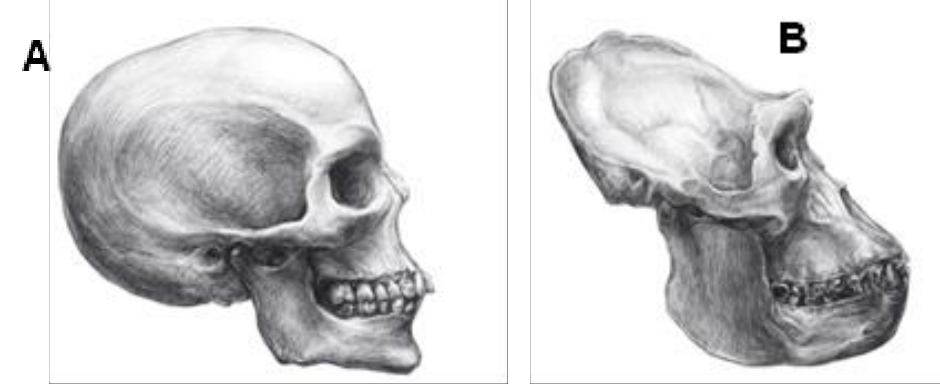


---

# Australopithecus sediba

According to those who discovered the fossil remains of *Australopithecus sediba*, this species shared many characteristics with *Australopithecus africanus*, from which it descended. The species however also reveals a number of early *Homo* features, more so than any other *Australopithecus* species. This suggests that *A. sediba* is possibly ancestral to *Homo*, though it may also be an evolutionary dead end.

Like other species from the genus *Australopithecus*, *A. sediba* had a relatively small brain size. The length of the legs, arms adapted for climbing trees, and details of the teeth also resemble earlier Australopithecines. On the other hand, the species' hand with the precision grip of a toolmaker, and its facial features closely resemble those of early *Homo* species. Remarkably, *A. sediba* had a more human-like pattern of movement than a fossil attributed to *Homo habilis*.

The pelvic structure of *A. sediba* suggests this species walked upright on a regular basis. The legs and feet however point to a previously unknown way of walking upright. With each step, *Australopithecus sediba* turned its foot inward with its weight focused on the outer edge of the foot.

*(adapted from Australopithecus Sediba, https://factsanddetails.com/world/cat56/2215.html)*

---

## Questions

2.1.1 Who discovered *Australopithecus sediba*, and where? (2)

2.1.2 *A. sediba* is described as having a relatively small brain size. What was the average brain size for this species? (1)

2.1.3 Define the term 'transitional fossil'. (2)

2.1.4 *A. sediba* is described as possibly an "evolutionary dead end". What is an evolutionary dead end? (3)

2.1.5 According to the passage, *Australopithecus sediba* had a previously unknown way of walking upright. What does this suggest for the evolution of bipedalism? (2)

2.1.6 What is the difference between bipedalism and standing upright? Use examples to explain. (5)

**Total Marks: [15]**

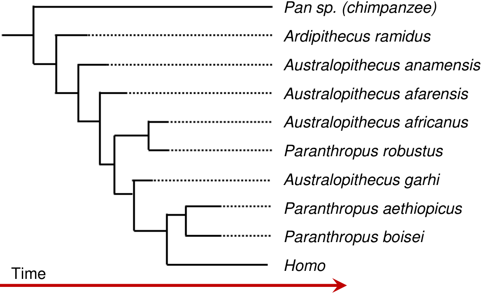


---

### 2.2


The diagram above shows the progression of human evolution. Study the diagram of some early hominin A, B, C, D and E which represent *Homo erectus*, *Homo sapiens*, *Australopithecus*, *Homo habilis* and *Homo neanderthalensis*, in no particular order.

* **2.2.1** Identify each of the above hominid members ($A - E$) correctly from the list given above. (5)
* **2.2.2** Mention any three common characteristics which are shared by the members represented in the above diagram. (3)
* **2.2.3** Name the family the above group belongs to, and the collective name for these members (2)
* **2.2.4** Supply any three characteristics that make the organism, labelled E different from other primates. (3)  
  **(13)**  
  **[28]**

---

### Question 3

#### 3.1

* **3.1.1** A larger brain size is often associated with a greater intelligence. Accordingly, *Homo neanderthalensis*, with a larger brain than *Homo sapiens*, should have been more intelligent, and thus better able to adapt to climate changes. Yet *H. neanderthalensis* is extinct, while *H. sapiens* flourishes. What other factor related to the brain could explain this? (2)
* **3.1.2** Explain the relationship between the decrease in the jaw size of evolving hominin species and their increasing brain size. (3)  
  **(5)**

#### 3.2

Scientists use fossils as evidence for human evolution. The brain volume of some extinct primates has been estimated from their fossils and have been

---

compared to the brain volumes of living primates. The results are shown in the table below (figures in brackets give mid-point of existence).

| Hominid | Period of Existence (million years ago) | Average Brain Volume (mL) |
| :--- | :---: | :---: |
| *Ardipithecus ramidus* | 5,8 to 4,4 $(5,1)$ | 400 |
| *Australopithecus afarensis* | 4 to 2,7 $(3,4)$ | 450 |
| *Australopithecus africanus* | 3 to 2 $(2,5)$ | 450 |
| *Homo habilis* | 2,2 to 1,6 $(1,9)$ | 750 |
| *Homo erectus* | 2 to 0,4 $(1,2)$ | 1 000 |
| *Homo neanderthalensis* | 0,3 to 0,23 $(0,27)$ | 1 500 |
| *Homo sapiens* | 0,2 to present $(0,1)$ | 1 400 |
| *Modern apes* | 0,2 to present $(0,1)$ | 500 |

3.2.1 Apart from fossil evidence, give two other types of evidence for human evolution? In each case, give a brief explanation of how the evidence is used to support the notion of human evolution. (4)

3.2.2 The brain of an organism is not preserved as fossil. How do experts determine the average brain volume of extinct species? (2)

3.2.3 Calculate the difference in brain volume (in $\text{mL}$) between the two living primates. Show all calculations. (3)

3.2.4 Draw a line graph to show the evolution of brain size across all hominin species listed in the table. Use the mid-point of the period of existence on one axis. Once the points have been plotted, interpret the graph. (8)

(17)

**[22]**

**Section B: [50]**

**Total marks: [104]**

331


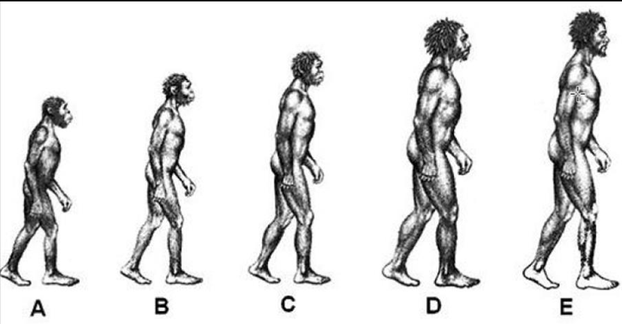


---

# Chapter 10: Human Evolution

## Activity 1: Phylogenetic trees

1. The Order Primates and the Family Hominidae.
2. Gorillas, chimpanzees, orangutans, bonobos (any two).
3. About $10$ million years ago.
4. **Definitions:**
   * **Hominids:** Members of the Family Hominidae which include humans and early humans, chimpanzees, bonobos, gorillas, and orangutans.
   * **Hominins:** A sub-group (tribe) within the Family Hominidae, which include only modern humans and early human ancestors.
5. Option B.
6. **Questions and Answers:**
   * a) A branching diagram or "tree" showing the evolutionary relationships among various biological species.
   * b) *Australopithecus afarensis*
   * c) *Homo sapiens*
   * d) *Homo habilis*, *Australopithecus africanus*, and *Homo erectus* (any two).
   * e) *Homo sapiens* emerges around $0,5$ mya; *Homo erectus* emerged around $1,8$ mya. Time difference $= 1,8 - 0,5 = 1,3$ million years ago.
   * f) *Homo erectus* (Total marks: $21$)

---

## Activity 2: Anatomical differences and similarities between African apes and modern humans

1. **Shared characteristics (any five):**
   * Large brain
   * Eyes in front of head
   * Opposable thumbs
   * Bare fingertips / nails instead of claws
   * Upright posture
   * Freely rotating arms
   * Sexual dimorphism

   **Differences (human vs chimpanzee - any three):**
   * Forward vs backward position of foramen magnum
   * Curved vs straighter spine
   * Short, wide vs long, narrow pelvis
   * No vs prominent brow ridges
   * C-shaped or semi-circular vs long, rectangular palate
   * Small vs large canines
   * Orthognathic vs prognathous jaws

2. **Definition of an opposable thumb:** The thumb is opposable if it can touch and exert pressure on the finger pad of another finger on the same hand.

3. **Bipedalism:** Bipedalism or habitual bipedalism is the ability to stand erect and walk comfortably on two feet, placing one foot in front of the other, slight apart. It is more than simply standing on two feet, as many animals can do that for a short period.

4. **Advantages of bipedalism (any four):**
   * Hands are free to pick or carry food.
   * Hands are free to use tools or weapons.
   * Standing upright, with eyes higher off the ground, gives a better and wider view.

---

5. **Binocular vision**: Having two eyes in the front of the head to view an object. Depth perception is a function of the brain that interprets what the eyes see and recognises shape, distance, etc. — this is known as stereoscopic vision.

6. **Prognathous**: Means protruding. As seen in the sketch, the jaws of the chimpanzee skull extend far beyond the vertical line running through the eye-socket.
   * For sketch / showing jaws protruding.

   <!-- DIAGRAM_PLACEHOLDER: diagram -->

7. **Diagram illustrating the evolution of palate shape**:
   * Change in canines
   * Smaller human teeth
   * Changing palate shape

   <!-- DIAGRAM_PLACEHOLDER: diagram -->

8. 
   * a) **Foramen magnum**
   * b) **Species B**. When walking as a quadruped, on all fours, the back is almost horizontal. To look forward comfortably, the spine needs to go into the skull towards the back of the base.
   * c) For table, each observable difference — any four:

| | Skull A (human) | Skull B (gorilla) |
|---|---|---|
| **Brain size** | large | Much smaller |
| **Jaws** | Orthognathous / flat face | Prognathous |
| **Teeth** | Small, small canines | Large, large canines |

---

### Comparison of Skeletal and Cranial Features

| Feature | Organism A / Human | Organism B / Ape |
| :--- | :--- | :--- |
| **Cranial ridge** | none | Present |
| **Brow ridge** | none | prominent |

d) The larger the cranium, the larger the brain it can house / accommodate. A larger brain suggests greater intelligence.

9. 
   a) A
   
   b) The pelvis in A is shorter and wider (more cup-shaped) than the pelvis in B. It is better able to support the weight of vertically stacked organs, as in a human.
   
   c) The shape of the pelvis in A and the direction of the hip socket angle the femur inwards for maximum load bearing and an efficient, comfortable bipedal gait.

*(47)*

---

### Activity 3: Fossil evidence

1. While numerous fossils have been found, most have only been discovered in the last 50 years or so. Every fossil find requires study and interpretation, to find out how it fits into the overall picture. This is not an easy task, particularly if you have few pieces of the puzzle. New discoveries can change our understanding radically, as has happened in the past already.

2. 
   a) Brow ridge, strongly projecting upper jaw bone, smaller cranium / brain size - for any three
   
   b) The size of the cranium
   
   c) by Robert Broom, in 1947, near Sterkfontein
   
   d) *Australopithecus africanus*, lived in Africa between $3,2$ and $2$ million years ago
   
   e) **Extinct** means to no longer exist. No member of the species is still alive.

3. The genus *Australopithecus* lived on Earth between $4$ and $1,2$ million years ago – a total of $2,8$ million years, much longer than the genus *Homo* (about $2,2$ million years), and very much longer than the *Homo sapiens* species ($200\ 000$ years). The genus *Ardipithecus* probably lived for about $1,5$ million years.

4. 
   * *Australopithecus afarensis*: $3,9 - 2,8$ million years ago, Lucy – discovered $1974$, by Donald Johansen at Hadar, Ethiopia
   * *Australopithecus africanus*: $3,2 - 2$ million years ago, Taung child – discovered by Raymond Dart in $1924$, at Taung, North West Province, South Africa
   * *Australopithecus sediba*: $2 - 1,7$ million years ago, Karabo – discovered in $2009$, by Lee Berger, at Malapa, South Africa

5. 
   * **Cranium size / brain size**: *Ardipithecus* had a smaller brain size ($350\text{ mL}$ as against $435 - 530\text{ mL}$)
   * **The position of the foramen magnum**: for *Ardipithecus*, it would not be as forward as for *Australopithecus*.

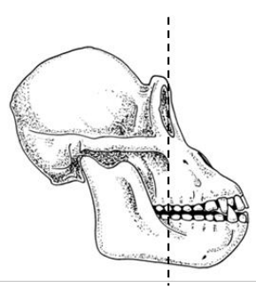


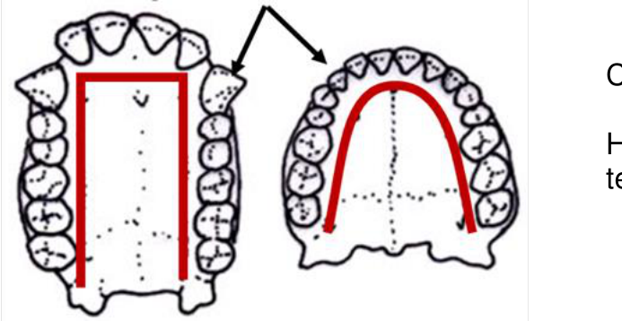


---

Considering the dentition, examine palate shape, and the size of canines $\checkmark$.
*Australopithecus* would have a slightly rounder arch $\checkmark$.
The size of the canines $\checkmark$: larger in *Ardipithecus* than in *Australopithecus* $\checkmark$

6. a) $1 - A. afarensis$, $2 - A. robustus$, $3 - H. habilis$, $4 - H. erectus$, $5 - H. sapiens$ - one mark $\checkmark$ for each correct specification
   
   b) Brain size: the larger the brain, the further the species in the stage of evolution, generally speaking; brow ridges / the shape of the forehead / how prognathous the jaw is / the size of the jaw - one mark $\checkmark$ for each correct specification

7. 

<!-- DIAGRAM_PLACEHOLDER: diagram -->

**Conclusion:** the initial brain size development is slow, and then speeds up exponentially as one approaches the present. $\checkmark \checkmark$

(this is clearly illustrated by the two lines of best fit drawn through the scatter plots: the line representing a gradual, more linear brain size development, and the line showing accelerated development)

* $\checkmark \checkmark$ - for correctly drawn graph - scatter plot, position of dots/crosses
* $\checkmark \checkmark$ - for correct labelling, axes

8. a) phylogenetic tree $\checkmark$
   
   b) two genera *Australopithecus*, *Homo* $\checkmark$ and seven species $\checkmark$
   
   c) *A. robustus* and *A. boisei* share a more recent common ancestor $\checkmark \checkmark$

*(57)*

---

### Activity 4: Out of Africa hypothesis

---

# Origin of Modern Humans and Genetic Evidence

## 1. The Out of Africa Hypothesis
* All modern humans (*Homo sapiens*) originated in Africa and migrated to other parts of the world.
* This is classified as a **hypothesis** rather than a definitive theory because it relies on currently available fossil evidence that has been studied, from which relationships are inferred. 
* Future fossil discoveries that are yet to be found could potentially contradict the presently accepted Out of Africa hypothesis. 
* Some scientists previously argued for a multi-regional origin, but a theory is more definitive than a hypothesis, hence the term "Out of Africa hypothesis" is used.

## 2. Genetic Evidence and Mitochondrial DNA (mtDNA)
* **Mitochondrial DNA:** A small circular chromosome found inside mitochondria. It is inherited exclusively from the mother and passed from mother to offspring through the egg cell.
* **Mutations as Markers:** Scientists look for mutations or markers in mtDNA. These mutations occur at a steady and known rate.
* **Tracing Ancestry:** 
  * Analysis of mutations and markers on mtDNA shows that the oldest female ancestors were living in Africa, and all currently living humans are descended from her.
  * Populations with the greatest number of markers represent the oldest human populations (all originating from Africa).
  * Comparing these markers allows scientists to determine when different populations separated from each other.

## 3. Fossil Evidence
* **Human Evolution:** The oldest fossils for *Ardipithecus*, *Australopithecus*, and *Homo habilis* have been found exclusively in Africa.
* **Homo Species:** The oldest *Homo erectus* fossil and the oldest *Homo sapiens* fossil have also both been discovered in Africa.

## 4. Significance of South African Fossil Sites
* **The Cradle of Humankind:** 
  * Important due to the abundance of hominin fossils found here, accounting for $40\%$ of all world-wide hominin fossils.
  * Specific fossil species found only here include *Australopithecus africanus* and *Paranthropus*.
  * The first African fossils of *Homo erectus* were also discovered here.
* **Makapansgat Valley:** 
  * A cave complex with a significant fossil record.
  * Home to 40 individuals of the species *A. africanus*, which is found exclusively in South Africa.
* **Florisbad:** 
  * The site where an almost complete skull of an early *Homo sapiens* (or *H. heidelbergensis*) was discovered, featuring a cranial volume of $1400\text{ mL}$.

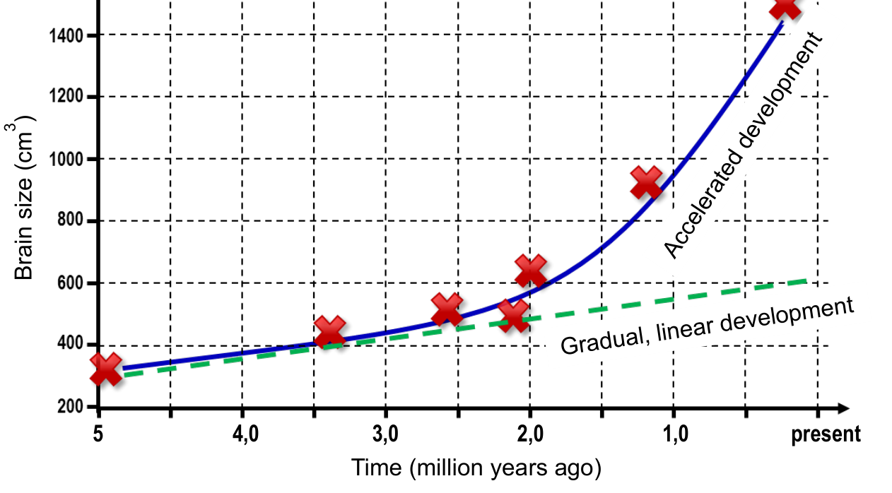


---

# End of Topic Exercises

## Section A

### Question 1

1.1 Various options are provided as possible answers to the following questions. Choose the correct answer and write the letter ($A–D$) next to the question number ($1.1.1–1.1.5$) for example $1.1.6\text{ D}$.

#### 1.1.1
A possible explanation for an observation that can be tested is known as a
* A fact
* B law
* C theory
* **D hypothesis** ✓✓

#### 1.1.2
The most dramatic change in the evolution of *Homo sapiens* is traced in
* A loss of body hair
* B shortening of the jaws
* C shorter legs
* **D the increase in brain size** ✓✓

#### 1.1.3
How were the first modern humans (*Homo sapiens*) different from any of the other hominid species?
* A They lived outside Africa
* B They lived longer in Africa than any of the other hominids
* C They used tools
* **D They used symbolic thought, represented in language and art.** ✓✓

#### 1.1.4
Which one of the following serves as evidence of cultural evolution in early *Homo* species?
* A The size of a *Homo erectus* cranium relative to a *Homo sapiens* cranium.
* **B The presence of ancient stone tools** ✓✓
* C Male and female skeletons in the same area
* D Animal fossils mixed with hominin fossils.

---

1.1.5 Three related species, X, Y and Z, share a common ancestor. Species Y and Z share the most recent common ancestor.

Which phylogenetic tree most accurately represents their evolutionary relationship?

*(The image displays four phylogenetic trees labeled A, B, C, and D, with tree C identified as the correct answer).*

**Answer:** $\text{C}$

---

1.2 Give the correct term / phrase for each of the following descriptions. Write only the term next to the question number.

1.2.1 Living primarily in trees  
**Answer:** Arboreal

1.2.2 The type of vision shared by apes and humans that allows for depth perception  
**Answer:** binocular vision (accept stereoscopic vision)

1.2.3 The family to which humans belong  
**Answer:** Family Hominidae

1.2.4 The hypothesis which supports migration of human ancestors from the point of origin  
**Answer:** Out of Africa hypothesis

1.2.5 The ability of an organism to walk on two feet  
**Answer:** bipedalism

1.2.6 Having a face with protruding jaws  
**Answer:** prognathous

1.2.7 The first hominin that used stone tools for cutting meat  
**Answer:** *Homo habilis*

1.2.8 The genus to which modern humans belong  
**Answer:** *Homo*

1.2.9 The permanent disappearance of a species from Earth  
**Answer:** extinction

1.2.10 Genetic material used to trace female ancestry.  
**Answer:** mitochondrial DNA


---

### Revision Notes: Human Evolution and Comparative Anatomy

---

### 1. Matching Descriptions in Human Evolution

Indicate whether each of the descriptions in **Column I** applies to **A ONLY**, **B ONLY**, **BOTH A AND B**, or **NONE** of the items in **Column II**. 

| Column I | Column II |
| :--- | :--- |
| **1.3.1** Found in apes and humans | **A:** claws<br>**B:** nails and an opposable thumb |
| **1.3.2** Fossils found in South Africa | **A:** Mrs Ples<br>**B:** Lucy |
| **1.3.3** Fossil evidence found in Ethiopia | **A:** *Ardipithecus ramidus*<br>**B:** *Australopithecus africanus* |
| **1.3.4** Study of fossils | **A:** fossilisation<br>**B:** palaeontology |
| **1.3.5** Discovered the fossil called 'Little Foot' | **A:** Raymond Dart<br>**B:** Ronald Clarke |

#### Answers and Explanations:
* **1.3.1 B only** — Hominids and apes (hominins) possess nails and opposable thumbs; they do not have claws.
* **1.3.2 A only** — *Mrs Ples* (Sts 5) was discovered in Sterkfontein, South Africa. (*Lucy* or *Australopithecus afarensis* was discovered in Ethiopia).
* **1.3.3 A only** — *Ardipithecus ramidus* fossils were famously discovered in the Afar region of Ethiopia. (*Australopithecus africanus* is endemic to South Africa).
* **1.3.4 B only** — Palaeontology is the scientific study of fossils. (Fossilisation is the process by which organic matter becomes a fossil).
* **1.3.5 B only** — 'Little Foot' (*Australopithecus* fossil designated Stw 573) was discovered by Ronald Clarke. (Raymond Dart discovered the Taung Child).

---

### 2. Comparative Skull Anatomy: Human vs. Gorilla

Study the provided diagrams of skulls labeled **A** (human) and **B** (gorilla), drawn to scale, to answer the structural and functional questions below.

#### Questions & Answers:

* **1.4.1 Which diagram (A or B) represents the skull of a gorilla?**
  * **Answer:** **B**
  * **Explanation:** Diagram **B** exhibits features characteristic of apes (gorillas), such as pronounced brow ridges, a sloped forehead, a large and robust jaw (prognathism), and a sagittal crest for strong jaw muscle attachment, which are absent in humans.

* **1.4.2 Which organism (A or B) is bipedal for most of its adult life?**
  * **Answer:** **A**
  * **Explanation:** Diagram **A** represents modern humans, who are obligate bipeds capable of walking upright on two limbs for the entirety of their adult lives.


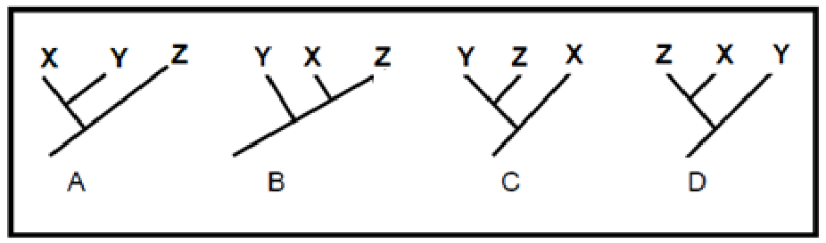


---

### Revision Notes: Human Evolution and Comparative Anatomy

---

### 1.4.3 Advantages of Bipedalism
Name and explain two possible advantages of bipedalism for an organism:

1. **Fast movement:** To get away from danger.
2. **Ability to survey surroundings:** To see where dangers are located.
3. **Freedom of forearm and hand:** For tool use or for defense.
4. **Exposed to less sunlight:** For temperature regulation.
5. **Display of genitals:** To attract a mate.

*(Any two of the above, including both the name and the correct explanation)*

---

### 1.4.4 Observable Differences Between Skulls
Tabulate two observable differences between Skull A and Skull B:

| Skull A | Skull B |
| :--- | :--- |
| Non-prognathous | Prognathous |
| No cranial ridge (accept no sagittal crest) | Cranial ridge present |
| Big cranium / brain cavity | Small cranium |
| Small canines | Large canines |

---

### 1.4.5 Similarities Between Primates
Name one similarity between organism A and B which is a characteristic of primates:

* Eyes in front
* Large brain
* Upright posture

---

### 1.5 Evolutionary Relationships Between Hominids
The phylogenetic tree below illustrates possible evolutionary relationships between hominids (where a dotted line indicates an extinct species):

```text
                                  --- Pan sp. (chimpanzee)
                          --------- Ardipithecus ramidus
                      ------------- Australopithecus anamensis
                  ----------------- Australopithecus afarensis
              --------------------- Australopithecus africanus
                  ------------- --- Paranthropus robustus
              -----------------     Australopithecus garhi
                  ---------         Paranthropus aethiopicus
                      -----         Paranthropus boisei
          ------------------------- Homo
```

*Note: Time increases from left to right along the horizontal axis, showing the relative chronological appearance and extinction of the respective lineages.*


---

### Section A: Hominin Evolution Analysis

#### Question 1.5
1.5.1 What is this type of diagram called?  
**Answer:** Phylogenetic diagram (1)

1.5.2 List the different hominin genera shown in the diagram.  
**Answer:** *Ardipithecus*, *Australopithecus*, *Homo*, and *Paranthropus* (4)

1.5.3 According to this diagram, which:
* a) genus is most recently evolved?  
  **Answer:** *Homo* (1)
* b) genus of hominin is the oldest?  
  **Answer:** *Ardipithecus* (1)
* c) hominin species shares a common ancestor with *Australopithecus africanus*?  
  **Answer:** *Paranthropus robustus* (1)

1.5.4 Give two examples of an *Australopithecus africanus* fossil found in South Africa.  
**Answer:** Taung child (Taung), Mrs. Ples, and Little Foot (both from Sterkfontein) — any two (2)

1.5.5 Name two *Homo* species, besides *Homo sapiens*, that have been found in Africa.  
**Answer:** *H. erectus*, *H. habilis*, *H. ergaster* — any two (2)

---

### Section B: Question 2

#### Reading Passage: *Australopithecus sediba*

According to those who discovered the fossil remains of *Australopithecus sediba*, this species shared many characteristics with *Australopithecus africanus*, from which it descended. The species, however, also reveals a number of early *Homo* features, more so than any other *Australopithecus* species. This suggests that *A. sediba* is possibly ancestral to *Homo*, though it may also be an evolutionary dead end.

Like other species from the genus *Australopithecus*, *A. sediba* had a relatively small brain size. The length of the legs, arms adapted for climbing trees, and details of the teeth also resemble earlier Australopithecines. On the other hand, the species' hand with the precision grip of a toolmaker, and its facial features closely resemble those of early *Homo* species. Remarkably, *A. sediba* had a more human-like pattern of movement than a fossil attributed to *Homo habilis*.

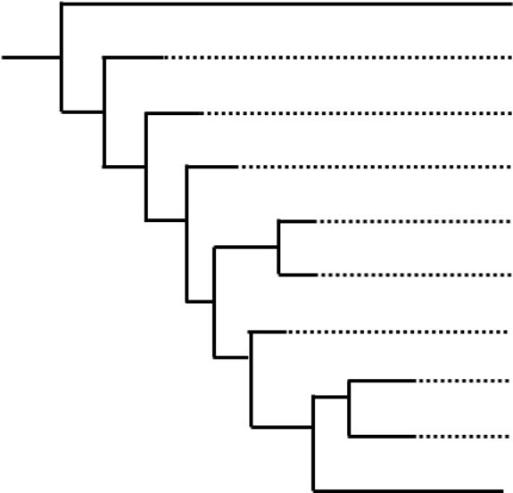


---

> The pelvic structure of *A. sediba* suggests this species walked upright on a regular basis. The legs and feet however point to a previously unknown way of walking upright. With each step, *Australopithecus sediba* turned its foot inward with its weight focused on the outer edge of the foot.
>
> *(adapted from Australopithecus Sediba, https://factsândetails.com/world/cat56/2215.html)*

---

### Questions and Answers

**2.1.1** Who discovered *Australopithecus sediba*, and where? *(2)*  
**Answer:** Lee Berger, at the Malapa caves.

**2.1.2** *A. sediba* is described as having a relatively small brain size. What was the average brain size for this species? *(1)*  
**Answer:** $420\text{ mL}$

**2.1.3** Define the term 'transitional fossil'. *(2)*  
**Answer:** Shows the characteristics of two different genera or species.

**2.1.4** *A. sediba* is described as possibly an "evolutionary dead end". What is an evolutionary dead end? *(3)*  
**Answer:** A dead end implies the species became extinct and that this species did not evolve any further.

**2.1.5** According to the passage, *Australopithecus sediba* had a previously unknown way of walking upright. What does this suggest for the evolution of bipedalism? *(2)*  
**Answer:** It suggests that upright walking (bipedalism) evolved on more than one path during human evolution.

**2.1.6** What is the difference between bipedalism and standing upright? Use examples to explain. *(5)*  
**Answer:** No. Bipedalism means to habitually walk erect, on two feet, the way a human being normally walks. Many animals (e.g. a chimpanzee) can stand upright on two legs, but generally walks on all fours.

*(Total Marks: 15)*

---

### 2.2

<!-- DIAGRAM_PLACEHOLDER: diagram -->

---

The diagram above shows the progression of human evolution. Study the diagram of some early hominin A, B, C, D and E which represent *Homo erectus*, *Homo sapiens*, *Australopithecus*, *Homo habilis* and *Homo neanderthalensis*, in no particular order. 

**2.2.1** Identify each of the above hominid members (A – E) correctly from the list given above. *(5)*

* A - *Australopithecus*
* B - *H. habilis*
* C - *H. erectus*
* D - *H. neanderthalensis*
* E - *Homo sapiens* 
*(1 mark for each correct answer)*

***

**2.2.2** Mention any three common characteristics which are shared by the members represented in the above diagram. *(3)*

*(Any 3 of these - 1 mark for each)*
* Freely rotating (movable) long upper limbs
* Elbow joints allowing rotation of the forearm
* Flat nails instead of claws / bare, sensitive finger tips
* Flexible wrists that are capable of rotating at least $180^\circ$
* Eyes in front
* Opposable thumbs for precision grip
* Larger brain than other hominids
* Binocular vision / stereoscopic vision
* Sexual dimorphism
* Upright posture / bipedal

***

**2.2.3** Name the family the above group belongs to, and the collective name for these members. *(2)*

* **Family:** Hominidae 
* **Tribe:** Hominini 
*(1 mark each)*

***

**2.2.4** Supply any three characteristics that make the organism labelled E different from other primates. *(3)*

*(Any three of these: one mark each)*
* Bipedalism
* Curved spine
* Flat (non-prognathous) face
* C-shaped / semi-circular dental palate
* Small teeth and canines (canines not large, pointed)
* Larger brain (average size $1450\text{ – }1500\text{ ml}$)

*(Total: 13)*

---

*[28]*

### Question 3

**3.1**

276


---

### 3.1 Brain Size, Jaw Size, and Human Evolution

#### 3.1.1 Brain Size and Intelligence
* **Question:** A larger brain size is often associated with a greater intelligence. Accordingly, *Homo neanderthalensis*, with a larger brain than *Homo sapiens*, should have been more intelligent, and thus better able to adapt to climate changes. Yet *H. neanderthalensis* is extinct, while *H. sapiens* flourishes. What other factor related to the brain could explain this? (2)
* **Answer/Explanation:** Intelligence is related to brain size. It is also related to the complexity and structure of the brain. The structure of the *Homo sapiens* brain probably allowed the species to adapt better than the *H. neanderthalensis*.

---

#### 3.1.2 Relationship Between Jaw Size and Brain Size
* **Question:** Explain the relationship between the decrease in the jaw size of evolving hominin species and their increasing brain size. (3)
* **Answer/Explanation:** The large jaws of early hominin species required strong jaw muscles attached to the skull (particularly the cranial ridge). As the need for large jaws slowly disappeared (due to cooked food), so did the need for strong jaw muscles. Freed from the muscle constraints, the cranium could more easily expand in size.

---

### 3.2 Fossil Evidence and Brain Volume in Primates

Scientists use fossils as evidence for human evolution. The brain volume of some extinct primates has been estimated from their fossils and have been compared to the brain volumes of living primates. The results are shown in the table below (figures in brackets give mid-point of existence).

| Hominid | Period of Existence (million years ago) | Average Brain Volume (mL) |
| :--- | :---: | :---: |
| *Ardipithecus ramidus* | 5,8 to 4,4 (5,1) | 400 |
| *Australopithecus afarensis* | 4 to 2,7 (3,4) | 450 |
| *Australopithecus africanus* | 3 to 2 (2,5) | 450 |
| *Homo habilis* | 2,2 to 1,6 (1,9) | 750 |
| *Homo erectus* | 2 to 0,4 (1,2) | 1 000 |
| *Homo neanderthalensis* | 0,3 to 0,23 (0,27) | 1 500 |
| *Homo sapiens* | 0,2 to present (0,1) | 1 400 |
| *Modern apes* | 0,2 to present (0,1) | 500 |

#### 3.2.1 Other Types of Evidence for Human Evolution
* **Question:** Apart from fossil evidence, give two other types of evidence for human evolution? In each case, give a brief explanation of how the evidence is used to support the notion of human evolution. (4)

---

## Revision Notes: Evidence of Evolution and Brain Size

### 1. Evidence of Evolution

* **Genetic Evidence:** Scientists use mitochondrial DNA to determine the degree of relationship between species and to calculate how long ago the species separated from a common ancestor.
* **Cultural Evidence:** Specifically, tool making (such as stone tools manufactured by various hominids, showing increasingly careful working and sharper edges over time) serves as evidence of cultural and cognitive evolution.

---

### 2. Determining Brain Volume of Extinct Species

* **Question:** The brain of an organism is not preserved as a fossil. How do experts determine the average brain volume of extinct species?
* **Explanation:** Scientists make a cast of the inside of a fossil cranium and measure its volume. They do this for all available fossil craniums of a particular species to calculate an accurate average brain size.

---

### 3. Calculating Differences in Brain Volume

* **Question:** Calculate the difference in brain volume (in $\text{mL}$) between two living primates. Show all calculations.
* **Calculation:** 
  $$1400\text{ mL} - 500\text{ mL} = 900\text{ mL}$$

---

### 4. Graphing and Interpreting Hominin Brain Evolution

* **Task:** Draw a line graph showing the evolution of brain size across hominin species. Use the mid-point of the period of existence on the horizontal axis and brain size on the vertical axis. Once plotted, interpret the trend shown by the graph.

#### Graph Summary
* **Vertical Axis:** Brain size ($\text{mL}$)
* **Horizontal Axis:** Time (million years ago, from $5{,}5$ to present)

#### Interpretation of the Graph
* For the period from $5{,}5$ to $2{,}5$ million years ago ($3$ million years duration), brain size develops and increases very slowly.
* Following this period ($2{,}5$ million years ago to the present), there is a rapid and significant increase in brain size for various evolutionary reasons.

---

[22]

Section B: [50]

Total marks: [104]

## Cognitive levels distribution

| Question | Level 1 | Level 2 | Level 3 | Level 4 | Marks |
| :---: | :---: | :---: | :---: | :---: | :---: |
| 1.1.1 | $\checkmark$ | | | | 2 |
| 1.1.2 | $\checkmark$ | | | | 2 |
| 1.1.3 | $\checkmark$ | | | | 2 |
| 1.1.4 | $\checkmark$ | | | | 2 |
| 1.1.5 | $\checkmark$ | | | | 2 |
| | 10 | | | | 10 |
| 1.2.1 | $\checkmark$ | | | | 1 |
| 1.2.2 | $\checkmark$ | | | | 1 |
| 1.2.3 | $\checkmark$ | | | | 1 |
| 1.2.4 | $\checkmark$ | | | | 1 |
| 1.2.5 | $\checkmark$ | | | | 1 |
| 1.2.6 | $\checkmark$ | | | | 1 |
| 1.2.7 | | $\checkmark$ | | | 1 |
| 1.2.8 | $\checkmark$ | | | | 1 |
| 1.2.9 | $\checkmark$ | | | | 1 |
| 1.2.10 | $\checkmark$ | | | | 1 |
| | 9 | 1 | | | 10 |
| 1.3.1 | | $\checkmark$ | | | 2 |
| 1.3.2 | | $\checkmark$ | | | 2 |
| 1.3.3 | | $\checkmark$ | | | 2 |
| 1.3.4 | | $\checkmark$ | | | 2 |
| 1.3.5 | | $\checkmark$ | | | 2 |
| | | 10 | | | 10 |
| 1.4.1 | $\checkmark$ | | | | 1 |
| 1.4.2 | $\checkmark$ | | | | 1 |
| 1.4.3 | | $\checkmark$ | | | 4 |
| 1.4.4 | | $\checkmark$ | | | 5 |
| 1.4.5 | $\checkmark$ | | | | 1 |
| | 3 | 9 | | | 12 |

279

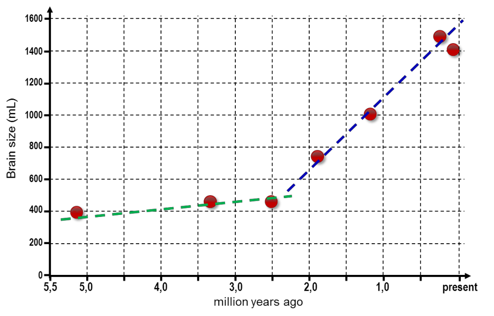


---

<!-- DIAGRAM_PLACEHOLDER: diagram -->

| Question / Item | Column 2 | Column 3 | Column 4 | Column 5 | Marks / Total |
| :--- | :---: | :---: | :---: | :---: | :---: |
| 1.5.1 | $\checkmark$ | | | | 1 |
| 1.5.2 | $\checkmark$ | | | | 4 |
| 1.5.3 a - c | $\checkmark$ | | | | 3 |
| 1.5.4 | $\checkmark$ | | | | 2 |
| 1.5.5 | $\checkmark$ | | | | 2 |
| **Subtotal** | **12** | | | | **12** |
| 2.1.1 | $\checkmark$ | | | | 2 |
| 2.1.2 | $\checkmark$ | | | | 1 |
| 2.1.3 | | $\checkmark$ | | | 2 |
| 2.1.4 | | | $\checkmark$ | | 3 |
| 2.1.5 | | | | $\checkmark$ | 2 |
| 2.1.6 | | | $\checkmark$ | | 5 |
| **Subtotal** | **4** | **2** | **8** | **2** | **15** |
| 2.2.1 | | | $\checkmark$ | | 5 |
| 2.2.2 | $\checkmark$ | | | | 3 |
| 2.2.3 | $\checkmark$ | | | | 2 |
| 2.2.4 | | $\checkmark$ | | | 3 |
| **Subtotal** | **7** | **3** | **5** | | **13** |
| 3.1.1 | | | | $\checkmark$ | 2 |
| 3.1.2 | | | | $\checkmark$ | 3 |
| **Subtotal** | | | | **5** | **5** |
| 3.2.1 | | $\checkmark$ | $\checkmark$ | | 4 ($2 + 2$) |
| 3.2.2 | | | $\checkmark$ | | 2 |
| 3.2.3 | | | $\checkmark$ | | 3 |
| 3.2.4 | | $\checkmark$ | | $\checkmark$ | 8 ($3 + 5$) |
| **Subtotal** | | **5** | **7** | **5** | **17** |
| **Grand Total** | **42** | **30** | **20** | **12** | **104** |