# CHAPTER 3

## Conversions and time

| Section | Topic | Page |
| :---: | :--- | :---: |
| **3.1** | Introduction and key concepts | 80 |
| **3.2** | Converting metric units of measurement from memory | 80 |
| **3.3** | Converting units of measurement using given conversion factors | 97 |
| **3.4** | Reading and calculating time | 103 |
| **3.5** | End of chapter activity | 123 |

---

# 3
# Conversions and time

## 3.1 Introduction and key concepts
EMG3N

Being able to convert measurements is important for many household tasks including cooking and baking. You need to understand why and when we use different measurement units in different contexts. Understanding time and using timetables and calendars is important for personal organization, management and planning of activities (like arriving at school on time, or finishing your homework before you watch TV) and events (such as planning a party or visiting your friends).

In this chapter we will learn how to:
- convert metric units of length, volume and weight from memory.
- convert cooking units using a given table.
- read, calculate and convert different time units and formats.
- use timetables and calendars for personal planning and time management.

## 3.2 Converting metric units of measurement from memory
EMG3P

When we measure length, volume and weight, we use various units of measurement depending on the size of what we are going to measure. Generally, the smaller the length, volume or weight of an object, the smaller the units we use. In the next sections we will look at what different units we should use and when, and how to convert between them.

### Length
EMG3Q

Length is a measured distance between two points. For example, the length of a book would be the distance from the bottom of the book to the top (we would measure this in centimetres). The length of a table would be the distance from one end of the table to the other end (we would measure this in centimetres or metres).

The units we use for measuring length are as follows:
- $\text{km}$: kilometres
- $\text{m}$: metres
- $\text{cm}$: centimetres
- $\text{mm}$: millimetres

> **[Diagram Context - Textbook_MathematicalLiteracy_Gr10_Conversions-and-time.pdf-0001-00.png]**
> This graphic is a navigational chapter heading featuring the text "CHAPTER" alongside a circular icon containing the numeral "3". It serves as a structural signpost in educational material to help students identify and organize their progress through specific curriculum modules.

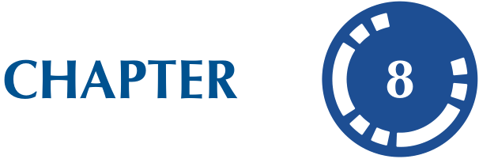
> **[Diagram Context - Textbook_MathematicalLiteracy_Gr10_Personal-income-expenditure-and-budgets.pdf-0001-00.png]**
> This graphic is a navigational chapter heading featuring the text "CHAPTER" and the numeral "8" enclosed within a stylized, segmented circular icon. It serves as a structural signpost in a textbook to help students identify the beginning of a new curriculum unit or topic.

---

# Worked example 1: Deciding on units of length

## QUESTION

There are four pictures below. Decide on the most appropriate unit of length for each situation.

1. The width of one of this flower's petals:

   

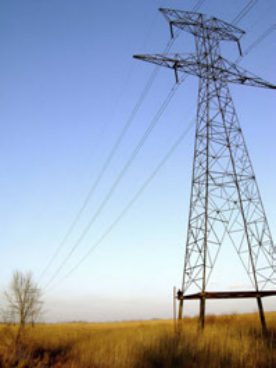
> **[Diagram Context - Textbook_MathematicalLiteracy_Gr10_Financial-documents-and-tariff-ystems.pdf-0002-11.png]**
> This image depicts a high-voltage electrical transmission tower (pylon) supporting overhead power lines in a rural landscape. It serves as a real-world application of the Physical Sciences curriculum, illustrating the infrastructure used for the national grid to transport electrical energy over long distances. The visual highlights the structural engineering required to maintain high-tension cables, which is essential for understanding the transmission of electricity from power stations to consumers.

2. The length of this caterpillar:

   <!-- DIAG_PLACEHOLDER: diagram -->

3. The length of this wooden bench:

   

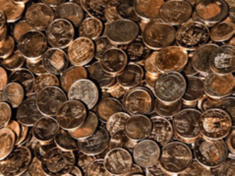
> **[Diagram Context - Textbook_MathematicalLiteracy_Gr10_Personal-income-expenditure-and-budgets.pdf-0002-15.png]**
> This image displays a large, unorganized collection of metallic coins, which lack any specific labels, variables, or scientific annotations. In a CAPS curriculum context, this visual serves as a concrete analogy for a population of discrete, identical units, useful for demonstrating concepts like random sampling, probability, or the statistical distribution of a large data set.

4. The distance between Cape Town and Johannesburg:

   <!-- DIAGRAM_PLACEHOLDER: diagram -->

---

SOLUTION

1. The width of one of these small flower petals can be measured in millimetres (mm).
2. The length of a caterpillar can be measured in centimetres (cm).
3. The length of a wooden bench can be measured in metres (m).
4. The distance between Cape Town and Johannesburg will be measured in kilometres (km).

Figure 3.1: The sun and the Earth, as seen from space.

The average distance from the Earth to the Sun is approximately $150\,000\,000\,000$ metres!

Measuring distance or length using the same unit for everything can result in huge numbers with lots of zeros, which can be confusing to read. For this reason, we often convert between units to make the numbers simpler to work with.

The table below shows the relationship between the units.

| Conversion factors for length |
| :--- |
| $10\text{ millimetres (mm)} = 1\text{ centimetre (cm)}$ |
| $1000\text{ millimetres (mm)} = 1\text{ metre (m)}$ |
| $100\text{ centimetres (cm)} = 1\text{ metre (m)}$ |
| $1000\text{ metres (m)} = 1\text{ kilometre (km)}$ |

**NOTE:**  
You will need to memorize these conversions. They will not always be given to you in an assessment.

Here is another visual representation of converting between units of length:

82

3.2. Converting metric units of measurement from memory

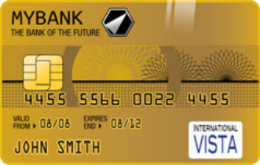
> **[Diagram Context - Textbook_MathematicalLiteracy_Gr10_Banking-interest-and-taxation.pdf-0003-01.png]**
> This image depicts a generic bank card featuring an EMV chip, a 16-digit card number, validity dates, a cardholder name, and an international payment network logo. It serves as a practical visual aid for EMS (Economic and Management Sciences) learners to identify the essential components of electronic payment instruments and understand the security features used in modern financial transactions.

> **[Diagram Context - Textbook_MathematicalLiteracy_Gr10_Banking-interest-and-taxation.pdf-0003-07.png]**
> This graphic is a simple checklist icon featuring three square checkboxes, horizontal lines for text, and a prominent red tick mark in the top box. It serves as a visual tool for students to track progress, verify the completion of tasks, or confirm that specific criteria in a CAPS assessment rubric have been met.

> **[Diagram Context - Textbook_MathematicalLiteracy_Gr10_Conversions-and-time.pdf-0003-04.png]**
> This image is a botanical photograph of a flowering plant, specifically displaying purple, star-shaped flowers, buds, and slender green stems. It serves as a visual reference for identifying angiosperm morphology, including reproductive structures like petals and pedicels, which are key components in the study of plant diversity and life cycles within the Life Sciences curriculum.

> **[Diagram Context - Textbook_MathematicalLiteracy_Gr10_Conversions-and-time.pdf-0003-06.png]**
> This image features a photograph of a swallowtail butterfly larva (caterpillar) feeding on a plant stem. It illustrates the larval stage of the insect life cycle, highlighting key biological concepts such as herbivory, camouflage, and the developmental stages of metamorphosis within an ecosystem.

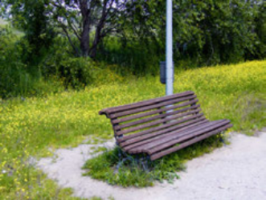
> **[Diagram Context - Textbook_MathematicalLiteracy_Gr10_Conversions-and-time.pdf-0003-08.png]**
> This image is a photograph of a wooden park bench situated in a grassy, outdoor environment. There are no labels, variables, or scientific symbols present in the visual field. Consequently, this image does not convey specific curriculum-based concepts and serves only as a generic environmental illustration.

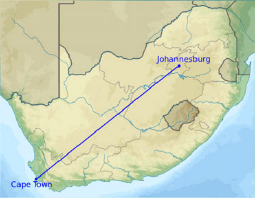
> **[Diagram Context - Textbook_MathematicalLiteracy_Gr10_Conversions-and-time.pdf-0003-10.png]**
> This graphic is a thematic map of South Africa featuring a straight-line vector connecting the labeled cities of Johannesburg and Cape Town. It illustrates the concept of displacement in Geography and Physical Sciences, visually representing the shortest distance between two points as a straight line across the country's provincial borders.

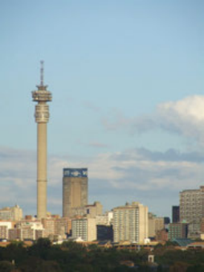
> **[Diagram Context - Textbook_MathematicalLiteracy_Gr10_Financial-documents-and-tariff-ystems.pdf-0003-12.png]**
> This image depicts the Telkom Tower (Hillbrow Tower) within the Johannesburg urban skyline, serving as a prominent example of telecommunications infrastructure. It illustrates the physical application of electromagnetic wave transmission and signal propagation, which are key concepts in the Grade 10-12 Physical Sciences curriculum regarding waves, sound, and light.

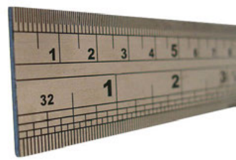
> **[Diagram Context - Textbook_MathematicalLiteracy_Gr10_Measuring-length-weight-volume-and-temperature.pdf-0003-00.png]**
> This image displays a dual-scale measuring ruler featuring both metric (centimetre) and imperial (inch) markings, with visible labels including numerical integers and the number "32" representing fractional inch divisions. It serves as a practical tool for teaching physical measurement, demonstrating the importance of selecting the correct scale and precision when recording data in scientific investigations.

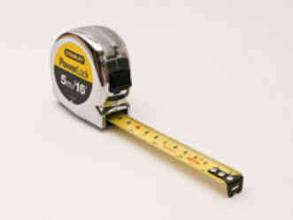
> **[Diagram Context - Textbook_MathematicalLiteracy_Gr10_Measuring-length-weight-volume-and-temperature.pdf-0003-02.png]**
> This image depicts a retractable steel tape measure, a standard scientific instrument used for measuring length and distance. The labels "Stanley," "Powerlock," and "5m/16'" indicate the brand, model, and maximum measurement capacity in both metric and imperial units. In a CAPS context, this tool is essential for practical investigations in Physical Sciences and Technology, demonstrating the importance of precision and unit conversion when collecting quantitative data.

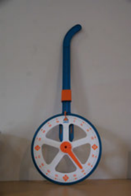
> **[Diagram Context - Textbook_MathematicalLiteracy_Gr10_Measuring-length-weight-volume-and-temperature.pdf-0003-04.png]**
> This image displays a trundle wheel, a mechanical measuring apparatus featuring a circular wheel, a handle, and a counting mechanism with numerical markings. In a CAPS curriculum context, this tool is used to demonstrate practical measurement of distance and perimeter in real-world environments, helping learners understand the relationship between wheel rotations and linear displacement.

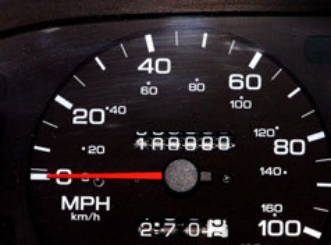
> **[Diagram Context - Textbook_MathematicalLiteracy_Gr10_Measuring-length-weight-volume-and-temperature.pdf-0003-06.png]**
> This image displays a vehicle speedometer featuring dual scales labeled in MPH (miles per hour) and km/h (kilometres per hour), with a red needle currently indicating a speed of zero. It serves as a practical application of kinematics, illustrating the concept of instantaneous speed and the importance of unit conversion between imperial and SI units in physics.

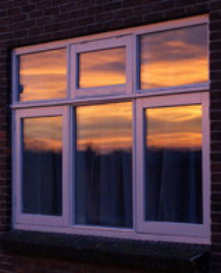
> **[Diagram Context - Textbook_MathematicalLiteracy_Gr10_Measuring-length-weight-volume-and-temperature.pdf-0003-11.png]**
> This image depicts a real-world example of specular reflection occurring on the surface of a glass window, which contains no labels or variables. It serves as a visual demonstration of how light rays reflect off a smooth, polished surface to create a clear image of the sunset, illustrating the fundamental principles of optics and the law of reflection for Physical Sciences learners.

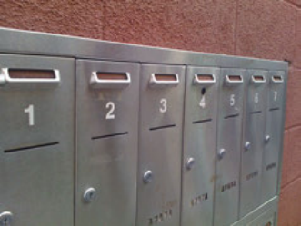
> **[Diagram Context - Textbook_MathematicalLiteracy_Gr10_Numbers-and-calculations-with-numbers.pdf-0003-06.png]**
> This image depicts a row of numbered metal mailboxes, labeled sequentially from 1 to 7. In a pedagogical context, this serves as a concrete analogy for discrete variables or the concept of an ordered set, helping students visualize the relationship between a unique identifier (the number) and a specific, distinct location or "slot" in a sequence.

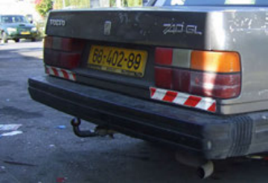
> **[Diagram Context - Textbook_MathematicalLiteracy_Gr10_Numbers-and-calculations-with-numbers.pdf-0003-07.png]**
> This image depicts the rear exterior of a Volvo 740 GL passenger vehicle, featuring visible labels including the brand name "VOLVO," the model designation "740 GL," and a yellow license plate reading "68-402-89." In a CAPS Physical Sciences context, this visual serves as a real-world example for discussing mechanical systems, such as the function of a tow bar for force transmission or the role of reflective safety markings in light physics and road safety.

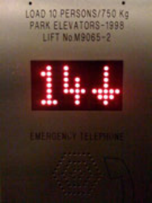
> **[Diagram Context - Textbook_MathematicalLiteracy_Gr10_Numbers-and-calculations-with-numbers.pdf-0003-08.png]**
> This image displays an elevator control panel featuring a digital LED display showing the number "14" and a downward-pointing arrow, alongside text labels including "LOAD 10 PERSONS/750 Kg," "PARK ELEVATORS-1998," "LIFT No.M9065-2," and "EMERGENCY TELEPHONE." In a Grade 10-12 Physical Sciences context, this serves as a practical application for calculating gravitational potential energy ($E_p = mgh$) or analyzing vertical motion, where the elevator acts as a system with a specific mass limit and changing displacement relative to a reference point.

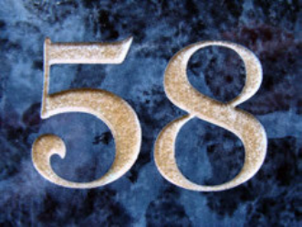
> **[Diagram Context - Textbook_MathematicalLiteracy_Gr10_Numbers-and-calculations-with-numbers.pdf-0003-09.png]**
> This image displays the number "58" in a stylized, textured font against a dark, mottled blue background. In the context of the CAPS Physical Sciences curriculum, this numerical value represents the atomic number of Cerium (Ce) on the Periodic Table of Elements. It serves as a foundational identifier for students to determine the number of protons in the nucleus of a Cerium atom, which is essential for understanding electronic configuration and chemical properties.

> **[Diagram Context - Textbook_MathematicalLiteracy_Gr10_Personal-income-expenditure-and-budgets.pdf-0003-01.png]**
> This photograph depicts a social interaction between an adult and a child, showing the adult styling the child's hair in cornrows. There are no labels, symbols, or technical variables present in the image. In a Life Sciences or Social Sciences context, this visual serves as a real-world example of human social bonding, caregiving, and the cultural practice of grooming within a family unit.

> **[Diagram Context - Textbook_MathematicalLiteracy_Gr10_Personal-income-expenditure-and-budgets.pdf-0003-04.png]**
> This image is a photograph of a waiter holding a tray containing various food items, including a bowl of soup, fried appetizers, a small glass of liquid, two glasses of beer, and a plate of sushi. There are no labels, variables, or scientific symbols present in the image. Consequently, this graphic does not convey any specific conceptual information relevant to the CAPS curriculum and cannot be used for educational instruction in a classroom setting.

---

# Chapter 3. Conversions and time

## Converting Units of Length

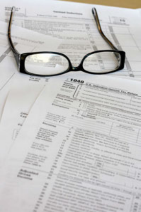
> **[Diagram Context - Textbook_MathematicalLiteracy_Gr10_Banking-interest-and-taxation.pdf-0004-00.png]**
> This image features a U.S. 1040 Individual Income Tax Return form with a pair of spectacles resting on top. The visible text includes labels such as "1040," "U.S. Individual Income Tax Return," "Filing Status," "Exemptions," "Income," and "Adjusted Gross Income." For a CAPS Accounting student, this serves as a practical illustration of personal income tax documentation, highlighting the formal structure and data fields required for calculating taxable income and tax liability.

We can also reverse it to find lengths in larger units:

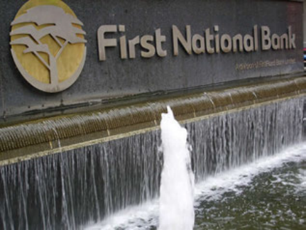
> **[Diagram Context - Textbook_MathematicalLiteracy_Gr10_Banking-interest-and-taxation.pdf-0004-09.png]**
> This image is a photograph of a corporate sign and water feature displaying the "First National Bank" logo and name. It does not contain educational content, scientific diagrams, or curriculum-related variables suitable for academic analysis within the CAPS framework.

In the following worked example we will learn how to use the above conversions for units of length.

---

## Worked Example 2: Converting units of length

### Question

Convert the following units of length. Remember to show all of your calculations.

1. A leaf is $25\text{ mm}$ long. How long is it in $\text{cm}$?
2. A caterpillar is $3,2\text{ cm}$ long. What is its length in $\text{mm}$?
3. A sofa is $187\text{ cm}$ long. How long is it in metres?

> **[Diagram Context - Textbook_MathematicalLiteracy_Gr10_Conversions-and-time.pdf-0004-05.png]**
> This image is a photographic representation of the Earth’s horizon viewed from space, featuring the Sun as the primary light source and the planet’s atmosphere and surface below. It illustrates the concept of solar radiation entering the Earth's system, which is fundamental to understanding the greenhouse effect, global energy balance, and climate change within the CAPS Life Sciences and Geography curricula.

4. Your school tennis court is $23,78\text{ m}$ long.
   a) How long is it in $\text{cm}$?
   b) Which unit ($\text{cm}$ or $\text{m}$) do you think is best for measuring this length?
5. A vegetable garden is $1350\text{ mm}$ wide.
   a) How wide is it in metres ($\text{m}$)?

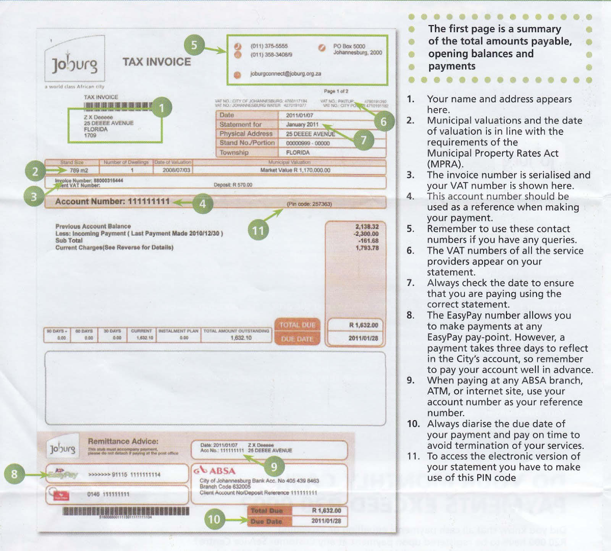
> **[Diagram Context - Textbook_MathematicalLiteracy_Gr10_Financial-documents-and-tariff-ystems.pdf-0004-00.png]**
> This graphic is an annotated municipal tax invoice used as a practical financial literacy resource. It features labels for key components such as the account number, VAT details, payment references, and contact information, all cross-referenced with a numbered explanatory guide. Conceptually, it teaches learners how to interpret formal financial documentation, emphasizing the importance of identifying billing cycles, payment deadlines, and reference numbers for effective personal financial management.

> **[Diagram Context - Textbook_MathematicalLiteracy_Gr10_Measuring-length-weight-volume-and-temperature.pdf-0004-13.png]**
> This image displays a collection of spools of thread in various colours, featuring cylindrical wooden cores and wound synthetic or natural fibres. It serves as a real-world visual aid for Technology or Consumer Studies, illustrating the physical properties of textile materials, such as texture, colour, and tensile structure. Students can use this to identify different types of sewing materials and discuss the manufacturing or aesthetic applications of various thread compositions.

> **[Diagram Context - Textbook_MathematicalLiteracy_Gr10_Numbers-and-calculations-with-numbers.pdf-0004-00.png]**
> This image displays a vintage rotary telephone dial featuring a circular arrangement of numerical digits from 0 to 9. It serves as a historical technological artifact that illustrates the evolution of telecommunications and user interface design, contrasting mechanical input methods with modern digital systems.

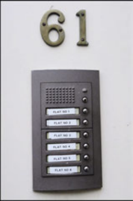
> **[Diagram Context - Textbook_MathematicalLiteracy_Gr10_Numbers-and-calculations-with-numbers.pdf-0004-04.png]**
> This image displays an intercom system for a residential building labeled "61," featuring a speaker grille and six individual call buttons corresponding to labels marked "FLAT NO 1" through "FLAT NO 6." In a Technology or Physical Sciences context, this serves as a practical example of a parallel electrical circuit where each switch independently controls a specific signal or buzzer to a unique destination. It illustrates the concept of a multi-branch circuit design used to manage discrete inputs and outputs within a single system.

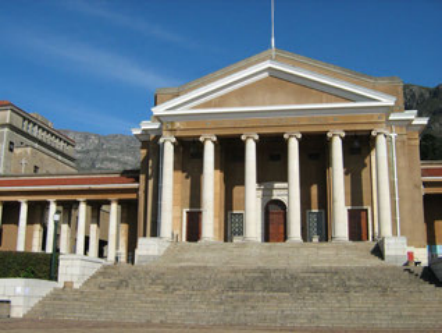
> **[Diagram Context - Textbook_MathematicalLiteracy_Gr10_Personal-income-expenditure-and-budgets.pdf-0004-04.png]**
> This image depicts the architectural facade of the University of Cape Town’s Jameson Hall, characterized by its neoclassical design featuring a prominent pediment, colonnaded portico, and wide stone staircase. There are no visible labels, variables, or scientific symbols present in the photograph. For a high school student, this image serves as a contextual visual aid for South African history or social sciences, representing a significant site of academic and political heritage within the national curriculum.

---

## Exercises and Problems

b) Which unit ($\text{mm}$ or $\text{m}$) do you think is best for measuring the width of the garden?

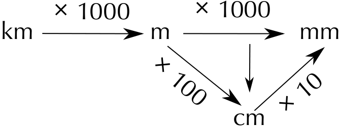
> **[Diagram Context - Textbook_MathematicalLiteracy_Gr10_Conversions-and-time.pdf-0005-00.png]**
> This diagram is a flow chart illustrating the conversion factors between metric units of length, specifically kilometres (km), metres (m), centimetres (cm), and millimetres (mm). It uses directional arrows labeled with multiplication factors (× 1000, × 100, × 10) to visually demonstrate the mathematical relationship required to convert larger units into smaller units. This serves as a practical reference for learners to master unit conversions, a foundational skill in Physical Sciences and Mathematics.

6. The distance between Sophie's house and the shop is $6359\text{ m}$. Convert this into $\text{km}$.

7. Reggie and Lebo live $7,02\text{ km}$ apart. What is this distance in metres?

8. A car drives $950\text{ }000\text{ cm}$.

   a) What is this distance in $\text{km}$?

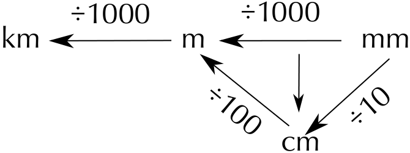
> **[Diagram Context - Textbook_MathematicalLiteracy_Gr10_Conversions-and-time.pdf-0005-02.png]**
> This diagram is a flow chart illustrating the conversion factors between metric units of length: kilometres (km), metres (m), centimetres (cm), and millimetres (mm). It uses directional arrows and division operators (÷1000, ÷100, ÷10) to show the mathematical operations required to convert smaller units into larger ones. This visual aid helps students master the SI unit system by providing a clear reference for scaling measurements during physical science and mathematical calculations.

   b) Which unit ($\text{cm}$ or $\text{km}$) do you think is best for measuring the distance?

---

## SOLUTION

1. 
   $$10\text{ mm} = 1\text{ cm}$$
   $$\frac{25\text{ mm}}{10} = 2,5\text{ cm}$$

2. 
   $$10\text{ mm} = 1\text{ cm}$$
   $$3,2\text{ cm} \times 10 = 32\text{ mm}$$

3. 
   $$100\text{ cm} = 1\text{ m}$$
   $$\frac{187\text{ cm}}{100} = 1,87\text{ m}$$

4. a) 
   $$100\text{ cm} = 1\text{ m}$$
   $$23,78\text{ m} \times 100 = 2378\text{ cm}$$

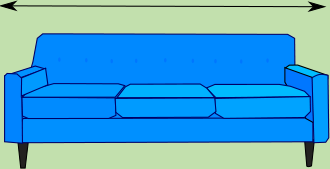
> **[Diagram Context - Textbook_MathematicalLiteracy_Gr10_Conversions-and-time.pdf-0005-11.png]**
> This graphic depicts a two-dimensional front-view illustration of a three-seater sofa featuring a double-headed horizontal arrow positioned above it. The arrow serves as a measurement indicator, representing the total length or width of the object. In a CAPS Mathematics or Technical Sciences context, this diagram illustrates the concept of linear dimensioning, teaching students how to identify and measure the span of a physical object for spatial planning or technical drawing purposes.

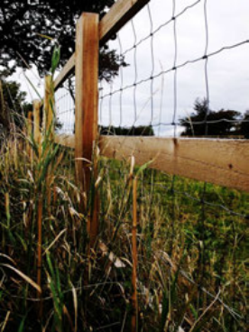
> **[Diagram Context - Textbook_MathematicalLiteracy_Gr10_Measuring-length-weight-volume-and-temperature.pdf-0005-13.png]**
> This image depicts a physical barrier consisting of a wooden post-and-rail fence reinforced with wire mesh, set against a backdrop of tall grasses and trees. There are no labels, symbols, or variables present in the visual field. Conceptually, this serves as a real-world example of an abiotic factor or human-made structure that can influence ecosystem dynamics by restricting the movement of organisms and fragmenting habitats.

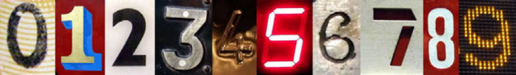
> **[Diagram Context - Textbook_MathematicalLiteracy_Gr10_Numbers-and-calculations-with-numbers.pdf-0005-04.png]**
> This image is a composite collection of the digits 0 through 9, presented in various typographic styles, materials, and digital formats. It serves as a visual representation of the Hindu-Arabic numeral system, which forms the foundational base-10 (decimal) number system used across the CAPS Mathematics curriculum. This display illustrates how numerical values are abstract concepts that remain consistent regardless of their physical representation or medium.

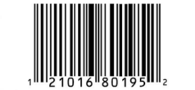
> **[Diagram Context - Textbook_MathematicalLiteracy_Gr10_Numbers-and-calculations-with-numbers.pdf-0005-11.png]**
> This image is a standard Universal Product Code (UPC) barcode consisting of a series of vertical black bars of varying widths and a corresponding sequence of numerical digits (1, 2, 1, 0, 1, 6, 8, 0, 1, 9, 5, 2). In a CAPS curriculum context, this represents the application of binary-like data encoding, where the pattern of bars and spaces is scanned to translate optical information into a unique digital identifier for inventory and retail management.

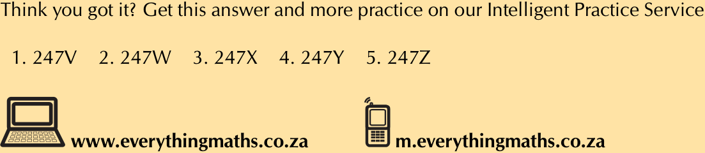
> **[Diagram Context - Textbook_MathematicalLiteracy_Gr10_Numbers-and-calculations-with-numbers.pdf-0005-12.png]**
> This image is a navigational footer containing a list of five alphanumeric codes (247V, 247W, 247X, 247Y, 247Z) alongside icons for a computer and a mobile phone. It serves as a digital reference tool for the "Everything Maths" curriculum platform, allowing students to input these specific codes into the website or mobile site to access targeted practice exercises and solutions.

> **[Diagram Context - Textbook_MathematicalLiteracy_Gr10_Personal-income-expenditure-and-budgets.pdf-0005-03.png]**
> This image is a photograph of a modern, open-plan office environment featuring rows of desks, computer workstations, and employees. There are no labels, variables, or scientific symbols present in the visual field. Conceptually, this image serves as a real-world illustration of a tertiary sector work environment, which can be used in Business Studies or Economics to discuss organizational structures, workplace ergonomics, and the nature of office-based labour.

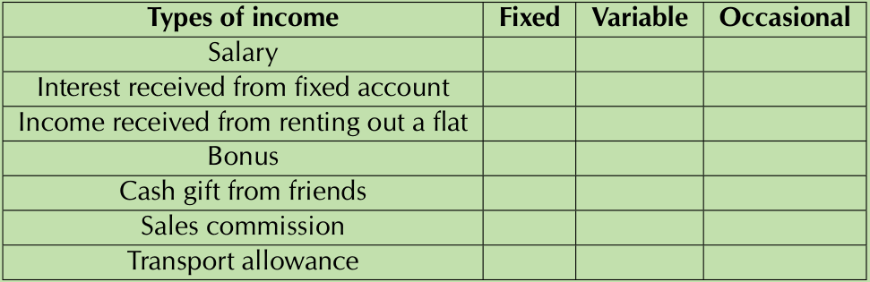
> **[Diagram Context - Textbook_MathematicalLiteracy_Gr10_Personal-income-expenditure-and-budgets.pdf-0005-04.png]**
> This table is a classification exercise featuring the column headers "Fixed," "Variable," and "Occasional" alongside a list of income sources including salary, interest, rental income, bonuses, gifts, commission, and allowances. It is designed to help learners distinguish between different types of personal income based on their regularity and predictability, which is a foundational concept in the CAPS Financial Literacy curriculum.

---

### Worked Examples and Solutions (Previous Exercises)

5. a)
   $$1000\text{ mm} = 1\text{ m}$$
   $$\frac{1350\text{ mm}}{1000} = 1,35\text{ m}$$

   b) metres (m)

6. 
   $$1000\text{ m} = 1\text{ km}$$
   $$\frac{6359\text{ m}}{1000} = 6,359\text{ km}$$

7. 
   $$1000\text{ m} = 1\text{ km}$$
   $$7,02\text{ km} \times 1000 = 7020\text{ m}$$

8. a)
   $$100\text{ cm} = 1\text{ m}$$
   $$\frac{950\text{ 000}\text{ cm}}{100} = 9500\text{ m}$$
   $$1000\text{ m} = 1\text{ km}$$
   $$\frac{9500\text{ m}}{1000} = 9,5\text{ km}$$

   b) kilometres (km)

---

## Activity 3 - 1: Converting units of length

1. A butterfly is $230\text{ mm}$ long. Convert this to cm.

   

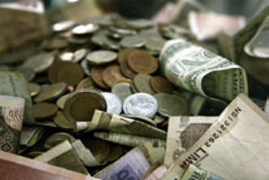
> **[Diagram Context - Textbook_MathematicalLiteracy_Gr10_Banking-interest-and-taxation.pdf-0006-01.png]**
> This image is a photograph depicting a collection of various international coins and banknotes. It contains no formal labels, variables, or scientific symbols, serving instead as a generic visual representation of currency and physical money. In a CAPS Economics or Business Studies context, this image can be used to illustrate the concept of money as a medium of exchange and a store of value within a national or global economy.

2. The cover of a book is $16,2\text{ cm}$ long. How long is the book in mm?

3. A table is $1450\text{ mm}$ long. Convert this to metres.

4. A garden is $5,32\text{ m}$ long.

   a) How long would it be in mm?

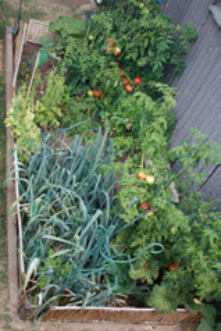
> **[Diagram Context - Textbook_MathematicalLiteracy_Gr10_Conversions-and-time.pdf-0006-00.png]**
> This image depicts a vegetable garden containing tomato plants and leeks, illustrating the concept of companion planting or polyculture. By observing the proximity of these different plant species within a shared soil environment, students can explore agricultural biodiversity and the practical application of sustainable food production methods within the Life Sciences curriculum.

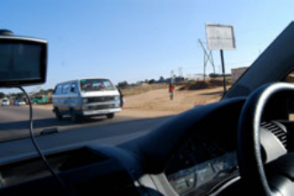
> **[Diagram Context - Textbook_MathematicalLiteracy_Gr10_Conversions-and-time.pdf-0006-06.png]**
> This image is a first-person perspective photograph taken from inside a vehicle, showing a road scene with a minibus taxi, a pedestrian, and roadside infrastructure like power lines and a signpost. It serves as a real-world visual aid for Physical Sciences (Grade 10-12) to contextualize concepts such as relative motion, velocity, and the application of Newton’s Laws of Motion in everyday transport scenarios. By observing the moving vehicle and stationary objects, students can analyze frames of reference and the practical implications of road safety and kinematics.

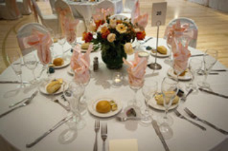
> **[Diagram Context - Textbook_MathematicalLiteracy_Gr10_Measuring-length-weight-volume-and-temperature.pdf-0006-03.png]**
> This image is a photograph of a formal table setting, featuring visible elements such as plates, cutlery, glassware, napkins, a central floral arrangement, and a table number card labeled "20". While this image does not represent a scientific or mathematical diagram, it serves as a real-world example of spatial organization and symmetry, which can be used to discuss concepts of arrangement, pattern recognition, and formal etiquette in Life Skills or Consumer Studies.

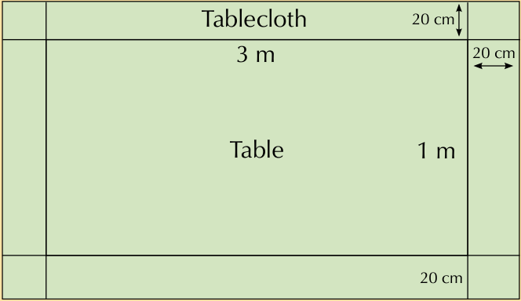
> **[Diagram Context - Textbook_MathematicalLiteracy_Gr10_Measuring-length-weight-volume-and-temperature.pdf-0006-05.png]**
> This geometry figure illustrates a rectangular table with dimensions of 3 m by 1 m, surrounded by a tablecloth border of 20 cm on all sides. The diagram uses labels for the "Table" and "Tablecloth," along with numerical values and arrows to define the length, width, and uniform overhang. It serves as a practical application for learners to calculate the total area or perimeter of the tablecloth by accounting for the added dimensions of the border.

> **[Diagram Context - Textbook_MathematicalLiteracy_Gr10_Personal-income-expenditure-and-budgets.pdf-0006-01.png]**
> This photograph depicts a group of five young people outdoors, with one individual playing an acoustic guitar. The image contains no formal labels, variables, or scientific symbols, serving instead as a contextual illustration of social interaction and musical performance. For a high school student, this visual can be used to introduce the physics of sound, specifically the production of longitudinal waves through the vibration of guitar strings and the resonance of the instrument's body.

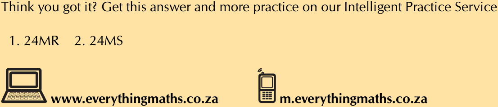
> **[Diagram Context - Textbook_MathematicalLiteracy_Gr10_Personal-income-expenditure-and-budgets.pdf-0006-07.png]**
> This graphic serves as a navigational footer for an educational resource, featuring icons of a laptop and a mobile phone alongside the alphanumeric identifiers "24MR" and "24MS." It directs students to the "Everything Maths" online platform, providing specific codes to help learners locate digital solutions and additional practice exercises aligned with the CAPS curriculum.

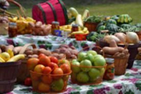
> **[Diagram Context - Textbook_MathematicalLiteracy_Gr10_Personal-income-expenditure-and-budgets.pdf-0006-12.png]**
> This image is a photograph of a market stall displaying a variety of fresh produce, including apples, tomatoes, potatoes, squash, and jars of preserves. It serves as a visual representation of agricultural biodiversity and food security, illustrating the diverse range of plant-based food sources available for human consumption. In a Life Sciences context, this image can be used to discuss nutrition, the importance of a balanced diet, and the role of agriculture in sustaining human populations.

---

## 3.2. Converting metric units of measurement from memory

### Exercises

b) Which unit (metres or millimetres) do you think is best for measuring the length of the garden?

5. A long workbench is $295\text{ cm}$ long. How long is it in metres?

6. A playground is $4,02\text{ m}$ wide.
   
   a) How wide is the playground in cm?
   
   b) Which unit (metres or centimetres) do you think is best for measuring the width of the playground?

   

> **[Diagram Context - Textbook_MathematicalLiteracy_Gr10_Banking-interest-and-taxation.pdf-0007-01.png]**
> This image features a close-up of a credit card with an integrated digital display and a finger pressing a button, alongside other standard payment cards. The visible elements include the "MasterCard" and "PayPass" logos, a numerical display reading "790042," and embossed digits. Conceptually, this illustrates modern financial technology and electronic banking systems, serving as a practical visual aid for teaching personal finance, digital security, and the evolution of payment methods within the EMS curriculum.

7. Jack and Thembile live $6473\text{ m}$ apart. Convert this distance to $\text{km}$.

8. The distance between Cape Town and Betty's Bay is $90,25\text{ km}$.
   
   a) How far is this in metres?
   
   b) Which unit (metres or kilometres) do you think is best for measuring this distance?

9. The distance from Phumza's house to the shop is $1\ 890\ 000\text{ mm}$.
   
   a) How far is this in kilometres?
   
   b) Which unit ($\text{km}$ or $\text{mm}$) do you think is best for measuring this distance?

10. Mary rides $7,82\text{ km}$ on her bicycle.
    
    a) How far does she ride in $\text{mm}$?
    
    

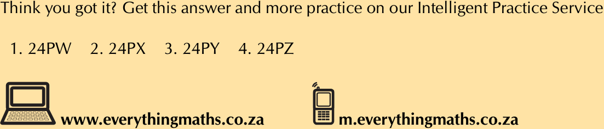
> **[Diagram Context - Textbook_MathematicalLiteracy_Gr10_Banking-interest-and-taxation.pdf-0007-02.png]**
> This graphic serves as a digital navigation tool for an online educational platform, displaying four unique alphanumeric codes (24PW, 24PX, 24PY, 24PZ) alongside website URLs for desktop and mobile access. It functions as a signpost to direct high school learners to specific interactive practice exercises or solutions within the "Everything Maths" curriculum resource.

    
    b) Which unit ($\text{km}$ or $\text{mm}$) do you think is best for measuring this distance?

11. Bongani walks $576\ 800\text{ cm}$. How far does he walk in $\text{km}$?

12. Jenny runs $405\text{ m}$.
    
    a) How far does she run, in $\text{cm}$?
    
    b) Which unit ($\text{m}$ or $\text{cm}$) do you think is best for measuring how far she runs?

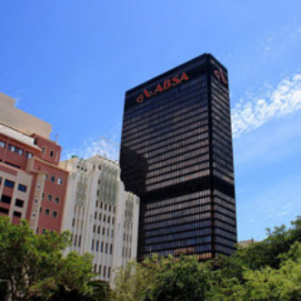
> **[Diagram Context - Textbook_MathematicalLiteracy_Gr10_Banking-interest-and-taxation.pdf-0007-07.png]**
> This image is a photograph of an urban architectural scene featuring the ABSA building in Johannesburg. The visible elements include the skyscraper with the "ABSA" logo, adjacent office buildings, surrounding trees, and a clear blue sky. This image does not represent a scientific or mathematical concept within the CAPS curriculum and serves only as a real-world visual reference for urban geography or environmental studies.

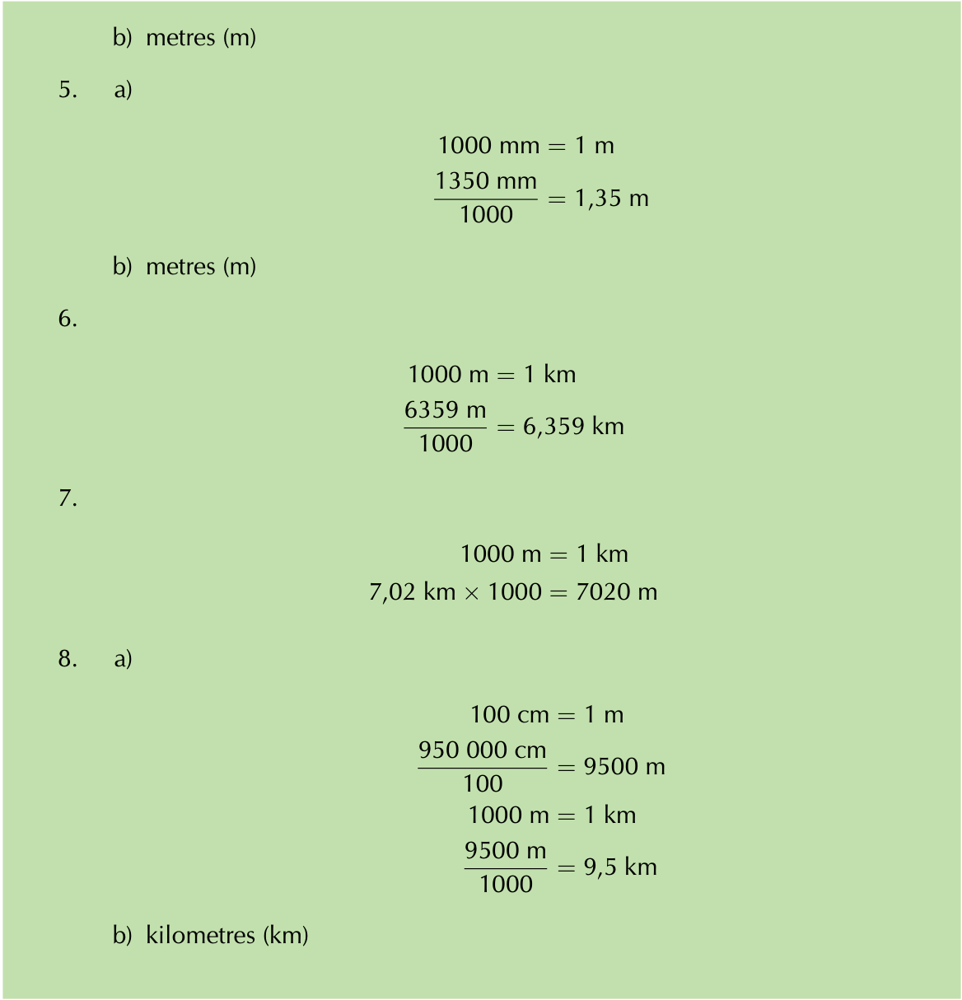
> **[Diagram Context - Textbook_MathematicalLiteracy_Gr10_Conversions-and-time.pdf-0007-00.png]**
> This image displays a series of mathematical worked examples involving the conversion of metric units of length, specifically millimetres (mm), centimetres (cm), metres (m), and kilometres (km). It utilizes conversion factors such as 1000 mm = 1 m, 1000 m = 1 km, and 100 cm = 1 m to demonstrate the division or multiplication required to change between these units. These examples provide a clear procedural guide for learners to master unit conversion, a fundamental skill in the CAPS Mathematics and Physical Sciences curricula.

> **[Diagram Context - Textbook_MathematicalLiteracy_Gr10_Conversions-and-time.pdf-0007-03.png]**
> This image is a biological photograph of a butterfly displaying prominent eyespots on its wings. These distinct, circular patterns serve as a classic example of defensive adaptation, illustrating the concept of mimicry used to deter predators by creating the illusion of a larger organism.

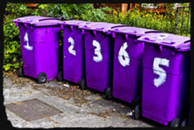
> **[Diagram Context - Textbook_MathematicalLiteracy_Gr10_Financial-documents-and-tariff-ystems.pdf-0007-03.png]**
> This image displays a row of five purple wheelie bins, each marked with a white numerical label (1, 2, 3, 6, and 5). In a CAPS Life Sciences or Geography context, this visual serves as a practical prompt for discussing waste management, the importance of sorting refuse, and the environmental impact of municipal solid waste disposal systems.

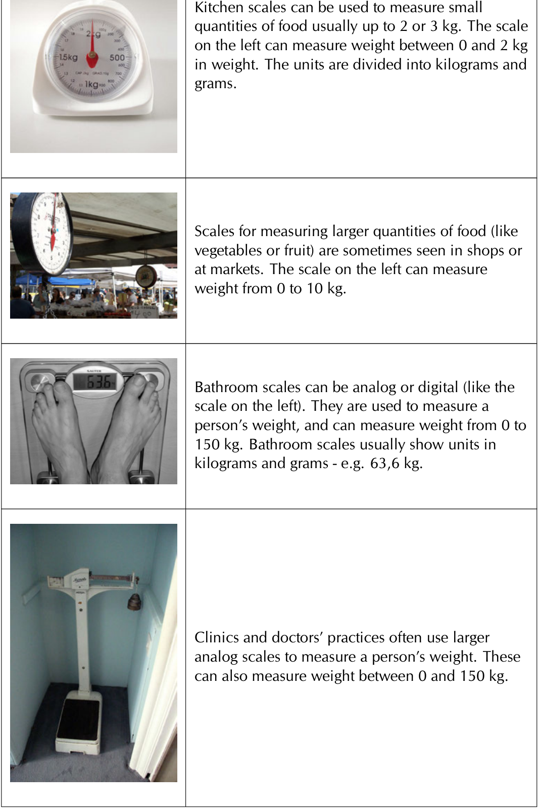
> **[Diagram Context - Textbook_MathematicalLiteracy_Gr10_Measuring-length-weight-volume-and-temperature.pdf-0007-00.png]**
> This graphic presents a series of photographs illustrating various types of weighing scales, including kitchen, market, bathroom, and clinical scales, alongside descriptive text detailing their measurement ranges in kilograms (kg) and grams (g). It conceptually demonstrates the practical application of measurement instruments in daily life, helping learners distinguish between different tools based on their capacity and intended use.

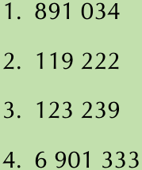
> **[Diagram Context - Textbook_MathematicalLiteracy_Gr10_Numbers-and-calculations-with-numbers.pdf-0007-06.png]**
> This image presents a numbered list of four large numerical values, ranging from six-digit to seven-digit integers. In a CAPS Mathematics context, this serves as an exercise in reading, comparing, and ordering large numbers, or performing basic arithmetic operations such as addition or subtraction within the number system.

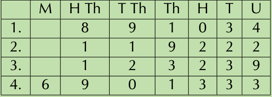
> **[Diagram Context - Textbook_MathematicalLiteracy_Gr10_Numbers-and-calculations-with-numbers.pdf-0007-10.png]**
> This image is a place value table used to represent large whole numbers up to the millions. The columns are labeled with place value abbreviations: M (Millions), H Th (Hundred Thousands), T Th (Ten Thousands), Th (Thousands), H (Hundreds), T (Tens), and U (Units). This tool helps learners understand the base-10 positional number system by organizing digits into their correct place values to determine the total value of each number.

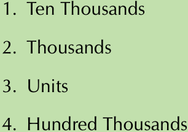
> **[Diagram Context - Textbook_MathematicalLiteracy_Gr10_Numbers-and-calculations-with-numbers.pdf-0007-11.png]**
> This graphic is a numbered list displaying place value terminology, specifically "Ten Thousands," "Thousands," "Units," and "Hundred Thousands." It serves as a foundational reference for understanding the base-10 positional number system, helping learners identify the hierarchical value of digits within large whole numbers.

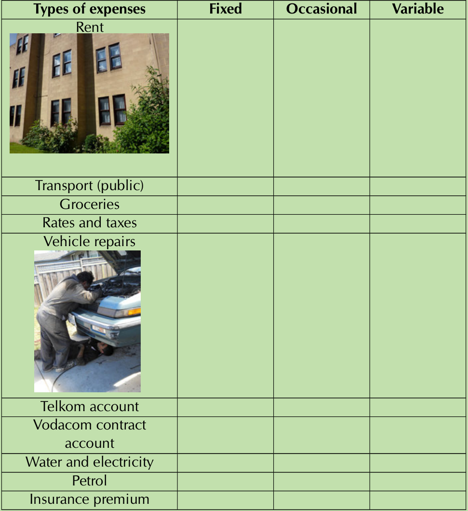
> **[Diagram Context - Textbook_MathematicalLiteracy_Gr10_Personal-income-expenditure-and-budgets.pdf-0007-06.png]**
> This graphic is a classification table designed for Financial Literacy, featuring labels for various household expenses such as "Rent," "Groceries," and "Vehicle repairs" alongside columns for "Fixed," "Occasional," and "Variable" categories. It serves as a practical exercise for students to categorize different types of expenditure based on their frequency and consistency, which is a foundational skill for personal budgeting and financial planning in the CAPS curriculum.

---

# Volume

## Core Concepts

The volume of an object is a measure of how much space it takes up. For example:
- A tea cup contains a certain amount of tea (measured in millilitres).
- A bucket of water contains a certain volume of water (measured in litres).
- Larger containers, like a dam, contain kilolitres of water.

The **capacity** of an object is the maximum volume that it can hold. For example, a bucket with a capacity of $10\text{ litres}$ can hold a maximum of $10\text{ litres}$. If the bucket is only half full, the volume of water inside the bucket will be $5\text{ litres}$.

### Units of Volume

The units and symbols used for measuring volume are:
- $\text{kl}$: kilolitres
- $\ell$: litres
- $\text{ml}$: millilitres

---

## Worked Example 3: Deciding on units of volume

### Question
There are three situations below. Decide on the most appropriate unit of measurement for each situation.

1. The amount of coffee in this cup:
2. The amount of water in this bucket:

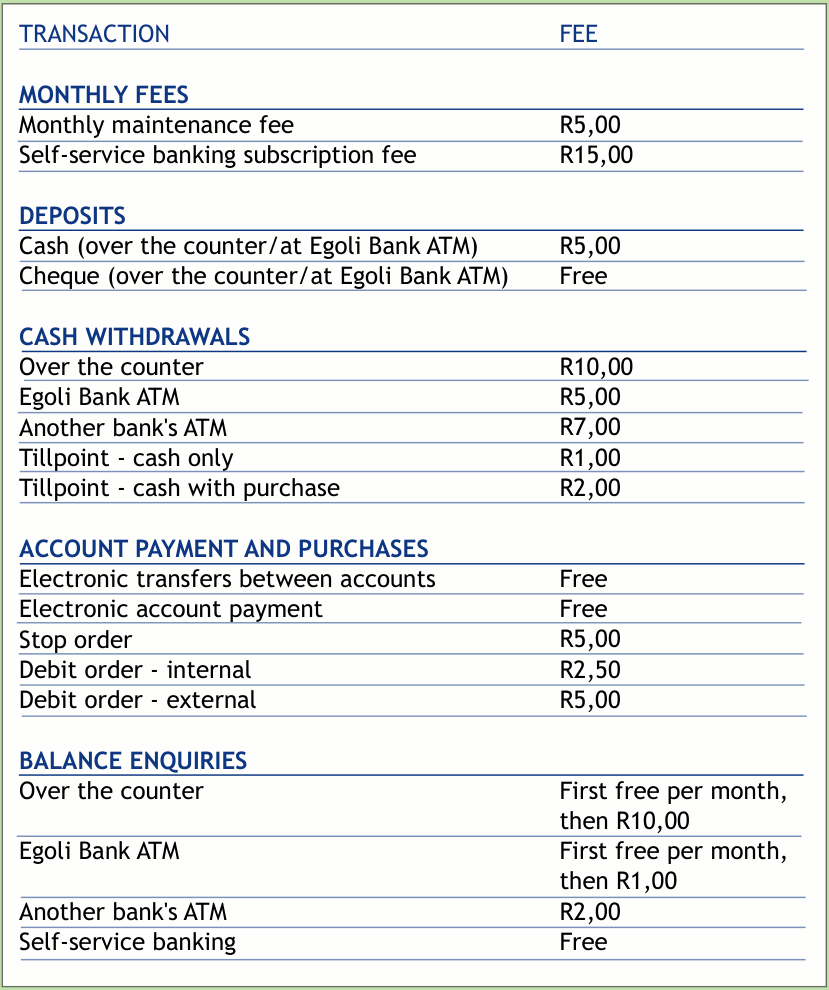
> **[Diagram Context - Textbook_MathematicalLiteracy_Gr10_Banking-interest-and-taxation.pdf-0008-03.png]**
> This table presents a bank fee schedule categorized by transaction types, including monthly fees, deposits, cash withdrawals, account payments, and balance enquiries. It lists specific banking services alongside their corresponding monetary costs in Rands, providing a practical resource for learners to understand personal finance management and the cost implications of different banking choices.

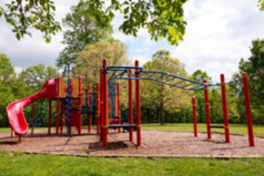
> **[Diagram Context - Textbook_MathematicalLiteracy_Gr10_Conversions-and-time.pdf-0008-05.png]**
> This image depicts a playground structure featuring a red slide, vertical support poles, and horizontal monkey bars. There are no labels, variables, or symbols present in the photograph. Conceptually, this real-world setting serves as a practical model for Grade 10-12 Physical Sciences, illustrating various forces such as gravity, friction, and tension, as well as the application of work, energy, and power principles.

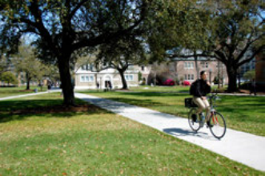
> **[Diagram Context - Textbook_MathematicalLiteracy_Gr10_Conversions-and-time.pdf-0008-15.png]**
> This image is a photograph depicting a person riding a bicycle along a paved path in a park-like campus setting. There are no labels, symbols, or variables present in the image. Conceptually, this visual serves as a real-world context for Grade 10-12 Physical Sciences, illustrating the concepts of motion, displacement, and velocity in a practical, everyday scenario.

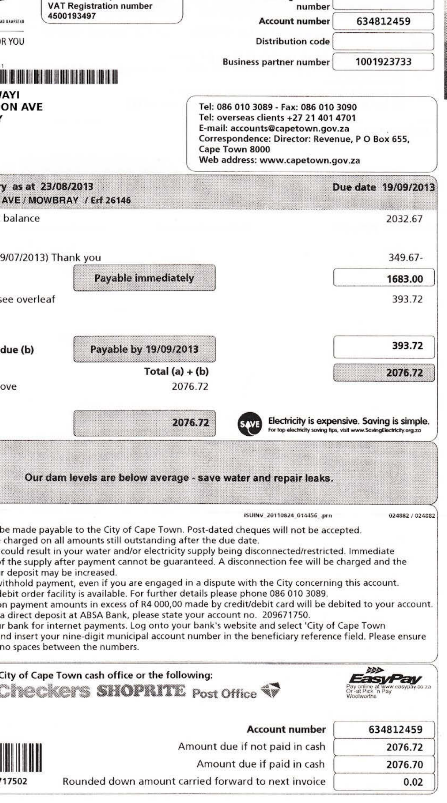
> **[Diagram Context - Textbook_MathematicalLiteracy_Gr10_Financial-documents-and-tariff-ystems.pdf-0008-00.png]**
> This document is a municipal utility account statement containing financial data such as account numbers, payment due dates, outstanding balances, and total amounts payable. It serves as a practical example for Mathematical Literacy learners to interpret real-world financial documents, calculate totals, and understand the implications of due dates and payment methods.

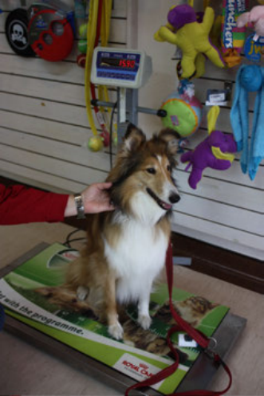
> **[Diagram Context - Textbook_MathematicalLiteracy_Gr10_Measuring-length-weight-volume-and-temperature.pdf-0008-00.png]**
> This image depicts a practical application of a digital scale used to measure the mass of a dog in a clinical or retail setting. The visible components include the dog, a red leash, and a digital display showing a numerical reading, which serves as a real-world example of measuring physical quantities. This illustrates the fundamental scientific concept of mass as a scalar quantity, demonstrating how electronic measuring instruments convert gravitational force into a standard unit of measurement.

> **[Diagram Context - Textbook_MathematicalLiteracy_Gr10_Measuring-length-weight-volume-and-temperature.pdf-0008-02.png]**
> This image depicts a real-world scenario of a weighbridge operator monitoring heavy vehicles from a control station. It illustrates the practical application of logistics and transport management, highlighting the role of technology and human oversight in regulating road freight and ensuring compliance with safety standards.

> **[Diagram Context - Textbook_MathematicalLiteracy_Gr10_Personal-income-expenditure-and-budgets.pdf-0008-04.png]**
> This table presents a budget breakdown, listing expenditure categories such as "Clothes," "Entertainment," "Savings," "Charitable organisations," "Transport," and "Sweets and cool drinks" alongside their corresponding percentage values. It serves as a practical tool for learners to understand personal financial management and the proportional allocation of income, reinforcing the mathematical concept of percentages totaling 100%.

---

# 3.2. Converting metric units of measurement from memory

## Core Concepts: Measuring Volume

When measuring capacity or volume, we choose units appropriate to the size of the container or body of water:

1. **Millilitres ($\text{ml}$):** Used for small amounts, such as the coffee in a cup.
2. **Litres ($\ell$):** Used for medium amounts, such as the water in a bucket.
3. **Kilolitres ($\text{kl}$):** Used for very large amounts, such as the water in a reservoir or flowing over a waterfall (e.g., Victoria Falls).

---

## Conversion Factors for Volume

Working with extremely large numbers can be difficult (for example, the $12\ 800\ 000\ 000\ \text{litres}$ of water that went over Victoria Falls in one second). Just like units of length, we can convert between different units of volume to simplify calculations and measurements.

The standard conversion relationships are summarized in the table below:

| Conversion Factors for Volume |
| :--- |
| $1000\text{ millilitres (ml)} = 1\text{ litre } (\ell)$ |
| $1000\text{ litres } (\ell) = 1\text{ kilolitre (kl)}$ |

> **[Diagram Context - Textbook_MathematicalLiteracy_Gr10_Banking-interest-and-taxation.pdf-0009-10.png]**
> This image displays Scrabble tiles arranged on a rack to spell the word "MONEY," with additional loose tiles visible in the foreground and background. The tiles feature letters (M, O, N, E, Y, C, P, W, K) and their corresponding numerical point values. In an Economic and Management Sciences (EMS) context, this visual serves as a simple concrete representation of the concept of money as a medium of exchange and a store of value.

> **[Diagram Context - Textbook_MathematicalLiteracy_Gr10_Conversions-and-time.pdf-0009-01.png]**
> This graphic serves as a navigational index containing twelve alphanumeric codes (e.g., 24CD, 24CF) alongside icons for a computer and a mobile phone. It directs students to the "Everything Maths" digital platform, where these specific codes act as identifiers to access supplementary online resources, interactive exercises, or video tutorials aligned with the CAPS curriculum.

> **[Diagram Context - Textbook_MathematicalLiteracy_Gr10_Conversions-and-time.pdf-0009-13.png]**
> This image depicts a cup of coffee with a layer of milk foam on a saucer with a spoon, containing no labels or text. In the context of the CAPS Physical Sciences curriculum, this serves as a real-world example of a heterogeneous mixture, illustrating the physical separation of phases between the liquid coffee and the colloidal foam.

> **[Diagram Context - Textbook_MathematicalLiteracy_Gr10_Measuring-length-weight-volume-and-temperature.pdf-0009-04.png]**
> This image displays an analogue kitchen scale with a plastic container of rice placed on the platform. The dial features markings for kilograms (1, 2, 3 kg) and smaller increments in grams, with a red needle indicating the current mass measurement. This setup serves as a practical demonstration of measurement and precision in physical science, requiring students to read the scale accurately by interpreting the primary kilogram units and the secondary gram subdivisions.

> **[Diagram Context - Textbook_MathematicalLiteracy_Gr10_Measuring-length-weight-volume-and-temperature.pdf-0009-08.png]**
> This image depicts a mechanical kitchen scale measuring the mass of a container of flour, featuring labels for "3 kg" capacity and "20 g" increments. It serves as a practical demonstration of measurement in Physical Sciences, illustrating the concept of mass as a scalar quantity and the importance of reading analogue scales accurately to account for precision and potential parallax error.

---

**NOTE:**
You will need to know these conversions from memory. They will not always be given to you in an assessment.

Here is another visual representation of converting between units of volume:

And one can also reverse it:

---

### Worked example 4: Converting units of volume

**QUESTION**

Convert the following units of volume. Remember to show all of your calculations.

1. James buys $8500\text{ ml}$ of paint. How much paint is this in litres?

2. Thabiso fills a bath with $23,7\text{ }\ell$ of water.
   a) How much water is this in $\text{ml}$?
   b) Which unit ($\ell$ or $\text{ml}$) do you think is best for measuring how much water is in the bath?

3. A village uses $15\ 600\ 000\text{ ml}$ of milk in a month. How much is this in litres?

4. The dam on Cara's farm contains $6,025\text{ kl}$ of water. How much is this in litres?

---

5. A large drum contains $0{,}203\text{ kl}$ of oil. How much is this in $\text{ml}$?

> **[Diagram Context - Textbook_MathematicalLiteracy_Gr10_Conversions-and-time.pdf-0011-03.png]**
> This diagram is a flow chart illustrating the conversion factors between units of volume, specifically kilolitres (kl), litres (ℓ), and millilitres (ml). It uses arrows and the multiplier "× 1000" to demonstrate that moving from a larger unit to a smaller unit requires multiplying by 1000 to maintain equivalent volume.

**SOLUTION**

1. 
$$1000\text{ ml} = 1\text{ }\ell$$
$$\frac{8500\text{ ml}}{1000} = 8{,}5\text{ }\ell$$

2. 
a) 
$$1000\text{ ml} = 1\text{ }\ell$$
$$23{,}7\text{ }\ell \times 1000 = 23\,700\text{ ml}$$

b) litres ($\ell$)

3. 
$$1000\text{ ml} = 1\text{ }\ell$$
$$\frac{15\,600\,000\text{ ml}}{1000} = 15\,600\text{ }\ell$$

4. 
$$1000\text{ }\ell = 1\text{ kl}$$
$$6{,}025\text{ kl} \times 1000 = 6025\text{ }\ell$$

5. 
$$1000\text{ }\ell = 1\text{ kl}$$
$$0{,}203\text{ kl} \times 1000 = 203\text{ }\ell$$
$$1000\text{ ml} = 1\text{ }\ell$$
$$203\text{ }\ell \times 1000 = 203\,000\text{ ml}$$

> **[Diagram Context - Textbook_MathematicalLiteracy_Gr10_Conversions-and-time.pdf-0011-05.png]**
> This diagram is a mathematical conversion flow chart illustrating the relationship between units of volume: kilolitres (kl), litres (ℓ), and millilitres (ml). By using arrows pointing left with the operation "÷ 1000" above them, it visually demonstrates the process of converting smaller units to larger units within the metric system. This serves as a foundational tool for learners to understand decimal shifts and unit scaling required in physical science and mathematics calculations.

> **[Diagram Context - Textbook_MathematicalLiteracy_Gr10_Conversions-and-time.pdf-0011-10.png]**
> This image displays a collection of cylindrical paint containers arranged on tiered shelving, featuring various solid colours and visible paint drips on the exterior surfaces. The photograph serves as a real-world visual aid for teaching concepts related to mixtures, suspensions, and the physical properties of matter, such as viscosity and surface tension. It illustrates how heterogeneous mixtures can be stored and manipulated, providing a tangible context for discussing chemical composition and the practical application of industrial materials in a CAPS-aligned Physical Sciences curriculum.

> **[Diagram Context - Textbook_MathematicalLiteracy_Gr10_Conversions-and-time.pdf-0011-16.png]**
> This image depicts a freshwater ecosystem, specifically a pond habitat featuring riparian vegetation and a prominent dead tree. It serves as a visual representation of an aquatic biome, illustrating the interaction between biotic components like trees and grasses and abiotic factors such as the water body and surrounding landscape. For Life Sciences learners, this scene provides a context for discussing ecological niches, habitat characteristics, and the role of decomposition or environmental change within a local ecosystem.

> **[Diagram Context - Textbook_MathematicalLiteracy_Gr10_Financial-documents-and-tariff-ystems.pdf-0011-00.png]**
> This document is a formal Eskom electricity tax invoice containing billing details, consumption summaries, tiered tariff structures, and a line graph plotting monthly energy usage. The graph displays "MONTH" on the x-axis and "kWh" on the y-axis, with data points labeled "A" for actual readings. Conceptually, this resource supports the CAPS curriculum by teaching learners how to interpret real-world financial documents, calculate costs based on sliding-scale tariffs, and analyze data trends in household utility consumption.

> **[Diagram Context - Textbook_MathematicalLiteracy_Gr10_Measuring-length-weight-volume-and-temperature.pdf-0011-02.png]**
> This image is a photograph depicting a large crowd of people gathered on a city street alongside a long line of parked tour buses. There are no scientific labels, variables, or symbols present in the visual. Conceptually, this image does not represent a specific CAPS curriculum topic and serves as a general illustration of human population density or social gathering rather than an educational diagram.

> **[Diagram Context - Textbook_MathematicalLiteracy_Gr10_Measuring-length-weight-volume-and-temperature.pdf-0011-09.png]**
> This image displays a collection of glass jars filled with red preserve, featuring labels such as "Quince jam" and "Phil & Pam's quince jam." In a Life Sciences or Consumer Studies context, this visual serves as a practical example of food preservation techniques used to extend the shelf life of perishable agricultural products by inhibiting microbial growth.

> **[Diagram Context - Textbook_MathematicalLiteracy_Gr10_Personal-income-expenditure-and-budgets.pdf-0011-01.png]**
> This image is a digital illustration of a flat-screen television monitor featuring a blank, dark grey display area and a central stand. There are no labels, variables, or technical annotations present in the graphic. In a CAPS educational context, this visual serves as a generic placeholder for digital media or information technology hardware, representing the interface through which visual data is processed and displayed.

> **[Diagram Context - Textbook_MathematicalLiteracy_Gr10_Personal-income-expenditure-and-budgets.pdf-0011-02.png]**
> This graphic displays a multiple-choice selection interface featuring four alphanumeric options (24MV, 24MW, 24MX, 24MY) alongside digital platform branding for the "Everything Maths" educational service. It serves as a navigational or assessment tool for students to identify and select the correct answer to a specific curriculum-aligned mathematics problem.

---

## Activity 3 - 2: Converting units of volume

1. A can of cola has a capacity of $330\text{ ml}$. How many litres of cola is this?

   

> **[Diagram Context - Textbook_MathematicalLiteracy_Gr10_Banking-interest-and-taxation.pdf-0012-10.png]**
> This image depicts an ATM numeric keypad featuring standard Arabic numerals, telephone-style alphabetic characters, and Braille tactile markings. It serves as a practical example of inclusive design, demonstrating how universal accessibility features are integrated into everyday technology to accommodate users with visual impairments.

2. A tin of paint contains $3,5\text{ \ell}$ of paint. How many millilitres of paint is in the tin?

3. A reservoir on a farm holds $45\text{ }500\text{ }000\text{ ml}$ of water.
   
   a) How much water is this in $\ell$?
   
   b) Which unit ($\text{ml}$ or $\ell$) do you think is best for measuring the capacity of the reservoir?

4. A large vat in a juice factory holds $2300\text{ \ell}$ of orange juice.
   
   a) How many $\text{ml}$ of orange juice can it hold?
   
   b) Which unit ($\text{ml}$ or $\ell$) do you think is best for measuring the capacity of the juice vat?

   

> **[Diagram Context - Textbook_MathematicalLiteracy_Gr10_Conversions-and-time.pdf-0012-01.png]**
> This image depicts two discarded, weathered metal drums resting on grass, showing visible signs of oxidation (rust) on their surfaces. In the context of the CAPS Physical Sciences curriculum, this serves as a real-world example of a redox reaction, illustrating the electrochemical process where iron reacts with oxygen and moisture to form iron(III) oxide.

5. Harry's household uses $1023\text{ \ell}$ of water per month. How much water do they use in $\text{kl}$?

6. A milk tanker truck has a capacity of $25,45\text{ kl}$.
   
   a) How much milk can it hold in litres?
   
   b) Which unit do you think is best (litres or kilolitres) for measuring the capacity of the tanker truck?

   

> **[Diagram Context - Textbook_MathematicalLiteracy_Gr10_Measuring-length-weight-volume-and-temperature.pdf-0012-03.png]**
> This data table displays the relationship between two variables: "Date" (independent variable) and "Weight (kg)" (dependent variable). It provides a chronological record of weight measurements taken over an eight-week period, allowing students to practice data interpretation, trend analysis, and the construction of graphical representations such as line graphs.

> **[Diagram Context - Textbook_MathematicalLiteracy_Gr10_Measuring-length-weight-volume-and-temperature.pdf-0012-04.png]**
> This image depicts a person standing on a mechanical bathroom scale, with the visible label "pictureYouth" in the corner. Conceptually, this serves as a practical illustration of Newton’s Third Law of Motion, demonstrating the normal force exerted by the scale on the person as a measure of their weight (the gravitational force acting on their mass).

> **[Diagram Context - Textbook_MathematicalLiteracy_Gr10_Numbers-and-calculations-with-numbers.pdf-0012-09.png]**
> This image displays a standard electronic calculator featuring a digital display, a numeric keypad (0-9), and various function keys for arithmetic operations. It serves as an essential tool for learners in subjects like Mathematics and Physical Sciences to perform complex calculations, data processing, and statistical analysis required by the CAPS curriculum.

> **[Diagram Context - Textbook_MathematicalLiteracy_Gr10_Personal-income-expenditure-and-budgets.pdf-0012-08.png]**
> This image depicts a cluster of three balloons in red, yellow, and blue, each attached to a string. There are no labels, variables, or scientific symbols present in the graphic. In a Physical Sciences context, this visual serves as a simple model to introduce the kinetic molecular theory of gases, illustrating how gas particles occupy the volume of their containers and exert pressure against the elastic walls.

> **[Diagram Context - Textbook_MathematicalLiteracy_Gr10_Personal-income-expenditure-and-budgets.pdf-0012-10.png]**
> This graphic is a stylized illustration of an envelope resting on a piece of paper labeled with the word "Invitation." It serves as a visual representation of formal written communication, commonly used in English First Additional Language (EFAL) lessons to teach the structural conventions and tone required for drafting formal invitations.

---

# Weight

## Concepts & Definitions

The "weight" of an object commonly refers to how heavy the object is, when weighed on a scale. While the scientific word for how much an object weighs on a scale is strictly "mass", in everyday language and throughout this book, the words "weight" and "mass" are used interchangeably since both are common.

Here are the units and symbols used for measuring weight:

* $\text{t}$: (metric) tonnes
* $\text{kg}$: kilograms
* $\text{g}$: grams
* $\text{mg}$: milligrams

---

## Worked Example

### Worked Example 5: Deciding on units of mass

**QUESTION**

There are four pictures below. Decide on the most appropriate unit of mass for each object.

1. The mass of a few grains of rice:

> **[Diagram Context - Textbook_MathematicalLiteracy_Gr10_Banking-interest-and-taxation.pdf-0013-00.png]**
> This graphic serves as a navigational footer for an educational resource, featuring icons for a laptop and a mobile phone alongside the URLs "www.everythingmaths.co.za" and "m.everythingmaths.co.za". It lists specific alphanumeric identifiers (24Q2 through 24Q8) to direct students toward supplementary practice exercises on the Intelligent Practice Service platform. This tool is designed to support CAPS-aligned self-study by providing learners with a structured way to access additional digital content and assessment questions.

2. The weight of this cupcake:

> **[Diagram Context - Textbook_MathematicalLiteracy_Gr10_Banking-interest-and-taxation.pdf-0013-04.png]**
> This image features a piggy bank alongside a calculator displaying the numerical value "785". It serves as a visual metaphor for financial literacy and personal finance, representing the practical application of mathematical calculations to manage savings and budgeting.

> **[Diagram Context - Textbook_MathematicalLiteracy_Gr10_Conversions-and-time.pdf-0013-02.png]**
> This image is a photograph of an open aluminium beverage can, featuring no labels, symbols, or variables. In a CAPS Physical Sciences context, this serves as a real-world example of a metallic material, illustrating the properties of metals such as malleability and the use of aluminium in manufacturing due to its lightweight and corrosion-resistant nature.

> **[Diagram Context - Textbook_MathematicalLiteracy_Gr10_Conversions-and-time.pdf-0013-10.png]**
> This image depicts an industrial fermentation facility featuring a series of large, stainless steel vats, piping systems, and portable pumping equipment. It illustrates the practical application of biotechnology in large-scale production, specifically the controlled environments required for microbial processes like alcoholic fermentation.

> **[Diagram Context - Textbook_MathematicalLiteracy_Gr10_Conversions-and-time.pdf-0013-15.png]**
> This image depicts a road tanker vehicle featuring a prominent orange Hazmat (Hazardous Materials) placard on the front bumper. In the context of the CAPS Physical Sciences curriculum, this serves as a real-world application of chemical safety and the identification of dangerous goods during transport. It illustrates the importance of standardized hazard communication systems used to inform emergency responders and the public about the nature of the cargo being transported.

> **[Diagram Context - Textbook_MathematicalLiteracy_Gr10_Measuring-length-weight-volume-and-temperature.pdf-0013-00.png]**
> This line graph plots a person's weight (in kg) on the vertical axis against specific dates from 1 February to 21 March on the horizontal axis. It illustrates how to represent and interpret continuous data trends over time, allowing students to identify fluctuations, peaks, and troughs in a subject's body mass.

> **[Diagram Context - Textbook_MathematicalLiteracy_Gr10_Numbers-and-calculations-with-numbers.pdf-0013-01.png]**
> This image displays two mathematical equations involving large numbers: a subtraction operation (40 000 - 2 000 = 38 000) followed by a multiplication operation (38 × 3 = 114 000). These calculations demonstrate fundamental arithmetic fluency and the application of place value concepts, which are essential for solving multi-step problems in the CAPS Mathematics curriculum.

> **[Diagram Context - Textbook_MathematicalLiteracy_Gr10_Numbers-and-calculations-with-numbers.pdf-0013-10.png]**
> This graphic is an educational mnemonic chart illustrating the BODMAS rule, featuring the letters B, O, D, M, A, and S alongside their corresponding mathematical operations: Brackets, Orders (powers/roots), Division, Multiplication, Addition, and Subtraction. It serves as a foundational guide for learners to understand the correct order of operations required to solve complex mathematical expressions accurately.

> **[Diagram Context - Textbook_MathematicalLiteracy_Gr10_Personal-income-expenditure-and-budgets.pdf-0013-04.png]**
> This graphic presents a financial budget table categorizing "Income" and "Expenditure" with associated monetary values and running totals. It illustrates the practical application of basic accounting principles, demonstrating how to track cash inflows from contributions and outflows for event-related costs to determine a final balance.

> **[Diagram Context - Textbook_MathematicalLiteracy_Gr10_Personal-income-expenditure-and-budgets.pdf-0013-09.png]**
> This table serves as a personal budget template, categorizing financial transactions into "Expenditure" and "Income" columns with specific line items such as "Earnings from Checkers," "Transport," "Food," and "Unforeseen expenses." It conceptually illustrates the fundamental accounting principle of balancing cash inflows against outflows, helping students practice basic financial literacy and personal money management skills.

---

> **[Diagram Context - Textbook_MathematicalLiteracy_Gr10_Conversions-and-time.pdf-0014-15.png]**
> This image displays a collection of raw, long-grain rice kernels, which are botanical seeds consisting of an embryo, endosperm, and protective bran layer. In the context of Life Sciences, this visual serves as a practical example of a monocotyledonous seed, illustrating the primary food storage organ used by the plant for germination and human consumption as a staple carbohydrate source.

3. The mass of a bag of maize:

> **[Diagram Context - Textbook_MathematicalLiteracy_Gr10_Measuring-length-weight-volume-and-temperature.pdf-0014-03.png]**
> This image depicts a collection of school backpacks, which lack any formal labels, variables, or scientific annotations. In a pedagogical context, this visual serves as a real-world representation of physical objects that can be used to introduce concepts of grouping, sets, or statistical data collection, such as calculating the ratio of blue bags to other colors.

4. The weight of this tractor:

> **[Diagram Context - Textbook_MathematicalLiteracy_Gr10_Numbers-and-calculations-with-numbers.pdf-0014-07.png]**
> This mathematical expression demonstrates a multi-step calculation for determining total cost, involving the variables "Cost," quantities (4 and 5), and monetary values (R 160 and R 85). It illustrates the application of order of operations and basic arithmetic to solve real-world financial problems, a core competency in the CAPS Mathematical Literacy curriculum.

---

### *SOLUTION*

1. The mass of a few grains of rice would be measured in milligrams.
2. The weight of a cupcake would be measured in grams.
3. A big bag of maize would be measured in kilograms.
4. The weight of a tractor would be measured in tonnes.

---

> **[Diagram Context - Textbook_MathematicalLiteracy_Gr10_Numbers-and-calculations-with-numbers.pdf-0014-09.png]**
> This mathematical expression demonstrates the calculation of total cost using the variables "Cost," currency units (R), and numerical quantities. It illustrates the application of basic arithmetic operations—multiplication and addition—to determine a final financial value, a fundamental skill in Mathematical Literacy for budgeting and financial management.

The person standing on the above scale weighs approximately $84\,000\,000$ milligrams.

---

*Chapter 3. Conversions and time* **93**

> **[Diagram Context - Textbook_MathematicalLiteracy_Gr10_Personal-income-expenditure-and-budgets.pdf-0014-00.png]**
> This table serves as a financial literacy tool illustrating a personal budget calculation, featuring line items such as "Investment in fixed account" and "Present for girlfriend" alongside monetary values in Rand (R). It demonstrates the practical application of the accounting equation by subtracting total expenditure (R 920) from total income (R 1050) to determine a financial surplus of R 130.

> **[Diagram Context - Textbook_MathematicalLiteracy_Gr10_Personal-income-expenditure-and-budgets.pdf-0014-05.png]**
> This image is a promotional advertisement featuring a landscape photograph of the Drakensberg mountains overlaid with a yellow starburst graphic. The text "SAVE R400 ON 3 DAY DRAKENSBURG HIKE" serves as a commercial call-to-action, which is not relevant to the CAPS curriculum as it lacks scientific, mathematical, or educational content.

---

## Converting Units of Weight

Large numbers in measurements can be difficult to work with. Just like with length and volume, we can convert between different units of weight to make calculations simpler.

### Conversion Factors for Weight

| Conversion factors for weight |
| :--- |
| $1000\text{ mg} = 1\text{ gram (g)}$ |
| $1000\text{ grams (g)} = 1\text{ kilogram (kg)}$ |
| $1000\text{ kilograms (kg)} = 1\text{ tonne (t)}$ |

> **NOTE:**
> You will need to memorize these conversions. They will not always be given to you in an assessment.

### Visual Representation of Converting Units

To convert from a larger unit to a smaller unit, multiply by $1000$:

$$t \xrightarrow{\times 1000} \text{kg} \xrightarrow{\times 1000} \text{g} \xrightarrow{\times 1000} \text{mg}$$

To convert from a smaller unit to a larger unit, divide by $1000$:

$$t \xleftarrow{\div 1000} \text{kg} \xleftarrow{\div 1000} \text{g} \xleftarrow{\div 1000} \text{mg}$$

---

### Worked Example 6: Converting units of weight

**QUESTION:**
Convert the following units of weight. Remember to show all of your calculations.

1. A medicine tablet weighs $50\text{ mg}$. How much does the tablet weigh in grams?
   
   

> **[Diagram Context - Textbook_MathematicalLiteracy_Gr10_Banking-interest-and-taxation.pdf-0015-00.png]**
> This graphic is a commercial advertisement for a furniture wall unit, featuring labels such as "3 Piece wall unit," "Total amount R16164," "R6499,00," and "R449 x 36, Deposit R650." It serves as a practical application for Grade 10-12 Mathematics (Finance, Growth and Decay), requiring students to calculate the total cost of hire-purchase agreements, including interest, deposits, and monthly installments.

2. A shopping bag weighs $2850\text{ g}$. How heavy is the bag in $\text{kg}$?

3. A book weighs $0,85\text{ kg}$. Convert the weight of the book into grams.

4. A few beans weigh $34\text{ g}$. How much do the beans weigh in $\text{mg}$?

5. An army tank weighs $65\text{ 000}\text{ kg}$. Convert this weight into tonnes ($\text{t}$).

> **[Diagram Context - Textbook_MathematicalLiteracy_Gr10_Conversions-and-time.pdf-0015-00.png]**
> This image is a photograph of a chocolate cupcake topped with dark icing and a decorative white piped pattern. There are no labels, symbols, or variables present in the image. As it lacks educational annotations or scientific data, it does not convey a specific conceptual lesson within the CAPS curriculum.

> **[Diagram Context - Textbook_MathematicalLiteracy_Gr10_Conversions-and-time.pdf-0015-02.png]**
> This photograph depicts a person balancing a heavy sack on their head, illustrating the physical concept of a downward force exerted by the load and the corresponding upward normal force provided by the person. In the context of Grade 10-12 Physical Sciences, this image serves as a practical application of Newton’s Laws of Motion, demonstrating how an object remains in equilibrium when the applied force of gravity is balanced by the support force of the head.

> **[Diagram Context - Textbook_MathematicalLiteracy_Gr10_Conversions-and-time.pdf-0015-04.png]**
> This image is a photograph of an International 1455 agricultural tractor, featuring visible labels such as the brand name "INTERNATIONAL" and the model number "1455" on the engine hood. In the context of Agricultural Sciences, this visual serves as a practical example of farm machinery used for mechanisation, illustrating the heavy-duty design and large-treaded tires required for efficient soil cultivation and traction in field operations.

> **[Diagram Context - Textbook_MathematicalLiteracy_Gr10_Conversions-and-time.pdf-0015-10.png]**
> This image features an analogue bathroom scale displaying dual scales for mass (in kilograms) and weight (in stones/pounds), with a red needle indicating a measurement. It serves as a practical tool for Grade 10-12 Physical Sciences to distinguish between mass (the amount of matter, measured in kg) and weight (the gravitational force exerted on an object, measured in Newtons), illustrating how a scale measures the normal force exerted by the surface on the person.

> **[Diagram Context - Textbook_MathematicalLiteracy_Gr10_Financial-documents-and-tariff-ystems.pdf-0015-00.png]**
> This document is a municipal utility statement containing financial data, including account details, meter readings for water and electricity, and a breakdown of service charges. It features labels such as "Opening Balance," "Consumption," "VAT," "Tariff," and "Amount Due," which are essential for understanding consumer billing cycles. For high school learners, this serves as a practical application of financial literacy, demonstrating how to interpret complex invoices, calculate consumption costs based on tiered tariffs, and manage household budgeting.

> **[Diagram Context - Textbook_MathematicalLiteracy_Gr10_Financial-documents-and-tariff-ystems.pdf-0015-03.png]**
> This image displays a close-up of a standard telephone keypad featuring numeric digits (0, 5, 9), alphabetical characters (TUV, WXYZ), and functional labels such as "OPER," "REDIAL," "PAUSE," "MUTE," and the hash symbol (#). In a CAPS context, this visual serves as a real-world example of an input interface, illustrating how binary or coded signals are generated through physical interaction to facilitate communication systems.

> **[Diagram Context - Textbook_MathematicalLiteracy_Gr10_Measuring-length-weight-volume-and-temperature.pdf-0015-00.png]**
> This image is a photograph of a soccer field with a city skyline in the background, featuring visible elements such as a goalpost, marked pitch lines, and players. It serves as a real-world visual aid for Life Sciences or Physical Sciences, illustrating concepts like human biomechanics during physical activity, the conversion of chemical energy to kinetic energy, or the geometry of field dimensions and projectile motion.

> **[Diagram Context - Textbook_MathematicalLiteracy_Gr10_Measuring-length-weight-volume-and-temperature.pdf-0015-07.png]**
> This image depicts a large, conical pile of loose, granular soil or sand resting on a concrete surface, with no visible labels or scientific annotations. In a CAPS Geography or Agricultural Sciences context, this serves as a real-world example of a heterogeneous mixture or a sediment deposit, illustrating concepts related to soil texture, particle size, and the physical properties of unconsolidated materials.

> **[Diagram Context - Textbook_MathematicalLiteracy_Gr10_Numbers-and-calculations-with-numbers.pdf-0015-14.png]**
> This image depicts a computer laboratory setting featuring multiple desktop computer units, including CRT monitors and system towers connected by various cables. It illustrates the physical infrastructure of a school computer lab, highlighting the hardware components and network cabling required for Information Technology or Computer Applications Technology (CAT) practical environments.

> **[Diagram Context - Textbook_MathematicalLiteracy_Gr10_Personal-income-expenditure-and-budgets.pdf-0015-10.png]**
> This image is a photograph showing a fleet of parked blue Irisbus vehicles, displaying visible labels such as "Irisbus," "5021," and various transit authority decals. In a CAPS curriculum context, this visual serves as a real-world example of mass transport systems, which can be used to discuss urban planning, energy efficiency, and the environmental impact of public versus private transport in Geography or Life Sciences.

---

a) What is the tank's weight in tonnes?

b) Which unit (kg or tonnes) do you think is best to measure the weight of the tank?

> **[Diagram Context - Textbook_MathematicalLiteracy_Gr10_Banking-interest-and-taxation.pdf-0016-02.png]**
> This graphic is a commercial advertisement featuring a 40-inch Plasma TV and its associated financial data, including a cash price of R15 600, a deposit of R1 560, and monthly installments of R356.24 over 5 years. It serves as a practical application for Grade 10-12 Mathematical Literacy learners to calculate the total cost of credit, interest incurred, and compare cash versus hire-purchase options.

6. A truck weighs $4{,}025\text{ t}$. What is this in kg?

7. A car weighs $1\ 250\ 000\text{ g}$.

   a) Convert the weight of the car into tonnes.
   
   b) Which unit (grams or tonnes) do you think is best for measuring the weight of the car?

A boulder weighs $2{,}35\text{ t}$.

8. a) Convert the weight of the boulder into grams.

   b) Which unit (tonnes or grams) do you think is best for measuring the weight of the boulder?

> **[Diagram Context - Textbook_MathematicalLiteracy_Gr10_Conversions-and-time.pdf-0016-06.png]**
> This diagram is a flow chart illustrating the conversion factors between metric units of mass, specifically tonnes (t), kilograms (kg), grams (g), and milligrams (mg). By using arrows labeled with "× 1000," it provides a clear visual guide for learners to perform unit conversions by multiplying when moving from a larger unit to the next smaller unit.

---

### **SOLUTION**

1. 
$$1000\text{ mg} = 1\text{ g}$$
$$\frac{50\text{ mg}}{1000} = 0{,}05\text{ g}$$

2. 
$$1000\text{ g} = 1\text{ kg}$$
$$\frac{2850\text{ g}}{1000} = 2{,}85\text{ kg}$$

3. 
$$1000\text{ g} = 1\text{ kg}$$
$$0{,}85\text{ kg} \times 1000 = 850\text{ g}$$

4. 
$$1000\text{ mg} = 1\text{ g}$$
$$34\text{ g} \times 1000 = 34\ 000\text{ mg}$$

> **[Diagram Context - Textbook_MathematicalLiteracy_Gr10_Conversions-and-time.pdf-0016-08.png]**
> This diagram is a flow chart illustrating the conversion factors between metric units of mass, specifically tonnes (t), kilograms (kg), grams (g), and milligrams (mg). By using arrows and the division operator (÷1000), it visually demonstrates the mathematical process required to convert a smaller unit of mass into the next larger unit. This serves as a foundational reference for learners to perform accurate unit conversions during physical science and mathematics calculations.

> **[Diagram Context - Textbook_MathematicalLiteracy_Gr10_Conversions-and-time.pdf-0016-13.png]**
> This image displays a collection of various pharmaceutical dosage forms, specifically hard-shell capsules and compressed tablets of different colours and sizes. It serves as a visual representation of medicinal substances used in the treatment of diseases, illustrating the diverse physical forms in which drugs are administered to patients. In a Life Sciences context, this image supports discussions on the role of medicine, the importance of correct dosage, and the impact of chemical substances on human physiological systems.

> **[Diagram Context - Textbook_MathematicalLiteracy_Gr10_Measuring-length-weight-volume-and-temperature.pdf-0016-06.png]**
> This image is a photograph of a prepared meal consisting of meat, carrots, and potatoes in a sauce. It contains no labels, variables, or scientific symbols. Conceptually, this visual serves as a real-world example of a heterogeneous mixture, which can be used in Life Sciences or Natural Sciences to discuss food groups, balanced diets, and the physical properties of matter.

> **[Diagram Context - Textbook_MathematicalLiteracy_Gr10_Personal-income-expenditure-and-budgets.pdf-0016-06.png]**
> This image is a photograph of an urban street scene featuring two "PeopleMover" buses, a traffic light, and surrounding city buildings. The visual elements include the text "PeopleMover" on the side of the buses and a standard traffic signal pole. Conceptually, this image serves as a real-world example for Geography or Life Sciences learners to discuss urban transport systems, public infrastructure, and the impact of human-made environments on city planning.

---

### Worked Examples and Exercises

#### Question 5
a) Convert $65\,000\text{ kg}$ to tonnes ($t$):
$$1000\text{ kg} = 1\text{ t}$$
$$\frac{65\,000\text{ kg}}{1000} = 65\text{ t}$$

b) tonnes ($t$) [Unit specification/continuation]

---

#### Question 6
Convert $4,025\text{ t}$ to kilograms ($\text{kg}$):
$$1000\text{ kg} = 1\text{ t}$$
$$4,025\text{ t} \times 1000 = 4025\text{ kg}$$

---

#### Question 7
a) Convert $1\,250\,000\text{ g}$ to tonnes ($t$):
$$1000\text{ g} = 1\text{ kg}$$
$$\frac{1\,250\,000\text{ g}}{1000} = 1250\text{ kg}$$

$$1000\text{ kg} = 1\text{ t}$$
$$\frac{1250\text{ kg}}{1000} = 1,25\text{ t}$$

b) tonnes ($t$) [Unit specification/continuation]

---

#### Question 8
a) Convert $2,35\text{ t}$ to kilograms and grams:
$$1000\text{ kg} = 1\text{ t}$$
$$2,35\text{ t} \times 1000 = 2350\text{ kg}$$

$$1000\text{ g} = 1\text{ kg}$$
$$2350\text{ kg} \times 1000 = 2\,350\,000\text{ g}$$

b) tonnes ($t$) [Unit specification/continuation]

---

### Activity 3 - 3: Converting units of weight

1. A bag of maize weighs $5600\text{ g}$.
   
   a) How much does the maize weigh in $\text{kg}$?
   
   b) Which unit ($\text{g}$ or $\text{kg}$) do you think is best for measuring the weight of the bag?

2. A cooking pot weighs $2,04\text{ kg}$. Convert the weight of the pot into grams.

> **[Diagram Context - Textbook_MathematicalLiteracy_Gr10_Banking-interest-and-taxation.pdf-0017-05.png]**
> This image displays a series of coin stacks arranged in a descending, stepped formation, with no explicit labels or variables present. It serves as a visual metaphor for quantitative data representation, illustrating the concept of a bar graph or a trend line where discrete values are compared to show a clear decrease in magnitude.

> **[Diagram Context - Textbook_MathematicalLiteracy_Gr10_Banking-interest-and-taxation.pdf-0017-13.png]**
> This image is a photographic representation of various whole food sources, including eggs, mushrooms, leafy greens, squash, and dairy. It serves as a visual aid for Life Sciences learners to identify diverse biological food groups, such as proteins, carbohydrates, and vitamins, which are essential for understanding human nutrition and balanced diets within the CAPS curriculum.

> **[Diagram Context - Textbook_MathematicalLiteracy_Gr10_Conversions-and-time.pdf-0017-02.png]**
> This image is a photograph of a military tank, which lacks any educational labels, variables, or technical annotations. As it does not represent a scientific model, diagram, or curriculum-aligned visual aid, it provides no conceptual value for high school learners within the CAPS framework.

> **[Diagram Context - Textbook_MathematicalLiteracy_Gr10_Conversions-and-time.pdf-0017-10.png]**
> This image is a photograph of large, weathered granite boulders situated on a sandy beach, displaying no text, labels, or symbols. It serves as a visual aid for Geography or Earth Sciences to illustrate the processes of physical weathering and erosion, specifically how granite outcrops are shaped by environmental forces in coastal landscapes.

> **[Diagram Context - Textbook_MathematicalLiteracy_Gr10_Financial-documents-and-tariff-ystems.pdf-0017-00.png]**
> This document is a formal Telkom tax invoice containing financial data such as account numbers, service references, VAT calculations, and payment remittance details. It serves as a practical resource for Economic and Management Sciences (EMS) learners to understand consumer financial literacy, specifically regarding the interpretation of billing statements, interest charges, and the calculation of Value Added Tax (VAT).

> **[Diagram Context - Textbook_MathematicalLiteracy_Gr10_Measuring-length-weight-volume-and-temperature.pdf-0017-00.png]**
> This image displays a set of four graduated metal measuring spoons labeled "1/4 TEASPOON," "1/2 TEASPOON," "1 TEASPOON," and "1 TABLESPOON." It serves as a practical visual aid for Consumer Studies or Life Skills, illustrating the importance of accurate volumetric measurement in food preparation and the relationship between different standard kitchen units.

> **[Diagram Context - Textbook_MathematicalLiteracy_Gr10_Measuring-length-weight-volume-and-temperature.pdf-0017-01.png]**
> This image displays a set of graduated measuring cups, which serve as standard laboratory apparatus for measuring the volume of liquids or granular solids. The set features a series of cups of varying sizes, each with a handle and a central attachment point, representing the concept of quantitative measurement in practical science. This visual aid helps students understand the importance of precision and the use of appropriate tools when determining the volume of substances during experimental investigations.

> **[Diagram Context - Textbook_MathematicalLiteracy_Gr10_Measuring-length-weight-volume-and-temperature.pdf-0017-02.png]**
> This image displays a plastic laboratory measuring jug featuring a graduated scale with markings in both litres (Ltr) and millilitres (ml), ranging from 100 ml to 1000 ml. It serves as a fundamental piece of apparatus for measuring the volume of liquids, helping students understand unit conversion between litres and millilitres and the importance of precision in scientific measurement.

> **[Diagram Context - Textbook_MathematicalLiteracy_Gr10_Measuring-length-weight-volume-and-temperature.pdf-0017-03.png]**
> This image displays four vacuum flasks of varying heights, each featuring the "FERRINO" brand logo. In the context of Physical Sciences, these flasks serve as practical examples of thermal insulation, demonstrating how double-walled vacuum structures minimize heat transfer via conduction, convection, and radiation to maintain the temperature of contents.

> **[Diagram Context - Textbook_MathematicalLiteracy_Gr10_Measuring-length-weight-volume-and-temperature.pdf-0017-04.png]**
> This image depicts a standard plastic bucket with a metal handle, featuring the brand label "Jundiai" on its side. In a CAPS curriculum context, this object serves as a common piece of laboratory or field apparatus used for measuring volume, collecting samples, or transporting liquids during practical investigations. It represents a basic tool for demonstrating volumetric capacity or facilitating hands-on experiments in Natural Sciences and Life Sciences.

> **[Diagram Context - Textbook_MathematicalLiteracy_Gr10_Measuring-length-weight-volume-and-temperature.pdf-0017-05.png]**
> This image depicts a wheelbarrow, which serves as a real-world example of a class 2 lever. In this system, the wheel acts as the fulcrum, the load is placed in the container, and the effort is applied at the handles to demonstrate the principle of mechanical advantage in Physics.

> **[Diagram Context - Textbook_MathematicalLiteracy_Gr10_Numbers-and-calculations-with-numbers.pdf-0017-03.png]**
> This image displays a stack of multi-coloured shipping containers, which are industrial steel structures featuring vertical corrugated panels, locking mechanisms, and identification markings. In the context of Geography or Economics, this visual serves as a real-world example of global trade infrastructure, illustrating the logistics of international transport and the movement of goods across global supply chains.

> **[Diagram Context - Textbook_MathematicalLiteracy_Gr10_Numbers-and-calculations-with-numbers.pdf-0017-06.png]**
> This image depicts a stack of blue plastic optical disc cases, with the top case open to reveal a circular optical disc inside. There are no visible labels, text, or symbols present in the graphic. In a CAPS Information Technology context, this serves as a visual representation of secondary storage media, illustrating how data is physically stored and protected on portable optical discs.

> **[Diagram Context - Textbook_MathematicalLiteracy_Gr10_Personal-income-expenditure-and-budgets.pdf-0017-04.png]**
> This photograph depicts a clinical setting where a healthcare worker is administering an injection to a young child held by their caregiver. It illustrates the practical application of public health interventions, specifically the process of active artificial immunity through vaccination, which is a key component of the Life Sciences curriculum regarding the human immune system and disease control.

---

3. A blue whale weighs $150\,700\text{ kg}$.

   a) How many tonnes does the whale weigh?
   
   b) Which unit of measurement (kilogram or tonnes) do you think is best for measuring the weight of the whale?

4. A female elephant weighs $3\,126\text{ t}$. How much does the elephant weigh in $\text{kg}$?

> **[Diagram Context - Textbook_MathematicalLiteracy_Gr10_Conversions-and-time.pdf-0018-00.png]**
> This image displays a series of mathematical worked examples involving the conversion of mass units between grams (g), kilograms (kg), and tonnes (t). It utilizes standard conversion factors (1000 g = 1 kg and 1000 kg = 1 t) to demonstrate the procedural steps for scaling measurements up or down. These examples reinforce the CAPS curriculum requirement for learners to master unit conversion and dimensional analysis within the context of measurement.

5. A large church bell weighs $0,852\text{ tonnes}$. How much does the bell weigh in grams?

6. A bus weighs $3\,500\,000\text{ g}$. Convert the weight of the bus into tonnes.

<!-- DIAG_PLACEHOLDER: diagram -->

Think you got it? Get this answer and more practice on our Intelligent Practice Service

1. 24D2 
2. 24D3 
3. 24D4 
4. 24D5 
5. 24D6 
6. 24D7

www.everythingmaths.co.za  |  m.everythingmaths.co.za

---

## 3.3 Converting units of measurement using given conversion factors EMG3T

### Cooking conversions EMG3V

In recipes used for cooking and baking we often find the measurements for the ingredients required in cups, teaspoons and tablespoons. Measuring cups and spoons come in standard sizes, and are common in the kitchen and in recipes because they are quick and simple to use. It's very easy to measure out a quantity of baking powder in a measuring spoon, for example - much quicker than it would be weighing it on a scale.

The pictures below are examples of measuring spoons and cups. Notice that there are

> **[Diagram Context - Textbook_MathematicalLiteracy_Gr10_Conversions-and-time.pdf-0018-06.png]**
> This image displays a top-down view of a circular, red enameled cast-iron pot with a central black knob and two side handles, featuring the embossed brand name "LE CREUSET." In a Physical Sciences context, this object serves as a real-world example of a material with high thermal mass and emissivity, illustrating concepts related to heat transfer, thermal conductivity, and the properties of metallic alloys.

> **[Diagram Context - Textbook_MathematicalLiteracy_Gr10_Financial-documents-and-tariff-ystems.pdf-0018-12.png]**
> This image depicts a standard mobile cellular phone featuring a numeric keypad with alphanumeric characters and a navigation interface. It serves as a practical example of communication technology, illustrating the integration of electronic components and user-interface design within the context of modern telecommunications systems.

> **[Diagram Context - Textbook_MathematicalLiteracy_Gr10_Measuring-length-weight-volume-and-temperature.pdf-0018-04.png]**
> This image depicts a domestic hot water urn dispensing liquid into a blue mug, featuring visible components such as a metal tap, a power indicator light, and various kitchenware. In a Physical Sciences context, this serves as a real-world example of energy transfer, illustrating the conversion of electrical energy into thermal energy to heat water via a heating element.

> **[Diagram Context - Textbook_MathematicalLiteracy_Gr10_Measuring-length-weight-volume-and-temperature.pdf-0018-13.png]**
> This image depicts a landscaping construction site featuring a gravel-filled base bordered by large, natural stone rocks. It serves as a practical visual aid for Geography or Technology learners to illustrate site preparation, soil excavation, and the use of permeable materials in surface drainage or foundation work.

> **[Diagram Context - Textbook_MathematicalLiteracy_Gr10_Personal-income-expenditure-and-budgets.pdf-0018-00.png]**
> This image depicts a classic piggy bank, a symbolic representation of personal finance and savings. There are no text labels, variables, or mathematical symbols present in the visual. Conceptually, this serves as an introductory metaphor for Economic and Management Sciences (EMS) learners to discuss the fundamental principles of budgeting, saving, and the importance of capital accumulation.

> **[Diagram Context - Textbook_MathematicalLiteracy_Gr10_Personal-income-expenditure-and-budgets.pdf-0018-07.png]**
> This table presents a personal budget breakdown, categorizing expenditures and savings into specific items: Clothes, Entertainment, Fixed savings account, Transport, Donations, and Tuck shop spending, each assigned a percentage value totaling 100%. It serves as a practical tool for Mathematical Literacy learners to understand how to represent financial data and calculate proportional allocations within a monthly budget.

---

half and quarter cups and spoons. This is to make it easy to accurately measure out the different quantities that are most commonly used in recipes. If you have a full set of cups (in all the different sizes), and need to measure $\frac{1}{2}$ a cup of oil, for example, you don't have to fill a whole cup half way to the top (which is an approximation, at best). You can simply use the half measuring cup and fill it to the top.

> **[Diagram Context - Textbook_MathematicalLiteracy_Gr10_Banking-interest-and-taxation.pdf-0019-06.png]**
> This image is a photograph of a shopping cart filled with various consumer food and beverage products, including plastic bottles, cartons, and jugs. It serves as a real-world visual aid for Life Sciences or Consumer Studies to discuss food labeling, nutritional content, and the importance of analyzing ingredients and energy values in processed items.

> **[Diagram Context - Textbook_MathematicalLiteracy_Gr10_Banking-interest-and-taxation.pdf-0019-13.png]**
> This graphic depicts a standard electronic cash register, featuring a keypad, a customer-facing display, and a cash drawer. In the context of EMS (Economic and Management Sciences), this visual represents a point-of-sale system used to process financial transactions and maintain accurate records of cash flow within a business.

Sometimes recipes also call for "heaped" or "rounded" teaspoons, for example. This simply means that the substance in the spoon does not have to be levelled flat, in line with the top of the spoon - there can be a bit extra "heaped" on top of the quantity in the measuring spoon.

> **[Diagram Context - Textbook_MathematicalLiteracy_Gr10_Conversions-and-time.pdf-0019-04.png]**
> This image is a photograph of an African elephant (*Loxodonta africana*) in its natural savanna habitat. It serves as a visual representation of a primary consumer and a keystone species within a terrestrial ecosystem. For Life Sciences learners, this image illustrates the organism's physical adaptations, such as its trunk and tusks, which are essential for feeding and interacting with its environment in the context of energy flow and biodiversity.

> **[Diagram Context - Textbook_MathematicalLiteracy_Gr10_Conversions-and-time.pdf-0019-07.png]**
> This image is a photograph of a red and white passenger bus parked on a paved surface. It serves as a real-world visual reference for physics problems involving kinematics, such as calculating velocity, acceleration, or relative motion in Grade 10-12 Physical Sciences.

## 3.3. Converting units of measurement using given conversion factors

> **[Diagram Context - Textbook_MathematicalLiteracy_Gr10_Financial-documents-and-tariff-ystems.pdf-0019-00.png]**
> This document is a formal tax invoice containing key financial data points such as the service provider details, customer information, itemized transaction descriptions, VAT calculations, and a summary of billing history. It serves as a practical example for EMS (Economic and Management Sciences) learners to understand the components of a legal financial document, including the calculation of VAT, the distinction between amounts excluding and including tax, and the importance of tracking historical expenditure.

> **[Diagram Context - Textbook_MathematicalLiteracy_Gr10_Measuring-length-weight-volume-and-temperature.pdf-0019-23.png]**
> This image is a photograph of a chocolate muffin in a paper liner, dusted with a white powder. There are no labels, symbols, or variables present in the visual content. Conceptually, this image serves as a real-world example of a heterogeneous mixture, which can be used in the Consumer Studies or Natural Sciences curriculum to discuss food preparation, ingredients, and the physical properties of baked goods.

> **[Diagram Context - Textbook_MathematicalLiteracy_Gr10_Personal-income-expenditure-and-budgets.pdf-0019-00.png]**
> This table presents a budget breakdown categorized by expenditure items, including "Clothes," "Entertainment," "Transport," "Tuck shop spending," "Donations," and "Unforeseen costs," alongside their corresponding percentage values. By illustrating how a total budget of 100% is distributed across various personal expenses, the graphic serves as a practical tool for teaching learners how to calculate, interpret, and manage proportional financial data.

---

## Chapter 3: Conversions and Time

### Estimating and Measuring Ingredients

If you don't have measuring spoons and cups, you can use everyday household objects to approximate the same quantity of ingredients. For example:
* A small tea cup is roughly the same size as a measuring cup.
* A heaped, normal-sized spoon is about the same quantity as a measuring tablespoon.

When following a recipe, it is important to be as accurate as possible with your measurements, so using these rough approximations is often not suitable.

The quantities that measuring cups and spoons hold can be converted to volume units (like $\text{ml}$ and $\ell$), which is often useful depending on the equipment you are using. For example, a recipe might call for $2\text{ cups}$ of mealie meal. If you don't have measuring cups but do have a measuring jug that measures $\text{ml}$, knowing how to convert cups to $\text{ml}$ allows you to measure out the mealie meal accurately.

It is also useful to know how to convert between these units when you are making a larger quantity of food than a recipe is designed to produce, ensuring you keep the proportions between ingredients the same.

---

### Example: Recipe Extract

The recipe extract below gives an example of the kinds of cooking measurements you may find:

> **[Diagram Context - Textbook_MathematicalLiteracy_Gr10_Conversions-and-time.pdf-0020-01.png]**
> This image displays a set of four stainless steel measuring spoons labeled "1/4 TEASPOON," "1/2 TEASPOON," "1 TEASPOON," and "1 TABLESPOON." In the context of the CAPS curriculum, this visual serves as a practical tool for teaching measurement and unit conversion in Consumer Studies or Mathematics, illustrating the relationship between standard imperial volume units used in culinary applications.

**Chocolate Cake Ingredients:**
* $\frac{1}{2}\text{ cup butter (soft)}$
* $1\text{ cup brown sugar}$
* $1\text{ egg}$
* $1\text{ tsp vanilla essence}$
* $1 \frac{1}{4}\text{ cup flour}$
* $1 \frac{1}{2}\text{ cup oats}$
* $\frac{1}{2}\text{ tsp baking soda}$
* $\frac{1}{2}\text{ tsp salt}$

---

### Conversions for Cooking and Baking

The following table shows some of the standard conversions used in cooking:

| Conversions for cooking and baking |
| :--- |
| $1\text{ cup} = 250\text{ ml}$ |
| $1\text{ tablespoon (tbsp)} = 15\text{ ml}$ |
| $1\text{ teaspoon (tsp)} = 5\text{ ml}$ |

> **NOTE:** You will be given these conversions in assessments.

> **[Diagram Context - Textbook_MathematicalLiteracy_Gr10_Conversions-and-time.pdf-0020-03.png]**
> This image displays a set of graduated measuring cups, which are standard laboratory or kitchen apparatus used for quantifying volume. The cups feature varying sizes and are marked with small, coloured circular indicators on their handles to distinguish between different volumetric capacities. This visual aid demonstrates the concept of precision and measurement in practical science, illustrating how different containers are used to measure specific quantities of substances during experimental procedures.

> **[Diagram Context - Textbook_MathematicalLiteracy_Gr10_Conversions-and-time.pdf-0020-06.png]**
> This image depicts a measuring spoon containing a white, powdery substance, which serves as a visual representation of a solid chemical sample or reagent. In the context of the CAPS Physical Sciences curriculum, this illustrates the practical laboratory skill of measuring precise quantities of matter by mass or volume for stoichiometric calculations and chemical reactions.

> **[Diagram Context - Textbook_MathematicalLiteracy_Gr10_Conversions-and-time.pdf-0020-09.png]**
> This image depicts a standard metal measuring cup filled with a powdery substance, likely flour, resting on a wooden surface. There are no labels, symbols, or variables present in the visual. In a Consumer Studies or Life Sciences context, this serves as a practical illustration of measuring dry ingredients by volume, highlighting the importance of accurate measurement techniques in food preparation and nutritional analysis.

> **[Diagram Context - Textbook_MathematicalLiteracy_Gr10_Measuring-length-weight-volume-and-temperature.pdf-0020-10.png]**
> This image depicts a glass chimney and burner assembly from a paraffin lamp, featuring a clear glass globe, a metal wick-adjustment mechanism, and a base. In the context of the Physical Sciences curriculum, this apparatus serves as a practical example for discussing energy conversion, where chemical potential energy in the fuel is transformed into thermal and radiant light energy through combustion.

> **[Diagram Context - Textbook_MathematicalLiteracy_Gr10_Numbers-and-calculations-with-numbers.pdf-0020-03.png]**
> This graphic illustrates the components of a common fraction, specifically the fraction 5/6, using arrows to point from the numbers to their respective labels, "numerator" and "denominator." It serves as a foundational visual aid to help learners identify the top number as the part being counted and the bottom number as the total number of equal parts in a whole.

> **[Diagram Context - Textbook_MathematicalLiteracy_Gr10_Personal-income-expenditure-and-budgets.pdf-0020-04.png]**
> This image is a photograph of a market stall displaying a diverse variety of fresh produce, including grapes, tomatoes, broccoli, cauliflower, and bananas. It serves as a visual representation of food security and biodiversity, illustrating the range of plant-based food sources available for human consumption. For Life Sciences learners, this scene can be used to discuss nutrition, the importance of a balanced diet, and the agricultural origins of the food items that sustain human populations.

> **[Diagram Context - Textbook_MathematicalLiteracy_Gr10_Personal-income-expenditure-and-budgets.pdf-0020-08.png]**
> This graphic is a stylized icon of a fuel pump, featuring a rectangular main body with a display window and an attached hose and nozzle. In the context of the CAPS curriculum, this symbol serves as a universal visual representation for fossil fuels, energy resources, and the economic or environmental impacts of non-renewable energy consumption in Geography and Physical Sciences.

---

## Worked example 7: Converting units for cooking

### QUESTION

Convert the following units. Remember to show all of your calculations.

1. Mbali needs $3$ cups of flour to bake a cake. How many $\text{ml}$ of flour does she need?

   

> **[Diagram Context - Textbook_MathematicalLiteracy_Gr10_Banking-interest-and-taxation.pdf-0021-10.png]**
> This image displays a collection of diverse food items, including various fruits (quinces, mandarins), vegetables (onions), fungi (mushrooms), nuts (chestnuts), eggs, butter, sugar, and canned goods. It serves as a visual representation of raw biological materials and processed food products, which can be used in Life Sciences to discuss nutrition, food groups, or the origins of organic matter. This collection helps students categorize food sources and identify the diverse biological components required for a balanced diet.

2. How much is $1250\text{ ml}$ of milk, in cups?

3. Ruth has $45\text{ ml}$ of sugar. How many $\text{tbsp}$ of sugar does she have?

4. Convert $5\text{ tbsp}$ of oil into $\text{ml}$.

5. Ayanda needs to take $20\text{ ml}$ of cough syrup in the evening. How many teaspoons must she take?

   

> **[Diagram Context - Textbook_MathematicalLiteracy_Gr10_Conversions-and-time.pdf-0021-04.png]**
> This graphic is a recipe card for a chocolate cake, featuring a title, a list of ingredients (butter, brown sugar, egg, vanilla essence, flour, oats, baking soda, and salt), and a photograph of the finished product. In a Consumer Studies context, this serves as a practical example of a structured procedural text, demonstrating how specific quantities of chemical leavening agents like baking soda are combined with other ingredients to achieve a desired culinary outcome.

6. Andile needs to use $6\text{ tsp}$ of fruit juice concentrate to make a glass of juice. How many millilitres of concentrate does he need?

7. Convert $530\text{ ml}$ of mealie meal into cups and $\text{tbsp}$.

8. Eric made $3$ cups and $5\text{ tbsp}$ of vegetable soup for lunch. How many $\text{ml}$ of soup does he have?

   

> **[Diagram Context - Textbook_MathematicalLiteracy_Gr10_Financial-documents-and-tariff-ystems.pdf-0021-02.png]**
> This document is a formal tax invoice issued by a telecommunications service provider, featuring key financial data such as the account number, date, itemized subscription services, VAT calculations, and the final total amount due. It serves as a practical example for EMS (Economic and Management Sciences) learners to understand the structure of a commercial transaction document, including how Value Added Tax (VAT) is applied to service costs and how balances are reconciled.

> **[Diagram Context - Textbook_MathematicalLiteracy_Gr10_Measuring-length-weight-volume-and-temperature.pdf-0021-00.png]**
> This image depicts a Shell petrol station at night, featuring visible branding, fuel pumps, and a convenience store. In a CAPS Physical Sciences context, this serves as a real-world application for discussing the combustion of hydrocarbons (fossil fuels) and the energy transformations involved in internal combustion engines.

> **[Diagram Context - Textbook_MathematicalLiteracy_Gr10_Numbers-and-calculations-with-numbers.pdf-0021-05.png]**
> This mathematical figure displays a step-by-step algebraic calculation involving the addition of three fractions: 1/2, 1/3, and 1/6. It utilizes the concept of finding a lowest common denominator (6) to convert the fractions into equivalent forms, ultimately simplifying the expression to a final value of 1.

> **[Diagram Context - Textbook_MathematicalLiteracy_Gr10_Personal-income-expenditure-and-budgets.pdf-0021-01.png]**
> This graphic is a stylized illustration of a landline telephone featuring a handset, a base unit, and a keypad with nine circular buttons. As this image lacks technical labels or scientific variables, it serves only as a generic visual representation of telecommunication technology rather than an educational diagram for the CAPS curriculum.

> **[Diagram Context - Textbook_MathematicalLiteracy_Gr10_Personal-income-expenditure-and-budgets.pdf-0021-06.png]**
> This graphic is a simple illustrative depiction of a residential house featuring a red roof, orange walls, windows, a door, a chimney, and a surrounding lawn. It lacks specific labels, variables, or technical annotations, serving as a generic visual representation of a building. In a CAPS educational context, such an image is typically used as a foundational prompt for creative writing, descriptive language exercises, or as a basic reference point for architectural or environmental studies.

---

# SOLUTION

## Chapter 3. Conversions and time

---

### Worked Examples and Solutions

1. 
$$1\text{ cup} = 250\text{ ml}$$
$$3\text{ cups} \times 250\text{ ml} = 750\text{ ml}$$

2. 
$$1\text{ cup} = 250\text{ ml}$$
$$\frac{1250\text{ ml}}{250} = 5\text{ cups}$$

3. 
$$1\text{ tbsp} = 15\text{ ml}$$
$$\frac{45\text{ ml}}{15\text{ ml}} = 3\text{ tbsp}$$

4. 
$$1\text{ tbsp} = 15\text{ ml}$$
$$5\text{ tbsp} \times 15\text{ ml} = 75\text{ ml}$$

5. 
$$1\text{ tsp} = 5\text{ ml}$$
$$\frac{20\text{ ml}}{5} = 4\text{ tsp}$$

6. 
$$1\text{ tsp} = 5\text{ ml}$$
$$6\text{ tsp} \times 5\text{ ml} = 30\text{ ml}$$

7. When you have to convert into two units of measurement always start by dividing with the capacity of the biggest one, in this case $250\text{ ml}$:

$$1\text{ cup} = 250\text{ ml}$$
$$\frac{530\text{ ml}}{250\text{ ml}} = 2{,}12\text{ cups}$$

Determine the remainder in $\text{ml}$:

$$2 \times 250\text{ ml} = 500\text{ ml}$$
$$530\text{ ml} - 500\text{ ml} = 30\text{ ml}$$

Divide the remainder by the second (small) unit:

$$1\text{ tbsp} = 15\text{ ml}$$
$$\frac{30\text{ ml}}{15\text{ ml}} = 2\text{ tbsp}$$

Write down the combined answer:
$$530\text{ ml} = 2\text{ cups and } 2\text{ tbsp}$$

> **[Diagram Context - Textbook_MathematicalLiteracy_Gr10_Conversions-and-time.pdf-0022-04.png]**
> This image depicts a measuring cup filled with a powdery substance, such as flour, being held over a mixing bowl. It illustrates the practical application of precise measurement in a laboratory or domestic science context, emphasizing the importance of accurate mass or volume quantification in experimental procedures.

> **[Diagram Context - Textbook_MathematicalLiteracy_Gr10_Conversions-and-time.pdf-0022-09.png]**
> This image displays a bottle of Benadryl Chesty Forte alongside a graduated measuring cup marked with volume units in milliliters (mL) and tablespoons. The labels include "200 mL" on the bottle and incremental markings from "5 mL" to "30 mL" on the cup. This visual serves as a practical application of measurement and dosage calculation, illustrating the importance of using calibrated apparatus to ensure accurate volume administration in a health and life sciences context.

> **[Diagram Context - Textbook_MathematicalLiteracy_Gr10_Conversions-and-time.pdf-0022-13.png]**
> This image depicts a culinary preparation of a vegetable and tofu soup containing visible ingredients such as sliced carrots, zucchini, leafy greens, and cubed tofu. In the context of Life Sciences, this serves as a practical example of a heterogeneous mixture, illustrating the diverse sources of essential nutrients like proteins, vitamins, and minerals required for a balanced human diet.

> **[Diagram Context - Textbook_MathematicalLiteracy_Gr10_Financial-documents-and-tariff-ystems.pdf-0022-08.png]**
> This graphic is a navigational interface providing alphanumeric codes (24FK through 24FT) that correspond to specific practice problems on the "Everything Maths" educational platform. It serves as a digital signpost, directing students to online resources for additional curriculum-aligned practice via desktop or mobile web portals.

> **[Diagram Context - Textbook_MathematicalLiteracy_Gr10_Measuring-length-weight-volume-and-temperature.pdf-0022-00.png]**
> This image depicts a physical apparatus consisting of numerous identical plastic cups filled with a pale yellow liquid, each fitted with a lid and a straw. There are no labels, symbols, or variables present in the visual. In a CAPS Life Sciences or Physical Sciences context, this setup serves as a model for demonstrating large-scale sampling techniques, population estimation methods like mark-recapture, or as a controlled environment for comparative experimental trials.

---

8. Multiply each measurement by its conversion factor:

$$1 \text{ cup} = 250 \text{ ml}$$
$$\text{So } 3 \times 250 \text{ ml} = 750 \text{ ml}$$
$$1 \text{ tbsp} = 15 \text{ ml}$$
$$\text{So } 5 \times 15 \text{ ml} = 75 \text{ ml}$$

Add the answers together to determine the total:
$$750 \text{ ml} + 75 \text{ ml} = 825 \text{ ml}$$

---

## Activity 3 - 4: Converting units for cooking

1. Alex needs to cook $10$ cups of rice. How many ml of rice must he cook?

> **[Diagram Context - Textbook_MathematicalLiteracy_Gr10_Banking-interest-and-taxation.pdf-0023-08.png]**
> This image displays multiple vertical stacks of metallic coins, which contain no labels, variables, or symbols. In a mathematical or economic context, this visual serves as a concrete model for teaching concepts such as arithmetic sequences, summation, or the calculation of volume and surface area of cylinders.

2. A group of friends has $1500 \text{ ml}$ of orange soda. How many cups of orange soda is this?

3. Convert $90 \text{ ml}$ of curry powder into tablespoons.

4. What is $4 \text{ tbsp}$ of baking powder, measured in ml?

> **[Diagram Context - Textbook_MathematicalLiteracy_Gr10_Banking-interest-and-taxation.pdf-0023-16.png]**
> This graphic is a stylized illustration of physical currency, featuring green banknotes and gold coins marked with the numeral "1." It serves as a symbolic representation of money, capital, or financial assets in an economic context. For high school learners, this visual acts as a foundational icon to introduce concepts such as medium of exchange, store of value, or the basic principles of personal finance and macroeconomics within the CAPS curriculum.

5. A bottle contains $85 \text{ ml}$ of medicine. How many teaspoons is this?

6. Convert $7 \text{ tsp}$ of cooking oil into ml.

7. Convert $1060 \text{ ml}$ of fruit juice into cups and tbsp.

> **[Diagram Context - Textbook_MathematicalLiteracy_Gr10_Conversions-and-time.pdf-0023-13.png]**
> This text-based graphic illustrates a mathematical conversion factor between teaspoons (tsp) and milliliters (ml). It displays the base equivalence of 1 tsp = 5 ml and demonstrates the application of this ratio to calculate that 6 tsp is equal to 30 ml. This serves as a foundational example of unit conversion and proportional reasoning essential for practical measurement tasks in Mathematical Literacy.

> **[Diagram Context - Textbook_MathematicalLiteracy_Gr10_Conversions-and-time.pdf-0023-15.png]**
> This mathematical graphic illustrates a unit conversion calculation between volume measurements, specifically cups and millilitres (ml). It displays the conversion factor of 1 cup = 250 ml and demonstrates the division of 530 ml by 250 ml to determine the equivalent value of 2,12 cups. This serves as a practical application of ratio and proportion, essential for Mathematical Literacy learners when performing calculations involving measurements and recipes.

> **[Diagram Context - Textbook_MathematicalLiteracy_Gr10_Conversions-and-time.pdf-0023-17.png]**
> This graphic displays a two-step mathematical calculation involving volume measurements in millilitres (ml). It uses the variables 250 ml, 500 ml, and 530 ml to demonstrate how to determine a remaining volume through multiplication and subtraction. This illustrates the practical application of basic arithmetic operations required for calculating liquid quantities in laboratory or household contexts.

> **[Diagram Context - Textbook_MathematicalLiteracy_Gr10_Conversions-and-time.pdf-0023-19.png]**
> This graphic presents a mathematical conversion factor and a corresponding calculation involving the units "tbsp" (tablespoon) and "ml" (millilitres). It illustrates the relationship between these units, demonstrating how to use the conversion factor to determine that 30 ml is equivalent to 2 tbsp.

> **[Diagram Context - Textbook_MathematicalLiteracy_Gr10_Financial-documents-and-tariff-ystems.pdf-0023-05.png]**
> This graphic is a retail tax invoice annotated with labels A, B, C, and D to highlight specific financial components. It displays a list of purchased items, the total balance due, cash payment, change, and a breakdown of VAT (Value Added Tax) calculations at rates of 14% and 0%. For a high school learner, this diagram illustrates the practical application of financial mathematics, specifically demonstrating how VAT is calculated on taxable goods versus zero-rated items to determine a final transaction total.

> **[Diagram Context - Textbook_MathematicalLiteracy_Gr10_Measuring-length-weight-volume-and-temperature.pdf-0023-00.png]**
> This image depicts a clinical glass thermometer featuring a yellow casing and a scale marked in degrees Celsius (°C), with visible numerical increments ranging from 35 to 42. It serves as a practical tool for demonstrating the measurement of body temperature, illustrating the concept of homeostasis and the physiological importance of maintaining a stable internal environment in Life Sciences.

> **[Diagram Context - Textbook_MathematicalLiteracy_Gr10_Measuring-length-weight-volume-and-temperature.pdf-0023-01.png]**
> This image displays a Six’s thermometer, a dual-scale apparatus featuring "MINIM" and "MAXIM" labels, temperature markings in degrees Celsius (°C), and positive/negative signs. It illustrates how to record the extreme temperature fluctuations within a specific environment by using two separate liquid columns to track the highest and lowest temperatures reached over a set period.

> **[Diagram Context - Textbook_MathematicalLiteracy_Gr10_Measuring-length-weight-volume-and-temperature.pdf-0023-02.png]**
> This image depicts a rotary control dial featuring a circular knob, numerical settings from 0 to 5, a "MAX" label, and a directional arrow indicating an increase in intensity. In a Physical Sciences context, this represents a variable resistor or rheostat used to control current or power output in an electrical circuit. It illustrates the concept of a continuous or stepped control mechanism where rotating the dial adjusts the magnitude of an electrical parameter, such as brightness or heating intensity.

> **[Diagram Context - Textbook_MathematicalLiteracy_Gr10_Measuring-length-weight-volume-and-temperature.pdf-0023-03.png]**
> This image displays an oven temperature control dial featuring a circular scale labeled with numerical values from 0 to 250 and a directional arrow indicating the range of adjustment. In a Consumer Studies or Physical Sciences context, this represents a variable control mechanism used to regulate thermal energy input, illustrating the practical application of temperature settings for controlled heating processes.

> **[Diagram Context - Textbook_MathematicalLiteracy_Gr10_Measuring-length-weight-volume-and-temperature.pdf-0023-04.png]**
> This graphic is a thematic weather map of the Western and Northern Cape provinces of South Africa, displaying specific town names (Alexander Bay, Springbok, Upington, Kimberley, De Aar, Calvinia, Clanwilliam, Beaufort West, Worcester, Cape Town, and George) paired with numerical temperature ranges in blue and orange. It illustrates regional climate variation by mapping minimum and maximum daily temperatures across different geographical locations, helping students interpret spatial weather data and understand temperature gradients across the country.

> **[Diagram Context - Textbook_MathematicalLiteracy_Gr10_Measuring-length-weight-volume-and-temperature.pdf-0023-07.png]**
> This text-based graphic defines the components of a weather report, specifically identifying maps, tables, and lists as common formats. It outlines key meteorological variables including minimum and maximum temperatures, rain forecasts, and cloud cover, providing students with a foundational understanding of how atmospheric data is communicated to the public.

> **[Diagram Context - Textbook_MathematicalLiteracy_Gr10_Numbers-and-calculations-with-numbers.pdf-0023-04.png]**
> This mathematical graphic displays a series of arithmetic equations involving division, fractions, and decimal notation. It uses the symbols 1, 2, 10, division signs, equals signs, and the decimal 0,1 to illustrate the relationship between division and fractional representation. Conceptually, it demonstrates how a division operation can be expressed as a fraction and subsequently converted into a decimal, reinforcing the equivalence between these numerical forms.

> **[Diagram Context - Textbook_MathematicalLiteracy_Gr10_Numbers-and-calculations-with-numbers.pdf-0023-05.png]**
> This text-based graphic presents a mathematical equivalence statement using the decimal "0,1" and the common fraction "1/10". It serves to reinforce the fundamental CAPS concept of converting between decimal and fractional forms, illustrating that both notations represent the same rational number.

---

> **[Diagram Context - Textbook_MathematicalLiteracy_Gr10_Banking-interest-and-taxation.pdf-0024-01.png]**
> This linear graph illustrates the relationship between the "Amount invested (R)" on the x-axis and the "Interest earned (R)" on the y-axis. It demonstrates the concept of direct proportion in financial mathematics, showing how interest earned increases at a constant rate relative to the principal amount invested.

8. How much is $4$ cups and $6$ tbsp of flour, converted into ml?

Think you got it? Get this answer and more practice on our Intelligent Practice Service

1. 24D8 \quad 2. 24D9 \quad 3. 24DB \quad 4. 24DC \quad 5. 24DD \quad 6. 24DF \quad 7. 24DG \quad 8. 24DH

www.everythingmaths.co.za \quad m.everythingmaths.co.za

---

## 3.4 Reading and calculating time EMG3W

In this section we will learn how to convert between the different time formats, how to convert between different units of time and how to calculate elapsed time. Unlike units for measurement, volume and weight, units of time are not metric: the units are not multiples of $10$ or $100$. Rather, there are $60$ seconds in $1$ minute, $60$ minutes in $1$ hour, $24$ hours in one day and so on. This means we need to be careful, particularly when converting from one unit of time to another.

Being able to convert between different time formats and units and being able to calculate elapsed time are immensely important skills in terms of self management and planning. Time occurs in many different formats in the real world, and it is important to understand the differences and similarities of these formats. Being able to calculate how long something is going to take, or how much free time we have to do a task between two events means we can plan accordingly and organise our time and our daily lives.

---

### Different time formats EMG3X

Time values can be expressed in different formats, such as $8$ o'clock, $8:00$ a.m., $8:00$ p.m. and $20:00$.

The two most common formats are the $12$-hour format and the $24$-hour format.

---

*Chapter 3. Conversions and time* 103

> **[Diagram Context - Textbook_MathematicalLiteracy_Gr10_Banking-interest-and-taxation.pdf-0024-03.png]**
> This table presents a mathematical data set relating "Amount invested" and "Interest Earned" in Rands, with a final row dedicated to calculating the percentage "Interest Rate." It serves as a practical exercise for learners to identify proportional relationships and apply the formula for calculating interest rates as a percentage of the principal investment.

> **[Diagram Context - Textbook_MathematicalLiteracy_Gr10_Banking-interest-and-taxation.pdf-0024-07.png]**
> This graphic is a financial table featuring three rows labeled "Amount (R)", "VAT (R)", and "Total (R)" containing various numerical values. It serves as a practical exercise for Mathematical Literacy students to practice calculating Value Added Tax (VAT) and determining the inclusive total by applying the standard 15% rate to given amounts.

> **[Diagram Context - Textbook_MathematicalLiteracy_Gr10_Banking-interest-and-taxation.pdf-0024-08.png]**
> This graphic is a stylized icon combining a house silhouette with a calculator interface, featuring standard mathematical operator symbols (+, -, ×, /, =) and a red "C" clear button. It conceptually represents the integration of financial literacy and household mathematics, commonly used in the CAPS curriculum to illustrate topics like personal finance, budgeting, and the calculation of household expenses.

> **[Diagram Context - Textbook_MathematicalLiteracy_Gr10_Banking-interest-and-taxation.pdf-0024-10.png]**
> This graphic serves as a digital navigation tool featuring alphanumeric codes (24QM, 24QN, 24QP, 24QQ, 24QR) alongside icons for a computer and mobile device. It directs students to the "Everything Maths" platform, where these specific codes act as identifiers to access targeted online resources, interactive exercises, or supplementary explanations aligned with the CAPS curriculum.

> **[Diagram Context - Textbook_MathematicalLiteracy_Gr10_Conversions-and-time.pdf-0024-01.png]**
> This graphic presents a mathematical conversion table using standard culinary units, specifically cups, tablespoons (tbsp), and millilitres (ml). It demonstrates the application of multiplication to scale base measurements, providing a practical example of unit conversion and proportional reasoning essential for Mathematical Literacy.

> **[Diagram Context - Textbook_MathematicalLiteracy_Gr10_Conversions-and-time.pdf-0024-05.png]**
> This image depicts a bowl filled with uncooked white rice grains, with some grains scattered on the surface beside it. There are no labels, symbols, or variables present in the visual. In a Life Sciences or Consumer Studies context, this serves as a concrete example of a staple carbohydrate source used to discuss food groups, nutritional energy, or the agricultural production of cereal crops.

> **[Diagram Context - Textbook_MathematicalLiteracy_Gr10_Conversions-and-time.pdf-0024-09.png]**
> This image features a commercial container of Moir’s Baking Powder, displaying the product name, brand, and a net mass of 200g. In the context of the CAPS Physical Sciences curriculum, this serves as a real-world example of a chemical substance used to demonstrate acid-base reactions, specifically the thermal decomposition of sodium bicarbonate to produce carbon dioxide gas for leavening.

> **[Diagram Context - Textbook_MathematicalLiteracy_Gr10_Financial-documents-and-tariff-ystems.pdf-0024-11.png]**
> This image depicts a supermarket produce display featuring various fresh vegetables, including leafy greens, cabbages, and sprouts, organized on tiered shelving with visible price tags. It serves as a real-world application for Life Sciences topics such as food security, nutrition, and the importance of plant-based dietary diversity in maintaining human health.

> **[Diagram Context - Textbook_MathematicalLiteracy_Gr10_Measuring-length-weight-volume-and-temperature.pdf-0024-03.png]**
> This data table tracks daily temperature readings in degrees Celsius (°C) across a seven-day period from Monday to Sunday. It serves as a foundational tool for learners to practice data interpretation, identifying trends, and calculating averages or ranges within the context of Life Sciences or Mathematics data handling.

> **[Diagram Context - Textbook_MathematicalLiteracy_Gr10_Measuring-length-weight-volume-and-temperature.pdf-0024-04.png]**
> This graphic depicts a medical stethoscope, a diagnostic instrument consisting of earpieces, metal tubing, and a chest piece. In the Life Sciences curriculum, this tool is used to illustrate the clinical assessment of the cardiovascular and respiratory systems by auscultating heart sounds and lung function.

---

# 3.4. Reading and calculating time

## 12-Hour Clock / Analogue

$8:00\text{ a.m.}$ or $8:00\text{ p.m.}$ are examples of readings of time using the 12-hour format. This format is seen on analogue clocks and watches. In the diagram and the pictures below:
- The **short hand** shows us the **hour**.
- The **long hand** shows us the **minutes**.
- Sometimes a third hand shows the **seconds**.

> **[Diagram Context - Textbook_MathematicalLiteracy_Gr10_Conversions-and-time.pdf-0025-00.png]**
> This educational graphic presents a mathematical word problem involving unit conversion, accompanied by an image of a liquid container. The text includes the specific question "How much is 4 cups and 6 tbsp of flour, converted into ml?" alongside alphanumeric codes for an online practice service. It serves as a practical exercise for high school learners to apply conversion factors between imperial cooking measurements and metric volume units.

When we use the 12-hour clock, we use the letters:
- **"a.m."** to show that the time is **before midday** ($12\text{ o'clock}$ or noon).
- **"p.m."** to show that it is **after midday**. 

For example, school may start at $7:30\text{ a.m.}$ (in the morning) and finish at $2\text{ p.m.}$ (in the afternoon).

> **NOTE:**
> Did you know that **"a.m."** stands for *ante meridiem*, which means "before noon" in Latin, and **"p.m."** stands for *post meridiem*, which is Latin for "after noon"?

---

## 24-Hour Clock / Digital

$20:00$ is an example of the 24-hour time format. This format is seen on digital watches, clocks, and on stopwatches. 
- On digital clocks, the number on the left shows the **hour**.
- The number on the right shows the **minutes**.
- Some digital watches have a third, smaller number on the far right which shows **seconds**.

> **[Diagram Context - Textbook_MathematicalLiteracy_Gr10_Financial-documents-and-tariff-ystems.pdf-0025-05.png]**
> This graphic is a simple illustration of a green plastic shopping basket with a white handle. It contains no labels, symbols, or variables. In a CAPS curriculum context, this icon is typically used in Consumer Studies or Economics to represent the "consumer basket" of goods and services used to calculate the Consumer Price Index (CPI) and inflation rates.

> **[Diagram Context - Textbook_MathematicalLiteracy_Gr10_Measuring-length-weight-volume-and-temperature.pdf-0025-00.png]**
> This line graph plots body temperature (in °C) on the vertical axis against the days of the week on the horizontal axis. It illustrates the fluctuation of a person's temperature over a seven-day period, showing a peak on Thursday, which helps students interpret data trends and the concept of homeostatic variation in a biological context.

> **[Diagram Context - Textbook_MathematicalLiteracy_Gr10_Measuring-length-weight-volume-and-temperature.pdf-0025-05.png]**
> This graphic is a synoptic weather map of the Western and Northern Cape provinces, displaying location markers for towns including Alexander Bay, Upington, Kimberley, Springbok, De Aar, Calvinia, Clanwilliam, Beaufort West, Worcester, Cape Town, and George. Each location is paired with a numerical temperature range (minimum/maximum in degrees Celsius), illustrating the spatial distribution of temperature variations across different geographical regions for Geography learners.

---

> **[Diagram Context - Textbook_MathematicalLiteracy_Gr10_Conversions-and-time.pdf-0026-02.png]**
> This graphic displays an analogue clock face with labels identifying the "minute hand" and "hour hand." It serves as a foundational visual aid for teaching time-telling skills, helping learners distinguish between the two hands to interpret the current time in hours and minutes.

The table below gives examples of 12- and 24-hour time. Look carefully at how to tell the time when it is midnight.

| 12-hour clock | 12 a.m. (midnight) | 3:00 a.m. | 6:00 a.m. | 9:00 a.m. | 12 p.m. (midday) | 3:00 p.m. | 6:00 p.m. | 9:00 p.m. |
| :--- | :--- | :--- | :--- | :--- | :--- | :--- | :--- | :--- |
| **24-hour clock** | 0:00 | 3:00 | 6:00 | 9:00 | 12:00 | 15:00 | 18:00 | 21:00 |

Can you see how to convert from the 12-hour clock to the 24-hour clock?

If you compare the top line and bottom line of the table above, you will see that the times are written the same until midday. After midday, you simply **add** $12$ to the number of hours that have passed. For example: $3:00\text{ p.m.}$ is $3$ hours after $12:00\text{ p.m.}$ (midday). $3\text{ p.m.} + 12\text{ hours} = 15:00$. $8:30\text{ p.m.}$ is $8\text{ hours } 30\text{ minutes}$ after $12:00\text{ p.m.}$ $8\text{ hours } 30\text{ minutes} + 12\text{ hours} = 20:30$.

To convert from the 24-hour clock to the 12-hour clock you **subtract** $12$ from the number of hours. Don't forget to check whether your answer will be a.m. or p.m.! For example: $15:00 - 12\text{ hours} = 3:00$. We know $15:00$ is after midday, so the answer is $3:00\text{ p.m.}$ $20:00 - 12\text{ hours} = 8:00$. $20:00$ is long after midday, so the answer is $8:00\text{ p.m.}$

> **[Diagram Context - Textbook_MathematicalLiteracy_Gr10_Conversions-and-time.pdf-0026-03.png]**
> This image displays an analogue clock face featuring numerals from 1 to 12 and two central hands indicating the time. It serves as a foundational tool for teaching time-related concepts, such as calculating intervals, rates of change, or period and frequency in physics, by requiring students to interpret the angular positions of the hands to determine the time.

## Worked Example 8: Converting between the 12-hour and 24-hour time formats

### QUESTION

1. Write the following times in the 24-hour format (show all of your calculations):
    a) Jane goes to bed at $9:56\text{ p.m.}$
    b) The local shop opens at $8:30\text{ a.m.}$

> **[Diagram Context - Textbook_MathematicalLiteracy_Gr10_Conversions-and-time.pdf-0026-04.png]**
> This image depicts an analogue wristwatch featuring a blue face, numerical hour markers (1-12), and a rotating bezel with numerical indicators (15, 45). In a Physical Sciences context, this serves as a practical instrument for measuring the scalar quantity of time, which is essential for calculating speed and velocity in kinematics.

> **[Diagram Context - Textbook_MathematicalLiteracy_Gr10_Conversions-and-time.pdf-0026-05.png]**
> This image depicts an analog street clock featuring a circular face with standard Arabic numerals (1–12) and two central hands indicating the time. It serves as a real-world visual aid for teaching time-telling, duration, and the measurement of intervals, which are foundational concepts in Mathematics and Physical Sciences curricula.

> **[Diagram Context - Textbook_MathematicalLiteracy_Gr10_Conversions-and-time.pdf-0026-12.png]**
> This graphic displays a digital clock face showing the time "9:30" using a seven-segment display format. The image includes two horizontal lines pointing toward the digits, which are commonly used in Mathematics Literacy to identify specific components of a digital display. This visual serves as a practical application for interpreting digital time formats and understanding the geometric construction of numerals in real-world contexts.

> **[Diagram Context - Textbook_MathematicalLiteracy_Gr10_Financial-documents-and-tariff-ystems.pdf-0026-07.png]**
> This image is a photograph of a retail store interior, featuring aisles lined with clothing racks and merchandise. It contains no academic labels, variables, or scientific diagrams. Consequently, this image does not provide any educational content relevant to the CAPS curriculum and cannot be used to teach specific scientific or mathematical concepts.

> **[Diagram Context - Textbook_MathematicalLiteracy_Gr10_Financial-documents-and-tariff-ystems.pdf-0026-08.png]**
> This graphic serves as a navigational interface for an online educational platform, listing specific alphanumeric codes (24FV through 24G3) that correspond to digital practice exercises. It directs students to the "Everything Maths" website and mobile portal, providing a structured way for learners to access supplementary curriculum-aligned content and interactive problem-solving resources.

> **[Diagram Context - Textbook_MathematicalLiteracy_Gr10_Financial-documents-and-tariff-ystems.pdf-0026-12.png]**
> This image is a high-angle photograph of a shopping mall interior featuring an escalator, a McDonald’s restaurant, and various shoppers. Visible elements include the McDonald’s "Golden Arches" logo, "CLINIQUE" branding on the escalator handrails, and a public telephone booth. Conceptually, this scene serves as a real-world illustration for Economic and Management Sciences (EMS) or Geography, demonstrating the spatial distribution of retail services, consumer behavior in a commercial environment, and the tertiary sector of the economy.

> **[Diagram Context - Textbook_MathematicalLiteracy_Gr10_Numbers-and-calculations-with-numbers.pdf-0026-01.png]**
> This figure is a 10x10 grid representing a whole, with 25 of the 100 individual squares highlighted in green. It visually demonstrates the concept of percentages, fractions, and decimals by showing that 25 out of 100 squares are shaded, which is equivalent to 25%, 1/4, or 0,25.

> **[Diagram Context - Textbook_MathematicalLiteracy_Gr10_Numbers-and-calculations-with-numbers.pdf-0026-06.png]**
> This image presents a mathematical list containing two common fractions, 2/3 and 3/5, followed by the heading "SOLUTION." It serves as a prompt for learners to perform arithmetic operations, such as addition, subtraction, multiplication, or division, on these rational numbers as part of a foundational algebra exercise.

> **[Diagram Context - Textbook_MathematicalLiteracy_Gr10_Personal-income-expenditure-and-budgets.pdf-0026-08.png]**
> This image is a promotional advertisement featuring a landscape photograph of the Drakensberg mountains overlaid with a yellow starburst graphic. The text within the graphic reads "SAVE R400 ON 3 DAY DRAKENSBURG HIKE," serving as a commercial incentive rather than an educational diagram. Consequently, this image does not contain scientific or curriculum-based content relevant to the CAPS syllabus.

---

c) Archie's cricket practice ends at 4:05 p.m.

2. Write the following times in the 12-hour format (show all of your calculations):
   - a) David's school day ends at 14:45.
   - b) Mrs Gwayi has morning tea at 10:25.
   - c) The Dube family eat dinner at 19:35.

---

### **SOLUTION**

1. 
   - a) $9:56\text{ p.m.} + 12\text{ hours} = 21:56$
   - b) $8:30$ (This is before midday so it's written the same)
   - c) $4:05\text{ p.m.} + 12\text{ hours} = 16:05$

2. 
   - a) $14:45 - 12\text{ hours} = 2:45\text{ p.m.}$
   - b) $10:25\text{ a.m.}$ (This is before midday so it's written the same - we simply add the "a.m.")
   - c) $19:35 - 12\text{ hours} = 7:35\text{ p.m.}$

---

## **Activity 3 - 5: Converting between 12-hour and 24-hour clock times**

1. Write the following times in the 12-hour format:
   - a) The soccer game starts at 21:00.

> **[Diagram Context - Textbook_MathematicalLiteracy_Gr10_Conversions-and-time.pdf-0027-00.png]**
> This image displays a digital stopwatch or clock featuring a liquid crystal display (LCD) showing the time "5:44" and control buttons labeled "MODE," "SET," and "LITE." In a Physical Sciences context, this device serves as a practical tool for measuring time intervals, which is a fundamental scalar quantity required for calculating speed, velocity, and acceleration in kinematics.

   - b) Elvis left the building at 17:40.
   - c) Karen went to bed at 23:40.
   - d) The moon rose at 00:13.

> **[Diagram Context - Textbook_MathematicalLiteracy_Gr10_Conversions-and-time.pdf-0027-01.png]**
> This image depicts a digital wristwatch displaying the time, date, and day of the week, with visible labels including "CASIO," "ALARM CHRONO," "ILLUMINATOR," and "WATER RESIST." In a CAPS Physical Sciences context, this serves as a practical example of a measurement instrument used to quantify the scalar quantity of time in seconds, minutes, and hours during experimental investigations.

2. Write the following times in the 24-hour format:
   - a) Lungile wakes up at 5:40 a.m.

> **[Diagram Context - Textbook_MathematicalLiteracy_Gr10_Conversions-and-time.pdf-0027-02.png]**
> This image features a digital clock mounted on a brick wall, displaying the time "09:00:00" using seven-segment numerical indicators. In a Physical Sciences context, this visual serves as a practical reference for measuring time intervals ($Δt$) in kinematics, representing a specific point in time or the start of a motion experiment.

> **[Diagram Context - Textbook_MathematicalLiteracy_Gr10_Conversions-and-time.pdf-0027-08.png]**
> This image displays a physical signage board featuring the time interval "7:00 am - 10:00 pm." It serves as a real-world example of time duration and interval notation, which are foundational concepts in Mathematics Literacy for calculating elapsed time and understanding operational hours.

> **[Diagram Context - Textbook_MathematicalLiteracy_Gr10_Financial-documents-and-tariff-ystems.pdf-0027-03.png]**
> This document is a retail store account statement featuring labels such as "Date," "Details," "Amount," "Balance," "Credit Available," and "Total Due." It serves as a practical example for Economic and Management Sciences (EMS) learners to understand personal finance, specifically how credit accounts, transaction history, and interest-bearing balances are structured and managed.

> **[Diagram Context - Textbook_MathematicalLiteracy_Gr10_Measuring-length-weight-volume-and-temperature.pdf-0027-00.png]**
> This image is a photograph of a cooked fish fillet garnished with herbs, serving as a visual representation of an animal-based food source. It contains no labels, variables, or scientific annotations. In a Life Sciences context, this image can be used to discuss human nutrition, the role of proteins in a balanced diet, or the trophic levels within an ecosystem.

> **[Diagram Context - Textbook_MathematicalLiteracy_Gr10_Measuring-length-weight-volume-and-temperature.pdf-0027-06.png]**
> This image depicts the South African Large Telescope (SALT) observatory located in Sutherland, featuring its characteristic geodesic dome, support tower, and external meteorological mast. It serves as a real-world example of astronomical infrastructure used to study celestial phenomena, illustrating the practical application of optical physics and space science within the CAPS curriculum.

> **[Diagram Context - Textbook_MathematicalLiteracy_Gr10_Numbers-and-calculations-with-numbers.pdf-0027-01.png]**
> This table is a mathematical conversion exercise requiring students to express common fractions as tenths and decimal fractions. It lists various fractions in word form under the column "Fraction," with headers for "Fraction as tenths" and "Decimal fraction," including specific constraints where conversion to tenths is impossible. The diagram helps learners understand the relationship between different fractional representations and the limitations of converting denominators that are not factors of ten.

> **[Diagram Context - Textbook_MathematicalLiteracy_Gr10_Numbers-and-calculations-with-numbers.pdf-0027-04.png]**
> This graphic serves as a navigational footer for an educational resource, displaying the alphanumeric codes "248T," "248V," and "248W" alongside icons for a computer and a mobile phone. It directs students to the "everythingmaths.co.za" website and its mobile-friendly version, providing digital access points for specific curriculum content or exercises associated with these unique identifiers.

---

b) Simphiwe ate dinner at 6:59 p.m.

c) Anna watched a movie that started at 7:18 p.m.

> **[Diagram Context - Textbook_MathematicalLiteracy_Gr10_Conversions-and-time.pdf-0028-15.png]**
> This image is a photograph of a professional football match featuring players in white kits on a green pitch with a large crowd in the background. There are no labels, variables, or scientific symbols present in the image. As it lacks educational annotations or specific subject-matter content, it does not serve a pedagogical function within the CAPS curriculum.

d) David got home from his night shift at 12:30 a.m.

Think you got it? Get this answer and more practice on our Intelligent Practice Service

1. 24DJ 2. 24DK

www.everythingmaths.co.za  
m.everythingmaths.co.za

---

## Converting units of time

**EMG3Y**

As with all the conversions we have already done, we use different units of time to measure different events. For example, you would measure the length of your school holidays in days or weeks, not seconds. But the time it takes to walk across a road would be measured in seconds, not years!

### Worked example 9: Deciding on units of time

**QUESTION**

There are seven pictures below. Decide on the most appropriate unit of time for each situation.

1. The time it takes for a sprinter to run 100 metres.

> **[Diagram Context - Textbook_MathematicalLiteracy_Gr10_Conversions-and-time.pdf-0028-19.png]**
> This image is a photograph depicting a celestial scene featuring a full moon, two birds in flight, and a silhouetted suburban landscape. While it contains no formal scientific labels or variables, it serves as a visual prompt for Earth and Space Sciences, illustrating the appearance of the moon in the night sky relative to the horizon. It conceptually invites students to observe natural phenomena and consider the positioning of celestial bodies within the Earth-Moon system.

2. A short taxi ride.

> **[Diagram Context - Textbook_MathematicalLiteracy_Gr10_Measuring-length-weight-volume-and-temperature.pdf-0028-07.png]**
> This image is a photograph of multiple sliced pieces of frosted sponge cake, containing no labels, variables, or scientific symbols. It does not represent a curriculum-aligned educational graphic and lacks the necessary components to convey a conceptual lesson for high school learners.

> **[Diagram Context - Textbook_MathematicalLiteracy_Gr10_Numbers-and-calculations-with-numbers.pdf-0028-06.png]**
> This image is a photograph of a sausage roll, which lacks any labels, variables, or scientific annotations. In a CAPS Life Sciences context, this visual could be used to discuss food groups, the composition of macronutrients like proteins and carbohydrates, or the importance of a balanced diet.

---

## 3.4. Reading and calculating time

> **[Diagram Context - Textbook_MathematicalLiteracy_Gr10_Conversions-and-time.pdf-0029-02.png]**
> This image depicts a darkened cinema auditorium featuring a large, illuminated blank projection screen viewed by an audience in silhouette. There are no labels, variables, or technical annotations present in the visual. Conceptually, this serves as a real-world demonstration of light projection, illustrating how light rays travel from a source to a surface to create a visible image for an audience.

3. The amount of time you spend at school each day.

4. The duration of a cricket test match.

> **[Diagram Context - Textbook_MathematicalLiteracy_Gr10_Conversions-and-time.pdf-0029-13.png]**
> This image depicts a group of athletes in a track and field sprint event, featuring visible labels such as "UKA" and "KINGDOM ATHLETICS" on the stadium signage. In a Life Sciences context, this visual serves as a practical application for studying human physiology, specifically the role of the musculoskeletal system, aerobic and anaerobic respiration, and the nervous system's coordination during explosive physical exertion.

5. The length of the school holidays.

6. The time it takes crops to grow.

> **[Diagram Context - Textbook_MathematicalLiteracy_Gr10_Financial-documents-and-tariff-ystems.pdf-0029-00.png]**
> This document is a formal retail store card statement containing financial data such as transaction dates, descriptions, amounts, interest charges, and a closing balance. It features key labels including "Opening Balance," "Payment," "Interest," "Credit Limit," and "Minimum Payment," alongside specific banking details for account settlement. For a high school student, this serves as a practical application of financial literacy, demonstrating how to interpret credit statements, manage debt, and understand the impact of interest rates on personal accounts.

7. Your age.

> **[Diagram Context - Textbook_MathematicalLiteracy_Gr10_Measuring-length-weight-volume-and-temperature.pdf-0029-09.png]**
> This image depicts a glass of orange juice, which serves as a macroscopic example of a heterogeneous mixture or suspension in the context of Grade 10 Physical Sciences. It illustrates the concept of matter classification, helping students distinguish between pure substances and mixtures by observing the visible pulp and liquid components.

---
*Page 108*

> **[Diagram Context - Textbook_MathematicalLiteracy_Gr10_Numbers-and-calculations-with-numbers.pdf-0029-00.png]**
> This image displays a set of mathematical word problems and arithmetic exercises involving decimal operations and directed numbers (integers). It features text-based questions, including a practical scenario regarding bank balances, alongside a list of numbered practice options and website URLs for digital learning resources. The content helps students practice basic numeracy skills, such as understanding place value and calculating changes in financial balances using negative and positive integers.

> **[Diagram Context - Textbook_MathematicalLiteracy_Gr10_Numbers-and-calculations-with-numbers.pdf-0029-03.png]**
> This geometric figure displays four squares of increasing size, each partitioned into a grid with numerical labels along the horizontal and vertical axes representing the side lengths (2x2, 4x4, 5x5, and 10x10). By visually representing these squares as arrays of unit cells, the diagram conceptually demonstrates the relationship between side length and area, reinforcing the algebraic concept of squaring a number ($n^2$).

---

## SOLUTION

1. The amount of time it takes a sprinter to run $100\text{ m}$ would be measured in seconds.
2. A short taxi ride would be measured in minutes.
3. The amount of time you spend at school each day is measured in hours.
4. The length of a cricket test match is measured in days.
5. The length of the school holidays can be measured in weeks.
6. The time it takes crops to grow is measured in months.
7. Your age is measured in years.

---

There are $86\ 400$ seconds in a day and $604\ 800$ seconds in a week! These are large numbers and they are not always practical to work with. We can convert between different units of time to make our calculations simpler.

The relationship between the units are given in the table below.

| Conversions for time |
| :---: |
| $60\text{ seconds} = 1\text{ minute}$ |
| $60\text{ minutes} = 1\text{ hour}$ |
| $24\text{ hours} = 1\text{ day}$ |
| $7\text{ days} = 1\text{ week}$ |
| $365\text{ days} = \text{approximately } 52\text{ weeks} = 12\text{ months} = 1\text{ year}$ |

---

**NOTE:**  
Most of the time we use hundreds, tens, units to do calculations. However time does not work like this. Be careful not to make mistakes when doing time calculations.

---

### Worked Example 10: Converting units of time

#### QUESTION

1. It takes your teacher $5$ minutes to walk to your classroom. How long does it take her to walk, in seconds?
2. Learners spend $4$ hours in class before second break.
   * a) How many minutes do they spend in class before second break?
   * b) How many seconds do they spend in class before second break?
3. The bus takes $2$ days to travel from Johannesburg to Cape Town, how many hours does it take?

> **[Diagram Context - Textbook_MathematicalLiteracy_Gr10_Banking-interest-and-taxation.pdf-0030-06.png]**
> This graphic displays two linear graphs comparing "Banking fees (in Rands)" on the y-axis against "Cash deposit amount (in Rands)" on the x-axis. It illustrates the concept of direct proportion and varying cost structures, showing how different fee models impact the total cost of banking transactions for a consumer.

> **[Diagram Context - Textbook_MathematicalLiteracy_Gr10_Conversions-and-time.pdf-0030-00.png]**
> This photograph depicts a South African minibus taxi rank, featuring prominent overhead signage labeled "Hanover Park" (with a directional arrow and the number 2) and "Mitchells Plain" (with a directional arrow and the number 1). In the context of Geography or Social Sciences, this image serves as a case study for analyzing informal public transport systems, spatial planning, and the role of commuter hubs in connecting residential areas to economic centers.

> **[Diagram Context - Textbook_MathematicalLiteracy_Gr10_Conversions-and-time.pdf-0030-02.png]**
> This image depicts a classroom setting featuring a group of learners in school uniforms engaged in a collaborative learning environment. There are no specific labels, symbols, or variables present, as the visual focuses on the social and interactive nature of the educational process. Conceptually, this illustrates the importance of peer-to-peer interaction and active participation, which are core pedagogical principles for fostering critical thinking and communication skills within the CAPS curriculum.

> **[Diagram Context - Textbook_MathematicalLiteracy_Gr10_Conversions-and-time.pdf-0030-04.png]**
> This image depicts a cricket match in progress, featuring a bowler, a batter, a non-striker, and an umpire positioned on a pitch with wickets at both ends. It serves as a practical, real-world scenario for Grade 10-12 Physical Sciences learners to apply concepts of kinematics, such as calculating the velocity, acceleration, and displacement of a cricket ball during a delivery.

> **[Diagram Context - Textbook_MathematicalLiteracy_Gr10_Conversions-and-time.pdf-0030-06.png]**
> This image is a photograph of a coastal scene featuring a sandy beach and breaking waves with several people standing in the shallow water. There are no labels, variables, or scientific symbols present in the image. For a high school student, this visual serves as a real-world context for Geography or Physical Sciences, illustrating coastal processes such as wave action, longshore drift, or the interaction between the hydrosphere and lithosphere.

> **[Diagram Context - Textbook_MathematicalLiteracy_Gr10_Conversions-and-time.pdf-0030-08.png]**
> This image depicts a large-scale agricultural monoculture of maize (Zea mays) characterized by uniform, densely planted rows. The visual elements include the foreground maize plants with visible tassels and leaves, leading into a vast, repetitive field that lacks any visible labels or symbols. Conceptually, this illustrates the ecological impacts of monoculture farming, highlighting reduced biodiversity and the reliance on intensive agricultural practices within the context of South African food security and environmental sustainability.

> **[Diagram Context - Textbook_MathematicalLiteracy_Gr10_Conversions-and-time.pdf-0030-10.png]**
> This image depicts a chocolate cake topped with lit, letter-shaped candles that spell out "HAPPY BIRTHDAY." The visual elements consist of individual wax letters, each featuring a burning wick that produces a visible flame. Conceptually, this serves as a real-world demonstration of an exothermic combustion reaction, where the chemical potential energy stored in the wax is converted into thermal and light energy.

> **[Diagram Context - Textbook_MathematicalLiteracy_Gr10_Financial-documents-and-tariff-ystems.pdf-0030-10.png]**
> This graphic serves as a navigational index containing a list of alphanumeric codes (24G4 through 24GG) alongside icons for a computer and a mobile phone. It functions as a digital signpost for the "Everything Maths" platform, directing students to specific online resources or interactive content corresponding to these unique identifiers within the CAPS curriculum.

> **[Diagram Context - Textbook_MathematicalLiteracy_Gr10_Measuring-length-weight-volume-and-temperature.pdf-0030-02.png]**
> This image is a photograph of various textured ribbons in shades of green, blue, and orange, containing no scientific labels, symbols, or variables. As it lacks any educational or curriculum-specific content, it does not serve a pedagogical purpose for high school science or mathematics instruction.

> **[Diagram Context - Textbook_MathematicalLiteracy_Gr10_Measuring-length-weight-volume-and-temperature.pdf-0030-04.png]**
> This data table displays daily weather information, specifically listing the days of the week (Mon–Fri) alongside corresponding minimum and maximum temperature values. It serves as a foundational tool for learners to practice data interpretation, identifying trends in numerical sets, and calculating ranges or averages within a real-world context.

> **[Diagram Context - Textbook_MathematicalLiteracy_Gr10_Measuring-length-weight-volume-and-temperature.pdf-0030-06.png]**
> This image is a photograph of an outdoor social gathering featuring a table laden with various baked goods, including cakes, pastries, and muffins. The scene provides a real-world context for discussing topics such as food groups, nutritional content, or the social aspects of human interaction in a community setting.

> **[Diagram Context - Textbook_MathematicalLiteracy_Gr10_Measuring-length-weight-volume-and-temperature.pdf-0030-11.png]**
> This graphic serves as a digital navigation tool containing a list of alphanumeric codes (24J9, 24JB, 24JC, 24JD, 24JF, 24JG, 24JH) alongside icons for a computer and a mobile phone. It directs students to the "Everything Maths" online platform, where these specific codes are used to access supplementary digital resources, exercises, or explanations aligned with the CAPS curriculum.

> **[Diagram Context - Textbook_MathematicalLiteracy_Gr10_Numbers-and-calculations-with-numbers.pdf-0030-07.png]**
> This graphic displays three geometric cubes of increasing size, composed of smaller unit cubes with dimensions labeled 2x2x2, 3x3x3, and 5x5x5. By visualizing these structures, the diagram helps students conceptualize the relationship between side length, surface area, and volume, which is essential for understanding the surface area-to-volume ratio in biological cells or mathematical geometry.

---

## 3.4. Reading and calculating time

4. It rained for $3$ weeks continuously, how many days did it rain for?

> **[Diagram Context - Textbook_MathematicalLiteracy_Gr10_Financial-documents-and-tariff-ystems.pdf-0031-03.png]**
> This image depicts a hydroelectric dam structure with water being released through spillways, creating a visible plume of spray. It illustrates the physical infrastructure used in energy production, specifically highlighting the conversion of gravitational potential energy into kinetic energy. For high school learners, this serves as a real-world application of energy transformation and the environmental impact of large-scale water management systems.

Grade $8$ learners have to study for $2$ years to get to Grade $10$.

5. 
    * a) How many months do they have to study for?
    * b) How many days do they have to study for?

6. A class of Grade $10$ learners took $2$ hours to complete their Maths Literacy examination, how long did the exam take them, in seconds?

> **[Diagram Context - Textbook_MathematicalLiteracy_Gr10_Financial-documents-and-tariff-ystems.pdf-0031-08.png]**
> This photograph depicts an urban landscape featuring high-rise buildings, paved roads with lane markings, and street-level vegetation. There are no specific labels, symbols, or variables present in the image. For a high school Geography student, this visual serves as a real-world example of urban morphology and land-use patterns, illustrating the density and infrastructure characteristic of a Central Business District (CBD).

7. A taxi takes $30$ minutes to travel from Mowbray to Wynberg, how many hours did the journey take?

8. Amanda's mother spent $49$ days in Johannesburg. How many weeks did she spend away?

> **[Diagram Context - Textbook_MathematicalLiteracy_Gr10_Measuring-length-weight-volume-and-temperature.pdf-0031-00.png]**
> This graphic is a typographic and iconographic chapter heading featuring the text "CHAPTER" alongside a circular icon containing the numeral "5". It serves as a structural navigational element in a textbook to clearly demarcate the beginning of a new curriculum unit.

9. Busi planted corn that took $6$ months to grow. How many years did it take for the corn to grow?

---

### SOLUTION

1. $1 \text{ minute} = 60 \text{ seconds}$
   $$\text{Therefore } 5 \text{ minutes} = 5 \times 60 \text{ seconds}$$
   $$= 300 \text{ seconds}$$

2. 
   * a) $1 \text{ hour} = 60 \text{ minutes}$
     $$\text{Therefore } 4 \text{ hours} = 4 \times 60 \text{ minutes}$$
     $$= 240 \text{ minutes}$$

---

b) $1\text{ minute} = 60\text{ seconds}$
$$\text{Therefore } 240\text{ minutes} = 240 \times 60\text{ seconds}$$
$$= 14\,400\text{ seconds}$$

3. $1\text{ day} = 24\text{ hours}$
$$\text{Therefore } 2\text{ days} = 2 \times 24\text{ hours}$$
$$= 48\text{ hours}$$

4. $1\text{ week} = 7\text{ days}$
$$\text{Therefore } 3\text{ weeks} = 3 \times 7\text{ days}$$
$$= 21\text{ days}$$

5. a) $1\text{ year} = 12\text{ months}$
$$\text{Therefore } 2\text{ years} = 2 \times 12\text{ months}$$
$$= 24\text{ months}$$

   b) $1\text{ year} = 365\text{ days}$
$$\text{Therefore } 2\text{ years} = 2 \times 365\text{ days}$$
$$= 730\text{ days}$$

6. $1\text{ hour} = 60\text{ minutes}$
$$\text{Therefore } 2\text{ hours} = 2 \times 60\text{ minutes}$$
$$= 120\text{ minutes}$$
$1\text{ minute} = 60\text{ seconds}$
$$\text{Therefore, } 120\text{ minutes} = 120 \times 60\text{ seconds}$$
$$= 7200\text{ seconds}$$

7. $1\text{ hour} = 60\text{ minutes}$
$$\text{Therefore } 30\text{ minutes} = \frac{30}{60}\text{ hours}$$
$$= \frac{1}{2}\text{ an hour}$$

8. $7\text{ days} = 1\text{ week}$
$$\text{Therefore } 49\text{ days} = \frac{49}{7}\text{ weeks}$$
$$= 7\text{ weeks}$$

9. $12\text{ months} = \text{a year}$
$$\text{Therefore } 6\text{ months} = \frac{6}{12}\text{ years}$$
$$= \frac{1}{2}\text{ a year}$$

---

### Multi-Step Time Conversions

In the above exercise we looked at how to do conversions that involve two steps – such as from seconds to hours or days to months. When we do conversions like these we simply break them up into smaller parts and do one conversion at a time. So, to convert from seconds to hours, we convert seconds to minutes and then minutes to hours. To convert days to months we can convert to weeks first, and then convert weeks to months.

In some cases we can also convert directly. For example, we know that there are $365$ days in a year, so to convert days to years we don't have to first convert them to weeks or months, we can take a shortcut.

So far we have worked with simple time conversions that didn't involve remainders. What happens when we want to convert a number like $80$ minutes to hours though? We know that there are $60$ minutes in an hour, so we might be tempted to say that $80\text{ minutes} = \frac{80}{60}\text{ hours} = 1,33\text{ hours}$. But what does "$1,33\text{ hours}$" mean? It **does not** mean $1$ hour and $33$ minutes! We must be very careful when working with time.

> **[Diagram Context - Textbook_MathematicalLiteracy_Gr10_Conversions-and-time.pdf-0032-01.png]**
> This photograph depicts a landscape scene featuring rolling hills under a heavy, overcast sky with visible precipitation falling in the distance. The image contains no labels or symbols, but illustrates atmospheric conditions such as cloud cover and localized rainfall over a topographical relief. For Geography learners, this serves as a visual representation of weather patterns and the impact of relief on precipitation, demonstrating how clouds and moisture interact with the physical landscape.

> **[Diagram Context - Textbook_MathematicalLiteracy_Gr10_Conversions-and-time.pdf-0032-06.png]**
> This image depicts a formal examination venue set up with rows of individual wooden desks and green chairs, spaced to ensure academic integrity. It serves as a visual representation of the summative assessment environment required for high-stakes CAPS examinations, emphasizing the physical conditions necessary for maintaining examination protocols and individual learner accountability.

> **[Diagram Context - Textbook_MathematicalLiteracy_Gr10_Conversions-and-time.pdf-0032-09.png]**
> This image is a high-angle panoramic photograph of the Johannesburg central business district, featuring prominent landmarks such as the Telkom Hillbrow Tower and the Ponte City Apartments. It serves as a visual representation of urban geography and human settlement patterns, illustrating the high-density built environment and infrastructure characteristic of a major metropolitan hub in the South African context.

> **[Diagram Context - Textbook_MathematicalLiteracy_Gr10_Financial-documents-and-tariff-ystems.pdf-0032-00.png]**
> This step graph illustrates a tiered water tariff structure, with the x-axis representing water consumption in kilolitres and the y-axis representing the price per unit in Rands. It demonstrates how the cost per unit increases in discrete intervals as consumption thresholds (9, 25, 30, and 45 kilolitres) are exceeded, a key concept in Mathematical Literacy for understanding municipal utility billing.

> **[Diagram Context - Textbook_MathematicalLiteracy_Gr10_Measuring-length-weight-volume-and-temperature.pdf-0032-15.png]**
> This geometry figure illustrates a rectangular table with dimensions of 3 m by 1 m, surrounded by a tablecloth border with a uniform overhang of 20 cm. The diagram uses labels for "Table" and "Tablecloth," numerical values for length and width, and bidirectional arrows to define the overhang measurements. It serves as a practical application for learners to calculate the total area or perimeter of a composite shape by accounting for the added border dimensions.

> **[Diagram Context - Textbook_MathematicalLiteracy_Gr10_Numbers-and-calculations-with-numbers.pdf-0032-04.png]**
> This image depicts a muffin tin containing two distinct types of baked goods: those topped with lemon slices and those topped with a granular, nutty or crumb-like texture. There are no labels, symbols, or variables present in this visual. Conceptually, this serves as a practical example for Consumer Studies learners to illustrate the principles of food preparation, specifically the use of garnishes and toppings to create variety and visual appeal in a batch-baked product.

> **[Diagram Context - Textbook_MathematicalLiteracy_Gr10_Numbers-and-calculations-with-numbers.pdf-0032-09.png]**
> This image displays a series of parallel, horizontal slats forming a Venetian blind, characterized by repeating linear patterns and vertical support cords. In the context of Physical Sciences, this visual serves as a real-world model to demonstrate the concept of diffraction, where light waves passing through the narrow gaps between the slats exhibit interference patterns. It effectively illustrates how periodic structures can act as a diffraction grating, allowing students to observe the wave nature of light in an everyday environment.

---

Conversions: we cannot always use metric remainders (like $0,33$ hours), because time is not metric! Instead, we have to solve for one unit (hours, minutes, seconds) at a time and carefully work out the remainders.

The following worked example will show us how to do this.

---

### Worked Example 11: Converting units of time (more complex conversions)

#### QUESTION

1. It takes John $140$ seconds to boil water in a kettle. How many minutes and seconds does the water take to boil?

> **[Diagram Context - Textbook_MathematicalLiteracy_Gr10_Financial-documents-and-tariff-ystems.pdf-0033-07.png]**
> This photograph depicts a high-altitude landscape view of Cape Town, featuring Lion’s Head and the city bowl partially obscured by a low-lying cloud bank. The image illustrates the meteorological phenomenon of a temperature inversion, where a layer of cool, dense air is trapped near the surface beneath a layer of warmer air. This visual serves as a practical application for Geography learners to identify local weather patterns and the influence of topography on coastal atmospheric conditions.

2. A movie lasts $138$ minutes. How long is the movie in hours and minutes?
3. A train journey takes $34$ hours. How many days and hours does the journey take?

> **[Diagram Context - Textbook_MathematicalLiteracy_Gr10_Numbers-and-calculations-with-numbers.pdf-0033-04.png]**
> This image displays a tiled surface featuring a grid-like arrangement of white squares interspersed with randomly distributed, multi-coloured tiles. It serves as a visual model for a crystal lattice structure, where the white tiles represent the repeating base units and the coloured tiles represent impurities or dopants within the solid. This analogy helps students conceptualize how the introduction of foreign atoms into a regular crystalline arrangement alters the properties of materials in solid-state chemistry.

---

#### SOLUTION

1. $60\text{ seconds} = 1\text{ minute}$  
   Therefore $140\text{ seconds} = \frac{140}{60} = 2,33$  
   This **does not** mean $2\text{ minutes } 33\text{ seconds}$!  
   From our answer of $2,33$ we know that we have $2$ whole minutes and some remainder in seconds.  
   We can now work backwards to calculate the remainder:  
   $2\text{ minutes} = 120\text{ seconds}$.  
   $140\text{ seconds} - 120\text{ seconds} = 20\text{ seconds}$.  
   So $140\text{ seconds} = 2\text{ minutes and } 20\text{ seconds}$.

2. $60\text{ minutes} = 1\text{ hour}$.  
   Therefore $138\text{ minutes} = \frac{138}{60} = 2,3$  
   This **does not** mean $2\text{ hours and } 3\text{ minutes}$!

> **[Diagram Context - Textbook_MathematicalLiteracy_Gr10_Numbers-and-calculations-with-numbers.pdf-0033-14.png]**
> This image is a photograph of a cheeseburger and fries, which contains no labels, variables, or scientific annotations. In a Life Sciences context, this visual serves as a real-world example of a complex meal used to discuss the composition of macronutrients—carbohydrates, proteins, and fats—and the subsequent processes of ingestion, digestion, and absorption within the human alimentary canal.

---

## Concepts & Structure

### Worked Examples / Notes

- We know that we have $2$ whole hours and some remainder in minutes.
- We now work backwards to calculate the remainder:
  - $2 \text{ hours} = 120 \text{ minutes}$
  - $138 \text{ minutes} - 120 \text{ minutes} = 18 \text{ minutes}$
  - So $138 \text{ minutes} = 2 \text{ hours and } 18 \text{ minutes}$.

- $24 \text{ hours} = 1 \text{ day}$
- Therefore $34 \text{ hours} = \frac{34}{24} = 1,417$
- This **does not** mean $1 \text{ day and } 417 \text{ hours}$!
- From our answer of $1,417$ we know that we have $1$ whole day and some remainder in hours.
- We now work backwards to calculate the remainder:
  - $1 \text{ day} = 24 \text{ hours}$
  - $34 \text{ hours} - 24 \text{ hours} = 10 \text{ hours}$
  - So $34 \text{ hours} = 1 \text{ day and } 10 \text{ hours}$.

---

## Activity 3 – 6: Converting units of time

1. A jogger runs for $40 \text{ minutes}$.

   a) How many hours does he run for? (Give your answer as a fraction).  
   b) How many seconds does he run for?

   

> **[Diagram Context - Textbook_MathematicalLiteracy_Gr10_Conversions-and-time.pdf-0034-05.png]**
> This image depicts a domestic gas stove with a kettle placed on the burner. The visual elements include the stove's control knobs, burner grates, and the kettle, which serve as a real-world context for energy transfer. Conceptually, this illustrates the conversion of chemical potential energy from a fuel source into thermal energy, which is then transferred to the water in the kettle via conduction and convection.

2. A school camp last $3 \text{ days}$.

   a) How many hours long is the camp?  
   b) How many minutes long is the camp?  
   c) How many seconds long is the camp?

3. Carine goes on holiday for $6 \text{ weeks}$.

   a) How many days is she away for?  
   b) How many hours is she away for?

4. Vusi is ill for two and a half days. For how many hours is he ill?

5. An advert on TV lasts $70 \text{ seconds}$. How long does the advert last, in minutes and seconds?

6. A chicken takes $100 \text{ minutes}$ to roast in the oven. How long does it take to roast, in hours and minutes?

> **[Diagram Context - Textbook_MathematicalLiteracy_Gr10_Conversions-and-time.pdf-0034-08.png]**
> This image depicts a railway station platform featuring a passenger train, overhead electrical lines, and station signage including platform indicators and directional markers. It serves as a real-world context for Grade 10-12 Physical Sciences, illustrating the practical application of electrical circuits and energy transfer systems in public transport infrastructure.

> **[Diagram Context - Textbook_MathematicalLiteracy_Gr10_Financial-documents-and-tariff-ystems.pdf-0034-03.png]**
> This image depicts a vintage rotary telephone resting on a stack of paper, featuring a handset, a coiled cord, and a circular dial with alphanumeric characters. It serves as a historical artifact to illustrate the evolution of communication technology, contrasting analogue telephonic systems with modern digital and mobile communication methods studied in Technology or History curricula.

---

### 3.4. Reading and Calculating Time

> **[Diagram Context - Textbook_MathematicalLiteracy_Gr10_Banking-interest-and-taxation.pdf-0035-01.png]**
> This line graph illustrates the relationship between the "Amount invested (R)" on the x-axis and the "Interest earned (R)" on the y-axis. The straight-line graph demonstrates a constant, linear relationship, helping students visualize how simple interest grows proportionally in relation to the principal investment.

7. A plane trip (with stopovers) from South Africa to China takes $38\text{ hours}$. How many days and hours does the trip take?

Think you got it? Get this answer and more practice on our Intelligent Practice Service:
1. $24\text{DM}$  
2. $24\text{DN}$  
3. $24\text{DP}$  
4. $24\text{DQ}$  
5. $24\text{DR}$  
6. $24\text{DS}$  
7. $24\text{DT}$  

* [www.everythingmaths.co.za](https://www.everythingmaths.co.za)
* m.everythingmaths.co.za

---

## Calculating Elapsed Time (EMG3Z)

Being able to do calculations with time is a very useful skill to have. It is important to know how to plan and organise your time on a daily basis. For example, if it takes you a certain amount of time to walk to school, what time must you leave home in the morning to arrive in time for class? Or, if you need to help cook dinner at $7\text{pm}$, how much time do you have to finish your homework?

In this section we will look at how to calculate elapsed time. When doing calculations like this, we add the units of time separately, and don't forget to be careful when working with remainders!

---

### Worked Example 12: Calculating elapsed time

**QUESTION**

1. School starts at $07:45$. You are in class for $2\text{ hours}$ $30\text{ minutes}$. What time will the bell ring for first break? Give your answer in the $24\text{-hour}$ format.
2. Palesa starts cooking dinner at $6:00\text{ p.m.}$ She has to leave for her choir practice in $1\text{ hour}$ and $45\text{ minutes}$.
   * a) What time must she leave? (Give your answer in the $12\text{-hour}$ format).
   * b) Convert your answer to the $24\text{-hour}$ format.

> **[Diagram Context - Textbook_MathematicalLiteracy_Gr10_Conversions-and-time.pdf-0035-10.png]**
> This image is a photograph depicting a human subject engaged in physical exercise within a natural, outdoor environment. It serves as a visual representation of human movement and physiological activity, which can be used to contextualise topics such as aerobic respiration, energy expenditure, or the impact of environmental factors on human performance in Life Sciences and Physical Education.

> **[Diagram Context - Textbook_MathematicalLiteracy_Gr10_Financial-documents-and-tariff-ystems.pdf-0035-01.png]**
> This image is a photograph of a standard office telephone keypad featuring numerical digits 0-9, symbols (*, #), and function labels such as "HOLD," "TRANSFER," "CONFERENCE," "FLASH," and "SEND." While this device is not a scientific model, it serves as a real-world example of a human-machine interface that demonstrates the practical application of electronic communication systems and input devices relevant to Technology or Information Technology curricula.

> **[Diagram Context - Textbook_MathematicalLiteracy_Gr10_Numbers-and-calculations-with-numbers.pdf-0035-12.png]**
> This photograph depicts a clinical interaction between a healthcare professional, identifiable by her uniform and stethoscope, and an elderly patient in a hospital setting. It illustrates the practical application of Life Sciences and health-related career paths, highlighting the importance of patient-practitioner communication and the supportive role of medical staff in managing human health.

---

> **[Diagram Context - Textbook_MathematicalLiteracy_Gr10_Conversions-and-time.pdf-0036-00.png]**
> This image depicts a whole roasted chicken in a metal baking tray, containing no labels, variables, or biological annotations. In a Life Sciences or Consumer Studies context, this visual serves as a practical example of a protein-rich food source, illustrating the end product of thermal processing (cooking) and the macroscopic anatomy of a bird used for human consumption.

3. The bus leaves school at $14:30$. It takes $70$ minutes to get to Mulalo's house.
   
   a) What time will he arrive at home? (Give your answer in the 24-hour format).
   
   b) Convert your answer to the 12-hour format.

4. Mark leaves for work at $07:45$. He arrives at $08:10$. How long did it take him to get there? (Give your answer in minutes).

5. Lebogang goes for a walk around her neighbourhood at $4:20$ p.m. She gets back home at $5:40$ p.m. How long did she walk for? (Give your answer in hours and minutes).

6. Russel finishes soccer practice at $4:00$ p.m. It takes him $10$ minutes to walk home. He then spends $80$ minutes doing his homework.
   
   a) What time will Russel finish his homework? (Give your answer in the 12-hour format).
   
   b) Convert your answer to the 24-hour format.

> **[Diagram Context - Textbook_MathematicalLiteracy_Gr10_Numbers-and-calculations-with-numbers.pdf-0036-21.png]**
> This image is a photograph of a market display featuring various dried fruits, including dates and apricots, with visible price tags labeled "50 DH." In the context of Life Sciences or Consumer Studies, this visual serves as a real-world example of food preservation techniques, illustrating how the removal of water content inhibits microbial growth to extend the shelf life of agricultural products.

Ewald's hockey practice starts at $15:10$ and ends at $16:30$.

7. a) How long was his hockey practice? (Give your answer in hours and minutes).
   
   b) If it takes him $40$ minutes to get home from hockey, what time will he arrive at home? (Give your answer in the 12-hour format)

---

### **SOLUTION**

1. First add the hours: $07:00 + 2 \text{ hours} = 9:00$  
   Then add the minutes:  
   $45 \text{ minutes} + 30 \text{ minutes} = 75 \text{ minutes}$  
   $75 \text{ minutes} = 60 \text{ minutes and } 15 \text{ minutes} = 1 \text{ hour and } 15 \text{ minutes}$  
   Calculate the total time elapsed:  
   $9:00 + 1 \text{ hour } 15 \text{ minutes} = 10:15$  
   So the bell will ring for break at $10:15$.

---

## 3.4. Reading and Calculating Time

### Worked Examples and Exercises

#### Question 2
* **a)** First add the hours: $6:00\text{ p.m.} + 1\text{ hour} = 7:00\text{ p.m.}$  
  Then add the minutes: $0\text{ minutes} + 45\text{ minutes} = 45\text{ minutes}$.  
  Calculate the total time that will elapse: $7:00\text{ p.m.}$ and $45\text{ minutes} = 7:45\text{ p.m.}$  
  *So Palesa must leave at $7:45\text{ p.m.}$*

* **b)** To convert this to the 24-hour time format we simply **add** $12$ hours to the time:  
  $7:45\text{ p.m.} + 12\text{ hours} = 19:45$.

---

#### Question 3
* **a)** First we break down $70\text{ minutes}$ into hours and minutes:  
  We know that $60\text{ minutes} = 1\text{ hour}$. $70\text{ minutes} - 60\text{ minutes} = 10\text{ minutes}$, so the bus ride takes $1\text{ hour}$ and $10\text{ minutes}$.  
  Now we add the hours:  
  $14:30 + 1\text{ hour} = 15:30$.  
  Next we add the minutes: $15:30 + 10\text{ minutes} = 15:40$.  
  *So Mulalo will arrive home at $15:40$.*

* **b)** To convert our answer to the 12-hour format we **subtract** $12$ hours:  
  $15:40 - 12\text{ hours} = 3:40$. We know that $15:40$ is after midday, so Mulalo will arrive home at $3:40\text{ p.m.}$

---

<h4>Question 4</h4>

$7:45$ to $8:10$ is less than an hour. So in this case we only need to add the minutes it took Mark to get to work.

* $7:45 + 15\text{ minutes} = 8:00$
* $8:00 + 10\text{ minutes} = 8:10$

$10\text{ minutes} + 15\text{ minutes} = 25\text{ minutes}$.  
*So it took Mark $25\text{ minutes}$ to get to work.*

---

<h4>Question 5</h4>

* $4:20\text{ p.m.} + 1\text{ hour} = 5:20\text{ p.m.}$
* $5:20\text{ p.m.} + 20\text{ minutes} = 5:40\text{ p.m.}$

*So Lebogang walked for $1\text{ hour}$ and $20\text{ minutes}$.*

---

#### Question 6
* **a)** We need to add two values to get our answer here: the time it takes Russel to walk home and the time it takes him to finish his homework.  
  First we add the time it took him to walk home after soccer practice:  
  $4:00\text{ p.m.} + 10\text{ minutes} = 4:10\text{ p.m.}$  
  Next we must add the time it took him to do his homework.  
  We know that $60\text{ minutes} = 1\text{ hour}$.  
  $\frac{80}{60} = 1,34$ so $80$ minutes is one hour plus some remainder of minutes.  
  $80\text{ minutes} - 60\text{ minutes} = 20\text{ minutes}$.  
  So it takes Russel $1\text{ hour}$ and $20\text{ minutes}$ to do his homework.  
  Now we add this to the time he got home:  
  First we add the hours: $4:10\text{ p.m.} + 1\text{ hour} = 5:10\text{ p.m.}$  
  Then we add the minutes: $5:10\text{ p.m.} + 20\text{ minutes} = 5:30\text{ p.m.}$  
  *So Russel finishes his homework at $5:30\text{ p.m.}$*

* **b)** To convert our answer to the 24-hour format we simply add $12$ hours:  
  $5:30\text{ p.m.} + 12\text{ hours} = 17:30$.

---

#### Question 7
* **a)** 
  * $15:10 + 1\text{ hour} = 16:10$.
  * $16:10 + 20\text{ minutes} = 16:30$.
  * $1\text{ hour} + 20\text{ minutes} = 1\text{ hour}$ and $20\text{ minutes}$.

  *So Ewald's hockey practice was $1\text{ hour}$ and $20\text{ minutes}$ long.*

* **b)** We can divide the $40\text{ minutes}$ it takes Ewald to get home into $30 + 10$ minutes to make it easier to add:  
  $16:30 + 30\text{ minutes} = 17:00$

> **[Diagram Context - Textbook_MathematicalLiteracy_Gr10_Conversions-and-time.pdf-0037-00.png]**
> This photograph depicts a group of people engaged in a communal performance or ceremony, featuring a central figure leading a choir or gathering against a backdrop of flags and a clear sky. The image serves as a visual representation of cultural expression, social cohesion, and collective identity, which are key themes in Life Orientation and Social Sciences curricula. It illustrates how shared activities and public gatherings foster community spirit and celebrate heritage within a diverse society.

> **[Diagram Context - Textbook_MathematicalLiteracy_Gr10_Conversions-and-time.pdf-0037-08.png]**
> This photograph depicts a soccer player in motion, illustrating the biomechanical principles of human movement and force application. The image features a player in a dynamic kicking posture, a soccer ball, and a line of spectators on a dirt field, serving as a real-world application of Newton’s laws of motion and the conversion of chemical energy into kinetic energy. It provides a visual context for learners to analyse the levers of the human body and the transfer of momentum required to accelerate an object from a stationary position.

> **[Diagram Context - Textbook_MathematicalLiteracy_Gr10_Financial-documents-and-tariff-ystems.pdf-0037-00.png]**
> This graphic features a digital illustration of a mobile phone accompanied by a list of alphanumeric codes (24GM through 24GT) and website URLs. It serves as a navigational prompt for students to access the "Intelligent Practice Service" on the Everything Maths platform, directing them to specific online exercises or solutions related to their curriculum.

> **[Diagram Context - Textbook_MathematicalLiteracy_Gr10_Financial-documents-and-tariff-ystems.pdf-0037-06.png]**
> This image depicts an articulated bus, a type of public transport vehicle characterized by two rigid sections linked by a pivoting joint. The visible features include the bus body, wheels, windows, and the central accordion-style connection point labeled with the identifier "A7." Conceptually, this serves as a real-world example for Physics learners to study concepts like centripetal force, turning radii, and the distribution of forces across a coupled system during motion.

> **[Diagram Context - Textbook_MathematicalLiteracy_Gr10_Numbers-and-calculations-with-numbers.pdf-0037-15.png]**
> This image is a photograph featuring a buffet-style display of cubed cheeses and crackers illuminated by a candle. As it contains no labels, variables, or scientific annotations, it does not serve as a formal educational graphic for the CAPS curriculum. Consequently, it lacks the necessary pedagogical components to convey specific scientific concepts or processes to a high school student.

---

### Worked Example: Converting Time Formats

$$17:00 + 10 \text{ minutes} = 17:10$$

So Ewald gets home at $17:10$.

To convert this to the $12$-hour format, we subtract $12$ hours:

$$17:10 - 12 \text{ hours} = 5:10$$

We know that $17:10$ is after midday, so the converted time is $5:10 \text{ p.m.}$

---

### Activity 3 – 7: Calculating Elapsed Time

1. Unathi's father goes to work at $8:00 \text{ a.m.}$ He fetches her from school $7$ hours and $30$ minutes later. What time will he fetch Unathi? Give your answer in the $24$-hour format.

2. Lauren finishes her music class at $15:30$. It takes her $30$ minutes to get home. She then does homework for $50$ minutes. Lauren meets her friend $20$ minutes after she finishes her homework. What time do they meet? Give your answer in the $12$-hour format.

3. Heather starts baking biscuits at $6:15 \text{ p.m.}$ The biscuits must come out of the oven at $6:35 \text{ p.m.}$ and need to cool for another $20$ minutes before they can be eaten.

   

> **[Diagram Context - Textbook_MathematicalLiteracy_Gr10_Numbers-and-calculations-with-numbers.pdf-0038-05.png]**
> This image is a photograph of a single chocolate-coated confection centered on a white, ridged plate. There are no labels, symbols, or variables present in the visual content. In a Life Sciences or Consumer Studies context, this image serves as a real-world example of a processed food item used to discuss nutritional composition, energy content, or the classification of food groups.

   a) How long will the biscuits be in the oven for?
   
   b) What time will they be ready to eat? (Give your answer in the $12$-hour format)

4. a) Alison's favourite TV show starts at $20:35$. It is forty-five minutes long. What time will it finish?
   
   b) If Alison watches the movie that follows her favourite show and it finishes at $10:50 \text{ p.m.}$, how long was the movie (in hours and minutes)?

5. Vinayak is meeting his brother for lunch at $13:15$. He also wants to go to the shops before lunch. It will take him $20$ minutes to get from the shops to the restaurant where he's meeting his brother. If he leaves home at $10:10$ how much time does he have to do his shopping? Give your answer in hours and minutes.

   

> **[Diagram Context - Textbook_MathematicalLiteracy_Gr10_Numbers-and-calculations-with-numbers.pdf-0038-09.png]**
> This graphic serves as a navigational reference tool, displaying three unique alphanumeric codes (249N, 249P, 249Q) alongside icons for a computer and a mobile phone. These codes act as digital identifiers that allow students to access specific online resources or interactive content on the "Everything Maths" platform to support their curriculum studies.

---

# Calendars

**EMG42**

Calendars are useful tools to help us keep track of events that are going to happen and to plan our lives accordingly. We can add information to them about important events and dates (like birthdays and school holidays) to a calendar, to help us remember what is happening when. We can read off days, weeks and months on a calendar and do conversions between these units of time.

You may have come across one more time conversion that states that $4$ weeks is approximately equal to one month. This is not correct. $4$ weeks is equal to $28$ days, and the months of the year (except February!) have $30$ or $31$ days in them. When working with calendars, be careful to count the right number of days in a particular month!

> **[Diagram Context - Textbook_MathematicalLiteracy_Gr10_Conversions-and-time.pdf-0039-07.png]**
> This image displays a collection of baked, shaped biscuits arranged on a baking tray lined with parchment paper. There are no labels, symbols, or variables present in this photograph. Conceptually, this visual serves as a real-world example of a population or sample set, which can be used in Grade 10-12 Mathematics to introduce concepts of counting, grouping, classification, or basic statistical sampling techniques.

---

## Worked example 13: Using a calendar

### QUESTION

Jess's calendar for the month of May is given on the next page. Study it carefully and answer the questions that follow:

---

*Think you got it? Get this answer and more practice on our Intelligent Practice Service:*

1. $24\text{DV}$
2. $24\text{DW}$
3. $24\text{DX}$
4. $24\text{DY}$
5. $24\text{DZ}$

www.everythingmaths.co.za  
m.everythingmaths.co.za

> **[Diagram Context - Textbook_MathematicalLiteracy_Gr10_Conversions-and-time.pdf-0039-11.png]**
> This image is a photograph depicting a busy outdoor street-side café scene in an urban environment. The visual content includes patrons seated at small round tables, a waiter carrying a tray, and pedestrians walking along the adjacent sidewalk. This scene serves as a real-world context for geography or social sciences, illustrating concepts such as urban land use, human-environment interaction, and the socio-economic dynamics of public spaces in a city.

> **[Diagram Context - Textbook_MathematicalLiteracy_Gr10_Numbers-and-calculations-with-numbers.pdf-0039-07.png]**
> This image is a photograph of a heterogeneous mixture consisting of various chopped fruits, including bananas, grapes, and citrus segments. It serves as a practical, real-world example of a non-uniform mixture where the individual components retain their distinct physical properties and can be visually identified. For high school learners, this illustrates the fundamental concept of a heterogeneous mixture in chemistry, demonstrating that the composition is not uniform throughout and that the constituent parts are physically separable.

---

# MAY 2013

> **[Diagram Context - Textbook_MathematicalLiteracy_Gr10_Conversions-and-time.pdf-0040-01.png]**
> This graphic serves as a navigational tool for the Siyavula "Everything Maths" digital textbook, displaying unique alphanumeric codes (24DV through 24DZ) alongside icons for desktop and mobile web platforms. It directs students to specific online resources or interactive content associated with these codes to support their independent study of the CAPS mathematics curriculum.

## Calendar Analysis and Time Calculations

### Calendar Overview: May 2013

| MON | TUES | WED | THURS | FRI | SAT | SUN |
| :--- | :--- | :--- | :--- | :--- | :--- | :--- |
| | | 1 (Workers' Day) | 2 (Dad's birthday) | 3 | 4 | 5 |
| 6 | 7 (Netball match) | 8 | 9 | 10 | 11 | 12 (Mother's day) |
| 13 | 14 | 15 | 16 | 17 (School camp) | 18 (School camp) | 19 (School camp) |
| 20 | 21 | 22 (Maths Lit test) | 23 | 24 | 25 (Granny comes to visit) | 26 |
| 27 | 28 | 29 | 30 | 31 | | |

---

### Exercises

1. If it is Monday 6 May, calculate how many days it is until:
   a) Mother's Day.
   b) Jess goes on her school camp.
   c) Jess's granny comes to visit.

2. If it is the 8 May:
   a) How many weeks does Jess have to study for her Maths Literacy test?
   b) How many days does she have to study for the test?
   c) How many weeks ago was her dad's birthday?

3. Will Jess go to school on 1 May? Give a reason for your answer.

4. Jess needs to buy a present for her mother for Mother's Day. If she has plans with friends on 11 May, by when should she have bought the present?

5. Jess is invited to a party on Saturday 18 May. Will she be able to attend?

6. Jess wants to bake a cake for her granny but has plans with a friend for the morning of 25 May.
   a) If her granny arrives in the evening of 25 May, when should Jess bake the cake?
   b) Given that she's busy on the morning of 25 May, when should Jess make time to buy the ingredients for the cake?

> **[Diagram Context - Textbook_MathematicalLiteracy_Gr10_Conversions-and-time.pdf-0040-06.png]**
> This image is a desk calendar displaying the month of September, featuring a landscape photograph and a grid of numerical dates. It serves as a practical tool for time management and scheduling, helping students track academic deadlines, assessment dates, and the progression of the school term within the CAPS curriculum.

> **[Diagram Context - Textbook_MathematicalLiteracy_Gr10_Financial-documents-and-tariff-ystems.pdf-0040-07.png]**
> This image is a photograph of multiple passenger trains parked in parallel tracks at a railway depot. There are no labels, variables, or scientific symbols present in the visual field. Conceptually, this image serves as a real-world analogy for understanding parallel circuits in Physical Sciences, where the multiple tracks represent parallel branches that allow current to flow through independent paths.

> **[Diagram Context - Textbook_MathematicalLiteracy_Gr10_Measuring-length-weight-volume-and-temperature.pdf-0040-00.png]**
> This graphic displays two line graphs, labeled d) and e), which plot temperature (in °C) on the y-axis against the days of the week (Wed to Sun) on the x-axis. These graphs illustrate how to represent continuous data trends visually, allowing students to interpret fluctuations and compare temperature patterns across different time periods.

> **[Diagram Context - Textbook_MathematicalLiteracy_Gr10_Numbers-and-calculations-with-numbers.pdf-0040-10.png]**
> This image displays a series of triangular pennants suspended from a string, featuring distinct patterns including green polka dots, yellow stars, and red stripes. There are no academic labels, variables, or scientific symbols present in the graphic. Consequently, this image does not contain educational content relevant to the CAPS curriculum and cannot be used to convey scientific or mathematical concepts.

---

## SOLUTION

1. 
   - a) $6$ days
   - b) $11$ days
   - c) $19$ days

2. 
   - a) $2$ weeks
   - b) $14$ days
   - c) $0$ weeks ago - it was $6$ days ago.

3. No. $1$ May is Workers' Day which is a public holiday.

4. Jess should buy a present for her mother by Friday $10$ May.

5. No. She will be away on her school camp.

6. 
   - a) On the afternoon of Saturday $25$ May.
   - b) On or before Friday $24$ May.

---

## Activity $3 - 8$: Creating your own calendar

1. You need to create a calendar (like the one in the previous worked example) for one month of the year. It should include the following:
   - close relatives' birthdays (that happen in that month)
   - any classmates' birthdays
   - sports fixtures
   - test and/or exam dates and times
   - school functions or events.

Think you got it? Get this answer and more practice on our Intelligent Practice Service

$1.$ $24\text{F}2$

> **[Diagram Context - Textbook_MathematicalLiteracy_Gr10_Conversions-and-time.pdf-0041-00.png]**
> This graphic is a monthly calendar for May 2013, featuring a grid layout with days of the week, numerical dates, and handwritten annotations for specific events like "Workers' Day," "Netball match," and "Maths Lit test." It serves as a practical tool for teaching learners how to organize time, manage schedules, and interpret data represented in a tabular format, which is a foundational skill in Mathematical Literacy.

www.everythingmaths.co.za  
m.everythingmaths.co.za

---

## Timetables

Timetables are similar to calendars in that they help us plan our time. Where calendars are useful for planning months and years, timetables are useful for planning shorter periods of time like hours, days and weeks. You may already be familiar with timetables

> **[Diagram Context - Textbook_MathematicalLiteracy_Gr10_Financial-documents-and-tariff-ystems.pdf-0041-00.png]**
> This document is a formal municipal tax invoice issued by the City of Johannesburg, featuring key financial data such as the account number, property valuation, previous balance, current charges, and total amount outstanding. It includes specific labels for billing periods, payment history, and remittance details, serving as a practical example for Economic and Management Sciences (EMS) learners to understand consumer financial literacy and the structure of utility accounts. The invoice demonstrates how to interpret billing cycles, credit balances, and payment reference methods essential for managing personal and household finances.

> **[Diagram Context - Textbook_MathematicalLiteracy_Gr10_Numbers-and-calculations-with-numbers.pdf-0041-08.png]**
> This graphic presents a series of mathematical equations comparing ratios and rates, labeled (a) through (g), which include both numerical fractions and units such as "knives," "kilometres," "litres," "metres," "seconds," and "students." It serves as a diagnostic exercise for learners to identify and verify equivalent ratios and rates by testing whether the equality holds true. This activity reinforces the conceptual understanding of proportionality and the importance of maintaining consistent relationships between quantities when scaling or simplifying ratios.

> **[Diagram Context - Textbook_MathematicalLiteracy_Gr10_Numbers-and-calculations-with-numbers.pdf-0041-12.png]**
> This table presents a mathematical relationship between two variables, "length (cm)" and "breadth (cm)," with the former following a geometric progression of powers of three. It serves as an exercise for learners to identify and apply a constant ratio or functional rule to complete the missing values in the sequence.

---

## Worked Example 14: Using a Timetable

### Television Timetable

| Time | SABC 1 | SABC 2 | SABC 3 | e-TV |
| :--- | :--- | :--- | :--- | :--- |
| **5:30 p.m.** | Siswati/Ndebele News | News | Days of Our Lives | It's My Biz |
| **6:00 p.m.** | The Bold and the Beautiful | Leihlo La Sechaba | | eNews Early Edition |
| **6:30 p.m.** | Zone'd TV | 7de Laan | On The Couch | Rhythm City |
| **7:00 p.m.** | Jika Majika | Nuus | News | eNews Prime Time |
| **7:30 p.m.** | Xhosa News | American Idol | Isidingo | Scandal! |
| **8:00 p.m.** | Generations | | Welcome to The Parker | Mad About You |
| **8:30 p.m.** | Shakespeare: uGugu No Andile | News | | Panic Mechanic |
| **9:00 p.m.** | | Muvhango | | |

---

### Questions and Activities

1. What is the difference in time between the English News at 5:30 p.m. and the English News at 8:30 p.m. (both on SABC 2)?
2. How long, in minutes, is American Idol?
3. If Zonke wants to watch Isidingo after dinner at 7:30 p.m., and she needs 90 minutes to cook and eat dinner, what time should she start cooking dinner?
4. Mandla wants to watch It's My Biz and Generations. He plans to do his homework in between the two shows. If he expects each subject's homework to take 30 minutes, how many subjects worth of homework will he be able to complete between the two shows?
5. Sipho wants to watch the news in English and in Afrikaans, at the same time. Would this be possible? Give a reason for your answer.
6. Why are the blocks on the timetable for SABC 3, blank for 8:30 p.m. and 9:00 p.m.? What do the blank blocks represent?
7. What is the **total** time period allocated to the News (in all languages) across all four TV channels?

> **[Diagram Context - Textbook_MathematicalLiteracy_Gr10_Financial-documents-and-tariff-ystems.pdf-0042-00.png]**
> This graphic is a municipal utility invoice detailing property rates and refuse removal charges. It displays financial variables including market value, billing periods, tax rates (VAT), sub-totals, and final calculated amounts. For a Mathematical Literacy student, this document serves as a practical application of tariff calculations, percentage-based tax deductions, and the interpretation of real-world financial statements.

> **[Diagram Context - Textbook_MathematicalLiteracy_Gr10_Financial-documents-and-tariff-ystems.pdf-0042-10.png]**
> This image depicts a cable-stayed bridge structure, featuring tall pylons, tension cables, and a road deck, alongside urban signage such as "De Korte str." In the context of Grade 10-12 Physical Sciences or Engineering Graphics and Design, this serves as a real-world example of structural mechanics, illustrating how tension forces in cables are used to support the load of a bridge deck.

> **[Diagram Context - Textbook_MathematicalLiteracy_Gr10_Numbers-and-calculations-with-numbers.pdf-0042-09.png]**
> This graphic consists of two mathematical word problems presented as television news segments, featuring numerical data regarding South African population demographics and hospital health statistics. It requires students to apply percentage calculations to real-world contexts, specifically calculating a portion of a whole number (e.g., 43% of 50 586 757 and 80% of 1291). These problems reinforce the CAPS curriculum focus on financial and data literacy by tasking learners with extracting relevant values from text to solve practical, society-based quantitative problems.

---

> **[Diagram Context - Textbook_MathematicalLiteracy_Gr10_Financial-documents-and-tariff-ystems.pdf-0043-00.png]**
> This document is a formal financial statement issued by a service provider, featuring labels such as invoice number, account number, payment due date, transaction dates, and itemized amounts. It serves as a practical example for EMS (Economic and Management Sciences) learners to understand the components of a formal account statement, including opening balances, payment allocations, and the calculation of an outstanding total due.

## SOLUTION

1. 3 hours.

2. 7:30 to 8:30 p.m. $= 1 \text{ hour} = 60 \text{ minutes}$.

3. $90 \text{ minutes} = 1 \text{ hour} + 30 \text{ minutes}$
   * $7:30 \text{ p.m.} - 1 \text{ hour} = 6:30 \text{ p.m.}$
   * $6:30 \text{ p.m.} - 30 \text{ minutes} = 6:00 \text{ p.m.}$

4. It's My Biz finishes at 6:00 p.m. and Generations starts at 8:00 p.m. This gives Mandla 2 hours to do his homework.
   * $2 \text{ hours} = 120 \text{ minutes}$.
   * $120 \text{ minutes} \div 30 \text{ minutes} = 4$
   * So Mandla will be able to do homework for four subjects in between the two shows.

5. Yes, there is the English News on SABC 3 at 7:00 p.m. and on SABC 2 there is the Afrikaans Nuus at that same time. However, he cannot watch two channels at the same time. He would need to choose a channel to watch.

6. They are blank because the program "Welcome to the Parker" is still showing.

7. There are 8 sets of news slots appearing on the timetable. Each slot is $30 \text{ minutes}$. Therefore, a total of 4 hours of news will be shown between 5:30 p.m. and 9:00 p.m. on four channels.

---

## Activity 3 – 9: Writing up a timetable

1. Sipho and Mpho are brothers. Their parents require them to do household chores every day. These chores need to fit into their school sports and homework timetables.

   Using the information provided in the table below, construct a timetable for each brother for **one** day of the week.

   The two brothers' timetables need to be clearly laid out and easy to read.

> **[Diagram Context - Textbook_MathematicalLiteracy_Gr10_Numbers-and-calculations-with-numbers.pdf-0043-01.png]**
> This educational graphic is a cartoon depicting a television news broadcast featuring a presenter and a ballot paper with a red 'X'. The text explicitly states that 21.7 million South Africans voted in the 1994 elections, with 73% of them being first-time voters. This visual serves to illustrate the historical significance and scale of South Africa's transition to democracy, highlighting the massive inclusion of previously disenfranchised citizens in the electoral process.

> **[Diagram Context - Textbook_MathematicalLiteracy_Gr10_Numbers-and-calculations-with-numbers.pdf-0043-09.png]**
> This image displays a grey t-shirt featuring a red, eight-pointed asterisk-like symbol above the text "CALIFORNICATION." As this is a piece of commercial apparel rather than an educational diagram, it contains no scientific labels, variables, or biological structures. Consequently, it holds no conceptual value for the South African CAPS curriculum and does not represent a pedagogical tool for high school science or mathematics.

---

| SIPHO | MPHO |
| :--- | :--- |
| Soccer practice 15:30 - 16:30 | Piano lesson (1 hour) 

> **[Diagram Context - Textbook_MathematicalLiteracy_Gr10_Conversions-and-time.pdf-0044-00.png]**
> This image depicts a television remote control in the foreground with a blurred television screen in the background. There are no visible labels, variables, or scientific symbols present in the photograph. Conceptually, this image serves as a real-world example of electromagnetic radiation, illustrating the use of infrared signals for remote control operation within the context of the Physical Sciences curriculum.

 |
| Feed the dogs | Walk the dogs for a minimum of 30 minutes |
| Do the dishes 

> **[Diagram Context - Textbook_MathematicalLiteracy_Gr10_Financial-documents-and-tariff-ystems.pdf-0044-00.png]**
> This informational text provides a structured overview of payment procedures and service notifications for a telecommunications account. It includes labels such as "Neotel Payment Options," "Option 1" (cash deposit details), "Option 2" (EFT instructions), and specific banking information like account and branch numbers. For a high school learner, this document serves as a practical example of financial literacy, demonstrating how to interpret formal business communication and follow procedural instructions for managing service accounts.

 | Study for his Maths test: 45 minutes |
| Complete his Life Orientation task: 45 minutes | Set (and clear) the table before and after dinner |
| Watch the news at 19:00 for his history assignment | Look through the newspaper for any information on natural disasters for his geography homework. |

Think you got it? Get this answer and more practice on our Intelligent Practice Service

1. 24F3

[www.everythingmaths.co.za](http://www.everythingmaths.co.za)  
[m.everythingmaths.co.za](http://m.everythingmaths.co.za)

---

## 3.5 End of chapter activity (EMG44)

### Activity 3 - 10: End of chapter activity

Thobeka is planning an end of term party for her classmates on a Saturday afternoon, and needs help with her measurement conversions and time management. Answer the questions that follow, and don't forget to show your working out.

1. Thobeka has a large table that she wants to use for drinks and snacks. She measures the table to be $164\text{ cm}$ wide.

   a) Convert the width of the table into metres.

   b) If she has a tablecloth that is $1500\text{ mm}$ wide, will it fit over the table? If not, by how many cm will it be too short?

---

*Chapter 3. Conversions and time*  
*123*

---

c) Thobeka has chairs that are $0,4\text{ m}$ wide. How many chairs can she fit along one side of the table?

> **[Diagram Context - Textbook_MathematicalLiteracy_Gr10_Conversions-and-time.pdf-0045-00.png]**
> This table presents a comparative schedule of daily tasks and responsibilities for two individuals, Sipho and Mpho, incorporating visual cues like a piano and a stack of dishes. It serves as a practical tool for teaching time management and organizational skills, helping students understand how to balance academic commitments, household chores, and extracurricular activities within a structured routine.

2. Thobeka wants to make party packets for her friends, and decides to tie them closed with pieces of ribbon. Each bag needs $100\text{ mm}$ of ribbon.

    a) How many centimetres of ribbon does each bag require?
    
    b) If Thobeka needs to tie $25$ bags, how much ribbon will she need in total, in centimetres?
    
    c) How many metres of ribbon will Thobeka need to buy?
    
    d) How much will it cost?

3. Thobeka is going to buy snacks, including chips and biscuits, for her friends.

    a) Each packet of chips weighs $50\text{ g}$. How much is this in $\text{kg}$?
    
    b) If each packet of chips weighs $50\text{ g}$ and she wants to buy $1\text{ kg}$ of chips in total, how many packets will she have to buy?

> **[Diagram Context - Textbook_MathematicalLiteracy_Gr10_Numbers-and-calculations-with-numbers.pdf-0045-03.png]**
> This graphic serves as a mathematical application exercise featuring various consumer and wage-related scenarios labeled with percentage changes, including "-15%", "+10%", "10% raise", and "20% discount". It illustrates real-world contexts for percentage calculations, requiring students to apply mathematical operations to determine price adjustments, salary increases, and cost variations in accordance with CAPS financial mathematics outcomes.

    c) Thobeka buys $1\text{ kg}$ of chips and $400\text{ g}$ of biscuits. What is the ratio of the weight of chips to the weight of biscuits? Write the ratio in its simplest form.
    
    d) Thobeka asks each of her friends to bring a bag of sweets. If each friend brings a $500\text{ g}$ bag and $20$ friends arrive, how many kilograms of sweets will there be in total?

4. Thobeka is also planning to make orange juice using orange concentrate and water. According to the concentrate bottle, she needs to mix $1$ part concentrate with $10$ parts water.

    a) What is the ratio of juice to water that Thobeka needs to mix?
    
    b) If she uses $300\text{ ml}$ of concentrate, how much water must she add to dilute it? (in $\text{ml}$)
    
    c) How much juice will she have in total ($\text{concentrate} + \text{water}$), in litres?
    
    d) If each paper cup at the party can hold $200\text{ ml}$, how many cups of juice will Thobeka be able to fill completely?
    
    e) If Thobeka mixes $400\text{ ml}$ of concentrate, and $4\text{ }\ell$ of water, so that the total volume of juice is $4,4\text{ }\ell$ of juice, what percentage of the juice is concentrate?

---

**3.5. End of chapter activity** *(Page 124)*

---

## Chapter 3. Conversions and time

5. In addition to chips, biscuits and sweets Thobeka also wants to bake a cake.

    a) According to the recipe she has, Thobeka needs $4$ cups of flour for one cake. If she wants to bake $3$ cakes, how much flour does she need (in $\text{ml}$)? 
    
    *(Note: $1 \text{ cup} = 250 \text{ ml}$)*

    b) The recipe also calls for $25 \text{ ml}$ of milk. How much milk does Thobeka need, in tablespoons and teaspoons? 
    
    *(Note: $1 \text{ tbsp} = 15 \text{ ml}$ and $1 \text{ tsp} = 5 \text{ ml}$)*

    c) Before each cake goes into the oven, Thobeka measures the amount of wet cake mixture to be $4$ litres. How many cups of cake mixture is this if $1 \text{ cup} = 250 \text{ ml}$?

    

> **[Diagram Context - Textbook_MathematicalLiteracy_Gr10_Conversions-and-time.pdf-0046-01.png]**
> This image is a photograph of outdoor furniture, specifically a wooden dining table surrounded by six chairs with dark cushions. There are no labels, variables, or scientific symbols present in the image. As this is a real-world photograph rather than an educational diagram, it does not convey any specific concepts related to the CAPS curriculum.

6. On the invitations, Thobeka tells her friends to arrive at 2:00 p.m.

    a) She thinks she needs at least $1$ hour and $20$ minutes to set up the tables, chairs, food and drink. What time should she start setting up to be ready for guests?

    b) Thobeka needs to bake her cakes before she sets up. If the cakes will take $2$ hours and $15$ minutes (in total) to make, what time should she start baking? Write your answer in the 24-hour format.

7. Thobeka has asked her friends to bring music on CD's. She has $3$ albums she wants to play that are $45$ minutes, $50$ minutes and $67$ minutes long. If she plays her $3$ albums back-to-back, how long will the music play for? Give your answer in hours and minutes.

    

> **[Diagram Context - Textbook_MathematicalLiteracy_Gr10_Conversions-and-time.pdf-0046-10.png]**
> This image depicts a basket of fried potato and plantain chips, serving as a real-world example of processed food items. In the context of Life Sciences, it illustrates the high fat and carbohydrate content of snack foods, which are relevant when discussing nutrition, dietary energy intake, and the health implications of processed foods in the CAPS curriculum.

8. Thobeka decides she needs to be organised in her party planning and wants to make a timetable, to carefully plan her day and make sure she gets everything ready in time. She has some free time the night before the party and time in the morning, on the day of the party.

    She draws up the following list and estimates how long everything will take:

    * Sweep floors ($1$ hour, $15$ mins)
    * Set up table and chairs ($15$ minutes)
    * Make party packs ($1$ hour $40$ minutes)
    * Bake cakes ($45$ minutes to prepare, $1$ hour $30$ minutes to bake in oven)

> **[Diagram Context - Textbook_MathematicalLiteracy_Gr10_Financial-documents-and-tariff-ystems.pdf-0046-00.png]**
> This graphic is a formal retail tax invoice and customer statement containing labels such as date, description, amount, balance, VAT calculations, and account details. It serves as a practical financial literacy tool for high school learners to understand how to interpret transaction histories, calculate running balances, and identify the application of Value Added Tax (VAT) in a South African commercial context.

> **[Diagram Context - Textbook_MathematicalLiteracy_Gr10_Numbers-and-calculations-with-numbers.pdf-0046-05.png]**
> This visual represents a retail mathematics problem featuring a dress on a hanger with a price tag labeled "WAS R239,96" and "25% DISCOUNT." It serves as a practical application for Grade 10-12 Mathematical Literacy, requiring students to calculate the discount amount and the final selling price of the item.

> **[Diagram Context - Textbook_MathematicalLiteracy_Gr10_Numbers-and-calculations-with-numbers.pdf-0046-07.png]**
> This graphic is a mathematical word problem illustration featuring a pair of inline skates attached to a price tag. The tag displays the labels "WAS R299,50" and "15% DISCOUNT," providing the original price and the percentage reduction. This visual serves as a practical application for Grade 10-12 learners to calculate the discount amount and the final selling price of an item.

> **[Diagram Context - Textbook_MathematicalLiteracy_Gr10_Numbers-and-calculations-with-numbers.pdf-0046-09.png]**
> This graphic is a mathematical word problem illustration featuring a salary envelope icon labeled "SALARY" alongside the numerical values "R9 875" and "8% Increase." It serves as a practical application exercise for Grade 10-12 Mathematical Literacy, requiring students to calculate the new salary amount by applying a percentage increase to an initial base value.

---

* Get dressed (10 minutes)
* Wash dishes (20 minutes)

She also really wants to watch a movie on TV the night before the party, that starts at 8:30 p.m. Bearing this in mind, and the fact that she needs $8$ hours of sleep, draw up a timetable for Thobeka that includes all the things she has to do. Remember, some things she may be able to do at the same time - for example, do the dishes while the cakes are baking in the oven. Also, some things should be done before others (there is little point sweeping the floor before she bakes the cakes, because she may spill flour, for example!)

9. Thobeka has made the calendar below for the month of September. Answer the questions that follow:

| SEPT 2013 | | | | | | |
| :---: | :---: | :---: | :---: | :---: | :---: | :---: |
| **SUN** | **MON** | **TUES** | **WED** | **THURS** | **FRI** | **SAT** |
| 1 | 2 | 3 | 4 | 5 | 6 | 7 |
| 8 | 9 | 10 | 11 | 12 My birthday! | 13 | 14 |
| 15 | 16 | 17 Maths Lit exam | 18 | 19 | 20 End of term! | 21 School holidays start! |
| 22 | 23 Leave for Durban | 24 Heritage Day Durban | 25 Durban | 26 Durban | 27 Back from Durban | 28 |
| 29 | 30 | | | | | |

a) 
i. Given that Thobeka wants her party to be an end of term celebration, what would be the best date to have it? (Remember, she wants the party to be on a Saturday).
ii. How many days after Thobeka's birthday would this be?
iii. How many days after her Maths Lit exam would it be?

b) If she changed her mind and decided she wanted the party to rather be a birthday celebration, when should she have it? (Remember, she wants to have it on a Saturday afternoon).

c) Thobeka decides to study $2$ hours every day for her Maths Lit exam, and wants to study for a total of $9$ hours for the exam.
i. How many days before the exam should she start her studies?
ii. How many minutes in total is she planning to study?

> **[Diagram Context - Textbook_MathematicalLiteracy_Gr10_Conversions-and-time.pdf-0047-04.png]**
> This image is a photograph of a pavlova dessert topped with whipped cream, sliced peaches, raspberries, and almond slivers, presented on a teal cake stand. It contains no scientific labels, variables, or technical annotations. Consequently, it does not serve as an educational graphic for the CAPS curriculum and provides no conceptual information relevant to high school science or mathematics.

> **[Diagram Context - Textbook_MathematicalLiteracy_Gr10_Conversions-and-time.pdf-0047-09.png]**
> This image displays a hi-fi audio system consisting of a central control unit and two external loudspeakers, one of which has its protective grille removed to reveal the tweeter and woofer drivers. In the context of the CAPS Physical Sciences curriculum, this apparatus serves as a practical example of sound wave production, demonstrating how electrical signals are converted into mechanical vibrations to generate longitudinal sound waves.

> **[Diagram Context - Textbook_MathematicalLiteracy_Gr10_Financial-documents-and-tariff-ystems.pdf-0047-03.png]**
> This image depicts the historic East London City Hall, a prominent architectural landmark featuring a central clock tower and colonial-style facade. As a visual resource for Social Sciences or History, it serves as a primary source for studying urban development, colonial architecture, and the historical evolution of South African municipal infrastructure.

> **[Diagram Context - Textbook_MathematicalLiteracy_Gr10_Financial-documents-and-tariff-ystems.pdf-0047-12.png]**
> This image is a photograph of an outdoor sports field at dusk, featuring tall floodlight masts, a chain-link fence, and a school building in the background. It illustrates the practical application of electrical circuits and light intensity, serving as a real-world context for discussing the conversion of electrical energy into light energy and the inverse square law of light.

> **[Diagram Context - Textbook_MathematicalLiteracy_Gr10_Numbers-and-calculations-with-numbers.pdf-0047-00.png]**
> This graphic is a mathematical word problem illustration featuring a furniture set with the labels "Was R15 995" and "5% Increase." It requires learners to apply financial mathematics concepts to calculate the new price of an item after a percentage increase, reinforcing skills in calculating percentage changes within a real-world consumer context.

> **[Diagram Context - Textbook_MathematicalLiteracy_Gr10_Numbers-and-calculations-with-numbers.pdf-0047-01.png]**
> This graphic is a commercial advertisement featuring an illustration of a television set accompanied by the text labels "Was R1 523" and "Now R1 360." It serves as a practical application for Grade 10-12 Mathematics (Finance) by requiring students to calculate the percentage decrease or discount amount between the original and reduced prices.

> **[Diagram Context - Textbook_MathematicalLiteracy_Gr10_Numbers-and-calculations-with-numbers.pdf-0047-03.png]**
> This graphic is a commercial advertisement featuring an illustration of a bicycle accompanied by the text labels "Was R586" and "Now R527,40." It serves as a practical application for Grade 10-12 Mathematics Literacy learners to calculate percentage decreases, price reductions, and the financial impact of discounts on consumer goods.

> **[Diagram Context - Textbook_MathematicalLiteracy_Gr10_Numbers-and-calculations-with-numbers.pdf-0047-04.png]**
> This graphic serves as a navigational footer for an educational resource, featuring text prompts and alphanumeric codes (249Z, 24B2, 24B3, 24B4) that act as identifiers for specific curriculum-aligned practice exercises. It directs students to the "Everything Maths" online platform and mobile site, facilitating access to digital support materials for CAPS mathematics revision.

---

d) Is Thobeka likely to be directly affected by the public holiday on the 24th September? Explain your answer.

e) Thobeka is going to Durban for part of her school holidays.
   i. For how many days will she be away from home?
   ii. For how many hours will she be away from home?

> **[Diagram Context - Textbook_MathematicalLiteracy_Gr10_Conversions-and-time.pdf-0048-04.png]**
> This graphic is a monthly calendar for September 2013, featuring labels for days of the week, numerical dates, and specific annotations such as "Maths Lit exam," "Heritage Day," and "End of term." It serves as a practical tool for teaching learners how to organize time, manage academic schedules, and interpret data represented in a tabular format, which is a foundational skill in the Mathematical Literacy curriculum.

f) Thobeka lives in the Northern Cape and decides to take the train to Durban. The journey will take $37$ hours in total.
   i. How long will the train trip take in days and hours?
   ii. If Thobeka is planning to leave for Durban at $08:00$ on Monday $23$ September, on what date and at what time will she get to Durban?

***

Think you got it? Get this answer and more practice on our Intelligent Practice Service

1. 24F4
2. 24F5
3. 24F6
4. 24F7
5. 24F8
6. 24F9
7. 24FB
8. 24FC
9. 24FD

www.everythingmaths.co.za  
m.everythingmaths.co.za

---
Chapter 3. Conversions and time | **127**

> **[Diagram Context - Textbook_MathematicalLiteracy_Gr10_Financial-documents-and-tariff-ystems.pdf-0048-07.png]**
> This image depicts a high-angle view of two individuals interacting with a corded landline telephone placed on a yellow wooden surface. There are no visible labels, variables, or technical symbols present in the photograph. Conceptually, this image serves as a visual aid for discussing communication technology, the evolution of telecommunications, or the role of infrastructure in bridging the digital divide within a South African social sciences or technology context.

> **[Diagram Context - Textbook_MathematicalLiteracy_Gr10_Numbers-and-calculations-with-numbers.pdf-0048-18.png]**
> This image displays a collection of sliced edible mushrooms, specifically showing the macroscopic structures of the pileus (cap), stipe (stalk), and lamellae (gills). In the context of the CAPS Life Sciences curriculum, this visual serves as a practical example of Kingdom Fungi, illustrating the heterotrophic nature and reproductive morphology of multicellular basidiomycetes.

> **[Diagram Context - Textbook_MathematicalLiteracy_Gr10_Numbers-and-calculations-with-numbers.pdf-0048-22.png]**
> This image depicts two wooden clothespins clamped onto a washing line, featuring visible components such as the wooden levers and the coiled metal tension springs. In a Physical Sciences context, this serves as a practical example of a third-class lever system, where the spring acts as the fulcrum, the user's hand provides the effort, and the grip on the line represents the load.

---

# CHAPTER 3

## Conversions and time

> **[Diagram Context - Textbook_MathematicalLiteracy_Gr10_Conversions-and-time.pdf-0049-03.png]**
> This image is a landscape photograph depicting the Durban beachfront skyline, featuring the Indian Ocean in the foreground, a sandy beach, and a dense cluster of high-rise buildings. There are no labels, variables, or scientific symbols present in this visual. For a high school Geography student, this image serves as a real-world example of urban coastal development, illustrating the spatial relationship between human-built environments and the marine biome.

| Section | Topic | Page |
| :--- | :--- | :--- |
| **3.2** | Converting metric units of measurement from memory | 72 |
| **3.3** | Converting units of measurement using given conversion factors | 76 |
| **3.4** | Reading and calculating time | 77 |
| **3.5** | End of chapter activity | 81 |

> **[Diagram Context - Textbook_MathematicalLiteracy_Gr10_Conversions-and-time.pdf-0049-08.png]**
> This graphic serves as a digital navigation tool, displaying a list of alphanumeric codes (24F4 through 24FD) alongside icons for a computer and a mobile phone. It directs students to the "Everything Maths" online platform, where these specific codes function as identifiers to access supplementary digital resources, interactive exercises, or video tutorials aligned with the CAPS curriculum.

> **[Diagram Context - Textbook_MathematicalLiteracy_Gr10_Financial-documents-and-tariff-ystems.pdf-0049-01.png]**
> This image depicts an electric commuter train connected to overhead power lines via a pantograph, alongside a trackside speed restriction sign marked "40". It illustrates the practical application of electrical energy transfer in transport systems, demonstrating how overhead catenary lines provide the necessary potential difference to power the train's traction motors.

> **[Diagram Context - Textbook_MathematicalLiteracy_Gr10_Numbers-and-calculations-with-numbers.pdf-0049-10.png]**
> This image depicts a collection of glass bottles filled with a white, opaque liquid, likely milk, secured within a black plastic crate. There are no visible labels, symbols, or variables present in the photograph. Conceptually, this visual serves as a real-world example for Life Sciences or Consumer Studies to discuss food preservation, packaging, or the physical properties of colloids and emulsions.

---

# 3 Conversions and time

## 3.2 Converting metric units of measurement from memory

### Length

#### Activity 3 - 1: Converting units of length

1. A butterfly is $230\text{ mm}$ long. Convert this to $\text{cm}$.
   - **Solution:** $23\text{ cm}$

2. The cover of a book is $16,2\text{ cm}$ long. How long is the book in $\text{mm}$?
   - **Solution:** $162\text{ mm}$

3. A table is $1450\text{ mm}$ long. Convert this to metres.
   - **Solution:** $1,45\text{ m}$

4. A garden is $5,32\text{ m}$ long.
   - a) How long would it be in $\text{mm}$?
   - b) Which unit (metres or millimetres) do you think is best for measuring the length of the garden?
   - **Solution:**
     - a) $5320\text{ mm}$
     - b) metres

5. A long workbench is $295\text{ cm}$ long. How long is it in metres?
   - **Solution:** $2,95\text{ m}$

6. A playground is $4,02\text{ m}$ wide.
   - a) How wide is the playground in $\text{cm}$?
   - b) Which unit (metres or centimetres) do you think is best for measuring the width of the playground?
   - **Solution:**
     - a) $402\text{ cm}$
     - b) metres

> **[Diagram Context - Textbook_MathematicalLiteracy_Gr10_Numbers-and-calculations-with-numbers.pdf-0050-06.png]**
> This image is a photograph depicting a congested multi-lane highway filled with various motor vehicles during a period of low light or rain. There are no explicit labels, variables, or symbols present in the visual field. Conceptually, this serves as a real-world analogy for high school Physical Sciences or Geography, illustrating concepts such as flow rate, particle density in a confined space, or the environmental impact of urban traffic congestion.

---

## Chapter 3. Conversions and time

---

### Exercise Problems and Worked Solutions

7. Jack and Thembile live $6\ 473\text{ m}$ apart. Convert this distance to $\text{km}$.

   **Solution:**
   $$6\ 473\text{ m} = 6,473\text{ km}$$

---

8. The distance between Cape Town and Betty's Bay is $90,25\text{ km}$.

   a) How far is this in metres?
   b) Which unit (metres or kilometres) do you think is best for measuring this distance?

   **Solution:**
   
   a) $90\ 250\text{ m}$
   b) kilometres

---

9. The distance from Phumza's house to the shop is $1\ 890\ 000\text{ mm}$.

   a) How far is this in kilometres?
   b) Which unit ($\text{km}$ or $\text{mm}$) do you think is best for measuring this distance?

   **Solution:**
   
   a) $1,89\text{ km}$
   b) $\text{km}$

---

10. Mary rides $7,82\text{ km}$ on her bicycle.

    a) How far does she ride in $\text{mm}$?
    b) Which unit ($\text{km}$ or $\text{mm}$) do you think is best for measuring this distance?

    **Solution:**
    
    a) $7\ 820\ 000\text{ mm}$
    b) $\text{km}$

---

11. Bongani walks $576\ 800\text{ cm}$. How far does he walk in $\text{km}$?

    **Solution:**
    $$5,768\text{ km}$$

---

12. Jenny runs $405\text{ m}$.

    a) How far does she run, in $\text{cm}$?
    b) Which unit ($\text{m}$ or $\text{cm}$) do you think is best for measuring how far she runs?

    **Solution:**
    
    a) $40\ 500\text{ cm}$
    b) $\text{m}$

> **[Diagram Context - Textbook_MathematicalLiteracy_Gr10_Financial-documents-and-tariff-ystems.pdf-0051-05.png]**
> This document is a municipal utility statement containing tables for personal details, water and electricity tariffs, meter readings, and property information. It features variables such as service dates, opening and closing balances, consumption units, and VAT calculations. For high school learners, this serves as a practical application of financial literacy, demonstrating how to interpret complex data sets, calculate service costs, and understand the components of a formal tax invoice.

---

# Volume

## Activity 3 – 2: Converting units of volume

1. A can of cola has a capacity of $330\text{ ml}$. How many litres of cola is this?

   **Solution:**
   $0{,}33\text{ \ell}$

2. A tin of paint contains $3{,}5\text{ \ell}$ of paint. How many millilitres of paint is in the tin?

   **Solution:**
   $3500\text{ ml}$

3. A reservoir on a farm holds $45\text{ }500\text{ }000\text{ ml}$ of water.

   a) How much water is this in $\text{\ell}$?  
   b) Which unit ($\text{ml}$ or $\text{\ell}$) do you think is best for measuring the capacity of the reservoir?

   **Solution:**
   a) $45\text{ }500\text{ \ell}$  
   b) $\text{\ell}$

4. A large vat in a juice factory holds $2300\text{ \ell}$ of orange juice.

   a) How many $\text{ml}$ of orange juice can it hold?  
   b) Which unit ($\text{ml}$ or $\text{\ell}$) do you think is best for measuring the capacity of the juice vat?

   **Solution:**
   a) $2\text{ }300\text{ }000\text{ ml}$  
   b) $\text{\ell}$

5. Harry's household uses $1023\text{ \ell}$ of water per month. How much water do they use in $\text{kl}$?

   **Solution:**
   $1{,}023\text{ kl}$

6. A milk tanker truck has a capacity of $25{,}45\text{ kl}$.

   a) How much milk can it hold in litres?  
   b) Which unit do you think is best (litres or kilolitres) for measuring the capacity of the tanker truck?

   **Solution:**
   a) $25\text{ }450\text{ \ell}$  
   b) kilolitres

---

# Weight

## Activity 3 - 3: Converting units of weight

1. A bag of maize weighs $5600\text{ g}$.
   a) How much does the maize weigh in kg?
   b) Which unit ($\text{g}$ or $\text{kg}$) do you think is best for measuring the weight of the bag?

   **Solution:**
   a) $5,6\text{ kg}$
   b) $\text{kg}$

2. A cooking pot weighs $2,04\text{ kg}$. Convert the weight of the pot into grams.

   **Solution:**
   $2040\text{ g}$

3. A blue whale weighs $150\,700\text{ kg}$.
   a) How many tonnes does the whale weigh?
   b) Which unit of measurement (kilogram or tonnes) do you think is best for measuring the weight of the whale?

   **Solution:**
   a) $150,7\text{ t}$
   b) tonnes

4. A female elephant weighs $3,126\text{ t}$. How much does the elephant weigh in kg?

   **Solution:**
   $3126\text{ kg}$

5. A large church bell weighs $0,852\text{ tonnes}$. How much does the bell weigh in grams?

   **Solution:**
   $852\,000\text{ g}$

6. A bus weighs $3\,500\,000\text{ g}$. Convert the weight of the bus into tonnes.

   **Solution:**
   $3,5\text{ t}$

> **[Diagram Context - Textbook_MathematicalLiteracy_Gr10_Financial-documents-and-tariff-ystems.pdf-0053-02.png]**
> This document is a formal Vodacom tax invoice containing structured financial data including customer details, account summaries, itemized subscription services, VAT calculations, and total amounts due. It serves as a practical example for Economic and Management Sciences (EMS) learners to understand the components of a legal financial statement, the application of Value Added Tax (VAT), and the reconciliation of account balances.

---

## 3.3 Converting units of measurement using given conversion factors

### Activity 3 - 4: Converting units for cooking

1. Alex needs to cook $10\text{ cups}$ of rice. How many $\text{ml}$ of rice must he cook?
   - **Solution:** $2500\text{ ml}$

2. A group of friends has $1500\text{ ml}$ of orange soda. How many cups of orange soda is this?
   - **Solution:** $6\text{ cups}$

3. Convert $90\text{ ml}$ of curry powder into tablespoons.
   - **Solution:** $6\text{ tbsp}$

4. What is $4\text{ tbsp}$ of baking powder, measured in $\text{ml}$?
   - **Solution:** $60\text{ ml}$

5. A bottle contains $85\text{ ml}$ of medicine. How many teaspoons is this?
   - **Solution:** $17\text{ tsp}$

6. Convert $7\text{ tsp}$ of cooking oil into $\text{ml}$.
   - **Solution:** $35\text{ ml}$

7. Convert $1060\text{ ml}$ of fruit juice into cups and $\text{tbsp}$.
   - **Solution:** $4\text{ cups and } 4\text{ tbsp}$

8. How much is $4\text{ cups}$ and $6\text{ tbsp}$ of flour, converted into $\text{ml}$?
   - **Solution:** $1090\text{ ml}$

---

## 3.4 Reading and calculating time

### Activity 3 – 5: Converting between 12-hour and 24-hour clock times

1. Write the following times in the 12-hour format:
   * a) The soccer game starts at 21:00.
   * b) Elvis left the building at 17:40.
   * c) Karen went to bed at 23:40.
   * d) The moon rose at 00:13.

   **Solution:**
   * a) $9:00\text{ p.m.}$
   * b) $5:40\text{ p.m.}$
   * c) $11:40\text{ p.m.}$
   * d) $12:13\text{ a.m.}$

2. Write the following times in the 24-hour format:
   * a) Lungile wakes up at 5:40 a.m.
   * b) Simphiwe ate dinner at 6:59 p.m.
   * c) Anna watched a movie that started at 7:18 p.m.
   * d) David got home from his night shift at 12:30 a.m.

   **Solution:**
   * a) $05:40$
   * b) $18:59$
   * c) $19:18$
   * d) $00:30$

---

## Converting units of time

### Activity 3 – 6: Converting units of time

1. A jogger runs for $40\text{ minutes}$.
   * a) How many hours does he run for? (Give your answer as a fraction).
   * b) How many seconds does he run for?

   **Solution:**
   * a) $\frac{2}{3}$ of an hour

---

b) $2\,400$ seconds

2. A school camp last $3$ days.
   a) How many hours long is the camp?
   b) How many minutes long is the camp?
   c) How many seconds long is the camp?

   **Solution:**
   a) $72$ hours
   b) $4\,320$ minutes
   c) $259\,200$ seconds

3. Carine goes on holiday for $6$ weeks.
   a) How many days is she away for?
   b) How many hours is she away for?

   **Solution:**
   a) $42$ days
   b) $1\,008$ hours

4. Vusi is ill for two and a half days. For how many hours is he ill?

   **Solution:**
   $60$ hours

5. An advert on TV lasts $70$ seconds. How long does the advert last, in minutes and seconds?

   **Solution:**
   $1$ minute, $10$ seconds

6. A chicken takes $100$ minutes to roast in the oven. How long does it take to roast, in hours and minutes?

   **Solution:**
   $1$ hour, $40$ minutes

7. A plane trip (with stopovers) from South Africa to China takes $38$ hours. How many days and hours does the trip take?

   **Solution:**
   $1$ day, $14$ hours

---

# Calculating elapsed time

## Activity 3 - 7: Calculating elapsed time

1. Unathi's father goes to work at 8:00 a.m. He fetches her from school 7 hours and 30 minutes later. What time will he fetch Unathi? Give your answer in the 24-hour format.

   **Solution:**
   15:30

2. Lauren finishes her music class at 15:30. It takes her 30 minutes to get home. She then does homework for 50 minutes. Lauren meets her friend 20 minutes after she finishes her homework. What time do they meet? Give your answer in the 12-hour format.

   **Solution:**
   5:50 p.m.

3. Heather starts baking biscuits at 6:15 p.m. The biscuits must come out of the oven at 6:35 p.m. and need to cool for another 20 minutes before they can be eaten.

   a) How long will the biscuits be in the oven for?
   
   b) What time will they be ready to eat? (Give your answer in the 12-hour format)

   **Solution:**
   
   a) 20 minutes
   
   b) 6:55 p.m.

4. a) Alison's favourite TV show starts at 20:35. It is forty-five minutes long. What time will it finish?

   b) If Alison watches the movie that follows her favourite show and it finishes at 10:50 p.m., how long was the movie (in hours and minutes)?

   **Solution:**
   
   a) 21:20
   
   b) 1 hour, 30 minutes

5. Vinayak is meeting his brother for lunch at 13:15. He also wants to go to the shops before lunch. It will take him 20 minutes to get from the shops to the restaurant where he's meeting his brother. If he leaves home at 10:10 how much time does he have to do his shopping? Give your answer in hours and minutes.

   **Solution:**
   2 hours, 45 minutes

---

# Calendars

## Activity 3 - 8: Creating your own calendar

1. You need to create a calendar (like the one in the previous worked example) for one month of the year. It should include the following:
   - close relatives' birthdays (that happen in that month)
   - any classmates' birthdays
   - sports fixtures
   - test and/or exam dates and times
   - school functions or events

**Solution:**  
Learner-dependent answer.

---

# Timetables

## Activity 3 - 9: Writing up a timetable

1. Sipho and Mpho are brothers. Their parents require them to do household chores every day. These chores need to fit into their school sports and homework timetables.

Using the information provided in the table below, construct a timetable for each brother for **one** day of the week.

The two brothers' timetables need to be clearly laid out and easy to read.

| SIPHO | MPHO |
| :--- | :--- |
| Soccer practice 15:30 - 16:30 | Piano lesson (1 hour) |
| Feed the dogs | Walk the dogs for a minimum of 30 minutes |
| Do the dishes | Study for his Maths test - 45 minutes |
| Complete his Life Orientation task - 45 minutes | Set (and clear) the table before and after dinner |
| Watch the news at 19:00 for his history assignment | Look through the newspaper for any information on natural disasters for his geography homework. |

**Solution:**  
Learner-dependent answer but an example:

---

### Sipho's Schedule

| Time | Event |
| :---: | :--- |
| 15:30 - 16:30 | Soccer practice |
| 18:00 | Feed dogs |
| 19:00 | Watch news for history assignment |
| 19:30 - 20:15 | Complete LO task |
| 20:15 | Do dishes |

---

### Mpho's Schedule

| Time | Event |
| :---: | :--- |
| 15:30 - 16:30 | Piano lesson |
| 17:00 - 17:30 | Walk dogs |
| 18:00 | Set table for dinner |
| 19:00 | Clear table for dinner |
| 19:15 - 19:45 | Look through newspapers for geography homework |
| 19:45 - 20:30 | Study for Maths Lit test |

---

### Teaching Notes & Guidelines

For this activity, we suggest you encourage learners to think logically about the sequence of events - for example, it makes little sense for Sipho to wash the dishes before dinner, or for Mpho to have his piano lesson late in the evening. It is up to the learner whether they only schedule the given events in the timetables, leaving free time in between or add additional items and plan the boys' entire day. Learners may be creative in adding in details like study breaks, dinner, bedtime etc. to fill up the entire timetable. The division of time is also for the learner to decide (e.g. 30-minute intervals, hours or irregular time slots). The timetable must be clear and easy to comprehend.

---

## 3.5 End of Chapter Activity

### Activity 3 - 10: End of Chapter Activity

Thobeka is planning an end of term party for her classmates on a Saturday afternoon, and needs help with her measurement conversions and time management. Answer the questions that follow, and don't forget to show your working out.

1. Thobeka has a large table that she wants to use for drinks and snacks. She measures the table to be $164\text{ cm}$ wide.

   a) Convert the width of the table into metres.

   b) If she has a tablecloth that is $1500\text{ mm}$ wide, will it fit over the table? If not, by how many $\text{cm}$ will it be too short?

   c) Thobeka has chairs that are $0,4\text{ m}$ wide. How many chairs can she fit along one side of the table?

**Solution:**

---

### Measurement, Ratio, and Calculations Practice

#### Exercise 1 (Continued)

*   **a)** $1,64\text{ m}$
*   **b)** $1500\text{ mm} = 1,5\text{ m}$. The table is $1,64\text{ m}$ wide, so the table cloth will be $14\text{ cm}$ too short.
*   **c)** $1500\text{ mm} = 150\text{ cm}$. $150\text{ cm} \div 40 = 3,75$ chairs. She can't have $0,75$ of a chair, so she can fit $3$ chairs along one side of the table.

---

#### Exercise 2: Thobeka's Party Packets

Thobeka wants to make party packets for her friends, and decides to tie them closed with pieces of ribbon. Each bag needs $100\text{ mm}$ of ribbon.

*   **a)** How many centimetres of ribbon does each bag require?
*   **b)** If Thobeka needs to tie $25$ bags, how much ribbon will she need in total, in centimetres?
*   **c)** How many metres of ribbon will Thobeka need to buy?
*   **d)** How much will it cost?

##### Solution:

*   **a)** $100\text{ mm} = 10\text{ cm}$
*   **b)** $10\text{ cm} \times 25\text{ bags} = 250\text{ cm}$
*   **c)** Ribbon costs $\text{R } 7,50$ per metre and is only sold in full metres (not half metres). She will have to buy $3\text{ metres}$.
*   **d)** $3 \times \text{R } 7,50 = \text{R } 22,50$

---

#### Exercise 3: Thobeka's Party Snacks

Thobeka is going to buy snacks, including chips and biscuits, for her friends.

*   **a)** Each packet of chips weighs $50\text{ g}$. How much is this in $\text{kg}$?
*   **b)** If each packet of chips weighs $50\text{ g}$ and she wants to buy $1\text{ kg}$ of chips in total, how many packets will she have to buy?
*   **c)** Thobeka buys $1\text{ kg}$ of chips and $400\text{ g}$ of biscuits. What is the ratio of the weight of chips to the weight of biscuits? Write the ratio in its simplest form.
*   **d)** Thobeka asks each of her friends to bring a bag of sweets. If each friend brings a $500\text{ g}$ bag and $20$ friends arrive, how many kilograms of sweets will there be in total?

##### Solution:

*   **a)** $50\text{ g} = 0,05\text{ kg}$
*   **b)** $1000\text{ g} \div 50\text{ g} = 20\text{ packets}$
*   **c)** $1000\text{ g chips} : 400\text{ g biscuits} = 5 : 2$
*   **d)** $20 \times 500\text{ g} = 10\,000\text{ g} = 10\text{ kg}$

---

#### Exercise 4: Orange Juice Mixture

Thobeka is also planning to make orange juice using orange concentrate and water. According to the concentrate bottle, she needs to mix $1$ part concentrate with $10$ parts water.

*   **a)** What is the ratio of juice to water that Thobeka needs to mix?
*   **b)** If she uses $300\text{ ml}$ of concentrate, how much water must she add to dilute it? (in $\text{ml}$)
*   **c)** How much juice will she have in total ($\text{concentrate} + \text{water}$), in litres?
*   **d)** If each paper cup at the party can hold $200\text{ ml}$, how many cups of juice will Thobeka be able to fill completely?

---

e) If Thobeka mixes $400\text{ ml}$ of concentrate, and $4\text{ }\ell$ of water, so that the total volume of juice is $4,4\text{ }\ell$ of juice, what percentage of the juice is concentrate?

**Solution:**
* a) $1:10$
* b) $3000\text{ ml}$
* c) $3300\text{ ml}$
* d) $3300 \div 200 = 16,5$. So she will be able to fill $16$ cups.
* e) $\frac{400\text{ ml concentrate}}{4400\text{ ml mixture}} = 0,09$. $0,09 \times 100 = 9\%$.

---

### 5. Baking and Conversions

In addition to chips, biscuits and sweets Thobeka also wants to bake a cake.

* a) According to the recipe she has, Thobeka needs $4$ cups of flour for one cake. If she wants to bake $3$ cakes, how much flour does she need (in $\text{ml}$)? ($1\text{ cup} = 250\text{ ml}$)
* b) The recipe also calls for $25\text{ ml}$ of milk. How much milk does Thobeka need, in tablespoons and teaspoons? ($1\text{ tbsp} = 15\text{ ml}$ and $1\text{ tsp} = 5\text{ ml}$)
* c) Before each cake goes into the oven, Thobeka measures the amount of wet cake mixture to be $4\text{ litres}$. How many cups of cake mixture is this if $1\text{ cup} = 250\text{ ml}$?

**Solution:**
* a) $12\text{ cups} = 3000\text{ ml}$
* b) $1\text{ tbsp and } 2\text{ tsp}$
* c) $4000\text{ ml} \div 250\text{ ml} = 8\text{ cups of cake mixture}$

---

### 6. Time and Scheduling

On the invitations, Thobeka tells her friends to arrive at $2:00\text{ p.m.}$

* a) She thinks she needs at least $1\text{ hour and } 20\text{ minutes}$ to set up the tables, chairs, food and drink. What time should she start setting up to be ready for guests?
* b) Thobeka needs to bake her cakes before she sets up. If the cakes will take $2\text{ hours and } 15\text{ minutes}$ (in total) to make, what time should she start baking? Write your answer in the $24$-hour format.

**Solution:**
* a) $12:40\text{ p.m.}$
* b) $10:25$

---

### 7. Duration of Music

Thobeka has asked her friends to bring music on CD's. She has $3$ albums she wants to play that are $45\text{ minutes}$, $50\text{ minutes}$ and $67\text{ minutes}$ long. If she plays her $3$ albums back-to-back, how long will the music play for? Give your answer in hours and minutes.

**Solution:**
$45 + 50 + 67\text{ minutes} = 162\text{ minutes} = 2\text{ hours, } 42\text{ minutes}$

---

*Chapter 3. Conversions and time* **83**

---

8. Thobeka decides she needs to be organised in her party planning and wants to make a timetable, to carefully plan her day and make sure she gets everything ready in time. She has some free time the night before the party and time in the morning, on the day of the party.

She draws up the following list and estimates how long everything will take:
* Sweep floors ($1\text{ hour}, 15\text{ mins}$)
* Set up table and chairs ($15\text{ minutes}$)
* Make party packs ($1\text{ hour } 40\text{ minutes}$)
* Bake cakes ($45\text{ minutes}$ to prepare, $1\text{ hour } 30\text{ minutes}$ to bake in oven)
* Get dressed ($10\text{ minutes}$)
* Wash dishes ($20\text{ minutes}$)

She also really wants to watch a movie on TV the night before the party, that starts at $8:30\text{ p.m.}$ Bearing this in mind, and the fact that she needs $8$ hours of sleep, draw up a timetable for Thobeka that includes all the things she has to do. Remember, some things she may be able to do at the same time - for example, do the dishes while the cakes are baking in the oven. Also, some things should be done before others (there is little point sweeping the floor before she bake the cakes, because she may spill flour, for example!)

**Solution:**
Learner-dependent answer.

---

9. Thobeka has made the calendar below for the month of September. Answer the questions that follow:

<!-- DIAGRAM_PLACEHOLDER: diagram -->

| SUN | MON | TUES | WED | THURS | FRI | SAT |
|:---:|:---:|:---:|:---:|:---:|:---:|:---:|
| 1 | 2 | 3 | 4 | 5 | 6 | 7 |
| 8 | 9 | 10 | 11 | 12   *(My birthday!)* | 13 | 14 |
| 15 | 16 | 17   *(Maths Lit exam)* | 18 | 19 | 20   *(End of term!)* | 21   *(School holidays start!)* |
| 22 | 23   *(Leave for Durban)* | 24   *(Heritage Day Durban)* | 25   *(Durban)* | 26   *(Durban)* | 27   *(Back from Durban)* | 28 |
| 29 | 30 | | | | | |

a) i. Given that Thobeka wants her party to be an end of term celebration, what would be the best date to have it? (Remember, she wants the party to be on a Saturday).

---

ii. How many days after Thobeka's birthday would this be?
iii. How many days after her Maths Lit exam would it be?

b) If she changed her mind and decided she wanted the party to rather be a birthday celebration, when should she have it? (Remember, she wants to have it on a Saturday afternoon).

c) Thobeka decides to study $2$ hours every day for her Maths Lit exam, and wants to study for a total of $9$ hours for the exam.
   i. How many days before the exam should she start her studies?
   ii. How many minutes in total is she planning to study?

d) Is Thobeka likely to be directly affected by the public holiday on the 24th September? Explain your answer.

e) Thobeka is going to Durban for part of her school holidays.
   i. How many days will she be away from home?
   ii. For how many hours will she be away from home?

f) Thobeka lives in the Northern Cape and decides to take the train to Durban. The journey will take $37$ hours in total.
   i. How long will the train trip take in days and hours?
   ii. If Thobeka is planning to leave for Durban at $08:00$ on Monday 23 September, on what date and at what time will she get to Durban?

### Solution:

a) 
   - i. Saturday 21 September.
   - ii. $9$ days
   - iii. $4$ days

b) Saturday 14 September.

c) 
   - i. $9 \text{ hours} \div 2 = 4,5 \text{ days}$. She should start studying $5$ days before the exam.
   - ii. $9 \text{ hours} = 540 \text{ minutes}$.

d) No - she will be on holiday.

e) 
   - i. $5$ days
   - ii. $120 \text{ hours}$ (depending on what time she leaves and comes back!)

f) 
   - i. $1 \text{ day and } 13 \text{ hours}$
   - ii. Tuesday 24 September at $21:00$.

> **[Diagram Context - Textbook_MathematicalLiteracy_Gr10_Conversions-and-time.pdf-0063-12.png]**
> This graphic is a monthly calendar for September 2013, featuring labels for days of the week, numerical dates, and handwritten annotations regarding personal events and school holidays. It serves as a practical tool for teaching Mathematical Literacy learners how to organize time, manage schedules, and interpret data represented in a tabular format.

> **[Diagram Context - Textbook_MathematicalLiteracy_Gr10_Financial-documents-and-tariff-ystems.pdf-0063-01.png]**
> This graphic displays a formal municipal tax invoice for property rates and refuse removal, featuring key financial data such as the account number, market valuation, previous balance, current charges, and the total amount outstanding. It serves as a practical application for Mathematical Literacy learners to interpret real-world financial documents, calculate account balances, and understand the components of a standard utility bill.

