# CHAPTER 4

## Financial documents and tariff systems

<!-- DIAGRAM_PLACEHOLDER: diagram -->

| Section | Topic | Page |
| :--- | :--- | :--- |
| **4.1** | *Introduction and key concepts* | 130 |
| **4.2** | *Financial documents* | 130 |
| **4.3** | *Tariff systems* | 158 |
| **4.4** | *End of chapter activity* | 168 |

---

# 4 Financial documents and tariff systems

## 4.1 Introduction and key concepts (EMG45)

Financial documents and tariff systems often occur in the context of personal and household finance. For example, you may pay a monthly amount of money for your cellphone account, or your parents may pay a monthly amount for the electricity used by your household. You should receive a till slip with every store purchase you make and if you have a store account, you may well receive monthly accounts that you need to pay off. Understanding how these documents and systems work, and how to manage them is an important part of being able to manage your personal finances.

In this chapter we will learn about:

* financial documents relating to personal and household finance, including electricity and water bills, phone bills, till slips and account statements.
* what different items and amounts on these bills and statements represent, and how different values have been determined.
* tariff systems, including municipal tariffs for electricity, water and sewage, telephone tariffs and transport tariffs for busses, taxis and trains.
* how to calculate costs using given tariffs and to draw graphs of tariff systems, using our knowledge of graphs from Chapter 2.

---

## 4.2 Financial documents (EMG46)

### Household bills (EMG47)

Household bills include municipal bills for electricity and water, telephone bills and shopping documents like till slips and account statements. You will receive a bill when you have used a service or utility (like electricity or a phone line) or made purchases using a store or credit card, which will require monthly payments on the outstanding balance. You will learn more about buying items on credit later in this chapter.

> **[Diagram Context - Textbook_MathematicalLiteracy_Gr10_Conversions-and-time.pdf-0001-00.png]**
> This graphic is a navigational chapter heading featuring the text "CHAPTER" alongside a circular icon containing the numeral "3". It serves as a structural signpost in educational material to help students identify and organize their progress through specific curriculum modules.

> **[Diagram Context - Textbook_MathematicalLiteracy_Gr10_Personal-income-expenditure-and-budgets.pdf-0001-00.png]**
> This graphic is a navigational chapter heading featuring the text "CHAPTER" and the numeral "8" enclosed within a stylized, segmented circular icon. It serves as a structural signpost in a textbook to help students identify the beginning of a new curriculum unit or topic.

---

# Chapter 4. Financial documents and tariff systems

## Key Definitions

**DEFINITION: Bill**
A document detailing what items or services you have bought, how much you paid for them or the amount you still need to pay. Bills can also be called invoices or account statements, depending on what information they provide.

Some stores allow you to have a store account. You can then buy items "on your account", without having to pay cash for them at the time. You will receive an account statement once a month, detailing what you bought, what you paid into the account (called credit) and what you still owe. Municipal bills work in much the same way - you use the services before you pay for them, and receive a monthly account detailing all your usage and the associated costs.

**DEFINITION: Credit**
Money paid into an account.

**DEFINITION: Debit**
Money paid from an account.

**DEFINITION: Debt**
Money owed.

---

## Municipal bills

Many houses in South Africa have access to electricity, water and waste disposal (rubbish removal). These utilities and services are provided by the local government (municipality) and each household has to pay a monthly amount, depending on how much electricity and water was used. In this section we will look at municipal electricity and water bills.

The City of Johannesburg provided its residents with the following example of a municipal invoice, to explain to people how to read their municipal bills. Whilst no two municipalities send out identical bills, the kind of information provided in the document is usually very similar.

> **[Diagram Context - Textbook_MathematicalLiteracy_Gr10_Financial-documents-and-tariff-ystems.pdf-0002-11.png]**
> This image depicts a high-voltage electrical transmission tower (pylon) supporting overhead power lines in a rural landscape. It serves as a real-world application of the Physical Sciences curriculum, illustrating the infrastructure used for the national grid to transport electrical energy over long distances. The visual highlights the structural engineering required to maintain high-tension cables, which is essential for understanding the transmission of electricity from power stations to consumers.

> **[Diagram Context - Textbook_MathematicalLiteracy_Gr10_Personal-income-expenditure-and-budgets.pdf-0002-15.png]**
> This image displays a large, unorganized collection of metallic coins, which lack any specific labels, variables, or scientific annotations. In a CAPS curriculum context, this visual serves as a concrete analogy for a population of discrete, identical units, useful for demonstrating concepts like random sampling, probability, or the statistical distribution of a large data set.

---

# 4.2. Financial Documents

## Figure 4.1: Joburg municipal bill, Page 1

As you can see from the above document (the first page of the bill), there are several important pieces of information included in this bill:

1. This box gives the name of the property owner and the address. This address is often the same as the address to which the services and utilities are being delivered, though in some cases people may have their bills posted to a Post Office box instead.
2. Gives us information about the size and estimated value of the property. (Stand size, number of dwellings, date of valuation and municipal valuation). Basic municipal rates depend on the size of your property and often the area in which you live too. A large house (and garden) in an expensive suburb will usually pay more expensive rates than a small house in a less wealthy suburb.

> **[Diagram Context - Textbook_MathematicalLiteracy_Gr10_Banking-interest-and-taxation.pdf-0003-01.png]**
> This image depicts a generic bank card featuring an EMV chip, a 16-digit card number, validity dates, a cardholder name, and an international payment network logo. It serves as a practical visual aid for EMS (Economic and Management Sciences) learners to identify the essential components of electronic payment instruments and understand the security features used in modern financial transactions.

## Key Components of a Municipal Tax Invoice

| Reference Number / Label | Description / Content |
| :--- | :--- |
| **1** | Customer Name and Postal Address (e.g., $Z\ X\ Deeeee$) |
| **2** | Property Details (Stand Size, Number of Dwellings, Date of Valuation, Municipal Valuation) |
| **3** | Invoice and Account Identifiers (Invoice Number, Account Number, Pin Code) |
| **4** | Account Number prominently displayed for payment references |
| **5** | Municipality Contact Information and Head Office Details |
| **6** | Billing Period / Statement Date (e.g., January $2011$) |
| **7** | Property Location / Township (e.g., $FLORIDA$) |
| **8** | Remittance Advice / EasyPay Barcode Section |
| **9** | Banking Details for Direct Deposits |
| **10** | Total Amount Due and Due Date summary |
| **11** | Financial Breakdown (Previous Balance, Payments, Sub-Total, Current Charges, Total Due) |

## Important Notes on Municipal Accounts

1. Your name and address appears here.
2. Municipal valuations and the date of valuation is in line with the requirements of the Municipal Property Rates Act (MPRA).
3. The invoice number is serialised and your VAT number is shown here.
4. This account number should be used as a reference when making your payment.
5. Remember to use these contact numbers if you have any queries.
6. The VAT numbers of all the service providers appear on your statement.
7. Always check the date to ensure that you are paying using the correct statement.
8. The EasyPay number allows you to make payments at any EasyPay pay-point. However, a payment takes three days to reflect in the City's account, so remember to pay your account well in advance.
9. When paying at any ABSA branch, ATM, or internet site, use your account number as your reference number.
10. Always diarise the due date of your payment and pay on time to avoid termination of your services.
11. To access the electronic version of your statement you have to make use of this PIN code.

> **[Diagram Context - Textbook_MathematicalLiteracy_Gr10_Banking-interest-and-taxation.pdf-0003-07.png]**
> This graphic is a simple checklist icon featuring three square checkboxes, horizontal lines for text, and a prominent red tick mark in the top box. It serves as a visual tool for students to track progress, verify the completion of tasks, or confirm that specific criteria in a CAPS assessment rubric have been met.

> **[Diagram Context - Textbook_MathematicalLiteracy_Gr10_Conversions-and-time.pdf-0003-04.png]**
> This image is a botanical photograph of a flowering plant, specifically displaying purple, star-shaped flowers, buds, and slender green stems. It serves as a visual reference for identifying angiosperm morphology, including reproductive structures like petals and pedicels, which are key components in the study of plant diversity and life cycles within the Life Sciences curriculum.

> **[Diagram Context - Textbook_MathematicalLiteracy_Gr10_Conversions-and-time.pdf-0003-06.png]**
> This image features a photograph of a swallowtail butterfly larva (caterpillar) feeding on a plant stem. It illustrates the larval stage of the insect life cycle, highlighting key biological concepts such as herbivory, camouflage, and the developmental stages of metamorphosis within an ecosystem.

> **[Diagram Context - Textbook_MathematicalLiteracy_Gr10_Conversions-and-time.pdf-0003-08.png]**
> This image is a photograph of a wooden park bench situated in a grassy, outdoor environment. There are no labels, variables, or scientific symbols present in the visual field. Consequently, this image does not convey specific curriculum-based concepts and serves only as a generic environmental illustration.

> **[Diagram Context - Textbook_MathematicalLiteracy_Gr10_Conversions-and-time.pdf-0003-10.png]**
> This graphic is a thematic map of South Africa featuring a straight-line vector connecting the labeled cities of Johannesburg and Cape Town. It illustrates the concept of displacement in Geography and Physical Sciences, visually representing the shortest distance between two points as a straight line across the country's provincial borders.

> **[Diagram Context - Textbook_MathematicalLiteracy_Gr10_Financial-documents-and-tariff-ystems.pdf-0003-12.png]**
> This image depicts the Telkom Tower (Hillbrow Tower) within the Johannesburg urban skyline, serving as a prominent example of telecommunications infrastructure. It illustrates the physical application of electromagnetic wave transmission and signal propagation, which are key concepts in the Grade 10-12 Physical Sciences curriculum regarding waves, sound, and light.

> **[Diagram Context - Textbook_MathematicalLiteracy_Gr10_Measuring-length-weight-volume-and-temperature.pdf-0003-00.png]**
> This image displays a dual-scale measuring ruler featuring both metric (centimetre) and imperial (inch) markings, with visible labels including numerical integers and the number "32" representing fractional inch divisions. It serves as a practical tool for teaching physical measurement, demonstrating the importance of selecting the correct scale and precision when recording data in scientific investigations.

> **[Diagram Context - Textbook_MathematicalLiteracy_Gr10_Measuring-length-weight-volume-and-temperature.pdf-0003-02.png]**
> This image depicts a retractable steel tape measure, a standard scientific instrument used for measuring length and distance. The labels "Stanley," "Powerlock," and "5m/16'" indicate the brand, model, and maximum measurement capacity in both metric and imperial units. In a CAPS context, this tool is essential for practical investigations in Physical Sciences and Technology, demonstrating the importance of precision and unit conversion when collecting quantitative data.

> **[Diagram Context - Textbook_MathematicalLiteracy_Gr10_Measuring-length-weight-volume-and-temperature.pdf-0003-04.png]**
> This image displays a trundle wheel, a mechanical measuring apparatus featuring a circular wheel, a handle, and a counting mechanism with numerical markings. In a CAPS curriculum context, this tool is used to demonstrate practical measurement of distance and perimeter in real-world environments, helping learners understand the relationship between wheel rotations and linear displacement.

> **[Diagram Context - Textbook_MathematicalLiteracy_Gr10_Measuring-length-weight-volume-and-temperature.pdf-0003-06.png]**
> This image displays a vehicle speedometer featuring dual scales labeled in MPH (miles per hour) and km/h (kilometres per hour), with a red needle currently indicating a speed of zero. It serves as a practical application of kinematics, illustrating the concept of instantaneous speed and the importance of unit conversion between imperial and SI units in physics.

> **[Diagram Context - Textbook_MathematicalLiteracy_Gr10_Measuring-length-weight-volume-and-temperature.pdf-0003-11.png]**
> This image depicts a real-world example of specular reflection occurring on the surface of a glass window, which contains no labels or variables. It serves as a visual demonstration of how light rays reflect off a smooth, polished surface to create a clear image of the sunset, illustrating the fundamental principles of optics and the law of reflection for Physical Sciences learners.

> **[Diagram Context - Textbook_MathematicalLiteracy_Gr10_Numbers-and-calculations-with-numbers.pdf-0003-06.png]**
> This image depicts a row of numbered metal mailboxes, labeled sequentially from 1 to 7. In a pedagogical context, this serves as a concrete analogy for discrete variables or the concept of an ordered set, helping students visualize the relationship between a unique identifier (the number) and a specific, distinct location or "slot" in a sequence.

> **[Diagram Context - Textbook_MathematicalLiteracy_Gr10_Numbers-and-calculations-with-numbers.pdf-0003-07.png]**
> This image depicts the rear exterior of a Volvo 740 GL passenger vehicle, featuring visible labels including the brand name "VOLVO," the model designation "740 GL," and a yellow license plate reading "68-402-89." In a CAPS Physical Sciences context, this visual serves as a real-world example for discussing mechanical systems, such as the function of a tow bar for force transmission or the role of reflective safety markings in light physics and road safety.

> **[Diagram Context - Textbook_MathematicalLiteracy_Gr10_Numbers-and-calculations-with-numbers.pdf-0003-08.png]**
> This image displays an elevator control panel featuring a digital LED display showing the number "14" and a downward-pointing arrow, alongside text labels including "LOAD 10 PERSONS/750 Kg," "PARK ELEVATORS-1998," "LIFT No.M9065-2," and "EMERGENCY TELEPHONE." In a Grade 10-12 Physical Sciences context, this serves as a practical application for calculating gravitational potential energy ($E_p = mgh$) or analyzing vertical motion, where the elevator acts as a system with a specific mass limit and changing displacement relative to a reference point.

> **[Diagram Context - Textbook_MathematicalLiteracy_Gr10_Numbers-and-calculations-with-numbers.pdf-0003-09.png]**
> This image displays the number "58" in a stylized, textured font against a dark, mottled blue background. In the context of the CAPS Physical Sciences curriculum, this numerical value represents the atomic number of Cerium (Ce) on the Periodic Table of Elements. It serves as a foundational identifier for students to determine the number of protons in the nucleus of a Cerium atom, which is essential for understanding electronic configuration and chemical properties.

> **[Diagram Context - Textbook_MathematicalLiteracy_Gr10_Personal-income-expenditure-and-budgets.pdf-0003-01.png]**
> This photograph depicts a social interaction between an adult and a child, showing the adult styling the child's hair in cornrows. There are no labels, symbols, or technical variables present in the image. In a Life Sciences or Social Sciences context, this visual serves as a real-world example of human social bonding, caregiving, and the cultural practice of grooming within a family unit.

> **[Diagram Context - Textbook_MathematicalLiteracy_Gr10_Personal-income-expenditure-and-budgets.pdf-0003-04.png]**
> This image is a photograph of a waiter holding a tray containing various food items, including a bowl of soup, fried appetizers, a small glass of liquid, two glasses of beer, and a plate of sushi. There are no labels, variables, or scientific symbols present in the image. Consequently, this graphic does not convey any specific conceptual information relevant to the CAPS curriculum and cannot be used for educational instruction in a classroom setting.

---

# Chapter 4. Financial documents and tariff systems

## Understanding Municipal Accounts and Invoices

This section breaks down the specific components found on the first and second pages of a municipal bill or invoice.

### Key Components of a Municipal Bill

3. **Invoice Number**: Shows the number of this specific invoice. If you phone the municipality to query an invoice, they may ask for this invoice number to find your details on their system.
4. **Account Number**: A unique number assigned to each person who has a municipal account. This can also be used as a reference number if you need to contact the municipality.
5. **Contact Details**: The contact details for the municipality. You should use these if you have queries or problems with your bill.
6. **V.A.T. Numbers**: Shows the Value Added Tax numbers of the different municipal departments that have provided services to you. *(Note: In Grade 10, we do not need to work with these; it is only necessary to know that they are numbers assigned to companies and businesses for tax reasons.)*
7. **Date of Issue**: Shows the date on which the invoice was issued.
8. **EasyPay Number**: A special number that you can use when paying your bill at an EasyPay pay-point (special machines found around the city of Joburg that allow you to pay your bill electronically).
9. **Banking Details**: The banking details for the municipality. You will use these if you pay your bills at the bank instead of at an EasyPay pay-point.
10. **Total Amount Due and Due Date**: Shows the total amount due and the date by which it must be paid.
11. **Internet Access Code**: A special code that you can use to access your account on the internet.

---

### Second Page of the Bill

The second page of the bill provides a detailed breakdown of charges for the month:

12. **Basic Municipal Rates**: Shows what your basic municipal rates will cost for the month. These are determined by the size, location, and value of your property and house.
13. **Electricity Charges**: Details how much you owe for electricity for the month.
14. **Water and Sanitation**: Shows how much you owe for water and sanitation (sewerage) for the month.
15. **Rubbish Collection**: Shows how much you owe for rubbish collection for the month.
16. **Additional Charges and VAT**: Lists any additional charges added to your bill. This section includes a Value Added Tax (VAT) charge of $14\%$ on the total amount owed.
17. **Total Combined Amount Due**: Shows the total amount of money due for all of your municipal services combined.

> **[Diagram Context - Textbook_MathematicalLiteracy_Gr10_Banking-interest-and-taxation.pdf-0004-00.png]**
> This image features a U.S. 1040 Individual Income Tax Return form with a pair of spectacles resting on top. The visible text includes labels such as "1040," "U.S. Individual Income Tax Return," "Filing Status," "Exemptions," "Income," and "Adjusted Gross Income." For a CAPS Accounting student, this serves as a practical illustration of personal income tax documentation, highlighting the formal structure and data fields required for calculating taxable income and tax liability.

> **[Diagram Context - Textbook_MathematicalLiteracy_Gr10_Banking-interest-and-taxation.pdf-0004-09.png]**
> This image is a photograph of a corporate sign and water feature displaying the "First National Bank" logo and name. It does not contain educational content, scientific diagrams, or curriculum-related variables suitable for academic analysis within the CAPS framework.

> **[Diagram Context - Textbook_MathematicalLiteracy_Gr10_Conversions-and-time.pdf-0004-05.png]**
> This image is a photographic representation of the Earth’s horizon viewed from space, featuring the Sun as the primary light source and the planet’s atmosphere and surface below. It illustrates the concept of solar radiation entering the Earth's system, which is fundamental to understanding the greenhouse effect, global energy balance, and climate change within the CAPS Life Sciences and Geography curricula.

> **[Diagram Context - Textbook_MathematicalLiteracy_Gr10_Financial-documents-and-tariff-ystems.pdf-0004-00.png]**
> This graphic is an annotated municipal tax invoice used as a practical financial literacy resource. It features labels for key components such as the account number, VAT details, payment references, and contact information, all cross-referenced with a numbered explanatory guide. Conceptually, it teaches learners how to interpret formal financial documentation, emphasizing the importance of identifying billing cycles, payment deadlines, and reference numbers for effective personal financial management.

> **[Diagram Context - Textbook_MathematicalLiteracy_Gr10_Measuring-length-weight-volume-and-temperature.pdf-0004-13.png]**
> This image displays a collection of spools of thread in various colours, featuring cylindrical wooden cores and wound synthetic or natural fibres. It serves as a real-world visual aid for Technology or Consumer Studies, illustrating the physical properties of textile materials, such as texture, colour, and tensile structure. Students can use this to identify different types of sewing materials and discuss the manufacturing or aesthetic applications of various thread compositions.

> **[Diagram Context - Textbook_MathematicalLiteracy_Gr10_Numbers-and-calculations-with-numbers.pdf-0004-00.png]**
> This image displays a vintage rotary telephone dial featuring a circular arrangement of numerical digits from 0 to 9. It serves as a historical technological artifact that illustrates the evolution of telecommunications and user interface design, contrasting mechanical input methods with modern digital systems.

> **[Diagram Context - Textbook_MathematicalLiteracy_Gr10_Numbers-and-calculations-with-numbers.pdf-0004-04.png]**
> This image displays an intercom system for a residential building labeled "61," featuring a speaker grille and six individual call buttons corresponding to labels marked "FLAT NO 1" through "FLAT NO 6." In a Technology or Physical Sciences context, this serves as a practical example of a parallel electrical circuit where each switch independently controls a specific signal or buzzer to a unique destination. It illustrates the concept of a multi-branch circuit design used to manage discrete inputs and outputs within a single system.

> **[Diagram Context - Textbook_MathematicalLiteracy_Gr10_Personal-income-expenditure-and-budgets.pdf-0004-04.png]**
> This image depicts the architectural facade of the University of Cape Town’s Jameson Hall, characterized by its neoclassical design featuring a prominent pediment, colonnaded portico, and wide stone staircase. There are no visible labels, variables, or scientific symbols present in the photograph. For a high school student, this image serves as a contextual visual aid for South African history or social sciences, representing a significant site of academic and political heritage within the national curriculum.

---

# 4.2. Financial Documents

## Figure 4.2: Joburg Municipal Bill, Page 2

> **[Diagram Context - Textbook_MathematicalLiteracy_Gr10_Conversions-and-time.pdf-0005-00.png]**
> This diagram is a flow chart illustrating the conversion factors between metric units of length, specifically kilometres (km), metres (m), centimetres (cm), and millimetres (mm). It uses directional arrows labeled with multiplication factors (× 1000, × 100, × 10) to visually demonstrate the mathematical relationship required to convert larger units into smaller units. This serves as a practical reference for learners to master unit conversions, a foundational skill in Physical Sciences and Mathematics.

The second page gives the full calculation of all your rebates, remissions and/or grants.

### Breakdown of Municipal Account Sections

| Item Number | Service / Section | Description & Calculation Notes | Subtotal | Total Amount |
| :---: | :--- | :--- | :--- | :--- |
| **12** | **Property Rates** | Category of Property: RESIDENTIAL A Rates based on market values of the property: $\frac{R \, 1,170,000.00 \times R \, 0.004928}{12}$ (Billing period: $2011/01$) Less rates on first $R \, 150 \, 000.00$ of market value VAT: $0\%$ | $480.48$ $-61.60$ $0.00$ | $418.88$ |
| **13** | **Electricity** | Reading period ($2010/11/25$ to $2010/12/23$, $29$ days) Meter readings and consumption: Meter no $379357$, start reading $82,081.000$ and end reading $82,991.000 = 900.000 \text{ kWh}$ Daily average consumption: $39.130 \text{ kWh}$ Charges for $900.000 \text{ kWh}$ are based on a sliding scale for a $29$-day period Step $1$: $500.000 \text{ kWh}$ @ $R \, 0.607400$ (Billing period: $2011/01$) Demand side management levy Service charge Network charge VAT: $14.00\%$ | $546.66$ $18.00$ $215.54$ $58.00$ $167.43$ | $986.23$ |
| **14** | **Water & Sanitation** | Water: Reading period ($2010/11/26$ to $2010/12/22$, $28$ days) Meter readings and consumption: Meter no $319493$, start reading $206.000$ and end reading $224.000 = 18.000 \text{ KL}$ Daily average consumption: $0.643 \text{ KL}$ Charges for $18.000 \text{ KL}$ are based on a sliding scale for a $28$-day period: Step $1$: $5.820 \text{ KL}$ @ $R \, 0.000000$ (Billing period: $2011/01$) | $0.00$ | |
| | | Step $2$: $3.679 \text{ KL}$ @ $R \, 6.830000$ | $25.13$ | |
| | | Step $3$: $4.600 \text{ KL}$ @ $7.310000$ | $33.63$ | |
| | | Step $4$: $4.201 \text{ KL}$ @ $R \, 9.590000$ | $40.29$ | |
| | | Sewer: Sewer monthly charge based on Stand size $760 \text{ m}^2$ (Billing period: $2011/01$) VAT: $14.00\%$ | $147.19$ $33.50$ | $272.78$ |
| **15** | **Refuse** | Domestic refuse charges are based on the value of the property, institutions and commercial charges are based on a per service charge. Refuse removal: $1 \text{-bin}$ @ $R \, 128.0000$ (Billing period: $2011/01$) VAT: $14.00\%$ | $128.00$ $17.92$ | $145.92$ |
| **16** | **Sundries** | Miscellaneous Charge VAT: $14.00\%$ | $1.00$ $0.14$ | $1.14$ |
| **17** | **Current Charges** | Total of the current month's consumption | | **$1,794.95$** |

---

### Key Explanatory Notes from the Bill

12. **Property Rates:** Levied on the market value of the property. No rates are levied on the first $R \, 150 \, 000$ of the market value of residential property. Owners of Sectional Title properties will directly be charged for property rates.
13. **Electricity:** A detailed analysis of electricity consumption for a specific billing period which is included in the calculation of the charges for the month. This also details the tariff applied in relation to step tariff as would be applicable to your consumption for that billing period. Step tariff is for the promotion of energy efficiency, by charging an escalating tariff as consumption increases.
14. **Water & Sanitation:** A detailed analysis of water and sanitation consumption for a specific billing period included in the calculation of charges for the month. Details the billing period, type of meter readings used (estimated or actual with reading date), and the meter number.
15. **Refuse:** The cost of refuse is determined by linking the tariff to the value of your property. A city Cleaning Levy for households and businesses has been introduced to recover costs associated with this service.
16. **Sundries:** After an account has gone through internal collection processes and no payment is received, the account moves into legal queues (aged $90$ days and over) and is handed over to one of the City's collections agents to recover outstanding monies. According to the Municipal Systems Act Section $75\text{A}$, the City has the right to charge a collection fee indicated on the statement as a miscellaneous charge.
17. **Current Charges:** The total of the current month's consumption is reflected, with a breakdown of the services above.

> **[Diagram Context - Textbook_MathematicalLiteracy_Gr10_Conversions-and-time.pdf-0005-02.png]**
> This diagram is a flow chart illustrating the conversion factors between metric units of length: kilometres (km), metres (m), centimetres (cm), and millimetres (mm). It uses directional arrows and division operators (÷1000, ÷100, ÷10) to show the mathematical operations required to convert smaller units into larger ones. This visual aid helps students master the SI unit system by providing a clear reference for scaling measurements during physical science and mathematical calculations.

> **[Diagram Context - Textbook_MathematicalLiteracy_Gr10_Conversions-and-time.pdf-0005-11.png]**
> This graphic depicts a two-dimensional front-view illustration of a three-seater sofa featuring a double-headed horizontal arrow positioned above it. The arrow serves as a measurement indicator, representing the total length or width of the object. In a CAPS Mathematics or Technical Sciences context, this diagram illustrates the concept of linear dimensioning, teaching students how to identify and measure the span of a physical object for spatial planning or technical drawing purposes.

> **[Diagram Context - Textbook_MathematicalLiteracy_Gr10_Measuring-length-weight-volume-and-temperature.pdf-0005-13.png]**
> This image depicts a physical barrier consisting of a wooden post-and-rail fence reinforced with wire mesh, set against a backdrop of tall grasses and trees. There are no labels, symbols, or variables present in the visual field. Conceptually, this serves as a real-world example of an abiotic factor or human-made structure that can influence ecosystem dynamics by restricting the movement of organisms and fragmenting habitats.

> **[Diagram Context - Textbook_MathematicalLiteracy_Gr10_Numbers-and-calculations-with-numbers.pdf-0005-04.png]**
> This image is a composite collection of the digits 0 through 9, presented in various typographic styles, materials, and digital formats. It serves as a visual representation of the Hindu-Arabic numeral system, which forms the foundational base-10 (decimal) number system used across the CAPS Mathematics curriculum. This display illustrates how numerical values are abstract concepts that remain consistent regardless of their physical representation or medium.

> **[Diagram Context - Textbook_MathematicalLiteracy_Gr10_Numbers-and-calculations-with-numbers.pdf-0005-11.png]**
> This image is a standard Universal Product Code (UPC) barcode consisting of a series of vertical black bars of varying widths and a corresponding sequence of numerical digits (1, 2, 1, 0, 1, 6, 8, 0, 1, 9, 5, 2). In a CAPS curriculum context, this represents the application of binary-like data encoding, where the pattern of bars and spaces is scanned to translate optical information into a unique digital identifier for inventory and retail management.

> **[Diagram Context - Textbook_MathematicalLiteracy_Gr10_Numbers-and-calculations-with-numbers.pdf-0005-12.png]**
> This image is a navigational footer containing a list of five alphanumeric codes (247V, 247W, 247X, 247Y, 247Z) alongside icons for a computer and a mobile phone. It serves as a digital reference tool for the "Everything Maths" curriculum platform, allowing students to input these specific codes into the website or mobile site to access targeted practice exercises and solutions.

> **[Diagram Context - Textbook_MathematicalLiteracy_Gr10_Personal-income-expenditure-and-budgets.pdf-0005-03.png]**
> This image is a photograph of a modern, open-plan office environment featuring rows of desks, computer workstations, and employees. There are no labels, variables, or scientific symbols present in the visual field. Conceptually, this image serves as a real-world illustration of a tertiary sector work environment, which can be used in Business Studies or Economics to discuss organizational structures, workplace ergonomics, and the nature of office-based labour.

> **[Diagram Context - Textbook_MathematicalLiteracy_Gr10_Personal-income-expenditure-and-budgets.pdf-0005-04.png]**
> This table is a classification exercise featuring the column headers "Fixed," "Variable," and "Occasional" alongside a list of income sources including salary, interest, rental income, bonuses, gifts, commission, and allowances. It is designed to help learners distinguish between different types of personal income based on their regularity and predictability, which is a foundational concept in the CAPS Financial Literacy curriculum.

---

# Chapter 4. Financial documents and tariff systems

## Key Concepts and Definitions

### DEFINITION: Value Added Tax (VAT)
Value Added Tax is a fixed, extra cost that is added automatically to the cost of most items and services in South Africa. It is calculated as $14\%$ of the total amount owed. We will study VAT in greater detail in Chapter 11.

---

Not all municipalities bundle together electricity, water and refuse charges in one account. It differs from one city to the next, but in some places you may get two separate bills - one for electricity and another for water and refuse, for example.

> **[Diagram Context - Textbook_MathematicalLiteracy_Gr10_Banking-interest-and-taxation.pdf-0006-01.png]**
> This image is a photograph depicting a collection of various international coins and banknotes. It contains no formal labels, variables, or scientific symbols, serving instead as a generic visual representation of currency and physical money. In a CAPS Economics or Business Studies context, this image can be used to illustrate the concept of money as a medium of exchange and a store of value within a national or global economy.

Also, invoices from different municipalities or companies will look different, and may use different terms to describe the same thing. You need to know a few more definitions before we move on to worked examples about municipal bills:

### DEFINITION: Opening balance
The opening balance is the amount due on the account before the current month's expenses have been added. This often includes the balance brought forward from a previous invoice, if the last bill was not paid.

### DEFINITION: Closing balance
The closing balance is the total amount due after all the current month's expenses have been added together. This may or may not include VAT or other extra charges.

---

## Worked Example 1: Understanding a municipal invoice

### QUESTION
Look at the municipal bill on the following page and answer the questions that follow:

> **[Diagram Context - Textbook_MathematicalLiteracy_Gr10_Conversions-and-time.pdf-0006-00.png]**
> This image depicts a vegetable garden containing tomato plants and leeks, illustrating the concept of companion planting or polyculture. By observing the proximity of these different plant species within a shared soil environment, students can explore agricultural biodiversity and the practical application of sustainable food production methods within the Life Sciences curriculum.

> **[Diagram Context - Textbook_MathematicalLiteracy_Gr10_Conversions-and-time.pdf-0006-06.png]**
> This image is a first-person perspective photograph taken from inside a vehicle, showing a road scene with a minibus taxi, a pedestrian, and roadside infrastructure like power lines and a signpost. It serves as a real-world visual aid for Physical Sciences (Grade 10-12) to contextualize concepts such as relative motion, velocity, and the application of Newton’s Laws of Motion in everyday transport scenarios. By observing the moving vehicle and stationary objects, students can analyze frames of reference and the practical implications of road safety and kinematics.

> **[Diagram Context - Textbook_MathematicalLiteracy_Gr10_Measuring-length-weight-volume-and-temperature.pdf-0006-03.png]**
> This image is a photograph of a formal table setting, featuring visible elements such as plates, cutlery, glassware, napkins, a central floral arrangement, and a table number card labeled "20". While this image does not represent a scientific or mathematical diagram, it serves as a real-world example of spatial organization and symmetry, which can be used to discuss concepts of arrangement, pattern recognition, and formal etiquette in Life Skills or Consumer Studies.

> **[Diagram Context - Textbook_MathematicalLiteracy_Gr10_Measuring-length-weight-volume-and-temperature.pdf-0006-05.png]**
> This geometry figure illustrates a rectangular table with dimensions of 3 m by 1 m, surrounded by a tablecloth border of 20 cm on all sides. The diagram uses labels for the "Table" and "Tablecloth," along with numerical values and arrows to define the length, width, and uniform overhang. It serves as a practical application for learners to calculate the total area or perimeter of the tablecloth by accounting for the added dimensions of the border.

> **[Diagram Context - Textbook_MathematicalLiteracy_Gr10_Personal-income-expenditure-and-budgets.pdf-0006-01.png]**
> This photograph depicts a group of five young people outdoors, with one individual playing an acoustic guitar. The image contains no formal labels, variables, or scientific symbols, serving instead as a contextual illustration of social interaction and musical performance. For a high school student, this visual can be used to introduce the physics of sound, specifically the production of longitudinal waves through the vibration of guitar strings and the resonance of the instrument's body.

> **[Diagram Context - Textbook_MathematicalLiteracy_Gr10_Personal-income-expenditure-and-budgets.pdf-0006-07.png]**
> This graphic serves as a navigational footer for an educational resource, featuring icons of a laptop and a mobile phone alongside the alphanumeric identifiers "24MR" and "24MS." It directs students to the "Everything Maths" online platform, providing specific codes to help learners locate digital solutions and additional practice exercises aligned with the CAPS curriculum.

> **[Diagram Context - Textbook_MathematicalLiteracy_Gr10_Personal-income-expenditure-and-budgets.pdf-0006-12.png]**
> This image is a photograph of a market stall displaying a variety of fresh produce, including apples, tomatoes, potatoes, squash, and jars of preserves. It serves as a visual representation of agricultural biodiversity and food security, illustrating the diverse range of plant-based food sources available for human consumption. In a Life Sciences context, this image can be used to discuss nutrition, the importance of a balanced diet, and the role of agriculture in sustaining human populations.

---

## 4.2. Financial documents

### Municipal Account Statement Analysis

A municipal account statement is a financial document issued periodically (usually monthly) by a local municipality (such as the City of Cape Town) to property owners or residents. It outlines the charges for municipal services (like water, electricity, refuse removal, and rates) as well as payments made and outstanding balances.

---

### Key Concepts & Structure

#### 1. Issuer and Customer Information
* **Issuer:** City of Cape Town (Civic Centre, 12 Hertzog Boulevard, 8000).
* **Consumer/Customer:** MRS J. GWAYI (145 Gordon Ave, Mowbray, 7853).
* **Account Details:**
  * Tax invoice number: $160003571479$
  * Account number: $634812459$
  * Business partner number: $1001923733$
  * Account summary date: $23/08/2013$
  * Due date: $19/09/2013$

---

#### 2. Account Summary Structure

The statement summarizes the financial transactions and balance due as follows:

| Description | Amount (R) | Notes / Action Required |
| :--- | :--- | :--- |
| Previous account balance | $2032.67$ | Opening balance from previous billing cycle |
| Less payments ($29/07/2013$) Thank you | $349.67$ | Payment received from customer |
| **Arrears (a)** | **1683.00** | **Payable immediately** |
| Latest account - see overleaf | $393.72$ | Charges for the current billing period |
| **Current amount due (b)** | **393.72** | **Payable by 19/09/2013** |
| **Total (a) + (b) above** | **2076.72$** | Combined total due |
| **Total liability** | **2076.72** | **Total outstanding amount** |

---

### Mathematical Calculations & Formulas

1. **Arrears Calculation:**
   $$\text{Previous account balance} - \text{Payments made} = \text{Arrears (a)}$$
   $$2032.67 - 349.67 = 1683.00$$

2. **Total Liability Calculation:**
   $$\text{Arrears (a)} + \text{Current amount due (b)} = \text{Total liability}$$
   $$1683.00 + 393.72 = 2076.72$$

3. **EasyPay Discount/Rounding Example:**
   $$\text{Amount due if paid in cash} = 2076.72$$
   $$\text{Amount due if paid in cash (rounded down)} = 2076.70$$
   $$\text{Rounded down amount carried forward} = 0.02$$

---

### Important Notes on Municipal Statements

* **Interest:** Interest will be charged on all amounts still outstanding after the due date.
* **Disconnection:** Failure to pay may result in water and/or electricity supply being disconnected or restricted, along with a reconnection fee and potential increase in deposit.
* **Disputes:** Customers may not withhold payment, even if engaged in a dispute with the City concerning the account.
* **Payment Methods:** Payments can be made via debit order, direct deposit at ABSA Bank, internet payments, or at cash offices such as ABSA, Checkers, Shoprite, and Post Office (EasyPay).

---

### Diagrams and Barcodes

> **[Diagram Context - Textbook_MathematicalLiteracy_Gr10_Banking-interest-and-taxation.pdf-0007-01.png]**
> This image features a close-up of a credit card with an integrated digital display and a finger pressing a button, alongside other standard payment cards. The visible elements include the "MasterCard" and "PayPass" logos, a numerical display reading "790042," and embossed digits. Conceptually, this illustrates modern financial technology and electronic banking systems, serving as a practical visual aid for teaching personal finance, digital security, and the evolution of payment methods within the EMS curriculum.

> **[Diagram Context - Textbook_MathematicalLiteracy_Gr10_Banking-interest-and-taxation.pdf-0007-02.png]**
> This graphic serves as a digital navigation tool for an online educational platform, displaying four unique alphanumeric codes (24PW, 24PX, 24PY, 24PZ) alongside website URLs for desktop and mobile access. It functions as a signpost to direct high school learners to specific interactive practice exercises or solutions within the "Everything Maths" curriculum resource.

> **[Diagram Context - Textbook_MathematicalLiteracy_Gr10_Banking-interest-and-taxation.pdf-0007-07.png]**
> This image is a photograph of an urban architectural scene featuring the ABSA building in Johannesburg. The visible elements include the skyscraper with the "ABSA" logo, adjacent office buildings, surrounding trees, and a clear blue sky. This image does not represent a scientific or mathematical concept within the CAPS curriculum and serves only as a real-world visual reference for urban geography or environmental studies.

> **[Diagram Context - Textbook_MathematicalLiteracy_Gr10_Conversions-and-time.pdf-0007-00.png]**
> This image displays a series of mathematical worked examples involving the conversion of metric units of length, specifically millimetres (mm), centimetres (cm), metres (m), and kilometres (km). It utilizes conversion factors such as 1000 mm = 1 m, 1000 m = 1 km, and 100 cm = 1 m to demonstrate the division or multiplication required to change between these units. These examples provide a clear procedural guide for learners to master unit conversion, a fundamental skill in the CAPS Mathematics and Physical Sciences curricula.

> **[Diagram Context - Textbook_MathematicalLiteracy_Gr10_Conversions-and-time.pdf-0007-03.png]**
> This image is a biological photograph of a butterfly displaying prominent eyespots on its wings. These distinct, circular patterns serve as a classic example of defensive adaptation, illustrating the concept of mimicry used to deter predators by creating the illusion of a larger organism.

> **[Diagram Context - Textbook_MathematicalLiteracy_Gr10_Financial-documents-and-tariff-ystems.pdf-0007-03.png]**
> This image displays a row of five purple wheelie bins, each marked with a white numerical label (1, 2, 3, 6, and 5). In a CAPS Life Sciences or Geography context, this visual serves as a practical prompt for discussing waste management, the importance of sorting refuse, and the environmental impact of municipal solid waste disposal systems.

> **[Diagram Context - Textbook_MathematicalLiteracy_Gr10_Measuring-length-weight-volume-and-temperature.pdf-0007-00.png]**
> This graphic presents a series of photographs illustrating various types of weighing scales, including kitchen, market, bathroom, and clinical scales, alongside descriptive text detailing their measurement ranges in kilograms (kg) and grams (g). It conceptually demonstrates the practical application of measurement instruments in daily life, helping learners distinguish between different tools based on their capacity and intended use.

> **[Diagram Context - Textbook_MathematicalLiteracy_Gr10_Numbers-and-calculations-with-numbers.pdf-0007-06.png]**
> This image presents a numbered list of four large numerical values, ranging from six-digit to seven-digit integers. In a CAPS Mathematics context, this serves as an exercise in reading, comparing, and ordering large numbers, or performing basic arithmetic operations such as addition or subtraction within the number system.

> **[Diagram Context - Textbook_MathematicalLiteracy_Gr10_Numbers-and-calculations-with-numbers.pdf-0007-10.png]**
> This image is a place value table used to represent large whole numbers up to the millions. The columns are labeled with place value abbreviations: M (Millions), H Th (Hundred Thousands), T Th (Ten Thousands), Th (Thousands), H (Hundreds), T (Tens), and U (Units). This tool helps learners understand the base-10 positional number system by organizing digits into their correct place values to determine the total value of each number.

> **[Diagram Context - Textbook_MathematicalLiteracy_Gr10_Numbers-and-calculations-with-numbers.pdf-0007-11.png]**
> This graphic is a numbered list displaying place value terminology, specifically "Ten Thousands," "Thousands," "Units," and "Hundred Thousands." It serves as a foundational reference for understanding the base-10 positional number system, helping learners identify the hierarchical value of digits within large whole numbers.

> **[Diagram Context - Textbook_MathematicalLiteracy_Gr10_Personal-income-expenditure-and-budgets.pdf-0007-06.png]**
> This graphic is a classification table designed for Financial Literacy, featuring labels for various household expenses such as "Rent," "Groceries," and "Vehicle repairs" alongside columns for "Fixed," "Occasional," and "Variable" categories. It serves as a practical exercise for students to categorize different types of expenditure based on their frequency and consistency, which is a foundational skill for personal budgeting and financial planning in the CAPS curriculum.

---

1. Mrs Gwayi received the above municipal invoice for electricity and refuse.
   - a) What is her address (including the city that she lives in)?
   - b) What is her account number?
   - c) At which four stores or outlets can she pay this invoice?
   - d) If Mrs Gwayi wants to query this bill, what number should she phone?

2. 
   - a) According to the bill, when last did Mrs Gwayi make a payment to the municipality?
   - b) How much was her last payment?
   - c) If Mrs Gwayi receives the invoice on 10 September 2013,
        - i. what is the minimum amount that she needs to pay immediately?
        - ii. what additional amount must she pay before 19 September?
   - d) If Mrs Gwayi wants to pay her invoice in full, what is the total amount she owes?

3. Why do you think the amount due, if paying with cash, differs from the amount if not paying with cash?

4. The total amount due (total liability) includes $14\%$ VAT but that percentage is not listed separately on this invoice. Calculate what $14\%$ of the total amount due is (round your answer to 2 decimal places).

---

### SOLUTION

1. 
   - a) 145 Gordon Ave, Mowbray, Cape Town, 7853
   - b) 634812459
   - c) Absa, Checkers, Shoprite and the Post Office
   - d) 086 010 3089

2. 
   - a) 29/07/2013
   - b) $\text{R } 349,63$
   - c) 
        - i. $\text{R } 1683,00$
        - ii. $\text{R } 393,72$
   - d) $\text{R } 2076,72$

3. The total amount includes $2\text{ cents}$, but we no longer use $2\text{c}$ coins in South Africa, so, when paying with cash, the amount is rounded down to exclude the $\text{R } 0,02$. Notice that the rounded down amount is not discarded - it is carried forward to the next invoice.

4. 
   $\text{Total amount} = \text{R } 2076,72$
   
   $14\%$ of $2076,72 = 2076,72 \times \frac{14}{100}$
   
   $= \text{R } 290,7408$
   
   $= \text{R } 290,74$

   So the included VAT is $\text{R } 290,74$.

> **[Diagram Context - Textbook_MathematicalLiteracy_Gr10_Banking-interest-and-taxation.pdf-0008-03.png]**
> This table presents a bank fee schedule categorized by transaction types, including monthly fees, deposits, cash withdrawals, account payments, and balance enquiries. It lists specific banking services alongside their corresponding monetary costs in Rands, providing a practical resource for learners to understand personal finance management and the cost implications of different banking choices.

> **[Diagram Context - Textbook_MathematicalLiteracy_Gr10_Conversions-and-time.pdf-0008-05.png]**
> This image depicts a playground structure featuring a red slide, vertical support poles, and horizontal monkey bars. There are no labels, variables, or symbols present in the photograph. Conceptually, this real-world setting serves as a practical model for Grade 10-12 Physical Sciences, illustrating various forces such as gravity, friction, and tension, as well as the application of work, energy, and power principles.

> **[Diagram Context - Textbook_MathematicalLiteracy_Gr10_Conversions-and-time.pdf-0008-15.png]**
> This image is a photograph depicting a person riding a bicycle along a paved path in a park-like campus setting. There are no labels, symbols, or variables present in the image. Conceptually, this visual serves as a real-world context for Grade 10-12 Physical Sciences, illustrating the concepts of motion, displacement, and velocity in a practical, everyday scenario.

> **[Diagram Context - Textbook_MathematicalLiteracy_Gr10_Financial-documents-and-tariff-ystems.pdf-0008-00.png]**
> This document is a municipal utility account statement containing financial data such as account numbers, payment due dates, outstanding balances, and total amounts payable. It serves as a practical example for Mathematical Literacy learners to interpret real-world financial documents, calculate totals, and understand the implications of due dates and payment methods.

> **[Diagram Context - Textbook_MathematicalLiteracy_Gr10_Measuring-length-weight-volume-and-temperature.pdf-0008-00.png]**
> This image depicts a practical application of a digital scale used to measure the mass of a dog in a clinical or retail setting. The visible components include the dog, a red leash, and a digital display showing a numerical reading, which serves as a real-world example of measuring physical quantities. This illustrates the fundamental scientific concept of mass as a scalar quantity, demonstrating how electronic measuring instruments convert gravitational force into a standard unit of measurement.

> **[Diagram Context - Textbook_MathematicalLiteracy_Gr10_Measuring-length-weight-volume-and-temperature.pdf-0008-02.png]**
> This image depicts a real-world scenario of a weighbridge operator monitoring heavy vehicles from a control station. It illustrates the practical application of logistics and transport management, highlighting the role of technology and human oversight in regulating road freight and ensuring compliance with safety standards.

> **[Diagram Context - Textbook_MathematicalLiteracy_Gr10_Personal-income-expenditure-and-budgets.pdf-0008-04.png]**
> This table presents a budget breakdown, listing expenditure categories such as "Clothes," "Entertainment," "Savings," "Charitable organisations," "Transport," and "Sweets and cool drinks" alongside their corresponding percentage values. It serves as a practical tool for learners to understand personal financial management and the proportional allocation of income, reinforcing the mathematical concept of percentages totaling 100%.

---

In South Africa, electricity is supplied in two primary ways: **metered electricity** and **pre-paid electricity**.

---

## 1. Metered Electricity

* **How it works:** You use the electricity first and pay for it later.
* **The Electricity Meter:** This is a special box located either inside your house or outside on the property that tracks all the units of electricity you consume.
* **Billing Process:** Once a month, a municipal meter reader visits your property to read the meter and record your usage. This reading is uploaded to the municipal system, and you receive an electricity bill for the amount consumed during that month.

> **[Diagram Context - Textbook_MathematicalLiteracy_Gr10_Banking-interest-and-taxation.pdf-0009-10.png]**
> This image displays Scrabble tiles arranged on a rack to spell the word "MONEY," with additional loose tiles visible in the foreground and background. The tiles feature letters (M, O, N, E, Y, C, P, W, K) and their corresponding numerical point values. In an Economic and Management Sciences (EMS) context, this visual serves as a simple concrete representation of the concept of money as a medium of exchange and a store of value.

*Figure 4.3: Electricity meters outside a building*

---

## 2. Pre-Paid Electricity

* **How it works:** You pay first and use the electricity later (similar to purchasing cellphone airtime).
* **Vouchers:** You buy electricity vouchers (typically from a local shop) and load them into a special pre-paid meter installed in your home.
* **Meter Function:** The pre-paid meter counts downwards, displaying the remaining units available for use.
* **Billing and Accounts:** 
  * The municipality does not need to read the meter.
  * You do not receive monthly accounts because payment is made upfront.
* **Advantages:** 
  * Pre-paid electricity is usually cheaper per unit than standard metered electricity.
  * Buying in advance makes it easier to budget and manage your monthly electricity consumption and expenses.
* **Disadvantages:** It can be frustrating if you forget to purchase a new voucher and run out of electricity unexpectedly (for example, while cooking dinner).

---

## 3. Measurement of Electricity

Before examining tariffs and calculations, it is essential to understand how electricity is measured and charged:
* **Unit of Measurement:** Electricity is measured in **kilowatt-hours (kWh)**.
* **Tariffs:** Electricity is charged using set rates known as tariffs, expressed in **Rands per $\text{kWh}$ ($\text{R}/\text{kWh}$)**. 
* **General Rule:** Typically, the more electricity you consume, the more expensive it becomes per unit.

---

## Worked Example 2: Understanding an electricity account

### QUESTION
Mr du Plessis receives an account for his electricity consumption over a 2-month period. He has three electricity meters on his property (supplying two small houses and a flat on the premises) which are billed together. Study his invoice and answer the questions that follow.

> **[Diagram Context - Textbook_MathematicalLiteracy_Gr10_Conversions-and-time.pdf-0009-01.png]**
> This graphic serves as a navigational index containing twelve alphanumeric codes (e.g., 24CD, 24CF) alongside icons for a computer and a mobile phone. It directs students to the "Everything Maths" digital platform, where these specific codes act as identifiers to access supplementary online resources, interactive exercises, or video tutorials aligned with the CAPS curriculum.

> **[Diagram Context - Textbook_MathematicalLiteracy_Gr10_Conversions-and-time.pdf-0009-13.png]**
> This image depicts a cup of coffee with a layer of milk foam on a saucer with a spoon, containing no labels or text. In the context of the CAPS Physical Sciences curriculum, this serves as a real-world example of a heterogeneous mixture, illustrating the physical separation of phases between the liquid coffee and the colloidal foam.

> **[Diagram Context - Textbook_MathematicalLiteracy_Gr10_Measuring-length-weight-volume-and-temperature.pdf-0009-04.png]**
> This image displays an analogue kitchen scale with a plastic container of rice placed on the platform. The dial features markings for kilograms (1, 2, 3 kg) and smaller increments in grams, with a red needle indicating the current mass measurement. This setup serves as a practical demonstration of measurement and precision in physical science, requiring students to read the scale accurately by interpreting the primary kilogram units and the secondary gram subdivisions.

> **[Diagram Context - Textbook_MathematicalLiteracy_Gr10_Measuring-length-weight-volume-and-temperature.pdf-0009-08.png]**
> This image depicts a mechanical kitchen scale measuring the mass of a container of flour, featuring labels for "3 kg" capacity and "20 g" increments. It serves as a practical demonstration of measurement in Physical Sciences, illustrating the concept of mass as a scalar quantity and the importance of reading analogue scales accurately to account for precision and potential parallax error.

---

# Chapter 4. Financial documents and tariff systems

## 1. Concepts & Structure

### Document Analysis: Electricity Tax Invoice
This section examines a standard municipal or utility service provider invoice (Eskom) as part of consumer financial literacy and household budgeting in the CAPS curriculum.

#### Key Sections of an Electricity Invoice:
1. **Header Information:** Details about the service provider (Eskom), customer details, account number, invoice date, and due date.
2. **Consumption Summary:** Details of meter readings, meter numbers, previous and current readings, differences, multiplying constants, and total consumption in kilowatt-hours ($\text{kWh}$).
3. **Tariff Breakdown (Charges for Billing Period):** Step-tariff charges calculated based on tiered consumption blocks, including energy charges and environmental levies.
4. **Account Summary:** Balance brought forward, payments received, current charges, and Value-Added Tax (VAT).
5. **Arrears Aging:** Breakdown of overdue amounts categorized by periods ($>90$ days, $61-90$ days, $31-60$ days, and current).
6. **Graphical Analysis:** Historical electricity consumption graph over a 12-month period.

---

## 2. Mathematics & Formulas

### Calculating Electricity Consumption
The consumption for a meter reading is calculated using the formula:

$$\text{Consumption} = (\text{Current Reading} - \text{Previous Reading}) \times \text{Constant}$$

For example, using the meter number $356413$ from the invoice:
- $\text{Previous Reading} = 38067.0000$
- $\text{Current Reading} = 39086.0000$
- $\text{Constant} = 1.0000$

$$\text{Consumption} = (39086.0000 - 38067.0000) \times 1.0000 = 3019.0000 \text{ kWh}$$

### Total Amount Due Calculation
The total amount due is calculated by taking the balance brought forward, adjusting for payments made, adding current billing period charges, and including applicable taxes (VAT):

$$\text{Total Amount Due} = \text{Balance Brought Forward} - \text{Payments Received} + \text{Total Charges} + \text{VAT}$$

Using values from the account summary:
$$\text{Total Amount Due} = 2520.28 - 2520.25 + 4353.85 + 609.54 = \text{R } 4,963.40$$

---

## 3. Tables & Accounting

### Consumption Summary Table

| Meter Number | Prev. Reading | Curr. Reading | Difference | Constant | Consumption |
| :--- | :--- | :--- | :--- | :--- | :--- |
| 356413 | 38067.0000 | 39086.0000 | 3019.0000 | 1.0000 | 3,019.0000 |
| 382471 | 60664.0000 | 63437.0000 | 2773.0000 | 1.0000 | 2,773.0000 |
| 382709 | 50248.0000 | 50856.0000 | 608.0000 | 1.0000 | 608.0000 |
| **TOTAL ENERGY CONSUMED** | | | | | **6,400.00** |

### Arrears Aging Table

| > 90 Days | 61-90 Days | 31-60 Days | Current | Total Amount Due |
| :---: | :---: | :---: | :---: | :---: |
| R 0.00 | R 0.00 | R 0.00 | R 4,963.42 | **R 4,963.43** |

---

## 4. Diagrams

---

## 4.2. Financial Documents

### Questions

1. 
   - a) Mr du Plessis has his electricity bill delivered to his postal (P.O. Box) address. What is the address of the property for which this electricity bill was issued?
   - b) What is the total amount due?
   - c) What does "billing period" mean and how long is it in this case?
   - d) When last did Mr du Plessis pay his electricity account and how much did he pay?
   - e) Why is the amount for "Payment(s) Received" negative ($-\text{R } 2520,25$)?
   - f) What do you think "Balance brought forward" means?

2. The consumption levels for the first two meters listed (meter numbers $356413$ and $382471$) are fairly similar - they are both close to $3000\text{ kWh}$. The consumption level for the third meter (number $382709$) is much lower, however.
   - a) Why do you think this is so?
   - b) Give examples of factors that might increase a household's electricity consumption.

*Note: The graph in the bottom left corner of the invoice shows the meter readings for Mr du Plessis' electricity consumption over the previous 12 months.*

3. 
   - a) What do you think the letters under the horizontal axis mean? Is there anything unusual about their order?
   - b) What does the spiky shape of the graph indicate? Give a possible reason for why the consumption (in $\text{kWh}$) is high for some months and at zero for others?
   - c) Can you see a pattern between the high points (spikes) on the graph and the number of months that has passed? What does this pattern suggest about how often Mr du Plessis' meter is read?

---

### Solution

1. 
   - a) $128$ Oak Street
   - b) $\text{R } 4963,42$
   - c) The billing period is a specific number of days or months covered by the invoice in question. The standard billing period is one month, in this case it is $61$ days - in other words, this invoice includes electricity consumption for the $61$ days before the billing date.
   - d) His last payment was on $2012\text{-}06\text{-}27$, for $\text{R } 2520,25$.
   - e) The amount is negative to indicate that $\text{R } 2520,25$ was subtracted from what Mr du Plessis owed. (This payment is called a credit - it is money being paid into the account.)
   - f) "Balance brought forward" is the amount of money from the previous invoice that must still be paid, or is outstanding. In this invoice, the amount still outstanding was due to be paid by $2012\text{-}07\text{-}14$, and Mr du Plessis paid it in full on $2012\text{-}06\text{-}27$.

2. 
   - a) If the third meter is for a small flat on the property, for example, then the consumption will be lower because there will be fewer lights and plugs.

> **[Diagram Context - Textbook_MathematicalLiteracy_Gr10_Conversions-and-time.pdf-0011-03.png]**
> This diagram is a flow chart illustrating the conversion factors between units of volume, specifically kilolitres (kl), litres (ℓ), and millilitres (ml). It uses arrows and the multiplier "× 1000" to demonstrate that moving from a larger unit to a smaller unit requires multiplying by 1000 to maintain equivalent volume.

> **[Diagram Context - Textbook_MathematicalLiteracy_Gr10_Conversions-and-time.pdf-0011-05.png]**
> This diagram is a mathematical conversion flow chart illustrating the relationship between units of volume: kilolitres (kl), litres (ℓ), and millilitres (ml). By using arrows pointing left with the operation "÷ 1000" above them, it visually demonstrates the process of converting smaller units to larger units within the metric system. This serves as a foundational tool for learners to understand decimal shifts and unit scaling required in physical science and mathematics calculations.

> **[Diagram Context - Textbook_MathematicalLiteracy_Gr10_Conversions-and-time.pdf-0011-10.png]**
> This image displays a collection of cylindrical paint containers arranged on tiered shelving, featuring various solid colours and visible paint drips on the exterior surfaces. The photograph serves as a real-world visual aid for teaching concepts related to mixtures, suspensions, and the physical properties of matter, such as viscosity and surface tension. It illustrates how heterogeneous mixtures can be stored and manipulated, providing a tangible context for discussing chemical composition and the practical application of industrial materials in a CAPS-aligned Physical Sciences curriculum.

> **[Diagram Context - Textbook_MathematicalLiteracy_Gr10_Conversions-and-time.pdf-0011-16.png]**
> This image depicts a freshwater ecosystem, specifically a pond habitat featuring riparian vegetation and a prominent dead tree. It serves as a visual representation of an aquatic biome, illustrating the interaction between biotic components like trees and grasses and abiotic factors such as the water body and surrounding landscape. For Life Sciences learners, this scene provides a context for discussing ecological niches, habitat characteristics, and the role of decomposition or environmental change within a local ecosystem.

> **[Diagram Context - Textbook_MathematicalLiteracy_Gr10_Financial-documents-and-tariff-ystems.pdf-0011-00.png]**
> This document is a formal Eskom electricity tax invoice containing billing details, consumption summaries, tiered tariff structures, and a line graph plotting monthly energy usage. The graph displays "MONTH" on the x-axis and "kWh" on the y-axis, with data points labeled "A" for actual readings. Conceptually, this resource supports the CAPS curriculum by teaching learners how to interpret real-world financial documents, calculate costs based on sliding-scale tariffs, and analyze data trends in household utility consumption.

> **[Diagram Context - Textbook_MathematicalLiteracy_Gr10_Measuring-length-weight-volume-and-temperature.pdf-0011-02.png]**
> This image is a photograph depicting a large crowd of people gathered on a city street alongside a long line of parked tour buses. There are no scientific labels, variables, or symbols present in the visual. Conceptually, this image does not represent a specific CAPS curriculum topic and serves as a general illustration of human population density or social gathering rather than an educational diagram.

> **[Diagram Context - Textbook_MathematicalLiteracy_Gr10_Measuring-length-weight-volume-and-temperature.pdf-0011-09.png]**
> This image displays a collection of glass jars filled with red preserve, featuring labels such as "Quince jam" and "Phil & Pam's quince jam." In a Life Sciences or Consumer Studies context, this visual serves as a practical example of food preservation techniques used to extend the shelf life of perishable agricultural products by inhibiting microbial growth.

> **[Diagram Context - Textbook_MathematicalLiteracy_Gr10_Personal-income-expenditure-and-budgets.pdf-0011-01.png]**
> This image is a digital illustration of a flat-screen television monitor featuring a blank, dark grey display area and a central stand. There are no labels, variables, or technical annotations present in the graphic. In a CAPS educational context, this visual serves as a generic placeholder for digital media or information technology hardware, representing the interface through which visual data is processed and displayed.

> **[Diagram Context - Textbook_MathematicalLiteracy_Gr10_Personal-income-expenditure-and-budgets.pdf-0011-02.png]**
> This graphic displays a multiple-choice selection interface featuring four alphanumeric options (24MV, 24MW, 24MX, 24MY) alongside digital platform branding for the "Everything Maths" educational service. It serves as a navigational or assessment tool for students to identify and select the correct answer to a specific curriculum-aligned mathematics problem.

---

b) One major factor that affects how much electricity people use is the weather. In winter for example, people use more lighting (because it gets dark earlier), heaters, electric blankets and appliances like tumble dryers.

3. a) The letters under the graph stand for the months of the year. They are not in the usual order (J (January), F (February), M, A etc) but are arranged in the order of the last 12 months, starting 12 months ago and ending with the most recent month (J (July), A (August), S (September) to J (June)).

b) The large spikes indicate when the meter reading for consumption was high, and the flat segments of the graph indicate that it was at $0\text{ kWh}$. It is unlikely that Mr du Plessis used no electricity in the months when the meter reading was zero - it is more likely that the meter was not read at all (for example, if no one was home when the meter reader arrived) in those months, and so consumption was entered into the system as being $0\text{ kWh}$.

c) Initially, the peaks in the graph occur once every three months (July, October, January, April). Then the graph changes and there are non-zero readings for April and May; no reading for June and again a reading for July. So, from July $2011$ to April $2012$, the meter was read once every $3$ months. Then it was read for $2$ consecutive months (April and May), and then again two months later.

> **[Diagram Context - Textbook_MathematicalLiteracy_Gr10_Banking-interest-and-taxation.pdf-0012-10.png]**
> This image depicts an ATM numeric keypad featuring standard Arabic numerals, telephone-style alphabetic characters, and Braille tactile markings. It serves as a practical example of inclusive design, demonstrating how universal accessibility features are integrated into everyday technology to accommodate users with visual impairments.

> **[Diagram Context - Textbook_MathematicalLiteracy_Gr10_Conversions-and-time.pdf-0012-01.png]**
> This image depicts two discarded, weathered metal drums resting on grass, showing visible signs of oxidation (rust) on their surfaces. In the context of the CAPS Physical Sciences curriculum, this serves as a real-world example of a redox reaction, illustrating the electrochemical process where iron reacts with oxygen and moisture to form iron(III) oxide.

> **[Diagram Context - Textbook_MathematicalLiteracy_Gr10_Measuring-length-weight-volume-and-temperature.pdf-0012-03.png]**
> This data table displays the relationship between two variables: "Date" (independent variable) and "Weight (kg)" (dependent variable). It provides a chronological record of weight measurements taken over an eight-week period, allowing students to practice data interpretation, trend analysis, and the construction of graphical representations such as line graphs.

> **[Diagram Context - Textbook_MathematicalLiteracy_Gr10_Measuring-length-weight-volume-and-temperature.pdf-0012-04.png]**
> This image depicts a person standing on a mechanical bathroom scale, with the visible label "pictureYouth" in the corner. Conceptually, this serves as a practical illustration of Newton’s Third Law of Motion, demonstrating the normal force exerted by the scale on the person as a measure of their weight (the gravitational force acting on their mass).

> **[Diagram Context - Textbook_MathematicalLiteracy_Gr10_Numbers-and-calculations-with-numbers.pdf-0012-09.png]**
> This image displays a standard electronic calculator featuring a digital display, a numeric keypad (0-9), and various function keys for arithmetic operations. It serves as an essential tool for learners in subjects like Mathematics and Physical Sciences to perform complex calculations, data processing, and statistical analysis required by the CAPS curriculum.

> **[Diagram Context - Textbook_MathematicalLiteracy_Gr10_Personal-income-expenditure-and-budgets.pdf-0012-08.png]**
> This image depicts a cluster of three balloons in red, yellow, and blue, each attached to a string. There are no labels, variables, or scientific symbols present in the graphic. In a Physical Sciences context, this visual serves as a simple model to introduce the kinetic molecular theory of gases, illustrating how gas particles occupy the volume of their containers and exert pressure against the elastic walls.

> **[Diagram Context - Textbook_MathematicalLiteracy_Gr10_Personal-income-expenditure-and-budgets.pdf-0012-10.png]**
> This graphic is a stylized illustration of an envelope resting on a piece of paper labeled with the word "Invitation." It serves as a visual representation of formal written communication, commonly used in English First Additional Language (EFAL) lessons to teach the structural conventions and tone required for drafting formal invitations.

---

## Activity 4 - 1: Understanding a municipal bill

Mr Mukondwa receives the municipal bill on the opposite page. Study the document and answer the questions that follow.

1. 
   a) Name three kinds of services included in this invoice.  
   b) Which service used costs the most on this invoice?  
   c) Name two different ways in which this invoice can be paid.  
   d) When is payment for this invoice due?  
   e) What may happen if the invoice is not paid on time?  

2. 
   a) What is the total amount due?  
   b) Why is this a negative number?  
   c) Is there any amount brought forward from the last invoice?  

3. Water consumption is typically measured in kilolitres ($\text{kl}$).  
   a) What is the consumption level of water on this invoice?  
   b) How much is this in litres?  

4. Mr Mukondwa thinks that the closing balance for his electricity consumption is much higher than normal.  
   a) What does this suggest?  
   b) How many units of electricity were consumed in the previous month?  
   c) Can Mr Mukondwa verify this in any way? Explain your answer.  
   d) What should Mr Mukondwa do if he thinks the latest meter reading for his electricity is incorrect?  

---

Think you got it? Get this answer and more practice on our Intelligent Practice Service

1. 24FF \quad 2. 24FG \quad 3. 24FH \quad 4. 24FJ

> **[Diagram Context - Textbook_MathematicalLiteracy_Gr10_Banking-interest-and-taxation.pdf-0013-00.png]**
> This graphic serves as a navigational footer for an educational resource, featuring icons for a laptop and a mobile phone alongside the URLs "www.everythingmaths.co.za" and "m.everythingmaths.co.za". It lists specific alphanumeric identifiers (24Q2 through 24Q8) to direct students toward supplementary practice exercises on the Intelligent Practice Service platform. This tool is designed to support CAPS-aligned self-study by providing learners with a structured way to access additional digital content and assessment questions.

www.everythingmaths.co.za \quad m.everythingmaths.co.za

> **[Diagram Context - Textbook_MathematicalLiteracy_Gr10_Banking-interest-and-taxation.pdf-0013-04.png]**
> This image features a piggy bank alongside a calculator displaying the numerical value "785". It serves as a visual metaphor for financial literacy and personal finance, representing the practical application of mathematical calculations to manage savings and budgeting.

> **[Diagram Context - Textbook_MathematicalLiteracy_Gr10_Conversions-and-time.pdf-0013-02.png]**
> This image is a photograph of an open aluminium beverage can, featuring no labels, symbols, or variables. In a CAPS Physical Sciences context, this serves as a real-world example of a metallic material, illustrating the properties of metals such as malleability and the use of aluminium in manufacturing due to its lightweight and corrosion-resistant nature.

> **[Diagram Context - Textbook_MathematicalLiteracy_Gr10_Conversions-and-time.pdf-0013-10.png]**
> This image depicts an industrial fermentation facility featuring a series of large, stainless steel vats, piping systems, and portable pumping equipment. It illustrates the practical application of biotechnology in large-scale production, specifically the controlled environments required for microbial processes like alcoholic fermentation.

> **[Diagram Context - Textbook_MathematicalLiteracy_Gr10_Conversions-and-time.pdf-0013-15.png]**
> This image depicts a road tanker vehicle featuring a prominent orange Hazmat (Hazardous Materials) placard on the front bumper. In the context of the CAPS Physical Sciences curriculum, this serves as a real-world application of chemical safety and the identification of dangerous goods during transport. It illustrates the importance of standardized hazard communication systems used to inform emergency responders and the public about the nature of the cargo being transported.

> **[Diagram Context - Textbook_MathematicalLiteracy_Gr10_Measuring-length-weight-volume-and-temperature.pdf-0013-00.png]**
> This line graph plots a person's weight (in kg) on the vertical axis against specific dates from 1 February to 21 March on the horizontal axis. It illustrates how to represent and interpret continuous data trends over time, allowing students to identify fluctuations, peaks, and troughs in a subject's body mass.

> **[Diagram Context - Textbook_MathematicalLiteracy_Gr10_Numbers-and-calculations-with-numbers.pdf-0013-01.png]**
> This image displays two mathematical equations involving large numbers: a subtraction operation (40 000 - 2 000 = 38 000) followed by a multiplication operation (38 × 3 = 114 000). These calculations demonstrate fundamental arithmetic fluency and the application of place value concepts, which are essential for solving multi-step problems in the CAPS Mathematics curriculum.

> **[Diagram Context - Textbook_MathematicalLiteracy_Gr10_Numbers-and-calculations-with-numbers.pdf-0013-10.png]**
> This graphic is an educational mnemonic chart illustrating the BODMAS rule, featuring the letters B, O, D, M, A, and S alongside their corresponding mathematical operations: Brackets, Orders (powers/roots), Division, Multiplication, Addition, and Subtraction. It serves as a foundational guide for learners to understand the correct order of operations required to solve complex mathematical expressions accurately.

> **[Diagram Context - Textbook_MathematicalLiteracy_Gr10_Personal-income-expenditure-and-budgets.pdf-0013-04.png]**
> This graphic presents a financial budget table categorizing "Income" and "Expenditure" with associated monetary values and running totals. It illustrates the practical application of basic accounting principles, demonstrating how to track cash inflows from contributions and outflows for event-related costs to determine a final balance.

> **[Diagram Context - Textbook_MathematicalLiteracy_Gr10_Personal-income-expenditure-and-budgets.pdf-0013-09.png]**
> This table serves as a personal budget template, categorizing financial transactions into "Expenditure" and "Income" columns with specific line items such as "Earnings from Checkers," "Transport," "Food," and "Unforeseen expenses." It conceptually illustrates the fundamental accounting principle of balancing cash inflows against outflows, helping students practice basic financial literacy and personal money management skills.

---

## Chapter 4: Financial Documents and Tariff Systems

---

### Telephone Bills

If your household has a fixed phone line or 'landline' (like those provided by Telkom and Neotel) or you have a cellphone on a contract (not "Pay-as-you-go") you will receive monthly bills for these services that are much like the electricity and water bills we have just looked at.

> **[Diagram Context - Textbook_MathematicalLiteracy_Gr10_Conversions-and-time.pdf-0014-15.png]**
> This image displays a collection of raw, long-grain rice kernels, which are botanical seeds consisting of an embryo, endosperm, and protective bran layer. In the context of Life Sciences, this visual serves as a practical example of a monocotyledonous seed, illustrating the primary food storage organ used by the plant for germination and human consumption as a staple carbohydrate source.

> **[Diagram Context - Textbook_MathematicalLiteracy_Gr10_Measuring-length-weight-volume-and-temperature.pdf-0014-03.png]**
> This image depicts a collection of school backpacks, which lack any formal labels, variables, or scientific annotations. In a pedagogical context, this visual serves as a real-world representation of physical objects that can be used to introduce concepts of grouping, sets, or statistical data collection, such as calculating the ratio of blue bags to other colors.

> **[Diagram Context - Textbook_MathematicalLiteracy_Gr10_Numbers-and-calculations-with-numbers.pdf-0014-07.png]**
> This mathematical expression demonstrates a multi-step calculation for determining total cost, involving the variables "Cost," quantities (4 and 5), and monetary values (R 160 and R 85). It illustrates the application of order of operations and basic arithmetic to solve real-world financial problems, a core competency in the CAPS Mathematical Literacy curriculum.

> **[Diagram Context - Textbook_MathematicalLiteracy_Gr10_Numbers-and-calculations-with-numbers.pdf-0014-09.png]**
> This mathematical expression demonstrates the calculation of total cost using the variables "Cost," currency units (R), and numerical quantities. It illustrates the application of basic arithmetic operations—multiplication and addition—to determine a final financial value, a fundamental skill in Mathematical Literacy for budgeting and financial management.

> **[Diagram Context - Textbook_MathematicalLiteracy_Gr10_Personal-income-expenditure-and-budgets.pdf-0014-00.png]**
> This table serves as a financial literacy tool illustrating a personal budget calculation, featuring line items such as "Investment in fixed account" and "Present for girlfriend" alongside monetary values in Rand (R). It demonstrates the practical application of the accounting equation by subtracting total expenditure (R 920) from total income (R 1050) to determine a financial surplus of R 130.

> **[Diagram Context - Textbook_MathematicalLiteracy_Gr10_Personal-income-expenditure-and-budgets.pdf-0014-05.png]**
> This image is a promotional advertisement featuring a landscape photograph of the Drakensberg mountains overlaid with a yellow starburst graphic. The text "SAVE R400 ON 3 DAY DRAKENSBURG HIKE" serves as a commercial call-to-action, which is not relevant to the CAPS curriculum as it lacks scientific, mathematical, or educational content.

---

It is also possible to have a prepaid landline. To use a prepaid landline, you simply buy a voucher and load the airtime onto your account, much like a prepaid cellphone account. Prepaid landlines are advantageous for people who don't have a credit record, or have a bad credit record, because you don't need a credit history or proof of employment and bank statements to have a prepaid fixed line. (A credit record shows how good you are about paying back money that you owe. If you are in debt and don't pay your bills, you will have a bad credit record.)

With phone bills for fixed lines, you are usually charged one fixed amount for rental of the phone line, and then for any calls you made. Call costs also vary depending on where you phone, as we shall see later in this chapter.

---

### Worked Example 3: Understanding a fixed telephone line bill

#### QUESTION

Look at the Telkom bill provided on the opposite page and answer the questions that follow:

1. How much did Mrs Tolon owe Telkom before this bill arrived?
2. How much does she owe for this invoice alone?
3. For what month is this invoice?
4. What amount must be paid immediately and why do you think this differs slightly from the opening balance?
5. What is total amount now payable?
6. What is the closing balance, and why does it differ slightly from the total amount now payable?
7. Name two options for where or how this invoice can be paid.
8. Where is Mrs Tolon's nearest Telkom Office?
9. What is Mrs Tolon's landline phone number? What does Telkom refer to this number as?
10. If Mrs Tolon wants to contact Telkom to query this invoice, name two pieces of information she can use as a reference.

---

> **[Diagram Context - Textbook_MathematicalLiteracy_Gr10_Banking-interest-and-taxation.pdf-0015-00.png]**
> This graphic is a commercial advertisement for a furniture wall unit, featuring labels such as "3 Piece wall unit," "Total amount R16164," "R6499,00," and "R449 x 36, Deposit R650." It serves as a practical application for Grade 10-12 Mathematics (Finance, Growth and Decay), requiring students to calculate the total cost of hire-purchase agreements, including interest, deposits, and monthly installments.

> **[Diagram Context - Textbook_MathematicalLiteracy_Gr10_Conversions-and-time.pdf-0015-00.png]**
> This image is a photograph of a chocolate cupcake topped with dark icing and a decorative white piped pattern. There are no labels, symbols, or variables present in the image. As it lacks educational annotations or scientific data, it does not convey a specific conceptual lesson within the CAPS curriculum.

> **[Diagram Context - Textbook_MathematicalLiteracy_Gr10_Conversions-and-time.pdf-0015-02.png]**
> This photograph depicts a person balancing a heavy sack on their head, illustrating the physical concept of a downward force exerted by the load and the corresponding upward normal force provided by the person. In the context of Grade 10-12 Physical Sciences, this image serves as a practical application of Newton’s Laws of Motion, demonstrating how an object remains in equilibrium when the applied force of gravity is balanced by the support force of the head.

> **[Diagram Context - Textbook_MathematicalLiteracy_Gr10_Conversions-and-time.pdf-0015-04.png]**
> This image is a photograph of an International 1455 agricultural tractor, featuring visible labels such as the brand name "INTERNATIONAL" and the model number "1455" on the engine hood. In the context of Agricultural Sciences, this visual serves as a practical example of farm machinery used for mechanisation, illustrating the heavy-duty design and large-treaded tires required for efficient soil cultivation and traction in field operations.

> **[Diagram Context - Textbook_MathematicalLiteracy_Gr10_Conversions-and-time.pdf-0015-10.png]**
> This image features an analogue bathroom scale displaying dual scales for mass (in kilograms) and weight (in stones/pounds), with a red needle indicating a measurement. It serves as a practical tool for Grade 10-12 Physical Sciences to distinguish between mass (the amount of matter, measured in kg) and weight (the gravitational force exerted on an object, measured in Newtons), illustrating how a scale measures the normal force exerted by the surface on the person.

> **[Diagram Context - Textbook_MathematicalLiteracy_Gr10_Financial-documents-and-tariff-ystems.pdf-0015-00.png]**
> This document is a municipal utility statement containing financial data, including account details, meter readings for water and electricity, and a breakdown of service charges. It features labels such as "Opening Balance," "Consumption," "VAT," "Tariff," and "Amount Due," which are essential for understanding consumer billing cycles. For high school learners, this serves as a practical application of financial literacy, demonstrating how to interpret complex invoices, calculate consumption costs based on tiered tariffs, and manage household budgeting.

> **[Diagram Context - Textbook_MathematicalLiteracy_Gr10_Financial-documents-and-tariff-ystems.pdf-0015-03.png]**
> This image displays a close-up of a standard telephone keypad featuring numeric digits (0, 5, 9), alphabetical characters (TUV, WXYZ), and functional labels such as "OPER," "REDIAL," "PAUSE," "MUTE," and the hash symbol (#). In a CAPS context, this visual serves as a real-world example of an input interface, illustrating how binary or coded signals are generated through physical interaction to facilitate communication systems.

> **[Diagram Context - Textbook_MathematicalLiteracy_Gr10_Measuring-length-weight-volume-and-temperature.pdf-0015-00.png]**
> This image is a photograph of a soccer field with a city skyline in the background, featuring visible elements such as a goalpost, marked pitch lines, and players. It serves as a real-world visual aid for Life Sciences or Physical Sciences, illustrating concepts like human biomechanics during physical activity, the conversion of chemical energy to kinetic energy, or the geometry of field dimensions and projectile motion.

> **[Diagram Context - Textbook_MathematicalLiteracy_Gr10_Measuring-length-weight-volume-and-temperature.pdf-0015-07.png]**
> This image depicts a large, conical pile of loose, granular soil or sand resting on a concrete surface, with no visible labels or scientific annotations. In a CAPS Geography or Agricultural Sciences context, this serves as a real-world example of a heterogeneous mixture or a sediment deposit, illustrating concepts related to soil texture, particle size, and the physical properties of unconsolidated materials.

> **[Diagram Context - Textbook_MathematicalLiteracy_Gr10_Numbers-and-calculations-with-numbers.pdf-0015-14.png]**
> This image depicts a computer laboratory setting featuring multiple desktop computer units, including CRT monitors and system towers connected by various cables. It illustrates the physical infrastructure of a school computer lab, highlighting the hardware components and network cabling required for Information Technology or Computer Applications Technology (CAT) practical environments.

> **[Diagram Context - Textbook_MathematicalLiteracy_Gr10_Personal-income-expenditure-and-budgets.pdf-0015-10.png]**
> This image is a photograph showing a fleet of parked blue Irisbus vehicles, displaying visible labels such as "Irisbus," "5021," and various transit authority decals. In a CAPS curriculum context, this visual serves as a real-world example of mass transport systems, which can be used to discuss urban planning, energy efficiency, and the environmental impact of public versus private transport in Geography or Life Sciences.

---

# Chapter 4. Financial documents and tariff systems

> **[Diagram Context - Textbook_MathematicalLiteracy_Gr10_Banking-interest-and-taxation.pdf-0016-02.png]**
> This graphic is a commercial advertisement featuring a 40-inch Plasma TV and its associated financial data, including a cash price of R15 600, a deposit of R1 560, and monthly installments of R356.24 over 5 years. It serves as a practical application for Grade 10-12 Mathematical Literacy learners to calculate the total cost of credit, interest incurred, and compare cash versus hire-purchase options.

## Telkom Tax Invoice Analysis

### 1. Header Information
* **Document Type:** Tax Invoice
* **Page:** Page 1 of 6
* **Customer Name:** MRS NA TOLON
* **Postal Address:** 
  * 832 BLUEGUM ST
  * PHUTHADITJHABA
  * BLUE GUM BOSCH BLOCK A
  * 9342
* **Account Number:** $25990088796$
* **Service Reference:** $0477140418$
* **Invoice Number:** $206AT017262d$
* **Invoice Date:** $4\text{ Jun } 2012$
* **Due Date:** $26\text{ Jun } 2012$
* **Group Number:** $77960$
* **Payment Code:** $2011$
* **Control Code:** $088$

---

### 2. Summary of Your Account

| Description | Amount |
| :--- | :--- |
| Opening balance | $\text{R}2,372.79$ |
| Amount overdue | $\text{R}2,372.79$ |
| **This invoice** | **$\text{R}214.44$** |

---

### 3. This Invoice (Jun $2012$)

| Description | Calculation / Rate | Amount |
| :--- | :--- | :--- |
| Rental | | $\text{R}155.26$ |
| **Subtotal** | | **$\text{R}155.26$** |
| VAT | $14\%$ | $\text{R}21.74$ |
| Interest | | $\text{R}37.44$ |
| **Total (this invoice)** | | **$\text{R}214.44$** |

---

### 4. Payment Remittance Advice

| Payment Instruction / Description | Amount |
| :--- | :--- |
| Previous invoice (Overdue, please pay immediately) | $\text{R}2,372.75$ |
| This invoice (Please pay on or before $26\text{ Jun } 2012$) | $\text{R}214.45$ |
| **Amount now payable** | **$\text{R}2,587.20$** |
| Coins discontinued (Carried forward to next invoice) | $\text{R}0.03$ |
| Closing balance (Amount due) | $\text{R}2,587.23$ |

---

### 5. Mail Payment Slip

* **Date Issued:** $4\text{ Jun } 2012$
* **Office:** Bluegum Bosch
* **Service Ref:** $0477140418$
* **Cycle:** A
* **Group No:** $77960$
* **System No:** $9259900885$
* **Payment Code:** $2011$
* **Control Code:** $088$
* **Amount Payable:** $\text{R}2,587.20$

> **[Diagram Context - Textbook_MathematicalLiteracy_Gr10_Conversions-and-time.pdf-0016-06.png]**
> This diagram is a flow chart illustrating the conversion factors between metric units of mass, specifically tonnes (t), kilograms (kg), grams (g), and milligrams (mg). By using arrows labeled with "× 1000," it provides a clear visual guide for learners to perform unit conversions by multiplying when moving from a larger unit to the next smaller unit.

> **[Diagram Context - Textbook_MathematicalLiteracy_Gr10_Conversions-and-time.pdf-0016-08.png]**
> This diagram is a flow chart illustrating the conversion factors between metric units of mass, specifically tonnes (t), kilograms (kg), grams (g), and milligrams (mg). By using arrows and the division operator (÷1000), it visually demonstrates the mathematical process required to convert a smaller unit of mass into the next larger unit. This serves as a foundational reference for learners to perform accurate unit conversions during physical science and mathematics calculations.

> **[Diagram Context - Textbook_MathematicalLiteracy_Gr10_Conversions-and-time.pdf-0016-13.png]**
> This image displays a collection of various pharmaceutical dosage forms, specifically hard-shell capsules and compressed tablets of different colours and sizes. It serves as a visual representation of medicinal substances used in the treatment of diseases, illustrating the diverse physical forms in which drugs are administered to patients. In a Life Sciences context, this image supports discussions on the role of medicine, the importance of correct dosage, and the impact of chemical substances on human physiological systems.

> **[Diagram Context - Textbook_MathematicalLiteracy_Gr10_Measuring-length-weight-volume-and-temperature.pdf-0016-06.png]**
> This image is a photograph of a prepared meal consisting of meat, carrots, and potatoes in a sauce. It contains no labels, variables, or scientific symbols. Conceptually, this visual serves as a real-world example of a heterogeneous mixture, which can be used in Life Sciences or Natural Sciences to discuss food groups, balanced diets, and the physical properties of matter.

> **[Diagram Context - Textbook_MathematicalLiteracy_Gr10_Personal-income-expenditure-and-budgets.pdf-0016-06.png]**
> This image is a photograph of an urban street scene featuring two "PeopleMover" buses, a traffic light, and surrounding city buildings. The visual elements include the text "PeopleMover" on the side of the buses and a standard traffic signal pole. Conceptually, this image serves as a real-world example for Geography or Life Sciences learners to discuss urban transport systems, public infrastructure, and the impact of human-made environments on city planning.

---

## SOLUTION

1. The opening balance or balance brought forward is R 2 372,79.
2. R 214,44.
3. June 2012.
4. R 2 372,75. This is R 0,04 less than the opening balance - the amount has been rounded down to the nearest value payable with a $5\text{c}$ coin, because we no longer use $2\text{c}$ or $1\text{c}$ coins in South Africa.
5. R 2 587,20.
6. R 2 587,23. This is 3 cents more than the amount now payable. The amount now payable has also been rounded down to the nearest multiple of $5$ cents.
7. Mrs Tolon can pay the invoice at a Telkom counter or by posting a cheque in the mail.
8. The Bluegum Bosch Telkom branch.
9. Her phone number is $047\ 714\ 0418$. Telkom calls this the "service ref" which means "service reference".
10. She can use her phone number or her account number.

---

Different cellular providers in South Africa (like MTN, Vodacom, Cell C, 8ta and Virgin Mobile) offer different packages. You can have a contract with them, where you pay a monthly subscription and then pay for your calls and messages at the end of the month; or you can buy prepaid airtime upfront and then have the cost of your calls and messages deducted from that airtime.

> **[Diagram Context - Textbook_MathematicalLiteracy_Gr10_Banking-interest-and-taxation.pdf-0017-05.png]**
> This image displays a series of coin stacks arranged in a descending, stepped formation, with no explicit labels or variables present. It serves as a visual metaphor for quantitative data representation, illustrating the concept of a bar graph or a trend line where discrete values are compared to show a clear decrease in magnitude.

## Worked Example 4: Understanding a cellphone account

### QUESTION

Study the cellphone invoice on the opposite page and answer the questions that follow:

> **[Diagram Context - Textbook_MathematicalLiteracy_Gr10_Banking-interest-and-taxation.pdf-0017-13.png]**
> This image is a photographic representation of various whole food sources, including eggs, mushrooms, leafy greens, squash, and dairy. It serves as a visual aid for Life Sciences learners to identify diverse biological food groups, such as proteins, carbohydrates, and vitamins, which are essential for understanding human nutrition and balanced diets within the CAPS curriculum.

> **[Diagram Context - Textbook_MathematicalLiteracy_Gr10_Conversions-and-time.pdf-0017-02.png]**
> This image is a photograph of a military tank, which lacks any educational labels, variables, or technical annotations. As it does not represent a scientific model, diagram, or curriculum-aligned visual aid, it provides no conceptual value for high school learners within the CAPS framework.

> **[Diagram Context - Textbook_MathematicalLiteracy_Gr10_Conversions-and-time.pdf-0017-10.png]**
> This image is a photograph of large, weathered granite boulders situated on a sandy beach, displaying no text, labels, or symbols. It serves as a visual aid for Geography or Earth Sciences to illustrate the processes of physical weathering and erosion, specifically how granite outcrops are shaped by environmental forces in coastal landscapes.

> **[Diagram Context - Textbook_MathematicalLiteracy_Gr10_Financial-documents-and-tariff-ystems.pdf-0017-00.png]**
> This document is a formal Telkom tax invoice containing financial data such as account numbers, service references, VAT calculations, and payment remittance details. It serves as a practical resource for Economic and Management Sciences (EMS) learners to understand consumer financial literacy, specifically regarding the interpretation of billing statements, interest charges, and the calculation of Value Added Tax (VAT).

> **[Diagram Context - Textbook_MathematicalLiteracy_Gr10_Measuring-length-weight-volume-and-temperature.pdf-0017-00.png]**
> This image displays a set of four graduated metal measuring spoons labeled "1/4 TEASPOON," "1/2 TEASPOON," "1 TEASPOON," and "1 TABLESPOON." It serves as a practical visual aid for Consumer Studies or Life Skills, illustrating the importance of accurate volumetric measurement in food preparation and the relationship between different standard kitchen units.

> **[Diagram Context - Textbook_MathematicalLiteracy_Gr10_Measuring-length-weight-volume-and-temperature.pdf-0017-01.png]**
> This image displays a set of graduated measuring cups, which serve as standard laboratory apparatus for measuring the volume of liquids or granular solids. The set features a series of cups of varying sizes, each with a handle and a central attachment point, representing the concept of quantitative measurement in practical science. This visual aid helps students understand the importance of precision and the use of appropriate tools when determining the volume of substances during experimental investigations.

> **[Diagram Context - Textbook_MathematicalLiteracy_Gr10_Measuring-length-weight-volume-and-temperature.pdf-0017-02.png]**
> This image displays a plastic laboratory measuring jug featuring a graduated scale with markings in both litres (Ltr) and millilitres (ml), ranging from 100 ml to 1000 ml. It serves as a fundamental piece of apparatus for measuring the volume of liquids, helping students understand unit conversion between litres and millilitres and the importance of precision in scientific measurement.

> **[Diagram Context - Textbook_MathematicalLiteracy_Gr10_Measuring-length-weight-volume-and-temperature.pdf-0017-03.png]**
> This image displays four vacuum flasks of varying heights, each featuring the "FERRINO" brand logo. In the context of Physical Sciences, these flasks serve as practical examples of thermal insulation, demonstrating how double-walled vacuum structures minimize heat transfer via conduction, convection, and radiation to maintain the temperature of contents.

> **[Diagram Context - Textbook_MathematicalLiteracy_Gr10_Measuring-length-weight-volume-and-temperature.pdf-0017-04.png]**
> This image depicts a standard plastic bucket with a metal handle, featuring the brand label "Jundiai" on its side. In a CAPS curriculum context, this object serves as a common piece of laboratory or field apparatus used for measuring volume, collecting samples, or transporting liquids during practical investigations. It represents a basic tool for demonstrating volumetric capacity or facilitating hands-on experiments in Natural Sciences and Life Sciences.

> **[Diagram Context - Textbook_MathematicalLiteracy_Gr10_Measuring-length-weight-volume-and-temperature.pdf-0017-05.png]**
> This image depicts a wheelbarrow, which serves as a real-world example of a class 2 lever. In this system, the wheel acts as the fulcrum, the load is placed in the container, and the effort is applied at the handles to demonstrate the principle of mechanical advantage in Physics.

> **[Diagram Context - Textbook_MathematicalLiteracy_Gr10_Numbers-and-calculations-with-numbers.pdf-0017-03.png]**
> This image displays a stack of multi-coloured shipping containers, which are industrial steel structures featuring vertical corrugated panels, locking mechanisms, and identification markings. In the context of Geography or Economics, this visual serves as a real-world example of global trade infrastructure, illustrating the logistics of international transport and the movement of goods across global supply chains.

> **[Diagram Context - Textbook_MathematicalLiteracy_Gr10_Numbers-and-calculations-with-numbers.pdf-0017-06.png]**
> This image depicts a stack of blue plastic optical disc cases, with the top case open to reveal a circular optical disc inside. There are no visible labels, text, or symbols present in the graphic. In a CAPS Information Technology context, this serves as a visual representation of secondary storage media, illustrating how data is physically stored and protected on portable optical discs.

> **[Diagram Context - Textbook_MathematicalLiteracy_Gr10_Personal-income-expenditure-and-budgets.pdf-0017-04.png]**
> This photograph depicts a clinical setting where a healthcare worker is administering an injection to a young child held by their caregiver. It illustrates the practical application of public health interventions, specifically the process of active artificial immunity through vaccination, which is a key component of the Life Sciences curriculum regarding the human immune system and disease control.

---

# TAX INVOICE

## 1. Company and Customer Details

### Service Provider Details
* **Company Name:** MTN Service Provider (Pty) Limited
* **Address:** 216 14th Avenue, Fairland, Roodepoort, 2195 / Private Bag 9955, Cresta, 2118
* **Registration No.:** 1993/002648/07
* **VAT Registration No.:** 4130141247

### Customer Care Enquiries
* **Telephone:** $+27(0)83\text{-}1\text{-}808$ or $808$ (free from MTNSP cellphone)
* **Email:** $\text{mtnsp@mtn.co.za}$
* **Website:** $\text{www.mtnsp.co.za}$

### Customer Details
* **Name:** Mr Rael Finlay
* **Address:** 103 The Vines, Alpen Mill Road, Maynardville, $7834$
* **VAT Reg. No.:** 
* **Account No.:** $\text{A9056652}$
* **Cellphone No.:** $\text{081 423 7012}$
* **Invoice No.:** $\text{E584814233}$
* **Invoice Date:** $\text{20/05/2012}$
* **Name:** Mr Rael Finlay

---

## 2. Transaction Details

| DATE | TRANSACTION | AMOUNT ($\text{R}$) |
| :--- | :--- | :--- |
| $\text{20/05/2012}$ | BLACKBERRY INTERNET SERVICE HIGH | $51.75$ |
| $\text{20/05/2012}$ | BLACKBERRY SERVICE FEE DISCOUNT | $-51.75$ |
| $\text{20/05/2012}$ | CALL LINE IDENTITY MONTHLY FEE | $7.02$ |
| $\text{20/05/2012}$ | PROMO SERVICE FEE | $86.84$ |
| $\text{20/05/2012}$ | MTN 200 TopUp SUBSCRIPTION | $175.44$ |
| $\text{20/05/2012}$ | CLI MONTHLY DISCOUNT | $-7.02$ |

---

## 3. Financial Summary

| DESCRIPTION | AMOUNT ($\text{R}$) |
| :--- | :--- |
| **TOTAL EXCLUDING VAT** | **$262.28$** |
| **VAT AT $14.00\%$** | **$36.72$** |
| **TOTAL** | **$\text{R } 299.00$** |

---

## 4. Historical Billing Data (Last Six Billing Periods)

| $\text{11-2011}$ | $\text{12-2011}$ | $\text{01-2012}$ | $\text{02-2012}$ | $\text{03-2012}$ | $\text{04-2012}$ |
| :---: | :---: | :---: | :---: | :---: | :---: |
| $\text{R } 398.00$ | $\text{R } 299.00$ | $\text{R } 299.00$ | $\text{R } 299.00$ | $\text{R } 299.00$ | $\text{R } 299.00$ |

* **AVERAGE SPENT:** $\text{R } 315.50$

---

## 5. Additional Information and Notices

* **Dial Information:** Dial $*141*9\#$ and this could be less. Join the MTN $1\text{-}4\text{-}1$ Loyalty programme and you save on your monthly bill. Dial $*141*9*$ Your ID Number$\#$ from your phone or visit $\text{www.mtn.co.za/loyalty}$ to join for free.
* **Query Notice:** Unless a query is raised in respect of the contents of this bill within $30$ days from the date thereof, the contents shall be deemed to be correct.
* **Dispute Resolution:** Please note: all disputes which have not been resolved by MTNSP may be referred to the Ombudsman at $\text{info@lemao.co.za}$ and or $083\text{ }209\text{ }2677\text{ }/\text{ }083\text{ }209\text{ }2678$.

---

## 6. Banking Details and Licensing

* **MTNSP Bank Details:** ABSA Bank, Account No.: $4063304150$, Branch Code: $632005$
* **Licensing Notice:** MTN SERVICE PROVIDER (PTY) LTD IS LICENCED AS A FINANCIAL SERVICE PROVIDER - Licence No: $23660$

> **[Diagram Context - Textbook_MathematicalLiteracy_Gr10_Conversions-and-time.pdf-0018-00.png]**
> This image displays a series of mathematical worked examples involving the conversion of mass units between grams (g), kilograms (kg), and tonnes (t). It utilizes standard conversion factors (1000 g = 1 kg and 1000 kg = 1 t) to demonstrate the procedural steps for scaling measurements up or down. These examples reinforce the CAPS curriculum requirement for learners to master unit conversion and dimensional analysis within the context of measurement.

> **[Diagram Context - Textbook_MathematicalLiteracy_Gr10_Conversions-and-time.pdf-0018-06.png]**
> This image displays a top-down view of a circular, red enameled cast-iron pot with a central black knob and two side handles, featuring the embossed brand name "LE CREUSET." In a Physical Sciences context, this object serves as a real-world example of a material with high thermal mass and emissivity, illustrating concepts related to heat transfer, thermal conductivity, and the properties of metallic alloys.

> **[Diagram Context - Textbook_MathematicalLiteracy_Gr10_Financial-documents-and-tariff-ystems.pdf-0018-12.png]**
> This image depicts a standard mobile cellular phone featuring a numeric keypad with alphanumeric characters and a navigation interface. It serves as a practical example of communication technology, illustrating the integration of electronic components and user-interface design within the context of modern telecommunications systems.

> **[Diagram Context - Textbook_MathematicalLiteracy_Gr10_Measuring-length-weight-volume-and-temperature.pdf-0018-04.png]**
> This image depicts a domestic hot water urn dispensing liquid into a blue mug, featuring visible components such as a metal tap, a power indicator light, and various kitchenware. In a Physical Sciences context, this serves as a real-world example of energy transfer, illustrating the conversion of electrical energy into thermal energy to heat water via a heating element.

> **[Diagram Context - Textbook_MathematicalLiteracy_Gr10_Measuring-length-weight-volume-and-temperature.pdf-0018-13.png]**
> This image depicts a landscaping construction site featuring a gravel-filled base bordered by large, natural stone rocks. It serves as a practical visual aid for Geography or Technology learners to illustrate site preparation, soil excavation, and the use of permeable materials in surface drainage or foundation work.

> **[Diagram Context - Textbook_MathematicalLiteracy_Gr10_Personal-income-expenditure-and-budgets.pdf-0018-00.png]**
> This image depicts a classic piggy bank, a symbolic representation of personal finance and savings. There are no text labels, variables, or mathematical symbols present in the visual. Conceptually, this serves as an introductory metaphor for Economic and Management Sciences (EMS) learners to discuss the fundamental principles of budgeting, saving, and the importance of capital accumulation.

> **[Diagram Context - Textbook_MathematicalLiteracy_Gr10_Personal-income-expenditure-and-budgets.pdf-0018-07.png]**
> This table presents a personal budget breakdown, categorizing expenditures and savings into specific items: Clothes, Entertainment, Fixed savings account, Transport, Donations, and Tuck shop spending, each assigned a percentage value totaling 100%. It serves as a practical tool for Mathematical Literacy learners to understand how to represent financial data and calculate proportional allocations within a monthly budget.

---

## 4.2. Financial Documents

### Questions

1. Which company is the service provider?
2. What is Mr Finlay's cell phone number?
3. What kind of cellphone do you think Mr Finlay owns? Explain your answer.
4. For which service did he receive a 100% refund? Explain your answer.
5. Does Mr Finlay receive any other discounts? If so, what where they?
6. What is the most expensive item in the list of transactions? What do you think this amount is for?
7. How do we know that Mr Finlay has been an MTN client since at least November 2011?
8. Can Mr Finlay make calls to international numbers on his phone? Explain your answer.
9. How many days does he have to query this invoice?
10. MTN includes the average spent per month, over the last 6 months. Show how they calculate this average.
11. Show how MTN calculated the $14\%$ VAT that is added to the total excluding VAT.

---

### Solution

1. MTN
2. $081\ 423\ 7012$
3. A Blackberry - the transaction column lists Blackberry internet services.
4. He received a full discount for his Blackberry Internet Service. We know this because the same amount that is added to his account ($\text{R\ } 51,75$) is also subtracted.
5. Mr Finlay received a $\text{R\ } 7,02$ discount for "CLI Monthly Discount".
6. The most expensive item is "MTN 200 TopUp Subscription". This is the fixed amount that Mr Finlay pays for his cellphone contract (an MTN TopUp $200$ type contract) each month.
7. The invoice includes Mr Finlay's last $6$ billing periods, the first of which is dated $11\text{-}2011$.
8. Yes. One of the "Additional Services" listed in the grey column on the left hand side of the page is "Allow International Calling".
9. Mr Finlay has $30$ days to query the invoice.
10. 

$$\text{Average} = \frac{\text{Total amount over } 6 \text{ months}}{\text{Number of amounts}}$$

$$\text{Average} = \frac{\text{R\ } 398 + 299 + 299 + 299 + 299 + 299}{6}$$

$$\text{Average} = \frac{\text{R\ } 1893}{6}$$

$$\text{Average} = \text{R\ } 315,50$$

11. Total excluding VAT $= \text{R\ } 262,28$

$$14\% \text{ of R\ } 262,28 = \text{R\ } 262,28 \times \frac{14}{100} = \text{R\ } 36,72$$

> **[Diagram Context - Textbook_MathematicalLiteracy_Gr10_Banking-interest-and-taxation.pdf-0019-06.png]**
> This image is a photograph of a shopping cart filled with various consumer food and beverage products, including plastic bottles, cartons, and jugs. It serves as a real-world visual aid for Life Sciences or Consumer Studies to discuss food labeling, nutritional content, and the importance of analyzing ingredients and energy values in processed items.

> **[Diagram Context - Textbook_MathematicalLiteracy_Gr10_Banking-interest-and-taxation.pdf-0019-13.png]**
> This graphic depicts a standard electronic cash register, featuring a keypad, a customer-facing display, and a cash drawer. In the context of EMS (Economic and Management Sciences), this visual represents a point-of-sale system used to process financial transactions and maintain accurate records of cash flow within a business.

> **[Diagram Context - Textbook_MathematicalLiteracy_Gr10_Conversions-and-time.pdf-0019-04.png]**
> This image is a photograph of an African elephant (*Loxodonta africana*) in its natural savanna habitat. It serves as a visual representation of a primary consumer and a keystone species within a terrestrial ecosystem. For Life Sciences learners, this image illustrates the organism's physical adaptations, such as its trunk and tusks, which are essential for feeding and interacting with its environment in the context of energy flow and biodiversity.

> **[Diagram Context - Textbook_MathematicalLiteracy_Gr10_Conversions-and-time.pdf-0019-07.png]**
> This image is a photograph of a red and white passenger bus parked on a paved surface. It serves as a real-world visual reference for physics problems involving kinematics, such as calculating velocity, acceleration, or relative motion in Grade 10-12 Physical Sciences.

> **[Diagram Context - Textbook_MathematicalLiteracy_Gr10_Financial-documents-and-tariff-ystems.pdf-0019-00.png]**
> This document is a formal tax invoice containing key financial data points such as the service provider details, customer information, itemized transaction descriptions, VAT calculations, and a summary of billing history. It serves as a practical example for EMS (Economic and Management Sciences) learners to understand the components of a legal financial document, including the calculation of VAT, the distinction between amounts excluding and including tax, and the importance of tracking historical expenditure.

> **[Diagram Context - Textbook_MathematicalLiteracy_Gr10_Measuring-length-weight-volume-and-temperature.pdf-0019-23.png]**
> This image is a photograph of a chocolate muffin in a paper liner, dusted with a white powder. There are no labels, symbols, or variables present in the visual content. Conceptually, this image serves as a real-world example of a heterogeneous mixture, which can be used in the Consumer Studies or Natural Sciences curriculum to discuss food preparation, ingredients, and the physical properties of baked goods.

> **[Diagram Context - Textbook_MathematicalLiteracy_Gr10_Personal-income-expenditure-and-budgets.pdf-0019-00.png]**
> This table presents a budget breakdown categorized by expenditure items, including "Clothes," "Entertainment," "Transport," "Tuck shop spending," "Donations," and "Unforeseen costs," alongside their corresponding percentage values. By illustrating how a total budget of 100% is distributed across various personal expenses, the graphic serves as a practical tool for teaching learners how to calculate, interpret, and manage proportional financial data.

---

## Activity 4 – 2: Understanding a phone bill

Oliver receives the following cell phone bill. Answer the questions that follow on the next page.

> **[Diagram Context - Textbook_MathematicalLiteracy_Gr10_Conversions-and-time.pdf-0020-01.png]**
> This image displays a set of four stainless steel measuring spoons labeled "1/4 TEASPOON," "1/2 TEASPOON," "1 TEASPOON," and "1 TABLESPOON." In the context of the CAPS curriculum, this visual serves as a practical tool for teaching measurement and unit conversion in Consumer Studies or Mathematics, illustrating the relationship between standard imperial volume units used in culinary applications.

### Account Summary

| Date | Description | Item number | Reference | Amount | Total |
| :--- | :--- | :--- | :--- | :--- | :--- |
| 04/06/2012 | Balance Brought Forward | | | 99.00 | 99.00 |
| 02/07/2012 | Payment | SCZ1399863 | 159019863 | -99.00 | 0.00 |
| 03/07/2012 | Invoice | B227108838 | 726371238 | 99.00 | 99.00 |

### Invoice Summary

* **Cellular number:** 0731456720
* **Invoice number:** B227108838
* **Due date:** 31/07/2012

| Description | Amount | VAT | Total |
| :--- | :--- | :--- | :--- |
| **Subscription Services** | | | |
| Data Promotion - Top Up MyGig1 | 86.84 | 12.16 | 99.00 |
| HSDPA Voice Tariff | 0.00 | 0.00 | 0.00 |
| VAS - Balance Notification | 5.70 | 0.80 | 6.50 |
| VAS - Free Balance Notification | -5.70 | -0.80 | -6.50 |
| **Total Subscription Services** | **86.84** | **12.16** | **99.00** |
| **Subtotal** | **86.84** | **12.16** | **99.00** |
| **This invoice amount** | **86.84** | **12.16** | **99.00** |

### Invoice Total

$$\text{R } 99.00$$

> **[Diagram Context - Textbook_MathematicalLiteracy_Gr10_Conversions-and-time.pdf-0020-03.png]**
> This image displays a set of graduated measuring cups, which are standard laboratory or kitchen apparatus used for quantifying volume. The cups feature varying sizes and are marked with small, coloured circular indicators on their handles to distinguish between different volumetric capacities. This visual aid demonstrates the concept of precision and measurement in practical science, illustrating how different containers are used to measure specific quantities of substances during experimental procedures.

> **[Diagram Context - Textbook_MathematicalLiteracy_Gr10_Conversions-and-time.pdf-0020-06.png]**
> This image depicts a measuring spoon containing a white, powdery substance, which serves as a visual representation of a solid chemical sample or reagent. In the context of the CAPS Physical Sciences curriculum, this illustrates the practical laboratory skill of measuring precise quantities of matter by mass or volume for stoichiometric calculations and chemical reactions.

> **[Diagram Context - Textbook_MathematicalLiteracy_Gr10_Conversions-and-time.pdf-0020-09.png]**
> This image depicts a standard metal measuring cup filled with a powdery substance, likely flour, resting on a wooden surface. There are no labels, symbols, or variables present in the visual. In a Consumer Studies or Life Sciences context, this serves as a practical illustration of measuring dry ingredients by volume, highlighting the importance of accurate measurement techniques in food preparation and nutritional analysis.

> **[Diagram Context - Textbook_MathematicalLiteracy_Gr10_Measuring-length-weight-volume-and-temperature.pdf-0020-10.png]**
> This image depicts a glass chimney and burner assembly from a paraffin lamp, featuring a clear glass globe, a metal wick-adjustment mechanism, and a base. In the context of the Physical Sciences curriculum, this apparatus serves as a practical example for discussing energy conversion, where chemical potential energy in the fuel is transformed into thermal and radiant light energy through combustion.

> **[Diagram Context - Textbook_MathematicalLiteracy_Gr10_Numbers-and-calculations-with-numbers.pdf-0020-03.png]**
> This graphic illustrates the components of a common fraction, specifically the fraction 5/6, using arrows to point from the numbers to their respective labels, "numerator" and "denominator." It serves as a foundational visual aid to help learners identify the top number as the part being counted and the bottom number as the total number of equal parts in a whole.

> **[Diagram Context - Textbook_MathematicalLiteracy_Gr10_Personal-income-expenditure-and-budgets.pdf-0020-04.png]**
> This image is a photograph of a market stall displaying a diverse variety of fresh produce, including grapes, tomatoes, broccoli, cauliflower, and bananas. It serves as a visual representation of food security and biodiversity, illustrating the range of plant-based food sources available for human consumption. For Life Sciences learners, this scene can be used to discuss nutrition, the importance of a balanced diet, and the agricultural origins of the food items that sustain human populations.

> **[Diagram Context - Textbook_MathematicalLiteracy_Gr10_Personal-income-expenditure-and-budgets.pdf-0020-08.png]**
> This graphic is a stylized icon of a fuel pump, featuring a rectangular main body with a display window and an attached hose and nozzle. In the context of the CAPS curriculum, this symbol serves as a universal visual representation for fossil fuels, energy resources, and the economic or environmental impacts of non-renewable energy consumption in Geography and Physical Sciences.

---

1. What is the balance brought forward from the previous invoice?
2. On what date was the payment of this balance made?
3. When is the payment for the current outstanding amount due?
4. What subscription service does Oliver get for free?
5. What subscription does Oliver get a full refund for?
6. What is the billing period for this invoice?
7. Oliver wants to query the last payment he made. List four things he could use as a reference number.
8. Oliver wants to check that the VAT calculated on the total amount due is correct. Show how he can do this. Show all your calculations.

Think you got it? Get this answer and more practice on our Intelligent Practice Service

1. 24FK 2. 24FM 3. 24FN 4. 24FP 5. 24FQ 6. 24FR
7. 24FS 8. 24FT

> **[Diagram Context - Textbook_MathematicalLiteracy_Gr10_Banking-interest-and-taxation.pdf-0021-10.png]**
> This image displays a collection of diverse food items, including various fruits (quinces, mandarins), vegetables (onions), fungi (mushrooms), nuts (chestnuts), eggs, butter, sugar, and canned goods. It serves as a visual representation of raw biological materials and processed food products, which can be used in Life Sciences to discuss nutrition, food groups, or the origins of organic matter. This collection helps students categorize food sources and identify the diverse biological components required for a balanced diet.

www.everythingmaths.co.za
m.everythingmaths.co.za

---

# Shopping documents (EMG48)

## Till slips

Every time you buy an item from a shop, you should receive a till slip indicating the value of the item you bought, how much money you offered the cashier for it, how much change you received and so on. Till slips come in many different forms depending on which shop you're buying things from. By law however, South African till slips must include:

* the name of the shop.
* the address of the shop.
* the VAT number of the shop.
* the words "Tax Invoice".
* the shop's invoice number.
* the date and time of the sale.
* a description of the items or services bought.
* the amount of VAT charged ($14\%$).
* the total amount payable.

---

150 | 4.2. Financial documents

> **[Diagram Context - Textbook_MathematicalLiteracy_Gr10_Conversions-and-time.pdf-0021-04.png]**
> This graphic is a recipe card for a chocolate cake, featuring a title, a list of ingredients (butter, brown sugar, egg, vanilla essence, flour, oats, baking soda, and salt), and a photograph of the finished product. In a Consumer Studies context, this serves as a practical example of a structured procedural text, demonstrating how specific quantities of chemical leavening agents like baking soda are combined with other ingredients to achieve a desired culinary outcome.

> **[Diagram Context - Textbook_MathematicalLiteracy_Gr10_Financial-documents-and-tariff-ystems.pdf-0021-02.png]**
> This document is a formal tax invoice issued by a telecommunications service provider, featuring key financial data such as the account number, date, itemized subscription services, VAT calculations, and the final total amount due. It serves as a practical example for EMS (Economic and Management Sciences) learners to understand the structure of a commercial transaction document, including how Value Added Tax (VAT) is applied to service costs and how balances are reconciled.

> **[Diagram Context - Textbook_MathematicalLiteracy_Gr10_Measuring-length-weight-volume-and-temperature.pdf-0021-00.png]**
> This image depicts a Shell petrol station at night, featuring visible branding, fuel pumps, and a convenience store. In a CAPS Physical Sciences context, this serves as a real-world application for discussing the combustion of hydrocarbons (fossil fuels) and the energy transformations involved in internal combustion engines.

> **[Diagram Context - Textbook_MathematicalLiteracy_Gr10_Numbers-and-calculations-with-numbers.pdf-0021-05.png]**
> This mathematical figure displays a step-by-step algebraic calculation involving the addition of three fractions: 1/2, 1/3, and 1/6. It utilizes the concept of finding a lowest common denominator (6) to convert the fractions into equivalent forms, ultimately simplifying the expression to a final value of 1.

> **[Diagram Context - Textbook_MathematicalLiteracy_Gr10_Personal-income-expenditure-and-budgets.pdf-0021-01.png]**
> This graphic is a stylized illustration of a landline telephone featuring a handset, a base unit, and a keypad with nine circular buttons. As this image lacks technical labels or scientific variables, it serves only as a generic visual representation of telecommunication technology rather than an educational diagram for the CAPS curriculum.

> **[Diagram Context - Textbook_MathematicalLiteracy_Gr10_Personal-income-expenditure-and-budgets.pdf-0021-06.png]**
> This graphic is a simple illustrative depiction of a residential house featuring a red roof, orange walls, windows, a door, a chimney, and a surrounding lawn. It lacks specific labels, variables, or technical annotations, serving as a generic visual representation of a building. In a CAPS educational context, such an image is typically used as a foundational prompt for creative writing, descriptive language exercises, or as a basic reference point for architectural or environmental studies.

---

It is important to know that VAT is not charged on some essential groceries in South Africa. These include: paraffin; brown bread; maize meal; samp; mealie rice; dried mealies; dried beans; lentils; tinned sardines; milk powder; milk, rice; vegetables; fruit; vegetable oil and eggs.

---

## Worked example 5: Understanding till slips

### QUESTION

Boiketlo goes to buy her groceries at the Sunshine Superette. Study the till slip below and answer the questions that follow:

> **[Diagram Context - Textbook_MathematicalLiteracy_Gr10_Conversions-and-time.pdf-0022-04.png]**
> This image depicts a measuring cup filled with a powdery substance, such as flour, being held over a mixing bowl. It illustrates the practical application of precise measurement in a laboratory or domestic science context, emphasizing the importance of accurate mass or volume quantification in experimental procedures.

| Item / Description | Price (R) |
| :--- | :--- |
| VEGETABLE SOUP INST | R6.95 |
| MINI TENNIS BISCUIT | R3.95 |
| 50G BILTONG | R19.99 |
| 24 LITRE VTC (FOODS) | R0.44 |
| 500ML VEG OIL | R16.99 * |
| YOGHURT 175G | R5.49 |
| BREAD/BROWN | R6.99 * |
| 1L MILK/LOW FAT | R11.95 * |
| COTT/CHEESE 250G | R15.99 |
| SHAMPOO | R15.99 |
| MUFFINS/CHOC | R13.95 |
| **11 BALANCE DUE** | **R130.27** (A) |
| **CASH PAYMENT** | **R150.00** (B) |
| **CHANGE** | **R19.75** |

| Rate | Vat | TOTAL |
| :--- | :--- | :--- |
| $14.00\%$ | R11.59 | R94.34 (C) |
| $* 0.00\%$ | R0.00 | R35.93 (D) |

* **Date:** 28/05/2013 18:15
* **Cashier:** Babalwa Noza
* **Website:** www.sunshinesuper.co.za
* **Customer helpline:** 086 1456 345

---

### Questions

1. How did Boiketlo pay for her shopping?
2. How much does 1 litre of vegetable oil cost at the Sunshine Superette?

> **[Diagram Context - Textbook_MathematicalLiteracy_Gr10_Conversions-and-time.pdf-0022-09.png]**
> This image displays a bottle of Benadryl Chesty Forte alongside a graduated measuring cup marked with volume units in milliliters (mL) and tablespoons. The labels include "200 mL" on the bottle and incremental markings from "5 mL" to "30 mL" on the cup. This visual serves as a practical application of measurement and dosage calculation, illustrating the importance of using calibrated apparatus to ensure accurate volume administration in a health and life sciences context.

> **[Diagram Context - Textbook_MathematicalLiteracy_Gr10_Conversions-and-time.pdf-0022-13.png]**
> This image depicts a culinary preparation of a vegetable and tofu soup containing visible ingredients such as sliced carrots, zucchini, leafy greens, and cubed tofu. In the context of Life Sciences, this serves as a practical example of a heterogeneous mixture, illustrating the diverse sources of essential nutrients like proteins, vitamins, and minerals required for a balanced human diet.

> **[Diagram Context - Textbook_MathematicalLiteracy_Gr10_Financial-documents-and-tariff-ystems.pdf-0022-08.png]**
> This graphic is a navigational interface providing alphanumeric codes (24FK through 24FT) that correspond to specific practice problems on the "Everything Maths" educational platform. It serves as a digital signpost, directing students to online resources for additional curriculum-aligned practice via desktop or mobile web portals.

> **[Diagram Context - Textbook_MathematicalLiteracy_Gr10_Measuring-length-weight-volume-and-temperature.pdf-0022-00.png]**
> This image depicts a physical apparatus consisting of numerous identical plastic cups filled with a pale yellow liquid, each fitted with a lid and a straw. There are no labels, symbols, or variables present in the visual. In a CAPS Life Sciences or Physical Sciences context, this setup serves as a model for demonstrating large-scale sampling techniques, population estimation methods like mark-recapture, or as a controlled environment for comparative experimental trials.

---

3. If there are $6$ muffins in the pack of chocolate muffins that Boiketlo buys, how much does each muffin cost?

4. What is the last date for a refund and why might Boiketlo need one?

5. Boiketlo gave the cashier $\text{R } 150,00$ and received $\text{R } 19,75$ change.
   - a) Calculate what she paid for her shopping.
   - b) Why do you think the amount is slightly different to the balance due?

6. Why do you think three items (vegetable oil, brown bread and milk) have stars next to them?

7. 
   - a) Add up the total of the items which are subject to VAT.
   - b) Calculate the VAT ($14\%$) of the total value of these items. Which letter (A, B, C or D) on the till slip does this correspond to?
   - c) Add the $14\%$ VAT to the total value of the items which are subject to VAT. Which letter (A, B, C or D) on the till slip does this correspond to?
   - d) Add up the total of the three items that are exempt from VAT. Which letter (A, B, C or D) on the till slip does this correspond to?
   - e) Add together the total (including VAT) of the items that include VAT and the total of the VAT exempt items. Which letter (A, B, C or D) on the till slip does this correspond to?

> **[Diagram Context - Textbook_MathematicalLiteracy_Gr10_Banking-interest-and-taxation.pdf-0023-08.png]**
> This image displays multiple vertical stacks of metallic coins, which contain no labels, variables, or symbols. In a mathematical or economic context, this visual serves as a concrete model for teaching concepts such as arithmetic sequences, summation, or the calculation of volume and surface area of cylinders.

---

### SOLUTION

1. She paid with cash.

2. $500\text{ ml}$ of vegetable oil costs $\text{R } 19,99$, so $1\text{ litre}$ costs $\text{R } 19,99 \times 2 = \text{R } 39,98$.

3. $6$ muffins cost $\text{R } 13,95$, so one muffin costs $\text{R } 13,95 \div 6 = \text{R } 2,33$.

4. $27/07/2013$. She may need a refund if the food she bought is stale.

5. 
   - a) $\text{R } 150,00 - \text{R } 19,75 = \text{R } 130,25$.
   - b) The amount she paid is $2\text{c}$ less than the balance due. The total has been rounded down to the nearest multiple of $5\text{c}$ to accommodate for the fact that we no longer use $2\text{c}$ and $1\text{c}$ coins in South Africa.

6. The three starred items are exempt from VAT.

7. 
   - a) $\text{R } 6,95 + \text{R } 3,95 + \text{R } 19,99 + \text{R } 0,44 + \text{R } 5,49 + \text{R } 15,99 + \text{R } 15,99 + \text{R } 13,95 = \text{R } 82,75$
   - b) $14\%$ of $\text{R } 82,75 = 82,75 \times \frac{14}{100} = \text{R } 11,59$  
     Letter B

> **[Diagram Context - Textbook_MathematicalLiteracy_Gr10_Banking-interest-and-taxation.pdf-0023-16.png]**
> This graphic is a stylized illustration of physical currency, featuring green banknotes and gold coins marked with the numeral "1." It serves as a symbolic representation of money, capital, or financial assets in an economic context. For high school learners, this visual acts as a foundational icon to introduce concepts such as medium of exchange, store of value, or the basic principles of personal finance and macroeconomics within the CAPS curriculum.

> **[Diagram Context - Textbook_MathematicalLiteracy_Gr10_Conversions-and-time.pdf-0023-13.png]**
> This text-based graphic illustrates a mathematical conversion factor between teaspoons (tsp) and milliliters (ml). It displays the base equivalence of 1 tsp = 5 ml and demonstrates the application of this ratio to calculate that 6 tsp is equal to 30 ml. This serves as a foundational example of unit conversion and proportional reasoning essential for practical measurement tasks in Mathematical Literacy.

> **[Diagram Context - Textbook_MathematicalLiteracy_Gr10_Conversions-and-time.pdf-0023-15.png]**
> This mathematical graphic illustrates a unit conversion calculation between volume measurements, specifically cups and millilitres (ml). It displays the conversion factor of 1 cup = 250 ml and demonstrates the division of 530 ml by 250 ml to determine the equivalent value of 2,12 cups. This serves as a practical application of ratio and proportion, essential for Mathematical Literacy learners when performing calculations involving measurements and recipes.

> **[Diagram Context - Textbook_MathematicalLiteracy_Gr10_Conversions-and-time.pdf-0023-17.png]**
> This graphic displays a two-step mathematical calculation involving volume measurements in millilitres (ml). It uses the variables 250 ml, 500 ml, and 530 ml to demonstrate how to determine a remaining volume through multiplication and subtraction. This illustrates the practical application of basic arithmetic operations required for calculating liquid quantities in laboratory or household contexts.

> **[Diagram Context - Textbook_MathematicalLiteracy_Gr10_Conversions-and-time.pdf-0023-19.png]**
> This graphic presents a mathematical conversion factor and a corresponding calculation involving the units "tbsp" (tablespoon) and "ml" (millilitres). It illustrates the relationship between these units, demonstrating how to use the conversion factor to determine that 30 ml is equivalent to 2 tbsp.

> **[Diagram Context - Textbook_MathematicalLiteracy_Gr10_Financial-documents-and-tariff-ystems.pdf-0023-05.png]**
> This graphic is a retail tax invoice annotated with labels A, B, C, and D to highlight specific financial components. It displays a list of purchased items, the total balance due, cash payment, change, and a breakdown of VAT (Value Added Tax) calculations at rates of 14% and 0%. For a high school learner, this diagram illustrates the practical application of financial mathematics, specifically demonstrating how VAT is calculated on taxable goods versus zero-rated items to determine a final transaction total.

> **[Diagram Context - Textbook_MathematicalLiteracy_Gr10_Measuring-length-weight-volume-and-temperature.pdf-0023-00.png]**
> This image depicts a clinical glass thermometer featuring a yellow casing and a scale marked in degrees Celsius (°C), with visible numerical increments ranging from 35 to 42. It serves as a practical tool for demonstrating the measurement of body temperature, illustrating the concept of homeostasis and the physiological importance of maintaining a stable internal environment in Life Sciences.

> **[Diagram Context - Textbook_MathematicalLiteracy_Gr10_Measuring-length-weight-volume-and-temperature.pdf-0023-01.png]**
> This image displays a Six’s thermometer, a dual-scale apparatus featuring "MINIM" and "MAXIM" labels, temperature markings in degrees Celsius (°C), and positive/negative signs. It illustrates how to record the extreme temperature fluctuations within a specific environment by using two separate liquid columns to track the highest and lowest temperatures reached over a set period.

> **[Diagram Context - Textbook_MathematicalLiteracy_Gr10_Measuring-length-weight-volume-and-temperature.pdf-0023-02.png]**
> This image depicts a rotary control dial featuring a circular knob, numerical settings from 0 to 5, a "MAX" label, and a directional arrow indicating an increase in intensity. In a Physical Sciences context, this represents a variable resistor or rheostat used to control current or power output in an electrical circuit. It illustrates the concept of a continuous or stepped control mechanism where rotating the dial adjusts the magnitude of an electrical parameter, such as brightness or heating intensity.

> **[Diagram Context - Textbook_MathematicalLiteracy_Gr10_Measuring-length-weight-volume-and-temperature.pdf-0023-03.png]**
> This image displays an oven temperature control dial featuring a circular scale labeled with numerical values from 0 to 250 and a directional arrow indicating the range of adjustment. In a Consumer Studies or Physical Sciences context, this represents a variable control mechanism used to regulate thermal energy input, illustrating the practical application of temperature settings for controlled heating processes.

> **[Diagram Context - Textbook_MathematicalLiteracy_Gr10_Measuring-length-weight-volume-and-temperature.pdf-0023-04.png]**
> This graphic is a thematic weather map of the Western and Northern Cape provinces of South Africa, displaying specific town names (Alexander Bay, Springbok, Upington, Kimberley, De Aar, Calvinia, Clanwilliam, Beaufort West, Worcester, Cape Town, and George) paired with numerical temperature ranges in blue and orange. It illustrates regional climate variation by mapping minimum and maximum daily temperatures across different geographical locations, helping students interpret spatial weather data and understand temperature gradients across the country.

> **[Diagram Context - Textbook_MathematicalLiteracy_Gr10_Measuring-length-weight-volume-and-temperature.pdf-0023-07.png]**
> This text-based graphic defines the components of a weather report, specifically identifying maps, tables, and lists as common formats. It outlines key meteorological variables including minimum and maximum temperatures, rain forecasts, and cloud cover, providing students with a foundational understanding of how atmospheric data is communicated to the public.

> **[Diagram Context - Textbook_MathematicalLiteracy_Gr10_Numbers-and-calculations-with-numbers.pdf-0023-04.png]**
> This mathematical graphic displays a series of arithmetic equations involving division, fractions, and decimal notation. It uses the symbols 1, 2, 10, division signs, equals signs, and the decimal 0,1 to illustrate the relationship between division and fractional representation. Conceptually, it demonstrates how a division operation can be expressed as a fraction and subsequently converted into a decimal, reinforcing the equivalence between these numerical forms.

> **[Diagram Context - Textbook_MathematicalLiteracy_Gr10_Numbers-and-calculations-with-numbers.pdf-0023-05.png]**
> This text-based graphic presents a mathematical equivalence statement using the decimal "0,1" and the common fraction "1/10". It serves to reinforce the fundamental CAPS concept of converting between decimal and fractional forms, illustrating that both notations represent the same rational number.

---

c) $\text{R } 82,75 + 11,59 = \text{R } 94,34$  
Letter C

d) $\text{R } 16,99 + \text{R } 6,99 + \text{R } 11,95 = \text{R } 35,93$  
Letter D

e) $\text{R } 94,34 + \text{R } 35,93 = \text{R } 130,27$  
Letter A

---

## Activity 4 – 3: Understanding till slips

Sakhile goes to his local department store and buys some clothes and groceries. He receives the following till slip. Study the slip and answer the questions that follow:

> **[Diagram Context - Textbook_MathematicalLiteracy_Gr10_Banking-interest-and-taxation.pdf-0024-01.png]**
> This linear graph illustrates the relationship between the "Amount invested (R)" on the x-axis and the "Interest earned (R)" on the y-axis. It demonstrates the concept of direct proportion in financial mathematics, showing how interest earned increases at a constant rate relative to the principal amount invested.

| GREEN MARKET STORE | |
| :--- | :--- |
| Welcome to our Store 21 Brickfields Rd Tel No: 031 645 1228 VAT NO 156892340875 Retain as proof of purchase | |
| LAST DAY FOR A FULL REFUND IS 18/04/2013 Except for SALE items purchased | |
| T-SHIRT/RED R45.99 less sale 50% R23.99 | 23.99 |
| TRACK PANTS/GREY | 89.99 |
| SARDINES/200G TIN \quad 2@ 5.99 * | 14.49 |
| 0.5L MILK | 6.95 * |
| TOMATOES 1KG | 11.95 * |
| EGGS 6 JUMBO \quad 2@ 7.99 * | 15.99 |
| SUNDAY TIMES NEWS | 15.99 |
| CRISPS/CHEESE | 6.69 |
| **\*\*\* TOTAL** | **219.17** --- B |
| CARD FNB | 219.17 |
| ACCOUNT NR \*\*\*\*\*\*\*\*\*\*\*\*47654 | |
| CHANGE | 0.00 |
| Total Promotion Disc | 23.99 |
| --------- TAX INVOICE --------- | |
| 14% VAT | 21.16 --- A |
| VAT TOTAL | 21.16 |
| --------- VALID VAT INVOICE --------- | |
| 18/03/2013 13:10 CASHIER - James Hetfield | |

1. What item did Sakhile buy on sale, and how much was the discount?
2. Can Sakhile return the sale item for refund? Explain your answer.

> **[Diagram Context - Textbook_MathematicalLiteracy_Gr10_Banking-interest-and-taxation.pdf-0024-03.png]**
> This table presents a mathematical data set relating "Amount invested" and "Interest Earned" in Rands, with a final row dedicated to calculating the percentage "Interest Rate." It serves as a practical exercise for learners to identify proportional relationships and apply the formula for calculating interest rates as a percentage of the principal investment.

> **[Diagram Context - Textbook_MathematicalLiteracy_Gr10_Banking-interest-and-taxation.pdf-0024-07.png]**
> This graphic is a financial table featuring three rows labeled "Amount (R)", "VAT (R)", and "Total (R)" containing various numerical values. It serves as a practical exercise for Mathematical Literacy students to practice calculating Value Added Tax (VAT) and determining the inclusive total by applying the standard 15% rate to given amounts.

> **[Diagram Context - Textbook_MathematicalLiteracy_Gr10_Banking-interest-and-taxation.pdf-0024-08.png]**
> This graphic is a stylized icon combining a house silhouette with a calculator interface, featuring standard mathematical operator symbols (+, -, ×, /, =) and a red "C" clear button. It conceptually represents the integration of financial literacy and household mathematics, commonly used in the CAPS curriculum to illustrate topics like personal finance, budgeting, and the calculation of household expenses.

> **[Diagram Context - Textbook_MathematicalLiteracy_Gr10_Banking-interest-and-taxation.pdf-0024-10.png]**
> This graphic serves as a digital navigation tool featuring alphanumeric codes (24QM, 24QN, 24QP, 24QQ, 24QR) alongside icons for a computer and mobile device. It directs students to the "Everything Maths" platform, where these specific codes act as identifiers to access targeted online resources, interactive exercises, or supplementary explanations aligned with the CAPS curriculum.

> **[Diagram Context - Textbook_MathematicalLiteracy_Gr10_Conversions-and-time.pdf-0024-01.png]**
> This graphic presents a mathematical conversion table using standard culinary units, specifically cups, tablespoons (tbsp), and millilitres (ml). It demonstrates the application of multiplication to scale base measurements, providing a practical example of unit conversion and proportional reasoning essential for Mathematical Literacy.

> **[Diagram Context - Textbook_MathematicalLiteracy_Gr10_Conversions-and-time.pdf-0024-05.png]**
> This image depicts a bowl filled with uncooked white rice grains, with some grains scattered on the surface beside it. There are no labels, symbols, or variables present in the visual. In a Life Sciences or Consumer Studies context, this serves as a concrete example of a staple carbohydrate source used to discuss food groups, nutritional energy, or the agricultural production of cereal crops.

> **[Diagram Context - Textbook_MathematicalLiteracy_Gr10_Conversions-and-time.pdf-0024-09.png]**
> This image features a commercial container of Moir’s Baking Powder, displaying the product name, brand, and a net mass of 200g. In the context of the CAPS Physical Sciences curriculum, this serves as a real-world example of a chemical substance used to demonstrate acid-base reactions, specifically the thermal decomposition of sodium bicarbonate to produce carbon dioxide gas for leavening.

> **[Diagram Context - Textbook_MathematicalLiteracy_Gr10_Financial-documents-and-tariff-ystems.pdf-0024-11.png]**
> This image depicts a supermarket produce display featuring various fresh vegetables, including leafy greens, cabbages, and sprouts, organized on tiered shelving with visible price tags. It serves as a real-world application for Life Sciences topics such as food security, nutrition, and the importance of plant-based dietary diversity in maintaining human health.

> **[Diagram Context - Textbook_MathematicalLiteracy_Gr10_Measuring-length-weight-volume-and-temperature.pdf-0024-03.png]**
> This data table tracks daily temperature readings in degrees Celsius (°C) across a seven-day period from Monday to Sunday. It serves as a foundational tool for learners to practice data interpretation, identifying trends, and calculating averages or ranges within the context of Life Sciences or Mathematics data handling.

> **[Diagram Context - Textbook_MathematicalLiteracy_Gr10_Measuring-length-weight-volume-and-temperature.pdf-0024-04.png]**
> This graphic depicts a medical stethoscope, a diagnostic instrument consisting of earpieces, metal tubing, and a chest piece. In the Life Sciences curriculum, this tool is used to illustrate the clinical assessment of the cardiovascular and respiratory systems by auscultating heart sounds and lung function.

---

3. Sakhile finds a hole in the tracksuit pants that he bought.

    a) Can he return them for a refund?
    b) If so, by what date must he return them?

4. How many eggs did Sakhile buy?

5. Calculate the total value of the VAT exempt items Sakhile bought.

6. Demonstrate how the amount indicated by Letter A was calculated. Show all your calculations.

7. Demonstrate how the amount indicated by Letter B was calculated. Show all your calculations.

> **[Diagram Context - Textbook_MathematicalLiteracy_Gr10_Conversions-and-time.pdf-0025-00.png]**
> This educational graphic presents a mathematical word problem involving unit conversion, accompanied by an image of a liquid container. The text includes the specific question "How much is 4 cups and 6 tbsp of flour, converted into ml?" alongside alphanumeric codes for an online practice service. It serves as a practical exercise for high school learners to apply conversion factors between imperial cooking measurements and metric volume units.

Think you got it? Get this answer and more practice on our Intelligent Practice Service

1. 24FV $\quad$ 2. 24FW $\quad$ 3. 24FX $\quad$ 4. 24FY $\quad$ 5. 24FZ $\quad$ 6. 24G2 $\quad$ 7. 24G3

www.everythingmaths.co.za $\qquad$ m.everythingmaths.co.za

---

## Account statements

At some clothing and food stores, it is possible to open an account, buy goods on credit and pay off what you owe the store on a monthly basis. Buying on credit basically means that you can take the items now and pay for them later. While this may seem like a good idea, it is all too easy to end up owing the shop more money you can pay them, which is a very bad position to be in. Many South Africans do have store accounts and manage them sensibly by paying back the shop each month, when they receive their monthly account statement.

In order to open a store account, you usually have to be $18$ years or older, and be able to provide proof of employment and proof of residence. You are then issued with a store card (like a credit card but only for certain shops), and you receive monthly account statements detailing how much you've spent, how much you've paid back and how much you still owe the store.

> **[Diagram Context - Textbook_MathematicalLiteracy_Gr10_Financial-documents-and-tariff-ystems.pdf-0025-05.png]**
> This graphic is a simple illustration of a green plastic shopping basket with a white handle. It contains no labels, symbols, or variables. In a CAPS curriculum context, this icon is typically used in Consumer Studies or Economics to represent the "consumer basket" of goods and services used to calculate the Consumer Price Index (CPI) and inflation rates.

154 $\qquad$ 4.2. Financial documents

> **[Diagram Context - Textbook_MathematicalLiteracy_Gr10_Measuring-length-weight-volume-and-temperature.pdf-0025-00.png]**
> This line graph plots body temperature (in °C) on the vertical axis against the days of the week on the horizontal axis. It illustrates the fluctuation of a person's temperature over a seven-day period, showing a peak on Thursday, which helps students interpret data trends and the concept of homeostatic variation in a biological context.

> **[Diagram Context - Textbook_MathematicalLiteracy_Gr10_Measuring-length-weight-volume-and-temperature.pdf-0025-05.png]**
> This graphic is a synoptic weather map of the Western and Northern Cape provinces, displaying location markers for towns including Alexander Bay, Upington, Kimberley, Springbok, De Aar, Calvinia, Clanwilliam, Beaufort West, Worcester, Cape Town, and George. Each location is paired with a numerical temperature range (minimum/maximum in degrees Celsius), illustrating the spatial distribution of temperature variations across different geographical regions for Geography learners.

---

## Worked example 6: Understanding shop accounts

### QUESTION

Bulelwa has an Edgars store account. She receives the account statement below. Study the statement and answer the questions that follow:

> **[Diagram Context - Textbook_MathematicalLiteracy_Gr10_Conversions-and-time.pdf-0026-02.png]**
> This graphic displays an analogue clock face with labels identifying the "minute hand" and "hour hand." It serves as a foundational visual aid for teaching time-telling skills, helping learners distinguish between the two hands to interpret the current time in hours and minutes.

| DATE | REF NO: | DETAILS | AMOUNT | BALANCE |
| :--- | :--- | :--- | :--- | :--- |
| | | **OPENING STATEMENT BALANCE** | | 692.42 |
| 25/04/12 | | ATM PAYMENT | 240.00- | 452.42 |
| | | **6 MONTHS PLAN** | | |
| 24/04/12 | | PURCHASE EDG WALMER PARK | 99.95 | 552.37 |
| 25/04/12 | | PURCHASE EDG WALMER PARK | 190.00 | 742.37 |
| | | | | |
| | | | | |
| | | | | |
| | | | | |
| | | | | |
| | | | | |
| | | | | |
| | | | | |
| | | | | |
| | | | | |
| | | | | |
| | | | | |
| | | | | |
| | | | | |
| | | | | |
| | | | | |
| | | | | |
| | | | | |
| | | **CLOSING STATEMENT BALANCE** | | **742.37** |

> **[Diagram Context - Textbook_MathematicalLiteracy_Gr10_Conversions-and-time.pdf-0026-03.png]**
> This image displays an analogue clock face featuring numerals from 1 to 12 and two central hands indicating the time. It serves as a foundational tool for teaching time-related concepts, such as calculating intervals, rates of change, or period and frequency in physics, by requiring students to interpret the angular positions of the hands to determine the time.

> **[Diagram Context - Textbook_MathematicalLiteracy_Gr10_Conversions-and-time.pdf-0026-04.png]**
> This image depicts an analogue wristwatch featuring a blue face, numerical hour markers (1-12), and a rotating bezel with numerical indicators (15, 45). In a Physical Sciences context, this serves as a practical instrument for measuring the scalar quantity of time, which is essential for calculating speed and velocity in kinematics.

> **[Diagram Context - Textbook_MathematicalLiteracy_Gr10_Conversions-and-time.pdf-0026-05.png]**
> This image depicts an analog street clock featuring a circular face with standard Arabic numerals (1–12) and two central hands indicating the time. It serves as a real-world visual aid for teaching time-telling, duration, and the measurement of intervals, which are foundational concepts in Mathematics and Physical Sciences curricula.

> **[Diagram Context - Textbook_MathematicalLiteracy_Gr10_Conversions-and-time.pdf-0026-12.png]**
> This graphic displays a digital clock face showing the time "9:30" using a seven-segment display format. The image includes two horizontal lines pointing toward the digits, which are commonly used in Mathematics Literacy to identify specific components of a digital display. This visual serves as a practical application for interpreting digital time formats and understanding the geometric construction of numerals in real-world contexts.

> **[Diagram Context - Textbook_MathematicalLiteracy_Gr10_Financial-documents-and-tariff-ystems.pdf-0026-07.png]**
> This image is a photograph of a retail store interior, featuring aisles lined with clothing racks and merchandise. It contains no academic labels, variables, or scientific diagrams. Consequently, this image does not provide any educational content relevant to the CAPS curriculum and cannot be used to teach specific scientific or mathematical concepts.

> **[Diagram Context - Textbook_MathematicalLiteracy_Gr10_Financial-documents-and-tariff-ystems.pdf-0026-08.png]**
> This graphic serves as a navigational interface for an online educational platform, listing specific alphanumeric codes (24FV through 24G3) that correspond to digital practice exercises. It directs students to the "Everything Maths" website and mobile portal, providing a structured way for learners to access supplementary curriculum-aligned content and interactive problem-solving resources.

> **[Diagram Context - Textbook_MathematicalLiteracy_Gr10_Financial-documents-and-tariff-ystems.pdf-0026-12.png]**
> This image is a high-angle photograph of a shopping mall interior featuring an escalator, a McDonald’s restaurant, and various shoppers. Visible elements include the McDonald’s "Golden Arches" logo, "CLINIQUE" branding on the escalator handrails, and a public telephone booth. Conceptually, this scene serves as a real-world illustration for Economic and Management Sciences (EMS) or Geography, demonstrating the spatial distribution of retail services, consumer behavior in a commercial environment, and the tertiary sector of the economy.

> **[Diagram Context - Textbook_MathematicalLiteracy_Gr10_Numbers-and-calculations-with-numbers.pdf-0026-01.png]**
> This figure is a 10x10 grid representing a whole, with 25 of the 100 individual squares highlighted in green. It visually demonstrates the concept of percentages, fractions, and decimals by showing that 25 out of 100 squares are shaded, which is equivalent to 25%, 1/4, or 0,25.

> **[Diagram Context - Textbook_MathematicalLiteracy_Gr10_Numbers-and-calculations-with-numbers.pdf-0026-06.png]**
> This image presents a mathematical list containing two common fractions, 2/3 and 3/5, followed by the heading "SOLUTION." It serves as a prompt for learners to perform arithmetic operations, such as addition, subtraction, multiplication, or division, on these rational numbers as part of a foundational algebra exercise.

> **[Diagram Context - Textbook_MathematicalLiteracy_Gr10_Personal-income-expenditure-and-budgets.pdf-0026-08.png]**
> This image is a promotional advertisement featuring a landscape photograph of the Drakensberg mountains overlaid with a yellow starburst graphic. The text within the graphic reads "SAVE R400 ON 3 DAY DRAKENSBURG HIKE," serving as a commercial incentive rather than an educational diagram. Consequently, this image does not contain scientific or curriculum-based content relevant to the CAPS syllabus.

---

## Questions

1. At which six stores can Bulelwa use her store card?

2. 
   a) How much does Bulelwa owe on her account?
   
   b) When is this amount due?
   
   c) Will Bulelwa incur extra costs if she pays the due amount late? If so, how much?

3. How much did Bulelwa pay into her account on $25/04/2012$?

4. 
   a) How much credit does she still have available, and what do you think this means?
   
   b) What do you think the difference between "credit available" and "credit limit" is?

5. How much is the balance brought forward from the previous statement?

6. How much did Bulelwa spend at Edgars in the month of April $2012$?

7. The closing balance on this statement includes $14\%$ VAT. Calculate the VAT included in the closing balance of $\text{R } 742,37$.

---

## Solution

1. Edgars, Boardmans, Prato, Temptations, CNA and Red Square

2. 
   a) $\text{R } 240,00$
   
   b) $01/06/2012$
   
   c) Not on this account, no. But if her payments remain overdue for a year or more there is an additional charge of $22,10\%$ per annum (per year).

3. She paid $\text{R } 240,00$ into her account.

4. 
   a) Bulelwa has $\text{R } 3\,307,00$ credit available. This means that she can still buy items up to the total value of $\text{R } 3\,307,00$ on her account.
   
   b) Credit available is how much credit Bulelwa has left. Credit limit is how much credit she is allowed in total, at any one time (i.e. she can buy items totalling $\text{R } 4\,049$ on credit).

5. $\text{R } 692,42$

6. $\text{R } 99,95 + \text{R } 190,00 = \text{R } 289,95$

7. $14\% \text{ of } \text{R } 742,37 = \text{R } 742,37 \times \frac{14}{100} = 103,9318 \approx \text{R } 103,93$

---

## Activity 4 - 4: Understanding shop accounts

Jane receives the account statement from Woolworths. Answer the questions that follow.

> **[Diagram Context - Textbook_MathematicalLiteracy_Gr10_Conversions-and-time.pdf-0027-00.png]**
> This image displays a digital stopwatch or clock featuring a liquid crystal display (LCD) showing the time "5:44" and control buttons labeled "MODE," "SET," and "LITE." In a Physical Sciences context, this device serves as a practical tool for measuring time intervals, which is a fundamental scalar quantity required for calculating speed, velocity, and acceleration in kinematics.

> **[Diagram Context - Textbook_MathematicalLiteracy_Gr10_Conversions-and-time.pdf-0027-01.png]**
> This image depicts a digital wristwatch displaying the time, date, and day of the week, with visible labels including "CASIO," "ALARM CHRONO," "ILLUMINATOR," and "WATER RESIST." In a CAPS Physical Sciences context, this serves as a practical example of a measurement instrument used to quantify the scalar quantity of time in seconds, minutes, and hours during experimental investigations.

> **[Diagram Context - Textbook_MathematicalLiteracy_Gr10_Conversions-and-time.pdf-0027-02.png]**
> This image features a digital clock mounted on a brick wall, displaying the time "09:00:00" using seven-segment numerical indicators. In a Physical Sciences context, this visual serves as a practical reference for measuring time intervals ($Δt$) in kinematics, representing a specific point in time or the start of a motion experiment.

> **[Diagram Context - Textbook_MathematicalLiteracy_Gr10_Conversions-and-time.pdf-0027-08.png]**
> This image displays a physical signage board featuring the time interval "7:00 am - 10:00 pm." It serves as a real-world example of time duration and interval notation, which are foundational concepts in Mathematics Literacy for calculating elapsed time and understanding operational hours.

> **[Diagram Context - Textbook_MathematicalLiteracy_Gr10_Financial-documents-and-tariff-ystems.pdf-0027-03.png]**
> This document is a retail store account statement featuring labels such as "Date," "Details," "Amount," "Balance," "Credit Available," and "Total Due." It serves as a practical example for Economic and Management Sciences (EMS) learners to understand personal finance, specifically how credit accounts, transaction history, and interest-bearing balances are structured and managed.

> **[Diagram Context - Textbook_MathematicalLiteracy_Gr10_Measuring-length-weight-volume-and-temperature.pdf-0027-00.png]**
> This image is a photograph of a cooked fish fillet garnished with herbs, serving as a visual representation of an animal-based food source. It contains no labels, variables, or scientific annotations. In a Life Sciences context, this image can be used to discuss human nutrition, the role of proteins in a balanced diet, or the trophic levels within an ecosystem.

> **[Diagram Context - Textbook_MathematicalLiteracy_Gr10_Measuring-length-weight-volume-and-temperature.pdf-0027-06.png]**
> This image depicts the South African Large Telescope (SALT) observatory located in Sutherland, featuring its characteristic geodesic dome, support tower, and external meteorological mast. It serves as a real-world example of astronomical infrastructure used to study celestial phenomena, illustrating the practical application of optical physics and space science within the CAPS curriculum.

> **[Diagram Context - Textbook_MathematicalLiteracy_Gr10_Numbers-and-calculations-with-numbers.pdf-0027-01.png]**
> This table is a mathematical conversion exercise requiring students to express common fractions as tenths and decimal fractions. It lists various fractions in word form under the column "Fraction," with headers for "Fraction as tenths" and "Decimal fraction," including specific constraints where conversion to tenths is impossible. The diagram helps learners understand the relationship between different fractional representations and the limitations of converting denominators that are not factors of ten.

> **[Diagram Context - Textbook_MathematicalLiteracy_Gr10_Numbers-and-calculations-with-numbers.pdf-0027-04.png]**
> This graphic serves as a navigational footer for an educational resource, displaying the alphanumeric codes "248T," "248V," and "248W" alongside icons for a computer and a mobile phone. It directs students to the "everythingmaths.co.za" website and its mobile-friendly version, providing digital access points for specific curriculum content or exercises associated with these unique identifiers.

---

# Woolworths Financial Services - Store Card Statement

## Account Information

| Field | Details |
| :--- | :--- |
| **Statement Date** | 12 SEP 2013 |
| **Payment Due Date** | 07 OCT 2013 |
| **Account Number** | 5708 8501 **** **** |
| **Instalment Frequency** | Monthly |
| **Customer Email** | JANE@GMAIL.CO.ZA |

---

## Your Transaction Details

| Date | Store | Description | Amount (R) |
| :--- | :--- | :--- | :--- |
| | | OPENING BALANCE | 4318.33 |
| 13 AUG 2013 | NICHOL WAY - JHB | PURCHASE - FOODS, CONDIMENTS DRE | 302.03 |
| 15 AUG 2013 | NICHOL WAY - JHB | PURCHASE - FOODS | 171.74 |
| 19 AUG 2013 | CAPE TOWN AIRPORT | PURCHASE - CUT FLOWERS, FOODS, PL | 152.15 |
| 22 AUG 2013 | NICHOL WAY - JHB | PURCHASE - FOODS | 279.67 |
| 23 AUG 2013 | SUMMIT ROAD | PURCHASE - PURCHASE | 55.19 |
| 25 AUG 2013 | NICHOL WAY - JHB | PAYMENT - THANK YOU | 400.00 CR |
| 12 SEP 2013 | HEAD OFFICE | INTEREST | 70.36 |

---

## Closing Balance Summary

| Field | Amount / Details |
| :--- | :--- |
| **Minimum Payment** | R371.21 |
| **Overdue** | R0.00 |
| **Credit Available** | R251.00 |
| **Payment Due Date** | 07 OCT 2013 |
| **Credit Limit** | R5200.00 |
| **Closing Balance** | R4949.47 |

---

## Banking Details

| Detail Type | Information |
| :--- | :--- |
| **Bank** | ABSA Bank |
| **Bank Account Number** | 4072263822 |
| **Branch Code** | 632005 |
| **Account Holder** | WFS Instore Cards Direct Deposits |
| **Swift Code** | ABSAZAJJ |
| **Beneficiary Reference** | Please use your Woolworths account number as it appears on your Woolworths Store Card as the payment reference. |

---

## Notes & Terms

* Get peace of mind by adding balance protection to your account. To find out more call 0861 50 20 40.
* **Please note:** Rate change to 14% on balances above $R10\ 000$ and to 17% on balances below $R10\ 000$ effective 27 July 2012.
* **Please note:** If payment of full balance is not received by payment due date, interest is charged on full balance and on new purchases.

---

## Exercises

1. Is there anything unusual about Jane's contact details, when compared to the bills we've worked with thus far?
2. What is the opening balance on Jane's account?

> **[Diagram Context - Textbook_MathematicalLiteracy_Gr10_Conversions-and-time.pdf-0028-15.png]**
> This image is a photograph of a professional football match featuring players in white kits on a green pitch with a large crowd in the background. There are no labels, variables, or scientific symbols present in the image. As it lacks educational annotations or specific subject-matter content, it does not serve a pedagogical function within the CAPS curriculum.

> **[Diagram Context - Textbook_MathematicalLiteracy_Gr10_Conversions-and-time.pdf-0028-19.png]**
> This image is a photograph depicting a celestial scene featuring a full moon, two birds in flight, and a silhouetted suburban landscape. While it contains no formal scientific labels or variables, it serves as a visual prompt for Earth and Space Sciences, illustrating the appearance of the moon in the night sky relative to the horizon. It conceptually invites students to observe natural phenomena and consider the positioning of celestial bodies within the Earth-Moon system.

> **[Diagram Context - Textbook_MathematicalLiteracy_Gr10_Measuring-length-weight-volume-and-temperature.pdf-0028-07.png]**
> This image is a photograph of multiple sliced pieces of frosted sponge cake, containing no labels, variables, or scientific symbols. It does not represent a curriculum-aligned educational graphic and lacks the necessary components to convey a conceptual lesson for high school learners.

> **[Diagram Context - Textbook_MathematicalLiteracy_Gr10_Numbers-and-calculations-with-numbers.pdf-0028-06.png]**
> This image is a photograph of a sausage roll, which lacks any labels, variables, or scientific annotations. In a CAPS Life Sciences context, this visual could be used to discuss food groups, the composition of macronutrients like proteins and carbohydrates, or the importance of a balanced diet.

---

3. When last did she make a payment into her account and how much was it for?
4. How many times did Jane shop at Woolworths in the month of August 2013?
5. How much did she spend in total on goods from Woolworths in August 2013?
6. Which Woolworths store did she shop at the most often?
7. Jane lives in Johannesburg. Did she travel at all in the month of August 2013? Explain your answer.
8. What is the minimum amount that Jane must pay into her account this month, and when must she pay it by?
9. How much credit does Jane have available?
10. How much does she owe in total to Woolworths?
11. Jane is interested in getting the credit card advertised at the bottom of the account statement. With this new credit card, if she spent $\text{R } 400$ at Woolworths, how much money would she get back in WVouchers?

Think you got it? Get this answer and more practice on our Intelligent Practice Service

1. $24\text{G}4$
2. $24\text{G}5$
3. $24\text{G}6$
4. $24\text{G}7$
5. $24\text{G}8$
6. $24\text{G}9$
7. $24\text{GB}$
8. $24\text{GC}$
9. $24\text{GD}$
10. $24\text{GF}$
11. $24\text{GG}$

> **[Diagram Context - Textbook_MathematicalLiteracy_Gr10_Conversions-and-time.pdf-0029-02.png]**
> This image depicts a darkened cinema auditorium featuring a large, illuminated blank projection screen viewed by an audience in silhouette. There are no labels, variables, or technical annotations present in the visual. Conceptually, this serves as a real-world demonstration of light projection, illustrating how light rays travel from a source to a surface to create a visible image for an audience.

www.everythingmaths.co.za

m.everythingmaths.co.za

---

## 4.3 Tariff systems

**DEFINITION: Tariff**

A list or schedule of pre-determined prices for services like trains, busses, and electrical usage.

Tariffs are pre-determined rates that are used to determine how much money you owe for a given service. For example, the total amount of money you owe on your municipal bill is calculated using predetermined tariffs. A tariff usually includes a unit of payment with a unit of measurement - for example cell phone bills are charged in cents or rands per minute ($\text{R/minute}$) and electricity is charged in cents per kilowatt hour or $\text{c/kWh}$. Telkom charges monthly landline rental in Rands per month.

In this section you will work with different tariff systems, learn how to calculate costs using given tariffs and how to draw and interpret graphs of various tariff systems.

> **[Diagram Context - Textbook_MathematicalLiteracy_Gr10_Conversions-and-time.pdf-0029-13.png]**
> This image depicts a group of athletes in a track and field sprint event, featuring visible labels such as "UKA" and "KINGDOM ATHLETICS" on the stadium signage. In a Life Sciences context, this visual serves as a practical application for studying human physiology, specifically the role of the musculoskeletal system, aerobic and anaerobic respiration, and the nervous system's coordination during explosive physical exertion.

> **[Diagram Context - Textbook_MathematicalLiteracy_Gr10_Financial-documents-and-tariff-ystems.pdf-0029-00.png]**
> This document is a formal retail store card statement containing financial data such as transaction dates, descriptions, amounts, interest charges, and a closing balance. It features key labels including "Opening Balance," "Payment," "Interest," "Credit Limit," and "Minimum Payment," alongside specific banking details for account settlement. For a high school student, this serves as a practical application of financial literacy, demonstrating how to interpret credit statements, manage debt, and understand the impact of interest rates on personal accounts.

> **[Diagram Context - Textbook_MathematicalLiteracy_Gr10_Measuring-length-weight-volume-and-temperature.pdf-0029-09.png]**
> This image depicts a glass of orange juice, which serves as a macroscopic example of a heterogeneous mixture or suspension in the context of Grade 10 Physical Sciences. It illustrates the concept of matter classification, helping students distinguish between pure substances and mixtures by observing the visible pulp and liquid components.

> **[Diagram Context - Textbook_MathematicalLiteracy_Gr10_Numbers-and-calculations-with-numbers.pdf-0029-00.png]**
> This image displays a set of mathematical word problems and arithmetic exercises involving decimal operations and directed numbers (integers). It features text-based questions, including a practical scenario regarding bank balances, alongside a list of numbered practice options and website URLs for digital learning resources. The content helps students practice basic numeracy skills, such as understanding place value and calculating changes in financial balances using negative and positive integers.

> **[Diagram Context - Textbook_MathematicalLiteracy_Gr10_Numbers-and-calculations-with-numbers.pdf-0029-03.png]**
> This geometric figure displays four squares of increasing size, each partitioned into a grid with numerical labels along the horizontal and vertical axes representing the side lengths (2x2, 4x4, 5x5, and 10x10). By visually representing these squares as arrays of unit cells, the diagram conceptually demonstrates the relationship between side length and area, reinforcing the algebraic concept of squaring a number ($n^2$).

---

# Municipal tariffs

Municipal tariffs include tariffs for electricity, water, and refuse removal. They differ from one city to the next, but generally speaking, the more electricity or water you use in a month, the more expensive it is per unit. Sometimes municipal tariffs are also called "rates". Your municipal bill also usually includes a monthly property rate based on the municipal value of your house - again, the more your house is worth, the more you will pay in rates.

> **[Diagram Context - Textbook_MathematicalLiteracy_Gr10_Banking-interest-and-taxation.pdf-0030-06.png]**
> This graphic displays two linear graphs comparing "Banking fees (in Rands)" on the y-axis against "Cash deposit amount (in Rands)" on the x-axis. It illustrates the concept of direct proportion and varying cost structures, showing how different fee models impact the total cost of banking transactions for a consumer.

## Worked example 7: Working with tariffs

### QUESTION

The City of Durban's Ethekwini Municipality charges the following tariffs for domestic water usage in 2013, for properties valued at more than $\text{R } 250\ 000$:

| Usage | Price per kilolitre, excluding VAT |
| :--- | :--- |
| $0\text{ kl}$ to $9\text{ kl}$ | $\text{R } 9,50$ |
| from $9\text{ kl}$ to $25\text{ kl}$ | $\text{R } 11,22$ |
| From $25\text{ kl}$ to $30\text{ kl}$ | $\text{R } 14,95$ |
| from $30\text{ kl}$ to $45\text{ kl}$ | $\text{R } 23,05$ |
| more than $45\text{ kl}$ | $\text{R } 25,36$ |

> **[Diagram Context - Textbook_MathematicalLiteracy_Gr10_Conversions-and-time.pdf-0030-00.png]**
> This photograph depicts a South African minibus taxi rank, featuring prominent overhead signage labeled "Hanover Park" (with a directional arrow and the number 2) and "Mitchells Plain" (with a directional arrow and the number 1). In the context of Geography or Social Sciences, this image serves as a case study for analyzing informal public transport systems, spatial planning, and the role of commuter hubs in connecting residential areas to economic centers.

1. Megan's monthly water consumption is $12\text{ kl}$. Calculate her monthly water costs, **excluding** VAT.
2. Gilbert's monthly water consumption is $32\text{ kl}$.
   - a) Calculate what his monthly water bill will be, **including** VAT.
   - b) Calculate what Gilbert will pay on average, per kilolitre of water.
3. Study the following graph, showing the relationship between the quantity of water used and the price **per unit**, as given in the above table:

> **[Diagram Context - Textbook_MathematicalLiteracy_Gr10_Conversions-and-time.pdf-0030-02.png]**
> This image depicts a classroom setting featuring a group of learners in school uniforms engaged in a collaborative learning environment. There are no specific labels, symbols, or variables present, as the visual focuses on the social and interactive nature of the educational process. Conceptually, this illustrates the importance of peer-to-peer interaction and active participation, which are core pedagogical principles for fostering critical thinking and communication skills within the CAPS curriculum.

> **[Diagram Context - Textbook_MathematicalLiteracy_Gr10_Conversions-and-time.pdf-0030-04.png]**
> This image depicts a cricket match in progress, featuring a bowler, a batter, a non-striker, and an umpire positioned on a pitch with wickets at both ends. It serves as a practical, real-world scenario for Grade 10-12 Physical Sciences learners to apply concepts of kinematics, such as calculating the velocity, acceleration, and displacement of a cricket ball during a delivery.

> **[Diagram Context - Textbook_MathematicalLiteracy_Gr10_Conversions-and-time.pdf-0030-06.png]**
> This image is a photograph of a coastal scene featuring a sandy beach and breaking waves with several people standing in the shallow water. There are no labels, variables, or scientific symbols present in the image. For a high school student, this visual serves as a real-world context for Geography or Physical Sciences, illustrating coastal processes such as wave action, longshore drift, or the interaction between the hydrosphere and lithosphere.

> **[Diagram Context - Textbook_MathematicalLiteracy_Gr10_Conversions-and-time.pdf-0030-08.png]**
> This image depicts a large-scale agricultural monoculture of maize (Zea mays) characterized by uniform, densely planted rows. The visual elements include the foreground maize plants with visible tassels and leaves, leading into a vast, repetitive field that lacks any visible labels or symbols. Conceptually, this illustrates the ecological impacts of monoculture farming, highlighting reduced biodiversity and the reliance on intensive agricultural practices within the context of South African food security and environmental sustainability.

> **[Diagram Context - Textbook_MathematicalLiteracy_Gr10_Conversions-and-time.pdf-0030-10.png]**
> This image depicts a chocolate cake topped with lit, letter-shaped candles that spell out "HAPPY BIRTHDAY." The visual elements consist of individual wax letters, each featuring a burning wick that produces a visible flame. Conceptually, this serves as a real-world demonstration of an exothermic combustion reaction, where the chemical potential energy stored in the wax is converted into thermal and light energy.

> **[Diagram Context - Textbook_MathematicalLiteracy_Gr10_Financial-documents-and-tariff-ystems.pdf-0030-10.png]**
> This graphic serves as a navigational index containing a list of alphanumeric codes (24G4 through 24GG) alongside icons for a computer and a mobile phone. It functions as a digital signpost for the "Everything Maths" platform, directing students to specific online resources or interactive content corresponding to these unique identifiers within the CAPS curriculum.

> **[Diagram Context - Textbook_MathematicalLiteracy_Gr10_Measuring-length-weight-volume-and-temperature.pdf-0030-02.png]**
> This image is a photograph of various textured ribbons in shades of green, blue, and orange, containing no scientific labels, symbols, or variables. As it lacks any educational or curriculum-specific content, it does not serve a pedagogical purpose for high school science or mathematics instruction.

> **[Diagram Context - Textbook_MathematicalLiteracy_Gr10_Measuring-length-weight-volume-and-temperature.pdf-0030-04.png]**
> This data table displays daily weather information, specifically listing the days of the week (Mon–Fri) alongside corresponding minimum and maximum temperature values. It serves as a foundational tool for learners to practice data interpretation, identifying trends in numerical sets, and calculating ranges or averages within a real-world context.

> **[Diagram Context - Textbook_MathematicalLiteracy_Gr10_Measuring-length-weight-volume-and-temperature.pdf-0030-06.png]**
> This image is a photograph of an outdoor social gathering featuring a table laden with various baked goods, including cakes, pastries, and muffins. The scene provides a real-world context for discussing topics such as food groups, nutritional content, or the social aspects of human interaction in a community setting.

> **[Diagram Context - Textbook_MathematicalLiteracy_Gr10_Measuring-length-weight-volume-and-temperature.pdf-0030-11.png]**
> This graphic serves as a digital navigation tool containing a list of alphanumeric codes (24J9, 24JB, 24JC, 24JD, 24JF, 24JG, 24JH) alongside icons for a computer and a mobile phone. It directs students to the "Everything Maths" online platform, where these specific codes are used to access supplementary digital resources, exercises, or explanations aligned with the CAPS curriculum.

> **[Diagram Context - Textbook_MathematicalLiteracy_Gr10_Numbers-and-calculations-with-numbers.pdf-0030-07.png]**
> This graphic displays three geometric cubes of increasing size, composed of smaller unit cubes with dimensions labeled 2x2x2, 3x3x3, and 5x5x5. By visualizing these structures, the diagram helps students conceptualize the relationship between side length, surface area, and volume, which is essential for understanding the surface area-to-volume ratio in biological cells or mathematical geometry.

---

> **[Diagram Context - Textbook_MathematicalLiteracy_Gr10_Financial-documents-and-tariff-ystems.pdf-0031-03.png]**
> This image depicts a hydroelectric dam structure with water being released through spillways, creating a visible plume of spray. It illustrates the physical infrastructure used in energy production, specifically highlighting the conversion of gravitational potential energy into kinetic energy. For high school learners, this serves as a real-world application of energy transformation and the environmental impact of large-scale water management systems.

## 4.3. Tariff systems

**Question:** Why do you think the graph is a series of horizontal lines and sudden vertical rises?

### SOLUTION

1. To calculate Megan's total water costs, we break up her usage into the different tariff categories:
   - In the $0\text{ kl} - 9\text{ kl}$ category, she used $9\text{ kl}$ of water
   - In the $9\text{ kl} - 25\text{ kl}$ category, she used $3\text{ kl}$ of water ($9\text{ kl} + 2\text{ kl} = 12\text{ kl}$)

   Now we calculate how much the number of kilolitres used in each category cost:
   - $9\text{ kl} \times \text{R } 9,50 = \text{R } 85,50$
   - $3\text{ kl} \times \text{R } 11,22 = \text{R } 33,66$

   Next we add these two subtotals together:
   $$\text{R } 85,50 + \text{R } 33,66 = \text{R } 119,16$$

   So her water usage for the month will cost $\text{R } 119,16$, excluding VAT.

2. 
   - a) To calculate Gilbert's total water bill, we break the $32\text{ kl}$ up into the different tariff categories listed in the table above.
     - In the $0\text{ kl} - 9\text{ kl}$ category, he used $9\text{ kl}$ of water
     - In the $9\text{ kl} - 25\text{ kl}$ category, he used $16\text{ kl}$ of water ($9\text{ kl} + 16\text{ kl} = 25\text{ kl}$)
     - In the $25\text{ kl} - 30\text{ kl}$ category, he used $5\text{ kl}$ of water ($25\text{ kl} + 5\text{ kl} = 30\text{ kl}$)
     - In the $30\text{ kl} - 45\text{ kl}$ category, he used $2\text{ kl}$ of water ($30\text{ kl} + 2\text{ kl} = 32\text{ kl}$)

     Now we calculate how much the number of kilolitres used in each category cost:
     - $9\text{ kl} \times \text{R } 9,50 = \text{R } 85,50$
     - $16\text{ kl} \times \text{R } 11,22 = \text{R } 179,52$
     - $5\text{ kl} \times \text{R } 14,95 = \text{R } 74,75$
     - $2\text{ kl} \times \text{R } 23,05 = \text{R } 46,10$

     Next we add these subtotals together to get the total, excluding V.A.T:
     $$\text{R } 85,50 + \text{R } 179,52 + \text{R } 74,75 + \text{R } 46,10 = \text{R } 385,87$$

     Lastly, we calculate what the $14\%$ VAT on the above total is, and add it to the total to get the final amount:
     $$14\% \text{ of } \text{R } 385,87 = \text{R } 385,87 \times \frac{14}{100} = \text{R } 54,0218$$
     $$\text{R } 385,87 + \text{R } 54,0218 \approx \text{R } 439,89$$

     So Gilbert's total water costs will be $\text{R } 439,89$. *(Note how we only round down at the last step, to make the calculation more accurate.)*

   - b) Gilbert pays $\text{R } 439,89$ for $32\text{ kl}$ of water.
     $$\frac{\text{R } 439,89}{32\text{ kl}} \approx \text{R } 13,75 \text{ per kilolitre.}$$

> **[Diagram Context - Textbook_MathematicalLiteracy_Gr10_Financial-documents-and-tariff-ystems.pdf-0031-08.png]**
> This photograph depicts an urban landscape featuring high-rise buildings, paved roads with lane markings, and street-level vegetation. There are no specific labels, symbols, or variables present in the image. For a high school Geography student, this visual serves as a real-world example of urban morphology and land-use patterns, illustrating the density and infrastructure characteristic of a Central Business District (CBD).

> **[Diagram Context - Textbook_MathematicalLiteracy_Gr10_Measuring-length-weight-volume-and-temperature.pdf-0031-00.png]**
> This graphic is a typographic and iconographic chapter heading featuring the text "CHAPTER" alongside a circular icon containing the numeral "5". It serves as a structural navigational element in a textbook to clearly demarcate the beginning of a new curriculum unit.

---

## Notes and Concepts

* **Interpreting Step Graphs:** When analyzing utility tariffs (such as water or electricity), prices often remain constant over a specific range of consumption (a block or category). 
  * A **horizontal line** indicates that the price stays the same within a specific range.
  * Dotted **vertical lines** show sudden price increases when moving to the next consumption category.
  * Points are not joined with a sloping line because the price per unit does not rise continuously with each single unit; instead, the price is constant for a given range and then increases suddenly for the next category.

---

## Activity 4 - 5: Calculating costs using given municipal tariffs

Domestic electricity in the City of Cape Town is charged using block tariffs for households using more than $450\text{ kWh}$ of electricity per month. Tariffs are charged in **cents per kilowatt hour ($\text{kWh}$)**, and VAT is included.

| Block number ($\text{kWh}$) | cents per $\text{kWh}$ (incl VAT) |
| :--- | :--- |
| Block 1 ($0 - 150\text{ kWh}$) | $129{,}05$ |
| Block 2 ($150{,}1 - 350\text{ kWh}$) | $134{,}65$ |
| Block 3 ($350{,}1 - 600\text{ kWh}$) | $134{,}65$ |
| Block 4 ($> 600\text{ kWh}$) | $159{,}81$ |

### Exercises

1. If Jason's household uses $140\text{ kWh}$ of electricity in a month, calculate what his electricity bill will be, in Rands.

2. Thomas uses $200{,}5\text{ kWh}$ of electricity in a month. What will his electricity costs be in Rands?

3. The City of Cape Town decides to introduce a fixed additional tariff for anyone who uses more than $350\text{ kWh}$ of electricity. This fixed cost is $\text{R } 24{,}45$ per month (i.e. the cost is $\text{R } 24{,}45$ plus the price per units used). If Neil uses $423\text{ kWh}$ of electricity in a month, calculate what his total electricity cost will be.

---

> **[Diagram Context - Textbook_MathematicalLiteracy_Gr10_Conversions-and-time.pdf-0032-01.png]**
> This photograph depicts a landscape scene featuring rolling hills under a heavy, overcast sky with visible precipitation falling in the distance. The image contains no labels or symbols, but illustrates atmospheric conditions such as cloud cover and localized rainfall over a topographical relief. For Geography learners, this serves as a visual representation of weather patterns and the impact of relief on precipitation, demonstrating how clouds and moisture interact with the physical landscape.

> **[Diagram Context - Textbook_MathematicalLiteracy_Gr10_Conversions-and-time.pdf-0032-06.png]**
> This image depicts a formal examination venue set up with rows of individual wooden desks and green chairs, spaced to ensure academic integrity. It serves as a visual representation of the summative assessment environment required for high-stakes CAPS examinations, emphasizing the physical conditions necessary for maintaining examination protocols and individual learner accountability.

> **[Diagram Context - Textbook_MathematicalLiteracy_Gr10_Conversions-and-time.pdf-0032-09.png]**
> This image is a high-angle panoramic photograph of the Johannesburg central business district, featuring prominent landmarks such as the Telkom Hillbrow Tower and the Ponte City Apartments. It serves as a visual representation of urban geography and human settlement patterns, illustrating the high-density built environment and infrastructure characteristic of a major metropolitan hub in the South African context.

> **[Diagram Context - Textbook_MathematicalLiteracy_Gr10_Financial-documents-and-tariff-ystems.pdf-0032-00.png]**
> This step graph illustrates a tiered water tariff structure, with the x-axis representing water consumption in kilolitres and the y-axis representing the price per unit in Rands. It demonstrates how the cost per unit increases in discrete intervals as consumption thresholds (9, 25, 30, and 45 kilolitres) are exceeded, a key concept in Mathematical Literacy for understanding municipal utility billing.

> **[Diagram Context - Textbook_MathematicalLiteracy_Gr10_Measuring-length-weight-volume-and-temperature.pdf-0032-15.png]**
> This geometry figure illustrates a rectangular table with dimensions of 3 m by 1 m, surrounded by a tablecloth border with a uniform overhang of 20 cm. The diagram uses labels for "Table" and "Tablecloth," numerical values for length and width, and bidirectional arrows to define the overhang measurements. It serves as a practical application for learners to calculate the total area or perimeter of a composite shape by accounting for the added border dimensions.

> **[Diagram Context - Textbook_MathematicalLiteracy_Gr10_Numbers-and-calculations-with-numbers.pdf-0032-04.png]**
> This image depicts a muffin tin containing two distinct types of baked goods: those topped with lemon slices and those topped with a granular, nutty or crumb-like texture. There are no labels, symbols, or variables present in this visual. Conceptually, this serves as a practical example for Consumer Studies learners to illustrate the principles of food preparation, specifically the use of garnishes and toppings to create variety and visual appeal in a batch-baked product.

> **[Diagram Context - Textbook_MathematicalLiteracy_Gr10_Numbers-and-calculations-with-numbers.pdf-0032-09.png]**
> This image displays a series of parallel, horizontal slats forming a Venetian blind, characterized by repeating linear patterns and vertical support cords. In the context of Physical Sciences, this visual serves as a real-world model to demonstrate the concept of diffraction, where light waves passing through the narrow gaps between the slats exhibit interference patterns. It effectively illustrates how periodic structures can act as a diffraction grating, allowing students to observe the wave nature of light in an everyday environment.

---

# Telephone tariffs

Fixed phone line and cell phone service providers also commonly charge you for calls using tariffs. The tariff cost can be influenced by factors like the distance of the call (e.g. calls overseas are always more expensive than local calls) and the time of day (most service providers offer cheaper rates in the evenings, depending on which phone package you use).

> **[Diagram Context - Textbook_MathematicalLiteracy_Gr10_Financial-documents-and-tariff-ystems.pdf-0033-07.png]**
> This photograph depicts a high-altitude landscape view of Cape Town, featuring Lion’s Head and the city bowl partially obscured by a low-lying cloud bank. The image illustrates the meteorological phenomenon of a temperature inversion, where a layer of cool, dense air is trapped near the surface beneath a layer of warmer air. This visual serves as a practical application for Geography learners to identify local weather patterns and the influence of topography on coastal atmospheric conditions.

---

## Worked example 8: Working with telephone tariffs

### QUESTION

Telkom charges for normal, national landline calls according to the following tariffs:

| Distance | Basic, fixed charge in Rands (incl. VAT) (regardless of length of call or distance) | Rands per second (incl. VAT) | Rands per second (incl. VAT) |
| :--- | :--- | :--- | :--- |
| | All times | Standard Time   Mon - Fri   07:00 to 19:00 | Callmore time   Mon to Fri   19:00 - 7:00   and   Fri 19:00 - Mon 7:00 |
| Local   ($0 - 50\text{ km}$) | $0{,}570$ | $0{,}00700$ | $0{,}00344$ |
| Long distance   ($> 50\text{ km}$) | $0{,}570$ | $0{,}00950$ | $0{,}00475$ |

1. What two factors can influence the cost of a landline call, based on the information above?
2. Davina calls her mother, who lives $25\text{ km}$ away, during standard time.
   a) If she talks for $1000$ seconds, what will she pay for the call, in Rands?
   b) For how many minutes did they talk? (Round your answer **down** to the nearest minute).
3. Graham calls his aunt, who lives $100\text{ km}$ away, during Callmore time. They talk for $5$ minutes. How much will the call cost him?

> **[Diagram Context - Textbook_MathematicalLiteracy_Gr10_Numbers-and-calculations-with-numbers.pdf-0033-04.png]**
> This image displays a tiled surface featuring a grid-like arrangement of white squares interspersed with randomly distributed, multi-coloured tiles. It serves as a visual model for a crystal lattice structure, where the white tiles represent the repeating base units and the coloured tiles represent impurities or dopants within the solid. This analogy helps students conceptualize how the introduction of foreign atoms into a regular crystalline arrangement alters the properties of materials in solid-state chemistry.

> **[Diagram Context - Textbook_MathematicalLiteracy_Gr10_Numbers-and-calculations-with-numbers.pdf-0033-14.png]**
> This image is a photograph of a cheeseburger and fries, which contains no labels, variables, or scientific annotations. In a Life Sciences context, this visual serves as a real-world example of a complex meal used to discuss the composition of macronutrients—carbohydrates, proteins, and fats—and the subsequent processes of ingestion, digestion, and absorption within the human alimentary canal.

---

4. Karabo calls his friend at 5 p.m. on a Saturday. They chat for 10 minutes. If his friend lives $5\text{ km}$ away, calculate how much the call will cost Karabo.

> **[Diagram Context - Textbook_MathematicalLiteracy_Gr10_Conversions-and-time.pdf-0034-05.png]**
> This image depicts a domestic gas stove with a kettle placed on the burner. The visual elements include the stove's control knobs, burner grates, and the kettle, which serve as a real-world context for energy transfer. Conceptually, this illustrates the conversion of chemical potential energy from a fuel source into thermal energy, which is then transferred to the water in the kettle via conduction and convection.

## SOLUTION

1. The distance of the call, and the duration (number of seconds)

2. 
   a) $\text{Cost of call} = \text{minimum charge} + (\text{Rands per second}) \times (\text{number of seconds})$
      $= \text{R } 0,570 + (\text{R } 0,00700) \times 1000$
      $= \text{R } 0,570 + \text{R } 7,00$
      $= \text{R } 7,57$

   b) $1000\text{ seconds} \div 60\text{ seconds} \approx 16\text{ minutes}$

3. $\text{Cost of call} = \text{minimum charge} + (\text{Rands per second}) \times (\text{number of seconds})$
   $= \text{R } 0,570 + (\text{R } 0,00475) \times (5\text{ minutes})$
   $= \text{R } 0,570 + (\text{R } 0,00475) \times (5\text{ minutes} \times 60)$
   $= \text{R } 0,570 + (\text{R } 0,00475) \times (300\text{ seconds})$
   $= \text{R } 0,570 + \text{R } 1,425$
   $= \text{R } 1,995$
   $\approx \text{R } 2,00$

4. $5\text{ p.m.}$ on a Saturday is during Callmore time, therefore we use the tariffs given in the last column of the table. 
   They chat for $10\text{ minutes}$ which is $10\text{ minutes} \times 60 = 600\text{ seconds}$.
   $\text{Cost of call} = \text{minimum charge} + (\text{Rands per second}) \times (\text{number of seconds})$
   $= \text{R } 0,570 + (\text{R } 0,00475) \times (600\text{ seconds})$
   $= \text{R } 0,570 + \text{R } 2,85$
   $= \text{R } 3,42$

---

## Activity 4 – 6: Interpreting and comparing graphs of a tariff system

A local cellular provider charges the following for a standard contract:

* Monthly subscription: $\text{R } 100$
* Mandatory itemised billing: $\text{R } 22$

This monthly contract includes $\text{R } 140$ worth of airtime and $\text{R } 40$ worth of free, local SMS's.

> **[Diagram Context - Textbook_MathematicalLiteracy_Gr10_Conversions-and-time.pdf-0034-08.png]**
> This image depicts a railway station platform featuring a passenger train, overhead electrical lines, and station signage including platform indicators and directional markers. It serves as a real-world context for Grade 10-12 Physical Sciences, illustrating the practical application of electrical circuits and energy transfer systems in public transport infrastructure.

> **[Diagram Context - Textbook_MathematicalLiteracy_Gr10_Financial-documents-and-tariff-ystems.pdf-0034-03.png]**
> This image depicts a vintage rotary telephone resting on a stack of paper, featuring a handset, a coiled cord, and a circular dial with alphanumeric characters. It serves as a historical artifact to illustrate the evolution of communication technology, contrasting analogue telephonic systems with modern digital and mobile communication methods studied in Technology or History curricula.

---

## 4.3. Tariff Systems

Calls and SMSs are charged for using the tariffs given below. This service provider uses per-second billing, so the tariff is Rands per 60 seconds of call time, even if those 60 seconds are split over two or more calls. Assume that these tariffs, or rates, and the monthly subscription are VAT inclusive. (An SMS is a text message, and an MMS is a text and data message, that may include a photo, for example).

| Tariff Description | Rate |
| :--- | :--- |
| Rate per minute for the first 5 minutes of the day | $\text{R } 1,95$ |
| Rate per minute ($60\text{ seconds}$) thereafter | $\text{R } 1,55$ |
| Calls to same network | $\text{R } 0,99 \text{ per } 60\text{ seconds}$ |
| International SMS | $\text{R } 1,20 \text{ per SMS}$ |
| SMS | $\text{R } 0,60 \text{ per SMS}$ |
| MMS | $\text{R } 0,75 \text{ per MMS}$ |

---

### Exercises

1. Alfred has a contract like the one above. Assuming he does not use more than $\text{R } 140$ airtime in a month and $\text{R } 40$ worth of SMSs, what will his monthly cell phone bill cost?

2. On the first day of the month, the first call Alfred makes is to his father (on a different network) and they talk for $2\text{ minutes}$. How much will this call cost Alfred?

3. On the same day, Alfred then calls his friend, Ivan. They talk for $4\text{ minutes}$. How much will this second call cost him?

4. Later that afternoon, Alfred checks his phone and sees he has made $9\text{ minutes}$, $25\text{ seconds}$ worth of calls.
   
   a) How many seconds is this?
   
   b) If he now calls his friend Azra, who is on the same network, and they talk for $360\text{ seconds}$, how much will the call cost him?

5. Two weeks later, Alfred has made $\text{R } 70,45$ worth of calls, sent $25$ local SMSs, $5$ international SMSs and $2$ MMSs. Calculate how much airtime he has left.

6. Alfred wants to buy an SMS bundle that he thinks is a good deal. With this bundle, he will get $125\text{ SMSs}$ for an extra $\text{R } 78,75$ per month (over and above the $40$ free SMSs he already gets).
   
   a) How much will each of the $125\text{ SMSs}$ in the new bundle cost him?
   
   b) Is this a better deal than what he currently pays for his non-free SMSs?

7. Alfred calls his sister for a big chat, and accidentally uses all of his $\text{R } 140$ airtime in one day (assume this happened at the beginning of the month and he did not send any SMSs). If she is on a different network, how long did they talk for? Round your answer to the nearest minute, and write it in hours and minutes.

> **[Diagram Context - Textbook_MathematicalLiteracy_Gr10_Banking-interest-and-taxation.pdf-0035-01.png]**
> This line graph illustrates the relationship between the "Amount invested (R)" on the x-axis and the "Interest earned (R)" on the y-axis. The straight-line graph demonstrates a constant, linear relationship, helping students visualize how simple interest grows proportionally in relation to the principal investment.

> **[Diagram Context - Textbook_MathematicalLiteracy_Gr10_Conversions-and-time.pdf-0035-10.png]**
> This image is a photograph depicting a human subject engaged in physical exercise within a natural, outdoor environment. It serves as a visual representation of human movement and physiological activity, which can be used to contextualise topics such as aerobic respiration, energy expenditure, or the impact of environmental factors on human performance in Life Sciences and Physical Education.

> **[Diagram Context - Textbook_MathematicalLiteracy_Gr10_Financial-documents-and-tariff-ystems.pdf-0035-01.png]**
> This image is a photograph of a standard office telephone keypad featuring numerical digits 0-9, symbols (*, #), and function labels such as "HOLD," "TRANSFER," "CONFERENCE," "FLASH," and "SEND." While this device is not a scientific model, it serves as a real-world example of a human-machine interface that demonstrates the practical application of electronic communication systems and input devices relevant to Technology or Information Technology curricula.

> **[Diagram Context - Textbook_MathematicalLiteracy_Gr10_Numbers-and-calculations-with-numbers.pdf-0035-12.png]**
> This photograph depicts a clinical interaction between a healthcare professional, identifiable by her uniform and stethoscope, and an elderly patient in a hospital setting. It illustrates the practical application of Life Sciences and health-related career paths, highlighting the importance of patient-practitioner communication and the supportive role of medical staff in managing human health.

---

> **[Diagram Context - Textbook_MathematicalLiteracy_Gr10_Conversions-and-time.pdf-0036-00.png]**
> This image depicts a whole roasted chicken in a metal baking tray, containing no labels, variables, or biological annotations. In a Life Sciences or Consumer Studies context, this visual serves as a practical example of a protein-rich food source, illustrating the end product of thermal processing (cooking) and the macroscopic anatomy of a bird used for human consumption.

Think you got it? Get this answer and more practice on our Intelligent Practice Service

1. 24GM 
2. 24GN 
3. 24GP 
4. 24GQ 
5. 24GR 
6. 24GS 
7. 24GT

www.everythingmaths.co.za  
m.everythingmaths.co.za

---

# Transport tariffs (EMG4D)

Transport tariffs work much the same as municipal and phone tariffs. They may apply to train travel, busses and taxis. Generally, transport tariffs are charged per unit of distance, and the further you need to travel, the higher the tariff and therefore the more expensive your ticket. Like some basic foods, transport fares for taxis, buses and trains in South Africa are exempt from VAT.

---

## Worked example 9: Working with transport tariffs

### QUESTION

The municipal MyCiTi bus system in Cape Town charges the fares below. For all routes except the Airport route, you need to have a **myconnect** card. For the airport route, you can still use paper tickets, which you can buy at the bus stops at either end of the route.

> **[Diagram Context - Textbook_MathematicalLiteracy_Gr10_Numbers-and-calculations-with-numbers.pdf-0036-21.png]**
> This image is a photograph of a market display featuring various dried fruits, including dates and apricots, with visible price tags labeled "50 DH." In the context of Life Sciences or Consumer Studies, this visual serves as a real-world example of food preservation techniques, illustrating how the removal of water content inhibits microbial growth to extend the shelf life of agricultural products.

---
Chapter 4. Financial documents and tariff systems | 165

---

# 4.3. Tariff systems

## myconnect card Fares

| Cost | Route name / Description | Route name |
| :--- | :--- | :--- |
| R 23 | myconnect card | |
| R 5,30 | Gardens - Civic Centre - Waterfront Big Bay - Table View - Parklands East Parklands East - Table View - Blouberg Sands Marine Circle - Table View - Blouberg Sands | F1 F14 F15 F16 |
| R 10,60 | Table View - Civic Centre | T1 |
| Free | Children under $1\text{ m}$ tall and under $4\text{ years}$ old | (all routes) |

## Airport Service Fares

| Cost | Route name / Description | Route name |
| :--- | :--- | :--- |
| R 57 | Civic Centre - Airport route | A1 |
| R 28,10 | Civic Centre - Airport route for children $4 - 11\text{ years}$ old | A1 |
| Free | Children under $1\text{ metre}$ tall and under $4\text{ years}$ old | A1 |
| R 499,50 | Monthly ticket offering unlimited travel on the Airport - Civic Centre route (A1). This ticket cannot be used by anyone else and must have the name of the ticket holder on it. Write your name on the ticket as soon as you buy it. | A1 |

---

## Exercises

1. Marissa lives near the Waterfront and goes to school in Gardens. She decides to investigate the MyCiTi bus system, route F1.
   
   a) What will the bus ride from the Waterfront to Gardens cost her the first time, and why?
   
   b) After her first bus trip, how much will the journey cost, per trip?
   
   c) If she makes $10$ trips a week ($5$ days to school and back again) what will she be paying per week?
   
   d) Marissa's mother currently drives her to and from school and estimates that she spends $\text{R } 13,62$ on petrol per day, just for school lifts.
      
      i) How much is Marissa's mother spending on petrol for school lifts per week?
      
      ii) How much money will Marissa save her mother by using the MyCiTi bus instead of travelling by car?

2. Thuso's family wants to take the bus from the Civic Centre to Tableview, to go to the beach for the day. He is going with his parents and his aunt, his younger sister and his twin brothers who are $3\text{ years}$ old. How much will a one way trip to the beach cost the family, if both Thuso and his sister (who are both teenagers) have myconnect cards but no one else in the family does?

3. Karen lives in Johannesburg but regularly travels to Cape Town for work. Her Cape Town office is based near the Civic Centre, so it is convenient to catch the MyCiTi bus from the airport to the Civic Centre in town.
   
   a) How much would a single trip from the airport to the Civic Centre cost her?
   
   b) On average, Karen makes $5$ round trips (from the airport to the Civic Centre and back again) in a month.

> **[Diagram Context - Textbook_MathematicalLiteracy_Gr10_Conversions-and-time.pdf-0037-00.png]**
> This photograph depicts a group of people engaged in a communal performance or ceremony, featuring a central figure leading a choir or gathering against a backdrop of flags and a clear sky. The image serves as a visual representation of cultural expression, social cohesion, and collective identity, which are key themes in Life Orientation and Social Sciences curricula. It illustrates how shared activities and public gatherings foster community spirit and celebrate heritage within a diverse society.

> **[Diagram Context - Textbook_MathematicalLiteracy_Gr10_Conversions-and-time.pdf-0037-08.png]**
> This photograph depicts a soccer player in motion, illustrating the biomechanical principles of human movement and force application. The image features a player in a dynamic kicking posture, a soccer ball, and a line of spectators on a dirt field, serving as a real-world application of Newton’s laws of motion and the conversion of chemical energy into kinetic energy. It provides a visual context for learners to analyse the levers of the human body and the transfer of momentum required to accelerate an object from a stationary position.

> **[Diagram Context - Textbook_MathematicalLiteracy_Gr10_Financial-documents-and-tariff-ystems.pdf-0037-00.png]**
> This graphic features a digital illustration of a mobile phone accompanied by a list of alphanumeric codes (24GM through 24GT) and website URLs. It serves as a navigational prompt for students to access the "Intelligent Practice Service" on the Everything Maths platform, directing them to specific online exercises or solutions related to their curriculum.

> **[Diagram Context - Textbook_MathematicalLiteracy_Gr10_Financial-documents-and-tariff-ystems.pdf-0037-06.png]**
> This image depicts an articulated bus, a type of public transport vehicle characterized by two rigid sections linked by a pivoting joint. The visible features include the bus body, wheels, windows, and the central accordion-style connection point labeled with the identifier "A7." Conceptually, this serves as a real-world example for Physics learners to study concepts like centripetal force, turning radii, and the distribution of forces across a coupled system during motion.

> **[Diagram Context - Textbook_MathematicalLiteracy_Gr10_Numbers-and-calculations-with-numbers.pdf-0037-15.png]**
> This image is a photograph featuring a buffet-style display of cubed cheeses and crackers illuminated by a candle. As it contains no labels, variables, or scientific annotations, it does not serve as a formal educational graphic for the CAPS curriculum. Consequently, it lacks the necessary pedagogical components to convey specific scientific concepts or processes to a high school student.

---

i. Is there a cheaper bus fare or package she could use?
ii. If she buys the unlimited monthly Airport ticket, how much will each trip cost her? Is this cheaper than buying single trip tickets?

## SOLUTION

1. 
   a) She has to buy a **myconnect** card to use the bus, so the first trip will cost her $\text{R } 23,00$ (for the card) $+$ $\text{R } 5,30$ (for the bus ride) or $\text{R } 28,30$ in total.
   
   b) Thereafter it will only cost her $\text{R } 5,30$ per trip.
   
   c) $\text{R } 5,30 \times 2 \text{ trips per day} \times 5 = \text{R } 53,00 \text{ per week}$
   
   d) 
      i. $\text{R } 13,62 \times 5 \text{ days} = \text{R } 68,10 \text{ per week}$
      
      ii. $\text{R } 68,10 - \text{R } 53,00 = \text{R } 15,10$. Marissa will be saving her mother $\text{R } 15,10$ per week.

2. Thuso's parents and aunt will all need to buy **myconnect** cards, so their fares will cost:
   $3 \times (\text{R } 23,00 + \text{R } 10,60) = 3 \times \text{R } 33,60 = \text{R } 100,80$
   
   Thuso and his sister already have cards, so they only pay for the trip:
   $2 \times \text{R } 10,60 = \text{R } 21,20$
   
   His baby brothers travel for free because they are under the age of 4.
   
   So the total cost is: $\text{R } 100,80 + \text{R } 21,20 = \text{R } 122,00$.

3. 
   a) $\text{R } 57,00$
   
   b) 
      i. Yes - she could investigate the monthly, unlimited travel option between the Airport and the Civic Centre.
      
      ii. The monthly rate is $\text{R } 499,50$. $5 \text{ round trips} = 10 \text{ one-way trips}$.
      $\text{R } 499,50 \div 10 = \text{R } 49,95 \text{ per trip}$.
      
      This is much cheaper than $\text{R } 57 \text{ per trip}$!

---

## Activity 4 – 7: Working with transport tariffs

Metrorail in Gauteng charges the following tariffs for Metro (Standard) Class tickets for different zones:

| Zone | Single | Return | Weekly | Monthly |
| :---: | :---: | :---: | :---: | :---: |
| $1 \text{ - } 19\text{ km}$ | $4,00$ | $7,50$ | $22,00$ | $81,50$ |
| $20 \text{ - } 29\text{ km}$ | $5,00$ | $9,50$ | $27,50$ | $97,00$ |
| $30 \text{ - } 39\text{ km}$ | $6,00$ | $11,50$ | $32,50$ | $112,00$ |
| $40 \text{ - } 49\text{ km}$ | $7,50$ | $14,50$ | $34,00$ | $123,00$ |
| $> 50\text{ km}$ | $9,50$ | $18,50$ | $38,50$ | $140,00$ |

1. Chuma travels $15\text{ km}$ on the train every day to school and back again. She buys a single ticket for every trip that she makes.

   a) how many trips will Chuma make (to school and back) in one month ($4$ weeks)?

> **[Diagram Context - Textbook_MathematicalLiteracy_Gr10_Numbers-and-calculations-with-numbers.pdf-0038-05.png]**
> This image is a photograph of a single chocolate-coated confection centered on a white, ridged plate. There are no labels, symbols, or variables present in the visual content. In a Life Sciences or Consumer Studies context, this image serves as a real-world example of a processed food item used to discuss nutritional composition, energy content, or the classification of food groups.

> **[Diagram Context - Textbook_MathematicalLiteracy_Gr10_Numbers-and-calculations-with-numbers.pdf-0038-09.png]**
> This graphic serves as a navigational reference tool, displaying three unique alphanumeric codes (249N, 249P, 249Q) alongside icons for a computer and a mobile phone. These codes act as digital identifiers that allow students to access specific online resources or interactive content on the "Everything Maths" platform to support their curriculum studies.

---

b) How much will this cost her, if she buys single tickets?

c) How much cheaper will a monthly ticket be?

d) If she buys a monthly ticket for $\text{R } 81,50$, how much will each trip cost her?

e) How much cheaper than a single ticket is this?

2. Lindiwe has a monthly ticket and travels a distance of $35\text{ km}$, return, every day.

   a) How much does her monthly ticket cost her?

   b) Lindiwe's friend tells her that it's possible to get a $20\%$ discount if you're a scholar, wearing your school uniform. What would her monthly ticket cost with a $20\%$ discount?

> **[Diagram Context - Textbook_MathematicalLiteracy_Gr10_Conversions-and-time.pdf-0039-07.png]**
> This image displays a collection of baked, shaped biscuits arranged on a baking tray lined with parchment paper. There are no labels, symbols, or variables present in this photograph. Conceptually, this visual serves as a real-world example of a population or sample set, which can be used in Grade 10-12 Mathematics to introduce concepts of counting, grouping, classification, or basic statistical sampling techniques.

Think you got it? Get this answer and more practice on our Intelligent Practice Service

1. $24\text{GV}$ \quad 2. $24\text{GW}$

www.everythingmaths.co.za \quad m.everythingmaths.co.za

---

## 4.4 End of chapter activity

### Activity 4 – 8: End of chapter activity

1. Simon gets the following municipal bill for his property rates and refuse removal.

> **[Diagram Context - Textbook_MathematicalLiteracy_Gr10_Conversions-and-time.pdf-0039-11.png]**
> This image is a photograph depicting a busy outdoor street-side café scene in an urban environment. The visual content includes patrons seated at small round tables, a waiter carrying a tray, and pedestrians walking along the adjacent sidewalk. This scene serves as a real-world context for geography or social sciences, illustrating concepts such as urban land use, human-environment interaction, and the socio-economic dynamics of public spaces in a city.

> **[Diagram Context - Textbook_MathematicalLiteracy_Gr10_Numbers-and-calculations-with-numbers.pdf-0039-07.png]**
> This image is a photograph of a heterogeneous mixture consisting of various chopped fruits, including bananas, grapes, and citrus segments. It serves as a practical, real-world example of a non-uniform mixture where the individual components retain their distinct physical properties and can be visually identified. For high school learners, this illustrates the fundamental concept of a heterogeneous mixture in chemistry, demonstrating that the composition is not uniform throughout and that the constituent parts are physically separable.

---

# Chapter 4. Financial Documents and Tariff Systems

> **[Diagram Context - Textbook_MathematicalLiteracy_Gr10_Conversions-and-time.pdf-0040-01.png]**
> This graphic serves as a navigational tool for the Siyavula "Everything Maths" digital textbook, displaying unique alphanumeric codes (24DV through 24DZ) alongside icons for desktop and mobile web platforms. It directs students to specific online resources or interactive content associated with these codes to support their independent study of the CAPS mathematics curriculum.

## 1. Understanding Municipal Tax Invoices

A municipal tax invoice is a financial document issued by a local authority (municipality) to property owners for services rendered, property rates, and taxes.

### Key Document Sections

| Section | Description | Example from Document |
| :--- | :--- | :--- |
| **Issuer Details** | Information about the municipality, contact numbers, and postal address. | City of Johannesburg, PO Box 5000, Johannesburg, 2000 |
| **Invoice Details** | Document title, invoice number, page number, and VAT registration numbers. | TAX INVOICE, Page 1 of 2 |
| **Customer Details** | Name and postal address of the account holder (ratepayer). | MOLESHE, SB PO BOX 46216 JOHANNESBURG 2019 |
| **Property Details** | Specific details regarding the property being billed. | • **Date:** 2013/06/26 • **Statement for:** June 2013 • **Physical Address:** 128 MYRTLE ROAD • **Stand No./Portion:** 00001321 - 00000 • **Township:** FOURWAYS EXT. 1 • **Stand Size:** $920\text{ m}^{2}$ • **Market Value:** $\text{R } 2,920,000.00$ |
| **Account Information** | Unique account number and security/PIN code for reference. | **Account Number:** $209395735$ **Pin code:** $016759$ |

---

## 2. Statement of Account and Financial Calculations

The statement summary details the financial transactions on the account for the billing period.

### Summary Breakdown Table

| Transaction Description | Amount ($\text{R}$) |
| :--- | :--- |
| **Previous Account Balance** | $1,172.33$ |
| **Less: Incoming Payment** (Last Payment Made 2013/06/25) | $-3,700.00$ |
| **Sub Total** | $-2,527.67$ |
| **Current Charges** (see reverse for detail) | $1,646.76$ |
| **TOTAL DUE** | $\mathbf{-881.00}$ |
| **DUE DATE** | **2013/06/26** |

---

## 3. Aging Analysis of Outstanding Debt

Municipalities track how long amounts have been outstanding to manage credit control.

| 90 DAYS + ($\text{R}$) | 60 DAYS ($\text{R}$) | 30 DAYS ($\text{R}$) | CURRENT ($\text{R}$) | INSTALMENT PLAN ($\text{R}$) | TOTAL AMOUNT OUTSTANDING ($\text{R}$) |
| :---: | :---: | :---: | :---: | :---: | :---: |
| $0.00$ | $0.00$ | $0.00$ | $-880.91$ | $0.00$ | $\mathbf{-880.91}$ |

---

## 4. Remittance Advice

The remittance advice is the portion of the invoice that is returned along with payment.

* **Date:** 2013/06/26
* **Account No.:** $209395735$
* **Customer Name & Address:** MOLESHE SB, 128 MYRTLE ROAD
* **Banking Details:** 
  * City of Johannesburg Bank Acc. No. $405\ 439\ 8463$
  * Branch Code $632005$
  * Client Account No./Deposit Reference: $209395739$
* **Total Due:** $\text{R } -881.00$
* **Due Date:** 2013/06/26

> **[Diagram Context - Textbook_MathematicalLiteracy_Gr10_Conversions-and-time.pdf-0040-06.png]**
> This image is a desk calendar displaying the month of September, featuring a landscape photograph and a grid of numerical dates. It serves as a practical tool for time management and scheduling, helping students track academic deadlines, assessment dates, and the progression of the school term within the CAPS curriculum.

> **[Diagram Context - Textbook_MathematicalLiteracy_Gr10_Financial-documents-and-tariff-ystems.pdf-0040-07.png]**
> This image is a photograph of multiple passenger trains parked in parallel tracks at a railway depot. There are no labels, variables, or scientific symbols present in the visual field. Conceptually, this image serves as a real-world analogy for understanding parallel circuits in Physical Sciences, where the multiple tracks represent parallel branches that allow current to flow through independent paths.

> **[Diagram Context - Textbook_MathematicalLiteracy_Gr10_Measuring-length-weight-volume-and-temperature.pdf-0040-00.png]**
> This graphic displays two line graphs, labeled d) and e), which plot temperature (in °C) on the y-axis against the days of the week (Wed to Sun) on the x-axis. These graphs illustrate how to represent continuous data trends visually, allowing students to interpret fluctuations and compare temperature patterns across different time periods.

> **[Diagram Context - Textbook_MathematicalLiteracy_Gr10_Numbers-and-calculations-with-numbers.pdf-0040-10.png]**
> This image displays a series of triangular pennants suspended from a string, featuring distinct patterns including green polka dots, yellow stars, and red stripes. There are no academic labels, variables, or scientific symbols present in the graphic. Consequently, this image does not contain educational content relevant to the CAPS curriculum and cannot be used to convey scientific or mathematical concepts.

---

### 4.4. End of Chapter Activity

**Account Number:** 209395735 | **Page 2 of 2**

| Property Rates | VAT No.: 4760117194 | Subtotal | Total Amount |
| :--- | :--- | :--- | :--- |
| **Category of Property: RESIDENTIAL: A** The property rates are based on the market values of the property and are calculated as follows: R $2,920,000.00 \times \text{R } 0.0052580 / 12$ (Billing Period 2013/06) Less rates on first R $150\text{ }000.00$ of market value VAT: $0\text{ }\% $ | |   1,279.45 - 65.73 0.00 |     1,213.72 |

| Refuse | VAT No.: 4790191292 | Subtotal | Total Amount |
| :--- | :--- | :--- | :--- |
| Domestic refuse charges are based on the value of the property. Institutions and commercial charges are based on a per service charge. Refuse removal: 1-bin @ R $189.93$ (Billing Period 2013/06) VAT: $14.00\%$ | |   379.86 53.18 |    433.04 |

| **Current Charges** | | | **1,646.76** |

---

#### Questions

a) What city does he live in?

b) When last did he make a payment into this account, and how much was this payment for?

c) How much was the balance brought forward from his previous account?

d) How much is he being charged for property rates and refuse for the current billing period?

e) Why is the total due a negative amount?

f) What does Simon pay for property rates per year?

g) Does he get any deductions on his annual property rates?

h) Does he pay VAT on his property rates?

i) Show how the municipality calculated the R $53.18$ VAT on his refuse subtotal.

> **[Diagram Context - Textbook_MathematicalLiteracy_Gr10_Conversions-and-time.pdf-0041-00.png]**
> This graphic is a monthly calendar for May 2013, featuring a grid layout with days of the week, numerical dates, and handwritten annotations for specific events like "Workers' Day," "Netball match," and "Maths Lit test." It serves as a practical tool for teaching learners how to organize time, manage schedules, and interpret data represented in a tabular format, which is a foundational skill in Mathematical Literacy.

2. Lucia receives the following account for her phone line with Neotel:

> **[Diagram Context - Textbook_MathematicalLiteracy_Gr10_Financial-documents-and-tariff-ystems.pdf-0041-00.png]**
> This document is a formal municipal tax invoice issued by the City of Johannesburg, featuring key financial data such as the account number, property valuation, previous balance, current charges, and total amount outstanding. It includes specific labels for billing periods, payment history, and remittance details, serving as a practical example for Economic and Management Sciences (EMS) learners to understand consumer financial literacy and the structure of utility accounts. The invoice demonstrates how to interpret billing cycles, credit balances, and payment reference methods essential for managing personal and household finances.

> **[Diagram Context - Textbook_MathematicalLiteracy_Gr10_Numbers-and-calculations-with-numbers.pdf-0041-08.png]**
> This graphic presents a series of mathematical equations comparing ratios and rates, labeled (a) through (g), which include both numerical fractions and units such as "knives," "kilometres," "litres," "metres," "seconds," and "students." It serves as a diagnostic exercise for learners to identify and verify equivalent ratios and rates by testing whether the equality holds true. This activity reinforces the conceptual understanding of proportionality and the importance of maintaining consistent relationships between quantities when scaling or simplifying ratios.

> **[Diagram Context - Textbook_MathematicalLiteracy_Gr10_Numbers-and-calculations-with-numbers.pdf-0041-12.png]**
> This table presents a mathematical relationship between two variables, "length (cm)" and "breadth (cm)," with the former following a geometric progression of powers of three. It serves as an exercise for learners to identify and apply a constant ratio or functional rule to complete the missing values in the sequence.

---

# Chapter 4. Financial documents and tariff systems

## Document Analysis: Neotel Statement

> **[Diagram Context - Textbook_MathematicalLiteracy_Gr10_Financial-documents-and-tariff-ystems.pdf-0042-00.png]**
> This graphic is a municipal utility invoice detailing property rates and refuse removal charges. It displays financial variables including market value, billing periods, tax rates (VAT), sub-totals, and final calculated amounts. For a Mathematical Literacy student, this document serves as a practical application of tariff calculations, percentage-based tax deductions, and the interpretation of real-world financial statements.

### 1. Header Information & Account Details

* **Company Name:** Neotel (Pty) Ltd
* **Document Type:** Computer Generated Statement
* **Customer Name:** Ms Lucia Molepo
* **Customer Address:** 39 Ash Street, Observatory, Johannesburg, Gauteng, 2192

### 2. Invoice & Billing Summary

| Field | Detail |
| :--- | :--- |
| **Invoice number:** | S001998985 |
| **Account number:** | R001365923 |
| **Invoice date:** | 01-10-2013 |
| **Payment due date:** | 23-10-2013 |
| **Bill period:** | SEPTEMBER 2013 |
| **Current balance:** | R 690.99 |
| **VAT REG NO.:** | NOT AVAILABLE |
| **Payment terms:** | 21 days |

### 3. Account Transactions

Account no.: R001365923

| Date | Transaction | Amount | Effective balance due |
| :--- | :--- | :--- | :--- |
| 01-09-2013 | Opening balance | R $771.18$ | R $771.18$ |
| 26-09-2013 | Payment Allocated Payment Allocated | R $771.18$ | R $0.00$ |
| | Invoice - TI0218010078_R000000490533 | R $690.99$ | R $690.99$ |

### 4. Age Analysis Summary

| Current | 30 Days Overdue | 60 Days Overdue | 90 Days Overdue | 120 Days Overdue |
| :---: | :---: | :---: | :---: | :---: |
| R $690.99$ | R $0.00$ | R $0.00$ | R $0.00$ | R $0.00$ |

### 5. Totals and Payment Instructions

* **Banking details are on the last page**
* **TOTAL DUE: R 690.99**

---
*Page 1 of 2*

> **[Diagram Context - Textbook_MathematicalLiteracy_Gr10_Financial-documents-and-tariff-ystems.pdf-0042-10.png]**
> This image depicts a cable-stayed bridge structure, featuring tall pylons, tension cables, and a road deck, alongside urban signage such as "De Korte str." In the context of Grade 10-12 Physical Sciences or Engineering Graphics and Design, this serves as a real-world example of structural mechanics, illustrating how tension forces in cables are used to support the load of a bridge deck.

> **[Diagram Context - Textbook_MathematicalLiteracy_Gr10_Numbers-and-calculations-with-numbers.pdf-0042-09.png]**
> This graphic consists of two mathematical word problems presented as television news segments, featuring numerical data regarding South African population demographics and hospital health statistics. It requires students to apply percentage calculations to real-world contexts, specifically calculating a portion of a whole number (e.g., 43% of 50 586 757 and 80% of 1291). These problems reinforce the CAPS curriculum focus on financial and data literacy by tasking learners with extracting relevant values from text to solve practical, society-based quantitative problems.

---

# Revision Notes: Neotel Payment Options & Invoice Analysis

## 1. Neotel Payment Options Summary

| Payment Method | Details & Instructions |
| :--- | :--- |
| **Debit Order (Default)** | All accounts are subject to paying via debit order. If unsuccessful, use Option 1 or Option 2. |
| **Option 1: Cash Deposit** | • **Account name:** Neotel (Pty) Ltd - Consumer • **Bank:** Nedbank • **Account number:** $1454\;088\;567$ • **Branch number:** $1454\;05$ • **Branch name:** Corporate Client Services • *Note:* Quote your reference number (your Neotel account number). |
| **Option 2: EFT (Electronic Funds Transfer)** | • Pay via EFT quoting your reference number (Neotel account number). • *Note:* Payments reflect on your Neotel account within **7 working days** from receipt of payment. |

---

## 2. Activity: Invoice & Account Comprehension Questions

Answer the following questions based on typical utility/telecom billing and payment principles:

* **a) What is the billing period for this invoice?**
  * *Explanation:* Check the statement summary or header area to identify the start and end dates covered by the current billing cycle.

* **b) How many days does Lucia have to pay this bill?**
  * *Explanation:* Look at the due date relative to the invoice date, or consult the standard terms and conditions provided on the account.

* **c) Do the numbers listed under "Effective balance due" include VAT? Explain your answer.**
  * *Explanation:* Standard consumer invoices in South Africa display totals inclusive of Value-Added Tax (VAT), unless explicitly stated otherwise ("Excl. VAT").

* **d) When last did she make a payment to Neotel and how much was it for?**
  * *Explanation:* Inspect the "Transactions" or "Payment History" section of the invoice to locate the most recent credit entry corresponding to a payment made.

* **e) Does Lucia have any overdue payments?**
  * *Explanation:* Compare the current balance breakdown (aging analysis: current, $30$ days, $60$ days, $90+$ days overdue) to determine if any amounts are past their due date.

* **f) List two ways in which she can pay her account.**
  * *Answer:* 
    1. Direct Cash Deposit into the Neotel bank account (Option 1).
    2. Electronic Fund Transfer (EFT) (Option 2). *(Note: Debit order is also applicable).*

* **g) List four ways in which Lucia can contact Neotel if she wants to query this invoice.**
  * *Answer:* Refer to the contact directory typically printed on the reverse or header of the invoice (e.g., customer care telephone number, email address, physical walk-in customer center, or official website portal at [http://www.neotel.co.za](http://www.neotel.co.za)).

* **h) VAT Calculation Problem:**
  * **Scenario:** The total before VAT was $R\;606{,}13$. Calculate how much VAT was added to get the total due in South Africa (where the standard VAT rate is $15\%$). Show your calculations.
  * **Mathematical Solution:**
    $$\text{VAT Amount} = \text{Amount Excl. VAT} \times \frac{15}{100}$$
    $$\text{VAT Amount} = R\;606{,}13 \times 0{,}15 = R\;90{,}9195 \approx R\;90{,}92$$
    $$\text{Total Due (Incl. VAT)} = R\;606{,}13 + R\;90{,}92 = R\;697{,}05$$

---

## 3. Next Section Preview
* **3.** Alison receives the following till slip from The General Store in Upington: *(Continues on next page)*

> **[Diagram Context - Textbook_MathematicalLiteracy_Gr10_Financial-documents-and-tariff-ystems.pdf-0043-00.png]**
> This document is a formal financial statement issued by a service provider, featuring labels such as invoice number, account number, payment due date, transaction dates, and itemized amounts. It serves as a practical example for EMS (Economic and Management Sciences) learners to understand the components of a formal account statement, including opening balances, payment allocations, and the calculation of an outstanding total due.

> **[Diagram Context - Textbook_MathematicalLiteracy_Gr10_Numbers-and-calculations-with-numbers.pdf-0043-01.png]**
> This educational graphic is a cartoon depicting a television news broadcast featuring a presenter and a ballot paper with a red 'X'. The text explicitly states that 21.7 million South Africans voted in the 1994 elections, with 73% of them being first-time voters. This visual serves to illustrate the historical significance and scale of South Africa's transition to democracy, highlighting the massive inclusion of previously disenfranchised citizens in the electoral process.

> **[Diagram Context - Textbook_MathematicalLiteracy_Gr10_Numbers-and-calculations-with-numbers.pdf-0043-09.png]**
> This image displays a grey t-shirt featuring a red, eight-pointed asterisk-like symbol above the text "CALIFORNICATION." As this is a piece of commercial apparel rather than an educational diagram, it contains no scientific labels, variables, or biological structures. Consequently, it holds no conceptual value for the South African CAPS curriculum and does not represent a pedagogical tool for high school science or mathematics.

---

# Chapter 4. Financial documents and tariff systems

> **[Diagram Context - Textbook_MathematicalLiteracy_Gr10_Conversions-and-time.pdf-0044-00.png]**
> This image depicts a television remote control in the foreground with a blurred television screen in the background. There are no visible labels, variables, or scientific symbols present in the photograph. Conceptually, this image serves as a real-world example of electromagnetic radiation, illustrating the use of infrared signals for remote control operation within the context of the Physical Sciences curriculum.

## THE GENERAL STORE
228 Main Rd  
Upington  
Tel No: 055 683 1228  
VAT NO 1345789075  

21-02-2013 10:15  
CASHIER - Leroy Jenkins  

| Item Description | Quantity / Calculation | Price (R) |
| :--- | :--- | :--- |
| BREAD/BROWN | | 6.99 \* |
| FRUIT JUICE/1 L APPLE | | 11.45 |
| SAMP 500G | | 10.39 \* |
| BAKED BEANS 250G TINS | 2 @ 6.50 | 10.39 |
| FROZEN HAKE 300G | | 35.00 |
| POWDER MILK/200G | 5 @ 3.45 \* | 35.00 |
| ORANGES 1 KG | | 11.99 \* |
| TOILET PAPER 2-PLY/9 ROLLS | | 43.99 |
| POTATOES 500G | | 19.99 \* |
| **TOTAL** | | **184.53** |
| | | -0.03 |
| **CASH** | | **200.00** |
| **CHANGE** | | **15.50** |

---------- TAX INVOICE ----------  
14% VAT \quad\quad\quad\quad\quad\quad 14.48  
VAT TOTAL \quad\quad\quad\quad 14.48  
---------- VALID VAT INVOICE ----------  

---

### Exercises

a) How did Alison pay for her shopping?

b) Calculate the total cost of VAT exempt items on the till slip.

c) Calculate the total cost of items that are subject VAT.

d) Calculate how much VAT is added to the VAT-inclusive items.

e) Show how the above three amounts make up the total due.

f) Alison paid with cash, and received R $15,50$ change. This means she paid R $184,50$ for her shopping. Explain why this amount is different to the Total of R $184,53$.

g) How much will $1\text{ kg}$ of potatoes cost at The General Store?

h) If the store advertised a $20\%$ discount on potatoes, how much will one kg of potatoes cost?

---

4. Michael receives the following invoice from Ivy Supermarket, where he has a store account:

> **[Diagram Context - Textbook_MathematicalLiteracy_Gr10_Financial-documents-and-tariff-ystems.pdf-0044-00.png]**
> This informational text provides a structured overview of payment procedures and service notifications for a telecommunications account. It includes labels such as "Neotel Payment Options," "Option 1" (cash deposit details), "Option 2" (EFT instructions), and specific banking information like account and branch numbers. For a high school learner, this document serves as a practical example of financial literacy, demonstrating how to interpret formal business communication and follow procedural instructions for managing service accounts.

---

# IVY SUPERMARKET

> **[Diagram Context - Textbook_MathematicalLiteracy_Gr10_Conversions-and-time.pdf-0045-00.png]**
> This table presents a comparative schedule of daily tasks and responsibilities for two individuals, Sipho and Mpho, incorporating visual cues like a piano and a stack of dishes. It serves as a practical tool for teaching time management and organizational skills, helping students understand how to balance academic commitments, household chores, and extracurricular activities within a structured routine.

**MR MICHAEL BHEMBE**  
84 12TH ST  
POLOKWANE  
015 564 3949  

* **STATEMENT DATE:** 5 MAY 2013
* **PAYMENT DUE:** 31 MAY 2013
* **ACCOUNT NUMBER:** $1456\ 9523\ ****$
* **BILLING PERIOD:** APRIL 2013

## TAX INVOICE

| DATE | DESCRIPTION | AMOUNT | BALANCE |
| :--- | :--- | :--- | :--- |
| 4 APR 2013 | OPENING BALANCE | R623.95 | **R623.95** |
| 5 APR 2013 | PURCHASE - FOOD | R341.45 | R965.40 |
| 8 APR 2013 | PAYMENT - THANK YOU | -R623.95 | R341.45 |
| 12 APR 2013 | PURCHASE - FOOD/CLOTHES | R245.50 | R586.90 |
| 25 APR 2013 | PURCHASE - FOOD | R184.49 | R771.39 |

| | |
| :--- | :--- |
| **TOTAL EXCL VAT:** | R676.66 |
| **14% VAT:** | R94.73 |
| **TOTAL DUE:** | **R771.39** |

| Current | 30 Days Overdue | 60 Days Overdue | 90 days Overdue |
| :--- | :--- | :--- | :--- |
| R771.39 | R0.00 | R0.00 | R0.00 |

### PAYMENT VIA ELECTRONIC FUNDS TRANSFER (EFT) OR CASH DEPOSIT

**BANKING DETAILS**  
**Account name:** Ivy Supermarket. **Bank:** Standard Bank.  
**Account number:** $1456\ 9234\ 0654$. **Branch number:** $456\ 987$  

Ivy Supermarket. Tel: 015 734 9345. Shop 42 Riverside Mall. 342 Main Street, Polkiwane.  
Reg No. 2006/0654345/08. VAT Registration No: 34 96 12 69 88  

---

## 4.4. End of Chapter Activity

a) In what city does Michael live?  
b) How many times did Michael shop at Ivy Supermarket in April 2013?  
c) How much money did he owe from his previous invoice?  
d) When last did he pay money into his account, and how much did he pay?  
e) Name two ways in which Michael can pay his account.  
f) If Michael receives his invoice in the post on 10 May 2013, how many weeks does he have to pay his bill?  
g) Show how the $\text{R } 94,73$ VAT is calculated.  
h) If Michael can only afford to pay $\text{R } 350$ into his account this month, what will his opening balance for June 2013 be?

> **[Diagram Context - Textbook_MathematicalLiteracy_Gr10_Numbers-and-calculations-with-numbers.pdf-0045-03.png]**
> This graphic serves as a mathematical application exercise featuring various consumer and wage-related scenarios labeled with percentage changes, including "-15%", "+10%", "10% raise", and "20% discount". It illustrates real-world contexts for percentage calculations, requiring students to apply mathematical operations to determine price adjustments, salary increases, and cost variations in accordance with CAPS financial mathematics outcomes.

---

i) Do you think Michael is responsible about paying his account on time? Explain your answer.

5. Buffalo City Metro gives the following tariffs for electricity for schools and sports fields in the East London area:

| Energy Charge | Total Rands Excl. VAT | VAT Rands 14% | Total Rands VAT Incl. |
| :--- | :--- | :--- | :--- |
| First $2000\text{ kWh}$ | $1,24566$ | $0,17439$ | $1,4200$ |
| Next $8000\text{ kWh}$ | $0,92405$ | $0,12937$ | $1,0534$ |
| Above $10\ 000\text{ kWh}$ | $1,29982$ | $0,18198$ | $1,4818$ |
| Minimum charge per month, or part thereof | $164,32824$ | $23,00595$ | $187,3342$ |

> **[Diagram Context - Textbook_MathematicalLiteracy_Gr10_Conversions-and-time.pdf-0046-01.png]**
> This image is a photograph of outdoor furniture, specifically a wooden dining table surrounded by six chairs with dark cushions. There are no labels, variables, or scientific symbols present in the image. As this is a real-world photograph rather than an educational diagram, it does not convey any specific concepts related to the CAPS curriculum.

a) Buffalo High School uses $9000\text{ kWh}$ of electricity in one month.
   i. How much will their electricity cost, before VAT is added?
   ii. Calculate what the $14\%$ VAT on the school's electricity bill will be.
   iii. Calculate the total the school will pay for electricity in a month, including VAT.

b) Eastwood Primary School closes for the month of December, and uses no electricity during this period. What will the school's electricity bill be, including VAT?

c) Windyvale High School has a large campus and sports fields, and on average uses $11\ 000\text{ kWh}$ of electricity per month.
   i. Calculate how much the school's electricity bill will be (including VAT).
   ii. List at least three things that the school do to reduce its electricity consumption.

> **[Diagram Context - Textbook_MathematicalLiteracy_Gr10_Conversions-and-time.pdf-0046-10.png]**
> This image depicts a basket of fried potato and plantain chips, serving as a real-world example of processed food items. In the context of Life Sciences, it illustrates the high fat and carbohydrate content of snack foods, which are relevant when discussing nutrition, dietary energy intake, and the health implications of processed foods in the CAPS curriculum.

6. Neotel lists the following call tariffs for calls (per minute) from a Neotel phone to landlines (the prices include VAT):

> **[Diagram Context - Textbook_MathematicalLiteracy_Gr10_Financial-documents-and-tariff-ystems.pdf-0046-00.png]**
> This graphic is a formal retail tax invoice and customer statement containing labels such as date, description, amount, balance, VAT calculations, and account details. It serves as a practical financial literacy tool for high school learners to understand how to interpret transaction histories, calculate running balances, and identify the application of Value Added Tax (VAT) in a South African commercial context.

> **[Diagram Context - Textbook_MathematicalLiteracy_Gr10_Numbers-and-calculations-with-numbers.pdf-0046-05.png]**
> This visual represents a retail mathematics problem featuring a dress on a hanger with a price tag labeled "WAS R239,96" and "25% DISCOUNT." It serves as a practical application for Grade 10-12 Mathematical Literacy, requiring students to calculate the discount amount and the final selling price of the item.

> **[Diagram Context - Textbook_MathematicalLiteracy_Gr10_Numbers-and-calculations-with-numbers.pdf-0046-07.png]**
> This graphic is a mathematical word problem illustration featuring a pair of inline skates attached to a price tag. The tag displays the labels "WAS R299,50" and "15% DISCOUNT," providing the original price and the percentage reduction. This visual serves as a practical application for Grade 10-12 learners to calculate the discount amount and the final selling price of an item.

> **[Diagram Context - Textbook_MathematicalLiteracy_Gr10_Numbers-and-calculations-with-numbers.pdf-0046-09.png]**
> This graphic is a mathematical word problem illustration featuring a salary envelope icon labeled "SALARY" alongside the numerical values "R9 875" and "8% Increase." It serves as a practical application exercise for Grade 10-12 Mathematical Literacy, requiring students to calculate the new salary amount by applying a percentage increase to an initial base value.

---

### Neotel Call Tariffs

| Call Type | Neotel to Landline | Neotel to Neotel |
| :--- | :--- | :--- |
| **Local - peak** | R 0,34 | R 0,17 |
| **Local - off peak** | R 0,17 | R 0,17 |
| **Regional - peak** | R 0,46 | R 0,34 |
| **Regional - off peak** | R 0,29 | R 0,34 |
| **National - peak** | R 0,57 | R 0,43 |
| **National - off peak** | R 0,33 | R 0,43 |
| **After hours calling** (daily between $18\text{h}00 - 07\text{h}00$, plus all day on weekends and public holidays) | - | Free |

---

### Exercises

#### Question a)
Wendy calls her friend Karabo, who lives nearby, from her Neotel landline, on a Wednesday afternoon. They talk for $540$ seconds.

* **i.** How much will the call cost if Karabo is with another phone provider?
* **ii.** How much will the call cost if Karabo is also with Neotel?

---

#### Question b)
Neo's mother lives in the Transkei. His mother has a Neotel phone line.

* **i.** Neo lives in Johannesburg and has a non-Neotel phone line. If his mother calls him from the Transkei on a Saturday, what will the call cost her per minute?
* **ii.** Will the call be cheaper if Neo had a Neotel phone line that his mother could call him on?
* **iii.** How much would a $420$ second call cost (from Johannesburg to the Transkei, from a Neotel line to a Neotel line) if Neo called his mother at $20\text{h}30$ on a Monday night?

---

> **[Diagram Context - Textbook_MathematicalLiteracy_Gr10_Conversions-and-time.pdf-0047-04.png]**
> This image is a photograph of a pavlova dessert topped with whipped cream, sliced peaches, raspberries, and almond slivers, presented on a teal cake stand. It contains no scientific labels, variables, or technical annotations. Consequently, it does not serve as an educational graphic for the CAPS curriculum and provides no conceptual information relevant to high school science or mathematics.

---

### 7. Metrorail Tariffs

Metrorail in Cape Town gives the following tariffs for normal Metro Class train travel from Cape Town Central Station:

| Zone (km distance) | Single | Week | Month |
| :--- | :--- | :--- | :--- |
| **1 - 10** | R 6,00 | R 39,00 | R 117,00 |
| Claremont, Esplanade, Hazendal, Kentemade, Koeberg Road, Maitland, Mowbray, Mutual, Ndabeni, Newlands, Observatory, Paarden Island, Pinelands, Rondebosch, Rosebank, Salt River, Thornton, Woltemade, Woodstock, Ysterplaat | | | |
| **11 - 19** | R 6,50 | R 42,00 | R 126,00 |

> **[Diagram Context - Textbook_MathematicalLiteracy_Gr10_Conversions-and-time.pdf-0047-09.png]**
> This image displays a hi-fi audio system consisting of a central control unit and two external loudspeakers, one of which has its protective grille removed to reveal the tweeter and woofer drivers. In the context of the CAPS Physical Sciences curriculum, this apparatus serves as a practical example of sound wave production, demonstrating how electrical signals are converted into mechanical vibrations to generate longitudinal sound waves.

> **[Diagram Context - Textbook_MathematicalLiteracy_Gr10_Financial-documents-and-tariff-ystems.pdf-0047-03.png]**
> This image depicts the historic East London City Hall, a prominent architectural landmark featuring a central clock tower and colonial-style facade. As a visual resource for Social Sciences or History, it serves as a primary source for studying urban development, colonial architecture, and the historical evolution of South African municipal infrastructure.

> **[Diagram Context - Textbook_MathematicalLiteracy_Gr10_Financial-documents-and-tariff-ystems.pdf-0047-12.png]**
> This image is a photograph of an outdoor sports field at dusk, featuring tall floodlight masts, a chain-link fence, and a school building in the background. It illustrates the practical application of electrical circuits and light intensity, serving as a real-world context for discussing the conversion of electrical energy into light energy and the inverse square law of light.

> **[Diagram Context - Textbook_MathematicalLiteracy_Gr10_Numbers-and-calculations-with-numbers.pdf-0047-00.png]**
> This graphic is a mathematical word problem illustration featuring a furniture set with the labels "Was R15 995" and "5% Increase." It requires learners to apply financial mathematics concepts to calculate the new price of an item after a percentage increase, reinforcing skills in calculating percentage changes within a real-world consumer context.

> **[Diagram Context - Textbook_MathematicalLiteracy_Gr10_Numbers-and-calculations-with-numbers.pdf-0047-01.png]**
> This graphic is a commercial advertisement featuring an illustration of a television set accompanied by the text labels "Was R1 523" and "Now R1 360." It serves as a practical application for Grade 10-12 Mathematics (Finance) by requiring students to calculate the percentage decrease or discount amount between the original and reduced prices.

> **[Diagram Context - Textbook_MathematicalLiteracy_Gr10_Numbers-and-calculations-with-numbers.pdf-0047-03.png]**
> This graphic is a commercial advertisement featuring an illustration of a bicycle accompanied by the text labels "Was R586" and "Now R527,40." It serves as a practical application for Grade 10-12 Mathematics Literacy learners to calculate percentage decreases, price reductions, and the financial impact of discounts on consumer goods.

> **[Diagram Context - Textbook_MathematicalLiteracy_Gr10_Numbers-and-calculations-with-numbers.pdf-0047-04.png]**
> This graphic serves as a navigational footer for an educational resource, featuring text prompts and alphanumeric codes (249Z, 24B2, 24B3, 24B4) that act as identifiers for specific curriculum-aligned practice exercises. It directs students to the "Everything Maths" online platform and mobile site, facilitating access to digital support materials for CAPS mathematics revision.

---

# Chapter 4. Financial Documents and Tariff Systems

> **[Diagram Context - Textbook_MathematicalLiteracy_Gr10_Conversions-and-time.pdf-0048-04.png]**
> This graphic is a monthly calendar for September 2013, featuring labels for days of the week, numerical dates, and specific annotations such as "Maths Lit exam," "Heritage Day," and "End of term." It serves as a practical tool for teaching learners how to organize time, manage academic schedules, and interpret data represented in a tabular format, which is a foundational skill in the Mathematical Literacy curriculum.

## Train Ticket Fare Table

| Destination / Zones | Single Ticket | Weekly Ticket | Monthly Ticket |
| :--- | :---: | :---: | :---: |
| Akasia Park, Athlone, Avondale, Belhar, Bellville, Bontheuwel, Century City, Crawford, De Grendel, Diep River, Elsies River, Goodwood, Harfield Road, Heathfield, Heideveld, Kenilworth, Langa, Lansdowne, Lavistown, Monte Vista, Netreg, Oosterzee, Ottery, Parow, Plumstead, Retreat, Steurhof, Tygerberg, Vasco, Wetton, Wittebome, Wynberg (Zones $20 - 30$) | R 7,50 | R 49,00 | R 147,00 |
| Blackheath, Brackenfell, Clovelly, Eikenfontein, False Bay, Fish Hoek, Kalk Bay, Kuils River, Lakeside, Lentegeur, Mitchells Plain, Mandalay, Muizenberg, Nolungile, Nyanga, Pentech, Philippi, Sarepta, Southfield, St James, Steenberg, Stikland, Stock Road, Unibell | | | |

---

## Exercises

a) Naledi wants to take the train from the city centre to Kalk Bay. How much will a single ticket cost her?

b) How much does a monthly ticket from Kuils Rivier to the Central Station cost?

c) Kevin takes the train every week day from Akasia Park to the Central Station and back.
   i. If he buys single tickets for each trip, how much will he pay per week for his train transport?
   ii. How much cheaper would a weekly ticket for the same route be?
   iii. If he buys a monthly ticket for the same route, for $\text{R } 126,00$, how much will he pay per trip?
   iv. How much cheaper is this than paying for a single ticket?

---

Think you got it? Get this answer and more practice on our Intelligent Practice Service:

1. 24GX
2. 24GY
3. 24GZ
4. 24H2
5. 24H3
6. 24H4
7. 24H5

www.everythingmaths.co.nz  
m.everythingmaths.co.za

> **[Diagram Context - Textbook_MathematicalLiteracy_Gr10_Financial-documents-and-tariff-ystems.pdf-0048-07.png]**
> This image depicts a high-angle view of two individuals interacting with a corded landline telephone placed on a yellow wooden surface. There are no visible labels, variables, or technical symbols present in the photograph. Conceptually, this image serves as a visual aid for discussing communication technology, the evolution of telecommunications, or the role of infrastructure in bridging the digital divide within a South African social sciences or technology context.

> **[Diagram Context - Textbook_MathematicalLiteracy_Gr10_Numbers-and-calculations-with-numbers.pdf-0048-18.png]**
> This image displays a collection of sliced edible mushrooms, specifically showing the macroscopic structures of the pileus (cap), stipe (stalk), and lamellae (gills). In the context of the CAPS Life Sciences curriculum, this visual serves as a practical example of Kingdom Fungi, illustrating the heterotrophic nature and reproductive morphology of multicellular basidiomycetes.

> **[Diagram Context - Textbook_MathematicalLiteracy_Gr10_Numbers-and-calculations-with-numbers.pdf-0048-22.png]**
> This image depicts two wooden clothespins clamped onto a washing line, featuring visible components such as the wooden levers and the coiled metal tension springs. In a Physical Sciences context, this serves as a practical example of a third-class lever system, where the spring acts as the fulcrum, the user's hand provides the effort, and the grip on the line represents the load.

---

# CHAPTER 4

## Financial documents and tariff systems

> **[Diagram Context - Textbook_MathematicalLiteracy_Gr10_Conversions-and-time.pdf-0049-03.png]**
> This image is a landscape photograph depicting the Durban beachfront skyline, featuring the Indian Ocean in the foreground, a sandy beach, and a dense cluster of high-rise buildings. There are no labels, variables, or scientific symbols present in this visual. For a high school Geography student, this image serves as a real-world example of urban coastal development, illustrating the spatial relationship between human-built environments and the marine biome.

| Section | Topic | Page |
| :--- | :--- | :--- |
| **4.2** | *Financial documents* | 88 |
| **4.3** | *Tariff systems* | 96 |
| **4.4** | *End of chapter activity* | 100 |

> **[Diagram Context - Textbook_MathematicalLiteracy_Gr10_Conversions-and-time.pdf-0049-08.png]**
> This graphic serves as a digital navigation tool, displaying a list of alphanumeric codes (24F4 through 24FD) alongside icons for a computer and a mobile phone. It directs students to the "Everything Maths" online platform, where these specific codes function as identifiers to access supplementary digital resources, interactive exercises, or video tutorials aligned with the CAPS curriculum.

> **[Diagram Context - Textbook_MathematicalLiteracy_Gr10_Financial-documents-and-tariff-ystems.pdf-0049-01.png]**
> This image depicts an electric commuter train connected to overhead power lines via a pantograph, alongside a trackside speed restriction sign marked "40". It illustrates the practical application of electrical energy transfer in transport systems, demonstrating how overhead catenary lines provide the necessary potential difference to power the train's traction motors.

> **[Diagram Context - Textbook_MathematicalLiteracy_Gr10_Numbers-and-calculations-with-numbers.pdf-0049-10.png]**
> This image depicts a collection of glass bottles filled with a white, opaque liquid, likely milk, secured within a black plastic crate. There are no visible labels, symbols, or variables present in the photograph. Conceptually, this visual serves as a real-world example for Life Sciences or Consumer Studies to discuss food preservation, packaging, or the physical properties of colloids and emulsions.

---

# 4 Financial documents and tariff systems

## 4.1 Financial documents

### Household bills

#### Activity 4 - 1: Understanding a municipal bill

Mr Mukondwa receives the following municipal bill. Study the document and answer the questions that follow.

> **[Diagram Context - Textbook_MathematicalLiteracy_Gr10_Numbers-and-calculations-with-numbers.pdf-0050-06.png]**
> This image is a photograph depicting a congested multi-lane highway filled with various motor vehicles during a period of low light or rain. There are no explicit labels, variables, or symbols present in the visual field. Conceptually, this serves as a real-world analogy for high school Physical Sciences or Geography, illustrating concepts such as flow rate, particle density in a confined space, or the environmental impact of urban traffic congestion.

1. a) Name three kinds of services included in this invoice.

---

### Chapter 4: Financial Documents and Tariff Systems

---

#### Question 1 (Continued)

* **b)** Which service used costs the most on this invoice?
* **c)** Name two different ways in which this invoice can be paid.
* **d)** When is payment for this invoice due?
* **e)** What may happen if the invoice is not paid on time?

##### Solution
* **a)** Electricity, water, refuse sewerage, municipal rates
* **b)** Electricity
* **c)** EasyPay, direct deposit, ATM, Internet banking
* **d)** 12/07/2012
* **e)** The services may be disconnected.

---

#### Question 2

* **a)** What is the total amount due?
* **b)** Why is this a negative number?
* **c)** Is there any amount brought forward from the last invoice?

##### Solution
* **a)** $-\text{R } 6305{,}77$
* **b)** Because Mr Mukondwa has already paid more money into the account (credit) than he owed, so he is $\text{R } 6305{,}77$ in credit.
* **c)** No. There are no outstanding amounts listed for the previous 30, 60 or 90 days.

---

#### Question 3

Water consumption is typically measured in kilolitres ($\text{kl}$).

* **a)** What is the consumption level of water on this invoice?
* **b)** How much is this in litres?

##### Solution
* **a)** $27\text{ kl}$.
* **b)** $27\text{ }000\text{ }\ell$.

---

#### Question 4

Mr Mukondwa thinks that the closing balance for his electricity consumption is much higher than normal.

* **a)** What does this suggest?
* **b)** How many units of electricity were consumed in the previous month?
* **c)** Can Mr Mukondwa verify this in any way? Explain your answer.
* **d)** What should Mr Mukondwa do if he thinks the latest meter reading for his electricity is incorrect?

##### Solution
* **a)** Either he used much more electricity than usual, or there was a mistake with his electricity meter reading.
* **b)** $1343{,}00\text{ kWh}$
* **c)** Yes. He can check the meter himself and see if the reading corresponds to the reading the municipality took.
* **d)** He should call the municipality and query the bill.

> **[Diagram Context - Textbook_MathematicalLiteracy_Gr10_Financial-documents-and-tariff-ystems.pdf-0051-05.png]**
> This document is a municipal utility statement containing tables for personal details, water and electricity tariffs, meter readings, and property information. It features variables such as service dates, opening and closing balances, consumption units, and VAT calculations. For high school learners, this serves as a practical application of financial literacy, demonstrating how to interpret complex data sets, calculate service costs, and understand the components of a formal tax invoice.

---

## 4.2. Financial documents

### Activity 4 – 2: Understanding a phone bill

Oliver receives the following cell phone bill:

---

<!-- DIAGRAM_PLACEHOLDER: vodacom_logo -->

# Tax invoice

### Client & Account Details

**Delivery Address:**
OLIVER MICHAELS  
407 MONTFRERE  
1 CLAIR STREET  
WESTDENE  
BLOEMFONTEIN  
6523  

<!-- DIAGRAM_PLACEHOLDER: barcode -->

**Account Details:**
*   **Account number:** L9243867-2
*   **Date:** 03/07/2012
*   **Your VAT registration number:** 

---

### Account summary

| Date | Description | Item number | Reference | Amount | Total |
| :--- | :--- | :--- | :--- | :---: | :---: |
| 04/06/2012 | Balance Brought Forward | | | 99.00 | 99.00 |
| 02/07/2012 | Payment | SCZ1399863 | 159019863 | -99.00 | 0.00 |
| 03/07/2012 | Invoice | B227108838 | 726371238 | 99.00 | 99.00 |

---

### Invoice summary

*   **Cellular number:** 0731456720
*   **Invoice number:** B227108838
*   **Due date:** 31/07/2012

| Description | Month | Amount | VAT | Total |
| :--- | :--- | :---: | :---: | :---: |
| **Subscription Services** | | | | |
| Data Promotion - Top Up MyGig1 | July | 86.84 | 12.16 | 99.00 |
| HSDPA Voice Tariff | July | 0.00 | 0.00 | 0.00 |
| VAS - Balance Notification | July | 5.70 | 0.80 | 6.50 |
| VAS- Free Balance Notification | July | -5.70 | -0.80 | -6.50 |
| **Total Subscription Services** | | **86.84** | **12.16** | **99.00** |
| **Subtotal** | | **86.84** | **12.16** | **99.00** |
| **This invoice amount** | | **86.84** | **12.16** | **99.00** |

---

> **Promotion Note:**
> All data Contract customers on any data bundle will qualify for additional data to be used between midnight and 5am, e.g. if you have a MyMeg 250, you will get another 250MB of Night Owl. This offer excludes Top Up and Prepaid customers. T&Cs apply.

---

### Invoice Total: 99.00
**Page 1 of 1**

`>>> 9 2060 1903 149 721 9`

*Your bank account will be debited with the full outstanding balance as reflected on this statement on the 1 August 2012.*

*Vodacom (Pty) Ltd. Registered office: P.O. Box 3306 Cramerview 2060. Company Registration No. 1993/003367/07. V.A.T. Registration No. 401013921*

---

### Study Notes & Formulas

In South Africa, VAT (Value Added Tax) is added to most goods and services. At the date of this invoice (2012), the VAT rate was $14\%$. 

To calculate the VAT and Total amounts:

$$\text{VAT} = \text{Amount} \times 14\%$$

$$\text{Total} = \text{Amount} + \text{VAT}$$

#### Worked Example:
For the **Data Promotion - Top Up MyGig1**:
*   $\text{Amount (Excluding VAT)} = \text{R}86.84$
*   $\text{VAT} = \text{R}86.84 \times 0.14 = \text{R}12.1576 \approx \text{R}12.16$
*   $\text{Total (Including VAT)} = \text{R}86.84 + \text{R}12.16 = \text{R}99.00$

---

### Questions

1. What is the balance brought forward from the previous invoice?

---

### Worked Example / Exercise (Continued)

**Solution to Question 1:**
R 99,00

---

#### 2. On what date was the payment of this balance made?

**Solution:**
02/07/2012

---

#### 3. When is the payment for the current outstanding amount due?

**Solution:**
31/07/2012

---

#### 4. What subscription service does Oliver get for free?

**Solution:**
HSDPA Voice Tariff

---

#### 5. What subscription does Oliver get a full refund for?

**Solution:**
VAS Balance Notification

---

#### 6. What is the billing period for this invoice?

**Solution:**
The month of July 2012

---

#### 7. Oliver wants to query the last payment he made. List four things he could use as a reference number.

**Solution:**
His cellphone number, his account number, the invoice number and the payment reference number.

---

#### 8. Oliver wants to check that the VAT calculated on the total amount due is correct. Show how he can do this. Show all your calculations.

**Solution:**
$$\text{Total without VAT} = \text{R } 86,84$$

$$14\% \text{ of this} = 86,84 \times \frac{14}{100} = 12,1576 \approx \text{R } 12,16$$

---

## Shopping documents

### Activity 4 – 3: Understanding till slips

Sakhile goes to his local department store and buys some clothes and groceries.

He receives the following till slip. Study the slip and answer the questions that follow:

> **[Diagram Context - Textbook_MathematicalLiteracy_Gr10_Financial-documents-and-tariff-ystems.pdf-0053-02.png]**
> This document is a formal Vodacom tax invoice containing structured financial data including customer details, account summaries, itemized subscription services, VAT calculations, and total amounts due. It serves as a practical example for Economic and Management Sciences (EMS) learners to understand the components of a legal financial statement, the application of Value Added Tax (VAT), and the reconciliation of account balances.

---

9 + 6.69 = 184.03$.
Wait, where does $219.17$ come from?
Ah! What if the T-shirt was $45.99$ originally, and the total is calculated before the discount, or the discount is subtracted?
Let's check: $219.17$ is the total.
If the total is $219.17$, and the promotion discount is $23.99$:
$219.17 + 23.99 = 243.16$.
Let's see if we can get $243.16$ or $219.17$

---

# Chapter 4: Financial Documents and Tariff Systems

## Worked Examples and Exercises

### Question 5
Calculate the total value of the VAT exempt items Sakhile bought.

#### Solution:
$$2(\text{R } 5,99) + \text{R } 6,95 + \text{R } 11,95 + 2(\text{R } 7,99) = \text{R } 46,86$$

---

### Question 6
Demonstrate how the amount indicated by Letter A was calculated. Show all your calculations.

#### Solution:
* **VAT-inclusive items total:** $\text{R } 151,15$
* **$14\%$ VAT on this amount:** 
$$\text{R } 151,15 \times 14\% = \text{R } 21,16$$

---

### Question 7
Demonstrate how the amount indicated by Letter B was calculated. Show all your calculations.

#### Solution:
* **VAT-inclusive items total:** $\text{R } 151,15$
* **$14\%$ VAT on these items:** $\text{R } 21,16$
* **Non-VAT (exempt) items total:** $\text{R } 46,86$

$$\text{Total (Letter B)} = \text{VAT-inclusive items} + \text{VAT amount} + \text{VAT-exempt items}$$
$$\text{Total} = \text{R } 151,15 + \text{R } 21,16 + \text{R } 46,86 = \text{R } 219,17$$

---

# Activity 4 – 4: Understanding shop accounts

Jane receives the following account statement from Woolworths. Answer the questions that follow.

---

<!-- DIAGRAM_PLACEHOLDER: Woolworths Financial Services Logo -->

## WOOLWORTHS FINANCIAL SERVICES

### Statement Overview

| | |
| :--- | :--- |
| **STATEMENT DATE** | 12 SEP 2013 |
| **PAYMENT DUE DATE** | 07 OCT 2013 |
| **ACCOUNT NUMBER** | $5708\ 8501\ \text{****}\ \text{****}$ |
| **INSTALMENT FREQUENCY** | Monthly |

**Contact & Registration Details:**
* Woolworths Financial Services PO Box 5553 Cape Town 8000
* 21 Howe Street, Observatory, Cape Town, 7925
* Telephone: 0861 50 20 20 | Fax: 0861 99 91 94
* Woolworths Financial Services (Pty) Ltd Reg no 2000/009327/07
* A registered credit provider NCRCP49 | Email: wfs@woolworths.co.za

**Recipient:**
JANE@GMAIL.CO.ZA

---

## STORE CARD STATEMENT

**YOUR TRANSACTION DETAILS** (Page 1)

| DATE | STORE | DESCRIPTION | AMOUNT |
| :--- | :--- | :--- | :--- |
| | | OPENING BALANCE | $\text{R}4\ 318.33$ |
| 13 AUG 2013 | NICHOL WAY - JHB | PURCHASE - FOODS, CONDIMENTS DRE | $\text{R}302.03$ |
| 15 AUG 2013 | NICHOL WAY - JHB | PURCHASE - FOODS | $\text{R}171.74$ |
| 19 AUG 2013 | CAPE TOWN AIRPOR | PURCHASE - CUT FLOWERS, FOODS, PL | $\text{R}152.15$ |
| 22 AUG 2013 | NICHOL WAY - JHB | PURCHASE - FOODS | $\text{R}279.67$ |
| 23 AUG 2013 | SUMMIT ROAD | PURCHASE - PURCHASE | $\text{R}55.19$ |
| 25 AUG 2013 | NICHOL WAY - JHB | PAYMENT - THANK YOU | $\text{R}400.00\text{ CR}$ |
| 12 SEP 2013 | HEAD OFFICE | INTEREST | $\text{R}70.36$ |
| **CLOSING BALANCE** | | | **$\text{R}4\ 949.47$** |

---

### Account Summary & Terms

> **GET PEACE OF MIND BY ADDING BALANCE PROTECTION TO YOUR ACCOUNT. TO FIND OUT MORE CALL 0861 50 20 40.**
> 
> **PLEASE NOTE:** RATE CHANGE TO $14\%$ ON BALANCES ABOVE $\text{R}10\ 000$ AND TO $17\%$ ON BALANCES BELOW $\text{R}10\ 000$ EFFECTIVE 27 JULY 2012.

| | | | |
| :--- | :--- | :--- | :--- |
| **Minimum Payment** | $\text{R}371.21$ | **Overdue** | |
| **Payment Due Date** | 07 OCT 2013 | **Credit Limit** | $\text{R}5\ 200.00$ |
| **Credit Available** | $\text{R}251.00$ | **Closing Balance** | $\text{R}4\ 949.47$ |

*Please note: If payment of full balance is not received by payment due date, interest is charged on full balance and on new purchases.*

---

### Banking Details

| | |
| :--- | :--- |
| **Bank:** | ABSA Bank |
| **Account Holder:** | WFS Instore Cards Direct Deposits |
| **Bank Account Number:** | 4072263822 |
| **Branch Code:** | 632005 |
| **Swift Code:** | ABSAZAJJ |
| **Beneficiary Reference:** | **Please use your Woolworths account number as it appears on your Woolworths Store Card as the payment reference** |

---

<!-- DIAGRAM_PLACEHOLDER: Promotional Banner -->

> **GET THE CREDIT CARD THAT GIVES YOU MORE WITH UP TO $3\%$ BACK IN WVOUCHERS.**

---
**94** | **4.2. Financial documents**

---

# Chapter 4: Financial Documents and Tariff Systems

## Worked Questions and Solutions: Analyzing an Account Statement

### Question 1
Is there anything unusual about Jane’s contact details, when compared to the bills we’ve worked with thus far?

#### Solution
Her contact details only list her e-mail address, no physical or postal address.

---

### Question 2
What is the opening balance on Jane’s account?

#### Solution
$$\text{R } 4\,318{,}33$$

---

### Question 3
When last did she make a payment into her account and how much was it for?

#### Solution
Jane’s last payment was for $\text{R } 400$, on 25 August 2013.

---

### Question 4
How many times did Jane shop at Woolworths in the month of August 2013?

#### Solution
5 times

---

### Question 5
How much did she spend in total on goods from Woolworths in August 2013?

#### Solution
$$\text{R } 302{,}03 + \text{R } 171{,}74 + \text{R } 152{,}15 + \text{R } 279{,}67 + \text{R } 55{,}19 = \text{R } 960{,}78$$

---

### Question 6
Which Woolworths store did she shop at the most often?

#### Solution
At Nichol Way, JHB

---

### Question 7
Jane lives in Johannesburg. Did she travel at all in the month of August 2013? Explain your answer.

#### Solution
Yes - on the 19th August she used her card at Cape Town Airport.

---

### Question 8
What is the minimum amount that Jane must pay into her account this month, and when must she pay it by?

#### Solution
$$\text{R } 371{,}21 \text{ must be paid by 7 October 2013.}$$

---

### Question 9
How much credit does Jane have available?

#### Solution
$$\text{R } 251{,}00$$

---

### Question 10
How much does she owe in total to Woolworths?

#### Solution
$$\text{R } 4\,949{,}47$$

---

### Question 11
Jane is interested in getting the credit card advertised at the bottom of the account statement. With this new credit card, if she spent $\text{R } 400$ at Woolworths, how much money would she get back in WVouchers?

*(Note: Refer to the advertisement on the statement for the percentage back to calculate the solution).*

---

| Chapter 4. Financial documents and tariff systems | 95 |
| :--- | ---: |

---

### Solution Snippet
$$\text{Solution:}$$
$$3\% \text{ of R } 400 = \text{R } 400 \times \frac{3}{100} = \text{R } 400 \times 0,03 = \text{R } 12,00$$

---

# 4.3 Tariff systems

## Municipal tariffs

### Activity 4 – 5: Calculating costs using given municipal tariffs

Domestic electricity in the City of Cape Town is charged for using the tariffs below, for households who use more than $450 \text{ kWh}$ of electricity per month. They refer to each category of electricity usage as a block, and the tariffs are charged in **cents** per kilowatt hour ($\text{kWh}$). VAT is included in the tariff costs listed below.

| Block number ($\text{kWh}$) | cents per $\text{kWh}$ (incl VAT) |
| :--- | :--- |
| Block 1 ($0 - 150 \text{ kWh}$) | 129,05 |
| Block 2 ($150,1 - 350 \text{ kWh}$) | 134,65 |
| Block 3 ($350,1 - 600 \text{ kWh}$) | 134,65 |
| Block 4 ($> 600 \text{ kWh}$) | 159,81 |

---

#### 1. If Jason’s household uses $140 \text{ kWh}$ of electricity in a month, calculate what his electricity bill will be, in Rands.

**Solution:**
$$140 \times 129,05\text{ c} = 18\ 067\text{ c} = \text{R } 180,67$$

---

#### 2. Thomas uses $200,5 \text{ kWh}$ of electricity in a month. What will his electricity costs be in Rands?

**Solution:**
* **Block 1:** $140 \times 129,05\text{ c} = 18\ 067\text{ c} = \text{R } 180,67$.
* **Block 2:** $200,5 - 140 = 60,5\text{ kWh}$.
* $$60,5 \times 134,65\text{ c} = 8146,325\text{ c} = \text{R } 81,46325$$
* $$\text{R } 180,67 + \text{R } 81,4572 = \text{R } 262,13325 \approx \text{R } 262,13$$

*(Note: The intermediate sum in the textbook solution uses $\text{R } 81,4572$ instead of $\text{R } 81,46325$ due to a minor calculation discrepancy in the source text).*

---

#### 3. The City of Cape Town decides to introduce a fixed additional tariff for anyone who uses more than $350 \text{ kWh}$ of electricity. This fixed cost is $\text{R } 24,45$ per month. (I.e. the cost is $\text{R } 24,45$ plus the price per units used). If Neil uses $423 \text{ kWh}$ of electricity in a month, calculate what his total electricity cost will be.

**Solution:**
* **Basic cost:** $\text{R } 24,45$.
* **Block 1:** $140 \times 129,05\text{ c} = 18\ 067\text{ c} = \text{R } 180,67$.
* **Block 2:** $350 - 150,1 = 199,99\text{ kWh}$.
* $$199,99 \times 134,65\text{ c} = 26\ 928,6535\text{ c} = \text{R } 269,286535$$
* **Block 3:** $423\text{ kWh} - 350,1\text{ kWh} = 72,9\text{ kWh}$.

*(Note: The solution on this page is incomplete and continues on the following page).*

---
**96 | 4.3. Tariff systems**

---

$$72,9 \times 134,65\text{ c} = 9815,985\text{ c} = \text{R } 98,15985$$

$$\text{R } 24,45 + \text{R } 180,67 + \text{R } 269,286535 + \text{R } 98,15985 = \text{R } 572,566385 \approx \text{R } 572,57$$

---

# Telephone tariffs

## Activity 4 – 6: Interpreting and comparing graphs of a tariff system

A local cellular provider charges the following for a standard contract:

*   **Monthly subscription:** $\text{R } 100$
*   **Mandatory itemised billing:** $\text{R } 22$

This monthly contract includes $\text{R } 140$ worth of airtime and $\text{R } 40$ worth of free, local SMSs.

Calls and SMSs are charged for using the tariffs given below. This service provider uses per-second billing, so the tariff is Rands per $60$ seconds of call time, even if those $60$ seconds are split over two or more calls. Assume that these tariffs, or rates, and the monthly subscription are VAT inclusive. *(An SMS is a text message, and an MMS is a text and data message, that may include a photo, for example).*

### Tariff Rates Table

| Call / Message Type | Rate |
| :--- | :--- |
| Rate per minute for the first $5$ minutes of the day | $\text{R } 1,95$ |
| Rate per minute ($60$ seconds) thereafter | $\text{R } 1,55$ |
| Calls to same network | $\text{R } 0,99$ per $60$ seconds |
| International SMS | $\text{R } 1,20$ per SMS |
| SMS | $\text{R } 0,60$ per SMS |
| MMS | $\text{R } 0,75$ per MMS |

---

### Questions and Solutions

#### Question 1
Alfred has a contract like the one above. Assuming he does not use more than $\text{R } 140$ airtime in a month and $\text{R } 40$ worth of SMSs, what will his monthly cell phone bill cost?

**Solution:**
$$\text{Monthly subscription} + \text{itemised billing} = \text{R } 100 + \text{R } 22 = \text{R } 122$$

---

#### Question 2
On the first day of the month, the first call Alfred makes is to his father (on a different network) and they talk for $2$ minutes. How much will this call cost Alfred?

**Solution:**
$$\text{R } 1,95 \times 2 = \text{R } 3,90$$

---

#### Question 3
On the same day, Alfred then calls his friend, Ivan. They talk for $4$ minutes. How much will this second call cost him?

---

### Solution (Continued)

After the first call, Alfred has used $2$ of the first $5$ minutes of calls. The next call will cost:
$$(3 \times \text{R } 1,95) + (1 \times \text{R } 1,55) = \text{R } 7,40$$

---

### Question 4
Later that afternoon, Alfred checks his phone and sees he has made $9$ minutes, $25$ seconds worth of calls.

a) How many seconds is this?  
b) If he now calls his friend Azra, who is on the same network, and they talk for $360$ seconds, how much will the call cost him?

#### Solution
a) 
$$9\text{ minutes } 25\text{ seconds} = (9 \times 60\text{ seconds}) + 25\text{ seconds} = 565\text{ seconds}$$

b) 
$$360\text{ seconds} = 6 \times 60\text{ seconds}$$

Calls to the same network cost $\text{R } 0,99$ per $60$ seconds, so it will cost:
$$\text{R } 0,99 \times 6 = \text{R } 5,94$$

---

### Question 5
Two weeks later, Alfred has made $\text{R } 70,45$ worth of calls, sent $25$ local SMSs, $5$ international SMSs, and $2$ MMSs. Calculate how much airtime he has left.

#### Solution
Alfred starts with $\text{R } 140$ worth of airtime. We know he has spent $\text{R } 70,45$ on calls. 

* The local SMSs are covered by his monthly contract, so we do not deduct them from his airtime (he will have $15$ free local SMSs left).
* The $5$ international SMSs cost:
$$5 \times \text{R } 1,20 = \text{R } 6,00$$
* The $2$ MMSs cost:
$$2 \times \text{R } 0,75 = \text{R } 1,50$$

Now we deduct all these costs from the initial amount of $\text{R } 140$:
$$\text{R } 140 - \text{R } 70,45 - \text{R } 6,00 - \text{R } 1,50 = \text{R } 62,05$$

He has $\text{R } 62,05$ airtime left.

---

### Question 6
Alfred wants to buy an SMS bundle that he thinks is a good deal. With this bundle, he will get $125$ SMSs for an extra $\text{R } 78,75$ per month (over and above the $40$ free SMSs he already gets).

a) How much will each of the $125$ SMSs in the new bundle cost him?  
b) Is this a better deal than what he currently pays for his non-free SMSs?

#### Solution
a) 
$$\text{R } 78,75 \div 125 = \text{R } 0,63\text{ per SMS}$$

b) No. SMSs currently cost him only $\text{R } 0,60$, so the bundled SMSs are more expensive.

---

### Question 7
Alfred calls his sister for a big chat, and accidentally uses all of his $\text{R } 140$ airtime in one day (assume this happened at the beginning of the month and he did not send any SMSs). If she is on a different network, how long did they talk for? Round your answer to the nearest minute, and write it in hours and minutes.

#### Solution
* The first $5$ minutes cost:
$$5 \times \text{R } 1,95 = \text{R } 9,75$$

* This leaves him with:
$$\text{R } 140 - \text{R } 9,75 = \text{R } 130,25\text{ airtime}$$

* The remaining minutes will cost $\text{R } 1,55$ each:
$$\text{R } 130,25 \div \text{R } 1,55 \approx 84\text{ minutes}$$

* Convert $84\text{ minutes}$ to hours and minutes:
$$84\text{ minutes} = 1\text{ hour and } 24\text{ minutes}$$

---

# Transport tariffs

## Activity 4 – 7: Working with transport tariffs

Metrorail in Gauteng charges the following tariffs for Metro (Standard) Class tickets for different zones:

| Zone | Single (R) | Return (R) | Weekly (R) | Monthly (R) |
| :--- | :---: | :---: | :---: | :---: |
| $1 - 19\text{ km}$ | $4,00$ | $7,50$ | $22,00$ | $81,50$ |
| $20 - 29\text{ km}$ | $5,00$ | $9,50$ | $27,50$ | $97,00$ |
| $30 - 39\text{ km}$ | $6,00$ | $11,50$ | $32,50$ | $112,00$ |
| $40 - 49\text{ km}$ | $7,50$ | $14,50$ | $34,00$ | $123,00$ |
| $> 50\text{ km}$ | $9,50$ | $18,50$ | $38,50$ | $140,00$ |

---

### Question 1
Chuma travels $15\text{ km}$ on the train every day to school and back again. She buys a single ticket for every trip that she makes.

* **a)** How many trips will Chuma make (to school and back) in one month ($4$ weeks)?
* **b)** How much will this cost her, if she buys single tickets?
* **c)** How much cheaper will a monthly ticket be?
* **d)** If she buys a monthly ticket for $\text{R } 81,50$, how much will each trip cost her?
* **e)** How much cheaper than a single ticket is this?

#### Solution:
* **a)** 
  $$2\text{ trips per day} \times 5\text{ school days per week} \times 4\text{ weeks} = 40\text{ trips per month}$$
* **b)** 
  $$40 \times \text{R } 4,00 = \text{R } 160,00$$
* **c)** 
  $$\text{R } 160,00 - \text{R } 81,50 = \text{R } 78,50\text{ cheaper}$$
* **d)** 
  $$\text{R } 81,50 \div 40\text{ trips} = \text{R } 2,04\text{ per trip}$$
* **e)** 
  $$\text{R } 4,00 - \text{R } 2,04 = \text{R } 1,96\text{ cheaper}$$

---

### Question 2
Lindiwe has a monthly ticket and travels a distance of $35\text{ km}$, return, every day.

* **a)** How much does her monthly ticket cost her?
* **b)** Lindiwe's friend tells her that it's possible to get a $20\%$ discount if you're a scholar, wearing your school uniform. What would her monthly ticket cost with a $20\%$ discount?

#### Solution:
* **a)** 
  $$\text{R } 112,00$$
* **b)** 
  $$\text{R } 112,00 \times 0,20 = \text{R } 22,40\text{ discount}$$
  $$\text{R } 112,00 - \text{R } 22,40 = \text{R } 89,60$$

---

## 4.4 End of Chapter Activity

### Activity 4 – 8: End of Chapter Activity

1. Simon gets the following municipal bill for his property rates and refuse removal.

<!-- DIAGRAM_PLACEHOLDER: municipal_bill_invoice -->

---

### Document Analysis: Municipal Tax Invoice

Below is the structured breakdown of the municipal bill received by the consumer, **MOLESHE, SB**, from the **City of Johannesburg (Joburg)**.

#### 1. General & Contact Information
* **Service Provider:** City of Johannesburg
* **Contact Numbers:** (011) 375-5555 / (011) 358-3408/9
* **Email:** joburgconnect@joburg.org.za
* **Postal Address:** PO Box 5000, Johannesburg, 2000
* **VAT Registration Numbers:**
  * City of Johannesburg: 4760117194
  * Pikitup: 4790191292
  * Johannesburg Water: 4270191077
  * City Power: 4710191182

---

#### 2. Account & Property Details

| Detail | Value |
| :--- | :--- |
| **Account Number** | 209395735 (Pin code: 016759) |
| **Invoice Number** | 34000962412 |
| **Statement Date** | 2013/06/26 |
| **Statement Period** | June 2013 |
| **Physical Address** | 128 MYRTLE ROAD |
| **Stand No./Portion** | 00001321 - 00000 |
| **Township** | FOURWAYS EXT.1 |
| **Stand Size** | $920\text{ m}^2$ |
| **Number of Dwellings** | 1 |
| **Date of Valuation** | 2008/07/01 |
| **Municipal Valuation** | Market Value $\text{R } 2\,920\,000.00$ |
| **Deposit Held** | $\text{R } 0.00$ |

---

#### 3. Financial Statement Summary

The table below shows the calculation of the total amount due based on previous balances, payments, and current charges:

| Description | Amount ($\text{R}$) |
| :--- | :--- |
| Previous Account Balance | $1\,172.33$ |
| Less: Incoming Payment (Last Payment Made 2013/06/25) | $-3\,700.00$ |
| **Sub Total** | $\mathbf{-2\,527.67}$ |
| Current Charges (see reverse of bill for detail) | $1\,646.76$ |
| **TOTAL DUE** | $\mathbf{-881.00}$ |
| **DUE DATE** | **2013/06/26** |

##### Mathematical Calculation of Total Due:
$$\text{Sub Total} = \text{Previous Balance} - \text{Payment Received}$$
$$\text{Sub Total} = \text{R } 1\,172.33 - \text{R } 3\,700.00 = -\text{R } 2\,527.67 \quad \text{(Credit Balance)}$$

$$\text{Total Due} = \text{Sub Total} + \text{Current Charges}$$
$$\text{Total Due} = -\text{R } 2\,527.67 + \text{R } 1\,646.76 = -\text{R } 880.91$$

*Note: The final total due is rounded to $-\text{R } 881.00$ (a credit balance of $\text{R } 881.00$ in favor of the customer).*

---

#### 4. Age Analysis

This section shows the history of outstanding debt on the account:

| 90 DAYS + | 60 DAYS | 30 DAYS | CURRENT | INSTALMENT PLAN | TOTAL AMOUNT OUTSTANDING |
| :---: | :---: | :---: | :---: | :---: | :---: |
| $0.00$ | $0.00$ | $0.00$ | $-880.91$ | $0.00$ | $-880.91$ |

---

#### 5. Remittance Advice (Payment Slip)

This slip must accompany payments made at designated pay points:

| Field | Information |
| :--- | :--- |
| **Date** | 2013/06/26 |
| **Account Number** | 209395735 |
| **Name & Address** | MOLESHE SB, 128 MYRTLE ROAD |
| **EasyPay Reference** | 91115 2023957398 |
| **Post Office Reference** | 0146 202395739 |
| **ABSA Banking Details** | **Bank:** ABSA   **Account Name:** City of Johannesburg Bank Acc.   **Account No:** 405 439 8463   **Branch Code:** 632005   **Client Account No/Deposit Reference:** 202395739 |
| **Total Due** | $-\text{R } 881.00$ |
| **Due Date** | 2013/06/26 |

---

# Chapter 4: Financial Documents and Tariff Systems

## Municipal Bill Analysis

This section focuses on understanding and interpreting a municipal account statement (bill) for property rates and services (refuse removal). 

> **[Diagram Context - Textbook_MathematicalLiteracy_Gr10_Conversions-and-time.pdf-0063-12.png]**
> This graphic is a monthly calendar for September 2013, featuring labels for days of the week, numerical dates, and handwritten annotations regarding personal events and school holidays. It serves as a practical tool for teaching Mathematical Literacy learners how to organize time, manage schedules, and interpret data represented in a tabular format.

### Municipal Bill Snippet

**Account Number:** 209395735  
**Page:** 2 of 2  

| Property Rates | VAT No.: 4760117194 | Subtotal | Total Amount |
| :--- | :--- | :---: | :---: |
| **Category of Property:** RESIDENTIAL: A The property rates are based on the market values of the property and are calculated as follows: $\text{R } 2\,920\,000,00 \times \text{R } 0,005280 \div 12$ (Billing Period 2013/06) Less rates on first $\text{R } 150\,000,00$ of market value VAT: $0\%$ | |   $\text{R } 1\,279,45$ $-\text{R } 65,73$ $\text{R } 0,00$ |     **$\text{R } 1\,213,72$** |

| Refuse | VAT No.: 4790191292 | Subtotal | Total Amount |
| :--- | :--- | :---: | :---: |
| Domestic refuse charges are based on the value of the property. Institutions and commercial charges are based on a per service charge. Refuse removal: 1-bin @ $\text{R } 189,93$ (Billing Period 2013/06) VAT: $14,00\%$ | |   $\text{R } 379,86$ $\text{R } 53,18$ |    **$\text{R } 433,04$** |

| Current Charges | | | **$\text{R } 1\,646,76$** |

---

### Activity: Interpreting the Municipal Bill

Based on the municipal bill snippet above, answer the following questions:

a) What city does the account holder live in?
b) When last did he make a payment into this account, and how much was this payment for?
c) How much was the balance brought forward from his previous account?
d) How much is he being charged for property rates and refuse for the current billing period?
e) Why is the total due a negative amount?
f) What does Simon pay for property rates per year?
g) Does he get any deductions on his annual property rates?
h) Does he pay VAT on his property rates?
i) Show how the municipality calculated the $\text{R } 53,18$ VAT on his refuse subtotal.

---

### Solutions

**a)** Johannesburg *(indicated by the municipal logos at the top of the statement)*.

**b)** He paid $\text{R } 3\,700,00$ on 2013/06/25.

**c)** $\text{R } 1\,172,33$

**d)** $\text{R } 1\,646,76$  
$$\text{Total Current Charges} = \text{Property Rates Total} + \text{Refuse Total}$$
$$\text{Total Current Charges} = \text{R } 1\,213,72
 + \text{R } 433,04 = \text{R } 1\,646,76$$

**e)** Because Simon has paid more money into his account than is due — he is in credit.

**f)** $\text{R } 15\,353,40$ per year.

*   **Method 1 (Using monthly rate charge):**
    $$\text{Annual Rates} = \text{Monthly Rate} \times 12$$
    $$\text{Annual Rates} = \text{R } 1\,279,45 \times 12 = \text{R } 15\,353,40$$

*   **Method 2 (Using property valuation and tariff rate):**
    $$\text{Annual Rates} = \text{Property Value} \times \text{Tariff Rate}$$
    $$\text{Annual Rates} = \text{R } 2\,920\,000,00 \times 0,005280 = \text{R } 15\,417,60$$
    *(Note: The slight difference is due to rounding in the monthly billing calculation).*

**g)** Yes. He gets a $\text{R } 65,73$ monthly deduction (which is the rates rebate on the first $\text{R } 150\,000,00$ of the property's market value).

**h)** No. Property rates are zero-rated for VAT. The VAT is listed at $0\%$.

**i)** The VAT rate is $14\%$ (applicable for the 2013 billing period):
$$\text{VAT} = \text{Refuse Subtotal} \times 14\%$$
$$\text{VAT} = \text{R } 379,86 \times 0,14 = \text{R } 53,18$$

> **[Diagram Context - Textbook_MathematicalLiteracy_Gr10_Financial-documents-and-tariff-ystems.pdf-0063-01.png]**
> This graphic displays a formal municipal tax invoice for property rates and refuse removal, featuring key financial data such as the account number, market valuation, previous balance, current charges, and the total amount outstanding. It serves as a practical application for Mathematical Literacy learners to interpret real-world financial documents, calculate account balances, and understand the components of a standard utility bill.

---

## 4.4. End of Chapter Activity: Analyzing a Telephone Statement

This activity focuses on interpreting and analyzing a monthly telephone account statement, a key skill in Mathematical Literacy (Finance).

### Activity Context
Lucia receives the following account for her phone line with Neotel:

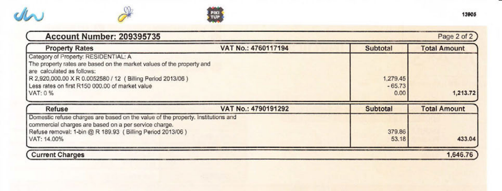
> **[Diagram Context - Textbook_MathematicalLiteracy_Gr10_Financial-documents-and-tariff-ystems.pdf-0064-00.png]**
> This document is a municipal utility account statement detailing property rates and refuse removal charges. It includes specific financial data such as property market values, tax rates, billing periods, VAT percentages, and calculated subtotals and totals. For Mathematical Literacy students, this serves as a practical application of financial calculations, demonstrating how to interpret complex billing structures, apply percentage-based tax rates, and verify total costs within a real-world context.

---

### Neotel Account Statement

#### Account Holder Details
* **Name:** Ms Lucia Molepo
* **Address:** 
  39 Ash Street
  Obesrvatory, Johannesburg, Gauteng
  2192

#### Statement Summary
| Detail | Information |
| :--- | :--- |
| **Invoice number** | S001998985 |
| **Account number** | R001365923 |
| **Invoice date** | 01-10-2013 |
| **Payment due date** | 23-10-2013 |
| **Bill period** | SEPTEMBER 2013 |
| **Current balance** | $\text{R } 690.99$ |
| **VAT REG NO.** | NOT AVAILABLE |
| **Payment terms** | 21 days |

---

### Transaction History

**Account no.:** R001365923

| Date | Transaction | Amount | Effective Balance Due |
| :--- | :--- | :--- | :--- |
| 01-09-2013 | Opening balance | | $\text{R } 771.18$ |
| 26-09-2013 | Payment Allocated | $\text{R } 771.18$ | $\text{R } 0.00$ |
| | Invoice - TI0218010078_R000000490533 | $\text{R } 690.99$ | $\text{R } 690.99$ |

---

### Age Analysis

| Current | 30 Days Overdue | 60 Days Overdue | 90 Days Overdue | 120 Days Overdue |
| :--- | :--- | :--- | :--- | :--- |
| $\text{R } 690.99$ | $\text{R } 0.00$ | $\text{R } 0.00$ | $\text{R } 0.00$ | $\text{R } 0.00$ |

**TOTAL DUE: $\text{R } 690.99$**

---

#### Footer Information
* **Banking details:** Located on the last page of the statement.
* **Service Provider Details:**
  * Neotel (Pty) Ltd Customer Care Number: `0800 333 636`
  * Reg No. `2004/004619/07`
  * Address: NeoVate Park, 44 Old Pretoria Road, Midrand, 2191, Gauteng, South Africa
  * Tel: `0800 333 636` | Fax: `086 637 7523`
  * Email: `consumers@neotel.co.za` | Web: `www.neotel.co.za`
  * V.A.T. registration no. `48 00 22 44 55`
* **Page:** 1 of 2

---

### CAPS Study Guide: Key Concepts & Terminology

To successfully analyze financial statements in Mathematical Literacy, you must understand the following terms:

1. **Opening Balance:** 
   The amount brought forward from the previous month's statement. In this statement, the opening balance was $\text{R } 771.18$.

2. **Payment Allocated / Credit:** 
   Money paid by the client to reduce the outstanding balance. On 26-09-2013, a payment of $\text{R } 771.18$ was received, bringing the effective balance down to $\text{R } 0.00$.

3. **Current Balance / Invoice Amount:** 
   The new charges incurred during the current billing period (September 2013). Here, the new invoice amount is $\text{R } 690.99$.

4. **Age Analysis:** 
   A breakdown showing how long outstanding amounts have been owed. 
   * **Current:** Charges from the most recent billing cycle ($\text{R } 690.99$).
   * **Overdue (30, 60, 90, 120+ Days):** Debt that has not been paid within the agreed payment terms. For Lucia, all overdue categories are $\text{R } 0.00$, indicating she is in good financial standing.

5. **Payment Terms:** 
   The timeframe within which the client must settle the bill. Neotel's terms are **21 days** from the invoice date ($01-10-2013$), making the payment due date $23-10-2013$.

---

a) What is the billing period for this invoice?
b) How many days does Lucia have to pay this bill?
c) Do the numbers listed under “Effective balance due” include VAT? explain
your answer.
d) When last did she make a payment to Neotel and how much was it for?
e) Does Lucia have any overdue payments?
f) List two ways in which she can pay her account?
g) List four ways in which Lucia can contact Neotel if she wants to query this
invoice.
h) The Neotel invoice does not show how much VAT was added to Lucia’s
bill. If the total before VAT was R 606,13, calculate how much VAT was
added to get the total due. Show your calculations.
Solution:
a) September 2013
b) 21 days
c) Yes, they are VAT inclusive. Neotel must charge VAT on the cost of their
services, and there is nothing in the invoice to indicate that VAT has not yet
been added to the totals due.
d) She paid R 771,18 on 26 September 2013
e) No - her payments are up to date.
f) She can make a cash deposit at Nedbank or she can pay via Electronic Fund
Transfer (EFT)
g) She can call their customer care number, she can send a fax to them, she
can e-mail them or she can use their website.
h) R 606,13 × 0,14 = R 84,86 VAT.
103
Chapter 4.
Financial documents and tariff systems

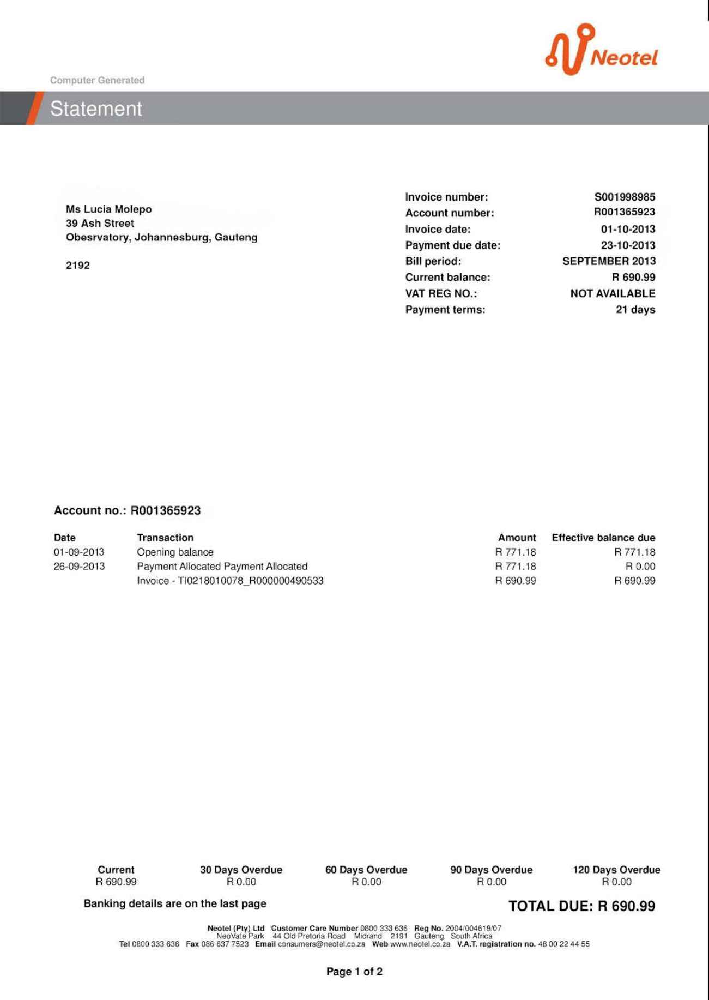
> **[Diagram Context - Textbook_MathematicalLiteracy_Gr10_Financial-documents-and-tariff-ystems.pdf-0065-01.png]**
> This document is a formal financial statement issued by Neotel, containing key administrative labels such as invoice number, account number, payment due date, and a detailed transaction history with dates, descriptions, and monetary amounts. For a high school student, this serves as a practical example of consumer financial literacy, illustrating how to interpret billing cycles, track account balances, and understand the structure of a formal service provider invoice.

---

# Activity: Analyzing a Till Slip

Alison receives the following till slip from The General Store in Upington:

### Till Slip

| **THE GENERAL STORE** |
| :--- |
| 228 Main Rd   Upington   Tel No: 055 683 1228   VAT NO 1345789075 |
| **21-02-2013 10:15**   **CASHIER - Leroy Jenkins** |

| Item / Description | Price ($\text{R}$) |
| :--- | :--- |
| BREAD/BROWN | 6.99 * |
| FRUIT JUICE/1 L APPLE | 11.45 |
| SAMP 500G | 10.39 * |
| BAKED BEANS 250G TINS | 2 @ 6.50 |
| FROZEN HAKE 300G | 35.00 |
| POWDER MILK/200G | 5 @ 3.45 * |
| ORANGES 1 KG | 11.99 * |
| TOILET PAPER 2-PLY/9 ROLLS | 43.99 |
| POTATOES 500G | 19.99 * |
| | |
| **TOTAL** | **184.53** |
| Rounding | -0.03 |
| **CASH** | **200.00** |
| **CHANGE** | **15.50** |
| | |
| **----------TAX INVOICE----------** | |
| 14% VAT | 14.48 |
| **VAT TOTAL** | **14.48** |
| **--------VALID VAT INVOICE--------** | |

*Note: Items marked with an asterisk ($*$) are VAT-exempt (zero-rated).*

---

### Questions

a) How did Alison pay for her shopping?

b) Calculate the total cost of VAT exempt items on the till slip.

c) Calculate the total cost of items that are subject to VAT.

d) Calculate how much VAT is added to the VAT-inclusive items.

e) Show how the above three amounts make up the total due.

f) Alison paid with cash, and received $\text{R } 15,50$ change. This means she paid $\text{R } 184,50$ for her shopping. Explain why this amount is different to the Total of $\text{R } 184,53$.

g) How much will $1\text{ kg}$ of potatoes cost at The General Store?

h) If the store advertised a $20\%$ discount on potatoes, how much will one kg of potatoes cost?

---

### Solutions

a) With cash.

b) The VAT-exempt items (marked with $*$) are:
* Bread/Brown: $\text{R } 6,99$
* Samp 500g: $\text{R } 10,39$
* Powder Milk 200g: $5 \times \text{R } 3,45 = \text{R

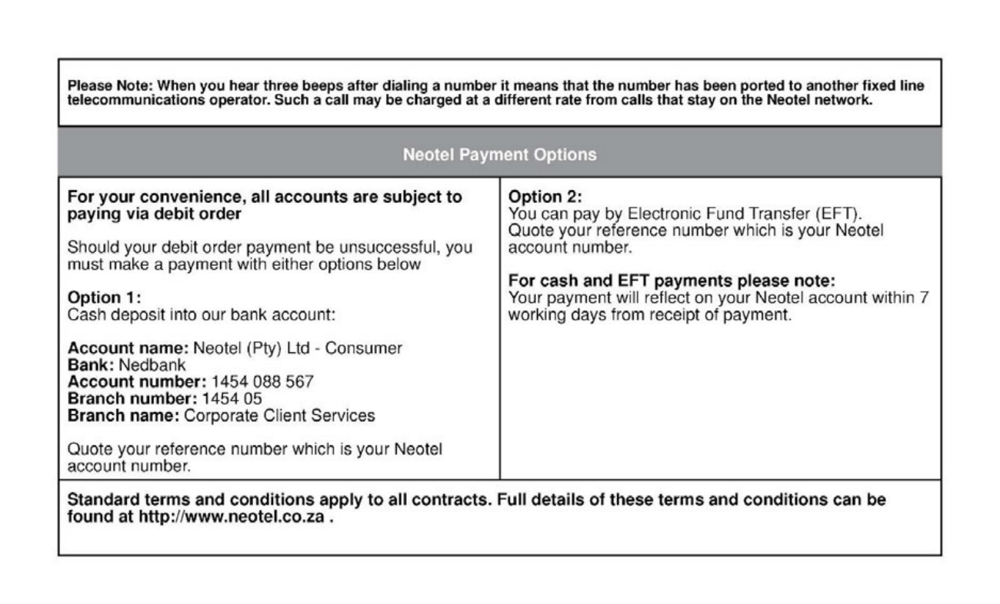
> **[Diagram Context - Textbook_MathematicalLiteracy_Gr10_Financial-documents-and-tariff-ystems.pdf-0066-00.png]**
> This informational text provides a structured guide on payment methods for a telecommunications service, detailing specific banking details for cash deposits and instructions for Electronic Fund Transfers (EFT). It serves as a practical example of functional literacy, requiring students to extract and apply specific financial data—such as account numbers and reference requirements—to complete a real-world administrative task.

---

### Solutions (Continued)

g) $500\text{ g}$ costs $\text{R } 19,99$, therefore $1\text{ kg}$ costs:
$$\text{R } 19,99 \times 2 = \text{R } 39,98$$

h) Discount calculation:
$$\text{R } 39,98 \times 0,20 = \text{R } 7,996$$

New price:
$$\text{R } 39,98 - \text{R } 7,996 = \text{R } 31,98$$

---

### Exercise

4. Michael receives the following invoice from Ivy Supermarket, where he has a store account:

<!-- DIAGRAM_PLACEHOLDER: Ivy Supermarket Logo -->

## IVY SUPERMARKET

| | |
| :--- | :--- |
| **MR MICHAEL BHEMBE** 84 12TH ST POLOKWANE 015 564 3949 | **STATEMENT DATE:** 5 MAY 2013 **PAYMENT DUE:** 31 MAY 2013 **ACCOUNT NUMBER:** 1456 9523 \*\*\*\* **BILLING PERIOD:** APRIL 2013 |

---

# TAX INVOICE

| DATE | DESCRIPTION | AMOUNT | BALANCE |
| :--- | :--- | :--- | :--- |
| 4 APR 2013 | **OPENING BALANCE** | $\text{R}623,95$ | $\text{R}623,95$ |
| 5 APR 2013 | PURCHASE - FOOD | $\text{R}341,45$ | $\text{R}965,40$ |
| 8 APR 2013 | PAYMENT - THANK YOU | $-\text{R}623,95$ | $\text{R}341,45$ |
| 12 APR 2013 | PURCHASE - FOOD/CLOTHES | $\text{R}245,50$ | $\text{R}586,90$ |
| 25 APR 2013 | PURCHASE - FOOD | $\text{R}184,49$ | $\text{R}771,39$ |
| | | **TOTAL EXCL VAT:** | $\text{R}676,66$ |
| | | **14% VAT:** | $\text{R}94,73$ |
| | | **TOTAL DUE:** | $\text{R}771,39$ |

| Current | 30 Days Overdue | 60 Days Overdue | 90 Days Overdue |
| :--- | :--- | :--- | :--- |
| $\text{R}771,39$ | $\text{R}0,00$ | $\text{R}0,00$ | $\text{R}0,00$ |

#### PAYMENT VIA ELECTRONIC FUNDS TRANSFER (EFT) OR CASH DEPOSIT

**BANKING DETAILS**
* **Account name:** Ivy Supermarket
* **Bank:** Standard Bank
* **Account number:** 1456 9234 0654
* **Branch number:** 456 987

---
<small>Ivy Supermarket. Tel: 015 734 9345. Shop 42 Riverside Mall. 342 Main Street, Polokwane.  
Reg No. 2006/0654345/08. VAT Registration No: 34 96 12 69 88</small>

---

### Questions

* a) In what city does Michael live?
* b) How many times did Michael shop at Ivy Supermarket in April 2013?
* c) How much money did he owe from his previous invoice?
* d) When last did he pay money into his account, and how much did he pay?
* e) Name two ways in which Michael can pay his account.

---

### Activity Questions (Continued)

* **f)** If Michael receives his invoice in the post on 10 May 2013, how many **weeks** does he have to pay his bill?
* **g)** Show how the $\text{R } 94,73$ VAT is calculated.
* **h)** If Michael can only afford to pay $\text{R } 350$ into his account this month, what will his opening balance for June 2013 be?
* **i)** Do you think Michael is responsible about paying his account on time? Explain your answer.

---

### Solution:

* **a)** Polokwane.
* **b)** $3$ times.
* **c)** $\text{R } 623,95$
* **d)** He paid $\text{R } 623,95$ into his account on 8 April 2013.
* **e)** He can pay via EFT or cash deposit.
* **f)** The payment is due on 31 May, so he has $21$ days to pay his account. $21$ days is $3$ weeks.
* **g)** $\text{R } 676,66 \times 0,14 = \text{R } 94,73$.
* **h)** $\text{R } 771,39 - \text{R } 350 = \text{R } 421,39$.
* **i)** Yes - he has no overdue payments from previous invoices.

---

### Question 5

Buffalo City Metro gives the following tariffs for electricity for schools and sports fields in the East London area:

| Energy Charge | Total Rands Excl. VAT | VAT Rands $14\%$ | Total Rands VAT Incl. |
| :--- | :--- | :--- | :--- |
| First $2000\text{ kWh}$ | $1,24566$ | $0,17439$ | $1,4200$ |
| Next $8000\text{ kWh}$ | $0,92405$ | $0,12937$ | $1,0534$ |
| Above $10\ 000\text{ kWh}$ | $1,29982$ | $0,18198$ | $1,4818$ |
| Minimum charge per month, or part thereof | $164,32824$ | $23,00595$ | $187,3342$ |

* **a)** Buffalo High School uses $9000\text{ kWh}$ of electricity in one month.
  * **i.** How much will their electricity cost, before VAT is added?
  * **ii.** Calculate what the $14\%$ VAT on the school's electricity bill will be.
  * **iii.** Calculate the total the school will pay for electricity in a month, including VAT.
* **b)** Eastwood Primary School closes for the month of December, and uses no electricity during this period. What will the school's electricity bill be, including VAT?
* **c)** Windyvale High School has a large campus and sports fields, and on average uses $11\ 000\text{ kWh}$ of electricity per month.
  * **i.** Calculate how much the school's electricity bill will be (including VAT).
  * **ii.** List at least three things that the school do to reduce its electricity consumption.

---

### Solution:

*(Learner to complete)*

---
**106 | 4.4. End of chapter activity**

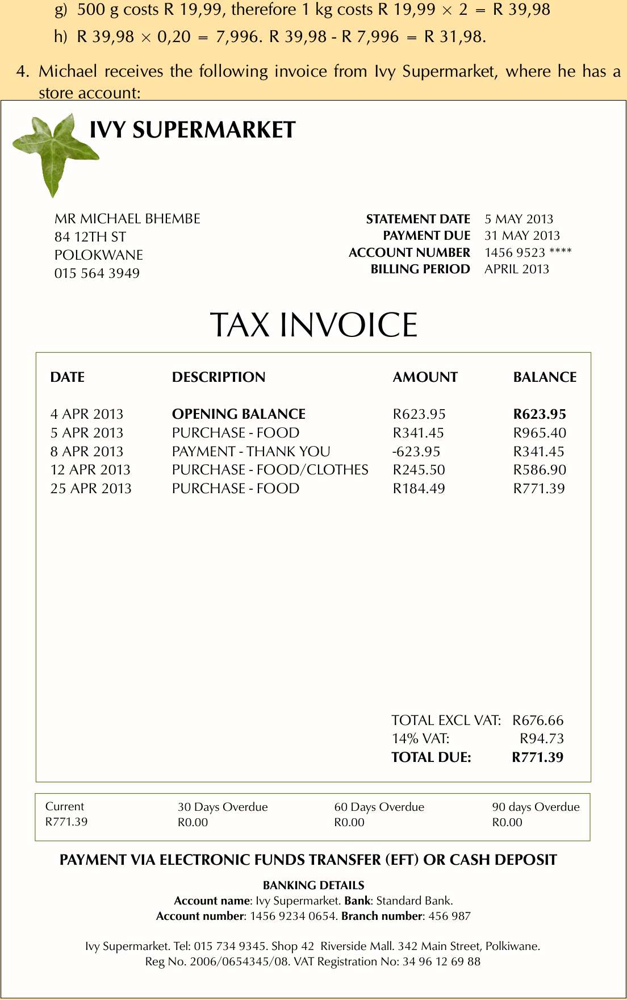
> **[Diagram Context - Textbook_MathematicalLiteracy_Gr10_Financial-documents-and-tariff-ystems.pdf-0068-00.png]**
> This graphic presents a formal retail tax invoice, featuring labels such as date, description, amount, balance, VAT calculations, and banking details. It serves as a practical Mathematical Literacy resource to help students interpret financial documents, track account balances, and understand the relationship between purchases, payments, and tax obligations.

---

### Chapter 4: Financial Documents and Tariff Systems

#### Solutions to Tariff Exercises

##### Question a)
* **i.** 
  $$2000\text{ kWh} \times \text{R } 1,24566 = \text{R } 2\ 491,32$$
  $$9000\text{ kWh} - 2000\text{ kWh} = 7000\text{ kWh}$$
  $$7000\text{ kWh} \times \text{R } 0,92405 = \text{R } 6\ 468,35$$
  $$\text{R } 2\ 491,32 + \text{R } 6\ 468,35 = \text{R } 8\ 959,67$$

* **ii.** 
  $$\text{R } 8\ 959,67 \times 0,14 = \text{R } 1\ 254,35$$

* **iii.** 
  $$\text{R } 8\ 959,67 + \text{R } 1\ 254,35 = \text{R } 10\ 214,02$$

##### Question b)
There is a minimum charge of $\text{R } 187,3342$.

##### Question c)
* **i.** 
  * First $2000\text{ kWh}$: 
    $$2000 \times \text{R } 1,4200 = \text{R } 2\ 840,00$$
  * Next $8000\text{ kWh}$: 
    $$8000\text{ kWh} \times \text{R } 1,0534 = \text{R } 8\ 427,20$$
  * Last $1\text{ kWh}$ (over $10\ 000\text{ kWh}$): 
    $$1000\text{ kWh} \times \text{R } 1,4818 = \text{R } 1\ 481,80$$
  * **Total**: 
    $$\text{R } 2\ 840,00 + \text{R } 8\ 427,20 + \text{R } 1\ 481,80 = \text{R } 12\ 749,00$$

* **ii.** The school could turn off lights when they aren't being used (e.g., at night). They could install solar panels. They could turn off the geysers at night, or install solar panel geysers to save electricity.

---

### Exercise: Telephone Tariffs

**6. Neotel lists the following call tariffs for calls (per minute) from a Neotel phone to landlines (the prices below include VAT):**

| Call Type | Neotel to landline | Neotel to Neotel |
| :--- | :--- | :--- |
| Local - peak | $\text{R } 0,34$ | $\text{R } 0,17$ |
| Local - off peak | $\text{R } 0,17$ | $\text{R } 0,17$ |
| Regional - peak | $\text{R } 0,46$ | $\text{R } 0,34$ |
| Regional - off peak | $\text{R } 0,29$ | $\text{R } 0,34$ |
| National - peak | $\text{R } 0,57$ | $\text{R } 0,43$ |
| National - off peak | $\text{R } 0,33$ | $\text{R } 0,43$ |
| After hours calling (daily between 18h00 - 07h00, plus all day on weekends and public holidays) | - | Free |

---

#### Questions

##### a) Wendy calls her friend Karabo, who lives nearby, from her Neotel landline, on a Wednesday afternoon. They talk for $540\text{ seconds}$.
* **i.** How much will the call cost if Karabo is with another phone provider?
* **ii.** How much will the call cost if Karabo is also with Neotel?

##### b) Neo's mother lives in the Transkei. His mother has a Neotel phone line.
* **i.** Neo lives in Johannesburg and has a non-Neotel phone line. If his mother calls him from the Transkei on a Saturday, what will the call cost her per minute?
* **ii.** Will the call be cheaper if Neo had a Neotel phone line that his mother could call him on?
* **iii.** How much would a $420\text{ second}$ call cost (from Johannesburg to the Transkei, from a Neotel line to a Neotel line) if Neo called his mother at 20h30 on a Monday night?

---

#### Solutions

##### a)
* **i.** 
  $$540\text{ seconds} = 9\text{ minutes}$$
  $$9 \times \text{R } 0,34 = \text{R } 3,06$$

* **ii.** 
  $$540\text{ seconds} = 9\text{ minutes}$$
  $$9 \times \text{R } 0,17 = \text{R } 1,53$$

##### b)
* **i.** National, off-peak per minute rate to a non-Neotel line is $\text{R } 0,33$.
* **ii.** Yes. After hours and on weekends, a call from a Neotel line to a Neotel line is free.

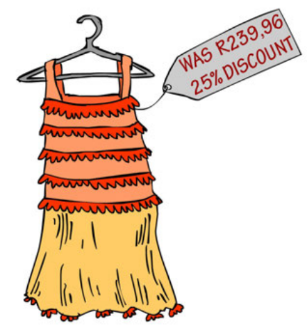
> **[Diagram Context - Textbook_MathematicalLiteracy_Gr10_Numbers-and-calculations-with-numbers.pdf-0069-07.png]**
> This illustration depicts a retail clothing item on a hanger with an attached price tag labeled "WAS R239,96" and "25% DISCOUNT." It serves as a practical application for Grade 10-12 Mathematics (Finance) to help students calculate the original price, the discount amount, and the final selling price of a product.

> **[Diagram Context - Textbook_MathematicalLiteracy_Gr10_Numbers-and-calculations-with-numbers.pdf-0069-09.png]**
> This graphic depicts a pair of rollerblades with an attached price tag labeled "WAS R299,50" and "15% DISCOUNT." It serves as a practical application problem for Mathematics learners to calculate the reduction in price and the final selling price by applying percentage calculations to a real-world financial context.

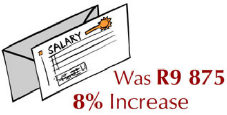
> **[Diagram Context - Textbook_MathematicalLiteracy_Gr10_Numbers-and-calculations-with-numbers.pdf-0069-11.png]**
> This graphic depicts a salary slip icon accompanied by the text "Was R9 875" and "8% Increase." It serves as a practical financial mathematics problem requiring students to calculate the new salary amount by applying a percentage increase to the original base value.

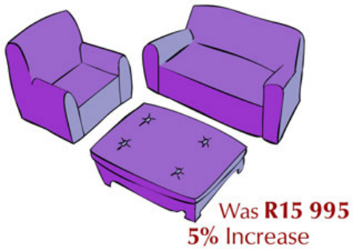
> **[Diagram Context - Textbook_MathematicalLiteracy_Gr10_Numbers-and-calculations-with-numbers.pdf-0069-13.png]**
> This graphic depicts a furniture set consisting of a chair, a couch, and a coffee table, accompanied by the text "Was R15 995" and "5% Increase." It serves as a practical application for Grade 10-12 Mathematical Literacy, requiring students to calculate the new price of the furniture set by applying a percentage increase to the original value.

---

iii. $420\text{ seconds} = 6\text{ minutes}$. Per minute rate from Neotel to Neotel, between 18h00 and 07h00 is free.

---

### 7. Metrorail Tariffs

Metrorail in Cape Town gives the following tariffs for normal Metro Class train travel from Cape Town Central Station:

| Zone (km distance) & Stations | Single | Week | Month |
| :--- | :--- | :--- | :--- |
| **1 - 10**   Claremont, Esplanade, Hazendal, Kentemade, Koeberg Road, Maitland, Mowbray, Mutual, Ndabeni, Newlands, Observatory, Paarden Island, Pinelands, Rondebosch, Rosebank, Salt River, Thornton, Woltemade, Woodstock, Ysterplaat | $\text{R } 6,00$ | $\text{R } 39,00$ | $\text{R } 117,00$ |
| **11 - 19**   Akasia Park, Athlone, Avondale, Belhar, Bellville, Bontheuwel, Century City, Crawford, De Grendel, Diep River, Elsies River, Goodwood, Harfield Road, Heathfield, Heideveld, Kenilworth, Langa, Lansdowne, Lavistown, Monte Vista, Netreg, Oosterzee, Ottery, Parow, Plumstead, Retreat, Steurhof, Tygerberg, Vasco, Wetton, Wittebome, Wynberg | $\text{R } 6,50$ | $\text{R } 42,00$ | $\text{R } 126,00$ |
| **20 - 30**   Blackheath, Brackenfell, Clovelly, Eikenfontein, False Bay, Fish Hoek, Kalk Bay, Kuils River, Lakeside, Lentegeur, Mitchells Plain, Mandalay, Muizenberg, Nolungile, Nyanga, Pentech, Philippi, Sarepta, Southfield, St James, Steenberg, Stikland, Stock Road, Unibell | $\text{R } 7,50$ | $\text{R } 49,00$ | $\text{R } 147,00$ |

---

### Questions

a) Naledi wants to take the train from the city centre to Kalk Bay. How much will a single ticket cost her?

b) How much does a monthly ticket from Kuils Rivier to the Central Station cost?

c) Kevin takes the train every week day from Akasia Park to the Central Station and back.
   
   i. If he buys single tickets for each trip, how much will he pay per week for his train transport?
   
   ii. How much cheaper would a weekly ticket for the same route be?
   
   iii. If he buys a monthly ticket for the same route, for $\text{R } 126,00$, how much will he pay per trip?
   
   iv. How much cheaper is this than paying for a single ticket?

---

### Solution:

a) $\text{R } 7,50$

b) $\text{R } 147,00$

c) 
   i. $\text{R } 6,50 \times 2\text{ trips per day} \times 5\text{ days} = \text{R } 65,00\text{ per week}$
   
   ii. Weekly ticket costs $\text{R } 42,00$. This is $\text{R } 22,00$ cheaper.

---
**108** | **4.4. End of chapter activity**

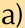

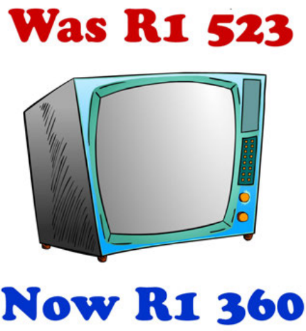
> **[Diagram Context - Textbook_MathematicalLiteracy_Gr10_Numbers-and-calculations-with-numbers.pdf-0070-07.png]**
> This graphic is a commercial advertisement featuring an illustration of a vintage television set accompanied by the text "Was R1 523" and "Now R1 360." It serves as a practical application for Mathematics learners to calculate percentage decreases or the difference in price, illustrating the concept of a discount in a consumer context.

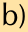

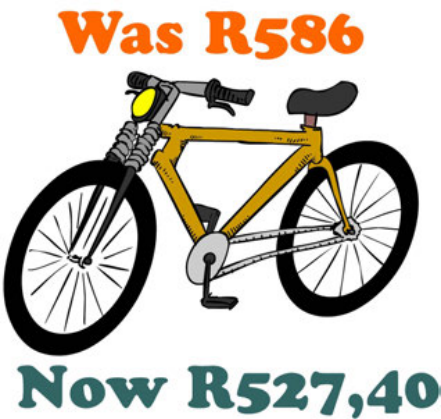
> **[Diagram Context - Textbook_MathematicalLiteracy_Gr10_Numbers-and-calculations-with-numbers.pdf-0070-09.png]**
> This graphic is a commercial advertisement featuring a line drawing of a bicycle accompanied by the text labels "Was R586" and "Now R527,40." It serves as a practical application for Grade 10-12 Mathematics Literacy, requiring students to calculate the percentage decrease or discount amount between the original and reduced prices.

---

# Chapter 4: Financial Documents and Tariff Systems

## Tariff Systems: Transport Costs (Worked Example Continued)

This section continues the calculation and comparison of different public transport tariff options (such as comparing single-trip tickets to a monthly multi-trip pass).

### Worked Example (Continued)

#### Step iii: Calculate the cost per trip using a monthly pass
* The commuter makes $10$ trips per week.
* There are approximately $4$ weeks in a month ($\approx 4\text{ weeks}$).
* Total number of trips per month:
  $$10 \text{ trips/week} \times 4 \text{ weeks} = 40 \text{ trips per month}$$

* If the monthly pass costs $\text{R } 126{,}00$, the cost per individual trip is calculated as:
  $$\text{R } 126{,}00 \div 40 = \text{R } 3{,}15 \text{ per trip}$$

#### Step iv: Calculate the savings per trip
* To find out how much cheaper the monthly pass is compared to buying single tickets (at $\text{R } 6{,}50$ per ticket):
  $$\text{R } 6{,}50 - \text{R } 3{,}15 = \text{R } 3{,}35 \text{ cheaper per trip}$$

---
**Page 109**