# CHAPTER 6

<!-- DIAGRAM_PLACEHOLDER: Chapter 6 Icon -->

## Scale, maps and plans

### Table of Contents

| Section | Topic | Page |
| :--- | :--- | :--- |
| **6.1** | **Introduction and key concepts** | 210 |
| **6.2** | **Number and bar scales** | 210 |
| **6.3** | **Maps, directions, seating and floor plans** | 224 |
| **6.4** | **End of chapter activity** | 232 |

---

# 6 Scale, Maps and Plans

## 6.1 Introduction and Key Concepts

Maps and plans are visual representations of the real world around us—for example, a school, a town, a movie theatre, or a shopping centre. They are tools that help us find our way around a new environment or locate a specific place, such as a shop in a mall or a seat in a sports stadium.

### Learning Objectives
In this chapter, you will learn how to:
* Use the **number scale** and the **bar scale**, and understand the advantages and disadvantages of both, including what happens when maps are resized.
* Estimate **actual distance** or length when given a scale map.
* Calculate **scaled measurements** when given the actual distance or length.
* Read maps and seating plans to describe the position of an object in relation to its surroundings.
* Find locations and follow or develop directions for travelling between two or more locations.

---

> **DEFINITION: Scale**
> 
> The scale of a map is a ratio of the distance on the map to the actual distance on the ground or in real life. 
> 
> For example, a number scale of $1 : 100$ means that $1$ unit on the map represents $100$ units on the ground or in reality.
> 
> $$1 \text{ cm on the map} = 100 \text{ cm on the ground}$$
> $$1 \text{ cm on the map} = 1 \text{ m on the ground}$$

---

## 6.2 Number and Bar Scales

### Introduction to Number and Bar Scales

The two primary types of scales used in geography and technical drawings are the **number scale** and the **bar scale**.

#### 1. Number Scale
The number scale is expressed as a ratio, such as $1 : 50$. This indicates that $1$ unit of measurement on the map represents $50$ of the same units on the ground.

*   $1 \text{ cm}$ on the map represents $50 \text{ cm}$ on the ground.
*   $1 \text{ m}$ on the map represents $50 \text{ m}$ on the ground.

**Procedure for using a number scale:**
1. Measure the distance between two points on the map using a ruler.
2. Multiply that measurement by the "real" part of the scale ratio (the second number).
3. Convert the final answer to a suitable unit (e.g., from centimeters to meters or kilometers).

$$\text{Actual Distance} = \text{Map Distance} \times \text{Scale Factor}$$

#### 2. Bar Scale
The bar scale is a visual representation of distance. It looks like a small ruler printed on the map.

**Example of a bar scale:**

| $0\text{ m}$ | $10\text{ m}$ | $20\text{ m}$ |
| :--- | :--- | :--- |
| [Black Segment] | [White Segment] | |

To use a bar scale, you measure the length of the bar with a ruler to determine how many centimeters on the map represent the distance indicated (e.g., if the bar from $0$ to $10\text{ m}$ measures $2\text{ cm}$, then $2\text{ cm} = 10\text{ m}$ in reality).

---

Each piece or segment of the bar represents a given distance, as labelled underneath. To use the bar scale, you need to measure how long one segment of the bar is on your ruler. You must then measure the distance on the map in centimetres; calculate how many segments of the bar graph it works out to be (the total distance measured; divided by the length of one segment); and then multiply it by the scale underneath.

So, if $1\text{ cm}$ on the bar represents $10\text{ m}$ on ground, and the distance you measure on the map is $3\text{ cm}$ ($3\text{ cm} \div 1\text{ cm} = 3$ segments) then the real distance on the ground is $3 \times 10\text{ m} = 30\text{ m}$.

---

### Worked example 1: Using the bar and number scales

#### QUESTION

1. You are given a map with the number scale of $1 : 40$. You measure a length (on the map) of $10\text{ cm}$. What is this distance in real life?
2. You are given a map with the number scale of $1 : 500$. You measure a distance on the map of $15\text{ cm}$ with your ruler. What is this distance in real life?
3. You are given the following bar scale:
   

> **[Diagram Context - Textbook_MathematicalLiteracy_Gr10_Assembly-diagrams-floor-plans-and-packaging.pdf-0002-08.png]**
> This illustration depicts an anthropomorphic bear standing over a broken wooden chair, surrounded by scattered nails and a hammer. It serves as a visual metaphor for the concept of "cause and effect" or "accountability," often used in Life Orientation to prompt discussions on responsibility, consequences, and problem-solving in social or interpersonal contexts.

   You measure the distance on the map to be $15\text{ cm}$. What is the actual distance?
4. You are given the following bar scale:
   

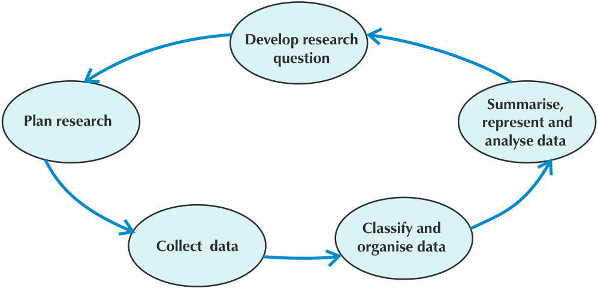
> **[Diagram Context - Textbook_MathematicalLiteracy_Gr10_Data-handling.pdf-0002-09.png]**
> This circular flow diagram illustrates the scientific research process, featuring five interconnected stages: "Develop research question," "Plan research," "Collect data," "Classify and organise data," and "Summarise, represent and analyse data." The arrows indicate that scientific inquiry is an iterative, cyclical process where findings from one investigation often lead to new research questions. This model is essential for CAPS learners to understand the systematic methodology required for conducting valid scientific investigations and data handling.

   You measure the distance between two points on the map to be $11\text{ cm}$. What is the distance on the ground?

#### SOLUTION

1. Scale is $1 : 40$.
   $$10\text{ cm} \times 40 = 400\text{ cm} = 4\text{ m}$$
   The distance on the ground (in real life) is $4\text{ m}$.

2. Scale is $1 : 500$.
   Therefore actual distance is $15\text{ cm} \times 500 = 7500\text{ cm} = 75\text{ m}$.

3. $1$ segment $= 1,5\text{ cm}$ long, and represents $50\text{ m}$.
   $$15\text{ cm} \div 1,5\text{ cm (length of segment)} = 10$$
   So you have measured $10$ segments in total.
   $$10\text{ segments} = 10 \times 50\text{ m} = 750\text{ m}$$

4. $1$ segment $= 2\text{ cm}$ long and represents $200\text{ m}$.
   $$11\text{ cm} \div 2\text{ cm (length of segment)} = 5,5$$
   So you have measured $5,5$ segments in total.
   $$5,5\text{ segments} = 5,5 \times 200\text{ m} = 1100\text{ m} = 1,1\text{ km}$$

---
**Chapter 6. Scale, maps and plans** | **211**

---

# Activity 6 – 1: Using the bar and number scales

1. You measure the distance between two buildings on a map to be $5\text{ cm}$. If the map has a number scale of $1 : 100$, what is the actual distance on the ground?

2. You are given a map with the number scale $1 : 20$. You measure a distance of $12\text{ cm}$ on the map. What is the actual distance in real life?

3. You measure a distance of $10\text{ cm}$ on a map with the following bar scale:

   

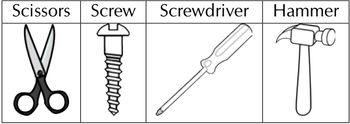
> **[Diagram Context - Textbook_MathematicalLiteracy_Gr10_Assembly-diagrams-floor-plans-and-packaging.pdf-0003-01.png]**
> This graphic presents a table of common tools, specifically labeled as "Scissors," "Screw," "Screwdriver," and "Hammer." It serves as an introductory visual aid for the Natural Sciences curriculum to help students identify and categorize various simple machines and mechanical devices used to perform work.

   ($1\text{ cm} = 15\text{ m}$). What is the actual distance on the ground?

4. You measure a distance of $15\text{ cm}$ on a map with the following bar scale:

   

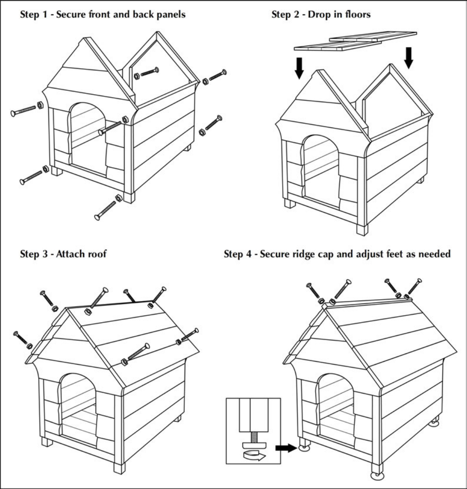
> **[Diagram Context - Textbook_MathematicalLiteracy_Gr10_Assembly-diagrams-floor-plans-and-packaging.pdf-0003-05.png]**
> This instructional graphic uses a series of four isometric assembly diagrams to illustrate the step-by-step construction of a wooden doghouse. The visuals incorporate labels for each stage (Steps 1–4), directional arrows indicating component placement, and detailed illustrations of hardware like bolts, nuts, and adjustable feet. It serves as a practical example of technical communication, teaching students how to interpret sequential assembly instructions and understand the spatial relationship between individual components and a finished structure.

   ($2\text{ cm} : 100\text{ m}$) What is the actual distance on the ground?

---

**Think you got it? Get this answer and more practice on our Intelligent Practice Service**

1. 24JJ
2. 24JK
3. 24JM
4. 24JN

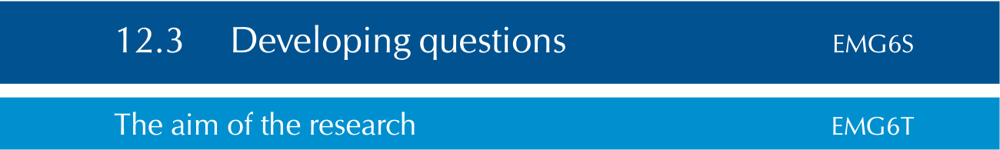
> **[Diagram Context - Textbook_MathematicalLiteracy_Gr10_Data-handling.pdf-0003-03.png]**
> This graphic consists of two horizontal text banners labeled with the headings "12.3 Developing questions" (EMG6S) and "The aim of the research" (EMG6T). These labels serve as structural signposts for a research methodology module, guiding students through the essential initial stages of scientific inquiry by distinguishing between the formulation of investigative questions and the definition of research objectives.

www.everythingmaths.co.za | m.everythingmaths.co.za

---

# Using number and bar scales to measure distance
**EMG4S**

In the previous section about number and bar scales we only looked at how to calculate the actual length of an object or distance between two places when we know the length we measured on the map, and the scale used. However, number and bar scales are usually seen on maps and plans. In this section, we will learn how to measure the dimensions of objects and distance on scale maps and then how to use the number and bar scale to calculate the actual (real world) dimensions of those objects (like furniture and buildings).

***

**6.2. Number and bar scales** | **212**

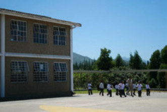
> **[Diagram Context - Textbook_MathematicalLiteracy_Gr10_Data-handling.pdf-0003-06.png]**
> This photograph depicts a school environment, featuring a multi-story classroom block and a group of learners in a paved courtyard. The image serves as a contextual visual for Life Orientation or Social Sciences, illustrating the physical school infrastructure and the social setting of a learning community within the South African educational landscape.

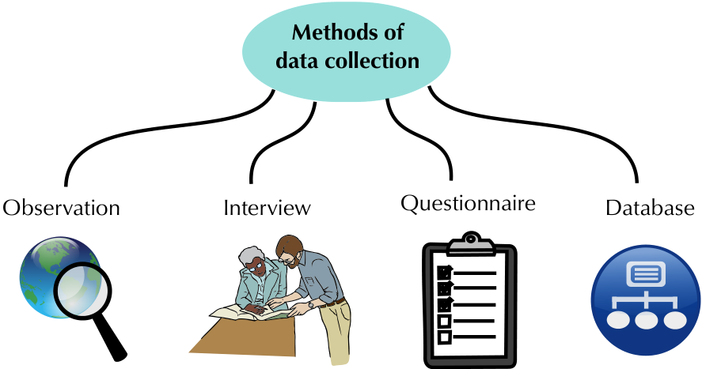
> **[Diagram Context - Textbook_MathematicalLiteracy_Gr10_Data-handling.pdf-0003-09.png]**
> This concept map illustrates four primary methods of data collection: observation, interview, questionnaire, and database. By categorizing these techniques with corresponding visual icons, the diagram provides a foundational overview for learners to understand the diverse approaches used to gather empirical evidence in research and scientific investigations.

---

# Worked example 2: Using the number scale to estimate distance

## QUESTION

Study the school map given below and answer the questions that follow:

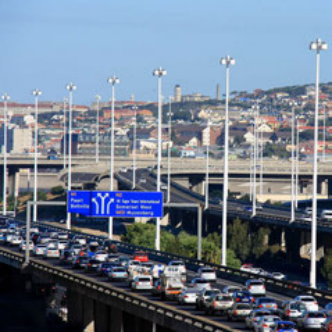
> **[Diagram Context - Textbook_MathematicalLiteracy_Gr10_Data-handling.pdf-0004-01.png]**
> This image depicts a multi-lane highway interchange featuring road signage with text labels such as "N1 Paarl/Bellville," "N2 Cape Town International," "Somerset West," and "M5 Muizenberg." In a Geography or Life Sciences context, this visual serves as a real-world example of urban infrastructure, illustrating human-environment interaction, transport networks, and the spatial organization of a metropolitan area.

1. Calculate the following real dimensions of the sports field in metres:
    a) length.
    b) width.
2. Calculate the length of the science classroom block in metres.
3. Zuki walks from the tuckshop to his maths classroom, along the blue dotted line shown. Measure how far he walked in metres.

## SOLUTION

1. a) Use your ruler to measure the width of the sports field on the map. It is $5\text{ cm}$ wide.
   Now use the number scale $1 : 500$ to determine the actual width of the field:

***
**Chapter 6. Scale, maps and plans** | **213**

> **[Diagram Context - Textbook_MathematicalLiteracy_Gr10_Data-handling.pdf-0004-03.png]**
> This image depicts a professional setting featuring three individuals seated at a table with documents and a red folder, representing a formal meeting or administrative assessment process. There are no academic labels, variables, or scientific symbols present in this photograph. Conceptually, this image serves as a contextual illustration of professional collaboration, moderation, or formal evaluation procedures relevant to school management and educator professional development within the CAPS framework.

> **[Diagram Context - Textbook_MathematicalLiteracy_Gr10_Data-handling.pdf-0004-05.png]**
> This image depicts a multiple-choice optical mark recognition (OMR) answer sheet featuring numbered rows (14–25) and corresponding lettered bubbles (A, B, C, D). It illustrates the formal assessment process used in CAPS examinations, where students must accurately shade the specific bubble corresponding to their chosen answer to ensure correct electronic marking.

---

# 6.2. Number and bar scales

### Worked Examples: Calculating Real Distance

To calculate the real-life distance from a map, follow this rule:
**Multiply your scaled measurement by the "real" number in the scale ratio.**

**Example 1 (continued)**
a) Calculating the width:
$$5\text{ cm} \times 500 = 2500\text{ cm}$$
$$2500\text{ cm} \div 100 = 25\text{ m}$$
The field is $25\text{ m}$ wide.

b) On the map, the field is $10\text{ cm}$ long:
$$10\text{ cm} \times 500 = 5000\text{ cm}$$
$$5000\text{ cm} \div 100 = 50\text{ m}$$
The field is $50\text{ m}$ long.

**Example 2**
On the map, the science classroom building is $5\text{ cm}$ long:
$$5\text{ cm} \times 500 = 2500\text{ cm}$$
$$2500\text{ cm} \div 100 = 25\text{ m}$$
The science classrooms are $25\text{ m}$ long.

**Example 3**
The blue dotted line is $6\text{ cm}$ long on the map:
$$6\text{ cm} \times 500 = 3000\text{ cm}$$
$$3000\text{ cm} \div 100 = 30\text{ m}$$
Zuki walked $30\text{ m}$ from the tuckshop to his maths classroom.

***

> **NOTE:**
> Although we say we are measuring distance on a map and calculating real distance, in reality we are approximating or estimating distance because the measurements you get using a scale and conversion are accurate only to the nearest metre or centimetre. For example, using the above measurement of how far Zuki walked from the tuckshop to his maths classroom, by our calculations he walked $30\text{ m}$, whereas if we were to measure this distance exactly on the ground, using a measuring tape, he may actually have walked $30\text{ m}$ and $10\text{ cm}$.

***

### Activity 6 – 2: Using the number scale

Using the school map and scale provided, measure the drawings and then estimate the following real distances in metres:

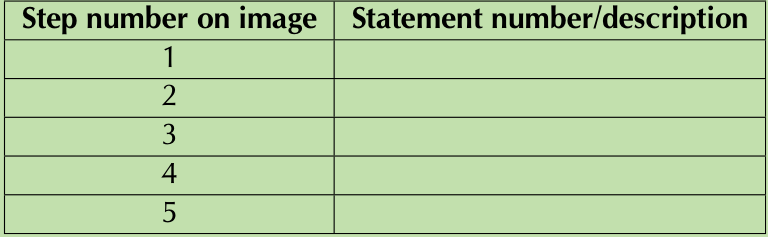
> **[Diagram Context - Textbook_MathematicalLiteracy_Gr10_Assembly-diagrams-floor-plans-and-packaging.pdf-0005-00.png]**
> This image is a structured table containing two columns labeled "Step number on image" and "Statement number/description," with five rows numbered 1 through 5. It serves as a pedagogical template designed to help learners sequence and describe the stages of a scientific process or experimental procedure. By mapping visual steps to their corresponding textual explanations, students practice the CAPS requirement of accurately describing and interpreting scientific methodologies.

1. The width and length of the school hall.
2. The width of the toilet block.
3. The distance between the science and maths buildings.

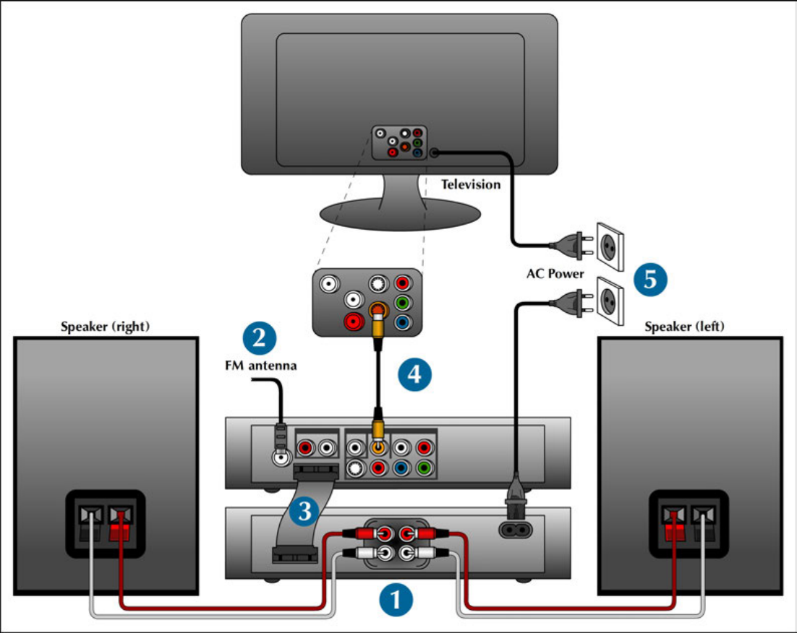
> **[Diagram Context - Textbook_MathematicalLiteracy_Gr10_Assembly-diagrams-floor-plans-and-packaging.pdf-0005-01.png]**
> This diagram illustrates the physical setup and signal connectivity of an audio-visual home entertainment system, featuring labels for a television, speakers, FM antenna, AC power, and various RCA-style input/output ports. It serves as a practical application of electrical circuit connections, demonstrating how components are integrated through specific cables and ports to facilitate the transmission of power and audio-visual signals.

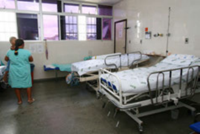
> **[Diagram Context - Textbook_MathematicalLiteracy_Gr10_Data-handling.pdf-0005-06.png]**
> This photograph depicts a clinical hospital ward setting featuring multiple patient beds, medical equipment, and a caregiver attending to a patient. The image provides a real-world context for Life Sciences learners to discuss public health infrastructure, the management of communicable diseases, and the socio-economic factors influencing healthcare access in South Africa.

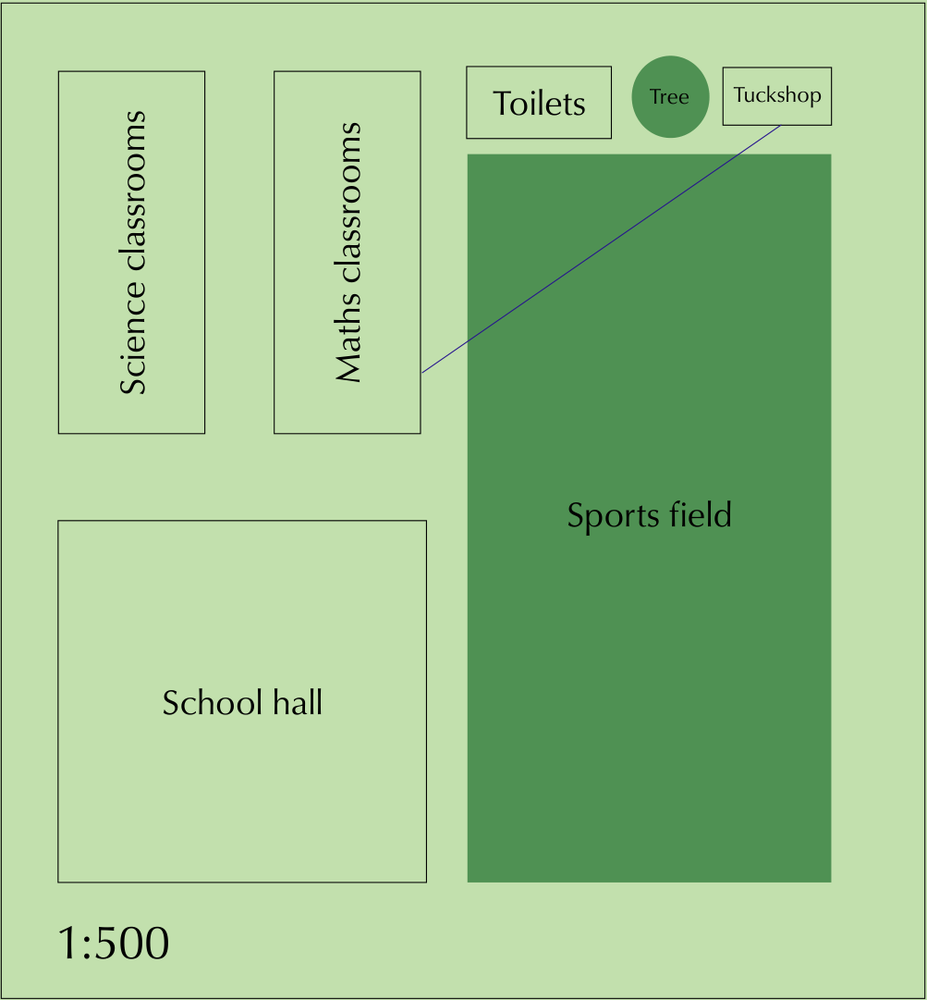
> **[Diagram Context - Textbook_MathematicalLiteracy_Gr10_Scale-maps-and-plans.pdf-0005-03.png]**
> This graphic is a two-dimensional floor plan or site map of a school, featuring labels for the Science classrooms, Maths classrooms, Toilets, Tree, Tuckshop, School hall, and Sports field, along with a scale of 1:500. It serves as a practical application for Mathematical Literacy learners to interpret scale, spatial orientation, and the relationship between map dimensions and real-world distances.

---

# Chapter 6: Scale, maps and plans

## School Layout Plan

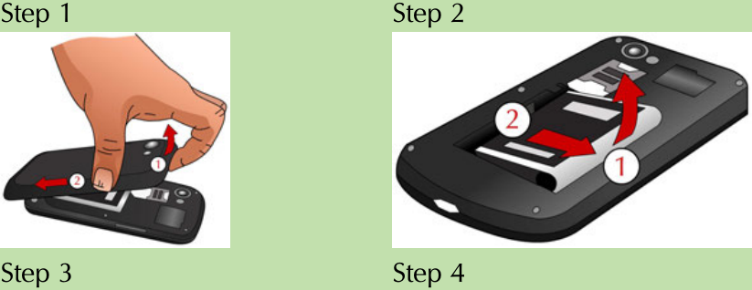
> **[Diagram Context - Textbook_MathematicalLiteracy_Gr10_Assembly-diagrams-floor-plans-and-packaging.pdf-0006-03.png]**
> This instructional graphic illustrates the procedural steps for disassembling a mobile device, specifically showing the removal of the back cover and battery. The diagram uses numbered labels (1 and 2) and directional red arrows to indicate the sequence of physical movements required to detach these components. It serves as a practical demonstration of mechanical assembly and component accessibility, relevant to Technology studies regarding hardware maintenance and device construction.

The diagram above represents a top-down view (plan) of a school's grounds and facilities.

### Map Features
The plan identifies the following locations within the school:
*   Science classrooms
*   Maths classrooms
*   Toilets
*   Tree
*   Tuckshop
*   School hall
*   Sports field

### Understanding Scale
The scale of the map is provided as a ratio:
$$1:500$$

**Note on Scale:**
A scale of $1:500$ means that $1$ unit of measurement on the plan represents $500$ of the same units in real life. 
*   If you measure $1\text{ cm}$ on the plan, it represents $500\text{ cm}$ (or $5\text{ m}$) on the actual school grounds.
*   If you measure $1\text{ mm}$ on the plan, it represents $500\text{ mm}$ (or $0,5\text{ m}$) in reality.

---

### Intelligent Practice Service
Think you got it? Get this answer and more practice on our Intelligent Practice Service by using the following codes:

1. 24JP
2. 24JQ
3. 24JR

*   **Website:** www.everythingmaths.co.za
*   **Mobile:** m.everythingmaths.co.za

*Page 215*

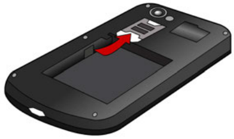
> **[Diagram Context - Textbook_MathematicalLiteracy_Gr10_Assembly-diagrams-floor-plans-and-packaging.pdf-0006-04.png]**
> This diagram illustrates the physical assembly of a mobile device, specifically showing the insertion of a SIM card into its designated slot. A prominent red arrow indicates the directional movement required to correctly seat the card within the device's hardware interface. This visual serves as a practical demonstration of hardware integration, helping students understand the physical connectivity required for electronic communication devices.

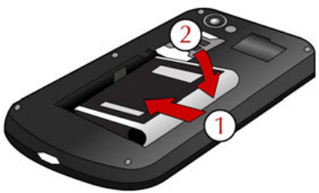
> **[Diagram Context - Textbook_MathematicalLiteracy_Gr10_Assembly-diagrams-floor-plans-and-packaging.pdf-0006-05.png]**
> This diagram illustrates the physical installation process of a mobile phone battery, featuring a smartphone chassis, a battery component, and two numbered arrows indicating the sequence of insertion. It conceptually demonstrates the mechanical procedure for connecting a portable power source to a device, highlighting the importance of correct orientation and alignment in electronic assembly.

> **[Diagram Context - Textbook_MathematicalLiteracy_Gr10_Data-handling.pdf-0006-00.png]**
> This image displays a collection of various writing instruments, including ballpoint pens, markers, and fineliners, featuring diverse barrel designs, cap styles, and ink colors. While this is a photograph of stationery rather than a scientific diagram, it serves as a practical example of physical objects that can be used for data collection, sketching, or recording observations in a laboratory or classroom setting.

> **[Diagram Context - Textbook_MathematicalLiteracy_Gr10_Data-handling.pdf-0006-04.png]**
> This image is a photograph of a retail store aisle featuring product displays and price signage. Visible elements include branded cereal boxes, "Low Price" signs with numerical values ($2.98, $3.50), and shoppers navigating the environment. In a Business Studies context, this visual illustrates the concepts of retail merchandising, consumer pricing strategies, and the physical layout of a formal business environment.

> **[Diagram Context - Textbook_MathematicalLiteracy_Gr10_Data-handling.pdf-0006-08.png]**
> This image displays a collection of various legacy mobile phone models, including flip phones, candy-bar designs, and early touch-screen devices. It serves as a visual representation of technological evolution and planned obsolescence, illustrating how design, user interface, and hardware functionality have progressed over time. For high school learners, this provides a tangible example of how rapid advancements in engineering and communication technology impact society and consumer habits.

---

# Worked example 3: Using the bar scale to estimate actual length

## QUESTION

Study the map of the room given below and answer the questions that follow:

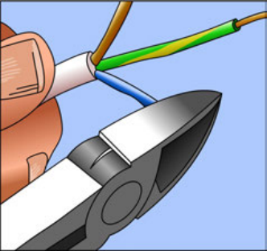
> **[Diagram Context - Textbook_MathematicalLiteracy_Gr10_Assembly-diagrams-floor-plans-and-packaging.pdf-0007-04.png]**
> This illustration depicts a hand using side-cutting pliers to strip or cut a three-core electrical cable, revealing the brown (live), blue (neutral), and green-and-yellow (earth) insulated wires. It serves as a practical demonstration of domestic electrical wiring standards, helping learners identify the specific colour-coded insulation used for safety and circuit identification in South African households.

1. Using a ruler and a calculator, calculate the following real lengths in metres:
    a) the length of the room.
    b) the length of the couch.

## SOLUTION

1.  a) First measure the bar scale using your ruler.
    $1\text{ cm}$ on your ruler represents $20\text{ cm}$ on the ground.
    Now measure the length of the room.
    It is $15\text{ cm}$ long. $15\text{ cm} \div 1\text{ cm}$ (length of segment) $= 15\text{ segments}$,
    $15\text{ segments} \times 20\text{ cm} = 300\text{ cm} = 3\text{ m}$.
    So the real length of the room is $3\text{ m}$.

    b) $1\text{ cm}$ on your ruler represents $20\text{ cm}$ on the ground.
    On the map, the couch is $8\text{ cm}$ long. $8\text{ cm} \div 1\text{ cm}$ (length of segment) $= 8\text{ segments}$.
    $8\text{ segments} \times 20\text{ cm} = 160\text{ cm} = 1,6\text{ m}$
    So the real length of the couch is $1,6\text{ m}$.

***

**216 | 6.2. Number and bar scales**

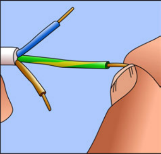
> **[Diagram Context - Textbook_MathematicalLiteracy_Gr10_Assembly-diagrams-floor-plans-and-packaging.pdf-0007-05.png]**
> This illustration depicts a three-core electrical cable being stripped, showing the internal copper conductors and their distinct blue, green-and-yellow, and brown insulation. It serves as a visual aid for identifying the neutral, earth, and live wires respectively, which is a fundamental safety concept in the CAPS Technology and Physical Sciences curricula regarding domestic electrical circuits.

> **[Diagram Context - Textbook_MathematicalLiteracy_Gr10_Assembly-diagrams-floor-plans-and-packaging.pdf-0007-06.png]**
> This illustration depicts a standard three-pin electrical plug being manipulated by a hand, featuring the three metallic pins and a connected electrical cable. It serves as a practical visual aid for teaching domestic electrical safety and the identification of live, neutral, and earth connections within a household circuit.

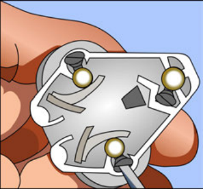
> **[Diagram Context - Textbook_MathematicalLiteracy_Gr10_Assembly-diagrams-floor-plans-and-packaging.pdf-0007-07.png]**
> This diagram illustrates the internal structure of a standard South African three-pin plug, showing the arrangement of the live, neutral, and earth terminals secured by screws. It serves to demonstrate the physical configuration of electrical connections, helping students identify the correct placement of wires for safe household circuit assembly as required by the CAPS Physical Sciences curriculum.

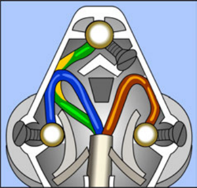

> **[Diagram Context - Textbook_MathematicalLiteracy_Gr10_Data-handling.pdf-0007-06.png]**
> This image is a photograph depicting a large group of primary school learners dressed in green and yellow uniforms gathered in an outdoor school courtyard. The scene illustrates the context of school infrastructure and social environments, which are relevant to Life Orientation topics regarding community, education, and the school as a social institution.

> **[Diagram Context - Textbook_MathematicalLiteracy_Gr10_Data-handling.pdf-0007-08.png]**
> This photograph depicts a group of school children interacting with a water source, such as a tap or pump, in an outdoor setting. The image serves as a visual representation for Life Sciences or Social Sciences topics related to water access, hygiene, and the importance of clean water resources in community health. It illustrates the practical application of water management and the necessity of sustainable infrastructure for daily human needs.

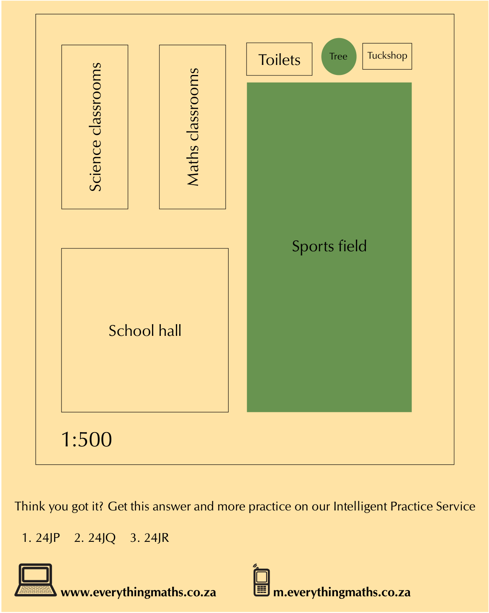
> **[Diagram Context - Textbook_MathematicalLiteracy_Gr10_Scale-maps-and-plans.pdf-0007-00.png]**
> This graphic is a two-dimensional floor plan or map of a school layout, featuring labeled areas such as "Science classrooms," "Maths classrooms," "Sports field," "School hall," "Toilets," "Tree," and "Tuckshop," along with a scale of 1:500. It serves as a practical application for learners to understand scale, ratio, and spatial reasoning by calculating real-world dimensions from a scaled representation.

---

# Activity 6 – 3: Using the bar scale to estimate actual length

Using the diagram given below, calculate the real life dimensions for:

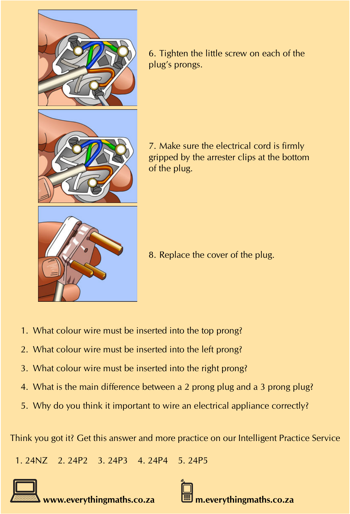

1. The length of the bookshelf.
2. The width and length of the chair.
3. The length of each of the windows.

---

**Think you got it?**
Get this answer and more practice on our Intelligent Practice Service:

1. 24JS
2. 24JT
3. 24JV

www.everythingmaths.co.za | m.everythingmaths.co.za

---

## Understanding the advantages and disadvantages of each scale (EMG4S)

By now you should understand how to use number and bar scales to measure real dimensions and distance on the ground when given a scale map. 

What happens if you resize a map though (for example you may want to make small photocopies of a map of your school, to hand out for an event taking place)? In the next example we will explore the effects on the number and bar scales when we resize maps.

***

**Chapter 6. Scale, maps and plans | 217**

> **[Diagram Context - Textbook_MathematicalLiteracy_Gr10_Data-handling.pdf-0008-01.png]**
> This graphic is a checklist icon featuring a document outline with four square checkboxes, two of which contain red tick marks, accompanied by a red pencil. It serves as a visual metaphor for task completion, assessment criteria, or the systematic monitoring of progress required in various CAPS subjects.

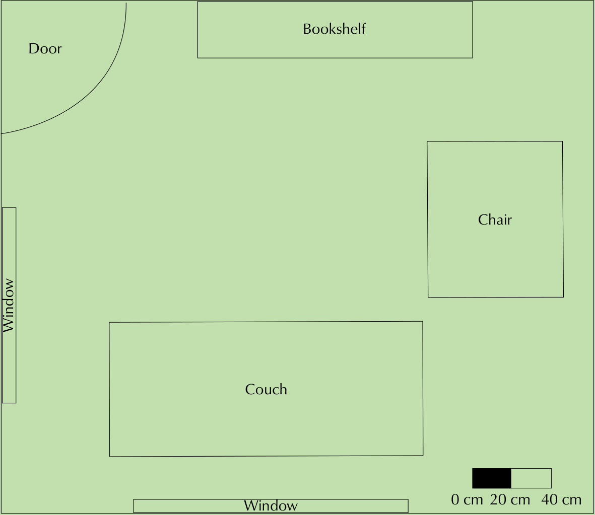
> **[Diagram Context - Textbook_MathematicalLiteracy_Gr10_Scale-maps-and-plans.pdf-0008-03.png]**
> This graphic is a two-dimensional floor plan representing a room layout, featuring labels for furniture and architectural elements including a door, windows, a bookshelf, a chair, and a couch. It includes a linear scale bar indicating measurements in centimetres, which serves to teach students how to interpret spatial relationships and calculate real-world dimensions from a scaled technical drawing.

---

# Worked example 4: Resizing and accuracy

## QUESTION

**Diagram 1**
Scale $1 : 15$

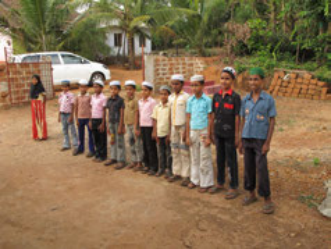
> **[Diagram Context - Textbook_MathematicalLiteracy_Gr10_Data-handling.pdf-0009-02.png]**
> This image depicts a group of young boys arranged in a linear formation, varying in height from shortest to tallest. The visual elements include the individuals, their clothing, and the outdoor setting, with no formal labels or variables present. Conceptually, this arrangement serves as a practical demonstration of continuous variation in human physical traits, illustrating how a population can be ordered to show a range of phenotypic expression for a specific characteristic like height.

**Diagram 2**
Scale $1 : 15$

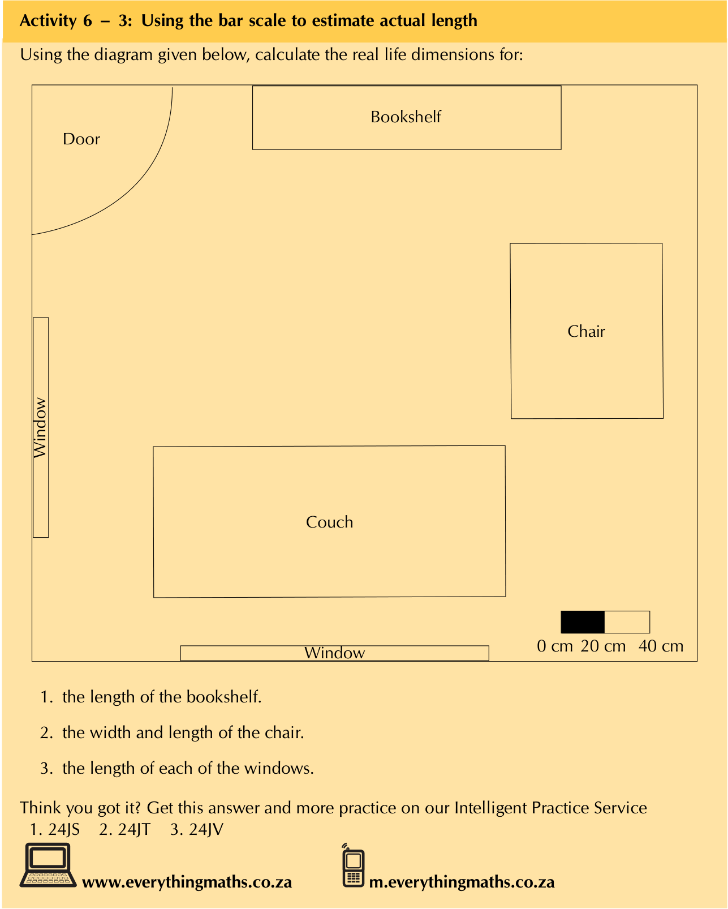
> **[Diagram Context - Textbook_MathematicalLiteracy_Gr10_Scale-maps-and-plans.pdf-0009-00.png]**
> This graphic is a floor plan diagram featuring labels for furniture and architectural elements, including a "Door," "Bookshelf," "Chair," "Couch," and "Window," alongside a bar scale calibrated from 0 cm to 40 cm. It serves as a practical application of Mathematical Literacy, requiring students to use the provided bar scale to measure the diagram's dimensions and convert them into real-life measurements for the specified objects.

**Diagram 3**
Bar scale: $0\text{ cm} \quad 15\text{ cm} \quad 30\text{ cm}$

<!-- DIAGRAM_PLACEHOLDER: Diagram 4: Enlarged school bag illustration with a bar scale showing 0cm, 15cm, and 30cm -->
**Diagram 4**
Bar scale: $0\text{ cm} \quad 15\text{ cm} \quad 30\text{ cm}$

1. Measure the width of the school bag in Diagram 1 and use the scale to calculate the width of the school bag.
2. Measure the school bag in Diagram 2 and use the scale to calculate the width of the school bag.
3. What do you notice about the answers for 1. and 2.?

***

**6.2. Number and bar scales**

---

# Chapter 6: Scale, Maps and Plans

### Activity: Measuring and Resizing

4. Measure the width of the school bag in Diagram 3 and use the scale to calculate the width of the school bag.

5. Measure the school bag in Diagram 4 and use the scale to calculate the width of the school bag.

6. What do you notice about the answers for 4. and 5.?

7. Write a sentence to explain what you have learnt as a result of your calculations.

---

### SOLUTION

1. The measured width on the diagram is $3\text{ cm}$. Therefore $3\text{ cm} \times 15 = 45\text{ cm}$. So the bag is $45\text{ cm}$ wide.

2. The measured width on the diagram is $5\text{ cm}$. Therefore $5\text{ cm} \times 15 = 75\text{ cm}$. So the bag is now $75\text{ cm}$ wide!

3. These answers are very different. Which is correct? Is the bag $45\text{ cm}$ wide or $75\text{ cm}$ wide?

4. $1\text{ segment} = 1\text{ cm}$ long. The bag is $3\text{ cm}$ wide on the diagram, therefore $3 \times 15\text{ cm} = 45\text{ cm}$.

5. $1\text{ segment} = 1,5\text{ cm}$ long. The bag is $4,5\text{ cm}$ wide on the diagram. 
   $$4,5 \div 1,5 = 3\text{ segments}$$
   $$3\text{ segments} \times 15\text{ cm} = 45\text{ cm}$$

6. The answers for Questions 4 and 5 are the same!

7. When resizing scale diagrams using the **number scale**, we have to change the scale in order for it to remain accurate. (In the bigger diagram we would need the number scale to be $1 : 9$ for the width of the bag to be $45\text{ cm}$). When resizing diagrams using the **bar scale**, the length of the segments increases proportionally to the diagram, therefore the resized bar scale is also accurate and will give us the same answer.

---

### Key Concepts: Resizing and Scale Accuracy

#### 1. Resizing with a Number Scale
If we resize a map that has a number scale on it, the number scale becomes **incorrect**. 

**Example:**
If a map is $10\text{ cm}$ wide when printed, and the number scale is $1 : 10$, then $1\text{ cm}$ on the map represents $10\text{ cm}$ on the ground. However, if we reprint the map larger so it is now $15\text{ cm}$ wide, our scale will still be $1 : 10$ according to the printed text, but now:
$$1,5\text{ cm} \text{ represents } 10\text{ cm} \text{ on the ground}$$
$$(1,5 \times 10 = 15\text{ cm} = \text{width of map})$$
Consequently, any scale calculations will now be wrong. When resizing maps that use the number scale, it is important to know that the scale changes with the map. This is a significant **disadvantage** to using the number scale.

#### 2. Resizing with a Bar Scale
If we resize a map that has a bar scale on it, the size of the bar scale will be resized along with the map. Therefore, it will remain **accurate**. This is a major **advantage** to using the bar scale.

---

### Comparison of Scale Types

| Scale Type | Advantages | Disadvantages |
| :--- | :--- | :--- |
| **Number Scale** ($1 : 50$) | Only one distance needs to be measured. Calculations are usually simple. | Becomes inaccurate if the map is resized (enlarged or reduced). |
| **Bar Scale** | Remains accurate even if the map is resized, as the bar grows or shrinks with the image. | Requires measuring both the segment length and the map distance. Calculations can be more complicated. |

**Note:** To use a bar scale, you must first determine how many "segments" fit into the distance measured on the map before multiplying by the real-world value of a segment.

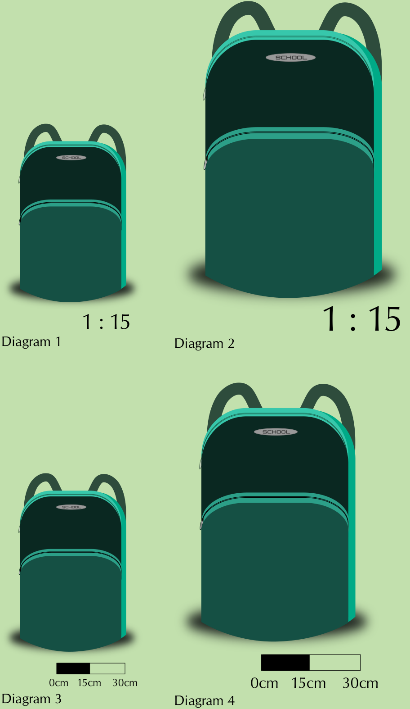

---

# Drawing a scaled map when given real dimensions (EMG4V)

We have learnt how to determine actual measurements when given a map and a scale. In this section we will look at the reverse process - how to determine scaled measurements when given actual dimensions, and draw an accurate two dimensional map. Remember that a scale drawing is exactly the same shape as the real (actual) object, just drawn smaller. In the next worked example we will look at how to draw a simple scaled map of a room.

In order to draw a map you need two pieces of information. Firstly you need to know the actual measurements of everything that has to go onto the map. Secondly you need to know what scale you have to use. The scale will depend on the original measurements, how much detail the map has to show and the size of the map. If you want to draw a map, or plan, of a room in your house on a sheet of A4 paper and include detail of the furniture you would not use a scale of $1 : 10\ 000$ (this scale means that $1\text{ cm}$ in real life is equal to $10\text{ 000 cm}$ or $1\text{ km}$ in real life).

In Grade 10 the scale will be given to you.

---

### Worked example 5: Drawing scaled maps

#### QUESTION
Draw a scaled map of a room that has real dimensions $3\text{ m}$ by $4,5\text{ m}$. Use a number scale of $1 : 50$.

#### SOLUTION
The scale of $1 : 50$ means that $1$ unit on your drawing will represent $50$ units in real life so $1\text{ cm}$ on your drawing will represent $50\text{ cm}$ in real life.

*   **The width of the room is $3\text{ m}$.**
    *   Convert $3\text{ m}$ to $\text{cm}$:
        $$3\text{ m} \times 100 = 300\text{ cm}$$
    *   Use the scale to calculate the scaled width on the map:
        $$300\text{ cm} \div 50\text{ cm} = 6\text{ cm}$$
        (**Divide** the actual, real measurement of the room by the 'real number' from the scale)

*   **The length of the room is $4,5\text{ m}$.**
    *   Convert $4,5\text{ m}$ to $\text{cm}$:
        $$4,5\text{ m} \times 100 = 450\text{ cm}$$
    *   Use the scale to calculate the scaled length on the map:
        $$450\text{ cm} \div 50\text{ cm} = 9\text{ cm}$$

*   The scaled measurements are $6\text{ cm}$ and $9\text{ cm}$. We can now draw this on our plan. Don't forget to include the scale on your map!

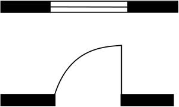

---
**220 | 6.2. Number and bar scales**

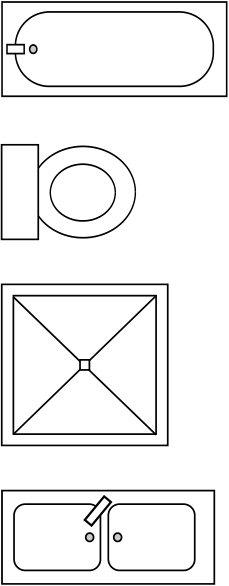

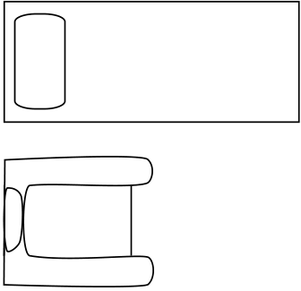

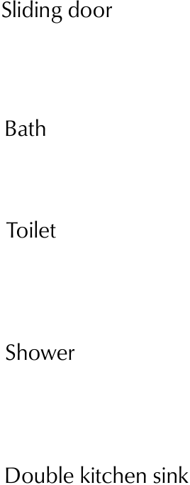

---

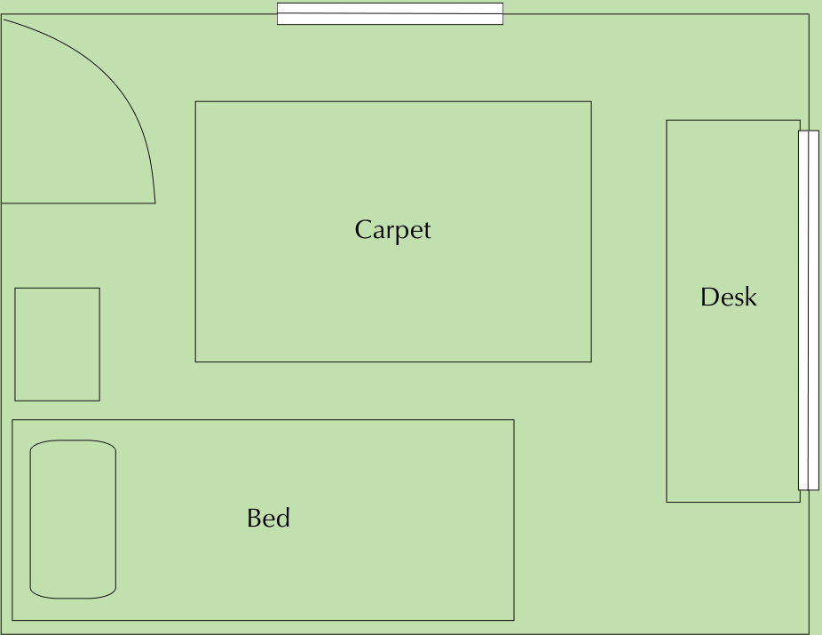

# Worked example 6: Drawing a scaled map

### QUESTION

In this worked example we will add some furniture to the room in the previous example.

The room has the same dimensions ($3\text{ m} \times 4,5\text{ m}$) and the scale to be used is still $1 : 50$.

Draw the following items using the dimensions provided:

1. a couch $2\text{ m} \times 1,2\text{ m}$.
2. a window $2\text{ m}$ long.
3. a table $1,5\text{ m}$ wide and $2\text{ m}$ long.

You may arrange the furniture in the room in any way which you think is sensible.

### SOLUTION

The scale of $1 : 50$ means that $1\text{ unit}$ on your drawing will represent $50\text{ units}$ in real life so $1\text{ cm}$ on your drawing will represent $50\text{ cm}$ in real life.

The scaled dimensions of the room are the same as in the previous worked example: $6\text{ cm} \times 9\text{ cm}$.

***

**Chapter 6. Scale, maps and plans** | **221**

> **[Diagram Context - Textbook_MathematicalLiteracy_Gr10_Data-handling.pdf-0012-03.png]**
> This image depicts a collection of young seedlings growing in individual biodegradable peat pots placed on a tray near a window. The visual elements include green plant stems, leaves, soil, and containers, demonstrating the early stages of plant development and germination. Conceptually, this illustrates the process of plant growth and the environmental requirements for photosynthesis, such as light exposure, which is essential for Life Sciences learners studying plant biology and growth conditions.

---

# 6.2. Number and bar scales

### Worked Examples: Calculating Scaled Dimensions

The following examples demonstrate how to convert real-life measurements into scaled dimensions using a scale of $1 : 50$.

#### 1. Couch Dimensions
*   The real-life width of the couch is $1,2 \text{ m}$.
    $$1,2 \text{ m} = 120 \text{ cm}$$
    $$120 \text{ cm} \div 50 = 2,4 \text{ cm}$$
*   The real-life length of the couch is $2 \text{ m}$.
    $$2 \text{ m} = 200 \text{ cm}$$
    $$200 \div 50 = 4 \text{ cm}$$
*   **Conclusion:** The scaled dimensions of the couch are $2,4 \text{ cm}$ and $4 \text{ cm}$.

#### 2. Window Dimensions
*   The real-life length of the window is $2 \text{ m}$.
    $$2 \text{ m} = 200 \text{ cm}$$
    $$200 \div 50 = 4 \text{ cm}$$
*   **Conclusion:** So the scaled dimension for the length of the window is $2 \text{ cm}$. *(Note: Based on the provided text and diagram)*.

#### 3. Table Dimensions
*   The real-life width of the table is $1 \text{ m}$.
    $$1 \text{ m} = 100 \text{ cm}$$
    $$100 \text{ cm} \div 50 = 2 \text{ cm}$$
*   The real-life length of the table is $1,5 \text{ m}$.
    $$1,5 \text{ m} = 150 \text{ cm}$$
    $$150 \div 50 = 3 \text{ cm}$$
*   **Conclusion:** The scaled dimensions of the table are $2 \text{ cm}$ and $3 \text{ cm}$.

---

### Floor Plan Diagram (Scale $1 : 50$)

The following diagram represents the room layout using the scaled dimensions calculated above. The room itself has scaled dimensions of $6 \text{ cm}$ by $9 \text{ cm}$.

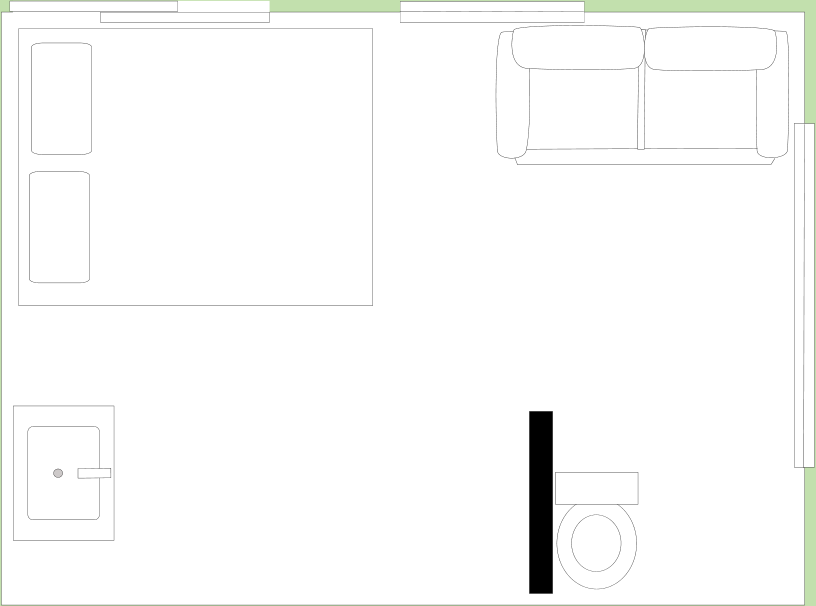

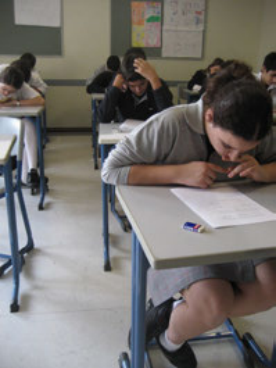
> **[Diagram Context - Textbook_MathematicalLiteracy_Gr10_Data-handling.pdf-0013-12.png]**
> This image depicts a formal classroom assessment setting, showing students seated at individual desks with examination papers and stationery. It illustrates the standard environment for summative assessment in the CAPS curriculum, where learners demonstrate their mastery of subject content under controlled, independent conditions.

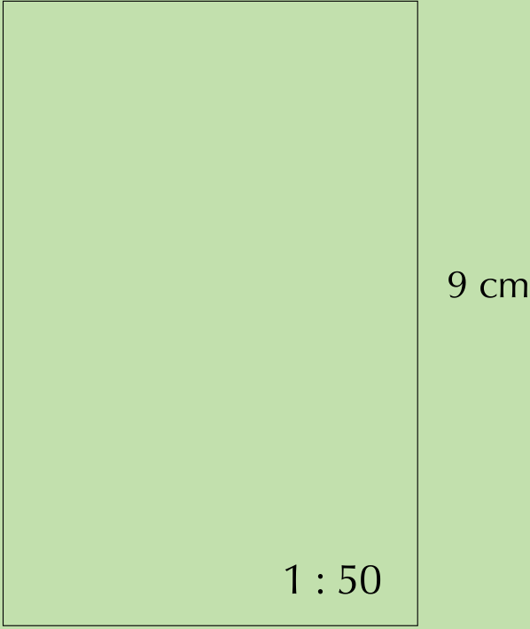
> **[Diagram Context - Textbook_MathematicalLiteracy_Gr10_Scale-maps-and-plans.pdf-0013-01.png]**
> This graphic is a geometric representation of a rectangle featuring the label "9 cm" along its vertical side and a scale factor of "1 : 50" at the base. It illustrates the application of mapwork and technical drawing principles, requiring students to use the given scale to calculate the actual dimensions of the object represented by the drawing.

---

# Chapter 6: Scale, Maps and Plans

## Activity 6 – 4: Drawing a Scaled Map

### Core Concept: Using a Number Scale
A number scale (e.g., $1 : 50$) tells us the relationship between the dimensions on a drawing and the actual dimensions in real life. 
*   The first number ($1$) represents the distance on the **map/plan**.
*   The second number ($50$) represents the **actual distance** in real life.
*   A scale of $1 : 50$ means that $1 \text{ unit}$ on the drawing represents $50 \text{ units}$ in reality.

### Procedure: Calculating Scaled Dimensions
To draw an accurate floor plan, follow these steps:
1.  **Convert all measurements to the same unit** (usually centimeters, as you will use a ruler to draw).
2.  **Divide the actual measurement** by the scale factor.
    $$\text{Scaled Dimension} = \frac{\text{Actual Dimension}}{\text{Scale Factor}}$$

### Worked Example: Bedroom Floor Plan
**Scenario:**
*   **Room dimensions:** $3,5 \text{ m}$ by $4 \text{ m}$.
*   **Single bed:** $92 \text{ cm}$ by $188 \text{ cm}$.
*   **Bedside table:** $400 \text{ mm}$ square.
*   **Scale:** $1 : 50$.

**Step 1: Convert and Calculate Dimensions**

| Item | Actual Dimension (Original) | Actual Dimension (in cm) | Calculation ($\div 50$) | Scaled Dimension (to draw) |
| :--- | :--- | :--- | :--- | :--- |
| Room Length | $4 \text{ m}$ | $400 \text{ cm}$ | $400 \div 50$ | $8 \text{ cm}$ |
| Room Width | $3,5 \text{ m}$ | $350 \text{ cm}$ | $350 \div 50$ | $7 \text{ cm}$ |
| Bed Length | $188 \text{ cm}$ | $188 \text{ cm}$ | $188 \div 50$ | $3,76 \text{ cm}$ |
| Bed Width | $92 \text{ cm}$ | $92 \text{ cm}$ | $92 \div 50$ | $1,84 \text{ cm}$ |
| Bedside Table | $400 \text{ mm}$ | $40 \text{ cm}$ | $40 \div 50$ | $0,8 \text{ cm}$ ($8 \text{ mm}$) |

**Step 2: Drawing the Plan**
Using a ruler, draw a rectangle of $8 \text{ cm} \times 7 \text{ cm}$ to represent the room. Place the bed and bedside table inside the room using their calculated scaled dimensions.

---

## Activity 6 – 5: Drawing Scaled Maps

### Practical Application: Classroom Floor Plan
In this activity, you will apply the principles of scaling to a real-world environment.

**Instructions:**
1.  **Measure:** Divide into groups and measure the actual length and width of your classroom.
2.  **Inventory:** Measure all large objects within the room, including:
    *   Desks and chairs.
    *   Windows and doors (measure their width and position along the wall).
    *   The blackboard or whiteboard.
3.  **Calculate:** Use a scale of $1 : 50$ to convert all your measurements into scaled dimensions.
    $$\text{Drawing Measurement (cm)} = \frac{\text{Real Measurement (cm)}}{50}$$
4.  **Draw:** On a clean sheet of paper, draw the floor plan accurately.
5.  **Analyze:** Look at your finished plan. Can you think of a different or better way to arrange the furniture to improve movement or light in the classroom?

### Summary Table for Calculations
Use a table like the one below to organize your data before drawing:

| Object | Actual Length (cm) | Actual Width (cm) | Scaled Length (cm) | Scaled Width (cm) |
| :--- | :--- | :--- | :--- | :--- |
| Classroom Wall A | | | | |
| Classroom Wall B | | | | |
| Teacher's Desk | | | | |
| Learner Desk | | | | |
| Blackboard | | | | |

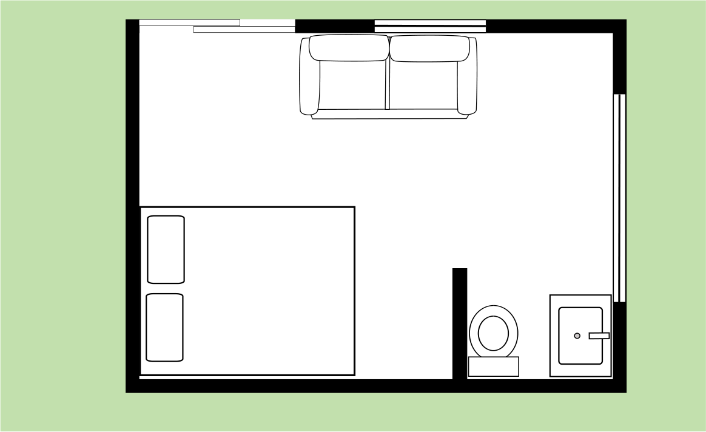

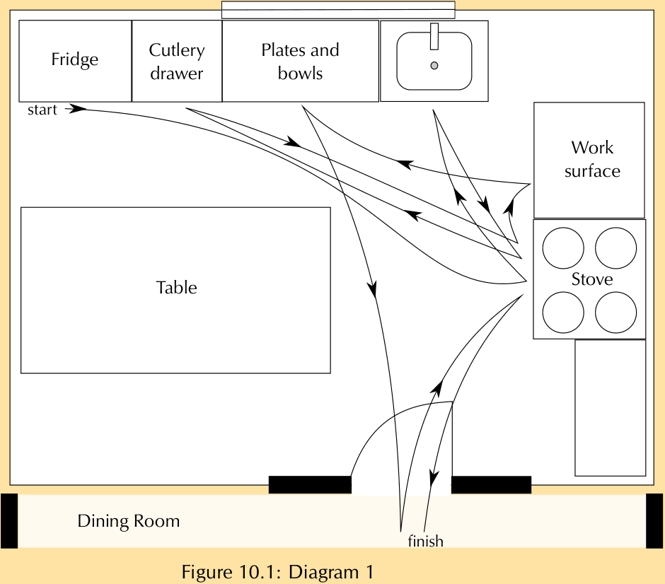

> **[Diagram Context - Textbook_MathematicalLiteracy_Gr10_Data-handling.pdf-0014-08.png]**
> This image depicts a real-world scenario of a soccer match involving four players on a grass field. There are no labels, variables, or symbols present in the photograph. Conceptually, this image serves as a practical application for Grade 10-12 Physical Sciences, illustrating concepts such as force, momentum, and the transfer of kinetic energy when a player strikes a ball.

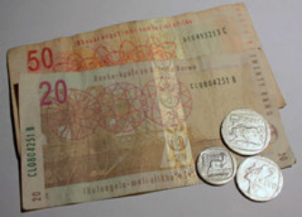
> **[Diagram Context - Textbook_MathematicalLiteracy_Gr10_Data-handling.pdf-0014-11.png]**
> This image displays South African currency, specifically R50 and R20 banknotes alongside three coins of varying denominations. It serves as a visual aid for Economic and Management Sciences (EMS) or Mathematical Literacy learners to identify legal tender, understand the concept of physical cash as a medium of exchange, and practice basic financial calculations involving different denominations.

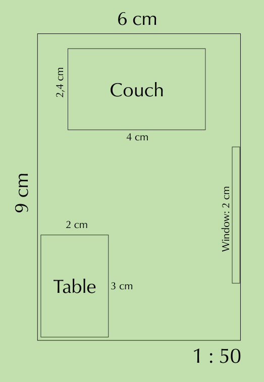
> **[Diagram Context - Textbook_MathematicalLiteracy_Gr10_Scale-maps-and-plans.pdf-0014-17.png]**
> This diagram is a two-dimensional floor plan representing a room layout, featuring labels for "Couch," "Table," and "Window" alongside specific linear dimensions in centimetres. It illustrates the application of a 1:50 scale factor, requiring students to apply mathematical ratios to convert these model measurements into real-world dimensions.

---

# 6.3 Maps, Directions, Seating, and Floor Plans

Knowing how to use scale maps is an essential skill. It is also useful to describe the position of an object (such as a shop in a shopping centre or a classroom at your school) in relation to the objects around it.

### 1. Navigational Instructions
When giving directions, you provide specific instructions to guide someone from one point to another. 
*   **Example:** "Turn left at the corner of Flower Street, walk straight down the road, pass the shop on your left, turn right into Yellow Street. My house is number 14, with the green gate."

### 2. Scales and Plans
In this section, we interpret and write directional instructions and read seating and floor plans using two types of scales:
*   **Number Scales:** Represented as a ratio, such as $1:50$.
*   **Bar Scales:** A visual line or bar representing real-world distances.

---

### Worked Example 7: Using the number scale and directional navigation on a classroom seating plan

#### QUESTION
Study the classroom plan below and answer the questions that follow:

**Classroom Layout Diagram**

| Feature | Position/Details |
| :--- | :--- |
| **Entrance** | Door located at the top left corner. |
| **Front of Class** | Blackboard located along the top wall. |
| **Teacher's Area** | Teacher's desk located at the front right. |
| **Storage** | Bookshelf located along the right-hand wall. |
| **Natural Light** | Two windows located along the left-hand wall. |
| **Scale** | $1:50$ |

**Student Seating Arrangement (Grid)**

| Row | Left Column | Middle Column | Right Column |
| :--- | :---: | :---: | :---: |
| **Row 1 (Front)** | Desk A | Desk B | Desk C |
| **Row 2** | Desk D | Desk E | Desk F |
| **Row 3** | Desk G | Desk H | Desk I |
| **Row 4** | Desk J | Desk K | Desk L |
| **Row 5 (Back)** | Desk M | Desk N | Desk O |

#### Understanding the Scale
The scale provided is a number scale of $1:50$. This means:
$$1 \text{ unit on the plan} = 50 \text{ units in the actual classroom}$$

For example:
*   If a desk measures $2 \text{ cm}$ on the plan, its actual length is:
    $$2 \text{ cm} \times 50 = 100 \text{ cm} = 1 \text{ m}$$
*   If the distance between two desks is $10 \text{ mm}$ on the plan, the actual distance is:
    $$10 \text{ mm} \times 50 = 500 \text{ mm} = 0.5 \text{ m}$$

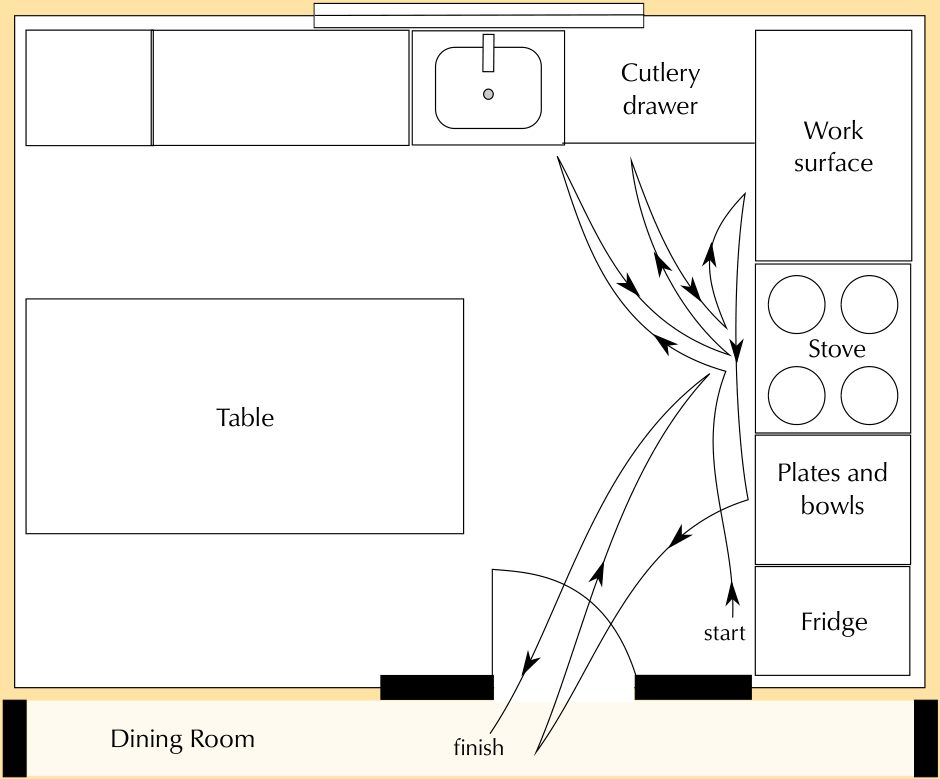

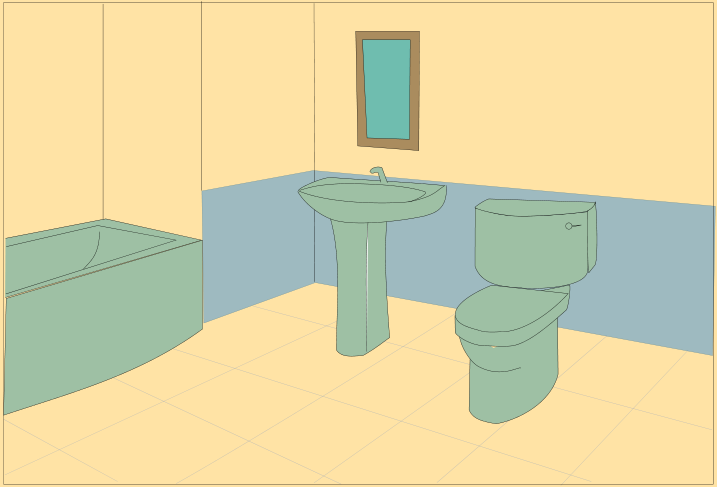

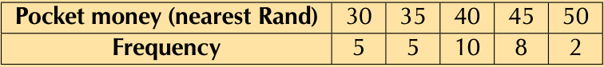
> **[Diagram Context - Textbook_MathematicalLiteracy_Gr10_Data-handling.pdf-0015-00.png]**
> This graphic is a frequency table representing discrete numerical data, with labels for "Pocket money (nearest Rand)" and "Frequency" alongside their corresponding values (30, 35, 40, 45, 50 and 5, 5, 10, 8, 2). It serves as a foundational tool for learners to organize raw data, enabling them to calculate measures of central tendency such as the mean, median, and mode.

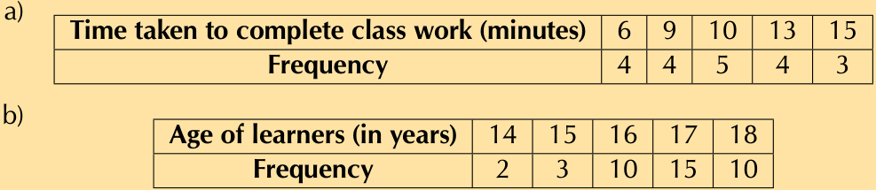
> **[Diagram Context - Textbook_MathematicalLiteracy_Gr10_Data-handling.pdf-0015-02.png]**
> This graphic presents two frequency distribution tables labeled a) and b), which categorize discrete data sets by their respective values and frequencies. Table a) tracks the "Time taken to complete class work (minutes)," while table b) records the "Age of learners (in years)." These tables serve as foundational tools for learners to organize raw data, allowing them to calculate measures of central tendency and dispersion in accordance with the CAPS Data Handling curriculum.

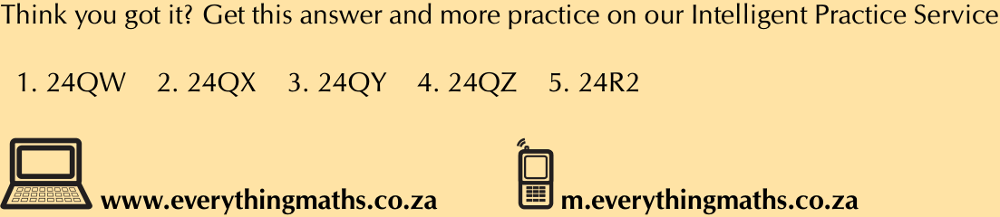
> **[Diagram Context - Textbook_MathematicalLiteracy_Gr10_Data-handling.pdf-0015-03.png]**
> This graphic is a navigational footer for an online educational platform, featuring text-based identifiers (24QW, 24QX, 24QY, 24QZ, 24R2) and icons representing a laptop and a mobile phone. It serves as a digital signpost to direct students toward specific practice exercises on the "Everything Maths" website, facilitating independent revision and self-assessment within the CAPS curriculum.

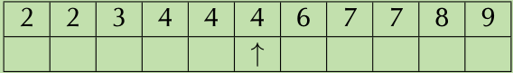
> **[Diagram Context - Textbook_MathematicalLiteracy_Gr10_Data-handling.pdf-0015-15.png]**
> This graphic displays an ordered numerical data set arranged in a table, with an upward-pointing arrow highlighting the central value. The diagram illustrates the process of identifying the median of a data set with an odd number of observations (n=11), where the arrow points to the middle value of 4.

> **[Diagram Context - Textbook_MathematicalLiteracy_Gr10_Scale-maps-and-plans.pdf-0015-02.png]**
> This graphic is a simple 2D illustration of a bedroom setting featuring a wooden bed frame with a blue mattress and an adjacent bedside pedestal. There are no labels, variables, or scientific symbols present in the image. Conceptually, this visual serves as a neutral spatial reference point often used in Mathematics or Physical Sciences problems to contextualize word problems involving geometry, perspective, or basic mechanics.

---

# Chapter 6: Scale, Maps and Plans

## Classroom Plan Exercises

1. How many learners are in this class if there is one learner at each desk?
2. Which learner is sitting to the left of learner K?
3. Which learners are sitting closest to the windows?
4. The scale of this plan is given as $1 : 50$. Using your ruler and calculator, calculate:
    a) The width of the classroom (from the windows to the bookshelf).
    b) The length of the classroom (from the blackboard to the wall behind learners M, N and O).
    c) The width of the teacher’s desk.
5. You sit at desk K. Explain how you would get from the door to your desk, using words like “left, right, in front of” and “behind”.
6. Your friend forgets her bag in the classroom, and asks you to go and fetch it for her. She gives you the following directions: “Walk in through the door and turn right after the second row of desks. Walk past four rows of desks and look to your left, look over the desk next to you. My bag is on the floor.” Where did she leave her bag?

---

## SOLUTION

1. 15 learners.
2. Learner J.
3. Learners D, J and M.
4. a) On the seating plan, the classroom is $10,5 \text{ cm}$ wide.
   $$10,5 \text{ cm} \times 50 = 525 \text{ cm} = 5,25 \text{ m}$$
   b) $$15 \text{ cm} \times 50 = 750 \text{ cm} = 7,5 \text{ m}$$
   c) $$4,5 \text{ cm} \times 50 = 225 \text{ cm} = 2,25 \text{ m}$$
5. Walk in through the door and turn right before desk B. Walk straight down the aisle passing desks E and H on the left. At desk K (behind desk H) turn around to face the blackboard and sit down in the seat.
6. Next to the bookshelf, or next to desk O.

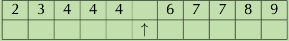
> **[Diagram Context - Textbook_MathematicalLiteracy_Gr10_Data-handling.pdf-0016-08.png]**
> This graphic is a stem-and-leaf plot template containing a numerical data set arranged in ascending order, with an arrow indicating the position of the median. The visible elements include the integers 2, 3, 4, 4, 4, 6, 7, 7, 8, and 9, organized in a grid with a central arrow pointing to the empty space between the values 4 and 6. Conceptually, this illustrates the calculation of the median for a data set with an even number of observations, where the median is the average of the two middle values.

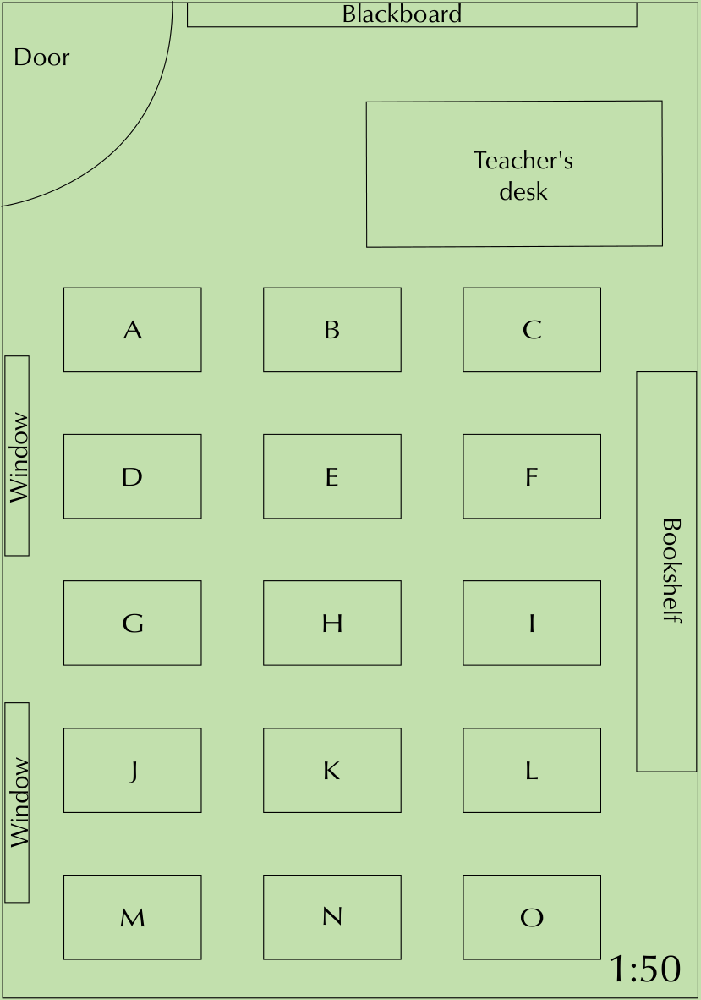
> **[Diagram Context - Textbook_MathematicalLiteracy_Gr10_Scale-maps-and-plans.pdf-0016-07.png]**
> This graphic is a floor plan diagram representing a classroom layout, labeled with features such as a "Blackboard," "Teacher's desk," "Door," "Windows," "Bookshelf," and a grid of student desks identified by letters A through O. It includes a scale ratio of 1:50, serving as a practical tool for learners to understand spatial orientation, scale drawing, and the application of geometric principles in real-world architectural or interior design contexts.

---

# Activity 6 – 6: Using the bar scale and directional navigation on a school ground plan

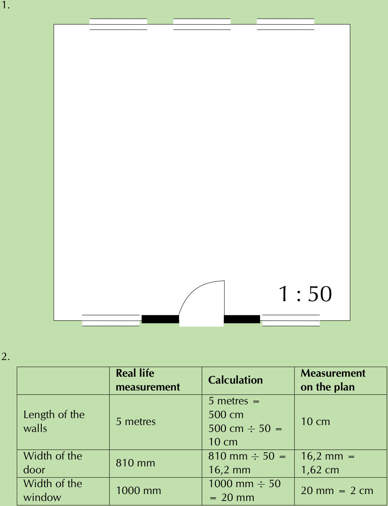

### Understanding the Map
The diagram above represents a school ground plan. It includes various facilities such as the school hall, toilets, a tuckshop, a tree, and a large sports field. 

The classrooms are divided into two blocks:
*   **Science classrooms (A):** Labeled A1, A2, A3, and A4.
*   **Maths classrooms (B):** Labeled B1, B2, and B3.

### Scale
The plan provides a bar scale to help determine actual real-world distances:
*   The first segment represents $10\text{ m}$.
*   The total length of the bar represents $20\text{ m}$.

---

### Exercises

1. Measure the width and length of the sports field in $\text{mm}$ using your ruler on the printed page.

2. Use the bar scale provided on the map to estimate the real (actual) width and length of the field in metres ($m$).

3. What subject would you be studying if you are in classroom A3?

4. What subject is taught in the classrooms that are next to the hall and face the sports fields?

5. Tebogo, a new learner, has started at your school. You are in the Science classroom, A1, when the break bell rings. Explain to Tebogo how to get to the tuckshop using directional instructions based on the plan.

---

#### Online Practice
Think you got it? Get the answers and more practice on the Intelligent Practice Service by using the following codes:

1. **24JY**
2. **24JZ**
3. **24K2**
4. **24K3**
5. **24K4**

Visit: [www.everythingmaths.co.za](http://www.everythingmaths.co.za) or [m.everythingmaths.co.za](http://m.everythingmaths.co.za)

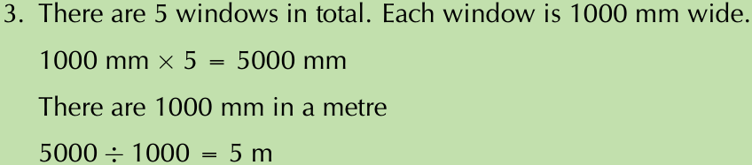

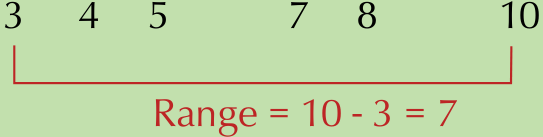
> **[Diagram Context - Textbook_MathematicalLiteracy_Gr10_Data-handling.pdf-0017-12.png]**
> This graphic illustrates the calculation of the range for a set of numerical data, featuring the values 3, 4, 5, 7, 8, and 10 with a bracket connecting the minimum (3) and maximum (10). It demonstrates the statistical concept of range as the difference between the highest and lowest values in a data set, providing a clear visual aid for learners to identify the spread of data.

---

# Worked example 8: Understanding a cinema seating plan

## QUESTION

Study the cinema seating plan below and answer the questions that follow:

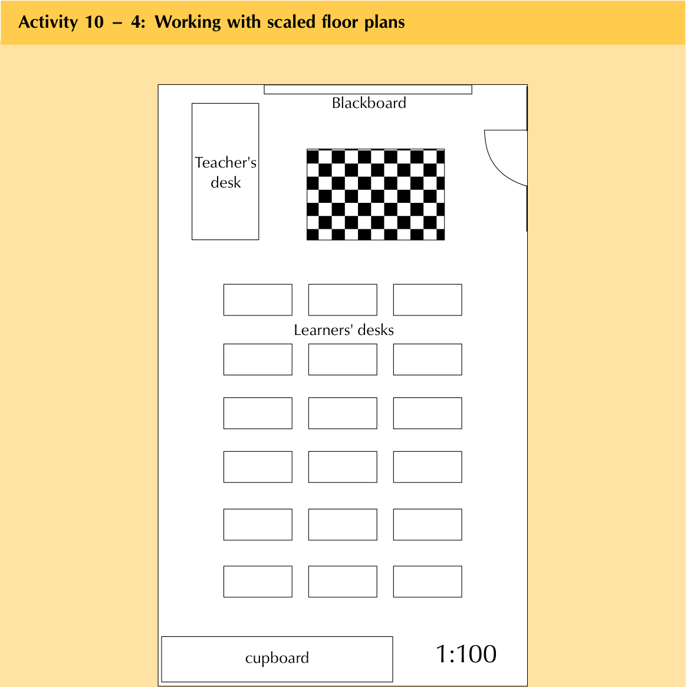

### Legend
| Color | Status |
| :--- | :--- |
| Blue | Available |
| Red | Booked |
| Pink | Unavailable |
| Purple | Wheelchair |

1. If you wanted to book seats for a movie, which seats would you want to sit in?
2. Are seats N 11 and N 12 available?
3. Which seats offer you and your classmates a best view and why?
4. You are going to the movies with a friend in a wheelchair. Name one seat where they can sit, and the seat next to it where you can sit with them?
5. Where will you sit if you want to have a front view of the screen?
6. What fraction of row N has been booked?
7. What percentage of the theatre is still available?

---

## SOLUTION

1. For example: L8 and L9
2. No. They are booked.
3. Middle section because, it is not too close nor too far, from the screen.
4. For example, friend could sit in the wheelchair seat next to D1, and you could sit in D1.
5. Row A.
6. $\frac{5}{24}$
7. $211 \div 234 \times 100 = 90,17 \approx 90\%$

> **[Diagram Context - Textbook_MathematicalLiteracy_Gr10_Data-handling.pdf-0018-04.png]**
> This photograph depicts a group of female athletes participating in a cross-country running race, featuring visible race bib numbers such as 88, 9, 37, 14, 2, and 23. In the context of Physical Sciences or Life Sciences, this image serves as a real-world application for calculating average speed, velocity, and acceleration, or for discussing the physiological demands of aerobic and anaerobic respiration during sustained physical exertion.

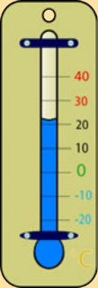
> **[Diagram Context - Textbook_MathematicalLiteracy_Gr10_Data-handling.pdf-0018-07.png]**
> This graphic depicts a liquid-in-glass thermometer featuring a vertical scale marked in degrees Celsius (°C) ranging from -20 to 40. It illustrates the physical principle of thermal expansion, where the rising or falling level of the blue liquid provides a quantitative measurement of ambient temperature.

> **[Diagram Context - Textbook_MathematicalLiteracy_Gr10_Scale-maps-and-plans.pdf-0018-01.png]**
> This graphic is a two-dimensional floor plan or map of a school layout, featuring labels for the School hall, Toilets, Tuckshop, Tree, Sports field, and classroom blocks labeled A1-A4 and B1-B3. It includes a linear scale bar (0m, 10m, 20m) to represent spatial dimensions. This diagram helps students practice map-reading skills, such as interpreting spatial relationships, identifying landmarks, and using a scale to estimate real-world distances between school facilities.

---

# Activity 6 – 7: Understanding a Stadium Seating Plan

### 6.3 Maps, Directions, Seating, and Floor Plans

Study the plan of a rugby stadium below, and answer the questions below:

1. Using words such as "near to" and "in the middle of", describe the position of a player standing at the point marked **X**.
2. Why do you think the seats are categorised?
3. Describe the position of the stand that contains the most Category 3 seats.
4. If you are standing at Point **Y**, what is the quickest way to get to the South Stand Ramp seating?
5. Describe the position of the hot dog stand at Point **Z**.
6. Your friend is at the hot dog stand (at **Z**). Explain to him how to find you if you are seated in a Category 5 seat, Block A.
7. The width of the rugby field is $70\text{ m}$ and the length is $144\text{ m}$. Draw a scale drawing of the rugby field using the number scale $1 : 1000$.

---

### Intelligent Practice Service

**Think you got it? Get this answer and more practice on our Intelligent Practice Service.**

| Question | Code |
| :--- | :--- |
| 1 | 24K5 |
| 2 | 24K6 |
| 3 | 24K7 |
| 4 | 24K8 |
| 5 | 24K9 |
| 6 | 24KB |
| 7 | 24KC |

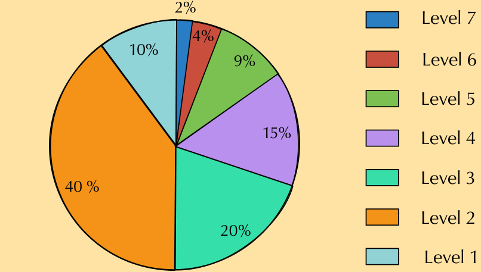
> **[Diagram Context - Textbook_MathematicalLiteracy_Gr10_Data-handling.pdf-0019-10.png]**
> This pie chart displays the percentage distribution of seven distinct performance categories, labeled "Level 1" through "Level 7," using color-coded sectors. It serves as a visual tool for learners to analyze frequency data, illustrating how a whole population or dataset is partitioned into hierarchical achievement levels.

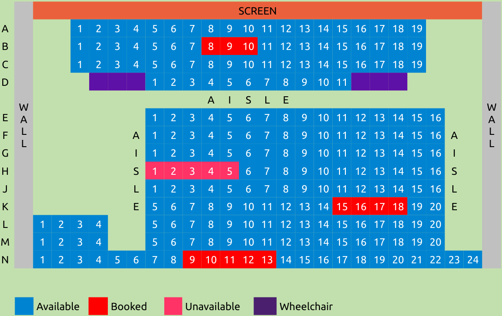
> **[Diagram Context - Textbook_MathematicalLiteracy_Gr10_Scale-maps-and-plans.pdf-0019-03.png]**
> This graphic is a two-dimensional seating plan for a cinema or auditorium, using a grid system labeled with rows (A-N) and seat numbers (1-24). The legend utilizes color-coding to distinguish between "Available," "Booked," "Unavailable," and "Wheelchair" access seats. This diagram serves as a practical application of coordinate geometry and data interpretation, requiring students to locate specific positions and analyze spatial distribution within a defined area.

---

# Chapter 6: Scale, maps and plans

We will study floor plans and symbols in more detail in Chapter 10, but for the next worked example it is important to understand that symbols are often used on maps as a short-hand way of representing information. Some symbols that you may be familiar with are:

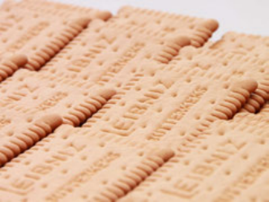

### Worked example 9: Finding our way in a shopping mall

#### QUESTION

Study the map of the shopping centre below and answer the questions that follow:

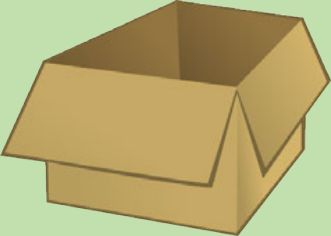

1. Why do you think Checkers and Pick ‘n Pay are the same colour?
2. Between which two shops would you find the escalator?
3. If you want to go to the gym which entrance would you use? Explain why.
4. Is the gym on the ground floor? Explain.
5. If you are the owner of a store, what number shop would you choose for your shop? Explain why.

***

**Page 229**

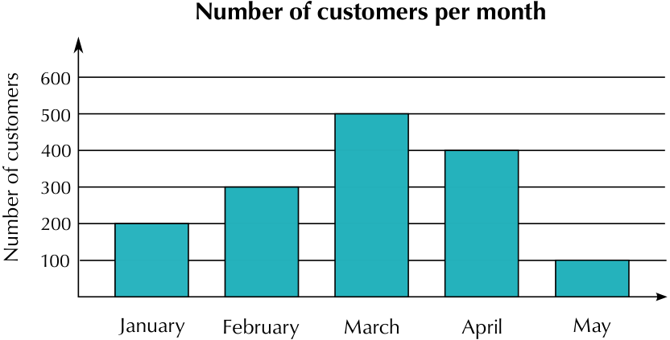
> **[Diagram Context - Textbook_MathematicalLiteracy_Gr10_Data-handling.pdf-0020-06.png]**
> This bar graph displays the "Number of customers per month," featuring a vertical axis labeled "Number of customers" (ranging from 100 to 600) and a horizontal axis representing the months from January to May. It serves as a foundational tool for learners to practice data interpretation, allowing them to compare discrete numerical values across different time periods to identify trends or fluctuations in business activity.

> **[Diagram Context - Textbook_MathematicalLiteracy_Gr10_Scale-maps-and-plans.pdf-0020-02.png]**
> This diagram is a stadium seating plan representing a spatial data layout, featuring a central sports field surrounded by labeled stands (North, South, East, West) divided into levels and lettered blocks. It utilizes a color-coded legend (Categories 1–7) and specific markers (X, Y, Z, big screen, scholar enclosures) to organize information. For high school learners, this serves as an exercise in interpreting complex technical plans, requiring them to synthesize spatial orientation with categorical data to locate specific information or solve logistical problems.

---

# 6.3 Maps, Directions, Seating, and Floor Plans

Interpreting floor plans is a vital skill in Mathematical Literacy. It involves understanding symbols, identifying levels, calculating distances, and providing clear navigational instructions.

## Activity: Analyzing a Shopping Centre Map

### Questions
6. Which entrance would you go to, to use a public phone?
7. By which entrances can disabled parking be found?
8. Give a possible reason for why this shopping centre has 4 ATMs.
9. Explain where the kiosks are situated.
10. You enter the shopping centre at entrance G3. You need to withdraw money from the ATM machine at shop number 32a. Give directions to explain how you would get there.

---

## Solutions and Explanations

The following solutions provide the reasoning and procedures for interpreting the shopping centre layout.

1. **Store Categorization:** The stores are placed in specific locations because they are the same kind of store — both are large supermarkets.
2. **Relative Position:** The location is between Edgars and shop 20/21.
3. **Optimizing Access:** You could use entrance G3 because it is the closest entry point to the escalators and stairs leading to the gym.
4. **Identifying Levels:** No, the gym is not on the ground floor. The gym logo on the map points to symbols for lifts and stairs, indicating that the facility is located one level up.
5. **Business Location Strategy (Foot Traffic):**
   * Shop 11a is a prime location because it is next door to the entrance of Pick n Pay. This ensures high "foot traffic," meaning many people will see the shop while walking to the supermarket.
   * Shop 36a, located next to Checkers, would be a good choice for the same reason.
6. **Facility Location:** Entrance G2.
7. **Accessibility Features:** Disabled parking is located in the parking lots outside G2 and G3. Note that there is no disabled parking available outside G1.
8. **Banking Variety:** A shopping centre often has multiple ATMs to cater to customers of different banks (e.g., ABSA, FNB, Nedbank, and Standard Bank).
9. **Central Landmarks:** The kiosks are situated in the middle of the mall between shops 5 and 39/40. They are positioned near the main entrance to Edgars and the mall’s information booth.
10. **Step-by-Step Navigational Directions:**
    * Enter at entrance **G3**.
    * Walk straight past shops 15, 14, 13, and 12.
    * Upon reaching shop 20/21, turn **right** before the escalators.
    * Continue straight past Woolworths.
    * Pass the stairs and elevators (which will be on your left).
    * Continue past shops 27, 28, 29, 30, and 31 on your right.
    * The ATM in front of shop 32a will be on your **right**, located just before the public phones and entrance G2.

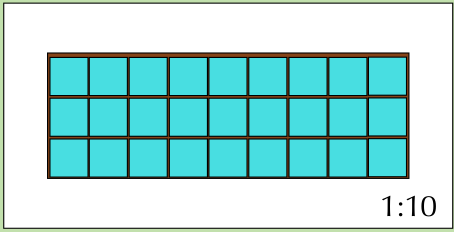

> **[Diagram Context - Textbook_MathematicalLiteracy_Gr10_Scale-maps-and-plans.pdf-0021-03.png]**
> This graphic is a standardized pictogram depicting a person standing on an escalator. It utilizes a simplified human figure and an inclined plane structure to represent the concept of mechanical vertical transport. In a CAPS context, this serves as a functional visual aid for understanding mechanical systems, energy transfer, and the practical application of inclined planes in technology.

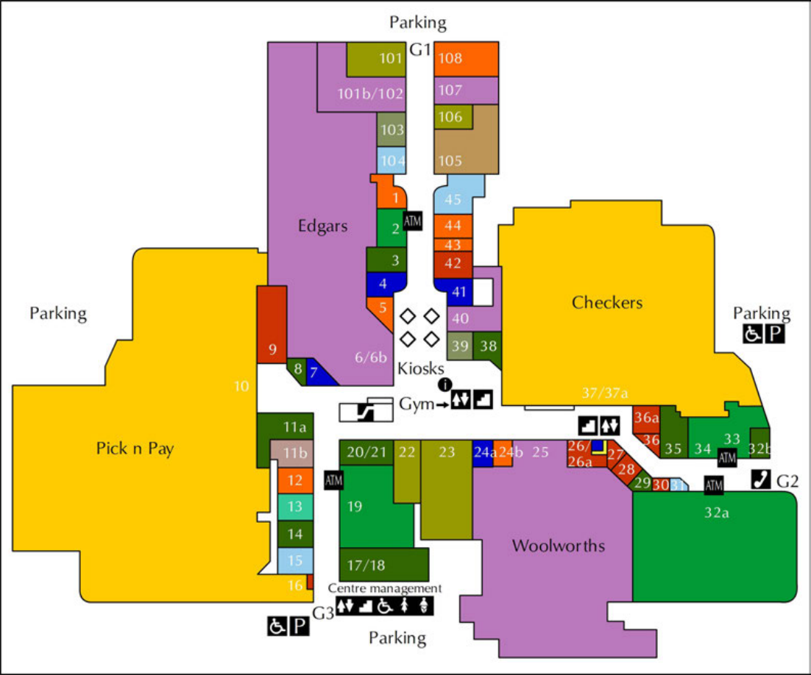
> **[Diagram Context - Textbook_MathematicalLiteracy_Gr10_Scale-maps-and-plans.pdf-0021-11.png]**
> This graphic is a floor plan map of a shopping centre, featuring labelled retail stores (Edgars, Checkers, Pick n Pay, Woolworths), numbered shop units, parking areas, kiosks, and symbols for amenities like ATMs, stairs, and accessibility. It serves as a practical tool for developing spatial reasoning and data interpretation skills, requiring students to navigate, locate specific coordinates, and understand the layout of a complex public space.

---

# Activity 6 – 8: Navigating a shopping mall

Study the map of the ground floor of a shopping centre and answer the questions that follow:

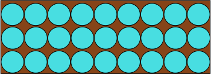

### Questions

1. You want to go to Shop 37 to buy new shoes. What store will you find next to it?
2. What does “G51 Woolworths” mean on this map?
3. Do you think this shopping centre has more than one floor? Explain your answer.
4. Where should you park if you want to go to Fournos bakery and buy some fresh bread?
5. Name the two stores you could buy stationery from and describe how you would get to each of them from Entrance 1.
6. If you are at Entrance 2, explain how you would get to the toilets.
7. You are standing at the entrance of Dis-Chem. Your friend arrives at Entrance 5 and wants to meet you. Give your friend directions to explain where they will find you.

***

### Think you got it?
Get this answer and more practice on our Intelligent Practice Service:

1. 24KD
2. 24KF
3. 24KG
4. 24KH
5. 24KJ
6. 24KK
7. 24KM

**Websites:**
* www.everythingmaths.co.za
* m.everythingmaths.co.za

***
**Chapter 6. Scale, maps and plans | 231**

---

# 6.4 End of chapter activity

## Activity 6 – 9: End of chapter activity

1. Study the scale diagram below and answer the questions that follow.

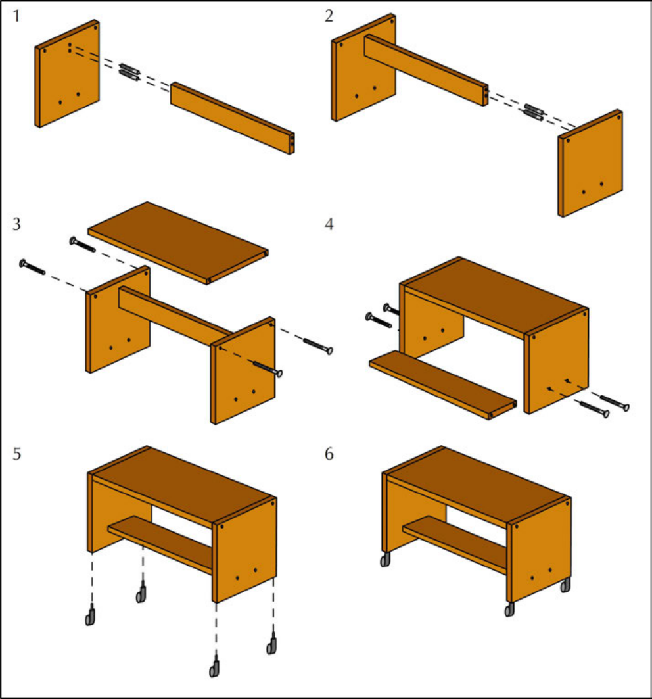

**Scale: $1 : 30$**

a) Using the number scale estimate the actual (real) size in metres of:
   i. the dining room table.
   ii. the chairs.
   iii. the cupboard.

b) Using the number scale estimate the actual (real) size of the dimensions of the room in metres.

c) Explain where the door to the room is.

d) Is it possible to calculate how high the windows are? Explain your answer.

e) Calculate the width of curtaining that will be required for both windows (in cm). The width of the material required should be twice the width of the window.

f) Rearrange the furniture in this room. To help you, you can redraw and cut out the same size shapes. Draw the basic structure of the room (the walls, windows and door) in your books. Use the shapes you cut out to show your new room design. Paste them onto your room plan when you are happy with your design. You may also include some pictures from magazines to show what kind of furniture and accessories you would like in your room.

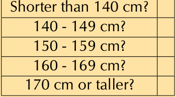
> **[Diagram Context - Textbook_MathematicalLiteracy_Gr10_Data-handling.pdf-0023-09.png]**
> This image is a frequency distribution table template featuring five distinct height intervals ranging from "shorter than 140 cm" to "170 cm or taller." It serves as a data collection tool for learners to record the frequency of grouped data, facilitating the organization of continuous numerical variables into manageable classes for statistical analysis.

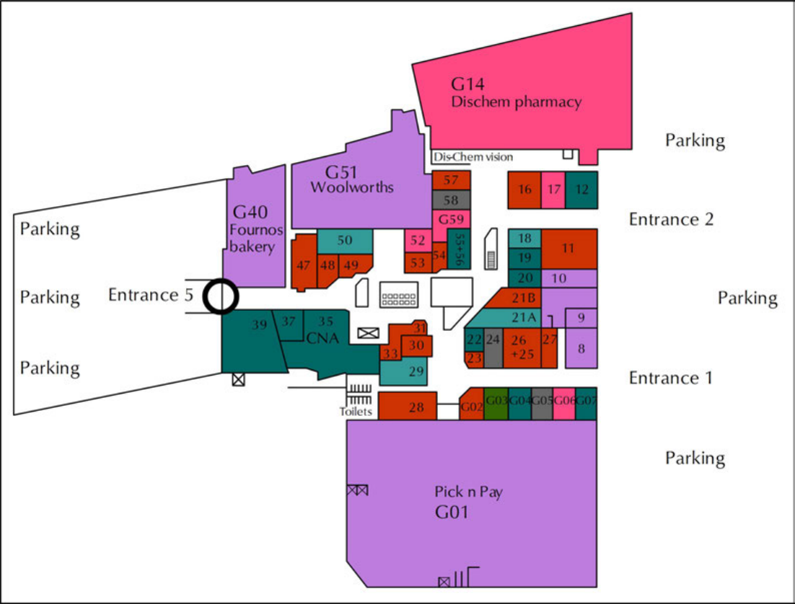
> **[Diagram Context - Textbook_MathematicalLiteracy_Gr10_Scale-maps-and-plans.pdf-0023-02.png]**
> This graphic is a floor plan map of a shopping centre, featuring labelled retail units (e.g., G14 Dischem, G51 Woolworths, G01 Pick n Pay), numbered store locations, parking areas, and designated entrances. It serves as a practical tool for teaching spatial reasoning and data interpretation, requiring students to locate specific points, identify relative positions, and navigate a complex layout using a coordinate-like system.

---

# Chapter 6: Scale, Maps and Plans

g) A carpet measures $1,8\text{ m}$ by $1,2\text{ m}$.

i. Using the scale $1 : 30$, draw a scale version of the carpet.
ii. Will the carpet fit into the room in Question 1? Explain your answer.

---

2. The following diagram shows a walled day care facility. Answer the questions that follow.

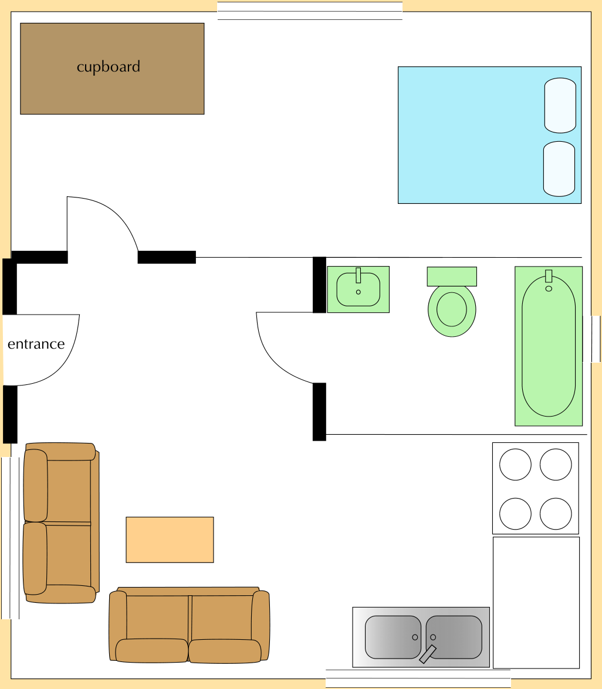

a) Use the bar scale to estimate the actual (real) size in metres of:
   i. the swimming pool.
   ii. the daycare centre.
   iii. the lawn.

b) Health and safety regulations require that the swimming pool has a fence around it. The fence must be a minimum of $1,5\text{ m}$ from the pool. The fence must run from the left boundary wall (between the pool and playground) around the bottom of the pool, and then between the pool and the lawn, to the top boundary wall (i.e. it goes around the bottom and the right side of the pool). Calculate the minimum amount of fencing required.

c) Describe the position of the swimming pool in relation to the other buildings.

d) Where would you plan to dig a flower bed for the day care facility? Explain why.

e) Would a room with the dimensions $7\text{ m} \times 11\text{ m}$ fit inside the community hall? Use your calculations to justify your answer.

***

**Page 233**

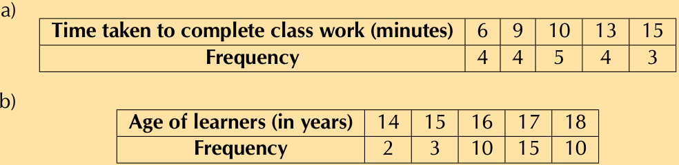
> **[Diagram Context - Textbook_MathematicalLiteracy_Gr10_Data-handling.pdf-0024-17.png]**
> This graphic presents two frequency distribution tables, labeled (a) and (b), which display discrete data sets categorized by "Time taken to complete class work (minutes)" and "Age of learners (in years)" alongside their respective frequencies. These tables serve as foundational tools for learners to organize raw data, enabling them to calculate measures of central tendency and dispersion, such as the mean, median, and mode, as required by the CAPS Mathematics curriculum.

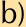

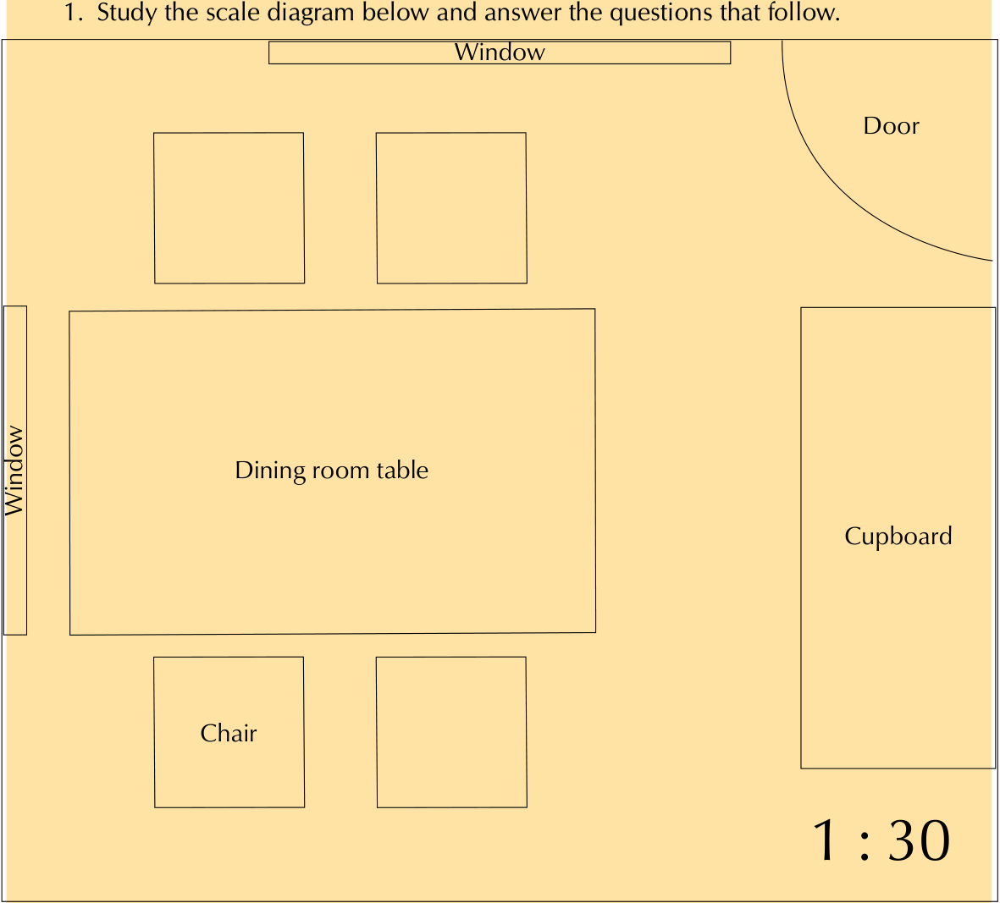
> **[Diagram Context - Textbook_MathematicalLiteracy_Gr10_Scale-maps-and-plans.pdf-0024-03.png]**
> This graphic is a two-dimensional floor plan representing a dining room layout, featuring labels for "Window," "Door," "Dining room table," "Chair," and "Cupboard," along with a scale ratio of 1:30. It serves as a practical application for Mathematical Literacy learners to practice interpreting scale drawings, calculating real-world dimensions from map measurements, and understanding spatial orientation within a room.

---

f) Describe where you would put a pathway that would link all the facilities together.

---

### 3. Scaling and Mapping a Study Room

You are given the following information about the actual dimensions of a study and the furniture in it:

*   **Room:** $3,6 \text{ m}$ wide and $4,2 \text{ m}$ long
*   **Window:** $1,2 \text{ m}$ wide
*   **Door:** $1,2 \text{ m}$ wide
*   **Desk:** $120 \text{ cm}$ wide and $180 \text{ cm}$ long
*   **Chair:** $60 \text{ cm}$ wide and $60 \text{ cm}$

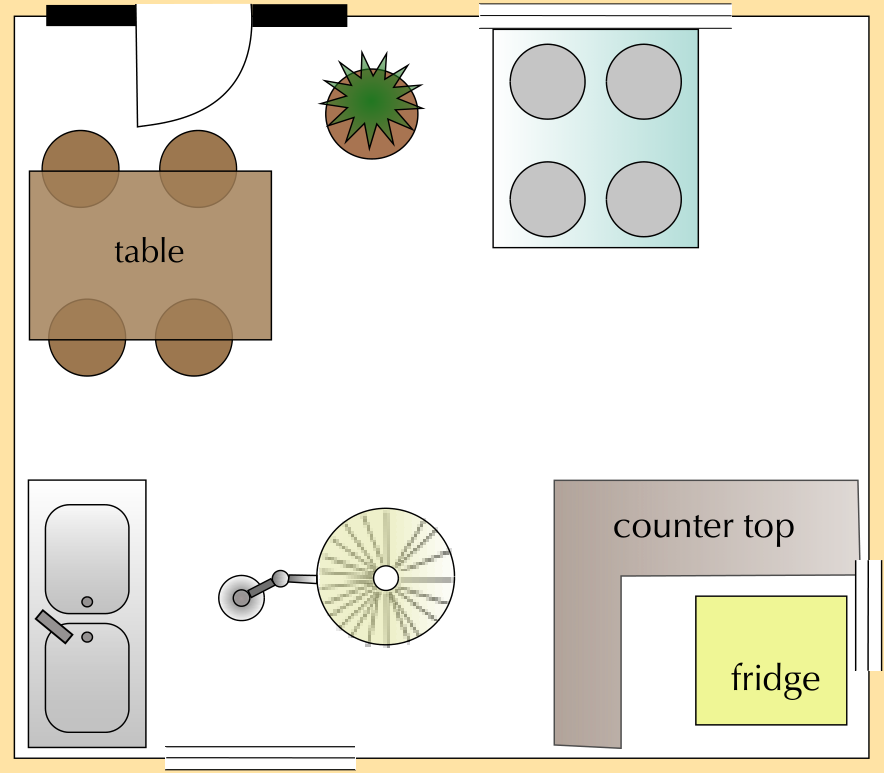

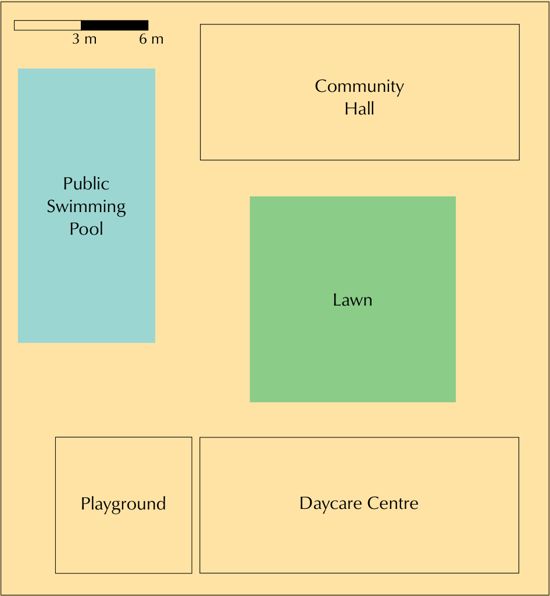
> **[Diagram Context - Textbook_MathematicalLiteracy_Gr10_Scale-maps-and-plans.pdf-0025-04.png]**
> This graphic is a two-dimensional site plan or floor plan featuring a scale bar and labeled areas including a Public Swimming Pool, Community Hall, Lawn, Playground, and Daycare Centre. It serves as an introductory tool for Mathematical Literacy, requiring students to use the provided scale to calculate real-world dimensions, areas, and spatial relationships between the different facilities.

---

# Chapter 6: Scale, maps and plans

## Seating Plans

A seating plan is a type of floor plan that shows the arrangement of seats in a venue such as a theatre, cinema, or stadium. It helps patrons identify their seat location relative to the stage or screen and helps management organize the space.

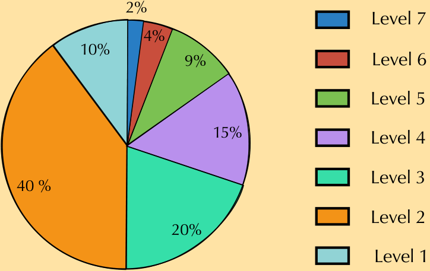
> **[Diagram Context - Textbook_MathematicalLiteracy_Gr10_Data-handling.pdf-0026-05.png]**
> This pie chart illustrates the distribution of academic performance across seven distinct achievement levels, labeled Level 1 through Level 7, with corresponding percentage values for each segment. It provides a visual representation of how a cohort of learners is distributed across the CAPS rating scale, allowing students to analyze the frequency and proportion of results within specific performance bands.

### Figure 6.1: Seating plan for The Hillvale Theatre

The Hillvale Theatre is divided into two primary levels: the **Stalls** (ground level, closest to the stage) and the **Balcony** (elevated level).

#### 1. The Stalls
The Stalls are located directly in front of the stage. Rows are labeled alphabetically from **A** (front) to **J** (back).

| Row | Seat Numbers | Total Seats per Row |
| :--- | :--- | :--- |
| **A** | 1 – 19 | $19$ |
| **B** | 1 – 20 | $20$ |
| **C** | 1 – 20 | $20$ |
| **D** | 1 – 20 | $20$ |
| **E** | 1 – 20 | $20$ |
| **F** | 1 – 20 | $20$ |
| **G** | 1 – 20 | $20$ |
| **H** | 1 – 19 | $19$ |
| **J** | 1 – 18 | $18$ |
| **Total Stalls** | | $176$ |

**Notes on Stalls:**
*   **Entrance 1** and **Entrance 2** are located at the back of the Stalls, on either side of Row J.
*   The seating is continuous across the rows except for the very back row where the entrances are located.

#### 2. The Balcony
The Balcony is situated behind and above the Stalls. Rows are labeled with double letters from **AA** to **FF**.

| Row | Seat Numbers | Total Seats per Row |
| :--- | :--- | :--- |
| **AA** | 1 – 15 and 16 – 19 | $19$ |
| **BB** | 1 – 17 and 18 – 20 | $20$ |
| **CC** | 1 – 15 | $15$ |
| **DD** | 1 – 16 | $16$ |
| **EE** | 1 – 5 | $5$ |
| **FF** | 2 – 6 | $5$ |
| **Total Balcony** | | $80$ |

**Notes on Balcony:**
*   **Entrance 3** provides access to the Balcony level.
*   Rows **AA** and **BB** have physical gaps in the seating (indicated by double lines), likely for aisles or structural pillars.
*   The Balcony tapers significantly towards the back (Rows EE and FF).

---

### Worked Example: Calculating Capacity

**Question:**
Calculate the total seating capacity of The Hillvale Theatre based on the seating plan provided.

**Solution:**
To find the total capacity, add the total seats in the Stalls to the total seats in the Balcony.

$$Total = \text{Stalls Total} + \text{Balcony Total}$$

$$Total = [19 + (6 \times 20) + 19 + 18] + [19 + 20 + 15 + 16 + 5 + 5]$$
$$Total = 176 + 80$$
$$Total = 256$$

The Hillvale Theatre has a total capacity of $256$ seats.

---

### 6.4. End of chapter activity

5. Study the seating plan of the stadium given and answer the questions that follow:

> **[Diagram Context - Textbook_MathematicalLiteracy_Gr10_Data-handling.pdf-0027-02.png]**
> This frequency table displays categorical data with the variables "Colour of T-shirt" (Red, Blue, Green, Yellow) and their corresponding numerical "Frequency" counts. It serves as a foundational tool for learners to organise raw data, enabling them to calculate totals, determine modes, or construct graphical representations like bar charts or pie charts in accordance with the CAPS Data Handling curriculum.

a) Describe where the players would enter onto the field.

b) Are the blocks numbered in a clockwise or anti-clockwise direction?

c) Your seat is in Block $35$. What entrance would you go to to get to your seat?

d) The south entrance is closest to Block $35$. Where is this entrance?

e) How many blocks are there in the purple category?

f) What percentage of the blocks are red?

g) If your friend is sitting in Block $25$ and you are in one of the blue blocks. Describe where you are in relation to your friend.

h) The rugby match starts at $18:30$. The game is $80$ minutes long. Half time is $10$ minutes long.

i. What time will the match finish? (Assuming there is no over time)
ii. The sun sets at $6:45$ p.m. behind the main entrance. Where will you be sitting if you are looking into the sun during the game?

i) You are given the following ticket prices for an upcoming rugby match:

| Block Color | Ticket Price |
| :--- | :--- |
| Orange | $R250$ |
| Blue | $R300$ |
| Red | $R450$ |
| Purple | $R200$ |

i. Which are the cheapest seats?
ii. You are going to buy $3$ tickets for yourself and your friends in the blue category. How much will this cost?

***

**Page 236**

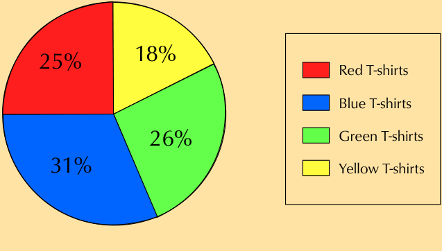
> **[Diagram Context - Textbook_MathematicalLiteracy_Gr10_Data-handling.pdf-0027-06.png]**
> This graphic is a pie chart representing the proportional distribution of four categories of T-shirts, labeled as Red (25%), Blue (31%), Green (26%), and Yellow (18%). It serves as a visual tool for learners to interpret data sets by comparing the relative sizes of sectors, demonstrating how percentages of a whole are represented in a circular format.

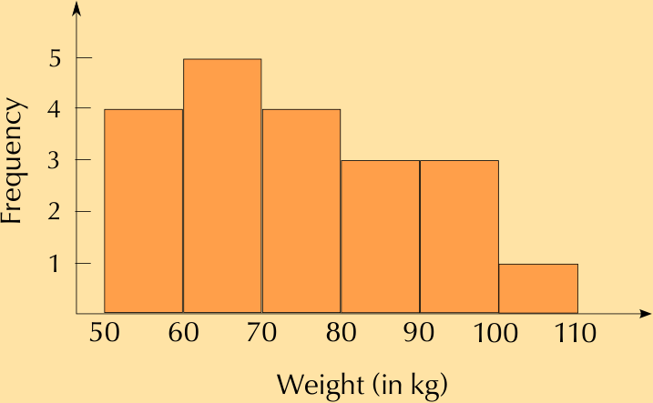
> **[Diagram Context - Textbook_MathematicalLiteracy_Gr10_Data-handling.pdf-0027-14.png]**
> This histogram displays the distribution of data with "Frequency" on the vertical axis and "Weight (in kg)" on the horizontal axis, using intervals of 10 kg ranging from 50 to 110. It illustrates how to represent grouped continuous data visually, allowing learners to identify the modal class and observe the overall distribution pattern of the weight measurements.

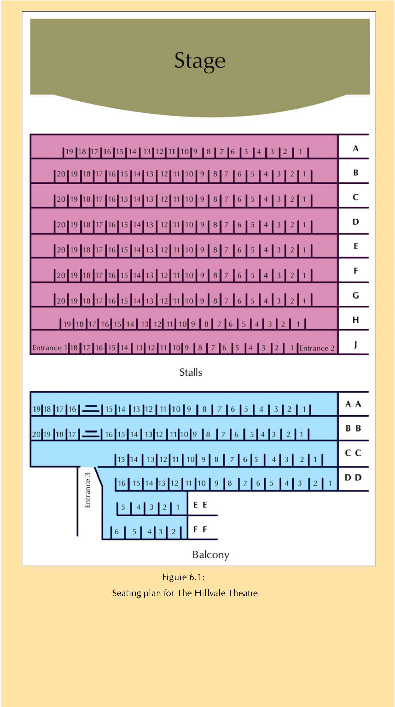
> **[Diagram Context - Textbook_MathematicalLiteracy_Gr10_Scale-maps-and-plans.pdf-0027-00.png]**
> This diagram is a theatre seating plan representing a coordinate-based spatial layout divided into "Stalls" (rows A-J) and "Balcony" (rows AA-FF). It utilizes alphanumeric labels for rows and numerical labels for individual seats, alongside designated entry points, to illustrate how to navigate and interpret structured data in a real-world context. This visual aid supports Mathematical Literacy learners in developing spatial reasoning and data retrieval skills by requiring them to locate specific positions within a two-dimensional grid.

---

### Chapter 6: Scale, Maps and Plans

#### Exercise: Map Interpretation

iii. You decide that 3 tickets in the blue category is going to be too expensive and you'd rather sit in the orange stalls. How much will three orange category tickets cost?

6. Study the shopping mall map below and answer the questions that follow:

**Questions:**

a) What would you expect to be able to do in shop 148?

b) How many 'baby changing rooms' are there on the lower level and where are they?

c) Describe how you would get from Entrance 4 to Truworths.

d) Near which entrance would you park if you wanted to shop at Shoprite Checkers and Ackermans?

e) What would be a good meeting point for you and your friends? Explain your answer.

f) Give three reasons why you would assume that this is a multi-level shopping centre.

***

#### Intelligent Practice Service

Think you got it? Get this answer and more practice on our Intelligent Practice Service by using the following codes:

1. 24KN
2. 24KP
3. 24KQ
4. 24KR
5. 24KS
6. 24KT
7. 24KV

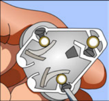

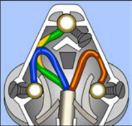

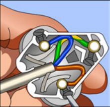

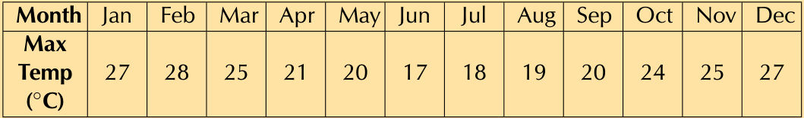
> **[Diagram Context - Textbook_MathematicalLiteracy_Gr10_Data-handling.pdf-0028-01.png]**
> This data table displays the average maximum monthly temperatures in degrees Celsius (°C) across a calendar year. It provides a structured dataset that allows students to identify seasonal trends, calculate measures of central tendency, or plot the information as a line graph to visualize climatic fluctuations.

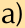

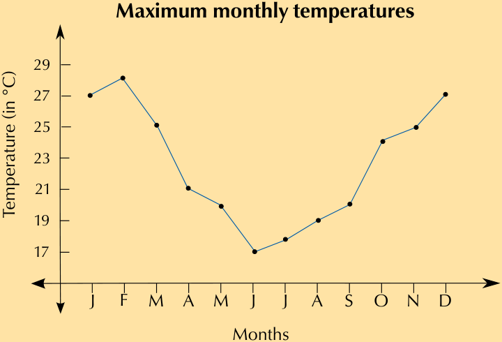
> **[Diagram Context - Textbook_MathematicalLiteracy_Gr10_Data-handling.pdf-0028-06.png]**
> This line graph displays the maximum monthly temperatures over a calendar year, with the y-axis representing temperature in degrees Celsius and the x-axis representing the twelve months of the year. It illustrates seasonal climate trends, allowing students to identify the peak summer temperatures and the mid-year winter decline characteristic of a Southern Hemisphere climate.

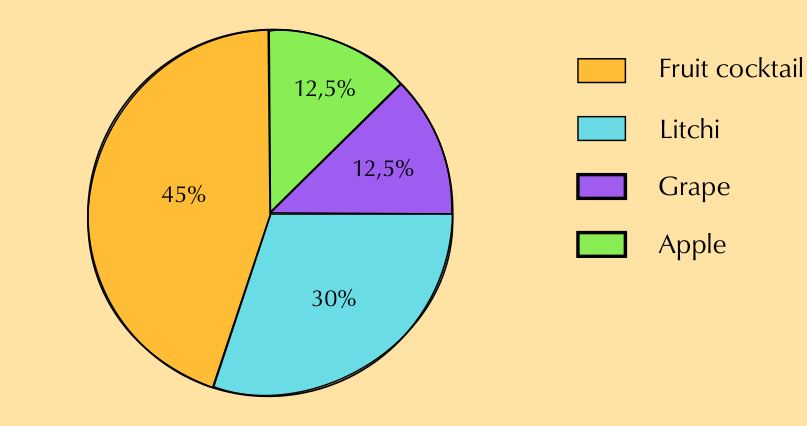
> **[Diagram Context - Textbook_MathematicalLiteracy_Gr10_Data-handling.pdf-0028-10.png]**
> This pie chart displays the percentage distribution of four fruit categories: Fruit cocktail (45%), Litchi (30%), Grape (12,5%), and Apple (12,5%). It serves as a visual tool for learners to interpret proportional data and understand how parts of a whole are represented through distinct sectors and percentages.

> **[Diagram Context - Textbook_MathematicalLiteracy_Gr10_Scale-maps-and-plans.pdf-0028-01.png]**
> This diagram is a top-down schematic map of a sports stadium, featuring a central pitch marked with "22m," "50m," "North," "South," "East," and "West" labels, surrounded by color-coded seating blocks numbered 1 through 71. It also identifies key access points, including the "Main," "North," "East," and "South" entrances and a "Tunnel." This visual serves as a practical application of spatial reasoning and coordinate mapping, helping students interpret scale, orientation, and data organization within a real-world architectural layout.

---

# CHAPTER 6
# Scale, maps and plans

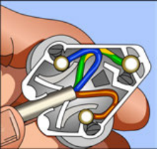

### Chapter Overview

This chapter covers the essential skills required to interpret and use different types of scales, navigate using maps and directions, and understand various types of plans used in real-world contexts.

| Section | Topic | Page |
| :--- | :--- | :--- |
| **6.2** | Number and bar scales | 126 |
| **6.3** | Maps, directions, seating and floor plans | 130 |
| **6.4** | End of chapter activity | 135 |

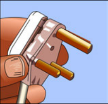

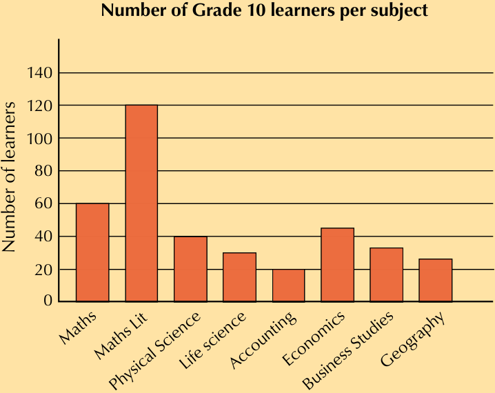
> **[Diagram Context - Textbook_MathematicalLiteracy_Gr10_Data-handling.pdf-0029-05.png]**
> This bar graph displays the distribution of Grade 10 learners across eight subjects, with the y-axis representing the "Number of learners" and the x-axis listing subjects including Maths, Maths Lit, Physical Science, Life science, Accounting, Economics, Business Studies, and Geography. It serves as a foundational tool for data handling, allowing learners to compare categorical frequencies and interpret numerical trends within a school dataset.

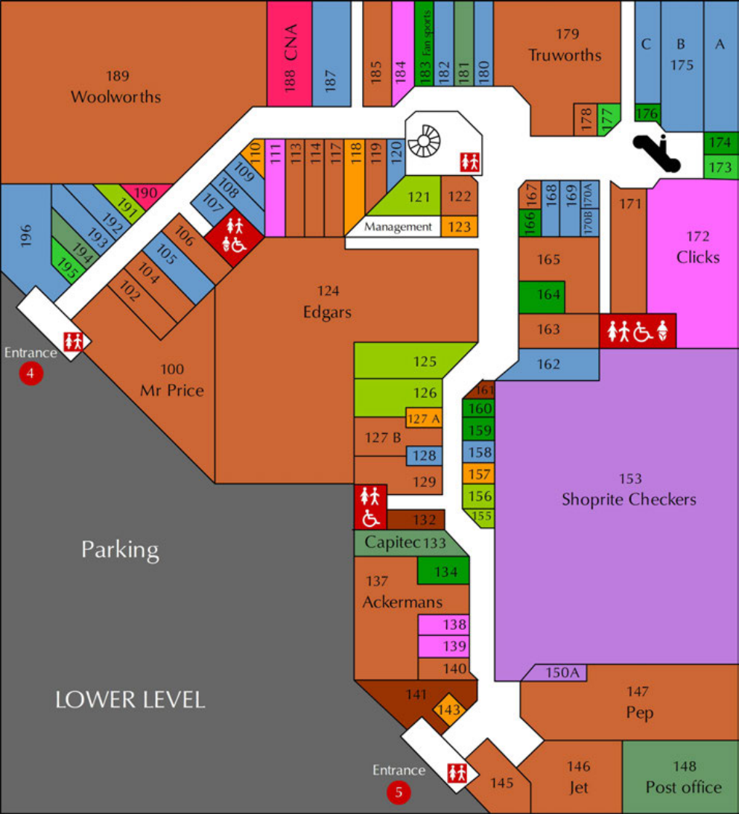
> **[Diagram Context - Textbook_MathematicalLiteracy_Gr10_Scale-maps-and-plans.pdf-0029-02.png]**
> This graphic is a two-dimensional floor plan of a shopping centre, featuring labelled retail units, designated entrances, parking areas, and universal icons for facilities like restrooms and escalators. It serves as a practical application of spatial reasoning and data interpretation, helping students understand how to navigate complex environments by identifying specific locations and symbols within a structured layout.

---

# 6 Scale, maps and plans

## 6.2 Number and bar scales

---

### Activity 6 – 1: Using the bar and number scales

1. You measure the distance between two building on a map to be of $5\text{ cm}$. If the map has a number scale of $1 : 100$, what is the actual distance on the ground?

   **Solution:**
   $$5\text{ cm} \times 100 = 500\text{ cm} = 5\text{ m}$$

2. You are given a map with the number scale $1 : 20$. you measure a distance of $12\text{ cm}$ on the map. What is the actual distance in real life?

   **Solution:**
   $$12\text{ cm} \times 20 = 240\text{ cm} = 2,4\text{ m.}$$

3. You measure a distance of $10\text{ cm}$ on a map with the following bar scale:

   

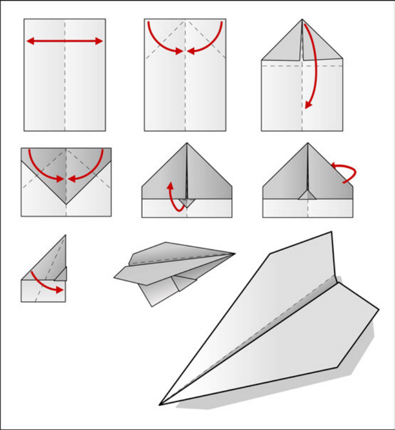

   ($1\text{ cm} = 15\text{ m}$). What is the actual distance on the ground?

   **Solution:**
   $$10\text{ cm} \div 1\text{ cm} = 10\text{ segments. } 10\text{ segments} \times 15\text{ m} = 150\text{ m}$$

4. You measure a distance of $15\text{ cm}$ on a map with the following bar scale:

   <!-- DIAGRAM_PLACEHOLDER: Bar scale with segments marked at 0 m, 100 m, and 200 m -->

   ($2\text{ cm} : 100\text{ m}$) What is the actual distance on the ground?

   **Solution:**
   $$15\text{ cm} \div 2\text{ cm} = 7,5\text{ segments. } 7,5\text{ segments} \times 100\text{ m} = 750\text{ m.}$$

---

### Using number and bar scales to measure distance

---

### Activity 6 – 2: Using the number scale

Using the school map and scale given below, measure the drawings and then estimate the following real distances in metres:

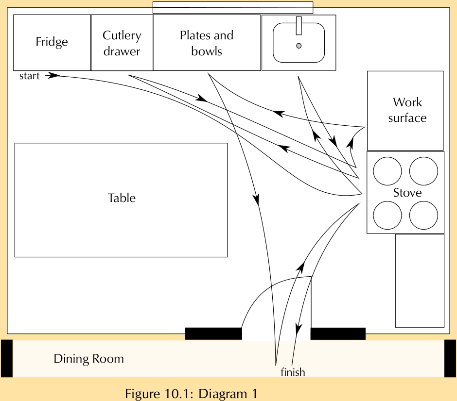

**Scale:** $1 : 500$

---

#### 1. The width and length of the school hall.

**Solution:**
Width and length of the school hall on the map is $5\text{ cm}$. 
$$5\text{ cm} \times 500 = 2500\text{ cm} = 25\text{ m}$$

---

#### 2. The width of the toilet block.

**Solution:**
Width of the toilet block on the map is $2\text{ cm}$. 
$$2\text{ cm} \times 500 = 1000\text{ cm} = 10\text{ m}$$

---

#### 3. The distance between the science and maths buildings.

**Solution:**
Distance between the science and maths buildings on the map is $1\text{ cm}$. 
$$1\text{ cm} \times 500 = 500\text{ cm} = 5\text{ m}$$

---

### Activity 6 – 3: Using the bar scale to estimate actual length

Using the diagram given below, calculate the real life dimensions for:

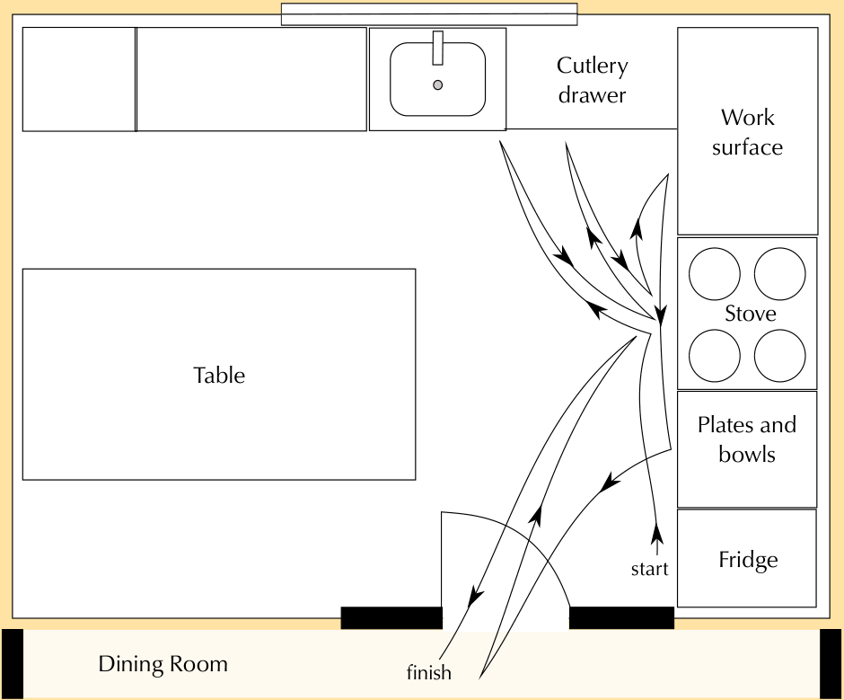

---

#### 1. The length of the bookshelf.

**Solution:**
* $1\text{ cm}$ on a ruler $= 20\text{ cm}$ on the ground.
* $\text{Width of bookshelf} = 7\text{ cm}$.
* $7\text{ cm} \div 1\text{ cm}\text{ (length of segment)} = 7\text{ segments of bar scale}$.
* $7\text{ segments} \times 20\text{ cm} = 140\text{ cm} = 1{,}4\text{ m}$.
* The bookshelf is $1{,}4\text{ m}$ wide.

---

#### 2. The width and length of the chair

**Solution:**
* $1\text{ cm}$ on a ruler $= 20\text{ cm}$ on the ground.
* $\text{Width of chair} = 3{,}5\text{ cm}$.
* $3{,}5\text{ cm} \div 1\text{ cm}\text{ (length of segment)} = 3{,}5\text{ segments of bar scale}$.
* $3{,}5\text{ segments} \times 20\text{ cm} = 70\text{ cm}$.
* $\text{Length of chair} = 4\text{ cm}$.
* $4\text{ cm} \div 1\text{ cm}\text{ (length of segment)} = 4\text{ segments}$.
* $4\text{ segments} \times 20\text{ cm} = 80\text{ cm}$.

---

#### 3. The length of each of the windows.

**Solution:**
* $1\text{ cm}$ on a ruler $= 20\text{ cm}$ on the ground.
* $\text{Length of left hand window} = 5\text{ cm}$.
* $5\text{ cm} \div 1\text{ cm}\text{ (length of segment)} = 5\text{ segments of bar scale}$.
* $5\text{ segments} \times 20\text{ cm} = 100\text{ cm} = 1\text{ m}$.
* $\text{Length of bottom window} = 7\text{ cm}$.
* $7\text{ cm} \div 1\text{ cm}\text{ (length of segment)} = 7\text{ segments of bar scale}$.
* $7\text{ segments} \times 20\text{ cm} = 140\text{ cm} = 1{,}4\text{ m}$.

---

**Section:** 6.2. Number and bar scales

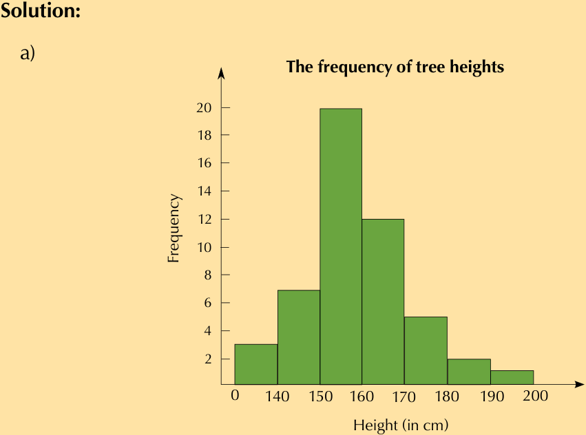
> **[Diagram Context - Textbook_MathematicalLiteracy_Gr10_Data-handling.pdf-0032-00.png]**
> This histogram displays the frequency distribution of tree heights, with the vertical axis representing frequency and the horizontal axis representing height in centimeters (cm). It illustrates the concept of continuous data variation, showing how most trees cluster around a central height range, which is a fundamental principle for understanding normal distribution in statistics.

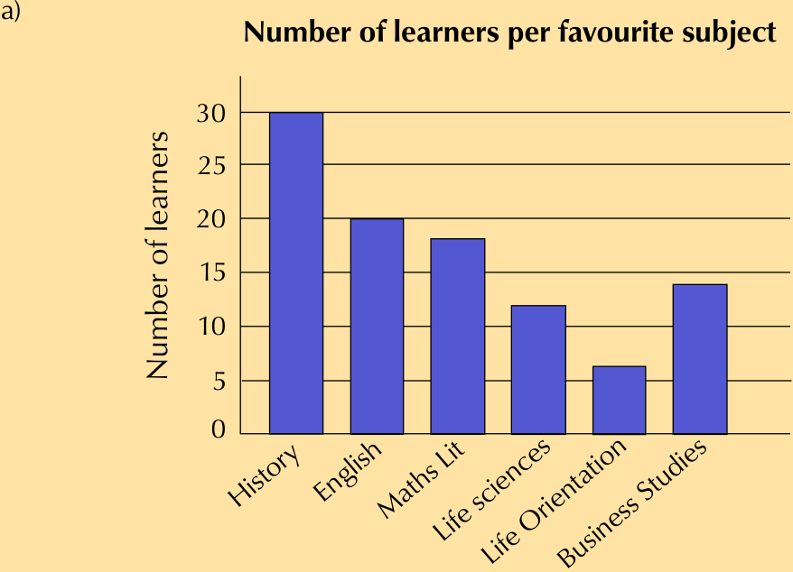
> **[Diagram Context - Textbook_MathematicalLiteracy_Gr10_Data-handling.pdf-0032-08.png]**
> This bar graph displays categorical data representing the "Number of learners per favourite subject," with the vertical axis labeled "Number of learners" (0–30) and the horizontal axis listing subjects: History, English, Maths Lit, Life sciences, Life Orientation, and Business Studies. It serves as a foundational tool for learners to practice data handling by interpreting frequencies and comparing the popularity of different school subjects visually.

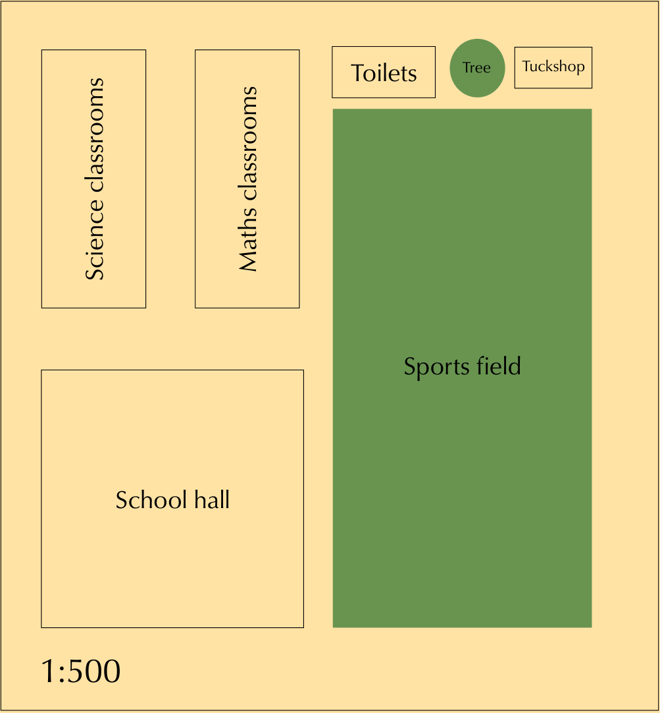
> **[Diagram Context - Textbook_MathematicalLiteracy_Gr10_Scale-maps-and-plans.pdf-0032-02.png]**
> This graphic is a two-dimensional floor plan or site map of a school campus, featuring labels for the "Science classrooms," "Maths classrooms," "Toilets," "Tree," "Tuckshop," "Sports field," and "School hall." It includes a representative scale of 1:500, which serves as a practical application for learners to understand how to interpret scale, calculate real-world distances, and analyze spatial relationships in geography or mathematics.

---

Drawing a scaled map when given real (actual) dimensions
Activity 6 – 4: Drawing a scaled map
1. The bedroom in the picture is 3,5 m by 4 m. It has a standard sized single bed
of 92 cm by 188 cm. The bedside table is 400 mm square. Draw a floor plan to
show the layout of the room. Use the number scale 1 : 50.
Solution:
Room real measurements:
width 3,5 m = 350 cm
length 4 m = 400 cm
Scale drawing:
350 ÷ 50 = 7 cm
400 ÷ 40 = 8 cm
Bed real measurements:
Width = 92 cm
Length = 188 cm
Scale drawing:
92 cm ÷ 50 = 1,84 cm
188 cm ÷ 50 = 3,76 cm
Bedside table real measurements:
400 mm
400 mm ÷ 50 = 8 mm
Scale drawing:
129
Chapter 6.
Scale, maps and plans

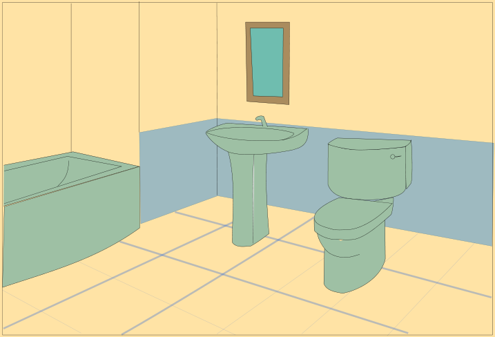

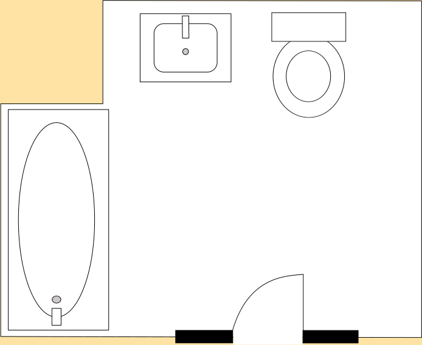

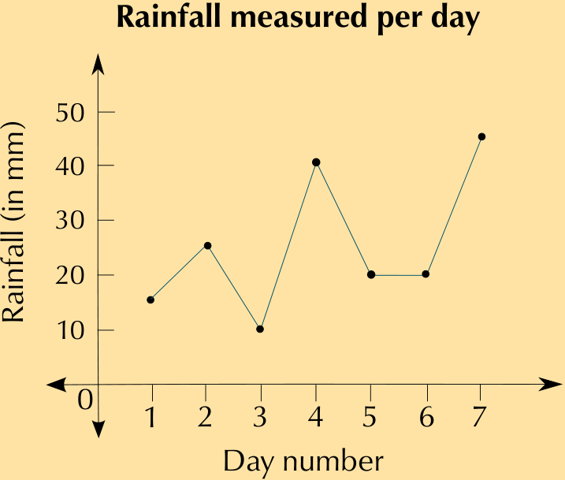
> **[Diagram Context - Textbook_MathematicalLiteracy_Gr10_Data-handling.pdf-0033-14.png]**
> This line graph displays daily rainfall data, featuring a title, a y-axis labeled "Rainfall (in mm)" with a scale of 0–50, and an x-axis labeled "Day number" ranging from 1 to 7. It illustrates how to plot and interpret discrete data points over time, helping learners identify trends, fluctuations, and specific values in environmental data sets.

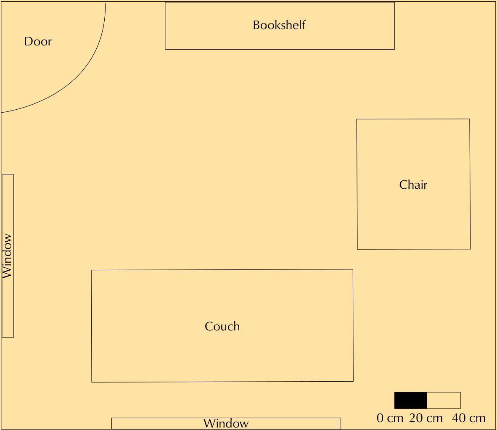
> **[Diagram Context - Textbook_MathematicalLiteracy_Gr10_Scale-maps-and-plans.pdf-0033-02.png]**
> This graphic is a two-dimensional floor plan representing the layout of a room, featuring labels for furniture and architectural elements including a "Door," "Bookshelf," "Chair," "Couch," and two "Windows." It serves as a practical application of scale and spatial reasoning, allowing students to interpret geometric representations of physical space and utilize the provided scale bar to estimate real-world dimensions.

---

bed
bedside
table
1:50
Activity 6 – 5: Drawing scaled maps
1. Divide into groups in order to measure and draw an accurate, scaled floor plan
of your classroom. Use a scale of 1 : 50. You will need to measure all the
large objects (e.g. desks, windows, the blackboard) in the classroom, calculate
what their scaled dimensions will be and then draw them carefully on your floor
plan. Can you think of a different or better way to arrange the furniture in your
classroom?
For this activity, we suggest providing square grid paper for the learners’ to use,
to make the drawing process easier. You will also need to provide measuring
tapes for the learners to use to measure the actual dimensions of the furniture in
the classroom. If the classroom is very large or has lots of furniture, the activity
can be simplified by assigning a section of the classroom to each group, so that
they have less to measure and draw.
Solution:
learner-dependent answer.
6.3
Maps, directions, seating and floor plans
130
6.3.
Maps, directions, seating and floor plans

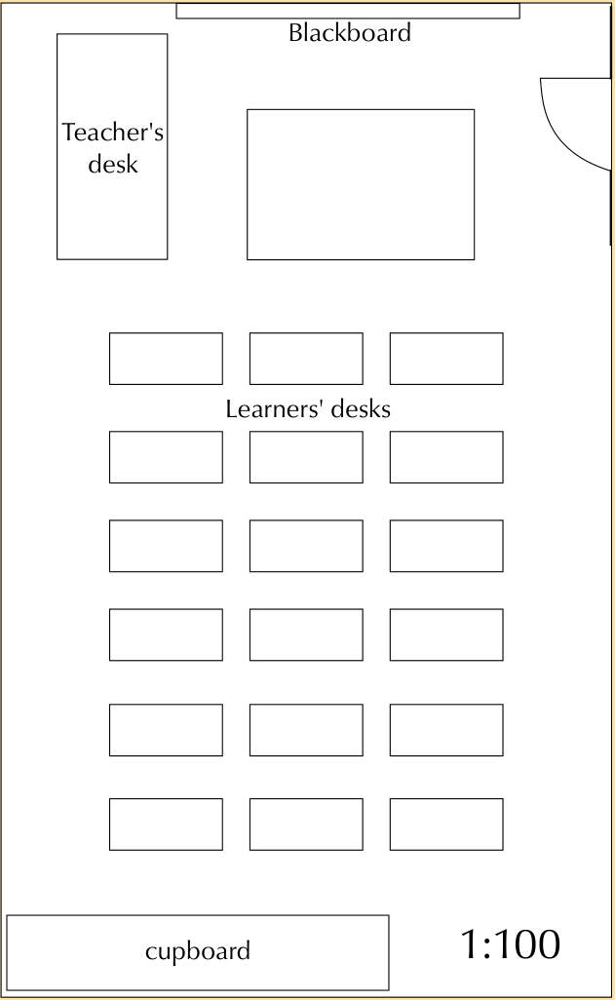

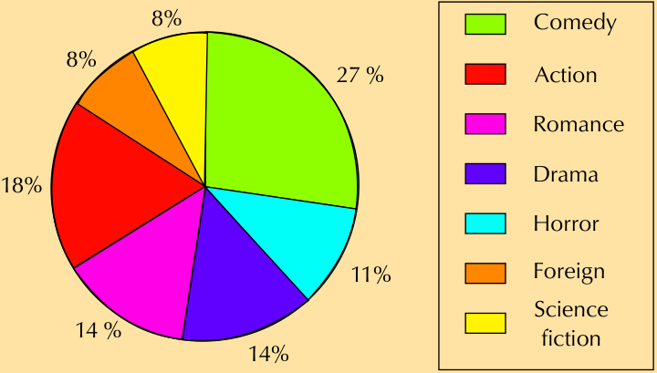
> **[Diagram Context - Textbook_MathematicalLiteracy_Gr10_Data-handling.pdf-0034-01.png]**
> This pie chart displays the percentage distribution of various movie genres, including Comedy, Action, Romance, Drama, Horror, Foreign, and Science fiction. It serves as a visual tool for learners to interpret categorical data, demonstrating how individual parts contribute to a whole dataset of 100%.

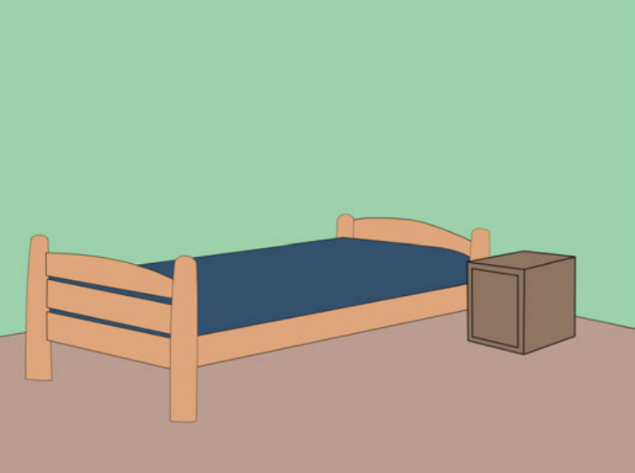
> **[Diagram Context - Textbook_MathematicalLiteracy_Gr10_Scale-maps-and-plans.pdf-0034-03.png]**
> This graphic is a simple 3D perspective illustration of a bedroom scene containing a wooden bed frame with a blue mattress and a bedside pedestal. There are no labels, variables, or text present in the image. Conceptually, this visual serves as a basic spatial representation that can be used in Mathematics or Engineering Graphics and Design (EGD) to practice perspective drawing, volume estimation, or interior layout planning.

---

Activity 6 – 6: Using the bar scale and directional navigation on a school ground
plan
A1
A2
A3
A4
0 m
10 m 
20 m
Sports field
Science classrooms (A)
Maths classrooms (B)
School hall
Tuckshop
Tree
Toilets
B1
B2
B3
1. Measure the width and length of the sports field in mm.
Solution:
Width = 50 mm. Length = 100 mm.
2. Use the bar scale to estimate the real (actual) width and length of the field in
metres.
Solution:
10 mm on ruler = 10 m on the ground. Width = 50 mm. 50 mm ÷ 10 mm
(length of one segment of bar scale) = 5 segments. 5 segments × 10 m = 50 m.
Length = 100 mm. 100 mm ÷ 10 mm (length of 1 segment) = 10 segments. 10
segments × 10 m = 100 m.
3. What subject would you be studying if you are in classroom A3?
Solution:
Science.
4. What subject is taught in the classrooms that are next to the hall and face the
sports fields?
Solution:
Mathematics.
131
Chapter 6.
Scale, maps and plans

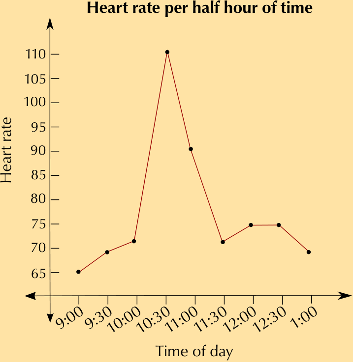
> **[Diagram Context - Textbook_MathematicalLiteracy_Gr10_Data-handling.pdf-0035-05.png]**
> This line graph plots heart rate (beats per minute) against time of day, with the y-axis representing heart rate and the x-axis representing time in half-hour intervals. It illustrates the physiological response of the human heart to changing activity levels, showing a significant spike in heart rate followed by a gradual return to a resting state.

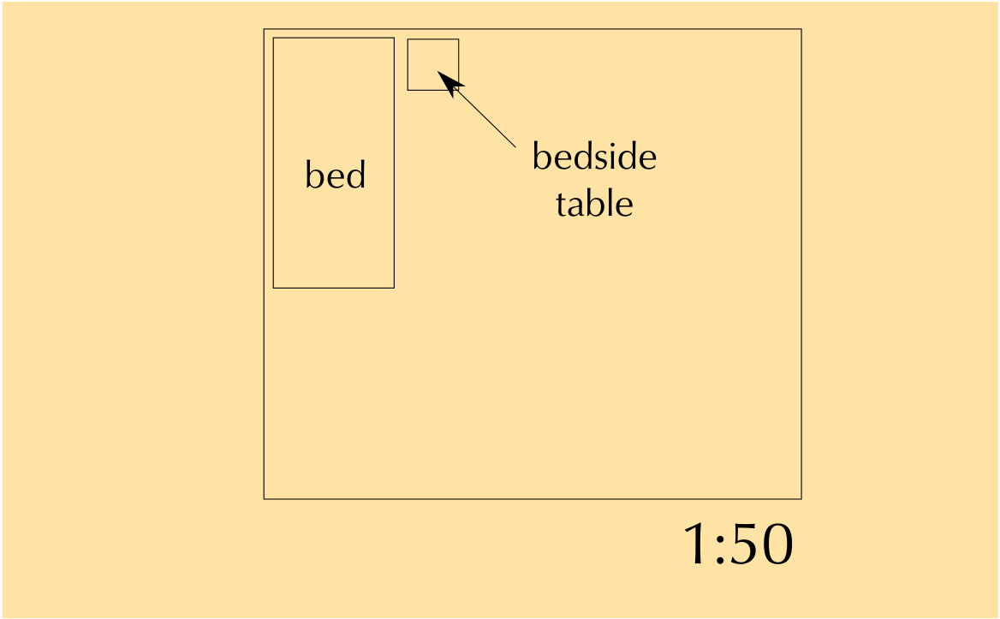
> **[Diagram Context - Textbook_MathematicalLiteracy_Gr10_Scale-maps-and-plans.pdf-0035-00.png]**
> This graphic is a two-dimensional floor plan layout featuring labels for a "bed" and "bedside table," indicated by an arrow, alongside a numerical scale of 1:50. It serves as an introductory exercise in Mathematical Literacy, teaching students how to interpret architectural scale drawings and understand the proportional relationship between a representation and its real-world dimensions.

---

5. Tebogo, a new learner, has started at your school. You are in the Science class-
room, A1, when the break bell rings. Explain to Tebogo how to get to the tuck-
shop.
Solution:
Walk out of the Science classroom towards to sports field. Turn left, and walk
along the edge of the field towards to school hall building. At the school hall,
turn right. At the first opportunity, turn left (before the maths classrooms) and
walk past the maths building. Then turn right and walk straight towards the tree.
At the tree, turn left. The tuckshop will be the building in front of you.
Activity 6 – 7: Understanding a stadium seating plan
Study the plan of a rugby stadium below, and answer the questions below:
1. Using words such as “near to” and “in the middle of”, describe the position of a
player standing at the point marked X.
Solution:
A player at Point X would be standing on the field, near the left hand side goal
posts, and the Category 5 seats in Block G of the South Stand ramp seating.
2. Why do you think the seats are categorised?
132
6.3.
Maps, directions, seating and floor plans

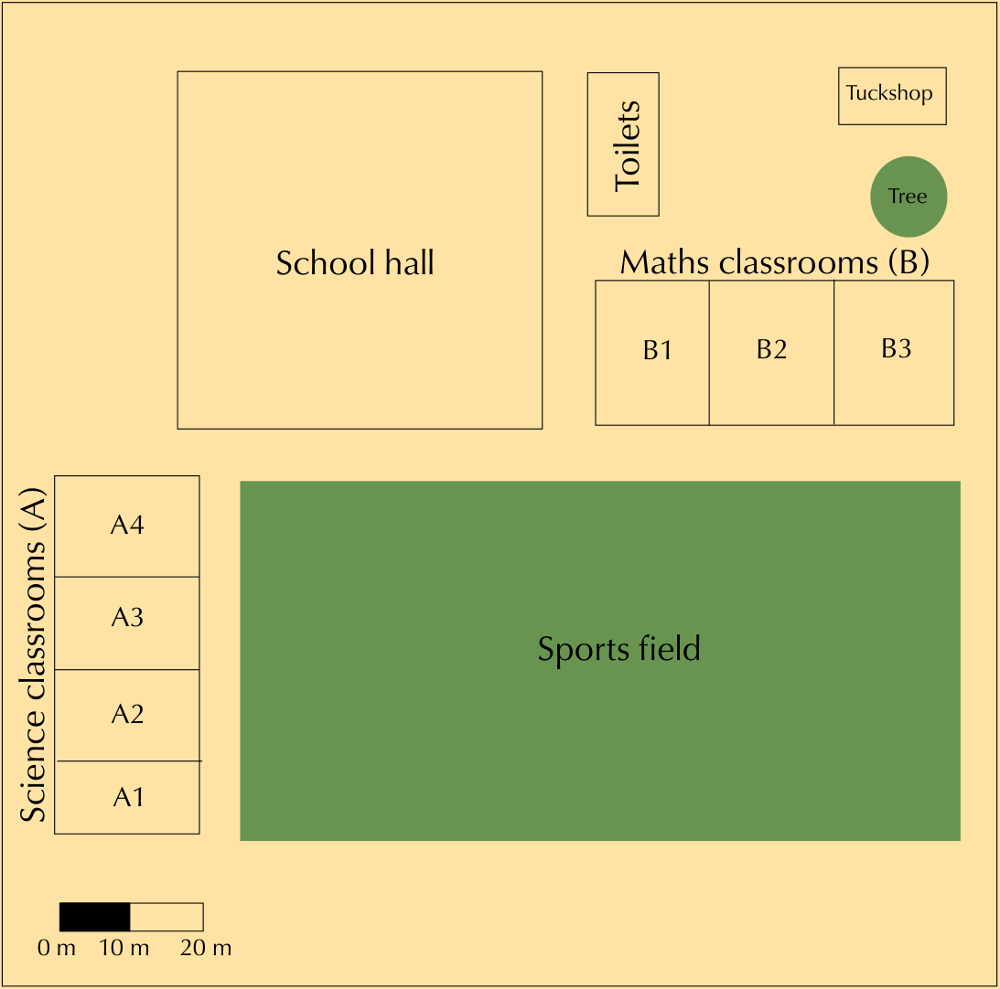
> **[Diagram Context - Textbook_MathematicalLiteracy_Gr10_Scale-maps-and-plans.pdf-0036-01.png]**
> This graphic is a two-dimensional floor plan or map of a school layout, featuring labels for the School hall, Toilets, Tuckshop, Tree, Sports field, and specific classroom blocks (A1-A4 and B1-B3). It includes a graphical scale bar (0m, 10m, 20m) to facilitate the calculation of real-world distances and areas. This diagram serves as a practical application of geometry and measurement, helping students practice interpreting scale, calculating perimeter or area, and understanding spatial relationships within a familiar environment.

---

Solution:
The seats are colour-coded and categorised by price.
3. Describe the position of the stand that contains the most Category 3 seats.
Solution:
The West Stand has the most Category 3 seats. It is on the left of the stadium,
between the North Stand and the South Stand.
4. If your are standing at Point Y, what is the quickest way to get to the South Stand
Ramp seating?
Solution:
Walk behind the East stand seating, with the stadium on your right. Then turn
right and walk straight to the South Stand Ramp seating.
5. Describe the position of the hot dog stand at Point Z.
Solution:
The hot dog stand at Point Z is in the top-left corner of the diagram. It is between
the West and North Stands.
6. Your friend is at the hot dog stand (at Z). Explain to him how to find you if you
are seated in a category 5 seat, Block A.
Solution:
Walk behind the West stands (with the stands on your left). Turn left at the end of
the stands, and walk straight to the edge of the South Stand ramp seating. Walk
between the South Stand Ramp seating and South Stand Seating Level 1, past
Blocks H, G, F, E, D, C and B. Block A (category 5) is on your left, at the end of
the South Stand Ramp Seating.
7. The width of the rugby field is 70 m the length 144 m. Draw a scale drawing of
the rugby field using the number scale 1 : 1000.
Solution:
Width = 70 m = 7000 cm. 7000 cm ÷ 1000 = 7 cm. So scaled width is 7 cm.
Length is 144 m = 1440 cm. 1440 cm ÷ 1000 = 14,4 cm. So scaled length is
14,4 cm.
14,4 cm
7 cm
1: 1000
(Note: above image is not drawn do scale, but given dimensions are correct)
133
Chapter 6.
Scale, maps and plans

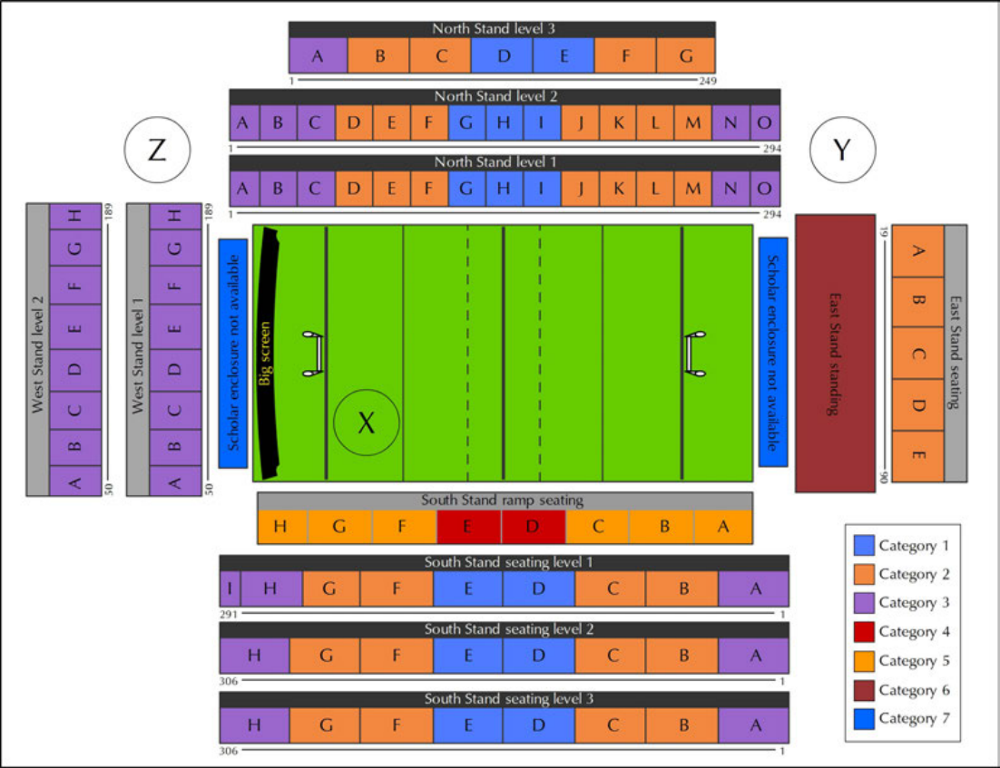
> **[Diagram Context - Textbook_MathematicalLiteracy_Gr10_Scale-maps-and-plans.pdf-0037-05.png]**
> This diagram is a two-dimensional floor plan of a sports stadium, featuring a central pitch surrounded by labeled seating blocks (North, South, East, and West stands) and specific zones marked X, Y, and Z. It utilizes a color-coded legend to categorize seating areas based on seven distinct categories, while also indicating specific infrastructure like big screens and scholar enclosures. For high school learners, this graphic serves as a practical exercise in spatial reasoning, data interpretation, and map reading, requiring students to synthesize information from a legend to navigate or analyze the layout of a complex facility.

---

Activity 6 – 8: Navigating a shopping mall
Study the map of the ground floor of a shopping centre and answer the questions that
follow:
1. You want to go to Shop 37 to buy new shoes. What store will you find next to it?
Solution:
Shop 35: CNA
2. What does “G51 Woolworths” mean on this map?
Solution:
Woolworths is Shop 51 on the ground floor.
3. Do you think this shopping centre has more than one floor? Explain your answer.
Solution:
Yes - there are stairs indicated on the map.
4. Where should you park if you want to go to Fournos bakery and buy some fresh
bread?
Solution:
Near Entrance 5.
5. Name the two stores you could buy stationery from and describe how you would
get to each of them from Entrance 1.
Solution:
1. CNA: Go straight towards Shop 29. Turn right, go left around the corner at
Shop 31. Go straight. CNA will be on your left. 2: Pick n Pay: Go straight
passing shops G07 - G02 on your left. Turn left into the entrance of Pick n Pay.
134
6.3.
Maps, directions, seating and floor plans

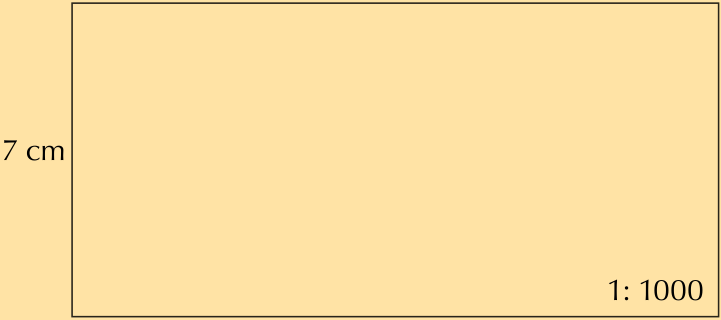
> **[Diagram Context - Textbook_MathematicalLiteracy_Gr10_Scale-maps-and-plans.pdf-0038-18.png]**
> This geometric figure is a rectangle labeled with a side length of 7 cm and a scale factor of 1:1000. It illustrates the application of map work and scale calculations, requiring students to determine the actual dimensions of the represented object by multiplying the drawing measurement by the scale factor.

---

6. If you are at Entrance 2, explain how you would get to the toilets.
Solution:
Go straight, turn left at Shop 18, in front of the stairs. Walk past shops 18 - 23
(following the mall as it curves to the right). Turn slightly left towards Pick ’n Pay.
Just before Pick ’n Pay, turn right, between shops 28 and 29. Go straight down
this passageway, the toilets are at the end.
7. You are standing at the entrance of Dis-Chem. Your friend arrives at Entrance 5
and wants to meet you. Give your friend directions to explain where they will
find you.
Solution:
Go straight, keeping to the left of the escalators in the middle. Pass the entrance
to Woolworths on your left. Pass shops 53 - 56 (on your left) and then turn
left in front of the escalators/stairs. Go straight, passing shops G59, 58 and 57.
Dis-Chem will be in front of you.
6.4
End of chapter activity
Activity 6 – 9: End of chapter activity
1.
Window
Window
Dining room table
Door
Chair
Cupboard
1 : 30
135
Chapter 6.
Scale, maps and plans

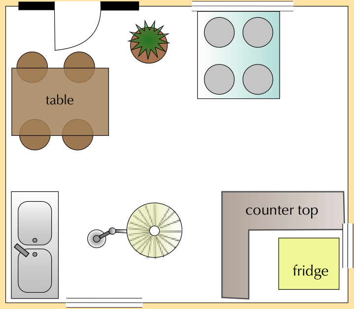

> **[Diagram Context - Textbook_MathematicalLiteracy_Gr10_Scale-maps-and-plans.pdf-0039-02.png]**
> This graphic is a floor plan map of a shopping centre, featuring labelled retail units (e.g., G14 Dischem, G51 Woolworths, G01 Pick n Pay), numbered store locations, and designated access points like "Entrance 1," "Entrance 2," and "Entrance 5." It serves as a practical tool for teaching spatial reasoning and map-reading skills, requiring students to interpret scale, orientation, and relative positioning to navigate between specific locations.

---

a) Using the number scale estimate the actual (real) size in metres of:
i. The dining room table.
ii. The chairs.
iii. The cupboard.
b) Using the number scale estimate the actual (real) size of the dimensions of
the room in metres.
c) Explain where the door to the room is.
d) Is it possible to calculate how high the windows are? Explain your answer.
e) Calculate the width of curtaining that will be required for both windows
(in cm).The width of the material required should be twice the width of the
window.
f) Rearrange the furniture in this room. To help you, you can redraw and cut
out the same size shapes. Draw the basic structure of the room (the walls,
windows and door) in your books. Use the shapes you cut out to show your
new room design. Paste them onto your room plan when you are happy
with your design. You may also include some pictures from magazines to
show what kind of furniture and accessories you would like in your room.
g) A carpet measures 1,8 m by 1,2 m.
i. Using the scale 1 : 30, draw a scale version of the carpet.
ii. Will the carpet fit into the room in Question 1? Explain your answer.
Solution:
a)
i. (8 cm × 5 cm) × 30 = 240 cm × 150 cm = 2,4 m × 1,5 m
ii. (2,3 cm × 2,3 cm) × 30 = 69 cm × 69 cm =0,69 m × 0,69 m
iii. (3 cm × 7 cm) × 30 = 90 cm × 210 cm = 0,9 m × 2,1 m
b) (15 cm × 13 cm) × 30 = 450 cm × 390 cm = 4,5 m × 3,9 m
c) The door is in the corner of the room, between the window and the cup-
board.
d) No. We are not given any information about the height of the windows.
We can only calculate how long they are.
e) Top window = 7 cm long. 7 cm × 30 = 210 cm. 210 cm × 2 = 420 cm.
Left window = 5 cm long. 5 cm × 30 cm = 150 cm. 150 cm × 2 =
300 cm. 420 cm + 300 cm = 720 cm of material for both curtains.
f) Learner-dependent answer.
g)
i. 1,8 m = 180 cm. 180 ÷ 30 = 6 cm on scale map. 1,2 m = 120 cm.
120 cm ÷ 30 = 4 cm on scale map. So diagram will be a rectangle
that is 6 cm × 4 cm.
ii. Yes - the dimensions of the carpet are smaller than the dimensions of
the room.
2. The following diagram shows a walled day care facility. Answer the questions
that follow.
136
6.4.
End of chapter activity

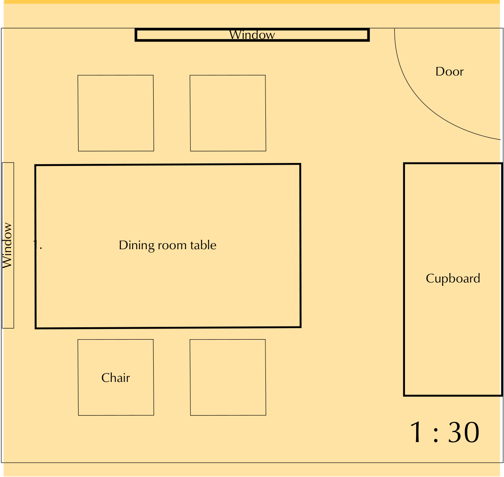
> **[Diagram Context - Textbook_MathematicalLiteracy_Gr10_Scale-maps-and-plans.pdf-0040-08.png]**
> This graphic is a two-dimensional floor plan representing a room layout, featuring labels for "Window," "Door," "Dining room table," "Chair," and "Cupboard," along with a scale ratio of 1:30. It serves as an introductory exercise in technical drawing and spatial reasoning, teaching students how to interpret scaled architectural representations and understand the relationship between real-world dimensions and their diagrammatic counterparts.

---

3 m
6 m
Community 
Hall
Playground
Public 
Swimming 
Pool
Daycare Centre
Lawn
a) Use the bar scale to estimate the actual (real) size in metres of:
i. The swimming pool.
ii. The daycare centre.
iii. The lawn.
b) Health and and safety regulations require that the swimming pool has a
fence around it. The fence must be a minimum of 1,5 m from the pool.
The fence must run from the left boundary wall (between the pool and
playground) around the bottom of the pool, and then between the pool and
the lawn, to the top boundary wall (i.e. it goes around the bottom and the
right side of the pool). Calculate the minimum amount of fencing required.
c) Describe the position of the swimming pool in relation to the other build-
ings.
d) Where would you plan to dig a flower bed for the day care facility? Explain
why.
e) Would a room with the dimensions 7 m × 11 m fit inside the community
hall? Use your calculations to justify your answer.
f) Describe where you would put a pathway that would link all the facilities
together.
Solution:
a)
i. Dimensions = 3 cm × 6 cm = 2 segments × 4 segments = 6 m ×
12 m.
137
Chapter 6.
Scale, maps and plans

---

ii. Dimensions = 3 cm × 7 cm = 2 segments × 4,66667 segments =
6 m × 14 m
iii. Dimensions = 3 cm × 3 cm = 2 segments × 2 segments = 6 m ×
6 m
b) Pool is 6 m × 12 m. So fencing is (6 + 1,5 m) + (12+1,5 m) = 21 m
c) The pool is in the corner of the property, by the side of the community hall,
overlooking the lawn and the playground.
d) Learner-dependent answer, but one option would be to the right of the lawn
- there is space and it would not be in the way of any entrances/through-
fares.
e) Dimensions = 3 cm × 7 cm = 2 segments × 4,66667 segments = 6 m ×
14 m. So a 7 m × 11 m room would not fit into the hall.
f) Learner-dependent answer.
3. You are given the following information about the actual dimensions of a study
and the furniture in it:
• Room: 3,6 m wide and 4,2 m long
• Window: 1,2 m wide
• Door: 1,2 m wide
• Desk: 120 cm wide and 180 cm long
• Chair: 60 cm wide and 60 cm long
• Bookshelf: 1,5 m long
Using a scale of 1 : 60, calculate the scaled dimensions of the room and furni-
ture, and draw a scaled map of the room. Arrange the furniture in any sensible
manner.
Solution:
Window
Door
Bookshelf
Chair
Desk
1:60
Room: 6 cm × 7 cm. Window: 2 cm wide. Door: 2 cm wide. Desk: 2 cm ×
3 cm. Chair: 1 cm × 1 cm. Bookshelf: 2,5 cm long.
4. You have the following ticket for a performance at The Hillvale Theatre.
The Hillvale Theatre
Performance
Seat: C 17
Date: 15 May 2013
Time: 20h00
138
6.4.
End of chapter activity

> **[Diagram Context - Textbook_MathematicalLiteracy_Gr10_Scale-maps-and-plans.pdf-0042-00.png]**
> This diagram is a two-dimensional floor plan or site map featuring a scale bar labeled in metres and specific zones: Public Swimming Pool, Community Hall, Lawn, Playground, and Daycare Centre. It serves as a practical application of scale and spatial reasoning, requiring students to use the provided scale bar to calculate the actual dimensions and areas of the various facilities.

---

Study the seating plan and answer the questions that follow:
Figure 6.1:
Seating plan for The Hillvale Theatre
a) Why are there only 18 seats in row J?
b) Your ticket indicates that you must sit in C17. Which entrance would you
use and why?
c) There are 3 seats to your right between you and your friend. What is your
friend’s seat number?
d) How many rows are between row B and row J?
139
Chapter 6.
Scale, maps and plans

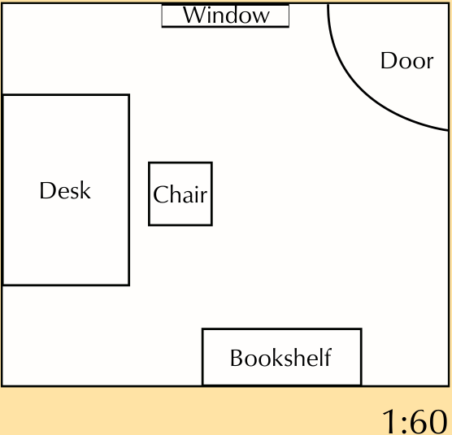
> **[Diagram Context - Textbook_MathematicalLiteracy_Gr10_Scale-maps-and-plans.pdf-0043-16.png]**
> This graphic is a two-dimensional floor plan representing a room layout, featuring labels for a "Window," "Door," "Desk," "Chair," and "Bookshelf." The inclusion of a 1:60 scale ratio introduces learners to the concept of scale drawings, demonstrating how real-world spatial dimensions are proportionally reduced for architectural or design representation.

---

e) How many seats are in the theatre?
f) Your school wants everyone to attend the stage production of your pre-
scribed English book. There are 30 people in your class. If the first person
sits in seat D5 and the class takes up the rest of row D (to D20) and seats
from the beginning of row E (E1, E2 etc), where will the last person in your
class sit in row E, if the seats are filled consecutively?
g) What percentage of the seats would your class of 30 fill?
h) Why are some rows labeled AA to FF?
i) Are rows AA and BB on the same level? Explain your answer.
j) Do you think the seats on the balcony wheelchair accessible?
k) What ratio of the total number of seats are balcony seats?
l) How many seats will still be available if 4
5 of the seats are sold?
m) The cost of the tickets for the stalls is R 200. If school groups get a 10%
discount, how much will your class’s 30 tickets cost the school?
Solution:
a) Because there are entrances to the theatre on either side of the row.
b) Entrance 1. It is closest to seat C17.
c) C13
d) 6 rows
e) 19 + 20 + 20 + 20 + 20 + 20 + 20 + 19 + 18 + 19 + 20 + 15 + 16
+ 5 + 5 = 256 seats
f) E14
g)
30
256 = 0,1171. . .
0,1171. . . × 100 = 11,7%
h) These rows of seats are in the balcony.
i) No. There is a short flight of stairs between them.
j) There is nothing on the seating plan to suggest that they are.
k) Number of balcony seats = 19+20+15+16+5+5 = 80. So 256: 80
l)
4
5 of 256 = 204 seats booked. So there will be 51 seats available.
m) 30 × R 200 = R 6000. 10% of R 6000 = R 600. So the tickets will cost
R 6000 - R 600 = R 5400.
5. Study the seating plan of the stadium given and answer the questions that follow:
140
6.4.
End of chapter activity

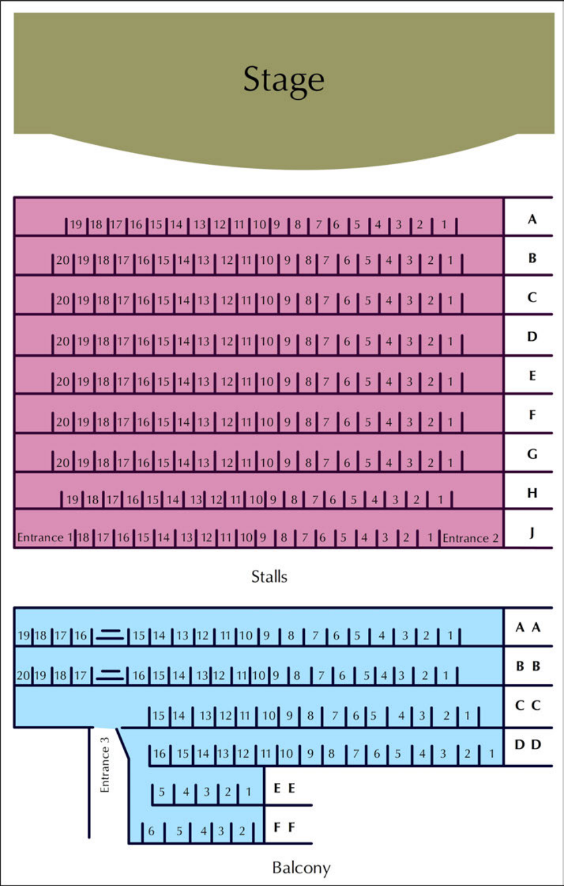
> **[Diagram Context - Textbook_MathematicalLiteracy_Gr10_Scale-maps-and-plans.pdf-0044-01.png]**
> This diagram is a theatre seating plan representing a coordinate system with two distinct sections, "Stalls" and "Balcony," labeled with rows (A-J and AA-FF) and seat numbers (1-20). It serves as a practical application of Cartesian-style mapping, helping students understand how to locate specific points within a two-dimensional grid using alphanumeric identifiers.

---

a) Describe where the players would enter onto the field.
b) Are the blocks numbered in a clockwise or anti clockwise direction?
c) Your seat is in Block 35. What entrance would you go to to get to your seat?
d) The south entrance is closest to Block 35. Where is this entrance?
e) How many blocks are there in the purple category?
f) What percentage of the blocks are red?
g) If your friend is sitting in Block 25 and you are in one of the blue blocks.
Describe where you are in relation to your friend.
h) The rugby match starts at 18:30. The game is 80 minutes long. Half time is
10 minutes long.
i. What time will the match finish? (Assuming there is no over time)
ii. The sun sets at 6:45 p.m. behind the main entrance. Where will you
be sitting if you are looking into the sun during the game?
i) You are given the following ticket prices for an upcoming rugby match:
R250
R300
R450
R200
i. Which are the cheapest seats?
ii. You are going to buy 3 tickets for yourself and your friends in the blue
category. How much will this cost?
iii. You decide that 3 tickets in the blue category is going to be too ex-
pensive and you’d rather sit in the orange stalls. How much will three
orange category tickets cost?
Solution:
a) Through the tunnel, in the middle of the field, under Block 6.
141
Chapter 6.
Scale, maps and plans

---

b) Clockwise.
c) The South entrance.
d) It is in the corner of the stadium, between the main entrance and the east
entrance
e) 11 + 12 = 23 Blocks.
f) 17 red blocks out of 71 blocks in total. 17
71 × 100 = 23,9%
g) If the friend is in Block 25, then the blue blocks are to their left, along the
left side of the field.
h)
i. Total duration of match = 90 minutes. 18:30 + 90 minutes = 20:00
ii. In the orange blocks.
i)
i. The seats in the purple blocks.
ii. 3 × R 300 = R 900
iii. 3 × R 250 = R 750
6. Study the shopping mall map below and answer the questions that follow:
a) What would you expect to be able to do in shop 148?
b) How many ’baby changing rooms’ are there on the lower level and where
are they?
c) Describe how you would get from Entrance 4 to Truworths.
142
6.4.
End of chapter activity

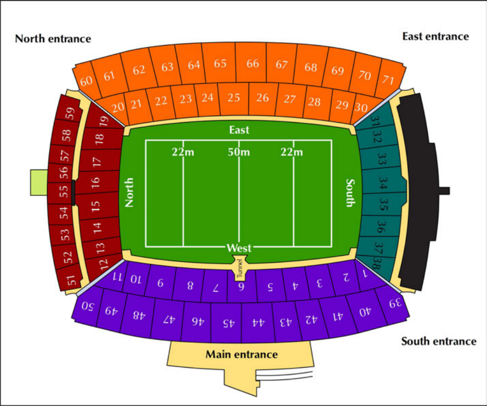
> **[Diagram Context - Textbook_MathematicalLiteracy_Gr10_Scale-maps-and-plans.pdf-0046-00.png]**
> This diagram is a top-down schematic map of a sports stadium, featuring numbered seating blocks color-coded by section, cardinal directions, and a central pitch marked with 22m and 50m lines. It serves as a practical tool for spatial orientation and data interpretation, requiring students to identify specific locations, navigate between entrances, and understand the layout of a large-scale public facility.

---

d) Near which entrance would you park if you wanted to shop at Shoprite
Checkers and Ackermans?
e) What would be a good meeting point for you and your friends? Explain
your answer.
f) Give three reasons why you would assume that this is a multi-level shop-
ping centre.
Solution:
a) Collect or send post.
b) Two - one between shops 106 and 107 (behind Edgars) and the other next
to shop 171 and Clicks.
c) Walk straight along the mall. Pass Woolworths and CNA on your left. Fol-
low the mall to the right. Pass the circular stairs and toilets on your right.
Truworths with be in front of you, to your left.
d) Entrance 5 is closest to Checkers and Ackermans.
e) Learner-dependent answer, but generally somewhere central and easy to
find.
f) There are stairs and an escalator indicated on the map, and the entire map
is for the lower level.
143
Chapter 6.
Scale, maps and plans

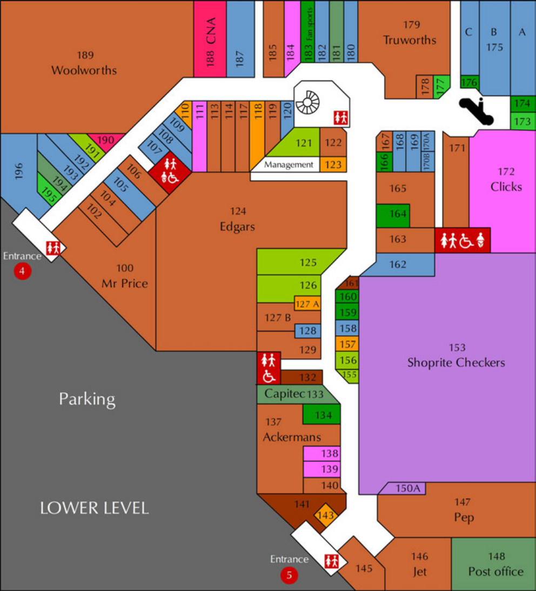
> **[Diagram Context - Textbook_MathematicalLiteracy_Gr10_Scale-maps-and-plans.pdf-0047-10.png]**
> This graphic is a floor plan map of a shopping centre, featuring numbered retail units, designated anchor stores (e.g., Woolworths, Edgars, Shoprite Checkers), and symbols for entrances, restrooms, and vertical circulation like escalators. It serves as a practical spatial representation, helping students develop map-reading skills by identifying locations, interpreting legends, and navigating a complex environment using relative positioning.

