# Chapter 2: Patterns, relationships and representations

## Chapter Overview
This chapter explores the mathematical study of patterns, how variables relate to one another, and how these relationships are represented visually and algebraically.

### Table of Contents

| Section | Topic | Page |
| :--- | :--- | :--- |
| 2.1 | Introduction and key concepts | 54 |
| 2.2 | Making sense of graphs that tell a story | 54 |
| 2.3 | Linear patterns, relationships and graphs | 65 |
| 2.4 | Inverse proportion patterns, relationships and graphs | 69 |
| 2.5 | Finding the rule or formula | 72 |
| 2.6 | End of chapter activity | 75 |

<!-- DIAGRAM_PLACEHOLDER: diagram -->

---

# 2. Patterns, relationships and representations

## 2.1 Introduction and key concepts (EMG35)

Graphs are visual representations that show the relationship or connection between two variables (e.g., the price of petrol over time). These relationships often follow specific patterns and rules.

**In this chapter, you will learn to:**
* Interpret graphs found in media (newspapers and magazines).
* Identify relationships between quantities that follow specific patterns.
* Understand linear number patterns (which form straight lines on a graph).
* Understand inverse proportions (which form curved graphs).
* Determine rules or formulae for patterns presented in tables and graphs.

---

## 2.2 Making sense of graphs that tell a story (EMG36)

In Mathematical Literacy, problems often begin with a "story." A graph acts as a mathematical picture of the relationship between two quantities (e.g., distance vs. time). Graphs allow us to understand complex data at a glance.

---

## Graphs going up and going down (increasing and decreasing) (EMG37)

### Worked example 1: Looking at a graph in a newspaper

**QUESTION**
Jabu sees the following graph in a newspaper article:

---

### Interpreting Graphs: Trends and Slopes

#### Worked Example: Analyzing an Inflation Graph
**Question:** What information can Jabu extract from the provided graph?

<!-- DIAGRAM_PLACEHOLDER: diagram -->

**Solution:**
*   **Data Representation:** The graph displays the inflation rate (measured as a percentage) for each year over a seven-year period.
*   **General Trend:** By following the line of the graph from left to right, we can observe that the inflation rate generally increases over time.
*   **Rate of Change:** The graph is at its steepest point during the final year. This indicates that the inflation rate increased more rapidly during this specific period compared to previous years.

---

#### Key Definition: Inflation
**Inflation** is defined as the general increase in the price of goods and services within a country over a period of time.

---

#### Understanding Slope and Gradient
The slope (or gradient) of a line on a graph tells us how the data is changing:

*   **Increasing Graph:** The slope goes **up** from left to right.
*   **Decreasing Graph:** The slope goes **down** from left to right.

<!-- DIAGRAM_PLACEHOLDER: diagram -->

**Determining Steepness:**
We can determine if one line is steeper than another by visually comparing the slope or gradient. A steeper line indicates a faster rate of change (a larger increase or decrease over the same horizontal distance).

---

### 2.2. Making sense of graphs that tell a story

#### Understanding Slope
The steepness of a line on a graph indicates the rate of change.

*   **Steep slope:** Represents a **quicker** (faster) change.
*   **Gradual slope:** Represents a **slower** change.

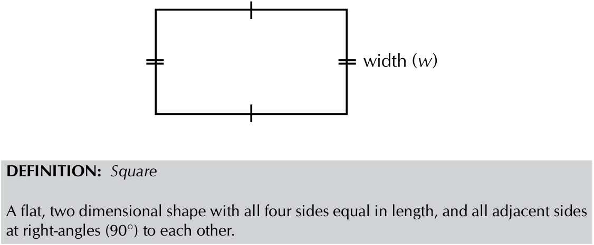

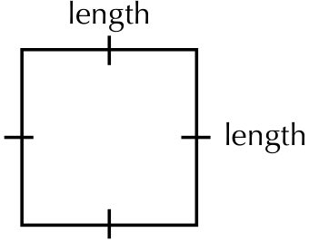

---

#### Worked Example 2: A graph of the maximum temperature over one week

**Question:**
Analyze the graph below showing the maximum temperature recorded over a week and answer the following question:

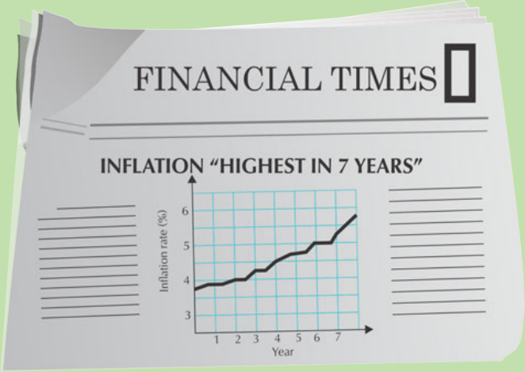

**1. On which day is the temperature the lowest during the week?**

**Solution:**
To find the lowest temperature, look for the lowest point on the line graph.
*   The lowest point on the vertical axis (Temperature in $^\circ\text{C}$) corresponds to the first data point on the horizontal axis.
*   The first point on the horizontal axis is labeled **M** (Monday).
*   Therefore, the temperature is the lowest on **Monday**.

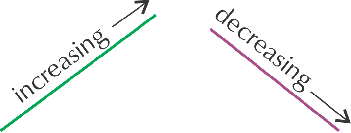

---

### Analysis of Temperature Graph

**Questions:**
2. When is the temperature the highest?
3. On which day(s) does the temperature stay the same?
4. Between which days do you see the biggest increase in temperature?
5. Which part of the graph shows a decrease in temperature?

**Solutions:**
1. The graph is at the lowest point on Monday, showing that the temperature was at its lowest on Monday.
2. The highest point of the graph is on Thursday.
3. From Tuesday to Wednesday and from Saturday to Sunday, the graph is flat, showing that the temperature is constant.
4. The biggest increase in temperature takes place from Wednesday to Thursday, because the steepest part of the graph is here.
5. The graph is decreasing from Thursday to Saturday, showing a drop in temperature.

---

### Continuous and Discrete Graphs

In mathematics, the nature of the data determines how a graph is drawn:

*   **Discrete Values:** These are values that can only be whole numbers (e.g., the number of people). When drawing graphs for discrete values, points are connected by **dotted lines** because the values between the whole numbers do not exist in the context of the data.
*   **Continuous Values:** These are values that can include decimal fractions (e.g., measurements like length, time, or temperature). When drawing graphs for continuous values, points are connected by **solid lines** to show that all values between the points are included.

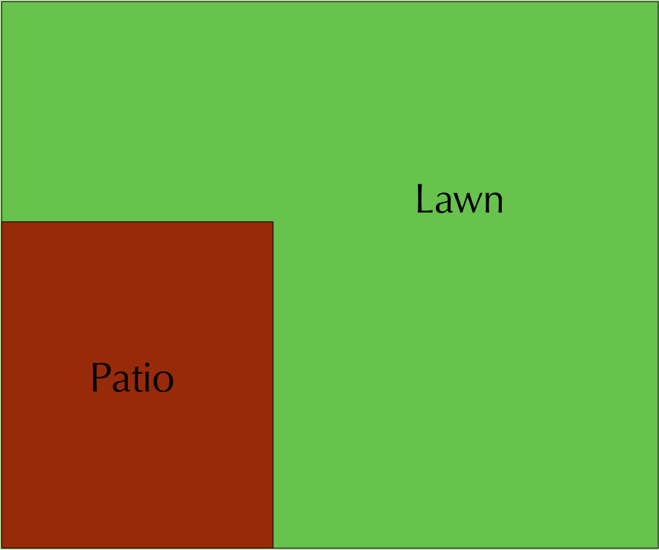

#### Worked Example 3: Continuous or Discrete Graphs

**Question:**
Look at the graphs on the following page. The first graph shows the number of passengers on a bus for six different trips. The second graph shows the distance that a bus travels for one trip. Explain why the first graph has dotted lines connecting the points while the second has solid lines.

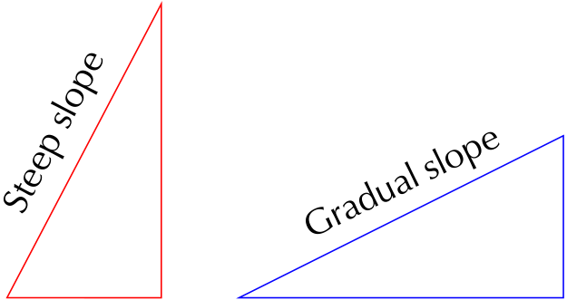

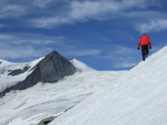

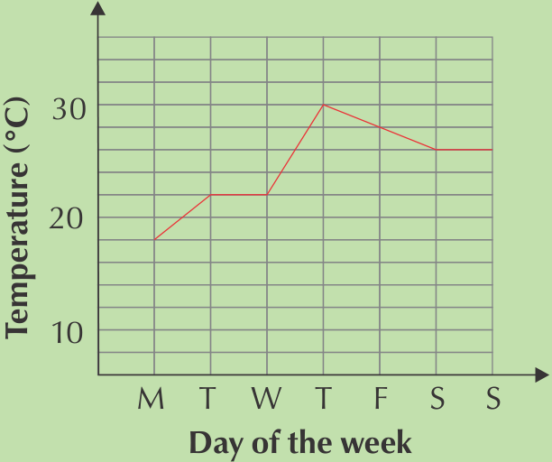

---

# 2.2. Making Sense of Graphs That Tell a Story

## Key Concepts: Discrete vs. Continuous Data

Graphs are used to represent relationships between variables. Depending on the nature of the data, graphs are categorized as either **discrete** or **continuous**.

### 1. Discrete Data
Discrete data consists of values that can only be counted as whole numbers. You cannot have a fraction of these items.

*   **Example:** The number of people on a bus. You cannot have $2.5$ people on a bus; therefore, the data points are individual and separate.
*   **Graph Representation:** Usually shown as a series of individual points (often connected by lines to show a trend, but the spaces between the points do not represent valid data).

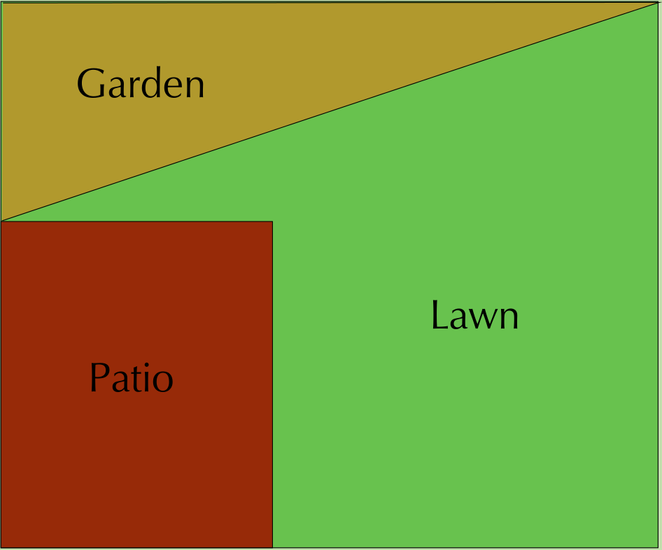

### 2. Continuous Data
Continuous data consists of values that can be measured. These values can include fractions, decimals, and any point along a scale.

*   **Example:** Time and distance. A bus travels over a period of time and covers a distance. At any given second, the bus has traveled a specific distance, meaning there is a value for every possible point on the line.
*   **Graph Representation:** Shown as a solid, unbroken line because every point along that line represents a valid measurement.

<!-- DIAGRAM_PLACEHOLDER: diagram -->

---

## Summary of Differences

| Feature | Discrete Data | Continuous Data |
| :--- | :--- | :--- |
| **Nature** | Counted (Whole numbers) | Measured (Any value) |
| **Graph Style** | Individual points | Solid, unbroken line |
| **Example** | Number of passengers | Distance vs. Time |

---

## Worked Example Analysis

### Graph 1: Number of People per Bus Trip
*   **Observation:** The graph plots the number of people against specific bus trips ($1, 2, 3, 4, 5, 6$).
*   **Reasoning:** Since you cannot have half a passenger, the variables are **discrete**. The points represent specific counts for specific trips.

### Graph 2: Distance Travelled over Time
*   **Observation:** The graph shows a straight line starting from $(0,0)$.
*   **Reasoning:** Because time and distance are measurements that flow constantly, the variables are **continuous**. The solid line indicates that at any time $t$ (where $t$ is any real number), there is a corresponding distance $d$.

<!-- DIAGRAM_PLACEHOLDER: diagram -->

---

# Activity 2 – 1: Interpreting Graphs

## 1. Hiking Progress Graph
This graph represents the distance covered by Lindi and Thabang over a period of time.

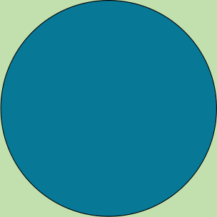

### Questions:
**a) What was the total distance of the hike and how many hours did it take?**
*   **Total Distance:** Look at the final point $H$ on the vertical axis. The total distance is $16\text{ km}$.
*   **Total Time:** The hike started at $7:00$ and ended at $14:00$.
    *   Calculation: $14 - 7 = 7\text{ hours}$.

**b) Give the times when Lindi and Thabang were resting (where the distance stayed constant).**
Resting occurs where the line is horizontal (the gradient is $0$):
*   Between point $B$ and $C$: $8:30$ to $9:00$.
*   Between point $D$ and $E$: $10:30$ to $11:30$.
*   Between point $F$ and $G$: $13:00$ to $14:00$.

**c) One part of the graph is steeper than the others. Identify this part.**
*   The steepest part is the line segment $GH$, which occurs between $13:00$ and $14:00$. A steeper slope indicates a faster rate of travel (more distance covered in less time).

---

## 2. Petrol Consumption Graph
This graph shows the amount of petrol in Pumeza's car tank over the course of one week.

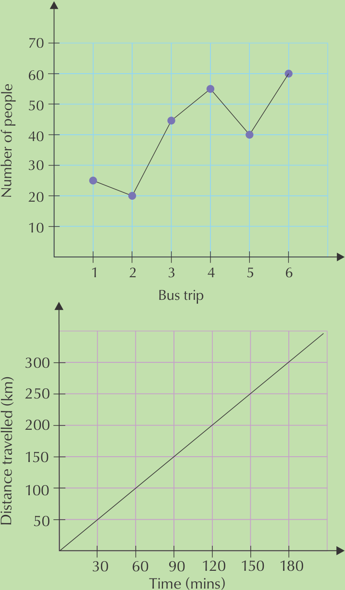

### Questions:
**a) Is there any time when her petrol tank is completely empty? How do you know?**
*   **Analysis:** Look at the vertical axis labeled "Petrol in tank ($\ell$)". The value $0$ represents an empty tank.
*   **Answer:** No, the graph never touches the horizontal axis (the $x$-axis where $y = 0$). Even at the lowest points (Tuesday and Sunday), the line remains above the $0$ mark, indicating there is still some petrol left in the tank.

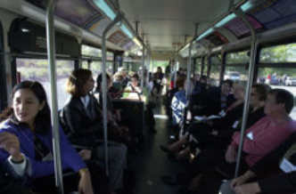

---

### Exercise 2: Interpreting Data Trends

**b)** Pumeza was ill for two days during the week and stayed at home. Identify the two days and explain your answer.

**c)** How many times does she fill up her car with petrol? Where do you see this on the graph?

---

### 3. Temperature Analysis in Bloemfontein

The graph below shows the temperature in Bloemfontein, measured over one week in September.

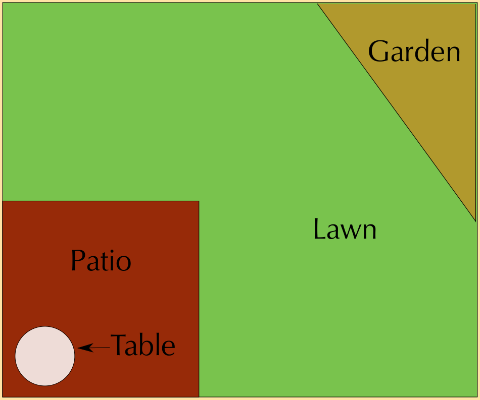

**Questions:**

**a)** Is this graph continuous or discrete? Explain.

**b)** What was the highest temperature recorded during the week? On what day was this?

**c)** What was the lowest temperature recorded during the week? On what day was this?

**d)** Write down the maximum and minimum temperatures on Wednesday. Calculate the difference between them.

*   **Maximum temperature ($T_{max}$):** Value on Wednesday.
*   **Minimum temperature ($T_{min}$):** Value on Wednesday.
*   **Difference ($\Delta T$):** $T_{max} - T_{min}$

---

### 4. Sales of Beaded Necklaces

Naledi makes and sells beaded necklaces. Look at the graph below and answer the questions:

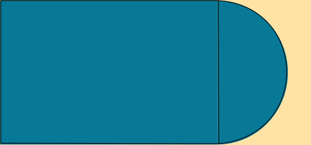

**a)** Where is the highest point on the graph?

---

### Key Concepts: Continuous vs. Discrete Data

*   **Continuous Data:** Data that can take any value within a range. It is represented by a solid line on a graph because the values change smoothly over time (e.g., temperature).
*   **Discrete Data:** Data that can only take specific, distinct values. It is often represented by points or a broken line because the values change in jumps (e.g., number of items sold).

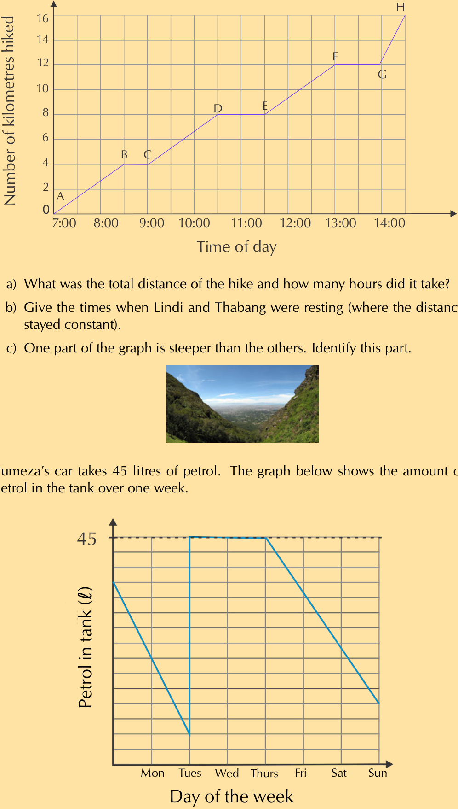

---

### Dependent and Independent Variables

#### Definition: Variable
A **variable** is the quantity you are measuring or calculating.

---

#### Key Concepts

**1. Independent Variable**
An independent variable is a variable that stands alone and is not changed by the other variables you are trying to measure. 
*   *Example:* A person's age is an independent variable. Other factors (such as what they eat, how they go to school, or how much television they watch) do not change a person's age.

**2. Dependent Variable**
A dependent variable depends on other factors. 
*   *Example:* A test score is a dependent variable because it can change depending on several factors, such as how much you studied, how much sleep you got the night before, or how hungry you were when you took the test.

---

#### How to Identify Variables
To determine which variable is independent and which is dependent, place the names of the two variables into a sentence in a way that makes the most sense.

*   *Example:* "Time causes a change in distance travelled." 
    *   It is not possible for "distance travelled" to cause a change in "time."
    *   Therefore, **Time** is the independent variable and **Distance** is the dependent variable.

---

#### Plotting Variables on a Graph
When plotting graphs of variables, follow this standard convention:
*   **Horizontal axis ($x$-axis):** Independent variable.
*   **Vertical axis ($y$-axis):** Dependent variable.

---

#### Practice Exercises
*Referencing the provided image content:*

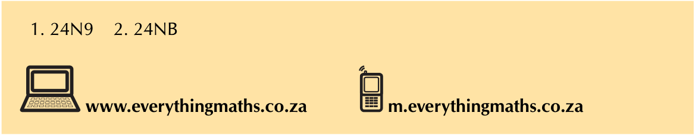

b) On which day were there no sales?
c) Between which two days is the biggest increase in sales? Explain.
d) Between which two days do the sales stay the same?
e) Describe what happens to the sales between Wednesday and Thursday.
f) Why is the graph drawn with a dotted line?

*For further practice, visit www.everythingmaths.co.za using the following codes:*
1. 24BM
2. 24BN
3. 24BP
4. 24BQ

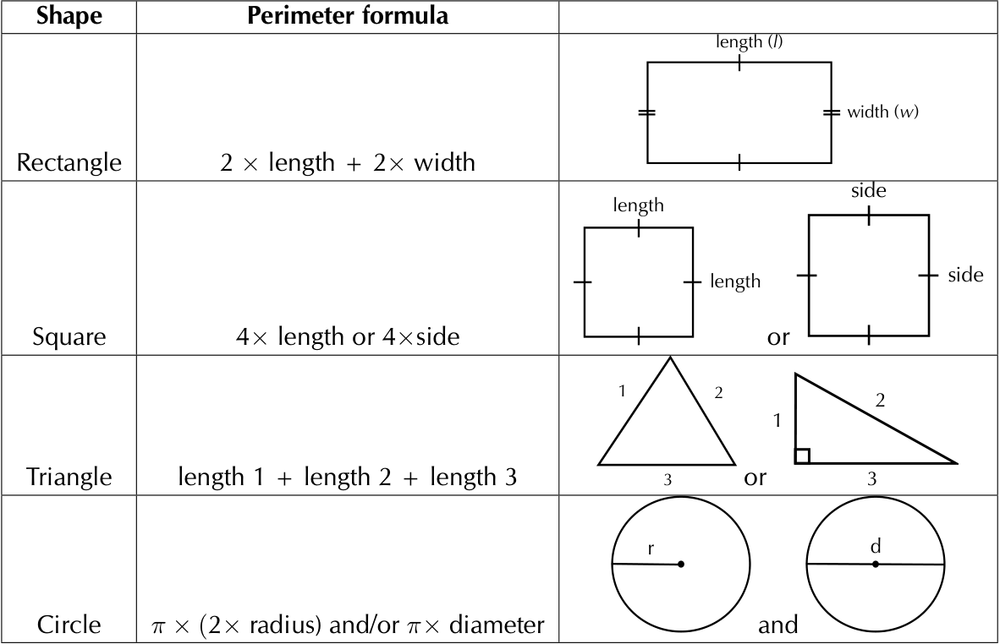

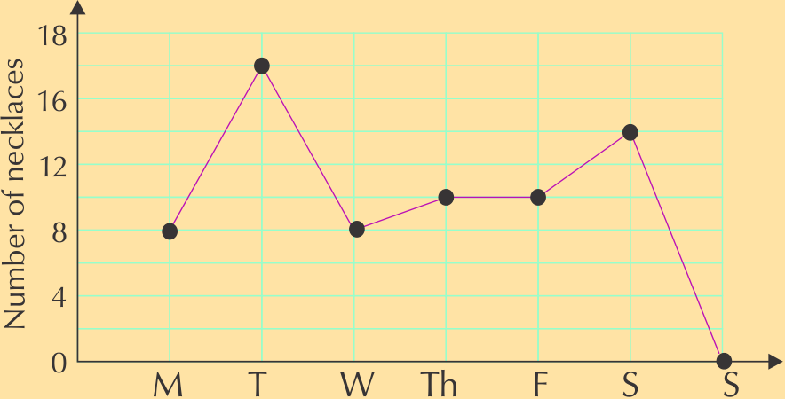

---

# Touching the Axes

## Key Concepts
When interpreting graphs, understanding where the line intersects the axes provides critical information about the relationship between variables.

*   **Vertical Axis ($y$-axis) Intercept:** If the graph touches the vertical axis, it indicates that the quantity on the horizontal axis has reached $0$.
*   **Horizontal Axis ($x$-axis) Intercept:** If the graph touches the horizontal axis, it indicates that the quantity on the vertical axis has reached $0$.

> **NOTE:** 
> *   The **horizontal axis** is the $x$-axis, where we plot the **independent variable**.
> *   The **vertical axis** is the $y$-axis, where we plot the **dependent variable**.

---

## Worked Example 4: Interpreting a graph that touches the vertical axis

**Question:** Nicola buys biltong in fancy packaging as a present for her dad. Look at the graph below representing the price of biltong per weight.

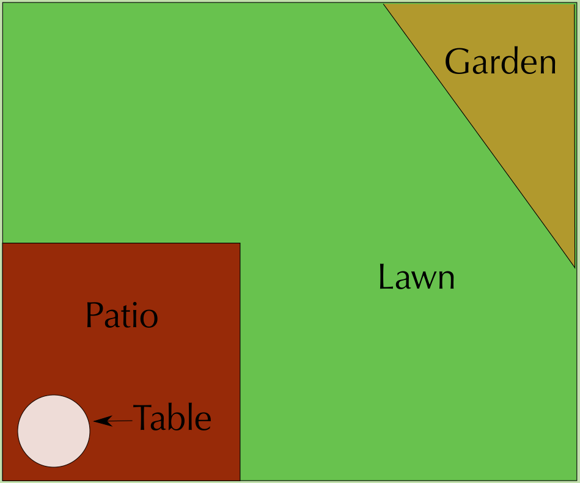

### 1. What is the price when the weight of biltong is $0\text{ kg}$? Explain your answer.
**Answer:** 
Looking at the graph, the line touches the vertical axis at $R10$. This means that even when the weight is $0\text{ kg}$ (no biltong), the price is $R10$. This represents the fixed cost of the fancy packaging.

### 2. Explain which is the independent and which is the dependent variable.
**Answer:**
*   **Independent variable:** Weight (kg). This is plotted on the horizontal axis ($x$-axis).
*   **Dependent variable:** Price (R). This is plotted on the vertical axis ($y$-axis) because the total price depends on the weight of the biltong purchased.

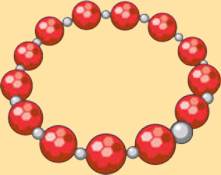

---

### Solution: Biltong Cost Analysis

1. **Fixed Cost:** The price of buying $0\text{ kg}$ of biltong is $\text{R } 10$. This is identified where the graph intersects the vertical axis. This represents a constant starting cost (e.g., packaging costs) that does not change regardless of the weight purchased.
2. **Variables:** The cost depends on the weight bought. Therefore, weight is the **independent variable** and cost is the **dependent variable**.

---

### Worked Example 5: Interpreting a graph that touches the horizontal axis

**Question:** Tumelo empties his $500\text{ ml}$ water bottle at a constant rate.

1. Describe what you see in this graph.
2. Explain which is the independent and which is the dependent variable.

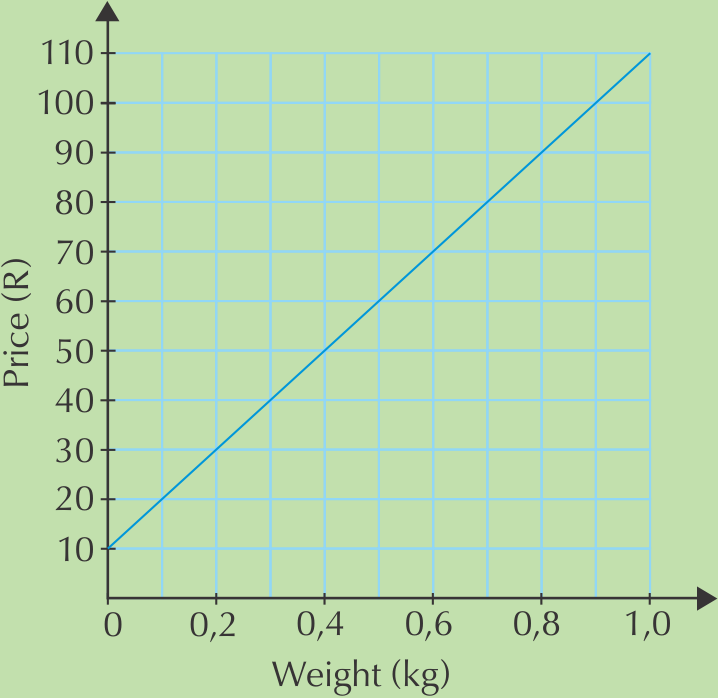

#### Analysis of the Graph

*   **Observation:** The graph starts at $500\text{ ml}$ on the vertical axis when the time is $0\text{ minutes}$. As time increases, the volume of water decreases at a constant rate until it reaches $0\text{ ml}$ at $5\text{ minutes}$. This indicates that the bottle is empty after $5\text{ minutes}$.
*   **Variables:**
    *   **Independent Variable:** Time (measured in minutes). This is plotted on the horizontal axis because time passes regardless of the volume of water.
    *   **Dependent Variable:** Volume of water (measured in $\text{ml}$). This is plotted on the vertical axis because the amount of water remaining depends on how much time has passed.

---

### Understanding Graphs: Interpreting Change Over Time

#### Worked Example: Emptying a Bottle
*   **Observation:** A bottle starts with a volume of $500\text{ ml}$.
*   **Analysis:** The volume decreases steadily as the bottle is emptied.
*   **Conclusion:** At $5\text{ minutes}$, the volume reaches $0\text{ ml}$, meaning it took $5\text{ minutes}$ to empty the bottle completely.
*   **Variables:** The volume changes as time passes. Therefore, **time** is the independent variable, and **volume** is the dependent variable.

---

#### Activity 2 – 2: Reading Graphs
Tumelo takes a one-litre ($1\text{ 000 ml}$) bottle of water to work. The graph below tracks the volume of water in the bottle over the course of the day.

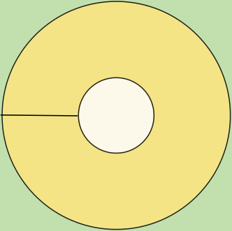

**Questions:**

1.  **Identify the variables:** What are the two variables plotted on this graph?
2.  **Dependent vs. Independent:** Which variable is dependent and which is independent? Explain your reasoning.

---

#### Key Concepts for Graph Interpretation

*   **Independent Variable:** The variable that is controlled or changes naturally (usually plotted on the horizontal $x$-axis). In this context, it is **Time (hours)**.
*   **Dependent Variable:** The variable that changes in response to the independent variable (usually plotted on the vertical $y$-axis). In this context, it is **Volume of water (ml)**.
*   **Reading the Graph:**
    *   **Horizontal lines:** Represent periods where the volume remains constant (no water is being consumed or added).
    *   **Downward sloping lines:** Represent periods where the volume is decreasing (water is being consumed).
    *   **Vertical jumps:** Represent moments where the volume increases suddenly (water is being added to the bottle).

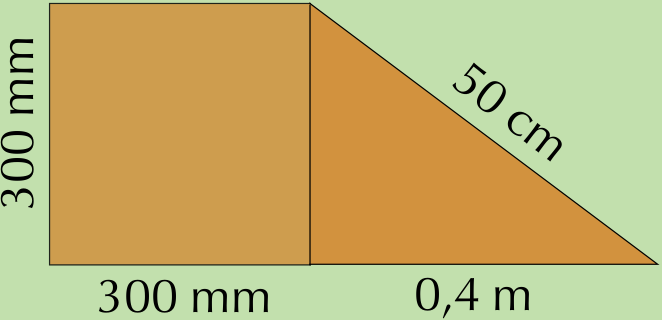

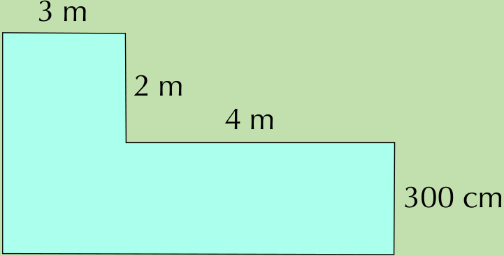

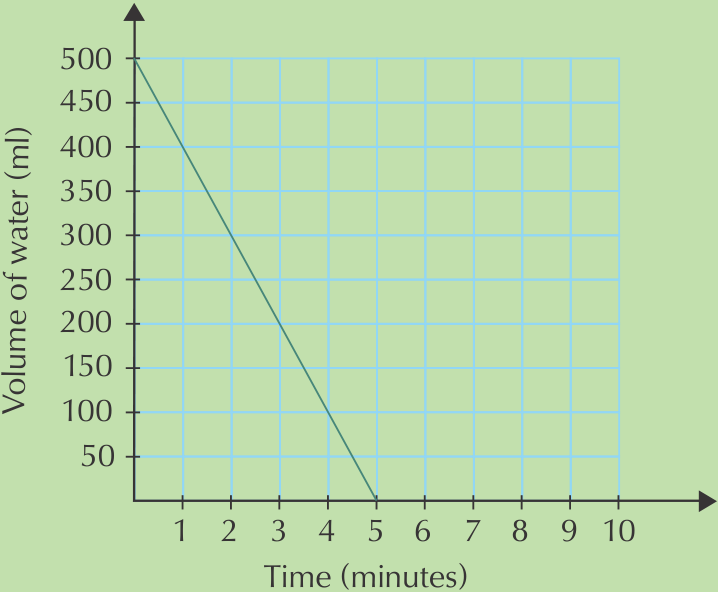

---

### 2.3 Linear patterns, relationships and graphs

We have previously explored how two quantities relate to each other and how these relationships can be represented on a graph. Often, these relationships form clear patterns that can be analyzed using tables and graphs.

---

### Plotting points on a grid

To plot points, we use an **ordered pair**. An ordered pair provides the exact position of a point on a Cartesian plane (grid).

*   **Definition:** An ordered pair is written as $(x; y)$, where:
    *   The first number is the **horizontal coordinate** ($x$-axis).
    *   The second number is the **vertical coordinate** ($y$-axis).

#### Method: How to plot the point $(5; 4)$

1.  **Start at the origin:** Begin at the point $(0; 0)$.
2.  **Move horizontally:** Move along the horizontal $x$-axis until you reach $5$.
3.  **Move vertically:** Move upwards until you are in line with $4$ on the vertical $y$-axis.
4.  **Mark the point:** Draw a dot where the grid lines cross at this position.

---

### Review Questions

3. What happens to the amount of water in the bottle during the first two hours?
4. What happens at hour number $5$? Explain.
5. Between which two hours does Tumelo drink his water the fastest?
6. Does he finish all the water in his bottle at any point? How do you know this?

*For further practice, use the following codes on the Intelligent Practice Service:*
1. 24BR
2. 24BS
3. 24BT
4. 24BV
5. 24BW
6. 24BX

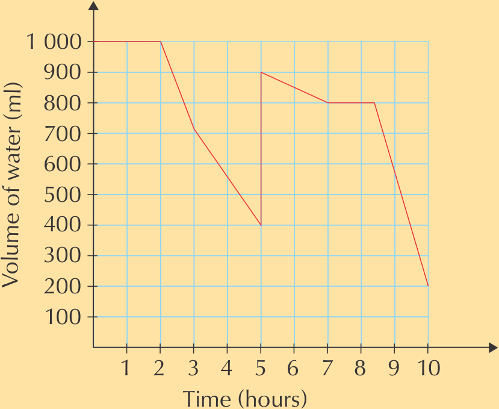

---

### 2.3. Linear Patterns, Relationships, and Graphs

#### Definition: Ordered Pair
An **ordered pair** (also known as a coordinate pair) consists of two numbers written in a specific order to identify the exact location of a point on a grid.

---

#### Worked Example 6: Plotting Points

**Question:**
The number of visitors to a new museum increases by $150$ visitors each month for $6$ months.

| Month | 1 | 2 | 3 | 4 | 5 | 6 |
| :--- | :--- | :--- | :--- | :--- | :--- | :--- |
| **Number of visitors** | 150 | 300 | 450 | 600 | 750 | 900 |

1. Write down a set of ordered pairs for this relationship.
2. Plot the points on a graph grid.
3. Would you connect the points with a solid line? Explain.
4. Which quantity is the dependent variable, and which is the independent variable? Explain your answer.

**Solution:**

1. **Ordered pairs:**
   From the table, the set of ordered pairs $(x; y)$ is:
   $(1; 150), (2; 300), (3; 450), (4; 600), (5; 750), (6; 900)$

2. **Plotting the points:**
   For each point, start at the origin $(0; 0)$. Move across the horizontal $x$-axis to find the first number (Month), then move up the vertical $y$-axis to the corresponding number (Number of visitors) and draw a dot.

3. **Connecting the points:**
   Yes, you would connect the points with a solid line because the number of visitors increases continuously over time, and the relationship follows a linear pattern.

4. **Variables:**
   *   **Independent variable:** Month. This is the value that changes independently as time passes.
   *   **Dependent variable:** Number of visitors. The number of visitors depends on which month it is.

---

### Discrete Data and Graphs

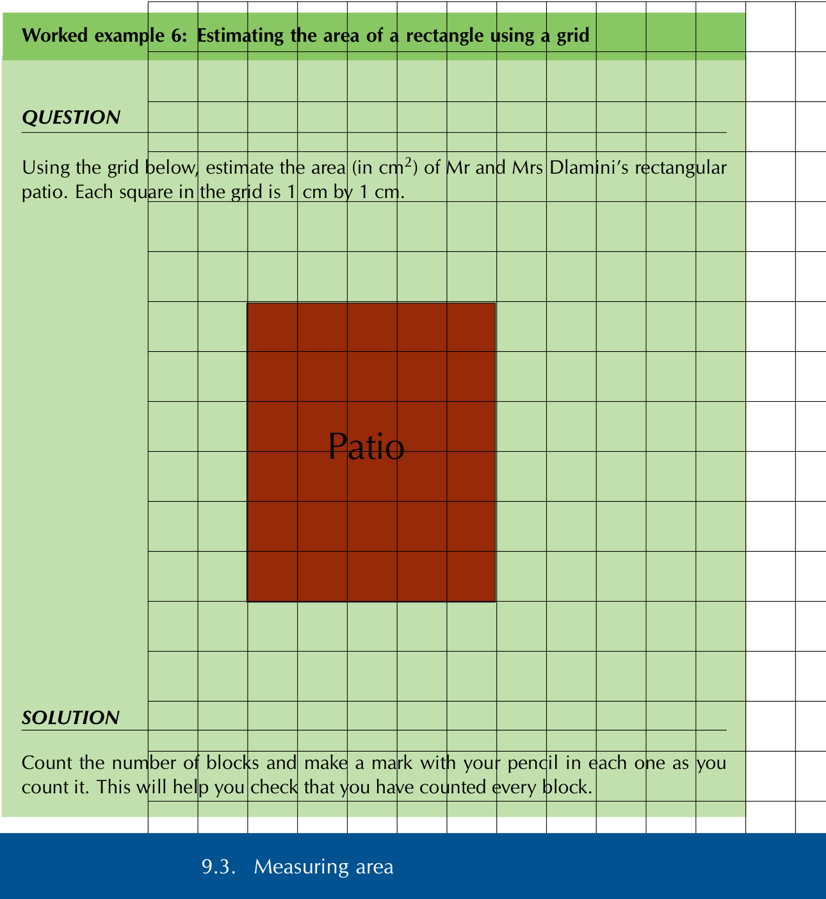

*   **Discrete Data:** When data points represent values where there are no possible values in between (e.g., counting whole months), the points should **not** be connected by a solid line.
*   **Variables:**
    *   **Independent Variable:** The variable that changes independently (e.g., Months).
    *   **Dependent Variable:** The variable that changes in response to the independent variable (e.g., Number of visitors).

---

### Linear Relationships and Graphs

A relationship between two quantities is considered **linear** if the points plotted on a graph form a straight line.

#### Activity 2 – 3: Linear relationships

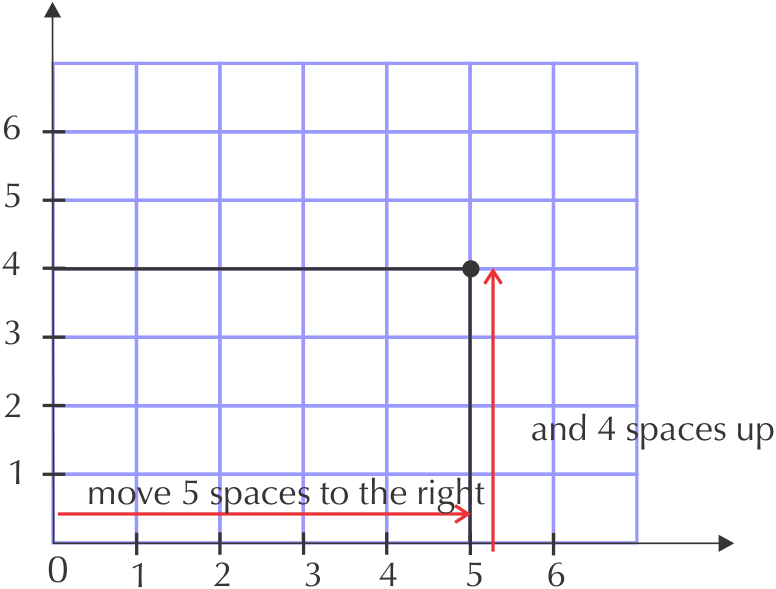

**1. Analysis of the graph:**
The graph above illustrates the relationship between the weight of potatoes (in kg) and the total price (in R). Because the line is straight, this represents a linear relationship.

*   **Independent Variable:** Weight (kg)
*   **Dependent Variable:** Price (R)

**Key Observation:** In a linear relationship, for every constant increase in the independent variable, there is a constant increase in the dependent variable.

---

### 1. Potato Cost Analysis
**Task:** Analyze the relationship between the weight of potatoes and their cost.

**a) Complete the table:**
| Weight of potatoes (kg) | 5 | 10 | 15 | 20 | 25 | 30 |
| :--- | :--- | :--- | :--- | :--- | :--- | :--- |
| **Cost (R)** | 100 | 200 | 300 | 400 | 500 | 600 |

**b) Calculation:** What will $7,5\text{ kg}$ of potatoes cost?
*   From the table, $5\text{ kg} = R100$, therefore $1\text{ kg} = R20$.
*   $7,5\text{ kg} \times R20 = R150$.

**c) Calculation:** If you spend $R300$, what is the weight of potatoes bought?
*   Using the rate $R20$ per $1\text{ kg}$:
*   $\frac{300}{20} = 15\text{ kg}$.

**d) Variables:**
*   **Independent variable:** Weight of potatoes (kg).
*   **Dependent variable:** Cost (R).

---

### 2. Car Travel Relationship
**Task:** Analyze the relationship between distance travelled and time taken.

| Distance travelled (km) | 0 | 50 | 100 | 150 | 200 | 250 | 300 |
| :--- | :--- | :--- | :--- | :--- | :--- | :--- | :--- |
| **Time (minutes)** | 0 | 30 | 60 | 90 | 120 | 150 | 180 |

**a) Graphing:**

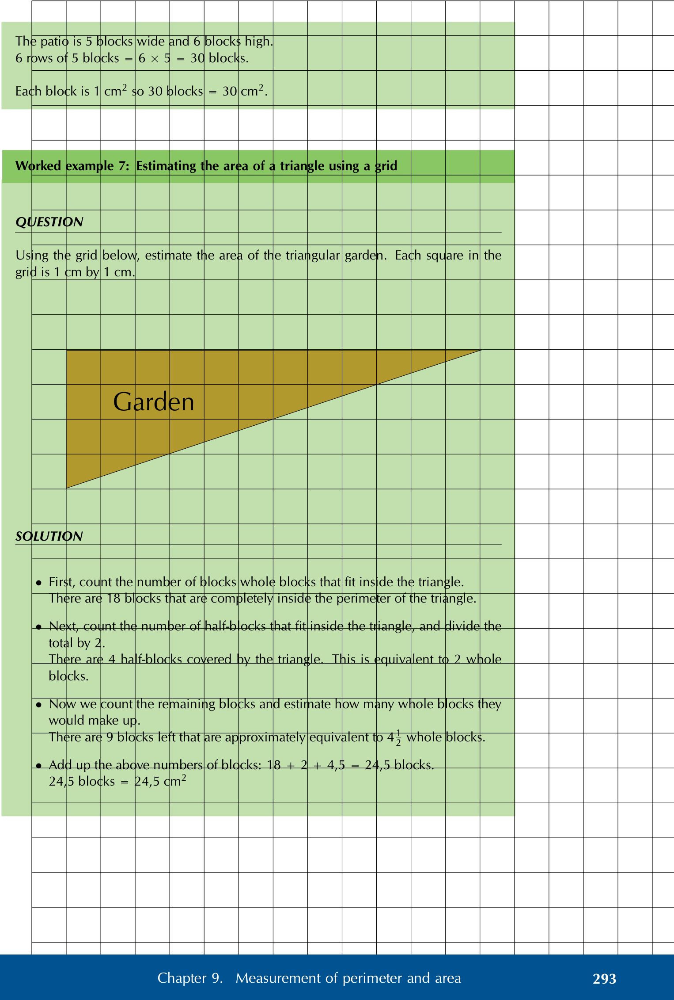

**b) Speed Calculation:** Write down the speed of the car in kilometres per hour ($\text{km/h}$).
*   The car travels $50\text{ km}$ in $30\text{ minutes}$.
*   Since $30\text{ minutes} = 0,5\text{ hours}$:
*   $\text{Speed} = \frac{\text{Distance}}{\text{Time}} = \frac{50\text{ km}}{0,5\text{ h}} = 100\text{ km/h}$.

---

### 3. Municipal Electricity Charges
**Task:** Analyze the cost of electricity based on units used.

| Number of units of electricity | 0 | 100 | 200 | 300 | 400 | 500 | 600 |
| :--- | :--- | :--- | :--- | :--- | :--- | :--- | :--- |
| **Cost (cents)** | 0 | 110 | 220 | 330 | 440 | 550 | 660 |

*   **Note:** This represents a linear relationship where the cost increases by $1,1\text{ cents}$ per unit ($110 \div 100 = 1,1$).

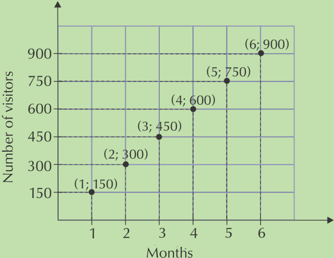

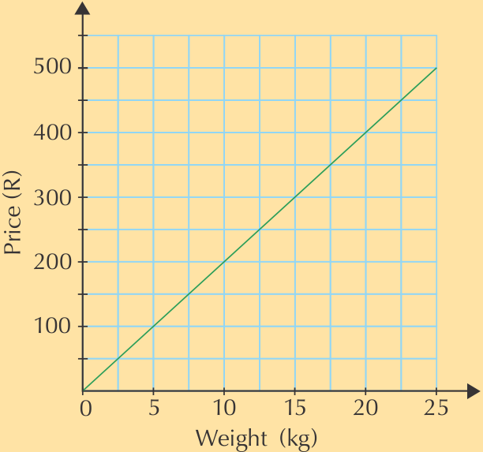

---

### 2.4 Inverse Proportion Patterns, Relationships and Graphs

#### Concept: Inverse Proportion
An inverse proportion relationship exists when two quantities have an opposite effect on each other:
*   As one quantity **decreases**, the other **increases**.
*   As one quantity **increases**, the other **decreases**.

---

#### Worked Example 7: A Graph of an Inverse Proportion

**Question:**
A rectangle has a fixed area of $32$ square units. The length ($l$) and breadth ($b$) can change, but the area remains constant. If the length becomes smaller, the breadth must become larger to maintain the same area.

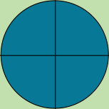

**Mathematical Relationship:**
The area of a rectangle is calculated as:
$$\text{Area} = l \times b$$

Given that the $\text{Area} = 32$, we can express the relationship as:
$$32 = l \times b$$

To find the breadth ($b$) in terms of length ($l$), we rearrange the formula:
$$b = \frac{32}{l}$$

---

#### Practice Exercises (Review)
*Based on the previous section's context:*

a) Where will the graph start? Explain how you know this.
b) Plot a graph using these values.
c) Why is this graph continuous (there are no gaps between the points)?
d) We say that the cost depends on the number of units of electricity used. Explain why this is. What pattern do you see in the table?
e) Is this graph going up (increasing), going down (decreasing), or staying the same (constant)? Give a reason for your answer.

**Intelligent Practice Service Codes:**
1. 24BY
2. 24BZ
3. 24C2

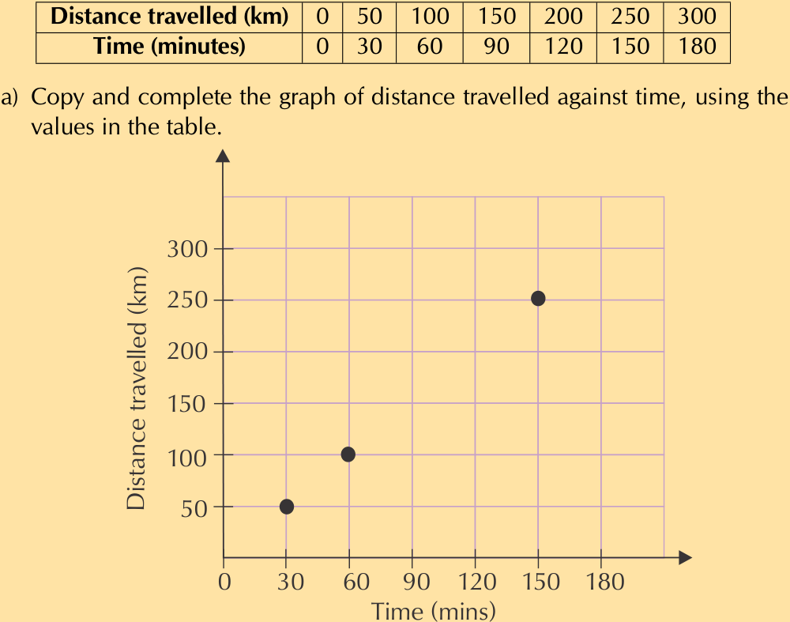

---

### Inverse Proportion Patterns and Graphs

#### Exercise: Relationship between Length and Breadth
Consider a rectangle where the area is constant. We explore the relationship between length ($l$) and breadth ($b$).

**1. Table of Values**
Complete the table for possible values of length and breadth:

| length $l$ | 1 | 2 | 4 | 8 | 16 | 32 |
| :--- | :--- | :--- | :--- | :--- | :--- | :--- |
| breadth $b$ | 32 | 16 | 8 | 4 | 2 | 1 |

**2. Graphical Representation**
Plot the coordinates $(l, b)$ on a Cartesian plane.

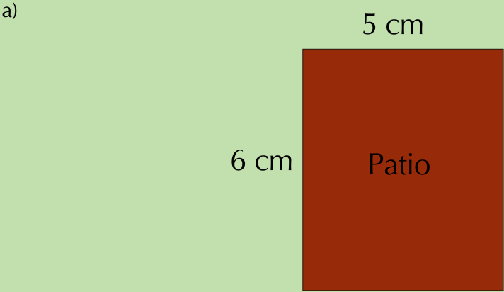

**3. Nature of the Graph**
*   **Question:** Is the graph continuous or discrete? Explain.
*   **Answer:** The graph is **continuous**. Because measurement values (length and breadth) are continuous, there are an infinite number of possible values between the plotted points. Therefore, the curve is drawn as a solid line rather than a series of dots.

**4. Asymptotic Behavior**
*   **Question:** Why does the curve not touch the axes?
*   **Answer:** The graph does not touch the axes because the length and breadth of a rectangle can never be $0$. If either dimension were $0$, the area would be $0$, which is not possible for a physical rectangle.

---

#### Key Concepts: Inverse Proportion Graphs
When dealing with inverse proportion, note the following characteristics:
*   **Shape:** The graph forms a smooth curve (a hyperbola).
*   **Asymptotes:** The curve never touches the axes because the variables cannot be zero.
*   **Domain:** In most real-life applications, we deal with positive values. However, mathematically, negative values are also possible depending on the context of the relationship.

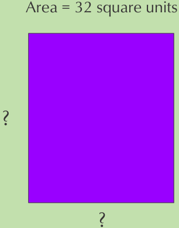

---

### Activity 2 – 4: Inverse Proportion Patterns

#### 1. Lucky Draw Game
Lerato is organizing a group to play a lucky draw game. The total prize money is $R\,2000$. As the number of people in the group increases, the share each person receives decreases.

**Questions:**
a) If they win the prize money, how much will they have to share?
b) How will the number in the group affect the amount each person receives?
c) What kind of relationship is this?
d) Copy and complete the table below:

| Number of people | 1 | 2 | 3 | 4 | 8 | 10 | 50 |
| :--- | :--- | :--- | :--- | :--- | :--- | :--- | :--- |
| **Share of the prize money (R)** | 2000 | 1000 | | | | | |

e) Plot a graph of these points to show the relationship.

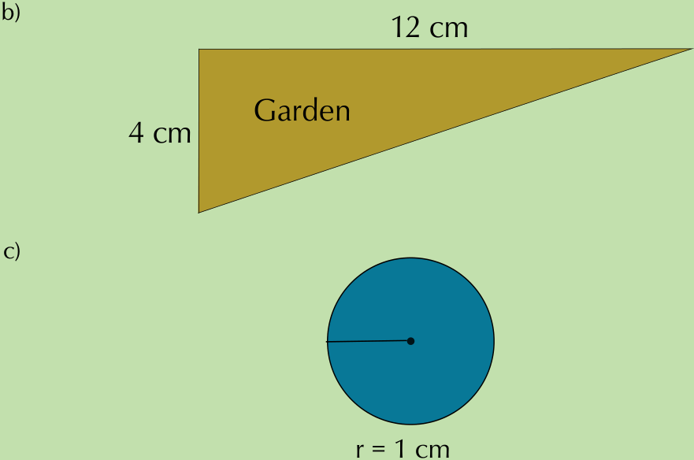

---

#### 2. Garden Bed Dimensions
Meryl wants to make a garden bed with a fixed area of $16\,m^2$. The relationship between length ($l$) and breadth ($b$) is defined by the formula:
$$Area = l \times b = 16$$
$$b = \frac{16}{l}$$

**Questions:**
a) Draw up a table to show a few possible length and breadth measurements of the garden bed.
b) Do the measurements have to be whole numbers? Explain.
c) Draw a graph to show the relationship between the length and the breadth of the garden bed.

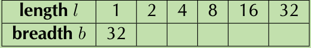

---

**Note:** Think you got it? Get this answer and more practice on our Intelligent Practice Service.
*   1. 24C3
*   2. 24C4

[www.everythingmaths.co.za](http://www.everythingmaths.co.za) | [m.everythingmaths.co.za](http://m.everythingmaths.co.za)

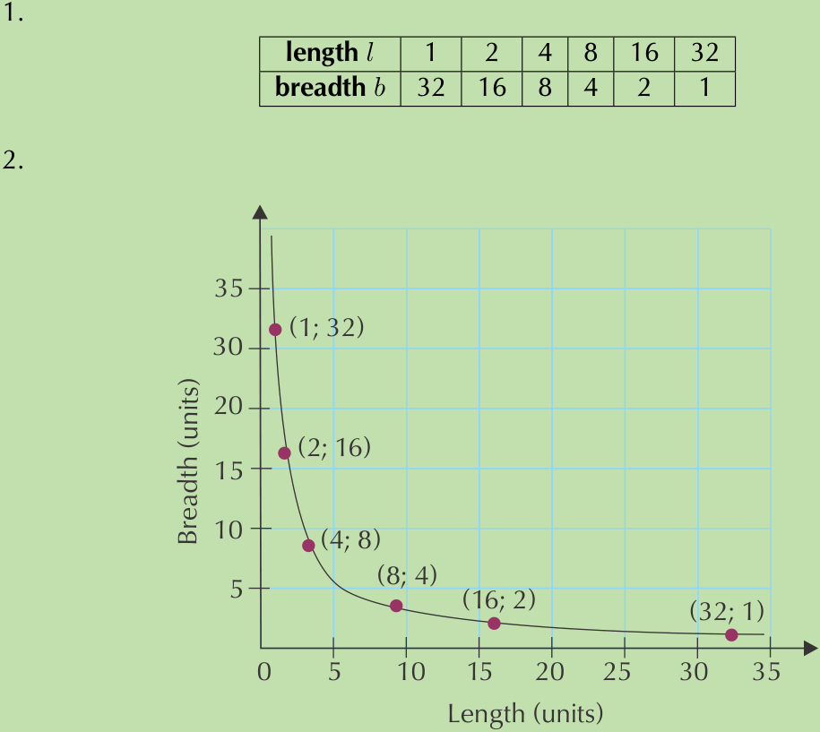

---

# 2.5 Finding the Rule or Formula

## Worked Example 8: Identifying Patterns

### Question
Elvis makes boxes of fudge and calculates the cost of production using a pattern.

| Number of boxes made | 1 | 2 | 3 | 4 | 5 | 6 |
| :--- | :--- | :--- | :--- | :--- | :--- | :--- |
| **Cost of making the boxes (R)** | 6 | 10 | 14 | 18 | 22 | 26 |

1. What pattern do you see in this table?
2. Are there different ways of describing the pattern?
3. What would it cost to make 20 boxes of fudge? How do you know?

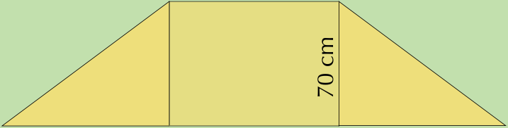

### Solution

1. The cost increases by $R\ 4$ as the number of boxes increases by $1$.
2. The cost is equal to $2$ plus $4$ times the number of boxes.
   $$\text{Cost} = 2 + (4 \times \text{number of boxes})$$
3. Using the rule from step 2, we can calculate the cost for $20$ boxes:
   $$\text{Cost} = 2 + (4 \times 20)$$
   $$\text{Cost} = 2 + 80$$
   $$\text{Cost} = 82$$
   It would cost $R\ 82$ to make $20$ boxes.

---

## Defining Rules and Formulas

Describing a pattern using the number of items is a useful way to create a rule that applies to any quantity.

*   **Rule in words:** $\text{cost} = 2 + (4 \times \text{number of boxes})$
*   **Rule using variables:** If we let $c = \text{cost}$ and $b = \text{number of boxes}$, the formula is:
    $$c = 2 + 4b$$

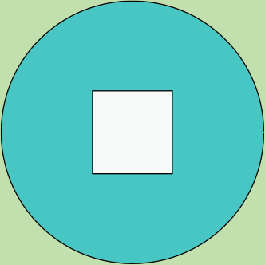

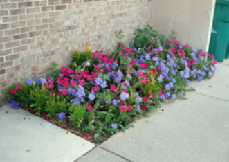

---

### Dependent and Independent Variables
In mathematical patterns, variables are used to show relationships:
*   **Independent variable:** The input value (e.g., the number of boxes made, $b$).
*   **Dependent variable:** The output value that changes based on the input (e.g., the cost of making the boxes, $c$).

---

### Writing a General Formula
To describe the value of a term in a sequence, we use the position of the term, denoted by $n$. Since $n$ can represent different positions, it is called a **variable**.

#### Example: Deriving a Formula
If a sequence follows the general formula $(10n) - 5$:
*   To find the 100th term, substitute $n = 100$:
    $$(10 \times 100) - 5 = 995$$

#### Simplifying Expressions
Sometimes a pattern can be written in different ways. For example, a pattern starting at 5 and increasing by 10 can be written as:
$$5 + [(n - 1) \times 10]$$

To simplify this expression:
1.  Distribute the 10: $5 + 10n - 10$
2.  Combine like terms: $10n - 5$

---

### Activity 2 – 5: Describing Patterns

**1. Describe each of these patterns in words, and write the next three terms:**
*   a) $2; 4; 8; 16; \dots$
*   b) $1; 5; 9; 13; \dots$
*   c) $3; 6; 9; 12; \dots$
*   d) $5; 10; 15; 20; \dots$

**2. Write down the first four terms of the pattern for each description:**
*   a) The sequence starts at $1$ and $20$ is added to each term to get the next.
*   b) The sequence starts at $1$ and each term is multiplied by $4$ to get the next.

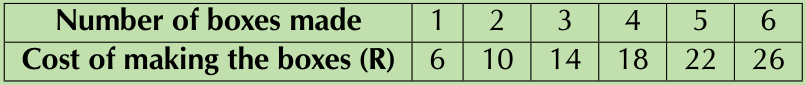

---

### Number Sequences and Financial Modeling

#### 1. Geometric Sequences
c) A number sequence starts at $20\,000$ and each term is multiplied by $2$ to get the next term.

#### 2. Finding the General Formula
Complete the table for the sequence: $5; 14; 23; 32; 41; 50; \dots$ and determine the general formula and the value of the $20^{th}$ term.

| Position of term ($n$) | 1 | 2 | 3 | 4 | 5 | 6 | 20 |
| :--- | :--- | :--- | :--- | :--- | :--- | :--- | :--- |
| **Value of term** | 5 | 14 | 23 | 32 | 41 | 50 | |

---

#### 3. Real-world Application: Linear Modeling
Kepa sells pies at a roadside stall. He earns a basic salary of $R\,250$ per day and a commission of $40\text{ c}$ ($R\,0,40$) on each pie he sells.

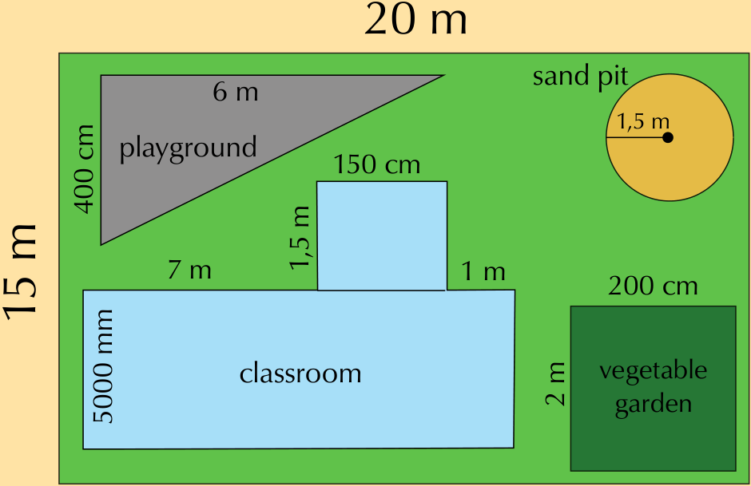

**a) Write an equation for calculating how much he earns at an event.**
Let $E$ be the total money earned and $n$ be the number of pies sold:
$$E = 250 + 0,4n$$

**b) Use your equation to complete the table:**

| Number of pies | 20 | 40 | 60 | 80 | 100 |
| :--- | :--- | :--- | :--- | :--- | :--- |
| **Money earned (R)** | | | | | |

**c) Plot the data points from your table and draw a graph.**
*(Learner instruction: Use the values calculated in the table above to plot points on a Cartesian plane where the x-axis represents the number of pies and the y-axis represents money earned in Rand.)*

**d) Should Kepa use the table, the graph, or the equation to work out how much money he earns at the end of the day? Explain your answer.**
*   **Equation:** Most accurate and efficient for any specific number of pies.
*   **Table:** Useful for quick reference of common values.
*   **Graph:** Useful for visualizing the trend and estimating earnings.

---

# 2.6 End of Chapter Activity: Activity 2 – 6

## 1. Interpreting Distance-Time Graphs
The following activity requires the analysis of two graphs representing Dikeledi's cycling trip to the Post Office and back home.

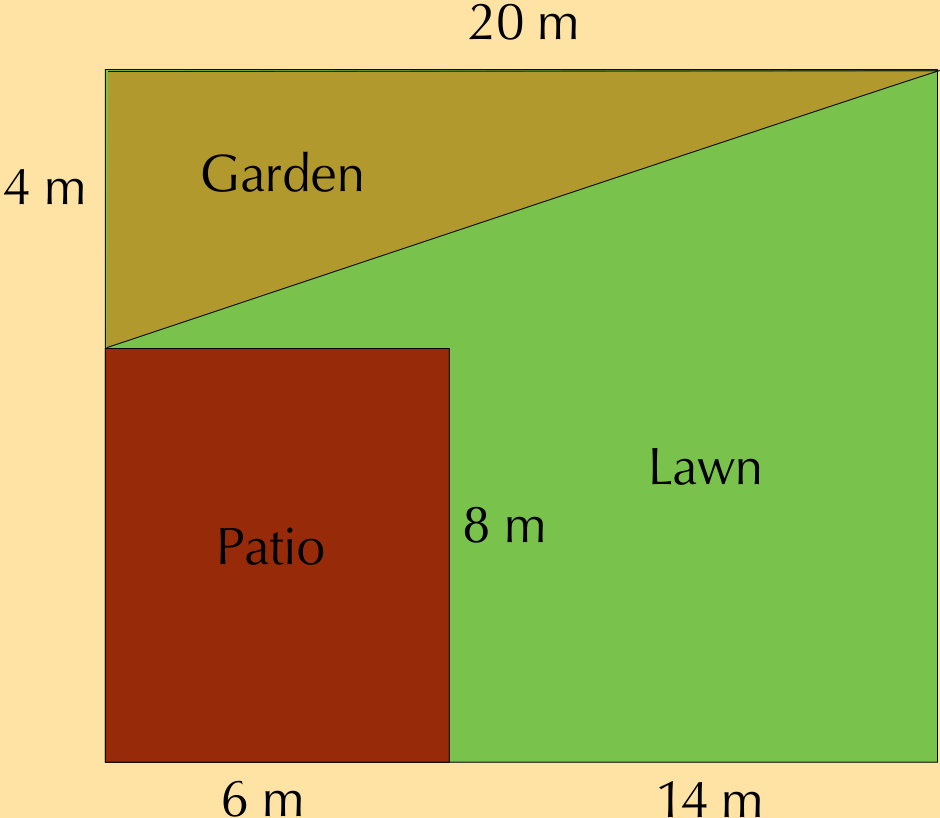

### Questions
a) What relationship is shown in each graph?
b) Explain why the first graph has a positive slope.
c) Explain why the second graph has a negative slope for most of the way.
d) How long did Dikeledi take to cycle to the Post Office?
e) What is the distance between her home and the Post Office?
f) How long did she take to cycle home from the Post Office?
g) Dikeledi's trip home has four parts, shown by four different line segments. Describe what is happening in each part.

---

### Mathematical Context
To analyze these graphs, consider the formula for speed ($v$):
$$v = \frac{\Delta \text{distance}}{\Delta \text{time}}$$

*   **Positive Slope:** Indicates an increase in distance from the starting point (moving away from home).
*   **Negative Slope:** Indicates a decrease in distance from the starting point (moving towards home).
*   **Zero Slope (Horizontal Line):** Indicates that the distance is not changing over time, meaning the object is stationary.

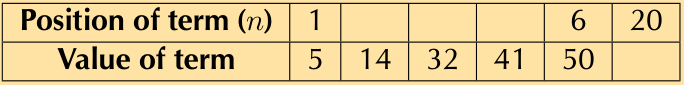

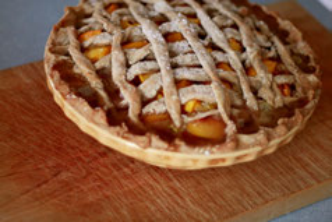

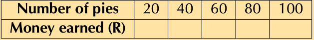

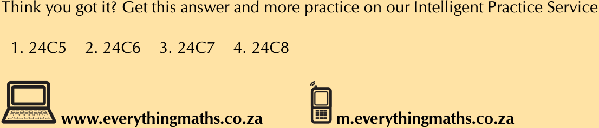

---

### Exercise 1: Dikeledi's Cycling Trip
*Note: This section refers to a graph (not provided) showing Dikeledi's cycling journey.*

i. When did Dikeledi cycle the fastest?
ii. How far did she cycle before she slowed down?
iii. When did Dikeledi cycle the slowest?
iv. How far from home was Dikeledi after 10 minutes?

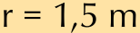

---

### Exercise 2: Jabulani Joinery (Inverse Proportion)
It takes one carpenter 6 hours to make a wooden table. The workshop needs to make 20 wooden tables.

a) What are the two variables in this relationship?
b) How long would 2 carpenters take to make the table?
c) How long would 4 carpenters take?
d) How long would 12 carpenters take?
e) What kind of a relationship is there between the two variables?
f) Draw up a table of values to plot a graph of this relationship.
g) Sketch a graph of these values.
h) Did you use a solid line or a dotted line? Explain why.

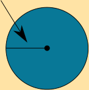

**Table of Values for Carpenters vs. Time**

| Number of Carpenters ($x$) | Time in Hours ($y$) |
| :--- | :--- |
| 1 | 6 |
| 2 | 3 |
| 3 | 2 |
| 4 | 1.5 |
| 6 | 1 |
| 12 | 0.5 |

---

### Exercise 3: Gamers Club (Linear Relationships)
A computer game shop charges R 30 per game hire. Alternatively, one can join the Gamers Club for a fixed fee of R 150 per year, then pay only R 15 per game.

a) How would you calculate the cost of hiring 10 games if you did not belong to the club?
b) Write an equation for the calculation in (a).
c) How would Thomas calculate the cost of hiring five games if he belongs to the Gamers Club?
d) Write an equation for calculating the cost ($y$) of hiring any number of games ($x$) for the year for Gamers Club members.
e) In the relationship between costs and the number of games hired, which is the independent variable? Explain.
f) Which is the dependent variable?
g) Would a graph for this relationship have a positive or a negative slope? Give a reason for your answer.

**Mathematical Guidance for Exercise 3:**
*   **Non-member cost equation:** $y = 30x$
*   **Gamers Club cost equation:** $y = 15x + 150$
    *   Where $x$ is the number of games hired.
    *   Where $y$ is the total annual cost in Rand.

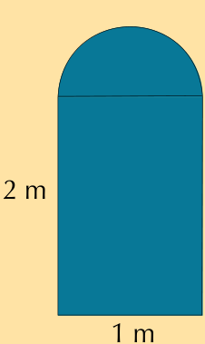

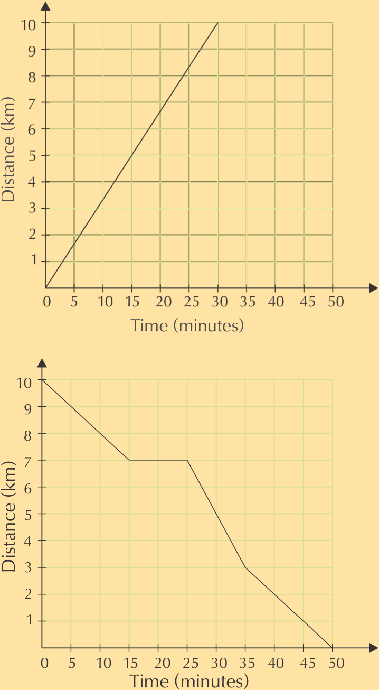

---

# Chapter 2: Patterns, Relationships and Representations

This chapter focuses on understanding how mathematical patterns and relationships are identified, analyzed, and represented through graphs and formulas.

---

## Chapter Contents

| Section | Topic | Page |
| :--- | :--- | :--- |
| 2.2 | Making sense of graphs that tell a story | 56 |
| 2.3 | Linear patterns, relationships and graphs | 60 |
| 2.4 | Inverse proportion patterns, relationships and graphs | 63 |
| 2.5 | Finding the rule or formula | 65 |
| 2.6 | End of chapter activity | 67 |

---

## Key Concepts

### 1. Graphs that tell a story
Graphs are used to represent real-life situations. By analyzing the shape of a graph, you can determine how one variable changes in relation to another over time or distance.

### 2. Linear Patterns and Relationships
A linear relationship exists when there is a constant rate of change between two variables. These are typically represented by the general formula:
$$y = mx + c$$
Where:
*   $m$ is the gradient (rate of change).
*   $c$ is the $y$-intercept.

### 3. Inverse Proportion
Inverse proportion occurs when one variable increases as the other decreases, such that their product remains constant. This is represented by the relationship:
$$y = \frac{k}{x}$$
Where $k$ is the constant of proportionality.

### 4. Finding the Rule or Formula
This involves identifying the mathematical relationship between terms in a sequence or variables in a data set. You will learn to derive algebraic expressions to predict future values.

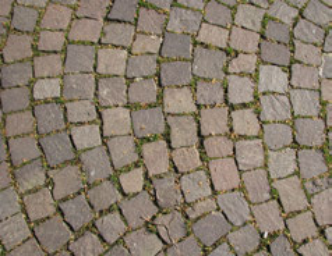

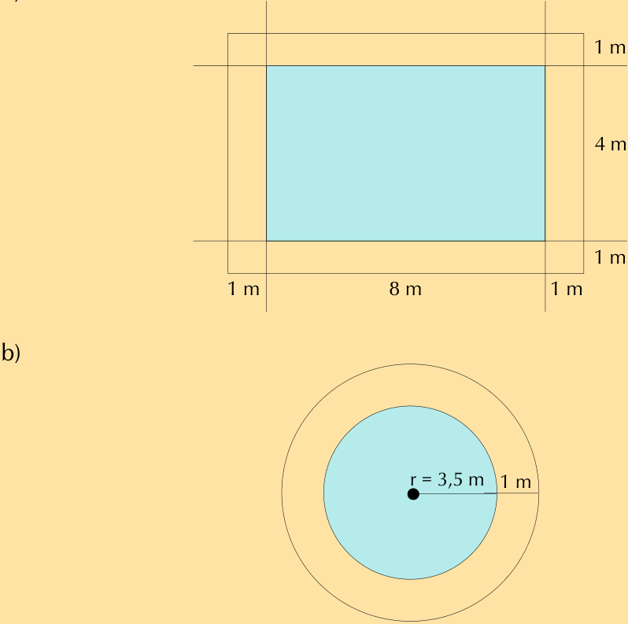

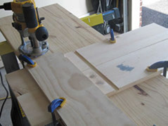

---

# 2. Patterns, Relationships and Representations

## 2.2 Making sense of graphs that tell a story

Graphs are visual representations of the relationship between two quantities. They allow us to interpret data and understand trends in a narrative format.

### Key Concepts in Graph Interpretation

To understand how a graph "tells a story," focus on the following features:

*   **Increasing:** The graph moves upwards from left to right, indicating that the dependent variable is growing as the independent variable increases.
*   **Decreasing:** The graph moves downwards from left to right, indicating that the dependent variable is shrinking.
*   **Constant:** The graph is a horizontal line, indicating that the dependent variable remains unchanged over a period of time.
*   **Gradients (Steepness):** The slope of the line indicates the rate of change. A steeper line means a faster rate of change.
*   **Maximum and Minimum Points:** These represent the highest and lowest values reached on the graph.

### Continuous vs. Discrete Graphs

*   **Continuous Graphs:** Represented by solid lines, showing a smooth, unbroken relationship between variables.
*   **Discrete Graphs:** Represented by dotted lines or individual points. The dots help distinguish between specific data points and emphasize the steepness between them, rather than implying a continuous connection.

---

### Activity 2 – 1: Interpreting graphs

**Scenario:** Lindi and Thabang went on a day hike. The graph below illustrates their progress throughout the day.

#### Analysis Questions
1.  **Identify the variables:**
    *   Independent variable (x-axis): Time of day.
    *   Dependent variable (y-axis): Number of kilometres hiked.
2.  **Interpret the segments:**
    *   **Segment AB:** The hikers are moving at a steady pace (increasing).
    *   **Segment BC:** The hikers are moving at a different, slightly steeper pace.
    *   **Segment DE:** The line is horizontal, indicating a rest period (constant).
    *   **Segment FH:** The hikers have resumed their journey at a faster pace to reach the end of the hike.

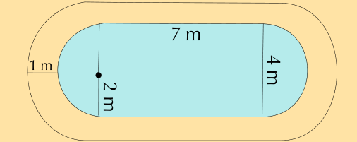

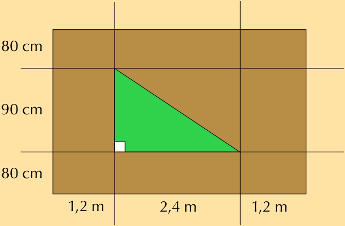

---

### Interpreting Graphs: Real-World Scenarios

This section focuses on analyzing line graphs that represent real-life situations, such as travel, fuel consumption, and temperature changes.

---

#### Worked Example 1: Lindi and Thabang's Hike
*Note: This refers to a previous graph (not pictured) showing distance over time.*

**Questions:**
a) What was the total distance of the hike and how many hours did it take?
b) Give the times when Lindi and Thabang were resting (where the distance stayed constant).
c) One part of the graph is steeper than the others. Identify this part.

**Solutions:**
a) Total distance is $16\text{ km}$, Total time is $7\text{ hours, } 30\text{ minutes}$.
b) $08:30 - 09:00$, $10:30 - 11:30$, $13:00 - 14:00$.
c) The section from $G$ to $H$.

---

#### Worked Example 2: Pumeza's Petrol Consumption
This graph tracks the amount of petrol (in litres) in a car's tank over the course of one week.

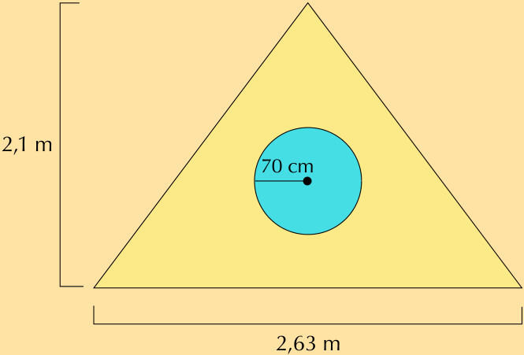

**Questions:**
a) Is there any time when her petrol tank is completely empty? How do you know?
b) Pumeza was ill for two days during the week and stayed at home. Identify the two days and explain your answer.
c) How many times does she fill up her car with petrol? Where do you see this on the graph?

**Solutions:**
a) **No.** At no point does the graph touch the horizontal axis (the $x$-axis represents $0\text{ litres}$).
b) **Tuesday and Wednesday.** The petrol consumption did not change at all (the line is horizontal), which suggests she did not use her car and was therefore at home.
c) **Once.** On Tuesday, the amount of petrol in the tank spikes suddenly, indicating a refill.

---

#### Exercise 3: Temperature in Bloemfontein
*Note: The graph for this question is partially visible at the bottom of the page.*

**Task:** Analyze the provided graph showing the temperature in Bloemfontein, measured over one week in September.

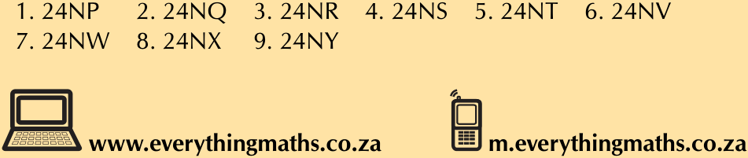

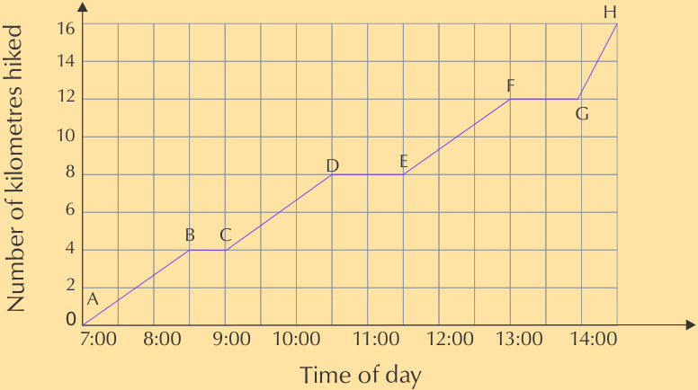

---

### Interpreting Graphs: Continuous vs. Discrete Data

#### 1. Temperature Graph Analysis

**Questions and Solutions:**

*   **a) Is this graph continuous or discrete? Explain.**
    *   **Solution:** Continuous. There are no gaps in the graph; temperature is measured constantly throughout the day from Friday to Thursday.
*   **b) What was the highest temperature recorded during the week? On what day was this?**
    *   **Solution:** $30^\circ\text{C}$, on Wednesday.
*   **c) What was the lowest temperature recorded during the week? On what day was this?**
    *   **Solution:** Approximately $-2^\circ\text{C}$, on Sunday.
*   **d) Write down the maximum and minimum temperatures on Wednesday. Calculate the difference between them.**
    *   **Solution:** 
        *   Maximum: $\approx 30^\circ\text{C}$
        *   Minimum: $\approx 7^\circ\text{C}$
        *   Calculation: $30^\circ\text{C} - 7^\circ\text{C} = 23^\circ\text{C}$ difference.

---

#### 2. Sales of Necklaces (Discrete Data)

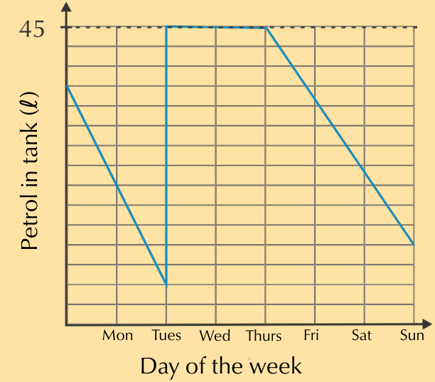

**Questions:**

*   **a) Where is the highest point on the graph?**
    *   The highest point is on Tuesday (T), where 17 necklaces were sold.
*   **b) On which day were there no sales?**
    *   There were no sales on Sunday (S), as the point lies on the x-axis ($y = 0$).
*   **c) Between which two days is the biggest increase in sales? Explain.**
    *   The biggest increase occurs between Monday (M) and Tuesday (T). 
    *   Calculation: $17 - 8 = 9$ additional necklaces sold.

---

### Analysis of Sales Data (Previous Activity)

**Questions:**
d) Between which two days do the sales stay the same?
e) Describe what happens to the sales between Wednesday and Thursday.
f) Why is the graph drawn with a dotted line?

**Solutions:**
d) Between Thursday and Friday - the graph is constant between these two points.
e) There is a small increase in sales from Wednesday to Thursday - from 8 to 10 necklaces.
f) There is a dotted line to indicate that the graph is not continuous between the plotted points. The sales are discrete points because Naledi only sells a whole number of necklaces each day.

---

### Activity 2 – 2: Reading Graphs

**Scenario:**
Tumelo has a long day at work ahead and takes a one-litre bottle of water to work with him.

**1. What are the two variables plotted on this graph?**

**Solution:**
*   **Horizontal axis:** Time (measured in hours).
*   **Vertical axis:** Volume of water (measured in ml).

**2. Which variable is dependent and which is independent? Explain fully.**

*   **Independent Variable:** Time. This is the variable that changes regardless of the other factors; it progresses steadily.
*   **Dependent Variable:** Volume of water. The amount of water remaining in the bottle depends on how much time has passed and how much Tumelo has consumed.

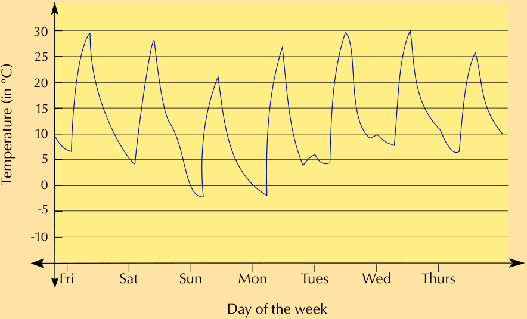

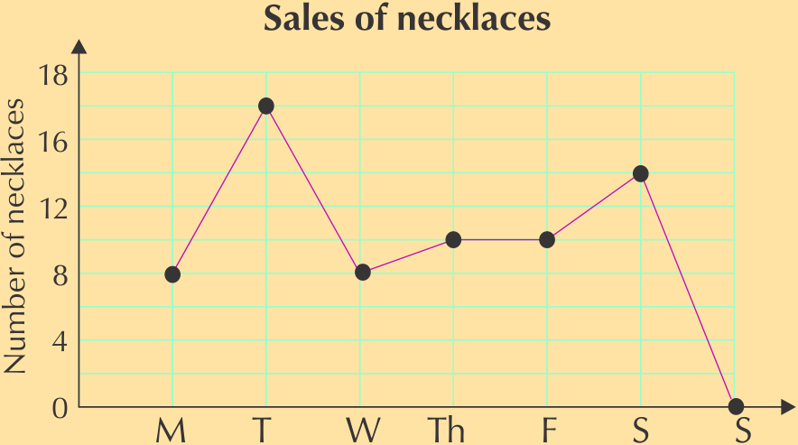

---

### Analysis of Water Consumption Graph (Continued)

**3. What happens to the amount of water in the bottle during the first two hours?**
*   **Solution:** The amount of water remains constant.

**4. What happens at hour number 5? Explain.**
*   **Solution:** The amount of water in the bottle increases suddenly. This implies that Tumelo refilled his water bottle.

**5. Between which two hours does Tumelo drink his water the fastest?**
*   **Solution:** Between hour 8 and hour 10.

**6. Does he finish all the water in his bottle at any point? How do you know this?**
*   **Solution:** No. At no point does the graph touch the horizontal axis, meaning at no point is the volume of water in the bottle $0\text{ ml}$.

---

## 2.3 Linear patterns, relationships and graphs

This section focuses on identifying patterns and representing them using tables and graphs. 

### Key Instructional Notes
*   **Plotting Coordinates:** Ensure you understand that coordinates are plotted as $(x; y)$.
*   **Horizontal Axis:** The first coordinate is plotted from the horizontal axis ($x$-axis).
*   **Vertical Axis:** The second coordinate is plotted from the vertical axis ($y$-axis).

---

## Linear relationships and graphs

### Activity 2 – 3: Linear relationships

1. This graph shows the cost of potatoes per weight.

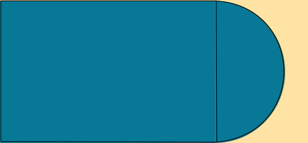

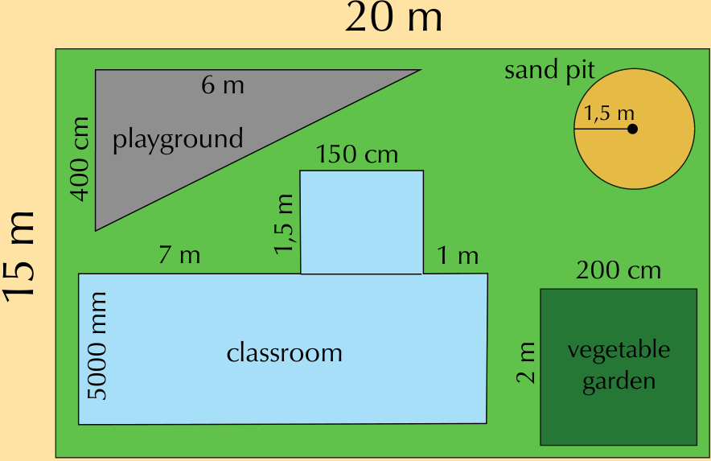

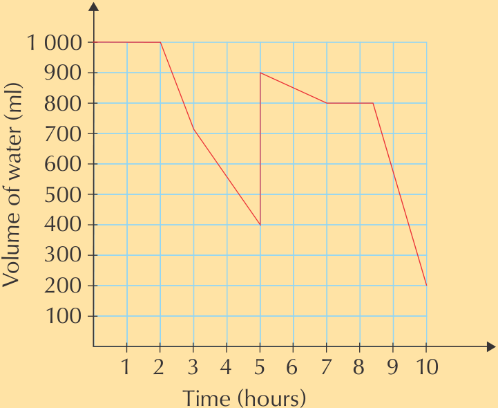

---

### Interpreting Graphs and Relationships

<!-- DIAGRAM_PLACEHOLDER: diagram -->

#### 1. Analyzing the Potato Cost Graph
The graph represents a direct relationship between the weight of potatoes (in kg) and the total cost (in R).

**a) Completing the Table**
Based on the linear relationship shown in the graph, we can determine the missing values:

| Weight of potatoes (kg) | 5 | 10 | 15 | 20 | 25 | 30 |
| :--- | :--- | :--- | :--- | :--- | :--- | :--- |
| **Cost (R)** | 100 | 200 | 300 | 400 | 500 | 600 |

**b) Finding Cost from Weight**
To find the cost of $7,5\text{ kg}$ of potatoes, locate $7,5$ on the horizontal axis (Weight) and move vertically to the line, then horizontally to the vertical axis (Price).
*   **Result:** $R\ 150$

**c) Finding Weight from Cost**
To find the weight for a cost of $R\ 300$, locate $300$ on the vertical axis (Price) and move horizontally to the line, then vertically down to the horizontal axis (Weight).
*   **Result:** $15\text{ kg}$

**d) Identifying Variables**
*   **Independent Variable:** Weight (kg) — this is the input value plotted on the $x$-axis.
*   **Dependent Variable:** Price (R) — this is the output value plotted on the $y$-axis, as it changes based on the weight.

---

#### 2. Relationship: Distance vs. Time
The following table shows the relationship between the distance a car travels and the time taken:

| Distance travelled (km) | 0 | 50 | 100 | 150 | 200 | 250 | 300 |
| :--- | :--- | :--- | :--- | :--- | :--- | :--- | :--- |
| **Time (minutes)** | 0 | 30 | 60 | 90 | 120 | 150 | 180 |

**Instruction:**
To represent this relationship graphically:
1. Draw a Cartesian plane.
2. Label the horizontal axis ($x$-axis) as **Time (minutes)**.
3. Label the vertical axis ($y$-axis) as **Distance travelled (km)**.
4. Plot the coordinate pairs $(x; y)$ from the table, such as $(30; 50)$, $(60; 100)$, etc.
5. Draw a straight line through the points to show the constant rate of travel.

---

### 2.3. Linear Patterns, Relationships, and Graphs

#### Worked Example: Speed Calculation
The graph represents the distance travelled by a car over time.

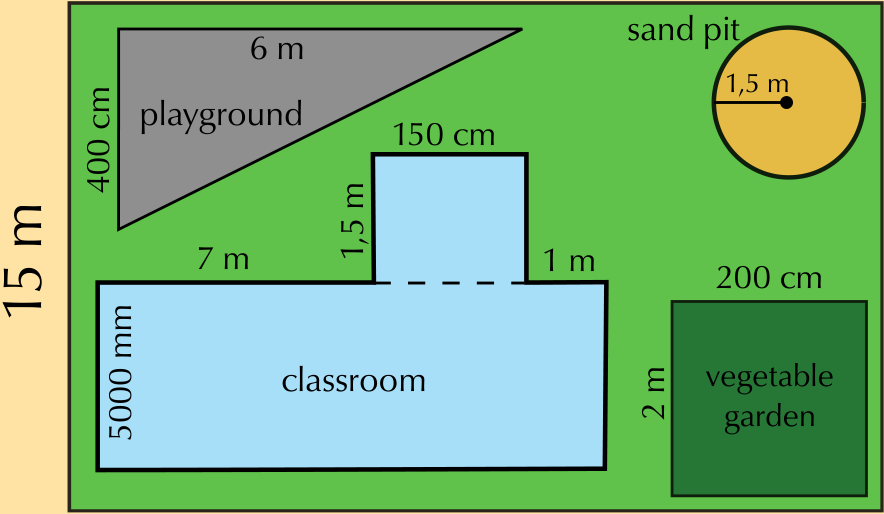

**Question:** Write down the speed of the car in kilometres per hour.

**Solution:**
To calculate speed, we use the formula:
$$\text{Speed} = \frac{\text{Distance}}{\text{Time}}$$

From the graph, we can identify a point, for example: $100\text{ km}$ in $60\text{ minutes}$.
Since $60\text{ minutes} = 1\text{ hour}$:
$$\text{Speed} = \frac{100\text{ km}}{1\text{ hour}} = 100\text{ km/h}$$

---

#### Exercise: Electricity Costs
The table below shows the amount of money a municipality charges based on the number of electricity units used by a household.

| Number of units of electricity | 0 | 100 | 200 | 300 | 400 | 500 | 600 |
| :--- | :--- | :--- | :--- | :--- | :--- | :--- | :--- |
| **Cost (cents)** | 0 | 110 | 220 | 330 | 440 | 550 | 660 |

**Questions:**

a) **Where will the graph start?** Explain how you know this.
b) **Plot a graph** using these values.
c) **Why is this graph continuous?** (There are no gaps between the points).
d) **Relationship analysis:** We say that the cost depends on the number of units of electricity used. Explain why this is and identify the pattern in the table.
e) **Trend analysis:** Is this graph going up (increasing), going down (decreasing), or staying the same (constant)? Give a reason for your answer.

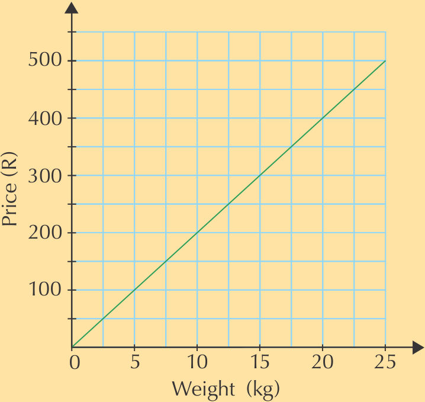

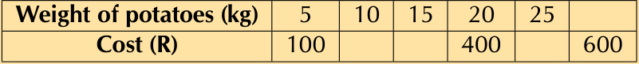

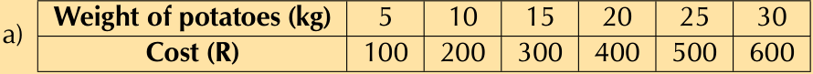

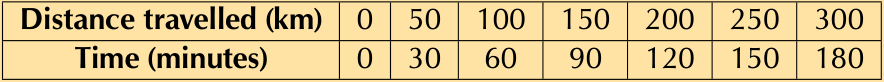

---

### Analysis of Direct Proportion Graph
The provided graph illustrates a direct proportion relationship between the number of units of electricity used and the total cost.

*   **Origin:** The graph starts at $(0, 0)$, indicating that if zero units are used, the cost is zero.
*   **Trend:** The graph is a straight line with an upward slope.
*   **Relationship:** As the number of units of electricity increases, the cost increases proportionally.

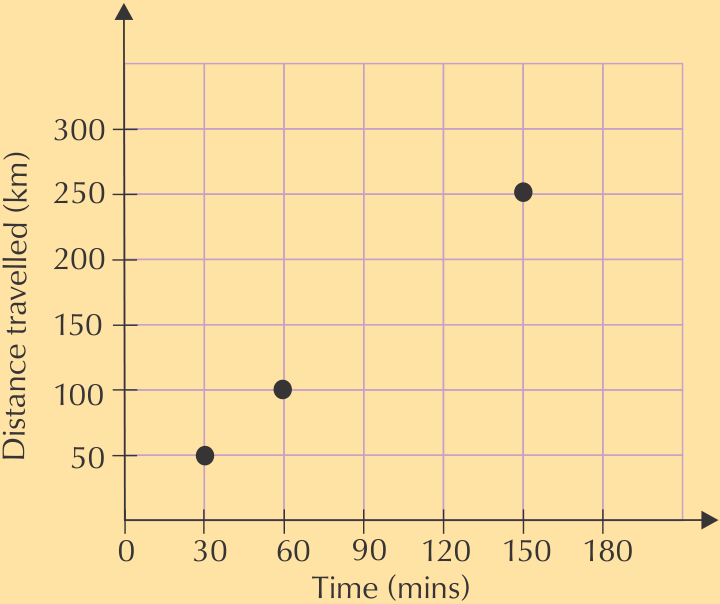

---

## 2.4 Inverse Proportion Patterns, Relationships, and Graphs

### Activity 2 – 4: Inverse Proportion Patterns

**Scenario:** Lerato and her friends are playing a lucky draw game with a total prize money of R 2 000. The prize must be shared equally among the group members.

#### Questions
a) If they win the prize money, how much will they have to share?
b) How will the number of people in the group affect the amount each person receives?
c) What kind of relationship is this?
d) Copy and complete the table below:

| Number of people | 1 | 2 | 3 | 4 | 8 | 10 | 50 |
| :--- | :--- | :--- | :--- | :--- | :--- | :--- | :--- |
| **Share of the prize money (R)** | 2000 | 1000 | | | | | |

e) Plot a graph of these points to show the relationship.

---

### Solutions and Explanations

**a) Total Prize Money:**
The total amount to be shared is R 2 000.

**b) Effect of Group Size:**
As the number of people in the group increases, the amount of money each person receives decreases. This is because the fixed total (R 2 000) is being divided by a larger number.

**c) Type of Relationship:**
This is an **inverse proportion** relationship. In an inverse proportion, as one variable increases, the other variable decreases by the same factor. The product of the two variables remains constant:
$$\text{Number of people} \times \text{Share per person} = 2000$$

**d) Completed Table:**

| Number of people ($x$) | 1 | 2 | 3 | 4 | 8 | 10 | 50 |
| :--- | :--- | :--- | :--- | :--- | :--- | :--- | :--- |
| **Share of prize (R)** ($y$) | 2000 | 1000 | 666.67 | 500 | 250 | 200 | 40 |

*Calculations for reference:*
*   For 3 people: $\frac{2000}{3} \approx 666.67$
*   For 4 people: $\frac{2000}{4} = 500$
*   For 8 people: $\frac{2000}{8} = 250$
*   For 10 people: $\frac{2000}{10} = 200$
*   For 50 people: $\frac{2000}{50} = 40$

**e) Plotting the Graph:**
To plot this, place "Number of people" on the horizontal axis ($x$-axis) and "Share of the prize money" on the vertical axis ($y$-axis). The resulting graph will be a curve that slopes downwards, known as a hyperbola.

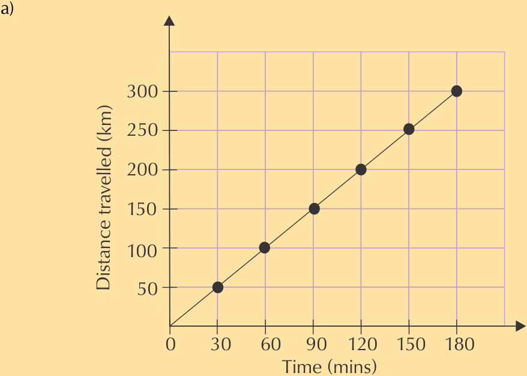

---

### Inverse Proportion Patterns and Relationships

#### Worked Example 1: Sharing a Prize
This example demonstrates an inverse proportional relationship where the total amount remains constant, but the share per person decreases as the number of people increases.

**a)** Total prize amount: R 2000.
**b)** Relationship observation: As the number of people in the group increases, the shared amount each person receives decreases.
**c)** Relationship type: This is an **inverse proportional relationship**.

**d) Data Table: Prize Distribution**

| Number of people | 1 | 2 | 3 | 4 | 8 | 10 | 50 |
| :--- | :--- | :--- | :--- | :--- | :--- | :--- | :--- |
| **Share of the prize (R)** | 2000 | 1000 | 666,67 | 500 | 250 | 200 | 100 |

**e) Graphical Representation**

---

#### Worked Example 2: Garden Bed Dimensions
Meryl wants to create a garden bed with a fixed area of $16 \text{ m}^2$. The area of a rectangle is calculated as:
$$\text{Area} = \text{length} \times \text{breadth}$$
$$16 = l \times b$$

**a) Possible Measurements Table**

| Breadth (m) | 1 | 2 | 4 | 8 | 16 |
| :--- | :--- | :--- | :--- | :--- | :--- |
| **Length (m)** | 16 | 8 | 4 | 2 | 1 |

**b) Explanation regarding whole numbers**
No, the measurements do not have to be whole numbers. Length and breadth are **continuous variables**, meaning any two numbers whose product equals $16$ can be used (e.g., $0,5 \text{ m} \times 32 \text{ m} = 16 \text{ m}^2$). However, using whole numbers makes calculations and plotting on a graph easier.

**c) Graphical Representation**

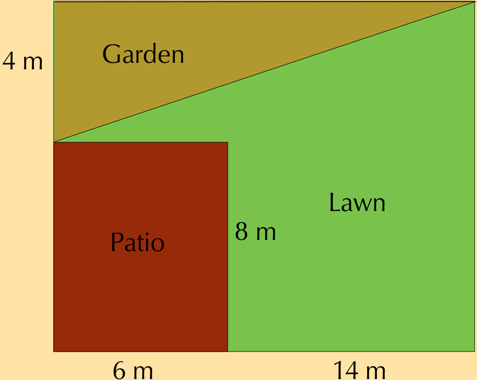

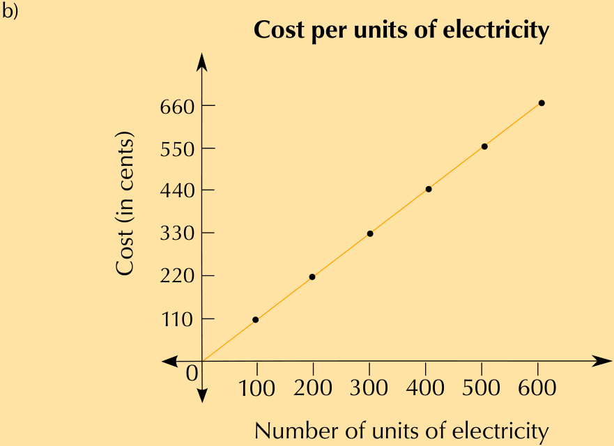

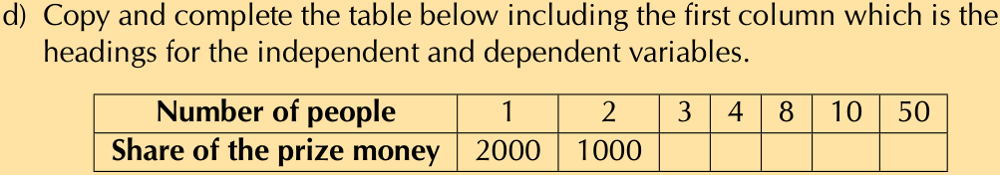

---

# 2.5 Finding the Rule or Formula

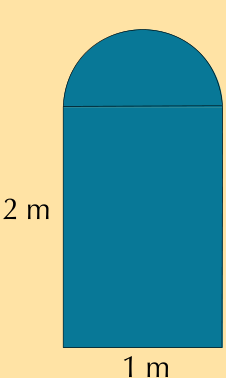

## Activity 2 – 5: Describing Patterns

### Question 1
Describe each of these patterns in words, and then write three more terms in each sequence:

a) $2; 4; 8; 16; \dots$
b) $1; 5; 9; 13; \dots$
c) $3; 6; 9; 12; \dots$
d) $5; 10; 15; 20; \dots$

### Solution
a) This number sequence starts at $2$ and each term is multiplied by $2$ to get the next term.
   *   Next three terms: $32; 64; 128$

b) This number sequence starts at $1$ and $4$ is added to each term to get the next term.
   *   Next three terms: $17; 21; 25$

c) This number sequence starts at $3$ and $3$ is added to each term to get the next term.
   *   Next three terms: $15; 18; 21$

d) This number sequence starts at $5$ and $5$ is added to each term to get the next term.
   *   Next three terms: $25; 30; 35$

---

### Question 2
Write down the first four terms of the pattern for the following description:

a) This number sequence starts at $1$ and $20$ is added each time to get the next term.

**Solution:**
*   Term 1: $1$
*   Term 2: $1 + 20 = 21$
*   Term 3: $21 + 20 = 41$
*   Term 4: $41 + 20 = 61$

The first four terms are: $1; 21; 41; 61$

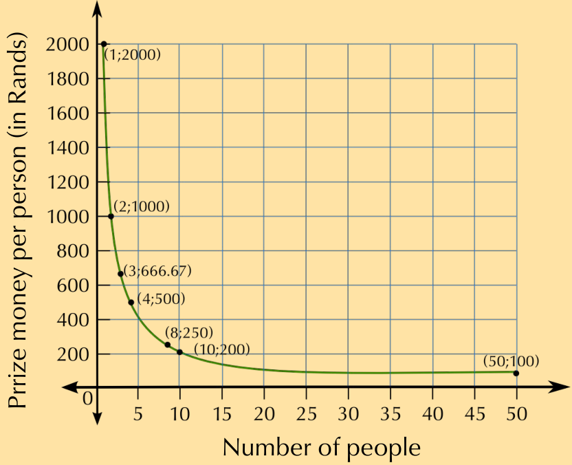

---

### Number Sequences and Patterns

#### Worked Examples: Generating Sequences
*   **Sequence b:** Starts at $1$ and each term is multiplied by $4$ to get the next term.
    *   Sequence: $1; 4; 16; 64; \dots$
*   **Sequence c:** Starts at $20\,000$ and each term is multiplied by $2$ to get the next term.
    *   Sequence: $20\,000; 40\,000; 80\,000; 160\,000; \dots$

---

#### Exercise 3: Finding the General Formula
Complete the table for the sequence: $5; 14; 32; 41; 50; \dots$ and find the $20^{th}$ term.

| Position of term ($n$) | 1 | 2 | 4 | 5 | 6 | 20 |
| :--- | :--- | :--- | :--- | :--- | :--- | :--- |
| **Value of term** | 5 | 14 | 32 | 41 | 50 | 174 |

**General Formula:**
The relationship is defined by the number sentence: $(n \times 9) - 4$.
For the $20^{th}$ term:
$$(20 \times 9) - 4 = 180 - 4 = 176$$

---

#### Exercise 4: Real-world Application (Kepa's Pie Stall)
Kepa earns a basic salary of $R\,250$ per day plus a commission of $40\text{ c}$ ($R\,0,40$) per pie sold.

**a) Equation for earnings:**
Let $n$ be the number of pies sold.
$$\text{Earnings} = 250 + (0,40 \times n)$$

**b) Completed Table:**

| Number of pies ($n$) | 20 | 40 | 60 | 80 | 100 |
| :--- | :--- | :--- | :--- | :--- | :--- |
| **Money earned (R)** | 258 | 266 | 274 | 282 | 290 |

**c) Graphing:**

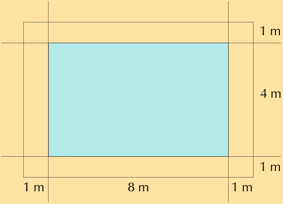

**d) Analysis:**
Should Kepa use the table, the graph, or the equation?
*   **Equation:** Most accurate and efficient for calculating exact values for any number of pies.
*   **Table:** Useful for quick reference of specific values.
*   **Graph:** Useful for visualizing the trend and rate of change in earnings.

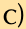

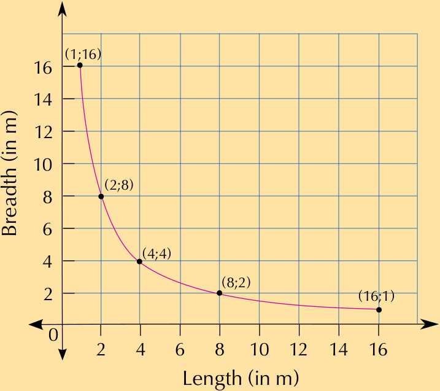

---

### 2.6 End of Chapter Activity

#### Understanding Continuous Graphs
A continuous graph represents data where values can exist between the plotted points. This allows for the calculation of values for any input within the range of the graph. The accuracy of reading values from a graph depends on the scale and the intervals marked on the axes.

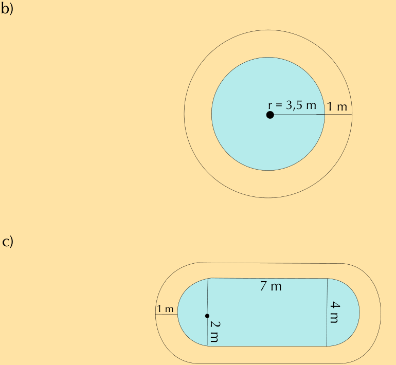

---

#### Activity 2 – 6: End of Chapter Activity

**Question d)**
The graph below illustrates Dikeledi's cycling journey to the Post Office and back home. Use the graph to answer the following questions:

<!-- DIAGRAM_PLACEHOLDER: diagram -->

**Graph Analysis Data Table**

| Axis | Variable | Unit |
| :--- | :--- | :--- |
| Horizontal ($x$-axis) | Time | minutes |
| Vertical ($y$-axis) | Distance | km |

**Key Observations:**
*   The graph shows a linear relationship between time and distance.
*   The independent variable is **Time** (measured in minutes).
*   The dependent variable is **Distance** (measured in km).
*   The graph starts at the origin $(0, 0)$, representing the start of the journey.
*   The graph reaches a distance of $10\text{ km}$ at $30\text{ minutes}$.

**Mathematical Interpretation:**
To find the rate of travel (speed), you can calculate the gradient ($m$) of the line:
$$m = \frac{\text{change in distance}}{\text{change in time}}$$
$$m = \frac{10\text{ km} - 0\text{ km}}{30\text{ min} - 0\text{ min}}$$
$$m = \frac{10}{30} = \frac{1}{3}\text{ km/min}$$

This means Dikeledi travels at a constant speed of $\frac{1}{3}\text{ km}$ per minute.

---

### Interpreting Distance-Time Graphs

The provided graph illustrates the relationship between the distance from home (in km) and the time taken (in minutes) for a journey.

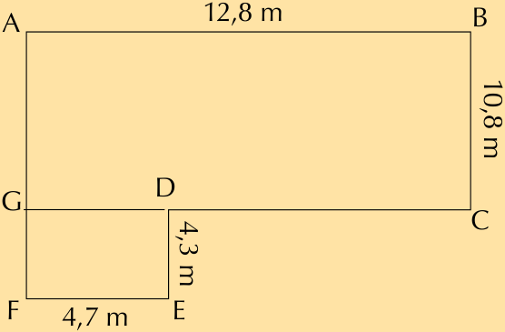

#### Analysis of the Graph
*   **Horizontal Axis ($x$-axis):** Represents Time in minutes.
*   **Vertical Axis ($y$-axis):** Represents Distance in km.
*   **Positive Slope:** Indicates that as time increases, the distance from the starting point increases (moving away).
*   **Negative Slope:** Indicates that as time increases, the distance from the starting point decreases (moving towards home).
*   **Zero Slope (Horizontal line):** Indicates that time is passing, but the distance remains constant (the person has stopped).

---

#### Exercise: Dikeledi's Trip
**Questions:**
a) What relationship is shown in the graph?
b) Explain why the first part of the graph has a positive slope (Note: The provided solution refers to a general concept of moving away).
c) Explain why the second part of the graph has a negative slope.
d) How long did Dikeledi take to cycle to the Post Office?
e) What is the distance between her home and the Post Office?
f) How long did she take to cycle home from the Post Office?
g) Dikeledi's trip home has four parts:
    i. When did Dikeledi cycle the fastest?
    ii. How far did she cycle before she slowed down?
    iii. When did Dikeledi cycle the slowest?
    iv. How far from home was Dikeledi after 10 minutes?

**Solutions:**
a) The relationship between distance from home and time.
b) The longer Dikeledi cycles, the further she gets from home (the distance increases) because she is cycling **away** from home.
c) The longer Dikeledi cycles for, the closer she gets to home (the distance decreases) because she is cycling **towards** home.
d) 30 minutes.
e) 10 km.
f) 50 minutes.
g) 
    i. Between time 25 and 35 minutes (steepest negative gradient).
    ii. 3 km.
    iii. Between time 15 minutes and 25 minutes she stopped cycling altogether (gradient = 0).
    iv. 8 km.

---

#### Problem Solving: Variables
**Question 2:** It takes one carpenter at Jabulani Joinery 6 hours to make a wooden table. They need to make 20 wooden tables.
a) What are the two variables in this relationship?

**Answer:**
The two variables are:
1.  **Number of tables** produced.
2.  **Time taken** (in hours) to produce the tables.

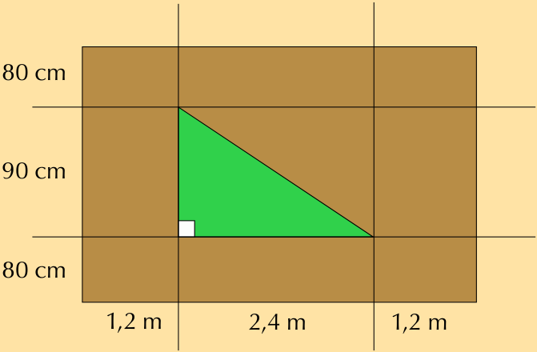

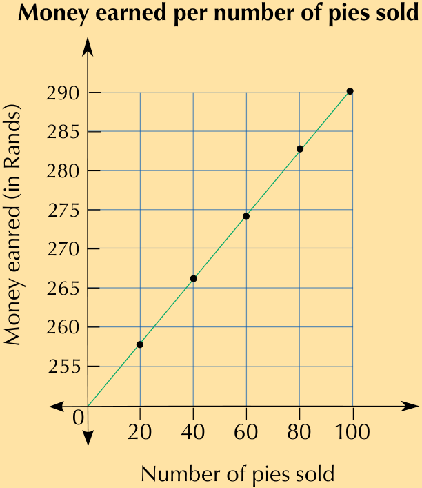

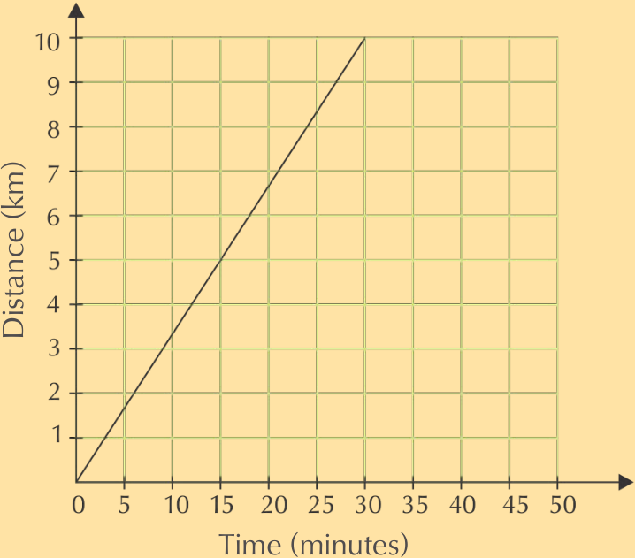

---

### Inverse Proportional Relationships: Carpenters and Tables

This section explores the relationship between the number of workers and the time taken to complete a task.

#### Worked Example: Carpenters and Tables
**Problem Statement:**
Given that 1 carpenter takes 6 hours to make 20 tables, determine the time taken for different numbers of carpenters.

**Solutions:**
*   **b)** 2 carpenters: $6 \div 2 = 3$ hours.
*   **c)** 4 carpenters: $6 \div 4 = 1,5$ hours.
*   **d)** 12 carpenters: $6 \div 12 = 0,5$ hours (which is 30 minutes).
*   **e) Relationship:** This is an **inverse proportional relationship**. As the number of carpenters increases, the time taken decreases.
*   **f) Table of Values:**

| No. of carpenters | 1 | 2 | 4 | 12 |
| :--- | :--- | :--- | :--- | :--- |
| **Hours to make 20 tables** | 6 | 3 | 1,5 | 0,5 |

*   **g) Graph:**

*   **h) Note on Graphing:** The line must be **dotted** because the number of carpenters is a **discrete variable** (you cannot have a fraction of a person).

---

### Application: Gamers Club Costs

**Scenario:**
*   Standard hire cost: R 30 per game.
*   Gamers Club membership: R 150 per year + R 15 per game.

**Exercises:**

**a) Cost for 10 games (non-member):**
Multiply the number of games by the cost per game:
$10 \times R 30 = R 300$

**b) Equation for non-member cost:**
Let $C$ be the total cost and $n$ be the number of games:
$$C = 30n$$

**c) Cost for 5 games (Gamers Club member):**
Membership fee + (Number of games $\times$ discounted rate):
$R 150 + (5 \times R 15) = R 150 + R 75 = R 225$

**d) Equation for Gamers Club member cost:**
Let $C$ be the total cost and $n$ be the number of games:
$$C = 150 + 15n$$

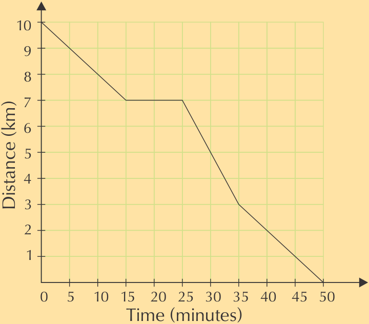

---

### Mathematical Relationships: Independent and Dependent Variables

#### Key Concepts
*   **Independent Variable:** The variable that is changed or controlled in a scientific experiment or mathematical relationship to test the effects on the dependent variable. In this context, it is the number of games hired.
*   **Dependent Variable:** The variable being tested and measured. Its value "depends" on the independent variable. In this context, it is the total cost of hiring the games.
*   **Slope:** In a linear relationship, the slope represents the rate of change. A positive slope indicates that as the independent variable increases, the dependent variable also increases.

---

#### Exercises and Solutions

**e) In the relationship between costs and the number of games hired, which is the independent variable? Explain.**
*   **Solution:** The number of games hired is the independent variable. This is because the total amount Thomas pays depends on how many games he chooses to hire.

**f) Which is the dependent variable?**
*   **Solution:** The cost of hiring the games is the dependent variable.

**g) Would a graph for this relationship have a positive or a negative slope? Give a reason for your answer.**
*   **Solution:** The slope is positive. This is because the total cost increases as you hire more games.

---

#### Summary of Mathematical Models
Based on the provided solutions, the cost structures can be represented by the following formulas:

1.  **Simple Cost Calculation:**
    $$\text{Cost} = R30 \times \text{number of games}$$

2.  **Fixed + Variable Cost Calculation:**
    $$\text{Cost} = R150 + (R15 \times \text{number of games})$$

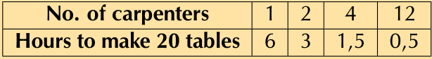

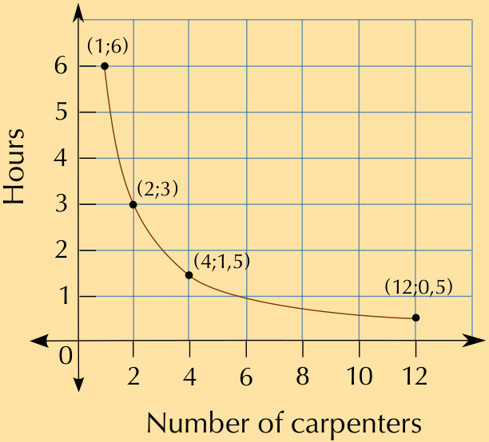
