> **[Diagram Context - Textbook_MathematicalLiteracy_Gr11_CONVERSIONS-AND-TIME.pdf-0001-00.png]**
> The image shows a chapter titled "Measurement (conversions and time)" with a red border and a black arrow pointing to the left. The chapter is numbered "2" and is part of a larger book. The book is titled "MEASUREMENT (conversions and time)" and is divided into two sections. The first section is titled "MEASUREMENT" and is numbered


> **[Diagram Context - Textbook_MathematicalLiteracy_Gr11_CONVERSIONS-AND-TIME.pdf-0001-01.png]**
> The image shows a gray background with the word "Conversions" written in black text. The text is centered and stands out against the gray background. The word "Conversions" is written in a serif font, which is a type of font that is commonly used for printed text. The word "Conversions" is the main focus of the image, and it is the only word that


> **[Diagram Context - Textbook_MathematicalLiteracy_Gr11_CONVERSIONS-AND-TIME.pdf-0001-02.png]**
> The image shows a page from a textbook with the title "LB pages 38-5" written in black text. The page is numbered 38-5 and is titled "LB pages 38-5". The page is a single page with a black and white color scheme.


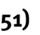


The content of this section on _Conversions_ , as part of the Measurement Application Topic, is drawn from page 63 in the CAPS document. 

As stipulated in the CAPS document, Grade 11 learners need specifically to be able to convert between _different_ systems of measurement – for example, from imperial to metric units, from degrees Celsius to degrees Fahrenheit, or from grams to millilitres. 


> **[Diagram Context - Textbook_MathematicalLiteracy_Gr11_CONVERSIONS-AND-TIME.pdf-0001-07.png]**
> 1. A diagram of a cell with arrows pointing to different parts of the cell.


- Learners need to be able to work in the context of larger projects that take place in the household, school or wider community. This could include baking or catering projects or construction projects (e.g. making clothes, or building a bicycle ramp). 

- Calculations involving conversions, especially between different systems, make use of the concept of _rates_ as found in the Basic Skills Topic on Numbers and <u>calculations with numbers.</u> 


> **[Diagram Context - Textbook_MathematicalLiteracy_Gr11_CONVERSIONS-AND-TIME.pdf-0001-10.png]**
> The image shows a gray background with the text "via afrika" in the top left corner and "Mathematical Literacy Gr 11" in the bottom right corner. The text is in black, making it stand out against the gray background. The image does not contain any visible diagrams or illustrations.


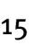


> **[Diagram Context - Textbook_MathematicalLiteracy_Gr11_CONVERSIONS-AND-TIME.pdf-0002-00.png]**
> The image shows a chapter titled "Measurement (conversions and time)" with a red border. The chapter is divided into two sections, with the first section being a list of visible labels, variables, and biological structures, and the second section being a diagram of a Lewis structure. The diagram is accompanied by a caption that explains the diagram.


> **[Diagram Context - Textbook_MathematicalLiteracy_Gr11_CONVERSIONS-AND-TIME.pdf-0002-02.png]**
> The image shows a gray background with the word "Conversions" written in black text. The text is centered and stands out against the gray background. The word "Conversions" is the main focus of the image, and it is written in a clear and legible font. The image does not contain any other objects or text, and the word "Conversions" is the only word in


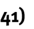

This section deals with: 

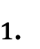


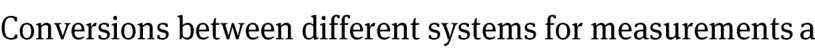
> **[Diagram Context - Textbook_MathematicalLiteracy_Gr11_CONVERSIONS-AND-TIME.pdf-0002-07.png]**
> The image shows a gray background with the text "Conversions between different systems for measurements" written in white.


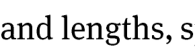


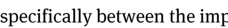
> **[Diagram Context - Textbook_MathematicalLiteracy_Gr11_CONVERSIONS-AND-TIME.pdf-0002-09.png]**
> The image shows a grey background with the words "specifically between the imp" written in white text.


- For these types of conversions the _conversion factor_ will always be given(for example: 1 kg ≈ 2,206 pounds). 

- To solve problems involving conversions the method of working with rates is required: 


If 1 kg ≈ 2,206 pounds, then 78 kg ≈ 2,206 pounds × 78 

≈ 172,1 pounds 

(rounded off to 1 decimal place) 

Similarly: 1 kg ≈ 2,206 pounds→ 1 pound ≈ 1 kg † 2,206 

150 pounds ≈ 1 kg – 2,206 × 150 ≈ 68 kg 


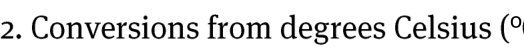
> **[Diagram Context - Textbook_MathematicalLiteracy_Gr11_CONVERSIONS-AND-TIME.pdf-0002-18.png]**
> 2. Conversions from degrees Celius (°C): A conversion factor between degrees and kelvin.


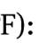

ᵒ ᵒ 

- For these types of conversions the following _conversion formulas_ will always be given: 

   - °F = (1,8 × °C) + 32° 

   - °C = (°F - 32°) ÷ 1,8 

- To solve problems involving temperature conversion the method of substitution into equations is required: 


Converting 35°C to °F gives: °F = (1,8 × 35°) + 32°= 95° 


> **[Diagram Context - Textbook_MathematicalLiteracy_Gr11_CONVERSIONS-AND-TIME.pdf-0002-27.png]**
> The image shows a gray background with the text "via afrika" in the top left corner and "mathematical literacy gr 11" in the bottom right corner. The text is in black, making it stand out against the gray background. The image does not contain any other objects or text.


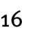


> **[Diagram Context - Textbook_MathematicalLiteracy_Gr11_CONVERSIONS-AND-TIME.pdf-0003-00.png]**
> 1. A red and black diagram of a measuring instrument.
2. A red and black diagram of a measuring instrument.


> **[Diagram Context - Textbook_MathematicalLiteracy_Gr11_CONVERSIONS-AND-TIME.pdf-0003-01.png]**
> The image shows a section of a textbook with the word "section" written in black text on a white background. The text is centered and stands out against the white background. The text is in a standard font size and style, making it easy to read and understand. The image does not contain any additional text or graphics.


> **[Diagram Context - Textbook_MathematicalLiteracy_Gr11_CONVERSIONS-AND-TIME.pdf-0003-02.png]**
> The image shows a gray background with the text "Converting between liquid and" written in white. Below the text, there is a diagram of a cell with arrows pointing to different parts of the cell.


> **[Diagram Context - Textbook_MathematicalLiteracy_Gr11_CONVERSIONS-AND-TIME.pdf-0003-04.png]**
> The image shows a gray background with the words "Lid Quantities" written in black text. The text is positioned at the top of the image, and the rest of the image is a solid gray color. The text is centered in the image, making it the focal point.


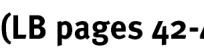

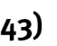

This section demonstrates how to perform conversions between different types of solid and liquid quantities and the units that are required in these conversions. The content and contexts to which the conversions relate include: 

- baking projects where items are packages according to weight (kg or g) and need to be measured in ml for a recipe. 

- construction projects where volume values are calculated using dimensions given in mm, cm or m but where liquid quantities of materials are needed. These types of conversions involve converting from cubic units (m^{3} , cm^{3} or mm^{3} ) to millilitres or litres. 

- A useful conversion is that a box with a volume of 1 m^{3} will hold 1 litre of water: 

- or that a box with a volume of 1 cm^{3} will hold 1 ml of water. 

- construction projects where surface areas are calculated using dimensions given in mm, cm or m but where liquid quantities of materials (e.g. paint) are needed to cover the area. These types of conversions involve converting from square units (m^{2} , cm^{2} or mm^{2} ) to millilitres or litres. 

Whenever such conversions are required the necessary conversion factor will be provided. 


A person buys a 500 g bag of sugar. 

_If a recipe asks for 750 ml of sugar, will this 500 g bag be big enough or will more sugar need to be bought?_ 

Using the fact that 4 g of sugar is equal to approximately 5 ml, we can answer this question as follows: 4 g → 5 ml 

1 g → 5 ml † 4 

500 g → 5 ml † 4 × 500 = 625 ml 

So the 500 g bag only holds an equivalent of 625 ml of sugar. As such, more sugar will need to be bought. 


> **[Diagram Context - Textbook_MathematicalLiteracy_Gr11_CONVERSIONS-AND-TIME.pdf-0003-21.png]**
> The image shows a gray background with the text "via afrika" in the top left corner and "mathematical literacy gr 11" in the bottom right corner. The text is in black, making it stand out against the gray background.


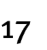


> **[Diagram Context - Textbook_MathematicalLiteracy_Gr11_CONVERSIONS-AND-TIME.pdf-0004-00.png]**
> The image shows a chapter titled "Measurement (conversions and time)" with a red border and a black arrow pointing to the left. The chapter is numbered "2" and is part of a larger educational graphic. The graphic includes various elements such as a Lewis diagram, an anatomical/cellular structure, a circuit, a graph, and a evolutionary tree. The chapter is designed to help


Note that we could also have solved this problem by working in the other direction: 

5 ml → 4 g so: 1 ml → 4 g † 5 

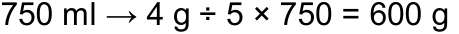

So, 750 ml is equivalent to approximately 600 g of sugar. Therefore the 500 g bag will not be big enough. 


A wall has dimensions of approximately 6 m by 5 m. The painter thus estimates that the surface area of the wall is approximately 30 m^{2} . The paint that the painter will be using to paint the wall has a conversion factor (spread rate) of 9 m^{2} per litre. This means that 1 ℓ of paint will cover approximately 9 m^{2} of wall space. 

_How many litres of paint might the painter need to paint this wall?_ 

Spread rate: 9 m^{2} → 1 ℓ 

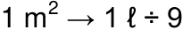

30 m^{2} → 1 ℓ † 9 × 30 ≈ 3,3 ℓ 

This tells us that the painter will need more than 3 ℓ and so will have to buy at least 4 full litres. However, the actual quantity of paint that he buys may depend on the tin sizes that the paint is available in (e.g. 1 ℓ tin, or 5 ℓ tin, etc). 


> **[Diagram Context - Textbook_MathematicalLiteracy_Gr11_CONVERSIONS-AND-TIME.pdf-0004-12.png]**
> The image shows a gray background with the text "via afrika" written in white. Below this, there is a list of eleven topics that are covered in the course. The topics include "Mathematical Literacy Gr." and "Mathematical Literacy.".


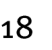


> **[Diagram Context - Textbook_MathematicalLiteracy_Gr11_CONVERSIONS-AND-TIME.pdf-0005-00.png]**
> The image shows a red and black text box with the words "Measurement (conversions and time)" written in black text at the top. Below the text box, there is a red line with the word " Chapter " written in black text.


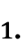


> **[Diagram Context - Textbook_MathematicalLiteracy_Gr11_CONVERSIONS-AND-TIME.pdf-0005-03.png]**
> The image shows a gray background with the words "VARIOUS CONVERSIONS" written in white. The text is in a serif font and is positioned at the top of the image.


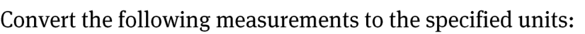
> **[Diagram Context - Textbook_MathematicalLiteracy_Gr11_CONVERSIONS-AND-TIME.pdf-0005-05.png]**
> The image shows a grey background with the text "Convert the following measurements to the specified units." written in white.


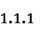

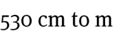

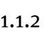

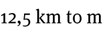


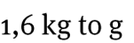


ℓ ℓ ℓ 

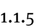

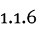

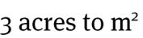


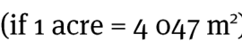
> **[Diagram Context - Textbook_MathematicalLiteracy_Gr11_CONVERSIONS-AND-TIME.pdf-0005-17.png]**
> The image shows a diagram of a Lewis structure for water. The diagram is labeled with the chemical formula "H2O" and the unit "m/m". The diagram also includes a scale that reads "If 1 Acre = 4 047 m".


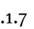

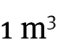

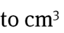


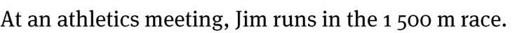
> **[Diagram Context - Textbook_MathematicalLiteracy_Gr11_CONVERSIONS-AND-TIME.pdf-0005-24.png]**
> The image shows a grey background with a white line running down the center. Below the line, there is text that reads "At an athletics meeting, Jim runs in the 1,500 m race."


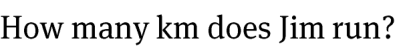
> **[Diagram Context - Textbook_MathematicalLiteracy_Gr11_CONVERSIONS-AND-TIME.pdf-0005-25.png]**
> The image shows a gray background with the question "How many km does Jim run?" written in white text. The text is in a serif font and is positioned at the top of the image.


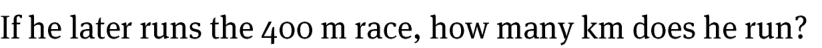
> **[Diagram Context - Textbook_MathematicalLiteracy_Gr11_CONVERSIONS-AND-TIME.pdf-0005-26.png]**
> The image shows a line drawing of a cell with a label that reads "Lewis diagram". The drawing is set against a gray background. The diagram is labeled with the text "If he later runs the 400 m race, how many km does he run?"


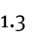

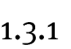

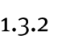


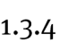

ℓ 


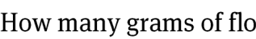
> **[Diagram Context - Textbook_MathematicalLiteracy_Gr11_CONVERSIONS-AND-TIME.pdf-0005-33.png]**
> The image shows a line of text that reads "How many grams of flo". The text is in black and white, and it is positioned on the left side of the image. The text is not accompanied by any visual content, such as diagrams or illustrations. The text is simple and straightforward, conveying a concept related to the measurement of mass.


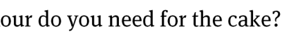
> **[Diagram Context - Textbook_MathematicalLiteracy_Gr11_CONVERSIONS-AND-TIME.pdf-0005-34.png]**
> The image shows a line drawing of a cake with the phrase "our do you need for the cake?" written above it. The drawing is set against a gray background.


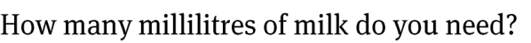
> **[Diagram Context - Textbook_MathematicalLiteracy_Gr11_CONVERSIONS-AND-TIME.pdf-0005-35.png]**
> The image shows a gray background with a question posed in white text. The question asks "How many millilitres of milk do you need?" The answer is provided in the image, which is "many millilitres of milk do you need?"


ℓ 


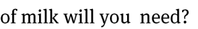
> **[Diagram Context - Textbook_MathematicalLiteracy_Gr11_CONVERSIONS-AND-TIME.pdf-0005-37.png]**
> The image shows a gray background with the phrase "of milk will you need?" written in white. The text is in a serif font and is positioned at the bottom of the image.


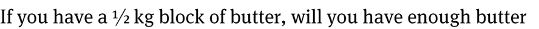
> **[Diagram Context - Textbook_MathematicalLiteracy_Gr11_CONVERSIONS-AND-TIME.pdf-0005-38.png]**
> The image shows a gray background with a white line that reads "If you have a 1/2 kg block of butter, will you have enough butter?".


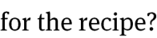


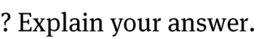
> **[Diagram Context - Textbook_MathematicalLiteracy_Gr11_CONVERSIONS-AND-TIME.pdf-0005-40.png]**
> The image shows a gray background with the text "Explain your answer" written in white. The text is in a serif font and is positioned at the top of the image.


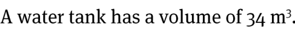
> **[Diagram Context - Textbook_MathematicalLiteracy_Gr11_CONVERSIONS-AND-TIME.pdf-0005-44.png]**
> The image shows a water tank with a volume of 34 m3. The text is in a gray color and is written in a serif font. The text is positioned on the left side of the image.


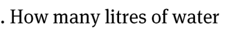
> **[Diagram Context - Textbook_MathematicalLiteracy_Gr11_CONVERSIONS-AND-TIME.pdf-0005-45.png]**
> The image shows a line of text that reads "How many liters of water". The text is written in a serif font and is in black. The text is centered in the image.


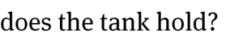
> **[Diagram Context - Textbook_MathematicalLiteracy_Gr11_CONVERSIONS-AND-TIME.pdf-0005-46.png]**
> The image shows a gray background with the phrase "does the tank hold?" written in white text. The text is in all capital letters and is positioned at the top of the image.


ℓ 

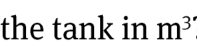

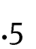


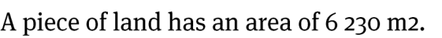
> **[Diagram Context - Textbook_MathematicalLiteracy_Gr11_CONVERSIONS-AND-TIME.pdf-0005-50.png]**
> A piece of land has an area of 6,230 m2.


> **[Diagram Context - Textbook_MathematicalLiteracy_Gr11_CONVERSIONS-AND-TIME.pdf-0005-52.png]**
> The image shows a line drawing of a big land in acres. The drawing is in black and white and is placed on a gray background. The drawing depicts a large land area with a small island in the middle. The island is surrounded by a body of water. The drawing also includes a map of the land area and a legend that explains the different symbols used in the drawing.


> **[Diagram Context - Textbook_MathematicalLiteracy_Gr11_CONVERSIONS-AND-TIME.pdf-0005-54.png]**
> The image shows a line of text that reads, "How big is the land in hedares?" The text is written in a serif font and is in black. The text is positioned on a gray background.


> **[Diagram Context - Textbook_MathematicalLiteracy_Gr11_CONVERSIONS-AND-TIME.pdf-0005-55.png]**
> 1.acre = 0.044
 2.0 = 0.47
 3.0 = 0.47


> **[Diagram Context - Textbook_MathematicalLiteracy_Gr11_CONVERSIONS-AND-TIME.pdf-0005-57.png]**
> The image shows a line drawing of a diagram of a cell. The diagram is labeled with the text "What is the area (in m)?". The diagram is a Lewis structure, which is a diagram that shows the valence electrons of an atom. The diagram is a simple, easy-to-understand visual representation of the valence electrons of an atom.


> **[Diagram Context - Textbook_MathematicalLiteracy_Gr11_CONVERSIONS-AND-TIME.pdf-0005-58.png]**
> The image shows a diagram of a land plot that is 7,3 acres in size. The land is depicted in a brown color, and the diagram is labeled with the text "Of a plot of land that is 7,3 acres in."


> **[Diagram Context - Textbook_MathematicalLiteracy_Gr11_CONVERSIONS-AND-TIME.pdf-0005-60.png]**
> The image shows a gray background with the text "via afrika" in the top left corner and "Mathematical Literacy Gr 11" in the bottom right corner. The text is in black, making it stand out against the gray background. The image does not contain any other objects or elements.


> **[Diagram Context - Textbook_MathematicalLiteracy_Gr11_CONVERSIONS-AND-TIME.pdf-0006-00.png]**
> The image shows a chapter titled "Measurement (conversions and time)" with a red border and a black button. The chapter is about converting units of measurement, such as converting between different units of time. The chapter is designed to help high school students understand the concept of converting units of time and measurement.


> **[Diagram Context - Textbook_MathematicalLiteracy_Gr11_CONVERSIONS-AND-TIME.pdf-0006-01.png]**
> 2. Converting grams to ml using a conversion table.


The table on the next page shows various conversion factors for converting from solid to liquid quantities (i.e. from grams to ml) for different ingredients. Use the table to answer the following questions: 


> **[Diagram Context - Textbook_MathematicalLiteracy_Gr11_CONVERSIONS-AND-TIME.pdf-0006-08.png]**
> The image shows a gray background with a white line that reads "If a recipe asks for 6 g of a, then it is asking for 6 grams of sugar." The text is in black, making it easy to read. The image is a simple, straightforward explanation of a recipe's sugar content.


> **[Diagram Context - Textbook_MathematicalLiteracy_Gr11_CONVERSIONS-AND-TIME.pdf-0006-09.png]**
> The image shows a diagram of a cell with various components, including a nucleus, cytoplasm, and organelles. The diagram is labeled with the text "Dried Peaches, Dry Peaches, Dry Peaches, Dry Peaches, Dry Peaches, Dry Peaches, Dry Peaches, Dry Peaches, Dry Peaches, Dry Peaches, Dry Peaches,


> **[Diagram Context - Textbook_MathematicalLiteracy_Gr11_CONVERSIONS-AND-TIME.pdf-0006-10.png]**
> The image shows a line drawing of a milliliter (ml) labeled on the right side. The drawing also includes a text box that reads "How many millilitres of water?". The text box is positioned at the bottom of the image, and the drawing is placed on a gray background.


> **[Diagram Context - Textbook_MathematicalLiteracy_Gr11_CONVERSIONS-AND-TIME.pdf-0006-12.png]**
> The image shows a gray background with the phrase "peaches are needed?" written in white text. The text is centered and stands out against the gray background.


> **[Diagram Context - Textbook_MathematicalLiteracy_Gr11_CONVERSIONS-AND-TIME.pdf-0006-13.png]**
> 1. A diagram of a cell with a chemical symbol on it.


> **[Diagram Context - Textbook_MathematicalLiteracy_Gr11_CONVERSIONS-AND-TIME.pdf-0006-14.png]**
> The image shows a close-up of a word, "Baking powder", written in black text against a gray background. The word is clearly visible and stands out against the gray backdrop. The text is in a standard serif font, and the word "Baking powder" is the main focus of the image.


> **[Diagram Context - Textbook_MathematicalLiteracy_Gr11_CONVERSIONS-AND-TIME.pdf-0006-15.png]**
> The image shows a line of text that reads "? How many teaspoons of baking?". The text is written in a serif font and is centered on the image. The image is a close-up of the text, making it easy to read and understand.


> **[Diagram Context - Textbook_MathematicalLiteracy_Gr11_CONVERSIONS-AND-TIME.pdf-0006-16.png]**
> The image shows a gray background with the phrase " Powder are needed?" written in white text.


> **[Diagram Context - Textbook_MathematicalLiteracy_Gr11_CONVERSIONS-AND-TIME.pdf-0006-17.png]**
> The image shows a gray background with a white text box that reads "A recipe asks for 90 g of b". The text box is positioned in the center of the image, and the background is plain and unadorned. The text box is the only element in the image, making it the focal point.


> **[Diagram Context - Textbook_MathematicalLiteracy_Gr11_CONVERSIONS-AND-TIME.pdf-0006-18.png]**
> The image shows a gray background with the text "How many tablespoons of butter are" written in white.


> **[Diagram Context - Textbook_MathematicalLiteracy_Gr11_CONVERSIONS-AND-TIME.pdf-0006-20.png]**
> The image shows a gray background with a white line that reads "A recipe asks for 1/2 a cup of n". The text is in black, making it stand out against the gray background. The text is arranged in a straight line, with the word "A" at the top and "recipe asks for 1/2 a cup of n" at the bottom. The text is


> **[Diagram Context - Textbook_MathematicalLiteracy_Gr11_CONVERSIONS-AND-TIME.pdf-0006-23.png]**
> The image shows a line of text that reads "y grams of margarine are". The text is in black and white, and it is positioned on a gray background. The text is arranged in a straight line, with the first word "y" at the top, followed by "grams" in the middle, and "are" at the bottom. The text is in a simple,


> **[Diagram Context - Textbook_MathematicalLiteracy_Gr11_CONVERSIONS-AND-TIME.pdf-0006-25.png]**
> 1. A diagram of a cell with arrows pointing to different parts of the cell.


> **[Diagram Context - Textbook_MathematicalLiteracy_Gr11_CONVERSIONS-AND-TIME.pdf-0006-26.png]**
> The image shows a line drawing of a peanut on a gray background. The drawing is labeled with the text "How many grams of peanuts are there?". The text is written in a simple, straightforward manner, and the image does not contain any other objects or text. The focus of the image is on the peanut, and the text provides a clear and concise explanation of the quantity of peanuts.


> **[Diagram Context - Textbook_MathematicalLiteracy_Gr11_CONVERSIONS-AND-TIME.pdf-0006-29.png]**
> The image shows a line drawing of a cell with a label "How many grams of Ch" written above it. The drawing includes a diagram of a cell and a diagram of a molecule, and the text "How many grams of Ch" is written below the cell drawing.


> **[Diagram Context - Textbook_MathematicalLiteracy_Gr11_CONVERSIONS-AND-TIME.pdf-0006-30.png]**
> The image shows a close-up of a word, "heddar cheese", written in black text against a gray background. The word is centered and stands out against the gray background. The word "heddar" is written in all capital letters, while the rest of the word is in smaller letters. The word "cheese" is written in all capital letters as well, with the "


> **[Diagram Context - Textbook_MathematicalLiteracy_Gr11_CONVERSIONS-AND-TIME.pdf-0006-31.png]**
> The image shows a gray background with white text that reads "Will be needed for a recipe that asks".


> **[Diagram Context - Textbook_MathematicalLiteracy_Gr11_CONVERSIONS-AND-TIME.pdf-0006-32.png]**
> The image shows a gray background with the text "for 50 ml of Cheddar cheese?" written in white.


> **[Diagram Context - Textbook_MathematicalLiteracy_Gr11_CONVERSIONS-AND-TIME.pdf-0006-37.png]**
> The image shows a line of text that reads "How many grams of ice". The text is in black and white and is positioned on the left side of the image. The text is not accompanied by any visual content, such as a diagram or an illustration. The text is simple and straightforward, conveying a concept related to the measurement of mass.


> **[Diagram Context - Textbook_MathematicalLiteracy_Gr11_CONVERSIONS-AND-TIME.pdf-0006-38.png]**
> The image shows a label that reads "icing sugar w" written in black text on a gray background.


> **[Diagram Context - Textbook_MathematicalLiteracy_Gr11_CONVERSIONS-AND-TIME.pdf-0006-39.png]**
> The image shows a grey background with the text "Will be needed for a recipe that asks for 45" written in white.


> **[Diagram Context - Textbook_MathematicalLiteracy_Gr11_CONVERSIONS-AND-TIME.pdf-0006-41.png]**
> The image shows a line drawing of a cell with a Lewis structure. The drawing is set against a gray background, and the text "A recipe asks for 350 g of a" is written in black at the bottom of the image.


> **[Diagram Context - Textbook_MathematicalLiteracy_Gr11_CONVERSIONS-AND-TIME.pdf-0006-42.png]**
> The image shows a question with a gray background and white text. The question asks, "How many cups of oats are needed?" The answer is not provided, but the question is asking about the quantity of oats required.


> **[Diagram Context - Textbook_MathematicalLiteracy_Gr11_CONVERSIONS-AND-TIME.pdf-0006-43.png]**
> The image shows a gray background with the text "A recipe asks for two teaspoons of cayenne pepper".


> **[Diagram Context - Textbook_MathematicalLiteracy_Gr11_CONVERSIONS-AND-TIME.pdf-0006-44.png]**
> The image shows a line of text that reads "How many grams of coffee are?". The text is written in a serif font and is centered on the image. The text is in a simple, straightforward manner and does not contain any visual elements.


> **[Diagram Context - Textbook_MathematicalLiteracy_Gr11_CONVERSIONS-AND-TIME.pdf-0006-46.png]**
> The image shows a line drawing of a cake recipe asking for 7 cups of flour. The drawing includes a cake and a cup, and the text is written in a simple, easy-to-understand language.


> **[Diagram Context - Textbook_MathematicalLiteracy_Gr11_CONVERSIONS-AND-TIME.pdf-0006-48.png]**
> The image shows a gray background with the text "h flour (in kilograms and grams)" written in black.


> **[Diagram Context - Textbook_MathematicalLiteracy_Gr11_CONVERSIONS-AND-TIME.pdf-0006-49.png]**
> This text snippet presents a mathematical word problem query regarding the measurement of mass in grams required for a baking recipe. It serves as an introductory prompt for learners to apply unit conversion or proportional reasoning skills to solve practical, real-world problems involving quantity and measurement.


> **[Diagram Context - Textbook_MathematicalLiteracy_Gr11_CONVERSIONS-AND-TIME.pdf-0006-51.png]**
> This text-based graphic presents a mathematical word problem statement containing the numerical value "626 g" and the variable "b". It serves as an introductory prompt for learners to apply algebraic substitution or proportional reasoning to solve real-world measurement problems within the CAPS Mathematics curriculum.


> **[Diagram Context - Textbook_MathematicalLiteracy_Gr11_CONVERSIONS-AND-TIME.pdf-0006-52.png]**
> This image consists of the text "biscuit crumbs" written in a standard serif font. In a CAPS Life Sciences or Natural Sciences context, this term is typically used to represent particulate matter or food fragments in discussions regarding mechanical digestion, physical weathering, or the surface area-to-volume ratio of solids.


> **[Diagram Context - Textbook_MathematicalLiteracy_Gr11_CONVERSIONS-AND-TIME.pdf-0006-53.png]**
> This text snippet presents a quantitative inquiry question asking for an estimation of "cups." It serves as a prompt for learners to apply estimation skills or data interpretation within a practical measurement context, typical of foundational mathematical literacy or life skills tasks.


> **[Diagram Context - Textbook_MathematicalLiteracy_Gr11_CONVERSIONS-AND-TIME.pdf-0006-54.png]**
> This text snippet functions as a mathematical inquiry or problem-solving prompt, specifically referencing the units "tablespoons" and "teaspoons" in the context of measuring "biscuit crumbs." It serves as an introductory question for a practical application task, requiring students to apply ratio, proportion, or unit conversion skills to determine the correct quantity of ingredients for a recipe.


> **[Diagram Context - Textbook_MathematicalLiteracy_Gr11_CONVERSIONS-AND-TIME.pdf-0006-55.png]**
> This text label serves as a heading for an educational diagram or section focused on scientific apparatus. It introduces the concept of a "Measuring instrument," which is a fundamental component in CAPS Physical Sciences and Life Sciences for teaching accurate data collection and experimental methodology.


> **[Diagram Context - Textbook_MathematicalLiteracy_Gr11_CONVERSIONS-AND-TIME.pdf-0006-88.png]**
> This image is a text-based copyright attribution for educational material. It displays the copyright symbol, the publisher name "Via Afrika," and the specific curriculum level "Mathematical Literacy Gr 11." It serves to identify the source and academic context of the associated learning resources within the South African CAPS curriculum.


> **[Diagram Context - Textbook_MathematicalLiteracy_Gr11_CONVERSIONS-AND-TIME.pdf-0007-00.png]**
> This graphic serves as a chapter heading, featuring the text "Chapter 2" and the topic "Measurement (conversions and Time)." It introduces foundational mathematical literacy concepts, signaling that the subsequent content will focus on the practical application of unit conversions and time-related calculations essential for the CAPS curriculum.


> **[Diagram Context - Textbook_MathematicalLiteracy_Gr11_CONVERSIONS-AND-TIME.pdf-0007-01.png]**
> This text-based graphic provides a simple label, "Bread Crumbs (fresh)," which serves as a categorical descriptor for a food sample. In a Life Sciences or Consumer Studies context, this label identifies a specific substrate used in experiments investigating food spoilage, microbial growth, or moisture content analysis.


> **[Diagram Context - Textbook_MathematicalLiteracy_Gr11_CONVERSIONS-AND-TIME.pdf-0007-23.png]**
> This text-based graphic serves as a heading or label for a comparative study between "Brown & White Sugar." It identifies the two substances as the primary variables for an investigation or classification task. Conceptually, this helps learners distinguish between different types of sucrose products, often used in CAPS Life Sciences or Natural Sciences to discuss food processing, nutritional content, or experimental variables in solubility and chemical testing.


> **[Diagram Context - Textbook_MathematicalLiteracy_Gr11_CONVERSIONS-AND-TIME.pdf-0007-148.png]**
> This image is a copyright attribution text for a Grade 11 Mathematical Literacy educational resource. It identifies the publisher as "Via Afrika" and specifies the subject and grade level as "Mathematical Literacy Gr 11." This text serves as a formal citation to indicate the source and intellectual property rights of the associated curriculum material.


> **[Diagram Context - Textbook_MathematicalLiteracy_Gr11_CONVERSIONS-AND-TIME.pdf-0008-00.png]**
> This graphic serves as a chapter heading, featuring the text "Chapter 2" and the topic "Measurement (conversions and Time)." It introduces foundational mathematical literacy concepts, signaling that the subsequent content will focus on the practical application of unit conversions and time calculations essential for the CAPS curriculum.


> **[Diagram Context - Textbook_MathematicalLiteracy_Gr11_CONVERSIONS-AND-TIME.pdf-0008-02.png]**
> This text-based graphic serves as a heading for a mathematical conversion guide involving the unit of area, square metres ($m^2$). It introduces the conceptual process of converting between different units of area, which is a fundamental skill in CAPS Mathematics and Physical Sciences for calculating surface area and spatial dimensions.


> **[Diagram Context - Textbook_MathematicalLiteracy_Gr11_CONVERSIONS-AND-TIME.pdf-0008-03.png]**
> This text snippet represents a mathematical instruction related to measurement and conversion within a practical context. It explicitly references the units "litres" and the concept of "paint quantities," which are key components of the CAPS Mathematical Literacy curriculum regarding surface area and volume calculations. The text guides students to apply unit conversion skills to solve real-world problems involving material estimation for painting surfaces.


> **[Diagram Context - Textbook_MathematicalLiteracy_Gr11_CONVERSIONS-AND-TIME.pdf-0008-05.png]**
> This text snippet is a mathematical word problem prompt containing the phrases "one coat of undercoat" and "one coat of acrylic paint." It serves as a contextual setup for a CAPS-aligned geometry or measurement problem, requiring students to calculate surface area to determine the total volume of paint needed for a project.


> **[Diagram Context - Textbook_MathematicalLiteracy_Gr11_CONVERSIONS-AND-TIME.pdf-0008-06.png]**
> This image is a text fragment containing the phrase "paint the walls of his house." It serves as a contextual prompt for mathematical word problems involving surface area calculations, which are essential for Grade 10-12 CAPS Mathematics and Mathematical Literacy learners.


> **[Diagram Context - Textbook_MathematicalLiteracy_Gr11_CONVERSIONS-AND-TIME.pdf-0008-07.png]**
> This graphic is a table header containing the labels "Paint type" and "Coverage (per litre)". It serves as a structural component for organizing data related to rates and measurement, which are foundational concepts in Mathematical Literacy and Mathematics for calculating surface area and material requirements.


> **[Diagram Context - Textbook_MathematicalLiteracy_Gr11_CONVERSIONS-AND-TIME.pdf-0008-19.png]**
> This text snippet presents a mathematical word problem prompt asking for the calculation of volume in litres for a specific quantity of undercoat paint. It serves as an introductory sentence for a Mathematical Literacy application task, requiring students to identify relevant variables and apply conversion or rate-based calculations to solve a real-world practical problem.


> **[Diagram Context - Textbook_MathematicalLiteracy_Gr11_CONVERSIONS-AND-TIME.pdf-0008-20.png]**
> This text snippet represents a mathematical word problem component involving the measurement of surface area. It explicitly references the unit "1 m²" (square metre), which is a standard metric unit for area used in CAPS Mathematics and Technical Mathematics curricula. This phrase serves as a foundational variable for calculating material requirements, such as the amount of paint needed to cover a specific two-dimensional surface.


> **[Diagram Context - Textbook_MathematicalLiteracy_Gr11_CONVERSIONS-AND-TIME.pdf-0008-22.png]**
> This text-based graphic presents a mathematical word problem involving the variable "surface area" and the measurement unit "m²" (square metres) in the context of a house. It serves as an introductory prompt for learners to apply geometric surface area calculations to real-world scenarios, requiring them to identify the necessary dimensions to solve for an unknown value.


> **[Diagram Context - Textbook_MathematicalLiteracy_Gr11_CONVERSIONS-AND-TIME.pdf-0008-23.png]**
> This text snippet presents a mathematical word problem requiring the calculation of surface area to determine the volume of paint needed for a practical application. It uses the variables "litres of undercoat" and "walls" to test a student's ability to apply geometric area formulas and unit conversion in a real-world context.


ℓ ℓ 


> **[Diagram Context - Textbook_MathematicalLiteracy_Gr11_CONVERSIONS-AND-TIME.pdf-0008-28.png]**
> This text-based mathematical problem presents a ratio and proportion scenario involving the variables of cost (R153,25) and volume (5 litres). It requires students to apply unit rate calculations to determine the cost per litre or to scale the price for different quantities, a fundamental skill in Mathematical Literacy.


> **[Diagram Context - Textbook_MathematicalLiteracy_Gr11_CONVERSIONS-AND-TIME.pdf-0008-29.png]**
> This text snippet presents a mathematical problem statement involving the character "Songi" and the practical application of surface area calculations for painting. It serves as a prompt for learners to calculate the required quantity of undercoat based on the dimensions of walls, reinforcing real-world measurement and estimation skills within the CAPS curriculum.


> **[Diagram Context - Textbook_MathematicalLiteracy_Gr11_CONVERSIONS-AND-TIME.pdf-0008-34.png]**
> This image is a text-based mathematical word problem prompt asking for the calculation of volume in litres. It explicitly mentions "litres" and "acrylic paint" as the variables for a practical measurement task. This problem requires students to apply geometric volume formulas or conversion rates to solve real-world application questions typical of the CAPS Mathematics curriculum.


> **[Diagram Context - Textbook_MathematicalLiteracy_Gr11_CONVERSIONS-AND-TIME.pdf-0008-35.png]**
> This text snippet represents a mathematical word problem constraint involving the variable $1\text{ m}^2$, which denotes a specific unit of surface area. It serves as a foundational prompt for learners to calculate total surface area or material requirements in practical geometry applications, such as determining the quantity of paint needed for a given surface.


> **[Diagram Context - Textbook_MathematicalLiteracy_Gr11_CONVERSIONS-AND-TIME.pdf-0008-37.png]**
> This text snippet presents a mathematical word problem prompt asking for the quantity of acrylic paint in litres. It serves as the introductory clause for a calculation task involving volume, surface area, or rate of coverage, which are core competencies in the CAPS Mathematics curriculum for measurement and application.


> **[Diagram Context - Textbook_MathematicalLiteracy_Gr11_CONVERSIONS-AND-TIME.pdf-0008-38.png]**
> This image contains a text fragment reading "ill Songi need to paint the". It serves as a linguistic prompt for a mathematical word problem, likely requiring students to calculate surface area or volume in a geometry context.


> **[Diagram Context - Textbook_MathematicalLiteracy_Gr11_CONVERSIONS-AND-TIME.pdf-0008-39.png]**
> This image is a text snippet containing the phrase "outside walls of his house?". It serves as a prompt or question stem often found in Life Sciences or Natural Sciences assessments to contextualize biological or environmental concepts, such as the study of plant cell walls or structural adaptations in organisms.


ℓ ℓ 


> **[Diagram Context - Textbook_MathematicalLiteracy_Gr11_CONVERSIONS-AND-TIME.pdf-0008-42.png]**
> This text snippet represents a mathematical word problem statement involving currency and unit pricing. It contains the variable "ℓ" (litres) and the monetary value "R149,80," which is formatted according to South African standard notation. This serves as a foundational prompt for learners to calculate unit rates or solve algebraic equations related to consumer mathematics.


ℓ ℓ 


> **[Diagram Context - Textbook_MathematicalLiteracy_Gr11_CONVERSIONS-AND-TIME.pdf-0008-45.png]**
> This text snippet presents a mathematical word problem prompt asking for the quantity of different sizes of acrylic paint required by a person named Songi. It serves as an introductory sentence for a real-world application problem, likely requiring students to perform calculations involving ratios, proportions, or unit conversions within a consumer mathematics context.


> **[Diagram Context - Textbook_MathematicalLiteracy_Gr11_CONVERSIONS-AND-TIME.pdf-0008-49.png]**
> This text represents a mathematical word problem prompt focusing on financial literacy and consumer calculations. It identifies the subject "Songi" and the specific commodity "Acrylic paint" to frame a real-world scenario requiring the calculation of total costs. This task helps students apply arithmetic operations to practical budgeting and purchasing situations within the CAPS curriculum.


> **[Diagram Context - Textbook_MathematicalLiteracy_Gr11_CONVERSIONS-AND-TIME.pdf-0008-50.png]**
> This image is a text snippet containing the phrase "needs to paint the walls of". It serves as a contextual prompt for a mathematical word problem involving surface area calculations, typical of the CAPS Mathematics curriculum for Grade 10-12. The text establishes the real-world scenario required for students to identify the relevant geometric faces of a room that need to be measured and calculated.


> **[Diagram Context - Textbook_MathematicalLiteracy_Gr11_CONVERSIONS-AND-TIME.pdf-0008-53.png]**
> This text-based graphic presents a mathematical problem statement involving the character "Songi" and the calculation of total expenditure for paint. It serves as a prompt for learners to apply financial mathematics, specifically requiring the identification of relevant variables such as surface area, paint coverage rates, and unit costs to determine a final monetary value.


> **[Diagram Context - Textbook_MathematicalLiteracy_Gr11_CONVERSIONS-AND-TIME.pdf-0008-54.png]**
> This image consists of a text fragment reading "outside walls of his house." In a CAPS curriculum context, this phrase is typically used in Life Sciences or Physical Sciences word problems to define the spatial boundaries of a system or to establish the environmental context for investigations into heat transfer, insulation, or ecological interactions.


> **[Diagram Context - Textbook_MathematicalLiteracy_Gr11_CONVERSIONS-AND-TIME.pdf-0008-55.png]**
> This image is a text-based attribution label identifying the source material as "Via Afrika » Mathematical Literacy Gr 11." It serves as a copyright and curriculum-specific identifier for educational content used within the South African CAPS Mathematical Literacy framework.


> **[Diagram Context - Textbook_MathematicalLiteracy_Gr11_CONVERSIONS-AND-TIME.pdf-0009-00.png]**
> This graphic serves as a chapter heading, featuring the text "Chapter 2" and the topic "Measurement (conversions and Time)." It introduces foundational mathematical literacy concepts, signaling that the curriculum will focus on unit conversions and the practical application of time-related calculations.


> **[Diagram Context - Textbook_MathematicalLiteracy_Gr11_CONVERSIONS-AND-TIME.pdf-0009-03.png]**
> This text-based graphic serves as a heading for a mathematical or scientific reference table regarding unit conversions. It introduces the concept of converting between different units of measurement, which is a foundational skill for performing calculations in Physical Sciences and Mathematics across the CAPS curriculum.


> **[Diagram Context - Textbook_MathematicalLiteracy_Gr11_CONVERSIONS-AND-TIME.pdf-0009-06.png]**
> This mathematical expression illustrates the unit conversion process between centimetres (cm) and metres (m). It uses the numerical values 530, 100, and 5,3 alongside the division operator to demonstrate how to convert a smaller metric unit into a larger one by dividing by the conversion factor of 100.


> **[Diagram Context - Textbook_MathematicalLiteracy_Gr11_CONVERSIONS-AND-TIME.pdf-0009-08.png]**
> This mathematical expression demonstrates the unit conversion of length from kilometres (km) to metres (m) using the conversion factor of 1 000. It explicitly shows the step-by-step calculation where 12,5 km is multiplied by 1 000 to arrive at the equivalent value of 12 500 m. This serves as a foundational example for learners to master SI unit conversions, a critical skill in Physical Sciences and Mathematics.


> **[Diagram Context - Textbook_MathematicalLiteracy_Gr11_CONVERSIONS-AND-TIME.pdf-0009-10.png]**
> This mathematical expression demonstrates the unit conversion of mass from kilograms (kg) to grams (g) using the symbols 1,6, kg, 1 000, and g. It illustrates the standard conversion factor of 1 000, showing learners how to multiply a decimal value in kilograms by 1 000 to obtain the equivalent mass in grams.


ℓ ℓ ℓ ℓ ℓ ℓ 


> **[Diagram Context - Textbook_MathematicalLiteracy_Gr11_CONVERSIONS-AND-TIME.pdf-0009-15.png]**
> This mathematical expression illustrates a unit conversion calculation, specifically converting a measurement from acres to square metres using the conversion factor 4 047 m². It demonstrates the application of multiplicative scaling to change units of area, a fundamental skill in Mathematical Literacy for solving real-world measurement problems.


> **[Diagram Context - Textbook_MathematicalLiteracy_Gr11_CONVERSIONS-AND-TIME.pdf-0009-20.png]**
> This text-based graphic illustrates a mathematical conversion factor for volume, specifically relating cubic metres to cubic centimetres. It displays the symbols "m" and "cm" to demonstrate that $1\text{ m}^3$ is equivalent to $100\text{ cm} \times 100\text{ cm} \times 100\text{ cm}$, which equals $1\text{ 000 000 cm}^3$. This helps learners understand the cubic relationship between SI units, which is essential for solving volume and density problems in Physical Sciences and Mathematics.


> **[Diagram Context - Textbook_MathematicalLiteracy_Gr11_CONVERSIONS-AND-TIME.pdf-0009-34.png]**
> This mathematical expression demonstrates the unit conversion of length from metres (m) to kilometres (km). It utilizes the variables 1 500, 1 000, and 1,5 alongside the division operator and unit symbols to illustrate the standard conversion factor of 1 000 metres per kilometre. This serves as a foundational tool for learners to understand how to scale physical measurements within the metric system.


> **[Diagram Context - Textbook_MathematicalLiteracy_Gr11_CONVERSIONS-AND-TIME.pdf-0009-36.png]**
> This mathematical expression demonstrates the unit conversion of length from metres (m) to kilometres (km) using the symbols 400, 1 000, and 0,4. It illustrates the standard procedure of dividing by 1 000 to convert a smaller SI unit to a larger one, a fundamental skill required for physical science calculations in the CAPS curriculum.


> **[Diagram Context - Textbook_MathematicalLiteracy_Gr11_CONVERSIONS-AND-TIME.pdf-0009-37.png]**
> This mathematical expression demonstrates the unit conversion between grams (g) and kilograms (kg) using a dotted arrow to indicate the application of a conversion factor. It utilizes the standard equivalence of 1 000 g = 1 kg to show how to convert a specific mass of 0,8 kg of flour into 800 g through multiplication. This serves as a foundational example for learners to understand how to perform dimensional analysis and unit conversions in practical contexts.


ℓ ℓ ℓ ℓ 


> **[Diagram Context - Textbook_MathematicalLiteracy_Gr11_CONVERSIONS-AND-TIME.pdf-0009-40.png]**
> This text-based graphic establishes a mathematical conversion factor between imperial and metric volume units, specifically stating that 1 cup is equivalent to 250 ml. It serves as a foundational reference for learners to perform unit conversions and calculations involving capacity in practical mathematical contexts.


> **[Diagram Context - Textbook_MathematicalLiteracy_Gr11_CONVERSIONS-AND-TIME.pdf-0009-41.png]**
> This text snippet represents a quantitative measurement label, specifically identifying a volume of "1 250 ml of milk." In a CAPS curriculum context, this serves as a practical example for learners to practice unit conversions between millilitres and litres or to perform stoichiometric calculations involving volume-based ratios in Life Sciences or Physical Sciences contexts.


> **[Diagram Context - Textbook_MathematicalLiteracy_Gr11_CONVERSIONS-AND-TIME.pdf-0009-42.png]**
> This graphic consists of a text fragment containing the instructional phrase "you will need to measure 1 2". It serves as a procedural prompt for a practical investigation or experiment, directing learners to quantify specific variables or dimensions as part of a scientific inquiry process.


> **[Diagram Context - Textbook_MathematicalLiteracy_Gr11_CONVERSIONS-AND-TIME.pdf-0009-46.png]**
> This mathematical expression demonstrates the unit conversion of mass from grams (g) to kilograms (kg) using the standard equivalence of 1 000 g = 1 kg. It illustrates the procedural step of dividing by 1 000 to convert a specific quantity, 450 g, into its decimal equivalent of 0,45 kg.


> **[Diagram Context - Textbook_MathematicalLiteracy_Gr11_CONVERSIONS-AND-TIME.pdf-0009-47.png]**
> This text-based problem presents a mathematical conversion task involving units of mass, specifically kilograms (kg) and grams (g). It requires the learner to equate a fraction (1/2 kg) to its decimal representation (0,5 kg) and apply unit conversion principles to determine the required quantity of butter.


> **[Diagram Context - Textbook_MathematicalLiteracy_Gr11_CONVERSIONS-AND-TIME.pdf-0009-48.png]**
> This text snippet represents a mathematical word problem involving fractions and proportional reasoning. It contains the text "e then you will have enough butter with ½ a block," which serves to contextualize a calculation involving a fractional quantity of a whole unit. For a high school learner, this illustrates the application of basic arithmetic operations to real-world scenarios, reinforcing the concept of parts of a whole in practical measurement.


ℓ ℓ ℓ ℓ 


> **[Diagram Context - Textbook_MathematicalLiteracy_Gr11_CONVERSIONS-AND-TIME.pdf-0009-57.png]**
> This image displays a mathematical expression involving the division of two large numerical values, 6 230 and 4 047, followed by the unit "acres." It represents a calculation of area or land measurement, requiring students to perform arithmetic division to determine a specific quantity of land.


> **[Diagram Context - Textbook_MathematicalLiteracy_Gr11_CONVERSIONS-AND-TIME.pdf-0009-59.png]**
> This text snippet serves as a mathematical instruction label, specifically referencing the unit "acres" and the requirement for numerical precision "rounded off to 2 decimal places." In a CAPS curriculum context, this directs learners to apply appropriate rounding conventions to their final calculated answers when solving measurement or geometry problems involving area.


> **[Diagram Context - Textbook_MathematicalLiteracy_Gr11_CONVERSIONS-AND-TIME.pdf-0009-63.png]**
> This mathematical expression demonstrates a unit conversion calculation involving the numerical values 6 230, 10 000, and 0,623, alongside the unit symbol "ha" (hectares). It illustrates the process of converting a measurement from a smaller unit to hectares by dividing by the conversion factor of 10 000, a fundamental skill in CAPS Mathematics and Geography for area calculations.


> **[Diagram Context - Textbook_MathematicalLiteracy_Gr11_CONVERSIONS-AND-TIME.pdf-0009-66.png]**
> This mathematical expression demonstrates a unit conversion calculation from imperial acres to metric square metres using the conversion factor 4 047 m². It illustrates the practical application of dimensional analysis, showing how to multiply a given quantity by a specific conversion constant to determine an equivalent area in SI units.


> **[Diagram Context - Textbook_MathematicalLiteracy_Gr11_CONVERSIONS-AND-TIME.pdf-0009-68.png]**
> This image is a copyright attribution text identifying the source as "Via Afrika » Mathematical Literacy Gr 11." It serves as a formal citation for educational materials aligned with the South African CAPS curriculum. This text indicates that the associated content is designed to support Grade 11 learners in developing practical mathematical competencies for real-world contexts.


   - ℓ ℓ 

- ℓ 


- ℓ ℓ 


- ℓ ℓ ℓ 


- ℓ ℓ 


- ℓ ℓ ℓ ℓ 


   - ℓ 

- ℓ 


- ℓ 


- ℓ ℓ 


- ℓ ℓ  


- ℓ ℓ 


- ℓ  


- ℓ ℓ 


- ℓ  


- ℓ ℓ ℓ 

   - ℓ 


# ℓ 


- ℓ ℓ 


- ℓ  


#  ℓ ℓ 


- ℓ ℓ 


- ℓ  


> **[Diagram Context - Textbook_MathematicalLiteracy_Gr11_CONVERSIONS-AND-TIME.pdf-0011-00.png]**
> This graphic serves as a chapter heading, featuring the text "Chapter 2" and the topic "Measurement (conversions and Time)." It identifies the foundational CAPS curriculum module focused on developing essential mathematical literacy skills regarding unit conversions and the calculation of time intervals.


ℓ ℓ ℓ ℓ ℓ ℓ ℓ ℓ ℓ ℓ ℓ ℓ ℓ 


> **[Diagram Context - Textbook_MathematicalLiteracy_Gr11_CONVERSIONS-AND-TIME.pdf-0011-05.png]**
> This text-based graphic displays a quantitative label consisting of the term "Tablespoons" followed by the numerical value "6". It serves as a simple data point or measurement instruction, illustrating the concept of discrete quantity in a practical, real-world context such as a recipe or laboratory preparation.


> **[Diagram Context - Textbook_MathematicalLiteracy_Gr11_CONVERSIONS-AND-TIME.pdf-0011-08.png]**
> This text-based graphic serves as a heading or instructional prompt for a mathematical conversion exercise involving the unit of area, square metres ($m^2$). It identifies the specific topic of unit conversion, which is a foundational skill in CAPS Physical Sciences and Mathematics for calculating area, pressure, and other derived SI units.


> **[Diagram Context - Textbook_MathematicalLiteracy_Gr11_CONVERSIONS-AND-TIME.pdf-0011-09.png]**
> This text snippet represents a mathematical application task related to measurement and conversion. It explicitly references the units "litres" and the practical context of "paint quantities," which are key components of the CAPS Mathematical Literacy curriculum. The text serves as an instructional prompt for students to apply unit conversion skills to solve real-world problems involving surface area and volume estimation.


> **[Diagram Context - Textbook_MathematicalLiteracy_Gr11_CONVERSIONS-AND-TIME.pdf-0011-13.png]**
> This text snippet represents a mathematical word problem context involving rates and proportions. It contains the phrase "of wall you need 1 lo," which serves as a prompt for students to apply ratio calculations to determine material requirements for a construction or surface area task.


ℓ 1 ℓ ℓ 7 


> **[Diagram Context - Textbook_MathematicalLiteracy_Gr11_CONVERSIONS-AND-TIME.pdf-0011-16.png]**
> This image contains a text fragment reading "of wall you will need:". It serves as a prompt or instructional heading in a practical task or project-based learning exercise, likely guiding students to identify materials or measurements required for a construction or modeling activity.


> **[Diagram Context - Textbook_MathematicalLiteracy_Gr11_CONVERSIONS-AND-TIME.pdf-0011-19.png]**
> This text-based graphic presents a mathematical statement defining the total surface area of the walls of a house as 51,2 m². It serves as a quantitative parameter for geometry problems involving surface area calculations, requiring learners to apply spatial reasoning and measurement formulas to real-world contexts.


> **[Diagram Context - Textbook_MathematicalLiteracy_Gr11_CONVERSIONS-AND-TIME.pdf-0011-21.png]**
> This image contains a text fragment reading "of wall space Songi will need:". It serves as a contextual prompt for a mathematical word problem, likely requiring learners to calculate area or perimeter in a real-world measurement application.


ℓ 


ℓ 


> **[Diagram Context - Textbook_MathematicalLiteracy_Gr11_CONVERSIONS-AND-TIME.pdf-0011-28.png]**
> This text-based mathematical expression represents a financial calculation involving the unit price of an item and the quantity purchased. It explicitly labels the "Total cost of the undercoat" and uses the variables R153,25 (price per unit) and 2 (quantity) to arrive at the product of R306,50. This demonstrates a fundamental application of arithmetic operations within a practical consumer studies or mathematical literacy context, showing how to determine total expenditure based on unit pricing.


# ℓ 

 1 ℓ ℓ 10 ℓ ℓ ℓ ℓ 


> **[Diagram Context - Textbook_MathematicalLiteracy_Gr11_CONVERSIONS-AND-TIME.pdf-0011-39.png]**
> This image displays a mathematical expression representing the total cost of acrylic paint, featuring the labels "Cost of Acrylic paint," the currency symbol "R," and numerical values. It illustrates a basic arithmetic addition problem, demonstrating how to calculate a total expenditure by summing two individual costs in a real-world financial context.


> **[Diagram Context - Textbook_MathematicalLiteracy_Gr11_CONVERSIONS-AND-TIME.pdf-0011-40.png]**
> This text-based graphic presents a mathematical word problem formula involving the variables "Total amount that Songi will spend on paint," "cost of undercoat," and a plus operator. It illustrates the conceptual application of additive logic in financial literacy, requiring students to sum individual expenditure components to determine a total cost.


> **[Diagram Context - Textbook_MathematicalLiteracy_Gr11_CONVERSIONS-AND-TIME.pdf-0011-41.png]**
> This text-based graphic displays a mathematical calculation for the "cost of Acrylic," showing the addition of two monetary values (R306,50 and R239,30) to reach a total of R545,80. It serves as a practical example for learners to practice basic arithmetic operations and financial literacy within the context of calculating project expenses.


> **[Diagram Context - Textbook_MathematicalLiteracy_Gr11_CONVERSIONS-AND-TIME.pdf-0011-42.png]**
> This image is a text-based attribution label identifying the source material as "Via Afrika » Mathematical Literacy Gr 11." It serves as a copyright and curriculum-specific identifier for educational content used within the South African CAPS Mathematical Literacy framework.


> **[Diagram Context - Textbook_MathematicalLiteracy_Gr11_CONVERSIONS-AND-TIME.pdf-0012-00.png]**
> This graphic serves as a chapter heading, featuring the text "Chapter 2" and the topic "Measurement (conversions and Time)." It introduces the foundational CAPS curriculum module focused on developing essential mathematical literacy skills regarding unit conversions and the calculation of time intervals.


The content of this section on _Time_ , as part of the Measurement Application Topic, is drawn from page 70 in the CAPS document. 

As stipulated in the CAPS document, Grade 11 learners need specifically to be able to: 

- work with time recording values containing a record of hours, minutes and seconds; 

- use study and examination timetables in order to plan and complete activities successfully. 


> **[Diagram Context - Textbook_MathematicalLiteracy_Gr11_CONVERSIONS-AND-TIME.pdf-0012-07.png]**
> This image displays the text "Contexts and integrated content," which serves as a heading or conceptual framework label. In the CAPS curriculum, this phrase signifies the pedagogical approach of linking theoretical knowledge to real-world applications and cross-disciplinary themes. It highlights the importance of moving beyond rote memorization to understand how scientific or mathematical concepts function within broader, practical, and interconnected systems.


- Learners need to be able to work in the context of larger projects that take place in the household, school or wider community. This could include an athletics meeting at a school, or a cycling race in the community. 

- It is important that learners are already familiar with different time formats (e.g. digital and analogue) and calculations involving elapsed time. These were <u>covered in Grade 10.</u> 


> **[Diagram Context - Textbook_MathematicalLiteracy_Gr11_CONVERSIONS-AND-TIME.pdf-0012-10.png]**
> This image is a copyright attribution text for a Grade 11 Mathematical Literacy educational resource. It identifies the publisher as "Via Afrika" and specifies the subject and grade level as "Mathematical Literacy Gr 11." This text serves as a formal citation to indicate the source and intellectual property rights of the associated curriculum material.


> **[Diagram Context - Textbook_MathematicalLiteracy_Gr11_CONVERSIONS-AND-TIME.pdf-0013-00.png]**
> This graphic serves as a chapter heading, featuring the text "Chapter 2" and the topic "Measurement (conversions and Time)." It introduces the foundational CAPS curriculum module focused on developing essential mathematical literacy skills regarding unit conversions and the calculation of time intervals.


> **[Diagram Context - Textbook_MathematicalLiteracy_Gr11_CONVERSIONS-AND-TIME.pdf-0013-01.png]**
> This image is a text-based heading containing the label "Section 3:". It serves as a structural marker within an educational document or assessment to delineate a specific thematic or content-based division of the curriculum.


In the section on time the following three concepts are dealt with: 

- interpreting time recording values; 

- performing calculations involving time recording values; 

- designing and making sense of study, lesson and exam timetables. 


> **[Diagram Context - Textbook_MathematicalLiteracy_Gr11_CONVERSIONS-AND-TIME.pdf-0013-09.png]**
> This text serves as a heading for a Physics instructional resource, specifically focusing on the interpretation of time recording values. It introduces the foundational concept of analyzing ticker-timer data, which is essential for Grade 10-12 learners to calculate velocity and acceleration in kinematics.


> **[Diagram Context - Textbook_MathematicalLiteracy_Gr11_CONVERSIONS-AND-TIME.pdf-0013-10.png]**
> This text fragment serves as a caption or instructional label for a mathematical or physical science problem involving time measurement. It specifies the required units of "hours, minutes and seconds," indicating that students must perform unit conversions or express temporal data in a standard sexagesimal format.


A time recording value is a time value that has been recorded on a stopwatch or some other time recording instrument. 

For example, the picture given alongside appears on page 44 in the Learner‟s Book. The stopwatch shown in the picture includes a recorded time value of 1:09:26. This time value can be expressed as 

1 hour, 9 minutes and 26 seconds. 


> **[Diagram Context - Textbook_MathematicalLiteracy_Gr11_CONVERSIONS-AND-TIME.pdf-0013-14.png]**
> This image depicts a digital stopwatch held in a human hand, displaying a numerical time value. It serves as a practical apparatus used in Physical Sciences to measure the time interval ($\Delta t$) required for an object to complete a displacement or for a chemical reaction to occur.


It is important to be able to convert this time value into a single unit of time. 


Converting 1 hour 9 min 26 sec into seconds only: 

- 9 min = 9 min × 60 sec/min = 540 sec 

- 1 hour = 60 min = 60 min × 60 sec/min = 3 600 sec 

   - So, 1 hour 9 min 26 sec becomes 3 600 sec + 540 sec + 26 sec 

      - = 4 166 sec 

Similarly, but now converting to hours only: 1 hour 9 min 26 sec 

- 9 min = 9 min ÷ 60 min/hour = 0,15 hours 

- 26 sec = 26 sec † 60 sec/min ≈ 0,433 min 

   - = 0,433 min † 60 min/hour ≈ 0,0072 hours 

So, 1 hour 9 min 26 sec becomes 1 hour + 0,15 hours + 0,0072 hours 

- ≈ 1,1572 hours 


> **[Diagram Context - Textbook_MathematicalLiteracy_Gr11_CONVERSIONS-AND-TIME.pdf-0013-28.png]**
> This image is a text-based attribution label identifying the source material as "Via Afrika » Mathematical Literacy Gr 11." It serves as a copyright and curriculum-specific citation for educational content within the South African CAPS framework. This label indicates that the associated instructional material is aligned with the Grade 11 Mathematical Literacy syllabus.


> **[Diagram Context - Textbook_MathematicalLiteracy_Gr11_CONVERSIONS-AND-TIME.pdf-0014-00.png]**
> This graphic serves as a chapter heading, featuring the text "Chapter 2" and the topic title "Measurement (conversions and Time)." It identifies the foundational CAPS curriculum module focused on developing essential mathematical literacy skills, specifically the ability to perform unit conversions and calculate time intervals.


> **[Diagram Context - Textbook_MathematicalLiteracy_Gr11_CONVERSIONS-AND-TIME.pdf-0014-01.png]**
> This text-based graphic serves as a heading for a Physical Sciences or Mathematics lesson module titled "2. Performing calculations involving time recording." It introduces the procedural skill of analyzing motion data, specifically focusing on the quantitative interpretation of time intervals in kinematics or experimental measurement contexts.


> **[Diagram Context - Textbook_MathematicalLiteracy_Gr11_CONVERSIONS-AND-TIME.pdf-0014-03.png]**
> This graphic consists of the text heading "Working with differences in time," which serves as a conceptual label for mathematical or physical calculations involving time intervals. It introduces the learner to the necessity of calculating delta time ($\Delta t$) by finding the difference between a final time ($t_f$) and an initial time ($t_i$) in kinematics or data analysis.


- This sub-section in the Learner‟s Book explains how to determine differences in time between different time recording values. 

- Since the time values can potentially include hour, minute and second values, any calculations performed will need to consider how the time values have changes with respect to all three components. 


Consider an athlete who runs through a marker at 1:27:48 and then through another marker at 2:06:13. To determine the time taken to run between these markers the following method can be used: 

Time from 1 h 27 min 48 sec to 2 hours: 

- 12 seconds takes the time to 28 minutes 

- From 28 minutes to 1 hour = 32 minutes 

So, the time taken from 1 h 27 min 48 sec to 2 hours = 32 min 28 seconds 

Time taken from 2 hours to 2 h 6 min 13 sec = 6 min 13 sec 

So, total time from 1 h 27 min 48 sec to 2 h 6 min 13 sec 

- = 32 min 28 sec + 6 min 13 sec 

- = 38 min 41 sec 

Notice that the method used here is to first work out the amount of time that has passed to the next minute, then to the next hour, and finally to the required time. 


> **[Diagram Context - Textbook_MathematicalLiteracy_Gr11_CONVERSIONS-AND-TIME.pdf-0014-17.png]**
> This image is a text-based attribution label identifying the source material as "Via Afrika » Mathematical Literacy Gr 11." It serves as a copyright and curriculum-specific citation for educational content used within the South African CAPS Mathematical Literacy framework.


> **[Diagram Context - Textbook_MathematicalLiteracy_Gr11_CONVERSIONS-AND-TIME.pdf-0015-00.png]**
> This graphic serves as a chapter heading, featuring the text "Chapter 2" and the topic "Measurement (conversions and Time)." It introduces the foundational CAPS curriculum module focused on developing essential mathematical literacy skills regarding unit conversions and the calculation of time intervals.


> **[Diagram Context - Textbook_MathematicalLiteracy_Gr11_CONVERSIONS-AND-TIME.pdf-0015-01.png]**
> This image is a text-based heading labeled "3. Timetables." It serves as a structural signpost in CAPS-aligned educational materials, indicating the introduction of a section focused on interpreting, creating, or managing schedules.


The following timetable appears on page 47 in the Learner‟s Book. 

In making sense of this timetable it is important for learners who are using this timetable to be able to identify the following information: 

- the week in which an exam is being written; 

- the dates on which the exams applicable to the learner are taking place; 

- the time of day and the venue in which the applicable exams are taking place. 


> **[Diagram Context - Textbook_MathematicalLiteracy_Gr11_CONVERSIONS-AND-TIME.pdf-0015-07.png]**
> This graphic is a structured examination timetable organized into columns for Date, Time, Examination subject, and Length duration of the exam. It displays specific CAPS subjects such as Physical Science, Life Science, Mathematics, and various languages, mapped across a three-week period in November and December. This table serves as a logistical planning tool, helping students manage their study schedules by clearly identifying the sequence, timing, and duration of their upcoming assessments.


> **[Diagram Context - Textbook_MathematicalLiteracy_Gr11_CONVERSIONS-AND-TIME.pdf-0015-08.png]**
> This image is a copyright attribution text for a Grade 11 Mathematical Literacy educational resource. It identifies the source as "Via Afrika" and specifies the subject and grade level, serving as a formal citation for curriculum-aligned materials.


> **[Diagram Context - Textbook_MathematicalLiteracy_Gr11_CONVERSIONS-AND-TIME.pdf-0016-00.png]**
> This graphic serves as a chapter heading, featuring the text "Chapter 2" and the topic "Measurement (conversions and Time)." It introduces a foundational unit in the CAPS curriculum, signaling that students will be learning the essential mathematical skills required to convert between different units of measurement and calculate time intervals.


The teachers in the school could also be given a similar timetable, but with additional information relating specifically to the roles of the teachers in the examinations (see below): 

The teachers in the school would have to use this alternative timetable to identify for which subject and on which date they are on invigilation duty and to which teacher in charge they would need to report. 


> **[Diagram Context - Textbook_MathematicalLiteracy_Gr11_CONVERSIONS-AND-TIME.pdf-0016-03.png]**
> This graphic is a structured examination timetable organized into columns for Date, Time, Examination subject, duration, teacher in charge, and invigilation duty. It serves as a logistical planning tool, helping students and staff track the sequence, timing, and administrative requirements of the end-of-year assessment period.


In summary, both the learners and the teachers would need to be able to use the timetables in order to plan their lives and in order to complete tasks successfully. 


> **[Diagram Context - Textbook_MathematicalLiteracy_Gr11_CONVERSIONS-AND-TIME.pdf-0016-05.png]**
> This image is a text-based copyright attribution for educational material. It displays the copyright symbol, the publisher name "Via Afrika," and the specific curriculum level "Mathematical Literacy Gr 11." It serves to identify the source and academic context of the associated learning resources within the South African CAPS curriculum.


## 5. Authentic Exam Question Archetypes & Mark Allocations
*(Extracted from official CAPS examination papers to guide marking, pacing, and rubric design)*

### Archetype 1: QUESTION 1
- **Source Paper:** `Gr11_MathematicalLiteracy_Exam_1.pdf`
- **Total Mark Allocation:** **[20 Marks]** (Sub-questions: 2, 2, 2, 2, 2 marks)
- **Recommended Time:** **24 Minutes** (Pacing: ~1.2 min/mark | *Calibrated to Official CAPS Paper Pace (1.2 min/mark)*)
- **Assessment Mode Calibration:** Timed Exam Simulation: 24 min countdown (Pacing Checkpoint: 18 min)
- **Cognitive / Marking Strategy:** NSC Standard (Method Marks [M], Accuracy Marks [A], Carry-Over [CA])

#### Question Prompt & Working:
```text
QUESTION 1 
 
 
 
1.1 
The table below shows the relationship between hours and the rate of charged per 
hour or part thereof.  Tariffs include value added tax (VAT). Refer to the table and 
answer the questions that follow. 
 
 
 
 
TABLE 1:  PARKING FEES FOR THIS AREA 
 
 
 
 
HOURS 
RATE CHARGED PER HOUR OR 
PART THEREOF: 
 
 
0–2 
R5,00 
 
 
2–3 
R7,00 
 
 
3–4 
R10,00 
 
 
4–5 
R12,00 
 
 
5–6 
R15,00 
 
 
6–8 
R20,00 
 
 
More than 8 hours 
R40,00 
 
 
 
NOTE:  Lost ticket penalty is R50,00 plus additional charges. 
 
 
 
 
 
1.1.1 
What is the rate charged if Mr Sokutu parked his car for 8 hours 15 minutes? 
(2) 
 
 
 
 
 
1.1.2 
Write 8 hours and 15 minutes in hours. 
(2) 
 
 
 
1.2 
Mr Titi lost his ticket. When looking at the security cameras, they could see that he 
arrived at t...
```

### Archetype 2: QUESTION 2
- **Source Paper:** `Gr11_MathematicalLiteracy_Exam_1.pdf`
- **Total Mark Allocation:** **[30 Marks]** (Sub-questions: 2, 5, 2, 3, 2 marks)
- **Recommended Time:** **36 Minutes** (Pacing: ~1.2 min/mark | *Calibrated to Official CAPS Paper Pace (1.2 min/mark)*)
- **Assessment Mode Calibration:** Timed Exam Simulation: 36 min countdown (Pacing Checkpoint: 27 min)
- **Cognitive / Marking Strategy:** NSC Standard (Method Marks [M], Accuracy Marks [A], Carry-Over [CA])

#### Question Prompt & Working:
```text
QUESTION 2 
 
 
 
2.1 
The tylosaurus proriger was an ancient sea animal that is thought to have lived  
85 million years ago. The top speed of the tylosaurus is about 64 km/h. This animal 
weighed 20 tons.   
 
[Source: https: // kids.national geographic.com] 
 
 
 
Refer to the diagram below. Use the scale to calculate the length of the animal below. 
 
 
 
 
 
 
 
 
 
 
 
 
 
 
 
          1, 9 meters  
 
 
 
 
 
2.1.1 
Write down the name of the scale used above. 
(2) 
 
 
 
 
 
2.1.2 
Use the scale to calculate the actual length of the animal in metres. 
(5) 
 
 
 
 
 
2.1.3 
This animal weighed 20 tons. Convert 20 tons to kilograms. 
(2) 
 
 
 
2.2 
Due to the global fish crisis only 30 000 tons of tuna may be caught annually. The 
true quantity of tuna that is caught, is closer to 4...
```

### Archetype 3: QUESTION 1
- **Source Paper:** `Gr11_MathematicalLiteracy_Exam_12.pdf`
- **Total Mark Allocation:** **[14 Marks]** (Sub-questions: 2, 3, 2, 2, 3 marks)
- **Recommended Time:** **17 Minutes** (Pacing: ~1.2 min/mark | *Calibrated to Official CAPS Paper Pace (1.2 min/mark)*)
- **Assessment Mode Calibration:** Timed Exam Simulation: 17 min countdown (Pacing Checkpoint: 13 min)
- **Cognitive / Marking Strategy:** NSC Standard (Method Marks [M], Accuracy Marks [A], Carry-Over [CA])

#### Question Prompt & Working:
```text
QUESTION 1 
 
1.1          
 
 Mrs Olifant intends to bake muffins using the muffin mixture below.  
 
 
 
 
                     
 
 
1.1.1 Convert 500g, the mass of the muffin mixture to kg.                                                (2) 
 
1.1.2 If one cup of oil 250ml and the recipe needs 
2
3 cup, how many ml of oil is needed. 
            Round off your answer to the nearest whole number                                                  (3)                            
 
1.1.3 The packet indicates that 12 large muffins can be baked using this mixture.  
            Calculate the total number of muffins that can be baked using two 
 packets.                          
 
 
 
 
 
 
 (2)   
 1.2                The table below shows the cost of parking in a certain town.  
       
 
 
 
...
```
