> **[Diagram Context - Textbook_MathematicalLiteracy_Gr11_Interest-banking-and-inflation.pdf-0001-00.png]**
> This graphic serves as a chapter heading, featuring the text "Chapter 4" and the topic title "Finance (Interest, Banking and Inflation)." It introduces the core financial literacy concepts required by the CAPS curriculum, framing the study of how interest rates, banking systems, and inflation impact personal and national economic decision-making.


> **[Diagram Context - Textbook_MathematicalLiteracy_Gr11_Interest-banking-and-inflation.pdf-0001-01.png]**
> This image is a text-based reference label containing the characters "(LB pages 86-". It serves as a navigational marker for learners to locate specific content within their Learner's Book (LB) curriculum materials.


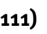


> **[Diagram Context - Textbook_MathematicalLiteracy_Gr11_Interest-banking-and-inflation.pdf-0001-03.png]**
> This image is a text-based heading containing the label "Section 1: In". It serves as a structural signpost to introduce a specific topic or module within a CAPS-aligned educational resource.


> **[Diagram Context - Textbook_MathematicalLiteracy_Gr11_Interest-banking-and-inflation.pdf-0001-04.png]**
> This image is a text-based reference label containing the characters "(LB pages 88-9". It serves as a citation or signpost directing students to specific pages in a Learner's Book (LB) to support their study of the current curriculum topic.


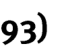


The content of this section on _Interest_ , as part of the Finance Application Topic, is drawn from page 54 in the CAPS document. 

As stipulated in the CAPS document, Grade 11 learners need specifically to be able to: 

- understand the difference between simple and compound interest; 

- perform simple and compound interest calculations manually and _without the use of formula_ ; 

- make sense of graphs drawn to represent simple and compound interest scenarios. 

In other words, the focus in this section is on helping learners to develop an understanding of the concepts of simple and compound interest and how the calculation of each type of interest differs, rather than the ability to use formula. 


> **[Diagram Context - Textbook_MathematicalLiteracy_Gr11_Interest-banking-and-inflation.pdf-0001-13.png]**
> This image consists of a text-based heading reading "Contexts and integrated content." It serves as a structural signpost in educational material, indicating a section where theoretical concepts are applied to real-world scenarios or linked across different curriculum topics to promote holistic understanding.


Learners need to be able to work in the context relating to banking and small loan agreements. 


> **[Diagram Context - Textbook_MathematicalLiteracy_Gr11_Interest-banking-and-inflation.pdf-0001-16.png]**
> This text snippet serves as a conceptual rule for financial mathematics, specifically relating to simple interest calculations. It emphasizes that the interest is determined solely based on the principal (the original amount) rather than the accumulated balance, a core principle for Grade 10-12 learners mastering simple interest versus compound interest.


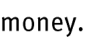


> **[Diagram Context - Textbook_MathematicalLiteracy_Gr11_Interest-banking-and-inflation.pdf-0001-18.png]**
> This graphic is a text-based heading featuring the label "Compound interest" set against a solid green background. It serves as a conceptual signpost for the CAPS Mathematics curriculum, identifying the topic of financial growth where interest is calculated on both the initial principal and the accumulated interest from previous periods.


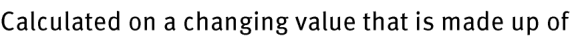
> **[Diagram Context - Textbook_MathematicalLiteracy_Gr11_Interest-banking-and-inflation.pdf-0001-19.png]**
> This text snippet serves as a conceptual definition for the calculation of compound interest in Grade 10-12 Mathematics. It highlights the fundamental principle that interest is earned or charged on a principal amount that increases over time as previous interest is added to the total.


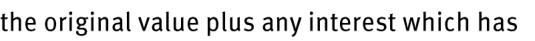
> **[Diagram Context - Textbook_MathematicalLiteracy_Gr11_Interest-banking-and-inflation.pdf-0001-20.png]**
> This text snippet defines the concept of the "accumulated amount" in the context of financial mathematics. It explicitly identifies the components of a total balance as the "original value" (principal) plus "interest," which has been earned over a specific period. This serves as the foundational conceptual basis for learners to understand how simple and compound interest formulas are derived in the CAPS curriculum.


> **[Diagram Context - Textbook_MathematicalLiteracy_Gr11_Interest-banking-and-inflation.pdf-0001-21.png]**
> This image is a text snippet containing the phrase "already been calculated." It serves as a linguistic indicator in a mathematical or scientific problem-solving context, signaling that a specific numerical value or variable has previously been determined and is now ready for use in subsequent steps of a calculation.


> **[Diagram Context - Textbook_MathematicalLiteracy_Gr11_Interest-banking-and-inflation.pdf-0001-23.png]**
> This text fragment serves as a conceptual anchor for understanding arithmetic sequences in Grade 10-12 Mathematics. It highlights the defining characteristic of a linear pattern, where a constant difference is added to each consecutive term to generate the sequence.


> **[Diagram Context - Textbook_MathematicalLiteracy_Gr11_Interest-banking-and-inflation.pdf-0001-24.png]**
> This image consists of a text fragment explaining the fundamental principle of simple interest. It highlights the core concept that the principal amount remains constant over time, serving as the fixed base for all interest calculations in the CAPS Grade 10-12 Mathematics financial literacy curriculum.


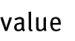


> **[Diagram Context - Textbook_MathematicalLiteracy_Gr11_Interest-banking-and-inflation.pdf-0001-26.png]**
> This text-based graphic presents the defining characteristic of compound interest, specifically the phrase "Amount of interest added is always changing." It serves as a conceptual prompt for Grade 10-12 Mathematics learners to distinguish between simple interest, where the interest amount remains constant, and compound interest, where interest is calculated on the accumulated principal and previous interest, resulting in an exponential growth pattern.


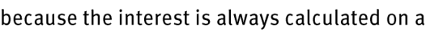
> **[Diagram Context - Textbook_MathematicalLiteracy_Gr11_Interest-banking-and-inflation.pdf-0001-27.png]**
> This text snippet serves as a conceptual lead-in for a Mathematics Finance lesson, specifically focusing on the definition of simple interest. It highlights the core principle that simple interest is calculated solely on the original principal amount, rather than on accumulated interest.


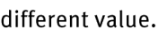


> **[Diagram Context - Textbook_MathematicalLiteracy_Gr11_Interest-banking-and-inflation.pdf-0001-29.png]**
> This image is a text-based attribution label identifying the source material as "Via Afrika » Mathematical Literacy Gr 11." It serves as a copyright and curriculum-specific identifier for educational content aligned with the South African CAPS syllabus. This label confirms the academic origin and grade-level context of the associated mathematical literacy resources.


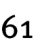


> **[Diagram Context - Textbook_MathematicalLiteracy_Gr11_Interest-banking-and-inflation.pdf-0002-00.png]**
> This graphic serves as a chapter heading, featuring the text "Chapter 4" and the topic title "Finance (Interest, Banking and Inflation)." It introduces the core financial literacy concepts required by the CAPS curriculum, framing the study of how interest rates, banking systems, and inflation impact personal and national economic decision-making.


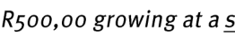
> **[Diagram Context - Textbook_MathematicalLiteracy_Gr11_Interest-banking-and-inflation.pdf-0002-02.png]**
> This text snippet represents a mathematical problem statement involving financial growth, specifically referencing a principal amount of "R500,00" and an unspecified interest rate denoted by the variable "s". It serves as an introductory prompt for Grade 10-12 Mathematics learners to apply compound or simple interest formulas to calculate the future value of an investment.


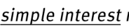

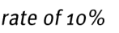

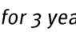


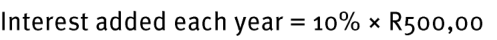
> **[Diagram Context - Textbook_MathematicalLiteracy_Gr11_Interest-banking-and-inflation.pdf-0002-06.png]**
> This mathematical expression defines the calculation for simple interest, featuring the labels "Interest added each year," the percentage rate "10%," and the principal amount "R500,00." It illustrates the fundamental concept of calculating a fixed annual interest amount based on a constant principal, which serves as a foundational step for understanding simple interest in the CAPS Financial Mathematics curriculum.


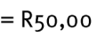


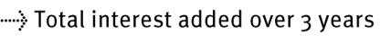
> **[Diagram Context - Textbook_MathematicalLiteracy_Gr11_Interest-banking-and-inflation.pdf-0002-08.png]**
> This graphic serves as a legend or label featuring a dotted arrow pointing to the text "Total interest added over 3 years." It is used in financial mathematics to identify the cumulative interest component within a calculation or diagram over a specific three-year period.


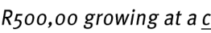
> **[Diagram Context - Textbook_MathematicalLiteracy_Gr11_Interest-banking-and-inflation.pdf-0002-10.png]**
> This text snippet presents a mathematical problem statement involving financial growth, specifically referencing a principal amount of "R500,00" and a variable rate denoted by "c". It serves as an introductory prompt for Grade 10-12 Mathematics learners to apply compound or simple interest formulas to calculate the future value of an investment.


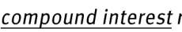
> **[Diagram Context - Textbook_MathematicalLiteracy_Gr11_Interest-banking-and-inflation.pdf-0002-11.png]**
> This image displays the text "compound interest m" as a heading or label. It serves as a conceptual anchor for Grade 10-12 Mathematics learners, specifically identifying the topic of financial mathematics where "m" typically represents the number of compounding periods per year in the compound interest formula.


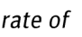

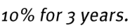

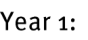


> **[Diagram Context - Textbook_MathematicalLiteracy_Gr11_Interest-banking-and-inflation.pdf-0002-15.png]**
> This text-based graphic presents a fundamental mathematical formula for financial literacy. It uses the labels "Money," "original," and "interest" to illustrate the basic additive relationship between a principal investment or loan and the accrued interest. This concept serves as an introductory building block for CAPS Mathematics learners to understand how total accumulated value is calculated in simple interest scenarios.


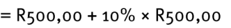
> **[Diagram Context - Textbook_MathematicalLiteracy_Gr11_Interest-banking-and-inflation.pdf-0002-16.png]**
> This mathematical expression demonstrates the calculation of a 10% increase on an initial value of R500,00. It illustrates the fundamental financial literacy concept of adding a percentage-based markup or interest to a principal amount to determine a new total value.


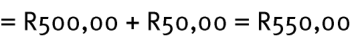
> **[Diagram Context - Textbook_MathematicalLiteracy_Gr11_Interest-banking-and-inflation.pdf-0002-17.png]**
> This image displays a simple mathematical equation involving South African Rand currency values, specifically R500,00, R50,00, and their sum, R550,00. It illustrates the basic arithmetic operation of addition within a financial context, helping students practice calculating totals or combined costs in real-world monetary terms.


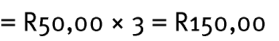
> **[Diagram Context - Textbook_MathematicalLiteracy_Gr11_Interest-banking-and-inflation.pdf-0002-18.png]**
> This image displays a mathematical calculation involving South African currency, specifically the multiplication of a unit price (R50,00) by a quantity (3) to determine a total cost (R150,00). It serves as a foundational example for learners in Mathematical Literacy to understand basic financial arithmetic, cost estimation, and the application of multiplication in real-world consumer contexts.


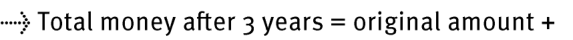
> **[Diagram Context - Textbook_MathematicalLiteracy_Gr11_Interest-banking-and-inflation.pdf-0002-19.png]**
> This graphic is a mathematical text-based formula fragment featuring a dotted arrow pointing to the phrase "Total money after 3 years = original amount +". It serves as an introductory conceptual scaffold for Grade 10-12 Financial Mathematics, illustrating the additive relationship between principal and interest in simple interest calculations.


> **[Diagram Context - Textbook_MathematicalLiteracy_Gr11_Interest-banking-and-inflation.pdf-0002-22.png]**
> This text serves as an introductory prompt for a mathematical finance lesson focusing on the linear growth characteristics of simple interest. It directs learners to observe that, unlike compound interest, the interest amount remains constant over each time period because it is calculated only on the original principal.


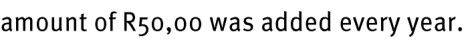
> **[Diagram Context - Textbook_MathematicalLiteracy_Gr11_Interest-banking-and-inflation.pdf-0002-23.png]**
> This text snippet describes a constant financial contribution of R50,00 per annum. In the context of the CAPS Mathematics curriculum, this represents a linear growth pattern or an arithmetic sequence where a fixed value is added to a principal amount each year.


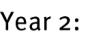


> **[Diagram Context - Textbook_MathematicalLiteracy_Gr11_Interest-banking-and-inflation.pdf-0002-25.png]**
> This text-based graphic presents a simplified mathematical formula for calculating the total value of an investment or loan. It uses the variables "Money," "Year 1 money," and "interest" to illustrate the fundamental concept of compound or simple interest accumulation over time. This serves as an introductory conceptual framework for Grade 10-12 Financial Mathematics, highlighting how interest is added to a principal amount to determine a final balance.


> **[Diagram Context - Textbook_MathematicalLiteracy_Gr11_Interest-banking-and-inflation.pdf-0002-28.png]**
> This text snippet serves as an introductory heading for a mathematical comparison between simple and compound interest. It highlights the conceptual shift required for learners to understand that compound interest involves the accumulation of interest on both the principal and previously earned interest, leading to exponential growth.


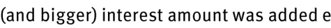
> **[Diagram Context - Textbook_MathematicalLiteracy_Gr11_Interest-banking-and-inflation.pdf-0002-29.png]**
> This image contains a text snippet featuring the phrase "(and bigger) interest amount was added e". It serves as a conceptual fragment related to financial mathematics, specifically illustrating the principle of compound interest where the interest earned on an investment increases over time as the principal grows.


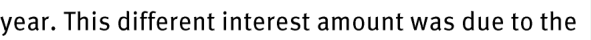
> **[Diagram Context - Textbook_MathematicalLiteracy_Gr11_Interest-banking-and-inflation.pdf-0002-30.png]**
> This image consists of a single line of text fragment reading, "year. This different interest amount was due to the". It serves as a contextual snippet for a Mathematics or Economic and Management Sciences (EMS) problem regarding simple or compound interest calculations. The text prompts students to identify the variables or conditions—such as changes in principal, interest rate, or time period—that cause a variation in the final interest accrued.


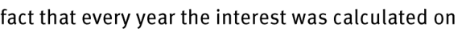
> **[Diagram Context - Textbook_MathematicalLiteracy_Gr11_Interest-banking-and-inflation.pdf-0002-31.png]**
> This image contains a text fragment describing the mechanism of compound interest. It explicitly references the phrase "fact that every year the interest was calculated on," which serves as a foundational explanation for how interest accumulates on both the principal amount and previously earned interest. This concept is essential for Grade 10-12 Mathematics learners to distinguish between simple and compound interest calculations in financial mathematics.


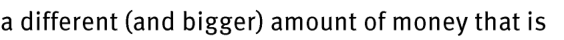
> **[Diagram Context - Textbook_MathematicalLiteracy_Gr11_Interest-banking-and-inflation.pdf-0002-32.png]**
> This image contains a text fragment stating "a different (and bigger) amount of money that is". It serves as a conceptual prompt for Mathematical Literacy learners to explore financial growth, interest calculations, or the comparison of monetary values in real-world contexts.


> **[Diagram Context - Textbook_MathematicalLiteracy_Gr11_Interest-banking-and-inflation.pdf-0002-33.png]**
> This image contains a text fragment stating "made up of the previous year’s money and". It serves as a conceptual prompt for Grade 10-12 Economics or Accounting learners to define the components of opening balances or accumulated capital. The text highlights the foundational role of historical financial data in determining the current year's opening financial position.


> **[Diagram Context - Textbook_MathematicalLiteracy_Gr11_Interest-banking-and-inflation.pdf-0002-34.png]**
> This image contains text only, specifically the phrase "previous year’s interest." In the context of the CAPS Grade 10-12 Mathematics curriculum, this term refers to the concept of compound interest, where interest is calculated on the accumulated balance of both the principal and the interest earned in preceding periods.


The graphs alongside (from page 90 in the Learner‟s Book) show a graphical representation of simple and compound interest scenarios. 

- A graph drawn to represent simple interest will always be a linear (straight line) graph. This is because the interest added is always the 


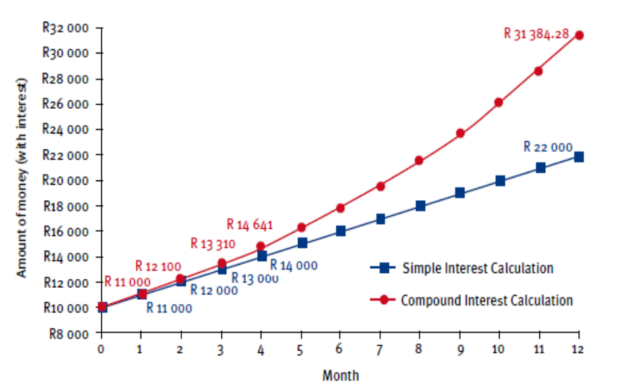
> **[Diagram Context - Textbook_MathematicalLiteracy_Gr11_Interest-banking-and-inflation.pdf-0002-37.png]**
> This line graph compares simple and compound interest growth over a 12-month period, with the y-axis representing the "Amount of money (with interest)" and the x-axis representing "Month." By plotting specific data points for both calculations, the diagram visually demonstrates how compound interest results in exponential growth compared to the linear progression of simple interest.


- same amount and so the money will increase by a constant increase. 

- A graph drawn to represent compound interest will always increase at an increasing rate. This is because the interest added is always changing and growing bigger, and so the money will increase at an ever increasing rate. 


> **[Diagram Context - Textbook_MathematicalLiteracy_Gr11_Interest-banking-and-inflation.pdf-0002-39.png]**
> This image is a text-based attribution label identifying the source material as "Via Afrika » Mathematical Literacy Gr 11." It serves as a copyright and curriculum-specific citation for educational content within the South African CAPS framework. This label indicates that the associated instructional material is aligned with the Grade 11 Mathematical Literacy syllabus.


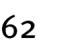


> **[Diagram Context - Textbook_MathematicalLiteracy_Gr11_Interest-banking-and-inflation.pdf-0003-00.png]**
> This graphic serves as a chapter heading, featuring the text "Chapter 4" and the topic title "Finance (Interest, Banking and Inflation)." It introduces the core financial literacy concepts required by the CAPS curriculum, framing the study of how interest rates, banking systems, and inflation impact personal and national economic decision-making.


> **[Diagram Context - Textbook_MathematicalLiteracy_Gr11_Interest-banking-and-inflation.pdf-0003-01.png]**
> This image consists of a simple text heading reading "Additional questions" in purple font. It serves as a structural signpost in educational material to indicate a section dedicated to formative assessment or practice exercises for learners.


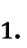


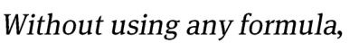
> **[Diagram Context - Textbook_MathematicalLiteracy_Gr11_Interest-banking-and-inflation.pdf-0003-03.png]**
> This text-based graphic presents a directive instruction containing the phrase "Without using any formula." It serves as a prompt for learners to demonstrate conceptual understanding or qualitative reasoning in a CAPS assessment context, requiring them to explain scientific or mathematical relationships through descriptive logic rather than quantitative calculation.


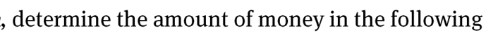
> **[Diagram Context - Textbook_MathematicalLiteracy_Gr11_Interest-banking-and-inflation.pdf-0003-04.png]**
> This image is a text-based instructional prompt containing the phrase "determine the amount of money in the following". It serves as a directive for a Mathematical Literacy or Mathematics problem, requiring students to perform calculations based on financial data provided in subsequent, missing context.


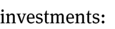


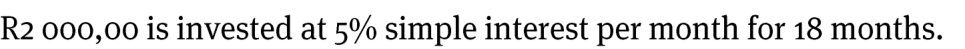
> **[Diagram Context - Textbook_MathematicalLiteracy_Gr11_Interest-banking-and-inflation.pdf-0003-07.png]**
> This text-based problem presents a financial mathematics scenario involving a principal amount of R2 000,00, a simple interest rate of 5% per month, and a time period of 18 months. It serves as a foundational exercise for Grade 10-12 learners to practice applying the simple interest formula, $A = P(1 + in)$, by correctly identifying and substituting the given variables into the equation.


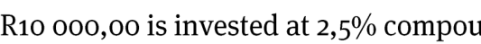
> **[Diagram Context - Textbook_MathematicalLiteracy_Gr11_Interest-banking-and-inflation.pdf-0003-09.png]**
> This text snippet presents a financial mathematics problem statement involving a principal investment of R10 000,00 and an interest rate of 2,5% per annum. It serves as the foundational data for calculating compound interest, requiring students to identify the variables $P$ and $i$ to apply the standard compound interest formula $A = P(1 + i)^n$ within the Grade 10–12 CAPS Mathematics curriculum.


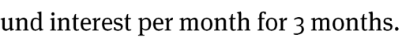
> **[Diagram Context - Textbook_MathematicalLiteracy_Gr11_Interest-banking-and-inflation.pdf-0003-10.png]**
> This text snippet serves as a contextual prompt for a mathematical finance problem, specifically referencing the calculation of "fund and interest per month for 3 months." It establishes the parameters for a financial literacy exercise involving simple or compound interest applications within the CAPS Mathematics curriculum.


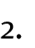


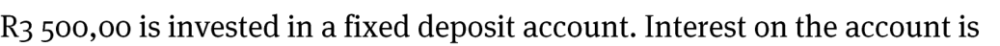
> **[Diagram Context - Textbook_MathematicalLiteracy_Gr11_Interest-banking-and-inflation.pdf-0003-12.png]**
> This text snippet presents a mathematical word problem statement involving a principal investment of R3 500,00 in a fixed deposit account. It serves as the introductory premise for a Grade 10-12 Finance problem, requiring students to apply simple or compound interest formulas to calculate future growth.


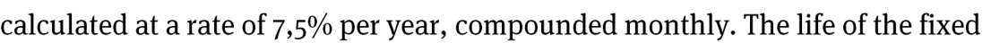
> **[Diagram Context - Textbook_MathematicalLiteracy_Gr11_Interest-banking-and-inflation.pdf-0003-13.png]**
> This text snippet presents a mathematical problem statement regarding financial interest, specifically identifying an annual interest rate of 7,5% and a monthly compounding frequency. It serves to test a student's ability to correctly identify and convert variables for the compound interest formula, $A = P(1 + \frac{r}{n})^{n \times t}$, where the compounding period ($n$) must be adjusted to 12.


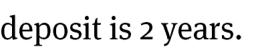
> **[Diagram Context - Textbook_MathematicalLiteracy_Gr11_Interest-banking-and-inflation.pdf-0003-14.png]**
> This text snippet represents a fragment of a mathematical word problem, specifically referencing the variable "deposit" and a time duration of "2 years." In the context of the CAPS curriculum, this likely relates to Financial Mathematics, where learners calculate simple or compound interest on an investment or fixed deposit over a specified period.


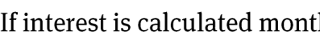
> **[Diagram Context - Textbook_MathematicalLiteracy_Gr11_Interest-banking-and-inflation.pdf-0003-16.png]**
> This text snippet introduces the concept of compound interest frequency within the CAPS Mathematics curriculum. It specifies the condition "If interest is calculated monthly," which signals to students that they must adjust the annual interest rate and the number of compounding periods accordingly when applying financial formulas.


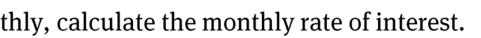
> **[Diagram Context - Textbook_MathematicalLiteracy_Gr11_Interest-banking-and-inflation.pdf-0003-17.png]**
> This text snippet is a mathematical instruction containing the phrase "monthly rate of interest." It serves as a prompt for learners to apply financial mathematics principles, specifically the conversion of annual interest rates to periodic rates for compounding calculations.


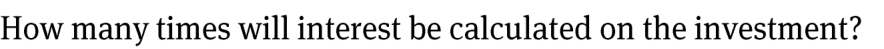
> **[Diagram Context - Textbook_MathematicalLiteracy_Gr11_Interest-banking-and-inflation.pdf-0003-19.png]**
> This text-based prompt serves as a mathematical inquiry regarding financial literacy within the CAPS curriculum. It requires the learner to identify the compounding frequency (the variable 'n') in a compound interest calculation based on the provided investment terms.


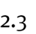


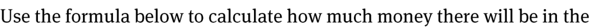
> **[Diagram Context - Textbook_MathematicalLiteracy_Gr11_Interest-banking-and-inflation.pdf-0003-21.png]**
> This text snippet serves as an instructional prompt for a mathematical finance problem, specifically focusing on the application of financial formulas. It directs the learner to utilize a provided equation to determine the future value of an investment or account balance. This task reinforces the CAPS curriculum requirements for Grade 10-12 Mathematics, where students must apply algebraic formulas to solve real-world financial scenarios involving interest and growth.


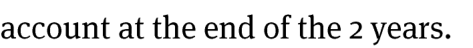
> **[Diagram Context - Textbook_MathematicalLiteracy_Gr11_Interest-banking-and-inflation.pdf-0003-22.png]**
> This image contains a text fragment from a Mathematics problem regarding financial calculations. It includes the words "account," "at," "the," "end," "of," "the," "2," and "years." Conceptually, this text serves as the concluding clause of a word problem, prompting students to calculate the final accumulated value of an investment or loan after a two-year period using compound or simple interest formulas.


> **[Diagram Context - Textbook_MathematicalLiteracy_Gr11_Interest-banking-and-inflation.pdf-0003-27.png]**
> This text snippet defines the mathematical variable representing the accumulated value or final balance of an investment or loan. In the context of Grade 10-12 Mathematics Finance, it identifies the "A" variable in compound interest formulas, representing the total amount of money in an account at the end of a specific time period.


> **[Diagram Context - Textbook_MathematicalLiteracy_Gr11_Interest-banking-and-inflation.pdf-0003-28.png]**
> This text snippet defines the variable $P$ (principal) used in financial mathematics formulas. It explicitly identifies the term as the "initial amount of money invested in the account," which is a foundational concept for Grade 10-12 learners studying simple and compound interest.


> **[Diagram Context - Textbook_MathematicalLiteracy_Gr11_Interest-banking-and-inflation.pdf-0003-29.png]**
> This text snippet defines the variable representing the "monthly rate of interest" used in financial mathematics calculations. It serves as a key component for Grade 11 and 12 learners when converting annual interest rates for periodic compounding in loan or investment formulas.


> **[Diagram Context - Textbook_MathematicalLiteracy_Gr11_Interest-banking-and-inflation.pdf-0003-30.png]**
> This text snippet defines the variable commonly represented as 'n' or 'm' in the compound interest formula within the CAPS Mathematics curriculum. It clarifies that this variable represents the frequency of compounding periods per annum, such as monthly (12) or quarterly (4). This conceptual definition is essential for learners to correctly adjust the interest rate and the total number of time periods when calculating financial growth.


> **[Diagram Context - Textbook_MathematicalLiteracy_Gr11_Interest-banking-and-inflation.pdf-0003-32.png]**
> This text snippet represents a conditional problem statement commonly found in Grade 10-12 Mathematics Finance sections. It introduces a scenario involving a time variable ("2 years") and a financial context ("money in the account"), serving as the premise for calculating compound interest or investment growth.


> **[Diagram Context - Textbook_MathematicalLiteracy_Gr11_Interest-banking-and-inflation.pdf-0003-33.png]**
> This image fragment contains a text-based mathematical problem prompt featuring the phrase "another 1 month, calculate v". It serves as an instructional cue for learners to apply kinematic or growth-rate formulas to determine a specific velocity or value after a defined time interval.


> **[Diagram Context - Textbook_MathematicalLiteracy_Gr11_Interest-banking-and-inflation.pdf-0003-34.png]**
> This image displays a text fragment containing the phrase "without the use of a formula". It serves as a directive or constraint often found in CAPS Mathematics or Physical Sciences assessment tasks, instructing learners to solve a problem using conceptual understanding or logical reasoning rather than rote application of a mathematical equation.


> **[Diagram Context - Textbook_MathematicalLiteracy_Gr11_Interest-banking-and-inflation.pdf-0003-35.png]**
> This image consists of the text string "how much money" in a standard serif font. It serves as a linguistic prompt or inquiry, commonly used in CAPS Economics or Business Studies to introduce topics related to financial literacy, budgeting, or the conceptual definition of currency.


> **[Diagram Context - Textbook_MathematicalLiteracy_Gr11_Interest-banking-and-inflation.pdf-0003-36.png]**
> This image contains only the text fragment "there will be in the account." It does not provide any visual diagrams, labels, or scientific variables required for pedagogical analysis within the CAPS curriculum.


> **[Diagram Context - Textbook_MathematicalLiteracy_Gr11_Interest-banking-and-inflation.pdf-0003-37.png]**
> This image is a text-based attribution label identifying the source material as "Via Afrika » Mathematical Literacy Gr 11." It serves as a copyright and curriculum-specific citation for educational content used within the South African CAPS Mathematical Literacy syllabus.


> **[Diagram Context - Textbook_MathematicalLiteracy_Gr11_Interest-banking-and-inflation.pdf-0004-00.png]**
> This graphic serves as a chapter heading, featuring the text "Chapter 4" and the topic title "Finance (Interest, Banking and Inflation)." It introduces the core financial literacy concepts required by the CAPS curriculum, framing the study of how interest rates, banking systems, and inflation impact personal and national economic decision-making.


> **[Diagram Context - Textbook_MathematicalLiteracy_Gr11_Interest-banking-and-inflation.pdf-0004-02.png]**
> This text serves as an introductory caption for a line graph comparing investment growth over time. It establishes the context for a Mathematical Literacy or Mathematics financial growth problem, identifying the dependent variable as the amount of money and the independent variable as time.


> **[Diagram Context - Textbook_MathematicalLiteracy_Gr11_Interest-banking-and-inflation.pdf-0004-03.png]**
> This text snippet serves as the introductory heading for a mathematical graph comparing the growth of investments over time. It explicitly references the key financial concepts of "simple interest" and "compound interest," which are fundamental topics in the Grade 10-12 CAPS Mathematics curriculum. The text establishes the context for a visual comparison between linear and exponential growth patterns in financial planning.


> **[Diagram Context - Textbook_MathematicalLiteracy_Gr11_Interest-banking-and-inflation.pdf-0004-05.png]**
> This line graph compares the growth of an investment over time, featuring a linear dashed line for simple interest and a curved solid line for compound interest, with axes labeled "Amount" (in Rands) and "Months." It visually demonstrates the mathematical concept that while simple interest grows at a constant rate, compound interest results in exponential growth, leading to a significantly higher total value over the same period.


> **[Diagram Context - Textbook_MathematicalLiteracy_Gr11_Interest-banking-and-inflation.pdf-0004-11.png]**
> This text snippet presents a multiple-choice question prompt regarding the graphical representation of financial mathematics. It specifically asks the learner to identify the correct linear relationship between time and accumulated value that characterizes simple interest. This exercise tests the student's ability to distinguish between the constant growth rate of simple interest and the exponential growth associated with compound interest.


> **[Diagram Context - Textbook_MathematicalLiteracy_Gr11_Interest-banking-and-inflation.pdf-0004-12.png]**
> This image contains a text fragment from a mathematical literacy or economics assessment task. The text includes the phrases "calculated on the investment" and "which graph the scenario where," which serve as instructional prompts for students to analyze financial growth models or interest calculations. Conceptually, this requires learners to apply their understanding of simple or compound interest formulas to interpret and select the correct graphical representation of a specific financial scenario.


> **[Diagram Context - Textbook_MathematicalLiteracy_Gr11_Interest-banking-and-inflation.pdf-0004-13.png]**
> This text snippet is an assessment prompt related to financial mathematics, specifically focusing on the concept of compound interest. It requires learners to demonstrate conceptual understanding by identifying whether a given scenario involves compound interest and providing a justification for their reasoning.


> **[Diagram Context - Textbook_MathematicalLiteracy_Gr11_Interest-banking-and-inflation.pdf-0004-14.png]**
> This image presents a text-based question asking for the initial value of an investment based on a graph that is not currently visible. It requires the student to identify the y-intercept of a financial growth curve, which represents the principal amount invested at time zero.


> **[Diagram Context - Textbook_MathematicalLiteracy_Gr11_Interest-banking-and-inflation.pdf-0004-15.png]**
> This text-based graphic presents a direct inquiry regarding the duration of a financial investment, specifically asking for the time period in months. It serves as a prompt for learners to identify and extract the time variable ($n$) from a given financial scenario, which is a fundamental step in applying simple or compound interest formulas within the CAPS Mathematics curriculum.


> **[Diagram Context - Textbook_MathematicalLiteracy_Gr11_Interest-banking-and-inflation.pdf-0004-16.png]**
> This text serves as an instructional prompt for a data interpretation task, directing students to utilize the provided graphical information to solve a problem. It functions as a cognitive scaffold, requiring learners to extract, analyse, and apply quantitative or qualitative data from a graph to demonstrate their understanding of the underlying scientific or mathematical concept.


> **[Diagram Context - Textbook_MathematicalLiteracy_Gr11_Interest-banking-and-inflation.pdf-0004-17.png]**
> This image displays the text "simple interest s", which serves as a heading or label for a mathematical topic. It introduces the concept of simple interest, a core component of the Grade 10-12 CAPS Mathematics curriculum regarding financial growth and linear calculations.


> **[Diagram Context - Textbook_MathematicalLiteracy_Gr11_Interest-banking-and-inflation.pdf-0004-21.png]**
> This image fragment contains a text snippet featuring the phrase "the amount of interest added on to th". It serves as a conceptual prompt for Grade 10-12 Mathematics (Finance) regarding the calculation of simple or compound interest. The text introduces the fundamental financial principle of interest as an additional cost or gain applied to a principal amount over a specific period.


> **[Diagram Context - Textbook_MathematicalLiteracy_Gr11_Interest-banking-and-inflation.pdf-0004-22.png]**
> This image contains a text fragment from a Mathematics or Mathematical Literacy problem regarding financial calculations. The visible text, "the investment every month if", indicates that the learner is being asked to calculate a periodic payment or contribution within the context of compound interest or annuity problems. This snippet serves as the prompt for students to apply financial formulas to determine recurring investment amounts required to reach a specific future value.


> **[Diagram Context - Textbook_MathematicalLiteracy_Gr11_Interest-banking-and-inflation.pdf-0004-23.png]**
> This image displays a text fragment stating "simple interest is calculated;". It serves as an introductory header or prompt for a mathematical explanation regarding the financial calculation of interest on a principal amount over time, a core concept in the Grade 10-12 CAPS Mathematics curriculum.


> **[Diagram Context - Textbook_MathematicalLiteracy_Gr11_Interest-banking-and-inflation.pdf-0004-25.png]**
> This image is a text snippet containing the phrase "the rate at which interest is being calculated on the investment." It serves as a conceptual prompt for Grade 10-12 Mathematics or Mathematical Literacy students to identify the variable 'i' (interest rate) within financial growth formulas. This phrase highlights the importance of understanding interest rate terminology when solving problems related to simple or compound interest.


> **[Diagram Context - Textbook_MathematicalLiteracy_Gr11_Interest-banking-and-inflation.pdf-0004-26.png]**
> This text snippet serves as an instructional prompt for a high school assessment task, referencing specific sub-questions labeled 3.2, 3.3, and 3.4.2. It directs students to synthesize information derived from previous parts of an examination or worksheet to construct a coherent final response or calculation.


> **[Diagram Context - Textbook_MathematicalLiteracy_Gr11_Interest-banking-and-inflation.pdf-0004-27.png]**
> This image displays a text-based instructional prompt containing the words "the formula below to calculate." It serves as a directive for students to apply a specific mathematical or scientific equation to solve a subsequent problem, a common feature in CAPS Physical Sciences or Mathematics assessments.


> **[Diagram Context - Textbook_MathematicalLiteracy_Gr11_Interest-banking-and-inflation.pdf-0004-28.png]**
> This image contains a text fragment that serves as an introductory prompt for a financial mathematics problem. It explicitly mentions the concept of calculating future values or accumulated amounts of money, which is a core component of the Grade 10-12 CAPS Mathematics curriculum regarding simple and compound interest.


> **[Diagram Context - Textbook_MathematicalLiteracy_Gr11_Interest-banking-and-inflation.pdf-0004-29.png]**
> This image contains a text fragment reading "the investment at the end of". It serves as a prompt for Grade 12 Mathematics learners to calculate the future value of an investment, typically involving the use of the financial mathematics formula for compound interest or annuities.


> **[Diagram Context - Textbook_MathematicalLiteracy_Gr11_Interest-banking-and-inflation.pdf-0004-30.png]**
> This text fragment serves as a prompt for a Grade 10-12 Mathematics financial literacy problem, specifically focusing on the application of the compound interest formula. It directs the learner to calculate the future value of an investment by applying the principle of interest earned on both the principal and accumulated interest over a specified period.


> **[Diagram Context - Textbook_MathematicalLiteracy_Gr11_Interest-banking-and-inflation.pdf-0004-32.png]**
> This text snippet represents a mathematical definition used in Grade 10-12 Mathematics of Finance. It defines the variable $A$ (the accumulated amount) as the total money present in an account after a specific duration of interest application.


> **[Diagram Context - Textbook_MathematicalLiteracy_Gr11_Interest-banking-and-inflation.pdf-0004-33.png]**
> This text snippet defines the variable $P$ (the principal) in the context of financial mathematics. It explicitly identifies the term as the "initial amount of money invested in the account," which is a foundational concept for learners calculating simple or compound interest in the CAPS Mathematics curriculum.


> **[Diagram Context - Textbook_MathematicalLiteracy_Gr11_Interest-banking-and-inflation.pdf-0004-35.png]**
> This text snippet defines a financial variable, specifically the "monthly rate of interest." It serves as a conceptual component for Grade 10-12 Mathematics or Mathematical Literacy learners, illustrating the necessity of converting annual interest rates into monthly periods when calculating compound interest or loan repayments.


> **[Diagram Context - Textbook_MathematicalLiteracy_Gr11_Interest-banking-and-inflation.pdf-0004-36.png]**
> This text fragment represents a definition for the variable 'n' commonly used in Grade 10-12 Mathematics financial formulas. It explicitly defines the term as the "number of times interest is calculated" per annum, which is essential for students to correctly identify compounding periods in compound interest calculations.


> **[Diagram Context - Textbook_MathematicalLiteracy_Gr11_Interest-banking-and-inflation.pdf-0004-37.png]**
> This image is a copyright attribution text for a Grade 11 Mathematical Literacy educational resource. It identifies the source as "Via Afrika" and specifies the subject and grade level, serving as a formal citation for curriculum-aligned learning materials.


_A_ = _P_ (1 + _i_ )^{_n_} 


> **[Diagram Context - Textbook_MathematicalLiteracy_Gr11_Interest-banking-and-inflation.pdf-0005-00.png]**
> This graphic serves as a chapter heading, featuring the text "Chapter 4" and the topic title "Finance (Interest, Banking and Inflation)." It introduces the core financial literacy concepts required by the CAPS curriculum, framing the study of how interest rates, banking systems, and inflation impact personal and national economic decision-making.


_Note: Assume that:_ 

- the rate at which interest is calculated on the simple interest scenario and the compound interest scenario is the same; 

- interest is calculated every month. 


> **[Diagram Context - Textbook_MathematicalLiteracy_Gr11_Interest-banking-and-inflation.pdf-0005-04.png]**
> This image presents a text-based prompt for a data interpretation question, specifically referencing a graph that is not currently visible. It asks the student to analyze visual data to explain the economic reasoning behind the limited number of banks in a given context. This exercise is designed to test a learner's ability to extract trends or correlations from graphical data and apply them to real-world financial or economic scenarios.


> **[Diagram Context - Textbook_MathematicalLiteracy_Gr11_Interest-banking-and-inflation.pdf-0005-05.png]**
> This text snippet is a partial interrogative sentence regarding the application of simple interest by financial institutions. It contains the visible text "or other financial institutions make use of simple interest?" and serves as a prompt to introduce or assess a learner's understanding of financial mathematics within the CAPS curriculum.


1. 


> **[Diagram Context - Textbook_MathematicalLiteracy_Gr11_Interest-banking-and-inflation.pdf-0005-09.png]**
> This text-based mathematical expression illustrates the calculation of simple interest earned over a specific period. It displays the variables of interest rate (5%), principal amount (R2 000,00), and the resulting product (R100,00) to demonstrate how a fixed percentage of an initial sum is determined.


> **[Diagram Context - Textbook_MathematicalLiteracy_Gr11_Interest-banking-and-inflation.pdf-0005-10.png]**
> This text-based graphic uses a dotted arrow to point toward the label "Total simple interest over 18 months = R100". It serves as a key or legend element in a financial mathematics problem, identifying the calculated interest value for a specific time period (18 months) within a CAPS Grade 10-12 Finance context.


> **[Diagram Context - Textbook_MathematicalLiteracy_Gr11_Interest-banking-and-inflation.pdf-0005-11.png]**
> This text snippet represents a mathematical expression used in financial literacy to calculate the total cost of a credit agreement or installment plan. It includes the variables "per month" and "18 months," which students use to determine the cumulative financial obligation by multiplying a recurring payment by the duration of the contract.


> **[Diagram Context - Textbook_MathematicalLiteracy_Gr11_Interest-banking-and-inflation.pdf-0005-13.png]**
> This text-based graphic represents a mathematical expression for calculating the final value of a financial investment after a specific duration. It includes the labels "Total amount in the investment," "18 months," and monetary values in Rands (R2 000,00 + R1), illustrating the basic additive principle used in CAPS Mathematics Literacy to determine accumulated capital.


> **[Diagram Context - Textbook_MathematicalLiteracy_Gr11_Interest-banking-and-inflation.pdf-0005-18.png]**
> This mathematical expression represents a simple interest calculation, featuring the principal amount of R10 000,00 and a percentage rate of 2,5%. It illustrates the basic financial literacy concept of calculating the total value of an investment by adding the interest earned to the initial capital.


> **[Diagram Context - Textbook_MathematicalLiteracy_Gr11_Interest-banking-and-inflation.pdf-0005-19.png]**
> This image displays a mathematical arithmetic expression involving the addition of two monetary values, specifically R10 000,00 and R250,00, resulting in a total of R10 250,00. In the context of the CAPS curriculum, this illustrates basic financial mathematics calculations, such as determining the final amount after adding interest or a fee to a principal investment or loan.


> **[Diagram Context - Textbook_MathematicalLiteracy_Gr11_Interest-banking-and-inflation.pdf-0005-21.png]**
> This text snippet represents a mathematical financial statement containing the phrase "in the investment = R1". It serves as a foundational component for Grade 10-12 Mathematical Literacy or Mathematics learners to identify principal amounts or initial capital values in financial growth and interest calculations.


> **[Diagram Context - Textbook_MathematicalLiteracy_Gr11_Interest-banking-and-inflation.pdf-0005-22.png]**
> This mathematical expression represents a financial calculation involving a principal amount of R10 250,00 and a 2,5% percentage increase or interest component. It demonstrates the practical application of percentage calculations in a monetary context, specifically showing how to determine a total value by adding a percentage-based portion to an original base amount.


> **[Diagram Context - Textbook_MathematicalLiteracy_Gr11_Interest-banking-and-inflation.pdf-0005-27.png]**
> This text-based mathematical expression demonstrates the conversion of an annual interest rate into a monthly interest rate. It explicitly shows the calculation "7,5% / 12 = 0,625%", utilizing the variables of an annual percentage rate and the number of months in a year. This concept is essential for Grade 10-12 Mathematics and Mathematical Literacy students when calculating compound interest or loan repayments where compounding occurs monthly.


> **[Diagram Context - Textbook_MathematicalLiteracy_Gr11_Interest-banking-and-inflation.pdf-0005-32.png]**
> This image displays a mathematical expression representing a compound interest calculation, featuring the principal amount (R3 500,00), an interest rate of 0,625%, and an exponent of 24. It illustrates the application of the compound interest formula $A = P(1 + i)^n$, helping learners understand how to substitute specific financial values into the formula to calculate the accumulated amount over 24 compounding periods.


> **[Diagram Context - Textbook_MathematicalLiteracy_Gr11_Interest-banking-and-inflation.pdf-0005-33.png]**
> This image displays a mathematical expression representing the compound interest formula $A = P(1+i)^n$, featuring the principal amount R3 500,00, an interest rate of 0,00625, and a time period of 24 compounding intervals. It illustrates the calculation of the accumulated value of an investment or loan, helping students apply exponential growth principles to financial mathematics within the CAPS curriculum.


> **[Diagram Context - Textbook_MathematicalLiteracy_Gr11_Interest-banking-and-inflation.pdf-0005-34.png]**
> This graphic displays a mathematical expression representing the calculation of compound interest, featuring the principal amount (R3 500,00), the periodic interest rate (1,00625), and the number of compounding periods (24). It illustrates the application of the compound growth formula $A = P(1 + i)^n$, helping students understand how to substitute values into financial mathematics equations to determine the accumulated value of an investment or loan over time.


> **[Diagram Context - Textbook_MathematicalLiteracy_Gr11_Interest-banking-and-inflation.pdf-0005-35.png]**
> This mathematical expression displays a calculation involving a principal amount of R3 500,00 multiplied by a growth factor of 1,16129. In the context of CAPS Mathematics or Mathematical Literacy, this represents the final step in calculating compound interest or a percentage increase, where the multiplier accounts for both the original value and the accumulated growth over a specific period.


> **[Diagram Context - Textbook_MathematicalLiteracy_Gr11_Interest-banking-and-inflation.pdf-0005-37.png]**
> This text snippet serves as a procedural instruction commonly found in Mathematics and Physical Sciences assessments. It specifies the required level of precision for numerical answers, directing students to round their final calculations to two decimal places to ensure consistency and accuracy in reporting data.


> **[Diagram Context - Textbook_MathematicalLiteracy_Gr11_Interest-banking-and-inflation.pdf-0005-39.png]**
> This image displays a mathematical equation representing the calculation of a final account balance, featuring the labels "Money in the account," the principal amount of R4 064,52, and an interest rate of 0,625%. It illustrates the practical application of simple interest calculations, showing how an initial sum is added to the product of that sum and a percentage rate to determine total value.


> **[Diagram Context - Textbook_MathematicalLiteracy_Gr11_Interest-banking-and-inflation.pdf-0005-40.png]**
> This mathematical expression displays an addition calculation involving South African Rand (R) currency values. It demonstrates the basic arithmetic process of summing two monetary amounts to determine a final total, a fundamental skill required for financial literacy in the CAPS curriculum.


> **[Diagram Context - Textbook_MathematicalLiteracy_Gr11_Interest-banking-and-inflation.pdf-0005-41.png]**
> This image is a text-based attribution label identifying the source material as "Via Afrika » Mathematical Literacy Gr 11." It serves as a copyright and curriculum-specific citation for educational content within the South African CAPS framework. This label indicates that the associated instructional material is aligned with the Grade 11 Mathematical Literacy syllabus.


> **[Diagram Context - Textbook_MathematicalLiteracy_Gr11_Interest-banking-and-inflation.pdf-0006-00.png]**
> This graphic serves as a chapter heading, featuring the text "Chapter 4" and the topic title "Finance (Interest, Banking and Inflation)." It introduces the core financial literacy concepts required by the CAPS curriculum, framing the study of how interest rates, banking systems, and inflation impact personal and national economic decision-making.


> **[Diagram Context - Textbook_MathematicalLiteracy_Gr11_Interest-banking-and-inflation.pdf-0006-03.png]**
> This text serves as a caption for a mathematical graph illustrating financial growth. It explicitly identifies the curved line as a visual representation of compound interest, distinguishing it from linear simple interest models. This helps students conceptualize the exponential nature of compound interest, where the principal amount grows at an increasing rate over time.


> **[Diagram Context - Textbook_MathematicalLiteracy_Gr11_Interest-banking-and-inflation.pdf-0006-05.png]**
> This text snippet serves as a conceptual descriptor for a mathematical graph illustrating exponential growth. It explicitly links the visual representation of a curve "growing at an increasing rate" to the financial concept of compound interest. For a CAPS Mathematics learner, this reinforces the relationship between algebraic exponential functions and their practical application in financial mathematics.


> **[Diagram Context - Textbook_MathematicalLiteracy_Gr11_Interest-banking-and-inflation.pdf-0006-06.png]**
> This text snippet describes the principle of compound interest, where the interest earned in each period is added to the principal, resulting in a larger base for subsequent calculations. In the context of CAPS Mathematics and Mathematical Literacy, it highlights the conceptual shift from simple interest to compound growth, where the "increasing balance" reflects the exponential nature of financial accumulation over time.


> **[Diagram Context - Textbook_MathematicalLiteracy_Gr11_Interest-banking-and-inflation.pdf-0006-07.png]**
> This text snippet serves as a conceptual caption for a mathematical graph illustrating financial growth. It identifies the linear relationship between time and accumulated value, specifically defining the straight line as a representation of simple interest. This helps learners visualize how simple interest grows at a constant rate over time, distinguishing it from the exponential growth characteristic of compound interest in the CAPS Mathematics curriculum.


> **[Diagram Context - Textbook_MathematicalLiteracy_Gr11_Interest-banking-and-inflation.pdf-0006-08.png]**
> This text snippet defines the fundamental concept of simple interest in Mathematics Finance. It highlights the key characteristic that the interest earned remains constant over time because it is calculated only on the original principal amount.


> **[Diagram Context - Textbook_MathematicalLiteracy_Gr11_Interest-banking-and-inflation.pdf-0006-16.png]**
> This image contains a text fragment that serves as the introductory prompt for a data interpretation question. The visible text, "According to the graph, aft," indicates that the student is expected to analyze a corresponding graphical representation to determine a specific outcome or trend occurring after a certain point in time.


> **[Diagram Context - Textbook_MathematicalLiteracy_Gr11_Interest-banking-and-inflation.pdf-0006-17.png]**
> This text snippet represents a fragment of a mathematical word problem, specifically focusing on financial mathematics. It contains the phrase "after 12 months, the money in the," which serves as the setup for calculating interest or investment growth over a one-year period. This context helps students apply formulas for simple or compound interest to determine the future value of an investment or loan.


> **[Diagram Context - Textbook_MathematicalLiteracy_Gr11_Interest-banking-and-inflation.pdf-0006-18.png]**
> This text snippet presents a mathematical word problem involving financial values, specifically identifying an initial principal of R5 000,00 and a final amount of R11 000,00. It serves as a foundational prompt for Grade 10-12 Mathematics or Mathematical Literacy students to calculate percentage increase, growth rates, or simple and compound interest.


> **[Diagram Context - Textbook_MathematicalLiteracy_Gr11_Interest-banking-and-inflation.pdf-0006-19.png]**
> This text snippet represents a quantitative financial statement featuring the phrase "an increase of R6 000,00." It serves as a contextual element for Grade 10-12 Mathematical Literacy problems, requiring students to interpret monetary values and perform calculations involving additions or percentage changes in a real-world economic scenario.


> **[Diagram Context - Textbook_MathematicalLiteracy_Gr11_Interest-banking-and-inflation.pdf-0006-21.png]**
> This text snippet represents a mathematical calculation involving currency and division, specifically displaying the expression "R6 000,00 ÷ 12". It illustrates the practical application of arithmetic operations to determine a monthly value from an annual total, a fundamental skill in the CAPS Financial Mathematics curriculum.


> **[Diagram Context - Textbook_MathematicalLiteracy_Gr11_Interest-banking-and-inflation.pdf-0006-23.png]**
> This text-based graphic serves as a pedagogical warning regarding financial mathematics, specifically highlighting the error of using simple division for calculations involving a principal amount of R11 000,00 over 12 periods. It prompts students to recognize that compound interest or annuity formulas must be applied instead of basic arithmetic when dealing with time-value-of-money problems in the CAPS curriculum.


> **[Diagram Context - Textbook_MathematicalLiteracy_Gr11_Interest-banking-and-inflation.pdf-0006-24.png]**
> This image contains a text fragment stating, "to get the correct answer. This is because the graph does not". It serves as an instructional prompt or explanatory note, likely guiding a student to critically evaluate the limitations or missing information within a corresponding graphical representation in a CAPS-aligned assessment or textbook.


> **[Diagram Context - Textbook_MathematicalLiteracy_Gr11_Interest-banking-and-inflation.pdf-0006-25.png]**
> This text snippet serves as a fragment of a technical instruction or problem statement, likely referencing a specific starting point or coordinate labeled "o" and a secondary reference point "R5" within a larger diagram. It highlights the importance of precise spatial or sequential orientation when interpreting complex technical or mathematical figures in a CAPS Physical Sciences or Mathematics context.


> **[Diagram Context - Textbook_MathematicalLiteracy_Gr11_Interest-banking-and-inflation.pdf-0006-26.png]**
> This image consists of a text fragment containing the numerical values "ooo,oo" and the phrase "and so the increase over the 12". It appears to be an excerpt from a mathematical or financial literacy problem involving calculations of growth, interest, or statistical trends over a twelve-unit period.


> **[Diagram Context - Textbook_MathematicalLiteracy_Gr11_Interest-banking-and-inflation.pdf-0006-27.png]**
> This text snippet represents a financial statement or mathematical problem context involving monetary values expressed in South African Rand (R). It explicitly compares two specific amounts, "R6 000,00" and "R11 000,00," in relation to a duration of "months." For a CAPS Mathematics or Mathematical Literacy student, this serves as a prompt to identify, compare, or calculate differences between financial figures within a real-world budgeting or interest-based problem.


> **[Diagram Context - Textbook_MathematicalLiteracy_Gr11_Interest-banking-and-inflation.pdf-0006-29.png]**
> This text-based graphic displays the phrase "Simple interest per," which serves as a heading or introductory label for financial mathematics. In the context of the CAPS curriculum, this identifies the foundational concept of calculating interest based solely on the principal amount, typically used to introduce learners to linear growth patterns in finance.


> **[Diagram Context - Textbook_MathematicalLiteracy_Gr11_Interest-banking-and-inflation.pdf-0006-30.png]**
> This text snippet represents a mathematical expression of a fixed financial value, specifically identifying a monthly rate of R500,00. In a CAPS Mathematics or Mathematical Literacy context, this serves as a constant variable or unit cost used to calculate total expenditure or income over a specified period.


> **[Diagram Context - Textbook_MathematicalLiteracy_Gr11_Interest-banking-and-inflation.pdf-0006-31.png]**
> This mathematical equation features the monetary values R500,00 and R5 000,00 alongside an unknown percentage variable (?%). It serves as a practical exercise in financial mathematics, requiring students to calculate what percentage one specific amount represents of a larger total.


> **[Diagram Context - Textbook_MathematicalLiteracy_Gr11_Interest-banking-and-inflation.pdf-0006-35.png]**
> This image displays the mathematical formula for compound interest, $A = P(1 + i)^n$, with the specific variables $A$ (accumulated amount), $P = R5\ 000,00$ (principal), $i = 10\%$ (interest rate), and $n = 15$ (time period). It illustrates the application of exponential growth in financial mathematics, helping learners calculate the future value of an investment over a 15-year term.


> **[Diagram Context - Textbook_MathematicalLiteracy_Gr11_Interest-banking-and-inflation.pdf-0006-36.png]**
> This mathematical expression represents a compound interest calculation, featuring the principal amount of R5 000,00, an interest rate factor of 1,1 (representing 10%), and an exponent of 15 for the time period. It illustrates the standard CAPS Grade 10-12 Finance formula for calculating the future value of an investment or loan over 15 compounding periods.


> **[Diagram Context - Textbook_MathematicalLiteracy_Gr11_Interest-banking-and-inflation.pdf-0006-39.png]**
> This text snippet introduces the concept of simple interest within a financial mathematics context. It serves as a foundational statement to help learners distinguish between simple and compound interest growth patterns in the CAPS curriculum.


> **[Diagram Context - Textbook_MathematicalLiteracy_Gr11_Interest-banking-and-inflation.pdf-0006-40.png]**
> This image consists of a text fragment containing the phrase "higher return on an investment. This". It serves as a linguistic snippet rather than a scientific diagram, lacking any visual labels, variables, or structural components. Consequently, it provides no conceptual content relevant to the CAPS curriculum for high school science or mathematics.


> **[Diagram Context - Textbook_MathematicalLiteracy_Gr11_Interest-banking-and-inflation.pdf-0006-41.png]**
> This image contains a text fragment discussing financial mathematics, specifically the application of compound interest by banks on loans. It serves as an introductory conceptual prompt for Grade 10-12 learners to explore how interest is calculated on the accumulated principal and interest over time.


> **[Diagram Context - Textbook_MathematicalLiteracy_Gr11_Interest-banking-and-inflation.pdf-0006-42.png]**
> This text snippet serves as a conceptual comparison within a Mathematics Finance lesson, specifically highlighting the terms "much more interest" and "simple interest." It is used to introduce learners to the exponential growth characteristic of compound interest by contrasting it with the linear growth model of simple interest.


> **[Diagram Context - Textbook_MathematicalLiteracy_Gr11_Interest-banking-and-inflation.pdf-0006-43.png]**
> This image is a text-based copyright attribution for educational material. It displays the copyright symbol, the publisher name "Via Afrika," and the specific curriculum level "Mathematical Literacy Gr 11." It serves to identify the source and academic context of the associated learning content within the South African CAPS curriculum.


> **[Diagram Context - Textbook_MathematicalLiteracy_Gr11_Interest-banking-and-inflation.pdf-0007-00.png]**
> This graphic serves as a chapter heading, featuring the text "Chapter 4" and the topic title "Finance (Interest, Banking and Inflation)." It introduces the core financial literacy concepts required by the CAPS curriculum, framing the study of how interest rates, banking systems, and inflation impact personal and national economic decision-making.


> **[Diagram Context - Textbook_MathematicalLiteracy_Gr11_Interest-banking-and-inflation.pdf-0007-01.png]**
> This image consists of text acting as a structural heading, specifically the label "Section 2:". It serves as an organizational marker within a CAPS-aligned educational resource to delineate a specific topic or module for learners.


> **[Diagram Context - Textbook_MathematicalLiteracy_Gr11_Interest-banking-and-inflation.pdf-0007-03.png]**
> This image is a text-based reference label containing the characters "(LB pages 94-". It serves as a navigational marker directing students to specific pages in their Learner's Book to locate the relevant curriculum content or context for a particular topic.


The content of this section on _Banking_ , as part of the Finance Application Topic, is drawn from pages 55-57 in the CAPS document. 

As stipulated in the CAPS document, Grade 11 learners need specifically to be able to: 

- understand how interest is calculated on different types of bank accounts; 

- understand how small loan and hire purchase agreements work; 

- compare bank charges for different types of accounts. 


> **[Diagram Context - Textbook_MathematicalLiteracy_Gr11_Interest-banking-and-inflation.pdf-0007-11.png]**
> This graphic consists of a text heading reading "Contexts and integrated content." It serves as a structural signpost in educational material, indicating a shift toward applying theoretical knowledge to real-world scenarios or linking concepts across different curriculum topics.


Learners need to be able to work in contexts relating to banking, bank accounts, and small loan and hire-purchase agreements. 


> **[Diagram Context - Textbook_MathematicalLiteracy_Gr11_Interest-banking-and-inflation.pdf-0007-13.png]**
> This text snippet serves as an introductory heading for a Mathematical Literacy or Mathematics lesson, specifically focusing on the topic of financial mathematics. It explicitly labels the learning objective as "Investigating how interest is calculated," which directs students to explore the mechanics of simple and compound interest. This serves as a foundational prompt for learners to engage with the formulas and real-world applications of interest rates within the CAPS curriculum.


> **[Diagram Context - Textbook_MathematicalLiteracy_Gr11_Interest-banking-and-inflation.pdf-0007-15.png]**
> This graphic is a text-based heading that introduces the topic of "different types of accounts." It serves as a conceptual signpost for Accounting learners to categorize various financial accounts, such as assets, liabilities, income, and expenses, within the accounting equation.


> **[Diagram Context - Textbook_MathematicalLiteracy_Gr11_Interest-banking-and-inflation.pdf-0007-16.png]**
> This graphic is a text-based label featuring the words "Transactional account" in white, sans-serif font against a solid green background. In the context of the CAPS Economic and Management Sciences curriculum, this label serves as a heading to identify a specific type of bank account used for daily financial activities, such as deposits, withdrawals, and payments.


> **[Diagram Context - Textbook_MathematicalLiteracy_Gr11_Interest-banking-and-inflation.pdf-0007-17.png]**
> This graphic is a text-based label identifying a "Fixed deposit account." It serves as a foundational concept in the CAPS Grade 10-12 Business Studies and Mathematics curriculum, representing a low-risk investment vehicle where capital is invested for a predetermined period at a fixed interest rate.


> **[Diagram Context - Textbook_MathematicalLiteracy_Gr11_Interest-banking-and-inflation.pdf-0007-20.png]**
> This text snippet serves as an introductory heading for a T-account ledger, which is a fundamental tool in Accounting for recording financial transactions. It labels the structure as an "account" and references "transactions," helping students understand the double-entry bookkeeping principle where financial activities are systematically categorized and tracked.


> **[Diagram Context - Textbook_MathematicalLiteracy_Gr11_Interest-banking-and-inflation.pdf-0007-21.png]**
> This image consists of a single line of text stating, "In this type of account money is invested in the". It serves as an introductory sentence fragment for a Grade 10-12 Mathematical Literacy or Accounting question regarding financial banking products. The text prompts the student to identify or define specific investment vehicles, such as fixed deposits or savings accounts, based on their underlying financial characteristics.


> **[Diagram Context - Textbook_MathematicalLiteracy_Gr11_Interest-banking-and-inflation.pdf-0007-22.png]**
> This image contains a text snippet featuring the terms "withdrawals," "payments," and "deposits." It conceptually introduces learners to fundamental financial literacy topics, specifically the types of transactions that occur within a personal bank account.


> **[Diagram Context - Textbook_MathematicalLiteracy_Gr11_Interest-banking-and-inflation.pdf-0007-23.png]**
> This image contains a text fragment rather than a scientific diagram, specifically the phrase "account and then left to grow with interest over a". This text relates to Grade 10-12 Mathematics Finance, specifically the concept of compound interest where a principal amount is invested in an account to accumulate value over a set period.


> **[Diagram Context - Textbook_MathematicalLiteracy_Gr11_Interest-banking-and-inflation.pdf-0007-24.png]**
> This image contains only text fragments, specifically the phrase "the account on a regular basis. As such, the". It does not contain any diagrams, labels, variables, or scientific structures to analyze.


> **[Diagram Context - Textbook_MathematicalLiteracy_Gr11_Interest-banking-and-inflation.pdf-0007-25.png]**
> This image contains only a text fragment, specifically the phrase "period of time. As such, the balance of money in". It serves as a contextual excerpt likely found in a Grade 10-12 Mathematics or Accounting textbook discussing financial mathematics, such as simple or compound interest calculations.


> **[Diagram Context - Textbook_MathematicalLiteracy_Gr11_Interest-banking-and-inflation.pdf-0007-26.png]**
> This image is a text-based snippet containing the phrase "balance in the account can change regularly." It serves as a conceptual introduction to financial literacy, specifically highlighting the dynamic nature of bank account balances due to ongoing transactions.


> **[Diagram Context - Textbook_MathematicalLiteracy_Gr11_Interest-banking-and-inflation.pdf-0007-27.png]**
> This image is a text fragment containing the phrase "hese accounts does not change during the". It serves as a conceptual prompt for Accounting students to identify permanent or balance sheet accounts that maintain their balances across financial periods.


> **[Diagram Context - Textbook_MathematicalLiteracy_Gr11_Interest-banking-and-inflation.pdf-0007-29.png]**
> This text-based graphic serves as a heading for a mathematical finance topic, specifically introducing the calculation of interest. It establishes the conceptual framework for learners to explore the relationship between principal, interest rates, and time periods as required by the CAPS curriculum for Grade 10-12 Mathematics.


> **[Diagram Context - Textbook_MathematicalLiteracy_Gr11_Interest-banking-and-inflation.pdf-0007-30.png]**
> This text snippet defines the frequency of interest calculation for financial mathematics. It specifies that interest is compounded daily, which is a key concept for learners calculating the effective annual rate or total accumulated value in Grade 11 and 12 CAPS Mathematics.


> **[Diagram Context - Textbook_MathematicalLiteracy_Gr11_Interest-banking-and-inflation.pdf-0007-31.png]**
> This text fragment serves as a prompt for a high school Life Sciences or Geography assessment, specifically focusing on the concept of dynamic equilibrium within an ecosystem. It introduces a question requiring students to explain the mechanisms that maintain stability or "balance" in a biological or environmental system.


> **[Diagram Context - Textbook_MathematicalLiteracy_Gr11_Interest-banking-and-inflation.pdf-0007-32.png]**
> This image contains only the text fragment "account may change on a daily basis." It lacks any visual diagrams, labels, or variables to analyze. Consequently, it provides no conceptual information relevant to the CAPS curriculum.


> **[Diagram Context - Textbook_MathematicalLiteracy_Gr11_Interest-banking-and-inflation.pdf-0007-33.png]**
> This text-based graphic serves as a heading for a mathematical finance lesson, explicitly stating the topic: "How interest is calculated." It introduces the core concept of interest computation, which is a fundamental component of the CAPS Mathematics curriculum regarding financial growth and debt management.


> **[Diagram Context - Textbook_MathematicalLiteracy_Gr11_Interest-banking-and-inflation.pdf-0007-35.png]**
> This text snippet serves as a conceptual prompt, likely part of a Physical Sciences question regarding the law of conservation of mass or energy. It explicitly states that a specific quantity "does not change during the" process, guiding students to identify invariant properties within a closed system.


> **[Diagram Context - Textbook_MathematicalLiteracy_Gr11_Interest-banking-and-inflation.pdf-0007-36.png]**
> This text snippet defines a financial principle, specifically referencing the calculation of interest based on a specific account balance. It serves as a foundational conceptual statement for Grade 10-12 Mathematics (Finance, Growth and Decay), explaining the mechanism by which interest is accrued relative to the timing of the balance.


> **[Diagram Context - Textbook_MathematicalLiteracy_Gr11_Interest-banking-and-inflation.pdf-0007-37.png]**
> This image contains a text fragment describing a mathematical or financial calculation process involving a value at the "beginning of the month" that is subsequently "multiplied by the" next factor in a sequence. It serves as a procedural instruction for learners calculating interest, growth, or proportional changes within a financial mathematics context.


> **[Diagram Context - Textbook_MathematicalLiteracy_Gr11_Interest-banking-and-inflation.pdf-0007-38.png]**
> This text snippet serves as a procedural instruction, likely found in a Mathematics or Mathematical Literacy textbook, regarding the calculation of monthly totals. It explicitly references the variables "number of days in the month" and "total" to guide students through the logic of arithmetic operations required for data analysis or financial budgeting.


> **[Diagram Context - Textbook_MathematicalLiteracy_Gr11_Interest-banking-and-inflation.pdf-0007-39.png]**
> This text snippet describes the fundamental concept of compound interest, specifically referencing the periodic addition of interest to a principal amount. It serves as a conceptual introduction for Grade 10-12 Mathematics learners to understand how financial growth occurs when interest is calculated on both the initial capital and accumulated interest over time.


> **[Diagram Context - Textbook_MathematicalLiteracy_Gr11_Interest-banking-and-inflation.pdf-0007-40.png]**
> This image is a text snippet containing the phrase "in the account at the end of the". It serves as a linguistic fragment often found in Accounting or Economic Management Sciences (EMS) textbooks related to financial record-keeping and bank reconciliation statements. The text conceptually introduces the calculation of closing balances, a fundamental skill for learners to determine the final financial position of an account within a specific period.


> **[Diagram Context - Textbook_MathematicalLiteracy_Gr11_Interest-banking-and-inflation.pdf-0007-42.png]**
> This text snippet serves as a navigational instruction directing learners to specific pages in their textbook for supplementary content. It contains the instructional phrase "Refer to pages 95 and 96 of the Learner's" to guide students toward relevant curriculum material. This prompt encourages independent study by linking the current lesson to foundational or expanded information found elsewhere in the prescribed resource.


> **[Diagram Context - Textbook_MathematicalLiteracy_Gr11_Interest-banking-and-inflation.pdf-0007-43.png]**
> This image is a text snippet containing the phrase "s Book for illustrations of how to determine interest in both". It serves as a reference instruction for students to consult a textbook for practical examples regarding the calculation of simple and compound interest.


> **[Diagram Context - Textbook_MathematicalLiteracy_Gr11_Interest-banking-and-inflation.pdf-0007-44.png]**
> This text snippet serves as a heading or conceptual label for a financial literacy topic within the CAPS curriculum. It explicitly identifies the two primary banking products, "transactional" and "fixed deposit accounts," which students must compare in terms of liquidity, interest rates, and accessibility.


> **[Diagram Context - Textbook_MathematicalLiteracy_Gr11_Interest-banking-and-inflation.pdf-0007-45.png]**
> This image is a text-based attribution label identifying the source material as "Via Afrika » Mathematical Literacy Gr 11." It serves as a copyright and curriculum-specific citation for educational content used within the South African Grade 11 Mathematical Literacy syllabus.


> **[Diagram Context - Textbook_MathematicalLiteracy_Gr11_Interest-banking-and-inflation.pdf-0008-00.png]**
> This graphic serves as a chapter heading, featuring the text "Chapter 4" and the topic title "Finance (Interest, Banking and Inflation)." It introduces the core financial literacy concepts required by the CAPS curriculum, framing the study of how interest rates, banking systems, and inflation impact personal and national economic decision-making.


# 2. Hire purchase and loans 

The following terms must be understood with respect to hire-purchase and loan agreements: 

- Buying on credit 

- Deposit 

- Monthly payment or monthly repayment 

- Interest 

- Total cost (including the deposit and any interest paid) 

- Length or life of the loan or agreement 


> **[Diagram Context - Textbook_MathematicalLiteracy_Gr11_Interest-banking-and-inflation.pdf-0008-10.png]**
> This text snippet introduces the concept of a hire purchase agreement, a key topic in Grade 10-12 Consumer Studies and Mathematics. It serves as the opening clause for a definition or explanation regarding the legal and financial implications of purchasing goods on credit, where ownership is only transferred once the final installment is paid.


> **[Diagram Context - Textbook_MathematicalLiteracy_Gr11_Interest-banking-and-inflation.pdf-0008-11.png]**
> This image fragment displays a text-based snippet containing the phrase "purchased and paid for through n". It serves as a linguistic variable component often found in Grade 10-12 Mathematics or Accounting problems involving financial calculations, such as annuities or loan repayments where 'n' represents the number of payment periods.


> **[Diagram Context - Textbook_MathematicalLiteracy_Gr11_Interest-banking-and-inflation.pdf-0008-13.png]**
> This image is a text snippet containing the phrase "(rather than through buying the item for". It serves as a linguistic fragment likely used in a Business Studies or Economics context to illustrate concepts related to consumer choice, opportunity cost, or alternative methods of acquisition.


> **[Diagram Context - Textbook_MathematicalLiteracy_Gr11_Interest-banking-and-inflation.pdf-0008-15.png]**
> This image consists of a single line of text stating, "With a loan agreement, an amount of money is". It serves as an introductory sentence fragment for a Mathematical Literacy lesson regarding financial mathematics and the definition of credit agreements.


> **[Diagram Context - Textbook_MathematicalLiteracy_Gr11_Interest-banking-and-inflation.pdf-0008-16.png]**
> This text snippet defines the fundamental financial concept of a loan, specifically referencing the terms "borrowed" and "paid back with interest." In the context of the CAPS Mathematics curriculum, this serves as the conceptual foundation for understanding simple and compound interest calculations within the Finance, Growth, and Decay module.


> **[Diagram Context - Textbook_MathematicalLiteracy_Gr11_Interest-banking-and-inflation.pdf-0008-17.png]**
> This text snippet contains the phrase "monthly payments," which is a key term in the Grade 10-12 Mathematics Finance curriculum. It refers to the periodic installments made when repaying loans or credit agreements, a concept essential for understanding amortisation and the calculation of interest over time.


> **[Diagram Context - Textbook_MathematicalLiteracy_Gr11_Interest-banking-and-inflation.pdf-0008-18.png]**
> This image contains a text fragment stating "cash where the whole purchase amount has to be". It serves as a contextual snippet for a Mathematical Literacy problem regarding financial transactions and payment methods. The text introduces a scenario requiring learners to calculate or understand the implications of full, immediate cash payments for goods or services.


> **[Diagram Context - Textbook_MathematicalLiteracy_Gr11_Interest-banking-and-inflation.pdf-0008-20.png]**
> This text snippet introduces the concept of hire purchase, a common financial literacy topic in the CAPS Mathematics curriculum. It serves as a prompt for students to identify alternative terminology, such as "credit agreement" or "installment sale," used to describe purchasing goods through a loan agreement with interest.


> **[Diagram Context - Textbook_MathematicalLiteracy_Gr11_Interest-banking-and-inflation.pdf-0008-22.png]**
> This text snippet serves as a conceptual definition within a Business Studies or Accounting context, featuring the phrases "n credit" and "credit purchase." It introduces learners to the fundamental distinction between buying goods on credit versus a standard credit purchase, which is essential for understanding debt management and transactional terminology in the CAPS curriculum.


> **[Diagram Context - Textbook_MathematicalLiteracy_Gr11_Interest-banking-and-inflation.pdf-0008-23.png]**
> This text snippet serves as a heading or label for a Mathematical Literacy financial calculation problem. It identifies the specific variable to be determined, which is the total cost incurred through a hire-purchase agreement. This concept helps students understand the cumulative financial impact of interest and fees when paying for goods over an extended period.


> **[Diagram Context - Textbook_MathematicalLiteracy_Gr11_Interest-banking-and-inflation.pdf-0008-24.png]**
> This image contains a text fragment stating "purchase is always higher than the original." It serves as a conceptual prompt for Grade 10-12 Mathematics learners to identify and calculate percentage increases, specifically distinguishing between the original value and the final purchase price.


> **[Diagram Context - Textbook_MathematicalLiteracy_Gr11_Interest-banking-and-inflation.pdf-0008-25.png]**
> This text snippet serves as a conceptual prompt regarding financial mathematics, specifically focusing on the components of loan repayments. It introduces the core principle that the total amount paid back includes both the principal loan amount and the accumulated interest. This foundational concept is essential for Grade 10-12 learners to understand the cost of borrowing and the impact of interest rates over time.


> **[Diagram Context - Textbook_MathematicalLiteracy_Gr11_Interest-banking-and-inflation.pdf-0008-26.png]**
> This text snippet serves as a conceptual fragment from a Mathematical Literacy financial mathematics lesson regarding loan repayments. It highlights the phrase "higher than the original loan amount," which is used to explain the impact of interest accumulation over time. This concept helps students understand the total cost of credit and the long-term financial implications of borrowing money.


> **[Diagram Context - Textbook_MathematicalLiteracy_Gr11_Interest-banking-and-inflation.pdf-0008-29.png]**
> This text snippet identifies the financial concept of a "deposit" within the context of credit agreements, specifically mentioning "hire purchase" and "loan agreement." It serves to introduce learners to the initial upfront payments required in consumer credit transactions, which is a foundational component of the Grade 10-12 Mathematics Finance curriculum.


> **[Diagram Context - Textbook_MathematicalLiteracy_Gr11_Interest-banking-and-inflation.pdf-0008-30.png]**
> This text snippet serves as a definition for a financial literacy concept, specifically referencing "percentage," "purchase price," and "loan amount." It provides the foundational terminology required for Grade 10-12 Mathematical Literacy students to understand the calculation of deposits, interest rates, or fees in consumer finance contexts.


> **[Diagram Context - Textbook_MathematicalLiteracy_Gr11_Interest-banking-and-inflation.pdf-0008-31.png]**
> This text snippet defines the fundamental concept of credit, specifically identifying the contractual obligation to purchase goods or repay borrowed funds. It serves as an introductory conceptual anchor for Economic and Management Sciences (EMS) learners to understand the nature of debt and financial transactions.


> **[Diagram Context - Textbook_MathematicalLiteracy_Gr11_Interest-banking-and-inflation.pdf-0008-34.png]**
> This graphic is a text-based instructional label featuring a dotted arrow pointing to the right, followed by the explanatory text "this is the total amount that will be paid for an item bought on hire purchase or for a loan." It serves as a conceptual anchor in Mathematical Literacy to help learners identify the final cumulative cost of credit agreements, which includes the principal amount plus interest and fees.


> **[Diagram Context - Textbook_MathematicalLiteracy_Gr11_Interest-banking-and-inflation.pdf-0008-35.png]**
> This text snippet functions as a conceptual descriptor for financial literacy, specifically referencing the components of a credit agreement or total cost of credit. It highlights the inclusion of a "deposit," "payments," and "service or administration fees" as essential elements for calculating the total financial obligation in a consumer mathematics context.


> **[Diagram Context - Textbook_MathematicalLiteracy_Gr11_Interest-banking-and-inflation.pdf-0008-38.png]**
> This text snippet defines the concept of interest in a financial mathematics context, specifically referencing the "total amount paid for an item." It serves as a foundational explanation for learners to distinguish between the principal cost and the additional costs incurred through credit or loan agreements.


> **[Diagram Context - Textbook_MathematicalLiteracy_Gr11_Interest-banking-and-inflation.pdf-0008-39.png]**
> This image contains a text fragment referencing financial concepts, specifically "back for the loan" and "the original price." It serves as a contextual prompt for Mathematical Literacy learners to identify and calculate the components of credit agreements, such as the principal debt and total repayment amounts.


> **[Diagram Context - Textbook_MathematicalLiteracy_Gr11_Interest-banking-and-inflation.pdf-0008-40.png]**
> This text snippet serves as a conceptual definition for financial mathematics, specifically identifying the "principal" in the context of loans or purchases. It highlights the foundational terminology required for learners to distinguish between the initial capital borrowed or spent and the subsequent interest accrued over time.


> **[Diagram Context - Textbook_MathematicalLiteracy_Gr11_Interest-banking-and-inflation.pdf-0008-41.png]**
> This text-based graphic serves as a heading for a mathematical literacy or consumer studies lesson. It introduces the topic of comparing bank charges, which is a core CAPS curriculum competency involving the analysis and calculation of financial costs associated with different banking products.


The intention of this component in the Learner‟s Book is the following: 

- To use different bank fee formulae to compare bank charges on different types of transactions. 

- To make sense of graphs drawn to represent different types of bank charges. 

- To make decisions regarding the cost of different types of transactions at different banks. 


> **[Diagram Context - Textbook_MathematicalLiteracy_Gr11_Interest-banking-and-inflation.pdf-0008-46.png]**
> This image is a text-based attribution label identifying the source material as "Via Afrika » Mathematical Literacy Gr 11." It serves as a copyright and curriculum-specific citation for educational content used within the South African CAPS Mathematical Literacy framework.


> **[Diagram Context - Textbook_MathematicalLiteracy_Gr11_Interest-banking-and-inflation.pdf-0009-00.png]**
> This graphic serves as a chapter heading, featuring the text "Chapter 4" and the topic title "Finance (Interest, Banking and Inflation)." It introduces the core financial literacy concepts required by the CAPS curriculum, signaling the transition into mathematical applications involving monetary growth, banking systems, and the economic impact of inflation.


Three different types/structures of bank fee formula are shown in the table of bank fees provided in the Learner‟s Book: 


> **[Diagram Context - Textbook_MathematicalLiteracy_Gr11_Interest-banking-and-inflation.pdf-0009-03.png]**
> This text-based graphic presents the conceptual heading "Fixed cost plus an additional cost." It serves as a foundational descriptor for linear cost functions in Mathematics and Business Studies, illustrating the relationship where a constant base expense is combined with a variable cost to determine a total expenditure.


> **[Diagram Context - Textbook_MathematicalLiteracy_Gr11_Interest-banking-and-inflation.pdf-0009-04.png]**
> This image fragment displays a text snippet containing the phrase "that is calculated as a % of the". It serves as a linguistic component of a mathematical or scientific problem statement, likely related to calculating percentage yield, efficiency, or relative composition in a CAPS curriculum context.


> **[Diagram Context - Textbook_MathematicalLiteracy_Gr11_Interest-banking-and-inflation.pdf-0009-06.png]**
> This text snippet serves as a comparative instructional prompt, explicitly referencing a previously defined "Structure 1" to guide the learner in identifying a modification or variation. By directing the student to contrast two related models, it reinforces the importance of structural analysis and comparative reasoning in understanding scientific systems or chemical configurations.


> **[Diagram Context - Textbook_MathematicalLiteracy_Gr11_Interest-banking-and-inflation.pdf-0009-09.png]**
> This text snippet defines the concept of a "variable fee" in a financial context, specifically referencing a rate applied per R100,00 of a base amount. It serves as a foundational term for Mathematical Literacy learners to understand how proportional costs, such as commission or insurance premiums, are calculated relative to a standard unit of currency.


> **[Diagram Context - Textbook_MathematicalLiteracy_Gr11_Interest-banking-and-inflation.pdf-0009-10.png]**
> This image consists of a text fragment containing the phrase "the transaction value." It serves as a label or heading typically found in Economics or Accounting contexts to define the monetary worth assigned to a specific exchange of goods or services. For high school learners, this concept is fundamental to understanding market price determination and the recording of financial entries in business studies.


> **[Diagram Context - Textbook_MathematicalLiteracy_Gr11_Interest-banking-and-inflation.pdf-0009-13.png]**
> This text-based graphic presents a mathematical formula for calculating a service fee, featuring the variables "Fee," "R3,90" (a fixed cost), and "1,15% of deposit value" (a variable cost). It illustrates a real-world financial application of linear functions, helping learners understand how to calculate total costs by combining fixed and percentage-based components.


> **[Diagram Context - Textbook_MathematicalLiteracy_Gr11_Interest-banking-and-inflation.pdf-0009-15.png]**
> This image displays a mathematical formula representing a service fee structure, containing the variables "Fee," the fixed cost "R3,75," and the variable percentage rate "0,75%." It illustrates a real-world application of linear functions and percentage calculations, helping learners understand how to model tiered or commission-based financial costs in Mathematical Literacy.


> **[Diagram Context - Textbook_MathematicalLiteracy_Gr11_Interest-banking-and-inflation.pdf-0009-17.png]**
> This text-based graphic defines a financial rate, specifically stating "Fee = R1,05 per R100,00." It represents a proportional relationship used in Mathematical Literacy to calculate service charges or commission based on a specific unit of currency. This concept helps students understand how to apply percentage-based fees or rates to larger financial transactions in real-world contexts.


> **[Diagram Context - Textbook_MathematicalLiteracy_Gr11_Interest-banking-and-inflation.pdf-0009-18.png]**
> This image snippet contains text fragments, specifically the words "payment value (with a". It serves as a textual prompt or label likely found in a Mathematical Literacy context regarding financial documents or transaction calculations. This snippet helps students identify key terminology required to interpret financial statements or payment schedules within the CAPS curriculum.


> **[Diagram Context - Textbook_MathematicalLiteracy_Gr11_Interest-banking-and-inflation.pdf-0009-21.png]**
> This text snippet represents a mathematical statement regarding financial percentage calculations, specifically referencing the rate "1,15%" and the variable "transaction value." In the context of the CAPS curriculum, this serves as a foundational prompt for learners to calculate a portion of a total amount, often applied in topics like VAT, bank charges, or commission in Finance, Growth, and Decay.


> **[Diagram Context - Textbook_MathematicalLiteracy_Gr11_Interest-banking-and-inflation.pdf-0009-22.png]**
> This image contains a text fragment consisting of the words "calculated and added to the fixed". It represents a procedural instruction often found in Accounting or Mathematics textbooks regarding the calculation of total costs or financial values. Conceptually, it guides learners through the additive process of determining a final sum by incorporating a variable or calculated value into a pre-existing fixed amount.


> **[Diagram Context - Textbook_MathematicalLiteracy_Gr11_Interest-banking-and-inflation.pdf-0009-25.png]**
> This text snippet serves as a heading or label for a financial mathematics problem involving a fee applied to a principal amount of R500,00. It introduces the variables of a monetary value and an associated service charge, which are fundamental components for calculating percentages or interest in the CAPS Mathematical Literacy curriculum.


> **[Diagram Context - Textbook_MathematicalLiteracy_Gr11_Interest-banking-and-inflation.pdf-0009-26.png]**
> This mathematical expression represents a financial calculation involving a fixed base cost of R3,90 and a variable percentage-based fee of 1,15% applied to a principal amount of R500. It demonstrates the application of percentage calculations within a real-world context, such as determining total service charges or transaction fees in Mathematical Literacy.


|<br>0,75% of the transaction|
|---|
|value is calculated and<br>added to the fixed cost of<br>R3,90.|
|<br>Check the solution to see<br>if it is less than the<br>maximum fee of R17,00.<br><br>If the fee is more than<br>the maximum fee, then it<br>is replaced by the<br>maximum.|
|= R3,75 + 0,75% ×<br>R20 000<br>= R3,75 + R150,00<br>= R153,75<br>→ This is much higher<br>than the maximum fee of|
|R17,00, so the maximum<br>fee is charged.|


> **[Diagram Context - Textbook_MathematicalLiteracy_Gr11_Interest-banking-and-inflation.pdf-0009-32.png]**
> This text-based prompt serves as a mathematical word problem requiring the application of division to determine the quantity of a specific monetary unit (R100,00) within a larger total. It tests a learner's ability to perform basic arithmetic operations and unit conversion within the context of South African financial literacy.


> **[Diagram Context - Textbook_MathematicalLiteracy_Gr11_Interest-banking-and-inflation.pdf-0009-33.png]**
> This image consists of a text snippet containing the words "transaction value and then multiply this." It serves as a procedural instruction for financial mathematics, specifically guiding students on how to calculate percentage-based values such as VAT or commission within a CAPS-aligned curriculum.


> **[Diagram Context - Textbook_MathematicalLiteracy_Gr11_Interest-banking-and-inflation.pdf-0009-34.png]**
> This text snippet represents a mathematical instruction or word problem fragment containing the phrase "number of hundreds by R1,05." It serves to prompt learners to perform a specific calculation involving a quantity of hundreds and a monetary value expressed in South African Rand notation.


> **[Diagram Context - Textbook_MathematicalLiteracy_Gr11_Interest-banking-and-inflation.pdf-0009-38.png]**
> This text-based graphic presents a mathematical statement involving the currency units "R100" and "R2400" (implied by the truncated text). It serves as a practical exercise in basic arithmetic and division, requiring students to determine how many smaller denominations or units fit into a larger total sum.


> **[Diagram Context - Textbook_MathematicalLiteracy_Gr11_Interest-banking-and-inflation.pdf-0009-40.png]**
> This text snippet presents a mathematical expression for calculating a total cost, featuring the variables "fee," the unit currency "R" (Rand), and the numerical values 1,05 and 24. It illustrates the practical application of multiplication in financial literacy, demonstrating how to determine a total fee by multiplying a unit rate by a specific quantity or duration.


> **[Diagram Context - Textbook_MathematicalLiteracy_Gr11_Interest-banking-and-inflation.pdf-0009-42.png]**
> This image is a text-based attribution label identifying the source material as "Via Afrika » Mathematical Literacy Gr 11." It serves as a copyright and curriculum-specific citation for educational content within the South African CAPS framework. This label indicates that the associated instructional material is aligned with the Grade 11 Mathematical Literacy syllabus.


- Will give a linear graph, increasing at a rate of 0,75% or R0,75 for every R100,00 on the horizontal axis and starting at R3,75 on the vertical axis. 

- Also, the graph will become a flat (horizontal line) when the maximum fee of R17,00 is reached. 


- A „step function‟. 

- A new step will start every time the transaction value passes into a new hundred category and <u>every new step will increase by R1,05 from the previous step.</u> 


> **[Diagram Context - Textbook_MathematicalLiteracy_Gr11_Interest-banking-and-inflation.pdf-0011-00.png]**
> This graphic serves as a chapter heading, featuring the text "Chapter 4" and the topic title "Finance (Interest, Banking and Inflation)." It introduces the core financial literacy concepts required by the CAPS curriculum, signaling the start of a module focused on the mathematical applications of interest rates, banking systems, and the economic impact of inflation.


> **[Diagram Context - Textbook_MathematicalLiteracy_Gr11_Interest-banking-and-inflation.pdf-0011-01.png]**
> This step graph illustrates a discrete fee structure, with the horizontal axis representing transaction value ranges and the vertical axis representing the corresponding fee in South African Rand (R). It demonstrates the concept of a step function, where costs remain constant within specific intervals before increasing abruptly at defined thresholds.


> **[Diagram Context - Textbook_MathematicalLiteracy_Gr11_Interest-banking-and-inflation.pdf-0011-02.png]**
> This image is a text-based attribution label identifying the source material as "Via Afrika » Mathematical Literacy Gr 11." It serves as a copyright and curriculum-specific citation for educational content used within the South African CAPS Mathematical Literacy framework.


> **[Diagram Context - Textbook_MathematicalLiteracy_Gr11_Interest-banking-and-inflation.pdf-0012-00.png]**
> This graphic serves as a chapter heading, featuring the text "Chapter 4" and the topic title "Finance (Interest, Banking and Inflation)." It introduces the core financial literacy concepts required by the CAPS curriculum, framing the study of how interest rates, banking systems, and inflation impact personal and national economic decision-making.


> **[Diagram Context - Textbook_MathematicalLiteracy_Gr11_Interest-banking-and-inflation.pdf-0012-01.png]**
> This image is a text-based heading containing the label "Section 3:". It serves as a structural marker within an educational document or assessment to delineate a specific thematic or content-based division of the curriculum.


> **[Diagram Context - Textbook_MathematicalLiteracy_Gr11_Interest-banking-and-inflation.pdf-0012-03.png]**
> This text snippet serves as a navigational reference, specifically identifying the "LB" (Learner's Book) pages 104-105. It functions as a signpost to direct students to the relevant textbook content for the current topic or lesson.


- Inflation is the general increase in the price of goods and services over a period of time. 

- The _rate of inflation_ is expressed as a percentage and represents the average increase in the cost of goods and services from onetime period to another. 

- Because inflation represents the increase in prices, the impact of an increase in inflation is a reduction in buying power: i.e. if things become more expensive then you can buy less with the money that you have – unless your money increases at the rate of inflation. 

When determining how prices will change when affected by inflation, the calculation used is a _compound calculation_ that involves _increasing a value by a percentage_ . 


Car prices will often increase in value as a new model of car is released. Consider a model of a particular type of car priced at R80 000,00  that increases by 5,5% in one year and by 8,2% in the next year. We can predict what the value of a new model of the same car will be after two years as follows: 

Value after 1 year = R80 000,00 + 5,5% × R80 000,00 

- = R80 000,00 + R4 400,00 

- = R84 400,00 

Value after 2 years = value after 1 year + 8,2% increase 

- = R84 400,00 + 8,2% × R84 400,00 

- = R84 400,00 + R6920,80 

- = R91320,80 


> **[Diagram Context - Textbook_MathematicalLiteracy_Gr11_Interest-banking-and-inflation.pdf-0012-18.png]**
> This image is a copyright attribution text for a Grade 11 Mathematical Literacy educational resource. It identifies the source material as belonging to "Via Afrika" and specifies the curriculum level as "Gr 11." This text serves as a formal citation to indicate the intellectual property origin of the associated learning materials within the South African CAPS curriculum framework.


> **[Diagram Context - Textbook_MathematicalLiteracy_Gr11_Interest-banking-and-inflation.pdf-0013-00.png]**
> This graphic serves as a chapter heading, featuring the text "Chapter 4" and the topic title "Finance (Interest, Banking and Inflation)." It introduces the core financial literacy concepts required by the CAPS curriculum, framing the study of how interest rates, banking systems, and inflation impact personal and national economic decision-making.


Notice how the inflation calculation above involves: 

- A compounding calculation → i.e. the value for year 2 is dependent on the value for year 1; and the value for year 1 is dependent on the original value. 

- A calculation that involves increasing a value by a percentage → i.e. for every calculation, a percentage is calculated of a value and then the answer to this calculation is added to the value. 


> **[Diagram Context - Textbook_MathematicalLiteracy_Gr11_Interest-banking-and-inflation.pdf-0013-03.png]**
> This graphic consists of a simple text heading displaying the words "Additional Questions" in a purple sans-serif font. It serves as a structural signpost in educational materials, indicating a transition to a section of supplementary exercises designed to reinforce or test a learner's understanding of previously covered curriculum content.


> **[Diagram Context - Textbook_MathematicalLiteracy_Gr11_Interest-banking-and-inflation.pdf-0013-05.png]**
> This text-based graphic presents a mathematical instruction to calculate new prices following a price increase. It serves as a foundational prompt for learners to apply percentage increase calculations to real-world financial contexts, a core competency in the CAPS Mathematics and Mathematical Literacy curricula.


> **[Diagram Context - Textbook_MathematicalLiteracy_Gr11_Interest-banking-and-inflation.pdf-0013-06.png]**
> This image fragment displays the text "at the given inflation rates," which serves as a prompt or heading for a mathematical or economic problem. In the context of the CAPS curriculum, this text directs learners to apply financial mathematics principles, such as compound interest or the impact of inflation on purchasing power, to a specific set of data.


> **[Diagram Context - Textbook_MathematicalLiteracy_Gr11_Interest-banking-and-inflation.pdf-0013-08.png]**
> This text snippet presents a mathematical data point consisting of a commodity label ("Chicken"), a current price ("R29,50"), and a percentage variable ("inflation rate = 5%"). It serves as a foundational prompt for Grade 10-12 Mathematical Literacy students to calculate the future cost of goods by applying a percentage increase to a base value.


> **[Diagram Context - Textbook_MathematicalLiteracy_Gr11_Interest-banking-and-inflation.pdf-0013-11.png]**
> This text-based graphic presents an economic scenario featuring the variables "Cola" (a consumer good), a price of "R6,20," and an "inflation rate" of "7%." It serves as a practical application for Grade 10-12 Economics or Mathematical Literacy students to calculate the future cost of a product by applying a percentage increase to the current price.


> **[Diagram Context - Textbook_MathematicalLiteracy_Gr11_Interest-banking-and-inflation.pdf-0013-14.png]**
> This text snippet presents a financial data point consisting of a principal amount (R730 000,00) and an associated inflation rate (11,3%). It serves as a foundational variable set for Mathematical Literacy learners to perform calculations involving percentage increases, compound growth, or the adjustment of monetary values over time due to inflation.


> **[Diagram Context - Textbook_MathematicalLiteracy_Gr11_Interest-banking-and-inflation.pdf-0013-16.png]**
> This text-based graphic presents two key economic variables: the electricity tariff (R0,0782 per unit) and the inflation rate (32,8%). It serves as a foundational data point for Mathematical Literacy learners to perform calculations involving percentage increases, cost projections, or the impact of inflation on utility pricing.


> **[Diagram Context - Textbook_MathematicalLiteracy_Gr11_Interest-banking-and-inflation.pdf-0013-17.png]**
> This image is a text-based citation identifying the source material as "Via Afrika » Mathematical Literacy Gr 11." It serves as a copyright and attribution label for educational content within the South African CAPS curriculum framework. This metadata informs students and educators that the associated resource is aligned with the Grade 11 Mathematical Literacy syllabus.


> **[Diagram Context - Textbook_MathematicalLiteracy_Gr11_Interest-banking-and-inflation.pdf-0014-00.png]**
> This graphic serves as a chapter heading, featuring the text "Chapter 4" and the topic title "Finance (Interest, Banking and Inflation)." It introduces the core financial literacy concepts required by the CAPS curriculum, framing the study of how interest rates, banking systems, and inflation impact personal and national economic decision-making.


> **[Diagram Context - Textbook_MathematicalLiteracy_Gr11_Interest-banking-and-inflation.pdf-0014-01.png]**
> This image is a text-based instructional prompt that serves as a contextual introduction for a source-based assessment task. It provides specific metadata, including the source name ("The Witness newspaper") and the publication date ("27 March 2008"), to ground the subsequent examination questions in a real-world historical or social context. This framing is commonly used in CAPS-aligned assessments to test a learner's ability to analyze primary or secondary sources and apply critical thinking skills to specific historical or current events.


> **[Diagram Context - Textbook_MathematicalLiteracy_Gr11_Interest-banking-and-inflation.pdf-0014-02.png]**
> This data table displays the average prices of various food commodities in the PACSA food basket for January and February 2008. It lists specific items, their quantities, and corresponding costs in South African Rand, culminating in a total monthly expenditure. For Mathematical Literacy students, this serves as a practical tool for analyzing inflation, calculating percentage increases, and understanding household budgeting and cost-of-living fluctuations.


Study the extract carefully and then try to answer the following questions: 


> **[Diagram Context - Textbook_MathematicalLiteracy_Gr11_Interest-banking-and-inflation.pdf-0014-06.png]**
> This text-based graphic presents a mathematical word problem prompt regarding the price of a 50 kg bag of maize meal. It requires students to apply arithmetic or algebraic skills to calculate the difference in cost, a common task in CAPS Mathematical Literacy for interpreting consumer price data and financial trends.


> **[Diagram Context - Textbook_MathematicalLiteracy_Gr11_Interest-banking-and-inflation.pdf-0014-07.png]**
> This text snippet functions as an interrogative prompt, specifically a question asking to identify a trend or change in data between "January 2008" and "February 2008." In a CAPS assessment context, this serves as a data-interpretation task requiring the student to analyze a corresponding graph or table to determine if a specific variable increased during that time interval.


> **[Diagram Context - Textbook_MathematicalLiteracy_Gr11_Interest-banking-and-inflation.pdf-0014-09.png]**
> This text-based prompt serves as a mathematical word problem requiring the calculation of a percentage increase or difference in price over a specific time period. It identifies "a block of Margarine" as the commodity and "January" as the baseline temporal variable for a consumer mathematics or financial literacy exercise. The question challenges students to apply arithmetic operations to real-world economic data to determine the magnitude of inflation or price change.


> **[Diagram Context - Textbook_MathematicalLiteracy_Gr11_Interest-banking-and-inflation.pdf-0014-10.png]**
> This image is a text-based snippet posing a specific temporal query regarding the period "2008 to February 2008." It functions as an assessment prompt requiring students to interpret chronological data or identify a specific time interval within a larger dataset.


> **[Diagram Context - Textbook_MathematicalLiteracy_Gr11_Interest-banking-and-inflation.pdf-0014-12.png]**
> This image displays a text-based inquiry question containing the words "Which items of food decreas". It serves as an incomplete prompt intended to test a student's ability to identify nutritional trends or the impact of specific food choices on health or biological variables.


> **[Diagram Context - Textbook_MathematicalLiteracy_Gr11_Interest-banking-and-inflation.pdf-0014-13.png]**
> This image contains a text fragment that serves as a caption or introductory statement for a data analysis task. It explicitly references a specific timeframe, "January 2008 to February," and the variable "price," indicating that the accompanying visual (not provided) is likely a line graph or table used to interpret economic trends or financial fluctuations. In a CAPS curriculum context, this text sets the parameters for learners to calculate rates of change or analyze trends in data representation.


> **[Diagram Context - Textbook_MathematicalLiteracy_Gr11_Interest-banking-and-inflation.pdf-0014-16.png]**
> This image presents a text-based analytical question requiring the interpretation of data related to food price inflation. It specifies the variables "item of food," "January 2008," and "February 2008" to prompt students to calculate and compare the rate of change between two distinct time points. This exercise tests a learner's ability to extract and synthesize quantitative information from a data set to identify the maximum increase in a given period.


> **[Diagram Context - Textbook_MathematicalLiteracy_Gr11_Interest-banking-and-inflation.pdf-0014-18.png]**
> This image is a copyright attribution text for a Grade 11 Mathematical Literacy textbook published by Via Afrika. It identifies the source material and academic level of the curriculum content. It serves as a formal citation to ensure proper attribution of educational resources within the South African CAPS framework.


> **[Diagram Context - Textbook_MathematicalLiteracy_Gr11_Interest-banking-and-inflation.pdf-0015-00.png]**
> This graphic serves as a chapter heading, featuring the text "Chapter 4" and the topic title "Finance (Interest, Banking and Inflation)." It introduces the core financial literacy concepts required by the CAPS curriculum, framing the study of how interest rates, banking systems, and inflation impact personal and national economic decision-making.


> **[Diagram Context - Textbook_MathematicalLiteracy_Gr11_Interest-banking-and-inflation.pdf-0015-26.png]**
> This text serves as an introductory prompt for a data interpretation exercise, specifically referencing a table that compares the costs of different items. It establishes the context for a mathematical or economic analysis task, requiring students to identify, compare, and calculate numerical differences between various price points.


> **[Diagram Context - Textbook_MathematicalLiteracy_Gr11_Interest-banking-and-inflation.pdf-0015-27.png]**
> This text snippet serves as a prompt for a Mathematical Literacy data-handling task, specifically referencing the time period "January to February 2008" and the calculation of "percentage increase or decrease in price." It requires students to apply financial mathematics skills to interpret historical economic data and perform accurate percentage change calculations based on provided values.


> **[Diagram Context - Textbook_MathematicalLiteracy_Gr11_Interest-banking-and-inflation.pdf-0015-132.png]**
> This text-based prompt serves as an instruction for a mathematical literacy or economics problem, specifically requiring the calculation of a price difference for the commodity "Oil." It tasks the learner with demonstrating the arithmetic process—likely subtraction—to derive a specific monetary value of R12,00, reinforcing the practical application of financial calculations in real-world contexts.


> **[Diagram Context - Textbook_MathematicalLiteracy_Gr11_Interest-banking-and-inflation.pdf-0015-133.png]**
> This image fragment contains only the text "was calculated." It lacks the necessary visual data, symbols, or context required to identify a specific scientific concept or educational diagram within the CAPS curriculum.


> **[Diagram Context - Textbook_MathematicalLiteracy_Gr11_Interest-banking-and-inflation.pdf-0015-134.png]**
> This text-based prompt serves as an instructional directive for a Mathematical Literacy assessment task. It explicitly identifies the variable "Soup" and requires the learner to demonstrate the calculation process for determining a price difference. Conceptually, this tests the student's ability to perform basic arithmetic operations and communicate their mathematical reasoning clearly within a real-world financial context.


> **[Diagram Context - Textbook_MathematicalLiteracy_Gr11_Interest-banking-and-inflation.pdf-0015-136.png]**
> This text-based prompt serves as a mathematical assessment instruction requiring the calculation of a percentage value. It explicitly references the category "Oil" and the specific value "20,2%," tasking the student with demonstrating the underlying arithmetic process used to derive this figure. This exercise tests a learner's ability to interpret data sets and apply percentage calculations, which are foundational skills in the CAPS Mathematics and Mathematical Literacy curricula.


> **[Diagram Context - Textbook_MathematicalLiteracy_Gr11_Interest-banking-and-inflation.pdf-0015-140.png]**
> This text-based prompt serves as an assessment instruction requiring the application of mathematical literacy skills. It explicitly tasks the learner with demonstrating the calculation process for a percentage change specifically related to the variable "Soup." This exercise reinforces the CAPS curriculum requirement for learners to show their working out when performing data analysis and interpreting quantitative changes in real-world contexts.


> **[Diagram Context - Textbook_MathematicalLiteracy_Gr11_Interest-banking-and-inflation.pdf-0015-142.png]**
> This text serves as an instructional prompt for a mathematical or economic exercise requiring the calculation of a "price difference." It directs the student to perform a subtraction operation to complete a data table, reinforcing foundational numeracy skills within a consumer studies or financial literacy context.


> **[Diagram Context - Textbook_MathematicalLiteracy_Gr11_Interest-banking-and-inflation.pdf-0015-143.png]**
> This text snippet is an instructional prompt from a mathematics or accounting exercise. It contains the terms "value," "missing," "percentage," "increase," and "decrease," which are used to direct students to calculate proportional changes between numerical data points.


> **[Diagram Context - Textbook_MathematicalLiteracy_Gr11_Interest-banking-and-inflation.pdf-0015-144.png]**
> This image consists of a text-based label reading "the 'Whole Basket'". It serves as a conceptual metaphor often used in Economics or Business Studies to represent a comprehensive collection of goods or services, such as a market basket used to calculate the Consumer Price Index (CPI) or a diversified investment portfolio.


> **[Diagram Context - Textbook_MathematicalLiteracy_Gr11_Interest-banking-and-inflation.pdf-0015-147.png]**
> This image consists of a text fragment containing the phrase "experienced the greatest increase in price the". It serves as a prompt for a data interpretation or analytical question, likely found in a Grade 10-12 Economics or Mathematical Literacy assessment. The text directs students to identify a specific trend or outlier within a corresponding graph or table that illustrates price fluctuations over time.


> **[Diagram Context - Textbook_MathematicalLiteracy_Gr11_Interest-banking-and-inflation.pdf-0015-148.png]**
> This image consists of a text fragment containing the phrase "same as the item that experienced the greatest". It serves as a prompt or instructional snippet likely found in a CAPS assessment task or textbook exercise. Conceptually, it requires the learner to identify and compare variables or data points across a set of items to determine which one underwent the most significant change or magnitude of effect.


> **[Diagram Context - Textbook_MathematicalLiteracy_Gr11_Interest-banking-and-inflation.pdf-0015-150.png]**
> This text snippet functions as an assessment prompt, specifically a direct question requiring a written explanation. It uses the key terms "increase in price" and "explain" to test a learner's ability to apply economic principles, such as the law of demand or supply, to a specific market scenario.


> **[Diagram Context - Textbook_MathematicalLiteracy_Gr11_Interest-banking-and-inflation.pdf-0015-151.png]**
> This image is a copyright attribution text identifying the source as "Via Afrika » Mathematical Literacy Gr 11." It serves as a formal citation for educational materials aligned with the South African CAPS curriculum. This text indicates that the associated content is designed to support Grade 11 learners in developing practical mathematical skills for real-world contexts.


> **[Diagram Context - Textbook_MathematicalLiteracy_Gr11_Interest-banking-and-inflation.pdf-0016-00.png]**
> This graphic serves as a chapter heading, featuring the text "Chapter 4" and the topic title "Finance (Interest, Banking and Inflation)." It introduces the core financial literacy concepts required by the CAPS curriculum, framing the study of how interest rates, banking systems, and inflation impact personal and national economic decision-making.


> **[Diagram Context - Textbook_MathematicalLiteracy_Gr11_Interest-banking-and-inflation.pdf-0016-02.png]**
> This text snippet serves as an introductory heading for a data table, specifically referencing the "rate of inflation" and a "Toyota Avanza vehicle." In the context of Mathematical Literacy, this text frames a financial problem requiring students to interpret data trends or calculate percentage increases in the cost of goods over time.


> **[Diagram Context - Textbook_MathematicalLiteracy_Gr11_Interest-banking-and-inflation.pdf-0016-03.png]**
> This text snippet serves as a contextual label for a data representation, specifically identifying a chronological timeframe spanning the years 2006 to 2009. In a CAPS curriculum context, this text is used to define the independent variable or the specific temporal scope for interpreting trends, patterns, or statistical data presented in an accompanying graph or table.


> **[Diagram Context - Textbook_MathematicalLiteracy_Gr11_Interest-banking-and-inflation.pdf-0016-04.png]**
> This graphic is a table header row containing the label "Year" and three sequential time periods: "2006 to 2007," "2007 to 2008," and "2008 to 2009." It serves as a structural component for organizing longitudinal data, helping students understand how to categorize and compare information across consecutive financial or academic years.


> **[Diagram Context - Textbook_MathematicalLiteracy_Gr11_Interest-banking-and-inflation.pdf-0016-12.png]**
> This text-based graphic presents a mathematical word problem involving a specific vehicle model, a year, and a monetary value in South African Rand. It serves as a prompt for learners to apply financial mathematics concepts, such as calculating inflation, depreciation, or compound interest over a specific time period.


> **[Diagram Context - Textbook_MathematicalLiteracy_Gr11_Interest-banking-and-inflation.pdf-0016-13.png]**
> This image consists solely of the text fragment "could you expect to pay for a". It does not contain any scientific diagrams, labels, or variables relevant to the CAPS curriculum. Consequently, it provides no conceptual educational content for a high school student.


> **[Diagram Context - Textbook_MathematicalLiteracy_Gr11_Interest-banking-and-inflation.pdf-0016-15.png]**
> This text-based graphic introduces the concept of depreciation, specifically identifying a rate of 20% for a vehicle. It serves as a foundational prompt for Grade 10-12 Mathematics learners to apply the formula for reducing balance depreciation, $A = P(1 - i)^n$, to calculate the future value of an asset.


> **[Diagram Context - Textbook_MathematicalLiteracy_Gr11_Interest-banking-and-inflation.pdf-0016-16.png]**
> This text snippet is a mathematical word problem involving financial literacy, specifically referencing the initial purchase price of a vehicle. It contains the labels "first year of ownership," "Toyota Avanza," and the monetary value "R99 900,00." This serves as a contextual prompt for learners to apply calculations related to depreciation, interest, or basic financial arithmetic within the CAPS curriculum.


> **[Diagram Context - Textbook_MathematicalLiteracy_Gr11_Interest-banking-and-inflation.pdf-0016-17.png]**
> This text snippet presents a mathematical word problem prompt containing the specific year "2006" and the time variable "1 year." It serves as an introductory query for a financial mathematics problem, requiring students to apply concepts of simple or compound interest to calculate the future value of an investment or asset.


> **[Diagram Context - Textbook_MathematicalLiteracy_Gr11_Interest-banking-and-inflation.pdf-0016-21.png]**
> This image is a text snippet containing the phrase "shows changes in". It serves as a linguistic lead-in for a graph or diagram that illustrates a dynamic process or trend, commonly used in CAPS Life Sciences or Physical Sciences to prompt students to interpret data or identify variables.


> **[Diagram Context - Textbook_MathematicalLiteracy_Gr11_Interest-banking-and-inflation.pdf-0016-22.png]**
> This horizontal bar graph compares food price fluctuations between January and August 2009 across three South African retailers: Checkers, Pick n Pay, and Spar. By displaying specific monetary values (R157,00 to R197,20) against a numerical axis, the graphic illustrates the concept of inflation and comparative data analysis, helping students interpret how consumer costs change over a specific time period.


> **[Diagram Context - Textbook_MathematicalLiteracy_Gr11_Interest-banking-and-inflation.pdf-0016-23.png]**
> This image is a text snippet containing the phrase "food prices for the". It serves as a linguistic fragment likely extracted from a larger educational resource, such as a Mathematical Literacy or Economics worksheet, concerning data analysis or inflation. In a CAPS context, this text would typically introduce a table or graph requiring learners to interpret financial data and calculate changes in the cost of living.


> **[Diagram Context - Textbook_MathematicalLiteracy_Gr11_Interest-banking-and-inflation.pdf-0016-24.png]**
> This image contains only a text fragment reading "e same basket of". It does not provide any scientific, mathematical, or educational diagrammatic content relevant to the CAPS curriculum.


> **[Diagram Context - Textbook_MathematicalLiteracy_Gr11_Interest-banking-and-inflation.pdf-0016-25.png]**
> This image is a text snippet containing the phrase "groceries at three different South African". It serves as a contextual fragment for a data interpretation or statistics exercise, likely introducing a comparative analysis of consumer pricing or household expenditure.


> **[Diagram Context - Textbook_MathematicalLiteracy_Gr11_Interest-banking-and-inflation.pdf-0016-26.png]**
> This text snippet serves as a contextual heading or prompt for a data interpretation task, specifically referencing "stores," "January 2009," and "August 2009." It establishes the temporal parameters for a mathematical or statistical analysis, likely requiring students to compare data sets or trends between these two specific time points.


> **[Diagram Context - Textbook_MathematicalLiteracy_Gr11_Interest-banking-and-inflation.pdf-0016-28.png]**
> This graphic is a text-based heading identifying a "Business Report" dated "25 August." It serves as a formal title or header for a business studies document, establishing the context and timeline for reporting on organizational activities or financial performance within the CAPS Business Studies curriculum.


> **[Diagram Context - Textbook_MathematicalLiteracy_Gr11_Interest-banking-and-inflation.pdf-0016-29.png]**
> This text fragment is a caption for an economic graph, explicitly referencing the year "2009" and the inclusion of "price labels." It serves to contextualize data visualization by indicating the temporal scope and the specific analytical annotations added to the graphical representation of market trends.


> **[Diagram Context - Textbook_MathematicalLiteracy_Gr11_Interest-banking-and-inflation.pdf-0016-31.png]**
> This text-based graphic presents a direct instruction for a mathematical or economic calculation task. It explicitly asks the learner to "Calculate the rate of inflation," which is a core competency in the CAPS Economics curriculum regarding price indices and macroeconomic indicators. This prompt requires students to apply the percentage change formula to Consumer Price Index (CPI) data to determine the annual or monthly rate of inflation.


> **[Diagram Context - Textbook_MathematicalLiteracy_Gr11_Interest-banking-and-inflation.pdf-0016-32.png]**
> This image is a text-based heading for a data representation, specifically identifying the subject as "food" and the temporal scope as "January to August 2009." It serves as the title or caption for a graph or table, establishing the context for learners to interpret trends or fluctuations in food-related data over an eight-month period.


> **[Diagram Context - Textbook_MathematicalLiteracy_Gr11_Interest-banking-and-inflation.pdf-0016-40.png]**
> This image displays a text-based instructional prompt consisting of the phrase "Round all answers off to one". It serves as a standard examination or assessment directive, instructing students to maintain consistent precision by rounding numerical results to a single decimal place.


> **[Diagram Context - Textbook_MathematicalLiteracy_Gr11_Interest-banking-and-inflation.pdf-0016-43.png]**
> This text serves as the introductory prompt for a Mathematical Literacy problem involving financial decision-making. It sets the context for a comparative analysis task where students must evaluate pricing data from three distinct retail sources to determine the most cost-effective option.


> **[Diagram Context - Textbook_MathematicalLiteracy_Gr11_Interest-banking-and-inflation.pdf-0016-44.png]**
> This text snippet is a prompt from a Life Orientation or Economic and Management Sciences assessment task. It asks the learner to evaluate options and provide a reasoned justification for a personal consumer choice. This exercise encourages students to apply critical thinking and decision-making skills to real-world financial or consumer scenarios.


> **[Diagram Context - Textbook_MathematicalLiteracy_Gr11_Interest-banking-and-inflation.pdf-0016-46.png]**
> This image is a copyright attribution text for a Grade 11 Mathematical Literacy educational resource. It identifies the publisher as "Via Afrika" and specifies the subject and grade level as "Mathematical Literacy Gr 11." This text serves as a formal citation to indicate the source and intellectual property rights of the associated curriculum material.


> **[Diagram Context - Textbook_MathematicalLiteracy_Gr11_Interest-banking-and-inflation.pdf-0017-00.png]**
> This graphic serves as a chapter heading, featuring the text "Chapter 4" and the topic title "Finance (Interest, Banking and Inflation)." It introduces the core financial literacy concepts required by the CAPS curriculum, framing the study of how interest rates, banking systems, and inflation impact personal and national economic decision-making.


> **[Diagram Context - Textbook_MathematicalLiteracy_Gr11_Interest-banking-and-inflation.pdf-0017-04.png]**
> This image displays a mathematical formula for calculating a "New price," featuring the variable label "New price," the constant "R29,50," and an addition operator. It illustrates the fundamental algebraic process of determining a final value by adding an increment to an initial base price, a core concept in CAPS Mathematical Literacy regarding financial calculations and price adjustments.


> **[Diagram Context - Textbook_MathematicalLiteracy_Gr11_Interest-banking-and-inflation.pdf-0017-06.png]**
> This image displays a mathematical expression involving the addition of two monetary values, specifically R29,50 and R1,48. It serves as a foundational exercise in financial literacy, requiring learners to correctly align decimal places and apply addition operations to South African Rand currency.


> **[Diagram Context - Textbook_MathematicalLiteracy_Gr11_Interest-banking-and-inflation.pdf-0017-07.png]**
> This text snippet serves as a standard instructional constraint found in Mathematics and Physical Sciences assessment tasks, specifically directing learners to provide numerical answers rounded off to two decimal places. It reinforces the CAPS curriculum requirement for precision in calculations and ensures consistency in marking across various topics such as stoichiometry, financial mathematics, or trigonometry.


> **[Diagram Context - Textbook_MathematicalLiteracy_Gr11_Interest-banking-and-inflation.pdf-0017-12.png]**
> This image displays a mathematical expression representing the calculation of a "New price" using a base value of R6,20 and an addition operation. It serves as a foundational example for learners to understand how to structure financial calculations involving price adjustments or cost additions within the CAPS Mathematics or Mathematical Literacy curriculum.


> **[Diagram Context - Textbook_MathematicalLiteracy_Gr11_Interest-banking-and-inflation.pdf-0017-15.png]**
> This text snippet serves as a standard instructional constraint often found in Mathematics and Physical Sciences assessment tasks. It specifies the required precision for numerical answers, directing learners to round their final calculations to two decimal places to ensure consistency and accuracy in reporting results.


> **[Diagram Context - Textbook_MathematicalLiteracy_Gr11_Interest-banking-and-inflation.pdf-0017-19.png]**
> This text-based graphic displays a mathematical statement representing a financial value, specifically "New price = R730". It serves as a foundational example for learners to identify and interpret monetary values in real-world contexts, such as calculating percentage increases or decreases in consumer mathematics.


> **[Diagram Context - Textbook_MathematicalLiteracy_Gr11_Interest-banking-and-inflation.pdf-0017-21.png]**
> This image displays a mathematical expression involving a percentage (11,3%) and a monetary value (R730 000,00) separated by a multiplication operator. It represents a standard calculation task in Grade 10-12 Mathematical Literacy or Mathematics, requiring students to determine a specific portion of a total amount, such as calculating interest, tax, or a commission.


> **[Diagram Context - Textbook_MathematicalLiteracy_Gr11_Interest-banking-and-inflation.pdf-0017-22.png]**
> This image displays a mathematical addition expression involving two monetary values in South African Rand (R). It illustrates the fundamental arithmetic process of summing two distinct financial figures, which is a core skill in Mathematical Literacy for calculating totals, budgets, or asset values.


> **[Diagram Context - Textbook_MathematicalLiteracy_Gr11_Interest-banking-and-inflation.pdf-0017-27.png]**
> This text-based graphic presents a mathematical formula for calculating an electricity tariff, featuring the labels "Electricity tariff" and "New price" alongside the numerical constant "R0,0782". It illustrates the application of algebraic expressions in a real-world financial context, helping learners understand how to model utility costs using fixed and variable components.


> **[Diagram Context - Textbook_MathematicalLiteracy_Gr11_Interest-banking-and-inflation.pdf-0017-28.png]**
> This image displays a mathematical expression containing the percentage "32,8%", a multiplication operator, and the alphanumeric code "Ro,0782". It represents a numerical calculation or data reference point that requires students to apply standard arithmetic operations or interpret specific statistical variables within a given context.


> **[Diagram Context - Textbook_MathematicalLiteracy_Gr11_Interest-banking-and-inflation.pdf-0017-29.png]**
> This image displays a mathematical expression involving the addition of two monetary values, "Ro,0782" and "Ro,0257," accompanied by the instruction to round the final result to four decimal places. It illustrates the practical application of decimal arithmetic and rounding conventions within a financial context, reinforcing the importance of precision in currency calculations.


> **[Diagram Context - Textbook_MathematicalLiteracy_Gr11_Interest-banking-and-inflation.pdf-0017-36.png]**
> This text-based graphic presents a mathematical or logical relationship defined by the equation "Maize increase = R". It serves as a symbolic representation of a variable, where "Maize increase" represents a specific agricultural or biological growth metric and "R" acts as the constant or resultant value. This notation is used to help students quantify changes in crop yield or production within the context of agricultural science or data analysis.


> **[Diagram Context - Textbook_MathematicalLiteracy_Gr11_Interest-banking-and-inflation.pdf-0017-37.png]**
> This image displays a mathematical subtraction equation involving South African Rand (R) currency values: R212,65, R162,23, and the resulting difference of R50,40. It serves as a practical example for learners to practice decimal subtraction within the context of financial literacy and basic arithmetic operations.


> **[Diagram Context - Textbook_MathematicalLiteracy_Gr11_Interest-banking-and-inflation.pdf-0017-39.png]**
> This text-based mathematical expression calculates the price difference for margarine using the variables "Margarine increase," "R9,86," and "R8,96." It demonstrates the basic arithmetic process of finding a numerical increase by subtracting an initial value from a final value, a fundamental skill in Mathematical Literacy for calculating inflation or price fluctuations.


> **[Diagram Context - Textbook_MathematicalLiteracy_Gr11_Interest-banking-and-inflation.pdf-0017-40.png]**
> This text-based list categorizes various food items including Chicken, Potatoes, Beans, Onions, Sugar, Milk, Bread, Eggs, and "Sup." It serves as a foundational resource for Life Sciences learners to classify dietary sources into macronutrient groups such as proteins, carbohydrates, and lipids, facilitating the study of balanced nutrition and human metabolism.


> **[Diagram Context - Textbook_MathematicalLiteracy_Gr11_Interest-banking-and-inflation.pdf-0017-45.png]**
> This text snippet represents a mathematical phrase involving a monetary value, specifically "Increased by R50,40." It uses the South African Rand currency symbol (R) and a decimal comma, which is standard notation in the CAPS curriculum. Conceptually, this phrase instructs a learner to perform an addition operation, requiring them to add the specified amount to a base value to determine a new total.


> **[Diagram Context - Textbook_MathematicalLiteracy_Gr11_Interest-banking-and-inflation.pdf-0017-48.png]**
> This text-based mathematical expression represents a calculation for a price change, specifically identifying the variables "Price increase for oil" and the monetary values R59,48 and R71,48. It illustrates the application of basic arithmetic operations to determine the difference between two financial figures, a fundamental skill in Mathematical Literacy for calculating percentage changes or cost variances.


> **[Diagram Context - Textbook_MathematicalLiteracy_Gr11_Interest-banking-and-inflation.pdf-0017-51.png]**
> This text-based mathematical expression calculates the price change for soup using the formula "new price minus old price," involving the values R9,30 and R9,64. It demonstrates the application of basic arithmetic to determine a negative price difference of -R0,34, illustrating how to quantify a decrease in cost within a consumer studies or mathematical literacy context.


> **[Diagram Context - Textbook_MathematicalLiteracy_Gr11_Interest-banking-and-inflation.pdf-0017-55.png]**
> This image displays a mathematical formula fragment for calculating percentage increase, specifically showing the text "% increase = (R". It serves as a foundational tool for learners to quantify relative change in data sets, such as calculating growth rates in Life Sciences or physical trends in Physical Sciences.


> **[Diagram Context - Textbook_MathematicalLiteracy_Gr11_Interest-banking-and-inflation.pdf-0017-56.png]**
> This mathematical expression displays a calculation involving South African Rand currency values, specifically the subtraction of R59,48 from R71,48 followed by division by R59,48. It represents the standard formula for calculating percentage increase or profit margin, which is essential for learners mastering financial mathematics within the CAPS curriculum.


> **[Diagram Context - Textbook_MathematicalLiteracy_Gr11_Interest-banking-and-inflation.pdf-0017-59.png]**
> This image displays a mathematical formula used to calculate the percentage change in the price of soup, featuring the labels "Soup," "% change," and specific monetary values (R9,30 and R9,64). It demonstrates the standard CAPS Mathematical Literacy procedure for determining a percentage decrease by subtracting the original value from the new value, dividing by the original, and multiplying by 100.


> **[Diagram Context - Textbook_MathematicalLiteracy_Gr11_Interest-banking-and-inflation.pdf-0017-60.png]**
> This text-based graphic displays a mathematical expression representing a percentage change, specifically an approximation symbol (≈), a negative value (-3,5%), and a parenthetical explanation. It illustrates the concept of a negative percentage change, helping learners interpret statistical data or financial trends by explicitly linking a negative sign to a decrease in price.


> **[Diagram Context - Textbook_MathematicalLiteracy_Gr11_Interest-banking-and-inflation.pdf-0017-62.png]**
> This text snippet serves as a heading or label for a mathematical or economic problem involving the calculation of a "Price difference in whole b[eans/batches]." It prompts learners to apply arithmetic operations to determine the variance in cost between two items or quantities, a fundamental skill in CAPS Mathematics and Consumer Studies.


> **[Diagram Context - Textbook_MathematicalLiteracy_Gr11_Interest-banking-and-inflation.pdf-0017-63.png]**
> This text-based mathematical expression represents a calculation of the difference in cost for a consumer basket, using the variables "basket," R833,14, R782,02, and the resulting value R51,12. It illustrates the practical application of subtraction in financial mathematics to determine the nominal increase in the cost of living or inflation over a specific period.


> **[Diagram Context - Textbook_MathematicalLiteracy_Gr11_Interest-banking-and-inflation.pdf-0017-64.png]**
> This text-based mathematical formula represents the calculation for the percentage change in the cost of a representative basket of goods. It utilizes the variables of a new price (R833,14) and an original price (R782,02) to demonstrate how learners calculate inflation or price fluctuations in Economics.


> **[Diagram Context - Textbook_MathematicalLiteracy_Gr11_Interest-banking-and-inflation.pdf-0017-66.png]**
> This text snippet represents a mathematical expression of a percentage change, specifically using the approximation symbol (≈), the value "6,5%", and the explanatory phrase "i.e. the price decreased". It serves as a quantitative interpretation of a financial or statistical trend, helping learners understand how to contextualize numerical data within real-world economic scenarios involving price fluctuations.


> **[Diagram Context - Textbook_MathematicalLiteracy_Gr11_Interest-banking-and-inflation.pdf-0017-68.png]**
> This text snippet serves as a corrective feedback statement, likely from a Mathematics or Mathematical Literacy assessment, referencing specific commodities such as "margarine" and "salt." It conceptually illustrates the process of data interpretation and comparative analysis, requiring students to distinguish between the item with the highest absolute price increase and the item with the greatest relative change.


> **[Diagram Context - Textbook_MathematicalLiteracy_Gr11_Interest-banking-and-inflation.pdf-0017-69.png]**
> This image fragment contains a text-based prompt asking to identify "the greatest percentage increase in p". It serves as an analytical question for a data-handling task, requiring students to interpret numerical trends or graphical data to perform a percentage change calculation.


> **[Diagram Context - Textbook_MathematicalLiteracy_Gr11_Interest-banking-and-inflation.pdf-0017-70.png]**
> This image is a text-based attribution label identifying the source material as "Via Afrika » Mathematical Literacy Gr 11." It serves as a copyright and curriculum-specific citation for educational content used within the South African CAPS Mathematical Literacy syllabus.


> **[Diagram Context - Textbook_MathematicalLiteracy_Gr11_Interest-banking-and-inflation.pdf-0018-00.png]**
> This graphic serves as a chapter heading, featuring the text "Chapter 4" and the topic title "Finance (Interest, Banking and Inflation)." It introduces the core financial literacy concepts required by the CAPS curriculum, signaling the transition into mathematical applications involving monetary growth, banking systems, and the economic impact of inflation.


> **[Diagram Context - Textbook_MathematicalLiteracy_Gr11_Interest-banking-and-inflation.pdf-0018-03.png]**
> This text-based graphic presents a specific economic data point regarding the rate of inflation between the years 2006 and 2007. It explicitly labels the variables "Inflation," the time period "2006 to 2007," and the calculated percentage value of "8,2%." For a CAPS Economics student, this serves as a concise example of how to interpret and represent annual percentage changes in the Consumer Price Index (CPI) to understand the general increase in price levels over a specific period.


> **[Diagram Context - Textbook_MathematicalLiteracy_Gr11_Interest-banking-and-inflation.pdf-0018-04.png]**
> This text-based graphic presents a mathematical expression for calculating a percentage increase, featuring the labels "Price in 2007," a base value of "R99 900,00," and an "8,2% increase" indicator. It serves as a practical application for Mathematical Literacy learners to demonstrate how to structure a calculation for determining the final value of an item after a percentage-based price adjustment.


> **[Diagram Context - Textbook_MathematicalLiteracy_Gr11_Interest-banking-and-inflation.pdf-0018-05.png]**
> This mathematical expression illustrates the calculation of simple interest or a percentage increase applied to a principal amount of R99 900,00. It displays the initial value, the percentage rate (8,2%), and the resulting interest amount (R8 191,80) to demonstrate how a total value is derived through additive growth.


> **[Diagram Context - Textbook_MathematicalLiteracy_Gr11_Interest-banking-and-inflation.pdf-0018-07.png]**
> This text-based graphic presents a specific economic data point, identifying the inflation rate as 7,7% for the period between 2007 and 2008. It serves as a concise quantitative indicator for learners studying macroeconomics, illustrating how to represent the percentage increase in the general price level over a defined timeframe.


> **[Diagram Context - Textbook_MathematicalLiteracy_Gr11_Interest-banking-and-inflation.pdf-0018-08.png]**
> This text-based mathematical expression represents a financial calculation involving a base value of R108 091,80 and a percentage increase of 7,7%. It serves as a practical application for Grade 10-12 Mathematical Literacy students to demonstrate how to calculate the final price after a percentage-based inflation or price adjustment.


> **[Diagram Context - Textbook_MathematicalLiteracy_Gr11_Interest-banking-and-inflation.pdf-0018-09.png]**
> This mathematical expression displays a calculation involving a principal amount of R108 091,80 and a percentage increase of 7,7%. It illustrates the practical application of calculating a percentage-based addition, such as interest or a price increase, to a base value in a financial mathematics context.


> **[Diagram Context - Textbook_MathematicalLiteracy_Gr11_Interest-banking-and-inflation.pdf-0018-10.png]**
> This image displays a mathematical expression consisting of an equals sign followed by the addition of two South African Rand monetary values: R108 091,80 and R8 323,07. It represents a basic arithmetic operation involving currency, commonly used in Grade 10-12 Mathematical Literacy to practice financial calculations such as total expenditure or budget summation.


> **[Diagram Context - Textbook_MathematicalLiteracy_Gr11_Interest-banking-and-inflation.pdf-0018-11.png]**
> This text snippet serves as a standard instructional constraint often found in Mathematics and Physical Sciences assessment tasks. It specifies the required precision for numerical answers, directing learners to round their final calculations to two decimal places. This instruction is essential for maintaining consistency and accuracy in accordance with CAPS assessment guidelines for quantitative problem-solving.


> **[Diagram Context - Textbook_MathematicalLiteracy_Gr11_Interest-banking-and-inflation.pdf-0018-13.png]**
> This text-based graphic presents a specific economic data point regarding the annual inflation rate between the years 2008 and 2009. It explicitly labels the variables "Inflation," the time period "2008 to 2009," and the quantitative value "15,2%." For a high school learner, this illustrates how to interpret and extract historical economic indicators, which is a foundational skill for understanding macroeconomic trends within the CAPS Economics curriculum.


> **[Diagram Context - Textbook_MathematicalLiteracy_Gr11_Interest-banking-and-inflation.pdf-0018-14.png]**
> This mathematical expression displays a financial calculation involving a base value of R116 414,87 and a percentage increase of 15,2%. It serves as a practical application for Mathematical Literacy learners to demonstrate how to calculate the final value of an item or service after a percentage-based price adjustment.


> **[Diagram Context - Textbook_MathematicalLiteracy_Gr11_Interest-banking-and-inflation.pdf-0018-15.png]**
> This mathematical expression represents a financial calculation involving a principal amount of R116 414,87 and a percentage increase of 15,2%. It illustrates the standard method for calculating a total value after a percentage-based addition, such as applying VAT or a markup to a base price in the CAPS Mathematics curriculum.


> **[Diagram Context - Textbook_MathematicalLiteracy_Gr11_Interest-banking-and-inflation.pdf-0018-16.png]**
> This image displays a mathematical expression involving the addition of two monetary values in South African Rand (R). It features the symbols "=", "R", and numerical values "116 414,87" and "17 6", representing a calculation step in financial mathematics. This snippet illustrates the process of summing currency amounts, a fundamental skill for learners calculating totals in personal finance or business studies contexts.


> **[Diagram Context - Textbook_MathematicalLiteracy_Gr11_Interest-banking-and-inflation.pdf-0018-19.png]**
> This text snippet presents a mathematical problem statement regarding financial depreciation. It specifies the variables of time ("1 year") and a rate of change ("20% decrease") to be applied to a price. This serves as a foundational exercise for learners to practice calculating percentage decreases and understanding the concept of depreciation in real-world economic contexts.


> **[Diagram Context - Textbook_MathematicalLiteracy_Gr11_Interest-banking-and-inflation.pdf-0018-20.png]**
> This text snippet represents a mathematical expression involving a monetary base value of R99 900,00 and a percentage decrease. It serves as a practical application for learners to calculate a reduced value by applying a 20% depreciation or discount to the initial amount.


= R99 900,00 − (20% × R99 900,00) = R99 900,00 − R19 980,00 = R79 920,00 


New Price - Old Price Old Price  R175, 00 R160, 00 R15, 00 R160,00 R160,00 


> **[Diagram Context - Textbook_MathematicalLiteracy_Gr11_Interest-banking-and-inflation.pdf-0018-30.png]**
> This text snippet serves as a procedural instruction commonly found in Physical Sciences or Mathematics assessments. It specifies the required precision for numerical answers, directing students to round off their final calculations to one decimal place.


 R181, 00 R157, 00 R24, 00 R157,00 R157,00 


> **[Diagram Context - Textbook_MathematicalLiteracy_Gr11_Interest-banking-and-inflation.pdf-0018-36.png]**
> This text snippet serves as a procedural instruction commonly found in Physical Sciences or Mathematics assessments. It specifies the required precision for numerical answers, directing learners to round off their final calculations to one decimal place.


> **[Diagram Context - Textbook_MathematicalLiteracy_Gr11_Interest-banking-and-inflation.pdf-0018-38.png]**
> This image is a text-based attribution label identifying the source material as "Via Afrika » Mathematical Literacy Gr 11." It serves as a copyright and curriculum-specific citation for educational content used within the South African Grade 11 Mathematical Literacy syllabus.


> **[Diagram Context - Textbook_MathematicalLiteracy_Gr11_Interest-banking-and-inflation.pdf-0019-00.png]**
> This graphic serves as a chapter heading, featuring the text "Chapter 4" and the topic "Finance (Interest, Banking and Inflation)." It introduces the core financial literacy concepts required by the CAPS curriculum, framing the study of how interest rates, banking systems, and inflation impact personal and national economic decision-making.


 R197, 00 R182, 00 R182,00 R15, 00 R182,00 


> **[Diagram Context - Textbook_MathematicalLiteracy_Gr11_Interest-banking-and-inflation.pdf-0019-06.png]**
> This text snippet serves as a procedural instruction commonly found in Physical Sciences and Mathematics assessments. It specifies the required precision for numerical answers, directing students to round off their final calculations to one decimal place.


> **[Diagram Context - Textbook_MathematicalLiteracy_Gr11_Interest-banking-and-inflation.pdf-0019-10.png]**
> This image is a text snippet containing the phrase "higher than at the other two shops, but the prices". It serves as a linguistic component of a mathematical word problem, likely used to teach learners how to interpret comparative data or financial literacy concepts within the CAPS curriculum.


> **[Diagram Context - Textbook_MathematicalLiteracy_Gr11_Interest-banking-and-inflation.pdf-0019-11.png]**
> This text snippet serves as a comparative analytical statement, likely derived from a Mathematical Literacy data interpretation task. It explicitly identifies the variable "Spar" and compares its rate of change against two other unspecified retail entities. Conceptually, it requires learners to interpret the gradient or slope of a trend line on a graph to determine relative growth rates between different data sets.


> **[Diagram Context - Textbook_MathematicalLiteracy_Gr11_Interest-banking-and-inflation.pdf-0019-13.png]**
> This text snippet serves as a comparative analytical statement, likely accompanying a data table or graph in a Mathematics or Economics context. It highlights the inverse relationship between "prices" and "rate," prompting students to evaluate trade-offs when comparing different business models or cost structures.


> **[Diagram Context - Textbook_MathematicalLiteracy_Gr11_Interest-banking-and-inflation.pdf-0019-14.png]**
> This image is a text snippet containing the words "inflation on the prices. If this". It serves as a contextual fragment for Economics learners, highlighting the relationship between inflationary pressure and the cost of goods and services within the South African CAPS curriculum.


> **[Diagram Context - Textbook_MathematicalLiteracy_Gr11_Interest-banking-and-inflation.pdf-0019-15.png]**
> This image contains a text fragment stating, "s trend in food inflation continues at the three". It serves as a contextual heading or introductory sentence for an economic analysis regarding the rate of change in food prices. For high school learners, this text introduces the concept of inflation as a measurable economic trend that impacts household purchasing power and consumer behavior.


> **[Diagram Context - Textbook_MathematicalLiteracy_Gr11_Interest-banking-and-inflation.pdf-0019-16.png]**
> This image consists of a text fragment containing the proper nouns "Checkers" and "Pick n' Pay." It serves as a contextual example for learners studying market structures in Economics, specifically illustrating the concept of an oligopoly where a few large firms dominate the retail sector.


> **[Diagram Context - Textbook_MathematicalLiteracy_Gr11_Interest-banking-and-inflation.pdf-0019-17.png]**
> This image contains the text "more expensive than," which functions as a comparative linguistic phrase. In a CAPS curriculum context, this text is used to teach comparative adjectives and the concept of relative value or cost in subjects like English First Additional Language or Economics.


> **[Diagram Context - Textbook_MathematicalLiteracy_Gr11_Interest-banking-and-inflation.pdf-0019-20.png]**
> This text snippet serves as a prompt for a data interpretation exercise, referencing a missing graph that compares retail pricing. It requires students to apply analytical skills to evaluate economic data and draw logical conclusions about market positioning or consumer value.


> **[Diagram Context - Textbook_MathematicalLiteracy_Gr11_Interest-banking-and-inflation.pdf-0019-21.png]**
> This image contains a text fragment reading "the best or most affordable place t". It serves as an incomplete prompt or heading that requires students to apply critical thinking and decision-making skills to evaluate options based on specific criteria like quality and cost-effectiveness.


> **[Diagram Context - Textbook_MathematicalLiteracy_Gr11_Interest-banking-and-inflation.pdf-0019-23.png]**
> This image is a copyright attribution text identifying the source as "Via Afrika » Mathematical Literacy Gr 11." It serves as a formal citation for educational materials aligned with the South African CAPS curriculum. This text indicates that the associated content is designed to support Grade 11 learners in developing practical mathematical skills for real-world contexts.


## 5. Authentic Exam Question Archetypes & Mark Allocations
*(Extracted from official CAPS examination papers to guide marking, pacing, and rubric design)*

### Archetype 1: QUESTION 3
- **Source Paper:** `Gr11_MathematicalLiteracy_Exam_12.pdf`
- **Total Mark Allocation:** **[23 Marks]** (Sub-questions: 2, 2, 2, 2, 5 marks)
- **Recommended Time:** **28 Minutes** (Pacing: ~1.2 min/mark | *Calibrated to Official CAPS Paper Pace (1.2 min/mark)*)
- **Assessment Mode Calibration:** Timed Exam Simulation: 28 min countdown (Pacing Checkpoint: 21 min)
- **Cognitive / Marking Strategy:** NSC Standard (Method Marks [M], Accuracy Marks [A], Carry-Over [CA])

#### Question Prompt & Working:
```text
QUESTION 3 
3.1 
        Katlego has an account with a clothing store.  
 
 
KATLEGO TSATSI  
PO Box 1496 
Zeerust 
2865 
 
Instalment  
R200, 00 
Over due 
 
Total due 
R200, 00 
Date 
09/11/2016 
 
 
Due date 
08/12/2016 
 
 
Amount  
Balance  
 
Opening balance  
 
 
R1000, 61 
08/11/2016 
Interest  
 
R23,73 
R1024, 34 
08/11/2016 
ATM payment 
R200, 00 
R824, 34 
 
09/11/2016 
Account protection 
plan 
R20, 56 
R844, 90 
09/11/2016 
Lifestyle magazine 
R25, 00 
R869, 90 
 
 
 
               Use the statement above to answer the questions that follow. 
3.1.1.  Write down the opening balance of the account.                                                       (2) 
3.1.2   How much did Katlego pay for this month?                                                              (2) 
3.1.3. ...
```

### Archetype 2: QUESTION 2
- **Source Paper:** `Gr11_MathematicalLiteracy_Exam_13.pdf`
- **Total Mark Allocation:** **[24 Marks]** (Sub-questions: 5, 5, 4, 2, 3 marks)
- **Recommended Time:** **29 Minutes** (Pacing: ~1.2 min/mark | *Calibrated to Official CAPS Paper Pace (1.2 min/mark)*)
- **Assessment Mode Calibration:** Timed Exam Simulation: 29 min countdown (Pacing Checkpoint: 22 min)
- **Cognitive / Marking Strategy:** NSC Standard (Method Marks [M], Accuracy Marks [A], Carry-Over [CA])

#### Question Prompt & Working:
```text
QUESTION 2 
 
 
 
 
 
 
 
 
 
 
 
 
 
 
 
 
 
 
 
 
 
 
 
 
 
 
 
 
 
 
 
 
Use the information above to answer the questions that follow. 
 
2.1 
Mrs Thompson was told that she needs solar panels with an area of 2 m2 for  
  
the first two members in the household and thereafter an area of 0,7 m2 for  
  
each additional member. 
  
 
Calculate the total length of the solar panels needed by Mrs Thompson.  
 
(5) 
 
2.2 
The geyser has a volume of 150 ℓ and a height of 120 cm.  
  
Calculate the radius, to the nearest cm, of the geyser. 
 
 
 
(5) 
 
 
 
 
 
Mrs Thompson decided to install a solar geyser on the roof of her house to reduce the 
electricity bill. 
 
The solar panels use sunlight to heat the water stored in the cylindrical tank. The heated 
water can then be used in the house...
```

### Archetype 3: QUESTION 2.3
- **Source Paper:** `Gr11_MathematicalLiteracy_Exam_13.pdf`
- **Total Mark Allocation:** **[15 Marks]**
- **Recommended Time:** **18 Minutes** (Pacing: ~1.2 min/mark | *Calibrated to Official CAPS Paper Pace (1.2 min/mark)*)
- **Assessment Mode Calibration:** Timed Exam Simulation: 18 min countdown (Pacing Checkpoint: 14 min)
- **Cognitive / Marking Strategy:** NSC Standard (Method Marks [M], Accuracy Marks [A], Carry-Over [CA])

#### Question Prompt & Working:
```text
QUESTION 2.3 
 
 
 
 
 
 
 
 
 
 
 
 
 
 
 
 
 
 
 
 
 
 
 
 
 
 
 
 
 
 
 
 
 
 
 
 
 
 
 
 
 
 
 
 
 
 
 
LEBALLO FINANCIAL ASSISTANCE 
Personal loan repayment table  
Loan 
amount 
MONTHLY PAYMENT FOR DIFFERENT PERIODS 
12 months 
24 months 
36 months 
48 months 
60 months 
R4 000 
R936,43 
R519,28 
R384,42 
R315,60 
R276,76 
R10 000 
R1 872,85 
R1 038,55 
R764,84 
R613,21 
R553,52 
R20 000 
R2 809, 28 
R1 557,83 
R1 147,27 
R996,81 
R830,27 
R30 000 
R3 745,70 
R2 077,10 
R1 529,69 
R1 262,42 
R1 107,03 
 
The amounts shown above are approximates and will vary according to interest rate 
fluctuations. 
Note: 
 Interest rate used to calculate amounts provided in the above table is 21% per 
annum 
 The monthly payment excludes the monthly service fee of R75,00 and a 
monthly balance pr...
```
