> **[Diagram Context - Textbook_MathematicalLiteracy_Gr11_PATTERNS-RELATIONSHIPS-AND-REPRESENTATIONS.pdf-0001-00.png]**
> This image consists solely of the text "Introductory note" in a bold, sans-serif font. It serves as a structural heading or signpost within educational material to signal the beginning of a section providing essential background information or context for the subsequent topic.


The purpose of this study guide is to provide further explanation and consolidation of the concepts explained in the Via Afrika Grade 11 Mathematical Literacy Learner‟s Book. This guide is not a substitute or a replacement for the Learners‟ Book and should not be used in isolation of the Learner‟s Book. Rather, this guide aims to provide further explanation of the key concepts dealt with in each chapter in the Learner‟s Book and more opportunity for practice and consolidation through the inclusion of additional questions. These questions will still draw on the contexts and resources used in the Learner‟s Book but focus on different areas of application. This guide will also make more explicit the connection between the contents of each chapter in the Learner‟s Book and the curriculum as outlined in the CAPS document. In this regard the study guide will help teachers to become more familiar with the contents of the CAPS curriculum document. 

The study guide is made up of _two parts_ . 

- <u>Part 1</u> provides additional explanation of the concepts, skills and contexts discussed in the teaching/theory component of the Learner‟s Book. Additional questions and exercises for consolidation of the _selected_ concepts, skills and contexts discussed are also included. 

- <u>Part 2 provides an analysis of the Paper 1 and Paper 2 practice examinations</u> included on pages 290-297 in the Learner‟s Book. 


> **[Diagram Context - Textbook_MathematicalLiteracy_Gr11_PATTERNS-RELATIONSHIPS-AND-REPRESENTATIONS.pdf-0001-05.png]**
> This image displays a stock market trading board featuring a line graph titled "All Ordinaries Index" alongside tabular data columns labeled "Stock," "Bid," "Offer," and "Last." It illustrates the real-time fluctuation of financial assets and market indices, providing students with a practical visual representation of how economic variables and share prices are tracked and analyzed in a dynamic market environment.


> **[Diagram Context - Textbook_MathematicalLiteracy_Gr11_PATTERNS-RELATIONSHIPS-AND-REPRESENTATIONS.pdf-0001-06.png]**
> This image is a text-based attribution label identifying the source material as "Via Afrika » Mathematical Literacy Gr 11." It serves as a copyright and curriculum-specific citation for educational content used within the South African CAPS Mathematical Literacy framework for Grade 11 learners.


> **[Diagram Context - Textbook_MathematicalLiteracy_Gr11_PATTERNS-RELATIONSHIPS-AND-REPRESENTATIONS.pdf-0002-00.png]**
> This graphic is a textual heading featuring the labels "Chapter" and "11" alongside the title "Patterns, relationships and representations." It serves as an introductory signpost for a CAPS mathematics curriculum unit, signaling that the content will focus on identifying algebraic trends, functional dependencies, and the various ways to model these relationships mathematically.


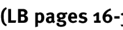

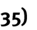


The contents of this chapter form part of the Basic Skills Topics. As such, it is expected that the contents of this chapter will be used throughout the remainder of the curriculum and the chapters in the Learner‟s Book in order to help in making sense of the contexts encountered in the various Application Topics. 

The primary focus in this Basic Skills Topic Grade 11 includes the ability to work with a variety of non-linear graphs, to work with two graphs drawn on a set of axes, identifying the point of intersection of those graphs, and to identify the meaning of the regions on the graph surrounding the point of intersection. 


> **[Diagram Context - Textbook_MathematicalLiteracy_Gr11_PATTERNS-RELATIONSHIPS-AND-REPRESENTATIONS.pdf-0002-06.png]**
> This graphic consists of a text-based heading titled "Contexts and integrated content." It serves as a structural signpost in educational materials to indicate the transition toward applying theoretical knowledge within real-world scenarios or across different subject areas.


- The contexts specified for this topic can include any contexts that are relevant to the Application Topics of Finance, Measurement, Maps and Plans, Data Handling and Probability. 

- In working through the contents of this chapter it is essential that learners are <u>able to draw and interpret linear and constant graphs (as taught in Grade 10).</u> 


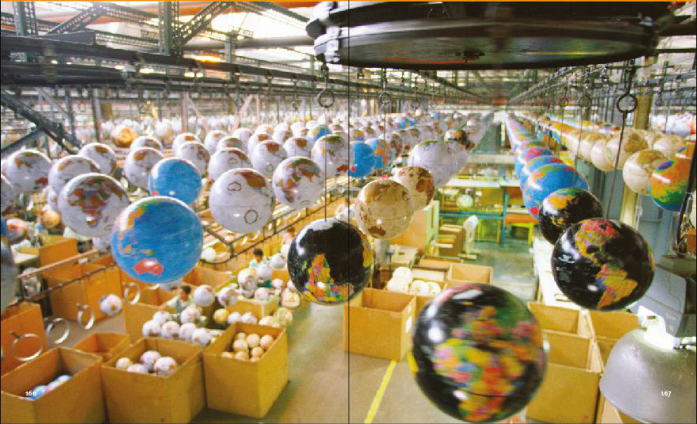
> **[Diagram Context - Textbook_MathematicalLiteracy_Gr11_PATTERNS-RELATIONSHIPS-AND-REPRESENTATIONS.pdf-0002-09.png]**
> This photograph depicts an industrial assembly line for the mass production of globes, featuring numerous spherical models of the Earth suspended from an overhead conveyor system and stored in cardboard shipping containers. It visually illustrates the concept of large-scale manufacturing and the physical representation of geographical models used in Earth Science and Social Sciences to study global spatial relationships.


> **[Diagram Context - Textbook_MathematicalLiteracy_Gr11_PATTERNS-RELATIONSHIPS-AND-REPRESENTATIONS.pdf-0002-10.png]**
> This image is a text-based attribution label identifying the source material as "Via Afrika » Mathematical Literacy Gr 11." It serves as a copyright and curriculum-specific citation for educational content within the South African CAPS framework. This label confirms that the associated instructional material is aligned with the Grade 11 Mathematical Literacy syllabus.


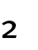


> **[Diagram Context - Textbook_MathematicalLiteracy_Gr11_PATTERNS-RELATIONSHIPS-AND-REPRESENTATIONS.pdf-0003-00.png]**
> This graphic is a text-based chapter heading containing the labels "Chapter," "11," and the title "Patterns, relationships and representations." It serves as an introductory signpost for a mathematics curriculum module, signaling that the content will focus on identifying, analyzing, and modeling algebraic or functional relationships between variables.


> **[Diagram Context - Textbook_MathematicalLiteracy_Gr11_PATTERNS-RELATIONSHIPS-AND-REPRESENTATIONS.pdf-0003-02.png]**
> This graphic displays the text heading "Types of relationships," which serves as an introductory title for an educational resource. It conceptually frames the study of ecological interactions, such as mutualism, commensalism, and parasitism, within the Life Sciences curriculum.


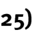


The content of this section on _Types of relationships_ , as part of the Patterns, relationships and representations Basic Skills Topic, is drawn from page 38 in the CAPS document. The specific skills associated with working with these different types of relationships is described on pages 39-43 of the CAPS document. 

Primary focus in this section is on introducing learners to a variety of _non-linear_ graphs, including: 

- graphs showing a constant ratio relationship; 

- graphs that are made up of a combination of relationships; 

- graphs that represent  step-function relationships; 

- graphs for which a pattern, relationship or equation is not immediately obvious. 

Learners need to be able to draw graphs to represent these types of relationships and interpret and analyse those graphs. Importantly, the motivation for drawing a graph must be to facilitate a deeper understanding of a real-world situation. 


> **[Diagram Context - Textbook_MathematicalLiteracy_Gr11_PATTERNS-RELATIONSHIPS-AND-REPRESENTATIONS.pdf-0003-13.png]**
> This text-based graphic serves as a heading for a mathematical or physical science lesson, explicitly labeling the topic as "Constant ratio relationships." It introduces the foundational concept of proportionality, where two variables maintain a fixed ratio, a key principle used in CAPS for understanding direct proportion, stoichiometry in chemistry, and linear functions in mathematics.


Consider a scenario where the monthly cost of food purchases in a household is predicted to increase at a rate of 7,4% per year. 

_Monthly food cost in 2011_ = R3 000,00 

_Monthly food cost in 2012_ = R3 000,00 + (7,4% × R3 000,00) = R3 000,00 + R222,00 = R3 222,00 

_Monthly food cost in 2013_ = R3 222,00 + (7,4% × R3 222,00) 

= R3 222,00 + R238,43 = R3 460,43 


> **[Diagram Context - Textbook_MathematicalLiteracy_Gr11_PATTERNS-RELATIONSHIPS-AND-REPRESENTATIONS.pdf-0003-19.png]**
> This image is a text-based attribution label identifying the source material as "Via Afrika » Mathematical Literacy Gr 11." It serves as a copyright and curriculum-specific citation for educational content used within the South African Grade 11 Mathematical Literacy syllabus.


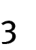


> **[Diagram Context - Textbook_MathematicalLiteracy_Gr11_PATTERNS-RELATIONSHIPS-AND-REPRESENTATIONS.pdf-0004-00.png]**
> This graphic serves as a chapter heading, featuring the text "Chapter 11" and the title "Patterns, relationships and representations" set against a solid red background. It functions as an organizational signpost within a CAPS-aligned textbook to introduce a unit focused on mathematical modeling, functional analysis, and the interpretation of data trends.


By continuing in this way we could construct the following table of values: 


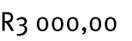


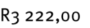


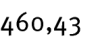


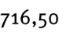


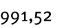


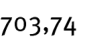

And from this table of values the following graph could be constructed: 


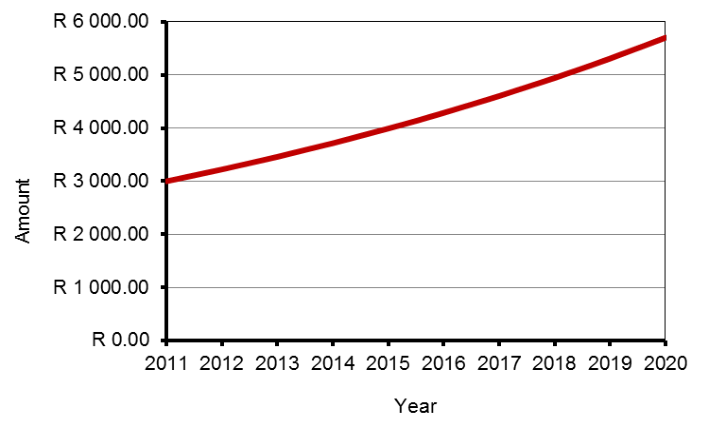
> **[Diagram Context - Textbook_MathematicalLiteracy_Gr11_PATTERNS-RELATIONSHIPS-AND-REPRESENTATIONS.pdf-0004-20.png]**
> This line graph plots the "Amount" in South African Rand (R) on the vertical axis against the "Year" from 2011 to 2020 on the horizontal axis. The upward-curving red line illustrates the concept of exponential growth, demonstrating how an initial investment or value increases at an accelerating rate over time due to compound interest.


A _constant ratio relationship_ occurs when a value is increased by a factor (i.e. is multiplied by an amount) or a percentage, and then this new increased value is again increased by the factor or percentage, and so the process is repeated. This happened in the calculations on the previous page where every year a bigger amount was multiplied and increased by the factor of 7,4%. 

Importantly, notice that this graph of the constant ratio relationship is not a straight line but, rather, is getting steeper at a faster and faster rate. As such, for every time period or every change, the new value is always being calculated on a bigger and bigger value. We say that the graph is _increasing at an increasing rate_ . 


> **[Diagram Context - Textbook_MathematicalLiteracy_Gr11_PATTERNS-RELATIONSHIPS-AND-REPRESENTATIONS.pdf-0004-23.png]**
> This graphic is a text-based heading labeled "2. Combinations of relationships." It serves as a conceptual signpost for students to categorize and analyze the complex, interconnected ecological interactions—such as predation, competition, and symbiosis—within a biological community.


The table below shows the cost of making calls on a particular cell phone contract. 


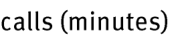

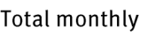


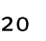


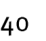


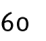


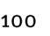

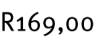

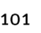

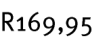

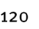

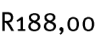

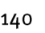

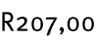


> **[Diagram Context - Textbook_MathematicalLiteracy_Gr11_PATTERNS-RELATIONSHIPS-AND-REPRESENTATIONS.pdf-0004-46.png]**
> This image is a text-based attribution label identifying the source material as "Via Afrika » Mathematical Literacy Gr 11." It serves as a copyright and curriculum-specific citation for educational content used within the South African CAPS Mathematical Literacy framework for Grade 11 learners.


> **[Diagram Context - Textbook_MathematicalLiteracy_Gr11_PATTERNS-RELATIONSHIPS-AND-REPRESENTATIONS.pdf-0005-00.png]**
> This graphic is a text-based chapter heading containing the labels "Chapter," "11," and the title "Patterns, relationships and representations." It serves as an introductory signpost for a CAPS mathematics curriculum unit, signaling that the content will focus on identifying, analyzing, and modeling mathematical sequences and functional relationships.


The result of plotting these values on a set of axes is the following graph: 

Notice that the graph is made up of two very different components: 

- a flat linear portion; 

- and an increasing portion that is also linear. 


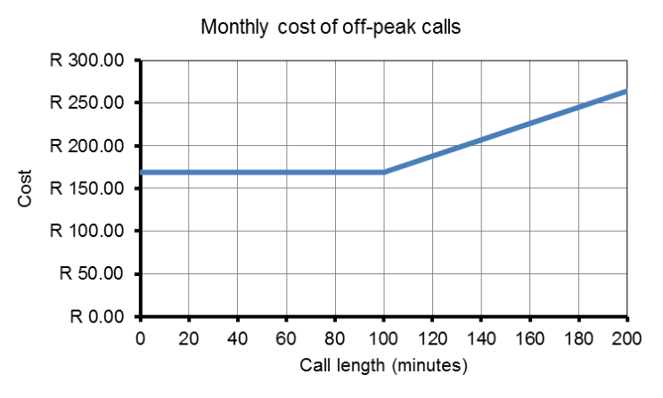
> **[Diagram Context - Textbook_MathematicalLiteracy_Gr11_PATTERNS-RELATIONSHIPS-AND-REPRESENTATIONS.pdf-0005-05.png]**
> This line graph illustrates the relationship between the monthly cost of off-peak calls (y-axis in Rand) and the call length in minutes (x-axis). It demonstrates a piecewise function where the cost remains constant at R170.00 for the first 100 minutes before increasing linearly for additional usage. This visual aid helps students interpret real-world financial data, specifically how tiered pricing models or service plans impact total monthly expenditure.


In relation to the specific context of the cell phone contract: 

- the flat portion represents the fact that there is a fixed monthly subscription fee of R169,00 on this contract but that the contract also comes with 100 free minutes (off-peak). As such, for the first 100 minutes no calls are charged for and only the fixed subscription fee is payable. 

- after 100 minutes, however, an additional fee is payable for the calls made. From the table we can see that this additional charge is R0,95 per minute. This additional charge is represented by the increasing portion of the graph. It is increasing because the call costs increased by R0,95 for every minute of talk time that passes; and it is linear because the increase in price is a constant value of R0,95 per minute. 

What the discussion above illustrates is that the different portions of the graph, which are different types of graphs/relationships, have different meanings in relation to the cell phone context. 


> **[Diagram Context - Textbook_MathematicalLiteracy_Gr11_PATTERNS-RELATIONSHIPS-AND-REPRESENTATIONS.pdf-0005-10.png]**
> This graphic displays the text heading "3. Step functions," which serves as a conceptual label for a specific category of mathematical relations. In the CAPS curriculum, this introduces students to functions that remain constant over specific intervals and change abruptly at defined points, often used to model real-world scenarios like tiered pricing or postal rates.


The table below shows the parking fees at a supermarket. 


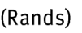


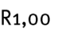


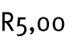


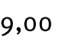


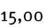

Notice that for any time value less than 1 hour (e.g. 15 minutes, 35 minutes, 59 minutes, etc) the same fee of R1,00 will be charged. It is only when the time reaches 1 hour that a new fee is charged; and then this new fee applies to any time between 1 hour and 2 hours. 


> **[Diagram Context - Textbook_MathematicalLiteracy_Gr11_PATTERNS-RELATIONSHIPS-AND-REPRESENTATIONS.pdf-0005-24.png]**
> This image is a text-based attribution label identifying the source material as "Via Afrika » Mathematical Literacy Gr 11." It serves as a copyright and curriculum-specific citation for educational content used within the South African CAPS Mathematical Literacy syllabus.


> **[Diagram Context - Textbook_MathematicalLiteracy_Gr11_PATTERNS-RELATIONSHIPS-AND-REPRESENTATIONS.pdf-0006-00.png]**
> This image is a textual chapter heading featuring the label "Chapter 11" and the title "Patterns, relationships and representations." It serves as an introductory signpost for a CAPS mathematics curriculum module, signaling that the content will focus on identifying algebraic trends, functional dependencies, and the various ways to model mathematical data.


Plotting these values on a set of axes gives the following graph: 


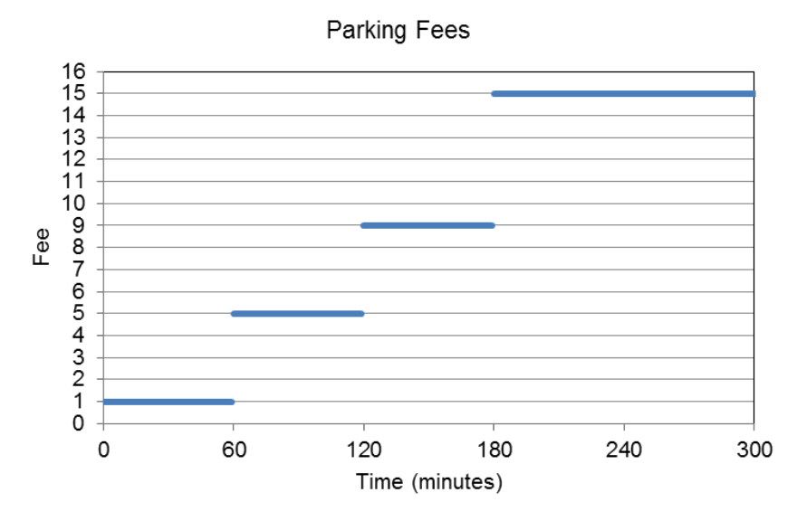
> **[Diagram Context - Textbook_MathematicalLiteracy_Gr11_PATTERNS-RELATIONSHIPS-AND-REPRESENTATIONS.pdf-0006-02.png]**
> This graphic is a step graph representing parking fees, with the horizontal axis labeled "Time (minutes)" and the vertical axis labeled "Fee." It illustrates the concept of a step function, where the cost remains constant over specific time intervals before increasing abruptly at set thresholds. This visual aid helps learners understand discrete, non-continuous relationships in real-world financial contexts.


- This type of relationship is called a „step function‟ because when plotted as a graph the image created looks like a series of steps. The „steps‟ or jumps from one portion of the graph to another indicate that different fees are charged for different time intervals, but that within a time interval the same fee is charged for a number of different time values (for example, the cost of parking for 

   - 1 hour 10 minutes and 1 hour 50 minutes is the same). 

- Also notice that the different „steps‟ or segments in the graph are not joined. This indicates that as you move out of one time interval into a different time interval then a completely different fee is charged that is not related to the previous fee. 


> **[Diagram Context - Textbook_MathematicalLiteracy_Gr11_PATTERNS-RELATIONSHIPS-AND-REPRESENTATIONS.pdf-0006-06.png]**
> This text graphic serves as a heading or conceptual label for a scatter plot analysis. It identifies the category "Relationships with no obvious pattern or formula," which refers to data sets lacking a clear linear or non-linear correlation. For high school learners, this concept is essential for understanding data interpretation and the limitations of mathematical modelling in statistics.


The Learner‟s Book also contains a discussion that illustrates how sometimes drawing a graph of an unfamiliar situation – even though no specific formula for the situation may be known or no patterns are immediately obvious – makes it possible to make sense of the situation and to see patterns and trends in the situation that were not possible to see without the graph. In other words, it is important to be able to draw and interpret graphs of any situation and not simply of those situations for which formula or patterns are available / visible. 


> **[Diagram Context - Textbook_MathematicalLiteracy_Gr11_PATTERNS-RELATIONSHIPS-AND-REPRESENTATIONS.pdf-0006-08.png]**
> This image is a copyright attribution text identifying the source as "Via Afrika » Mathematical Literacy Gr 11." It serves as a formal citation for educational materials aligned with the South African CAPS curriculum. This label indicates that the associated content is designed to support Grade 11 learners in developing practical mathematical skills for real-world contexts.


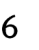


> **[Diagram Context - Textbook_MathematicalLiteracy_Gr11_PATTERNS-RELATIONSHIPS-AND-REPRESENTATIONS.pdf-0007-00.png]**
> This graphic is a text-based chapter heading containing the labels "Chapter," "11," and the title "Patterns, relationships and representations." It serves as an introductory signpost for a Mathematics curriculum unit, signaling that the content will focus on identifying algebraic or geometric sequences and interpreting the functional relationships between variables.


> **[Diagram Context - Textbook_MathematicalLiteracy_Gr11_PATTERNS-RELATIONSHIPS-AND-REPRESENTATIONS.pdf-0007-01.png]**
> This image is a text-based heading labeled "Section 2:". It serves as an organizational marker within a CAPS-aligned educational resource to delineate a specific thematic unit or module of study.


> **[Diagram Context - Textbook_MathematicalLiteracy_Gr11_PATTERNS-RELATIONSHIPS-AND-REPRESENTATIONS.pdf-0007-02.png]**
> This image displays a text-based heading titled "Working with two relationships on," which serves as an introductory instructional prompt. It conceptually frames a mathematical or analytical task where students must interpret, compare, or solve problems involving two distinct functional or proportional relationships simultaneously.


> **[Diagram Context - Textbook_MathematicalLiteracy_Gr11_PATTERNS-RELATIONSHIPS-AND-REPRESENTATIONS.pdf-0007-03.png]**
> This image consists of the text "a set of axes," which serves as a conceptual label for a Cartesian coordinate system. In the CAPS curriculum, this terminology refers to the horizontal x-axis and vertical y-axis used to plot mathematical functions, physical data, or biological growth curves.


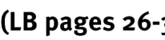
> **[Diagram Context - Textbook_MathematicalLiteracy_Gr11_PATTERNS-RELATIONSHIPS-AND-REPRESENTATIONS.pdf-0007-04.png]**
> This image is a text-based reference label containing the abbreviation "(LB pages 26-3". It serves as a navigational marker for students to locate specific content within their Learner's Book (LB) to support their study of the current topic.


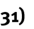


The content of this section, as part of the Patterns, relationships and representations Basic Skills Topic, is drawn from page 44 in the CAPS document. 

Primary focus in this section is on: 

- identifying the point of intersection of two graphs; 

- understanding the significance of the point of intersection in specific relation to the context represented in the graphs; 

- understanding the significance of the regions on either side of the point of intersection in relation to the context represented in the graphs. 

Apart from identifying the point of intersection of two graphs from the graphs, it is also important to be able to estimate the point of intersection of two relationships using the process of trial and improvement (and not accurate algebraic manipulation) with the equations for the relationships. 


> **[Diagram Context - Textbook_MathematicalLiteracy_Gr11_PATTERNS-RELATIONSHIPS-AND-REPRESENTATIONS.pdf-0007-13.png]**
> This image is a copyright attribution text for a Grade 11 Mathematical Literacy educational resource. It displays the copyright symbol, the publisher name "Via Afrika," and the specific subject and grade level. It serves as a formal identifier to establish the source and academic context of the associated curriculum materials.


> **[Diagram Context - Textbook_MathematicalLiteracy_Gr11_PATTERNS-RELATIONSHIPS-AND-REPRESENTATIONS.pdf-0008-00.png]**
> This graphic is a text-based chapter heading containing the labels "Chapter", "11", and the title "Patterns, relationships and representations". It serves as an introductory signpost for a mathematics curriculum unit, signaling that the content will focus on identifying algebraic patterns, interpreting functional relationships, and utilizing various mathematical representations.


> **[Diagram Context - Textbook_MathematicalLiteracy_Gr11_PATTERNS-RELATIONSHIPS-AND-REPRESENTATIONS.pdf-0008-01.png]**
> This text serves as a heading for a mathematical instructional resource focused on coordinate geometry. It introduces the concept of identifying the coordinates where two functions intersect on a Cartesian plane. For CAPS learners, this is a foundational skill for solving simultaneous equations graphically, requiring students to locate the $(x; y)$ values where the lines or curves meet.


The graph below shows the cost of electricity on two different types of electricity tariff systems. 


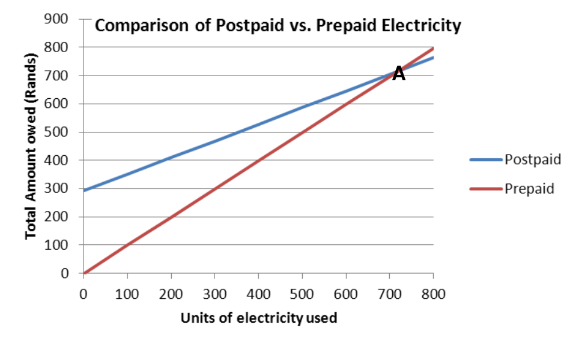
> **[Diagram Context - Textbook_MathematicalLiteracy_Gr11_PATTERNS-RELATIONSHIPS-AND-REPRESENTATIONS.pdf-0008-05.png]**
> This line graph compares the cost structures of postpaid and prepaid electricity, plotting "Total Amount owed (Rands)" against "Units of electricity used." Point A represents the break-even point where both payment methods cost the same, illustrating for learners how linear functions can be used to model and compare real-world financial scenarios to determine the most cost-effective option based on consumption levels.


The place where the two graphs cut (labelled A) is called the „point of intersection‟ of the two graphs. At this point the two graphs are exactly equal. As such, in relation to the comparison of the cost of electricity on the different electricity systems, this „point of intersection‟ indicates the point at which the cost of electricity on the two different systems is the same. 

# Importantly, _<u>the point of intersection is always made up of two values</u>_ <u>:</u> 

- one value is always read from the horizontal axis → in reference to the graph on the previous page, this horizontal value is the number of units of electricity that must be used for the cost to be the same ≈ 720 units; 

- one value is always read from the vertical axis → in reference to the graph on the previous page, this vertical value is the amount of money that must be spent on electricity every month for the cost to be the same ≈ R720,00. 


> **[Diagram Context - Textbook_MathematicalLiteracy_Gr11_PATTERNS-RELATIONSHIPS-AND-REPRESENTATIONS.pdf-0008-10.png]**
> This image is a text-based attribution label identifying the source as "Via Afrika » Mathematical Literacy Gr 11." It serves as a copyright and curriculum-specific identifier for educational materials aligned with the South African CAPS curriculum. This label informs students and educators that the content is officially sanctioned for Grade 11 Mathematical Literacy study purposes.


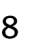


> **[Diagram Context - Textbook_MathematicalLiteracy_Gr11_PATTERNS-RELATIONSHIPS-AND-REPRESENTATIONS.pdf-0009-00.png]**
> This graphic is a text-based chapter heading containing the labels "Chapter," "11," and the title "Patterns, relationships and representations." It serves as an introductory signpost for a CAPS mathematics curriculum unit, signaling that the content will focus on algebraic reasoning, functional relationships, and the various ways to model mathematical data.


> **[Diagram Context - Textbook_MathematicalLiteracy_Gr11_PATTERNS-RELATIONSHIPS-AND-REPRESENTATIONS.pdf-0009-01.png]**
> This text serves as a heading for a mathematical exercise focused on coordinate geometry. It introduces the concept of determining the point of intersection between two functions by solving their respective equations simultaneously.


> **[Diagram Context - Textbook_MathematicalLiteracy_Gr11_PATTERNS-RELATIONSHIPS-AND-REPRESENTATIONS.pdf-0009-04.png]**
> This image is a text-based graphic containing the phrase "s of trial and". It serves as a fragmented linguistic component, likely part of a larger heading or sentence related to the scientific method or historical experimentation. In a CAPS context, this fragment introduces the concept of empirical investigation, where learners explore how knowledge is constructed through iterative testing and error correction.


> **[Diagram Context - Textbook_MathematicalLiteracy_Gr11_PATTERNS-RELATIONSHIPS-AND-REPRESENTATIONS.pdf-0009-05.png]**
> This image consists of the single word "improvement" written in a bold, sans-serif font. It serves as a conceptual label rather than a technical diagram, highlighting the goal of iterative processes or developmental progress in a scientific or academic context.


Another way to work out the values for which two relationships are equal is to use equations to the relationships and through the process of trial and improvement to substitute values into the equations repeatedly until a value can be found which gives the same answer for both equations. 


The following two equations represent the cost of electricity on the Postpaid and Prepaid systems shown on the graphs on the previous page: 

- Postpaid: Total Cost = R291,80 + (R0,589699/unit × units used) 

- Prepaid: Total Cost = R9,955025/unit × units used 

We see from the graph that the graphs cross at a value _slightly larger_ than 700 units of electricity, so let us substitute a value: 

_Try_ 710 units: Postpaid: Total Cost  = R291,80 + (R0,589699 × 710) = R710,49 

- Prepaid:  Total Cost  = R9,55025 × 710 = R706,47 

_Try_ 715 units: Postpaid: Total Cost  = R291,80 + (R0,589699 × 715) = R713,43 

- Prepaid:  Total Cost  = R9,55025 × 715 = R711,44 

_Try_ 720 units: Postpaid: Total Cost  = R291,80 + (R0,589699 × 720) = R716,38 

- Prepaid:  Total Cost  = R9,55025 × 720 = R716,72 

With more trial and improvement, it is possible to calculate that both options have the same value of _R719,91 for 719,9 units_ , but 720 units is accurate enough to make decisions about which option is cheaper. 

Importantly, trial-and-improvement is not simply guessing. Rather, it involves substituting a value and then comparing the answer in both equations to inform what value to substitute next, and then doing this again and again until equal values are determined. 


> **[Diagram Context - Textbook_MathematicalLiteracy_Gr11_PATTERNS-RELATIONSHIPS-AND-REPRESENTATIONS.pdf-0009-20.png]**
> This image is a text-based attribution label identifying the source material as "Via Afrika » Mathematical Literacy Gr 11." It serves as a copyright and curriculum-specific citation for educational content within the South African CAPS framework. This label indicates that the associated instructional material is aligned with the Grade 11 Mathematical Literacy syllabus.


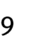


- R1 400,00 in salaries 

- R5,20 per washed car,  for water, soap and electricity. 

Milton charges R25,00 per car for a wash and vacuum. 


> **[Diagram Context - Textbook_MathematicalLiteracy_Gr11_PATTERNS-RELATIONSHIPS-AND-REPRESENTATIONS.pdf-0011-00.png]**
> This graphic is a chapter heading containing the text "Chapter 11" and the title "Patterns, relationships and representations." It serves as an introductory signpost for a CAPS mathematics curriculum module, signaling the transition to a unit focused on algebraic reasoning, functional relationships, and the interpretation of mathematical models.


> **[Diagram Context - Textbook_MathematicalLiteracy_Gr11_PATTERNS-RELATIONSHIPS-AND-REPRESENTATIONS.pdf-0011-02.png]**
> This image consists solely of the text "Sandy and Matselidis," which serves as a citation or attribution rather than a scientific diagram. It does not contain any visual data, labels, or conceptual content relevant to the CAPS curriculum.


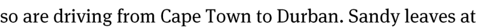
> **[Diagram Context - Textbook_MathematicalLiteracy_Gr11_PATTERNS-RELATIONSHIPS-AND-REPRESENTATIONS.pdf-0011-03.png]**
> This text snippet serves as the introductory premise for a Grade 10-12 Mathematics or Physical Sciences kinematics word problem. It identifies the subjects (Sandy), the geographical context (Cape Town to Durban), and the action (driving), establishing the initial conditions for calculating variables such as speed, distance, and time.


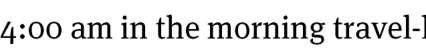
> **[Diagram Context - Textbook_MathematicalLiteracy_Gr11_PATTERNS-RELATIONSHIPS-AND-REPRESENTATIONS.pdf-0011-04.png]**
> This text snippet provides a temporal context for a word problem, specifically identifying the time "4:00 am" and the activity "travel." In a CAPS curriculum context, this serves as a foundational variable for calculating duration, speed, or distance in mathematical literacy or physical science kinematics problems.


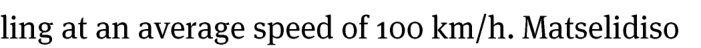
> **[Diagram Context - Textbook_MathematicalLiteracy_Gr11_PATTERNS-RELATIONSHIPS-AND-REPRESENTATIONS.pdf-0011-05.png]**
> This text snippet represents a physics word problem context involving the variable of average speed, specifically "100 km/h" and the proper noun "Matselidiso." It serves as the introductory premise for a kinematics calculation, requiring students to apply the formula $v = \Delta x / \Delta t$ to determine distance or time in a motion-based scenario.


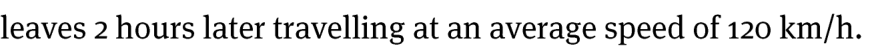
> **[Diagram Context - Textbook_MathematicalLiteracy_Gr11_PATTERNS-RELATIONSHIPS-AND-REPRESENTATIONS.pdf-0011-06.png]**
> This text snippet represents a portion of a kinematics word problem involving relative motion, specifically referencing a time delay of "2 hours" and a constant velocity of "120 km/h." It serves as a foundational prompt for Grade 10-12 Physical Sciences or Mathematics learners to calculate distance, time, or intercept points by setting up equations based on the relationship $d = v \times t$.


> **[Diagram Context - Textbook_MathematicalLiteracy_Gr11_PATTERNS-RELATIONSHIPS-AND-REPRESENTATIONS.pdf-0011-07.png]**
> This text serves as an introductory heading for a set of position-time graphs, which are fundamental tools in Grade 10 Physical Sciences for representing motion. It establishes the context for learners to interpret how distance changes over time, allowing them to calculate speed and identify different states of motion such as constant velocity or rest.


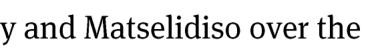
> **[Diagram Context - Textbook_MathematicalLiteracy_Gr11_PATTERNS-RELATIONSHIPS-AND-REPRESENTATIONS.pdf-0011-08.png]**
> This image contains a text snippet featuring the names "y" and "Matselidiso" followed by the phrase "over the." It serves as a linguistic fragment likely extracted from a word problem or narrative context within a CAPS curriculum textbook. The text provides the foundational subjects for a mathematical or analytical scenario that students must interpret to solve for variables or understand a sequence of events.


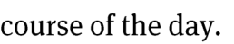
> **[Diagram Context - Textbook_MathematicalLiteracy_Gr11_PATTERNS-RELATIONSHIPS-AND-REPRESENTATIONS.pdf-0011-09.png]**
> This image contains only the text fragment "course of the day." It lacks any scientific diagrams, labels, or variables required for pedagogical analysis within the CAPS curriculum.


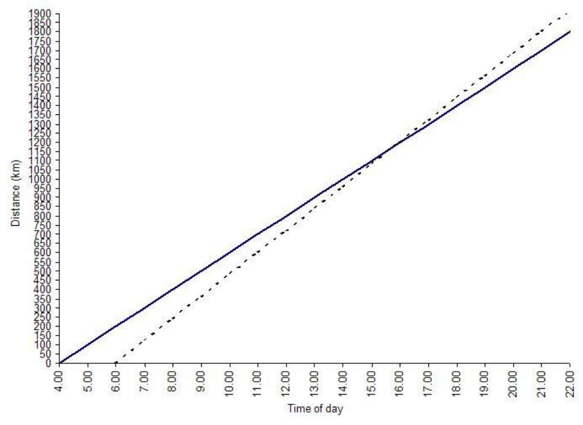
> **[Diagram Context - Textbook_MathematicalLiteracy_Gr11_PATTERNS-RELATIONSHIPS-AND-REPRESENTATIONS.pdf-0011-10.png]**
> This distance-time graph plots two linear motion paths with "Distance (km)" on the y-axis and "Time of day" on the x-axis. It illustrates the concept of relative speed and constant velocity, showing how different starting times and gradients (slopes) represent different rates of travel for two moving objects.


> **[Diagram Context - Textbook_MathematicalLiteracy_Gr11_PATTERNS-RELATIONSHIPS-AND-REPRESENTATIONS.pdf-0011-11.png]**
> This image is a text-based prompt asking "Which graph repr[esents]...", serving as the introductory stem for a multiple-choice question. It requires the learner to identify the correct graphical relationship between two variables, a fundamental skill in interpreting data and scientific models within the CAPS curriculum.


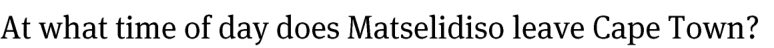
> **[Diagram Context - Textbook_MathematicalLiteracy_Gr11_PATTERNS-RELATIONSHIPS-AND-REPRESENTATIONS.pdf-0011-13.png]**
> This image is a text-based inquiry question regarding a travel scenario. It explicitly mentions the subject "Matselidiso" and the location "Cape Town" to prompt the reader to extract specific temporal data from a corresponding travel schedule or graph. This task assesses a learner's ability to interpret real-world data sets and apply reading comprehension skills to solve mathematical or geographical problems.


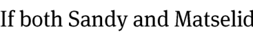
> **[Diagram Context - Textbook_MathematicalLiteracy_Gr11_PATTERNS-RELATIONSHIPS-AND-REPRESENTATIONS.pdf-0011-15.png]**
> This image consists of a text fragment containing the proper nouns "Sandy" and "Matselid" preceded by the conditional conjunction "If both". It serves as the introductory clause for a word problem, likely designed to test a learner's ability to translate linguistic information into mathematical or logical expressions.


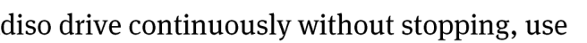
> **[Diagram Context - Textbook_MathematicalLiteracy_Gr11_PATTERNS-RELATIONSHIPS-AND-REPRESENTATIONS.pdf-0011-16.png]**
> This image contains a text fragment reading "diso drive continuously without stopping, use". It serves as a linguistic prompt or instruction, likely part of a larger assessment task or textbook exercise requiring students to interpret procedural directions or apply logical reasoning to a specific scenario.


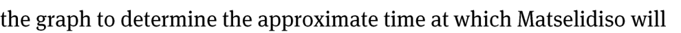
> **[Diagram Context - Textbook_MathematicalLiteracy_Gr11_PATTERNS-RELATIONSHIPS-AND-REPRESENTATIONS.pdf-0011-17.png]**
> This text snippet is a prompt for a mathematical or physical science problem requiring the interpretation of a graphical representation. It explicitly instructs the learner to use a provided graph to identify a specific time value associated with the subject "Matselidiso." This exercise assesses the student's ability to extract and interpolate data points from a visual coordinate system to solve for an unknown variable in a real-world context.


> **[Diagram Context - Textbook_MathematicalLiteracy_Gr11_PATTERNS-RELATIONSHIPS-AND-REPRESENTATIONS.pdf-0011-18.png]**
> This image is a text fragment containing the words "overtake Sandy." It serves as a contextual prompt for a Grade 10-12 Physical Sciences kinematics problem involving relative motion and velocity. The text indicates that the learner must calculate the conditions, such as time or distance, required for one object or person to surpass another in a linear motion scenario.


> **[Diagram Context - Textbook_MathematicalLiteracy_Gr11_PATTERNS-RELATIONSHIPS-AND-REPRESENTATIONS.pdf-0011-20.png]**
> This text-based prompt serves as a mathematical word problem requiring the calculation of distance for two subjects, Sandy and Matselidiso. It challenges students to apply kinematic principles or rate-time-distance formulas to determine the displacement of two individuals based on provided contextual data.


> **[Diagram Context - Textbook_MathematicalLiteracy_Gr11_PATTERNS-RELATIONSHIPS-AND-REPRESENTATIONS.pdf-0011-21.png]**
> This text snippet represents a physics problem statement regarding kinematics, specifically focusing on relative motion. It introduces the subjects "Matselidiso" and "Sandy" in the context of an overtaking event, which typically requires students to analyze position-time graphs or use equations of motion to determine the point of intersection.


> **[Diagram Context - Textbook_MathematicalLiteracy_Gr11_PATTERNS-RELATIONSHIPS-AND-REPRESENTATIONS.pdf-0011-24.png]**
> This image contains a text fragment reading "below represent the a". It serves as a partial instructional prompt typically found in a CAPS Life Sciences or Physical Sciences examination paper to introduce a diagram or data set.


> **[Diagram Context - Textbook_MathematicalLiteracy_Gr11_PATTERNS-RELATIONSHIPS-AND-REPRESENTATIONS.pdf-0011-25.png]**
> This text fragment serves as a label for a graph axis or a data table heading, specifically identifying the unit of measurement as "kilometres" for a variable representing distance travelled. In the context of Physical Sciences or Mathematics, it establishes the quantitative dimension of motion, helping learners correctly interpret displacement or distance values when solving kinematics problems.


> **[Diagram Context - Textbook_MathematicalLiteracy_Gr11_PATTERNS-RELATIONSHIPS-AND-REPRESENTATIONS.pdf-0011-26.png]**
> This text snippet presents a linguistic prompt identifying two subjects, "Sandy" and "Matselidiso," in relation to a "dependent" variable. It serves as a foundational exercise in scientific inquiry and data analysis, requiring learners to distinguish between independent and dependent variables within a controlled investigation or mathematical context.


- Sandy‟s trip: Distance = 100km/h × time (hours)  400 km 

- Matselidiso‟s trip: Distance = 120 km/h × time (hours)  720 km 


> **[Diagram Context - Textbook_MathematicalLiteracy_Gr11_PATTERNS-RELATIONSHIPS-AND-REPRESENTATIONS.pdf-0011-32.png]**
> This text snippet serves as an instructional prompt, likely introducing a section on mathematical or scientific problem-solving. It contains the phrase "equations to determine accurately," which directs students to apply specific formulas or algebraic relationships to reach precise quantitative results in their calculations.


> **[Diagram Context - Textbook_MathematicalLiteracy_Gr11_PATTERNS-RELATIONSHIPS-AND-REPRESENTATIONS.pdf-0011-33.png]**
> This text fragment represents a problem statement from a Grade 10-12 Mathematics or Physical Sciences kinematics exercise. It identifies the specific variables "Matselidiso" and "Mandy" in the context of a motion problem, focusing on the concept of relative velocity and the point of intersection between two moving objects. Conceptually, it challenges students to determine the specific time coordinate where two displacement-time graphs would intersect, indicating that one object has caught up to the other.


> **[Diagram Context - Textbook_MathematicalLiteracy_Gr11_PATTERNS-RELATIONSHIPS-AND-REPRESENTATIONS.pdf-0011-34.png]**
> This text snippet serves as a prompt for a Grade 10-12 Physical Sciences or Mathematics problem involving kinematics. It introduces the variables "distance," "Sandy," and "Matselidiso," establishing a comparative motion scenario that requires learners to calculate and relate the displacement or distance covered by two different objects over time.


> **[Diagram Context - Textbook_MathematicalLiteracy_Gr11_PATTERNS-RELATIONSHIPS-AND-REPRESENTATIONS.pdf-0011-35.png]**
> This text snippet serves as a prompt for a physics kinematics problem involving relative motion. It identifies the specific event—"when Matselidiso overtakes Sandy"—that students must mathematically determine by equating the displacement equations of two moving objects.


> **[Diagram Context - Textbook_MathematicalLiteracy_Gr11_PATTERNS-RELATIONSHIPS-AND-REPRESENTATIONS.pdf-0011-36.png]**
> This image is a copyright attribution text identifying the source as "Via Afrika » Mathematical Literacy Gr 11." It serves as a formal citation for educational materials aligned with the South African CAPS curriculum. The text indicates that the associated content is intended for Grade 11 Mathematical Literacy students to support their mastery of financial and data-handling concepts.


> **[Diagram Context - Textbook_MathematicalLiteracy_Gr11_PATTERNS-RELATIONSHIPS-AND-REPRESENTATIONS.pdf-0012-00.png]**
> This graphic is a textual heading featuring the labels "Chapter" and "11" alongside the title "Patterns, relationships and representations." It serves as a structural signpost in a CAPS-aligned textbook, introducing a unit focused on the mathematical analysis of data trends, functional relationships, and the various ways to model these concepts.


> **[Diagram Context - Textbook_MathematicalLiteracy_Gr11_PATTERNS-RELATIONSHIPS-AND-REPRESENTATIONS.pdf-0012-03.png]**
> This text snippet serves as the introductory premise for a Mathematical Literacy problem involving map work and scale calculations. It identifies the geographical locations "Cape Town" and "Durban" as the variables for determining distance. This setup requires students to apply scale ratios to convert map measurements into real-world distances, a core competency in the CAPS curriculum for interpreting spatial information.


> **[Diagram Context - Textbook_MathematicalLiteracy_Gr11_PATTERNS-RELATIONSHIPS-AND-REPRESENTATIONS.pdf-0012-04.png]**
> This text snippet represents a quantitative measurement of distance, specifically "1 753 km," accompanied by the contextual descriptor "(travelling)." It serves as a data point in a Physical Sciences or Mathematics problem, helping students apply concepts of distance, displacement, and speed calculations within a real-world travel scenario.


> **[Diagram Context - Textbook_MathematicalLiteracy_Gr11_PATTERNS-RELATIONSHIPS-AND-REPRESENTATIONS.pdf-0012-05.png]**
> This text snippet is a mathematical word problem prompt containing the geographic labels "Karoo" and "Bloemfontein." It requires students to apply the formula for speed, distance, and time to calculate the duration of a journey between specific South African locations.


> **[Diagram Context - Textbook_MathematicalLiteracy_Gr11_PATTERNS-RELATIONSHIPS-AND-REPRESENTATIONS.pdf-0012-06.png]**
> This text fragment is a mathematical problem statement involving the names "Sandy" and "Matselidiso" and the phrase "to the nearest hour." It serves as a prompt for a rate-of-work problem, requiring students to calculate the combined time taken by two individuals to complete a task.


> **[Diagram Context - Textbook_MathematicalLiteracy_Gr11_PATTERNS-RELATIONSHIPS-AND-REPRESENTATIONS.pdf-0012-08.png]**
> This text-based problem statement introduces a kinematics scenario involving a journey between two South African cities, Cape Town and Durban, at a constant speed of 120 km/h. It serves as a foundational prompt for Grade 10 Physical Sciences learners to apply the relationship between distance, speed, and time to solve practical motion problems.


> **[Diagram Context - Textbook_MathematicalLiteracy_Gr11_PATTERNS-RELATIONSHIPS-AND-REPRESENTATIONS.pdf-0012-09.png]**
> This image contains a text fragment posing a conceptual physics question regarding the relationship between travel distance, speed, and time. It prompts students to consider the variables of motion and whether constant time is maintained under varying conditions. This serves as an introductory inquiry to help learners understand the fundamental kinematic relationship where time is dependent on both distance and velocity.


> **[Diagram Context - Textbook_MathematicalLiteracy_Gr11_PATTERNS-RELATIONSHIPS-AND-REPRESENTATIONS.pdf-0012-10.png]**
> This text-based graphic presents a prompt asking for an explanation of the term "Matselidiso." It serves as an assessment question requiring the student to define or contextualize this specific concept within their curriculum.


> **[Diagram Context - Textbook_MathematicalLiteracy_Gr11_PATTERNS-RELATIONSHIPS-AND-REPRESENTATIONS.pdf-0012-15.png]**
> This text represents a linear mathematical expression used to calculate total costs, featuring the components R1 400 (fixed cost), R5,20/car (variable cost rate), and "no. of cars" (independent variable). It illustrates the concept of a linear cost function, helping learners understand how to model real-world financial scenarios by combining fixed and variable expenses.


> **[Diagram Context - Textbook_MathematicalLiteracy_Gr11_PATTERNS-RELATIONSHIPS-AND-REPRESENTATIONS.pdf-0012-19.png]**
> This graphic presents a mathematical formula for calculating total income, featuring the variables "Income," a fixed rate of "R25,00/car," and the "no. of cars." It illustrates a direct proportion relationship, demonstrating to learners how to model financial revenue as a product of a unit price and the quantity of items sold.


> **[Diagram Context - Textbook_MathematicalLiteracy_Gr11_PATTERNS-RELATIONSHIPS-AND-REPRESENTATIONS.pdf-0012-20.png]**
> This text snippet introduces the "trial and improvement" method, a mathematical problem-solving strategy involving iterative substitution to approximate solutions. It serves as a procedural guide for students to refine their numerical estimates systematically until they reach an accurate result for a given equation.


> **[Diagram Context - Textbook_MathematicalLiteracy_Gr11_PATTERNS-RELATIONSHIPS-AND-REPRESENTATIONS.pdf-0012-21.png]**
> This image consists of a text fragment containing the words "repeatedly into the". It does not contain any visual diagrams, scientific symbols, or labels. Consequently, it provides no conceptual information for a high school student regarding the CAPS curriculum.


> **[Diagram Context - Textbook_MathematicalLiteracy_Gr11_PATTERNS-RELATIONSHIPS-AND-REPRESENTATIONS.pdf-0012-22.png]**
> This text snippet represents a mathematical conclusion regarding a break-even analysis problem, specifically referencing "equations" and a "break even value" of "71 cars." It illustrates the application of simultaneous equations in a business context, where the break-even point identifies the quantity of units that must be sold for total revenue to equal total costs.


> **[Diagram Context - Textbook_MathematicalLiteracy_Gr11_PATTERNS-RELATIONSHIPS-AND-REPRESENTATIONS.pdf-0012-23.png]**
> This graphic presents a mathematical formula for calculating total income, featuring the variables "Income," a fixed rate of "R25,00/car," and the "no. of cars." It illustrates the concept of direct proportion, where total revenue is determined by multiplying a constant unit price by the quantity of items sold.


> **[Diagram Context - Textbook_MathematicalLiteracy_Gr11_PATTERNS-RELATIONSHIPS-AND-REPRESENTATIONS.pdf-0012-25.png]**
> This text snippet presents a mathematical phrase, "even value of 71 cars," which serves as a prompt for a word problem. It requires students to apply their understanding of number properties, specifically the definition of even numbers, to determine if the given quantity of 71 satisfies the criteria for parity.


> **[Diagram Context - Textbook_MathematicalLiteracy_Gr11_PATTERNS-RELATIONSHIPS-AND-REPRESENTATIONS.pdf-0012-26.png]**
> This image displays a mathematical equation used to calculate total revenue, featuring the variables "Income," "R25,00/car," and "71 cars." It illustrates the fundamental economic concept of calculating total income by multiplying the unit price by the quantity of items sold, a core skill in CAPS Mathematical Literacy.


> **[Diagram Context - Textbook_MathematicalLiteracy_Gr11_PATTERNS-RELATIONSHIPS-AND-REPRESENTATIONS.pdf-0012-31.png]**
> This text serves as a caption for a mathematical line graph, specifically identifying the "solid line" as the visual representation of "total monthly cost." In the context of CAPS Mathematics or Mathematical Literacy, this label helps students distinguish between different data sets or functions plotted on the same Cartesian plane, facilitating the analysis of cost-related linear or non-linear relationships.


> **[Diagram Context - Textbook_MathematicalLiteracy_Gr11_PATTERNS-RELATIONSHIPS-AND-REPRESENTATIONS.pdf-0012-32.png]**
> This text snippet serves as a contextual premise for a mathematical word problem, specifically focusing on the concept of fixed costs in a business or financial literacy context. It introduces a scenario involving a character named Milton and the activity of washing cars, establishing a baseline condition where output is zero to help students identify costs that remain constant regardless of production levels.


> **[Diagram Context - Textbook_MathematicalLiteracy_Gr11_PATTERNS-RELATIONSHIPS-AND-REPRESENTATIONS.pdf-0012-33.png]**
> This text snippet introduces a business studies or mathematical literacy problem involving fixed costs, specifically referencing a salary expenditure of R1 400,00. It serves as a foundational prompt for learners to understand how fixed costs remain constant regardless of production levels when constructing or interpreting a total cost graph.


> **[Diagram Context - Textbook_MathematicalLiteracy_Gr11_PATTERNS-RELATIONSHIPS-AND-REPRESENTATIONS.pdf-0012-34.png]**
> This graphic consists of the text "Milton’s Car Wash," which serves as a business title or scenario label. In a CAPS curriculum context, this text acts as a contextual anchor for mathematical literacy or accounting problems involving financial calculations, such as income, expenditure, and profit analysis.


> **[Diagram Context - Textbook_MathematicalLiteracy_Gr11_PATTERNS-RELATIONSHIPS-AND-REPRESENTATIONS.pdf-0012-36.png]**
> This text serves as a caption or instructional prompt for a mathematical graph, specifically identifying a dotted line as the variable for "Milton’s monthly income." In a CAPS Mathematical Literacy context, this label helps students interpret graphical data by distinguishing a constant or specific income value from other plotted variables, such as expenditure or savings, to facilitate financial analysis.


> **[Diagram Context - Textbook_MathematicalLiteracy_Gr11_PATTERNS-RELATIONSHIPS-AND-REPRESENTATIONS.pdf-0012-37.png]**
> This text snippet presents a foundational word problem involving functional relationships between two variables: "Milton earns" (the dependent variable) and "number of cars washed" (the independent variable). It establishes a scenario where the output is contingent on the input, specifically highlighting a zero-intercept condition where no activity results in no earnings. This serves as an introductory prompt for learners to model real-world situations using linear algebraic expressions or functions.


> **[Diagram Context - Textbook_MathematicalLiteracy_Gr11_PATTERNS-RELATIONSHIPS-AND-REPRESENTATIONS.pdf-0012-39.png]**
> This image contains a text fragment stating "even point is the point of intersection of". It serves as a conceptual definition for the "even point" in coordinate geometry, likely relating to the intersection of lines or functions on a Cartesian plane.


> **[Diagram Context - Textbook_MathematicalLiteracy_Gr11_PATTERNS-RELATIONSHIPS-AND-REPRESENTATIONS.pdf-0012-40.png]**
> This image contains a text fragment reading "f the two graphs." It serves as a caption or instructional prompt directing students to analyze or compare the relationship between two graphical representations in a mathematical or scientific context.


> **[Diagram Context - Textbook_MathematicalLiteracy_Gr11_PATTERNS-RELATIONSHIPS-AND-REPRESENTATIONS.pdf-0012-41.png]**
> This image is a text-based attribution label identifying the source as "Via Afrika » Mathematical Literacy Gr 11." It serves as a copyright and curriculum-specific identifier for educational materials aligned with the South African CAPS curriculum. This label informs students and educators that the content is officially sanctioned for Grade 11 Mathematical Literacy study purposes.


> **[Diagram Context - Textbook_MathematicalLiteracy_Gr11_PATTERNS-RELATIONSHIPS-AND-REPRESENTATIONS.pdf-0013-00.png]**
> This graphic is a textual heading featuring the labels "Chapter" and "11" alongside the title "Patterns, relationships and representations." It serves as an introductory signpost for a CAPS mathematics curriculum unit, signaling that the content will focus on identifying algebraic sequences, functional relationships, and the various ways to represent mathematical data.


> **[Diagram Context - Textbook_MathematicalLiteracy_Gr11_PATTERNS-RELATIONSHIPS-AND-REPRESENTATIONS.pdf-0013-01.png]**
> This line graph illustrates a break-even analysis, plotting "Cost/Income (rands)" on the y-axis against the "No. of Cars" on the x-axis. It features a solid line representing total costs and a dashed line representing total income, which intersect at the "Break even point" with the coordinates (70, 72; R1 767,68). This visual tool helps learners understand the point at which a business's total revenue equals its total costs, marking the transition from a loss to a profit.


> **[Diagram Context - Textbook_MathematicalLiteracy_Gr11_PATTERNS-RELATIONSHIPS-AND-REPRESENTATIONS.pdf-0013-08.png]**
> This text snippet introduces a kinematics line graph problem involving two subjects, Sandy and an unnamed second person. It establishes the initial conditions for a motion-time relationship, specifically noting that the solid line represents Sandy's departure at 4:00. This serves as the foundational data point for students to interpret relative motion, velocity, and intersection points on a distance-time graph.


> **[Diagram Context - Textbook_MathematicalLiteracy_Gr11_PATTERNS-RELATIONSHIPS-AND-REPRESENTATIONS.pdf-0013-09.png]**
> This text snippet describes a component of a distance-time graph, specifically referencing a "dotted line graph" and the subject "Matselidiso." It serves as a contextual prompt for a kinematics problem, requiring students to interpret relative motion and time delays between two moving objects.


> **[Diagram Context - Textbook_MathematicalLiteracy_Gr11_PATTERNS-RELATIONSHIPS-AND-REPRESENTATIONS.pdf-0013-13.png]**
> This text snippet represents a concluding statement from a mathematical word problem involving relative motion or time-distance calculations. It explicitly references the subject "Sandy" and a specific time coordinate of "16:00 or 4 pm" to define the point of intersection or arrival. For high school learners, this serves as the final solution component in a kinematics or linear function problem, confirming the temporal outcome of a calculated event.


> **[Diagram Context - Textbook_MathematicalLiteracy_Gr11_PATTERNS-RELATIONSHIPS-AND-REPRESENTATIONS.pdf-0013-15.png]**
> This text snippet represents a quantitative measurement value of "1 200 km" accompanied by a parenthetical note confirming its accuracy. In a CAPS Geography or Physical Sciences context, this serves as a factual data point used to reinforce the importance of precision and standard units when describing geographical distances or spatial scales.


> **[Diagram Context - Textbook_MathematicalLiteracy_Gr11_PATTERNS-RELATIONSHIPS-AND-REPRESENTATIONS.pdf-0013-17.png]**
> This graphic presents a mathematical formula relating distance, speed, and time, specifically using the variables "distance," "100km/h" (speed), and "time (hours)." It illustrates the fundamental physical relationship where distance is the product of a constant speed and the duration of travel, serving as a foundational concept for Grade 10 Physical Sciences and Mathematics motion calculations.


> **[Diagram Context - Textbook_MathematicalLiteracy_Gr11_PATTERNS-RELATIONSHIPS-AND-REPRESENTATIONS.pdf-0013-21.png]**
> This graphic presents a mathematical formula relating distance, speed, and time, specifically using the variables "distance," "120 km/h" (speed), and "time (hours)." It illustrates the fundamental physical relationship where distance is the product of a constant speed and the duration of travel, serving as a foundational concept for Grade 10 Physical Sciences and Mathematics motion problems.


> **[Diagram Context - Textbook_MathematicalLiteracy_Gr11_PATTERNS-RELATIONSHIPS-AND-REPRESENTATIONS.pdf-0013-23.png]**
> This text snippet represents a mathematical instruction for solving equations or problems using the "trial and improvement" method. It explicitly labels the strategy as "trial and improvement" and "sub," referring to the iterative process of substituting values to approximate a solution. This concept is essential for Grade 10-12 learners to develop numerical estimation skills and algebraic problem-solving techniques when exact analytical methods are not immediately applicable.


> **[Diagram Context - Textbook_MathematicalLiteracy_Gr11_PATTERNS-RELATIONSHIPS-AND-REPRESENTATIONS.pdf-0013-24.png]**
> This image contains a text fragment from a mathematical or scientific instructional resource. The visible text reads "bstituting values into both of the," which likely refers to the procedural step of substituting numerical or algebraic values into a system of equations or a set of formulas. This snippet serves to guide students through the process of solving simultaneous equations or verifying solutions by applying known values to multiple expressions.


> **[Diagram Context - Textbook_MathematicalLiteracy_Gr11_PATTERNS-RELATIONSHIPS-AND-REPRESENTATIONS.pdf-0013-25.png]**
> This text snippet represents a mathematical conclusion derived from solving a system of equations, specifically identifying the point of intersection where "time = 16." It conceptually illustrates the application of algebraic modeling to determine the precise moment two moving objects or functions occupy the same position in a kinematics or coordinate geometry problem.


> **[Diagram Context - Textbook_MathematicalLiteracy_Gr11_PATTERNS-RELATIONSHIPS-AND-REPRESENTATIONS.pdf-0013-26.png]**
> This text snippet represents a concluding statement derived from a kinematics problem involving relative motion or time-distance calculations. It identifies the subjects "Sandy" and "Matselidiso" and specifies the exact time, "16:00," at which their paths intersect. Conceptually, this helps learners interpret the point of intersection in motion graphs or algebraic equations where two objects occupy the same position at the same time.


> **[Diagram Context - Textbook_MathematicalLiteracy_Gr11_PATTERNS-RELATIONSHIPS-AND-REPRESENTATIONS.pdf-0013-29.png]**
> This image displays a mathematical formula for calculating distance, featuring the variables "100 km/h" (representing constant speed) and "time (hours)." It illustrates the fundamental physical relationship where distance is the product of speed and time, providing learners with a practical application of linear motion calculations in Grade 10 Physical Sciences.


> **[Diagram Context - Textbook_MathematicalLiteracy_Gr11_PATTERNS-RELATIONSHIPS-AND-REPRESENTATIONS.pdf-0013-32.png]**
> This image displays a mathematical equation fragment involving the variables "distance," speed ("100 km/h"), and time. It illustrates the fundamental physical relationship where distance is calculated as the product of speed and time, a core concept in Grade 10 Physical Sciences and Mathematics for solving kinematics problems.


 


> **[Diagram Context - Textbook_MathematicalLiteracy_Gr11_PATTERNS-RELATIONSHIPS-AND-REPRESENTATIONS.pdf-0013-38.png]**
> This text snippet presents a word problem statement involving two subjects, Matselidiso and Mandy, and a specific distance value of 1 200 units. It serves as a foundational prompt for Grade 10-12 Physical Sciences or Mathematics learners to calculate relative motion, time, or velocity by establishing the point of intersection where two objects share the same displacement.


> **[Diagram Context - Textbook_MathematicalLiteracy_Gr11_PATTERNS-RELATIONSHIPS-AND-REPRESENTATIONS.pdf-0013-40.png]**
> This image is a text-based attribution label identifying the source material as "Via Afrika » Mathematical Literacy Gr 11." It serves as a copyright and curriculum-specific citation for educational content used within the South African CAPS Mathematical Literacy framework for Grade 11 learners.


> **[Diagram Context - Textbook_MathematicalLiteracy_Gr11_PATTERNS-RELATIONSHIPS-AND-REPRESENTATIONS.pdf-0014-00.png]**
> This graphic is a chapter heading containing the text "Chapter 11" and the title "Patterns, relationships and representations." It serves as an introductory signpost for a mathematics curriculum unit focused on algebraic thinking, specifically the identification of functional relationships and the various ways to represent mathematical data.


> **[Diagram Context - Textbook_MathematicalLiteracy_Gr11_PATTERNS-RELATIONSHIPS-AND-REPRESENTATIONS.pdf-0014-06.png]**
> This image displays a mathematical expression representing the calculation of displacement or distance using the formula $d = v \times t$. It includes the constant speed value of $100\text{ km/h}$ multiplied by the variable "time (ho", which is a truncated reference to time in hours. This illustrates the fundamental physical relationship where distance is the product of speed and time, a core concept in Grade 10 Physical Sciences kinematics.


> **[Diagram Context - Textbook_MathematicalLiteracy_Gr11_PATTERNS-RELATIONSHIPS-AND-REPRESENTATIONS.pdf-0014-09.png]**
> This mathematical equation represents a physics problem involving motion, featuring the variables distance (in km), speed (in km/h), and time (in hours). It illustrates the application of the formula $distance = speed \times time$ to solve for an unknown duration by summing two displacement values and dividing by a constant velocity.


> **[Diagram Context - Textbook_MathematicalLiteracy_Gr11_PATTERNS-RELATIONSHIPS-AND-REPRESENTATIONS.pdf-0014-10.png]**
> This mathematical expression represents a physics calculation for time using the formula $t = \frac{d}{v}$, incorporating the variables distance ($2153\text{ km}$) and speed ($100\text{ km/h}$). It demonstrates the application of the motion equation to determine the duration of a journey in hours by dividing total distance by constant speed.


> **[Diagram Context - Textbook_MathematicalLiteracy_Gr11_PATTERNS-RELATIONSHIPS-AND-REPRESENTATIONS.pdf-0014-11.png]**
> This text-based graphic displays a quantitative measurement of duration, specifically stating "Time = 21,53 hours." It serves as a data point for physics or mathematics calculations, requiring students to correctly interpret the decimal comma notation used in the South African CAPS curriculum to represent a specific temporal value.


> **[Diagram Context - Textbook_MathematicalLiteracy_Gr11_PATTERNS-RELATIONSHIPS-AND-REPRESENTATIONS.pdf-0014-12.png]**
> This text snippet presents a mathematical word problem involving time duration, specifically referencing the start time "4:00" and an end time of "22:00." It requires the learner to calculate the elapsed time interval of 18 hours, reinforcing fundamental concepts of time management and duration calculations within the CAPS Mathematics curriculum.


 


> **[Diagram Context - Textbook_MathematicalLiteracy_Gr11_PATTERNS-RELATIONSHIPS-AND-REPRESENTATIONS.pdf-0014-14.png]**
> This image fragment contains the text "hours to complete the trip," which is a component of a word problem involving time, distance, and speed. In the context of the CAPS curriculum, this text serves as the final clause of a mathematical problem requiring learners to calculate the duration of a journey based on given variables.


> **[Diagram Context - Textbook_MathematicalLiteracy_Gr11_PATTERNS-RELATIONSHIPS-AND-REPRESENTATIONS.pdf-0014-15.png]**
> This image displays the Sesotho term "Matselidiso," which translates to "condolences" or "consolation." In a CAPS educational context, this term is typically used in Life Skills or Life Orientation curricula to teach learners about emotional literacy, empathy, and appropriate social responses to grief and loss.


> **[Diagram Context - Textbook_MathematicalLiteracy_Gr11_PATTERNS-RELATIONSHIPS-AND-REPRESENTATIONS.pdf-0014-19.png]**
> This image displays a mathematical formula fragment involving the variables of speed (120 km/h) and time (hours). It illustrates the fundamental physical relationship where distance is calculated by multiplying a constant velocity by the duration of travel.


> **[Diagram Context - Textbook_MathematicalLiteracy_Gr11_PATTERNS-RELATIONSHIPS-AND-REPRESENTATIONS.pdf-0014-21.png]**
> This image displays a mathematical addition equation involving two values with the unit of measurement "km" (kilometres). It illustrates the fundamental concept of adding quantities with identical units to determine a total distance, which is a core skill in Mathematical Literacy and Physical Sciences calculations.


> **[Diagram Context - Textbook_MathematicalLiteracy_Gr11_PATTERNS-RELATIONSHIPS-AND-REPRESENTATIONS.pdf-0014-22.png]**
> This text snippet represents a mathematical expression involving the physical quantity of speed (120 km/h) and the variable of time (hours). It illustrates the fundamental kinematic relationship where multiplying a constant velocity by time yields the total displacement or distance traveled.


> **[Diagram Context - Textbook_MathematicalLiteracy_Gr11_PATTERNS-RELATIONSHIPS-AND-REPRESENTATIONS.pdf-0014-23.png]**
> This mathematical expression represents a physics calculation for time using the formula $t = \frac{d}{v}$, featuring the variables distance ($473\text{ km}$), speed ($120\text{ km/h}$), and the resulting time in hours. It illustrates the application of the basic motion equation to determine the duration of a journey, a fundamental concept in Grade 10 Physical Sciences.


> **[Diagram Context - Textbook_MathematicalLiteracy_Gr11_PATTERNS-RELATIONSHIPS-AND-REPRESENTATIONS.pdf-0014-24.png]**
> This text-based graphic displays a quantitative measurement of duration, specifically identifying the variable "Time" as equal to 20,61 hours. In a CAPS Physical Sciences or Mathematics context, this represents a specific scalar value used to solve problems involving rate, speed, or kinematics calculations.


> **[Diagram Context - Textbook_MathematicalLiteracy_Gr11_PATTERNS-RELATIONSHIPS-AND-REPRESENTATIONS.pdf-0014-25.png]**
> This text snippet presents a word problem involving time calculations, specifically referencing the arrival time of 21:00. It requires students to apply basic arithmetic and time-management skills to determine a departure time based on a given duration or arrival point. This type of problem is foundational for developing logical reasoning and practical numeracy skills within the CAPS curriculum.


> **[Diagram Context - Textbook_MathematicalLiteracy_Gr11_PATTERNS-RELATIONSHIPS-AND-REPRESENTATIONS.pdf-0014-26.png]**
> This text snippet represents a word problem fragment involving temporal data, specifically a starting time ("6:00") and a duration ("it took him"). It serves as a foundational element for mathematical literacy or physical science problems requiring students to calculate elapsed time or determine a final time based on a given interval.


> **[Diagram Context - Textbook_MathematicalLiteracy_Gr11_PATTERNS-RELATIONSHIPS-AND-REPRESENTATIONS.pdf-0014-28.png]**
> This text snippet represents a quantitative problem statement involving the variable of time (15 hours) in the context of a journey or trip. It serves as a foundational prompt for learners to apply mathematical concepts such as rate, distance, and time calculations within a real-world scenario.


> **[Diagram Context - Textbook_MathematicalLiteracy_Gr11_PATTERNS-RELATIONSHIPS-AND-REPRESENTATIONS.pdf-0014-30.png]**
> This image contains only a text fragment reading "Probably not, as most people do no". It lacks any scientific diagrams, labels, or variables required for pedagogical analysis within the CAPS curriculum.


> **[Diagram Context - Textbook_MathematicalLiteracy_Gr11_PATTERNS-RELATIONSHIPS-AND-REPRESENTATIONS.pdf-0014-31.png]**
> This image contains a text fragment reading "ot drive without stopping along the way." It serves as a linguistic prompt or context clue for a problem-solving exercise, likely related to calculating average speed, distance, or time in a Physical Sciences or Mathematics context. The text emphasizes the distinction between constant motion and motion involving intervals of rest, which is essential for understanding kinematics and the difference between average and instantaneous speed.


> **[Diagram Context - Textbook_MathematicalLiteracy_Gr11_PATTERNS-RELATIONSHIPS-AND-REPRESENTATIONS.pdf-0014-32.png]**
> This image consists of a text fragment containing the words "to fill up with petrol and to take a break. In reality, you would not be able". It serves as a contextual prompt for students to analyze real-world scenarios, likely within a Physical Sciences or Life Orientation curriculum, to distinguish between theoretical models and practical limitations.


> **[Diagram Context - Textbook_MathematicalLiteracy_Gr11_PATTERNS-RELATIONSHIPS-AND-REPRESENTATIONS.pdf-0014-33.png]**
> This text snippet presents a contextual problem statement involving geographical locations, specifically "Cape Town" and "Durban," and the practical constraint of driving distance relative to fuel capacity. It serves as a prompt for mathematical modeling or physics problems related to rate, distance, and time calculations within the CAPS curriculum.


> **[Diagram Context - Textbook_MathematicalLiteracy_Gr11_PATTERNS-RELATIONSHIPS-AND-REPRESENTATIONS.pdf-0014-34.png]**
> This image consists solely of the text string: "Also, it is also not realistic to think that someone will be". It serves as a linguistic fragment rather than a scientific diagram, lacking any visual labels, variables, or biological/chemical structures to analyze.


> **[Diagram Context - Textbook_MathematicalLiteracy_Gr11_PATTERNS-RELATIONSHIPS-AND-REPRESENTATIONS.pdf-0014-36.png]**
> This image fragment displays a text-based conceptual prompt regarding motion. It contains the phrase "the same speed the entire journey," which refers to the physical concept of constant velocity or uniform motion. This concept helps learners understand that when an object maintains a constant speed, its position-time graph will be a straight line with a constant gradient, representing zero acceleration.


> **[Diagram Context - Textbook_MathematicalLiteracy_Gr11_PATTERNS-RELATIONSHIPS-AND-REPRESENTATIONS.pdf-0014-37.png]**
> This image is a text-based attribution label identifying the source material as "Via Afrika » Mathematical Literacy Gr 11." It serves as a copyright and curriculum-specific citation for educational content within the South African CAPS framework. This label indicates that the associated instructional material is aligned with the Grade 11 Mathematical Literacy syllabus.


## 5. Authentic Exam Question Archetypes & Mark Allocations
*(Extracted from official CAPS examination papers to guide marking, pacing, and rubric design)*

### Archetype 1: QUESTION 1
- **Source Paper:** `Gr11_MathematicalLiteracy_Exam_1.pdf`
- **Total Mark Allocation:** **[20 Marks]** (Sub-questions: 2, 2, 2, 2, 2 marks)
- **Recommended Time:** **24 Minutes** (Pacing: ~1.2 min/mark | *Calibrated to Official CAPS Paper Pace (1.2 min/mark)*)
- **Assessment Mode Calibration:** Timed Exam Simulation: 24 min countdown (Pacing Checkpoint: 18 min)
- **Cognitive / Marking Strategy:** NSC Standard (Method Marks [M], Accuracy Marks [A], Carry-Over [CA])

#### Question Prompt & Working:
```text
QUESTION 1 
 
 
 
1.1 
The table below shows the relationship between hours and the rate of charged per 
hour or part thereof.  Tariffs include value added tax (VAT). Refer to the table and 
answer the questions that follow. 
 
 
 
 
TABLE 1:  PARKING FEES FOR THIS AREA 
 
 
 
 
HOURS 
RATE CHARGED PER HOUR OR 
PART THEREOF: 
 
 
0–2 
R5,00 
 
 
2–3 
R7,00 
 
 
3–4 
R10,00 
 
 
4–5 
R12,00 
 
 
5–6 
R15,00 
 
 
6–8 
R20,00 
 
 
More than 8 hours 
R40,00 
 
 
 
NOTE:  Lost ticket penalty is R50,00 plus additional charges. 
 
 
 
 
 
1.1.1 
What is the rate charged if Mr Sokutu parked his car for 8 hours 15 minutes? 
(2) 
 
 
 
 
 
1.1.2 
Write 8 hours and 15 minutes in hours. 
(2) 
 
 
 
1.2 
Mr Titi lost his ticket. When looking at the security cameras, they could see that he 
arrived at t...
```

### Archetype 2: QUESTION 2
- **Source Paper:** `Gr11_MathematicalLiteracy_Exam_1.pdf`
- **Total Mark Allocation:** **[30 Marks]** (Sub-questions: 2, 5, 2, 3, 2 marks)
- **Recommended Time:** **36 Minutes** (Pacing: ~1.2 min/mark | *Calibrated to Official CAPS Paper Pace (1.2 min/mark)*)
- **Assessment Mode Calibration:** Timed Exam Simulation: 36 min countdown (Pacing Checkpoint: 27 min)
- **Cognitive / Marking Strategy:** NSC Standard (Method Marks [M], Accuracy Marks [A], Carry-Over [CA])

#### Question Prompt & Working:
```text
QUESTION 2 
 
 
 
2.1 
The tylosaurus proriger was an ancient sea animal that is thought to have lived  
85 million years ago. The top speed of the tylosaurus is about 64 km/h. This animal 
weighed 20 tons.   
 
[Source: https: // kids.national geographic.com] 
 
 
 
Refer to the diagram below. Use the scale to calculate the length of the animal below. 
 
 
 
 
 
 
 
 
 
 
 
 
 
 
 
          1, 9 meters  
 
 
 
 
 
2.1.1 
Write down the name of the scale used above. 
(2) 
 
 
 
 
 
2.1.2 
Use the scale to calculate the actual length of the animal in metres. 
(5) 
 
 
 
 
 
2.1.3 
This animal weighed 20 tons. Convert 20 tons to kilograms. 
(2) 
 
 
 
2.2 
Due to the global fish crisis only 30 000 tons of tuna may be caught annually. The 
true quantity of tuna that is caught, is closer to 4...
```

### Archetype 3: QUESTION 3
- **Source Paper:** `Gr11_MathematicalLiteracy_Exam_1.pdf`
- **Total Mark Allocation:** **[23 Marks]** (Sub-questions: 3, 3, 2, 2, 9 marks)
- **Recommended Time:** **28 Minutes** (Pacing: ~1.2 min/mark | *Calibrated to Official CAPS Paper Pace (1.2 min/mark)*)
- **Assessment Mode Calibration:** Timed Exam Simulation: 28 min countdown (Pacing Checkpoint: 21 min)
- **Cognitive / Marking Strategy:** NSC Standard (Method Marks [M], Accuracy Marks [A], Carry-Over [CA])

#### Question Prompt & Working:
```text
QUESTION 3 
 
 
 
3.1 
The diagram below shows the floor plan of the living room of the Sokutu family’s 
house. 
 
 
 
 
 
850 cm 
 
 
 
 
 
 
 
 
 
 
 
 
 
 
 
 
 
 
 
 
3,5 m 
 
 
 
 
 
 
 
 
 
 
N 
 
 
 
 
 
 
 
 
       
     
 
 
 
Study the information below and answer the questions that follow. 
 
 
 
 
 
 
 
 
 
 
 
 
 
 
 
 
 
 
 
 
 
 
 
3,5 m 
 
 
 
 
 
 
 
 
 
 
 
 
 
 
 
 
3.1.1 
Calculate the perimeter of the living room in mm. Use the formula below: 
 
Perimeter of rectangle = 2 × (length + breadth) 
(3) 
 
 
 
 
 
3.1.2 
Calculate the area of the floor in m2. Use the formula below: 
 
Area of rectangle = Length × Breadth 
(3) 
 
 
 
 
 
3.1.3 
If a concrete floor which is 10 cm thick, is to be laid, how many cubic 
metres of concrete will be needed? You may use the formula:...
```
