> **[Diagram Context - Textbook_MathematicalLiteracy_Gr11_PLANS-AND-OTHER-REPRESENTATIONS.pdf-0001-00.png]**
> This graphic serves as a chapter heading for Mathematical Literacy, featuring the text "Chapter 8: Maps, plans and other representations of the physical world (Plans and Models)." It introduces the curriculum topic focused on interpreting scale drawings, floor plans, and physical models to understand spatial relationships and real-world dimensions.


> **[Diagram Context - Textbook_MathematicalLiteracy_Gr11_PLANS-AND-OTHER-REPRESENTATIONS.pdf-0001-01.png]**
> This image displays a text-based reference label containing the characters "(LB pages 184-". It serves as a navigational citation directing students to specific pages in their Learner's Book to locate the relevant curriculum content or diagrams.


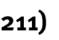

This chapter in the Learner’s Book is divided into four sections: 

- Section 1 deals with floor and elevation plans. 

- Section 2 deals with design drawings. 

- Section 3 deals with drawing scaled plans. 

 Section 4 deals with constructing models. It is important to understand that although Sections 1 and 2 deal with different types of plans, the common skill underpinning engagement with each type of plan involves making sense of 2-dimensional pictures drawn of 3-dimensional objects. In other words, in each of these sections there is the expectation that you will be able to interpret and analyse 2-dimensional pictures/plans and use these plans to describe, understand and make sense of 3-dimensional structures. For this reason, Sections 1 and 2 will be dealt with together in the discussion below. 

Section 3, by comparison, explores the process of drawing scaled plans and Section 4 deals with the construction of 3-dimensional models from 2-dimensional nets or plans of those models. 


> **[Diagram Context - Textbook_MathematicalLiteracy_Gr11_PLANS-AND-OTHER-REPRESENTATIONS.pdf-0001-09.png]**
> This image is a text-based header identifying the source material as "Via Afrika » Mathematical Literacy Gr 11." It serves as a navigational or contextual label for Grade 11 Mathematical Literacy curriculum content, indicating the specific textbook series and subject level.


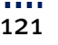


> **[Diagram Context - Textbook_MathematicalLiteracy_Gr11_PLANS-AND-OTHER-REPRESENTATIONS.pdf-0002-00.png]**
> This graphic serves as a chapter heading for a Mathematical Literacy curriculum, featuring the text "Chapter 8: Maps, plans and other representations of the physical world (Plans and Models)." It introduces the foundational concepts of spatial reasoning and scale, which are essential for students to interpret and construct two-dimensional representations of three-dimensional environments.


> **[Diagram Context - Textbook_MathematicalLiteracy_Gr11_PLANS-AND-OTHER-REPRESENTATIONS.pdf-0002-01.png]**
> This text-based graphic serves as a heading for a Mathematical Literacy module, specifically identifying the topic "Section 1: Floor and elevation plans." It introduces the foundational concept of architectural representation, where students learn to interpret two-dimensional top-down floor layouts and side-view elevation drawings to understand spatial design and scale.


> **[Diagram Context - Textbook_MathematicalLiteracy_Gr11_PLANS-AND-OTHER-REPRESENTATIONS.pdf-0002-02.png]**
> This image is a text-based reference label containing the characters "(LB pages 186-". It serves as a navigational citation directing students to specific pages in their Learner's Book (LB) to locate relevant curriculum content.


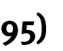


> **[Diagram Context - Textbook_MathematicalLiteracy_Gr11_PLANS-AND-OTHER-REPRESENTATIONS.pdf-0002-05.png]**
> This text-based graphic serves as a heading for a section on "Design drawings," a fundamental component of the Engineering Graphics and Design (EGD) curriculum. It introduces the topic of technical communication, where students learn to represent ideas and mechanical concepts through standardized graphical conventions.


> **[Diagram Context - Textbook_MathematicalLiteracy_Gr11_PLANS-AND-OTHER-REPRESENTATIONS.pdf-0002-06.png]**
> This image displays a text fragment, "(LB pages 196-1", which serves as a navigational reference to a Learner's Book. It functions as a signpost to direct students to specific curriculum content within their prescribed textbook for further study or context.


The content of these sections on floor, elevation and design plans, as part of the _Maps, plans and other representations of the physical world_ Application Topic, are drawn from pages 77-78 in the CAPS document. 

As stipulated in the CAPS document, Grade 11 learners need specifically to be able to: 

- work with elevation, floor and design plans. 

- make sense of the information shown on the plans. 

- make connections between different plan views of an object. 

- use given scale to determine dimensions and lengths on the plan. 


> **[Diagram Context - Textbook_MathematicalLiteracy_Gr11_PLANS-AND-OTHER-REPRESENTATIONS.pdf-0002-15.png]**
> This graphic is a text-based heading containing the phrase "Contexts and integrated content." It serves as a structural signpost in educational materials to indicate where theoretical concepts are applied to real-world scenarios or linked across different curriculum topics.


- The plans in these sections are limited to: 

   - Floor and elevation plans of small structures such as classroom, office space, tool shed. 

   - Design drawings of furniture, clothing, etc. 

- There is integration of content from the section on Scale in the topic _Maps, plans and other representations of the physical world_ and Measuring lengths <u>and distances in the topic</u> _Measurement_ . 


> **[Diagram Context - Textbook_MathematicalLiteracy_Gr11_PLANS-AND-OTHER-REPRESENTATIONS.pdf-0002-20.png]**
> This graphic is a text-based header identifying the educational source as "Via Afrika » Mathematical Literacy Gr 11." It serves as a contextual label for curriculum-aligned learning materials, indicating that the content is designed for Grade 11 Mathematical Literacy students within the South African CAPS framework.


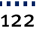


> **[Diagram Context - Textbook_MathematicalLiteracy_Gr11_PLANS-AND-OTHER-REPRESENTATIONS.pdf-0003-00.png]**
> This graphic is a text-based chapter heading for a Mathematical Literacy curriculum. It features the labels "Chapter 8," "Maps, plans and other representations of the physical world," and "(Plans and Models)." It introduces the conceptual framework for interpreting scale, spatial reasoning, and the translation of three-dimensional physical environments into two-dimensional technical drawings.


The table below shows a comparison of the different types of plans dealt with in Sections 1 and 2 in the Learner‟s Book: 


> **[Diagram Context - Textbook_MathematicalLiteracy_Gr11_PLANS-AND-OTHER-REPRESENTATIONS.pdf-0003-06.png]**
> This image contains a text fragment reading "perspective of a building or". It serves as a prompt or caption for a technical drawing or architectural study, introducing the concept of spatial representation in Engineering Graphics and Design (EGD).


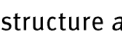


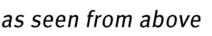
> **[Diagram Context - Textbook_MathematicalLiteracy_Gr11_PLANS-AND-OTHER-REPRESENTATIONS.pdf-0003-08.png]**
> This text snippet serves as a directional label for a technical diagram, specifying the perspective or viewpoint from which a structure or apparatus should be observed. It instructs the student to interpret the accompanying visual as a plan view or top-down projection, which is essential for correctly identifying spatial relationships in topics like geometry, physics circuits, or biological dissections.


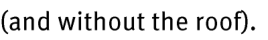
> **[Diagram Context - Textbook_MathematicalLiteracy_Gr11_PLANS-AND-OTHER-REPRESENTATIONS.pdf-0003-09.png]**
> This image contains the text "(and without the roof)." It serves as a parenthetical qualifier, likely used in a technical or architectural context to specify the state of a structure or model being described in an accompanying diagram or lesson.


> **[Diagram Context - Textbook_MathematicalLiteracy_Gr11_PLANS-AND-OTHER-REPRESENTATIONS.pdf-0003-11.png]**
> This image contains a text fragment reading "To see what the design and/or". It does not depict a scientific diagram, graph, or educational model relevant to the CAPS curriculum.


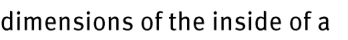
> **[Diagram Context - Textbook_MathematicalLiteracy_Gr11_PLANS-AND-OTHER-REPRESENTATIONS.pdf-0003-12.png]**
> This image contains a text fragment reading "dimensions of the inside of a". It serves as a partial instructional prompt or heading, likely introducing a geometry or technical drawing problem related to calculating volume or capacity.


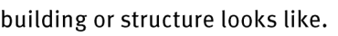
> **[Diagram Context - Textbook_MathematicalLiteracy_Gr11_PLANS-AND-OTHER-REPRESENTATIONS.pdf-0003-13.png]**
> This image is a text fragment containing the phrase "building or structure looks like." It serves as a prompt or instructional lead-in for students to describe the physical characteristics or architectural design of a specific object or environment.


> **[Diagram Context - Textbook_MathematicalLiteracy_Gr11_PLANS-AND-OTHER-REPRESENTATIONS.pdf-0003-18.png]**
> This image fragment displays a text-based instructional prompt regarding the "perspective of a building or." It serves as a foundational prompt for technical drawing or visual arts, requiring students to apply principles of linear perspective to represent three-dimensional architectural structures on a two-dimensional plane.


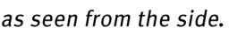
> **[Diagram Context - Textbook_MathematicalLiteracy_Gr11_PLANS-AND-OTHER-REPRESENTATIONS.pdf-0003-20.png]**
> This text snippet serves as a descriptive caption for a diagram, specifying the perspective or orientation of a scientific model or anatomical structure. By clarifying that the subject is viewed "as seen from the side," it helps students interpret two-dimensional representations of three-dimensional objects, which is essential for understanding spatial relationships in topics like human anatomy or physical science apparatus.


> **[Diagram Context - Textbook_MathematicalLiteracy_Gr11_PLANS-AND-OTHER-REPRESENTATIONS.pdf-0003-22.png]**
> This image contains a text fragment reading "To see what the design and/or". It does not depict a scientific diagram, graph, or educational model relevant to the CAPS curriculum.


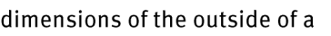
> **[Diagram Context - Textbook_MathematicalLiteracy_Gr11_PLANS-AND-OTHER-REPRESENTATIONS.pdf-0003-23.png]**
> This image displays a text fragment reading "dimensions of the outside of a," which serves as an introductory phrase for a geometry or measurement problem. In a CAPS curriculum context, this text likely precedes a diagram or word problem requiring learners to calculate the surface area or volume of a three-dimensional object, such as a rectangular prism or cylinder.


> **[Diagram Context - Textbook_MathematicalLiteracy_Gr11_PLANS-AND-OTHER-REPRESENTATIONS.pdf-0003-24.png]**
> This image is a text fragment containing the phrase "building or structure looks like." It serves as a prompt or instructional lead-in for a descriptive task, likely requiring students to identify or explain the physical characteristics of a specific object or architectural form.


> **[Diagram Context - Textbook_MathematicalLiteracy_Gr11_PLANS-AND-OTHER-REPRESENTATIONS.pdf-0003-25.png]**
> This graphic is a text-based label featuring the words "Design drawing" in white, sans-serif font against a solid green background. It serves as a categorical heading or instructional signifier for Engineering Graphics and Design (EGD) learners, identifying the specific phase or type of technical illustration required in a design process.


> **[Diagram Context - Textbook_MathematicalLiteracy_Gr11_PLANS-AND-OTHER-REPRESENTATIONS.pdf-0003-28.png]**
> This image contains a text fragment consisting of the words "design/layout/components of". It serves as a heading or instructional prompt intended to introduce a technical or structural analysis of a system, device, or document.


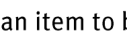


> **[Diagram Context - Textbook_MathematicalLiteracy_Gr11_PLANS-AND-OTHER-REPRESENTATIONS.pdf-0003-33.png]**
> This image contains only the text fragment "To see what a completed". It lacks the necessary visual content, labels, or scientific context required to explain a specific CAPS curriculum concept.


> **[Diagram Context - Textbook_MathematicalLiteracy_Gr11_PLANS-AND-OTHER-REPRESENTATIONS.pdf-0003-34.png]**
> This text snippet serves as a categorical label for "manufactured/constructed item," a term frequently used in the CAPS Life Sciences curriculum to distinguish between natural biological specimens and human-made objects in classification or evolutionary studies. It helps students differentiate between artificial artifacts and biological entities when analyzing evolutionary trends or the impact of human technology on the environment.


> **[Diagram Context - Textbook_MathematicalLiteracy_Gr11_PLANS-AND-OTHER-REPRESENTATIONS.pdf-0003-36.png]**
> This image contains a text fragment reading "dimensions of the parts of the". It serves as a contextual header or instructional prompt for a technical drawing, geometric figure, or anatomical diagram that requires the learner to identify or calculate specific measurements.


> **[Diagram Context - Textbook_MathematicalLiteracy_Gr11_PLANS-AND-OTHER-REPRESENTATIONS.pdf-0003-39.png]**
> This image is a text snippet containing the phrase "The floor plan shows the". It serves as an introductory sentence fragment for a mathematical literacy or technical drawing problem involving the interpretation of architectural layouts.


> **[Diagram Context - Textbook_MathematicalLiteracy_Gr11_PLANS-AND-OTHER-REPRESENTATIONS.pdf-0003-40.png]**
> This image contains a text fragment reading "dimensions and layout of the". It serves as an introductory label or caption fragment, likely intended to contextualize a technical drawing, floor plan, or engineering schematic. For a high school learner, this text indicates the specific focus of a diagram on spatial planning, structural design, or technical drawing principles.


> **[Diagram Context - Textbook_MathematicalLiteracy_Gr11_PLANS-AND-OTHER-REPRESENTATIONS.pdf-0003-41.png]**
> This image consists of a text fragment reading "inside of the building." It serves as a linguistic label or instructional prompt rather than a scientific diagram, likely intended to provide spatial context for a larger educational graphic or assessment task.


> **[Diagram Context - Textbook_MathematicalLiteracy_Gr11_PLANS-AND-OTHER-REPRESENTATIONS.pdf-0003-42.png]**
> This image is a text-based snippet containing the phrase "Dimensions such as lengths and". It serves as an introductory fragment for a lesson on physical quantities, units, or measurement in the Physical Sciences or Mathematics curriculum. Conceptually, it prompts students to identify and categorize fundamental scalar quantities used to describe the spatial properties of objects in scientific calculations.


> **[Diagram Context - Textbook_MathematicalLiteracy_Gr11_PLANS-AND-OTHER-REPRESENTATIONS.pdf-0003-45.png]**
> This image is a text snippet containing the phrase "of windows and doors are also". It serves as a linguistic fragment that lacks visual diagrams, variables, or scientific symbols. In a pedagogical context, such text is typically used to support reading comprehension or to provide descriptive context within a larger technical document regarding architectural or environmental design.


> **[Diagram Context - Textbook_MathematicalLiteracy_Gr11_PLANS-AND-OTHER-REPRESENTATIONS.pdf-0003-48.png]**
> This image fragment displays a text snippet from an Engineering Graphics and Design (EGD) resource, specifically referencing an "elevation plan." It introduces the concept of orthographic projection, which is essential for learners to understand how to represent three-dimensional objects through two-dimensional views in technical drawings.


> **[Diagram Context - Textbook_MathematicalLiteracy_Gr11_PLANS-AND-OTHER-REPRESENTATIONS.pdf-0003-49.png]**
> This image consists of a single line of text reading "dimensions and layout of the". It serves as a fragment of a heading or instructional prompt, likely intended to introduce a technical drawing, floor plan, or design specification in a CAPS-aligned Technology or Engineering Graphics and Design (EGD) context.


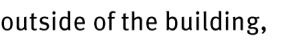
> **[Diagram Context - Textbook_MathematicalLiteracy_Gr11_PLANS-AND-OTHER-REPRESENTATIONS.pdf-0003-50.png]**
> This image consists of a text fragment containing the phrase "outside of the building,". It serves as a linguistic context clue often found in English First Additional Language (EFAL) or Life Orientation reading comprehension exercises. The text is intended to help students identify spatial relationships or setting descriptions within a narrative or instructional passage.


> **[Diagram Context - Textbook_MathematicalLiteracy_Gr11_PLANS-AND-OTHER-REPRESENTATIONS.pdf-0003-51.png]**
> This image fragment contains the text "including the design of the roof," which appears to be a caption or instructional prompt related to a technical drawing or architectural diagram. In a CAPS curriculum context, such text typically accompanies a design process task in Technology or Engineering Graphics and Design (EGD), requiring students to consider structural integrity, material selection, or environmental factors in their project planning.


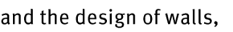
> **[Diagram Context - Textbook_MathematicalLiteracy_Gr11_PLANS-AND-OTHER-REPRESENTATIONS.pdf-0003-52.png]**
> This image consists of a text fragment containing the words "and the design of walls,". It serves as a contextual snippet likely derived from a Life Sciences or Geography textbook discussing structural adaptations or environmental engineering. Conceptually, it prompts students to consider how specific physical structures are engineered or evolved to meet functional requirements within a system.


> **[Diagram Context - Textbook_MathematicalLiteracy_Gr11_PLANS-AND-OTHER-REPRESENTATIONS.pdf-0003-53.png]**
> This text snippet serves as a descriptive label or instructional prompt containing the words "windows and doors in the walls." It conceptually identifies structural components of a building, likely used in a technical drawing or architectural floor plan exercise to help students understand spatial layout and construction terminology.


> **[Diagram Context - Textbook_MathematicalLiteracy_Gr11_PLANS-AND-OTHER-REPRESENTATIONS.pdf-0003-54.png]**
> This image fragment contains text identifying "heights of" as an example of continuous data variables. In the context of the CAPS curriculum, this snippet serves to illustrate the concept of continuous variation in statistics or genetics, where measurements can take any value within a range rather than falling into discrete categories.


> **[Diagram Context - Textbook_MathematicalLiteracy_Gr11_PLANS-AND-OTHER-REPRESENTATIONS.pdf-0003-55.png]**
> This text snippet lists structural components of a building, specifically "walls, doors, windows, roof and". It serves as a foundational analogy in Life Sciences to help students understand the cell membrane and cell wall as protective, selective boundaries that define the structure and integrity of a cell.


> **[Diagram Context - Textbook_MathematicalLiteracy_Gr11_PLANS-AND-OTHER-REPRESENTATIONS.pdf-0003-56.png]**
> This image consists of a text fragment reading "other external features are". It serves as a linguistic prompt or introductory clause for a Life Sciences lesson focused on identifying and describing the morphological characteristics of an organism.


> **[Diagram Context - Textbook_MathematicalLiteracy_Gr11_PLANS-AND-OTHER-REPRESENTATIONS.pdf-0003-59.png]**
> This text snippet serves as an introductory prompt for a technical drawing or engineering design lesson. It establishes the foundational concept that a design plan acts as a visual communication tool used to represent the structural or functional specifications of a project.


> **[Diagram Context - Textbook_MathematicalLiteracy_Gr11_PLANS-AND-OTHER-REPRESENTATIONS.pdf-0003-60.png]**
> This image consists of a text fragment stating "what an item will look like once". It serves as a linguistic prompt or instructional heading, likely intended to introduce a visual representation of a product, chemical structure, or experimental result following a specific process or transformation.


> **[Diagram Context - Textbook_MathematicalLiteracy_Gr11_PLANS-AND-OTHER-REPRESENTATIONS.pdf-0003-61.png]**
> This image contains a text fragment reading "it has been manufactured or". It serves as a linguistic snippet rather than a scientific diagram, lacking the structural or symbolic components required for curriculum-based analysis.


> **[Diagram Context - Textbook_MathematicalLiteracy_Gr11_PLANS-AND-OTHER-REPRESENTATIONS.pdf-0003-62.png]**
> This image contains only a text fragment reading "assembled as well as the". It lacks any visual diagrams, labels, or scientific variables required for pedagogical analysis within the CAPS curriculum.


> **[Diagram Context - Textbook_MathematicalLiteracy_Gr11_PLANS-AND-OTHER-REPRESENTATIONS.pdf-0003-63.png]**
> This image is a text snippet containing the phrase "different component parts that". It serves as a linguistic fragment likely introducing a definition or explanation of a system, structure, or mechanism within a CAPS-aligned textbook.


> **[Diagram Context - Textbook_MathematicalLiteracy_Gr11_PLANS-AND-OTHER-REPRESENTATIONS.pdf-0003-65.png]**
> This text snippet serves as a heading or introductory label for a technical diagram or table. It explicitly introduces the topic of "Dimensions of the different," indicating that the subsequent visual content will quantify or compare the physical measurements of various objects or components.


> **[Diagram Context - Textbook_MathematicalLiteracy_Gr11_PLANS-AND-OTHER-REPRESENTATIONS.pdf-0003-66.png]**
> This image contains only the text fragment "parts as well as specific," which lacks the necessary visual components to identify a scientific diagram or structure. Without a corresponding graphic, it is impossible to provide a pedagogical description of biological, chemical, or physical concepts as required by the CAPS curriculum.


> **[Diagram Context - Textbook_MathematicalLiteracy_Gr11_PLANS-AND-OTHER-REPRESENTATIONS.pdf-0003-67.png]**
> This image contains a text fragment reading "instructions on how the parts". It serves as a linguistic label or header likely intended to introduce a technical diagram, assembly guide, or procedural set of steps for a scientific apparatus or biological model.


> **[Diagram Context - Textbook_MathematicalLiteracy_Gr11_PLANS-AND-OTHER-REPRESENTATIONS.pdf-0003-68.png]**
> This image consists of a text fragment containing the words "must look can also be included." As there are no diagrams, labels, or scientific variables present, it does not convey any specific conceptual content relevant to the CAPS curriculum.


When dealing with **<u>floor and elevation plans</u>** the following key concepts are essential: 


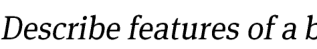
> **[Diagram Context - Textbook_MathematicalLiteracy_Gr11_PLANS-AND-OTHER-REPRESENTATIONS.pdf-0003-71.png]**
> This image is a text-based prompt containing the partial instruction "Describe features of a b". It serves as an assessment task requiring students to identify and explain the specific biological or physical characteristics of a subject starting with the letter 'b', such as a bacterium, biome, or blood cell.


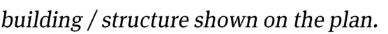
> **[Diagram Context - Textbook_MathematicalLiteracy_Gr11_PLANS-AND-OTHER-REPRESENTATIONS.pdf-0003-72.png]**
> This text snippet serves as a prompt for a technical drawing or architectural floor plan, specifically referencing the "building / structure" depicted in a diagram. It directs students to identify and analyze the spatial layout or specific features of a construction project as part of a technical mathematics or engineering graphics and design (EGD) assessment.


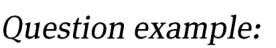
> **[Diagram Context - Textbook_MathematicalLiteracy_Gr11_PLANS-AND-OTHER-REPRESENTATIONS.pdf-0003-73.png]**
> This image displays the text "Question example," which serves as a structural heading or label in an educational assessment context. It functions as a signpost to indicate that the following content is a sample problem designed to test a learner's understanding of specific curriculum concepts.


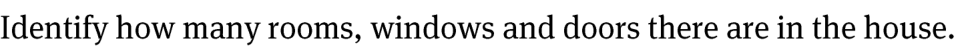
> **[Diagram Context - Textbook_MathematicalLiteracy_Gr11_PLANS-AND-OTHER-REPRESENTATIONS.pdf-0003-74.png]**
> This text-based prompt serves as an instructional task for a floor plan analysis exercise. It directs the learner to perform a spatial audit by identifying and counting specific architectural features—rooms, windows, and doors—within a provided house diagram. This activity develops foundational spatial reasoning and observational skills essential for interpreting technical drawings in subjects like Engineering Graphics and Design (EGD) or Technology.


> **[Diagram Context - Textbook_MathematicalLiteracy_Gr11_PLANS-AND-OTHER-REPRESENTATIONS.pdf-0003-76.png]**
> This text serves as an instructional prompt for a technical drawing or architectural design exercise. It explicitly identifies the task of correlating specific structural features between two-dimensional floor plans and their corresponding vertical elevation views. This exercise helps learners develop spatial reasoning skills by requiring them to interpret how horizontal layouts translate into vertical perspectives.


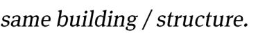
> **[Diagram Context - Textbook_MathematicalLiteracy_Gr11_PLANS-AND-OTHER-REPRESENTATIONS.pdf-0003-77.png]**
> This text snippet serves as a conceptual label for a comparative diagram, featuring the phrase "same building / structure." It is used in Life Sciences to illustrate the principle of homologous structures, helping students identify anatomical features that share a common evolutionary origin despite potential differences in current function.


> **[Diagram Context - Textbook_MathematicalLiteracy_Gr11_PLANS-AND-OTHER-REPRESENTATIONS.pdf-0003-78.png]**
> This image consists of the text "Question example:" presented in a standard serif font. It serves as a structural heading or label used to introduce a sample assessment item within educational material. This text functions as a signpost to help students identify and engage with practice problems relevant to their curriculum studies.


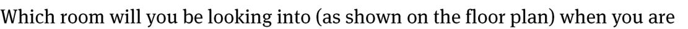
> **[Diagram Context - Textbook_MathematicalLiteracy_Gr11_PLANS-AND-OTHER-REPRESENTATIONS.pdf-0003-79.png]**
> This text serves as a prompt for a Mathematical Literacy assessment task involving the interpretation of a floor plan. It directs the student to identify a specific room based on a provided architectural diagram, testing their spatial reasoning and ability to relate textual questions to visual representations of space.


> **[Diagram Context - Textbook_MathematicalLiteracy_Gr11_PLANS-AND-OTHER-REPRESENTATIONS.pdf-0003-80.png]**
> This graphic is a text-based header identifying the educational source as "Via Afrika » Mathematical Literacy Gr 11." It serves as a contextual label for curriculum materials, indicating that the content is aligned with the South African CAPS Grade 11 Mathematical Literacy syllabus.


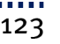


> **[Diagram Context - Textbook_MathematicalLiteracy_Gr11_PLANS-AND-OTHER-REPRESENTATIONS.pdf-0004-00.png]**
> This graphic serves as a chapter heading for Mathematical Literacy, featuring the text "Chapter 8: Maps, plans and other representations of the physical world (Plans and Models)." It introduces the curriculum topic focused on interpreting and creating two-dimensional representations of three-dimensional spaces, which is essential for developing spatial reasoning and practical life skills.


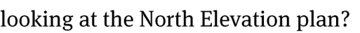
> **[Diagram Context - Textbook_MathematicalLiteracy_Gr11_PLANS-AND-OTHER-REPRESENTATIONS.pdf-0004-01.png]**
> This text snippet represents a prompt related to architectural or technical drawing, specifically focusing on the "North Elevation" view. It serves as a directive for students to interpret the external vertical projection of a building's northern face, which is a key skill in Engineering Graphics and Design (EGD) for understanding structural orientation and facade details.


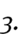


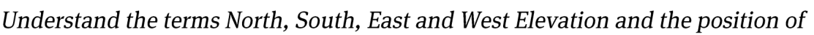
> **[Diagram Context - Textbook_MathematicalLiteracy_Gr11_PLANS-AND-OTHER-REPRESENTATIONS.pdf-0004-03.png]**
> This text-based graphic introduces the concept of architectural elevations, specifically referencing the cardinal directions: North, South, East, and West. It serves as an introductory learning objective for Technical Mathematics or Engineering Graphics and Design (EGD) students to understand how a building's exterior faces are oriented and labeled relative to a compass point.


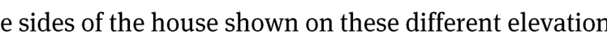
> **[Diagram Context - Textbook_MathematicalLiteracy_Gr11_PLANS-AND-OTHER-REPRESENTATIONS.pdf-0004-05.png]**
> This image contains a text fragment referencing "sides of the house" and "different elevation," which relates to technical drawing or architectural design. It introduces the concept of orthographic projections, where a three-dimensional structure is represented through two-dimensional views from specific perspectives.


> **[Diagram Context - Textbook_MathematicalLiteracy_Gr11_PLANS-AND-OTHER-REPRESENTATIONS.pdf-0004-07.png]**
> This image is a text-based heading labeled "Question example." It serves as a structural signpost in educational materials to introduce a sample assessment item, signaling to students that they are about to engage with a practice problem relevant to the CAPS curriculum.


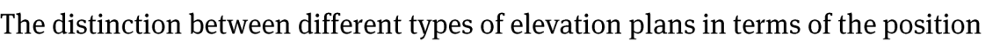
> **[Diagram Context - Textbook_MathematicalLiteracy_Gr11_PLANS-AND-OTHER-REPRESENTATIONS.pdf-0004-08.png]**
> This text-based graphic introduces the topic of architectural drawing, specifically focusing on the classification of elevation plans. It serves as a conceptual heading to help learners distinguish between various views of a building based on their orientation and position.


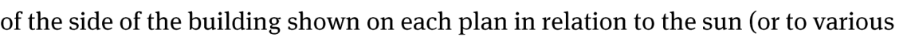
> **[Diagram Context - Textbook_MathematicalLiteracy_Gr11_PLANS-AND-OTHER-REPRESENTATIONS.pdf-0004-09.png]**
> This text snippet functions as a prompt for a Mathematical Literacy or Geography task involving architectural floor plans. It explicitly references "the side of the building," "each plan," and "the sun," directing students to analyze the orientation of a structure. Conceptually, this requires learners to apply spatial reasoning to determine how solar positioning influences building design, such as natural lighting and thermal regulation.


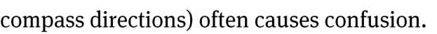
> **[Diagram Context - Textbook_MathematicalLiteracy_Gr11_PLANS-AND-OTHER-REPRESENTATIONS.pdf-0004-10.png]**
> This image is a text fragment containing the phrase "compass directions) often causes confusion." It highlights a common conceptual hurdle in geography and physical sciences where learners struggle to orient themselves or interpret directional data correctly.


The following basic principles apply to different types of elevation plans. 

- The side of a building shown on a North-Elevation plan is the side of the building that is facing North. 

- In other words, if you are standing outside the house and looking at the side that is labelled North-Elevation on the plan then you are actually facing South; or if you are standing inside the house and looking outside through a window on the side of the house shown on the North-Elevation plan then you will be looking North. The same principle applies to all other sides of the house shown on the other elevation plans. 

- Many houses are built facing North in order to maximise the amount of sun that the house receives in winter. 


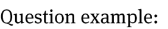
> **[Diagram Context - Textbook_MathematicalLiteracy_Gr11_PLANS-AND-OTHER-REPRESENTATIONS.pdf-0004-15.png]**
> This image displays the text "Question example:" in a standard serif font. It serves as a structural heading or label used to introduce a sample assessment item within educational material.


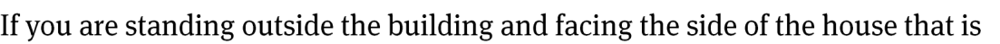
> **[Diagram Context - Textbook_MathematicalLiteracy_Gr11_PLANS-AND-OTHER-REPRESENTATIONS.pdf-0004-16.png]**
> This text snippet serves as the introductory prompt for a spatial reasoning or technical drawing exercise. It establishes a specific observational perspective—standing outside and facing a particular side of a building—to guide students in visualizing or sketching orthographic projections or architectural elevations.


> **[Diagram Context - Textbook_MathematicalLiteracy_Gr11_PLANS-AND-OTHER-REPRESENTATIONS.pdf-0004-17.png]**
> This image fragment displays a text snippet containing the phrase "shown as the North-". It serves as a textual label or caption component likely referencing a geographic or magnetic orientation in a physics or geography diagram.


> **[Diagram Context - Textbook_MathematicalLiteracy_Gr11_PLANS-AND-OTHER-REPRESENTATIONS.pdf-0004-18.png]**
> This text represents a prompt for a Mathematical Literacy assessment task related to map work and architectural plans. It asks the student to interpret the orientation of a building elevation by identifying the corresponding compass direction on a floor plan. This exercise tests the learner's ability to spatially relate two-dimensional drawings to cardinal directions, a core competency in the CAPS curriculum for interpreting technical diagrams.


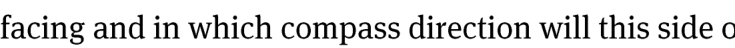
> **[Diagram Context - Textbook_MathematicalLiteracy_Gr11_PLANS-AND-OTHER-REPRESENTATIONS.pdf-0004-19.png]**
> This text fragment is part of a physics or geography assessment question regarding orientation and directional analysis. It prompts the student to determine the spatial positioning of an object or surface relative to cardinal compass directions.


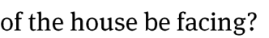
> **[Diagram Context - Textbook_MathematicalLiteracy_Gr11_PLANS-AND-OTHER-REPRESENTATIONS.pdf-0004-20.png]**
> This image fragment contains the text "of the house be facing?", which is a partial interrogative sentence likely derived from a Geography or Technology assessment task. In the context of the CAPS curriculum, this question typically relates to passive solar design principles, requiring students to determine the optimal orientation of a building to maximize natural light and thermal efficiency based on the sun's path in the Southern Hemisphere.


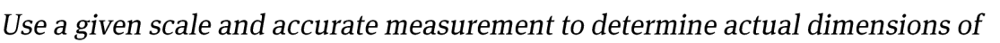
> **[Diagram Context - Textbook_MathematicalLiteracy_Gr11_PLANS-AND-OTHER-REPRESENTATIONS.pdf-0004-22.png]**
> This text-based graphic serves as an instructional prompt for a geometry or technical drawing task. It directs students to apply the mathematical principles of scale and precise measurement to calculate the real-world dimensions of an object represented in a diagram.


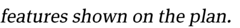
> **[Diagram Context - Textbook_MathematicalLiteracy_Gr11_PLANS-AND-OTHER-REPRESENTATIONS.pdf-0004-23.png]**
> This image contains a text fragment reading "features shown on the plan." It serves as a prompt or instructional caption typically found in Geography or Technical Sciences assessments to direct students to identify specific elements within a provided map, floor plan, or technical drawing.


> **[Diagram Context - Textbook_MathematicalLiteracy_Gr11_PLANS-AND-OTHER-REPRESENTATIONS.pdf-0004-24.png]**
> This image is a text-based heading labeled "Question example:". It serves as a structural signpost in educational material to introduce a sample assessment item or practice problem for learners.


> **[Diagram Context - Textbook_MathematicalLiteracy_Gr11_PLANS-AND-OTHER-REPRESENTATIONS.pdf-0004-25.png]**
> This text excerpt introduces a mathematical problem related to architectural or technical drawing, specifically referencing a scale of 1:100. It requires students to apply ratio and proportion concepts to convert measurements from a scaled plan into actual real-world dimensions.


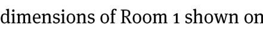
> **[Diagram Context - Textbook_MathematicalLiteracy_Gr11_PLANS-AND-OTHER-REPRESENTATIONS.pdf-0004-26.png]**
> This text fragment serves as a caption or instructional prompt referencing the "dimensions of Room 1." It directs the learner to identify and interpret specific spatial measurements or floor plan data associated with a designated area, which is a foundational skill in Mathematical Literacy for calculating area, perimeter, and scale.


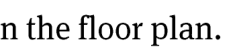


> **[Diagram Context - Textbook_MathematicalLiteracy_Gr11_PLANS-AND-OTHER-REPRESENTATIONS.pdf-0004-28.png]**
> This text snippet serves as an introductory instructional prompt containing the phrase "When dealing with d". It functions as a linguistic lead-in to a mathematical or scientific explanation, likely focusing on variables, derivatives, or specific terminology starting with the letter 'd' within the CAPS curriculum.


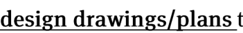
> **[Diagram Context - Textbook_MathematicalLiteracy_Gr11_PLANS-AND-OTHER-REPRESENTATIONS.pdf-0004-29.png]**
> This text snippet serves as a heading or label for technical design drawings/plans. It identifies the category of graphical communication used in Engineering Graphics and Design (EGD) to represent structural or mechanical concepts. Conceptually, it introduces students to the formal documentation required to translate design ideas into precise, actionable technical specifications.


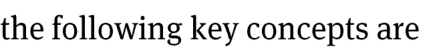
> **[Diagram Context - Textbook_MathematicalLiteracy_Gr11_PLANS-AND-OTHER-REPRESENTATIONS.pdf-0004-30.png]**
> This image contains a text fragment reading "the following key concepts are". It serves as an introductory header for a list or explanation of essential terminology within a CAPS-aligned educational resource.


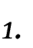


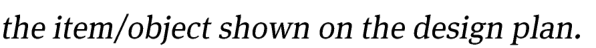
> **[Diagram Context - Textbook_MathematicalLiteracy_Gr11_PLANS-AND-OTHER-REPRESENTATIONS.pdf-0004-34.png]**
> This image consists of a text-based instructional prompt rather than a scientific diagram or model. It contains the phrase "the item/object shown on the design plan," which serves as a directive for students to identify or analyze a specific component within a technical drawing or engineering design task.


> **[Diagram Context - Textbook_MathematicalLiteracy_Gr11_PLANS-AND-OTHER-REPRESENTATIONS.pdf-0004-35.png]**
> This image displays the text "Question example:" in a standard serif font. It serves as a structural heading or label used to introduce a sample assessment item within educational material. This text functions as a signpost to help students identify and distinguish practice problems from instructional content.


> **[Diagram Context - Textbook_MathematicalLiteracy_Gr11_PLANS-AND-OTHER-REPRESENTATIONS.pdf-0004-36.png]**
> This image is a text-based header identifying the source material as "Via Afrika » Mathematical Literacy Gr 11." It serves as a curriculum-aligned label for educational content, indicating that the associated material is designed for Grade 11 Mathematical Literacy learners within the South African CAPS framework.


> **[Diagram Context - Textbook_MathematicalLiteracy_Gr11_PLANS-AND-OTHER-REPRESENTATIONS.pdf-0005-00.png]**
> This graphic serves as a chapter heading for Mathematical Literacy, explicitly labeling "Chapter 8" and the topic "Maps, plans and other representations of the physical world (Plans and Models)." It introduces the curriculum unit focused on interpreting scale, spatial reasoning, and the practical application of two-dimensional representations to model three-dimensional physical environments.


> **[Diagram Context - Textbook_MathematicalLiteracy_Gr11_PLANS-AND-OTHER-REPRESENTATIONS.pdf-0005-01.png]**
> This image is a text-based prompt asking for a description of an item represented in a design plan. It contains no visual diagrams, symbols, or labels, serving only as an instructional task for students to interpret technical documentation or engineering drawings.


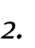


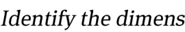
> **[Diagram Context - Textbook_MathematicalLiteracy_Gr11_PLANS-AND-OTHER-REPRESENTATIONS.pdf-0005-03.png]**
> This image consists of a text fragment reading "Identify the dimens," which serves as an instructional prompt for a geometry or technical drawing exercise. It requires students to apply their understanding of spatial measurement by determining the specific lengths, widths, or heights of a geometric figure or component.


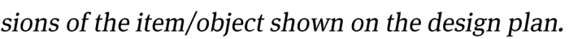
> **[Diagram Context - Textbook_MathematicalLiteracy_Gr11_PLANS-AND-OTHER-REPRESENTATIONS.pdf-0005-04.png]**
> This image displays a text fragment from a technical drawing or design assessment, specifically referencing the "sions of the item/object shown on the design plan." It serves as an instructional prompt for Engineering Graphics and Design (EGD) learners, requiring them to identify and interpret the specific dimensions provided on a technical orthographic or isometric projection.


> **[Diagram Context - Textbook_MathematicalLiteracy_Gr11_PLANS-AND-OTHER-REPRESENTATIONS.pdf-0005-05.png]**
> This image displays the text "Question example:" in a standard serif font. It serves as a structural header or label typically used in CAPS-aligned educational materials to introduce a sample problem or assessment task for learners.


> **[Diagram Context - Textbook_MathematicalLiteracy_Gr11_PLANS-AND-OTHER-REPRESENTATIONS.pdf-0005-06.png]**
> This text serves as an instructional prompt for a technical drawing or design task, requiring the student to interpret a visual design plan. It directs the learner to extract specific quantitative data—the dimensions of various components—and organize this information into a structured table format, a key skill in Engineering Graphics and Design (EGD) and Technology.


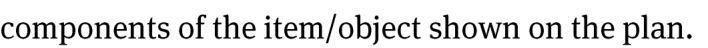
> **[Diagram Context - Textbook_MathematicalLiteracy_Gr11_PLANS-AND-OTHER-REPRESENTATIONS.pdf-0005-07.png]**
> This text fragment serves as a prompt for a technical drawing or design task, likely found in a Grade 10-12 Engineering Graphics and Design (EGD) or Technology assessment. It instructs the learner to identify and label the specific constituent parts of an object depicted in a technical plan or orthographic projection. This exercise reinforces the foundational skill of interpreting complex technical drawings by breaking down an assembly into its individual functional components.


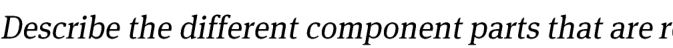
> **[Diagram Context - Textbook_MathematicalLiteracy_Gr11_PLANS-AND-OTHER-REPRESENTATIONS.pdf-0005-09.png]**
> This image consists of a text prompt asking the learner to "Describe the different component parts that are r". It serves as an instructional assessment task intended to prompt a student to identify and explain the specific elements or structures within a preceding diagram or system.


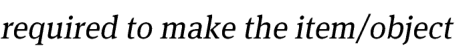
> **[Diagram Context - Textbook_MathematicalLiteracy_Gr11_PLANS-AND-OTHER-REPRESENTATIONS.pdf-0005-10.png]**
> This image consists of a text fragment containing the phrase "required to make the item/object." It serves as a linguistic prompt or instructional label often found in technical or design-based assessments to define the necessary inputs or materials for a specific task.


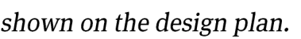
> **[Diagram Context - Textbook_MathematicalLiteracy_Gr11_PLANS-AND-OTHER-REPRESENTATIONS.pdf-0005-11.png]**
> This image consists of a text fragment reading "shown on the design plan." It serves as a caption or instructional prompt typically found in Engineering Graphics and Design (EGD) or Technology assessments to direct students to interpret specific features or dimensions within a technical drawing.


> **[Diagram Context - Textbook_MathematicalLiteracy_Gr11_PLANS-AND-OTHER-REPRESENTATIONS.pdf-0005-12.png]**
> This image displays the text "Question example:" in a standard serif font. It serves as a heading or label typically used in CAPS-aligned assessment materials to introduce a sample problem or practice exercise for learners.


> **[Diagram Context - Textbook_MathematicalLiteracy_Gr11_PLANS-AND-OTHER-REPRESENTATIONS.pdf-0005-13.png]**
> This text snippet serves as an instructional prompt for a technical design or engineering task, requiring the identification and description of individual components. It challenges students to demonstrate their understanding of mechanical assembly, system integration, or apparatus setup by articulating the specific parts necessary to construct a functional whole.


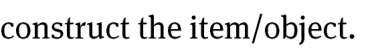
> **[Diagram Context - Textbook_MathematicalLiteracy_Gr11_PLANS-AND-OTHER-REPRESENTATIONS.pdf-0005-14.png]**
> This image contains the text "construct the item/object," which serves as an instructional prompt for a technical or design-based assessment. In the context of the CAPS curriculum, this phrase directs learners to apply practical skills in Engineering Graphics and Design (EGD) or Technology to physically or digitally assemble a component based on provided specifications.


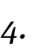


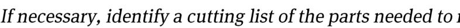
> **[Diagram Context - Textbook_MathematicalLiteracy_Gr11_PLANS-AND-OTHER-REPRESENTATIONS.pdf-0005-16.png]**
> This text snippet serves as an instructional prompt for a technical design or engineering task, specifically requiring the creation of a "cutting list." It directs the student to identify and list the specific dimensions and quantities of materials required to construct a project based on a technical drawing. This exercise is essential for teaching learners in subjects like Engineering Graphics and Design (EGD) or Technology how to translate design specifications into a practical bill of materials for manufacturing.


> **[Diagram Context - Textbook_MathematicalLiteracy_Gr11_PLANS-AND-OTHER-REPRESENTATIONS.pdf-0005-17.png]**
> This image consists of a text fragment containing the phrase "make the item/object." It serves as a linguistic instruction or prompt rather than a scientific diagram, likely directing a student to construct or identify a specific component within a broader educational task.


> **[Diagram Context - Textbook_MathematicalLiteracy_Gr11_PLANS-AND-OTHER-REPRESENTATIONS.pdf-0005-18.png]**
> This image is a text-based heading labeled "Question example:". It serves as a structural signpost in educational materials to introduce a sample problem or assessment task for students.


> **[Diagram Context - Textbook_MathematicalLiteracy_Gr11_PLANS-AND-OTHER-REPRESENTATIONS.pdf-0005-19.png]**
> This text serves as an instructional prompt for a technical drawing or diagramming task, specifically requiring the identification and illustration of individual components within a system. It directs students to deconstruct a complex mechanism or apparatus into its constituent parts, fostering an understanding of structural composition and functional assembly essential for practical science and technology assessments.


> **[Diagram Context - Textbook_MathematicalLiteracy_Gr11_PLANS-AND-OTHER-REPRESENTATIONS.pdf-0005-20.png]**
> This text fragment serves as an instructional prompt for a geometry or technical drawing exercise involving the dissection of 3D objects. It directs the student to visualize the composition of a whole object and demonstrate a specific cross-sectional cut through its constituent parts.


> **[Diagram Context - Textbook_MathematicalLiteracy_Gr11_PLANS-AND-OTHER-REPRESENTATIONS.pdf-0005-21.png]**
> This image contains a text fragment reading "from a larger piece of board." It serves as a contextual snippet for a technical drawing or word problem, likely related to geometry or practical workshop calculations in a Technology or Mathematics curriculum.


> **[Diagram Context - Textbook_MathematicalLiteracy_Gr11_PLANS-AND-OTHER-REPRESENTATIONS.pdf-0005-22.png]**
> This image is a text-based header identifying the educational source as "Via Afrika » Mathematical Literacy Gr 11." It serves as a contextual label for curriculum-aligned learning materials, indicating that the associated content is designed for Grade 11 Mathematical Literacy students within the South African CAPS framework.


> **[Diagram Context - Textbook_MathematicalLiteracy_Gr11_PLANS-AND-OTHER-REPRESENTATIONS.pdf-0006-00.png]**
> This graphic serves as a chapter heading for a Mathematical Literacy curriculum, specifically identifying "Chapter 8" as the section covering "Maps, plans and other representations of the physical world (Plans and Models)." It introduces the conceptual framework for interpreting scale drawings, floor plans, and spatial models used to represent real-world physical environments.


> **[Diagram Context - Textbook_MathematicalLiteracy_Gr11_PLANS-AND-OTHER-REPRESENTATIONS.pdf-0006-01.png]**
> This image is a text-based heading containing the label "Section 3:". It serves as a structural marker within an educational document or assessment to delineate a specific thematic or content-based division of the curriculum.


> **[Diagram Context - Textbook_MathematicalLiteracy_Gr11_PLANS-AND-OTHER-REPRESENTATIONS.pdf-0006-02.png]**
> This image displays the text "Drawing scaled p," which serves as a heading for a technical drawing or geometry lesson. It introduces the concept of creating proportional representations of objects, a fundamental skill in CAPS Engineering Graphics and Design (EGD) and Mathematics.


> **[Diagram Context - Textbook_MathematicalLiteracy_Gr11_PLANS-AND-OTHER-REPRESENTATIONS.pdf-0006-03.png]**
> This text snippet serves as a navigational reference, explicitly identifying the relevant "LB" (Learner's Book) page range for a specific topic within the CAPS curriculum. It functions as a signpost to direct students to the core instructional content and explanatory text required to master the associated learning outcomes.


The content of this section on drawing plans  is drawn from page 78 in the CAPS document. 

As stipulated in the CAPS document, Grade 11 learners need specifically to be able to: 

- use a given scale to determine lengths in which a plan must be drawn and then 

- to draw an accurate scaled plan using these lengths. 


> **[Diagram Context - Textbook_MathematicalLiteracy_Gr11_PLANS-AND-OTHER-REPRESENTATIONS.pdf-0006-10.png]**
> This graphic consists of a simple text heading reading "Contexts and integrated content." It serves as a structural signpost in educational materials to indicate a section where theoretical knowledge is applied to real-world scenarios or linked across different curriculum topics.


- The plans in these sections are limited to: 

   - Floor and elevation plans of small structures such as classroom, office space, tool shed. 

   - Design drawings of furniture, clothing, etc. 

- There is integration of content from the section on Scale in the topic _Maps, plans and other representations of the physical world_ and Measuring lengths <u>and distances in the topic</u> _Measurement_ . 

In the previous sections, when working with scale, the primary focus was on using a given scale and measurement on the plan to determine actual dimensions of objects shown on the plan. For example: _measure the length of the window on the plan and use the given scale to determine the actual dimension of the window._ In other words, in this type of calculation the movement is from plan measure to actual dimension. This is the type of calculation that a homeowner or builder using a plan would do to make sense of features of the building shown on the plan. 

In this section, focus shifts to a second type of calculation involving scale, namely: using a given scale and a known actual dimension to determine the length on which to draw an object on a plan. In other words, in this type of calculation the movement is from actual dimension to plan measure. 


> **[Diagram Context - Textbook_MathematicalLiteracy_Gr11_PLANS-AND-OTHER-REPRESENTATIONS.pdf-0006-17.png]**
> This graphic is a text-based header identifying the educational resource as "Via Afrika » Mathematical Literacy Gr 11." It serves as a contextual label for Grade 11 Mathematical Literacy learners, indicating that the associated content aligns with the South African CAPS curriculum for this specific subject and grade level.


> **[Diagram Context - Textbook_MathematicalLiteracy_Gr11_PLANS-AND-OTHER-REPRESENTATIONS.pdf-0007-00.png]**
> This graphic serves as a chapter heading for a Mathematical Literacy curriculum, featuring the text "Chapter 8: Maps, plans and other representations of the physical world (Plans and Models)." It introduces the foundational concepts of spatial reasoning and scale, which are essential for students to interpret and construct two-dimensional representations of three-dimensional objects and environments.


This is the type of calculation that an architect or draftsman would do when designing a house/object and/or drawing the plans for the house/object. 

**Plan Actual dimension Scale = measurement** 


The height of a door is 2,1 m. To represent the height of this door on a plan that is to be drawn on the scale 1 : 75 the following calculation can be performed: 

Actual door height = 2,1 m 

Scale: 1 : 75 → this means that the actual door height is 75 times larger than the length that the door must be drawn on the plan; or that the plan measure must be 75 times smaller than this actual height. 

i.e. Plan measure = 2,1 m ÷ 75 = 0,028 m 


> **[Diagram Context - Textbook_MathematicalLiteracy_Gr11_PLANS-AND-OTHER-REPRESENTATIONS.pdf-0007-09.png]**
> This graphic is a text-based header identifying the educational source as "Via Afrika » Mathematical Literacy Gr 11." It serves as a contextual label for curriculum materials, indicating that the content is aligned with the South African CAPS Grade 11 Mathematical Literacy syllabus.


> **[Diagram Context - Textbook_MathematicalLiteracy_Gr11_PLANS-AND-OTHER-REPRESENTATIONS.pdf-0008-00.png]**
> This graphic serves as a chapter heading for a Mathematical Literacy curriculum, specifically identifying "Chapter 8" and the topic "Maps, plans and other representations of the physical world (Plans and Models)." It introduces the conceptual framework for interpreting two-dimensional representations of three-dimensional spaces, a core competency for learners to navigate real-world spatial problems.


> **[Diagram Context - Textbook_MathematicalLiteracy_Gr11_PLANS-AND-OTHER-REPRESENTATIONS.pdf-0008-01.png]**
> This text serves as a heading for an educational module titled "Section 4: Working with 'Models'." It introduces the pedagogical concept of using scientific models to represent, simplify, and explain complex phenomena within the CAPS curriculum.


> **[Diagram Context - Textbook_MathematicalLiteracy_Gr11_PLANS-AND-OTHER-REPRESENTATIONS.pdf-0008-02.png]**
> This text snippet serves as a navigational reference, explicitly citing "(LB pages 206 –" to direct learners to specific content within their Learner's Book. It functions as a signpost to help students locate the relevant textbook section for the current topic, ensuring they can access the necessary explanatory text or diagrams to support their studies.


The content of this section on models, as part of the _Maps, plans and other representations of the physical world_ Application Topic, is drawn from pages79-80 in the CAPS document. 

As stipulated in the CAPS document, Grade 11 learners need specifically to be able to: 

- build 3-dimensional models from 2-dimensional plans/nets. 

- draw 2-dimensional plans/nets of 3-dimensional models. 

- use models to investigate various problems involving packaging, perimeter, area and volume. 


> **[Diagram Context - Textbook_MathematicalLiteracy_Gr11_PLANS-AND-OTHER-REPRESENTATIONS.pdf-0008-10.png]**
> This image consists of the text "Contexts and integrated content," which serves as a heading or conceptual framework label. It indicates a pedagogical approach that connects theoretical knowledge to real-world applications and cross-disciplinary themes within the CAPS curriculum.


- There is integration of content from the section on Calculating perimeter, area <u>and volume in the topic</u> _Measurement_ . 

The primary purpose of this section is to provide an opportunity to move between 2- and 3-dimensional representations of objects. i.e. to move from a 2-dimensional drawing to a 3-dimensional construction of the object; and to move from a 3- dimensional model to a 2-dimensional drawings/nets/plans of the model. 

The drawings on the next page show a variety of different „nets‟ from those provided in the Learner‟s Book which can be used to explore this movement from 2-dimensional plans/nets to 3-dimensional models. Cut out the shapes and then figure out how to fold them to make the  3-dimensional shapes. 


> **[Diagram Context - Textbook_MathematicalLiteracy_Gr11_PLANS-AND-OTHER-REPRESENTATIONS.pdf-0008-14.png]**
> This graphic is a text-based header identifying the educational source as "Via Afrika » Mathematical Literacy Gr 11." It serves as a contextual label for curriculum-aligned learning materials, indicating that the content is designed for Grade 11 Mathematical Literacy students within the South African CAPS framework.


> **[Diagram Context - Textbook_MathematicalLiteracy_Gr11_PLANS-AND-OTHER-REPRESENTATIONS.pdf-0009-00.png]**
> This graphic serves as a chapter heading for a Mathematical Literacy curriculum, featuring the text "Chapter 8: Maps, plans and other representations of the physical world (Plans and Models)." It introduces the conceptual framework for interpreting two-dimensional representations of three-dimensional spaces, a core competency for understanding scale, spatial reasoning, and technical drawing in real-world contexts.


> **[Diagram Context - Textbook_MathematicalLiteracy_Gr11_PLANS-AND-OTHER-REPRESENTATIONS.pdf-0009-01.png]**
> This graphic displays a 2D net of a square-based pyramid, featuring a central square base, four triangular faces, and peripheral tabs for assembly. It serves as a practical geometric tool to help learners visualize the relationship between 2D surface area components and the 3D structure of a pyramid.


> **[Diagram Context - Textbook_MathematicalLiteracy_Gr11_PLANS-AND-OTHER-REPRESENTATIONS.pdf-0009-02.png]**
> This graphic displays a two-dimensional net of a tetrahedron, featuring four equilateral triangular faces numbered 1 through 4 and the label "Tetrahedron." It serves as a visual aid for students to understand the spatial relationship between a 2D plane figure and its 3D solid counterpart, demonstrating how the faces fold together to form a triangular pyramid.


> **[Diagram Context - Textbook_MathematicalLiteracy_Gr11_PLANS-AND-OTHER-REPRESENTATIONS.pdf-0009-03.png]**
> This graphic is a text-based header identifying the educational resource as "Via Afrika » Mathematical Literacy Gr 11." It serves as a contextual label for Grade 11 Mathematical Literacy learners, indicating that the associated content aligns with the South African CAPS curriculum for this specific subject and grade level.


## 5. Authentic Exam Question Archetypes & Mark Allocations
*(Extracted from official CAPS examination papers to guide marking, pacing, and rubric design)*

### Archetype 1: QUESTION 2
- **Source Paper:** `Gr11_MathematicalLiteracy_Exam_1.pdf`
- **Total Mark Allocation:** **[30 Marks]** (Sub-questions: 2, 5, 2, 3, 2 marks)
- **Recommended Time:** **36 Minutes** (Pacing: ~1.2 min/mark | *Calibrated to Official CAPS Paper Pace (1.2 min/mark)*)
- **Assessment Mode Calibration:** Timed Exam Simulation: 36 min countdown (Pacing Checkpoint: 27 min)
- **Cognitive / Marking Strategy:** NSC Standard (Method Marks [M], Accuracy Marks [A], Carry-Over [CA])

#### Question Prompt & Working:
```text
QUESTION 2 
 
 
 
2.1 
The tylosaurus proriger was an ancient sea animal that is thought to have lived  
85 million years ago. The top speed of the tylosaurus is about 64 km/h. This animal 
weighed 20 tons.   
 
[Source: https: // kids.national geographic.com] 
 
 
 
Refer to the diagram below. Use the scale to calculate the length of the animal below. 
 
 
 
 
 
 
 
 
 
 
 
 
 
 
 
          1, 9 meters  
 
 
 
 
 
2.1.1 
Write down the name of the scale used above. 
(2) 
 
 
 
 
 
2.1.2 
Use the scale to calculate the actual length of the animal in metres. 
(5) 
 
 
 
 
 
2.1.3 
This animal weighed 20 tons. Convert 20 tons to kilograms. 
(2) 
 
 
 
2.2 
Due to the global fish crisis only 30 000 tons of tuna may be caught annually. The 
true quantity of tuna that is caught, is closer to 4...
```

### Archetype 2: QUESTION 2.4.
- **Source Paper:** `Gr11_MathematicalLiteracy_Exam_12.pdf`
- **Total Mark Allocation:** **[15 Marks]**
- **Recommended Time:** **18 Minutes** (Pacing: ~1.2 min/mark | *Calibrated to Official CAPS Paper Pace (1.2 min/mark)*)
- **Assessment Mode Calibration:** Timed Exam Simulation: 18 min countdown (Pacing Checkpoint: 14 min)
- **Cognitive / Marking Strategy:** NSC Standard (Method Marks [M], Accuracy Marks [A], Carry-Over [CA])

#### Question Prompt & Working:
```text
QUESTION 2.4. 
 
3.        Number the answers correctly according to the numbering system used in the 
           question paper. 
4.         ALL the calculations must be clearly shown.  
5.        An approved calculator (non- programmable and non- graphical) may be used, 
            unless stated otherwise. 
6.        Round off ALL final answers appropriately according to the given context, unless  
            stated otherwise. 
 
7. 
indicate units of measurement, where applicable. 
8.          Maps and diagrams are NOT necessarily drawn to scale, unless stated otherwise. 
9.         Write neatly and legibly. 
 
 
 
 
 
 
 
 
 
 
 
 
 
 
 
 
 
 
 
 
 
 
Mathematical Literacy/P1                                          NCS-Grade 11                                       NW/June 2018  
De...
```

### Archetype 3: QUESTION 3
- **Source Paper:** `Gr11_MathematicalLiteracy_Exam_13.pdf`
- **Total Mark Allocation:** **[17 Marks]** (Sub-questions: 4, 3, 4, 4, 2 marks)
- **Recommended Time:** **20 Minutes** (Pacing: ~1.2 min/mark | *Calibrated to Official CAPS Paper Pace (1.2 min/mark)*)
- **Assessment Mode Calibration:** Timed Exam Simulation: 20 min countdown (Pacing Checkpoint: 15 min)
- **Cognitive / Marking Strategy:** NSC Standard (Method Marks [M], Accuracy Marks [A], Carry-Over [CA])

#### Question Prompt & Working:
```text
QUESTION 3 
 
 
 
 
 
 
 
 
 
 
 
 
 
Use ANNEXURE B to answer the questions that follow. 
 
3.1 
Calculate the actual distance (in kilometres) between Durban   and                                 
East London.  
 
 
 
 
 
 
 
 
(4) 
 
3.2 
Before refuelling, the fuel gauge indicated that the tank was half full. 
 
 
Verify, showing calculations, whether the fuel gauge was properly  
working. 
 
 
 
 
 
 
 
 
 
(3) 
 
3.3 
Mr Thibedi claims that by the time they refuelled the tank, they were    
left with 300 km to East London.  
 
Verify, using the answer in QUESTION 3.2, whether Mr Thibedi’s claim is valid. (4) 
 
3.4 
Describe, in detail, the shortest possible route using the national roads to  
  
travel from East London to Beaufort West.  
 
 
 
 
(4) 
 
3.5  
Give ONE other reason wh...
```
