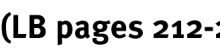
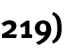
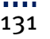
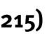
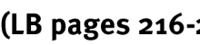
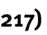
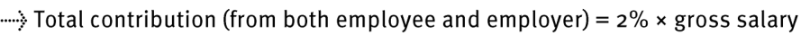
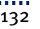
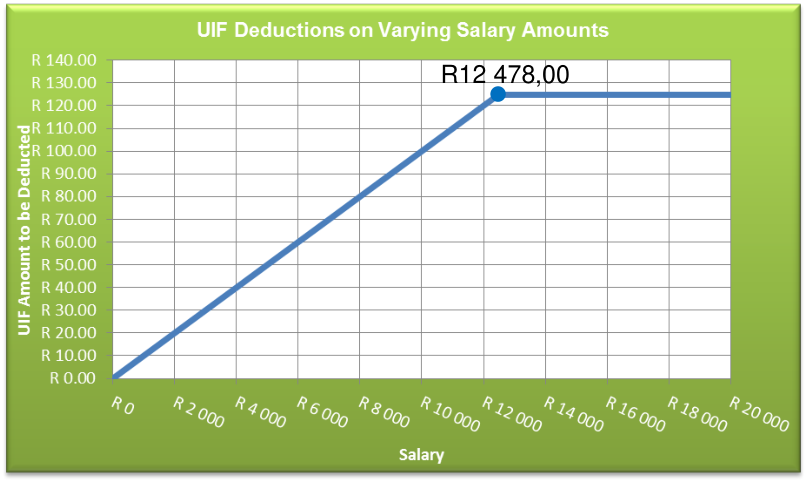
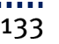

> **[Diagram Context - Textbook_MathematicalLiteracy_Gr11_FINANCE--TAXATION_AND_UIF-.pdf-0001-00.png]**
> This graphic serves as a chapter heading for a Mathematics or Business Studies curriculum, featuring the labels "Chapter 9" and "Finance (Taxation - UIF)." It introduces the specific topic of Unemployment Insurance Fund (UIF) contributions, which is a core component of the CAPS curriculum focused on understanding personal finance, statutory deductions, and the practical application of percentage-based calculations in a South African context.



> **[Diagram Context - Textbook_MathematicalLiteracy_Gr11_FINANCE--TAXATION_AND_UIF-.pdf-0001-01.png]**
> This image is a text-based reference label containing the characters "(LB pages 212-". It serves as a citation or signpost directing students to specific pages in a Learner's Book (LB) to support the study of a particular curriculum topic.





The content of this section on Taxation, as part of the Finance Application Topic, is drawn from page 58 in the CAPS document. 

As stipulated in the CAPS document, Grade 11 learners need to be able to do the following with respect specifically to the Unemployment Insurance Fund (UIF): 

- understand what UIF is and why it is important. 

- understand how UIF is calculated. 


> **[Diagram Context - Textbook_MathematicalLiteracy_Gr11_FINANCE--TAXATION_AND_UIF-.pdf-0001-08.png]**
> This graphic consists of a simple text heading reading "Contexts and integrated content." It serves as a structural signpost in educational materials, indicating a shift toward applying theoretical knowledge to real-world scenarios or linking concepts across different curriculum topics.


- Learners need to be able to work in the contexts of _payslips_ . This requires revision or integration with the contents of Section 1: Financial Documents in <u>Chapter 3</u> in the Learners‟ Book(see page 54 in the LB). 

- The ability to perform calculations involving percentages and to interpret graphs from the Basic Skills Topics of Numbers and Patterns will also be <u>utilised.</u> 


> **[Diagram Context - Textbook_MathematicalLiteracy_Gr11_FINANCE--TAXATION_AND_UIF-.pdf-0001-11.png]**
> This graphic is a text-based header identifying the educational source as "Via Afrika » Mathematical Literacy Gr 11." It serves as a contextual label for curriculum materials, indicating that the content is aligned with the South African CAPS Grade 11 Mathematical Literacy syllabus.





> **[Diagram Context - Textbook_MathematicalLiteracy_Gr11_FINANCE--TAXATION_AND_UIF-.pdf-0002-00.png]**
> This graphic serves as a chapter heading for a Mathematics or Business Studies curriculum, featuring the labels "Chapter 9" and "Finance (Taxation - UIF)." It introduces the specific topic of Unemployment Insurance Fund (UIF) contributions, which is a key component of understanding personal finance and statutory deductions within the South African CAPS curriculum.


> **[Diagram Context - Textbook_MathematicalLiteracy_Gr11_FINANCE--TAXATION_AND_UIF-.pdf-0002-02.png]**
> This graphic is a text-based heading titled "Understanding UIF," which serves as an introductory label for educational content regarding the Unemployment Insurance Fund. It signals to learners that the subsequent material will cover the purpose, contributions, and benefits of the UIF as required by the Grade 10-12 Business Studies curriculum.




- UIF stands for Unemployment Insurance Fund 

- UIF is an insurance that is deducted from an employee‟s salary or wages in case the employee loses his/her job. If this happens, then the employee can claim an allowance from the Unemployment Insurance Fund for a certain period or until they find another job. 


> **[Diagram Context - Textbook_MathematicalLiteracy_Gr11_FINANCE--TAXATION_AND_UIF-.pdf-0002-07.png]**
> This image is a text-based heading labeled "Section 2:". It serves as a structural signpost within an educational document or assessment, indicating the transition to a new thematic or examinable topic within the CAPS curriculum.


> **[Diagram Context - Textbook_MathematicalLiteracy_Gr11_FINANCE--TAXATION_AND_UIF-.pdf-0002-08.png]**
> This graphic consists of a text heading stating "Calculating UIF." It serves as an introductory title for a lesson on the Unemployment Insurance Fund (UIF) within the Grade 10-12 Business Studies or Economics curriculum, signaling the start of a module focused on the mathematical application of statutory payroll deductions.



> **[Diagram Context - Textbook_MathematicalLiteracy_Gr11_FINANCE--TAXATION_AND_UIF-.pdf-0002-09.png]**
> This image is a text-based reference label containing the characters "(LB pages 216-". It serves as a citation or navigational marker directing students to specific pages in their Learner's Book (LB) to locate the relevant curriculum content.




The amount of money that must be deducted from an employee‟s salary or wages is calculated as a percentage of their _gross salary_ → i.e. 1% of gross salary. 

_Reminder:_ Gross salary is the total amount of income that an individual earns before any deductions are made on the income. 

But, the employer must also contribute a further 1% to the fund on behalf of each employee. So employers must pay a total contribution of 2% of each worker‟s pay per month to the unemployment insurance fund (UIF). 


> **[Diagram Context - Textbook_MathematicalLiteracy_Gr11_FINANCE--TAXATION_AND_UIF-.pdf-0002-15.png]**
> This graphic is a mathematical formula representing a financial calculation, featuring a dotted arrow and the text "Employee’s contribution = 1% × gross salary." It illustrates the standard method for calculating Unemployment Insurance Fund (UIF) deductions in South African Business Studies or Mathematical Literacy, showing how a specific percentage of a worker's total earnings is determined.



> **[Diagram Context - Textbook_MathematicalLiteracy_Gr11_FINANCE--TAXATION_AND_UIF-.pdf-0002-16.png]**
> This graphic presents a mathematical formula for calculating the Unemployment Insurance Fund (UIF) contribution, featuring a dotted arrow and the text "Total contribution (from both employee and employer) = 2% × gross salary." It serves as a practical application for Grade 10-12 Mathematical Literacy students to understand how to calculate statutory deductions from a gross salary.


Consider a person who earns a gross salary of R10 000,00 per month. Amount to be deducted from the employee‟s salary = 1% × gross salary 

= 1% × R10 000,00 = R100,00 

This is the amount that the _employee_ will have to pay. The employer will also have to match this amount and pay an additional R100,00. 

So the total amount paid to the Unemployment Insurance Fund on behalf of this employee is R200. 


> **[Diagram Context - Textbook_MathematicalLiteracy_Gr11_FINANCE--TAXATION_AND_UIF-.pdf-0002-22.png]**
> This graphic is a text-based header identifying the educational resource as "Via Afrika » Mathematical Literacy Gr 11." It serves as a contextual label for Grade 11 Mathematical Literacy learners, indicating that the associated content aligns with the South African CAPS curriculum for this specific subject and grade level.





> **[Diagram Context - Textbook_MathematicalLiteracy_Gr11_FINANCE--TAXATION_AND_UIF-.pdf-0003-00.png]**
> This graphic serves as a chapter heading for a CAPS-aligned Mathematics or Business Studies curriculum, featuring the labels "Chapter 9" and "Finance (Taxation - UIF)." It introduces the specific topic of Unemployment Insurance Fund (UIF) contributions, signaling to students that they will be learning to calculate statutory payroll deductions as part of their financial literacy studies.


> **[Diagram Context - Textbook_MathematicalLiteracy_Gr11_FINANCE--TAXATION_AND_UIF-.pdf-0003-01.png]**
> This image consists of text only, displaying the phrase "Ceiling salary?" in a bold, sans-serif font. In a CAPS Economics or Business Studies context, this serves as a prompt to discuss the concept of a maximum wage cap or the upper limit of remuneration within a specific pay scale or industry.


There is a salary ceiling of R12 478,00 per month when calculating UIF. This means that for a salary which is higher than R12 478,00 per month, UIF will only be calculated on the first R12 478,00 of that salary. As such, the maximum UIF amount that can be deducted from an employee‟s salary is 1% × R12 478,00=R124,78 

irrespective of how much higher than R12 478,00 per month the salary is. 

We can illustrate this condition on the following graph 

The flat (horizontal) portion of the graph represents the situation where the same (maximum) UIF amount is charged for any salary higher than R12 478,00. 



> **[Diagram Context - Textbook_MathematicalLiteracy_Gr11_FINANCE--TAXATION_AND_UIF-.pdf-0003-06.png]**
> This line graph illustrates the relationship between salary amounts on the x-axis and Unemployment Insurance Fund (UIF) deductions on the y-axis. It demonstrates a linear increase in deductions up to a salary threshold of R12 478,00, after which the deduction amount remains constant, reflecting the legislative cap on UIF contributions.


> **[Diagram Context - Textbook_MathematicalLiteracy_Gr11_FINANCE--TAXATION_AND_UIF-.pdf-0003-07.png]**
> This image is a text-based header identifying the educational source as "Via Afrika » Mathematical Literacy Gr 11." It serves as a contextual label for curriculum-aligned learning materials, indicating that the associated content is designed for Grade 11 Mathematical Literacy students within the South African CAPS framework.




## 5. Authentic Exam Question Archetypes & Mark Allocations
*(Extracted from official CAPS examination papers to guide marking, pacing, and rubric design)*

### Archetype 1: QUESTION 1
- **Source Paper:** `Gr11_MathematicalLiteracy_Exam_1.pdf`
- **Total Mark Allocation:** **[20 Marks]** (Sub-questions: 2, 2, 2, 2, 2 marks)
- **Recommended Time:** **24 Minutes** (Pacing: ~1.2 min/mark | *Calibrated to Official CAPS Paper Pace (1.2 min/mark)*)
- **Assessment Mode Calibration:** Timed Exam Simulation: 24 min countdown (Pacing Checkpoint: 18 min)
- **Cognitive / Marking Strategy:** NSC Standard (Method Marks [M], Accuracy Marks [A], Carry-Over [CA])

#### Question Prompt & Working:
```text
QUESTION 1 
 
 
 
1.1 
The table below shows the relationship between hours and the rate of charged per 
hour or part thereof.  Tariffs include value added tax (VAT). Refer to the table and 
answer the questions that follow. 
 
 
 
 
TABLE 1:  PARKING FEES FOR THIS AREA 
 
 
 
 
HOURS 
RATE CHARGED PER HOUR OR 
PART THEREOF: 
 
 
0–2 
R5,00 
 
 
2–3 
R7,00 
 
 
3–4 
R10,00 
 
 
4–5 
R12,00 
 
 
5–6 
R15,00 
 
 
6–8 
R20,00 
 
 
More than 8 hours 
R40,00 
 
 
 
NOTE:  Lost ticket penalty is R50,00 plus additional charges. 
 
 
 
 
 
1.1.1 
What is the rate charged if Mr Sokutu parked his car for 8 hours 15 minutes? 
(2) 
 
 
 
 
 
1.1.2 
Write 8 hours and 15 minutes in hours. 
(2) 
 
 
 
1.2 
Mr Titi lost his ticket. When looking at the security cameras, they could see that he 
arrived at t...
```

### Archetype 2: QUESTION 2
- **Source Paper:** `Gr11_MathematicalLiteracy_Exam_1.pdf`
- **Total Mark Allocation:** **[30 Marks]** (Sub-questions: 2, 5, 2, 3, 2 marks)
- **Recommended Time:** **36 Minutes** (Pacing: ~1.2 min/mark | *Calibrated to Official CAPS Paper Pace (1.2 min/mark)*)
- **Assessment Mode Calibration:** Timed Exam Simulation: 36 min countdown (Pacing Checkpoint: 27 min)
- **Cognitive / Marking Strategy:** NSC Standard (Method Marks [M], Accuracy Marks [A], Carry-Over [CA])

#### Question Prompt & Working:
```text
QUESTION 2 
 
 
 
2.1 
The tylosaurus proriger was an ancient sea animal that is thought to have lived  
85 million years ago. The top speed of the tylosaurus is about 64 km/h. This animal 
weighed 20 tons.   
 
[Source: https: // kids.national geographic.com] 
 
 
 
Refer to the diagram below. Use the scale to calculate the length of the animal below. 
 
 
 
 
 
 
 
 
 
 
 
 
 
 
 
          1, 9 meters  
 
 
 
 
 
2.1.1 
Write down the name of the scale used above. 
(2) 
 
 
 
 
 
2.1.2 
Use the scale to calculate the actual length of the animal in metres. 
(5) 
 
 
 
 
 
2.1.3 
This animal weighed 20 tons. Convert 20 tons to kilograms. 
(2) 
 
 
 
2.2 
Due to the global fish crisis only 30 000 tons of tuna may be caught annually. The 
true quantity of tuna that is caught, is closer to 4...
```

### Archetype 3: QUESTION 3
- **Source Paper:** `Gr11_MathematicalLiteracy_Exam_1.pdf`
- **Total Mark Allocation:** **[23 Marks]** (Sub-questions: 3, 3, 2, 2, 9 marks)
- **Recommended Time:** **28 Minutes** (Pacing: ~1.2 min/mark | *Calibrated to Official CAPS Paper Pace (1.2 min/mark)*)
- **Assessment Mode Calibration:** Timed Exam Simulation: 28 min countdown (Pacing Checkpoint: 21 min)
- **Cognitive / Marking Strategy:** NSC Standard (Method Marks [M], Accuracy Marks [A], Carry-Over [CA])

#### Question Prompt & Working:
```text
QUESTION 3 
 
 
 
3.1 
The diagram below shows the floor plan of the living room of the Sokutu family’s 
house. 
 
 
 
 
 
850 cm 
 
 
 
 
 
 
 
 
 
 
 
 
 
 
 
 
 
 
 
 
3,5 m 
 
 
 
 
 
 
 
 
 
 
N 
 
 
 
 
 
 
 
 
       
     
 
 
 
Study the information below and answer the questions that follow. 
 
 
 
 
 
 
 
 
 
 
 
 
 
 
 
 
 
 
 
 
 
 
 
3,5 m 
 
 
 
 
 
 
 
 
 
 
 
 
 
 
 
 
3.1.1 
Calculate the perimeter of the living room in mm. Use the formula below: 
 
Perimeter of rectangle = 2 × (length + breadth) 
(3) 
 
 
 
 
 
3.1.2 
Calculate the area of the floor in m2. Use the formula below: 
 
Area of rectangle = Length × Breadth 
(3) 
 
 
 
 
 
3.1.3 
If a concrete floor which is 10 cm thick, is to be laid, how many cubic 
metres of concrete will be needed? You may use the formula:...
```
