# Chapter 3: Finance

## Section 1: Financial Documents

### Overview
This section covers the application of financial documents within a business and workplace context. According to the CAPS curriculum, learners must be able to:
* Understand and interpret terminology used in various financial documents.
* Explain and demonstrate how specific values within these documents are calculated.

### Contexts and Integrated Content
The study of financial documents involves real-world business applications, including:
* **Document Types:** Payslips, invoices, quotations, and similar workplace records.
* **Integrated Concepts:** Calculations involving Value Added Tax (VAT), Income Tax, and Unemployment Insurance Fund (UIF) contributions.

---

### Key Terminology and Concepts

| Term | Description |
| :--- | :--- |
| **Quotation** | A document provided by a seller to a buyer detailing the cost of goods or services before a purchase is made. |
| **Invoice** | A document issued by a seller to a buyer relating to a sale transaction and indicating the products, quantities, and agreed prices. |
| **Payslip** | A document issued by an employer to an employee detailing their earnings, deductions (Tax, UIF), and net pay. |
| **VAT** | Value Added Tax; a consumption tax placed on a product whenever value is added at each stage of the supply chain. |
| **UIF** | Unemployment Insurance Fund; a mandatory contribution deducted from an employee's salary to provide short-term relief to workers. |

---

<!-- DIAGRAM_PLACEHOLDER: diagram -->

*Note: Refer to your Learner's Book (LB) pages 54–59 for detailed examples and practice exercises related to these documents.*

---

# Chapter 3: Finance

## Financial Documents

Financial documents are essential for tracking income, expenses, and proof of transactions. The table below outlines the key features of common business documents.

| Document Type | Description |
| :--- | :--- |
| **Payslip** | Issued by a business to an employee. Provides information on the amount of money the employee earns, including deductions. |
| **Quotation** | Issued to a customer considering a purchase; provides a guideline of costs. |
| **Invoice** | Issued to a customer who has decided to buy; provides a summary of costs to be paid. |
| **Receipt** | Issued as proof of payment; provides a summary of costs and payment details. |

---

## Important Terminology

### 1. Payslip Related Terms
*   **Basic salary:** The employee’s salary excluding any additional income or deductions.
*   **Gross salary:** The total of all income sources for the employee.
*   **Taxable income:** The portion of an employee’s salary on which tax is calculated.
*   **Deductions:** Amounts subtracted from the salary for items such as Medical Aid and Pension.
*   **Net Pay:** The actual amount of money the employee receives after all deductions are subtracted from the gross salary.

### 2. Transaction Related Terms
*   **Quantity:** The number of items being bought.
*   **Unit price:** The price of each individual item.

---

> **[Diagram Context - Textbook_MathematicalLiteracy_Gr11_Financial-documents-and-tariff-systems.pdf-0001-00.png]**
> This is a chapter title banner displaying textual labels on a solid dark red background. The graphic features the text "Chapter 3" inside a split black and white capsule shape, followed by the subtitle "Finance (Financial Documents, Tariff Systems, Income, Cost and Selling Price, Break-Even Analysis)". Conceptually, this banner introduces a Mathematical Literacy curriculum unit focused on practical financial mathematics and business economics for high school learners.

> **[Diagram Context - Textbook_MathematicalLiteracy_Gr11_Financial-documents-and-tariff-systems.pdf-0001-01.png]**
> The graphic displays a section heading consisting of text in bold font. The visible text reads "Section 1: Financial documents". Conceptually, this heading introduces a topic related to business, accounting, or economic literacy, indicating the start of a module focused on understanding and processing various financial paperwork.

> **[Diagram Context - Textbook_MathematicalLiteracy_Gr11_Financial-documents-and-tariff-systems.pdf-0001-02.png]**
> The image displays a text reference label reading "(LB pages 54-5". Visible elements include the text characters "LB pages 54-5". Conceptually, this acts as a textbook cross-reference to direct South African CAPS learners to specific pages for core content coverage.

> **[Diagram Context - Textbook_MathematicalLiteracy_Gr11_Financial-documents-and-tariff-systems.pdf-0001-11.png]**
> The image displays text content featuring the partial heading "Contexts an" in bold black sans-serif font against a plain white background. It serves as a title or heading fragment introducing educational scenarios or applications within a CAPS curriculum text. Conceptually, it prepares learners to examine subject content through real-world applications and contextual problem-solving.

> **[Diagram Context - Textbook_MathematicalLiteracy_Gr11_Financial-documents-and-tariff-systems.pdf-0001-12.png]**
> This image is a text banner containing the phrase "nd integrated content" in a sans-serif font. It functions as a heading or contextual label within an educational document. Conceptually, it indicates that the following or preceding section covers cross-topic themes or combined concepts relevant to the curriculum.

> **[Diagram Context - Textbook_MathematicalLiteracy_Gr11_Financial-documents-and-tariff-systems.pdf-0001-15.png]**
> The image displays a text-based attribution header reading "© Via Afrika >> Mathematical Literacy Gr 11". It functions as a publisher and curriculum source identifier for educational materials aligned with the South African CAPS curriculum. This text anchors the source of accompanying Mathematical Literacy content for Grade 11 learners.

> **[Diagram Context - Textbook_MathematicalLiteracy_Gr11_Weight-and-Temperatute.pdf-0001-00.png]**
> This graphic serves as a chapter heading for a Mathematics or Physical Sciences curriculum module. It features the text "Chapter 5" and the title "Measurement," with sub-topics including length, distance, weight, volume, and temperature. It conceptually introduces the fundamental units and practical techniques required for accurate quantitative analysis in high school science and mathematics.

> **[Diagram Context - Textbook_MathematicalLiteracy_Gr11_Weight-and-Temperatute.pdf-0001-05.png]**
> This image is a copyright attribution text identifying the source as "Via Afrika » Mathematical Literacy Gr 11." It serves as a formal citation for educational materials aligned with the South African CAPS curriculum. This text indicates that the associated content is designed to support Grade 11 learners in developing practical mathematical skills for real-world contexts.

---

# Chapter 3: Finance (Financial Documents, Tariff Systems, Income, Cost and Selling Price, Break-Even Analysis)

## Core Skills for Financial Documents
To effectively work with financial documents, learners must master two primary skills:
1. **Terminology:** Understanding and explaining the specific terms used within financial documents.
2. **Calculation:** Explaining and demonstrating how different values (such as totals, deductions, and net amounts) are determined.

---

## Worked Example: Salary Advice (Payslip)

> **[Diagram Context - Textbook_MathematicalLiteracy_Gr11_Financial-documents-and-tariff-systems.pdf-0002-00.png]**
> This educational graphic presents a chapter title banner on a red background featuring the heading "Chapter 3" and the subtitle "Finance (Financial Documents, Tariff Systems, Income, Cost and Selling Price, Break-Even Analysis)". It introduces key financial literacy topics required for high school learners studying Mathematical Literacy, outlining the foundational business and consumer calculations covered in the unit.

### 1. Understanding Terms and Values
Based on the provided Salary Advice document, here is an analysis of the financial data:

| Category | Description | Value (R) |
| :--- | :--- | :--- |
| **Gross Salary** | Total income before deductions | $11\,329,00$ |
| **Total Deductions** | Sum of all subtractions from gross pay | $2\,878,24$ |
| **Net Salary** | Amount paid to the employee ($Gross - Deductions$) | $8\,450,76$ |

#### Analysis Questions and Answers

**Q1: How much does the employee earn as a Basic Salary?**
*   **Answer:** $R10\,829,00$

**Q2: How much does the employee pay in Deductions?**
*   **Answer:** $R2\,878,24$

**Q3: Describe what a Gross Salary is and identify the Gross Salary for this employee.**
*   **Definition:** Gross salary is the total of all income sources for an employee before any deductions are made.
*   **Answer:** The employee's Gross Salary is $R11\,329,00$.

---

### Summary of Financial Document Structure
When analyzing a payslip, the relationship between the values is defined by the following mathematical relationship:

$$\text{Net Salary} = \text{Gross Salary} - \text{Total Deductions}$$

Using the values from the example:
$$8\,450,76 = 11\,329,00 - 2\,878,24$$

> **[Diagram Context - Textbook_MathematicalLiteracy_Gr11_Financial-documents-and-tariff-systems.pdf-0002-03.png]**
> The image displays text stating "Issued by a business to an employee." This educational text prompt sets up a question or scenario regarding business documents, specifically related to employment remuneration or administrative records in Accounting or Business Studies. Conceptually, it prompts students to identify specific source documents such as a payslip or salary advice used in the recording of financial transactions and human resources management.

> **[Diagram Context - Textbook_MathematicalLiteracy_Gr11_Financial-documents-and-tariff-systems.pdf-0002-04.png]**
> This graphic is a text banner containing a title heading. The visible text reads "Quotation, Invoice and Receipt" in bold white font against a solid green background. Conceptually, this heading introduces foundational financial documents taught in EMS (Economic and Management Sciences), helping learners distinguish between a price estimate, a demand for payment, and proof of payment.

> **[Diagram Context - Textbook_MathematicalLiteracy_Gr11_Financial-documents-and-tariff-systems.pdf-0002-05.png]**
> The graphic displays a partial text snippet defining a business document related to transactions involving customers. The visible text reads "Issues by a business to a customer who is". Conceptually, this helps CAPS Grade 10-12 Accounting learners identify source documents and understand the transactional context of trade debtors, credit notes, or invoices.

> **[Diagram Context - Textbook_MathematicalLiteracy_Gr11_Financial-documents-and-tariff-systems.pdf-0002-06.png]**
> This image is a text snippet rather than a CAPS educational graphic or diagram. It contains the lowercase sentence fragment "thinking of buying or who has bought an" rendered in a standard sans-serif typeface. Because it lacks any scientific structures, labels, axes, or conceptual diagrams, it conveys no subject-specific curriculum content for high school learners.

> **[Diagram Context - Textbook_MathematicalLiteracy_Gr11_Financial-documents-and-tariff-systems.pdf-0002-07.png]**
> The image shows a snippet of text featuring the phrase "item/service from the business." It serves as a contextual reading prompt or assessment question fragment related to business operations and transactions. Conceptually, it helps learners identify the primary outputs or offerings exchanged between a business entity and its customers or stakeholders.

> **[Diagram Context - Textbook_MathematicalLiteracy_Gr11_Financial-documents-and-tariff-systems.pdf-0002-08.png]**
> The image displays a text snippet stating, "Provides information on the amount of money the". This text fragment introduces a financial concept related to income, budgets, or economic resources. For a high school student studying EMS or Economics, this foundational statement prompts learners to consider the role of financial data and record-keeping in tracking income and expenditure.

> **[Diagram Context - Textbook_MathematicalLiteracy_Gr11_Financial-documents-and-tariff-systems.pdf-0002-09.png]**
> The image displays a text snippet reading "employee earns from the business together with", representing a partial sentence typical of CAPS Business Studies examination questions or textbook prompts. The visible text contains lowercase alphabetic characters forming words related to human resources and remuneration. Conceptually, this snippet introduces or completes a definition concerning financial compensation, fringe benefits, or net earnings in the context of employee remuneration.

> **[Diagram Context - Textbook_MathematicalLiteracy_Gr11_Financial-documents-and-tariff-systems.pdf-0002-10.png]**
> The image displays a text fragment reading "any deductions made from the salary." It serves as a text-based financial literacy excerpt commonly found in Grade 11 and 12 Accounting or Mathematical Literacy contexts. Conceptually, it introduces learners to the distinction between gross earnings and net pay by highlighting how statutory and voluntary deductions reduce an employee's take-home pay.

> **[Diagram Context - Textbook_MathematicalLiteracy_Gr11_Financial-documents-and-tariff-systems.pdf-0002-12.png]**
> The graphic displays a horizontal text snippet accompanied by a visual icon. It features a dotted arrow symbol followed by the lowercase text "provides a guideline of all of the". Conceptually, this visual acts as a signpost or directional cue in CAPS educational materials to direct learners toward summary guidelines, assessment frameworks, or curriculum requirements.

> **[Diagram Context - Textbook_MathematicalLiteracy_Gr11_Financial-documents-and-tariff-systems.pdf-0002-13.png]**
> The graphic displays text related to consumer costs, specifically showing the phrase "costs that a customer will have to pay if they". It contains no symbols, labels, diagrams, or variables. Conceptually, it introduces a word problem scenario regarding financial mathematics or consumer expenditure, relevant to Grade 10-12 Mathematical Literacy.

> **[Diagram Context - Textbook_MathematicalLiteracy_Gr11_Financial-documents-and-tariff-systems.pdf-0002-14.png]**
> This educational graphic displays text stating "choose to buy an item/service." It features lowercase text in a simple, sans-serif font against a plain white background. Conceptually, for a high school student studying Economic and Management Sciences (EMS), this text introduces foundational consumer decision-making and the concept of choice in utilizing financial resources.

> **[Diagram Context - Textbook_MathematicalLiteracy_Gr11_Financial-documents-and-tariff-systems.pdf-0002-16.png]**
> The graphic consists of a dotted arrow followed by the text "provides a summary of all of the costs". It establishes a visual legend or instructional cue using a directional indicator. Conceptually, it helps learners map key financial relationships and data representations during economics and business studies problem-solving.

> **[Diagram Context - Textbook_MathematicalLiteracy_Gr11_Financial-documents-and-tariff-systems.pdf-0002-17.png]**
> The image displays a text fragment reading "that a customer must now pay because they have". It contains no scientific diagrams, labels, variables, or educational graphics. Consequently, it conveys no specific CAPS curriculum subject matter or conceptual learning content.

> **[Diagram Context - Textbook_MathematicalLiteracy_Gr11_Financial-documents-and-tariff-systems.pdf-0002-18.png]**
> The image displays a text fragment featuring the phrase "chosen to buy an item/service." There are no graphical symbols, labels, or arrows present in this excerpt. Conceptually, this text fragment supports consumer education and economic decision-making topics by highlighting the selection process involved in purchasing goods or services.

> **[Diagram Context - Textbook_MathematicalLiteracy_Gr11_Financial-documents-and-tariff-systems.pdf-0002-20.png]**
> The image is a text snippet showing a fragment of a sentence related to financial literacy and consumer documents. The visible text reads "ovides proof that a customer has". Conceptually, this content relates to business, commerce, or accounting topics within the curriculum, specifically introducing students to source documents and proof of transactions.

> **[Diagram Context - Textbook_MathematicalLiteracy_Gr11_Financial-documents-and-tariff-systems.pdf-0002-21.png]**
> This educational graphic is a text excerpt illustrating financial literacy concepts typically covered in EMS. The visible text reads "paid for an item/service and gives a summary of". Conceptually, it helps learners identify and define source documents used in accounting transactions, such as receipts or invoices.

> **[Diagram Context - Textbook_MathematicalLiteracy_Gr11_Financial-documents-and-tariff-systems.pdf-0002-22.png]**
> This image is a text snippet featuring a line of text in a sans-serif font. The visible text reads "the costs for buying the item/service and the". It conveys a fragment of a mathematical or financial literacy problem related to consumer expenses and budgeting.

> **[Diagram Context - Textbook_MathematicalLiteracy_Gr11_Financial-documents-and-tariff-systems.pdf-0002-23.png]**
> The image displays a text fragment reading "payment details for the customer." It contains no scientific diagram, labels, arrows, or academic variables related to the CAPS curriculum. Consequently, it conveys no conceptual subject matter for high school learners.

> **[Diagram Context - Textbook_MathematicalLiteracy_Gr11_Financial-documents-and-tariff-systems.pdf-0002-24.png]**
> This is a plain text educational heading displaying the words "Important terminology:". It serves as a visual organizer and signpost in CAPS-aligned learning materials to direct learners' attention toward key subject-specific definitions and vocabulary. Conceptually, it prepares students to master essential scientific or mathematical terms required for formal assessments.

> **[Diagram Context - Textbook_MathematicalLiteracy_Gr11_Financial-documents-and-tariff-systems.pdf-0002-25.png]**
> The image displays a text banner with the heading "Important terminology:" in bold black font. It serves as a visual section divider or heading commonly found in CAPS curriculum textbooks and digital resources to introduce key vocabulary for a specific topic. This heading frames subsequent definitions or glossaries that help high school learners master foundational subject-specific terms required for examinations.

> **[Diagram Context - Textbook_MathematicalLiteracy_Gr11_Financial-documents-and-tariff-systems.pdf-0002-28.png]**
> The image is a text-based publisher attribution stating "© Via Afrika » Mathematical Literacy Gr 11". It serves as a copyright and curriculum reference tag for a Grade 11 Mathematical Literacy textbook. Conceptually, it identifies the educational source and curriculum level of associated learning materials for South African learners.

> **[Diagram Context - Textbook_MathematicalLiteracy_Gr11_Weight-and-Temperatute.pdf-0002-00.png]**
> This graphic serves as a chapter heading for a CAPS curriculum module titled "Chapter 5: Measurement." It explicitly lists the core competencies of the unit, which include measuring length, distance, weight, volume, and temperature. The text provides a foundational overview of the essential physical quantities and units of measurement that students must master to perform accurate scientific and mathematical calculations.

> **[Diagram Context - Textbook_MathematicalLiteracy_Gr11_Weight-and-Temperatute.pdf-0002-01.png]**
> This graphic is a text-based heading labeled "Section 2: Worl". It serves as a structural signpost within educational material, likely indicating the commencement of a specific thematic unit or chapter related to "World" studies, such as Geography or History.

> **[Diagram Context - Textbook_MathematicalLiteracy_Gr11_Weight-and-Temperatute.pdf-0002-02.png]**
> This text-based graphic serves as a heading or title for a lesson module. It features the phrase "rking with weight," which is a truncated version of "working with weight." This content introduces the fundamental physical concept of weight as a force, helping learners distinguish it from mass within the context of Newtonian mechanics.

> **[Diagram Context - Textbook_MathematicalLiteracy_Gr11_Weight-and-Temperatute.pdf-0002-03.png]**
> This image is a text-based reference label containing the abbreviation "LB" followed by the page range "120-1". It serves as a navigational signpost directing students to specific content within their prescribed Learner's Book to support their current lesson.

> **[Diagram Context - Textbook_MathematicalLiteracy_Gr11_Weight-and-Temperatute.pdf-0002-09.png]**
> This graphic consists of a simple text heading reading "Contexts and integrated content." It serves as a structural signpost in educational materials to indicate that the following section will bridge theoretical concepts with real-world applications or cross-curricular themes, as required by the CAPS curriculum's focus on holistic learning.

> **[Diagram Context - Textbook_MathematicalLiteracy_Gr11_Weight-and-Temperatute.pdf-0002-11.png]**
> This image is a text-based attribution label identifying the source material as "Via Afrika » Mathematical Literacy Gr 11." It serves as a copyright and curriculum-specific citation for educational content within the South African CAPS framework. This label indicates that the associated instructional material is aligned with the Grade 11 Mathematical Literacy syllabus.

---

# Chapter 3: Finance (Payslip Analysis)

## 1. Understanding Net Salary
**Definition:** Net Salary is the total amount of money an employee actually receives in their bank account at the end of the month. It is calculated as the difference between the employee's Gross Salary and their total deductions.

*   **Example:** For the employee in this study, the Net Salary is $R8\ 450,76$.

---

## 2. Determining Payslip Values
To understand how a payslip is constructed, we must calculate the components of the salary using the following formulas:

### A. Calculating Gross Salary
The Gross Salary is the total earnings before any deductions are subtracted.
$$\text{Gross Salary} = \text{Basic Salary} + \text{Housing Rental}$$
$$\text{Gross Salary} = R10\ 829,00 + R500,00 = R11\ 329,00$$

### B. Calculating Total Deductions
Deductions are the sum of all individual amounts subtracted from the Gross Salary (such as taxes, insurance, or pension contributions).
$$\text{Deductions} = \text{Sum of all deduction values}$$
$$\text{Deductions} = R1\ 225,57 + R812,17 + R780,00 + R5,00 + R50,00 + R5,00 + R0,50$$
$$\text{Deductions} = R2\ 878,24$$

### C. Calculating Net Salary
Once the Gross Salary and Total Deductions are known, the Net Salary is determined:
$$\text{Net Salary} = \text{Gross Salary} - \text{Deductions}$$
$$\text{Net Salary} = R11\ 329,00 - R2\ 878,24 = R8\ 450,76$$

> **[Diagram Context - Textbook_MathematicalLiteracy_Gr11_Financial-documents-and-tariff-systems.pdf-0003-00.png]**
> This educational graphic displays a title banner for a chapter on financial mathematics, featuring the text "Chapter 3" inside a rounded pill-shaped box alongside the subtitle "Finance (Financial Documents, Tariff Systems, Income, Cost and Selling Price, Break-Even Analysis)". The visual layout uses a bold white serif font set against a solid dark red-brown background to clearly indicate a specific curriculum section. Conceptually, this slide or graphic introduces foundational Grade 10-12 Mathematical Literacy and Mathematics topics relating to personal and business finance, preparing learners for calculations involving income, expenditure, tariffs, and break-even points.

> **[Diagram Context - Textbook_MathematicalLiteracy_Gr11_Financial-documents-and-tariff-systems.pdf-0003-07.png]**
> The graphic is an administrative document header featuring the provincial coat of arms and bilingual text. Visible labels include "PROVINSIALE ADMINISTRASIE VRYSTAAT DEPARTEMENT VAN ONDERWYS," "FREE STATE PROVINCIAL ADMINISTRATION DEPARTMENT OF EDUCATION," and "SALARISADVIES SALARY ADVICE." This image represents an official education department administrative notice rather than a CAPS curriculum subject concept.

> **[Diagram Context - Textbook_MathematicalLiteracy_Gr11_Financial-documents-and-tariff-systems.pdf-0003-08.png]**
> The graphic is an official South African payslip document showing financial transactions, earnings, and deductions. Visible labels include bilingual headings such as "Betaaldatum / Pay Date", "Verdienste / Earnings", "Aftrekkings / Deductions", "Bruto Salaris / Gross Salary", and "Netto Salaris / Nett Salary", along with itemised figures for basic salary, housing rental, tax, GEMS, and GEPF. Conceptually, this document helps FET learners understand financial literacy, specifically how to read and interpret real-world payslips by calculating net income after subtracting taxes and other contributions from the gross salary.

> **[Diagram Context - Textbook_MathematicalLiteracy_Gr11_Financial-documents-and-tariff-systems.pdf-0003-09.png]**
> This educational graphic consists of a text banner displaying the heading "Understanding terms used in". The visible text elements are limited to the words "Understanding", "terms", "used", and "in", set in a bold, sans-serif font against a plain white background. Conceptually, this title introduces a glossary, terminology section, or instructional guide designed to help CAPS learners master essential scientific vocabulary and definitions required for examinations.

> **[Diagram Context - Textbook_MathematicalLiteracy_Gr11_Financial-documents-and-tariff-systems.pdf-0003-10.png]**
> The image displays a text fragment reading "n the document" in a plain, sans-serif black typeface. No additional labels, symbols, axes, or visual structures are present. This snippet functions merely as a textual fragment within a larger document rather than conveying a distinct educational concept.

> **[Diagram Context - Textbook_MathematicalLiteracy_Gr11_Financial-documents-and-tariff-systems.pdf-0003-13.png]**
> The image is a text-based educational graphic asking, "How much does the employee earn as a Basic Salary?". It features italicized text addressing financial mathematics and employment remuneration concepts. This prompt tests a high school student's ability to extract specific income data from a given payslip or employment contract in CAPS Mathematical Literacy.

> **[Diagram Context - Textbook_MathematicalLiteracy_Gr11_Financial-documents-and-tariff-systems.pdf-0003-17.png]**
> This educational graphic presents a direct financial literacy question for Grade 10-12 Mathematical Literacy learners studying personal finance and taxation. The text reads simply: "How much does the employee pay in Deductions?". Conceptually, it prompts students to interpret payslips and calculate or extract the total subtractions—such as PAYE, UIF, and medical aid contributions—from gross to net salary.

> **[Diagram Context - Textbook_MathematicalLiteracy_Gr11_Financial-documents-and-tariff-systems.pdf-0003-21.png]**
> This image displays an assessment question formatted as a text prompt in a serif font. The visible text reads "Describe what a Gross Sal...". Conceptually, this prompt tests a learner's understanding of foundational financial mathematics and economic terminology regarding personal income as outlined in the CAPS curriculum.

> **[Diagram Context - Textbook_MathematicalLiteracy_Gr11_Financial-documents-and-tariff-systems.pdf-0003-22.png]**
> The image shows a snippet of text from a financial literacy or Accounting assessment. Visible text includes the partial words "lary is" and the full terms "identify the Gross Sal". Conceptually, this prompts learners to define a salary and extract or identify the gross salary from a given context, which is a fundamental competency in CAPS curriculum financial mathematics and accounting.

> **[Diagram Context - Textbook_MathematicalLiteracy_Gr11_Financial-documents-and-tariff-systems.pdf-0003-23.png]**
> This image is a text snippet from a mathematical literacy or business studies assessment. It displays the text fragment "...alary for this employee." in a standard serif font. Conceptually, it represents a prompt or question stem used to guide learners in extracting, calculating, or interpreting financial data related to employee remuneration.

> **[Diagram Context - Textbook_MathematicalLiteracy_Gr11_Financial-documents-and-tariff-systems.pdf-0003-24.png]**
> The image presents a text-based educational definition stating, "Answer: Gross salary is the total of all of the income sources for an employee. This". Visible keywords include "Gross salary," "total," "income sources," and "employee." Conceptually, this text introduces high school Mathematical Literacy learners to foundational financial terminology by defining gross salary as the aggregate earnings before any deductions are made.

> **[Diagram Context - Textbook_MathematicalLiteracy_Gr11_Financial-documents-and-tariff-systems.pdf-0003-25.png]**
> The image is a text snippet from a financial mathematics problem showing the phrase "emplyee's Gross Salary is R11". It contains text and numbers representing monetary values in South African Rand (R). This introductory statement sets up a financial context for calculating deductions, taxes, or net salary in CAPS Mathematical Literacy or Mathematics.

> **[Diagram Context - Textbook_MathematicalLiteracy_Gr11_Financial-documents-and-tariff-systems.pdf-0003-27.png]**
> The provided image is a simple text banner stating "(c) Via Afrika >> Mathematical Literacy Gr 11", identifying the publisher and curriculum source for Grade 11 Mathematical Literacy. It contains no diagrams, variables, or illustrations to analyze.

> **[Diagram Context - Textbook_MathematicalLiteracy_Gr11_Weight-and-Temperatute.pdf-0003-00.png]**
> This graphic serves as a chapter heading for a Mathematics or Physical Sciences module, explicitly labeling "Chapter 5" and the topic "Measurement." It outlines the core curriculum focus areas of measuring length, distance, weight, volume, and temperature, providing students with a foundational overview of the quantitative skills required for practical scientific and mathematical application.

> **[Diagram Context - Textbook_MathematicalLiteracy_Gr11_Weight-and-Temperatute.pdf-0003-05.png]**
> This table categorizes Body Mass Index (BMI) values, measured in kg/m², into four distinct weight status classifications: underweight, normal weight, overweight, and obese. It serves as a diagnostic reference tool for Life Sciences learners to interpret numerical BMI data and understand the health implications of different weight ranges.

> **[Diagram Context - Textbook_MathematicalLiteracy_Gr11_Weight-and-Temperatute.pdf-0003-08.png]**
> This mathematical equation demonstrates the calculation of Body Mass Index (BMI) using the variables of mass (82 kg) and height (1,75 m). It illustrates the step-by-step process of squaring the height and dividing the mass to arrive at a final value of approximately 26,8 kg/m², highlighting the importance of correct unit application and rounding in Life Sciences calculations.

> **[Diagram Context - Textbook_MathematicalLiteracy_Gr11_Weight-and-Temperatute.pdf-0003-11.png]**
> This image is a text-based attribution label identifying the source material as "Via Afrika » Mathematical Literacy Gr 11." It serves as a copyright and curriculum-specific identifier for educational content used within the South African CAPS Mathematical Literacy syllabus.

---

# Chapter 3: Finance
## Section 2: Budgets and Statements of Income-and-Expenditure

### Overview
This section focuses on the application of financial literacy in business and workplace contexts. According to the CAPS curriculum, learners must be able to:
*   Compare income-and-expenditure statements across two different time periods.
*   Compare predicted values (budget) versus actual values (realized income/expenditure).

---

### 1. Budgets
A budget is a financial planning tool used to estimate future income and expenditure for an event, business, or organization.

*   **Definition:** A budget represents the *predicted* financial outcome. It describes what the organizers expect the income and expenditure to be in the future.
*   **Purpose:** Budgets are essential for planning and managing the future finances of an entity.

---

### 2. Income-and-Expenditure Statements
These statements provide a record of financial activity. In a business context, they are used to analyze performance by comparing:
1.  **Income vs. Expenditure:** Determining if the entity is making a profit or a loss.
2.  **Time Periods:** Comparing financial performance between two different months, quarters, or years to identify trends.
3.  **Predicted vs. Actual:** Evaluating the accuracy of the initial budget by comparing it against the actual financial results.

> **[Diagram Context - Textbook_MathematicalLiteracy_Gr11_Financial-documents-and-tariff-systems.pdf-0004-00.png]**
> The graphic is a textbook chapter title header set against a dark red background. It features the text labels "Chapter", the number "3", and the subtitle "Finance (Financial Documents, Tariff Systems, Income, Cost and Selling Price, Break-Even Analysis)". Conceptually, this banner introduces a CAPS Mathematics Literacy or Mathematical Literacy curriculum unit focused on practical financial mathematics and business management skills.

> **[Diagram Context - Textbook_MathematicalLiteracy_Gr11_Financial-documents-and-tariff-systems.pdf-0004-02.png]**
> This image displays the truncated text prompt "Describe what a N". The text consists of capitalized and lowercase letters set in a standard serif font. Conceptually, it serves as an incomplete assessment question designed to test a high school student's ability to recall and define specific scientific terms starting with the letter N within the CAPS curriculum.

> **[Diagram Context - Textbook_MathematicalLiteracy_Gr11_Financial-documents-and-tariff-systems.pdf-0004-03.png]**
> This image shows text content reading "Net Salary is and identify the Net Sa". It presents an incomplete sentence or prompt regarding financial terminology. Conceptually, it is designed to test a high school student's understanding of personal finance and income calculations within the CAPS curriculum, specifically regarding gross income versus take-home pay.

> **[Diagram Context - Textbook_MathematicalLiteracy_Gr11_Financial-documents-and-tariff-systems.pdf-0004-04.png]**
> This image contains text reading "Salary for this employee." It represents a textual prompt or question header typically found in CAPS-aligned Mathematical Literacy assessments dealing with financial documents and earnings. Conceptually, it introduces a specific problem context regarding personal income, guiding learners to locate and interpret salary data from a table, payslip, or table of data.

> **[Diagram Context - Textbook_MathematicalLiteracy_Gr11_Financial-documents-and-tariff-systems.pdf-0004-05.png]**
> This image is a text-based educational definition presenting a standard textbook answer regarding personal finance. It contains the visible text label "Answer: Net Salary is the difference between the". For a high school student studying Mathematical Literacy, this concept conveys the fundamental distinction between gross income and take-home pay after necessary deductions like tax and UIF.

> **[Diagram Context - Textbook_MathematicalLiteracy_Gr11_Financial-documents-and-tariff-systems.pdf-0004-06.png]**
> The graphic displays text fragments from a financial mathematics context, specifically relating to employment earnings. The visible text reads "employee's gross salary and the". Conceptually, this introduces learners to personal finance calculations, helping them understand income components such as gross salary before deductions like tax, UIF, and medical aid are applied.

> **[Diagram Context - Textbook_MathematicalLiteracy_Gr11_Financial-documents-and-tariff-systems.pdf-0004-07.png]**
> The graphic is a text excerpt explaining financial calculations related to employee compensation. It features the visible text phrase "deductions that they have to pay. As such, the Net Salary is the total amount of". Conceptually, this content helps Grade 10-12 Mathematical Literacy learners understand the fundamental distinction between gross income and net salary by defining net pay after statutory and voluntary deductions are subtracted.

> **[Diagram Context - Textbook_MathematicalLiteracy_Gr11_Financial-documents-and-tariff-systems.pdf-0004-08.png]**
> This image is a text excerpt from a CAPS curriculum educational resource defining net remuneration in personal finance. The text includes the phrase "money that the employee will actually receive in their bank account at the end of". Conceptually, this conveys the definition of net salary or take-home pay, distinguishing it from gross salary after all statutory and voluntary deductions have been subtracted.

> **[Diagram Context - Textbook_MathematicalLiteracy_Gr11_Financial-documents-and-tariff-systems.pdf-0004-09.png]**
> The image shows a snippet of text from a financial mathematics context related to salary calculations. The visible text includes the fragments "the month. This employee's Net Salary is R8 4". For a CAPS curriculum student, this represents a problem-solving scenario in financial literacy where learners must calculate deductions, gross income, or net salary in rands.

> **[Diagram Context - Textbook_MathematicalLiteracy_Gr11_Financial-documents-and-tariff-systems.pdf-0004-11.png]**
> The image displays a snippet of instructional text in a sans-serif black font on a white background, reading "nstrate how values in the document have". This text snippet lacks complete context, serving only as a partial instructional sentence fragment. For CAPS learners, such text fragments typically appear in exam rubrics or guidelines to prompt learners on analyzing textual sources or data values.

> **[Diagram Context - Textbook_MathematicalLiteracy_Gr11_Financial-documents-and-tariff-systems.pdf-0004-17.png]**
> This image is an examination-style text prompt instructing students to calculate and verify a financial figure using workplace documents. The visible text reads "Use the values on the payslip to show how the Gross Salary value of R11". This question tests a student's ability to interpret financial data, understand income components, and perform basic arithmetic calculations related to taxation and earnings in a South African context.

> **[Diagram Context - Textbook_MathematicalLiteracy_Gr11_Financial-documents-and-tariff-systems.pdf-0004-19.png]**
> The image displays a text snippet consisting of the lowercase italicized words "this employee has been determined." with no other visual elements, labels, or arrows present. It does not contain educational diagrams or subject-specific content relevant to the CAPS curriculum.

> **[Diagram Context - Textbook_MathematicalLiteracy_Gr11_Financial-documents-and-tariff-systems.pdf-0004-21.png]**
> The image shows a partial text excerpt from an educational assessment memo, displaying the heading "Answer: Gross S". Visible text includes the capitalized words "Answer:", "Gross", and the letter "S". Conceptually, this snippet represents a typical marking guideline for a South African CAPS Life Sciences assessment, directing the educator to accept answers related to gross biological structures or anatomical specimens.

> **[Diagram Context - Textbook_MathematicalLiteracy_Gr11_Financial-documents-and-tariff-systems.pdf-0004-22.png]**
> This educational graphic is a mathematical formula representing a financial equation. It displays the text labels "Salary", "Basic Salary", and "Housing Rental", connected by an equals sign and a plus sign. Conceptually, it illustrates how a total financial income or salary is calculated by combining a fixed base amount with an additional allowance, which is a foundational concept in Grade 10-12 Mathematical Literacy and Mathematics for real-world financial management.

> **[Diagram Context - Textbook_MathematicalLiteracy_Gr11_Financial-documents-and-tariff-systems.pdf-0004-24.png]**
> The graphic displays a basic arithmetic addition equation involving South African Rand currency values, specifically displaying the text string "829,00 + R500,00 = R11 329". Visible symbols and labels include numerical digits, commas used as decimal separators, the South African Rand currency symbol ("R"), a plus operator ("+"), and an equals sign ("="). Conceptually, for a Mathematical Literacy learner, this text highlights a common transcription or calculation error where inconsistent formatting and placement of decimal separators lead to an incorrect sum in financial contexts.

> **[Diagram Context - Textbook_MathematicalLiteracy_Gr11_Financial-documents-and-tariff-systems.pdf-0004-25.png]**
> This image is a text-based assessment question typical of Mathematical Literacy curricula. It features a single instructional sentence referencing a payslip, the specific monetary value "R2," and the term "Deductions." Conceptually, this prompt requires learners to apply basic arithmetic operations to verify or calculate financial data found on a standard employment payslip, reinforcing practical life skills related to personal finance and taxation.

> **[Diagram Context - Textbook_MathematicalLiteracy_Gr11_Financial-documents-and-tariff-systems.pdf-0004-27.png]**
> This image contains text only, reading "this employee has been determined." in an italicized serif font. There are no educational graphics, diagrams, labels, or CAPS curriculum elements present.

> **[Diagram Context - Textbook_MathematicalLiteracy_Gr11_Financial-documents-and-tariff-systems.pdf-0004-28.png]**
> This educational text graphic presents a mathematical calculation formula with the text label "Answer: Deductions = sum of all of the Deduction values". The visible text elements include the terms "Answer", "Deductions", "sum", and "Deduction values". Conceptually, this conveys the fundamental arithmetic principle of aggregation, teaching students how to calculate a total final value (Deductions) by adding together a series of individual component values.

> **[Diagram Context - Textbook_MathematicalLiteracy_Gr11_Financial-documents-and-tariff-systems.pdf-0004-30.png]**
> The graphic shows a mathematical addition expression involving South African Rand currency values, specifically displaying the numerical string: 225,57 + R812,17 + R780,00 + R5,00 + R50,00 + R5,00 + R0,50. Visible symbols and labels include the Rand currency sign (R) and numeric values formatted with commas as decimal separators following South African convention. This expression conveys the practical application of arithmetic calculation and decimal addition within the Mathematical Literacy curriculum, specifically training learners to sum monetary amounts when compiling budgets or calculating total expenditures.

> **[Diagram Context - Textbook_MathematicalLiteracy_Gr11_Financial-documents-and-tariff-systems.pdf-0004-33.png]**
> This educational graphic is a text prompt from a Mathematical Literacy assessment task regarding financial documents. It contains the written instruction: "Use the values on the payslip to show how the Net Salary value of R8 450,00 for". Conceptually, this guides learners to apply basic arithmetic operations (such as addition and subtraction) to calculate or verify earnings, deductions, and take-home pay on an employment payslip.

> **[Diagram Context - Textbook_MathematicalLiteracy_Gr11_Financial-documents-and-tariff-systems.pdf-0004-34.png]**
> The image contains a single line of text formatted in a serif italic font. The visible words are "this employee has been determined." This text snippet represents a textual statement rather than a scientific diagram or mathematical graphic.

> **[Diagram Context - Textbook_MathematicalLiteracy_Gr11_Financial-documents-and-tariff-systems.pdf-0004-35.png]**
> This educational graphic displays a mathematical text formula defining the relationship between income components. The visible text labels are "Answer:", "Nett Salary", "Gross Salary", and a minus sign (-). Conceptually, it conveys to CAPS Mathematical Literacy students how to calculate an individual's take-home pay by subtracting deductions (such as tax and UIF, represented by the implied continuation of the formula) from their total earnings.

> **[Diagram Context - Textbook_MathematicalLiteracy_Gr11_Financial-documents-and-tariff-systems.pdf-0004-41.png]**
> The image displays text identifying a copyright attribution for educational material, specifically "© Via Afrika >> Mathematical Literacy Gr 11". The text functions as a source citation for Grade 11 Mathematical Literacy curriculum resources in South Africa. Conceptually, it indicates that the accompanying content originates from an officially recognized textbook publisher aligned with the CAPS curriculum.

> **[Diagram Context - Textbook_MathematicalLiteracy_Gr11_Weight-and-Temperatute.pdf-0004-00.png]**
> This graphic serves as a chapter heading for a CAPS curriculum module titled "Chapter 5: Measurement." It explicitly lists the core competencies of the unit, which include measuring length, distance, weight, volume, and temperature. The text functions as an introductory overview to help learners identify the fundamental physical quantities and practical measurement skills required for the upcoming section.

> **[Diagram Context - Textbook_MathematicalLiteracy_Gr11_Weight-and-Temperatute.pdf-0004-03.png]**
> This image is a text-based attribution label identifying the source material as "Via Afrika » Mathematical Literacy Gr 11." It serves as a copyright and curriculum-specific citation for educational content within the South African CAPS framework. This label indicates that the associated instructional material is aligned with the Grade 11 Mathematical Literacy syllabus.

---

# Chapter 3: Finance

## 1. Understanding Budgets
A budget is a financial plan that compares predicted (budgeted) income and expenditure against actual performance.

### Laddswood Primary School: 2011 Budget Analysis

| SUMMARY | Actual (2010) | Budgeted (2011) | Actual (2011) |
| :--- | :--- | :--- | :--- |
| Total Income | R 188 100.00 | R 211 000.00 | R 184 805.00 |
| Total Expenses | R 188 575.00 | R 208 000.00 | R 183 595.00 |
| **Net Income** | **-R 475.00** | **R 3 000.00** | **R 1 210.00** |

| INCOME DETAILS | Actual (2010) | Budgeted (2011) | Actual (2011) |
| :--- | :--- | :--- | :--- |
| School fees | R 131 100.00 | R 144 000.00 | R 133 200.00 |
| Donations & fundraising | R 12 000.00 | R 12 000.00 | R 5 500.00 |
| Grants (from National Dept.) | R 40 000.00 | R 50 000.00 | R 42 250.00 |
| Other | R 5 000.00 | R 5 000.00 | R 3 855.00 |
| **Total** | **R 188 100.00** | **R 211 000.00** | **R 184 805.00** |

| EXPENSE DETAILS | Actual (2010) | Budgeted (2011) | Actual (2011) |
| :--- | :--- | :--- | :--- |
| Administration | R 27 950.00 | R 32 000.00 | R 38 525.00 |
| Teaching resources | R 18 225.00 | R 22 000.00 | R 19 570.00 |
| Maintenance | R 7 150.00 | R 8 000.00 | R 5 500.00 |
| Salaries and wages | R 80 000.00 | R 88 000.00 | R 75 000.00 |
| Feeding scheme | R 55 250.00 | R 58 000.00 | R 45 000.00 |
| **Total** | **R 188 575.00** | **R 208 000.00** | **R 183 595.00** |

### Key Observations for Grade 11
* **Performance Tracking:** Comparing predicted vs. actual values allows an organization to evaluate how well it performed against its initial plan.
* **Evidence-Based Planning:** Predictions for a new year (e.g., 2011) are not random guesses; they are informed by observing the actual financial outcomes of the previous year (e.g., 2010).

---

## 2. Statements of Income-and-Expenditure

### Definition
A **statement of income-and-expenditure** provides a summary of all income earned and expenses incurred for an event, business, or organization. 

* **Purpose:** It describes the financial reality of activities that have *already taken place*.
* **Utility:** Budgets serve as essential tools for managing and describing the *current finances* of an organization.

> **[Diagram Context - Textbook_MathematicalLiteracy_Gr11_Financial-documents-and-tariff-systems.pdf-0005-00.png]**
> This educational graphic is a chapter heading banner for Mathematical Literacy. It features the text "Chapter 3" and the topic title "Finance (Financial Documents, Tariff Systems, Income, Cost and Selling Price, Break-Even Analysis)" set against a solid dark red background. Conceptually, this visual introduces learners to core financial mathematics concepts required for managing personal and business finances, such as understanding bills, calculating profits, and analyzing break-even points.

> **[Diagram Context - Textbook_MathematicalLiteracy_Gr11_Financial-documents-and-tariff-systems.pdf-0005-01.png]**
> The image displays a text-based section heading reading "Section 2: Budgets and statements of income-". This heading serves as a curricular title introducing financial topics relevant to Accounting and EMS. Conceptually, it frames the core financial concepts of planning cash flows through budgets and reporting actual financial performance via income statements.

> **[Diagram Context - Textbook_MathematicalLiteracy_Gr11_Financial-documents-and-tariff-systems.pdf-0005-04.png]**
> The image displays the single lowercase text label "expenditure" in a plain sans-serif font. This term represents a core economic concept related to the outflow of money by households, businesses, or the government. For a CAPS-aligned Economics learner, it introduces or reinforces vocabulary regarding financial outlays, budgeting, and macroeconomic circular flow components.

> **[Diagram Context - Textbook_MathematicalLiteracy_Gr11_Financial-documents-and-tariff-systems.pdf-0005-12.png]**
> The image consists of the heading text "Contexts and integrated content" written in bold, dark grey sans-serif font against a plain white background. It serves as a title or section heading in an educational document or presentation. Conceptually, it introduces a curriculum section focused on applying theoretical concepts to real-world scenarios and integrating knowledge across different topics.

> **[Diagram Context - Textbook_MathematicalLiteracy_Gr11_Financial-documents-and-tariff-systems.pdf-0005-18.png]**
> This image displays a textbook copyright attribution text reading "© Via Afrika » Mathematical Literacy Gr 11". It identifies the publisher and curriculum grade level for educational learning materials aligned with the CAPS syllabus.

> **[Diagram Context - Textbook_MathematicalLiteracy_Gr11_Weight-and-Temperatute.pdf-0005-00.png]**
> This text-based graphic serves as a chapter heading for a Mathematics or Physical Sciences curriculum module. It explicitly labels "Chapter 5" and identifies the core topic as "Measurement," specifically outlining the sub-topics of length, distance, weight, volume, and temperature. This provides learners with a clear scope of the foundational SI units and practical measurement techniques required for scientific and mathematical literacy.

> **[Diagram Context - Textbook_MathematicalLiteracy_Gr11_Weight-and-Temperatute.pdf-0005-01.png]**
> This graphic is a text-based heading labeled "Section 4: Measuring temperature." It serves as an introductory signpost for a lesson module focused on the principles and practical techniques of thermal measurement within the physical sciences curriculum.

> **[Diagram Context - Textbook_MathematicalLiteracy_Gr11_Weight-and-Temperatute.pdf-0005-02.png]**
> This image is a text-based reference label containing the characters "(LB pages 124-". It serves as a navigational citation directing students to specific pages within their Learner's Book (LB) to locate the relevant curriculum content.

> **[Diagram Context - Textbook_MathematicalLiteracy_Gr11_Weight-and-Temperatute.pdf-0005-09.png]**
> This image consists of the text heading "Contexts and integrated content," which serves as a structural label for educational material. It functions as a thematic signpost in CAPS curriculum resources to indicate how theoretical concepts are applied to real-world scenarios and linked across different subject topics.

> **[Diagram Context - Textbook_MathematicalLiteracy_Gr11_Weight-and-Temperatute.pdf-0005-13.png]**
> This text-based graphic serves as a heading for a Physical Sciences lesson on converting temperature values. It introduces the fundamental skill of interconverting between different temperature scales, such as Celsius and Kelvin, which is essential for calculations involving the gas laws.

> **[Diagram Context - Textbook_MathematicalLiteracy_Gr11_Weight-and-Temperatute.pdf-0005-18.png]**
> This image is a text-based citation identifying the source material as "Via Afrika » Mathematical Literacy Gr 11." It serves as a copyright and attribution label for educational content within the South African CAPS curriculum framework. This metadata informs students and educators that the associated material is aligned with the Grade 11 Mathematical Literacy syllabus.

---

# Chapter 3: Finance (Income Statements)

## 1. Understanding the Income Statement
An income statement provides a summary of a business's income and expenditure over a specific period. By comparing two different time periods, a business can track its financial performance, identify trends, and determine if there has been an improvement or decline in profitability.

> **[Diagram Context - Textbook_MathematicalLiteracy_Gr11_Financial-documents-and-tariff-systems.pdf-0006-00.png]**
> This educational graphic is a chapter title banner featuring the text "Chapter 3" inside a split black-and-white rounded box, positioned above the subtitle "Finance (Financial Documents, Tariff Systems, Income, Cost and Selling Price, Break-Even Analysis)" displayed in white against a solid dark red background. It visually organizes and introduces core financial literacy topics required for high school learners. Conceptually, it prepares students to engage with real-world economic applications, such as interpreting invoices, calculating utility tariffs, and analyzing business revenue and break-even points.

## 2. Kubelo's General Dealer: Income Statement Analysis
The table below represents the financial performance of Kubelo's General Dealer for the period March to April 2012.

| Item | March (R) | April (R) | Change (R) |
| :--- | :--- | :--- | :--- |
| **INCOME** | **28 440.00** | **30 440.00** | **2 000.00** |
| Grocery Sales | 13 875.00 | 15 435.00 | 1 560.00 |
| Sales of Fruit & Vegetables | 9 450.00 | 10 060.00 | 610.00 |
| Sales from Bakery | 5 115.00 | 4 945.00 | -170.00 |
| **OPERATING EXPENSES** | **21 935.00** | **24 115.00** | **2 180.00** |
| Cost of Goods Sold | 10 285.00 | 11 165.00 | 880.00 |
| Groceries | 5 150.00 | 5 890.00 | 740.00 |
| Fruit & Vegetables | 3 700.00 | 4 120.00 | 420.00 |
| Bakery | 1 435.00 | 1 155.00 | -280.00 |
| Salaries & Wages | 3 800.00 | 3 800.00 | 0.00 |
| Administration Expenses | 1 200.00 | 1 600.00 | 400.00 |
| Rent Expense | 5 500.00 | 6 000.00 | 500.00 |
| Maintenance Expenses | 850.00 | 1 550.00 | 700.00 |
| Advertising Expenses | 300.00 | 0.00 | -300.00 |
| **Net Income** | **6 505.00** | **6 325.00** | **-180.00** |

## 3. Key Concepts for Analysis
*   **Comparative Analysis:** By including values for two different time periods, the business can calculate the "Change" column.
*   **Calculating Change:** The change is calculated as:
    $$\text{Change} = \text{Value}_{\text{April}} - \text{Value}_{\text{March}}$$
*   **Performance Indicators:**
    *   A positive value in the "Change" column for Income indicates an increase in revenue.
    *   A positive value in the "Change" column for Expenses indicates an increase in costs.
    *   A negative value in the "Net Income" change indicates a decline in overall profit compared to the previous month.

> **[Diagram Context - Textbook_MathematicalLiteracy_Gr11_Financial-documents-and-tariff-systems.pdf-0006-01.png]**
> This educational graphic is a financial spreadsheet representing a school's annual budget. Visible labels include "Summary," "Income Details," "Expense Details," "Actual (2010)," "Budgeted (2011)," "Actual (2011)," "School fees," "Donations & fundraising," "Grants," "Administration," "Teaching resources," and "Net Income" presented with South African Rand (R) currency values. Conceptually, this diagram helps learners understand financial literacy by illustrating how to plan, track, and compare projected budgets against actual income and expenses over consecutive years.

> **[Diagram Context - Textbook_MathematicalLiteracy_Gr11_Financial-documents-and-tariff-systems.pdf-0006-06.png]**
> This image is a text snippet featuring a curriculum heading or textbook subheading. The visible text reads "2. Statements of income-a". Conceptually, this introduces learners to financial reporting and accounting concepts related to income statements within the CAPS curriculum.

> **[Diagram Context - Textbook_MathematicalLiteracy_Gr11_Financial-documents-and-tariff-systems.pdf-0006-08.png]**
> The image displays text content featuring the lowercase word "expenditure" in a plain, bold, sans-serif font against a white background. It contains no additional graphic elements, labels, symbols, or arrows. Conceptually, this vocabulary term introduces students to financial management and economic concepts related to spending within the CAPS curriculum.

> **[Diagram Context - Textbook_MathematicalLiteracy_Gr11_Financial-documents-and-tariff-systems.pdf-0006-12.png]**
> This educational graphic is a publisher copyright attribution banner reading "© Via Afrika » Mathematical Literacy Gr 11". The text contains the publisher name ("Via Afrika") and textbook reference ("Mathematical Literacy Gr 11"), indicating the curriculum resource context. This metadata helps identify the origin and target grade of the learning material within the South African CAPS curriculum.

> **[Diagram Context - Textbook_MathematicalLiteracy_Gr11_Weight-and-Temperatute.pdf-0006-00.png]**
> This text-based graphic serves as a chapter heading for a Mathematics or Physical Sciences curriculum module. It explicitly labels "Chapter 5" and identifies the core topic as "Measurement," specifically outlining the sub-topics of length, distance, weight, volume, and temperature. This provides students with a clear scope of the foundational SI units and practical measurement skills required for scientific and mathematical literacy.

> **[Diagram Context - Textbook_MathematicalLiteracy_Gr11_Weight-and-Temperatute.pdf-0006-01.png]**
> This text-based graphic serves as a heading or instructional prompt labeled "2. Using temperature values to plan trips." It introduces a practical application of data interpretation, requiring students to analyze climate or weather-related temperature data to make informed decisions regarding travel planning.

> **[Diagram Context - Textbook_MathematicalLiteracy_Gr11_Weight-and-Temperatute.pdf-0006-05.png]**
> This weather forecast table displays daily meteorological data including dates (September 17–21), weather icons, temperatures in Fahrenheit, precipitation probabilities, humidity percentages, and wind direction/speed. It serves as a practical tool for Geography learners to interpret synoptic data, demonstrating how various atmospheric variables are recorded and tracked over a five-day period to predict local weather patterns.

> **[Diagram Context - Textbook_MathematicalLiteracy_Gr11_Weight-and-Temperatute.pdf-0006-07.png]**
> This image is a text-based attribution label identifying the source material as "Via Afrika » Mathematical Literacy Gr 11." It serves as a copyright and curriculum-specific citation for educational content used within the South African CAPS Mathematical Literacy syllabus.

---

# Chapter 3: Finance
## Section 3: Cost Price and Selling Price

### Overview
In this section, learners will focus on the financial aspects of small businesses and home industries. The core objectives are:
* Identifying costs involved in manufacturing an item or providing a service.
* Calculating the total cost price for manufacturing or service provision.
* Determining an appropriate selling price to ensure costs are covered.

---

### 1. Cost Price
The **cost price** is defined as the total expenditure incurred to produce an item or provide a service. Understanding this value is critical for setting a selling price that ensures the business remains sustainable by covering all expenses.

#### Example: Batch Production Costs
The following table illustrates how to calculate the cost price for a batch of 24 doughnuts based on ingredient requirements and market prices.

| Ingredient | Quantity Needed (Batch of 24) | Packet Size & Price | Cost for Quantity Needed |
| :--- | :--- | :--- | :--- |
| Flour | 500 g | 2 kg @ R 20,00 | R 5,00 |
| Sugar | 200 g | 1 kg @ R 15,00 | R 3,00 |
| Eggs | 4 | 6 @ R 12,00 | R 8,00 |
| Oil | 250 ml | 1 L @ R 24,00 | R 6,00 |
| **Total** | | | **R 22,00** |

> **[Diagram Context - Textbook_MathematicalLiteracy_Gr11_Financial-documents-and-tariff-systems.pdf-0007-00.png]**
> This graphic features a chapter title banner set against a solid dark red background. The visible text reads "Chapter 3" inside a rounded pill-shaped box, accompanied by the descriptive subtitle "Finance (Financial Documents, Tariff Systems, Income, Cost and Selling Price, Break-Even Analysis)". Conceptually, this section introduces high school Mathematical Literacy learners to foundational financial mathematics and business concepts required for practical financial management and problem-solving in everyday contexts.

*   **Column 2:** The specific quantity of ingredients required for a batch of 24 doughnuts.
*   **Column 3:** The standard retail packet size and the price at which it is purchased from the shop.
*   **Column 4:** The calculated cost for the specific amount used in the recipe.

---

### Mathematical Application
To determine the cost per unit (e.g., cost per single doughnut), use the following formula:

$$\text{Cost per unit} = \frac{\text{Total Cost of Batch}}{\text{Number of items in batch}}$$

For the example above:
$$\text{Cost per doughnut} = \frac{R 22,00}{24} \approx R 0,92$$

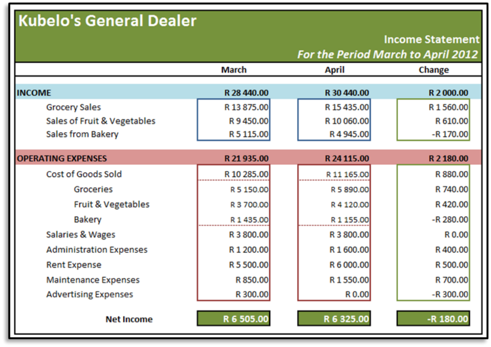
> **[Diagram Context - Textbook_MathematicalLiteracy_Gr11_Financial-documents-and-tariff-systems.pdf-0007-01.png]**
> The educational graphic presents a financial income statement for "Kubelo's General Dealer" covering the period from March to April 2012. Visible labels and categories include "INCOME" (broken down into Grocery Sales, Sales of Fruit & Vegetables, and Sales from Bakery), "OPERATING EXPENSES" (Cost of Goods Sold, Salaries & Wages, Administration Expenses, Rent Expense, Maintenance Expenses, and Advertising Expenses), along with columns for "March", "April", and "Change", with monetary values denoted in Rands (R). This diagram illustrates financial reporting and accounting concepts for high school learners, demonstrating how to structure business revenue, itemise operational costs, and calculate net income over consecutive trading periods.

> **[Diagram Context - Textbook_MathematicalLiteracy_Gr11_Financial-documents-and-tariff-systems.pdf-0007-05.png]**
> The image displays a text-based educational source attribution reading "© Via Afrika >> Mathematical Literacy Gr 11". It serves as a textbook copyright and curriculum reference label indicating the publisher, subject, and target grade level according to the South African CAPS curriculum. This element identifies the origin of accompanying mathematical literacy learning materials focused on practical, real-world numerical problem-solving.

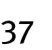

> **[Diagram Context - Textbook_MathematicalLiteracy_Gr11_Weight-and-Temperatute.pdf-0007-03.png]**
> This image is a text-based attribution label identifying the source material as "Via Afrika » Mathematical Literacy Gr 11." It serves as a copyright and curriculum-specific identifier for educational content used within the South African CAPS Mathematical Literacy framework.

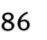

---

# Chapter 3: Finance
## Costing and Pricing: Doughnut Production

### 1. Calculating Ingredient Costs
To determine the cost price of a product, you must first calculate the cost of the specific quantity of each ingredient required for a single batch.

#### Table 9: Doughnut Costs
| Ingredient | Quantity needed for 1 batch | Available size & price in shops | Cost per batch |
| :--- | :--- | :--- | :--- |
| Flour | 960 g (1 600 ml) | 1 kg – R10,50 | R10,08 |
| Salt | 16,5 g (15 ml) | 500 g – R3,29 | R0,11 |
| Sugar | 100 g (125 ml) | 1 kg – R9,69 | R0,97 |
| 1 packet yeast | 1 packet | 1 packet – R2,19 | R2,19 |
| Margarine | 60 g | 500 g – R13,89 | R1,67 |
| Milk | 400 ml | 1 litre – R6,59 | R2,64 |
| Eggs | 2 | Box of 6 – R10,99 | R3,66 |
| Apricot jam | 110 g (90 ml) | 900 g – R15,99 | R1,95 |
| Oil | 250 ml | 750 ml – R13,59 | R4,53 |
| **Total** | | | **R27,80** |

---

### 2. Worked Example: Calculating Unit Cost
To find the cost of an ingredient, use the unitary method.

**Example: Flour**
*   **Quantity needed:** $960\text{ g}$
*   **Available size:** $1\text{ kg}$ ($1\ 000\text{ g}$) at $\text{R}10,50$

**Calculation steps:**
1. Find the cost per gram:
   $$\text{Cost per gram} = \frac{\text{R}10,50}{1\ 000} = \text{R}0,0105$$
2. Multiply by the quantity needed:
   $$\text{Cost for } 960\text{ g} = \text{R}0,0105 \times 960 = \text{R}10,08$$

---

### 3. Calculating Cost Price per Unit
Once the total cost for the batch is determined, you can calculate the cost price for an individual item (e.g., one doughnut).

**Formula:**
$$\text{Cost price per unit} = \frac{\text{Total cost of batch}}{\text{Number of units in batch}}$$

**Application:**
*   Total cost of batch = $\text{R}27,80$
*   Number of doughnuts per batch = $24$

$$\text{Cost price per doughnut} = \frac{\text{R}27,80}{24} \approx \text{R}1,16$$

> **[Diagram Context - Textbook_MathematicalLiteracy_Gr11_Financial-documents-and-tariff-systems.pdf-0008-00.png]**
> This is a chapter title banner displaying textual curriculum content against a solid maroon background. It features the visible text "Chapter 3" inside a rounded pill-shaped box, followed by the subheading "Finance (Financial Documents, Tariff Systems, Income, Cost and Selling Price, Break-Even Analysis)". Conceptually, this graphic introduces the Mathematical Literacy topic covering practical financial calculations and business economics for high school learners.

> **[Diagram Context - Textbook_MathematicalLiteracy_Gr11_Financial-documents-and-tariff-systems.pdf-0008-01.png]**
> The graphic is a text heading for an educational section labeled "Section 3: Cost price and selling price". It introduces financial mathematics and business economics concepts related to pricing, expenses, and revenue. For high school learners, this heading frames the foundational definitions needed for calculating profit, loss, mark-up, and profit margins.

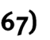

> **[Diagram Context - Textbook_MathematicalLiteracy_Gr11_Financial-documents-and-tariff-systems.pdf-0008-10.png]**
> This educational graphic is a section header displaying text formatted in bold black font. The visible text reads "Contexts and integrated content". Conceptually, this title introduces a section in CAPS curriculum documents or textbooks that focuses on linking theoretical concepts to real-world applications and integrating knowledge across different topics.

> **[Diagram Context - Textbook_MathematicalLiteracy_Gr11_Financial-documents-and-tariff-systems.pdf-0008-13.png]**
> The graphic displays a textual heading reading "1. Cost price". It introduces a foundational accounting concept related to business calculations, specifically the original amount paid to acquire goods. For CAPS curriculum learners, this concept forms the basis for calculating markups, profit margins, and selling prices in financial literacy topics.

> **[Diagram Context - Textbook_MathematicalLiteracy_Gr11_Financial-documents-and-tariff-systems.pdf-0008-20.png]**
> This image contains publisher copyright text stating "© Via Afrika >> Mathematical Literacy Gr 11" in a simple sans-serif font. No other educational graphics, diagrams, or subject-specific content are visible. It serves to identify the curriculum source for Grade 11 Mathematical Literacy learning materials.

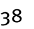

---

# Chapter 3: Finance

## 1. Considerations for Cost Price
When calculating the cost price of an item (e.g., a doughnut), it is important to distinguish between direct ingredient costs and overheads.

*   **Direct Costs:** The cost of raw ingredients used in the specific quantity required for production.
*   **Overhead Costs:** Expenses such as electricity, water, and rental costs.
*   **Adjustment:** If the initial cost price only accounts for ingredients (e.g., $R1,16$), it is often necessary to increase this value to an "approximate cost" (e.g., $R1,30$) to ensure all hidden or overhead costs are covered.

---

## 2. Selling Price

### Definition
The **selling price** is the price at which an item is sold to a customer or a service is provided.

### Key Principles
*   **Profitability:** The selling price must be higher than the total cost price to cover all expenses and avoid a financial loss.
*   **Market Awareness:** Setting a price should not be based on guessing. It must be informed by:
    1.  The total cost price of the item.
    2.  The market-related price (what competitors are charging for similar items).

### Example: Market Pricing
If the average market price for a doughnut is $R5,00$:
*   **Unreasonable Price:** Selling the doughnut for $R15,00$ would likely result in no sales, as customers will perceive it as too expensive.
*   **Appropriate Price:** A price point close to the market average, such as $R5,00$ or $R7,50$, is more likely to be successful.

---

> **[Diagram Context - Textbook_MathematicalLiteracy_Gr11_Financial-documents-and-tariff-systems.pdf-0009-00.png]**
> This educational graphic is a chapter title banner featuring the text "Chapter 3" alongside the main topic heading "Finance (Financial Documents, Tariff Systems, Income, Cost and Selling Price, Break-Even Analysis)". The visible text labels outline core financial concepts aligned with the CAPS curriculum. Conceptually, it introduces students to practical financial mathematics, equipping them with the essential skills needed to interpret commercial documents, calculate pricing structures, and perform break-even analyses for personal and business contexts.

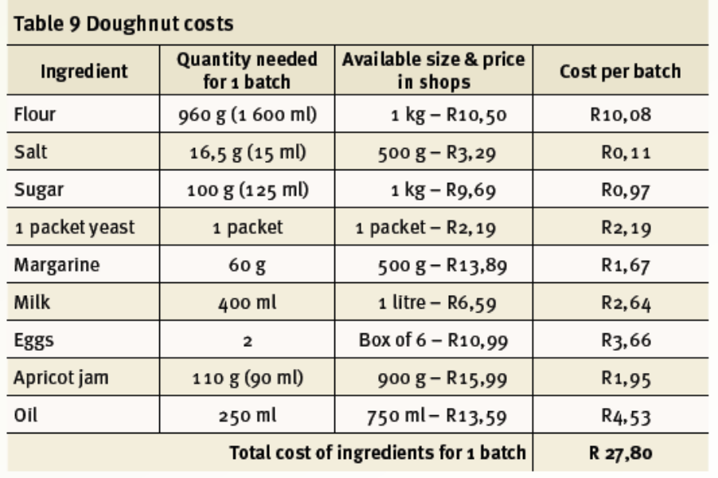
> **[Diagram Context - Textbook_MathematicalLiteracy_Gr11_Financial-documents-and-tariff-systems.pdf-0009-01.png]**
> This educational graphic is a financial table titled "Table 9 Doughnut costs," structured with columns for "Ingredient," "Quantity needed for 1 batch," "Available size & price in shops," and "Cost per batch." Visible labels include specific baking items (Flour, Salt, Sugar, Yeast, Margarine, Milk, Eggs, Apricot jam, Oil), their required masses or volumes, retail pack sizes with South African Rand (R) prices, proportional costs per batch, and a final calculated "Total cost of ingredients for 1 batch" of R27,80. Conceptually, it demonstrates how to calculate production costs and apply proportional reasoning in real-world contexts, a vital Mathematical Literacy and Entrepreneurial skill aligned with the CAPS curriculum.

> **[Diagram Context - Textbook_MathematicalLiteracy_Gr11_Financial-documents-and-tariff-systems.pdf-0009-11.png]**
> The image displays a text-based educational copyright notice reading "© Via Afrika » Mathematical Literacy Gr 11" in a standard sans-serif font. It serves as publisher attribution for Grade 11 Mathematical Literacy curriculum materials aligned with the South African CAPS curriculum. This attribution indicates the source of educational content designed to develop learners' real-world financial, data handling, and mathematical problem-solving skills.

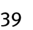

---

# Chapter 3: Finance
## Section 4: Break-even Analysis

### Overview
Break-even analysis is a critical component of the Finance application topic. Grade 11 learners are expected to master the following skills:
*   **Determining the break-even value:**
    *   By drawing two graphs and identifying the point of intersection.
    *   By using trial and improvement with appropriate equations.
*   **Contextual interpretation:** Making sense of the break-even value within the specific business or organizational context.

### Contexts and Integrated Content
*   **Scope:** Limited to small businesses or organizations (e.g., home industries).
*   **Integration:** This section integrates with the *Patterns, relationships and representations* topic, specifically regarding the drawing/interpreting of graphs and the use of algebraic equations.

---

### 1. What is break even?

**Definition:**
The break-even value refers to the amount of income a business or organization must generate to cover all expenses incurred. At this point, the business makes neither a profit nor a loss.

**Key Concepts:**
*   **Business Context:** The point where total income equals total expenses. Beyond this point, the business begins to make a profit.
*   **General Context:** The term 'break-even' is used whenever two values are equal. 
    *   *Example 1:* The number of minutes of talk time where the cost of two different cell phone contracts is equal.
    *   *Example 2:* The number of units of electricity where the cost of two different tariff systems is equal.

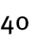

---

# Chapter 3: Finance
## 2. Break-even has two values

### Concept Definition
The **break-even point** is the specific point on a graph where the cost line and the income line intersect. At this point, the total cost of production is exactly equal to the total income generated from sales. This means the business is neither making a profit nor a loss.

> **[Diagram Context - Textbook_MathematicalLiteracy_Gr11_Financial-documents-and-tariff-systems.pdf-0011-00.png]**
> This educational graphic features a chapter title banner for Mathematical Literacy against a solid red background. Visible text includes "Chapter 3" and the topic subtitle "Finance (Financial Documents, Tariff Systems, Income, Cost and Selling Price, Break-Even Analysis)". This graphic conceptually introduces the CAPS curriculum unit focused on practical financial mathematics, outlining key transactional and analytical concepts required for managing personal and business finances.

### Understanding Break-even Values
The break-even point is defined by two distinct values derived from the graph:

1.  **Quantity Value (Horizontal Axis):** The number of units (e.g., doughnuts) that must be produced and sold to reach the break-even point.
2.  **Monetary Value (Vertical Axis):** The total amount of money (in Rands) representing both the total cost and the total income at the break-even point.

### Worked Example: Doughnut Production
Based on the provided graph for a business selling doughnuts:

*   **Cost per unit:** $\approx R1,30$
*   **Selling price per unit:** $R5,00$

**Analysis of the Break-even Point:**
*   **Number of doughnuts:** By observing the horizontal axis where the lines intersect, we find that the break-even quantity is $\approx 67$ doughnuts.
*   **Amount of income/cost:** By observing the vertical axis at the point of intersection, we find that the break-even monetary value is $\approx R340,00$.

### Summary Rule
In any break-even analysis, the break-even value is always composed of two coordinates:
*   The value on the **horizontal axis** (representing the quantity of items).
*   The value on the **vertical axis** (representing the financial value in Rands).

> **[Diagram Context - Textbook_MathematicalLiteracy_Gr11_Financial-documents-and-tariff-systems.pdf-0011-01.png]**
> This educational graphic displays a text heading. The visible text reads "Section 4: Break-". This heading functions as a structural divider for educational content within a CAPS curriculum module or assessment.

> **[Diagram Context - Textbook_MathematicalLiteracy_Gr11_Financial-documents-and-tariff-systems.pdf-0011-02.png]**
> The image displays the cropped text label "even analysis" in a simple black sans-serif font against a white background. No other visual elements, symbols, or structural labels are present. Conceptually, it serves as a textual heading or subheading likely introducing a data interpretation or evaluation section within a learning resource.

> **[Diagram Context - Textbook_MathematicalLiteracy_Gr11_Financial-documents-and-tariff-systems.pdf-0011-03.png]**
> The image displays a text reference ("(LB pages 68-7") typically found in a South African CAPS curriculum textbook or teacher guide. The visible text consists only of the abbreviation "LB" (Learner's Book) alongside a page number range. It directs learners and educators to specific textbook content for curriculum-aligned study topics.

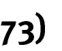

> **[Diagram Context - Textbook_MathematicalLiteracy_Gr11_Financial-documents-and-tariff-systems.pdf-0011-12.png]**
> This image is a text heading displaying the words "Contexts and integrated content" in plain black font. It serves as an instructional section title or slide header within CAPS curriculum materials to introduce cross-topic themes. Conceptually, it indicates that the following learning material links theoretical concepts to practical, real-world applications and combines related topics across the curriculum.

> **[Diagram Context - Textbook_MathematicalLiteracy_Gr11_Financial-documents-and-tariff-systems.pdf-0011-15.png]**
> This graphic displays a text-based educational prompt titled "1. What is break even?". It features the numbered question text in bold, sans-serif font against a plain white background. Conceptually, it serves as an introductory or assessment question designed to test a high school Business Studies learner's understanding of financial calculations, specifically the point where total revenue equals total costs with no profit or loss.

> **[Diagram Context - Textbook_MathematicalLiteracy_Gr11_Financial-documents-and-tariff-systems.pdf-0011-19.png]**
> The image displays a text-based publisher attribution reading "© Via Afrika » Mathematical Literacy Gr 11". It serves as a copyright notice for a Grade 11 Mathematical Literacy curriculum resource aligned with the CAPS curriculum. This text identifies the source and grade level context for accompanying educational materials used in South African classrooms.

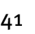

---

# Chapter 3: Finance
## 3. Determining Break-Even Values

The break-even point is the level of production where total income equals total costs (profit is zero). There are two primary methods to determine this value:

1.  **Graphical Method:** Drawing graphs of the income and cost scenarios and identifying the point of intersection.
2.  **Trial and Improvement Method:** Using "intelligent guessing" by substituting different quantities into the cost and income equations until the values match.

---

### Worked Example: Doughnut Stall
Based on the provided scenario, we have the following mathematical models:

*   **Income Equation:** $I = 5x$ (where $x$ is the number of doughnuts)
*   **Cost Equation:** $C = 250 + 1.3x$ (where $250$ is the fixed cost and $1.3$ is the variable cost per doughnut)

#### Trial and Improvement Process

| Number of Doughnuts ($x$) | Income ($I = 5x$) | Cost ($C = 250 + 1.3x$) | Comparison |
| :--- | :--- | :--- | :--- |
| 100 | $R500,00$ | $R380,00$ | Income > Cost |
| 50 | $R250,00$ | $R315,00$ | Cost > Income |

> **[Diagram Context - Textbook_MathematicalLiteracy_Gr11_Financial-documents-and-tariff-systems.pdf-0012-00.png]**
> This educational graphic is a chapter heading banner on a solid red background displaying the text "Chapter 3" and the topic title "Finance (Financial Documents, Tariff Systems, Income, Cost and Selling Price, Break-Even Analysis)". It introduces core financial mathematics concepts required for high school learners, setting the instructional framework for practical money management, business calculations, and graphical interpretation.

**Analysis:**
*   At $100$ units, the income is higher than the cost (profit is made).
*   At $50$ units, the cost is higher than the income (a loss is made).
*   Therefore, the break-even point must lie between $50$ and $100$ units.

**Conclusion:**
By continuing the trial and improvement process, we determine that selling **68 doughnuts** is the break-even point where income effectively covers all costs.

> **[Diagram Context - Textbook_MathematicalLiteracy_Gr11_Financial-documents-and-tariff-systems.pdf-0012-02.png]**
> This text snippet displays the lowercase phrase "even has two values" in bold sans-serif typeface against a plain white background. The graphic contains no additional symbols, variables, or annotations. Conceptually, it presents a fragment of a mathematical statement or theorem regarding functions (such as even functions) having two distinct output values for certain inputs, serving as a textual prompt for high school mathematics learners.

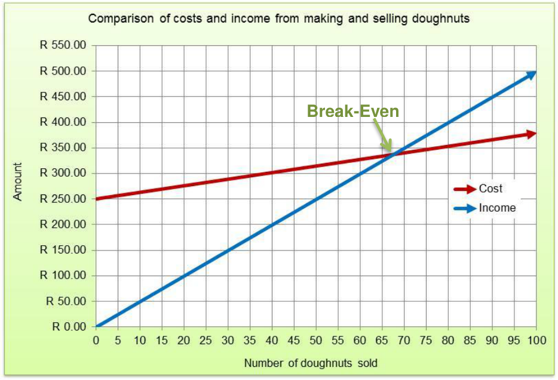
> **[Diagram Context - Textbook_MathematicalLiteracy_Gr11_Financial-documents-and-tariff-systems.pdf-0012-04.png]**
> This line graph compares the financial costs and income associated with making and selling doughnuts. The y-axis represents the "Amount" in South African Rand (R 0.00 to R 550.00), the x-axis represents the "Number of doughnuts sold" (0 to 100), and the plot includes two linear functions labeled "Cost" (red line) and "Income" (blue line), intersecting at a green-highlighted point labeled "Break-Even". Conceptually, this visual aids FET phase Mathematical Literacy learners in understanding financial management by demonstrating how to determine the break-even point where total expenses equal total revenue.

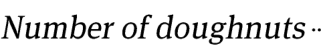
> **[Diagram Context - Textbook_MathematicalLiteracy_Gr11_Financial-documents-and-tariff-systems.pdf-0012-09.png]**
> The graphic displays text representing a discrete quantity, specifically the phrase "Number of doughnuts". It introduces a counting variable typically used in foundational mathematics and data handling contexts. Conceptually, it helps learners identify and work with discrete data types when formulating statistical questions or constructing data tables and graphs.

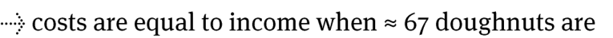
> **[Diagram Context - Textbook_MathematicalLiteracy_Gr11_Financial-documents-and-tariff-systems.pdf-0012-10.png]**
> The educational graphic displays a text-based analytical statement related to a business cost-benefit analysis or break-even point. Visible elements include a dotted arrow and the text: "costs are equal to income when $\approx$ 67 doughnuts are". Conceptually, this statement helps learners interpret graphical data or equations to identify the break-even quantity where total costs equal total income in a practical financial context.

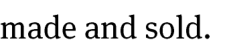

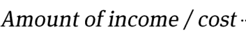
> **[Diagram Context - Textbook_MathematicalLiteracy_Gr11_Financial-documents-and-tariff-systems.pdf-0012-12.png]**
> The graphic displays a textual heading or axis label reading "Amount of income / cost". This label serves as a key economic variable used in business, finance, or accounting contexts within CAPS-aligned commerce subjects. It introduces learners to financial literacy concepts by distinguishing between revenue generated and expenses incurred in a business scenario.

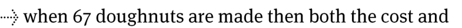
> **[Diagram Context - Textbook_MathematicalLiteracy_Gr11_Financial-documents-and-tariff-systems.pdf-0012-13.png]**
> The image displays a text snippet beginning with a dotted arrow pointing right, followed by the text "when 67 doughnuts are made then both the cost and". This text fragment presents a contextual mathematics problem setting involving variable quantities. Conceptually, it introduces learners to real-world applications of functions and algebra, specifically relating the number of manufactured items to financial outcomes like cost and revenue.

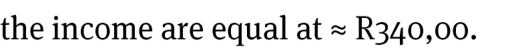
> **[Diagram Context - Textbook_MathematicalLiteracy_Gr11_Financial-documents-and-tariff-systems.pdf-0012-14.png]**
> The image displays a snippet of text stating "the income are equal at $\approx\text{R340,00}$." This text snippet conveys a financial equivalence point measured in South African Rand (R). Conceptually, it helps learners identify a break-even point or intersection value where income equals expenditure or another financial metric in a business studies or mathematics literacy context.

> **[Diagram Context - Textbook_MathematicalLiteracy_Gr11_Financial-documents-and-tariff-systems.pdf-0012-16.png]**
> The image displays a text-based attribution header reading "© Via Afrika » Mathematical Literacy Gr 11" in a simple sans-serif font. This visual content serves as a curriculum publisher's copyright and grade-level identification marker for educational material. Conceptually, it indicates that the accompanying content is aligned with the South African CAPS curriculum for Grade 11 Mathematical Literacy, providing source attribution for learners and educators.

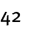

---

# Chapter 3: Finance (Cost Price, Selling Price, and Break-Even Analysis)

## 1. Refi’s Shoe-Shine Business

Refi operates a shoe-shine business. The table below details his monthly expenses:

| Expense | Quantity used per month | Cost |
| :--- | :--- | :--- |
| Rent for stall space | ---- | R80,00 |
| Rent for chair | ---- | R35,00 |
| Polish | 7 tins | R12,20 per tin |
| Shoe-Shine Brushes | 2 | R8,50 per brush |
| Cloths | 10 | R0,85 per cloth |

### Exercises
**1.1** Calculate Refi’s total monthly expenditure for his shoe-shine business.

**1.2** If Refi decides to charge $R5,00$ per shoe-shine and manages to shine 36 peoples’ shoes, will he make enough money to cover all expenses and break even?

**1.3** At $R5,00$ a shoe-shine, how many customers’ shoes will Refi need to shine in order to break even?

**1.4** If Refi shines 133 shoes in a particular month, how much profit will he make?

---

## 2. Martinus’s Hot-Dog Business

Martinus operates a hot-dog stand. The table below outlines the costs involved in his business:

| Category | Item | Cost |
| :--- | :--- | :--- |
| **Fixed Costs** | Rental of Hot-Dog Cart (including gas cooker) | R420,00 per day |
| **Production Costs** | Rolls | R5,70 for 6 rolls |
| | Vienna Sausages | R47,00 for 20 sausages |
| | Tomato Sauce | R20,00 for a 2 litre bottle ($\approx 20\text{ ml}$ for needed each hotdog) |

> **[Diagram Context - Textbook_MathematicalLiteracy_Gr11_Financial-documents-and-tariff-systems.pdf-0013-00.png]**
> This educational graphic is a chapter heading banner on a solid dark red background with white text, displaying the label "Chapter 3" inside a rounded pill-shaped box alongside the subtitle "Finance (Financial Documents, Tariff Systems, Income, Cost and Selling Price, Break-Even Analysis)". It introduces the core financial mathematics topics covered in the curriculum. Conceptually, it prepares high school Mathematical Literacy learners to study practical economic concepts, including interpreting bills and analyzing business revenue and costs.

> **[Diagram Context - Textbook_MathematicalLiteracy_Gr11_Financial-documents-and-tariff-systems.pdf-0013-01.png]**
> This image is a text header showing the heading "3. Determining break-e". It introduces a section focused on financial break-even analysis for Grade 10-12 Consumer Studies or Business Studies CAPS curriculum. Conceptually, it prepares learners to study the financial calculation method used to determine the exact sales volume or revenue needed to cover all fixed and variable costs.

> **[Diagram Context - Textbook_MathematicalLiteracy_Gr11_Financial-documents-and-tariff-systems.pdf-0013-02.png]**
> This graphic displays text reading "even values". It serves as a categorical heading or label used in mathematics to introduce problems or data sets restricted to even numbers. Conceptually, it prepares learners to identify and work with integer values divisible by two.

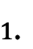

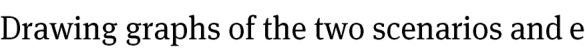
> **[Diagram Context - Textbook_MathematicalLiteracy_Gr11_Financial-documents-and-tariff-systems.pdf-0013-06.png]**
> This educational graphic consists of a text heading stating "Drawing graphs of the two scenarios and e". It contains no visible axis names, variables, mathematical symbols, or directional arrows. Conceptually, it serves as an introductory instructional prompt for high school learners to graphically represent and compare two different physical or mathematical scenarios.

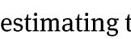

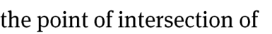
> **[Diagram Context - Textbook_MathematicalLiteracy_Gr11_Financial-documents-and-tariff-systems.pdf-0013-08.png]**
> This graphic displays a text fragment reading "the point of intersection of". It features lowercase serif typeface lettering in black against a white background. Conceptually, this text snippet serves as a prompt or sentence starter for geometrical or graphical analysis within mathematics, guiding learners to identify and define specific coordinate points where lines, graphs, or geometric figures meet.

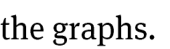

> **[Diagram Context - Textbook_MathematicalLiteracy_Gr11_Financial-documents-and-tariff-systems.pdf-0013-10.png]**
> The image is a text snippet featuring the title "Using the method of trial and improvement to determine the break-even". It contains visible text describing a mathematical problem-solving technique related to financial mathematics and business economics. Conceptually, this guides CAPS learners through iterative estimation and calculation to find the specific point where costs equal revenue.

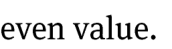

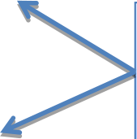

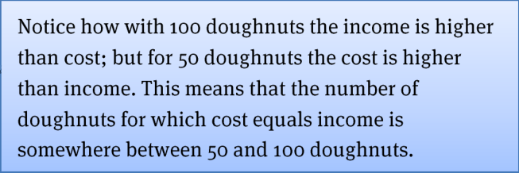
> **[Diagram Context - Textbook_MathematicalLiteracy_Gr11_Financial-documents-and-tariff-systems.pdf-0013-24.png]**
> The graphic is an explanatory text box discussing business economics. Visible text includes references to "100 doughnuts", "income", "cost", "50 doughnuts", and the concept of "cost equals income". Conceptually, it guides high school learners through analyzing financial break-even points by comparing revenue and expenses at different production quantities.

> **[Diagram Context - Textbook_MathematicalLiteracy_Gr11_Financial-documents-and-tariff-systems.pdf-0013-26.png]**
> This graphic displays a textbook publisher copyright notice stating "© Via Afrika » Mathematical Literacy Gr 11". It serves as an identifying header or footer for Grade 11 Mathematical Literacy curriculum materials.

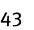

---

# Chapter 3: Finance (Break-Even Analysis)

## 1. Production Cost and Pricing
**2.1** Calculate the production cost for each hot-dog that Marius makes.
*(Note: To solve this, you must sum the individual costs of a roll, a Vienna sausage, and tomato sauce.)*

**2.2** Based on your answer in 2.1, determine a suitable selling price for each hot-dog and provide a justification for your reasoning.

---

## 2. Break-Even Analysis Graph
The graph below illustrates the relationship between the number of hot-dogs sold and the total financial outcome (Income vs. Expenditure).

> **[Diagram Context - Textbook_MathematicalLiteracy_Gr11_Financial-documents-and-tariff-systems.pdf-0014-00.png]**
> This educational graphic is a chapter heading banner on a solid dark red background with white text, displaying the label "Chapter 3" inside a split black and white rounded box. Below this box, the text reads "Finance (Financial Documents, Tariff Systems, Income, Cost and Selling Price, Break-Even Analysis)". Conceptually, this visual introduces learners to core consumer and business financial concepts required in the CAPS curriculum, setting the structural framework for analyzing real-world monetary calculations and documents.

### 2.3 Analysis Questions
**2.3.1** Use the graph to determine the selling price per hot-dog.
*(Hint: The selling price is the gradient of the Income line, calculated as $\frac{\text{Change in Income}}{\text{Change in Number of Hot-dogs}}$).*

**2.3.2** Explain why the "Expenditure" graph does not start at $R0,00$.

**2.3.3** Explain why both the Income and Expenditure graphs are represented as straight lines.

**2.3.4** By reading from the graph, estimate the number of hot-dogs that Marius must sell each day in order to break even.
*(Note: The break-even point is the intersection where $\text{Income} = \text{Expenditure}$.)*

**2.3.5** Approximately how much money must Marius make each day in order to break even?

> **[Diagram Context - Textbook_MathematicalLiteracy_Gr11_Financial-documents-and-tariff-systems.pdf-0014-01.png]**
> The image displays a text heading written in purple font stating "Additional Questions :". It serves as a section divider or structural heading typically found in CAPS-aligned textbooks, worksheets, or assessment materials. Conceptually, it indicates the transition to extra practice exercises designed to consolidate learners' understanding and test their mastery of curriculum topics.

> **[Diagram Context - Textbook_MathematicalLiteracy_Gr11_Financial-documents-and-tariff-systems.pdf-0014-02.png]**
> This image is a text heading for a financial calculations topic in Accounting, displaying the phrase "(Cost price, selling price and break-". It introduces core commercial concepts related to inventory valuation and operational thresholds. Conceptually, it frames the foundational terminology required for learners to calculate profitability and breakeven points in business contexts.

> **[Diagram Context - Textbook_MathematicalLiteracy_Gr11_Financial-documents-and-tariff-systems.pdf-0014-03.png]**
> This image contains text snippet showing the phrase "even analysis". It serves as a heading or label fragment within an educational resource related to data handling or financial mathematics. Conceptually, it points learners toward interpreting trends, processing datasets, or evaluating equilibrium points in CAPS curriculum contexts.

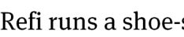
> **[Diagram Context - Textbook_MathematicalLiteracy_Gr11_Financial-documents-and-tariff-systems.pdf-0014-05.png]**
> This image contains a text excerpt from a word problem or contextual scenario. The visible text reads "Refi runs a shoe-s". Conceptually, this provides real-world context for mathematical literacy or financial mathematics problems involving small businesses, income, and expenditure.

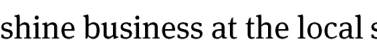
> **[Diagram Context - Textbook_MathematicalLiteracy_Gr11_Financial-documents-and-tariff-systems.pdf-0014-06.png]**
> This educational graphic consists of text snippet containing lowercase alphabetical characters forming the partial sentence "shine business at the local s". No diagrams, symbols, variables, or directional arrows are present in the image. Conceptually, this snippet provides isolated contextual text often used in language or literacy exercises to practice reading fluency or vocabulary within sentences.

> **[Diagram Context - Textbook_MathematicalLiteracy_Gr11_Financial-documents-and-tariff-systems.pdf-0014-07.png]**
> The image shows a snippet of instructional text from a CAPS curriculum assessment item. It features the visible text phrase "supermarket. The table below". Conceptually, this text serves as a contextual stem introducing a data interpretation or financial mathematics problem for high school learners.

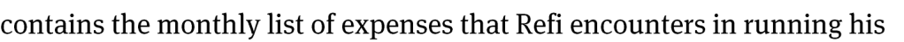
> **[Diagram Context - Textbook_MathematicalLiteracy_Gr11_Financial-documents-and-tariff-systems.pdf-0014-08.png]**
> The image displays a text snippet from a South African CAPS Mathematical Literacy assessment or textbook. The visible words read "contains the monthly list of expenses that Refi encounters in running his", introducing a contextual financial problem involving personal or business budgeting. This text sets up a real-world scenario where learners must analyze, calculate, and manage fixed and variable expenses as part of financial literacy topics.

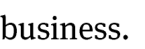

> **[Diagram Context - Textbook_MathematicalLiteracy_Gr11_Financial-documents-and-tariff-systems.pdf-0014-10.png]**
> This educational graphic is a financial table header layout set against a green background, specifically designed for budgeting and financial literacy. The visible column headings are "Expense", "Quantity used per month", and "Cost". Conceptually, this diagram helps learners organize regular household or business expenditures by categorizing items alongside their monthly usage and monetary values, supporting practical CAPS Mathematics and Mathematical Literacy outcomes regarding personal finance and budgeting.

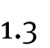

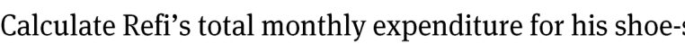
> **[Diagram Context - Textbook_MathematicalLiteracy_Gr11_Financial-documents-and-tariff-systems.pdf-0014-16.png]**
> This educational graphic presents a financial mathematics problem statement involving personal budgeting and expenditure. The visible text reads: "Calculate Refi's total monthly expenditure for his shoe-". Conceptually, this text-based problem helps high school learners practice practical financial literacy by calculating and summing up fixed and variable expenses from a given context, a key CAPS Mathematical Literacy skill.

> **[Diagram Context - Textbook_MathematicalLiteracy_Gr11_Financial-documents-and-tariff-systems.pdf-0014-17.png]**
> The image displays textual content consisting of the words "shine business." set in a standard lowercase serif font. There are no additional diagrams, labels, arrows, or visual educational elements present. Conceptually, this text does not convey any specific CAPS curriculum content or academic concepts for high school learners.

> **[Diagram Context - Textbook_MathematicalLiteracy_Gr11_Financial-documents-and-tariff-systems.pdf-0014-18.png]**
> This image is a text snippet from a South African CAPS-aligned Mathematics Literacy assessment or textbook problem. It presents a conditional business scenario featuring the character name "Refi" and the unit cost "R5,000 per shoe-". Conceptually, this text introduces a real-world financial context for learners to calculate income, expenses, profit, or loss based on a specific pricing model.

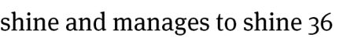
> **[Diagram Context - Textbook_MathematicalLiteracy_Gr11_Financial-documents-and-tariff-systems.pdf-0014-19.png]**
> The graphic displays a snippet of text consisting of lowercase English words and a numeral, specifically reading "shine and manages to shine 36". There are no structural labels, mathematical variables, arrows, or scientific symbols present in the image. Conceptually, the image contains isolated text fragments rather than a formal educational diagram, offering no direct instructional value for CAPS curriculum topics.

> **[Diagram Context - Textbook_MathematicalLiteracy_Gr11_Financial-documents-and-tariff-systems.pdf-0014-20.png]**
> This graphic consists of a text snippet displaying a financial problem-solving question about making enough money to cover the cost of shoes. The text contains the visible words "peoples' shoes, will he make enough money to cover". Conceptually, this type of contextual word problem helps learners apply foundational financial mathematics and budgeting skills to real-world scenarios, reinforcing calculations related to income, expenses, and profitability.

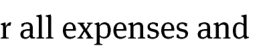
> **[Diagram Context - Textbook_MathematicalLiteracy_Gr11_Financial-documents-and-tariff-systems.pdf-0014-21.png]**
> The image displays a text fragment reading "r all expenses and". It consists solely of lowercase serif text in black on a white background without any graphical elements, labels, or symbols. Conceptually, it represents an incomplete sentence snippet likely extracted from a Grade 10-12 CAPS Business Studies or Accounting textbook or assessment context dealing with financial management and budgeting.

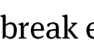

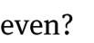

> **[Diagram Context - Textbook_MathematicalLiteracy_Gr11_Financial-documents-and-tariff-systems.pdf-0014-24.png]**
> This text graphic shows a partial sentence from a South African CAPS financial mathematics problem, displaying the monetary value "At R5,000" and the beginning of the word "shoe-s". It introduces a contextual word problem involving money and pricing for high school learners practicing financial calculations.

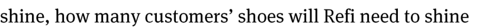
> **[Diagram Context - Textbook_MathematicalLiteracy_Gr11_Financial-documents-and-tariff-systems.pdf-0014-25.png]**
> The image displays a text snippet from a word problem, specifically showing the phrase "shine, how many customers' shoes will Refi need to shine". The text features visible words including "shine", "how", "many", "customers'", "shoes", "will", "Refi", and "need". Conceptually, this text presents a contextual mathematical word problem requiring students to extract relevant information and apply arithmetic operations to solve a real-world scenario.

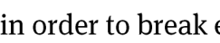
> **[Diagram Context - Textbook_MathematicalLiteracy_Gr11_Financial-documents-and-tariff-systems.pdf-0014-26.png]**
> The image displays a snippet of text consisting of lowercase English letters forming the partial phrase "in order to break e". No graphical elements, diagrams, chemical symbols, or labels are visible in the crop. It provides insufficient context to convey any specific CAPS curriculum concept.

> **[Diagram Context - Textbook_MathematicalLiteracy_Gr11_Financial-documents-and-tariff-systems.pdf-0014-28.png]**
> The image is a word problem text snippet focusing on financial mathematics. It displays the text: "If Refi shines 133 shoes in a particular month, how much profit will he". Conceptually, this question requires learners to apply algebraic concepts and formulas for calculating profit (income minus expenses) based on a given quantity of a service provided.

> **[Diagram Context - Textbook_MathematicalLiteracy_Gr11_Financial-documents-and-tariff-systems.pdf-0014-31.png]**
> This image contains text introducing a word problem, specifically showing the fragment "Martinus operates a hot-c". It sets up a contextual scenario typically found in CAPS-aligned mathematics or physical sciences assessments. For a high school learner, it serves as the opening premise for a multi-step problem requiring the application of relevant formulae and data interpretation.

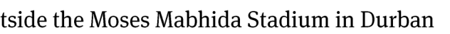
> **[Diagram Context - Textbook_MathematicalLiteracy_Gr11_Financial-documents-and-tariff-systems.pdf-0014-33.png]**
> This text snippet reads "tside the Moses Mabhida Stadium in Durban". It serves as a contextual or locational caption related to a real-world South African landmark. For high school learners, such contextual text anchors curriculum content in familiar local environments, often used in geography, tourism, or applied physics and mathematics word problems.

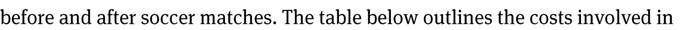
> **[Diagram Context - Textbook_MathematicalLiteracy_Gr11_Financial-documents-and-tariff-systems.pdf-0014-34.png]**
> This image is a text snippet from a CAPS Mathematical Literacy assessment or textbook contextualizing financial mathematics. It displays the text fragment: "before and after soccer matches. The table below outlines the costs involved in". This text sets up a real-world financial scenario requiring learners to analyze tables, calculate expenses, and manage budgets as part of financial literacy applications.

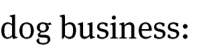
> **[Diagram Context - Textbook_MathematicalLiteracy_Gr11_Financial-documents-and-tariff-systems.pdf-0014-36.png]**
> The graphic consists of text displaying the phrase "dog business:" in a simple serif font. Visible elements include the lowercase words "dog" and "business" followed by a colon. This text snippet serves as a heading or contextual prompt for an educational activity or passage.

> **[Diagram Context - Textbook_MathematicalLiteracy_Gr11_Financial-documents-and-tariff-systems.pdf-0014-39.png]**
> This educational graphic contains a publisher copyright notice stating "© Via Afrika >> Mathematical Literacy Gr 11" in standard black sans-serif font. It functions as a source attribution or watermark indicating content ownership tied to the Grade 11 Mathematical Literacy CAPS curriculum. Conceptually, it identifies the textbook provenance for learning materials related to mathematical literacy topics.

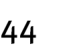

---

# Chapter 3: Finance (Break-Even Analysis)

## 1. Exercises: Business Evaluation
**2.3.6**
*   **a.** Verify your estimations from previous steps by calculating the actual cost incurred and income generated from selling the estimated number of hot-dogs.
*   **b.** If your previous estimations were inaccurate, continue the calculation process until you determine the exact break-even point for Marius’ business.

**2.4 Critical Thinking**
*   **2.4.1** Evaluate whether the selling price per hot-dog is reasonable. Provide your reasoning.
*   **2.4.2** Assess the viability of the business. Is it realistic to expect Marius to sell enough hot-dogs to reach the break-even point? Explain your reasoning.

---

## 2. Worked Examples and Answers

### Refi’s Shoe Shining Business

**1.1 Total Monthly Expenditure**
To calculate the total monthly expenditure, sum all individual costs:
$$Total = R80,00 + R35,00 + (7 \times R12,20) + (2 \times R8,50) + (10 \times R0,85)$$
$$Total = R80,00 + R35,00 + R85,40 + R17,00 + R8,50$$
$$Total = R225,90$$

**1.2 Income Analysis**
Income from shining 36 shoes at $R5,00$ per shoe:
$$Income = 36 \times R5,00 = R180,00$$
*Conclusion:* Since $R180,00 < R225,90$, Refi will not break even.

**1.3 Break-Even Calculation**
To find the number of shoes required to break even:
$$Break\text{-}even = \frac{Total\ Expenditure}{Price\ per\ unit}$$
$$Break\text{-}even = \frac{R225,90}{R5,00} = 45,18\ \text{shoes}$$
*Conclusion:* Since you cannot polish $0,18$ of a shoe, Refi must polish $46$ shoes to cover costs.

**1.4 Profit Calculation**
Income from shining 133 shoes:
$$Income = 133 \times R5,00 = R665,00$$
Monthly profit:
$$Profit = Income - Expenditure$$
$$Profit = R665,00 - R225,90 = R439,10$$

---

### Marius’ Hot-Dog Business

**2.1 Cost of Production per Hot-Dog**
Calculate the unit cost for each ingredient:

| Item | Calculation | Cost per unit |
| :--- | :--- | :--- |
| Roll | $R5,70 \div 6$ | $R0,95$ |
| Vienna sausage | $R47,00 \div 20$ | $R2,35$ |
| Tomato Sauce | $R20,00 \div 2000\ ml$ | $R0,01\ per\ ml$ |
| Sauce for 20ml | $R0,01 \times 20$ | $R0,20$ |

**Total cost of production per hot-dog:**
$$Cost = R0,95 + R2,35 + R0,20 = R3,50$$

> **[Diagram Context - Textbook_MathematicalLiteracy_Gr11_Financial-documents-and-tariff-systems.pdf-0015-00.png]**
> This educational graphic is a chapter heading banner on a solid dark red background with white text, displaying the label "Chapter 3" inside a split black and white rounded box. Below this, it lists the CAPS-aligned topic: "Finance (Financial Documents, Tariff Systems, Income, Cost and Selling Price, Break-Even Analysis)". Conceptually, this visual introduces learners to mathematical literacy concepts related to personal and business financial management, including interpreting bills, understanding municipal or transport tariffs, calculating profit, and determining break-even points.

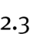

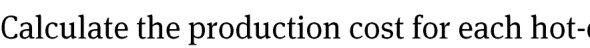
> **[Diagram Context - Textbook_MathematicalLiteracy_Gr11_Financial-documents-and-tariff-systems.pdf-0015-04.png]**
> This educational graphic features a text-based problem prompt for a Mathematical Literacy or Accounting assessment. The visible text reads, "Calculate the production cost for each hot-". Conceptually, this prompt challenges learners to apply financial calculation skills, specifically determining unit production costs within a business context aligned with the CAPS curriculum.

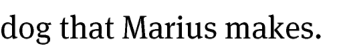
> **[Diagram Context - Textbook_MathematicalLiteracy_Gr11_Financial-documents-and-tariff-systems.pdf-0015-05.png]**
> The image displays a text fragment featuring the lowercase words "dog that Marius makes." in a standard serif font. Visible elements include lowercase alphabetic characters and spaces forming a complete phrase. Conceptually, this text segment serves as a reading comprehension exercise or sentence-completion prompt to help learners practice syntax, vocabulary, or grammar within a literacy curriculum.

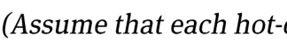
> **[Diagram Context - Textbook_MathematicalLiteracy_Gr11_Financial-documents-and-tariff-systems.pdf-0015-06.png]**
> This graphic is a text fragment containing an instructional problem statement. It displays the visible text segment "(Assume that each hot-e". Conceptually, it serves as a prompt or conditional assumption within a physics or chemistry assessment item to guide students in applying relevant scientific laws or calculations.

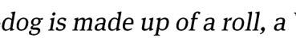
> **[Diagram Context - Textbook_MathematicalLiteracy_Gr11_Financial-documents-and-tariff-systems.pdf-0015-07.png]**
> The image displays a text snippet containing a descriptive sentence fragment. Visible text includes the words "dog is made up of a roll, a". This snippet serves as a prompt or reading context for learners to engage with language structure or comprehension tasks.

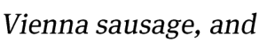
> **[Diagram Context - Textbook_MathematicalLiteracy_Gr11_Financial-documents-and-tariff-systems.pdf-0015-08.png]**
> The graphic contains the text "Vienna sausage, and" in a standard serif font. It functions as a textual heading or list fragment introducing a specific food item for nutritional analysis or food tests. Conceptually, this text prepares learners to investigate the biological macromolecules present in processed foods during practical CAPS Life Sciences investigations.

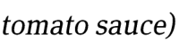
> **[Diagram Context - Textbook_MathematicalLiteracy_Gr11_Financial-documents-and-tariff-systems.pdf-0015-09.png]**
> This graphic consists of text showing the label "tomato sauce". It serves as a real-world contextual example commonly used in CAPS physical sciences or consumer studies to illustrate everyday mixtures, suspensions, or chemical substances. For high school learners, such labels ground abstract chemical and scientific concepts in familiar household items, aiding in practical application and understanding.

> **[Diagram Context - Textbook_MathematicalLiteracy_Gr11_Financial-documents-and-tariff-systems.pdf-0015-10.png]**
> The image shows an examination text prompt containing the text "Based on your answer in 2.1, how much do you think Marius should sell". The graphic is a text-based assessment question referencing a previous question numbered 2.1 and introducing a character named Marius. Conceptually, this question tests a student's ability to apply previous calculations or reasoning to make a practical pricing or financial decision within a CAPS curriculum context.

> **[Diagram Context - Textbook_MathematicalLiteracy_Gr11_Financial-documents-and-tariff-systems.pdf-0015-12.png]**
> The graphic is a text-based educational prompt displaying the question fragment "dog for? Explain your reasoning." It contains no visual diagrams, symbols, or variables, consisting entirely of lowercase and uppercase serif text. Conceptually, this item serves as a targeted CAPS assessment question that requires learners to apply critical thinking and biological reasoning to analyze a specific function or scenario involving an animal.

> **[Diagram Context - Textbook_MathematicalLiteracy_Gr11_Financial-documents-and-tariff-systems.pdf-0015-13.png]**
> This graphic displays an introductory problem statement for a financial mathematics graph concerning expenditure and income for Marius. The visible text reads: "The graph below shows the expenditure and income for Marius' hot-". Conceptually, this sets up a contextual scenario where CAPS Mathematical Literacy learners must interpret financial data by analyzing and comparing income and expenditure trends on a Cartesian plane.

> **[Diagram Context - Textbook_MathematicalLiteracy_Gr11_Financial-documents-and-tariff-systems.pdf-0015-15.png]**
> This educational graphic displays the lowercase text fragment "selling business." against a plain white background. The text consists of standard serif-font typography without any accompanying diagrams, labels, or arrows. Conceptually, it serves as a contextual heading or vocabulary item for a Business Studies lesson related to the termination, liquidation, or transfer of business ownership in the CAPS curriculum.

> **[Diagram Context - Textbook_MathematicalLiteracy_Gr11_Financial-documents-and-tariff-systems.pdf-0015-16.png]**
> The graphic is a line graph titled "Income and Expenditure for Marius' Hot-Dog Business" with a grid displaying financial data. Visible labels include the axes named "Amount" (ranging from R 0.00 to R 1,100.00 in R 100 increments) and "Number of Hotdogs Sold" (ranging from 0 to 100 in increments of 5), a legend distinguishing "Expenditure" (dashed blue line) and "Income" (solid red line), and a data label reading "R 240.00". This graph conceptually illustrates break-even analysis for high school Mathematics Literacy learners, showing how the intersection of the income and expenditure lines represents the break-even point where costs equal revenue.

> **[Diagram Context - Textbook_MathematicalLiteracy_Gr11_Financial-documents-and-tariff-systems.pdf-0015-22.png]**
> This image contains a textual excerpt from an educational assessment item instructing learners to utilize a graphical representation. The visible text reads: "the graph to determine accurately f". This prompts high school learners to apply graphical analysis skills, such as interpreting trends, reading specific values, or finding gradients, which is a core requirement across CAPS Physical Sciences and Mathematics curricula.

> **[Diagram Context - Textbook_MathematicalLiteracy_Gr11_Financial-documents-and-tariff-systems.pdf-0015-23.png]**
> The image shows a text fragment from a word problem or scenario, featuring the words "ch Marius sells" in a standard serif font. Visible text elements include the fragment "ch" followed by the proper noun "Marius" and the verb "sells". Conceptually, this text snippet sets up a contextual word problem typical in CAPS Mathematics literacy or foundation phase assessments, introducing a character named Marius who performs a commercial transaction.

> **[Diagram Context - Textbook_MathematicalLiteracy_Gr11_Financial-documents-and-tariff-systems.pdf-0015-26.png]**
> This graphic consists of a direct text prompt formatted as a question. The visible text reads: "Why does the "Expenditure" graph not start at R0,0?". Conceptually, this assessment question prompts Grade 10-12 Economics learners to analyze cost curves and understand the presence of fixed costs that must be paid even when output or production is zero.

> **[Diagram Context - Textbook_MathematicalLiteracy_Gr11_Financial-documents-and-tariff-systems.pdf-0015-27.png]**
> This educational graphic consists of a text prompt asking "Why are both graph straight lines?". The visible text explicitly prompts learners to analyse the linear relationship between variables on plotted graphs. Conceptually, it challenges high school learners to understand direct proportionality and constant gradients in graphical data analysis.

> **[Diagram Context - Textbook_MathematicalLiteracy_Gr11_Financial-documents-and-tariff-systems.pdf-0015-28.png]**
> This graphic is a text-based assessment prompt instructing learners to extract data from a graphical representation. It contains the visible text string: "By reading from the graph, estimate the number of hot-". Conceptually, this prompt assesses a learner's data interpretation and graph reading skills in CAPS mathematical literacy or mathematics, requiring them to locate specific values or trends from plotted data.

> **[Diagram Context - Textbook_MathematicalLiteracy_Gr11_Financial-documents-and-tariff-systems.pdf-0015-30.png]**
> This educational graphic consists of a text fragment displaying a business studies problem statement. The visible text reads "must sell each day in order to break e". Conceptually, this excerpt introduces learners to financial calculations involving break-even analysis within the CAPS curriculum, prompting them to determine the minimum sales quantity required to cover total costs.

> **[Diagram Context - Textbook_MathematicalLiteracy_Gr11_Financial-documents-and-tariff-systems.pdf-0015-32.png]**
> The image displays a text-based mathematical question fragment in a standard serif font, reading "Approximately how much money must Marius’ make each day in". Visible text elements include the words "Approximately", "how", "much", "money", "must", "Marius'", "make", "each", "day", and "in". This text fragment frames a financial mathematics problem designed to test a CAPS student's ability to calculate daily income or earnings.

> **[Diagram Context - Textbook_MathematicalLiteracy_Gr11_Financial-documents-and-tariff-systems.pdf-0015-35.png]**
> The image is a text-based educational source attribution reading "© Via Afrika » Mathematical Literacy Gr 11". It serves as a textbook copyright and curriculum reference header for Grade 11 Mathematical Literacy learners. This label contextualises accompanying learning material within the CAPS curriculum framework for South African high school students.

---

# Chapter 3: Finance (Break-Even Analysis)

## 1. Core Concepts
*   **Cost Price:** The amount spent to produce one unit of a product (e.g., R3,50 per hot-dog).
*   **Fixed Costs:** Expenses that remain constant regardless of the number of units sold (e.g., R420,00 stall rental).
*   **Income:** The total money received from sales.
*   **Break-Even Point:** The point where total income equals total expenditure. No profit is made, but no loss is incurred.

---

## 2. Worked Example: Marius' Hot-Dog Stall

### 2.1 Understanding Costs and Income
*   **Selling Price per unit:** R8,00
*   **Variable Cost per unit:** R3,50
*   **Fixed Cost:** R420,00

To calculate the income per unit from a total:
$$\text{Income per unit} = \frac{\text{Total Income}}{\text{Number of units}}$$
$$\text{Income per unit} = \frac{R240,00}{30} = R8,00$$

### 2.2 Expenditure and Income Behavior
*   **Fixed Costs:** The expenditure graph starts at R420,00 because this cost must be paid even if 0 units are sold.
*   **Linear Growth:** Both income and expenditure increase at a constant rate, resulting in straight-line graphs.

### 2.3 Trial and Improvement Method
When the exact break-even point is not immediately clear, we use the trial and improvement method to find the number of units where $\text{Income} \approx \text{Expenditure}$.

**Example: Testing 93 and 94 units**

| Item | Calculation for 93 units | Calculation for 94 units |
| :--- | :--- | :--- |
| **Total Income** | $R8,00 \times 93 = R744,00$ | $R8,00 \times 94 = R752,00$ |
| **Total Expenditure** | $R420,00 + (R3,50 \times 93) = R745,50$ | $R420,00 + (R3,50 \times 94) = R749,00$ |
| **Result** | Expenditure > Income | Income > Expenditure |

**Conclusion:** At 93 units, Marius is still making a slight loss. At 94 units, the income exceeds the expenditure, meaning the break-even point has been surpassed.

> **[Diagram Context - Textbook_MathematicalLiteracy_Gr11_Financial-documents-and-tariff-systems.pdf-0016-00.png]**
> This educational graphic serves as a chapter title banner for Mathematical Literacy. It features the text label "Chapter 3" alongside the main topic title: "Finance (Financial Documents, Tariff Systems, Income, Cost and Selling Price, Break-Even Analysis)". Conceptually, this banner introduces learners to core financial mathematics topics required by the CAPS curriculum, setting the context for practical money management, business calculations, and consumer literacy.

> **[Diagram Context - Textbook_MathematicalLiteracy_Gr11_Financial-documents-and-tariff-systems.pdf-0016-05.png]**
> This educational graphic consists of a text prompt in a standard serif font. The visible text reads: "Check whether your estimation in 2.3.4 and 2.3.5 is". Conceptually, this instruction guides CAPS high school learners to verify, test, or validate their previously calculated or estimated numerical values against theoretical models or empirical data within a structured examination or assessment context.

> **[Diagram Context - Textbook_MathematicalLiteracy_Gr11_Financial-documents-and-tariff-systems.pdf-0016-06.png]**
> This graphic displays a snippet of text focusing on financial mathematics. It contains the visible words "correct by calculating the cost incurred and income". Conceptually, this text guides students through the process of financial accounting by setting up calculations for expenses versus revenue in a business context.

> **[Diagram Context - Textbook_MathematicalLiteracy_Gr11_Financial-documents-and-tariff-systems.pdf-0016-07.png]**
> The image displays a text fragment reading "generated from selling the number of hot-d" in a standard serif font. No visual graphics, labels, variables, or diagrams are present. It serves as a text snippet likely introducing a word problem related to financial mathematics or profit generation in a CAPS curriculum context.

> **[Diagram Context - Textbook_MathematicalLiteracy_Gr11_Financial-documents-and-tariff-systems.pdf-0016-09.png]**
> The image is a text snippet showing the phrase "estimated in 2.3.4." rendered in a standard serif font. It functions as an instructional or question sub-reference typically found in CAPS-aligned assessments and examination papers. Conceptually, it directs learners to a specific sub-question linked to a preceding data set, graph, or calculation.

> **[Diagram Context - Textbook_MathematicalLiteracy_Gr11_Financial-documents-and-tariff-systems.pdf-0016-11.png]**
> The image consists of a text prompt from an examination paper. It contains the text: "If you did not estimate properly in 2.3.4 and 2.3.5, continue". Conceptually, this acts as a conditional instruction or marking guideline qualifier in a CAPS assessment, ensuring that error carry-through is applied so candidates are not unfairly penalized for earlier mistakes in subsequent calculations.

> **[Diagram Context - Textbook_MathematicalLiteracy_Gr11_Financial-documents-and-tariff-systems.pdf-0016-12.png]**
> The graphic consists of a line of text featuring instructions for a calculation problem. Visible labels include the text phrase "calculating using the method from 2.3.4 until you find the". Conceptually, this excerpt serves as an instructional prompt directing students to apply a previously learned procedural method to solve a multi-step problem.

> **[Diagram Context - Textbook_MathematicalLiteracy_Gr11_Financial-documents-and-tariff-systems.pdf-0016-13.png]**
> The image displays a text fragment reading "accurate break-e" rendered in a standard serif font. No specific scientific diagrams, graphs, or educational symbols are present in this cropped snippet. It serves as a textual header fragment relating to break-even analysis in Grade 10-12 CAPS Consumer Studies, Accounting, or Business Studies.

> **[Diagram Context - Textbook_MathematicalLiteracy_Gr11_Financial-documents-and-tariff-systems.pdf-0016-14.png]**
> The image displays a text fragment reading "even point for Marius' business." set in a standard serif font. It contains no diagrams, symbols, or variable labels. Conceptually, it serves as a prompt snippet for a business studies problem regarding break-even analysis.

> **[Diagram Context - Textbook_MathematicalLiteracy_Gr11_Financial-documents-and-tariff-systems.pdf-0016-15.png]**
> The graphic displays a text prompt featuring the character name "Marius" and the phrase "hot-c". The text serves as a word problem setup framed around a realistic commercial scenario. Conceptually, it engages high school learners in applying mathematical reasoning, such as algebra or financial mathematics, to solve a practical problem involving unit pricing and business transactions.

> **[Diagram Context - Textbook_MathematicalLiteracy_Gr11_Financial-documents-and-tariff-systems.pdf-0016-16.png]**
> The image displays a text snippet containing words in lowercase serif font. The visible text reads "dog for a reasonable". Conceptually, this excerpt forms part of a written question or sentence often found in CAPS assessment materials or language exercises.

> **[Diagram Context - Textbook_MathematicalLiteracy_Gr11_Financial-documents-and-tariff-systems.pdf-0016-17.png]**
> This image contains textual assessment content consisting of a short analytical question. The visible text reads "price? Explain your reasoning." This text prompts high school learners to apply economic concepts to analyze market dynamics and justify their answers using structured reasoning.

> **[Diagram Context - Textbook_MathematicalLiteracy_Gr11_Financial-documents-and-tariff-systems.pdf-0016-19.png]**
> The image displays a text-based educational prompt reading: "Do you think this is a viable business? i.e. do you think it is". Conceptually, this prompts learners in Business Studies to evaluate the feasibility, profitability, and sustainability of a business venture or enterprise idea within a CAPS-aligned curriculum context.

> **[Diagram Context - Textbook_MathematicalLiteracy_Gr11_Financial-documents-and-tariff-systems.pdf-0016-20.png]**
> The image shows a text excerpt containing a mathematical word problem statement involving a character named Marius selling hot-dogs. The visible text reads "reasonable to expect that Marius will sell enough hot-". Conceptually, this excerpt serves as part of a real-world application or financial mathematics scenario, training learners to interpret contextual data, set up equations, or solve probability and business problems aligned with CAPS requirements.

> **[Diagram Context - Textbook_MathematicalLiteracy_Gr11_Financial-documents-and-tariff-systems.pdf-0016-22.png]**
> This image is an educational text snippet displaying the question prompt "break even? Explain you". The visible text contains the keywords "break even" and "Explain you". Conceptually, this prompts high school learners in Business Studies to define and explain the break-even point where total revenue equals total costs.

> **[Diagram Context - Textbook_MathematicalLiteracy_Gr11_Financial-documents-and-tariff-systems.pdf-0016-26.png]**
> This graphic displays text labeling financial terminology. The visible text reads "Total monthly expenditure". Conceptually, this label introduces key concepts related to household budgeting, financial management, and calculating fixed and variable expenses in consumer studies and mathematics literacy.

> **[Diagram Context - Textbook_MathematicalLiteracy_Gr11_Financial-documents-and-tariff-systems.pdf-0016-27.png]**
> This educational graphic displays a mathematical financial expression showing addition and multiplication with South African currency. The visible elements include an equals sign, monetary values with the Rand symbol (R80,000 and R35,000), addition and multiplication operators, and numbers within parentheses. For a FET phase Mathematical Literacy student, this visual conveys how to break down complex cost calculations and apply the correct order of operations to real-world financial problems like budgeting or costing.

> **[Diagram Context - Textbook_MathematicalLiteracy_Gr11_Financial-documents-and-tariff-systems.pdf-0016-29.png]**
> This image displays a mathematical expression involving the addition of two monetary values, specifically "R80,00" and "R35,0". It illustrates the basic arithmetic operation of summation within a financial context, requiring learners to align decimal places and correctly apply the South African Rand currency symbol to calculate a total cost or value.

> **[Diagram Context - Textbook_MathematicalLiteracy_Gr11_Financial-documents-and-tariff-systems.pdf-0016-30.png]**
> This image displays a mathematical expression consisting of a series of monetary values in South African Rand (R) separated by addition operators. It includes the numerical values R85,40, R17,00, and R8,50, alongside a partial decimal value. This snippet serves as a practical exercise for learners to practice the addition of currency, reinforcing basic arithmetic skills within the context of financial literacy.

> **[Diagram Context - Textbook_MathematicalLiteracy_Gr11_Financial-documents-and-tariff-systems.pdf-0016-35.png]**
> This text snippet presents a mathematical word problem statement involving the variables "36 shoes" and an income value of "R5,00". It serves as a foundational exercise in financial literacy and basic arithmetic, requiring students to interpret unit rates or total earnings within a real-world economic context.

> **[Diagram Context - Textbook_MathematicalLiteracy_Gr11_Financial-documents-and-tariff-systems.pdf-0016-40.png]**
> This image contains a text fragment rather than a scientific diagram, displaying the words "t manage to break even if he only shin". As it lacks visual data, labels, or variables, it does not convey a conceptual scientific process or structure relevant to the CAPS curriculum.

> **[Diagram Context - Textbook_MathematicalLiteracy_Gr11_Financial-documents-and-tariff-systems.pdf-0016-41.png]**
> This image is a text snippet containing the phrase "nes 36 shoes during the". It serves as a fragment of a word problem, likely intended to introduce a mathematical context involving quantities and rates. For a high school student, this text provides the numerical data necessary to formulate an algebraic equation or solve a problem related to ratios, proportions, or basic arithmetic operations.

> **[Diagram Context - Textbook_MathematicalLiteracy_Gr11_Financial-documents-and-tariff-systems.pdf-0016-43.png]**
> This text-based problem statement introduces a break-even analysis scenario involving a service price of R5,00 per unit. It requires students to apply basic financial literacy concepts to determine the quantity of "shines" necessary to cover costs and reach a zero-profit point.

> **[Diagram Context - Textbook_MathematicalLiteracy_Gr11_Financial-documents-and-tariff-systems.pdf-0016-45.png]**
> This text-based graphic presents a mathematical expression involving the variables "R5,00/shoe" (representing a unit cost or price) and "45,18 shoes" (representing a quantity). It illustrates the application of dimensional analysis or basic algebraic calculation to determine a total value, helping students practice unit conversion and the multiplication of rates by quantities in a real-world financial context.

> **[Diagram Context - Textbook_MathematicalLiteracy_Gr11_Financial-documents-and-tariff-systems.pdf-0016-46.png]**
> This image contains a text fragment stating, "Since it is not feasible to take about polishing o,18th". It lacks the necessary visual components, such as diagrams, labels, or variables, to convey a specific scientific or mathematical concept within the CAPS curriculum.

> **[Diagram Context - Textbook_MathematicalLiteracy_Gr11_Financial-documents-and-tariff-systems.pdf-0016-47.png]**
> This image is a text fragment containing the words "of a shoe, Refi will." It serves as a linguistic prompt for a word problem, likely requiring students to apply mathematical reasoning or logical deduction to a real-world scenario involving objects.

> **[Diagram Context - Textbook_MathematicalLiteracy_Gr11_Financial-documents-and-tariff-systems.pdf-0016-49.png]**
> This text snippet represents a quantitative business studies problem statement, specifically focusing on the break-even analysis concept. It identifies the variable "46 shoes per month" as the specific production quantity required to reach the break-even point where total revenue equals total costs.

> **[Diagram Context - Textbook_MathematicalLiteracy_Gr11_Financial-documents-and-tariff-systems.pdf-0016-52.png]**
> This text snippet presents a mathematical word problem statement involving the variables "133 shoes" and a rate of "R5,00/s". It serves as a foundational exercise for learners to practice interpreting rates and performing basic multiplication to calculate total income within a financial literacy or algebra context.

> **[Diagram Context - Textbook_MathematicalLiteracy_Gr11_Financial-documents-and-tariff-systems.pdf-0016-53.png]**
> This text-based graphic presents a mathematical equation relating a quantity of items ("133 shoes") to a total monetary value ("R665,00"). It serves as a foundational exercise in financial mathematics, requiring students to apply unit rate calculations to determine the cost per individual item.

> **[Diagram Context - Textbook_MathematicalLiteracy_Gr11_Financial-documents-and-tariff-systems.pdf-0016-57.png]**
> This text snippet represents a mathematical expression defining a financial variable, specifically "monthly expenditure" set to a value of R225,90. In the context of CAPS Mathematical Literacy, this serves as a foundational data point for calculating budgets, managing personal finance, or determining total costs within a given period.

> **[Diagram Context - Textbook_MathematicalLiteracy_Gr11_Financial-documents-and-tariff-systems.pdf-0016-59.png]**
> This text-based mathematical statement represents a financial calculation problem involving variables for quantity (133 shoes) and monetary value (R665,00). It requires learners to apply basic algebraic principles to determine profit, a core concept in the CAPS Mathematical Literacy curriculum regarding income and expenditure.

> **[Diagram Context - Textbook_MathematicalLiteracy_Gr11_Financial-documents-and-tariff-systems.pdf-0016-60.png]**
> This graphic presents a mathematical equation using South African Rand (R) currency symbols to equate two distinct monetary values, R335,90 and R439,10. In a CAPS Mathematics or Mathematical Literacy context, this serves as a prompt to evaluate the validity of an equality statement, requiring students to identify that the expression is mathematically incorrect as the two values are unequal.

> **[Diagram Context - Textbook_MathematicalLiteracy_Gr11_Financial-documents-and-tariff-systems.pdf-0016-64.png]**
> This mathematical expression displays a unit price calculation involving the labels "Roll," the total cost "R5,70," the quantity "6," and the resulting unit cost "R0,95." It demonstrates the practical application of division to determine the cost per individual unit, a fundamental skill in CAPS Mathematics and Consumer Studies for managing budgets and comparing value.

> **[Diagram Context - Textbook_MathematicalLiteracy_Gr11_Financial-documents-and-tariff-systems.pdf-0016-65.png]**
> This text-based graphic presents a mathematical calculation for unit pricing, specifically determining the cost per individual item. It displays the labels "Vienna sausage," the total price (R47,00), the quantity (20), and the resulting unit price (R2,35). This illustrates the concept of rate calculation, helping students understand how to derive the cost of a single unit from a bulk purchase price.

> **[Diagram Context - Textbook_MathematicalLiteracy_Gr11_Financial-documents-and-tariff-systems.pdf-0016-66.png]**
> This text-based graphic presents a mathematical conversion and unit pricing calculation for "Tomato Sauce," displaying the equivalence between 2 litres and 2 000 ml. It illustrates the practical application of metric unit conversions, a foundational skill in Mathematical Literacy for calculating unit rates and comparing consumer product values.

> **[Diagram Context - Textbook_MathematicalLiteracy_Gr11_Financial-documents-and-tariff-systems.pdf-0016-67.png]**
> This text-based graphic illustrates a mathematical equivalence between two unit rates of cost, specifically "Ro,01 per 1 ml" and "Ro,20 per 20 ml." It demonstrates the concept of equivalent ratios or proportional reasoning, showing how a constant unit price remains consistent when scaling both the currency and the volume by the same factor.

> **[Diagram Context - Textbook_MathematicalLiteracy_Gr11_Financial-documents-and-tariff-systems.pdf-0016-68.png]**
> This graphic consists of a text label, "Total cost of production per hot-dog," preceded by a dotted arrow pointing toward the right. It serves as a conceptual indicator or legend entry used in business studies or economics to identify the specific variable representing the average cost incurred to manufacture a single unit of a product.

> **[Diagram Context - Textbook_MathematicalLiteracy_Gr11_Financial-documents-and-tariff-systems.pdf-0016-69.png]**
> This text-based graphic presents a mathematical calculation representing the total cost of a "dog" (likely a hot dog) by summing individual monetary values: R0,95, R2,35, and R0,20 to reach a total of R3,50. It serves as a practical application of basic arithmetic and financial literacy, demonstrating how to calculate the sum of multiple currency components to determine a final price.

> **[Diagram Context - Textbook_MathematicalLiteracy_Gr11_Financial-documents-and-tariff-systems.pdf-0016-70.png]**
> This image is a text-based attribution label identifying the source as "Via Afrika » Mathematical Literacy Gr 11." It serves as a copyright and curriculum-specific citation for educational materials aligned with the South African CAPS syllabus. This label indicates that the associated content is designed to support Grade 11 learners in developing practical mathematical skills for real-world applications.

---

# Chapter 3: Finance
## Break-Even Analysis: Case Study Application

### Context
Marius is operating a hot-dog stall at a soccer match. Based on his cost structure, he has determined his break-even point:
*   **Break-even quantity:** $94$ hot-dogs.
*   **Break-even revenue:** $R752,00$.

---

### Analysis Questions and Answers

**2.4.1 Is the selling price of R8,00 per hot-dog reasonable?**
*   **Answer:** Yes. A price of $R8,00$ for a hot-dog at a soccer match is considered a relatively common and reasonable market price.

**2.4.2 What factors influence the success of Marius's business?**
*   **Answer:** While the break-even point provides a mathematical target, the actual success of the business depends on external market variables:
    *   **Competition:** The number of other food stalls present at the venue.
    *   **Direct Competition:** The number of other stalls specifically selling hot-dogs.
    *   **Demand:** The total number of spectators (potential customers) attending the soccer match.

> **[Diagram Context - Textbook_MathematicalLiteracy_Gr11_Financial-documents-and-tariff-systems.pdf-0017-00.png]**
> This graphic serves as a chapter heading for a Mathematical Literacy curriculum, specifically identifying "Chapter 3" and the topic "Finance." The text lists key sub-topics including financial documents, tariff systems, income, cost and selling price, and break-even analysis. It provides a clear conceptual overview of the essential business-related mathematical skills required for students to manage personal and small-business finances effectively.

> **[Diagram Context - Textbook_MathematicalLiteracy_Gr11_Financial-documents-and-tariff-systems.pdf-0017-02.png]**
> This image is a text snippet containing the phrase "Marius will have t". It serves as a linguistic fragment rather than a scientific diagram, lacking any labels, variables, or structural components. Consequently, it provides no conceptual educational value for the CAPS curriculum.

> **[Diagram Context - Textbook_MathematicalLiteracy_Gr11_Financial-documents-and-tariff-systems.pdf-0017-04.png]**
> This image contains a text snippet featuring the phrase "dogs for above R3,50 in order to cover the." It serves as a contextual fragment for a Mathematical Literacy or Business Studies problem involving cost analysis, pricing, and break-even calculations. The text illustrates the practical application of financial mathematics, specifically how unit pricing must be set above a certain threshold to ensure that total revenue covers production or operational costs.

> **[Diagram Context - Textbook_MathematicalLiteracy_Gr11_Financial-documents-and-tariff-systems.pdf-0017-05.png]**
> This image fragment displays the text "cost of making each hot-d", which serves as a label or heading for a mathematical problem. In the context of the CAPS curriculum, this text likely introduces a financial literacy or algebra exercise requiring students to calculate unit costs or determine a variable within a linear cost function.

> **[Diagram Context - Textbook_MathematicalLiteracy_Gr11_Financial-documents-and-tariff-systems.pdf-0017-06.png]**
> This image consists of a text fragment containing the words "dog. Remember that he won't make a pure profit." It does not contain any diagrams, labels, variables, or scientific structures, and therefore does not convey any conceptual information relevant to the CAPS curriculum.

> **[Diagram Context - Textbook_MathematicalLiteracy_Gr11_Financial-documents-and-tariff-systems.pdf-0017-07.png]**
> This text snippet represents a mathematical word problem context involving financial literacy. It explicitly mentions a fixed cost of "R420,00" for "rental," which serves as a foundational variable for calculating break-even points or total expenditure in a business or personal finance scenario.

> **[Diagram Context - Textbook_MathematicalLiteracy_Gr11_Financial-documents-and-tariff-systems.pdf-0017-11.png]**
> This text snippet serves as an introductory prompt for a data interpretation question, specifically directing the learner to analyze an accompanying graph. It requires the student to apply analytical skills to extract specific trends, variables, or relationships presented in a visual format, which is a core competency in the CAPS Life Sciences and Physical Sciences curricula.

> **[Diagram Context - Textbook_MathematicalLiteracy_Gr11_Financial-documents-and-tariff-systems.pdf-0017-12.png]**
> This text snippet presents a mathematical word problem statement containing the variables "30 hotdogs" and a total value of "R240,00". It serves as a foundational exercise in financial mathematics, requiring students to apply unit rate calculations to determine the cost per individual item.

> **[Diagram Context - Textbook_MathematicalLiteracy_Gr11_Financial-documents-and-tariff-systems.pdf-0017-13.png]**
> This graphic is a text-based label accompanied by a dotted arrow, identifying the variable "Income from 1 hot-dog." It serves as a key or legend element in a mathematical or economic model, helping students link a specific financial value to a unit of production in a business calculation.

> **[Diagram Context - Textbook_MathematicalLiteracy_Gr11_Financial-documents-and-tariff-systems.pdf-0017-14.png]**
> This mathematical expression represents a unit rate calculation involving the labels "dog," the currency "R" (South African Rand), and the numerical values 240,00, 30, and 8,00. It demonstrates the division of a total cost by a quantity to determine the unit price, a fundamental concept in CAPS Mathematics and Mathematical Literacy for calculating rates and financial values.

> **[Diagram Context - Textbook_MathematicalLiteracy_Gr11_Financial-documents-and-tariff-systems.pdf-0017-16.png]**
> This text snippet presents a mathematical word problem statement involving a fixed cost of R420,00. It serves as the foundational premise for learners to identify and model a linear relationship where a constant value must be accounted for in a financial calculation or algebraic equation.

> **[Diagram Context - Textbook_MathematicalLiteracy_Gr11_Financial-documents-and-tariff-systems.pdf-0017-17.png]**
> This image contains a text fragment from a word problem, specifically the phrase "stall, even if he does not sell any hot-d". It serves as a contextual prompt for a mathematical application problem, likely involving linear functions or cost-revenue analysis where fixed costs must be accounted for regardless of sales volume.

> **[Diagram Context - Textbook_MathematicalLiteracy_Gr11_Financial-documents-and-tariff-systems.pdf-0017-18.png]**
> This image contains only text, specifically the phrase "dogs. As such, the graph". It does not contain a visual diagram, graph, or scientific model to analyze.

> **[Diagram Context - Textbook_MathematicalLiteracy_Gr11_Financial-documents-and-tariff-systems.pdf-0017-19.png]**
> This text snippet represents a quantitative data point, specifically a monetary value labeled "R420,00". In the context of the CAPS curriculum, this serves as an initial value or starting constant for financial mathematics problems involving simple or compound interest, depreciation, or budget calculations.

> **[Diagram Context - Textbook_MathematicalLiteracy_Gr11_Financial-documents-and-tariff-systems.pdf-0017-25.png]**
> This text snippet is a fragment of a mathematical word problem involving linear relationships. It contains the text "sold, Marius' income increases by a f", which serves as a prompt for students to identify variables and construct a linear equation or function. Conceptually, this helps learners translate real-world scenarios into algebraic expressions to model rates of change and income growth.

> **[Diagram Context - Textbook_MathematicalLiteracy_Gr11_Financial-documents-and-tariff-systems.pdf-0017-26.png]**
> This text snippet represents a mathematical or economic problem statement involving a constant rate of change. It explicitly labels the variable as a "constant rate" and specifies the value as "R8,00," representing a monetary unit in South African Rand. Conceptually, this helps students identify linear relationships where a fixed cost or unit price is applied, serving as a foundational element for calculating total costs or rates in financial mathematics.

> **[Diagram Context - Textbook_MathematicalLiteracy_Gr11_Financial-documents-and-tariff-systems.pdf-0017-28.png]**
> This text snippet functions as a contextual statement for a Business Studies problem, explicitly linking the quantity of "dog" (likely a product unit) made and sold to the variable of "Marius’ expenditure." It establishes a direct causal relationship between production volume and costs, requiring students to apply concepts of variable costs in a break-even or cost-analysis calculation.

> **[Diagram Context - Textbook_MathematicalLiteracy_Gr11_Financial-documents-and-tariff-systems.pdf-0017-30.png]**
> This text snippet represents a mathematical word problem context involving a linear cost function. It identifies a constant rate of change, specifically R3,50, which serves as the variable cost per unit in a production model. For high school learners, this illustrates the practical application of linear relationships where the rate of change corresponds to the gradient of a cost function.

> **[Diagram Context - Textbook_MathematicalLiteracy_Gr11_Financial-documents-and-tariff-systems.pdf-0017-33.png]**
> This text snippet serves as a caption or concluding statement for a set of linear graphs. It explicitly identifies the mathematical relationship between variables, noting that both plotted lines exhibit a constant rate of change (a constant gradient).

> **[Diagram Context - Textbook_MathematicalLiteracy_Gr11_Financial-documents-and-tariff-systems.pdf-0017-34.png]**
> This image fragment contains the text "tant rate and are straight," which serves as a descriptive caption for a graph. In the context of Physical Sciences, this phrase explains that a linear graph represents a constant rate of change, such as constant velocity in a position-time graph or constant acceleration in a velocity-time graph.

> **[Diagram Context - Textbook_MathematicalLiteracy_Gr11_Financial-documents-and-tariff-systems.pdf-0017-39.png]**
> This text snippet introduces a mathematical problem-solving strategy labeled "Using trial and improvement." It serves as a procedural heading for learners to apply an iterative numerical approach to find solutions for equations or variables where direct algebraic manipulation may be complex or unnecessary.

> **[Diagram Context - Textbook_MathematicalLiteracy_Gr11_Financial-documents-and-tariff-systems.pdf-0017-40.png]**
> This text snippet serves as a heading or label for a mathematical word problem or data analysis task. It specifies the variable "Income" and the quantity "93 hot-dogs," providing the necessary context for learners to calculate total revenue or unit pricing.

> **[Diagram Context - Textbook_MathematicalLiteracy_Gr11_Financial-documents-and-tariff-systems.pdf-0017-41.png]**
> This text snippet represents a mathematical rate or unit price, specifically identifying the cost of "hot-dogs" as "R8,00". It serves as a foundational example for learners to understand direct proportion and unit rates, which are essential concepts in the CAPS Mathematics curriculum for calculating costs and solving real-world financial problems.

> **[Diagram Context - Textbook_MathematicalLiteracy_Gr11_Financial-documents-and-tariff-systems.pdf-0017-45.png]**
> This text snippet serves as a heading or label for a data representation, specifically identifying the subject as "Expenditure from 93 hot-d[ogs/items]." It provides the necessary context for interpreting a graph or table by defining the specific financial or resource allocation variable being measured in relation to a defined sample size.

> **[Diagram Context - Textbook_MathematicalLiteracy_Gr11_Financial-documents-and-tariff-systems.pdf-0017-46.png]**
> This image displays a linear cost function represented as a mathematical expression, containing the labels "dogs", "R420,00" (fixed cost), and "R3,50 per hot-dog" (variable cost). It illustrates the concept of a total cost model where a fixed initial expense is combined with a variable cost per unit, helping students understand how to formulate algebraic equations for real-world financial scenarios.

> **[Diagram Context - Textbook_MathematicalLiteracy_Gr11_Financial-documents-and-tariff-systems.pdf-0017-50.png]**
> This image displays a mathematical equation involving South African Rand (R) currency values, specifically showing the addition of two monetary amounts to reach a total of R745,50. It illustrates basic financial arithmetic, helping learners practice the calculation of totals within the context of personal finance and consumer mathematics.

> **[Diagram Context - Textbook_MathematicalLiteracy_Gr11_Financial-documents-and-tariff-systems.pdf-0017-51.png]**
> This text-based graphic features a directional arrow pointing to the statement, "Expenditure is still bigger than income. So, try 94 hot-." It illustrates the fundamental economic concept of a budget deficit, where total spending exceeds total revenue, necessitating a strategic adjustment to financial planning.

> **[Diagram Context - Textbook_MathematicalLiteracy_Gr11_Financial-documents-and-tariff-systems.pdf-0017-55.png]**
> This image fragment displays a text label reading "Income from 93 hot-d". It serves as a contextual heading for a mathematical or economic problem, likely involving the calculation of total revenue based on the sale of a specific quantity of items.

> **[Diagram Context - Textbook_MathematicalLiteracy_Gr11_Financial-documents-and-tariff-systems.pdf-0017-56.png]**
> This text snippet represents a mathematical rate or unit price expression, specifically identifying the cost of a single item as "R8,00 per hot-dog." It serves as a foundational example for learners to understand direct proportion and the calculation of total cost by multiplying a unit rate by the quantity of items purchased.

> **[Diagram Context - Textbook_MathematicalLiteracy_Gr11_Financial-documents-and-tariff-systems.pdf-0017-60.png]**
> This text fragment serves as a heading or label for a data representation, such as a table or graph, concerning financial or resource allocation. It specifies the subject as "Expenditure" derived from a sample size of "94 hot-d" (likely hot-dogs), providing the context for quantitative analysis in Mathematical Literacy. This snippet helps students identify the source and scope of data sets when interpreting statistical information or calculating averages and proportions.

> **[Diagram Context - Textbook_MathematicalLiteracy_Gr11_Financial-documents-and-tariff-systems.pdf-0017-61.png]**
> This text snippet represents a linear cost function model, specifically identifying a fixed cost of R420,00 and a variable cost of R3,50 per unit. It illustrates the mathematical relationship between total expenditure and quantity, helping learners understand how to construct and interpret basic algebraic models for financial management and break-even analysis.

> **[Diagram Context - Textbook_MathematicalLiteracy_Gr11_Financial-documents-and-tariff-systems.pdf-0017-65.png]**
> This image displays a simple mathematical addition equation using South African Rand (R) currency symbols and numerical values. It illustrates the fundamental arithmetic process of calculating a total sum by combining two distinct monetary amounts, a core competency in Mathematical Literacy for managing personal finances.

> **[Diagram Context - Textbook_MathematicalLiteracy_Gr11_Financial-documents-and-tariff-systems.pdf-0017-66.png]**
> This image is a text-based attribution label identifying the source material as "Via Afrika » Mathematical Literacy Gr 11." It serves as a copyright and curriculum-specific identifier for educational content used within the South African CAPS Mathematical Literacy framework.

---

# Chapter 3: Finance
## Section 5: Tariff Systems

### Overview
Tariff systems are a key component of the Finance Application topic. Learners are expected to:
* Compare costs associated with two different tariff systems (using graphs where necessary).
* Determine costs based on water tariff systems and interpret the associated graphs.

**Integration:** This section integrates with the *Patterns, relationships and representations* topic, specifically regarding the drawing and interpretation of graphs and the use of equations.

---

### 1. Water Tariffs
Water tariffs are an example of an **incremental tariff system**. In this system, the total quantity of water used is divided into portions, and each portion is charged at a different rate rather than applying a single flat rate to the entire volume.

#### Example: Cape Town Water Tariffs
The table below illustrates the incremental water tariff structure for Cape Town, comparing rates between 2010 and 2011.

| From (kl) | To (kl) | 2010 (R per kl) | 2011 (R per kl) |
| :--- | :--- | :--- | :--- |
| 0 | 6 | 0.00 | 0.00 |
| 6 | 10.5 | 4.55 | 4.92 |
| 10.5 | 20 | 9.70 | 10.51 |
| 20 | 35 | 14.38 | 15.57 |
| 35 | 50 | 17.76 | 18.99 |
| 50 | + | 23.42 | 25.37 |

> **[Diagram Context - Textbook_MathematicalLiteracy_Gr11_Financial-documents-and-tariff-systems.pdf-0018-00.png]**
> This graphic serves as a chapter heading for a Mathematical Literacy curriculum, explicitly listing the sub-topics: Financial Documents, Tariff Systems, Income, Cost and Selling Price, and Break-Even Analysis. It provides a structured overview of the essential financial concepts required for learners to understand personal and business-related economic calculations within the CAPS framework.

> **[Diagram Context - Textbook_MathematicalLiteracy_Gr11_Financial-documents-and-tariff-systems.pdf-0018-04.png]**
> This text snippet represents a mathematical word problem statement involving the variable "Marius" and the quantity "94 hot-dogs." It serves as a practical application of linear inequalities, requiring students to interpret the phrase "at least" to determine the minimum threshold for a break-even point or sales target.

> **[Diagram Context - Textbook_MathematicalLiteracy_Gr11_Financial-documents-and-tariff-systems.pdf-0018-05.png]**
> This text snippet represents a fragment of a mathematical word problem involving financial calculations. It contains the keywords "dogs" and the monetary value "R752,00," which typically serve as variables or constants in a CAPS-aligned Grade 10-12 Mathematical Literacy or Mathematics problem. The text is designed to test a learner's ability to extract numerical data from a contextual scenario to perform arithmetic operations or algebraic modeling.

> **[Diagram Context - Textbook_MathematicalLiteracy_Gr11_Financial-documents-and-tariff-systems.pdf-0018-07.png]**
> This image consists of a text fragment containing the phrase "even and cover all of his costs." It serves as a linguistic component of a word problem related to Business Studies or Economics, specifically focusing on the concept of the break-even point where total revenue equals total expenditure.

> **[Diagram Context - Textbook_MathematicalLiteracy_Gr11_Financial-documents-and-tariff-systems.pdf-0018-09.png]**
> This text snippet serves as a contextual prompt for an Economics or Business Studies lesson, specifically focusing on pricing strategies and consumer value. It introduces the monetary value "R8,00" in relation to a specific commodity, a "hotdog," within the situational context of a "soccer match." This provides a real-world scenario for students to discuss concepts such as price elasticity, market demand, and the influence of location or convenience on consumer pricing.

> **[Diagram Context - Textbook_MathematicalLiteracy_Gr11_Financial-documents-and-tariff-systems.pdf-0018-10.png]**
> This image consists of a text snippet containing the phrase "common and reasonable price." It does not contain any scientific diagrams, variables, or labels relevant to the CAPS curriculum. Consequently, it provides no conceptual educational value for high school science or mathematics learners.

> **[Diagram Context - Textbook_MathematicalLiteracy_Gr11_Financial-documents-and-tariff-systems.pdf-0018-12.png]**
> This image contains only a text fragment reading "his success also depends on how many other food". As it lacks any visual diagrams, labels, or scientific variables, it does not convey a conceptual model or biological process relevant to the CAPS curriculum.

> **[Diagram Context - Textbook_MathematicalLiteracy_Gr11_Financial-documents-and-tariff-systems.pdf-0018-14.png]**
> This image contains a text fragment featuring the words "there are, especially how many other hot-". It serves as a linguistic snippet rather than a scientific diagram, lacking labels, variables, or structural symbols. Consequently, it does not convey a specific conceptual model or curriculum-based topic for high school learners.

> **[Diagram Context - Textbook_MathematicalLiteracy_Gr11_Financial-documents-and-tariff-systems.pdf-0018-17.png]**
> This image contains a text fragment from a mathematical literacy or data handling problem, specifically the phrase "are, and how many people attend the soccer match." It serves as a prompt for students to identify variables or interpret data related to real-world attendance figures in a statistical context.

> **[Diagram Context - Textbook_MathematicalLiteracy_Gr11_Financial-documents-and-tariff-systems.pdf-0018-18.png]**
> This image is a copyright attribution text for a Grade 11 Mathematical Literacy educational resource. It identifies the publisher as "Via Afrika" and specifies the subject and grade level as "Mathematical Literacy Gr 11." This text serves as a formal citation to indicate the source and intellectual property rights of the associated curriculum material.

---

# Chapter 3: Finance (Tariff Systems)

## Calculating Tiered Costs
When calculating costs based on a tiered tariff system (such as water consumption), the total cost is determined by calculating the cost for each specific bracket and summing them together.

### Worked Example: Cost of 25 $\ell$ of water (2011 rates)
To calculate the total cost for 25 $\ell$, we break the consumption into the defined brackets:

| Consumption Bracket | Calculation | Cost |
| :--- | :--- | :--- |
| First 6 $\ell$ | $6 \times R0,00$ | $R0,00$ |
| Next 4,5 $\ell$ (6 to 10,5 $\ell$) | $4,5 \times R4,92/\ell$ | $R22,14$ |
| Next 9,5 $\ell$ (10,5 to 20 $\ell$) | $9,5 \times R10,51/\ell$ | $R99,85$ |
| Last 5 $\ell$ (20 to 25 $\ell$) | $5 \times R15,57/\ell$ | $R77,85$ |
| **Total** | | **$R199,84$** |

**Total Calculation:**
$$R0,00 + R22,14 + R99,85 + R77,85 = R199,84$$

---

## Tariff Structures and Graphs

### 1. The Step-Function Graph
When plotting a tariff structure, the resulting graph is a **step-function**. 
* **Reason:** The same tariff rate is charged for all consumption within a specific bracket. Once consumption exceeds that bracket, the rate "steps up" to the next level.

> **[Diagram Context - Textbook_MathematicalLiteracy_Gr11_Financial-documents-and-tariff-systems.pdf-0019-00.png]**
> This graphic serves as a chapter heading for a Mathematical Literacy curriculum, explicitly listing the key financial topics of financial documents, tariff systems, income, cost, selling price, and break-even analysis. It provides a structured overview of the essential business-related mathematical concepts that students must master to understand personal and small-business financial management.

### 2. The Cost Consumption Graph
The graph showing the total cost of water consumption for varying values is a curve that increases and becomes steeper as consumption increases.
* **Interpretation:** This indicates that as more water is used, the consumer moves into higher tariff brackets, resulting in a non-linear, progressive increase in total monthly costs.

> **[Diagram Context - Textbook_MathematicalLiteracy_Gr11_Financial-documents-and-tariff-systems.pdf-0019-01.png]**
> This text-based graphic serves as a heading for a curriculum module titled "Section 5: Tariff systems." It introduces the topic of utility pricing structures, which is a core component of the CAPS Mathematical Literacy curriculum regarding financial management and consumer awareness.

> **[Diagram Context - Textbook_MathematicalLiteracy_Gr11_Financial-documents-and-tariff-systems.pdf-0019-02.png]**
> This text snippet serves as a navigational reference, explicitly citing "(LB pages 74-7)" to direct learners to the corresponding content in their Learner's Book. It functions as a signpost within the CAPS curriculum materials to help students locate the specific theoretical context or exercises related to the topic being studied.

> **[Diagram Context - Textbook_MathematicalLiteracy_Gr11_Financial-documents-and-tariff-systems.pdf-0019-09.png]**
> This image consists of the text "Contexts and integrated content," which serves as a heading or conceptual framework label. In the context of the CAPS curriculum, this phrase signifies the pedagogical approach of linking theoretical knowledge to real-world applications and cross-disciplinary themes. It highlights the requirement for learners to move beyond rote memorization by applying subject-specific concepts to broader, interconnected scenarios.

> **[Diagram Context - Textbook_MathematicalLiteracy_Gr11_Financial-documents-and-tariff-systems.pdf-0019-11.png]**
> This text-based graphic serves as a heading or label for a Mathematical Literacy topic regarding "Water tariffs." It introduces the concept of tiered municipal water pricing structures, which students must analyze to calculate household costs based on consumption levels.

> **[Diagram Context - Textbook_MathematicalLiteracy_Gr11_Financial-documents-and-tariff-systems.pdf-0019-16.png]**
> This table displays a sliding-scale tariff structure for water consumption, featuring columns for usage ranges ("From" and "To" in kilolitres) and the corresponding costs in Rands per kilolitre for the years 2010 and 2011. It illustrates the concept of progressive pricing, where the cost per unit of water increases as consumption levels rise, helping students understand how to calculate utility costs based on tiered consumption brackets.

> **[Diagram Context - Textbook_MathematicalLiteracy_Gr11_Financial-documents-and-tariff-systems.pdf-0019-17.png]**
> This image is a copyright attribution text for a Grade 11 Mathematical Literacy educational resource. It identifies the source as "Via Afrika" and specifies the subject and grade level, serving as a formal citation for curriculum-aligned materials.

---

# Chapter 3: Finance
## 2. Comparing Tariffs

When working with tariff systems, it is often necessary to compare different options to determine which is more cost-effective. The most effective method for comparison is to represent the tariff systems graphically.

### Key Concept: Graphical Comparison
By plotting the cost of different tariff systems on a single set of axes, you can identify the **point of intersection**. This point represents the conditions under which the costs of the two systems are equal.

*   **Before the intersection:** One tariff is cheaper.
*   **At the intersection:** Both tariffs cost the same amount.
*   **After the intersection:** The other tariff becomes cheaper.

---

### Worked Example: Cell-phone Contract Comparison

The following graph compares the monthly costs of two different cell-phone contracts: the **Nokia 2730 (ControlChat 50)** and the **LG GW525 (Allweek 100)**.

> **[Diagram Context - Textbook_MathematicalLiteracy_Gr11_Financial-documents-and-tariff-systems.pdf-0020-00.png]**
> This graphic serves as a chapter heading for a Mathematical Literacy curriculum, specifically identifying "Chapter 3" and the topic "Finance." It lists key sub-topics including financial documents, tariff systems, income, cost and selling price, and break-even analysis. These concepts are essential for learners to understand personal and business financial management, enabling them to calculate profitability and interpret real-world economic data.

#### Analysis of the Graph
1.  **Identify the Intersection:** The two lines cross at a point where the talk time is $40$ minutes and the monthly cost is $R100,00$. This is known as the **break-even value**.
2.  **Interpretation:**
    *   **Usage < 40 minutes:** The blue line (LG GW525) is below the red line (Nokia 2730). Therefore, it is cheaper to choose the LG GW525 contract.
    *   **Usage > 40 minutes:** The red line (Nokia 2730) is below the blue line (LG GW525). Therefore, it is cheaper to choose the Nokia 2730 contract.

#### Summary Table of Comparison

| Talk Time (Minutes) | Cheaper Contract | Reason |
| :--- | :--- | :--- |
| Less than $40$ | LG GW525 | Cost is lower on the graph |
| Exactly $40$ | Both | Break-even point ($R100,00$) |
| More than $40$ | Nokia 2730 | Cost is lower on the graph |

> **[Diagram Context - Textbook_MathematicalLiteracy_Gr11_Financial-documents-and-tariff-systems.pdf-0020-10.png]**
> This step graph illustrates the 2011 Cape Town water consumption tariff structure, plotting "Tariff charged per Kl" (y-axis) against "Water Usage (Kl)" (x-axis). The diagram uses horizontal segments and specific price labels (R10,51, R15,57, R18,99, R25,37) to demonstrate how municipal sliding-scale tariffs increase as water consumption thresholds are exceeded. This visual aid helps students understand piecewise functions and the practical application of progressive pricing models in South African consumer mathematics.

> **[Diagram Context - Textbook_MathematicalLiteracy_Gr11_Financial-documents-and-tariff-systems.pdf-0020-11.png]**
> This line graph illustrates the relationship between water consumption (measured in kilolitres) and the corresponding monthly cost in Rands for Cape Town in 2011. The axes are labeled "Water Consumption (Kl)" and "Monthly Cost," with the curve demonstrating a non-linear, progressive tariff structure where the cost per unit increases as consumption rises. This visualizes the concept of tiered pricing, helping learners understand how utility costs are calculated based on usage brackets.

> **[Diagram Context - Textbook_MathematicalLiteracy_Gr11_Financial-documents-and-tariff-systems.pdf-0020-12.png]**
> This image is a copyright attribution text for a Grade 11 Mathematical Literacy educational resource. It identifies the publisher as "Via Afrika" and specifies the subject and grade level as "Mathematical Literacy Gr 11." This text serves as a formal citation to indicate the source and intellectual property rights of the associated curriculum material.

---

# Chapter 3: Finance - Electricity Tariff Systems

## Concept: Pre-paid Electricity Meters
A pre-paid meter functions similarly to a pre-paid mobile phone. The user purchases electricity credits from a vendor and receives a unique code. This code is entered into the meter to credit the household with a specific number of kilowatt-hours (kWh).

> **[Diagram Context - Textbook_MathematicalLiteracy_Gr11_Financial-documents-and-tariff-systems.pdf-0021-00.png]**
> This graphic serves as a chapter heading for a Mathematical Literacy curriculum, explicitly labeling "Chapter 3" and the topic "Finance." It lists key sub-topics including financial documents, tariff systems, income, cost and selling price, and break-even analysis. These concepts provide students with the essential mathematical tools required to manage personal and business finances, calculate profitability, and interpret real-world economic data.

## Electricity Tariff Table (Johannesburg Municipality - 01 July 2009)

The following table outlines the costs associated with different domestic electricity segments. Costs are divided into fixed monthly charges (Service and Network) and variable energy charges based on consumption (c/kWh).

| SEGMENT | Supply Position | Service Charge (R/Month) | Network Charge (R/Month) | Energy Charge (c/kWh) |
| :--- | :--- | :--- | :--- | :--- |
| **Domestic 3 Ø 60A** | 230 V | 198.03 | 62.70 | - |
| **Domestic 3 Ø 80A** | 230 V | 208.16 | 70.12 | - |
| 0 to 500 kWh | - | - | - | 47.38 |
| 501 to 1000 kWh | - | - | - | 48.18 |
| 1001 to 2000 kWh | - | - | - | 48.98 |
| 2001 to 3000 kWh | - | - | - | 50.17 |
| above 3000 kWh | - | - | - | 50.77 |
| **Domestic 1 Ø 60A** | 230 V | 180.76 | 45.80 | - |
| **Domestic 1 Ø 80A** | 230 V | 186.84 | 50.20 | - |
| 0 to 500 kWh | - | - | - | 47.38 |
| 501 to 1000 kWh | - | - | - | 48.18 |
| 1001 to 2000 kWh | - | - | - | 48.98 |
| 2001 to 3000 kWh | - | - | - | 50.17 |
| above 3000 kWh | - | - | - | 50.77 |
| **Prepaid** | - | - | - | - |
| 501 to 1000 kWh | - | - | - | 78.52 |
| 1001 to 2000 kWh | - | - | - | 80.12 |
| 2001 to 3000 kWh | - | - | - | 82.06 |
| above 3000 kWh | - | - | - | 83.05 |

## Key Mathematical Notes
1. **Units:** Energy is measured in kilowatt-hours (kWh).
2. **Currency:** Energy charges are provided in cents per kWh (c/kWh). To convert to Rand, divide by 100:
   $$\text{Cost in Rand} = \frac{\text{Cost in cents}}{100}$$
3. **Fixed vs. Variable Costs:** 
   * **Fixed Costs:** Service Charge + Network Charge (paid regardless of usage).
   * **Variable Costs:** Energy Charge $\times$ Units consumed.
4. **Tiered Pricing:** The cost per unit increases as consumption increases (e.g., the rate for the first 500 kWh is lower than the rate for units above 3000 kWh).

> **[Diagram Context - Textbook_MathematicalLiteracy_Gr11_Financial-documents-and-tariff-systems.pdf-0021-01.png]**
> This image displays a text-based heading titled "2. Comparing tariffs." It serves as a section header for a Mathematical Literacy lesson focused on analyzing and evaluating different pricing structures for services like electricity or water. This topic teaches students how to calculate and compare costs across various tariff models to determine the most economical option based on usage.

> **[Diagram Context - Textbook_MathematicalLiteracy_Gr11_Financial-documents-and-tariff-systems.pdf-0021-05.png]**
> This line graph compares the monthly costs of two mobile phone contracts, with "Monthly Cost" (in Rand) on the y-axis and "Minutes of Talk Time per Month" on the x-axis. It illustrates how different pricing structures—featuring fixed base costs and variable rates—intersect, allowing students to determine the most cost-effective option based on usage duration.

> **[Diagram Context - Textbook_MathematicalLiteracy_Gr11_Financial-documents-and-tariff-systems.pdf-0021-07.png]**
> This image is a text-based attribution label identifying the source material as "Via Afrika » Mathematical Literacy Gr 11." It serves as a copyright and curriculum-specific citation for educational content used within the South African CAPS Mathematical Literacy syllabus.

---

# Chapter 3: Finance (Electricity Tariff Systems)

## 1. Prepaid Electricity System
In a prepaid system, you pay for electricity before you use it. The cost is calculated based on a fixed tariff per kilowatt-hour (kWh).

### Worked Example
*   **Consumption:** $725 \text{ kWh}$
*   **Tariff:** $78,52\text{c/kWh}$ (which is $R0,7852$ per unit)
*   **Calculation:** $R0,7852/\text{kWh} \times 725 \text{ kWh} = R569,27$

### Exercise: Calculate the monthly cost for the following consumption amounts:
1.1 $550 \text{ kWh}$
1.2 $1472 \text{ kWh}$
1.3 $2827,3 \text{ kWh}$

---

## 2. Non-Prepaid (Flat-rate/Billing) System
In a billing system, the monthly cost consists of fixed charges (service and network fees) plus a variable consumption charge based on the units used.

### Worked Example: Domestic 3 (3 phase) 60 A System
*   **Consumption:** $725 \text{ kWh}$
*   **Fixed Charges:**
    *   Service charge: $R198,03$
    *   Network charge: $R62,70$
*   **Consumption Charge:**
    *   Tariff: $47,38\text{c/kWh}$ (which is $R0,4738$ per unit)
*   **Total Monthly Cost Calculation:**
    $$\text{Total} = \text{Fixed Charges} + (\text{Tariff} \times \text{Consumption})$$
    $$\text{Total} = R198,03 + R62,70 + (R0,4738/\text{kWh} \times 725 \text{ kWh})$$
    $$\text{Total} = R198,03 + R62,70 + R343,51 = R604,24$$

### Exercise: Calculate the monthly cost for the following consumption amounts (Domestic 3 60 A system):
2.1 $550 \text{ kWh}$
2.2 $1472 \text{ kWh}$
2.3 $782,2 \text{ kWh}$

> **[Diagram Context - Textbook_MathematicalLiteracy_Gr11_Financial-documents-and-tariff-systems.pdf-0022-00.png]**
> This graphic serves as a chapter heading for a Mathematical Literacy curriculum, explicitly listing the key financial topics of Financial Documents, Tariff Systems, Income, Cost and Selling Price, and Break-Even Analysis. It provides a structured overview of the essential business mathematics concepts required for learners to understand personal and small-business financial management.

> **[Diagram Context - Textbook_MathematicalLiteracy_Gr11_Financial-documents-and-tariff-systems.pdf-0022-01.png]**
> This graphic consists of the text "Additional questions" written in a purple, sans-serif font. It serves as a structural heading in educational materials to signal a transition from instructional content to a section containing formative assessment or practice exercises.

> **[Diagram Context - Textbook_MathematicalLiteracy_Gr11_Financial-documents-and-tariff-systems.pdf-0022-02.png]**
> This graphic serves as a text-based heading or title for a Mathematical Literacy problem involving household utility costs. It explicitly labels the subject matter as "Ms. Shabalala’s Electricity and Water Rates," identifying the specific context for calculating municipal tariffs. This introduction prepares students to apply financial mathematics concepts, such as tiered pricing and consumption-based billing, to real-world scenarios.

> **[Diagram Context - Textbook_MathematicalLiteracy_Gr11_Financial-documents-and-tariff-systems.pdf-0022-03.png]**
> This image contains a text fragment identifying a subject named "Ms. Shabalala" in the context of a "pre-p" (likely pre-paid) scenario. It serves as an introductory prompt for a mathematical literacy or business studies problem involving financial calculations, such as budgeting or utility usage.

> **[Diagram Context - Textbook_MathematicalLiteracy_Gr11_Financial-documents-and-tariff-systems.pdf-0022-04.png]**
> This text snippet is a fragment of a word problem related to household electricity consumption. It references a "pre-paid meter" and a "house," which are key components in Mathematical Literacy tasks involving tariff calculations and utility management. The text serves to contextualize real-world financial mathematics, requiring students to apply consumption data to determine costs based on specific municipal billing structures.

> **[Diagram Context - Textbook_MathematicalLiteracy_Gr11_Financial-documents-and-tariff-systems.pdf-0022-05.png]**
> This image fragment contains a text snippet stating, "paid meter works on a similar system to a pre-". It serves as a contextual introduction to the functional principles of prepaid utility metering systems, which are often studied in the context of household electricity consumption and energy management within the CAPS curriculum.

> **[Diagram Context - Textbook_MathematicalLiteracy_Gr11_Financial-documents-and-tariff-systems.pdf-0022-06.png]**
> This text snippet describes the operational mechanism of a prepaid electricity meter, specifically referencing the requirement to purchase credits to access electrical supply. It serves as a practical, real-world context for learners to understand the economic and functional aspects of household energy consumption and utility management within the South African CAPS curriculum.

> **[Diagram Context - Textbook_MathematicalLiteracy_Gr11_Financial-documents-and-tariff-systems.pdf-0022-07.png]**
> This image depicts a standard prepaid electricity meter, featuring a digital LCD display, a numeric keypad for entering tokens, and a status indicator light. In the context of the CAPS curriculum, this device serves as a practical application of electrical energy consumption, illustrating how households monitor and manage their usage of electrical power measured in kilowatt-hours (kWh).

> **[Diagram Context - Textbook_MathematicalLiteracy_Gr11_Financial-documents-and-tariff-systems.pdf-0022-08.png]**
> This image contains a text fragment reading "shop and punch in a code o". It does not represent a scientific diagram, graph, or educational model relevant to the CAPS curriculum.

> **[Diagram Context - Textbook_MathematicalLiteracy_Gr11_Financial-documents-and-tariff-systems.pdf-0022-10.png]**
> This image contains a fragment of text consisting of the phrase "that they are given when they buy the". It does not contain any diagrams, labels, or scientific variables, and therefore does not convey any specific conceptual information for a high school curriculum.

> **[Diagram Context - Textbook_MathematicalLiteracy_Gr11_Financial-documents-and-tariff-systems.pdf-0022-12.png]**
> This text snippet describes the functional operation of a prepaid electricity meter system. It highlights the process of transferring purchased energy credits to a household meter, which is a practical application of electrical energy consumption and measurement within the CAPS Physical Sciences curriculum.

> **[Diagram Context - Textbook_MathematicalLiteracy_Gr11_Financial-documents-and-tariff-systems.pdf-0022-14.png]**
> This image is a text-based citation identifying the origin of a visual aid as the "Prepaid Meters Website." It serves as a reference label for an educational resource, specifically linking to a hyperlink denoted by the letter "h." In a CAPS context, this provides the necessary attribution for a diagram or photograph related to domestic electricity consumption and energy management systems.

> **[Diagram Context - Textbook_MathematicalLiteracy_Gr11_Financial-documents-and-tariff-systems.pdf-0022-15.png]**
> This image consists of a text-based hyperlink to a commercial website. It does not contain any scientific, mathematical, or educational diagrams relevant to the CAPS curriculum.

> **[Diagram Context - Textbook_MathematicalLiteracy_Gr11_Financial-documents-and-tariff-systems.pdf-0022-18.png]**
> This graphic is a structured data table used to outline electricity pricing components, including labels for "Segment," "Supply Position," "Service Charge," "Network Charge," "Maximum Demand" (Summer/Winter), and "Energy Charge" (TOU, Non-seasonal, Low Season, High Season). It serves as a practical tool for Mathematical Literacy learners to interpret complex utility billing structures, demonstrating how costs are calculated based on fixed monthly fees, demand-based charges (R/kVA), and time-of-use energy consumption (c/kWh).

> **[Diagram Context - Textbook_MathematicalLiteracy_Gr11_Financial-documents-and-tariff-systems.pdf-0022-19.png]**
> This table presents a structured electricity tariff schedule, categorizing costs by supply type (Domestic 3-phase, Domestic 1-phase, and Prepaid), amperage (60A/80A), voltage (230V), and tiered consumption blocks measured in kilowatt-hours (kWh). It serves as a practical tool for learners to understand how electricity billing structures vary based on connection capacity and usage volume, reinforcing concepts of tiered pricing and utility cost management.

> **[Diagram Context - Textbook_MathematicalLiteracy_Gr11_Financial-documents-and-tariff-systems.pdf-0022-20.png]**
> This text serves as an instructional prompt for a data interpretation task, explicitly directing the student to utilize a provided table to answer subsequent questions. It functions as a foundational assessment tool in the CAPS curriculum, requiring learners to extract, analyse, and apply information from a structured dataset to demonstrate their understanding of a specific topic.

> **[Diagram Context - Textbook_MathematicalLiteracy_Gr11_Financial-documents-and-tariff-systems.pdf-0022-21.png]**
> This image is a text-based citation identifying the source material as "Via Afrika » Mathematical Literacy Gr 11." It serves as a copyright attribution for educational content used within the South African CAPS curriculum framework. This label confirms the academic origin and grade-level alignment of the associated mathematical literacy learning materials.

---

# Chapter 3: Finance (Electricity Tariff Systems)

## 1. Mathematical Modeling of Electricity Costs

To represent the monthly cost of electricity, we use linear or piecewise functions based on the consumption ($x$) in kWh.

### 3.1 General Formula for Prepaid Electricity
The cost of prepaid electricity is typically calculated based on a rate per kWh. If the rate is $R$ per kWh, the formula is:
$$\text{Total Cost} = R \times x$$
*(Where $x$ is the number of kWh consumed).*

### 3.2 General Formula for Domestic 1 Phase System
The Domestic 1 phase system often includes a fixed monthly service fee ($F$) plus a variable cost based on usage ($V$):
$$\text{Total Cost} = F + (V \times x)$$

---

## 2. Cost-Effectiveness Analysis (Worked Example)

**Problem:** Ms. Shabalala consumes $600\text{ kWh}$ per month. Determine the most cost-effective system between Prepaid and Domestic 1 phase $60\text{ A}$.

**Methodology:**
1. Calculate the cost for $600\text{ kWh}$ using the Prepaid tariff.
2. Calculate the cost for $600\text{ kWh}$ using the Domestic 1 phase tariff.
3. Compare the two totals. The lower value is the most cost-effective.

---

## 3. Graphical Analysis of Electricity Tariffs

> **[Diagram Context - Textbook_MathematicalLiteracy_Gr11_Financial-documents-and-tariff-systems.pdf-0023-00.png]**
> This graphic serves as a chapter heading for a Mathematical Literacy curriculum, specifically identifying "Chapter 3" and the topic "Finance." It lists key sub-topics including Financial Documents, Tariff Systems, Income, Cost and Selling Price, and Break-Even Analysis. This overview provides students with a structured roadmap of the essential financial concepts and analytical skills required to manage personal and business-related mathematical tasks.

### 5.1 Interpreting the Graphs
*   **Graph A (Prepaid):** Starts at the origin $(0,0)$ because if no electricity is used, no cost is incurred. It shows a steeper gradient as consumption increases, reflecting the tiered pricing structure of prepaid electricity.
*   **Graph B (Flat Rate/Domestic 1 Phase):** Has a $y$-intercept greater than zero, representing the fixed monthly service fee (basic charge) that must be paid regardless of usage.

### 5.2 Reading Values from the Graph
Using the provided graph, we can estimate costs for specific consumption levels:

| Question | Usage ($x$) | System | Approximate Cost |
| :--- | :--- | :--- | :--- |
| 5.2.1 | $1\,800\text{ kWh}$ | Prepaid (Graph A) | $\approx R1\,600$ |
| 5.2.2 | $2\,450\text{ kWh}$ | Flat Rate (Graph B) | $\approx R1\,500$ |

*(Note: Values are estimates based on visual inspection of the provided coordinate plane.)*

> **[Diagram Context - Textbook_MathematicalLiteracy_Gr11_Financial-documents-and-tariff-systems.pdf-0023-02.png]**
> This text snippet serves as an introductory heading for a Mathematical Literacy problem regarding financial calculations. It explicitly labels the topic as the calculation of electricity costs within a prepaid billing system. Conceptually, it prepares the learner to apply arithmetic operations and tariff structures to real-world consumer finance scenarios.

> **[Diagram Context - Textbook_MathematicalLiteracy_Gr11_Financial-documents-and-tariff-systems.pdf-0023-04.png]**
> This graphic serves as a text-based heading for a Mathematical Literacy lesson, explicitly labeling the topic as "Example – Calculating Electricity Costs on the Prepaid system." It introduces the practical application of financial mathematics, guiding students to understand how to compute household utility expenses within the South African prepaid electricity tariff structure.

> **[Diagram Context - Textbook_MathematicalLiteracy_Gr11_Financial-documents-and-tariff-systems.pdf-0023-05.png]**
> This text-based graphic presents a mathematical equation defining "Electricity consumption" as equal to the value 7. It serves as a simplified quantitative statement that students can use to practice calculating power usage or cost in Physical Sciences or Consumer Studies contexts.

> **[Diagram Context - Textbook_MathematicalLiteracy_Gr11_Financial-documents-and-tariff-systems.pdf-0023-06.png]**
> This text-based graphic defines an electricity tariff using the labels "Electricity tariff," "c/kWh" (cents per kilowatt-hour), and "R/kWh" (Rand per kilowatt-hour). It illustrates the mathematical conversion between cents and Rands, helping students understand how to calculate the cost of electrical energy consumption in a real-world financial context.

> **[Diagram Context - Textbook_MathematicalLiteracy_Gr11_Financial-documents-and-tariff-systems.pdf-0023-08.png]**
> This mathematical expression calculates the total monthly electricity cost using the variables of unit price (R0,7852/kWh) and total energy consumption (725 kWh). It demonstrates the practical application of multiplication in consumer mathematics to determine the final monetary value of a utility bill.

> **[Diagram Context - Textbook_MathematicalLiteracy_Gr11_Financial-documents-and-tariff-systems.pdf-0023-17.png]**
> This text serves as an introductory heading for a mathematical application problem. It establishes the context for calculating electricity tariffs, a key component of the CAPS Mathematical Literacy curriculum regarding finance and utility billing.

> **[Diagram Context - Textbook_MathematicalLiteracy_Gr11_Financial-documents-and-tariff-systems.pdf-0023-19.png]**
> This text snippet serves as a heading or label for a Mathematical Literacy topic regarding financial management and tariff structures. It introduces the concept of a "billing or flat rate" system, which refers to a fixed cost model where the price remains constant regardless of the quantity of goods or services consumed. This is a foundational concept for learners to distinguish between fixed-cost pricing and variable-rate (sliding scale) tariffs in real-world utility or service billing.

> **[Diagram Context - Textbook_MathematicalLiteracy_Gr11_Financial-documents-and-tariff-systems.pdf-0023-20.png]**
> This graphic is a text-based heading for an educational resource titled "Example – Calculating Electricity Costs on the Flat-rate." It introduces a practical application of mathematical literacy and physical science, specifically focusing on the financial implications of electricity consumption models.

> **[Diagram Context - Textbook_MathematicalLiteracy_Gr11_Financial-documents-and-tariff-systems.pdf-0023-23.png]**
> This text snippet identifies a specific electrical supply configuration, explicitly labeling it as "Domestic 3 (3 phase) 60 A (AMP)." It serves to define the technical parameters of a three-phase electrical connection, helping students understand the standard current capacity and phase arrangement used in domestic power distribution systems.

> **[Diagram Context - Textbook_MathematicalLiteracy_Gr11_Financial-documents-and-tariff-systems.pdf-0023-24.png]**
> This text-based graphic displays a quantitative data point representing electricity usage, specifically labeled as "Electricity consumption" with a value of "725 kWh." In the context of the CAPS curriculum, this serves as a foundational variable for Mathematical Literacy or Physical Sciences calculations involving energy consumption, unit conversion, and cost estimation based on tariff structures.

> **[Diagram Context - Textbook_MathematicalLiteracy_Gr11_Financial-documents-and-tariff-systems.pdf-0023-26.png]**
> This graphic is a text-based label featuring a dotted arrow pointing to the phrase "Service charge = R198,03". It serves as a financial indicator, commonly found in consumer studies or mathematical literacy contexts, to identify a specific fixed cost or fee within a bill or statement. This helps learners practice identifying and interpreting line items in real-world financial documents to calculate total expenditure.

> **[Diagram Context - Textbook_MathematicalLiteracy_Gr11_Financial-documents-and-tariff-systems.pdf-0023-27.png]**
> This graphic consists of a dotted directional arrow pointing toward the text label "Network charge = R62, 70". It serves as a simple data indicator or legend entry used to identify a specific financial value, representing a cost or charge associated with a network service in a mathematical or consumer studies context.

> **[Diagram Context - Textbook_MathematicalLiteracy_Gr11_Financial-documents-and-tariff-systems.pdf-0023-28.png]**
> This text-based graphic displays the label "Consumption charge:". It serves as a heading or prompt for learners to identify or calculate the specific cost component associated with the usage of a utility, such as electricity or water, within the context of consumer mathematics.

> **[Diagram Context - Textbook_MathematicalLiteracy_Gr11_Financial-documents-and-tariff-systems.pdf-0023-29.png]**
> This text-based graphic defines an electricity tariff using the labels "Electricity tariff," "c/kWh" (cents per kilowatt-hour), and "R/kWh" (Rand per kilowatt-hour). It illustrates the unit conversion process essential for Grade 10-12 Mathematical Literacy, demonstrating how to convert electricity costs from cents to Rands to facilitate accurate household budget calculations.

> **[Diagram Context - Textbook_MathematicalLiteracy_Gr11_Financial-documents-and-tariff-systems.pdf-0023-30.png]**
> This image fragment contains the text "every unit of electricity", which serves as a conceptual label for electrical energy consumption. In the context of the CAPS Physical Sciences curriculum, this phrase relates to the definition of potential difference (voltage) as the energy transferred per unit charge, or the measurement of electrical work done in a circuit.

> **[Diagram Context - Textbook_MathematicalLiteracy_Gr11_Financial-documents-and-tariff-systems.pdf-0023-31.png]**
> This image displays a mathematical cost model formula containing the variables "Monthly cost," a fixed value of R198,03, and a variable component of R62. It illustrates the linear relationship between fixed and variable costs, helping learners understand how to construct and interpret basic financial equations within the Mathematical Literacy curriculum.

> **[Diagram Context - Textbook_MathematicalLiteracy_Gr11_Financial-documents-and-tariff-systems.pdf-0023-32.png]**
> This image displays a mathematical expression representing a portion of a utility cost calculation, featuring the variables R0,4738/kWh (the unit rate in South African Rand) and 725 kWh (the total consumption). It illustrates the practical application of arithmetic operations to determine electricity costs, a core competency in the CAPS Mathematical Literacy curriculum regarding financial management and household budgeting.

> **[Diagram Context - Textbook_MathematicalLiteracy_Gr11_Financial-documents-and-tariff-systems.pdf-0023-33.png]**
> This image displays a mathematical addition equation involving South African Rand currency values (R198,03, R62,70, and R343,51) resulting in a total sum of R604,24. It illustrates the practical application of basic arithmetic operations used in financial literacy and consumer studies to calculate total costs or budget expenditures.

> **[Diagram Context - Textbook_MathematicalLiteracy_Gr11_Financial-documents-and-tariff-systems.pdf-0023-34.png]**
> This text snippet serves as an instructional prompt for a Mathematical Literacy exercise involving financial calculations. It directs students to apply a previously provided method or formula to determine the monthly expenditure associated with specific quantities of a resource or service.

> **[Diagram Context - Textbook_MathematicalLiteracy_Gr11_Financial-documents-and-tariff-systems.pdf-0023-35.png]**
> This text snippet serves as a heading for a technical problem involving domestic electrical consumption on a "Domestic 3 60 A system." It introduces the context of household energy usage, specifically referencing the amperage capacity of a standard residential electrical supply. This provides the necessary parameters for students to calculate power consumption, current limits, or cost-related problems within the Grade 10-12 Physical Sciences or Technical Sciences curriculum.

> **[Diagram Context - Textbook_MathematicalLiteracy_Gr11_Financial-documents-and-tariff-systems.pdf-0023-41.png]**
> This image is a copyright attribution text identifying the source as "Via Afrika » Mathematical Literacy Gr 11." It serves as a formal citation for educational materials aligned with the South African CAPS curriculum. This text indicates that the associated content is designed to support Grade 11 learners in developing practical mathematical skills for real-world contexts.

---

# Chapter 3: Finance (Tariff Systems)

## 5. Analysis of Electricity Systems
*   **5.3:** Explain why electricity tariff graphs are not perfectly straight lines but contain "steps".
*   **5.4:** Determine the break-even point for two electricity systems, specifying both usage ($kl$ or $kWh$) and cost ($R$).
*   **5.5:** Provide advice to a neighbour comparing the benefits of a flat rate system versus a prepaid system.

---

## 6. Water Tariff Systems
The table below outlines the 2010/11 subsidised measured tariffs for water consumption in Johannesburg.

| Kilolitres per connection per month | 2010/11 Tariff Subsidised measured (R/kl) |
| :--- | :--- |
| 0–6 | Free |
| >6–10 | R2.13 |
| >10–15 | R2.56 |
| >15–20 | R4.49 |
| >20–30 | R6.61 |
| >30–40 | R6.82 |
| >40–50 | R8.40 |
| >50 | R11.12 |

> **[Diagram Context - Textbook_MathematicalLiteracy_Gr11_Financial-documents-and-tariff-systems.pdf-0024-00.png]**
> This graphic serves as a chapter heading for a Mathematical Literacy curriculum, explicitly listing the key topics: Financial Documents, Tariff Systems, Income, Cost and Selling Price, and Break-Even Analysis. It provides a structured overview of the essential financial concepts required for learners to understand personal and business-related economic calculations within the CAPS framework.

### 6.1 Exercises: Calculating Monthly Water Costs
Calculate the total monthly cost for the following water consumption quantities:

*   **6.1.1:** $5,5\ kl$
*   **6.1.2:** $8\ kl$
*   **6.1.3:** $23\ kl$

### 6.2 Application Problem
Ms. Shabalala’s average monthly water consumption is $12,5\ kl$. Calculate the approximate amount she will pay in water costs every month.

---

### Worked Example Guidance
To calculate costs using a sliding scale (stepped) tariff:
1.  Identify which "brackets" the total consumption falls into.
2.  Calculate the number of units used in each specific bracket.
3.  Multiply the units in each bracket by the corresponding rate ($R/kl$).
4.  Sum the costs of all brackets to find the total monthly cost.

> **[Diagram Context - Textbook_MathematicalLiteracy_Gr11_Financial-documents-and-tariff-systems.pdf-0024-04.png]**
> This text-based prompt serves as a mathematical instruction for a pattern-based problem, requiring the identification of a general term or algebraic expression. It challenges learners to translate a sequence of monthly numerical data into a functional rule, which is a core skill in the CAPS Mathematics curriculum for developing algebraic reasoning and pattern recognition.

> **[Diagram Context - Textbook_MathematicalLiteracy_Gr11_Financial-documents-and-tariff-systems.pdf-0024-05.png]**
> This image fragment displays the text "cost of electricity o", which serves as a heading or label for a topic related to household energy consumption. In the context of the CAPS Physical Sciences curriculum, this introduces the practical application of calculating electrical energy usage and the associated financial costs based on power ratings and time.

> **[Diagram Context - Textbook_MathematicalLiteracy_Gr11_Financial-documents-and-tariff-systems.pdf-0024-06.png]**
> This text snippet represents a quantitative unit of electrical energy, specifically "1000 kWh of electricity." It serves as a foundational reference for Grade 10-12 Physical Sciences learners to calculate electrical power consumption, costs, and energy efficiency within the context of domestic household electricity usage.

> **[Diagram Context - Textbook_MathematicalLiteracy_Gr11_Financial-documents-and-tariff-systems.pdf-0024-07.png]**
> This text-based prompt serves as a mathematical instruction for a Grade 10-12 CAPS Mathematics or Mathematical Literacy assessment. It tasks the learner with deriving an algebraic expression or general rule to model a recurring financial or numerical sequence, such as monthly savings, interest, or payment patterns.

> **[Diagram Context - Textbook_MathematicalLiteracy_Gr11_Financial-documents-and-tariff-systems.pdf-0024-08.png]**
> This text snippet represents a portion of a question or problem statement related to the calculation of electrical energy consumption. It contains the phrase "cost of electricity on the" followed by an underlined digit "6", which likely serves as a placeholder or reference to a specific data point in a table or graph. Conceptually, this prepares the learner to apply the formula $Cost = Power (kW) \times Time (h) \times Tariff (c/kWh)$ to determine the financial impact of household appliance usage.

> **[Diagram Context - Textbook_MathematicalLiteracy_Gr11_Financial-documents-and-tariff-systems.pdf-0024-09.png]**
> This text snippet represents a technical specification label for an electrical supply system, specifically identifying a "60A Domestic 1 p" (single-phase) connection. It serves to inform students about standard household electrical current ratings and phase configurations, which are essential concepts in the Grade 10-12 Physical Sciences curriculum regarding domestic electricity and circuit safety.

> **[Diagram Context - Textbook_MathematicalLiteracy_Gr11_Financial-documents-and-tariff-systems.pdf-0024-10.png]**
> This image fragment displays the text "phase electricity system," which refers to the conceptual framework of polyphase electrical power distribution. It serves as a heading or label for topics related to alternating current (AC) systems, specifically the generation and transmission of multi-phase electrical energy in industrial and domestic contexts.

> **[Diagram Context - Textbook_MathematicalLiteracy_Gr11_Financial-documents-and-tariff-systems.pdf-0024-12.png]**
> This text snippet serves as the introductory premise for a Mathematical Literacy problem involving household finance and utility management. It establishes a real-world scenario requiring students to apply calculations related to electricity tariffs, consumption rates, and budgeting within the CAPS curriculum.

> **[Diagram Context - Textbook_MathematicalLiteracy_Gr11_Financial-documents-and-tariff-systems.pdf-0024-13.png]**
> This text snippet represents a quantitative data point regarding electrical energy consumption, specifically citing the value "600 kWh" and the time interval "per month." In the context of the CAPS Physical Sciences curriculum, this figure serves as a practical application for calculating electrical power usage, cost, and energy efficiency in a domestic household setting.

> **[Diagram Context - Textbook_MathematicalLiteracy_Gr11_Financial-documents-and-tariff-systems.pdf-0024-14.png]**
> This text-based prompt serves as a mathematical problem statement, specifically focusing on financial literacy and consumer mathematics. It requires the learner to compare two distinct tariff or payment structures—a prepaid system versus an alternative—to determine which is the most cost-effective based on specific usage variables.

> **[Diagram Context - Textbook_MathematicalLiteracy_Gr11_Financial-documents-and-tariff-systems.pdf-0024-15.png]**
> This text snippet identifies a specific electrical supply configuration, referencing a "Domestic 1 phase 60 A electricity system." It serves as a contextual prompt for high school Physical Sciences or Technology learners to calculate power consumption, circuit load, or cost-efficiency within a standard South African household electrical grid.

> **[Diagram Context - Textbook_MathematicalLiteracy_Gr11_Financial-documents-and-tariff-systems.pdf-0024-16.png]**
> This text serves as a standard instructional prompt commonly found in CAPS-aligned mathematics and physical sciences assessments. It explicitly mandates that learners provide a logical progression of steps and a clear justification for their final solution, rather than simply stating a numerical answer. This requirement reinforces the importance of demonstrating conceptual understanding and procedural fluency in high school examinations.

> **[Diagram Context - Textbook_MathematicalLiteracy_Gr11_Financial-documents-and-tariff-systems.pdf-0024-18.png]**
> This text serves as an introductory heading for a set of mathematical graphs representing the cost of electricity. It establishes the context for analyzing linear or non-linear relationships between variables such as units consumed and total financial expenditure. This helps learners practice interpreting real-world data trends and calculating rates within the context of household utility management.

> **[Diagram Context - Textbook_MathematicalLiteracy_Gr11_Financial-documents-and-tariff-systems.pdf-0024-19.png]**
> This text snippet serves as a heading or introductory phrase for a comparative analysis between two specific electricity tariff structures, namely "prepaid" and "Domestic 1." It frames a mathematical or consumer studies problem designed to help learners calculate and compare the costs associated with different electricity billing methods used in South Africa.

> **[Diagram Context - Textbook_MathematicalLiteracy_Gr11_Financial-documents-and-tariff-systems.pdf-0024-20.png]**
> This image consists of text displaying the phrase "phase 6o A systems." It serves as a label or heading for a technical or electrical engineering topic, likely referring to a six-phase alternating current (AC) power system.

> **[Diagram Context - Textbook_MathematicalLiteracy_Gr11_Financial-documents-and-tariff-systems.pdf-0024-21.png]**
> This line graph compares the monthly cost (in Rand) against electricity usage (in kWh) for two different tariff structures, labeled Graph A and Graph B. It illustrates the mathematical concept of piecewise linear functions, demonstrating how different pricing models intersect and change in value depending on the total consumption. This visual tool helps learners analyze real-world financial decision-making by identifying the "break-even" point where one tariff becomes more cost-effective than the other.

> **[Diagram Context - Textbook_MathematicalLiteracy_Gr11_Financial-documents-and-tariff-systems.pdf-0024-23.png]**
> This text serves as a prompt for a Mathematical Literacy assessment task, specifically referencing "Graph A" and the concept of "Prepaid" electricity costs. It requires students to apply their understanding of tariff structures, specifically how tiered or block-based pricing models result in non-linear cost increases as consumption levels rise.

> **[Diagram Context - Textbook_MathematicalLiteracy_Gr11_Financial-documents-and-tariff-systems.pdf-0024-24.png]**
> This text fragment serves as a caption for a mathematical graph comparing two distinct electricity tariff structures, specifically referencing "Graph B" and the "Flat Rate (Domestic 1)" system. It conceptually introduces learners to financial mathematics by framing electricity costs as a variable function, helping students understand how to interpret and compare different billing models in a real-world economic context.

> **[Diagram Context - Textbook_MathematicalLiteracy_Gr11_Financial-documents-and-tariff-systems.pdf-0024-25.png]**
> This text snippet identifies a specific electrical configuration, referencing a "phase 60 A) system." It serves as a label for technical diagrams or problems involving three-phase power distribution, where "60 A" denotes the current rating of the system.

> **[Diagram Context - Textbook_MathematicalLiteracy_Gr11_Financial-documents-and-tariff-systems.pdf-0024-27.png]**
> This text serves as a prompt for a data interpretation question based on accompanying graphical representations. It requires the learner to analyze visual trends or specific data points within graphs to determine an approximate value, testing their ability to extract and synthesize quantitative information in a scientific or mathematical context.

> **[Diagram Context - Textbook_MathematicalLiteracy_Gr11_Financial-documents-and-tariff-systems.pdf-0024-30.png]**
> This text snippet presents a quantitative problem statement involving the unit "kWh" (kilowatt-hour) and the term "prepaid system." It serves as a prompt for a Physical Sciences or Mathematical Literacy calculation regarding electrical energy consumption and cost management within a household context.

> **[Diagram Context - Textbook_MathematicalLiteracy_Gr11_Financial-documents-and-tariff-systems.pdf-0024-33.png]**
> This text snippet presents a quantitative problem statement involving the variable "2 450 kWh" and the concept of a "flat rate system." It serves as a prompt for Grade 10-12 Mathematical Literacy learners to calculate electricity costs by applying a constant tariff rate to a specific consumption value.

> **[Diagram Context - Textbook_MathematicalLiteracy_Gr11_Financial-documents-and-tariff-systems.pdf-0024-34.png]**
> This image is a text-based attribution label identifying the source material as "Via Afrika » Mathematical Literacy Gr 11." It serves as a copyright and curriculum-specific citation for educational content used within the South African CAPS Mathematical Literacy framework.

---

# Chapter 3: Finance (Tariff Systems)

## 6.3 Analysis of Water Tariff Graphs

The following graph illustrates the relationship between the quantity of water used (in kilolitres, $k\ell$) and the total monthly cost (in Rand, $R$).

> **[Diagram Context - Textbook_MathematicalLiteracy_Gr11_Financial-documents-and-tariff-systems.pdf-0025-00.png]**
> This graphic serves as a chapter heading for a Mathematical Literacy curriculum, specifically identifying "Chapter 3" and the topic "Finance." The text lists key sub-topics including Financial Documents, Tariff Systems, Income, Cost and Selling Price, and Break-Even Analysis. It provides a structural overview for students, outlining the essential financial literacy concepts required to understand personal and business-related economic calculations.

### Exercises

**6.3.1** Approximately how much will it cost to use $25\ k\ell$ of water during the month?

**6.3.2** If Ms. Shabalala buys a $R50,00$ water voucher, approximately how many $k\ell$ of water will she be able to use in one month with this voucher?

**6.3.3** Why is the graph a flat line from $0$ to $6\ k\ell$?

**6.3.4** Why do different sections of the graph have different gradients (steepness)?

**6.3.5** The general approach towards water usage is that "the more you use, the more you pay". Would you say that the graph supports this argument? Explain your answer by referring to the graph.

> **[Diagram Context - Textbook_MathematicalLiteracy_Gr11_Financial-documents-and-tariff-systems.pdf-0025-04.png]**
> This text serves as a critical thinking prompt for a graph-based analysis, likely referring to a step-function or discontinuous data set such as ionization energy trends or quantum energy levels. It challenges students to move beyond simple linear interpretation to explain the underlying physical or chemical reasons for non-continuous, stepwise changes in data.

> **[Diagram Context - Textbook_MathematicalLiteracy_Gr11_Financial-documents-and-tariff-systems.pdf-0025-05.png]**
> This image displays a text prompt asking the learner to "Write down the break-e," which is a partial instruction likely related to a break-even analysis in Grade 10-12 Business Studies or Accounting. It serves as an assessment task requiring the student to identify or calculate the point where total revenue equals total costs, indicating the threshold where a business begins to make a profit.

> **[Diagram Context - Textbook_MathematicalLiteracy_Gr11_Financial-documents-and-tariff-systems.pdf-0025-06.png]**
> This image contains a text fragment referring to "two electricity systems," likely introducing a comparative analysis of series and parallel circuits. It serves as a prompt for students to identify and explain the distinct operational characteristics and circuit configurations of these two fundamental electrical systems within the CAPS Physical Sciences curriculum.

> **[Diagram Context - Textbook_MathematicalLiteracy_Gr11_Financial-documents-and-tariff-systems.pdf-0025-07.png]**
> This text snippet serves as a learning objective or instruction related to the Grade 10-12 Physical Sciences curriculum, specifically within the context of domestic electricity consumption. It highlights the requirement for students to interpret or calculate the relationship between electrical energy usage (measured in kilowatt-hours) and the associated financial cost, which is essential for understanding household energy management and tariff structures.

> **[Diagram Context - Textbook_MathematicalLiteracy_Gr11_Financial-documents-and-tariff-systems.pdf-0025-08.png]**
> This text snippet serves as a contextual prompt for a Life Orientation or Social Sciences case study. It introduces a scenario involving "Ms. Shabalala" and a "neighbour" to frame a discussion on decision-making, social responsibility, or community ethics. The text functions as the opening premise for a problem-solving exercise where students must apply CAPS-aligned values to evaluate interpersonal advice and social conduct.

> **[Diagram Context - Textbook_MathematicalLiteracy_Gr11_Financial-documents-and-tariff-systems.pdf-0025-09.png]**
> This text snippet presents a Mathematical Literacy problem statement comparing two distinct tariff structures: a "flat rate system" and a "prepaid system." It requires students to apply financial mathematics concepts to evaluate and advise on the cost-effectiveness of different utility or service payment models based on usage patterns.

> **[Diagram Context - Textbook_MathematicalLiteracy_Gr11_Financial-documents-and-tariff-systems.pdf-0025-10.png]**
> This image is a text-based prompt containing the question fragment "you think she should give to the neighbour?". It serves as a contextual inquiry for a Life Sciences or Social Sciences problem-solving task, requiring students to apply ethical reasoning or resource management principles to a specific scenario.

> **[Diagram Context - Textbook_MathematicalLiteracy_Gr11_Financial-documents-and-tariff-systems.pdf-0025-12.png]**
> This text snippet serves as a contextual prompt for a Life Sciences or Mathematics problem, introducing a character named "Ms. Shabalala" to frame a real-world scenario. It functions as a narrative lead-in to a data-based question, such as a calculation involving personal finance, health statistics, or genetic probability within the CAPS curriculum.

> **[Diagram Context - Textbook_MathematicalLiteracy_Gr11_Financial-documents-and-tariff-systems.pdf-0025-13.png]**
> This table categorises water consumption into specific numerical intervals measured in kilolitres per connection per month. It serves as a foundational tool for learners to understand tiered billing systems and data grouping, which are essential for interpreting municipal utility tariffs and managing resource consumption in Mathematical Literacy.

> **[Diagram Context - Textbook_MathematicalLiteracy_Gr11_Financial-documents-and-tariff-systems.pdf-0025-14.png]**
> This image is a data table representing the 2010/11 subsidised water tariff structure measured in Rands per kilolitre (R/kl). It lists a progressive pricing scale starting from "Free" and increasing through various monetary values, illustrating the concept of an inclining block tariff system used in South African municipal utility billing. This table helps learners understand how tiered pricing models are applied to essential services to promote affordability and water conservation.

> **[Diagram Context - Textbook_MathematicalLiteracy_Gr11_Financial-documents-and-tariff-systems.pdf-0025-15.png]**
> This image is a text fragment from a mathematical literacy or consumer studies problem concerning household utility management. It contains the partial phrase "water meter in her house. The," which serves as the contextual introduction for a calculation task involving the interpretation of utility readings. This setup is designed to help students practice real-world numeracy skills, such as calculating water consumption and associated costs based on meter data.

> **[Diagram Context - Textbook_MathematicalLiteracy_Gr11_Financial-documents-and-tariff-systems.pdf-0025-16.png]**
> This image fragment consists of a text snippet stating "table alongside shows the water". It serves as an introductory caption for a data table, likely intended to provide quantitative information regarding water properties, consumption, or chemical composition for a Physical or Life Sciences lesson.

> **[Diagram Context - Textbook_MathematicalLiteracy_Gr11_Financial-documents-and-tariff-systems.pdf-0025-17.png]**
> This image is a text snippet containing the phrase "tariffs for her area." It serves as a contextual prompt for Mathematical Literacy learners to identify and apply specific utility or service pricing structures relevant to a local municipal or regional setting.

> **[Diagram Context - Textbook_MathematicalLiteracy_Gr11_Financial-documents-and-tariff-systems.pdf-0025-18.png]**
> This image is a text-based citation identifying the "Source: City of Johannesburg website." It serves as a formal reference for educational materials, indicating the origin of data or diagrams used within a CAPS-aligned curriculum resource.

> **[Diagram Context - Textbook_MathematicalLiteracy_Gr11_Financial-documents-and-tariff-systems.pdf-0025-19.png]**
> This image displays a text-based hyperlink to the official website of the City of Johannesburg. It contains no scientific, mathematical, or biological diagrams, labels, or variables relevant to the CAPS curriculum. Consequently, it provides no conceptual educational content for high school learners.

> **[Diagram Context - Textbook_MathematicalLiteracy_Gr11_Financial-documents-and-tariff-systems.pdf-0025-24.png]**
> This image contains a text fragment consisting of the words "tariffs and the example". It serves as a heading or introductory phrase for a Mathematical Literacy lesson focused on interpreting utility or service-based tariff structures. This content helps students identify the real-world application of cost calculations, such as electricity or water billing, which are core components of the CAPS curriculum.

> **[Diagram Context - Textbook_MathematicalLiteracy_Gr11_Financial-documents-and-tariff-systems.pdf-0025-25.png]**
> This image is a text snippet containing the phrase "given above to calculate." It serves as a directive in a mathematical or scientific problem-solving context, instructing the learner to utilize previously provided information or data to perform a specific calculation.

> **[Diagram Context - Textbook_MathematicalLiteracy_Gr11_Financial-documents-and-tariff-systems.pdf-0025-26.png]**
> This image fragment displays a portion of a text-based mathematical or financial problem containing the phrase "the total monthly". It serves as a prompt for learners to calculate aggregate costs or income values, which is a foundational skill in the CAPS Mathematics and Mathematical Literacy curricula regarding financial management and data interpretation.

> **[Diagram Context - Textbook_MathematicalLiteracy_Gr11_Financial-documents-and-tariff-systems.pdf-0025-27.png]**
> This text snippet serves as an introductory prompt for a mathematical literacy or consumer studies problem involving the calculation of utility costs. It establishes the context for learners to apply tiered pricing models or tariff structures to specific volumes of water consumption.

> **[Diagram Context - Textbook_MathematicalLiteracy_Gr11_Financial-documents-and-tariff-systems.pdf-0025-36.png]**
> This image is a text-based snippet from a Mathematical Literacy problem, specifically containing the phrase "ximate amount that she will pay in water costs every month." It serves as a prompt for learners to calculate recurring household utility expenses, requiring them to apply tariff structures or consumption data to determine a monthly financial commitment.

> **[Diagram Context - Textbook_MathematicalLiteracy_Gr11_Financial-documents-and-tariff-systems.pdf-0025-37.png]**
> This image is a text-based attribution label identifying the source material as "Via Afrika » Mathematical Literacy Gr 11." It serves as a copyright and curriculum-specific citation for educational content used within the South African CAPS Mathematical Literacy framework for Grade 11 learners.

---

# Chapter 3: Finance (Tariff Systems)

## Water Tariff Comparison (2009/2010 vs 2010/2011)

The following table outlines the subsidised water tariffs measured in Rand per kilolitre (R/kl) for the City of Johannesburg.

| Kilolitres per connection per month | 2009/10 Tariff (R/kl) | 2010/11 Tariff (R/kl) |
| :--- | :--- | :--- |
| 0-6 | Free | Free |
| >6-10 | R2.01 | R2.13 |
| >10-15 | R2.39 | R2.56 |
| >15-20 | R4.12 | R4.49 |
| >20-30 | R5.87 | R6.61 |
| >30-40 | R5.98 | R6.82 |
| >40-50 | R7.33 | R8.40 |
| >50 | R9.70 | R11.12 |

---

## Exercises

### 6.4.1 Tariff Increase Verification
Johannesburg Water claims that the tariff for the >6-10 kl bracket increased by 6% from 2009/2010 to 2010/2011. Verify this claim.

**Calculation:**
$$\text{Percentage Increase} = \frac{\text{New Value} - \text{Old Value}}{\text{Old Value}} \times 100$$
$$\text{Percentage Increase} = \frac{2.13 - 2.01}{2.01} \times 100$$
$$\text{Percentage Increase} = \frac{0.12}{2.01} \times 100 \approx 5.97\%$$
**Conclusion:** The claim is approximately correct (rounding to 6%).

### 6.4.2 Percentage Increase Calculation
Calculate the percentage increase for the >20-30 kl bracket.

**Calculation:**
$$\text{Percentage Increase} = \frac{6.61 - 5.87}{5.87} \times 100$$
$$\text{Percentage Increase} = \frac{0.74}{5.87} \times 100 \approx 12.61\%$$

### 6.4.3 Conceptual Understanding
**Question:** Why is it useful to calculate percentage increase values rather than simply working with actual increase values?

**Answer:** Percentage increases allow for a standardized comparison between different brackets. Since the base prices (the original tariffs) are different for each bracket, the actual Rand increase does not accurately reflect the relative impact of the price hike. Percentages provide a common scale to measure the rate of change.

### 6.4.4 Data Analysis Table
Complete the table below by calculating the price difference and the percentage increase for each bracket.

| Kilolitres used per month | Price increase (R) | % Increase in price |
| :--- | :--- | :--- |
| 0-6 | 0 | 0% |
| >6-10 | 0.12 | 5.97% |
| >10-15 | 0.17 | 7.11% |
| >15-20 | 0.37 | 8.98% |
| >20-30 | 0.74 | 12.61% |
| >30-40 | 0.84 | 14.05% |
| >40-50 | 1.07 | 14.60% |
| >50 | 1.42 | 14.64% |

### 6.4.5 Principle Analysis
**Question:** Do the values in the table support the principle that "the more you use, the more you pay"? Explain your answer.

**Answer:** Yes. The tariff structure is a "sliding scale" or "stepped tariff." As the number of kilolitres consumed increases, the cost per kilolitre (R/kl) also increases. This ensures that higher consumption is charged at a higher rate, supporting the principle of progressive pricing.

> **[Diagram Context - Textbook_MathematicalLiteracy_Gr11_Financial-documents-and-tariff-systems.pdf-0026-00.png]**
> This graphic serves as a chapter heading for a Mathematical Literacy curriculum, explicitly labeling the topic as "Chapter 3: Finance." It lists key sub-topics including financial documents, tariff systems, income, cost and selling price, and break-even analysis. These concepts are fundamental to the CAPS curriculum, providing students with the practical financial skills required to manage personal and business-related economic calculations.

> **[Diagram Context - Textbook_MathematicalLiteracy_Gr11_Financial-documents-and-tariff-systems.pdf-0026-02.png]**
> This text serves as an introductory caption for a mathematical line graph, establishing the relationship between the independent variable (water usage) and the dependent variable (monthly water costs). It frames the visual data for learners by explicitly defining the functional dependency between consumption volume and financial expenditure, a core concept in Mathematical Literacy and Mathematics.

> **[Diagram Context - Textbook_MathematicalLiteracy_Gr11_Financial-documents-and-tariff-systems.pdf-0026-03.png]**
> This text snippet serves as a label or question prompt for a data interpretation task, specifically referencing the "quantity of water used during the month." It functions as a contextual anchor for students to analyze quantitative data, such as a bar graph or table, regarding household or industrial resource consumption.

> **[Diagram Context - Textbook_MathematicalLiteracy_Gr11_Financial-documents-and-tariff-systems.pdf-0026-04.png]**
> This line graph illustrates the relationship between the monthly cost in Rands and the volume of water used in kilolitres, featuring axes labeled "Monthly Cost" and "Kilolitres of Water Used." It demonstrates a non-linear, increasing cost structure, helping students analyze how utility tariffs function as a variable rate rather than a simple constant price.

> **[Diagram Context - Textbook_MathematicalLiteracy_Gr11_Financial-documents-and-tariff-systems.pdf-0026-09.png]**
> This text-based graphic presents a mathematical word problem involving financial literacy and unit conversion. It explicitly references "Ms. Shabalala" and a "R50,00 water voucher" to prompt learners to calculate a specific quantity based on a provided rate or tariff. This task assesses a student's ability to apply basic arithmetic and proportional reasoning to real-world consumer contexts within the CAPS curriculum.

> **[Diagram Context - Textbook_MathematicalLiteracy_Gr11_Financial-documents-and-tariff-systems.pdf-0026-15.png]**
> This image fragment presents a text-based inquiry regarding a graph, specifically asking, "Why do different sections of the graph have d[ifferent...]." It serves as a prompt for learners to analyze the varying gradients or trends within a graphical representation, which is a core skill in interpreting physical science or mathematical data.

> **[Diagram Context - Textbook_MathematicalLiteracy_Gr11_Financial-documents-and-tariff-systems.pdf-0026-16.png]**
> This text snippet serves as a heading or label for a mathematical or scientific figure, specifically referencing the concept of "different gradients." In the context of the CAPS curriculum, this label introduces a graphical representation where learners must compare the steepness or rate of change of various linear or non-linear functions.

> **[Diagram Context - Textbook_MathematicalLiteracy_Gr11_Financial-documents-and-tariff-systems.pdf-0026-19.png]**
> This text snippet serves as an introductory statement for a Geography or Life Sciences lesson on water resource management. It establishes a premise regarding the relationship between consumption and conservation, setting the stage for learners to critically evaluate sustainable water usage practices within the South African context.

> **[Diagram Context - Textbook_MathematicalLiteracy_Gr11_Financial-documents-and-tariff-systems.pdf-0026-20.png]**
> This text snippet functions as a prompt for a data interpretation exercise, likely related to a line graph or scatter plot in a Mathematics or Economics context. It asks the student to evaluate the relationship between two variables—usage and cost—to determine if the data supports a direct proportional or positive correlation.

> **[Diagram Context - Textbook_MathematicalLiteracy_Gr11_Financial-documents-and-tariff-systems.pdf-0026-21.png]**
> This image is a text-based prompt asking for an explanation of an argument by referencing a graph. It contains the instructional text "this argument? Explain your answer by referring to the graph." This prompt is designed to assess a learner's ability to synthesize data from a visual representation to support or refute a specific scientific or logical claim.

> **[Diagram Context - Textbook_MathematicalLiteracy_Gr11_Financial-documents-and-tariff-systems.pdf-0026-22.png]**
> This image is a text-based attribution label identifying the source material as "Via Afrika » Mathematical Literacy Gr 11." It serves as a copyright and curriculum-specific citation for educational content within the South African CAPS framework. This label indicates that the associated instructional material is aligned with the Grade 11 Mathematical Literacy syllabus.

---

# Chapter 3: Finance (Electricity and Water Tariff Systems)

## Ms. Shabalala’s Electricity and Water Rates

This section provides worked solutions for calculating costs based on different tariff structures (Prepaid vs. Flat Rate).

### 1. Prepaid System Calculations
The prepaid rate is $R0,7852$ per kWh.

*   **1.1 Cost for 550 kWh:**
    $$R0,7852/\text{kWh} \times 550 \text{ kWh} = R431,86$$
*   **1.2 Cost for 1 472 kWh:**
    $$R0,7852/\text{kWh} \times 1 472 \text{ kWh} = R1 155,81$$
*   **1.3 Cost for 2 827,3 kWh (rounded to 2 828 kWh):**
    $$R0,7852/\text{kWh} \times 2 828 \text{ kWh} = R2 220,55$$

### 2. Flat Rate System Calculations
The flat rate includes fixed costs of $R198,03 + R62,70$ and a variable rate of $R0,4738$ per kWh.

*   **2.1 Monthly cost for 550 kWh:**
    $$R198,03 + R62,70 + (R0,4738/\text{kWh} \times 550 \text{ kWh}) = R521,32$$
*   **2.2 Monthly cost for 1 472 kWh:**
    $$R198,03 + R62,70 + (R0,4738/\text{kWh} \times 1 472 \text{ kWh}) = R958,16$$
*   **2.3 Monthly cost for 782,2 kWh (rounded to 783 kWh):**
    $$R198,03 + R62,70 + (R0,4738/\text{kWh} \times 783 \text{ kWh}) = R631,72$$

### 3. Cost Formulas
*   **3.1 Prepaid Formula:**
    $$\text{Cost} = 0,7852 \times \text{Electricity Used}$$
*   **3.2 Flat Rate Formula:**
    $$\text{Cost} = R260,73 + 0,4738 \times \text{Electricity Used}$$

### 4. Comparison Analysis (600 kWh usage)
*   **Prepaid Cost:** $R0,7852/\text{kWh} \times 600 \text{ kWh} = R471,12$
*   **Flat Rate Cost:** $R180,76 + R45,80 + R0,4738/\text{kWh} \times 600 \text{ kWh} = R545,01$
*   **Conclusion:** It is cheaper to be on the prepaid system for this usage level.

### 5. Graphical Analysis and Interpretation

> **[Diagram Context - Textbook_MathematicalLiteracy_Gr11_Financial-documents-and-tariff-systems.pdf-0027-00.png]**
> This graphic serves as a chapter heading for a Mathematical Literacy curriculum, specifically identifying "Chapter 3" and the topic "Finance." It lists key sub-topics including Financial Documents, Tariff Systems, Income, Cost and Selling Price, and Break-Even Analysis. This overview provides students with a structured roadmap of the essential financial concepts required to understand personal and business-related economic calculations within the CAPS framework.

*   **5.1 Slope Interpretation:** Graph A (Prepaid) has a steeper slope because the rate per kWh is higher. Graph B (Flat Rate) starts at a higher y-intercept ($R260,73$) due to fixed costs.
*   **5.2 Estimates from Graph:**
    *   **5.2.1:** $\approx R1 450$
    *   **5.2.2:** $\approx R1 500$
*   **5.3 Rate Changes:** At certain intervals, the tariff increases to a higher rate (stepped tariffs).
*   **5.4 Break-even Point:** At $\approx 840 \text{ kWh}$, the cost is $\approx R650$.
*   **5.5 Decision Making:** If usage is less than $840 \text{ kWh}$ per month, the Prepaid system is more cost-effective. However, one must also consider the convenience factor of purchasing prepaid tokens versus receiving a monthly bill.

> **[Diagram Context - Textbook_MathematicalLiteracy_Gr11_Financial-documents-and-tariff-systems.pdf-0027-02.png]**
> This text snippet introduces a data table, which is a common feature in CAPS Physical Sciences and Life Sciences assessments used to present experimental results or physical constants. It serves as a prompt for students to interpret, analyze, or perform calculations based on the quantitative data provided in the subsequent table.

> **[Diagram Context - Textbook_MathematicalLiteracy_Gr11_Financial-documents-and-tariff-systems.pdf-0027-03.png]**
> This text snippet serves as a heading or caption for a comparative data analysis task, specifically referencing "water tariffs" across the "2009/2010" period. It introduces a Mathematical Literacy context where students must interpret and compare financial data sets to understand cost fluctuations over time.

> **[Diagram Context - Textbook_MathematicalLiteracy_Gr11_Financial-documents-and-tariff-systems.pdf-0027-05.png]**
> This image is a text-based citation identifying the "City of Johannesburg website" as the source of information. It serves as a formal reference for data or content used in an educational context, teaching students the importance of academic integrity and citing official sources in research projects.

> **[Diagram Context - Textbook_MathematicalLiteracy_Gr11_Financial-documents-and-tariff-systems.pdf-0027-06.png]**
> This image consists of a single text string displaying the URL "www.joburg.org.za." It serves as a digital reference or citation for the City of Johannesburg Metropolitan Municipality, providing students with a direct link to official municipal resources, public information, and administrative data relevant to local government studies.

> **[Diagram Context - Textbook_MathematicalLiteracy_Gr11_Financial-documents-and-tariff-systems.pdf-0027-09.png]**
> This table displays a sliding-scale water tariff structure, categorizing monthly consumption in kilolitres (kl) against the corresponding subsidised costs in South African Rand (R) for the 2009/10 and 2010/11 financial years. It illustrates the concept of tiered pricing, where the cost per unit increases as consumption levels rise, allowing students to analyse real-world financial data and calculate progressive utility costs.

> **[Diagram Context - Textbook_MathematicalLiteracy_Gr11_Financial-documents-and-tariff-systems.pdf-0027-12.png]**
> This text snippet introduces a Mathematical Literacy problem statement regarding municipal utility pricing, specifically referencing "Johannesburg Water" and "tariff." It serves as the contextual premise for a calculation task, requiring students to apply knowledge of sliding scale tariffs or tiered billing systems to determine costs based on water consumption levels.

> **[Diagram Context - Textbook_MathematicalLiteracy_Gr11_Financial-documents-and-tariff-systems.pdf-0027-14.png]**
> This text-based prompt is an assessment instruction requiring a mathematical evaluation of a specific data set or claim related to the years 2010 and 2011. It challenges students to verify the accuracy of a statement by providing a step-by-step logical or numerical derivation. Conceptually, this task tests a learner's ability to apply analytical reasoning and systematic calculation to validate historical or statistical information within a CAPS-aligned curriculum.

> **[Diagram Context - Textbook_MathematicalLiteracy_Gr11_Financial-documents-and-tariff-systems.pdf-0027-15.png]**
> This text-based prompt is a mathematical instruction requiring the calculation of a percentage increase for a specific data range labeled ">20–30". It assesses a student's ability to apply the percentage change formula—(new value - original value) / original value × 100—within the context of financial literacy and tariff analysis.

> **[Diagram Context - Textbook_MathematicalLiteracy_Gr11_Financial-documents-and-tariff-systems.pdf-0027-16.png]**
> This text snippet serves as a descriptive label or instructional prompt referencing a specific chronological interval, namely the "bracket from 2009/2010 to 2010/2011." It functions to orient a student toward a particular data set or historical period within a larger graph or table, requiring them to isolate and analyze trends occurring between these two academic or fiscal years.

> **[Diagram Context - Textbook_MathematicalLiteracy_Gr11_Financial-documents-and-tariff-systems.pdf-0027-19.png]**
> This graphic consists of a text-based inquiry question asking, "Why is it useful to calculate percentage". It serves as a prompt for learners to reflect on the practical application of mathematical literacy in interpreting data, comparing relative values, and understanding proportions in real-world contexts.

> **[Diagram Context - Textbook_MathematicalLiteracy_Gr11_Financial-documents-and-tariff-systems.pdf-0027-20.png]**
> This image is a text snippet containing the phrase "e increase values rather". It serves as a linguistic fragment likely extracted from a larger educational resource discussing mathematical trends or data analysis. Conceptually, it prompts students to consider the directional nature of variables in a graph or table, emphasizing the importance of identifying increasing trends within a given data set.

> **[Diagram Context - Textbook_MathematicalLiteracy_Gr11_Financial-documents-and-tariff-systems.pdf-0027-21.png]**
> This image fragment contains a text-based inquiry regarding mathematical or statistical methodology, specifically questioning the use of relative versus absolute change. It prompts students to consider the conceptual difference between calculating percentage growth or rates of change rather than relying solely on raw numerical increases.

> **[Diagram Context - Textbook_MathematicalLiteracy_Gr11_Financial-documents-and-tariff-systems.pdf-0027-22.png]**
> This text snippet serves as a prompt for a structured assessment task, specifically an instruction to complete a table. It functions as a directive for students to organize, synthesize, or recall information in a tabular format, which is a common pedagogical tool used in CAPS Physical Sciences and Life Sciences to compare concepts or categorize data.

> **[Diagram Context - Textbook_MathematicalLiteracy_Gr11_Financial-documents-and-tariff-systems.pdf-0027-23.png]**
> This graphic displays the header row of a data table containing three columns labeled "Kilolitres used per month," "Price increase from 2009/2010 to 2010/2011," and "% Increase in price from 2009/2010 to 2010/2011." It serves as a framework for Mathematical Literacy students to organize and calculate comparative financial data, specifically focusing on the relationship between consumption volume and the percentage change in utility costs over two fiscal periods.

> **[Diagram Context - Textbook_MathematicalLiteracy_Gr11_Financial-documents-and-tariff-systems.pdf-0027-36.png]**
> This text-based prompt serves as a critical thinking question for a Physical Sciences or Mathematics data analysis task. It requires students to evaluate a provided data set to determine if the numerical trends align with a specific scientific or mathematical hypothesis or principle.

> **[Diagram Context - Textbook_MathematicalLiteracy_Gr11_Financial-documents-and-tariff-systems.pdf-0027-37.png]**
> This text snippet presents a critical thinking prompt related to consumer mathematics and tariff systems. It asks students to evaluate the relationship between consumption levels and total costs, requiring them to apply their understanding of direct proportionality and tiered pricing structures.

> **[Diagram Context - Textbook_MathematicalLiteracy_Gr11_Financial-documents-and-tariff-systems.pdf-0027-38.png]**
> This image is a copyright attribution text for a Grade 11 Mathematical Literacy educational resource. It identifies the publisher as "Via Afrika" and specifies the subject and grade level as "Mathematical Literacy Gr 11." This text serves as a formal citation to indicate the source and intellectual property rights of the associated curriculum materials.

---

# Chapter 3: Finance (Tariff Systems, Income, Cost, and Break-Even Analysis)

## 6.1 Water Tariff Calculations
This section demonstrates how to calculate monthly water costs based on tiered consumption levels.

*   **6.1.1:** No cost is incurred for consumption less than $6\text{ k}\ell$.
*   **6.1.2:** Calculation for $8\text{ k}\ell$:
    $$\text{Monthly cost} = (6\text{ k}\ell \times \text{R}0,00) + (2\text{ k}\ell \times \text{R}2,13) = \text{R}0,00 + \text{R}4,26 = \text{R}4,26$$
*   **6.1.3:** Calculation for $18\text{ k}\ell$:
    $$\text{Monthly cost} = (6\text{ k}\ell \times \text{R}0,00) + (4\text{ k}\ell \times \text{R}2,13) + (5\text{ k}\ell \times \text{R}2,56) + (3\text{ k}\ell \times \text{R}6,61)$$
    $$\text{Monthly cost} = \text{R}0,00 + \text{R}8,52 + \text{R}12,80 + \text{R}22,45 + \text{R}19,83 = \text{R}63,60$$

## 6.2 Monthly Cost Calculation
Calculation for $12,5\text{ k}\ell$:
$$\text{Monthly cost} = (6\text{ k}\ell \times \text{R}0,00) + (4\text{ k}\ell \times \text{R}2,13) + (2,5\text{ k}\ell \times \text{R}2,56)$$
$$\text{Monthly cost} = \text{R}0,00 + \text{R}8,52 + \text{R}6,40 = \text{R}14,92$$

## 6.3 Analysis of Tariff Structures
*   **6.3.1:** The budget limit is just less than $\text{R}80,00$ (approximately $\text{R}78,00$).
*   **6.3.2:** In one month, the user is able to consume $21\text{ k}\ell$.
*   **6.3.3:** There is no cost for water usage below $6\text{ k}\ell$.
*   **6.3.4:** Tariff systems utilize different (increasing) rates for different consumption sections.
*   **6.3.5:** The statement regarding increasing costs is true. In relation to a graph, this is proven by the fact that the curve becomes steeper as electricity/water consumption increases.

## 6.4 Percentage Increase Calculations
To calculate the percentage increase, use the following formula:
$$\text{\% Increase} = \left( \frac{\text{Increase}}{\text{Original amount}} \right) \times 100$$

*   **6.4.1:** Calculation for the first tier:
    $$\text{Increase} = \text{R}2,13 - \text{R}2,01 = \text{R}0,12$$
    $$\text{\% Increase} = \left( \frac{\text{R}0,12}{\text{R}2,01} \right) \times 100 = 6\%$$
*   **6.4.2:** Calculation for the second tier:
    $$\text{Increase} = \text{R}6,61 - \text{R}5,87 = \text{R}0,74$$
    $$\text{\% Increase} = \left( \frac{\text{R}0,74}{\text{R}5,87} \right) \times 100 = 12,6\%$$
*   **6.4.3:** **Concept Note:** Percentages allow for comparison against a common base (out of $100$), which is more effective than comparing raw monetary increases (e.g., comparing a $12\text{c}$ increase to a $74\text{c}$ increase).

> **[Diagram Context - Textbook_MathematicalLiteracy_Gr11_Financial-documents-and-tariff-systems.pdf-0028-00.png]**
> This graphic serves as a chapter heading for a Mathematical Literacy curriculum, specifically identifying "Chapter 3" and the topic "Finance." It lists key sub-topics including financial documents, tariff systems, income, cost and selling price, and break-even analysis. This overview provides students with a structured framework for understanding the practical financial calculations and business-related mathematical concepts required for the CAPS syllabus.

> **[Diagram Context - Textbook_MathematicalLiteracy_Gr11_Financial-documents-and-tariff-systems.pdf-0028-02.png]**
> This text-based graphic serves as a title or heading for a Mathematical Literacy problem involving household utility costs. It identifies the specific subject matter as "Ms. Shabalala’s Electricity and Water Rates," framing a real-world context for calculating tariffs, consumption, and monthly billing. This prepares students to apply financial mathematics concepts, such as tiered pricing structures and basic arithmetic, to analyze personal utility expenditure.

> **[Diagram Context - Textbook_MathematicalLiteracy_Gr11_Financial-documents-and-tariff-systems.pdf-0028-06.png]**
> This image displays a mathematical expression involving the unit of electrical energy, the kilowatt-hour (kWh), specifically showing the calculation components "/kWh" (cost per unit) and "550 kWh" (total consumption). It illustrates the practical application of calculating electricity costs by multiplying a tariff rate by the total energy consumed, a core competency in the CAPS Physical Sciences and Mathematical Literacy curricula.

> **[Diagram Context - Textbook_MathematicalLiteracy_Gr11_Financial-documents-and-tariff-systems.pdf-0028-08.png]**
> This mathematical expression represents a financial calculation involving the unit cost of electricity (R0,7852/kWh) multiplied by the total energy consumption (1472kWh) to determine the final cost (R1 155,81). It illustrates a practical application of rate-based calculations, commonly used in Grade 10-12 Mathematical Literacy to determine household utility expenses.

> **[Diagram Context - Textbook_MathematicalLiteracy_Gr11_Financial-documents-and-tariff-systems.pdf-0028-09.png]**
> This text snippet illustrates the mathematical rounding of a physical quantity, specifically electrical energy measured in kilowatt-hours (kWh). It demonstrates the practical application of rounding a decimal value to the nearest whole number, a foundational skill required for interpreting electricity meter readings and utility billing in the CAPS Physical Sciences and Consumer Studies curricula.

> **[Diagram Context - Textbook_MathematicalLiteracy_Gr11_Financial-documents-and-tariff-systems.pdf-0028-10.png]**
> This text-based mathematical equation represents the calculation of electricity consumption costs, featuring the variables "Cost," the unit price "R0,7852/kWh," and the total energy usage "2 828 kWh." It demonstrates the practical application of unit rates in Mathematical Literacy, showing how to calculate the total financial expenditure by multiplying the rate per kilowatt-hour by the total energy consumed.

> **[Diagram Context - Textbook_MathematicalLiteracy_Gr11_Financial-documents-and-tariff-systems.pdf-0028-14.png]**
> This mathematical expression represents a financial calculation for a monthly electricity bill, incorporating fixed costs and a variable consumption rate. It includes the labels "Monthly cost," currency values in Rands (R), and the unit "kWh" (kilowatt-hours) to demonstrate how to calculate total expenditure based on fixed service fees and usage-based tariffs. This illustrates a practical application of algebraic substitution and financial literacy, essential for understanding utility billing structures in the CAPS curriculum.

> **[Diagram Context - Textbook_MathematicalLiteracy_Gr11_Financial-documents-and-tariff-systems.pdf-0028-15.png]**
> This mathematical expression represents a financial formula for calculating a monthly electricity bill, incorporating fixed costs (R198,03 and R62,70) and a variable cost based on energy consumption (R0,4738/kWh). It illustrates how learners can apply algebraic substitution to real-world consumer contexts, such as calculating total expenditure based on specific kilowatt-hour usage.

> **[Diagram Context - Textbook_MathematicalLiteracy_Gr11_Financial-documents-and-tariff-systems.pdf-0028-16.png]**
> This text snippet represents a mathematical calculation of electricity cost, featuring the units "kWh" (kilowatt-hours) and the South African currency symbol "R" (Rand). It illustrates the practical application of consumer mathematics by showing the direct relationship between energy consumption and monetary cost, a key concept in the CAPS curriculum for financial literacy.

> **[Diagram Context - Textbook_MathematicalLiteracy_Gr11_Financial-documents-and-tariff-systems.pdf-0028-17.png]**
> This text-based graphic demonstrates the mathematical rounding of a numerical value, specifically 782,2 kWh, to the nearest whole unit of 783 kWh. It illustrates the practical application of rounding rules in the context of electricity consumption measurement, a key skill for learners calculating energy usage and costs in the CAPS curriculum.

> **[Diagram Context - Textbook_MathematicalLiteracy_Gr11_Financial-documents-and-tariff-systems.pdf-0028-18.png]**
> This mathematical expression represents a financial calculation for electricity consumption, featuring variables such as fixed costs (R198,03 and R62,70), a variable tariff rate (R0,4738/kWh), and total energy usage (783 kWh). It illustrates how to calculate a total monthly utility cost by summing fixed service fees with the product of consumption and unit price, a core competency in Mathematical Literacy.

> **[Diagram Context - Textbook_MathematicalLiteracy_Gr11_Financial-documents-and-tariff-systems.pdf-0028-22.png]**
> This graphic consists of the text label "Electricity Used," which serves as a heading or identifier for data related to energy consumption. In a CAPS Physical Sciences context, this label typically introduces calculations involving power, time, and energy usage (E = P × Δt) or the analysis of household electricity billing.

> **[Diagram Context - Textbook_MathematicalLiteracy_Gr11_Financial-documents-and-tariff-systems.pdf-0028-23.png]**
> This image displays a linear mathematical formula representing a cost function, featuring the variables "Cost," a fixed constant of R260,73, a variable rate of 0,4738, and the independent variable "I" (representing usage or consumption). It illustrates the CAPS Mathematical Literacy concept of a linear relationship where total cost is calculated by adding a fixed base fee to a variable cost determined by the product of a unit rate and the quantity consumed.

> **[Diagram Context - Textbook_MathematicalLiteracy_Gr11_Financial-documents-and-tariff-systems.pdf-0028-24.png]**
> This image consists of the text label "Electricity Used," which serves as a heading or category title. In a CAPS Physical Sciences or Technology context, this label is used to identify the dependent variable or the specific quantity of electrical energy consumed in a circuit or household system.

> **[Diagram Context - Textbook_MathematicalLiteracy_Gr11_Financial-documents-and-tariff-systems.pdf-0028-26.png]**
> This text-based mathematical formula defines the calculation for electricity expenditure, featuring the labels "Prepaid Cost," the unit rate "R0,7852/kWh," and a multiplication operator. It illustrates a practical application of direct proportion, enabling learners to calculate the total cost of electricity consumption based on a specific tariff rate per kilowatt-hour.

> **[Diagram Context - Textbook_MathematicalLiteracy_Gr11_Financial-documents-and-tariff-systems.pdf-0028-29.png]**
> This text represents a mathematical expression for calculating electricity costs, featuring monetary values in Rand (R) and a variable rate per kilowatt-hour (kWh). It illustrates the components of a utility tariff structure, specifically combining fixed service charges with a variable consumption-based cost, which is a core application of financial mathematics in the CAPS curriculum.

> **[Diagram Context - Textbook_MathematicalLiteracy_Gr11_Financial-documents-and-tariff-systems.pdf-0028-30.png]**
> This text snippet represents a mathematical equivalence between electrical energy consumption (600 kWh) and its corresponding financial cost (R545,01). It serves as a practical application for Grade 10-12 Mathematical Literacy students to calculate electricity tariffs and understand the relationship between energy usage and household expenditure.

> **[Diagram Context - Textbook_MathematicalLiteracy_Gr11_Financial-documents-and-tariff-systems.pdf-0028-31.png]**
> This text snippet represents the concluding statement of a mathematical word problem, specifically within the context of financial literacy and consumer mathematics. It serves to summarize the final decision-making step where a learner compares two cost models—prepaid versus contract—to determine the most economical option based on calculated data.

> **[Diagram Context - Textbook_MathematicalLiteracy_Gr11_Financial-documents-and-tariff-systems.pdf-0028-33.png]**
> This text snippet functions as a caption or analytical note for a mathematical or economic graph comparing two data sets labeled "Graph A." It explicitly references the visual property of a "steeper slope" and identifies the underlying variable as a "higher rate being charged." Conceptually, this helps students understand how the gradient of a linear graph represents a rate of change, where a steeper incline indicates a higher unit cost or faster rate in a real-world context.

> **[Diagram Context - Textbook_MathematicalLiteracy_Gr11_Financial-documents-and-tariff-systems.pdf-0028-34.png]**
> This image fragment displays a text-based heading containing the phrase "for electricity (Rate determines". It serves as a conceptual label for a physics or technology unit focusing on the relationship between electrical energy consumption and the rate of usage, which is fundamental to understanding power and cost calculations in the CAPS curriculum.

> **[Diagram Context - Textbook_MathematicalLiteracy_Gr11_Financial-documents-and-tariff-systems.pdf-0028-36.png]**
> This text snippet functions as a descriptive label for a mathematical or economic graph, specifically identifying "Graph A" and its y-intercept value of "Ro". It establishes the starting point for a cost function, which is a foundational concept in Grade 10-12 Mathematics and Economics for interpreting linear or non-linear relationships between variables.

> **[Diagram Context - Textbook_MathematicalLiteracy_Gr11_Financial-documents-and-tariff-systems.pdf-0028-37.png]**
> This text snippet serves as a descriptive caption for a mathematical or economic graph, specifically referencing "Graph B" and the variable "cost." It conceptually introduces the y-intercept of a linear function, helping students understand how to identify the initial value or fixed cost in a real-world scenario.

> **[Diagram Context - Textbook_MathematicalLiteracy_Gr11_Financial-documents-and-tariff-systems.pdf-0028-38.png]**
> This text snippet presents a financial statement regarding a "Flat Rate system" and specifies a fixed cost of "R260,73." It serves as a foundational prompt for Mathematical Literacy learners to identify and calculate fixed expenses within a tariff or billing structure.

> **[Diagram Context - Textbook_MathematicalLiteracy_Gr11_Financial-documents-and-tariff-systems.pdf-0028-39.png]**
> This text snippet serves as a conceptual descriptor for a fixed cost in an economic or physics context, specifically relating to utility billing. It explains that certain charges remain constant regardless of the quantity of electricity consumed, a fundamental principle for students learning about tariff structures and household energy management.

> **[Diagram Context - Textbook_MathematicalLiteracy_Gr11_Financial-documents-and-tariff-systems.pdf-0028-49.png]**
> This text snippet serves as a conceptual caption or instructional prompt for a graphical representation of reaction rates or growth kinetics. It highlights the dynamic nature of a process where the gradient of a curve increases at specific points, indicating an acceleration in the rate of change. For high school learners, this emphasizes the importance of interpreting non-linear graphs to identify changing variables and the influence of external factors on reaction or growth speeds.

> **[Diagram Context - Textbook_MathematicalLiteracy_Gr11_Financial-documents-and-tariff-systems.pdf-0028-50.png]**
> This text-based graphic displays a mathematical approximation relating electrical energy consumption to monetary cost, specifically using the symbols "≈" (approximately), "kWh" (kilowatt-hours), and "R" (South African Rand). It serves as a practical application for Grade 10-12 Physical Sciences or Mathematical Literacy learners to calculate the cost of electricity usage by linking energy units to their financial value.

> **[Diagram Context - Textbook_MathematicalLiteracy_Gr11_Financial-documents-and-tariff-systems.pdf-0028-51.png]**
> This text snippet is a prompt for a mathematical literacy or physical sciences problem involving electricity consumption. It references a specific threshold of 840 kWh to guide students in calculating costs or analyzing tiered electricity tariffs.

> **[Diagram Context - Textbook_MathematicalLiteracy_Gr11_Financial-documents-and-tariff-systems.pdf-0028-52.png]**
> This text snippet functions as a comparative analysis statement regarding electricity billing systems, specifically referencing "Prepaid system" as a variable. It conceptually introduces the Mathematical Literacy topic of financial management, helping students evaluate cost-effectiveness by comparing different tariff structures based on monthly consumption levels.

> **[Diagram Context - Textbook_MathematicalLiteracy_Gr11_Financial-documents-and-tariff-systems.pdf-0028-53.png]**
> This image contains a text fragment rather than a scientific diagram, displaying the phrase "e is also the consideration of convenience and it is certainly less". As it lacks visual labels, variables, or biological/chemical structures, it does not convey a specific scientific concept for the CAPS curriculum.

> **[Diagram Context - Textbook_MathematicalLiteracy_Gr11_Financial-documents-and-tariff-systems.pdf-0028-54.png]**
> This text snippet serves as a contextual prompt for a Mathematical Literacy task regarding household financial management. It introduces a comparative analysis between "prepaid electricity" and an alternative billing method, requiring students to evaluate the practical and financial implications of these payment systems within a South African consumer context.

> **[Diagram Context - Textbook_MathematicalLiteracy_Gr11_Financial-documents-and-tariff-systems.pdf-0028-55.png]**
> This text snippet serves as a label or concluding phrase for a mathematical problem involving financial literacy. It explicitly references the "monthly bill" and "flat rate," which are key concepts in Grade 10-12 CAPS Mathematics regarding tariff systems and cost calculations. The text prompts students to identify and calculate a fixed recurring cost within a broader consumer-related financial context.

> **[Diagram Context - Textbook_MathematicalLiteracy_Gr11_Financial-documents-and-tariff-systems.pdf-0028-56.png]**
> This image is a text-based attribution label identifying the source material as "Via Afrika » Mathematical Literacy Gr 11." It serves as a copyright and curriculum-specific citation for educational content used within the South African Grade 11 Mathematical Literacy syllabus.

---

# Chapter 3: Finance
## Tariff Systems: Water Usage Analysis

### 6.4.4 Water Tariff Increase Table
The following table illustrates the tiered price increases for water consumption between the 2009/2010 and 2010/2011 financial periods.

| Kilolitres used per month | Price increase from 2009/2010 to 2010/2011 | % Increase in price from 2009/2010 to 2010/2011 |
| :--- | :--- | :--- |
| 0-6 | 0 | 0% |
| >6-10 | R0,12 | 6% |
| >10-15 | R0,17 | 7,1% |
| >15-20 | R0,37 | 9,0% |
| >20-30 | R0,74 | 12,6% |
| >30-40 | R0,84 | 14,0% |
| >40-50 | R1,07 | 14,6% |
| >50 | R1,42 | 14,6% |

### 6.4.5 Analysis of Tariff Structure
**Observation:** The tariff system is designed progressively. 
**Conclusion:** The percentage increase in price is higher for "heavier users" (those consuming higher volumes of water per month). This structure encourages water conservation by placing a higher financial burden on high-volume consumers compared to low-volume consumers.

> **[Diagram Context - Textbook_MathematicalLiteracy_Gr11_Financial-documents-and-tariff-systems.pdf-0029-00.png]**
> This graphic serves as a chapter heading for a Mathematical Literacy curriculum, explicitly listing the key topics: Financial Documents, Tariff Systems, Income, Cost and Selling Price, and Break-Even Analysis. It provides a structured overview of the essential financial concepts required for learners to understand personal and business-related economic calculations within the CAPS framework.

> **[Diagram Context - Textbook_MathematicalLiteracy_Gr11_Financial-documents-and-tariff-systems.pdf-0029-05.png]**
> This graphic displays a mathematical formula fragment, "Monthly cost = (6 kℓ", which uses the variable "kℓ" to represent kilolitres. It serves as an introductory component for a Mathematical Literacy problem, illustrating how to set up a linear cost calculation based on water consumption volume.

> **[Diagram Context - Textbook_MathematicalLiteracy_Gr11_Financial-documents-and-tariff-systems.pdf-0029-06.png]**
> This image displays a mathematical equation involving South African Rand currency values, specifically "R2,13", "R0,00", and "R4,26". It represents a financial calculation or algebraic expression used to demonstrate addition and currency formatting within a Grade 10-12 Mathematical Literacy context.

> **[Diagram Context - Textbook_MathematicalLiteracy_Gr11_Financial-documents-and-tariff-systems.pdf-0029-10.png]**
> This image displays a mathematical formula fragment, "Monthly cost = (6 kℓ", which represents a linear algebraic expression used in financial mathematics. It illustrates how to model real-world utility consumption, specifically water usage measured in kilolitres (kℓ), to calculate total monthly expenditure.

> **[Diagram Context - Textbook_MathematicalLiteracy_Gr11_Financial-documents-and-tariff-systems.pdf-0029-13.png]**
> This mathematical expression represents the summation of various monetary values, denoted by the South African Rand symbol (R) and decimal notation. It demonstrates the basic arithmetic process of calculating a total sum from multiple individual financial figures, a fundamental skill in Mathematical Literacy for managing personal budgets and expenses.

> **[Diagram Context - Textbook_MathematicalLiteracy_Gr11_Financial-documents-and-tariff-systems.pdf-0029-15.png]**
> This image displays a mathematical formula fragment, "Monthly cost = (6 kℓ", which represents a linear algebraic expression used in financial mathematics. It introduces the concept of calculating utility expenses based on consumption volume, specifically using the kilolitre (kℓ) as the unit of measurement for water usage.

> **[Diagram Context - Textbook_MathematicalLiteracy_Gr11_Financial-documents-and-tariff-systems.pdf-0029-18.png]**
> This image displays a mathematical addition equation involving South African Rand currency values (R0,00, R8,52, and R6,40). It illustrates the basic arithmetic process of summing monetary amounts to reach a total of R14,92, a fundamental skill in the CAPS Financial Mathematics curriculum.

> **[Diagram Context - Textbook_MathematicalLiteracy_Gr11_Financial-documents-and-tariff-systems.pdf-0029-25.png]**
> This text snippet represents a quantitative financial statement containing the phrase "Just less than R80,0". It serves as a contextual indicator for learners to interpret numerical data, specifically identifying a value slightly below eighty South African Rand within a consumer studies or mathematical literacy problem.

> **[Diagram Context - Textbook_MathematicalLiteracy_Gr11_Financial-documents-and-tariff-systems.pdf-0029-26.png]**
> This image displays a text fragment containing the label "(Approx R78,0". It represents a numerical estimation or financial figure, likely used in a CAPS Economics or Mathematical Literacy context to teach students how to interpret rounded values or approximate costs in real-world scenarios.

> **[Diagram Context - Textbook_MathematicalLiteracy_Gr11_Financial-documents-and-tariff-systems.pdf-0029-30.png]**
> This text snippet serves as a conceptual caption for a graph or data set, using the phrase "different (increasing) rates" to describe variable trends across specific sections of a process. It prompts learners to identify non-linear relationships, such as acceleration in physics or exponential growth in biological populations, by observing how the gradient changes across distinct intervals.

> **[Diagram Context - Textbook_MathematicalLiteracy_Gr11_Financial-documents-and-tariff-systems.pdf-0029-31.png]**
> This image consists of a text-based instructional prompt rather than a visual diagram. It serves as a confirmation statement, directing the learner to validate a specific claim by interpreting data presented in an associated graph.

> **[Diagram Context - Textbook_MathematicalLiteracy_Gr11_Financial-documents-and-tariff-systems.pdf-0029-32.png]**
> This text snippet functions as a descriptive caption for a mathematical graph, specifically referencing the rate of change or gradient of a curve. It explains the conceptual interpretation of a function's increasing steepness, which is a fundamental skill for analyzing non-linear relationships in Grade 10-12 Mathematics.

> **[Diagram Context - Textbook_MathematicalLiteracy_Gr11_Financial-documents-and-tariff-systems.pdf-0029-33.png]**
> This text snippet functions as a descriptive caption or concluding statement for a graph or data analysis task. It highlights the variables "rate" and "electricity consumption," establishing a direct positive correlation between the two. Conceptually, it helps learners interpret trends in data, illustrating how an increase in an independent variable (electricity consumption) leads to a corresponding increase in a dependent variable (rate).

> **[Diagram Context - Textbook_MathematicalLiteracy_Gr11_Financial-documents-and-tariff-systems.pdf-0029-41.png]**
> This text snippet represents a mathematical formula component used for calculating percentage change. It contains the terms "Increase" and "Original amount" separated by a division operator. Conceptually, it instructs the learner to divide the magnitude of change by the initial value to determine the relative proportion of an increase, a foundational step in financial mathematics and data analysis.

> **[Diagram Context - Textbook_MathematicalLiteracy_Gr11_Financial-documents-and-tariff-systems.pdf-0029-46.png]**
> This image consists solely of the text "Yes, this is correct." It does not contain any scientific diagrams, labels, or variables relevant to the CAPS curriculum.

> **[Diagram Context - Textbook_MathematicalLiteracy_Gr11_Financial-documents-and-tariff-systems.pdf-0029-47.png]**
> This text snippet represents a mathematical expression used in financial literacy to calculate the absolute increase in value. It displays the label "Increase" followed by the currency symbol "R" (South African Rand) and the numerical value "6,61" alongside a subtraction operator. Conceptually, this illustrates the first step in determining a change in price or cost, requiring the learner to subtract an initial value from a final value to find the difference.

> **[Diagram Context - Textbook_MathematicalLiteracy_Gr11_Financial-documents-and-tariff-systems.pdf-0029-49.png]**
> This text-based graphic presents the mathematical formula for calculating percentage increase, featuring the labels "% Increase," "Increase," and "Original amount" connected by an equals sign and a division operator. It serves as a foundational tool for learners to quantify relative change, a critical skill for interpreting data in subjects like Life Sciences, Physical Sciences, and Mathematics.

> **[Diagram Context - Textbook_MathematicalLiteracy_Gr11_Financial-documents-and-tariff-systems.pdf-0029-51.png]**
> This image displays a mathematical expression involving South African Rand currency values, specifically "Ro,74" (74 cents) divided by "R5,87" (5 Rand 87 cents) multiplied by 1. It illustrates a calculation step for determining a percentage or ratio, commonly used in CAPS Mathematical Literacy to calculate mark-ups, profit margins, or relative proportions in financial contexts.

> **[Diagram Context - Textbook_MathematicalLiteracy_Gr11_Financial-documents-and-tariff-systems.pdf-0029-53.png]**
> This text-based graphic defines the mathematical concept of percentage, explicitly stating that it "allows us to compare to a common base." It serves as a foundational conceptual anchor for learners to understand that percentages standardize different values into a uniform scale of 100 for easier comparison and analysis.

> **[Diagram Context - Textbook_MathematicalLiteracy_Gr11_Financial-documents-and-tariff-systems.pdf-0029-55.png]**
> This image contains a text fragment discussing the methodology of comparing data using percentages ("out of 100") rather than raw numerical increases. It serves as a conceptual prompt for learners to understand the importance of relative versus absolute change when interpreting statistical data in subjects like Mathematics or Life Sciences.

> **[Diagram Context - Textbook_MathematicalLiteracy_Gr11_Financial-documents-and-tariff-systems.pdf-0029-56.png]**
> This text snippet serves as a comparative analytical prompt, featuring the variables "12c increase" and "74c increase." It is designed to help learners practice interpreting quantitative data and calculating percentage changes or cost differentials within a real-world economic or mathematical context.

> **[Diagram Context - Textbook_MathematicalLiteracy_Gr11_Financial-documents-and-tariff-systems.pdf-0029-57.png]**
> This image is a text-based attribution label identifying the source material as "Via Afrika » Mathematical Literacy Gr 11." It serves as a copyright and curriculum-specific citation for educational content used within the South African CAPS Mathematical Literacy syllabus.

