# Chapter 5: Measurement
## (Measuring length and distance, weight, volume and temperature)

### Overview
This chapter builds upon the foundational knowledge established in Grade 10. While the core principles of measurement remain consistent, the Grade 11 curriculum shifts focus toward applying these skills in more complex, real-world contexts.

---

### 1. Length, Distance, and Volume
The curriculum for Grade 11 does not introduce new theoretical concepts for length, distance, or volume. Instead, the focus is on **application and proficiency**:

*   **Contextual Application:** Learners are expected to work with substantial lengths and distances.
    *   *Example:* Calculating the dimensions of a large field.
*   **Practical Estimation:** Learners must be able to determine larger volumes in practical scenarios.
    *   *Example:* Calculating the volume of concrete required for a construction project using non-standard measuring instruments, such as a wheelbarrow.

---

### 2. Weight and Temperature
Unlike the sections on length and volume, the sections on **Measuring weight** and **Measuring temperature** contain new content. This study guide will focus on exploring these new developments in the Grade 11 curriculum.

---

### Summary of Curriculum Progression

| Measurement Type | Grade 10 Focus | Grade 11 Focus |
| :--- | :--- | :--- |
| **Length & Distance** | Basic units and measurement | Complex, large-scale contexts |
| **Volume** | Basic capacity and volume | Large-scale quantities and practical estimation |
| **Weight** | Basic units | New content (Advanced applications) |
| **Temperature** | Basic reading | New content (Advanced applications) |

<!-- DIAGRAM_PLACEHOLDER: diagram -->

---

# Chapter 5: Measurement
## Section 2: Working with weight

### Overview
This section focuses on **Measuring weight** as part of the Measurement Application Topic. According to the CAPS curriculum for Grade 11, learners must be able to:

*   Use recorded weight and height values in a given formula to calculate the **Body Mass Index (BMI)**.
*   Determine the corresponding weight category status of an adult based on the calculated BMI.

### Contexts and Integrated Content
This section integrates content from the Basic Skills Topic: *Patterns, relationships and representations*, specifically focusing on:
*   Interpreting graphs.
*   Using and manipulating equations.

---

### Key Concept: Body Mass Index (BMI)
The Body Mass Index is a value derived from the mass (weight) and height of an individual. The formula used to calculate BMI is:

$$BMI = \frac{\text{mass (kg)}}{(\text{height (m)})^2}$$

**Note:** 
*   Mass must be measured in kilograms (kg).
*   Height must be measured in metres (m).
*   The height value must be squared before dividing the mass by it.

> **[Diagram Context - Textbook_MathematicalLiteracy_Gr11_Financial-documents-and-tariff-systems.pdf-0001-00.png]**
> This is a chapter title banner displaying textual labels on a solid dark red background. The graphic features the text "Chapter 3" inside a split black and white capsule shape, followed by the subtitle "Finance (Financial Documents, Tariff Systems, Income, Cost and Selling Price, Break-Even Analysis)". Conceptually, this banner introduces a Mathematical Literacy curriculum unit focused on practical financial mathematics and business economics for high school learners.

> **[Diagram Context - Textbook_MathematicalLiteracy_Gr11_Financial-documents-and-tariff-systems.pdf-0001-01.png]**
> The graphic displays a section heading consisting of text in bold font. The visible text reads "Section 1: Financial documents". Conceptually, this heading introduces a topic related to business, accounting, or economic literacy, indicating the start of a module focused on understanding and processing various financial paperwork.

> **[Diagram Context - Textbook_MathematicalLiteracy_Gr11_Financial-documents-and-tariff-systems.pdf-0001-02.png]**
> The image displays a text reference label reading "(LB pages 54-5". Visible elements include the text characters "LB pages 54-5". Conceptually, this acts as a textbook cross-reference to direct South African CAPS learners to specific pages for core content coverage.

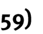

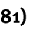

> **[Diagram Context - Textbook_MathematicalLiteracy_Gr11_Financial-documents-and-tariff-systems.pdf-0001-11.png]**
> The image displays text content featuring the partial heading "Contexts an" in bold black sans-serif font against a plain white background. It serves as a title or heading fragment introducing educational scenarios or applications within a CAPS curriculum text. Conceptually, it prepares learners to examine subject content through real-world applications and contextual problem-solving.

> **[Diagram Context - Textbook_MathematicalLiteracy_Gr11_Financial-documents-and-tariff-systems.pdf-0001-12.png]**
> This image is a text banner containing the phrase "nd integrated content" in a sans-serif font. It functions as a heading or contextual label within an educational document. Conceptually, it indicates that the following or preceding section covers cross-topic themes or combined concepts relevant to the curriculum.

> **[Diagram Context - Textbook_MathematicalLiteracy_Gr11_Financial-documents-and-tariff-systems.pdf-0001-15.png]**
> The image displays a text-based attribution header reading "© Via Afrika >> Mathematical Literacy Gr 11". It functions as a publisher and curriculum source identifier for educational materials aligned with the South African CAPS curriculum. This text anchors the source of accompanying Mathematical Literacy content for Grade 11 learners.

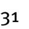

> **[Diagram Context - Textbook_MathematicalLiteracy_Gr11_Weight-and-Temperatute.pdf-0001-00.png]**
> This graphic serves as a chapter heading for a Mathematics or Physical Sciences curriculum module. It features the text "Chapter 5" and the title "Measurement," with sub-topics including length, distance, weight, volume, and temperature. It conceptually introduces the fundamental units and practical techniques required for accurate quantitative analysis in high school science and mathematics.

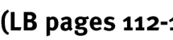

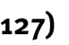

> **[Diagram Context - Textbook_MathematicalLiteracy_Gr11_Weight-and-Temperatute.pdf-0001-05.png]**
> This image is a copyright attribution text identifying the source as "Via Afrika » Mathematical Literacy Gr 11." It serves as a formal citation for educational materials aligned with the South African CAPS curriculum. This text indicates that the associated content is designed to support Grade 11 learners in developing practical mathematical skills for real-world contexts.

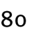

---

# Chapter 5: Measurement
## Body Mass Index (BMI)

Body Mass Index (BMI) is a calculated value that uses an adult's height and weight to determine their weight status. The units for BMI are $\text{kg/m}^2$ (kilograms per square metre), representing a comparison of an adult's weight to the surface area of their body.

### Formula
The formula for calculating BMI is:

$$\text{BMI (kg/m}^2) = \frac{\text{weight (kg)}}{[\text{height (m)}]^2}$$

### BMI Weight Status Categories
The following table is used to determine the weight status based on the calculated BMI value:

| BMI range ($\text{kg/m}^2$) | Weight status |
| :--- | :--- |
| less than $18,5$ | underweight |
| from $18,5$ to $24,9$ | normal weight |
| from $25$ to $30$ | overweight |
| more than $30$ | obese |

---

### Worked Example
**Problem:** Calculate the BMI for an adult with a height of $1,75\text{ m}$ and a weight of $82\text{ kg}$.

**Solution:**

1. **Identify the values:**
   * Weight = $82\text{ kg}$
   * Height = $1,75\text{ m}$

2. **Apply the formula:**
   $$\text{BMI} = \frac{82\text{ kg}}{[1,75\text{ m}]^2}$$

3. **Calculate:**
   $$\text{BMI} = \frac{82\text{ kg}}{3,0625\text{ m}^2} \approx 26,8\text{ kg/m}^2$$

**Conclusion:**
Rounding to one decimal place, the BMI is $26,8\text{ kg/m}^2$. According to the table, this adult is classified as **overweight**.

> **[Diagram Context - Textbook_MathematicalLiteracy_Gr11_Financial-documents-and-tariff-systems.pdf-0002-00.png]**
> This educational graphic presents a chapter title banner on a red background featuring the heading "Chapter 3" and the subtitle "Finance (Financial Documents, Tariff Systems, Income, Cost and Selling Price, Break-Even Analysis)". It introduces key financial literacy topics required for high school learners studying Mathematical Literacy, outlining the foundational business and consumer calculations covered in the unit.

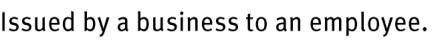
> **[Diagram Context - Textbook_MathematicalLiteracy_Gr11_Financial-documents-and-tariff-systems.pdf-0002-03.png]**
> The image displays text stating "Issued by a business to an employee." This educational text prompt sets up a question or scenario regarding business documents, specifically related to employment remuneration or administrative records in Accounting or Business Studies. Conceptually, it prompts students to identify specific source documents such as a payslip or salary advice used in the recording of financial transactions and human resources management.

> **[Diagram Context - Textbook_MathematicalLiteracy_Gr11_Financial-documents-and-tariff-systems.pdf-0002-04.png]**
> This graphic is a text banner containing a title heading. The visible text reads "Quotation, Invoice and Receipt" in bold white font against a solid green background. Conceptually, this heading introduces foundational financial documents taught in EMS (Economic and Management Sciences), helping learners distinguish between a price estimate, a demand for payment, and proof of payment.

> **[Diagram Context - Textbook_MathematicalLiteracy_Gr11_Financial-documents-and-tariff-systems.pdf-0002-05.png]**
> The graphic displays a partial text snippet defining a business document related to transactions involving customers. The visible text reads "Issues by a business to a customer who is". Conceptually, this helps CAPS Grade 10-12 Accounting learners identify source documents and understand the transactional context of trade debtors, credit notes, or invoices.

> **[Diagram Context - Textbook_MathematicalLiteracy_Gr11_Financial-documents-and-tariff-systems.pdf-0002-06.png]**
> This image is a text snippet rather than a CAPS educational graphic or diagram. It contains the lowercase sentence fragment "thinking of buying or who has bought an" rendered in a standard sans-serif typeface. Because it lacks any scientific structures, labels, axes, or conceptual diagrams, it conveys no subject-specific curriculum content for high school learners.

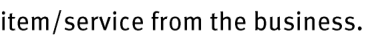
> **[Diagram Context - Textbook_MathematicalLiteracy_Gr11_Financial-documents-and-tariff-systems.pdf-0002-07.png]**
> The image shows a snippet of text featuring the phrase "item/service from the business." It serves as a contextual reading prompt or assessment question fragment related to business operations and transactions. Conceptually, it helps learners identify the primary outputs or offerings exchanged between a business entity and its customers or stakeholders.

> **[Diagram Context - Textbook_MathematicalLiteracy_Gr11_Financial-documents-and-tariff-systems.pdf-0002-08.png]**
> The image displays a text snippet stating, "Provides information on the amount of money the". This text fragment introduces a financial concept related to income, budgets, or economic resources. For a high school student studying EMS or Economics, this foundational statement prompts learners to consider the role of financial data and record-keeping in tracking income and expenditure.

> **[Diagram Context - Textbook_MathematicalLiteracy_Gr11_Financial-documents-and-tariff-systems.pdf-0002-09.png]**
> The image displays a text snippet reading "employee earns from the business together with", representing a partial sentence typical of CAPS Business Studies examination questions or textbook prompts. The visible text contains lowercase alphabetic characters forming words related to human resources and remuneration. Conceptually, this snippet introduces or completes a definition concerning financial compensation, fringe benefits, or net earnings in the context of employee remuneration.

> **[Diagram Context - Textbook_MathematicalLiteracy_Gr11_Financial-documents-and-tariff-systems.pdf-0002-10.png]**
> The image displays a text fragment reading "any deductions made from the salary." It serves as a text-based financial literacy excerpt commonly found in Grade 11 and 12 Accounting or Mathematical Literacy contexts. Conceptually, it introduces learners to the distinction between gross earnings and net pay by highlighting how statutory and voluntary deductions reduce an employee's take-home pay.

> **[Diagram Context - Textbook_MathematicalLiteracy_Gr11_Financial-documents-and-tariff-systems.pdf-0002-12.png]**
> The graphic displays a horizontal text snippet accompanied by a visual icon. It features a dotted arrow symbol followed by the lowercase text "provides a guideline of all of the". Conceptually, this visual acts as a signpost or directional cue in CAPS educational materials to direct learners toward summary guidelines, assessment frameworks, or curriculum requirements.

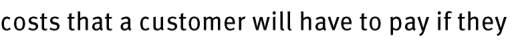
> **[Diagram Context - Textbook_MathematicalLiteracy_Gr11_Financial-documents-and-tariff-systems.pdf-0002-13.png]**
> The graphic displays text related to consumer costs, specifically showing the phrase "costs that a customer will have to pay if they". It contains no symbols, labels, diagrams, or variables. Conceptually, it introduces a word problem scenario regarding financial mathematics or consumer expenditure, relevant to Grade 10-12 Mathematical Literacy.

> **[Diagram Context - Textbook_MathematicalLiteracy_Gr11_Financial-documents-and-tariff-systems.pdf-0002-14.png]**
> This educational graphic displays text stating "choose to buy an item/service." It features lowercase text in a simple, sans-serif font against a plain white background. Conceptually, for a high school student studying Economic and Management Sciences (EMS), this text introduces foundational consumer decision-making and the concept of choice in utilizing financial resources.

> **[Diagram Context - Textbook_MathematicalLiteracy_Gr11_Financial-documents-and-tariff-systems.pdf-0002-16.png]**
> The graphic consists of a dotted arrow followed by the text "provides a summary of all of the costs". It establishes a visual legend or instructional cue using a directional indicator. Conceptually, it helps learners map key financial relationships and data representations during economics and business studies problem-solving.

> **[Diagram Context - Textbook_MathematicalLiteracy_Gr11_Financial-documents-and-tariff-systems.pdf-0002-17.png]**
> The image displays a text fragment reading "that a customer must now pay because they have". It contains no scientific diagrams, labels, variables, or educational graphics. Consequently, it conveys no specific CAPS curriculum subject matter or conceptual learning content.

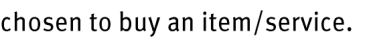
> **[Diagram Context - Textbook_MathematicalLiteracy_Gr11_Financial-documents-and-tariff-systems.pdf-0002-18.png]**
> The image displays a text fragment featuring the phrase "chosen to buy an item/service." There are no graphical symbols, labels, or arrows present in this excerpt. Conceptually, this text fragment supports consumer education and economic decision-making topics by highlighting the selection process involved in purchasing goods or services.

> **[Diagram Context - Textbook_MathematicalLiteracy_Gr11_Financial-documents-and-tariff-systems.pdf-0002-20.png]**
> The image is a text snippet showing a fragment of a sentence related to financial literacy and consumer documents. The visible text reads "ovides proof that a customer has". Conceptually, this content relates to business, commerce, or accounting topics within the curriculum, specifically introducing students to source documents and proof of transactions.

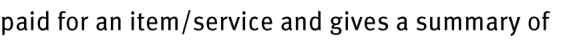
> **[Diagram Context - Textbook_MathematicalLiteracy_Gr11_Financial-documents-and-tariff-systems.pdf-0002-21.png]**
> This educational graphic is a text excerpt illustrating financial literacy concepts typically covered in EMS. The visible text reads "paid for an item/service and gives a summary of". Conceptually, it helps learners identify and define source documents used in accounting transactions, such as receipts or invoices.

> **[Diagram Context - Textbook_MathematicalLiteracy_Gr11_Financial-documents-and-tariff-systems.pdf-0002-22.png]**
> This image is a text snippet featuring a line of text in a sans-serif font. The visible text reads "the costs for buying the item/service and the". It conveys a fragment of a mathematical or financial literacy problem related to consumer expenses and budgeting.

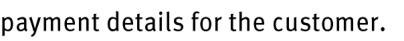
> **[Diagram Context - Textbook_MathematicalLiteracy_Gr11_Financial-documents-and-tariff-systems.pdf-0002-23.png]**
> The image displays a text fragment reading "payment details for the customer." It contains no scientific diagram, labels, arrows, or academic variables related to the CAPS curriculum. Consequently, it conveys no conceptual subject matter for high school learners.

> **[Diagram Context - Textbook_MathematicalLiteracy_Gr11_Financial-documents-and-tariff-systems.pdf-0002-24.png]**
> This is a plain text educational heading displaying the words "Important terminology:". It serves as a visual organizer and signpost in CAPS-aligned learning materials to direct learners' attention toward key subject-specific definitions and vocabulary. Conceptually, it prepares students to master essential scientific or mathematical terms required for formal assessments.

> **[Diagram Context - Textbook_MathematicalLiteracy_Gr11_Financial-documents-and-tariff-systems.pdf-0002-25.png]**
> The image displays a text banner with the heading "Important terminology:" in bold black font. It serves as a visual section divider or heading commonly found in CAPS curriculum textbooks and digital resources to introduce key vocabulary for a specific topic. This heading frames subsequent definitions or glossaries that help high school learners master foundational subject-specific terms required for examinations.

> **[Diagram Context - Textbook_MathematicalLiteracy_Gr11_Financial-documents-and-tariff-systems.pdf-0002-28.png]**
> The image is a text-based publisher attribution stating "© Via Afrika » Mathematical Literacy Gr 11". It serves as a copyright and curriculum reference tag for a Grade 11 Mathematical Literacy textbook. Conceptually, it identifies the educational source and curriculum level of associated learning materials for South African learners.

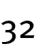

> **[Diagram Context - Textbook_MathematicalLiteracy_Gr11_Weight-and-Temperatute.pdf-0002-00.png]**
> This graphic serves as a chapter heading for a CAPS curriculum module titled "Chapter 5: Measurement." It explicitly lists the core competencies of the unit, which include measuring length, distance, weight, volume, and temperature. The text provides a foundational overview of the essential physical quantities and units of measurement that students must master to perform accurate scientific and mathematical calculations.

> **[Diagram Context - Textbook_MathematicalLiteracy_Gr11_Weight-and-Temperatute.pdf-0002-01.png]**
> This graphic is a text-based heading labeled "Section 2: Worl". It serves as a structural signpost within educational material, likely indicating the commencement of a specific thematic unit or chapter related to "World" studies, such as Geography or History.

> **[Diagram Context - Textbook_MathematicalLiteracy_Gr11_Weight-and-Temperatute.pdf-0002-02.png]**
> This text-based graphic serves as a heading or title for a lesson module. It features the phrase "rking with weight," which is a truncated version of "working with weight." This content introduces the fundamental physical concept of weight as a force, helping learners distinguish it from mass within the context of Newtonian mechanics.

> **[Diagram Context - Textbook_MathematicalLiteracy_Gr11_Weight-and-Temperatute.pdf-0002-03.png]**
> This image is a text-based reference label containing the abbreviation "LB" followed by the page range "120-1". It serves as a navigational signpost directing students to specific content within their prescribed Learner's Book to support their current lesson.

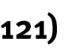

> **[Diagram Context - Textbook_MathematicalLiteracy_Gr11_Weight-and-Temperatute.pdf-0002-09.png]**
> This graphic consists of a simple text heading reading "Contexts and integrated content." It serves as a structural signpost in educational materials to indicate that the following section will bridge theoretical concepts with real-world applications or cross-curricular themes, as required by the CAPS curriculum's focus on holistic learning.

> **[Diagram Context - Textbook_MathematicalLiteracy_Gr11_Weight-and-Temperatute.pdf-0002-11.png]**
> This image is a text-based attribution label identifying the source material as "Via Afrika » Mathematical Literacy Gr 11." It serves as a copyright and curriculum-specific citation for educational content within the South African CAPS framework. This label indicates that the associated instructional material is aligned with the Grade 11 Mathematical Literacy syllabus.

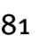

---

# Chapter 5: Measurement
## Weight Status and BMI Charts

### Concept: Using BMI Charts
Body Mass Index (BMI) charts are tools used to determine the weight status of an adult without needing to perform manual calculations. By plotting an individual's height and weight on the chart, you can identify which category they fall into based on the shaded regions.

> **[Diagram Context - Textbook_MathematicalLiteracy_Gr11_Financial-documents-and-tariff-systems.pdf-0003-00.png]**
> This educational graphic displays a title banner for a chapter on financial mathematics, featuring the text "Chapter 3" inside a rounded pill-shaped box alongside the subtitle "Finance (Financial Documents, Tariff Systems, Income, Cost and Selling Price, Break-Even Analysis)". The visual layout uses a bold white serif font set against a solid dark red-brown background to clearly indicate a specific curriculum section. Conceptually, this slide or graphic introduces foundational Grade 10-12 Mathematical Literacy and Mathematics topics relating to personal and business finance, preparing learners for calculations involving income, expenditure, tariffs, and break-even points.

### Understanding the Chart
The chart provided uses two axes to represent physical measurements:
*   **Vertical Axis (Y-axis):** Represents height in metres (left) and feet/inches (right).
*   **Horizontal Axis (X-axis):** Represents weight in kilograms (bottom) and pounds (top).

### Weight Status Categories
The chart is divided into color-coded zones representing different BMI ranges:

| Category | BMI Range |
| :--- | :--- |
| Underweight | $BMI < 18.5$ |
| Normal range | $18.5 - 24.9$ |
| Overweight | $25 - 30$ |
| Obese | $BMI > 30$ |

### How to use the chart
1.  **Locate Height:** Find the person's height on the vertical axis (metres).
2.  **Locate Weight:** Find the person's weight on the horizontal axis (kilograms).
3.  **Plot the Point:** Move horizontally from the height value and vertically from the weight value until the lines intersect (Point A in the diagram).
4.  **Determine Status:** Observe which shaded region the intersection point falls into to determine the weight status.

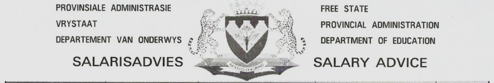
> **[Diagram Context - Textbook_MathematicalLiteracy_Gr11_Financial-documents-and-tariff-systems.pdf-0003-07.png]**
> The graphic is an administrative document header featuring the provincial coat of arms and bilingual text. Visible labels include "PROVINSIALE ADMINISTRASIE VRYSTAAT DEPARTEMENT VAN ONDERWYS," "FREE STATE PROVINCIAL ADMINISTRATION DEPARTMENT OF EDUCATION," and "SALARISADVIES SALARY ADVICE." This image represents an official education department administrative notice rather than a CAPS curriculum subject concept.

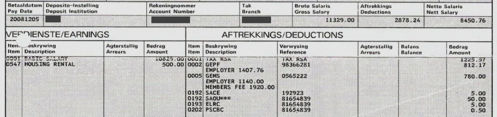
> **[Diagram Context - Textbook_MathematicalLiteracy_Gr11_Financial-documents-and-tariff-systems.pdf-0003-08.png]**
> The graphic is an official South African payslip document showing financial transactions, earnings, and deductions. Visible labels include bilingual headings such as "Betaaldatum / Pay Date", "Verdienste / Earnings", "Aftrekkings / Deductions", "Bruto Salaris / Gross Salary", and "Netto Salaris / Nett Salary", along with itemised figures for basic salary, housing rental, tax, GEMS, and GEPF. Conceptually, this document helps FET learners understand financial literacy, specifically how to read and interpret real-world payslips by calculating net income after subtracting taxes and other contributions from the gross salary.

> **[Diagram Context - Textbook_MathematicalLiteracy_Gr11_Financial-documents-and-tariff-systems.pdf-0003-09.png]**
> This educational graphic consists of a text banner displaying the heading "Understanding terms used in". The visible text elements are limited to the words "Understanding", "terms", "used", and "in", set in a bold, sans-serif font against a plain white background. Conceptually, this title introduces a glossary, terminology section, or instructional guide designed to help CAPS learners master essential scientific vocabulary and definitions required for examinations.

> **[Diagram Context - Textbook_MathematicalLiteracy_Gr11_Financial-documents-and-tariff-systems.pdf-0003-10.png]**
> The image displays a text fragment reading "n the document" in a plain, sans-serif black typeface. No additional labels, symbols, axes, or visual structures are present. This snippet functions merely as a textual fragment within a larger document rather than conveying a distinct educational concept.

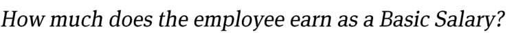
> **[Diagram Context - Textbook_MathematicalLiteracy_Gr11_Financial-documents-and-tariff-systems.pdf-0003-13.png]**
> The image is a text-based educational graphic asking, "How much does the employee earn as a Basic Salary?". It features italicized text addressing financial mathematics and employment remuneration concepts. This prompt tests a high school student's ability to extract specific income data from a given payslip or employment contract in CAPS Mathematical Literacy.

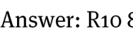

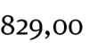

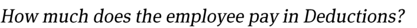
> **[Diagram Context - Textbook_MathematicalLiteracy_Gr11_Financial-documents-and-tariff-systems.pdf-0003-17.png]**
> This educational graphic presents a direct financial literacy question for Grade 10-12 Mathematical Literacy learners studying personal finance and taxation. The text reads simply: "How much does the employee pay in Deductions?". Conceptually, it prompts students to interpret payslips and calculate or extract the total subtractions—such as PAYE, UIF, and medical aid contributions—from gross to net salary.

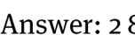

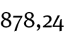

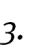

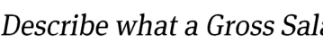
> **[Diagram Context - Textbook_MathematicalLiteracy_Gr11_Financial-documents-and-tariff-systems.pdf-0003-21.png]**
> This image displays an assessment question formatted as a text prompt in a serif font. The visible text reads "Describe what a Gross Sal...". Conceptually, this prompt tests a learner's understanding of foundational financial mathematics and economic terminology regarding personal income as outlined in the CAPS curriculum.

> **[Diagram Context - Textbook_MathematicalLiteracy_Gr11_Financial-documents-and-tariff-systems.pdf-0003-22.png]**
> The image shows a snippet of text from a financial literacy or Accounting assessment. Visible text includes the partial words "lary is" and the full terms "identify the Gross Sal". Conceptually, this prompts learners to define a salary and extract or identify the gross salary from a given context, which is a fundamental competency in CAPS curriculum financial mathematics and accounting.

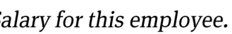
> **[Diagram Context - Textbook_MathematicalLiteracy_Gr11_Financial-documents-and-tariff-systems.pdf-0003-23.png]**
> This image is a text snippet from a mathematical literacy or business studies assessment. It displays the text fragment "...alary for this employee." in a standard serif font. Conceptually, it represents a prompt or question stem used to guide learners in extracting, calculating, or interpreting financial data related to employee remuneration.

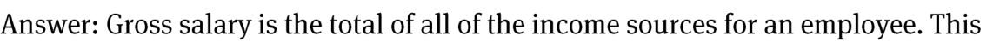
> **[Diagram Context - Textbook_MathematicalLiteracy_Gr11_Financial-documents-and-tariff-systems.pdf-0003-24.png]**
> The image presents a text-based educational definition stating, "Answer: Gross salary is the total of all of the income sources for an employee. This". Visible keywords include "Gross salary," "total," "income sources," and "employee." Conceptually, this text introduces high school Mathematical Literacy learners to foundational financial terminology by defining gross salary as the aggregate earnings before any deductions are made.

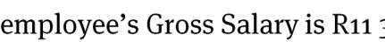
> **[Diagram Context - Textbook_MathematicalLiteracy_Gr11_Financial-documents-and-tariff-systems.pdf-0003-25.png]**
> The image is a text snippet from a financial mathematics problem showing the phrase "emplyee's Gross Salary is R11". It contains text and numbers representing monetary values in South African Rand (R). This introductory statement sets up a financial context for calculating deductions, taxes, or net salary in CAPS Mathematical Literacy or Mathematics.

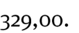

> **[Diagram Context - Textbook_MathematicalLiteracy_Gr11_Financial-documents-and-tariff-systems.pdf-0003-27.png]**
> The provided image is a simple text banner stating "(c) Via Afrika >> Mathematical Literacy Gr 11", identifying the publisher and curriculum source for Grade 11 Mathematical Literacy. It contains no diagrams, variables, or illustrations to analyze.

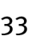

> **[Diagram Context - Textbook_MathematicalLiteracy_Gr11_Weight-and-Temperatute.pdf-0003-00.png]**
> This graphic serves as a chapter heading for a Mathematics or Physical Sciences module, explicitly labeling "Chapter 5" and the topic "Measurement." It outlines the core curriculum focus areas of measuring length, distance, weight, volume, and temperature, providing students with a foundational overview of the quantitative skills required for practical scientific and mathematical application.

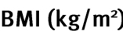

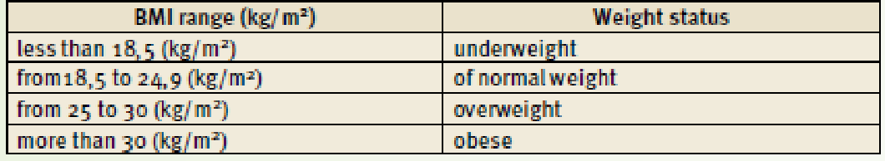
> **[Diagram Context - Textbook_MathematicalLiteracy_Gr11_Weight-and-Temperatute.pdf-0003-05.png]**
> This table categorizes Body Mass Index (BMI) values, measured in kg/m², into four distinct weight status classifications: underweight, normal weight, overweight, and obese. It serves as a diagnostic reference tool for Life Sciences learners to interpret numerical BMI data and understand the health implications of different weight ranges.

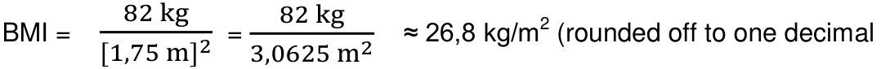
> **[Diagram Context - Textbook_MathematicalLiteracy_Gr11_Weight-and-Temperatute.pdf-0003-08.png]**
> This mathematical equation demonstrates the calculation of Body Mass Index (BMI) using the variables of mass (82 kg) and height (1,75 m). It illustrates the step-by-step process of squaring the height and dividing the mass to arrive at a final value of approximately 26,8 kg/m², highlighting the importance of correct unit application and rounding in Life Sciences calculations.

> **[Diagram Context - Textbook_MathematicalLiteracy_Gr11_Weight-and-Temperatute.pdf-0003-11.png]**
> This image is a text-based attribution label identifying the source material as "Via Afrika » Mathematical Literacy Gr 11." It serves as a copyright and curriculum-specific identifier for educational content used within the South African CAPS Mathematical Literacy syllabus.

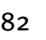

---

# Chapter 5: Measurement

## Section 4: Measuring Temperature

### Overview
In this section, you will learn to measure and convert temperatures. By the end of this section, you should be able to:
* Convert between degrees Celsius ($^\circ\text{C}$) and degrees Fahrenheit ($^\circ\text{F}$).
* Interpret temperature values to assist in planning trips.

---

### 1. Converting Temperature Values

To convert between temperature systems, use the following formulas:

| To convert to Fahrenheit ($^\circ\text{F}$) | To convert to Celsius ($^\circ\text{C}$) |
| :--- | :--- |
| $^\circ\text{F} = (^\circ\text{C} \times 1,8) + 32^\circ$ | $^\circ\text{C} = (^\circ\text{F} - 32^\circ) \div 1,8$ |

#### Worked Examples

**Example 1: Converting $30^\circ\text{C}$ to $^\circ\text{F}$**
$$^\circ\text{F} = (30 \times 1,8) + 32^\circ$$
$$^\circ\text{F} = 54^\circ + 32^\circ$$
$$^\circ\text{F} = 86^\circ$$

**Example 2: Converting $50^\circ\text{F}$ to $^\circ\text{C}$**
$$^\circ\text{C} = (50 - 32^\circ) \div 1,8$$
$$^\circ\text{C} = 18^\circ \div 1,8$$
$$^\circ\text{C} = 10^\circ$$

> **Note:** An equivalent temperature in degrees Fahrenheit will always be a much larger numerical value than the corresponding temperature in degrees Celsius.

> **[Diagram Context - Textbook_MathematicalLiteracy_Gr11_Financial-documents-and-tariff-systems.pdf-0004-00.png]**
> The graphic is a textbook chapter title header set against a dark red background. It features the text labels "Chapter", the number "3", and the subtitle "Finance (Financial Documents, Tariff Systems, Income, Cost and Selling Price, Break-Even Analysis)". Conceptually, this banner introduces a CAPS Mathematics Literacy or Mathematical Literacy curriculum unit focused on practical financial mathematics and business management skills.

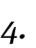

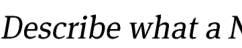
> **[Diagram Context - Textbook_MathematicalLiteracy_Gr11_Financial-documents-and-tariff-systems.pdf-0004-02.png]**
> This image displays the truncated text prompt "Describe what a N". The text consists of capitalized and lowercase letters set in a standard serif font. Conceptually, it serves as an incomplete assessment question designed to test a high school student's ability to recall and define specific scientific terms starting with the letter N within the CAPS curriculum.

> **[Diagram Context - Textbook_MathematicalLiteracy_Gr11_Financial-documents-and-tariff-systems.pdf-0004-03.png]**
> This image shows text content reading "Net Salary is and identify the Net Sa". It presents an incomplete sentence or prompt regarding financial terminology. Conceptually, it is designed to test a high school student's understanding of personal finance and income calculations within the CAPS curriculum, specifically regarding gross income versus take-home pay.

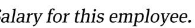
> **[Diagram Context - Textbook_MathematicalLiteracy_Gr11_Financial-documents-and-tariff-systems.pdf-0004-04.png]**
> This image contains text reading "Salary for this employee." It represents a textual prompt or question header typically found in CAPS-aligned Mathematical Literacy assessments dealing with financial documents and earnings. Conceptually, it introduces a specific problem context regarding personal income, guiding learners to locate and interpret salary data from a table, payslip, or table of data.

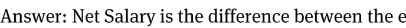
> **[Diagram Context - Textbook_MathematicalLiteracy_Gr11_Financial-documents-and-tariff-systems.pdf-0004-05.png]**
> This image is a text-based educational definition presenting a standard textbook answer regarding personal finance. It contains the visible text label "Answer: Net Salary is the difference between the". For a high school student studying Mathematical Literacy, this concept conveys the fundamental distinction between gross income and take-home pay after necessary deductions like tax and UIF.

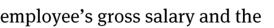
> **[Diagram Context - Textbook_MathematicalLiteracy_Gr11_Financial-documents-and-tariff-systems.pdf-0004-06.png]**
> The graphic displays text fragments from a financial mathematics context, specifically relating to employment earnings. The visible text reads "employee's gross salary and the". Conceptually, this introduces learners to personal finance calculations, helping them understand income components such as gross salary before deductions like tax, UIF, and medical aid are applied.

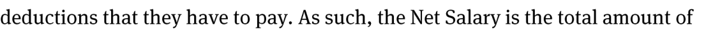
> **[Diagram Context - Textbook_MathematicalLiteracy_Gr11_Financial-documents-and-tariff-systems.pdf-0004-07.png]**
> The graphic is a text excerpt explaining financial calculations related to employee compensation. It features the visible text phrase "deductions that they have to pay. As such, the Net Salary is the total amount of". Conceptually, this content helps Grade 10-12 Mathematical Literacy learners understand the fundamental distinction between gross income and net salary by defining net pay after statutory and voluntary deductions are subtracted.

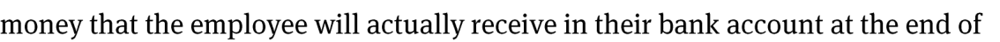
> **[Diagram Context - Textbook_MathematicalLiteracy_Gr11_Financial-documents-and-tariff-systems.pdf-0004-08.png]**
> This image is a text excerpt from a CAPS curriculum educational resource defining net remuneration in personal finance. The text includes the phrase "money that the employee will actually receive in their bank account at the end of". Conceptually, this conveys the definition of net salary or take-home pay, distinguishing it from gross salary after all statutory and voluntary deductions have been subtracted.

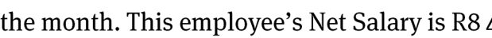
> **[Diagram Context - Textbook_MathematicalLiteracy_Gr11_Financial-documents-and-tariff-systems.pdf-0004-09.png]**
> The image shows a snippet of text from a financial mathematics context related to salary calculations. The visible text includes the fragments "the month. This employee's Net Salary is R8 4". For a CAPS curriculum student, this represents a problem-solving scenario in financial literacy where learners must calculate deductions, gross income, or net salary in rands.

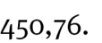

> **[Diagram Context - Textbook_MathematicalLiteracy_Gr11_Financial-documents-and-tariff-systems.pdf-0004-11.png]**
> The image displays a snippet of instructional text in a sans-serif black font on a white background, reading "nstrate how values in the document have". This text snippet lacks complete context, serving only as a partial instructional sentence fragment. For CAPS learners, such text fragments typically appear in exam rubrics or guidelines to prompt learners on analyzing textual sources or data values.

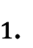

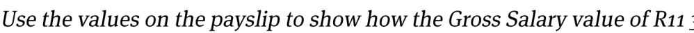
> **[Diagram Context - Textbook_MathematicalLiteracy_Gr11_Financial-documents-and-tariff-systems.pdf-0004-17.png]**
> This image is an examination-style text prompt instructing students to calculate and verify a financial figure using workplace documents. The visible text reads "Use the values on the payslip to show how the Gross Salary value of R11". This question tests a student's ability to interpret financial data, understand income components, and perform basic arithmetic calculations related to taxation and earnings in a South African context.

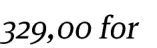

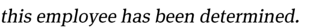
> **[Diagram Context - Textbook_MathematicalLiteracy_Gr11_Financial-documents-and-tariff-systems.pdf-0004-19.png]**
> The image displays a text snippet consisting of the lowercase italicized words "this employee has been determined." with no other visual elements, labels, or arrows present. It does not contain educational diagrams or subject-specific content relevant to the CAPS curriculum.

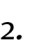

> **[Diagram Context - Textbook_MathematicalLiteracy_Gr11_Financial-documents-and-tariff-systems.pdf-0004-21.png]**
> The image shows a partial text excerpt from an educational assessment memo, displaying the heading "Answer: Gross S". Visible text includes the capitalized words "Answer:", "Gross", and the letter "S". Conceptually, this snippet represents a typical marking guideline for a South African CAPS Life Sciences assessment, directing the educator to accept answers related to gross biological structures or anatomical specimens.

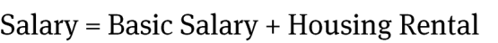
> **[Diagram Context - Textbook_MathematicalLiteracy_Gr11_Financial-documents-and-tariff-systems.pdf-0004-22.png]**
> This educational graphic is a mathematical formula representing a financial equation. It displays the text labels "Salary", "Basic Salary", and "Housing Rental", connected by an equals sign and a plus sign. Conceptually, it illustrates how a total financial income or salary is calculated by combining a fixed base amount with an additional allowance, which is a foundational concept in Grade 10-12 Mathematical Literacy and Mathematics for real-world financial management.

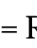

> **[Diagram Context - Textbook_MathematicalLiteracy_Gr11_Financial-documents-and-tariff-systems.pdf-0004-24.png]**
> The graphic displays a basic arithmetic addition equation involving South African Rand currency values, specifically displaying the text string "829,00 + R500,00 = R11 329". Visible symbols and labels include numerical digits, commas used as decimal separators, the South African Rand currency symbol ("R"), a plus operator ("+"), and an equals sign ("="). Conceptually, for a Mathematical Literacy learner, this text highlights a common transcription or calculation error where inconsistent formatting and placement of decimal separators lead to an incorrect sum in financial contexts.

> **[Diagram Context - Textbook_MathematicalLiteracy_Gr11_Financial-documents-and-tariff-systems.pdf-0004-25.png]**
> This image is a text-based assessment question typical of Mathematical Literacy curricula. It features a single instructional sentence referencing a payslip, the specific monetary value "R2," and the term "Deductions." Conceptually, this prompt requires learners to apply basic arithmetic operations to verify or calculate financial data found on a standard employment payslip, reinforcing practical life skills related to personal finance and taxation.

> **[Diagram Context - Textbook_MathematicalLiteracy_Gr11_Financial-documents-and-tariff-systems.pdf-0004-27.png]**
> This image contains text only, reading "this employee has been determined." in an italicized serif font. There are no educational graphics, diagrams, labels, or CAPS curriculum elements present.

> **[Diagram Context - Textbook_MathematicalLiteracy_Gr11_Financial-documents-and-tariff-systems.pdf-0004-28.png]**
> This educational text graphic presents a mathematical calculation formula with the text label "Answer: Deductions = sum of all of the Deduction values". The visible text elements include the terms "Answer", "Deductions", "sum", and "Deduction values". Conceptually, this conveys the fundamental arithmetic principle of aggregation, teaching students how to calculate a total final value (Deductions) by adding together a series of individual component values.

> **[Diagram Context - Textbook_MathematicalLiteracy_Gr11_Financial-documents-and-tariff-systems.pdf-0004-30.png]**
> The graphic shows a mathematical addition expression involving South African Rand currency values, specifically displaying the numerical string: 225,57 + R812,17 + R780,00 + R5,00 + R50,00 + R5,00 + R0,50. Visible symbols and labels include the Rand currency sign (R) and numeric values formatted with commas as decimal separators following South African convention. This expression conveys the practical application of arithmetic calculation and decimal addition within the Mathematical Literacy curriculum, specifically training learners to sum monetary amounts when compiling budgets or calculating total expenditures.

> **[Diagram Context - Textbook_MathematicalLiteracy_Gr11_Financial-documents-and-tariff-systems.pdf-0004-33.png]**
> This educational graphic is a text prompt from a Mathematical Literacy assessment task regarding financial documents. It contains the written instruction: "Use the values on the payslip to show how the Net Salary value of R8 450,00 for". Conceptually, this guides learners to apply basic arithmetic operations (such as addition and subtraction) to calculate or verify earnings, deductions, and take-home pay on an employment payslip.

> **[Diagram Context - Textbook_MathematicalLiteracy_Gr11_Financial-documents-and-tariff-systems.pdf-0004-34.png]**
> The image contains a single line of text formatted in a serif italic font. The visible words are "this employee has been determined." This text snippet represents a textual statement rather than a scientific diagram or mathematical graphic.

> **[Diagram Context - Textbook_MathematicalLiteracy_Gr11_Financial-documents-and-tariff-systems.pdf-0004-35.png]**
> This educational graphic displays a mathematical text formula defining the relationship between income components. The visible text labels are "Answer:", "Nett Salary", "Gross Salary", and a minus sign (-). Conceptually, it conveys to CAPS Mathematical Literacy students how to calculate an individual's take-home pay by subtracting deductions (such as tax and UIF, represented by the implied continuation of the formula) from their total earnings.

> **[Diagram Context - Textbook_MathematicalLiteracy_Gr11_Financial-documents-and-tariff-systems.pdf-0004-41.png]**
> The image displays text identifying a copyright attribution for educational material, specifically "© Via Afrika >> Mathematical Literacy Gr 11". The text functions as a source citation for Grade 11 Mathematical Literacy curriculum resources in South Africa. Conceptually, it indicates that the accompanying content originates from an officially recognized textbook publisher aligned with the CAPS curriculum.

> **[Diagram Context - Textbook_MathematicalLiteracy_Gr11_Weight-and-Temperatute.pdf-0004-00.png]**
> This graphic serves as a chapter heading for a CAPS curriculum module titled "Chapter 5: Measurement." It explicitly lists the core competencies of the unit, which include measuring length, distance, weight, volume, and temperature. The text functions as an introductory overview to help learners identify the fundamental physical quantities and practical measurement skills required for the upcoming section.

> **[Diagram Context - Textbook_MathematicalLiteracy_Gr11_Weight-and-Temperatute.pdf-0004-03.png]**
> This image is a text-based attribution label identifying the source material as "Via Afrika » Mathematical Literacy Gr 11." It serves as a copyright and curriculum-specific citation for educational content within the South African CAPS framework. This label indicates that the associated instructional material is aligned with the Grade 11 Mathematical Literacy syllabus.

---

# Chapter 5: Measurement

## 2. Using temperature values to plan trips

Understanding temperature units is essential when travelling internationally, as different countries use different measurement systems. For example, the United States uses degrees Fahrenheit ($^\circ\text{F}$), while South Africa uses degrees Celsius ($^\circ\text{C}$).

### Example: Weather Report Analysis
The following table represents a weather forecast for New York, USA, where temperatures are recorded in Fahrenheit.

| Date | Condition | Temp ($^\circ\text{F}$) | Humidity | Wind |
| :--- | :--- | :--- | :--- | :--- |
| September 17 | T-Storms | $69^\circ\text{F}$ | $90\%$ | From SW 12 mph |
| September 18 | T-Storms | $69^\circ\text{F}$ | $80\%$ | From SW 11 mph |
| September 19 | T-Storms | $69^\circ\text{F}$ | $70\%$ | From SW 11 mph |
| September 20 | T-Storms | $68^\circ\text{F}$ | $70\%$ | From SW 10 mph |
| September 21 | Scattered T-Storms | $68^\circ\text{F}$ | $60\%$ | From SW 9 mph |

> **[Diagram Context - Textbook_MathematicalLiteracy_Gr11_Financial-documents-and-tariff-systems.pdf-0005-00.png]**
> This educational graphic is a chapter heading banner for Mathematical Literacy. It features the text "Chapter 3" and the topic title "Finance (Financial Documents, Tariff Systems, Income, Cost and Selling Price, Break-Even Analysis)" set against a solid dark red background. Conceptually, this visual introduces learners to core financial mathematics concepts required for managing personal and business finances, such as understanding bills, calculating profits, and analyzing break-even points.

### Application for Learners
When travelling from South Africa to a country using Fahrenheit, you must convert the temperature values into degrees Celsius to better understand the climate. This allows you to:
*   Pack appropriate clothing for the weather.
*   Plan outdoor activities effectively based on expected conditions.

> **[Diagram Context - Textbook_MathematicalLiteracy_Gr11_Financial-documents-and-tariff-systems.pdf-0005-01.png]**
> The image displays a text-based section heading reading "Section 2: Budgets and statements of income-". This heading serves as a curricular title introducing financial topics relevant to Accounting and EMS. Conceptually, it frames the core financial concepts of planning cash flows through budgets and reporting actual financial performance via income statements.

> **[Diagram Context - Textbook_MathematicalLiteracy_Gr11_Financial-documents-and-tariff-systems.pdf-0005-04.png]**
> The image displays the single lowercase text label "expenditure" in a plain sans-serif font. This term represents a core economic concept related to the outflow of money by households, businesses, or the government. For a CAPS-aligned Economics learner, it introduces or reinforces vocabulary regarding financial outlays, budgeting, and macroeconomic circular flow components.

> **[Diagram Context - Textbook_MathematicalLiteracy_Gr11_Financial-documents-and-tariff-systems.pdf-0005-12.png]**
> The image consists of the heading text "Contexts and integrated content" written in bold, dark grey sans-serif font against a plain white background. It serves as a title or section heading in an educational document or presentation. Conceptually, it introduces a curriculum section focused on applying theoretical concepts to real-world scenarios and integrating knowledge across different topics.

> **[Diagram Context - Textbook_MathematicalLiteracy_Gr11_Financial-documents-and-tariff-systems.pdf-0005-18.png]**
> This image displays a textbook copyright attribution text reading "© Via Afrika » Mathematical Literacy Gr 11". It identifies the publisher and curriculum grade level for educational learning materials aligned with the CAPS syllabus.

> **[Diagram Context - Textbook_MathematicalLiteracy_Gr11_Weight-and-Temperatute.pdf-0005-00.png]**
> This text-based graphic serves as a chapter heading for a Mathematics or Physical Sciences curriculum module. It explicitly labels "Chapter 5" and identifies the core topic as "Measurement," specifically outlining the sub-topics of length, distance, weight, volume, and temperature. This provides learners with a clear scope of the foundational SI units and practical measurement techniques required for scientific and mathematical literacy.

> **[Diagram Context - Textbook_MathematicalLiteracy_Gr11_Weight-and-Temperatute.pdf-0005-01.png]**
> This graphic is a text-based heading labeled "Section 4: Measuring temperature." It serves as an introductory signpost for a lesson module focused on the principles and practical techniques of thermal measurement within the physical sciences curriculum.

> **[Diagram Context - Textbook_MathematicalLiteracy_Gr11_Weight-and-Temperatute.pdf-0005-02.png]**
> This image is a text-based reference label containing the characters "(LB pages 124-". It serves as a navigational citation directing students to specific pages within their Learner's Book (LB) to locate the relevant curriculum content.

> **[Diagram Context - Textbook_MathematicalLiteracy_Gr11_Weight-and-Temperatute.pdf-0005-09.png]**
> This image consists of the text heading "Contexts and integrated content," which serves as a structural label for educational material. It functions as a thematic signpost in CAPS curriculum resources to indicate how theoretical concepts are applied to real-world scenarios and linked across different subject topics.

> **[Diagram Context - Textbook_MathematicalLiteracy_Gr11_Weight-and-Temperatute.pdf-0005-13.png]**
> This text-based graphic serves as a heading for a Physical Sciences lesson on converting temperature values. It introduces the fundamental skill of interconverting between different temperature scales, such as Celsius and Kelvin, which is essential for calculations involving the gas laws.

> **[Diagram Context - Textbook_MathematicalLiteracy_Gr11_Weight-and-Temperatute.pdf-0005-18.png]**
> This image is a text-based citation identifying the source material as "Via Afrika » Mathematical Literacy Gr 11." It serves as a copyright and attribution label for educational content within the South African CAPS curriculum framework. This metadata informs students and educators that the associated material is aligned with the Grade 11 Mathematical Literacy syllabus.

---

# Chapter 5: Measurement
## Temperature Conversion

To convert temperature from degrees Fahrenheit ($^\circ\text{F}$) to degrees Celsius ($^\circ\text{C}$), use the following formula:

$$^\circ\text{C} = (^\circ\text{F} - 32) \div 1,8$$

### Worked Examples

| Converting $69^\circ\text{F}$ to $^\circ\text{C}$ | Converting $68^\circ\text{F}$ to $^\circ\text{C}$ |
| :--- | :--- |
| $^\circ\text{C} = (69 - 32) \div 1,8$ | $^\circ\text{C} = (68 - 32) \div 1,8$ |
| $^\circ\text{C} = 37 \div 1,8$ | $^\circ\text{C} = 36 \div 1,8$ |
| $^\circ\text{C} \approx 21^\circ\text{C}$ | $^\circ\text{C} = 20^\circ\text{C}$ |

### Application Note
Based on these conversions, the maximum temperature is considered fairly cool. When travelling in such conditions, it is recommended to pack warm clothing as well as gear suitable for rain, particularly if there is a forecast for thunderstorms.

> **[Diagram Context - Textbook_MathematicalLiteracy_Gr11_Financial-documents-and-tariff-systems.pdf-0006-00.png]**
> This educational graphic is a chapter title banner featuring the text "Chapter 3" inside a split black-and-white rounded box, positioned above the subtitle "Finance (Financial Documents, Tariff Systems, Income, Cost and Selling Price, Break-Even Analysis)" displayed in white against a solid dark red background. It visually organizes and introduces core financial literacy topics required for high school learners. Conceptually, it prepares students to engage with real-world economic applications, such as interpreting invoices, calculating utility tariffs, and analyzing business revenue and break-even points.

> **[Diagram Context - Textbook_MathematicalLiteracy_Gr11_Financial-documents-and-tariff-systems.pdf-0006-01.png]**
> This educational graphic is a financial spreadsheet representing a school's annual budget. Visible labels include "Summary," "Income Details," "Expense Details," "Actual (2010)," "Budgeted (2011)," "Actual (2011)," "School fees," "Donations & fundraising," "Grants," "Administration," "Teaching resources," and "Net Income" presented with South African Rand (R) currency values. Conceptually, this diagram helps learners understand financial literacy by illustrating how to plan, track, and compare projected budgets against actual income and expenses over consecutive years.

> **[Diagram Context - Textbook_MathematicalLiteracy_Gr11_Financial-documents-and-tariff-systems.pdf-0006-06.png]**
> This image is a text snippet featuring a curriculum heading or textbook subheading. The visible text reads "2. Statements of income-a". Conceptually, this introduces learners to financial reporting and accounting concepts related to income statements within the CAPS curriculum.

> **[Diagram Context - Textbook_MathematicalLiteracy_Gr11_Financial-documents-and-tariff-systems.pdf-0006-08.png]**
> The image displays text content featuring the lowercase word "expenditure" in a plain, bold, sans-serif font against a white background. It contains no additional graphic elements, labels, symbols, or arrows. Conceptually, this vocabulary term introduces students to financial management and economic concepts related to spending within the CAPS curriculum.

> **[Diagram Context - Textbook_MathematicalLiteracy_Gr11_Financial-documents-and-tariff-systems.pdf-0006-12.png]**
> This educational graphic is a publisher copyright attribution banner reading "© Via Afrika » Mathematical Literacy Gr 11". The text contains the publisher name ("Via Afrika") and textbook reference ("Mathematical Literacy Gr 11"), indicating the curriculum resource context. This metadata helps identify the origin and target grade of the learning material within the South African CAPS curriculum.

> **[Diagram Context - Textbook_MathematicalLiteracy_Gr11_Weight-and-Temperatute.pdf-0006-00.png]**
> This text-based graphic serves as a chapter heading for a Mathematics or Physical Sciences curriculum module. It explicitly labels "Chapter 5" and identifies the core topic as "Measurement," specifically outlining the sub-topics of length, distance, weight, volume, and temperature. This provides students with a clear scope of the foundational SI units and practical measurement skills required for scientific and mathematical literacy.

> **[Diagram Context - Textbook_MathematicalLiteracy_Gr11_Weight-and-Temperatute.pdf-0006-01.png]**
> This text-based graphic serves as a heading or instructional prompt labeled "2. Using temperature values to plan trips." It introduces a practical application of data interpretation, requiring students to analyze climate or weather-related temperature data to make informed decisions regarding travel planning.

> **[Diagram Context - Textbook_MathematicalLiteracy_Gr11_Weight-and-Temperatute.pdf-0006-05.png]**
> This weather forecast table displays daily meteorological data including dates (September 17–21), weather icons, temperatures in Fahrenheit, precipitation probabilities, humidity percentages, and wind direction/speed. It serves as a practical tool for Geography learners to interpret synoptic data, demonstrating how various atmospheric variables are recorded and tracked over a five-day period to predict local weather patterns.

> **[Diagram Context - Textbook_MathematicalLiteracy_Gr11_Weight-and-Temperatute.pdf-0006-07.png]**
> This image is a text-based attribution label identifying the source material as "Via Afrika » Mathematical Literacy Gr 11." It serves as a copyright and curriculum-specific citation for educational content used within the South African CAPS Mathematical Literacy syllabus.

