**Chapter 8 Finance (income tax)** 

# **Section 1: Understanding taxation** 

#### **(LB pages 216-221)** 

## **Overview** 

The content of this section on Income Tax, as part of the _Finance_ Application Topic, is drawn from page 59 in the CAPS document. 

As stipulated in the CAPS document, Grade 12 learners need specifically to be able to: 

- work with various financial documents (payslips, IRP5 forms, etc.) in order to determine an individual’s taxable income, personal income tax and net pay. 

- • investigate the effect on an increase in salary on the amount of income tax payable. 

## **Contexts and integrated content** 

- Contexts include several types of job where a salary is earned. 

- There is integration of content from the section on reading of tables and in the <u>topic</u> _Patterns, relationships_ _<u>and representations</u>_ . 

## **Important terminology** 

It is very important that you understand the terminology used in the context of income tax. These are explained in the table on the following page. 

Via Afrika ›› Mathematical Literacy Gr 12 

**Chapter 8 Finance (income tax)** 

|**Term**|**Meaning**|
|---|---|
|**Gross Salary**|The total amount earned in a month. This includes all types of salary (e.g. salary, overtime, bonuses, etc.)|
|**Deductions**|These are amounts that need to be subtracted from the gross salary_before_ money is deposited into the employee’s bank account. These include items such as UIF, Pension, Medical Aid, Trade Union Fees, Loan repayments, Tax, etc.|
|**Net Salary**|Also known as ‘take home pay’. This is the amount that is deposited into an employee’s bank account. It is calculated as follows: **Net Salary = Gross Salary - Deductions**|
|**Income Tax**|This is a tax on all sources of income (e.g. salary, interest income, rental income, etc.). It is calculated on the taxable income.|
|**Taxable Income**|This is different from Net Salary although the calculation looks similar. **Taxable Income = Gross Income – Tax-deductible Deductions**|
|**Gross Income**|This is different from gross salary (above) because it includes all forms of income, e.g. salary, rental income, textbook royalties, etc.|
|**Tax deductible** **Deductions**|These are specific deductions that are subtracted from the gross income before tax is calculated. There are two types of taxable deductions: _Salary-based deductibles_: subtracted from the gross salary by the employer before the salary is paid. These include: UIF, Pension fund contributions, etc. _Non-Salary deductibles_: These may be paid out of an employee’s take-home pay, e.g. donations to charities, certain medical expenses. There are limits placed on deductibles, e.g. the maximum amount that can be deducted for pension is 7,5% of the gross salary.|
|**Non-tax Deductible** **Expenses**|The majority of expenses are not tax deductible. These are generally living expenses, e.g. food, rent, fuel, entertainment, etc. Only tax deductible deductions reduce the amount of taxable income owed.|
|**Taxable Deductions**|Some deductions subtracted from an employee’s payslip are taxable. Although the employee receives less money they still have to pay tax on the larger amount of money that they earned. Examples include: loans from an employer, a garnishee order, monthly payments to the employer for services rendered, etc.|

Via Afrika ›› Mathematical Literacy Gr 12 

**<mark>Chapter 8</mark> Finance (income tax)** 

# **Section 2: Determining income tax** 

#### **(LB pages 222-231)** 

## **Overview** 

As for Section 1, the content of this section on Determining Income Tax is also drawn from page 59 in the CAPS document. 

As stipulated in the CAPS document, Grade 12 learners need specifically to be able to: 

- work with various financial documents (payslips, IRP5 forms, etc.) in order to determine an individual’s taxable income, personal income tax and net pay. 

- • investigate the effect on an increase in salary on the amount of income tax payable. 

## **Contexts and integrated content** 

- Contexts include several types of job where a salary is earned. 

- There is integration of content from the section on reading of tables and in the topic Patterns, relationships and representations. 

Once a person’s taxable income has been determined, there are two ways to calculate the total amount of tax owed: deduction tables and income tax formulae. 

## **Deduction tables** 

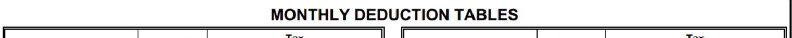
> **[Diagram Context - Textbook_MathematicalLiteracy_Gr12_Income-tax.pdf-0003-12.png]**
> The image shows a line drawing of a table labeled "Monthly Deduction Tables". The table is composed of a grid with rows and columns, and it is titled "Monthly Deduction Tables". The table is set against a gray background, and the text "Monthly Deduction Tables" is written in black at the top of the table. The table is designed to help students understand the

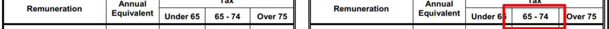
> **[Diagram Context - Textbook_MathematicalLiteracy_Gr12_Income-tax.pdf-0003-13.png]**
> The image shows a diagram of a Lewis structure for calcium carbonate. The diagram is divided into two columns, with the upper column labeled "Annual Equivalent Under 65" and the lower column labeled "Over 65". The diagram includes a red arrow pointing to the "Over 65" column. The diagram also includes a label for the "Ruminant Equivalent Under 65" column.

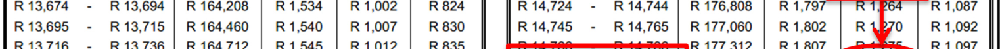
> **[Diagram Context - Textbook_MathematicalLiteracy_Gr12_Income-tax.pdf-0003-14.png]**
> 1. A diagram of a cell with a red arrow pointing to the right.

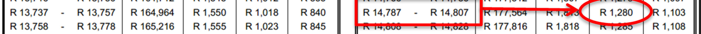
> **[Diagram Context - Textbook_MathematicalLiteracy_Gr12_Income-tax.pdf-0003-15.png]**
> 1. A diagram of a cell with the number 1,847,717 visible.

Via Afrika ›› Mathematical Literacy Gr 12 

**<mark>Chapter 8</mark> Finance (income tax)** 

## **Example** 

A person calculates that their taxable income is R14 803,00 per month and they are 68 years of age. How much will they need to pay in income tax per month? 

**Answer** : R1 280,00 per month 

## **Income tax formulae** 

Income tax is calculated in ‘tax brackets’ which means that different amounts of taxable income are calculated according to the range that they fall into. Below is an example of a tax table for the 2012/2013 tax year: 

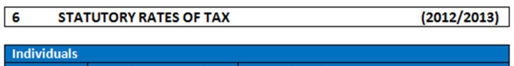
> **[Diagram Context - Textbook_MathematicalLiteracy_Gr12_Income-tax.pdf-0004-06.png]**
> The image shows a diagram of a South African CAPS lesson plan for a high school student learning about the Statutory Rates of Tax. The diagram is divided into two sections, with the left section being a list of the Statutory Rates of Tax and the right section being a list of individuals. The diagram is color-coded, with blue for the Statutory Rates of Tax and red for the

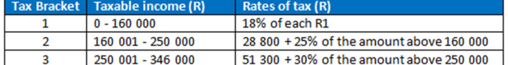
> **[Diagram Context - Textbook_MathematicalLiteracy_Gr12_Income-tax.pdf-0004-07.png]**
> 1. A table with columns for Taxable Income, Rates of Tax, and the amount of tax paid.

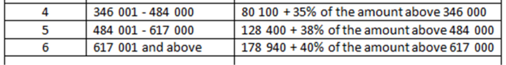
> **[Diagram Context - Textbook_MathematicalLiteracy_Gr12_Income-tax.pdf-0004-08.png]**
> 1. A diagram of a cell with a number of different parts.

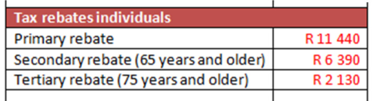
> **[Diagram Context - Textbook_MathematicalLiteracy_Gr12_Income-tax.pdf-0004-09.png]**
> 1. A table with the title "Tax rebates individuals" at the top.

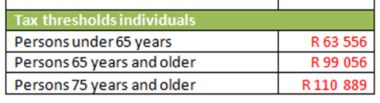
> **[Diagram Context - Textbook_MathematicalLiteracy_Gr12_Income-tax.pdf-0004-10.png]**
> 1. A table with four columns and four rows.

## **Important terminology for tax tables** 

|**Term**|**Meaning**|
|---|---|
|**Tax Bracket**|•A range of taxable incomes that are charged according to a set rate of tax. •The values are the_annual_taxable amounts. •The higher the bracket, the higher the tax rate for that portion of the taxable income.|
|**Tax Rebate**|•An amount that is deducted from the tax that has to be paid. •It is a_maximum_amount. Therefore if someone owes less tax than the total tax rebate they will pay no tax but will NOT receive the amount left over in cash. •Only people who pay tax are eligible for the rebate. •There are three rebates. Everyone is eligible for the primary rebate. Tax payers who are 65 years and older qualify for the additional secondary rebate. Taxpayerswho are75 years and olderqualifyforallthreerebates.|
|**Tax Threshold**|•This is the minimum salary a person must earn before tax is charged. •Belowthe threshold, the person’s tax willbe cancelled by the tax rebate.|

Via Afrika ›› Mathematical Literacy Gr 12 

**<mark>Chapter 8</mark> Finance (income tax)** 

### **How do the tax brackets work?** 

Here is how the tax brackets calculate the tax on R400 000: 

R0 R160 000 R250 000 R346 000 R400 000 This part falls in **Tax** This part falls in **Tax** This part falls in **Tax** This remaining part falls **Bracket 1** and tax is **Bracket 2** and tax is **Bracket 3** and tax is into **Tax Bracket 4** and is charged at **18%** : charged at **25%** : charged at **30%** : charged at **35%** : 18% × (R160 000 – 25% × (R250 000 – 30% × (346 000 – 35% × (R400 000 – R0) R160 000) R250 000) R346 000) = 18% × R160 000 = 25% × R90 000 = 30% × R96 000 = 35% × R54 000 = R28 800 = R22 500 = R28 800 = R18 900 

Notice that R400 000 occurs in Tax Bracket 4 and the formula for that bracket is: 

Annual Tax = R80 100 + 35% of the amount above R346 000 

= (R28 800 + R22 500 + R28 800) + 35% × (R400 000 – R346 000) 

So the **fixed amount** in the formula is the **total of all the previous tax brackets** . 

## **Example** 

Using the tax tables, calculate how much tax a 68-year old person should pay if their monthly taxable income is R14 803,00. 

**Answer** : 

The _annual_ taxable income = R14 803,00 × 12 = R177 636,00 

Referring to the tax table that follows, this amount occurs in Tax Bracket 2. 

Via Afrika ›› Mathematical Literacy Gr 12 

**<mark>Chapter 8</mark> Finance (income tax)** 

> **[Diagram Context - Textbook_MathematicalLiteracy_Gr12_Income-tax.pdf-0006-01.png]**
> The image shows a line graph with a title that reads "Statutory Rates of Tax". The graph displays the rates of tax for individuals and corporations in 2012 and 2013. The graph is labeled with the year 2012 on the x-axis and the rate of tax on the y-axis. The graph is divided into two lines, one for individuals and one for corporations. The graph shows that the

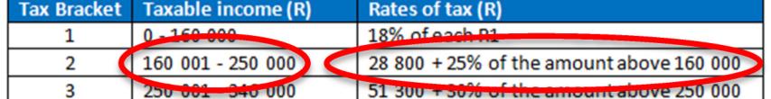
> **[Diagram Context - Textbook_MathematicalLiteracy_Gr12_Income-tax.pdf-0006-02.png]**
> 1. A table with two columns and three rows. The first column is labeled "Taxable Income" and the first row is labeled "1,150,000". The second column is labeled "Rates of Tax" and the second row is labeled "18,800,000". The third column is labeled "Rates of Tax" and the third row is labeled "28,800

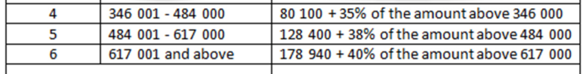
> **[Diagram Context - Textbook_MathematicalLiteracy_Gr12_Income-tax.pdf-0006-03.png]**
> 1. A diagram of a cell with the number 4 on the left side and the number 6 on the right side.

The formula for Tax Bracket 2: 

Annual tax = R28 800 + 25% of the amount above R160 000 

- = R28 800 + 25 ÷ 100 × (R177 636 – R160 000) 

- = R28 800 + 25 ÷ 100 × (R17 636) 

- = R28 800 + R4 409,00 

- = R33 209,00 

Apply the rebate: 

The tax payer is over 65 years of age but less than 

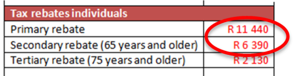
> **[Diagram Context - Textbook_MathematicalLiteracy_Gr12_Income-tax.pdf-0006-12.png]**
> The image shows a spreadsheet with a table of data. The table is titled "Tax rebates individuals" and includes columns for "R 11,440", "Secondary rebate", "65 years and older", and "75 years and older". The table also includes a red circle with a number inside it, which is labeled "R 11,440". The table is set against a gray

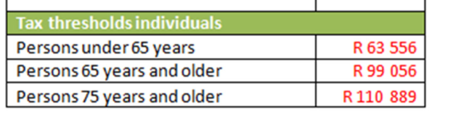
> **[Diagram Context - Textbook_MathematicalLiteracy_Gr12_Income-tax.pdf-0006-13.png]**
> 1. A table with four columns and four rows.

75 years of age, so they qualify for the primary and secondary rebates: 

Total Tax owed  = R33 209,00 – R11 440 – R6 390 

= R15 379,00 _per year_ 

_Monthly_ Tax owed = R15 379,00 ÷ 12 = **R1 281,58** 

**Note:** See that this amount is very similar to the amount from the deduction tables. The value in the deduction tables is rounded down to the nearest R5,00. 

Via Afrika ›› Mathematical Literacy Gr 12 

**Chapter 8 Finance (income tax)** 

# **Section 3: IRP5 tax forms** 

#### **(LB pages 234-235)** 

## **Overview** 

Again, this section on IRP5 tax forms is drawn from page 59 in the CAPS document. 

As stipulated in the CAPS document, Grade 12 learners need specifically to be able to: 

- work with various financial documents (payslips, IRP5 forms, etc.) in order to determine an individual’s taxable income, personal income tax and net pay. 

- • investigate the effect on an increase in salary on the amount of income tax payable. 

## **Contexts and integrated content** 

- Contexts include several types of job where a salary is earned. 

- There is integration of content from the section on reading of tables and in the topic _Patterns, relationships and representations_ . 

## **IRP5 forms** 

These contain a summary of: 

- the total amount that an employee has earned 

- any deductions that were made (e.g. pension, UIF, etc.) 

- any tax deducted from the employee’s salary 

The information on the IRP5 will be used by the employee to fill out a tax return at the end of the tax year. 

An employee has to obtain an IRP5 certificate from each employer that they have worked for in any given tax year and total all of the information across all of them. 

Via Afrika ›› Mathematical Literacy Gr 12 

**<mark>Chapter 8</mark> Finance (income tax)** 

# **Additional questions** 

The following Income tax tables are for the 2012/2013 tax year. Use them to answer the questions below: 

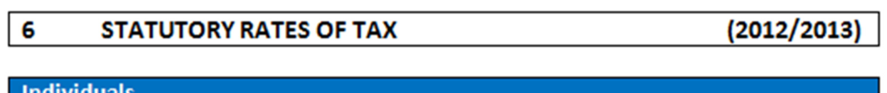
> **[Diagram Context - Textbook_MathematicalLiteracy_Gr12_Income-tax.pdf-0008-03.png]**
> The image shows a line graph with the title "Statutory Rates of Tax" at the top. The graph displays the rates of tax for the years 2012 and 2013. The graph is labeled with the text "6 Statutory Rates of Tax" at the top and "2012/2013" at the bottom. The graph is a simple, linear representation of the tax rates over time.

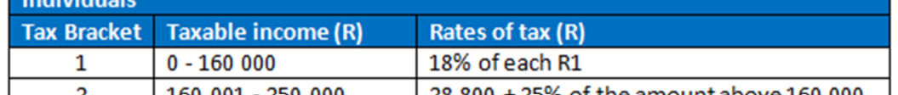
> **[Diagram Context - Textbook_MathematicalLiteracy_Gr12_Income-tax.pdf-0008-04.png]**
> 1. Tax bracket table.

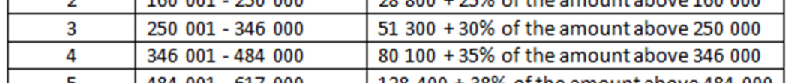
> **[Diagram Context - Textbook_MathematicalLiteracy_Gr12_Income-tax.pdf-0008-05.png]**
> 1. A diagram of a cell with the number of chromosomes labeled.

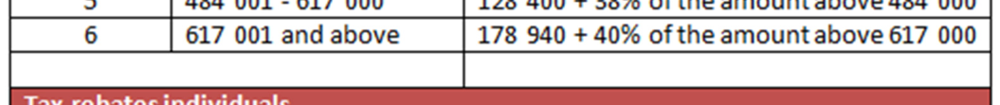
> **[Diagram Context - Textbook_MathematicalLiteracy_Gr12_Income-tax.pdf-0008-06.png]**
> 1. A diagram of a cell with arrows pointing to different parts of the cell.

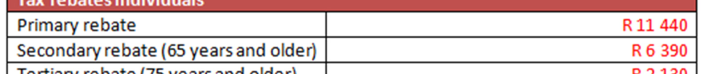
> **[Diagram Context - Textbook_MathematicalLiteracy_Gr12_Income-tax.pdf-0008-07.png]**
> 1. A diagram of a cell with the label "R1" and "R2" on the top and bottom.

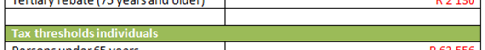
> **[Diagram Context - Textbook_MathematicalLiteracy_Gr12_Income-tax.pdf-0008-08.png]**
> 1. A diagram of a cell with arrows pointing to different parts of the cell.

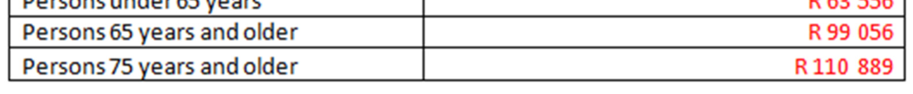
> **[Diagram Context - Textbook_MathematicalLiteracy_Gr12_Income-tax.pdf-0008-09.png]**
> 1. A diagram of a cell with a red arrow pointing to the right.

1. Calculate the total annual tax owed (after the rebate has been considered) for the following people: 

   - 1.1 Sindiswa is 23 years old and has a taxable income of R120 560,00 per year. 

   - 1.2 John is 36 years old and has a taxable income of R283 756,00 per year. 

   - 1.3 Xolisa is 26 years old and has a taxable income of R18 435,00 per month. 

   - 1.4 Banele is 68 years old and has a taxable income of R18 435,00 per month. 

2. Using your answers to Question 1, calculate the net monthly incomes for the four people listed in Question 1. 

3. Mr Modise is 39 years of age and earns a salary of R34 857 per month. 

The following deductions are taken off his monthly salary: 

Pension: R3 250,00 

UIF (1% of his gross salary) Medical Aid: R5 423,00 

Repayment of a loan from his employer: R2 500,00 per month 

Via Afrika ›› Mathematical Literacy Gr 12 

**Chapter 8 Finance (income tax)** 

- 3.1 His UIF contribution is calculated at 1% of his gross income. Calculate his UIF amount. 

- 3.2 With regard to pensions, a maximum of 7,5% of his gross income may be tax deductible. Calculate his total deductible pension amount. 

- 3.3 The only tax deductible items are his deductible pension amount (Question 3.2) and his UIF amount (Question 3.1). Calculate his taxable income (Gross income – tax deductions). 

- 3.4 Use your answer from Question 3.3 and the 2012/2013 Income tax tables to calculate his monthly tax owed. 

- 3.5 In addition to the standard rebate, the South African Revenue Service (SARS) also gives each tax payer a medical tax credit. The total monthly medical tax credit is the total of the following amounts: R230 for the tax payer + R230 for the spouse + R154 per child. Calculate Mr Modise’s total medical tax credit if he has a wife and four children. 

- 3.6 Using your previous answers calculate his ‘Take-home’ pay as follows: ‘Take-home’ Pay = Gross Income – Deductions – Income Tax + Medical Tax Credit 

Via Afrika ›› Mathematical Literacy Gr 12 

**Chapter 8 Finance (income tax)** 

# **Answers** 

1. 1.1 Her taxable income falls into the first tax bracket, therefore she will pay tax as follows: 

Total tax owed (before rebate) = 18% of R120 560,00 

= R21 700,80 

After rebate = R21 700,80 – R11 440 = R10 259,20 

- 1.2 His taxable income falls into the third tax bracket, therefore he will pay tax as follows: 

Total tax owed (before rebate) = R51 300 + 30% of (283 756 – R250 000) 

= R51 300 + 0,3 × R33 756 = R51 300 + R10 126,80 

= R61 426,80 

After rebate = R61 426,80–- R11 440 = R49 986,80 

- 1.3 Annual taxable income = R18 435,00 × 12 = R221 220 Therefore her taxable income falls into the second tax bracket, so she will pay tax as follows: 

Total tax owed (before rebate) = R28 800 + 25% of (221 220 – R160 000) 

= R28 800 + 0,25 × R61 220 

= R28 800 + R15 305,00 = R44 105,00 

After rebate = R44 105,00 – R11 440 = R32 665,00 

- 1.4 Annual taxable income = R18 435,00 × 12 = R221 220 

His tax owed before the rebate will be the same as Xolisa’s: R44 105,00 

However, due to his age, he is granted the first additional rebate: 

After rebate = R44 105,00 – R11 440 – R6 390 = R26 275,00 

2. 2.1 Net annual income = Gross Taxable Income – Annual Tax 

= R120 560,00 – R10 259,20 

= R110 300,80 p.a. 

So net monthly income = R9 191,73 per month 

- 2.2 Net annual income = R283 756 – R49 986,80 

= R233 769,20 p.a. 

So net monthly income = R19 480,77 per month 

- 2.3 Net annual income = R221 220 – R32 665,00 

Via Afrika ›› Mathematical Literacy Gr 12 

**Chapter 8 Finance (income tax)** 

= R188 555,00 p.a. 

So net monthly income = R15 712,92 

- 2.4 Net annual income = R221 220 – R26 275,00 

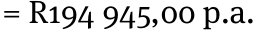

So net monthly income = R16 245,42 per month 

(so he gets approximately R500 per month more with the extra rebate). 

3. 3.1 1% of R34 857,00 = R348,57 

   - 3.2 7,5% of R34 857,00 = R2 614,28 

   - 3.3 Taxable income  = Gross income – tax deductions 

      - = R34 857,00 – R348,57 –-R2 614,28 

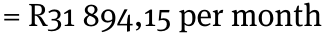

- 3.4 Annual taxable income = R31 894,15 × 12 = R382 729,80 

This income occurs in tax bracket 4, therefore: 

Total tax owed (before rebate) = R80 100 + 35% of (382 729,80 – R346 000) 

- = R80 100 + 0,35 × R36 729,80 

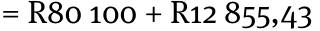

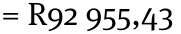

After rebate = R92 955,43 – R11 440 = R81 815,43 per year 

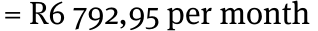

- 3.5 Total medical tax credit  = R230 × 2 + R154 × 4 

         - = R1 076,00 

- 3.6 ‘Take-home’ pay = Gross Inc. –- Deductions – Income Tax + Medical Tax Credit 

   - Deductions = Pension + UIF + Medical Aid + Loan repayment 

      - = R3 250,00 + R348,57 + R5 423,00 + R2 500,00 

      - = R11 521,57 

Note: These are all of the deductions from his salary in full. We only consider the tax deductibility of an item when working out the income tax. Once the tax has been deducted, we perform the ‘take-home’ calculation with the full deduction amount. 

‘Take-home’ pay = R34 857,00 – R11 521,57 – R6 792,95 + R1 076,00 = R17 618,48 

Via Afrika ›› Mathematical Literacy Gr 12 

