**Chapter 6 Measurement (measuring and calculating lengths, perimeter, area and volume)** 

# **Section 1: Measuring** 

### **(LB pages 162-165)** 

## **Overview** 

The content of this section, as part of the _Measurement_ Application Topic, is drawn from page 64 in the CAPS document. 

As stipulated in the CAPS document, Grade 12 learners need specifically to be able to: 

- estimate lengths and /or measure lengths of objects accurately to complete tasks. 

- determine the appropriateness of estimation for a given context/problem. 

## **Contexts and integrated content** 

Learners need to be able to work in the context of larger projects that take place in <u>the household, school or wider community.</u> 

In the next section, formal methods are used for calculating perimeter, area and volume; however it is always important to have a method for checking how sensible an answer is. The following two sub-sections outline methods for estimating lengths, distances, area and volume. 

## **1. Measuring lengths and distances** 

The following body measurements could be used to estimate basic lengths and distances: 

||**Indigenous methods of measurement**||
|---|---|---|
|**Measurement**|**Description **|**Approximate length **|
|Cubit|From the tipof the outstretched hand to the elbow|ψm(actually47cm)|
|Hand|The width across all 5 fingers of the hand|10 cm|
|Digit|The width across the knuckle of the middle finger|2 cm|
|Pace|One good-sized step|1 m (actually 90 cm)|
|Foot|The length of an average foot|30 cm|

There are also other common measurements that most people are familiar with that can be used to check how sensible an answer is. 

© Via Afrika ›› Mathematical Literacy Gr 12 

**Chapter 6 Measurement (measuring and calculating lengths, perimeter, area and volume)** 

80 m 

## **Example** 

A standard soccer pitch can have the following dimensions: 

100 m 

1. Calculate the total perimeter of the soccer pitch. 

**Answer** : 100 m + 80 m + 100 m + 80 m 

= 360 m 

2.  A learner was asked to calculate the length of fencing around the perimeter of his school and his answer was 250 m. 

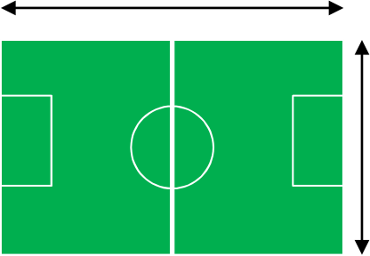
> **[Diagram Context - Textbook_MathematicalLiteracy_Gr12_lengths-perimeter-area-and-volume.pdf-0002-09.png]**
> The image shows a diagram of a soccer field, which is a rectangle with two halves, each containing two soccer fields. The field is green, and there are two sets of white lines on the field, one for each half. The diagram also includes a ruler, which is used to measure the length of the field. The diagram is labeled with the names of the two halves of the field,

Referring to the dimensions of the soccer pitch, does this answer make sense? 

- **Answer:** No this does not make sense. A soccer pitch has a total perimeter of 360 m and his answer is smaller than this. It would have to be a really small school in order for this to be true. 

## **Measuring area and volume** 

Area refers to two dimensions being multiplied by each other while volume refers to three dimensions multiplied together. 

The previous measurement estimates can be used to estimate area and volume as well: 

© Via Afrika ›› Mathematical Literacy Gr 12 

> **[Diagram Context - Textbook_MathematicalLiteracy_Gr12_lengths-perimeter-area-and-volume.pdf-0003-00.png]**
> Chapter 6: Measurement: Measuring and calculating lengths, area and volume.

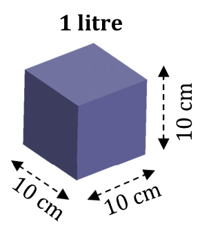
> **[Diagram Context - Textbook_MathematicalLiteracy_Gr12_lengths-perimeter-area-and-volume.pdf-0003-01.png]**
> The image shows a diagram of a cube with measurements and labels. The cube is colored in blue and has a length of 10 cm. The diagram also includes a 10 cm x 10 cm x 10 cm box, labeled with the number 10. The diagram is accompanied by a list of labels, including "1 litre", "10 cm", "10 cm cm", and "10 cm cm cm

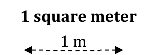
> **[Diagram Context - Textbook_MathematicalLiteracy_Gr12_lengths-perimeter-area-and-volume.pdf-0003-02.png]**
> The image shows a diagram of a square meter. The diagram is black and white, with a ruler drawn on it. The ruler is labeled with the number "1 m". The diagram also includes arrows pointing to the left and right sides, as well as labels for the x and y axes. The diagram is labeled with the word "1 square meter" at the top and "1 m"

**Estimating Volume 1 litre =** 1000 cm^{3} 

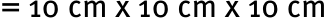

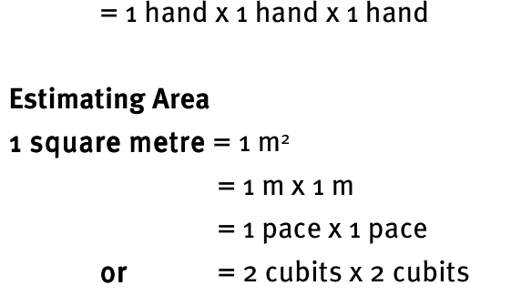
> **[Diagram Context - Textbook_MathematicalLiteracy_Gr12_lengths-perimeter-area-and-volume.pdf-0003-07.png]**
> The image shows a diagram of a hand and a square meter. The diagram is labeled with the text "Estimating Area" and "1 square meter". The diagram also includes the text "1 hand x 1 hand x 1 hand" and "1 meter x 1 meter x 1 meter". The diagram also includes the text "1 meter x 1 meter x 1 meter" and "2 cubes x

## **Example** 

Is it incorrect to estimate the area of the ceiling of a normal classroom to be 10 m^{2} ? 

**Answer** : Yes, it is incorrect. Even a small classroom would be approximately 4 paces by 5 paces. This would be an area of 20 m^{2} . 

© Via Afrika ›› Mathematical Literacy Gr 12 

**<mark>Chapter 6</mark>** 

**Measurement (measuring and calculating lengths, perimeter, area and volume)** 

# **Section 2: Calculating perimeter, area and volume** 

### **(LB pages 166-177)** 

## **Overview** 

The content of this section, as part of the _Measurement_ Application Topic, is drawn from pages 68-69 in the CAPS document. 

As stipulated in the CAPS document, Grade 12 learners need specifically to be able to: 

- Calculate the perimeter, area and volume of rectangles, triangles, circles, rectangular prisms, cylinders of known formulae as well as objects that can be decomposed into those shapes 

- Calculating the cost of materials to complete a project. 

## **Contexts and integrated content** 

- Learners need to be able to work in the context of larger projects that take place in the household, school or wider community. 

- Analysis and interpretation of plans is a skill that is required for success in this section. This involves the _Maps, plans and other representations of the physical world Application_ Topic. 

## **Calculations involving perimeter** 

Perimeter is the length around the outside of a figure. Normally we only look at 2-dimensional figures, however the concept of total length can also apply to 3-dimensional figures which have a framework as well as any covering which will be attached to that framework. 

## **Example** 

Consider the metal archway alongside. 

1.  Metal is sold in 6m lengths. How many lengths will 

   - need to be purchased to make the archway alongside? 

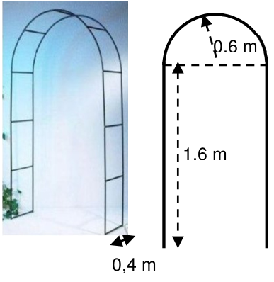
> **[Diagram Context - Textbook_MathematicalLiteracy_Gr12_lengths-perimeter-area-and-volume.pdf-0004-18.png]**
> 1. A diagram of a metal archway with measurements and arrows.

Via Afrika ›› Mathematical Literacy Gr 12 

**<mark>Chapter 6</mark> Measurement (measuring and calculating lengths, perimeter, area and volume)** 

### **Answer:** 

Break the complicated figure down into more manageable pieces and then calculate the total: 

**2 × + 2 × + 11 ×** Total frame = 

= 2 × ~~(~~^{�} × π × diameter) + 4 × 1,6 m + 11 × 0,4 m � = 2 × (0,5)(3,14)(1,2 m) + 6,4 m + 4,4 m 

= 3,768 m + 6,4 m + 4,4 m 

= 14,57 m 

Therefore 3 lengths of steel bar will need to be purchased to create the archway. 

2. The steel frame is going to be covered with wooden tiles that are 20 cm wide and overlap each other by 3 cm as in the diagram alongside. How many will be required to cover the outside of the frame? 

**Answer** : 

20 cm Overlap: 3 cm 

The total outside length to be covered needs to be calculated first: 

Total length of the front of the frame: 

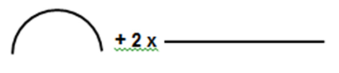
> **[Diagram Context - Textbook_MathematicalLiteracy_Gr12_lengths-perimeter-area-and-volume.pdf-0005-13.png]**
> 1. A diagram of a cell with arrows pointing to different parts of the cell.

= (^{�} × π × diameter) + 2 × 1,6 m � = (0,5)(3,14)(1,2 m) + 3,2 m = 1,88 m + 3,2 m 

= 5,08 m 

Because they overlap, the width of the tile cannot be used as it is. The overlap of 

Via Afrika ›› Mathematical Literacy Gr 12 

**<mark>Chapter 6</mark>** 

**Measurement (measuring and calculating lengths, perimeter, area and volume)** 

adjacent tiles needs to be taken into account in order to use the _effective width_ of the tiles: 

_Effective Width_ = 20 cm – 3 cm = 17 cm 

No. of tiles needed = Total length ÷ Effective width 

- = 508 cm ÷ 17 cm  (Note that the units _must be the same_ ) 

- = 29,88 tiles 

- **≈ 30 tiles** 

## **Calculations involving area** 

Most complex areas can be broken down into simpler areas. Once a larger area is calculated, other calculations can be performed on it such as seeing how many of a smaller area can fit into it. 

## **Example** 

Skateboarders often enjoy performing tricks on a special ramp called a halfpipe (shown alongside). 

1.  Use the diagrams alongside to calculate the area of the curved skating surface of the halfpipe. 

### **Answer:** 

If a surface has the same width all along its length, it then forms a large rectangle, so we can calculate the length of the edge and use it as the length of the rectangle: 

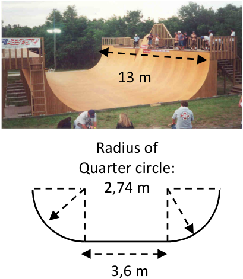
> **[Diagram Context - Textbook_MathematicalLiteracy_Gr12_lengths-perimeter-area-and-volume.pdf-0006-15.png]**
> 1. A diagram of a quarter circle with measurements of 2.74 meters.

Total length of the edge = 2 ×^{�} × π × d + 3,6 m � 

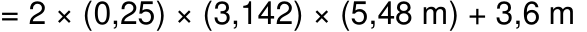

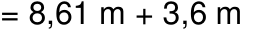

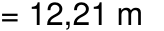

Therefore total area of ramp surface = length × breadth 

Via Afrika ›› Mathematical Literacy Gr 12 

**<mark>Chapter 6</mark>** 

**Measurement (measuring and calculating lengths, perimeter, area and volume)** 

= 12,21 m × 13 m 

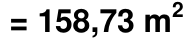

2. A special board is used on the surface. The board is sold in rectangular pieces (width: 1,5 m, length: 3,0 m). Use the area of the board to _estimate_ the number of boards needed to cover the skate surface of this halfpipe. 

### **Answer:** 

We can only _estimate_ the number of boards as we would need to check how the boards fit together, but an estimate is useful when getting a rough idea of how many boards might be needed: 

We can estimate the number of boards by dividing the area of one board into the total area of the ramp: 

Area of 1 board = length × breadth  = 1,5 m × 3,0 m  = 4,5 m^{2} 

Number of boards = Total area ÷ Area of 1 board 

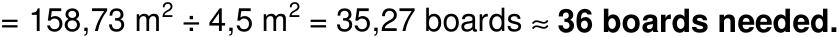
> **[Diagram Context - Textbook_MathematicalLiteracy_Gr12_lengths-perimeter-area-and-volume.pdf-0007-10.png]**
> The image shows a gray background with a white line that says "=158.73 m" and "35.57 m". The image also contains a diagram of a cell with a white background and a black outline. The diagram includes a label for "4.5 m" and a label for "35.57 m". The image also contains a label for "36 boards needed".

## **Calculations involving volume** 

Volume is the amount of 3-dimensional space inside a shape. If the shape is a prism we can use the area of the end to calculate the volume.  We can use the following formula: 

_Volume of a prism = Area of base × height_ 

## **Example** 

### **Prism** 

A 3-dimensional shape that has the same shape (and size) on both ends and the same thickness along the entire shape. 

The refuse skip in the picture below is 1,75 m wide and its other dimensions are shown in the diagram alongside it. 

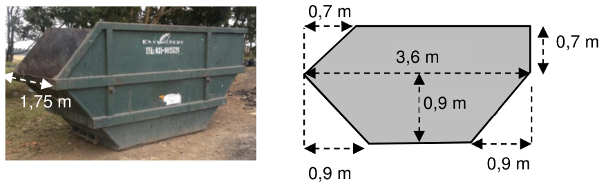
> **[Diagram Context - Textbook_MathematicalLiteracy_Gr12_lengths-perimeter-area-and-volume.pdf-0007-18.png]**
> 1. A diagram of a green dumpster with measurements and a diagram of the dumpster.

Via Afrika ›› Mathematical Literacy Gr 12 

**Chapter 6 Measurement (measuring and calculating lengths, perimeter, area and volume)** 

1.  Calculate the volume of the skip in m^{3} . 

### **Method 1: Using the formula** 

### **Method 2: Splitting up the volume** 

In order to calculate the area, it will need to be split up into smaller pieces: 

The shape can be split up into different, smaller volumes: 

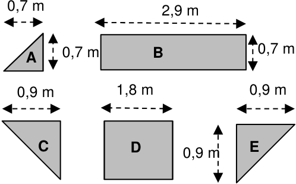
> **[Diagram Context - Textbook_MathematicalLiteracy_Gr12_lengths-perimeter-area-and-volume.pdf-0008-06.png]**
> The image presents a diagram of a geometric figure, which is a square with a triangle on each of its four corners. The diagram is black and white, and it is labeled with the letters A, B, C, and D. The diagram also includes arrows pointing to the corners of the square and the triangle. The diagram is set against a white background, and it is accompanied by a legend

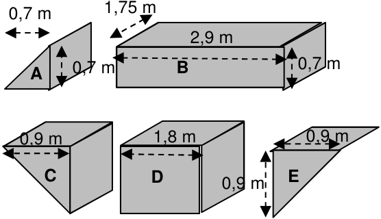
> **[Diagram Context - Textbook_MathematicalLiteracy_Gr12_lengths-perimeter-area-and-volume.pdf-0008-07.png]**
> The image is a black and white diagram that shows the dimensions of various geometric shapes, including cubes, rectangles, and triangles. The diagram is labeled with the names of the shapes and their dimensions, such as 1.75m, 1.8m, 0.9m, and 0.91m. The diagram also includes arrows pointing to the corners of the shapes, indicating their relative

Area A = 0,5 × 0,7 m × 0,7 m 

Each smaller volume has the same thickness (or width): 1,75 m. 

= 0,245 m^{2} 

Area B = 2,9 m × 0,7 m 

Volume A = 0,5 × 0,7 m × 0,7 m × 1,75 m 

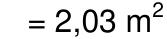

= 0,42875 m^{3} 

Area C = 0,5 × 0,9 m × 0,9 m 

Volume B = 0,7 m × 2,9 m × 1,75 m 

= 0,405 m^{2} 

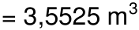

Area D = 1,8 m × 0,9 m 

Volume C = 0,5 × 0,9 m × 0,9 m × 1,75 m 

= 1,62 m^{2} 

= 0,70875 m^{3} 

Area E = Area C = 0,405 m^{2} 

Volume D = 0,9 m × 1,8 m × 1,75 m 

Total Area of base = 0,245 + 2,03 + 0,405 + 1,62 + 0,405 = 4,705 m^{2} = 2,835 m^{3} 

Volume = Area of base × height Volume E = Volume C = 0,70875 m^{3} 

= 4,705 m^{2} × 1,75 m Total volume = 8,23375 m^{3} 

Via Afrika ›› Mathematical Literacy Gr 12 

**Chapter 6** 

**Measurement (measuring and calculating lengths,** 

## **perimeter, area and volume)** 

= 8,23 m^{3} = 8,23 m^{3} (Note: The ‘height’ is actually the (Note: The volume of each segment is ‘thickness’ of the prism) only rounded off at the end. 

Notice that either method can be used to get the same answer. Simply use the method that you are most comfortable with. 

2.  Approximately how many rubbish bags should be able to fit into the above skip if a normal rubbish bag can hold 120 ℓ of refuse? 1 m^{3} = 1 000 ℓ. 

### **Answer:** 

Volume of skip = 8,23 m^{3} x 1 000 = 8 230 ℓ 

No. of rubbish bags = 8 230 ℓ ÷ 120 ℓ = 65,58 bags ≈ 65 bags. 

However, the skip will be able to hold a lot more than that number as the bags are usually not totally filled with trash and so more will be able to fit in. 

Via Afrika ›› Mathematical Literacy Gr 12 

**<mark>Chapter 6</mark>** 

## **Measurement (measuring and calculating lengths, perimeter, area and volume)** 

# **Additional questions** 

The following formulas might be useful in the questions which follow: 

1. A man wants to extend his driveway to the sides to create some new  parking areas. He is going to remove the grass that is already there and put down stones. 

- 1.1 Firstly, he has to remove the grass and replant it in other areas of his yard. Calculate the total area of grass that will be removed from both areas. You may choose to use some of the formulas above. 

- 1.2 He will then put down stones to a depth of 5 cm. Stone is sold in units of 0,5 cubic metres (m^{3} ). Use your answer to Question 1.1 to work out how many whole units of 0,5 m^{3} of stone he will need to buy. 

- 1.3 To keep the stones in position he is going to lay some bricks along the edges marked in bold. The other edges are next to the house or bordering on the existing driveway and will not require bricks. 

   - 1.3.1 Calculate the total length of all the edges where he is going to lay bricks. (Hint: you will need to use the Theorem of Pythagoras.) 

   - 1.3.2 Each brick is 22 cm long. How many bricks is he going to lay along the given edges? 

Via Afrika ›› Mathematical Literacy Gr 12 

**<mark>Chapter 6</mark> Measurement (measuring and calculating lengths,** 

## **perimeter, area and volume)** 

   - 1.4 Using your answers to Questions 1.2 and 1.3.2 calculate the total amount that this project is going to cost. Each unit of stone (per 0,5 m^{3} ) costs R280,00 and each brick costs R2,00. 

2. A woman is planning to establish a vegetable garden in the corner of her property. It has the following shape: 

> **[Diagram Context - Textbook_MathematicalLiteracy_Gr12_lengths-perimeter-area-and-volume.pdf-0011-04.png]**
> The image shows a diagram of a cell, which is a fundamental unit of life. The diagram is a Lewis diagram, which is a type of molecular diagram used to represent the valence electrons of an atom. The diagram is set against a gray background, and it is labeled with the text "15m". The diagram also includes arrows pointing to the different parts of the cell, such as the

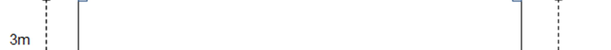
> **[Diagram Context - Textbook_MathematicalLiteracy_Gr12_lengths-perimeter-area-and-volume.pdf-0011-05.png]**
> 1. A diagram of a cell with arrows pointing to different parts of the cell.

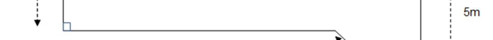
> **[Diagram Context - Textbook_MathematicalLiteracy_Gr12_lengths-perimeter-area-and-volume.pdf-0011-06.png]**
> 1. A diagram of a cell with arrows pointing to different parts of the cell.

> **[Diagram Context - Textbook_MathematicalLiteracy_Gr12_lengths-perimeter-area-and-volume.pdf-0011-07.png]**
> The image shows a diagram of a cell with arrows pointing to different parts of the cell. The diagram also includes labels for the cell's organelles and a scale of 1m for the cell's dimensions. The diagram is set against a gray background, and the text "11m" is present.

> **[Diagram Context - Textbook_MathematicalLiteracy_Gr12_lengths-perimeter-area-and-volume.pdf-0011-08.png]**
> The image shows a line drawing of a Lewis structure, which is a diagram used to represent the valence electrons of an atom. The structure is composed of lines and dots, with each dot representing an electron and the lines connecting the dots symbolizing the bonds between the electrons. The diagram is set against a gray background, and there are two arrows pointing in opposite directions, one pointing to the left

- 2.1 Using the formulas given at the start of these questions calculate the total area of the vegetable garden. 

- 2.2 She is going to cover the area with compost. Each bag of compost will cover 15 m^{2} . Use your answer in Question 2.1 to work out how many bags of compost she must buy. 

- 2.3 She is going to put up fencing around the perimeter of the garden. The fencing that she is planning to buy is sold in rolls that are 5 m long. To ensure that the fence encloses the area well, she will be overlapping the sections of fencing by 20 cm on each end like this: 

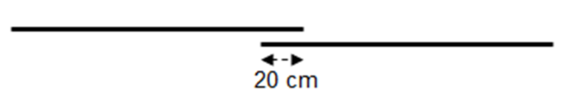
> **[Diagram Context - Textbook_MathematicalLiteracy_Gr12_lengths-perimeter-area-and-volume.pdf-0011-12.png]**
> The image shows a diagram of a cell with two black lines, one of which is labeled "20 cm". The diagram is set against a gray background. The diagram is labeled with the text "20 cm" and "20 cm". The diagram is labeled with the variable "x" and "y". The diagram is labeled with the variable "x" and "y". The diagram is labeled

- 2.3.1 Calculate the length marked ‘L’ on the diagram using the Theorem of Pythagoras. 

- 2.3.2 The length of 1 roll of fencing is 5 m. However, due to the overlap of each section, what is the effective length of each roll of fencing? Answer in m. 

- 2.3.3 Using your two previous answers, calculate how many rolls of fencing will need to be bought to surround the vegetable patch. 

Via Afrika ›› Mathematical Literacy Gr 12 

## **<mark>Chapter 6</mark> Measurement (measuring and calculating lengths,** 

**perimeter, area and volume)** 

3. A man is remodelling his garden and decides to create a simple swimming pool. He plans to dig a rectangular hole and line it with spray-on cement. 

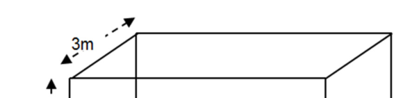
> **[Diagram Context - Textbook_MathematicalLiteracy_Gr12_lengths-perimeter-area-and-volume.pdf-0012-03.png]**
> 1. A diagram of a 3m x 3m square with arrows pointing to the corners.

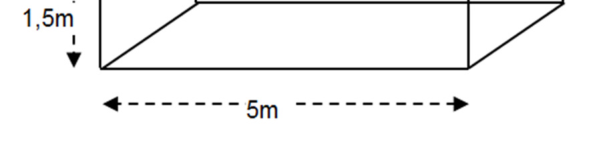
> **[Diagram Context - Textbook_MathematicalLiteracy_Gr12_lengths-perimeter-area-and-volume.pdf-0012-04.png]**
> The image shows a diagram of a cell, which is a fundamental unit of life. The diagram is a Lewis structure, a visual representation of the valence electrons of an atom. The diagram is drawn in black and white, with the cell's components represented by lines and arrows. The diagram is labeled with the names of the components, such as the cell membrane, cytoplasm, and

- 3.1 Use the measurements in the diagram alongside to calculate the surface area that will need to be covered by the spray-on cement. 

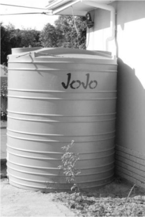
> **[Diagram Context - Textbook_MathematicalLiteracy_Gr12_lengths-perimeter-area-and-volume.pdf-0012-06.png]**
> 1. A diagram of a cell with the word "jojo" written on it.

   - 3.2 During the winter, he plans to pump all of the water from the pool into a storage tank (such as the one in the picture alongside). The large storage tank can hold 5 000� ℓ of water. If a full tank was emptied into his pool, how high would the water level be? Answer in m. (1 m^{3} = 1 000 ℓ) 

4.  Swimming pools come in many different shapes and sizes. A homeowner wants to place a swimming pool in the garden. The h0meowner decides on the following pool design (drawing NOT to scale): 

> **[Diagram Context - Textbook_MathematicalLiteracy_Gr12_lengths-perimeter-area-and-volume.pdf-0012-09.png]**
> 1. A diagram of a cell with arrows pointing to different parts of the cell.

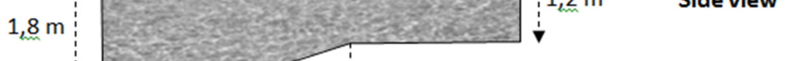
> **[Diagram Context - Textbook_MathematicalLiteracy_Gr12_lengths-perimeter-area-and-volume.pdf-0012-10.png]**
> 1. A diagram of a cell with arrows pointing to different parts of the cell.

> **[Diagram Context - Textbook_MathematicalLiteracy_Gr12_lengths-perimeter-area-and-volume.pdf-0012-11.png]**
> 1. A diagram of a cell with arrows pointing to different parts of the cell.

> **[Diagram Context - Textbook_MathematicalLiteracy_Gr12_lengths-perimeter-area-and-volume.pdf-0012-12.png]**
> 1. A diagram of a cell with arrows pointing to different parts of the cell.

> **[Diagram Context - Textbook_MathematicalLiteracy_Gr12_lengths-perimeter-area-and-volume.pdf-0012-13.png]**
> 1. A diagram of a cell with a ruler and a ruler labeled 4 m.

> **[Diagram Context - Textbook_MathematicalLiteracy_Gr12_lengths-perimeter-area-and-volume.pdf-0012-14.png]**
> The image shows a close-up view of a Lewis diagram, which is a diagram used to represent the valence electrons of an atom. The diagram is set against a gray background, and it is divided into four sections, each representing a different atom. The diagram is labeled with the names of the four atoms, and it is accompanied by arrows pointing to the valence electrons of each atom.

> **[Diagram Context - Textbook_MathematicalLiteracy_Gr12_lengths-perimeter-area-and-volume.pdf-0012-15.png]**
> 1. A diagram of a cell with a white border and a gray background.

- 4.1 Calculate the volume of water that the pool can hold. Give your answer in m^{3} . 

- 4.2 The homeowner guesses that it is going to cost ‘a few thousand Rand’ to fill the pool for the first time. Is he 0r she correct? (Water costs 0,92 c/ ℓ � and 1 m^{3} = 1 kl) 

- 4.3 A bed of compressed sand (10 cm thick) 

   - is laid underneath the pool to cushion it. 

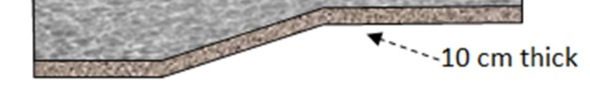
> **[Diagram Context - Textbook_MathematicalLiteracy_Gr12_lengths-perimeter-area-and-volume.pdf-0012-20.png]**
> 1. A diagram of a cell with a 10 cm thick layer of tissue.

Via Afrika ›› Mathematical Literacy Gr 12 

**Chapter 6** 

**Measurement (measuring and calculating lengths,** 

## **perimeter, area and volume)** 

- 4.3.1 Calculate the surface area of the bottom of the pool (only the bottom, NOT the sides). Answer in m^{2} . 

- 4.3.2 Sand is sold at a price of R375 per m^{3} . You can also purchase decimal amounts (e.g. 1,325 m^{3} or 1,78 m^{3} , etc.). Calculate the total cost of the sand required for the bed of compressed sand. 

Via Afrika ›› Mathematical Literacy Gr 12 

**Chapter 6 Measurement (measuring and calculating lengths,** 

## **perimeter, area and volume)** 

# **Answers** 

- 1 1.1 Rectangular area = 6,4 m × 6,2 m = 39,68 m^{2} 

   - Triangular area = ½ × 6,2 m × 3 m = 9,3 m^{2} 

Total area = 39,68 m^{2} + 9,3 m^{2} = 48,98 m^{2} 

- 1.2 Volume of stone  = Area of top × depth of stone 

   - = 48,98 m^{2} × 0,05 m (this needs to be in m) 

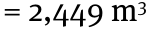

No. of units of stone = 2,449 m^{3÷} 0,5 m^{3} = 4,898 units ≈ 5 units 

- 1.3 1.3.1 Edge of the triangle is the hypotenuse of a right-angled triangle: 

Length = ��3�^{�} + �6,2�^{�} 

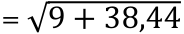

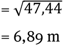

Edges of rectangle = 6,4 m + 6,2 m = 12,6 m 

Total length to be covered = 12,6 m + 6,89 m = 19,49 m 

1.3.2 One brick = 22 cm = 0,22 m 

No. of bricks = 19,49 m^{÷} 0,22 m = 88,59 bricks ≈ 90 bricks 

- 1.4 Stone = 5 units × R280,00 = R1 400,00 

Bricks = 90 × R2,00 = R180,00 

   - Total = R1400,00 + R180,00 = R1 580,00 

- 2 2.1 The area can be split up into a long rectangle and a triangle: 

Area of rectangle = 15 m × 3 m = 45 m^{2} 

Area of triangle = ½ × 2 m × 4 m (worked out by subtracting lengths) 

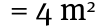

Total area = 45 m^{2} + 4 m^{2} = 49 m^{2} 

- 2.2 Bags of compost = 49 m^{2÷} 15 m^{2} /bag 

= 3,27 bags ≈ **4 bags** (although by spreading it a bit thinly, you could get by with 3 bags) 

- 2.3 2.3.1 Length = √4^{�} + 2^{�} 

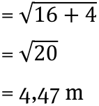
> **[Diagram Context - Textbook_MathematicalLiteracy_Gr12_lengths-perimeter-area-and-volume.pdf-0014-29.png]**
> The image shows a diagram of a cell with the number 4.47 m written in the bottom right corner.

Via Afrika ›› Mathematical Literacy Gr 12 

## **Chapter 6 Measurement (measuring and calculating lengths, perimeter, area and volume)** 

- 2.3.2 5 m — 0,2 m = 4,8 m (we only count the overlap on one end). 

- 2.3.3 Total length of fence = 4,47 m + 5 m + 15 m + 3 m + 11 m 

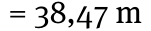

No. of rolls of fencing = 38,47^{÷} 4,8 m = 8,01 rolls 

We can consider this as 8 rolls exactly because we can move the overlap a little to accommodate the shortfall. 

- 3 3.1 We will only consider those areas that need to be covered. These are all sides except the top side (as the water will be open in the pool. 

Total surface area = 2 × 5 m × 1,5 m + 2 × 1,5 m × 3 m + 5 m × 3 m 

= 15 m^{2} + 9 m^{2} + 15 m^{2} 

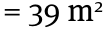

- 3.2 5 000^{ℓ} = 5 m^{3} 

Volume = Area of base × height 

5 m^{3} = 5 m × 3 m × height 

5 m^{3} = 15 m^{2} × height 

0,33 m = height 

(So the water in that large tank will only fill the pool up to 33 cm. the pool itself holds 22 500^{ℓ} or 4 ½ tanks of water!) 

- 4 4.1 The volume can be divided up into various parts: 3 rectangular prisms and a triangular prism. 

Volume of rectangular prism 1 = Area of end × length of prism 

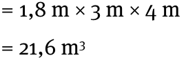
> **[Diagram Context - Textbook_MathematicalLiteracy_Gr12_lengths-perimeter-area-and-volume.pdf-0015-18.png]**
> The image shows a diagram of a cell with a number of different structures and components. The diagram is labeled with numbers and units, indicating the size of the cell and its various parts. The diagram is set against a gray background, which helps to highlight the different elements of the cell. The diagram is a visual representation of a cell, and it is used to teach students about the different components and

Volume of rectangular prism 2 = 1,2 m × 3,5 m × 4 m 

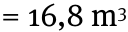

Volume of rectangular prism 3 = 1,2 m × 4 m × 4 m 

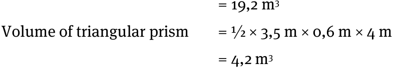
> **[Diagram Context - Textbook_MathematicalLiteracy_Gr12_lengths-perimeter-area-and-volume.pdf-0015-22.png]**
> 1. A diagram of a triangle with a label on the left side that says "Volume of triangular prism".

Total volume = 21,6 + 16,8 + 19,2 + 4,2 

= 61,8 m^{3} 

- 4.2 61,8 m^{3} = 61 800^{ℓ} 

Total cost = 0,92 c/^{ℓ} × 61 800^{ℓ} = 56 856 c = R568,56 

So, although it is not cheap, it is also not ‘a few thousand rand’. 

Via Afrika ›› Mathematical Literacy Gr 12 

## **Chapter 6 Measurement (measuring and calculating lengths, perimeter, area and volume)** 

4.3 4.3.1 Sloped length will need the theorem of Pythagoras: Length = ��0,6�^{�} + �3,5�^{�} = �0,36 + 12,25 = √12,61 

= 3,55 m 

Total length of side of pool = 3 m + 3,55 m + 4 m = 10,55 m 

Area of bottom = length of side × width 

= 10,55 m × 4 m 

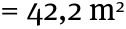

4.3.2 Volume of sand = Area × depth 

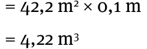

Cost of sand = 4,22 m^{3} × R375/m^{3} = R1 582,50 

Via Afrika ›› Mathematical Literacy Gr 12 

