**Chapter 5 Map and plans (scale and map work)** 

# **Section 1:  Comparing travel options** 

### **(LB pages 128-137)** 

## **Overview** 

The content of this section on _Comparing travel options_ , as part of the Maps, plans and other representations of the physical world Application Topic, is drawn from pages 74-75 in the CAPS document. 

As stipulated in the CAPS document, Grade 12 learners need specifically to be able to: 

- determine the ‘operating cost’ of a vehicle using the fixed, running and operating cost tables distributed by the Automobile Association of South Africa. 

- plan and cost trips using timetables, fare charts, distance charts and budgets. 

## **Contexts and integrated content** 

- There is integration of content from the Basic Skills Topic of _Patterns, relationships and representations_ with respect to using equations. 

- There is also integration with the Measurement Application Topic with respect to measuring length (km) and volume (ℓ). 

© Via Afrika ›› Mathematical Literacy Gr 12 

**Chapter 5 Map and plans (scale and map work)** 

## **1. Mode of transport #1: Car** 

## **1.1 Planning the route** 

Considerations that would need to be analysed when considering a route are: 

- How far is the trip via various routes? 

- How long might the trip take via various routes? A highway would take less time than gravel roads even if it were a longer distance. 

- How many rest stops are available on the route for food, fuel and toilet breaks? 

- Are there extra costs that might have to be paid (e.g. toll fees)? 

- What time of day or night do you expect to arrive? (Will you arrive too late to book into the hotel?) 

- Whether to split the journey over two days for convenience and for practical reasons. If so, then where would the accommodation be located? 

## **1.2 Determining travel costs** 

Total travel costs include both the fixed costs (depreciation, licensing and other one-off costs) and running costs (fuel, tyres, maintenance). 

## **Example** 

A car is traveling from Durban to Cape Town. Determine the total travel costs for that trip. The following information is needed: 

|**Purchase Price**|R125 000,00|
|---|---|
|**Distance travelled in a year**|26 000 km|
|**Engine Capacity**|1 600 cc|
|**Current fuel price**|R11,88 per litre|
|**Fuel type**|Petrol|
|**Distance from Durban to** **Cape Town**|1 663 km|

Referring to the tables below (which appear in the Learner’s Book on pages 123124) we can calculate the fixed and running costs of a vehicle. The factors in the tables are all in **cents** . 

© Via Afrika ›› Mathematical Literacy Gr 12 

**<mark>Chapter 5</mark> Map and plans (scale and map work)** 

### **Fixed costs** 

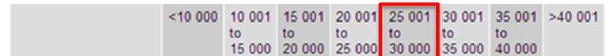
> **[Diagram Context - Textbook_MathematicalLiteracy_Gr12_scale-and-map-work.pdf-0003-02.png]**
> 1. A diagram of a cell with the number 25,001 to the right of the number 20,001.

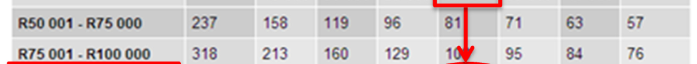
> **[Diagram Context - Textbook_MathematicalLiteracy_Gr12_scale-and-map-work.pdf-0003-03.png]**
> 1. A diagram of a cell with the number of chromosomes labeled.

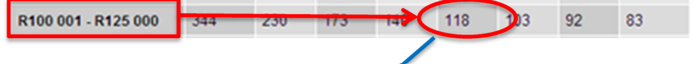
> **[Diagram Context - Textbook_MathematicalLiteracy_Gr12_scale-and-map-work.pdf-0003-04.png]**
> The image shows a diagram of a cell with a red arrow pointing to the number 118. The diagram also includes a number line and a label that reads "R1 001 R25 000". The diagram is set against a gray background.

Total Fixed costs for the journey = **118 c/km** x 1 663 km 

= 196 234 c 

= **R1 962,34** 

### **Running Costs** 

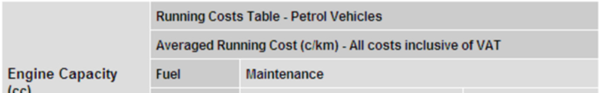
> **[Diagram Context - Textbook_MathematicalLiteracy_Gr12_scale-and-map-work.pdf-0003-09.png]**
> 1. A table with the heading "Running Costs Table" and a list of columns and rows.

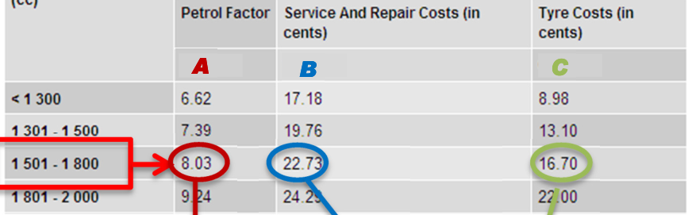
> **[Diagram Context - Textbook_MathematicalLiteracy_Gr12_scale-and-map-work.pdf-0003-10.png]**
> 1. A table with columns for service and repair costs in cents.

Running costs = A x petrol price + B       +         C 

= **8,03** x 1188 c + **22,73** + **16,70** 

= 95,3964 + 22,73 + 16,70 

= 134,8264 c/km 

Leave all the decimal places _during_ the calculation. = 224 216,3032 c Only round off the **final** = **R2 242,16 answer.** 

Total running costs for the journey = 134,8264 c/km x 1663 km 

Total costs = Fixed costs + running costs = R1 962,34 + R2 242,16 

= **R4 204,50** 

**Note** :  This is the _actual_ cost of the journey including wear and tear. Usually when 

a person uses a car they only consider the cost of petrol. 

© Via Afrika ›› Mathematical Literacy Gr 12 64 

**<mark>Chapter 5</mark> Map and plans (scale and map work)** 

## **2. Mode of transport #2: Bus** 

Travelling by bus (or by train) utilises the skills outlined in Chapter 1. Travel by bus is a form of _mass transport_ and as such it needs to be run according to a timetable (for organisation) and along limited routes (for affordability). Travelling by car is much more flexible, but also much more expensive (unless a group of people travels together and shares the cost of the petrol). 

### **Making sense of a bus timetable and fare table** 

## **Example** 

Using a bus, which would be the best way to travel from Johannesburg to Bloemfontein? 

- **6** 

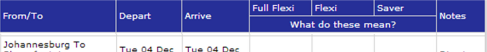
> **[Diagram Context - Textbook_MathematicalLiteracy_Gr12_scale-and-map-work.pdf-0004-12.png]**
> 1. A diagram of a cell with arrows pointing to different parts of the cell.

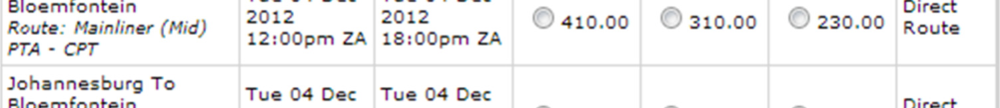
> **[Diagram Context - Textbook_MathematicalLiteracy_Gr12_scale-and-map-work.pdf-0004-13.png]**
> 1. A diagram of a cell with arrows pointing to different parts of the cell.

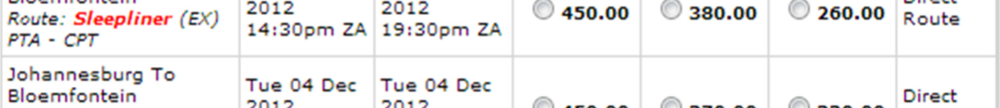
> **[Diagram Context - Textbook_MathematicalLiteracy_Gr12_scale-and-map-work.pdf-0004-14.png]**
> 1. A diagram of a cell with arrows pointing to different parts of the cell.

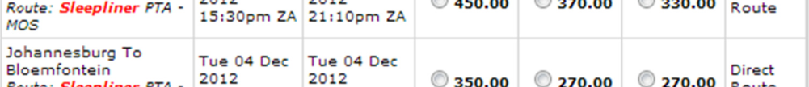
> **[Diagram Context - Textbook_MathematicalLiteracy_Gr12_scale-and-map-work.pdf-0004-15.png]**
> 1. A diagram of a cell with arrows pointing to different parts of the cell.

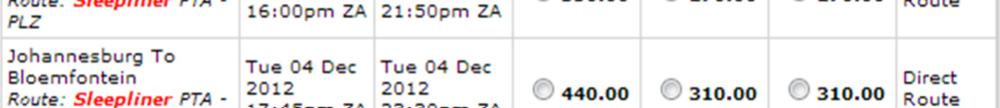
> **[Diagram Context - Textbook_MathematicalLiteracy_Gr12_scale-and-map-work.pdf-0004-16.png]**
> 1. A diagram of a cell with arrows pointing to different parts of the cell.

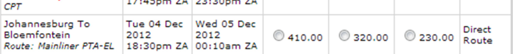
> **[Diagram Context - Textbook_MathematicalLiteracy_Gr12_scale-and-map-work.pdf-0004-17.png]**
> 1. A diagram of a cell with arrows pointing to different parts of the cell.

**Source: http://www.intercape.co.za/bus-booking/johannesburg/to/bloemfontein/0/** 

The above table is taken from the Intercape bus company booking site. It combines all three information tables into one ( _route map, travel timetable and fare table_ ). 

Ultimately the decision will be made according to three criteria: 

- _Most convenient departure time_ : All the times seem early enough in the day, although options 5 & 6 are in rush hour. 

- _Most convenient arrival time_ : Options 4, 5 & 6 arrive very late in the evening. Even option 3 is late for someone to come to pick you up from the bus stop. 

- _Cost and availability of tickets_ : Options 1 & 6 have the best prices and they seem to be available. 

- © Via Afrika ›› Mathematical Literacy Gr 12 

**<mark>Chapter 5</mark> Map and plans (scale and map work)** 

# **Section 2: Compass directions** 

### **(LB pages 138-141)** 

## **Overview** 

The content of this section on _Compass directions_ , as part of the Maps, plans and other representations of the physical world Application Topic, is drawn from page 74-75 in the CAPS document. 

As stipulated in the CAPS, Grade 12 learners need specifically to be able to: 

- make sense of directions and signboards on roads and in map books that refer to compass directions (e.g. ‘Travel North on the M3’). 

- interpret elevation plans of buildings that include the words ‘North Elevation’, ‘South Elevation’, ‘East Elevation’ and ‘West Elevation’. 

- inform decisions on where to position a house or a garden in relation to the position of the sun at different times of the day. 

## **Contexts and integrated content** 

- Contexts include any situation where a journey (on foot or in a vehicle) needs to be planned. 

## **Compass directions and applications** 

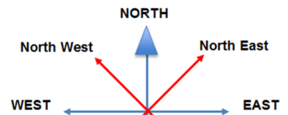
> **[Diagram Context - Textbook_MathematicalLiteracy_Gr12_scale-and-map-work.pdf-0005-12.png]**
> The image presents a diagram that illustrates the four cardinal directions and the four cardinal points of the compass rose. The diagram is set against a gray background, and the four cardinal directions are labeled with the names of the four cardinal points: North, West, East, and South. The diagram also includes arrows pointing to the four cardinal points, which are labeled with the names of the four cardinal directions:

- There are four basic directions: North, South, East and West aligned at 90° to each other. 

- Exactly halfway between the four basic directions (at 45° to each of the basic directions) are the secondary directions North East, South East, South West and North West. ‘North West’ means that it is exactly halfway between North and West. 

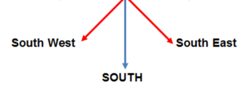
> **[Diagram Context - Textbook_MathematicalLiteracy_Gr12_scale-and-map-work.pdf-0005-15.png]**
> The image is a diagram that shows the South West, South East, and South directions. The diagram is labeled with the names of the four cardinal directions. The diagram also includes arrows pointing to the South West and South East, as well as a South arrow. The diagram is set against a gray background.

- Compass directions can be used to indicate exact location when used in lines of latitude and longitude (e.g. Cape Town is at 33° 55’ 31’’ **S** , 18° 22’ 26’’ **E** ) 

- Directions on major highways indicate the direction of travel to assist motorists in making the correct decision. 

- Compass directions are used in construction to refer to the direction a building is facing (e.g. ‘South Elevation’ refers to the side that phases South, so a person looking at it from the outside would be facing North). 

**Knowing the direction of a road allows the motorist to be in the correct lane** 

- In the Southern hemisphere, buildings are built with many rooms North-facing to get the most sun-exposure. The opposite is true in the Northern hemisphere. 

- © Via Afrika ›› Mathematical Literacy Gr 12 

**Chapter 5 Map and plans (scale and map work)** 

# **Section 3: Scale** 

### **(LB pages 142-145)** 

## **Overview** 

The content of this section on _Scale_ , as part of Maps, plans and other representations of the physical world Application Topic, is drawn from page 73 in the CAPS document. 

As stipulated in the CAPS document, Grade 12 learners need specifically to be able to: 

- calculate map and/or plan measurements when actual lengths and distances are known using a given scale to inform the drawing of 2-dimensional plans and pictures and the construction of 3-dimensional models. 

- determine the most appropriate scale in which to draw/construct a map, plan and/or model, and use this scale to complete the task. 

- determine the scale in which a map and/or plan has been drawn in the form 1 : .… and use the scale to determine other dimensions on the map and/or plan. 

## **Contexts and integrated content** 

- Determine contexts including any situation where a map or plan is used to determine distance. 

- At times learners will be required to convert between different units which will draw on the skills found in the _Measurement_ Application Topic. 

Scale is referred to here and in Chapter 10. The contexts are different in the two chapters, but the skills are similar. 

© Via Afrika ›› Mathematical Literacy Gr 12 

**<mark>Chapter 5</mark> Map and plans (scale and map work)** 

## **Scale: Basics** 

- A scale has two sides to it: The left side always refers to a measurement on the **M** ap (or Plan), while the right side always refers to the measurement in real life ( **A** ctual measurement). We can summarise this as the ‘ **MA** rule’ (Map-Actual). 

### **M      A** 

   - 1 : 30 000 

- A scale does not have units as the units on both sides will be the same. 

## **Example** 

A scale of 1 : 30 000 means that 1 cm measured on the **M** ap represents 30 000 cm in real life ( **A** ctual). 

## **Determining the equivalent number scale for a bar scale** 

To determine the number scale we need a measurement from the bar scale and the actual (real life) value of the _same measurement_ . We then follow this procedure: 

1. Measure the bar scale and record both the bar scale and real life measurements in their correct places in the scale ( **M** : **A** ) 

2.  Convert both measurements to _the same units_ . Convert to the _smaller unit_ for ease of calculation. 

3.  Divide both by the **M** ap value. 

## **Example** 

- In the bar scale alongside you can see that a 

- 1 measurement of 4 cm on the bar scale is equivalent to 20 km in real life 

   - Therefore the scale is:  4 cm : 20 km 

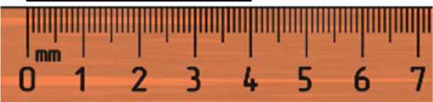
> **[Diagram Context - Textbook_MathematicalLiteracy_Gr12_scale-and-map-work.pdf-0007-17.png]**
> 1. A ruler with a wooden ruler.

- 2 20 km = 2 000 000 cm, therefore if we write the measurements in the same units, we see that the scale is: 4 cm : 2 000 000 cm 

- Divide both sides by the **M** ap measurement (to get the Map side of the scale to 

- 3 be 1): 4 cm ÷ 4 cm = 1 and 2 000 000 cm ÷ 4 cm = 500 000, therefore the scale is: **1 : 500 000** 

© Via Afrika ›› Mathematical Literacy Gr 12 

**<mark>Chapter 5</mark> Map and plans (scale and map work)** 

## **Checking the accuracy of the number scale** 

The method that would be used would be the method outlined above and will be the same operation as the example below therefore we will not deal with it here. 

## **Determining the scale of a map** 

- **Question:** Why can we NOT determine the scale by measuring a straight line from Kimberley to Trompsberg? 

**Answer:** The real life distance between those two points is not known. 

In order to calculate the scale of a map we require a measurement from the map and the actual value of the measurement. It is better to have two points which are in a straight line from each other, but if they are not, use a piece of string to get the approximate measurement on the map. 

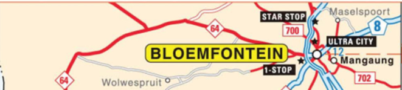
> **[Diagram Context - Textbook_MathematicalLiteracy_Gr12_scale-and-map-work.pdf-0008-07.png]**
> The image is a map of the city of Bloemfontein, South Africa, with the name of the city displayed in yellow text. The map also includes several roads and highways, as well as a few notable locations such as the Star Stop, the Ultra City, and the Mangaung. The map is labeled with the names of the highways and roads, and the cities

## **Example** 

This is the same map as the one in the Learner’s Book on page 144, to the same scale. To confirm this we measure the distance from Kimberley to Heuningneskloof (marked with red stars). 

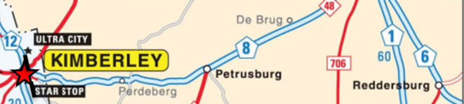
> **[Diagram Context - Textbook_MathematicalLiteracy_Gr12_scale-and-map-work.pdf-0008-10.png]**
> The image is a map of the United States, specifically focusing on the state of Pennsylvania. The map is color-coded, with different colors representing different highways. The map also includes labels for the cities of Philadelphia and Pittsburgh. The map is labeled with the names of the cities and the highways they are on. The map is labeled with the names of the states and the highways they are on.

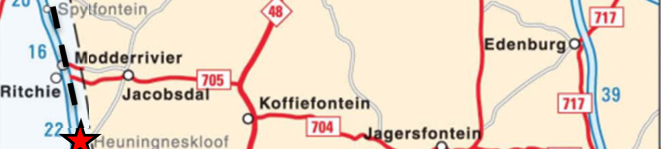
> **[Diagram Context - Textbook_MathematicalLiteracy_Gr12_scale-and-map-work.pdf-0008-11.png]**
> The image is a map of South Africa, showing the routes of the Modderriers and Jacobians. The map is color-coded, with red representing the Modderriers and green representing the Jacobians. The map also includes labels for the cities of Modderri and Jacobia, as well as the names of the towns and cities along the routes. The map is oriented with

- The measurement between the two 

- 1 points is approximately 2,4 cm and if we add up the distances indicated on the map we get 20 + 16 + 22 = 58 km. Therefore the scale is: _2,4 cm : 58 km_ 

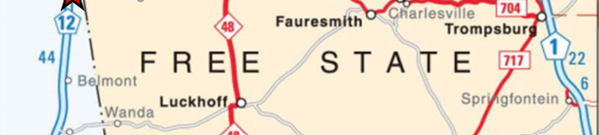
> **[Diagram Context - Textbook_MathematicalLiteracy_Gr12_scale-and-map-work.pdf-0008-13.png]**
> The image is a map of the United States, specifically the state of South Carolina. The map is divided into two sections, with the left section being a map of the state and the right section being a map of the interstate system. The map includes the names of the highways and the cities they pass through. The map also includes the names of the states and the names of the cities within the

   - 58 km = 5 800 000 cm, therefore if we 

- 2 write the measurements in the same units, we see that the scale is _: 2,4 cm : 5 800 000 cm_ 

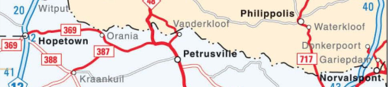
> **[Diagram Context - Textbook_MathematicalLiteracy_Gr12_scale-and-map-work.pdf-0008-16.png]**
> The image is a map of South Africa, showing the roads and highways of the country. The map is divided into two sections, with the top section showing the roads and highways, and the bottom section showing the cities and towns. The map is color-coded, with red indicating the main roads and highways, and green indicating the smaller roads and highways. The map also includes labels for the cities

- Divide both sides by the **M** ap 

3 measurement (to get the Map side to 1): 2,4 cm ÷ 2,4 cm = 1 and 5 800 000 cm ÷ 2,4 cm =2 416 667, thus the scale is: _1 : 2 416 667_ ≈ **1 : 2 400 000** 

**Note** :  There are several reasons why the scale is different to the textbook: 

- The map distances cannot be measured to an appropriate degree of accuracy (e.g. it would be more accurate if the measurement was in mm or if we could zoom in and measure with greater skill). 

- The real life distances are rounded off. 

- We are finding an _approximate scale_ . The map scale would be better. 

© Via Afrika ›› Mathematical Literacy Gr 12 

**<mark>Chapter 5</mark> Map and plans (scale and map work)** 

# **Additional questions** 

#### **<mark>BLOEMFONTEIN</mark>** 

1. Hloni is a taxi owner. He operates a route that takes passengers from Norvalspunt to Bloemfontein and back again. He needs to know what to charge his passengers in order to make a decent profit. 

His route takes him down the N1 and the section of the map alongside shows his start and end points (indicated by the red stars). 

   - 1.1 Calculate the total distance between the two points by adding up the blue numbers on the map. These indicate the distance (in km) between various points on the route. 

   - 1.2 Hloni measures the distance between the two stars on a map as 12,4 cm. Use this distance and the answer to Question 1.1 to calculate the scale of the map alongside. 

   - 1.3 The map alongside is taken from the map on the previous page. Explain why the scales of the maps are not the same. 

   - 1.4 Is the scale of the map alongside larger or is it smaller than the map on the previous page? Give a reason for your answer. 

2. In order to calculate the fixed and running costs of the vehicle he needs to work out the total distance that he will be driving in a year. 

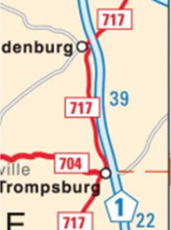
> **[Diagram Context - Textbook_MathematicalLiteracy_Gr12_scale-and-map-work.pdf-0009-10.png]**
> The image shows a map of the United States, specifically focusing on the state of Pennsylvania. The map displays the route of the Pennsylvania Turnpike, which is a major highway in the state. The map also includes the names of the cities along the route, such as Philadelphia and Lancaster. The map is labeled with the numbers 717 and 39, indicating the locations of the cities. The map

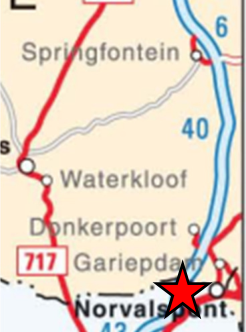
> **[Diagram Context - Textbook_MathematicalLiteracy_Gr12_scale-and-map-work.pdf-0009-11.png]**
> The image shows a map of South Africa with a red star marking the location of Norvalidspoort. The map also includes a legend and a scale, which helps to understand the distances and sizes of the various locations. The map is labeled with the names of the towns and cities, providing geographical context for the map's content.

   - 2.1 Using your answer to Question 1.1 calculate the total time it will take him to do one trip to Bloemfontein. He will be travelling at approximately 90 km/h on average and it will take him 15 minutes to get to the taxi rank once he arrives in Bloemfontein. 

   - 2.2 He estimates that each trip will take him 2 hours. With loading, unloading and waiting for passengers, he calculates that he will be able to do 4 trips in a day (To Bloemfontein and back twice). He will operate for 320 days of the year. Calculate the total annual distance that he will drive. 

3. Hloni drives a Toyota Quantum minibus. Its engine capacity is 2 700 cc and it cost R303 000 to buy. It is a petrol vehicle. 

   - 3.1 Use the following table to determine his Fixed Cost amount (in c/km): 

© Via Afrika ›› Mathematical Literacy Gr 12 

**<mark>Chapter 5</mark> Map and plans (scale and map work)** 

- 3.2 Use the following table to work out his Petrol Factor (A), Service/Repair costs 

   - (B) and Tyre costs (C). All of the factors are in c/km. 

- 3.3 Petrol currently costs R11,88. Use this fact and your answers from Questions 3.1 and 3.2 to work out the Total Operating Vehicle Cost (TOVC) using the following equation: 

TOVC = Fixed Cost amount + A × Fuel Price + B + C 

- 3.4 He rounds off the TOVC amount to R4,20 / km. Using this value he calculates that his operating costs to travel to Bloemfontein will be approximately R700. Show how this was calculated. 

- 3.5 Hloni takes an average of 12 passengers on each trip. He aims to make 30% profit. How much should he charge each passenger (use R700 as the operating cost of the vehicle)? 

© Via Afrika ›› Mathematical Literacy Gr 12 

**Chapter 5 Map and plans (scale and map work)** 

# **Answers** 

- 1 1.1 They total 167 km. 

   - 1.2 Map       :    Actual 

      - 12,4 cm :   16 700 000 cm (Both measurements need to be converted to the same units) 

1       : 1 346 774 (16 700 000^{÷} 12,4) 1       : 1 350 000 (Rounded off to the nearest sensible round number) 

   - 1.3 This map is enlarged. 

   - 1.4 It is larger: the smaller the number of the scale, the larger the scale. 

- 2 2.1 167 km^{÷} 90 km/h = 1,86 hours = 1 hour 51 minutes + 15 minutes = 2 hrs 6 mins 

   - 2.2 167 km × 4 trips/day × 320 days = 213 760 km 

- 3 3.1 224 c/km (His vehicle falls in the R300 001-R350 000 bracket and he travels more than 40 000 km per year.) 

   - 3.2 A = 10,96 

      - B = 35,97 

      - C = 31,70 (His vehicle is in the 2 501-3 000 cc bracket.) 

   - 3.3 TOVC = 224 + 11,88 × 10,96 + 35,97 + 31,70 

         - = 224 + 103,20 + 35,97 + 31,70 

         - = 421,87 c/km 

   - 3.4 R4,20 / km × 167 km = R701,4 ≈ R700 

   - 3.5 R700^{÷} 12 = R58,33 + 30% of R58,33 = R75,83 ≈ R75 

This will be a nice round number. A side note is that this is too high a figure for the average person to pay so Hloni is going to have to charge less and maintain his vehicle less. This is why long-haul taxis are often not roadworthy. They cover too long a distance for too little money. 

© Via Afrika ›› Mathematical Literacy Gr 12 

