**Chapter 7 Measurement (Measuring weight: BMI, medicine dosages)** 

# **Section 1: Understanding income tax** 

### **(LB pages 182-185)** 

## **Overview** 

The content of this chapter, as part of the _Measurement_ Application Topic, is drawn from page 65 in the CAPS document. 

As stipulated in the CAPS document, Grade 12 learners need specifically to be able to: 

- use recorded mass (weight) data, recorded length data, calculate Body Mass Index values and appropriate growth charts to monitor growth problems in children. 

## **Contexts and integrated content** 

The scope of the measured data should include the personal lives of learners, the wider community, national and global averages. 

The skills that are used in this chapter are the same as those covered in Chapter 3. Skills that will be needed for success in this chapter would be: 

- an understanding of the concept of percentiles 

- an understanding of percentile curves 

- basic graph reading and interpretation skills 

- using equations. 

BMI is calculated in the same way as for adults (as in Grade 11): 

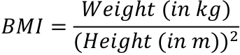
> **[Diagram Context - Textbook_MathematicalLiteracy_Gr12_Measuring-weight-BMI-medicine-dosages.pdf-0001-15.png]**
> The image shows a diagram of a Lewis structure of a molecule. The diagram is divided into two parts, with the top part representing the Lewis structure of the molecule and the bottom part representing the weight of the molecule. The diagram is set against a gray background, and the text "BMI = Weight (in kg) / Height (in m)" is written in black at the bottom of the

However the interpretation is different when considering children. In adults, their height stays constant after a certain age (approximately 23 years of age). Therefore the only measurement that changes is weight. 

In children, their height changes often. This will affect the results of the BMI calculation. In other words, a BMI that might be considered very low for an adult could be the median for a child. Therefore the BMI of a child will need to be checked against an appropriate set of BMI curves. The calculation itself is not sufficient. 

Via Afrika ›› Mathematical Literacy Gr 12 

**<mark>Chapter 7</mark> Measurement (Measuring weight: BMI, medicine dosages)** 

## **Example** 

Consider two girls: **Amy** is 9 years old. She is 1,29 m tall and weighs 33 kg. Nontando is 12 years old. She weighs 46 kg and is1,52 m tall. 

Their BMI’s are as follows: 

|**Amy** ��� = ������ ���� ������ ���^{�}  = �� �� ��,���^{�}  =| �� �� �,���� ��^{�} |**Nontando** ��� = ������ ���� ������ ���^{�}  = �� �� ��,���^{�} |= �� �� �,���� ��^{�}|
|---|---|---|---|
|= 19, 83 kg/m^{2}||= 19, 91 kg/m^{2}||

Notice that they both have the same BMI. According to _adult_ BMI assessments from Grade 11, both girls are perfectly normal. Now we reference the appropriate BMI growth curve for girls and plot each girl’s age versus her BMI: 

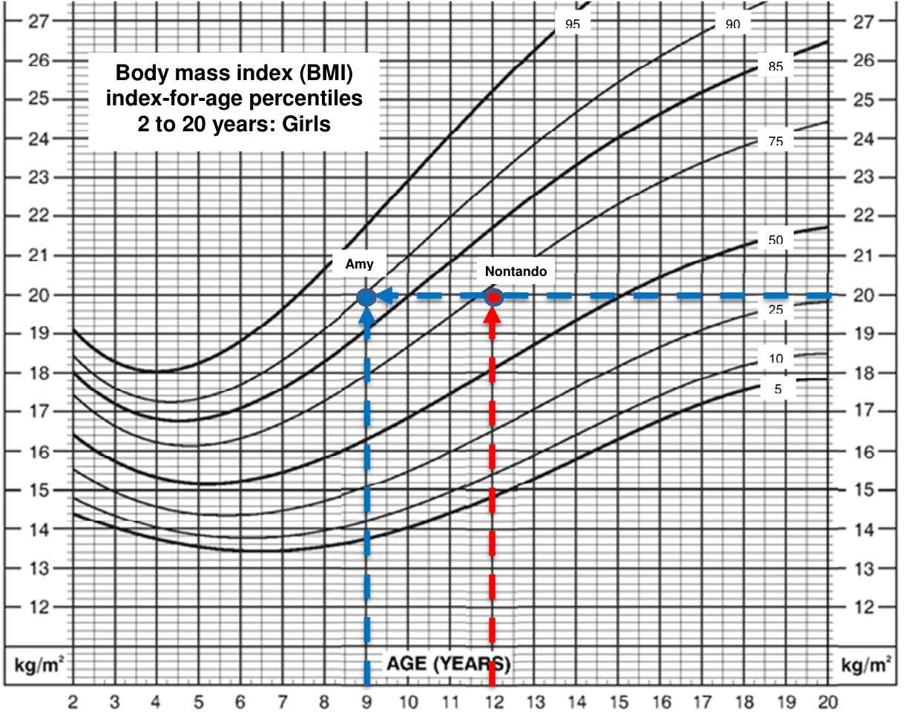
> **[Diagram Context - Textbook_MathematicalLiteracy_Gr12_Measuring-weight-BMI-medicine-dosages.pdf-0002-06.png]**
> The image is a graph that shows the growth of a person's height over time. The graph is divided into two lines, one for boys and one for girls. The x-axis represents the age of the person, and the y-axis represents their height. The graph shows that the height of a person increases as they get older, with the tallest point being at the age of 20.

Via Afrika ›› Mathematical Literacy Gr 12 

**Chapter 7** 

**Measurement (Measuring weight: BMI, medicine dosages)** 

We can see that Amy’s BMI occurs on the 90^{th} percentile curve, while Nontando is a little lower than the 75^{th} percentile curve. To interpret the real meaning of these results, we can reference the following table: 

||**Weight status classifications**|
|---|---|
|**Weight status**|**Percentile range position on the growth chart**|
|Underweight|Less than the 5th percentile|
|Healthy weight|≥5th percentile and < 85th percentile|
|At risk of overweight|≥85th percentile and < 95th percentile|
|Overweight|≥95th percentile|

We can now see that Amy is at risk of being overweight while Nontando actually has a fairly healthy weight. 

Via Afrika ›› Mathematical Literacy Gr 12 

**Chapter 7 Measurement (Measuring weight: BMI, medicine dosages)** 

# **Section 2: Using formulae to determine medicine dosage** 

### **(LB pages 186-187)** 

## **Overview** 

The content of this chapter, as part of the _Measurement_ Application Topic, is drawn from page 65 in the CAPS document. 

As stipulated in the CAPS document, Grade 12 learners need specifically to be able to: 

- calculate medicine dosages using formula supplied and appropriate growth charts. 

## **Contexts and integrated content** 

The scope of the measured data should include the personal lives of learners, the <u>wider community, national and global averages.</u> 

The skills used in this chapter relate to the application of specific formulae using known measurements. The required dosage is calculated in different ways depending on the formulae applied. An example and exercise are provided in the Learner’s Book and there is no new content. 

Via Afrika ›› Mathematical Literacy Gr 12 

**Chapter 7 Measurement (Measuring weight: BMI, medicine dosages)** 

# **Additional questions** 

1. The BMR (Basal Metabolic Rate) is the minimum amount of energy that a body needs to function. The BMR (in calories) for a woman can be calculated by using the following formula: 

BMR = 10 × weight(in kg) + 6,25 × height(in cm) – 5 ×age(in years) – 161 

- 1.1 Calculate the BMR for a 17-year old woman who weighs 46 kg and is 1,43 m tall. 

- 1.2 The woman in the previous question managed to keep her weight at 46 kg and her height remained 1,43 m. Will she require more calories or fewer calories for her BMR as she grows older? Prove your answer with calculation. 

- 1.3 One of the formula’s for calculating a woman’s ideal weight is the J.D. Robinson formula: 

Ideal weight = 49 kg + 0,7 kg ×(Height (in cm) – 150) 

   - 1.3.1 According to the Robinson formula, what is the ideal weight for a woman who is 1,65 m tall? 

   - 1.3.2 What possible factors could make the Robinson formula inaccurate? List TWO factors. 

2. The BMI (Body Mass Index) of a person who is over 20 years of age can be calculated by using the following formula: 

���=^{����ℎ� ��� ���} �����ℎ� ��� ���^{�} 

According to this value, an adult can be classified according to the following table: 

|**BMI**|**Classification**|
|---|---|
|Less than 18,5|Underweight|
|From 18,5to 24,9|Normal|
|From 25to 29,9|Overweight|
|From30 upwards|Obese|

- 2.1 Calculate the BMI of the following two people: 

Person 1: Weight: 65 kg; Height: 1,54 m Person 2: Weight 122 lb; Height: 70 inches tall. (Conversions: 2,2 lb = 1 kg  ;  1 inch = 2,54 cm) 

Via Afrika ›› Mathematical Literacy Gr 12 

**Chapter 7** 

**Measurement (Measuring weight: BMI, medicine dosages)** 

- 2.2 How much would a person who is 1,82 m tall have to weigh to be considered obese? Show all working. (Hint: You can use Trial and error or any other method). 

- 2.3 Use the above table to comment on the weight status of the two people in Question 2.1 if they are adults. 

- 2.4 Use the BMI percentile graph for girls in the worked example and the weight status table below to answer the following questions: 

|**Weight status classifica**|**tions**|
|---|---|
|**Weight status**|**Percentile range position on the growth chart**|
|Underweight|Less than the 5th percentile|
|Healthy weight|≥5th percentile and < 85th percentile|
|At risk of overweight|≥85th percentile and < 95th percentile|
|Overweight|≥95th percentile|

      - 2.4.1 If Person 1 (from Question 2.1) is a 12 year old girl, what would her weight status be? 

      - 2.4.2 If Person 1 is a 19 year old girl, what would her weight status be? 

3. On the next page are BMI and Height/Weight percentile curves for boys. Use them to answer the following questions: 

   - 3.1 If Person 2 (from Question 2.1) is a boy 16 years old, what percentile would his height fall into? What does this indicate about his height? Give a reason for your answer. 

   - 3.2 If Person 2 is a boy 16 years old, what percentile would his weight fall into? What does this indicate about his weight? Give a reason for your answer. 

   - 3.3 Use the BMI graph to determine his weight status (as a 16-year old boy). 

   - 3.4 Use your answers to Questions 3.1 and 3.2 to explain his weight status from Question 3.3. 

Via Afrika ›› Mathematical Literacy Gr 12 

**<mark>Chapter 7</mark> Measurement (Measuring weight: BMI, medicine dosages)** 

**Body mass index (BMI) indexfor-age percentiles 2 to 20 years: Boys** 

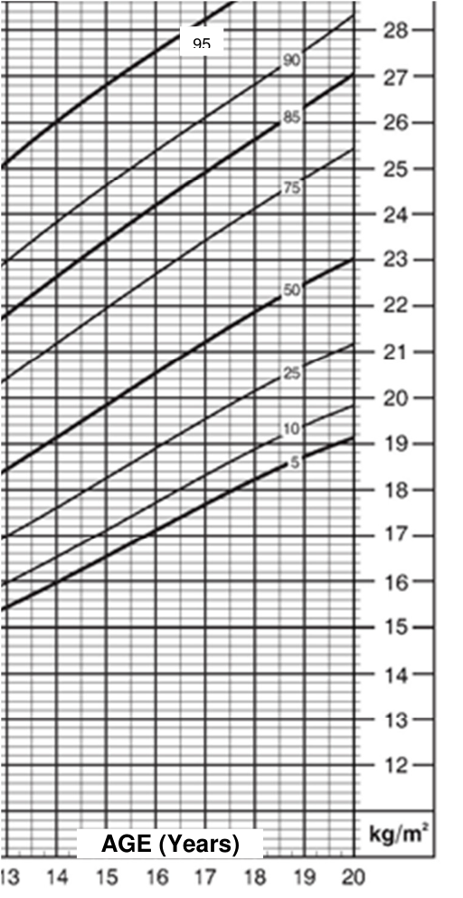
> **[Diagram Context - Textbook_MathematicalLiteracy_Gr12_Measuring-weight-BMI-medicine-dosages.pdf-0007-02.png]**
> The image is a graph that shows the age of a person in years. The graph has a horizontal x-axis labeled "AGE" and a vertical y-axis labeled "AGE (years)" and has a scale of 1 unit on the x-axis and 2 units on the y-axis. The graph shows that the person is 14 years old.

#### **Stature (Height) for age / Weight for age percentiles 2 to 20 years: Boys** 

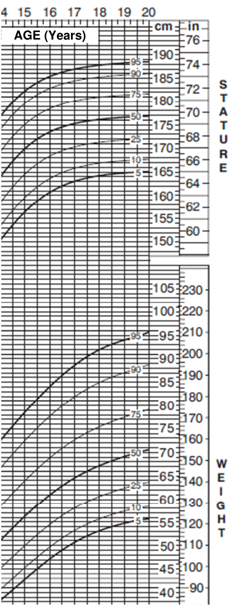
> **[Diagram Context - Textbook_MathematicalLiteracy_Gr12_Measuring-weight-BMI-medicine-dosages.pdf-0007-04.png]**
> The image is a diagram that shows the growth of a person's height over time. The diagram is divided into two columns, with the first column representing the age of the person in years and the second column representing the height of the person in centimeters. The diagram is color-coded, with each color representing a different age range. The diagram also includes labels for the different age ranges, such as

Via Afrika ›› Mathematical Literacy Gr 12 

**Chapter 7 Measurement (Measuring weight: BMI, medicine dosages)** 

# **Answers** 

- (Note: This initial set of questions is not in the book, but it is worthwhile looking at a set of unfamiliar equations and seeing if we can interpret their answers) 

1. 1.1 BMR = 10 × 46 kg + 6,25 × 143 cm – 5 × 17 –161 

      - = 460 + 893,75 – 85 – 161 

      - = 1 107,75 calories 

   - 1.2 She will require fewer calories because as her age increases the value of the ‘5 × age’ term increases. For example, at 40 years of age: 

BMR = 460 + 893,75 – 5 × 40 – 161 

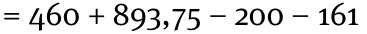

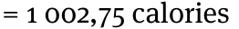

- 1.3 1.3.1 Ideal weight = 49 kg + 0,7 kg × (165 – 150) 

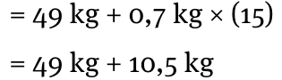
> **[Diagram Context - Textbook_MathematicalLiteracy_Gr12_Measuring-weight-BMI-medicine-dosages.pdf-0008-11.png]**
> The image shows a diagram of a cell with the number 49 and the number 0.7 written on it. The diagram also includes a number line with the numbers 0.49 and 0.71. The diagram is set against a gray background.

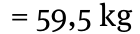

- 1.3.2 It could be based on one race group (the ideal weight for one race 

group is not the same as for another). Also, it takes height into account, but it does not identify if the person is large-boned or small- 

boned which will affect any ideal weight calculation. 

2. 2.1 Person 1: BMI = Weight (kg)^{÷} (Height (in m))^{2} 

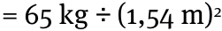

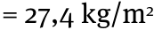

Person 2: Mass = 122 lb^{÷} 2,2 lb/kg = 55,45 kg 

Height = 70 in. × 2,54 in/cm = 177,8 cm = 1,778 m 

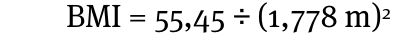

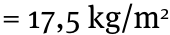

- 2.2 To be considered obese their BMI should be at least 30, so the equation will look like this: 

BMI = mass^{÷} height^{2} 30 = mass^{÷} (1,82)^{2} 30 = mass^{÷} 3,3124 

By Trial and error or by equation solving methods we can find 99,4 kg. 

Via Afrika ›› Mathematical Literacy Gr 12 

**Chapter 7 Measurement (Measuring weight: BMI, medicine dosages)** 

   - 2.3 Person 1: This person is considered to be overweight. This would seem to be a bit harsh as 65 kg is an average weight. 

      - Person 2: This person is considered to be underweight. This makes sense because the person is very tall but yet weighs very little. 

   - 2.4 2.4.1 Person 1 has a BMI of 27,4 kg/m^{2} . By using the graph we can see that a 12-year old girl with that BMI would be above the 95^{th} percentile which would mean that she would be drastically overweight. 

      - 2.4.2 By using the graph we can see that this BMI for a 19-year old is between the 85^{th} and 95^{th} percentile. This means that she would be at risk of being overweight (but not obese) 

3. 3.1 Height = 177,8 cm. 

Looking at the right hand graph we can see that for a 16-year old boy this height occurs on or about the 75^{th} percentile curve. This means that he is above average height (which would be the 50^{th} percentile curve) and that he is taller than 75% of boys his own age. 

- 3.2 Weight = 55,45 kg 

Looking at the lower part of the graph on the right we can see that for a 16year old boy his weight is between the 10^{th} and 25^{th} percentile (although closer to the 10^{th} percentile. This would indicate that he is underweight for his age. 

- 3.3 BMI = 17,5 (previously calculated) 

For a 16-year old boy, a BMI of 17,5 occurs between the 5^{th} and the 10^{th} percentile. The table of weight status identifies this as a healthy weight. 

- 3.4 His BMI is so low relative to his age because the boy is tall and thin and so he might seem to be bordering on being unhealthy. However he might simply be going through a growth spurt. 

Via Afrika ›› Mathematical Literacy Gr 12 

