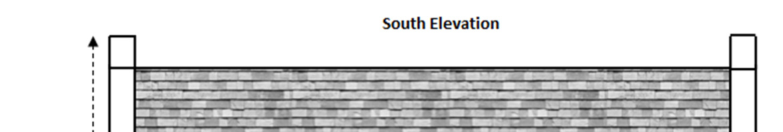
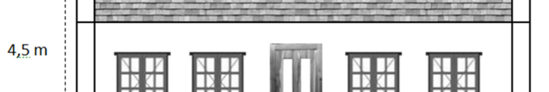
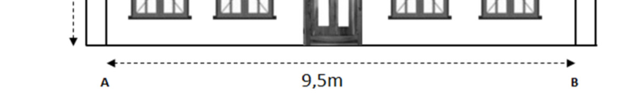
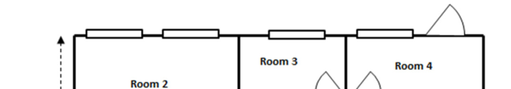
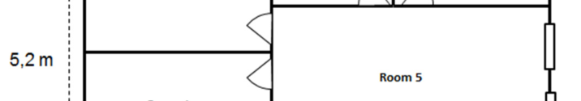
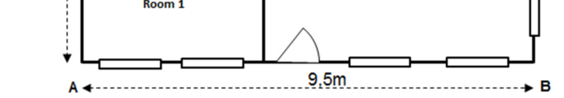

**Chapter 12** 

**Maps and plans (models)** 

# **Section 1: Creating a 3-D model** 

### **(LB pages 290-293)** 

## **Overview** 

The content of this section on Creating a 3-D Model is part of the _Maps, plans and other representations of the physical world_ Application Topic, is drawn from pages 79-80 in the CAPS document. 

As stipulated in the CAPS document, Grade 12 learners need to be able to: 

- determine the most appropriate scale in which to draw/construct a plan. 

- make and use 2-dimensional and 3-dimensional models of buildings from given or constructed 2-dimensional floor and elevation plans. 

## **Contexts and integrated content** 

Contexts include more complex projects in a community (e.g. an RDP House). 

You will not be asked to construct a model of a structure for your final examinations, but might be asked to calculate scaled measurements and to decide on the most appropriate scale to construct a model. You will need to review the skills needed for working with scale that were covered in Chapters 5 and 10. 

## **Determining the appropriate scale** 

If you are asked to determine the most appropriate scale to fit into a given space: 

- Use one of the given scales to convert the largest dimension (either length or breadth) of the given plan or item. 

- If you are not given a scale then start with an easy one (e.g. 1 : 100 for large structures or 1 : 5 for a small item (e.g. a toy car)). Once you have performed the calculation on the dimension adjust your scale appropriately (e.g. if the calculated dimension is too small, then make the scale larger (1 : 50 is a larger scale than 1 : 100). 

- Once you have determined the best scale for your chosen dimension, _use the same scale_ to convert the other dimension (i.e. if you converted the length, then convert the breadth, etc.) Remember that the model must have the same scale throughout otherwise it will not be _in proportion._ 

- Once the best scale is determined, it is simply a matter of working with that scale to convert the real life dimensions according to the scale. 

- When constructing a model, we construct the base of the model first. This has two advantages: it sets the limits for the model and it gives a basic area to paste the remaining parts of the model onto (e.g. walls, doors, etc.) 

Via Afrika ›› Mathematical Literacy Gr 12 

**<mark>Chapter 12</mark>** 

**Maps and plans (models)** 

# **Additional questions** 

1. Which of the following scales is the largest? Give a reason for your answer. 

   - 1 : 80 1 : 10 1 : 20 

2. Which of the above scales would be best to create a scale model for the following items? Show calculations to prove your answer: 

   - 2.1 Car (length of a car is 3,4 m). 

   - 2.2 Television (width of a television is 80 cm). 

3. A homeowner is attempting to build a cottage. He intends to build a scale model of the building in order to plan the layout and to check the dimensions of the rooms. The South elevation and top view are pictured below (each is to different scales): 

> **[Diagram Context - Textbook_MathematicalLiteracy_Gr12_Maps-and-plans--models-.pdf-0002-09.png]**
> The image shows a diagram of a South African CAPS lesson plan. The diagram is a Lewis diagram, which is a visual representation of a molecule's structure. The diagram is labeled with the South Elevation, indicating the direction of the elevation. The diagram also includes a cell, a circuit, and a graph, which are all part of the South Elevation lesson plan. The diagram is set

> **[Diagram Context - Textbook_MathematicalLiteracy_Gr12_Maps-and-plans--models-.pdf-0002-10.png]**
> The image shows a detailed drawing of a building, possibly a house, with a total of 12 windows. The building is depicted in a black and white color scheme, and the drawing is labeled with the number "4.5m" at the top. The drawing also includes a scale of 1:4.5m, indicating the size of the building relative to the scale. The drawing provides

> **[Diagram Context - Textbook_MathematicalLiteracy_Gr12_Maps-and-plans--models-.pdf-0002-11.png]**
> The image presents a diagram of a building, with a window in the center and a door on the right side. The diagram is in black and white, and it is labeled with the letters "A" and "B". The diagram also includes a scale, with the width of the building being 9.5 meters and the height being 9.5 meters.

> **[Diagram Context - Textbook_MathematicalLiteracy_Gr12_Maps-and-plans--models-.pdf-0002-12.png]**
> The image is a diagram that shows the layout of a room with four walls and a door. The room is divided into three sections, each with a different color: white, black, and gray. The room is labeled with the numbers 2, 3, and 4, indicating the sections. The diagram also includes arrows pointing to the door and the number 4, which is the largest number in the

> **[Diagram Context - Textbook_MathematicalLiteracy_Gr12_Maps-and-plans--models-.pdf-0002-13.png]**
> The image shows a detailed diagram of a room, with a white line running down the center of the image. The diagram includes a room layout, a door, and a window. The room is labeled with the number "5.2m" and the word "ROOM 5". The diagram also includes a diagram of a cell, a diagram of a circuit, and a diagram of a graph

> **[Diagram Context - Textbook_MathematicalLiteracy_Gr12_Maps-and-plans--models-.pdf-0002-14.png]**
> The image shows a diagram of a room with a door on the left side and a window on the right side. The diagram also includes a diagram of a cell, a diagram of a circuit, and a diagram of an evolutionary tree. The diagram also includes a diagram of a geometric figure and a diagram of a graph. The diagram is labeled with A, B, C, D, E,

- 3.1 An A4 page is 29,7 cm long and 21 cm wide.  Which of the following scales would be the best scale to choose if the floor plan of the model would need to fit onto an A4 page? Prove your answer by calculation. 

   - 1 : 50 1 : 100 1 : 150 

- 3.2 Calculate the height of the model using your chosen scale. Answer in cm. 

- 3.3 Will this be a sensible scale with which to see enough detail? Give a reason for your answer. 

Via Afrika ›› Mathematical Literacy Gr 12 

**Chapter 12** 

**Maps and plans (models)** 

# **Answers** 

1. 1 : 10 is the largest scale. The reason is that a scale of 1 : 10 means a measurement of 1 cm on the plan represents 10 cm in real life which means that the plan view will be larger (10 cm in real life is represented by 1 cm, whereas a scale of 1 : 20 means that 10 cm in real life is represented by 0,5 cm on the plan so it will be smaller). 

2. 2.1 3,4 m = 340 cm. According to the various scales: 1 : 10 : 340 cm ÷ 10 = 34 cm on the plan (perhaps a bit large) 1 : 20 : 340 cm ÷ 20 = 17 cm on the plan (a good size) 

1 : 80 : 340 cm ÷ 80 = 4,25 cm on the plan (perhaps too small) 

   - 2.2 1 : 10 : 80 cm ÷ 10 = 8 cm on the plan (a good size) 

      - 1 :: 20 : 80 cm ÷ 20 = 4 cm on the plan (too small) 

      - 1 : 80 : 80 cm ÷ 80 = 1 cm on the plan (very small - too hard to draw) 

3. 3.1 Both of the floor plan’s dimensions would need to fit comfortably onto the page: 1 : 50 scale: Length of plan: 950 cm ÷ 50 = 19 cm Width of plan: 520 cm ÷ 50 = 10,4 cm 

1 : 100 scale: Length of plan: 950 cm ÷ 100 = 9,5 cm 

Width of plan: 520 cm ÷ 100 = 5,2 cm 

We can stop there as the 1 : 150 scale would make the drawing even smaller. The 1 : 50 scale would work perfectly as both of the dimensions would fit onto the page (if the page was turned sideways (landscape orientation)). 

- 3.2 4,5 m = 450 cm 

On plan: 450 cm ÷ 50 = 9 cm 

- 3.3 Yes, this scale is large enough to see enough detail yet small enough to build a sensibly sized model. 

Via Afrika ›› Mathematical Literacy Gr 12 

