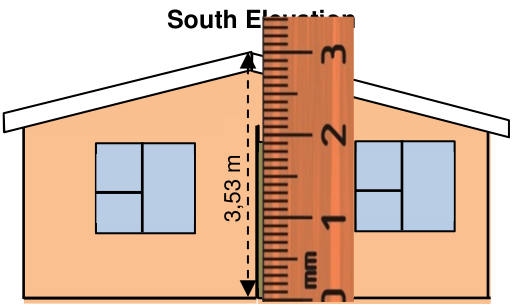
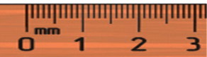
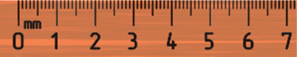
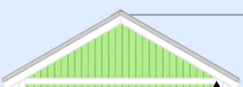
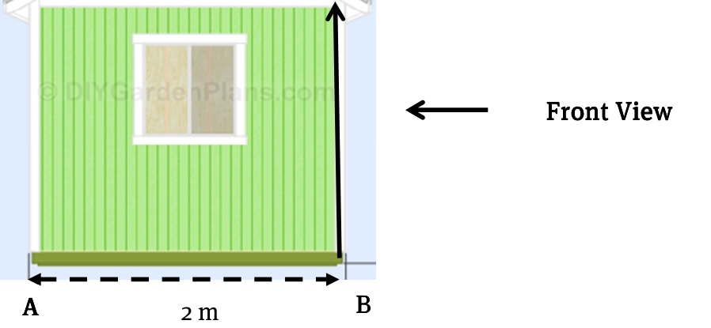
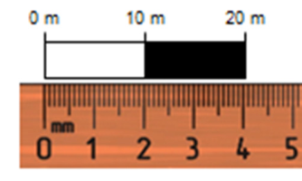
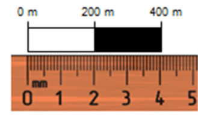
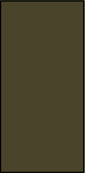

**Chapter 10** 

**Maps and plans (plans and scale)** 

# **Section 1: Interpreting plans** 

### **(LB pages 254-255)** 

This is revision of Grade 11 work and as such will not be reviewed here. The aim of this section in the textbook was to assist the learner to interact with the plan and identify features in it. 

# **Section 2: Determining scales** 

### **(LB pages 256-259)** 

## **Overview** 

The content of this section on plans and scale as part of the _Maps, plans and other representations of the physical world_ Application Topic and is drawn from pages 73 and 76-78 in the CAPS document. 

As stipulated in the CAPS document, Grade 12 learners need to be able to do the following: 

- Determine the scale in which a plan has been drawn in the form 1 :… and use the scale to determine other dimensions on the plan. 

- Draw scaled 2-D floor and elevation plans for a complex structure (e.g. RDP house) 

## **Contexts and integrated content** 

This chapter draws on the use of scale which was covered earlier in Chapter 5. Scale itself draws on the skill of using ratio which is from the _Numbers and calculations with numbers_ Topic. 

Via Afrika ›› Mathematical Literacy Gr 12 

**<mark>Chapter 10</mark>** 

**Maps and plans (plans and scale)** 

## **Determining the scale in which a plan has been drawn.** 

This utilises the skills that were covered in Section 3 of Chapter 5 of this study guide (on page 67) in a different context: 

## **Example** 

This is the same scale drawing as the one found in the Learner’s Book on page 256. The drawing is to the same scale as the one in the Learner’s Book. To confirm this we will measure the height of the roof. 

- The measurement is 2,9 cm for a real life 

- 1 measurement of 3,53 m. Therefore the scale is: _2,9 cm : 3,53 m_ 

> **[Diagram Context - Textbook_MathematicalLiteracy_Gr12_plans-and-scale.pdf-0002-07.png]**
> The image is a diagram of a house with a ruler placed vertically above it. The ruler is marked with measurements in both centimeters and millimeters, and it is positioned at the top of the house. The house itself is a two-story structure with a brown roof. The diagram also includes labels for the South and South Elevation.

- 3,53 m = 353 cm, therefore if we write the measurements in the same units, we 

- 2 see that the scale is _: 2,9 cm : 353 cm_ 

- Divide both sides by the **M** ap measurement (to get the Map side of the scale to 

- 3 be 1): 2,9 cm ÷ 2,9 cm = 1 and 353 cm ÷ 2,9 cm = 121,7, therefore the scale is: _1: 121,7_ ≈ **1 : 120** 

- **Note** :  Due to the small scale of the drawing, there is not much difference to the value that was calculated in the Learner’s Book unlike the calculation in Chapter 5 of the study guide. 

   - The small difference that was present was due to the limits to how accurately we can measure with a ruler. 

## **Using the number scale to create a bar scale** 

A number scale is useful because it shows exactly how much smaller the picture on the plan is than the actual size of the object. However, this number scale becomes inaccurate as soon as the size of the plan is changed. As such, it is often useful to be able to create a bar scale for a plan. 

Via Afrika ›› Mathematical Literacy Gr 12 

**<mark>Chapter 10</mark>** 

**Maps and plans (plans and scale)** 

## **Example** 

Create a bar scale for a 1:50 plan. 

- A scale of 1:50 means that 1 cm on the map is the same as 50 cm in real life. 

- Converting this to metres, we can see that 1 cm on the map represents 0,5 m in real life. However 0,5 m is not as easy to read as 1 m would be, so we rather double both measurements: 2 cm : 1 m <mark>0 m</mark> 

   - <mark>0 m</mark> 0,5 m 1,0 m 

- Now that we have easier numbers, we create a rectangle that is 2 cm long with divisions after every cm: 

> **[Diagram Context - Textbook_MathematicalLiteracy_Gr12_plans-and-scale.pdf-0003-08.png]**
> The image shows a ruler with a brown wooden frame. The ruler is divided into millimeters and inches, with the inches marked in a darker shade of brown. The ruler is oriented horizontally, with the inches marked from 1 to 3. The ruler is labeled with the numbers 1, 2, and 3, indicating the measurements of the inches. The ruler is set against a gray background, which provides

- This bar scale seems a bit small, so we can scale it up to 6 cm to make it easier to use: 

> **[Diagram Context - Textbook_MathematicalLiteracy_Gr12_plans-and-scale.pdf-0003-11.png]**
> 1. A ruler with numbers from 0 to 7.

## **Drawing a missing elevation plan** 

- When drawing a missing elevation plan we can often obtain measurements directly from other elevation views (e.g. heights of doors, windows, walls, etc.). So the first step is to determine which measurements we already have. 

- The next step is to determine the missing measurements and we would have to use the scale that we had previously calculated as well as measurements from the floor plan. 

- Once we have all of the required measurements converted it is a wise idea to start with the lowest line and ‘build’ our drawing from the bottom up. 

Via Afrika ›› Mathematical Literacy Gr 12 

**<mark>Chapter 10</mark>** 

**Maps and plans (plans and scale)** 

# **Additional questions** 

1. Construct accurate bar graphs for the following scales: 

   - 1.1 1 : 500 (The bar scale must go up in 10 m increments.) 

   - 1.2 1 : 10 000 (The bar scale must go up in 200 m increments.) 

2. List TWO advantages of a bar graph relative to a number scale. 

3. The diagram of the Wendy house below is drawn to scale. Use the drawing and the given measurement to answer the following questions: 

### **<mark>Left Side View</mark>** 

> **[Diagram Context - Textbook_MathematicalLiteracy_Gr12_plans-and-scale.pdf-0004-09.png]**
> 1. A diagram of a green triangular roof with white trim.

> **[Diagram Context - Textbook_MathematicalLiteracy_Gr12_plans-and-scale.pdf-0004-10.png]**
> 1. A diagram of a green house with a window and a door.

- 3.1 Measure the distance from point A to point B in the diagram. Answer in cm. 

- 3.2 Use your measurement from Question 3.1 to calculate the scale of the diagram. Express the scale in the form 1: … (Round your answer to the nearest 10). 

- 3.3 The view in the diagram is the Left side view. The builder of the Wendy house would like to draw the Front view (the position is indicated by the arrow in the diagram). 

   - 3.3.1 List at least FOUR measurements that will be the same in the Front view as in the Left side view. 

   - 3.3.2 One measurement that cannot be seen from the Left side is the width of the front of the Wendy house.  It is 3,6 m wide. Use the scale you calculated in Question 3.2 to convert 3,6 m to the same scale as the above diagram. 

Via Afrika ›› Mathematical Literacy Gr 12 

**Chapter 10** 

**Maps and plans (plans and scale)** 

- 3.4 Using relevant measurements from the above diagram and the facts below, draw an accurate Front view of the Wendy house to the same scale as the diagram above. 

   - Extra notes: a. The Front view has a door in it which is the same width as the window in the above diagram and the top of the door is the same height as the top of the window in the diagram. 

      - b. There is a window to the left of the door that has the same dimensions and height above the floor as the window in the diagram above. 

Via Afrika ›› Mathematical Literacy Gr 12 

**<mark>Chapter 10</mark>** 

**Maps and plans (plans and scale)** 

# **Answers** 

1. 1.1 A scale of 1 : 500 means that 1 cm on the plan is 500 cm in real life. 

   - This means that 1 cm on the plan is 5 m in real life. 

> **[Diagram Context - Textbook_MathematicalLiteracy_Gr12_plans-and-scale.pdf-0006-05.png]**
> The image shows a ruler with a scale of 0 to 20 m. The ruler is made of wood and has a black and white scale. The ruler is positioned horizontally, with the 0 mark on the left side and the 20 m mark on the right side. The ruler is labeled with numbers from 0 to 20 m, indicating the length of the ruler. The ruler is used to measure the length

- 1.2 A scale of 1 : 10 000 means that 1 cm on the map represents 10 000 cm in real life. This means that 1 cm on the map represents 100 m in real life. 

> **[Diagram Context - Textbook_MathematicalLiteracy_Gr12_plans-and-scale.pdf-0006-07.png]**
> The image presents a ruler with a scale of 0 to 400 millimeters. The ruler is divided into four equal parts, with the first part being the smallest and the fourth part being the largest. The ruler is set against a gray background, making the markings on the ruler stand out clearly. The ruler is positioned vertically, with the numbers and markings evenly spaced along its length.

2. A bar graph will keep its proportions when a map or plan is photocopied. A bar graph can be used to estimate distance with a simple finger measurement or a ruler (whereas a scale will involve calculation and conversion). 

3. 3.1 5,0 cm 

   - 3.2 2 m = 200 cm 

      - Scale = 200 cm^{÷} 5,0 cm = 40 

      - Therefore scale is approximately 1: 40. 

   - 3.3 3.3.1 The height of the top of the roof 

   - 3.4 

- The height to the bottom of the roof The height of the bottom of the window The height of the top of the window. 

- 3.3.2 3,6 m = 360 cm Therefore in the plan, it will be 360 cm^{÷} 40 = 9  cm 

Via Afrika ›› Mathematical Literacy Gr 12 

