**Chapter 3 Data handling** 

# **Section 1: Making sense of national and global statistics** 

### **(LB pages 62-77)** 

## **Overview** 

The content of this section on _Making sense of national and global statistics_ , as part of the Data Handling Application Topic, is drawn from pages 83-86 in the CAPS document. 

As stipulated in the CAPS document, Grade 12 learners need specifically to be able to: 

- summarise, represent and analyse data that contain multiple sets of data and multiple categories (e.g. working with vehicle statistics containing information on the number of different types of non-roadworthy vehicles in each province in South Africa). 

- work with data that contains complex values (i.e. values expressed in millions or large data values) for which estimation may be necessary to determine values on graphs and in tables. 

- work with data that also relates to national and global issues. 

## **Contexts and integrated content** 

- The scope of the data should include the personal lives of learners, the wider community, national and global issues. 

- Some of the data representation and interpretation should include some skills <u>from the Basic Skills topic (e.g. percentage, etc.).</u> 

In this section there are no new skills. Rather, the existing skills are applied to more than two sets of data and more than two categories of data. These are applied to more complex sets of data which deal with national and global statistics. 

© Via Afrika ›› Mathematical Literacy Gr 12 

**<mark>Chapter 3</mark> Data handling** 

# **Section 2: Summarising data using quartile and percentile values and interpreting box-andwhisker diagrams** 

### **(LB pages 78-89)** 

## **Overview** 

The content of this section on _Summarising data using quartiles and percentiles_ , as part of the Data Handling Topic, is drawn from pages 84-85 in the CAPS document. 

As stipulated in the CAPS document, Grade 12 learners need specifically to be able to: 

- work with quartile and percentile values, together with various measuring instruments in the following contexts: 

   - growth patterns of a baby/toddler 

   - health status of a child using Body Mass Index values 

   - analysing the performance of a group of learners in a test/exam. 

## **Contexts and integrated content** 

- The scope of the data should include the personal lives of learners, the wider community, national and global issues. 

- Some of the data representation and interpretation should include some skills from the Basic <u>Skills topic (e.g. percentage, etc.).</u> 

## **1. Measures of central tendency** 

Two sets of data can be compared by looking at their measures of central tendency (mean, median and mode), but they do not always give the full picture. In Grade 12, a more complete analysis is required. 

## **Example** 

Here are final exam results (in percentages) for two groups of matrics (grade 12’s): 

**Group 1** : 28 36 37 42 48 52 53 55 56 58 59 60 61 62 63 63 65 78 79 93 97 

**Group 2** : 50 52 53 54 54 54 57 58 58 60 63 63 64 65 65 66 72 81 

Which group performed best? One way of analysing this is to calculate the measures of central tendency for each group: 

© Via Afrika ›› Mathematical Literacy Gr 12 

**Chapter 3** 

**Data handling** 

||**Method**|**Group 1**|**Group 2**|
|---|---|---|---|
|**Mean**|Total of all data No. of data|1 245 ÷ 21 =**59,3%**|1 089 ÷ 18 =**60,5%**|
|**Median**|Middle value in an ordered data set.|The value in the middle of the data: **59,0%**|There are two values in the middle of the data, so we average them: (58 + 60%) ÷ 2 =**59,0%**|
|**Mode**|Most frequent value|**63%**|**54%**|

### **Analysis** 

|**Mean**|According to the mean, Group 2 performed_slightly_better than Group 1. However, it is not enough of a difference to say that they performed significantly better.|
|---|---|
|**Median**|Both Group 1 and Group 2 have the_same_median so this measure could not decide between them.|
|**Mode**|According to the mode, Group 1 did better, but in this type of data, mode is not a useful measurement. There are too few of the modal data to declare it to be a good indicator.|

### **Limitations of measures of central tendency** 

|**Mean**|This averages the total of the data by the number of pieces of data and is the most used measurement, but it is strongly affected by **outliers**(a piece of data that is either much larger or smaller than the main body of data)|
|---|---|
|**Median**|This is the most accurate measure of the centre of the data, but it can be very difficult to calculate with a large dataset.|
|**Mode**|This is often not a useful measure of the ‘average’. It is only useful when the data is categorical (e.g. shoe sizes or favourite colours).|

So the measures of central tendency are not enough to obtain a clear picture. At best, they are saying that the two groups performed equally well. However, if we 

© Via Afrika ›› Mathematical Literacy Gr 12 

**<mark>Chapter 3</mark>** 

**Data handling** 

look at the data without performing any calculation, we can see that Group 1 has two very high results but also some very low results. The spread of results can give us a clearer picture: 

## **2. Measures of spread** 

There are four measures of spread: range, quartiles, inter-quartile range and percentiles. 

## **2.1 Range** 

This method has been addressed in previous grades: 

Range = Maximum value - Minimum value 

**Group 1:** Range = 97% - 28% = 69% **Group 2** : Range = 81% - 50% = 31% 

**Analysis:** Group 1’s results are very spread out. This indicates a wide spread of ability (i.e. some learners did really well, while others performed really badly). Group 2 has a much smaller range and so they are of a  similar ability. However, this does not tell us how well (or badly) the group has done (e.g. if the maximum was 41% and the minimum was 10%, the range would still be 31% even though these results are clearly much worse than Group 2’s results). 

## **2.2 Quartiles** 

Quartiles are, as their name suggests, values which occur a quarter of the way through the data. While the median divides the data in half and allows us to see which the middle value is, quartiles divide the data into quarters. In order to calculate the quartiles we _ignore the median value_ of the dataset. 

Here is a data set with an _odd number of data values:_ 

**Bottom half of the data Top half of the data (** **_without the median)_ (** **_without the median)_ Group 1** : 28 36 37 42 48 52 53 55 56 58 59 60 61 62 63 63 65 78 79 93 97 **Quartile 1 Median Quartile 3** The middle **_values_** of the Also referred to as The middle of the top half of bottom half of the data: “Quartile 2” the data: (48 + 52) ÷ 2 = **50%** (63 + 65) ÷ 2 = **64%** 

© Via Afrika ›› Mathematical Literacy Gr 12 

**<mark>Chapter 3</mark>** 

**Data handling** 

Here is a data set with an _even number of data:_ 

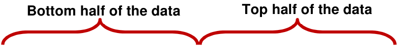
> **[Diagram Context - Textbook_MathematicalLiteracy_Gr12_Data-handling.pdf-0005-03.png]**
> The image shows a diagram of a data set divided into two halves, with the top half labeled "Top half of the data" and the bottom half labeled "Half of the data". The diagram is set against a gray background, and the text "bottom half of the data" is written in red at the bottom of the diagram.

**Group 2** : 50 52 53 54 54 54 57 58 58 60 63 63 64 65 65 66 72 81 

**Median** Due to it being an **Quartile 3 Quartile 1** average of two Due to the number of data in The middle number: **65%** values, we simply the bottom half being an odd split the data in half number, we simply find the middle number: **54%** 

- Quartile 1 is the value � of the way through the data. This means that 25% of the data is below it and 75% of the data is above it. 

- Quartile 3 is the value � of the way through the data. This means that 75% of the data is below it and only 25% of the data is higher than it. 

### **Analysis** : 

||**Group 1**|**Group 2**|
|---|---|---|
|**Bottom 25%** **of the data**|**28% to 50%**|**50% to 54%**|
|**Top 25% of** **the data**|**64% to 97%**|**65% to 81%**|

The bottom quarter of Group 1 scored _at most_ 50%, while the bottom quarter of Group 2 scored _at least_ 50%, but at most 54%. 

The top quarter of Group 1 scored at least 64% which is almost the same as Group 2, but Group 1’s results were as high as 97%, while Group 2’s results peaked at 81%. 

© Via Afrika ›› Mathematical Literacy Gr 12 

**<mark>Chapter 3</mark>** 

**Data handling** 

## **2.3 Inter-Quartile Range (IQR)** 

This is a measure of spread of _the middle 50% of the data._ 

IQR = Quartile 3 - Quartile 1 

**Group 1:** IQR = 64% - 50% = 14% **Group 2:** IQR = 65% - 54% = 11% 

**Analysis:** We can see that although Group 2’s range was very large, the IQR is much smaller indicating that the middle 50% of the group is of a similar ability. The same can be said of the ability of Group 1 as it also has a small IQR. 

This indicates that Group 2 has some strong candidates and some weaker candidates, but overall the group is of a similar ability. 

Group 1 is generally a group of similar ability because it’s range is also relatively small. 

## **2.4 Box-and-whisker plots** 

Looking at the calculated values can be a bit confusing at times and so it is often easier to see them in picture form: 

> **[Diagram Context - Textbook_MathematicalLiteracy_Gr12_Data-handling.pdf-0006-11.png]**
> 1. A diagram of a cell with arrows pointing to different parts of the cell.

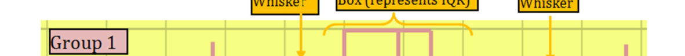
> **[Diagram Context - Textbook_MathematicalLiteracy_Gr12_Data-handling.pdf-0006-12.png]**
> The image shows a diagram of a cell, labeled with the word "whiskey" and "presentation". The diagram is a Lewis diagram, which is a diagram used to represent the valence electrons of an atom. The diagram is colored in yellow and shows the valence electrons of the atom. The diagram also includes arrows to indicate the valence electrons of the atoms.

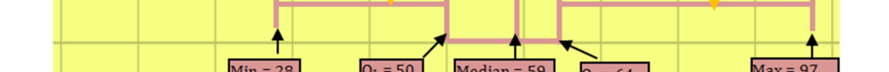
> **[Diagram Context - Textbook_MathematicalLiteracy_Gr12_Data-handling.pdf-0006-13.png]**
> 1. A diagram of a cell with arrows pointing to different parts of the cell.

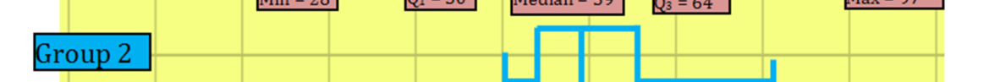
> **[Diagram Context - Textbook_MathematicalLiteracy_Gr12_Data-handling.pdf-0006-14.png]**
> The image shows a diagram of a cell, labeled Group 2. The diagram is a Lewis diagram, which is a visual representation of a molecule's structure. The diagram is color-coded, with blue arrows pointing to the bonds between atoms. The diagram also includes labels for the atoms and bonds, such as Group 2, oxygen, and carbon. The diagram is set against a gray background, which

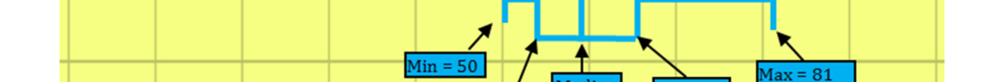
> **[Diagram Context - Textbook_MathematicalLiteracy_Gr12_Data-handling.pdf-0006-15.png]**
> 1. A diagram of a cell with arrows pointing to different parts of the cell.

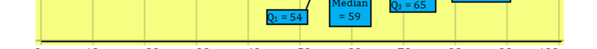
> **[Diagram Context - Textbook_MathematicalLiteracy_Gr12_Data-handling.pdf-0006-16.png]**
> The image shows a diagram of a cell, with a yellow line representing the cell membrane and a blue line representing the cytoplasm. The diagram also includes a label for the cell's organelles, such as the mitochondria and the Golgi apparatus. The diagram is labeled with the text "Median = 35" and "Mean = 60".

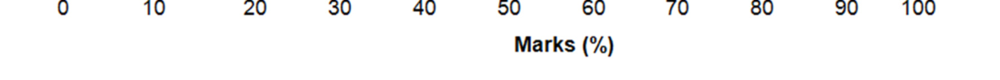
> **[Diagram Context - Textbook_MathematicalLiteracy_Gr12_Data-handling.pdf-0006-17.png]**
> The image shows a line graph with the x-axis labeled "Marks" and the y-axis labeled "70". The graph displays a series of bars, each representing a different mark value. The graph is set against a light brown background, and the text "Marks" is written in a larger font size than the rest of the image. The graph is labeled with the word "

**Analysis** : The box-and-whisker plot provides the same information we have worked with but now it is much easier to see that Group 1 has a compact middle 50%, while the top 25% and the bottom 25% are very spread in terms of ability. 

© Via Afrika ›› Mathematical Literacy Gr 12 

**Chapter 3 Data handling** 

It is also easier to see that Group 2 is much closer in ability and also that the middle 50% of the group is slightly better than the middle 50% of  Group 1, but Group 1 has more higher ability learners (the top 25%). 

**Conclusion** :  While neither group is necessarily better than the other one, each of the two groups is stronger in a certain area (Group 2 is more consistent, while Group 1 has more higher ability learners). 

## **2.5 Percentiles** 

A final measure of spread is percentiles. As the name suggests, percentiles divide a group of data into a _hundred_ equal parts. 

**Data Set 10th Percentile** Quartile 1 Median Quartile 3 **90th Percentile** = the value = the value that lies at 10% in ( **25th Percentile** ) ( **50th Percentile** ) ( **75th Percentile** ) that lies at 90% in the data the data set, i.e. 10% of the set, i.e. 90% of the value in the data lie below and 10% values in the data lie below and lie above the 90^{th} Percentile. 90% lie above the 10^{th} Percentile. 

## **Example** 

A student earned a mark of 73% for an exam and it is in the 92nd percentile of the grade. 

This means that 92% of the grade obtained a mark of 73% or less for the exam and only 8% of the grade achieved a mark that was higher than (or equal to) 73%. 

© Via Afrika ›› Mathematical Literacy Gr 12 

**<mark>Chapter 3</mark>** 

**Data handling** 

## **2.6 Growth Charts** 

Growth charts are a series of percentile curves that are drawn from data taken from thousands of children and then plotted. 

## **Example** 

The following growth chart compares the age to height for girls aged 2 to 20 years. The following meanings apply: 

- _3rd:_ This is the curve of the _3rd percentile_ of heights for the various ages. This means that any girl whose height is below this curve has a height which is shorter than the 3% of all of the data collected for that specific age. 

- _50th:_ This is the curve of all of the medians for each of the ages. 

- _90th_ :  This is the curve of the _90th percentile_ of heights for the various ages. This means that any height above it is taller than 90% of the data collected for that age group. 

Consider the portion of the growth chart below (the original can be found in the Learner’s Book on page 82). 

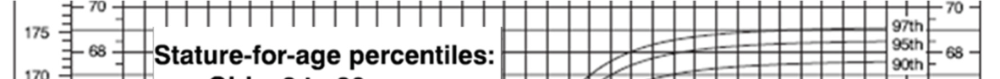
> **[Diagram Context - Textbook_MathematicalLiteracy_Gr12_Data-handling.pdf-0008-10.png]**
> The image shows a ruler with the words "stature-for-age percentiles" written on it. The ruler is white and has black numbers and lines on it. The ruler is placed horizontally on a gray background.

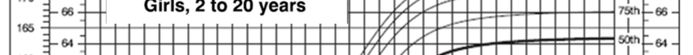
> **[Diagram Context - Textbook_MathematicalLiteracy_Gr12_Data-handling.pdf-0008-11.png]**
> The image shows a diagram of a girl's growth chart, which is a visual representation of a girl's height and weight over time. The chart is divided into multiple lines, each representing a year, and the height and weight of the girl are shown at the corresponding points on the chart. The chart is set against a gray background, which makes the colors of the chart stand out. The chart

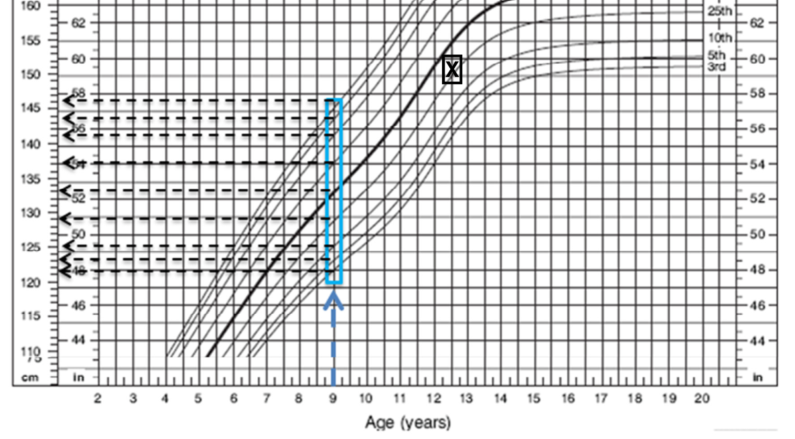
> **[Diagram Context - Textbook_MathematicalLiteracy_Gr12_Data-handling.pdf-0008-12.png]**
> 1. A graph showing the growth of a child's height over time.

The vertical lines allow us to read off the various values for a certain age of girl. In 

© Via Afrika ›› Mathematical Literacy Gr 12 

**Chapter 3 Data handling** 

the above example, a girl of 9-years-old is chosen. If we follow the vertical line we can see where it meets the various percentile curves and read off the values on the scale at the side of the graph: 

|**Percentile**|**3**^{**rd**}|**5**^{**th**}|**10**^{**th**}|**25**^{**th**}|**50**^{**th**}|**75**^{**th**}|**90**^{**th**}|**95**^{**th**}|**97**^{**th**}|
|---|---|---|---|---|---|---|---|---|---|
|**Height (in cm)**|121|123|125|129|133|137|141|144|146|

- Therefore if a 9-year old had a height of 124 cm, her height would be between the 5^{th} and 10^{th} percentiles for her age. In other words, she would be considered short for her age. 

- Consider the girl who is 12 years and 6 months old and who is 151cm tall. On the growth curve her age and height meet at the point marked X.  Her height lies between the 25^{th} and 50^{th} percentile growth curve. A ‘normal’ (or ‘average’) girl would have a height that fell between the 25^{th} and 75^{th} percentile (in the middle 50% of the data). So this girl is ‘normal’ although she is at the shorter end of the range for her age. 

© Via Afrika ›› Mathematical Literacy Gr 12 

**<mark>Chapter 3</mark> Data handling** 

# **Section 3: Develop opposing arguments using the same summarised and/or represented data** 

### **(LB pages 90-93)** 

## **Overview** 

The content of this section on _Develop_ o _pposing arguments using the same_ summarised and/or represented _data_ , as part of the Data Handling Topic, is drawn from page 87 in the CAPS document. 

As stipulated in the CAPS document, Grade 12 learners need specifically to be able to: 

- compare different representations of multiple sets of data and explain differences. 

- develop opposing arguments using the same summarised and/or represented data. 

## **Contexts and integrated content** 

- The scope of the data should include the personal lives of learners, the wider community, national and global issues. 

- Some of the data representation and interpretation should include some skills <u>from the Basic Skills topic (e.g. percentage, etc.).</u> 

It is often possible to interpret statistical information in different ways. People present or justify different viewpoints based on their interpretations. In this section we will explore the ways in which the same information can be interpreted differently by different groups. 

Consider the graph to the right. It is found in the Learner’s Book on page 78. This graph of learners’ results could be interpreted in various ways: 

© Via Afrika ›› Mathematical Literacy Gr 12 

**<mark>Chapter 3</mark>** 

**Data handling** 

### **Correct Interpretations** : 

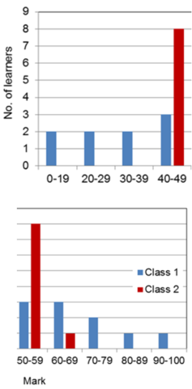
> **[Diagram Context - Textbook_MathematicalLiteracy_Gr12_Data-handling.pdf-0011-03.png]**
> The image shows a bar graph with two bars, one labeled "Class 1" and the other "Class 2". The graph displays the number of students in each class. The x-axis of the graph is labeled "Class", and the y-axis is labeled "No. of students". The bars represent the number of students in each class, with the bar for Class 1 being taller than

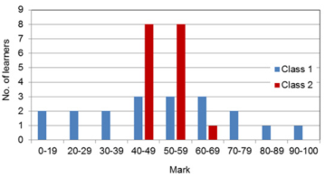
> **[Diagram Context - Textbook_MathematicalLiteracy_Gr12_Data-handling.pdf-0011-04.png]**
> The image is a graph that displays the number of students in a class at different grade levels. The graph shows that the number of students in a class increases as the grade level increases. The graph is color-coded, with red bars representing Class 1 and blue bars representing Class 2. The graph is labeled with the names of the classes and the number of students in each class. The graph also

Looking at the first half of the graph only: 

‘Class 1 did much worse than Class 2 because Class 2 does not have any marks less than the 40% – 49% range.’ 

Looking at the second half of the graph only: 

‘Class 2 did much better than Class 1 because Class 1 does not have any mark higher than the 60% – 69% range.’ 

Considering the whole graph: 

‘Class 2 is more consistent than Class 1 because their values are grouped closer together.’ 

All of the above are correct interpretations which are drawn from a selective view of the information. 

### **Incorrect Interpretations:** 

- ‘Class 2 did better than Class 1 because their graphs are taller’. The heights of the bars only indicate how many pieces of data occurred in that range. They do not indicate ‘better’ or ‘worse’. 

- ‘Class 2 has higher marks in the 50% – 59% range, but lower marks in the 60% – 69% range because of the heights of the bars in those ranges’. The ranges do not specify how many low values and how many high values each class has in that range. They only indicate that a value occurred in that range. They could _all_ be low. 

© Via Afrika ›› Mathematical Literacy Gr 12 

**Chapter 3 Data handling** 

# **Additional questions** 

1. Barry takes both Geography and Life Science as subjects. He is trying to determine in which subject he performs better. 

   - 1.1 Barry has the following percentages for his Geography tests during this year: 

### **35  36  38  43  56  58  58  60  60  60  61  95** 

The 5-number summary (min - Q1 - median - Q3 - max) of the above data is as follows: 

35  ;  40,5  ;  58  ;  60  ;  95 

   - 1.1.1 By using calculations, explain why the value for the first quartile (Q1) is a decimal when all of the values in the data set are whole numbers. 

   - 1.1.2 Explain what a third quartile (Q3) value of 60% means. 

- 1.2 

- These are Barry’s Life Science test results from this year: 

### **35  36  50  51  53  58  60  60  64  65  73** 

   - 1.2.1 Calculate the mean of both sets of test results and explain why the mean is not a useful way to determine his stronger subject in this case. 

   - 1.2.2 Determine the 5-number summary (min – Q1 – median – Q3 – max) of the Life Science data. 

   - 1.2.3 Use your answer to Question 1.2.2 to answer Barry’s question about which of the two subjects is his stronger subject. 

2. These were the final results of a group of matric students (as percentages): 

### **74  75  60  52  75  68  67  76  42  70  58 78  75  65  55  75  76  55  49  81  69  60** 

- 2.1 

- 2.2 

   - Calculate the mean of these results. 

   - Work out the median for these results. 

- 2.3 Work out the 5-number summary for the results (min – Q1 – median – Q3 – max). 

© Via Afrika ›› Mathematical Literacy Gr 12 

**<mark>Chapter 3</mark> Data handling** 

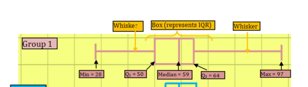
> **[Diagram Context - Textbook_MathematicalLiteracy_Gr12_Data-handling.pdf-0013-01.png]**
> 1. A diagram of a cell with arrows pointing to different parts of the cell.

- 2.4 Use your answer to Question 2.3 to compare these results with the two sets of results from the example in Section 2 under Measures of central tendency. How did this group of matric learners perform when compared with the other two groups? Give a detailed analysis. 

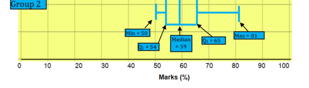
> **[Diagram Context - Textbook_MathematicalLiteracy_Gr12_Data-handling.pdf-0013-03.png]**
> The image is a diagram that shows a group of diagrams of different types of diagrams, including a Lewis diagram, anatomical/cellular structure, circuit, graph, evolutionary tree, apparatus, and geometric figure. The diagram is labeled with the numbers 2, 3, 4, 5, 6, 7, 8, 9, and 10. The diagram also includes a legend that explains the different types of

3. The table below contains the prices of houses that were sold in two areas during the first six months of a year. The house prices have been arranged in ascending order. 

|**Dawn**|**view**|**Cic**|**ily**|
|---|---|---|---|
|R150 000|R525 000|R300 000|R510 000|
|R160 000|R530 000|R320 000|R512 000|
|R175 000|R540 000|R320 000|R515 000|
|R190 000|R550 000|R340 000|R518 000|
|R212 000|R570 000|R360 000|R520 000|
|R225 000|R570 000|R365 000|R523 000|
|R400 000|R580 000|R400 000|R690 000|
|R520 000||R440 000||

- 3.1 For Dawn view, the mean house price is R393 133,33, the median house price is R520 000 and modal house price is R570 000. Explain which measure of central tendency provides the most accurate indication of the average house price in Dawnview. In your answer you must also explain why the other measures of central tendency are not appropriate. 

© Via Afrika ›› Mathematical Literacy Gr 12 

**<mark>Chapter 3</mark> Data handling** 

- 3.2 The graphs below show the minimum, maximum, median, 1st quartile and 3rd quartile house prices for Dawnview and Cicily. Compare the 5-number summaries for the two areas and give an overview of the house prices in the two areas. 

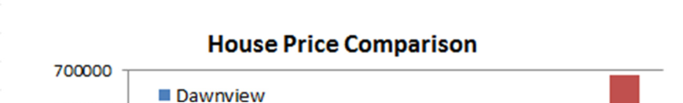
> **[Diagram Context - Textbook_MathematicalLiteracy_Gr12_Data-handling.pdf-0014-02.png]**
> The image shows a house price comparison chart with a title "House Price Comparison" and a subtitle "Dawnview". The chart displays the price of a house in South Africa, with the price of the house being compared to the average price of houses in South Africa. The chart also includes a legend that explains the different colors used to represent the average house price in South Africa. The chart is

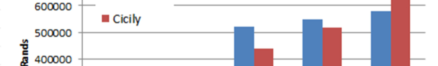
> **[Diagram Context - Textbook_MathematicalLiteracy_Gr12_Data-handling.pdf-0014-03.png]**
> The image shows a bar graph with a horizontal bar for each of the five countries of South Africa, with the height of the bars representing the population of each country. The bars are colored in red and blue, with the red bars being taller than the blue ones. The graph is titled "South Africa" and "CICLY" is written in the top left corner.

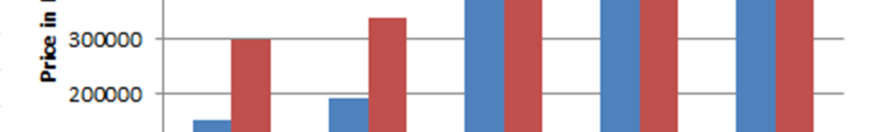
> **[Diagram Context - Textbook_MathematicalLiteracy_Gr12_Data-handling.pdf-0014-04.png]**
> The image is a bar graph that shows the price of a product in South Africa. The graph has a gray background and is divided into bars of different colors representing the price of the product. The graph is labeled with the title "Price in South Africa" and the variable "Price" is labeled with the value "30000". The graph also includes a legend that explains the colors of the bars

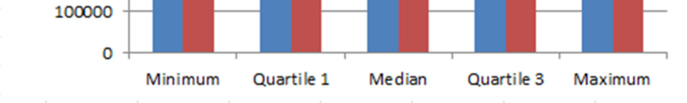
> **[Diagram Context - Textbook_MathematicalLiteracy_Gr12_Data-handling.pdf-0014-05.png]**
> The image shows a bar graph with a horizontal bar for each of the four quartiles of a data set. The quartiles are labeled as minimum, median, and maximum. The graph is set against a gray background, and the x-axis is labeled with the word "quartile". The y-axis is labeled with the word "millions". The graph is a simple, easy-

4. Patrick came home one day and proudly announced that he had achieved the 75^{th} percentile in his class for a test. His parents were happy as they had agreed that his goal should be a Level 6 (70 – 79%) mark. However, Patrick’s mark was 62%. 

   - 4.1 What is another name for the ‘75^{th} percentile’? 

   - 4.2 How is it possible that Patrick got 62%, but his mark is in the 75^{th} percentile? 

   - 4.3 How did his parents interpret his statement? 

© Via Afrika ›› Mathematical Literacy Gr 12 

**<mark>Chapter 3</mark> Data handling** 

5. The results of the 2011 Census of the South African population have been released. The graph below shows the highest level of education achieved by the population who were 20 years and older. Use it to answer the questions which follow: 

> **[Diagram Context - Textbook_MathematicalLiteracy_Gr12_Data-handling.pdf-0015-02.png]**
> The image shows a gray background with white text that reads "HIGhest Level of Education". Below this, there is a list of variables and biological structures, including a Lewis diagram, anatomical/cellular structure, circuit, graph, evolutionary tree, apparatus, and geometric figures. The text also includes the phrase "For population aged 20 and older".

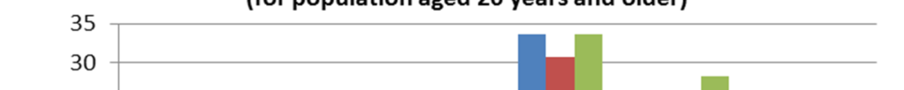
> **[Diagram Context - Textbook_MathematicalLiteracy_Gr12_Data-handling.pdf-0015-03.png]**
> The image shows a bar graph that displays the population of South Africa at different ages. The graph is divided into bars of varying heights, with the tallest bar representing the population of adults aged 30 and above. The graph is set against a gray background, and the title "For population aged 30 and above" is written at the top. The graph is labeled with the variable "sa_20_

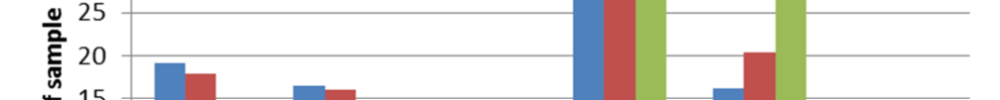
> **[Diagram Context - Textbook_MathematicalLiteracy_Gr12_Data-handling.pdf-0015-04.png]**
> 1. A diagram of a cell with a green bar and a red bar.

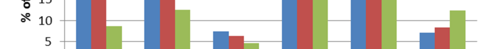
> **[Diagram Context - Textbook_MathematicalLiteracy_Gr12_Data-handling.pdf-0015-05.png]**
> The image shows a line graph with a horizontal axis labeled "5" and a vertical axis labeled "10". The graph is divided into multiple bars, each representing a different color. The colors of the bars are green, red, and blue. The graph is set against a gray background, which makes the colors stand out. The bars are arranged in a straight line, with the green bar being

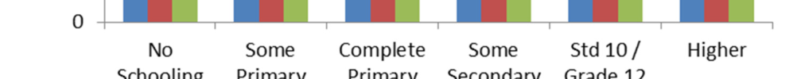
> **[Diagram Context - Textbook_MathematicalLiteracy_Gr12_Data-handling.pdf-0015-06.png]**
> The image is a pedagogical diagram that shows the progression of learning in a high school setting. It is divided into six sections, each representing a different stage of learning. The diagram is color-coded, with each color representing a different stage of learning. The colors are red, green, blue, and yellow. The diagram is labeled with the names of the stages of learning, such as

> **[Diagram Context - Textbook_MathematicalLiteracy_Gr12_Data-handling.pdf-0015-07.png]**
> The image shows a line drawing of a South African primary and secondary school graduation scene. The drawing is set against a light brown background, and it features a line that represents the years 1996 and 2011. The text "Census 2001" is also present in the image.

- 5.1 Why does this question about the highest level of education only apply to persons who are 20 years or older? 

- 5.2 The following statements are flawed. State where the error lies with reasons: 

   - 5.2.1 The percentage of people who have only completed primary has decreased from 1996 to 2011; therefore people have become less educated over this time period. 

   - 5.2.2 The number of people in the category ‘some secondary’ has improved compared to the levels in the 1996 survey. 

   - 5.2.3 Women have become more educated over this time period. 

© Via Afrika ›› Mathematical Literacy Gr 12 

**Chapter 3 Data handling** 

# **Answers** 

- 1 1.1 1.1.1 The first quartile occurs between the values 38 and 43, so the value for Q1 is (38 + 43)^{÷} 2 = 40,5. 

      - 1.1.2 This means that he achieved 60% or more in a quarter of his tests (25%) or that he achieved 60% or less in three quarters (75%) of his tests. 

   - 1.2 1.2.1 Geography: Mean = total of all data^{÷} no of data = 660^{÷} 12 = 55% Life Science: Mean = 605^{÷} 11 = 55% 

Therefore the mean is the same for both sets of data and cannot be used to decide in which subject he performed better. 

- 1.2.2 Minimum = 35 % 

Quartile 1 = 50 % (halfway through the bottom half of the data; 58% is excluded as it is the median) 

Median = 58% (the value in the middle of the data) 

Quartile 3 = 64% (Halfway through the top half of the data) 

Maximum = 73% 

   - 1.2.3 Overall, it seems as if he did better in Life Science. This is due to the minimum and median being the same for both Geography and Life Science. However, in Life Science the quartiles were both higher which indicated that his middlemost results are better in Life Science. The higher maximum in geography was a once-off result and does not indicate an overall trend. Therefore it can be ignored in this analysis. 

- 2.1 66,14% (same method as question 1.2.1) 

- 2.2 The results first need to be sorted into ascending order: 

   - **42  49  52  55  55  58  60  60  65  67  68** 

**69  70  74  75  75  75  75  76 76  78  81** 

The middlemost value occurs between 68 and 69, therefore the median = (68 + 69)^{÷} 2 = 68,5% 

- 2.3 The data is already arranged in ascending order for the previous question, so the values can be read from their relative positions: 

Minimum = 42 % 

Quartile 1 = 58 % (halfway through the bottom half of the data; 68% is included as the median occurs between it and the next number in the dataset) 

© Via Afrika ›› Mathematical Literacy Gr 12 

**<mark>Chapter 3</mark> Data handling** 

Median = 68,5% 

Quartile 3 = 75% (Halfway through the top half of the data) Maximum = 81% 

- 2.4 CAPS does not require the student to draw a box-and-whisker plot but it can be a very useful analytical tool. Here we see the box-and-whisker plot of the third group’s data next to the two existing box-and-whisker plots: 

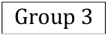

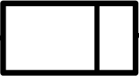

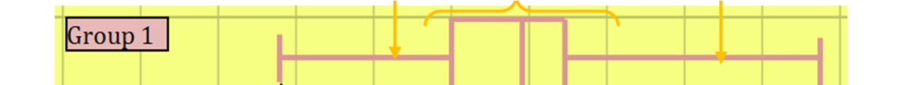
> **[Diagram Context - Textbook_MathematicalLiteracy_Gr12_Data-handling.pdf-0017-06.png]**
> The image shows a diagram of a yellow line with a pink arrow pointing to the left. The line is labeled "Group 1" in white text. The diagram is set against a gray background, and the text "Group 1" is positioned at the top of the image.

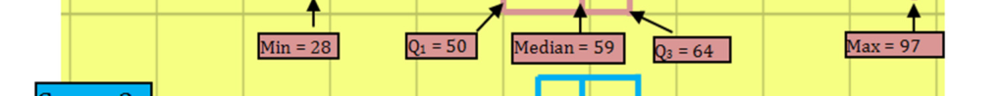
> **[Diagram Context - Textbook_MathematicalLiteracy_Gr12_Data-handling.pdf-0017-07.png]**
> The image shows a diagram of a cell with a pink background and yellow lines. The diagram includes labels for the cell's organelles and a diagram of a cell's structure. The diagram also includes arrows pointing to the cell's organelles and the cell's nucleus. The diagram is labeled with the text "Min = 28, Max = 44" and "Median = 59".

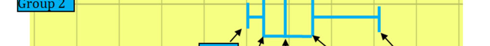
> **[Diagram Context - Textbook_MathematicalLiteracy_Gr12_Data-handling.pdf-0017-08.png]**
> 1. A diagram of a cell with arrows pointing to different parts of the cell.

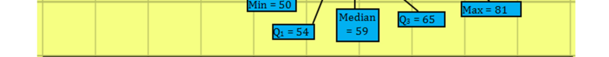
> **[Diagram Context - Textbook_MathematicalLiteracy_Gr12_Data-handling.pdf-0017-09.png]**
> 1. A diagram of a cell with arrows pointing to different parts of the cell.

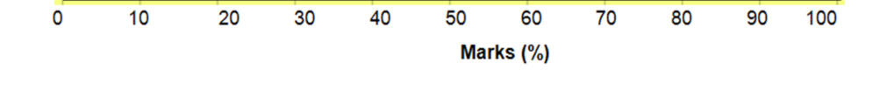
> **[Diagram Context - Textbook_MathematicalLiteracy_Gr12_Data-handling.pdf-0017-10.png]**
> The image shows a line graph with the x-axis labeled "Marks" and the y-axis labeled "Percent". The graph displays a series of bars, each representing a different mark, with the height of the bars corresponding to the percentage of marks achieved. The graph is set against a gray background, and the text "Marks (7.5)" is visible, indicating the average

It can be immediately seen from the analysis that Group 3’s ‘box’ is higher than both of the other groups. This can also be seen in the Quartile 1 and 3 values being higher than the related values in Groups 1 & 2. The Median for Group 3 is also higher, indicating that the average student in Group 3 did better than the average student in both of the other groups. The other groups may have an advantage in terms of the minimum and maximum values but where it is most important (i.e. the middle values of the data set), Group 3 performed better overall. 

- 3 3.1 The median is the most accurate measure of the central tendency for Dawnview as the data set is rather small and can be distorted by outliers (in this case, the lower values in the data set). 

The mean is especially distorted by outliers (it is far lower than expected). The mode is simply the value that occurs most often and is not a good measure of central tendency for continuous quantitative data. 

- 3.2 Cicily seems to have a steady increase in prices across the 5-number summary, while Dawnview has two distinct groupings of houses (a low income group and a high income group). The ‘average’ house in Dawnview 

© Via Afrika ›› Mathematical Literacy Gr 12 

**Chapter 3 Data handling** 

is of higher value than in Cicily indicating that it is a more affluent neighbourhood, but not by much. The two neighbourhoods seem to be similar, except that Dawnview has a much larger range of house prices. 

- 4 4.1 Quartile 3 

   - 4.2 Patrick’s mark is three quarters of the way through the dataset and therefore he is simply stating the position of his test result relative to the rest of the class. If the class did not do well in the test then he too would probably not have done well. 

   - 4.3 His parents interpreted ‘75^{th} percentile’ as ‘75%’. This was not correct (although he was not going to tell them)! 

- 5 5.1 Anyone younger than 20 years old is most likely still in school. 

   - 5.2 5.2.1 This is not true because the decreases in the ‘complete primary’ have become increases in later categories which indicates that people are more educated now than they were before. 

      - 5.2.2 This graph does not deal in numbers of people, but rather percentages so the correct statement would read “The percentage of people in the …” 

      - 5.2.3 This graph does not differentiate between men and women in the sample. Both genders are mixed in the results. Such a conclusion would need a different analysis. 

© Via Afrika ›› Mathematical Literacy Gr 12 

