**<mark>Chapter 4</mark>** 

**Finance (interest, banking, inflation)** 

# **Section 1: Interest and banking: loans and investments** 

### **(LB pages 102-119)** 

## **Overview** 

The content of this section on _Loans and Investments_ , as part of the Finance Application Topic, is drawn from pages 55-57 in the CAPS document. 

As stipulated in the CAPS document, Grade 12 learners need specifically to be able to: 

- investigate the effect of changes in the interest rate on the cost of a loan and on the final/projected value of an investment. 

- investigate the effect of changes in the monthly repayment amount on the real cost of a loan. 

- investigate the effect of changes in the monthly investment amount on the value of the final investment. 

## **Contexts and integrated content** 

- Learners need to be able to work in the various contexts relating to loans in investments (e.g. payments on a housing loan, a car loan, an annuity <u>investment, etc.)</u> 

## **1. Loans** 

A loan is where a lump sum is borrowed from a bank or other loan agent in order to make a large purchase (e.g. a house, car, etc.). This loan amount is repaid in smaller monthly amounts that have interest added to them. This interest is calculated at a set rate on the remaining money owed. 

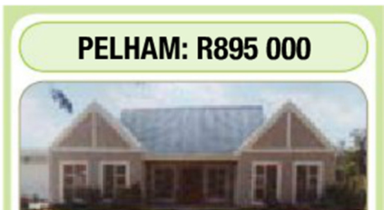
> **[Diagram Context - Textbook_MathematicalLiteracy_Gr12_interest-banking-inflation.pdf-0001-14.png]**
> The image is a diagram of a house, with the house being the central focus. The house has a brown roof and two chimneys, and it is surrounded by a green lawn. The house is situated in a residential area, and it is described as a "two-story house" with a "gray roof". The house is located in South Africa, as indicated by the text "P

**Deposit** : 15% **Loan Length** : 20 years **Interest Rate** : 11,0% p.a. 

In order to explore the important terms, we will look at the purchase of the house above according to the listed conditions. 

© Via Afrika ›› Mathematical Literacy Gr 12 

**Chapter 4 Finance (interest, banking, inflation)** 

|**Important terms: ** **Term**|**Explanation**|
|---|---|
|Sale Price|The stated price of the item to be purchased (e.g. sale price of a house, cash price of a car, etc.) **Answer: R895 000,00**|
|Deposit|An amount that must be paid upfront before the loan is guaranteed. It is often stipulated as a percentage of the loan amount. **Answer: 15% of R895 000 = 15 ÷ 100 × R895 000 = R132 450,00**|
|Loan Amount|The actual amount owed to the bank or loan agent. Loan Amount = Sale Price – Deposit **Answer: Loan Amount = R895 000,00 – R132 450,00** **= R760 750,00**|
|Interest Rate|The percentage of the loan amount that will be charged as a ‘fee’ for borrowing the money. It is calculated on the balance owed. **Answer: 11,0% p.a.** **However, interest is worked out on a monthly basis, so the** **monthly rate = 11,0% ÷ 12 =0,916666% per month.**|
|Interest|The amount paid for loaning the money. Calculated on the amount owed at the end of each month. **Answer: First month = R760 750,00 x 0,916666% = R6 973,54** **(This calculation is performed every month on the balance** **inthe account. As it changes so willthe interest charged.)**|
|Loan length|The amount of time a person has to pay back the loan (e.g. 5 or 6 years for a car or 15 or 20 years for a house). Also known as the ‘life of the loan’. **Answer: 20 years**|
|Monthly repayments|The amount of money that must be paid back to the bank or loan agent every month. A table of values is used to calculate the monthly repayment according  to the following method: _Monthly repayments = loan amount ÷ 1 000 × factor_ The factor is obtained from a table of values such as this one: **Factor values**|
||**Loan** INTEREST RATE|
||**Period** **10%** **10,25%** **10,5%** **10,75%** **11%** **11,5%** **12%**|
||**15 years **10,75 10,9 11,05 11,21 11,37 11,68 12|
||**20 years** 9,65 9,82 9,98 10,15 10,32 10,66 11,01|
||**25 years** 9,09 9,26 9,44 9,62 9,8 10,17 10,53|
||**Answer:  Monthly repayment = R760 750,00 ÷ 1 000 × 10,32** **= R7 850,94** **(Note: this will always be larger than the first month’s interest as** **it must cover all of the interest and a little more which will reduce** **the balance owed.)**|

© Via Afrika ›› Mathematical Literacy Gr 12 

**<mark>Chapter 4</mark> Finance (interest, banking, inflation)** 

Real Cost of the loan The total amount that will be paid for the loan over the whole life of the loan. Real cost = Monthly repayment amount × number of repayments made **Answer: Real Cost  = R7 850,94 × (20 years × 12 months per year) = R1 884 225,60** Interest paid on a loan The total of all interest that is charged on the loan. Interest Paid = Real cost – Original Loan amount **Answer: Interest Paid = R1 884 225,60 – R760 750,00 = R1 123 475,60** 

### **Modelling a loan scenario in a table** 

In order to see what is happening to a loan, we could draw up a table such as the one below: 

|||**Loan**|**model table**|||
|---|---|---|---|---|---|
|**L**|**Housepri**|**ce** R895 000|**Interest ra**|**te(peryear)** |11,0%|
|**oan** **Conditions**|**Depo**|**sit** 15% (R132 450|) **Interest rate**|**(per month)** |0,916666%|
||**Loan amou**|**nt** R750760||**Loanperiod** |20 years or 240months|
||**Change**|**s to the amount owi**|**ng on the loan over the li**|**fe of the loan**||
|**Month**|**Opening Balance**|**Interest**|**Balance with interest**|**Repayment**| **Closing balance**|
|1|R750760,00|R6 973,54|R767 723,54|R7850,94| R759 872,60|
|2|R759 872,60|R6 965,50|R766 838,10|R7850,94| R758 987,16|
|---|---|---|---|---|---|
|100|R620248,60|R5 685,61|R625 934,21|R7850,94| R618 083,27|
|---|---|---|---|---|---|
|239|R16706,58|R153,14|R16 859,72|R7850,94| R9008,78|
|240|R9008,78|R82,58|R9 091,36|R9 091,36|R0,00|

### Notes: 

- The closing balance of the previous month becomes the opening balance of the next month. 

- Interest is calculated on the opening balance of each month. 

- Interest is first calculated. Then it is added to the opening balance and _only then_ does the repayment amount get subtracted to get the closing balance. 

- The final month’s repayment is often _slightly larger_ than the normal monthly repayment. This will _increase the Real Cost_ of the loan slightly. 

- The graph of the closing balances vs. no. of months is shown alongside: (Notice that is decreases slowly at first, but faster as it draws closer to the end of the loan.) 

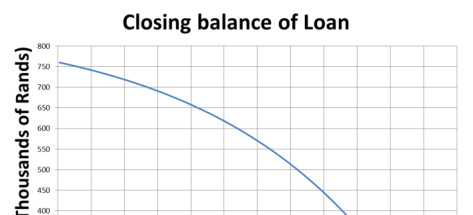
> **[Diagram Context - Textbook_MathematicalLiteracy_Gr12_interest-banking-inflation.pdf-0003-11.png]**
> The image is a graph that shows the relationship between the number of hours spent studying and the grade received on a test. The x-axis of the graph is labeled "Hours Studied" and the y-axis is labeled "Grade". The graph shows a positive relationship between the two variables, indicating that as the number of hours spent studying increases, the grade received on the test also increases.

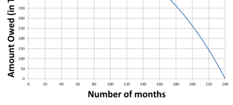
> **[Diagram Context - Textbook_MathematicalLiteracy_Gr12_interest-banking-inflation.pdf-0003-12.png]**
> The image shows a graph with a line that is decreasing over time. The graph is labeled with the number of months on the x-axis and the amount of money owed on the y-axis. The graph is titled "Auction of owed money in months". The graph is a visual representation of the concept of time and money, showing how the amount of money owed decreases over time. The

© Via Afrika ›› Mathematical Literacy Gr 12 

**<mark>Chapter 4</mark> Finance (interest, banking, inflation)** 

### **Factors that reduce the total amount owed** 

The total amount owed over the life of the loan must include both the deposit and the small amount extra that is paid on the final payment: 

Total cost of Loan = Real Cost + Deposit + extra payment 

= R1 884 225,60 + R132 450,00 + (R9 191,36 – R7 850,94) 

= R2 018 016,02 

This total amount owed is affected by certain factors. It can be reduced in several ways by manipulating these factors. The table below shows the effect of these factors on the original example: 

**Factor Effect** Deposit The larger the deposit, the lower the loan amount. Therefore there is less borrowed and thus less interest is paid on the loan. **Scenario** : Instead of paying a 15% deposit, a 20% deposit was paid (R179 000). **Effect:** Loan paid off in 197 months Total cost = 197 × R7 850,94 + R179 000,00 + R955,73 = R1 726 590,91 (a saving of R291 425,11) **Graph:** The original loan is in blue and the higher deposit’s effect is the dotted red line. **Comment:** Due to the lower initial loan amount <u>that graph decreases faster.</u> Interest Rate The lower the interest rate, the lower the amount of interest that is charged on the loan. **Scenario** : The interest rate drops to 10,0% (due to lower interest rates). **Effect:** <u>Loan still paid off in 240 months, but monthly payment is less:</u> 

© Via Afrika ›› Mathematical Literacy Gr 12 

**<mark>Chapter 4</mark> Finance (interest, banking, inflation)** 

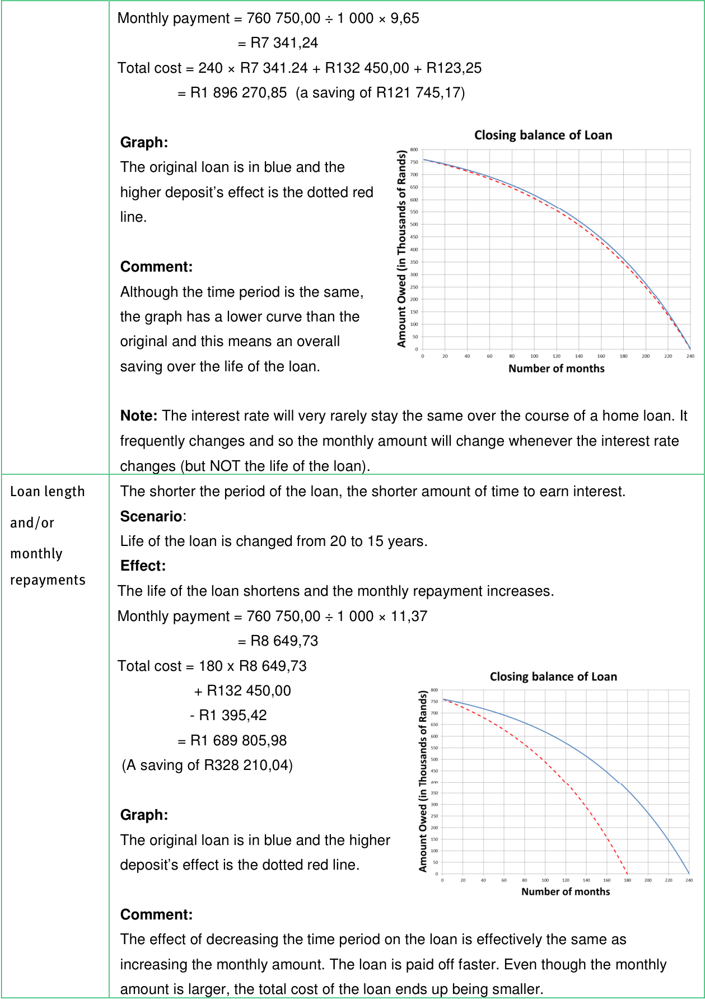
> **[Diagram Context - Textbook_MathematicalLiteracy_Gr12_interest-banking-inflation.pdf-0005-01.png]**
> 1. A graph showing the relationship between the interest rate and the total cost of a loan.

© Via Afrika ›› Mathematical Literacy Gr 12 

**<mark>Chapter 4</mark>** 

**Finance (interest, banking, inflation)** 

## **2. Investments** 

An investment is where money is paid into a fund which then gains interest and increases the value of the original money to the benefit of the investor. This is unlike the loan, where the interest is to the benefit of the bank or loan agent. 

Interest is calculated on the closing balance of the account and paid into the investment on a monthly basis. In this way both the funds invested and the interest earned gather additional interest. 

Two types of investments are analysed in the Learner’s Book: 

- Retirement annuities 

- Stokvels 

## **2.1. Retirement annuities** 

- Money is placed into a special fund. 

- Every month a payment is made to this fund. 

- The fund earns interest and it grows in a compound way. 

- At a certain age (normally at age 65), the investor can draw a monthly payment as an income replacement in their retirement. 

The table below shows a retirement investment where R400,00 per month is invested at a growth rate of 6% p.a.: 

|||**Retiremen**|**t Investment examp**|**le**||
|---|---|---|---|---|---|
|**Month**|**Opening** **Balance**|**Payment**|**Balance with** **payment**|**Interest** **Earned**|**Closing** **balance**|
|1|R0,00|R400,00|R400,00|R2,00|R402,00|
|2|R402,00|R400,00|R802,00|R4,01|R806,01|
|---|---|---|---|---|---|
|360|R401 406,01|R400,00|R401 806,01|R2009,03|R403 815,04|
|---|---|---|---|---|---|
|479|R791 835,11|R400,00|R792 235,11|R3 961,18|R796 196,29|
|480|R796196,29|R400,00|R796 596,29|R3 982,98|R800 579,27|

Note the following: 

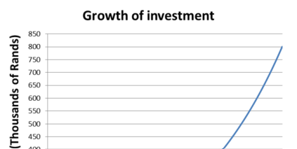
> **[Diagram Context - Textbook_MathematicalLiteracy_Gr12_interest-banking-inflation.pdf-0006-16.png]**
> The image is a graph that shows the growth of investment over time. The x-axis represents time, and the y-axis represents the amount of money invested. The graph shows a curve that starts low and gradually increases over time, indicating a steady growth in investment. The curve peaks at a certain point, suggesting that the investment has reached a significant milestone or a turning point in the growth process

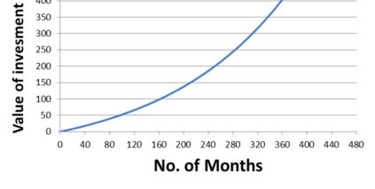
> **[Diagram Context - Textbook_MathematicalLiteracy_Gr12_interest-banking-inflation.pdf-0006-17.png]**
> The image shows a graph with a line that starts at the bottom left corner and goes up to the top right corner. The graph has a value of 350 at the bottom left corner and a value of 440 at the top right corner. The graph also has a value of 350 at the top left corner and a value of 440 at the bottom right corner. The graph has a blue line that goes

- The investment grew to R403 815,04 in the first 30 years (360 months). However, it almost doubled in value 10 years later. The effect of _compound interest_ means that the size of the investment is _increasing at an increasing rate_ . So the earlier you start saving the better! 

- © Via Afrika ›› Mathematical Literacy Gr 12 

**Chapter 4 Finance (interest, banking, inflation)** 

- A total of R192 000,00 was invested over 40 years and it grew to R800 579,27. The value grew simply by investing it wisely. 

## **2.2. Stokvels** 

- A group of people pool their money and make regular contributions to the pool. 

- In a ‘shared investment scheme’ they then either share the pool (and the interest earned) amongst the members or they take turns to withdraw the whole pool (e.g. saving towards Christmas shopping or a holiday or home repair). 

- Another type of stokvel is a ‘shared buying scheme’. Here the group pools their money so that they can buy in bulk and qualify for savings on those bulk purchases (e.g. buying groceries at a trader’s depot where goods are sold in large amounts only). 

- Due to the short term nature of this type of investment there is not usually a large amount of interest earned. For higher interest amounts, the money would need to be invested for a much longer period of time. 

© Via Afrika ›› Mathematical Literacy Gr 12 

**Chapter 4 Finance (interest, banking, inflation)** 

# **Section 2: Inflation** 

### **(LB pages 120-123)** 

## **Overview** 

The content of this section on _Inflation_ , as part of the Finance Application Topic, is drawn from page 58 in the CAPS document. 

As stipulated in the CAPS document, Grade 12 learners need specifically to be able to: 

- interpret and analyse graphs showing changes in the inflation rate over time and understand that a decreasing graph does not necessarily indicate negative inflation (deflation) or a decrease in price. 

- critique situations involving proposed price increases (e.g. salary negotiations, school fee increases). 

## **Contexts and integrated content** 

- Learners need to be able to work in contexts relating to inflation (e.g. salary negotiations, school fee increases, etc.) 

- Graphs are used as sources of information and a resource which needs to be critically analysed. Therefore the skills contained in the Patterns, relationships <u>and representation basic skills topic will becomes necessary.</u> 

## **1. Making sense of graphs showing inflation rates** 

Inflation is the increase in the price of goods over time and is sometimes presented as graphs. 

Remember the following points about calculating inflation: 

- Inflation is calculated from January of one year to January of the next year. 

- Inflation is reported backwards so to calculate the 2007 inflation rate, the values of 2006 and 2007 have to be used. 

- The following calculation is used: 

   - % ���������=^{�ℎ���� �� �����} × 100 �������� ����� 

- Inflation is presented as a percentage in order to compare various years. 

© Via Afrika ›› Mathematical Literacy Gr 12 

**<mark>Chapter 4</mark> Finance (interest, banking, inflation)** 

Consider the following two graphs which show how the price of bread has changed from 2006 to 2012. 

### **Prices of brown bread** 

### **<u>Notes</u>** 

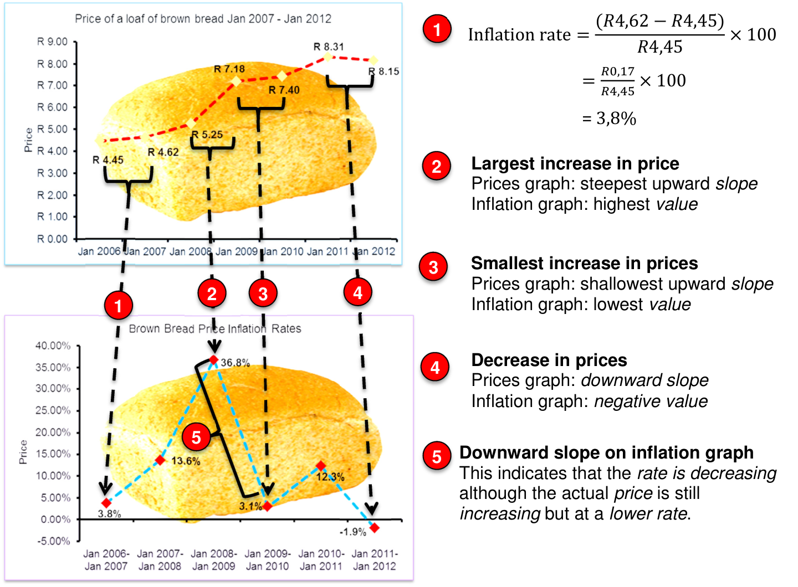
> **[Diagram Context - Textbook_MathematicalLiteracy_Gr12_interest-banking-inflation.pdf-0009-04.png]**
> 1. Inflation rate = R4.65 - R4.45 = 3.55% (calculated)

### **Inflation rates of brown bread** 

## **2. Inflation rates inform salary negotiations** 

The reported inflation rate is calculated as an average increase for a total of 5 000 goods and services, not just one item (e.g. the price of brown bread is only one of the 5 000 items which is averaged). 

© Via Afrika ›› Mathematical Literacy Gr 12 

**Chapter 4 Finance (interest, banking, inflation)** 

## **Example** 

A person earns R16 750,00 per month and has the following living expenses: 

|**Expense Item**|**Previous monthly cost**|**Current monthly cost**|**Inflation**|
|---|---|---|---|
|Transport(petrol)|R1800,00|R2300,00|27,78%|
|Groceries|R3450,00|R3 600,00|4,35%|
|Medical Aid Insurance|R1875,00|R2062,00|9,97%|
|Car Insurance|R427,30|R427,30|0,00%|
|Electricity|R620,00|R660,00|6,45%|
|Clothing|R500,00|R580,00|16,00%|
|Accommodation rental|R3200,00|R3 520,00|10,00%|
|**0Total**|**R11872,30**|**R13 149,30**|**10,76%**|

This person will receive an annual salary increase of 7,5%. This is a little better than the national inflation rate (currently 6% p.a.). Has the financial position of this person stayed the same, improved or worsened? 

### **Answer:** 

Salary increase = 7,5% of R16 750,00 = R1 256,25 

Increase in living expenses = R13 149,30 – R11 872,30 = R1 277,00 

Therefore we can say that the financial situation has remained approximately the same (the difference of R19,75 is not significant) 

To cover the increased costs exactly, what percentage increase would this person actually need? 

### **Notes:** 

- The inflation of the expenses does not mean that the salary must increase by the same amount. Rather, it would depend on their _original salary_ . For example, if their original salary was R15 000,00 then they would have needed an 8,5% increase to maintain their financial position. 

- Inflation therefore affects poorer people worse than richer people. 

- If all of the inflation percentages of the listed items were averaged ((27,78% + 4,35% + 9,97% + 0,0% + 6,45% + 16,0% + 10,0%) ÷ 7 = 10,65% we see that this is different from the overall reported average of 10,76%. This is due to each item having a different starting total with some larger than the others. 

© Via Afrika ›› Mathematical Literacy Gr 12 

**<mark>Chapter 4</mark> Finance (interest, banking, inflation)** 

# **Additional questions** 

1.  A person would like to buy the car alongside. The bank is offering a loan at the terms listed. 

   - 1.1 Calculate the value of the deposit. 

   - 1.2 Calculate the loan amount once the deposit has been taken into account. 

   - 1.3 Using your answer from Question 1.2 and the following table of loan factors calculate the monthly payment. 

> **[Diagram Context - Textbook_MathematicalLiteracy_Gr12_interest-banking-inflation.pdf-0011-06.png]**
> 1. A white car with a license plate that reads "SOCA".

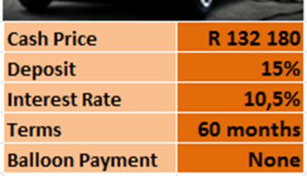
> **[Diagram Context - Textbook_MathematicalLiteracy_Gr12_interest-banking-inflation.pdf-0011-07.png]**
> 1. A table with columns for Cash Price, R, Deposits, Interest Rate, Terms, 60 months, and Balloon payment.

- Monthly payment = loan amount^{÷} 1 000 ×loan factor 

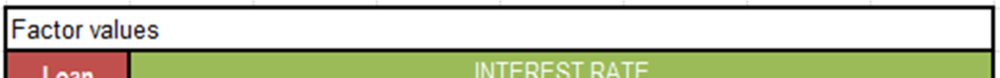
> **[Diagram Context - Textbook_MathematicalLiteracy_Gr12_interest-banking-inflation.pdf-0011-09.png]**
> 1. A diagram of a cell with arrows pointing to different parts of the cell.

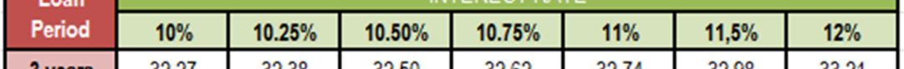
> **[Diagram Context - Textbook_MathematicalLiteracy_Gr12_interest-banking-inflation.pdf-0011-10.png]**
> The image shows a spreadsheet with a grid of numbers and text. The spreadsheet is titled "Loan Period" and is divided into two columns. The first column contains numbers and text, while the second column has a red border. The numbers in the spreadsheet range from 10.25 to 10.75, and the text includes the words "Loan" and "Period". The spreadsheet is

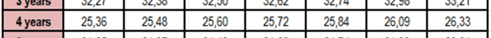
> **[Diagram Context - Textbook_MathematicalLiteracy_Gr12_interest-banking-inflation.pdf-0011-11.png]**
> The image shows a table with a line of numbers and text. The table is divided into columns and rows, with the numbers and text arranged in a grid-like pattern. The numbers are in a range of 25 to 26, and the text includes the words "4 years", "25.38", "26.73", "26.9", "27.0", "27.

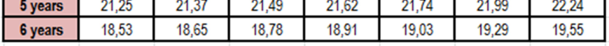
> **[Diagram Context - Textbook_MathematicalLiteracy_Gr12_interest-banking-inflation.pdf-0011-12.png]**
> The image shows a table with the years from 5 to 20 years, with each year represented by a row and a column. The table is colored in pink and white, with the years in pink and the corresponding years in white. The table displays the number of years from 5 to 20, with each row representing a year and each column representing a number of years. The table is organized in a

- 1.4 Using your answer to Question 1.3, calculate the total amount that will be paid to the bank for the car. 

- 1.5 Using the answer to Question 1.4, calculate the total interest paid to the bank. 

© Via Afrika ›› Mathematical Literacy Gr 12 

**<mark>Chapter 4</mark>** 

**Finance (interest, banking, inflation)** 

2. A person bought a house for R770 000,00 and obtained a home loan from a bank in order to pay for it. The loan period was 240 months. The progressive closing balance is shown in the graph below: 

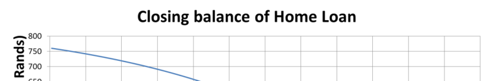
> **[Diagram Context - Textbook_MathematicalLiteracy_Gr12_interest-banking-inflation.pdf-0012-03.png]**
> The image is a graph that shows the relationship between the closing balance of home loans and the interest rate. The graph shows that as the interest rate increases, the closing balance of home loans also increases. The graph is a line graph with the x-axis labeled "Interest Rate" and the y-axis labeled "Closing Balance of Home Loans". The graph shows a positive relationship between the two

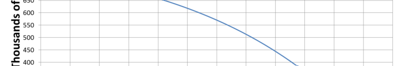
> **[Diagram Context - Textbook_MathematicalLiteracy_Gr12_interest-banking-inflation.pdf-0012-04.png]**
> The image shows a line graph with a blue line that is curved to the right. The graph is set against a gray background. The x-axis of the graph is labeled "thousands of", and the y-axis is labeled "millions of". The graph is labeled with the title "Millions of" at the top. The graph is labeled with the variable "millions"

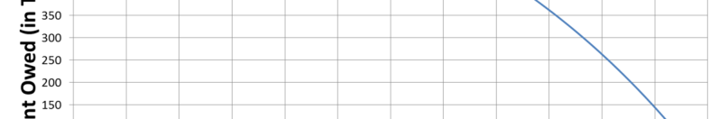
> **[Diagram Context - Textbook_MathematicalLiteracy_Gr12_interest-banking-inflation.pdf-0012-05.png]**
> The image shows a line graph with a blue arrow pointing to the right. The graph is set against a gray background. The x-axis of the graph is labeled "towards" and the y-axis is labeled "in". The graph is labeled with the number "100". The graph is labeled with the word "Owed" at the bottom. The graph is labeled with the

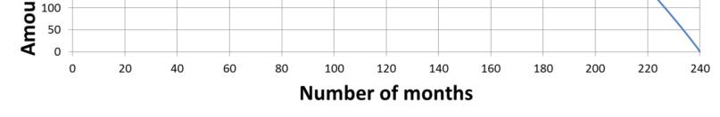
> **[Diagram Context - Textbook_MathematicalLiteracy_Gr12_interest-banking-inflation.pdf-0012-06.png]**
> The image shows a line graph with a number of months represented on the x-axis and a number of cells represented on the y-axis. The graph is labeled with the number of months and the number of cells. The graph is a simple, straightforward representation of the relationship between the number of months and the number of cells. The graph is not labeled with any units or units of measurement,

   - 2.1 Why does the graph curve? (as opposed to being a straight line) 

   - 2.2 What would the graph look like if: 

      - 2.2.1 The amount borrowed was R450 000? 

      - 2.2.2 The person had paid a deposit of R220 000? 

      - 2.2.3 The person paid an extra R1 000 into the home loan every month? 

      - 2.2.4 The interest rate (at which the money was borrowed) decreased by 2% p.a. after 60 months (but they still carried on paying the same monthly amount)? 

3.  The South African consumer price inflation was recorded as follows: 

   - **2007:** 7,6% **2008:** 9,4% **2009:** 6,0% **2010:** 3,4% 

   - 3.1 Assuming that the price of computers increased according to inflation, calculate what a basic computer should have cost in 2010 if it cost R5 000 in 2006. 

   - 3.2 A basic computer actually cost R4 200 in 2010. 

      - 3.2.1 Does this mean that the inflation figures are wrong? Give a reason for your answer. 

      - 3.2.2 Why did computer prices decrease over this period when food prices rose dramatically over the same period? 

© Via Afrika ›› Mathematical Literacy Gr 12 

**<mark>Chapter 4</mark>** 

**Finance (interest, banking, inflation)** 

4. Below is a graph which shows the inflation rate for various years. Use it to answer the questions which follow: 

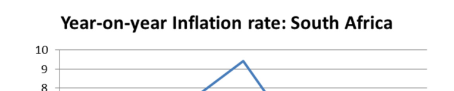
> **[Diagram Context - Textbook_MathematicalLiteracy_Gr12_interest-banking-inflation.pdf-0013-03.png]**
> The image shows a graph titled "Year-on-year Inflation Rate: South Africa" with a line graph depicting the inflation rate in South Africa over the past year. The graph is labeled with the year and the inflation rate, and there is a blue triangle with a line through it, which is a common symbol used to represent the inflation rate. The graph is set against a gray background

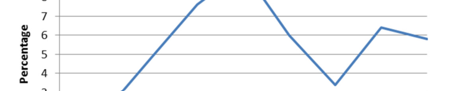
> **[Diagram Context - Textbook_MathematicalLiteracy_Gr12_interest-banking-inflation.pdf-0013-04.png]**
> The image shows a line graph with a blue line and a white x-axis. The graph is labeled with the word "Percentage" and has a line that starts at the bottom left corner and goes up to the top right corner. The x-axis is labeled with numbers from 0 to 100, and the y-axis is labeled with the word "Percentage" as well. The

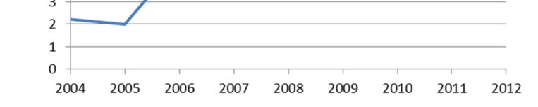
> **[Diagram Context - Textbook_MathematicalLiteracy_Gr12_interest-banking-inflation.pdf-0013-05.png]**
> The image is a graph that shows the number of students in a class over the years. The x-axis of the graph shows the years from 2004 to 2012, and the y-axis shows the number of students. The graph shows a downward trend in the number of students over the years. The graph is color-coded, with blue representing the year 2006 and green representing the year 2007.

- 4.1 Felicia looks at the graph and says: “Prices dropped from 2008 to 2010”. She is incorrect. What is actually happening between 2008 and 2010? 

- 4.2 What would the graph look like if there was an overall decrease in prices in a year? 

- 4.3 Miriam received an annual increase of 6% in her salary every year from 2004 to 2008. She went on strike in 2008 for a greater increase. Why did she do this? 

© Via Afrika ›› Mathematical Literacy Gr 12 

**<mark>Chapter 4</mark> Finance (interest, banking, inflation)** 

# **Answers** 

- 1 1.1 15% of R132 180 = R19 827,00 

   - 1.2 Loan amount = cash price – deposit = R132 180 – R19 827 = R112 353 

   - 1.3 Loan factor = 21,49 (the value for 10,5% for 5 years) 

      - Monthly amount = R112 353^{÷} 1 000 × 21,49 = R2 414,47 

   - 1.4 Total Amount = Deposit + Total of all monthly amounts + balloon payment 

               - = R19 827 + R2 414,47 × 60 + R0 

               - = R19 827 + R144 868,20 + R0 = R164 695,20 

   - 1.5 Interest = Total Amount paid – Cash amount 

            - = R164 695,20 – R132 180 

         - = R32 515,20 

- 2 2.1 The amounts being deducted each month are not constant as would be the case with a straight line. Instead they are increasing monthly, hence the graph is getting steeper as it goes along. 

   - 2.2 2.2.1 It would start lower down, but it would still end 240 months later as the terms of the loan would still be 20 years. Like this: 

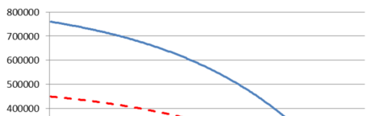
> **[Diagram Context - Textbook_MathematicalLiteracy_Gr12_interest-banking-inflation.pdf-0014-14.png]**
> The image is a graph that shows the relationship between two variables, with a line graph and a bar graph. The x-axis is labeled "Time" and the y-axis is labeled "Voltage". The line graph shows a decrease in voltage over time, while the bar graph shows a decrease in voltage over a period of time. The x-axis is labeled "Time" and

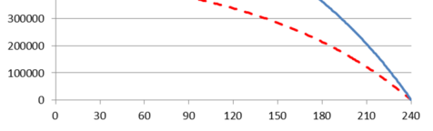
> **[Diagram Context - Textbook_MathematicalLiteracy_Gr12_interest-banking-inflation.pdf-0014-15.png]**
> The image is a graph that shows the relationship between two variables, with a line graph and a bar graph. The x-axis is labeled with the variable "x" and the y-axis is labeled with the variable "y". The line graph shows a downward trend, while the bar graph shows a positive trend. The graph is set against a gray background.

- 2.2.2 If they paid a deposit of R220 000, then the amount owed would be R550 000 and so the graph would look very similar to 2.2.1. 

However, if they agreed to the terms and then in the first month they paid in an extra R220 000 then the graph would look like this (but only if they paid the original monthly instalments): 

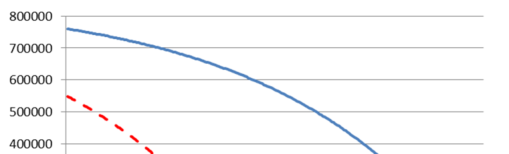
> **[Diagram Context - Textbook_MathematicalLiteracy_Gr12_interest-banking-inflation.pdf-0014-18.png]**
> The image is a graph that shows the relationship between two variables, with a line graph and a bar graph. The x-axis is labeled "Time" and the y-axis is labeled "Voltage". The line graph shows a decrease in voltage over time, while the bar graph shows a decrease in voltage over time. The graph is set against a gray background, and there is a

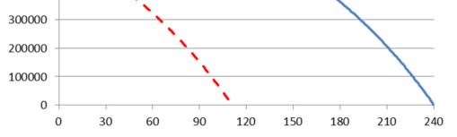
> **[Diagram Context - Textbook_MathematicalLiteracy_Gr12_interest-banking-inflation.pdf-0014-19.png]**
> The image is a graph that shows the relationship between two variables, with a line graph and a bar graph. The x-axis is labeled with the variable "x" and the y-axis is labeled with the variable "y". The line graph shows a decreasing trend, while the bar graph shows a constant value. The graph is set against a gray background.

- © Via Afrika ›› Mathematical Literacy Gr 12 

**<mark>Chapter 4</mark> Finance (interest, banking, inflation)** 

- 2.2.3 The graph would start from the same place, but it would decrease much faster, like this: 

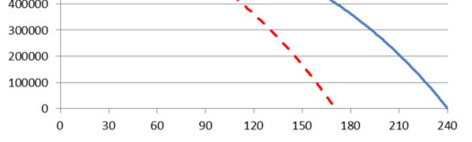
> **[Diagram Context - Textbook_MathematicalLiteracy_Gr12_interest-banking-inflation.pdf-0015-02.png]**
> The image shows a graph with a line and a red line on it. The line is labeled "40,000" and the red line is labeled "150". The graph is set against a gray background. The graph is labeled with the title "40,000" and the x and y axes are labeled with the title "150". The graph is labeled with the title "Graph of 150

- 2.2.4 The new graph will follow the original graph until 60 months and then it will drop more steeply as the loan is being paid off faster than the bank’s original calculated monthly amount. 

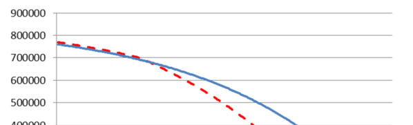
> **[Diagram Context - Textbook_MathematicalLiteracy_Gr12_interest-banking-inflation.pdf-0015-04.png]**
> The image is a line graph that shows the number of students in a class over time. The x-axis shows the time period, and the y-axis shows the number of students. The graph shows a decrease in the number of students over time, with a blue line indicating the decrease and a red line indicating the increase. The graph is labeled with the title "Number of students in a

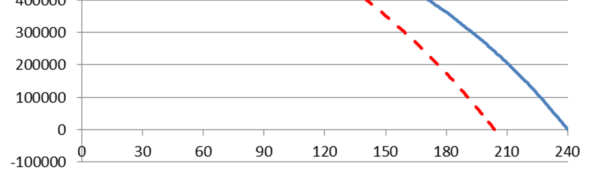
> **[Diagram Context - Textbook_MathematicalLiteracy_Gr12_interest-banking-inflation.pdf-0015-05.png]**
> The image is a graph that shows the relationship between two variables, with a line graph and a bar graph. The x-axis is labeled with the variable "x" and the y-axis is labeled with the variable "y". The graph shows a line that is decreasing from left to right, and a bar graph that is increasing from left to right. The graph has a red line that

- 3 3.1 2006: R5 000 

   - 2007: R5 000 + 7,6% of R5 000 = R5 380 

2008: R5 380 + 9,4% of R5 380 = R5 885,72 

2009: R5 885,72 + 6,0% of R5 885,72 = R6 238,86 

2010: R6 238,86 + 3,4% of R6 238,86 = R6 450,98 

   - 3.2 3.2.1 No. The inflation percentage is calculated on a basket of goods and not one single item. Some of the items in the basket of goods will increase while some will decrease in price. 

      - 3.2.2 The manufacturing cost of computers decreased over this time while food became more expensive to produce. 

- 4 4.1 The inflation rate is decreasing during that time. This means that prices still increased, but at a lower rate than before. 

   - 4.2 The inflation rate would be negative and so the graph would register negative values. 

   - 4.3 In order for Miriam to maintain her standard of living, her increase in salary would need to be larger than the inflation rate. This was not the case. 

© Via Afrika ›› Mathematical Literacy Gr 12 

