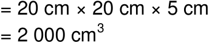
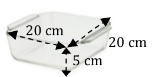
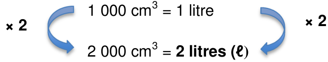
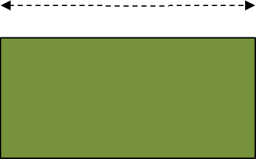
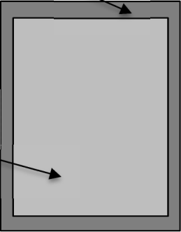
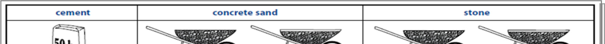

**Chapter 1 Measurement (conversions, time)** 

# **Section 1: Conversions** 

### **(LB pages 18-21)** 

## **Overview** 

_Conversions_ , is part of the Measurement Topic. The content and specific skills associated with working with this section are drawn from pages 62-63 in the CAPS document. 

As stipulated in the CAPS document, Grade 12 learners need specifically to be able to: 

- convert between different  systems of measurement, e.g. solid to liquid conversions, including: 

   - → g and/or kg to ml and/or litres 

   - → cm^{2} and m^{2} to litres 

   - → mm^{3} , cm^{3} and m^{3} to ml and litres. 

- express ratios in different formats and use them to determine missing amounts (from the Basic Skills Section). 

## **Contexts and integrated content** 

- Learners need to be able to work in the context of complex projects in both familiar and unfamiliar contexts (e.g. _determining quantities of materials needed to build an RDP house_ ). 

- Calculations involving conversions, especially between different systems, use the concept of _rates_ as found in the Basic Skills Topic on Numbers and calculations with numbers. 

## **1. Calculated volume to liquid volume conversions** 

- In everyday life volume is expressed in litres. 

- When volume is calculated it is usually in cubic units (cm^{3} , mm^{3} , m^{3} ). 

- • Conversions between these two formats will always be given: 1 cm^{3} = 1 ml, 1 ℓ = 1 000 ml , 1 m^{3} = 1 kl 

© Via Afrika ›› Mathematical Literacy Gr 12 

**<mark>Chapter 1</mark> Measurement (conversions, time)** 

## **Example** 

The container alongside is roughly in the shape of a rectangular box. Therefore its volume = _l_ × _b_ × _h_ 

> **[Diagram Context - Textbook_MathematicalLiteracy_Gr12_conversions-&-time.pdf-0002-03.png]**
> The image shows a diagram of a cell with a label for the cell's organelles. The diagram also includes a label for the cell's organelles and a label for the cell's organelles. The diagram also includes a label for the cell's organelles and a label for the cell's organelles. The diagram also includes a label for the cell's organell

> **[Diagram Context - Textbook_MathematicalLiteracy_Gr12_conversions-&-time.pdf-0002-04.png]**
> 1. A diagram of a glass dish with measurements of 20 cm x 20 cm x 5 cm.

Using the conversions 1 cm^{3} = 1 ml and 1 000 ml = 1 ℓ: 

> **[Diagram Context - Textbook_MathematicalLiteracy_Gr12_conversions-&-time.pdf-0002-06.png]**
> The image shows a diagram of a cell with a blue arrow pointing to the right, indicating the direction of a flow. The diagram also includes a blue arrow pointing to the left, suggesting the flow is coming from the cell. The diagram is labeled with the text "1.000 cm3 = 1.1 litre" and "2.000 cm3 = 2.1 litre".

## **2. Calculated area to liquid volume conversions** 

- Area is calculated in square units (cm^{2} , mm^{2} , m^{2} ). 

- To calculate the volume of paint or other liquid needed to cover a surface, we use a spread rate. This tells us how much area a litre of paint (or other liquid) can cover. The spread rate will always be given (e.g. 7 m^{2} per litre). 

- The spread rate depends on: 

   - the type and thickness of the paint (or other liquid) 

   - the texture (roughness) of the surface to be covered 

   - how absorptive the surface to be covered is. 

## **Example** 

A weed pesticide states that it requires 60 ml of concentrate for 100 m^{2} of land area. What volume of pesticide will be required to treat the area alongside? 

Area  = length × breadth 

= 20 m × 12 m = 240 m^{2} 

20 m 

Pesticide required: 60 ml : 100 m^{2} **× 2,4 × 2,4 (÷ 100 × 240) 144 ml:** 240 m^{2} 

© Via Afrika ›› Mathematical Literacy Gr 12 

**<mark>Chapter 1</mark> Measurement (conversions, time)** 

## **3. Other useful building conversions** 

- The ratios are always given. They can be given in two ways: Visually: 

> **[Diagram Context - Textbook_MathematicalLiteracy_Gr12_conversions-&-time.pdf-0003-03.png]**
> 1. A diagram of a cell with the words "concrete sand" and "stone" written on it.

> **[Diagram Context - Textbook_MathematicalLiteracy_Gr12_conversions-&-time.pdf-0003-04.png]**
> 1. A diagram of a wheel and axle.

> **[Diagram Context - Textbook_MathematicalLiteracy_Gr12_conversions-&-time.pdf-0003-05.png]**
> 1. A diagram of a bag of flour.

or, in a ratio: 

> **[Diagram Context - Textbook_MathematicalLiteracy_Gr12_conversions-&-time.pdf-0003-07.png]**
> The image shows a diagram of a concrete wall. The diagram is divided into three sections, with the leftmost section labeled "cement", the middle section labeled "concrete sand", and the rightmost section labeled "stone". The diagram also includes a list of labels, such as "cement", "concrete sand", and "stone", as well as a list of variables, such

> **[Diagram Context - Textbook_MathematicalLiteracy_Gr12_conversions-&-time.pdf-0003-08.png]**
> 1. A diagram of a cell with a Lewis structure.

> **[Diagram Context - Textbook_MathematicalLiteracy_Gr12_conversions-&-time.pdf-0003-09.png]**
> The image shows a line graph with a horizontal line and a series of data points. The x-axis is labeled with the numbers 1 through 6, and the y-axis is labeled with the numbers 2 through 6. The data points are evenly spaced along the x-axis, and the y-axis is evenly spaced along the y-axis. The graph is a simple, straightforward representation of

- Both representations show the same ratio. However the visual one is easier to access for large volumes where a builder is using a wheelbarrow (e.g. pouring concrete for a floor), while the number ratio is for smaller volumes (e.g. pouring concrete for a small step). 

## **Example** 

Using the above ratios, how much stone will be required to mix with ψ a bag of cement? (Note: 1 bag of cement has a volume of 35 litres.) 

Using the pictorial version:  1 bag mixes with 1 � wheelbarrows of stone. 

So 1 bag mixes with 1,25 wheelbarrows of stone. So ψ a bag will need ψ × 1,25 = **0,625 wheelbarrows.** Using the ratio version: 1 part of cement mixes with 2ψ parts of stone. ψ bag of cement = ψ × 35 litres = 17,5 litres of cement. 17,5 litres cement will need 17,5 × 2,5 = **43,75 litres stone.** 

**Which is better?** 0,625 wheelbarrows seems a rather difficult amount to measure. However a normal bucket often holds about 5ℓ. So 43,75 litres is approximately 9 buckets in volume. 

For smaller amounts, it seems better to use the ratio, however if there were 3  bags of cement it would be much faster to measure the sand and stone with a wheelbarrow! 

© Via Afrika ›› Mathematical Literacy Gr 12 

**Chapter 1 Measurement (conversions, time)** 

# **Section 2: Working with travel timetables and tide** 

# **tables** 

### **(LB pages 22-27)** 

## **Overview** 

The content of this section on _Working with travel timetables and tide tables_ , as part of the Measurement Topic, is drawn from pages 53-54 in the CAPS document. The specific skills associated with working with time are described on pages 62-63 of the CAPS document. 

As stipulated in the CAPS document, Grade 12 learners need specifically to be able to: 

- read, record and perform calculations involving time values, including: → timetables, transport timetables and tide timetables. 

## **Contexts and integrated content** 

- Learners need to be able to work in the context of complex projects in both familiar and unfamiliar contexts (e.g. _Timetable for a road trip or ferry ride_ ). 

- Calculations involving timetables are also used in the topic _Maps, plans and other representations of the physical world_ in order to plan journeys. 

The table below shows a comparison of the different types of time-based resources that can be used to plan a journey. These are dealt with in Section 2 in the Learner’s Book: 

|**Travel Timetable**|**Route Map**|**Fare Table**|**Tide Timetable**|
|---|---|---|---|
|**Purpose:**|**Purpose:**|**Purpose:**|**Purpose:**|
|To show the departure|To show the|To show the price of the|To show the times of the|
|and arrival times of|stations/stops on|various travel options|high and low tides at a|
|trains; buses; trams;|several routes in a|(e.g. single, return,|seaside location|
|ferries|pictorial way.|weekly or monthly tickets)||

© Via Afrika ›› Mathematical Literacy Gr 12 

**Chapter 1 Measurement (conversions, time)** 

|**Feat**|**ures:**|**Features:**|**Features:**|**Features:**|
|---|---|---|---|---|
|•|Identifies the stations/stops on a specific route|• Shows several routes in different colours or types of|• Often shows the stations/stops in the order that they|• Shows the times of the high and low tides for a |
|•|Identifies the times of departure & arrival at those stops|lines (e.g. dotted vs. solid lines) so that alternatives can be analysed.|occur with the relevant prices next to them • Shows the different|port/beach. • Specific to each port (ports in another area will h diff|
|•|Identifies limitations of the route (e.g. only Mon - Fri)|• Sometimes shows the distance between stations/stops|price options for single, return, weekly and monthly tickets|ave erent times)|
|•|Platforms/train numbers for a route.|• Shows places of interest/transport interchanges and other useful information|||
|**Limi**|**tations:**|**Limitations:**|**Limitations:**|**Limitations:**|
|•|Only shows certain routes|• Does not show times|• Shows very limited route information|• Only useful for craft on water|
|•|Does not show all possible routes to get to a station/stop|• Does not show which stations are missed out • Often does not show when a route is operating (e.g. Mon - Fri only) • Sometimes it gives the accurate distance between stations/stops, but not all the time|(usually only the order of stations/stops)|• Times are specific to that port (e.g. times from New York cannot be used for Cape Town).|

## **Example** 

A full, integrated example which uses the resources mentioned in this section is explored in Chapter 5. Each of the resources mentioned above are explored in the additional questions below. 

© Via Afrika ›› Mathematical Literacy Gr 12 

**<mark>Chapter 1</mark> Measurement (conversions, time)** 

# **Additional questions** 

1.  The foundation of an outside room is being laid. It is pictured alongside. The volume of concrete required for the wall foundation is 2,7 m^{3} and the volume of concrete required for the floor is 3 m^{3} . 

   - 1.1 The floor requires a medium-strength concrete mixture. On the bag of cement it states that 7,7 bags of cement are required for 1  m^{3} of concrete. How many whole bags of Floor: cement are required for the floor? Volume = 3 m 

Floor: Volume = 3 m^{3} 

- 1.2 The wall foundation requires low strength concrete which is mixed as follows: 

Wall Foundation: Volume = 2,7 m^{3} 

> **[Diagram Context - Textbook_MathematicalLiteracy_Gr12_conversions-&-time.pdf-0006-07.png]**
> 1. A diagram of a cell with arrows pointing to different parts of the cell.

> **[Diagram Context - Textbook_MathematicalLiteracy_Gr12_conversions-&-time.pdf-0006-08.png]**
> 1. A diagram of a cell with arrows pointing to different parts of the cell.

> **[Diagram Context - Textbook_MathematicalLiteracy_Gr12_conversions-&-time.pdf-0006-09.png]**
> 1. A diagram of a wheelbarrow with a diagram of a wheel and axle.

   - 5,8 bags of cement are required to make 1 m^{3} of low strength concrete. 

   - 1.2.1 Calculate the total number of full wheelbarrows of stone that will be required for the wall foundation. Round your answer to the nearest full wheelbarrow. 

   - 1.2.2 A normal wheelbarrow can hold 65^{ℓ} . Use your answer to Question 1.2.1 to calculate how many m^{3} of stone will need to be purchased for the wall foundation. Remember that 1 m^{3} = 1 kl. Round off to 1 decimal place. 

- 1.3 Using the information from the previous questions, how many bags of cement will need to be bought in total to complete the floor and wall foundations? Show all working. 

- 1.4 The floor is going to be painted with special floor paint. The floor area is 30 m^{2} . The spread rate of floor paint is given as 1^{ℓ} covers 11 m^{2} . 

Floor paint is sold in 5^{ℓ} tins for R449,00 per tin. Calculate the total cost of paint required to paint the floor with 2 coats. 

© Via Afrika ›› Mathematical Literacy Gr 12 

**Chapter 1 Measurement (conversions, time)** 

2. Use the picture of the concrete ratio from Question 1.2 and the information below to answer the following question: 

   - 1 bag(bucket) of cement = 33,2^{ℓ} 1 wheelbarrow = 65^{ℓ} 

   - Use the picture of the concrete mixture quantities to complete the following ratio: 1 bucket of cement  : ….. buckets of sand  : ….. buckets of stone 

3. While on holiday in Greece, a family is staying in a town called Kavos on the island of Corfu. They would like to have an outing to the small island of Paxoi which lies to the south of Corfu. The following is a portion of the hydrofoil ferry timetable for the trip between Corfu and Paxoi: 

|**Days**|**Kerkira (Corfu) – Paxoi**|**Paxoi – Kerkira (Corfu)**|
|---|---|---|
|Monday|8:20 - 14:45 - 18:00|7:00 - 9:45 - 16:15 - 19:15|
|Tuesday|6:45 - 14:30|8:00|
|Wednesday|9:30|8:00 - 17:30|
|**Duration**|**55 minutes**||
|**Price**|**€ 17,00**||

- 3.1 What is the name of the port that the ferries leave from in Corfu? 

- 3.2 At what times do the ferries leave on a Monday from Corfu? 

- 3.3 At what times to the ferries leave on a Monday from Paxoi? 

- 3.4 What time will a ferry arrive in Paxoi if it leaves at 8:20 from Corfu? 

- 3.5 The family consists of 5 members (Mom, Dad and 3 children). How much will the trip to Paxoi cost them in total? 

- 3.6 The family would like to spend at least 4 hours on the island of Paxoi before travelling back to Corfu on the same day. If they take the 14:45 ferry on Monday from Corfu, will they be able to spend enough time on Paxoi before having to return on the same day? Show all working. 

- 3.7 The family intends to catch the 8:20 ferry on Monday. It is approximately 48 km from Kavos to the ferry terminal. They will only be able to travel at an average speed of 40 km/h. What is the latest that they will have to leave their hotel if they are to arrive with enough time to buy tickets and get on the ferry? Show all working. 

© Via Afrika ›› Mathematical Literacy Gr 12 

**Chapter 1 Measurement (conversions, time)** 

# **Answers** 

1. 1.1 The floor requires 3 m^{3} of concrete. Therefore the number of bags of cement = 3 × 7,7 bags = 23,1 bags ≈ 24 bags **.** 

   - 1.2 1.2.1 1,75 wheelbarrows of stone are required for every 1 bag of cement. Therefore no. of wheelbarrows 

         - = 2,7 m^{3} × 5,8 bags of cement × 1,75 = 27,405 ≈ 27 wheelbarrows full 

      - 1.2.2 Total litres = 65^{ℓ} × 27 = 1 755^{ℓ} = 1,755 k^{l} ≈ 1,8 m^{3} 

   - 1.3 Floor = 23,1 bags 

Wall foundation = 2,7 m^{3} × 5,8 bags = 15,66 bags. 

Total bags of cement required = 23,1 + 15,66 = 38,76 ≈ 39 bags 

(note that in this case we only round off at the end of the calculation). 

- 1.4 The total area to be painted = 2 × 30 m^{2} (for two coats) = 60 m^{2} . Volume of paint required = 60 m^{2 ÷} 11 m^{2} /^{ℓ} = 5,45^{ℓ} 

Even though this amount is more than 5 litres, only 1 tin would need to be bought as it is very close to 1 tin. So the total cost is R449,00. 

2. 1 bag of cement = 33,2^{ℓ} 1,75 wheelbarrows of sand = 1,75 × 65^{ℓ} = 113,75^{ℓ} 

So the ratio of cement : sand : stone = 33,2^{ℓ} : 113,75^{ℓ} : 113,75^{ℓ} = 1 bucket : 3,4 buckets : 3,4 buckets 

(after dividing the first number in the ratio by itself, we need to divide every other number in the ratio by the same value.) 

3. 3.1 Kerkira 

   - 3.2 8:20, 14:45, 18:00 

   - 3.3 7:00, 9:45, 16:15, 19:15 

   - 3.4 There is a travel time of 55 minutes, so the arrival time will be: 8:20 + 0:55 = 9:15 

   - 3.5 Total cost = 17 Euros × 5 people =^{€} 85 

   - 3.6 Arrival in Paxoi = 14:45 + 0:55 = 15:40. Latest departure is 19:15 on a Monday. Therefore total time available = 19:15 – 15:40 = 3 hours 35 minutes. They will not have enough time on the island. They will have to take an earlier ferry to Paxoi. 

   - 3.7 Time to get to Kerkira = 48 km^{÷} 40 km/h = 1,2 hours = 1 hour 12 minutes. They will need to be there at least half an hour before the departure, therefore their latest departure time is: 8:20 – 1:12 – 0:30 = 6:38 

© Via Afrika ›› Mathematical Literacy Gr 12 

